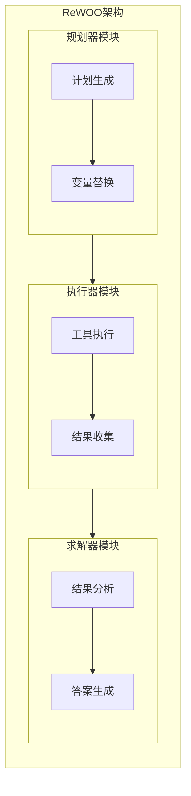
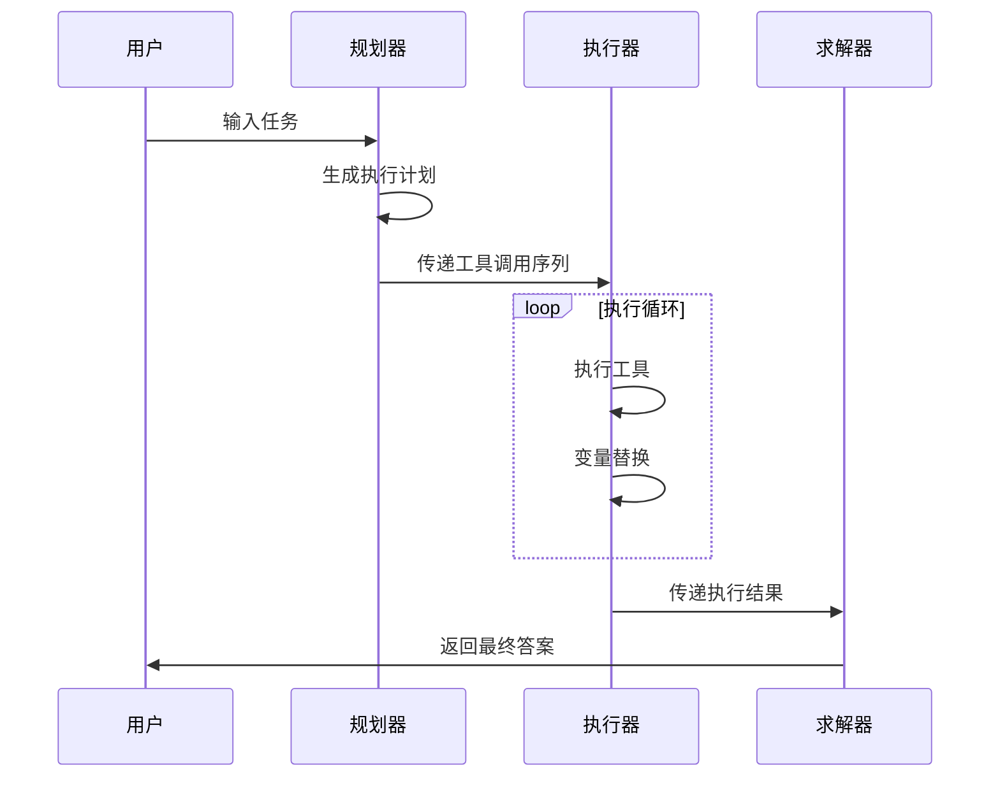

# 5.4.5 推理而不观察（ReWOO）在规划中的应用

## 核心概念

ReWOO（Reasoning Without Observation）是一种结合多步规划和变量替换的智能体架构，旨在提高工具使用的效率。它通过单次遍历生成完整工具链，减少令牌消耗和执行时间，同时简化微调过程。

## 问题背景

传统的ReACT风格代理架构在每个推理步骤都需要多次LLM调用，并且包含冗余的前缀（系统提示和前一步骤），这导致了较高的计算开销和执行时间。此外，由于规划数据依赖于工具的输出，模型的微调过程也比较复杂。

## 系统架构

ReWOO由三个核心模块组成：



1. 规划器（Planner）：
    - 生成具有以下格式的执行计划：
   ```
   Plan: <推理过程>
   #E1 = Tool[工具参数]
   Plan: <推理过程>
   #E2 = Tool[带有#E1变量替换的工具参数]
   ...
   ```

2. 执行器（Worker）：
    - 使用提供的参数执行工具
    - 收集工具执行结果

3. 求解器（Solver）：
    - 基于工具观察结果生成最终答案
    - 整合多步执行结果

## 工作流程



## 优势与创新

1. 效率提升：
    - 通过单次遍历生成完整工具链
    - 减少重复的LLM调用
    - 避免冗余的上下文传递

2. 简化微调：
    - 规划数据不依赖工具输出
    - 可以在不实际调用工具的情况下进行模型微调

3. 变量替换机制：
    - 支持跨步骤的数据传递
    - 实现工具调用之间的依赖关系

## 实现示例

```python
class ReWOO(TypedDict):
    task: str
    plan_string: str
    steps: List
    results: dict
    result: str

def get_plan(state: ReWOO):
    """生成执行计划"""
    task = state["task"]
    result = planner.invoke({"task": task})
    matches = re.findall(regex_pattern, result.content)
    return {"steps": matches, "plan_string": result.content}

def tool_execution(state: ReWOO):
    """执行工具调用"""
    _step = _get_current_task(state)
    _, step_name, tool, tool_input = state["steps"][_step - 1]
    _results = (state["results"] or {}) if "results" in state else {}
    for k, v in _results.items():
        tool_input = tool_input.replace(k, v)
    # 执行具体工具
    result = execute_tool(tool, tool_input)
    _results[step_name] = str(result)
    return {"results": _results}
```

## 应用场景

1. 复杂查询任务：
    - 多步信息检索
    - 结果关联分析

2. 工具链调用：
    - API调用序列
    - 数据处理流程

3. 任务规划：
    - 步骤分解
    - 依赖管理

## 最佳实践

1. 规划设计：
    - 明确定义工具接口
    - 合理设计变量替换规则
    - 优化执行顺序

2. 错误处理：
    - 实现回滚机制
    - 添加重试策略
    - 完善异常处理

3. 性能优化：
    - 缓存中间结果
    - 并行化执行
    - 减少不必要的工具调用

## 未来展望

1. 技术演进：
    - 支持更复杂的变量替换
    - 增强规划能力
    - 提升执行效率

2. 应用拓展：
    - 集成更多类型的工具
    - 支持更复杂的场景
    - 增强与其他系统的互操作性

## 本章小结

ReWOO作为一种创新的规划模式，通过结合多步规划和变量替换，有效提升了AI Agent的工具使用效率。其单次遍历生成完整工具链的方式，不仅降低了计算开销，还简化了模型微调过程。这种架构在实际应用中展现出了良好的性能和扩展性，为AI Agent的发展提供了新的思路和方向。