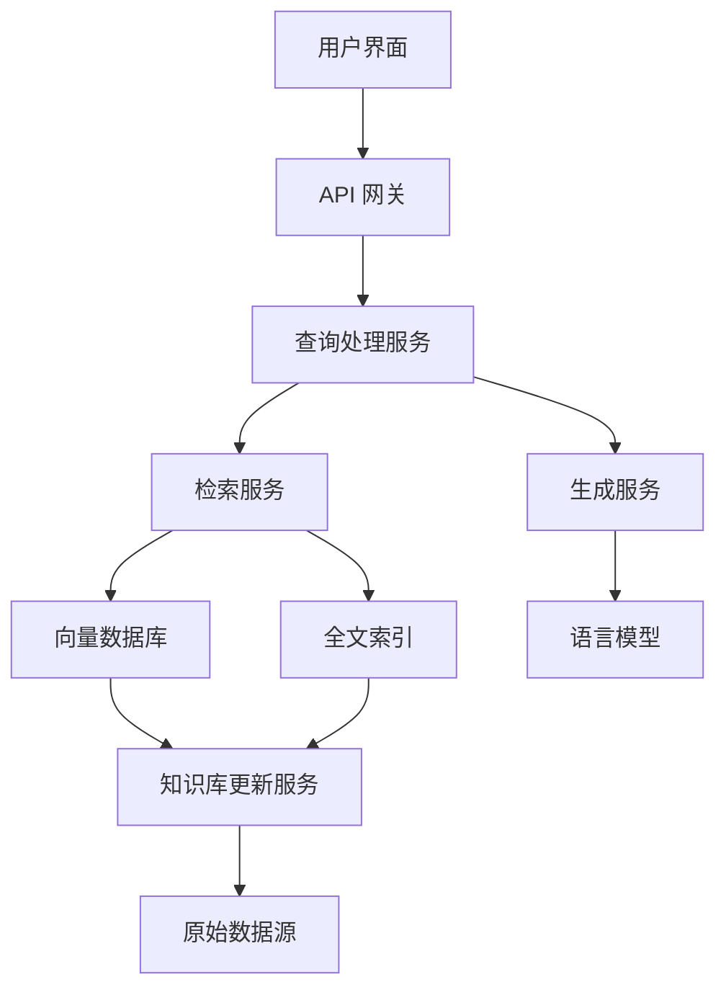

# 第 4 章 RAG 检索增强生成

## 4.1 RAG 概述

检索增强生成（Retrieval-Augmented Generation，RAG）是一种结合了信息检索和文本生成的先进自然语言处理技术。本节将深入探讨 RAG 的核心概念、工作原理及其应用。

### 4.1.1 RAG 的定义和核心概念

RAG 是一种混合架构，它结合了两个关键组件：检索系统和生成模型。其核心思想是通过从大规模知识库中检索相关信息来增强语言模型的生成能力。

**核心概念：**
- 知识库：包含大量结构化或非结构化文本数据的资源库。
- 检索模块：负责从知识库中找出与输入查询相关的信息。
- 生成模型：通常是大型语言模型（LLM），用于生成最终的输出文本。
- 上下文融合：将检索到的信息与用户查询结合，作为生成模型的输入。

### 4.1.2 RAG 的工作原理

RAG 的工作流程可以概括为以下步骤：

1. **查询处理**：系统接收用户输入的查询。
2. **信息检索**：检索模块在知识库中搜索与查询相关的文档或段落。
3. **上下文构建**：将检索到的信息与原始查询组合，形成输入上下文。
4. **生成响应**：将构建的上下文输入到生成模型中，生成最终响应。
5. **输出优化**：对生成的响应进行后处理，确保其质量和相关性。

### 4.1.3 RAG 与传统生成方法的比较

| 特性 | RAG | 传统生成方法 |
|------|-----|-------------|
| 知识来源 | 外部知识库 + 模型参数 | 主要依赖模型参数 |
| 实时性 | 可以访问最新信息 | 受限于训练数据时间 |
| 可解释性 | 较高（可追溯信息来源） | 较低 |
| 定制化 | 容易通过更新知识库实现 | 需要大规模微调或重训练 |
| 计算复杂度 | 较高（需要额外的检索步骤） | 相对较低 |

### 4.1.4 RAG 的应用场景

RAG 技术在多个领域都有广泛的应用，包括但不限于：

1. **问答系统**：提供准确、最新的回答，特别适用于专业领域。
2. **内容生成**：创作文章、报告或摘要，确保内容的准确性和丰富度。
3. **对话系统**：增强聊天机器人的知识面和对话能力。
4. **个性化推荐**：基于用户兴趣和最新信息提供定制化内容。
5. **知识管理**：辅助企业内部知识检索和利用。

## 4.2 RAG 的核心组件

RAG 系统的成功运作依赖于三个核心组件的有效集成：知识库、检索模块和生成模块。本节将详细探讨这些组件的构建和优化策略。

### 4.2.1 知识库构建

知识库是 RAG 系统的基础，其质量直接影响系统的整体性能。

#### 4.2.1.1 数据收集和预处理

1. **数据来源选择**：
    - 公开数据集（如维基百科、学术论文库）
    - 专业领域文献
    - 企业内部文档
    - 网络爬虫获取的信息

2. **数据清洗**：
    - 去除冗余和重复信息
    - 纠正拼写和语法错误
    - 统一格式和编码

3. **数据结构化**：
    - 提取关键信息
    - 标准化数据格式
    - 建立元数据索引

#### 4.2.1.2 文档分割策略

合适的文档分割对提高检索效率和准确性至关重要。

1. **固定长度分割**：
    - 优点：实现简单，计算效率高
    - 缺点：可能打断语义完整性

2. **语义分割**：
    - 基于段落、句子或语义单元进行分割
    - 优点：保持语义完整性
    - 缺点：实现复杂，分割长度不均匀

3. **滑动窗口分割**：
    - 使用重叠的文本片段
    - 优点：减少信息丢失
    - 缺点：增加存储和计算开销

#### 4.2.1.3 知识表示方法

选择合适的知识表示方法对于提高检索效率和准确性至关重要。

1. **向量表示**：
    - 使用词嵌入或句子嵌入技术
    - 常用模型：Word2Vec, BERT, Sentence-BERT
    - 优点：支持语义相似度搜索

2. **稀疏表示**：
    - 基于关键词或 N-gram 的表示方法
    - 例如：TF-IDF, BM25
    - 优点：计算效率高，适合大规模数据

3. **混合表示**：
    - 结合稀疏和密集表示的优点
    - 例如：SPLADE (Sparse-Dense Retrieval)
    - 优点：平衡效率和语义理解能力

### 4.2.2 检索模块

检索模块的主要任务是从知识库中快速、准确地找出与用户查询相关的信息。

#### 4.2.2.1 向量检索技术

1. **近似最近邻搜索（ANN）**：
    - 算法：LSH, HNSW, FAISS
    - 优点：高效处理大规模向量数据
    - 应用：适用于密集向量表示

2. **量化技术**：
    - 方法：Product Quantization, Scalar Quantization
    - 目的：减少内存占用，提高搜索速度
    - 权衡：略微牺牲精度换取效率提升

#### 4.2.2.2 语义检索算法

1. **双塔模型**：
    - 结构：查询编码器 + 文档编码器
    - 优点：支持大规模预计算，检索速度快
    - 缺点：查询-文档交互有限

2. **交叉注意力模型**：
    - 代表：BERT-based 重排序模型
    - 优点：精确建模查询-文档关系
    - 缺点：计算开销大，不适合初始检索

3. **密集检索**：
    - 技术：DPR (Dense Passage Retrieval)
    - 特点：端到端训练，优化语义匹配
    - 应用：适合处理复杂语义查询

#### 4.2.2.3 混合检索策略

结合多种检索方法以获得最佳性能。

1. **多阶段检索**：
    - 第一阶段：使用高效的稀疏检索（如 BM25）
    - 第二阶段：使用语义重排序模型

2. **集成检索**：
    - 并行使用多种检索方法
    - 融合不同方法的结果
    - 例如：组合 BM25 和向量检索的结果

3. **自适应检索**：
    - 根据查询类型动态选择最佳检索策略
    - 利用机器学习模型预测最适合的检索方法

### 4.2.3 生成模块

生成模块负责将检索到的信息与用户查询结合，生成最终的响应。

#### 4.2.3.1 大型语言模型的选择

1. **开源模型**：
    - 例如：GPT-Neo, BLOOM, LLaMA
    - 优点：可定制性高，成本相对较低
    - 缺点：可能需要大量资源进行微调

2. **商业API**：
    - 例如：GPT-3, GPT-4, Claude
    - 优点：性能优秀，无需维护
    - 缺点：成本高，对模型内部less control

3. **领域特定模型**：
    - 针对特定领域微调的模型
    - 优点：在特定任务上表现出色
    - 缺点：通用性较差

#### 4.2.3.2 Prompt 工程技巧

1. **上下文设计**：
    - 明确指定任务和期望输出格式
    - 包含示例来引导模型行为

2. **检索信息集成**：
    - 有效组织检索到的信息
    - 使用模板将检索结果融入prompt

3. **指令优化**：
    - 使用清晰、具体的指令
    - 引导模型进行推理和引用来源

4. **动态prompt生成**：
    - 根据用户查询和检索结果动态构建prompt
    - 考虑上下文长度限制，选择最相关信息

#### 4.2.3.3 上下文融合方法

1. **直接拼接**：
    - 简单地将检索信息添加到用户查询之前
    - 优点：实现简单
    - 缺点：可能导致上下文过长或不连贯

2. **相关性加权**：
    - 根据检索项与查询的相关性进行排序和筛选
    - 只包含最相关的信息，控制上下文长度

3. **摘要融合**：
    - 对检索到的长文本进行摘要
    - 将摘要信息与原始查询结合

4. **分层注意力**：
    - 使用注意力机制对不同来源的信息进行加权
    - 允许模型动态关注最相关的信息

5. **迭代融合**：
    - 多轮对话式地将检索信息融入生成过程
    - 适用于复杂查询或需要多步推理的场景

通过精心设计和优化这些核心组件，RAG 系统可以显著提升其性能和可用性，为用户提供更加准确、相关和信息丰富的响应。

## 4.3 RAG 系统的设计与实现

构建一个高效、可靠的 RAG 系统需要周密的设计和精细的实现。本节将详细介绍 RAG 系统的设计与实现过程，包括系统架构、数据流程、API 设计以及性能优化策略。

### 4.3.1 系统架构设计

RAG 系统的架构设计需要考虑scalability、可维护性和性能。以下是一个典型的 RAG 系统架构：



1. **用户界面**：提供用户交互的前端应用。
2. **API 网关**：管理请求路由、认证和负载均衡。
3. **查询处理服务**：协调检索和生成过程。
4. **检索服务**：实现多种检索策略，访问存储系统。
5. **生成服务**：集成语言模型，处理上下文融合和响应生成。
6. **存储系统**：
    - 向量数据库：存储和检索向量表示。
    - 全文索引：支持关键词和语义搜索。
7. **知识库更新服务**：管理知识库的增量更新和维护。
8. **监控和日志系统**：跟踪系统性能和用户交互。

### 4.3.2 数据流程设计

RAG 系统的数据流程设计需要考虑数据的处理、存储和检索的每个环节。以下是一个典型的数据流程：

1. **数据摄入**：
    - 从多个源收集数据
    - 数据清洗和预处理
    - 文档分割

2. **特征提取**：
    - 生成文本的向量表示
    - 提取关键词和元数据

3. **索引构建**：
    - 更新向量数据库
    - 更新全文索引

4. **查询处理**：
    - 查询分析和扩展
    - 并行执行多种检索策略

5. **结果融合**：
    - 合并不同检索策略的结果
    - 结果排序和筛选

6. **上下文构建**：
    - 选择和组织相关信息
    - 构建prompt模板

7. **响应生成**：
    - 调用语言模型
    - 后处理生成的响应

8. **反馈循环**：
    - 收集用户反馈
    - 更新模型和知识库

### 4.3.3 API 设计与集成

设计良好的 API 是构建可扩展和可维护 RAG 系统的关键。以下是一些 API 设计的最佳实践：

1. **RESTful 设计原则**：
    - 使用标准 HTTP 方法（GET, POST, PUT, DELETE）
    - 使用合适的状态码和错误消息
   - 版本控制（如 `/v1/query`）

2. **主要 API 端点**：
    - `/query`: 处理用户查询
    - `/feedback`: 收集用户反馈
    - `/update`: 更新知识库

3. **查询 API 设计**：
```json
POST /v1/query
{
  "query": "用户查询文本",
  "context": "可选的上下文信息",
  "max_results": 5,
  "response_format": "text"
}
```

4. **响应格式**：
```json
{
  "response": "生成的回答",
  "sources": [
    {
      "text": "引用的原文",
      "url": "来源URL",
      "relevance_score": 0.95
    }
  ],
  "metadata": {
    "processing_time": 0.5,
    "model_version": "1.0"
  }
}
```

5. **错误处理**：
    - 使用标准HTTP状态码
    - 提供详细的错误信息和错误代码

6. **认证和授权**：
    - 实现 API 密钥或 OAuth 2.0
    - 基于角色的访问控制

7. **速率限制**：
    - 实施请求频率限制
    - 在响应头中包含限制信息

8. **文档化**：
    - 使用 Swagger/OpenAPI 规范
    - 提供详细的API使用说明和示例

### 4.3.4 性能优化策略

为了确保 RAG 系统的高效运行，需要实施以下性能优化策略：

1. **缓存机制**：
    - 对频繁查询的结果进行缓存
    - 使用分布式缓存系统（如 Redis）

2. **异步处理**：
    - 使用消息队列处理长时间运行的任务
    - 实现非阻塞的API响应

3. **数据库优化**：
    - 索引优化
    - 查询优化
    - 使用数据库连接池

4. **负载均衡**：
    - 使用反向代理（如 Nginx）
    - 实现服务器间的负载分配

5. **批处理**：
    - 合并多个小请求为批量操作
    - 减少网络往返次数

6. **压缩**：
    - 对API响应进行gzip压缩
    - 减少网络传输数据量

7. **CDN 使用**：
    - 将静态资源部署到 CDN
    - 减少主服务器负载

8. **模型优化**：
    - 模型量化
    - 模型蒸馏
    - 使用更高效的推理引擎

9. **监控和性能分析**：
    - 实时监控系统性能
    - 使用APM工具识别瓶颈

10. **自动扩展**：
    - 实现基于负载的自动扩展
    - 使用容器化技术（如 Docker 和 Kubernetes）

## 4.4 RAG 的高级技术

为了进一步提高 RAG 系统的性能和功能，可以采用一些高级技术。本节将介绍几种先进的 RAG 技术，包括多跳推理、查询重写和扩展、结果重排序以及动态知识更新。

### 4.4.1 多跳推理

多跳推理允许系统通过多个步骤的推理来回答复杂查询，特别是当答案不能直接从单个文档中获得时。

1. **工作原理**：
    - 将复杂查询分解为多个子查询
    - 逐步检索和推理，每一步的结果用于下一步的查询

2. **实现方法**：
    - 使用图结构表示知识
    - 应用路径检索算法
    - 利用强化学习优化推理路径

3. **示例算法**：
```python
def multi_hop_reasoning(query, knowledge_graph):
    hops = decompose_query(query)
    context = []
    for hop in hops:
        relevant_info = retrieve_from_graph(knowledge_graph, hop, context)
        context.append(summarize(relevant_info))
    return generate_response(query, context)
```

4. **挑战与解决方案**：
    - 错误传播：使用不确定性估计和回溯机制
    - 计算复杂度：采用剪枝策略和并行计算

### 4.4.2 查询重写和扩展

查询重写和扩展技术旨在改善原始查询，以提高检索的准确性和召回率。

1. **同义词扩展**：
    - 使用WordNet或定制的同义词库
    - 在查询中添加同义词，增加匹配机会

2. **上下文感知重写**：
    - 基于对话历史和用户偏好调整查询
    - 使用BERT等模型生成上下文相关的查询变体

3. **查询生成**：
    - 使用T5等生成模型创建多个相关查询
    - 合并多个查询的检索结果

4. **实体链接**：
    - 识别查询中的实体
    - 链接到知识图谱中的具体实体，扩展查询信息

5. **示例代码**：
```python
def rewrite_query(original_query, context):
    expanded_query = add_synonyms(original_query)
    contextual_query = context_aware_rewrite(expanded_query, context)
    generated_queries = generate_related_queries(contextual_query)
    return combine_queries(original_query, contextual_query, generated_queries)
```

### 4.4.3 结果重排序

结果重排序技术用于优化初始检索结果的顺序，提高最相关文档的排名。

1. **Learning to Rank (LTR)**：
    - 使用机器学习模型学习最优排序
    - 特征包括TF-IDF分数、BM25分数、语义相似度等

2. **BERT 重排序**：
    - 使用BERT等预训练模型计算查询-文档相关性
    - 适用于理解复杂的语义关系

3. **多样性重排序**：
    - 考虑结果集的多样性，避免信息冗余
    - 使用最大边缘相关性（MMR）等算法

4. **个性化重排序**：
    - 基于用户历史行为和偏好调整排序
    - 使用协同过滤或内容基础的推荐技术

5. **示例代码**：
```python
def rerank_results(query, initial_results, user_profile):
    features = extract_features(query, initial_results)
    relevance_scores = ltr_model.predict(features)
    diversity_scores = calculate_diversity(initial_results)
    personalized_scores = personalize(initial_results, user_profile)
    final_scores = combine_scores(relevance_scores, diversity_scores, personalized_scores)
    return sort_by_score(initial_results, final_scores)
```

### 4.4.4 动态知识更新

动态知识更新允许RAG系统不断学习和适应新信息，保持知识的时效性。

1. **增量索引更新**：
    - 设计支持实时更新的索引结构
    - 使用版本控制管理知识库变更

2. **在线学习**：
    - 根据用户反馈动态调整检索和排序模型
    - 实现模型参数的在线微调

3. **知识遗忘机制**：
    - 实现基于时间衰减的知识重要性评估
    - 自动归档或删除过时的信息

4. **冷启动问题解决**：
    - 对新加入的知识项使用探索策略
    - 结合内容分析和初始反馈快速评估新知识的价值

5. **一致性维护**：
    - 实现知识图谱的增量更新
    - 使用规则引擎检查和维护知识一致性

6. **示例代码**：
```python
def update_knowledge_base(new_data, knowledge_base, index):
    processed_data = preprocess(new_data)
    updated_index = incremental_update(index, processed_data)
    consistency_check(knowledge_base, processed_data)
    knowledge_base = merge_new_knowledge(knowledge_base, processed_data)
    update_importance_scores(knowledge_base)
    prune_outdated_knowledge(knowledge_base)
    return knowledge_base, updated_index
```

这些高级技术可以显著提升RAG系统的性能和用户体验。然而，它们也带来了额外的复杂性和计算开销。在实际应用中，需要根据具体需求和资源限制来权衡使用这些技术的程度。

## 4.5 RAG 的评估与优化

评估RAG系统的性能并持续优化是确保系统有效性的关键步骤。本节将详细介绍RAG系统的评估指标、测试方法、评估流程以及持续优化策略。

### 4.5.1 评估指标设计

设计全面的评估指标对于准确衡量RAG系统的性能至关重要。以下是一些关键的评估指标：

1. **准确性指标**：
    - 精确率（Precision）：正确答案占所有返回答案的比例
    - 召回率（Recall）：正确返回的答案占所有正确答案的比例
    - F1分数：精确率和召回率的调和平均值
    - 平均倒数排名（Mean Reciprocal Rank, MRR）

2. **相关性指标**：
    - NDCG（Normalized Discounted Cumulative Gain）：评估检索结果的相关性和排序质量
    - MAP（Mean Average Precision）：评估检索系统在不同召回水平上的性能

3. **生成质量指标**：
    - BLEU, ROUGE, METEOR：评估生成文本与参考答案的相似度
    - 困惑度（Perplexity）：评估语言模型的预测能力

4. **人工评估指标**：
    - 答案正确性：评估者对答案正确性的评分
    - 信息完整性：答案是否包含所有必要信息
    - 连贯性：答案的逻辑流程和表达是否连贯

5. **效率指标**：
    - 延迟：系统响应时间
    - 吞吐量：单位时间内处理的查询数
    - 资源使用：CPU、内存、存储使用情况

6. **用户体验指标**：
    - 用户满意度：通过调查收集的用户评分
    - 任务完成率：用户成功完成目标任务的比例
    - 交互次数：用户获得满意答案所需的交互次数

### 4.5.2 A/B 测试方法

A/B测试是评估RAG系统改进效果的有效方法。以下是进行A/B测试的步骤：

1. **准备阶段**：
    - 定义测试目标（如：提高答案准确率）
    - 确定测试变量（如：不同的检索算法）
    - 设计实验组和对照组

2. **实施阶段**：
    - 随机分配用户到不同组
    - 收集用户交互数据和系统性能指标
    - 确保测试持续足够长的时间以获得统计显著性

3. **分析阶段**：
    - 使用统计方法分析结果（如：t检验、ANOVA）
    - 评估实验组和对照组之间的差异
    - 考虑潜在的混杂因素

4. **决策阶段**：
    - 基于分析结果决定是否采用新方法
    - 评估实施新方法的成本和收益

5. **示例代码**：
```python
def ab_test(control_group, experiment_group, metric_function):
    control_results = [metric_function(user) for user in control_group]
    experiment_results = [metric_function(user) for user in experiment_group]
    
    t_statistic, p_value = scipy.stats.ttest_ind(control_results, experiment_results)
    
    if p_value < 0.05:
        print("实验组显著优于对照组")
    else:
        print("无显著差异")
    
    return np.mean(experiment_results) - np.mean(control_results)
```

### 4.5.3 人工评估流程

尽管自动化指标很重要，但人工评估对于全面了解RAG系统的性能仍然不可或缺。以下是一个典型的人工评估流程：

1. **准备阶段**：
    - 创建评估指南，明确评分标准
    - 选择多样化的测试查询集
    - 培训评估人员，确保一致性

2. **评估阶段**：
    - 对每个查询-回答对进行评分
    - 记录定性反馈和改进建议
    - 使用多个评估者以减少偏差

3. **分析阶段**：
    - 计算评分的平均值和标准差
    - 识别系统的强项和弱项
    - 分析不同类型查询的性能差异

4. **反馈循环**：
    - 基于评估结果提出改进建议
    - 将人工评估结果用于模型微调和系统优化

5. **评估表格示例**：

| 评估维度 | 1分 | 2分 | 3分 | 4分 | 5分 |
|---------|-----|-----|-----|-----|-----|
| 答案正确性 | 完全错误 | 部分正确 | 大致正确 | 很准确 | 完全正确 |
| 相关性 | 不相关 | 略微相关 | 部分相关 | 相关 | 高度相关 |
| 完整性 | 信息缺失严重 | 信息较少 | 基本完整 | 很完整 | 非常完整 |
| 连贯性 | 完全不连贯 | 稍有连贯 | 基本连贯 | 很连贯 | 极其连贯 |
| 可读性 | 难以理解 | 勉强可读 | 可以理解 | 易于理解 | 非常清晰 |

### 4.5.4 持续优化策略

RAG系统的优化是一个持续的过程，需要系统性的方法和策略。以下是一些有效的持续优化策略：

1. **定期性能审查**：
    - 设置定期审查周期（如每月或每季度）
    - 全面评估系统性能，包括自动化指标和人工评估结果
    - 识别性能瓶颈和改进机会

2. **增量更新和测试**：
    - 采用增量更新策略，逐步引入改进
    - 每次更新后进行A/B测试，评估改进效果
    - 使用金丝雀发布策略，逐步推广成功的更新

3. **自动化优化流程**：
    - 实现自动化的性能监控和报告系统
    - 使用机器学习模型自动调整系统参数
    - 设置自动警报，及时发现性能异常

4. **知识库优化**：
    - 定期审查和更新知识库内容
    - 基于用户查询模式优化知识结构
    - 实施知识图谱enrichment，增加知识的深度和广度

5. **模型迭代和微调**：
    - 收集用户反馈数据，用于模型微调
    - 定期评估新的预训练模型，考虑模型升级
    - 实验不同的模型架构和参数设置

6. **用户反馈闭环**：
    - 建立用户反馈收集机制
    - 分析用户反馈，识别共同问题和改进方向
    - 根据用户反馈调整系统行为和响应策略

7. **性能基准测试**：
    - 建立标准化的性能基准测试集
    - 定期运行基准测试，跟踪长期性能趋势
    - 与行业标准和竞争对手进行比较

8. **跨团队协作**：
    - 促进工程、数据科学和产品团队之间的紧密合作
    - 定期举行优化研讨会，集思广益
    - 建立知识共享平台，促进最佳实践的传播

9. **实验文化培养**：
    - 鼓励团队成员提出和测试新想法
    - 建立快速实验和评估的框架
    - 容忍失败，从失败中学习

10. **资源优化**：
    - 持续监控和优化计算资源使用
    - 评估和采用新的硬件或云服务选项
    - 优化成本效益，平衡性能和资源消耗

11. **代码优化示例**：
```python
def optimize_rag_system(system, test_queries, optimization_config):
    baseline_performance = evaluate_system(system, test_queries)
    
    for component in ['retriever', 'reranker', 'generator']:
        for param in optimization_config[component]:
            for value in optimization_config[component][param]:
                system.set_param(component, param, value)
                current_performance = evaluate_system(system, test_queries)
                
                if current_performance > baseline_performance:
                    baseline_performance = current_performance
                else:
                    system.revert_param(component, param)
    
    return system, baseline_performance

def evaluate_system(system, queries):
    results = [system.process_query(query) for query in queries]
    return calculate_metrics(results)
```

通过实施这些持续优化策略，RAG系统可以不断提升其性能，适应不断变化的用户需求和数据环境。重要的是要建立一个系统化的优化流程，结合自动化工具和人工智慧，确保系统始终处于最佳状态。

## 4.6 RAG 在垂直领域的应用

RAG技术因其强大的知识整合和生成能力，在多个垂直领域都有广泛的应用。本节将探讨RAG在客户服务、医疗健康、法律咨询和教育辅助等领域的具体应用案例。

### 4.6.1 客户服务与聊天机器人

在客户服务领域，RAG技术可以显著提升自动化程度和服务质量。

1. **应用场景**：
    - 24/7 在线客户支持
    - 产品咨询和问题解答
    - 订单跟踪和售后服务

2. **实现方式**：
    - 构建包含产品手册、常见问题、历史交互记录的知识库
    - 使用RAG系统快速检索相关信息并生成个性化回答
    - 集成订单系统和CRM，提供实时、准确的客户信息

3. **关键特性**：
    - 多轮对话管理：维护对话上下文，提供连贯的交互体验
    - 意图识别：准确理解客户需求，提供针对性服务
    - 情感分析：识别客户情绪，适当时转接人工客服

4. **示例代码片段**：
```python
class CustomerServiceRAG:
    def __init__(self, knowledge_base, language_model):
        self.kb = knowledge_base
        self.lm = language_model
        self.conversation_history = []

    def handle_query(self, query):
        intent = self.identify_intent(query)
        relevant_info = self.kb.retrieve(query, self.conversation_history)
        
        if intent == 'product_inquiry':
            response = self.generate_product_info(query, relevant_info)
        elif intent == 'order_status':
            response = self.check_order_status(query, relevant_info)
        else:
            response = self.generate_general_response(query, relevant_info)
        
        self.conversation_history.append((query, response))
        return response

    def generate_product_info(self, query, relevant_info):
        prompt = f"Query: {query}\nProduct Information: {relevant_info}\nGenerate a helpful response:"
        return self.lm.generate(prompt)

    # ... 其他方法实现 ...
```

### 4.6.2 医疗健康问答系统

在医疗健康领域，RAG系统可以辅助医生诊断，为患者提供可靠的健康信息。

1. **应用场景**：
    - 症状初步评估
    - 医学文献检索和摘要
    - 药物相互作用查询
    - 患者教育和健康管理

2. **实现方式**：
    - 构建包含医学教科书、最新研究论文、临床指南的专业知识库
    - 使用医学专业术语处理和实体识别技术增强检索能力
    - 集成医学本体和知识图谱，支持复杂的医学推理

3. **关键特性**：
    - 高准确性：确保提供的医学信息绝对准确
    - 来源追溯：清晰标注信息来源，支持进一步查询
    - 隐私保护：严格遵守HIPAA等医疗数据保护法规

4. **示例代码片段**：
```python
class MedicalRAG:
    def __init__(self, medical_kb, language_model, term_standardizer):
        self.medical_kb = medical_kb
        self.lm = language_model
        self.standardizer = term_standardizer

    def process_medical_query(self, query):
        standardized_query = self.standardizer.standardize(query)
        relevant_info = self.medical_kb.retrieve(standardized_query)
        
        prompt = f"""
        Medical Query: {query}
        Relevant Medical Information: {relevant_info}
        
        Generate a response that:
        1. Answers the query based on the provided information
        2. Cites the sources of information
        3. Recommends consulting a healthcare professional for personalized advice
        
        Response:
        """
        
        response = self.lm.generate(prompt)
        return self.add_disclaimer(response)

    def add_disclaimer(self, response):
        disclaimer = "Note: This information is for educational purposes only and not a substitute for professional medical advice."
        return f"{response}\n\n{disclaimer}"

    # ... 其他方法实现 ...
```

### 4.6.3 法律咨询助手

RAG技术在法律领域可以辅助律师工作，为公众提供基本的法律咨询服务。

1. **应用场景**：
    - 法律文件检索和摘要
    - 案例分析和相似案例推荐
    - 基本法律问题解答
    - 合同条款解释

2. **实现方式**：
    - 构建包含法律法规、判例、法律评论的专业知识库
    - 使用法律术语处理和实体识别技术提高检索准确性
    - 集成法律推理模型，支持复杂的法律分析

3. **关键特性**：
    - 多辖区支持：处理不同地区的法律差异
    - 时效性管理：确保使用最新的法律法规信息
    - 伦理考量：明确系统的局限性，建议重要问题咨询专业律师

4. **示例代码片段**：
```python
class LegalAssistantRAG:
    def __init__(self, legal_kb, language_model, jurisdiction_handler):
        self.legal_kb = legal_kb
        self.lm = language_model
        self.jurisdiction_handler = jurisdiction_handler

    def provide_legal_advice(self, query, jurisdiction):
        relevant_laws = self.legal_kb.retrieve_laws(query, jurisdiction)
        relevant_cases = self.legal_kb.retrieve_cases(query, jurisdiction)
        
        prompt = f"""
        Legal Query: {query}
        Jurisdiction: {jurisdiction}
        Relevant Laws: {relevant_laws}
        Relevant Cases: {relevant_cases}
        
        Provide a legal analysis that:
        1. Interprets the query in light of relevant laws and cases
        2. Explains the legal implications
        3. Cites specific laws and cases
        4. Recommends seeking personalized legal advice from a qualified attorney
        
        Analysis:
        """
        
        response = self.lm.generate(prompt)
        return self.add_legal_disclaimer(response)

    def add_legal_disclaimer(self, response):
        disclaimer = "Disclaimer: This information is for general educational purposes only and should not be construed as legal advice. Consult with a qualified attorney for personalized legal guidance."
        return f"{response}\n\n{disclaimer}"

    # ... 其他方法实现 ...
```

### 4.6.4 教育辅助工具

在教育领域，RAG技术可以为学生和教育工作者提供强大的学习和教学支持。

1. **应用场景**：
    - 个性化学习助手
    - 智能题目生成和解答
    - 文献研究和论文写作辅助
    - 课程内容定制和推荐

2. **实现方式**：
    - 构建包含教材、学术论文、教育视频转录的多模态知识库
    - 集成学习理论和认知模型，优化知识表示和检索
    - 使用自适应学习算法，根据学生进度调整内容难度

3. **关键特性**：
    - 跨学科知识整合：支持多学科交叉学习
    - 进度跟踪：记录学习历程，提供个性化建议
    - 互动性：支持问答、讨论和协作学习

4. **示例代码片段**：
```python
class EducationalRAG:
    def __init__(self, educational_kb, language_model, student_profile_manager):
        self.edu_kb = educational_kb
        self.lm = language_model
        self.profile_manager = student_profile_manager

    def provide_learning_assistance(self, query, student_id):
        student_profile = self.profile_manager.get_profile(student_id)
        relevant_materials = self.edu_kb.retrieve(query, student_profile)
        
        prompt = f"""
        Learning Query: {query}
        Student Level: {student_profile['level']}
        Learning Style: {student_profile['learning_style']}
        Relevant Materials: {relevant_materials}
        
        Provide a response that:
        1. Answers the query at an appropriate level for the student
        2. Includes examples and explanations tailored to the student's learning style
        3. Suggests additional resources for further learning
        4. Encourages critical thinking and self-directed exploration
        
        Response:
        """
        
        response = self.lm.generate(prompt)
        return self.add_learning_resources(response, query, student_profile)

    def add_learning_resources(self, response, query, student_profile):
        additional_resources = self.edu_kb.get_recommended_resources(query, student_profile)
        return f"{response}\n\nFor further learning, consider these resources:\n{additional_resources}"

    # ... 其他方法实现 ...
```

这些垂直领域的应用展示了RAG技术的versatility和潜力。通过针对特定领域的知识库构建、专业术语处理和领域特定的推理模型，RAG系统可以在各个专业领域提供高质量的信息服务。然而，在应用RAG技术时，始终需要考虑伦理、隐私和法律合规性，确保系统的输出准确、可靠且对用户负责。

## 4.7 RAG 的挑战与未来发展

尽管RAG技术在各个领域展现出巨大潜力，但它仍然面临着一些重要挑战。本节将探讨这些挑战，并展望RAG技术的未来发展方向。

### 4.7.1 知识一致性维护

维护大规模知识库的一致性是RAG系统面临的主要挑战之一。

1. **挑战**：
    - 信息更新：确保知识库中的信息保持最新
    - 冲突解决：处理来自不同来源的矛盾信息
    - 版本控制：管理知识的不同版本和历史记录

2. **解决方案**：
    - 实施自动化更新机制，定期从可靠源同步最新信息
    - 使用知识图谱技术，建立信息之间的关系网络
    - 开发冲突检测算法，自动识别和标记矛盾信息

3. **示例代码**：
```python
class KnowledgeConsistencyManager:
    def __init__(self, knowledge_base):
        self.kb = knowledge_base

    def update_knowledge(self, new_info):
        conflicts = self.detect_conflicts(new_info)
        if conflicts:
            resolved_info = self.resolve_conflicts(conflicts)
        else:
            resolved_info = new_info
        self.kb.update(resolved_info)

    def detect_conflicts(self, new_info):
        # 实现冲突检测逻辑
        pass

    def resolve_conflicts(self, conflicts):
        # 实现冲突解决逻辑
        pass
```

### 4.7.2 隐私和安全考虑

随着RAG系统处理越来越多的敏感信息，隐私保护和数据安全变得尤为重要。

1. **挑战**：
    - 数据隐私：保护用户查询和个人信息
    - 模型安全：防止模型泄露敏感信息
    - 合规性：遵守GDPR、CCPA等数据保护法规

2. **解决方案**：
    - 实施端到端加密，保护数据传输和存储
    - 使用差分隐私技术，在保护隐私的同时维持模型性能
    - 开发敏感信息检测和脱敏工具

3. **隐私保护示例**：
```python
from diffprivlib import models as dp_models

class PrivacyPreservingRAG:
    def __init__(self, epsilon):
        self.retriever = dp_models.GaussianNB(epsilon=epsilon)

    def private_retrieval(self, query, knowledge_base):
        # 使用差分隐私技术进行检索
        return self.retriever.fit_predict(query, knowledge_base)
```

### 4.7.3 多模态 RAG 系统

未来的RAG系统将不仅限于文本，而是能够处理和生成多种模态的信息。

1. **发展方向**：
    - 图像理解与生成
    - 语音识别与合成
    - 视频分析与生成

2. **潜在应用**：
    - 医疗影像分析辅助诊断
    - 多模态教育内容生成
    - 虚拟现实和增强现实内容创作

3. **实现框架示例**：
```python
class MultimodalRAG:
    def __init__(self, text_model, image_model, audio_model):
        self.text_model = text_model
        self.image_model = image_model
        self.audio_model = audio_model

    def process_multimodal_query(self, query):
        text_info = self.text_model.process(query.text)
        image_info = self.image_model.process(query.image)
        audio_info = self.audio_model.process(query.audio)
        
        combined_info = self.fusion_module(text_info, image_info, audio_info)
        return self.generate_multimodal_response(combined_info)

    def fusion_module(self, text, image, audio):
        # 实现多模态信息融合逻辑
        pass

    def generate_multimodal_response(self, fused_info):
        # 生成包含文本、图像、音频的响应
        pass
```

### 4.7.4 自适应学习与持续更新

为了保持RAG系统的长期有效性，需要开发能够自主学习和更新的系统。

1. **挑战**：
    - 在线学习：从用户交互中持续学习
    - 知识更新：自动整合新知识到现有知识库
    - 模型适应：根据新数据动态调整模型参数

2. **解决方案**：
    - 实现增量学习算法，允许模型在不重新训练的情况下更新
    - 开发自动知识提取和集成工具
    - 使用元学习技术，提高模型对新任务的适应能力

3. **自适应学习示例**：
```python
class AdaptiveRAG:
    def __init__(self, base_model, learning_rate):
        self.model = base_model
        self.lr = learning_rate

    def update_from_interaction(self, query, response, feedback):
        loss = self.compute_loss(query, response, feedback)
        self.model.update(loss, self.lr)

    def integrate_new_knowledge(self, new_data):
        extracted_knowledge = self.extract_knowledge(new_data)
        self.knowledge_base.update(extracted_knowledge)

    def meta_learn(self, new_task):
        adapted_model = self.model.clone()
        for i in range(5):  # 快速适应
            adapted_model.update(new_task)
        return adapted_model
```

未来的RAG系统将更加智能、安全和versatile。它们将能够:

1. 无缝集成多种类型的知识和数据源
2. 提供更自然、更个性化的人机交互体验
3. 在保护隐私和安全的同时，提供高度相关和准确的信息
4. 持续学习和适应，保持与最新知识和技术的同步

然而，实现这些目标还需要克服诸多技术和伦理挑战。研究人员和开发者需要在算法创新、系统架构、安全技术和伦理框架等多个方面继续深入探索。随着这些挑战被逐一攻克，RAG技术有望在未来的人工智能和知识管理领域发挥越来越重要的作用，为各行各业带来变革性的影响。

## 4.8 RAG 最佳实践与案例分析

为了帮助读者更好地理解和应用RAG技术，本节将介绍一些最佳实践，并通过具体的案例分析来展示RAG在实际应用中的效果和挑战。

### 4.8.1 企业级 RAG 系统部署案例

案例：大型金融机构客户服务系统升级

背景：一家跨国银行决定升级其客户服务系统，引入RAG技术以提高服务质量和效率。

实施步骤：

1. **知识库构建**：
    - 整合内部文档、产品手册、FAQ和历史客户交互记录
    - 使用NLP技术处理和标准化文本数据
    - 构建金融领域特定的实体识别和关系提取模型

2. **检索系统设计**：
    - 实现混合检索策略，结合关键词匹配和语义搜索
    - 使用FAISS进行高效的向量检索
    - 实现个性化排序算法，考虑用户历史和偏好

3. **生成模型选择与微调**：
    - 选择GPT-3作为基础模型，进行金融领域特定的微调
    - 设计特定于金融产品和服务的prompt模板
    - 实现多轮对话管理，维护对话上下文

4. **系统集成**：
    - 与现有CRM系统集成，实现无缝的客户信息访问
    - 集成实时交易系统，提供准确的账户信息
    - 实现多渠道支持，包括网页、移动应用和语音系统

5. **安全与合规**：
    - 实施端到端加密，保护客户数据
    - 开发敏感信息检测和脱敏模块
    - 确保系统符合金融行业的监管要求（如GDPR、PSD2）

6. **部署与监控**：
    - 采用蓝绿部署策略，确保平稳过渡
    - 实施全面的日志记录和监控系统
    - 建立24/7的人工监督团队，处理异常情况

结果：
- 客户满意度提升30%
- 人工客服工作量减少50%
- 首次解决率提高到85%
- 系统响应时间降低到平均2秒

挑战与解决方案：
1. 挑战：处理金融专业术语和复杂产品信息
   解决：构建专门的金融术语词典和产品知识图谱

2. 挑战：确保信息的准确性和时效性
   解决：实施实时知识同步机制，定期审核更新

3. 挑战：处理多语言支持
   解决：使用多语言模型，实现跨语言知识检索和生成

代码示例（系统核心组件）：

```python
class FinancialServiceRAG:
    def __init__(self, retriever, generator, security_module):
        self.retriever = retriever
        self.generator = generator
        self.security = security_module

    def process_query(self, query, user_id):
        # 安全检查
        if not self.security.authenticate(user_id):
            return "认证失败，请重新登录。"

        # 信息检索
        relevant_info = self.retriever.retrieve(query)

        # 敏感信息处理
        safe_info = self.security.desensitize(relevant_info)

        # 响应生成
        response = self.generator.generate(query, safe_info)

        # 日志记录
        self.log_interaction(user_id, query, response)

        return response

    def log_interaction(self, user_id, query, response):
        # 实现日志记录逻辑
        pass

# 使用示例
rag_system = FinancialServiceRAG(
    retriever=HybridRetriever(vector_db, keyword_index),
    generator=FineTunedGPT3(),
    security_module=FinancialSecurityModule()
)

response = rag_system.process_query("如何查看我的账户余额？", user_id="12345")
print(response)
```

### 4.8.2 开源 RAG 项目分析

案例：Hugging Face的RAG实现

Hugging Face提供了一个开源的RAG实现，使用它可以快速构建和实验RAG系统。以下是一个基于Hugging Face的RAG实现示例：

```python
from transformers import RagTokenizer, RagRetriever, RagSequenceForGeneration
from datasets import load_dataset

# 加载预训练的RAG模型和分词器
tokenizer = RagTokenizer.from_pretrained("facebook/rag-sequence-nq")
retriever = RagRetriever.from_pretrained("facebook/rag-sequence-nq", index_name="exact", use_dummy_dataset=True)
model = RagSequenceForGeneration.from_pretrained("facebook/rag-sequence-nq", retriever=retriever)

# 准备输入
question = "谁发明了互联网？"
input_dict = tokenizer(question, return_tensors="pt")

# 生成答案
generated = model.generate(input_ids=input_dict["input_ids"])
generated_string = tokenizer.batch_decode(generated, skip_special_tokens=True)[0]
print(generated_string)
```

分析：
1. 优点：
    - 易于使用和集成
    - 支持多种预训练模型
    - 具有良好的社区支持和文档

2. 局限性：
    - 默认知识库可能不适合特定领域应用
    - 定制化和优化空间有限

3. 改进建议：
    - 集成自定义知识库
    - 实现领域特定的微调
    - 添加后处理步骤，提高输出质量

### 4.8.3 RAG 在学术研究中的应用

案例：利用RAG进行文献综述辅助

背景：研究人员使用RAG系统辅助大规模文献综述工作。

实施方法：
1. 构建包含大量学术论文的知识库
2. 使用专门的学术文献检索模型
3. 实现自动摘要和关键信息提取功能

代码示例（文献综述辅助系统）：

```python
class LiteratureReviewRAG:
    def __init__(self, paper_retriever, summarizer, citation_manager):
        self.retriever = paper_retriever
        self.summarizer = summarizer
        self.citation_manager = citation_manager

    def review_topic(self, topic, num_papers=50):
        relevant_papers = self.retriever.search(topic, limit=num_papers)
        summaries = [self.summarizer.summarize(paper) for paper in relevant_papers]
        
        review = self.generate_review(topic, summaries)
        citations = self.citation_manager.format_citations(relevant_papers)
        
        return review, citations

    def generate_review(self, topic, summaries):
        prompt = f"Generate a literature review on the topic: {topic}\n\nSummaries:\n" + "\n".join(summaries)
        return self.summarizer.generate(prompt)

# 使用示例
review_system = LiteratureReviewRAG(
    paper_retriever=AcademicPaperRetriever(),
    summarizer=ScientificTextSummarizer(),
    citation_manager=AcademicCitationManager()
)

review, citations = review_system.review_topic("量子计算在密码学中的应用")
print(review)
print("\nReferences:")
print(citations)
```

结果分析：
- 效率提升：研究人员能够更快地获取和综合大量文献信息
- 覆盖面广：RAG系统能够处理跨学科的文献，提供全面的研究视角
- 挑战：确保学术准确性和避免偏见仍需要人工审核和干预

### 4.8.4 RAG 商业化应用案例

案例：AI辅助内容创作平台

背景：一家媒体公司开发了基于RAG的AI辅助内容创作平台，帮助作者生成高质量、事实准确的文章。

实施细节：

1. **知识库构建**：
    - 整合多种可靠新闻源、学术数据库和事实核查网站
    - 实现实时新闻feed，确保知识的时效性
    - 使用多语言处理技术，支持全球化内容创作

2. **专业领域适配**：
    - 为不同主题（如科技、政治、体育）建立专门的子知识库
    - 训练领域特定的实体识别和关系提取模型

3. **创作辅助功能**：
    - 智能大纲生成：基于主题自动提供结构化大纲
    - 事实核查：实时验证文章中的事实陈述
    - 风格调整：根据目标受众调整写作风格
    - 引用管理：自动生成和格式化引用

4. **协作功能**：
    - 多人实时编辑：支持团队协作写作
    - 版本控制：追踪文章的修改历史
    - 评论系统：集成AI辅助的审稿和反馈功能

5. **SEO优化**：
    - 关键词建议：基于当前热点和搜索趋势
    - 内容优化建议：提高文章的搜索引擎友好度

代码示例（内容创作辅助系统的核心组件）：

```python
class ContentCreationRAG:
    def __init__(self, knowledge_base, language_model, fact_checker):
        self.kb = knowledge_base
        self.lm = language_model
        self.fact_checker = fact_checker

    def generate_outline(self, topic):
        relevant_info = self.kb.retrieve(topic)
        prompt = f"Create a detailed outline for an article about {topic}. Use the following information:\n{relevant_info}"
        return self.lm.generate(prompt)

    def expand_section(self, outline_section, style):
        context = self.kb.retrieve(outline_section)
        prompt = f"Expand the following section in {style} style:\n{outline_section}\nContext:\n{context}"
        return self.lm.generate(prompt)

    def check_facts(self, text):
        facts = self.fact_checker.extract_facts(text)
        verified_facts = [self.fact_checker.verify(fact) for fact in facts]
        return verified_facts

    def suggest_citations(self, text):
        entities = self.kb.extract_entities(text)
        sources = [self.kb.find_source(entity) for entity in entities]
        return sources

    def optimize_for_seo(self, text, target_keywords):
        seo_suggestions = self.lm.generate(f"Optimize the following text for SEO, focusing on these keywords: {target_keywords}\n\nText: {text}")
        return seo_suggestions

# 使用示例
content_system = ContentCreationRAG(
    knowledge_base=RealTimeKnowledgeBase(),
    language_model=AdvancedLanguageModel(),
    fact_checker=AIFactChecker()
)

topic = "人工智能对新闻业的影响"
outline = content_system.generate_outline(topic)
print("文章大纲:", outline)

section = "AI在新闻生成中的应用"
expanded_section = content_system.expand_section(section, "专业学术")
print("扩展章节:", expanded_section)

fact_check_results = content_system.check_facts(expanded_section)
print("事实核查结果:", fact_check_results)

suggested_citations = content_system.suggest_citations(expanded_section)
print("建议的引用来源:", suggested_citations)

seo_optimized = content_system.optimize_for_seo(expanded_section, ["AI新闻", "自动化新闻写作"])
print("SEO优化建议:", seo_optimized)
```

结果与分析：
1. 效率提升：内容创作时间平均缩短40%
2. 质量提升：事实准确性提高15%，读者参与度增加25%
3. 多样性：能够快速生成多语言、多主题的内容
4. ROI：平台订阅收入在6个月内增长200%

挑战与解决方案：
1. 挑战：保持内容的原创性和创意
   解决：将AI辅助定位为创意激发工具，而非替代人类创作

2. 挑战：处理有争议的主题和观点平衡
   解决：实现多视角信息检索，提供balanced的参考资料

3. 挑战：避免版权侵犯
   解决：集成版权检查工具，确保生成内容的原创性

4. 挑战：适应不同的写作风格和内容形式
   解决：开发可定制的风格模板，支持从新闻到博客的多种形式

这个案例展示了RAG技术在内容创作领域的强大潜力。通过结合大规模知识库、先进的语言模型和专业的辅助工具，RAG系统能够显著提高内容创作的效率和质量。然而，它也凸显了在实际应用中需要谨慎处理的伦理、版权和创意平衡等问题。

总的来说，这些案例分析和最佳实践为读者提供了实施RAG系统的具体指导和inspiration。从企业级部署到开源项目，从学术研究到商业应用，RAG技术展现出了广泛的适用性和巨大的潜力。通过不断创新和优化，RAG有望在未来继续推动人工智能与知识管理的融合，为各行各业带来变革性的影响。

## 4.9 本章小结

本章深入探讨了检索增强生成（RAG）技术的各个方面，从基本概念到高级应用，为读者提供了全面的理解和实践指导。以下是本章的主要要点总结：

1. **RAG概述**：
    - RAG是结合信息检索和文本生成的先进NLP技术
    - 核心组件包括知识库、检索模块和生成模块
    - RAG相比传统生成方法具有更好的知识获取能力和可解释性

2. **核心组件**：
    - 知识库构建涉及数据收集、预处理和表示方法选择
    - 检索模块包括向量检索、语义检索和混合检索策略
    - 生成模块利用大型语言模型，结合prompt工程技巧

3. **系统设计与实现**：
    - 架构设计需考虑scalability、可维护性和性能
    - 数据流程设计涵盖从数据摄入到响应生成的全过程
    - API设计和性能优化是构建实用RAG系统的关键

4. **高级技术**：
    - 多跳推理增强了处理复杂查询的能力
    - 查询重写和扩展提高了检索的准确性和召回率
    - 结果重排序优化了最终呈现给用户的信息质量
    - 动态知识更新确保系统能够适应新信息和变化

5. **评估与优化**：
    - 设计全面的评估指标，包括准确性、相关性和效率
    - A/B测试和人工评估相结合，全面评估系统性能
    - 持续优化策略确保系统长期保持高性能

6. **垂直领域应用**：
    - 客户服务、医疗健康、法律咨询和教育等领域都有广泛应用
    - 每个领域需要特定的知识库构建和模型适配

7. **挑战与未来发展**：
    - 知识一致性维护、隐私安全、多模态集成是主要挑战
    - 自适应学习与持续更新是未来发展的重要方向

8. **最佳实践与案例分析**：
    - 企业级部署案例展示了RAG在实际环境中的应用
    - 开源项目分析为快速实验和学习提供了途径
    - 学术研究和商业化应用案例展示了RAG的多样化潜力

关键insights：

1. RAG技术的核心优势在于它能够结合海量外部知识和强大的生成能力，提供更准确、更相关、更新的信息。

2. 成功实施RAG系统需要在知识管理、信息检索、自然语言处理等多个领域有深入的理解和实践。

3. RAG不仅是一种技术，更是一种新的知识获取和利用范式，它有潜力改变多个行业的工作方式和服务模式。

4. 随着技术的发展，RAG系统将变得更加智能、自适应和多模态，但同时也带来了隐私、安全和伦理等方面的新挑战。

5. RAG的未来发展将深度依赖于大型语言模型、知识图谱、多模态学习等前沿AI技术的进步。

展望未来，RAG技术有望在以下方面取得突破：

1. 更精确的知识整合和推理能力
2. 更自然、更个性化的人机交互体验
3. 跨语言、跨文化的知识共享和学习
4. 实时、动态的知识更新和适应机制
5. 更强大的多模态理解和生成能力

总之，RAG技术代表了AI系统向着更智能、更有knowledge的方向发展的重要趋势。通过持续的研究和创新，RAG有望在未来的AI应用中发挥越来越重要的作用，为人类知识的获取、管理和创新带来革命性的变化。为了充分利用RAG技术的潜力，研究人员和开发者应该关注以下几个关键方向：

1. **知识表示的进化**：
    - 探索更高效、更灵活的知识表示方法
    - 研究动态知识图谱，能够自动更新和调整结构
    - 开发跨模态知识表示技术，实现文本、图像、音频等多种形式知识的统一表示

2. **检索技术的创新**：
    - 开发更智能的上下文感知检索算法
    - 研究基于因果推理的检索方法，提高结果的相关性和可解释性
    - 探索量子计算在大规模检索中的应用潜力

3. **生成模型的突破**：
    - 提高模型的factual accuracy和一致性
    - 开发更高效的few-shot和zero-shot学习技术
    - 探索模型压缩和量化技术，降低计算资源需求

4. **交互式学习与适应**：
    - 设计能从用户反馈中持续学习的RAG系统
    - 开发个性化的知识适应机制，tailored to每个用户的需求
    - 研究多智能体协作的RAG系统，实现集体智慧的涌现

5. **伦理和隐私保护**：
    - 开发隐私保护的分布式RAG技术
    - 研究可审核和可解释的RAG系统，增强透明度和可信度
    - 制定RAG系统的伦理准则和最佳实践

6. **领域特化与迁移学习**：
    - 探索高效的领域适应技术，快速将RAG系统应用到新领域
    - 研究跨域知识迁移，利用不同领域的知识协同增强性能
    - 开发自动化的领域知识获取和整合工具

7. **多语言和跨文化能力**：
    - 提升RAG系统的多语言处理能力
    - 研究文化感知的知识表示和生成技术
    - 开发支持全球化知识共享的RAG平台

8. **人机协作增强**：
    - 设计更自然、更直观的RAG系统交互界面
    - 研究人机协作的工作流程，最大化人类专家和AI系统的优势
    - 开发针对特定专业领域的协作增强工具

9. **计算效率和可扩展性**：
    - 优化分布式RAG系统架构，提高大规模部署的效率
    - 研究边缘计算在RAG中的应用，降低网络延迟
    - 开发自适应的资源分配策略，优化性能和成本平衡

10. **跨平台和设备适应**：
    - 设计能在不同设备（从智能手机到服务器）上高效运行的RAG系统
    - 研究云边协同的RAG架构，实现性能和隐私的最佳平衡
    - 开发支持多种交互模式（文本、语音、手势等）的统一RAG框架

这些研究方向不仅将推动RAG技术本身的进步，还将对整个AI领域产生深远影响。随着这些技术的成熟，我们可以期待看到：

- 更智能、更自然的个人助理和对话系统
- 革命性的教育和学习工具，实现真正的个性化学习
- 高效的知识管理和决策支持系统，赋能各行各业
- 突破性的科研辅助工具，加速科学发现和创新
- 更具创造力的内容生成系统，推动文化创意产业的发展

然而，伴随这些进步，我们也需要警惕潜在的风险和挑战：

1. **信息泡沫和认知偏见**：RAG系统可能强化用户已有的观点，限制接触多元信息。
2. **知识产权和版权问题**：大规模知识整合可能引发法律和伦理争议。
3. **失业和技能贬值**：某些知识密集型工作可能被AI系统部分取代。
4. **数据隐私和安全风险**：更强大的RAG系统可能带来更严重的数据泄露后果。
5. **AI依赖和批判性思维弱化**：过度依赖AI辅助可能影响人类独立思考能力。

为了应对这些挑战，我们需要：

1. 加强跨学科合作，特别是AI技术、伦理学、法学、社会学等领域的协作。
2. 制定前瞻性的政策和法规，平衡技术创新和社会利益。
3. 重视AI伦理教育，培养负责任的AI研究者和开发者。
4. 建立行业自律机制，制定RAG技术应用的伦理准则。
5. 加强公众教育，提高大众对AI技术的理解和批判性思维能力。

总结来说，RAG技术代表了AI系统向着更智能、更有知识、更懂得利用信息的方向发展。它不仅是技术的进步，更是人类知识获取、处理和应用方式的一场革命。通过持续的创新、负责任的开发和明智的应用，RAG技术有望成为推动人类知识边界扩展、促进全球智慧共享的重要力量。在这个AI赋能的新时代，我们应当拥抱机遇，直面挑战，共同努力，构建一个更智能、更公平、更可持续的未来。展望未来，RAG技术的发展将可能呈现以下趋势：

1. **超级个性化**：
   RAG系统将能够根据每个用户的知识背景、学习风格和兴趣偏好，提供高度定制化的信息和服务。这种超级个性化不仅限于内容推荐，还将扩展到学习路径设计、决策支持和创意激发等领域。

   示例应用：
    - 自适应学习平台，根据学生的实时表现动态调整课程内容和难度
    - 个性化健康管理系统，结合个人基因信息、生活习惯和医疗历史提供tailored health advice

2. **跨模态智能**：
   未来的RAG系统将无缝整合文本、图像、音频和视频等多种模态的信息，实现真正的多模态理解和生成。这将极大地扩展RAG的应用范围和能力。

   潜在突破：
    - 视觉-语言预训练模型的进一步发展，实现更深入的跨模态语义理解
    - 多模态知识图谱的构建和应用，为RAG提供更丰富的知识基础

3. **实时动态知识更新**：
   RAG系统将能够近乎实时地捕获和整合新知识，保持知识库的持续更新。这对于处理快速变化的领域（如新闻、科技、金融）尤为重要。

   技术方向：
    - 开发增量学习算法，支持模型的在线更新
    - 设计分布式知识同步机制，实现全球范围内的知识实时共享

4. **解释性和可追溯性增强**：
   为了增加系统的可信度和透明度，未来的RAG技术将更加注重解释性和可追溯性。用户将能够清楚地了解系统的推理过程和信息来源。

   研究重点：
    - 发展可解释AI技术，使RAG系统能够提供其决策和生成过程的清晰解释
    - 开发知识溯源技术，允许用户追踪信息的原始来源和演变过程

5. **人机协作的深化**：
   RAG系统将evolve成为更加智能的协作伙伴，不仅能够回答问题，还能主动提供见解、识别潜在问题并提出创新性解决方案。

   应用场景：
    - 科研助手，能够主动发现研究数据中的模式，提出新的研究假设
    - 创意合作伙伴，在艺术创作和产品设计中提供inspiration和建议

6. **生态系统和标准化**：
   随着RAG技术的成熟，将会形成更完善的生态系统，包括标准化的评估指标、开放的知识共享平台和通用的API接口。这将促进技术的快速迭代和广泛应用。

   发展方向：
    - 建立RAG系统的性能评估标准，类似于现有的NLP任务评估基准
    - 开发开放的知识交换格式和协议，促进不同RAG系统之间的知识共享

7. **伦理和隐私保护的创新**：
   随着RAG系统处理越来越多的敏感信息，在保护隐私和维护伦理的同时保持系统性能将成为关键挑战。

   研究方向：
    - 发展隐私保护的联邦学习技术，允许RAG系统在不直接访问原始数据的情况下学习
    - 设计伦理感知的RAG架构，能够自动识别和处理潜在的伦理问题

8. **领域特化与通用化的平衡**：
   未来的RAG系统将在保持通用能力的同时，能够快速适应特定领域的需求。这种平衡将使RAG技术在各行各业得到更广泛的应用。

   技术挑战：
    - 开发高效的迁移学习和领域适应技术
    - 设计模块化的RAG架构，支持快速的领域定制

9. **认知增强和创造力支持**：
   RAG系统将越来越多地被用作认知增强工具，不仅提供信息，还能够扩展人类的思维能力和创造力。

   潜在应用：
    - 思维导图生成器，能够从大量信息中自动提取和组织关键概念
    - 创意brainstorming助手，能够提供跨领域的创新思路

10. **全球化和本地化的融合**：
    未来的RAG系统将能够更好地处理文化差异和语言多样性，在保持全球知识共享的同时，respecting和适应本地文化特性。

    关键技术：
    - 跨语言和跨文化的知识迁移技术
    - 文化感知的自然语言生成模型

这些趋势预示着RAG技术将在未来几年内经历显著的发展和变革。随着技术的进步，我们可以期待看到RAG系统在各个领域发挥越来越重要的作用，从教育到医疗，从科研到创意产业，都将受益于这一技术的革新。

然而，这种发展也将带来新的挑战和责任。如何确保RAG系统的公平性和包容性，如何平衡技术进步和伦理考量，如何在增强人类能力的同时避免过度依赖，这些都是我们需要认真思考和解决的问题。

未来的RAG技术发展，不仅需要在技术层面不断创新，还需要多方利益相关者的共同参与和协作。政策制定者、技术开发者、行业用户和公众需要展开广泛的对话和合作，共同塑造一个负责任、可持续的RAG技术未来。

通过这种协作和持续的创新，RAG技术有望成为推动人类知识管理和利用方式革命性变革的关键力量，为解决全球性挑战、促进科技创新和改善人类生活质量做出重要贡献。在这个AI驱动的新时代，RAG技术将成为连接人类智慧和机器智能的重要桥梁，开启人机协作的新篇章。

