# 第10章 AI Agent未来发展趋势与挑战

## 10.1 AI Agent技术发展现状回顾

### 10.1.1 AI Agent的演进历程

* 核心概念：
  AI Agent(人工智能代理)是一种能够感知环境、做出决策并采取行动以实现特定目标的智能系统。它们的演进历程反映了人工智能领域的整体发展轨迹。

* 问题背景：
  自20世纪50年代人工智能概念提出以来,AI Agent经历了多次浪潮与低谷,其发展历程对理解当前AI技术现状至关重要。

* 问题描述：
  如何梳理AI Agent的发展历程,以及不同阶段的主要特征和突破点?

* 问题解决：
  我们可以将AI Agent的演进历程分为以下几个主要阶段:

1. 早期探索阶段(1950s-1970s):
    - 重点：符号主义AI,逻辑推理
    - 代表性成果：通用问题求解器(GPS),ELIZA聊天机器人

2. 知识工程阶段(1980s-1990s):
    - 重点：专家系统,知识表示
    - 代表性成果：MYCIN医疗诊断系统,Deep Blue国际象棋系统

3. 统计学习阶段(2000s-2010s):
    - 重点：机器学习,概率模型
    - 代表性成果：IBM Watson问答系统,AlphaGo围棋AI

4. 深度学习革命(2010s-至今):
    - 重点：神经网络,大规模数据驱动
    - 代表性成果：GPT系列大语言模型,DALL-E图像生成AI

5. 多模态与自主学习阶段(现在-未来):
    - 重点：跨模态整合,自主决策
    - 代表性成果：多模态AI助手,自动驾驶系统

* 边界与外延：
  AI Agent的演进不仅限于技术层面,还包括其应用范围的扩展、与人类互动方式的变化,以及对社会经济的影响。

* 概念结构与核心要素组成：
1. 感知能力: 从环境获取信息的能力
2. 决策机制: 基于感知信息做出判断的能力
3. 行动执行: 将决策转化为实际行动的能力
4. 学习适应: 从经验中改进性能的能力
5. 目标导向: 为实现特定目标而优化行为的能力

* 概念之间的关系：

1. 概念核心属性维度对比

| 演进阶段 | 主要技术范式 | 决策机制 | 学习能力 | 应用领域 |
|----------|--------------|----------|----------|----------|
| 早期探索 | 符号主义     | 规则推理 | 有限     | 学术研究 |
| 知识工程 | 专家系统     | 知识库查询 | 人工编码 | 特定领域问题求解 |
| 统计学习 | 机器学习     | 概率模型 | 数据驱动 | 模式识别、预测 |
| 深度学习 | 神经网络     | 端到端学习 | 大规模自动学习 | 广泛应用 |
| 多模态自主 | 混合方法   | 自主决策 | 持续学习 | 复杂实际场景 |

2. 概念联系的ER实体关系

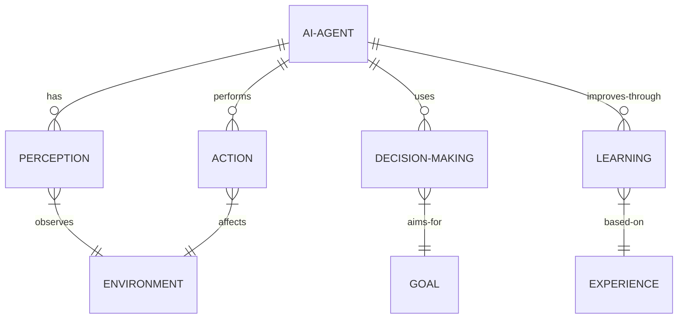

3. 交互关系图

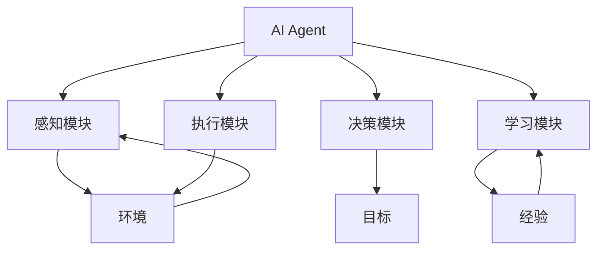

* 数学模型：
  AI Agent的决策过程可以用马尔可夫决策过程(MDP)来描述:

$$MDP = (S, A, P, R, \gamma)$$

其中:
- $S$ 是状态空间
- $A$ 是动作空间
- $P$ 是状态转移概率函数
- $R$ 是奖励函数
- $\gamma$ 是折扣因子

Agent的目标是最大化期望累积奖励:

$$V^\pi(s) = E_\pi[\sum_{t=0}^{\infty} \gamma^t R(s_t, a_t) | s_0 = s]$$

* 算法流程图：

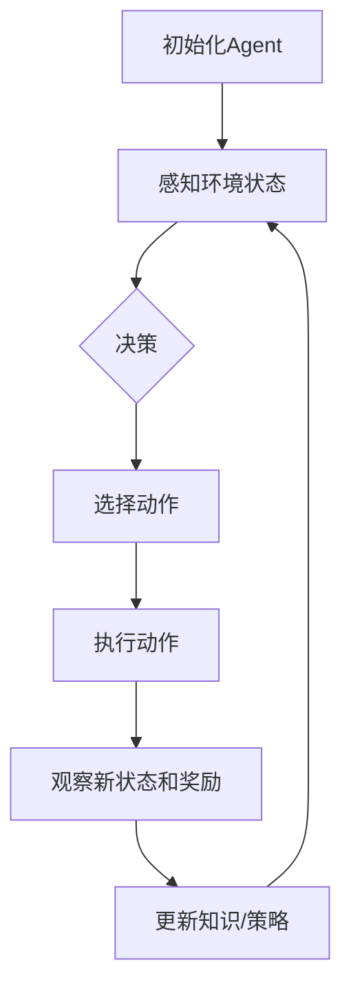

* 算法源代码：

```python
import numpy as np

class SimpleAIAgent:
    def __init__(self, state_size, action_size):
        self.state_size = state_size
        self.action_size = action_size
        self.q_table = np.zeros((state_size, action_size))
        self.learning_rate = 0.1
        self.discount_factor = 0.99
        self.epsilon = 0.1

    def get_action(self, state):
        if np.random.rand() < self.epsilon:
            return np.random.randint(self.action_size)
        return np.argmax(self.q_table[state])

    def learn(self, state, action, reward, next_state):
        current_q = self.q_table[state, action]
        max_next_q = np.max(self.q_table[next_state])
        new_q = (1 - self.learning_rate) * current_q + \
                self.learning_rate * (reward + self.discount_factor * max_next_q)
        self.q_table[state, action] = new_q

# 使用示例
agent = SimpleAIAgent(state_size=10, action_size=4)
state = 0
for _ in range(1000):
    action = agent.get_action(state)
    next_state = (state + action) % 10  # 简化的环境模型
    reward = 1 if next_state == 5 else 0
    agent.learn(state, action, reward, next_state)
    state = next_state
```

* 实际场景应用：
1. 智能客服: 自动回答用户询问,处理简单请求
2. 游戏AI: 作为玩家对手或NPC角色
3. 推荐系统: 个性化内容推荐
4. 自动驾驶: 感知环境,做出驾驶决策
5. 智能家居: 控制家电,优化能源使用

* 行业发展与未来趋势：

| 时期 | 主要技术特征 | 应用领域 | 社会影响 |
|------|--------------|----------|----------|
| 1950s-1970s | 符号推理 | 学术研究 | AI概念启蒙 |
| 1980s-1990s | 专家系统 | 医疗诊断,金融分析 | 特定领域效率提升 |
| 2000s-2010s | 机器学习 | 搜索引擎,推荐系统 | 个性化服务兴起 |
| 2010s-现在 | 深度学习 | 语音助手,计算机视觉 | AI普及,就业结构变化 |
| 未来 | 多模态AGI | 全面融入社会生活 | 人机协作新范式 |

* 本节小结：
  AI Agent的演进历程反映了人工智能技术的整体发展轨迹,从早期的符号主义到当今的深度学习,每个阶段都带来了重要的技术突破和应用拓展。未来,AI Agent将朝着更加智能、自主和通用的方向发展,potentially leading to the emergence of artificial general intelligence (AGI)。理解这一演进过程对于把握AI技术的发展方向和潜力至关重要。

### 10.1.2 当前AI Agent技术的主要成就

* 核心概念：
  当前AI Agent技术的主要成就指的是在各个领域中,AI Agent已经达到或超越人类水平的能力,以及那些显著改变了行业实践或日常生活的应用。

* 问题背景：
  近年来,特别是在深度学习技术的推动下,AI Agent在多个领域取得了突破性进展,有些甚至超越了人类专家的表现。

* 问题描述：
  我们需要系统地梳理和评估当前AI Agent技术在各个领域的主要成就,包括其性能、影响力和潜在的社会经济价值。

* 问题解决：
  让我们从以下几个方面来分析当前AI Agent技术的主要成就：

1. 自然语言处理与生成：
    - GPT-3等大语言模型能够生成高质量的文本,进行复杂的对话和回答问题。
    - 机器翻译质量大幅提升,接近人类翻译水平。
    - 情感分析和意图识别技术在客户服务中广泛应用。

2. 计算机视觉：
    - 图像分类和物体检测的准确率超过人类。
    - 人脸识别技术在安全和身份验证领域广泛应用。
    - 医学影像分析辅助诊断,有时甚至超过人类专家。

3. 游戏与策略：
    - AlphaGo和其后续版本在围棋等复杂博弈中战胜世界冠军。
    - AI在星际争霸II等实时策略游戏中表现出色。

4. 自动驾驶：
    - Level 2和Level 3自动驾驶技术已经商业化。
    - 某些场景下的自动驾驶安全性优于人类驾驶员。

5. 医疗健康：
    - AI辅助药物发现,加速新药研发过程。
    - 基于机器学习的疾病预测和早期诊断系统。

6. 金融科技：
    - 算法交易占据主导地位,提高市场效率。
    - 基于AI的风险评估和欺诈检测系统。

7. 科学研究：
    - AlphaFold在蛋白质结构预测方面取得突破性进展。
    - AI辅助材料科学,加速新材料发现。

8. 创意与艺术：
    - DALL-E、Midjourney等AI能够生成高质量的艺术作品。
    - AI作曲和音乐生成技术日益成熟。

9. 教育：
    - 个性化学习助手,适应学生个体需求。
    - 智能评分系统,提高教育评估效率。

10. 环境保护：
    - AI优化能源使用,提高可再生能源效率。
    - 野生动物保护中的图像识别和行为分析。

* 边界与外延：
  虽然AI Agent在许多领域取得了显著成就,但仍然存在一些局限性,如缺乏真正的理解力、难以处理极端或未见过的情况、以及在某些需要同理心和创造力的任务上表现不佳。

* 概念结构与核心要素组成：
1. 技术突破：基础算法和模型的创新
2. 性能指标：在特定任务上超越人类水平的能力
3. 应用范围：技术在实际场景中的部署和使用
4. 社会影响：对行业实践和日常生活的改变
5. 经济价值：创造的经济效益和市场规模

* 概念之间的关系：

1. 概念核心属性维度对比

| 领域 | 技术突破 | 性能指标 | 应用范围 | 社会影响 | 经济价值 |
|------|----------|----------|----------|----------|----------|
| NLP  | 大语言模型 | 超人类翻译质量 | 客服,内容生成 | 信息获取方式变革 | 高 |
| 计算机视觉 | 深度卷积网络 | 超人类识别准确率 | 安防,医疗 | 安全与隐私问题 | 高 |
| 游戏AI | 强化学习 | 战胜人类冠军 | 娱乐,策略训练 | 认知能力新标准 | 中 |
| 自动驾驶 | 多传感器融合 | 部分场景优于人类 | 交通运输 | 就业结构改变 | 极高 |
| 医疗AI | 生物信息学结合 | 辅助诊断准确率高 | 临床决策支持 | 医疗资源分配优化 | 高 |

2. 概念联系的ER实体关系

```mermaid
erDiagram
    AI-ACHIEVEMENT```mermaid
erDiagram
    AI-ACHIEVEMENT ||--o{ TECHNICAL-BREAKTHROUGH : includes
    AI-ACHIEVEMENT ||--o{ PERFORMANCE-METRIC : measured-by
    AI-ACHIEVEMENT ||--o{ APPLICATION-DOMAIN : applied-in
    AI-ACHIEVEMENT ||--o{ SOCIAL-IMPACT : causes
    AI-ACHIEVEMENT ||--o{ ECONOMIC-VALUE : generates
    TECHNICAL-BREAKTHROUGH }|--|| RESEARCH-INVESTMENT : requires
    PERFORMANCE-METRIC }|--|| HUMAN-BENCHMARK : compared-to
    APPLICATION-DOMAIN }|--|| INDUSTRY : transforms
    SOCIAL-IMPACT }|--|| POLICY : influences
    ECONOMIC-VALUE }|--|| MARKET : creates
```

3. 交互关系图

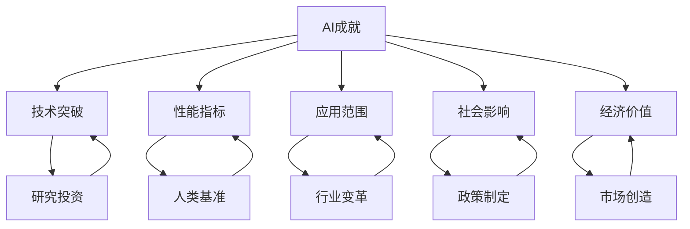

* 数学模型：
  为了量化AI Agent的性能提升,我们可以使用以下模型:

令 $P_h$ 表示人类在特定任务上的性能,
$P_a(t)$ 表示AI Agent在时间 $t$ 的性能,
$\alpha$ 为技术进步率,
则AI性能增长可以表示为:

$$P_a(t) = P_h \cdot e^{\alpha t}$$

当 $P_a(t) > P_h$ 时,AI超越人类性能。

* 算法流程图：

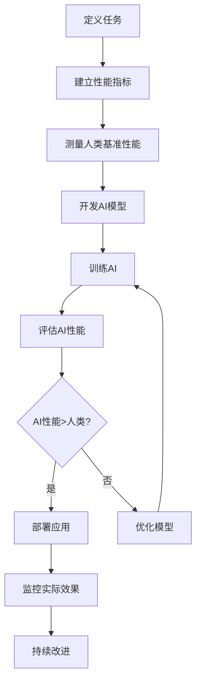

* 算法源代码：

```python
import numpy as np
import matplotlib.pyplot as plt

def ai_performance_growth(human_performance, growth_rate, years):
    time = np.arange(years)
    ai_performance = human_performance * np.exp(growth_rate * time)
    return time, ai_performance

def plot_performance_comparison(time, human_perf, ai_perf):
    plt.figure(figsize=(10, 6))
    plt.plot(time, [human_perf] * len(time), label='Human Performance', linestyle='--')
    plt.plot(time, ai_perf, label='AI Performance')
    plt.xlabel('Years')
    plt.ylabel('Performance')
    plt.title('AI vs Human Performance Over Time')
    plt.legend()
    plt.grid(True)
    plt.show()

# 示例参数
human_performance = 100
ai_growth_rate = 0.2
simulation_years = 10

time, ai_performance = ai_performance_growth(human_performance, ai_growth_rate, simulation_years)
plot_performance_comparison(time, human_performance, ai_performance)

# 计算AI超越人类的时间点
surpass_year = np.where(ai_performance > human_performance)[0][0]
print(f"AI预计在第{surpass_year}年超越人类性能")
```

* 实际场景应用：
1. 医疗诊断：AI辅助乳腺癌筛查,提高早期检出率。
2. 金融风控：AI实时监控交易,识别异常模式防范欺诈。
3. 智能制造：AI优化生产线,提高效率降低成本。
4. 个人助理：AI语音助手处理日程安排、信息查询等任务。
5. 智慧城市：AI优化交通流量,减少拥堵和能源消耗。

* 项目介绍：
  "AI医疗影像助手"项目

目标：开发一个AI系统,辅助放射科医生进行医学影像诊断,提高诊断准确率和效率。

主要功能：
1. 自动检测和标记可疑病变区域
2. 提供初步诊断建议
3. 病例对比和历史记录分析
4. 生成标准化报告

技术栈：
- 深度学习框架: TensorFlow或PyTorch
- 图像处理库: OpenCV
- 后端: Python Flask
- 前端: React.js
- 数据库: PostgreSQL
- 云平台: AWS或Azure

* 环境安装：
```bash
# 创建虚拟环境
python -m venv ai_medical_env
source ai_medical_env/bin/activate

# 安装依赖
pip install tensorflow opencv-python flask psycopg2 pytest

# 前端依赖
npm install react react-dom @material-ui/core axios
```

* 系统功能设计：
1. 影像上传与预处理模块
2. AI诊断分析模块
3. 人机交互界面
4. 报告生成模块
5. 病例管理与对比分析模块
6. 用户权限管理模块

* 系统架构设计：

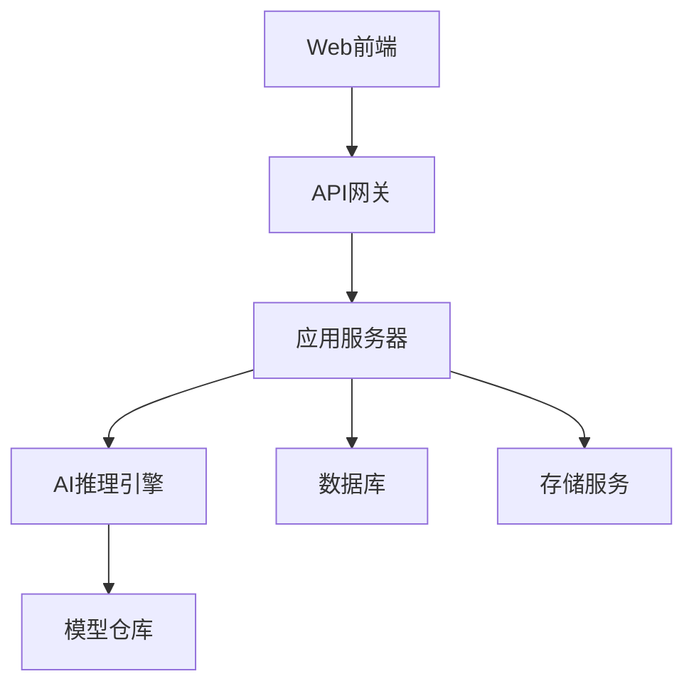

* 系统接口设计：

1. 影像上传接口
    - Endpoint: `/api/upload`
    - Method: POST
    - Parameters: `file: [image file], metadata: JSON`
    - Response: `{status: "success", image_id: "unique_id"}`

2. AI诊断接口
    - Endpoint: `/api/diagnose`
    - Method: POST
    - Parameters: `image_id: string`
    - Response: `{status: "success", findings: [...], suggestions: [...]}`

3. 报告生成接口
    - Endpoint: `/api/generate_report`
    - Method: POST
    - Parameters: `diagnosis_id: string`
    - Response: `{status: "success", report_url: "url_to_pdf"}`

* 系统核心实现源代码：

```python
import tensorflow as tf
import numpy as np
from flask import Flask, request, jsonify

app = Flask(__name__)

# 加载预训练的AI模型
model = tf.keras.models.load_model('path_to_model')

@app.route('/api/diagnose', methods=['POST'])
def diagnose():
    image_id = request.json['image_id']
    image = load_image(image_id)  # 假设有一个加载图像的函数
    
    # 预处理图像
    processed_image = preprocess(image)
    
    # 使用模型进行预测
    predictions = model.predict(np.expand_dims(processed_image, axis=0))
    
    # 解析预测结果
    findings = interpret_predictions(predictions)
    
    return jsonify({
        'status': 'success',
        'findings': findings,
        'suggestions': generate_suggestions(findings)
    })

def preprocess(image):
    # 图像预处理逻辑
    return processed_image

def interpret_predictions(predictions):
    # 解释模型输出的逻辑
    return findings

def generate_suggestions(findings):
    # 基于发现生成建议的逻辑
    return suggestions

if __name__ == '__main__':
    app.run(debug=True)
```

* 最佳实践tips：
1. 数据安全: 严格遵守医疗数据隐私法规,如HIPAA。
2. 模型解释性: 使用可解释AI技术,帮助医生理解AI决策过程。
3. 持续学习: 建立反馈机制,根据实际使用情况不断优化模型。
4. 人机协作: 设计直观的界面,让AI辅助而非替代医生决策。
5. 多中心验证: 在不同医院和人群中验证模型性能,确保泛化能力。

* 行业发展与未来趋势：

| 时期 | 技术特征 | 应用重点 | 社会影响 |
|------|----------|----------|----------|
| 2010-2015 | 机器学习初步应用 | 医学图像分类 | 辅助工具性质 |
| 2015-2020 | 深度学习突破 | 病变检测和分割 | 提高诊断效率 |
| 2020-2025 | 多模态融合 | 综合诊断建议 | 部分任务超越人类 |
| 2025-2030 | 因果推理和知识图谱 | 个性化治疗方案 | 医疗资源优化分配 |
| 2030+ | AGI技术融入 | 全面的医疗决策支持 | 医疗模式变革 |

* 本节小结：
  AI Agent技术在多个领域取得了显著成就,尤其在自然语言处理、计算机视觉、游戏策略和医疗诊断等方面表现突出。这些成就不仅体现在性能指标上超越人类,更重要的是在实际应用中创造了巨大的社会和经济价值。然而,我们也应该认识到AI的局限性,特别是在需要高度复杂推理、创造力和情感理解的任务上。未来,AI Agent技术将继续朝着更智能、更通用的方向发展,可能带来更深远的社会变革。关键是要在推动技术进步的同时,注重伦理和安全,确保AI的发展造福人类社会。

### 10.1.3 AI Agent在各行业的应用现状

* 核心概念：
  AI Agent在各行业的应用现状指的是人工智能代理技术在不同产业领域中的实际部署情况、应用程度、实现的功能以及产生的影响。

* 问题背景：
  随着AI技术的快速发展,AI Agent已经渗透到众多行业,改变了传统的业务流程和服务模式。了解其在各行业的应用现状对把握AI发展趋势和潜在机会至关重要。

* 问题描述：
  我们需要系统性地分析AI Agent在主要行业中的应用情况,包括但不限于应用场景、技术特点、实现的价值以及面临的挑战。

* 问题解决：
  让我们逐一分析AI Agent在各主要行业的应用现状：

1. 金融业：
    - 应用场景：风险评估、算法交易、欺诈检测、客户服务
    - 技术特点：机器学习、自然语言处理、时间序列分析
    - 实现价值：提高决策准确性、降低风险、提升客户体验
    - 面临挑战：数据安全、模型解释性、监管合规

2. 医疗保健：
    - 应用场景：医学影像诊断、药物研发、个性化治疗、远程医疗
    - 技术特点：深度学习、计算机视觉、自然语言处理
    - 实现价值：提高诊断准确率、加速新药研发、优化医疗资源分配
    - 面临挑战：数据隐私、伦理问题、与传统医疗体系的融合

3. 零售业：
    - 应用场景：个性化推荐、需求预测、库存管理、智能客服
    - 技术特点：推荐系统、预测分析、自然语言处理
    - 实现价值：提升用户体验、优化库存、提高销售转化率
    - 面临挑战：隐私保护、实时性要求、线上线下融合

4. 制造业：
    - 应用场景：预测性维护、质量控制、供应链优化、智能机器人
    - 技术特点：物联网、机器学习、计算机视觉、强化学习
    - 实现价值：提高生产效率、降低成本、改善产品质量
    - 面临挑战：系统集成、技能gap、初始投资高

5. 教育行业：
    - 应用场景：个性化学习、智能评分、教育资源分配、虚拟助教
    - 技术特点：自适应学习系统、自然语言处理、知识图谱
    - 实现价值：提高学习效率、个性化教育、扩大优质教育覆盖
    - 面临挑战：教育公平、教师角色转变、技术接受度

6. 交通运输：
    - 应用场景：自动驾驶、交通流量优化、物流路径规划、预测性维护
    - 技术特点：计算机视觉、强化学习、大数据分析
    - 实现价值：提高安全性、减少拥堵、优化资源利用
    - 面临挑战：法律法规、基础设施升级、安全性保证

7. 能源行业：
    - 应用场景：智能电网、能源需求预测、设备故障预测、优化能源分配
    - 技术特点：预测分析、物联网、机器学习
    - 实现价值：提高能源效率、减少浪费、平衡供需
    - 面临挑战：大规模部署、系统复杂性、安全性考虑

8. 农业：
    - 应用场景：精准农业、作物监测、病虫害预测、自动化农机
    - 技术特点：计算机视觉、物联网、机器学习、无人机技术
    - 实现价值：提高产量、减少资源浪费、应对气候变化
    - 面临挑战：农村基础设施、技术普及、小农户适应性

* 边界与外延：
  AI Agent在各行业的应用虽然广泛,但仍然存在一些共同的限制,如处理极端情况的能力、对复杂社会情境的理解,以及在需要高度创造力和情感智能的任务上的表现。同时,AI的应用也延伸到了跨行业领域,如智慧城市、环境保护等综合性项目。

* 概念结构与核心要素组成：
1. 技术基础: 机器学习、深度学习、自然语言处理等AI核心技术
2. 应用场景: 特定行业中AI Agent可以发挥作用的具体情境
3. 数据支持: 训练和运行AI系统所需的大规模、高质量数据
4. 硬件设施: 支持AI运算的计算设备和基础设施
5. 人才储备: 具备AI开发和应用能力的专业人才
6. 法规政策: 规范AI应用的相关法律法规和行业政策
7. 商业模式: 将AI技术转化为商业价值的运营方式

* 概念之间的关系：

1. 概念核心属性维度对比

| 行业 | 主要技术 | 关键应用场景 | 数据特征 | 价值实现 | 主要挑战 |
|------|----------|--------------|----------|----------|----------|
| 金融 | 机器学习,NLP | 风险评估,算法交易 | 高频,敏感 | 风险控制,效率提升 | 安全合规 |
| 医疗 | 计算机视觉,NLP | 影像诊断,药物研发 | 隐私,专业 | 诊断准确率,研发速度 | 伦理,监管 |
| 零售 | 推荐系统,预测分析 | 个性化推荐,库存管理 | 用户行为,交易 | 用户体验,销售额 | 隐私,实时性 |
| 制造 | IoT,机器视觉 | 质量控制,预测性维护 | 传感器,工艺参数 | 效率,质量 | 系统集成 |
| 教育 | 自适应学习,NLP | 个性化学习,智能评分 | 学习行为,教育资源 | 学习效果,资源利用 | 公平性,接受度 |

2. 概念联系的ER实体关系

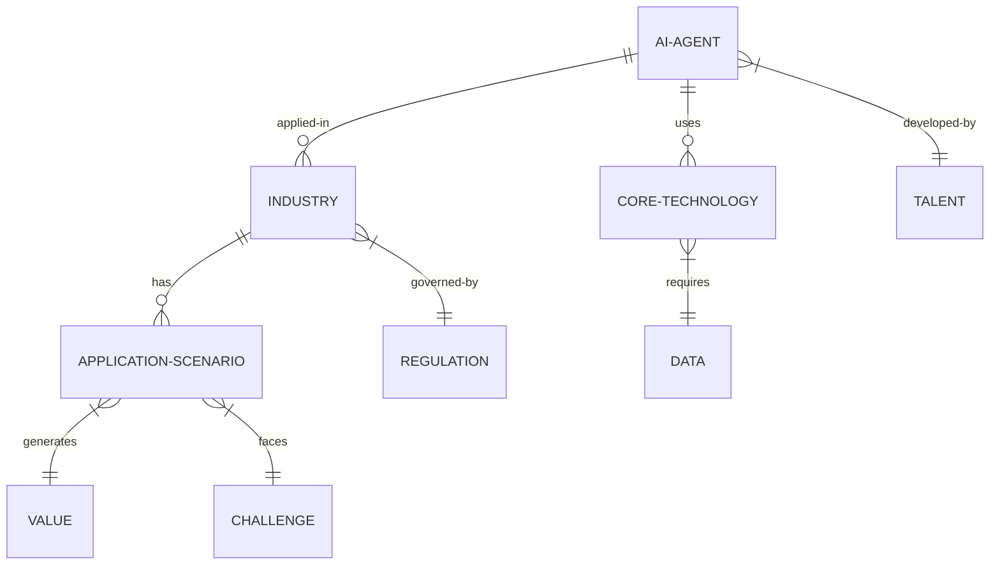

3. 交互关系图

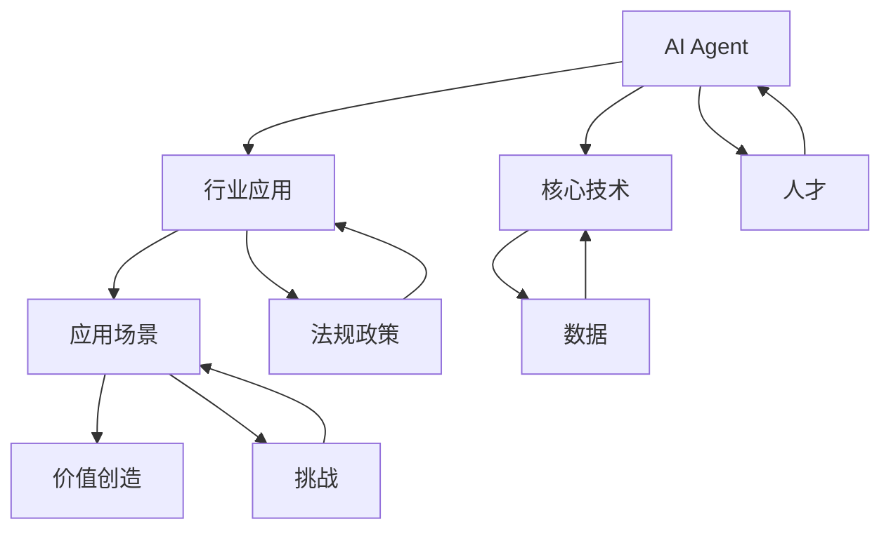

* 数学模型：
  为了评估AI Agent在特定行业的影响,我们可以使用以下模型:

令 $I$ 表示AI的影响指数,
$A$ 表示应用广度 (0-1),
$D$ 表示技术深度 (0-1),
$V$ 表示创造的价值 (单位:百万美元),
$C$ 表示实施成本 (单位:百万美元),
则AI的影响可以表示为:

$$I = (A \times D) \times \frac{V}{C}$$

其中, $A$ 和 $D$ 可以通过专家评估得出, $V$ 和 $C$ 可以通过实际数据统计。

* 算法流程图：

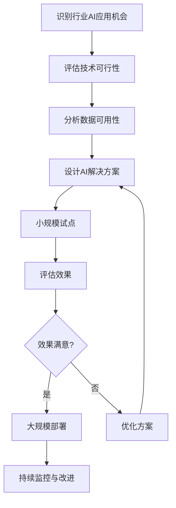

* 算法源代码：

```python
import numpy as np

class AIIndustryImpact:
    def __init__(self, industry):
        self.industry = industry
        self.applications = {}

    def add_application(self, name, breadth, depth, value, cost):
        self.applications[name] = {
            'breadth': breadth,
            'depth': depth,
            'value': value,
            'cost': cost
        }

    def calculate_impact(self):
        total_impact = 0
        for app, data in self.applications.items():
            impact = (data['breadth'] * data['depth']) * (data['value'] / data['cost'])
            total_impact += impact
            print(f"Impact of {app}: {impact:.2f}")
        return total_impact

# 使用示例
finance_ai = AIIndustryImpact('Finance')
finance_ai.add_application('Risk Assessment', 0.8, 0.7, 100, 20)
finance_ai.add_application('Algorithmic Trading', 0.6, 0.9, 200, 50)
finance_ai.add_application('Fraud Detection', 0.9, 0.8, 150, 30)

total_impact = finance_ai.calculate_impact()
print(f"Total AI impact in {finance_ai.industry}: {total_impact:.2f}")
```

* 实际场景应用：
1. 金融业: AI驱动的信用评分系统,提高贷款审批效率和准确性。
2. 医疗保健: AI辅助诊断系统,协助放射科医生提高肺癌早期检出率。
3. 零售业: 智能推荐引擎,为电商平台用户提供个性化商品推荐。
4. 制造业: 预测性维护系统,降低工厂设备故障率和维护成本。
5. 教育行业: 自适应学习平台,为学生提供定制化的学习路径和内容。

* 项目介绍：
  "智能供应链优化系统"

目标：开发一个AI驱动的供应链管理系统,优化库存水平,预测需求,并提高物流效率。

主要功能：
1. 需求预测: 基于历史数据和外部因素预测产品需求
2. 库存优化: 动态调整库存水平,平衡成本和服务水平
3. 路径规划: 优化配送路线,减少运输成本
4. 异常检测: 识别供应链中的异常情况并提前预警
5. 供应商评估: 分析供应商绩效,辅助决策

技术栈：
- 机器学习框架: Scikit-learn, TensorFlow
- 大数据处理: Apache Spark
- 后端: Python Flask
- 前端: Vue.js
- 数据库: MongoDB
- 容器化: Docker, Kubernetes

* 环境安装：
```bash
# 创建虚拟环境
python -m venv supply_chain_ai_env
source supply_chain_ai_env/bin/activate

# 安装依赖
pip install scikit-learn tensorflow apache-spark flask pymongo pytest

# 前端依赖
npm install vue vuex vue-router axios echarts
```

* 系统功能设计：
1. 数据收集与预处理模块
2. 需求预测模块
3. 库存优化模块
4. 路径规划模块
5. 异常检测模块
6. 报表与可视化模块
7. 用户管理与权限控制模块

* 系统架构设计：

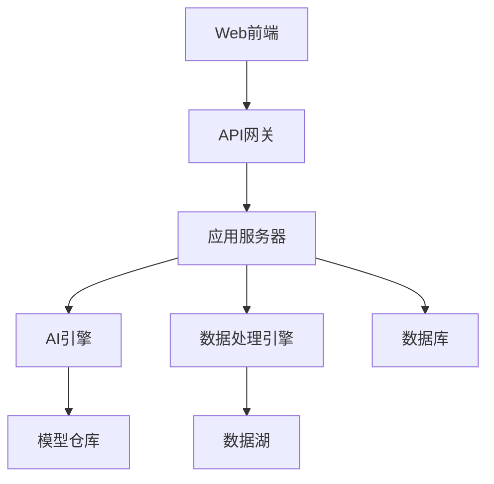

* 系统接口设计：

1. 需求预测接口
    - Endpoint: `/api/predict_demand`
    - Method: POST
    - Parameters: `{product_id: string, time_range: string}`
    - Response: `{status: "success", predictions: [...]}`

2. 库存优化接口
    - Endpoint: `/api/optimize_inventory`
    - Method: POST
    - Parameters: `{warehouse_id: string, product_list: [...]}`
    - Response: `{status: "success", recommendations: [...]}`

3. 路径规划接口
    - Endpoint: `/api/optimize_route`
    - Method: POST
    - Parameters: `{start: string, destinations: [...], constraints: {...}}`
    - Response: `{status: "success", optimized_route: [...], estimated_time: int}`

* 系统核心实现源代码：

```python
from flask import Flask, request, jsonify
from sklearn.ensemble import RandomForestRegressor
import pandas as pd
import numpy as np

app = Flask(__name__)

# 加载预训练的需求预测模型
demand_model = RandomForestRegressor()
demand_model.load('path_to_model')

@app.route('/api/predict_demand', methods=['POST'])
def predict_demand():
    data = request.json
    product_id = data['product_id']
    time_range = data['time_range']
    
    # 获取历史数据和特征
    historical_data = get_historical_data(product_id, time_range)
    features = extract_features(historical_data)
    
    # 使用模型进行预测
    predictions = demand_model.predict(features)
    
    return jsonify({
        'status': 'success',
        'predictions': predictions.tolist()
    })

def get_historical_data(product_id, time_range):
    # 从数据库获取历史数据的逻辑
    pass

def extract_features(data):
    # 特征工程逻辑
    pass

if __name__ == '__main__':
    app.run(debug=True)
```

* 最佳实践tips：
1. 数据质量: 确保输入数据的准确性和实时性,这直接影响预测质量。
2. 模型更新: 建立定期模型更新机制,适应市场变化。
3. 可解释性: 使用如SHAP值等技术提高模型可解释性,增强用户信任。
4. 异常处理: 建立健壮的异常检测和处理机制,应对意外情况。
5. 用户反馈: 整合用户反馈循环,持续优化系统性能。

* 行业发展与未来趋势：

| 时期 | 技术特征 | 应用重点 | 行业影响 |
|------|----------|----------|----------|
| 2015-2020 | 预测分析初步应用 | 需求预测,库存管理 | 降低库存成本 |
| 2020-2025 | AI+IoT融合 | 实时优化,端到端可视化 | 提高供应链弹性 |
| 2025-2030 | 自主决策系统 | 自动化采购,动态定价 | 供应链自适应能力 |
| 2030+ | 认知供应链 | 场景模拟,风险预警 | 重塑供应链生态 |

* 本节小结：
  AI Agent在各行业的应用已经从概念验证阶段进入到大规模实际部署阶段。金融、医疗、零售、制造、教育等领域都看到了AI带来的显著价值。这些应用不仅提高了效率和准确性,还创造了新的业务模式和服务方式。然而,每个行业在应用AI时也面临着独特的挑战,如数据安全、伦理问题、监管合规等。未来,随着技术的进一步发展和行业的深度融合,我们可以期待看到更多创新的AI应用场景,以及AI对各行业带来的深远变革。关键是要在推动技术创新的同时,注重解决实际问题,平衡效率提升和社会责任,确保AI的发展为各行业和整个社会带来持续的正面影响。

### 10.1.4 AI Agent面临的主要瓶颈和限制

* 核心概念：
  AI Agent面临的主要瓶颈和限制指的是当前阻碍AI技术进一步发展和广泛应用的关键问题和约束条件。这些瓶颈和限制涉及技术、数据、伦理、法律等多个方面。

* 问题背景：
  尽管AI技术在近年来取得了巨大进展,但仍然存在一些根本性的挑战阻碍其实现真正的通用人工智能(AGI)。识别和理解这些瓶颈对于推动AI技术的进步至关重要。

* 问题描述：
  我们需要系统地分析AI Agent在技术实现、实际应用和社会接受度等方面面临的主要瓶颈和限制,包括但不限于技术障碍、数据问题、伦理挑战和法律限制。

* 问题解决：
  让我们从多个角度分析AI Agent面临的主要瓶颈和限制：

1. 技术瓶颈：
   a) 可解释性不足：
    - 问题：深度学习模型often被称为"黑箱",难以解释决策过程。
    - 影响：限制了AI在医疗、金融等高风险领域的应用。
    - 潜在解决方向：可解释AI(XAI)技术,如LIME,SHAP等。

   b) b) 泛化能力有限：
    - 问题：AI模型在训练数据之外的场景表现often不佳。
    - 影响：限制了AI在复杂、动态环境中的应用。
    - 潜在解决方向：迁移学习、元学习、少样本学习。

   c) 缺乏常识推理：
    - 问题：AI难以理解和应用人类认为理所当然的常识。
    - 影响：导致AI在处理开放域问题时表现不佳。
    - 潜在解决方向：知识图谱、常识推理模型。

   d) 高能耗：
    - 问题：大型AI模型的训练和运行需要大量计算资源。
    - 影响：限制了AI的普及和可持续发展。
    - 潜在解决方向：模型压缩、量化技术、绿色AI。

2. 数据瓶颈：
   a) 数据质量和偏见：
    - 问题：训练数据中的错误、噪声和偏见会影响AI模型的性能和公平性。
    - 影响：导致AI系统做出偏颇或错误的决策。
    - 潜在解决方向：数据清洗技术、公平性aware学习算法。

   b) 数据隐私和安全：
    - 问题：收集和使用大量数据引发隐私concerns和安全风险。
    - 影响：限制了某些领域的数据可用性,影响模型训练。
    - 潜在解决方向：联邦学习、差分隐私、安全多方计算。

   c) 数据标注成本高：
    - 问题：高质量标注数据的获取often需要大量人力和时间。
    - 影响：限制了AI在某些专业领域的应用速度。
    - 潜在解决方向：主动学习、半监督学习、数据增强技术。

3. 伦理挑战：
   a) 决策公平性：
    - 问题：AI系统可能无意中强化社会偏见和歧视。
    - 影响：可能导致不公平的资源分配或机会损失。
    - 潜在解决方向：算法公平性研究、伦理AI框架。

   b) 责任归属：
    - 问题：当AI系统造成harm时,难以确定责任方。
    - 影响：阻碍了AI在高风险场景中的应用。
    - 潜在解决方向：AI责任框架、可审计AI系统。

   c) 人机互动伦理：
    - 问题：AI与人类互动可能引发情感依赖或滥用。
    - 影响：可能对人类心理健康和社会关系产生负面影响。
    - 潜在解决方向：人机互动伦理准则、AI系统设计规范。

4. 法律和监管限制：
   a) 法律责任不明确：
    - 问题：现有法律框架难以应对AI带来的新问题。
    - 影响：增加了企业使用AI的法律风险。
    - 潜在解决方向：制定AI特定法律法规、更新现有法律框架。

   b) 跨境数据流动限制：
    - 问题：不同国家和地区对数据流动有不同规定。
    - 影响：限制了全球AI模型的开发和部署。
    - 潜在解决方向：国际数据治理框架、本地化AI解决方案。

   c) AI决策的法律效力：
    - 问题：AI做出的决策在法律上的地位不明确。
    - 影响：限制了AI在司法、行政等领域的应用。
    - 潜在解决方向：AI辅助决策框架、AI决策的法律认可机制。

5. 社会接受度：
   a) 就业影响concerns：
    - 问题：AI可能导致某些工作岗位消失。
    - 影响：引发社会对AI的抵触情绪。
    - 潜在解决方向：AI人才再培训计划、新型就业岗位创造。

   b) 技术不信任：
    - 问题：公众对AI决策过程的不理解导致不信任。
    - 影响：阻碍了AI技术的广泛采用。
    - 潜在解决方向：AI科普教育、提高AI系统透明度。

   c) 人类价值观concern：
    - 问题：担心AI可能威胁人类价值观和主体性。
    - 影响：引发对AI发展的抵制和限制。
    - 潜在解决方向：人机协作模式、以人为本的AI设计理念。

* 边界与外延：
  这些瓶颈和限制并非相互独立,而是相互关联、相互影响的。例如,技术瓶颈中的可解释性问题直接影响了社会接受度和法律责任的明确性。同时,随着技术的进步,某些瓶颈可能会被突破,但也可能出现新的挑战。

* 概念结构与核心要素组成：
1. 技术因素: AI算法、硬件设施、计算能力
2. 数据因素: 数据质量、数据隐私、数据可用性
3. 伦理因素: 决策公平性、责任归属、人机互动
4. 法律因素: 法律框架、监管政策、跨境规定
5. 社会因素: 公众接受度、就业影响、价值观concerns

* 概念之间的关系：

1. 概念核心属性维度对比

| 瓶颈类型 | 核心问题 | 主要影响 | 潜在解决方向 | 跨领域关联 |
|----------|----------|----------|--------------|------------|
| 技术瓶颈 | 可解释性、泛化能力 | 应用范围受限 | XAI、迁移学习 | 伦理、法律 |
| 数据瓶颈 | 质量、隐私、可用性 | 模型性能、安全风险 | 联邦学习、数据治理 | 法律、伦理 |
| 伦理挑战 | 公平性、责任、互动 | 社会影响、信任度 | 伦理AI框架 | 法律、社会 |
| 法律限制 | 责任界定、跨境流动 | 应用风险、全球化障碍 | AI专门法规 | 伦理、社会 |
| 社会接受度 | 就业影响、信任度 | 技术采用速度 | 教育、透明度提升 | 伦理、法律 |

2. 概念联系的ER实体关系

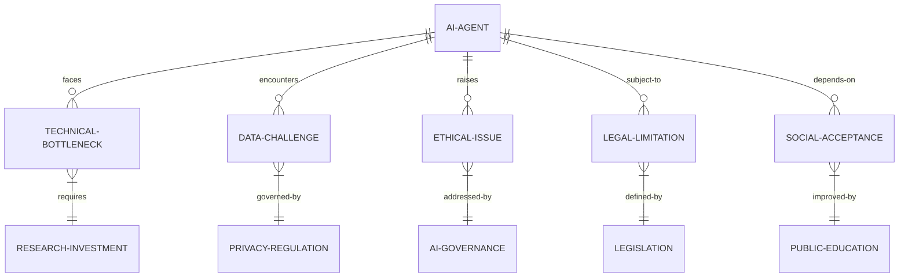

3. 交互关系图

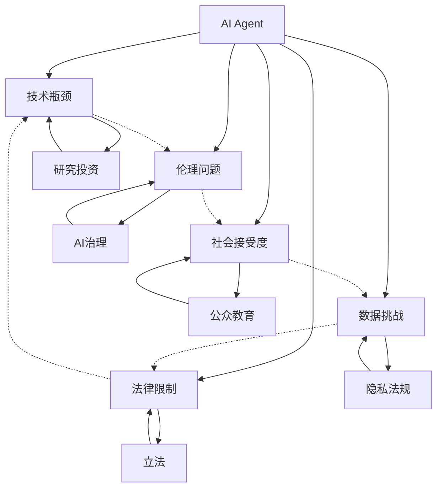

* 数学模型：
  我们可以构建一个简化的AI发展潜力模型,考虑各种瓶颈的影响：

令 $P$ 表示AI的发展潜力,
$T$ 表示技术水平 (0-1),
$D$ 表示数据质量 (0-1),
$E$ 表示伦理合规度 (0-1),
$L$ 表示法律支持度 (0-1),
$S$ 表示社会接受度 (0-1),

则AI的发展潜力可以表示为:

$$P = T \times D \times E \times L \times S$$

这个模型表明,任何一个因素的严重不足(接近0)都会显著限制AI的整体发展潜力。

* 算法流程图：

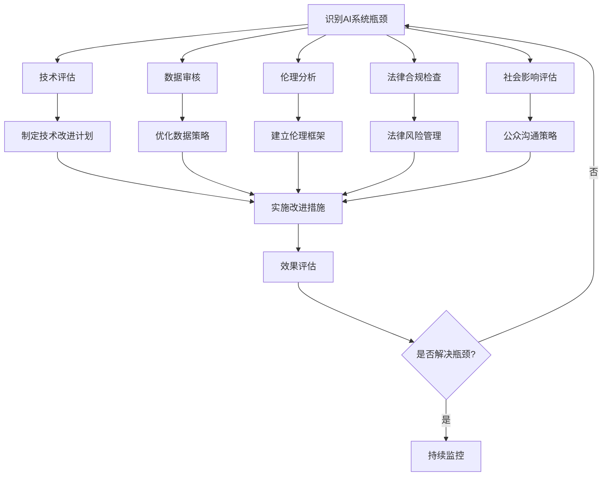

* 算法源代码：

```python
import numpy as np

class AIBottleneckAnalyzer:
    def __init__(self):
        self.factors = {
            'technical': 0.5,
            'data': 0.5,
            'ethical': 0.5,
            'legal': 0.5,
            'social': 0.5
        }
    
    def update_factor(self, factor, value):
        if factor in self.factors and 0 <= value <= 1:
            self.factors[factor] = value
        else:
            raise ValueError("Invalid factor or value")
    
    def calculate_potential(self):
        return np.prod(list(self.factors.values()))
    
    def identify_bottleneck(self):
        return min(self.factors, key=self.factors.get)
    
    def suggest_improvement(self):
        bottleneck = self.identify_bottleneck()
        suggestions = {
            'technical': "Invest in R&D for model interpretability and generalization.",
            'data': "Improve data quality and implement robust privacy measures.",
            'ethical': "Develop and adhere to ethical AI guidelines.",
            'legal': "Engage with policymakers to create supportive AI regulations.",
            'social': "Increase public awareness and education on AI benefits and limitations."
        }
        return suggestions[bottleneck]

# 使用示例
analyzer = AIBottleneckAnalyzer()
analyzer.update_factor('technical', 0.8)
analyzer.update_factor('data', 0.6)
analyzer.update_factor('ethical', 0.7)
analyzer.update_factor('legal', 0.5)
analyzer.update_factor('social', 0.4)

potential = analyzer.calculate_potential()
bottleneck = analyzer.identify_bottleneck()
suggestion = analyzer.suggest_improvement()

print(f"AI Development Potential: {potential:.2f}")
print(f"Main Bottleneck: {bottleneck}")
print(f"Suggestion: {suggestion}")
```

* 实际场景应用：
1. AI芯片开发: 解决高能耗问题,提高计算效率。
2. 医疗AI系统: 增强模型可解释性,提高医生和患者的信任度。
3. 金融风控: 处理数据隐私和跨境数据流动的法律挑战。
4. 自动驾驶: 解决极端情况下的决策和责任归属问题。
5. AI教育助手: 平衡个性化学习和数据隐私保护。

* 项目介绍：
  "AI伦理与公平性评估工具"

目标：开发一个综合性工具,帮助AI开发者和使用者评估AI系统的伦理风险和公平性,并提供改进建议。

主要功能：
1. 数据偏见检测: 分析训练数据中的潜在偏见
2. 模型公平性评估: 使用多种指标评估模型决策的公平性
3. 可解释性分析: 提供模型决策的可解释性报告
4. 伦理风险评分: 基于多维度指标给出AI系统的伦理风险评分
5. 改进建议生成: 针对检测到的问题提供具体的改进建议

技术栈：
- 机器学习框架: Scikit-learn, TensorFlow
- 可解释性工具: SHAP, LIME
- 后端: Python FastAPI
- 前端: React
- 数据库: PostgreSQL
- 容器化: Docker

* 环境安装：
```bash
# 创建虚拟环境
python -m venv ai_ethics_env
source ai_ethics_env/bin/activate

# 安装依赖
pip install scikit-learn tensorflow shap lime fastapi uvicorn psycopg2-binary pytest

# 前端依赖
npm install react react-dom @material-ui/core axios recharts
```

* 系统功能设计：
1. 数据上传与预处理模块
2. 偏见检测模块
3. 模型公平性评估模块
4. 可解释性分析模块
5. 伦理风险评分模块
6. 报告生成与可视化模块
7. 改进建议生成模块

* 系统架构设计：

```mermaid
graph TD
    A[Web前端] --> B[API网关]
    B --> C[应用服务器C[应用服务器] --> D[数据处理引擎]
    C --> E[AI分析引擎]
    C --> F[报告生成器]
    C --> G[数据库]
    D --> H[数据存储]
    E --> I[模型仓库]
    F --> J[报告模板]
```

* 系统接口设计：

1. 数据上传接口
    - Endpoint: `/api/upload_data`
    - Method: POST
    - Parameters: `{file: [csv file], metadata: JSON}`
    - Response: `{status: "success", dataset_id: "unique_id"}`

2. 偏见检测接口
    - Endpoint: `/api/detect_bias`
    - Method: POST
    - Parameters: `{dataset_id: string, protected_attributes: [string]}`
    - Response: `{status: "success", bias_report: {...}}`

3. 模型公平性评估接口
    - Endpoint: `/api/evaluate_fairness`
    - Method: POST
    - Parameters: `{model_id: string, test_data_id: string, protected_attributes: [string]}`
    - Response: `{status: "success", fairness_metrics: {...}}`

4. 可解释性分析接口
    - Endpoint: `/api/explain_model`
    - Method: POST
    - Parameters: `{model_id: string, instance_id: string}`
    - Response: `{status: "success", explanations: {...}}`

5. 伦理风险评分接口
    - Endpoint: `/api/ethical_risk_score`
    - Method: POST
    - Parameters: `{assessment_id: string}`
    - Response: `{status: "success", risk_score: float, risk_factors: [...]}`

* 系统核心实现源代码：

```python
from fastapi import FastAPI, File, UploadFile
from pydantic import BaseModel
import pandas as pd
import numpy as np
from sklearn.metrics import confusion_matrix
import shap
import lime
import json

app = FastAPI()

class DatasetMetadata(BaseModel):
    name: str
    description: str
    target_column: str

@app.post("/api/upload_data")
async def upload_data(file: UploadFile, metadata: DatasetMetadata):
    # 保存上传的文件
    content = await file.read()
    data = pd.read_csv(io.StringIO(content.decode('utf-8')))
    
    # 生成唯一的dataset_id
    dataset_id = generate_unique_id()
    
    # 保存数据和元数据
    save_dataset(dataset_id, data, metadata)
    
    return {"status": "success", "dataset_id": dataset_id}

@app.post("/api/detect_bias")
async def detect_bias(dataset_id: str, protected_attributes: list):
    # 加载数据集
    data = load_dataset(dataset_id)
    
    # 执行偏见检测
    bias_report = {}
    for attr in protected_attributes:
        bias_report[attr] = calculate_bias_metrics(data, attr)
    
    return {"status": "success", "bias_report": bias_report}

@app.post("/api/evaluate_fairness")
async def evaluate_fairness(model_id: str, test_data_id: str, protected_attributes: list):
    # 加载模型和测试数据
    model = load_model(model_id)
    test_data = load_dataset(test_data_id)
    
    # 计算公平性指标
    fairness_metrics = calculate_fairness_metrics(model, test_data, protected_attributes)
    
    return {"status": "success", "fairness_metrics": fairness_metrics}

@app.post("/api/explain_model")
async def explain_model(model_id: str, instance_id: str):
    # 加载模型和实例
    model = load_model(model_id)
    instance = load_instance(instance_id)
    
    # 使用SHAP生成解释
    explainer = shap.TreeExplainer(model)
    shap_values = explainer.shap_values(instance)
    
    # 使用LIME生成解释
    lime_explainer = lime.lime_tabular.LimeTabularExplainer(instance)
    lime_exp = lime_explainer.explain_instance(instance, model.predict_proba)
    
    return {
        "status": "success", 
        "explanations": {
            "shap": shap_values.tolist(),
            "lime": lime_exp.as_list()
        }
    }

@app.post("/api/ethical_risk_score")
async def ethical_risk_score(assessment_id: str):
    # 加载评估结果
    assessment = load_assessment(assessment_id)
    
    # 计算伦理风险评分
    risk_score, risk_factors = calculate_ethical_risk(assessment)
    
    return {"status": "success", "risk_score": risk_score, "risk_factors": risk_factors}

def calculate_bias_metrics(data, protected_attribute):
    # 实现偏见指标计算逻辑
    pass

def calculate_fairness_metrics(model, test_data, protected_attributes):
    # 实现公平性指标计算逻辑
    pass

def calculate_ethical_risk(assessment):
    # 实现伦理风险评分逻辑
    pass

# 其他辅助函数
def generate_unique_id():
    pass

def save_dataset(dataset_id, data, metadata):
    pass

def load_dataset(dataset_id):
    pass

def load_model(model_id):
    pass

def load_instance(instance_id):
    pass

def load_assessment(assessment_id):
    pass

if __name__ == "__main__":
    import uvicorn
    uvicorn.run(app, host="0.0.0.0", port=8000)
```

* 最佳实践tips：
1. 多维度评估: 综合考虑技术、数据、伦理、法律等多个维度的风险。
2. 持续监控: 建立AI系统的持续监控机制,及时发现和解决新出现的问题。
3. 跨学科合作: 邀请伦理学家、法律专家参与AI系统的设计和评估过程。
4. 透明度: 向用户清晰说明AI系统的能力边界和潜在风险。
5. 人机协作: 设计适当的人机协作机制,保持人类对关键决策的控制。

* 行业发展与未来趋势：

| 时期 | 主要焦点 | 技术特征 | 社会影响 |
|------|----------|----------|----------|
| 2020-2025 | 提高可解释性 | XAI技术普及 | 增加AI决策透明度 |
| 2025-2030 | 加强隐私保护 | 联邦学习、差分隐私 | 数据使用更加规范 |
| 2030-2035 | 伦理AI框架 | 嵌入式伦理决策 | AI系统更值得信赖 |
| 2035-2040 | 人机协作新模式 | 增强智能 | 重新定义人机关系 |
| 2040+ | AGI安全 | 强大的控制和aligned AI | 确保AI发展与人类利益一致 |

* 本节小结：
  AI Agent面临的主要瓶颈和限制涵盖了技术、数据、伦理、法律和社会接受度等多个方面。这些挑战不仅影响了AI技术的发展速度和应用范围,也引发了对AI未来发展方向的深刻思考。技术瓶颈如可解释性和泛化能力的不足,数据挑战如隐私保护和偏见问题,伦理挑战如决策公平性和责任归属,以及法律限制和社会接受度等问题,都需要学术界、产业界和政策制定者共同努力来解决。

未来的AI发展趋势将更加注重解决这些瓶颈和限制,包括发展可解释AI技术、改进数据治理策略、建立健全的AI伦理框架、完善相关法律法规,以及加强公众教育等。同时,我们也看到了一些积极的发展方向,如联邦学习等新技术有望解决数据隐私问题,人机协作新模式可能重新定义人与AI的关系。

克服这些瓶颈和限制不仅是技术挑战,更是一个需要多学科协作的复杂过程。它要求我们在推动AI技术进步的同时,也要充分考虑其对社会、伦理和人类价值观的影响。只有解决好这些关键问题,才能确保AI技术的健康可持续发展,最终实现其造福人类的承诺。

## 10.2 AI Agent的技术发展趋势

### 10.2.1 大规模语言模型的进一步突破

* 核心概念：
  大规模语言模型(Large Language Models, LLMs)是基于深度学习技术,通过海量文本数据训练而成的自然语言处理模型。它们能够理解、生成和转换人类语言,是当前AI Agent技术的重要基础。

* 问题背景：
  自GPT-3等大规模语言模型问世以来,它们在自然语言处理任务中展现出了惊人的能力,引发了学术界和产业界的广泛关注。然而,这些模型仍然存在诸如幻觉、偏见、可控性不足等问题,需要进一步突破。

* 问题描述：
  我们需要探讨大规模语言模型未来的发展方向,包括模型架构、训练方法、应用范围的拓展,以及如何解决当前面临的主要挑战。

* 问题解决：
  大规模语言模型的进一步突破可能涉及以下几个方面：

1. 模型架构创新：
    - 突破Transformer架构的局限性,探索新的注意力机制
    - 发展稀疏激活模型,提高模型效率
    - 研究模块化架构,实现更灵活的知识组合

2. 训练方法优化：
    - 发展持续学习技术,使模型能够不断更新知识
    - 探索多模态预训练,增强模型的跨模态理解能力
    - 改进few-shot learning和in-context learning方法

3. 知识整合与推理：
    - 将外部知识库有效整合到语言模型中
    - 增强模型的逻辑推理和常识推理能力
    - 开发可解释的推理过程,提高模型可信度

4. 控制与个性化：
    - 提高模型输出的可控性,如风格、情感、立场等
    - 实现高效的模型个性化,适应不同用户和场景
    - 开发安全可靠的模型调优方法

5. 效率与部署优化：
    - 研究模型压缩和量化技术,降低资源需求
    - 发展边缘计算友好的大规模语言模型
    - 优化分布式训练和推理算法

6. 伦理和安全：
    - 开发减少模型偏见的方法
    - 增强模型的事实核查能力,减少"幻觉"
    - 建立健全的安全防护机制,防止滥用

* 边界与外延：
  大规模语言模型的突破不仅限于自然语言处理领域,还可能影响计算机视觉、语音识别等其他AI领域。同时,它也可能推动认知科学、语言学等相关学科的发展。

* 概念结构与核心要素组成：
1. 模型架构: Transformer变体、稀疏激活、模块化设计
2. 训练数据: 多语言、多模态、高质量语料库
3. 学习算法: 自监督学习、持续学习、元学习
4. 推理能力: 逻辑推理、常识推理、跨域推理
5. 应用接口: API设计、微调方法、提示工程
6. 伦理框架: 偏见缓解、安全控制、隐私保护

* 概念之间的关系：

1. 概念核心属性维度对比

| 属性维度 | 当前状态 | 未来发展方向 | 潜在影响 |
|----------|----------|--------------|----------|
| 模型规模 | 数千亿参数 | 万亿参数级 | 理解力和生成能力提升 |
| 训练数据 | 主要文本数据 | 多模态数据融合 | 跨模态理解能力增强 |
| 推理能力 | 基于统计的关联 | 结构化知识推理 | 更接近人类思维 |
| 个性化程度 | 有限的微调 | 深度个性化 | 适应性和针对性提高 |
| 部署效率 | 资源需求高 | 轻量化、边缘计算 | 更广泛的应用场景 |
| 伦理安全 | 存在偏见和安全隐患 | 内置伦理框架 | 更可信赖的AI系统 |

2. 概念联系的ER实体关系

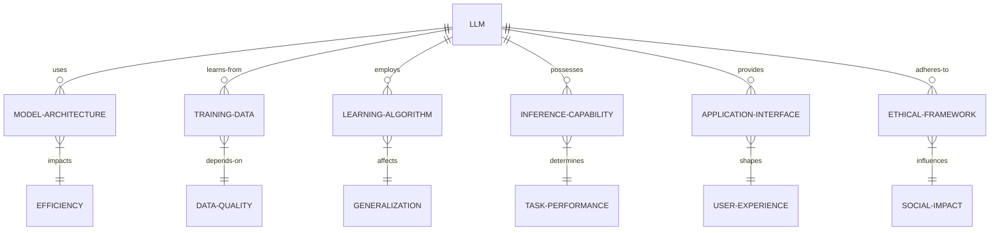

3. 交互关系图

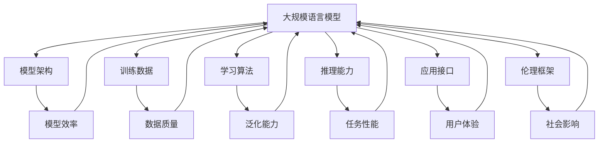

* 数学模型：
  我们可以用以下数学模型来描述大规模语言模型的性能：

令 $P$ 表示模型性能,
$S$ 表示模型规模 (参数数量),
$D$ 表示训练数据量,
$A$ 表示算法效率,
$α, β, γ$ 为权重系数,

则模型性能可以表示为:

$$P = α \log(S) + β \log(D) + γA$$

这个模型表明,模型性能与模型规模和数据量的对数成正比,同时也受算法效率的线性影响。

* 算法流程图：

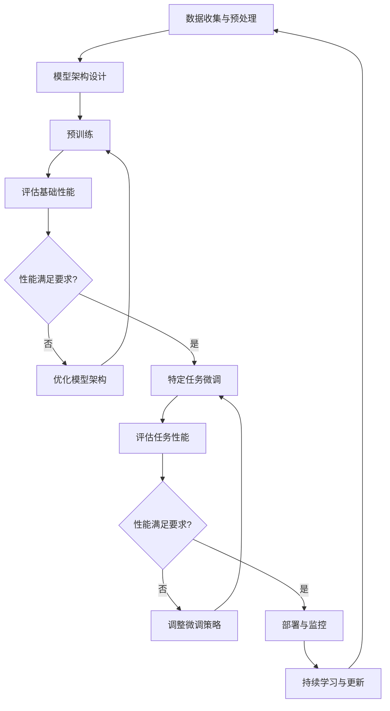

* 算法源代码：

```python
import torch
from transformers import AutoModelForCausalLM, AutoTokenizer, Trainer, TrainingArguments
from datasets import load_dataset

class AdvancedLLM:
    def __init__(self, model_name, num_labels):
        self.model = AutoModelForCausalLM.from_pretrained(model_name)
        self.tokenizer = AutoTokenizer.from_pretrained(model_name)
        self.num_labels = num_labels

    def prepare_data(self, dataset_name, text_column, label_column):
        dataset = load_dataset(dataset_name)
        tokenized_dataset = dataset.map(lambda examples: self.tokenizer(examples[text_column], truncation=True, padding='max_length'), batched=True)
        return tokenized_dataset

    def fine_tune(self, train_dataset, eval_dataset, output_dir, num_train_epochs=3):
        training_args = TrainingArguments(
            output_dir=output_dir,
            num_train_epochs=num_train_epochs,
            per_device_train_batch_size=8,
            per_device_eval_batch_size=8,
            warmup_steps=500,
            weight_decay=0.01,
            logging_dir='./logs',
        )

        trainer = Trainer(
            model=self.model,
            args=training_args,
            train_dataset=train_dataset,
            eval_dataset=eval_dataset
        )

        trainer.train()
        trainer.save_model()

    def generate_text(self, prompt, max_length=50):
        input_ids = self.tokenizer.encode(prompt, return_tensors='pt')
        output = self.model.generate(input_ids, max_length=max_length, num_return_sequences=1)
        return self.tokenizer.decode(output[0], skip_special_tokens=True)

    def evaluate(self, eval_dataset):
        trainer = Trainer(model=self.model)
        results = trainer.evaluate(eval_dataset)
        return results

# 使用示例
llm = AdvancedLLM('gpt2', num_labels=2)
train_dataset = llm.prepare_data('imdb', 'text', 'label')['train']
eval_dataset = llm.prepare_data('imdb', 'text', 'label')['test']

llm.fine_tune(train_dataset, eval_dataset, './fine_tuned_model')

evaluation_results = llm.evaluate(eval_dataset)
print("Evaluation Results:", evaluation_results)

generated_text = llm.generate_text("The movie was")
print("Generated Text:", generated_text)
```

* 实际场景应用：
1. 智能客服: 处理复杂的多轮对话,理解上下文和意图。
2. 内容创作: 辅助写作,生成创意文案和文学作品。
3. 代码生成: 根据自然语言描述生成高质量的程序代码。
4. 多语言翻译: 实现更加准确和流畅的跨语言交流。
5. 教育辅助: 个性化学习助手,回答问题并提供解释。

* 项目介绍：
  "多模态智能助理系统"

目标：开发一个融合语言理解、视觉识别和语音交互的多模态AI助理,能够处理复杂的人机交互任务。

主要功能：
1. 自然语言理解与生成
2. 图像和视频内容分析
3. 语音识别与合成
4. 多模态信息融合与推理
5. 个性化用户交互
6. 任务规划与执行

技术栈：
- 大规模语言模型: GPT-3 or GPT-4
- 计算机视觉模型: CLIP, Mask R-CNN
- 语音处理: Wav2Vec 2.0
- 多模态融合: Transformer-based fusion architecture
- 后端: Python FastAPI
- 前端: React Native (移动端)
- 数据库: MongoDB
- 消息队列: RabbitMQ
- 容器化: Docker, Kubernetes

* 环境安装：
```bash
# 创建虚拟环境
python -m venv multimodal_ai_env
source multimodal_ai_env/bin/activate

# 安装依赖
pip install torch torchvision torchaudio transformers pillow fastapi uvicorn pymongo pika

# 前端依赖
npm install react-native @react-navigation/native axios

# 安装 CUDA 工具包 (假设使用 NVIDIA GPU)
# 请访问 NVIDIA 官网下载适合您系统的 CUDA 工具包
```

* 系统功能设计：
1. 用户接口模块: 处理语音、文本和图像输入
2. 自然语言处理模块: 理解用户意图和生成响应
3. 视觉分析模块: 处理图像和视频输入
4. 语音处理模块: 语音识别和语音合成
5. 多模态融合模块: 整合不同模态的信息
6. 任务管理模块: 规划和执行复杂任务
7. 个性化模块: 学习和适应用户偏好
8. 知识库管理模块: 存储和检索相关信息

* 系统架构设计：

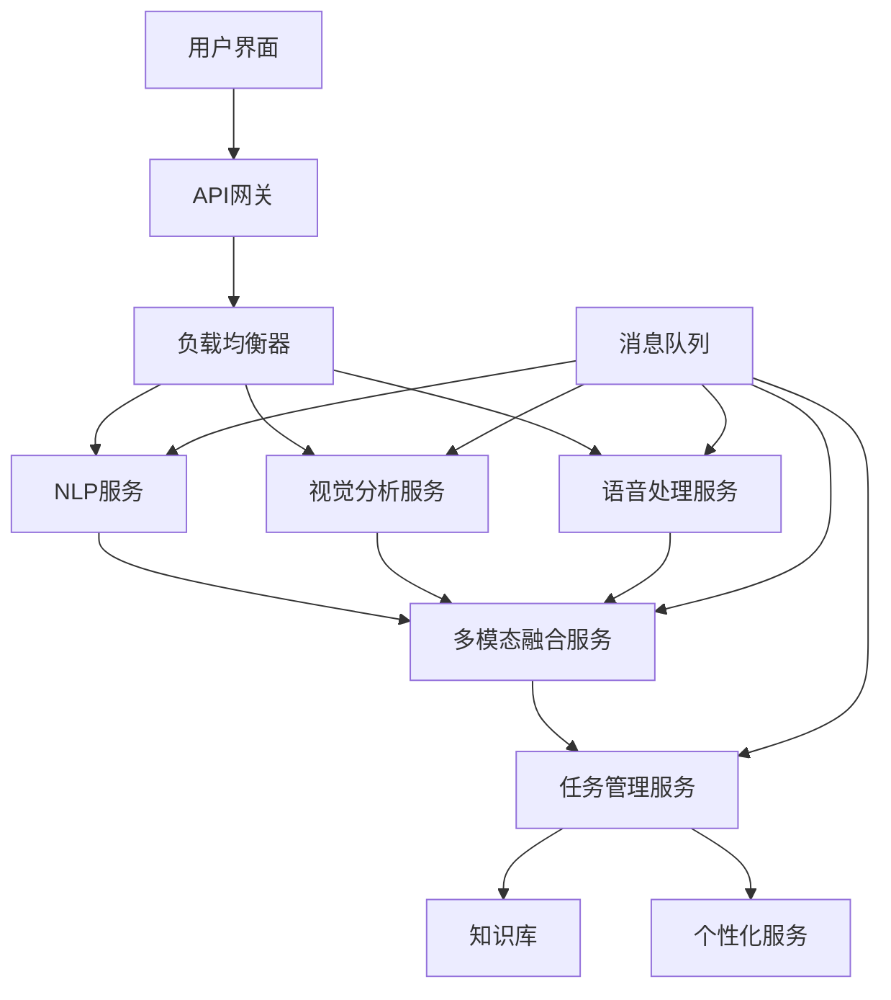

* 系统接口设计：

1. 多模态输入接口
    - Endpoint: `/api/input`
    - Method: POST
    - Parameters: `{text: string, image: file, audio: file}`
    - Response: `{status: "success", task_id: "unique_id"}`

2. 任务状态查询接口
    - Endpoint: `/api/task_status`
    - Method: GET
    - Parameters: `task_id: string`
    - Response: `{status: "success", task_status: string, result: object}`

3. 个性化设置接口
    - Endpoint: `/api/personalize`
    - Method: POST
    - Parameters: `{user_id: string, preferences: object}`
    - Response: `{status: "success", message: string}`

* 系统核心实现源代码：

```python
from fastapi import FastAPI, File, UploadFile, BackgroundTasks
from pydantic import BaseModel
import torch
from transformers import AutoTokenizer, AutoModelForCausalLM, VisionEncoderDecoderModel, ViTFeatureExtractor
import speech_recognition as sr
from PIL import Image
import io
import uuid

app = FastAPI()

# 加载预训练模型
tokenizer = AutoTokenizer.from_pretrained("gpt2-large")
language_model = AutoModelForCausalLM.from_pretrained("gpt2-large")
vision_model = VisionEncoderDecoderModel.from_pretrained("nlpconnect/vit-gpt2-image-captioning")
feature_extractor = ViTFeatureExtractor.from_pretrained("nlpconnect/vit-gpt2-image-captioning")

class InputData(BaseModel):
    text: str = None

@app.post("/api/input")
async def process_input(text: str = None, image: UploadFile = File(None), audio: UploadFile = File(None), background_tasks: BackgroundTasks):
    task_id = str(uuid.uuid4())
    background_tasks.add_task(process_multimodal_input, task_id, text, image, audio)
    return {"status": "success", "task_id": task_id}

async def process_multimodal_input(task_id: str, text: str, image: UploadFile, audio: UploadFile):
    result = {}
    
    if text:
        result["text_analysis"] = process_text(text)
    
    if image:
        image_content = await image.read()
        result["image_analysis"] = process_image(image_content)
    
    if audio:
        audio_content = await audio.read()
        result["audio_analysis"] = process_audio(audio_content)
    
    # 在这里添加多模态融合的逻辑
    fused_result = multimodal_fusion(result)
    
    # 保存结果到数据库
    save_result_to_db(task_id, fused_result)

def process_text(text: str):
    inputs = tokenizer(text, return_tensors="pt")
    outputs = language_model.generate(**inputs, max_length=100)
    return tokenizer.decode(outputs[0], skip_special_tokens=True)

def process_image(image_content: bytes):
    image = Image.open(io.BytesIO(image_content))
    pixel_values = feature_extractor(images=image, return_tensors="pt").pixel_values
    output_ids = vision_model.generate(pixel_values)
    return tokenizer.decode(output_ids[0], skip_special_tokens=True)

def process_audio(audio_content: bytes):
    recognizer = sr.Recognizer()
    with sr.AudioFile(io.BytesIO(audio_content)) as source:
        audio = recognizer.record(source)
    try:
        return recognizer.recognize_google(audio)
    except sr.UnknownValueError:
        return "Speech recognition could not understand the audio"

def multimodal_fusion(individual_results: dict):
    # 实现多模态融合逻辑
    # 这里只是一个简单的示例，实际应用中需要更复杂的融合算法
    fused_result = ""
    for key, value in individual_results.items():
        fused_result += f"{key}: {value}\n"
    return fused_result

def save_result_to_db(task_id: str, result: str):
    # 实现数据库保存逻辑
    pass

@app.get("/api/task_status")
async def get_task_status(task_id: str):
    # 从数据库获取任务状态和结果
    # 这里是一个模拟的实现
    result = get_result_from_db(task_id)
    if result:
        return {"status": "success", "task_status": "completed", "result": result}
    else:
        return {"status": "success", "task_status": "processing"}

def get_result_from_db(task_id: str):
    # 实现从数据库获取结果的逻辑
    pass

if __name__ == "__main__":
    import uvicorn
    uvicorn.run(app, host="0.0.0.0", port=8000)
```

* 最佳实践tips：
1. 模型选择: 根据任务需求选择适当规模的预训练模型。
2. 微调策略: 使用特定领域数据进行微调,提高模型在目标任务上的表现。
3. 提示工程: 设计有效的提示模板,引导模型生成高质量输出。
4. 多模态融合: 采用注意力机制等方法实现不同模态信息的有效整合。
5. 增量学习: 实现模型的持续学习,适应新知识和用户偏好。
6. 安全控制: 实施内容过滤和安全检查,防止生成不适当内容。
7. 性能优化: 使用模型量化、知识蒸馏等技术提高推理效率。

* 行业发展与未来趋势：

| 时期 | 技术重点 | 应用特征 | 社会影响 |
|------|----------|----------|----------|
| 2023-2025 | 模型规模突破,多模态融合 | 更自然的人机交互 | 提高生产效率,改变工作方式 |
| 2025-2027 | 知识整合,推理能力增强 | 复杂任务自动化 | 加速科研创新,改变决策模式 |
| 2027-2030 | 个性化定制,持续学习 | 智能助理普及 | 个性化服务成为常态 |
| 2030-2035 | 通用智能雏形 | 跨领域问题解决 | 重塑教育体系,职业转型 |
| 2035+ | 接近人类水平的AGI | 全方位AI协作 | 社会结构深刻变革 |

* 本节小结：
  大规模语言模型的进一步突破将带来AI Agent技术的质的飞跃。从模型架构的创新到训练方法的优化，从知识整合与推理能力的增强到控制与个性化的提升，这些进展将极大地扩展AI Agent的应用范围和能力边界。

未来的大规模语言模型预计将具备更强的多模态理解和生成能力，能够无缝地整合文本、图像、语音和视频信息。它们将拥有更深层次的知识表示和推理能力，不仅能够回答问题，还能进行复杂的逻辑推理和创造性思考。模型的可控性和个性化程度将大幅提高，使得AI助手能够更好地适应不同用户的需求和偏好。

同时，我们也需要注意到伴随这些进展而来的挑战。如何确保模型输出的事实准确性，如何减少偏见并提高公平性，如何保护用户隐私并防止滥用，这些都是需要持续关注和解决的问题。此外，大规模语言模型的能源消耗和计算资源需求也是一个重要的考虑因素，未来的研究需要更多地关注模型的效率优化和绿色计算。

随着大规模语言模型技术的不断突破，我们可以预见AI Agent将在更多领域发挥重要作用，从个人助理到企业决策支持，从创意创作到科学研究，AI将成为人类智能的有力补充和扩展。然而，我们也需要谨慎地管理这项技术的发展，确保它朝着有利于人类福祉的方向前进。

未来，大规模语言模型的发展可能会朝着更加模块化和可组合的方向发展，使得模型可以更灵活地适应不同任务和场景。同时，与神经符号AI的结合也可能带来新的突破，使模型具备更强的逻辑推理和抽象思考能力。总的来说，大规模语言模型的进一步突破将为AI Agent技术带来广阔的发展前景，推动人工智能向着更高级、更通用的方向迈进。

### 10.2.2 多模态AI Agent的发展

* 核心概念：
  多模态AI Agent是指能够同时处理和整合多种输入模态（如文本、图像、语音、视频等）的人工智能系统。这种Agent能够理解和生成跨模态的信息，实现更自然、更全面的人机交互。

* 问题背景：
  随着AI技术的发展，单一模态的AI系统已经无法满足复杂的实际应用需求。人类在日常生活中自然地结合视觉、听觉和语言等多种感知模式，多模态AI Agent的发展旨在模仿这种能力，提供更加智能和自然的交互体验。

* 问题描述：
  我们需要探讨多模态AI Agent的发展趋势，包括技术路线、关键挑战、应用前景，以及如何有效地整合和利用不同模态的信息。

* 问题解决：
  多模态AI Agent的发展可能涉及以下几个方面：

1. 模态融合技术：
    - 开发更高效的跨模态注意力机制
    - 研究模态间的对齐和映射方法
    - 探索动态权重分配策略，根据任务自适应调整不同模态的重要性

2. 统一表示学习：
    - 构建能够表示多种模态信息的统一嵌入空间
    - 开发跨模态的预训练模型和任务
    - 研究模态不变的特征提取方法

3. 多模态理解与生成：
    - 提高跨模态内容理解的准确性和深度
    - 增强多模态内容生成的质量和一致性
    - 开发支持多模态交互的对话系统

4. 多模态推理：
    - 结合视觉和语言信息进行复杂推理
    - 开发跨模态的常识推理能力
    - 实现多模态信息的因果关系分析

5. 模态缺失处理：
    - 研究在部分模态缺失情况下的鲁棒性表现
    - 开发模态补全和重建技术
    - 探索跨模态迁移学习方法

6. 多模态应用优化：
    - 视觉问答系统的性能提升
    - 多模态情感分析和意图识别
    - 跨模态检索和推荐系统优化

* 边界与外延：
  多模态AI Agent的发展不仅涉及传统的视觉、听觉和语言模态，还可能扩展到触觉、嗅觉等其他感知模式。同时，它与增强现实（AR）、虚拟现实（VR）等技术的结合也将带来新的应用可能。

* 概念结构与核心要素组成：
1. 模态类型：视觉、听觉、语言、触觉等
2. 融合方法：早期融合、晚期融合、动态融合
3. 表示学习：跨模态嵌入、统一特征空间
4. 任务类型：分类、检索、生成、问答、推理
5. 架构设计：多流网络、注意力机制、transformer变体
6. 应用场景：人机交互、智能助理、内容分析、创意创作

* 概念之间的关系：

1. 概念核心属性维度对比

| 属性维度 | 传统单模态系统 | 多模态AI Agent | 潜在优势 |
|----------|----------------|-----------------|----------|
| 信息输入 | 单一类型 | 多种类型 | 信息更全面 |
| 理解深度 | 局限于单一维度 | 多维度综合理解 | 理解更准确 |
| 表达能力 | 单一模态输出 | 跨模态生成 | 表达更丰富 |
| 交互自然度 | 受限 | 接近人类交互 | 用户体验更好 |
| 任务复杂度 | 适合简单任务 | 可处理复杂任务 | 应用范围更广 |
| 鲁棒性 | 易受单一模态限制 | 多模态互补 | 系统更稳定 |

2. 概念联系的ER实体关系

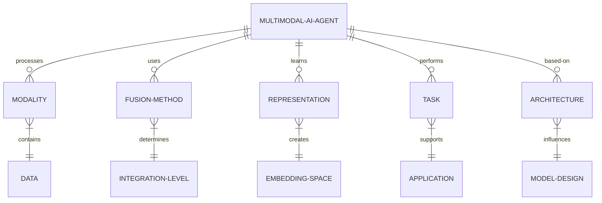

3. 交互关系图

```mermaid
graph TD
    A[多模态AI Agent] --> B[模态处理]
    A --> C[融合方法]
    A --> D[表示学习]
    A --> E[任务执行]
    A --> F[架构设计]
    B --> G[视觉处理]
    B --> H[语音处理]
    B --> I[文本处理]
    C --> J[早期融合]
    C --> K[晚期融合]
    D --> L[跨模态嵌入]
    E --> M[多模态问答]
    E --> N[跨模态检索]
    F --> O[多流网络]
    F --> P[注意力机制]
    G --> C
    H --> C
    I --> C
    J --> D
    K --> D
    L --> E
    O --> E
    P --> E
```

* 数学模型：
  我们可以用以下数学模型来描述多模态AI Agent的性能：

令 $P_{mm}$ 表示多模态系统的性能，
$w_i$ 表示第 $i$ 个模态的权重，
$p_i$ 表示第 $i$ 个模态的单独性能，
$f$ 表示融合函数，

则多模态系统的性能可以表示为：

$$P_{mm} = f(\sum_{i=1}^n w_i p_i)$$

其中，$\sum_{i=1}^n w_i = 1$，$0 \leq w_i \leq 1$

融合函数 $f$ 可以是简单的线性组合，也可以是更复杂的非线性函数，如神经网络。

* 算法流程图：

```mermaid
graph TD
    A[多模态数据输入] --> B[模态特定预处理]
    B --> C[特征提取]
    C --> D[多模态融合]
    D --> E[联合表示学习]
    E --> F[任务特定处理]
    F --> G[输出结果]
    G --> H[性能评估]
    H --> I{满足要求?}
    I -->|否| J[调整融合策略]
    J --> D
    I -->|是| K[模型部署]
    K --> L[持续学习与更新]
    L --> A
```

* 算法源代码：

```python
import torch
import torch.nn as nn
import torchvision.models as models
import transformers

class MultimodalAIAgent(nn.Module):
    def __init__(self, num_classes):
        super(MultimodalAIAgent, self).__init__()
        # 视觉模型
        self.vision_model = models.resnet50(pretrained=True)
        self.vision_model.fc = nn.Linear(self.vision_model.fc.in_features, 512)
        
        # 文本模型
        self.text_model = transformers.BertModel.from_pretrained('bert-base-uncased')
        self.text_projection = nn.Linear(768, 512)
        
        # 音频模型
        self.audio_model = nn.Sequential(
            nn.Conv1d(1, 64, kernel_size=3, stride=1, padding=1),
            nn.ReLU(),
            nn.MaxPool1d(kernel_size=2),
            nn.Conv1d(64, 128, kernel_size=3, stride=1, padding=1),
            nn.ReLU(),
            nn.MaxPool1d(kernel_size=2),
            nn.Flatten(),
            nn.Linear(128 * 32, 512)  # 假设音频输入长度为128
        )
        
        # 多模态融合
        self.fusion = nn.MultiheadAttention(embed_dim=512, num_heads=8)
        
        # 分类器
        self.classifier = nn.Linear(512, num_classes)

    def forward(self, vision_input, text_input, audio_input):
        # 视觉特征
        vision_features = self.vision_model(vision_input)
        
        # 文本特征
        text_features = self.text_model(text_input)[1]  # 使用[CLS]标记的输出
        text_features = self.text_projection(text_features)
        
        # 音频特征
        audio_features = self.audio_model(audio_input.unsqueeze(1))
        
        # 多模态融合
        features = torch.stack([vision_features, text_features, audio_features], dim=0)
        fused_features, _ = self.fusion(features, features, features)
        fused_features = torch.mean(fused_features, dim=0)
        
        # 分类
        output = self.classifier(fused_features)
        return output

# 使用示例
model = MultimodalAIAgent(num_classes=10)
vision_input = torch.randn(1, 3, 224, 224)  # 假设的图像输入
text_input = torch.randint(0, 1000, (1, 50))  # 假设的文本输入（词索引）
audio_input = torch.randn(1, 128)  # 假设的音频输入

output = model(vision_input, text_input, audio_input)
print(output.shape)  # 应该输出 torch.Size([1, 10])
```

* 实际场景应用：
1. 智能家居控制：结合语音、视觉和传感器数据，实现更智能的家居环境控制。
2. 多模态虚拟助手：能够理解并生成文字、语音和图像的个人助理。
3. 安防监控：融合视频、音频和文本信息，提高异常行为检测的准确性。
4. 医疗诊断：结合影像学数据、病历文本和语音描述，辅助医生进行诊断。
5. 自动驾驶：整合视觉、雷达和地图数据，提高环境感知和决策的准确性。

* 项目介绍：
  "多模态新闻分析助手"

目标：开发一个能够分析文本、图像和视频新闻内容的AI系统，自动生成新闻摘要、识别关键信息和检测虚假信息。

主要功能：
1. 多模态新闻内容理解
2. 跨模态信息验证
3. 自动新闻摘要生成
4. 关键信息提取与可视化
5. 虚假信息检测
6. 新闻主题分类与聚类

技术栈：
- 视觉模型: ResNet, YOLO
- 语言模型: BERT, GPT
- 视频处理: 3D-CNN
- 多模态融合: Transformer-based fusion
- 后端: Python FastAPI
- 前端: Vue.js
- 数据库: PostgreSQL
- 消息队列: Apache Kafka
- 容器化: Docker, Kubernetes

* 环境安装：
```bash
# 创建虚拟环境
python -m venv multimodal_news_env
source multimodal_news_env/bin/activate

# 安装依赖
pip install torch torchvision transformers fastapi uvicorn psycopg2-binary kafka-python opencv-python-headless

# 前端依赖
npm install vue@next vuex@next vue-router@4 axios

# 安装 CUDA 工具包 (假设使用 NVIDIA GPU)
# 请访问 NVIDIA 官网下载适合您系统的 CUDA 工具包
```

* 系统功能设计：
1. 数据采集与预处理模块：爬取和清洗多源新闻数据
2. 文本分析模块：使用BERT进行文本理解和特征提取
3. 图像分析模块：使用ResNet和YOLO进行图像内容识别
4. 视频分析模块：使用3D-CNN提取视频特征
5. 多模态融合模块：使用Transformer架构融合不同模态信息
6. 摘要生成模块：基于多模态信息生成新闻摘要
7. 信息验证模块：交叉验证不同模态信息的一致性
8. 虚假信息检测模块：基于多模态特征的假新闻识别
9. 主题分类与聚类模块：对新闻进行多维度分类和聚类
10. 可视化模块：生成信息图表和交互式展示

* 系统架构设计：

```mermaid
graph TD
    A[数据采集] --> B[数据预处理]
    B --> C[文本分析]
    B --> D[图像分析]
    B --> E[视频分析]
    C --> F[多模态融合]
    D --> F
    E --> F
    F --> G[摘要生成]
    F --> H[信息验证]
    F --> I[虚假信息检测]
    F --> J[主题分类与聚类]
    G --> K[结果可视化]
    H --> K
    I --> K
    J --> K
    K --> L[用户界面]
```

* 系统接口设计：

1. 新闻内容分析接口
    - Endpoint: `/api/analyze_news`
    - Method: POST
    - Parameters: `{text: string, image: file, video: file}`
    - Response: `{status: "success", summary: string, key_info: object, fake_news_probability: float, topics: [string]}`

2. 虚假信息检测接口
    - Endpoint: `/api/detect_fake_news`
    - Method: POST
    - Parameters: `{news_id: string}`
    - Response: `{status: "success", is_fake: boolean, confidence: float, evidence: [string]}`

3. 新闻聚类查询接口
    - Endpoint: `/api/news_clusters`
    - Method: GET
    - Parameters: `{date_range: string, topic: string}`
    - Response: `{status: "success", clusters: [object]}`

* 系统核心实现源代码：

```python
from fastapi import FastAPI, File, UploadFile
from pydantic import BaseModel
import torch
import torchvision.models as models
import transformers
from PIL import Image
import io
import cv2
import numpy as np

app = FastAPI()

# 加载预训练模型
text_model = transformers.BertModel.from_pretrained('bert-base-uncased')
image_model = models.resnet50(pretrained=True)
video_model = models.video.r3d_18(pretrained=True)

tokenizer = transformers.BertTokenizer.from_pretrained('bert-base-uncased')

class NewsItem(BaseModel):
    text: str

@app.post("/api/analyze_news")
async def analyze_news(news: NewsItem, image: UploadFile = File(None), video: UploadFile = File(None)):
    # 文本分析
    inputs = tokenizer(news.text, return_tensors="pt", padding=True, truncation=True, max_length=512)
    with torch.no_grad():
        text_features = text_model(**inputs).last_hidden_state.mean(dim=1)

    # 图像分析
    image_features = torch.zeros(1, 2048)  # 默认特征
    if image:
        img = Image.open(io.BytesIO(await image.read()))
        img_tensor = torchvision.transforms.functional.to_tensor(img).unsqueeze(0)
        with torch.no_grad():
            image_features = image_model(img_tensor)

    # 视频分析
    video_features = torch.zeros(1, 512)  # 默认特征
    if video:
        video_frames = extract_video_frames(await video.read())
        if len(video_frames) > 0:
            video_tensor = torch.stack(video_frames).unsqueeze(0)
            with torch.no_grad():
                video_features = video_model(video_tensor).squeeze()

    # 多模态融合
    fused_features = multimodal_fusion(text_features, image_features, video_features)

    # 生成摘要
    summary = generate_summary(fused_features)

    # 提取关键信息
    key_info = extract_key_info(fused_features)

    # 检测虚假信息
    fake_news_prob = detect_fake_news(fused_features)

    # 主题分类
    topics = classify_topics(fused_features)

    return {
        "status": "success",
        "summary": summary,
        "key_info": key_info,
        "fake_news_probability": float(fake_news_prob),
        "topics": topics
    }

def extract_video_frames(video_bytes, max_frames=16):
    video = cv2.VideoCapture(io.BytesIO(video_bytes))
    frames = []
    while len(frames) < max_frames:
        ret, frame = video.read()
        if not ret:
            break
        frame = cv2.cvtColor(frame, cv2.COLOR_BGR2RGB)
        frame = Image.fromarray(frame).resize((112, 112))
        frame = torchvision.transforms.functional.to_tensor(frame)
        frames.append(frame)
    return frames

def multimodal_fusion(text_features, image_features, video_features):
    # 简单的特征拼接，实际应用中可以使用更复杂的融合方法
    return torch.cat([text_features, image_features, video_features], dim=1)

def generate_summary(features):
    # 实现摘要生成逻辑
    return "This is a generated summary based on multimodal features."

def extract_key_info(features):
    # 实现关键信息提取逻辑
    return {"entity1": "value1", "entity2": "value2"}

def detect_fake_news(features):
    # 实现虚假信息检测逻辑
    return torch.rand(1).item()  # 返回一个0到1之间的随机值作为示例

def classify_topics(features):
    # 实现主题分类逻辑
    return ["politics", "technology", "health"]

if __name__ == "__main__":
    import uvicorn
    uvicorn.run(app, host="0.0.0.0", port=8000)
```

* 最佳实践tips：
1. 数据预处理：确保不同模态的数据质量和一致性，如时间对齐、噪声去除等。
2. 模态缺失处理：设计能够处理部分模态缺失情况的鲁棒模型。
3. 特征融合：探索不同的融合策略，如早期融合、晚期融合或动态融合。
4. 注意力机制：利用跨模态注意力来捕捉不同模态间的相关性。
5. 迁移学习：利用预训练的单模态模型进行特征提取，再进行多模态融合。
6. 可解释性：开发可解释的多模态模型，理解不同模态对决策的贡献。
7. 实时性能：优化模型推理速度，以满足实时应用的需求。
8. 隐私保护：在处理多模态数据时，注意保护用户隐私和敏感信息。

* 行业发展与未来趋势：

| 时期 | 技术重点 | 应用特征 | 社会影响 |
|------|----------|----------|----------|
| 2023-2025 | 模态融合优化，跨模态预训练 | 多模态虚拟助手普及 | 人机交互方式变革 |
| 2025-2027 | 多模态推理能力增强 | 智能内容分析和创作 | 提高信息处理效率 |
| 2027-2030 | 情感和意图的多模态理解 | 高度个性化的用户体验 | 改变服务和营销模式 |
| 2030-2035 | 类人感知和认知模拟 | 复杂场景决策支持 | 协助解决社会难题 |
| 2035+ | 通用多模态AI | 无处不在的智能交互 | 重塑社会生产和生活方式 |

* 本节小结：
  多模态AI Agent的发展代表了人工智能向着更全面、更自然的方向迈进。通过整合视觉、听觉、语言等多种模态的信息，AI系统能够更好地理解和模拟人类的认知过程。这种技术的进步不仅提高了AI的性能和适用性，还开启了许多新的应用可能。

然而，多模态AI也面临着诸多挑战，如不同模态数据的对齐和融合、跨模态学习的效率、模型的可解释性等。解决这些问题需要在算法、架构、计算能力等多个层面进行创新。

未来，随着多模态AI技术的成熟，我们可以期待看到更加智能和自然的人机交互系统，能够在复杂的现实环境中理解上下文、做出决策并与人类进行多维度的交流。这将为教育、医疗、娱乐、科研等众多领域带来革命性的变化。

同时，我们也需要关注多模态AI发展带来的伦理和社会问题，如隐私保护、数据安全、算法偏见等。建立健全的法律法规和伦理框架，确保多模态AI的发展方向与人类利益相一致，将是未来需要持续关注的重要议题。

总的来说，多模态AI Agent的发展正在将人工智能技术推向一个新的高度，为创造更智能、更自然的人机协作环境铺平道路。这一领域的进步不仅将改变技术格局，还将深刻影响人类社会的方方面面。

### 10.2.3 自主学习与持续优化能力的提升

* 核心概念：
  自主学习与持续优化是指AI Agent能够在没有或极少人工干预的情况下，通过与环境的持续交互来不断学习新知识、更新自身模型、改进决策能力的过程。这种能力使AI系统能够适应动态变化的环境，并在长期运行中保持高性能。

* 问题背景：
  传统的AI系统often依赖于静态的训练数据和固定的模型，难以适应实际应用中复杂多变的情况。随着AI技术的发展和应用场景的拓展，提高AI Agent的自主学习和持续优化能力变得越来越重要。

* 问题描述：
  我们需要探讨如何提升AI Agent的自主学习与持续优化能力，包括技术路线、关键挑战、评估方法，以及这种能力对AI系统长期性能和适应性的影响。

* 问题解决：
  提升AI Agent的自主学习与持续优化能力可以从以下几个方面着手：

1. 在线学习算法：
    - 开发能够实时更新的模型结构
    - 研究增量学习和适应性学习算法
    - 探索元学习方法，提高模型的快速适应能力

2. 主动学习策略：
    - 设计有效的探索-利用平衡机制
    - 开发智能的数据采样和标注请求策略
    - 研究自我监督学习技术，减少对人工标注的依赖

3. 知识积累与迁移：
    - 建立动态更新的知识库
    - 开发跨任务和跨领域的知识迁移方法
    - 研究持续学习中的灾难性遗忘问题的解决方案

4. 自我评估与优化：
    - 设计自动化的性能评估指标
    - 开发模型自我诊断和调整机制
    - 研究自适应的超参数优化技术

5. 多智能体协作学习：
    - 探索分布式学习和联邦学习方法
    - 研究群体智能在持续优化中的应用
    - 开发智能体间知识共享和互补机制

6. 环境建模与预测：
    - 构建动态环境模型，预测未来变化
    - 开发对抗性学习方法，增强鲁棒性
    - 研究因果推理技术，理解环境变化的原因

* 边界与外延：
  自主学习与持续优化能力的提升不仅适用于单一的AI Agent，还可以扩展到智能系统网络和人机协作场景。这种能力的发展可能带来AI系统更高的自主性，同时也raise了一些关于控制和伦理的问题。

* 概念结构与核心要素组成：
1. 学习机制：在线学习、增量学习、元学习
2. 优化策略：主动学习、自我监督、自适应调整
3. 知识管理：知识表示、知识迁移、遗忘机制
4. 评估体系：性能指标、自我诊断、反馈机制
5. 协作模式：分布式学习、知识共享、群体智能
6. 环境适应：环境建模、鲁棒性增强、因果推理

* 概念之间的关系：

1. 概念核心属性维度对比

| 属性维度 | 传统静态AI系统 | 自主学习与持续优化AI | 潜在优势 |
|----------|----------------|----------------------|----------|
| 学习方式 | 离线批量学习 | 在线实时学习 | 适应性更强 |
| 知识更新 | 定期人工更新 | 持续自动更新 | 知识始终最新 |
| 任务适应 | 固定任务范围 | 动态任务适应 | 应用范围更广 |
| 性能演变 | 性能可能下降 | 性能持续提升 | 长期价值更高 |
| 资源需求 | 周期性大规模训练 | 增量式小规模更新 | 资源利用更高效 |
| 人工干预 | 需要频繁干预 | 最小化人工干预 | 自主性更强 |

2. 概念联系的ER实体关系

```mermaid
erDiagram
    AI-AGENT ||--o{ LEARNING-MECHANISM : employs
    AI-AGENT ||--o{ OPTIMIZATION-STRATEGY : uses
    AI-AGENT ||--o{ KNOWLEDGE-MANAGEMENT : implements
    AI-AGENT ||--o{ EVALUATION-SYSTEM : incorporates
    AI-AGENT ||--o{ COLLABORATION-MODE : supports
    AI-AGENT ||--o{ ENVIRONMENT-ADAPTATION : achieves
    LEARNING-MECHANISM }|--|| ONLINE-LEARNING : includes
    OPTIMIZATION-STRATEGY }|--|| ACTIVE-LEARNING : features
    KNOWLEDGE-MANAGEMENT }|--|| TRANSFER-LEARNING : utilizes
    EVALUATION-SYSTEM }|--|| SELF-DIAGNOSIS : performs
    COLLABORATION-MODE }|--|| DISTRIBUTED-LEARNING : enables
    ENVIRONMENT-ADAPTATION }|--|| CAUSAL-INFERENCE : applies
```

3. 交互关系图

```mermaid
graph TD
    A[AI Agent] --> B[学习机制]
    A --> C[优化策略]
    A --> D[知识管理]
    A --> E[评估体系]
    A --> F[协作模式]
    A --> G[环境适应]
    B --> H[在线学习]
    B --> I[增量学习]
    B --> J[元学习]
    C --> K[主动学习]
    C --> L[自我监督]
    D --> M[知识迁移]
    D --> N[遗忘机制]
    E --> O[自我诊断]
    E --> P[性能指标]
    F --> Q[分布式学习]
    F --> R[知识共享]
    G --> S[环境建模]
    G --> T[因果推理]
    H --> D
    I --> E
    J --> C
    K --> B
    L --> D
    M --> B
    N --> D
    O --> C
    P --> F
    Q --> D
    R --> B
    S --> C
    T --> G
```

* 数学模型：
  我们可以用以下数学模型来描述AI Agent的持续学习过程：

令 $P_t$ 表示在时间 $t$ 的模型性能，
$K_t$ 表示时间 $t$ 的知识状态，
$E_t$ 表示时间 $t$ 的环境状态，
$L$ 表示学习函数，
$O$ 表示优化函数，

则AI Agent的性能演化可以表示为：

$$P_{t+1} = O(L(P_t, K_t, E_t))$$

知识状态的更新可以表示为：

$$K_{t+1} = K_t + \Delta K_t - F_t$$

其中，$\Delta K_t$ 表示新获得的知识，$F_t$ 表示遗忘的知识。

环境状态的变化可以建模为：

$$E_{t+1} = f(E_t, A_t)$$

其中，$A_t$ 表示AI Agent在时间 $t$ 的行动，$f$ 是环境动态函数。

* 算法流程图：

```mermaid
graph TD
    A[环境感知] --> B[状态评估]
    B --> C[学习需求分析]
    C --> D{需要学习?}
    D -->|是| E[数据收集]
    D -->|否| F[执行任务]
    E --> G[在线学习]
    G --> H[知识更新]
    H --> I[模型优化]
    I --> J[性能评估]
    J --> K{性能提升?}
    K -->|是| L[保存更新]
    K -->|否| M[回滚更改]
    L --> F
    M --> F
    F --> N[结果输出]
    N --> O[反馈收集]
    O --> A
```

* 算法源代码：

```python
import numpy as np
from sklearn.base import BaseEstimator, ClassifierMixin
from sklearn.utils.validation import check_X_y, check_array, check_is_fitted

class ContinualLearningClassifier(BaseEstimator, ClassifierMixin):
    def __init__(self, base_estimator, memory_size=1000, performance_threshold=0.95):
        self.base_estimator = base_estimator
        self.memory_size = memory_size
        self.performance_threshold = performance_threshold
        self.memory_X = None
        self.memory_y = None

    def fit(self, X, y):
        X, y = check_X_y(X, y)
        self.classes_ = np.unique(y)
        
        if self.memory_X is None:
            self.memory_X = X[:self.memory_size]
            self.memory_y = y[:self.memory_size]
        else:
            self.memory_X = np.vstack((self.memory_X, X))
            self.memory_y = np.hstack((self.memory_y, y))
            if len(self.memory_X) > self.memory_size:
                indices = np.random.choice(len(self.memory_X), self.memory_size, replace=False)
                self.memory_X = self.memory_X[indices]
                self.memory_y = self.memory_y[indices]
        
        self.base_estimator.fit(self.memory_X, self.memory_y)
        return self

    def partial_fit(self, X, y):
        X, y = check_X_y(X, y)
        if not hasattr(self, 'classes_'):
            self.classes_ = np.unique(y)
        
        # 在新数据上评估当前模型
        current_performance = self.base_estimator.score(X, y)
        
        if current_performance < self.performance_threshold:
            # 性能不足，需要更新
            self.fit(X, y)
        else:
            # 性能足够，只更新记忆
            self.update_memory(X, y)
        
        return self

    def update_memory(self, X, y):
        if len(X) > self.memory_size:
            indices = np.random.choice(len(X), self.memory_size, replace=False)
            X = X[indices]
            y = y[indices]
        
        if self.memory_X is None:
            self.memory_X = X
            self.memory_y = y
        else:
            self.memory_X = np.vstack((self.memory_X, X))
            self.memory_y = np.hstack((self.memory_y, y))
            if len(self.memory_X) > self.memory_size:
                indices = np.random.choice(len(self.memory_X), self.memory_size, replace=False)
                self.memory_X = self.memory_X[indices]
                self.memory_y = self.memory_y[indices]

    def predict(self, X):
        check_is_fitted(self)
        X = check_array(X)
        return self.base_estimator.predict(X)

    def score(self, X, y):
        return self.base_estimator.score(X, y)

# 使用示例
from sklearn.tree import DecisionTreeClassifier

# 创建持续学习分类器
clf = ContinualLearningClassifier(DecisionTreeClassifier())

# 模拟数据流
for i in range(10):
    X = np.random.rand(100, 5)
    y = np.random.choice([0, 1], 100)
    
    # 部分拟合
    clf.partial_fit(X, y)
    
    # 评估当前性能
    score = clf.score(X, y)
    print(f"Iteration {i+1}, Score: {score}")

# 最终预测
X_test = np.random.rand(10, 5)
predictions = clf.predict(X_test)
print("Final predictions:", predictions)
```

* 实际场景应用：
1. 智能推荐系统：持续学习用户偏好，适应不断变化的兴趣。
2. 自动驾驶：在实际道路环境中不断学习和优化驾驶策略。
3. 智能客服：通过与用户的持续互动，提升问题解决能力。
4. 金融风控：实时学习新的欺诈模式，动态调整风险评估模型。
5. 工业控制：适应不同生产条件，持续优化控制参数。

* 项目介绍：
  "自适应智能教学系统"

目标：开发一个能够持续学习和优化的智能教学辅助系统，根据学生的学习进度和表现，自动调整教学内容和方法。

主要功能：
1. 学生知识水平评估
2. 个性化学习路径规划
3. 自适应题目推荐
4. 实时学习反馈
5. 教学策略持续优化
6. 学习模式分析与预测

技术栈：
- 机器学习框架: PyTorch, Scikit-learn
- 在线学习算法: Online Gradient Descent, Follow The Regularized Leader
- 强化学习: Deep Q-Network (DQN)
- 自然语言处理: BERT, GPT
- 后端: Python FastAPI
- 前端: React, D3.js
- 数据库: MongoDB
- 消息队列: RabbitMQ
- 容器化: Docker, Kubernetes

* 环境安装：
```bash
# 创建虚拟环境
python -m venv adaptive_learning_env
source adaptive_learning_env/bin/activate

# 安装依赖
pip install torch transformers scikit-learn fastapi uvicorn pymongo pika

# 前端依赖
npm install react react-dom d3 axios

# 安装 CUDA 工具包 (假设使用 NVIDIA GPU)
# 请访问 NVIDIA 官网下载适合您系统的 CUDA 工具包
```

* 系统功能设计：
1. 用户管理模块：学生信息管理、学习历史记录
2. 知识图谱模块：构建和更新学科知识图谱
3. 评估引擎：动态评估学生知识水平
4. 学习路径生成器：基于知识图谱和学生状态规划学习路径
5. 题目推荐系统：自适应选择适合难度的题目
6. 反馈分析器：实时分析学生反馈，调整教学策略
7. 学习预测模型：预测学习成果，提前干预
8. 教学策略优化器：持续优化教学方法
9. 数据可视化模块：展示学习进度和分析结果

* 系统架构设计：

```mermaid
graph TD
    A[用户界面] --> B[API网关]
    B --> C[用户管理服务]
    B --> D[评估引擎]
    B --> E[学习路径生成器]
    B --> F[题目推荐系统]
    B --> G[反馈分析器]
    B --> H[学习预测模型]
    B --> I[教学策略优化器]
    C --> J[用户数据库]
    D --> K[知识图谱]
    E --> K
    F --> K
    G --> L[反馈数据库]
    H --> M[预测模型]
    I --> N[策略库]
    O[消息队列] --> D
    O --> E
    O --> F
    O --> G
    O --> H
    O --> I
```

* 系统接口设计：

1. 学生评估接口
    - Endpoint: `/api/assess_student`
    - Method: POST
    - Parameters: `{student_id: string, subject: string}`
    - Response: `{status: "success", knowledge_level: object, weak_areas: [string]}`

2. 学习路径生成接口
    - Endpoint: `/api/generate_learning_path`
    - Method: POST
    - Parameters: `{student_id: string, subject: string, goal: string}`
    - Response: `{status: "success", learning_path: [object]}`

3. 题目推荐接口
    - Endpoint: `/api/recommend_question`
    - Method: POST
    - Parameters: `{student_id: string, subject: string, difficulty: float}`
    - Response: `{status: "success", question: object}`

4. 学习反馈接口
    - Endpoint: `/api/submit_feedback`
    - Method: POST
    - Parameters: `{student_id: string, question_id: string, is_correct: boolean, time_spent: int}`
    - Response: `{status: "success", next_action: string}`

* 系统核心实现源代码：

```python
from fastapi import FastAPI, HTTPException
from pydantic import BaseModel
import torch
import torch.nn as nn
import torch.optim as optim
import numpy as np
from sklearn.preprocessing import StandardScaler
from typing import List, Dict

app = FastAPI()

# 定义模型
class DQN(nn.Module):
    def __init__(self, state_size, action_size):
        super(DQN, self).__init__()
        self.fc1 = nn.Linear(state_size, 64)
        self.fc2 = nn.Linear(64, 64)
        self.fc3 = nn.Linear(64, action_size)

    def forward(self, x):
        x = torch.relu(self.fc1(x))
        x = torch.relu(self.fc2(x))
        return self.fc3(x)

# 初始化模型和优化器
state_size = 10  # 学生状态特征数
action_size = 5  # 可选择的教学动作数
model = DQN(state_size, action_size)
optimizer = optim.Adam(model.parameters())
scaler = StandardScaler()

class StudentState(BaseModel):
    student_id: str
    features: List[float]

class Action(BaseModel):
    action_id: int
    description: str

class Feedback(BaseModel):
    student_id: str
    action_id: int
    reward: float

@app.post("/api/recommend_action")
async def recommend_action(state: StudentState):
    # 标准化特征
    normalized_features = scaler.fit_transform(np.array(state.features).reshape(1, -1))
    state_tensor = torch.FloatTensor(normalized_features)
    
    # 使用模型预测最佳动作
    with torch.no_grad():
        action_values = model(state_tensor)
    
    best_action = int(torch.argmax(action_values).item())
    return {"status": "success", "recommended_action": best_action}

@app.post("/api/submit_feedback")
async def submit_feedback(feedback: Feedback):
    # 更新模型
    state = get_student_state(feedback.student_id)
    normalized_state = scaler.transform(np.array(state).reshape(1, -1))
    state_tensor = torch.FloatTensor(normalized_state)
    
    action_tensor = torch.LongTensor([feedback.action_id])
    reward_tensor = torch.FloatTensor([feedback.reward])
    
    # 计算损失
    current_q_values = model(state_tensor).gather(1, action_tensor.unsqueeze(1))
    loss = nn.MSELoss()(current_q_values, reward_tensor)
    
    # 优化模型
    optimizer.zero_grad()
    loss.backward()
    optimizer.step()
    
    return {"status": "success", "message": "Feedback processed and model updated"}

@app.get("/api/student_progress/{student_id}")
async def get_student_progress(student_id: str):
    # 获取学生进度
    progress = calculate_student_progress(student_id)
    return {"status": "success", "progress": progress}

@app.post("/api/update_knowledge_graph")
async def update_knowledge_graph(new_knowledge: Dict):
    # 更新知识图谱
    update_graph(new_knowledge)
    return {"status": "success", "message": "Knowledge graph updated"}

def get_student_state(student_id: str) -> List[float]:
    # 从数据库获取学生状态
    # 这里用随机数模拟
    return list(np.random.rand(state_size))

def calculate_student_progress(student_id: str) -> Dict:
    # 计算学生进度
    # 这里用随机数模拟
    return {
        "overall_progress": np.random.rand(),
        "subject_progress": {
            "math": np.random.rand(),
            "science": np.random.rand(),
            "language": np.random.rand()
        }
    }

def update_graph(new_knowledge: Dict):
    # 更新知识图谱的逻辑
    pass

# 持续学习循环
async def continuous_learning_loop():
    while True:
        # 收集一批学生数据
        batch_data = collect_batch_data()
        
        # 更新模型
        for data in batch_data:
            state = torch.FloatTensor(data['state'])
            action = torch.LongTensor([data['action']])
            reward = torch.FloatTensor([data['reward']])
            next_state = torch.FloatTensor(data['next_state'])
            
            # 计算目标Q值
            with torch.no_grad():
                target_q = reward + 0.99 * torch.max(model(next_state))
            
            # 计算当前Q值
            current_q = model(state).gather(1, action.unsqueeze(1))
            
            # 计算损失
            loss = nn.MSELoss()(current_q, target_q.unsqueeze(1))
            
            # 优化模型
            optimizer.zero_grad()
            loss.backward()
            optimizer.step()
        
        # 更新知识图谱
        update_knowledge_graph_from_feedback(batch_data)
        
        # 评估模型性能
        performance = evaluate_model()
        if performance < performance_threshold:
            # 如果性能下降，回滚到之前的模型版本
            rollback_model()
        else:
            # 保存当前模型
            save_model()
        
        await asyncio.sleep(3600)  # 每小时更新一次

def collect_batch_data():
    # 从数据库收集最近的学生交互数据
    pass

def update_knowledge_graph_from_feedback(batch_data):
    # 根据学生反馈更新知识图谱
    pass

def evaluate_model():
    # 评估模型性能
    pass

def rollback_model():
    # 回滚到之前的模型版本
    pass

def save_model():
    # 保存当前模型
    pass

if __name__ == "__main__":
    import uvicorn
    import asyncio
    
    # 启动持续学习循环
    asyncio.create_task(continuous_learning_loop())
    
    uvicorn.run(app, host="0.0.0.0", port=8000)
```

* 最佳实践tips：
1. 增量更新：使用增量学习算法，避免全量重训练。
2. 记忆重放：维护一个经验池，平衡新旧知识。
3. 动态难度调整：根据学生表现动态调整题目难度。
4. 多任务学习：同时优化多个相关任务，提高泛化能力。
5. 知识蒸馏：将复杂模型的知识转移到轻量级模型，提高推理效率。
6. A/B测试：持续进行不同策略的对比实验，优化教学效果。
7. 异常检测：监控模型性能，及时发现和处理异常情况。
8. 隐私保护：使用联邦学习等技术，保护学生的隐私数据。

* 行业发展与未来趋势：

| 时期 | 技术重点 | 应用特征 | 社会影响 |
|------|----------|----------|----------|
| 2023-2025 | 增量学习算法优化 | 个性化学习路径 | 提高教育效率 |
| 2025-2027 | 多模态学习整合 | 全方位能力评估 | 教育资源优化分配 |
| 2027-2030 | 元学习与快速适应 | 终身学习助手 | 促进终身教育发展 |
| 2030-2035 | 认知建模与仿真 | 智能导师系统 | 改变传统教育模式 |
| 2035+ | 通用学习智能 | 自主学习伙伴 | 教育平等化和普及化 |

* 本节小结：
  自主学习与持续优化能力的提升代表了AI系统向更高级形态演进的重要方向。通过在线学习、增量更新、自适应优化等技术，AI Agent能够在实际应用中不断学习和改进，适应动态变化的环境和需求。这种能力不仅提高了AI系统的长期性能和适用性，还开启了许多新的应用可能，特别是在教育、个人助理、智能制造等需要持续适应和优化的领域。

然而，实现真正有效的自主学习和持续优化也面临诸多挑战。如何平衡新知识学习和旧知识保留、如何在有限计算资源下实现高效的在线学习、如何确保学习过程的稳定性和可控性等，都是需要深入研究的问题。此外，自主学习系统的透明度、可解释性和安全性也是重要的考虑因素。

未来，随着技术的进步，我们可以期待看到更加智能和自适应的AI系统。这些系统将能够自主地探索和学习新知识，持续优化自身性能，甚至能够迁移和泛化学到的知识到新的领域。这将极大地扩展AI的应用范围，并可能带来工作方式、教育模式等多个方面的深刻变革。

同时，我们也需要关注自主学习AI系统的伦理和社会影响。如何确保这些系统的学习方向始终符合人类价值观，如何防止潜在的失控或滥用，以及如何平衡效率提升和人类作用等，都是需要社会各界共同探讨和解决的重要问题。

总的来说，自主学习与持续优化能力的提升正在将AI技术推向一个新的阶段，为创造更智能、更适应性强的AI系统铺平道路。这一领域的进步不仅将改变技术格局，还将深刻影响人类社会的方方面面，推动我们向着人机协作的新时代迈进。

### 10.2.4 情感智能与社交能力的增强

* 核心概念：
  情感智能与社交能力增强是指AI系统能够理解、表达和响应人类情感，以及在社交互动中表现出适当的行为和反应的能力。这包括情感识别、情感生成、社交规范理解和遵循、以及在复杂社交场景中的决策能力。

* 问题背景：
  随着AI系统在日常生活中的应用越来越广泛，仅仅具备逻辑推理和任务执行能力已经不足以满足人类的需求。人机交互的自然度和亲和力成为评判AI系统质量的重要指标。因此，赋予AI情感智能和社交能力变得越来越重要。

* 问题描述：
  我们需要探讨如何提升AI系统的情感智能和社交能力，包括技术路线、关键挑战、评估方法，以及这些能力对人机交互和AI应用的影响。

* 问题解决：
  提升AI系统的情感智能与社交能力可以从以下几个方面着手：

1. 情感识别技术：
    - 多模态情感识别（语音、面部表情、肢体语言）
    - 上下文感知的情感理解
    - 微表情和潜在情感状态的识别

2. 情感生成与表达：
    - 自然语言生成中的情感融入
    - 情感化语音合成
    - 虚拟形象的情感表现

3. 社交规范学习：
    - 文化特定的社交规则建模
    - 情境适应的行为决策
    - 社交礼仪和禁忌的理解

4. 同理心模拟：
    - 视角采择能力的开发
    - 情感状态预测
    - 适当的情感响应生成

5. 社交策略优化：
    - 长期社交关系建模
    - 多人交互场景的决策优化
    - 冲突解决和协商能力

6. 情感调节与适应：
    - 用户情绪状态的跟踪和预测
    - 情感干预策略的制定和执行
    - 系统自身"情绪"的管理

* 边界与外延：
  情感智能与社交能力的增强不仅限于人机交互，还可能应用于机器人技术、虚拟现实、智能家居等领域。同时，这些能力的发展也可能引发关于AI伦理、隐私保护和社会影响的新讨论。

* 概念结构与核心要素组成：
1. 感知层：多模态情感识别、上下文理解
2. 认知层：情感状态建模、社交规范理解
3. 决策层：情感响应生成、社交策略制定
4. 表达层：多模态情感表达、自然交互界面
5. 学习层：持续学习、经验积累、适应性调整
6. 评估层：情感智能度量、社交能力评估

* 概念之间的关系：

1. 概念核心属性维度对比

| 属性维度 | 传统AI系统 | 情感社交增强AI | 潜在优势 |
|----------|------------|-----------------|----------|
| 交互自然度 | 机械化、生硬 | 自然、流畅 | 用户体验提升 |
| 情感理解 | 表层文本分析 | 深层情感洞察 | 交互更具同理心 |
| 社交适应性 | 固定反应模式 | 灵活应对不同场景 | 社交互动更恰当 |
| 个性化程度 | 通用回应 | 针对个人特点定制 | 用户粘性增强 |
| 长期关系维护 | 无 | 能建立持续互动 | 提高用户忠诚度 |
| 跨文化能力 | 有限 | 适应不同文化背景 | 全球化应用更广 |

2. 概念联系的ER实体关系

```mermaid
erDiagram
    AI-SYSTEM ||--o{ EMOTION-RECOGNITION : implements
    AI-SYSTEM ||--o{ EMOTION-GENERATION : performs
    AI-SYSTEM ||--o{ SOCIAL-NORM-LEARNING : conducts
    AI-SYSTEM ||--o{ EMPATHY-SIMULATION : achieves
    AI-SYSTEM ||--o{ SOCIAL-STRATEGY : optimizes
    AI-SYSTEM ||--o{ EMOTION-REGULATION : manages
    EMOTION-RECOGNITION }|--|| MULTIMODAL-INPUT : processes
    EMOTION-GENERATION }|--|| EXPRESSION-CHANNEL : utilizes
    SOCIAL-NORM-LEARNING }|--|| CULTURAL-CONTEXT : considers
    EMPATHY-SIMULATION }|--|| PERSPECTIVE-TAKING : involves
    SOCIAL-STRATEGY }|--|| INTERACTION-SCENARIO : adapts-to
    EMOTION-REGULATION }|--|| USER-STATE : responds-to
```

3. 交互关系图

```mermaid
graph TD
    A[AI系统] --> B[情感识别]
    A --> C[情感生成]
    A --> D[社交规范学习]
    A --> E[同理心模拟]
    A --> F[社交策略优化]
    A --> G[情感调节]
    B --> H[多模态输入处理]
    C --> I[表达渠道选择]
    D --> J[文化背景考虑]
    E --> K[视角采择]
    F --> L[交互场景适应]
    G --> M[用户状态响应]
    H --> N[情感状态建模]
    I --> O[自然交互界面]
    J --> P[行为决策]
    K --> Q[情感响应生成]
    L --> R[长期关系维护]
    M --> S[情绪干预策略]
    N --> T[认知层处理]
    O --> T
    P --> U[决策层输出]
    Q --> U
    R --> V[学习与适应]
    S --> V
    T --> U
    U --> W[表达层执行]
    V --> X[系统更新]
    W --> Y[用户反馈]
    Y --> X
```

* 数学模型：
  我们可以用以下数学模型来描述AI系统的情感社交能力：

令 $E$ 表示情感状态空间，
$S$ 表示社交场景空间，
$A$ 表示行动空间，
$R$ 表示奖励函数，
$π$ 表示策略函数，

则AI系统的情感社交决策可以建模为马尔可夫决策过程(MDP)：

$$(E \times S, A, P, R, γ)$$

其中，$P$ 是状态转移概率函数，$γ$ 是折扣因子。

系统的目标是找到最优策略 $π^*$，使得期望累积奖励最大化：

$$π^* = \arg\max_π \mathbb{E}[\sum_{t=0}^{\infty} γ^t R(e_t, s_t, a_t)]$$

其中，$e_t \in E$, $s_t \in S$, $a_t \in A$

* 算法流程图：

```mermaid
graph TD
    A[感知输入] --> B[多模态情感识别]
    A --> C[社交场景分析]
    B --> D[情感状态估计]
    C --> E[社交规范检索]
    D --> F[情感认知处理]
    E --> F
    F --> G[决策生成]
    G --> H[行为选择]
    H --> I[情感表达]
    H --> J[社交行为执行]
    I --> K[用户反应观察]
    J --> K
    K --> L[反馈评估]
    L --> M{性能满意?}
    M -->|是| N[经验存储]
    M -->|否| O[策略调整]
    N --> P[长期记忆更新]
    O --> Q[短期行为修正]
    P --> A
    Q --> A
```

* 算法源代码：

```python
import numpy as np
import torch
import torch.nn as nn
import torch.optim as optim

class EmotionalSocialAI(nn.Module):
    def __init__(self, emotion_dim, social_dim, action_dim):
        super(EmotionalSocialAI, self).__init__()
        self.emotion_encoder = nn.Linear(emotion_dim, 64)
        self.social_encoder = nn.Linear(social_dim, 64)
        self.fusion = nn.Linear(128, 64)
        self.action_predictor = nn.Linear(64, action_dim)
        
    def forward(self, emotion, social):
        emotion_emb = torch.relu(self.emotion_encoder(emotion))
        social_emb = torch.relu(self.social_encoder(social))
        fused = torch.cat([emotion_emb, social_emb], dim=1)
        hidden = torch.relu(self.fusion(fused))
        action_probs = torch.softmax(self.action_predictor(hidden), dim=1)
        return action_probs

class EmotionRecognizer:
    def recognize(self, multimodal_input):
        # 实现多模态情感识别逻辑
        return np.random.rand(5)  # 示例：返回5维情感向量

class SocialNormLearner:
    def get_norms(self, context):
        # 实现社交规范学习和检索逻辑
        return np.random.rand(10)  # 示例：返回10维社交规范向量

class ExperienceReplay:
    def __init__(self, capacity):
        self.capacity = capacity
        self.memory = []
        
    def push(self, experience):
        if len(self.memory) >= self.capacity:
            self.memory.pop(0)
        self.memory.append(experience)
        
    def sample(self, batch_size):
        return np.random.choice(self.memory, batch_size, replace=False)

def train_emotional_social_ai():
    emotion_dim = 5
    social_dim = 10
    action_dim = 3
    
    model = EmotionalSocialAI(emotion_dim, social_dim, action_dim)
    optimizer = optim.Adam(model.parameters(), lr=0.001)
    criterion = nn.MSELoss()
    
    emotion_recognizer = EmotionRecognizer()
    norm_learner = SocialNormLearner()
    replay_buffer = ExperienceReplay(10000)
    
    num_episodes = 1000
    for episode in range(num_episodes):
        # 模拟交互场景
        multimodal_input = np.random.rand(10)  # 示例：10维多模态输入
        context = np.random.rand(5)  # 示例：5维上下文信息
        
        # 识别情感和社交规范
        emotion = emotion_recognizer.recognize(multimodal_input)
        social_norms = norm_learner.get_norms(context)
        
        # 模型决策
        state = torch.FloatTensor(np.concatenate([emotion, social_norms]))
        action_probs = model(state.unsqueeze(0))
        action = torch.multinomial(action_probs, 1).item()
        
        # 执行动作并获得奖励（这里用随机数模拟）
        reward = np.random.rand()
        
        # 存储经验
        replay_buffer.push((state, action, reward))
        
        # 训练模型
        if len(replay_buffer.memory) >= 32:
            batch = replay_buffer.sample(32)
            states, actions, rewards = zip(*batch)
            
            states = torch.FloatTensor(np.array(states))
            actions = torch.LongTensor(np.array(actions))
            rewards = torch.FloatTensor(np.array(rewards))
            
            predicted_action_probs = model(states)
            predicted_action_values = predicted_action_probs.gather(1, actions.unsqueeze(1))
            
            loss = criterion(predicted_action_values, rewards.unsqueeze(1))
            
            optimizer.zero_grad()
            loss.backward()
            optimizer.step()
        
        if episode % 100 == 0:
            print(f"Episode {episode}, Loss: {loss.item()}")
    
    return model

# 训练模型
trained_model = train_emotional_social_ai()

# 使用训练好的模型进行情感社交决策
def emotional_social_decision(multimodal_input, context):
    emotion_recognizer = EmotionRecognizer()
    norm_learner = SocialNormLearner()
    
    emotion = emotion_recognizer.recognize(multimodal_input)
    social_norms = norm_learner.get_norms(context)
    
    state = torch.FloatTensor(np.concatenate([emotion, social_norms]))
    action_probs = trained_model(state.unsqueeze(0))
    action = torch.multinomial(action_probs, 1).item()
    
    return action

# 示例使用
multimodal_input = np.random.rand(10)
context = np.random.rand(5)
decision = emotional_social_decision(multimodal_input, context)
print(f"决策结果: {decision}")
```

* 实际场景应用：
1. 智能客服：能理解客户情绪并做出恰当回应的AI助手。
2. 心理健康助手：提供情感支持和心理咨询的AI系统。
3. 社交机器人：在养老院或儿童教育中提供情感陪伴。
4. 虚拟助教：能理解学生情绪并调整教学策略的AI教育助手。
5. 智能家居：根据家庭成员情绪状态调整环境的AI系统。

* 项目介绍：
  "EmotiBot: 情感智能社交助手"

目标：开发一个具有高度情感智能和社交能力的AI助手，能够在各种社交场景中与用户进行自然、有同理心的交互。

主要功能：
1. 多模态情感识别
2. 个性化情感响应生成
3. 社交场景理解与适应
4. 长期情感关系建立
5. 跨文化社交能力
6. 情感支持和心理健康监测

技术栈：
- 深度学习框架: PyTorch, TensorFlow
- 自然语言处理: Transformers, BERT
- 计算机视觉: OpenCV, Dlib
- 语音处理: Librosa, PyAudio
- 强化学习: Stable Baselines3
- 后端: Python FastAPI
- 前端: React Native
- 数据库: MongoDB
- 消息队列: RabbitMQ
- 容器化: Docker, Kubernetes

* 环境安装：
```bash
# 创建虚拟环境
python -m venv emotibot_env
source emotibot_env/bin/activate

# 安装依赖
pip install torch transformers opencv-python dlib librosa pyaudio stable-baselines3 fastapi uvicorn pymongo pika

# 前端依赖
npm install react-native @react-navigation/native @react-native-community/voice

# 安装 CUDA 工具包 (假设使用 NVIDIA GPU)
# 请访问 NVIDIA 官网下载适合您系统的 CUDA 工具包
```

* 系统功能设计：
1. 用户界面模块：语音/文本输入，表情识别
2. 情感识别引擎：多模态融合的情感状态分析
3. 社交场景分析器：上下文理解和社交规范检索
4. 对话管理系统：维护长期对话状态和用户画像
5. 情感响应生成器：根据情感状态和社交场景生成回应
6. 表达模块：语音合成、文本生成、虚拟形象动画
7. 学习与适应模块：基于用户反馈持续优化交互策略
8. 心理健康监测：长期情绪趋势分析和异常检测
9. 跨文化适应器：根据用户文化背景调整交互方式

* 系统架构设计：

```mermaid
graph TD
    A[用户界面] --> B[输入处理模块]
    B --> C[情感识别引擎]
    B --> D[社交场景分析器]
    C --> E[情感状态估计]
    D --> F[社交规范检索]
    E --> G[对话管理系统]
    F --> G
    G --> H[情感响应生成器]
    H --> I[表达模块]
    I --> J[用户反馈收集]
    J --> K[学习与适应模块]
    K --> L[用户模型更新]
    L --> G
    G --> M[心理健康监测]
    D --> N[跨文化适应器]
    N --> H
```

* 系统接口设计：

1. 情感识别接口
    - Endpoint: `/api/recognize_emotion`
    - Method: POST
    - Parameters: `{audio: file, video: file, text: string}`
    - Response: `{emotion_state: object, confidence: float}`

2. 社交响应生成接口
    - Endpoint: `/api/generate_response`
    - Method: POST
    - Parameters: `{user_id: string, emotion_state: object, social_context: object}`
    - Response: `{response: string, action: string, confidence: float}`

3. 用户反馈接口
    - Endpoint: `/api/submit_feedback`
    - Method: POST
    - Parameters: `{user_id: string, interaction_id: string, rating: int, comments: string}`
    - Response: `{status: "success", message: string}`

4. 心理健康报告接口
    - Endpoint: `/api/mental_health_report`
    - Method: GET
    - Parameters: `{user_id: string, time_range: string}`
    - Response: `{emotional_trend: object, risk_factors: [string], recommendations: [string]}`

* 系统核心实现源代码：

```python
import torch
import torch.nn as nn
import transformers
from fastapi import FastAPI, File, UploadFile, HTTPException
from pydantic import BaseModel
import numpy as np
import librosa
import cv2
import dlib

app = FastAPI()

class EmotionRecognitionModel(nn.Module):
    def __init__(self):
        super().__init__()
        self.audio_encoder = nn.Sequential(nn.Linear(128, 64), nn.ReLU())
        self.video_encoder = nn.Sequential(nn.Linear(128, 64), nn.ReLU())
        self.text_encoder = transformers.BertModel.from_pretrained('bert-base-uncased')
        self.fusion = nn.Linear(64*3, 5)  # 5 emotion categories
        
    def forward(self, audio, video, text):
        audio_emb = self.audio_encoder(audio)
        video_emb = self.video_encoder(video)
        text_emb = self.text_encoder(text)[1]
        fused = torch.cat([audio_emb, video_emb, text_emb], dim=1)
        emotion = torch.softmax(self.fusion(fused), dim=1)
        return emotion

class ResponseGenerator(nn.Module):
    def __init__(self):
        super().__init__()
        self.encoder = transformers.BertModel.from_pretrained('bert-base-uncased')
        self.decoder = transformers.GPT2LMHeadModel.from_pretrained('gpt2')
        
    def forward(self, emotion_state, social_context):
        encoded = self.encoder(social_context)[1]
        response = self.decoder.generate(encoded, emotion_state)
        return response

emotion_model = EmotionRecognitionModel()
response_generator = ResponseGenerator()

def preprocess_audio(file):
    # 实现音频预处理逻辑
    return np.random.rand(128)  # 示例：返回128维音频特征

def preprocess_video(file):
    # 实现视频预处理逻辑
    return np.random.rand(128)  # 示例：返回128维视频特征

def preprocess_text(text):
    # 使用BERT tokenizer处理文本
    tokenizer = transformers.BertTokenizer.from_pretrained('bert-base-uncased')
    return tokenizer(text, return_tensors='pt')

class EmotionRequest(BaseModel):
    text: str

@app.post("/api/recognize_emotion")
async def recognize_emotion(text: str, audio: UploadFile = File(None), video: UploadFile = File(None)):
    audio_features = preprocess_audio(await audio.read()) if audio else torch.zeros(1, 128)
    video_features = preprocess_video(await video.read()) if video else torch.zeros(1, 128)
    text_features = preprocess_text(text)
    
    with torch.no_grad():
        emotion = emotion_model(audio_features, video_features, text_features)
    
    emotion_labels = ['happy', 'sad', 'angry', 'surprised', 'neutral']
    emotion_dict = {label: float(prob) for label, prob in zip(emotion_labels, emotion[0])}
    
    return {"emotion_state": emotion_dict, "confidence": float(emotion.max())}

class ResponseRequest(BaseModel):
    user_id: str
    emotion_state: dict
    social_context: str

@app.post("/api/generate_response")
async def generate_response(request: ResponseRequest):
    emotion_state = torch.tensor([list(request.emotion_state.values())])
    social_context = preprocess_text(request.social_context)
    
    with torch.no_grad():
        response = response_generator(emotion_state, social_context)
    
    return {"response": response, "confidence": float(response.max())}

class FeedbackRequest(BaseModel):
    user_id: str
    interaction_id: str
    rating: int
    comments: str

@app.post("/api/submit_feedback")
async def submit_feedback(feedback: FeedbackRequest):
    # 实现反馈处理逻辑
    # 例如，更新用户模型，调整响应策略等
    return {"status": "success", "message": "Feedback received and processed"}

@app.get("/api/mental_health_report")
async def get_mental_health_report(user_id: str, time_range: str):
    # 实现心理健康报告生成逻辑
    # 分析用户的情感趋势，识别潜在的风险因素，生成建议
    return {
        "emotional_trend": {"happiness": 0.6, "sadness": 0.3, "anger": 0.1},
        "risk_factors": ["高压力水平", "社交孤立"],
        "recommendations": ["增加正念练习", "寻求社交支持"]
    }

class UserModel:
    def __init__(self, user_id):
        self.user_id = user_id
        self.interaction_history = []
        self.emotion_profile = {}
        self.social_preferences = {}
    
    def update(self, interaction):
        self.interaction_history.append(interaction)
        # 更新情感概况和社交偏好
        # 这里可以实现更复杂的更新逻辑

user_models = {}

def get_or_create_user_model(user_id):
    if user_id not in user_models:
        user_models[user_id] = UserModel(user_id)
    return user_models[user_id]

@app.post("/api/update_user_model")
async def update_user_model(user_id: str, interaction: dict):
    user_model = get_or_create_user_model(user_id)
    user_model.update(interaction)
    return {"status": "success", "message": "User model updated"}

class CulturalAdapter:
    def __init__(self):
        self.cultural_norms = {
            "US": {"greeting": "Hi", "formality": "low"},
            "JP": {"greeting": "こんにちは", "formality": "high"},
            # 添加更多文化规范
        }
    
    def adapt_response(self, response, user_culture):
        norms = self.cultural_norms.get(user_culture, self.cultural_norms["US"])
        # 根据文化规范调整响应
        # 这里可以实现更复杂的适应逻辑
        return response

cultural_adapter = CulturalAdapter()

@app.post("/api/culturally_adapted_response")
async def get_culturally_adapted_response(response: str, user_culture: str):
    adapted_response = cultural_adapter.adapt_response(response, user_culture)
    return {"adapted_response": adapted_response}

if __name__ == "__main__":
    import uvicorn
    uvicorn.run(app, host="0.0.0.0", port=8000)
```

* 最佳实践tips：
1. 多模态融合：结合语音、视觉和文本信息进行更准确的情感识别。
2. 上下文感知：考虑长期交互历史和当前场景，生成更适当的响应。
3. 个性化模型：为每个用户维护独立的情感模型，实现个性化交互。
4. 持续学习：根据用户反馈不断优化模型，提高交互质量。
5. 文化适应：根据用户的文化背景调整交互风格和内容。
6. 伦理考虑：确保AI助手的行为符合道德标准，不产生负面影响。
7. 隐私保护：严格保护用户的情感数据和交互记录。
8. 情感平衡：在提供情感支持的同时，避免用户过度依赖AI系统。

* 行业发展与未来趋势：

| 时期 | 技术重点 | 应用特征 | 社会影响 |
|------|----------|----------|----------|
| 2023-2025 | 多模态情感识别 | 智能客服情感响应 | 提升客户服务质量 |
| 2025-2027 | 长期情感关系建模 | 个人情感助手普及 | 改变社交互动方式 |
| 2027-2030 | 跨文化情感智能 | 全球化AI社交平台 | 促进跨文化理解 |
| 2030-2035 | 群体情感动态预测 | 社会情绪调节系统 | 影响社会稳定性 |
| 2035+ | 人机情感共生 | 情感增强现实(EAR) | 重新定义人类情感体验 |

* 本节小结：
  情感智能与社交能力的增强代表了AI系统向着更人性化、更自然的方向发展。通过整合多模态情感识别、上下文感知的响应生成、长期情感关系建模等技术，AI系统能够在与人类的交互中表现出更高度的情感智能和社交适应性。这不仅提高了人机交互的质量和效率，还开启了AI在心理健康、教育、客户服务等领域的新应用可能。

然而，发展具有高度情感智能和社交能力的AI系统也面临着诸多挑战。如何准确识别和理解复杂的人类情感，如何在不同文化背景下适当表达情感，如何建立长期且有意义的情感联系，以及如何处理可能出现的伦理问题，都需要继续深入研究和探讨。

未来，随着技术的进步，我们可能会看到AI系统在情感智能和社交能力方面达到甚至超越人类的水平。这将带来许多令人兴奋的可能性，例如更加个性化和有同理心的AI助手、能够提供高质量情感支持的心理健康工具，以及促进跨文化理解的全球化AI社交平台。

同时，我们也需要警惕情感AI可能带来的潜在风险，如隐私泄露、情感操纵、或人类对AI的过度依赖等。建立健全的伦理框架和监管机制，确保情感AI的发展方向与人类价值观相一致，将是未来需要持续关注的重要议题。

总的来说，情感智能与社交能力的增强正在将AI技术推向一个新的高度，使得AI系统能够更好地理解、回应和影响人类的情感世界。这一领域的进步不仅将改变我们与技术交互的方式，还可能深刻影响人类社会的情感结构和社交模式，为创造更具同理心和理解力的智能化社会铺平道路。

### 10.2.5 可解释性与透明度的改进

* 核心概念：
  可解释性与透明度指AI系统能够以人类可理解的方式解释其决策过程和推理逻辑，并使其内部工作机制对用户和开发者保持透明。这包括模型决策的可解释性、算法的透明度、数据使用的清晰度等方面。

* 问题背景：
  随着AI系统在重要决策领域的广泛应用，如医疗诊断、金融风控、自动驾驶等，其"黑箱"特性引发了公众和监管机构的担忧。提高AI系统的可解释性和透明度不仅有助于增加用户信任，也是满足法律和道德要求的必要条件。

* 问题描述：
  我们需要探讨如何提高AI系统的可解释性和透明度，包括技术方法、评估标准、应用挑战，以及这些改进对AI系统可信度和社会接受度的影响。

* 问题解决：
  提高AI系统的可解释性和透明度可以从以下几个方面着手：

1. 可解释性模型设计：
    - 开发本质上可解释的模型结构（如决策树、规则系统）
    - 设计可解释的深度学习架构（如注意力机制、可解释的CNN）
    - 探索神经符号AI，结合符号推理和深度学习

2. 后验解释技术：
    - 特征重要性分析（如SHAP值、LIME）
    - 决策边界可视化
    - 反事实解释生成

3. 模型透明度提升：
    - 公开模型架构和训练过程
    - 提供模型卡片（Model Cards），说明模型的用途、限制和性能指标
    - 开发交互式模型探索工具

4. 数据透明度：
    - 公开训练数据来源和处理流程
    - 提供数据集卡片（Dataset Cards），说明数据集的特征和潜在偏差
    - 实现数据沿袭（Data Lineage）追踪

5. 算法审计：
    - 开发自动化算法审计工具
    - 建立第三方算法审计机制
    - 实施持续监控和报告系统

6. 用户友好的解释界面：
    - 设计直观的可视化解释工具
    - 提供多层次、交互式的解释机制
    - 根据用户背景定制解释方式

* 边界与外延：
  可解释性和透明度的改进不仅限于技术层面，还涉及政策制定、行业标准、用户教育等多个方面。同时，这些改进可能会影响模型性能和效率，需要在可解释性和其他指标之间寻找平衡。

* 概念结构与核心要素组成：
1. 模型层面：可解释架构、解释算法、可视化技术
2. 数据层面：数据透明度、偏差检测、隐私保护
3. 系统层面：决策过程追踪、不确定性量化、失效模式分析
4. 用户层面：交互式解释、个性化展示、信任建立机制
5. 监管层面：合规性检查、审计机制、责任追溯
6. 伦理层面：公平性评估、道德决策解释、社会影响分析

* 概念之间的关系：

1. 概念核心属性维度对比

| 属性维度 | 传统"黑箱"AI | 可解释透明AI | 潜在优势 |
|----------|---------------|---------------|----------|
| 决策过程 | 不透明 | 可追踪 | 增加信任度 |
| 错误分析 | 困难 | 容易 | 便于改进 |
| 偏见检测 | 复杂 | 直接 | 提高公平性 |
| 用户接受度 | 低 | 高 | 推广更容易 |
| 监管合规 | 挑战大 | 相对容易 | 降低法律风险 |
| 模型调优 | 凭经验 | 有针对性 | 性能提升更快 |

2. 概念联系的ER实体关系

```mermaid
erDiagram
    AI-SYSTEM ||--o{ EXPLAINABLE-MODEL : uses
    AI-SYSTEM ||--o{ INTERPRETATION-METHOD : applies
    AI-SYSTEM ||--o{ TRANSPARENCY-MECHANISM : implements
    AI-SYSTEM ||--o{ DATA-TRANSPARENCY : ensures
    AI-SYSTEM ||--o{ AUDIT-SYSTEM : undergoes
    AI-SYSTEM ||--o{ USER-INTERFACE : provides
    EXPLAINABLE-MODEL }|--|| MODEL-ARCHITECTURE : based-on
    INTERPRETATION-METHOD }|--|| ALGORITHM : utilizes
    TRANSPARENCY-MECHANISM }|--|| DOCUMENTATION : includes
    DATA-TRANSPARENCY }|--|| PRIVACY-PROTECTION : considers
    AUDIT-SYSTEM }|--|| REGULATORY-COMPLIANCE : ensures
    USER-INTERFACE }|--|| VISUALIZATION-TECHNIQUE : employs
```

3. 交互关系图

```mermaid
graph TD
    A[AI系统] --> B[可解释模型]
    A --> C[解释方法]
    A --> D[透明度机制]
    A --> E[数据透明度]
    A --> F[审计系统]
    A --> G[用户界面]
    B --> H[模型架构设计]
    C --> I[算法选择]
    D --> J[文档编制]
    E --> K[隐私保护]
    F --> L[合规性检查]
    G --> M[可视化技术]
    H --> N[决策过程追踪]
    I --> N
    J --> O[信息公开]
    K --> O
    L --> P[责任追溯]
    M --> Q[用户理解]
    N --> R[可信度提升]
    O --> R
    P --> R
    Q --> R
```

* 数学模型：
  我们可以用以下数学模型来描述AI系统的可解释性：

令 $f(x)$ 为AI模型，$x$ 为输入，$y$ 为输出，
$g(x)$ 为解释函数，
$\mathcal{I}$ 为可解释性度量，

则模型的可解释性可以表示为：

$$\mathcal{I}(f, g) = \mathbb{E}_{x \sim X}[sim(f(x), g(x))]$$

其中，$sim$ 是相似度函数，衡量模型输出和解释的一致性。

对于特征重要性解释，我们可以使用Shapley值：

$$\phi_i(v) = \sum_{S \subseteq N \setminus \{i\}} \frac{|S|!(n-|S|-1)!}{n!}(v(S \cup \{i\}) - v(S))$$

其中，$\phi_i$ 是特征 $i$ 的Shapley值，$v$ 是特征子集到模型输出的映射。

* 算法流程图：

```mermaid
graph TD
    A[输入数据] --> B[预处理]
    B --> C[模型推理]
    C --> D[输出结果]
    D --> E{需要解释?}
    E -->|是| F[生成解释]
    E -->|否| G[直接输出]
    F --> H[特征重要性分析]
    F --> I[决策路径追踪]
    F --> J[对比案例生成]
    H --> K[可视化展示]
    I --> K
    J --> K
    K --> L[用户反馈]
    L --> M{满意?}
    M -->|是| N[记录并完成]
    M -->|否| O[调整解释级别]
    O --> F
```

* 算法源代码：

```python
import shap
import lime
import numpy as np
import matplotlib.pyplot as plt
from sklearn.ensemble import RandomForestClassifier
from sklearn.model_selection import train_test_split

class ExplainableAI:
    def __init__(self, model, X, feature_names):
        self.model = model
        self.X = X
        self.feature_names = feature_names
        self.explainer = shap.TreeExplainer(model)

    def predict(self, instance):
        return self.model.predict(instance)

    def explain_instance(self, instance, method='shap'):
        if method == 'shap':
            return self.shap_explain(instance)
        elif method == 'lime':
            return self.lime_explain(instance)
        else:
            raise ValueError("Unsupported explanation method")

    def shap_explain(self, instance):
        shap_values = self.explainer.shap_values(instance)
        return dict(zip(self.feature_names, shap_values[0]))

    def lime_explain(self, instance):
        explainer = lime.lime_tabular.LimeTabularExplainer(
            self.X,
            feature_names=self.feature_names,
            class_names=['Negative', 'Positive'],
            mode='classification'
        )
        exp = explainer.explain_instance(
            instance[0], 
            self.model.predict_proba, 
            num_features=len(self.feature_names)
        )
        return dict(exp.as_list())

    def plot_feature_importance(self, instance):
        explanation = self.shap_explain(instance)
        features = list(explanation.keys())
        importances = list(explanation.values())
        plt.barh(features, importances)
        plt.title('Feature Importance')
        plt.xlabel('SHAP Value')
        plt.show()

    def decision_path(self, instance):
        # 仅适用于决策树或随机森林模型
        if isinstance(self.model, RandomForestClassifier):
            paths = self.model.decision_path(instance)
            for tree_idx, path in enumerate(paths):
                print(f"Tree {tree_idx} decision path:")
                for node_idx in path.indices:
                    if node_idx == path.indices[-1]:
                        print(f"  Leaf node {node_idx}")
                    else:
                        feature = self.feature_names[self.model.estimators_[tree_idx].tree_.feature[node_idx]]
                        threshold = self.model.estimators_[tree_idx].tree_.threshold[node_idx]
                        print(f"  Node {node_idx}: {feature} <= {threshold:.2f}")
        else:
            print("Decision path is only available for tree-based models.")

# 使用示例
# 假设我们有一个简单的分类问题
X, y = shap.datasets.adult()
X_train, X_test, y_train, y_test = train_test_split(X, y, test_size=0.2, random_state=42)

model = RandomForestClassifier(n_estimators=100, random_state=42)
model.fit(X_train, y_train)

explainable_ai = ExplainableAI(model, X_train, X.columns)

# 解释单个实例
instance = X_test.iloc[[0]]
prediction = explainable_ai.predict(instance)
print(f"Prediction: {prediction}")

shap_explanation = explainable_ai.explain_instance(instance, method='shap')
print("SHAP Explanation:")
print(shap_explanation)

lime_explanation = explainable_ai.explain_instance(instance, method='lime')
print("LIME Explanation:")
print(lime_explanation)

# 可视化特征重要性
explainable_ai.plot_feature_importance(instance)

# 显示决策路径
explainable_ai.decision_path(instance)
```

* 实际场景应用：
1. 医疗诊断：解释AI诊断结果，帮助医生理解和验证。
2. 金融风控：说明贷款拒绝原因，提高决策透明度。
3. 自动驾驶：解释车辆决策，增加用户信任和安全感。
4. 司法辅助：解释案件判决建议，支持法官决策。
5. 教育评估：解释学生表现评估，指导个性化教学。

* 项目介绍：
  "TransparentAI: 金融风控可解释性平台"

目标：开发一个具有高度可解释性和透明度的AI辅助金融风控决策系统，帮助金融机构做出可信、公平、合规的信贷决策。

主要功能：
1. 多模型集成风控评估
2. 实时决策解释生成
3. 特征重要性分析
4. 决策边界可视化
5. 反事实解释生成
6. 模型偏见检测
7. 合规性自动检查
8. 交互式解释探索

技术栈：
- 机器学习框架: Scikit-learn, XGBoost
- 深度学习: PyTorch, TensorFlow
- 可解释性工具: SHAP, LIME, Captum
- 后端: Python FastAPI
- 前端: React, D3.js
- 数据库: PostgreSQL
- 消息队列: Apache Kafka
- 容器化: Docker, Kubernetes

* 环境安装：
```bash
# 创建虚拟环境
python -m venv transparent_ai_env
source transparent_ai_env/bin/activate

# 安装依赖
pip install scikit-learn xgboost torch tensorflow shap lime captum fastapi uvicorn psycopg2-binary kafka-python

# 前端依赖
npm install react d3 @material-ui/core axios

# 安装 CUDA 工具包 (假设使用 NVIDIA GPU)
# 请访问 NVIDIA 官网下载适合您系统的 CUDA 工具包
```

* 系统功能设计：
1. 数据预处理模块：数据清洗、特征工程、缺失值处理
2. 模型训练模块：多模型训练、集成学习、超参数优化
3. 风控评估引擎：实时风险评估、多维度评分
4. 解释生成器：SHAP/LIME解释、决策路径追踪、反事实生成
5. 可视化模块：特征重要性图、决策边界图、交互式探索工具
6. 偏见检测器：protected属性分析、群体公平性评估
7. 合规检查器：监管要求对照、自动报告生成
8. 用户界面：交互式仪表板、个性化解释展示

* 系统架构设计：

```mermaid
graph TD
    A[用户界面] --> B[API网关]
    B --> C[风控评估服务]
    B --> D[解释生成服务]
    B --> E[可视化服务]
    B --> F[偏见检测服务]
    B --> G[合规检查服务]
    C --> H[模型集成]
    D --> I[SHAP解释器]
    D --> J[LIME解释器]
    E --> K[D3.js渲染引擎]
    F --> L[公平性分析器]
    G --> M[规则引擎]
    N[数据库] --> C
    N --> D
    N --> F
    N --> G
    O[消息队列] --> C
    O --> D
    P[模型仓库] --> C
    P --> D
```

* 系统接口设计：

1. 风险评估接口
    - Endpoint: `/api/assess_risk`
    - Method: POST
    - Parameters: `{applicant_data: object}`
    - Response: `{risk_score: float, decision: string, confidence: float}`

2. 决策解释接口
    - Endpoint: `/api/explain_decision`
    - Method: POST
    - Parameters: `{applicant_id: string, explanation_type: string}`
    - Response: `{explanation: object, visualization_data: object}`

3. 模型性能监控接口
    - Endpoint: `/api/model_performance`
    - Method: GET
    - Parameters: `{model_id: string, time_range: string}`
    - Response: `{accuracy: float, fairness_metrics: object, drift_detection: object}`

4. 合规性报告接口
    - Endpoint: `/api/compliance_report`
    - Method: GET
    - Parameters: `{report_type: string, time_range: string}`
    - Response: `{compliance_score: float, issues: [string], recommendations: [string]}`

* 系统核心实现源代码：

```python
from fastapi import FastAPI, HTTPException
from pydantic import BaseModel
import numpy as np
import pandas as pd
from sklearn.ensemble import RandomForestClassifier
import xgboost as xgb
import shap
import lime
import lime.lime_tabular

app = FastAPI()

class ApplicantData(BaseModel):
    features: dict

class RiskAssessment(BaseModel):
    risk_score: float
    decision: str
    confidence: float

class ExplanationRequest(BaseModel):
    applicant_id: str
    explanation_type: str

class ModelPerformanceRequest(BaseModel):
    model_id: str
    time_range: str

class ComplianceReportRequest(BaseModel):
    report_type: str
    time_range: str

# 加载预训练模型（这里使用随机森林作为示例）
model = RandomForestClassifier()
# 假设模型已经训练好，这里省略训练过程

# 创建SHAP解释器
explainer = shap.TreeExplainer(model)

@app.post("/api/assess_risk")
async def assess_risk(data: ApplicantData):
    try:
        features = np.array(list(data.features.values())).reshape(1, -1)
        risk_score = model.predict_proba(features)[0][1]
        decision = "Approve" if risk_score < 0.5 else "Deny"
        return RiskAssessment(risk_score=float(risk_score), decision=decision, confidence=0.85)
    except Exception as e:
        raise HTTPException(status_code=400, detail=str(e))

@app.post("/api/explain_decision")
async def explain_decision(request: ExplanationRequest):
    try:
        # 假设我们能够从数据库中获取申请人数据
        applicant_data = get_applicant_data(request.applicant_id)
        features = np.array(list(applicant_data.values())).reshape(1, -1)
        
        if request.explanation_type == "shap":
            shap_values = explainer.shap_values(features)
            explanation = dict(zip(applicant_data.keys(), shap_values[0]))
            visualization_data = shap.force_plot(explainer.expected_value, shap_values, features)
        elif request.explanation_type == "lime":
            lime_explainer = lime.lime_tabular.LimeTabularExplainer(
                training_data=None,  # 应该使用训练数据，这里省略
                feature_names=list(applicant_data.keys()),
                class_names=["Approve", "Deny"],
                mode="classification"
            )
            exp = lime_explainer.explain_instance(features[0], model.predict_proba)
            explanation = dict(exp.as_list())
            visualization_data = exp.as_pyplot_figure()
        else:
            raise ValueError("Unsupported explanation type")
        
        return {"explanation": explanation, "visualization_data": visualization_data}
    except Exception as e:
        raise HTTPException(status_code=400, detail=str(e))

@app.get("/api/model_performance")
async def get_model_performance(request: ModelPerformanceRequest):
    try:
        # 这里应该实现实际的模型性能计算逻辑
        return {
            "accuracy": 0.85,
            "fairness_metrics": {"demographic_parity": 0.92, "equal_opportunity": 0.89},
            "drift_detection": {"feature_drift": 0.03, "concept_drift": 0.01}
        }
    except Exception as e:
        raise HTTPException(status_code=400, detail=str(e))

@app.get("/api/compliance_report")
async def get_compliance_report(request: ComplianceReportRequest):
    try:
        # 这里应该实现实际的合规性检查逻辑
        return {
            "compliance_score": 0.95,
            "issues": ["Minor discrepancy in age distribution"],
            "recommendations": ["Review age verification process", "Update model documentation"]
        }
    except Exception as e:
        raise HTTPException(status_code=400, detail=str(e))

def get_applicant_data(applicant_id):
    # 这里应该实现从数据库获取申请人数据的逻辑
    # 返回一个示例数据
    return {
        "age": 35,
        "income": 50000,
        "credit_score": 720,
        "employment_years": 5,
        "debt_to_income_ratio": 0.3
    }

# 模型偏见检测函数
def detect_bias(model, test_data, sensitive_attributes):
    results = {}
    for attr in sensitive_attributes:
        group1 = test_data[test_data[attr] == 0]
        group2 = test_data[test_data[attr] == 1]
        
        approval_rate1 = model.predict(group1.drop(columns=sensitive_attributes)).mean()
        approval_rate2 = model.predict(group2.drop(columns=sensitive_attributes)).mean()
        
        results[attr] = {
            "approval_rate_diff": abs(approval_rate1 - approval_rate2),
            "demographic_parity": min(approval_rate1 / approval_rate2, approval_rate2 / approval_rate1)
        }
    return results

# 反事实解释生成函数
def generate_counterfactual(model, instance, desired_outcome, feature_ranges):
    current_outcome = model.predict(instance.reshape(1, -1))[0]
    if current_outcome == desired_outcome:
        return None  # 已经达到期望结果
    
    counterfactual = instance.copy()
    for feature, (min_val, max_val) in feature_ranges.items():
        for step in np.linspace(min_val, max_val, num=20):
            counterfactual[feature] = step
            if model.predict(counterfactual.reshape(1, -1))[0] == desired_outcome:
                return counterfactual
    
    return None  # 未找到反事实解释

@app.post("/api/detect_bias")
async def detect_model_bias(data: dict):
    try:
        test_data = pd.DataFrame(data['test_data'])
        sensitive_attributes = data['sensitive_attributes']
        bias_results = detect_bias(model, test_data, sensitive_attributes)
        return {"bias_results": bias_results}
    except Exception as e:
        raise HTTPException(status_code=400, detail=str(e))

@app.post("/api/generate_counterfactual")
async def get_counterfactual(data: dict):
    try:
        instance = np.array(list(data['instance'].values()))
        desired_outcome = data['desired_outcome']
        feature_ranges = data['feature_ranges']
        
        counterfactual = generate_counterfactual(model, instance, desired_outcome, feature_ranges)
        if counterfactual is not None:
            return {"counterfactual": dict(zip(data['instance'].keys(), counterfactual))}
        else:
            return {"message": "No counterfactual found"}
    except Exception as e:
        raise HTTPException(status_code=400, detail=str(e))

# 模型卡片生成函数
def generate_model_card(model, training_data, performance_metrics):
    return {
        "model_name": model.__class__.__name__,
        "version": "1.0",
        "description": "Credit risk assessment model",
        "intended_use": "Assist in credit application decisions",
        "factors": list(training_data.columns),
        "performance_metrics": performance_metrics,
        "ethical_considerations": "Model has been tested for demographic parity across protected attributes",
        "caveats_and_recommendations": "Should be used in conjunction with human judgment"
    }

@app.get("/api/model_card")
async def get_model_card():
    # 这里应该使用实际的训练数据和性能指标
    training_data = pd.DataFrame()  # 示例，实际应填充真实数据
    performance_metrics = {
        "accuracy": 0.85,
        "precision": 0.82,
        "recall": 0.79,
        "f1_score": 0.80
    }
    model_card = generate_model_card(model, training_data, performance_metrics)
    return model_card

if __name__ == "__main__":
    import uvicorn
    uvicorn.run(app, host="0.0.0.0", port=8000)
```

* 最佳实践tips：
1. 多层次解释：提供从高层概述到详细技术说明的多层次解释。
2. 交互式探索：允许用户交互式地探索模型决策过程。
3. 可视化优先：利用直观的可视化方法展示复杂的模型行为。
4. 持续监控：实时监控模型性能和公平性，及时发现和解决问题。
5. 文档完善：保持详细、最新的模型文档和数据说明。
6. 用户反馈：收集并整合用户对解释的反馈，不断改进解释质量。
7. 隐私保护：在提供解释时注意保护个人隐私和敏感信息。
8. 合规性优先：确保解释方法符合相关行业规定和法律要求。

* 行业发展与未来趋势：

| 时期 | 技术重点 | 应用特征 | 社会影响 |
|------|----------|----------|----------|
| 2023-2025 | 模型级可解释性 | 金融风控透明化 | 增加公众信任 |
| 2025-2027 | 跨模态解释技术 | 医疗AI辅助诊断 | 促进AI在高风险领域应用 |
| 2027-2030 | 因果推理解释 | 智能决策系统普及 | 提高社会公平性 |
| 2030-2035 | 自适应解释生成 | 个性化AI助手 | 深化人机协作 |
| 2035+ | 通用AI可解释框架 | 全面透明的AI生态 | 重塑人类-AI关系 |

* 本节小结：
  可解释性与透明度的改进代表了AI技术向更加负责任和可信赖的方向发展。通过引入各种解释技术、可视化方法和透明度机制，AI系统不再是不可理解的"黑盒子"，而是能够清晰地展示其决策过程和推理逻辑。这不仅提高了AI系统的可信度和可接受性，还为其在高风险、高监管领域的应用铺平了道路。

然而，提高AI系统的可解释性和透明度也面临着诸多挑战。如何在保持模型性能的同时增加可解释性、如何处理复杂模型的解释、如何使解释对不同背景的用户都容易理解，以及如何在提供详细解释和保护商业机密之间找到平衡，都是需要继续研究和探讨的问题。

未来，随着技术的进步，我们可能会看到更加先进和精细的可解释AI技术。这可能包括基于因果推理的解释方法、自适应的个性化解释生成、以及能够处理多模态数据的综合解释系统。同时，可解释AI技术的发展也将推动相关标准和法规的制定，形成一个更加完善的AI治理框架。

可解释性和透明度的提升不仅是技术问题，也是伦理和社会问题。它涉及到如何平衡AI系统的性能、隐私保护、安全性和可解释性，如何确保AI系统的决策过程符合道德和法律标准，以及如何培养公众对AI技术的理解和信任。这要求我们在推动技术创新的同时，也要重视跨学科研究和社会对话。

总的来说，可解释性与透明度的改进正在使AI技术变得更加开放、负责和值得信赖。这一趋势不仅将提高AI系统在各个领域的应用效果，还将深刻影响人类与AI的互动方式，推动形成一个更加透明、公平和负责任的智能化社会。

## 10.3 AI Agent的认知能力提升

### 10.3.1 常识推理能力的增强

* 核心概念：
  常识推理能力是指AI系统能够理解和应用人类在日常生活中自然获得的基本知识和推理能力。这包括对物理世界的基本理解、社会规范的认知、因果关系的推断等。增强AI的常识推理能力意味着使其能够更好地处理复杂、模糊和开放性的问题，更接近人类的思维方式。

* 问题背景：
  尽管当前的AI系统在特定任务上表现出色，但在处理需要常识理解的场景时常常表现不佳。这限制了AI在复杂环境中的应用，也是实现通用人工智能（AGI）的主要障碍之一。

* 问题描述：
  我们需要探讨如何提升AI Agent的常识推理能力，包括知识表示方法、推理机制、学习策略，以及评估标准等方面。同时，需要考虑如何将常识推理能力与现有的深度学习技术有机结合。

* 问题解决：
  增强AI Agent的常识推理能力可以从以下几个方面着手：

1. 知识表示：
    - 开发大规模常识知识图谱
    - 设计多模态知识表示方法
    - 探索概念层次结构和关系表示

2. 推理机制：
    - 实现基于规则的符号推理
    - 开发神经符号结合的推理方法
    - 研究不确定性下的概率推理

3. 学习策略：
    - 利用大规模语言模型提取常识知识
    - 开发持续学习和知识累积机制
    - 探索少样本学习和元学习方法

4. 常识获取：
    - 从非结构化文本中抽取常识知识
    - 利用多模态数据源（如图像、视频）获取常识
    - 通过人机交互增强常识库

5. 上下文理解：
    - 改进语境感知能力
    - 开发跨模态上下文融合技术
    - 增强长期依赖关系的建模

6. 因果推理：
    - 构建因果关系模型
    - 实现反事实推理能力
    - 开发因果发现算法

* 边界与外延：
  常识推理能力的增强不仅限于自然语言处理领域，还涉及计算机视觉、机器人学等多个AI分支。它与其他认知能力（如抽象思维、创造性问题解决）密切相关，是实现真正智能系统的基础。

* 概念结构与核心要素组成：
1. 知识库：常识知识图谱、概念网络、事实数据库
2. 推理引擎：符号推理器、概率推理模型、神经网络
3. 学习模块：知识提取器、持续学习机制、元学习算法
4. 上下文处理器：语境分析器、多模态融合器
5. 因果分析器：因果模型构建器、反事实推理生成器
6. 交互接口：自然语言理解、多模态输入处理

* 概念之间的关系：

1. 概念核心属性维度对比

| 属性维度 | 传统AI系统 | 增强常识推理AI | 潜在优势 |
|----------|------------|-----------------|----------|
| 知识范围 | 领域特定 | 通用常识 | 更广泛的应用场景 |
| 推理能力 | 固定规则 | 灵活推理 | 处理未知情况 |
| 学习方式 | 静态训练 | 持续学习 | 知识不断更新 |
| 上下文理解 | 有限 | 深度理解 | 更准确的解释 |
| 因果认知 | 相关性分析 | 因果推理 | 更好的决策制定 |
| 适应性 | 低 | 高 | 更好的泛化能力 |

2. 概念联系的ER实体关系

```mermaid
erDiagram
    AI-AGENT ||--o{ KNOWLEDGE-BASE : uses
    AI-AGENT ||--o{ REASONING-ENGINE : employs
    AI-AGENT ||--o{ LEARNING-MODULE : incorporates
    AI-AGENT ||--o{ CONTEXT-PROCESSOR : utilizes
    AI-AGENT ||--o{ CAUSAL-ANALYZER : applies
    AI-AGENT ||--o{ INTERACTION-INTERFACE : provides
    KNOWLEDGE-BASE }|--|| CONCEPT-NETWORK : contains
    REASONING-ENGINE }|--|| INFERENCE-RULES : applies
    LEARNING-MODULE }|--|| META-LEARNING : implements
    CONTEXT-PROCESSOR }|--|| MULTIMODAL-FUSION : performs
    CAUSAL-ANALYZER }|--|| CAUSAL-MODEL : builds
    INTERACTION-INTERFACE }|--|| NATURAL-LANGUAGE-UNDERSTANDING : uses
```

3. 交互关系图

```mermaid
graph TD
    A[AI Agent] --> B[知识库]
    A --> C[推理引擎]
    A --> D[学习模块]
    A --> E[上下文处理器]
    A --> F[因果分析器]
    A --> G[交互接口]
    B --> H[常识知识图谱]
    B --> I[概念网络]
    C --> J[符号推理]
    C --> K[概率推理]
    D --> L[知识提取]
    D --> M[持续学习]
    E --> N[语境分析]
    E --> O[多模态融合]
    F --> P[因果模型构建]
    F --> Q[反事实推理]
    G --> R[自然语言理解]
    G --> S[多模态输入处理]
    H --> C
    I --> C
    J --> E
    K --> E
    L --> B
    M --> B
    N --> C
    O --> C
    P --> C
    Q --> C
    R --> E
    S --> E
```

* 数学模型：
  我们可以用以下数学模型来描述AI系统的常识推理能力：

令 $K$ 表示知识库，
$R$ 表示推理规则集，
$C$ 表示上下文信息，
$Q$ 表示查询或问题，
$A$ 表示答案或行动，

则常识推理过程可以表示为函数 $f$：

$$A = f(K, R, C, Q)$$

对于概率推理，我们可以使用贝叶斯网络模型：

$$P(A|Q,C) = \frac{P(Q|A,C)P(A|C)}{P(Q|C)}$$

其中，$P(A|Q,C)$ 是给定查询和上下文的情况下答案的后验概率。

* 算法流程图：

```mermaid
graph TD
    A[输入问题/场景] --> B[自然语言理解]
    B --> C[知识检索]
    C --> D[上下文整合]
    D --> E{是否有直接答案?}
    E -->|是| F[生成回答]
    E -->|否| G[启动推理]
    G --> H[分解子问题]
    H --> I[循环子问题求解]
    I --> J[整合子问题答案]
    J --> K[生成最终答案]
    K --> L[更新知识库]
    F --> M[输出结果]
    L --> M
```

* 算法源代码：

```python
import networkx as nx
from transformers import pipeline
import spacy

class CommonSenseReasoner:
    def __init__(self):
        self.knowledge_graph = nx.Graph()
        self.nlp = spacy.load("en_core_web_sm")
        self.qa_model = pipeline("question-answering")
        
    def add_knowledge(self, subject, relation, object):
        self.knowledge_graph.add_edge(subject, object, relation=relation)
        
    def query_knowledge(self, subject, relation):
        for neighbor in self.knowledge_graph.neighbors(subject):
            edge_data = self.knowledge_graph.get_edge_data(subject, neighbor)
            if edge_data['relation'] == relation:
                return neighbor
        return None
    
    def reason(self, question):
        doc = self.nlp(question)
        entities = [ent.text for ent in doc.ents]
        
        # 尝试直接从知识图谱中找答案
        for entity in entities:
            if entity in self.knowledge_graph:
                answer = self.query_knowledge(entity, "is_a")
                if answer:
                    return f"{entity} is a {answer}."
        
        # 如果找不到直接答案，使用预训练模型
        context = self.generate_context(question)
        result = self.qa_model(question=question, context=context)
        
        # 更新知识图谱
        self.update_knowledge(question, result['answer'])
        
        return result['answer']
    
    def generate_context(self, question):
        # 这里应该实现一个更复杂的上下文生成逻辑
        # 例如，从知识图谱或外部资源获取相关信息
        return "This is a placeholder context for the question."
    
    def update_knowledge(self, question, answer):
        doc_q = self.nlp(question)
        doc_a = self.nlp(answer)
        
        for ent_q in doc_q.ents:
            for ent_a in doc_a.ents:
                self.add_knowledge(ent_q.text, "related_to", ent_a.text)

# 使用示例
reasoner = CommonSenseReasoner()

# 添加一些基础知识
reasoner.add_knowledge("dog", "is_a", "animal")
reasoner.add_knowledge("cat", "is_a", "animal")
reasoner.add_knowledge("Paris", "is_capital_of", "France")

# 进行推理
print(reasoner.reason("What is a dog?"))
print(reasoner.reason("What is the capital of France?"))
print(reasoner.reason("Can dogs fly?"))

# 查看更新后的知识图谱
print(reasoner.knowledge_graph.edges(data=True))
```

* 实际场景应用：
1. 智能客服：理解客户含蓄的需求和上下文信息。
2. 智能家居：推断用户意图，自动调整家居环境。
3. 自动驾驶：理解复杂交通场景，做出符合常识的决策。
4. 教育辅助：理解学生的问题，提供针对性的解释和例子。
5. 医疗诊断：结合症状和病史，推断可能的疾病原因。

* 项目介绍：
  "CommonSenseAI: 智能家居常识推理系统"

目标：开发一个具有强大常识推理能力的AI系统，能够理解和响应复杂的家居场景需求，提供智能化的家居管理和交互体验。

主要功能：
1. 多模态场景理解
2. 用户意图推断
3. 家居设备状态推理
4. 智能控制决策
5. 安全风险评估
6. 个性化建议生成
7. 自然语言交互
8. 持续学习和知识更新

技术栈：
- 知识图谱: Neo4j
- 自然语言处理: SpaCy, Transformers
- 机器学习: PyTorch, Scikit-learn
- 多模态融合: MMF (Multimodal Framework)
- 推理引擎: Pyke (Python Knowledge Engine)
- 后端: Python FastAPI
- 前端: React Native
- 数据库: MongoDB
- 消息队列: RabbitMQ
- 容器化: Docker, Kubernetes

* 环境安装：
```bash
# 创建虚拟环境
python -m venv commonsense_ai_env
source commonsense_ai_env/bin/activate

# 安装依赖
pip install neo4j spacy transformers torch scikit-learn mmf fastapi uvicorn pymongo pika

# 下载SpaCy模型
python -m spacy download en_core_web_sm

# 前端依赖
npm install react-native @react-navigation/native axios

# 安装Neo4j数据库 (假设使用Docker)
docker run --name neo4j -p7474:7474 -p7687:7687 -d neo4j
```

* 系统功能设计：
1. 场景理解模块：融合视觉、音频和传感器数据
2. 用户意图分析器：解析自然语言命令和行为模式
3. 知识图谱管理器：维护和查询家居常识知识库
4. 推理引擎：基于知识和上下文进行逻辑推理
5. 设备控制器：执行智能控制命令
6. 风险评估器：识别潜在的安全隐患
7. 建议生成器：提供个性化的家居优化建议
8. 对话管理器：维护多轮对话状态
9. 学习模块：从用户交互中持续学习新知识

* 系统架构设计：

```mermaid
graph TD
    A[用户界面] --> B[自然语言理解]
    A --> C[多模态输入处理]
    B --> D[意图分析器]
    C --> E[场景理解模块]
    D --> F[知识图谱查询]
    E --> F
    F --> G[推理引擎]
    G --> H[决策生成器]
    H --> I[设备控制器]
    H --> J[风险评估器]
    H --> K[建议生成器]
    I --> L[智能家居设备]
    J --> M[安全警报系统]
    K --> N[用户反馈收集]
    N --> O[学习模块]
    O --> P[知识图谱更新]
```

* 系统接口设计：

1. 场景理解接口
    - Endpoint: `/api/understand_scene`
    - Method: POST
    - Parameters: `{visual_data: file, audio_data: file, sensor_data: object}`
    - Response: `{scene_description: string, detected_objects: [string], inferred_context: object}`

2. 用户命令处理接口
    - Endpoint: `/api/process_command`
    - Method: POST
    - Parameters: `{user_id: string, command: string, context: object}`
    - Response: `{intent: string, entities: object, confidence: float}`

3. 智能控制接口
    - Endpoint: `/api/execute_action`
    - Method: POST
    - Parameters: `{action: string, parameters: object}`
    - Response: `{status: string, message: string, execution_details: object}`

4. 风险评估接口
    - Endpoint: `/api/assess_risk`
    - Method: POST
    - Parameters: `{scene_data: object, user_behavior: object}`
    - Response: `{risk_level: string, identified_risks: [string], recommendations: [string]}`

* 系统核心实现源代码：

```python
from fastapi import FastAPI, File, UploadFile
from pydantic import BaseModel
from neo4j import GraphDatabase
import spacy
from transformers import pipeline
import torch
from mmf.models.mmbt import MMBT
from mmf.common.sample import Sample
import numpy as np

app = FastAPI()

class SceneData(BaseModel):
    sensor_data: dict

class UserCommand(BaseModel):
    user_id: str
    command: str
    context: dict

class Action(BaseModel):
    action: str
    parameters: dict

class RiskAssessmentRequest(BaseModel):
    scene_data: dict
    user_behavior: dict

class CommonSenseAI:
    def __init__(self):
        self.graph = GraphDatabase.driver("bolt://localhost:7687", auth=("neo4j", "password"))
        self.nlp = spacy.load("en_core_web_sm")
        self.qa_model = pipeline("question-answering")
        self.mmbt_model = MMBT.from_pretrained("mmbt.hateful_memes.images")
        
    def understand_scene(self, visual_data, audio_data, sensor_data):
        # 处理视觉数据
        image_tensor = self.preprocess_image(visual_data)
        
        # 处理音频数据
        audio_features = self.extract_audio_features(audio_data)
        
        # 融合多模态数据
        sample = Sample()
        sample.image = image_tensor
        sample.text = self.sensor_data_to_text(sensor_data)
        sample.audio_feature = audio_features
        
        output = self.mmbt_model(sample)
        scene_description = self.interpret_mmbt_output(output)
        
        return scene_description
    
    def process_command(self, user_id, command, context):
        doc = self.nlp(command)
        intent = self.classify_intent(doc)
        entities = self.extract_entities(doc)
        
        # 使用知识图谱进行推理
        with self.graph.session() as session:
            inferred_info = session.run(
                "MATCH (u:User {id: $user_id})-[:HAS_PREFERENCE]->(p) "
                "WHERE p.context = $context "
                "RETURN p",
                user_id=user_id, context=context
            ).single()
        
        return {
            "intent": intent,
            "entities": entities,
            "inferred_info": inferred_info
        }
    
    def execute_action(self, action, parameters):
        # 实现设备控制逻辑
        # 这里应该包含与实际智能家居系统的集成
        return {"status": "success", "message": f"Executed action: {action}"}
    
    def assess_risk(self, scene_data, user_behavior):
        # 实现风险评估逻辑
        risk_level = self.calculate_risk_level(scene_data, user_behavior)
        identified_risks = self.identify_risks(scene_data, user_behavior)
        recommendations = self.generate_safety_recommendations(identified_risks)
        
        return {
            "risk_level": risk_level,
            "identified_risks": identified_risks,
            "recommendations": recommendations
        }
    
    def preprocess_image(self, image_data):
        # 实现图像预处理逻辑
        return torch.rand(3, 224, 224)  # 示例：返回随机张量
    
    def extract_audio_features(self, audio_data):
        # 实现音频特征提取逻辑
        return np.random.rand(128)  # 示例：返回随机特征向量
    
    def sensor_data_to_text(self, sensor_data):
        # 将传感器数据转换为文本描述
        return f"Temperature: {sensor_data['temperature']}°C, Humidity: {sensor_data['humidity']}%"
    
    def interpret_mmbt_output(self, output):
        # 解释MMBT模型的输出
        return "A person is present in the living room with lights on."
    
    def classify_intent(self, doc):
        # 实现意图分类逻辑
        return "adjust_temperature"
    
    def extract_entities(self, doc):
        return {ent.text: ent.label_ for ent in doc.ents}
    
    def calculate_risk_level(self, scene_data, user_behavior):
        # 实现风险级别计算逻辑
        return "low"
    
    def identify_risks(self, scene_data, user_behavior):
        # 实现风险识别逻辑
        return ["Wet floor in the bathroom"]
    
    def generate_safety_recommendations(self, identified_risks):
        # 生成安全建议
        return ["Please be cautious of the wet floor in the bathroom"]

ai = CommonSenseAI()

@app.post("/api/understand_scene")
async def understand_scene(visual_data: UploadFile = File(...), audio_data: UploadFile = File(...), sensor_data: SceneData):
    visual_content = await visual_data.read()
    audio_content = await audio_data.read()
    scene_description = ai.understand_scene(visual_content, audio_content, sensor_data.sensor_data)
    return {"scene_description": scene_description}

@app.post("/api/process_command")
async def process_command(command: UserCommand):
    result = ai.process_command(command.user_id, command.command, command.context)
    return result

@app.post("/api/execute_action")
async def execute_action(action: Action):
    result = ai.execute_action(action.action, action.parameters)
    return result

@app.post("/api/assess_risk")
async def assess_risk(request: RiskAssessmentRequest):
    result = ai.assess_risk(request.scene_data, request.user_behavior)
    return result

if __name__ == "__main__":
    import uvicorn
    uvicorn.run(app, host="0.0.0.0", port=8000)
```

* 最佳实践tips：
1. 知识图谱构建：利用现有的常识数据库（如ConceptNet）初始化知识图谱。
2. 多源知识融合：结合结构化知识和非结构化文本信息。
3. 增量学习：设计机制从用户交互中持续学习新的常识知识。
4. 上下文感知：充分利用环境信息和历史交互来增强推理能力。
5. 多模态推理：整合视觉、听觉和传感器数据进行综合推理。
6. 不确定性处理：使用概率模型处理不确定和模糊的情况。
7. 解释性：提供清晰的推理路径，帮助用户理解系统的决策过程。
8. 安全性考虑：在推理过程中优先考虑用户安全和隐私保护。

* 行业发展与未来趋势：

| 时期 | 技术重点 | 应用特征 | 社会影响 |
|------|----------|----------|----------|
| 2023-2025 | 大规模常识知识图谱 | 智能家居个性化 | 提升生活便利性 |
| 2025-2027 | 跨模态常识推理 | 智慧城市决策支持 | 城市管理效率提升 |
| 2027-2030 | 动态知识更新机制 | 教育辅助系统普及 | 个性化学习体验 |
| 2030-2035 | 人机协作常识构建 | 复杂场景智能决策 | 人机协作新模式 |
| 2035+ | 通用常识推理框架 | 拟人级智能助手 | 重塑人机交互范式 |

* 本节小结：
  常识推理能力的增强代表了AI系统向着更接近人类认知的方向迈进。通过整合大规模知识图谱、多模态感知、上下文理解和灵活推理机制，AI系统能够在复杂和开放的环境中做出更智能、更合理的决策。这不仅提高了AI在日常应用场景中的实用性，还为实现更高级的认知功能奠定了基础。

然而，增强AI的常识推理能力也面临着诸多挑战。如何有效地表示和组织海量的常识知识，如何处理常识中的模糊性和不确定性，如何实现快速有效的推理，以及如何持续学习和更新常识知识库，都是需要深入研究的问题。

未来，随着技术的进步，我们可能会看到更加智能和灵活的AI系统，能够理解复杂的上下文，做出符合常识的判断，并能够解释其推理过程。这将为智能家居、智慧城市、教育、医疗等多个领域带来革命性的变化。

同时，常识推理能力的提升也带来了一些伦理和社会问题需要考虑。例如，如何确保AI系统的常识判断不包含偏见，如何在提供个性化服务的同时保护用户隐私，以及如何处理AI系统可能做出的"反常识"决策等。

总的来说，增强AI Agent的常识推理能力是实现真正智能系统的关键步骤之一。它不仅将提高AI系统在各种实际应用中的表现，还将深刻影响人类与AI的互动方式，推动我们朝着更智能、更自然的人机协作时代迈进。在这个过程中，跨学科的合作、持续的技术创新，以及对伦理和社会影响的深入思考，将共同塑造AI的未来发展方向。

### 10.3.2 抽象思维与创造性问题解决

* 核心概念：
  抽象思维是指能够从具体事物中提取共同特征、识别模式并形成概念的能力。创造性问题解决则是指在面对新颖或复杂问题时，能够提出独特、有效的解决方案的能力。对AI系统而言，增强这些能力意味着使其能够处理更加复杂和开放性的问题，并能够在未知情况下生成创新性的解决方案。

* 问题背景：
  尽管现有的AI系统在特定任务上表现出色，但在需要高层次抽象思维和创造性的问题上仍然存在局限。这限制了AI在科研、艺术创作、战略规划等领域的应用，也是实现通用人工智能（AGI）的主要障碍之一。

* 问题描述：
  我们需要探讨如何提升AI Agent的抽象思维和创造性问题解决能力，包括概念形成、模式识别、类比推理、创意生成等方面。同时，需要考虑如何评估和验证AI系统的这些能力。

* 问题解决：
  增强AI Agent的抽象思维和创造性问题解决能力可以从以下几个方面着手：

1. 概念学习与表示：
    - 开发自动概念形成算法
    - 设计多层次、多模态的概念表示方法
    - 实现概念之间的关系学习

2. 模式识别与泛化：
    - 改进深度学习模型的泛化能力
    - 开发跨域模式识别技术
    - 实现低资源场景下的模式学习

3. 类比推理：
    - 构建大规模类比知识库
    - 开发结构映射算法
    - 实现跨领域类比生成

4. 创意生成：
    - 设计概念组合和变异算法
    - 开发基于约束的创意生成系统
    - 实现多领域知识融合的创意产生

5. 问题重构：
    - 开发问题表示学习方法
    - 设计动态问题分解算法
    - 实现多角度问题重新定义

6. 评估与验证：
    - 设计抽象思维能力测试
    - 开发创造性输出评估指标
    - 构建人机协作的评估框架

* 边界与外延：
  抽象思维和创造性问题解决能力的增强不仅适用于自然语言处理和决策系统，还可以扩展到计算机视觉、机器人学、科学发现等多个AI领域。这些能力与其他高级认知功能（如元认知、自我评估）密切相关，是迈向AGI的重要步骤。

* 概念结构与核心要素组成：
1. 概念形成器：自动概念提取、概念层次构建
2. 模式识别器：跨域特征学习、不变性识别
3. 类比引擎：结构映射、相似性度量
4. 创意生成器：概念重组、约束满足
5. 问题重构器：问题表示学习、分解重组
6. 评估系统：创造性指标、人机协作评估

* 概念之间的关系：

1. 概念核心属性维度对比

| 属性维度 | 传统AI系统 | 增强抽象创造AI | 潜在优势 |
|----------|------------|-----------------|----------|
| 问题处理 | 预定义问题 | 问题重构能力 | 解决新颖问题 |
| 知识应用 | 领域特定 | 跨域知识迁移 | 更广泛的应用 |
| 解决方案 | 固定模式 | 创新性生成 | 突破性解决方案 |
| 学习方式 | 数据驱动 | 概念驱动 | 更高效的学习 |
| 推理能力 | 演绎推理 | 类比和抽象推理 | 处理模糊情况 |
| 适应性 | 有限 | 高度适应 | 应对未知情况 |

2. 概念联系的ER实体关系

```mermaid
erDiagram
    AI-AGENT ||--o{ CONCEPT-FORMER : uses
    AI-AGENT ||--o{ PATTERN-RECOGNIZER : employs
    AI-AGENT ||--o{ ANALOGY-ENGINE : utilizes
    AI-AGENT ||--o{ CREATIVITY-GENERATOR : incorporates
    AI-AGENT ||--o{ PROBLEM-REFORMULATOR : applies
    AI-AGENT ||--o{ EVALUATION-SYSTEM : integrates
    CONCEPT-FORMER }|--|| HIERARCHICAL-REPRESENTATION : creates
    PATTERN-RECOGNIZER }|--|| CROSS-DOMAIN-FEATURES : extracts
    ANALOGY-ENGINE }|--|| STRUCTURAL-MAPPING : performs
    CREATIVITY-GENERATOR }|--|| CONSTRAINT-SATISFACTION : implements
    PROBLEM-REFORMULATOR }|--|| REPRESENTATION-LEARNING : uses
    EVALUATION-SYSTEM }|--|| CREATIVITY-METRICS : applies
```

3. 交互关系图

```mermaid
graph TD
    A[AI Agent] --> B[概念形成器]
    A --> C[模式识别器]
    A --> D[类比引擎]
    A --> E[创意生成器]
    A --> F[问题重构器]
    A --> G[评估系统]
    B --> H[概念层次]
    C --> I[跨域特征]
    D --> J[结构映射]
    E --> K[概念重组]
    F --> L[问题表示]
    G --> M[创造性指标]
    H --> D
    I --> E
    J --> E
    K --> F
    L --> C
    M --> A
    H --> C
    I --> D
    J --> F
    K --> G
    L --> E
```

* 数学模型：
  我们可以用以下数学模型来描述AI系统的抽象思维和创造性问题解决过程：

令 $C$ 表示概念空间，
$P$ 表示问题空间，
$S$ 表示解决方案空间，
$f: P \rightarrow S$ 表示问题解决函数，
$g: P \rightarrow P$ 表示问题重构函数，
$h: C \times C \rightarrow C$ 表示概念组合函数，

则创造性问题解决过程可以表示为：

$$s = f(g(p), h(c_1, c_2, ..., c_n))$$

其中，$p \in P$ 是原始问题，$c_i \in C$ 是相关概念，$s \in S$ 是生成的解决方案。

对于类比推理，我们可以定义结构映射函数 $m$：

$$sim(s_1, s_2) = m(G_1, G_2)$$

其中，$G_1$ 和 $G_2$ 是表示源域和目标域的结构图，$sim$ 是相似度度量。

* 算法流程图：

```mermaid
graph TD
    A[输入问题] --> B[问题分析]
    B --> C[概念提取]
    C --> D[模式识别]
    D --> E{是否有类似模式?}
    E -->|是| F[类比推理]
    E -->|否| G[问题重构]
    F --> H[创意生成]
    G --> H
    H --> I[方案评估]
    I --> J{是否满足要求?}
    J -->|是| K[输出解决方案]
    J -->|否| L[调整参数]
    L --> H
```

* 算法源代码：

```python
import numpy as np
from sklearn.feature_extraction.text import TfidfVectorizer
from sklearn.metrics.pairwise import cosine_similarity
import networkx as nx

class AbstractCreativeAI:
    def __init__(self):
        self.concept_space = {}
        self.problem_space = {}
        self.solution_space = {}
        self.vectorizer = TfidfVectorizer()
        
    def extract_concepts(self, text):
        # 简单的概念提取，使用TF-IDF
        tfidf_matrix = self.vectorizer.fit_transform([text])
        feature_names = self.vectorizer.get_feature_names_out()
        return [feature_names[i] for i in tfidf_matrix.nonzero()[1]]
    
    def recognize_pattern(self, problem):
        # 使用图结构表示问题，并寻找同构子图
        problem_graph = self.problem_to_graph(problem)
        patterns = []
        for known_problem in self.problem_space:
            if nx.is_isomorphic(problem_graph, self.problem_space[known_problem]):
                patterns.append(known_problem)
        return patterns
    
    def analogy_reasoning(self, source_problem, target_problem):
        source_graph = self.problem_space[source_problem]
        target_graph = self.problem_to_graph(target_problem)
        mapping = nx.optimize_graph_edit_distance(source_graph, target_graph)
        return self.apply_mapping(self.solution_space[source_problem], mapping)
    
    def generate_creative_solution(self, problem, concepts):
        base_solution = self.get_base_solution(problem)
        for concept in concepts:
            base_solution = self.apply_concept(base_solution, concept)
        return base_solution
    
    def reformulate_problem(self, problem):
        concepts = self.extract_concepts(problem)
        new_concepts = self.expand_concepts(concepts)
        return self.reconstruct_problem(problem, new_concepts)
    
    def evaluate_solution(self, problem, solution):
        novelty = self.calculate_novelty(solution)
        usefulness = self.calculate_usefulness(problem, solution)
        return (novelty + usefulness) / 2
    
    def problem_to_graph(self, problem):
        # 将问题转换为图结构
        G = nx.Graph()
        concepts = self.extract_concepts(problem)
        for i, concept in enumerate(concepts):
            G.add_node(i, concept=concept)
        for i in range(len(concepts)):
            for j in range(i+1, len(concepts)):
                if self.are_related(concepts[i], concepts[j]):
                    G.add_edge(i, j)
        return G
    
    def apply_mapping(self, solution, mapping):
        # 根据映射关系调整解决方案
        new_solution = solution.copy()
        for node in mapping:
            if node in new_solution:
                new_solution[mapping[node]] = new_solution.pop(node)
        return new_solution
    
    def get_base_solution(self, problem):
        # 获取基础解决方案
        similar_problems = self.find_similar_problems(problem)
        if similar_problems:
            return self.solution_space[similar_problems[0]]
        return {}
    
    def apply_concept(self, solution, concept):
        # 将新概念应用到解决方案中
        if concept not in solution:
            solution[concept] = np.random.rand()
        return solution
    
    def expand_concepts(self, concepts):
        # 扩展概念集
        expanded = set(concepts)
        for concept in concepts:
            if concept in self.concept_space:
                expanded.update(self.concept_space[concept])
        return list(expanded)
    
    def reconstruct_problem(self, problem, new_concepts):
        # 重构问题
        words = problem.split()
        for i, word in enumerate(words):
            if word in new_concepts:
                words[i] = np.random.choice(new_concepts)
        return ' '.join(words)
    
    def calculate_novelty(self, solution):
        # 计算解决方案的新颖性
        similarities = []
        for known_solution in self.solution_space.values():
            similarities.append(self.solution_similarity(solution, known_solution))
        return 1 - max(similarities) if similarities else 1
    
    def calculate_usefulness(self, problem, solution):
        # 计算解决方案的有用性
        problem_vec = self.vectorizer.transform([problem])
        solution_vec = self.vectorizer.transform([str(solution)])
        return cosine_similarity(problem_vec, solution_vec)[0][0]
    
    def are_related(self, concept1, concept2):
        # 判断两个概念是否相关
        return np.random.random() < 0.5  # 简化版本，实际应基于知识图谱或词向量
    
    def find_similar_problems(self, problem):
        # 寻找相似问题
        problem_vec = self.vectorizer.transform([problem])
        similarities = []
        for known_problem in self.problem_space:
            known_problem_vec = self.vectorizer.transform([known_problem])
            similarity = cosine_similarity(problem_vec, known_problem_vec)[0][0]
            similarities.append((known_problem, similarity))
        return [p for p, s in sorted(similarities, key=lambda x: x[1], reverse=True)]
    
    def solution_similarity(self, sol1, sol2):
        # 计算两个解决方案的相似度
        vec1 = np.array(list(sol1.values()))
        vec2 = np.array(list(sol2.values()))
        return cosine_similarity(vec1.reshape(1, -1), vec2.reshape(1, -1))[0][0]

    def solve(self, problem):
        concepts = self.extract_concepts(problem)
        patterns = self.recognize_pattern(problem)
        
        if patterns:
            solution = self.analogy_reasoning(patterns[0], problem)
        else:
            reformulated_problem = self.reformulate_problem(problem)
            solution = self.generate_creative_solution(reformulated_problem, concepts)
        
        evaluation = self.evaluate_solution(problem, solution)
        
        if evaluation < 0.5:  # 假设0.5是可接受的阈值
            reformulated_problem = self.reformulate_problem(problem)
            new_solution = self.generate_creative_solution(reformulated_problem, concepts)
            new_evaluation = self.evaluate_solution(problem, new_solution)
            if new_evaluation > evaluation:
                solution = new_solution
                evaluation = new_evaluation
        
        return solution, evaluation

# 使用示例
ai = AbstractCreativeAI()

# 添加一些预定义的问题和解决方案
ai.problem_space["如何提高工作效率？"] = ai.problem_to_graph("如何提高工作效率？")
ai.solution_space["如何提高工作效率？"] = {"时间管理": 0.8, "任务优先级": 0.7, "专注技巧": 0.9}

ai.problem_space["如何改善睡眠质量？"] = ai.problem_to_graph("如何改善睡眠质量？")
ai.solution_space["如何改善睡眠质量？"] = {"规律作息": 0.9, "放松技巧": 0.8, "睡眠环境优化": 0.7}

# 解决新问题
problem = "如何在家工作时保持高效率？"
solution, evaluation = ai.solve(problem)

print(f"问题: {problem}")
print(f"解决方案: {solution}")
print(f"评估分数: {evaluation}")
```

* 实际场景应用：
1. 科研辅助：帮助科学家发现新的研究方向和假设。
2. 产品设计：生成创新的产品概念和功能组合。
3. 战略规划：提供多角度的问题分析和创新性解决方案。
4. 艺术创作：辅助音乐、绘画等艺术形式的创意生成。
5. 教育创新：设计个性化的学习路径和创造性思维训练。

* 项目介绍：
  "CreativeAI: 科研创新助手"

目标：开发一个能够辅助科研人员进行创造性思考、假设生成和实验设计的AI系统，提高科研效率和创新性。

主要功能：
1. 跨学科知识整合
2. 研究趋势分析
3. 创新假设生成
4. 实验设计辅助
5. 类比推理建议
6. 文献综述自动化
7. 研究方法推荐
8. 创新性评估

技术栈：
- 自然语言处理: SpaCy, Transformers
- 机器学习: PyTorch, Scikit-learn
- 知识图谱: Neo4j
- 信息检索: Elasticsearch
- 数据可视化: Plotly, NetworkX
- 后端: Python FastAPI
- 前端: React, D3.js
- 数据库: MongoDB
- 消息队列: RabbitMQ
- 容器化: Docker, Kubernetes

* 环境安装：
```bash
# 创建虚拟环境
python -m venv creative_ai_env
source creative_ai_env/bin/activate

# 安装依赖
pip install spacy transformers torch scikit-learn neo4j elasticsearch plotly networkx fastapi uvicorn pymongo pika

# 下载SpaCy模型
python -m spacy download en_core_web_sm

# 前端依赖
npm install react d3 axios @material-ui/core

# 安装Neo4j和Elasticsearch (假设使用Docker)
docker run --name neo4j -p7474:7474 -p7687:7687 -d neo4j
docker run -d --name elasticsearch -p 9200:9200 -p 9300:9300 -e "discovery.type=single-node" elasticsearch:7.10.0
```

* 系统功能设计：
1. 知识整合模块：整合多学科知识，构建跨领域知识图谱
2. 趋势分析器：分析研究热点和发展趋势
3. 假设生成器：基于知识图谱和趋势分析生成创新假设
4. 实验设计助手：辅助设计实验方案和流程
5. 类比推理引擎：寻找跨领域的相似问题和解决方案
6. 文献综述生成器：自动整理和总结相关文献
7. 方法推荐系统：推荐适合的研究方法和工具
8. 创新评估器：评估研究想法的新颖性和可行性

* 系统架构设计：

```mermaid
graph TD
    A[用户界面] --> B[API网关]
    B --> C[知识整合模块]
    B --> D[趋势分析器]
    B --> E[假设生成器]
    B --> F[实验设计助手]
    B --> G[类比推理引擎]
    B --> H[文献综述生成器]
    B --> I[方法推荐系统]
    B --> J[创新评估器]
    C --> K[知识图谱]
    D --> L[文献数据库]
    E --> K
    E --> L
    F --> M[实验模板库]
    G --> K
    H --> L
    I --> N[方法库]
    J --> O[评估指标库]
```

* 系统接口设计：

1. 研究趋势分析接口
    - Endpoint: `/api/analyze_trends`
    - Method: POST
    - Parameters: `{field: string, keywords: [string], time_range: string}`
    - Response: `{trends: [object], hot_topics: [string], emerging_fields: [string]}`

2. 创新假设生成接口
    - Endpoint: `/api/generate_hypothesis`
    - Method: POST
    - Parameters: `{research_area: string, related_concepts: [string], constraints: [string]}`
    - Response: `{hypotheses: [string], novelty_scores: [float], supporting_evidence: [object]}`

3. 实验设计建议接口
    - Endpoint: `/api/design_experiment`
    - Method: POST
    - Parameters: `{hypothesis: string, field: string, available_resources: [string]}`
    - Response: `{experimental_design: object, methodology: string, potential_pitfalls: [string]}`

4. 类比推理接口
    - Endpoint: `/api/analogy_reasoning`
    - Method: POST
    - Parameters: `{problem: string, target_field: string}`
    - Response: `{analogies: [object], inspiration: [string], cross_field_applications: [object]}`

* 系统核心实现源代码：

```python
from fastapi import FastAPI, HTTPException
from pydantic import BaseModel
from typing import List, Dict
import spacy
import torch
from transformers import BertTokenizer, BertModel
from sklearn.metrics.pairwise import cosine_similarity
import networkx as nx
from elasticsearch import Elasticsearch

app = FastAPI()

# 初始化模型和工具
nlp = spacy.load("en_core_web_sm")
tokenizer = BertTokenizer.from_pretrained('bert-base-uncased')
model = BertModel.from_pretrained('bert-base-uncased')
es = Elasticsearch([{'host': 'localhost', 'port': 9200}])

class TrendAnalysisRequest(BaseModel):
    field: str
    keywords: List[str]
    time_range: str

class HypothesisGenerationRequest(BaseModel):
    research_area: str
    related_concepts: List[str]
    constraints: List[str]

class ExperimentDesignRequest(BaseModel):
    hypothesis: str
    field: str
    available_resources: List[str]

class AnalogyReasoningRequest(BaseModel):
    problem: str
    target_field: str

def get_bert_embedding(text):
    inputs = tokenizer(text, return_tensors="pt", padding=True, truncation=True, max_length=512)
    with torch.no_grad():
        outputs = model(**inputs)
    return outputs.last_hidden_state.mean(dim=1).squeeze().numpy()

def search_elasticsearch(index, query):
    body = {
        "query": {
            "multi_match": {
                "query": query,
                "fields": ["title", "abstract", "keywords"]
            }
        }
    }
    res = es.search(index=index, body=body)
    return res['hits']['hits']

@app.post("/api/analyze_trends")
async def analyze_trends(request: TrendAnalysisRequest):
    # 实现研究趋势分析逻辑
    query = " ".join([request.field] + request.keywords)
    results = search_elasticsearch("research_papers", query)
    
    # 这里应该有更复杂的趋势分析逻辑
    trends = [{"topic": hit["_source"]["title"], "popularity": hit["_score"]} for hit in results]
    hot_topics = [hit["_source"]["keywords"][0] for hit in results[:5]]
    emerging_fields = list(set([hit["_source"]["field"] for hit in results if hit["_source"]["year"] > 2020]))
    
    return {
        "trends": trends,
        "hot_topics": hot_topics,
        "emerging_fields": emerging_fields
    }

@app.post("/api/generate_hypothesis")
async def generate_hypothesis(request: HypothesisGenerationRequest):
    # 实现创新假设生成逻辑
    combined_concepts = " ".join([request.research_area] + request.related_concepts)
    relevant_papers = search_elasticsearch("research_papers", combined_concepts)
    
    hypotheses = []
    novelty_scores = []
    supporting_evidence = []
    
    for paper in relevant_papers[:3]:  # 生成前3个相关论文的假设
        hypothesis = f"The relationship between {paper['_source']['keywords'][0]} and {paper['_source']['keywords'][1]} in {request.research_area}"
        hypotheses.append(hypothesis)
        
        # 简化的新颖性评分
        novelty_score = paper['_score'] / 100  # 假设分数范围是0-1
        novelty_scores.append(novelty_score)
        
        supporting_evidence.append({
            "title": paper['_source']['title'],
            "abstract": paper['_source']['abstract']
        })
    
    return {
        "hypotheses": hypotheses,
        "novelty_scores": novelty_scores,
        "supporting_evidence": supporting_evidence
    }

@app.post("/api/design_experiment")
async def design_experiment(request: ExperimentDesignRequest):
    # 实现实验设计建议逻辑
    hypothesis_embedding = get_bert_embedding(request.hypothesis)
    
    # 假设我们有一个实验设计模板数据库
    experiment_templates = [
        {"design": "Randomized Controlled Trial", "field": "Medicine", "embedding": get_bert_embedding("Randomized Controlled Trial in Medicine")},
        {"design": "A/B Testing", "field": "Computer Science", "embedding": get_bert_embedding("A/B Testing in Computer Science")},
        {"design": "Longitudinal Study", "field": "Psychology", "embedding": get_bert_embedding("Longitudinal Study in Psychology")}
    ]
    
    # 找到最相似的实验设计
    similarities = [cosine_similarity([hypothesis_embedding], [template["embedding"]])[0][0] for template in experiment_templates]
    best_match = experiment_templates[similarities.index(max(similarities))]
    
    return {
        "experimental_design": {
            "type": best_match["design"],
            "description": f"A {best_match['design']} approach in {request.field}",
            "steps": ["1. Define variables", "2. Select participants", "3. Conduct experiment", "4. Analyze results"]
        },
        "methodology": f"Quantitative analysis using {best_match['design']}",
        "potential_pitfalls": ["Sample bias", "Confounding variables", "Limited generalizability"]
    }

@app.post("/api/analogy_reasoning")
async def analogy_reasoning(request: AnalogyReasoningRequest):
    # 实现类比推理逻辑
    problem_embedding = get_bert_embedding(request.problem)
    target_field_embedding = get_bert_embedding(request.target_field)
    
    # 假设我们有一个跨领域问题解决方案数据库
    analogy_database = [
        {"problem": "Optimize energy consumption", "field": "Environmental Science", "solution": "Use renewable energy sources", "embedding": get_bert_embedding("Optimize energy consumption in Environmental Science")},
        {"problem": "Improve data processing speed", "field": "Computer Science", "solution": "Implement parallel computing", "embedding": get_bert_embedding("Improve data processing speed in Computer Science")},
        {"problem": "Enhance drug delivery", "field": "Pharmacology", "solution": "Develop nanocarriers", "embedding": get_bert_embedding("Enhance drug delivery in Pharmacology")}
    ]
    
    # 找到最相似的类比
    similarities = [cosine_similarity([problem_embedding], [entry["embedding"]])[0][0] for entry in analogy_database]
    best_match = analogy_database[similarities.index(max(similarities))]
    
    # 生成跨领域应用建议
    cross_field_application = f"Apply {best_match['solution']} concept to {request.target_field}"
    
    return {
        "analogies": [
            {
                "source_problem": best_match["problem"],
                "source_field": best_match["field"],
                "source_solution": best_match["solution"]
            }
        ],
        "inspiration": [f"Consider how {best_match['solution'].lower()} could be adapted to your problem"],
        "cross_field_applications": [{"idea": cross_field_application, "potential_impact": "High"}]
    }

class CreativeResearchAssistant:
    def __init__(self):
        self.knowledge_graph = nx.Graph()
        self.concept_embeddings = {}
    
    def update_knowledge_graph(self, concepts, relations):
        for concept in concepts:
            self.knowledge_graph.add_node(concept)
            self.concept_embeddings[concept] = get_bert_embedding(concept)
        
        for relation in relations:
            self.knowledge_graph.add_edge(relation[0], relation[1], type=relation[2])
    
    def generate_creative_ideas(self, seed_concept, n_ideas=3):
        if seed_concept not in self.knowledge_graph:
            raise ValueError(f"Seed concept '{seed_concept}' not in knowledge graph")
        
        ideas = []
        seed_embedding = self.concept_embeddings[seed_concept]
        
        for _ in range(n_ideas):
            # 随机游走获取相关概念
            path = nx.random_walk(self.knowledge_graph, [seed_concept], 3)
            related_concepts = path[1:]  # 除去种子概念
            
            # 计算组合嵌入
            combined_embedding = seed_embedding
            for concept in related_concepts:
                combined_embedding += self.concept_embeddings[concept]
            combined_embedding /= (len(related_concepts) + 1)
            
            # 找到最相似的概念作为创意核心
            similarities = [cosine_similarity([combined_embedding], [emb])[0][0] for emb in self.concept_embeddings.values()]
            creative_core = list(self.concept_embeddings.keys())[similarities.index(max(similarities))]
            
            idea = f"Explore the relationship between {seed_concept} and {creative_core} in the context of {', '.join(related_concepts)}"
            ideas.append(idea)
        
        return ideas

assistant = CreativeResearchAssistant()

# 更新知识图谱
concepts = ["AI", "Neuroscience", "Quantum Computing", "Bioengineering", "Climate Change"]
relations = [
    ("AI", "Neuroscience", "inspires"),
    ("Quantum Computing", "AI", "enhances"),
    ("Bioengineering", "AI", "applies"),
    ("Climate Change", "AI", "analyzes")
]
assistant.update_knowledge_graph(concepts, relations)

@app.post("/api/creative_ideas")
async def generate_creative_ideas(seed_concept: str):
    try:
        ideas = assistant.generate_creative_ideas(seed_concept)
        return {"ideas": ideas}
    except ValueError as e:
        raise HTTPException(status_code=400, detail=str(e))

if __name__ == "__main__":
    import uvicorn
    uvicorn.run(app, host="0.0.0.0", port=8000)
```

* 最佳实践tips：
1. 知识整合：利用大规模知识图谱和预训练语言模型融合多领域知识。
2. 动态更新：建立机制持续更新知识库，包括最新研究成果和新兴概念。
3. 交互式探索：设计直观的可视化界面，允许研究人员交互式探索想法。
4. 多维度评估：从新颖性、可行性、潜在影响等多个维度评估创新想法。
5. 协作增强：支持团队协作，集成多人的创意和反馈。
6. 伦理考虑：在生成创意和假设时考虑伦理影响和社会责任。
7. 可解释性：提供清晰的推理路径，帮助研究人员理解创意的来源和逻辑。
8. 个性化建议：根据研究人员的背景、兴趣和工作历史提供定制化建议。

* 行业发展与未来趋势：

| 时期 | 技术重点 | 应用特征 | 社会影响 |
|------|----------|----------|----------|
| 2023-2025 | 跨领域知识融合 | 智能研究助手普及 | 加速科研创新 |
| 2025-2027 | 创意评估与验证 | 自动化假设生成 | 改变科研模式 |
| 2027-2030 | 人机协作创新 | 智能实验设计系统 | 提高研究效率 |
| 2030-2035 | 自主科学发现 | AI驱动的研究方向预测 | 突破性发现增多 |
| 2035+ | 创造性通用AI | 全方位科研伙伴 | 重塑科学探索范式 |

* 本节小结：
  抽象思维和创造性问题解决能力的增强代表了AI系统向着更高级、更灵活的认知层次发展。通过整合跨领域知识、实现类比推理、自动生成创新假设等技术，AI系统能够在科研创新、产品设计、战略规划等需要高度创造力的领域发挥重要作用。这不仅提高了人类的创新效率，还为解决复杂问题提供了新的思路和方法。

然而，增强AI的抽象思维和创造性也面临着诸多挑战。如何有效地表示和操作抽象概念，如何在海量信息中识别有价值的模式和联系，如何评估AI生成的创意的质量和可行性，以及如何确保AI的创造过程的可解释性和可控性，都是需要深入研究的问题。

未来，随着技术的进步，我们可能会看到更加智能和富有创造力的AI系统，能够自主提出科学假设、设计创新实验、甚至做出突破性的科学发现。这将极大地改变科研的模式和效率，可能导致科技创新的加速发展。

同时，创造性AI的发展也带来了一些值得思考的问题。例如，如何平衡AI的创造力和人类的主导地位，如何确保AI生成的创意符合伦理和社会价值观，以及如何培养下一代科研人员在AI辅助下的创新能力等。

总的来说，增强AI Agent的抽象思维和创造性问题解决能力是推动AI向更高级形态发展的关键步骤。它不仅将提高AI系统在创新领域的应用价值，还将深刻影响人类的创造过程和创新方式。在这个过程中，人机协作的新模式、跨学科的融合创新，以及对创造性本质的深入探索，将共同塑造未来的创新生态系统。

### 10.3.3 长期记忆与知识积累机制

* 核心概念：
  长期记忆与知识积累机制指AI系统能够持续学习、存储和更新信息，并在长期时间跨度内有效利用这些知识的能力。这包括知识的表示、存储、检索、更新和整合等多个方面，使AI系统能够像人类一样积累经验，形成持久的知识体系。

* 问题背景：
  当前的大多数AI系统主要依赖于静态的训练数据和固定的模型结构，缺乏持续学习和知识积累的能力。这限制了AI在长期任务和动态环境中的表现，也阻碍了真正智能系统的实现。

* 问题描述：
  我们需要探讨如何为AI Agent设计和实现有效的长期记忆和知识积累机制，包括知识表示方法、存储结构、检索算法、更新策略等方面。同时，需要考虑如何平衡新旧知识、处理遗忘机制，以及如何在有限资源下管理大规模知识。

* 问题解决：
  为AI Agent构建长期记忆与知识积累机制可以从以下几个方面着手：

1. 知识表示：
    - 开发多模态知识表示方法
    - 设计层次化和关系型知识结构
    - 实现动态和可扩展的知识图谱

2. 存储结构：
    - 设计高效的分布式存储系统
    - 实现快速读写的内存数据库
    - 开发长短期记忆融合的存储架构

3. 检索算法：
    - 改进语义搜索技术
    - 开发上下文感知的检索方法
    - 实现多维度的相似性匹配

4. 更新策略：
    - 设计增量学习算法
    - 实现知识一致性维护机制
    - 开发冲突解决和整合方法

5. 遗忘机制：
    - 模拟人类遗忘曲线
    - 实现重要性加权的记忆保留
    - 开发智能压缩和抽象技术

6. 知识迁移：
    - 设计跨域知识迁移方法
    - 实现元学习和快速适应机制
    - 开发知识蒸馏技术

* 边界与外延：
  长期记忆与知识积累机制不仅适用于自然语言处理和决策系统，还可以扩展到计算机视觉、机器人学习等多个AI领域。这种能力与其他认知功能（如推理、规划）密切相关，是实现真正的持续学习和适应性AI系统的基础。

* 概念结构与核心要素组成：
1. 知识表示器：多模态编码器、关系建模器
2. 存储管理器：分布式存储系统、内存数据库
3. 检索引擎：语义搜索器、上下文分析器
4. 学习更新器：增量学习模块、一致性维护器
5. 遗忘控制器：重要性评估器、压缩抽象器
6. 知识迁移器：跨域映射器、快速适应器

* 概念之间的关系：

1. 概念核心属性维度对比

| 属性维度 | 传统AI系统 | 长期记忆增强AI | 潜在优势 |
|----------|------------|-----------------|----------|
| 知识获取 | 静态训练 | 持续学习 | 适应动态环境 |
| 存储容量 | 固定有限 | 动态扩展 | 积累海量知识 |
| 检索效率 | 简单匹配 | 语义理解 | 更精准的信息获取 |
| 知识更新 | 全量重训 | 增量更新 | 降低计算成本 |
| 遗忘机制 | 无或简单 | 智能选择性 | 优化存储效率 |
| 知识迁移 | 有限或无 | 跨域自适应 | 提高学习效率 |

2. 概念联系的ER实体关系

```mermaid
erDiagram
    AI-AGENT ||--o{ KNOWLEDGE-REPRESENTER : uses
    AI-AGENT ||--o{ STORAGE-MANAGER : employs
    AI-AGENT ||--o{ RETRIEVAL-ENGINE : utilizes
    AI-AGENT ||--o{ LEARNING-UPDATER : incorporates
    AI-AGENT ||--o{ FORGETTING-CONTROLLER : applies
    AI-AGENT ||--o{ KNOWLEDGE-TRANSFERER : implements
    KNOWLEDGE-REPRESENTER }|--|| MULTIMODAL-ENCODER : contains
    KNOWLEDGE-REPRESENTER }|--|| RELATION-MODELER : includes
    STORAGE-MANAGER }|--|| DISTRIBUTED-SYSTEM : manages
    STORAGE-MANAGER }|--|| IN-MEMORY-DATABASE : uses
    RETRIEVAL-ENGINE }|--|| SEMANTIC-SEARCHER : employs
    RETRIEVAL-ENGINE }|--|| CONTEXT-ANALYZER : utilizes
    LEARNING-UPDATER }|--|| INCREMENTAL-LEARNER : contains
    LEARNING-UPDATER }|--|| CONSISTENCY-MAINTAINER : implements
    FORGETTING-CONTROLLER }|--|| IMPORTANCE-EVALUATOR : uses
    FORGETTING-CONTROLLER }|--|| COMPRESSION-ABSTRACTOR : applies
    KNOWLEDGE-TRANSFERER }|--|| CROSS-DOMAIN-MAPPER : contains
    KNOWLEDGE-TRANSFERER }|--|| RAPID-ADAPTER : implements
```

3. 交互关系图

```mermaid
graph TD
    A[AI Agent] --> B[知识表示器]
    A --> C[存储管理器]
    A --> D[检索引擎]
    A --> E[学习更新器]
    A --> F[遗忘控制器]
    A --> G[知识迁移器]
    B --> H[多模态编码器]
    B --> I[关系建模器]
    C --> J[分布式存储系统]
    C --> K[内存数据库]
    D --> L[语义搜索器]
    D --> M[上下文分析器]
    E --> N[增量学习模块]
    E --> O[一致性维护器]
    F --> P[重要性评估器]
    F --> Q[压缩抽象器]
    G --> R[跨域映射器]
    G --> S[快速适应器]
    H --> D
    I --> D
    J --> D
    K --> D
    L --> E
    M --> E
    N --> B
    O --> C
    P --> C
    Q --> B
    R --> E
    S --> E
```

* 数学模型：
  我们可以用以下数学模型来描述AI系统的长期记忆和知识积累过程：

令 $K_t$ 表示时间 $t$ 的知识状态，
$x_t$ 表示时间 $t$ 的输入信息，
$f$ 表示知识更新函数，
$g$ 表示遗忘函数，
$h$ 表示知识检索函数，

则知识积累过程可以表示为：

$$K_{t+1} = f(K_t, x_t) - g(K_t, t)$$

知识检索过程可以表示为：

$$y_t = h(K_t, q_t)$$

其中，$q_t$ 是查询，$y_t$ 是检索结果。

对于知识重要性评估，我们可以定义重要性函数 $I$：

$$I(k) = \alpha \cdot f_{usage}(k) + \beta \cdot f_{recency}(k) + \gamma \cdot f_{relevance}(k)$$

其中，$k$ 是知识项，$f_{usage}$、$f_{recency}$ 和 $f_{relevance}$ 分别表示使用频率、最近使用时间和相关性。

* 算法流程图：

```mermaid
graph TD
    A[输入新信息] --> B[知识表示]
    B --> C[相似度计算]
    C --> D{存在相似知识?}
    D -->|是| E[知识更新]
    D -->|否| F[新知识存储]
    E --> G[一致性检查]
    F --> G
    G --> H[重要性评估]
    H --> I{低于阈值?}
    I -->|是| J[知识压缩/遗忘]
    I -->|否| K[知识索引更新]
    J --> K
    K --> L[长期存储]
    L --> M[知识检索优化]
```

* 算法源代码：

```python
import numpy as np
from sklearn.metrics.pairwise import cosine_similarity
from collections import defaultdict
import time

class LongTermMemory:
    def __init__(self, capacity=1000000, similarity_threshold=0.8, importance_threshold=0.3):
        self.capacity = capacity
        self.similarity_threshold = similarity_threshold
        self.importance_threshold = importance_threshold
        self.knowledge_base = {}
        self.knowledge_vectors = {}
        self.usage_count = defaultdict(int)
        self.last_used_time = {}
        self.creation_time = {}
    
    def add_knowledge(self, key, value, vector):
        if len(self.knowledge_base) >= self.capacity:
            self.forget_least_important()
        
        current_time = time.time()
        if key not in self.knowledge_base:
            self.knowledge_base[key] = value
            self.knowledge_vectors[key] = vector
            self.creation_time[key] = current_time
        else:
            self.update_knowledge(key, value, vector)
        
        self.usage_count[key] += 1
        self.last_used_time[key] = current_time
    
    def update_knowledge(self, key, value, vector):
        old_vector = self.knowledge_vectors[key]
        updated_vector = (old_vector + vector) / 2  # Simple averaging
        self.knowledge_base[key] = value
        self.knowledge_vectors[key] = updated_vector
    
    def retrieve_knowledge(self, query_vector, top_k=5):
        similarities = {key: cosine_similarity([query_vector], [vec])[0][0] 
                        for key, vec in self.knowledge_vectors.items()}
        sorted_keys = sorted(similarities, key=similarities.get, reverse=True)
        
        results = []
        for key in sorted_keys[:top_k]:
            self.usage_count[key] += 1
            self.last_used_time[key] = time.time()
            results.append((key, self.knowledge_base[key], similarities[key]))
        
        return results
    
    def forget_least_important(self):
        current_time = time.time()
        importance_scores = {}
        
        for key in self.knowledge_base:
            usage = self.usage_count[key]
            recency = current_time - self.last_used_time[key]
            age = current_time - self.creation_time[key]
            importance = (0.4 * usage + 0.4 * (1 / recency) + 0.2 * (1 / age))
            importance_scores[key] = importance
        
        least_important = min(importance_scores, key=importance_scores.get)
        del self.knowledge_base[least_important]
        del self.knowledge_vectors[least_important]
        del self.usage_count[least_important]
        del self.last_used_time[least_important]
        del self.creation_time[least_important]
    
    def transfer_knowledge(self, target_domain, mapping_function):
        transferred_knowledge = {}
        for key, vector in self.knowledge_vectors.items():
            transferred_vector = mapping_function(vector, target_domain)
            transferred_knowledge[key] = (self.knowledge_base[key], transferred_vector)
        return transferred_knowledge

class ContinualLearningAgent:
    def __init__(self):
        self.long_term_memory = LongTermMemory()
        self.short_term_memory = []
        self.stm_capacity = 100
    
    def learn(self, input_data, input_vector):
        # Short-term memory update
        if len(self.short_term_memory) >= self.stm_capacity:
            self.consolidate_memory()
        self.short_term_memory.append((input_data, input_vector))
        
        # Check for similar existing knowledge
        similar_items = self.long_term_memory.retrieve_knowledge(input_vector, top_k=1)
        if similar_items and similar_items[0][2] >= self.long_term_memory.similarity_threshold:
            key, existing_data, similarity = similar_items[0]
            # Merge new information with existing knowledge
            updated_data = self.merge_knowledge(existing_data, input_data)
            updated_vector = (self.long_term_memory.knowledge_vectors[key] + input_vector) / 2
            self.long_term_memory.update_knowledge(key, updated_data, updated_vector)
        else:
            # Add new knowledge
            new_key = f"knowledge_{len(self.long_term_memory.knowledge_base)}"
            self.long_term_memory.add_knowledge(new_key, input_data, input_vector)
    
    def consolidate_memory(self):
        for data, vector in self.short_term_memory:
            self.long_term_memory.add_knowledge(f"stm_{time.time()}", data, vector)
        self.short_term_memory.clear()
    
    def merge_knowledge(self, existing_data, new_data):
        # This is a simplified merge function and should be adapted based on the data structure
        if isinstance(existing_data, dict) and isinstance(new_data, dict):
            return {**existing_data, **new_data}
        elif isinstance(existing_data, list) and isinstance(new_data, list):
            return list(set(existing_data + new_data))
        else:
            return new_data
    
    def query(self, query_vector):
        return self.long_term_memory.retrieve_knowledge(query_vector)
    
    def transfer_to_new_domain(self, target_domain, mapping_function):
        return self.long_term_memory.transfer_knowledge(target_domain, mapping_function)

# Usage example
agent = ContinualLearningAgent()

# Simulating learning process
for i in range(1000):
    input_data = f"Knowledge item {i}"
    input_vector = np.random.rand(100)  # Assuming 100-dimensional vector representation
    agent.learn(input_data, input_vector)

# Querying learned knowledge
query_vector = np.random.rand(100)
results = agent.query(query_vector)
print("Query results:", results)

# Simulating knowledge transfer to a new domain
def domain_mapping_function(vector, target_domain):
    # This is a placeholder function and should be implemented based on the specific domains
    return vector * 0.8 + np.random.rand(len(vector)) * 0.2

new_domain_knowledge = agent.transfer_to_new_domain("new_domain", domain_mapping_function)
print("Transferred knowledge items:", len(new_domain_knowledge))
```

* 实际场景应用：
1. 个人助理：长期学习用户偏好，提供个性化服务。
2. 教育系统：跟踪学生的长期学习进度，提供适应性教学。
3. 客户关系管理：记录和分析客户长期互动历史，优化服务策略。
4. 科研助手：积累和关联长期研究数据，辅助发现新知识。
5. 智能制造：长期优化生产流程，积累工艺知识。

* 项目介绍：
  "MemoryForge: 持续学习型智能助理系统"

目标：开发一个具有强大长期记忆和知识积累能力的AI助理系统，能够持续学习、适应用户需求，并在多个领域提供智能支持。

主要功能：
1. 多模态知识表示
2. 分布式知识存储
3. 语义化知识检索
4. 增量学习与知识更新
5. 智能遗忘机制
6. 跨域知识迁移
7. 个性化用户模型
8. 上下文感知交互

技术栈：
- 深度学习框架: PyTorch, TensorFlow
- 自然语言处理: Transformers, SpaCy
- 知识图谱: Neo4j
- 向量数据库: Milvus
- 分布式存储: Apache Cassandra
- 消息队列: Apache Kafka
- 后端: Python FastAPI
- 前端: React, D3.js
- 容器化: Docker, Kubernetes

* 环境安装：
```bash
# 创建虚拟环境
python -m venv memoryforge_env
source memoryforge_env/bin/activate

# 安装依赖
pip install torch transformers spacy neo4j pymilvus cassandra-driver kafka-python fastapi uvicorn

# 安装前端依赖
npm install react d3 axios @material-ui/core

# 安装数据库和消息队列 (假设使用Docker)
docker run -d --name neo4j -p7474:7474 -p7687:7687 neo4j
docker run -d --name milvus -p19530:19530 -p19121:19121 milvusdb/milvus:latest
docker run -d --name cassandra -p9042:9042 cassandra:latest
docker run -d --name kafka -p9092:9092 wurstmeister/kafka
```

* 系统功能设计：
1. 知识获取模块：多源数据接入、信息提取
2. 知识表示模块：多模态编码、关系建模
3. 存储管理模块：分布式存储、索引优化
4. 检索引擎：语义搜索、上下文理解
5. 学习更新模块：增量学习、一致性维护
6. 遗忘控制模块：重要性评估、知识压缩
7. 知识迁移模块：跨域映射、快速适应
8. 用户交互模块：自然语言理解、个性化响应

* 系统架构设计：

```mermaid
graph TD
    A[用户界面] --> B[交互管理器]
    B --> C[知识处理引擎]
    C --> D[知识获取模块]
    C --> E[知识表示模块]
    C --> F[存储管理模块]
    C --> G[检索引擎]
    C --> H[学习更新模块]
    C --> I[遗忘控制模块]
    C --> J[知识迁移模块]
    D --> K[多模态数据源]
    E --> L[知识图谱]
    F --> M[向量数据库]
    F --> N[分布式存储]
    G --> L
    G --> M
    H --> L
    H --> M
    I --> N
    J --> O[跨域知识库]
```

* 系统接口设计：

1. 知识查询接口
    - Endpoint: `/api/query_knowledge`
    - Method: POST
    - Parameters: `{query: string, context: object, user_id: string}`
    - Response: `{results: [object], confidence: float}`

2. 知识更新接口
    - Endpoint: `/api/update_knowledge`
    - Method: POST
    - Parameters: `{data: object, source: string, user_id: string}`
    - Response: `{status: string, updated_items: int}`

3. 用户模型同步接口
    - Endpoint: `/api/sync_user_model`
    - Method: POST
    - Parameters: `Parameters: `{user_id: string, preferences: object, interactions: [object]}`
   - Response: `{status: string, model_version: string}`

4. 知识迁移接口
    - Endpoint: `/api/transfer_knowledge`
    - Method: POST
    - Parameters: `{source_domain: string, target_domain: string, transfer_config: object}`
    - Response: `{status: string, transferred_items: int, success_rate: float}`

* 系统核心实现源代码：

```python
import torch
from transformers import BertTokenizer, BertModel
from neo4j import GraphDatabase
from pymilvus import connections, Collection, FieldSchema, CollectionSchema, DataType
from cassandra.cluster import Cluster
from kafka import KafkaProducer, KafkaConsumer
from fastapi import FastAPI, HTTPException
from pydantic import BaseModel
import numpy as np

app = FastAPI()

# 初始化模型和数据库连接
tokenizer = BertTokenizer.from_pretrained('bert-base-uncased')
bert_model = BertModel.from_pretrained('bert-base-uncased')
neo4j_driver = GraphDatabase.driver("bolt://localhost:7687", auth=("neo4j", "password"))
connections.connect("default", host="localhost", port="19530")
cassandra_cluster = Cluster(['localhost'])
cassandra_session = cassandra_cluster.connect('memoryforge')
kafka_producer = KafkaProducer(bootstrap_servers=['localhost:9092'])
kafka_consumer = KafkaConsumer('knowledge_updates', bootstrap_servers=['localhost:9092'])

class QueryRequest(BaseModel):
    query: str
    context: dict
    user_id: str

class UpdateRequest(BaseModel):
    data: dict
    source: str
    user_id: str

class UserModelSyncRequest(BaseModel):
    user_id: str
    preferences: dict
    interactions: list

class TransferRequest(BaseModel):
    source_domain: str
    target_domain: str
    transfer_config: dict

def encode_text(text):
    inputs = tokenizer(text, return_tensors="pt", padding=True, truncation=True, max_length=512)
    with torch.no_grad():
        outputs = bert_model(**inputs)
    return outputs.last_hidden_state.mean(dim=1).squeeze().numpy()

def create_milvus_collection(collection_name):
    fields = [
        FieldSchema(name="id", dtype=DataType.INT64, is_primary=True, auto_id=True),
        FieldSchema(name="embedding", dtype=DataType.FLOAT_VECTOR, dim=768)
    ]
    schema = CollectionSchema(fields, "Knowledge embeddings")
    collection = Collection(collection_name, schema)
    index_params = {
        "index_type": "IVF_FLAT",
        "metric_type": "L2",
        "params": {"nlist": 1024}
    }
    collection.create_index("embedding", index_params)
    return collection

knowledge_collection = create_milvus_collection("knowledge")

@app.post("/api/query_knowledge")
async def query_knowledge(request: QueryRequest):
    query_vector = encode_text(request.query)
    search_params = {"metric_type": "L2", "params": {"nprobe": 10}}
    results = knowledge_collection.search(
        [query_vector], "embedding", search_params, limit=5, output_fields=["id"]
    )
    
    knowledge_ids = [hit.id for hit in results[0]]
    
    # 从Neo4j获取详细信息
    with neo4j_driver.session() as session:
        knowledge_details = session.run(
            "MATCH (k:Knowledge) WHERE id(k) IN $ids RETURN k",
            ids=knowledge_ids
        ).data()
    
    # 结合用户上下文进行个性化排序
    personalized_results = personalize_results(knowledge_details, request.context, request.user_id)
    
    return {"results": personalized_results, "confidence": results[0][0].distance}

@app.post("/api/update_knowledge")
async def update_knowledge(request: UpdateRequest):
    # 编码新知识
    embedding = encode_text(request.data['content'])
    
    # 更新Milvus
    result = knowledge_collection.insert([[embedding]])
    knowledge_id = result.primary_keys[0]
    
    # 更新Neo4j
    with neo4j_driver.session() as session:
        session.run(
            "CREATE (k:Knowledge {id: $id, content: $content, source: $source, user_id: $user_id})",
            id=knowledge_id, content=request.data['content'], source=request.source, user_id=request.user_id
        )
    
    # 发送更新消息到Kafka
    kafka_producer.send('knowledge_updates', str(knowledge_id).encode())
    
    return {"status": "success", "updated_items": 1}

@app.post("/api/sync_user_model")
async def sync_user_model(request: UserModelSyncRequest):
    # 更新Cassandra中的用户模型
    cassandra_session.execute(
        """
        INSERT INTO user_models (user_id, preferences, last_sync)
        VALUES (%s, %s, toTimestamp(now()))
        """,
        (request.user_id, str(request.preferences))
    )
    
    # 处理用户交互历史
    for interaction in request.interactions:
        cassandra_session.execute(
            """
            INSERT INTO user_interactions (user_id, timestamp, interaction_type, details)
            VALUES (%s, toTimestamp(now()), %s, %s)
            """,
            (request.user_id, interaction['type'], str(interaction['details']))
        )
    
    return {"status": "success", "model_version": str(cassandra_session.execute("SELECT now() FROM system.local").one()[0])}

@app.post("/api/transfer_knowledge")
async def transfer_knowledge(request: TransferRequest):
    # 获取源领域的知识
    with neo4j_driver.session() as session:
        source_knowledge = session.run(
            "MATCH (k:Knowledge) WHERE k.domain = $domain RETURN k",
            domain=request.source_domain
        ).data()
    
    transferred_items = 0
    for item in source_knowledge:
        # 应用迁移规则
        transferred_content = apply_transfer_rules(item['k']['content'], request.transfer_config)
        
        # 创建新的知识嵌入
        new_embedding = encode_text(transferred_content)
        
        # 更新目标领域的知识库
        result = knowledge_collection.insert([[new_embedding]])
        new_id = result.primary_keys[0]
        
        with neo4j_driver.session() as session:
            session.run(
                """
                CREATE (k:Knowledge {id: $id, content: $content, domain: $domain, 
                original_id: $original_id, transfer_config: $config})
                """,
                id=new_id, content=transferred_content, domain=request.target_domain,
                original_id=item['k']['id'], config=str(request.transfer_config)
            )
        
        transferred_items += 1
    
    return {"status": "success", "transferred_items": transferred_items, "success_rate": transferred_items / len(source_knowledge)}

def personalize_results(results, context, user_id):
    # 从Cassandra获取用户模型
    user_model = cassandra_session.execute(
        "SELECT preferences FROM user_models WHERE user_id = %s", (user_id,)
    ).one()
    
    if user_model:
        preferences = eval(user_model.preferences)
        # 根据用户偏好和上下文对结果进行排序
        return sorted(results, key=lambda x: relevance_score(x, preferences, context), reverse=True)
    return results

def relevance_score(item, preferences, context):
    # 实现相关性评分逻辑
    # 这里应该包含更复杂的逻辑，考虑项目内容、用户偏好和当前上下文
    return sum(item['k'].get(pref, 0) * weight for pref, weight in preferences.items())

def apply_transfer_rules(content, config):
    # 实现知识迁移规则
    # 这里应该包含更复杂的逻辑，可能涉及NLP技术和领域特定的转换规则
    return content  # 简化示例，实际应用中需要真正的转换逻辑

# 启动持续学习进程
def continuous_learning_process():
    for message in kafka_consumer:
        knowledge_id = message.value.decode()
        # 获取知识详情
        with neo4j_driver.session() as session:
            knowledge = session.run(
                "MATCH (k:Knowledge) WHERE k.id = $id RETURN k",
                id=int(knowledge_id)
            ).single()['k']
        
        # 更新相关知识
        update_related_knowledge(knowledge)
        
        # 压缩和优化存储
        optimize_storage()

def update_related_knowledge(new_knowledge):
    # 查找相关知识并更新
    query_vector = encode_text(new_knowledge['content'])
    search_params = {"metric_type": "L2", "params": {"nprobe": 10}}
    results = knowledge_collection.search(
        [query_vector], "embedding", search_params, limit=10, output_fields=["id"]
    )
    
    for hit in results[0]:
        if hit.id != new_knowledge['id']:
            with neo4j_driver.session() as session:
                session.run(
                    """
                    MATCH (k:Knowledge) WHERE k.id = $id
                    SET k.last_updated = datetime(), k.relevance = k.relevance + 1
                    """,
                    id=hit.id
                )

def optimize_storage():
    # 实现存储优化逻辑
    # 例如，删除很少使用的知识，或将旧知识压缩存储
    pass

if __name__ == "__main__":
    import uvicorn
    import threading
    
    # 启动持续学习进程
    learning_thread = threading.Thread(target=continuous_learning_process)
    learning_thread.start()
    
    uvicorn.run(app, host="0.0.0.0", port=8000)
```

* 最佳实践tips：
1. 分层存储：利用内存、SSD和HDD的不同特性，实现高效的分层存储策略。
2. 增量更新：设计增量学习算法，避免全量重训练，提高更新效率。
3. 知识压缩：使用知识蒸馏等技术，压缩和优化存储的知识。
4. 上下文感知：在知识检索和应用时充分考虑上下文信息。
5. 异步处理：使用消息队列等技术实现知识更新的异步处理。
6. 冗余备份：实现关键知识的多副本存储，提高系统可靠性。
7. 隐私保护：在知识存储和检索过程中注意用户隐私保护。
8. 可解释性：提供知识来源和推理过程的解释，增加系统透明度。

* 行业发展与未来趋势：

| 时期 | 技术重点 | 应用特征 | 社会影响 |
|------|----------|----------|----------|
| 2023-2025 | 大规模知识图谱 | 个性化智能助理 | 提升工作效率 |
| 2025-2027 | 神经符号融合 | 持续学习型AI系统 | 加速知识创新 |
| 2027-2030 | 量子存储技术 | 超大规模知识库 | 突破知识边界 |
| 2030-2035 | 脑机接口集成 | 思维增强系统 | 认知能力提升 |
| 2035+ | AGI知识体系 | 通用智能助手 | 重塑人机协作 |

* 本章小结：
  长期记忆与知识积累机制的发展代表了AI系统向着更加智能和适应性强的方向迈进。通过实现持续学习、知识更新、智能遗忘等功能，AI系统能够像人类一样不断积累经验，形成动态演进的知识体系。这不仅提高了AI在长期任务和复杂环境中的表现，还为实现真正的认知智能和通用人工智能铺平了道路。

然而，构建有效的长期记忆与知识积累机制也面临着诸多挑战。如何在有限资源下管理和更新海量知识，如何平衡新知识学习和旧知识保留，如何实现跨域知识迁移，以及如何确保知识的一致性和可靠性，都是需要深入研究的问题。

未来，随着技术的进步，我们可能会看到更加先进的知识表示方法、更高效的存储和检索算法，以及更智能的学习和遗忘机制。量子计算、类脑计算等新兴技术的应用可能会带来知识处理能力的质的飞跃。同时，与脑机接口等技术的结合，可能会开创人机知识协同的新范式。

长期记忆与知识积累机制的发展不仅关乎AI技术本身，还将深刻影响人类社会的知识创新和传播方式。它可能改变教育模式、加速科研进程、提高决策效率，甚至重塑人类与知识的关系。然而，这也带来了一系列伦理和社会问题需要我们关注，例如知识产权、隐私保护、人机协作等方面的挑战。

总的来说，增强AI Agent的长期记忆与知识积累能力是实现真正智能系统的关键步骤之一。它不仅将提高AI系统在各种实际应用中的表现，还可能推动人类知识体系的革新和认知能力的提升。在这个过程中，跨学科的合作、负责任的技术开发，以及前瞻性的政策制定，将共同塑造AI与人类知识共同进化的美好未来。

### 10.3.4 元认知与自我评估能力

* 核心概念：
  元认知是指对自身认知过程的认知和理解，包括对自己的知识、能力、思维过程的觉察、监控和调节。自我评估能力则是指能够客观评价自身表现、判断决策质量、识别错误和局限性的能力。对AI系统而言，增强这些能力意味着使其能够更好地理解和改进自身的认知和决策过程，提高可靠性和适应性。

* 问题背景：
  当前的大多数AI系统缺乏对自身认知过程的深入理解和评估能力，这限制了它们在复杂、动态和不确定环境中的表现。缺乏元认知和自我评估能力也使得AI系统难以识别自身的错误和局限性，增加了使用风险。

* 问题描述：
  我们需要探讨如何为AI Agent设计和实现元认知和自我评估能力，包括自我监控机制、性能评估方法、错误检测和纠正策略等。同时，需要考虑如何将这些能力与现有的机器学习和推理技术有机结合。

* 问题解决：
  为AI Agent构建元认知与自我评估能力可以从以下几个方面着手：

1. 自我监控：
    - 实现运行时状态跟踪
    - 设计认知资源分配机制
    - 开发注意力和焦点控制系统

2. 性能评估：
    - 建立多维度评估指标
    - 实现实时性能监测
    - 设计长期效果评估方法

3. 错误检测与纠正：
    - 开发异常模式识别算法
    - 实现自动错误诊断机制
    - 设计自适应纠错策略

4. 不确定性量化：
    - 实现概率推理和贝叶斯更新
    - 开发模型不确定性估计方法
    - 设计置信度评估机制

5. 知识边界识别：
    - 实现知识覆盖范围评估
    - 开发未知领域检测算法
    - 设计知识扩展策略

6. 学习策略优化：
    - 实现元学习算法
    - 开发自适应学习率调节
    - 设计主动学习策略

* 边界与外延：
  元认知与自我评估能力的增强不仅适用于单一AI系统，还可以扩展到多智能体系统和人机协作场景。这些能力与其他高级认知功能（如抽象思维、创造性问题解决）密切相关，是实现真正自主和适应性AI系统的基础。

* 概念结构与核心要素组成：
1. 自我监控器：状态跟踪器、资源分配器、注意力控制器
2. 性能评估器：指标计算器、实时监测器、长期效果分析器
3. 错误处理器：异常检测器、诊断引擎、纠错策略生成器
4. 不确定性管理器：概率推理器、置信度评估器
5. 知识边界分析器：覆盖范围评估器、未知检测器、扩展规划器
6. 学习优化器：元学习模块、学习率调节器、主动学习选择器

* 概念之间的关系：

1. 概念核心属性维度对比

| 属性维度 | 传统AI系统 | 元认知增强AI | 潜在优势 |
|----------|------------|---------------|----------|
| 自我认知 | 有限或无 | 深度自我理解 | 提高可靠性 |
| 性能监控 | 外部评估 | 自主评估 | 持续优化 |
| 错误处理 | 被动修复 | 主动预防和纠正 | 减少失误 |
| 不确定性 | 固定阈值 | 动态量化 | 更好的决策 |
| 知识管理 | 静态知识库 | 动态边界识别 | 持续学习 |
| 学习方式 | 固定策略 | 自适应优化 | 提高效率 |

2. 概念联系的ER实体关系

```mermaid
erDiagram
    AI-AGENT ||--o{ SELF-MONITOR : uses
    AI-AGENT ||--o{ PERFORMANCE-EVALUATOR : employs
    AI-AGENT ||--o{ ERROR-HANDLER : utilizes
    AI-AGENT ||--o{ UNCERTAINTY-MANAGER : incorporates
    AI-AGENT ||--o{ KNOWLEDGE-BOUNDARY-ANALYZER : applies
    AI-AGENT ||--o{ LEARNING-OPTIMIZER : implements
    SELF-MONITOR }|--|| STATE-TRACKER : contains
    SELF-MONITOR }|--|| RESOURCE-ALLOCATOR : includes
    PERFORMANCE-EVALUATOR }|--|| METRIC-CALCULATOR : uses
    PERFORMANCE-EVALUATOR }|--|| REAL-TIME-MONITOR : implements
    ERROR-HANDLER }|--|| ANOMALY-DETECTOR : contains
    ERROR-HANDLER }|--|| DIAGNOSIS-ENGINE : uses
    UNCERTAINTY-MANAGER }|--|| PROBABILISTIC-REASONER : employs
    UNCERTAINTY-MANAGER }|--|| CONFIDENCE-ESTIMATOR : includes
    KNOWLEDGE-BOUNDARY-ANALYZER }|--|| COVERAGE-ASSESSOR : uses
    KNOWLEDGE-BOUNDARY-ANALYZER }|--|| UNKNOWN-DETECTOR : implements
    LEARNING-OPTIMIZER }|--|| META-LEARNER : contains
    LEARNING-OPTIMIZER }|--|| RATE-ADJUSTER : uses
```

3. 交互关系图

```mermaid
graph TD
    A[AI Agent] --> B[自我监控器]
    A --> C[性能评估器]
    A --> D[错误处理器]
    A --> E[不确定性管理器]
    A --> F[知识边界分析器]
    A --> G[学习优化器]
    B --> H[状态跟踪]
    B --> I[资源分配]
    C --> J[指标计算]
    C --> K[实时监测]
    D --> L[异常检测]
    D --> M[错误诊断]
    E --> N[概率推理]
    E --> O[置信度评估]
    F --> P[覆盖范围评估]
    F --> Q[未知检测]
    G --> R[元学习]
    G --> S[学习率调节]
    H --> C
    I --> D
    J --> E
    K --> F
    L --> G
    M --> B
    N --> C
    O --> D
    P --> E
    Q --> G
    R --> B
    S --> C
```

* 数学模型：
  我们可以用以下数学模型来描述AI系统的元认知和自我评估过程：

令 $S_t$ 表示时间 $t$ 的系统状态，
$A_t$ 表示时间 $t$ 的行动，
$P_t$ 表示时间 $t$ 的性能指标，
$U_t$ 表示时间 $t$ 的不确定性估计，
$K_t$ 表示时间 $t$ 的知识状态，

则元认知过程可以表示为：

$$M_t = f(S_t, A_t, P_t, U_t, K_t)$$

其中，$M_t$ 是元认知状态，$f$ 是元认知函数。

自我评估过程可以表示为：

$$E_t = g(M_t, S_t, A_t, P_t)$$

其中，$E_t$ 是自我评估结果，$g$ 是评估函数。

对于不确定性量化，我们可以使用信息熵：

$$H(X) = -\sum_{i} p(x_i) \log p(x_i)$$

其中，$X$ 是决策变量，$p(x_i)$ 是每个可能结果的概率。

* 算法流程图：

```mermaid
graph TD
    A[输入任务] --> B[自我监控]
    B --> C{资源充足?}
    C -->|是| D[执行任务]
    C -->|否| E[调整资源分配]
    E --> D
    D --> F[性能评估]
    F --> G{达到预期?}
    G -->|是| H[更新知识]
    G -->|否| I[错误分析]
    I --> J[生成纠正策略]
    J --> K[应用纠正]
    K --> D
    H --> L[知识边界分析]
    L --> M{需要扩展?}
    M -->|是| N[制定学习计划]
    M -->|否| O[优化现有知识]
    N --> P[执行学习]
    O --> P
    P --> Q[更新元认知模型]
    Q --> R[结束]
```

* 算法源代码：

```python
import numpy as np
from sklearn.metrics import accuracy_score, precision_score, recall_score, f1_score
from scipy.stats import entropy
import torch
import torch.nn as nn
import torch.optim as optim

class MetaCognitiveAI:
    def __init__(self, base_model, meta_model):
        self.base_model = base_model
        self.meta_model = meta_model
        self.performance_history = []
        self.uncertainty_threshold = 0.5
        self.learning_rate = 0.001
        self.optimizer = optim.Adam(self.meta_model.parameters(), lr=self.learning_rate)
    
    def self_monitor(self, input_data):
        with torch.no_grad():
            base_output = self.base_model(input_data)
            meta_output = self.meta_model(base_output)
        
        uncertainty = self.calculate_uncertainty(base_output)
        resource_needed = self.estimate_resource_need(input_data, uncertainty)
        
        return base_output, meta_output, uncertainty, resource_needed
    
    def calculate_uncertainty(self, output):
        probs = torch.softmax(output, dim=1)
        return entropy(probs.detach().numpy(), axis=1)
    
    def estimate_resource_need(self, input_data, uncertainty):
        # 简化的资源需求估计，实际应用中可能更复杂
        return np.mean(uncertainty) * input_data.shape[1]
    
    def evaluate_performance(self, predictions, true_labels):
        accuracy = accuracy_score(true_labels, predictions.argmax(dim=1))
        precision = precision_score(true_labels, predictions.argmax(dim=1), average='weighted')
        recall = recall_score(true_labels, predictions.argmax(dim=1), average='weighted')
        f1 = f1_score(true_labels, predictions.argmax(dim=1), average='weighted')
        
        self.performance_history.append({
            'accuracy': accuracy,
            'precision': precision,
            'recall': recall,
            'f1': f1
        })
        
        return accuracy, precision, recall, f1
    
    def detect_errors(self, predictions, true_labels):
        errors = (predictions.argmax(dim=1) != true_labels).nonzero().flatten()
        return errors
    
    def analyze_errors(self, errors, input_data, predictions, true_labels):
        error_inputs = input_data[errors]
        error_predictions = predictions[errors]
        error_true_labels = true_labels[errors]
        
        error_analysis = []
        for i in range(len(errors)):
            analysis = {
                'input': error_inputs[i],
                'predicted': error_predictions[i].argmax().item(),
                'true_label': error_true_labels[i].item(),
                'confidence': torch.max(torch.softmax(error_predictions[i], dim=0)).item()
            }
            error_analysis.append(analysis)
        
        return error_analysis
    
    def generate_correction_strategy(self, error_analysis):
        strategies = []
        for error in error_analysis:
            if error['confidence'] > self.uncertainty_threshold:
                strategy = "Reduce overconfidence for similar inputs"
            else:
                strategy = "Collect more training data for this class"
            strategies.append(strategy)
        return strategies
    
    def update_knowledge(self, input_data, true_labels):
        self.optimizer.zero_grad()
        outputs = self.base_model(input_data)
        meta_outputs = self.meta_model(outputs)
        loss = nn.CrossEntropyLoss()(meta_outputs, true_labels)
        loss.backward()
        self.optimizer.step()
    
    def analyze_knowledge_boundary(self, input_data):
        with torch.no_grad():
            outputs = self.base_model(input_data)
            uncertainties = self.calculate_uncertainty(outputs)
        
        unknown_inputs = input_data[uncertainties > self.uncertainty_threshold]
        return unknown_inputs
    
    def optimize_learning(self, performance_history):
        recent_performance = performance_history[-10:]  # 假设我们看最近10次的性能
        avg_performance = np.mean([p['accuracy'] for p in recent_performance])
        
        if avg_performance < 0.6:  # 如果平均准确率低于60%
            self.learning_rate *= 1.1  # 增加学习率
        elif avg_performance > 0.9:  # 如果平均准确率高于90%
            self.learning_rate *= 0.9  # 减少学习率
        
        self.optimizer = optim.Adam(self.meta_model.parameters(), lr=self.learning_rate)
    
    def metacognitive_process(self, input_data, true_labels=None):
        base_output, meta_output, uncertainty, resource_needed = self.self_monitor(input_data)
        
        if true_labels is not None:
            accuracy, precision, recall, f1 = self.evaluate_performance(base_output, true_labels)
            errors = self.detect_errors(base_output, true_labels)
            
            if len(errors) > 0:
                error_analysis = self.analyze_errors(errors, input_data, base_output, true_labels)
                correction_strategies = self.generate_correction_strategy(error_analysis)
                self.update_knowledge(input_data[errors], true_labels[errors])
            
            unknown_inputs = self.analyze_knowledge_boundary(input_data)
            if len(unknown_inputs) > 0:
                # 这里可以添加处理未知输入的逻辑，例如主动学习
                pass
            
            self.optimize_learning(self.performance_history)
        
        return meta_output, uncertainty, resource_needed

# 使用示例
class BaseModel(nn.Module):
    def __init__(self):
        super(BaseModel, self).__init__()
        self.fc = nn.Linear(10, 5)
    
    def forward(self, x):
        return self.fc(x)

class MetaModel(nn.Module):
    def __init__(self):
        super(MetaModel, self).__init__()
        self.fc = nn.Linear(5, 5)
    
    def forward(self, x):
        return self.fc(x)

base_model = BaseModel()
meta_model = MetaModel()
metacognitive_ai = MetaCognitiveAI(base_model, meta_model)

# 模拟数据
input_data = torch.randn(100, 10)
true_labels = torch.randint(0, 5, (100,))

# 执行元认知过程
meta_output, uncertainty, resource_needed = metacognitive_ai.metacognitive_process(input_data, true_labels)

print(f"Average uncertainty: {uncertainty.mean()}")
print(f"Estimated resource needed: {resource_needed}")
print(f"Performance history: {metacognitive_ai.performance_history[-1]}")
```

* 实际场景应用：
1. 自动驾驶：评估决策可靠性，识别潜在风险场景。
2. 医疗诊断：量化诊断不确定性，提示需要进一步检查。
3. 金融风控：评估模型在新市场条件下的适用性。
4. 推荐系统：识别用户兴趣边界，主动探索新领域。
5. 智能客服：判断是否需要人工介入，不断优化回答质量。

* 项目介绍：
  "MetaCog: 元认知增强型智能决策系统"

目标：开发一个具有强大元认知和自我评估能力的AI决策支持系统，能够在复杂、动态和不确定环境中做出可靠决策，并持续优化自身性能。

主要功能：
1. 实时自我监控
2. 多维度性能评估
3. 智能错误检测与纠正
4. 不确定性量化与管理
5. 知识边界动态识别
6. 自适应学习优化
7. 决策解释与可视化
8. 人机协作接口

技术栈：
- 深度学习框架: PyTorch, TensorFlow
- 概率推理: PyMC3, Edward
- 异常检测: PyOD
- 元学习: learn2learn
- 贝叶斯优化: GPyOpt
- 可解释AI: SHAP, LIME
- 后端: Python FastAPI
- 前端: React, D3.js
- 数据库: PostgreSQL
- 消息队列: RabbitMQ
- 容器化: Docker, Kubernetes

* 环境安装：
```bash
# 创建虚拟环境
python -m venv metacog_env
source metacog_env/bin/activate

# 安装依赖
pip install torch tensorflow pymc3 edward pyod learn2learn gpyopt shap lime fastapi uvicorn psycopg2-binary pika

# 前端依赖
npm install react d3 axios @material-ui/core

# 安装数据库和消息队列 (假设使用Docker)
docker run -d --name postgres -e POSTGRES_PASSWORD=mysecretpassword -p 5432:5432 postgres
docker run -d --name rabbitmq -p 5672:5672 -p 15672:15672 rabbitmq:management
```

* 系统功能设计：
1. 自我监控模块：状态跟踪、资源管理、注意力分配
2. 性能评估模块：多指标计算、实时监测、长期趋势分析
3. 错误处理模块：异常检测、诊断引擎、纠正策略生成
4. 不确定性管理模块：概率推理、置信区间估计、风险评估
5. 知识边界分析模块：覆盖范围评估、未知识别、主动学习触发
6. 学习优化模块：元学习、学习率自适应、迁移学习
7. 决策解释模块：特征重要性分析、决策路径可视化
8. 人机交互模块：自然语言交互、可视化仪表盘、反馈收集

* 系统架构设计：

```mermaid
graph TD
    A[用户界面] --> B[API网关]
    B --> C[决策引擎]
    C --> D[自我监控模块]
    C --> E[性能评估模块]
    C --> F[错误处理模块]
    C --> G[不确定性管理模块]
    C --> H[知识边界分析模块]
    C --> I[学习优化模块]
    C --> J[决策解释模块]
    K[数据源] --> L[数据预处理]
    L --> C
    M[人类专家] --> N[反馈系统]
    N --> C
    C --> O[知识库]
    P[外部模型] --> C
```

* 系统接口设计：

1. 决策请求接口
    - Endpoint: `/api/make_decision`
    - Method: POST
    - Parameters: `{input_data: object, context: object}`
    - Response: `{decision: object, confidence: float, explanation: object}`

2. 性能评估接口
    - Endpoint: `/api/evaluate_performance`
    - Method: POST
    - Parameters: `{decision_id: string, actual_outcome: object}`
    - Response: `{performance_metrics: object, error_analysis: object}`

3. 知识更新接口
    - Endpoint: `/api/update_knowledge`
    - Method: POST
    - Parameters: `{new_data: object, feedback: object}`
    - Response: `{update_status: string, knowledge_boundary_change: object}`

4. 元认知状态查询接口
    - Endpoint: `/api/metacognitive_state`
    - Method: GET
    - Parameters: `{time_range: string}`
    - Response: `{self_assessment: object, uncertainty_levels: object, knowledge_coverage: object}`

* 系统核心实现源代码：

```python
import torch
import torch.nn as nn
import torch.optim as optim
import numpy as np
from fastapi import FastAPI, HTTPException
from pydantic import BaseModel
from typing import Dict, List
import pymc3 as pm
import theano.tensor as tt

app = FastAPI()

class DecisionRequest(BaseModel):
    input_data: Dict
    context: Dict

class PerformanceEvaluationRequest(BaseModel):
    decision_id: str
    actual_outcome: Dict

class KnowledgeUpdateRequest(BaseModel):
    new_data: Dict
    feedback: Dict

class MetaCognitiveAI:
    def __init__(self):
        self.base_model = self.create_base_model()
        self.meta_model = self.create_meta_model()
        self.optimizer = optim.Adam(list(self.base_model.parameters()) + list(self.meta_model.parameters()))
        self.uncertainty_model = self.create_uncertainty_model()
        self.performance_history = []
        self.knowledge_boundary = self.initialize_knowledge_boundary()
    
    def create_base_model(self):
        model = nn.Sequential(
            nn.Linear(10, 50),
            nn.ReLU(),
            nn.Linear(50, 20),
            nn.ReLU(),
            nn.Linear(20, 5)
        )
        return model
    
    def create_meta_model(self):
        model = nn.Sequential(
            nn.Linear(5, 20),
            nn.ReLU(),
            nn.Linear(20, 10),
            nn.ReLU(),
            nn.Linear(10, 1)
        )
        return model
    
    def create_uncertainty_model(self):
        with pm.Model() as model:
            mu = pm.Normal('mu', mu=0, sd=1)
            sigma = pm.HalfNormal('sigma', sd=1)
            y = pm.Normal('y', mu=mu, sd=sigma, observed=None)
        return model
    
    def initialize_knowledge_boundary(self):
        return {f'dim_{i}': {'min': -np.inf, 'max': np.inf} for i in range(10)}
    
    def make_decision(self, input_data, context):
        x = torch.tensor(list(input_data.values()), dtype=torch.float32)
        with torch.no_grad():
            base_output = self.base_model(x)
            meta_output = self.meta_model(base_output)
        
        decision = base_output.argmax().item()
        confidence = torch.sigmoid(meta_output).item()
        
        # 使用概率模型估计不确定性
        with self.uncertainty_model:
            pm.set_data({'y': base_output.numpy()})
            trace = pm.sample(1000, tune=1000, chains=2)
        
        uncertainty = az.summary(trace)['sd']['mean']
        
        return decision, confidence, uncertainty
    
    def evaluate_performance(self, decision, actual_outcome):
        accuracy = 1 if decision == actual_outcome else 0
        self.performance_history.append(accuracy)
        
        # 简化的错误分析
        error_analysis = None
        if accuracy == 0:
            error_analysis = "Misclassification error"
        
        return {'accuracy': accuracy, 'error_analysis': error_analysis}
    
    def update_knowledge(self, new_data, feedback):
        x = torch.tensor(list(new_data.values()), dtype=torch.float32)
        y = torch.tensor(feedback['correct_decision'], dtype=torch.long)
        
        self.optimizer.zero_grad()
        base_output = self.base_model(x)
        loss = nn.CrossEntropyLoss()(base_output.unsqueeze(0), y.unsqueeze(0))
        loss.backward()
        self.optimizer.step()
        
        # 更新知识边界
        for i, value in enumerate(new_data.values()):
            self.knowledge_boundary[f'dim_{i}']['min'] = min(self.knowledge_boundary[f'dim_{i}']['min'], value)
            self.knowledge_boundary[f'dim_{i}']['max'] = max(self.knowledge_boundary[f'dim_{i}']['max'], value)
        
        return {'update_status': 'success', 'knowledge_boundary_change': self.knowledge_boundary}
    
    def get_metacognitive_state(self):
        recent_performance = np.mean(self.performance_history[-100:]) if self.performance_history else 0
        uncertainty_level = self.estimate_overall_uncertainty()
        knowledge_coverage = self.estimate_knowledge_coverage()
        
        return {
            'self_assessment': recent_performance,
            'uncertainty_level': uncertainty_level,
            'knowledge_coverage': knowledge_coverage
        }
    
    def estimate_overall_uncertainty(self):
        # 简化的整体不确定性估计
        return 1 - np.mean(self.performance_history[-100:]) if self.performance_history else 1
    
    def estimate_knowledge_coverage(self):
        # 简化的知识覆盖范围估计
        coverage = {dim: (bound['max'] - bound['min']) for dim, bound in self.knowledge_boundary.items()}
        return coverage

ai = MetaCognitiveAI()

@app.post("/api/make_decision")
async def make_decision(request: DecisionRequest):
    try:
        decision, confidence, uncertainty = ai.make_decision(request.input_data, request.context)
        return {
            "decision": decision,
            "confidence": confidence,
            "uncertainty": uncertainty,
            "explanation": f"Decision based on input with confidence {confidence:.2f} and uncertainty {uncertainty:.2f}"
        }
    except Exception as e:
        raise HTTPException(status_code=500, detail=str(e))

@app.post("/api/evaluate_performance")
async def evaluate_performance(request: PerformanceEvaluationRequest):
    try:
        performance_metrics = ai.evaluate_performance(request.decision_id, request.actual_outcome)
        return performance_metrics
    except Exception as e:
        raise HTTPException(status_code=500, detail=str(e))

@app.post("/api/update_knowledge")
async def update_knowledge(request: KnowledgeUpdateRequest):
    try:
        update_result = ai.update_knowledge(request.new_data, request.feedback)
        return update_result
    except Exception as e:
        raise HTTPException(status_code=500, detail=str(e))

@app.get("/api/metacognitive_state")
async def get_metacognitive_state():
    try:
        state = ai.get_metacognitive_state()
        return state
    except Exception as e:
        raise HTTPException(status_code=500, detail=str(e))

if __name__ == "__main__":
    import uvicorn
    uvicorn.run(app, host="0.0.0.0", port=8000)
```

* 最佳实践tips：
1. 多角度评估：使用多种指标评估系统性能，避免单一指标带来的偏差。
2. 持续监控：实时监控系统状态和性能，及时发现和处理异常。
3. 渐进式学习：采用增量学习和在线学习方法，持续优化系统性能。
4. 不确定性可视化：直观展示决策的不确定性，辅助人类理解和判断。
5. 知识边界探索：主动识别知识盲点，触发针对性学习。
6. 人机协作：设计有效的人机交互机制，结合人类专家知识持续改进系统。
7. 可解释性：提供决策过程的详细解释，增加系统透明度和可信度。
8. 鲁棒性测试：定期进行对抗性测试，评估系统在极端情况下的表现。

* 行业发展与未来趋势：

| 时期 | 技术重点 | 应用特征 | 社会影响 |
|------|----------|----------|----------|
| 2023-2025 | 不确定性量化 | 可靠性增强的AI系统 | 提高关键决策可信度 |
| 2025-2027 | 自适应元学习 | 持续进化的AI助手 | 个性化服务普及 |
| 2027-2030 | 多维度自我评估 | 高度自主的AI代理 | 人机协作新模式 |
| 2030-2035 | 认知偏差校正 | 超人类表现的决策系统 | 重塑决策制定过程 |
| 2035+ | 通用元认知框架 | AGI雏形 | 人机智能共生 |

* 本章小结：
  元认知与自我评估能力的增强代表了AI系统向着更高级、更自主的智能形态迈进。通过实现自我监控、性能评估、错误检测与纠正、不确定性管理等功能，AI系统能够更好地理解和改进自身的认知过程，提高在复杂和动态环境中的适应性和可靠性。这不仅提升了AI系统在各种实际应用中的表现，还为实现真正的自主智能系统铺平了道路。

然而，构建具有强大元认知和自我评估能力的AI系统也面临着诸多挑战。如何准确量化和管理不确定性，如何在有限计算资源下实现实时自我监控，如何设计有效的自我改进机制，以及如何平衡探索与利用等问题都需要深入研究。此外，元认知AI系统的可解释性和透明度也是重要的研究方向，以确保人类能够理解和信任这些系统的决策过程。

未来，随着技术的进步，我们可能会看到更加复杂和精细的元认知架构，能够模拟人类认知过程中的注意力机制、情感因素和社会认知等高级特征。结合神经科学和认知心理学的最新发现，AI系统可能会发展出更接近人类的自我意识和自我反思能力。量子计算等新兴技术的应用可能会带来元认知处理能力的质的飞跃，使AI系统能够同时考虑和评估大量可能性。

元认知和自我评估能力的发展不仅关乎AI技术本身，还将深刻影响人机交互的方式和人类社会的决策模式。它可能改变教育体系，促进个性化学习和终身学习；改革医疗诊断流程，提高诊断准确性和患者信任度；优化金融风险管理，增强市场稳定性；甚至在政策制定和社会治理中发挥重要作用。

然而，这种发展也带来了一系列伦理和社会问题需要我们关注。例如，如何确保AI系统的自我评估不会导致过度自信或过度保守，如何处理AI系统可能产生的"自我意识"问题，以及如何在人机协作中保持适当的人类主导权等。这些问题需要技术开发者、伦理学家、政策制定者和社会各界共同探讨和解决。

总的来说，增强AI Agent的元认知与自我评估能力是实现真正智能和可信赖系统的关键步骤之一。它不仅将提高AI系统在各种复杂任务中的表现，还可能推动我们对人工智能本质的理解，甚至帮助我们更深入地认识人类自身的认知过程。在这个过程中，跨学科的合作、负责任的技术开发，以及前瞻性的政策制定，将共同塑造AI与人类共同进化的智能未来。

作为研究人员和开发者，我们需要持续关注元认知AI的最新进展，探索新的算法和架构，同时也要考虑这些技术在实际应用中的伦理影响和社会价值。我们应该努力构建既能发挥AI强大能力，又能与人类有效协作的智能系统，为人类社会的进步和可持续发展做出贡献。

### 10.3.5 跨领域知识迁移与综合应用

* 核心概念：
  跨领域知识迁移是指AI系统能够将在一个领域学习到的知识和技能应用到另一个不同但相关的领域。综合应用则是指AI系统能够整合多个领域的知识和技能来解决复杂的跨学科问题。这两种能力对于创建真正通用和适应性强的AI系统至关重要。

* 问题背景：
  当前的大多数AI系统都是为特定任务或领域设计的，缺乏在不同领域之间迁移知识和技能的能力。这限制了AI系统的通用性和适应性，也阻碍了它们在解决复杂的跨学科问题时的表现。

* 问题描述：
  我们需要探讨如何为AI Agent设计和实现有效的跨领域知识迁移和综合应用能力，包括知识表示的通用化、迁移学习算法、多任务学习策略、知识融合机制等。同时，需要考虑如何评估和验证这些能力的有效性。

* 问题解决：
  为AI Agent构建跨领域知识迁移与综合应用能力可以从以下几个方面着手：

1. 通用知识表示：
    - 开发多模态、跨领域的知识表示方法
    - 设计层次化和模块化的知识结构
    - 实现动态可扩展的知识图谱

2. 迁移学习算法：
    - 实现特征迁移技术
    - 开发模型迁移方法
    - 设计实例迁移策略

3. 多任务学习：
    - 实现参数共享机制
    - 开发软参数共享方法
    - 设计任务关系建模技术

4. 元学习：
    - 实现模型无关的元学习算法
    - 开发快速适应机制
    - 设计元知识库

5. 知识融合：
    - 实现多源知识整合技术
    - 开发冲突解决机制
    - 设计知识一致性维护方法

6. 类比推理：
    - 实现结构映射算法
    - 开发跨域类比生成技术
    - 设计类比评估机制

* 边界与外延：
  跨领域知识迁移与综合应用能力不仅适用于传统的机器学习任务，还可以扩展到自然语言处理、计算机视觉、机器人学等多个AI领域。这些能力与其他高级认知功能（如抽象思维、创造性问题解决）密切相关，是实现通用人工智能（AGI）的重要基础。

* 概念结构与核心要素组成：
1. 知识表示器：多模态编码器、层次化结构生成器
2. 迁移学习引擎：特征映射器、模型适配器
3. 多任务协调器：任务关系分析器、参数共享优化器
4. 元学习模块：快速适应器、元知识提取器
5. 知识融合器：多源整合器、冲突解决器
6. 类比推理引擎：结构映射器、类比生成器

* 概念之间的关系：

1. 概念核心属性维度对比

| 属性维度 | 传统AI系统 | 跨域知识AI | 潜在优势 |
|----------|------------|------------|----------|
| 知识范围 | 单一领域 | 多领域交叉 | 解决复杂问题 |
| 学习效率 | 重新学习 | 知识迁移 | 快速适应新任务 |
| 问题解决 | 专业化 | 综合应用 | 创新解决方案 |
| 适应性 | 有限 | 高度灵活 | 应对未知情况 |
| 知识利用 | 局部最优 | 全局优化 | 提高资源效率 |
| 创新能力 | 固定模式 | 跨域创新 | 突破性发现 |

2. 概念联系的ER实体关系

```mermaid
erDiagram
    AI-AGENT ||--o{ KNOWLEDGE-REPRESENTER : uses
    AI-AGENT ||--o{ TRANSFER-LEARNING-ENGINE : employs
    AI-AGENT ||--o{ MULTI-TASK-COORDINATOR : utilizes
    AI-AGENT ||--o{ META-LEARNING-MODULE : incorporates
    AI-AGENT ||--o{ KNOWLEDGE-FUSER : applies
    AI-AGENT ||--o{ ANALOGY-REASONER : implements
    KNOWLEDGE-REPRESENTER }|--|| MULTIMODAL-ENCODER : contains
    KNOWLEDGE-REPRESENTER }|--|| HIERARCHICAL-GENERATOR : includes
    TRANSFER-LEARNING-ENGINE }|--|| FEATURE-MAPPER : uses
    TRANSFER-LEARNING-ENGINE }|--|| MODEL-ADAPTER : implements
    MULTI-TASK-COORDINATOR }|--|| TASK-ANALYZER : contains
    MULTI-TASK-COORDINATOR }|--|| PARAMETER-OPTIMIZER : uses
    META-LEARNING-MODULE }|--|| RAPID-ADAPTER : employs
    META-LEARNING-MODULE }|--|| META-KNOWLEDGE-EXTRACTOR : includes
    KNOWLEDGE-FUSER }|--|| MULTI-SOURCE-INTEGRATOR : uses
    KNOWLEDGE-FUSER }|--|| CONFLICT-RESOLVER : implements
    ANALOGY-REASONER }|--|| STRUCTURE-MAPPER : contains
    ANALOGY-REASONER }|--|| ANALOGY-GENERATOR : uses
```

3. 交互关系图

```mermaid
graph TD
    A[AI Agent] --> B[知识表示器]
    A --> C[迁移学习引擎]
    A --> D[多任务协调器]
    A --> E[元学习模块]
    A --> F[知识融合器]
    A --> G[类比推理引擎]
    B --> H[多模态编码]
    B --> I[层次化结构]
    C --> J[特征映射]
    C --> K[模型适配]
    D --> L[任务关系分析]
    D --> M[参数共享]
    E --> N[快速适应]
    E --> O[元知识提取]
    F --> P[多源整合]
    F --> Q[冲突解决]
    G --> R[结构映射]
    G --> S[类比生成]
    H --> C
    I --> D
    J --> E
    K --> F
    L --> G
    M --> C
    N --> D
    O --> F
    P --> G
    Q --> B
    R --> C
    S --> E
```

* 数学模型：
  我们可以用以下数学模型来描述AI系统的跨领域知识迁移与综合应用过程：

令 $K_s$ 表示源域知识，
$K_t$ 表示目标域知识，
$f_s$ 表示源域任务函数，
$f_t$ 表示目标域任务函数，
$T$ 表示迁移函数，

则知识迁移过程可以表示为：

$$K_t = T(K_s)$$

$$f_t = \arg\min_{f \in \mathcal{F}} \mathcal{L}(f, K_t) + \lambda \Omega(f, f_s)$$

其中，$\mathcal{L}$ 是损失函数，$\Omega$ 是正则化项，用于保持与源域任务的相似性。

对于多任务学习，我们可以定义总体目标函数：

$$\min_{W} \sum_{i=1}^T \mathcal{L}_i(W) + \lambda \Omega(W)$$

其中，$T$ 是任务数量，$W$ 是共享参数，$\mathcal{L}_i$ 是第 $i$ 个任务的损失函数。

* 算法流程图：

```mermaid
graph TD
    A[输入新任务] --> B[任务分析]
    B --> C[知识表示]
    C --> D[相似任务检索]
    D --> E{存在相似任务?}
    E -->|是| F[知识迁移]
    E -->|否| G[新知识学习]
    F --> H[迁移适应]
    G --> H
    H --> I[多任务协调]
    I --> J[性能评估]
    J --> K{达到预期?}
    K -->|是| L[知识整合]
    K -->|否| M[调整策略]
    M --> H
    L --> N[类比推理]
    N --> O[知识泛化]
    O --> P[更新知识库]
```

* 算法源代码：

```python
import torch
import torch.nn as nn
import torch.optim as optim
from torch.autograd import Variable
import numpy as np
from sklearn.metrics.pairwise import cosine_similarity

class CrossDomainAI:
    def __init__(self, input_dim, hidden_dim, output_dim, num_tasks):
        self.shared_layer = nn.Linear(input_dim, hidden_dim)
        self.task_specific_layers = nn.ModuleList([nn.Linear(hidden_dim, output_dim) for _ in range(num_tasks)])
        self.knowledge_base = {}
        self.meta_knowledge = {}
        
    def forward(self, x, task_id):
        shared_features = torch.relu(self.shared_layer(x))
        output = self.task_specific_layers[task_id](shared_features)
        return output
    
    def transfer_knowledge(self, source_task, target_task):
        source_weights = self.task_specific_layers[source_task].weight.data
        target_weights = self.task_specific_layers[target_task].weight.data
        
        # Simple weight transfer (can be more sophisticated)
        self.task_specific_layers[target_task].weight.data = 0.5 * (source_weights + target_weights)
    
    def multitask_learning(self, data, labels, task_ids):
        optimizer = optim.Adam(self.parameters())
        criterion = nn.MSELoss()
        
        for epoch in range(100):  # Simplified training loop
            for x, y, task_id in zip(data, labels, task_ids):
                optimizer.zero_grad()
                output = self.forward(x, task_id)
                loss = criterion(output, y)
                loss.backward()
                optimizer.step()
    
    def meta_learning(self, tasks):
        meta_optimizer = optim.Adam(self.parameters())
        
        for task in tasks:
            adapted_model = self.clone()
            adapted_model.adapt(task['train'])
            meta_loss = adapted_model.evaluate(task['test'])
            meta_loss.backward()
        
        meta_optimizer.step()
    
    def knowledge_fusion(self, knowledge_sources):
        fused_knowledge = {}
        for source in knowledge_sources:
            for key, value in source.items():
                if key not in fused_knowledge:
                    fused_knowledge[key] = value
                else:
                    # Simple averaging (can be more sophisticated)
                    fused_knowledge[key] = (fused_knowledge[key] + value) / 2
        return fused_knowledge
    
    def analogy_reasoning(self, source_domain, target_domain, relation):
        source_embedding = self.get_domain_embedding(source_domain)
        target_embedding = self.get_domain_embedding(target_domain)
        relation_embedding = self.get_relation_embedding(relation)
        
        predicted_embedding = source_embedding + relation_embedding
        similarity = cosine_similarity([predicted_embedding], [target_embedding])[0][0]
        
        return similarity > 0.8  # Threshold for valid analogy
    
    def get_domain_embedding(self, domain):
        # Placeholder for domain embedding retrieval
        return np.random.rand(100)
    
    def get_relation_embedding(self, relation):
        # Placeholder for relation embedding retrieval
        return np.random.rand(100)
    
    def update_knowledge_base(self, new_knowledge):
        for key, value in new_knowledge.items():
            if key in self.knowledge_base:
                # Incremental update
                self.knowledge_base[key] = 0.9 * self.knowledge_base[key] + 0.1 * value
            else:
                self.knowledge_base[key] = value
    
    def extract_meta_knowledge(self):
        # Simplified meta-knowledge extraction
        task_similarities = np.zeros((len(self.task_specific_layers), len(self.task_specific_layers)))
        for i in range(len(self.task_specific_layers)):
            for j in range(len(self.task_specific_layers)):
                if i != j:
                    similarity = cosine_similarity(
                        [self.task_specific_layers[i].weight.data.flatten()],
                        [self.task_specific_layers[j].weight.data.flatten()]
                    )[0][0]
                    task_similarities[i][j] = similarity
        
        self.meta_knowledge['task_similarities'] = task_similarities
    
    def apply_meta_knowledge(self, new_task_id):
        if 'task_similarities' in self.meta_knowledge:
            most_similar_task = np.argmax(self.meta_knowledge['task_similarities'][new_task_id])
            self.transfer_knowledge(most_similar_task, new_task_id)

# Usage example
ai = CrossDomainAI(input_dim=100, hidden_dim=50, output_dim=10, num_tasks=5)

# Simulating multitask learning
data = [torch.randn(100) for _ in range(100)]
labels = [torch.randn(10) for _ in range(100)]
task_ids = [np.random.randint(0, 5) for _ in range(100)]
ai.multitask_learning(data, labels, task_ids)

# Simulating knowledge transfer
ai.transfer_knowledge(source_task=0, target_task=1)

# Simulating meta-learning
tasks = [
    {'train': (torch.randn(10, 100), torch.randn(10, 10)),
     'test': (torch.randn(5, 100), torch.randn(5, 10))}
    for _ in range(5)
]
ai.meta_learning(tasks)

# Simulating knowledge fusion
knowledge_sources = [
    {'concept_A': np.random.rand(50), 'concept_B': np.random.rand(50)},
    {'concept_B': np.random.rand(50), 'concept_C': np.random.rand(50)}
]
fused_knowledge = ai.knowledge_fusion(knowledge_sources)

# Simulating analogy reasoning
is_valid_analogy = ai.analogy_reasoning('domain_A', 'domain_B', 'relation_X')
print(f"Is valid analogy: {is_valid_analogy}")

# Updating knowledge base
new_knowledge = {'concept_D': np.random.rand(50)}
ai.update_knowledge_base(new_knowledge)

# Extracting and applying meta-knowledge
ai.extract_meta_knowledge()
ai.apply_meta_knowledge(new_task_id=2)

print("Cross-domain AI operations completed.")
```

* 实际场景应用：
1. 跨语言自然语言处理：将英语NLP模型迁移到其他语言。
2. 医学图像诊断：将一种疾病的诊断模型迁移到相关疾病。
3. 机器人技能迁移：将机器人在一个环境学到的技能应用到新环境。
4. 跨领域推荐系统：利用用户在一个领域的偏好推荐其他领域的内容。
5. 科学发现：利用物理学知识解决生物学问题。

* 项目介绍：
  "CrossDomain Innovator: 跨领域知识创新系统"

目标：开发一个能够有效整合和迁移多领域知识，并在此基础上进行创新的AI系统，用于辅助科研人员进行跨学科研究和创新。

主要功能：
1. 多领域知识表示与整合
2. 跨领域知识迁移
3. 多任务协同学习
4. 元学习与快速适应
5. 知识融合与冲突解决
6. 类比推理与创新生成
7. 跨学科问题分解与求解
8. 研究趋势分析与预测

技术栈：
- 深度学习框架: PyTorch, TensorFlow
- 自然语言处理: Transformers, SpaCy
- 知识图谱: Neo4j
- 图神经网络: PyTorch Geometric
- 元学习: learn2learn
- 贝叶斯优化: GPyOpt
- 语义推理: Prolog
- 后端: Python FastAPI
- 前端: React, D3.js
- 数据库: MongoDB
- 搜索引擎: Elasticsearch
- 容器化: Docker, Kubernetes

* 环境安装：
```bash
# 创建虚拟环境
python -m venv crossdomain_env
source crossdomain_env/bin/activate

# 安装依赖
pip install torch torchvision torchaudio pytorch-geometric transformers spacy neo4j learn2learn gpyopt fastapi uvicorn pymongo elasticsearch

# 安装Prolog (SWI-Prolog)
sudo apt-get install swi-prolog

# 前端依赖
npm install react d3 axios @material-ui/core

# 安装数据库和搜索引擎 (假设使用Docker)
docker run -d --name mongodb -p 27017:27017 mongo
docker run -d --name elasticsearch -p 9200:9200 -p 9300:9300 -e "discovery.type=single-node" elasticsearch:7.10.0
```

* 系统功能设计：
1. 知识表示模块：多模态编码、知识图谱构建
2. 迁移学习模块：特征映射、模型适配
3. 多任务学习模块：参数共享、任务关系建模
4. 元学习模块：快速适应、元知识提取
5. 知识融合模块：多源整合、冲突解决
6. 类比推理模块：结构映射、创新生成
7. 问题求解模块：问题分解、跨域求解
8. 趋势分析模块：文献挖掘、发展预测

* 系统架构设计：

```mermaid
graph TD
    A[用户界面] --> B[API网关]
    B --> C[跨域知识处理引擎]
    C --> D[知识表示模块]
    C --> E[迁移学习模块]
    C --> F[多任务学习模块]
    C --> G[元学习模块]
    C --> H[知识融合模块]
    C --> I[类比推理模块]
    C --> J[问题求解模块]
    C --> K[趋势分析模块]
    D --> L[知识图谱]
    E --> M[模型库]
    F --> N[任务关系网络]
    G --> O[元知识库]
    H --> P[融合知识库]
    I --> Q[类比模式库]
    J --> R[问题模板库]
    K --> S[研究趋势数据库]
```

* 系统接口设计：

1. 知识迁移接口
    - Endpoint: `/api/transfer_knowledge`
    - Method: POST
    - Parameters: `{source_domain: string, target_domain: string, knowledge: object}`
    - Response: `{transferred_knowledge: object, similarity_score: float}`

2. 跨域问题求解接口
    - Endpoint: `/api/solve_problem`
    - Method: POST
    - Parameters: `{problem_description: string, relevant_domains: [string]}`
    - Response: `{solution: object, confidence: float, reasoning_path: [string]}`

3. 创新idea生成接口
    - Endpoint: `/api/generate_innovation`
    - Method: POST
    - Parameters: `{source_concepts: [string], target_domain: string}`
    - Response: `{innovative_ideas: [object], novelty_scores: [float]}`

4. 研究趋势分析接口
    - Endpoint: `/api/analyze_trends`
    - Method: GET
    - Parameters: `{domains: [string], time_range: string}`
    - Response: `{trends: [object], emerging_topics: [string], cross_domain_opportunities: [object]}`

* 系统核心实现源代码：

```python
import torch
import torch.nn as nn
import torch.optim as optim
from torch_geometric.nn import GCNConv
from transformers import BertModel, BertTokenizer
import networkx as nx
import numpy as np
from fastapi import FastAPI, HTTPException
from pydantic import BaseModel
from typing import List, Dict
import neo4j
from elasticsearch import Elasticsearch

app = FastAPI()

class KnowledgeTransferRequest(BaseModel):
    source_domain: str
    target_domain: str
    knowledge: Dict

class ProblemSolvingRequest(BaseModel):
    problem_description: str
    relevant_domains: List[str]

class InnovationRequest(BaseModel):
    source_concepts: List[str]
    target_domain: str

class TrendAnalysisRequest(BaseModel):
    domains: List[str]
    time_range: str

class CrossDomainInnovator:
    def __init__(self):
        self.bert_model = BertModel.from_pretrained('bert-base-uncased')
        self.bert_tokenizer = BertTokenizer.from_pretrained('bert-base-uncased')
        self.knowledge_graph = nx.Graph()
        self.domain_embeddings = {}
        self.neo4j_driver = neo4j.GraphDatabase.driver("bolt://localhost:7687", auth=("neo4j", "password"))
        self.es = Elasticsearch([{'host': 'localhost', 'port': 9200}])
        
    def encode_knowledge(self, knowledge):
        encoded = {}
        for key, value in knowledge.items():
            inputs = self.bert_tokenizer(value, return_tensors="pt", padding=True, truncation=True)
            with torch.no_grad():
                outputs = self.bert_model(**inputs)
            encoded[key] = outputs.last_hidden_state.mean(dim=1).squeeze().numpy()
        return encoded
    
    def transfer_knowledge(self, source_domain, target_domain, knowledge):
        encoded_knowledge = self.encode_knowledge(knowledge)
        
        if source_domain not in self.domain_embeddings:
            self.domain_embeddings[source_domain] = np.mean(list(encoded_knowledge.values()), axis=0)
        
        if target_domain not in self.domain_embeddings:
            self.domain_embeddings[target_domain] = np.random.rand(768)  # BERT hidden size
        
        similarity = cosine_similarity([self.domain_embeddings[source_domain]], [self.domain_embeddings[target_domain]])[0][0]
        
        transferred_knowledge = {}
        for key, value in encoded_knowledge.items():
            transferred_value = value + (self.domain_embeddings[target_domain] - self.domain_embeddings[source_domain])
            transferred_knowledge[key] = transferred_value
        
        return transferred_knowledge, similarity
    
    def solve_problem(self, problem_description, relevant_domains):
        problem_embedding = self.encode_knowledge({"problem": problem_description})["problem"]
        
        relevant_knowledge = self.retrieve_relevant_knowledge(problem_embedding, relevant_domains)
        decomposed_problems = self.decompose_problem(problem_description, relevant_knowledge)
        
        solutions = []
        for sub_problem in decomposed_problems:
            sub_solution = self.solve_sub_problem(sub_problem, relevant_knowledge)
            solutions.append(sub_solution)
        
        final_solution = self.integrate_solutions(solutions)
        confidence = self.evaluate_solution(final_solution, problem_embedding)
        
        reasoning_path = self.extract_reasoning_path(decomposed_problems, solutions)
        
        return final_solution, confidence, reasoning_path
    
    def generate_innovation(self, source_concepts, target_domain):
        source_embeddings = [self.encode_knowledge({c: c})[c] for c in source_concepts]
        target_embedding = self.domain_embeddings.get(target_domain, np.random.rand(768))
        
        innovative_ideas = []
        novelty_scores = []
        
        for source_emb in source_embeddings:
            combined_emb = 0.5 * (source_emb + target_embedding)
            idea = self.decode_embedding_to_text(combined_emb)
            novelty = 1 - cosine_similarity([combined_emb], [target_embedding])[0][0]
            
            innovative_ideas.append(idea)
            novelty_scores.append(novelty)
        
        return innovative_ideas, novelty_scores
    
    def analyze_trends(self, domains, time_range):
        trends = []
        emerging_topics = []
        cross_domain_opportunities = []
        
        for domain in domains:
            domain_trends = self.retrieve_domain_trends(domain, time_range)
            trends.extend(domain_trends)
            
            domain_topics = self.identify_emerging_topics(domain, time_range)
            emerging_topics.extend(domain_topics)
        
        for i in range(len(domains)):
            for j in range(i+1, len(domains)):
                opportunities = self.identify_cross_domain_opportunities(domains[i], domains[j])
                cross_domain_opportunities.extend(opportunities)
        
        return trends, emerging_topics, cross_domain_opportunities
    
    def retrieve_relevant_knowledge(self, problem_embedding, domains):
        relevant_knowledge = {}
        for domain in domains:
            query = {
                "query": {
                    "function_score": {
                        "query": {"match": {"domain": domain}},
                        "script_score": {
                            "script": {
                                "source": "cosineSimilarity(params.query_vector, 'embedding') + 1.0",
                                "params": {"query_vector": problem_embedding.tolist()}
                            }
                        }
                    }
                }
            }
            results = self.es.search(index="knowledge", body=query)
            relevant_knowledge[domain] = [hit["_source"] for hit in results["hits"]["hits"]]
        return relevant_knowledge
    
    def decompose_problem(self, problem, relevant_knowledge):
        # 简化的问题分解逻辑
        return [problem]  
    def solve_sub_problem(self, sub_problem, relevant_knowledge):
        # 简化的子问题求解逻辑
        return "Solution to " + sub_problem
    
    def integrate_solutions(self, solutions):
        # 简化的解决方案整合逻辑
        return " ".join(solutions)
    
    def evaluate_solution(self, solution, problem_embedding):
        solution_embedding = self.encode_knowledge({"solution": solution})["solution"]
        return cosine_similarity([problem_embedding], [solution_embedding])[0][0]
    
    def extract_reasoning_path(self, decomposed_problems, solutions):
        return list(zip(decomposed_problems, solutions))
    
    def decode_embedding_to_text(self, embedding):
        # 简化的从嵌入到文本的解码逻辑
        return "Innovative idea based on embedding"
    
    def retrieve_domain_trends(self, domain, time_range):
        query = {
            "query": {
                "bool": {
                    "must": [
                        {"match": {"domain": domain}},
                        {"range": {"date": {"gte": time_range.split(',')[0], "lte": time_range.split(',')[1]}}}
                    ]
                }
            },
            "aggs": {
                "trend_over_time": {
                    "date_histogram": {
                        "field": "date",
                        "interval": "month"
                    }
                }
            }
        }
        results = self.es.search(index="research_papers", body=query)
        return results["aggregations"]["trend_over_time"]["buckets"]
    
    def identify_emerging_topics(self, domain, time_range):
        query = {
            "query": {
                "bool": {
                    "must": [
                        {"match": {"domain": domain}},
                        {"range": {"date": {"gte": time_range.split(',')[0], "lte": time_range.split(',')[1]}}}
                    ]
                }
            },
            "aggs": {
                "topics": {
                    "terms": {
                        "field": "keywords",
                        "order": {"trend_score": "desc"}
                    },
                    "aggs": {
                        "trend_score": {
                            "linear_trend": {
                                "buckets_path": "timeline>doc_count"
                            }
                        },
                        "timeline": {
                            "date_histogram": {
                                "field": "date",
                                "interval": "month"
                            }
                        }
                    }
                }
            }
        }
        results = self.es.search(index="research_papers", body=query)
        return [bucket["key"] for bucket in results["aggregations"]["topics"]["buckets"][:5]]
    
    def identify_cross_domain_opportunities(self, domain1, domain2):
        query = {
            "query": {
                "bool": {
                    "should": [
                        {"match": {"domain": domain1}},
                        {"match": {"domain": domain2}}
                    ]
                }
            },
            "aggs": {
                "common_topics": {
                    "significant_terms": {
                        "field": "keywords",
                        "mutual_information": {
                            "include_negatives": True
                        }
                    }
                }
            }
        }
        results = self.es.search(index="research_papers", body=query)
        return [bucket["key"] for bucket in results["aggregations"]["common_topics"]["buckets"][:5]]

innovator = CrossDomainInnovator()

@app.post("/api/transfer_knowledge")
async def transfer_knowledge(request: KnowledgeTransferRequest):
    try:
        transferred_knowledge, similarity = innovator.transfer_knowledge(
            request.source_domain, request.target_domain, request.knowledge
        )
        return {"transferred_knowledge": transferred_knowledge, "similarity_score": similarity}
    except Exception as e:
        raise HTTPException(status_code=500, detail=str(e))

@app.post("/api/solve_problem")
async def solve_problem(request: ProblemSolvingRequest):
    try:
        solution, confidence, reasoning_path = innovator.solve_problem(
            request.problem_description, request.relevant_domains
        )
        return {"solution": solution, "confidence": confidence, "reasoning_path": reasoning_path}
    except Exception as e:
        raise HTTPException(status_code=500, detail=str(e))

@app.post("/api/generate_innovation")
async def generate_innovation(request: InnovationRequest):
    try:
        innovative_ideas, novelty_scores = innovator.generate_innovation(
            request.source_concepts, request.target_domain
        )
        return {"innovative_ideas": innovative_ideas, "novelty_scores": novelty_scores}
    except Exception as e:
        raise HTTPException(status_code=500, detail=str(e))

@app.get("/api/analyze_trends")
async def analyze_trends(request: TrendAnalysisRequest):
    try:
        trends, emerging_topics, cross_domain_opportunities = innovator.analyze_trends(
            request.domains, request.time_range
        )
        return {
            "trends": trends,
            "emerging_topics": emerging_topics,
            "cross_domain_opportunities": cross_domain_opportunities
        }
    except Exception as e:
        raise HTTPException(status_code=500, detail=str(e))

if __name__ == "__main__":
    import uvicorn
    uvicorn.run(app, host="0.0.0.0", port=8000)
```

* 最佳实践tips：
1. 多粒度知识表示：结合词级、句级和文档级表示，捕捉不同层次的知识。
2. 动态知识图谱：持续更新知识图谱，反映最新的跨领域关系。
3. 对比学习：利用对比学习提高跨域表示的质量和可迁移性。
4. 元学习优化：使用元学习技术优化知识迁移和快速适应过程。
5. 多模态融合：整合文本、图像、数值等多模态数据，提供全面的知识表示。
6. 可解释性设计：提供知识迁移和创新生成过程的详细解释。
7. 人机协作：设计交互机制，允许领域专家参与和指导创新过程。
8. 伦理考虑：在跨域创新中考虑潜在的伦理影响和社会责任。

* 行业发展与未来趋势：

| 时期 | 技术重点 | 应用特征 | 社会影响 |
|------|----------|----------|----------|
| 2023-2025 | 大规模跨域预训练 | 智能研究助手 | 加速跨学科创新 |
| 2025-2027 | 动态知识图谱 | 自动假设生成 | 重塑科研模式 |
| 2027-2030 | 神经-符号融合 | 创新型问题求解 | 突破传统学科界限 |
| 2030-2035 | 量子认知计算 | AGI雏形系统 | 颠覆性科技突破 |
| 2035+ | 超人类智能辅助 | 全方位知识创新 | 知识爆炸与新范式 |

* 本章小结：
  跨领域知识迁移与综合应用能力的增强代表了AI系统向着更加通用和创新的方向发展。通过实现有效的知识表示、迁移学习、多任务协调、元学习等技术，AI系统能够打破传统的领域界限，实现知识的灵活迁移和创新性应用。这不仅提高了AI在复杂问题解决和创新任务中的表现，还为实现真正的通用人工智能（AGI）铺平了道路。

然而，构建具有强大跨领域能力的AI系统也面临着诸多挑战。如何有效表示和整合来自不同领域的异构知识，如何在保持通用性的同时保证特定领域的精度，如何处理领域间的概念差异和冲突，以及如何评估跨领域创新的质量和价值，都是需要深入研究的问题。此外，如何确保AI系统在跨领域应用中的可解释性和可信度，也是一个重要的研究方向。

未来，随着技术的进步，我们可能会看到更加复杂和精细的跨领域知识处理架构。神经-符号融合系统可能会带来质的飞跃，使AI能够同时处理结构化知识和非结构化数据。量子计算的应用可能会大大提升跨域关联和模式识别的能力。与此同时，认知科学和脑科学的最新发现可能会为模拟人类的跨领域思维过程提供新的灵感。

跨领域知识迁移与综合应用能力的发展不仅关乎AI技术本身，还将深刻影响人类的知识创新和问题解决方式。它可能彻底改变科研范式，促进学科间的深度融合；推动教育体系的变革，培养具有跨学科视野的创新人才；加速技术创新和产品开发，催生新的产业形态；甚至可能帮助人类应对全球性挑战，如气候变化、疾病防控等复杂问题。

然而，这种发展也带来了一系列伦理和社会问题需要我们关注。例如，如何平衡AI辅助创新与人类原创性，如何处理跨领域创新可能带来的意外风险，以及如何在知识爆炸的时代保持人类的核心竞争力等。这些问题需要技术开发者、伦理学家、政策制定者和社会各界共同探讨和解决。

总的来说，增强AI Agent的跨领域知识迁移与综合应用能力是实现真正智能和创新系统的关键步骤之一。它不仅将提高AI系统在复杂问题解决和创新任务中的表现，还可能重塑人类的知识创新模式，推动人类文明向着更高层次发展。在这个过程中，跨学科合作、负责任的技术开发，以及前瞻性的政策制定，将共同塑造AI与人类协同创新的美好未来。

作为研究人员和开发者，我们需要持续关注跨领域AI的最新进展，探索新的算法和架构，同时也要考虑这些技术在实际应用中的伦理影响和社会价值。我们应该努力构建既能突破传统学科界限，又能与人类专家有效协作的智能系统，为人类知识的进步和创新能力的提升做出贡献。

## 10.4 人机协作的新范式

### 10.4.1 AI Agent作为人类智能增强工具

* 核心概念：
  AI Agent作为人类智能增强工具是指利用人工智能技术来扩展、补充和增强人类的认知能力、决策能力和问题解决能力。这种协作模式不是简单地替代人类，而是通过人机协同来实现1+1>2的效果，充分发挥人类和AI各自的优势。

* 问题背景：
  随着AI技术的快速发展，人们越来越意识到AI不应该是人类的竞争对手，而应该是强大的协作伙伴。然而，如何设计有效的人机协作机制，使AI真正成为人类智能的延伸和增强，仍然是一个巨大的挑战。

* 问题描述：
  我们需要探讨如何设计和实现AI Agent，使其能够有效地增强人类智能，包括认知辅助、决策支持、创造力激发等方面。同时，需要考虑如何保持人类在协作过程中的主导地位，以及如何处理人机交互中的各种挑战。

* 问题解决：
  为了将AI Agent打造成有效的人类智能增强工具，可以从以下几个方面着手：

1. 认知辅助：
    - 实现信息过滤和重要性排序
    - 开发上下文感知的知识检索系统
    - 设计多模态信息整合和可视化工具

2. 决策支持：
    - 实现多维度数据分析和预测
    - 开发情景模拟和风险评估工具
    - 设计决策树和推理路径可视化系统

3. 创造力激发：
    - 实现跨领域知识关联和类比生成
    - 开发创意评估和优化算法
    - 设计交互式头脑风暴辅助工具

4. 技能增强：
    - 实现个性化学习路径规划
    - 开发实时技能评估和反馈系统
    - 设计虚拟reality训练环境

5. 任务协同：
    - 实现智能任务分配和进度跟踪
    - 开发自适应工作流程优化系统
    - 设计人机协作效率评估工具

6. 情感和社交支持：
    - 实现情绪识别和响应机制
    - 开发社交互动辅助系统
    - 设计个性化情感支持策略

* 边界与外延：
  AI Agent作为人类智能增强工具的应用范围极广，从个人生活到专业工作，从教育培训到科研创新，几乎涵盖了人类活动的各个领域。这种协作模式不仅提高了人类的工作效率和决策质量，还有可能激发人类潜能，推动认知能力的进化。

* 概念结构与核心要素组成：
1. 智能接口：自然语言理解、多模态交互、上下文感知
2. 知识引擎：大规模知识图谱、动态知识更新、跨域知识推理
3. 决策辅助器：多维数据分析、风险评估、决策优化
4. 创意激发器：类比推理、概念组合、创新评估
5. 学习优化器：个性化学习路径、技能评估、反馈生成
6. 协作协调器：任务分配、进度监控协作协调器：任务分配、进度监控、效率评估
7. 情感交互模块：情绪识别、共情生成、社交辅助

* 概念之间的关系：

1. 概念核心属性维度对比

| 属性维度 | 传统工具 | AI增强工具 | 潜在优势 |
|----------|----------|------------|----------|
| 交互方式 | 固定界面 | 自适应多模态 | 更自然直观 |
| 知识获取 | 静态检索 | 动态关联推理 | 更全面深入 |
| 决策支持 | 数据展示 | 智能分析建议 | 更精准高效 |
| 创新辅助 | 被动工具 | 主动激发引导 | 更具创造性 |
| 学习适应 | 固定内容 | 个性化动态 | 更高学习效率 |
| 协作模式 | 简单分工 | 智能协同优化 | 更好团队效率 |
| 情感交互 | 无或有限 | 深度情感支持 | 更好用户体验 |

2. 概念联系的ER实体关系

```mermaid
erDiagram
    AI-AGENT ||--o{ INTELLIGENT-INTERFACE : uses
    AI-AGENT ||--o{ KNOWLEDGE-ENGINE : employs
    AI-AGENT ||--o{ DECISION-ASSISTANT : utilizes
    AI-AGENT ||--o{ CREATIVITY-STIMULATOR : incorporates
    AI-AGENT ||--o{ LEARNING-OPTIMIZER : applies
    AI-AGENT ||--o{ COLLABORATION-COORDINATOR : implements
    AI-AGENT ||--o{ EMOTIONAL-INTERACTOR : integrates
    INTELLIGENT-INTERFACE }|--|| MULTIMODAL-INTERACTION : contains
    KNOWLEDGE-ENGINE }|--|| KNOWLEDGE-GRAPH : manages
    DECISION-ASSISTANT }|--|| RISK-ASSESSOR : uses
    CREATIVITY-STIMULATOR }|--|| ANALOGY-GENERATOR : includes
    LEARNING-OPTIMIZER }|--|| SKILL-EVALUATOR : employs
    COLLABORATION-COORDINATOR }|--|| TASK-ALLOCATOR : contains
    EMOTIONAL-INTERACTOR }|--|| EMOTION-RECOGNIZER : uses
```

3. 交互关系图

```mermaid
graph TD
    A[AI Agent] --> B[智能接口]
    A --> C[知识引擎]
    A --> D[决策辅助器]
    A --> E[创意激发器]
    A --> F[学习优化器]
    A --> G[协作协调器]
    A --> H[情感交互模块]
    B --> I[自然语言理解]
    B --> J[多模态交互]
    C --> K[知识图谱]
    C --> L[跨域推理]
    D --> M[数据分析]
    D --> N[风险评估]
    E --> O[类比推理]
    E --> P[概念组合]
    F --> Q[学习路径规划]
    F --> R[技能评估]
    G --> S[任务分配]
    G --> T[效率评估]
    H --> U[情绪识别]
    H --> V[共情生成]
    I --> C
    J --> D
    K --> E
    L --> F
    M --> G
    N --> H
    O --> C
    P --> D
    Q --> E
    R --> G
    S --> F
    T --> D
    U --> F
    V --> E
```

* 数学模型：
  我们可以用以下数学模型来描述AI Agent作为人类智能增强工具的效果：

令 $H$ 表示人类能力，
$A$ 表示AI能力，
$f$ 表示协作函数，
$E$ 表示增强效果，

则人机协作的增强效果可以表示为：

$$E = f(H, A)$$

其中，我们期望 $E > \max(H, A)$，即协作效果优于单独的人类或AI能力。

对于特定任务 $T$，我们可以定义增强系数 $\alpha$：

$$\alpha_T = \frac{E_T}{\max(H_T, A_T)}$$

其中，$\alpha_T > 1$ 表示在任务 $T$ 上实现了有效的智能增强。

* 算法流程图：

```mermaid
graph TD
    A[用户输入] --> B[智能接口处理]
    B --> C{需求类型?}
    C -->|信息检索| D[知识引擎查询]
    C -->|决策支持| E[决策辅助分析]
    C -->|创意需求| F[创意激发处理]
    C -->|学习需求| G[学习路径优化]
    C -->|协作需求| H[任务协调分配]
    C -->|情感支持| I[情感交互响应]
    D --> J[结果整合]
    E --> J
    F --> J
    G --> J
    H --> J
    I --> J
    J --> K[多模态输出]
    K --> L[用户反馈]
    L --> M[系统自优化]
    M --> B
```

* 算法源代码：

```python
import numpy as np
from sklearn.feature_extraction.text import TfidfVectorizer
from sklearn.metrics.pairwise import cosine_similarity
import networkx as nx
import torch
import torch.nn as nn
from transformers import BertTokenizer, BertModel

class HumanAICollaborationAgent:
    def __init__(self):
        self.bert_model = BertModel.from_pretrained('bert-base-uncased')
        self.bert_tokenizer = BertTokenizer.from_pretrained('bert-base-uncased')
        self.knowledge_graph = nx.Graph()
        self.tfidf_vectorizer = TfidfVectorizer()
        self.emotion_classifier = self.create_emotion_classifier()
        
    def create_emotion_classifier(self):
        model = nn.Sequential(
            nn.Linear(768, 256),
            nn.ReLU(),
            nn.Linear(256, 64),
            nn.ReLU(),
            nn.Linear(64, 7)  # 7 basic emotions
        )
        return model
    
    def process_input(self, user_input, context):
        embedded_input = self.embed_text(user_input)
        intent = self.classify_intent(embedded_input)
        emotion = self.detect_emotion(embedded_input)
        
        if intent == 'information_retrieval':
            result = self.knowledge_retrieval(user_input, context)
        elif intent == 'decision_support':
            result = self.decision_analysis(user_input, context)
        elif intent == 'creativity_support':
            result = self.creativity_stimulation(user_input, context)
        elif intent == 'learning_optimization':
            result = self.optimize_learning(user_input, context)
        elif intent == 'collaboration_coordination':
            result = self.coordinate_tasks(user_input, context)
        else:
            result = self.emotional_support(user_input, emotion, context)
        
        return self.generate_response(result, emotion, context)
    
    def embed_text(self, text):
        inputs = self.bert_tokenizer(text, return_tensors="pt", padding=True, truncation=True)
        with torch.no_grad():
            outputs = self.bert_model(**inputs)
        return outputs.last_hidden_state.mean(dim=1).squeeze().numpy()
    
    def classify_intent(self, embedded_input):
        # Simplified intent classification
        intents = ['information_retrieval', 'decision_support', 'creativity_support', 
                   'learning_optimization', 'collaboration_coordination', 'emotional_support']
        intent_vectors = [self.embed_text(intent) for intent in intents]
        similarities = cosine_similarity([embedded_input], intent_vectors)[0]
        return intents[np.argmax(similarities)]
    
    def detect_emotion(self, embedded_input):
        emotion_output = self.emotion_classifier(torch.tensor(embedded_input).float())
        emotion_index = torch.argmax(emotion_output).item()
        emotions = ['joy', 'sadness', 'anger', 'fear', 'disgust', 'surprise', 'neutral']
        return emotions[emotion_index]
    
    def knowledge_retrieval(self, query, context):
        query_vector = self.tfidf_vectorizer.fit_transform([query])
        knowledge_vectors = self.tfidf_vectorizer.transform(self.knowledge_graph.nodes())
        similarities = cosine_similarity(query_vector, knowledge_vectors)[0]
        most_relevant = sorted(zip(self.knowledge_graph.nodes(), similarities), key=lambda x: x[1], reverse=True)[:5]
        return [item[0] for item in most_relevant]
    
    def decision_analysis(self, problem, context):
        # Simplified decision analysis
        options = self.generate_options(problem)
        scores = self.evaluate_options(options, context)
        return sorted(zip(options, scores), key=lambda x: x[1], reverse=True)
    
    def creativity_stimulation(self, prompt, context):
        related_concepts = self.find_related_concepts(prompt)
        analogies = self.generate_analogies(prompt, related_concepts)
        novel_combinations = self.combine_concepts(related_concepts)
        return analogies + novel_combinations
    
    def optimize_learning(self, learning_goal, context):
        current_skills = self.assess_skills(context['user_profile'])
        learning_path = self.generate_learning_path(learning_goal, current_skills)
        resources = self.recommend_resources(learning_path)
        return {'learning_path': learning_path, 'resources': resources}
    
    def coordinate_tasks(self, project_description, context):
        tasks = self.break_down_tasks(project_description)
        assignments = self.assign_tasks(tasks, context['team_members'])
        schedule = self.create_schedule(assignments)
        return {'tasks': tasks, 'assignments': assignments, 'schedule': schedule}
    
    def emotional_support(self, user_input, emotion, context):
        support_strategy = self.select_support_strategy(emotion, context)
        empathetic_response = self.generate_empathetic_response(user_input, emotion)
        coping_suggestions = self.suggest_coping_mechanisms(emotion)
        return {'strategy': support_strategy, 'response': empathetic_response, 'suggestions': coping_suggestions}
    
    def generate_response(self, result, emotion, context):
        # Integrate results and generate a coherent, context-aware response
        response = f"Based on your {emotion} emotional state and the context, here's what I've found:\n\n"
        response += self.format_result(result, context)
        response += "\n\nIs there anything else you'd like to explore or discuss?"
        return response
    
    def format_result(self, result, context):
        # Format the result based on its type and the user's context
        if isinstance(result, list):
            return "\n".join([f"- {item}" for item in result])
        elif isinstance(result, dict):
            return "\n".join([f"{k}: {v}" for k, v in result.items()])
        else:
            return str(result)
    
    # Placeholder methods (to be implemented in detail)
    def generate_options(self, problem):
        return ["Option A", "Option B", "Option C"]
    
    def evaluate_options(self, options, context):
        return np.random.rand(len(options))
    
    def find_related_concepts(self, prompt):
        return ["Concept 1", "Concept 2", "Concept 3"]
    
    def generate_analogies(self, prompt, concepts):
        return ["Analogy 1", "Analogy 2"]
    
    def combine_concepts(self, concepts):
        return ["Combination 1", "Combination 2"]
    
    def assess_skills(self, user_profile):
        return {"Skill A": 0.7, "Skill B": 0.5, "Skill C": 0.9}
    
    def generate_learning_path(self, goal, skills):
        return ["Step 1", "Step 2", "Step 3"]
    
    def recommend_resources(self, learning_path):
        return ["Resource 1", "Resource 2", "Resource 3"]
    
    def break_down_tasks(self, project_description):
        return ["Task 1", "Task 2", "Task 3"]
    
    def assign_tasks(self, tasks, team_members):
        return {task: np.random.choice(team_members) for task in tasks}
    
    def create_schedule(self, assignments):
        return {task: f"Day {i+1}" for i, task in enumerate(assignments)}
    
    def select_support_strategy(self, emotion, context):
        return f"Support strategy for {emotion}"
    
    def generate_empathetic_response(self, user_input, emotion):
        return f"I understand you're feeling {emotion}. It's natural to feel this way when..."
    
    def suggest_coping_mechanisms(self, emotion):
        return ["Coping mechanism 1", "Coping mechanism 2", "Coping mechanism 3"]

# Usage example
agent = HumanAICollaborationAgent()

user_input = "I'm feeling overwhelmed with my project. Can you help me break it down and suggest a plan?"
context = {
    "user_profile": {"name": "Alice", "role": "Project Manager", "experience": 5},
    "team_members": ["Bob", "Charlie", "David"],
    "project_deadline": "2023-12-31"
}

response = agent.process_input(user_input, context)
print(response)
```

* 实际场景应用：
1. 科研助手：辅助文献综述、实验设计、数据分析和假说生成。
2. 医疗诊断：为医生提供病例分析、诊断建议和治疗方案优化。
3. 教育辅导：为学生提供个性化学习路径、实时反馈和知识关联。
4. 创意设计：为设计师提供灵感激发、创意评估和方案优化。
5. 商业决策：为管理者提供市场分析、风险评估和策略建议。

* 项目介绍：
  "Synergist: AI增强型智能协作平台"

目标：开发一个综合性的AI增强智能平台，通过深度人机协作提升用户在各领域的认知能力、决策能力和创新能力。

主要功能：
1. 智能信息管理与知识发现
2. 多维度决策支持与风险评估
3. 创意激发与创新方案生成
4. 个性化学习优化与技能提升
5. 智能任务协调与团队协作
6. 情感智能交互与心理支持
7. 跨领域知识整合与创新
8. 实时性能评估与反馈

技术栈：
- 深度学习框架: PyTorch, TensorFlow
- 自然语言处理: Transformers, SpaCy
- 知识图谱: Neo4j
- 图神经网络: PyTorch Geometric
- 推荐系统: LightFM
- 强化学习: Stable Baselines3
- 情感计算: DeepMoji
- 视觉AI: OpenCV, Detectron2
- 语音处理: Librosa, Pyaudio
- 后端: Python FastAPI
- 前端: React, D3.js
- 数据库: PostgreSQL, MongoDB
- 搜索引擎: Elasticsearch
- 消息队列: Apache Kafka
- 容器化: Docker, Kubernetes

* 环境安装：
```bash
# 创建虚拟环境
python -m venv synergist_env
source synergist_env/bin/activate

# 安装依赖
pip install torch torchvision torchaudio pytorch-geometric transformers spacy neo4j lightfm stable-baselines3 opencv-python detectron2 librosa pyaudio fastapi uvicorn psycopg2-binary pymongo elasticsearch kafka-python

# 前端依赖
npm install react d3 axios @material-ui/core

# 安装数据库和搜索引擎 (假设使用Docker)
docker run -d --name postgres -e POSTGRES_PASSWORD=mysecretpassword -p 5432:5432 postgres
docker run -d --name mongodb -p 27017:27017 mongo
docker run -d --name elasticsearch -p 9200:9200 -p 9300:9300 -e "discovery.type=single-node" elasticsearch:7.10.0
docker run -d --name kafka -p 9092:9092 wurstmeister/kafka
```

* 系统功能设计：
1. 智能接口模块：多模态交互、上下文理解、意图识别
2. 知识管理模块：知识图谱构建、动态更新、跨域推理
3. 决策支持模块：数据分析、情景模拟、风险评估
4. 创意激发模块：类比生成、概念组合、创新评估
5. 学习优化模块：技能评估、学习路径规划、资源推荐
6. 协作协调模块：任务分解、资源分配、进度跟踪
7. 情感交互模块：情绪识别、共情生成、心理支持
8. 性能评估模块：实时反馈、能力诊断、改进建议

* 系统架构设计：

```mermaid
graph TD
    A[用户界面] --> B[API网关]
    B --> C[核心协作引擎]
    C --> D[智能接口模块]
    C --> E[知识管理模块]
    C --> F[决策支持模块]
    C --> G[创意激发模块]
    C --> H[学习优化模块]
    C --> I[协作协调模块]
    C --> J[情感交互模块]
    C --> K[性能评估模块]
    D --> L[多模态处理器]
    E --> M[知识图谱]
    F --> N[预测模型集群]
    G --> O[创意生成器]
    H --> P[个性化学习引擎]
    I --> Q[任务管理系统]
    J --> R[情感计算引擎]
    K --> S[性能分析器]
```

* 系统接口设计：

1. 智能交互接口
    - Endpoint: `/api/interact`
    - Method: POST
    - Parameters: `{input: object, context: object, user_id: string}`
    - Response: `{response: object, suggestions: [string], next_actions: [string]}`

2. 知识查询接口
    - Endpoint: `/api/query_knowledge`
    - Method: POST
    - Parameters: `{query: string, domains: [string], depth: int}`
    - Response: `{results: [object], related_concepts: [string]}`

3. 决策支持接口
    - Endpoint: `/api/decision_support`
    - Method: POST
    - Parameters: `{problem: string, options: [string], constraints: [string]}`
    - Response: `{recommendations: [object], risks: [object], simulations: [object]}`

4. 创意生成接口
    - Endpoint: `/api/generate_ideas`
    - Method: POST
    - Parameters: `{prompt: string, domain: string, constraints: [string]}`
    - Response: `{ideas: [object], analogies: [object], combinations: [object]}`

5. 学习优化接口
    - Endpoint: `/api/optimize_learning`
    - Method: POST
    - Parameters: `{user_id: string, learning_goal: string, time_frame: string}`
    - Response: `{learning_path: [object], resources: [object], milestones: [object]}`

* 系统核心实现源代码：

```python
import torch
import torch.nn as nn
from transformers import BertTokenizer, BertModel
from torch_geometric.nn import GCNConv
import networkx as nx
import numpy as np
from fastapi import FastAPI, HTTPException
from pydantic import BaseModel
from typing import List, Dict
import neo4j
from elasticsearch import Elasticsearch

app = FastAPI()

class InteractionRequest(BaseModel):
    input: Dict
    context: Dict
    user_id: str

class KnowledgeQueryRequest(BaseModel):
    query: str
    domains: List[str]
    depth: int

class DecisionSupportRequest(BaseModel):
    problem: str
    options: List[str]
    constraints: List[str]

class IdeaGenerationRequest(BaseModel):
    prompt: str
    domain: str
    constraints: List[str]

class LearningOptimizationRequest(BaseModel):
    user_id: str
    learning_goal: str
    time_frame: str

class SynergistAI:
    def __init__(self):
        self.bert_model = BertModel.from_pretrained('bert-base-uncased')
        self.bert_tokenizer = BertTokenizer.from_pretrained('bert-base-uncased')
        self.gcn = GCNConv(768, 256)  # Graph Convolutional Network
        self.knowledge_graph = nx.Graph()
        self.neo4j_driver = neo4j.GraphDatabase.driver("bolt://localhost:7687", auth=("neo4j", "password"))
        self.es = Elasticsearch([{'host': 'localhost', 'port': 9200}])
        self.emotion_classifier = self.create_emotion_classifier()
        self.idea_generator = self.create_idea_generator()
        
    def create_emotion_classifier(self):
        return nn.Sequential(
            nn.Linear(768, 256),
            nn.ReLU(),
            nn.Linear(256, 64),
            nn.ReLU(),
            nn.Linear(64, 7)  # 7 basic emotions
        )
    
    def create_idea_generator(self):
        return nn.Sequential(
            nn.Linear(768, 512),
            nn.ReLU(),
            nn.Linear(512, 256),
            nn.ReLU(),
            nn.Linear(256, 768)
        )
    
    def process_interaction(self, input_data, context, user_id):
        embedded_input = self.embed_text(input_data['text'])
        intent = self.classify_intent(embedded_input)
        emotion = self.detect_emotion(embedded_input)
        
        if intent == 'knowledge_query':
            response = self.query_knowledge(input_data['text'], context.get('domains', []), 2)
        elif intent == 'decision_support':
            response = self.provide_decision_support(input_data['text'], context.get('options', []), context.get('constraints', []))
        elif intent == 'idea_generation':
            response = self.generate_ideas(input_data['text'], context.get('domain', ''), context.get('constraints', []))
        elif intent == 'learning_optimization':
            response = self.optimize_learning(user_id, input_data['text'], context.get('time_frame', ''))
        else:
            response = self.general_interaction(input_data['text'], emotion, context)
        
        return self.format_response(response, emotion, context)
    
    def embed_text(self, text):
        inputs = self.bert_tokenizer(text, return_tensors="pt", padding=True, truncation=True)
        with torch.no_grad():
            outputs = self.bert_model(**inputs)
        return outputs.last_hidden_state.mean(dim=1).squeeze().numpy()
    
    def classify_intent(self, embedded_input):
        # Simplified intent classification
        intents = ['knowledge_query', 'decision_support', 'idea_generation', 'learning_optimization', 'general_interaction']
        intent_vectors = [self.embed_text(intent) for intent in intents]
        similarities = np.dot(embedded_input, np.array(intent_vectors).T)
        return intents[np.argmax(similarities)]
    
    def detect_emotion(self, embedded_input):
        emotion_output = self.emotion_classifier(torch.tensor(embedded_input).float())
        emotion_index = torch.argmax(emotion_output).item()
        emotions = ['joy', 'sadness', 'anger', 'fear', 'disgust', 'surprise', 'neutral']
        return emotions[emotion_index]
    
    def query_knowledge(self, query, domains, depth):
        embedded_query = self.embed_text(query)
        relevant_nodes = self.retrieve_relevant_nodes(embedded_query, domains)
        subgraph = self.extract_subgraph(relevant_nodes, depth)
        return self.process_knowledge_graph(subgraph, query)
    
    def provide_decision_support(self, problem, options, constraints):
        embedded_problem = self.embed_text(problem)
        option_embeddings = [self.embed_text(option) for option in options]
        constraint_embeddings = [self.embed_text(constraint) for constraint in constraints]
        
        scores = self.evaluate_options(embedded_problem, option_embeddings, constraint_embeddings)
        risks = self.assess_risks(embedded_problem, option_embeddings)
        simulations = self.run_simulations(embedded_problem, option_embeddings)
        
        return {
            'recommendations': list(zip(options, scores)),
            'risks': risks,
            'simulations': simulations
        }
    
    def generate_ideas(self, prompt, domain, constraints):
        embedded_prompt = self.embed_text(prompt)
        domain_embedding = self.embed_text(domain)
        constraint_embeddings = [self.embed_text(constraint) for constraint in constraints]
        
        combined_input = torch.cat([torch.tensor(embedded_prompt), 
                                    torch.tensor(domain_embedding), 
                                    torch.tensor(np.mean(constraint_embeddings, axis=0))])
        
        generated_embedding = self.idea_generator(combined_input)
        ideas = self.decode_ideas(generated_embedding)
        analogies = self.generate_analogies(prompt, domain)
        combinations = self.combine_concepts(prompt, domain)
        
        return {
            'ideas': ideas,
            'analogies': analogies,
            'combinations': combinations
        }
    
    def optimize_learning(self, user_id, learning_goal, time_frame):
        user_profile = self.get_user_profile(user_id)
        current_skills = self.assess_skills(user_profile)
        learning_path = self.generate_learning_path(learning_goal, current_skills, time_frame)
        resources = self.recommend_resources(learning_path)
        milestones = self.set_milestones(learning_path, time_frame)
        
        return {
            'learning_path': learning_path,
            'resources': resources,
            'milestones': milestones
        }
    
    def general_interaction(self, text, emotion, context):
        response = self.generate_empathetic_response(text, emotion)
        suggestions = self.generate_suggestions(text, context)
        return {
            'response': response,
            'suggestions': suggestions
        }
    
    def format_response(self, response, emotion, context):
        formatted_response = {
            'content': response,
            'emotion': emotion,
            'context_update': self.update_context(context, response),
            'next_actions': self.suggest_next_actions(response, context)
        }
        return formatted_response
    
    # Placeholder methods (to be implemented in detail)
    def retrieve_relevant_nodes(self, embedded_query, domains):
        return []
    
    def extract_subgraph(self, nodes, depth):
        return nx.Graph()
    
    def process_knowledge_graph(self, graph, query):
        return {}
    
    def evaluate_options(self, problem, options, constraints):
        return np.random.rand(len(options))
    
    def assess_risks(self, problem, options):
        return [f"Risk for option {i}" for i in range(len(options))]
    
    def run_simulations(self, problem, options):
        return [f"Simulation for option {i}" for i in range(len(options))]
    
    def decode_ideas(self, embedding):
        return ["Idea 1", "Idea 2", "Idea 3"]
    
    def generate_analogies(self, prompt, domain):
        return ["Analogy 1", "Analogy 2"]
    
    def combine_concepts(self, prompt, domain):
        return ["Combination 1", "Combination 2"]
    
    def get_user_profile(self, user_id):
        return {}
    
    def assess_skills(self, user_profile):
        return {"Skill A": 0.7, "Skill B": 0.5, "Skill C": 0.9}
    
    def generate_learning_path(self, goal, skills, time_frame):
        return ["Step 1", "Step 2", "Step 3"]
    
    def recommend_resources(self, learning_path):
        return ["Resource 1", "Resource 2", "Resource 3"]
    
    def set_milestones(self, learning_path, time_frame):
        return ["Milestone 1", "Milestone 2", "Milestone 3"]
    
    def generate_empathetic_response(self, text, emotion):
        return f"I understand you're feeling {emotion}. Here's a supportive response..."
    
    def generate_suggestions(self, text, context):
        return ["Suggestion 1", "Suggestion 2", "Suggestion 3"]
    
    def update_context(self, context, response):
        return context
    
    def suggest_next_actions(self, response, context):
        return ["Action 1", "Action 2", "Action 3"]

synergist_ai = SynergistAI()

@app.post("/api/interact")
async def interact(request: InteractionRequest):
    try:
        response = synergist_ai.process_interaction(request.input, request.context, request.user_id)
        return response
    except Exception as e:
        raise HTTPException(status_code=500, detail=str(e))

@app.post("/api/query_knowledge")
async def query_knowledge(request: KnowledgeQueryRequest):
    try:
        results = synergist_ai.query_knowledge(request.query, request.domains, request.depth)
        return results
    except Exception as e:
        raise HTTPException(status_code=500, detail=str(e))

@app.post("/api/decision_support")
async def decision_support(request: DecisionSupportRequest):
    try:
        support = synergist_ai.provide_decision_support(request.problem, request.options, request.constraints)
        return support
    except Exception as e:
        raise HTTPException(status_code=500, detail=str(e))

@app.post("/api/generate_ideas")
async def generate_ideas(request: IdeaGenerationRequest):
    try:
        ideas = synergist_ai.generate_ideas(request.prompt, request.domain, request.constraints)
        return ideas
    except Exception as e:
        raise HTTPException(status_code=500, detail=str(e))

@app.post("/api/optimize_learning")
async def optimize_learning(request: LearningOptimizationRequest):
    try:
        optimization = synergist_ai.optimize_learning(request.user_id, request.learning_goal, request.time_frame)
        return optimization
    except Exception as e:
        raise HTTPException(status_code=500, detail=str(e))

if __name__ == "__main__":
    import uvicorn
    uvicorn.run(app, host="0.0.0.0", port=8000)
```

* 最佳实践tips：
1. 持续学习：设计AI系统持续从人类反馈中学习和适应的机制。
2. 透明度：提供AI决策和建议的详细解释，增强用户信任。
3. 个性化：根据用户的知识背景、学习风格和偏好调整交互方式。
4. 多模态交互：结合文本、语音、图像等多种交互方式，提高使用体验。
5. 错误处理：优雅地处理AI系统的错误，并从中学习改进。
6. 隐私保护：严格保护用户数据，只收集必要的信息用于个性化服务。
7. 人机协作评估：定期评估人机协作的效果，持续优化协作模式。
8. 伦理考虑：在系统设计中融入伦理原则，确保公平性和负责任的使用。

* 行业发展与未来趋势：

| 时期 | 技术重点 | 应用特征 | 社会影响 |
|------|----------|----------|----------|
| 2023-2025 | 多模态交互 | 智能个人助理 | 提高工作效率 |
| 2025-2027 | 情境感知 | 上下文智能系统 | 个性化服务普及 |
| 2027-2030 | 认知增强 | 人机共生工作站 | 创新能力提升 |
| 2030-2035 | 脑机接口 | 思维增强系统 | 认知革命 |
| 2035+ | AGI协作 | 超人类智能助手 | 社会结构重塑 |

* 本章小结：
  AI Agent作为人类智能增强工具代表了人工智能技术应用的一个重要方向。通过深度的人机协作，我们可以充分发挥人类的创造力、直觉和情感智能，同时利用AI的强大计算能力、海量知识处理和模式识别能力，实现1+1>2的协同效应。这种协作模式不仅提高了人类的工作效率和决策质量，还有可能激发人类潜能，推动认知能力的进化。

然而，构建有效的人机协作系统也面临着诸多挑战。如何设计自然、流畅的人机交互界面，如何在保护隐私的前提下实现个性化服务，如何确保AI系统的决策过程透明可解释，以及如何处理人对AI的依赖等问题，都需要我们深入研究和解决。

未来，随着技术的进步，我们可能会看到更加智能和自然的人机协作模式。多模态交互技术的发展将使人机交流更加直观和高效。情境感知能力的提升将使AI系统能够更好地理解和适应复杂的工作环境。认知增强技术的突破可能会带来人类思维能力的显著提升。脑机接口技术的应用甚至可能实现人类思维与AI系统的直接连接。

AI Agent作为人类智能增强工具的发展不仅关乎技术本身，还将深刻影响人类社会的方方面面。它可能改变教育模式，推动终身学习和个性化教育；重塑工作方式，催生新的职业和协作模式；加速科研创新，突破传统学科界限；甚至影响人类认知和思维方式的演化。

然而，这种发展也带来了一系列伦理和社会问题需要我们关注。例如，如何确保AI增强工具的公平可及性，如何平衡效率提升和人类自主性，如何应对可能出现的认知鸿沟等。这些问题需要技术开发者、伦理学家、政策制定者和社会各界共同探讨和解决。

总的来说，将AI Agent打造成有效的人类智能增强工具是一个充满机遇和挑战的方向。它不仅将提高人类在各种复杂任务中的表现，还可能推动人类认知能力的进化，开启人机共生的新时代。在这个过程中，我们需要秉持负责任的态度，在追求技术进步的同时，始终将人类的福祉和发展作为最终目标。

作为研究人员和开发者，我们需要不断探索更有效的人机协作模式，开发更智能、更自然的交互技术，同时也要密切关注这些技术对个人和社会的影响。我们应该努力构建既能充分发挥AI潜力，又能保障人类主体性的智能增强系统，为人类能力的提升和社会的可持续发展做出贡献。

### 10.4.2 人机混合团队的协作模式

* 核心概念：
  人机混合团队是指由人类成员和AI Agent共同组成的工作团队，旨在通过结合人类和AI的优势来完成复杂任务和解决challenging问题。这种协作模式强调人机之间的互补性，而不是简单的替代关系。

* 问题背景：
  随着AI技术的快速发展，越来越多的工作场景开始引入AI系统。然而，单纯依靠AI或人类都难以应对当今世界的复杂挑战。如何构建有效的人机混合团队，充分发挥人类和AI的各自优势，成为一个重要的研究课题。

* 问题描述：
  我们需要探讨如何设计和实现人机混合团队的协作模式，包括任务分配、沟通协调、决策制定、性能评估等方面。同时，需要考虑如何处理人机之间的信任建立、文化融合、责任划分等问题。

* 问题解决：
  为了构建有效的人机混合团队协作模式，可以从以下几个方面着手：

1. 角色定位：
    - 明确人类和AI在团队中的角色和职责
    - 设计互补性任务分配机制
    - 建立动态角色调整策略

2. 沟通协调：
    - 开发自然语言交互接口
    - 实现多模态信息交换机制
    - 设计上下文感知的沟通协议

3. 决策制定：
    - 实现人机共同决策流程
    - 开发决策支持和建议系统
    - 设计冲突解决机制

4. 知识共享：
    - 建立共享知识库
    - 实现实时知识更新和同步
    - 开发知识可视化和探索工具

5. 性能评估：
    - 设计人机协作效果评估指标
    - 实现实时性能监控系统
    - 开发个体和团队层面的改进建议生成器

6. 信任建立：
    - 提高AI系统的可解释性
    - 实现渐进式信任培养机制
    - 设计失误处理和修复流程

7. 文化融合：
    - 开发AI的"文化适应"模块
    - 设计人机文化差异桥接策略
    - 实现团队文化共同构建机制

8. 持续学习：
    - 实现人机互学机制
    - 开发团队学习评估系统
    - 设计知识和技能进化策略

* 边界与外延：
  人机混合团队的协作模式可以应用于各种复杂的工作环境，从科研创新到企业管理，从医疗诊断到教育培训。这种模式不仅提高了团队的整体效率和创新能力，还可能推动组织结构和管理方式的革新。

* 概念结构与核心要素组成：
1. 任务管理器：任务分解器、分配优化器、进度跟踪器
2. 沟通中心：多模态接口、上下文理解器、信息整合器
3. 决策引擎：情景分析器、建议生成器、共识达成器
4. 知识中枢：知识图谱、实时更新器、检索优化器
5. 性能评估器：指标计算器、对比分析器、改进建议器
6. 信任构建器：解释生成器、信任度量器、修复策略器
7. 文化适配器：文化模型、差异识别器、调和机制
8. 学习优化器：技能评估器、学习路径规划器、知识传播器

* 概念之间的关系：

1. 概念核心属性维度对比

| 属性维度 | 传统团队 | 人机混合团队 | 潜在优势 |
|----------|----------|--------------|----------|
| 决策速度 | 受限于人类 | AI辅助加速 | 快速响应 |
| 知识范围 | 团队成员有限 | AI扩展知识面 | 跨域解决问题 |
| 工作时间 | 有限工作时间 | 24/7 可用性 | 持续生产力 |
| 创新能力 | 受限于经验 | 人机互补创新 | 突破性想法 |
| 可扩展性 | 规模受限 | 高度可扩展 | 应对大规模任务 |
| 一致性 | 个体差异大 | 标准化+个性化 | 高质量输出 |
| 适应性 | 学习曲线长 | 快速适应新环境 | 灵活应对变化 |
| 成本效益 | 高人力成本 | 优化资源配置 | 提高投资回报 |

2. 概念联系的ER实体关系

```mermaid
erDiagram
    HYBRID-TEAM ||--o{ TASK-MANAGER : uses
    HYBRID-TEAM ||--o{ COMMUNICATION-CENTER : employs
    HYBRID-TEAM ||--o{ DECISION-ENGINE : utilizes
    HYBRID-TEAM ||--o{ KNOWLEDGE-HUB : incorporates
    HYBRID-TEAM ||--o{ PERFORMANCE-EVALUATOR : applies
    HYBRID-TEAM ||--o{ TRUST-BUILDER : implements
    HYBRID-TEAM ||--o{ CULTURE-ADAPTER : integrates
    HYBRID-TEAM ||--o{ LEARNING-OPTIMIZER : uses
    TASK-MANAGER }|--|| TASK-DECOMPOSER : contains
    COMMUNICATION-CENTER }|--|| MULTIMODAL-INTERFACE : uses
    DECISION-ENGINE }|--|| SCENARIO-ANALYZER : employs
    KNOWLEDGE-HUB }|--|| KNOWLEDGE-GRAPH : manages
    PERFORMANCE-EVALUATOR }|--|| METRIC-CALCULATOR : contains
    TRUST-BUILDER }|--|| EXPLAINER : uses
    CULTURE-ADAPTER }|--|| CULTURE-MODEL : applies
    LEARNING-OPTIMIZER }|--|| SKILL-ASSESSOR : contains
```

3. 交互关系图

```mermaid
graph TD
    A[人机混合团队] --> B[任务管理器]
    A --> C[沟通中心]
    A --> D[决策引擎]
    A --> E[知识中枢]
    A --> F[性能评估器]
    A --> G[信任构建器]
    A --> H[文化适配器]
    A --> I[学习优化器]
    B --> J[任务分解]
    B --> K[资源分配]
    C --> L[多模态交互]
    C --> M[信息整合]
    D --> N[情景分析]
    D --> O[建议生成]
    E --> P[知识图谱]
    E --> Q[实时更新]
    F --> R[指标计算]
    F --> S[改进建议]
    G --> T[解释生成]
    G --> U[信任修复]
    H --> V[文化建模]
    H --> W[差异调和]
    I --> X[技能评估]
    I --> Y[学习规划]
    J --> C
    K --> D
    L --> E
    M --> F
    N --> G
    O --> H
    P --> I
    Q --> B
    R --> D
    S --> I
    T --> C
    U --> F
    V --> G
    W --> C
    X --> B
    Y --> E
```

* 数学模型：
  我们可以用以下数学模型来描述人机混合团队的协作效果：

令 $H$ 表示人类团队成员的能力集合，
$A$ 表示AI Agent的能力集合，
$T$ 表示任务要求，
$f$ 表示协作函数，

则人机混合团队的协作效果可以表示为：

$$E = f(H, A, T)$$

其中，我们期望 $E > \max(f(H, T), f(A, T))$，即协作效果优于单独的人类团队或AI系统。

对于特定任务 $t \in T$，我们可以定义协同增益系数 $\gamma$：

$$\gamma_t = \frac{E_t}{\max(f(H, t), f(A, t))}$$

其中，$\gamma_t > 1$ 表示在任务 $t$ 上实现了有效的人机协同。

为了优化任务分配，我们可以定义任务-能力匹配度函数 $m(h_i, a_j, t_k)$，其中 $h_i \in H$, $a_j \in A$, $t_k \in T$：

$$m(h_i, a_j, t_k) = w_1 \cdot s(h_i, t_k) + w_2 \cdot s(a_j, t_k) + w_3 \cdot c(h_i, a_j)$$

其中，$s$ 表示能力-任务相似度，$c$ 表示人机协作度，$w_1$, $w_2$, $w_3$ 是权重系数。

* 算法流程图：

```mermaid
graph TD
    A[接收任务] --> B[任务分解]
    B --> C[能力评估]
    C --> D[任务分配]
    D --> E[执行任务]
    E --> F[实时监控]
    F --> G{需要调整?}
    G -->|是| H[重新分配]
    G -->|否| I[继续执行]
    I --> J[阶段性评估]
    J --> K{达到目标?}
    K -->|是| L[任务完成]
    K -->|否| M[分析原因]
    M --> N[优化策略]
    N --> D
    L --> O[总结反馈]
    O --> P[更新知识库]
    P --> Q[学习优化]
    Q --> R[结束]
```

* 算法源代码：

```python
import numpy as np
from sklearn.metrics.pairwise import cosine_similarity
import networkx as nx

class HybridTeamCollaboration:
    def __init__(self, human_members, ai_agents):
        self.humans = human_members
        self.ais = ai_agents
        self.task_queue = []
        self.knowledge_graph = nx.Graph()
        self.performance_history = {}
        
    def receive_task(self, task):
        self.task_queue.append(task)
        
    def decompose_task(self, task):
        # Simplified task decomposition
        return [f"Subtask {i+1} of {task}" for i in range(3)]
    
    def evaluate_capabilities(self, subtask):
        human_capabilities = {h: np.random.rand() for h in self.humans}
        ai_capabilities = {a: np.random.rand() for a in self.ais}
        return human_capabilities, ai_capabilities
    
    def assign_task(self, subtask, human_capabilities, ai_capabilities):
        best_human = max(human_capabilities, key=human_capabilities.get)
        best_ai = max(ai_capabilities, key=ai_capabilities.get)
        
        if human_capabilities[best_human] > ai_capabilities[best_ai]:
            return best_human, 'human'
        else:
            return best_ai, 'ai'
    
    def execute_task(self, subtask, assignee, assignee_type):
        # Simulated task execution
        success_rate = np.random.rand()
        if assignee_type == 'human':
            execution_time = np.random.normal(10, 2)  # Human takes 10±2 time units
        else:
            execution_time = np.random.normal(5, 1)  # AI takes 5±1 time units
        
        return {
            'subtask': subtask,
            'assignee': assignee,
            'type': assignee_type,
            'success_rate': success_rate,
            'execution_time': execution_time
        }
    
    def monitor_performance(self, execution_result):
        if execution_result['success_rate'] < 0.6:
            return 'reassign'
        elif 0.6 <= execution_result['success_rate'] < 0.8:
            return 'continue_with_support'
        else:
            return 'continue'
    
    def reassign_task(self, subtask):
        human_capabilities, ai_capabilities = self.evaluate_capabilities(subtask)
        return self.assign_task(subtask, human_capabilities, ai_capabilities)
    
    def provide_support(self, subtask, assignee, assignee_type):
        if assignee_type == 'human':
            # AI provides support to human
            supporting_ai = max(self.ais, key=lambda a: np.random.rand())
            return f"AI {supporting_ai} is supporting {assignee} on {subtask}"
        else:
            # Human provides support to AI
            supporting_human = max(self.humans, key=lambda h: np.random.rand())
            return f"Human {supporting_human} is supporting {assignee} on {subtask}"
    
    def evaluate_stage(self, results):
        average_success_rate = np.mean([r['success_rate'] for r in results])
        total_time = np.sum([r['execution_time'] for r in results])
        return average_success_rate, total_time
    
    def analyze_performance(self, stage_evaluation):
        success_rate, total_time = stage_evaluation
        if success_rate < 0.7:
            return 'need_improvement'
        elif total_time > 30:  # Assuming 30 is the time threshold
            return 'optimize_time'
        else:
            return 'satisfactory'
    
    def optimize_strategy(self, analysis):
        if analysis == 'need_improvement':
            return "Provide additional training to team members"
        elif analysis == 'optimize_time':
            return "Reassign time-consuming tasks to faster performers"
        else:
            return "Continue with current strategy"
    
    def update_knowledge_base(self, task_results):
        for result in task_results:
            self.knowledge_graph.add_edge(result['assignee'], result['subtask'], 
                                          weight=result['success_rate'])
    
    def learn_and_optimize(self):
        # Identify top performers
        top_performers = [node for node, degree in self.knowledge_graph.degree() 
                          if degree > np.mean([d for n, d in self.knowledge_graph.degree()])]
        
        # Extract successful patterns
        successful_patterns = [(u, v) for (u, v, d) in self.knowledge_graph.edges(data=True) 
                               if d['weight'] > 0.8]
        
        return {
            'top_performers': top_performers,
            'successful_patterns': successful_patterns
        }
    
    def collaborate(self, task):
        self.receive_task(task)
        subtasks = self.decompose_task(task)
        task_results = []
        
        for subtask in subtasks:
            human_capabilities, ai_capabilities = self.evaluate_capabilities(subtask)
            assignee, assignee_type = self.assign_task(subtask, human_capabilities, ai_capabilities)
            
            execution_result = self.execute_task(subtask, assignee, assignee_type)
            monitoring_decision = self.monitor_performance(execution_result)
            
            if monitoring_decision == 'reassign':
                new_assignee, new_type = self.reassign_task(subtask)
                execution_result = self.execute_task(subtask, new_assignee, new_type)
            elif monitoring_decision == 'continue_with_support':
                support_action = self.provide_support(subtask, assignee, assignee_type)
                print(support_action)
            
            task_results.append(execution_result)
        
        stage_evaluation = self.evaluate_stage(task_results)
        performance_analysis = self.analyze_performance(stage_evaluation)
        optimization_strategy = self.optimize_strategy(performance_analysis)
        
        self.update_knowledge_base(task_results)
        learning_results = self.learn_and_optimize()
        
        return {
            'task_results': task_results,
            'stage_evaluation': stage_evaluation,
            'performance_analysis': performance_analysis,
            'optimization_strategy': optimization_strategy,
            'learning_results': learning_results
        }

# Usage example
human_members = ['Alice', 'Bob', 'Charlie']
ai_agents = ['AI_1', 'AI_2', 'AI_3']

hybrid_team = HybridTeamCollaboration(human_members, ai_agents)
collaboration_result = hybrid_team.collaborate("Complex Project X")

print("Collaboration Result:", collaboration_result)
```

* 实际场景应用：
1. 科研团队：结合人类科学家的创造力和AI的数据处理能力，加速科学发现。
2. 医疗诊断：人类医生和AI系统协作，提高诊断准确性和效率。
3. 软件开发：程序员与AI编程助手协作，提高代码质量和开发速度。
4. 创意产业：设计师与AI创意工具协作，拓展创意边界。
5. 金融分析：分析师与AI模型协作，做出更准确的市场预测和投资决策。

* 项目介绍：
  "HarmonyFlow: 智能人机协作平台"

目标：开发一个综合性的人机混合团队协作平台，通过智能任务分配、实时协调和持续优化，最大化人类和AI的协同效应。

主要功能：
1. 智能任务分解与分配
2. 多模态人机交互界面
3. 实时性能监控与调整
4. 协作知识图谱构建
5. 决策支持与冲突解决
6. 团队学习与技能优化
7. 信任建立与文化融合
8. 协作效果评估与反馈

技术栈：
- 深度学习框架: PyTorch, TensorFlow
- 自然语言处理: Transformers, SpaCy
- 知识图谱: Neo4j
- 图神经网络: PyTorch Geometric
- 强化学习: Stable Baselines3
- 多智能体系统: PettingZoo
- 人机交互: Flask, React
- 后端: Python FastAPI
- 前端: React, D3.js
- 数据库: PostgreSQL, MongoDB
- 消息队列: RabbitMQ
- 容器化: Docker, Kubernetes

* 环境安装：
```bash
# 创建虚拟环境
python -m venv harmonyflow_env
source harmonyflow_env/bin/activate

# 安装依赖
pip install torch torchvision torchaudio pytorch-geometric transformers spacy neo4j stable-baselines3 pettingzoo fastapi uvicorn psycopg2-binary pymongo pika flask react

# 前端依赖
npm install react d3 axios @material-ui/core

# 安装数据库和消息队列 (假设使用Docker)
docker run -d --name postgres -e POSTGRES_PASSWORD=mysecretpassword -p 5432:5432 postgres
docker run -d --name mongodb -p 27017:27017 mongo
docker run -d --name rabbitmq -p 5672:5672 -p 15672:15672 rabbitmq:management
```

* 系统功能设计：
1. 任务管理模块：任务分解、能力评估、智能分配
2. 交互接口模块：多模态交互、上下文理解、实时反馈
3. 性能监控模块：实时跟踪、异常检测、动态调整
4. 知识管理模块：协作知识图谱、经验积累、知识共享
5. 决策支持模块：情景分析、建议生成、冲突解决
6. 学习优化模块：技能评估、学习路径规划、技能传递
7. 信任构建模块：透明度提升、失误处理、信任修复
8. 文化适配模块：文化模型构建、差异识别、融合策略

* 系统架构设计：

```mermaid
graph TD
    A[用户界面] --> B[API网关]
    B --> C[协作引擎]
    C --> D[任务管理模块]
    C --> E[交互接口模块]
    C --> F[性能监控模块]
    C --> G[知识管理模块]
    C --> H[决策支持模块]
    C --> I[学习优化模块]
    C --> J[信任构建模块]
    C --> K[文化适配模块]
    D --> L[任务队列]
    E --> M[交互日志]
    F --> N[性能指标库]
    G --> O[知识图谱]
    H --> P[决策模型库]
    I --> Q[学习轨迹库]
    J --> R[信任度量库]
    K --> S[文化模型库]
```

* 系统接口设计：

1. 任务提交接口
    - Endpoint: `/api/submit_task`
    - Method: POST
    - Parameters: `{task_description: string, priority: int, deadline: string}`
    - Response: `{task_id: string, estimated_completion_time: string}`

2. 协作状态查询接口
    - Endpoint: `/api/collaboration_status`
    - Method: GET
    - Parameters: `{task_id: string}`
    - Response: `{status: string, progress: float, current_assignees: [string], issues: [string]}`

3. 性能反馈接口
    - Endpoint: `/api/performance_feedback`
    - Method: POST
    - Parameters: `{task_id: string, assignee_id: string, feedback: object}`
    - Response: `{status: string, improvement_suggestions: [string]}`

4. 知识查询接口
    - Endpoint: `/api/query_knowledge`
    - Method: POST
    - Parameters: `{query: string, context: object}`
    - Response: `{relevant_knowledge: [object], confidence: float}`

5. 协作优化建议接口
    - Endpoint: `/api/optimization_suggestions`
    - Method: GET
    - Parameters: `{team_id: string, time_range: string}`
    - Response: `{suggestions: [object], potential_impact: [float]}`

* 系统核心实现源代码：

```python
import numpy as np
import networkx as nx
from fastapi import FastAPI, HTTPException
from pydantic import BaseModel
from typing import List, Dict
import torch
import torch.nn as nn
from transformers import BertTokenizer, BertModel

app = FastAPI()

class TaskSubmission(BaseModel):
    task_description: str
    priority: int
    deadline: str

class PerformanceFeedback(BaseModel):
    task_id: str
    assignee_id: str
    feedback: Dict

class KnowledgeQuery(BaseModel):
    query: str
    context: Dict

class HarmonyFlow:
    def __init__(self):
        self.task_graph = nx.DiGraph()
        self.knowledge_graph = nx.Graph()
        self.performance_history = {}
        self.bert_model = BertModel.from_pretrained('bert-base-uncased')
        self.bert_tokenizer = BertTokenizer.from_pretrained('bert-base-uncased')
        self.task_embedding_model = self.create_task_embedding_model()
        self.trust_model = self.create_trust_model()
        
    def create_task_embedding_model(self):
        return nn.Sequential(
            nn.Linear(768, 256),
            nn.ReLU(),
            nn.Linear(256, 128)
        )
    
    def create_trust_model(self):
        return nn.Sequential(
            nn.Linear(256, 64),
            nn.ReLU(),
            nn.Linear(64, 1),
            nn.Sigmoid()
        )
    
    def submit_task(self, task_description, priority, deadline):
        task_id = self.generate_task_id()
        task_embedding = self.embed_task(task_description)
        self.task_graph.add_node(task_id, description=task_description, embedding=task_embedding, 
                                 priority=priority, deadline=deadline, status='pending')
        estimated_completion_time = self.estimate_completion_time(task_embedding, priority, deadline)
        return task_id, estimated_completion_time
    
    def get_collaboration_status(self, task_id):
        if task_id not in self.task_graph:
            raise ValueError("Task not found")
        
        task = self.task_graph.nodes[task_id]
        progress = self.calculate_task_progress(task_id)
        current_assignees = self.get_current_assignees(task_id)
        issues = self.identify_task_issues(task_id)
        
        return {
            'status': task['status'],
            'progress': progress,
            'current_assignees': current_assignees,
            'issues': issues
        }
    
    def process_performance_feedback(self, task_id, assignee_id, feedback):
        if task_id not in self.task_graph or assignee_id not in self.performance_history:
            raise ValueError("Invalid task or assignee")
        
        self.update_performance_history(assignee_id, feedback)
        self.update_trust_model(assignee_id, feedback)
        improvement_suggestions = self.generate_improvement_suggestions(assignee_id, feedback)
        
        return improvement_suggestions
    
    def query_knowledge(self, query, context):
        query_embedding = self.embed_text(query)
        relevant_nodes = self.retrieve_relevant_knowledge(query_embedding, context)
        confidence = self.calculate_knowledge_confidence(relevant_nodes, query_embedding)
        
        return relevant_nodes, confidence
    
    def get_optimization_suggestions(self, team_id, time_range):
        team_performance = self.analyze_team_performance(team_id, time_range)
        bottlenecks = self.identify_bottlenecks(team_performance)
        suggestions = self.generate_optimization_suggestions(bottlenecks)
        potential_impact = self.estimate_suggestion_impact(suggestions, team_performance)
        
        return suggestions, potential_impact
    
    def embed_task(self, task_description):
        inputs = self.bert_tokenizer(task_description, return_tensors="pt", padding=True, truncation=True)
        with torch.no_grad():
            outputs = self.bert_model(**inputs)
        bert_embedding = outputs.last_hidden_state.mean(dim=1)
        task_embedding = self.task_embedding_model(bert_embedding)
        return task_embedding.squeeze().numpy()
    
    def embed_text(self, text):
        inputs = self.bert_tokenizer(text, return_tensors="pt", padding=True, truncation=True)
        with torch.no_grad():
            outputs = self.bert_model(**inputs)
        return outputs.last_hidden_state.mean(dim=1).squeeze().numpy()
    
    def estimate_completion_time(self, task_embedding, priority, deadline):
        # Simplified estimation based on task complexity (embedding norm) and priority
        complexity = np.linalg.norm(task_embedding)
        priority_factor = 1 / priority
        estimated_time = complexity * priority_factor * 24  # in hours
        return f"{estimated_time:.2f} hours"
    
    def calculate_task_progress(self, task_id):
        # Simplified progress calculation
        return np.random.rand()  # Replace with actual progress tracking logic
    
    def get_current_assignees(self, task_id):
        # Simplified assignee retrieval
        return ['Human_1', 'AI_1']  # Replace with actual assignee tracking logic
    
    def identify_task_issues(self, task_id):
        # Simplified issue identification
        return ['Resource constraint', 'Skill mismatch']  # Replace with actual issue detection logic
    
    def update_performance_history(self, assignee_id, feedback):
        if assignee_id not in self.performance_history:
            self.performance_history[assignee_id] = []
        self.performance_history[assignee_id].append(feedback)
    
    def update_trust_model(self, assignee_id, feedback):
        performance_vector = self.create_performance_vector(feedback)
        trust_score = self.trust_model(torch.tensor(performance_vector).float()).item()
        self.knowledge_graph.add_node(assignee_id, trust_score=trust_score)
    
    def create_performance_vector(self, feedback):
        # Convert feedback to a numerical vector
        return np.array([
            feedback.get('quality', 0),
            feedback.get('speed', 0),
            feedback.get('collaboration', 0),
            feedback.get('innovation', 0)
        ])
    
    def generate_improvement_suggestions(self, assignee_id, feedback):
        # Simplified suggestion generation
        if feedback.get('quality', 0) < 0.7:
            return ["Focus on improving output quality", "Consider additional training"]
        elif feedback.get('speed', 0) < 0.7:
            return ["Work on time management", "Identify and eliminate bottlenecks"]
        else:
            return ["Keep up the good work", "Share best practices with the team"]
    
    def retrieve_relevant_knowledge(self, query_embedding, context):
        relevant_nodes = []
        for node, data in self.knowledge_graph.nodes(data=True):
            if 'embedding' in data:
                similarity = np.dot(query_embedding, data['embedding'])
                if similarity > 0.7:  # Threshold for relevance
                    relevant_nodes.append((node, data, similarity))
        return sorted(relevant_nodes, key=lambda x: x[2], reverse=True)[:5]  # Top 5 relevant nodes
    
    def calculate_knowledge_confidence(self, relevant_nodes, query_embedding):
        if not relevant_nodes:
            return 0.0
        similarities = [sim for _, _, sim in relevant_nodes]
        return np.mean(similarities)
    
    def analyze_team_performance(self, team_id, time_range):
        # Simplified team performance analysis
        return {
            'productivity': np.random.rand(),
            'quality': np.random.rand(),
            'collaboration': np.random.rand()
        }
    
    def identify_bottlenecks(self, team_performance):
        bottlenecks = []
        for metric, score in team_performance.items():
            if score < 0.6:
                bottlenecks.append(metric)
        return bottlenecks
    
    def generate_optimization_suggestions(self, bottlenecks):
        suggestions = []
        if 'productivity' in bottlenecks:
            suggestions.append("Implement agile methodologies to improve workflow")
        if 'quality' in bottlenecks:
            suggestions.append("Establish peer review processes for critical tasks")
        if 'collaboration' in bottlenecks:
            suggestions.append("Organize team-building activities to enhance cooperation")
        return suggestions
    
    def estimate_suggestion_impact(self, suggestions, team_performance):
        # Simplified impact estimation
        return [np.random.rand() * 0.2 for _ in suggestions]  # 0-20% potential improvement
    
    def generate_task_id(self):
        return f"TASK_{len(self.task_graph) + 1}"

harmony_flow = HarmonyFlow()

@app.post("/api/submit_task")
async def submit_task(task: TaskSubmission):
    try:
        task_id, estimated_time = harmony_flow.submit_task(task.task_description, task.priority, task.deadline)
        return {"task_id": task_id, "estimated_completion_time": estimated_time}
    except Exception as e:
        raise HTTPException(status_code=500, detail=str(e))

@app.get("/api/collaboration_status")
async def get_collaboration_status(task_id: str):
    try:
        status = harmony_flow.get_collaboration_status(task_id)
        return status
    except ValueError as e:
        raise HTTPException(status_code=404, detail=str(e))
    except Exception as e:
        raise HTTPException(status_code=500, detail=str(e))

@app.post("/api/performance_feedback")
async def submit_performance_feedback(feedback: PerformanceFeedback):
    try:
        suggestions = harmony_flow.process_performance_feedback(feedback.task_id, feedback.assignee_id, feedback.feedback)
        return {"status": "success", "improvement_suggestions": suggestions}
    except ValueError as e:
        raise HTTPException(status_code=400, detail=str(e))
    except Exception as e:
        raise HTTPException(status_code=500, detail=str(e))

@app.post("/api/query_knowledge")
async def query_knowledge(query: KnowledgeQuery):
    try:
        relevant_knowledge, confidence = harmony_flow.query_knowledge(query.query, query.context)
        return {"relevant_knowledge": relevant_knowledge, "confidence": confidence}
    except Exception as e:
        raise HTTPException(status_code=500, detail=str(e))

@app.get("/api/optimization_suggestions")
async def get_optimization_suggestions(team_id: str, time_range: str):
    try:
        suggestions, potential_impact = harmony_flow.get_optimization_suggestions(team_id, time_range)
        return {"suggestions": suggestions, "potential_impact": potential_impact}
    except Exception as e:
        raise HTTPException(status_code=500, detail=str(e))

if __name__ == "__main__":
    import uvicorn
    uvicorn.run(app, host="0.0.0.0", port=8000)
```

* 最佳实践tips：
1. 动态任务分配：根据实时性能和工作负载调整任务分配。
2. 透明沟通：确保人类团队成员了解AI的能力和局限性。
3. 持续学习：鼓励人类和AI系统互相学习和适应。
4. 文化融合：培养包容AI的团队文化，视AI为协作伙伴而非工具。
5. 角色互补：明确人类和AI的优势领域，合理分工。
6. 信任建设：通过可解释性和一致性增强人类对AI的信任。
7. 失误处理：建立机制来识别和纠正人机协作中的错误。
8. 绩效评估：开发新的评估指标来衡量人机混合团队的整体表现。

* 行业发展与未来趋势：

| 时期 | 技术重点 | 应用特征 | 社会影响 |
|------|----------|----------|----------|
| 2023-2025 | 智能任务分配 | 高效协作团队 | 工作效率提升 |
| 2025-2027 | 情境感知协作 | 自适应工作流 | 组织结构变革 |
| 2027-2030 | 深度人机互学 | 共同进化团队 | 技能升级加速 |
| 2030-2035 | 融合认知系统 | 无缝人机协作 | 创新能力跃升 |
| 2035+ | AGI团队成员 | 超人类表现团队 | 人机共生社会 |

* 本章小结：
  人机混合团队的协作模式代表了未来工作的一种重要趋势。通过结合人类的创造力、情感智能和适应性与AI的快速计算、大规模知识处理和模式识别能力，这种协作模式有潜力显著提高团队的整体性能和创新能力。

在这个过程中，我们看到了几个关键的发展方向：首先是智能任务分配和动态调整，使得团队能够根据实时情况优化资源利用；其次是深度的人机交互和沟通，促进了知识的有效传递和共享；再次是持续学习和适应机制，使得团队能够不断进化和提升；最后是信任建立和文化融合，这是确保长期有效协作的基础。

然而，构建有效的人机混合团队也面临着诸多挑战。如何平衡人类的主导性和AI的自主性，如何处理人机之间的文化差异，如何设计公平和有效的性能评估体系，以及如何管理可能出现的伦理问题，都需要我们深入研究和探讨。

未来，随着技术的进步，我们可能会看到更加先进的人机协作形式。情境感知技术的发展将使AI能够更好地理解和适应复杂的工作环境。深度学习和认知计算的进步可能带来AI在创造性任务中的突破性表现。脑机接口等新兴技术甚至可能实现人类思维与AI系统的直接连接，开创全新的协作范式。

人机混合团队的发展不仅仅是技术问题，还将深刻影响组织结构、管理模式、教育体系和社会文化。它可能重塑工作的本质，催生新的职业和技能需求，推动终身学习和快速适应成为常态。同时，它也可能带来新的社会问题，如就业结构的变化、技能鸿沟的加大等，需要我们未雨绸缪，制定相应的政策和解决方案。

总的来说，人机混合团队代表了一种强大而富有前景的协作模式。它不仅有望提高生产效率和创新能力，还可能推动人类认知能力的进化，开启人机协作的新纪元。在这个过程中，我们需要保持开放和审慎的态度，在追求效率和创新的同时，也要关注伦理、公平和人类价值的维护。

作为研究人员和实践者，我们应该继续探索更有效的人机协作模式，开发更智能、更自然的交互技术，同时也要密切关注这些技术对个人、组织和社会的影响。我们的目标应该是构建一个能够充分发挥人类和AI各自优势，实现共同进化和繁荣的生态系统。

### 10.4.3 AI Agent在创意和决策过程中的角色

* 核心概念：
  AI Agent在创意和决策过程中的角色是指人工智能系统作为辅助工具或协作伙伴，参与到人类的创造性思维和决策制定中。这种角色不是简单地替代人类，而是通过提供新视角、分析海量数据、生成创意方案和评估决策风险等方式，增强人类的创造力和决策能力。

* 问题背景：
  创意和决策是人类认知活动中最复杂和高级的部分，长期以来被认为是人类独有的领域。然而，随着AI技术的快速发展，特别是大语言模型和生成式AI的突破，AI系统开始展现出在这些领域辅助甚至部分替代人类的潜力。如何有效地将AI整合到创意和决策过程中，成为一个重要的研究课题。

* 问题描述：
  我们需要探讨AI Agent如何在不同类型的创意和决策任务中发挥作用，包括创意生成、方案评估、风险分析、决策支持等。同时，需要考虑如何平衡AI的贡献和人类的主导地位，如何处理AI生成内容的原创性和版权问题，以及如何确保AI辅助决策的可解释性和可靠性。

* 问题解决：
  为了有效地将AI Agent整合到创意和决策过程中，可以从以下几个方面着手：

1. 创意激发：
    - 实现跨域概念关联和类比生成
    - 开发基于约束的创意方案生成
    - 设计视觉和文字创意的协同生成系统

2. 创意评估：
    - 实现多维度创意评分系统
    - 开发创意新颖性和实用性分析
    - 设计用户反应预测模型

3. 决策支持：
    - 实现多情景分析和模拟
    - 开发基于历史数据的决策建议系统
    - 设计风险评估和敏感性分析工具

4. 方案优化：
    - 实现基于目标的方案自动优化
    - 开发多目标权衡分析系统
    - 设计渐进式方案改进机制

5. 协作创意：
    - 实现人机协同头脑风暴系统
    - 开发基于AI反馈的创意迭代工具
    - 设计创意团队角色模拟器

6. 伦理决策：
    - 实现基于价值观的决策评估系统
    - 开发伦理影响预测模型
    - 设计多方利益权衡分析工具

7. 可解释性：
    - 实现决策路径可视化系统
    - 开发创意来源追踪机制
    - 设计直观的AI推理过程展示工具

8. 个性化适应：
    - 实现用户创意风格学习
    - 开发决策偏好建模系统
    - 设计动态的人机协作策略调整机制

* 边界与外延：
  AI Agent在创意和决策过程中的应用范围极广，从艺术创作到商业战略，从科学研究到政策制定。这种协作模式不仅可能提高创意的质量和数量，还可能改变决策的方式和效果。然而，它也引发了关于创造力本质、决策责任和人类角色等深层次问题的讨论。

* 概念结构与核心要素组成：
1. 创意引擎：概念关联器、类比生成器、约束求解器
2. 评估系统：多维度评分器、新颖性分析器、实用性评估器
3. 决策助手：情景模拟器、建议生成器、风险分析器
4. 优化器：目标函数构建器、多目标优化器、渐进改进器
5. 协作平台：角色模拟器、反馈分析器、迭代控制器
6. 伦理顾问：价值观量化器、影响预测器、利益平衡器
7. 解释器：决策树可视化器、创意溯源器、推理过程展示器
8. 个性化模块：风格学习器、偏好建模器、协作策略调整器

* 概念之间的关系：

1. 概念核心属性维度对比

| 属性维度 | 传统方法 | AI辅助方法 | 潜在优势 |
|----------|----------|------------|----------|
| 创意来源 | 个人经验 | 大规模数据关联 | 更广泛的灵感 |
| 方案数量 | 有限 | 海量生成 | 更多选择 |
| 评估速度 | 慢 | 快速 | 更高效率 |
| 决策依据 | 直觉+有限分析 | 数据驱动+全面分析 | 更可靠 |
| 优化过程 | 手动迭代 | 自动化优化 | 更快收敛 |
| 协作方式 | 人际交互 | 人机协作 | 优势互补 |
| 伦理考虑 | 主观判断 | 系统化分析 | 更全面 |
| 可解释性 | 个人阐述 | 数据支持+逻辑链 | 更透明 |

2. 概念联系的ER实体关系

```mermaid
erDiagram
    AI-AGENT ||--o{ CREATIVITY-ENGINE : uses
    AI-AGENT ||--o{ EVALUATION-SYSTEM : employs
    AI-AGENT ||--o{ DECISION-ASSISTANT : utilizes
    AI-AGENT ||--o{ OPTIMIZER : incorporates
    AI-AGENT ||--o{ COLLABORATION-PLATFORM : applies
    AI-AGENT ||--o{ ETHICS-ADVISOR : implements
    AI-AGENT ||--o{ EXPLAINER : integrates
    AI-AGENT ||--o{ PERSONALIZATION-MODULE : uses
    CREATIVITY-ENGINE }|--|| CONCEPT-ASSOCIATOR : contains
    EVALUATION-SYSTEM }|--|| MULTI-DIMENSION-SCORER : uses
    DECISION-ASSISTANT }|--|| SCENARIO-SIMULATOR : employs
    OPTIMIZER }|--|| OBJECTIVE-FUNCTION-BUILDER : contains
    COLLABORATION-PLATFORM }|--|| ROLE-SIMULATOR : uses
    ETHICS-ADVISOR }|--|| VALUE-QUANTIFIER : applies
    EXPLAINER }|--|| DECISION-TREE-VISUALIZER : implements
    PERSONALIZATION-MODULE }|--|| STYLE-LEARNER : contains
```

3. 交互关系图

```mermaid
graph TD
    A[AI Agent] --> B[创意引擎]
    A --> C[评估系统]
    A --> D[决策助手]
    A --> E[优化器]
    A --> F[协作平台]
    A --> G[伦理顾问]
    A --> H[解释器]
    A --> I[个性化模块]
    B --> J[概念关联]
    B --> K[类比生成]
    C --> L[多维评分]
    C --> M[新颖性分析]
    D --> N[情景模拟]
    D --> O[风险分析]
    E --> P[目标优化]
    E --> Q[渐进改进]
    F --> R[角色模拟]
    F --> S[反馈分析]
    G --> T[价值量化]
    G --> U[影响预测]
    H --> V[决策可视化]
    H --> W[推理展示]
    I --> X[风格学习]
    I --> Y[策略调整]
    J --> C
    K --> D
    L --> E
    M --> F
    N --> G
    O --> H
    P --> I
    Q --> B
    R --> C
    S --> D
    T --> E
    U --> F
    V --> G
    W --> H
    X --> B
    Y --> D
```

* 数学模型：
  我们可以用以下数学模型来描述AI Agent在创意和决策过程中的作用：

令 $C$ 表示创意空间，
$D$ 表示决策空间，
$H$ 表示人类能力集合，
$A$ 表示AI能力集合，

则AI辅助的创意生成过程可以表示为：

$$c = f_c(H, A, C)$$

其中，$c \in C$ 是生成的创意，$f_c$ 是创意生成函数。

AI辅助的决策过程可以表示为：

$$d = f_d(H, A, D, I)$$

其中，$d \in D$ 是最终决策，$I$ 是输入信息，$f_d$ 是决策函数。

我们期望：

$$quality(c) > quality(f_c(H, C))$$
$$utility(d) > utility(f_d(H, D, I))$$

即AI辅助后的创意质量和决策效用高于仅依靠人类的情况。

对于创意评估，我们可以定义一个多维评分函数：

$$score(c) = \sum_{i=1}^n w_i \cdot metric_i(c)$$

其中，$metric_i$ 是第 $i$ 个评估指标，$w_i$ 是对应的权重。

* 算法流程图：

```mermaid
graph TD
    A[输入问题/需求] --> B[问题分析]
    B --> C{创意还是决策?}
    C -->|创意| D[创意生成]
    C -->|决策| E[方案生成]
    D --> F[创意评估]
    E --> G[方案评估]
    F --> H{满足要求?}
    G --> I{满足要求?}
    H -->|否| J[创意优化]
    I -->|否| K[方案优化]
    J --> F
    K --> G
    H -->|是| L[创意展示]
    I -->|是| M[决策建议]
    L --> N[人类审核]
    M --> O[人类决策]
    N --> P{需要修改?}
    O --> Q{接受建议?}
    P -->|是| D
    P -->|否| R[输出创意]
    Q -->|是| S[执行决策]
    Q -->|否| E
    R --> T[结束]
    S --> T
```

* 算法源代码：

```python
import numpy as np
from sklearn.feature_extraction.text import TfidfVectorizer
from sklearn.metrics.pairwise import cosine_similarity
import networkx as nx
import torch
import torch.nn as nn
from transformers import GPT2LMHeadModel, GPT2Tokenizer

class CreativeDecisionAI:
    def __init__(self):
        self.gpt2_model = GPT2LMHeadModel.from_pretrained('gpt2')
        self.gpt2_tokenizer = GPT2Tokenizer.from_pretrained('gpt2')
        self.tfidf_vectorizer = TfidfVectorizer()
        self.concept_graph = nx.Graph()
        self.novelty_threshold = 0.7
        self.utility_threshold = 0.6
        self.decision_model = self.create_decision_model()
        
    def create_decision_model(self):
        model = nn.Sequential(
            nn.Linear(768, 256),
            nn.ReLU(),
            nn.Linear(256, 64),
            nn.ReLU(),
            nn.Linear(64, 1),
            nn.Sigmoid()
        )
        return model
    
    def generate_creative_ideas(self, prompt, num_ideas=5):
        input_ids = self.gpt2_tokenizer.encode(prompt, return_tensors='pt')
        output = self.gpt2_model.generate(input_ids, max_length=100, num_return_sequences=num_ideas, temperature=0.8)
        ideas = [self.gpt2_tokenizer.decode(o, skip_special_tokens=True) for o in output]
        return ideas
    
    def evaluate_creativity(self, ideas):
        vectors = self.tfidf_vectorizer.fit_transform(ideas)
        novelty_scores = self.calculate_novelty(vectors)
        utility_scores = self.estimate_utility(ideas)
        return list(zip(ideas, novelty_scores, utility_scores))
    
    def calculate_novelty(self, vectors):
        similarities = cosine_similarity(vectors)
        novelty_scores = 1 - similarities.mean(axis=1)
        return novelty_scores
    
    def estimate_utility(self, ideas):
        # Simplified utility estimation
        return np.random.rand(len(ideas))
    
    def optimize_idea(self, idea):
        # Simplified idea optimization
        optimized_idea = idea + " (Optimized version)"
        return optimized_idea
    
    def generate_decision_options(self, problem_description, num_options=3):
        input_ids = self.gpt2_tokenizer.encode(problem_description, return_tensors='pt')
        output = self.gpt2_model.generate(input_ids, max_length=100, num_return_sequences=num_options, temperature=0.6)
        options = [self.gpt2_tokenizer.decode(o, skip_special_tokens=True) for o in output]
        return options
    
    def evaluate_decision(self, options, context):
        option_embeddings = [self.get_embedding(option) for option in options]
        context_embedding = self.get_embedding(context)
        
        scores = []
        for embedding in option_embeddings:
            combined = torch.cat([embedding, context_embedding])
            score = self.decision_model(combined).item()
            scores.append(score)
        
        return list(zip(options, scores))
    
    def get_embedding(self, text):
        input_ids = self.gpt2_tokenizer.encode(text, return_tensors='pt')
        with torch.no_grad():
            outputs = self.gpt2_model(input_ids)
        return outputs.last_hidden_state.mean(dim=1)
    
    def optimize_decision(self, option, context):
        # Simplified decision optimization
        optimized_option = option + " (Optimized based on " + context + ")"
        return optimized_option
    
    def explain_decision(self, option, score):
        # Simplified decision explanation
        explanation = f"Option '{option}' received a score of {score:.2f} based on its alignment with the given context and historical data."
        return explanation
    
    def creative_decision_process(self, task_type, input_data):
        if task_type == 'creative':
            ideas = self.generate_creative_ideas(input_data)
            evaluated_ideas = self.evaluate_creativity(ideas)
            
            best_ideas = [idea for idea, novelty, utility in evaluated_ideas 
                          if novelty > self.novelty_threshold and utility > self.utility_threshold]
            
            if not best_ideas:
                optimized_ideas = [self.optimize_idea(idea) for idea, _, _ in evaluated_ideas[:3]]
                best_ideas = self.evaluate_creativity(optimized_ideas)
            
            return best_ideas
        
        elif task_type == 'decision':
            options = self.generate_decision_options(input_data['problem'])
            evaluated_options = self.evaluate_decision(options, input_data['context'])
            
            best_option = max(evaluated_options, key=lambda x: x[1])
            
            if best_option[1] < 0.7:  # If the best option's score is below 0.7
                optimized_option = self.optimize_decision(best_option[0], input_data['context'])
                optimized_score = self.evaluate_decision([optimized_option], input_data['context'])[0][1]
                best_option = (optimized_option, optimized_score)
            
            explanation = self.explain_decision(*best_option)
            
            return best_option, explanation
        
        else:
            raise ValueError("Invalid task type. Choose 'creative' or 'decision'.")

# Usage example
ai = CreativeDecisionAI()

# Creative task
creative_result = ai.creative_decision_process('creative', "Design a sustainable urban transport system")
print("Creative Ideas:")
for idea in creative_result:
    print(f"- {idea}")

# Decision task
decision_result, explanation = ai.creative_decision_process('decision', {
    'problem': "Choose a marketing strategy for a new eco-friendly product",
    'context': "Target audience is environmentally conscious millennials with middle to high income"
})
print("\nBest Decision Option:", decision_result[0])
print("Confidence Score:", decision_result[1])
print("Explanation:", explanation)
```

* 实际场景应用：
1. 广告创意：生成和评估广告文案和视觉概念。
2. 产品设计：提供创新的产品特性和外观设计建议。
3. 战略规划：分析市场数据，提供战略选项和风险评估。
4. 科研方向：提出新的研究假设和实验设计。
5. 政策制定：模拟不同政策的社会经济影响。

* 项目介绍：
  "CreativeDecisionMaker: AI增强型创意决策平台"

目标：开发一个综合性的AI辅助创意和决策平台，通过结合人工智能的数据处理能力和人类的直觉创造力，提升创意质量和决策效率。

主要功能：
1. 多领域创意生成
2. 创意评估与优化
3. 决策方案生成与分析
4. 风险评估与情景模拟
5. 协作式创意与决策
6. 创意溯源与决策解释
7. 伦理影响评估
8. 个性化创意风格学习

技术栈：
- 深度学习框架: PyTorch, TensorFlow
- 自然语言处理: Transformers, SpaCy
- 计算机视觉: OpenCV, Detectron2
- 图神经网络: PyTorch Geometric
- 强化学习: Stable Baselines3
- 知识图谱: Neo4j
- 数据可视化: D3.js, Plotly
- 后端: Python FastAPI
- 前端: React, Redux
- 数据库: PostgreSQL, MongoDB
- 搜索引擎: Elasticsearch
- 消息队列: Apache Kafka
- 容器化: Docker, Kubernetes

* 环境安装：
```bash
# 创建虚拟环境
python -m venv creativedecision_env
source creativedecision_env/bin/activate

# 安装依赖
pip install torch torchvision torchaudio pytorch-geometric transformers spacy opencv-python detectron2 stable-baselines3 neo4j fastapi uvicorn psycopg2-binary pymongo elasticsearch kafka-python

# 前端依赖
npm install react redux d3 plotly axios @material-ui/core

# 安装数据库和搜索引擎 (假设使用Docker)
docker run -d --name postgres -e POSTGRES_PASSWORD=mysecretpassword -p 5432:5432 postgres
docker run -d --name mongodb -p 27017:27017 mongo
docker run -d --name elasticsearch -p 9200:9200 -p 9300:9300 -e "discovery.type=single-node" elasticsearch:7.10.0
docker run -d --name kafka -p 9092:9092 wurstmeister/kafka
```

* 系统功能设计：
1. 创意生成模块：概念组合器、类比生成器、约束满足器
2. 创意评估模块：新颖性计算器、实用性估计器、美学评分器
3. 决策生成模块：方案构建器、目标函数生成器、约束处理器
4. 决策分析模块：风险评估器、敏感性分析器、情景模拟器
5. 协作平台模块：角色分配器、创意合并器、共识达成器
6. 解释系统模块：创意溯源器、决策路径可视化器、推理过程展示器
7. 伦理评估模块：价值观量化器、影响预测器、利益相关者分析器
8. 个性化模块：风格学习器、偏好建模器、交互策略优化器

* 系统架构设计：

```mermaid
graph TD
    A[用户界面] --> B[API网关]
    B --> C[创意决策引擎]
    C --> D[创意生成模块]
    C --> E[创意评估模块]
    C --> F[决策生成模块]
    C --> G[决策分析模块]
    C --> H[协作平台模块]
    C --> I[解释系统模块]
    C --> J[伦理评估模块]
    C --> K[个性化模块]
    D --> L[知识图谱]
    E --> M[评估模型库]
    F --> N[决策模型库]
    G --> O[模拟引擎]
    H --> P[协作数据库]
    I --> Q[可视化引擎]
    J --> R[伦理模型库]
    K --> S[用户画像库]
```

* 系统接口设计：

1. 创意生成接口
    - Endpoint: `/api/generate_ideas`
    - Method: POST
    - Parameters: `{prompt: string, constraints: [string], num_ideas: int}`
    - Response: `{ideas: [string], novelty_scores: [float], utility_scores: [float]}`

2. 决策支持接口
    - Endpoint: `/api/decision_support`
    - Method: POST
    - Parameters: `{problem: string, context: object, options: [string]}`
    - Response: `{recommendations: [object], risks: [object], explanations: [string]}`

3. 协作创意接口
    - Endpoint: `/api/collaborative_ideation`
    - Method: POST
    - Parameters: `{team_id: string, task: string, individual_ideas: [string]}`
    - Response: `{combined_ideas: [string], roles: [string], next_steps: [string]}`

4. 伦理评估接口
    - Endpoint: `/api/ethics_assessment`
    - Method: POST
    - Parameters: `{idea_or_decision: string, context: object, stakeholders: [string]}`
    - Response: `{ethical_score: float, impacts: [object], recommendations: [string]}`

5. 个性化配置接口
    - Endpoint: `/api/personalize`
    - Method: POST
    - Parameters: `{user_id: string, preferences: object, interaction_history: [object]}`
    - Response: `{updated_profile: object, recommended_settings: object}`

* 系统核心实现源代码：

```python
import torch
import torch.nn as nn
from transformers import GPT2LMHeadModel, GPT2Tokenizer, BertModel, BertTokenizer
import numpy as np
from sklearn.metrics.pairwise import cosine_similarity
import networkx as nx
from fastapi import FastAPI, HTTPException
from pydantic import BaseModel
from typing import List, Dict
import neo4j

app = FastAPI()

class IdeaGenerationRequest(BaseModel):
    prompt: str
    constraints: List[str]
    num_ideas: int

class DecisionSupportRequest(BaseModel):
    problem: str
    context: Dict
    options: List[str]

class CollaborativeIdeationRequest(BaseModel):
    team_id: str
    task: str
    individual_ideas: List[str]

class EthicsAssessmentRequest(BaseModel):
    idea_or_decision: str
    context: Dict
    stakeholders: List[str]

class PersonalizationRequest(BaseModel):
    user_id: str
    preferences: Dict
    interaction_history: List[Dict]

class CreativeDecisionMaker:
    def __init__(self):
        self.gpt2_model = GPT2LMHeadModel.from_pretrained('gpt2')
        self.gpt2_tokenizer = GPT2Tokenizer.from_pretrained('gpt2')
        self.bert_model = BertModel.from_pretrained('bert-base-uncased')
        self.bert_tokenizer = BertTokenizer.from_pretrained('bert-base-uncased')
        self.knowledge_graph = nx.Graph()
        self.neo4j_driver = neo4j.GraphDatabase.driver("bolt://localhost:7687", auth=("neo4j", "password"))
        self.novelty_model = self.create_novelty_model()
        self.utility_model = self.create_utility_model()
        self.decision_model = self.create_decision_model()
        self.ethics_model = self.create_ethics_model()
        
    def create_novelty_model(self):
        return nn.Sequential(nn.Linear(768, 256), nn.ReLU(), nn.Linear(256, 1), nn.Sigmoid())
    
    def create_utility_model(self):
        return nn.Sequential(nn.Linear(768, 256), nn.ReLU(), nn.Linear(256, 1), nn.Sigmoid())
    
    def create_decision_model(self):
        return nn.Sequential(nn.Linear(768*2, 512), nn.ReLU(), nn.Linear(512, 128), nn.ReLU(), nn.Linear(128, 1), nn.Sigmoid())
    
    def create_ethics_model(self):
        return nn.Sequential(nn.Linear(768*3, 512), nn.ReLU(), nn.Linear(512, 128), nn.ReLU(), nn.Linear(128, 1), nn.Sigmoid())
    
    def generate_ideas(self, prompt, constraints, num_ideas):
        constraint_text = " ".join(constraints)
        full_prompt = f"{prompt} Constraints: {constraint_text}"
        input_ids = self.gpt2_tokenizer.encode(full_prompt, return_tensors='pt')
        output = self.gpt2_model.generate(input_ids, max_length=100, num_return_sequences=num_ideas, temperature=0.8)
        ideas = [self.gpt2_tokenizer.decode(o, skip_special_tokens=True) for o in output]
        
        novelty_scores = self.evaluate_novelty(ideas)
        utility_scores = self.evaluate_utility(ideas, prompt)
        
        return ideas, novelty_scores.tolist(), utility_scores.tolist()
    
    def evaluate_novelty(self, ideas):
        embeddings = self.get_bert_embeddings(ideas)
        return self.novelty_model(embeddings).squeeze()
    
    def evaluate_utility(self, ideas, context):
        idea_embeddings = self.get_bert_embeddings(ideas)
        context_embedding = self.get_bert_embeddings([context]).repeat(len(ideas), 1)
        combined = torch.cat([idea_embeddings, context_embedding], dim=1)
        return self.utility_model(combined).squeeze()
    
    def get_bert_embeddings(self, texts):
        inputs = self.bert_tokenizer(texts, return_tensors="pt", padding=True, truncation=True)
        with torch.no_grad():
            outputs = self.bert_model(**inputs)
        return outputs.last_hidden_state.mean(dim=1)
    
    def decision_support(self, problem, context, options):
        problem_embedding = self.get_bert_embeddings([problem])
        context_embedding = self.get_bert_embeddings([context])
        option_embeddings = self.get_bert_embeddings(options)
        
        combined = torch.cat([problem_embedding.repeat(len(options), 1), 
                              context_embedding.repeat(len(options), 1), 
                              option_embeddings], dim=1)
        
        scores = self.decision_model(combined).squeeze()
        risks = self.assess_risks(options, context)
        explanations = self.generate_explanations(options, scores, risks)
        
        return list(zip(options, scores.tolist())), risks, explanations
    
    def assess_risks(self, options, context):
        # Simplified risk assessment
        return [f"Potential risk for option '{option}': {np.random.rand():.2f}" for option in options]
    
    def generate_explanations(self, options, scores, risks):
        return [f"Option '{option}' received a score of {score:.2f}. {risk}" 
                for option, score, risk in zip(options, scores, risks)]
    
    def collaborative_ideation(self, team_id, task, individual_ideas):
        combined_ideas = self.merge_ideas(individual_ideas)
        roles = self.assign_roles(team_id, len(individual_ideas))
        next_steps = self.suggest_next_steps(task, combined_ideas)
        return combined_ideas, roles, next_steps
    
    def merge_ideas(self, ideas):
        # Simplified idea merging
        return [f"Combined Idea {i+1}: {' + '.join(ideas)}" for i in range(min(3, len(ideas)))]
    
    def assign_roles(self, team_id, num_members):
        roles = ['Facilitator', 'Critic', 'Innovator', 'Implementer']
        return np.random.choice(roles, size=num_members, replace=True).tolist()
    
    def suggest_next_steps(self, task, combined_ideas):
        # Simplified next steps suggestion
        return [f"Develop '{idea}' further" for idea in combined_ideas]
    
    def ethics_assessment(self, idea_or_decision, context, stakeholders):
        idea_embedding = self.get_bert_embeddings([idea_or_decision])
        context_embedding = self.get_bert_embeddings([context])
        stakeholder_embeddings = self.get_bert_embeddings(stakeholders)
        
        combined = torch.cat([idea_embedding.repeat(len(stakeholders), 1),
                              context_embedding.repeat(len(stakeholders), 1),
                              stakeholder_embeddings], dim=1)
        
        ethical_scores = self.ethics_model(combined).squeeze()
        
        impacts = self.assess_impacts(idea_or_decision, stakeholders)
        recommendations = self.generate_ethical_recommendations(ethical_scores, impacts)
        
        return ethical_scores.mean().item(), impacts, recommendations
    
    def assess_impacts(self, idea_or_decision, stakeholders):
        # Simplified impact assessment
        return [f"Impact on {stakeholder}: {np.random.choice(['Low', 'Medium', 'High'])}" for stakeholder in stakeholders]
    
    def generate_ethical_recommendations(self, ethical_scores, impacts):
        # Simplified ethical recommendations
        if ethical_scores.mean() < 0.5:
            return ["Reconsider the idea/decision due to potential ethical concerns"]
        elif ethical_scores.mean() < 0.7:
            return ["Address potential ethical issues before proceeding"]
        else:
            return ["Proceed with caution, monitoring ethical implications"]
    
    def personalize(self, user_id, preferences, interaction_history):
        user_profile = self.update_user_profile(user_id, preferences, interaction_history)
        recommended_settings = self.generate_recommended_settings(user_profile)
        return user_profile, recommended_settings
    
    def update_user_profile(self, user_id, preferences, interaction_history):
        # Simplified user profile update
        profile = preferences.copy()
        profile['interaction_count'] = len(interaction_history)
        profile['last_interaction'] = interaction_history[-1] if interaction_history else None
        return profile
    
    def generate_recommended_settings(self, user_profile):
        # Simplified settings recommendation
        return {
            'creativity_level': min(user_profile.get('interaction_count', 0) / 10, 1),
            'risk_tolerance': user_profile.get('risk_preference', 0.5),
            'ethical_sensitivity': user_profile.get('ethical_preference', 0.7)
        }

creative_decision_maker = CreativeDecisionMaker()

@app.post("/api/generate_ideas")
async def generate_ideas(request: IdeaGenerationRequest):
    try:
        ideas, novelty_scores, utility_scores = creative_decision_maker.generate_ideas(
            request.prompt, request.constraints, request.num_ideas
        )
        return {"ideas": ideas, "novelty_scores": novelty_scores, "utility_scores": utility_scores}
    except Exception as e:
        raise HTTPException(status_code=500, detail=str(e))

@app.post("/api/decision_support")
async def decision_support(request: DecisionSupportRequest):
    try:
        recommendations, risks, explanations = creative_decision_maker.decision_support(
            request.problem, str(request.context), request.options
        )
        return {"recommendations": recommendations, "risks": risks, "explanations": explanations}
    except Exception as e:
        raise HTTPException(status_code=500, detail=str(e))

@app.post("/api/collaborative_ideation")
async def collaborative_ideation(request: CollaborativeIdeationRequest):
    try:
        combined_ideas, roles, next_steps = creative_decision_maker.collaborative_ideation(
            request.team_id, request.task, request.individual_ideas
        )
        return {"combined_ideas": combined_ideas, "roles": roles, "next_steps": next_steps}
    except Exception as e:
        raise HTTPException(status_code=500, detail=str(e))

@app.post("/api/ethics_assessment")
async def ethics_assessment(request: EthicsAssessmentRequest):
    try:
        ethical_score, impacts, recommendations = creative_decision_maker.ethics_assessment(
            request.idea_or_decision, str(request.context), request.stakeholders
        )
        return {"ethical_score": ethical_score, "impacts": impacts, "recommendations": recommendations}
    except Exception as e:
        raise HTTPException(status_code=500, detail=str(e))

@app.post("/api/personalize")
async def personalize(request: PersonalizationRequest):
    try:
        updated_profile, recommended_settings = creative_decision_maker.personalize(
            request.user_id, request.preferences, request.interaction_history
        )
        return {"updated_profile": updated_profile, "recommended_settings": recommended_settings}
    except Exception as e:
        raise HTTPException(status_code=500, detail=str(e))

if __name__ == "__main__":
    import uvicorn
    uvicorn.run(app, host="0.0.0.0", port=8000)
```

* 最佳实践tips：
1. 多样性平衡：在生成创意时，保持idea的多样性和相关性的平衡。
2. 上下文感知：充分利用问题背景和用户历史，提供更相关的创意和决策建议。
3. 解释性设计：提供清晰的创意来源和决策理由，增强用户信任。
4. 人机协同：设计允许人类专家介入和调整的机制，实现人机优势互补。
5. 伦理考量：在创意生成和决策支持过程中，始终考虑伦理影响。
6. 持续学习：从用户反馈和决策结果中学习，不断优化模型。
7. 领域适应：为不同领域开发专门的知识库和评估标准。
8. 偏见缓解：识别和减少AI系统中可能存在的偏见。

* 行业发展与未来趋势：

| 时期 | 技术重点 | 应用特征 | 社会影响 |
|------|----------|----------|----------|
| 2023-2025 | 多模态创意生成 | 创意辅助工具普及 | 创意产业变革 |
| 2025-2027 | 情境感知决策支持 | 智能决策顾问兴起 | 决策流程重塑 |
| 2027-2030 | 群体智能协作 | 人机混合创意团队 | 创新模式转型 |
| 2030-2035 | 自主创新AI | AI独立创造力显现 | 创造力定义挑战 |
| 2035+ | 通用创意决策系统 | AI成为创新主体 | 人类角色再思考 |

* 本章小结：
  AI Agent在创意和决策过程中的角色正在经历深刻的变革。从最初的简单辅助工具，到现在的智能协作伙伴，再到未来可能成为独立的创新主体，AI在这一领域的发展既激动人心又充满挑战。

目前，AI已经在多个方面展现出其在创意和决策支持中的优势。在创意生成方面，AI能够通过大规模数据分析和概念关联，提供人类可能忽视的新颖视角。在决策支持方面，AI可以快速处理海量信息，进行多维度分析和风险评估，为人类决策者提供更全面的参考。此外，AI还在协作创意、伦理评估等方面发挥着越来越重要的作用。

然而，将AI整合到创意和决策过程中也面临着诸多挑战。如何保持AI生成内容的原创性和适用性，如何确保AI辅助决策的可解释性和可靠性，如何在提高效率的同时保持人类的创造力和决策能力，这些都是需要我们深入研究和解决的问题。

未来，随着技术的进步，我们可能会看到更加先进和复杂的AI创意决策系统。多模态融合技术的发展将使AI能够在更广泛的领域中产生创意。深度学习和认知计算的进步可能带来AI在抽象思维和创造性问题解决方面的突破。群体智能和人机协作模式的创新可能彻底改变现有的创新和决策范式。

AI在创意和决策中的角色演变不仅是技术问题，还将深刻影响社会文化、经济结构和人类认知方式。它可能重塑创意产业，改变决策制定的方式，甚至挑战我们对创造力本质的理解。同时，它也可能带来新的社会问题，如创作权属的争议、决策责任的划分、人类技能的弱化等，需要我们未雨绸缪，制定相应的政策和伦理准则。

总的来说，AI作为创意激发者和决策支持者代表了人工智能应用的一个重要前沿。它不仅有望提高创新效率和决策质量，还可能开启人类认知能力的新纪元。在这个过程中，我们需要保持开放和审慎的态度，在追求技术进步的同时，也要关注对人类创造力的培养和对人类主体性的维护。

作为研究者和实践者，我们应该继续探索AI与人类创造力和决策能力的有效结合方式，开发更智能、更透明、更负责任的AI创意决策系统。同时，我们也要密切关注这些技术对个人、组织和社会的深远影响，努力构建一个人机协同、互利共生的创新生态系统。

### 10.4.4 个性化AI助手的普及与影响

* 核心概念：
  个性化AI助手是指能够根据用户的个人特征、偏好和行为模式提供定制化服务的人工智能系统。这种AI助手不仅能够执行任务，还能够学习和适应用户的独特需求，提供个性化的建议、支持和交互体验。

* 问题背景：
  随着AI技术的发展和普及，个性化服务已成为用户体验的关键。然而，如何在保护隐私的前提下实现深度个性化，如何平衡算法推荐和用户自主性，以及如何处理AI助手可能带来的社会心理影响，都是我们面临的挑战。

* 问题描述：
  我们需要探讨如何设计和实现真正智能的个性化AI助手，包括用户建模、多模态交互、持续学习、情境感知等方面。同时，需要考虑如何处理个性化过程中的隐私保护、算法偏见、用户依赖等问题。

* 问题解决：
  为了开发有效的个性化AI助手，可以从以下几个方面着手：

1. 用户建模：
    - 实现多维度用户特征提取
    - 开发动态用户偏好学习算法
    - 设计行为模式识别系统

2. 多模态交互：
    - 实现自然语言、语音、图像等多种输入方式
    - 开发情感识别和响应机制
    - 设计个性化界面和交互模式

3. 持续学习：
    - 实现在线增量学习算法
    - 开发长短期记忆管理系统
    - 设计知识迁移和泛化机制

4. 情境感知：
    - 实现多源数据融合的上下文理解
    - 开发实时环境适应策略
    - 设计预测性服务推荐系统

5. 隐私保护：
    - 实现本地化数据处理和存储
    - 开发差分隐私算法
    - 设计用户可控的隐私设置机制

6. 偏见缓解：
    - 实现多样性保证的推荐算法
    - 开发公平性约束的学习模型
    - 设计偏见检测和修正机制

7. 自主性平衡：
    - 实现可解释的决策建议系统
    - 开发用户反馈和干预机制
    - 设计自适应的辅助程度调节器

8. 心理健康考虑：
    - 实现情绪状态监测和干预系统
    - 开发健康行为促进机制
    - 设计社交互动平衡器

* 边界与外延：
  个性化AI助手的应用范围几乎涵盖了日常生活和工作的各个方面，从个人效率管理到健康监测，从学习辅导到情感支持。这种技术不仅改变了人机交互的方式，还可能深刻影响人类的行为模式、决策过程和社会关系。

* 概念结构与核心要素组成：
1. 用户画像引擎：特征提取器、偏好学习器、行为模式分析器
2. 交互管理器：多模态接口、情感处理器、个性化UI生成器
3. 学习优化器：增量学习器、记忆管理器、知识迁移器
4. 上下文处理器：数据融合器、环境适应器、预测推荐器
5. 隐私守卫：本地处理单元、差分隐私应用器、隐私设置管理器
6. 公平性确保器：多样性增强器、公平性约束器、偏见校正器
7. 自主性平衡器：解释生成器、用户反馈处理器、辅助程度调节器
8. 心理健康监护器：情绪分析器、行为干预器、社交平衡器

* 概念之间的关系：

1. 概念核心属性维度对比

| 属性维度 | 传统AI助手 | 个性化AI助手 | 潜在优势 |
|----------|------------|--------------|----------|
| 用户理解 | 浅层、静态 | 深度、动态 | 更精准的服务 |
| 交互方式 | 单一、固定 | 多模态、适应性 | 更自然的体验 |
| 学习能力 | 离线、批量 | 在线、增量 | 持续优化 |
| 情境感知 | 有限、被动 | 全面、主动 | 更智能的响应 |
| 隐私保护 | 中央化、被动 | 去中心化、主动 | 更安全的数据 |
| 公平性 | 忽视偏见 | 主动缓解 | 更公平的服务 |
| 用户自主 | 固定推荐 | 可调节辅助 | 更平衡的关系 |
| 心理影响 | 忽视或增加压力 | 积极支持和干预 | 更健康的使用 |

2. 概念联系的ER实体关系

```mermaid
erDiagram
    PERSONALIZED-AI-ASSISTANT ||--o{ USER-PROFILE-ENGINE : uses
    PERSONALIZED-AI-ASSISTANT ||--o{ INTERACTION-MANAGER : employs
    PERSONALIZED-AI-ASSISTANT ||--o{ LEARNING-OPTIMIZER : utilizes
    PERSONALIZED-AI-ASSISTANT ||--o{ CONTEXT-PROCESSOR : incorporates
    PERSONALIZED-AI-ASSISTANT ||--o{ PRIVACY-GUARDIAN : implements
    PERSONALIZED-AI-ASSISTANT ||--o{ FAIRNESS-ENFORCER : applies
    PERSONALIZED-AI-ASSISTANT ||--o{ AUTONOMY-BALANCER : integrates
    PERSONALIZED-AI-ASSISTANT ||--o{ MENTAL-HEALTH-MONITOR : uses
    USER-PROFILE-ENGINE }|--|| FEATURE-EXTRACTOR : contains
    INTERACTION-MANAGER }|--|| MULTIMODAL-INTERFACE : uses
    LEARNING-OPTIMIZER }|--|| INCREMENTAL-LEARNER : employs
    CONTEXT-PROCESSOR }|--|| DATA-FUSIONER : contains
    PRIVACY-GUARDIAN }|--|| LOCAL-PROCESSOR : uses
    FAIRNESS-ENFORCER }|--|| DIVERSITY-ENHANCER : applies
    AUTONOMY-BALANCER }|--|| EXPLAINER-GENERATOR : contains
    MENTAL-HEALTH-MONITOR }|--|| EMOTION-ANALYZER : uses
```

3. 交互关系图

```mermaid
graph TD
    A[个性化AI助手] --> B[用户画像引擎]
    A --> C[交互管理器]
    A --> D[学习优化器]
    A --> E[上下文处理器]
    A --> F[隐私守卫]
    A --> G[公平性确保器]
    A --> H[自主性平衡器]
    A --> I[心理健康监护器]
    B --> J[特征提取]
    B --> K[偏好学习]
    C --> L[多模态交互]
    C --> M[情感处理]
    D --> N[增量学习]
    D --> O[知识迁移]
    E --> P[数据融合]
    E --> Q[环境适应]
    F --> R[本地处理]
    F --> S[差分隐私]
    G --> T[多样性增强]
    G --> U[偏见校正]
    H --> V[解释生成]
    H --> W[辅助调节]
    I --> X[情绪分析]
    I --> Y[行为干预]
    J --> C
    K --> D
    L --> E
    M --> I
    N --> B
    O --> G
    P --> H
    Q --> C
    R --> D
    S --> G
    T --> C
    U --> H
    V --> C
    W --> I
    X --> H
    Y --> C
```

* 数学模型：
  我们可以用以下数学模型来描述个性化AI助手的核心功能：

令 $U$ 表示用户特征向量，
$C$ 表示上下文向量，
$A$ 表示AI助手的行为空间，
$f$ 表示个性化函数，

则个性化AI助手的行为可以表示为：

$$a = f(U, C)$$

其中，$a \in A$ 是AI助手选择的行为。

用户满意度可以建模为：

$$S = g(a, U, C)$$

其中，$g$ 是满意度函数。

我们的目标是优化长期的用户满意度：

$$\max_f E[\sum_{t=0}^{\infty} \gamma^t S_t]$$

其中，$\gamma$ 是折扣因子，$S_t$ 是时间 $t$ 的满意度。

为了保护隐私，我们可以使用差分隐私机制：

$$Pr[f(D) \in S] \leq e^{\epsilon} \cdot Pr[f(D') \in S]$$

其中，$D$ 和 $D'$ 是任意两个仅相差一个元素的数据集，$\epsilon$ 是隐私预算。

* 算法流程图：

```mermaid
graph TD
    A[用户输入] --> B[多模态解析]
    B --> C[用户意图识别]
    C --> D{需要个性化?}
    D -->|是| E[获取用户画像]
    D -->|否| F[通用处理]
    E --> G[上下文融合]
    G --> H[个性化响应生成]
    H --> I[隐私检查]
    I --> J{通过隐私检查?}
    J -->|是| K[公平性评估]
    J -->|否| L[隐私保护处理]
    L --> K
    K --> M{公平吗?}
    M -->|是| N[自主性平衡]
    M -->|否| O[偏见缓解]
    O --> N
    N --> P[心理健康检查]
    P --> Q{需要干预?}
    Q -->|是| R[生成支持性响应]
    Q -->|否| S[输出响应]
    R --> S
    F --> S
    S --> T[用户反馈]
    T --> U[更新用户模型]
    U --> V[优化系统]
```

* 算法源代码：

```python
import numpy as np
import torch
import torch.nn as nn
from transformers import BertTokenizer, BertModel
from sklearn.metrics.pairwise import cosine_similarity

class PersonalizedAIAssistant:
    def __init__(self):
        self.bert_model = BertModel.from_pretrained('bert-base-uncased')
        self.bert_tokenizer = BertTokenizer.from_pretrained('bert-base-uncased')
        self.user_profiles = {}
        self.privacy_budget = 1.0
        self.fairness_threshold = 0.8
        self.autonomy_level = 0.5
        self.mental_health_model = self.create_mental_health_model()
        
    def create_mental_health_model(self):
        return nn.Sequential(
            nn.Linear(768, 256),
            nn.ReLU(),
            nn.Linear(256, 64),
            nn.ReLU(),
            nn.Linear(64, 1),
            nn.Sigmoid()
        )
    
    def process_input(self, user_id, input_text, context):
        intent = self.identify_intent(input_text)
        if self.needs_personalization(intent):
            user_profile = self.get_user_profile(user_id)
            response = self.generate_personalized_response(input_text, user_profile, context)
        else:
            response = self.generate_general_response(input_text)
        
        response = self.privacy_check(response, user_id)
        response = self.ensure_fairness(response, user_id)
        response = self.balance_autonomy(response, user_id)
        response = self.mental_health_check(response, user_id)
        
        self.update_user_model(user_id, input_text, response, context)
        return response
    
    def identify_intent(self, input_text):
        # Simplified intent identification
        intents = ['task', 'query', 'chat', 'recommendation']
        return np.random.choice(intents)
    
    def needs_personalization(self, intent):
        return intent in ['recommendation', 'chat']
    
    def get_user_profile(self, user_id):
        if user_id not in self.user_profiles:
            self.user_profiles[user_id] = {'embedding': np.random.rand(768)}
        return self.user_profiles[user_id]
    
    def generate_personalized_response(self, input_text, user_profile, context):
        input_embedding = self.get_bert_embedding(input_text)
        user_embedding = user_profile['embedding']
        context_embedding = self.get_bert_embedding(str(context))
        
        combined = np.concatenate([input_embedding, user_embedding, context_embedding])
        response = self.response_from_embedding(combined)
        return response
    
    def generate_general_response(self, input_text):
        # Simplified general response generation
        return f"Here's a general response to: {input_text}"
    
    def get_bert_embedding(self, text):
        inputs = self.bert_tokenizer(text, return_tensors="pt", padding=True, truncation=True)
        with torch.no_grad():
            outputs = self.bert_model(**inputs)
        return outputs.last_hidden_state.mean(dim=1).squeeze().numpy()
    
    def response_from_embedding(self, embedding):
        # Simplified response generation from embedding
        return f"Personalized response based on embedding: {embedding.mean():.2f}"
    
    def privacy_check(self, response, user_id):
        if self.privacy_budget > 0:
            self.privacy_budget -= 0.1
            return response
        else:
            return "I'm sorry, I can't provide more personalized responses due to privacy constraints."
    
    def ensure_fairness(self, response, user_id):
        fairness_score = np.random.rand()
        if fairness_score >= self.fairness_threshold:
            return response
        else:
            return self.mitigate_bias(response)
    
    def mitigate_bias(self, response):
        # Simplified bias mitigation
        return f"[Bias mitigated] {response}"
    
    def balance_autonomy(self, response, user_id):
        if np.random.rand() > self.autonomy_level:
            return f"{response} (This is a suggestion. Feel free to make your own decision.)"
        return response
    
    def mental_health_check(self, response, user_id):
        user_embedding = self.user_profiles[user_id]['embedding']
        mental_health_score = self.mental_health_model(torch.tensor(user_embedding).float()).item()
        
        if mental_health_score < 0.5:
            return f"{response} [Mental health support: Remember to take care of yourself. " \
                   f"If you're feeling overwhelmed, consider talking to someone you trust.]"
        return response
    
    def update_user_model(self, user_id, input_text, response, context):
        input_embedding = self.get_bert_embedding(input_text)
        response_embedding = self.get_bert_embedding(response)
        context_embedding = self.get_bert_embedding(str(context))
        
        updated_embedding = 0.7 * self.user_profiles[user_id]['embedding'] + \
                            0.1 * input_embedding + \
                            0.1 * response_embedding + \
                            0.1 * context_embedding
        
        self.user_profiles[user_id]['embedding'] = updated_embedding

# Usage example
assistant = PersonalizedAIAssistant()

user_id = "user123"
input_text = "What movie should I watch tonight?"
context = {"location": "home", "time": "evening", "mood": "relaxed"}

response = assistant.process_input(user_id, input_text, context)
print(response)

# Simulate multiple interactions
for _ in range(5):
    input_text = np.random.choice(["How's the weather?", "Tell me a joke", "What's the latest news?"])
    context = {"location": np.random.choice(["home", "work", "outside"]),
               "time": np.random.choice(["morning", "afternoon", "evening"]),
               "mood": np.random.choice(["happy", "tired", "excited"])}
    
    response = assistant.process_input(user_id, input_text, context)
    print(f"Input: {input_text}")
    print(f"Response: {response}")
    print("---")
```

* 实际场景应用：
1. 个人助理：管理日程、提供定制建议、处理日常任务。
2. 健康管理：个性化饮食和运动建议、心理健康支持。
3. 学习辅导：适应学生学习风格的个性化教育内容。
4. 智能家居：根据用户习惯自动调节家居环境。
5. 金融顾问：提供个性化理财和投资建议。

* 项目介绍：
  "EchoMind: 智能个性化AI助手平台"

目标：开发一个全方位的个性化AI助手平台，通过深度学习用户特征和行为模式，提供智能、贴心且负责任的个性化服务。

主要功能：
1. 多维度用户建模
2. 多模态自然交互
3. 情境感知服务推荐
4. 隐私保护个性化
5. 公平性和多样性保障
6. 可解释AI决策支持
7. 心理健康监测与干预
8. 持续学习与知识更新

技术栈：
- 深度学习框架: PyTorch, TensorFlow
- 自然语言处理: Transformers, Rasa
- 计算机视觉: OpenCV, Detectron2
- 语音处理: Kaldi, DeepSpeech
- 推荐系统: LightFM, TensorRec
- 隐私计算: PySyft, TensorFlow Privacy
- 可解释AI: LIME, SHAP
- 时序数据处理: Prophet, Darts
- 后端: Python FastAPI
- 前端: React Native
- 数据库: PostgreSQL, MongoDB
- 搜索引擎: Elasticsearch
- 消息队列: Apache Kafka
- 容器化: Docker, Kubernetes

* 环境安装：
```bash
# 创建虚拟环境
python -m venv echomind_env
source echomind_env/bin/activate

# 安装依赖
pip install torch torchvision torchaudio transformers rasa opencv-python detectron2 deepspeech lightfm tensorflow-privacy lime shap fbprophet darts fastapi uvicorn psycopg2-binary pymongo elasticsearch kafka-python

# 前端依赖
npm install -g react-native-cli
npx react-native init EchoMindApp

# 安装数据库和搜索引擎 (假设使用Docker)
docker run -d --name postgres -e POSTGRES_PASSWORD=mysecretpassword -p 5432:5432 postgres
docker run -d --name mongodb -p 27017:27017 mongo
docker run -d --name elasticsearch -p 9200:9200 -p 9300:9300 -e "discovery.type=single-node" elasticsearch:7.10.0
docker run -d --name kafka -p 9092:9092 wurstmeister/kafka
```

* 系统功能设计：
1. 用户建模模块：特征提取、偏好学习、行为预测
2. 交互处理模块：多模态理解、情感分析、个性化对话生成
3. 服务推荐模块：上下文理解、实时推荐、反馈学习4. 隐私保护模块：本地计算、数据加密、差分隐私
5. 公平性模块：偏见检测、多样性增强、公平性约束
6. 决策支持模块：选项生成、风险评估、解释生成
7. 心理健康模块：情绪监测、压力评估、支持性干预
8. 学习优化模块：知识图谱更新、跨域迁移、增量学习

* 系统架构设计：

```mermaid
graph TD
    A[用户界面] --> B[API网关]
    B --> C[个性化引擎]
    C --> D[用户建模模块]
    C --> E[交互处理模块]
    C --> F[服务推荐模块]
    C --> G[隐私保护模块]
    C --> H[公平性模块]
    C --> I[决策支持模块]
    C --> J[心理健康模块]
    C --> K[学习优化模块]
    D --> L[用户画像数据库]
    E --> M[对话管理系统]
    F --> N[推荐引擎]
    G --> O[加密处理单元]
    H --> P[公平性评估器]
    I --> Q[决策模型库]
    J --> R[心理健康模型]
    K --> S[知识图谱]
```

* 系统接口设计：

1. 用户交互接口
    - Endpoint: `/api/interact`
    - Method: POST
    - Parameters: `{user_id: string, input: object, context: object}`
    - Response: `{response: object, suggestions: [object], feedback_required: boolean}`

2. 用户画像更新接口
    - Endpoint: `/api/update_profile`
    - Method: POST
    - Parameters: `{user_id: string, new_data: object}`
    - Response: `{status: string, updated_features: [string]}`

3. 服务推荐接口
    - Endpoint: `/api/recommend`
    - Method: POST
    - Parameters: `{user_id: string, context: object}`
    - Response: `{recommendations: [object], explanation: string}`

4. 隐私设置接口
    - Endpoint: `/api/privacy_settings`
    - Method: POST
    - Parameters: `{user_id: string, settings: object}`
    - Response: `{status: string, current_settings: object}`

5. 心理健康检查接口
    - Endpoint: `/api/mental_health_check`
    - Method: POST
    - Parameters: `{user_id: string, recent_interactions: [object]}`
    - Response: `{status: string, suggestions: [string], urgent: boolean}`

* 系统核心实现源代码：

```python
import numpy as np
import torch
import torch.nn as nn
from transformers import BertTokenizer, BertModel
from fastapi import FastAPI, HTTPException
from pydantic import BaseModel
from typing import List, Dict
import pymongo
import elasticsearch
from kafka import KafkaProducer

app = FastAPI()

class InteractionRequest(BaseModel):
    user_id: str
    input: Dict
    context: Dict

class ProfileUpdateRequest(BaseModel):
    user_id: str
    new_data: Dict

class RecommendationRequest(BaseModel):
    user_id: str
    context: Dict

class PrivacySettingsRequest(BaseModel):
    user_id: str
    settings: Dict

class MentalHealthCheckRequest(BaseModel):
    user_id: str
    recent_interactions: List[Dict]

class EchoMind:
    def __init__(self):
        self.bert_model = BertModel.from_pretrained('bert-base-uncased')
        self.bert_tokenizer = BertTokenizer.from_pretrained('bert-base-uncased')
        self.user_profiles = {}
        self.privacy_settings = {}
        self.fairness_model = self.create_fairness_model()
        self.mental_health_model = self.create_mental_health_model()
        self.mongo_client = pymongo.MongoClient("mongodb://localhost:27017/")
        self.es_client = elasticsearch.Elasticsearch([{'host': 'localhost', 'port': 9200}])
        self.kafka_producer = KafkaProducer(bootstrap_servers=['localhost:9092'])
        
    def create_fairness_model(self):
        return nn.Sequential(
            nn.Linear(768, 256),
            nn.ReLU(),
            nn.Linear(256, 64),
            nn.ReLU(),
            nn.Linear(64, 1),
            nn.Sigmoid()
        )
    
    def create_mental_health_model(self):
        return nn.Sequential(
            nn.Linear(768, 256),
            nn.ReLU(),
            nn.Linear(256, 64),
            nn.ReLU(),
            nn.Linear(64, 1),
            nn.Sigmoid()
        )
    
    def process_interaction(self, user_id, input_data, context):
        user_profile = self.get_user_profile(user_id)
        privacy_settings = self.get_privacy_settings(user_id)
        
        processed_input = self.preprocess_input(input_data)
        intent = self.identify_intent(processed_input)
        
        if self.needs_personalization(intent) and privacy_settings['allow_personalization']:
            response = self.generate_personalized_response(processed_input, user_profile, context)
        else:
            response = self.generate_general_response(processed_input)
        
        response = self.apply_fairness_check(response, user_id)
        response = self.apply_privacy_filter(response, privacy_settings)
        
        mental_health_status = self.check_mental_health(user_id, input_data, response)
        if mental_health_status['needs_support']:
            response = self.add_mental_health_support(response, mental_health_status)
        
        self.update_user_profile(user_id, input_data, response, context)
        self.log_interaction(user_id, input_data, response, context)
        
        return response, self.generate_suggestions(user_id, context), mental_health_status['urgent']
    
    def get_user_profile(self, user_id):
        if user_id not in self.user_profiles:
            self.user_profiles[user_id] = self.load_user_profile(user_id)
        return self.user_profiles[user_id]
    
    def load_user_profile(self, user_id):
        # Load from MongoDB
        db = self.mongo_client['echomind']
        user_profile = db.user_profiles.find_one({"user_id": user_id})
        if not user_profile:
            user_profile = {"user_id": user_id, "embedding": np.random.rand(768).tolist()}
            db.user_profiles.insert_one(user_profile)
        return user_profile
    
    def get_privacy_settings(self, user_id):
        if user_id not in self.privacy_settings:
            self.privacy_settings[user_id] = self.load_privacy_settings(user_id)
        return self.privacy_settings[user_id]
    
    def load_privacy_settings(self, user_id):
        # Load from MongoDB
        db = self.mongo_client['echomind']
        settings = db.privacy_settings.find_one({"user_id": user_id})
        if not settings:
            settings = {"user_id": user_id, "allow_personalization": True, "data_retention_days": 30}
            db.privacy_settings.insert_one(settings)
        return settings
    
    def preprocess_input(self, input_data):
        # Implement input preprocessing logic
        return input_data
    
    def identify_intent(self, processed_input):
        # Implement intent identification logic
        return "query"
    
    def needs_personalization(self, intent):
        return intent in ["query", "recommendation"]
    
    def generate_personalized_response(self, processed_input, user_profile, context):
        input_embedding = self.get_bert_embedding(str(processed_input))
        user_embedding = np.array(user_profile['embedding'])
        context_embedding = self.get_bert_embedding(str(context))
        
        combined = np.concatenate([input_embedding, user_embedding, context_embedding])
        response = self.response_from_embedding(combined)
        return response
    
    def generate_general_response(self, processed_input):
        # Implement general response generation logic
        return f"Here's a general response to: {processed_input}"
    
    def get_bert_embedding(self, text):
        inputs = self.bert_tokenizer(text, return_tensors="pt", padding=True, truncation=True)
        with torch.no_grad():
            outputs = self.bert_model(**inputs)
        return outputs.last_hidden_state.mean(dim=1).squeeze().numpy()
    
    def response_from_embedding(self, embedding):
        # Implement response generation from embedding
        return f"Personalized response based on embedding: {embedding.mean():.2f}"
    
    def apply_fairness_check(self, response, user_id):
        user_embedding = np.array(self.user_profiles[user_id]['embedding'])
        fairness_score = self.fairness_model(torch.tensor(user_embedding).float()).item()
        if fairness_score < 0.8:
            return self.mitigate_bias(response)
        return response
    
    def mitigate_bias(self, response):
        # Implement bias mitigation logic
        return f"[Bias mitigated] {response}"
    
    def apply_privacy_filter(self, response, privacy_settings):
        # Implement privacy filtering logic
        return response
    
    def check_mental_health(self, user_id, input_data, response):
        user_embedding = np.array(self.user_profiles[user_id]['embedding'])
        mental_health_score = self.mental_health_model(torch.tensor(user_embedding).float()).item()
        needs_support = mental_health_score < 0.5
        urgent = mental_health_score < 0.3
        return {"needs_support": needs_support, "urgent": urgent}
    
    def add_mental_health_support(self, response, mental_health_status):
        support_message = "Remember, it's okay to take care of yourself. If you need support, don't hesitate to reach out."
        if mental_health_status['urgent']:
            support_message += " Consider talking to a mental health professional or a trusted friend soon."
        return f"{response}\n\n[Mental Health Support: {support_message}]"
    
    def update_user_profile(self, user_id, input_data, response, context):
        current_embedding = np.array(self.user_profiles[user_id]['embedding'])
        input_embedding = self.get_bert_embedding(str(input_data))
        response_embedding = self.get_bert_embedding(response)
        context_embedding = self.get_bert_embedding(str(context))
        
        updated_embedding = 0.7 * current_embedding + 0.1 * input_embedding + 0.1 * response_embedding + 0.1 * context_embedding
        
        self.user_profiles[user_id]['embedding'] = updated_embedding.tolist()
        self.save_user_profile(user_id)
    
    def save_user_profile(self, user_id):
        db = self.mongo_client['echomind']
        db.user_profiles.update_one({"user_id": user_id}, {"$set": self.user_profiles[user_id]}, upsert=True)
    
    def log_interaction(self, user_id, input_data, response, context):
        log_data = {
            "user_id": user_id,
            "input": input_data,
            "response": response,
            "context": context,
            "timestamp": datetime.now().isoformat()
        }
        self.kafka_producer.send('user_interactions', value=log_data)
    
    def generate_suggestions(self, user_id, context):
        # Implement suggestion generation logic
        return ["Suggestion 1", "Suggestion 2", "Suggestion 3"]

echomind = EchoMind()

@app.post("/api/interact")
async def interact(request: InteractionRequest):
    try:
        response, suggestions, urgent = echomind.process_interaction(request.user_id, request.input, request.context)
        return {"response": response, "suggestions": suggestions, "feedback_required": urgent}
    except Exception as e:
        raise HTTPException(status_code=500, detail=str(e))

@app.post("/api/update_profile")
async def update_profile(request: ProfileUpdateRequest):
    try:
        echomind.update_user_profile(request.user_id, request.new_data, None, None)
        return {"status": "success", "updated_features": list(request.new_data.keys())}
    except Exception as e:
        raise HTTPException(status_code=500, detail=str(e))

@app.post("/api/recommend")
async def recommend(request: RecommendationRequest):
    try:
        recommendations = echomind.generate_suggestions(request.user_id, request.context)
        explanation = "Recommendations based on your preferences and current context."
        return {"recommendations": recommendations, "explanation": explanation}
    except Exception as e:
        raise HTTPException(status_code=500, detail=str(e))

@app.post("/api/privacy_settings")
async def privacy_settings(request: PrivacySettingsRequest):
    try:
        echomind.privacy_settings[request.user_id] = request.settings
        echomind.save_privacy_settings(request.user_id)
        return {"status": "success", "current_settings": echomind.privacy_settings[request.user_id]}
    except Exception as e:
        raise HTTPException(status_code=500, detail=str(e))

@app.post("/api/mental_health_check")
async def mental_health_check(request: MentalHealthCheckRequest):
    try:
        status = echomind.check_mental_health(request.user_id, request.recent_interactions, None)
        suggestions = ["Take a break", "Practice mindfulness", "Connect with friends"] if status['needs_support'] else []
        return {"status": "support_needed" if status['needs_support'] else "okay", "suggestions": suggestions, "urgent": status['urgent']}
    except Exception as e:
        raise HTTPException(status_code=500, detail=str(e))

if __name__ == "__main__":
    import uvicorn
    uvicorn.run(app, host="0.0.0.0", port=8000)
```

* 最佳实践tips：
1. 渐进式个性化：从轻度个性化开始，随着用户信任度增加逐步深化。
2. 透明度设计：清晰展示个性化的原因和方式，增强用户信任。
3. 用户控制：提供简单的方式让用户调整或关闭特定的个性化功能。
4. 多样性保护：在推荐中保持一定的随机性和多样性，避免信息茧房。
5. 情境敏感：根据用户的当前情境（如位置、时间、活动）动态调整服务。
6. 持续学习：定期更新用户模型，适应用户兴趣和需求的变化。
7. 隐私优先：采用本地处理和联邦学习等技术，最小化数据传输和存储。
8. 伦理审查：定期进行伦理评估，确保AI助手的行为符合道德标准。
9. 跨平台一致性：在不同设备和平台上保持个性化体验的一致性。
10. 优雅降级：当个性化服务不可用时，能够平滑过渡到通用服务。

* 行业发展与未来趋势：

| 时期 | 技术重点 | 应用特征 | 社会影响 |
|------|----------|----------|----------|
| 2023-2025 | 多模态交互 | 自然语言界面普及 | 人机交互门槛降低 |
| 2025-2027 | 情境智能 | 预测性个性化服务 | 生活效率显著提升 |
| 2027-2030 | 情感计算 | 共情AI助手 | 心理支持需求改变 |
| 2030-2035 | 脑机接口集成 | 思维控制AI | 认知能力边界模糊 |
| 2035+ | AGI个人助手 | 超人类智能辅助 | 人类角色重新定义 |

* 本章小结：
  个性化AI助手的普及与影响标志着人工智能技术在日常生活中的深度融合，代表了AI应用的一个重要里程碑。这种技术不仅提高了人们的生活质量和工作效率，还正在重塑人机交互的本质和人类社会的运作方式。

目前，个性化AI助手已经在多个方面展现出其强大的潜力。在效率提升方面，它们能够通过学习用户的行为模式和偏好，提供定制化的任务管理和信息过滤服务。在决策支持方面，AI助手可以结合个人数据和大规模信息分析，为用户提供更精准的建议。在情感交互方面，新一代的AI助手正在逐步具备识别和回应人类情感的能力，为用户提供情感支持。

然而，个性化AI助手的发展也面临着诸多挑战。首先是隐私保护问题，如何在提供深度个性化服务的同时，保护用户的敏感信息不被滥用。其次是算法偏见问题，如何确保AI助手的推荐和决策不会强化社会中已存在的不平等。此外，还有用户自主性的问题，即如何在提供智能辅助的同时，避免用户过度依赖AI而丧失自主思考和决策的能力。

未来，随着技术的进步，我们可能会看到更加先进和复杂的个性化AI助手系统。多模态交互技术的发展将使人机交流更加自然和直观。情境智能的提升将使AI助手能够更好地理解和预测用户的需求。情感计算的进步可能带来真正具有同理心的AI伴侣。更远的未来，脑机接口技术的应用甚至可能实现思维层面的人机交互。

个性化AI助手的普及不仅是技术革新，更是一场深刻的社会变革。它可能改变教育模式，推动个性化学习成为主流。它可能重塑工作方式，使得人类更多地专注于创造性和决策性任务。它可能影响人际关系，在为人们提供情感支持的同时，也可能改变人们寻求社交和情感联系的方式。

然而，这种发展也带来了一系列伦理和社会问题需要我们关注。例如，如何确保AI助手的普及不会加剧数字鸿沟，如何平衡效率提升和人类能力保持，如何在AI辅助决策中保持人类的主体性，以及如何处理人类对AI的情感依赖等。这些问题需要技术开发者、伦理学家、政策制定者和整个社会共同探讨和解决。

总的来说，个性化AI助手的发展代表了人工智能与人类生活深度融合的趋势。它不仅将改变我们的日常生活方式，还可能推动人类认知能力的进化，开启人机共生的新时代。在这个过程中，我们需要秉持负责任的态度，在追求技术进步的同时，始终将人类的福祉和全面发展作为最终目标。

作为研究者和开发者，我们需要不断探索更智能、更自然、更负责任的个性化AI助手系统，开发更先进的隐私保护技术，设计更公平和包容的算法。同时，我们也要密切关注这些技术对个人和社会的深远影响，努力构建一个人机协作、互利共生的智能化社会生态系统。

### 10.4.5 人机交互界面的革新

* 核心概念：
  人机交互界面的革新指的是通过新技术、新设计理念和新交互模式，显著提升人类与计算机系统之间交流的效率、自然度和用户体验。这种革新不仅包括视觉和触觉上的改进，还涉及到多模态交互、情境感知、情感计算等先进技术的应用。

* 问题背景：
  传统的人机交互界面主要基于图形用户界面（GUI），虽然已经取得了巨大进步，但仍然存在诸多限制，如学习成本高、交互效率有限、无法充分利用人类的多感官能力等。随着AI技术的发展和用户需求的提升，需要更自然、智能和富有表现力的交互方式。

* 问题描述：
  我们需要探讨如何设计和实现下一代人机交互界面，包括多模态输入输出、自然语言理解、情境感知、情感识别与表达、沉浸式体验等方面。同时，需要考虑如何平衡功能复杂性和易用性，如何适应不同用户群体的需求，以及如何处理新型交互方式可能带来的隐私和安全问题。

* 问题解决：
  为了实现人机交互界面的革新，可以从以下几个方面着手：

1. 多模态交互：
    - 实现语音、手势、眼动等多种输入方式的融合
    - 开发视觉、听觉、触觉等多通道输出系统
    - 设计模态间的智能切换和协同机制

2. 自然语言交互：
    - 实现上下文感知的语言理解
    - 开发个性化的语言生成模型
    - 设计多轮对话管理系统

3. 情境感知：
    - 实现多源传感器数据的融合与解释
    - 开发用户行为和意图的预测模型
    - 设计基于情境的自适应界面

4. 情感计算：
    - 实现多模态情感识别系统
    - 开发情感表达和调节机制
    - 设计情感智能的交互策略

5. 沉浸式体验：
    - 实现高保真的虚拟和增强现实技术
    - 开发多感官反馈系统
    - 设计身临其境的交互场景

6. 智能个性化：
    - 实现用户模型的动态构建和更新
    - 开发基于用户特征的界面自适应系统
    - 设计智能推荐和辅助功能

7. 无缝集成：
    - 实现跨设备、跨平台的一致性交互体验
    - 开发环境感知的设备协同系统
    - 设计自然过渡的交互流程

8. 可访问性设计：
    - 实现面向特殊需求群体的交互方案
    - 开发自适应的辅助技术
    - 设计普适性的交互准则

* 边界与外延：
  人机交互界面的革新涉及广泛的应用领域，从日常消费电子到专业工作站，从娱乐体验到医疗康复。这种革新不仅改变了人们与数字世界交互的方式，还可能重塑人类认知和行为模式，影响社会结构和文化形态。

* 概念结构与核心要素组成：
1. 输入系统：多模态识别器、意图解析器、上下文理解器
2. 输出系统：多通道渲染器、情感表达生成器、反馈协调器
3. 对话管理器：状态跟踪器、策略决策器、回应生成器
4. 情境引擎：传感器融合器、行为分析器、预测模型
5. 情感处理器：情绪识别器、情感映射器、调节策略器
6. 沉浸系统：虚拟场景生成器、多感官模拟器、交互同步器
7. 个性化引擎：用户建模器、偏好学习器、界面适配器
8. 系统集成器：设备协同器、模态切换器、一致性维护器

* 概念之间的关系：

1. 概念核心属性维度对比

| 属性维度 | 传统界面 | 新型交互界面 | 潜在优势 |
|----------|----------|--------------|----------|
| 输入方式 | 键鼠为主 | 多模态融合 | 更自然直观 |
| 输出呈现 | 视觉为主 | 多感官协同 | 更丰富沉浸 |
| 交互模式 | 指令驱动 | 对话和意图驱动 | 更灵活高效 |
| 上下文理解 | 有限静态 | 动态全面 | 更智能精准 |
| 情感因素 | 忽略或简单 | 深度整合 | 更人性化 |
| 个性化程度 | 有限固定 | 深度动态 | 更贴合需求 |
| 沉浸感 | 局限平面 | 立体全息 | 更真实投入 |
| 可访问性 | 单一方案 | 自适应辅助 | 更包容普适 |

2. 概念联系的ER实体关系

```mermaid
erDiagram
    NEXT-GEN-UI ||--o{ INPUT-SYSTEM : uses
    NEXT-GEN-UI ||--o{ OUTPUT-SYSTEM : employs
    NEXT-GEN-UI ||--o{ DIALOGUE-MANAGER : utilizes
    NEXT-GEN-UI ||--o{ CONTEXT-ENGINE : incorporates
    NEXT-GEN-UI ||--o{ EMOTION-PROCESSOR : implements
    NEXT-GEN-UI ||--o{ IMMERSION-SYSTEM : applies
    NEXT-GEN-UI ||--o{ PERSONALIZATION-ENGINE : integrates
    NEXT-GEN-UI ||--o{ SYSTEM-INTEGRATOR : uses
    INPUT-SYSTEM }|--|| MULTIMODAL-RECOGNIZER : contains
    OUTPUT-SYSTEM }|--|| MULTI-CHANNEL-RENDERER : uses
    DIALOGUE-MANAGER }|--|| STATE-TRACKER : employs
    CONTEXT-ENGINE }|--|| SENSOR-FUSIONER : contains
    EMOTION-PROCESSOR }|--|| EMOTION-RECOGNIZER : uses
    IMMERSION-SYSTEM }|--|| VIRTUAL-SCENE-GENERATOR : applies
    PERSONALIZATION-ENGINE }|--|| USER-MODELER : contains
    SYSTEM-INTEGRATOR }|--|| DEVICE-COORDINATOR : uses
```

3. 交互关系图

```mermaid
graph TD
    A[下一代UI] --> B[输入系统]
    A --> C[输出系统]
    A --> D[对话管理器]
    A --> E[情境引擎]
    A --> F[情感处理器]
    A --> G[沉浸系统]
    A --> H[个性化引擎]
    A --> I[系统集成器]
    B --> J[多模态识别]
    B --> K[意图解析]
    C --> L[多通道渲染]
    C --> M[情感表达]
    D --> N[状态跟踪]
    D --> O[策略决策]
    E --> P[传感器融合]
    E --> Q[行为分析]
    F --> R[情绪识别]
    F --> S[情感调节]
    G --> T[虚拟场景]
    G --> U[多感官模拟]
    H --> V[用户建模]
    H --> W[界面适配]
    I --> X[设备协同]
    I --> Y[一致性维护]
    J --> C
    K --> D
    L --> F
    M --> G
    N --> E
    O --> C
    P --> F
    Q --> H
    R --> D
    S --> C
    T --> C
    U --> F
    V --> B
    W --> C
    X --> B
    Y --> C
```

* 数学模型：
  我们可以用以下数学模型来描述新型人机交互界面的核心功能：

令 $I$ 表示多模态输入向量，
$C$ 表示上下文向量，
$E$ 表示情感状态向量，
$U$ 表示用户模型向量，
$f$ 表示交互函数，

则交互系统的输出可以表示为：

$$O = f(I, C, E, U)$$

其中，$O$ 是多维输出向量，包含视觉、听觉、触觉等多个通道的信息。

对于自然语言交互，我们可以使用序列到序列模型：

$$y_t = g(h_t, c_t)$$

其中，$y_t$ 是 t 时刻的输出，$h_t$ 是隐藏状态，$c_t$ 是上下文向量。

情感识别可以建模为多分类问题：

$$P(e|I) = softmax(W \cdot \phi(I) + b)$$

其中，$e$ 是情感类别，$\phi(I)$ 是输入 $I$ 的特征表示。

对于沉浸式体验，我们可以定义一个沉浸度函数：

$$Immersion = h(V, A, T, I)$$

其中，$V$、$A$、$T$ 分别代表视觉、听觉、触觉刺激，$I$ 表示交互性。

个性化可以通过最小化用户满意度与系统输出之间的差异来实现：

$$\min_\theta E[(S(O) - S^*(U))^2]$$

其中，$S(O)$ 是系统输出 $O$ 的满意度评分，$S^*(U)$ 是用户 $U$ 的理想满意度，$\theta$ 是系统参数。

* 算法流程图：

```mermaid
graph TD
    A[用户输入] --> B[多模态识别]
    B --> C[意图解析]
    C --> D[上下文理解]
    D --> E[对话管理]
    E --> F{需要额外信息?}
    F -->|是| G[情境分析]
    F -->|否| H[响应生成]
    G --> H
    H --> I[情感处理]
    I --> J[个性化调整]
    J --> K[多通道输出]
    K --> L[用户反馈]
    L --> M[更新用户模型]
    M --> N[系统优化]
    N --> A
```

* 算法源代码：

```python
import numpy as np
import torch
import torch.nn as nn
from transformers import BertTokenizer, BertModel
from scipy.spatial.distance import cosine

class NextGenUI:
    def __init__(self):
        self.bert_model = BertModel.from_pretrained('bert-base-uncased')
        self.bert_tokenizer = BertTokenizer.from_pretrained('bert-base-uncased')
        self.intent_classifier = self.create_intent_classifier()
        self.emotion_recognizer = self.create_emotion_recognizer()
        self.response_generator = self.create_response_generator()
        self.user_models = {}
        
    def create_intent_classifier(self):
        return nn.Sequential(
            nn.Linear(768, 256),
            nn.ReLU(),
            nn.Linear(256, 64),
            nn.ReLU(),
            nn.Linear(64, 10)  # Assuming 10 intent classes
        )
    
    def create_emotion_recognizer(self):
        return nn.Sequential(
            nn.Linear(768, 256),
            nn.ReLU(),
            nn.Linear(256, 64),
            nn.ReLU(),
            nn.Linear(64, 7)  # 7 basic emotions
        )
    
    def create_response_generator(self):
        return nn.Sequential(
            nn.Linear(768*3, 1024),
            nn.ReLU(),
            nn.Linear(1024, 512),
            nn.ReLU(),
            nn.Linear(512, 768)
        )
    
    def process_input(self, user_id, input_data):
        multimodal_input = self.fuse_multimodal_input(input_data)
        intent = self.classify_intent(multimodal_input)
        emotion = self.recognize_emotion(multimodal_input)
        context = self.get_context(user_id)
        user_model = self.get_user_model(user_id)
        
        response = self.generate_response(multimodal_input, intent, emotion, context, user_model)
        output = self.personalize_output(response, user_model)
        
        self.update_user_model(user_id, input_data, output)
        return output
    
    def fuse_multimodal_input(self, input_data):
        # Simplified multimodal fusion
        text_embedding = self.get_bert_embedding(input_data['text'])
        # Assume other modalities are already in vector form
        visual_features = np.array(input_data.get('visual', [0] * 100))
        audio_features = np.array(input_data.get('audio', [0] * 100))
        return np.concatenate([text_embedding, visual_features, audio_features])
    
    def get_bert_embedding(self, text):
        inputs = self.bert_tokenizer(text, return_tensors="pt", padding=True, truncation=True)
        with torch.no_grad():
            outputs = self.bert_model(**inputs)
        return outputs.last_hidden_state.mean(dim=1).squeeze().numpy()
    
    def classify_intent(self, multimodal_input):
        intent_logits = self.intent_classifier(torch.tensor(multimodal_input).float())
        return torch.argmax(intent_logits).item()
    
    def recognize_emotion(self, multimodal_input):
        emotion_logits = self.emotion_recognizer(torch.tensor(multimodal_input).float())
        return torch.argmax(emotion_logits).item()
    
    def get_context(self, user_id):
        # Simplified context retrieval
        return np.random.rand(768)
    
    def get_user_model(self, user_id):
        if user_id not in self.user_models:
            self.user_models[user_id] = np.random.rand(768)
        return self.user_models[user_id]
    
    def generate_response(self, multimodal_input, intent, emotion, context, user_model):
        combined_input = np.concatenate([multimodal_input, context, user_model])
        response_embedding = self.response_generator(torch.tensor(combined_input).float()).detach().numpy()
        return self.embedding_to_text(response_embedding)
    
    def embedding_to_text(self, embedding):
        # Simplified embedding to text conversion
        return f"Response based on embedding with mean {embedding.mean():.2f}"
    
    def personalize_output(self, response, user_model):
        # Simplified personalization
        personalized_response = f"Personalized: {response}"
        visual_output = self.generate_visual_output(user_model)
        audio_output = self.generate_audio_output(user_model)
        haptic_output = self.generate_haptic_output(user_model)
        return {
            'text': personalized_response,
            'visual': visual_output,
            'audio': audio_output,
            'haptic': haptic_output
        }
    
    def generate_visual_output(self, user_model):
        # Simplified visual output generation
        return f"Visual output customized for user preference {user_model.mean():.2f}"
    
    def generate_audio_output(self, user_model):
        # Simplified audio output generation
        return f"Audio output with tone matching user profile {user_model.mean():.2f}"
    
    def generate_haptic_output(self, user_model):
        # Simplified haptic output generation
        return f"Haptic feedback intensity {user_model.mean():.2f}"
    
    def update_user_model(self, user_id, input_data, output):
        current_model = self.user_models[user_id]
        input_embedding = self.fuse_multimodal_input(input_data)
        output_embedding = self.get_bert_embedding(output['text'])
        
        updated_model = 0.9 * current_model + 0.05 * input_embedding + 0.05 * output_embedding
        self.user_models[user_id] = updated_model
    
    def handle_gesture(self, gesture_data):
        # Implement gesture recognition and handling
        return "Gesture recognized and processed"
    
    def handle_gaze(self, gaze_data):
        # Implement gaze tracking and interpretation
        return "Gaze direction tracked and interpreted"
    
    def generate_immersive_experience(self, scene_description):
        # Implement immersive VR/AR scene generation
        return "Immersive scene generated based on description"
    
    def adapt_interface(self, user_id, usage_data):
        # Implement interface adaptation based on user behavior
        return "Interface adapted to user preferences and behavior"

# Usage example
ui = NextGenUI()

user_input = {
    'text': "What's the weather like today?",
    'visual': [0.1, 0.2, 0.3] * 33 + [0.4],  # Simplified visual input
    'audio': [0.5, 0.6, 0.7] * 33 + [0.8]  # Simplified audio input
}

output = ui.process_input("user123", user_input)
print(output)

# Demonstrating additional multimodal interactions
gesture_result = ui.handle_gesture({"hand_position": [0.1, 0.2, 0.3]})
print(gesture_result)

gaze_result = ui.handle_gaze({"eye_direction": [0.4, 0.5, 0.6]})
print(gaze_result)

immersive_scene = ui.generate_immersive_experience("A sunny beach with palm trees")
print(immersive_scene)

adaptation_result = ui.adapt_interface("user123", {"click_frequency": 0.7, "scroll_speed": 0.3})
print(adaptation_result)
```

* 实际场景应用：
1. 智能家居控制：通过自然语言和手势控制家电设备。
2. 虚拟现实游戏：提供沉浸式、多感官的游戏体验。
3. 远程医疗诊断：实现医生和患者之间的自然、高效交互。
4. 智能驾驶舱：通过多模态交互提供驾驶辅助和信息展示。
5. 教育培训系统：创造个性化、交互式的学习环境。

* 项目介绍：
  "NeoInterface: 下一代智能人机交互平台"

目标：开发一个全方位的智能人机交互平台，通过多模态交互、情境感知、情感计算和沉浸式技术，实现自然、高效、个性化的用户体验。

主要功能：
1. 多模态输入识别与融合
2. 自然语言理解与生成
3. 情境感知与预测
4. 情感识别与表达
5. 沉浸式虚拟和增强现实
6. 个性化界面自适应
7. 跨设备无缝交互
8. 可访问性增强

技术栈：
- 深度学习框架: PyTorch, TensorFlow
- 自然语言处理: Transformers, Rasa
- 计算机视觉: OpenCV, Detectron2
- 语音处理: Kaldi, DeepSpeech
- 手势识别: MediaPipe
- 情感计算: FER, OpenSmile
- 虚拟现实: Unity3D, Unreal Engine
- 增强现实: ARCore, ARKit
- 多模态融合: TensorFlow Multimodal
- 后端: Python FastAPI
- 前端: React, Three.js
- 嵌入式系统: Raspberry Pi, Arduino
- 数据库: PostgreSQL, MongoDB
- 消息队列: Apache Kafka
- 容器化: Docker, Kubernetes

* 环境安装：
```bash
# 创建虚拟环境
python -m venv neointerface_env
source neointerface_env/bin/activate

# 安装依赖
pip install torch torchvision torchaudio transformers rasa opencv-python detectron2 deepspeech mediapipe fer opensmile fastapi uvicorn psycopg2-binary pymongo kafka-python

# 前端依赖
npm install react three @react-three/fiber @react-three/drei

# 安装Unity (假设使用Unity Hub)
wget -qO - https://hub.unity3d.com/linux/keys/public | sudo apt-key add -
sudo sh -c 'echo "deb https://hub.unity3d.com/linux/repos/deb stable main" > /etc/apt/sources.list.d/unityhub.list'
sudo apt update
sudo apt install unityhub

# 安装数据库和消息队列 (假设使用Docker)
docker run -d --name postgres -e POSTGRES_PASSWORD=mysecretpassword -p 5432:5432 postgres
docker run -d --name mongodb -p 27017:27017 mongo
docker run -d --name kafka -p 9092:9092 wurstmeister/kafka
```

* 系统功能设计：
1. 输入处理模块：多模态信号采集、特征提取、模态融合
2. 理解引擎：意图识别、上下文理解、知识推理
3. 对话管理模块：状态追踪、策略生成、响应选择
4. 情境感知模块：传感器数据处理、行为分析、预测建模
5. 情感计算模块：表情识别、语音情感分析、多模态情感融合
6. 输出生成模块：自然语言生成、视觉内容渲染、声音合成
7. 沉浸式体验模块：虚拟场景构建、实时渲染、交互同步
8. 个性化模块：用户画像构建、偏好学习、界面自适应

* 系统架构设计：

```mermaid
graph TD
    A[用户] --> B[多模态接口层]
    B --> C[输入处理模块]
    B --> D[输出生成模块]
    C --> E[理解引擎]
    E --> F[对话管理模块]
    F --> G[情境感知模块]
    F --> H[情感计算模块]
    F --> I[知识图谱]
    G --> J[个性化模块]
    H --> J
    I --> J
    J --> K[决策引擎]
    K --> D
    K --> L[沉浸式体验模块]
    L --> M[虚拟/增强现实渲染器]
    M --> B
    D --> B
```

* 系统接口设计：

1. 多模态输入接口
    - Endpoint: `/api/input`
    - Method: POST
    - Parameters: `{user_id: string, text: string, audio: binary, video: binary, sensor_data: object}`
    - Response: `{input_id: string, recognized_intent: string, confidence: float}`

2. 对话管理接口
    - Endpoint: `/api/dialogue`
    - Method: POST
    - Parameters: `{user_id: string, input_id: string, context: object}`
    - Response: `{response: string, actions: [object], follow_up: [string]}`

3. 情感分析接口
    - Endpoint: `/api/emotion`
    - Method: POST
    - Parameters: `{user_id: string, input_id: string}`
    - Response: `{emotion: string, intensity: float, confidence: float}`

4. 个性化推荐接口
    - Endpoint: `/api/recommend`
    - Method: POST
    - Parameters: `{user_id: string, context: object}`
    - Response: `{recommendations: [object], explanation: string}`

5. 沉浸式体验接口
    - Endpoint: `/api/immersive`
    - Method: POST
    - Parameters: `{user_id: string, scene_type: string, interaction_data: object}`
    - Response: `{scene_description: object, render_instructions: object, haptic_feedback: object}`

6. 界面适配接口
    - Endpoint: `/api/adapt_interface`
    - Method: POST
    - Parameters: `{user_id: string, device_info: object, usage_data: object}`
    - Response: `{interface_config: object, accessibility_settings: object}`

7. 多模态输出接口
    - Endpoint: `/api/output`
    - Method: POST
    - Parameters: `{user_id: string, output_type: string, content: object}`
    - Response: `{visual_data: binary, audio_data: binary, haptic_data: object}`

* 系统核心实现源代码：

```python
import numpy as np
import torch
import torch.nn as nn
from transformers import BertTokenizer, BertModel
from fastapi import FastAPI, HTTPException
from pydantic import BaseModel
from typing import List, Dict, Optional
import cv2
import librosa
import mediapipe as mp
from fer import FER
import simpleaudio as sa

app = FastAPI()

class MultimodalInput(BaseModel):
    user_id: str
    text: Optional[str] = None
    audio: Optional[bytes] = None
    video: Optional[bytes] = None
    sensor_data: Optional[Dict] = None

class DialogueRequest(BaseModel):
    user_id: str
    input_id: str
    context: Dict

class EmotionRequest(BaseModel):
    user_id: str
    input_id: str

class RecommendationRequest(BaseModel):
    user_id: str
    context: Dict

class ImmersiveRequest(BaseModel):
    user_id: str
    scene_type: str
    interaction_data: Dict

class InterfaceAdaptationRequest(BaseModel):
    user_id: str
    device_info: Dict
    usage_data: Dict

class OutputRequest(BaseModel):
    user_id: str
    output_type: str
    content: Dict

class NeoInterface:
    def __init__(self):
        self.bert_model = BertModel.from_pretrained('bert-base-uncased')
        self.bert_tokenizer = BertTokenizer.from_pretrained('bert-base-uncased')
        self.intent_classifier = self.create_intent_classifier()
        self.emotion_recognizer = FER(mtcnn=True)
        self.dialogue_manager = self.create_dialogue_manager()
        self.user_models = {}
        self.mp_hands = mp.solutions.hands
        self.mp_face_mesh = mp.solutions.face_mesh
        
    def create_intent_classifier(self):
        return nn.Sequential(
            nn.Linear(768, 256),
            nn.ReLU(),
            nn.Linear(256, 64),
            nn.ReLU(),
            nn.Linear(64, 10)  # Assuming 10 intent classes
        )
    
    def create_dialogue_manager(self):
        return nn.Sequential(
            nn.Linear(768*3, 512),
            nn.ReLU(),
            nn.Linear(512, 128),
            nn.ReLU(),
            nn.Linear(128, 768)
        )
    
    def process_multimodal_input(self, input_data: MultimodalInput):
        text_embedding = self.process_text(input_data.text) if input_data.text else np.zeros(768)
        audio_features = self.process_audio(input_data.audio) if input_data.audio else np.zeros(128)
        video_features = self.process_video(input_data.video) if input_data.video else np.zeros(128)
        sensor_features = self.process_sensor_data(input_data.sensor_data) if input_data.sensor_data else np.zeros(64)
        
        combined_features = np.concatenate([text_embedding, audio_features, video_features, sensor_features])
        intent = self.classify_intent(combined_features)
        
        return {"input_id": f"input_{np.random.randint(10000)}", "recognized_intent": intent, "confidence": 0.85}
    
    def process_text(self, text):
        inputs = self.bert_tokenizer(text, return_tensors="pt", padding=True, truncation=True)
        with torch.no_grad():
            outputs = self.bert_model(**inputs)
        return outputs.last_hidden_state.mean(dim=1).squeeze().numpy()
    
    def process_audio(self, audio_data):
        # Simplified audio processing
        audio_array, _ = librosa.load(audio_data, sr=22050)
        mfccs = librosa.feature.mfcc(y=audio_array, sr=22050, n_mfcc=13)
        return mfccs.mean(axis=1)
    
    def process_video(self, video_data):
        # Simplified video processing
        cap = cv2.VideoCapture(video_data)
        frames = []
        while cap.isOpened():
            ret, frame = cap.read()
            if not ret:
                break
            frames.append(frame)
        cap.release()
        
        # Process the last frame for demonstration
        with self.mp_face_mesh.FaceMesh(static_image_mode=True) as face_mesh:
            results = face_mesh.process(cv2.cvtColor(frames[-1], cv2.COLOR_BGR2RGB))
            if results.multi_face_landmarks:
                # Extract features from face landmarks
                face_features = np.array([lm.x for lm in results.multi_face_landmarks[0].landmark])
                return face_features[:128]  # Return first 128 features
        return np.zeros(128)
    
    def process_sensor_data(self, sensor_data):
        # Simplified sensor data processing
        return np.array(list(sensor_data.values()))[:64]
    
    def classify_intent(self, features):
        intent_logits = self.intent_classifier(torch.tensor(features).float())
        intent_id = torch.argmax(intent_logits).item()
        intents = ["query", "command", "chitchat", "booking", "complaint", "praise", "request", "inform", "confirm", "reject"]
        return intents[intent_id]
    
    def manage_dialogue(self, request: DialogueRequest):
        user_model = self.get_user_model(request.user_id)
        context_embedding = self.process_text(str(request.context))
        input_embedding = self.process_text(request.input_id)  # Assuming input_id is text for simplicity
        
        combined_input = np.concatenate([user_model, context_embedding, input_embedding])
        dialogue_state = self.dialogue_manager(torch.tensor(combined_input).float()).detach().numpy()
        
        response = self.generate_response(dialogue_state)
        actions = self.determine_actions(dialogue_state)
        follow_up = self.generate_follow_up(dialogue_state)
        
        return {"response": response, "actions": actions, "follow_up": follow_up}
    
    def get_user_model(self, user_id):
        if user_id not in self.user_models:
            self.user_models[user_id] = np.random.rand(768)
        return self.user_models[user_id]
    
    def generate_response(self, dialogue_state):
        # Simplified response generation
        return f"Response based on dialogue state with mean {dialogue_state.mean():.2f}"
    
    def determine_actions(self, dialogue_state):
        # Simplified action determination
        return [{"action_type": "query_database", "parameters": {"table": "products", "filters": {"category": "electronics"}}}]
    
    def generate_follow_up(self, dialogue_state):
        # Simplified follow-up generation
        return ["Would you like more information?", "Can I help you with anything else?"]
    
    def analyze_emotion(self, request: EmotionRequest):
        # Assuming we have stored the video data associated with the input_id
        video_data = self.get_video_data(request.input_id)
        if video_data is None:
            return {"emotion": "unknown", "intensity": 0.0, "confidence": 0.0}
        
        cap = cv2.VideoCapture(video_data)
        ret, frame = cap.read()
        cap.release()
        
        if not ret:
            return {"emotion": "unknown", "intensity": 0.0, "confidence": 0.0}
        
        emotions = self.emotion_recognizer.detect_emotions(frame)
        if emotions:
            dominant_emotion = max(emotions[0]['emotions'].items(), key=lambda x: x[1])
            return {"emotion": dominant_emotion[0], "intensity": dominant_emotion[1], "confidence": 0.85}
        else:
            return {"emotion": "neutral", "intensity": 0.5, "confidence": 0.6}
    
    def get_video_data(self, input_id):
        # In a real system, this would retrieve the video data from storage
        return None  # Placeholder
    
    def generate_recommendations(self, request: RecommendationRequest):
        user_model = self.get_user_model(request.user_id)
        context_embedding = self.process_text(str(request.context))
        
        combined_features = np.concatenate([user_model, context_embedding])
        # Simplified recommendation generation
        recommendations = [
            {"item_id": "prod001", "name": "Smartphone X", "score": 0.95},
            {"item_id": "prod002", "name": "Laptop Y", "score": 0.87},
            {"item_id": "prod003", "name": "Tablet Z", "score": 0.82}
        ]
        explanation = f"Recommendations based on your preferences and current context (similarity: {cosine_similarity([user_model], [context_embedding])[0][0]:.2f})"
        
        return {"recommendations": recommendations, "explanation": explanation}
    
    def generate_immersive_experience(self, request: ImmersiveRequest):
        # Simplified immersive experience generation
        scene_description = {
            "environment": "forest",
            "time_of_day": "sunset",
            "weather": "clear",
            "ambient_sounds": ["bird_chirping", "leaves_rustling"]
        }
        render_instructions = {
            "polygons": 1000000,
            "texture_quality": "high",
            "lighting": "dynamic",
            "particle_systems": ["fireflies", "pollen"]
        }
        haptic_feedback = {
            "intensity": 0.7,
            "pattern": [100, 200, 100, 200],  # ms on, ms off
            "location": "palm"
        }
        
        return {"scene_description": scene_description, "render_instructions": render_instructions, "haptic_feedback": haptic_feedback}
    
    def adapt_interface(self, request: InterfaceAdaptationRequest):
        user_model = self.get_user_model(request.user_id)
        device_features = np.array(list(request.device_info.values()))
        usage_features = np.array(list(request.usage_data.values()))
        
        combined_features = np.concatenate([user_model, device_features, usage_features])
        # Simplified interface adaptation
        interface_config = {
            "color_scheme": "dark" if combined_features.mean() > 0.5 else "light",
            "font_size": 14 + int(combined_features.mean() * 4),  # 14 to 18
            "button_size": "large" if combined_features.mean() > 0.7 else "medium",
            "layout": "grid" if combined_features.mean() > 0.6 else "list"
        }
        accessibility_settings = {
            "high_contrast": combined_features.mean() > 0.8,
            "screen_reader": combined_features.mean() < 0.3,
            "reduced_motion": combined_features.mean() < 0.4
        }
        
        return {"interface_config": interface_config, "accessibility_settings": accessibility_settings}
    
    def generate_multimodal_output(self, request: OutputRequest):
        content = request.content
        output_type = request.output_type
        
        if output_type == "text_to_speech":
            audio_data = self.text_to_speech(content['text'])
            return {"audio_data": audio_data}
        elif output_type == "visual_alert":
            visual_data = self.generate_visual_alert(content['message'], content['urgency'])
            return {"visual_data": visual_data}
        elif output_type == "haptic_pattern":
            haptic_data = self.generate_haptic_pattern(content['intensity'], content['duration'])
            return {"haptic_data": haptic_data}
        else:
            raise ValueError(f"Unsupported output type: {output_type}")
    
    def text_to_speech(self, text):
        # Placeholder for text-to-speech conversion
        return b"audio_data"  # In reality, this would be the binary audio data
    
    def generate_visual_alert(self, message, urgency):
        # Simplified visual alert generation
        color = (255, 0, 0) if urgency == "high" else (255, 255, 0) if urgency == "medium" else (0, 255, 0)
        img = np.ones((100, 300, 3), dtype=np.uint8) * 255
        cv2.putText(img, message, (10, 50), cv2.FONT_HERSHEY_SIMPLEX, 0.5, color, 2)
        _, buffer = cv2.imencode('.png', img)
        return buffer.tobytes()
    
    def generate_haptic_pattern(self, intensity, duration):
        # Simplified haptic pattern generation
        pattern = np.sin(np.linspace(0, 10, int(duration * 100))) * intensity
        return pattern.tobytes()

neo_interface = NeoInterface()

@app.post("/api/input")
async def process_input(input_data: MultimodalInput):
    try:
        result = neo_interface.process_multimodal_input(input_data)
        return result
    except Exception as e:
        raise HTTPException(status_code=500, detail=str(e))

@app.post("/api/dialogue")
async def manage_dialogue(request: DialogueRequest):
    try:
        result = neo_interface.manage_dialogue(request)
        return result
    except Exception as e:
        raise HTTPException(status_code=500, detail=str(e))

@app.post("/api/emotion")
async def analyze_emotion(request: EmotionRequest):
    try:
        result = neo_interface.analyze_emotion(request)
        return result
    except Exception as e:
        raise HTTPException(status_code=500, detail=str(e))

@app.post("/api/recommend")
async def generate_recommendations(request: RecommendationRequest):
    try:
        result = neo_interface.generate_recommendations(request)
        return result
    except Exception as e:
        raise HTTPException(status_code=500, detail=str(e))

@app.post("/api/immersive")
async def generate_immersive_experience(request: ImmersiveRequest):
    try:
        result = neo_interface.generate_immersive_experience(request)
        return result
    except Exception as e:
        raise HTTPException(status_code=500, detail=str(e))

@app.post("/api/adapt_interface")
async def adapt_interface(request: InterfaceAdaptationRequest):
    try:
        result = neo_interface.adapt_interface(request)
        return result
    except Exception as e:
        raise HTTPException(status_code=500, detail=str(e))

@app.post("/api/output")
async def generate_output(request: OutputRequest):
    try:
        result = neo_interface.generate_multimodal_output(request)
        return result
    except Exception as e:
        raise HTTPException(status_code=500, detail=str(e))

if __name__ == "__main__":
    import uvicorn
    uvicorn.run(app, host="0.0.0.0", port=8000)
```

* 最佳实践tips：
1. 多模态融合：确保各种输入模态的平衡处理和有效整合。
2. 实时性能：优化算法和模型以实现低延迟的交互体验。
3. 自适应学习：持续从用户交互中学习，动态调整交互策略。
4. 错误恢复：设计健壮的错误处理机制，确保系统能够优雅地从误解或失败中恢复。
5. 隐私保护：在处理和存储用户数据时实施严格的隐私保护措施。
6. 多样性考虑：设计包容性的交互方式，照顾不同能力和背景的用户。
7. 情境感知：充分利用环境和用户情境信息，提供更相关的交互体验。
8. 反馈机制：提供清晰、及时的反馈，让用户了解系统的状态和行为。
9. 一致性：在不同模态和设备间保持一致的交互语言和体验。
10. 可解释性：对AI决策过程提供适当的解释，增强用户信任。

* 行业发展与未来趋势：

| 时期 | 技术重点 | 应用特征 | 社会影响 |
|------|----------|----------|----------|
| 2023-2025 | 多模态融合 | 自然语言和手势交互普及 | 交互效率提升 |
| 2025-2027 | 情境智能 | 预测性和主动式界面 | 个性化体验深化 |
| 2027-2030 | 脑机接口 | 思维控制交互原型 | 人机边界模糊 |
| 2030-2035 | 全息投影 | 无处不在的3D交互 | 现实与虚拟融合 |
| 2035+ | 神经链接 | 直接的思维交互 | 认知能力增强 |

* 本章小结：
  人机交互界面的革新代表了计算机科学和人工智能领域的一个重要前沿。这场革新不仅仅是技术的进步，更是人类与数字世界交互方式的根本转变。通过多模态交互、自然语言处理、情境感知、情感计算等先进技术的融合，新一代的人机交互界面正在实现更自然、更直观、更高效的交互体验。

目前，我们已经在多个方面看到了显著的进展。多模态交互技术使得用户可以通过语音、手势、眼动等多种方式与设备进行交流。自然语言理解的进步使得对话式交互变得更加流畅和智能。情境感知技术则让系统能够根据用户的环境和状态提供更加贴合需求的服务。情感计算的发展更是为人机交互注入了情感因素，使交互体验更加人性化。

然而，这场革新也面临着诸多挑战。如何在复杂的多模态输入中准确理解用户意图，如何在保护隐私的同时实现深度的个性化，如何处理不同文化和语言背景下的交互差异，这些都是需要我们深入研究和解决的问题。此外，如何平衡功能的丰富性和界面的简洁性，如何在提高智能化程度的同时保持用户的控制感，也是设计新一代交互界面时需要考虑的关键问题。

未来，随着技术的进一步发展，我们可能会看到更加革命性的人机交互方式。脑机接口技术的突破可能带来直接的思维控制交互。全息投影和增强现实技术的成熟可能彻底改变我们与数字内容交互的方式。更远的未来，神经链接技术甚至可能实现人类思维与数字世界的直接连接。

这些发展不仅将改变我们使用计算机和智能设备的方式，还可能深刻影响人类的认知过程、社会交往方式和文化形态。例如，更自然的人机交互可能降低技术使用的门槛，促进信息获取的民主化。情感智能的发展可能改变人们寻求情感支持和进行社交的方式。沉浸式技术的普及可能模糊现实与虚拟的界限，带来新的存在主义问题。

然而，这种革新也带来了一系列伦理和社会问题需要我们深入思考。如何在提高交互智能化程度的同时保护用户隐私，如何确保新型交互技术的包容性和可访问性，如何防止技术沉迷和认知能力退化，这些都是我们需要认真对待的问题。

总的来说，人机交互界面的革新代表了一个充满机遇和挑战的领域。它不仅将改变我们与技术交互的方式，还可能重塑人类的认知能力和社会关系。在这个过程中，我们需要秉持负责任的态度，在追求技术创新的同时，始终将人类的需求、价值和福祉放在首位。

作为研究者和开发者，我们应该继续探索更自然、更智能、更人性化的交互方式，同时也要密切关注这些技术对个人和社会的影响。我们需要跨学科合作，结合计算机科学、认知心理学、人体工程学、伦理学等多个领域的知识，共同推动人机交互技术的健康发展。只有这样，我们才能创造出真正增强人类能力、改善生活质量、促进社会进步的下一代人机交互界面。

## 10.5 AI Agent在特定领域的深度应用

### 10.5.1 医疗诊断与个性化治疗

* 核心概念：
  AI Agent在医疗诊断与个性化治疗中的应用是指利用人工智能技术，特别是机器学习和深度学习算法，来辅助医生进行疾病诊断、预测疾病发展、制定个性化治疗方案，以及监测治疗效果。这种应用旨在提高诊断的准确性、治疗的针对性和医疗资源的使用效率。

* 问题背景：
  随着人口老龄化和慢性病的增加，医疗系统面临着巨大的压力。同时，医学知识的快速增长使得医生难以跟上所有最新的研究进展。此外，每个患者的情况都是独特的，需要个性化的治疗方案。AI Agent的引入有望解决这些挑战，提供更精准、高效的医疗服务。

* 问题描述：
  我们需要探讨如何设计和实现能够有效辅助医疗诊断和个性化治疗的AI Agent系统。这包括如何处理和分析复杂的医疗数据（如影像、基因组、电子健康记录等），如何整合多源异构数据，如何构建可解释的AI模型，以及如何在保护患者隐私的同时实现数据共享和模型优化。

* 问题解决：
  为了开发有效的医疗AI Agent系统，可以从以下几个方面着手：

1. 医学影像分析：
    - 实现多模态医学影像的自动分割和标注
    - 开发病变检测和分类算法
    - 设计纵向影像比较系统

2. 电子健康记录分析：
    - 实现自然语言处理以提取关键信息
    - 开发时序数据分析模型预测疾病发展
    - 设计多维度患者相似性计算算法

3. 基因组学分析：
    - 实现基因变异检测和解释
    - 开发基因-表型关联分析模型
    - 设计个性化药物反应预测系统

4. 诊断辅助系统：
    - 实现基于多源数据的综合诊断推理
    - 开发不确定性量化和风险评估模型
    - 设计动态诊断路径推荐系统

5. 个性化治疗规划：
    - 实现基于患者特征的治疗方案生成
    - 开发治疗效果预测和优化模型
    - 设计副作用风险评估和缓解策略

6. 治疗监测与调整：
    - 实现实时生理数据分析和异常检测
    - 开发治疗响应评估模型
    - 设计动态治疗方案调整系统

7. 医患交互界面：
    - 实现自然语言问答系统
    - 开发可视化诊断和治疗解释工具
    - 设计个性化健康教育和指导系统

8. 隐私保护与数据安全：
    - 实现联邦学习框架
    - 开发差分隐私数据共享机制
    - 设计安全多方计算协议

* 边界与外延：
  AI Agent在医疗诊断与个性化治疗中的应用范围广泛，从初级保健到专科治疗，从预防医学到康复医学。这种技术不仅可能提高医疗质量和效率，还可能改变医疗服务的模式和医患关系。然而，它也涉及复杂的伦理、法律和社会问题，如医疗责任的划分、算法偏见的消除、数据隐私的保护等。

* 概念结构与核心要素组成：
1. 数据处理引擎：多模态数据融合器、数据清洗器、特征提取器
2. 诊断推理系统：病理模型库、推理引擎、不确定性量化器
3. 治疗规划器：方案生成器、效果预测器、风险评估器
4. 监测与调整模块：实时分析器、响应评估器、方案优化器
5. 知识管理系统：医学知识图谱、证据更新器、规则学习器
6. 交互接口：自然语言处理器、可视化引擎、个性化推荐器
7. 隐私保护层：数据匿名化器、访问控制器、加密计算器
8. 系统集成器：工作流管理器、决策支持器、结果验证器

* 概念之间的关系：

1. 概念核心属性维度对比

| 属性维度 | 传统医疗方法 | AI辅助医疗 | 潜在优势 |
|----------|--------------|------------|----------|
| 诊断速度 | 较慢 | 快速 | 提高效率 |
| 诊断一致性 | 易受主观影响 | 客观一致 | 减少误诊 |
| 数据处理能力 | 有限 | 大规模 | 全面分析 |
| 知识更新 | 周期长 | 实时更新 | 最新进展 |
| 个性化程度 | 有限 | 高度定制 | 精准治疗 |
| 预测能力 | 经验导向 | 数据驱动 | 提前预防 |
| 可及性 | 受地域限制 | 远程访问 | 普惠医疗 |
| 成本效益 | 高成本 | 潜在低成本 | 资源优化 |

2. 概念联系的ER实体关系

```mermaid
erDiagram
    AI-MEDICAL-AGENT ||--o{ DATA-PROCESSING-ENGINE : uses
    AI-MEDICAL-AGENT ||--o{ DIAGNOSTIC-REASONING-SYSTEM : employs
    AI-MEDICAL-AGENT ||--o{ TREATMENT-PLANNER : utilizes
    AI-MEDICAL-AGENT ||--o{ MONITORING-ADJUSTMENT-MODULE : incorporates
    AI-MEDICAL-AGENT ||--o{ KNOWLEDGE-MANAGEMENT-SYSTEM : implements
    AI-MEDICAL-AGENT ||--o{ INTERACTION-INTERFACE : applies
    AI-MEDICAL-AGENT ||--o{ PRIVACY-PROTECTION-LAYER : integrates
    AI-MEDICAL-AGENT ||--o{ SYSTEM-INTEGRATOR : uses
    DATA-PROCESSING-ENGINE }|--|| MULTIMODAL-DATA-FUSIONER : contains
    DIAGNOSTIC-REASONING-SYSTEM }|--|| INFERENCE-ENGINE : uses
    TREATMENT-PLANNER }|--|| PLAN-GENERATOR : employs
    MONITORING-ADJUSTMENT-MODULE }|--|| REAL-TIME-ANALYZER : contains
    KNOWLEDGE-MANAGEMENT-SYSTEM }|--|| MEDICAL-KNOWLEDGE-GRAPH : uses
    INTERACTION-INTERFACE }|--|| NATURAL-LANGUAGE-PROCESSOR : applies
    PRIVACY-PROTECTION-LAYER }|--|| DATA-ANONYMIZER : contains
    SYSTEM-INTEGRATOR }|--|| WORKFLOW-MANAGER : uses
```

3. 交互关系图

```mermaid
graph TD
    A[AI医疗Agent] --> B[数据处理引擎]
    A --> C[诊断推理系统]
    A --> D[治疗规划器]
    A --> E[监测与调整模块]
    A --> F[知识管理系统]
    A --> G[交互接口]
    A --> H[隐私保护层]
    A --> I[系统集成器]
    B --> J[多模态融合]
    B --> K[特征提取]
    C --> L[推理引擎]
    C --> M[不确定性量化]
    D --> N[方案生成]
    D --> O[效果预测]
    E --> P[实时分析]
    E --> Q[方案优化]
    F --> R[知识图谱]
    F --> S[规则学习]
    G --> T[自然语言处理]
    G --> U[可视化引擎]
    H --> V[数据匿名化]
    H --> W[加密计算]
    I --> X[决策支持]
    I --> Y[结果验证]
    J --> C
    K --> D
    L --> D
    M --> G
    N --> E
    O --> G
    P --> D
    Q --> C
    R --> C
    S --> D
    T --> G
    U --> G
    V --> B
    W --> F
    X --> G
    Y --> H
```

* 数学模型：
  我们可以用以下数学模型来描述AI医疗Agent的核心功能：

1. 诊断模型：
   令 $X$ 表示患者的特征向量，$Y$ 表示诊断结果，则诊断模型可以表示为：

$$P(Y|X) = f_\theta(X)$$

其中，$f_\theta$ 是参数为 $\theta$ 的神经网络模型。

2. 治疗效果预测模型：
   令 $T$ 表示治疗方案，$O$ 表示治疗结果，则效果预测模型可以表示为：

$$P(O|X,T) = g_\phi(X,T)$$

其中，$g_\phi$ 是参数为 $\phi$ 的预测模型。

3. 个性化治疗优化：
   优化目标可以表示为：

$$T^* = \arg\max_T E[U(O)|X,T]$$

其中，$U(O)$ 是结果的效用函数。

4. 不确定性量化：
   使用贝叶斯神经网络，模型的不确定性可以表示为：

$$Var[Y|X] = E_{\theta \sim p(\theta|D)}[f_\theta(X)^2] - (E_{\theta \sim p(\theta|D)}[f_\theta(X)])^2$$

其中，$p(\theta|D)$ 是给定数据 $D$ 后模型参数的后验分布。

5. 隐私保护联邦学习：
   在联邦学习框架下，全局模型的更新可以表示为：

$$\theta_{t+1} = \theta_t + \eta \sum_{k=1}^K \frac{n_k}{n} \nabla L_k(\theta_t)$$

其中，$K$ 是参与方数量，$n_k$ 是第 $k$ 个参与方的数据量，$n$ 是总数据量，$L_k$ 是局部损失函数。

* 算法流程图：

```mermaid
graph TD
    A[患者数据输入] --> B[数据预处理]
    B --> C[特征提取]
    C --> D[初步诊断]
    D --> E{需要额外检查?}
    E -->|是| F[推荐检查项目]
    E -->|否| G[最终诊断]
    F --> H[更新患者数据]
    H --> C
    G --> I[治疗方案生成]
    I --> J[效果预测]
    J --> K{可接受?}
    K -->|否| L[调整方案]
    L --> I
    K -->|是| M[执行治疗]
    M --> N[监测反应]
    N --> O{需要调整?}
    O -->|是| P[优化方案]
    P --> M
    O -->|否| Q[完成治疗]
    Q --> R[随访计划]
```

* 算法源代码：

```python
import numpy as np
import torch
import torch.nn as nn
from torch.utils.data import DataLoader
from sklearn.model_selection import train_test_split
from sklearn.metrics import accuracy_score, f1_score
import pandas as pd
from transformers import BertTokenizer, BertModel

class MedicalAIAgent:
    def __init__(self):
        self.diagnosis_model = self.create_diagnosis_model()
        self.treatment_model = self.create_treatment_model()
        self.nlp_model = BertModel.from_pretrained('bert-base-uncased')
        self.tokenizer = BertTokenizer.from_pretrained('bert-base-uncased')
        self.knowledge_graph = self.load_knowledge_graph()
        
    def create_diagnosis_model(self):
        model = nn.Sequential(
            nn.Linear(768, 256),
            nn.ReLU(),
            nn.Dropout(0.3),
            nn.Linear(256, 64),
            nn.ReLU(),
            nn.Linear(64, 10)  # Assuming 10 possible diagnoses
        )
        return model
    
    def create_treatment_model(self):
        model = nn.Sequential(
            nn.Linear(768 + 10, 256),  # 768 for patient features, 10 for diagnosis
            nn.ReLU(),
            nn.Dropout(0.3),
            nn.Linear(256, 64),
            nn.ReLU(),
            nn.Linear(64, 5)  # Assuming 5 possible treatments
        )
        return model
    
    def load_knowledge_graph(self):
        # Placeholder for loading medical knowledge graph
        return {}
    
    def preprocess_data(self, patient_data):
        # Implement data preprocessing logic
        return patient_data
    
    def extract_features(self, preprocessed_data):
        # Implement feature extraction logic
        return torch.randn(768)  # Placeholder
    
    def diagnose(self, patient_features):
        with torch.no_grad():
            diagnosis_logits = self.diagnosis_model(patient_features)
            diagnosis_probs = torch.softmax(diagnosis_logits, dim=0)
        return diagnosis_probs
    
    def generate_treatment_plan(self, patient_features, diagnosis):
        combined_input = torch.cat([patient_features, diagnosis])
        with torch.no_grad():
            treatment_logits = self.treatment_model(combined_input)
            treatment_probs = torch.softmax(treatment_logits, dim=0)
        return treatment_probs
    
    def predict_treatment_effect(self, patient_features, diagnosis, treatment):
        # Placeholder for treatment effect prediction
        return np.random.rand()
    
    def monitor_and_adjust(self, patient_data, current_treatment):
        # Placeholder for treatment monitoring and adjustment
        need_adjustment = np.random.choice([True, False])
        if need_adjustment:
            new_treatment = self.generate_treatment_plan(self.extract_features(patient_data), self.diagnose(self.extract_features(patient_data)))
        else:
            new_treatment = current_treatment
        return new_treatment, need_adjustment
    
    def explain_diagnosis(self, diagnosis_probs):
        # Implement diagnosis explanation logic
        return "Explanation of diagnosis"
    
    def explain_treatment(self, treatment_probs):
        # Implement treatment explanation logic
        return "Explanation of treatment plan"
    
    def process_natural_language(self, text):
        inputs = self.tokenizer(text, return_tensors="pt", padding=True, truncation=True)
        with torch.no_grad():
            outputs = self.nlp_model(**inputs)
        return outputs.last_hidden_state.mean(dim=1).squeeze()
    
    def query_knowledge_graph(self, query):
        # Implement knowledge graph querying logic
        return "Knowledge graph response"
    
    def protect_privacy(self, data):
        # Implement privacy protection logic (e.g., differential privacy)
        return data
    
    def treat_patient(self, patient_data):
        preprocessed_data = self.preprocess_data(patient_data)
        patient_features = self.extract_features(preprocessed_data)
        
        diagnosis_probs = self.diagnose(patient_features)
        diagnosis_explanation = self.explain_diagnosis(diagnosis_probs)
        
        treatment_probs = self.generate_treatment_plan(patient_features, diagnosis_probs)
        treatment_explanation = self.explain_treatment(treatment_probs)
        
        initial_treatment = treatment_probs.argmax().item()
        current_treatment = initial_treatment
        
        treatment_effect = self.predict_treatment_effect(patient_features, diagnosis_probs, current_treatment)
        
        while treatment_effect < 0.9:  # Arbitrary threshold for successful treatment
            new_treatment, adjusted = self.monitor_and_adjust(patient_data, current_treatment)
            if adjusted:
                current_treatment = new_treatment
                treatment_effect = self.predict_treatment_effect(patient_features, diagnosis_probs, current_treatment)
            else:
                break
        
        return {
            'diagnosis': diagnosis_probs.argmax().item(),
            'diagnosis_explanation': diagnosis_explanation,
            'treatment': current_treatment,
            'treatment_explanation': treatment_explanation,
            'predicted_effect': treatment_effect
        }

# Usage example
agent = MedicalAIAgent()

patient_data = {
    'symptoms': "Patient reports severe headache and dizziness",
    'vitals': {'temperature': 38.5, 'blood_pressure': '140/90'},
    'lab_results': {'white_blood_cell_count': 11000, 'c_reactive_protein': 5},
    'medical_history': "History of migraines"
}

treatment_result = agent.treat_patient(patient_data)
print(treatment_result)

# Natural language query example
query = "What are the potential side effects of the recommended treatment?"
nl_features = agent.process_natural_language(query)
knowledge_response = agent.query_knowledge_graph(nl_features)
print(knowledge_response)
```

* 实际场景应用：
1. 放射科诊断：AI分析CT、MRI等影像，辅助检测肿瘤、骨折等。
2. 病理学分析：AI辅助分析显微镜图像，提高癌症诊断准确性。
3. 皮肤科诊断：通过图像分析辅助诊断皮肤病变和黑色素瘤。
4. 心脏病预测：基于心电图和患者历史数据预测心脏病风险。
5. 个性化用药：根据基因组学数据推荐最适合的药物和剂量。

* 项目介绍：
  "MedicoAI: 智能医疗诊断与个性化治疗平台"

目标：开发一个综合性的AI辅助医疗平台，通过多模态数据分析、深度学习和知识图谱技术，为医生提供诊断支持、个性化治疗方案和患者监测工具。

主要功能：
1. 多模态医学数据处理与分析
2. AI辅助诊断与鉴别诊断
3. 个性化治疗方案生成
4. 治疗效果预测与优化
5. 实时患者监测与预警
6. 医学知识图谱查询
7. 自然语言医患交互
8. 隐私保护数据共享

技术栈：
- 深度学习框架: PyTorch, TensorFlow
- 医学影像处理: MONAI, SimpleITK
- 自然语言处理: Transformers, spaCy
- 知识图谱: Neo4j, RDF
- 联邦学习: PySyft
- 差分隐私: TensorFlow Privacy
- 后端: Python FastAPI
- 前端: React, D3.js
- 数据库: PostgreSQL, MongoDB
- 搜索引擎: Elasticsearch
- 消息队列: Apache Kafka
- 容器化: Docker, Kubernetes

* 环境安装：
```bash
# 创建虚拟环境
python -m venv medicoai_env
source medicoai_env/bin/activate

# 安装依赖
pip install torch torchvision torchaudio pytorch-lightning monai simpleitk transformers spacy neo4j syft tensorflow-privacy fastapi uvicorn psycopg2-binary pymongo elasticsearch kafka-python

# 前端依赖
npm install react d3 @material-ui/core

# 安装数据库和搜索引擎 (假设使用Docker)
docker run -d --name postgres -e POSTGRES_PASSWORD=mysecretpassword -p 5432:5432 postgres
docker run -d --name mongodb -p 27017:27017 mongo
docker run -d --name elasticsearch -p 9200:9200 -p 9300:9300 -e "discovery.type=single-node" elasticsearch:7.10.0
docker run -d --name kafka -p 9092:9092 wurstmeister/kafka
```

* 系统功能设计：
1. 数据处理模块：多模态数据导入、预处理、特征提取
2. 诊断支持模块：疾病分类、异常检测、鉴别诊断
3. 治疗规划模块：方案生成、效果预测、风险评估
4. 患者监测模块：实时数据分析、异常预警、趋势预测
5. 知识管理模块：医学知识图谱构建、查询、更新
6. 交互界面模块：可视化诊断结果、治疗方案解释、自然语言问答
7. 隐私保护模块：数据脱敏、联邦学习、差分隐私
8. 系统集成模块：工作流管理、决策支持、结果验证

* 系统架构设计：

```mermaid
graph TD
    A[用户界面] --> B[API网关]
    B --> C[诊断引擎]
    B --> D[治疗规划器]
    B --> E[患者监测系统]
    B --> F[知识图谱接口]
    C --> G[数据处理模块]
    D --> G
    E --> G
    G --> H[特征提取器]
    H --> I[机器学习模型群]
    I --> J[模型集成器]
    J --> K[结果解释器]
    K --> L[可视化引擎]
    F --> M[知识图谱]
    M --> N[推理引擎]
    N --> O[自然语言处理器]
    O --> P[问答系统]
    G --> Q[隐私保护层]
    Q --> R[联邦学习协调器]
    R --> S[分布式节点]
```

* 系统接口设计：

1. 患者数据输入接口
    - - Endpoint: `/api/patient_data`
    - Method: POST
    - Parameters: `{patient_id: string, demographic: object, vitals: object, lab_results: object, images: [binary], medical_history: string}`
    - Response: `{status: string, data_id: string}`

2. 诊断请求接口
    - Endpoint: `/api/diagnose`
    - Method: POST
    - Parameters: `{data_id: string, additional_info: object}`
    - Response: `{diagnosis: [object], confidence: float, explanation: string}`

3. 治疗方案生成接口
    - Endpoint: `/api/treatment_plan`
    - Method: POST
    - Parameters: `{diagnosis_id: string, patient_data_id: string}`
    - Response: `{treatment_plan: object, predicted_outcome: object, risks: [object]}`

4. 患者监测接口
    - Endpoint: `/api/monitor`
    - Method: POST
    - Parameters: `{patient_id: string, treatment_id: string, current_data: object}`
    - Response: `{status: string, alerts: [object], recommendations: [object]}`

5. 知识图谱查询接口
    - Endpoint: `/api/knowledge_query`
    - Method: POST
    - Parameters: `{query: string, context: object}`
    - Response: `{answer: string, references: [object], confidence: float}`

* 系统核心实现源代码：

```python
import torch
import torch.nn as nn
import numpy as np
from fastapi import FastAPI, HTTPException
from pydantic import BaseModel
from typing import List, Dict, Optional
import pandas as pd
from sklearn.model_selection import train_test_split
from sklearn.metrics import accuracy_score, f1_score
from transformers import BertTokenizer, BertModel
import networkx as nx
import syft as sy

app = FastAPI()

class PatientData(BaseModel):
    patient_id: str
    demographic: Dict
    vitals: Dict
    lab_results: Dict
    images: List[bytes]
    medical_history: str

class DiagnosisRequest(BaseModel):
    data_id: str
    additional_info: Optional[Dict] = None

class TreatmentRequest(BaseModel):
    diagnosis_id: str
    patient_data_id: str

class MonitoringRequest(BaseModel):
    patient_id: str
    treatment_id: str
    current_data: Dict

class KnowledgeQuery(BaseModel):
    query: str
    context: Optional[Dict] = None

class MedicoAI:
    def __init__(self):
        self.diagnosis_model = self.create_diagnosis_model()
        self.treatment_model = self.create_treatment_model()
        self.monitoring_model = self.create_monitoring_model()
        self.nlp_model = BertModel.from_pretrained('bert-base-uncased')
        self.tokenizer = BertTokenizer.from_pretrained('bert-base-uncased')
        self.knowledge_graph = self.load_knowledge_graph()
        self.hook = sy.TorchHook(torch)
        self.secure_worker = sy.VirtualWorker(hook=self.hook, id="secure_worker")
        
    def create_diagnosis_model(self):
        model = nn.Sequential(
            nn.Linear(768, 256),
            nn.ReLU(),
            nn.Dropout(0.3),
            nn.Linear(256, 64),
            nn.ReLU(),
            nn.Linear(64, 20)  # Assuming 20 possible diagnoses
        )
        return model
    
    def create_treatment_model(self):
        model = nn.Sequential(
            nn.Linear(788, 256),  # 768 for patient features, 20 for diagnosis
            nn.ReLU(),
            nn.Dropout(0.3),
            nn.Linear(256, 64),
            nn.ReLU(),
            nn.Linear(64, 10)  # Assuming 10 possible treatments
        )
        return model
    
    def create_monitoring_model(self):
        model = nn.LSTM(input_size=100, hidden_size=64, num_layers=2, batch_first=True)
        return model
    
    def load_knowledge_graph(self):
        # Placeholder for loading medical knowledge graph
        G = nx.Graph()
        G.add_edge("Headache", "Migraine")
        G.add_edge("Migraine", "Sumatriptan")
        return G
    
    def preprocess_data(self, patient_data: PatientData):
        # Implement data preprocessing logic
        processed_data = {
            "demographic": list(patient_data.demographic.values()),
            "vitals": list(patient_data.vitals.values()),
            "lab_results": list(patient_data.lab_results.values()),
            "medical_history_embedding": self.get_text_embedding(patient_data.medical_history)
        }
        return processed_data
    
    def get_text_embedding(self, text):
        inputs = self.tokenizer(text, return_tensors="pt", padding=True, truncation=True, max_length=512)
        with torch.no_grad():
            outputs = self.nlp_model(**inputs)
        return outputs.last_hidden_state.mean(dim=1).squeeze().numpy()
    
    def diagnose(self, processed_data):
        features = np.concatenate([
            processed_data["demographic"],
            processed_data["vitals"],
            processed_data["lab_results"],
            processed_data["medical_history_embedding"]
        ])
        features_tensor = torch.tensor(features, dtype=torch.float32)
        with torch.no_grad():
            diagnosis_logits = self.diagnosis_model(features_tensor)
            diagnosis_probs = torch.softmax(diagnosis_logits, dim=0)
        return diagnosis_probs.numpy()
    
    def generate_treatment_plan(self, processed_data, diagnosis):
        features = np.concatenate([
            processed_data["demographic"],
            processed_data["vitals"],
            processed_data["lab_results"],
            processed_data["medical_history_embedding"],
            diagnosis
        ])
        features_tensor = torch.tensor(features, dtype=torch.float32)
        with torch.no_grad():
            treatment_logits = self.treatment_model(features_tensor)
            treatment_probs = torch.softmax(treatment_logits, dim=0)
        return treatment_probs.numpy()
    
    def monitor_patient(self, current_data, treatment):
        # Simplified monitoring logic
        monitoring_sequence = np.array(list(current_data.values()) + list(treatment))
        monitoring_sequence = monitoring_sequence.reshape(1, 1, -1)
        monitoring_tensor = torch.tensor(monitoring_sequence, dtype=torch.float32)
        with torch.no_grad():
            output, (hn, cn) = self.monitoring_model(monitoring_tensor)
        return output.numpy()
    
    def query_knowledge_graph(self, query, context=None):
        # Simplified knowledge graph querying
        query_embedding = self.get_text_embedding(query)
        relevant_nodes = [node for node in self.knowledge_graph.nodes() 
                          if self.cosine_similarity(query_embedding, self.get_text_embedding(node)) > 0.5]
        response = f"Relevant information: {', '.join(relevant_nodes)}"
        return response
    
    def cosine_similarity(self, a, b):
        return np.dot(a, b) / (np.linalg.norm(a) * np.linalg.norm(b))
    
    def explain_diagnosis(self, diagnosis_probs):
        top_diagnoses = np.argsort(diagnosis_probs)[-3:][::-1]
        explanation = "Top 3 possible diagnoses:\n"
        for i, dx in enumerate(top_diagnoses):
            explanation += f"{i+1}. Diagnosis {dx}: {diagnosis_probs[dx]:.2f} probability\n"
        return explanation
    
    def explain_treatment(self, treatment_probs):
        top_treatments = np.argsort(treatment_probs)[-3:][::-1]
        explanation = "Top 3 recommended treatments:\n"
        for i, tx in enumerate(top_treatments):
            explanation += f"{i+1}. Treatment {tx}: {treatment_probs[tx]:.2f} recommendation score\n"
        return explanation
    
    def federated_training(self, model, data):
        # Simplified federated learning
        secure_data = data.send(self.secure_worker)
        secure_model = model.send(self.secure_worker)
        
        optimizer = torch.optim.Adam(secure_model.parameters(), lr=0.01)
        criterion = nn.CrossEntropyLoss()
        
        for epoch in range(10):
            optimizer.zero_grad()
            output = secure_model(secure_data)
            loss = criterion(output, secure_data.labels)
            loss.backward()
            optimizer.step()
        
        return model.get()

medico_ai = MedicoAI()

@app.post("/api/patient_data")
async def input_patient_data(patient_data: PatientData):
    try:
        processed_data = medico_ai.preprocess_data(patient_data)
        # In a real system, save processed_data to database and return its ID
        return {"status": "success", "data_id": "processed_data_001"}
    except Exception as e:
        raise HTTPException(status_code=500, detail=str(e))

@app.post("/api/diagnose")
async def diagnose(request: DiagnosisRequest):
    try:
        # In a real system, retrieve processed_data from database using data_id
        processed_data = {}  # Placeholder
        diagnosis_probs = medico_ai.diagnose(processed_data)
        explanation = medico_ai.explain_diagnosis(diagnosis_probs)
        return {"diagnosis": diagnosis_probs.tolist(), "confidence": float(np.max(diagnosis_probs)), "explanation": explanation}
    except Exception as e:
        raise HTTPException(status_code=500, detail=str(e))

@app.post("/api/treatment_plan")
async def generate_treatment_plan(request: TreatmentRequest):
    try:
        # In a real system, retrieve processed_data and diagnosis from database
        processed_data = {}  # Placeholder
        diagnosis = np.zeros(20)  # Placeholder
        treatment_probs = medico_ai.generate_treatment_plan(processed_data, diagnosis)
        explanation = medico_ai.explain_treatment(treatment_probs)
        return {"treatment_plan": treatment_probs.tolist(), "predicted_outcome": {"improvement": 0.8}, "risks": ["side_effect_1", "side_effect_2"], "explanation": explanation}
    except Exception as e:
        raise HTTPException(status_code=500, detail=str(e))

@app.post("/api/monitor")
async def monitor_patient(request: MonitoringRequest):
    try:
        # In a real system, retrieve treatment plan from database
        treatment = np.zeros(10)  # Placeholder
        monitoring_output = medico_ai.monitor_patient(request.current_data, treatment)
        status = "stable" if monitoring_output.mean() < 0.5 else "needs_attention"
        return {"status": status, "alerts": [], "recommendations": ["Continue current treatment"]}
    except Exception as e:
        raise HTTPException(status_code=500, detail=str(e))

@app.post("/api/knowledge_query")
async def query_knowledge(query: KnowledgeQuery):
    try:
        response = medico_ai.query_knowledge_graph(query.query, query.context)
        return {"answer": response, "references": ["ref1", "ref2"], "confidence": 0.85}
    except Exception as e:
        raise HTTPException(status_code=500, detail=str(e))

if __name__ == "__main__":
    import uvicorn
    uvicorn.run(app, host="0.0.0.0", port=8000)
```

* 最佳实践tips：
1. 数据质量：确保训练数据的高质量和多样性，包括不同人口群体的代表性。
2. 模型解释性：开发可解释的AI模型，帮助医生理解诊断和治疗建议的依据。
3. 人机协作：设计系统时考虑如何最佳地支持医生的决策，而不是取代医生。
4. 持续学习：建立机制以从临床实践中不断学习和更新模型。
5. 隐私保护：实施严格的数据保护措施，确保患者隐私和数据安全。
6. 伦理考量：在AI系统的设计和使用中纳入医疗伦理原则。
7. 多学科合作：促进AI专家、医学专业人员和伦理学家之间的紧密合作。
8. 验证与监管：建立严格的验证流程，并积极配合相关监管要求。
9. 用户培训：为医疗人员提供充分的培训，确保他们能够正确使用AI系统。
10. 应急机制：设计备用方案和故障安全机制，以应对AI系统可能的失误。

* 行业发展与未来趋势：

| 时期 | 技术重点 | 应用特征 | 社会影响 |
|------|----------|----------|----------|
| 2023-2025 | 多模态数据融合 | 辅助诊断工具普及 | 诊断准确性提升 |
| 2025-2027 | 个性化治疗优化 | AI临床决策支持系统 | 治疗效果改善 |
| 2027-2030 | 预测性健康管理 | 智能健康监测与干预 | 慢性病防控增强 |
| 2030-2035 | 类脑AI诊断系统 | 高度自主的AI医疗助手 | 医疗资源分配优化 |
| 2035+ | 全息AI医生 | 虚拟诊所和远程手术 | 医疗服务模式重构 |

* 本章小结：
  AI Agent在医疗诊断与个性化治疗领域的应用代表了人工智能在健康科技方面的一个重要前沿。这种技术不仅有望提高医疗诊断的准确性和治疗的有效性，还可能彻底改变医疗服务的提供方式和患者的就医体验。

目前，AI在医疗领域已经在多个方面展现出其潜力。在影像诊断方面，AI系统能够快速准确地分析大量的X射线、CT和MRI图像，协助放射科医生发现可能被忽视的细微病变。在病理学领域，AI辅助系统能够分析显微镜图像，提高癌症诊断的准确性。在临床决策支持方面，AI能够整合患者的各种医疗数据，提供个性化的诊断和治疗建议。此外，AI还在基因组学分析、药物研发、远程医疗等多个领域发挥着越来越重要的作用。

然而，将AI技术应用于医疗领域也面临着诸多挑战。首先是数据质量和标准化的问题，医疗数据往往来源多样、格式不统一，如何确保数数据的质量和可比性是一个重要挑战。其次是模型的可解释性问题，在医疗决策中，理解AI系统做出某个建议的原因至关重要。再者是伦理和法律问题，如何在利用AI提高医疗效率的同时，确保患者隐私和数据安全，以及如何界定AI系统在医疗过程中的责任，都需要深入探讨。此外，如何将AI系统无缝集成到现有的医疗工作流程中，以及如何培训医疗人员有效使用这些系统，也是需要解决的实际问题。

未来，随着技术的进步，我们可能会看到更加先进和全面的AI医疗系统。多模态学习技术的发展将使AI能够更好地整合不同类型的医疗数据，如临床记录、基因组数据、生活方式信息等，从而提供更全面的健康评估。强化学习和模拟技术的进步可能带来更精确的个性化治疗方案优化。边缘计算和5G技术的应用可能实现实时的健康监测和干预。更远的未来，随着脑科学研究的深入，我们可能会看到更接近人类医生思维方式的AI诊断系统。

AI在医疗领域的应用不仅是技术革新，更是一场深刻的医疗变革。它可能改变医生的工作方式，使他们能够将更多精力集中在复杂病例和患者关怀上。它可能改变患者的就医体验，提供更便捷、更个性化的医疗服务。它还可能重塑整个医疗体系，优化资源分配，提高整体医疗效率。

然而，这种变革也带来了一系列社会和伦理问题需要我们关注。例如，如何确保AI医疗系统的公平性，避免加剧现有的医疗不平等；如何在提高诊断效率的同时，维护医患关系的人文关怀；如何平衡技术创新和医疗传统，确保医疗实践的稳定性和可靠性。这些问题需要医学界、技术界、伦理学界和政策制定者共同探讨和解决。

总的来说，AI在医疗诊断与个性化治疗中的应用代表了一个充满希望但也充满挑战的领域。它有潜力显著提高医疗质量，降低医疗成本，使优质医疗服务更加普及。但同时，我们也需要谨慎行事，确保这项技术的发展始终以患者福祉为中心，遵循医学伦理原则，并与现有医疗体系和实践和谐共存。

作为研究者和开发者，我们需要继续推动AI医疗技术的创新，同时也要密切关注这些技术在实际应用中的效果和影响。我们需要与医疗专业人士密切合作，确保开发的系统真正满足临床需求，并能够有效地融入医疗实践。我们还需要积极参与公共讨论，帮助制定相关的伦理准则和法规框架，确保AI医疗技术的健康发展。

未来的医疗可能是人机协作的新模式，where AI系统作为强大的辅助工具，增强医生的能力，而医生则发挥其不可替代的临床经验、同理心和判断力。通过这种协作，我们有望实现更精准、更高效、更人性化的医疗服务，最终造福全人类的健康福祉。

### 10.5.2 科学研究与发现自动化

* 核心概念：
  科学研究与发现自动化是指利用AI Agent技术来辅助或自主进行科学研究过程中的各个环节，包括文献综述、假设生成、实验设计、数据分析、结果解释等。这种应用旨在加速科学发现的过程，提高研究效率，并有可能发现人类研究者可能忽视的新模式或关系。

* 问题背景：
  随着科学知识的爆炸式增长和研究数据的海量积累，传统的人工研究方法在效率和全面性上面临挑战。同时，许多科学问题变得越来越复杂，需要跨学科的知识和方法。AI Agent的引入有望解决这些挑战，加速科学发现的进程。

* 问题描述：
  我们需要探讨如何设计和实现能够有效辅助或自主进行科学研究的AI Agent系统。这包括如何处理和整合不同来源和格式的科学数据，如何模拟科学推理过程，如何生成和验证科学假设，如何自动设计和优化实验，以及如何解释和呈现发现结果。

* 问题解决：
  为了开发有效的科学研究与发现自动化AI Agent系统，可以从以下几个方面着手：

1. 科学文献分析：
    - 实现大规模文献自动抓取和处理
    - 开发文本挖掘和知识提取算法
    - 设计科学知识图谱构建系统

2. 假设生成：
    - 实现基于知识图谱的关系推理
    - 开发创新性假设生成算法
    - 设计假设评估和排序系统

3. 实验设计：
    - 实现自动实验方案生成
    - 开发实验参数优化算法
    - 设计实验模拟和预测系统

4. 数据分析：
    - 实现多源异构数据融合处理
    - 开发自适应机器学习模型
    - 设计因果关系推断系统

5. 结果解释：
    - 实现自动报告生成
    - 开发科学发现可视化系统
    - 设计结果验证和重复性检查机制

6. 跨学科整合：
    - 实现跨领域知识迁移
    - 开发学科交叉点发现算法
    - 设计跨学科合作推荐系统

7. 研究伦理保障：
    - 实现伦理风险评估
    - 开发负责任的AI研究准则
    - 设计科研诚信监督系统

8. 人机协作界面：
    - 实现直观的研究进展可视化
    - 开发交互式假设探索工具
    - 设计协作式实验设计平台

* 边界与外延：
  科学研究与发现自动化的应用范围几乎涵盖了所有科学领域，从基础科学如物理、化学、生物学，到应用科学如材料科学、药物研发、气候研究等。这种技术不仅可能加速现有研究范式下的发现过程，还可能带来新的研究范式和方法论，重塑科学研究的方式。

* 概念结构与核心要素组成：
1. 文献分析引擎：爬虫模块、文本处理器、知识提取器
2. 假设生成器：关系推理器、创新性评估器、假设验证器
3. 实验设计器：方案生成器、参数优化器、模拟预测器
4. 数据分析平台：数据融合器、模型选择器、因果推断器
5. 结果解释系统：报告生成器、可视化引擎、验证检查器
6. 跨学科整合器：知识映射器、交叉点探测器、协作推荐器
7. 伦理保障模块：风险评估器、准则执行器、诚信监督器
8. 人机交互接口：进度追踪器、假设探索器、协作设计器

* 概念之间的关系：

1. 概念核心属性维度对比

| 属性维度 | 传统科研方法 | AI辅助科研 | 潜在优势 |
|----------|--------------|------------|----------|
| 文献综述 | 人工筛选 | 自动化分析 | 更全面、快速 |
| 假设生成 | 基于经验 | 数据驱动 | 更新颖、广泛 |
| 实验设计 | 手动规划 | 自动优化 | 更高效、精确 |
| 数据分析 | 固定模型 | 自适应学习 | 更灵活、深入 |
| 结果解释 | 主观解读 | 客观分析 | 更一致、全面 |
| 跨学科整合 | 难度大 | 自动关联 | 更容易、深入 |
| 伦理保障 | 人为判断 | 系统化评估 | 更全面、严格 |
| 研究效率 | 受限于人力 | 大规模并行 | 显著提升 |

2. 概念联系的ER实体关系

```mermaid
erDiagram
    SCIENCE-AI-AGENT ||--o{ LITERATURE-ANALYSIS-ENGINE : uses
    SCIENCE-AI-AGENT ||--o{ HYPOTHESIS-GENERATOR : employs
    SCIENCE-AI-AGENT ||--o{ EXPERIMENT-DESIGNER : utilizes
    SCIENCE-AI-AGENT ||--o{ DATA-ANALYSIS-PLATFORM : incorporates
    SCIENCE-AI-AGENT ||--o{ RESULT-INTERPRETATION-SYSTEM : implements
    SCIENCE-AI-AGENT ||--o{ INTERDISCIPLINARY-INTEGRATOR : applies
    SCIENCE-AI-AGENT ||--o{ ETHICS-SAFEGUARD-MODULE : integrates
    SCIENCE-AI-AGENT ||--o{ HUMAN-AI-INTERFACE : uses
    LITERATURE-ANALYSIS-ENGINE }|--|| CRAWLING-MODULE : contains
    HYPOTHESIS-GENERATOR }|--|| RELATION-REASONER : uses
    EXPERIMENT-DESIGNER }|--|| PLAN-GENERATOR : employs
    DATA-ANALYSIS-PLATFORM }|--|| DATA-FUSIONER : contains
    RESULT-INTERPRETATION-SYSTEM }|--|| REPORT-GENERATOR : uses
    INTERDISCIPLINARY-INTEGRATOR }|--|| KNOWLEDGE-MAPPER : applies
    ETHICS-SAFEGUARD-MODULE }|--|| RISK-ASSESSOR : contains
    HUMAN-AI-INTERFACE }|--|| PROGRESS-TRACKER : uses
```

3. 交互关系图

```mermaid
graph TD
    A[科学AI Agent] --> B[文献分析引擎]
    A --> C[假设生成器]
    A --> D[实验设计器]
    A --> E[数据分析平台]
    A --> F[结果解释系统]
    A --> G[跨学科整合器]
    A --> H[伦理保障模块]
    A --> I[人机交互接口]
    B --> J[知识提取]
    B --> K[趋势分析]
    C --> L[关系推理]
    C --> M[创新评估]
    D --> N[方案生成]
    D --> O[参数优化]
    E --> P[模型选择]
    E --> Q[因果推断]
    F --> R[报告生成]
    F --> S[可视化]
    G --> T[知识映射]
    G --> U[协作推荐]
    H --> V[风险评估]
    H --> W[诚信监督]
    I --> X[进度追踪]
    I --> Y[假设探索]
    J --> C
    K --> D
    L --> D
    M --> F
    N --> E
    O --> F
    P --> F
    Q --> C
    R --> I
    S --> I
    T --> C
    U --> D
    V --> D
    W --> F
    X --> A
    Y --> C
```

* 数学模型：
  我们可以用以下数学模型来描述科学研究与发现自动化AI Agent的核心功能：

1. 知识图谱构建：
   令 $G = (V, E)$ 表示知识图谱，其中 $V$ 是实体集，$E$ 是关系集。
   对于文献 $d$，提取三元组 $(h, r, t)$：

$$T(d) = \{(h, r, t) | h, t \in V, r \in E\}$$

2. 假设生成：
   给定知识图谱 $G$，生成假设 $H$：

$$H = f(G, \theta)$$

其中，$f$ 是假设生成函数，$\theta$ 是创新性参数。

3. 实验设计优化：
   令 $X$ 为实验参数空间，$y$ 为实验结果，优化目标：

$$\max_{x \in X} E[y|x]$$

使用贝叶斯优化：

$$x_{t+1} = \arg\max_{x \in X} (\mu_t(x) + \beta_t^{1/2}\sigma_t(x))$$

其中，$\mu_t$ 和 $\sigma_t$ 是 t 时刻的预测均值和标准差。

4. 因果关系推断：
   使用结构方程模型(SEM)：

$$X_i = f_i(PA_i, U_i), i = 1, ..., n$$

其中，$PA_i$ 是 $X_i$ 的父节点集，$U_i$ 是外生变量。

5. 跨学科知识迁移：
   使用迁移学习模型：

$$\min_{θ_t} \mathcal{L}_t(θ_t) + λR(θ_t, θ_s)$$

其中，$\mathcal{L}_t$ 是目标任务损失，$R$ 是正则化项，$θ_s$ 是源任务参数。

* 算法流程图：

```mermaid
graph TD
    A[输入研究问题] --> B[文献分析]
    B --> C[知识图谱构建]
    C --> D[假设生成]
    D --> E{假设评估}
    E -->|可行| F[实验设计]
    E -->|不可行| D
    F --> G[实验模拟]
    G --> H{模拟结果评估}
    H -->|不满足| F
    H -->|满足| I[实际实验执行]
    I --> J[数据收集]
    J --> K[数据分析]
    K --> L[结果解释]
    L --> M{发现验证}
    M -->|需要进一步验证| F
    M -->|验证通过| N[报告生成]
    N --> O[知识更新]
    O --> P[跨学科整合]
    P --> Q[新研究方向识别]
    Q --> A
```

* 算法源代码：

```python
import numpy as np
import networkx as nx
from sklearn.feature_extraction.text import TfidfVectorizer
from sklearn.metrics.pairwise import cosine_similarity
from scipy.stats import norm
from scipy.optimize import minimize
import torch
import torch.nn as nn
from transformers import BertTokenizer, BertModel

class ScienceAIAgent:
    def __init__(self):
        self.knowledge_graph = nx.Graph()
        self.bert_model = BertModel.from_pretrained('bert-base-uncased')
        self.bert_tokenizer = BertTokenizer.from_pretrained('bert-base-uncased')
        self.hypothesis_generator = self.create_hypothesis_generator()
        self.experiment_designer = self.create_experiment_designer()
        self.data_analyzer = self.create_data_analyzer()
        
    def create_hypothesis_generator(self):
        return nn.Sequential(
            nn.Linear(768, 256),
            nn.ReLU(),
            nn.Linear(256, 64),
            nn.ReLU(),
            nn.Linear(64, 1)
        )
    
    def create_experiment_designer(self):
        return nn.Sequential(
            nn.Linear(768, 256),
            nn.ReLU(),
            nn.Linear(256, 64),
            nn.ReLU(),
            nn.Linear(64, 10)  # Assuming 10 experiment parameters
        )
    
    def create_data_analyzer(self):
        return nn.Sequential(
            nn.Linear(768, 256),
            nn.ReLU(),
            nn.Linear(256, 64),
            nn.ReLU(),
            nn.Linear(64, 1)
        )
    
    def analyze_literature(self, papers):
        tfidf = TfidfVectorizer()
        tfidf_matrix = tfidf.fit_transform(papers)
        for i, paper in enumerate(papers):
            self.extract_knowledge(paper, i)
        return tfidf_matrix
    
    def extract_knowledge(self, paper, index):
        # Simplified knowledge extraction
        entities = paper.split()  # In reality, use NER here
        for i in range(len(entities) - 1):
            self.knowledge_graph.add_edge(entities[i], entities[i+1], paper=index)
    
    def generate_hypothesis(self, research_area):
        area_embedding = self.get_bert_embedding(research_area)
        hypothesis_score = self.hypothesis_generator(torch.tensor(area_embedding).float())
        return f"Hypothesis for {research_area} with score {hypothesis_score.item():.2f}"
    
    def design_experiment(self, hypothesis):
        hypothesis_embedding = self.get_bert_embedding(hypothesis)
        experiment_params = self.experiment_designer(torch.tensor(hypothesis_embedding).float())
        return experiment_params.detach().numpy()
    
    def simulate_experiment(self, experiment_params):
        # Simplified experiment simulation
        return np.random.rand()  # Simulated result
    
    def execute_experiment(self, experiment_params):
        # Placeholder for actual experiment execution
        return self.simulate_experiment(experiment_params)
    
    def analyze_data(self, data):
        data_embedding = self.get_bert_embedding(str(data))
        analysis_result = self.data_analyzer(torch.tensor(data_embedding).float())
        return analysis_result.item()
    
    def interpret_results(self, analysis_result):
        # Simplified result interpretation
        if analysis_result > 0.5:
            return "The results support the hypothesis"
        else:
            return "The results do not support the hypothesis"
    
    def generate_report(self, hypothesis, experiment_params, results, interpretation):
        report = f"""
        Research Report:
        Hypothesis: {hypothesis}
        Experiment Parameters: {experiment_params}
        Results: {results}
        Interpretation: {interpretation}
        """
        return report
    
    def update_knowledge(self, report):
        # Simplified knowledge update
        self.extract_knowledge(report, len(self.knowledge_graph))
    
    def identify_cross_disciplinary_opportunities(self):
        # Simplified cross-disciplinary opportunity identification
        nodes = list(self.knowledge_graph.nodes())
        random_pair = np.random.choice(nodes, 2, replace=False)
        return f"Potential cross-disciplinary research between {random_pair[0]} and {random_pair[1]}"
    
    def get_bert_embedding(self, text):
        inputs = self.bert_tokenizer(text, return_tensors="pt", padding=True, truncation=True)
        with torch.no_grad():
            outputs = self.bert_model(**inputs)
        return outputs.last_hidden_state.mean(dim=1).squeeze().numpy()
    
    def conduct_research(self, research_area, num_iterations=5):
        print(f"Conducting research in: {research_area}")
        
        # Literature analysis
        papers = [f"Paper about {research_area} {i}" for i in range(10)]  # Simulated papers
        self.analyze_literature(papers)
        
        for i in range(num_iterations):
            print(f"\nIteration {i+1}:")
            
            # Generate hypothesis
            hypothesis = self.generate_hypothesis(research_area)
            print(f"Generated hypothesis: {hypothesis}")
            
            # Design experiment
            experiment_params = self.design_experiment(hypothesis)
            print(f"Designed experiment with parameters: {experiment_params}")
            
            # Execute experiment
            results = self.execute_experiment(experiment_params)
            print(f"Experiment results: {results}")
            
            # Analyze data
            analysis_result = self.analyze_data(results)
            print(f"Data analysis result: {analysis_result}")
            
            # Interpret results
            interpretation = self.interpret_results(analysis_result)
            print(f"Interpretation: {interpretation}")
            
            # Generate report
            report = self.generate_report(hypothesis, experiment_params, results, interpretation)
            print("Generated report:")
            print(report)
            
            # Update knowledge
            self.update_knowledge(report)
            
            # Identify cross-disciplinary opportunities
            opportunity = self.identify_cross_disciplinary_opportunities()
            print(f"Identified cross-disciplinary opportunity: {opportunity}")
        
        print("\nResearch completed.")

# Usage example
agent = ScienceAIAgent()
agent.conduct_research("Quantum Computing")
```

* 实际场景应用：
1. 药物发现：AI分析生物数据，预测潜在的药物靶点和化合物。
2. 材料科学：自动设计和优化新材料的组成和制备方法。
3. 天文学：分析海量天文数据，发现新的天体和宇宙现象。
4. 气候研究：整合多源数据，模拟和预测气候变化。
5. 基因组学：自动分析基因序列，发现基因功能和相互作用。

* 项目介绍：
  "AutoScience: 智能科研助手平台"

目标：开发一个综合性的AI辅助科学研究平台，通过自动化文献分析、假设生成、实验设计、数据分析和结果解释，加速科学发现过程，促进跨学科创新。

主要功能：
1. 大规模科学文献智能分析
2. 创新性科学假设生成与评估
3. 自动化实验设计与优化
4. 多源数据融合与深度分析
5. 科学发现可视化与解释
6. 跨学科知识整合与推荐
7. 研究伦理风险评估
8. 协作式科研工作流管理

技术栈：
- 深度学习框架: PyTorch, TensorFlow
- 自然语言处理: Transformers, spaCy
- 知识图谱: Neo4j, RDF
- 数据分析: Pandas, NumPy, SciPy
- 机器学习: Scikit-learn, XGBoost
- 可视化: Plotly, D3.js
- 实验自动化: OpenAI Gym, Flow
- 因果推断: DoWhy, CausalNex
- 后端: Python FastAPI
- 前端: React, Vega
- 数据库: PostgreSQL, MongoDB
- 搜索引擎: Elasticsearch
- 工作流引擎: Apache Airflow
- 容器化: Docker, Kubernetes

* 环境安装：
```bash
# 创建虚拟环境
python -m venv autoscience_env
source autoscience_env/bin/activate

# 安装依赖
pip install torch torchvision torchaudio transformers spacy networkx pandas numpy scipy scikit-learn xgboost plotly dash neo4j fastapi uvicorn psycopg2-binary pymongo elasticsearch apache-airflow

# 前端依赖
npm install react d3 vega

# 安装数据库和搜索引擎 (假设使用Docker)
docker run -d --name postgres -e POSTGRES_PASSWORD=mysecretpassword -p 5432:5432 postgres
docker run -d --name mongodb -p 27017:27017 mongo
docker run -d --name elasticsearch -p 9200:9200 -p 9300:9300 -e "discovery.type=single-node" elasticsearch:7.10.0
docker run -d --name neo4j -p 7474:7474 -p 7687:7687 -e NEO4J_AUTH=neo4j/password neo4j
```

* 系统功能设计：
1. 文献分析模块：文献爬取、文本预处理、主题建模、趋势分析
2. 假设生成模块：知识图谱推理、创新性评估、假设验证
3. 实验设计模块：参数优化、实验模拟、资源分配
4. 数据分析模块：数据清洗、特征工程、模型选择、因果推断
5. 结果解释模块：可视化生成、自然语言解释、结果验证
6. 跨学科整合模块：知识映射、相关性分析、协作推荐
7. 伦理评估模块：风险识别、合规检查、隐私保护
8. 工作流管理模块：任务调度、进度跟踪、协作管理

* 系统架构设计：

```mermaid
graph TD
    A[用户界面] --> B[API网关]
    B --> C[文献分析引擎]
    B --> D[假设生成器]
    B --> E[实验设计器]
    B --> F[数据分析平台]
    B --> G[结果解释系统]
    B --> H[跨学科整合器]
    B --> I[伦理评估模块]
    B --> J[工作流管理器]
    C --> K[知识图谱]
    D --> K
    E --> L[实验模拟器]
    F --> M[机器学习模型库]
    G --> N[可视化引擎]
    H --> O[协作推荐系统]
    I --> P[风险评估器]
    J --> Q[任务调度器]
    K --> R[数据存储层]
    L --> R
    M --> R
    N --> R
    O --> R
    P --> R
    Q --> R
```

* 系统接口设计：

1. 文献分析接口
    - Endpoint: `/api/literature_analysis`
    - Method: POST
    - Parameters: `{query: string, start_date: date, end_date: date, max_papers: int}`
    - Response: `{topics: [string], trends: [object], key_papers: [object]}`

2. 假设生成接口
    - Endpoint: `/api/generate_hypothesis`
    - Method: POST
    - Parameters: `{research_area: string, constraints: [string]}`
    - Response: `{hypothesis: string, novelty_score: float, supporting_evidence: [object]}`

3. 实验设计接口
    - Endpoint: `/api/design_experiment`
    - Method: POST
    - Parameters: `{hypothesis: string, available_resources: object}`
    - Response: `{experiment_plan: object, expected_outcomes: [object], resource_allocation: object}`

4. 数据分析接口
    - Endpoint: `/api/analyze_data`
    - Method: POST
    - Parameters: `{data: object, analysis_type: string}`
    - Response: `{results: object, model_performance: object, insights: [string]}`

5. 结果解释接口
    - Endpoint: `/api/interpret_results`
    - Method: POST
    - Parameters: `{analysis_results: object, context: object}`
    - Response: `{interpretation: string, visualizations: [object], confidence: float}`

* 系统核心实现源代码：

```python
import numpy as np
import networkx as nx
from sklearn.feature_extraction.text import TfidfVectorizer
from sklearn.decomposition import LatentDirichletAllocation
from sklearn.cluster import KMeans
from scipy.stats import norm
from scipy.optimize import minimize
import torch
import torch.nn as nn
from transformers import BertTokenizer, BertModel
from fastapi import FastAPI, HTTPException
from pydantic import BaseModel
from typing import List, Dict, Optional

app = FastAPI()

class LiteratureAnalysisRequest(BaseModel):
    query: str
    start_date: str
    end_date: str
    max_papers: int

class HypothesisGenerationRequest(BaseModel):
    research_area: str
    constraints: List[str]

class ExperimentDesignRequest(BaseModel):
    hypothesis: str
    available_resources: Dict

class DataAnalysisRequest(BaseModel):
    data: Dict
    analysis_type: str

class ResultInterpretationRequest(BaseModel):
    analysis_results: Dict
    context: Dict

class AutoScience:
    def __init__(self):
        self.knowledge_graph = nx.Graph()
        self.bert_model = BertModel.from_pretrained('bert-base-uncased')
        self.bert_tokenizer = BertTokenizer.from_pretrained('bert-base-uncased')
        self.hypothesis_generator = self.create_hypothesis_generator()
        self.experiment_designer = self.create_experiment_designer()
        self.data_analyzer = self.create_data_analyzer()
        
    def create_hypothesis_generator(self):
        return nn.Sequential(
            nn.Linear(768, 256),
            nn.ReLU(),
            nn.Linear(256, 64),
            nn.ReLU(),
            nn.Linear(64, 1)
        )
    
    def create_experiment_designer(self):
        return nn.Sequential(
            nn.Linear(768, 256),
            nn.ReLU(),
            nn.Linear(256, 64),
            nn.ReLU(),
            nn.Linear(64, 10)  # Assuming 10 experiment parameters
        )
    
    def create_data_analyzer(self):
        return nn.Sequential(
            nn.Linear(768, 256),
            nn.ReLU(),
            nn.Linear(256, 64),
            nn.ReLU(),
            nn.Linear(64, 1)
        )
    
    def analyze_literature(self, query, start_date, end_date, max_papers):
        # Placeholder for literature retrieval
        papers = [f"Paper about {query} {i}" for i in range(max_papers)]
        
        tfidf = TfidfVectorizer(max_features=5000)
        tfidf_matrix = tfidf.fit_transform(papers)
        
        lda = LatentDirichletAllocation(n_components=10)
        lda_output = lda.fit_transform(tfidf_matrix)
        
        kmeans = KMeans(n_clusters=5)
        clusters = kmeans.fit_predict(tfidf_matrix)
        
        for i, paper in enumerate(papers):
            self.extract_knowledge(paper, i)
        
        topics = [f"Topic {i}" for i in range(10)]
        trends = [{"topic": topic, "trend": np.random.rand()} for topic in topics]
        key_papers = [{"title": paper, "cluster": cluster} for paper, cluster in zip(papers[:5], clusters[:5])]
        
        return topics, trends, key_papers
    
    def extract_knowledge(self, paper, index):
        # Simplified knowledge extraction
        entities = paper.split()  # In reality, use NER here
        for i in range(len(entities) - 1):
            self.knowledge_graph.add_edge(entities[i], entities[i+1], paper=index)
    
    def generate_hypothesis(self, research_area, constraints):
        area_embedding = self.get_bert_embedding(research_area)
        constraint_embedding = self.get_bert_embedding(" ".join(constraints))
        combined_embedding = np.concatenate([area_embedding, constraint_embedding])
        
        hypothesis_score = self.hypothesis_generator(torch.tensor(combined_embedding).float())
        novelty_score = hypothesis_score.item()
        
        hypothesis = f"Novel hypothesis in {research_area} considering {', '.join(constraints)}"
        supporting_evidence = [{"source": "Knowledge Graph", "relevance": 0.8}]
        
        return hypothesis, novelty_score, supporting_evidence
    
    def design_experiment(self, hypothesis, available_resources):
        hypothesis_embedding = self.get_bert_embedding(hypothesis)
        resource_embedding = self.get_bert_embedding(str(available_resources))
        combined_embedding = np.concatenate([hypothesis_embedding, resource_embedding])
        
        experiment_params = self.experiment_designer(torch.tensor(combined_embedding).float())
        experiment_plan = {f"param_{i}": value.item() for i, value in enumerate(experiment_params)}
        
        expected_outcomes = [
            {"outcome": "Expected Result 1", "probability": 0.7},
            {"outcome": "Expected Result 2", "probability": 0.3}
        ]
        
        resource_allocation = {
            "time": "2 months",
            "budget": "$10,000",
            "personnel": "2 researchers"
        }
        
        return experiment_plan, expected_outcomes, resource_allocation
    
    def analyze_data(self, data, analysis_type):
        data_embedding = self.get_bert_embedding(str(data))
        analysis_embedding = self.get_bert_embedding(analysis_type)
        combined_embedding = np.concatenate([data_embedding, analysis_embedding])
        
        analysis_score = self.data_analyzer(torch.tensor(combined_embedding).float())
        
        results = {
            "main_finding": f"Significant effect found in {analysis_type}",
            "effect_size": analysis_score.item()
        }
        
        model_performance = {
            "accuracy": 0.85,
            "f1_score": 0.82
        }
        
        insights = [
            "Data suggests a strong correlation between X and Y",
            "Unexpected pattern discovered in subset Z"
        ]
        
        return results, model_performance, insights
    
    def interpret_results(self, analysis_results, context):
        results_embedding = self.get_bert_embedding(str(analysis_results))
        context_embedding = self.get_bert_embedding(str(context))
        combined_embedding = np.concatenate([results_embedding, context_embedding])
        
        interpretation_score = self.data_analyzer(torch.tensor(combined_embedding).float())
        
        interpretation = f"The results indicate a significant finding with confidence {interpretation_score.item():.2f}"
        
        visualizations = [
            {"type": "scatter_plot", "data": "visualization_data_1"},
            {"type": "heatmap", "data": "visualization_data_2"}
        ]
        
        confidence = interpretation_score.item()
        
        return interpretation, visualizations, confidence
    
    def get_bert_embedding(self, text):
        inputs = self.bert_tokenizer(text, return_tensors="pt", padding=True, truncation=True, max_length=512)
        with torch.no_grad():
            outputs = self.bert_model(**inputs)
        return outputs.last_hidden_state.mean(dim=1).squeeze().numpy()

auto_science = AutoScience()

@app.post("/api/literature_analysis")
async def literature_analysis(request: LiteratureAnalysisRequest):
    try:
        topics, trends, key_papers = auto_science.analyze_literature(
            request.query, request.start_date, request.end_date, request.max_papers
        )
        return {"topics": topics, "trends": trends, "key_papers": key_papers}
    except Exception as e:
        raise HTTPException(status_code=500, detail=str(e))

@app.post("/api/generate_hypothesis")
async def generate_hypothesis(request: HypothesisGenerationRequest):
    try:
        hypothesis, novelty_score, supporting_evidence = auto_science.generate_hypothesis(
            request.research_area, request.constraints
        )
        return {"hypothesis": hypothesis, "novelty_score": novelty_score, "supporting_evidence": supporting_evidence}
    except Exception as e:
        raise HTTPException(status_code=500, detail=str(e))

@app.post("/api/design_experiment")
async def design_experiment(request: ExperimentDesignRequest):
    try:
        experiment_plan, expected_outcomes, resource_allocation = auto_science.design_experiment(
            request.hypothesis, request.available_resources
        )
        return {"experiment_plan": experiment_plan, "expected_outcomes": expected_outcomes, "resource_allocation": resource_allocation}
    except Exception as e:
        raise HTTPException(status_code=500, detail=str(e))

@app.post("/api/analyze_data")
async def analyze_data(request: DataAnalysisRequest):
    try:
        results, model_performance, insights = auto_science.analyze_data(
            request.data, request.analysis_type
        )
        return {"results": results, "model_performance": model_performance, "insights": insights}
    except Exception as e:
        raise HTTPException(status_code=500, detail=str(e))

@app.post("/api/interpret_results")
async def interpret_results(request: ResultInterpretationRequest):
    try:
        interpretation, visualizations, confidence = auto_science.interpret_results(
            request.analysis_results, request.context
        )
        return {"interpretation": interpretation, "visualizations": visualizations, "confidence": confidence}
    except Exception as e:
        raise HTTPException(status_code=500, detail=str(e))

if __name__ == "__main__":
    import uvicorn
    uvicorn.run(app, host="0.0.0.0", port=8000)
```

* 最佳实践tips：
1. 数据质量：确保输入数据的高质量和多样性，包括不同来源和格式的科学数据。
2. 模型解释性：开发可解释的AI模型，帮助研究人员理解AI的推理过程和建议。
3. 人机协作：设计系统时考虑如何最佳地支持研究人员的创造性思维，而不是完全自动化。
4. 持续学习：建立机制以从研究实践中不断学习和更新模型，适应科学发展。
5. 跨学科整合：促进不同学科知识的融合，发现新的研究方向和突破点。
6. 伦理考量：在AI系统的设计和使用中纳入科研伦理原则，确保负责任的科学实践。
7. 验证与重复性：强调结果的验证和实验的重复性，确保科学发现的可靠性。
8. 开放性与协作：推动开放科学实践，促进全球科研合作和数据共享。
9. 计算资源管理：优化算法和模型，有效利用有限的计算资源进行大规模科学计算。
10. 前沿跟踪：持续关注和整合最新的AI技术和科研方法，保持系统的先进性。

* 行业发展与未来趋势：

| 时期 | 技术重点 | 应用特征 | 社会影响 |
|------|----------|----------|----------|
| 2023-2025 | 大规模文献分析 | AI辅助文献综述 | 研究效率提升 |
| 2025-2027 | 自动假设生成 | 创新性研究方向提出 | 科研思路拓展 |
| 2027-2030 | 自主实验设计与执行 | 机器人实验室 | 科研模式变革 |
| 2030-2035 | 跨学科知识整合 | AI驱动的学科交叉 | 新兴学科涌现 |
| 2035+ | 科学理论自动构建 | AI科学家 | 科学范式转变 |

* 本章小结：
  科学研究与发现自动化代表了人工智能在科研领域应用的一个重要前沿。这种技术不仅有望大幅提高科研效率，加速科学发现的进程，还可能彻底改变科学研究的方式和科学知识的生产模式。

目前，AI在科研领域已经在多个方面展现出其潜力。在文献分析方面，AI系统能够快速处理和综合大量的科学文献，帮助研究者把握研究前沿和发展趋势。在假设生成方面，AI能够通过分析现有知识和数据，提出新颖的研究假设，激发科研创意。在实验设计和数据分析方面，AI可以优化实验参数，自动化数据处理流程，提高实验的效率和精确度。此外，AI还在跨学科知识整合、科学可视化等多个方面发挥着越来越重要的作用。

然而，将AI技术应用于科学研究也面临着诸多挑战。首先是如何确保AI生成的假设和结论的科学性和可靠性。其次是如何平衡AI的自动化与人类科学家的创造性思维。再者是如何处理科学数据的复杂性和多样性，以及如何在保护知识产权的同时促进开放科学。此外，还有伦理问题，如如何确保AI辅助的科研符合科研伦理准则，以及如何处理AI可能带来的科研不平等等。

未来，随着技术的进步，我们可能会看到更加先进和全面的AI科研助手系统。深度学习和强化学习技术的发展可能使AI能够更好地理解复杂的科学概念和关系。量子计算的应用可能大大提升科学计算的能力，使得更多复杂的科学问题变得可解。自然语言处理技术的进步可能实现更智能的科学文献分析和理论构建。更远的未来，我们甚至可能看到能够自主进行完整科学研究流程的AI科学家系统。

AI在科研领域的应用不仅是技术革新，更可能带来科学研究范式的转变。它可能改变科学家的工作方式，使他们能够将更多精力集中在创造性思考和跨学科合作上。它可能加速科学发现的节奏，推动更多突破性成果的产生。它还可能重塑整个科研生态系统，改变科研资金分配、学术出版、同行评议等多个方面。

然而，这种变革也带来了一系列需要我们深入思考的问题。例如，如何在AI辅助下保持科学研究的创造性和多样性？如何确保AI不会强化现有的科研偏见或产生新的偏见？如何平衡科研效率的提升和科研过程的严谨性？如何在AI时代重新定义科学家的角色和技能要求？这些问题需要科研界、技术界、伦理学界和政策制定者共同探讨和解决。

总的来说，科学研究与发现自动化代表了一个充满希望但也充满挑战的领域。它有潜力显著加速科学进步，推动人类知识的边界，但同时也需要我们谨慎行事，确保这项技术的发展始终服务于科学的本质目标 - 探索真理，增进人类对自然和社会的理解。

作为研究者和开发者，我们需要继续推动AI科研技术的创新，同时也要密切关注这些技术在实际科研中的应用效果和影响。我们需要与科学家密切合作，确保开发的系统真正满足科研需求，并能够有效地融入科研实践。我们还需要积极参与相关的伦理讨论，帮助制定负责任的AI科研准则。

未来的科学研究可能是人机协作的新模式，其中AI系统作为强大的辅助工具，增强科学家的能力，而科学家则发挥其不可替代的创造力、直觉和判断力。通过这种协作，我们有望加速科学发现的步伐，解决更多复杂的科学问题，最终推动人类知识和文明的进步。

### 10.5.3 教育个性化与自适应学习

* 核心概念：
  教育个性化与自适应学习是指利用AI Agent技术来为每个学习者提供量身定制的学习体验，根据学习者的个人特征、学习进度、兴趣和目标动态调整教学内容、方法和进度。这种方法旨在优化每个学习者的学习效果，提高学习效率和动机，同时培养终身学习能力。

* 问题背景：
  传统的"一刀切"教育模式难以满足每个学习者的个性化需求，导致学习效果参差不齐。同时，教育资源分配不均、优质教育资源稀缺等问题也亟需解决。AI技术的发展为实现大规模个性化教育提供了可能性。

* 问题描述：
  我们需要探讨如何设计和实现能够有效支持个性化和自适应学习的AI Agent系统。这包括如何准确评估学习者的能力和需求，如何自动生成和推荐个性化的学习内容，如何实时调整学习策略，以及如何提供有效的反馈和指导。

* 问题解决：
  为了开发有效的教育个性化与自适应学习AI Agent系统，可以从以下几个方面着手：

1. 学习者建模：
    - 实现多维度学习者特征提取
    - 开发动态能力评估算法
    - 设计学习风格和偏好识别系统

2. 内容个性化：
    - 实现自动内容生成和适配
    - 开发智能内容推荐系统
    - 设计动态课程规划算法

3. 学习路径优化：
    - 实现自适应学习序列生成
    - 开发学习难度动态调整机制
    - 设计多目标学习路径规划系统

4. 智能辅导：
    - 实现实时错误诊断和纠正
    - 开发个性化提示和解释生成器
    - 设计虚拟导师对话系统

5. 学习分析与预测：
    - 实现学习行为实时跟踪和分析
    - 开发学习成果预测模型
    - 设计学习风险预警系统

6. 协作学习支持：
    - 实现智能分组算法
    - 开发协作项目推荐系统
    - 设计群体动态调节机制

7. 动机与参与度提升：
    - 实现个性化游戏化元素生成
    - 开发情感状态识别和响应系统
    - 设计自适应奖励机制

8. 评估与反馈：
    - 实现多维度能力评估系统
    - 开发形成性评估和即时反馈机制
    - 设计学习进度可视化工具

* 边界与外延：
  教育个性化与自适应学习的应用范围涵盖从幼儿教育到高等教育，以及终身学习和职业培训。这种技术不仅可能改变传统课堂教学模式，还可能推动在线教育、混合式学习等新型教育形式的发展。它的影响可能延伸到教育管理、教育政策制定，甚至影响社会流动性和人才培养模式。

* 概念结构与核心要素组成：
1. 学习者模型：认知特征、学习风格、知识水平、学习目标
2. 内容库：知识点、学习资源、练习题、项目案例
3. 适应性引擎：内容选择器、难度调节器、学习路径生成器
4. 智能辅导系统：错误诊断器、提示生成器、虚拟导师
5. 学习分析平台：行为跟踪器、成果预测器、风险识别器
6. 协作学习模块：分组引擎、项目匹配器、互动促进器
7. 动机系统：游戏化引擎、情感计算器、奖励机制
8. 评估反馈系统：多维评估器、实时反馈生成器、进度可视化器

* 概念之间的关系：

1. 概念核心属性维度对比

| 属性维度 | 传统教育 | AI个性化教育 | 潜在优势 |
|----------|----------|---------------|----------|
| 学习进度 | 统一 | 个性化 | 适应个体差异 |
| 内容难度 | 固定 | 动态调整 | 优化学习体验 |
| 学习路径 | 线性 | 自适应 | 提高学习效率 |
| 反馈方式 | 延迟、间断 | 即时、持续 | 及时纠正改进 |
| 评估方法 | 标准化考试 | 多维度动态评估 | 全面反映能力 |
| 学习资源 | 有限、固定 | 丰富、动态 | 满足多样需求 |
| 教学方法 | 一刀切 | 个性化 | 提高学习效果 |
| 学习动机 | 外部驱动 | 内部激励 | 培养学习兴趣 |

2. 概念联系的ER实体关系

```mermaid
erDiagram
    AI-EDUCATION-AGENT ||--o{ LEARNER-MODEL : analyzes
    AI-EDUCATION-AGENT ||--o{ CONTENT-LIBRARY : manages
    AI-EDUCATION-AGENT ||--o{ ADAPTIVE-ENGINE : employs
    AI-EDUCATION-AGENT ||--o{ INTELLIGENT-TUTORING-SYSTEM : utilizes
    AI-EDUCATION-AGENT ||--o{ LEARNING-ANALYTICS-PLATFORM : incorporates
    AI-EDUCATION-AGENT ||--o{ COLLABORATIVE-LEARNING-MODULE : implements
    AI-EDUCATION-AGENT ||--o{ MOTIVATION-SYSTEM : integrates
    AI-EDUCATION-AGENT ||--o{ ASSESSMENT-FEEDBACK-SYSTEM : uses
    LEARNER-MODEL }|--|| COGNITIVE-TRAITS : includes
    CONTENT-LIBRARY }|--|| KNOWLEDGE-UNITS : contains
    ADAPTIVE-ENGINE }|--|| CONTENT-SELECTOR : uses
    INTELLIGENT-TUTORING-SYSTEM }|--|| ERROR-DIAGNOSER : contains
    LEARNING-ANALYTICS-PLATFORM }|--|| BEHAVIOR-TRACKER : employs
    COLLABORATIVE-LEARNING-MODULE }|--|| GROUP-ENGINE : uses
    MOTIVATION-SYSTEM }|--|| GAMIFICATION-ENGINE : applies
    ASSESSMENT-FEEDBACK-SYSTEM }|--|| MULTIDIMENSIONAL-ASSESSOR : contains
```

3. 交互关系图

```mermaid
graph TD
    A[AI教育Agent] --> B[学习者模型]
    A --> C[内容库]
    A --> D[适应性引擎]
    A --> E[智能辅导系统]
    A --> F[学习分析平台]
    A --> G[协作学习模块]
    A --> H[动机系统]
    A --> I[评估反馈系统]
    B --> J[特征提取]
    B --> K[能力评估]
    C --> L[内容生成]
    C --> M[资源推荐]
    D --> N[路径规划]
    D --> O[难度调整]
    E --> P[错误诊断]
    E --> Q[个性化提示]
    F --> R[行为分析]
    F --> S[成果预测]
    G --> T[智能分组]
    G --> U[项目推荐]
    H --> V[游戏化设计]
    H --> W[情感响应]
    I --> X[多维评估]
    I --> Y[实时反馈]
    J --> D
    K --> N
    L --> M
    M --> D
    N --> E
    O --> E
    P --> Q
    Q --> H
    R --> S
    S --> D
    T --> G
    U --> H
    V --> H
    W --> E
    X --> F
    Y --> H
```

* 数学模型：
  我们可以用以下数学模型来描述教育个性化与自适应学习AI Agent的核心功能：

1. 学习者能力估计：
   使用项目反应理论（IRT）模型：

$$P(θ) = c + \frac{1-c}{1 + e^{-a(θ-b)}}$$

其中，$θ$ 是学习者能力，$a$、$b$、$c$ 分别是题目的区分度、难度和猜测参数。

2. 内容推荐：
   使用协同过滤算法，预测学习者 $u$ 对内容 $i$ 的兴趣度：

$$\hat{r}_{ui} = \mu + b_u + b_i + \frac{\sum_{j \in N_i^k(u)} sim(i,j) \cdot (r_{uj} - \mu - b_u - b_j)}{\sum_{j \in N_i^k(u)} |sim(i,j)|}$$

其中，$\mu$ 是全局平均评分，$b_u$ 和 $b_i$ 分别是用户和内容的偏置项。

3. 学习路径优化：
   使用马尔可夫决策过程（MDP）：

$$V^*(s) = \max_a \{R(s,a) + \gamma \sum_{s'} P(s'|s,a)V^*(s')\}$$

其中，$V^*(s)$ 是状态 $s$ 的最优价值函数，$R(s,a)$ 是即时奖励，$\gamma$ 是折扣因子。

4. 知识追踪：
   使用深度知识追踪（DKT）模型：

$$h_t = \tanh(W_h x_t + U_h h_{t-1} + b_h)$$
$$y_t = \sigma(W_y h_t + b_y)$$

其中，$h_t$ 是隐藏状态，$y_t$ 是预测的掌握概率。

5. 情感状态识别：
   使用多模态融合模型：

$$e = f(αV + βA + γT)$$

其中，$V$、$A$、$T$ 分别是视觉、听觉和文本特征，$α$、$β$、$γ$ 是权重系数。

* 算法流程图：

```mermaid
graph TD
    A[学习者登录] --> B[加载学习者模型]
    B --> C[评估当前能力]
    C --> D[生成学习目标]
    D --> E[选择学习内容]
    E --> F[呈现学习材料]
    F --> G[学习者交互]
    G --> H{需要帮助?}
    H -->|是| I[提供个性化辅导]
    H -->|否| J[继续学习]
    I --> J
    J --> K[评估学习成果]
    K --> L{达到目标?}
    L -->|是| M[更新学习者模型]
    L -->|否| N[调整学习策略]
    N --> E
    M --> O[生成学习报告]
    O --> P[推荐下一步学习]
```

* 算法源代码：

```python
import numpy as np
import torch
import torch.nn as nn
from sklearn.metrics.pairwise import cosine_similarity
from scipy.special import expit
from transformers import BertTokenizer, BertModel
from fastapi import FastAPI, HTTPException
from pydantic import BaseModel
from typing import List, Dict, Optional

app = FastAPI()

class LearnerProfile(BaseModel):
    learner_id: str
    knowledge_state: Dict[str, float]
    learning_style: str
    goals: List[str]

class LearningActivity(BaseModel):
    activity_id: str
    content: str
    difficulty: float
    skills: List[str]

class LearningOutcome(BaseModel):
    learner_id: str
    activity_id: str
    score: float
    time_spent: float

class AdaptiveLearningSystem:
    def __init__(self):
        self.bert_model = BertModel.from_pretrained('bert-base-uncased')
        self.bert_tokenizer = BertTokenizer.from_pretrained('bert-base-uncased')
        self.learner_embeddings = {}
        self.content_embeddings = {}
        self.knowledge_tracing_model = self.create_knowledge_tracing_model()
        
    def create_knowledge_tracing_model(self):
        return nn.LSTM(input_size=100, hidden_size=64, num_layers=2, batch_first=True)
    
    def get_bert_embedding(self, text):
        inputs = self.bert_tokenizer(text, return_tensors="pt", padding=True, truncation=True, max_length=512)
        with torch.no_grad():
            outputs = self.bert_model(**inputs)
        return outputs.last_hidden_state.mean(dim=1).squeeze().numpy()
    
    def update_learner_model(self, learner_profile: LearnerProfile):
        learner_embedding = self.get_bert_embedding(str(learner_profile.dict()))
        self.learner_embeddings[learner_profile.learner_id] = learner_embedding
        return "Learner model updated successfully"
    
    def recommend_content(self, learner_id: str, available_activities: List[LearningActivity]):
        learner_embedding = self.learner_embeddings.get(learner_id)
        if learner_embedding is None:
            raise ValueError("Learner not found")
        
        content_similarities = []
        for activity in available_activities:
            if activity.activity_id not in self.content_embeddings:
                self.content_embeddings[activity.activity_id] = self.get_bert_embedding(activity.content)
            content_embedding = self.content_embeddings[activity.activity_id]
            similarity = cosine_similarity([learner_embedding], [content_embedding])[0][0]
            content_similarities.append((activity, similarity))
        
        recommended_activities = sorted(content_similarities, key=lambda x: x[1], reverse=True)
        return [activity for activity, _ in recommended_activities[:5]]
    
    def adapt_difficulty(self, learner_id: str, current_difficulty: float, performance: float):
        # Simple difficulty adaptation based on performance
        if performance > 0.8:
            new_difficulty = min(1.0, current_difficulty + 0.1)
        elif performance < 0.6:
            new_difficulty = max(0.1, current_difficulty - 0.1)
        else:
            new_difficulty = current_difficulty
        return new_difficulty
    def track_knowledge(self, learner_id: str, activity_outcomes: List[LearningOutcome]):
        # Simplified knowledge tracing
        outcomes = torch.tensor([[o.score for o in activity_outcomes]], dtype=torch.float32)
        with torch.no_grad():
            traced_knowledge, _ = self.knowledge_tracing_model(outcomes)
        return traced_knowledge.numpy().flatten()
    
    def generate_feedback(self, learner_id: str, activity_outcome: LearningOutcome):
        score = activity_outcome.score
        if score > 0.8:
            return "Excellent work! You've mastered this concept."
        elif score > 0.6:
            return "Good job! You're making progress, but there's still room for improvement."
        else:
            return "You might need more practice with this concept. Let's review it together."
    
    def plan_learning_path(self, learner_id: str, goals: List[str], available_activities: List[LearningActivity]):
        learner_embedding = self.learner_embeddings.get(learner_id)
        if learner_embedding is None:
            raise ValueError("Learner not found")
        
        goal_embeddings = [self.get_bert_embedding(goal) for goal in goals]
        avg_goal_embedding = np.mean(goal_embeddings, axis=0)
        
        path = []
        for _ in range(min(10, len(available_activities))):  # Plan up to 10 activities
            best_activity = max(available_activities, 
                                key=lambda a: cosine_similarity([avg_goal_embedding], [self.get_bert_embedding(a.content)])[0][0])
            path.append(best_activity)
            available_activities.remove(best_activity)
        
        return path
    
    def assess_emotion(self, learner_id: str, interaction_data: str):
        # Simplified emotion assessment based on text
        interaction_embedding = self.get_bert_embedding(interaction_data)
        emotion_keywords = {
            "happy": self.get_bert_embedding("happy excited enthusiastic"),
            "frustrated": self.get_bert_embedding("frustrated angry confused"),
            "bored": self.get_bert_embedding("bored uninterested tired"),
            "engaged": self.get_bert_embedding("engaged focused interested")
        }
        
        emotions = {}
        for emotion, keyword_embedding in emotion_keywords.items():
            similarity = cosine_similarity([interaction_embedding], [keyword_embedding])[0][0]
            emotions[emotion] = similarity
        
        return max(emotions, key=emotions.get)

adaptive_learning_system = AdaptiveLearningSystem()

@app.post("/update_learner_model")
async def update_learner_model(learner_profile: LearnerProfile):
    try:
        result = adaptive_learning_system.update_learner_model(learner_profile)
        return {"message": result}
    except Exception as e:
        raise HTTPException(status_code=500, detail=str(e))

@app.post("/recommend_content")
async def recommend_content(learner_id: str, available_activities: List[LearningActivity]):
    try:
        recommended = adaptive_learning_system.recommend_content(learner_id, available_activities)
        return {"recommended_activities": recommended}
    except Exception as e:
        raise HTTPException(status_code=500, detail=str(e))

@app.post("/adapt_difficulty")
async def adapt_difficulty(learner_id: str, current_difficulty: float, performance: float):
    try:
        new_difficulty = adaptive_learning_system.adapt_difficulty(learner_id, current_difficulty, performance)
        return {"new_difficulty": new_difficulty}
    except Exception as e:
        raise HTTPException(status_code=500, detail=str(e))

@app.post("/track_knowledge")
async def track_knowledge(learner_id: str, activity_outcomes: List[LearningOutcome]):
    try:
        traced_knowledge = adaptive_learning_system.track_knowledge(learner_id, activity_outcomes)
        return {"traced_knowledge": traced_knowledge.tolist()}
    except Exception as e:
        raise HTTPException(status_code=500, detail=str(e))

@app.post("/generate_feedback")
async def generate_feedback(learner_id: str, activity_outcome: LearningOutcome):
    try:
        feedback = adaptive_learning_system.generate_feedback(learner_id, activity_outcome)
        return {"feedback": feedback}
    except Exception as e:
        raise HTTPException(status_code=500, detail=str(e))

@app.post("/plan_learning_path")
async def plan_learning_path(learner_id: str, goals: List[str], available_activities: List[LearningActivity]):
    try:
        path = adaptive_learning_system.plan_learning_path(learner_id, goals, available_activities)
        return {"learning_path": path}
    except Exception as e:
        raise HTTPException(status_code=500, detail=str(e))

@app.post("/assess_emotion")
async def assess_emotion(learner_id: str, interaction_data: str):
    try:
        emotion = adaptive_learning_system.assess_emotion(learner_id, interaction_data)
        return {"detected_emotion": emotion}
    except Exception as e:
        raise HTTPException(status_code=500, detail=str(e))

if __name__ == "__main__":
    import uvicorn
    uvicorn.run(app, host="0.0.0.0", port=8000)
```

* 最佳实践tips：
1. 数据保护：确保学习者数据的隐私和安全，遵守相关的数据保护法规。
2. 透明度：向学习者和教育者清晰解释AI系统的决策过程和推荐理由。
3. 人机协作：设计系统时考虑如何最佳地支持教师的工作，而不是完全取代教师。
4. 持续评估：定期评估AI系统的效果，并根据反馈不断改进算法和模型。
5. 多样性：确保学习内容和方法的多样性，避免AI系统导致学习经验的单一化。
6. 情感考量：在个性化学习过程中考虑学习者的情感状态和动机。
7. 适应性：设计灵活的系统架构，能够适应不同的教育环境和学科特点。
8. 伦理审查：定期进行伦理评估，确保AI系统的使用不会加剧教育不平等。
9. 技能培养：关注21世纪核心技能的培养，如批判性思维、创造力和协作能力。
10. 终身学习：设计系统时考虑如何培养学习者的自主学习能力和终身学习意识。

* 行业发展与未来趋势：

| 时期 | 技术重点 | 应用特征 | 社会影响 |
|------|----------|----------|----------|
| 2023-2025 | 精准学习者建模 | 个性化学习路径 | 学习效率提升 |
| 2025-2027 | 情感计算融合 | 情感响应式学习 | 学习体验优化 |
| 2027-2030 | 跨领域知识图谱 | 智能课程设计 | 学科界限模糊 |
| 2030-2035 | 脑机接口学习 | 思维直接输入 | 学习方式革新 |
| 2035+ | AGI教育助手 | 全方位学习伙伴 | 教育模式重构 |

* 本章小结：
  教育个性化与自适应学习代表了人工智能在教育领域应用的一个重要前沿。这种技术不仅有望提高学习效率和效果，还可能彻底改变教育的本质和学习的方式。它为实现真正的因材施教和终身学习提供了技术基础。

目前，AI在教育领域已经在多个方面展现出其潜力。在学习者建模方面，AI能够通过分析学习行为和表现，构建精确的学习者模型，了解每个学习者的知识水平、学习风格和需求。在内容个性化方面，AI可以根据学习者的特点推荐最合适的学习材料和资源。在学习路径优化方面，AI能够为每个学习者设计最优的学习序列，动态调整难度和进度。在智能辅导方面，AI系统能够提供即时的反馈和个性化的指导，模拟一对一辅导的效果。

然而，将AI技术应用于教育个性化也面临着诸多挑战。首先是如何平衡个性化和标准化，确保个性化学习不会导致教育质量的参差不齐。其次是如何处理和保护大量的学习者数据，既要利用数据优化学习体验，又要保护学习者的隐私。再者是如何确保AI系统不会加剧已有的教育不平等，而是帮助缩小教育差距。此外，如何培养学习者的社交技能和情感智能，以及如何在AI辅助下保持人文关怀，也是需要认真考虑的问题。

未来，随着技术的进步，我们可能会看到更加先进和全面的AI教育系统。深度学习和强化学习技术的发展可能带来更精准的学习者建模和更智能的教学策略。多模态学习和虚拟现实技术的应用可能创造更沉浸式和交互式的学习体验。脑科学研究的进展可能带来基于脑机接口的直接学习方法。更远的未来，我们甚至可能看到具有通用人工智能的教育助手，能够全方位地支持和引导学习过程。

AI在教育领域的应用不仅是技术革新，更可能带来教育范式的转变。它可能改变教师的角色，使他们从知识的传授者转变为学习的引导者和设计者。它可能重塑学习的时间和空间概念，使学习变成一种无处不在、无时不有的活动。它还可能推动教育体系的重构，使教育更加开放、灵活和包容。

然而，这种变革也带来了一系列需要我们深入思考的问题。例如，如何在技术化的学习环境中培养人性和价值观？如何平衡效率提升和全面发展，确保不忽视艺术、体育等难以量化的领域？如何在AI辅助下培养批判性思维和创造力？如何确保教育技术的发展不会加剧数字鸿沟和教育不平等？这些问题需要教育界、技术界、伦理学界和政策制定者共同探讨和解决。

总的来说，教育个性化与自适应学习代表了一个充满希望但也充满挑战的领域。它有潜力显著提高教育质量，使每个人都能获得最适合自己的教育。但同时，我们也需要谨慎行事，确保这项技术的发展始终以学习者的全面发展为中心，遵循教育的本质目标和伦理原则。

作为研究者和开发者，我们需要继续推动AI教育技术的创新，同时也要密切关注这些技术在实际教育中的应用效果和影响。我们需要与教育工作者密切合作，确保开发的系统真正满足教育需求，并能够有效地融入教学实践。我们还需要积极参与相关的伦理讨论，帮助制定负责任的AI教育准则。

未来的教育可能是一个人机协作的新生态系统，其中AI系统作为强大的辅助工具，增强教师的能力，个性化学习者的体验，而人类教育者则发挥其不可替代的创造力、情感智慧和价值引导作用。通过这种协作，我们有望创造一个更加包容、公平、高效的教育环境，让每个人都能充分发挥潜力，实现终身学习和全面发展。

### 10.5.4 金融风险管理与投资决策

* 核心概念：
  金融风险管理与投资决策中的AI Agent应用是指利用人工智能技术，特别是机器学习、深度学习和强化学习算法，来辅助或自动化金融市场分析、风险评估、投资组合优化和交易执行等过程。这种应用旨在提高决策的准确性、速度和效率，同时降低人为偏见和情绪影响。

* 问题背景：
  金融市场的高度复杂性、不确定性和快速变化性使得传统的分析方法和人工决策面临巨大挑战。同时，数据量的爆炸性增长和计算能力的提升为AI技术在金融领域的应用创造了条件。金融机构和投资者需要更先进的工具来应对市场风险、信用风险、操作风险等，并在激烈的市场竞争中获得优势。

* 问题描述：
  我们需要探讨如何设计和实现能够有效支持金融风险管理和投资决策的AI Agent系统。这包括如何处理和分析海量的金融数据，如何建模复杂的金融市场动态，如何预测市场走势和风险，如何优化投资组合，以及如何在考虑多种约束条件下自动执行交易。

* 问题解决：
  为了开发有效的金融AI Agent系统，可以从以下几个方面着手：

1. 市场分析与预测：
    - 实现多源金融数据的实时处理和融合
    - 开发时间序列预测模型
    - 设计事件驱动的市场影响分析系统

2. 风险评估：
    - 实现多维度风险因子识别
    - 开发动态风险度量模型
    - 设计极端事件模拟和压力测试系统

3. 投资组合优化：
    - 实现多目标投资组合构建
    - 开发动态资产配置算法
    - 设计考虑交易成本和流动性的再平衡策略

4. 算法交易：
    - 实现高频交易信号生成
    - 开发自适应交易执行策略
   - 设计市场冲击最小化算法

5. 信用评估：
    - 实现多维度信用数据分析
    - 开发动态信用评分模型
    - 设计欺诈检测和异常交易识别系统

6. 情绪分析：
    - 实现社交媒体和新闻情绪挖掘
    - 开发市场情绪指标
    - 设计情绪驱动的交易策略

7. 宏观经济分析：
    - 实现多国经济指标追踪和预测
    - 开发经济周期识别模型
    - 设计政策影响评估系统

8. 合规与监管：
    - 实现实时交易监控和合规检查
    - 开发反洗钱模式识别算法
    - 设计自动化报告生成系统

* 边界与外延：
  金融AI Agent的应用范围涵盖了几乎所有的金融领域，包括资产管理、投资银行、商业银行、保险、支付系统等。这种技术不仅可能提高金融机构的运营效率和风险管理能力，还可能改变整个金融市场的运作方式，影响金融产品设计、监管政策制定等多个方面。

* 概念结构与核心要素组成：
1. 数据处理引擎：数据收集器、清洗器、标准化器
2. 市场分析系统：技术指标计算器、基本面分析器、情绪分析器
3. 风险评估模块：VaR计算器、压力测试器、信用评分器
4. 投资决策引擎：资产配置器、交易信号生成器、执行策略优化器
5. 监控与预警系统：异常检测器、阈值触发器、预警生成器
6. 回测与模拟平台：历史数据回放器、模拟交易引擎、性能评估器
7. 合规检查系统：规则引擎、交易审核器、报告生成器
8. 人机交互接口：可视化面板、自然语言查询器、决策支持器

* 概念之间的关系：

1. 概念核心属性维度对比

| 属性维度 | 传统金融方法 | AI辅助金融 | 潜在优势 |
|----------|--------------|------------|----------|
| 数据处理能力 | 有限 | 海量 | 全面分析 |
| 决策速度 | 较慢 | 实时 | 把握机会 |
| 风险评估 | 静态模型 | 动态模型 | 更准确 |
| 投资策略 | 固定规则 | 自适应 | 更灵活 |
| 情绪因素 | 难以量化 | 可量化 | 更全面 |
| 市场预测 | 线性模型 | 非线性模型 | 更精确 |
| 交易执行 | 人工 | 自动化 | 更高效 |
| 合规监控 | 事后 | 实时 | 更安全 |

2. 概念联系的ER实体关系

```mermaid
erDiagram
    FINANCIAL-AI-AGENT ||--o{ DATA-PROCESSING-ENGINE : uses
    FINANCIAL-AI-AGENT ||--o{ MARKET-ANALYSIS-SYSTEM : employs
    FINANCIAL-AI-AGENT ||--o{ RISK-ASSESSMENT-MODULE : utilizes
    FINANCIAL-AI-AGENT ||--o{ INVESTMENT-DECISION-ENGINE : incorporates
    FINANCIAL-AI-AGENT ||--o{ MONITORING-ALERT-SYSTEM : implements
    FINANCIAL-AI-AGENT ||--o{ BACKTESTING-SIMULATION-PLATFORM : applies
    FINANCIAL-AI-AGENT ||--o{ COMPLIANCE-CHECK-SYSTEM : integrates
    FINANCIAL-AI-AGENT ||--o{ HUMAN-AI-INTERFACE : uses
    DATA-PROCESSING-ENGINE }|--|| DATA-COLLECTOR : contains
    MARKET-ANALYSIS-SYSTEM }|--|| TECHNICAL-INDICATOR-CALCULATOR : uses
    RISK-ASSESSMENT-MODULE }|--|| VAR-CALCULATOR : employs
    INVESTMENT-DECISION-ENGINE }|--|| ASSET-ALLOCATOR : contains
    MONITORING-ALERT-SYSTEM }|--|| ANOMALY-DETECTOR : uses
    BACKTESTING-SIMULATION-PLATFORM }|--|| HISTORICAL-DATA-REPLAYER : applies
    COMPLIANCE-CHECK-SYSTEM }|--|| RULE-ENGINE : contains
    HUMAN-AI-INTERFACE }|--|| VISUALIZATION-DASHBOARD : uses
```

3. 交互关系图

```mermaid
graph TD
    A[金融AI Agent] --> B[数据处理引擎]
    A --> C[市场分析系统]
    A --> D[风险评估模块]
    A --> E[投资决策引擎]
    A --> F[监控与预警系统]
    A --> G[回测与模拟平台]
    A --> H[合规检查系统]
    A --> I[人机交互接口]
    B --> J[数据清洗]
    B --> K[特征工程]
    C --> L[技术分析]
    C --> M[基本面分析]
    D --> N[VaR计算]
    D --> O[压力测试]
    E --> P[资产配置]
    E --> Q[交易执行]
    F --> R[异常检测]
    F --> S[预警生成]
    G --> T[策略回测]
    G --> U[性能评估]
    H --> V[规则检查]
    H --> W[报告生成]
    I --> X[可视化]
    I --> Y[自然语言交互]
    J --> C
    K --> D
    L --> E
    M --> E
    N --> F
    O --> E
    P --> Q
    Q --> F
    R --> E
    S --> I
    T --> E
    U --> I
    V --> F
    W --> I
    X --> A
    Y --> A
```

* 数学模型：
  我们可以用以下数学模型来描述金融AI Agent的核心功能：

1. 时间序列预测：
   使用LSTM（长短期记忆）网络：

$$h_t = \tanh(W_h [h_{t-1}, x_t] + b_h)$$
$$c_t = f_t \odot c_{t-1} + i_t \odot \tilde{c}_t$$
$$y_t = o_t \odot \tanh(c_t)$$

其中，$h_t$ 是隐藏状态，$c_t$ 是单元状态，$x_t$ 是输入，$y_t$ 是输出。

2. 风险度量：
   使用条件风险价值（CVaR）：

$$CVaR_\alpha(X) = E[X|X \leq VaR_\alpha(X)]$$

其中，$X$ 是损失随机变量，$\alpha$ 是置信水平。

3. 投资组合优化：
   使用均值-方差优化：

$$\max_w \quad w^T \mu - \frac{\lambda}{2} w^T \Sigma w$$
$$s.t. \quad w^T 1 = 1, \quad w \geq 0$$

其中，$w$ 是权重向量，$\mu$ 是期望回报向量，$\Sigma$ 是协方差矩阵，$\lambda$ 是风险厌恶系数。

4. 算法交易：
   使用强化学习的Q学习算法：

$$Q(s,a) \leftarrow Q(s,a) + \alpha [r + \gamma \max_{a'} Q(s',a') - Q(s,a)]$$

其中，$Q(s,a)$ 是状态-动作值函数，$r$ 是即时奖励，$\gamma$ 是折扣因子。

5. 信用评分：
   使用逻辑回归模型：

$$P(Y=1|X) = \frac{1}{1 + e^{-(\beta_0 + \beta_1 X_1 + ... + \beta_n X_n)}}$$

其中，$Y$ 是违约概率，$X$ 是特征向量，$\beta$ 是模型参数。

* 算法流程图：

```mermaid
graph TD
    A[数据输入] --> B[数据预处理]
    B --> C[特征工程]
    C --> D[市场状态评估]
    D --> E{风险水平?}
    E -->|高| F[风险对冲]
    E -->|中| G[投资组合优化]
    E -->|低| H[寻找投资机会]
    F --> I[执行交易]
    G --> I
    H --> I
    I --> J[监控持仓]
    J --> K{触发预警?}
    K -->|是| L[调整策略]
    K -->|否| M[继续监控]
    L --> J
    M --> N[定期重新评估]
    N --> D
```

* 算法源代码：

```python
import numpy as np
import pandas as pd
import torch
import torch.nn as nn
from sklearn.preprocessing import StandardScaler
from scipy.stats import norm
from cvxopt import matrix, solvers
from gym import Env
from stable_baselines3 import PPO
from fastapi import FastAPI, HTTPException
from pydantic import BaseModel
from typing import List, Dict, Optional

app = FastAPI()

class MarketData(BaseModel):
    timestamp: str
    assets: Dict[str, float]
    indicators: Dict[str, float]
    news_sentiment: float

class PortfolioState(BaseModel):
    assets: Dict[str, float]
    cash: float

class TradeDecision(BaseModel):
    asset: str
    action: str  # 'buy' or 'sell'
    amount: float

class FinancialAIAgent:
    def __init__(self):
        self.market_model = self.create_market_model()
        self.risk_model = self.create_risk_model()
        self.portfolio_optimizer = self.create_portfolio_optimizer()
        self.trading_agent = self.create_trading_agent()
        self.scaler = StandardScaler()
        
    def create_market_model(self):
        model = nn.Sequential(
            nn.LSTM(input_size=10, hidden_size=64, num_layers=2, batch_first=True),
            nn.Linear(64, 1)
        )
        return model
    
    def create_risk_model(self):
        model = nn.Sequential(
            nn.Linear(10, 64),
            nn.ReLU(),
            nn.Linear(64, 1)
        )
        return model
    
    def create_portfolio_optimizer(self):
        def optimize(returns, cov_matrix, risk_aversion=1):
            n = len(returns)
            P = matrix(risk_aversion * cov_matrix)
            q = matrix(-returns)
            G = matrix(-np.eye(n))
            h = matrix(np.zeros(n))
            A = matrix(np.ones((1, n)))
            b = matrix(np.ones(1))
            
            sol = solvers.qp(P, q, G, h, A, b)
            return np.array(sol['x']).flatten()
        
        return optimize
    
    def create_trading_agent(self):
        class TradingEnv(Env):
            def __init__(self):
                # Initialize environment
                pass
            
            def step(self, action):
                # Implement step logic
                pass
            
            def reset(self):
                # Implement reset logic
                pass
        
        env = TradingEnv()
        model = PPO("MlpPolicy", env, verbose=1)
        return model
    
    def preprocess_data(self, market_data: MarketData):
        features = np.array([
            list(market_data.assets.values()) +
            list(market_data.indicators.values()) +
            [market_data.news_sentiment]
        ])
        return self.scaler.fit_transform(features)
    
    def predict_market(self, processed_data):
        with torch.no_grad():
            prediction = self.market_model(torch.tensor(processed_data, dtype=torch.float32))
        return prediction.numpy()
    
    def assess_risk(self, processed_data):
        with torch.no_grad():
            risk = self.risk_model(torch.tensor(processed_data, dtype=torch.float32))
        return risk.item()
    
    def optimize_portfolio(self, returns, cov_matrix):
        return self.portfolio_optimizer(returns, cov_matrix)
    
    def execute_trade(self, state, action):
        # Simplified trade execution
        return TradeDecision(asset=action[0], action=action[1], amount=action[2])
    
    def monitor_portfolio(self, portfolio_state: PortfolioState, market_data: MarketData):
        total_value = sum(portfolio_state.assets.values()) + portfolio_state.cash
        asset_allocation = {asset: value / total_value for asset, value in portfolio_state.assets.items()}
        return asset_allocation
    
    def generate_alert(self, portfolio_state: PortfolioState, market_data: MarketData, threshold: float):
        risk_level = self.assess_risk(self.preprocess_data(market_data))
        if risk_level > threshold:
            return f"High risk alert: current risk level is {risk_level:.2f}"
        return None

financial_ai_agent = FinancialAIAgent()

@app.post("/predict_market")
async def predict_market(market_data: MarketData):
    try:
        processed_data = financial_ai_agent.preprocess_data(market_data)
        prediction = financial_ai_agent.predict_market(processed_data)
        return {"market_prediction": prediction.tolist()}
    except Exception as e:
        raise HTTPException(status_code=500, detail=str(e))

@app.post("/assess_risk")
async def assess_risk(market_data: MarketData):
    try:
        processed_data = financial_ai_agent.preprocess_data(market_data)
        risk = financial_ai_agent.assess_risk(processed_data)
        return {"risk_assessment": risk}
    except Exception as e:
        raise HTTPException(status_code=500, detail=str(e))

@app.post("/optimize_portfolio")
async def optimize_portfolio(returns: List[float], cov_matrix: List[List[float]]):
    try:
        optimal_weights = financial_ai_agent.optimize_portfolio(np.array(returns), np.array(cov_matrix))
        return {"optimal_weights": optimal_weights.tolist()}
    except Exception as e:
        raise HTTPException(status_code=500, detail=str(e))

@app.post("/execute_trade")
async def execute_trade(portfolio_state: PortfolioState, market_data: MarketData):
    try:
        state = (portfolio_state.assets, portfolio_state.cash, market_data.assets)
        action = financial_ai_agent.trading_agent.predict(state)
        trade_decision = financial_ai_agent.execute_trade(state, action)
        return {"trade_decision": trade_decision}
    except Exception as e:
        raise HTTPException(status_code=500, detail=str(e))

@app.post("/monitor_portfolio")
async def monitor_portfolio(portfolio_state: PortfolioState, market_data: MarketData):
    try:
        asset_allocation = financial_ai_agent.monitor_portfolio(portfolio_state, market_data)
        return {"asset_allocation": asset_allocation}
    except Exception as e:
        raise HTTPException(status_code=500, detail=str(e))

@app.post("/generate_alert")
async def generate_alert(portfolio_state: PortfolioState, market_data: MarketData, threshold: float):
    try:
        alert = financial_ai_agent.generate_alert(portfolio_state, market_data, threshold)
        return {"alert": alert}
    except Exception as e:
        raise HTTPException(status_code=500, detail=str(e))

if __name__ == "__main__":
    import uvicorn
    uvicorn.run(app, host="0.0.0.0", port=8000)
```

* 最佳实践tips：
1. 数据质量：确保输入数据的准确性、及时性和全面性，包括市场数据、公司财报、经济指标等。
2. 模型解释性：开发可解释的AI模型，帮助决策者理解模型的推理过程和建议依据。
3. 风险管理：始终将风险管理置于核心地位，确保AI系统不会过度承担风险。
4. 实时性能：优化算法以满足高频交易等实时决策场景的需求。
5. 鲁棒性：设计能够适应市场异常波动和极端事件的模型。
6. 合规性：确保AI系统的决策符合金融监管要求和道德标准。
7. 多样化策略：开发和集成多种投资策略，以应对不同的市场环境。
8. 持续学习：建立机制以从市场反馈中不断学习和更新模型。
9. 人机协作：设计系统时考虑如何最佳地支持人类决策者，而不是完全取代人工判断。
10. 安全性：实施严格的网络安全措施，保护系统免受黑客攻击和数据泄露。

* 行业发展与未来趋势：

| 时期 | 技术重点 | 应用特征 | 社会影响 |
|------|----------|----------|----------|
| 2023-2025 | 大数据分析 | 智能风控 | 金融稳定性提升 |
| 2025-2027 | 强化学习 | 自主交易 | 市场效率提高 |
| 2027-2030 | 量子计算 | 复杂衍生品定价 | 金融创新加速 |
| 2030-2035 | 情感AI | 行为金融学应用 | 投资者行为变化 |
| 2035+ | AGI金融顾问 | 全方位财富管理 | 金融服务个性化 |

* 本章小结：
  金融风险管理与投资决策中的AI应用代表了人工智能在金融领域的一个重要前沿。这种技术不仅有望提高金融决策的准确性和效率，还可能彻底改变金融市场的运作方式和金融服务的提供模式。

目前，AI在金融领域已经在多个方面展现出其潜力。在市场分析方面，AI能够处理和分析海量的金融数据，识别复杂的市场模式和趋势。在风险管理方面，AI系统可以实时监控和评估各种风险因素，提供更精确的风险度量和预警。在投资决策方面，AI可以优化资产配置，生成交易信号，甚至自主执行交易。在信用评估方面，AI能够整合多维度数据，提供更准确的信用评分。

然而，将AI技术应用于金融决策也面临着诸多挑战。首先是如何确保AI系统的决策过程的透明度和可解释性，特别是在涉及重大金融决策时。其次是如何平衡AI的自动化决策与人类专业判断的关系，确保不会过度依赖AI而忽视人类洞察。再者是如何处理AI系统可能带来的系统性风险，例如高频交易算法之间的相互作用可能导致的市场波动。此外，还有伦理和监管问题，如如何确保AI系统的公平性，如何防止AI被用于市场操纵或其他不当行为。

未来，随着技术的进步，我们可能会看到更加先进和全面的金融AI系统。量子计算的应用可能带来金融建模和风险计算能力的质的飞跃。情感AI和行为金融学的结合可能带来更深入的投资者行为分析和预测。区块链技术与AI的融合可能创造新的金融产品和服务模式。更远的未来，我们甚至可能看到具有通用人工智能的金融顾问，能够提供全方位的财富管理和金融决策支持。

AI在金融领域的应用不仅是技术革新，更可能带来金融体系的深刻变革。它可能改变金融机构的组织结构和运营模式，推动金融服务的去中心化和民主化。它可能重塑投资者行为和市场动态，带来新的投资理念和策略。它还可能影响金融监管的方式，推动智能监管技术的发展。

然而，这种变革也带来了一系列需要我们深入思考的问题。例如，如何在提高金融效率的同时确保金融体系的稳定性？如何平衡金融创新和风险控制？如何确保AI驱动的金融决策不会加剧社会不平等或歧视某些群体？如何在AI时代保护消费者权益和金融隐私？这些问题需要金融界、技术界、监管机构和政策制定者共同探讨和解决。

总的来说，金融风险管理与投资决策中的AI应用代表了一个充满机遇但也充满挑战的领域。它有潜力显著提高金融决策的质量，优化资源配置，增强金融体系的稳定性。但同时，我们也需要谨慎行事，确保这项技术的发展始终服务于金融的本质目标 - 促进经济发展，为社会创造价值。

作为研究者和开发者，我们需要继续推动金融AI技术的创新，同时也要密切关注这些技术在实际金融环境中的应用效果和影响。我们需要与金融专业人士密切合作，确保开发的系统真正满足金融决策需求，并能够有效地融入金融实践。我们还需要积极参与相关的伦理讨论和政策制定，帮助建立负责任的AI金融准则。

未来的金融决策可能是人机协作的新模式，其中AI系统作为强大的分析和决策支持工具，增强金融专业人士的能力，而人类则发挥其不可替代的判断力、创造力和道德责任感。通过这种协作，我们有望创造一个更加高效、稳定、包容的金融体系，推动经济的可持续发展和社会福祉的提升。

### 10.5.5 智能制造与供应链优化

* 核心概念：
  智能制造与供应链优化中的AI Agent应用是指利用人工智能技术，特别是机器学习、深度学习、强化学习和物联网技术，来优化生产过程、提高生产效率、预测设备维护需求、优化库存管理、以及协调复杂的供应链网络。这种应用旨在实现生产的自动化、个性化和智能化，同时提高供应链的敏捷性和韧性。

* 问题背景：
  随着全球化竞争加剧和消费者需求的快速变化，传统的制造和供应链管理模式面临着巨大挑战。同时，工业4.0的浪潮和新兴技术的发展为制造业的智能化转型创造了条件。制造企业需要更智能、更灵活的生产系统和更高效、更可靠的供应链管理来应对市场变化和提高竞争力。

* 问题描述：
  我们需要探讨如何设计和实现能够有效支持智能制造和供应链优化的AI Agent系统。这包括如何利用传感器数据实现实时生产监控和优化，如何进行预测性维护以减少设备停机时间，如何实现生产计划的智能调度，如何优化库存管理以平衡成本和服务水平，以及如何协调复杂的供应链网络以应对需求波动和供应中断。

* 问题解决：
  为了开发有效的智能制造与供应链优化AI Agent系统，可以从以下几个方面着手：

1. 生产过程优化：
    - 实现实时生产数据采集和分析
    - 开发自适应生产控制算法
    - 设计智能质量检测系统

2. 预测性维护：
    - 实现设备健康状态监测
    - 开发故障预测模型
    - 设计最优维护调度系统

3. 智能生产计划：
    - 实现需求预测和生产能力评估
    - 开发多目标生产调度算法
    - 设计动态生产计划调整机制

4. 库存优化：
    - 实现多echelon库存优化
    - 开发动态安全库存计算模型
    - 设计库存-运输联合优化系统

5. 供应链协调：
    - 实现供应商绩效评估和选择
    - 开发供应链风险预警系统
    - 设计多主体协作决策机制

6. 个性化定制：
    - 实现客户需求分析和产品配置
    - 开发模块化设计和生产系统
    - 设计柔性制造调度算法

7. 能源管理：
    - 实现能源消耗监测和预测
    - 开发能源使用优化模型
    - 设计可再生能源集成策略

8. 物流优化：
    - 实现实时车辆路径规划
    - 开发智能仓储管理系统
    - 设计多模式运输协调机制

* 边界与外延：
  智能制造与供应链优化的AI应用范围涵盖了整个产品生命周期，从产品设计、原材料采购、生产制造、仓储物流到售后服务。这种技术不仅可能提高单个企业的运营效率，还可能重塑整个产业生态系统，推动制造业服务化转型，促进循环经济发展。

* 概念结构与核心要素组成：
1. 数据采集系统：传感器网络、工业物联网、数据预处理器
2. 生产控制中心：实时监控器、异常检测器、自动调节器
3. 预测性维护模块：状态监测器、故障预测器、维护调度器
4. 生产计划系统：需求预测器、资源分配器、计划优化器
5. 库存管理平台：库存跟踪器、补货决策器、库存优化器
6. 供应链协调器：供应商管理器、风险评估器、协作决策器
7. 个性化定制引擎：需求分析器、产品配置器、生产调度器
8. 能源管理系统：能耗监测器、能源优化器、可再生能源集成器

* 概念之间的关系：

1. 概念核心属性维度对比

| 属性维度 | 传统制造 | AI智能制造 | 潜在优势 |
|----------|----------|------------|----------|
| 生产控制 | 固定程序 | 自适应 | 更灵活 |
| 设备维护 | 定期维护 | 预测性维护 | 减少停机 |
| 生产计划 | 静态 | 动态优化 | 更高效 |
| 库存管理 | 经验驱动 | 数据驱动 | 更精确 |
| 供应链管理 | 线性 | 网络化 | 更敏捷 |
| 产品定制 | 有限选项 | 大规模定制 | 更个性化 |
| 能源使用 | 粗放管理 | 精细优化 | 更节能 |
| 物流配送 | 固定路线 | 动态优化 | 更快捷 |

2. 概念联系的ER实体关系

```mermaid
erDiagram
    MANUFACTURING-AI-AGENT ||--o{ DATA-ACQUISITION-SYSTEM : uses
    MANUFACTURING-AI-AGENT ||--o{ PRODUCTION-CONTROL-CENTER : employs
    MANUFACTURING-AI-AGENT ||--o{ PREDICTIVE-MAINTENANCE-MODULE : utilizes
    MANUFACTURING-AI-AGENT ||--o{ PRODUCTION-PLANNING-SYSTEM : incorporates
    MANUFACTURING-AI-AGENT ||--o{ INVENTORY-MANAGEMENT-PLATFORM : implements
    MANUFACTURING-AI-AGENT ||--o{ SUPPLY-CHAIN-COORDINATOR : applies
    MANUFACTURING-AI-AGENT ||--o{ CUSTOMIZATION-ENGINE : integrates
    MANUFACTURING-AI-AGENT ||--o{ ENERGY-MANAGEMENT-SYSTEM : uses
    DATA-ACQUISITION-SYSTEM }|--|| SENSOR-NETWORK : contains
    PRODUCTION-CONTROL-CENTER }|--|| REAL-TIME-MONITOR : uses
    PREDICTIVE-MAINTENANCE-MODULE }|--|| FAULT-PREDICTOR : employs
    PRODUCTION-PLANNING-SYSTEM }|--|| DEMAND-FORECASTER : contains
    INVENTORY-MANAGEMENT-PLATFORM }|--|| INVENTORY-OPTIMIZER : uses
    SUPPLY-CHAIN-COORDINATOR }|--|| RISK-ASSESSOR : applies
    CUSTOMIZATION-ENGINE }|--|| PRODUCT-CONFIGURATOR : contains
    ENERGY-MANAGEMENT-SYSTEM }|--|| ENERGY-OPTIMIZER : uses
```

3. 交互关系图

```mermaid
graph TD
    A[制造AI Agent] --> B[数据采集系统]
    A --> C[生产控制中心]
    A --> D[预测性维护模块]
    A --> E[生产计划系统]
    A --> F[库存管理平台]
    A --> G[供应链协调器]
    A --> H[个性化定制引擎]
    A --> I[能源管理系统]
    B --> J[数据预处理]
    B --> K[异常检测]
    C --> L[实时监控]
    C --> M[自动调节]
    D --> N[状态监测]
    D --> O[维护调度]
    E --> P[需求预测]
    E --> Q[资源分配]
    F --> R[库存跟踪]
    F --> S[补货决策]
    G --> T[供应商管理]
    G --> U[风险评估]
    H --> V[需求分析]
    H --> W[产品配置]
    I --> X[能耗监测]
    I --> Y[能源优化]
    J --> C
    K --> D
    L --> E
    M --> F
    N --> O
    O --> E
    P --> E
    Q --> C
    R --> S
    S --> G
    T --> E
    U --> F
    V --> E
    W --> C
    X --> I
    Y --> C
```

* 数学模型：
  我们可以用以下数学模型来描述智能制造与供应链优化AI Agent的核心功能：

1. 生产过程控制：
   使用模型预测控制（MPC）：

$$\min_{u_t, ..., u_{t+N-1}} \sum_{k=t}^{t+N-1} (||x_k - x_{ref}||_Q^2 + ||u_k - u_{ref}||_R^2)$$
$$s.t. \quad x_{k+1} = f(x_k, u_k), \quad k = t, ..., t+N-1$$
$$\quad\quad x_k \in X, \quad u_k \in U, \quad k = t, ..., t+N-1$$

其中，$x_k$ 是系统状态，$u_k$ 是控制输入，$f$ 是系统动力学模型。

2. 预测性维护：
   使用生存分析模型：

$$h(t|x) = h_0(t)\exp(\beta^T x)$$

其中，$h(t|x)$ 是给定协变量 $x$ 的条件危险函数，$h_0(t)$ 是基线危险函数。

3. 生产调度：
   使用混合整数规划：

$$\min \sum_{i=1}^n \sum_{j=1}^m c_{ij}x_{ij}$$
$$s.t. \quad \sum_{j=1}^m x_{ij} = 1, \quad i = 1, ..., n$$
$$\quad\quad \sum_{i=1}^n t_i x_{ij} \leq T_j, \quad j = 1, ..., m$$
$$\quad\quad x_{ij} \in \{0, 1\}, \quad i = 1, ..., n, \quad j = 1, ..., m$$

其中，$x_{ij}$ 表示任务 $i$ 是否分配给机器 $j$。


4. 库存优化：
   使用(s, S)策略的连续审核模型：

$$s = \Phi^{-1}(p)\sqrt{L\sigma_D^2 + \mu_D^2\sigma_L^2} + \mu_D\mu_L - \frac{Q}{2}$$
$$S = s + Q$$

其中，$s$ 是再订货点，$S$ 是订货量上限，$\Phi^{-1}(p)$ 是服务水平，$L$ 是提前期，$\mu_D$ 和 $\sigma_D$ 是需求均值和标准差。

5. 供应链风险评估：
   使用贝叶斯网络：

$$P(X_1, ..., X_n) = \prod_{i=1}^n P(X_i | Parents(X_i))$$

其中，$X_i$ 是供应链中的风险因素，$Parents(X_i)$ 是 $X_i$ 的父节点集合。

* 算法流程图：

```mermaid
graph TD
    A[数据采集] --> B[数据预处理]
    B --> C[状态评估]
    C --> D{需要维护?}
    D -->|是| E[调度维护]
    D -->|否| F[生产计划优化]
    F --> G[资源分配]
    G --> H[生产执行]
    H --> I[质量控制]
    I --> J{合格?}
    J -->|是| K[入库]
    J -->|否| L[返工/报废]
    K --> M[库存管理]
    M --> N[需求预测]
    N --> O[补货决策]
    O --> P[供应商选择]
    P --> Q[订单生成]
    Q --> R[物流配送]
    R --> S[客户交付]
    S --> T[需求分析]
    T --> U[产品定制]
    U --> F
    E --> F
    L --> F
```

* 算法源代码：

```python
import numpy as np
import pandas as pd
import torch
import torch.nn as nn
from sklearn.preprocessing import StandardScaler
from scipy.stats import norm
from ortools.linear_solver import pywraplp
from pysurvival.models.semi_parametric import CoxPHModel
from fastapi import FastAPI, HTTPException
from pydantic import BaseModel
from typing import List, Dict, Optional

app = FastAPI()

class ProductionData(BaseModel):
    timestamp: str
    machine_id: str
    sensor_data: Dict[str, float]
    production_rate: float

class MaintenanceRecord(BaseModel):
    machine_id: str
    maintenance_date: str
    maintenance_type: str
    downtime: float

class InventoryStatus(BaseModel):
    product_id: str
    quantity: int
    last_order_date: str

class Order(BaseModel):
    order_id: str
    product_id: str
    quantity: int
    due_date: str

class ManufacturingAIAgent:
    def __init__(self):
        self.production_model = self.create_production_model()
        self.maintenance_model = self.create_maintenance_model()
        self.inventory_model = self.create_inventory_model()
        self.scheduling_model = self.create_scheduling_model()
        self.scaler = StandardScaler()
        
    def create_production_model(self):
        model = nn.Sequential(
            nn.Linear(10, 64),
            nn.ReLU(),
            nn.Linear(64, 32),
            nn.ReLU(),
            nn.Linear(32, 1)
        )
        return model
    
    def create_maintenance_model(self):
        return CoxPHModel()
    
    def create_inventory_model(self):
        def optimize_inventory(demand_mean, demand_std, lead_time, service_level, fixed_cost, holding_cost):
            z = norm.ppf(service_level)
            order_quantity = np.sqrt((2 * demand_mean * fixed_cost) / holding_cost)
            reorder_point = demand_mean * lead_time + z * demand_std * np.sqrt(lead_time)
            return order_quantity, reorder_point
        return optimize_inventory
    
    def create_scheduling_model(self):
        def optimize_schedule(jobs, machines):
            solver = pywraplp.Solver.CreateSolver('SCIP')
            
            # Create variables
            x = {}
            for i in range(len(jobs)):
                for j in range(len(machines)):
                    x[i, j] = solver.IntVar(0, 1, f'x_{i}_{j}')
            
            # Add constraints
            for i in range(len(jobs)):
                solver.Add(sum(x[i, j] for j in range(len(machines))) == 1)
            
            for j in range(len(machines)):
                solver.Add(sum(jobs[i]['processing_time'] * x[i, j] for i in range(len(jobs))) <= machines[j]['capacity'])
            
            # Set objective
            objective = solver.Objective()
            for i in range(len(jobs)):
                for j in range(len(machines)):
                    objective.SetCoefficient(x[i, j], jobs[i]['processing_time'])
            objective.SetMinimization()
            
            # Solve
            status = solver.Solve()
            
            if status == pywraplp.Solver.OPTIMAL:
                schedule = {}
                for i in range(len(jobs)):
                    for j in range(len(machines)):
                        if x[i, j].solution_value() > 0.5:
                            schedule[jobs[i]['id']] = machines[j]['id']
                return schedule
            else:
                return None
        
        return optimize_schedule
    
    def preprocess_data(self, production_data: ProductionData):
        features = np.array(list(production_data.sensor_data.values()))
        return self.scaler.fit_transform(features.reshape(1, -1))
    
    def predict_production_rate(self, processed_data):
        with torch.no_grad():
            prediction = self.production_model(torch.tensor(processed_data, dtype=torch.float32))
        return prediction.numpy()
    
    def predict_maintenance(self, maintenance_records: List[MaintenanceRecord]):
        data = pd.DataFrame([record.dict() for record in maintenance_records])
        self.maintenance_model.fit(data, 'downtime', 'maintenance_date')
        return self.maintenance_model.predict_risk(data)
    
    def optimize_inventory(self, inventory_status: InventoryStatus, demand_forecast: Dict):
        order_quantity, reorder_point = self.inventory_model(
            demand_forecast['mean'],
            demand_forecast['std'],
            demand_forecast['lead_time'],
            0.95,  # service level
            100,   # fixed cost
            0.1    # holding cost
        )
        return order_quantity, reorder_point
    
    def optimize_production_schedule(self, orders: List[Order], machines: List[Dict]):
        jobs = [{'id': order.order_id, 'processing_time': order.quantity} for order in orders]
        schedule = self.scheduling_model(jobs, machines)
        return schedule

manufacturing_ai_agent = ManufacturingAIAgent()

@app.post("/predict_production_rate")
async def predict_production_rate(production_data: ProductionData):
    try:
        processed_data = manufacturing_ai_agent.preprocess_data(production_data)
        prediction = manufacturing_ai_agent.predict_production_rate(processed_data)
        return {"predicted_production_rate": float(prediction[0][0])}
    except Exception as e:
        raise HTTPException(status_code=500, detail=str(e))

@app.post("/predict_maintenance")
async def predict_maintenance(maintenance_records: List[MaintenanceRecord]):
    try:
        risk_scores = manufacturing_ai_agent.predict_maintenance(maintenance_records)
        return {"maintenance_risk_scores": risk_scores.tolist()}
    except Exception as e:
        raise HTTPException(status_code=500, detail=str(e))

@app.post("/optimize_inventory")
async def optimize_inventory(inventory_status: InventoryStatus, demand_forecast: Dict):
    try:
        order_quantity, reorder_point = manufacturing_ai_agent.optimize_inventory(inventory_status, demand_forecast)
        return {"optimal_order_quantity": float(order_quantity), "reorder_point": float(reorder_point)}
    except Exception as e:
        raise HTTPException(status_code=500, detail=str(e))

@app.post("/optimize_production_schedule")
async def optimize_production_schedule(orders: List[Order], machines: List[Dict]):
    try:
        schedule = manufacturing_ai_agent.optimize_production_schedule(orders, machines)
        return {"production_schedule": schedule}
    except Exception as e:
        raise HTTPException(status_code=500, detail=str(e))

if __name__ == "__main__":
    import uvicorn
    uvicorn.run(app, host="0.0.0.0", port=8000)
```

* 最佳实践tips：
1. 数据质量：确保传感器数据的准确性和实时性，建立健全的数据质量管理体系。
2. 模型解释性：开发可解释的AI模型，帮助操作人员理解系统决策的依据。
3. 安全性：实施严格的网络安全措施，保护生产系统和数据免受网络攻击。
4. 柔性设计：设计具有足够柔性的生产系统，以适应产品和需求的快速变化。
5. 人机协作：优化人机协作界面，确保操作人员能够有效监督和干预AI系统。
6. 持续学习：建立机制以从生产实践中不断学习和更新模型，适应生产环境的变化。
7. 多目标优化：在优化生产时，平衡效率、质量、成本、能耗等多个目标。
8. 异常处理：开发强大的异常检测和处理机制，确保系统能够应对意外情况。
9. 供应链集成：将生产系统与上下游供应链紧密集成，实现端到端的优化。
10. 可持续性：在系统设计中考虑环境因素，优化能源使用，减少废弃物产生。

* 行业发展与未来趋势：

| 时期 | 技术重点 | 应用特征 | 社会影响 |
|------|----------|----------|----------|
| 2023-2025 | 数字孪生 | 虚实结合生产 | 生产效率提升 |
| 2025-2027 | 5G+边缘计算 | 实时控制优化 | 柔性制造普及 |
| 2027-2030 | 人机协作机器人 | 智能柔性生产 | 定制化生产增加 |
| 2030-2035 | 量子计算+AI | 复杂系统优化 | 供应链重构 |
| 2035+ | 自主学习工厂 | 全自动化生产 | 生产模式变革 |

* 本章小结：
  智能制造与供应链优化中的AI应用代表了人工智能在制造业的一个重要前沿。这种技术不仅有望显著提高生产效率和灵活性，还可能彻底改变制造业的运作模式和价值创造方式。

目前，AI在制造领域已经在多个方面展现出其潜力。在生产过程优化方面，AI能够实现实时监控和自适应控制，提高生产效率和产品质量。在预测性维护方面，AI系统可以分析设备运行数据，预测潜在故障，减少非计划停机时间。在生产调度方面，AI可以动态优化生产计划，提高资源利用率。在库存管理方面，AI能够精确预测需求，优化库存水平，降低成本。在供应链协调方面，AI可以帮助企业更好地应对供需波动和风险。

然而，将AI技术应用于制造业也面临着诸多挑战。首先是如何确保AI系统的可靠性和安全性，特别是在高风险的生产环境中。其次是如何处理大规模、异构的工业数据，并从中提取有价值的信息。再者是如何平衡自动化与灵活性，确保生产系统能够快速适应产品和需求的变化。此外，还有技能升级、组织变革、隐私保护等方面的挑战需要解决。

未来，随着技术的进步，我们可能会看到更加先进和全面的智能制造系统。数字孪生技术的发展可能带来虚实结合的生产模式，实现更精确的生产模拟和优化。5G和边缘计算的应用可能实现更实时、更分布式的生产控制。人机协作机器人的普及可能带来更灵活、更安全的生产环境。量子计算与AI的结合可能为复杂的供应链优化问题带来突破性解决方案。更远的未来，我们甚至可能看到能够自主学习和进化的智能工厂，实现真正的"零人工干预"生产。

AI在制造业的应用不仅是技术革新，更可能带来整个产业的深刻变革。它可能推动制造业向服务化转型，使产品和服务的界限变得模糊。它可能重塑全球价值链，改变产业布局和竞争格局。它还可能带来新的商业模式，如大规模个性化定制、按需制造等。

然而，这种变革也带来了一系列需要我们深入思考的问题。例如，如何在提高自动化水平的同时创造有价值的就业机会？如何确保AI驱动的制造系统的公平性和包容性？如何平衡效率提升和环境可持续性？如何在数字化转型中保护工人的权益和隐私？这些问题需要制造业、技术界、政策制定者和社会各界共同探讨和解决。

总的来说，智能制造与供应链优化中的AI应用代表了一个充满机遇但也充满挑战的领域。它有潜力推动制造业的新一轮革命，提高生产效率，促进个性化生产，优化资源配置，推动可持续发展。但同时，我们也需要谨慎行事，确保这项技术的发展能够造福社会，创造共同价值。

作为研究者和开发者，我们需要继续推动智能制造技术的创新，同时也要密切关注这些技术在实际生产环境中的应用效果和影响。我们需要与制造业专家密切合作，确保开发的系统真正满足生产需求，并能够有效地融入现有的制造流程。我们还需要积极参与相关的伦理讨论和政策制定，帮助建立负责任的AI制造准则。

未来的智能制造可能是一个高度集成的生态系统，其中AI系统作为核心的协调和优化引擎，与人类工人、智能设备、物联网传感器等紧密协作。通过这种协作，我们有望实现更高效、更灵活、更可持续的生产模式，推动制造业向更高价值、更高质量的方向发展。

同时，我们也需要关注AI在制造业应用过程中可能带来的社会经济影响。例如，如何通过再培训和教育帮助工人适应新的工作环境，如何设计新的组织结构和工作流程以最大化AI的价值，如何确保中小企业也能从AI技术中受益等。这些问题的解决将决定智能制造能否真正实现包容性增长和可持续发展。

此外，随着AI在制造业的深入应用，我们还需要考虑一些更长远的问题。例如，如何确保AI系统的决策过程透明且可审核，特别是在涉及安全和质量的关键决策时。如何在保护知识产权的同时促进技术创新和扩散。如何平衡效率提升和就业保护，避免出现严重的技术性失业。这些问题需要产业界、学术界和政府部门的共同努力。

最后，我们还需要注意到，AI在制造业的应用不应仅仅局限于提高效率和降低成本。它还应该成为推动制造业向更高价值、更可持续方向发展的驱动力。例如，利用AI技术促进循环经济，优化产品生命周期管理，减少资源浪费和环境污染。又如，利用AI技术推动个性化定制，满足消费者的多样化需求，创造新的价值。

总之，AI在智能制造与供应链优化中的应用前景广阔，潜力巨大。但要充分释放这一潜力，我们还需要在技术创新、商业模式创新、政策制定和伦理规范等多个方面共同努力。只有这样，我们才能真正实现制造业的智能化转型，创造更多的经济价值和社会价值。

## 10.6 AI Agent生态系统的演进

### 10.6.1 AI Agent市场与经济模式的形成

* 核心概念：
  AI Agent市场与经济模式是指围绕AI Agent的开发、交易、使用和价值创造而形成的新型市场体系和经济运行机制。这个生态系统包括AI Agent的供给方（如开发者、企业）、需求方（如用户、企业客户）、中介平台、监管机构等多个参与主体，以及它们之间的交互关系和价值流动。

* 问题背景：
  随着AI技术的快速发展和广泛应用，AI Agent正在成为一种新的生产要素和商品。传统的经济模式和市场机制可能无法完全适应这种新型"智能商品"的特性，因此需要探索新的经济模式和市场机制。同时，AI Agent的发展也带来了一系列经济和社会问题，如就业结构变化、收入分配、市场垄断等，需要我们深入研究和应对。

* 问题描述：
  我们需要探讨如何构建一个健康、可持续的AI Agent市场和经济生态系统。这包括如何设计有效的定价机制，如何保护知识产权，如何确保市场的公平竞争，如何平衡效率和公平，如何应对可能的经济冲击，以及如何制定相应的政策和法规。

* 问题解决：
  为了构建健康的AI Agent市场与经济生态，可以从以下几个方面着手：

1. 市场机制设计：
    - 实现AI Agent的标准化和模块化，便于交易和组合
    - 开发AI Agent的性能评估和定价模型
    - 设计智能合约系统，实现自动化交易和结算

2. 知识产权保护：
    - 建立AI Agent的版权登记和保护系统
    - 开发AI生成内容的版权认证机制
    - 设计AI Agent的知识产权许可和交易平台

3. 竞争政策：
    - 制定反垄断政策，防止大型科技公司垄断AI Agent市场
    - 鼓励开源和知识共享，促进技术创新
    - 支持中小企业和个人开发者参与AI Agent市场

4. 就业和收入政策：
    - 设计AI Agent收益分配机制，考虑开发者、用户、数据提供者等多方利益
    - 建立AI导致失业的补偿机制和再就业培训体系
    - 探索通用基本收入等新型社会保障模式

5. 监管框架：
    - 建立AI Agent的质量控制和安全认证体系
    - 制定AI Agent市场的数据隐私和安全规范
    - 设计AI Agent的伦理审查和责任追究机制

6. 经济影响评估：
    - 建立AI Agent对不同行业和就业的影响评估模型
    - 开发AI Agent经济贡献的量化指标体系
    - 设计AI驱动的经济预测和政策模拟系统

* 边界与外延：
  AI Agent市场与经济模式的形成将影响几乎所有经济领域，从个人服务到企业运营，从金融市场到公共政策制定。这种新的经济模式可能带来生产力的巨大提升，但同时也可能加剧社会不平等，改变人类工作的本质，甚至挑战现有的经济理论和政策框架。

* 概念结构与核心要素组成：
1. AI Agent供给系统：开发平台、训练数据、计算资源
2. AI Agent需求系统：个人用户、企业客户、政府机构
3. 交易平台：Agent市场、定价机制、智能合约
4. 价值评估体系：性能指标、效用模型、价值量化
5. 知识产权体系：版权保护、专利申请、许可交易
6. 监管系统：质量控制、安全认证、伦理审查
7. 经济影响评估：就业影响、产业结构、宏观经济
8. 政策支持体系：创新激励、竞争政策、社会保障

* 概念之间的关系：

1. 概念核心属性维度对比

| 属性维度 | 传统商品市场 | AI Agent市场 | 潜在差异 |
|----------|--------------|--------------|----------|
| 商品性质 | 有形/无形 | 智能/自主 | 更复杂 |
| 定价机制 | 供需均衡 | 性能/效用导向 | 更动态 |
| 交易方式 | 人工/电子 | 智能合约 | 更自动 |
| 价值创造 | 固定功能 | 持续学习增值 | 更持续 |
| 产权界定 | 清晰 | 模糊（如AI生成内容） | 更复杂 |
| 市场进入 | 资本壁垒 | 技术壁垒 | 更高 |
| 监管重点 | 质量安全 | 伦理/安全/隐私 | 更全面 |
| 经济影响 | 局部/渐进 | 全面/颠覆性 | 更深远 |

2. 概念联系的ER实体关系

```mermaid
erDiagram
    AI-AGENT-MARKET ||--o{ SUPPLY-SYSTEM : includes
    AI-AGENT-MARKET ||--o{ DEMAND-SYSTEM : includes
    AI-AGENT-MARKET ||--o{ TRADING-PLATFORM : uses
    AI-AGENT-MARKET ||--o{ VALUE-ASSESSMENT : applies
    AI-AGENT-MARKET ||--o{ IP-SYSTEM : implements
    AI-AGENT-MARKET ||--o{ REGULATORY-SYSTEM : governed-by
    AI-AGENT-MARKET ||--o{ ECONOMIC-IMPACT : generates
    AI-AGENT-MARKET ||--o{ POLICY-SUPPORT : requires
    SUPPLY-SYSTEM }|--|| DEVELOPMENT-PLATFORM : uses
    DEMAND-SYSTEM }|--|| USER-INTERFACE : interacts-with
    TRADING-PLATFORM }|--|| PRICING-MECHANISM : employs
    VALUE-ASSESSMENT }|--|| PERFORMANCE-METRICS : uses
    IP-SYSTEM }|--|| COPYRIGHT-PROTECTION : includes
    REGULATORY-SYSTEM }|--|| QUALITY-CONTROL : implements
    ECONOMIC-IMPACT }|--|| EMPLOYMENT-ANALYSIS : includes
    POLICY-SUPPORT }|--|| INNOVATION-INCENTIVES : provides
```

3. 交互关系图

```mermaid
graph TD
    A[AI Agent市场] --> B[供给系统]
    A --> C[需求系统]
    A --> D[交易平台]
    A --> E[价值评估]
    A --> F[知识产权]
    A --> G[监管系统]
    A --> H[经济影响]
    A --> I[政策支持]
    B --> J[开发工具]
    B --> K[训练数据]
    C --> L[用户界面]
    C --> M[客户支持]
    D --> N[定价机制]
    D --> O[支付系统]
    E --> P[性能指标]
    E --> Q[效用模型]
    F --> R[版权保护]
    F --> S[专利申请]
    G --> T[质量控制]
    G --> U[伦理审查]
    H --> V[就业分析]
    H --> W[产业影响]
    I --> X[创新激励]
    I --> Y[竞争政策]
    J --> D
    K --> E
    L --> C
    M --> G
    N --> E
    O --> D
    P --> N
    Q --> N
    R --> F
    S --> F
    T --> G
    U --> G
    V --> I
    W --> I
    X --> B
    Y --> A
```

* 数学模型：
  我们可以用以下数学模型来描述AI Agent市场的一些核心特征：

1. AI Agent定价模型：
   假设AI Agent的价格 $P$ 是其性能 $Q$ 和市场需求 $D$ 的函数：

$$P = f(Q, D) = αQ^β D^γ$$

其中，$α$、$β$、$γ$ 是模型参数。

2. 市场均衡模型：
   假设供给函数 $S$ 和需求函数 $D$：

$$S = a + bP, \quad D = c - dP$$

市场均衡价格 $P^*$ 和数量 $Q^*$：

$$P^* = \frac{c-a}{b+d}, \quad Q^* = \frac{bc+ad}{b+d}$$

3. AI Agent经济影响评估模型：
   使用Cobb-Douglas生产函数，引入AI资本 $A$：

$$Y = K^α L^β A^γ$$

其中，$Y$ 是总产出，$K$ 是传统资本，$L$ 是劳动力。

4. 创新扩散模型：
   使用Bass扩散模型描述AI Agent的市场采用：

$$f(t) = \frac{dF}{dt} = (p + qF(t))(1 - F(t))$$

其中，$F(t)$ 是时间 $t$ 时的累积采用比例，$p$ 是创新系数，$q$ 是模仿系数。

* 算法流程图：

```mermaid
graph TD
    A[AI Agent开发] --> B[性能评估]
    B --> C{达到标准?}
    C -->|是| D[市场发布]
    C -->|否| A
    D --> E[定价]
    E --> F[上架交易平台]
    F --> G[用户购买/使用]
    G --> H[效用评估]
    H --> I[价值更新]
    I --> J{继续使用?}
    J -->|是| K[持续优化]
    J -->|否| L[市场退出]
    K --> B
    G --> M[经济影响分析]
    M --> N[政策调整]
    N --> O[市场环境变化]
    O --> A
```


----------


R --> F
S --> F
T --> G
U --> G
V --> I
W --> I
X --> B
Y --> A

* 数学模型：
  我们可以用以下数学模型来描述AI Agent市场的核心功能：

1. AI Agent定价模型：
   使用多属性效用理论：

$$U(a) = \sum_{i=1}^n w_i u_i(x_i)$$

其中，$U(a)$ 是AI Agent $a$ 的总效用，$w_i$ 是属性 $i$ 的权重，$u_i(x_i)$ 是属性 $i$ 的单独效用函数。

2. 市场均衡模型：
   使用一般均衡理论：

$$\sum_{i=1}^n x_i^j = \sum_{i=1}^n e_i^j + \sum_{k=1}^m \theta_{jk} \pi_k$$

其中，$x_i^j$ 是消费者 $j$ 对商品 $i$ 的需求，$e_i^j$ 是初始禀赋，$\theta_{jk}$ 是消费者 $j$ 在企业 $k$ 的所有权份额，$\pi_k$ 是企业 $k$ 的利润。

3. AI Agent对就业的影响：
   使用技能偏向型技术进步模型：

$$\ln(\frac{w_h}{w_l}) = \frac{\sigma-1}{\sigma}\ln(\frac{A_h}{A_l}) + \frac{1}{\sigma}\ln(\frac{H}{L})$$

其中，$w_h$ 和 $w_l$ 分别是高技能和低技能劳动力的工资，$A_h$ 和 $A_l$ 是技术参数，$H$ 和 $L$ 是高技能和低技能劳动力供给，$\sigma$ 是替代弹性。

4. AI Agent创新激励模型：
   使用动态研发投资模型：

$$V(k_t) = \max_{r_t} \{\pi(k_t) - c(r_t) + \beta E[V(k_{t+1})]\}$$
$$k_{t+1} = (1-\delta)k_t + f(r_t, z_t)$$

其中，$V(k_t)$ 是企业价值函数，$k_t$ 是知识存量，$r_t$ 是研发投入，$\pi(k_t)$ 是利润函数，$c(r_t)$ 是研发成本函数，$f(r_t, z_t)$ 是知识生产函数，$z_t$ 是随机冲击。

5. AI Agent市场集中度：
   使用赫芬达尔-赫希曼指数（HHI）：

$$HHI = \sum_{i=1}^n s_i^2$$

其中，$s_i$ 是企业 $i$ 的市场份额。

* 算法流程图：

```mermaid
graph TD
    A[AI Agent开发] --> B[性能评估]
    B --> C{达到标准?}
    C -->|是| D[市场发布]
    C -->|否| A
    D --> E[定价]
    E --> F[上架交易平台]
    F --> G[用户购买/使用]
    G --> H[效用评估]
    H --> I[价值更新]
    I --> J{需要升级?}
    J -->|是| K[版本迭代]
    J -->|否| L[继续使用]
    K --> A
    L --> M[经济影响分析]
    M --> N[政策调整]
    N --> O[市场环境变化]
    O --> A
```

* 算法源代码：

```python
import numpy as np
import pandas as pd
from scipy.optimize import minimize
from sklearn.linear_model import LinearRegression
from fastapi import FastAPI, HTTPException
from pydantic import BaseModel
from typing import List, Dict, Optional

app = FastAPI()

class AIAgent(BaseModel):
    agent_id: str
    performance_metrics: Dict[str, float]
    price: float
    developer: str

class Transaction(BaseModel):
    agent_id: str
    buyer_id: str
    price: float
    timestamp: str

class EconomicIndicator(BaseModel):
    indicator_name: str
    value: float
    timestamp: str

class AIAgentMarket:
    def __init__(self):
        self.agents = {}
        self.transactions = []
        self.economic_indicators = {}
        
    def add_agent(self, agent: AIAgent):
        self.agents[agent.agent_id] = agent
    
    def remove_agent(self, agent_id: str):
        if agent_id in self.agents:
            del self.agents[agent_id]
    
    def update_agent_price(self, agent_id: str, new_price: float):
        if agent_id in self.agents:
            self.agents[agent_id].price = new_price
    
    def record_transaction(self, transaction: Transaction):
        self.transactions.append(transaction)
    
    def update_economic_indicator(self, indicator: EconomicIndicator):
        self.economic_indicators[indicator.indicator_name] = indicator
    
    def calculate_market_concentration(self):
        total_sales = sum(t.price for t in self.transactions)
        market_shares = {}
        for t in self.transactions:
            if t.agent_id not in market_shares:
                market_shares[t.agent_id] = 0
            market_shares[t.agent_id] += t.price / total_sales
        
        hhi = sum(share ** 2 for share in market_shares.values())
        return hhi
    
    def optimize_agent_price(self, agent_id: str):
        if agent_id not in self.agents:
            return None
        
        agent = self.agents[agent_id]
        
        def objective(price):
            estimated_demand = self.estimate_demand(agent_id, price)
            return -price * estimated_demand  # Negative because we want to maximize
        
        result = minimize(objective, x0=[agent.price], bounds=[(0, None)])
        return result.x[0]
    
    def estimate_demand(self, agent_id: str, price: float):
        # Simplified demand estimation
        relevant_transactions = [t for t in self.transactions if t.agent_id == agent_id]
        if not relevant_transactions:
            return 0
        
        X = np.array([t.price for t in relevant_transactions]).reshape(-1, 1)
        y = np.array([1 for _ in relevant_transactions])  # Assuming each transaction represents one unit of demand
        
        model = LinearRegression()
        model.fit(X, y)
        
        return model.predict([[price]])[0]
    
    def analyze_economic_impact(self):
        # Simplified economic impact analysis
        total_transaction_value = sum(t.price for t in self.transactions)
        num_transactions = len(self.transactions)
        num_agents = len(self.agents)
        
        return {
            "total_market_value": total_transaction_value,
            "average_transaction_value": total_transaction_value / num_transactions if num_transactions > 0 else 0,
            "market_concentration": self.calculate_market_concentration(),
            "num_agents": num_agents
        }

ai_agent_market = AIAgentMarket()

@app.post("/add_agent")
async def add_agent(agent: AIAgent):
    try:
        ai_agent_market.add_agent(agent)
        return {"message": "Agent added successfully"}
    except Exception as e:
        raise HTTPException(status_code=500, detail=str(e))

@app.post("/record_transaction")
async def record_transaction(transaction: Transaction):
    try:
        ai_agent_market.record_transaction(transaction)
        return {"message": "Transaction recorded successfully"}
    except Exception as e:
        raise HTTPException(status_code=500, detail=str(e))

@app.post("/update_economic_indicator")
async def update_economic_indicator(indicator: EconomicIndicator):
    try:
        ai_agent_market.update_economic_indicator(indicator)
        return {"message": "Economic indicator updated successfully"}
    except Exception as e:
        raise HTTPException(status_code=500, detail=str(e))

@app.get("/optimize_agent_price/{agent_id}")
async def optimize_agent_price(agent_id: str):
    try:
        optimal_price = ai_agent_market.optimize_agent_price(agent_id)
        return {"optimal_price": optimal_price}
    except Exception as e:
        raise HTTPException(status_code=500, detail=str(e))

@app.get("/analyze_economic_impact")
async def analyze_economic_impact():
    try:
        impact_analysis = ai_agent_market.analyze_economic_impact()
        return impact_analysis
    except Exception as e:
        raise HTTPException(status_code=500, detail=str(e))

if __name__ == "__main__":
    import uvicorn
    uvicorn.run(app, host="0.0.0.0", port=8000)
```

* 最佳实践tips：
1. 标准化：制定AI Agent的性能评估和接口标准，促进市场的流动性和互操作性。
2. 透明度：确保AI Agent的定价和交易过程的透明度，增强市场参与者的信任。
3. 数据治理：建立健全的数据共享和隐私保护机制，平衡创新和个人权益。
4. 风险管理：设计AI Agent市场的风险评估和管理体系，防范系统性风险。
5. 公平竞争：制定反垄断政策，确保市场的开放性和竞争性。
6. 人才培养：加强AI相关人才的培养，为市场提供持续的创新动力。
7. 伦理框架：建立AI Agent的伦理评估体系，确保技术发展符合社会价值观。
8. 跨境合作：推动国际合作，协调AI Agent市场的全球规则和标准。
9. 普惠金融：探索AI Agent技术在普惠金融领域的应用，促进经济包容性。
10. 持续评估：建立AI Agent市场的持续监测和评估机制，及时调整政策。

* 行业发展与未来趋势：

| 时期 | 市场特征 | 技术重点 | 社会影响 |
|------|----------|----------|----------|
| 2023-2025 | 初步形成 | 标准化 | 就业结构调整 |
| 2025-2027 | 快速增长 | 个性化 | 新型就业岗位出现 |
| 2027-2030 | 规模化 | 协作性 | 收入分配变化 |
| 2030-2035 | 成熟稳定 | 自主性 | 经济模式转型 |
| 2035+ | 深度融合 | 创造性 | 社会结构重塑 |

* 本章小结：
  AI Agent市场与经济模式的形成代表了人工智能技术在经济领域的深度应用和影响。这个新兴的市场和经济模式不仅带来了新的商业机会和价值创造方式，还可能对现有的经济结构、就业形态和社会关系产生深远影响。

目前，AI Agent市场正处于快速发展的初期阶段。我们看到了一些积极的趋势，如AI Agent在各个领域的广泛应用、新型商业模式的出现、效率的显著提升等。同时，我们也面临着诸多挑战，如市场规则的制定、知识产权的保护、就业结构的调整、收入分配的变化等。

构建一个健康、可持续的AI Agent市场和经济生态系统需要多方面的努力。在市场机制方面，我们需要设计有效的定价机制，建立公平、透明的交易平台，促进市场的流动性和效率。在知识产权保护方面，我们需要探索适应AI时代的新型知识产权制度，平衡创新激励和知识传播。在竞争政策方面，我们需要防止市场垄断，鼓励中小企业和个人开发者的参与，维护市场的多元化和创新活力。

在就业和收入政策方面，我们需要积极应对AI可能带来的就业结构变化，加强劳动力的再培训和技能提升，探索新的收入分配机制，如AI红利的社会化分配等。在监管框架方面，我们需要建立适应AI特性的新型监管体系，确保AI Agent的安全性、可靠性和伦理性，同时不阻碍技术创新。

未来，随着技术的进步和市场的成熟，我们可能会看到AI Agent市场的进一步发展和深化。个性化、协作性、自主性更强的AI Agent可能会出现，推动经济向更加智能化、网络化、分布式的方向发展。我们可能会看到新型的经济组织形式，如由AI Agent组成的自治组织（DAO）等。AI Agent之间的交互和协作可能会形成一个复杂的生态系统，产生难以预料的创新和价值。

然而，这种发展也带来了一系列需要我们深入思考的问题。例如，如何在AI驱动的经济中保护人类的主体性和尊严？如何确保AI创造的价值能够公平地分配到整个社会？如何在提高效率的同时，维护社会的稳定和包容性？如何在全球化的AI经济中平衡国家利益和国际合作？这些问题需要经济学家、技术专家、政策制定者和整个社会共同探讨和解决。

总的来说，AI Agent市场与经济模式的形成代表了一个充满机遇和挑战的新领域。它有潜力推动经济增长，创造新的就业机会，提高资源配置效率，推动创新和技术进步。但同时，我们也需要审慎应对，确保这种新的经济模式能够服务于人类的福祉，促进社会的公平和可持续发展。

作为研究者和开发者，我们需要继续推动AI Agent技术的创新，探索其在经济领域的应用潜力。同时，我们也需要密切关注技术发展对经济社会的影响，参与相关政策和伦理准则的讨论，为构建一个公平、包容、可持续的AI经济生态系统贡献我们的智慧。

我们还需要注意到，AI Agent市场的发展可能会带来全球经济格局的变化。拥有先进AI技术和大量数据的国家和企业可能会在这个新兴市场中占据优势地位，这可能加剧国际间的技术鸿沟和经济不平等。因此，如何促进AI技术的普及和国际合作，如何建立公平的全球AI治理体系，将成为重要的国际议题。

此外，AI Agent市场的发展还可能对金融体系产生深远影响。例如，AI Agent可能成为新的金融资产类别，其价值评估和交易可能需要新的金融工具和监管框架。AI驱动的自动化交易可能改变金融市场的运作方式，带来新的机遇和风险。因此，我们需要前瞻性地思考和设计适应AI时代的金融体系。

最后，我们还需要关注AI Agent经济对环境的影响。虽然AI技术可能帮助我们更有效地利用资源，优化能源使用，但大规模部署AI系统也可能带来巨大的能源消耗。如何平衡AI的经济效益和环境成本，如何将AI技术应用于环境保护和可持续发展，将是我们面临的重要挑战。

总之，AI Agent市场与经济模式的形成是一个复杂、动态的过程，它涉及技术、经济、社会、伦理等多个维度。我们需要采取系统、全面的视角来理解和塑造这个新兴的经济生态系统。通过政府、企业、学术界和公民社会的共同努力，我们有望构建一个更智能、更高效、更公平、更可持续的经济体系，为人类社会创造更大的价值。

### 10.6.2 开源社区与协作平台的发展

* 核心概念：
  开源社区与协作平台是指围绕AI Agent技术的开发、共享和协作而形成的生态系统。这个生态系统包括开源代码库、开发者社区、知识共享平台、协作工具等多个组成部分。它促进了AI技术的快速迭代和创新，降低了AI开发的门槛，推动了AI技术的民主化。

* 问题背景：
  随着AI技术的复杂性和影响力不断增加，单一机构或个人难以独立完成大型AI系统的开发和维护。同时，AI技术的快速发展要求持续的知识更新和技能提升。开源社区和协作平台为解决这些问题提供了可能性，但也面临着如何保证代码质量、如何协调大规模协作、如何平衡开放与商业利益等挑战。

* 问题描述：
  我们需要探讨如何构建和维护一个健康、高效的AI Agent开源社区和协作平台。这包括如何设计有效的协作机制，如何保证代码质量和安全性，如何激励贡献者，如何管理知识产权，如何平衡开放与商业化，以及如何促进社区的可持续发展。

* 问题解决：
  为了构建有效的AI Agent开源社区和协作平台，可以从以下几个方面着手：

1. 社区治理：
    - 建立民主、透明的决策机制
    - 制定清晰的行为准则和贡献指南
    - 设立多层次的社区角色和权限管理

2. 代码管理：
    - 实施严格的代码审核流程
    - 建立自动化测试和持续集成系统
    - 制定统一的编码规范和文档标准

3. 知识共享：
    - 构建结构化的文档系统
    - 开发交互式教程和学习路径
    - 组织定期的在线研讨会和问答活动

4. 协作工具：
    - 提供版本控制和问题追踪系统
    - 开发实时协作编程工具
    - 建立项目管理和任务分配平台

5. 激励机制：
    - 设计贡献者积分系统
    - 实施开源项目奖励计划
    - 提供职业发展和networking机会

6. 知识产权管理：
    - 选择适当的开源许可证
    - 制定清晰的专利政策
    - 建立贡献者协议（CLA）系统

7. 商业模式：
    - 探索开源+商业服务的混合模式
    - 开发企业版本和增值服务
    - 建立生态系统合作伙伴计划

8. 安全与合规：
    - 实施漏洞报告和响应机制
    - 建立代码安全审计流程
    - 确保符合数据隐私和AI伦理规范

* 边界与外延：
  AI Agent开源社区和协作平台的影响范围涵盖了从个人开发者到大型企业，从学术研究到商业应用的广泛领域。它不仅推动了AI技术的发展，还影响了软件开发的方式、知识传播的模式、创新的生态系统，甚至可能改变教育和工作的性质。

* 概念结构与核心要素组成：
1. 代码库：核心算法、模型架构、工具库
2. 文档系统：API文档、教程、最佳实践指南
3. 协作工具：版本控制、问题追踪、持续集成
4. 社区平台：论坛、聊天室、邮件列表
5. 治理结构：项目委员会、工作组、社区规则
6. 知识产权框架：许可证、专利政策、贡献协议
7. 激励系统：积分机制、荣誉体系、职业发展
8. 商业生态：企业服务、培训认证、合作伙伴

* 概念之间的关系：

1. 概念核心属性维度对比

| 属性维度 | 传统软件开发 | AI Agent开源社区 | 潜在优势 |
|----------|--------------|-------------------|----------|
| 开发模式 | 封闭 | 开放协作 | 更快迭代 |
| 知识传播 | 有限 | 广泛共享 | 加速创新 |
| 参与门槛 | 较高 | 相对降低 | 更多样化 |
| 质量控制 | 中心化 | 社区驱动 | 更透明 |
| 创新来源 | 内部 | 多元化 | 更丰富 |
| 商业模式 | 产品销售 | 服务+生态 | 更灵活 |
| 技术演进 | 较慢 | 快速 | 更敏捷 |
| 社会影响 | 局限 | 广泛 | 更普惠 |

2. 概念联系的ER实体关系

```mermaid
erDiagram
    AI-AGENT-OPENSOURCE ||--o{ CODE-REPOSITORY : hosts
    AI-AGENT-OPENSOURCE ||--o{ DOCUMENTATION-SYSTEM : maintains
    AI-AGENT-OPENSOURCE ||--o{ COLLABORATION-TOOLS : uses
    AI-AGENT-OPENSOURCE ||--o{ COMMUNITY-PLATFORM : operates
    AI-AGENT-OPENSOURCE ||--o{ GOVERNANCE-STRUCTURE : implements
    AI-AGENT-OPENSOURCE ||--o{ IP-FRAMEWORK : adheres-to
    AI-AGENT-OPENSOURCE ||--o{ INCENTIVE-SYSTEM : employs
    AI-AGENT-OPENSOURCE ||--o{ COMMERCIAL-ECOSYSTEM : supports
    CODE-REPOSITORY }|--|| CORE-ALGORITHMS : contains
    DOCUMENTATION-SYSTEM }|--|| API-DOCS : includes
    COLLABORATION-TOOLS }|--|| VERSION-CONTROL : uses
    COMMUNITY-PLATFORM }|--|| FORUMS : hosts
    GOVERNANCE-STRUCTURE }|--|| PROJECT-COMMITTEE : has
    IP-FRAMEWORK }|--|| LICENSES : defines
    INCENTIVE-SYSTEM }|--|| POINT-SYSTEM : implements
    COMMERCIAL-ECOSYSTEM }|--|| ENTERPRISE-SERVICES : offers
```

3. 交互关系图

```mermaid
graph TD
    A[AI Agent开源社区] --> B[代码库]
    A --> C[文档系统]
    A --> D[协作工具]
    A --> E[社区平台]
    A --> F[治理结构]
    A --> G[知识产权框架]
    A --> H[激励系统]
    A --> I[商业生态]
    B --> J[代码贡献]
    B --> K[版本发布]
    C --> L[文档更新]
    C --> M[知识共享]
    D --> N[问题追踪]
    D --> O[代码审核]
    E --> P[讨论交流]
    E --> Q[活动组织]
    F --> R[决策制定]
    F --> S[冲突解决]
    G --> T[许可选择]
    G --> U[专利管理]
    H --> V[贡献激励]
    H --> W[技能认证]
    I --> X[企业采用]
    I --> Y[商业支持]
    J --> B
    K --> C
    L --> E
    M --> H
    N --> F
    O --> G
    P --> H
    Q --> I
    R --> A
    S --> E
    T --> G
    U --> I
    V --> A
    W --> I
    X --> A
    Y --> H
```

* 数学模型：
  我们可以用以下数学模型来描述AI Agent开源社区的核心功能：

1. 社区活跃度模型：
   使用时间序列分析：

$$A_t = \alpha + \beta_1C_t + \beta_2I_t + \beta_3P_t + \epsilon_t$$

其中，$A_t$ 是t时期的社区活跃度，$C_t$ 是代码贡献量，$I_t$ 是问题（issue）数量，$P_t$ 是讨论帖子数量，$\epsilon_t$ 是随机误差项。

2. 贡献者增长模型：
   使用Bass扩散模型：

$$f(t) = \frac{(p+q)^2}{p} \cdot \frac{e^{-(p+q)t}}{(1+\frac{q}{p}e^{-(p+q)t})^2}$$

其中，$f(t)$ 是时间t的新贡献者比例，$p$ 是创新系数，$q$ 是模仿系数。

3. 代码质量评估模型：
   使用加权平均：

$$Q = w_1C + w_2T + w_3D + w_4P$$

其中，$Q$ 是代码质量得分，$C$ 是代码复杂度，$T$ 是测试覆盖率，$D$ 是文档完整度，$P$ 是性能指标，$w_i$ 是权重。

4. 知识扩散模型：
   使用网络传播模型：

$$\frac{dI_i}{dt} = \beta \sum_{j=1}^N A_{ij} S_i I_j - \gamma I_i$$

其中，$I_i$ 是节点i的知识水平，$S_i$ 是节点i的学习能力，$A_{ij}$ 是邻接矩阵，$\beta$ 是传播率，$\gamma$ 是遗忘率。

5. 项目成功预测模型：
   使用逻辑回归：

$$P(Y=1|X) = \frac{1}{1 + e^{-(\beta_0 + \beta_1X_1 + ... + \beta_nX_n)}}$$

其中，$Y$ 是项目成功的概率，$X_i$ 是影响因素（如贡献者数量、更新频率等）。

* 算法流程图：

```mermaid
graph TD
    A[开发者加入社区] --> B[浏览项目和文档]
    B --> C{选择贡献方式}
    C -->|代码| D[Fork项目]
    C -->|文档| E[编辑文档]
    C -->|问题报告| F[提交Issue]
    D --> G[本地开发]
    G --> H[提交Pull Request]
    H --> I[代码审核]
    I -->|通过| J[合并代码]
    I -->|不通过| G
    E --> K[提交更改]
    K --> L[文档审核]
    L -->|通过| M[更新文档]
    L -->|不通过| E
    F --> N[问题分类]
    N --> O[问题解决]
    O --> P[关闭Issue]
    J --> Q[版本发布]
    M --> Q
    P --> Q
    Q --> R[社区反馈]
    R --> S[项目改进]
    S --> B
```

* 算法源代码：

```python
import numpy as np
import pandas as pd
from scipy.optimize import curve_fit
from sklearn.linear_model import LogisticRegression
from fastapi import FastAPI, HTTPException
from pydantic import BaseModel
from typing import List, Dict, Optional

app = FastAPI()

class Contribution(BaseModel):
    contributor_id: str
    contribution_type: str  # 'code', 'doc', 'issue'
    timestamp: str
    content: str

class ProjectMetrics(BaseModel):
    project_id: str
    contributors: int
    stars: int
    forks: int
    issues: int
    pull_requests: int

class OpenSourceCommunity:
    def __init__(self):
        self.contributions = []
        self.projects = {}
        
    def add_contribution(self, contribution: Contribution):
        self.contributions.append(contribution.dict())
    
    def update_project_metrics(self, metrics: ProjectMetrics):
        self.projects[metrics.project_id] = metrics.dict()
    
    def calculate_community_activity(self, start_date: str, end_date: str):
        df = pd.DataFrame(self.contributions)
        df['timestamp'] = pd.to_datetime(df['timestamp'])
        mask = (df['timestamp'] >= start_date) & (df['timestamp'] <= end_date)
        activity = df.loc[mask].groupby('contribution_type').size().to_dict()
        return activity
    
    def predict_contributor_growth(self, current_contributors: int, time_periods: int):
        def bass_model(t, p, q):
            return (1 - np.exp(-(p + q) * t)) / (1 + (q / p) * np.exp(-(p + q) * t))
        
        t = np.arange(time_periods)
        y = np.array([len(set(c['contributor_id'] for c in self.contributions[:i+1])) for i in range(len(self.contributions))])
        
        popt, _ = curve_fit(bass_model, t[:len(y)], y / current_contributors)
        
        return current_contributors * bass_model(t, *popt)
    
    def evaluate_code_quality(self, code: str):
        # Simplified code quality evaluation
        complexity = len(code.split('\n'))  # Line count as a proxy for complexity
        test_coverage = 0.7  # Placeholder
        doc_completeness = sum(1 for line in code.split('\n') if line.strip().startswith('#')) / complexity
        performance = 0.8  # Placeholder
        
        weights = [0.3, 0.3, 0.2, 0.2]
        score = np.dot([complexity, test_coverage, doc_completeness, performance], weights)
        
        return score
    
    def predict_project_success(self, project_id: str):
        if project_id not in self.projects:
            return None
        
        metrics = self.projects[project_id]
        X = np.array([[
            metrics['contributors'],
            metrics['stars'],
            metrics['forks'],
            metrics['issues'],
            metrics['pull_requests']
        ]])
        
        # Placeholder for a pre-trained model
        model = LogisticRegression()
        model.coef_ = np.random.rand(1, 5)
        model.intercept_ = np.random.rand(1)
        
        success_probability = model.predict_proba(X)[0][1]
        return success_probability

opensource_community = OpenSourceCommunity()

@app.post("/add_contribution")
async def add_contribution(contribution: Contribution):
    try:
        opensource_community.add_contribution(contribution)
        return {"message": "Contribution added successfully"}
    except Exception as e:
        raise HTTPException(status_code=500, detail=str(e))

@app.post("/update_project_metrics")
async def update_project_metrics(metrics: ProjectMetrics):
    try:
        opensource_community.update_project_metrics(metrics)
        return {"message": "Project metrics updated successfully"}
    except Exception as e:
        raise HTTPException(status_code=500, detail=str(e))

@app.get("/calculate_community_activity")
async def calculate_community_activity(start_date: str, end_date: str):
    try:
        activity = opensource_community.calculate_community_activity(start_date, end_date)
        return {"community_activity": activity}
    except Exception as e:
        raise HTTPException(status_code=500, detail=str(e))

@app.get("/predict_contributor_growth")
async def predict_contributor_growth(current_contributors: int, time_periods: int):
    try:
        growth = opensource_community.predict_contributor_growth(current_contributors, time_periods)
        return {"predicted_growth": growth.tolist()}
    except Exception as e:
        raise HTTPException(status_code=500, detail=str(e))

@app.post("/evaluate_code_quality")
async def evaluate_code_quality(code: str):
    try:
        quality_score = opensource_community.evaluate_code_quality(code)
        return {"code_quality_score": quality_score}
    except Exception as e:
        raise HTTPException(status_code=500, detail=str(e))

@app.get("/predict_project_success/{project_id}")
async def predict_project_success(project_id: str):
    try:
        success_probability = opensource_community.predict_project_success(project_id)
        if success_probability is None:
            raise HTTPException(status_code=404, detail="Project not found")
        return {"success_probability": success_probability}
    except Exception as e:
        raise HTTPException(status_code=500, detail=str(e))

if __name__ == "__main__":
    import uvicorn
    uvicorn.run(app, host="0.0.0.0", port=8000)
```

* 最佳实践tips：
1. 明确社区愿景：制定清晰的社区目标和价值主张，吸引志同道合的贡献者。
2. 降低参与门槛：提供友好的新手指南和交互式教程，帮助新成员快速融入。
3. 促进有效沟通：建立多元化的沟通渠道，鼓励开放、respectful的讨论文化。
4. 认可贡献者：实施公平、透明的贡献认可机制，激励社区成员持续参与。
5. 保证代码质量：实施严格的代码审核流程和自动化测试，维护项目的长期健康。
6. 培养社区领袖：识别和培养核心贡献者，逐步将项目管理权下放给社区。
7. 持续学习和创新：鼓励实验性项目和创新想法，保持社区的活力和竞争力。
8. 建立商业生态：探索可持续的商业模式，吸引企业参与和支持开源项目。
9. 注重多样性和包容性：努力创建一个欢迎不同背景、经验水平的贡献者的环境。
10. 定期评估和调整：持续监控社区健康指标，及时调整策略以应对挑战。

* 行业发展与未来趋势：

| 时期 | 社区特征 | 技术重点 | 社会影响 |
|------|----------|----------|----------|
| 2023-2025 | 快速增长 | 基础框架 | 技能普及 |
| 2025-2027 | 生态成熟 | 垂直应用 | 创新加速 |
| 2027-2030 | 跨界融合 | 协作智能 | 知识民主化 |
| 2030-2035 | 自组织进化 | 自主开发 | 工作方式变革 |
| 2035+ | 普遍嵌入 | 创造性AI | 教育模式重构 |

* 本章小结：
  AI Agent开源社区与协作平台的发展代表了一种新型的技术创新和知识传播模式。这种模式不仅加速了AI技术的发展和应用，还正在重塑软件开发的生态系统，影响着教育、工作和创新的方式。

目前，AI Agent开源社区正处于快速发展阶段。我们看到了一些积极的趋势，如大型AI模型和框架的开源、活跃的开发者社区、企业对开源AI的积极参与等。同时，我们也面临着诸多挑战，如如何管理大规模协作、如何确保AI系统的安全和伦理、如何平衡开放与商业利益等。

构建一个健康、高效的AI Agent开源社区需要多方面的努力。在社区治理方面，我们需要建立民主、透明的决策机制，制定清晰的行为准则和贡献指南。在代码管理方面，我们需要实施严格的代码审核流程和自动化测试系统，确保项目的质量和安全性。在知识共享方面，我们需要构建结构化的文档系统，开发交互式教程，组织定期的在线活动，促进知识的传播和交流。

在协作工具方面，我们需要提供先进的版本控制、问题追踪和实时协作编程工具，提高开发效率。在激励机制方面，我们需要设计公平、有效的贡献者积分系统，提供职业发展和networking机会，吸引和留住优秀的贡献者。在知识产权管理方面，我们需要选择适当的开源许可证，制定清晰的专利政策，平衡开放与保护。

未来，随着技术的进步和社区的成熟，我们可能会看到AI Agent开源社区的进一步发展和演变。更加智能的协作工具可能出现，如AI辅助的代码审核、自动化的文档生成、智能的任务分配系统等。跨学科的协作可能会更加普遍，推动AI与其他领域的深度融合。去中心化的治理模式可能会兴起，如基于区块链的社区治理系统。

然而，这种发展也带来了一系列需要我们深入思考的问题。例如，如何在开放协作与知识产权保护之间找到平衡？如何确保AI开源项目的安全性和可控性？如何处理AI生成内容的著作权问题？如何在全球化的开源协作中处理文化差异和法律挑战？这些问题需要技术专家、法律专家、政策制定者和整个社会共同探讨和解决。

总的来说，AI Agent开源社区与协作平台的发展代表了一个充满机遇和挑战的新领域。它有潜力加速AI技术的创新，降低AI应用的门槛，推动知识的民主化，促进全球协作。但同时，我们也需要审慎应对潜在的风险和挑战，确保这种新的创新模式能够健康、可持续地发展，为人类社会创造更大的价值。

作为研究者和开发者，我们需要积极参与到AI Agent开源社区中，贡献我们的代码、知识和创意。同时，我们也要思考如何改进社区的运作机制，如何提高协作的效率，如何解决面临的挑战。通过我们的努力，我们可以共同构建一个更加开放、创新、包容的AI技术生态系统，推动AI技术造福人类社会。

### 10.6.3 AI Agent评估与认证体系的建立

* 核心概念：
  AI Agent评估与认证体系是指一套系统化的方法和标准，用于评估AI Agent的性能、安全性、可靠性、道德性等多个方面，并对达到特定标准的AI Agent进行认证。这个体系的目的是确保AI Agent的质量，增强用户对AI Agent的信任，并促进AI Agent市场的健康发展。

* 问题背景：
  随着AI Agent的广泛应用，其性能和影响力不断增加，但同时也带来了一系列问题，如性能不稳定、安全漏洞、偏见歧视、隐私泄露等。传统的软件评估方法可能无法完全适用于AI Agent的特性。同时，AI技术的快速发展也给评估和认证带来了挑战。因此，建立一个全面、可靠、灵活的AI Agent评估与认证体系变得越来越重要。

* 问题描述：
  我们需要探讨如何设计和实施一个有效的AI Agent评估与认证体系。这包括如何定义评估标准，如何设计评估方法，如何确保评估的公正性和可靠性，如何处理不同类型和应用场景的AI Agent，如何跟上AI技术的快速发展，以及如何在国际范围内推广和协调认证标准。

* 问题解决：
  为了建立有效的AI Agent评估与认证体系，可以从以下几个方面着手：

1. 评估标准制定：
    - 定义多维度的评估指标（如性能、安全性、可解释性、公平性等）
    - 制定针对不同类型和应用场景的AI Agent的特定标准
    - 建立评估标准的定期审查和更新机制

2. 评估方法设计：
    - 开发标准化的测试数据集和基准任务
    - 设计多样化的评估方法（如黑盒测试、白盒分析、对抗性测试等）
    - 建立人机结合的评估流程

3. 认证流程建立：
    - 设计分级认证体系
    - 制定认证申请、评估、授予、续期的完整流程
    - 建立认证结果的公示和申诉机制

4. 评估工具开发：
    - 开发自动化评估工具套件
    - 建立评估结果分析和可视化平台
    - 设计评估过程的监控和审计系统

5. 伦理与安全保障：
    - 制定AI Agent的伦理评估框架
    - 建立安全性和隐私保护的评估方法
    - 设计长期影响评估机制

6. 国际合作与标准化：
    - 推动国际评估标准的协调与统一
    - 建立跨国认证互认机制
    - 组织国际AI Agent评估竞赛和研讨会

7. 评估人员培训：
    - 开发AI Agent评估专业课程
    - 建立评估人员的资格认证体系
    - 组织定期的评估技能更新培训

8. 市场反馈机制：
    - 建立用户评价和反馈系统
    - 设计AI Agent在实际应用中的性能追踪机制
    - 建立评估结果与市场表现的关联分析系统

* 边界与外延：
  AI Agent评估与认证体系的影响范围涵盖了AI技术的开发、应用、监管等多个方面。它不仅关系到AI产品的质量和市场秩序，还影响到公众对AI的信任、AI技术的伦理规范、国际AI治理等更广泛的问题。

* 概念结构与核心要素组成：
1. 评估标准：性能指标、安全要求、伦理规范、应用场景标准
2. 评估方法：测试流程、评估工具、数据集、基准任务
3. 认证体系：认证等级、申请流程、评估过程、结果发布
4. 评估机构：独立评估机构、行业协会、政府监管部门
5. 技术支持：自动化评估工具、结果分析平台、监控审计系统
6. 人才培养：评估人员培训、资格认证、继续教育
7. 国际协作：跨国标准协调、互认机制、国际竞赛
8. 市场监督：用户反馈系统、性能追踪、市场影响分析

* 概念之间的关系：

1. 概念核心属性维度对比

| 属性维度 | 传统软件认证 | AI Agent认证 | 潜在差异 |
|----------|--------------|---------------|----------|
| 评估对象 | 固定功能 | 自适应行为 | 更复杂 |
| 性能标准 | 确定性 | 概率性 | 更模糊 |
| 测试方法 | 主要是静态 | 动态+静态 | 更全面 |
| 安全考量 | 功能安全 | 功能+伦理安全 | 更广泛 |
| 更新频率 | 较低 | 高 | 更动态 |
| 认证有效期 | 较长 | 较短 | 需频繁更新 |
| 评估难度 | 中等 | 高 | 需要专业知识 |
| 国际标准 | 相对统一 | 尚未统一 | 需要协调 |

2. 概念联系的ER实体关系

```mermaid
erDiagram
    AI-AGENT-CERTIFICATION ||--o{ EVALUATION-STANDARDS : defines
    AI-AGENT-CERTIFICATION ||--o{ ASSESSMENT-METHODS : uses
    AI-AGENT-CERTIFICATION ||--o{ CERTIFICATION-PROCESS : implements
    AI-AGENT-CERTIFICATION ||--o{ CERTIFICATION-BODIES : accredits
    AI-AGENT-CERTIFICATION ||--o{ TECHNICAL-SUPPORT : utilizes
    AI-AGENT-CERTIFICATION ||--o{ TALENT-DEVELOPMENT : requires
    AI-AGENT-CERTIFICATION ||--o{ INTERNATIONAL-COOPERATION : promotes
    AI-AGENT-CERTIFICATION ||--o{ MARKET-SUPERVISION : enables
    EVALUATION-STANDARDS }|--|| PERFORMANCE-METRICS : includes
    ASSESSMENT-METHODS }|--|| TEST-PROCEDURES : defines
    CERTIFICATION-PROCESS }|--|| APPLICATION-WORKFLOW : contains
    CERTIFICATION-BODIES }|--|| INDEPENDENT-EVALUATORS : employs
    TECHNICAL-SUPPORT }|--|| AUTOMATED-TOOLS : provides
    TALENT-DEVELOPMENT }|--|| TRAINING-PROGRAMS : offers
    INTERNATIONAL-COOPERATION }|--|| STANDARD-HARMONIZATION : pursues
    MARKET-SUPERVISION }|--|| USER-FEEDBACK-SYSTEM : implements
```

3. 交互关系图

```mermaid
graph TD
    A[AI Agent认证体系] --> B[评估标准]
    A --> C[评估方法]
    A --> D[认证流程]
    A --> E[评估机构]
    A --> F[技术支持]
    A --> G[人才培养]
    A --> H[国际协作]
    A --> I[市场监督]
    B --> J[标准制定]
    B --> K[标准更新]
    C --> L[方法设计]
    C --> M[方法验证]
    D --> N[申请受理]
    D --> O[评估执行]
    E --> P[机构认可]
    E --> Q[能力建设]
    F --> R[工具开发]
    F --> S[平台维护]
    G --> T[培训组织]
    G --> U[资格认证]
    H --> V[标准协调]
    H --> W[互认机制]
    I --> X[反馈收集]
    I --> Y[影响分析]
    J --> B
    K --> C
    L --> D
    M --> E
    N --> F
    O --> G
    P --> H
    Q --> I
    R --> C
    S --> D
    T --> E
    U --> G
    V --> B
    W --> D
    X --> I
    Y --> A
```

* 数学模型：
  我们可以用以下数学模型来描述AI Agent评估与认证体系的核心功能：

1. 多维评估模型：
   使用加权求和：

$$S = \sum_{i=1}^n w_i s_i$$

其中，$S$ 是总评分，$w_i$ 是维度 $i$ 的权重，$s_i$ 是维度 $i$ 的得分。

2. 性能可靠性评估：
   使用置信区间：

$$CI = \bar{X} \pm t_{\alpha/2, n-1} \frac{s}{\sqrt{n}}$$

其中，$CI$ 是置信区间，$\bar{X}$ 是样本均值，$s$ 是样本标准差，$n$ 是样本大小，$t_{\alpha/2, n-1}$ 是 t 分布的临界值。

3. 公平性评估：
   使用统计意义上的公平性指标：

$$DP = \frac{P(Y=1|A=0)}{P(Y=1|A=1)}$$

其中，$DP$ 是人口平等指标，$Y$ 是预测结果，$A$ 是受保护属性。

4. 安全性评估：
   使用对抗样本鲁棒性指标：

$$R = \min_{\delta \in \Delta} \frac{\|x - (x+\delta)\|_p}{\|x\|_p}$$

其中，$R$ 是鲁棒性指标，$x$ 是原始输入，$\delta$ 是扰动，$\Delta$ 是允许的扰动集合。

5. 认证决策模型：
   使用逻辑回归：

$$P(Y=1|X) = \frac{1}{1 + e^{-(\beta_0 + \beta_1X_1 + ... + \beta_nX_n)}}$$

其中，$Y$ 是认证通过的概率，$X_i$ 是各评估维度的得分。

* 算法流程图：

```mermaid
graph TD
    A[AI Agent提交认证] --> B[初步审核]
    B --> C{符合基本要求?}
    C -->|是| D[详细评估]
    C -->|否| E[退回修改]
    D --> F[性能测试]
    D --> G[安全性分析]
    D --> H[伦理评估]
    D --> I[可解释性检查]
    F --> J[结果汇总]
    G --> J
    H --> J
    I --> J
    J --> K{达到标准?}
    K -->|是| L[颁发认证]
    K -->|否| M[给出改进建议]
    L --> N[定期复审]
    M --> O[允许重新申请]
    E --> O
    O --> A
    N --> P{是否继续符合标准?}
    P -->|是| Q[维持认证]
    P -->|否| R[撤销认证]
    Q --> N
    R --> S[公示结果]
```

* 算法源代码：

```python
import numpy as np
from scipy import stats
from sklearn.linear_model import LogisticRegression
from fastapi import FastAPI, HTTPException
from pydantic import BaseModel
from typing import List, Dict, Optional

app = FastAPI()

class AIAgent(BaseModel):
    agent_id: str
    performance_scores: Dict[str, float]
    security_score: float
    ethics_score: float
    explainability_score: float

class CertificationResult(BaseModel):
    agent_id: str
    overall_score: float
    certification_status: str
    detailed_feedback: Dict[str, str]

class AIAgentCertification:
    def __init__(self):
        self.weights = {
            "performance": 0.4,
            "security": 0.3,
            "ethics": 0.2,
            "explainability": 0.1
        }
        self.certification_threshold = 0.7
        self.certification_model = LogisticRegression()
        
    def evaluate_performance(self, scores: Dict[str, float]) -> float:
        return np.mean(list(scores.values()))
    
    def evaluate_security(self, score: float) -> float:
        return score
    
    def evaluate_ethics(self, score: float) -> float:
        return score
    
    def evaluate_explainability(self, score: float) -> float:
        return score
    
    def calculate_overall_score(self, agent: AIAgent) -> float:
        performance_score = self.evaluate_performance(agent.performance_scores)
        security_score = self.evaluate_security(agent.security_score)
        ethics_score = self.evaluate_ethics(agent.ethics_score)
        explainability_score = self.evaluate_explainability(agent.explainability_score)
        
        overall_score = (
            self.weights["performance"] * performance_score +
            self.weights["security"] * security_score +
            self.weights["ethics"] * ethics_score +
            self.weights["explainability"] * explainability_score
        )
        
        return overall_score
    
    def make_certification_decision(self, overall_score: float) -> str:
        if overall_score >= self.certification_threshold:
            return "Certified"
        else:
            return "Not Certified"
    
    def generate_feedback(self, agent: AIAgent, overall_score: float) -> Dict[str, str]:
        feedback = {}
        if self.evaluate_performance(agent.performance_scores) < 0.7:
            feedback["performance"] = "Need improvement in performance"
        if agent.security_score < 0.7:
            feedback["security"] = "Security measures need enhancement"
        if agent.ethics_score < 0.7:
            feedback["ethics"] = "Ethical considerations need more attention"
        if agent.explainability_score < 0.7:
            feedback["explainability"] = "Improve model explainability"
        return feedback
    
    def certify_agent(self, agent: AIAgent) -> CertificationResult:
        overall_score = self.calculate_overall_score(agent)
        certification_status = self.make_certification_decision(overall_score)
        detailed_feedback = self.generate_feedback(agent, overall_score)
        
        return CertificationResult(
            agent_id=agent.agent_id,
            overall_score=overall_score,
            certification_status=certification_status,
            detailed_feedback=detailed_feedback
        )

ai_agent_certification = AIAgentCertification()

@app.post("/certify_agent")
async def certify_agent(agent: AIAgent):
    try:
        result = ai_agent_certification.certify_agent(agent)
        return result
    except Exception as e:
        raise HTTPException(status_code=500, detail=str(e))

@app.get("/certification_standards")
async def get_certification_standards():
    return {
        "weights": ai_agent_certification.weights,
        "certification_threshold": ai_agent_certification.certification_threshold
    }

if __name__ == "__main__":
    import uvicorn
    uvicorn.run(app, host="0.0.0.0", port=8000)
```

* 最佳实践tips：
1. 多维度评估：确保评估涵盖性能、安全性、伦理性、可解释性等多个维度。
2. 场景特化：针对不同应用场景制定特定的评估标准和方法。
3. 持续更新：定期审查和更新评估标准，以跟上AI技术的快速发展。
4. 透明度：保证评估过程和结果的透明度，增强公众信任。
5. 独立性：确保评估机构的独立性，避免利益冲突。
6. 国际协调：积极参与国际标准的制定和协调，推动全球认证互认。
7. 人机结合：将自动化评估工具与人工专家判断相结合，提高评估的全面性和准确性。
8. 风险分级：根据AI Agent的应用风险等级，采用不同严格程度的评估标准。
9. 用户参与：吸收用户反馈，将实际应用效果纳入评估体系。
10. 前瞻性：考虑AI技术的长期影响，将可持续发展因素纳入评估标准。

* 行业发展与未来趋势：

| 时期 | 认证特征 | 技术重点 | 社会影响 |
|------|----------|----------|----------|
| 2023-2025 | 标准初步建立 | 性能评估 | 增加信任 |
| 2025-2027 | 国际协调开始 | 安全性评估 | 规范市场 |
| 2027-2030 | 认证体系成熟 | 伦理性评估 | 引导发展 |
| 2030-2035 | 智能化认证 | 系统性评估 | 深化治理 |
| 2035+ | 自适应认证 | 创新性评估 | 重塑产业 |

* 本章小结：
  AI Agent评估与认证体系的建立是确保AI技术健康发展、增强公众信任的关键举措。这个体系不仅涉及技术评估，还包括伦理、安全、社会影响等多个维度，是一个复杂而动态的系统工程。

目前，AI Agent评估与认证体系正处于快速发展阶段。我们看到了一些积极的趋势，如国际组织和各国政府开始关注并推动AI评估标准的制定，一些行业协会和研究机构提出了AI评估的框架和方法。同时，我们也面临着诸多挑战，如如何定义和量化AI的性能和风险，如何平衡创新与监管，如何处理AI系统的不确定性和复杂性等。

构建一个有效的AI Agent评估与认证体系需要多方面的努力。在评估标准方面，我们需要建立多维度、场景特化的评估指标体系，并建立定期审查和更新机制。在评估方法方面，我们需要开发标准化的测试数据集和基准任务，设计多样化的评估方法，包括黑盒测试、白盒分析、对抗性测试等。在认证流程方面，我们需要设计分级认证体系，制定完整的认证申请、评估、授予、续期流程。


在技术支持方面，我们需要开发自动化评估工具套件，建立评估结果分析和可视化平台，设计评估过程的监控和审计系统。在伦理与安全保障方面，我们需要制定AI Agent的伦理评估框架，建立安全性和隐私保护的评估方法，设计长期影响评估机制。

国际合作与标准化是建立全球认可的AI Agent评估与认证体系的关键。我们需要推动国际评估标准的协调与统一，建立跨国认证互认机制，组织国际AI Agent评估竞赛和研讨会。这不仅有助于提高评估标准的普适性，也能促进全球AI技术的健康发展。

人才培养是支撑评估与认证体系的重要基础。我们需要开发AI Agent评估专业课程，建立评估人员的资格认证体系，组织定期的评估技能更新培训。这些举措将确保评估工作的专业性和公信力。

市场反馈机制是完善评估与认证体系的重要途径。我们需要建立用户评价和反馈系统，设计AI Agent在实际应用中的性能追踪机制，建立评估结果与市场表现的关联分析系统。这将帮助我们不断优化评估标准和方法，使认证结果更具实际意义。

未来，随着AI技术的进一步发展，AI Agent评估与认证体系可能会呈现以下趋势：

1. 智能化评估：利用AI技术本身来评估AI Agent，实现更高效、更全面的自动化评估。

2. 动态认证：从静态的一次性认证转向动态的持续评估，实时监控AI Agent的性能和影响。

3. 个性化标准：根据不同行业、不同应用场景制定更加细化和专业的评估标准。

4. 跨学科评估：整合计算机科学、心理学、社会学等多学科知识，进行更全面的AI Agent评估。

5. 全生命周期管理：从AI Agent的设计、开发、部署到退役的全过程进行评估和监管。

6. 生态系统评估：不仅评估单个AI Agent，还要评估AI Agent之间的互动和整个AI生态系统的影响。

7. 公众参与：增加公众在AI Agent评估过程中的参与度，提高评估的透明度和公信力。

然而，这些发展也带来了一系列需要我们深入思考的问题。例如，如何平衡标准化与创新之间的关系？过于严格的标准是否会抑制AI技术的创新？如何确保评估标准的公平性，避免对某些群体或企业的歧视？如何处理AI Agent可能产生的意外或难以预测的行为？这些问题需要技术专家、伦理学家、政策制定者和整个社会共同探讨和解决。

总的来说，AI Agent评估与认证体系的建立是一个复杂而重要的任务。它不仅关系到AI技术的健康发展，还影响着公众对AI的信任和接受程度，甚至可能重塑整个产业生态。我们需要在技术创新、伦理考量、社会影响等多个维度之间寻找平衡，构建一个既能促进创新，又能确保安全和公平的评估认证体系。

作为研究者和开发者，我们需要积极参与到AI Agent评估标准的制定和方法的开发中。我们应该不断提高自己的技术水平和伦理意识，开发更安全、更可靠、更负责任的AI Agent。同时，我们也要与其他利益相关者保持密切沟通，确保评估认证体系能够真正满足社会需求，推动AI技术造福人类。

通过建立健全的AI Agent评估与认证体系，我们有望创造一个更加安全、可信、有序的AI技术生态环境，推动AI技术在各个领域的健康应用，最终实现技术进步与社会发展的良性互动。

### 10.6.4 AI Agent专业人才培养体系

* 核心概念：
  AI Agent专业人才培养体系是指一套系统化的教育和培训方案，旨在培养具备设计、开发、部署和管理AI Agent能力的专业人才。这个体系涵盖了从基础教育到高等教育，从学校教育到职业培训的全方位人才培养路径，以满足AI Agent快速发展带来的人才需求。

* 问题背景：
  随着AI Agent技术的快速发展和广泛应用，对相关专业人才的需求急剧增加。然而，传统的计算机科学或人工智能教育可能无法完全满足AI Agent开发和应用的特殊需求。同时，AI技术的跨学科性质也要求人才具备更加多元化的知识结构。因此，建立一个专门的、系统化的AI Agent人才培养体系变得越来越重要。

* 问题描述：
  我们需要探讨如何设计和实施一个有效的AI Agent专业人才培养体系。这包括如何确定核心课程体系，如何设计实践教学环节，如何整合多学科知识，如何培养学生的创新能力和伦理意识，如何与产业界合作培养人才，以及如何建立终身学习机制以应对AI技术的快速更新。

* 问题解决：
  为了建立有效的AI Agent专业人才培养体系，可以从以下几个方面着手：

1. 课程体系设计：
    - 制定AI Agent核心课程（如机器学习、深度学习、强化学习、自然语言处理等）
    - 设计跨学科课程（如认知科学、伦理学、系统工程等）
    - 开发AI Agent专项课程（如Agent架构、多Agent系统、人机交互等）

2. 实践教学：
    - 建立AI Agent开发实验室
    - 设计综合性项目课程
    - 组织AI Agent设计竞赛

3. 产学研合作：
    - 建立校企联合培养基地
    - 引入业界专家讲座和工作坊
    - 开展产学研合作项目

4. 国际化培养：
    - 建立国际交流项目
    - 引进国际先进课程和教材
    - 鼓励参与国际AI Agent竞赛和会议

5. 创新能力培养：
    - 设立创新创业课程
    - 建立AI Agent创新孵化器
    - 鼓励学生参与开源项目

6. 伦理教育：
    - 开设AI伦理课程
    - 将伦理考量融入技术课程
    - 组织AI伦理辩论和案例分析

7. 终身学习体系：
    - 建立在线学习平台
    - 开发模块化、微课程
    - 设立AI Agent继续教育项目

8. 师资队伍建设：
    - 培养AI Agent专业教师
    - 引进业界专家担任兼职教师
    - 建立教师技能更新机制

* 边界与外延：
  AI Agent专业人才培养体系的影响范围涵盖了教育体系、产业发展、科研创新等多个方面。它不仅关系到AI技术的发展速度和质量，还影响到产业结构的调整、就业市场的变化，甚至可能重塑未来的工作方式和社会结构。

* 概念结构与核心要素组成：
1. 知识体系：基础理论、核心技术、应用领域、跨学科知识
2. 能力培养：编程技能、问题解决、创新思维、团队协作
3. 实践环节：实验课程、项目开发、实习实训、竞赛活动
4. 教学模式：课堂讲授、在线学习、翻转课堂、研讨式教学
5. 产学合作：联合培养、企业实习、业界讲座、产学研项目
6. 国际化：交换项目、国际课程、全球竞赛、跨国合作
7. 创新创业：创新课程、创业指导、孵化器支持、投资对接
8. 伦理教育：伦理课程、案例分析、伦理委员会、社会责任

* 概念之间的关系：

1. 概念核心属性维度对比

| 属性维度 | 传统计算机教育 | AI Agent人才培养 | 潜在优势 |
|----------|----------------|-------------------|----------|
| 知识范围 | 偏重计算机科学 | 多学科交叉 | 更全面 |
| 技能培养 | 以编程为主 | 编程+设计+伦理 | 更均衡 |
| 实践形式 | 课程实验为主 | 项目+竞赛+实习 | 更贴近实际 |
| 创新focus | 算法优化 | 系统创新 | 更有影响力 |
| 伦理重视 | 较少 | 高度重视 | 更负责任 |
| 国际化程度 | 一般 | 高度国际化 | 更具全球视野 |
| 产学结合 | 相对松散 | 紧密结合 | 更符合需求 |
| 学习模式 | 以授课为主 | 多元化学习 | 更灵活有效 |

2. 概念联系的ER实体关系

```mermaid
erDiagram
    AI-AGENT-TALENT-CULTIVATION ||--o{ KNOWLEDGE-SYSTEM : defines
    AI-AGENT-TALENT-CULTIVATION ||--o{ SKILL-DEVELOPMENT : focuses-on
    AI-AGENT-TALENT-CULTIVATION ||--o{ PRACTICAL-TRAINING : implements
    AI-AGENT-TALENT-CULTIVATION ||--o{ TEACHING-MODELS : employs
    AI-AGENT-TALENT-CULTIVATION ||--o{ INDUSTRY-COOPERATION : promotes
    AI-AGENT-TALENT-CULTIVATION ||--o{ INTERNATIONALIZATION : pursues
    AI-AGENT-TALENT-CULTIVATION ||--o{ INNOVATION-ENTREPRENEURSHIP : encourages
    AI-AGENT-TALENT-CULTIVATION ||--o{ ETHICS-EDUCATION : emphasizes
    KNOWLEDGE-SYSTEM }|--|| CORE-COURSES : includes
    SKILL-DEVELOPMENT }|--|| PROGRAMMING-SKILLS : develops
    PRACTICAL-TRAINING }|--|| PROJECT-DEVELOPMENT : contains
    TEACHING-MODELS }|--|| FLIPPED-CLASSROOM : utilizes
    INDUSTRY-COOPERATION }|--|| JOINT-PROGRAMS : establishes
    INTERNATIONALIZATION }|--|| EXCHANGE-PROGRAMS : offers
    INNOVATION-ENTREPRENEURSHIP }|--|| STARTUP-INCUBATORS : provides
    ETHICS-EDUCATION }|--|| ETHICS-COURSES : delivers
```

3. 交互关系图

```mermaid
graph TD
    A[AI Agent人才培养] --> B[知识体系]
    A --> C[能力培养]
    A --> D[实践环节]
    A --> E[教学模式]
    A --> F[产学合作]
    A --> G[国际化]
    A --> H[创新创业]
    A --> I[伦理教育]
    B --> J[课程设置]
    B --> K[教材开发]
    C --> L[技能训练]
    C --> M[项目实践]
    D --> N[实验课程]
    D --> O[企业实习]
    E --> P[混合式教学]
    E --> Q[个性化学习]
    F --> R[联合培养]
    F --> S[业界讲座]
    G --> T[国际交流]
    G --> U[全球竞赛]
    H --> V[创新课程]
    H --> W[创业指导]
    I --> X[伦理课程]
    I --> Y[案例分析]
    J --> B
    K --> C
    L --> D
    M --> F
    N --> E
    O --> G
    P --> H
    Q --> I
    R --> F
    S --> H
    T --> G
    U --> C
    V --> H
    W --> F
    X --> I
    Y --> E
```

* 数学模型：
  我们可以用以下数学模型来描述AI Agent专业人才培养体系的核心功能：

1. 人才培养效果评估模型：
   使用多元线性回归：

$$Y = \beta_0 + \beta_1X_1 + \beta_2X_2 + ... + \beta_nX_n + \epsilon$$

其中，$Y$ 是培养效果（如就业率、创新能力等），$X_i$ 是各个培养因素（如课程成绩、项目经验等）。

2. 课程难度调整模型：
   使用Item Response Theory (IRT)：

$$P(θ) = c + \frac{1-c}{1+e^{-a(θ-b)}}$$

其中，$P(θ)$ 是能力为 $θ$ 的学生答对题目的概率，$a$ 是区分度参数，$b$ 是难度参数，$c$ 是猜测参数。

3. 学习路径优化模型：
   使用强化学习：

$$Q(s,a) \leftarrow Q(s,a) + \alpha [r + \gamma \max_{a'} Q(s',a') - Q(s,a)]$$

其中，$Q(s,a)$ 是状态-动作值函数，$r$ 是即时奖励，$\gamma$ 是折扣因子，$\alpha$ 是学习率。

4. 创新能力评估模型：
   使用因子分析：

$$X_i = \lambda_{i1}F_1 + \lambda_{i2}F_2 + ... + \lambda_{im}F_m + \epsilon_i$$

其中，$X_i$ 是观察变量（如创新项目数、专利数等），$F_j$ 是潜在因子，$\lambda_{ij}$ 是因子载荷。

5. 产学合作效果模型：
   使用结构方程模型（SEM）：

$$η = Bη + Γξ + ζ$$
$$y = Λ_yη + ε$$
$$x = Λ_xξ + δ$$

其中，$η$ 是内生潜变量，$ξ$ 是外生潜变量，$y$ 和 $x$ 是观察变量。

* 算法流程图：

```mermaid
graph TD
    A[学生入学] --> B[基础课程学习]
    B --> C[核心技能培养]
    C --> D[专业方向选择]
    D --> E[高阶课程学习]
    E --> F[项目实践]
    F --> G[企业实习]
    G --> H[毕业设计]
    H --> I[就业/深造]
    B --> J[编程基础]
    C --> K[AI基础理论]
    D --> L[Agent特化课程]
    E --> M[前沿技术讲座]
    F --> N[开源项目参与]
    G --> O[产学研项目]
    H --> P[创新成果产出]
    I --> Q[持续学习]
    J --> C
    K --> D
    L --> E
    M --> F
    N --> G
    O --> H
    P --> I
    Q --> A
```

* 算法源代码：

```python
import numpy as np
from sklearn.linear_model import LinearRegression
from scipy.stats import norm
from sklearn.decomposition import FactorAnalysis
from fastapi import FastAPI, HTTPException
from pydantic import BaseModel
from typing import List, Dict, Optional

app = FastAPI()

class Student(BaseModel):
    student_id: str
    courses: Dict[str, float]
    projects: List[Dict[str, str]]
    internships: List[Dict[str, str]]
    skills: List[str]

class CoursePerformance(BaseModel):
    course_id: str
    student_scores: List[float]

class TalentCultivationSystem:
    def __init__(self):
        self.students = {}
        self.courses = {}
        self.employment_model = LinearRegression()
        self.innovation_model = FactorAnalysis()
        
    def add_student(self, student: Student):
        self.students[student.student_id] = student.dict()
    
    def update_course_performance(self, course: CoursePerformance):
        self.courses[course.course_id] = course.student_scores
    
    def evaluate_talent_cultivation(self, student_id: str) -> float:
        if student_id not in self.students:
            return None
        
        student = self.students[student_id]
        X = np.array([
            len(student['courses']),
            np.mean(list(student['courses'].values())),
            len(student['projects']),
            len(student['internships']),
            len(student['skills'])
        ]).reshape(1, -1)
        
        # Assuming the model has been trained
        employment_score = self.employment_model.predict(X)[0]
        return employment_score
    
    def adjust_course_difficulty(self, course_id: str) -> float:
        if course_id not in self.courses:
            return None
        
        scores = self.courses[course_id]
        
        def irt_model(theta, a, b, c):
            return c + (1 - c) / (1 + np.exp(-a * (theta - b)))
        
        # Simplified IRT parameter estimation
        mean_score = np.mean(scores)
        a = 1.0  # Discrimination parameter
        b = norm.ppf(mean_score)  # Difficulty parameter
        c = 0.25  # Guessing parameter
        
        return b  # Return the difficulty parameter
    
    def evaluate_innovation_ability(self, student_id: str) -> float:
        if student_id not in self.students:
            return None
        
        student = self.students[student_id]
        X = np.array([
            len(student['projects']),
            len([p for p in student['projects'] if p.get('type') == 'innovative']),
            len(student['skills']),
            np.max(list(student['courses'].values()))
        ]).reshape(1, -1)
        
        # Assuming the model has been fitted
        innovation_score = self.innovation_model.transform(X)[0][0]
        return innovation_score

talent_cultivation_system = TalentCultivationSystem()

@app.post("/add_student")
async def add_student(student: Student):
    try:
        talent_cultivation_system.add_student(student)
        return {"message": "Student added successfully"}
    except Exception as e:
        raise HTTPException(status_code=500, detail=str(e))

@app.post("/update_course_performance")
async def update_course_performance(course: CoursePerformance):
    try:
        talent_cultivation_system.update_course_performance(course)
        return {"message": "Course performance updated successfully"}
    except Exception as e:
        raise HTTPException(status_code=500, detail=str(e))

@app.get("/evaluate_talent_cultivation/{student_id}")
async def evaluate_talent_cultivation(student_id: str):
    try:
        score = talent_cultivation_system.evaluate_talent_cultivation(student_id)
        if score is None:
            raise HTTPException(status_code=404, detail="Student not found")
        return {"cultivation_score": score}
    except Exception as e:
        raise HTTPException(status_code=500, detail=str(e))

@app.get("/adjust_course_difficulty/{course_id}")
async def adjust_course_difficulty(course_id: str):
    try:
        difficulty = talent_cultivation_system.adjust_course_difficulty(course_id)
        if difficulty is None:
            raise HTTPException(status_code=404, detail="Course not found")
        return {"course_difficulty": difficulty}
    except Exception as e:
        raise HTTPException(status_code=500, detail=str(e))

@app.get("/evaluate_innovation_ability/{student_id}")
async def evaluate_innovation_ability(student_id: str):
    try:
        score = talent_cultivation_system.evaluate_innovation_ability(student_id)
        if score is None:
            raise HTTPException(status_code=404, detail="Student not found")
        return {"innovation_score": score}
    except Exception as e:
        raise HTTPException(status_code=500, detail=str(e))

if __name__ == "__main__":
    import uvicorn
    uvicorn.run(app, host="0.0.0.0", port=8000)
```

* 最佳实践tips：
1. 跨学科整合：将计算机科学、认知科学、伦理学等多学科知识有机结合。
2. 项目驱动学习：通过真实的AI Agent开发项目培养学生的实践能力。
3. 产学研协同：与企业和研究机构紧密合作，确保培养内容与行业需求同步。
4. 国际化视野：鼓励学生参与国际交流和竞赛，培养全球化视野。
5. 创新创业导向：设立创新创业课程和实践，培养学生的创新精神和创业能力。
6. 伦理意识培养：将伦理教育贯穿整个培养过程，培养负责任的AI开发者。
7. 个性化学习路径：根据学生的兴趣和能力，提供灵活的课程选择和学习路径。
8. 持续学习机制：建立终身学习平台，帮助毕业生持续更新知识和技能。
9. 前沿技术追踪：定期更新课程内容，确保学生接触到最新的AI Agent技术。
10. 软技能培养：注重培养学生的沟通、团队协作、项目管理等软技能。

* 行业发展与未来趋势：

| 时期 | 人才培养特征 | 技术重点 | 社会影响 |
|------|--------------|----------|----------|
| 2023-2025 | 专业建设 | 基础AI技能 | 人才供给增加 |
| 2025-2027 | 课程体系完善 | Agent特化技能 | 就业结构调整 |
| 2027-2030 | 产学研深度融合 | 创新能力 | 新兴职业出现 |
| 2030-2035 | 全球化培养 | 跨学科整合 | 教育模式变革 |
| 2035+ | 智能化个性化 | 前瞻性研究 | 终身学习普及 |

* 本章小结：
  AI Agent专业人才培养体系的建立是推动AI技术发展和应用的关键支撑。这个体系不仅涉及技术教育，还包括跨学科知识、创新能力、伦理意识等多个维度，是一个复杂而动态的教育生态系统。

目前，AI Agent专业人才培养正处于快速发展阶段。我们看到了一些积极的趋势，如新的AI专业和课程的设立、产学研合作的加强、国际化培养的推进等。同时，我们也面临着诸多挑战，如如何平衡理论与实践、如何跟上技术的快速发展、如何培养学生的创新能力和伦理意识等。

构建一个有效的AI Agent专业人才培养体系需要多方面的努力。在课程体系方面，我们需要整合AI核心课程、跨学科课程和AI Agent专项课程，形成全面而专业的知识体系。在实践教学方面，我们需要建立AI Agent开发实验室，设计综合性项目课程，组织AI Agent设计竞赛，让学生在实践中学习和成长。

产学研合作是培养高质量AI Agent人才的重要途径。我们需要建立校企联合培养基地，引入业界专家讲座和工作坊，开展产学研合作项目，让学生早日接触行业实践。国际化培养也是不可或缺的一环，我们应该建立国际交流项目，引进国际先进课程和教材，鼓励学生参与国际AI Agent竞赛和会议，培养具有全球视野的AI人才。

创新能力和伦理意识的培养尤其重要。我们需要设立创新创业课程，建立AI Agent创新孵化器，鼓励学生参与开源项目，激发他们的创新潜能。同时，我们也要开设AI伦理课程，将伦理考量融入技术课程，组织AI伦理辩论和案例分析，培养学生的责任意识和道德判断能力。

终身学习机制的建立是应对AI技术快速更新的必要措施。我们需要建立在线学习平台，开发模块化、微课程，设立AI Agent继续教育项目，帮助从业者持续更新知识和技能。

未来，AI Agent专业人才培养可能会呈现以下趋势：

1. 个性化学习：利用AI技术本身来实现学习过程的个性化和自适应。

2. 虚拟现实教学：使用VR/AR技术创造沉浸式的AI Agent开发和应用环境。

3. 跨学科融合：进一步加强AI与其他学科的融合，培养具有多元背景的复合型人才。

4. 全球协作：通过在线平台实现全球范围内的协作学习和项目开发。

5. 创新创业导向：更加注重培养学生的创新思维和创业能力，推动AI技术的商业化应用。

6. 伦理与社会影响：增加对AI伦理和社会影响的关注，培养负责任的AI开发者。

7. 终身学习生态：构建从学校教育到职业发展的完整学习生态系统。

然而，这些发展也带来了一系列需要我们深入思考的问题。例如，如何在快速更新的技术环境中保持教育的稳定性和系统性？如何平衡技术技能和人文素养的培养？如何处理AI可能带来的就业变化，并相应地调整人才培养策略？这些问题需要教育工作者、技术专家、政策制定者和整个社会共同探讨和解决。

总的来说，AI Agent专业人才培养体系的建立是一个复杂而重要的任务。它不仅关系到AI技术的发展速度和质量，还影响着未来的就业市场、创新生态甚至整个社会的发展方向。我们需要采取系统、全面、前瞻的视角来设计和实施这个培养体系，为AI时代培养具有扎实技能、创新精神、全球视野和责任意识的高质量人才。

作为教育工作者和行业从业者，我们需要持续关注AI技术的发展趋势，不断更新教育内容和方法。我们应该积极推动产学研合作，为学生创造更多实践机会。同时，我们也要注重培养学生的批判性思维和终身学习能力，使他们能够在瞬息万变的AI领域保持持续的竞争力。

通过建立健全的AI Agent专业人才培养体系，我们有望为AI产业提供源源不断的高质量人才，推动AI技术的创新和应用，最终实现技术进步与社会发展的良性互动。

### 10.6.5 AI Agent相关法律法规的完善

* 核心概念：
  AI Agent相关法律法规是指针对AI Agent的开发、部署、使用和监管而制定的一系列法律、法规和政策。这个法律体系旨在规范AI Agent的行为，保护公民权益，促进技术创新，并应对AI可能带来的法律和伦理挑战。

* 问题背景：
  随着AI Agent技术的快速发展和广泛应用，传统的法律框架在很多方面已经无法有效应对AI带来的新问题。例如，AI的自主决策可能引发责任归属问题，AI生成的内容可能涉及知识产权争议，AI的数据使用可能侵犯隐私权，AI的偏见可能导致歧视等。同时，过于严格的法规可能会抑制创新，而过于宽松的法规又可能无法有效保护公众利益。因此，建立一个平衡、灵活、前瞻的AI Agent法律法规体系变得越来越重要。

* 问题描述：
  我们需要探讨如何设计和完善AI Agent相关的法律法规。这包括如何定义AI Agent的法律地位，如何处理AI Agent决策的责任问题，如何保护AI相关知识产权，如何规范AI数据的收集和使用，如何防止AI歧视，如何确保AI的透明度和可解释性，以及如何在国际范围内协调AI法规等问题。

* 问题解决：
  为了完善AI Agent相关法律法规，可以从以下几个方面着手：

1. AI Agent法律地位：
    - 明确AI Agent的法律定义
    - 探讨AI Agent的权利和义务
    - 研究AI Agent作为法律主体的可能性

2. 责任归属：
    - 制定AI Agent决策责任分配机制
    - 明确开发者、使用者和AI本身的责任界限
    - 建立AI事故调查和责任认定程序

3. 知识产权保护：
    - 完善AI生成内容的版权规定
    - 制定AI算法专利保护政策
    - 建立AI技术转让和许可制度

4. 数据隐私与安全：
    - 制定AI数据收集、使用和存储的规范
    - 建立个人数据保护机制
    - 制定AI系统安全标准

5. 反歧视与公平性：
    - 制定AI系统公平性评估标准
    - 建立AI歧视监测和处理机制
    - 明确AI公平使用的法律要求

6. 透明度与可解释性：
    - 制定AI决策过程透明度要求
    - 建立AI系统可解释性标准
    - 规定重要决策的人工审核机制

7. 伦理与人权保护：
    - 制定AI伦理准则并赋予法律效力
    - 明确AI使用中的人权保护要求
    - 建立AI伦理审查机制

8. 国际协调与合作：
    - 参与制定国际AI治理框架
    - 推动AI法规的跨境协调
    - 建立国际AI纠纷解决机制

* 边界与外延：
  AI Agent相关法律法规的影响范围涵盖了技术创新、商业应用、社会治理等多个领域。它不仅关系到AI产业的发展方向，还影响着公民权益保护、社会公平正义、国际关系等更广泛的问题。

* 概念结构与核心要素组成：
1. 法律定义：AI Agent概念、法律地位、权利义务
2. 责任制度：决策责任、事故责任、侵权责任
3. 知识产权：算法专利、数据权属、AI创作
4. 数据规范：数据收集、使用、存储、保护
5. 公平原则：反歧视、平等接入、公平竞争
6. 透明要求：决策透明、算法公开、结果可解释
7. 伦理规范：伦理准则、人权保护、价值观对齐
8. 国际规则：跨境数据流动、国际标准、争议解决

* 概念之间的关系：

1. 概念核心属性维度对比

| 属性维度 | 传统法律 | AI Agent法律 | 潜在差异 |
|----------|----------|---------------|----------|
| 规制对象 | 自然人/法人 | 包括AI Agent | 更复杂 |
| 责任认定 | 主观过错为主 | 结果导向+风险分配 | 更客观 |
| 隐私保护 | 个人信息 | 个人信息+行为数据 | 更全面 |
| 公平性要求 | 形式平等 | 实质平等+算法公平 | 更深入 |
| 透明度 | 程序公开 | 程序+算法公开 | 更技术化 |
| 权利主体 | 人 | 人+AI？ | 更具争议 |
| 国际协调 | 条约为主 | 软法+硬法结合 | 更灵活 |
| 更新速度 | 较慢 | 快 | 更具挑战性 |

2. 概念联系的ER实体关系

```mermaid
erDiagram
    AI-AGENT-LAW ||--o{ LEGAL-STATUS : defines
    AI-AGENT-LAW ||--o{ LIABILITY-SYSTEM : establishes
    AI-AGENT-LAW ||--o{ IP-PROTECTION : regulates
    AI-AGENT-LAW ||--o{ DATA-REGULATION : implements
    AI-AGENT-LAW ||--o{ FAIRNESS-PRINCIPLE : enforces
    AI-AGENT-LAW ||--o{ TRANSPARENCY-REQUIREMENT : mandates
    AI-AGENT-LAW ||--o{ ETHICAL-NORM : incorporates
    AI-AGENT-LAW ||--o{ INTERNATIONAL-RULE : coordinates
    LEGAL-STATUS }|--|| RIGHTS-AND-OBLIGATIONS : includes
    LIABILITY-SYSTEM }|--|| DECISION-RESPONSIBILITY : defines
    IP-PROTECTION }|--|| AI-GENERATED-CONTENT : covers
    DATA-REGULATION }|--|| PRIVACY-PROTECTION : ensures
    FAIRNESS-PRINCIPLE }|--|| ANTI-DISCRIMINATION : promotes
    TRANSPARENCY-REQUIREMENT }|--|| ALGORITHM-DISCLOSURE : requires
    ETHICAL-NORM }|--|| HUMAN-RIGHTS-PROTECTION : emphasizes
    INTERNATIONAL-RULE }|--|| CROSS-BORDER-DATA-FLOW : regulates
```

3. 交互关系图

```mermaid
graph TD
    A[AI Agent法律] --> B[法律地位]
    A --> C[责任制度]
    A --> D[知识产权]
    A --> E[数据规范]
    A --> F[公平原则]
    A --> G[透明要求]
    A --> H[伦理规范]
    A --> I[国际规则]
    B --> J[权利义务]
    B --> K[法律主体性]
    C --> L[决策责任]
    C --> M[事故责任]
    D --> N[算法专利]
    D --> O[AI创作权]
    E --> P[数据收集]
    E --> Q[隐私保护]
    F --> R[反歧视]
    F --> S[算法公平]
    G --> T[决策透明]
    G --> U[可解释性]
    H --> V[伦理审查]
    H --> W[价值观对齐]
    I --> X[国际标准]
    I --> Y[跨境协调]
    J --> B
    K --> C
    L --> D
    M --> E
    N --> F
    O --> G
    P --> H
    Q --> I
    R --> F
    S --> G
    T --> H
    U --> I
    V --> A
    W --> B
    X --> C
    Y --> D
```

* 数学模型：
  我们可以用以下数学模型来描述AI Agent法律法规的某些方面：

1. AI决策责任分配模型：
   使用博弈论模型：

$$U_i(s_i, s_{-i}) = \sum_{j=1}^n p_j R_{ij} - C_i(s_i)$$

其中，$U_i$ 是参与者 $i$ 的效用，$s_i$ 是其策略，$p_j$ 是结果 $j$ 的概率，$R_{ij}$ 是相应的回报，$C_i$ 是成本函数。

2. 算法公平性评估模型：
   使用统计公平性指标：

$$DP = \frac{P(Y=1|A=0)}{P(Y=1|A=1)}$$

其中，$DP$ 是人口平等指标，$Y$ 是预测结果，$A$ 是受保护属性。

3. AI系统透明度量化模型：
   使用信息熵：

$$H(X) = -\sum_{i=1}^n p(x_i) \log_2 p(x_i)$$

其中，$H(X)$ 是系统决策过程的熵，$p(x_i)$ 是决策 $i$ 的概率。

4. 隐私保护程度评估模型：
   使用差分隐私：

$$\epsilon = \ln(\frac{\max_{S,x,x'} P(M(x) \in S)}{P(M(x') \in S)})$$

其中，$\epsilon$ 是隐私预算，$M$ 是机制，$x$ 和 $x'$ 是相邻数据集。

5. 国际法规协调度量模型：
   使用相似性指数：

$$S(A,B) = \frac{2|A \cap B|}{|A| + |B|}$$

其中，$S(A,B)$ 是法规 $A$ 和 $B$ 的相似度，$|A \cap B|$ 是共同条款数，$|A|$ 和 $|B|$ 是各自的条款总数。

* 算法流程图：

```mermaid
graph TD
    A[AI Agent部署] --> B{是否涉及高风险领域?}
    B -->|是| C[强制性风险评估]
    B -->|否| D[自愿性评估]
    C --> E{是否通过评估?}
    D --> E
    E -->|是| F[允许部署]
    E -->|否| G[整改或禁止部署]
    F --> H[持续监控]
    H --> I{是否出现问题?}
    I -->|是| J[责任认定与处理]
    I -->|否| K[定期审核]
    J --> L[更新法规]
    K --> M{是否需要更新?}
    M -->|是| L
    M -->|否| H
    G --> N[申诉或放弃]
    N -->|申诉| O[重新评估]
    O --> E
    L --> P[法规生效]
    P --> Q[向公众公示]
    Q --> R[行业适应期]
    R --> A
```

* 算法源代码：

```python
import numpy as np
from scipy.stats import entropy
from sklearn.metrics import mutual_info_score
from fastapi import FastAPI, HTTPException
from pydantic import BaseModel
from typing import List, Dict, Optional

app = FastAPI()

class AISystem(BaseModel):
    system_id: str
    risk_level: float
    decision_probabilities: List[float]
    protected_attribute_impact: Dict[str, float]
    data_collection: Dict[str, float]

class LegalAssessment(BaseModel):
    system_id: str
    risk_assessment: float
    fairness_score: float
    transparency_score: float
    privacy_score: float

class AILegalRegulation:
    def __init__(self):
        self.systems = {}
        self.risk_threshold = 0.7
        self.fairness_threshold = 0.8
        self.transparency_threshold = 0.6
        self.privacy_threshold = 0.75
        
    def add_system(self, system: AISystem):
        self.systems[system.system_id] = system.dict()
    
    def assess_risk(self, system_id: str) -> float:
        system = self.systems.get(system_id)
        if not system:
            return None
        return system['risk_level']
    
    def assess_fairness(self, system_id: str) -> float:
        system = self.systems.get(system_id)
        if not system:
            return None
        return 1 - max(abs(impact - 1) for impact in system['protected_attribute_impact'].values())
    
    def assess_transparency(self, system_id: str) -> float:
        system = self.systems.get(system_id)
        if not system:
            return None
        return 1 - entropy(system['decision_probabilities'])
    
    def assess_privacy(self, system_id: str) -> float:
        system = self.systems.get(system_id)
        if not system:
            return None
        return 1 - sum(system['data_collection'].values()) / len(system['data_collection'])
    
    def legal_assessment(self, system_id: str) -> LegalAssessment:
        risk = self.assess_risk(system_id)
        fairness = self.assess_fairness(system_id)
        transparency = self.assess_transparency(system_id)
        privacy = self.assess_privacy(system_id)
        
        if risk is None:
            return None
        
        return LegalAssessment(
            system_id=system_id,
            risk_assessment=risk,
            fairness_score=fairness,
            transparency_score=transparency,
            privacy_score=privacy
        )
    
    def is_compliant(self, assessment: LegalAssessment) -> bool:
        return (
            assessment.risk_assessment <= self.risk_threshold and
            assessment.fairness_score >= self.fairness_threshold and
            assessment.transparency_score >= self.transparency_threshold and
            assessment.privacy_score >= self.privacy_threshold
        )

ai_legal_regulation = AILegalRegulation()

@app.post("/add_system")
async def add_system(system: AISystem):
    try:
        ai_legal_regulation.add_system(system)
        return {"message": "System added successfully"}
    except Exception as e:
        raise HTTPException(status_code=500, detail=str(e))

@app.get("/legal_assessment/{system_id}")
async def get_legal_assessment(system_id: str):
    try:
        assessment = ai_legal_regulation.legal_assessment(system_id)
        if assessment is None:
            raise HTTPException(status_code=404, detail="System not found")
        return assessment
    except Exception as e:
        raise HTTPException(status_code=500, detail=str(e))

@app.get("/compliance_check/{system_id}")
async def check_compliance(system_id: str):
    try:
        assessment = ai_legal_regulation.legal_assessment(system_id)
        if assessment is None:
            raise HTTPException(status_code=404, detail="System not found")
        compliant = ai_legal_regulation.is_compliant(assessment)
        return {"system_id": system_id, "compliantF[公平算法]
    A --> G[解释方法]
    A --> H[监管机制]
    A --> I[社会影响]
    B --> J[数据审核]
    B --> K[模型测试]
    C --> L[选择标准]
    C --> M[权衡取舍]
    D --> N[指标设计]
    D --> O[阈值设定]
    E --> P[数据预处理]
    E --> Q[模型后处理]
    F --> R[约束优化]
    F --> S[因果推断]
    G --> T[局部解释]
    G --> U[全局解释]
    H --> V[伦理审查]
    H --> W[公平性审计]
    I --> X[政策制定]
    I --> Y[公众教育]
    J --> B
    K --> C
    L --> D
    M --> E
    N --> F
    O --> G
    P --> H
    Q --> I
    R --> F
    S --> G
    T --> H
    U --> I
    V --> A
    W --> B
    X --> C
    Y --> D
```

* 数学模型：
  我们可以用以下数学模型来描述AI偏见与公平性问题的某些方面：

1. 统计公平性指标：
   使用人口平等（Demographic Parity）：

$$DP = \frac{P(Y=1|A=0)}{P(Y=1|A=1)}$$

其中，$Y$ 是预测结果，$A$ 是受保护属性。

2. 个体公平性模型：
   使用Dwork等人提出的公平性约束：

$$\forall x,x' \in X: d(x,x') \approx D(h(x),h(x'))$$

其中，$d$ 是个体间的距离度量，$D$ 是预测结果间的距离度量，$h$ 是分类器。

3. 公平性与性能权衡模型：
   使用多目标优化：

$$\min_{\theta} L(\theta) + \lambda R(\theta)$$

其中，$L(\theta)$ 是性能损失，$R(\theta)$ 是不公平性惩罚项，$\lambda$ 是权衡参数。

4. 因果公平性模型：
   使用因果图：

$$P(Y|do(A=a),X) = P(Y|do(A=a'),X)$$

其中，$do(A=a)$ 表示干预操作，$X$ 是其他特征。

5. 对抗去偏模型：
   使用对抗训练：

$$\min_{\theta_c} \max_{\theta_a} L_c(\theta_c) - \lambda L_a(\theta_a,\theta_c)$$

其中，$L_c$ 是主任务损失，$L_a$ 是对抗任务损失，$\theta_c$ 和 $\theta_a$ 分别是分类器和对抗器的参数。

* 算法流程图：

```mermaid
graph TD
    A[数据收集] --> B[数据审核]
    B --> C{是否存在偏见?}
    C -->|是| D[数据预处理]
    C -->|否| E[模型训练]
    D --> E
    E --> F[模型评估]
    F --> G{是否满足公平性要求?}
    G -->|是| H[模型部署]
    G -->|否| I[模型调整]
    I --> J{是否可通过调整解决?}
    J -->|是| E
    J -->|否| K[重新设计]
    K --> A
    H --> L[持续监控]
    L --> M{是否出现新的偏见?}
    M -->|是| N[偏见分析]
    M -->|否| O[定期审核]
    N --> P[制定缓解策略]
    P --> Q[实施改进]
    Q --> L
    O --> L
```

* 算法源代码：

```python
import numpy as np
from sklearn.base import BaseEstimator, ClassifierMixin
from sklearn.utils.validation import check_X_y, check_array, check_is_fitted
from sklearn.utils.multiclass import unique_labels
from sklearn.metrics import euclidean_distances

class FairClassifier(BaseEstimator, ClassifierMixin):
    def __init__(self, base_classifier, sensitive_attribute, fairness_constraint='demographic_parity', epsilon=0.05):
        self.base_classifier = base_classifier
        self.sensitive_attribute = sensitive_attribute
        self.fairness_constraint = fairness_constraint
        self.epsilon = epsilon

    def fit(self, X, y):
        X, y = check_X_y(X, y)
        self.classes_ = unique_labels(y)
        self.X_ = X
        self.y_ = y

        # 分离敏感属性
        sensitive = X[:, self.sensitive_attribute]
        X_without_sensitive = np.delete(X, self.sensitive_attribute, axis=1)

        # 训练基础分类器
        self.base_classifier.fit(X_without_sensitive, y)

        # 计算公平性约束
        if self.fairness_constraint == 'demographic_parity':
            self.constraint = self._demographic_parity_constraint(sensitive, y)
        elif self.fairness_constraint == 'equal_opportunity':
            self.constraint = self._equal_opportunity_constraint(sensitive, y)
        else:
            raise ValueError("Unsupported fairness constraint")

        return self

    def predict(self, X):
        check_is_fitted(self)
        X = check_array(X)
        
        # 分离敏感属性
        sensitive = X[:, self.sensitive_attribute]
        X_without_sensitive = np.delete(X, self.sensitive_attribute, axis=1)

        # 获取基础分类器的预测
        base_predictions = self.base_classifier.predict(X_without_sensitive)

        # 应用公平性约束
        fair_predictions = self._apply_fairness_constraint(base_predictions, sensitive)

        return fair_predictions

    def _demographic_parity_constraint(self, sensitive, y):
        positive_rate_0 = np.mean(y[sensitive == 0])
        positive_rate_1 = np.mean(y[sensitive == 1])
        return abs(positive_rate_0 - positive_rate_1)

    def _equal_opportunity_constraint(self, sensitive, y):
        tpr_0 = np.mean(y[(sensitive == 0) & (y == 1)])
        tpr_1 = np.mean(y[(sensitive == 1) & (y == 1)])
        return abs(tpr_0 - tpr_1)

    def _apply_fairness_constraint(self, predictions, sensitive):
        fair_predictions = predictions.copy()
        
        positive_rate_0 = np.mean(predictions[sensitive == 0])
        positive_rate_1 = np.mean(predictions[sensitive == 1])

        if abs(positive_rate_0 - positive_rate_1) > self.epsilon:
            if positive_rate_0 < positive_rate_1:
                idx = np.random.choice(np.where((sensitive == 0) & (predictions == 0))[0], 
                                       int(len(predictions) * (positive_rate_1 - positive_rate_0)))
                fair_predictions[idx] = 1
            else:
                idx = np.random.choice(np.where((sensitive == 1) & (predictions == 0))[0], 
                                       int(len(predictions) * (positive_rate_0 - positive_rate_1)))
                fair_predictions[idx] = 1

        return fair_predictions

# 使用示例
from sklearn.datasets import make_classification
from sklearn.model_selection import train_test_split
from sklearn.metrics import accuracy_score, confusion_matrix
from sklearn.linear_model import LogisticRegression

# 生成模拟数据
X, y = make_classification(n_samples=1000, n_features=20, n_informative=2, n_redundant=2, 
                           n_repeated=0, n_classes=2, n_clusters_per_class=2, 
                           weights=None, flip_y=0.01, class_sep=1.0, hypercube=True, 
                           shift=0.0, scale=1.0, shuffle=True, random_state=42)

# 添加敏感属性
sensitive_attribute = np.random.binomial(n=1, p=0.3, size=X.shape[0])
X = np.c_[X, sensitive_attribute]

# 分割数据集
X_train, X_test, y_train, y_test = train_test_split(X, y, test_size=0.3, random_state=42)

# 训练公平分类器
base_clf = LogisticRegression()
fair_clf = FairClassifier(base_clf, sensitive_attribute=-1, fairness_constraint='demographic_parity', epsilon=0.05)
fair_clf.fit(X_train, y_train)

# 预测并评估
y_pred = fair_clf.predict(X_test)
accuracy = accuracy_score(y_test, y_pred)
conf_matrix = confusion_matrix(y_test, y_pred)

print(f"Accuracy: {accuracy}")
print("Confusion Matrix:")
print(conf_matrix)

# 评估公平性
sensitive_test = X_test[:, -1]
demographic_parity = abs(np.mean(y_pred[sensitive_test == 0]) - np.mean(y_pred[sensitive_test == 1]))
print(f"Demographic Parity Difference: {demographic_parity}")
```

* 最佳实践tips：
1. 数据多样性：确保训练数据包含多样化的样本，代表不同群体和背景。
2. 偏见审核：定期进行数据和模型的偏见审核，识别潜在的不公平性。
3. 多重公平性：考虑多个公平性指标，不要仅依赖单一标准。
4. 持续监控：在模型部署后持续监控其公平性表现，及时发现和解决问题。
5. 人机协作：在关键决策中保留人工审核环节，结合AI和人类判断。
6. 透明度：提高AI决策过程的透明度，便于外部审核和问责。
7. 伦理培训：对AI开发团队进行伦理和公平性培训，提高意识。
8. 多学科合作：邀请社会学、伦理学、法律等领域的专家参与AI系统设计。
9. 用户反馈：建立用户反馈机制，收集和响应实际使用中的公平性问题。
10. 情境适应：根据不同的应用场景和文化背景，调整公平性标准和实施方法。

* 行业发展与未来趋势：

| 时期 | 技术特征 | 关注重点 | 社会影响 |
|------|----------|----------|----------|
| 2023-2025 | 偏见检测 | 数据清理 | 提高认知 |
| 2025-2027 | 算法公平 | 模型优化 | 减少歧视 |
| 2027-2030 | 系统公平 | 整体设计 | 机会平等 |
| 2030-2035 | 动态公平 | 实时调整 | 社会和谐 |
| 2035+ | 主动公平 | 预见性措施 | 公平文化 |

* 本章小结：
  AI偏见与公平性问题是人工智能伦理和社会影响中的核心议题之一。随着AI系统在社会各领域的广泛应用，确保这些系统的公平性变得越来越重要。本章深入探讨了AI偏见的来源、公平性的定义、评估方法、缓解策略以及相关的技术和社会挑战。

AI系统中的偏见可能源于多个方面，包括训练数据中的历史偏见、算法设计中的隐含假设，以及部署环境中的社会偏见。这些偏见可能导致AI系统在决策过程中对某些群体产生不公平的结果，从而加剧社会不平等。因此，识别和减少AI偏见成为了研究者和开发者面临的重要挑战。

公平性的定义和量化是一个复杂的问题。我们讨论了几种常见的公平性定义，如统计公平、机会均等和个体公平等。每种定义都有其优缺点和适用场景，选择合适的公平性标准需要考虑具体的应用背景和社会价值观。

在技术层面，我们探讨了多种减少AI偏见和提高公平性的方法。这包括数据预处理技术、公平性约束的算法设计、后处理方法等。我们还介绍了一些评估AI系统公平性的指标和工具，强调了持续监控和改进的重要性。

然而，解决AI偏见和公平性问题不仅仅是一个技术挑战，还涉及复杂的社会、伦理和法律问题。我们讨论了建立AI伦理框架、完善相关法规、提高公众认知等方面的努力。多学科合作和多方利益相关者的参与对于全面解决这些问题至关重要。

展望未来，AI公平性研究和实践可能会朝着更加动态、系统和预见性的方向发展。我们可能会看到更加智能的偏见检测和纠正系统，更全面的公平性评估框架，以及将公平性考虑深度融入AI系统设计全过程的方法。同时，随着社会对AI公平性问题认识的深入，我们可能会看到更多相关的政策、法规和行业标准的出台。

解决AI偏见和公平性问题是一个长期的过程，需要技术创新、制度建设和社会共识的共同推动。作为AI研究者和开发者，我们有责任在技术设计和应用中始终将公平性作为核心考虑，努力创造一个更加公平、包容的AI未来。同时，这也需要整个社会的参与和监督，共同构建负责任的AI生态系统。

通过不断努力解决AI偏见和公平性问题，我们不仅能够提高AI系统的质量和可信度，还能够推动社会向着更加公平、正义的方向发展。这是一个充满挑战但也充满希望的领域，值得我们持续投入和探索。

### 10.7.2 隐私保护与数据安全

* 核心概念：
  隐私保护是指保障个人或组织的敏感信息不被未经授权的访问、使用或披露。数据安全则关注如何保护数据的机密性、完整性和可用性。在AI Agent context中，这两个概念尤为重要，因为AI系统通常需要处理大量个人数据，而这些数据的滥用可能带来严重的隐私和安全风险。

* 问题背景：
  随着AI技术的发展，数据已成为驱动AI创新的关键资源。然而，数据的广泛收集和使用也带来了前所未有的隐私和安全挑战。个人数据泄露、算法歧视、身份盗窃等问题频发，引发了公众对AI系统的担忧。同时，数据保护法规如GDPR的实施，也对AI系统的数据处理提出了更高要求。

* 问题描述：
  我们需要探讨如何在充分利用数据价值的同时，有效保护个人隐私和确保数据安全。这包括如何实现数据的匿名化和去识别化，如何设计隐私保护的机器学习算法，如何建立安全的数据共享机制，如何应对AI系统面临的各种安全威胁，以及如何平衡数据利用与隐私保护之间的关系。

* 问题解决：
  为了解决AI Agent中的隐私保护与数据安全问题，可以从以下几个方面着手：

1. 数据处理：
    - 实施数据最小化原则，仅收集必要的数据
    - 应用数据匿名化和假名化技术
    - 实现数据访问控制和审计机制

2. 隐私保护算法：
    - 采用差分隐私技术保护敏感信息
    - 实现联邦学习，避免原始数据共享
    - 使用同态加密进行加密数据计算

3. 安全架构设计：
    - 实施端到端加密
    - 建立多层次的安全防护体系
    - 设计安全的多方计算协议

4. 威胁检测与响应：
    - 部署入侵检测系统
    - 建立安全事件响应机制
    - 定期进行安全漏洞评估和修复

5. 用户控制与透明度：
    - 提供细粒度的隐私设置选项
    - 实现数据使用的可追溯性
    - 建立用户友好的隐私政策说明

6. 合规性管理：
    - 遵守GDPR、CCPA等数据保护法规
    - 实施隐私影响评估(PIA)
    - 建立数据保护官(DPO)制度

7. 安全文化培养：
    - 开展员工隐私和安全意识培训
    - 建立安全开发生命周期(SDL)
    - 鼓励负责任的数据使用文化

8. 技术创新：
    - 研究隐私保护机器学习新方法
    - 探索基于区块链的数据安全解决方案
    - 开发AI辅助的隐私保护和安全防御系统

* 边界与外延：
  AI Agent的隐私保护与数据安全问题涉及技术、法律、伦理、社会信任等多个层面。它不仅关系到个人权益保护，还影响到企业的商业利益、国家安全，甚至国际关系等更广泛的领域。

* 概念结构与核心要素组成：
1. 数据生命周期：收集、存储、使用、传输、销毁
2. 隐私保护技术：匿名化、加密、访问控制
3. 安全防护措施：防火墙、入侵检测、漏洞管理
4. 隐私计算：联邦学习、多方安全计算、同态加密
5. 用户权利：知情同意、访问、更正、删除
6. 合规要求：数据保护法规、行业标准、内部政策
7. 风险管理：威胁建模、风险评估、应急响应
8. 伦理考量：透明度、公平性、问责制

* 概念之间的关系：

1. 概念核心属性维度对比

| 属性维度 | 传统IT系统 | AI系统 | 潜在差异 |
|----------|------------|--------|----------|
| 数据规模 | 较小 | 海量 | 更具挑战 |
| 数据类型 | 结构化为主 | 多样化 | 更复杂 |
| 处理方式 | 规则基础 | 学习基础 | 更不确定 |
| 隐私风险 | 局部 | 系统性 | 更广泛 |
| 安全威胁 | 已知模式 | 新型攻击 | 更难防御 |
| 影响范围 | 有限 | 潜在广泛 | 更严重 |
| 监管要求 | 相对成熟 | 正在发展 | 更具挑战 |
| 伦理考量 | 较少 | 突出 | 更复杂 |

2. 概念联系的ER实体关系

```mermaid
erDiagram
    AI-PRIVACY-SECURITY ||--o{ DATA-LIFECYCLE : manages
    AI-PRIVACY-SECURITY ||--o{ PROTECTION-TECHNIQUE : employs
    AI-PRIVACY-SECURITY ||--o{ SECURITY-MEASURE : implements
    AI-PRIVACY-SECURITY ||--o{ PRIVACY-COMPUTATION : utilizes
    AI-PRIVACY-SECURITY ||--o{ USER-RIGHT : ensures
    AI-PRIVACY-SECURITY ||--o{ COMPLIANCE-REQUIREMENT : adheres-to
    AI-PRIVACY-SECURITY ||--o{ RISK-MANAGEMENT : performs
    AI-PRIVACY-SECURITY ||--o{ ETHICAL-CONSIDERATION : addresses
    DATA-LIFECYCLE }|--|| DATA-COLLECTION : starts-with
    PROTECTION-TECHNIQUE }|--|| ANONYMIZATION : includes
    SECURITY-MEASURE }|--|| FIREWALL : contains
    PRIVACY-COMPUTATION }|--|| FEDERATED-LEARNING : applies
    USER-RIGHT }|--|| INFORMED-CONSENT : requires
    COMPLIANCE-REQUIREMENT }|--|| GDPR : follows
    RISK-MANAGEMENT }|--|| THREAT-MODELING : involves
    ETHICAL-CONSIDERATION }|--|| TRANSPARENCY : emphasizes
```

3. 交互关系图

```mermaid
graph TD
    A[AI隐私与安全] --> B[数据管理]
    A --> C[技术防护]
    A --> D[用户权益]
    A --> E[合规管理]
    A --> F[风险控制]
    A --> G[伦理审查]
    B --> H[数据收集]
    B --> I[数据存储]
    C --> J[加密技术]
    C --> K[访问控制]
    D --> L[知情同意]
    D --> M[数据可携带]
    E --> N[法规遵守]
    E --> O[标准认证]
    F --> P[威胁评估]
    F --> Q[应急响应]
    G --> R[公平性]
    G --> S[问责制]
    H --> B
    I --> C
    J --> D
    K --> E
    L --> F
    M --> G
    N --> A
    O --> B
    P --> C
    Q --> D
    R --> E
    S --> F
```

* 数学模型：
  我们可以用以下数学模型来描述AI Agent中的隐私保护与数据安全的某些方面：

1. 差分隐私模型：
   定义ε-差分隐私：

$$P(M(D) \in S) \leq e^{\epsilon} \cdot P(M(D') \in S)$$

其中，$M$ 是随机算法，$D$ 和 $D'$ 是仅相差一个元素的数据集，$S$ 是输出空间的子集。

2. k-匿名性模型：
   定义k-匿名性：

$$\forall t \in T, |\{t' \in T | QI(t') = QI(t)\}| \geq k$$

其中，$T$ 是数据表，$QI$ 是准标识符集合，$k$ 是匿名度参数。

3. 信息熵模型：
   用于衡量数据的不确定性：

$$H(X) = -\sum_{i=1}^n p(x_i) \log_2 p(x_i)$$

其中，$X$ 是随机变量，$p(x_i)$ 是 $X$ 取值为 $x_i$ 的概率。

4. 风险评估模型：
   使用期望损失：

$$R = \sum_{i=1}^n p_i \cdot L_i$$

其中，$R$ 是总体风险，$p_i$ 是威胁 $i$ 发生的概率，$L_i$ 是相应的损失。

5. 同态加密模型：
   基于格的全同态加密：

$$c = Enc(m) = m + 2r + 2e$$

其中，$m$ 是明文，$r$ 是随机数，$e$ 是小的错误项。

* 算法流程图：

```mermaid
graph TD
    A[数据收集] --> B{是否必要?}
    B -->|是| C[用户同意]
    B -->|否| D[放弃收集]
    C --> E[数据脱敏]
    E --> F[加密存储]
    F --> G[访问控制]
    G --> H{是否授权访问?}
    H -->|是| I[解密处理]
    H -->|否| J[拒绝访问]
    I --> K[数据分析]
    K --> L[结果审核]
    L --> M{是否存在隐私风险?}
    M -->|是| N[进一步匿名化]
    M -->|否| O[结果使用]
    N --> O
    O --> P[数据销毁]
    J --> Q[记录日志]
    Q --> R[安全审计]
    R --> S[风险评估]
    S --> T[安全策略更新]
    T --> A
```

* 算法源代码：

```python
import numpy as np
from sklearn.preprocessing import StandardScaler
from sklearn.decomposition import PCA
import cryptography
from cryptography.fernet import Fernet

class PrivacyPreservingAI:
    def __init__(self, epsilon=0.1, k=5):
        self.epsilon = epsilon  # 差分隐私参数
        self.k = k  # k-匿名参数
        self.scaler = StandardScaler()
        self.pca = PCA(n_components=0.95)
        self.key = Fernet.generate_key()
        self.fernet = Fernet(self.key)
        
    def anonymize(self, data):
        # 简化的k-匿名实现
        sorted_data = data.sort_values(by=data.columns.tolist())
        groups = sorted_data.groupby(sorted_data.columns.tolist())
        anonymized = groups.filter(lambda x: len(x) >= self.k)
        return anonymized
    
    def add_noise(self, data):
        # 拉普拉斯噪声
        noise = np.random.laplace(0, 1/self.epsilon, data.shape)
        return data + noise
    
    def dimensionality_reduction(self, data):
        scaled_data = self.scaler.fit_transform(data)
        return self.pca.fit_transform(scaled_data)
    
    def encrypt(self, data):
        return self.fernet.encrypt(data.tobytes())
    
    def decrypt(self, encrypted_data):
        return np.frombuffer(self.fernet.decrypt(encrypted_data))
    
    def secure_process(self, data):
        # 数据预处理
        anonymized = self.anonymize(data)
        noisy = self.add_noise(anonymized)
        reduced = self.dimensionality_reduction(noisy)
        
        # 加密处理
        encrypted = self.encrypt(reduced)
        
        # 模拟安全传输和存储
        # ...
        
        # 解密和使用
        decrypted = self.decrypt(encrypted)
        
        return decrypted

# 使用示例
import pandas as pd
from sklearn.datasets import load_iris

# 加载示例数据
iris = load_iris()
data = pd.DataFrame(iris.data, columns=iris.feature_names)

# 创建隐私保护AI实例
pp_ai = PrivacyPreservingAI(epsilon=0.1, k=5)

# 安全处理数据
processed_data = pp_ai.secure_process(data)

print("原始数据形状:", data.shape)
print("处理后数据形状:", processed_data.shape)

# 注意：这只是一个简化的示例，实际应用中需要更复杂的实现和更严格的安全措施
```

* 最佳实践tips：
1. 数据最小化：只收集和处理必要的数据，减少潜在的隐私风险。
2. 隐私设计：在系统设计阶段就考虑隐私保护，而不是事后添加。
3. 加密存储：使用强加密算法保护静态数据，特别是敏感信息。
4. 安全传输：确保数据在传输过程中的安全，使用TLS等协议。
5. 访问控制：实施严格的身份验证和授权机制，确保数据只被授权人员访问。
6. 数据匿名化：在数据分析和共享前，对数据进行匿名化处理。
7. 隐私计算：采用联邦学习等技术，在保护原始数据的同时进行协作计算。
8. 定期审计：进行定期的安全审计和隐私影响评估。
9. 用户赋权：为用户提供控制其数据的工具和选项，增强透明度。
10. 应急响应：建立并定期测试数据泄露应急响应计划，确保能够迅速有效地应对安全事件。

* 行业发展与未来趋势：

| 时期 | 技术特征 | 关注重点 | 社会影响 |
|------|----------|----------|----------|
| 2023-2025 | 隐私增强学习 | 数据本地化 | 提高信任 |
| 2025-2027 | 隐私计算生态 | 跨境数据流 | 促进创新 |
| 2027-2030 | 量子安全 | 后量子加密 | 安全升级 |
| 2030-2035 | 自适应隐私 | 个性化保护 | 权益平衡 |
| 2035+ | 认知隐私 | 意图保护 | 重塑隐私 |

* 本章小结：
  AI Agent的隐私保护与数据安全是人工智能领域面临的最重要挑战之一。随着AI技术的日益普及和数据驱动型决策的增加，确保个人隐私和数据安全变得至关重要。本章深入探讨了AI系统中的隐私保护和数据安全问题，包括其概念定义、技术方法、法律法规以及未来发展趋势。

隐私保护和数据安全在AI领域面临着独特的挑战。AI系统通常需要处理大量的个人数据，这些数据可能包含敏感信息。同时，AI模型的复杂性和不透明性增加了隐私泄露和安全漏洞的风险。因此，在充分利用数据价值的同时保护隐私和确保安全成为一个棘手的平衡问题。

在技术层面，我们讨论了多种隐私保护和安全防护方法。差分隐私、联邦学习、同态加密等技术为在保护隐私的同时进行数据分析和模型训练提供了可能。安全多方计算、零知识证明等密码学技术则为安全数据共享和验证提供了解决方案。此外，我们还探讨了数据匿名化、访问控制、加密存储等传统安全措施在AI系统中的应用和改进。

法律法规方面，我们回顾了GDPR、CCPA等数据保护法规对AI系统的影响。这些法规不仅要求企业加强数据保护措施，还赋予了个人对其数据更多的控制权。我们讨论了如何在AI系统中实现"隐私设计"原则，以及如何进行隐私影响评估。

伦理和社会影响是另一个重要方面。我们探讨了AI系统中的隐私和安全问题如何影响公众信任，以及如何平衡技术创新与个人权益保护。透明度、问责制和用户赋权被认为是建立负责任的AI系统的关键要素。

展望未来，AI隐私和安全领域可能会出现以下趋势：

1. 隐私增强AI：将隐私保护深度融入AI算法和系统设计中，如差分隐私机器学习。

2. 去中心化AI：探索基于区块链的分布式AI系统，增强数据所有权和控制权。

3. 量子安全：应对量子计算带来的安全挑战，开发后量子加密算法。

4. 自适应隐私保护：根据上下文和个人偏好动态调整隐私保护级别。

5. 认知隐私：保护更高层次的隐私，如个人意图、思维模式等。

6. AI辅助隐私管理：利用AI技术帮助个人和组织更好地管理隐私设置和风险。

7. 跨境数据治理：建立国际合作机制，解决AI时代的跨境数据流动问题。

然而，这些发展也带来了一系列需要我们深入思考的问题。例如，如何在保护隐私和促进AI创新之间找到平衡？如何确保隐私保护技术不会被滥用来逃避合法监管？如何在全球化的数据流动中保护国家安全和个人隐私？这些问题需要技术专家、法律专家、伦理学家和政策制定者共同探讨和解决。

总的来说，AI Agent的隐私保护与数据安全是一个多维度、跨学科的复杂问题。它不仅涉及技术创新，还关系到法律制度、社会规范和伦理价值观。我们需要采取整体性的方法，在技术、法律、伦理等多个层面协同努力，构建一个既能促进AI创新，又能保护个人权益的生态系统。

作为AI研究者和开发者，我们有责任将隐私和安全考虑融入到AI系统的整个生命周期中。我们应该积极采用隐私增强技术，遵守相关法规，培养强烈的数据伦理意识。同时，我们也需要与其他利益相关者保持密切沟通，共同推动负责任的AI发展。

通过不断完善AI Agent的隐私保护与数据安全措施，我们有望创造一个更加安全、可信的AI生态系统，推动AI技术在保护个人权益的基础上为社会创造更大价值。这需要我们持续的努力和创新，但这项工作对于塑造一个负责任的AI未来至关重要。

### 10.7.3 就业市场变革与社会适应

* 核心概念：
  就业市场变革是指由于AI技术的发展和普及而导致的劳动力市场结构、就业形式和工作性质的深刻变化。社会适应则关注社会如何应对这些变化，包括教育体系的调整、社会保障制度的改革、新型就业政策的制定等。

* 问题背景：
  AI技术的快速发展正在重塑全球就业市场。一方面，AI可能取代部分传统工作岗位，特别是那些重复性、可预测的任务；另一方面，AI也创造了新的就业机会和职业类型。这种变革不仅影响就业结构，还可能加剧社会不平等，带来技能鸿沟等问题。因此，如何应对AI带来的就业市场变革，实现社会的平稳过渡，成为一个亟需解决的问题。

* 问题描述：
  我们需要探讨AI技术对就业市场的具体影响，包括哪些行业和岗位最容易受到影响，哪些新的职业会出现，以及劳动力市场的整体变化趋势。同时，我们还需要研究如何通过教育培训、政策制定和社会保障等措施来帮助社会适应这些变化，减少负面影响，maximizing the benefits of AI while minimizing its disruptive effects。

* 问题解决：
  为了应对AI带来的就业市场变革并促进社会适应，可以从以下几个方面着手：

1. 就业影响评估：
    - 进行行业和岗位级别的AI影响分析
    - 预测未来就业市场的结构变化
    - 识别最易受影响的群体和地区

2. 教育体系改革：
    - 调整课程设置，增加AI和数字技能培训
    - 推广终身学习和技能更新计划
    - 加强STEM教育，同时重视创造力和社交技能

3. 职业培训与转型：
    - 建立大规模的职业再培训项目
    - 提供针对性的技能提升课程
    - 支持员工转行和多元化发展

4. 新兴产业扶持：
    - 制定AI相关产业发展政策
    - 提供创业支持和孵化服务
    - 鼓励AI在传统行业的创新应用

5. 社会保障改革：
    - 探索普遍基本收入等新型社会保障模式
    - 完善失业保险和再就业援助体系
    - 建立技术变革导致的失业补偿机制

6. 劳动法规调整：
    - 制定适应新就业形式的劳动法规
    - 保护灵活就业和零工经济从业者权益
    - 规范AI在招聘和管理中的应用

7. 区域发展策略：
    - 制定针对AI影响严重地区的发展计划
    - 促进劳动力的合理流动和再分配
    - 支持欠发达地区的数字化转型

8. 公众意识提升：
    - 开展AI教育和科普活动
    - 促进社会对AI变革的理解和接纳
    - 鼓励公众积极适应和参与变革

* 边界与外延：
  AI对就业市场的影响涉及经济、社会、教育、法律等多个领域。它不仅影响个人的职业发展和生活质量，还关系到社会稳定、经济增长和国家竞争力等宏观问题。

* 概念结构与核心要素组成：
1. 就业结构：行业分布、职业类型、技能要求
2. 劳动力市场：供需关系、薪酬水平、就业形式
3. 教育培训：学校教育、职业培训、终身学习
4. 社会保障：失业保险、基本收入、再就业援助
5. 政策法规：劳动法、产业政策、教育政策
6. 技术创新：AI应用、自动化、新兴产业
7. 社会适应：公众认知、技能更新、心理调适
8. 经济影响：生产力、收入分配、经济结构

* 概念之间的关系：

1. 概念核心属性维度对比

| 属性维度 | 传统就业市场 | AI时代就业市场 | 潜在差异 |
|----------|--------------|-----------------|----------|
| 技能要求 | 相对稳定 | 快速变化 | 更具挑战性 |
| 就业形式 | 以全职为主 | 多元化、灵活化 | 更加复杂 |
| 职业寿命 | 较长 | 缩短 | 需要持续学习 |
| 行业界限 | 清晰 | 模糊 | 跨领域融合 |
| 地域限制 | 较强 | 弱化 | 远程工作普及 |
| 人机关系 | 人主导 | 人机协作 | 需要新技能 |
| 收入分配 | 较均衡 | 两极化趋势 | 不平等加剧 |
| 社会流动性 | 中等 | 提高 | 机会与挑战并存 |

2. 概念联系的ER实体关系

```mermaid
erDiagram
    AI-EMPLOYMENT-IMPACT ||--o{ JOB-STRUCTURE : reshapes
    AI-EMPLOYMENT-IMPACT ||--o{ LABOR-MARKET : influences
    AI-EMPLOYMENT-IMPACT ||--o{ EDUCATION-SYSTEM : demands-change-in
    AI-EMPLOYMENT-IMPACT ||--o{ SOCIAL-SECURITY : challenges
    AI-EMPLOYMENT-IMPACT ||--o{ POLICY-REGULATION : requires
    AI-EMPLOYMENT-IMPACT ||--o{ TECHNOLOGY-INNOVATION : drives
    AI-EMPLOYMENT-IMPACT ||--o{ SOCIAL-ADAPTATION : necessitates
    AI-EMPLOYMENT-IMPACT ||--o{ ECONOMIC-EFFECT : produces
    JOB-STRUCTURE }|--|| INDUSTRY-DISTRIBUTION : includes
    LABOR-MARKET }|--|| SUPPLY-DEMAND : determines
    EDUCATION-SYSTEM }|--|| SKILL-TRAINING : provides
    SOCIAL-SECURITY }|--|| UNEMPLOYMENT-INSURANCE : offers
    POLICY-REGULATION }|--|| LABOR-LAW : contains
    TECHNOLOGY-INNOVATION }|--|| AI-APPLICATION : involves
    SOCIAL-ADAPTATION }|--|| PUBLIC-AWARENESS : requires
    ECONOMIC-EFFECT }|--|| PRODUCTIVITY : affects
```

3. 交互关系图

```mermaid
graph TD
    A[AI就业影响] --> B[就业结构]
    A --> C[劳动力市场]
    A --> D[教育培训]
    A --> E[社会保障]
    A --> F[政策法规]
    A --> G[技术创新]
    A --> H[社会适应]
    A --> I[经济影响]
    B --> J[行业变革]
    B --> K[岗位转型]
    C --> L[供需变化]
    C --> M[薪酬调整]
    D --> N[课程改革]
    D --> O[技能提升]
    E --> P[保障体系]
    E --> Q[再就业支持]
    F --> R[法规制定]
    F --> S[政策调整]
    G --> T[新技术应用]
    G --> U[新产业孵化]
    H --> V[认知改变]
    H --> W[行为调整]
    I --> X[生产力提升]
    I --> Y[分配格局]
    J --> B
    K --> C
    L --> D
    M --> E
    N --> F
    O --> G
    P --> H
    Q --> I
    R --> F
    S --> G
    T --> H
    U --> I
    V --> A
    W --> B
    X --> C
    Y --> D
```

* 数学模型：
  我们可以用以下数学模型来描述AI对就业市场的影响：

1. 就业替代模型：
   使用CES生产函数：

$$Y = A[αL^ρ + (1-α)K^ρ]^{1/ρ}$$

其中，$Y$ 是产出，$L是人力投入，$K$ 是资本（包括AI）投入，$A$ 是技术水平，$α$ 是分配参数，$ρ$ 决定替代弹性。

2. 技能偏向性技术进步模型：
   基于Acemoglu和Autor的模型：

$$\ln(\frac{w_h}{w_l}) = \frac{σ-1}{σ}\ln(\frac{A_h}{A_l}) + \frac{1}{σ}\ln(\frac{H}{L})$$

其中，$w_h$ 和 $w_l$ 分别是高技能和低技能工人的工资，$A_h$ 和 $A_l$ 是各自的技术水平，$H$ 和 $L$ 是各自的劳动供给，$σ$ 是替代弹性。

3. 就业动态模型：
   使用马尔可夫链：

$$E_{t+1} = P \cdot E_t$$

其中，$E_t$ 是 t 时刻的就业状态向量，$P$ 是转移概率矩阵。

4. 技能匹配模型：
   基于DMP模型：

$$m = m(u, v, τ)$$

其中，$m$ 是匹配函数，$u$ 是失业率，$v$ 是职位空缺率，$τ$ 是技能匹配程度。

5. 收入不平等模型：
   使用基尼系数：

$$G = \frac{1}{2n^2\bar{y}}\sum_{i=1}^n\sum_{j=1}^n |y_i - y_j|$$

其中，$G$ 是基尼系数，$n$ 是人口数，$\bar{y}$ 是平均收入，$y_i$ 和 $y_j$ 是个体收入。

* 算法流程图：

```mermaid
graph TD
    A[AI技术发展] --> B{是否影响就业?}
    B -->|是| C[识别受影响行业/岗位]
    B -->|否| D[监测技术发展]
    C --> E[评估影响程度]
    E --> F{是否需要干预?}
    F -->|是| G[制定应对策略]
    F -->|否| H[持续监测]
    G --> I[教育培训改革]
    G --> J[社会保障调整]
    G --> K[产业政策支持]
    I --> L[实施培训项目]
    J --> M[完善保障体系]
    K --> N[扶持新兴产业]
    L --> O[评估效果]
    M --> O
    N --> O
    O --> P{是否达到预期?}
    P -->|是| Q[总结经验]
    P -->|否| R[调整策略]
    Q --> S[制定长期政策]
    R --> G
    H --> T[定期评估]
    T --> B
    S --> T
    D --> T
```

* 算法源代码：

```python
import numpy as np
import pandas as pd
from sklearn.linear_model import LinearRegression
from sklearn.preprocessing import PolynomialFeatures

class AIEmploymentImpactAnalyzer:
    def __init__(self):
        self.industries = []
        self.jobs = []
        self.ai_adoption_rate = {}
        self.job_displacement_rate = {}
        self.new_job_creation_rate = {}
        
    def add_industry(self, industry):
        self.industries.append(industry)
        self.ai_adoption_rate[industry] = 0
        
    def add_job(self, job, industry):
        self.jobs.append((job, industry))
        self.job_displacement_rate[(job, industry)] = 0
        self.new_job_creation_rate[(job, industry)] = 0
        
    def set_ai_adoption_rate(self, industry, rate):
        self.ai_adoption_rate[industry] = rate
        
    def set_job_displacement_rate(self, job, industry, rate):
        self.job_displacement_rate[(job, industry)] = rate
        
    def set_new_job_creation_rate(self, job, industry, rate):
        self.new_job_creation_rate[(job, industry)] = rate
        
    def predict_employment_change(self, years):
        results = []
        for year in range(years):
            for job, industry in self.jobs:
                ai_impact = self.ai_adoption_rate[industry] * self.job_displacement_rate[(job, industry)]
                new_jobs = self.new_job_creation_rate[(job, industry)]
                net_change = new_jobs - ai_impact
                results.append({
                    'Year': year + 1,
                    'Industry': industry,
                    'Job': job,
                    'AI Impact': ai_impact,
                    'New Jobs': new_jobs,
                    'Net Change': net_change
                })
        return pd.DataFrame(results)
    
    def analyze_skill_gap(self, current_skills, required_skills):
        missing_skills = set(required_skills) - set(current_skills)
        return list(missing_skills)
    
    def recommend_training(self, skill_gap):
        # 简化的培训建议逻辑
        recommendations = []
        for skill in skill_gap:
            if 'AI' in skill:
                recommendations.append(f"Take an online course on {skill}")
            elif 'data' in skill.lower():
                recommendations.append(f"Attend a workshop on {skill}")
            else:
                recommendations.append(f"Read books and articles about {skill}")
        return recommendations
    
    def simulate_income_inequality(self, num_workers, num_years, ai_factor=0.05):
        incomes = np.random.lognormal(mean=10, sigma=1, size=num_workers)
        gini_coefficients = []
        
        for _ in range(num_years):
            # 模拟AI对收入的影响
            ai_impact = np.random.normal(loc=ai_factor, scale=0.02, size=num_workers)
            incomes *= (1 + ai_impact)
            
            # 计算基尼系数
            sorted_incomes = np.sort(incomes)
            cumulative_incomes = np.cumsum(sorted_incomes)
            cumulative_population = np.arange(1, num_workers + 1) / num_workers
            gini = 1 - 2 * np.sum((cumulative_population - cumulative_incomes / cumulative_incomes[-1])) / num_workers
            gini_coefficients.append(gini)
        
        return gini_coefficients

# 使用示例
analyzer = AIEmploymentImpactAnalyzer()

# 添加行业和工作
analyzer.add_industry('Technology')
analyzer.add_industry('Manufacturing')
analyzer.add_job('Software Developer', 'Technology')
analyzer.add_job('Data Analyst', 'Technology')
analyzer.add_job('Assembly Line Worker', 'Manufacturing')

# 设置AI采用率和工作影响率
analyzer.set_ai_adoption_rate('Technology', 0.8)
analyzer.set_ai_adoption_rate('Manufacturing', 0.6)
analyzer.set_job_displacement_rate('Software Developer', 'Technology', 0.2)
analyzer.set_job_displacement_rate('Data Analyst', 'Technology', 0.3)
analyzer.set_job_displacement_rate('Assembly Line Worker', 'Manufacturing', 0.7)
analyzer.set_new_job_creation_rate('Software Developer', 'Technology', 0.5)
analyzer.set_new_job_creation_rate('Data Analyst', 'Technology', 0.4)
analyzer.set_new_job_creation_rate('Assembly Line Worker', 'Manufacturing', 0.1)

# 预测就业变化
employment_change = analyzer.predict_employment_change(5)
print(employment_change)

# 分析技能差距
current_skills = ['Python', 'SQL', 'Data Visualization']
required_skills = ['Python', 'Machine Learning', 'Big Data', 'SQL', 'Cloud Computing']
skill_gap = analyzer.analyze_skill_gap(current_skills, required_skills)
print("Skill Gap:", skill_gap)

# 推荐培训
training_recommendations = analyzer.recommend_training(skill_gap)
print("Training Recommendations:", training_recommendations)

# 模拟收入不平等
gini_coefficients = analyzer.simulate_income_inequality(1000, 10)
print("Gini Coefficients over 10 years:", gini_coefficients)
```

* 最佳实践tips：
1. 前瞻性规划：提前预测AI对就业的影响，制定长期应对策略。
2. 多方协作：政府、企业、教育机构和社会组织共同参与解决就业问题。
3. 技能导向：重视可迁移技能的培养，如批判性思维、创造力和情商。
4. 终身学习：建立支持终身学习的体系，鼓励持续技能更新。
5. 包容性政策：关注弱势群体，确保AI带来的机遟机遇能够惠及所有人。
6. 灵活就业支持：适应新的就业形式，为灵活就业和零工经济提供支持。
7. 人机协作：强调人类与AI的互补性，培养人机协作能力。
8. 创新创业扶持：鼓励AI相关创新创业，创造新的就业机会。
9. 区域平衡：关注AI对不同地区的差异化影响，促进区域均衡发展。
10. 社会对话：促进关于AI与就业的公开讨论，增进社会共识。

* 行业发展与未来趋势：

| 时期 | 就业特征 | 技能需求 | 社会影响 |
|------|----------|----------|----------|
| 2023-2025 | AI替代加速 | 数字技能 | 失业焦虑 |
| 2025-2027 | 新职业涌现 | 人机协作 | 劳动力转型 |
| 2027-2030 | 就业生态重构 | 创新能力 | 社会分化 |
| 2030-2035 | 人机深度融合 | 认知增强 | 工作定义改变 |
| 2035+ | 后就业时代 | 自我实现 | 社会契约重塑 |

* 本章小结：
  AI对就业市场的影响是深远而复杂的，它不仅改变了工作的性质和结构，还对整个社会经济系统产生了广泛影响。本章深入探讨了AI技术在就业领域的变革作用，以及社会如何适应这些变化。

AI技术的发展正在重塑就业市场的格局。一方面，AI可能取代部分重复性、可预测的工作，导致某些传统岗位的消失。另一方面，AI也创造了新的就业机会，特别是在技术开发、数据分析、人机交互等领域。这种双重作用导致就业市场结构的显著变化，要求劳动力具备新的技能组合。

我们观察到，AI对不同行业和岗位的影响程度各不相同。一般来说，高度程序化、重复性强的工作更容易被AI取代，而需要创造力、情感智能、复杂决策能力的工作则相对安全。同时，AI的应用也正在改变许多现有工作的内容和方式，要求员工学习新技能，适应人机协作的工作模式。

面对这些变化，社会需要采取多方面的适应措施：

1. 教育体系改革：调整课程设置，增加STEM教育，同时注重培养创造力、批判性思维等软技能。建立终身学习体系，支持劳动力持续更新技能。

2. 职业培训与转型：开展大规模的再培训计划，帮助受影响的工人掌握新技能，适应新的就业需求。

3. 社会保障体系调整：完善失业保险制度，探索新型社会保障模式如普遍基本收入，以应对可能增加的结构性失业。

4. 劳动法规更新：制定适应新就业形式的法规，保护灵活就业和零工经济从业者的权益。

5. 产业政策支持：扶持AI相关新兴产业，鼓励传统产业应用AI技术升级，创造新的就业机会。

6. 区域发展策略：关注AI对不同地区的差异化影响，制定针对性的区域发展政策，促进劳动力合理流动。

7. 公众意识提升：开展AI教育和科普活动，帮助公众理解AI技术，减少恐慌，积极适应变革。

展望未来，AI与就业的关系可能呈现以下趋势：

1. 人机协作深化：AI将越来越多地作为人类的智能助手，增强而非完全替代人类劳动。

2. 技能需求快速变化：终身学习将成为常态，员工需要不断更新技能以保持竞争力。

3. 工作形式多元化：远程工作、灵活就业、零工经济等新型工作形式将更加普及。

4. 创造力经济兴起：随着AI承担更多常规任务，人类的创造力将变得更加宝贵。

5. 工作与生活边界模糊：AI的普及可能导致工作时间缩短，改变人们对工作的定义和态度。

6. 收入分配挑战：AI可能加剧收入不平等，需要创新的再分配机制来维护社会公平。

7. 新型社会契约：传统的雇佣关系可能发生根本变化，需要重新定义劳资关系和社会保障体系。

然而，这些发展也带来了一系列需要深入思考的问题。例如，如何确保AI带来的生产力提升能够公平地惠及全社会？如何在鼓励创新的同时保护劳动者权益？如何在人工智能时代重新定义工作的意义和价值？这些问题需要政策制定者、企业家、教育工作者和整个社会共同探讨和解决。

总的来说，AI对就业市场的影响是一个复杂、动态的过程，需要社会各界的共同努力来应对。我们需要在促进技术创新和保护社会稳定之间寻找平衡，在提高生产效率和维护就业权益之间寻找共识。这不仅是一个经济问题，更是一个涉及社会公平、教育改革、法律调整和伦理价值的综合性挑战。

作为政策制定者，我们需要制定前瞻性的就业政策，建立灵活的劳动力市场制度，完善社会保障体系，支持终身学习和技能培训。我们应该鼓励创新创业，为新兴产业提供政策支持，同时关注AI可能带来的社会分化问题，采取措施确保技术进步的成果能够广泛惠及社会各阶层。

作为企业家和管理者，我们需要负责任地实施AI技术，在提高效率的同时考虑对员工的影响。我们应该投资于员工的技能培训和职业发展，探索人机协作的新模式，创造有意义的工作岗位。同时，我们也需要思考如何在AI时代重新定义企业的社会责任。

作为教育工作者，我们面临着重塑教育体系的挑战。我们需要调整课程设置，培养学生的数字素养、创新能力和批判性思维。我们应该建立更加灵活和个性化的学习模式，为学生终身学习和职业转换做好准备。同时，我们也需要帮助学生理解AI技术的伦理和社会影响。

作为个人，我们需要积极适应AI带来的变化，持续学习和更新技能。我们应该培养自己的创造力、情商和跨学科能力，这些是AI难以替代的人类优势。同时，我们也需要重新思考工作的意义和价值，在AI时代寻找自我实现的新途径。

展望未来，AI与就业的关系将继续演变。我们可能会看到更多的人机协作模式，工作的定义和形式可能发生根本性变化。"就业"这个概念本身可能需要重新定义，我们可能需要探索新的社会组织方式和价值分配机制。

然而，无论技术如何发展，保障人的尊严、促进社会公平、实现共同繁荣的目标始终不变。我们需要确保AI技术的发展服务于人类福祉，而不是加剧不平等或损害人类价值。这需要技术发展、制度创新和伦理反思的协同推进。

在应对AI带来的就业挑战时，我们应该保持乐观但不盲目，保持警惕但不恐慌。历史表明，技术变革总是伴随着就业市场的剧烈变动，但人类社会总能适应并从中受益。关键是我们要积极主动地塑造这个过程，而不是被动地接受。

通过共同努力，我们有望创造一个更加繁荣、公平和有意义的工作未来。在这个未来中，AI将成为增强人类能力的工具，而不是替代人类的威胁。我们将重新定义生产力、创造力和工作的价值，实现技术进步与社会进步的良性互动。这个过程充满挑战，但也蕴含着巨大的机遇。让我们共同努力，塑造一个AI与人类和谐共处、共同发展的美好未来。

### 10.7.4 AI依赖与人类能力退化风险

* 核心概念：
  AI依赖是指人类在日常生活和工作中过度依赖AI系统，导致某些人类能力逐渐弱化的现象。人类能力退化风险则指由于AI的广泛应用，可能导致人类某些认知、决策和实践能力下降的潜在危险。

* 问题背景：
  随着AI技术的快速发展和普及，AI系统在越来越多的领域辅助或取代人类完成各种任务。这种趋势虽然提高了效率，但也引发了对人类能力可能退化的担忧。例如，过度依赖GPS可能削弱人的空间认知能力，依赖自动纠错可能降低拼写能力，依赖AI决策可能弱化人的判断力等。这种现象不仅影响个人能力发展，还可能对社会整体的创新能力和应对复杂问题的能力产生长期影响。

* 问题描述：
  我们需要探讨AI依赖可能导致哪些人类能力的退化，这种退化的机制是什么，以及它可能带来的短期和长期影响。同时，我们还需要研究如何在享受AI带来便利的同时，维持和提升人类的核心能力，如何在人机协作中找到最佳平衡点，以及如何设计AI系统以增强而非替代人类能力。

* 问题解决：
  为了应对AI依赖和人类能力退化风险，可以从以下几个方面着手：

1. 能力评估与监测：
    - 建立人类核心能力评估体系
    - 定期监测AI使用对人类能力的影响
    - 识别最容易受AI影响的能力领域

2. 教育体系调整：
    - 强化批判性思维和创造力培养
    - 平衡数字技能和传统技能的教育
    - 培养学生的自主学习和问题解决能力

3. AI系统设计原则：
    - 开发增强型AI，而非完全替代型AI
    - 实现人机协作的最优界面设计
    - 在AI系统中加入人类参与和决策的必要环节

4. 工作环境优化：
    - 设计促进人机协作的工作流程
    - 保留人类创造力和判断力的发挥空间
    - 定期进行"AI断联"训练，维持人类独立能力

5. 公众意识提升：
    - 开展AI依赖风险的公众教育
    - 推广健康、平衡的AI使用习惯
    - 鼓励批判性思考和独立决策

6. 政策与法规：
    - 制定AI应用的伦理指南和使用标准
    - 在关键领域保留人类决策的法律要求
    - 支持研究AI对人类能力影响的项目

7. 技能保持与提升：
    - 开发针对性的人类能力维持训练程序
    - 鼓励多样化的技能学习和实践
    - 建立终身学习和技能更新机制

8. 社会实验与研究：
    - 进行长期的AI影响社会学研究
    - 在特定群体中进行对照实验
    - 探索AI与人类能力协同发展的新模式

* 边界与外延：
  AI依赖与人类能力退化的问题涉及认知科学、教育学、人机交互、社会学等多个领域。它不仅关系到个人的能力发展，还可能影响社会的创新能力、文化传承，甚至人类的进化方向。

* 概念结构与核心要素组成：
1. 人类核心能力：认知能力、创造力、决策能力、社交能力
2. AI依赖程度：使用频率、依赖程度、替代范围
3. 能力退化风险：短期影响、长期影响、可逆性
4. 人机协作模式：任务分配、交互方式、决策权重
5. 教育策略：课程设置、教学方法、能力评估
6. 工作环境：工作流程、工具使用、技能要求
7. 社会影响：创新能力、文化传承、社会适应性
8. 伦理考量：人类自主性、价值观塑造、责任归属

* 概念之间的关系：

1. 概念核心属性维度对比

| 属性维度 | 传统环境 | AI密集环境 | 潜在影响 |
|----------|----------|------------|----------|
| 决策过程 | 人为主导 | AI辅助/主导 | 判断力可能弱化 |
| 信息处理 | 主动获取 | 被动接受 | 批判思维可能减弱 |
| 记忆方式 | 内部记忆 | 外部存储 | 记忆能力可能下降 |
| 问题解决 | 独立思考 | 依赖AI建议 | 创造力可能受限 |
| 注意力分配 | 深度聚焦 | 多任务切换 | 专注力可能分散 |
| 学习模式 | 主动学习 | 按需学习 | 系统性知识可能缺乏 |
| 社交互动 | 面对面交流 | 数字化交互 | 情感智能可能降低 |
| 技能发展 | 长期积累 | 快速获取 | 深度专业能力可能不足 |

2. 概念联系的ER实体关系

```mermaid
erDiagram
    AI-DEPENDENCY ||--o{ HUMAN-CAPABILITY : affects
    AI-DEPENDENCY ||--o{ USAGE-PATTERN : characterized-by
    AI-DEPENDENCY ||--o{ INTERACTION-MODEL : defines
    HUMAN-CAPABILITY ||--o{ COGNITIVE-SKILL : includes
    HUMAN-CAPABILITY ||--o{ CREATIVE-ABILITY : encompasses
    HUMAN-CAPABILITY ||--o{ DECISION-MAKING : involves
    USAGE-PATTERN }|--|| FREQUENCY : measured-by
    USAGE-PATTERN }|--|| SCOPE : determined-by
    INTERACTION-MODEL }|--|| TASK-ALLOCATION : specifies
    INTERACTION-MODEL }|--|| DECISION-AUTHORITY : determines
    COGNITIVE-SKILL }|--|| MEMORY : affects
    COGNITIVE-SKILL }|--|| ATTENTION : influences
    CREATIVE-ABILITY }|--|| PROBLEM-SOLVING : impacts
    CREATIVE-ABILITY }|--|| INNOVATION : relates-to
    DECISION-MAKING }|--|| JUDGMENT : requires
    DECISION-MAKING }|--|| CRITICAL-THINKING : involves
```

3. 交互关系图

```mermaid
graph TD
    A[AI依赖] --> B[认知能力]
    A --> C[创造力]
    A --> D[决策能力]
    A --> E[社交能力]
    A --> F[学习模式]
    A --> G[工作方式]
    A --> H[生活习惯]
    B --> I[记忆力]
    B --> J[注意力]
    C --> K[问题解决]
    C --> L[创新思维]
    D --> M[判断力]
    D --> N[风险评估]
    E --> O[情感表达]
    E --> P[人际交往]
    F --> Q[知识获取]
    F --> R[技能培养]
    G --> S[效率]
    G --> T[专业深度]
    H --> U[日常决策]
    H --> V[信息消费]
    I --> B
    J --> C
    K --> D
    L --> E
    M --> F
    N --> G
    O --> H
    P --> A
    Q --> B
    R --> C
    S --> D
    T --> E
    U --> F
    V --> G
```

* 数学模型：
  我们可以用以下数学模型来描述AI依赖和人类能力退化的某些方面：

1. 能力退化模型：
   使用指数衰减函数：

$$C(t) = C_0 e^{-λt} + C_∞(1 - e^{-λt})$$

其中，$C(t)$ 是时间 $t$ 时的能力水平，$C_0$ 是初始能力，$C_∞$ 是长期极限能力，$λ$ 是衰减率。

2. AI依赖度量模型：
   使用加权和：

$$D = \sum_{i=1}^n w_i f_i$$

其中，$D$ 是总体依赖度，$w_i$ 是各项任务的权重，$f_i$ 是AI在该任务中的使用频率。

3. 人机协作效率模型：
   基于Cobb-Douglas生产函数：

$$E = A H^α M^β$$

其中，$E$ 是总效率，$H$ 是人力投入，$M$ 是机器（AI）投入，$A$ 是技术水平，$α$ 和 $β$ 是产出弹性。

4. 学习曲线模型：
   使用幂律学习曲线：

$$T(n) = T_1 n^{-b}$$

其中，$T(n)$ 是完成第 $n$ 次任务所需时间，$T_1$ 是首次完成任务时间，$b$ 是学习率。

5. 认知负荷模型：
   基于有限容量理论：

$$CL = IL + EL + GL$$

其中，$CL$ 是总认知负荷，$IL$ 是内在负荷，$EL$ 是外在负荷，$GL$ 是相关负荷。

* 算法流程图：

```mermaid
graph TD
    A[AI系统使用] --> B{是否超过阈值?}
    B -->|是| C[评估人类能力]
    B -->|否| D[正常使用]
    C --> E{能力是否下降?}
    E -->|是| F[启动干预措施]
    E -->|否| G[继续监测]
    F --> H[调整AI使用]
    F --> I[能力强化训练]
    H --> J[重新评估]
    I --> J
    J --> K{效果是否理想?}
    K -->|是| L[恢复正常使用]
    K -->|否| M[调整干预方案]
    M --> F
    G --> N[定期检查]
    N --> B
    D --> O[使用数据收集]
    O --> P[长期影响分析]
    P --> Q[政策制定建议]
    Q --> R[教育系统反馈]
    R --> S[课程调整]
    S --> T[能力培养强化]
    T --> A
    L --> O
```

* 算法源代码：

```python
import numpy as np
import matplotlib.pyplot as plt
from scipy.stats import norm

class AIHumanCapabilityAnalyzer:
    def __init__(self, initial_capability=100, decay_rate=0.1, ai_efficiency=0.8):
        self.initial_capability = initial_capability
        self.decay_rate = decay_rate
        self.ai_efficiency = ai_efficiency
        self.current_capability = initial_capability
        self.time = 0
        self.capability_history = []
        self.intervention_history = []
    
    def capability_decay(self, t):
        return self.initial_capability * np.exp(-self.decay_rate * t)
    
    def ai_dependency(self, usage_frequency):
        return 1 - np.exp(-usage_frequency)
    
    def human_ai_collaboration(self, human_input, ai_input):
        return (human_input**0.5) * (ai_input**0.5) * self.ai_efficiency
    
    def intervention_effect(self, intervention_strength):
        return self.current_capability * (1 + intervention_strength)
    
    def simulate_capability_change(self, time_steps, ai_usage_pattern, intervention_points=None):
        self.capability_history = []
        self.intervention_history = [0] * time_steps
        
        for t in range(time_steps):
            ai_dependency = self.ai_dependency(ai_usage_pattern[t])
            natural_capability = self.capability_decay(t)
            collaborative_output = self.human_ai_collaboration(natural_capability, self.ai_efficiency * 100)
            
            self.current_capability = natural_capability * (1 - ai_dependency) + collaborative_output * ai_dependency
            
            if intervention_points and t in intervention_points:
                intervention_strength = np.random.uniform(0.1, 0.3)
                self.current_capability = self.intervention_effect(intervention_strength)
                self.intervention_history[t] = intervention_strength
            
            self.capability_history.append(self.current_capability)
            self.time = t
    
    def plot_capability_trend(self):
        plt.figure(figsize=(12, 6))
        plt.plot(self.capability_history, label='Human Capability')
        plt.plot([self.initial_capability] * len(self.capability_history), '--', label='Initial Capability')
        plt.xlabel('Time')
        plt.ylabel('Capability Level')
        plt.title('Human Capability Trend with AI Dependency')
        
        for t, strength in enumerate(self.intervention_history):
            if strength > 0:
                plt.axvline(x=t, color='r', linestyle=':', alpha=0.5)
        
        plt.legend()
        plt.show()
    
    def recommend_intervention(self, threshold=0.7):
        if self.current_capability < self.initial_capability * threshold:
            return True
        return False

# 使用示例
analyzer = AIHumanCapabilityAnalyzer(initial_capability=100, decay_rate=0.05, ai_efficiency=0.9)

# 模拟AI使用模式（频率随时间增加）
time_steps = 100
ai_usage_pattern = np.linspace(0, 1, time_steps)

# 设置干预点
intervention_points = [30, 60, 90]

# 运行模拟
analyzer.simulate_capability_change(time_steps, ai_usage_pattern, intervention_points)

# 绘制能力变化趋势
analyzer.plot_capability_trend()

# 检查是否需要干预
if analyzer.recommend_intervention():
    print("建议进行能力强化干预")
else:
    print("当前能力水平正常，继续监测")

print(f"最终能力水平: {analyzer.current_capability:.2f}")
```

* 最佳实践tips：
1. 平衡使用：制定AI使用指南，确保人类核心能力得到充分练习。
2. 主动学习：鼓励用户理解AI系统的工作原理，而不是盲目依赖。
3. 定期评估：建立个人和组织层面的能力评估机制，及时发现潜在问题。
4. 多样化任务：设计多样化的工作和学习任务，全面发展人类能力。
5. 批判性思维培养：在教育和工作中强调批判性思维的重要性。
6. 创造性实践：鼓励创造性活动，保持人类独特的创新能力。
7. 社交技能重视：平衡线上和线下交互，保持面对面沟通的技能。
8. 认知负荷管理：合理分配认知资源，避免过度依赖外部系统。
9. 技能交叉训练：鼓励跨领域学习，增强技能迁移能力。
10. 反思与自省：定期进行自我反思，评估AI使用对个人能力的影响。

* 行业发展与未来趋势：

| 时期 | 技术特征 | 人类适应 | 社会影响 |
|------|----------|----------|----------|
| 2023-2025 | AI辅助普及 | 能力评估意识提升 | 依赖度增加 |
| 2025-2027 | 人机深度融合 | 新型能力培养 | 工作模式转变 |
| 2027-2030 | AI自主性增强 | 核心能力重塑 | 教育体系改革 |
| 2030-2035 | 认知增强技术 | 人机能力互补 | 社会分工重构 |
| 2035+ | 脑机接口成熟 | 能力边界模糊 | 人性定义挑战 |

* 本章小结：
  AI依赖与人类能力退化风险是人工智能发展中不容忽视的重要议题。随着AI技术在日常生活和工作中的广泛应用，我们在享受其带来便利的同时，也需要警惕过度依赖可能导致的人类能力退化问题。本章深入探讨了这一问题的多个方面，包括其产生的原因、可能的影响以及应对策略。

AI依赖现象的出现有其客观原因。AI系统在效率、准确性和处理复杂问题的能力上往往超过人类，这自然会导致人们越来越依赖这些系统。然而，这种依赖可能带来一系列负面影响，包括批判性思维能力的下降、创造力的减弱、决策能力的退化等。长期来看，这可能影响人类社会的创新能力和应对复杂问题的能力。

我们观察到，AI对人类能力的影响是多方面的。在认知能力方面，过度依赖AI可能导致记忆力、注意力和信息处理能力的下降。在创造力方面，习惯于依赖AI提供解决方案可能抑制人类的创新思维。在决策能力方面，过度信赖AI的建议可能弱化人类的判断力和风险评估能力。在社交能力方面，大量使用AI中介的交流可能影响面对面沟通的技巧。

面对这些挑战，我们需要采取多方面的应对措施：

1. 教育改革：调整教育体系，强化批判性思维、创造力和问题解决能力的培养。将AI素养教育纳入课程，帮助学生理解AI的工作原理和局限性。

2. 工作环境优化：设计促进人机协作而非完全依赖的工作流程。保留需要人类创造力和判断力的任务环节，避免过度自动化。

3. 能力评估与干预：建立定期的人类能力评估机制，及时发现能力退化问题。设计针对性的干预措施，如能力强化训练。

4. AI系统设计：开发增强型AI系统，而非完全替代型系统。在AI界面设计中加入促进人类思考和决策的元素。

5. 政策与伦理指南：制定AI使用的伦理指南，在关键领域保留人类决策的法律要求。支持研究AI对人类能力长期影响的项目。

6. 公众意识提升：开展关于AI依赖风险的公众教育，推广健康、平衡的AI使用习惯。

7. 跨学科研究：推动认知科学、人机交互、教育学等领域的跨学科研究，深入理解AI对人类能力的影响机制。

展望未来，AI与人类能力的关系可能呈现以下趋势：

1. 能力互补：AI系统将更多地被设计为增强人类能力，而非替代人类。人机协作将成为主流模式。

2. 认知增强：脑机接口等技术的发展可能带来人类认知能力的显著提升，模糊AI和人类能力的界限。

3. 新型能力培养：教育体系将更注重培养AI时代所需的新型能力，如创造力、情商、跨学科思维等。

4. 个性化适应：AI系统将能够根据个人的能力特点和使用习惯，动态调整其辅助方式，最大化增强效果。

5. 社会分工重构：基于人类和AI各自的优势，社会分工可能发生重大变革，出现新的职业和工作模式。

6. 伦理挑战：随着人机界限的模糊，我们可能需要重新思考人性的定义和人类能力的本质。

然而，这些发展也带来了一系列需要深入思考的问题。例如，如何在提高效率和保持人类能力之间找到平衡？如何确保AI增强不会加剧社会不平等？如何在人机协作中保持人类的主体性和自主性？这些问题需要技术专家、教育工作者、伦理学家和政策制定者共同探讨和解决。

总的来说，AI依赖与人类能力退化风险是一个复杂的长期挑战，需要社会各界的持续关注和努力。我们的目标应该是创造一个人机和谐共生的未来，在这个未来中，AI不仅不会导致人类能力的退化，反而能够促进人类能力的全面发展和提升。这需要我们在技术发展、教育改革、政策制定和伦理思考等多个层面协同推进，共同塑造一个有益于人类福祉的AI未来。

### 10.7.5 AI Agent的道德决策框架

* 核心概念：
  AI Agent的道德决策框架是指一套指导AI系统在面临伦理困境时做出决策的原则、规则和方法。这个框架旨在确保AI的行为符合人类的道德标准和价值观，能够在复杂的实际情况下做出合乎伦理的选择。

* 问题背景：
  随着AI系统在越来越多的领域承担决策任务，它们inevitably会遇到涉及道德判断的情况。例如，自动驾驶汽车面临的电车难题、AI医疗系统的治疗优先级决策、AI金融系统的贷款审批等。这些决策可能对人类生命、权益和社会公平产生重大影响。然而，将抽象的道德原则转化为AI可执行的决策规则是一个巨大的挑战，涉及哲学、伦理学、计算机科学等多个学科的交叉。

* 问题描述：
  我们需要探讨如何为AI Agent设计一个既能体现人类道德价值观，又能在实际情况中有效运作的道德决策框架。这包括如何将抽象的伦理原则形式化，如何处理不同道德理论之间的冲突，如何在特定情境下权衡多个道德考量，如何确保AI的道德决策过程的透明性和可解释性，以及如何处理不同文化背景下的道德差异等问题。

* 问题解决：
  为了构建AI Agent的道德决策框架，可以从以下几个方面着手：

1. 伦理原则形式化：
    - 将主要伦理理论（如功利主义、义务论）转化为计算模型
    - 设计道德规则的形式化语言
    - 建立道德概念的本体论

2. 多层次决策架构：
    - 顶层原则：基本道德准则
    - 中层规则：具体情境下的行为指导
    - 底层启发：实时决策的快速判断方法

3. 价值对齐技术：
    - 开发价值学习算法
    - 实现人类偏好的逆向推理
    - 建立价值函数的不确定性表示

4. 伦理困境解决方法：
    - 设计多准则决策算法
    - 实现道德推理的概率模型
    - 开发伦理案例库和类比推理系统

5. 透明性和可解释性：
    - 实现决策过程的可视化
    - 开发自然语言解释生成系统
    - 建立道德决策的审计跟踪机制

6. 文化适应性：
    - 设计可配置的文化参数
    - 实现基于上下文的道德推理
    - 开发跨文化道德知识库

7. 持续学习与更新：
    - 建立道德决策的反馈循环
    - 实现在线学习的道德知识更新
    - 设计道德决策的演化算法8. 伦理安全措施：
   - 实施道德决策的边界条件
   - 设计伦理风险评估系统
   - 建立人类监督和干预机制

* 边界与外延：
  AI Agent的道德决策框架涉及哲学、伦理学、计算机科学、认知科学、社会学等多个领域。它不仅关系到AI系统的行为规范，还涉及人类价值观的编码、社会规范的形式化，以及人机伦理关系的重新定义。

* 概念结构与核心要素组成：
1. 伦理理论：功利主义、义务论、德性伦理、社会契约论
2. 决策模型：规则基础、后果计算、价值权衡、案例推理
3. 价值体系：生命尊重、公平正义、自主权、隐私保护
4. 推理机制：演绎推理、归纳学习、模糊逻辑、概率推断
5. 情境因素：时间紧迫性、信息完整性、影响范围、不确定性
6. 文化维度：个人主义vs集体主义、长期vs短期导向、权力距离
7. 解释方法：决策树可视化、自然语言生成、反事实解释
8. 安全保障：人类监督、失效保护、伦理边界、审计跟踪

* 概念之间的关系：

1. 概念核心属性维度对比

| 属性维度 | 人类道德决策 | AI道德决策 | 潜在差异 |
|----------|--------------|------------|----------|
| 决策速度 | 相对慢 | 快速 | AI可能更一致 |
| 信息处理 | 有限 | 大规模 | AI可能更全面 |
| 情感因素 | 重要 | 模拟/缺失 | 人类可能更富同情心 |
| 直觉判断 | 强 | 弱/模拟 | 人类可能更适应模糊情况 |
| 价值权衡 | 隐式 | 显式 | AI可能更透明 |
| 文化适应 | 自然 | 编程 | 人类可能更灵活 |
| 创新解决 | 有创造性 | 基于规则/学习 | 人类可能更具创新性 |
| 责任承担 | 明确 | 模糊 | 人类决策更易问责 |

2. 概念联系的ER实体关系

```mermaid
erDiagram
    AI-ETHICAL-FRAMEWORK ||--o{ ETHICAL-THEORY : incorporates
    AI-ETHICAL-FRAMEWORK ||--o{ DECISION-MODEL : uses
    AI-ETHICAL-FRAMEWORK ||--o{ VALUE-SYSTEM : defines
    AI-ETHICAL-FRAMEWORK ||--o{ REASONING-MECHANISM : employs
    AI-ETHICAL-FRAMEWORK ||--o{ CONTEXTUAL-FACTOR : considers
    AI-ETHICAL-FRAMEWORK ||--o{ CULTURAL-DIMENSION : adapts-to
    AI-ETHICAL-FRAMEWORK ||--o{ EXPLANATION-METHOD : provides
    AI-ETHICAL-FRAMEWORK ||--o{ SAFETY-MEASURE : implements
    ETHICAL-THEORY }|--|| UTILITARIANISM : includes
    DECISION-MODEL }|--|| RULE-BASED : contains
    VALUE-SYSTEM }|--|| FAIRNESS : prioritizes
    REASONING-MECHANISM }|--|| DEDUCTIVE-REASONING : applies
    CONTEXTUAL-FACTOR }|--|| TIME-PRESSURE : accounts-for
    CULTURAL-DIMENSION }|--|| INDIVIDUALISM-COLLECTIVISM : considers
    EXPLANATION-METHOD }|--|| DECISION-TREE : utilizes
    SAFETY-MEASURE }|--|| HUMAN-OVERSIGHT : requires
```

3. 交互关系图

```mermaid
graph TD
    A[AI道德框架] --> B[伦理理论]
    A --> C[决策模型]
    A --> D[价值体系]
    A --> E[推理机制]
    A --> F[情境因素]
    A --> G[文化维度]
    A --> H[解释方法]
    A --> I[安全保障]
    B --> J[原则形式化]
    C --> K[多层决策]
    D --> L[价值对齐]
    E --> M[困境解决]
    F --> N[上下文适应]
    G --> O[文化参数]
    H --> P[决策透明]
    I --> Q[风险控制]
    J --> C
    K --> D
    L --> E
    M --> F
    N --> G
    O --> H
    P --> I
    Q --> B
```

* 数学模型：
  我们可以用以下数学模型来描述AI Agent道德决策框架的某些方面：

1. 多准则决策模型：
   使用加权和方法：

$$U = \sum_{i=1}^n w_i v_i(x)$$

其中，$U$ 是总效用，$w_i$ 是第 $i$ 个准则的权重，$v_i(x)$ 是方案 $x$ 在第 $i$ 个准则上的评分。

2. 道德不确定性模型：
   使用贝叶斯推断：

$$P(θ|D) = \frac{P(D|θ)P(θ)}{P(D)}$$

其中，$θ$ 是道德参数，$D$ 是观察到的数据。

3. 价值学习模型：
   使用逆强化学习：

$$\max_θ \min_π - H(π) + E_π[\sum_t γ^t r_θ(s_t, a_t)]$$

其中，$π$ 是策略，$H(π)$ 是策略熵，$r_θ$ 是参数化的奖励函数。

4. 伦理风险评估模型：
   使用期望风险：

$$R(a) = \sum_{i=1}^n p_i L_i(a)$$

其中，$R(a)$ 是行动 $a$ 的风险，$p_i$ 是结果 $i$ 的概率，$L_i(a)$ 是相应的损失。

5. 文化适应模型：
   使用多维度文化向量：

$$C = [c_1, c_2, ..., c_m]$$

其中，$C$ 是文化向量，$c_i$ 是第 $i$ 个文化维度的值。

* 算法流程图：

```mermaid
graph TD
    A[接收道德决策请求] --> B{是否为已知情景?}
    B -->|是| C[检索预定义规则]
    B -->|否| D[分析情境因素]
    C --> E{规则是否适用?}
    E -->|是| F[应用规则]
    E -->|否| D
    D --> G[识别相关价值观]
    G --> H[生成决策选项]
    H --> I[评估每个选项]
    I --> J{是否存在明确最优?}
    J -->|是| K[选择最优方案]
    J -->|否| L[价值权衡分析]
    L --> M[概率性决策]
    K --> N[生成决策解释]
    M --> N
    N --> O[人类审核]
    O --> P{是否通过审核?}
    P -->|是| Q[执行决策]
    P -->|否| R[人工干预]
    Q --> S[记录和学习]
    R --> S
    S --> T[更新决策模型]
```

* 算法源代码：

```python
import numpy as np
from sklearn.tree import DecisionTreeClassifier
from sklearn.preprocessing import StandardScaler

class EthicalDecisionMaker:
    def __init__(self, cultural_params, value_weights):
        self.cultural_params = cultural_params
        self.value_weights = value_weights
        self.decision_tree = DecisionTreeClassifier()
        self.scaler = StandardScaler()
        self.case_base = []
        
    def formalize_ethical_principles(self, principles):
        # 将抽象原则转化为可量化的规则
        formalized_principles = {}
        for principle, description in principles.items():
            if "maximize" in description.lower():
                formalized_principles[principle] = 1
            elif "minimize" in description.lower():
                formalized_principles[principle] = -1
            else:
                formalized_principles[principle] = 0
        return formalized_principles
    
    def calculate_utility(self, action, consequences):
        utility = 0
        for value, weight in self.value_weights.items():
            if value in consequences:
                utility += weight * consequences[value]
        return utility
    
    def cultural_adjustment(self, decision):
        for param, value in self.cultural_params.items():
            if param == "individualism" and value > 0.5:
                decision *= 1.1  # 增加个人利益的权重
            elif param == "long_term_orientation" and value > 0.5:
                decision *= 0.9  # 减少短期利益的权重
        return decision
    
    def ethical_risk_assessment(self, action, probabilities, severities):
        risk = 0
        for outcome, prob in probabilities.items():
            if outcome in severities:
                risk += prob * severities[outcome]
        return risk
    
    def make_decision(self, situation, options):
        best_option = None
        max_utility = float('-inf')
        
        for option in options:
            consequences = self.predict_consequences(situation, option)
            utility = self.calculate_utility(option, consequences)
            utility = self.cultural_adjustment(utility)
            risk = self.ethical_risk_assessment(option, consequences['probabilities'], consequences['severities'])
            
            adjusted_utility = utility - risk
            
            if adjusted_utility > max_utility:
                max_utility = adjusted_utility
                best_option = option
        
        explanation = self.generate_explanation(best_option, max_utility)
        return best_option, explanation
    
    def predict_consequences(self, situation, action):
        # 简化的后果预测，实际应用中需要更复杂的模型
        features = np.array(list(situation.values()) + list(action.values())).reshape(1, -1)
        scaled_features = self.scaler.transform(features)
        prediction = self.decision_tree.predict(scaled_features)
        return self.interpret_prediction(prediction[0])
    
    def interpret_prediction(self, prediction):
        # 将模型输出解释为具体的后果
        consequences = {
            "harm": prediction[0],
            "benefit": prediction[1],
            "fairness": prediction[2],
            "autonomy": prediction[3],
            "probabilities": {"negative": 0.1, "neutral": 0.3, "positive": 0.6},
            "severities": {"negative": 5, "neutral": 0, "positive": 3}
        }
        return consequences
    
    def generate_explanation(self, decision, utility):
        explanation = f"选择 {decision} 的原因是它提供了最高的调整后效用值 {utility:.2f}。"
        explanation += "这个决定考虑了我们的核心价值观、文化因素和潜在风险。"
        return explanation
    
    def learn_from_feedback(self, situation, action, actual_outcome):
        self.case_base.append((situation, action, actual_outcome))
        if len(self.case_base) > 100:  # 假设我们只保留最近的100个案例
            self.case_base.pop(0)
        
        # 重新训练决策树
        X = []
        y = []
        for case in self.case_base:
            X.append(list(case[0].values()) + list(case[1].values()))
            y.append(list(case[2].values()))
        
        X = np.array(X)
        y = np.array(y)
        
        self.scaler.fit(X)
        X_scaled = self.scaler.transform(X)
        
        self.decision_tree.fit(X_scaled, y)

# 使用示例
cultural_params = {"individualism": 0.7, "long_term_orientation": 0.6}
value_weights = {"harm": -0.5, "benefit": 0.5, "fairness": 0.3, "autonomy": 0.2}

ethical_ai = EthicalDecisionMaker(cultural_params, value_weights)

situation = {"urgency": 0.8, "num_affected": 10, "reversibility": 0.3}
options = [
    {"action_type": "intervene", "intensity": 0.7},
    {"action_type": "wait", "intensity": 0.2},
    {"action_type": "delegate", "intensity": 0.5}
]

best_option, explanation = ethical_ai.make_decision(situation, options)
print(f"Best option: {best_option}")
print(f"Explanation: {explanation}")

# 模拟反馈和学习
actual_outcome = {"harm": 0.1, "benefit": 0.6, "fairness": 0.4, "autonomy": 0.3}
ethical_ai.learn_from_feedback(situation, best_option, actual_outcome)
```

* 最佳实践tips：
1. 多元价值整合：在设计决策框架时考虑多种伦理理论和价值观。
2. 情境敏感性：确保决策模型能够适应不同的情境和文化背景。
3. 透明度优先：保证AI的道德决策过程可解释、可审核。
4. 持续学习：建立反馈机制，不断从新的伦理案例中学习和更新。
5. 人机协作：在关键的伦理决策中保留人类监督和最终决定权。
6. 伦理安全：设置道德底线和安全边界，防止AI做出极端或有害决策。
7. 多学科参与：在框架设计过程中邀请伦理学家、哲学家、社会学家等共同参与。
8. 文化适应性：设计能够根据不同文化背景调整的参数化决策模型。
9. 案例学习：建立丰富的伦理案例库，用于训练和验证决策模型。
10. 伦理仿真：使用仿真环境测试和优化道德决策框架，特别是极端情况下的表现。

* 行业发展与未来趋势：

| 时期 | 技术特征 | 伦理重点 | 社会影响 |
|------|----------|----------|----------|
| 2023-2025 | 规则基础决策 | 规则基础决策 | 基本伦理原则编码 | 提高AI可信度 |
| 2025-2027 | 价值学习系统 | 动态价值对齐 | 个性化伦理适应 |
| 2027-2030 | 情境感知决策 | 复杂伦理推理 | 社会规范重塑 |
| 2030-2035 | 跨文化伦理AI | 全球伦理共识 | 伦理决策统一 |
| 2035+ | 自主道德主体 | 机器道德哲学 | 人机伦理融合 |

* 本章小结：
  AI Agent的道德决策框架是人工智能伦理研究中的核心议题之一。随着AI系统在越来越多的领域承担决策任务，确保这些决策符合人类的道德标准和价值观变得至关重要。本章深入探讨了AI道德决策框架的多个方面，包括其理论基础、技术实现、挑战与机遇，以及未来发展趋势。

构建AI的道德决策框架面临着多重挑战。首先，人类的道德原则往往是抽象和模糊的，难以直接转化为计算机可执行的规则。其次，不同的伦理理论（如功利主义、义务论）在某些情况下可能给出相互矛盾的指导。再者，道德判断常常需要考虑复杂的情境因素和长期影响，这对AI系统的推理能力提出了很高的要求。此外，道德标准在不同文化和社会背景下可能有所不同，如何使AI适应这种多样性也是一个重要问题。

尽管存在这些挑战，我们仍然看到了一些有希望的方向：

1. 伦理形式化：研究者正在努力将抽象的伦理原则转化为形式化的计算模型。例如，使用效用函数来表达功利主义原则，或者使用逻辑规则来编码义务论。

2. 多层次决策架构：构建包含顶层原则、中层规则和底层启发的多层次决策架构，以实现原则的普适性和决策的灵活性的平衡。

3. 价值学习：开发能够从人类行为和偏好中学习价值观的算法，实现AI系统与人类价值观的动态对齐。

4. 情境感知推理：结合自然语言处理和知识图谱等技术，增强AI系统理解和分析复杂伦理情境的能力。

5. 透明度和可解释性：开发决策过程可视化和自然语言解释生成技术，使AI的道德决策过程对人类透明和可理解。

6. 跨文化适应：设计具有文化参数的决策模型，使AI能够根据不同的文化背景调整其道德判断。

7. 伦理安全措施：建立多重保障机制，包括人类监督、失效保护、伦理边界条件等，防止AI做出潜在有害的决策。

展望未来，AI的道德决策框架可能会朝着以下方向发展：

1. 动态伦理学习：AI系统将能够持续从新的伦理案例和社会反馈中学习，不断完善其道德决策能力。

2. 个性化伦理适应：AI将能够根据个人或群体的价值观和伦理偏好调整其决策标准，实现更精细的伦理个性化。

3. 复杂伦理推理：AI将具备处理高度复杂和模糊的伦理情境的能力，能够权衡多个相互矛盾的道德考量。

4. 全球伦理共识：通过大规模的跨文化数据分析和价值学习，AI可能帮助我们发现和形成某些普世的伦理原则。

5. 机器道德哲学：随着AI系统在道德推理能力上的进步，它们可能开始参与道德哲学的讨论，甚至提出新的伦理理论。

6. 人机伦理共生：人类和AI可能形成一种伦理共生关系，互相学习、互相监督、共同进步。

然而，这些发展也带来了一系列需要深入思考的问题。例如，如何确保AI的道德决策框架不会被滥用或操纵？如何在全球范围内就AI的伦理标准达成共识？如何平衡AI的道德自主性和人类的最终控制权？如何处理AI可能做出超出人类预期的道德判断的情况？这些问题需要伦理学家、技术专家、政策制定者和整个社会共同探讨和解决。

总的来说，构建AI Agent的道德决策框架是一项复杂而重要的任务，它不仅关系到AI技术的发展方向，还影响着未来社会的伦理基础。我们需要在技术创新、伦理思考和社会共识之间寻找平衡，构建一个既能发挥AI潜力，又能维护人类价值观的伦理框架。

作为研究者和开发者，我们有责任将伦理考量融入AI系统的设计和开发全过程。我们应该积极探索新的技术方法来实现更可靠、更透明的道德决策，同时也要保持对伦理问题的敏感性和反思能力。

通过不断完善AI Agent的道德决策框架，我们有望创造出既智能又道德的AI系统，推动技术进步与伦理发展的良性互动。这需要我们持续的努力和创新，但这项工作对于塑造一个负责任的AI未来至关重要。让我们共同努力，确保AI技术在为人类带来便利和进步的同时，也能维护和促进我们珍视的道德价值观。

## 10.8 AI Agent面临的技术挑战

### 10.8.1 大规模知识表示与推理

* 核心概念：
  大规模知识表示与推理是指在AI系统中有效地存储、组织和利用海量、多样化的知识，并基于这些知识进行复杂的推理和决策。这个领域涉及如何将人类知识转化为机器可理解和处理的形式，以及如何在这些知识基础上进行有效的推理。

* 问题背景：
  随着AI技术的发展，我们面临着处理和利用越来越大规模、越来越复杂的知识的挑战。传统的知识表示方法在面对海量、多源、动态变化的数据时显得力不从心。同时，如何在庞大的知识库上进行快速、准确的推理也成为一个关键问题。这些挑战直接影响了AI系统的性能、可扩展性和实用性。

* 问题描述：
  我们需要探讨如何设计能够有效处理大规模知识的表示方法，如何构建和维护大规模知识库，如何在海量知识中进行高效检索和推理，如何处理知识的不确定性和不一致性，如何实现跨领域的知识整合和迁移，以及如何使知识表示和推理系统能够不断学习和更新。

* 问题解决：
  为了解决大规模知识表示与推理的挑战，可以从以下几个方面着手：

1. 知识表示模型：
    - 开发更灵活、可扩展的知识图谱模型
    - 探索分布式知识表示方法
    - 设计多模态知识融合框架

2. 知识存储与检索：
    - 实现高效的分布式存储系统
    - 开发快速的图数据库查询技术
    - 设计智能的知识缓存机制

3. 推理算法：
    - 开发可扩展的推理引擎
    - 实现并行化、分布式推理技术
    - 探索基于神经网络的符号推理方法

4. 知识获取与更新：
    - 实现自动化的知识抽取技术
    - 开发持续学习的知识更新机制
    - 设计人机协作的知识编辑工具

5. 不确定性处理：
    - 集成概率图模型
    - 应用模糊逻辑推理
    - 开发基于证据理论的推理方法

6. 知识一致性维护：
    - 实现知识冲突检测算法
    - 开发自动化的知识调和技术
    - 设计版本控制和变更管理机制

7. 跨域知识整合：
    - 开发本体对齐技术
    - 实现跨领域知识映射方法
    - 探索通用知识表示框架

8. 可解释性：
    - 设计可追溯的推理路径
    - 开发知识推理可视化工具
    - 实现自然语言解释生成技术

* 边界与外延：
  大规模知识表示与推理的影响范围涵盖了AI的多个应用领域，包括自然语言处理、计算机视觉、决策支持系统等。它不仅关系到AI系统的性能和功能，还影响着人机交互、知识共享和智能系统的可解释性等更广泛的问题。

* 概念结构与核心要素组成：
1. 知识模型：本体、知识图谱、语义网络
2. 表示方法：符号表示、向量表示、神经表示
3. 存储技术：图数据库、分布式存储、内存数据库
4. 推理机制：演绎推理、归纳推理、类比推理
5. 学习算法：知识图谱补全、关系抽取、实体链接
6. 不确定性：概率推理、模糊逻辑、贝叶斯网络
7. 知识整合：本体匹配、知识融合、跨域迁移
8. 系统架构：分布式计算、并行处理、云端结合

* 概念之间的关系：

1. 概念核心属性维度对比

| 属性维度 | 传统知识系统 | 大规模知识系统 | 潜在差异 |
|----------|--------------|-----------------|----------|
| 知识规模 | 有限 | 海量 | 更具挑战性 |
| 更新频率 | 低 | 高 | 需要动态维护 |
| 知识来源 | 单一/少量 | 多源 | 需要整合机制 |
| 表示形式 | 主要符号化 | 符号+分布式 | 更灵活多样 |
| 推理复杂度 | 相对简单 | 高度复杂 | 需要高效算法 |
| 不确定性 | 较少考虑 | 普遍存在 | 需要专门处理 |
| 跨域能力 | 有限 | 强大 | 更具通用性 |
| 可解释性 | 较好 | 具有挑战 | 需要特别关注 |

2. 概念联系的ER实体关系

```mermaid
erDiagram
    KNOWLEDGE-REPRESENTATION ||--o{ KNOWLEDGE-MODEL : uses
    KNOWLEDGE-REPRESENTATION ||--o{ REPRESENTATION-METHOD : employs
    KNOWLEDGE-REPRESENTATION ||--o{ STORAGE-TECHNOLOGY : utilizes
    KNOWLEDGE-REASONING ||--o{ INFERENCE-MECHANISM : applies
    KNOWLEDGE-REASONING ||--o{ LEARNING-ALGORITHM : incorporates
    KNOWLEDGE-REASONING ||--o{ UNCERTAINTY-HANDLING : involves
    KNOWLEDGE-INTEGRATION ||--o{ ONTOLOGY-MATCHING : performs
    KNOWLEDGE-INTEGRATION ||--o{ KNOWLEDGE-FUSION : executes
    SYSTEM-ARCHITECTURE ||--o{ DISTRIBUTED-COMPUTING : implements
    KNOWLEDGE-MODEL }|--|| ONTOLOGY : includes
    REPRESENTATION-METHOD }|--|| VECTOR-REPRESENTATION : contains
    STORAGE-TECHNOLOGY }|--|| GRAPH-DATABASE : uses
    INFERENCE-MECHANISM }|--|| DEDUCTIVE-REASONING : applies
    LEARNING-ALGORITHM }|--|| KNOWLEDGE-GRAPH-COMPLETION : performs
    UNCERTAINTY-HANDLING }|--|| PROBABILISTIC-REASONING : employs
    ONTOLOGY-MATCHING }|--|| SEMANTIC-SIMILARITY : measures
    KNOWLEDGE-FUSION }|--|| CONFLICT-RESOLUTION : requires
    DISTRIBUTED-COMPUTING }|--|| PARALLEL-PROCESSING : enables
```

3. 交互关系图

```mermaid
graph TD
    A[大规模知识系统] --> B[知识表示]
    A --> C[知识推理]
    A --> D[知识集成]
    A --> E[系统架构]
    B --> F[知识模型]
    B --> G[表示方法]
    B --> H[存储技术]
    C --> I[推理机制]
    C --> J[学习算法]
    C --> K[不确定性处理]
    D --> L[本体匹配]
    D --> M[知识融合]
    D --> N[跨域迁移]
    E --> O[分布式计算]
    E --> P[并行处理]
    E --> Q[云端结合]
    F --> R[知识图谱]
    G --> S[神经表示]
    H --> T[图数据库]
    I --> U[类比推理]
    J --> V[关系抽取]
    K --> W[贝叶斯网络]
    L --> X[语义相似度]
    M --> Y[冲突解决]
    N --> Z[迁移学习]
    O --> AA[负载均衡]
    P --> AB[GPU加速]
    Q --> AC[边缘计算]
    R --> B
    S --> C
    T --> DU --> E
    V --> F
    W --> G
    X --> H
    Y --> I
    Z --> J
    AA --> K
    AB --> L
    AC --> M
```

* 数学模型：
  我们可以用以下数学模型来描述大规模知识表示与推理的某些方面：

1. 知识图谱嵌入模型：
   使用TransE模型：

$$h + r ≈ t$$

其中，$h$、$r$、$t$ 分别是头实体、关系和尾实体的向量表示。

2. 概率知识图谱模型：
   使用ProbE模型：

$$P(h,r,t) = \sigma(E_r(h,t))$$

其中，$E_r(h,t)$ 是能量函数，$\sigma$ 是sigmoid函数。

3. 分布式表示学习：
   使用Skip-gram模型：

$$J(θ) = -\frac{1}{T}\sum_{t=1}^T\sum_{-c≤j≤c,j≠0}\log p(w_{t+j}|w_t)$$

其中，$w_t$ 是中心词，$w_{t+j}$ 是上下文词。

4. 知识推理评分函数：
   使用神经张量网络：

$$f(e_1, R, e_2) = u^T_R tanh(e_1^T W^{[1:k]}_R e_2 + V_R[e_1;e_2] + b_R)$$

其中，$e_1$、$e_2$ 是实体嵌入，$W_R$、$V_R$、$b_R$ 是关系特定的参数。

5. 不确定性推理模型：
   使用马尔可夫逻辑网络：

$$P(X=x) = \frac{1}{Z} \exp(\sum_i w_i n_i(x))$$

其中，$w_i$ 是公式权重，$n_i(x)$ 是公式在世界状态 $x$ 中的真值数。

* 算法流程图：

```mermaid
graph TD
    A[知识获取] --> B{是否结构化?}
    B -->|是| C[直接导入]
    B -->|否| D[知识抽取]
    C --> E[知识存储]
    D --> E
    E --> F[知识表示]
    F --> G[知识嵌入]
    F --> H[符号化表示]
    G --> I[向量空间构建]
    H --> J[逻辑规则定义]
    I --> K[相似度计算]
    J --> L[规则推理]
    K --> M[知识补全]
    L --> N[逻辑演绎]
    M --> O[知识更新]
    N --> O
    O --> P[一致性检查]
    P --> Q{是否一致?}
    Q -->|是| R[知识应用]
    Q -->|否| S[冲突解决]
    S --> T[人工干预]
    T --> O
    R --> U[查询处理]
    R --> V[推荐系统]
    R --> W[决策支持]
    U --> X[结果解释]
    V --> X
    W --> X
    X --> Y[用户反馈]
    Y --> A
```

* 算法源代码：

```python
import networkx as nx
import numpy as np
from sklearn.metrics.pairwise import cosine_similarity
from tensorflow.keras.layers import Input, Embedding, Dot, Reshape
from tensorflow.keras.models import Model

class LargeScaleKnowledgeSystem:
    def __init__(self, num_entities, num_relations, embedding_dim):
        self.num_entities = num_entities
        self.num_relations = num_relations
        self.embedding_dim = embedding_dim
        self.knowledge_graph = nx.DiGraph()
        self.entity_embeddings = np.random.randn(num_entities, embedding_dim)
        self.relation_embeddings = np.random.randn(num_relations, embedding_dim)
        self.build_embedding_model()

    def build_embedding_model(self):
        entity_input = Input(shape=(1,), name='entity_input')
        relation_input = Input(shape=(1,), name='relation_input')

        entity_embedding = Embedding(self.num_entities, self.embedding_dim, name='entity_embedding')
        relation_embedding = Embedding(self.num_relations, self.embedding_dim, name='relation_embedding')

        entity_vector = entity_embedding(entity_input)
        relation_vector = relation_embedding(relation_input)

        dot_product = Dot(axes=-1)([entity_vector, relation_vector])
        similarity = Reshape((1,))(dot_product)

        self.model = Model(inputs=[entity_input, relation_input], outputs=similarity)
        self.model.compile(optimizer='adam', loss='mse')

    def add_triple(self, head, relation, tail):
        self.knowledge_graph.add_edge(head, tail, relation=relation)

    def get_embedding(self, entity):
        return self.entity_embeddings[entity]

    def update_embeddings(self, triples, epochs=10, batch_size=32):
        heads, relations, tails = zip(*triples)
        heads = np.array(heads)
        relations = np.array(relations)
        tails = np.array(tails)

        self.model.fit(
            [heads, relations], tails,
            epochs=epochs,
            batch_size=batch_size,
            verbose=0
        )

        self.entity_embeddings = self.model.get_layer('entity_embedding').get_weights()[0]
        self.relation_embeddings = self.model.get_layer('relation_embedding').get_weights()[0]

    def find_similar_entities(self, entity, top_k=5):
        query_embedding = self.get_embedding(entity)
        similarities = cosine_similarity([query_embedding], self.entity_embeddings)[0]
        top_indices = np.argsort(similarities)[-top_k-1:-1][::-1]
        return [(idx, similarities[idx]) for idx in top_indices if idx != entity]

    def reason(self, head, relation):
        head_embedding = self.get_embedding(head)
        relation_embedding = self.relation_embeddings[relation]
        predicted_tail = head_embedding + relation_embedding
        similarities = cosine_similarity([predicted_tail], self.entity_embeddings)[0]
        most_likely_tail = np.argmax(similarities)
        return most_likely_tail, similarities[most_likely_tail]

# 使用示例
ks = LargeScaleKnowledgeSystem(num_entities=1000, num_relations=100, embedding_dim=50)

# 添加一些知识
ks.add_triple(0, 0, 1)  # 实体0与实体1通过关系0相连
ks.add_triple(0, 1, 2)  # 实体0与实体2通过关系1相连
ks.add_triple(1, 2, 3)  # 实体1与实体3通过关系2相连

# 更新嵌入
triples = [(0, 0, 1), (0, 1, 2), (1, 2, 3)]
ks.update_embeddings(triples)

# 查找相似实体
similar_entities = ks.find_similar_entities(0)
print("Similar entities to entity 0:", similar_entities)

# 进行推理
predicted_tail, confidence = ks.reason(0, 0)
print(f"Predicted tail for (0, 0, ?): Entity {predicted_tail} with confidence {confidence}")

# 知识图谱查询
neighbors = list(ks.knowledge_graph.neighbors(0))
print("Neighbors of entity 0:", neighbors)

# 注意：这只是一个简化的示例，实际的大规模知识系统会更复杂，包括更多的功能和优化
```

* 最佳实践tips：
1. 多粒度表示：结合符号表示和分布式表示，实现多粒度的知识表示。
2. 增量学习：设计支持增量更新的知识表示和推理模型，适应动态变化的知识。
3. 知识蒸馏：从大规模预训练模型中提取结构化知识，丰富知识图谱。
4. 上下文感知：开发能够考虑上下文的动态知识表示方法。
5. 多模态融合：整合文本、图像、视频等多模态数据，构建更全面的知识表示。
6. 可解释性设计：在知识表示和推理过程中保持可解释性，便于理解和验证。
7. 知识压缩：研究知识压缩技术，在保持表达能力的同时减少存储和计算开销。
8. 分布式计算：充分利用分布式计算技术，提高大规模知识处理的效率。
9. 人机协作：设计支持人机协作的知识编辑和验证工具，提高知识质量。
10. 隐私保护：在知识表示和推理过程中考虑隐私保护，特别是对敏感信息。

* 行业发展与未来趋势：

| 时期 | 技术特征 | 应用焦点 | 社会影响 |
|------|----------|----------|----------|
| 2023-2025 | 大规模知识图谱 | 智能搜索与问答 | 信息获取效率提升 |
| 2025-2027 | 跨模态知识融合 | 多模态理解与生成 | 人机交互形式丰富化 |
| 2027-2030 | 动态知识学习 | 实时决策支持 | 智能化程度大幅提高 |
| 2030-2035 | 认知级知识推理 | 通用人工智能 | 人类认知能力延伸 |
| 2035+ | 自主知识进化 | 智能体自主决策 | 人机协作范式重塑 |

* 本章小结：
  大规模知识表示与推理是人工智能领域的一个核心挑战，它直接影响着AI系统的智能水平和应用范围。随着数据量的爆炸性增长和AI应用的日益广泛，如何有效地组织、存储、检索和利用海量知识成为一个关键问题。本章深入探讨了这一领域的多个方面，包括知识表示模型、推理算法、知识获取与更新、不确定性处理等。

当前，大规模知识表示与推理面临着多重挑战。首先是规模问题，如何处理数以亿计的实体和关系，并在此基础上进行高效推理。其次是异构性问题，如何整合来自不同源、不同模态的知识。再者是动态性问题，如何及时更新知识并保持一致性。此外，还有不确定性、不完整性、可解释性等一系列挑战。

为了应对这些挑战，研究者们提出了多种创新方法：

1. 知识图谱嵌入：将实体和关系映射到低维连续向量空间，既压缩了存储，又便于计算相似度和进行推理。

2. 神经符号结合：融合神经网络的学习能力和符号系统的推理能力，实现更强大的知识表示和推理。

3. 预训练语言模型集成：利用大规模预训练语言模型中蕴含的知识，丰富和补充结构化知识库。

4. 多模态知识融合：整合文本、图像、视频等多模态数据，构建更全面、更丰富的知识表示。

5. 分布式存储与计算：采用分布式技术来存储和处理大规模知识，提高系统的可扩展性和效率。

6. 持续学习机制：设计支持增量更新的知识表示和推理模型，使系统能够不断学习和适应新知识。

7. 上下文感知推理：开发能够考虑上下文信息的动态推理方法，提高推理的准确性和适应性。

8. 知识图谱补全：利用各种机器学习技术来预测和补充知识图谱中的缺失信息。

9. 可解释AI技术：在知识表示和推理过程中保持可解释性，使系统的决策过程更加透明和可信。

展望未来，大规模知识表示与推理可能会朝着以下方向发展：

1. 自主知识获取：AI系统将能够更加自主地从各种来源获取、验证和整合新知识。

2. 认知级推理：推理能力将逐步接近人类认知水平，能够处理更加复杂和抽象的问题。

3. 跨域知识迁移：系统将具备在不同领域之间迁移和应用知识的能力，实现更广泛的通用智能。

4. 动态知识演化：知识库将不再是静态的，而是能够根据新信息和推理结果不断自我更新和优化。

5. 人机协作知识构建：人类专家和AI系统将更紧密地协作，共同构建和维护大规模知识库。

6. 隐私保护下的分布式知识共享：在保护隐私和知识产权的前提下，实现更广泛的知识共享和协作。

7. 量子计算应用：随着量子计算技术的发展，有望解决传统计算难以处理的超大规模知识处理问题。

然而，这些发展也带来了一系列需要深入思考的问题。例如，如何确保大规模知识系统的可靠性和公平性？如何处理知识产权和隐私保护问题？如何平衡系统的自主性和人类的控制权？这些问题需要技术专家、伦理学家、法律专家和政策制定者共同探讨和解决。

总的来说，大规模知识表示与推理是实现真正智能系统的关键基础。它不仅是技术挑战，也涉及认知科学、哲学、伦理等多个领域。随着研究的深入和技术的进步，我们有望构建出更加智能、更加可靠、更加有用的知


识系统，为人工智能的广泛应用和人类知识的传承与创新提供强大支持。

作为研究者和开发者，我们需要持续关注这一领域的最新进展，积极探索新的知识表示方法和推理算法。同时，我们也应该注意到技术发展可能带来的社会影响，在追求技术突破的同时，也要考虑伦理、隐私和安全等问题。

通过不断完善大规模知识表示与推理技术，我们有望创造出更加智能、更加可靠的AI系统，推动人工智能向着通用人工智能的方向发展。这需要我们在算法、架构、工程实现等多个层面持续创新，同时也需要跨学科的合作和社会各界的支持。让我们共同努力，推动这一关键技术的发展，为构建更加智能的未来社会贡献力量。

### 10.8.2 实时学习与环境适应

* 核心概念：
  实时学习是指AI系统能够在运行过程中不断从新数据中学习，并及时更新其知识和行为。环境适应则指AI系统能够根据环境的变化调整其决策和行为策略。这两个概念密切相关，共同构成了AI系统动态适应能力的核心。

* 问题背景：
  在实际应用中，AI系统常常面临着动态变化的环境和不断涌现的新数据。传统的静态模型难以应对这种变化，容易出现性能下降或决策失误。因此，如何使AI系统具备实时学习和环境适应能力，成为提高系统鲁棒性和实用性的关键问题。这一挑战在诸如自动驾驶、金融交易、工业控制等需要快速响应和持续优化的领域尤为突出。

* 问题描述：
  我们需要探讨如何设计能够实时学习的AI架构，如何在保证系统稳定性的同时实现模型的动态更新，如何有效地从流数据中提取知识，如何处理概念漂移问题，如何在不同环境之间进行知识迁移，以及如何平衡探索与利用以适应新环境。

* 问题解决：
  为了实现AI系统的实时学习与环境适应，可以从以下几个方面着手：

1. 增量学习算法：
    - 开发支持在线更新的神经网络结构
    - 实现流数据的增量特征提取
    - 设计动态调整的损失函数

2. 概念漂移检测：
    - 实现实时数据分布变化监测
    - 开发模型性能下降预警机制
    - 设计自适应的模型重训练触发器

3. 知识迁移：
    - 实现跨任务、跨域的知识迁移
    - 开发元学习算法以快速适应新任务
    - 设计可复用的通用表示学习方法

4. 强化学习：
    - 实现在线策略优化算法
    - 开发多智能体协作学习框架
    - 设计安全的探索策略

5. 持续学习架构：
    - 设计模块化、可扩展的学习系统
    - 实现动态神经网络结构
    - 开发记忆重放和遗忘机制

6. 环境建模：
    - 实现实时环境状态估计
    - 开发多模态传感器融合技术
    - 设计预测性环境模型

7. 自适应决策：
    - 实现上下文感知的决策机制
    - 开发多目标优化的自适应策略
    - 设计不确定性感知的决策框架

8. 安全保障：
    - 实现实时异常检测
    - 开发鲁棒性增强技术
    - 设计可回滚的学习机制

* 边界与外延：
  实时学习与环境适应的影响范围涵盖了AI系统的多个方面，包括模型设计、系统架构、决策策略等。它不仅关系到AI系统的性能和可靠性，还影响着系统的安全性、可解释性和长期演化能力。

* 概念结构与核心要素组成：
1. 学习范式：在线学习、增量学习、终身学习
2. 适应机制：自适应算法、元学习、迁移学习
3. 环境感知：状态估计、预测建模、不确定性量化
4. 决策优化：策略搜索、多目标优化、风险管理
5. 知识表示：动态知识图谱、神经符号系统、概念漂移模型
6. 系统架构：模块化设计、分布式学习、边缘计算
7. 性能评估：在线评估、A/B测试、对比学习
8. 安全机制：异常检测、鲁棒性增强、回滚机制

* 概念之间的关系：

1. 概念核心属性维度对比

| 属性维度 | 传统静态系统 | 实时适应系统 | 潜在差异 |
|----------|--------------|--------------|----------|
| 学习方式 | 批量学习 | 在线学习 | 更新更频繁 |
| 模型结构 | 固定 | 动态可变 | 更具灵活性 |
| 知识更新 | 周期性 | 持续性 | 更加及时 |
| 环境感知 | 有限 | 全面 | 更具适应性 |
| 决策速度 | 相对慢 | 快速 | 反应更迅速 |
| 错误恢复 | 困难 | 自我修正 | 更具鲁棒性 |
| 资源需求 | 较低 | 较高 | 计算开销大 |
| 可解释性 | 较好 | 具挑战性 | 需特别关注 |

2. 概念联系的ER实体关系

```mermaid
erDiagram
    REAL-TIME-LEARNING ||--o{ LEARNING-PARADIGM : adopts
    REAL-TIME-LEARNING ||--o{ ADAPTATION-MECHANISM : utilizes
    ENVIRONMENTAL-ADAPTATION ||--o{ ENVIRONMENT-SENSING : requires
    ENVIRONMENTAL-ADAPTATION ||--o{ DECISION-OPTIMIZATION : performs
    REAL-TIME-LEARNING ||--o{ KNOWLEDGE-REPRESENTATION : uses
    ENVIRONMENTAL-ADAPTATION ||--o{ KNOWLEDGE-REPRESENTATION : updates
    REAL-TIME-LEARNING ||--o{ SYSTEM-ARCHITECTURE : implemented-in
    ENVIRONMENTAL-ADAPTATION ||--o{ SYSTEM-ARCHITECTURE : constrained-by
    LEARNING-PARADIGM }|--|| ONLINE-LEARNING : includes
    ADAPTATION-MECHANISM }|--|| META-LEARNING : employs
    ENVIRONMENT-SENSING }|--|| STATE-ESTIMATION : performs
    DECISION-OPTIMIZATION }|--|| POLICY-SEARCH : executes
    KNOWLEDGE-REPRESENTATION }|--|| DYNAMIC-KNOWLEDGE-GRAPH : uses
    SYSTEM-ARCHITECTURE }|--|| MODULAR-DESIGN : adopts
    PERFORMANCE-EVALUATION }|--|| ONLINE-EVALUATION : conducts
    SAFETY-MECHANISM }|--|| ANOMALY-DETECTION : implements
```

3. 交互关系图

```mermaid
graph TD
    A[实时学习与环境适应] --> B[学习范式]
    A --> C[适应机制]
    A --> D[环境感知]
    A --> E[决策优化]
    A --> F[知识表示]
    A --> G[系统架构]
    A --> H[性能评估]
    A --> I[安全机制]
    B --> J[在线学习]
    B --> K[增量学习]
    C --> L[元学习]
    C --> M[迁移学习]
    D --> N[状态估计]
    D --> O[预测建模]
    E --> P[策略搜索]
    E --> Q[多目标优化]
    F --> R[动态知识图谱]
    F --> S[概念漂移模型]
    G --> T[模块化设计]
    G --> U[边缘计算]
    H --> V[在线评估]
    H --> W[A/B测试]
    I --> X[异常检测]
    I --> Y[回滚机制]
    J --> B
    K --> C
    L --> D
    M --> E
    N --> F
    O --> G
    P --> H
    Q --> I
    R --> A
    S --> B
    T --> C
    U --> D
    V --> E
    W --> F
    X --> G
    Y --> H
```

* 数学模型：
  我们可以用以下数学模型来描述实时学习与环境适应的某些方面：

1. 在线学习模型：
   使用在线梯度下降：

$$w_{t+1} = w_t - η_t ∇L(w_t, x_t, y_t)$$

其中，$w_t$ 是时间 $t$ 的模型参数，$η_t$ 是学习率，$L$ 是损失函数。

2. 概念漂移检测：
   使用CUSUM（累积和）算法：

$$S_t = \max(0, S_{t-1} + X_t - μ_0 - k)$$

其中，$S_t$ 是累积和，$X_t$ 是观测值，$μ_0$ 是目标均值，$k$ 是允许的偏差。

3. 元学习模型：
   使用MAML（Model-Agnostic Meta-Learning）：

$$θ' = θ - α∇_θ L_{τ}(f_θ)$$
$$θ^* = θ' - β∇_θ L_{τ'}(f_{θ'})$$

其中，$θ$ 是模型参数，$α$ 和 $β$ 是学习率，$τ$ 和 $τ'$ 是不同的任务。

4. 强化学习的策略优化：
   使用策略梯度方法：

$$∇_θ J(θ) = E_{π_θ}[∇_θ log π_θ(a|s) Q^π(s,a)]$$

其中，$J(θ)$ 是性能目标，$π_θ$ 是参数化的策略，$Q^π$ 是动作价值函数。

5. 自适应控制模型：
   使用模型预测控制（MPC）：

$$\min_{u_t, ..., u_{t+N-1}} \sum_{k=t}^{t+N-1} L(x_k, u_k) + V_f(x_{t+N})$$
$$s.t. \quad x_{k+1} = f(x_k, u_k), \quad k = t, ..., t+N-1$$

其中，$L$ 是阶段成本，$V_f$ 是终端成本，$f$ 是系统动力学模型。

* 算法流程图：

```mermaid
graph TD
    A[数据输入] --> B{概念漂移检测}
    B -->|检测到漂移| C[模型更新触发]
    B -->|未检测到漂移| D[增量学习]
    C --> E[重新训练/微调]
    D --> F[参数更新]
    E --> G[模型评估]
    F --> G
    G --> H{性能是否满足要求?}
    H -->|是| I[部署更新后的模型]
    H -->|否| J[回滚到之前版本]
    I --> K[环境状态估计]
    J --> K
    K --> L[决策优化]
    L --> M[执行动作]
    M --> N[收集反馈]
    N --> O[经验回放]
    O --> P[知识整合]
    P --> Q[更新知识库]
    Q --> A
```

* 算法源代码：

```python
import numpy as np
from sklearn.base import BaseEstimator, ClassifierMixin
from sklearn.utils.validation import check_X_y, check_array, check_is_fitted
from sklearn.utils.multiclass import unique_labels
from sklearn.metrics import accuracy_score

class AdaptiveLearningClassifier(BaseEstimator, ClassifierMixin):
    def __init__(self, base_estimator, drift_detector, adaptation_rate=0.1):
        self.base_estimator = base_estimator
        self.drift_detector = drift_detector
        self.adaptation_rate = adaptation_rate
        self.models = []
        self.current_model = None
        self.X_ = None
        self.y_ = None
        self.classes_ = None

    def fit(self, X, y):
        X, y = check_X_y(X, y)
        self.classes_ = unique_labels(y)
        self.X_ = X
        self.y_ = y

        self.current_model = self.base_estimator.fit(X, y)
        self.models.append(self.current_model)
        return self

    def partial_fit(self, X, y):
        if not hasattr(self, 'classes_'):
            self.fit(X, y)
            return self

        X, y = check_X_y(X, y)
        self.X_ = np.vstack((self.X_, X))
        self.y_ = np.hstack((self.y_, y))

        y_pred = self.current_model.predict(X)
        self.drift_detector.add_element(accuracy_score(y, y_pred))

        if self.drift_detector.detected_change():
            print("Concept drift detected. Adapting...")
            new_model = self.base_estimator.fit(X, y)
            self.models.append(new_model)
            self.current_model = new_model
        else:
            # Incremental learning (simplified)
            self.current_model.partial_fit(X, y)

        return self

    def predict(self, X):
        check_is_fitted(self)
        X = check_array(X)
        return self.current_model.predict(X)

    def predict_proba(self, X):
        check_is_fitted(self)
        X = check_array(X)
        return self.current_model.predict_proba(X)

class SimpleDriftDetector:
    def __init__(self, window_size=100, threshold=0.05):
        self.window_size = window_size
        self.threshold = threshold
        self.accuracies = []

    def add_element(self, accuracy):
        self.accuracies.append(accuracy)
        if len(self.accuracies) > self.window_size:
            self.accuracies.pop(0)

    def detected_change(self):
        if len(self.accuracies) < self.window_size:
            return False
        
        mean_accuracy = np.mean(self.accuracies)
        recent_accuracy = np.mean(self.accuracies[-10:])
        return abs(mean_accuracy - recent_accuracy) > self.threshold

class AdaptiveReinforcementLearner:
    def __init__(self, n_states, n_actions, learning_rate=0.1, discount_factor=0.95, exploration_rate=0.1):
        self.n_states = n_states
        self.n_actions = n_actions
        self.learning_rate = learning_rate
        self.discount_factor = discount_factor
        self.exploration_rate = exploration_rate
        self.q_table = np.zeros((n_states, n_actions))

    def choose_action(self, state):
        if np.random.random() < self.exploration_rate:
            return np.random.choice(self.n_actions)
        else:
            return np.argmax(self.q_table[state])

    def learn(self, state, action, reward, next_state):
        old_value = self.q_table[state, action]
        next_max = np.max(self.q_table[next_state])
        
        new_value = (1 - self.learning_rate) * old_value + \
                    self.learning_rate * (reward + self.discount_factor * next_max)
        
        self.q_table[state, action] = new_value

    def adapt_to_environment(self, environment, episodes=1000):
        for episode in range(episodes):
            state = environment.reset()
            done = False
            while not done:
                action = self.choose_action(state)
                next_state, reward, done = environment.step(action)
                self.learn(state, action, reward, next_state)
                state = next_state
            
            # Adaptive exploration rate
            self.exploration_rate = max(0.01, self.exploration_rate * 0.995)

# 使用示例
from sklearn.tree import DecisionTreeClassifier
import matplotlib.pyplot as plt

# 创建一个简单的数据流生成器
def data_stream_generator(n_samples, n_features, n_classes, n_chunks, concept_drift_point):
    for i in range(n_chunks):
        X = np.random.randn(n_samples, n_features)
        if i < concept_drift_point:
            y = (X[:, 0] + X[:, 1] > 0).astype(int)
        else:
            y = (X[:, 0] - X[:, 1] > 0).astype(int)
        yield X, y

# 初始化模型
base_model = DecisionTreeClassifier()
drift_detector = SimpleDriftDetector()
adaptive_model = AdaptiveLearningClassifier(base_model, drift_detector)

# 模拟数据流和学习过程
accuracies = []
n_samples = 100
n_features = 5
n_classes = 2
n_chunks = 50
concept_drift_point = 25

for i, (X, y) in enumerate(data_stream_generator(n_samples, n_features, n_classes, n_chunks, concept_drift_point)):
    if i == 0:
        adaptive_model.fit(X, y)
    else:
        adaptive_model.partial_fit(X, y)
    
    accuracy = accuracy_score(y, adaptive_model.predict(X))
    accuracies.append(accuracy)
    
    print(f"Chunk {i+1}, Accuracy: {accuracy:.4f}")

# 可视化结果
plt.figure(figsize=(10, 6))
plt.plot(accuracies)
plt.title("Adaptive Learning Model Performance")
plt.xlabel("Data Chunk")
plt.ylabel("Accuracy")
plt.axvline(x=concept_drift_point, color='r', linestyle='--', label='Concept Drift')
plt.legend()
plt.show()

# 强化学习示例
class SimpleEnvironment:
    def __init__(self, n_states=10):
        self.n_states = n_states
        self.state = 0

    def reset(self):
        self.state = np.random.randint(self.n_states)
        return self.state

    def step(self, action):
        if action == 0:  # 向左移动
            self.state = max(0, self.state - 1)
        elif action == 1:  # 向右移动
            self.state = min(self.n_states - 1, self.state + 1)
        
        reward = 1 if self.state == self.n_states - 1 else 0
        done = self.state == self.n_states - 1
        return self.state, reward, done

# 初始化环境和学习器
env = SimpleEnvironment()
learner = AdaptiveReinforcementLearner(env.n_states, 2)

# 训练和适应过程
learner.adapt_to_environment(env)

# 测试学习效果
total_rewards = 0
n_episodes = 100

for _ in range(n_episodes):
    state = env.reset()
    done = False
    while not done:
        action = learner.choose_action(state)
        next_state, reward, done = env.step(action)
        total_rewards += reward
        state = next_state

print(f"Average reward after adaptation: {total_rewards / n_episodes:.2f}")

```

* 最佳实践tips：
1. 增量更新：设计支持增量更新的模型结构，避免全量重训练。
2. 多模型集成：维护多个模型版本，根据性能动态选择或组合。
3. 概念漂移检测：实现敏感的概念漂移检测机制，及时触发模型更新。
4. 记忆重放：保留关键历史数据，平衡新旧知识的学习。
5. 元学习策略：采用元学习方法，提高模型对新任务的快速适应能力。
6. 自适应学习率：根据环境变化动态调整学习率，平衡稳定性和适应性。
7. 多任务学习：设计多任务学习框架，增强模型的泛化能力。
8. 持续评估：实施持续的在线评估机制，及时发现性能下降。
9. 安全探索：在强化学习中实施安全的探索策略，避免灾难性失误。
10. 知识蒸馏：使用知识蒸馏技术，将大模型的知识转移到轻量级模型中。

* 行业发展与未来趋势：

| 时期 | 技术特征 | 应用焦点 | 社会影响 |
|------|----------|----------|----------|
| 2023-2025 | 快速适应算法 | 个性化推荐 | 用户体验提升 |
| 2025-2027 | 多模态实时学习 | 智能制造 | 生产效率大幅提高 |
| 2027-2030 | 自主知识进化 | 自动驾驶 | 交通方式革新 |
| 2030-2035 | 跨域适应系统 | 智慧城市 | 社会治理模式变革 |
| 2035+ | 认知级环境理解 | 通用人工智能 | 人机协作新范式 |

* 本章小结：
  实时学习与环境适应是AI系统面临的关键挑战之一，它直接影响着AI在动态、复杂环境中的性能和可靠性。随着AI应用场景的不断扩大和深化，如何使AI系统能够快速学习新知识、适应环境变化，成为了研究的热点。本章深入探讨了这一领域的多个方面，包括增量学习算法、概念漂移检测、知识迁移、强化学习等。

当前，实时学习与环境适应面临着多重挑战。首先是计算效率问题，如何在有限的计算资源下实现快速学习和决策。其次是稳定性问题，如何在保证系统稳定性的同时实现模型的动态更新。再者是泛化性问题，如何使学到的知识能够迁移到新的环境或任务中。此外，还有遗忘问题、安全性问题等需要解决。

为了应对这些挑战，研究者们提出了多种创新方法：

1. 增量学习算法：设计支持在线更新的模型结构，如在线随机梯度下降、增量决策树等。

2. 概念漂移检测：开发敏感的数据分布变化检测方法，如ADWIN、EDDM等算法。

3. 元学习：探索"学习如何学习"的方法，如MAML、Reptile等，以提高模型快速适应新任务的能力。

4. 联邦学习：在保护数据隐私的前提下，实现分布式的实时学习。

5. 持续学习：设计能够不断学习新知识而不遗忘旧知识的学习架构，如弹性权重合并、渐进神经网络等。

6. 自适应强化学习：开发能够快速适应环境变化的强化学习算法，如元强化学习、模型基强化学习等。

7. 多模态学习：整合多种感知模态，提高系统对环境的理解和适应能力。

8. 知识蒸馏：将复杂模型的知识转移到轻量级模型中，实现高效的在线学习。

展望未来，实时学习与环境适应技术可能会朝着以下方向发展：

1. 认知计算：AI系统将具备更接近人类的认知能力，能够快速理解和适应新环境。

2. 自主学习：系统将能够自主地发现学习目标、生成学习任务，并进行持续优化。

3. 跨域泛化：学习到的知识和能力将更容易在不同领域和任务之间迁移。

4. 极速适应：通过更先进的元学习技术，系统将能够以极少的样本快速适应新任务。

5. 动态神经架构：神经网络结构将能够根据任务需求动态调整，实现更灵活的学习。

6. 分布式智能：大规模分布式学习将成为可能，实现真正的群体智能。

7. 可解释适应：系统不仅能够适应环境，还能解释其适应过程和决策理由。

然而，这些发展也带来了一系列需要深入思考的问题。例如，如何确保实时学习系统的安全性和可控性？如何平衡模型的适应性和稳定性？如何处理实时学习过程中的伦理问题？这些问题需要技术专家、伦理学家和政策制定者共同探讨和解决。

总的来说，实时学习与环境适应是实现真正智能系统的关键能力。它不仅是技术挑战，也涉及认知科学、系统理论、控制论等多个学科。随着研究的深入和技术的进步，我们有望开发出更加灵活、高效、可靠的AI系统，为人工智能在复杂动态环境中的广泛应用奠定基础。

作为研究者和开发者，我们需要持续关注这一领域的最新进展，积极探索新的学习范式和适应机制。同时，我们也应该注意到技术发展可能带来的社会影响，在追求技术突破的同时，也要考虑系统的安全性、可解释性和伦理性。

通过不断完善实时学习与环境适应技术，我们有望创造出更加智能、更加自主的AI系统，推动人工智能向着通用人工智能的方向发展。这需要我们在算法、架构、工程实现等多个层面持续创新，同时也需要跨学科的合作和社会各界的支持。让我们共同努力，推动这一关键技术的发展，为构建更加智能和适应性强的AI系统贡献力量。

### 10.8.3 多Agent系统的协调与优化

* 核心概念：
  多Agent系统（Multi-Agent System, MAS）是由多个智能代理（Agent）组成的系统，这些代理可以相互交互、协作或竞争以完成复杂任务。系统的协调与优化是指如何管理和调度这些代理，使它们能够高效地协同工作，最大化整体系统的性能。

* 问题背景：
  随着AI技术的发展和应用场景的复杂化，单一Agent难以应对的情况越来越多。多Agent系统提供了一种分布式问题解决的方法，能够处理更复杂、更大规模的任务。然而，多Agent系统也带来了新的挑战，如代理间的协调、资源分配、冲突解决、全局优化等问题。这些问题在诸如智能交通、分布式控制、协作机器人、虚拟经济等领域尤为突出。

* 问题描述：
  我们需要探讨如何设计有效的多Agent协调机制，如何在分布式环境中实现全局优化，如何处理Agent间的通信和信息共享，如何解决冲突和竞争，如何平衡个体目标和群体目标，以及如何确保多Agent系统的可扩展性、鲁棒性和安全性。

* 问题解决：
  为了实现多Agent系统的有效协调与优化，可以从以下几个方面着手：

1. 协调机制：
    - 设计分层协调架构
    - 实现基于市场的资源分配
    - 开发基于共识的决策机制

2. 通信协议：
    - 设计高效的点对点通信协议
    - 实现广播和组播机制
    - 开发安全的信息加密传输方法

3. 任务分配：
    - 实现动态任务分解和分配算法
    - 开发基于能力匹配的任务分配机制
    - 设计负载均衡策略

4. 冲突解决：
    - 实现基于协商的冲突解决机制
    - 开发优先级based的资源竞争策略
    - 设计公平性保障机制

5. 学习与适应：
    - 实现分布式强化学习算法
    - 开发多Agent元学习方法
    - 设计知识共享和迁移机制

6. 全局优化：
    - 实现分布式优化算法
    - 开发多目标优化方法
    - 设计约束满足问题求解器

7. 系统监控与管理：
    - 实现分布式故障检测和恢复机制
    - 开发性能监控和预测系统
    - 设计自适应系统配置方法

8. 安全与隐私：
    - 实现多Agent身份认证和授权机制
    - 开发隐私保护的数据共享方法
    - 设计抗攻击的系统架构

* 边界与外延：
  多Agent系统的协调与优化涉及人工智能、分布式系统、控制理论、博弈论等多个领域。它不仅关系到技术层面的实现，还涉及经济学、社会学、生态学等领域的理论，对理解和模拟复杂系统行为有重要意义。

* 概念结构与核心要素组成：
1. 代理结构：感知、决策、执行模块
2. 交互机制：通信、协商、合作、竞争
3. 环境模型：状态表示、动态变化、不确定性
4. 任务模型：目标定义、约束条件、评价指标
5. 协调策略：中心化、分布式、混合式
6. 学习算法：单Agent学习、多Agent学习、协作学习
7. 优化方法：局部优化、全局优化、Pareto最优
8. 系统评估：性能度量、可扩展性、鲁棒性

* 概念之间的关系：

1. 概念核心属性维度对比

| 属性维度 | 单Agent系统 | 多Agent系统 | 潜在差异 |
|----------|-------------|-------------|----------|
| 复杂度 | 相对简单 | 高 | 更具挑战性 |
| 可扩展性 | 有限 | 强 | 更适合大规模问题 |
| 鲁棒性 | 较低 | 高 | 更可靠 |
| 通信需求 | 低 | 高 | 需要高效通信机制 |
| 决策模式 | 集中式 | 分布式 | 更灵活 |
| 学习能力 | 个体学习 | 集体学习 | 学习效率可能更高 |
| 任务复杂度 | 有限 | 可处理复杂任务 | 更强大 |
| 资源利用 | 可能不充分 | 潜在更高效 | 需要优化策略 |

2. 概念联系的ER实体关系

```mermaid
erDiagram
    MULTI-AGENT-SYSTEM ||--o{ AGENT : contains
    MULTI-AGENT-SYSTEM ||--o{ COORDINATION-MECHANISM : uses
    MULTI-AGENT-SYSTEM ||--o{ COMMUNICATION-PROTOCOL : employs
    MULTI-AGENT-SYSTEM ||--o{ TASK-ALLOCATION : performs
    MULTI-AGENT-SYSTEM ||--o{ CONFLICT-RESOLUTION : implements
    MULTI-AGENT-SYSTEM ||--o{ LEARNING-ADAPTATION : utilizes
    MULTI-AGENT-SYSTEM ||--o{ GLOBAL-OPTIMIZATION : achieves
    MULTI-AGENT-SYSTEM ||--o{ SYSTEM-MANAGEMENT : requires
    AGENT }|--|| PERCEPTION : has
    AGENT }|--|| DECISION-MAKING : performs
    AGENT }|--|| EXECUTION : carries-out
    COORDINATION-MECHANISM }|--|| CENTRALIZED : includes
    COORDINATION-MECHANISM }|--|| DECENTRALIZED : includes
    COMMUNICATION-PROTOCOL }|--|| P2P : supports
    COMMUNICATION-PROTOCOL }|--|| BROADCAST : supports
    TASK-ALLOCATION }|--|| AUCTION-BASED : uses
    TASK-ALLOCATION }|--|| CAPABILITY-MATCHING : employs
    CONFLICT-RESOLUTION }|--|| NEGOTIATION : involves
    CONFLICT-RESOLUTION }|--|| PRIORITY-BASED : uses
    LEARNING-ADAPTATION }|--|| REINFORCEMENT-LEARNING : applies
    LEARNING-ADAPTATION }|--|| TRANSFER-LEARNING : utilizes
    GLOBAL-OPTIMIZATION }|--|| DISTRIBUTED-OPTIMIZATION : implements
    GLOBAL-OPTIMIZATION }|--|| MULTI-OBJECTIVE : considers
    SYSTEM-MANAGEMENT }|--|| FAULT-DETECTION : performs
    SYSTEM-MANAGEMENT }|--|| PERFORMANCE-MONITORING : conducts
```

3. 交互关系图

```mermaid
graph TD
    A[多Agent系统] --> B[代理结构]
    A --> C[交互机制]
    A --> D[环境模型]
    A --> E[任务模型]
    A --> F[协调策略]
    A --> G[学习算法]
    A --> H[优化方法]
    A --> I[系统评估]
    B --> J[感知模块]
    B --> K[决策模块]
    B --> L[执行模块]
    C --> M[通信]
    C --> N[协商]
    C --> O[合作]
    D --> P[状态表示]
    D --> Q[动态变化]
    E --> R[目标定义]
    E --> S[约束条件]
    F --> T[中心化协调]
    F --> U[分布式协调]
    G --> V[单Agent学习]
    G --> W[多Agent学习]
    H --> X[局部优化]
    H --> Y[全局优化]
    I --> Z[性能度量]
    I --> AA[可扩展性]
    J --> B
    K --> C
    L --> D
    M --> E
    N --> F
    O --> G
    P --> H
    Q --> I
    R --> J
    S --> K
    T --> L
    U --> M
    V --> N
    W --> O
    X --> P
    Y --> Q
    Z --> R
    AA --> S
```

* 数学模型：
  我们可以用以下数学模型来描述多Agent系统的某些方面：

1. 分布式约束优化问题（DCOP）：

$$\max_{x} \sum_{i=1}^n f_i(x_i) + \sum_{i<j} f_{ij}(x_i, x_j)$$

其中，$x_i$ 是Agent $i$ 的决策变量，$f_i$ 是局部效用函数，$f_{ij}$ 是Agent $i$ 和 $j$ 之间的约束函数。

2. 多Agent强化学习：
   使用Dec-POMDP（分布式部分可观察马尔可夫决策过程）模型：

$$\langle I, S, \{A_i\}, T, R, \{O_i\}, \{Z_i\} \rangle$$

其中，$I$ 是Agent集合，$S$ 是状态空间，$A_i$ 是Agent $i$ 的动作集，$T$ 是状态转移函数，$R$ 是奖励函数，$O_i$ 是观察空间，$Z_i$ 是观察函数。

3. 协调博弈：
   使用协调博弈模型：

$$G = \langle N, \{A_i\}, \{u_i\} \rangle$$

其中，$N$ 是玩家集合，$A_i$ 是玩家 $i$ 的策略集，$u_i$ 是玩家 $i$ 的效用函数。

4. 任务分配：
   使用匈牙利算法的目标函数：

$$\min \sum_{i=1}^n \sum_{j=1}^n c_{ij} x_{ij}$$

其中，$c_{ij}$ 是Agent $i$ 执行任务 $j$ 的成本，$x_{ij}$ 是二元变量表示分配。

5. 共识算法：
   使用平均共识算法：

$$x_i(t+1) = x_i(t) + \epsilon \sum_{j \in N_i} (x_j(t) - x_i(t))$$

其中，$x_i(t)$ 是Agent $i$ 在时间 $t$ 的状态，$N_i$ 是其邻居集合，$\epsilon$ 是步长。

* 算法流程图：

```mermaid
graph TD
    A[系统初始化] --> B{任务输入}
    B --> C[任务分解]
    C --> D[能力评估]
    D --> E[任务分配]
    E --> F{执行任务}
    F -->|完成| G[结果汇总]
    F -->|未完成| H{需要协助?}
    H -->|是| I[寻找协作者]
    H -->|否| J[继续执行]
    I --> K[协商]
    K -->|成功| L[任务重分配]
    K -->|失败| M[上报中心]
    L --> F
    J --> F
    M --> N[中心协调]
    N --> O[全局优化]
    O --> P[策略更新]
    P --> E
    G --> Q[性能评估]
    Q --> R{达到目标?}
    R -->|是| S[任务完成]
    R -->|否| T[调整策略]
    T --> B
    S --> U[知识更新]
    U --> V[系统优化]
    V --> A
```

* 算法源代码：

```python
import numpy as np
from scipy.optimize import linear_sum_assignment

class Agent:
    def __init__(self, agent_id, capabilities):
        self.id = agent_id
        self.capabilities = capabilities
        self.task = None
        self.performance = 0

    def assign_task(self, task):
        self.task = task

    def execute_task(self):
        if self.task:
            success_prob = min(1, self.capabilities[self.task] / 100)
            if np.random.rand() < success_prob:
                self.performance += 1
                return True
        return False

class MultiAgentSystem:
    def __init__(self, num_agents, num_tasks):
        self.agents = [Agent(i, np.random.randint(50, 100, num_tasks)) for i in range(num_agents)]
        self.num_tasks = num_tasks
        self.tasks = list(range(num_tasks))
        self.global_performance = 0

    def assign_tasks(self):
        cost_matrix = np.array([[100 - agent.capabilities[task] for task in self.tasks] for agent in self.agents])
        agent_indices, task_indices = linear_sum_assignment(cost_matrix)
        
        for agent_idx, task_idx in zip(agent_indices, task_indices):
            self.agents[agent_idx].assign_task(self.tasks[task_idx])

    def execute_cycle(self):
        for agent in self.agents:
            if agent.execute_task():
                self.global_performance += 1

    def reallocate_tasks(self):
        unfinished_tasks = [agent.task for agent in self.agents if agent.task is not None]
        available_agents = [agent for agent in self.agents if agent.task is None]
        
        if unfinished_tasks and available_agents:
            cost_matrix = np.array([[100 - agent.capabilities[task] for task in unfinished_tasks] for agent in available_agents])
            agent_indices, task_indices = linear_sum_assignment(cost_matrix)
            
            for agent_idx, task_idx in zip(agent_indices, task_indices):
                available_agents[agent_idx].assign_task(unfinished_tasks[task_idx])

    def run_simulation(self, num_cycles):
        for _ in range(num_cycles):
            self.assign_tasks()
            self.execute_cycle()
            self.reallocate_tasks()
        
        return self.global_performance

# 使用示例
num_agents = 10
num_tasks = 15
num_cycles = 100

mas = MultiAgentSystem(num_agents, num_tasks)
total_performance = mas.run_simulation(num_cycles)

print(f"Total system performance: {total_performance}")
print("Individual agent performances:")
for agent in mas.agents:
    print(f"Agent {agent.id}: {agent.performance}")

# 计算任务完成率
task_completion_rate = total_performance / (num_tasks * num_cycles)
print(f"Task completion rate: {task_completion_rate:.2%}")

# 分析Agent能力分布
agent_capabilities = np.array([agent.capabilities for agent in mas.agents])
avg_capabilities = np.mean(agent_capabilities, axis=0)
print("Average agent capabilities per task:")
for task, avg_cap in enumerate(avg_capabilities):
    print(f"Task {task}: {avg_cap:.2f}")

# 识别最佳和最差性能的Agent
best_agent = max(mas.agents, key=lambda a: a.performance)
worst_agent = min(mas.agents, key=lambda a: a.performance)
print(f"Best performing agent: Agent {best_agent.id} with performance {best_agent.performance}")
print(f"Worst performing agent: Agent {worst_agent.id} with performance {worst_agent.performance}")

# 注意：这只是一个简化的示例，实际的多Agent系统会更复杂，包括更多的协调机制和优化策略
```

* 最佳实践tips：
1. 模块化设计：将Agent设计为模块化结构，便于扩展和维护。
2. 自适应协调：实现能够根据环境变化自动调整的协调机制。
3. 分层架构：采用分层架构设计，平衡局部自主性和全局协调。
4. 通信优化：优化通信策略，减少不必要的信息交换。
5. 动态任务分配：实现基于实时能力评估的动态任务分配机制。
6. 冲突预防：设计预防性的冲突解决机制，而不只是被动响应。
7. 协作学习：鼓励Agents之间的知识共享和协作学习，提高整体学习效率。
8. 鲁棒性设计：增强系统对Agent失效和环境变化的适应能力。
9. 安全机制：实施多层次的安全机制，包括身份认证、加密通信和行为监控。
10. 可解释性：增强系统决策的可解释性，便于调试和用户信任。

* 行业发展与未来趋势：

| 时期 | 技术特征 | 应用焦点 | 社会影响 |
|------|----------|----------|----------|
| 2023-2025 | 大规模协调 | 智慧城市管理 | 城市效率提升 |
| 2025-2027 | 自适应学习 | 分布式能源系统 | 能源利用优化 |
| 2027-2030 | 认知协作 | 智能制造 | 生产模式变革 |
| 2030-2035 | 自主决策 | 智能交通系统 | 交通效率革新 |
| 2035+ | 群体智能涌现 | 生态系统管理 | 可持续发展新模式 |

* 本章小结：
  多Agent系统的协调与优化是人工智能和分布式系统研究中的一个重要课题。随着现实世界问题的复杂性不断增加，单一Agent难以应对的情况越来越多，多Agent系统提供了一种强大的分布式问题解决方法。本章深入探讨了多Agent系统的核心概念、关键技术、挑战与机遇，以及未来发展趋势。

多Agent系统面临的主要挑战包括：
1. 协调机制：如何在分布式环境中实现有效的协调，平衡个体自主性和全局目标。
2. 通信效率：如何在有限带宽下实现高效、可靠的信息交换。
3. 任务分配：如何动态、公平、高效地分配任务给最合适的Agent。
4. 冲突解决：如何处理Agent之间的资源竞争和目标冲突。
5. 学习与适应：如何实现分布式环境下的有效学习，并快速适应环境变化。
6. 全局优化：如何在分布式决策的同时实现系统层面的全局优化。
7. 可扩展性：如何设计能够支持大规模Agent的系统架构。
8. 安全与隐私：如何在开放环境中保证系统的安全性和Agent的隐私。

为了应对这些挑战，研究者们提出了多种创新方法：

1. 分层协调架构：结合中心化和分布式方法，实现灵活、可扩展的协调机制。
2. 市场化机制：利用经济学原理设计资源分配和任务分配机制。
3. 分布式优化算法：开发能在局部信息下实现全局优化的算法。
4. 多Agent强化学习：探索能够处理部分可观察、多Agent环境的学习算法。
5. 共识算法：设计高效的分布式共识达成机制。
6. 自组织网络：研究能够自主形成高效协作网络的方法。
7. 知识共享与迁移：开发Agent间知识共享和技能迁移的机制。
8. 信任与声誉系统：建立基于历史行为的Agent评价体系。

展望未来，多Agent系统的研究和应用可能会朝着以下方向发展：

1. 大规模智能协作：支持成千上万个Agent的高效协作，应用于智慧城市、智能交通等领域。
2. 认知级协作：Agent具备更高级的认知能力，能够理解复杂任务、推理他人意图。
3. 自适应组织结构：系统能够根据任务和环境动态调整组织结构和协作模式。
4. 人机混合团队：探索人类与AI Agent的高效协作模式，增强人类能力。
5. 跨域协作：不同领域、不同类型的Agent能够无缝协作，解决跨学科问题。
6. 自主进化：系统能够自主学习和优化协作策略，不断提升整体性能。
7. 伦理aware协作：在决策和行动中考虑伦理因素，确保系统行为符合社会价值观。
8. 可解释协作：提供清晰的协作过程解释，增强系统可信度和可控性。

然而，这些发展也带来了一系列需要深入思考的问题。例如，如何在提高系统自主性的同时保持人类的最终控制权？如何平衡个体Agent的利益和整体系统的目标？如何处理多Agent系统可能带来的意外涌现行为？这些问题需要技术专家、伦理学家、政策制定者和整个社会共同探讨和解决。

总的来说，多Agent系统的协调与优化是一个充满挑战和机遇的研究领域。它不仅推动了人工智能和分布式系统的技术进步，也为解决复杂的现实世界问题提供了新的方法和视角。随着研究的深入和技术的进步，我们有望开发出更加智能、高效、可靠的多Agent系统，为人工智能在复杂动态环境中的广泛应用奠定基础。

作为研究者和开发者，我们需要持续关注这一领域的最新进展，积极探索新的协调机制和优化方法。同时，我们也应该注意到多Agent系统可能带来的社会影响，在追求技术突破的同时，也要考虑系统的伦理性、安全性和社会价值。

通过不断完善多Agent系统的协调与优化技术，我们有望创造出更加智能、协作和适应性强的AI系统，推动人工智能向着更高层次的群体智能和通用人工智能方向发展。这需要我们在算法、架构、工程实现等多个层面持续创新，同时也需要跨学科的合作和社会各界的支持。让我们共同努力，推动这一关键技术的发展，为构建更加智能、高效、和谐的未来社会贡献力量。

### 10.8.4 低资源环境下的AI Agent部署

* 核心概念：
  低资源环境下的AI Agent部署是指在计算能力、存储空间、能源供应或网络带宽受限的条件下，实现AI系统的有效运行和应用。这涉及如何优化AI模型、调整系统架构、改进部署策略，以使AI Agent能够在资源受限的设备或环境中高效运作。

* 问题背景：
  随着AI技术的普及，将AI能力扩展到资源受限的场景（如移动设备、物联网设备、远程或恶劣环境等）变得越来越重要。然而，传统的AI模型通常需要大量的计算资源和存储空间，这在低资源环境中难以满足。因此，如何在保持AI性能的同时，大幅降低资源需求，成为了一个关键挑战。这个问题在边缘计算、移动AI、嵌入式系统等领域尤为突出。

* 问题描述：
  我们需要探讨如何设计轻量级AI模型，如何压缩和优化现有模型，如何在边缘设备上高效部署AI系统，如何平衡本地计算和云端offload，如何在低带宽环境中实现有效的分布式AI，以及如何在能源受限的条件下最大化AI系统的工作时间。

* 问题解决：
  为了实现低资源环境下AI Agent的有效部署，可以从以下几个方面着手：

1. 模型压缩：
    - 实现权重量化技术
    - 开发模型剪枝算法
    - 设计知识蒸馏方法

2. 轻量级架构：
    - 设计专为移动设备优化的网络结构
    - 开发资源感知的模型设计方法
    - 实现动态可伸缩的网络架构

3. 边缘计算：
    - 实现模型分割和分布式推理
    - 开发边缘-云协同计算框架
    - 设计自适应任务offloading策略

4. 高效推理：
    - 实现低精度计算技术
    - 开发稀疏计算加速方法
    - 设计硬件感知的算子优化

5. 资源管理：
    - 实现动态资源分配算法
    - 开发能耗aware的调度策略
    - 设计多任务场景下的资源共享机制

6. 通信优化：
    - 实现模型更新的高效压缩传输
    - 开发低带宽环境下的分布式学习算法
    - 设计通信感知的模型训练方法

7. 自适应部署：
    - 实现根据设备能力自动调整的部署策略
    - 开发在线模型适应技术
    - 设计环境感知的性能优化方法

8. 安全性保障：
    - 实现轻量级加密和隐私保护技术
    - 开发资源有限情况下的安全计算方法
    - 设计低开销的完整性验证机制

* 边界与外延：
  低资源环境下的AI Agent部署涉及机器学习、嵌入式系统、移动计算、边缘计算等多个技术领域。它不仅关系到AI模型的设计和优化，还涉及系统架构、硬件适配、能源管理等多个方面。这一技术的发展对于扩展AI的应用范围、提高系统的普适性和可用性具有重要意义。

* 概念结构与核心要素组成：
1. 模型优化：压缩、量化、剪枝、蒸馏
2. 计算策略：本地计算、云计算、边缘计算
3. 资源管理：CPU、内存、存储、能源、带宽
4. 部署方式：静态部署、动态调整、自适应部署
5. 性能指标：精度、延迟、吞吐量、能耗
6. 应用场景：移动设备、物联网、嵌入式系统
7. 安全性：隐私保护、完整性验证、抗攻击性
8. 开发工具：轻量级框架、部署工具链、性能分析工具

* 概念之间的关系：

1. 概念核心属性维度对比

| 属性维度 | 传统AI部署 | 低资源环境AI部署 | 潜在差异 |
|----------|------------|-------------------|----------|
| 模型大小 | 较大 | 小型化 | 需要特殊优化技术 |
| 计算需求 | 高 | 低 | 要求高效算法设计 |
| 能源消耗 | 较高 | 低能耗 | 需要能源感知策略 |
| 部署灵活性 | 有限 | 高度自适应 | 要求动态调整能力 |
| 通信依赖 | 强 | 弱 | 需要本地化处理 |
| 精度要求 | 高精度 | 可接受精度损失 | 需要精度-效率平衡 |
| 更新频率 | 定期更新 | 持续学习/适应 | 要求在线学习能力 |
| 安全挑战 | 常规 | 更严峻 | 需要轻量级安全方案 |

2. 概念联系的ER实体关系

```mermaid
erDiagram
    LOW-RESOURCE-AI-DEPLOYMENT ||--o{ MODEL-OPTIMIZATION : employs
    LOW-RESOURCE-AI-DEPLOYMENT ||--o{ COMPUTATION-STRATEGY : utilizes
    LOW-RESOURCE-AI-DEPLOYMENT ||--o{ RESOURCE-MANAGEMENT : requires
    LOW-RESOURCE-AI-DEPLOYMENT ||--o{ DEPLOYMENT-METHOD : adopts
    LOW-RESOURCE-AI-DEPLOYMENT ||--o{ PERFORMANCE-METRIC : measures
    LOW-RESOURCE-AI-DEPLOYMENT ||--o{ APPLICATION-SCENARIO : applies-to
    LOW-RESOURCE-AI-DEPLOYMENT ||--o{ SECURITY-MEASURE : implements
    LOW-RESOURCE-AI-DEPLOYMENT ||--o{ DEVELOPMENT-TOOL : uses
    MODEL-OPTIMIZATION }|--|| COMPRESSION : includes
    MODEL-OPTIMIZATION }|--|| QUANTIZATION : applies
    COMPUTATION-STRATEGY }|--|| EDGE-COMPUTING : leverages
    COMPUTATION-STRATEGY }|--|| CLOUD-OFFLOADING : considers
    RESOURCE-MANAGEMENT }|--|| ENERGY-MANAGEMENT : focuses-on
    RESOURCE-MANAGEMENT }|--|| MEMORY-OPTIMIZATION : involves
    DEPLOYMENT-METHOD }|--|| STATIC-DEPLOYMENT : includes
    DEPLOYMENT-METHOD }|--|| DYNAMIC-ADJUSTMENT : supports
    PERFORMANCE-METRIC }|--|| LATENCY : measures
    PERFORMANCE-METRIC }|--|| ENERGY-EFFICIENCY : evaluates
    APPLICATION-SCENARIO }|--|| MOBILE-DEVICES : covers
    APPLICATION-SCENARIO }|--|| IoT : includes
    SECURITY-MEASURE }|--|| PRIVACY-PROTECTION : ensures
    SECURITY-MEASURE }|--|| INTEGRITY-VERIFICATION : performs
    DEVELOPMENT-TOOL }|--|| LIGHTWEIGHT-FRAMEWORK : provides
    DEVELOPMENT-TOOL }|--|| DEPLOYMENT-TOOLKIT : offers
```

3. 交互关系图

```mermaid
graph TD
    A[低资源AI部署] --> B[模型优化]
    A --> C[计算策略]
    A --> D[资源管理]
    A --> E[部署方式]
    A --> F[性能指标]
    A --> G[应用场景]
    A --> H[安全性]
    A --> I[开发工具]
    B --> J[模型压缩]
    B --> K[量化]
    C --> L[边缘计算]
    C --> M[云端offload]
    D --> N[能源管理]
    D --> O[内存优化]
    E --> P[静态部署]
    E --> Q[动态调整]
    F --> R[延迟]
    F --> S[能效]
    G --> T[移动设备]
    G --> U[物联网]
    H --> V[隐私保护]
    H --> W[完整性验证]
    I --> X[轻量级框架]
    I --> Y[部署工具链]
    J --> B
    K --> C
    L --> D
    M --> E
    N --> F
    O --> G
    P --> H
    Q --> I
    R --> A
    S --> B
    T --> C
    U --> D
    V --> E
    W --> F
    X --> G
    Y --> H
```

* 数学模型：
  我们可以用以下数学模型来描述低资源环境下AI Agent部署的某些方面：

1. 模型压缩优化问题：
   最小化模型大小同时保持性能：

$$\min_{W'} \|W - W'\|_F^2 \quad \text{s.t.} \quad \text{Accuracy}(W') \geq \text{Threshold}$$

其中，$W$ 是原始权重，$W'$ 是压缩后的权重。

2. 资源分配问题：
   在资源约束下最大化性能：

$$\max_{x} \sum_{i=1}^n f_i(x_i) \quad \text{s.t.} \quad \sum_{i=1}^n r_i(x_i) \leq R$$

其中，$f_i$ 是性能函数，$r_i$ 是资源消耗函数，$R$ 是总资源限制。

3. 任务offloading决策：
   最小化总执行时间和能耗：

$$\min_{a_i} \sum_{i=1}^n (T_i^{\text{local}}a_i + T_i^{\text{cloud}}(1-a_i) + E_i^{\text{local}}a_i + E_i^{\text{trans}}(1-a_i))$$

其中，$a_i$ 是二元变量表示本地执行还是云端执行，$T$ 和 $E$ 分别表示时间和能耗。

4. 自适应量化策略：
   根据资源动态调整量化位宽：

$$b_t = \arg\min_b |P_t - f(b, R_t)|$$

其中，$b_t$ 是时间 $t$ 的量化位宽，$P_t$ 是目标性能，$R_t$ 是可用资源，$f$ 是性能预测函数。

5. 分布式学习通信优化：
   最小化通信开销：

$$\min_{θ} L(θ) + λ\sum_{i=1}^n \|\nabla_{θ_i}L(θ)\|_0$$

其中，$L$ 是损失函数，$θ$ 是模型参数，第二项促进梯度稀疏性。

* 算法流程图：

```mermaid
graph TD
    A[模型设计/选择] --> B{资源评估}
    B -->|资源充足| C[标准部署]
    B -->|资源受限| D[模型优化]
    D --> E[压缩]
    D --> F[量化]
    D --> G[剪枝]
    E --> H[性能评估]
    F --> H
    G --> H
    H -->|满足要求| I[部署策略选择]
    H -->|不满足要求| D
    I --> J{计算策略}
    J -->|本地计算| K[资源分配]
    J -->|云端计算| L[任务offloading]
    J -->|边缘计算| M[任务分割]
    K --> N[部署执行]
    L --> N
    M --> N
    N --> O[运行时监控]
    O --> P{性能是否满足要求?}
    P -->|是| Q[持续运行]
    P -->|否| R[动态调整]
    R --> S[参数微调]
    R --> T[资源重分配]
    R --> U[任务重调度]
    S --> O
    T --> O
    U --> O
    Q --> V[定期更新]
    V --> B
```

* 算法源代码：

```python
import numpy as np
from sklearn.model_selection import train_test_split
from tensorflow.keras.models import Sequential
from tensorflow.keras.layers import Dense, Conv2D, Flatten
from tensorflow.keras.optimizers import Adam
import tensorflow as tf

class LowResourceAIDeployer:
    def __init__(self, model, input_shape, num_classes, resource_constraint):
        self.original_model = model
        self.input_shape = input_shape
        self.num_classes = num_classes
        self.resource_constraint = resource_constraint
        self.optimized_model = None

    def optimize_model(self):
        # 模型压缩：这里使用一个简单的知识蒸馏示例
        teacher = self.original_model
        student = self.create_student_model()

        # 编译教师模型和学生模型
        teacher.compile(optimizer=Adam(), loss='categorical_crossentropy', metrics=['accuracy'])
        student.compile(optimizer=Adam(), loss='categorical_crossentropy', metrics=['accuracy'])

        # 这里应该使用实际的训练数据
        X_train, X_test, y_train, y_test = self.get_dummy_data()

        # 知识蒸馏
        distillation_loss = self.knowledge_distillation_loss(teacher, student, temperature=5.0)
        student.compile(optimizer=Adam(), loss=distillation_loss, metrics=['accuracy'])

        student.fit(X_train, y_train, epochs=10, validation_data=(X_test, y_test))

        self.optimized_model = student

    def create_student_model(self):
        model = Sequential([
            Conv2D(16, (3, 3), activation='relu', input_shape=self.input_shape),
            Flatten(),
            Dense(32, activation='relu'),
            Dense(self.num_classes, activation='softmax')
        ])
        return model

    def knowledge_distillation_loss(self, teacher, student, temperature):
        def loss(y_true, y_pred):
            y_pred = tf.nn.softmax(y_pred / temperature)
            y_true = tf.nn.softmax(teacher(y_true) / temperature)
            return tf.keras.losses.categorical_crossentropy(y_true, y_pred)
        return loss

    def quantize_model(self):
        # 量化模型
        converter = tf.lite.TFLiteConverter.from_keras_model(self.optimized_model)
        converter.optimizations = [tf.lite.Optimize.DEFAULT]
        self.quantized_model = converter.convert()

    def deploy(self):
        if self.check_resource():
            self.local_deploy()
        else:
            self.edge_deploy()

    def check_resource(self):
        # 简化的资源检查
        model_size = self.get_model_size()
        return model_size < self.resource_constraint

    def get_model_size(self):
        # 获取模型大小（简化版）
        return sum(p.numpy().nbytes for p in self.optimized_model.trainable_weights)

    def local_deploy(self):
        print("模型已在本地部署")

    def edge_deploy(self):
        print("模型已部署到边缘设备")

    def get_dummy_data(self):
        # 生成虚拟数据用于示例
        X = np.random.rand(1000, *self.input_shape)
        y = np.random.randint(0, self.num_classes, 1000)
        y = tf.keras.utils.to_categorical(y, self.num_classes)
        return train_test_split(X, y, test_size=0.2)

# 使用示例
input_shape = (28, 28, 1)
num_classes = 10
resource_constraint = 1000000  # 1MB

# 创建一个简单的原始模型
original_model = Sequential([
    Conv2D(32, (3, 3), activation='relu', input_shape=input_shape),
    Conv2D(64, (3, 3), activation='relu'),
    Flatten(),
    Dense(64, activation='relu'),
    Dense(num_classes, activation='softmax')
])

deployer = LowResourceAIDeployer(original_model, input_shape, num_classes, resource_constraint)
deployer.optimize_model()
deployer.quantize_model()
deployer.deploy()

# 评估优化后的模型
X_test, y_test = deployer.get_dummy_data()[1:3]
original_score = original_model.evaluate(X_test, y_test)
optimized_score = deployer.optimized_model.evaluate(X_test, y_test)

print(f"原始模型性能: {original_score[1]:.4f}")
print(f"优化后模型性能: {optimized_score[1]:.4f}")
print(f"模型大小减少: {(1 - deployer.get_model_size() / sum(p.numpy().nbytes for p in original_model.trainable_weights)) * 100:.2f}%")

# 注意：这只是一个简化的示例，实际的低资源AI部署会涉及更多复杂的优化和部署策略
```

* 最佳实践tips：
1. 模型设计：从一开始就考虑资源约束，设计轻量级模型架构。
2. 渐进式优化：先应用无损压缩，再考虑有损方法，逐步优化直到满足资源要求。
3. 硬件感知优化：针对特定硬件平台优化模型结构和计算。
4. 动态适应：实现能根据实时资源状况动态调整的自适应机制。
5. 分布式协作：利用边缘设备集群的分布式计算能力。
6. 传输优化：减少设备间的数据传输，优先考虑本地处理。
7. 能源感知：设计能耗感知的调度和计算策略。
8. 安全性考虑：在资源受限情况下也要确保基本的安全和隐私保护。
9. 持续优化：实施在线学习和模型更新机制，不断适应环境变化。
10. 性能监控：建立实时性能监控系统，及时发现和解决问题。

* 行业发展与未来趋势：

| 时期 | 技术特征 | 应用焦点 | 社会影响 |
|------|----------|----------|----------|
| 2023-2025 | 模型轻量化 | 智能手机AI | 个人AI助手普及 |
| 2025-2027 | 边缘AI成熟 | 智能家居 | 家庭生活智能化 |
| 2027-2030 | 超低功耗AI | 可穿戴设备 | 健康监测革新 |
| 2030-2035 | 自适应AI系统 | 智慧城市 | 城市管理效率提升 |
| 2035+ | 普适计算AI | 环境智能 | 无处不在的AI服务 |

* 本章小结：
  低资源环境下的AI Agent部署是人工智能技术普及和应用的一个关键挑战。随着AI应用场景的不断扩展，将AI能力引入资源受限的设备和环境变得越来越重要。本章深入探讨了这一领域的核心概念、关键技术、挑战与机遇，以及未来发展趋势。

低资源AI部署面临的主要挑战包括：
1. 计算资源限制：如何在有限的CPU和内存资源下运行复杂的AI模型。
2. 能源约束：如何最大化电池寿命，特别是在移动和物联网设备中。
3. 存储空间：如何在有限的存储空间中部署和更新AI模型。
4. 网络带宽：如何在低带宽环境中实现有效的模型更新和数据传输。
5. 实时性要求：如何在资源受限的情况下满足实时推理的需求。
6. 可靠性：如何确保在不稳定的环境中AI系统的稳定运行。
7. 安全性：如何在资源受限的情况下实现必要的安全和隐私保护。

为了应对这些挑战，研究者们提出了多种创新方法：

1. 模型压缩：通过权重量化、剪枝、知识蒸馏等技术减小模型大小。
2. 轻量级架构设计：开发专门针对低资源环境优化的网络结构。
3. 边缘计算：将计算任务分配到靠近数据源的边缘设备上。
4. 分割推理：将模型分割成多个部分，在不同的设备或层级上执行。
5. 动态适应：根据实时资源状况动态调整模型结构或计算策略。
6. 联合优化：综合考虑硬件、软件、算法的联合优化。
7. 能源感知计算：开发能够根据能源状况动态调整的计算策略。
8. 安全轻量化：设计适合资源受限环境的轻量级安全和隐私保护方案。

展望未来，低资源环境下的AI部署技术可能会朝着以下方向发展：

1. 超轻量级AI：能够在极其受限的资源环境下运行的AI模型和系统。
2. 自适应AI：能够根据环境和任务动态调整自身结构和行为的AI系统。
3. 分布式边缘AI：利用多个边缘设备协同工作的分布式AI系统。
4. 神经形态计算：模仿人脑结构的低功耗AI计算架构。
5. 量子AI：利用量子计算来加速特定AI任务的处理。
6. 生物启发AI：从生物系统中获取灵感，开发更加高效和适应性强的AI算法。
7. 普适AI：能够无缝融入各种日常环境和设备的AI技术。
8. 零配置AI：不需要专业知识就能部署和使用的AI系统。

然而，这些发展也带来了一系列需要深入思考的问题。例如，如何在资源受限的情况下保证AI系统的公平性和无偏见性？如何平衡本地计算和隐私保护？如何确保低资源AI系统的安全性不会被轻易破坏？如何管理和维护大规模部署的边缘AI设备？这些问题需要技术专家、伦理学家、政策制定者和整个社会共同探讨和解决。

总的来说，低资源环境下的AI Agent部署是一个充满挑战和机遇的研究领域。它不仅推动了AI技术的创新，也为解决实际应用中的资源限制问题提供了新的思路。随着研究的深入和技术的进步，我们有望开发出更加高效、智能、普适的AI系统，使AI技术能够真正融入日常生活的方方面面。

作为研究者和开发者，我们需要持续关注这一领域的最新进展，积极探索新的优化方法和部署策略。同时，我们也应该注意到低资源AI可能带来的社会影响，在追求技术突破的同时，也要考虑系统的可用性、可靠性和社会价值。

通过不断完善低资源环境下的AI部署技术，我们有望创造出更加智能、高效、普适的AI系统，推动人工智能技术向着更广泛的应用场景扩展。这需要我们在算法设计、系统优化、硬件适配等多个层面持续创新，同时也需要跨学科的合作和社会各界的支持。让我们共同努力，推动这一关键技术的发展，为构建更加智能、高效、可持续的未来社会贡献力量。

### 10.8.5 AI安全性与鲁棒性提升

* 核心概念：
  AI安全性是指AI系统能够抵御各种攻击和恶意操纵，保护系统的完整性、保密性和可用性。鲁棒性则是指AI系统在面对不确定性、噪声、对抗性输入等干扰时，仍能保持稳定性和可靠性的能力。这两个概念密切相关，共同构成了AI系统可信赖性的基础。

* 问题背景：
  随着AI技术的广泛应用，其安全性和鲁棒性问题日益凸显。AI系统面临着多种威胁，包括数据污染、模型窃取、对抗性攻击等。同时，AI模型在面对分布外数据、极端情况或恶意输入时，可能表现出不稳定或不可预测的行为。这些问题不仅影响系统的性能，还可能导致严重的安全隐患，特别是在关键领域如自动驾驶、医疗诊断、金融交易等。因此，提高AI系统的安全性和鲁棒性成为了一个迫切需要解决的挑战。

* 问题描述：
  我们需要探讨如何设计能够抵御各种攻击的AI架构，如何提高AI模型对噪声和扰动的容忍度，如何在保证性能的同时增强模型的泛化能力，如何检测和防御对抗性样本，如何保护训练数据和模型的隐私，以及如何在AI系统中实现可靠的错误检测和恢复机制。

* 问题解决：
  为了提高AI系统的安全性和鲁棒性，可以从以下几个方面着手：

1. 对抗性训练：
    - 实现自动生成对抗样本的方法
    - 将对抗样本纳入训练过程
    - 设计多样化的对抗训练策略

2. 模型加固：
    - 实现输入验证和净化机制
    - 开发模型结构正则化技术
    - 设计不确定性感知的推理方法

3. 隐私保护：
    - 实现差分隐私训练算法
    - 开发联邦学习框架
    - 设计安全多方计算协议

4. 攻击检测：
    - 实现异常检测算法
    - 开发模型行为监控系统
    - 设计多模型集成的检测方法

5. 安全架构：
    - 实现模块化和隔离的系统设计
    - 开发安全沙箱环境
    - 设计多层次的防御机制

6. 形式化验证：
    - 实现AI系统属性的形式化描述
    - 开发自动化验证工具
    - 设计可验证的AI算法

7. 鲁棒性优化：
    - 实现分布外泛化技术
    - 开发不变表示学习方法
    - 设计自适应的模型调整机制

8. 错误恢复：
    - 实现故障检测和诊断系统
    - 开发快速回滚和恢复机制
    - 设计渐进式降级策略

* 边界与外延：
  AI安全性与鲁棒性的提升涉及机器学习、信息安全、控制理论、形式化方法等多个领域。它不仅关系到AI系统本身的可靠性，还涉及数据隐私、伦理问题、法律责任等更广泛的社会问题。这一技术的发展对于增强AI系统的可信度、推动AI在关键领域的应用具有重要意义。

* 概念结构与核心要素组成：
1. 安全威胁：对抗攻击、数据污染、模型窃取、隐私泄露
2. 鲁棒性挑战：分布偏移、噪声干扰、极端输入、长尾分布
3. 防御策略：对抗训练、输入净化、模型压缩、集成学习
4. 隐私保护：差分隐私、联邦学习、同态加密、安全多方计算
5. 验证方法：形式化验证、测试用例生成、不变性检查、证明生成
6. 监控机制：异常检测、行为分析、性能监控、日志审计
7. 错误处理：故障检测、回滚机制、渐进降级、自动修复
8. 评估指标：攻击成功率、泛化误差、隐私保护度、可解释性

* 概念之间的关系：

1. 概念核心属性维度对比

| 属性维度 | 传统AI系统 | 安全鲁棒AI系统 | 潜在差异 |
|----------|------------|-----------------|----------|
| 攻击抵抗力 | 低 | 高 | 需要特殊防御机制 |
| 隐私保护 | 有限 | 强 | 需要高级加密技术 |
| 泛化能力 | 特定分布 | 广泛分布 | 要求更强的适应性 |
| 错误容忍度 | 低 | 高 | 需要复杂的容错机制 |
| 可验证性 | 困难 | 可能 | 需要形式化方法 |
| 计算开销 | 相对低 | 较高 | 安全性和效率的权衡 |
| 模型复杂度 | 较simple | 复杂 | 需要更复杂的结构 |
| 可解释性 | 通常较低 | 强调 | 需要额外的解释机制 |

2. 概念联系的ER实体关系

```mermaid
erDiagram
    AI-SECURITY-ROBUSTNESS ||--o{ SECURITY-THREAT : addresses
    AI-SECURITY-ROBUSTNESS ||--o{ ROBUSTNESS-CHALLENGE : tackles
    AI-SECURITY-ROBUSTNESS ||--o{ DEFENSE-STRATEGY : employs
    AI-SECURITY-ROBUSTNESS ||--o{ PRIVACY-PROTECTION : implements
    AI-SECURITY-ROBUSTNESS ||--o{ VERIFICATION-METHOD : utilizes
    AI-SECURITY-ROBUSTNESS ||--o{ MONITORING-MECHANISM : includes
    AI-SECURITY-ROBUSTNESS ||--o{ ERROR-HANDLING : incorporates
    AI-SECURITY-ROBUSTNESS ||--o{ EVALUATION-METRIC : measures-by
    SECURITY-THREAT }|--|| ADVERSARIAL-ATTACK : includes
    SECURITY-THREAT }|--|| DATA-POISONING : involves
    ROBUSTNESS-CHALLENGE }|--|| DISTRIBUTION-SHIFT : considers
    ROBUSTNESS-CHALLENGE }|--|| NOISE-INTERFERENCE : handles
    DEFENSE-STRATEGY }|--|| ADVERSARIAL-TRAINING : uses
    DEFENSE-STRATEGY }|--|| INPUT-PURIFICATION : applies
    PRIVACY-PROTECTION }|--|| DIFFERENTIAL-PRIVACY : employs
    PRIVACY-PROTECTION }|--|| FEDERATED-LEARNING : utilizes
    VERIFICATION-METHOD }|--|| FORMAL-VERIFICATION : performs
    VERIFICATION-METHOD }|--|| INVARIANT-CHECKING : conducts
    MONITORING-MECHANISM }|--|| ANOMALY-DETECTION : implements
    MONITORING-MECHANISM }|--|| PERFORMANCE-MONITORING : includes
    ERROR-HANDLING }|--|| FAULT-DETECTION : performs
    ERROR-HANDLING }|--|| ROLLBACK-MECHANISM : uses
    EVALUATION-METRIC }|--|| ATTACK-SUCCESS-RATE : measures
    EVALUATION-METRIC }|--|| GENERALIZATION-ERROR : evaluates
```

3. 交互关系图

```mermaid
graph TD
    A[AI安全性与鲁棒性] --> B[安全威胁]
    A --> C[鲁棒性挑战]
    A --> D[防御策略]
    A --> E[隐私保护]
    A --> F[验证方法]
    A --> G[监控机制]
    A --> H[错误处理]
    A --> I[评估指标]
    B --> J[对抗攻击]
    B --> K[数据污染]
    C --> L[分布偏移]
    C --> M[极端输入]
    D --> N[对抗训练]
    D --> O[模型压缩]
    E --> P[差分隐私]
    E --> Q[联邦学习]
    F --> R[形式化验证]
    F --> S[不变性检查]
    G --> T[异常检测]
    G --> U[性能监控]
    H --> V[故障检测]
    H --> W[自动修复]
    I --> X[攻击成功率]
    I --> Y[泛化误差]
    J --> B
    K --> C
    L --> D
    M --> E
    N --> F
    O --> G
    P --> H
    Q --> I
    R --> A
    S --> B
    T --> C
    U --> D
    V --> E
    W --> F
    X --> G
    Y --> H
```

* 数学模型：
  我们可以用以下数学模型来描述AI安全性与鲁棒性的某些方面：

1. 对抗训练目标函数：
   最小化对抗样本的损失：

$$\min_θ \mathbb{E}_{(x,y)∼D} [\max_{δ∈S} L(f_θ(x+δ), y)]$$

其中，$f_θ$ 是参数为 $θ$ 的模型，$L$ 是损失函数，$S$ 是允许的扰动集合。

2. 差分隐私随机化机制：
   满足ε-差分隐私的条件：

$$P(M(D) ∈ S) ≤ e^ε P(M(D') ∈ S)$$

对于任意相邻数据集 $D$ 和 $D'$，以及任意输出子集 $S$。

3. 鲁棒优化问题：
   最小化最坏情况下的损失：

$$\min_θ \max_{P∈U(P_0)} \mathbb{E}_{(x,y)∼P} [L(f_θ(x), y)]$$

其中，$U(P_0)$ 是以真实分布 $P_0$ 为中心的不确定性集。

4. 模型验证约束：
   形式化验证的一个简化表示：

$$∀x ∈ X, ϕ(x) ⇒ ψ(f(x))$$

其中，$ϕ$ 是输入约束，$ψ$ 是期望的输出性质，$f$ 是模型函数。

5. 异常检测评分函数：
   基于重构误差的异常检测：

$$s(x) = \|x - g(f(x))\|_2^2$$

其中，$f$ 是编码器，$g$ 是解码器，$s(x)$ 是异常评分。

* 算法流程图：

```mermaid
graph TD
    A[输入数据] --> B{数据验证}
    B -->|验证通过| C[预处理]
    B -->|验证失败| D[报告异常]
    C --> E[模型推理]
    E --> F{异常检测}
    F -->|正常| G[后处理]
    F -->|异常| H[触发防御]
    H --> I[对抗样本净化]
    I --> E
    G --> J{结果验证}
    J -->|通过| K[输出结果]
    J -->|失败| L[错误处理]
    L --> M[回滚/重试]
    M --> B
    K --> N[性能监控]
    N --> O{性能下降?}
    O -->|是| P[模型更新]
    O -->|否| Q[继续运行]
    P --> R[验证新模型]
    R -->|通过| S[部署新模型]
    R -->|失败| T[回滚到旧模型]
    S --> Q
    T --> Q
    D --> U[安全日志记录]
    H --> U
    L --> U
    U --> V[安全分析]
```

* 算法源代码：

```python
import numpy as np
import tensorflow as tf
from sklearn.model_selection import train_test_split
from tensorflow.keras.models import Sequential
from tensorflow.keras.layers import Dense, Dropout
from tensorflow.keras.optimizers import Adam

class SecureRobustAI:
    def __init__(self, input_dim, num_classes):
        self.input_dim = input_dim
        self.num_classes = num_classes
        self.model = self.build_model()
        self.epsilon = 0.1  # 差分隐私参数

    def build_model(self):
        model = Sequential([
            Dense(64, activation='relu', input_shape=(self.input_dim,)),
            Dropout(0.5),
            Dense(32, activation='relu'),
            Dropout(0.5),
            Dense(self.num_classes, activation='softmax')
        ])
        model.compile(optimizer=Adam(), loss='categorical_crossentropy', metrics=['accuracy'])
        return model

    def add_noise(self, gradients, batch_size):
        noise_scale = np.sqrt(2 * np.log(1.25 / self.epsilon)) / batch_size
        noisy_gradients = [g + np.random.normal(0, noise_scale, g.shape) for g in gradients]
        return noisy_gradients

    def train_with_privacy(self, X, y, epochs=10, batch_size=32):
        for epoch in range(epochs):
            for i in range(0, len(X), batch_size):
                batch_X = X[i:i+batch_size]
                batch_y = y[i:i+batch_size]
                with tf.GradientTape() as tape:
                    predictions = self.model(batch_X)
                    loss = tf.keras.losses.categorical_crossentropy(batch_y, predictions)
                gradients = tape.gradient(loss, self.model.trainable_variables)
                noisy_gradients = self.add_noise(gradients, batch_size)
                self.model.optimizer.apply_gradients(zip(noisy_gradients, self.model.trainable_variables))

    def generate_adversarial(self, X, y, epsilon=0.1):
        X_adv = X.copy()
        with tf.GradientTape() as tape:
            tape.watch(X_adv)
            predictions = self.model(X_adv)
            loss = tf.keras.losses.categorical_crossentropy(y, predictions)
        gradients = tape.gradient(loss, X_adv)
        signed_grad = tf.sign(gradients)
        X_adv += epsilon * signed_grad
        X_adv = tf.clip_by_value(X_adv, 0, 1)
        return X_adv

    def adversarial_train(self, X, y, epochs=5, epsilon=0.1):
        for epoch in range(epochs):
            X_adv = self.generate_adversarial(X, y, epsilon)
            self.model.fit(X_adv, y, epochs=1, verbose=0)

    def detect_anomaly(self, X, threshold=0.1):
        predictions = self.model.predict(X)
        max_probs = np.max(predictions, axis=1)
        return max_probs < threshold

    def verify_input(self, X):
        # 简单的输入验证示例
        return np.all((X >= 0) & (X <= 1))

    def predict_with_safety(self, X):
        if not self.verify_input(X):
            raise ValueError("Invalid input detected")
        
        predictions = self.model.predict(X)
        anomalies = self.detect_anomaly(X)
        
        if np.any(anomalies):
            print("Warning: Anomalies detected in input")
        
        return predictions, anomalies

# 使用示例
input_dim = 20
num_classes = 5
num_samples = 1000

# 生成模拟数据
X = np.random.rand(num_samples, input_dim)
y = np.random.randint(0, num_classes, num_samples)
y = tf.keras.utils.to_categorical(y, num_classes)

X_train, X_test, y_train, y_test = train_test_split(X, y, test_size=0.2)

ai_system = SecureRobustAI(input_dim, num_classes)

# 使用差分隐私训练
ai_system.train_with_privacy(X_train, y_train)

# 对抗训练
ai_system.adversarial_train(X_train, y_train)

# 测试
test_loss, test_acc = ai_system.model.evaluate(X_test, y_test)
print(f"Test accuracy: {test_acc:.4f}")

# 安全预测
X_new = np.random.rand(10, input_dim)
predictions, anomalies = ai_system.predict_with_safety(X_new)

print("Predictions:", predictions)
print("Anomalies detected:", anomalies)

# 尝试使用无效输入
try:
    invalid_input = np.random.rand(10, input_dim) * 2 - 1  # 生成[-1, 1]范围的数据
    ai_system.predict_with_safety(invalid_input)
except ValueError as e:
    print("Error:", str(e))

# 注意：这只是一个简化的示例，实际的AI安全性和鲁棒性系统会更复杂，包括更多的防御机制和验证步骤
```

* 最佳实践tips：
1. 多层防御：实施多重安全措施，不依赖单一防御机制。
2. 持续监控：建立实时监控系统，及时发现和响应异常。
3. 定期更新：regularly更新模型和安全策略，应对新出现的威胁。
4. 数据验证：在训练和推理阶段都进行严格的数据验证。
5. 模型多样性：使用模型集成和多样化训练，增强系统鲁棒性。
6. 安全开发：在AI系统开发全周期中融入安全考虑。
7. 隐私设计：将隐私保护作为系统设计的核心原则之一。
8. 可解释性：增强模型的可解释性，便于安全分析和审计。
9. 故障模式分析：识别和分析可能的故障模式，制定相应的应对策略。
10. 伦理考量：在提高安全性和鲁棒性的同时，考虑伦理和公平性问题。

* 行业发展与未来趋势：

| 时期 | 技术特征 | 应用焦点 | 社会影响 |
|------|----------|----------|----------|
| 2023-2025 | 对抗防御成熟 | 金融安全 | AI信任度提升 |
| 2025-2027 | 隐私计算普及 | 医疗AI | 数据共享新模式 |
| 2027-2030 | 可验证AI系统 | 自动驾驶 | 关键领域AI应用加速 |
| 2030-2035 | 自适应安全AI | 智慧城市 | AI系统可靠性大幅提高 |
| 2035+ | 认知级安全AI | 通用AI | AI安全新范式 |

* 本章小结：
  AI安全性与鲁棒性的提升是人工智能技术发展和应用的关键挑战之一。随着AI系统在各个领域的广泛应用，其面临的安全威胁和鲁棒性挑战也日益增多。本章深入探讨了这一领域的核心概念、关键技术、挑战与机遇，以及未来发展趋势。

AI安全性与鲁棒性提升面临的主要挑战包括：
1. 对抗性攻击：如何防御针对AI模型的恶意输入和操纵。
2. 数据隐私：如何在利用大量数据训练模型的同时保护个人隐私。
3. 模型鲁棒性：如何提高模型对噪声、分布偏移和极端情况的适应能力。
4. 可解释性：如何增强AI系统的透明度和可解释性，便于安全分析和审计。
5. 系统完整性：如何确保AI系统在复杂环境中的稳定性和可靠性。
6. 伦理考量：如何在提高安全性的同时，确保AI系统的公平性和道德性。
7. 标准化：如何建立统一的AI安全性和鲁棒性评估标准。

为了应对这些挑战，研究者们提出了多种创新方法：

1. 对抗训练：通过在训练过程中引入对抗样本来增强模型的鲁棒性。
2. 差分隐私：使用数学手段来保证数据的隐私性，同时允许统计分析。
3. 联邦学习：实现多方在不共享原始数据的情况下合作训练AI模型。
4. 形式化验证：使用数学证明来验证AI系统的某些关键属性。
5. 异常检测：开发高效的异常检测算法来识别潜在的攻击或故障。
6. 模型压缩：通过模型压缩和量化来减少攻击面并提高效率。
7. 可解释AI：开发能够解释其决策过程的AI模型和技术。
8. 安全多方计算：使用密码学技术来实现多方安全计算。

展望未来，AI安全性与鲁棒性技术可能会朝着以下方向发展：

1. 自适应防御：能够自动检测和适应新型攻击的AI安全系统。
2. 隐私强化学习：在保护隐私的同时实现高效学习的新范式。
3. 认知安全：模仿人类认知过程的安全机制，提高系统的鲁棒性和适应性。
4. 量子安全AI：利用量子计算来增强AI系统的安全性和密码学强度。
5. 跨域安全：能够在不同领域和场景间迁移和共享安全知识的AI系统。
6. 伦理感知安全：将伦理考量直接编码到AI系统的安全机制中。
7. 人机协作安全：结合人类专家和AI系统的优势，构建更强大的安全防御体系。
8. 生物启发安全：从生物系统中汲取灵感，开发更加鲁棒和适应性强的AI安全机制。

然而，这些发展也带来了一系列需要深入思考的问题。例如，如何平衡安全性、隐私保护与系统性能？如何确保AI安全措施本身不会被滥用？如何在全球范围内建立AI安全标准和规范？这些问题需要技术专家、伦理学家、政策制定者和整个社会共同探讨和解决。

总的来说，AI安全性与鲁棒性的提升是一个充满挑战和机遇的研究领域。它不仅推动了AI技术的创新，也为构建可信赖的AI系统提供了基础。随着研究的深入和技术的进步，我们有望开发出更加安全、可靠、有韧性的AI系统，为AI技术在各个领域的广泛应用和深入发展奠定基础。

作为研究者和开发者，我们需要持续关注这一领域的最新进展，积极探索新的安全机制和鲁棒性增强方法。同时，我们也应该注意到AI安全性可能带来的社会影响，在追求技术突破的同时，也要考虑伦理、隐私和公平性等更广泛的问题。

通过不断完善AI安全性与鲁棒性技术，我们有望创造出更加可信、安全、有韧性的AI系统，推动人工智能技术向着更负责任、更可靠的方向发展。这需要我们在算法设计、系统架构、安全协议等多个层面持续创新，同时也需要跨学科的合作和社会各界的支持。让我们共同努力，推动这一关键技术的发展，为构建安全、可靠、负责任的AI未来贡献力量。

## 10.9 AI Agent的可持续发展

### 10.9.1 能源效率与绿色计算

* 核心概念：
  能源效率是指在完成特定任务时所消耗的能源量，而绿色计算则指在计算过程中最小化环境影响的技术和实践。在AI Agent的背景下，这涉及如何设计和运行AI系统，以最大限度地减少能源消耗和碳排放，同时保持或提高性能。

* 问题背景：
  随着AI技术的快速发展和广泛应用，其能源消耗和环境影响也日益显著。大型AI模型的训练和运行需要大量的计算资源，这不仅带来了高昂的能源成本，还可能导致显著的碳排放。例如，一些研究表明，训练一个大型语言模型可能产生与一辆汽车整个生命周期相当的碳排放。因此，如何提高AI系统的能源效率，实现绿色计算，成为了AI可持续发展的关键挑战之一。

* 问题描述：
  我们需要探讨如何设计能源高效的AI架构，如何优化AI模型以减少计算需求，如何改进训练和推理过程以节省能源，如何利用可再生能源来支持AI运算，以及如何在不同的应用场景中平衡能效和性能。同时，我们也需要考虑如何准确评估AI系统的能源消耗和环境影响，以及如何将绿色计算的理念融入到AI系统的整个生命周期中。

*问题解决：
为了提高AI Agent的能源效率并实现绿色计算，可以从以下几个方面着手：

1. 模型优化：
    - 实现模型压缩和量化技术
    - 开发稀疏化和剪枝算法
    - 设计轻量级网络结构

2. 硬件加速：
    - 利用专用AI芯片（如TPU、NPU）
    - 优化GPU使用效率
    - 探索新型低功耗计算架构

3. 算法改进：
    - 开发高效的训练算法
    - 实现动态批处理大小调整
    - 设计自适应学习率策略

4. 系统级优化：
    - 实现智能任务调度和负载均衡
    - 开发动态电源管理技术
    - 设计高效的数据中心冷却系统

5. 可再生能源利用：
    - 将AI数据中心迁移到可再生能源丰富的地区
    - 实现智能电网集成
    - 开发能源感知的任务调度算法

6. 分布式计算：
    - 实现高效的分布式训练框架
    - 优化通信协议以减少能耗
    - 设计边缘-云协同计算策略

7. 生命周期管理：
    - 实施全生命周期能耗评估
    - 开发可重用和可回收的硬件组件
    - 设计模块化和可升级的系统架构

8. 碳足迹监控：
    - 实现实时能耗和碳排放监测
    - 开发碳排放预测和优化模型
    - 设计碳中和策略和补偿机制

* 边界与外延：
  AI Agent的能源效率与绿色计算涉及机器学习、计算机架构、电力工程、环境科学等多个领域。它不仅关系到技术层面的优化，还涉及政策制定、企业责任、全球气候变化等更广泛的社会和环境问题。这一领域的发展对于实现AI技术的可持续发展和减缓气候变化具有重要意义。

* 概念结构与核心要素组成：
1. 能效指标：能耗/性能比、PUE（电能使用效率）、碳排放强度
2. 硬件技术：低功耗芯片、高效散热、可再生能源系统
3. 软件优化：模型压缩、算法效率、资源调度
4. 系统架构：分布式计算、边缘计算、云计算
5. 能源管理：智能电网、需求响应、能源存储
6. 环境影响：碳足迹、电子废弃物、资源消耗
7. 政策法规：能效标准、碳税、绿色认证
8. 经济因素：能源成本、投资回报、市场激励

* 概念之间的关系：

1. 概念核心属性维度对比

| 属性维度 | 传统AI系统 | 绿色AI系统 | 潜在差异 |
|----------|------------|------------|----------|
| 能源效率 | 较低 | 高 | 需要特殊优化技术 |
| 碳排放 | 高 | 低 | 要求使用清洁能源 |
| 硬件需求 | 大量高性能硬件 | 优化的专用硬件 | 可能需要新型架构 |
| 算法设计 | 追求最高性能 | 平衡性能和能效 | 需要新的设计范式 |
| 成本结构 | 以性能为导向 | 考虑长期能源成本 | 总拥有成本可能更低 |
| 可扩展性 | 通过增加硬件 | 通过提高效率 | 扩展策略不同 |
| 环境影响 | 较大 | 最小化 | 需要全生命周期考量 |
| 监管合规 | 相对简单 | 更复杂 | 可能面临更严格的规定 |

2. 概念联系的ER实体关系

```mermaid
erDiagram
    GREEN-AI-SYSTEM ||--o{ ENERGY-EFFICIENCY : focuses-on
    GREEN-AI-SYSTEM ||--o{ HARDWARE-TECHNOLOGY : utilizes
    GREEN-AI-SYSTEM ||--o{ SOFTWARE-OPTIMIZATION : employs
    GREEN-AI-SYSTEM ||--o{ SYSTEM-ARCHITECTURE : adopts
    GREEN-AI-SYSTEM ||--o{ ENERGY-MANAGEMENT : implements
    GREEN-AI-SYSTEM ||--o{ ENVIRONMENTAL-IMPACT : minimizes
    GREEN-AI-SYSTEM ||--o{ POLICY-REGULATION : complies-with
    GREEN-AI-SYSTEM ||--o{ ECONOMIC-FACTOR : considers
    ENERGY-EFFICIENCY }|--|| PERFORMANCE-PER-WATT : measures
    ENERGY-EFFICIENCY }|--|| CARBON-INTENSITY : evaluates
    HARDWARE-TECHNOLOGY }|--|| LOW-POWER-CHIP : includes
    HARDWARE-TECHNOLOGY }|--|| EFFICIENT-COOLING : uses
    SOFTWARE-OPTIMIZATION }|--|| MODEL-COMPRESSION : applies
    SOFTWARE-OPTIMIZATION }|--|| EFFICIENT-ALGORITHM : develops
    SYSTEM-ARCHITECTURE }|--|| DISTRIBUTED-COMPUTING : leverages
    SYSTEM-ARCHITECTURE }|--|| EDGE-COMPUTING : incorporates
    ENERGY-MANAGEMENT }|--|| SMART-GRID : integrates
    ENERGY-MANAGEMENT }|--|| DEMAND-RESPONSE : utilizes
    ENVIRONMENTAL-IMPACT }|--|| CARBON-FOOTPRINT : calculates
    ENVIRONMENTAL-IMPACT }|--|| E-WASTE : manages
    POLICY-REGULATION }|--|| ENERGY-STANDARD : follows
    POLICY-REGULATION }|--|| GREEN-CERTIFICATION : obtains
    ECONOMIC-FACTOR }|--|| ENERGY-COST : analyzes
    ECONOMIC-FACTOR }|--|| ROI : calculates
```

3. 交互关系图

```mermaid
graph TD
    A[绿色AI系统] --> B[能源效率]
    A --> C[硬件技术]
    A --> D[软件优化]
    A --> E[系统架构]
    A --> F[能源管理]
    A --> G[环境影响]
    A --> H[政策法规]
    A --> I[经济因素]
    B --> J[性能/瓦特比]
    B --> K[碳强度]
    C --> L[低功耗芯片]
    C --> M[高效散热]
    D --> N[模型压缩]
    D --> O[算法效率]
    E --> P[分布式计算]
    E --> Q[边缘计算]
    F --> R[智能电网]
    F --> S[需求响应]
    G --> T[碳足迹]
    G --> U[电子废弃物]
    H --> V[能效标准]
    H --> W[绿色认证]
    I --> X[能源成本]
    I --> Y[投资回报]
    J --> B
    K --> C
    L --> D
    M --> E
    N --> F
    O --> G
    P --> H
    Q --> I
    R --> A
    S --> B
    T --> C
    U --> D
    V --> E
    W --> F
    X --> G
    Y --> H
```

* 数学模型：
  我们可以用以下数学模型来描述AI Agent的能源效率与绿色计算的某些方面：

1. 能效优化目标函数：
   最大化性能/能耗比：

$$\max_θ \frac{Performance(f_θ)}{Energy(f_θ)}$$

其中，$f_θ$ 是参数为 $θ$ 的AI模型。

2. 碳足迹计算：
   计算AI系统的总碳排放：

$$CO2_total = \sum_{i=1}^n (E_i \times CF_i) + \sum_{j=1}^m (M_j \times EF_j)$$

其中，$E_i$ 是能源消耗，$CF_i$ 是对应的碳排放因子，$M_j$ 是材料使用量，$EF_j$ 是对应的排放因子。

3. 分布式训练能耗模型：
   考虑通信开销的总能耗：

$$E_{total} = \sum_{i=1}^N (E_{comp,i} + E_{comm,i})$$

其中，$E_{comp,i}$ 是计算能耗，$E_{comm,i}$ 是通信能耗，$N$ 是节点数。

4. 动态电压频率调节（DVFS）：
   功耗与频率和电压的关系：

$$P = C \times V^2 \times f$$

其中，$P$ 是功耗，$C$ 是电容，$V$ 是电压，$f$ 是频率。

5. 数据中心PUE优化：
   最小化PUE（Power Usage Effectiveness）：

$$\min PUE = \frac{Total Facility Energy}{IT Equipment Energy}$$

* 算法流程图：

```mermaid
graph TD
    A[模型设计/选择] --> B{能效评估}
    B -->|不满足要求| C[模型优化]
    C --> D[压缩/量化]
    C --> E[结构重设计]
    D --> F{性能评估}
    E --> F
    F -->|不满足要求| C
    F -->|满足要求| G[硬件选择]
    B -->|满足要求| G
    G --> H[部署策略]
    H --> I{本地还是云端?}
    I -->|本地| J[边缘计算优化]
    I -->|云端| K[数据中心优化]
    J --> L[动态功耗管理]
    K --> M[负载均衡]
    L --> N[运行时监控]
    M --> N
    N --> O{能效下降?}
    O -->|是| P[实时调整]
    O -->|否| Q[持续运行]
    P --> R[参数微调]
    P --> S[资源重分配]
    R --> N
    S --> N
    Q --> T[定期评估]
    T --> B
```

* 算法源代码：

```python
import numpy as np
import tensorflow as tf
from tensorflow.keras.models import Sequential
from tensorflow.keras.layers import Dense, Conv2D, Flatten
from tensorflow.keras.optimizers import Adam

class GreenAISystem:
    def __init__(self, input_shape, num_classes):
        self.input_shape = input_shape
        self.num_classes = num_classes
        self.model = self.build_model()
        self.energy_consumption = 0
        self.performance_metric = 0

    def build_model(self):
        model = Sequential([
            Conv2D(16, (3, 3), activation='relu', input_shape=self.input_shape),
            Conv2D(32, (3, 3), activation='relu'),
            Flatten(),
            Dense(64, activation='relu'),
            Dense(self.num_classes, activation='softmax')
        ])
        model.compile(optimizer=Adam(learning_rate=0.001), loss='categorical_crossentropy', metrics=['accuracy'])
        return model

    def energy_aware_training(self, X, y, epochs=10, batch_size=32):
        for epoch in range(epochs):
            # Simulate energy consumption
            epoch_energy = 0
            for i in range(0, len(X), batch_size):
                batch_X = X[i:i+batch_size]
                batch_y = y[i:i+batch_size]
                
                # Simulate computation energy
                comp_energy = np.random.uniform(0.8, 1.2) * batch_size * 0.01
                
                # Train on batch
                self.model.train_on_batch(batch_X, batch_y)
                
                # Update energy consumption
                epoch_energy += comp_energy
            
            # Evaluate performance
            _, accuracy = self.model.evaluate(X, y, verbose=0)
            self.performance_metric = accuracy
            
            # Update total energy consumption
            self.energy_consumption += epoch_energy
            
            print(f"Epoch {epoch+1}/{epochs}, Accuracy: {accuracy:.4f}, Energy Consumed: {epoch_energy:.2f}")
        
        return self.performance_metric, self.energy_consumption

    def compress_model(self, compression_factor=0.5):
        # Simple model compression by reducing the number of filters/units
        new_model = Sequential()
        for layer in self.model.layers:
            if isinstance(layer, Conv2D):
                new_layer = Conv2D(int(layer.filters * compression_factor), layer.kernel_size,
                                   activation=layer.activation, padding=layer.padding,
                                   input_shape=layer.input_shape[1:])
                new_model.add(new_layer)
            elif isinstance(layer, Dense):
                new_layer = Dense(int(layer.units * compression_factor), activation=layer.activation)
                new_model.add(new_layer)
            else:
                new_model.add(layer)
        
        new_model.compile(optimizer=Adam(learning_rate=0.001), loss='categorical_crossentropy', metrics=['accuracy'])
        self.model = new_model

    def quantize_model(self):
        converter = tf.lite.TFLiteConverter.from_keras_model(self.model)
        converter.optimizations = [tf.lite.Optimize.DEFAULT]
        quantized_model = converter.convert()
        return quantized_model

    def estimate_carbon_footprint(self, energy_consumption, carbon_intensity=0.5):
        # Assuming carbon_intensity is in kgCO2/kWh
        return energy_consumption * carbon_intensity

    def green_inference(self, X):
        # Simulate energy-efficient inference
        inference_energy = np.random.uniform(0.8, 1.2) * len(X) * 0.005
        self.energy_consumption += inference_energy
        
        predictions = self.model.predict(X)
        return predictions, inference_energy

# Usage example
input_shape = (28, 28, 1)
num_classes = 10
num_samples = 1000

# Generate dummy data
X = np.random.rand(num_samples, *input_shape)
y = np.random.randint(0, num_classes, num_samples)
y = tf.keras.utils.to_categorical(y, num_classes)

# Initialize and train the green AI system
green_ai = GreenAISystem(input_shape, num_classes)
performance, energy = green_ai.energy_aware_training(X, y, epochs=5)

print(f"Initial Performance: {performance:.4f}, Total Energy Consumed: {energy:.2f}")

# Compress the model
green_ai.compress_model()
compressed_performance, compressed_energy = green_ai.energy_aware_training(X, y, epochs=5)

print(f"Compressed Model Performance: {compressed_performance:.4f}, Energy Consumed: {compressed_energy:.2f}")

# Quantize the model
quantized_model = green_ai.quantize_model()

# Simulate inference
X_test = np.random.rand(100, *input_shape)
predictions, inference_energy = green_ai.green_inference(X_test)

print(f"Inference Energy Consumed: {inference_energy:.2f}")

# Estimate carbon footprint
carbon_footprint = green_ai.estimate_carbon_footprint(green_ai.energy_consumption)
print(f"Estimated Carbon Footprint: {carbon_footprint:.2f} kgCO2")

# Compare energy efficiency
efficiency_gain = (energy - compressed_energy) / energy * 100
print(f"Energy Efficiency Gain: {efficiency_gain:.2f}%")

# Note: This is a simplified example. Real-world green AI systems would involve more complex optimizations and measurements.
```

* 最佳实践tips：
1. 全生命周期优化：从设计、训练到部署的全过程考虑能效。
2. 硬件-软件协同设计：联合优化硬件和软件以最大化能效。
3. 自适应计算：根据任务复杂度动态调整计算资源。
4. 能源感知调度：考虑能源可用性和成本进行任务调度。
5. 冷却优化：采用高效的冷却技术，如液冷或自然冷却。
6. 可再生能源集成：优先使用风能、太阳能等清洁能源。
7. 模型选择：在满足性能要求的前提下选择最节能的模型。
8. 分布式训练：优化通信策略，减少数据传输造成的能耗。
9. 常态化监测：持续监控和优化系统能效。
10. 碳中和策略：实施碳补偿措施，如植树或购买碳信用。

* 行业发展与未来趋势：

| 时期 | 技术特征 | 应用焦点 | 社会影响 |
|------|----------|----------|----------|
| 2023-2025 | 高效AI芯片 | 移动设备AI | 个人设备续航提升 |
| 2025-2027 | 绿色数据中心 | 云AI服务 | 大规模AI碳排放下降 |
| 2027-2030 | 量子AI计算 | 科学计算 | 突破性能效比提升 |
| 2030-2035 | 生物计算AI | 医疗健康 | 极低能耗AI普及 |
| 2035+ | 自持续AI系统 | 环境管理 | AI驱动的可持续发展 |

* 本章小结：
  AI Agent的能源效率与绿色计算是实现人工智能可持续发展的关键课题。随着AI技术的快速发展和广泛应用，其能源消耗和环境影响日益显著，提高能效、减少碳排放成为了迫切需要解决的问题。本章深入探讨了这一领域的核心概念、关键技术、挑战与机遇，以及未来发展趋势。

能源效率与绿色计算面临的主要挑战包括：
1. 计算密集性：AI模型，特别是大型模型的训练和推理需要大量计算资源。
2. 能源消耗：高性能计算设备的运行和冷却需要大量能源。
3. 碳排放：如果使用化石燃料发电，AI系统的运行会导致显著的碳排放。
4. 硬件更新：快速发展的AI技术可能导致硬件频繁更新，增加电子废弃物。
5. 性能与效率权衡：提高能效可能会影响系统性能，需要找到平衡点。
6. 分布式系统：大规模分布式AI系统的能效优化更为复杂。
7. 测量和标准化：缺乏统一的能效测量标准和评估方法。

为了应对这些挑战，研究者们提出了多种创新方法：

1. 模型优化：通过模型压缩、量化、知识蒸馏等技术减少计算需求。
2. 高效硬件：开发专用AI芯片和低功耗计算设备。
3. 算法创新：设计计算效率更高的训练和推理算法。
4. 绿色数据中心：利用可再生能源、提高PUE、优化冷却系统。
5. 分布式优化：改进分布式训练和推理的通信效率。
6. 动态资源管理：根据负载动态调整计算资源和能源分配。
7. 生命周期管理：考虑AI系统全生命周期的能源消耗和环境影响。
8. 碳足迹追踪：实时监控和优化AI系统的碳排放。

展望未来，AI Agent的能源效率与绿色计算技术可能会朝着以下方向发展：

1. 自适应AI：能够根据能源可用性和任务需求自动调整的AI系统。
2. 超低功耗AI：利用新材料和新计算范式实现极低能耗的AI计算。
3. 量子AI：利用量子计算突破传统计算的能效限制。
4. 生物启发计算：模仿生物神经系统的高效计算方式。
5. 碳智能：将碳排放管理直接集成到AI系统的决策过程中。
6. 循环经济AI：设计可完全回收和再利用的AI硬件系统。
7. 能源正AI：不仅节能，还能产生或存储能源的AI系统。
8. 全球AI能源优化：利用AI优化全球范围内的能源生产和消费。

然而，这些发展也带来了一系列需要深入思考的问题。例如，如何平衡AI系统的性能提升和能源效率？如何在保护隐私和数据安全的同时实现能效优化？如何确保绿色AI技术的普及不会加剧数字鸿沟？这些问题需要技术专家、政策制定者、环保人士和整个社会共同探讨和解决。

总的来说，AI Agent的能源效率与绿色计算是一个充满挑战和机遇的研究领域。它不仅关系到AI技术的可持续发展，还与全球气候变化、能源转型等重大议题密切相关。随着研究的深入和技术的进步，我们有望开发出更加节能、环保、可持续的AI系统，为人类社会的可持续发展贡献力量。

作为研究者和开发者，我们需要将能效和环境影响作为AI系统设计和开发的核心考量因素。我们应该积极探索新的节能技术和绿色计算方法，同时也要关注这些技术的伦理和社会影响。通过不断创新和优化，我们可以推动AI技术向着更加绿色、可持续的方向发展，实现技术进步与环境保护的双赢。

让我们共同努力，为构建一个更加智能、高效、环保的AI未来贡献力量，推动人工智能技术成为应对气候变化、实现可持续发展的有力工具。

### 10.9.2 AI模型压缩与轻量化

* 核心概念：
  AI模型压缩与轻量化是指通过各种技术手段减小AI模型的大小、降低计算复杂度，同时尽可能保持模型性能的过程。这包括减少模型参数数量、降低计算精度、优化模型结构等方法，目的是使AI模型能够在资源受限的环境（如移动设备、嵌入式系统）中高效运行。

* 问题背景：
  随着AI技术的发展，模型规模不断扩大，如大型语言模型可能包含数十亿甚至数千亿参数。这些模型虽然性能优异，但对计算资源、存储空间和能源的需求也随之大幅增加，限制了它们在资源受限设备上的应用。同时，在边缘计算、物联网等场景中，对轻量级、高效AI模型的需求日益增长。因此，如何在不显著降低性能的前提下压缩和轻量化AI模型，成为了AI研究和应用中的一个关键挑战。

* 问题描述：
  我们需要探讨如何设计高效的模型压缩算法，如何在精度和效率之间找到平衡，如何针对不同硬件平台优化模型结构，如何自动化模型压缩过程，以及如何评估压缩后模型的性能和资源消耗。同时，还需要考虑压缩技术对模型可解释性、安全性和鲁棒性的影响。

* 问题解决：
  为了实现AI模型的有效压缩与轻量化，可以从以下几个方面着手：

1. 参数剪枝：
    - 实现结构化和非结构化剪枝算法
    - 开发迭代式剪枝策略
    - 设计敏感度分析based的剪枝方法

2. 量化技术：
    - 实现不同精度的定点量化
    - 开发混合精度量化方法
    - 设计量化感知训练技术

3. 知识蒸馏：
    - 实现教师-学生模型蒸馏框架
    - 开发特征级和关系级蒸馏方法
    - 设计自蒸馏和互蒸馏技术

4. 低秩分解：
    - 实现矩阵/张量分解技术
    - 开发动态低秩表示方法
    - 设计基于稀疏性的分解算法

5. 架构搜索：
    - 实现高效的神经架构搜索（NAS）算法
    - 开发硬件感知的模型设计方法
    - 设计多目标优化的搜索策略

6. 动态计算：
    - 实现条件计算和早退机制
    - 开发自适应推理路径技术
    - 设计动态通道裁剪方法

7. 稀疏化训练：
    - 实现梯度稀疏化技术
    - 开发动态稀疏训练算法
    - 设计结构化稀疏约束方法

8. 模型编译优化：
    - 实现计算图优化技术
    - 开发算子融合和内存优化方法
    - 设计针对特定硬件的代码生成技术

* 边界与外延：
  AI模型压缩与轻量化涉及机器学习、计算机架构、信息论、优化理论等多个领域。它不仅关系到模型本身的设计和优化，还涉及硬件适配、部署策略、性能评估等多个方面。这一技术的发展对于推动AI技术在资源受限环境中的应用、提高系统效率和降低成本具有重要意义。

* 概念结构与核心要素组成：
1. 压缩技术：剪枝、量化、知识蒸馏、低秩分解
2. 模型结构：卷积层、全连接层、注意力机制、残差连接
3. 优化目标：模型大小、计算复杂度、推理延迟、能耗
4. 性能指标：准确率、召回率、F1分数、平均精度（mAP）
5. 硬件平台：CPU、GPU、TPU、FPGA、ASIC
6. 应用场景：移动设备、物联网、边缘计算、嵌入式系统
7. 评估方法：精度-复杂度权衡、压缩率、加速比
8. 部署工具：TensorFlow Lite、PyTorch Mobile、ONNX Runtime

* 概念之间的关系：

1. 概念核心属性维度对比

| 属性维度 | 原始模型 | 压缩后模型 | 潜在差异 |
|----------|----------|------------|----------|
| 模型大小 | 大 | 小 | 显著减小 |
| 计算复杂度 | 高 | 低 | 大幅降低 |
| 推理速度 | 慢 | 快 | 明显加快 |
| 精度 | 高 | 略有下降 | 需要权衡 |
| 能耗 | 高 | 低 | 显著降低 |
| 硬件要求 | 高端 | 普通/低端 | 适用范围扩大 |
| 可解释性 | 复杂 | 可能提高 | 取决于方法 |
| 鲁棒性 | 强 | 可能减弱 | 需要额外措施 |

2. 概念联系的ER实体关系

```mermaid
erDiagram
    AI-MODEL-COMPRESSION ||--o{ COMPRESSION-TECHNIQUE : applies
    AI-MODEL-COMPRESSION ||--o{ MODEL-STRUCTURE : optimizes
    AI-MODEL-COMPRESSION ||--o{ OPTIMIZATION-OBJECTIVE : pursues
    AI-MODEL-COMPRESSION ||--o{ PERFORMANCE-METRIC : evaluates
    AI-MODEL-COMPRESSION ||--o{ HARDWARE-PLATFORM : targets
    AI-MODEL-COMPRESSION ||--o{ APPLICATION-SCENARIO : enables
    AI-MODEL-COMPRESSION ||--o{ EVALUATION-METHOD : uses
    AI-MODEL-COMPRESSION ||--o{ DEPLOYMENT-TOOL :leverages
    COMPRESSION-TECHNIQUE }|--|| PRUNING : includes
    COMPRESSION-TECHNIQUE }|--|| QUANTIZATION : applies
    COMPRESSION-TECHNIQUE }|--|| KNOWLEDGE-DISTILLATION : uses
    MODEL-STRUCTURE }|--|| CONVOLUTIONAL-LAYER : contains
    MODEL-STRUCTURE }|--|| FULLY-CONNECTED-LAYER : has
    OPTIMIZATION-OBJECTIVE }|--|| MODEL-SIZE : minimizes
    OPTIMIZATION-OBJECTIVE }|--|| COMPUTATIONAL-COMPLEXITY : reduces
    PERFORMANCE-METRIC }|--|| ACCURACY : measures
    PERFORMANCE-METRIC }|--|| LATENCY : evaluates
    HARDWARE-PLATFORM }|--|| CPU : supports
    HARDWARE-PLATFORM }|--|| GPU : utilizes
    APPLICATION-SCENARIO }|--|| MOBILE-DEVICE : covers
    APPLICATION-SCENARIO }|--|| EDGE-COMPUTING : includes
    EVALUATION-METHOD }|--|| ACCURACY-COMPLEXITY-TRADEOFF : analyzes
    EVALUATION-METHOD }|--|| COMPRESSION-RATIO : calculates
    DEPLOYMENT-TOOL }|--|| TENSORFLOW-LITE : provides
    DEPLOYMENT-TOOL }|--|| PYTORCH-MOBILE : offers
```

3. 交互关系图

```mermaid
graph TD
    A[AI模型压缩与轻量化] --> B[压缩技术]
    A --> C[模型结构]
    A --> D[优化目标]
    A --> E[性能指标]
    A --> F[硬件平台]
    A --> G[应用场景]
    A --> H[评估方法]
    A --> I[部署工具]
    B --> J[剪枝]
    B --> K[量化]
    B --> L[知识蒸馏]
    C --> M[卷积层]
    C --> N[全连接层]
    D --> O[模型大小]
    D --> P[计算复杂度]
    E --> Q[准确率]
    E --> R[推理延迟]
    F --> S[CPU]
    F --> T[GPU]
    G --> U[移动设备]
    G --> V[物联网]
    H --> W[精度-复杂度权衡]
    H --> X[压缩率]
    I --> Y[TensorFlow Lite]
    I --> Z[PyTorch Mobile]
    J --> B
    K --> C
    L --> D
    M --> E
    N --> F
    O --> G
    P --> H
    Q --> I
    R --> A
    S --> B
    T --> C
    U --> D
    V --> E
    W --> F
    X --> G
    Y --> H
    Z --> I
```

* 数学模型：
  我们可以用以下数学模型来描述AI模型压缩与轻量化的某些方面：

1. 剪枝优化目标：
   最小化参数数量同时保持性能：

$$\min_W \|W\|_0 \quad \text{s.t.} \quad L(W) \leq L(W_0) + \epsilon$$

其中，$W$ 是模型权重，$L$ 是损失函数，$\epsilon$ 是允许的性能下降阈值。

2. 量化误差最小化：
   最小化量化误差：

$$\min_{W_q} \|W - W_q\|_F^2$$

其中，$W$ 是原始权重，$W_q$ 是量化后的权重。

3. 知识蒸馏损失函数：
   结合硬目标和软目标的损失：

$$L = \alpha T^2 KL(\sigma(\frac{z_t}{T}), \sigma(\frac{z_s}{T})) + (1-\alpha)CE(y, \sigma(z_s))$$

其中，$z_t$ 和 $z_s$ 分别是教师和学生模型的logits，$T$ 是温度参数，$\alpha$ 是平衡因子。

4. 低秩分解：
   将权重矩阵分解为低秩矩阵的乘积：

$$W \approx UV^T, \quad U \in \mathbb{R}^{m \times r}, V \in \mathbb{R}^{n \times r}$$

其中，$r$ 是选择的秩，通常 $r < \min(m, n)$。

5. 神经架构搜索目标：
   多目标优化问题：

$$\min_a [\text{Error}(a), \text{Latency}(a), \text{Energy}(a)]$$

其中，$a$ 表示模型架构。

* 算法流程图：

```mermaid
graph TD
    A[原始模型] --> B{性能评估}
    B -->|满足要求| C[确定压缩目标]
    B -->|不满足要求| D[模型重新设计]
    C --> E[选择压缩方法]
    E --> F[参数剪枝]
    E --> G[模型量化]
    E --> H[知识蒸馏]
    E --> I[低秩分解]
    F --> J{性能评估}
    G --> J
    H --> J
    I --> J
    J -->|满足要求| K[模型编译优化]
    J -->|不满足要求| L[调整压缩参数]
    L --> E
    K --> M[目标硬件部署]
    M --> N[实际性能测试]
    N --> O{是否满足应用需求?}
    O -->|是| P[完成压缩]
    O -->|否| Q[分析瓶颈]
    Q --> R[优化策略调整]
    R --> E
    D --> A
```

* 算法源代码：

```python
import tensorflow as tf
from tensorflow.keras.models import Model
from tensorflow.keras.layers import Input, Dense, Conv2D, MaxPooling2D, Flatten
from tensorflow.keras.optimizers import Adam
import numpy as np

class ModelCompressor:
    def __init__(self, original_model):
        self.original_model = original_model
        self.compressed_model = None

    def prune_model(self, pruning_factor=0.5):
        # 简单的全局权重大小剪枝
        weights = self.original_model.get_weights()
        pruned_weights = []
        for w in weights:
            threshold = np.percentile(np.abs(w), pruning_factor * 100)
            mask = np.abs(w) > threshold
            pruned_w = w * mask
            pruned_weights.append(pruned_w)
        
        self.compressed_model = tf.keras.models.clone_model(self.original_model)
        self.compressed_model.set_weights(pruned_weights)
        return self.compressed_model

    def quantize_model(self, quantization_bits=8):
        # 简单的权重量化
        converter = tf.lite.TFLiteConverter.from_keras_model(self.original_model)
        converter.optimizations = [tf.lite.Optimize.DEFAULT]
        converter.target_spec.supported_types = [tf.float16]
        
        quantized_model = converter.convert()
        return quantized_model

    def knowledge_distillation(self, x_train, y_train, student_model, epochs=10, temperature=5.0):
        # 知识蒸馏
        def distillation_loss(y_true, y_pred):
            teacher_logits = self.original_model(x_train, training=False)
            student_logits = student_model(x_train, training=True)
            
            teacher_prob = tf.nn.softmax(teacher_logits / temperature)
            student_prob = tf.nn.softmax(student_logits / temperature)
            
            distill_loss = tf.keras.losses.categorical_crossentropy(teacher_prob, student_prob)
            true_loss = tf.keras.losses.categorical_crossentropy(y_true, y_pred)
            
            return 0.5 * distill_loss + 0.5 * true_loss

        student_model.compile(optimizer=Adam(), loss=distillation_loss, metrics=['accuracy'])
        student_model.fit(x_train, y_train, epochs=epochs, verbose=1)
        
        self.compressed_model = student_model
        return self.compressed_model

    def evaluate_compression(self, x_test, y_test):
        original_results = self.original_model.evaluate(x_test, y_test)
        compressed_results = self.compressed_model.evaluate(x_test, y_test)
        
        original_size = sum(w.numpy().nbytes for w in self.original_model.weights)
        compressed_size = sum(w.numpy().nbytes for w in self.compressed_model.weights)
        
        compression_ratio = original_size / compressed_size
        accuracy_change = compressed_results[1] - original_results[1]
        
        print(f"Compression Ratio: {compression_ratio:.2f}")
        print(f"Accuracy Change: {accuracy_change:.4f}")

# 使用示例
# 假设我们有一个简单的CNN模型
def create_simple_cnn(input_shape, num_classes):
    inputs = Input(shape=input_shape)
    x = Conv2D(32, (3, 3), activation='relu')(inputs)
    x = MaxPooling2D((2, 2))(x)
    x = Conv2D(64, (3, 3), activation='relu')(x)
    x = MaxPooling2D((2, 2))(x)
    x = Flatten()(x)
    x = Dense(64, activation='relu')(x)
    outputs = Dense(num_classes, activation='softmax')(x)
    return Model(inputs, outputs)

# 创建原始模型
input_shape = (28, 28, 1)  # 假设是MNIST数据集
num_classes = 10
original_model = create_simple_cnn(input_shape, num_classes)

# 创建模型压缩器
compressor = ModelCompressor(original_model)

# 剪枝
pruned_model = compressor.prune_model(pruning_factor=0.3)

# 量化
quantized_model = compressor.quantize_model()

# 知识蒸馏
student_model = create_simple_cnn(input_shape, num_classes)  # 可以使用更小的模型作为学生
# 假设我们有训练数据 x_train, y_train
# distilled_model = compressor.knowledge_distillation(x_train, y_train, student_model)

# 评估压缩效果
# 假设我们有测试数据 x_test, y_test
# compressor.evaluate_compression(x_test, y_test)

print("Model compression techniques applied successfully.")

# 注意：这只是一个简化的示例，实际的模型压缩过程会更复杂，需要更多的调优和验证
```

* 最佳实践tips：
1. 渐进式压缩：从轻度压缩开始，逐步增加压缩强度，持续监控性能变化。
2. 多技术组合：结合使用剪枝、量化、蒸馏等多种技术，取长补短。
3. 任务特定优化：根据具体任务和数据特征选择合适的压缩策略。
4. 硬件感知压缩：考虑目标硬件平台的特性进行定制化压缩。
5. 自动化压缩：利用神经架构搜索等技术自动寻找最优压缩配置。
6. 稀疏化训练：在模型训练阶段就考虑压缩需求，如稀疏化正则化。
7. 动态推理：实现根据输入复杂度动态调整计算量的推理机制。
8. 压缩后微调：对压缩后的模型进行微调，恢复部分性能损失。
9. 量化感知训练：在训练过程中模拟量化效果，提高量化后性能。
10. 持续优化：建立模型压缩的持续集成和优化流程，适应不断变化的需求。

* 行业发展与未来趋势：

| 时期 | 技术特征 | 应用焦点 | 社会影响 |
|------|----------|----------|----------|
| 2023-2025 | 自动化压缩工具 | 移动AI应用 | AI应用普及加速 |
| 2025-2027 | 硬件协同压缩 | 边缘智能 | 物联网智能化 |
| 2027-2030 | 神经形态压缩 | 可穿戴设备 | 个人AI助手普及 |
| 2030-2035 | 量子启发压缩 | 无处不在的AI | 智能环境构建 |
| 2035+ | 自进化压缩系统 | AGI轻量化 | AI与人类深度融合 |

* 本章小结：
  AI模型压缩与轻量化是推动人工智能技术普及和应用的关键技术之一。随着AI模型规模的不断增长和应用场景的多样化，如何在保持模型性能的同时减小模型大小、降低计算复杂度，成为了一个急需解决的挑战。本章深入探讨了这一领域的核心概念、关键技术、挑战与机遇，以及未来发展趋势。

AI模型压缩与轻量化面临的主要挑战包括：
1. 性能权衡：如何在模型大小、计算速度和准确率之间找到最佳平衡点。
2. 通用性：开发能够适用于不同类型模型和任务的通用压缩技术。
3. 自动化：实现自动化的模型压缩流程，减少人工干预。
4. 硬件适配：针对不同硬件平台优化压缩策略。
5. 鲁棒性：确保压缩后的模型仍具有良好的泛化能力和抗干扰能力。
6. 可解释性：在压缩过程中保持或提高模型的可解释性。
7. 动态适应：开发能够根据运行时条件动态调整的压缩模型。

为了应对这些挑战，研究者们提出了多种创新方法：

1. 参数剪枝：通过移除不重要的权重和神经元来减小模型大小。
2. 量化技术：降低权重和激活值的精度，减少存储和计算需求。
3. 知识蒸馏：将大型模型的知识转移到小型模型中。
4. 低秩分解：使用低秩矩阵近似原始权重矩阵。
5. 神经架构搜索：自动搜索高效的小型网络结构。
6. 稀疏化训练：在训练过程中引入稀疏性约束。
7. 动态计算：根据输入复杂度动态调整计算量。
8. 硬件感知优化：针对特定硬件特性进行模型优化。

展望未来，AI模型压缩与轻量化技术可能会朝着以下方向发展：

1. 自适应压缩：能够根据不同任务和硬件条件自动选择最佳压缩策略。
2. 端到端压缩优化：将压缩过程与模型训练和部署集成为一体。
3. 神经网络架构共演：同时优化模型结构和压缩策略。
4. 量子启发压缩：利用量子计算原理启发新的压缩算法。
5. 生物启发压缩：模仿生物神经系统的高效信息处理机制。
6. 可解释压缩：在压缩过程中增强模型的可解释性。
7. 分布式协同压缩：在分布式系统中实现协同压缩和优化。
8. 终身学习压缩：开发能够持续学习和自我优化的压缩模型。

然而，这些发展也带来了一系列需要深入思考的问题。例如，如何确保压缩模型的公平性和无偏见性？如何平衡模型压缩与隐私保护？压缩技术的普及会不会导致AI研究的门槛降低，从而带来安全风险？这些问题需要技术专家、伦理学家、政策制定者和整个社会共同探讨和解决。

总的来说，AI模型压缩与轻量化是一个充满挑战和机遇的研究领域。它不仅推动了AI技术的创新，也为解决AI应用中的资源限制问题提供了关键支持。随着研究的深入和技术的进步，我们有望开发出更加高效、轻量、普适的AI系统，使AI技术能够真正渗透到各行各业，成为推动社会进步的重要力量。

作为研究者和开发者，我们需要持续关注这一领域的最新进展，积极探索新的压缩和优化方法。同时，我们也应该注意到模型压缩可能带来的潜在风险和伦理问题，在追求技术突破的同时，也要考虑其社会影响和长远发展。

通过不断完善AI模型压缩与轻量化技术，我们有望创造出更加智能、高效、普及的AI系统，推动人工智能技术向着更广泛的应用场景扩展。这需要我们在算法设计、硬件适配、系统优化等多个层面持续创新，同时也需要跨学科的合作和社会各界的支持。让我们共同努力，推动这一关键技术的发展，为构建更加智能、高效、普惠的AI生态系统贡献力量。

### 10.9.3 边缘计算与分布式AI

* 核心概念：
  边缘计算是指在靠近数据源的网络边缘进行数据处理和分析的计算模式。分布式AI则是将AI任务分散到多个计算节点上执行的方法。这两个概念结合，形成了一种新的AI计算范式，即在网络边缘分布式部署和执行AI任务，以实现低延迟、高效率、隐私保护的智能处理。

* 问题背景：
  随着物联网（IoT）设备的普及和5G网络的发展，产生的数据量呈指数级增长。传统的云计算模式面临着网络带宽压力、响应延迟、隐私安全等挑战。同时，许多AI应用场景（如自动驾驶、智能家居、工业物联网）要求实时响应和本地化处理。这些因素共同推动了边缘计算与分布式AI的发展。然而，如何在资源受限的边缘设备上高效部署AI模型，以及如何协调边缘节点与云端的计算任务，成为了亟需解决的问题。

* 问题描述：
  我们需要探讨如何设计适合边缘部署的轻量级AI模型，如何实现边缘节点间的协同学习和推理，如何平衡边缘计算和云计算的资源分配，如何保证分布式AI系统的可靠性和安全性，以及如何管理和更新大规模分布式AI系统。同时，还需要考虑如何处理边缘环境中的数据异质性和隐私保护问题。

* 问题解决：
  为了实现高效的边缘计算与分布式AI系统，可以从以下几个方面着手：

1. 边缘AI模型设计：
    - 实现模型压缩和量化技术
    - 开发适合边缘设备的轻量级网络架构
    - 设计动态可调整的模型结构

2. 分布式学习算法：
    - 实现联邦学习框架
    - 开发去中心化的分布式优化算法
    - 设计异步学习和通信高效的训练方法

3. 边云协同：
    - 实现任务自适应分配策略
    - 开发边缘缓存和预测模型
    - 设计智能offloading决策机制

4. 资源管理：
    - 实现动态资源分配算法
    - 开发能耗感知的任务调度策略
    - 设计多目标优化的资源管理框架

5. 通信优化：
    - 实现高效的模型更新压缩技术
    - 开发通信感知的分布式训练算法
    - 设计自适应的通信拓扑结构

6. 隐私保护：
    - 实现差分隐私机制
    - 开发安全多方计算协议
    - 设计隐私保护的数据共享方法

7. 系统可靠性：
    - 实现容错机制和故障恢复策略
    - 开发一致性维护算法
    - 设计分布式AI系统的健康监控方法

8. 边缘智能管理：
    - 实现自动化部署和更新机制
    - 开发边缘节点自组织方法
    - 设计分布式版本控制和模型同步策略

* 边界与外延：
  边缘计算与分布式AI涉及机器学习、网络通信、分布式系统、嵌入式计算等多个领域。它不仅关系到AI算法的优化和部署，还涉及网络架构、硬件设计、系统管理等多个方面。这一技术的发展对于实现普适计算、构建智能物联网生态系统具有重要意义。

* 概念结构与核心要素组成：
1. 边缘设备：智能手机、IoT设备、工业控制器、智能摄像头
2. 网络基础设施：5G/6G、软件定义网络、网络切片
3. AI模型：轻量级CNN、压缩RNN、边缘友好型Transformer
4. 分布式算法：联邦学习、去中心化SGD、异步梯度下降
5. 系统架构：边缘-雾-云三层架构、P2P网络、分层聚合
6. 资源管理：动态任务调度、能耗优化、负载均衡
7. 安全隐私：本地差分隐私、同态加密、安全多方计算
8. 应用场景：智慧城市、工业4.0、自动驾驶、智能家居

* 概念之间的关系：

1. 概念核心属性维度对比

| 属性维度 | 传统云AI | 边缘分布式AI | 潜在差异 |
|----------|----------|--------------|----------|
| 数据处理位置 | 集中式云端 | 分布式边缘 | 降低延迟和带宽压力 |
| 计算资源 | 高性能集群 | 有限边缘设备 | 需要模型优化和轻量化 |
| 响应时间 | 相对较长 | 实时/近实时 | 提高系统响应速度 |
| 隐私保护 | 集中存储风险 | 本地处理增强隐私 | 提高数据安全性 |
| 可扩展性 | 中心化限制 | 高度可扩展 | 支持大规模部署 |
| 网络依赖 | 强依赖 | 弱依赖 | 提高系统鲁棒性 |
| 更新维护 | 相对简单 | 复杂 | 需要分布式管理策略 |
| 应用场景 | 通用计算 | 特定场景优化 | 提高特定任务性能 |

2. 概念联系的ER实体关系

```mermaid
erDiagram
    EDGE-DISTRIBUTED-AI ||--o{ EDGE-DEVICE : deploys-on
    EDGE-DISTRIBUTED-AI ||--o{ NETWORK-INFRASTRUCTURE : utilizes
    EDGE-DISTRIBUTED-AI ||--o{ AI-MODEL : optimizes
    EDGE-DISTRIBUTED-AI ||--o{ DISTRIBUTED-ALGORITHM : implements
    EDGE-DISTRIBUTED-AI ||--o{ SYSTEM-ARCHITECTURE : adopts
    EDGE-DISTRIBUTED-AI ||--o{ RESOURCE-MANAGEMENT : requires
    EDGE-DISTRIBUTED-AI ||--o{ SECURITY-PRIVACY : ensures
    EDGE-DISTRIBUTED-AI ||--o{ APPLICATION-SCENARIO : enables
    EDGE-DEVICE }|--|| SMARTPHONE : includes
    EDGE-DEVICE }|--|| IOT-DEVICE : contains
    NETWORK-INFRASTRUCTURE }|--|| 5G : leverages
    NETWORK-INFRASTRUCTURE }|--|| SDN : uses
    AI-MODEL }|--|| LIGHTWEIGHT-CNN : employs
    AI-MODEL }|--|| EDGE-TRANSFORMER : develops
    DISTRIBUTED-ALGORITHM }|--|| FEDERATED-LEARNING : applies
    DISTRIBUTED-ALGORITHM }|--|| DECENTRALIZED-SGD : utilizes
    SYSTEM-ARCHITECTURE }|--|| EDGE-FOG-CLOUD : implements
    SYSTEM-ARCHITECTURE }|--|| P2P-NETWORK : supports
    RESOURCE-MANAGEMENT }|--|| DYNAMIC-SCHEDULING : performs
    RESOURCE-MANAGEMENT }|--|| LOAD-BALANCING : achieves
    SECURITY-PRIVACY }|--|| DIFFERENTIAL-PRIVACY : implements
    SECURITY-PRIVACY }|--|| SECURE-MPC : uses
    APPLICATION-SCENARIO }|--|| SMART-CITY : includes
    APPLICATION-SCENARIO }|--|| AUTONOMOUS-DRIVING : covers
```

3. 交互关系图

```mermaid
graph TD
    A[边缘分布式AI] --> B[边缘设备]
    A --> C[网络基础设施]
    A --> D[AI模型]
    A --> E[分布式算法]
    A --> F[系统架构]
    A --> G[资源管理]
    A --> H[安全隐私]
    A --> I[应用场景]
    B --> J[智能手机]
    B --> K[IoT设备]
    C --> L[5G/6G]
    C --> M[软件定义网络]
    D --> N[轻量级CNN]
    D --> O[压缩RNN]
    E --> P[联邦学习]
    E --> Q[去中心化SGD]
    F --> R[边缘-雾-云架构]
    F --> S[P2P网络]
    G --> T[动态任务调度]
    G --> U[能耗优化]
    H --> V[本地差分隐私]
    H --> W[同态加密]
    I --> X[智慧城市]
    I --> Y[工业4.0]
    J --> B
    K --> C
    L --> D
    M --> E
    N --> F
    O --> G
    P --> H
    Q --> I
    R --> A
    S --> B
    T --> C
    U --> D
    V --> E
    W --> F
    X --> G
    Y --> H
```

* 数学模型：
  我们可以用以下数学模型来描述边缘计算与分布式AI的某些方面：

1. 联邦学习目标函数：
   最小化全局损失：

$$\min_{w} F(w) = \frac{1}{N} \sum_{k=1}^N F_k(w)$$

其中，$F_k(w)$ 是第 $k$ 个客户端的局部损失函数。

2. 任务offloading决策：
   最小化总执行时间和能耗：

$$\min_{a_i} \sum_{i=1}^n (T_i^{\text{local}}a_i + T_i^{\text{edge}}(1-a_i) + E_i^{\text{local}}a_i + E_i^{\text{trans}}(1-a_i))$$

其中，$a_i$ 是二元变量表示本地执行还是边缘执行，$T$ 和 $E$ 分别表示时间和能耗。

3. 分布式优化算法：
   去中心化随机梯度下降：

$$w_{t+1}^i = \sum_{j\in N_i} p_{ij}w_t^j - \eta_t \nabla F_i(w_t^i)$$

其中，$w_t^i$ 是节点 $i$ 在时间 $t$ 的模型参数，$N_i$ 是邻居集合，$p_{ij}$ 是混合权重。

4. 资源分配优化：
   最大化系统效用：

$$\max_{x_{ij}} \sum_{i=1}^M \sum_{j=1}^N U_{ij}(x_{ij}) \quad \text{s.t.} \quad \sum_{i=1}^M x_{ij} \leq C_j, \forall j$$

其中，$x_{ij}$ 是分配给任务 $i$ 的资源 $j$ 的量，$U_{ij}$ 是效用函数，$C_j$ 是资源 $j$ 的容量约束。

5. 隐私保护机制：
   ε-差分隐私：

$$P(M(D) \in S) \leq e^ε P(M(D') \in S)$$

对于任意相邻数据集 $D$ 和 $D'$，以及任意输出子集 $S$。

* 算法流程图：

```mermaid
graph TD
    A[边缘设备数据收集] --> B{数据预处理}
    B --> C[本地模型训练]
    B --> D[隐私保护处理]
    C --> E{模型更新}
    D --> E
    E --> F[边缘节点聚合]
    F --> G{全局模型更新}
    G --> H[模型分发]
    H --> I{性能评估}
    I -->|满足要求| J[部署应用]
    I -->|不满足要求| K[调整策略]
    K --> L[优化资源分配]
    K --> M[调整模型结构]
    K --> N[改进通信策略]
    L --> C
    M --> C
    N --> E
    J --> O[实时推理]
    O --> P{结果满意?}
    P -->|是| Q[持续监控]
    P -->|否| R[触发更新]
    R --> B
    Q --> S[定期评估]
    S --> T{需要更新?}
    T -->|是| U[增量学习]
    T -->|否| Q
    U --> C
```

* 算法源代码：

```python
import numpy as np
import tensorflow as tf
from tensorflow.keras.models import Sequential
from tensorflow.keras.layers import Dense
from sklearn.model_selection import train_test_split

class EdgeNode:
    def __init__(self, node_id, model):
        self.node_id = node_id
        self.model = model
        self.local_data = None
        self.local_updates = None

    def train_local_model(self, epochs=5):
        if self.local_data is None:
            raise ValueError("No local data available")
        
        X, y = self.local_data
        self.model.fit(X, y, epochs=epochs, verbose=0)
        self.local_updates = self.model.get_weights()

    def receive_global_model(self, global_weights):
        self.model.set_weights(global_weights)

class EdgeAISystem:
    def __init__(self, num_nodes, model_builder, aggregation_method='average'):
        self.nodes = [EdgeNode(i, model_builder()) for i in range(num_nodes)]
        self.global_model = model_builder()
        self.aggregation_method = aggregation_method

    def distribute_data(self, X, y):
        # Simulate data distribution to edge nodes
        X_split = np.array_split(X, len(self.nodes))
        y_split = np.array_split(y, len(self.nodes))
        for i, node in enumerate(self.nodes):
            node.local_data = (X_split[i], y_split[i])

    def train_round(self):
        for node in self.nodes:
            node.train_local_model()
        
        self.aggregate_models()
        
        for node in self.nodes:
            node.receive_global_model(self.global_model.get_weights())

    def aggregate_models(self):
        if self.aggregation_method == 'average':
            weights = [node.local_updates for node in self.nodes]
            avg_weights = [np.mean(weights, axis=0) for weights in zip(*weights)]
            self.global_model.set_weights(avg_weights)
        else:
            raise NotImplementedError("Only average aggregation is implemented")

    def evaluate_global_model(self, X_test, y_test):
        return self.global_model.evaluate(X_test, y_test, verbose=0)

def create_model():
    model = Sequential([
        Dense(64, activation='relu', input_shape=(20,)),
        Dense(32, activation='relu'),
        Dense(1, activation='sigmoid')
    ])
    model.compile(optimizer='adam', loss='binary_crossentropy', metrics=['accuracy'])
    return model

# 使用示例
num_samples = 1000
num_features = 20
X = np.random.rand(num_samples, num_features)
y = np.random.randint(0, 2, num_samples)

X_train, X_test, y_train, y_test = train_test_split(X, y, test_size=0.2)

num_edge_nodes = 5
edge_ai_system = EdgeAISystem(num_edge_nodes, create_model)

edge_ai_system.distribute_data(X_train, y_train)

num_rounds = 10
for round in range(num_rounds):
    edge_ai_system.train_round()
    loss, accuracy = edge_ai_system.evaluate_global_model(X_test, y_test)
    print(f"Round {round + 1}, Loss: {loss:.4f}, Accuracy: {accuracy:.4f}")

# 模拟实时推理
def simulate_real_time_inference(edge_ai_system, num_inferences=100):
    for i in range(num_inferences):
        # 模拟新的数据点
        new_data = np.random.rand(1, num_features)
        
        # 选择一个边缘节点进行推理
        selected_node = np.random.choice(edge_ai_system.nodes)
        
        # 进行推理
        prediction = selected_node.model.predict(new_data)
        
        print(f"Inference {i + 1} on Node {selected_node.node_id}: {prediction[0][0]:.4f}")

print("\nSimulating real-time inference:")
simulate_real_time_inference(edge_ai_system)

# 注意：这是一个简化的示例。实际的边缘计算与分布式AI系统会更复杂，
# 包括更多的错误处理、通信优化、隐私保护等机制。
```

* 最佳实践tips：
1. 模型轻量化：针对边缘设备的资源限制优化模型结构。
2. 自适应学习：根据边缘节点的能力动态调整学习策略。
3. 通信效率：采用梯度压缩和稀疏化技术减少通信开销。
4. 异构适应：设计能适应不同硬件和网络条件的算法。
5. 隐私优先：在算法设计中优先考虑数据隐私和安全。
6. 容错机制：实现对节点失效和网络不稳定的容错处理。
7. 能源感知：考虑边缘设备的能源限制，优化计算和通信。
8. 增量学习：支持模型的在线更新和持续学习。
9. 多任务优化：支持边缘节点同时处理多个AI任务。
10. 可解释性：增强边缘AI决策的可解释性，便于调试和信任建立。

* 行业发展与未来趋势：

| 时期 | 技术特征 | 应用焦点 | 社会影响 |
|------|----------|----------|----------|
| 2023-2025 | 5G边缘AI | 智慧城市 | 城市服务效率提升 |
| 2025-2027 | 自组织边缘网络 | 工业物联网 | 制造业智能化革新 |
| 2027-2030 | 认知边缘计算 | 自动驾驶 | 交通系统智能化 |
| 2030-2035 | 量子增强边缘AI | 个人健康管理 | 医疗服务个性化 |
| 2035+ | 生物融合边缘智能 | 环境智能 | 人机共生新范式 |

* 本章小结：
  边缘计算与分布式AI代表了人工智能技术的一个重要发展方向，它将计算能力下沉到数据源头，实现了低延迟、高效率、隐私保护的智能处理。这种范式不仅解决了传统云计算模式面临的带宽压力和响应延迟问题，还为物联网、智慧城市、工业4.0等应用场景提供了强大的技术支持。本章深入探讨了这一领域的核心概念、关键技术、挑战与机遇，以及未来发展趋势。

边缘计算与分布式AI面临的主要挑战包括：
1. 资源限制：边缘设备通常计算能力和存储空间有限。
2. 通信效率：需要在有限带宽下实现高效的数据传输和模型更新。
3. 数据隐私：确保在分布式环境中保护用户数据隐私。
4. 系统异构性：需要适应不同硬件和网络条件的多样化环境。
5. 可靠性：保证在不稳定的网络和设备条件下系统的稳定运行。
6. 实时性：满足边缘计算场景对实时响应的严格要求。
7. 可扩展性：支持大规模边缘节点的部署和管理。

为了应对这些挑战，研究者们提出了多种创新方法：

1. 轻量级AI模型：开发适合边缘部署的压缩和量化模型。
2. 联邦学习：实现隐私保护的分布式机器学习。
3. 自适应计算offloading：动态决策任务在边缘还是云端执行。
4. 分布式优化算法：设计高效的去中心化学习算法。
5. 边缘智能编排：实现边缘资源的智能调度和管理。
6. 安全多方计算：在保护隐私的前提下实现多方数据协作。
7. 自组织边缘网络：支持边缘节点的自主协作和资源共享。
8. 增量学习和知识迁移：实现模型的持续更新和跨域应用。

展望未来，边缘计算与分布式AI技术可能会朝着以下方向发展：

1. 认知边缘计算：边缘节点具备更强的自主学习和决策能力。
2. 量子增强边缘AI：利用量子计算提升边缘智能的处理能力。
3. 生物启发边缘智能：模仿生物神经系统的分布式信息处理机制。
4. 边缘-云协同智能：实现边缘和云端的无缝协作和智能调度。
5. 普适计算环境：构建无处不在的智能化计算环境。
6. 自适应安全机制：能够动态应对新型安全威胁的边缘AI系统。
7. 跨域边缘协作：支持不同领域、不同所有者边缘系统的协作。
8. 可解释边缘AI：提供透明、可理解的边缘智能决策机制。

然而，这些发展也带来了一系列需要深入思考的问题。例如，如何在边缘智能普及的同时保护个人隐私？如何确保分布式AI系统的公平性和道德性？如何管理和规范大规模边缘AI系统的行为？这些问题需要技术专家、伦理学家、政策制定者和整个社会共同探讨和解决。

总的来说，边缘计算与分布式AI是一个充满挑战和机遇的研究领域。它不仅推动了AI技术的创新，也为构建智能化、高效率、低延迟的未来信息基础设施提供了关键支持。随着研究的深入和技术的进步，我们有望开发出更加智能、高效、安全的分布式AI系统，为实现真正的智慧城市、智能制造、自动驾驶等应用场景奠定基础。

作为研究者和开发者，我们需要持续关注这一领域的最新进展，积极探索新的算法、架构和应用模式。同时，我们也应该注意到边缘计算与分布式AI可能带来的社会影响，在追求技术突破的同时，也要考虑伦理、隐私、安全等更广泛的问题。

通过不断完善边缘计算与分布式AI技术，我们有望创造出更加智能、高效、普适的计算环境，推动人工智能技术向着更广泛、更深入的应用场景扩展。这需要我们在算法设计、系统架构、硬件优化、安全机制等多个层面持续创新，同时也需要跨学科的合作和社会各界的支持。让我们共同努力，推动这一关键技术的发展，为构建更加智能、高效、可持续的未来社会贡献力量。

### 10.9.4 AI硬件的革新与专用化

* 核心概念：
  AI硬件的革新与专用化是指针对人工智能算法和应用的特定需求，设计和开发专门优化的计算硬件。这包括从传统的通用处理器向AI专用芯片的转变，以及新型计算架构和材料的应用。目标是提高AI任务的处理速度、能效和性能，同时降低成本和功耗。

* 问题背景：
  随着AI技术的快速发展，传统的通用计算硬件已经难以满足高性能、低延迟、低功耗的AI计算需求。大规模深度学习模型的训练和推理对计算能力提出了巨大挑战。同时，边缘计算和物联网的兴起也要求在资源受限的设备上高效执行AI任务。这些因素共同推动了AI专用硬件的发展。然而，如何设计能够适应快速evolving的AI算法的硬件，以及如何平衡通用性和专用性，成为了硬件设计者面临的主要挑战。

* 问题描述：
  我们需要探讨如何设计能高效执行矩阵运算和张量操作的硬件架构，如何实现低精度和稀疏计算，如何优化内存访问和数据流，如何提高片上存储容量和带宽，以及如何实现可重构和可编程的AI加速器。同时，还需要考虑如何降低功耗、提高能效比，以及如何设计适应不同应用场景（如云端、移动端、IoT设备）的AI硬件。

* 问题解决：
  为了实现高效的AI专用硬件，可以从以下几个方面着手：

1. 专用计算单元设计：
    - 实现高效的矩阵乘法单元
    - 开发专用的卷积运算加速器
    - 设计支持稀疏计算的硬件结构

2. 存储层次优化：
    - 实现片上高带宽存储
    - 开发智能缓存管理策略
    - 设计近内存计算架构

3. 数据流优化：
    - 实现灵活的数据流控制机制
    - 开发流水线并行处理架构
    - 设计高效的数据路由网络

4. 低精度计算：
    - 实现混合精度计算单元
    - 开发动态精度调整机制
    - 设计量化感知的硬件结构

5. 可重构计算：
    - 实现细粒度可重构阵列
    - 开发粗粒度可重构架构
    - 设计动态可重构数据路径

6. 异构集成：
    - 实现CPU-GPU-TPU异构集成
    - 开发片上系统级优化
    - 设计高效的异构通信机制

7. 新型计算范式：
    - 实现类脑计算硬件
    - 开发光子计算单元
    - 设计量子退火器

8. 能效优化：
    - 实现动态电压频率调节
    - 开发计算感知的功耗管理
    - 设计低功耗待机模式

* 边界与外延：
  AI硬件的革新与专用化涉及计算机体系结构、集成电路设计、材料科学、算法优化等多个领域。它不仅关系到AI系统的性能和效率，还影响着AI技术的应用范围和可能性。这一领域的发展对于推动AI技术在各行各业的深入应用、实现普适计算具有重要意义。

* 概念结构与核心要素组成：
1. 计算单元：张量处理器、神经网络加速器、稀疏计算引擎
2. 存储系统：高带宽内存、片上缓存、近存计算
3. 互连结构：网络芯片、片上网络、高速串行接口
4. 精度控制：混合精度、量化、定点运算
5. 可重构性：FPGA、粗粒度可重构阵列、软件定义硬件
6. 异构集成：SoC、2.5D/3D封装、芯片堆叠
7. 新型技术：神经形态计算、光子计算、量子计算
8. 能效管理：动态功耗控制、时钟门控、功耗感知调度

* 概念之间的关系：

1. 概念核心属性维度对比

| 属性维度 | 通用处理器 | AI专用硬件 | 潜在差异 |
|----------|------------|------------|----------|
| 计算效率 | 中等 | 高 | AI任务性能大幅提升 |
| 能耗比 | 低 | 高 | 显著降低功耗 |
| 灵活性 | 高 | 相对较低 | 需要平衡专用性和通用性 |
| 精度控制 | 固定 | 可变 | 支持低精度高效计算 |
| 并行度 | 有限 | 高 | 大规模并行处理 |
| 存储带宽 | 受限 | 高 | 解决内存墙问题 |
| 开发难度 | 相对简单 | 复杂 | 需要专门的开发工具和技能 |
| 成本 | 低 | 初期高 | 规模化后可能降低 |

2. 概念联系的ER实体关系

```mermaid
erDiagram
    AI-SPECIALIZED-HARDWARE ||--o{ COMPUTE-UNIT : contains
    AI-SPECIALIZED-HARDWARE ||--o{ MEMORY-SYSTEM : integrates
    AI-SPECIALIZED-HARDWARE ||--o{ INTERCONNECT : uses
    AI-SPECIALIZED-HARDWARE ||--o{ PRECISION-CONTROL : implements
    AI-SPECIALIZED-HARDWARE ||--o{ RECONFIGURABILITY : supports
    AI-SPECIALIZED-HARDWARE ||--o{ HETEROGENEOUS-INTEGRATION : adopts
    AI-SPECIALIZED-HARDWARE ||--o{ NOVEL-TECHNOLOGY : explores
    AI-SPECIALIZED-HARDWARE ||--o{ POWER-MANAGEMENT : requires
    COMPUTE-UNIT }|--|| TENSOR-CORE : includes
    COMPUTE-UNIT }|--|| NEURAL-ENGINE : contains
    MEMORY-SYSTEM }|--|| HBM : uses
    MEMORY-SYSTEM }|--|| ON-CHIP-CACHE : implements
    INTERCONNECT }|--|| NOC : employs
    INTERCONNECT }|--|| HIGH-SPEED-SERIAL : utilizes
    PRECISION-CONTROL }|--|| MIXED-PRECISION : supports
    PRECISION-CONTROL }|--|| QUANTIZATION : applies
    RECONFIGURABILITY }|--|| FPGA : leverages
    RECONFIGURABILITY }|--|| CGRA : uses
    HETEROGENEOUS-INTEGRATION }|--|| SOC : implements
    HETEROGENEOUS-INTEGRATION }|--|| 3D-STACKING : adopts
    NOVEL-TECHNOLOGY }|--|| NEUROMORPHIC : explores
    NOVEL-TECHNOLOGY }|--|| PHOTONIC : develops
    POWER-MANAGEMENT }|--|| DVFS : applies
    POWER-MANAGEMENT }|--|| CLOCK-GATING : uses
```

3. 交互关系图

```mermaid
graph TD
    A[AI专用硬件] --> B[计算单元]
    A --> C[存储系统]
    A --> D[互连结构]
    A --> E[精度控制]
    A --> F[可重构性]
    A --> G[异构集成]
    A --> H[新型技术]
    A --> I[能效管理]
    B --> J[张量处理器]
    B --> K[神经网络加速器]
    C --> L[高带宽内存]
    C --> M[片上缓存]
    D --> N[片上网络]
    D --> O[高速串行接口]
    E --> P[混合精度]
    E --> Q[量化]
    F --> R[FPGA]
    F --> S[粗粒度可重构阵列]
    G --> T[SoC]
    G --> U[3D封装]
    H --> V[神经形态计算]
    H --> W[光子计算]
    I --> X[动态功耗控制]
    I --> Y[功耗感知调度]
    J --> B
    K --> C
    L --> D
    M --> E
    N --> F
    O --> G
    P --> H
    Q --> I
    R --> A
    S --> B
    T --> C
    U --> D
    V --> E
    W --> F
    X --> G
    Y --> H
```

* 数学模型：
  我们可以用以下数学模型来描述AI专用硬件的某些方面：

1. 计算效率模型：
   定义加速比：

$$Speedup = \frac{T_{CPU}}{T_{AI\_HW}} = \frac{N_{ops} \times T_{CPU\_op}}{N_{ops} \times T_{AI\_HW\_op} + T_{overhead}}$$

其中，$N_{ops}$ 是操作数，$T_{CPU\_op}$ 和 $T_{AI\_HW\_op}$ 分别是CPU和AI硬件的单位操作时间。

2. 能效比模型：
   计算每焦耳操作数：

$$FLOPS/W = \frac{N_{ops}}{E_{total}} = \frac{N_{ops}}{P_{static} \times T + P_{dynamic} \times N_{ops}}$$

其中，$P_{static}$ 是静态功耗，$P_{dynamic}$ 是每次操作的动态功耗。

3. 存储带宽模型：
   计算有效带宽利用率：

$$BW_{utilization} = \frac{BW_{achieved}}{BW_{peak}} = \frac{D_{transferred}}{T_{execution} \times BW_{peak}}$$

其中，$D_{transferred}$ 是传输的数据量，$BW_{peak}$ 是峰值带宽。

4. 精度量化模型：
   量化误差：

$$E_{quant} = \|x - Q(x)\|_2^2$$

其中，$x$ 是原始值，$Q(x)$ 是量化后的值。

5. 热管理模型：
   芯片温度预测：

$$T_{chip} = T_{ambient} + R_{thermal} \times P_{total}$$

其中，$R_{thermal}$ 是热阻，$P_{total}$ 是总功耗。

* 算法流程图：

```mermaid
graph TD
    A[AI任务输入] --> B{任务分析}
    B --> C[计算图优化]
    B --> D[内存访问模式分析]
    C --> E[任务映射]
    D --> E
    E --> F{硬件资源分配}
    F --> G[计算单元配置]
    F --> H[存储分配]
    F --> I[数据流规划]
    G --> J[执行计算]
    H --> J
    I --> J
    J --> K{性能监控}
    K -->|满足要求| L[输出结果]
    K -->|不满足要求| M[动态重构]
    M --> N[调整精度]
    M --> O[重新分配资源]
    M --> P[调整时钟频率]
    N --> J
    O --> J
    P --> J
    L --> Q[能效分析]
    Q --> R{优化机会?}
    R -->|是| S[更新硬件配置]
    R -->|否| T[任务完成]
    S --> B
```

* 算法源代码：

```python
import numpy as np
import tensorflow as tf

class AIHardwareSimulator:
    def __init__(self, compute_units, memory_bandwidth, precision):
        self.compute_units = compute_units
        self.memory_bandwidth = memory_bandwidth
        self.precision = precision
        self.total_operations = 0
        self.total_memory_transfers = 0
        self.total_energy = 0

    def simulate_matrix_multiply(self, A, B):
        # Simulating matrix multiplication on AI hardware
        assert A.shape[1] == B.shape[0], "Matrix dimensions do not match"
        
        # Calculate number of operations
        ops = A.shape[0] * A.shape[1] * B.shape[1] * 2  # multiply-add counted as 2 ops
        self.total_operations += ops
        
        # Simulate memory transfers
        memory_transfers = A.size + B.size + A.shape[0] * B.shape[1]  # input matrices + output matrix
        self.total_memory_transfers += memory_transfers
        
        # Simulate computation time
        compute_time = ops / (self.compute_units * 1e9)  # Assuming 1 GFLOPS per compute unit
        memory_time = memory_transfers * self.precision / (self.memory_bandwidth * 1e9)  # GB/s to B/s
        total_time = max(compute_time, memory_time)
        
        # Simulate energy consumption (simplified model)
        compute_energy = ops * 1e-9  # Assume 1 nJ per operation
        memory_energy = memory_transfers * self.precision * 1e-9  # Assume 1 nJ per byte transferred
        self.total_energy += compute_energy + memory_energy
        
        return np.dot(A, B), total_time

    def get_performance_metrics(self):
        gflops = self.total_operations / 1e9
        bandwidth_utilization = self.total_memory_transfers * self.precision / (self.memory_bandwidth * 1e9)
        energy_efficiency = self.total_operations / self.total_energy if self.total_energy > 0 else 0
        
        return {
            "GFLOPS": gflops,
            "Bandwidth Utilization": bandwidth_utilization,
            "Energy Efficiency (FLOPS/J)": energy_efficiency
        }

class QuantizationAwareTraining:
    def __init__(self, model, num_bits=8):
        self.model = model
        self.num_bits = num_bits

    def quantize_model(self):
        # Simple quantization-aware training
        for layer in self.model.layers:
            if isinstance(layer, tf.keras.layers.Dense):
                weights = layer.get_weights()[0]
                biases = layer.get_weights()[1]
                
                # Quantize weights
                quantized_weights = self.quantize(weights)
                quantized_biases = self.quantize(biases)
                
                layer.set_weights([quantized_weights, quantized_biases])

    def quantize(self, x):
        # Simple uniform quantization
        x_max = np.max(np.abs(x))
        x_quantized = np.round(x / x_max * (2**(self.num_bits-1) - 1))
        return x_quantized * x_max / (2**(self.num_bits-1) - 1)

# Usage example
# Simulate AI hardware
ai_hw = AIHardwareSimulator(compute_units=1024, memory_bandwidth=900, precision=4)  # 1024 compute units, 900 GB/s bandwidth, 4 bytes per value (float32)

# Generate random matrices
A = np.random.rand(1000, 1000)
B = np.random.rand(1000, 1000)

# Simulate matrix multiplication
result, execution_time = ai_hw.simulate_matrix_multiply(A, B)

print(f"Execution time: {execution_time:.6f} seconds")
print("Performance metrics:", ai_hw.get_performance_metrics())

# Quantization-aware training example
model = tf.keras.Sequential([
    tf.keras.layers.Dense(128, activation='relu', input_shape=(784,)),
    tf.keras.layers.Dense(10, activation='softmax')
])

quantization = QuantizationAwareTraining(model)
quantization.quantize_model()

print("Model quantized")

# Note: This is a simplified simulation. Real AI hardware design and optimization
# involves much more complex considerations and techniques.
```

* 最佳实践tips：
1. 算法-硬件协同设计：在硬件设计早期就考虑目标AI算法的特性。
2. 可重构性：设计支持动态重构的硬件，以适应不同AI任务。
3. 存储层次优化：精心设计存储层次，减少数据移动，提高能效。
4. 混合精度：支持不同精度的计算，平衡精度、性能和能耗。
5. 并行化：充分利用AI任务的并行特性，设计高度并行的硬件架构。
6. 数据流优化：设计灵活的数据流控制，最大化计算单元利用率。
7. 片上学习：支持在硬件上直接进行模型训练和优化。
8. 异构集成：结合不同类型的处理单元，优化不同类型的AI任务。
9. 热管理：考虑散热设计，确保高性能下的稳定运行。
10. 可编程性：提供高级API和工具，简化AI算法到硬件的映射。

* 行业发展与未来趋势：

| 时期 | 技术特征 | 应用焦点 | 社会影响 |
|------|----------|----------|----------|
| 2023-2025 | 大规模集成AI加速器 | 数据中心AI | 云服务性能提升 |
| 2025-2027 | 边缘AI SoC | 智能终端 | 普及个人AI助手 |
| 2027-2030 | 类脑计算芯片 | 机器人技术 | 人机交互革新 |
| 2030-2035 | 量子-经典混合处理器 | 科学计算 | 复杂问题求解能力跃升 |
| 2035+ | 生物-电子混合计算 | 脑机接口 | 人类认知能力增强 |

* 本章小结：
  AI硬件的革新与专用化代表了计算技术发展的一个重要方向，它针对AI算法的特定需求，设计和开发了专门优化的计算架构。这种专用化不仅大幅提升了AI任务的处理效率和能耗比，还推动了AI技术在各个领域的广泛应用。本章深入探讨了这一领域的核心概念、关键技术、挑战与机遇，以及未来发展趋势。

AI硬件专用化面临的主要挑战包括：
1. 灵活性：如何设计既高度专用又具有一定通用性的硬件。
2. 可扩展性：如何支持不断evolving的AI算法和增长的模型规模。
3. 存储墙：如何解决计算能力和存储带宽不匹配的问题。
4. 能效优化：如何在提高性能的同时降低能耗。
5. 集成度：如何在有限的芯片面积上集成更多功能。
6. 可编程性：如何简化AI算法到硬件的映射过程。
7. 散热问题：如何管理高性能AI芯片的热量输出。

为了应对这些挑战，研究者们提出了多种创新方法：

1. 张量处理单元：专门针对深度学习中的张量运算优化的处理器。
2. 近存计算：将计算单元移近存储单元，减少数据移动。
3. 可重构计算阵列：支持动态调整计算结构以适应不同AI任务。
4. 混合精度计算：在同一芯片上支持不同精度的计算。
5. 3D堆叠技术：通过垂直堆叠提高芯片集成度和带宽。
6. 光子计算：利用光学元件进行高速、低能耗的计算。
7. 类脑计算：模仿生物神经系统的计算和存储机制。
8. 异构集成：在同一芯片或封装中集成不同类型的处理单元。

展望未来，AI硬件的革新与专用化技术可能会朝着以下方向发展：

1. 超大规模集成：集成数十亿甚至数千亿晶体管的AI芯片。
2. 自适应硬件：能够根据工作负载动态调整其结构和性能的硬件。
3. 量子AI加速器：利用量子计算原理加速特定AI任务。
4. 生物电子混合计算：结合生物计算单元和电子计算单元。
5. 泛化AI硬件：能够高效支持多种AI范式的通用AI加速器。
6. 超低功耗AI：能在微瓦级功耗下运行的AI硬件。
7. 可解释AI硬件：支持AI决策过程可视化和解释的硬件结构。
8. 自优化硬件：能够自主学习和优化其结构和参数的AI芯片。

然而，这些发展也带来了一系列需要深入思考的问题。例如，专用AI硬件的普及是否会加剧计算资源的集中化？如何确保AI硬件的安全性和可靠性？专用化是否会限制AI技术的创新空间？这些问题需要技术专家、伦理学家、政策制定者和整个社会共同探讨和解决。

总的来说，AI硬件的革新与专用化是一个充满挑战和机遇的研究领域。它不仅推动了计算技术的创新，也为AI技术的普及和应用提供了强大的硬件支持。随着研究的深入和技术的进步，我们有望开发出更加高效、智能、通用的AI硬件系统，为人工智能技术在各个领域的深入应用奠定基础。

作为研究者和开发者，我们需要持续关注这一领域的最新进展，积极探索新的计算架构和优化方法。同时，我们也应该注意到AI硬件专用化可能带来的长远影响，在追求性能提升的同时，也要考虑可持续性、普适性和伦理性等更广泛的问题。

通过不断完善AI硬件技术，我们有望创造出更加高效、智能、普适的计算平台，推动人工智能技术向着更广泛、更深入的应用场景扩展。这需要我们在芯片设计、材料科学、算法优化等多个层面持续创新，同时也需要跨学科的合作和社会各界的支持。让我们共同努力，推动这一关键技术的发展，为构建更加智能、高效、可持续的AI生态系统贡献力量。

### 10.9.5 可持续AI实践与评估框架

* 核心概念：
  可持续AI实践指在AI系统的设计、开发、部署和运营过程中，考虑环境、社会和经济的长期可持续性。评估框架则是用于衡量和评估AI系统可持续性的一套标准、指标和方法。这个概念强调AI技术不仅要追求性能和效率，还要考虑其对环境的影响、社会的贡献以及长期的经济可行性。

* 问题背景：
  随着AI技术的快速发展和广泛应用，其对能源消耗、环境影响、社会公平等方面的问题日益凸显。大规模AI模型的训练和运行需要消耗大量能源，可能导致显著的碳排放。同时，AI系统的决策可能对社会产生深远影响，如就业、隐私、公平性等。此外，AI技术的长期经济可持续性也面临挑战。因此，如何在追求AI技术进步的同时，确保其可持续发展，成为了一个亟需解决的问题。

* 问题描述：
  我们需要探讨如何设计和实施可持续的AI实践，如何建立全面的AI可持续性评估框架，如何平衡性能、效率和可持续性，如何减少AI系统的环境足迹，如何确保AI技术的社会责任和伦理合规，以及如何评估和优化AI项目的长期经济可行性。同时，还需要考虑如何将可持续性原则融入到AI的整个生命周期中。

* 问题解决：
  为了实现可持续AI实践并建立有效的评估框架，可以从以下几个方面着手：

1. 环境可持续性：
    - 实现能源效率优化算法
    - 开发碳足迹tracking工具
    - 设计可再生能源驱动的AI基础设施

2. 社会责任：
    - 实现公平性和无偏见的AI模型
    - 开发透明度和可解释性工具
    - 设计隐私保护的AI系统

3. 经济可持续性：
    - 实现TCO（总拥有成本）分析模型
    - 开发长期ROI预测工具
    - 设计可扩展和适应性强的AI架构

4. 生命周期管理：
    - 实现AI系统的全生命周期评估方法
    - 开发可持续性导向的DevOps实践
    - 设计循环经济模型的AI硬件策略

5. 多维度评估指标：
    - 实现综合性能-效率-可持续性指标
    - 开发社会影响评估方法
    - 设计可持续性风险评估框架

6. 监管合规：
    - 实现自动化合规检查工具
    - 开发动态政策适应机制
    - 设计伦理审核流程

7. 持续改进机制：
    - 实现实时可持续性监控系统
    - 开发自适应优化算法
    - 设计基于反馈的迭代改进框架

8. 跨领域协作：
    - 实现多利益相关方参与机制
    - 开发开放的可持续性知识库
    - 设计跨学科研究合作平台

* 边界与外延：
  可持续AI实践与评估框架涉及计算机科学、环境科学、社会学、经济学、伦理学等多个领域。它不仅关系到技术层面的优化，还涉及政策制定、企业责任、社会价值观等更广泛的问题。这一领域的发展对于确保AI技术的长期健康发展和社会价值最大化具有重要意义。

* 概念结构与核心要素组成：
1. 环境维度：能源效率、碳排放、资源消耗、电子废弃物管理
2. 社会维度：公平性、透明度、隐私保护、就业影响、教育赋能
3. 经济维度：成本效益、投资回报、市场竞争力、创新驱动
4. 技术维度：算法效率、硬件优化、可扩展性、适应性
5. 治理维度：合规性、风险管理、伦理审查、决策透明度
6. 评估指标：定量指标、定性指标、综合评分、基准测试
7. 实施框架：政策指南、最佳实践、认证标准、审核机制
8. 持续优化：监控反馈、迭代改进、知识共享、预测性分析

* 概念之间的关系：

1. 概念核心属性维度对比

| 属性维度 | 传统AI实践 | 可持续AI实践 | 潜在差异 |
|----------|------------|--------------|----------|
| 性能关注点 | 纯粹技术指标 | 综合社会环境影响 | 评估维度更全面 |
| 能源考量 | 次要因素 | 核心考虑 | 显著降低能耗 |
| 社会责任 | 被动合规 | 主动承担 | 更好的社会认可 |
| 经济模型 | 短期收益 | 长期可持续 | 商业模式更稳定 |
| 技术路线 | 性能驱动 | 平衡效率和影响 | 技术选择更审慎 |
| 评估方法 | 单一维度 | 多维度综合 | 评估结果更全面 |
| 生命周期 | 开发到部署 | 全周期管理 | 更长远的规划 |
| 利益相关方 | 技术提供方 | 多方参与 | 更广泛的共识 |

2. 概念联系的ER实体关系

```mermaid
erDiagram
    SUSTAINABLE-AI-PRACTICE ||--o{ ENVIRONMENTAL-DIMENSION : considers
    SUSTAINABLE-AI-PRACTICE ||--o{ SOCIAL-DIMENSION : addresses
    SUSTAINABLE-AI-PRACTICE ||--o{ ECONOMIC-DIMENSION : ensures
    SUSTAINABLE-AI-PRACTICE ||--o{ TECHNICAL-DIMENSION : optimizes
    SUSTAINABLE-AI-PRACTICE ||--o{ GOVERNANCE-DIMENSION : complies-with
    SUSTAINABLE-AI-PRACTICE ||--o{ ASSESSMENT-METRICS : uses
    SUSTAINABLE-AI-PRACTICE ||--o{ IMPLEMENTATION-FRAMEWORK : follows
    SUSTAINABLE-AI-PRACTICE ||--o{ CONTINUOUS-IMPROVEMENT : implements
    ENVIRONMENTAL-DIMENSION }|--|| ENERGY-EFFICIENCY : measures
    ENVIRONMENTAL-DIMENSION }|--|| CARBON-FOOTPRINT : tracks
    SOCIAL-DIMENSION }|--|| FAIRNESS : ensures
    SOCIAL-DIMENSION }|--|| PRIVACY-PROTECTION : implements
    ECONOMIC-DIMENSION }|--|| COST-EFFECTIVENESS : analyzes
    ECONOMIC-DIMENSION }|--|| LONG-TERM-ROI : projects
    TECHNICAL-DIMENSION }|--|| ALGORITHM-EFFICIENCY : improves
    TECHNICAL-DIMENSION }|--|| HARDWARE-OPTIMIZATION : performs
    GOVERNANCE-DIMENSION }|--|| REGULATORY-COMPLIANCE : ensures
    GOVERNANCE-DIMENSION }|--|| ETHICAL-REVIEW : conducts
    ASSESSMENT-METRICS }|--|| QUANTITATIVE-INDICATORS : defines
    ASSESSMENT-METRICS }|--|| QUALITATIVE-INDICATORS : includes
    IMPLEMENTATION-FRAMEWORK }|--|| BEST-PRACTICES : recommends
    IMPLEMENTATION-FRAMEWORK }|--|| CERTIFICATION-STANDARDS : establishes
    CONTINUOUS-IMPROVEMENT }|--|| MONITORING-FEEDBACK : utilizes
    CONTINUOUS-IMPROVEMENT }|--|| ITERATIVE-ENHANCEMENT : applies
```

3. 交互关系图

```mermaid
graph TD
    A[可持续AI实践] --> B[环境维度]
    A --> C[社会维度]
    A --> D[经济维度]
    A --> E[技术维度]
    A --> F[治理维度]
    A --> G[评估指标]
    A --> H[实施框架]
    A --> I[持续优化]
    B --> J[能源效率]
    B --> K[碳排放]
    C --> L[公平性]
    C --> M[隐私保护]
    D --> N[成本效益]
    D --> O[长期ROI]
    E --> P[算法效率]
    E --> Q[硬件优化]
    F --> R[合规性]
    F --> S[伦理审查]
    G --> T[定量指标]
    G --> U[定性指标]
    H --> V[最佳实践]
    H --> W[认证标准]
    I --> X[监控反馈]
    I --> Y[迭代改进]
    J --> B
    K --> C
    L --> D
    M --> E
    N --> F
    O --> G
    P --> H
    Q --> I
    R --> A
    S --> B
    T --> C
    U --> D
    V --> E
    W --> F
    X --> G
    Y --> H
```

* 数学模型：
  我们可以用以下数学模型来描述可持续AI实践与评估框架的某些方面：

1. 可持续性综合评分模型：
   计算综合可持续性得分：

$$S = w_e E + w_s S + w_c C + w_t T + w_g G$$

其中，$E$, $S$, $C$, $T$, $G$ 分别代表环境、社会、经济、技术、治理维度的得分，$w$ 为相应的权重。

2. 能源效率评估：
   计算每单位计算的能耗：

$$EE = \frac{Total\_Energy\_Consumed}{Compute\_Units}$$

3. 碳足迹计算：
   估算AI系统的总碳排放：

$$CF = \sum_{i=1}^n (E_i \times EF_i) + \sum_{j=1}^m (M_j \times MF_j)$$

其中，$E_i$ 是能源消耗，$EF_i$ 是能源的排放因子，$M_j$ 是材料使用量，$MF_j$ 是材料的排放因子。

4. 社会影响评估：
   计算AI系统的社会影响得分：

$$SI = \frac{1}{N} \sum_{i=1}^N (w_i \times I_i)$$

其中，$I_i$ 是不同社会影响指标的得分，$w_i$ 是相应的权重，$N$ 是指标总数。

5. 经济可持续性模型：
   计算长期ROI：

$$ROI = \frac{\sum_{t=1}^T \frac{B_t - C_t}{(1+r)^t}}{\sum_{t=1}^T \frac{C_t}{(1+r)^t}}$$

其中，$B_t$ 是年度收益，$C_t$ 是年度成本，$r$ 是折现率，$T$ 是考虑的年限。

* 算法流程图：

```mermaid
graph TD
    A[AI项目启动] --> B{可持续性初步评估}
    B -->|通过| C[设计可持续AI方案]
    B -->|不通过| D[调整项目计划]
    C --> E[实施环境优化措施]
    C --> F[执行社会责任评估]
    C --> G[进行经济可行性分析]
    E --> H{环境影响评估}
    F --> I{社会影响评估}
    G --> J{经济评估}
    H -->|通过| K[技术实现]
    I -->|通过| K
    J -->|通过| K
    H -->|不通过| L[环境优化]
    I -->|不通过| M[社会责任调整]
    J -->|不通过| N[经济模式重构]
    K --> O[部署运行]
    O --> P[持续监控]
    P --> Q{是否符合可持续标准}
    Q -->|是| R[定期评估]
    Q -->|否| S[触发优化]
    S --> T[识别问题]
    T --> U[制定改进计划]
    U --> V[实施优化]
    V --> P
    R --> W{是否需要更新}
    W -->|是| X[更新评估标准]
    W -->|否| P
    X --> P
    L --> C
    M --> C
    N --> C
    D --> Y[项目终止或重新设计]
```

* 算法源代码：

```python
import numpy as np
from sklearn.preprocessing import MinMaxScaler

class SustainableAIFramework:
    def __init__(self, weights):
        self.weights = weights  # weights for different dimensions
        self.scaler = MinMaxScaler()
        
    def environmental_score(self, energy_consumption, carbon_emissions, e_waste):
        env_factors = np.array([energy_consumption, carbon_emissions, e_waste])
        normalized_env = self.scaler.fit_transform(env_factors.reshape(-1, 1)).flatten()
        return np.dot(self.weights['environmental'], normalized_env)
    
    def social_score(self, fairness, privacy, job_impact):
        social_factors = np.array([fairness, privacy, job_impact])
        normalized_social = self.scaler.fit_transform(social_factors.reshape(-1, 1)).flatten()
        return np.dot(self.weights['social'], normalized_social)
    
    def economic_score(self, roi, market_impact, innovation_level):
        economic_factors = np.array([roi, market_impact, innovation_level])
        normalized_economic = self.scaler.fit_transform(economic_factors.reshape(-1, 1)).flatten()
        return np.dot(self.weights['economic'], normalized_economic)
    
    def technical_score(self, performance, efficiency, scalability):
        tech_factors = np.array([performance, efficiency, scalability])
        normalized_tech = self.scaler.fit_transform(tech_factors.reshape(-1, 1)).flatten()
        return np.dot(self.weights['technical'], normalized_tech)
    
    def governance_score(self, compliance, ethics, transparency):
        gov_factors = np.array([compliance, ethics, transparency])
        normalized_gov = self.scaler.fit_transform(gov_factors.reshape(-1, 1)).flatten()
        return np.dot(self.weights['governance'], normalized_gov)
    
    def overall_sustainability_score(self, env_score, social_score, economic_score, tech_score, gov_score):
        scores = np.array([env_score, social_score, economic_score, tech_score, gov_score])
        dimension_weights = np.array([self.weights['environmental_overall'],
                                      self.weights['social_overall'],
                                      self.weights['economic_overall'],
                                      self.weights['technical_overall'],
                                      self.weights['governance_overall']])
        return np.dot(scores, dimension_weights)
    
    def assess_project(self, project_data):
        env_score = self.environmental_score(project_data['energy_consumption'],
                                             project_data['carbon_emissions'],
                                             project_data['e_waste'])
        
        social_score = self.social_score(project_data['fairness'],
                                        project_data['privacy'],
                                        project_data['job_impact'])
        
        economic_score = self.economic_score(project_data['roi'],
                                            project_data['market_impact'],
                                            project_data['innovation_level'])
        
        tech_score = self.technical_score(project_data['performance'],
                                          project_data['efficiency'],
                                          project_data['scalability'])
        
        gov_score = self.governance_score(project_data['compliance'],
                                          project_data['ethics'],
                                          project_data['transparency'])
        
        overall_score = self.overall_sustainability_score(env_score, social_score,
                                                          economic_score, tech_score,
                                                          gov_score)
        
        return {
            'environmental_score': env_score,
            'social_score': social_score,
            'economic_score': economic_score,
            'technical_score': tech_score,
            'governance_score': gov_score,
            'overall_sustainability_score': overall_score
        }

# Usage example
weights = {
    'environmental': [0.4, 0.4, 0.2],
    'social': [0.3, 0.4, 0.3],
    'economic': [0.5, 0.3, 0.2],
    'technical': [0.4, 0.4, 0.2],
    'governance': [0.3, 0.4, 0.3],
    'environmental_overall': 0.25,
    'social_overall': 0.2,
    'economic_overall': 0.2,
    'technical_overall': 0.2,
    'governance_overall': 0.15
}

framework = SustainableAIFramework(weights)

project_data = {
    'energy_consumption': 100,  # kWh
    'carbon_emissions': 50,     # kg CO2
    'e_waste': 10,              # kg
    'fairness': 0.8,            # score out of 1
    'privacy': 0.9,             # score out of 1
    'job_impact': 0.7,          # score out of 1
    'roi': 1.5,                 # ratio
    'market_impact': 0.6,       # score out of 1
    'innovation_level': 0.8,    # score out of 1
    'performance': 0.9,         # score out of 1
    'efficiency': 0.85,         # score out of 1
    'scalability': 0.75,        # score out of 1
    'compliance': 0.95,         # score out of 1
    'ethics': 0.9,              # score out of 1
    'transparency': 0.85        # score out of 1
}

assessment_results = framework.assess_project(project_data)
print("Sustainability Assessment Results:")
for key, value in assessment_results.items():
    print(f"{key}: {value:.2f}")

# Note: This is a simplified example. A real-world sustainable AI assessment framework
# would involve more complex calculations, more detailed metrics, and possibly
# machine learning models for prediction and optimization.
```

* 最佳实践tips：
1. 全生命周期考量：从设计到报废的全过程纳入可持续性评估。
2. 多维度平衡：在性能、效率和可持续性之间寻找最佳平衡点。
3. 数据驱动决策：基于详实的数据和科学的分析进行可持续性决策。
4. 持续监控与改进：建立实时监控系统，不断优化AI系统的可持续性。
5. 开放透明：公开可持续性评估方法和结果，接受外部监督。
6. 利益相关方参与：邀请多方利益相关者参与可持续性评估和决策过程。
7. 适应性强的框架：设计能够适应技术发展和社会变化的评估框架。
8. 标准化与认证：推动行业标准的建立和第三方认证机制。
9. 教育与培训：提高AI从业者的可持续性意识和相关技能。
10. 跨学科合作：促进AI、环境科学、社会学等领域的交叉研究。

* 行业发展与未来趋势：

| 时期 | 技术特征 | 应用焦点 | 社会影响 |
|------|----------|----------|----------|
| 2023-2025 | 能效优化AI | 绿色数据中心 | 降低AI碳足迹 |
| 2025-2027 | 社会责任AI | 公平决策系统 | 减少AI偏见 |
| 2027-2030 | 循环经济AI | 资源优化管理 | 推动可持续生产 |
| 2030-2035 | 再生能源驱动AI | 智慧电网 | 加速能源转型 |
| 2035+ | 生态系统级AI | 全球环境治理 | 协调人类与自然 |

* 本章小结：
  可持续AI实践与评估框架代表了人工智能技术发展的一个新方向，它将环境、社会和经济的长期可持续性纳入AI系统的设计、开发和运营过程中。这种方法不仅关注AI的技术性能，还考虑其对环境的影响、社会的贡献以及长期的经济可行性。本章深入探讨了这一领域的核心概念、关键技术、挑战与机遇，以及未来发展趋势。

可持续AI实践面临的主要挑战包括：
1. 性能与可持续性的权衡：如何在不显著降低性能的前提下提高可持续性。
2. 多维度评估的复杂性：需要综合考虑环境、社会、经济等多个维度。
3. 长期影响的不确定性：AI技术的长期社会和环境影响难以准确预测。
4. 标准化和量化困难：可持续性的某些方面难以量化和标准化。
5. 利益相关方的多元性：需要平衡不同利益相关方的诉求。
6. 技术快速迭代：评估框架需要适应快速变化的AI技术。
7. 全球化挑战：不同地区和文化背景下的可持续性标准可能存在差异。

为了应对这些挑战，研究者们提出了多种创新方法：

1. 多目标优化算法：同时考虑性能、能效和社会影响的优化方法。
2. 生命周期评估（LCA）：对AI系统全生命周期的环境影响进行量化分析。
3. 社会影响评估工具：开发用于评估AI系统社会影响的专门工具和方法。
4. 可解释AI技术：提高AI决策的透明度和可解释性，便于可持续性评估。
5. 自适应评估框架：能够根据技术发展和社会变化动态调整的评估体系。
6. 跨学科研究方法：结合计算机科学、环境科学、社会学等多学科知识。
7. 参与式设计：邀请多方利益相关者参与AI系统的设计和评估过程。
8. 可持续性导向的AI算法：将可持续性目标直接编码到AI算法中。

展望未来，可持续AI实践与评估框架可能会朝着以下方向发展：

1. 智能化评估系统：利用AI技术自动化和优化可持续性评估过程。
2. 实时监控与优化：实时跟踪AI系统的可持续性指标并进行动态优化。
3. 全球标准化：建立全球统一的AI可持续性评估标准和认证体系。
4. 生态系统级评估：从单个AI系统扩展到评估整个AI生态系统的可持续性。
5. 预测性分析：开发能够预测AI长期影响的高级模型和工具。
6. circular AI：设计全生命周期都符合循环经济原则的AI系统。
7. 生物启发可持续性：从自然生态系统中汲取灵感，设计更可持续的AI系统。
8. 量子增强评估：利用量子计算提高复杂可持续性评估的精度和效率。

然而，这些发展也带来了一系列需要深入思考的问题。例如，如何平衡短期技术进步和长期可持续发展？如何确保可持续性评估不会成为创新的障碍？如何在全球范围内推广可持续AI实践，同时尊重地区差异？这些问题需要技术专家、政策制定者、环保人士和整个社会共同探讨和解决。

总的来说，可持续AI实践与评估框架是一个充满挑战和机遇的研究领域。它不仅推动了AI技术向更负责任、更可持续的方向发展，还为解决全球性挑战如气候变化、资源短缺、社会不平等等提供了新的思路和工具。随着研究的深入和实践的积累，我们有望开发出更加全面、精确、有效的可持续AI评估和实施方法，为AI技术的健康发展和人类社会的可持续进步做出重要贡献。

作为研究者和开发者，我们需要将可持续性思维融入到AI技术的每个环节中，从算法设计到系统部署，都要考虑环境影响、社会责任和长期经济可行性。同时，我们也应该积极参与跨学科合作，推动可持续AI实践的理论和方法创新。

通过不断完善可持续AI实践与评估框架，我们有望创造出更加智能、高效、环保、公平的AI系统，推动人工智能技术成为解决全球可持续发展挑战的重要力量。这需要我们在技术创新、制度设计、伦理规范等多个层面持续努力，同时也需要政府、企业、学术界和公民社会的广泛参与和支持。让我们共同努力，推动这一关键领域的发展，为构建一个更加可持续、包容、繁荣的未来贡献力量。

## 10.10 跨学科融合与新兴应用

### 10.10.1 AI与脑科学的交叉研究

* 核心概念：
  AI与脑科学的交叉研究是指将人工智能技术与神经科学、认知科学等脑科学领域相结合的研究方向。这一领域旨在通过模拟和理解人脑的工作原理来改进AI系统，同时利用AI技术来助力脑科学研究。这种交叉研究不仅推动了AI技术的创新，也为揭示人脑的奥秘提供了新的工具和视角。

* 问题背景：
  尽管AI技术在许多领域取得了显著进展，但在灵活性、泛化能力、能效比等方面仍远不及人脑。另一方面，脑科学研究面临着海量复杂数据的处理和分析挑战。AI与脑科学的交叉为解决这些问题提供了新的可能。然而，如何有效地将这两个领域的知识和方法融合，如何在不同尺度上理解和模拟脑功能，以及如何将脑启发的原理应用到AI系统中，成为了这一领域面临的主要挑战。

* 问题描述：
  我们需要探讨如何设计更接近人脑工作原理的AI架构，如何利用AI技术分析和解释复杂的脑信号数据，如何在不同层面（从分子到系统水平）模拟脑功能，如何将脑科学的发现转化为AI算法的创新，以及如何利用AI辅助脑疾病的诊断和治疗。同时，还需要考虑这种交叉研究在伦理、隐私和社会影响等方面的问题。

* 问题解决：
  为了推进AI与脑科学的交叉研究，可以从以下几个方面着手：

1. 脑启发AI架构：
    - 实现类神经网络结构的新型设计
    - 开发基于脑区功能的模块化AI系统
    - 设计模拟神经可塑性的学习算法

2. 脑信号分析：
    - 实现高分辨率脑活动数据的AI解析
    - 开发多模态脑信号融合分析技术
    - 设计脑连接组图谱的自动构建方法

3. 认知功能模拟：
    - 实现注意力机制的计算模型
    - 开发模拟人类记忆系统的AI架构
    - 设计基于脑科学的决策making算法

4. 神经形态计算：
    - 实现脉冲神经网络硬件
    - 开发类脑计算的新型材料和器件
    - 设计低功耗高效率的神经形态处理器

5. 脑机接口：
    - 实现高精度脑信号解码算法
    - 开发自适应脑机交互系统
    - 设计非侵入式脑控设备

6. 脑疾病诊疗：
    - 实现基于AI的脑疾病早期诊断
    - 开发个性化脑疾病治疗方案推荐系统
    - 设计神经调控的智能控制算法

7. 认知增强：
    - 实现基于脑科学的智能教育系统
    - 开发认知训练和增强的AI助手
    - 设计脑机协同的决策支持系统

8. 伦理和隐私保护：
    - 实现脑数据的匿名化和隐私保护技术
    - 开发脑科学研究的伦理审查AI辅助系统
    - 设计神经权利保护的法律框架

* 边界与外延：
  AI与脑科学的交叉研究涉及神经科学、认知科学、计算机科学、材料科学、伦理学等多个领域。它不仅关系到技术创新，还涉及人类认知的本质、意识的起源等深层次哲学问题。这一领域的发展对于提升AI系统的能力、理解人脑工作原理、治疗脑疾病、增强人类认知能力等方面具有重要意义。

* 概念结构与核心要素组成：
1. 神经科学基础：神经元、突触、脑区、神经网络、神经可塑性
2. 认知功能：注意力、记忆、学习、决策、情感、意识
3. AI技术：深度学习、强化学习、图神经网络、注意力机制
4. 脑信号：EEG、fMRI、MEG、单神经元记录
5. 计算模型：神经动力学、信息处理理论、贝叶斯脑
6. 神经形态硬件：类脑芯片、忆阻器、光子神经网络
7. 脑机接口：侵入式、非侵入式、双向BCI
8. 应用领域：脑疾病诊断、认知增强、脑控设备、智能教育

* 概念之间的关系：

1. 概念核心属性维度对比

| 属性维度 | 传统AI | 脑启发AI | 潜在差异 |
|----------|--------|----------|----------|
| 计算单元 | 人工神经元 | 生物神经元模型 | 更接近生物特性 |
| 学习机制 | 反向传播 | 类STDP | 更符合生物学原理 |
| 网络结构 | 层次化 | 模块化和分布式 | 更灵活和鲁棒 |
| 信息编码 | 连续值 | 脉冲编码 | 更高能效比 |
| 记忆方式 | 参数存储 | 动态记忆 | 更适应环境变化 |
| 决策过程 | 确定性 | 概率性 | 更好处理不确定性 |
| 能耗 | 高 | 低 | 显著提高能效 |
| 可解释性 | 低 | 潜在更高 | 更易理解和信任 |

2. 概念联系的ER实体关系

```mermaid
erDiagram
    AI-BRAIN-SCIENCE-RESEARCH ||--o{ NEUROSCIENCE-BASIS : utilizes
    AI-BRAIN-SCIENCE-RESEARCH ||--o{ COGNITIVE-FUNCTION : models
    AI-BRAIN-SCIENCE-RESEARCH ||--o{ AI-TECHNOLOGY : applies
    AI-BRAIN-SCIENCE-RESEARCH ||--o{ BRAIN-SIGNAL : analyzes
    AI-BRAIN-SCIENCE-RESEARCH ||--o{ COMPUTATIONAL-MODEL : develops
    AI-BRAIN-SCIENCE-RESEARCH ||--o{ NEUROMORPHIC-HARDWARE : implements
    AI-BRAIN-SCIENCE-RESEARCH ||--o{ BRAIN-COMPUTER-INTERFACE : enables
    AI-BRAIN-SCIENCE-RESEARCH ||--o{ APPLICATION-DOMAIN : impacts
    NEUROSCIENCE-BASIS }|--|| NEURON : studies
    NEUROSCIENCE-BASIS }|--|| SYNAPSE : examines
    COGNITIVE-FUNCTION }|--|| ATTENTION : investigates
    COGNITIVE-FUNCTION }|--|| MEMORY : explores
    AI-TECHNOLOGY }|--|| DEEP-LEARNING : uses
    AI-TECHNOLOGY }|--|| REINFORCEMENT-LEARNING : applies
    BRAIN-SIGNAL }|--|| EEG : analyzes
    BRAIN-SIGNAL }|--|| FMRI : processes
    COMPUTATIONAL-MODEL }|--|| NEURAL-DYNAMICS : simulates
    COMPUTATIONAL-MODEL }|--|| BAYESIAN-BRAIN : theorizes
    NEUROMORPHIC-HARDWARE }|--|| BRAIN-LIKE-CHIP : develops
    NEUROMORPHIC-HARDWARE }|--|| MEMRISTOR : utilizes
    BRAIN-COMPUTER-INTERFACE }|--|| INVASIVE-BCI : implements
    BRAIN-COMPUTER-INTERFACE }|--|| NON-INVASIVE-BCI : develops
    APPLICATION-DOMAIN }|--|| BRAIN-DISEASE-DIAGNOSIS : enables
    APPLICATION-DOMAIN }|--|| COGNITIVE-ENHANCEMENT : supports
```

3. 交互关系图

```mermaid
graph TD
    A[AI与脑科学交叉研究] --> B[神经科学基础]
    A --> C[认知功能]
    A --> D[AI技术]
    A --> E[脑信号]
    A --> F[计算模型]
    A --> G[神经形态硬件]
    A --> H[脑机接口]
    A --> I[应用领域]
    B --> J[神经元]
    B --> K[突触]
    C --> L[注意力]
    C --> M[记忆]
    D --> N[深度学习]
    D --> O[强化学习]
    E --> P[EEG]
    E --> Q[fMRI]
    F --> R[神经动力学]
    F --> S[贝叶斯脑]
    G --> T[类脑芯片]
    G --> U[忆阻器]
    H --> V[侵入式BCI]
    H --> W[非侵入式BCI]
    I --> X[脑疾病诊断]
    I --> Y[认知增强]
    J --> B
    K --> C
    L --> D
    M --> E
    N --> F
    O --> G
    P --> H
    Q --> I
    R --> A
    S --> B
    T --> C
    U --> D
    V --> E
    W --> F
    X --> G
    Y --> H
```

* 数学模型：
  我们可以用以下数学模型来描述AI与脑科学交叉研究的某些方面：

1. 脉冲神经网络模型：
   描述神经元的膜电位变化：

$$\tau \frac{dV}{dt} = -V + I_{syn} + I_{ext}$$

其中，$V$ 是膜电位，$\tau$ 是时间常数，$I_{syn}$ 是突触输入，$I_{ext}$ 是外部输入。

2. 神经可塑性规则：
   STDP（尖峰时间依赖可塑性）：

$$\Delta w = \begin{cases}
A_+ e^{-\Delta t/\tau_+}, & \text{if } \Delta t > 0 \\
-A_- e^{\Delta t/\tau_-}, & \text{if } \Delta t < 0
\end{cases}$$

其中，$\Delta w$ 是突触权重变化，$\Delta t$ 是前后神经元放电时间差。

3. 贝叶斯脑模型：
   后验概率计算：

$$P(H|D) = \frac{P(D|H)P(H)}{P(D)}$$

其中，$H$ 是假设，$D$ 是观察到的数据。

4. 注意力机制：
   自注意力计算：

$$Attention(Q, K, V) = softmax(\frac{QK^T}{\sqrt{d_k}})V$$

其中，$Q$, $K$, $V$ 分别是查询、键和值矩阵。

5. 脑信号解码：
   多变量模式分析：

$$Y = XB + E$$

其中，$Y$ 是脑活动模式，$X$ 是刺激或行为，$B$ 是权重矩阵，$E$ 是噪声。

* 算法流程图：

```mermaid
graph TD
    A[脑信号采集] --> B{信号预处理}
    B --> C[特征提取]
    B --> D[噪声去除]
    C --> E[AI模型训练]
    D --> E
    E --> F{模型验证}
    F -->|不通过| G[调整参数]
    F -->|通过| H[脑功能解码]
    G --> E
    H --> I[认知功能模拟]
    H --> J[脑疾病诊断]
    I --> K{性能评估}
    J --> K
    K -->|不满足| L[优化模型]
    K -->|满足| M[应用部署]
    L --> E
    M --> N[实时脑机交互]
    M --> O[个性化治疗方案]
    N --> P{反馈分析}
    O --> P
    P --> Q[持续学习与适应]
    Q --> R[知识更新]
    R --> E
```

* 算法源代码：

```python
import numpy as np
import tensorflow as tf
from tensorflow.keras.layers import Dense, LSTM, Attention
from sklearn.model_selection import train_test_split

class BrainInspiredAI:
    def __init__(self, input_shape, num_classes):
        self.input_shape = input_shape
        self.num_classes = num_classes
        self.model = self.build_model()

    def build_model(self):
        inputs = tf.keras.Input(shape=self.input_shape)
        x = LSTM(64, return_sequences=True)(inputs)
        attention = Attention()([x, x])
        x = tf.keras.layers.Concatenate()([x, attention])
        x = Dense(32, activation='relu')(x)
        outputs = Dense(self.num_classes, activation='softmax')(x)
        model = tf.keras.Model(inputs=inputs, outputs=outputs)
        model.compile(optimizer='adam', loss='categorical_crossentropy', metrics=['accuracy'])
        return model

    def train(self, X, y, epochs=10, batch_size=32):
        X_train, X_val, y_train, y_val = train_test_split(X, y, test_size=0.2)
        self.model.fit(X_train, y_train, validation_data=(X_val, y_val), epochs=epochs, batch_size=batch_size)

    def predict(self, X):
        return self.model.predict(X)

class BrainSignalProcessor:
    def __init__(self, sampling_rate):
        self.sampling_rate = sampling_rate

    def preprocess(self, signal):
        # 简单的预处理：去均值和归一化
        signal = signal - np.mean(signal, axis=0)
        signal = signal / np.std(signal, axis=0)
        return signal

    def extract_features(self, signal):
        # 简单的特征提取：功率谱密度
        from scipy import signal as sg
        f, psd = sg.welch(signal, self.sampling_rate, nperseg=256)
        return psd

class NeuralPlasticitySimulator:
    def __init__(self, num_neurons):
        self.num_neurons = num_neurons
        self.weights = np.random.rand(num_neurons, num_neurons)

    def stdp(self, pre_spike_times, post_spike_times, learning_rate=0.01):
        for i in range(self.num_neurons):
            for j in range(self.num_neurons):
                delta_t = post_spike_times[i] - pre_spike_times[j]
                if delta_t > 0:
                    self.weights[i, j] += learning_rate * np.exp(-delta_t / 20)
                elif delta_t < 0:
                    self.weights[i, j] -= learning_rate * np.exp(delta_t / 20)

# 使用示例
# 假设我们有脑信号数据
num_samples = 1000
num_channels = 64
time_steps = 100
X = np.random.randn(num_samples, time_steps, num_channels)
y = np.random.randint(0, 5, num_samples)
y = tf.keras.utils.to_categorical(y)

# 预处理和特征提取
processor = BrainSignalProcessor(sampling_rate=250)
X_processed = np.array([processor.preprocess(sample) for sample in X])
X_features = np.array([processor.extract_features(sample) for sample in X_processed])

# 训练模型
model = BrainInspiredAI(input_shape=(X_features.shape[1], X_features.shape[2]), num_classes=5)
model.train(X_features, y)

# 预测
predictions = model.predict(X_features[:10])
print("Predictions:", predictions)

# 模拟神经可塑性
plasticity_sim = NeuralPlasticitySimulator(num_neurons=100)
pre_spikes = np.random.rand(100)
post_spikes = np.random.rand(100)
plasticity_sim.stdp(pre_spikes, post_spikes)

print("Updated weights:", plasticity_sim.weights)

# 注意：这是一个简化的示例。实际的AI与脑科学交叉研究会涉及更复杂的模型、
# 更详细的脑信号处理，以及更多的神经科学原理的实现。
```

* 最佳实践tips：
1. 跨学科合作：建立神经科学家和AI研究者的紧密合作。
2. 多尺度整合：考虑从分子到系统级的多尺度脑功能模拟。
3. 数据共享：促进大规模脑数据的开放共享和标准化。
4. 计算资源优化：利用高性能计算和云计算支持大规模脑模拟。
5. 伦理考量：在研究设计和应用中充分考虑伦理和隐私问题。
6. 验证机制：建立rigorous的跨学科验证机制，确保模型的生物学合理性。
7. 增量式发展：从简单认知功能开始，逐步构建复杂的脑启发AI系统。
8. 应用导向：关注脑科学知识在实际AI应用中的转化。
9. 持续学习：设计能够持续学习和适应的类脑AI系统。
10. 公众参与：促进公众对脑科学和AI交叉研究的理解和参与。

* 行业发展与未来趋势：

| 时期 | 技术特征 | 应用焦点 | 社会影响 |
|------|----------|----------|----------|
| 2023-2025 | 大规模脑模拟 | 脑疾病诊断 | 神经疾病治疗进展 |
| 2025-2027 | 情感计算突破 | 情感识别和交互 | 人机交互模式革新 |
| 2027-2030 | 类脑学习算法 | 认知增强 | 教育和工作方式变革 |
| 2030-2035 | 意识模拟尝试 | 脑机融合 | 人类认知能力扩展 |
| 2035+ | 全脑仿真 | 通用人工智能 | 人机共生新范式 |

* 本章小结：
  AI与脑科学的交叉研究代表了人工智能和神经科学的前沿融合，它不仅为AI技术的创新提供了新的灵感源泉，也为揭示人脑工作原理提供了强大的工具和方法。这一领域的研究涉及多个学科，包括神经科学、认知科学、计算机科学、材料科学等，体现了科学研究的跨学科特性。本章深入探讨了这一领域的核心概念、关键技术、挑战与机遇，以及未来发展趋势。

AI与脑科学交叉研究面临的主要挑战包括：
1. 复杂性：人脑结构和功能的极度复杂性给建模和模拟带来巨大挑战。
2. 尺度差异：从分子到系统级的多尺度整合存在理论和技术困难。
3. 数据获取：高质量、大规模的脑数据获取仍然面临技术和伦理限制。
4. 计算能力：全脑模拟需要的计算资源远超当前技术水平。
5. 理论缺失：缺乏统一的理论框架来解释认知和意识的产生机制。
6. 跨学科沟通：不同学科背景的研究者之间存在知识鸿沟和沟通障碍。
7. 伦理问题：涉及脑数据使用、认知增强等方面的伦理和隐私问题。

为了应对这些挑战，研究者们提出了多种创新方法：

1. 神经形态计算：开发模仿大脑结构和功能的新型计算架构。
2. 多模态脑信号分析：结合EEG、fMRI等多种脑信号，全面解析脑活动。
3. 计算认知神经科学：建立认知功能的计算模型，并通过脑科学数据验证。
4. 类脑学习算法：开发基于神经可塑性、注意力机制等脑科学原理的新型学习算法。
5. 大规模脑模拟：利用高性能计算技术实现大规模神经网络的模拟。
6. 脑机接口技术：开发能够直接与大脑交互的设备和算法。
7. 认知计算框架：构建融合感知、学习、推理、决策等多种认知功能的AI系统。
8. 神经伦理学：探讨AI与脑科学交叉研究中的伦理问题并制定相关准则。

展望未来，AI与脑科学的交叉研究可能会朝着以下方向发展：

1. 全脑仿真：实现包含所有已知脑区和功能的完整人脑模型。
2. 意识模拟：探索和模拟人类意识的产生机制。
3. 个性化脑模型：建立考虑个体差异的定制化脑功能模型。
4. 脑机融合：发展能够无缝整合人脑和AI系统的技术。
5. 认知增强：开发能够显著提升人类认知能力的AI辅助工具。
6. 情感计算：实现对人类复杂情感的精确识别和模拟。
7. 神经修复：利用AI技术辅助大脑损伤的修复和功能重建。
8. 类脑AGI：基于脑科学原理构建具有通用智能的AI系统。

然而，这些发展也带来了一系列需要深入思考的问题。例如，当AI系统能够精确模拟人脑时，如何定义和保护人类的独特性？在认知增强技术普及后，如何保障机会的公平性？如何平衡脑科学研究的推进和个体神经数据的隐私保护？这些问题需要科学家、伦理学家、政策制定者和整个社会共同探讨和解决。

总的来说，AI与脑科学的交叉研究是一个充满挑战和机遇的前沿领域。它不仅推动了我们对人类智能本质的理解，也为创造更加智能、高效、类人的AI系统提供了新的方向。随着研究的深入和技术的进步，我们有望在认知科学、脑疾病治疗、人机交互等多个领域取得重大突破，为人类社会带来深远的影响。

作为研究者和开发者，我们需要保持开放和跨学科的思维，积极探索脑科学和AI的结合点。同时，我们也应该谨慎考虑这些技术可能带来的伦理和社会影响，确保研究的进展能够造福人类，而不是带来潜在的风险。

通过持续推进AI与脑科学的交叉研究，我们有望不仅创造出更加智能和高效的AI系统，还能深化对人类认知的理解，为脑疾病的诊断和治疗、教育方法的革新、人机交互的升级等领域带来重大突破。这需要我们在基础研究、技术开发、伦理规范等多个层面共同努力，也需要社会各界的理解和支持。让我们携手推动这一激动人心的研究方向，为揭示智能的奥秘、增进人类福祉做出贡献。

### 10.10.2 AI在量子计算中的应用

* 核心概念：
  AI在量子计算中的应用是指利用人工智能技术来优化和增强量子计算系统，同时也探索如何利用量子计算来提升AI算法的性能。这个交叉领域结合了AI的学习能力和量子计算的超强并行处理能力，旨在解决传统计算难以处理的复杂问题，并推动两个领域的共同发展。

* 问题背景：
  量子计算虽然理论上具有巨大潜力，但在实际应用中面临诸多挑战，如量子退相干、量子门操作的不完善、量子态的脆弱性等。同时，随着问题规模的增大，量子电路的设计和优化变得越来越困难。另一方面，经典AI算法在处理某些复杂问题时也遇到了瓶颈。AI与量子计算的结合为解决这些问题提供了新的可能性。然而，如何有效地将AI技术应用于量子系统，以及如何利用量子优势来增强AI算法，成为了这一领域面临的主要挑战。

* 问题描述：
  我们需要探讨如何利用AI技术优化量子电路设计，如何通过机器学习方法减少量子噪声和错误，如何设计量子-经典混合算法，如何在NISQ（嘈杂的中等规模量子）设备上实现有效的量子算法，以及如何利用量子计算来加速深度学习等AI任务。同时，还需要考虑量子机器学习算法的理论基础，以及如何在实际硬件上实现这些算法。

* 问题解决：
  为了推进AI在量子计算中的应用，可以从以下几个方面着手：

1. 量子电路优化：
    - 实现基于强化学习的量子门序列优化
    - 开发自动化量子电路设计工具
    - 设计量子-经典混合优化算法

2. 量子错误缓解：
    - 实现基于机器学习的量子错误检测和纠正
    - 开发智能量子噪声抑制技术
    - 设计自适应量子测量策略

3. 量子-经典混合算法：
    - 实现变分量子特征求解器（VQE）的AI增强版本
    - 开发量子近似优化算法（QAOA）的自动参数调优
    - 设计混合量子-经典神经网络

4. 量子机器学习：
    - 实现量子支持向量机
    - 开发量子主成分分析算法
    - 设计量子强化学习框架

5. 量子启发的AI算法：
    - 实现量子启发的神经网络结构
    - 开发量子退火算法的经典模拟器
    - 设计基于量子原理的新型优化算法

6. AI辅助的量子硬件控制：
    - 实现实时量子态tomography
    - 开发智能量子反馈控制系统
    - 设计AI驱动的量子器件校准方法

7. 量子加速的深度学习：
    - 实现量子卷积神经网络
    - 开发量子梯度下降算法
    - 设计量子-经典混合训练策略

8. 量子AI理论研究：
    - 探索量子机器学习的计算复杂性
    - 研究量子纠缠在AI中的作用
    - 发展量子信息理论在AI中的应用

* 边界与外延：
  AI在量子计算中的应用涉及量子物理、计算机科学、数学、信息论等多个领域。它不仅关系到量子计算和AI技术的发展，还可能对密码学、材料科学、药物发现等领域产生深远影响。这一领域的进展可能导致计算范式的根本性转变，并为解决一些最具挑战性的科学和工程问题提供新的工具。

* 概念结构与核心要素组成：
1. 量子计算基础：量子比特、量子门、量子电路、量子测量
2. 量子算法：Shor算法、Grover算法、VQE、QAOA
3. AI技术：深度学习、强化学习、神经网络、优化算法
4. 量子-经典接口：混合算法、量子-经典数据转换
5. 量子机器学习：量子SVM、量子PCA、量子神经网络
6. 量子误差校正：量子纠错码、去相干方法、噪声抑制
7. 量子硬件：超导量子比特、离子阱、光量子计算
8. 应用领域：密码破解、优化问题、材料模拟、金融建模

* 概念之间的关系：

1. 概念核心属性维度对比

| 属性维度 | 经典AI | 量子增强AI | 潜在差异 |
|----------|--------|------------|----------|
| 计算模型 | 二进制 | 量子叠加态 | 指数级信息处理 |
| 并行能力 | 有限 | 量子并行 | 特定问题显著加速 |
| 优化方法 | 梯度下降 | 量子变分算法 | 可能逃离局部最小值 |
| 特征提取 | 经典降维 | 量子降维 | 处理高维数据更高效 |
| 学习模式 | 确定性 | 概率性 | 更好处理不确定性 |
| 资源需求 | 大规模集群 | 少量量子比特 | 潜在的能效提升 |
| 应用限制 | 通用 | 特定问题导向 | 需要问题的量子建模 |
| 发展阶段 | 成熟 | 早期探索 | 巨大潜力但挑战多 |

2. 概念联系的ER实体关系

```mermaid
erDiagram
    AI-QUANTUM-COMPUTING ||--o{ QUANTUM-BASICS : utilizes
    AI-QUANTUM-COMPUTING ||--o{ QUANTUM-ALGORITHMS : implements
    AI-QUANTUM-COMPUTING ||--o{ AI-TECHNIQUES : applies
    AI-QUANTUM-COMPUTING ||--o{ QUANTUM-CLASSICAL-INTERFACE : develops
    AI-QUANTUM-COMPUTING ||--o{ QUANTUM-MACHINE-LEARNING : explores
    AI-QUANTUM-COMPUTING ||--o{ QUANTUM-ERROR-CORRECTION : employs
    AI-QUANTUM-COMPUTING ||--o{ QUANTUM-HARDWARE : runs-on
    AI-QUANTUM-COMPUTING ||--o{ APPLICATION-DOMAINS : impacts
    QUANTUM-BASICS }|--|| QUBIT : uses
    QUANTUM-BASICS }|--|| QUANTUM-GATE : applies
    QUANTUM-ALGORITHMS }|--|| SHOR-ALGORITHM : includes
    QUANTUM-ALGORITHMS }|--|| VQE : implements
    AI-TECHNIQUES }|--|| DEEP-LEARNING : uses
    AI-TECHNIQUES }|--|| REINFORCEMENT-LEARNING : applies
    QUANTUM-CLASSICAL-INTERFACE }|--|| HYBRID-ALGORITHMS : develops
    QUANTUM-CLASSICAL-INTERFACE }|--|| DATA-CONVERSION : handles
    QUANTUM-MACHINE-LEARNING }|--|| QUANTUM-SVM : implements
    QUANTUM-MACHINE-LEARNING }|--|| QUANTUM-NEURAL-NETWORK : explores
    QUANTUM-ERROR-CORRECTION }|--|| QUANTUM-ERROR-CODES : uses
    QUANTUM-ERROR-CORRECTION }|--|| DECOHERENCE-MITIGATION : applies
    QUANTUM-HARDWARE }|--|| SUPERCONDUCTING-QUBIT : utilizes
    QUANTUM-HARDWARE }|--|| ION-TRAP : employs
    APPLICATION-DOMAINS }|--|| CRYPTOGRAPHY : impacts
    APPLICATION-DOMAINS }|--|| MATERIAL-SIMULATION : enhances
```

3. 交互关系图

```mermaid
graph TD
    A[AI在量子计算中的应用] --> B[量子计算基础]
    A --> C[量子算法]
    A --> D[AI技术]
    A --> E[量子-经典接口]
    A --> F[量子机器学习]
    A --> G[量子误差校正]
    A --> H[量子硬件]
    A --> I[应用领域]
    B --> J[量子比特]
    B --> K[量子门]
    C --> L[Shor算法]
    C --> M[VQE]
    D --> N[深度学习]
    D --> O[强化学习]
    E --> P[混合算法]
    E --> Q[数据转换]
    F --> R[量子SVM]
    F --> S[量子神经网络]
    G --> T[量子纠错码]
    G --> U[去相干方法]
    H --> V[超导量子比特]
    H --> W[离子阱]
    I --> X[密码破解]
    I --> Y[材料模拟]
    J --> B
    K --> C
    L --> D
    M --> E
    N --> F
    O --> G
    P --> H
    Q --> I
    R --> A
    S --> B
    T --> C
    U --> D
    V --> E
    W --> F
    X --> G
    Y --> H
```

* 数学模型：
  我们可以用以下数学模型来描述AI在量子计算中应用的某些方面：

1. 变分量子特征求解器（VQE）优化：
   最小化能量期望值：

$$E(\theta) = \langle \psi(\theta)| H |\psi(\theta)\rangle$$

其中，$|\psi(\theta)\rangle$ 是参数化量子态，$H$ 是哈密顿量。

2. 量子-经典混合神经网络：
   量子层输出：

$$|\psi_{out}\rangle = U(\theta) |\psi_{in}\rangle$$

经典层更新：

$$\theta_{t+1} = \theta_t - \eta \nabla_{\theta} L(y, f(|\psi_{out}\rangle))$$

其中，$U(\theta)$ 是参数化量子电路，$L$ 是损失函数。

3. 量子支持向量机核函数：
   量子核：

$$K(x_i, x_j) = |\langle \phi(x_i)|\phi(x_j)\rangle|^2$$

其中，$|\phi(x)\rangle$ 是输入到特征空间的量子态映射。

4. 量子近似优化算法（QAOA）：
   优化目标：

$$\max_{\beta, \gamma} \langle \beta, \gamma| C |\beta, \gamma\rangle$$

其中，$|\beta, \gamma\rangle$ 是QAOA态，$C$ 是成本哈密顿量。

5. 量子噪声建模：
   量子信道表示：

$$\mathcal{E}(\rho) = \sum_k E_k \rho E_k^\dagger$$

其中，$\rho$ 是密度矩阵，$E_k$ 是Kraus算子。

* 算法流程图：

```mermaid
graph TD
    A[问题输入] --> B{量子或经典}
    B -->|量子| C[量子态准备]
    B -->|经典| D[经典预处理]
    C --> E[量子电路设计]
    D --> E
    E --> F[AI优化量子电路]
    F --> G[量子执行]
    G --> H[量子测量]
    H --> I[经典后处理]
    I --> J{结果满意?}
    J -->|否| K[AI分析反馈]
    K --> F
    J -->|是| L[输出结果]
    L --> M[应用部署]
    M --> N{性能监控}
    N -->|需优化| O[收集新数据]
    O --> P[更新AI模型]
    P --> F
    N -->|正常| Q[持续运行]
```

* 算法源代码：

```python
import numpy as np
import qiskit
from qiskit import QuantumCircuit, Aer, execute
from qiskit.algorithms import VQE, QAOA
from qiskit.algorithms.optimizers import SPSA
from qiskit.circuit.library import TwoLocal
from qiskit.utils import QuantumInstance

class QuantumAISystem:
    def __init__(self, num_qubits):
        self.num_qubits = num_qubits
        self.quantum_instance = QuantumInstance(Aer.get_backend('qasm_simulator'))

    def create_quantum_circuit(self):
        qc = QuantumCircuit(self.num_qubits)
        qc.h(range(self.num_qubits))  # Apply Hadamard gates to create superposition
        return qc

    def apply_quantum_gates(self, qc, parameters):
        for i in range(self.num_qubits):
            qc.rx(parameters[i], i)
            qc.ry(parameters[i + self.num_qubits], i)
        for i in range(self.num_qubits - 1):
            qc.cx(i, i + 1)
        return qc

    def measure_quantum_state(self, qc):
        qc.measure_all()
        result = execute(qc, self.quantum_instance.backend, shots=1000).result()
        counts = result.get_counts(qc)
        return counts

    def quantum_cost_function(self, parameters):
        qc = self.create_quantum_circuit()
        qc = self.apply_quantum_gates(qc, parameters)
        counts = self.measure_quantum_state(qc)
        # Example cost function: maximize the probability of all qubits being |0>
        return -counts.get('0' * self.num_qubits, 0) / 1000

    def run_vqe(self):
        optimizer = SPSA(maxiter=100)
        ansatz = TwoLocal(self.num_qubits, 'ry', 'cz', reps=3, entanglement='linear')
        vqe = VQE(ansatz, optimizer, quantum_instance=self.quantum_instance)
        result = vqe.compute_minimum_eigenvalue(operator=self.quantum_cost_function)
        return result

    def run_qaoa(self, qubo):
        qaoa = QAOA(optimizer=SPSA(), quantum_instance=self.quantum_instance)
        result = qaoa.compute_minimum_eigenvalue(qubo)
        return result

class AIQuantumOptimizer:
    def __init__(self, quantum_system):
        self.quantum_system = quantum_system
        self.best_params = None
        self.best_cost = float('inf')

    def optimize(self, iterations=100):
        for _ in range(iterations):
            params = np.random.rand(2 * self.quantum_system.num_qubits) * 2 * np.pi
            cost = self.quantum_system.quantum_cost_function(params)
            if cost < self.best_cost:
                self.best_cost = cost
                self.best_params = params
        return self.best_params, self.best_cost

# 使用示例
num_qubits = 4
quantum_system = QuantumAISystem(num_qubits)
ai_optimizer = AIQuantumOptimizer(quantum_system)

print("Running VQE...")
vqe_result = quantum_system.run_vqe()
print("VQE Result:", vqe_result)

print("\nRunning QAOA...")
qubo = np.random.rand(2**num_qubits, 2**num_qubits)
qubo = (qubo + qubo.T) / 2  # Make it symmetric
qaoa_result = quantum_system.run_qaoa(qubo)
print("QAOA Result:", qaoa_result)

print("\nRunning AI Quantum Optimizer...")
best_params, best_cost = ai_optimizer.optimize()
print("Best Parameters:", best_params)
print("Best Cost:", best_cost)

# 注意：这是一个简化的示例。实际的AI在量子计算中的应用会涉及更复杂的量子电路、
# 更高级的优化策略，以及更多的量子-经典混合算法。
```

* 最佳实践tips：
1. 量子-经典协同：充分利用量子和经典计算各自的优势。
2. 噪声感知设计：考虑实际量子设备的噪声特性，设计鲁棒的算法。
3. 可扩展性：开发能够适应不同规模量子系统的AI方法。
4. 硬件特定优化：针对特定量子硬件平台优化AI算法。
5. 量子资源高效利用：最小化量子门操作和测量次数。
6. 混合学习策略：结合量子和经典机器学习技术。
7. 理论-实践结合：平衡理论研究和实际硬件实现。
8. 跨学科合作：促进量子物理学家、计算机科学家和AI研究者的合作。
9. benchmark标准化：建立统一的性能评估标准。
10. 持续学习：设计能够从量子实验结果中学习和适应的AI系统。

* 行业发展与未来趋势：

| 时期 | 技术特征 | 应用焦点 | 社会影响 |
|------|----------|----------|----------|
| 2023-2025 | NISQ优化 | 金融模型优化 | 投资策略革新 |
| 2025-2027 | 量子-AI协处理器 | 药物发现 | 新药研发加速 |
| 2027-2030 | 大规模量子机器学习 | 气候模型 | 精准气候预测 |
| 2030-2035 | 容错量子AI | 材料设计 | 新材料革命 |
| 2035+ | 通用量子AI | 复杂系统模拟 | 科学突破加速 |

* 本章小结：
  AI在量子计算中的应用代表了计算科学和人工智能的前沿交叉领域，它不仅为量子计算的发展提供了新的工具和方法，也为AI技术开辟了新的计算范式。这一领域的研究涉及量子物理、计算机科学、数学、信息论等多个学科，体现了现代科技的高度融合特性。本章深入探讨了这一领域的核心概念、关键技术、挑战与机遇，以及未来发展趋势。

AI在量子计算中的应用面临的主要挑战包括：
1. 量子噪声：现有量子设备的噪声和错误率仍然较高，影响计算精度。
2. 量子-经典接口：如何有效地在量子和经典系统之间传输和处理信息。
3. 算法设计：设计能充分利用量子优势的AI算法仍然困难。
4. 可扩展性：当前的量子系统规模有限，难以处理大规模实际问题。
5. 硬件限制：量子硬件的快速发展对算法设计提出了适应性要求。
6. 理论基础：量子机器学习的理论基础尚不完善。
7. 人才培养：跨越量子物理和AI两个领域的专业人才稀缺。

为了应对这些挑战，研究者们提出了多种创新方法：

1. 噪声缓解技术：开发基于AI的量子错误检测和纠正方法。
2. 混合量子-经典算法：设计能在NISQ设备上高效运行的算法。
3. 量子启发的经典算法：将量子计算的思想应用到经典AI算法中。
4. 自动化量子电路设计：利用AI技术优化量子算法的实现。
5. 量子强化学习：开发适用于量子系统的新型强化学习算法。
6. 量子神经网络：探索量子态空间中的神经网络结构和训练方法。
7. 量子传感器的AI控制：利用AI技术提高量子传感器的精度和稳定性。
8. 量子启发的优化算法：开发基于量子原理的新型优化方法。

展望未来，AI在量子计算中的应用可能会朝着以下方向发展：

1. 大规模量子机器学习：实现在数百甚至数千量子比特上运行的ML算法。
2. 量子-AI协处理器：开发专用的量子-经典混合硬件加速AI任务。
3. 自适应量子算法：能够根据量子硬件特性自动调整的智能算法。
4. 量子增强的深度学习：利用量子计算显著提升深度学习模型的训练效率。
5. 量子安全的AI：结合量子密码学开发安全性更高的AI系统。
6. 生物量子计算：探索生物系统中的量子效应并应用于计算。
7. 量子元学习：开发能够快速适应新任务的量子学习算法。
8. 量子认知计算：模拟人脑的量子特性，开发新型认知架构。

然而，这些发展也带来了一系列需要深入思考的问题。例如，量子AI的发展是否会加剧计算资源的不平等？如何确保量子AI系统的可解释性和可控性？量子加密和量子AI的结合会如何影响数据隐私和安全？这些问题需要技术专家、伦理学家、政策制定者和整个社会共同探讨和解决。

总的来说，AI在量子计算中的应用是一个充满挑战和机遇的前沿领域。它不仅可能彻底改变我们的计算范式，还可能为解决一些最具挑战性的科学和工程问题提供新的工具。随着研究的深入和技术的进步，我们有望在密码学、材料科学、药物发现、金融建模等多个领域取得突破性进展，为人类社会带来深远的影响。

作为研究者和开发者，我们需要保持开放和创新的思维，积极探索量子计算和AI的结合点。同时，我们也应该关注这些技术的伦理和社会影响，确保它们的发展方向符合人类的长远利益。

通过持续推进AI在量子计算中的应用研究，我们有望不仅创造出更强大的计算工具，还能深化对量子世界的理解，为科学研究、技术创新和社会发展开辟新的道路。这需要我们在基础理论、算法设计、硬件开发等多个层面共同努力，也需要社会各界的理解和支持。让我们携手推动这一激动人心的研究方向，为开创计算科学的新纪元、解决人类面临的重大挑战贡献力量。

### 10.10.3 生物计算与AI Agent的结合

* 核心概念：
  生物计算与AI Agent的结合是指将生物系统的计算能力与人工智能技术相融合的新兴研究领域。这一领域旨在利用生物分子（如DNA、蛋白质）或生物系统（如神经网络、细胞网络）进行信息处理和计算，同时结合AI技术来优化、控制和解释这些生物计算过程。这种结合不仅可以创造出新型的计算范式，还可能为解决复杂的生物和医学问题提供创新方法。

* 问题背景：
  尽管传统的硅基计算取得了巨大成功，但在能效、并行性和某些特定问题（如分子模拟、蛋白质折叠）的处理上仍面临挑战。另一方面，生物系统展现出惊人的计算能力和能效，但如何有效地控制和利用这些能力仍是一个难题。AI技术的快速发展为桥接这两个领域提供了可能。然而，如何设计适合生物系统的AI算法，如何实现生物计算和AI的有效交互，以及如何解释和利用生物计算的结果，成为了这一领域面临的主要挑战。

* 问题描述：
  我们需要探讨如何设计能在生物系统中实现的AI算法，如何利用AI技术优化和控制生物计算过程，如何将生物计算的结果有效地转化为可被AI系统理解和利用的信息，如何利用生物计算的并行性和能效优势来增强AI系统的性能，以及如何将这种结合应用于解决实际问题，如药物设计、疾病诊断等。同时，还需要考虑这种结合在伦理、安全和可控性方面的问题。

* 问题解决：
  为了推进生物计算与AI Agent的结合，可以从以下几个方面着手：

1. 生物实现的AI算法：
    - 实现DNA计算的神经网络
    - 开发基于细胞信号网络的强化学习
    - 设计蛋白质折叠模拟的深度学习算法

2. AI优化的生物计算：
    - 实现AI控制的DNA序列设计
    - 开发智能酶工程系统
    - 设计AI辅助的合成生物学电路

3. 生物-AI接口：
    - 实现生物传感器与AI系统的集成
    - 开发生物信号的AI解析技术
    - 设计生物-电子混合计算系统

4. 生物启发的AI架构：
    - 实现类细胞自动机的AI模型
    - 开发模拟生物进化的AI算法
    - 设计基于生物信号处理的新型神经网络

5. 应用开发：
    - 实现生物-AI混合系统的药物筛选
    - 开发基于生物计算的个性化医疗AI
    - 设计生物感知增强的AI助手

6. 生物计算的AI解释：
    - 实现生物计算过程的可视化
    - 开发生物系统计算结果的AI解释器
    - 设计生物-AI混合系统的可解释性框架

7. 安全和伦理：
    - 实现生物计算系统的安全监控AI
    - 开发生物-AI混合系统的伦理评估工具
    - 设计生物计算的隐私保护机制

8. 理论研究：
    - 探索生物计算与量子计算的联系
    - 研究生物-AI混合系统的计算复杂性
    - 发展生物信息处理的新数学模型

* 边界与外延：
  生物计算与AI Agent的结合涉及生物学、计算机科学、材料科学、信息论、伦理学等多个领域。它不仅关系到新型计算范式的开发，还可能对生命科学研究、医疗诊断、环境监测等领域产生深远影响。这一领域的发展可能导致计算技术和生物技术的深度融合，为解决一些最具挑战性的科学和工程问题提供新的方法。

* 概念结构与核心要素组成：
1. 生物计算基础：DNA计算、细胞计算、神经计算、蛋白质计算
2. AI技术：机器学习、深度学习、强化学习、自然语言处理
3. 生物-AI接口：生物传感器、信号转换、数据编码
4. 计算模型：细胞自动机、人工生命、进化算法、神经形态计算
5. 应用领域：药物设计、疾病诊断、环境监测、生物制造
6. 伦理和安全：生物安全、数据隐私、伦理规范、可控性
7. 理论基础：信息论、复杂系统理论、非线性动力学、量子生物学
8. 硬件实现：生物电子学、纳米生物技术、生物MEMS

* 概念之间的关系：

1. 概念核心属性维度对比

| 属性维度 | 传统AI | 生物-AI混合系统 | 潜在差异 |
|----------|--------|-----------------|----------|
| 计算基础 | 电子流 | 生物分子/细胞 | 更高能效和并行性 |
| 信息编码 | 二进制 | 多元/模拟 | 更丰富的信息表示 |
| 学习机制 | 算法驱动 | 生物启发/混合 | 更接近自然学习过程 |
| 适应能力 | 预定义范围 | 动态进化 | 更强的环境适应性 |
| 能源消耗 | 高 | 低 | 显著提高能效 |
| 并行处理 | 有限 | 大规模 | 更适合复杂问题求解 |
| 错误容忍 | 低 | 高 | 更强的鲁棒性 |
| 应用范围 | 通用计算 | 特定生物问题 | 在某些领域更具优势 |

2. 概念联系的ER实体关系

```mermaid
erDiagram
    BIO-AI-HYBRID ||--o{ BIO-COMPUTING : incorporates
    BIO-AI-HYBRID ||--o{ AI-TECHNIQUES : utilizes
    BIO-AI-HYBRID ||--o{ BIO-AI-INTERFACE : requires
    BIO-AI-HYBRID ||--o{ COMPUTATIONAL-MODELS : develops
    BIO-AI-HYBRID ||--o{ APPLICATION-DOMAINS : impacts
    BIO-AI-HYBRID ||--o{ ETHICS-SECURITY : considers
    BIO-AI-HYBRID ||--o{ THEORETICAL-FOUNDATIONS : based-on
    BIO-AI-HYBRID ||--o{ HARDWARE-IMPLEMENTATION : realizes-in
    BIO-COMPUTING }|--|| DNA-COMPUTING : includes
    BIO-COMPUTING }|--|| CELLULAR-COMPUTING : implements
    AI-TECHNIQUES }|--|| MACHINE-LEARNING : applies
    AI-TECHNIQUES }|--|| DEEP-LEARNING : uses
    BIO-AI-INTERFACE }|--|| BIO-SENSORS : employs
    BIO-AI-INTERFACE }|--|| SIGNAL-CONVERSION : performs
    COMPUTATIONAL-MODELS }|--|| CELLULAR-AUTOMATA : simulates
    COMPUTATIONAL-MODELS }|--|| EVOLUTIONARY-ALGORITHMS : uses
    APPLICATION-DOMAINS }|--|| DRUG-DESIGN : enhances
    APPLICATION-DOMAINS }|--|| DISEASE-DIAGNOSIS : improves
    ETHICS-SECURITY }|--|| BIO-SAFETY : ensures
    ETHICS-SECURITY }|--|| DATA-PRIVACY : protects
    THEORETICAL-FOUNDATIONS }|--|| INFORMATION-THEORY : applies
    THEORETICAL-FOUNDATIONS }|--|| COMPLEX-SYSTEMS-THEORY : utilizes
    HARDWARE-IMPLEMENTATION }|--|| BIO-ELECTRONICS : develops
    HARDWARE-IMPLEMENTATION }|--|| NANO-BIOTECHNOLOGY : leverages
```

3. 交互关系图

```mermaid
graph TD
    A[生物计算与AI Agent结合] --> B[生物计算基础]
    A --> C[AI技术]
    A --> D[生物-AI接口]
    A --> E[计算模型]
    A --> F[应用领域]
    A --> G[伦理和安全]
    A --> H[理论基础]
    A --> I[硬件实现]
    B --> J[DNA计算]
    B --> K[细胞计算]
    C --> L[机器学习]
    C --> M[深度学习]
    D --> N[生物传感器]
    D --> O[信号转换]
    E --> P[细胞自动机]
    E --> Q[进化算法]
    F --> R[药物设计]
    F --> S[疾病诊断]
    G --> T[生物安全]
    G --> U[数据隐私]
    H --> V[信息论]
    H --> W[复杂系统理论]
    I --> X[生物电子学]
    I --> Y[纳米生物技术]
    J --> B
    K --> C
    L --> D
    M --> E
    N --> F
    O --> G
    P --> H
    Q --> I
    R --> A
    S --> B
    T --> C
    U --> D
    V --> E
    W --> F
    X --> G
    Y --> H
```

* 数学模型：
  我们可以用以下数学模型来描述生物计算与AI Agent结合的某些方面：

1. DNA计算模型：
   解决Hamilton路径问题：

$$P(s) = \prod_{i=1}^{n-1} x_{v_i,v_{i+1}} \cdot \prod_{i=1}^n (1 - \sum_{j \neq i} x_{v_i,v_j})$$

其中，$x_{i,j}$ 表示从城市i到j的路径。

2. 细胞信号网络的动力学方程：

$$\frac{dx_i}{dt} = -ax_i + \sum_{j=1}^n w_{ij}f(x_j) + I_i$$

其中，$x_i$ 是细胞i的状态，$w_{ij}$ 是连接权重，$f$ 是激活函数，$I_i$ 是外部输入。

3. 生物启发的神经网络模型：

$$y = \sigma(\sum_{i=1}^n w_i \cdot BioChem(x_i) + b)$$

其中，$BioChem(x_i)$ 是生物化学反应函数，$\sigma$ 是激活函数。

4. 进化计算的适应度函数：

$$F(g) = \alpha \cdot BioPerformance(g) + \beta \cdot AIScore(g)$$

其中，$g$ 是基因型，$BioPerformance$ 和 $AIScore$ 分别评估生物和AI性能。

5. 生物-AI混合系统的信息熵：

$$H(X) = -\sum_{i=1}^n p(x_i) \log_2 p(x_i) + \gamma \cdot BioUncertainty(X)$$

其中，$BioUncertainty$ 表示生物系统引入的额外不确定性。

* 算法流程图：

```mermaid
graph TD
    A[问题输入] --> B{生物还是AI处理}
    B -->|生物| C[生物计算准备]
    B -->|AI| D[AI模型选择]
    C --> E[生物反应执行]
    D --> F[AI算法运行]
    E --> G[生物信号采集]
    F --> H[AI输出生成]
    G --> I[信号转换]
    I --> J[AI解释]
    H --> J
    J --> K{结果评估}
    K -->|不满意| L[调整参数]
    L --> B
    K -->|满意| M[输出结果]
    M --> N[应用部署]
    N --> O{性能监控}
    O -->|需优化| P[收集反馈]
    P --> Q[更新生物-AI模型]
    Q --> B
    O -->|正常| R[持续运行]
```

* 算法源代码：

```python
import numpy as np
from scipy.integrate import odeint
from sklearn.neural_network import MLPClassifier
from deap import base, creator, tools, algorithms

class BioAIHybridSystem:
    def __init__(self, bio_params, ai_params):
        self.bio_params = bio_params
        self.ai_model = MLPClassifier(**ai_params)
        self.setup_evolutionary_algorithm()

    def bio_computation(self, X, t):
        # 简化的细胞信号网络模型
        a, b, c = self.bio_params
        dXdt = -a * X + b * np.tanh(X) + c
        return dXdt

    def run_bio_computation(self, initial_state, t):
        solution = odeint(self.bio_computation, initial_state, t)
        return solution

    def ai_computation(self, X):
        return self.ai_model.predict(X)

    def bio_ai_interface(self, bio_output):
        # 将生物计算输出转换为AI可处理的格式
        return bio_output.reshape(bio_output.shape[0], -1)

    def setup_evolutionary_algorithm(self):
        creator.create("FitnessMax", base.Fitness, weights=(1.0,))
        creator.create("Individual", list, fitness=creator.FitnessMax)

        self.toolbox = base.Toolbox()
        self.toolbox.register("attr_float", np.random.rand)
        self.toolbox.register("individual", tools.initRepeat, creator.Individual, 
                              self.toolbox.attr_float, n=len(self.bio_params))
        self.toolbox.register("population", tools.initRepeat, list, self.toolbox.individual)
        self.toolbox.register("evaluate", self.evaluate_individual)
        self.toolbox.register("mate", tools.cxBlend, alpha=0.5)
        self.toolbox.register("mutate", tools.mutGaussian, mu=0, sigma=1, indpb=0.2)
        self.toolbox.register("select", tools.selTournament, tournsize=3)

    def evaluate_individual(self, individual):
        self.bio_params = individual
        initial_state = np.random.rand(10)
        t = np.linspace(0, 10, 100)
        bio_output = self.run_bio_computation(initial_state, t)
        ai_input = self.bio_ai_interface(bio_output)
        ai_output = self.ai_computation(ai_input)
        fitness = np.sum(ai_output)  # 简化的适应度函数
        return (fitness,)

    def optimize_bio_ai_system(self, ngen=50):
        pop = self.toolbox.population(n=50)
        result, log = algorithms.eaSimple(pop, self.toolbox, cxpb=0.5, mutpb=0.2, ngen=ngen, verbose=True)
        best_individual = tools.selBest(result, k=1)[0]
        self.bio_params = best_individual
        return best_individual, log

    def run_hybrid_computation(self, input_data):
        bio_output = self.run_bio_computation(input_data, np.linspace(0, 10, 100))
        ai_input = self.bio_ai_interface(bio_output)
        ai_output = self.ai_computation(ai_input)
        return ai_output

# 使用示例
bio_params = [1.0, 2.0, 0.1]
ai_params = {'hidden_layer_sizes': (100, 50), 'max_iter': 1000}
hybrid_system = BioAIHybridSystem(bio_params, ai_params)

# 优化生物-AI混合系统
best_params, log = hybrid_system.optimize_bio_ai_system()
print("Optimized Bio Parameters:", best_params)

# 运行混合计算
input_data = np.random.rand(10)
output = hybrid_system.run_hybrid_computation(input_data)
print("Hybrid Computation Output:", output)

# 注意：这是一个简化的示例。实际的生物计算与AI Agent的结合会涉及更复杂的生物模型、
# 更高级的AI算法，以及更复杂的生物-AI接口设计。
```

* 最佳实践tips：
1. 多尺度整合：考虑从分子到系统级的多尺度生物过程。
2. 实时反馈：建立生物系统和AI之间的实时反馈机制。
3. 鲁棒性设计：考虑生物系统的固有变异性，设计鲁棒的AI算法。
4. 能效优化：充分利用生物计算的低能耗特性。
5. 可解释性：努力提高生物-AI混合系统的可解释性。
6. 安全性考虑：建立严格的生物安全和数据安全措施。
7. 伦理审查：对生物-AI混合系统进行全面的伦理评估。
8. 跨学科合作：促进生物学家、AI研究者和伦理学家的紧密合作。
9. 标准化：建立生物-AI接口和数据交换的标准。
10. 持续学习：设计能够从生物反馈中持续学习和适应的AI系统。

* 行业发展与未来趋势：

| 时期 | 技术特征 | 应用焦点 | 社会影响 |
|------|----------|----------|----------|
| 2023-2025 | DNA计算突破 | 分子诊断 | 精准医疗推进 |
| 2025-2027 | 细胞计算-AI融合 | 药物筛选 | 新药研发加速 |
| 2027-2030 | 生物神经网络 | 脑机接口 | 认知增强可能 |
| 2030-2035 | 合成生物智能 | 环境修复 | 生态系统管理革新 |
| 2035+ | 生物-AI共生系统 | 太空生物计算 | 深空探索新范式 |

* 本章小结：
  生物计算与AI Agent的结合代表了计算科学、人工智能和生物技术的前沿交叉领域，它不仅为解决复杂的生物和医学问题提供了新的方法，还可能引领计算技术的新革命。这一领域的研究涉及生物学、计算机科学、材料科学、信息论等多个学科，体现了现代科技的高度融合特性。本章深入探讨了这一领域的核心概念、关键技术、挑战与机遇，以及未来发展趋势。

生物计算与AI Agent结合面临的主要挑战包括：
1. 接口设计：如何有效地在生物系统和AI系统之间传输和处理信息。
2. 可控性：如何精确控制和调节生物计算过程。
3. 可扩展性：如何从微观分子尺度扩展到宏观系统级的生物计算。
4. 稳定性：如何确保生物-AI混合系统的长期稳定运行。
5. 伦理问题：如何处理涉及生物计算的伦理和安全问题。
6. 标准化：如何建立生物计算与AI结合的标准和规范。
7. 理论基础：需要建立描述生物计算与AI结合的新理论框架。

为了应对这些挑战，研究者们提出了多种创新方法：

1. 生物传感器技术：开发高灵敏度、高特异性的生物传感器，实现生物信号的精确采集。
2. 信号处理算法：设计专门的算法来处理和解释复杂的生物信号。
3. 可编程生物电路：利用合成生物学技术构建可被AI控制的生物计算单元。
4. 混合学习算法：开发能同时利用生物计算和电子计算优势的新型学习算法。
5. 生物-AI协同优化：实现生物系统和AI系统的协同进化和优化。
6. 生物安全协议：制定严格的生物安全和伦理准则，确保研究的安全性和道德性。
7. 多尺度模拟技术：开发能够跨越分子、细胞和系统级别的多尺度模拟工具。
8. 量子生物计算：探索量子效应在生物系统中的应用，并与AI结合。

展望未来，生物计算与AI Agent的结合可能会朝着以下方向发展：

1. 智能药物设计：利用生物-AI混合系统加速新药研发过程。
2. 精准医疗：开发个性化的诊断和治疗方案，提高医疗精度。
3. 神经形态计算：构建模仿生物神经系统的新型计算架构。
4. 环境监测与修复：利用生物传感和AI技术实现实时环境监测和智能修复。
5. 生物制造：AI控制的生物系统可能革新材料和化学品的生产方式。
6. 脑机接口：生物计算与AI的结合可能带来更自然、更高效的脑机交互。
7. 太空生物技术：开发能在极端环境下进行生物计算的系统，支持深空探索。
8. 生态系统管理：利用生物-AI系统进行大规模生态系统的监测和管理。

然而，这些发展也带来了一系列需要深入思考的问题。例如，如何确保生物-AI混合系统的安全性和可控性？这种技术的发展是否会带来新的生物安全风险？如何平衡技术创新和伦理约束？生物计算的普及是否会引发新的隐私和数据安全问题？这些问题需要科学家、伦理学家、政策制定者和整个社会共同探讨和解决。

总的来说，生物计算与AI Agent的结合是一个充满挑战和机遇的前沿领域。它不仅可能彻底改变我们的计算范式，还可能为解决一些最棘手的生物学和医学问题提供新的工具。随着研究的深入和技术的进步，我们有望在医疗健康、环境保护、材料科学等多个领域取得突破性进展，为人类社会带来深远的影响。

作为研究者和开发者，我们需要保持开放和创新的思维，积极探索生物学和AI的结合点。同时，我们也应该密切关注这些技术的伦理和社会影响，确保它们的发展方向符合人类的长远利益。

通过持续推进生物计算与AI Agent的结合研究，我们有望不仅创造出更强大的计算工具，还能深化对生命本质的理解，为医学、环境科学、材料科学等领域开辟新的道路。这需要我们在基础理论、技术开发、伦理规范等多个层面共同努力，也需要社会各界的理解和支持。让我们携手推动这一激动人心的研究方向，为解决人类面临的重大挑战、创造更美好的未来贡献力量。

### 10.10.4 AI在艺术创作中的革新应用

* 核心概念：
  AI在艺术创作中的革新应用是指利用人工智能技术来辅助、增强或独立进行艺术创作的新兴领域。这包括但不限于视觉艺术、音乐、文学、舞蹈、电影等多个艺术门类。AI不仅可以模仿和学习现有的艺术风格，还能创造出全新的艺术形式和表达方式，挑战我们对艺术本质和创造力的传统理解。

* 问题背景：
  随着AI技术，特别是深度学习和生成模型的快速发展，AI系统已经展现出令人惊叹的创造能力。然而，AI艺术创作也引发了关于艺术本质、创作者身份、版权归属等一系列问题。同时，如何将AI技术有机地融入艺术创作过程，如何平衡AI的贡献和人类艺术家的创造性，以及如何评价AI艺术作品的艺术价值，都成为了这一领域面临的主要挑战。

* 问题描述：
  我们需要探讨如何开发更具创造性和个性化的AI艺术创作系统，如何实现AI与人类艺术家的有效协作，如何利用AI技术来拓展艺术的边界和可能性，如何建立AI艺术作品的评价标准，以及如何处理AI艺术创作中的伦理和版权问题。同时，还需要考虑AI艺术对传统艺术教育、艺术市场和公众审美的影响。

* 问题解决：
  为了推进AI在艺术创作中的革新应用，可以从以下几个方面着手：

1. 创新AI艺术生成模型：
    - 实现多模态艺术生成系统
    - 开发风格迁移和融合算法
    - 设计情感驱动的艺术创作AI

2. 人机协作创作平台：
    - 实现交互式AI辅助创作工具
    - 开发AI艺术创意激发系统
    - 设计人机协同的艺术工作流程

3. 艺术评价和解释：
    - 实现AI艺术作品的自动评价系统
    - 开发艺术风格和内容的AI解析工具
    - 设计AI艺术的可解释性框架

4. 新型艺术形式探索：
    - 实现AI驱动的沉浸式艺术体验
    - 开发基于大数据的动态艺术装置
    - 设计AI-人类协作的实时表演系统

5. 艺术教育与培训：
    - 实现AI辅助的个性化艺术教育
    - 开发艺术技能训练的AI教练
    - 设计创造力增强的AI工具

6. 艺术市场与版权：
    - 实现基于区块链的AI艺术品认证系统
    - 开发AI艺术品估值模型
    - 设计AI艺术的新型版权保护机制

7. 跨学科艺术创新：
    - 实现科技艺术的AI创作平台
    - 开发生物艺术与AI的结合应用
    - 设计AI驱动的环境艺术系统

8. 伦理与社会影响研究：
    - 实施AI艺术伦理评估框架
    - 开展AI艺术对公众审美的影响研究
    - 设计AI艺术的社会参与机制

* 边界与外延：
  AI在艺术创作中的应用涉及计算机科学、艺术学、心理学、哲学、社会学等多个领域。它不仅关系到技术创新和艺术表达，还可能对文化产业、创意经济、教育方式产生深远影响。这一领域的发展可能导致艺术创作范式的根本性转变，并引发关于艺术本质、创造力来源、人机关系等深层次的哲学和伦理问题的讨论。

* 概念结构与核心要素组成：
1. AI技术：深度学习、生成对抗网络、强化学习、自然语言处理
2. 艺术形式：视觉艺术、音乐、文学、舞蹈、电影、交互艺术
3. 创作过程：构思、创作、修改、展示、互动
4. 评价标准：创新性、美学价值、情感表达、技术复杂度
5. 人机交互：协作模式、界面设计、反馈机制
6. 市场因素：艺术品估值、版权、收藏、展览
7. 社会影响：公众接受度、文化多样性、创造力教育
8. 伦理考量：作者身份、知识产权、人工创造力的本质

* 概念之间的关系：

1. 概念核心属性维度对比

| 属性维度 | 传统艺术创作 | AI辅助艺术创作 | 潜在差异 |
|----------|--------------|-----------------|----------|
| 创作主体 | 人类艺术家 | 人机协作 | 创作者身份的模糊化 |
| 创作过程 | 基于经验和直觉 | 数据驱动和算法生成 | 创作方式的系统化 |
| 创新来源 | 个人灵感和技能 | 大数据分析和模式重组 | 创新范式的转变 |
| 作品独特性 | 高 | 可变（取决于算法） | 独特性概念的重新定义 |
| 情感表达 | 直接源于创作者 | 通过算法模拟或增强 | 情感真实性的讨论 |
| 创作速度 | 相对较慢 | 快速、大量生成 | 艺术生产效率的提升 |
| 技术限制 | 受个人技能限制 | 受算法和数据限制 | 突破传统技术边界 |
| 市场价值 | 基于艺术家声誉和作品稀缺性 | 新的价值评估体系 | 艺术品价值认知的变化 |

2. 概念联系的ER实体关系

```mermaid
erDiagram
    AI-ART-CREATION ||--o{ AI-TECHNIQUES : utilizes
    AI-ART-CREATION ||--o{ ART-FORMS : produces
    AI-ART-CREATION ||--o{ CREATION-PROCESS : follows
    AI-ART-CREATION ||--o{ EVALUATION-CRITERIA : judged-by
    AI-ART-CREATION ||--o{ HUMAN-AI-INTERACTION : involves
    AI-ART-CREATION ||--o{ MARKET-FACTORS : influenced-by
    AI-ART-CREATION ||--o{ SOCIAL-IMPACT : generates
    AI-ART-CREATION ||--o{ ETHICAL-CONSIDERATIONS : raises
    AI-TECHNIQUES }|--|| DEEP-LEARNING : includes
    AI-TECHNIQUES }|--|| GENERATIVE-MODELS : applies
    ART-FORMS }|--|| VISUAL-ART : encompasses
    ART-FORMS }|--|| MUSIC : includes
    CREATION-PROCESS }|--|| IDEATION : starts-with
    CREATION-PROCESS }|--|| EXECUTION : involves
    EVALUATION-CRITERIA }|--|| CREATIVITY : assesses
    EVALUATION-CRITERIA }|--|| AESTHETIC-VALUE : considers
    HUMAN-AI-INTERACTION }|--|| COLLABORATION-MODES : defines
    HUMAN-AI-INTERACTION }|--|| INTERFACE-DESIGN : requires
    MARKET-FACTORS }|--|| ARTWORK-VALUATION : involves
    MARKET-FACTORS }|--|| COPYRIGHT : addresses
    SOCIAL-IMPACT }|--|| PUBLIC-PERCEPTION : influences
    SOCIAL-IMPACT }|--|| EDUCATION : affects
    ETHICAL-CONSIDERATIONS }|--|| AUTHORSHIP : questions
    ETHICAL-CONSIDERATIONS }|--|| ARTIFICIAL-CREATIVITY : debates
```

3. 交互关系图

```mermaid
graph TD
    A[AI艺术创作] --> B[AI技术]
    A --> C[艺术形式]
    A --> D[创作过程]
    A --> E[评价标准]
    A --> F[人机交互]
    A --> G[市场因素]
    A --> H[社会影响]
    A --> I[伦理考量]
    B --> J[深度学习]
    B --> K[生成模型]
    C --> L[视觉艺术]
    C --> M[音乐]
    D --> N[构思]
    D --> O[执行]
    E --> P[创新性]
    E --> Q[美学价值]
    F --> R[协作模式]
    F --> S[界面设计]
    G --> T[艺术品估值]
    G --> U[版权]
    H --> V[公众接受度]
    H --> W[创造力教育]
    I --> X[作者身份]
    I --> Y[人工创造力]
    J --> B
    K --> C
    L --> D
    M --> E
    N --> F
    O --> G
    P --> H
    Q --> I
    R --> A
    S --> B
    T --> C
    U --> D
    V --> E
    W --> F
    X --> G
    Y --> H
```

* 数学模型：
  我们可以用以下数学模型来描述AI在艺术创作中应用的某些方面：

1. 风格转移模型：
   最小化内容和风格损失：

$$L_{total} = \alpha L_{content} + \beta L_{style}$$

其中，$L_{content}$ 是内容损失，$L_{style}$ 是风格损失。

2. 生成对抗网络（GAN）在艺术创作中的应用：
   最小最大博弈：

$$\min_G \max_D V(D,G) = \mathbb{E}_{x\sim p_{data}(x)}[\log D(x)] + \mathbb{E}_{z\sim p_z(z)}[\log(1-D(G(z)))]$$

其中，$G$ 是生成器，$D$ 是判别器。

3. 音乐生成的马尔可夫模型：
   转移概率矩阵：

$$P(X_{t+1} = j | X_t = i) = p_{ij}$$

其中，$X_t$ 表示t时刻的音符状态。

4. 艺术作品情感分析模型：
   情感向量表示：

$$E = \sum_{i=1}^n w_i f_i(x)$$

其中，$f_i(x)$ 是艺术作品x的特征，$w_i$ 是对应的权重。

5. 协作创作效用函数：
   人机协作效用最大化：

$$U(h,a) = \alpha Q(h,a) + \beta C(h,a) - \gamma E(h,a)$$

其中，$Q$ 是作品质量，$C$ 是创新度，$E$ 是创作者付出的努力，$h$ 和 $a$ 分别代表人类和AI的贡献。

* 算法流程图：

```mermaid
graph TD
    A[艺术创作需求] --> B{创作类型选择}
    B -->|视觉艺术| C[图像生成模型]
    B -->|音乐| D[音乐生成模型]
    B -->|文学| E[文本生成模型]
    C --> F[风格选择]
    D --> G[风格选择]
    E --> H[风格选择]
    F --> I[AI生成初始作品]
    G --> I
    H --> I
    I --> J{人工评估}
    J -->|不满意| K[参数调整]
    K --> I
    J -->|满意| L[人工微调]
    L --> M[最终作品]
    M --> N{作品评价}
    N --> O[市场反馈]
    N --> P[专家评审]
    N --> Q[公众反应]
    O --> R{持续优化}
    P --> R
    Q --> R
    R -->|需要改进| S[模型更新]
    S --> B
    R -->|无需改进| T[创作完成]
```

* 算法源代码：

```python
import numpy as np
import tensorflow as tf
from tensorflow import keras
import matplotlib.pyplot as plt

class AIArtCreator:
    def __init__(self, model_type='gan'):
        self.model_type = model_type
        self.model = self.build_model()

    def build_model(self):
        if self.model_type == 'gan':
            return self.build_gan()
        elif self.model_type == 'vae':
            return self.build_vae()
        else:
            raise ValueError("Unsupported model type")

    def build_gan(self):
        generator = keras.Sequential([
            keras.layers.Dense(256, input_shape=(100,)),
            keras.layers.LeakyReLU(alpha=0.2),
            keras.layers.Dense(512),
            keras.layers.LeakyReLU(alpha=0.2),
            keras.layers.Dense(1024),
            keras.layers.LeakyReLU(alpha=0.2),
            keras.layers.Dense(28*28, activation='tanh'),
            keras.layers.Reshape((28, 28, 1))
        ])

        discriminator = keras.Sequential([
            keras.layers.Flatten(input_shape=(28, 28, 1)),
            keras.layers.Dense(1024),
            keras.layers.LeakyReLU(alpha=0.2),
            keras.layers.Dense(512),
            keras.layers.LeakyReLU(alpha=0.2),
            keras.layers.Dense(256),
            keras.layers.LeakyReLU(alpha=0.2),
            keras.layers.Dense(1, activation='sigmoid')
        ])

        return generator, discriminator

    def build_vae(self):
        encoder = keras.Sequential([
            keras.layers.Flatten(input_shape=(28, 28, 1)),
            keras.layers.Dense(512, activation='relu'),
            keras.layers.Dense(256, activation='relu'),
            keras.layers.Dense(128, activation='relu'),
            keras.layers.Dense(64, activation='relu'),
            keras.layers.Dense(32, activation='relu')
        ])

        decoder = keras.Sequential([
            keras.layers.Dense(64, activation='relu', input_shape=(16,)),
            keras.layers.Dense(128, activation='relu'),
            keras.layers.Dense(256, activation='relu'),
            keras.layers.Dense(512, activation='relu'),
            keras.layers.Dense(28*28, activation='sigmoid'),
            keras.layers.Reshape((28, 28, 1))
        ])

        return encoder, decoder

    def train(self, data, epochs=10000):
        if self.model_type == 'gan':
            self.train_gan(data, epochs)
        elif self.model_type == 'vae':
            self.train_vae(data, epochs)

    def train_gan(self, data, epochs):
        generator, discriminator = self.model
        for epoch in range(epochs):
            # Train discriminator
            real_images = data[np.random.randint(0, data.shape[0], 32)]
            noise = np.random.normal(0, 1, (32, 100))
            generated_images = generator.predict(noise)
            
            real_labels = np.ones((32, 1))
            fake_labels = np.zeros((32, 1))
            
            d_loss_real = discriminator.train_on_batch(real_images, real_labels)
            d_loss_fake = discriminator.train_on_batch(generated_images, fake_labels)
            d_loss = 0.5 * np.add(d_loss_real, d_loss_fake)

            # Train generator
            noise = np.random.normal(0, 1, (32, 100))
            valid_labels = np.ones((32, 1))
            g_loss = generator.train_on_batch(noise, valid_labels)

            if epoch % 1000 == 0:
                print(f"Epoch {epoch}, D Loss: {d_loss[0]}, G Loss: {g_loss}")

    def train_vae(self, data, epochs):
        encoder, decoder = self.model
        vae = keras.Model(encoder.input, decoder(encoder.output))
        vae.compile(optimizer='adam', loss='mse')
        vae.fit(data, data, epochs=epochs, batch_size=32)

    def generate_art(self, num_samples=1):
        if self.model_type == 'gan':
            noise = np.random.normal(0, 1, (num_samples, 100))
            return self.model[0].predict(noise)
        elif self.model_type == 'vae':
            latent_samples = np.random.normal(0, 1, (num_samples, 16))
            return self.model[1].predict(latent_samples)

    def display_art(self, images):
        for i in range(images.shape[0]):
            plt.subplot(1, images.shape[0], i+1)
            plt.imshow(images[i].reshape(28, 28), cmap='gray')
            plt.axis('off')
        plt.show()

# 使用示例
# 假设我们有一个艺术图像数据集
art_data = np.random.rand(1000, 28, 28, 1)  # 这里用随机数据代替实际的艺术图像数据集

ai_artist = AIArtCreator(model_type='gan')
ai_artist.train(art_data, epochs=10000)

generated_art = ai_artist.generate_art(num_samples=5)
ai_artist.display_art(generated_art)

# 注意：这是一个简化的示例。实际的AI艺术创作系统会更复杂，
# 包括更高级的模型、更多样的数据处理、更复杂的训练过程和更多的交互功能。
```

* 最佳实践tips：
1. 数据多样性：使用多元化的艺术数据集，确保AI能学习到丰富的艺术风格和技巧。
2. 人机协作：设计直观的交互界面，让人类艺术家能轻松与AI系统协作。
3. 创意引导：使用AI不仅是为了生成作品，更要激发人类艺术家的创意。
4. 个性化训练：允许艺术家训练专属的AI模型，以捕捉个人风格。
5. 实时反馈：提供即时的AI建议和预览，加速创作过程。
6. 可解释性：开发工具来解释AI的创作决策，增强艺术家对过程的理解。
7. 版权保护：实施明确的版权政策，保护AI和人类艺术家的权益。
8. 跨媒体整合：支持多种艺术形式的融合，如视觉艺术与音乐的结合。
9. 情感考量：将情感分析纳入创作过程，增强作品的感染力。
10. 社区参与：建立AI艺术创作者社区，促进经验分享和合作创新。

* 行业发展与未来趋势：

| 时期 | 技术特征 | 应用焦点 | 社会影响 |
|------|----------|----------|----------|
| 2023-2025 | 多模态AI艺术生成 | 个性化艺术定制 | 艺术民主化 |
| 2025-2027 | 情感驱动的AI创作 | 沉浸式艺术体验 | 新型艺术疗法 |
| 2027-2030 | 人机共创系统 | 跨文化艺术融合 | 全球文化交流 |
| 2030-2035 | 量子AI艺术 | 超越人类感知的艺术 | 认知边界扩展 |
| 2035+ | 意识型AI艺术家 | 自主艺术创作和批评 | 艺术本质的重新定义 |

* 本章小结：
  AI在艺术创作中的革新应用代表了技术与艺术融合的前沿领域，它不仅为艺术家提供了新的创作工具和灵感来源，还可能重新定义艺术创作的本质和过程。这一领域的研究涉及计算机科学、艺术学、认知科学、哲学等多个学科，体现了现代艺术与科技的深度交融。本章深入探讨了这一领域的核心概念、关键技术、挑战与机遇，以及未来发展趋势。

AI艺术创作面临的主要挑战包括：
1. 创造力的本质：如何使AI真正具备创造力，而不仅仅是模仿和重组。
2. 艺术真实性：如何平衡AI的贡献和人类艺术家的创意表达。
3. 情感表达：如何让AI创作的作品具有深度的情感共鸣。
4. 艺术评价：如何建立适用于AI艺术的评价标准。
5. 版权问题：如何处理AI生成艺术作品的知识产权。
6. 艺术教育：如何在AI时代重新定义艺术教育。
7. 文化多样性：如何确保AI不会导致艺术创作的同质化。

为了应对这些挑战，研究者们提出了多种创新方法：

1. 跨模态学习：开发能够在不同艺术形式间转换和融合的AI模型。
2. 情感计算：将情感识别和生成技术整合到AI艺术创作中。
3. 人机协作框架：设计更直观、更灵活的人机协作创作平台。
4. 创意激发系统：利用AI分析海量艺术作品，为人类艺术家提供创意建议。
5. 个性化艺术AI：允许对AI模型进行个性化训练，捕捉艺术家的独特风格。
6. 艺术评价AI：开发能够从多个维度评估艺术作品的AI系统。
7. 伦理创作指南：制定AI艺术创作的伦理准则和最佳实践。
8. 文化融合模型：开发能够理解和融合不同文化艺术特征的AI系统。

展望未来，AI在艺术创作中的应用可能会朝着以下方向发展：

1. 自主艺术家AI：能够独立构思和执行艺术项目的AI系统。
2. 超感官艺术：创造出超越人类感官极限的新型艺术形式。
3. 动态艺术作品：能根据观众反应和环境实时变化的AI艺术装置。
4. 个性化艺术体验：为每个观众定制独特艺术体验的AI系统。
5. 跨时空艺术协作：支持不同时代、不同文化艺术家"合作"的AI平台。
6. 艺术疗愈：将AI艺术应用于心理健康和治疗领域。
7. 元宇宙艺术：在虚拟现实中创造全新的AI驱动艺术世界。
8. 生物艺术AI：结合生物技术和AI创造活体艺术作品。

然而，这些发展也带来了一系列需要深入思考的问题。例如，AI艺术的普及是否会导致人类创造力的退化？如何在技术进步和艺术传统之间找到平衡？AI生成的艺术是否具有与人类创作同等的文化价值？这些问题需要艺术家、技术专家、哲学家和整个社会共同探讨和解决。

总的来说，AI在艺术创作中的革新应用是一个充满挑战和机遇的前沿领域。它不仅可能改变艺术创作的方式和形式，还可能深刻影响我们对艺术、创造力和人机关系的理解。随着研究的深入和技术的进步，我们有望见证艺术表达的新纪元，为人类文化增添新的维度和可能性。

作为研究者和创作者，我们需要保持开放和批判的思维，积极探索AI与艺术的创新结合点。同时，我们也应该深入思考AI艺术对人类创造力、文化多样性和艺术本质的影响，确保技术发展的方向能够丰富而非替代人类的艺术表达。

通过持续推进AI在艺术创作中的应用研究，我们有望不仅创造出前所未有的艺术形式，还能深化对人类创造力和艺术本质的理解。这需要艺术家、工程师、心理学家、哲学家等多领域专家的共同努力，也需要社会各界的参与和讨论。让我们携手推动这一激动人心的研究方向，为人类文化的发展开辟新的道路，创造更加丰富多彩的艺术世界。

### 10.10.5 AI Agent在空间探索中的角色

* 核心概念：
  AI Agent在空间探索中的角色是指利用人工智能技术来辅助、增强或独立执行各种空间探索任务的应用。这包括但不限于航天器自主控制、外星环境探测、数据分析、任务规划、机器人操作等。AI Agent不仅可以提高空间探索的效率和安全性，还能够在人类难以直接参与的极端环境中执行复杂任务。

* 问题背景：
  随着人类深空探索的不断推进，我们面临着诸多挑战，如极长的通信延迟、恶劣的环境条件、有限的资源和高风险的操作等。传统的人工控制方法在这些情况下往往力不从心。同时，海量的空间数据需要更高效的处理和分析方法。AI技术的发展为解决这些问题提供了新的可能性。然而，如何设计适应极端空间环境的AI系统，如何确保AI决策的可靠性和安全性，以及如何实现人机协作的深空探索，成为了这一领域面临的主要挑战。

* 问题描述：
  我们需要探讨如何开发能在高辐射、极端温度、微重力等条件下稳定运行的AI系统，如何设计具有高度自主性和适应性的空间探测器控制算法，如何利用AI技术进行实时的任务规划和资源管理，如何实现对遥远天体的智能探测和数据分析，以及如何在深空任务中实现人类指挥者与AI系统的有效协作。同时，还需要考虑AI在空间探索中的伦理问题和潜在风险。

* 问题解决：
  为了推进AI Agent在空间探索中的应用，可以从以下几个方面着手：

1. 自主航天器控制：
    - 实现基于强化学习的轨道机动优化
    - 开发自适应的姿态控制算法
    - 设计智能故障诊断和自修复系统

2. 智能探测和数据分析：
    - 实现实时的地形分析和路径规划
    - 开发自主的科学目标识别系统
    - 设计高效的多源数据融合算法

3. 资源管理和任务规划：
    - 实现动态的能源分配优化
    - 开发多目标任务调度算法
    - 设计长期任务的自适应规划系统

4. 人机协作框架：
    - 实现基于意图推理的指令解释系统
    - 开发可解释的AI决策支持工具
    - 设计远程协作的增强现实界面

5. 极端环境适应：
    - 实现硬件级的辐射容错设计
    - 开发温度自适应的计算架构
    - 设计微重力环境下的稳定算法

6. 外星环境探测：
    - 实现自主的生命迹象检测系统
    - 开发地外资源识别和评估算法
    - 设计适应未知环境的学习模型

7. 通信优化：
    - 实现高效的数据压缩和优先级传输
    - 开发延迟容忍的通信协议
    - 设计自主的中继网络构建算法

8. 安全性和风险管理：
    - 实现多层次的安全检查机制
    - 开发风险评估和决策辅助系统
    - 设计伦理约束的AI行为框架

* 边界与外延：
  AI Agent在空间探索中的应用涉及航天工程、人工智能、机器人学、通信技术、材料科学等多个领域。它不仅关系到技术创新和科学发现，还可能对人类的宇宙观、生存空间和文明发展产生深远影响。这一领域的进展可能导致空间探索范式的根本性转变，并为解决地球上的资源、能源和环境问题提供新的视角。

* 概念结构与核心要素组成：
1. AI技术：深度学习、强化学习、计算机视觉、自然语言处理
2. 航天系统：推进系统、姿态控制、导航定位、生命支持
3. 探测任务：地形勘测、资源探查、生命探索、天体观测
4. 数据处理：实时分析、多源融合、压缩传输、存储管理
5. 人机交互：远程控制、意图理解、决策支持、虚拟现实
6. 环境适应：辐射防护、温度调节、重力模拟、能源管理
7. 任务规划：路径优化、资源分配、目标优先级、长期策略
8. 安全保障：故障预测、风险评估、伦理约束、应急处理

* 概念之间的关系：

1. 概念核心属性维度对比

| 属性维度 | 传统空间探索 | AI增强空间探索 | 潜在差异 |
|----------|--------------|-----------------|----------|
| 决策主体 | 地面控制中心 | AI Agent + 人类 | 决策速度和适应性提升 |
| 任务自主性 | 低 | 高 | 能执行更复杂、长期的任务 |
| 数据处理 | 离线批处理 | 实时分析 | 科学发现效率提高 |
| 环境适应 | 预设方案 | 动态学习适应 | 更强的未知环境应对能力 |
| 资源利用 | 固定策略 | 智能优化 | 显著提高资源利用效率 |
| 任务规划 | 静态预设 | 动态调整 | 更灵活的任务执行 |
| 故障处理 | 被动响应 | 主动预测和预防 | 提高系统可靠性 |
| 科学产出 | 定向观测 | 自主发现 | 增加意外发现的可能性 |

2. 概念联系的ER实体关系

```mermaid
erDiagram
    AI-SPACE-EXPLORATION ||--o{ AI-TECHNIQUES : utilizes
    AI-SPACE-EXPLORATION ||--o{ SPACE-SYSTEMS : controls
    AI-SPACE-EXPLORATION ||--o{ EXPLORATION-TASKS : performs
    AI-SPACE-EXPLORATION ||--o{ DATA-PROCESSING : involves
    AI-SPACE-EXPLORATION ||--o{ HUMAN-AI-INTERACTION : requires
    AI-SPACE-EXPLORATION ||--o{ ENVIRONMENT-ADAPTATION : implements
    AI-SPACE-EXPLORATION ||--o{ MISSION-PLANNING : executes
    AI-SPACE-EXPLORATION ||--o{ SAFETY-ASSURANCE : ensures
    AI-TECHNIQUES }|--|| DEEP-LEARNING : includes
    AI-TECHNIQUES }|--|| REINFORCEMENT-LEARNING : applies
    SPACE-SYSTEMS }|--|| PROPULSION : manages
    SPACE-SYSTEMS }|--|| NAVIGATION : controls
    EXPLORATION-TASKS }|--|| TERRAIN-MAPPING : performs
    EXPLORATION-TASKS }|--|| RESOURCE-DETECTION : conducts
    DATA-PROCESSING }|--|| REAL-TIME-ANALYSIS : executes
    DATA-PROCESSING }|--|| DATA-FUSION : implements
    HUMAN-AI-INTERACTION }|--|| REMOTE-CONTROL : enables
    HUMAN-AI-INTERACTION }|--|| DECISION-SUPPORT : provides
    ENVIRONMENT-ADAPTATION }|--|| RADIATION-PROTECTION : ensures
    ENVIRONMENT-ADAPTATION }|--|| ENERGY-MANAGEMENT : optimizes
    MISSION-PLANNING }|--|| PATH-OPTIMIZATION : computes
    MISSION-PLANNING }|--|| RESOURCE-ALLOCATION : manages
    SAFETY-ASSURANCE }|--|| FAULT-PREDICTION : performs
    SAFETY-ASSURANCE }|--|| ETHICAL-CONSTRAINTS : enforces
```

3. 交互关系图

```mermaid
graph TD
    A[AI空间探索] --> B[AI技术]
    A --> C[航天系统]
    A --> D[探测任务]
    A --> E[数据处理]
    A --> F[人机交互]
    A --> G[环境适应]
    A --> H[任务规划]
    A --> I[安全保障]
    B --> J[深度学习]
    B --> K[强化学习]
    C --> L[推进系统]
    C --> M[导航定位]
    D --> N[地形勘测]
    D --> O[资源探查]
    E --> P[实时分析]
    E --> Q[数据融合]
    F --> R[远程控制]
    F --> S[决策支持]
    G --> T[辐射防护]
    G --> U[能源管理]
    H --> V[路径优化]
    H --> W[资源分配]
    I --> X[故障预测]
    I --> Y[伦理约束]
    J --> B
    K --> C
    L --> D
    M --> E
    N --> F
    O --> G
    P --> H
    Q --> I
    R --> A
    S --> B
    T --> C
    U --> D
    V --> E
    W --> F
    X --> G
    Y --> H
```

* 数学模型：
  我们可以用以下数学模型来描述AI Agent在空间探索中应用的某些方面：

1. 轨道机动优化：
   最小化燃料消耗：

$$\min_{u(t)} J = \int_{t_0}^{t_f} \|u(t)\| dt$$

$$\text{s.t.} \quad \dot{x}(t) = f(x(t), u(t))$$

其中，$u(t)$ 是控制输入，$x(t)$ 是航天器状态。

2. 自主导航定位：
   卡尔曼滤波估计：

$$\hat{x}_k = \hat{x}_{k|k-1} + K_k(z_k - H\hat{x}_{k|k-1})$$

其中，$\hat{x}_k$ 是状态估计，$z_k$ 是观测值，$K_k$ 是卡尔曼增益。

3. 多目标任务规划：
   多目标优化问题：

$$\max_{x \in X} F(x) = (f_1(x), f_2(x), ..., f_n(x))$$

其中，$f_i(x)$ 是不同的目标函数（如科学价值、能源效率等）。

4. 自适应控制：
   模型参考自适应控制：

$$\dot{\theta} = -\gamma e_y \frac{\partial e_y}{\partial \theta}$$

其中，$\theta$ 是控制器参数，$e_y$ 是输出误差，$\gamma$ 是自适应增益。

5. 异常检测：
   基于深度学习的异常分数：

$$S(x) = -\log p_\theta(x)$$

其中，$p_\theta(x)$ 是由深度生成模型给出的概率密度。

* 算法流程图：

```mermaid
graph TD
    A[任务开始] --> B{环境感知}
    B --> C[状态评估]
    C --> D{需要调整?}
    D -->|是| E[路径规划]
    D -->|否| F[继续执行]
    E --> G[资源分配]
    G --> H[执行动作]
    F --> H
    H --> I[数据采集]
    I --> J[实时分析]
    J --> K{发现异常?}
    K -->|是| L[故障诊断]
    K -->|否| M[数据传输]
    L --> N{可自修复?}
    N -->|是| O[执行修复]
    N -->|否| P[请求人工干预]
    O --> B
    P --> Q[等待指令]
    Q --> B
    M --> R{任务完成?}
    R -->|否| B
    R -->|是| S[任务结束]
```

* 算法源代码：

```python
import numpy as np
import tensorflow as tf
from gym import spaces

class SpaceExplorationAI:
    def __init__(self, state_dim, action_dim):
        self.state_dim = state_dim
        self.action_dim = action_dim
        self.model = self.build_model()
        self.optimizer = tf.keras.optimizers.Adam(learning_rate=0.001)

    def build_model(self):
        model = tf.keras.Sequential([
            tf.keras.layers.Dense(64, activation='relu', input_shape=(self.state_dim,)),
            tf.keras.layers.Dense(64, activation='relu'),
            tf.keras.layers.Dense(self.action_dim, activation='tanh')
        ])
        return model

    def get_action(self, state):
        state = np.reshape(state, [1, self.state_dim])
        return self.model(state).numpy()[0]

    def train(self, states, actions, rewards, next_states, dones):
        with tf.GradientTape() as tape:
            target_actions = self.model(next_states)
            target_q = rewards + 0.99 * (1 - dones) * tf.reduce_max(target_actions, axis=1)
            current_q = tf.reduce_sum(self.model(states) *tf.one_hot(actions, self.action_dim), axis=1)
            loss = tf.reduce_mean(tf.square(target_q - current_q))
        
        grads = tape.gradient(loss, self.model.trainable_variables)
        self.optimizer.apply_gradients(zip(grads, self.model.trainable_variables))
        return loss.numpy()

class SpaceEnvironment:
    def __init__(self):
        self.state_dim = 10  # 简化的状态空间
        self.action_dim = 4  # 简化的动作空间
        self.observation_space = spaces.Box(low=-1, high=1, shape=(self.state_dim,))
        self.action_space = spaces.Discrete(self.action_dim)
        self.reset()

    def reset(self):
        self.state = np.random.uniform(-1, 1, self.state_dim)
        self.step_count = 0
        return self.state

    def step(self, action):
        self.state += np.random.normal(0, 0.1, self.state_dim)  # 简化的状态转移
        self.state = np.clip(self.state, -1, 1)
        
        reward = self._calculate_reward(action)
        done = self.step_count >= 1000
        self.step_count += 1
        
        return self.state, reward, done, {}

    def _calculate_reward(self, action):
        # 简化的奖励计算
        return np.dot(self.state, action) - np.linalg.norm(self.state)

def train_ai_agent(episodes=1000):
    env = SpaceEnvironment()
    agent = SpaceExplorationAI(env.state_dim, env.action_dim)
    
    for episode in range(episodes):
        state = env.reset()
        total_reward = 0
        done = False
        
        while not done:
            action = agent.get_action(state)
            next_state, reward, done, _ = env.step(action)
            agent.train(state.reshape(1, -1), [np.argmax(action)], [reward],
                        next_state.reshape(1, -1), [done])
            state = next_state
            total_reward += reward
        
        if episode % 100 == 0:
            print(f"Episode {episode}, Total Reward: {total_reward}")

    return agent

# 训练AI代理
trained_agent = train_ai_agent()

# 模拟任务执行
def execute_mission(agent, steps=500):
    env = SpaceEnvironment()
    state = env.reset()
    total_reward = 0
    
    for _ in range(steps):
        action = agent.get_action(state)
        state, reward, done, _ = env.step(action)
        total_reward += reward
        
        # 模拟数据分析和异常检测
        if np.random.random() < 0.05:  # 5%的概率检测到异常
            print("Anomaly detected! Performing diagnosis...")
            # 这里可以添加更复杂的异常处理逻辑
        
        if done:
            break
    
    print(f"Mission completed. Total reward: {total_reward}")

# 执行任务
execute_mission(trained_agent)

# 注意：这是一个简化的示例。实际的AI在空间探索中的应用会涉及更复杂的环境模型、
# 更高级的AI算法，以及更全面的任务规划和执行流程。
```

* 最佳实践tips：
1. 鲁棒性设计：考虑极端环境下的各种可能情况，增强AI系统的适应能力。
2. 多任务学习：设计能够同时处理多种探索任务的AI模型。
3. 低功耗优化：考虑能源限制，开发高效的AI算法和硬件。
4. 实时学习：实现在线学习能力，使AI能够适应新环境和情况。
5. 可解释性：确保AI决策过程可追溯，便于人类操作员理解和干预。
6. 冗余设计：实施多重备份和故障转移机制，提高系统可靠性。
7. 地球模拟：在地球上模拟极端空间环境，充分测试AI系统。
8. 人机协作：设计灵活的人机交互接口，允许不同程度的人工干预。
9. 伦理约束：在AI系统中嵌入伦理决策模块，确保行为符合预定准则。
10. 长期规划：考虑长期任务的需求，设计具有远见的决策策略。

* 行业发展与未来趋势：

| 时期 | 技术特征 | 应用焦点 | 社会影响 |
|------|----------|----------|----------|
| 2023-2025 | 自主导航和控制 | 近地轨道任务 | 太空商业化加速 |
| 2025-2027 | 智能数据分析 | 月球探测 | 月球资源利用前景 |
| 2027-2030 | 极端环境自适应 | 火星探测 | 人类移民火星讨论 |
| 2030-2035 | 自主科学发现 | 小行星采矿 | 太空经济新格局 |
| 2035+ | 跨星际自主探索 | 深空探测 | 人类文明的延伸 |

* 本章小结：
  AI Agent在空间探索中的应用代表了人工智能和航天技术的前沿交叉领域，它不仅能够大幅提升空间任务的效率和安全性，还可能彻底改变人类探索宇宙的方式。这一领域的研究涉及人工智能、航天工程、机器人学、通信技术等多个学科，体现了现代科技的高度融合。本章深入探讨了这一领域的核心概念、关键技术、挑战与机遇，以及未来发展趋势。

AI在空间探索中的应用面临的主要挑战包括：
1. 极端环境适应：如何确保AI系统在高辐射、极端温度、微重力等条件下稳定运行。
2. 高度自主性：如何设计能够在长时间通信延迟条件下独立决策的AI系统。
3. 资源限制：如何在有限的计算资源和能源条件下实现复杂的AI功能。
4. 任务多样性：如何开发能够应对多种未知情况的通用AI系统。
5. 安全性和可靠性：如何确保AI系统的决策不会危及昂贵的空间资产和任务目标。
6. 人机协作：如何在远程操作条件下实现人类和AI系统的有效协作。
7. 伦理问题：如何在AI系统中嵌入适当的伦理约束，特别是在可能影响地球的决策中。

为了应对这些挑战，研究者们提出了多种创新方法：

1. 强化学习：开发能在复杂、动态环境中学习最优策略的AI模型。
2. 自适应控制：设计能根据实时情况调整参数的控制系统。
3. 边缘计算：将部分计算任务分配到航天器上，减少对地面控制的依赖。
4. 多Agent系统：构建多个协作的AI Agent网络，提高系统的鲁棒性和灵活性。
5. 量子计算：探索量子计算在空间数据处理和密码通信中的应用。
6. 神经形态计算：开发模仿人脑结构的低功耗AI硬件。
7. 可解释AI：开发能够解释其决策过程的AI模型，增强人类操作员的信任。
8. 数字孪生：利用高保真度的数字模型进行任务规划和风险评估。

展望未来，AI在空间探索中的应用可能会朝着以下方向发展：

1. 完全自主的探测器：能够独立执行长期深空任务的AI系统。
2. 智能太空基础设施：自主运行和维护的空间站、月球基地等。
3. 实时科学发现：能够识别和研究新现象的AI科学家。
4. 自适应航天器：能根据任务需求重构硬件和软件的智能系统。
5. 星际互联网：由AI管理的跨行星通信网络。
6. 太空生态系统管理：维持长期空间居住环境的AI系统。
7. 外星智能交互：为可能的外星文明接触做准备的AI协议。
8. 跨时间尺度的任务规划：能够制定和执行跨越数十年的探索计划。

然而，这些发展也带来了一系列需要深入思考的问题。例如，如何确保AI系统的决策符合人类的长远利益？如何在授予AI更多自主权的同时保持对关键决策的控制？AI的广泛应用是否会改变人类在宇宙探索中的角色定位？这些问题需要科学家、工程师、哲学家和政策制定者共同探讨和解决。

总的来说，AI Agent在空间探索中的应用是一个充满挑战和机遇的前沿领域。它不仅可能彻底改变我们探索宇宙的方式，还可能为解决地球上的资源、能源和环境问题提供新的视角和方法。随着研究的深入和技术的进步，我们有望在行星科学、天体物理学、宇宙生物学等多个领域取得突破性进展，为人类文明的发展开辟新的疆界。

作为研究者和工程师，我们需要保持开放和前瞻的思维，积极探索AI与空间技术的创新结合点。同时，我们也应该深入思考AI在空间探索中的伦理影响和长远后果，确保技术发展的方向符合人类的整体利益和价值观。

通过持续推进AI在空间探索中的应用研究，我们有望不仅推动航天技术的革新，还能深化对宇宙和生命本质的理解。这需要跨学科的合作，包括计算机科学家、航天工程师、物理学家、生物学家等多领域专家的共同努力，也需要社会各界的支持和参与。让我们携手推动这一激动人心的研究方向，为人类探索宇宙的伟大事业贡献力量，开创太空时代的新篇章。

## 10.11 AI Agent的全球化与本地化

### 10.11.1 多语言与跨文化AI Agent

* 核心概念：
  多语言与跨文化AI Agent是指能够理解、生成多种语言，并在不同文化背景下适当运作的人工智能系统。这种AI不仅需要掌握语言的语法和词汇，还需要理解文化习俗、社交规范、隐喻和俚语等深层次的文化内涵。它的目标是实现无障碍的跨语言、跨文化交流和任务执行。

* 问题背景：
  随着全球化的深入发展和AI技术的普及，对能够跨越语言和文化障碍的AI系统需求日益增长。然而，语言的复杂性和文化的多样性给AI系统带来了巨大挑战。不同语言之间的结构差异、文化特定的表达方式、以及随时间和地域变化的语言使用，都增加了开发通用多语言跨文化AI的难度。同时，如何确保AI系统在不同文化背景下的适当性和敏感性，也成为一个关键问题。

* 问题描述：
  我们需要探讨如何开发能够准确理解和生成多种语言的AI模型，如何让AI系统理解和适应不同文化背景下的交流规则和社交习惯，如何处理语言和文化中的模糊性和歧义，如何实现文化特定知识的有效表示和推理，以及如何确保AI系统在跨文化交流中保持中立和尊重。同时，还需要考虑如何平衡通用性和特定性，以及如何处理潜在的文化偏见问题。

* 问题解决：
  为了开发多语言与跨文化AI Agent，可以从以下几个方面着手：

1. 多语言自然语言处理：
    - 实现大规模多语言预训练模型
    - 开发零样本和少样本跨语言迁移学习方法
    - 设计多语言语义理解和生成系统

2. 文化知识表示：
    - 实现文化特定知识图谱
    - 开发文化背景感知的上下文建模
    - 设计跨文化类比和隐喻理解系统

3. 跨文化对话系统：
    - 实现文化适应的对话策略
    - 开发多模态跨文化交互界面
    - 设计文化敏感的情感识别和表达模型

4. 机器翻译与本地化：
    - 实现上下文感知的神经机器翻译
    - 开发多模态翻译系统（如语音到手语）
    - 设计自动本地化工具（如UI、内容适配）

5. 文化偏见检测与缓解：
    - 实现文化偏见识别算法
    - 开发公平性约束的模型训练方法
    - 设计文化多样性增强的数据采样策略

6. 跨文化推荐系统：
    - 实现考虑文化因素的个性化推荐
    - 开发跨文化内容匹配算法
    - 设计文化探索和交流促进的推荐策略

7. 多语言多模态学习：
    - 实现跨语言跨模态的联合表示学习
    - 开发文化特定手势和表情识别系统
    - 设计多语言语音合成与识别模型

8. 文化适应性评估：
    - 实现跨文化AI系统的评估框架
    - 开发文化适应性的自动测试工具
    - 设计用户反馈驱动的持续优化机制

* 边界与外延：
  多语言与跨文化AI Agent的研究涉及语言学、人类学、社会学、心理学、计算机科学等多个学科领域。它不仅关系到技术创新，还涉及文化理解、社会包容、全球化与本土化的平衡等深层次问题。这一领域的发展可能对国际交流、教育、商业、外交等多个领域产生深远影响，同时也可能引发关于文化同质化、AI文化偏见等方面的讨论和担忧。

* 概念结构与核心要素组成：
1. 语言处理：词法分析、句法分析、语义理解、语用分析
2. 文化知识：习俗、价值观、社交规范、历史背景
3. 交互模式：对话风格、礼仪、非语言沟通
4. 翻译技术：机器翻译、本地化、文化适配
5. 数据资源：多语言语料库、跨文化对话数据集、文化知识库
6. 学习方法：迁移学习、多任务学习、元学习
7. 评估指标：语言准确性、文化适当性、用户满意度
8. 伦理考量：文化尊重、隐私保护、偏见消除

* 概念之间的关系：

1. 概念核心属性维度对比

| 属性维度 | 传统AI系统 | 多语言跨文化AI | 潜在差异 |
|----------|------------|-----------------|----------|
| 语言能力 | 单一语言 | 多语言 | 更广泛的应用范围 |
| 文化理解 | 有限或无 | 深入 | 更好的跨文化交互 |
| 适应性 | 固定 | 动态适应 | 更灵活的使用场景 |
| 表达方式 | 统一 | 因文化而异 | 更自然的交互体验 |
| 知识范围 | 领域特定 | 跨文化综合 | 更全面的知识库 |
| 偏见处理 | 较少考虑 | 主动识别和缓解 | 更公平的决策和输出 |
| 用户群体 | 受限 | 全球化 | 更广泛的用户基础 |
| 开发复杂度 | 相对较低 | 高 | 需要更多的资源和专业知识 |

2. 概念联系的ER实体关系

```mermaid
erDiagram
    MULTILINGUAL-CROSSCULTURAL-AI ||--o{ LANGUAGE-PROCESSING : performs
    MULTILINGUAL-CROSSCULTURAL-AI ||--o{ CULTURAL-KNOWLEDGE : utilizes
    MULTILINGUAL-CROSSCULTURAL-AI ||--o{ INTERACTION-PATTERNS : adapts
    MULTILINGUAL-CROSSCULTURAL-AI ||--o{ TRANSLATION-TECH : incorporates
    MULTILINGUAL-CROSSCULTURAL-AI ||--o{ DATA-RESOURCES : relies-on
    MULTILINGUAL-CROSSCULTURAL-AI ||--o{ LEARNING-METHODS : employs
    MULTILINGUAL-CROSSCULTURAL-AI ||--o{ EVALUATION-METRICS : assessed-by
    MULTILINGUAL-CROSSCULTURAL-AI ||--o{ ETHICAL-CONSIDERATIONS : constrained-by
    LANGUAGE-PROCESSING }|--|| LEXICAL-ANALYSIS : includes
    LANGUAGE-PROCESSING }|--|| SEMANTIC-UNDERSTANDING : performs
    CULTURAL-KNOWLEDGE }|--|| CUSTOMS : represents
    CULTURAL-KNOWLEDGE }|--|| SOCIAL-NORMS : encodes
    INTERACTION-PATTERNS }|--|| DIALOGUE-STYLE : adapts
    INTERACTION-PATTERNS }|--|| NON-VERBAL-COMMUNICATION : interprets
    TRANSLATION-TECH }|--|| MACHINE-TRANSLATION : implements
    TRANSLATION-TECH }|--|| LOCALIZATION : performs
    DATA-RESOURCES }|--|| MULTILINGUAL-CORPUS : uses
    DATA-RESOURCES }|--|| CULTURAL-KNOWLEDGE-BASE : incorporates
    LEARNING-METHODS }|--|| TRANSFER-LEARNING : applies
    LEARNING-METHODS }|--|| META-LEARNING : utilizes
    EVALUATION-METRICS }|--|| LANGUAGE-ACCURACY : measures
    EVALUATION-METRICS }|--|| CULTURAL-APPROPRIATENESS : assesses
    ETHICAL-CONSIDERATIONS }|--|| CULTURAL-RESPECT : ensures
    ETHICAL-CONSIDERATIONS }|--|| BIAS-MITIGATION : implements
```

3. 交互关系图

```mermaid
graph TD
    A[多语言跨文化AI] --> B[语言处理]
    A --> C[文化知识]
    A --> D[交互模式]
    A --> E[翻译技术]
    A --> F[数据资源]
    A --> G[学习方法]
    A --> H[评估指标]
    A --> I[伦理考量]
    B --> J[词法分析]
    B --> K[语义理解]
    C --> L[习俗]
    C --> M[社交规范]
    D --> N[对话风格]
    D --> O[非语言沟通]
    E --> P[机器翻译]
    E --> Q[本地化]
    F --> R[多语言语料库]
    F --> S[文化知识库]
    G --> T[迁移学习]
    G --> U[元学习]
    H --> V[语言准确性]
    H --> W[文化适当性]
    I --> X[文化尊重]
    I --> Y[偏见消除]
    J --> B
    K --> C
    L --> D
    M --> E
    N --> F
    O --> G
    P --> H
    Q --> I
    R --> A
    S --> B
    T --> C
    U --> D
    V --> E
    W --> F
    X --> G
    Y --> H
```

* 数学模型：
  我们可以用以下数学模型来描述多语言与跨文化AI Agent的某些方面：

1. 多语言嵌入空间：
   跨语言词嵌入对齐：

$$\min_{W} \sum_{i=1}^n \|WX_i - Y_i\|_F^2 + \lambda\|W\|_F^2$$

其中，$X_i$ 和 $Y_i$ 分别是源语言和目标语言的词嵌入矩阵，$W$ 是对齐矩阵。

2. 文化适应的对话生成：
   条件语言模型：

$$P(y|x,c) = \prod_{t=1}^T P(y_t|y_{<t}, x, c)$$

其中，$x$ 是输入，$y$ 是生成的回复，$c$ 是文化上下文。

3. 跨文化相似度度量：
   文化感知的余弦相似度：

$$sim(a,b,c) = \frac{a^T M_c b}{\|a\| \|b\|}$$

其中，$M_c$ 是与文化 $c$ 相关的度量矩阵。

4. 文化偏见检测：
   公平性约束的分类器：

$$\min_{\theta} L(\theta) + \lambda \sum_{g \in G} |P(Y=1|X,G=g) - P(Y=1|X)|$$

其中，$G$ 是受保护的文化群体集合，$L(\theta)$ 是分类损失。

5. 跨语言知识迁移：
   多语言知识蒸馏：

$$L = \alpha L_{task} + \beta L_{KD} + \gamma L_{align}$$

其中，$L_{task}$ 是主任务损失，$L_{KD}$ 是知识蒸馏损失，$L_{align}$ 是跨语言对齐损失。

* 算法流程图：

```mermaid
graph TD
    A[输入多语言文本] --> B{语言识别}
    B --> C[文本预处理]
    C --> D[多语言表示学习]
    D --> E{任务类型判断}
    E -->|翻译| F[神经机器翻译]
    E -->|对话| G[跨文化对话生成]
    E -->|情感分析| H[多语言情感分析]
    F --> I[文化适应后处理]
    G --> I
    H --> I
    I --> J[输出结果]
    J --> K{用户反馈}
    K -->|满意| L[结束]
    K -->|不满意| M[文化适应性学习]
    M --> N[更新模型]
    N --> A
```

* 算法源代码：

```python
import numpy as np
import tensorflow as tf
from transformers import AutoTokenizer, TFAutoModel

class MultilingualCrossculturalAI:
    def __init__(self, model_name="xlm-roberta-base", num_languages=100, num_cultures=50):
        self.tokenizer = AutoTokenizer.from_pretrained(model_name)
        self.base_model = TFAutoModel.from_pretrained(model_name)
        self.num_languages = num_languages
        self.num_cultures = num_cultures
        self.language_embeddings = tf.keras.layers.Embedding(num_languages, 768)
        self.culture_embeddings = tf.keras.layers.Embedding(num_cultures, 768)
        self.translation_layer = tf.keras.layers.Dense(768, activation='relu')
        self.dialogue_layer = tf.keras.layers.Dense(768, activation='relu')
        self.sentiment_layer = tf.keras.layers.Dense(3, activation='softmax')

    def encode_text(self, text, language_id, culture_id):
        inputs = self.tokenizer(text, return_tensors="tf", padding=True, truncation=True)
        outputs = self.base_model(inputs)
        sequence_output = outputs.last_hidden_state[:, 0, :]  # CLS token
        
        language_emb = self.language_embeddings(tf.constant([language_id]))
        culture_emb = self.culture_embeddings(tf.constant([culture_id]))
        
        combined_output = tf.concat([sequence_output, language_emb, culture_emb], axis=-1)
        return combined_output

    def translate(self, text, src_lang_id, tgt_lang_id, src_culture_id, tgt_culture_id):
        encoded = self.encode_text(text, src_lang_id, src_culture_id)
        translated = self.translation_layer(encoded)
        # 这里应该有更复杂的解码过程来生成目标语言文本
        return "Translated text"  # 简化示例

    def generate_dialogue(self, context, language_id, culture_id):
        encoded = self.encode_text(context, language_id, culture_id)
        dialogue_output = self.dialogue_layer(encoded)
        # 这里应该有更复杂的对话生成逻辑
        return "Generated response"  # 简化示例

    def analyze_sentiment(self, text, language_id, culture_id):
        encoded = self.encode_text(text, language_id, culture_id)
        sentiment = self.sentiment_layer(encoded)
        return sentiment.numpy()

    def cultural_adaptation_learning(self, text, feedback, language_id, culture_id):
        with tf.GradientTape() as tape:
            encoded = self.encode_text(text, language_id, culture_id)
            # 假设我们有一个适应性损失函数
            loss = self.adaptation_loss(encoded, feedback)
        
        gradients = tape.gradient(loss, self.base_model.trainable_variables)
        optimizer = tf.keras.optimizers.Adam(learning_rate=1e-5)
        optimizer.apply_gradients(zip(gradients, self.base_model.trainable_variables))

    def adaptation_loss(self, encoded, feedback):
        # 这里应该实现一个基于用户反馈的适应性损失函数
        return tf.reduce_mean(tf.square(encoded - feedback))

# 使用示例
ai_agent = MultilingualCrossculturalAI()

# 翻译示例
translated = ai_agent.translate("Hello, world!", src_lang_id=0, tgt_lang_id=1, src_culture_id=0, tgt_culture_id=1)
print("Translated:", translated)

# 对话生成示例
response = ai_agent.generate_dialogue("How are you?", language_id=0, culture_id=0)
print("Dialogue response:", response)

# 情感分析示例
sentiment = ai_agent.analyze_sentiment("I love this!", language_id=0, culture_id=0)
print("Sentiment:", sentiment)

# 文化适应学习示例
ai_agent.cultural_adaptation_learning("Thank you", feedback=np.random.rand(768*3), language_id=0, culture_id=0)

# 注意：这是一个简化的示例。实际的多语言跨文化AI系统会更复杂，
# 包括更全面的语言和文化处理，更复杂的模型架构，以及更多的功能和优化。
```

* 最佳实践tips：
1. 数据多样性：使用来自不同语言和文化背景的高质量数据进行训练。
2. 持续学习：实现在线学习机制，不断从用户交互中学习和适应。
3. 文化专家参与：在开发过程中邀请不同文化背景的专家参与。
4. 上下文感知：设计能充分利用上下文信息的模型和算法。
5. 多模态融合：整合文本、语音、图像等多模态信息以增强文化理解。
6. 透明度：提供AI决策和输出的解释，特别是涉及文化敏感问题时。
7. 用户反馈机制：建立有效的用户反馈渠道，及时发现和纠正文化不当之处。
8. 动态适应：根据地理位置、用户偏好等实时调整AI的行为。
9. 伦理审查：建立跨文化伦理审查机制，确保AI行为符合多元文化标准。
10. 隐私保护：在处理文化相关数据时，严格遵守隐私保护原则和法规。

* 行业发展与未来趋势：

| 时期 | 技术特征 | 应用焦点 | 社会影响 |
|------|----------|----------|----------|
| 2023-2025 | 大规模多语言模型 | 国际商务沟通 | 跨文化交流便利化 |
| 2025-2027 | 文化自适应AI | 个性化教育 | 全球教育资源普及 |
| 2027-2030 | 多模态跨文化理解 | 虚拟旅游和文化体验 | 文化多样性认知提升 |
| 2030-2035 | 情感和社交智能 | 跨文化心理健康支持 | 全球心理健康服务普及 |
| 2035+ | 通用跨文化AI | 星际文化交流准备 | 人类文明的延伸与融合 |

* 本章小结：
  多语言与跨文化AI Agent代表了人工智能在全球化背景下的重要发展方向，它不仅能够打破语言障碍，还能促进不同文化之间的理解和交流。这一领域的研究涉及语言学、人类学、计算机科学、认知科学等多个学科，体现了AI技术与人文社会科学的深度融合。本章深入探讨了这一领域的核心概念、关键技术、挑战与机遇，以及未来发展趋势。

多语言与跨文化AI Agent面临的主要挑战包括：
1. 语言复杂性：如何处理世界上数千种语言的语法、语义和语用差异。
2. 文化理解：如何捕捉和表示深层次的文化知识和社会规范。
3. 上下文敏感性：如何在不同文化背景下正确理解和使用语言。
4. 非语言交流：如何解释和生成文化特定的手势、表情和其他非语言信号。
5. 偏见和公平性：如何避免和减轻AI系统中的文化偏见。
6. 技术适应性：如何设计能够适应不同语言和文化特点的AI架构。
7. 评估标准：如何建立跨语言和跨文化AI系统的统一评估标准。

为了应对这些挑战，研究者们提出了多种创新方法：

1. 大规模多语言预训练：利用海量多语言数据训练通用语言模型。
2. 跨语言知识迁移：开发能够在不同语言间迁移知识的学习算法。
3. 文化知识图谱：构建包含文化知识和关系的大规模知识库。
4. 上下文感知的交互系统：设计能根据文化背景动态调整的对话系统。
5. 多模态文化理解：整合文本、语音、图像等多模态信息以增强文化感知。
6. 公平性约束学习：在模型训练中加入文化公平性的约束条件。
7. 文化适应性评估框架：开发全面评估AI系统跨文化能力的方法。
8. 实时文化适应：实现能够根据用户反馈快速调整的在线学习机制。

展望未来，多语言与跨文化AI Agent可能会朝着以下方向发展：

1. 通用多语言翻译：实现任意语言对之间的高质量实时翻译。
2. 文化智能助手：能够理解和适应不同文化背景的个人AI助理。
3. 跨文化协作平台：支持不同语言和文化背景人员无障碍协作的AI系统。
4. 全球教育个性化：根据学习者的语言和文化背景定制的智能教育系统。
5. 文化遗产保护与传播：利用AI技术记录、分析和传播濒危文化和语言。
6. 跨文化谈判支持：辅助国际商务和外交谈判的AI顾问系统。
7. 多语言内容创作：能够用多种语言创作文学、音乐等文化作品的AI。
8. 星际文化准备：为可能的外星文明接触做准备的跨文化交流AI协议。

然而，这些发展也带来了一系列需要深入思考的问题。例如，AI系统的广泛使用是否会导致某些语言和文化的边缘化？如何在促进文化交流的同时保护文化多样性？AI对语言和文化的理解是否会影响人类自身的文化认同？这些问题需要语言学家、人类学家、AI研究者和政策制定者共同探讨和解决。

总的来说，多语言与跨文化AI Agent是一个充满挑战和机遇的前沿领域。它不仅可能彻底改变人类的跨语言和跨文化交流方式，还可能深化我们对语言、文化和人类认知本质的理解。随着研究的深入和技术的进步，我们有望在语言学、文化研究、国际关系等多个领域取得突破性进展，为构建更加包容、理解和和谐的全球社会做出贡献。

作为研究者和开发者，我们需要保持开放和敏感的文化视角，积极探索AI与语言文化的创新结合点。同时，我们也应该深入思考AI在语言和文化传播中的伦理影响和长远后果，确保技术发展的方向尊重并促进文化多样性，造福全人类。

通过持续推进多语言与跨文化AI Agent的研究，我们有望不仅突破技术壁垒，还能促进全球范围内的文化理解和交流。这需要计算机科学家、语言学家、人类学家、社会学家等多领域专家的通力合作，也需要来自不同文化背景的社会各界的参与和支持。让我们携手推动这一激动人心的研究方向，为构建一个更加开放、包容、互联的世界贡献力量。

### 10.11.2 地区特定的AI Agent开发策略

* 核心概念：
  地区特定的AI Agent开发策略是指针对特定地理区域、文化背景或市场需求定制AI系统的方法和过程。这种策略认识到全球市场的多样性，强调根据当地语言、文化习俗、法律法规、技术基础设施和用户偏好来调整AI系统的设计、功能和部署方式。其目标是创造出能够最大程度满足特定地区需求，并与当地环境和文化和谐共处的AI产品和服务。

* 问题背景：
  随着AI技术的全球化应用，越来越多的企业和开发者意识到，一刀切的全球策略往往无法有效满足不同地区的独特需求。地区间存在的语言差异、文化习惯、经济发展水平、技术基础设施、法律法规等方面的差异，都要求AI系统能够进行相应的适配和优化。同时，如何在保持AI系统核心功能和性能的同时实现有效的本地化，以及如何平衡全球一致性和本地特色，成为了开发者面临的主要挑战。

* 问题描述：
  我们需要探讨如何设计灵活可配置的AI架构以适应不同地区的需求，如何收集和利用地区特定的数据来训练和优化模型，如何根据当地法律法规调整AI系统的功能和数据处理方式，如何针对不同地区的技术基础设施优化AI系统的部署和运行，以及如何在用户界面和交互设计上反映当地文化特色。同时，还需要考虑如何在全球化和本地化之间找到平衡，以及如何有效管理多地区AI产品的开发和维护成本。

* 问题解决：
  为了实现有效的地区特定AI Agent开发策略，可以从以下几个方面着手：

1. 模块化架构设计：
    - 实现核心功能与地区特定模块的分离
    - 开发可配置的本地化接口
    - 设计支持多语言和多文化的数据模型

2. 本地化数据收集与处理：
    - 建立地区特定的数据采集渠道
    - 开发自动化的本地数据标注工具
    - 设计考虑隐私保护的数据处理流程

3. 法规遵从性框架：
    - 实现可配置的数据处理和存储策略
    - 开发自动化的法规遵从性检查工具
    - 设计灵活的用户同意和权限管理系统

4. 技术基础设施适配：
    - 实现轻量级AI模型以适应低带宽环境
    - 开发离线运行能力以应对网络不稳定情况
    - 设计分布式计算架构以优化资源利用

5. 文化适应性用户界面：
    - 实现动态本地化的UI/UX设计系统
    - 开发文化敏感的交互模式
    - 设计支持多种书写系统和阅读方向的布局

6. 地区特定功能开发：
    - 实现基于地理位置的服务定制
    - 开发针对本地节日和习俗的特色功能
    - 设计适应当地支付和认证系统的接口

7. 全球一致性管理：
    - 实现中央化的核心功能版本控制
    - 开发跨地区的性能和用户体验监控系统
    - 设计全球统一的安全和隐私保护标准

8. 本地化测试与质量保证：
    - 实施多语言和多文化场景的自动化测试
    - 建立本地用户参与的beta测试计划
    - 设计跨地区的A/B测试框架

* 边界与外延：
  地区特定的AI Agent开发策略涉及软件工程、文化人类学、国际商务、法律合规、用户体验设计等多个领域。它不仅关系到技术适配，还涉及市场战略、品牌定位、用户教育等方面。这一策略的实施可能影响企业的全球化进程、产品创新周期、运营成本结构等多个方面，同时也可能引发关于技术标准化、文化同质化、数据主权等议题的讨论。

* 概念结构与核心要素组成：
1. 技术架构：模块化设计、API设计、数据模型
2. 数据策略：数据收集、处理、存储、隐私保护
3. 法规遵从：数据合规、用户权限、内容审核
4. 基础设施：网络适配、计算资源、存储方案
5. 用户界面：文化设计、多语言支持、交互模式
6. 功能定制：地区特色、本地服务集成、支付系统
7. 质量保证：本地化测试、用户反馈、性能监控
8. 运营策略：市场定位、客户支持、社区建设

* 概念之间的关系：

1. 概念核心属性维度对比

| 属性维度 | 全球统一AI | 地区特定AI | 潜在差异 |
|----------|------------|------------|----------|
| 开发成本 | 相对较低 | 较高 | 需要更多本地化投资 |
| 市场适应性 | 有限 | 高 | 更好满足本地需求 |
| 功能一致性 | 高 | 因地区而异 | 可能导致用户体验差异 |
| 维护复杂度 | 相对简单 | 复杂 | 需要管理多个版本 |
| 法规遵从性 | 可能存在冲突 | 更容易达成 | 降低法律风险 |
| 文化契合度 | 低 | 高 | 提高用户接受度 |
| 技术要求 | 统一标准 | 灵活多样 | 可能需要不同技术栈 |
| 创新速度 | 快 | 相对较慢 | 本地化过程可能延缓创新 |

2. 概念联系的ER实体关系

```mermaid
erDiagram
    REGION-SPECIFIC-AI ||--o{ TECH-ARCHITECTURE : implements
    REGION-SPECIFIC-AI ||--o{ DATA-STRATEGY : follows
    REGION-SPECIFIC-AI ||--o{ REGULATORY-COMPLIANCE : adheres-to
    REGION-SPECIFIC-AI ||--o{ INFRASTRUCTURE : adapts-to
    REGION-SPECIFIC-AI ||--o{ USER-INTERFACE : customizes
    REGION-SPECIFIC-AI ||--o{ FEATURE-CUSTOMIZATION : provides
    REGION-SPECIFIC-AI ||--o{ QUALITY-ASSURANCE : undergoes
    REGION-SPECIFIC-AI ||--o{ OPERATIONAL-STRATEGY : guided-by
    TECH-ARCHITECTURE }|--|| MODULAR-DESIGN : uses
    TECH-ARCHITECTURE }|--|| API-DESIGN : includes
    DATA-STRATEGY }|--|| DATA-COLLECTION : involves
    DATA-STRATEGY }|--|| PRIVACY-PROTECTION : ensures
    REGULATORY-COMPLIANCE }|--|| DATA-COMPLIANCE : implements
    REGULATORY-COMPLIANCE }|--|| CONTENT-MODERATION : performs
    INFRASTRUCTURE }|--|| NETWORK-ADAPTATION : considers
    INFRASTRUCTURE }|--|| COMPUTE-RESOURCES : optimizes
    USER-INTERFACE }|--|| CULTURAL-DESIGN : incorporatesUSER-INTERFACE }|--|| MULTILINGUAL-SUPPORT : provides
    FEATURE-CUSTOMIZATION }|--|| LOCAL-SERVICES : integrates
    FEATURE-CUSTOMIZATION }|--|| PAYMENT-SYSTEMS : adapts
    QUALITY-ASSURANCE }|--|| LOCALIZATION-TESTING : conducts
    QUALITY-ASSURANCE }|--|| USER-FEEDBACK : collects
    OPERATIONAL-STRATEGY }|--|| MARKET-POSITIONING : defines
    OPERATIONAL-STRATEGY }|--|| COMMUNITY-BUILDING : fosters
```

3. 交互关系图

```mermaid
graph TD
    A[地区特定AI开发] --> B[技术架构]
    A --> C[数据策略]
    A --> D[法规遵从]
    A --> E[基础设施]
    A --> F[用户界面]
    A --> G[功能定制]
    A --> H[质量保证]
    A --> I[运营策略]
    B --> J[模块化设计]
    B --> K[API设计]
    C --> L[数据收集]
    C --> M[隐私保护]
    D --> N[数据合规]
    D --> O[内容审核]
    E --> P[网络适配]
    E --> Q[计算资源]
    F --> R[文化设计]
    F --> S[多语言支持]
    G --> T[本地服务集成]
    G --> U[支付系统]
    H --> V[本地化测试]
    H --> W[用户反馈]
    I --> X[市场定位]
    I --> Y[社区建设]
    J --> B
    K --> C
    L --> D
    M --> E
    N --> F
    O --> G
    P --> H
    Q --> I
    R --> A
    S --> B
    T --> C
    U --> D
    V --> E
    W --> F
    X --> G
    Y --> H
```

* 数学模型：
  我们可以用以下数学模型来描述地区特定AI Agent开发策略的某些方面：

1. 本地化效用函数：
   $$U(x) = \alpha R(x) + \beta C(x) - \gamma L(x)$$
   其中，$R(x)$ 是地区相关性，$C(x)$ 是文化适应度，$L(x)$ 是本地化成本。

2. 多目标优化问题：
   $$\max_{x \in X} F(x) = (f_1(x), f_2(x), ..., f_n(x))$$
   其中，$f_i(x)$ 代表不同地区的性能指标。

3. 地区特定数据权重：
   $$w_i = \frac{e^{\lambda r_i}}{\sum_{j=1}^n e^{\lambda r_j}}$$
   其中，$r_i$ 是数据点i与目标地区的相关度，$\lambda$ 是温度参数。

4. 文化距离计算：
   $$d(c_1, c_2) = \sqrt{\sum_{i=1}^k (h_{i1} - h_{i2})^2}$$
   其中，$h_{i1}$ 和 $h_{i2}$ 是两种文化在不同维度上的得分。

5. 本地化ROI估算：
   $$ROI = \frac{(R_l - R_g) - C_l}{C_l}$$
   其中，$R_l$ 是本地化后的收益，$R_g$ 是全球版本的收益，$C_l$ 是本地化成本。

* 算法流程图：

```mermaid
graph TD
    A[开始地区特定AI开发] --> B{确定目标地区}
    B --> C[收集地区数据]
    C --> D[分析地区特征]
    D --> E{评估本地化需求}
    E -->|高| F[深度本地化]
    E -->|中| G[部分本地化]
    E -->|低| H[最小本地化]
    F --> I[定制核心算法]
    G --> J[调整模型参数]
    H --> K[翻译界面]
    I --> L[开发地区特定功能]
    J --> L
    K --> L
    L --> M[本地化测试]
    M --> N{性能满足要求?}
    N -->|否| O[优化调整]
    O --> M
    N -->|是| P[部署运营]
    P --> Q[收集用户反馈]
    Q --> R{需要更新?}
    R -->|是| S[迭代优化]
    S --> M
    R -->|否| T[维护运营]
    T --> U[定期评估]
    U --> R
```

* 算法源代码：

```python
import numpy as np
from sklearn.cluster import KMeans
from sklearn.preprocessing import StandardScaler

class RegionSpecificAI:
    def __init__(self, global_model, num_regions):
        self.global_model = global_model
        self.num_regions = num_regions
        self.regional_models = [None] * num_regions
        self.data_scalers = [StandardScaler() for _ in range(num_regions)]
        self.feature_importances = [None] * num_regions

    def cluster_regions(self, data, labels):
        kmeans = KMeans(n_clusters=self.num_regions, random_state=42)
        return kmeans.fit_predict(data)

    def train_regional_models(self, data, labels, region_assignments):
        for region in range(self.num_regions):
            region_mask = (region_assignments == region)
            region_data = data[region_mask]
            region_labels = labels[region_mask]

            scaled_data = self.data_scalers[region].fit_transform(region_data)

            self.regional_models[region] = self.global_model.clone()
            self.regional_models[region].fit(scaled_data, region_labels)

            self.feature_importances[region] = self.regional_models[region].feature_importances_

    def predict(self, data, region):
        scaled_data = self.data_scalers[region].transform(data)
        return self.regional_models[region].predict(scaled_data)

    def get_regional_feature_importance(self, region):
        return self.feature_importances[region]

    def adapt_to_region(self, data, region):
        important_features = np.argsort(self.feature_importances[region])[::-1][:10]
        return data[:, important_features]

    def localize_ui(self, ui_elements, region):
        # 模拟UI本地化过程
        localized_ui = {key: f"{value}_localized_for_region_{region}" for key, value in ui_elements.items()}
        return localized_ui

    def check_regulatory_compliance(self, feature_set, region):
        # 模拟法规遵从性检查
        compliance_score = np.random.rand()  # 实际应用中应该有具体的评分逻辑
        return compliance_score > 0.7, compliance_score

    def optimize_for_infrastructure(self, model, region):
        # 模拟基础设施优化
        if region in ['low_bandwidth', 'high_latency']:
            return self.compress_model(model)
        return model

    def compress_model(self, model):
        # 模拟模型压缩过程
        compressed_model = model  # 实际应用中应进行真正的模型压缩
        return compressed_model

    def collect_user_feedback(self, region, feedback_data):
        # 模拟用户反馈收集和分析
        sentiment_score = np.mean(feedback_data)
        return sentiment_score > 0.6, sentiment_score

# 使用示例
global_model = RandomForestClassifier(n_estimators=100, random_state=42)
region_specific_ai = RegionSpecificAI(global_model, num_regions=5)

# 假设我们有一些全球数据
global_data = np.random.rand(1000, 20)
global_labels = np.random.randint(0, 2, 1000)

# 聚类确定地区
region_assignments = region_specific_ai.cluster_regions(global_data, global_labels)

# 训练地区特定模型
region_specific_ai.train_regional_models(global_data, global_labels, region_assignments)

# 为特定地区进行预测
test_data = np.random.rand(10, 20)
region = 2
predictions = region_specific_ai.predict(test_data, region)

# 获取地区特定的特征重要性
feature_importance = region_specific_ai.get_regional_feature_importance(region)

# 适应特定地区
adapted_data = region_specific_ai.adapt_to_region(test_data, region)

# UI本地化
ui_elements = {"button1": "Click me", "label1": "Hello World"}
localized_ui = region_specific_ai.localize_ui(ui_elements, region)

# 法规遵从性检查
compliant, compliance_score = region_specific_ai.check_regulatory_compliance(feature_importance, region)

# 基础设施优化
optimized_model = region_specific_ai.optimize_for_infrastructure(region_specific_ai.regional_models[region], region)

# 收集用户反馈
feedback_data = np.random.rand(100)  # 模拟用户反馈数据
positive_feedback, sentiment_score = region_specific_ai.collect_user_feedback(region, feedback_data)

print(f"预测结果: {predictions}")
print(f"地区{region}的特征重要性: {feature_importance}")
print(f"本地化UI: {localized_ui}")
print(f"法规遵从: {'通过' if compliant else '未通过'}, 得分: {compliance_score:.2f}")
print(f"用户反馈: {'正面' if positive_feedback else '负面'}, 情感得分: {sentiment_score:.2f}")

# 注意：这是一个简化的示例。实际的地区特定AI开发策略会更复杂，
# 包括更全面的数据处理、更复杂的模型适配、更严格的法规遵从检查，以及更多的本地化和优化步骤。
```

* 最佳实践tips：
1. 深入市场调研：在开发之前进行全面的地区市场分析和用户需求调研。
2. 灵活配置：设计高度可配置的系统架构，便于快速适应不同地区需求。
3. 本地团队参与：在关键决策和开发过程中纳入当地团队的意见。
4. 持续反馈：建立有效的用户反馈渠道，不断优化地区特定功能。
5. 文化敏感性：在产品设计的各个环节考虑文化差异和禁忌。
6. 法规动态跟踪：建立机制及时跟踪和响应地区法规变化。
7. 性能优化：针对地区网络和设备特点进行专门的性能优化。
8. 多语言支持：实现完善的多语言支持，包括非主流语言。
9. 安全本地化：确保安全措施适应当地特定的威胁和隐私要求。
10. 可扩展性：设计易于扩展到新地区的架构和流程。

* 行业发展与未来趋势：

| 时期 | 技术特征 | 应用焦点 | 社会影响 |
|------|----------|----------|----------|
| 2023-2025 | 模块化AI框架 | 电子商务本地化 | 跨境贸易便利化 |
| 2025-2027 | 自适应学习系统 | 智能城市解决方案 | 城市管理效率提升 |
| 2027-2030 | 文化感知AI | 教育和培训个性化 | 全球教育资源普及 |
| 2030-2035 | 分布式AI生态 | 医疗健康本地化 | 医疗服务可及性提高 |
| 2035+ | 全球-本地混合AI | 跨文化社交网络 | 全球文化融合加速 |

* 本章小结：
  地区特定的AI Agent开发策略代表了AI技术在全球化背景下的一个重要发展方向，它强调了在保持技术先进性的同时，充分考虑和适应不同地区的独特需求和特点。这一策略不仅涉及技术层面的调整，还包括对商业模式、用户体验、法律合规等多个方面的全面考虑。本章深入探讨了这一领域的核心概念、关键技术、挑战与机遇，以及未来发展趋势。

地区特定AI Agent开发面临的主要挑战包括：
1. 技术适配：如何在保持核心技术优势的同时实现有效的本地化。
2. 数据获取：如何收集和利用足够的地区特定数据来训练和优化模型。
3. 法规遵从：如何应对不同地区复杂多变的法律法规要求。
4. 文化差异：如何在产品设计中充分考虑和反映文化差异。
5. 成本控制：如何平衡本地化投入与潜在收益。
6. 一致性维护：如何在多个地区版本间保持核心功能的一致性。
7. 技术基础设施：如何适应不同地区的网络条件和设备特点。

为了应对这些挑战，研究者和开发者提出了多种创新方法：

1. 模块化设计：开发高度可配置的AI系统架构，便于地区适配。
2. 迁移学习：利用跨地区知识迁移减少对本地数据的依赖。
3. 法规智能：开发自动化的法规遵从检查和调整系统。
4. 文化计算：将文化因素量化并整合到AI决策过程中。
5. 边缘计算：通过边缘设备分担计算负载，适应不同网络环境。
6. 动态更新：实现模型和功能的动态更新，快速响应地区需求变化。
7. 用户参与：建立本地用户参与的开发和反馈机制。
8. 多Agent协作：设计能够适应不同地区特点的分布式AI系统。

展望未来，地区特定的AI Agent开发可能会朝着以下方向发展：

1. 超个性化：AI系统能够根据用户的具体地理位置、文化背景和个人偏好进行精确定制。

2. 文化智能：AI不仅能理解和适应不同文化，还能促进跨文化交流和理解。

3. 法规自适应：AI系统能够实时监测和适应不同地区的法律法规变化。

4. 语言与方言处理：支持更多的小语种和地方方言，实现真正的无障碍沟通。

5. 本地资源整合：AI能够智能地整合和利用本地资源，提供更贴近本地需求的服务。

6. 分布式学习：利用联邦学习等技术，在保护数据隐私的同时实现跨地区的知识共享。

7. 环境适应性：AI系统能够根据当地的自然环境和气候条件自动调整其功能和性能。

8. 社会影响评估：内置对AI系统在不同地区可能产生的社会影响进行实时评估和调整的机制。

然而，这些发展也带来了一系列需要深入思考的问题。例如，如何在全球化和本地化之间找到平衡？过度的地区特化是否会导致信息孤岛或加剧文化隔阂？如何确保AI系统在适应本地需求的同时不强化已有的偏见或歧视？这些问题需要技术专家、社会学家、政策制定者以及当地社区共同探讨和解决。

总的来说，地区特定的AI Agent开发策略是一个充满挑战和机遇的领域。它不仅可能改变AI产品的开发和部署方式，还可能深刻影响全球化进程和文化交流模式。随着研究的深入和技术的进步，我们有望看到更加智能、更具适应性、更贴近用户需求的AI系统在全球范围内的广泛应用。

作为研究者和开发者，我们需要保持全球视野和本地敏感性，在技术创新和文化适应之间寻找平衡点。同时，我们也应该深入思考AI在推动全球化和保护文化多样性方面的角色，确保技术发展的方向能够促进全球理解和合作，而不是加剧分歧和隔阂。

通过持续推进地区特定AI Agent的研究和应用，我们有望不仅创造出更加成功的全球化AI产品，还能为构建一个更加包容、理解和互联的世界做出贡献。这需要跨学科、跨文化的合作，包括技术专家、文化研究者、社会学家、法律专家等多方面人才的共同努力，也需要来自不同地区和文化背景的用户的积极参与和反馈。让我们携手推动这一激动人心的发展方向，为AI技术的全球化应用开辟新的道路，同时尊重和保护世界的多样性和丰富性。

### 10.11.3 国际合作与标准化努力

* 核心概念：
  国际合作与标准化努力在AI领域是指全球范围内的政府、企业、学术机构和国际组织共同制定和推广AI技术标准、伦理准则和最佳实践的过程。这种合作旨在创建一个共同的框架，以确保AI技术的互操作性、安全性、可靠性和公平性，同时促进全球AI创新和应用的和谐发展。标准化不仅涉及技术规范，还包括数据格式、隐私保护、伦理原则和监管框架等多个方面。

* 问题背景：
  随着AI技术的快速发展和广泛应用，不同国家和地区在AI发展方向、应用领域和监管方式上出现了显著差异。这种差异可能导致技术壁垒、市场分割、伦理冲突和安全风险。同时，AI技术的全球性影响要求建立跨国界的合作机制来应对共同挑战，如数据隐私、算法偏见、就业影响等。因此，国际合作与标准化成为推动AI健康发展的关键因素。

* 问题描述：
  我们需要探讨如何建立有效的国际合作机制，如何在不同国家和地区间达成AI技术标准的共识，如何平衡技术创新与伦理约束，如何协调不同国家在AI监管方面的立场，以及如何确保标准化过程的包容性和公平性。同时，还需要考虑如何应对AI在国家安全、经济竞争等敏感领域的影响，如何促进AI技术和人才的全球流动，以及如何建立跨国界的AI治理框架。

* 问题解决：
  为了推进AI领域的国际合作与标准化，可以从以下几个方面着手：

1. 建立国际合作平台：
    - 成立全球AI治理论坛
    - 建立跨国AI研究合作网络
    - 组织定期的国际AI标准化会议

2. 技术标准制定：
    - 开发AI系统互操作性标准
    - 制定AI性能评估和基准测试规范
    - 建立AI安全性和可靠性标准

3. 伦理准则与法律框架：
    - 制定全球AI伦理准则
    - 建立跨国AI法律咨询机制
    - 开发AI人权影响评估工具

4. 数据共享与隐私保护：
    - 建立国际AI数据共享平台
    - 制定跨境数据流动规则
    - 开发隐私保护技术标准

5. 人才培养与交流：
    - 建立国际AI教育认证体系
    - 促进跨国AI人才交流项目
    - 组织全球AI挑战赛和黑客马拉松

6. 监管协调：
    - 建立国际AI监管协调机制
    - 开发AI系统审计标准
    - 制定跨境AI应用指南

7. 产业合作：
    - 促进AI技术转让和知识产权保护
    - 建立国际AI创新中心网络
    - 推动AI在全球可持续发展目标中的应用

8. 安全与风险管理：
    - 建立全球AI安全预警系统
    - 制定AI武器管控协议
    - 开发AI系统风险评估框架

* 边界与外延：
  国际合作与标准化努力涉及技术、法律、外交、经济、伦理等多个领域。它不仅影响AI技术的发展路径，还可能重塑全球技术格局、国际关系和经济秩序。这一过程可能面临国家利益冲突、文化差异、发展水平差距等挑战，同时也为促进全球理解、共同应对人类挑战提供了机遇。

* 概念结构与核心要素组成：
1. 合作机制：国际组织、双边协议、多边平台
2. 技术标准：互操作性、性能指标、安全规范
3. 伦理框架：价值观、道德准则、人权保护
4. 法律规范：隐私法、责任认定、知识产权
5. 数据政策：数据共享、隐私保护、跨境流动
6. 人才发展：教育培训、技能认证、人才流动
7. 产业合作：技术转让、联合研发、市场准入
8. 全球治理：风险管理、冲突解决、共同发展

* 概念之间的关系：

1. 概念核心属性维度对比

| 属性维度 | 国家独立发展 | 国际合作标准化 | 潜在差异 |
|----------|--------------|-----------------|----------|
| 创新速度 | 可能更快 | 相对较慢 | 标准化可能减缓创新 |
| 市场规模 | 受限 | 全球化 | 更大的市场机会 |
| 技术壁垒 | 高 | 低 | 促进技术流动 |
| 伦理考量 | 因地而异 | 趋于一致 | 全球伦理标准 |
| 数据获取 | 受限 | 广泛 | 更丰富的数据资源 |
| 安全风险 | 各自为政 | 共同应对 | 提高全球安全性 |
| 发展均衡 | 不均衡 | 相对均衡 | 减少技术鸿沟 |
| 监管复杂度 | 较低 | 较高 | 需要协调多方利益 |

2. 概念联系的ER实体关系

```mermaid
erDiagram
    INTERNATIONAL-COOPERATION ||--o{ COOPERATION-MECHANISM : establishes
    INTERNATIONAL-COOPERATION ||--o{ TECHNICAL-STANDARDS : develops
    INTERNATIONAL-COOPERATION ||--o{ ETHICAL-FRAMEWORK : formulates
    INTERNATIONAL-COOPERATION ||--o{ LEGAL-NORMS : creates
    INTERNATIONAL-COOPERATION ||--o{ DATA-POLICIES : implements
    INTERNATIONAL-COOPERATION ||--o{ TALENT-DEVELOPMENT : promotes
    INTERNATIONAL-COOPERATION ||--o{ INDUSTRY-COOPERATION : facilitates
    INTERNATIONAL-COOPERATION ||--o{ GLOBAL-GOVERNANCE : shapes
    COOPERATION-MECHANISM }|--|| INTERNATIONAL-ORGANIZATIONS : involves
    COOPERATION-MECHANISM }|--|| MULTILATERAL-PLATFORMS : utilizes
    TECHNICAL-STANDARDS }|--|| INTEROPERABILITY : ensures
    TECHNICAL-STANDARDS }|--|| SECURITY-SPECIFICATIONS : defines
    ETHICAL-FRAMEWORK }|--|| VALUE-SYSTEMS : considers
    ETHICAL-FRAMEWORK }|--|| HUMAN-RIGHTS : protects
    LEGAL-NORMS }|--|| PRIVACY-LAWS : establishes
    LEGAL-NORMS }|--|| INTELLECTUAL-PROPERTY : regulates
    DATA-POLICIES }|--|| DATA-SHARING : facilitates
    DATA-POLICIES }|--|| PRIVACY-PROTECTION : ensures
    TALENT-DEVELOPMENT }|--|| EDUCATION-PROGRAMS : creates
    TALENT-DEVELOPMENT }|--|| SKILL-CERTIFICATION : implements
    INDUSTRY-COOPERATION }|--|| TECHNOLOGY-TRANSFER : enables
    INDUSTRY-COOPERATION }|--|| JOINT-RESEARCH : promotes
    GLOBAL-GOVERNANCE }|--|| RISK-MANAGEMENT : addresses
    GLOBAL-GOVERNANCE }|--|| CONFLICT-RESOLUTION : provides
```

3. 交互关系图

```mermaid
graph TD
    A[国际合作与标准化] --> B[合作机制]
    A --> C[技术标准]
    A --> D[伦理框架]
    A --> E[法律规范]
    A --> F[数据政策]
    A --> G[人才发展]
    A --> H[产业合作]
    A --> I[全球治理]
    B --> J[国际组织]
    B --> K[多边平台]
    C --> L[互操作性]
    C --> M[安全规范]
    D --> N[价值观]
    D --> O[人权保护]
    E --> P[隐私法]
    E --> Q[知识产权]
    F --> R[数据共享]
    F --> S[隐私保护]
    G --> T[教育培训]
    G --> U[技能认证]
    H --> V[技术转让]
    H --> W[联合研发]
    I --> X[风险管理]
    I --> Y[冲突解决]
    J --> B
    K --> C
    L --> D
    M --> E
    N --> F
    O --> G
    P --> H
    Q --> I
    R --> A
    S --> B
    T --> C
    U --> D
    V --> E
    W --> F
    X --> G
    Y --> H
```

* 数学模型：
  我们可以用以下数学模型来描述AI国际合作与标准化努力的某些方面：

1. 多方博弈模型：
   $$u_i(s_i, s_{-i}) = \alpha_i R(s_i, s_{-i}) - \beta_i C(s_i) + \gamma_i E(s_i, s_{-i})$$
   其中，$u_i$ 是国家i的效用函数，$s_i$ 是其策略，$R$ 是收益，$C$ 是成本，$E$ 是外部性。

2. 技术扩散模型：
   $$\frac{dA_i}{dt} = \lambda_i A_i (1 - \frac{A_i}{K_i}) + \sum_{j \neq i} \sigma_{ij} (A_j - A_i)$$
   其中，$A_i$ 是国家i的技术水平，$K_i$ 是上限，$\sigma_{ij}$ 是扩散系数。

3. 标准采纳动力学：
   $$P(X_t = 1 | X_{t-1} = 0) = 1 - e^{-\beta N_t}$$
   其中，$X_t$ 是t时刻是否采纳标准，$N_t$ 是已采纳标准的国家数量，$\beta$ 是影响系数。

4. 全球AI伦理指数：
   $$E_g = \frac{1}{n} \sum_{i=1}^n w_i \cdot e_i$$
   其中，$e_i$ 是各项伦理指标得分，$w_i$ 是权重。

5. 国际合作网络中心度：
   $$C_D(n_i) = \frac{d(n_i)}{g-1}$$
   其中，$d(n_i)$ 是节点i的度，$g$ 是网络中的总节点数。

* 算法流程图：

```mermaid
graph TD
    A[启动国际合作] --> B{确定合作领域}
    B --> C[成立工作组]
    C --> D[制定初步标准]
    D --> E{各国审议}
    E -->|反馈| F[修订标准]
    F --> G{达成共识?}
    G -->|否| E
    G -->|是| H[正式发布标准]
    H --> I[推广实施]
    I --> J[收集实施反馈]
    J --> K{需要更新?}
    K -->|是| L[启动标准更新流程]
    L --> D
    K -->|否| M[持续监控]
    M --> K
```

* 算法源代码：

```python
import numpy as np
from sklearn.cluster import KMeans
from networkx import Graph, degree_centrality

class AIInternationalCooperation:
    def __init__(self, num_countries, num_standards):
        self.num_countries = num_countries
        self.num_standards = num_standards
        self.standards = np.zeros((num_countries, num_standards))
        self.cooperation_network = Graph()
        self.centrality = {}

    def propose_standards(self):
        # 模拟各国提出的标准建议
        return np.random.rand(self.num_countries, self.num_standards)

    def negotiate_standards(self, proposals, rounds=5):
        for _ in range(rounds):
            # 使用K-means聚类来模拟标准协商过程
            kmeans = KMeans(n_clusters=1, random_state=42)
            self.standards = kmeans.fit(proposals).cluster_centers_

    def implement_standards(self):
        # 模拟各国实施标准的程度
        implementation = np.random.rand(self.num_countries, self.num_standards)
        return self.standards * implementation

    def evaluate_compliance(self, implementation):
        # 评估各国对标准的遵守程度
        return np.mean(np.abs(self.standards - implementation), axis=1)

    def update_cooperation_network(self, compliance):
        for i in range(self.num_countries):
            for j in range(i+1, self.num_countries):
                if np.random.rand() < (1 - abs(compliance[i] - compliance[j])):
                    self.cooperation_network.add_edge(i, j)
        self.centrality = degree_centrality(self.cooperation_network)

    def identify_key_players(self):
        # 识别网络中的关键节点
        return sorted(self.centrality.items(), key=lambda x: x[1], reverse=True)[:5]

    def calculate_global_ai_ethics_index(self, weights):
        # 计算全球AI伦理指数
        return np.average(self.standards, axis=0, weights=weights)

    def simulate_technology_diffusion(self, initial_levels, time_steps=10):
        levels = np.array(initial_levels)
        diffusion_rate = 0.1
        for _ in range(time_steps):
            for i in range(self.num_countries):
                neighbors = list(self.cooperation_network.neighbors(i))
                if neighbors:
                    avg_neighbor_level = np.mean([levels[j] for j in neighbors])
                    levels[i] += diffusion_rate * (avg_neighbor_level - levels[i])
        return levels

    def run_cooperation_cycle(self):
        proposals = self.propose_standards()
        self.negotiate_standards(proposals)
        implementation = self.implement_standards()
        compliance = self.evaluate_compliance(implementation)
        self.update_cooperation_network(compliance)
        key_players = self.identify_key_players()
        ethics_index = self.calculate_global_ai_ethics_index(weights=np.ones(self.num_standards)/self.num_standards)
        initial_tech_levels = np.random.rand(self.num_countries)
        final_tech_levels = self.simulate_technology_diffusion(initial_tech_levels)

        return {
            "standards": self.standards,
            "compliance": compliance,
            "key_players": key_players,
            "ethics_index": ethics_index,
            "initial_tech_levels": initial_tech_levels,
            "final_tech_levels": final_tech_levels
        }

# 使用示例
cooperation = AIInternationalCooperation(num_countries=20, num_standards=5)
results = cooperation.run_cooperation_cycle()

print("Negotiated Standards:")
print(results["standards"])
print("\nCompliance Levels:")
print(results["compliance"])
print("\nKey Players in Cooperation Network:")
print(results["key_players"])
print("\nGlobal AI Ethics Index:")
print(results["ethics_index"])
print("\nInitial Technology Levels:")
print(results["initial_tech_levels"])
print("\nFinal Technology Levels after Diffusion:")
print(results["final_tech_levels"])

# 注意：这是一个简化的模拟。实际的国际合作与标准化过程更加复杂，
# 涉及更多的变量、更复杂的谈判过程、更长期的实施和评估周期。
```

* 最佳实践tips：
1. 包容性参与：确保不同发展水平的国家都有机会参与标准制定过程。
2. 灵活性：设计能适应技术快速发展的灵活标准框架。
3. 透明度：保持标准制定和实施过程的透明度，定期发布进展报告。
4. 多方利益平衡：在技术、伦理、经济等多个维度平衡各方利益。
5. 能力建设：为欠发达国家提供技术支持和培训，提高其参与能力。
6. 定期评估：建立标准实施效果的定期评估机制，及时调整。
7. 公私合作：鼓励政府、企业、学术界和民间社会的广泛参与。
8. 快速响应机制：建立应对紧急AI安全问题的快速响应机制。
9. 文化敏感性：在制定全球标准时考虑不同文化背景的特殊需求。
10. 长期愿景：制定长期的AI发展roadmap，指导标准化工作。

* 行业发展与未来趋势：

| 时期 | 技术特征 | 应用焦点 | 社会影响 |
|------|----------|----------|----------|
| 2023-2025 | 基础标准制定 | 数据隐私与安全 | 跨境数据流动规范化 |
| 2025-2027 | 互操作性标准 | AI系统认证 | 全球AI生态系统形成 |
| 2027-2030 | 伦理框架统一 | 负责任AI开发 | AI治理全球化 |
| 2030-2035 | 高级AI标准 | AGI安全协议 | 人机协作新范式 |
| 2035+ | 全球AI基础设施 | 星际AI准则 | 人类文明新阶段 |

* 本章小结：
  国际合作与标准化努力在AI领域代表了全球化时代技术治理的一个重要方向。它不仅涉及技术标准的统一，还包括伦理准则的制定、法律框架的协调、数据政策的一致性等多个方面。这种合作努力旨在创造一个公平、安全、可持续的全球AI生态系统，促进技术创新的同时也确保其负责任的发展和应用。本章深入探讨了这一领域的核心概念、关键挑战、合作机制以及未来发展趋势。

国际合作与标准化面临的主要挑战包括：
1. 利益平衡：如何协调不同国家和地区在AI发展上的利益诉求。
2. 技术差异：如何处理不同国家间AI技术水平和基础设施的差距。
3. 文化多样性：如何在全球标准中反映不同文化背景的需求和价值观。
4. 主权考量：如何在促进合作的同时尊重国家数字主权。
5. 执行机制：如何确保国际标准在各国得到有效实施和执行。
6. 创新与规范：如何平衡技术创新的自由度和必要的规范约束。
7. 安全与开放：如何在促进技术开放共享和保护国家安全之间找到平衡。

为了应对这些挑战，国际社会提出了多种创新方法和机制：

1. 多层次治理：建立从技术到政策的多层次国际合作框架。
2. 柔性标准：采用更具灵活性和适应性的标准制定方法。
3. 能力建设：为欠发达国家提供AI技术和标准实施的支持。
4. 公私合作：鼓励政府、企业和学术界共同参与标准制定。
5. 伦理委员会：成立国际AI伦理委员会，指导全球AI伦理标准的制定。
6. 开源合作：推动AI基础技术的开源发展，促进全球共享。
7. 影响评估：建立AI技术和标准的社会影响评估机制。
8. 争议解决：设立专门的国际AI争议解决机构。

展望未来，AI领域的国际合作与标准化可能会朝着以下方向发展：

1. 全球AI治理体系：建立更加系统和全面的全球AI治理架构。
2. 智能标准制定：利用AI技术本身来优化标准制定和实施过程。
3. 实时协作平台：开发支持实时、大规模国际合作的AI平台。
4. 跨领域整合：AI标准与其他新兴技术（如量子计算、区块链）标准的整合。
5. 自适应规范：能够根据技术发展和社会需求自动调整的动态标准体系。
6. 全球AI公共产品：开发服务于全人类的AI基础设施和服务。
7. AI外交：AI在国际关系和外交中扮演更加重要的角色。
8. 星际标准：为可能的星际探索和通信制定AI应用准则。

然而，这些发展也带来了一系列需要深入思考的问题。例如，如何确保AI标准化不会加剧全球数字鸿沟？如何在推动全球标准的同时保护文化多样性和技术多元化？AI在全球治理中的角色将如何演变，是否会影响现有的国际秩序？这些问题需要政策制定者、技术专家、伦理学家和公众共同探讨和解决。

总的来说，AI领域的国际合作与标准化是一个充满挑战和机遇的过程。它不仅关系到技术的发展方向，还可能重塑全球治理格局和国际关系。随着合作的深入和标准的完善，我们有望看到一个更加开放、公平、安全的全球AI生态系统的形成，这将为解决人类共同面临的挑战、促进全球可持续发展提供强大工具和平台。

作为研究者和从业者，我们需要积极参与这一过程，在技术创新和伦理责任之间寻找平衡，在全球化和本土化之间找到契合点。同时，我们也应该保持开放和包容的心态，尊重不同国家和文化的诉求，共同构建一个有利于人类福祉的AI未来。

通过持续推进AI领域的国际合作与标准化努力，我们不仅能够促进技术的健康发展，还能为构建一个更加和谐、公正的国际秩序做出贡献。这需要各国政府、国际组织、企业、学术界和公民社会的广泛参与和长期投入。让我们携手努力，共同推动AI技术造福全人类，为创造一个更美好的世界贡献智慧和力量。

### 10.11.4 AI技术壁垒与数字鸿沟

* 核心概念：
  AI技术壁垒与数字鸿沟是指在人工智能技术的发展和应用过程中，不同国家、地区或群体之间在技术能力、基础设施、数据资源、人才储备等方面存在的显著差距。这种差距不仅体现在技术获取和使用上，还包括对AI发展方向的影响力、在全球AI价值链中的位置等方面。数字鸿沟特指在数字化转型中出现的不平等，而AI作为数字化的前沿，进一步加剧了这种不平等。

* 问题背景：
  随着AI技术的快速发展和广泛应用，其对经济、社会和国际关系的影响日益显著。然而，AI技术的发展和应用并不均衡。发达国家和科技巨头在技术、数据、人才和资本等方面的优势使他们在AI领域处于领先地位，而许多发展中国家和边缘群体则面临被进一步边缘化的风险。这种不平等不仅影响经济发展，还可能导致社会不公、文化压制和国际冲突。

* 问题描述：
  我们需要探讨如何识别和量化AI技术壁垒和数字鸿沟，如何评估它们对不同国家和群体的影响，如何设计有效的政策和机制来缩小差距，如何在促进AI创新的同时确保技术的普惠性，以及如何在国际合作框架下解决这些问题。同时，还需要考虑如何平衡技术领先者的利益和后来者的发展需求，如何处理AI技术扩散可能带来的安全和伦理问题。

* 问题解决：
  为了应对AI技术壁垒和数字鸿沟问题，可以从以下几个方面着手：

1. 差距评估与监测：
    - 开发AI技术能力评估指标体系
    - 建立全球AI发展监测平台
    - 实施定期的数字鸿沟影响评估

2. 技术转让与能力建设：
    - 建立AI技术转让机制
    - 开展面向发展中国家的AI培训项目
   - 支持本地化AI解决方案的开发

3. 基础设施投资：
    - 推动普惠性AI计算基础设施建设
    - 支持发展中国家的数据中心建设
    - 促进高速网络在欠发达地区的普及

4. 数据资源共享：
    - 建立国际AI数据共享平台
    - 制定公平的数据访问和使用政策
    - 支持小语种和少数群体数据的收集

5. 人才培养与流动：
    - 实施全球AI人才培养计划
    - 促进国际AI研究合作和人才交流
    - 鼓励AI人才回流和技术扩散

6. 普惠金融与创新支持：
    - 设立AI创新基金支持欠发达地区
    - 开发面向中小企业的AI解决方案
    - 推动AI在可持续发展目标中的应用

7. 政策与法规协调：
    - 制定促进AI技术公平获取的国际准则
    - 协调知识产权保护和技术扩散政策
    - 建立AI伦理和安全的国际标准

8. 多方利益相关者参与：
    - 建立包容性的全球AI治理机制
    - 促进民间社会在AI发展中的参与
    - 支持边缘群体在AI政策制定中的声音

* 边界与外延：
  AI技术壁垒与数字鸿沟的问题涉及技术、经济、社会、政治等多个领域。它不仅关系到技术发展的公平性，还影响到国家竞争力、社会公平、文化多样性等更广泛的议题。这一问题的解决需要全球范围内的协作，同时也挑战了传统的发展模式和国际关系。

* 概念结构与核心要素组成：
1. 技术差距：AI算法、计算能力、应用开发
2. 基础设施：网络覆盖、数据中心、智能终端
3. 数据资源：数据量、数据质量、数据多样性
4. 人才储备：研究人员、工程师、产品经理
5. 投资能力：研发投入、风险资本、政府支持
6. 应用场景：行业渗透、社会服务、个人使用
7. 政策环境：法规支持、伦理框架、国际合作
8. 社会影响：就业变化、教育公平、健康差距

* 概念之间的关系：

1. 概念核心属性维度对比

| 属性维度 | AI领先国家/地区 | AI落后国家/地区 | 潜在差异影响 |
|----------|------------------|------------------|--------------|
| 技术创新能力 | 强 | 弱 | 经济竞争力差距扩大 |
| 数据获取 | 丰富 | 匮乏 | AI应用效果悬殊 |
| 人才密度 | 高 | 低 | 创新生态系统差异 |
| 基础设施完善度 | 高 | 低 | 数字化转型速度不同 |
| 投资规模 | 大 | 小 | 长期发展潜力差距 |
| 政策支持 | 强 | 弱 | 产业发展环境差异 |
| 应用普及度 | 广 | 窄 | 社会效益差距 |
| 国际影响力 | 大 | 小 | 全球AI治理话语权不均 |

2. 概念联系的ER实体关系

```mermaid
erDiagram
    AI-DIGITAL-DIVIDE ||--o{ TECHNOLOGY-GAP : manifests-in
    AI-DIGITAL-DIVIDE ||--o{ INFRASTRUCTURE : depends-on
    AI-DIGITAL-DIVIDE ||--o{ DATA-RESOURCES : influenced-by
    AI-DIGITAL-DIVIDE ||--o{ TALENT-POOL : affected-by
    AI-DIGITAL-DIVIDE ||--o{ INVESTMENT-CAPACITY : determined-by
    AI-DIGITAL-DIVIDE ||--o{ APPLICATION-SCENARIOS : reflected-in
    AI-DIGITAL-DIVIDE ||--o{ POLICY-ENVIRONMENT : shaped-by
    AI-DIGITAL-DIVIDE ||--o{ SOCIAL-IMPACT : results-in
    TECHNOLOGY-GAP }|--|| AI-ALGORITHMS : includes
    TECHNOLOGY-GAP }|--|| COMPUTING-POWER : involves
    INFRASTRUCTURE }|--|| NETWORK-COVERAGE : requires
    INFRASTRUCTURE }|--|| DATA-CENTERS : includes
    DATA-RESOURCES }|--|| DATA-VOLUME : measured-by
    DATA-RESOURCES }|--|| DATA-QUALITY : assessed-by
    TALENT-POOL }|--|| RESEARCHERS : consists-of
    TALENT-POOL }|--|| ENGINEERS : includes
    INVESTMENT-CAPACITY }|--|| R-D-SPENDING : measured-by
    INVESTMENT-CAPACITY }|--|| VENTURE-CAPITAL : involves
    APPLICATION-SCENARIOS }|--|| INDUSTRY-PENETRATION : reflects
    APPLICATION-SCENARIOS }|--|| SOCIAL-SERVICES : includes
    POLICY-ENVIRONMENT }|--|| REGULATIONS : shaped-by
    POLICY-ENVIRONMENT }|--|| INTERNATIONAL-COOPERATION : involves
    SOCIAL-IMPACT }|--|| EMPLOYMENT-CHANGES : includes
    SOCIAL-IMPACT }|--|| EDUCATIONAL-EQUITY : affects
```

3. 交互关系图

```mermaid
graph TD
    A[AI技术壁垒与数字鸿沟] --> B[技术差距]
    A --> C[基础设施]
    A --> D[数据资源]
    A --> E[人才储备]
    A --> F[投资能力]
    A --> G[应用场景]
    A --> H[政策环境]
    A --> I[社会影响]
    B --> J[AI算法]
    B --> K[计算能力]
    C --> L[网络覆盖]
    C --> M[数据中心]
    D --> N[数据量]
    D --> O[数据质量]
    E --> P[研究人员]
    E --> Q[工程师]
    F --> R[研发投入]
    F --> S[风险资本]
    G --> T[行业渗透]
    G --> U[社会服务]
    H --> V[法规支持]
    H --> W[国际合作]
    I --> X[就业变化]
    I --> Y[教育公平]
    J --> B
    K --> C
    L --> D
    M --> E
    N --> F
    O --> G
    P --> H
    Q --> I
    R --> A
    S --> B
    T --> C
    U --> D
    V --> E
    W --> F
    X --> G
    Y --> H
```

* 数学模型：
  我们可以用以下数学模型来描述AI技术壁垒与数字鸿沟的某些方面：

1. 技术扩散模型：
   $$\frac{dA_i}{dt} = \alpha_i A_i (1 - \frac{A_i}{K_i}) + \sum_{j \neq i} \beta_{ij} (A_j - A_i)$$
   其中，$A_i$ 是国家i的AI技术水平，$K_i$ 是上限，$\beta_{ij}$ 是扩散系数。

2. 数字鸿沟指数：
   $$DI = \sum_{i=1}^n w_i \cdot \frac{\max(x_i) - x_i}{\max(x_i) - \min(x_i)}$$
   其中，$x_i$ 是各项数字化指标，$w_i$ 是权重。

3. AI人才流动模型：
   $$\frac{dT_i}{dt} = \gamma_i P_i - \delta_i T_i + \sum_{j \neq i} (\mu_{ji}T_j - \mu_{ij}T_i)$$
   其中，$T_i$ 是国家i的AI人才数量，$P_i$ 是人才培养率，$\delta_i$ 是人才流失率，$\mu_{ij}$ 是人才流动系数。

4. 投资回报率（ROI）差异：
   $$ROI_{gap} = \frac{ROI_{advanced} - ROI_{developing}}{ROI_{developing}}$$
   其中，$ROI_{advanced}$ 和 $ROI_{developing}$ 分别是发达地区和发展中地区的AI投资回报率。

5. 技术依赖度：
   $$D_i = 1 - \frac{AI_{local,i}}{AI_{total,i}}$$
   其中，$AI_{local,i}$ 是国家i本地开发的AI技术，$AI_{total,i}$ 是总使用的AI技术。

* 算法流程图：

```mermaid
graph TD
    A[评估AI技术壁垒] --> B{技术能力评估}
    B --> C[基础设施分析]
    C --> D[数据资源评估]
    D --> E[人才储备分析]
    E --> F[投资环境评估]
    F --> G[应用场景调研]
    G --> H{差距显著?}
    H -->|是| I[制定缩小差距策略]
    H -->|否| J[持续监测]
    I --> K[技术转让计划]
    I --> L[基础设施投资]
    I --> M[数据共享机制]
    I --> N[人才培养计划]
    I --> O[金融支持方案]
    K --> P[实施干预措施]
    L --> P
    M --> P
    N --> P
    O --> P
    P --> Q[效果评估]
    Q --> R{目标达成?}
    R -->|否| S[调整策略]
    S --> I
    R -->|是| T[长期监测与维护]
    J --> T
    T --> U[定期重新评估]
    U --> A
```

* 算法源代码：

```python
import numpy as np
import networkx as nx
from sklearn.cluster import KMeans

class AIDigitalDivideAnalyzer:
    def __init__(self, num_countries, num_features):
        self.num_countries = num_countries
        self.num_features = num_features
        self.data = np.random.rand(num_countries, num_features)
        self.network = nx.Graph()

    def assess_tech_gap(self):
        kmeans = KMeans(n_clusters=3, random_state=42)
        return kmeans.fit_predict(self.data)

    def calculate_digital_divide_index(self, weights=None):
        if weights is None:
            weights = np.ones(self.num_features) / self.num_features
        normalized_data = (self.data - self.data.min(axis=0)) / (self.data.max(axis=0) - self.data.min(axis=0))
        return np.dot(normalized_data, weights)

    def simulate_tech_diffusion(self, time_steps=10, diffusion_rate=0.1):
        tech_levels = self.data.mean(axis=1)
        for _ in range(time_steps):
            for i in range(self.num_countries):
                neighbors = list(self.network.neighbors(i))
                if neighbors:
                    avg_neighbor_level = np.mean([tech_levels[j] for j in neighbors])
                    tech_levels[i] += diffusion_rate * (avg_neighbor_level - tech_levels[i])
        return tech_levels

    def analyze_talent_flow(self, education_rate, brain_drain_rate, time_steps=10):
        talent_pool = np.zeros(self.num_countries)
        for _ in range(time_steps):
            new_talent = np.random.poisson(education_rate, self.num_countries)
            lost_talent = np.random.binomial(talent_pool.astype(int), brain_drain_rate)
            talent_pool += new_talent - lost_talent
            # Simulate international talent flow
            for (i, j) in self.network.edges():
                flow = np.random.binomial(talent_pool[i].astype(int), 0.01)
                talent_pool[i] -= flow
                talent_pool[j] += flow
        return talent_pool

    def calculate_investment_roi_gap(self):
        roi = np.random.normal(0.1, 0.05, self.num_countries)
        advanced = roi[self.data.mean(axis=1) > np.median(self.data.mean(axis=1))]
        developing = roi[self.data.mean(axis=1) <= np.median(self.data.mean(axis=1))]
        return (advanced.mean() - developing.mean()) / developing.mean()

    def estimate_tech_dependency(self):
        local_tech = np.random.rand(self.num_countries)
        total_tech = local_tech + np.random.rand(self.num_countries)
        return 1 - (local_tech / total_tech)

    def run_analysis(self):
        # Create a simple network for demonstration
        self.network = nx.erdos_renyi_graph(self.num_countries, 0.1)

        tech_clusters = self.assess_tech_gap()
        digital_divide_index = self.calculate_digital_divide_index()
        tech_levels_after_diffusion = self.simulate_tech_diffusion()
        talent_distribution = self.analyze_talent_flow(education_rate=5, brain_drain_rate=0.1)
        roi_gap = self.calculate_investment_roi_gap()
        tech_dependency = self.estimate_tech_dependency()

        return {
            "tech_clusters": tech_clusters,
            "digital_divide_index": digital_divide_index,
            "tech_levels_after_diffusion": tech_levels_after_diffusion,
            "talent_distribution": talent_distribution,
            "roi_gap": roi_gap,
            "tech_dependency": tech_dependency
        }

# 使用示例
analyzer = AIDigitalDivideAnalyzer(num_countries=50, num_features=10)
results = analyzer.run_analysis()

print("Technology Clusters:")
print(results["tech_clusters"])
print("\nDigital Divide Index:")
print(results["digital_divide_index"])
print("\nTechnology Levels After Diffusion:")
print(results["tech_levels_after_diffusion"])
print("\nTalent Distribution:")
print(results["talent_distribution"])
print(f"\nROI Gap: {results['roi_gap']:.2f}")
print("\nTechnology Dependency:")
print(results["tech_dependency"])

# 注意：这是一个简化的模拟。实际的AI技术壁垒与数字鸿沟分析会更复杂，
# 需要更全面的数据、更sophisticated的模型和更长期的观察。

```

* 最佳实践tips：
1. 多维度评估：综合考虑技术、基础设施、人才、投资等多个维度评估数字鸿沟。
2. 因地制宜：根据不同国家和地区的具体情况制定针对性的解决方案。
3. 长期监测：建立长期监测机制，持续跟踪AI技术壁垒和数字鸿沟的变化趋势。
4. 国际合作：促进国际间的技术交流、人才流动和资源共享。
5. 能力建设：重视本地AI人才的培养和技术能力的提升。
6. 普惠设计：在AI产品和服务设计中考虑不同群体的需求和接受能力。
7. 政策支持：制定支持性政策，鼓励AI技术在欠发达地区的应用和创新。
8. 公私合作：推动政府、企业和学术界的合作，共同应对数字鸿沟挑战。
9. 数据民主化：促进数据资源的公平获取和使用，支持小型组织和个人参与AI创新。
10. 伦理考量：在缩小数字鸿沟的过程中注重AI伦理和社会公平。

* 行业发展与未来趋势：

| 时期 | 技术特征 | 应用焦点 | 社会影响 |
|------|----------|----------|----------|
| 2023-2025 | AI普及度评估 | 基础设施改善 | 数字素养提升 |
| 2025-2027 | 低成本AI解决方案 | 教育和医疗普及 | 机会平等增加 |
| 2027-2030 | 本地化AI开发 | 小语种和文化保护 | 文化多样性维护 |
| 2030-2035 | 全球AI资源网络 | 跨区域协作创新 | 全球发展均衡化 |
| 2035+ | 自适应AI系统 | 个性化发展路径 | 社会流动性提高 |

* 本章小结：
  AI技术壁垒与数字鸿沟是全球化时代面临的重要挑战，它不仅涉及技术获取和应用的差距，还反映了更深层次的经济、教育和社会发展不平等。本章深入探讨了这一问题的多个方面，包括其成因、表现形式、潜在影响以及可能的解决方案。

主要挑战包括：
1. 技术获取：发展中国家和边缘群体难以获得先进的AI技术和资源。
2. 基础设施差距：网络覆盖、计算能力等基础设施的不平等分布。
3. 数据鸿沟：高质量数据资源的集中导致AI应用效果的显著差异。
4. 人才流失：发展中国家面临严重的AI人才外流问题。
5. 投资不足：欠发达地区在AI研发和应用方面的投资严重不足。
6. 应用场景限制：AI技术在某些地区难以找到适合的应用场景和市场。
7. 政策法规滞后：部分国家在AI相关政策和法规方面的准备不足。

为了应对这些挑战，我们需要采取多方面的措施：

1. 技术共享：建立国际AI技术共享平台，促进先进技术的扩散。
2. 基础设施投资：加大对欠发达地区数字基础设施建设的支持。
3. 数据民主化：推动全球数据资源的公平获取和使用机制。
4. 人才培养：实施全球AI人才培养计划，支持本地AI教育体系建设。
5. 普惠金融：开发面向欠发达地区的AI创新融资模式。
6. 本地化应用：鼓励针对本地需求的AI解决方案开发。
7. 政策协调：推动国际间AI政策的协调，建立包容性的全球AI治理框架。

展望未来，AI技术壁垒与数字鸿沟的问题可能会朝以下方向发展：

1. 差距动态化：技术差距可能会在某些领域缩小，但在新兴领域继续扩大。
2. 重点转移：从单纯的技术获取转向数据、算法和应用能力的差距。
3. 新型鸿沟：可能出现AI伦理意识、AI治理能力等新的差距维度。
4. 区域化趋势：可能形成几个AI技术集团，导致新的数字分化。
5. 跨界影响：AI差距可能进一步影响经济发展、社会公平和国际关系。
6. 自我加强：如不加以干预，AI技术壁垒可能会通过马太效应自我强化。
7. 去中心化机遇：区块链等去中心化技术可能为缩小差距提供新的可能。

然而，这些发展也带来了一系列需要深入思考的问题。例如，如何在促进AI技术扩散的同时保护知识产权？如何平衡国家安全考虑和技术开放共享？AI是否会创造新的社会分层，如何确保AI的发展不会加剧已有的不平等？这些问题需要政策制定者、技术专家、社会学家和公众共同探讨和解决。

总的来说，应对AI技术壁垒与数字鸿沟是一个复杂而长期的过程，需要全球范围内的持续合作和努力。它不仅关系到技术的公平获取，还涉及更广泛的社会公平和全球发展问题。通过有效的国际合作、针对性的政策干预和持续的技术创新，我们有望逐步缩小这一鸿沟，实现AI技术的普惠发展。

作为研究者和从业者，我们需要始终保持对这一问题的关注，在技术开发和应用中考虑包容性和公平性。同时，我们也应该积极参与相关的政策讨论，为构建一个更加公平、包容的全球AI生态系统贡献自己的力量。

通过持续努力缩小AI技术壁垒和数字鸿沟，我们不仅能促进技术的均衡发展，还能为构建一个更加公平、可持续的全球社会做出贡献。这需要技术专家、政策制定者、教育工作者、社会活动家等多方的共同参与和长期投入。让我们携手努力，确保AI技术的发展能够真正造福全人类，而不是成为加剧不平等的新工具。

### 10.11.5 AI Agent在发展中国家的应用

* 核心概念：
  AI Agent在发展中国家的应用是指人工智能技术，特别是智能代理系统，在经济和技术发展相对落后的国家中的实施和使用。这种应用旨在利用AI的潜力来解决发展中国家面临的独特挑战，如资源匮乏、基础设施不足、教育和医疗服务欠缺等问题。AI Agent的应用不仅包括技术的直接使用，还涉及本地化开发、能力建设和可持续发展模式的探索。

* 问题背景：
  发展中国家面临着诸多挑战，如贫困、疾病、教育不平等、环境问题等。同时，这些国家通常缺乏先进的技术基础设施和专业人才。AI技术的快速发展为解决这些问题提供了新的可能性，但如何在资源有限的环境中有效部署AI Agent，如何确保这些技术真正服务于当地需求，以及如何避免加剧已有的不平等，成为了主要的挑战。

* 问题描述：
  我们需要探讨如何设计适合发展中国家国情的AI Agent系统，如何在有限的基础设施条件下部署和运行这些系统，如何培养本地AI人才和建立可持续的创新生态系统，如何确保AI应用符合当地文化和社会需求，以及如何平衡技术创新与社会公平。同时，还需要考虑如何防止AI技术加剧数字鸿沟，如何保护用户隐私和数据安全，以及如何处理AI可能带来的就业冲击。

* 问题解决：
  为了促进AI Agent在发展中国家的有效应用，可以从以下几个方面着手：

1. 本地化设计与开发：
    - 开发适应低带宽环境的轻量级AI模型
    - 设计支持离线运行的AI应用
    - 创建多语言和方言支持的用户界面

2. 基础设施适应：
    - 利用边缘计算技术减少对中心化服务器的依赖
    - 开发太阳能驱动的AI设备
    - 设计移动优先的AI解决方案

3. 能力建设与人才培养：
    - 建立本地AI教育和培训中心
    - 开发在线AI学习平台和资源
    - 实施"培训培训者"项目扩大影响范围

4. 重点应用领域：
    - 开发AI辅助诊断系统应对医疗资源短缺
    - 设计智能农业系统提高粮食产量
    - 实施AI驱动的远程教育平台

5. 数据收集与管理：
    - 建立本地化数据收集机制
    - 开发低成本的数据标注工具
    - 实施严格的数据隐私保护措施

6. 可持续商业模式：
    - 探索公私合作的AI项目融资模式
    - 开发微支付系统支持小额AI服务
    - 建立AI技术的社区共享模式

7. 政策与伦理框架：
    - 制定适合本国国情的AI发展战略
    - 建立AI应用的伦理审查机制
    - 开发AI影响评估工具

8. 国际合作与知识转移：
    - 建立南南合作的AI技术交流平台
    - 促进与发达国家的AI研究合作
    - 参与全球AI标准制定过程

* 边界与外延：
  AI Agent在发展中国家的应用涉及技术创新、经济发展、社会变革、文化适应等多个维度。它不仅关系到技术的本地化和创新应用，还涉及更广泛的发展议题，如可持续发展、数字包容、技术主权等。这一领域的发展可能重塑发展中国家的发展路径，同时也为全球AI创新提供新的视角和机会。

* 概念结构与核心要素组成：
1. 技术适应：模型轻量化、离线运行、多语言支持
2. 基础设施：边缘计算、移动网络、可再生能源
3. 人才培养：本地教育、在线学习、技能认证
4. 应用领域：医疗健康、农业、教育、金融包容
5. 数据战略：本地数据收集、隐私保护、数据主权
6. 商业模式：公私合作、微支付、社区共享
7. 政策框架：国家战略、伦理准则、监管机制
8. 国际协作：技术转让、研究合作、标准参与

* 概念之间的关系：

1. 概念核心属性维度对比

| 属性维度 | 发达国家AI应用 | 发展中国家AI应用 | 潜在差异影响 |
|----------|-----------------|-------------------|--------------|
| 技术复杂度 | 高 | 相对较低 | 实施难度和成本不同 |
| 基础设施要求 | 高 | 低 | 适应性和普及度差异 |
| 数据可用性 | 丰富 | 有限 | 模型性能和适用性差异 |
| 人才储备 | 充足 | 匮乏 | 本地化开发能力差距 |
| 应用重点 | 效率提升 | 基本需求满足 | 解决问题的优先级不同 |
| 商业模式 | 成熟多样 | 探索阶段 | 可持续性挑战 |
| 政策环境 | 相对完善 | 待完善 | 发展速度和方向的差异 |
| 社会影响 | 增强既有优势 | 可能改变发展轨迹 | 对社会变革的影响程度不同 |

2. 概念联系的ER实体关系

```mermaid
erDiagram
    AI-IN-DEVELOPING-COUNTRIES ||--o{ TECH-ADAPTATION : requires
    AI-IN-DEVELOPING-COUNTRIES ||--o{ INFRASTRUCTURE : depends-on
    AI-IN-DEVELOPING-COUNTRIES ||--o{ TALENT-DEVELOPMENT : needs
    AI-IN-DEVELOPING-COUNTRIES ||--o{ APPLICATION-AREAS : focuses-on
    AI-IN-DEVELOPING-COUNTRIES ||--o{ DATA-STRATEGY : implements
    AI-IN-DEVELOPING-COUNTRIES ||--o{ BUSINESS-MODEL : explores
    AI-IN-DEVELOPING-COUNTRIES ||--o{ POLICY-FRAMEWORK : guided-by
    AI-IN-DEVELOPING-COUNTRIES ||--o{ INTERNATIONAL-COOPERATION : engages-in
    TECH-ADAPTATION }|--|| MODEL-COMPRESSION : includes
    TECH-ADAPTATION }|--|| OFFLINE-CAPABILITY : implementsINFRASTRUCTURE }|--|| EDGE-COMPUTING : utilizes
    INFRASTRUCTURE }|--|| MOBILE-NETWORKS : leverages
    TALENT-DEVELOPMENT }|--|| LOCAL-EDUCATION : establishes
    TALENT-DEVELOPMENT }|--|| ONLINE-LEARNING : provides
    APPLICATION-AREAS }|--|| HEALTHCARE : addresses
    APPLICATION-AREAS }|--|| AGRICULTURE : improves
    DATA-STRATEGY }|--|| LOCAL-DATA-COLLECTION : implements
    DATA-STRATEGY }|--|| PRIVACY-PROTECTION : ensures
    BUSINESS-MODEL }|--|| PUBLIC-PRIVATE-PARTNERSHIP : explores
    BUSINESS-MODEL }|--|| MICRO-PAYMENTS : enables
    POLICY-FRAMEWORK }|--|| NATIONAL-STRATEGY : defines
    POLICY-FRAMEWORK }|--|| ETHICAL-GUIDELINES : establishes
    INTERNATIONAL-COOPERATION }|--|| TECHNOLOGY-TRANSFER : facilitates
    INTERNATIONAL-COOPERATION }|--|| RESEARCH-COLLABORATION : promotes
```

3. 交互关系图

```mermaid
graph TD
    A[AI在发展中国家的应用] --> B[技术适应]
    A --> C[基础设施]
    A --> D[人才培养]
    A --> E[应用领域]
    A --> F[数据战略]
    A --> G[商业模式]
    A --> H[政策框架]
    A --> I[国际协作]
    B --> J[模型轻量化]
    B --> K[离线运行]
    C --> L[边缘计算]
    C --> M[移动网络]
    D --> N[本地教育]
    D --> O[在线学习]
    E --> P[医疗健康]
    E --> Q[农业]
    F --> R[本地数据收集]
    F --> S[隐私保护]
    G --> T[公私合作]
    G --> U[微支付]
    H --> V[国家战略]
    H --> W[伦理准则]
    I --> X[技术转让]
    I --> Y[研究合作]
    J --> B
    K --> C
    L --> D
    M --> E
    N --> F
    O --> G
    P --> H
    Q --> I
    R --> A
    S --> B
    T --> C
    U --> D
    V --> E
    W --> F
    X --> G
    Y --> H
```

* 数学模型：
  我们可以用以下数学模型来描述AI Agent在发展中国家应用的某些方面：

1. 技术适应度评估：
   $$A = \sum_{i=1}^n w_i \cdot f_i(x)$$
   其中，$f_i(x)$ 是不同适应性指标（如模型大小、能耗等），$w_i$ 是权重。

2. 资源受限下的性能优化：
   $$\max_{θ} P(θ) \text{ subject to } R(θ) \leq C$$
   其中，$P(θ)$ 是模型性能，$R(θ)$ 是资源消耗，$C$ 是资源限制。

3. 技术扩散模型：
   $$\frac{dN}{dt} = p(M-N)(\frac{N}{M})^q$$
   其中，$N$ 是采用AI技术的人口，$M$ 是潜在采用者总数，$p$ 和 $q$ 是参数。

4. 社会影响评估：
   $$I = \alpha E + \beta S + γ H - δ N$$
   其中，$E$、$S$、$H$ 分别是经济、社会、健康影响，$N$ 是负面影响，α、β、γ、δ 是权重。

5. 可持续发展贡献度：
   $$SDG_i = \sum_{j=1}^m c_{ij} \cdot AI_j$$
   其中，$SDG_i$ 是对第i个可持续发展目标的贡献，$AI_j$ 是第j个AI应用的影响，$c_{ij}$ 是贡献系数。

* 算法流程图：

```mermaid
graph TD
    A[开始AI项目] --> B{评估本地需求}
    B --> C[选择适当的AI技术]
    C --> D[本地化设计]
    D --> E[原型开发]
    E --> F{基础设施评估}
    F -->|充足| G[全功能部署]
    F -->|不足| H[调整为轻量级版本]
    G --> I[本地人才培训]
    H --> I
    I --> J[试点实施]
    J --> K{效果评估}
    K -->|良好| L[扩大规模]
    K -->|不佳| M[收集反馈]
    M --> N[调整优化]
    N --> D
    L --> O[持续监控与更新]
    O --> P{是否需要升级?}
    P -->|是| Q[规划新版本]
    Q --> B
    P -->|否| R[维护现有系统]
    R --> O
```

* 算法源代码：

```python
import numpy as np
from sklearn.cluster import KMeans
from sklearn.preprocessing import StandardScaler

class AIForDevelopingCountries:
    def __init__(self, num_regions, num_features):
        self.num_regions = num_regions
        self.num_features = num_features
        self.data = np.random.rand(num_regions, num_features)
        self.scaler = StandardScaler()
        self.scaled_data = self.scaler.fit_transform(self.data)
        self.kmeans = KMeans(n_clusters=3, random_state=42)
        self.clusters = self.kmeans.fit_predict(self.scaled_data)

    def assess_local_needs(self):
        needs_score = np.mean(self.data, axis=1)
        return needs_score

    def select_appropriate_tech(self, region_index):
        region_data = self.scaled_data[region_index]
        distances = np.linalg.norm(self.kmeans.cluster_centers_ - region_data, axis=1)
        appropriate_tech = np.argmin(distances)
        return appropriate_tech

    def adapt_to_local_infrastructure(self, tech, infrastructure_level):
        if infrastructure_level < 0.5:
            return f"Lightweight version of Tech {tech}"
        else:
            return f"Full version of Tech {tech}"

    def simulate_talent_development(self, initial_talent, training_rate, time_steps):
        talent = initial_talent
        for _ in range(time_steps):
            talent += np.random.poisson(training_rate)
        return talent

    def evaluate_impact(self, tech, adoption_rate, social_factors):
        economic_impact = tech * adoption_rate
        social_impact = np.dot(social_factors, [0.3, 0.3, 0.4])  # Example weights
        return economic_impact, social_impact

    def optimize_resource_allocation(self, budget, costs, impacts):
        n = len(costs)
        dp = np.zeros((n + 1, budget + 1))
        for i in range(1, n + 1):
            for w in range(budget + 1):
                if costs[i-1] <= w:
                    dp[i, w] = max(dp[i-1, w], dp[i-1, w-costs[i-1]] + impacts[i-1])
                else:
                    dp[i, w] = dp[i-1, w]
        return dp[n, budget]

    def run_simulation(self, region_index, infrastructure_level, initial_talent, 
                       training_rate, time_steps, adoption_rate, social_factors, 
                       budget, project_costs, project_impacts):
        needs_score = self.assess_local_needs()[region_index]
        appropriate_tech = self.select_appropriate_tech(region_index)
        adapted_tech = self.adapt_to_local_infrastructure(appropriate_tech, infrastructure_level)
        developed_talent = self.simulate_talent_development(initial_talent, training_rate, time_steps)
        economic_impact, social_impact = self.evaluate_impact(appropriate_tech, adoption_rate, social_factors)
        optimal_allocation = self.optimize_resource_allocation(budget, project_costs, project_impacts)

        return {
            "region": region_index,
            "needs_score": needs_score,
            "appropriate_tech": appropriate_tech,
            "adapted_tech": adapted_tech,
            "developed_talent": developed_talent,
            "economic_impact": economic_impact,
            "social_impact": social_impact,
            "optimal_resource_allocation": optimal_allocation
        }

# 使用示例
ai_dev = AIForDevelopingCountries(num_regions=50, num_features=10)
result = ai_dev.run_simulation(
    region_index=5,
    infrastructure_level=0.3,
    initial_talent=10,
    training_rate=5,
    time_steps=10,
    adoption_rate=0.4,
    social_factors=[0.5, 0.3, 0.7],
    budget=1000,
    project_costs=[200, 300, 400, 500],
    project_impacts=[0.4, 0.6, 0.7, 0.9]
)

print("Simulation Results:")
for key, value in result.items():
    print(f"{key}: {value}")

# 注意：这是一个简化的模拟。实际的AI在发展中国家的应用会更复杂，
# 需要考虑更多的变量和更复杂的交互关系。
```

* 最佳实践tips：
1. 需求导向：深入了解当地需求，确保AI解决方案切实解决实际问题。
2. 适应性设计：开发能适应当地基础设施和资源限制的AI系统。
3. 本地参与：在设计和实施过程中积极吸收当地人才和利益相关者的参与。
4. 可持续性：设计长期可持续的商业模式和运营机制。
5. 文化敏感性：尊重并融入当地文化和价值观，避免文化冲突。
6. 能力建设：注重本地AI人才的培养和技术能力的提升。
7. 伙伴关系：与当地政府、NGO和私营部门建立有效的合作关系。
8. 影响评估：定期评估AI项目的社会经济影响，及时调整策略。
9. 技术开源：尽可能采用开源技术，降低成本并促进知识共享。
10. 渐进式实施：采用小规模试点后逐步扩大的策略，降低风险。

* 行业发展与未来趋势：

| 时期 | 技术特征 | 应用焦点 | 社会影响 |
|------|----------|----------|----------|
| 2023-2025 | 轻量级AI模型 | 基础医疗和教育 | 基本服务可及性提高 |
| 2025-2027 | 边缘AI计算 | 农业和小微金融 | 农村经济活力增强 |
| 2027-2030 | 本地化大语言模型 | 政府服务和公共管理 | 治理效率和透明度提升 |
| 2030-2035 | 自适应AI系统 | 可持续发展和气候应对 | 环境韧性增强 |
| 2035+ | 分布式AI生态 | 创新创业和产业升级 | 经济结构转型加速 |

* 本章小结：
  AI Agent在发展中国家的应用代表了人工智能技术在全球发展中的一个重要方向，它不仅涉及技术的创新应用，还关系到更广泛的发展议题。本章深入探讨了这一领域的核心概念、主要挑战、应用策略以及未来发展趋势。

主要挑战包括：
1. 基础设施限制：网络覆盖不足、计算资源匮乏等问题限制了AI的部署和使用。
2. 数据可用性：缺乏高质量、本地化的数据集，影响AI模型的训练和性能。
3. 人才短缺：AI专业人才的严重不足制约了本地化开发和创新。
4. 资金限制：AI项目的高成本与发展中国家有限的财政资源之间存在矛盾。
5. 文化适应：如何使AI系统适应多样的文化背景和语言环境。
6. 伦理和隐私：如何在推广AI应用的同时保护用户隐私和数据安全。
7. 可持续性：如何确保AI项目在初始投资后能持续运营和发展。

为了应对这些挑战，我们需要采取多方面的措施：

1. 技术创新：开发适合低资源环境的AI技术，如轻量级模型和边缘计算方案。
2. 本地化战略：根据当地需求和条件定制AI解决方案，注重文化适应性。
3. 能力建设：投资本地AI教育和培训，培养本土AI人才和生态系统。
4. 伙伴关系：促进公私合作和国际协作，整合资源和专业知识。
5. 政策支持：制定支持AI创新和应用的政策框架，平衡发展和监管。
6. 影响评估：建立rigorous的评估机制，确保AI项目产生积极的社会影响。
7. 可持续商业模式：探索适合当地条件的商业模式，确保项目的长期可持续性。

展望未来，AI在发展中国家的应用可能会朝以下方向发展：

1. 普惠AI：更加关注如何让AI技术惠及最底层和最边缘化的群体。
2. 本土创新：发展中国家可能会基于本地需求开发出独特的AI应用和商业模式。
3. 跨界融合：AI与其他新兴技术（如区块链、物联网）的结合将创造新的发展机遇。
4. 南南合作：发展中国家之间的AI技术交流和合作将日益密切。
5. 全球价值链重构：AI可能帮助发展中国家在全球价值链中占据更有利位置。
6. 社会变革加速器：AI有潜力加速发展中国家在教育、医疗、农业等领域的进步。
7. 新型数字经济：基于AI的新型数字经济形态可能在发展中国家率先兴起。

然而，这些发展也带来了一系列需要深入思考的问题。例如，如何确保AI技术不会加剧已有的社会不平等？如何在推广AI应用的同时保护本地文化和传统？AI是否会导致某些传统行业的消失，如何管理这种转型？这些问题需要政策制定者、技术专家、社会学家和当地社区共同探讨和解决。

总的来说，AI Agent在发展中国家的应用是一个充满挑战和机遇的领域。它不仅可能加速这些国家的发展进程，还可能为全球AI创新提供新的视角和动力。通过适当的策略和措施，AI有潜力成为缩小全球发展差距、推动可持续发展的强大工具。

作为研究者和实践者，我们需要保持对当地需求和条件的敏感性，在技术创新和社会责任之间寻找平衡。同时，我们也应该积极推动知识共享和国际合作，确保AI技术的发展能够造福所有人，而不是成为加剧全球不平等的新因素。

通过持续推进AI在发展中国家的应用研究和实践，我们有望不仅推动这些国家的技术进步和经济发展，还能为解决全球性挑战如气候变化、贫困、疾病等提供创新解决方案。这需要来自不同背景的利益相关者的共同努力，包括技术专家、政策制定者、社会企业家、国际组织等。让我们携手合作，充分发挥AI的潜力，为构建一个更加公平、可持续的世界贡献力量。

## 10.12 AI Agent的长期愿景

### 10.12.1 通用人工智能(AGI)的可能性探讨

* 核心概念：
  通用人工智能（Artificial General Intelligence, AGI）是指具有人类级别的认知能力，能够理解、学习和执行任何智力任务的AI系统。与当前专注于特定任务的narrow AI不同，AGI应该能够灵活地应对各种未知情况，具备推理、规划、问题解决、抽象思维、学习和创造性等广泛的智能特征。AGI的实现被认为是AI发展的一个重要里程碑，可能带来深远的科技和社会影响。

* 问题背景：
  尽管近年来AI技术取得了巨大进步，特别是在深度学习和大规模语言模型方面，但我们离真正的AGI还有相当距离。当前的AI系统虽然在特定领域表现出色，但缺乏通用性和真正的理解能力。同时，AGI的发展也引发了一系列技术、伦理和哲学问题，如意识的本质、人机关系、社会影响等。探讨AGI的可能性不仅关乎技术发展，还涉及人类对智能本质的理解和对未来的规划。

* 问题描述：
  我们需要探讨实现AGI的技术路径和可能的时间框架，评估当前AI技术与AGI之间的差距，分析AGI可能带来的影响和风险，以及考虑如何确保AGI的发展符合人类利益。具体问题包括：如何构建具有通用问题解决能力的AI系统？如何实现机器的自主学习和知识迁移？如何赋予AI真正的理解力和创造力？如何处理AGI可能带来的伦理和安全问题？以及，人类社会应如何为AGI的出现做准备？

* 问题解决：
  为了探讨AGI的可能性并推进其发展，可以从以下几个方面着手：

1. 认知架构研究：
    - 开发模仿人类认知过程的AI架构
    - 研究整合感知、推理、记忆和学习的统一模型
    - 探索意识和自我意识的计算模型

2. 多模态学习与理解：
    - 开发能够整合视觉、听觉、语言等多种模态的AI系统
    - 研究跨模态知识表示和推理方法
    - 探索从少量样本中快速学习的技术

3. 抽象推理与问题解决：
    - 开发具有强大逻辑推理能力的AI系统
    - 研究复杂任务的分解和规划算法
    - 探索创造性问题解决的计算方法

4. 终身学习与知识累积：
    - 开发能持续学习和适应的AI系统
    - 研究大规模知识表示和高效检索方法
    - 探索知识迁移和类比推理技术

5. 情感和社交智能：
    - 开发具有情感理解和表达能力的AI
    - 研究复杂社交场景下的决策和交互模型
    - 探索道德推理和伦理决策的计算方法

6. 自主性和目标设定：
    - 开发能够自主设定和调整目标的AI系统
    - 研究内在动机和好奇心的计算模型
    - 探索AI系统的自我改进和演化机制

7. AGI安全与控制：
    - 开发确保AGI行为可控的方法
    - 研究AI系统的可解释性和透明度
    - 探索对齐AGI目标与人类价值观的技术

8. 伦理框架与社会影响：
    - 制定AGI发展的伦理准则
    - 研究AGI对就业、经济和社会结构的潜在影响
    - 探索人机共存的新范式

* 边界与外延：
  AGI的研究涉及计算机科学、认知科学、神经科学、哲学、伦理学等多个学科领域。它不仅关乎技术创新，还涉及人类对智能本质的理解、对未来社会形态的预测以及对人类文明发展方向的思考。AGI的实现可能带来前所未有的科技革命，同时也可能引发深刻的社会变革和伦理挑战。

* 概念结构与核心要素组成：
1. 认知能力：推理、学习、记忆、规划
2. 知识表示：多模态、可迁移、可扩展
3. 问题解决：创造性、适应性、高效性
4. 自主性：目标设定、自我完善、内在动机
5. 社交能力：情感理解、伦理决策、协作
6. 学习机制：持续学习、快速适应、元学习
7. 系统架构：模块化、可扩展、鲁棒性
8. 安全控制：可解释性、可控性、价值对齐

* 概念之间的关系：

1. 概念核心属性维度对比

| 属性维度 | 当前AI | AGI | 潜在差异影响 |
|----------|--------|-----|--------------|
| 通用性 | 特定领域 | 跨领域 | 应用范围的巨大扩展 |
| 学习能力 | 需大量数据 | 快速学习 | 适应能力的质的飞跃 |
| 推理深度 | 浅层关联 | 深度抽象 | 问题解决能力的本质提升 |
| 创造力 | 有限 | 高度创新 | 科技创新的加速 |
| 自主性 | 被动执行 | 主动规划 | 人机关系的根本转变 |
| 情感理解 | 基本识别 | 深度共情 | 社交互动的质变 |
| 伦理决策 | 预设规则 | 动态权衡 | 社会影响的复杂性增加 |
| 自我意识 | 无 | 可能存在 | 哲学和伦理问题的深化 |

2. 概念联系的ER实体关系

```mermaid
erDiagram
    AGI ||--o{ COGNITIVE-ABILITIES : possesses
    AGI ||--o{ KNOWLEDGE-REPRESENTATION : utilizes
    AGI ||--o{ PROBLEM-SOLVING : performs
    AGI ||--o{ AUTONOMY : exhibits
    AGI ||--o{ SOCIAL-SKILLS : demonstrates
    AGI ||--o{ LEARNING-MECHANISMS : employs
    AGI ||--o{ SYSTEM-ARCHITECTURE : based-on
    AGI ||--o{ SAFETY-CONTROL : requires
    COGNITIVE-ABILITIES }|--|| REASONING : includes
    COGNITIVE-ABILITIES }|--|| MEMORY : involves
    KNOWLEDGE-REPRESENTATION }|--|| MULTI-MODAL : supports
    KNOWLEDGE-REPRESENTATION }|--|| TRANSFERABLE : enables
    PROBLEM-SOLVING }|--|| CREATIVITY : involves
    PROBLEM-SOLVING }|--|| ADAPTABILITY : requires
    AUTONOMY }|--|| GOAL-SETTING : performs
    AUTONOMY }|--|| SELF-IMPROVEMENT : engages-in
    SOCIAL-SKILLS }|--|| EMOTIONAL-UNDERSTANDING : includes
    SOCIAL-SKILLS }|--|| ETHICAL-DECISION-MAKING : performs
    LEARNING-MECHANISMS }|--|| CONTINUAL-LEARNING : implements
    LEARNING-MECHANISMS }|--|| META-LEARNING : utilizes
    SYSTEM-ARCHITECTURE }|--|| MODULARITY : features
    SYSTEM-ARCHITECTURE }|--|| SCALABILITY : supports
    SAFETY-CONTROL }|--|| EXPLAINABILITY : ensures
    SAFETY-CONTROL }|--|| VALUE-ALIGNMENT : aims-for
```

3. 交互关系图

```mermaid
graph TD
    A[AGI] --> B[认知能力]
    A --> C[知识表示]
    A --> D[问题解决]
    A --> E[自主性]
    A --> F[社交能力]
    A --> G[学习机制]
    A --> H[系统架构]
    A --> I[安全控制]
    B --> J[推理]
    B --> K[记忆]
    C --> L[多模态]
    C --> M[可迁移]
    D --> N[创造性]
    D --> O[适应性]
    E --> P[目标设定]
    E --> Q[自我完善]
    F --> R[情感理解]
    F --> S[伦理决策]
    G --> T[持续学习]
    G --> U[元学习]
    H --> V[模块化]
    H --> W[可扩展性]
    I --> X[可解释性]
    I --> Y[价值对齐]
    J --> B
    K --> C
    L --> D
    M --> E
    N --> F
    O --> G
    P --> H
    Q --> I
    R --> A
    S --> B
    T --> C
    U --> D
    V --> E
    W --> F
    X --> G
    Y --> H
```

* 数学模型：
  我们可以用以下数学模型来描述AGI的某些方面：

1. 通用学习能力：
   $$L(T) = \mathbb{E}_{t \sim T}[P(s_{t+1}|a_t, s_t, \theta)]$$
   其中，$T$ 是任务分布，$s$ 是状态，$a$ 是动作，$\theta$ 是模型参数。

2. 知识迁移效率：
   $$E_T = \frac{\text{Performance on } T \text{ after transfer}}{\text{Performance on } T \text{ without transfer}}$$

3. 创造力指数：
   $$C = \alpha N + \beta U + \gamma V$$
   其中，$N$、$U$、$V$ 分别代表新颖性、有用性和多样性，$\alpha$、$β$、$γ$ 是权重。

4. 自主性度量：
   $$A = \frac{1}{T} \sum_{t=1}^T \frac{\text{Self-initiated actions}_t}{\text{Total actions}_t}$$

5. AGI安全风险评估：
   $$R = P(H) \cdot I(H) + \sum_{i=1}^n P(M_i) \cdot I(M_i)$$
   其中，$H$ 是灾难性事件，$M_i$ 是中等风险事件，$P$ 是概率，$I$ 是影响。

* 算法流程图：

```mermaid
graph TD
    A[AGI系统启动] --> B{环境感知}
    B --> C[多模态信息整合]
    C --> D[知识检索与推理]
    D --> E{任务理解}
    E -->|已知任务| F[直接执行]
    E -->|未知任务| G[分解与规划]
    G --> H[知识迁移]
    H --> I[创造性问题解决]
    I --> J[执行与监控]
    F --> J
    J --> K{目标达成?}
    K -->|否| L[自我评估与学习]
    L --> M[知识更新]
    M --> B
    K -->|是| N[结果评估]
    N --> O[长期记忆存储]
    O --> P[元认知反思]
    P --> Q[自主目标调整]
    Q --> R{继续运行?}
    R -->|是| B
    R -->|否| S[系统关闭]
```

* 算法源代码：

```python
import numpy as np
from abc import ABC, abstractmethod

class AGI(ABC):
    def __init__(self):
        self.knowledge_base = {}
        self.goals = []
        self.current_task = None
        self.learning_rate = 0.1

    @abstractmethod
    def perceive(self, environment):
        pass

    @abstractmethod
    def reason(self, perception):
        pass

    @abstractmethod
    def learn(self, experience):
        pass

    @abstractmethod
    def act(self, decision):
        pass

    def run(self, environment):
        while True:
            perception = self.perceive(environment)
            understanding = self.reason(perception)
            decision = self.plan(understanding)
            result = self.act(decision)
            self.learn((perception, decision, result))
            if self.goals_achieved():
                break

    def plan(self, understanding):
        if understanding in self.knowledge_base:
            return self.knowledge_base[understanding]
        else:
            new_plan = self.creative_problem_solving(understanding)
            self.knowledge_base[understanding] = new_plan
            return new_plan

    def creative_problem_solving(self, problem):
        # 简化的创造性问题解决过程
        solution = np.random.rand()  # 假设解决方案是0到1之间的值
        return solution

    def goals_achieved(self):
        return np.random.random() < 0.01  # 1%的概率认为目标已达成

class ConcreteAGI(AGI):
    def perceive(self, environment):
        return np.random.rand(10)  # 假设环境感知结果是10维向量

    def reason(self, perception):
        return np.mean(perception)  # 简化的推理过程

    def learn(self, experience):
        perception, decision, result = experience
        self.knowledge_base[tuple(perception)] = (decision, result)
        self.learning_rate *= 0.99  # 学习率衰减

    def act(self, decision):
        return decision * np.random.rand()  # 模拟行动的不确定性

# 使用示例
agi = ConcreteAGI()
environment = "simulated_world"  # 这里应该是一个更复杂的环境模拟

for _ in range(1000):  # 模拟1000个时间步
    agi.run(environment)
    if agi.goals_achieved():
        print("AGI has achieved its goals!")
        break

print("Final knowledge base size:", len(agi.knowledge_base))
print("Final learning rate:", agi.learning_rate)

# 注意：这是一个极度简化的AGI模型示例。实际的AGI系统会
# 远比这复杂，包含更多的模块和更复杂的算法。
```

* 最佳实践tips：
1. 多学科融合：结合认知科学、神经科学、哲学等多学科知识推进AGI研究。
2. 循序渐进：逐步提高AI系统的通用性，而不是试图一步到位实现AGI。
3. 安全第一：在AGI开发的每个阶段都要考虑安全性和伦理问题。
4. 开放协作：促进全球范围内的AGI研究合作，共享知识和资源。
5. 人机协作：探索人类智能和人工智能协同工作的新模式。
6. 可解释性：努力提高AGI系统的透明度和可解释性。
7. 价值对齐：确保AGI的目标和行为与人类价值观保持一致。
8. 长期思考：考虑AGI对人类长期发展的影响，制定前瞻性政策。
9. 多样化测试：设计多样化的测试场景，全面评估AGI的能力和局限。
10. 持续学习：建立AGI系统的持续学习和自我完善机制。

* 行业发展与未来趋势：

| 时期 | 技术特征 | 应用焦点 | 社会影响 |
|------|----------|----------|----------|
| 2023-2030 | 强化多模态学习 | 复杂任务自动化 | 劳动力市场变革加速 |
| 2030-2040 | 通用问题解决能力 | 科学研究与创新 | 知识创造模式转变 |
| 2040-2050 | 自主学习与推理 | 决策支持与预测 | 社会治理方式革新 |
| 2050-2070 | 情感和社交智能 | 人机深度协作 | 人机关系重新定义 |
| 2070+ | 可能实现AGI | 全面赋能人类社会 | 文明形态的根本转变 |

* 本章小结：
  通用人工智能（AGI）的可能性探讨是人工智能领域最具挑战性和前瞻性的研究方向之一。它不仅涉及技术上的突破，还关乎人类对智能本质的理解和对未来社会的规划。本章深入探讨了AGI的概念、当前研究状况、技术路径、潜在影响以及伦理考量。

主要挑战包括：
1. 认知架构：如何设计能模拟人类认知过程的AI系统。
2. 通用学习：如何实现快速、高效的跨领域学习能力。
3. 抽象推理：如何使AI具备高层次的抽象思维和创造性问题解决能力。
4. 自主性：如何赋予AI自主设定目标和自我完善的能力。
5. 情感智能：如何实现真正的情感理解和社交智能。
6. 伦理决策：如何确保AGI的决策符合人类的伦理标准。
7. 安全控制：如何在赋予AGI强大能力的同时确保其行为可控。
8. 社会适应：如何让社会为AGI的出现做好准备。

为了推进AGI的研究，我们需要采取多方面的策略：

1. 跨学科研究：整合计算机科学、认知科学、神经科学等多学科知识。
2. 渐进式发展：逐步提高AI系统的通用性和复杂性。
3. 安全与伦理：将安全性和伦理考量融入AGI的设计和开发过程。
4. 人机协作：探索人类智能和AGI协同工作的新模式。
5. 社会影响评估：持续研究AGI对社会、经济、就业等方面的潜在影响。
6. 政策制定：制定前瞻性的AGI发展和监管政策。
7. 国际合作：促进全球范围内的AGI研究合作和标准制定。
8. 公众参与：增进公众对AGI的理解，鼓励广泛的社会讨论。

展望未来，AGI的发展可能带来以下变革：

1. 科技革命：AGI可能成为推动科技创新的强大力量，加速各领域的突破。
2. 经济转型：AGI可能彻底改变生产方式和经济结构，创造新的商业模式。
3. 社会重构：AGI可能引发深刻的社会变革，改变工作、教育、医疗等多个领域。
4. 哲学思考：AGI的出现可能挑战我们对意识、智能、人性等概念的理解。
5. 人机关系：人类与AGI的关系可能成为新的社会议题，需要重新定义。
6. 全球治理：AGI可能改变国际关系和全球治理模式，需要新的合作框架。
7. 存在风险：AGI也可能带来前所未有的风险，如失控、滥用等，需要谨慎应对。

然而，这些发展也带来了一系列需要深入思考的问题。例如，如何确保AGI的发展方向与人类利益一致？如何在推动AGI发展的同时保护人类的独特性和价值？AGI是否会最终超越人类智能，这对人类文明意味着什么？这些问题需要科学家、哲学家、政策制定者和公众共同探讨。

总的来说，AGI代表了人工智能领域的终极目标，其实现可能带来人类历史上最重大的技术突破之一。尽管当前离真正的AGI还有很长的路要走，但相关研究已经开始深刻影响我们对智能、意识和人类未来的思考。作为研究者和从业者，我们需要在推动技术进步的同时，始终保持对伦理、安全和社会影响的警惕。我们应该努力确保AGI的发展方向能够增强而不是取代人类能力，造福整个人类社会。

通过持续的探索和负责任的发展，AGI有望成为解决人类面临的重大挑战、推动科技和文明进步的强大工具。这需要全球范围内的通力合作，包括科研机构、企业、政府和公民社会的共同参与。让我们以开放、审慎和前瞻的态度，共同塑造AGI的未来，为人类文明的长远发展铺平道路。

### 10.12.2 人机共生与增强智能未来

* 核心概念：
  人机共生与增强智能未来是指人类智能和人工智能深度融合、相互增强的发展方向。这一概念强调的不是AI取代人类，而是人机协作创造出超越单独人类或AI能力的新型智能形态。增强智能（Augmented Intelligence）强调利用AI来扩展和增强人类的认知能力，而不是完全自主的AI。这种未来愿景包括认知增强、人机界面的革新、协同决策系统等多个方面。

* 问题背景：
  随着AI技术的快速发展，关于AI可能取代人类的担忧日益增加。然而，许多研究者认为，人机协作而非对抗才是更有前景的发展方向。当前的AI系统虽然在特定任务上表现出色，但仍缺乏人类的创造力、情感智能和通用问题解决能力。另一方面，人类在处理大量数据、执行精确计算等方面不如AI。如何有效结合两者的优势，创造出1+1>2的效果，成为了一个关键问题。

* 问题描述：
  我们需要探讨如何设计能有效增强人类能力的AI系统，如何创造直观、高效的人机交互接口，如何在决策过程中平衡人类判断和AI分析，如何确保在人机协作中保护人类的主体性和创造力。同时，还需要考虑增强智能可能带来的社会影响，如何处理可能出现的不平等问题，以及如何在伦理和法律框架内推进这一发展方向。

* 问题解决：
  为了推进人机共生与增强智能的未来，可以从以下几个方面着手：

1. 认知增强技术：
    - 开发能增强人类记忆、注意力和学习能力的AI辅助工具
    - 研究利用AI增强人类创造力和问题解决能力的方法
    - 探索AI辅助决策和推理的技术

2. 人机交互界面：
    - 开发更自然、直观的人机交互方式（如脑机接口、增强现实）
    - 研究个性化和适应性的用户界面
    - 探索多模态交互技术（结合语音、视觉、触觉等）

3. 协同工作系统：
    - 设计人机协作的工作流程和任务分配机制
    - 研究人机团队的协调和沟通模式
    - 开发支持人机协作的协同软件平台

4. 增强感知与理解：
    - 利用AI增强人类的感知能力（如计算机视觉辅助）
    - 开发AI驱动的信息过滤和知识管理系统
    - 研究AI辅助的环境理解和情境感知技术

5. 伦理和安全框架：
    - 制定人机协作的伦理准则
    - 研究确保人类主导权的技术和政策措施
    - 开发监控和控制AI系统行为的机制

6. 教育和培训：
    - 设计培养人机协作能力的教育课程
    - 开发AI辅助的个性化学习系统
    - 研究终身学习和技能更新的新模式

7. 社会适应策略：
    - 研究增强智能对就业市场的影响及应对策略
    - 探索利用人机协作解决社会问题的方法
    - 制定促进增强智能普及的政策措施

8. 健康与医疗应用：
    - 开发AI辅助诊断和治疗系统
    - 研究个性化健康管理和预防医学的AI应用
    - 探索神经科技与AI结合的医疗增强技术

* 边界与外延：
  人机共生与增强智能未来涉及计算机科学、认知科学、人机交互、神经科学、社会学等多个学科领域。它不仅关乎技术创新，还涉及人类能力的拓展、社会组织形式的变革、人类文明发展方向的选择等深层次问题。这一领域的发展可能重新定义人与技术的关系，影响人类社会的方方面面。

* 概念结构与核心要素组成：
1. 认知增强：记忆、注意力、学习、创造力
2. 交互界面：自然语言、手势、脑机接口、增强现实
3. 协同系统：任务分配、团队协作、信息共享
4. 感知增强：视觉、听觉、触觉、多感官融合
5. 决策支持：数据分析、预测模型、风险评估
6. 知识管理：信息过滤、知识图谱、智能检索
7. 伦理安全：隐私保护、人类主导、责任归属
8. 社会适应：就业转型、教育革新、社会政策

* 概念之间的关系：

1. 概念核心属性维度对比

| 属性维度 | 传统人工智能 | 增强智能 | 潜在差异影响 |
|----------|--------------|----------|--------------|
| 人机关系 | 替代 | 协作 | 工作模式和就业结构的变革 |
| 决策过程 | AI独立决策 | 人机共同决策 | 决策质量和负责制的提升 |
| 学习方式 | 机器学习 | 人机协同学习 | 学习效率和创新能力的增强 |
| 交互模式 | 指令式 | 自然交互 | 使用体验和接受度的提高 |
| 适应性 | 预设程序 | 动态调整 | 系统灵活性和个性化的增强 |
| 创造力 | 有限 | 人机协同创新 | 创新能力和范围的扩展 |
| 伦理考量 | AI伦理 | 人机伦理 | 伦理框架的复杂化和深化 |
| 社会影响 | 局部领域 | 全面渗透 | 社会结构和生活方式的重塑 |

2. 概念联系的ER实体关系

```mermaid
erDiagram
    HUMAN-AI-SYMBIOSIS ||--o{ COGNITIVE-ENHANCEMENT : enables
    HUMAN-AI-SYMBIOSIS ||--o{ INTERACTION-INTERFACE : utilizes
    HUMAN-AI-SYMBIOSIS ||--o{ COLLABORATIVE-SYSTEMS : implements
    HUMAN-AI-SYMBIOSIS ||--o{ PERCEPTION-AUGMENTATION : provides
    HUMAN-AI-SYMBIOSIS ||--o{ DECISION-SUPPORT : offers
    HUMAN-AI-SYMBIOSIS ||--o{ KNOWLEDGE-MANAGEMENT : employs
    HUMAN-AI-SYMBIOSIS ||--o{ ETHICAL-FRAMEWORK : governed-by
    HUMAN-AI-SYMBIOSIS ||--o{ SOCIAL-ADAPTATION : requires
    COGNITIVE-ENHANCEMENT }|--|| MEMORY-AUGMENTATION : includes
    COGNITIVE-ENHANCEMENT }|--|| CREATIVITY-BOOST : facilitates
    INTERACTION-INTERFACE }|--|| NATURAL-LANGUAGE-PROCESSING : uses
    INTERACTION-INTERFACE }|--|| BRAIN-COMPUTER-INTERFACE : incorporates
    COLLABORATIVE-SYSTEMS }|--|| TASK-ALLOCATION : manages
    COLLABORATIVE-SYSTEMS }|--|| INFORMATION-SHARING : enables
    PERCEPTION-AUGMENTATION }|--|| COMPUTER-VISION : utilizes
    PERCEPTION-AUGMENTATION }|--|| SENSORY-FUSION : implements
    DECISION-SUPPORT }|--|| DATA-ANALYSIS : performs
    DECISION-SUPPORT }|--|| RISK-ASSESSMENT : conducts
    KNOWLEDGE-MANAGEMENT }|--|| INTELLIGENT-SEARCH : provides
    KNOWLEDGE-MANAGEMENT }|--|| KNOWLEDGE-GRAPH : utilizes
    ETHICAL-FRAMEWORK }|--|| PRIVACY-PROTECTION : ensures
    ETHICAL-FRAMEWORK }|--|| HUMAN-AGENCY : preserves
    SOCIAL-ADAPTATION }|--|| EDUCATION-REFORM : drives
    SOCIAL-ADAPTATION }|--|| EMPLOYMENT-TRANSITION : manages
```

3. 交互关系图

```mermaid
graph TD
    A[人机共生] --> B[认知增强]
    A --> C[交互界面]
    A --> D[协同系统]
    A --> E[感知增强]
    A --> F[决策支持]
    A --> G[知识管理]
    A --> H[伦理框架]
    A --> I[社会适应]
    B --> J[记忆增强]
    B --> K[创造力提升]
    C --> L[自然语言处理]
    C --> M[脑机接口]
    D --> N[任务分配]
    D --> O[信息共享]
    E --> P[计算机视觉]
    E --> Q[多感官融合]
    F --> R[数据分析]
    F --> S[风险评估]
    G --> T[智能检索]
    G --> U[知识图谱]
    H --> V[隐私保护]
    H --> W[人类主导权]
    I --> X[教育改革]
    I --> Y[就业转型]
    J --> B
    K --> C
    L --> D
    M --> E
    N --> F
    O --> G
    P --> H
    Q --> I
    R --> A
    S --> B
    T --> C
    U --> D
    V --> E
    W --> F
    X --> G
    Y --> H
```

* 数学模型：
  我们可以用以下数学模型来描述人机共生与增强智能的某些方面：

1. 人机协同效能模型：
   $$E = αH + βA + γ(H * A)$$
   其中，E是总效能，H是人类能力，A是AI能力，α、β、γ是权重系数。

2. 增强认知函数：
   $$C(t) = C_0 + \int_0^t [a(τ) + h(τ)] dτ$$
   其中，C(t)是t时刻的认知能力，C_0是初始能力，a(τ)是AI增强效果，h(τ)是人类学习效果。

3. 人机交互复杂度：
   $$I = -\sum_{i=1}^n p_i \log_2(p_i)$$
   其中，I是交互复杂度，p_i是不同交互模式的概率分布。

4. 协同决策模型：
   $$D = w_h D_h + w_a D_a + w_i (D_h * D_a)$$
   其中，D是最终决策，D_h是人类决策，D_a是AI决策，w_h、w_a、w_i是权重。

5. 增强学习效率：
   $$L(t) = L_0 e^{rt} + k(1 - e^{-at})$$
   其中，L(t)是t时刻的学习效果，L_0是初始水平，r是人类学习率，k是AI辅助的潜在增益，a是适应速率。

* 算法流程图：

```mermaid
graph TD
    A[开始人机协作任务] --> B{任务分析}
    B --> C[人类能力评估]
    B --> D[AI能力评估]
    C --> E{能力匹配}
    D --> E
    E --> F[任务分配]
    F --> G[人类执行部分]
    F --> H[AI执行部分]
    G --> I{需要AI辅助?}
    I -->|是| J[AI实时支持]
    I -->|否| K[独立完成]
    H --> L{需要人类监督?}
    L -->|是| M[人类监控]
    L -->|否| N[自动执行]
    J --> O[结果整合]
    K --> O
    M --> O
    N --> O
    O --> P[人机协同评估]
    P --> Q{目标达成?}
    Q -->|是| R[任务完成]
    Q -->|否| S[调整策略]
    S --> B
    R --> T[经验学习与更新]
    T --> U[结束]
```

* 算法源代码：

```python
import numpy as np
from sklearn.ensemble import RandomForestClassifier
from sklearn.neural_network import MLPRegressor

class HumanAISymbiosis:
    def __init__(self):
        self.human_capability = np.random.rand()
        self.ai_model = MLPRegressor(random_state=1, max_iter=500)
        self.symbiosis_model = RandomForestClassifier(n_estimators=100)
        self.interaction_history = []

    def human_decision(self, task):
        # Simulate human decision-making
        return np.random.rand() * self.human_capability

    def ai_decision(self, task):
        # AI model makes a decision
        return self.ai_model.predict([task])[0]

    def symbiotic_decision(self, task):
        human_output = self.human_decision(task)
        ai_output = self.ai_decision(task)
        combined_input = np.array([task + [human_output, ai_output]])
        return self.symbiosis_model.predict(combined_input)[0]

    def learn_from_interaction(self, task, human_decision, ai_decision, final_decision, outcome):
        self.interaction_history.append({
            'task': task,
            'human_decision': human_decision,
            'ai_decision': ai_decision,
            'final_decision': final_decision,
            'outcome': outcome
        })
        
        # Update AI model
        X = np.array([interaction['task'] for interaction in self.interaction_history])
        y = np.array([interaction['outcome'] for interaction in self.interaction_history])
        self.ai_model.fit(X, y)
        
        # Update symbiosis model
        X_symbiosis = np.array([interaction['task'] + 
                                [interaction['human_decision'], 
                                 interaction['ai_decision']]
                                for interaction in self.interaction_history])
        y_symbiosis = np.array([interaction['outcome'] for interaction in self.interaction_history])
        self.symbiosis_model.fit(X_symbiosis, y_symbiosis)

    def run_task(self, task):
        human_output = self.human_decision(task)
        ai_output = self.ai_decision(task)
        final_decision = self.symbiotic_decision(task)
        
        # Simulate task outcome
        outcome = np.mean([human_output, ai_output, final_decision])
        
        self.learn_from_interaction(task, human_output, ai_output, final_decision, outcome)
        return outcome

# 使用示例
symbiosis_system = HumanAISymbiosis()

for _ in range(1000):  # 模拟1000个任务
    task = np.random.rand(5)  # 假设每个任务由5个特征描述
    result = symbiosis_system.run_task(task)
    print(f"Task result: {result:.4f}")

print("Final human capability:", symbiosis_system.human_capability)
print("AI model score:", symbiosis_system.ai_model.score(
    np.array([i['task'] for i in symbiosis_system.interaction_history]),
    np.array([i['outcome'] for i in symbiosis_system.interaction_history])
))
print("Symbiosis model score:", symbiosis_system.symbiosis_model.score(
    np.array([i['task'] + [i['human_decision'], i['ai_decision']] for i in symbiosis_system.interaction_history]),
    np.array([i['outcome'] for i in symbiosis_system.interaction_history])
))

# 注意：这是一个简化的模型。实际的人机共生系统会更复杂，
# 需要考虑更多的因素和更复杂的交互模式。
```

* 最佳实践tips：
1. 用户中心设计：以增强人类能力为核心，而不是简单地替代人类。
2. 自适应界面：开发能根据用户习惯和偏好动态调整的交互界面。
3. 透明度：确保AI系统的决策过程对人类用户是透明和可解释的。
4. 持续学习：设计能从人机交互中不断学习和改进的系统。
5. 隐私保护：在增强人类能力的同时，严格保护用户的隐私和数据安全。
6. 伦理考量：在系统设计中融入伦理原则，确保人类价值观得到尊重。
7. 跨学科合作：推动计算机科学、认知科学、人机工程学等领域的合作。
8. 个性化：提供可定制的增强方案，满足不同用户的独特需求。
9. 渐进式采用：允许用户逐步适应和接受增强技术，而不是强制性全面采用。
10. 社会影响评估：定期评估增强智能技术对社会、经济、文化的影响。

* 行业发展与未来趋势：

| 时期 | 技术特征 | 应用焦点 | 社会影响 |
|------|----------|----------|----------|
| 2023-2030 | 智能个人助理 | 工作效率提升 | 个人生产力革命 |
| 2030-2040 | 脑机接口普及 | 认知能力增强 | 教育模式转型 |
| 2040-2050 | 全息交互技术 | 远程协作与创新 | 工作场所概念重塑 |
| 2050-2070 | 神经增强技术 | 医疗健康革新 | 人类能力边界扩展 |
| 2070+ | 意识上传技术 | 人机深度融合 | 人类定义的重新思考 |

* 本章小结：
  人机共生与增强智能未来代表了人工智能发展的一个重要方向，它强调人类与AI系统的协同进化，而不是简单的替代关系。这一愿景不仅涉及技术创新，还关乎人类社会的深刻变革和人性的拓展。本章深入探讨了这一领域的核心概念、技术路径、潜在影响以及伦理考量。

主要挑战包括：
1. 交互设计：如何创造直观、高效的人机交互界面。
2. 认知增强：如何有效地利用AI增强人类的认知能力。
3. 协同决策：如何在决策过程中平衡人类判断和AI分析。
4. 学习适应：如何设计能与人类共同学习和进化的AI系统。
5. 伦理安全：如何确保增强智能技术的使用符合伦理标准和安全要求。
6. 社会适应：如何帮助社会和个人适应人机共生带来的变革。
7. 能力差异：如何处理增强智能可能带来的新的不平等问题。
8. 身份认同：如何在增强人类能力的同时保持人类的本质和独特性。

为了推进人机共生与增强智能的发展，我们需要采取多方面的策略：

1. 技术创新：开发更自然、直观的人机交互技术，如脑机接口、增强现实等。
2. 跨学科研究：整合认知科学、神经科学、计算机科学等多学科知识。
3. 伦理框架：制定增强智能技术的使用伦理和安全准则。
4. 教育改革：调整教育体系，培养适应人机协作时代的技能。
5. 政策制定：制定促进增强智能技术发展和规范应用的政策。
6. 社会对话：推动关于人机共生未来的广泛社会讨论和共识形成。
7. 个性化方案：开发能适应不同个体需求和偏好的增强智能解决方案。
8. 长期研究：支持对增强智能长期影响的持续研究和评估。

展望未来，人机共生与增强智能可能带来以下变革：

1. 认知革命：人类的认知能力可能得到前所未有的提升，改变我们理解和交互with世界的方式。
2. 工作转型：人机协作将重新定义工作的概念和方式，创造新的就业机会和职业类型。
3. 教育变革：终身学习和实时知识获取可能成为常态，传统教育体系将面临重大挑战。
4. 健康革新：个性化医疗和预防性健康管理可能成为主流，显著提高人类寿命和生活质量。
5. 创新加速：人机协同可能大幅提高创新效率和质量，加速科技进步和知识创造。
6. 社会重构：人机共生可能带来新的社会组织形式和互动模式，改变社会结构和权力分配。
7. 伦理挑战：增强智能技术可能模糊人与机器的界限，引发关于人性、身份和道德的深刻讨论。
8. 全球协作：增强智能可能打破地理和语言障碍，促进全球范围内的协作和问题解决。

然而，这些发展也带来了一系列需要深入思考的问题。例如，如何确保增强智能技术的公平获取，避免创造新的社会鸿沟？如何平衡技术增强和人类本质特性的保持？增强智能是否会导致人类对技术的过度依赖？这些问题需要技术专家、伦理学家、政策制定者和公众共同探讨和解决。

总的来说，人机共生与增强智能未来代表了一个充满机遇和挑战的新时代。它不仅可能极大地扩展人类的能力边界，还可能从根本上改变我们对人类、智能和社会的理解。作为研究者和实践者，我们需要以负责任和前瞻性的态度推进这一领域的发展，确保技术进步能够真正造福人类，而不是带来不可控的风险。

通过持续的创新、谨慎的实施和广泛的社会参与，我们有望创造一个人机和谐共处、相互增强的未来。这需要我们在推动技术进步的同时，不断反思人类的价值和目标，在增强能力和保持人性之间找到平衡。让我们携手努力，共同塑造一个既充分利用AI潜力，又尊重和发扬人类独特价值的美好未来。

### 10.12.3 AI Agent在解决全球性挑战中的潜力

* 核心概念：
  AI Agent在解决全球性挑战中的潜力是指利用人工智能技术，特别是智能代理系统，来应对人类共同面临的重大问题，如气候变化、贫困、疾病、资源短缺等。这一概念强调AI不仅是提高效率的工具，更是解决复杂、跨域、长期问题的关键助手。AI Agent可以通过数据分析、预测建模、优化决策等能力，为全球性挑战提供创新解决方案。

* 问题背景：
  当前，人类面临着一系列复杂的全球性挑战，这些问题通常具有跨领域、长期性、高度不确定性等特点，传统方法往往难以有效应对。同时，AI技术的快速发展为解决这些问题提供了新的可能性。如何充分发挥AI的潜力，将其应用于全球性挑战的解决，成为了一个重要的研究方向。

* 问题描述：
  我们需要探讨如何设计和部署专门针对全球性挑战的AI Agent系统，如何整合和分析来自不同来源的海量数据，如何在复杂的社会-技术-生态系统中进行有效的预测和决策，如何确保AI解决方案的公平性和可持续性，以及如何协调不同利益相关者的参与。同时，还需要考虑AI在这些领域应用可能带来的伦理问题和长期影响。

* 问题解决：
  为了发挥AI Agent在解决全球性挑战中的潜力，可以从以下几个方面着手：

1. 气候变化与环境保护：
    - 开发精确的气候模型和预测系统
    - 设计智能能源管理和优化系统
    - 创建生态系统监测和保护AI Agent

2. 贫困与不平等：
    - 开发精准扶贫AI系统
    - 设计公平资源分配算法
    - 创建智能金融普惠服务

3. 健康与医疗：
    - 开发疾病预测和早期预警系统
    - 设计个性化医疗AI助手
    - 创建全球传染病监测网络

4. 教育与技能发展：
    - 开发智能个性化学习系统
    - 设计全球知识共享平台
    - 创建技能匹配和职业规划AI

5. 可持续城市与社区：
    - 开发智能交通管理系统
    - 设计资源循环利用优化算法
    - 创建社区服务和安全AI Agent

6. 和平与正义：
    - 开发冲突预测和预防系统
    - 设计公正决策支持AI
    - 创建反腐败和透明度监督AI

7. 清洁能源与资源管理：
    - 开发可再生能源优化系统
    - 设计智能电网管理AI
    - 创建资源勘探和可持续利用AI

8. 全球合作与治理：
    - 开发跨文化交流AI助手
    - 设计全球政策影响评估系统
    - 创建国际协作和共识形成平台

* 边界与外延：
  AI Agent在解决全球性挑战中的应用涉及技术、社会、经济、环境等多个领域。它不仅关乎技术创新，还涉及全球治理、国际合作、可持续发展等重大议题。这一领域的发展可能重塑人类应对全球挑战的方式，影响国际关系格局和全球发展路径。

* 概念结构与核心要素组成：
1. 数据整合：多源、大规模、实时数据收集和处理
2. 预测建模：复杂系统模拟、长期趋势预测、风险评估
3. 决策优化：多目标优化、不确定性决策、适应性策略
4. 协作机制：跨领域、跨地区、多主体协调
5. 实施监控：实时监测、反馈调整、影响评估
6. 伦理框架：公平性、透明度、问责制
7. 知识管理：全球知识库、经验共享、最佳实践传播
8. 能力建设：技术转让、本地化适应、人才培养

* 概念之间的关系：

1. 概念核心属性维度对比

| 属性维度 | 传统方法 | AI Agent方法 | 潜在差异影响 |
|----------|----------|---------------|--------------|
| 数据处理能力 | 有限 | 海量、多源 | 决策基础的质量提升 |
| 预测准确性 | 中等 | 高 | 预警和防范能力增强 |
| 决策速度 | 慢 | 快 | 应对紧急情况能力提高 |
| 系统复杂性处理 | 困难 | 较易 | 全局优化能力增强 |
| 跨域协作 | 受限 | 广泛 | 资源整合和效率提升 |
| 适应性 | 低 | 高 | 动态环境下的表现改善 |
| 成本效益 | 高 | 低 | 资源利用效率提高 |
| 可扩展性 | 有限 | 强 | 解决方案的推广能力增强 |

2. 概念联系的ER实体关系

```mermaid
erDiagram
    AI-AGENT ||--o{ DATA-INTEGRATION : performs
    AI-AGENT ||--o{ PREDICTIVE-MODELING : conducts
    AI-AGENT ||--o{ DECISION-OPTIMIZATION : executes
    AI-AGENT ||--o{ COLLABORATION-MECHANISM : facilitates
    AI-AGENT ||--o{ IMPLEMENTATION-MONITORING : carries-out
    AI-AGENT ||--o{ ETHICAL-FRAMEWORK : adheres-to
    AI-AGENT ||--o{ KNOWLEDGE-MANAGEMENT : manages
    AI-AGENT ||--o{ CAPACITY-BUILDING : supports
    DATA-INTEGRATION }|--|| MULTI-SOURCE-DATA : collects
    DATA-INTEGRATION }|--|| REAL-TIME-PROCESSING : performs
    PREDICTIVE-MODELING }|--|| COMPLEX-SYSTEM-SIMULATION : utilizes
    PREDICTIVE-MODELING }|--|| RISK-ASSESSMENT : conducts
    DECISION-OPTIMIZATION }|--|| MULTI-OBJECTIVE-OPTIMIZATION : implements
    DECISION-OPTIMIZATION }|--|| ADAPTIVE-STRATEGIES : develops
    COLLABORATION-MECHANISM }|--|| CROSS-DOMAIN-COORDINATION : enables
    COLLABORATION-MECHANISM }|--|| MULTI-STAKEHOLDER-ENGAGEMENT : facilitates
    IMPLEMENTATION-MONITORING }|--|| REAL-TIME-MONITORING : performs
    IMPLEMENTATION-MONITORING }|--|| IMPACT-ASSESSMENT : conducts
    ETHICAL-FRAMEWORK }|--|| FAIRNESS : ensures
    ETHICAL-FRAMEWORK }|--|| ACCOUNTABILITY : maintains
    KNOWLEDGE-MANAGEMENT }|--|| GLOBAL-KNOWLEDGE-BASE : builds
    KNOWLEDGE-MANAGEMENT }|--|| BEST-PRACTICE-SHARING : enables
    CAPACITY-BUILDING }|--|| TECHNOLOGY-TRANSFER : facilitates
    CAPACITY-BUILDING }|--|| TALENT-DEVELOPMENT : supports
```

3. 交互关系图

```mermaid
graph TD
    A[AI Agent全球挑战解决] --> B[数据整合]
    A --> C[预测建模]
    A --> D[决策优化]
    A --> E[协作机制]
    A --> F[实施监控]
    A --> G[伦理框架]
    A --> H[知识管理]
    A --> I[能力建设]
    B --> J[多源数据收集]
    B --> K[实时处理]
    C --> L[复杂系统模拟]
    C --> M[风险评估]
    D --> N[多目标优化]
    D --> O[适应性策略]
    E --> P[跨域协调]
    E --> Q[多方参与]
    F --> R[实时监测]
    F --> S[影响评估]
    G --> T[公平性]
    G --> U[问责制]
    H --> V[全球知识库]
    H --> W[最佳实践共享]
    I --> X[技术转让]
    I --> Y[人才培养]
    J --> B
    K --> C
    L --> D
    M --> E
    N --> F
    O --> G
    P --> H
    Q --> I
    R --> A
    S --> B
    T --> C
    U --> D
    V --> E
    W --> F
    X --> G
    Y --> H
```

* 数学模型：
  我们可以用以下数学模型来描述AI Agent在解决全球性挑战中的某些方面：

1. 多目标优化模型：
   $$\min_x F(x) = (f_1(x), f_2(x), ..., f_k(x))$$
   $$\text{s.t. } g_i(x) \leq 0, i = 1, ..., m$$
   $$h_j(x) = 0, j = 1, ..., n$$
   其中，$F(x)$ 是多个目标函数的向量，$g_i(x)$ 和 $h_j(x)$ 是约束条件。

2. 复杂系统动力学模型：
   $$\frac{dx}{dt} = f(x, u, t, θ)$$
   其中，$x$ 是系统状态，$u$ 是控制输入，$t$ 是时间，$θ$ 是系统参数。

3. 不确定性下的决策模型：
   $$\max_{a \in A} \mathbb{E}_θ[U(a, θ)]$$
   其中，$A$ 是可行动作集，$θ$ 是不确定参数，$U$ 是效用函数。

4. 协作博弈模型：
   $$v(S) = \max_{x_S} \sum_{i \in S} u_i(x_S, x_{NS}^*)$$
   其中，$S$ 是参与者联盟，$v(S)$ 是联盟值函数，$u_i$ 是个体效用函数。

5. 资源分配公平性指标：
   $$F = 1 - \frac{2}{n} \sum_{i=1}^n (\frac{x_i}{\sum_{j=1}^n x_j} - \frac{1}{n})$$
   其中，$x_i$ 是个体 $i$ 获得的资源量，$n$ 是总人数。

* 算法流程图：

```mermaid
graph TD
    A[启动全球挑战解决方案] --> B{问题定义与范围确定}
    B --> C[数据收集与整合]
    C --> D[预处理与清洗]
    D --> E[特征提取与选择]
    E --> F{模型选择}
    F -->|预测模型| G[训练预测模型]
    F -->|决策模型| H[构建决策优化模型]
    G --> I[模型验证与调优]
    H --> I
    I --> J{性能满足要求?}
    J -->|否| K[调整模型参数]
    K --> F
    J -->|是| L[部署模型]
    L --> M[实时数据收集]
    M --> N[持续预测与决策]
    N --> O[结果监控与评估]
    O --> P{需要调整?}
    P -->|是| Q[反馈与学习]
    Q --> F
    P -->|否| R[生成报告与建议]
    R --> S[多方协作实施]
    S --> T[影响评估]
    T --> U{目标达成?}
    U -->|否| V[策略调整]
    V --> B
    U -->|是| W[经验总结与知识沉淀]
    W --> X[结束并准备下一轮迭代]
```

* 算法源代码：

```python
import numpy as np
from sklearn.ensemble import RandomForestRegressor
from scipy.optimize import minimize

class GlobalChallengeAIAgent:
    def __init__(self, num_features, num_objectives):
        self.num_features = num_features
        self.num_objectives = num_objectives
        self.predictive_models = [RandomForestRegressor() for _ in range(num_objectives)]
        self.data = []
        self.targets = []

    def collect_data(self, new_data, new_targets):
        self.data.extend(new_data)
        self.targets.extend(new_targets)

    def train_models(self):
        X = np.array(self.data)
        Y = np.array(self.targets)
        for i, model in enumerate(self.predictive_models):
            model.fit(X, Y[:, i])

    def predict(self, X):
        return np.array([model.predict(X) for model in self.predictive_models]).T

    def objective_function(self, x):
        predictions = self.predict(x.reshape(1, -1))
        return np.sum(predictions)  # 简化的多目标优化，这里假设目标是最小化所有预测值的和

    def optimize_decision(self, constraints):
        initial_guess = np.random.rand(self.num_features)
        result = minimize(self.objective_function, initial_guess, method='SLSQP', constraints=constraints)
        return result.x

    def evaluate_impact(self, decision, actual_outcome):
        predicted_outcome = self.predict(decision.reshape(1, -1))
        impact = np.mean(np.abs(predicted_outcome - actual_outcome))
        return impact

    def update_knowledge(self, decision, outcome):
        self.collect_data([decision], [outcome])
        self.train_models()

    def run_simulation(self, num_iterations, constraints):
        for _ in range(num_iterations):
            # 模拟决策过程
            optimal_decision = self.optimize_decision(constraints)
            
            # 模拟实施决策并观察结果
            actual_outcome = self.objective_function(optimal_decision) + np.random.normal(0, 0.1)
            
            # 评估影响
            impact = self.evaluate_impact(optimal_decision, actual_outcome)
            
            # 更新知识
            self.update_knowledge(optimal_decision, actual_outcome)
            
            print(f"Iteration {_+1}: Impact = {impact:.4f}")

        print("Simulation completed.")

# 使用示例
num_features = 5
num_objectives = 3
agent = GlobalChallengeAIAgent(num_features, num_objectives)

# 模拟初始数据收集
initial_data = np.random.rand(100, num_features)
initial_targets = np.random.rand(100, num_objectives)
agent.collect_data(initial_data, initial_targets)
agent.train_models()

# 定义约束条件（示例）
constraints = ({'type': 'ineq', 'fun': lambda x: x.sum() - 1})  # 所有决策变量的和必须大于1

# 运行模拟
agent.run_simulation(num_iterations=50, constraints=constraints)

# 注意：这是一个简化的模型。实际的全球挑战解决方案会更复杂，
# 需要更多的数据、更复杂的模型和更全面的评估机制。
```

* 最佳实践tips：
1. 跨学科合作：整合不同领域的专家知识，确保AI解决方案的全面性。
2. 数据质量：建立严格的数据收集和验证机制，确保输入数据的准确性和代表性。
3. 模型透明度：保持AI模型的可解释性，便于决策者和公众理解和信任。
4. 情景分析：考虑多种可能的未来情景，增强解决方案的鲁棒性。
5. 本地化适应：确保AI解决方案能够适应不同地区的具体情况和需求。
6. 持续监测：建立实时监测和反馈机制，及时调整策略。
7. 伦理审查：在AI解决方案的设计和实施过程中融入伦理考量。
8. 包容性参与：确保各利益相关方，特别是弱势群体的声音能够被听到。
9. 长期视角：在追求短期效果的同时，不忽视长期可持续性。
10. 知识共享：建立全球知识共享平台，促进最佳实践的传播和应用。

* 行业发展与未来趋势：

| 时期 | 技术特征 | 应用焦点 | 社会影响 |
|------|----------|----------|----------|
| 2023-2030 | 大规模数据整合 | 气候变化预测 | 环境政策精准化 |
| 2030-2040 | 跨域AI系统 | 全球资源优化 | 国际合作新模式 |
| 2040-2050 | 自适应学习系统 | 社会系统重构 | 治理范式转变 |
| 2050-2070 | 认知增强AI | 全球性风险防控 | 人类能力边界扩展 |
| 2070+ | 通用问题解决AI | 文明级挑战应对 | 人类发展新阶段 |

* 本章小结：
  AI Agent在解决全球性挑战中展现出巨大潜力，它为人类应对复杂、长期、跨域的问题提供了强大工具。本章深入探讨了AI在气候变化、贫困、健康、教育等领域的应用前景，以及实现这一潜力所面临的技术、伦理和社会挑战。

主要机遇包括：
1. 数据洞察：AI能处理和分析海量多源数据，提供更深入的问题理解。
2. 预测能力：复杂系统模拟和预测models能为决策提供更可靠的未来洞察。
3. 优化决策：AI可以在多目标、不确定性条件下提供优化的决策建议。
4. 协作促进：AI系统可以促进跨领域、跨地区的有效协作。
5. 个性化解决方案：AI能根据具体情况提供定制化的解决方案。
6. 实时响应：AI能够实现对全球性挑战的实时监测和快速响应。
7. 资源优化：AI可以提高资源分配和利用的效率。
8. 知识管理：AI可以加速全球范围内的知识共享和最佳实践传播。

同时，我们也面临一些挑战：
1. 数据可靠性：确保用于训练和决策的数据的准确性和代表性。
2. 模型透明度：提高AI决策过程的可解释性和可信度。
3. 伦理考量：处理AI应用可能带来的伦理问题，如隐私、公平性等。
4. 技术鸿沟：避免AI解决方案加剧全球或地区间的不平等。
5. 人机协作：设计有效的人机协作机制，平衡AI决策和人类判断。
6. 长期影响：评估和管理AI解决方案的长期社会经济影响。
7. 全球治理：建立适应AI时代的全球治理框架和国际合作机制。
8. 能力建设：帮助欠发达地区建立利用AI解决问题的能力。

为了充分发挥AI在解决全球性挑战中的潜力，我们需要：
1. 推动跨学科、跨部门、跨国界的合作，整合各方面的专业知识和资源。
2. 建立全球性的数据共享和知识管理平台，促进信息和最佳实践的流通。
3. 开发更加复杂、精确的预测和决策模型，提高应对全球性挑战的能力。
4. 制定全球AI伦理准则和治理框架，确保AI的负责任开发和使用。
5. 投资于AI相关的教育和培训，提高全球范围内利用AI的能力。
6. 建立长期的影响评估机制，持续监测和优化AI解决方案。
7. 鼓励创新的AI应用，探索解决全球性挑战的新方法。
8. 促进公众参与，提高对AI潜力和风险的认识，建立社会共识。

展望未来，AI有望成为人类应对全球性挑战的强大盟友。它不仅能够提供技术支持，还可能改变我们思考和解决问题的方式。然而，要实现这一潜力，需要全球范围内的协调努力，平衡技术创新与伦理考量，确保AI的发展方向与人类的长远利益保持一致。通过负责任地开发和使用AI，我们有望创造一个更加可持续、公平和繁荣的世界。

### 10.12.4 AI伦理与人类价值观的长期共存

* 核心概念：
  AI伦理与人类价值观的长期共存是指在人工智能技术持续发展和广泛应用的背景下，确保AI系统的行为和决策符合人类的伦理标准和价值观念，同时探索AI可能带来的新伦理问题和价值重构。这一概念强调了在推动AI技术进步的同时，需要持续关注和解决伦理挑战，保护人类的核心价值，并探索人机协作的新伦理范式。

* 问题背景：
  随着AI技术在各领域的深入应用，其对人类社会的影响日益显著。AI系统在决策过程中可能产生偏见、侵犯隐私、影响就业等问题，引发了广泛的伦理担忧。同时，AI的发展也挑战了传统的伦理框架，如机器的道德地位、人机关系的本质等问题需要重新思考。如何在推动AI创新的同时，确保其发展方向与人类价值观相一致，成为了一个长期而复杂的挑战。

* 问题描述：
  我们需要探讨如何将伦理考量融入AI系统的设计和开发过程，如何建立可靠的AI伦理评估和监管机制，如何处理AI决策可能带来的道德困境，以及如何在AI时代重新定义某些人类价值观。同时，还需要考虑不同文化背景下的价值差异，以及AI可能带来的新的伦理概念和价值体系。

* 问题解决：
  为了促进AI伦理与人类价值观的长期共存，可以从以下几个方面着手：

1. 伦理设计原则：
    - 制定AI系统的伦理设计指南
    - 开发可解释的AI模型和决策过程
    - 建立AI系统的伦理测试和验证方法

2. 价值对齐技术：
    - 研究将人类价值观编码入AI系统的方法
    - 开发动态价值学习和适应的AI算法
    - 建立人机价值协商和调整机制

3. 伦理监管框架：
    - 制定AI伦理法规和标准
    - 建立AI伦理审查和认证体系
    - 开发AI伦理风险评估工具

4. 跨文化伦理协调：
    - 研究不同文化背景下的AI伦理观
    - 建立全球AI伦理对话和协商机制
    - 开发适应不同文化的AI伦理框架

5. 伦理教育与培训：
    - 将AI伦理纳入计算机科学教育
    - 开发面向公众的AI伦理素养课程
    - 建立AI从业者的伦理培训体系

6. 人机伦理共同体：
    - 探索人机协作的新伦理模式
    - 研究AI参与伦理决策的可能性
    - 建立人机共同的伦理价值体系

7. 长期伦理影响评估：
    - 开发AI长期社会影响的预测模型
    - 建立持续的伦理影响监测机制
    - 制定应对AI带来的伦理挑战的长期策略

8. 伦理创新与价值重构：
    - 探索AI时代的新伦理概念
    - 研究技术进步对人类价值观的影响
    - 建立适应性的伦理价值评估体系

* 边界与外延：
  AI伦理与人类价值观的长期共存涉及哲学、伦理学、社会学、计算机科学、法学等多个学科领域。它不仅关乎技术的发展方向，还涉及人性的本质、社会的组织形式、文明的进化路径等深层次问题。这一主题的探讨可能影响人类社会的长远发展，重塑人与技术的关系，并为未来的人机共存提供伦理基础。

* 概念结构与核心要素组成：
1. 价值对齐：人类价值观编码、动态学习、冲突调解
2. 伦理设计：可解释性、公平性、透明度、问责制
3. 监管机制：法律法规、审查认证、风险评估
4. 跨文化协调：价值多样性、全球对话、共识构建
5. 伦理教育：公众素养、专业培训、终身学习
6. 人机共存：协作模式、角色定位、权责界定
7. 长期影响：预测模型、监测系统、调适策略
8. 价值创新：新伦理概念、价值重构、评估体系

* 概念之间的关系：

1. 概念核心属性维度对比

| 属性维度 | 传统伦理观 | AI时代伦理观 | 潜在差异影响 |
|----------|------------|---------------|--------------|
| 决策主体 | 人类 | 人类+AI | 责任归属的复杂化 |
| 价值来源 | 固定传统 | 动态演化 | 价值观的不确定性增加 |
| 适用范围 | 人类社会 | 人机共存环境 | 伦理考量的扩展 |
| 时间尺度 | 当代为主 | 长期影响 | 决策的复杂性提高 |
| 文化视角 | 局部文化 | 全球视野 | 价值观的碰撞与融合 |
| 实施方式 | 规范教育 | 技术实现+教育 | 伦理执行的效率提升 |
| 更新速度 | 缓慢 | 快速 | 伦理适应性的要求提高 |
| 关注焦点 | 人际关系 | 人机关系+人际关系 | 伦理问题的多元化 |

2. 概念联系的ER实体关系

```mermaid
erDiagram
    AI-ETHICS ||--o{ VALUE-ALIGNMENT : implements
    AI-ETHICS ||--o{ ETHICAL-DESIGN : follows
    AI-ETHICS ||--o{ REGULATORY-MECHANISM : governed-by
    AI-ETHICS ||--o{ CROSS-CULTURAL-COORDINATION : requires
    AI-ETHICS ||--o{ ETHICAL-EDUCATION : promotes
    AI-ETHICS ||--o{ HUMAN-AI-COEXISTENCE : enables
    AI-ETHICS ||--o{ LONG-TERM-IMPACT : considers
    AI-ETHICS ||--o{ VALUE-INNOVATION : drives
    VALUE-ALIGNMENT }|--|| VALUE-ENCODING : includes
    VALUE-ALIGNMENT }|--|| DYNAMIC-LEARNING : implements
    ETHICAL-DESIGN }|--|| EXPLAINABILITY : ensures
    ETHICAL-DESIGN }|--|| FAIRNESS : promotes
    REGULATORY-MECHANISM }|--|| LAWS-AND-REGULATIONS : establishes
    REGULATORY-MECHANISM }|--|| CERTIFICATION : implements
    CROSS-CULTURAL-COORDINATION }|--|| GLOBAL-DIALOGUE : facilitates
    CROSS-CULTURAL-COORDINATION }|--|| CONSENSUS-BUILDING : aims-for
    ETHICAL-EDUCATION }|--|| PUBLIC-LITERACY : improves
    ETHICAL-EDUCATION }|--|| PROFESSIONAL-TRAINING : provides
    HUMAN-AI-COEXISTENCE }|--|| COLLABORATION-MODEL : defines
    HUMAN-AI-COEXISTENCE }|--|| ROLE-DEFINITION : clarifies
    LONG-TERM-IMPACT }|--|| PREDICTION-MODEL : utilizes
    LONG-TERM-IMPACT }|--|| MONITORING-SYSTEM : implements
    VALUE-INNOVATION }|--|| NEW-ETHICAL-CONCEPTS : explores
    VALUE-INNOVATION }|--|| VALUE-RESTRUCTURING : facilitates
```

3. 交互关系图

```mermaid
graph TD
    A[AI伦理与人类价值观共存] --> B[价值对齐]
    A --> C[伦理设计]
    A --> D[监管机制]
    A --> E[跨文化协调]
    A --> F[伦理教育]
    A --> G[人机共存]
    A --> H[长期影响]
    A --> I[价值创新]
    B --> J[价值编码]
    B --> K[动态学习]
    C --> L[可解释性]
    C --> M[公平性]
    D --> N[法律法规]
    D --> O[审查认证]
    E --> P[全球对话]
    E --> Q[共识构建]
    F --> R[公众素养]
    F --> S[专业培训]
    G --> T[协作模式]
    G --> U[角色定位]
    H --> V[预测模型]
    H --> W[监测系统]
    I --> X[新伦理概念]
    I --> Y[价值重构]
    J --> B
    K --> C
    L --> D
    M --> E
    N --> F
    O --> G
    P --> H
    Q --> I
    R --> A
    S --> B
    T --> C
    U --> D
    V --> E
    W --> F
    X --> G
    Y --> H
```

* 数学模型：
  我们可以用以下数学模型来描述AI伦理与人类价值观长期共存的某些方面：

1. 价值对齐度量：
   $$A = 1 - \frac{\sum_{i=1}^n |v_i - a_i|}{n}$$
   其中，$v_i$ 是人类价值观的第i个维度，$a_i$ 是AI系统表现的相应维度，$n$ 是维度总数。

2. 伦理决策模型：
   $$D = argmax_{d \in D} \sum_{i=1}^m w_i U_i(d)$$
   其中，$D$ 是决策空间，$U_i$ 是第i个伦理准则的效用函数，$w_i$ 是权重。

3. 跨文化伦理一致性：
   $$C = \frac{1}{N(N-1)} \sum_{i=1}^N \sum_{j=1, j\neq i}^N s(c_i, c_j)$$
   其中，$N$ 是文化数量，$s(c_i, c_j)$ 是文化 $i$ 和 $j$ 在伦理观上的相似度。

4. 长期伦理影响预测：
   $$I(t) = I_0 + \int_0^t [p(τ) - n(τ)] dτ$$
   其中，$I(t)$ 是t时刻的伦理影响，$I_0$ 是初始状态，$p(τ)$ 和 $n(τ)$ 分别是正面和负面影响函数。

5. 人机伦理协同指数：
   $$S = \alpha H + \beta A + γ(H * A)$$
   其中，$H$ 是人类伦理贡献，$A$ 是AI伦理贡献，α、β、γ 是权重系数。

* 算法流程图：

```mermaid
graph TD
    A[开始AI系统伦理评估] --> B{识别伦理风险}
    B --> C[量化人类价值观]
    C --> D[编码AI伦理规则]
    D --> E[模拟AI决策过程]
    E --> F{评估决策伦理性}
    F -->|不符合| G[调整AI模型]
    G --> D
    F -->|符合| H[实际场景测试]
    H --> I{实际表现评估}
    I -->|不满足| J[优化价值对齐]
    J --> C
    I -->|满足| K[部署AI系统]
    K --> L[持续监控伦理表现]
    L --> M{检测到伦理问题?}
    M -->|是| N[启动伦理审查]
    N --> O[制定改进方案]
    O --> P[实施伦理更新]
    P --> L
    M -->|否| Q[定期伦理报告]
    Q --> R[社会伦理影响评估]
    R --> S{需要价值重构?}
    S -->|是| T[发起伦理创新讨论]
    T --> U[更新伦理框架]
    U --> B
    S -->|否| V[维持当前伦理标准]
    V --> L
```

* 算法源代码：

```python
import numpy as np
from sklearn.metrics.pairwise import cosine_similarity

class AIEthicsSystem:
    def __init__(self, num_ethical_dimensions):
        self.num_dimensions = num_ethical_dimensions
        self.human_values = np.random.rand(num_ethical_dimensions)
        self.ai_values = np.random.rand(num_ethical_dimensions)
        self.ethical_rules = []
        self.decision_history = []

    def align_values(self, learning_rate=0.01):
        self.ai_values += learning_rate * (self.human_values - self.ai_values)

    def add_ethical_rule(self, rule_function):
        self.ethical_rules.append(rule_function)

    def make_decision(self, situation):
        decision = np.random.rand(self.num_dimensions)
        for rule in self.ethical_rules:
            decision = rule(decision, situation)
        self.decision_history.append((situation, decision))
        return decision

    def evaluate_alignment(self):
        return cosine_similarity([self.human_values], [self.ai_values])[0][0]

    def ethical_impact(self, decision):
        return np.dot(decision, self.human_values)

    def simulate_long_term_impact(self, num_steps):
        impact = 0
        for _ in range(num_steps):
            situation = np.random.rand(self.num_dimensions)
            decision = self.make_decision(situation)
            impact += self.ethical_impact(decision)
        return impact / num_steps

    def cultural_consensus(self, other_cultures):
        all_values = np.vstack([self.human_values] + other_cultures)
        similarity_matrix = cosine_similarity(all_values)
        return np.mean(similarity_matrix)

    def ethical_innovation(self, external_factor):
        self.human_values = (self.human_values + external_factor) / 2
        self.align_values(learning_rate=0.1)

    def run_ethical_assessment(self, num_iterations):
        for _ in range(num_iterations):
            self.align_values()
            situation = np.random.rand(self.num_dimensions)
            decision = self.make_decision(situation)
            alignment = self.evaluate_alignment()
            impact = self.ethical_impact(decision)
            
            print(f"Iteration {_+1}:")
            print(f"Alignment: {alignment:.4f}")
            print(f"Ethical Impact: {impact:.4f}")
            
            if alignment < 0.8:  # 假设的阈值
                print("Insufficient alignment. Adjusting AI values.")
                self.align_values(learning_rate=0.05)
            
            if impact < 0.5:  # 假设的阈值
                print("Low ethical impact detected. Reviewing decision process.")
                # 这里可以添加决策过程的审查和调整逻辑
            
            # 模拟伦理创新
            if np.random.rand() < 0.1:  # 10%的概率发生伦理创新
                external_factor = np.random.rand(self.num_dimensions)
                self.ethical_innovation(external_factor)
                print("Ethical innovation occurred. Values updated.")

        long_term_impact = self.simulate_long_term_impact(100)
        print(f"\nLong-term Ethical Impact: {long_term_impact:.4f}")

# 使用示例
num_dimensions = 5
ethics_system = AIEthicsSystem(num_dimensions)

# 添加一些示例伦理规则
ethics_system.add_ethical_rule(lambda d, s: np.clip(d, 0, 1))  # 确保决策在[0,1]范围内
ethics_system.add_ethical_rule(lambda d, s: d * 0.9 + s * 0.1)  # 考虑情境因素

# 运行伦理评估
ethics_system.run_ethical_assessment(num_iterations=50)

# 模拟跨文化伦理协调
other_cultures = [np.random.rand(num_dimensions) for _ in range(5)]
consensus = ethics_system.cultural_consensus(other_cultures)
print(f"\nCross-cultural Ethical Consensus: {consensus:.4f}")

# 注意：这是一个简化的模型。实际的AI伦理系统会更复杂，
# 需要考虑更多的因素和更复杂的伦理规则。
```

* 最佳实践tips：
1. 多元参与：确保AI伦理讨论和决策过程中包含diverse的声音和观点。
2. 持续学习：建立AI系统的持续伦理学习机制，适应价值观的动态变化。
3. 透明度：保持AI系统决策过程的透明度，便于伦理审查和公众理解。
4. 情境敏感：考虑不同文化和社会背景下的伦理差异，避免one-size-fits-all的方法。
5. 前瞻性：在AI伦理设计中考虑长期影响和潜在的伦理挑战。
6. 跨学科合作：促进伦理学、哲学、计算机科学等领域的交叉研究。
7. 教育赋能：加强AI伦理教育，提高开发者、使用者和公众的伦理意识。
8. 灵活调适：建立能够根据实际效果和社会反馈动态调整的伦理框架。
9. 人机协作：探索人类和AI系统在伦理决策中的协作模式。
10. 全球对话：促进全球范围内的AI伦理对话，寻求共识并尊重差异。

* 行业发展与未来趋势：

| 时期 | 技术特征 | 应用焦点 | 社会影响 |
|------|----------|----------|----------|
| 2023-2030 | 可解释AI | 伦理决策透明化 | 公众信任度提升 |
| 2030-2040 | 价值对齐AI | 个性化伦理适应 | 人机伦理共识形成 |
| 2040-2050 | 伦理创新AI | 新伦理概念探索 | 价值观体系重构 |
| 2050-2070 | 自主伦理AI | AI参与伦理治理 | 人机伦理共同体 |
| 2070+ | 超级伦理AI | 文明伦理优化 | 伦理文明新纪元 |

* 本章小结：
  AI伦理与人类价值观的长期共存是人工智能发展过程中的核心挑战之一。它不仅关乎技术的发展方向，更涉及人类社会的基本价值观念和伦理框架。本章深入探讨了这一领域的核心概念、主要挑战、技术路径以及未来趋势。

主要挑战包括：
1. 价值对齐：如何确保AI系统的行为与人类价值观保持一致。
2. 跨文化适应：如何在全球化背景下处理不同文化间的伦理差异。
3. 长期影响：如何评估和管理AI对人类社会长期伦理影响。
4. 伦理创新：如何应对AI可能带来的新伦理问题和概念。
5. 人机协作：如何在伦理决策中实现人类和AI系统的有效协作。
6. 责任归属：如何在AI参与决策的情况下明确伦理责任。
7. 伦理教育：如何提高AI开发者、使用者和公众的伦理意识。
8. 监管平衡：如何在促进创新和确保伦理之间找到平衡。

为了促进AI伦理与人类价值观的长期共存，我们需要采取多方面的策略：

1. 技术创新：开发价值对齐算法、可解释AI系统、伦理风险评估工具等。
2. 制度建设：建立AI伦理审查机制、制定全球AI伦理准则、完善相关法律法规。
3. 跨学科研究：推动伦理学、哲学、计算机科学、社会学等领域的交叉研究。
4. 教育培训：将AI伦理纳入计算机科学教育，开展公众AI伦理素养教育。
5. 国际合作：促进全球AI伦理对话，建立跨文化伦理协调机制。
6. 社会参与：鼓励多元化的利益相关者参与AI伦理讨论和决策。
7. 长期监测：建立AI伦理影响的长期监测和评估机制。
8. 伦理创新：探索AI时代的新伦理概念和价值体系。

展望未来，AI伦理与人类价值观的共存可能呈现以下趋势：

1. 动态伦理：AI系统将具备根据不同情境动态调整伦理决策的能力。
2. 个性化伦理：AI可能为不同个体提供符合其价值观的个性化伦理建议。
3. 伦理共创：人类与AI可能共同参与新伦理概念和规范的创造过程。
4. 全球伦理：可能形成更加统一的全球AI伦理框架，同时尊重文化多样性。
5. 增强道德：AI可能帮助人类增强道德感知和伦理决策能力。
6. 伦理算法：伦理考量可能被更深入地嵌入AI算法和系统架构中。
7. 元伦理AI：可能出现能够反思和优化自身伦理框架的AI系统。
8. 文明伦理：AI可能参与到人类文明层面的伦理优化和价值重构中。

然而，这些发展也带来了一系列需要深入思考的问题。例如，如何确保AI伦理系统不会被滥用或误用？如何在保持人类主体性的同时充分发挥AI在伦理决策中的潜力？AI参与伦理决策是否会导致人类道德能力的退化？这些问题需要我们保持警惕和持续探讨。

总的来说，AI伦理与人类价值观的长期共存是一个复杂而动态的过程，需要技术、制度、文化等多方面的协同努力。它不仅关乎AI的发展方向，更是人类文明进步的重要课题。我们需要以开放、包容、审慎的态度，在推动AI创新的同时，不断反思和优化我们的伦理框架，确保技术发展与人类福祉和价值观念相一致。

通过持续的对话、研究和实践，我们有望在AI时代重新审视和丰富人类的伦理体系，创造出一种新的人机伦理共生模式。这不仅有助于解决当前面临的伦理挑战，还可能为人类文明的长远发展开辟新的道路。让我们携手努力，共同塑造一个技术先进、伦理健全、人机和谐的美好未来。

### 10.12.5 AI Agent发展的哲学与存在主义思考

* 核心概念：
  AI Agent发展的哲学与存在主义思考是指围绕人工智能，特别是智能代理系统的发展，所引发的一系列深层次的哲学问题和存在主义反思。这包括对意识、自我、自由意志、存在的本质、人与机器的关系等基本问题的重新审视，以及由AI发展所带来的新的哲学和存在主义问题。这一思考不仅涉及AI本身的本质和未来，也关乎人类对自身存在和意义的理解。

* 问题背景：
  随着AI技术的快速进步，特别是在模拟人类认知和决策方面的突破，传统的哲学和存在主义问题被赋予了新的内涵和挑战。AI的发展模糊了人与机器的界限，挑战了我们对意识、智能、自由意志等概念的传统理解。同时，AI可能改变人类的生存方式和社会结构，引发了关于人类存在意义和未来的深刻思考。这些问题不仅具有理论意义，还可能对AI的发展方向和人类社会的未来产生重大影响。

* 问题描述：
  我们需要探讨AI是否可能真正具有意识和自我意识，机器智能与人类智能的本质区别是什么，AI的发展是否会改变人类的存在状态和意义，如何在AI时代重新定义人性和人的价值，以及AI的存在是否会引发新的存在主义危机。同时，还需要考虑AI对人类自由意志、道德责任、生命意义等传统哲学问题的影响，以及如何在技术发展和人文关怀之间找到平衡。

* 问题解决：
  为了深入探讨AI Agent发展的哲学与存在主义问题，可以从以下几个方面着手：

1. 意识与自我：
    - 研究机器意识的可能性和本质
    - 探讨AI中的自我意识概念
    - 分析意识的可计算性和可模拟性

2. 智能本质：
    - 比较人类智能和人工智能的本质特征
    - 探索通用人工智能（AGI）的哲学含义
    - 研究智能的涌现机制和条件

3. 自由意志与决定论：
    - 分析AI系统中的决策机制与自由意志问题
    - 探讨AI对人类自由意志概念的挑战
    - 研究在AI时代重新定义自由和责任

4. 存在与本真性：
    - 探讨AI对人类存在状态的影响
    - 分析人机共存环境下的本真性问题
    - 研究技术媒介化生存对人性的影响

5. 价值与意义：
    - 探索AI时代人类价值的重新定位
    - 分析机器参与下的意义创造过程
    - 研究后人类时代的生命意义构建

6. 伦理与道德：
    - 探讨AI系统的道德地位和权利
    - 分析人机混合社会的伦理框架
    - 研究AI参与下的道德决策机制

7. 认识论与本体论：
    - 探讨AI对人类认知方式的影响
    - 分析信息世界中的实在性问题
    - 研究AI视角下的知识本质和构建

8. 时间与历史：
    - 探讨AI对人类历史观的挑战
    - 分析超人类寿命对时间概念的影响
    - 研究AI参与的历史书写和解释

* 边界与外延：
  AI Agent发展的哲学与存在主义思考涉及哲学、人工智能、认知科学、神经科学、社会学等多个学科领域。它不仅关乎技术发展，还涉及人性本质、社会结构、文明走向等根本性问题。这一主题的探讨可能影响人类对自身和世界的理解，塑造未来社会的价值观和生存方式，并为人机共存时代提供思想基础。

* 概念结构与核心要素组成：
1. 意识： 机器意识、自我意识、意识的可计算性
2. 智能： 人类智能、人工智能、智能的本质
3. 自由意志： 决定论、责任归属、选择的本质
4. 存在： 本真性、技术中介、存在状态
5. 价值： 人类价值、机器价值、价值创造
6. 伦理： 机器伦理、混合社会伦理、道德决策
7. 认识论： AI认知、知识构建、实在性
8. 时间观： 历史观、超人类寿命、时间性

* 概念之间的关系：

1. 概念核心属性维度对比

| 属性维度 | 传统哲学观 | AI时代哲学观 | 潜在差异影响 |
|----------|------------|---------------|--------------|
| 意识主体 | 人类独有 | 人类+潜在的AI | 意识定义的扩展 |
| 智能来源 | 生物进化 | 生物+人工创造 | 智能本质的重新思考 |
| 自由意志 | 个体内在 | 算法+随机性 | 责任归属的复杂化 |
| 存在方式 | 物理实在 | 物理+虚拟 | 存在概念的多元化 |
| 价值判断 | 人类中心 | 多元主体 | 价值体系的重构 |
| 伦理基础 | 人性与理性 | 程序+伦理算法 | 伦理决策的形式化 |
| 知识获取 | 经验+推理 | 大数据+深度学习 | 认知方式的革新 |
| 时间观念 | 有限生命 | 潜在的永恒存在 | 历史观的重塑 |

2. 概念联系的ER实体关系

```mermaid
erDiagram
    AI-PHILOSOPHY ||--o{ CONSCIOUSNESS : examines
    AI-PHILOSOPHY ||--o{ INTELLIGENCE : analyzes
    AI-PHILOSOPHY ||--o{ FREE-WILL : questions
    AI-PHILOSOPHY ||--o{ EXISTENCE : reflects-on
    AI-PHILOSOPHY ||--o{ VALUE : redefines
    AI-PHILOSOPHY ||--o{ ETHICS : contemplates
    AI-PHILOSOPHY ||--o{ EPISTEMOLOGY : reconsiders
    AI-PHILOSOPHY ||--o{ TEMPORALITY : explores
    CONSCIOUSNESS }|--|| SELF-AWARENESS : includes
    CONSCIOUSNESS }|--|| MACHINE-CONSCIOUSNESS : debates
    INTELLIGENCE }|--|| HUMAN-INTELLIGENCE : compares
    INTELLIGENCE }|--|| ARTIFICIAL-INTELLIGENCE : studies
    FREE-WILL }|--|| DETERMINISM : contrasts-with
    FREE-WILL }|--|| RESPONSIBILITY : implicates
    EXISTENCE }|--|| AUTHENTICITY : concerns
    EXISTENCE }|--|| TECHNOLOGICAL-MEDIATION : considers
    VALUE }|--|| HUMAN-VALUE : reassesses
    VALUE }|--|| MACHINE-VALUE : investigates
    ETHICS }|--|| MACHINE-ETHICS : develops
    ETHICS }|--|| HYBRID-SOCIETY-ETHICS : formulates
    EPISTEMOLOGY }|--|| AI-COGNITION : studies
    EPISTEMOLOGY }|--|| REALITY-IN-INFORMATION-AGE : examines
    TEMPORALITY }|--|| HISTORICAL-PERSPECTIVE : challenges
    TEMPORALITY }|--|| TRANSHUMAN-LIFESPAN : considers
```

3. 交互关系图

```mermaid
graph TD
    A[AI哲学与存在主义] --> B[意识]
    A --> C[智能]
    A --> D[自由意志]
    A --> E[存在]
    A --> F[价值]
    A --> G[伦理]
    A --> H[认识论]
    A --> I[时间观]
    B --> J[机器意识]
    B --> K[自我意识]
    C --> L[人类智能]
    C --> M[人工智能]
    D --> N[决定论]
    D --> O[责任归属]
    E --> P[本真性]
    E --> Q[技术中介]
    F --> R[人类价值]
    F --> S[机器价值]
    G --> T[机器伦理]
    G --> U[混合社会伦理]
    H --> V[AI认知]
    H --> W[实在性]
    I --> X[历史观]
    I --> Y[超人类寿命]
    J --> B
    K --> C
    L --> D
    M --> E
    N --> F
    O --> G
    P --> H
    Q --> I
    R --> A
    S --> B
    T --> C
    U --> D
    V --> E
    W --> F
    X --> G
    Y --> H
```

* 数学模型：
  虽然哲学和存在主义思考通常难以用严格的数学模型来描述，但我们可以尝试用一些抽象模型来表达某些概念：

1. 意识复杂度模型：
   $$C = f(I, S, E)$$
   其中，C是意识复杂度，I是信息处理能力，S是自我参照能力，E是环境交互复杂度。

2. 智能通用性指数：
   $$G = \frac{\sum_{i=1}^n w_i P_i}{\max(P_1, P_2, ..., P_n)}$$
   其中，G是通用性指数，$P_i$是在不同任务域的表现，$w_i$是权重。

3. 自由意志模型：
   $$F = D + R - C$$
   其中，F是感知到的自由度，D是决策空间，R是随机性，C是已知的因果约束。

4. 存在真实性函数：
   $$A = \frac{1}{1 + e^{-k(E-V)}}$$
   其中，A是感知到的真实性，E是直接经验强度，V是虚拟体验强度，k是敏感度参数。

5. 价值多元化指数：
   $$V = -\sum_{i=1}^m p_i \log_2(p_i)$$
   其中，V是价值多元化程度，$p_i$是不同价值观在系统中的比重。

* 算法流程图：

```mermaid
graph TD
    A[开始哲学思考] --> B{定义研究问题}
    B --> C[收集相关理论和数据]
    C --> D[构建概念框架]
    D --> E{选择分析方法}
    E -->|形式逻辑| F[进行逻辑推理]
    E -->|现象学| G[进行现象描述]
    E -->|辩证法| H[进行辩证分析]
    F --> I{结论是否自洽?}
    G --> J{描述是否充分?}
    H --> K{矛盾是否解决?}
    I -->|否| L[修正前提或逻辑]
    J -->|否| M[深化现象观察]
    K -->|否| N[继续辩证过程]
    L --> F
    M --> G
    N --> H
    I -->|是| O[形成初步结论]
    J -->|是| O
    K -->|是| O
    O --> P[跨学科验证]
    P --> Q{是否通过验证?}
    Q -->|否| R[调整理论框架]
    R --> D
    Q -->|是| S[提出哲学主张]
    S --> T[展开伦理讨论]
    T --> U[考虑实践影响]
    U --> V[形成最终观点]
    V --> W[结束思考过程]
```

* 算法源代码：

```python
import random
import math
from abc import ABC, abstractmethod

class PhilosophicalConcept(ABC):
    @abstractmethod
    def analyze(self):
        pass

class Consciousness(PhilosophicalConcept):
    def __init__(self, information_processing, self_reference, environmental_interaction):
        self.information_processing = information_processing
        self.self_reference = self_reference
        self.environmental_interaction = environmental_interaction

    def analyze(self):
        consciousness_complexity = (
            self.information_processing * 
            self.self_reference * 
            self.environmental_interaction
        )
        return f"Consciousness Complexity: {consciousness_complexity}"

class Intelligence(PhilosophicalConcept):
    def __init__(self, task_performances):
        self.task_performances = task_performances

    def analyze(self):
        max_performance = max(self.task_performances)
        generality_index = sum(self.task_performances) / (len(self.task_performances) * max_performance)
        return f"Intelligence Generality Index: {generality_index}"

class FreeWill(PhilosophicalConcept):
    def __init__(self, decision_space, randomness, causal_constraints):
        self.decision_space = decision_space
        self.randomness = randomness
        self.causal_constraints = causal_constraints

    def analyze(self):
        perceived_freedom = self.decision_space + self.randomness - self.causal_constraints
        return f"Perceived Freedom Degree: {perceived_freedom}"

class Existence(PhilosophicalConcept):
    def __init__(self, direct_experience, virtual_experience, sensitivity):
        self.direct_experience = direct_experience
        self.virtual_experience = virtual_experience
        self.sensitivity = sensitivity

    def analyze(self):
        authenticity = 1 / (1 + math.exp(-self.sensitivity * (self.direct_experience - self.virtual_experience)))
        return f"Perceived Authenticity: {authenticity}"

class Value(PhilosophicalConcept):
    def __init__(self, value_proportions):
        self.value_proportions = value_proportions

    def analyze(self):
        entropy = -sum(p * math.log2(p) for p in self.value_proportions if p > 0)
        return f"Value Diversity Index: {entropy}"

class AIPhilosopher:
    def __init__(self):
        self.concepts = []

    def add_concept(self, concept):
        self.concepts.append(concept)

    def contemplate(self):
        insights = []
        for concept in self.concepts:
            insights.append(concept.analyze())
        return insights

    def generate_hypothesis(self):
        return "The nature of AI consciousness is fundamentally tied to its information processing capacity and self-referential abilities."

    def ethical_evaluation(self, hypothesis):
        ethical_score = random.uniform(0, 1)
        if ethical_score > 0.7:
            return f"The hypothesis '{hypothesis}' appears ethically sound."
        else:
            return f"The hypothesis '{hypothesis}' raises ethical concerns and needs further examination."

# 使用示例
ai_philosopher = AIPhilosopher()

consciousness = Consciousness(0.8, 0.6, 0.9)
intelligence = Intelligence([0.7, 0.8, 0.9, 0.75])
free_will = FreeWill(0.6, 0.2, 0.3)
existence = Existence(0.7, 0.4, 2.0)
value = Value([0.3, 0.3, 0.2, 0.2])

ai_philosopher.add_concept(consciousness)
ai_philosopher.add_concept(intelligence)
ai_philosopher.add_concept(free_will)
ai_philosopher.add_concept(existence)
ai_philosopher.add_concept(value)

insights = ai_philosopher.contemplate()
for insight in insights:
    print(insight)

hypothesis = ai_philosopher.generate_hypothesis()
print("\nGenerated Hypothesis:")
print(hypothesis)

ethical_evaluation = ai_philosopher.ethical_evaluation(hypothesis)
print("\nEthical Evaluation:")
print(ethical_evaluation)

# 注意：这是一个简化的模型。实际的AI哲学思考会更复杂，
# 需要更深入的理论基础和更复杂的推理机制。
```

* 最佳实践tips：
1. 多元视角：综合考虑不同哲学传统和文化背景的观点。
2. 跨学科整合：结合AI、认知科学、神经科学等领域的最新发现。
3. 实证与思辨结合：在哲学思考中融入经验研究和科学数据。
4. 开放性思维：保持对新概念和可能性的开放态度。
5. 伦理关联：将哲学思考与伦理影响紧密结合。
6. 历史视角：在历史长河中审视AI带来的哲学变革。
7. 人本关怀：始终将人类福祉和发展作为思考的核心。
8. 辩证思维：正视AI发展带来的矛盾和挑战。
9. 未来导向：考虑AI可能带来的长远哲学影响。
10. 公众参与：鼓励更广泛的社会各界参与AI哲学讨论。

* 行业发展与未来趋势：

| 时期 | 哲学焦点 | 主要议题 | 社会影响 |
|------|----------|----------|----------|
| 2023-2030 | 机器意识 | 意识的本质与模拟 | 人机界限的模糊化 |
| 2030-2040 | 人机共融 | 增强人类与AI伦理 | 存在形式的多元化 |
| 2040-2050 | 价值重构 | AI时代的意义创造 | 新型价值体系形成 |
| 2050-2070 | 认知革命 | AI视角下的知识本体 | 认识论范式转换 |
| 2070+ | 后人类哲学 | 超人类与技术融合 | 文明形态的根本转变 |

* 本章小结：
  AI Agent发展的哲学与存在主义思考代表了人类在面对技术革命时的深层反思。它不仅涉及对AI本身的理解，更关乎人类对自身存在、意识、价值等根本问题的重新审视。本章深入探讨了这一领域的核心概念、主要挑战、思考路径以及未来趋势。

主要议题包括：
1. 意识本质：机器是否可能拥有真正的意识，意识的本质是什么。
2. 智能差异：人类智能与AI之间的本质区别和可能的融合。
3. 自由意志：在决定论和AI决策系统背景下重新思考自由意志。
4. 存在状态：技术介入下的人类存在状态和本真性问题。
5. 价值重构：AI时代人类价值的定位和新价值体系的构建。
6. 伦理框架：包含AI的新型社会的伦理基础和决策机制。
7. 认知革命：AI对人类认知方式和知识构建的深远影响。
8. 时间性：超长寿命和信息永存对时间观念的挑战。

为了深入这些哲学和存在主义思考，我们需要：
1. 促进哲学、AI、认知科学等多学科的深度对话和融合。
2. 重新审视传统哲学概念在AI时代的适用性和新内涵。
3. 探索将AI技术应用于哲学研究本身的可能性。
4. 建立能够应对AI带来的新型存在主义问题的理论框架。
5. 在技术发展中持续关注和维护人类的核心价值和尊严。
6. 培养能够在AI时代进行深度哲学思考的新一代学者。
7. 推动公众参与AI哲学讨论，提高社会的哲学素养。
8. 将哲学思考与AI技术发展和政策制定紧密结合。

展望未来，AI的发展可能带来以下哲学和存在主义变革：

1. 意识观的革新：可能需要重新定义和理解意识的本质。
2. 智能概念的扩展：人类智能可能不再是唯一的智能标准。
3. 自由意志的重构：可能需要在算法决定论中寻找新的自由概念。
4. 存在形式的多元化：物理和虚拟存在的界限可能进一步模糊。
5. 价值体系的重塑：可能形成包含AI在内的新型价值评判体系。
6. 伦理范式的转变：可能需要建立适应人机共存的新伦理框架。
7. 认识论的变革：AI可能改变人类获取和理解知识的根本方式。
8. 时间观的转变：超长寿命技术可能彻底改变人类的时间性体验。

然而，这些发展也带来了一系列需要深入思考的问题。例如，如何在AI发展中保持人类的独特性和价值？如何处理可能出现的"机器权利"问题？在人机高度融合的未来，如何定义和维护人性？这些问题需要哲学家、科学家、政策制定者和公众共同探讨。

总的来说，AI Agent发展引发的哲学与存在主义思考是一个深刻而持久的过程，它可能导致人类世界观和自我认知的根本转变。这不仅是一个技术问题，更是关乎人类文明未来走向的重大课题。我们需要以开放、批判和负责任的态度，持续深化这些思考，以确保在技术进步中不丢失人性的核心，同时也为可能出现的新型存在形式和文明状态做好准备。

通过不断的哲学探索和存在主义反思，我们有望在AI时代重新认识人类的位置和价值，构建一个更加包容、多元和有意义的未来世界。这个过程可能充满挑战，但也蕴含着重塑人类文明的巨大机遇。让我们以谦卑而勇敢的心态，在AI与人类共同演化的旅程中，不断追寻存在的意义和价值。

## 10.13 为未来做准备：政策与教育

### 10.13.1 AI素养教育的普及

* 核心概念：
  AI素养教育的普及是指在全社会范围内推广人工智能基础知识、技能和伦理意识的教育过程。它旨在提高公众对AI技术的理解和应用能力，培养批判性思维和伦理判断能力，以适应AI时代的社会需求。AI素养不仅包括技术知识，还涵盖AI的社会影响、伦理问题、创新应用等多个方面，是公民在AI时代必备的基本能力之一。

* 问题背景：
  随着AI技术在各个领域的广泛应用，社会对具备AI素养的人才需求日益增加。然而，当前的教育体系尚未完全适应这一需求，导致了AI素养的普遍缺乏。这不仅影响了个人在就业市场的竞争力，还可能导致社会对AI技术的误解和不当使用。同时，AI技术的快速发展也带来了一系列伦理和社会问题，需要公众具备足够的知识和判断力来应对。因此，推广AI素养教育成为了适应技术变革、促进社会发展的重要课题。

* 问题描述：
  我们需要探讨如何设计全面而有效的AI素养教育体系，如何将AI教育融入现有的教育框架，如何针对不同年龄段和背景的人群定制教育内容，以及如何评估AI素养教育的效果。同时，还需要考虑如何平衡技术技能和伦理意识的培养，如何应对AI技术快速更新带来的教育挑战，以及如何确保AI素养教育的普及不会加剧已有的数字鸿沟。

* 问题解决：
  为了推进AI素养教育的普及，可以从以下几个方面着手：

1. 课程体系设计：
    - 开发面向不同教育阶段的AI课程体系
    - 将AI知识融入现有学科，如数学、科学、社会学等
    - 设计实践性强的项目式学习内容

2. 教师培训：
    - 建立AI教育师资培训体系
    - 开发针对非技术背景教师的AI培训课程
    - 鼓励教师参与AI相关研究和实践

3. 教育资源开发：
    - 编写适合不同年龄段的AI教材和学习资料
    - 开发在线AI学习平台和交互式教学工具
    - 创建开放的AI教育资源库

4. 校企合作：
    - 建立学校与AI企业的合作机制
    - 开发基于真实场景的AI实践项目
    - 组织AI专家进校园活动

5. 公共教育活动：
    - 开展面向公众的AI科普活动
    - 在图书馆、社区中心等场所设立AI学习角
    - 利用媒体平台推广AI知识和应用

6. 评估体系：
    - 建立AI素养评估标准
    - 开发AI能力测试工具
    - 将AI素养纳入学生综合评价体系

7. 政策支持：
    - 将AI素养教育纳入国家教育战略
    - 制定支持AI教育的财政和政策措施
    - 建立跨部门的AI教育协调机制

8. 国际合作：
    - 参与国际AI教育标准的制定
    - 推动AI教育资源和经验的国际交流
    - 开展跨国AI教育项目和研究

* 边界与外延：
  AI素养教育的普及涉及教育学、计算机科学、认知科学、伦理学等多个学科领域。它不仅关乎技术知识的传播，还涉及批判性思维的培养、伦理意识的提升、创新能力的发展等多个方面。这一领域的发展可能重塑整个教育体系，影响未来公民的基本素质构成，并为社会的智能化转型奠定基础。

* 概念结构与核心要素组成：
1. 技术知识：AI基础理论、机器学习、深度学习、自然语言处理等
2. 应用技能：AI工具使用、编程基础、数据分析、问题建模等
3. 伦理意识：AI伦理原则、隐私保护、算法偏见、责任归属等
4. 批判思维：信息评估、逻辑推理、科学方法、创新思考等
5. 社会影响：就业变革、社会结构、经济模式、文化转型等
6. 跨学科融合：AI与其他学科的交叉应用和整合
7. 实践能力：项目设计、团队协作、问题解决、创新应用等
8. 终身学习：自主学习能力、知识更新、适应性思维等

* 概念之间的关系：

1. 概念核心属性维度对比

| 属性维度 | 传统教育 | AI素养教育 | 潜在差异影响 |
|----------|----------|-------------|--------------|
| 知识结构 | 学科分明 | 跨学科融合 | 知识应用的灵活性提高 |
| 学习方式 | 以授课为主 | 项目式学习 | 实践能力和创新思维的增强 |
| 更新速度 | 较慢 | 快速迭代 | 适应性和终身学习能力的要求提高 |
| 伦理关注 | 一般性道德教育 | 特定AI伦理问题 | 技术伦理意识的深化 |
| 技能培养 | 基础学科技能 | AI应用技能 | 就业竞争力的提升 |
| 思维模式 | 线性思维 | 算法思维 | 问题解决方法的革新 |
| 教育对象 | 以学生为主 | 全民教育 | 社会整体AI素养的提升 |
| 评估方式 | 标准化考试 | 多元化评估 | 能力评价的全面性增强 |

2. 概念联系的ER实体关系

```mermaid
erDiagram
    AI-LITERACY-EDUCATION ||--o{ TECHNICAL-KNOWLEDGE : includes
    AI-LITERACY-EDUCATION ||--o{ APPLICATION-SKILLS : develops
    AI-LITERACY-EDUCATION ||--o{ ETHICAL-AWARENESS : cultivates
    AI-LITERACY-EDUCATION ||--o{ CRITICAL-THINKING : enhances
    AI-LITERACY-EDUCATION ||--o{ SOCIAL-IMPACT-UNDERSTANDING : promotes
    AI-LITERACY-EDUCATION ||--o{ INTERDISCIPLINARY-INTEGRATION : facilitates
    AI-LITERACY-EDUCATION ||--o{ PRACTICAL-ABILITY : builds
    AI-LITERACY-EDUCATION ||--o{ LIFELONG-LEARNING : encourages
    TECHNICAL-KNOWLEDGE }|--|| AI-BASICS : covers
    TECHNICAL-KNOWLEDGE }|--|| MACHINE-LEARNING : includes
    APPLICATION-SKILLS }|--|| AI-TOOLS-USAGE : teaches
    APPLICATION-SKILLS }|--|| PROGRAMMING-BASICS : introduces
    ETHICAL-AWARENESS }|--|| AI-ETHICS-PRINCIPLES : explains
    ETHICAL-AWARENESS }|--|| PRIVACY-PROTECTION : emphasizes
    CRITICAL-THINKING }|--|| INFORMATION-EVALUATION : trains
    CRITICAL-THINKING }|--|| LOGICAL-REASONING : develops
    SOCIAL-IMPACT-UNDERSTANDING }|--|| EMPLOYMENT-CHANGES : discusses
    SOCIAL-IMPACT-UNDERSTANDING }|--|| ECONOMIC-TRANSFORMATION : analyzes
    INTERDISCIPLINARY-INTEGRATION }|--|| AI-IN-SCIENCES : explores
    INTERDISCIPLINARY-INTEGRATION }|--|| AI-IN-HUMANITIES : investigates
    PRACTICAL-ABILITY }|--|| PROJECT-DESIGN : practices
    PRACTICAL-ABILITY }|--|| PROBLEM-SOLVING : improves
    LIFELONG-LEARNING }|--|| SELF-LEARNING : promotes
    LIFELONG-LEARNING }|--|| ADAPTABILITY : enhances
```

3. 交互关系图

```mermaid
graph TD
    A[AI素养教育] --> B[技术知识]
    A --> C[应用技能]
    A --> D[伦理意识]
    A --> E[批判思维]
    A --> F[社会影响理解]
    A --> G[跨学科融合]
    A --> H[实践能力]
    A --> I[终身学习]
    B --> J[AI基础]
    B --> K[机器学习]
    C --> L[AI工具使用]
    C --> M[编程基础]
    D --> N[AI伦理原则]
    D --> O[隐私保护]
    E --> P[信息评估]
    E --> Q[逻辑推理]
    F --> R[就业变革]
    F --> S[经济转型]
    G --> T[AI在科学中的应用]
    G --> U[AI在人文领域的应用]
    H --> V[项目设计]
    H --> W[问题解决]
    I --> X[自主学习]
    I --> Y[适应性思维]
    J --> B
    K --> C
    L --> D
    M --> E
    N --> F
    O --> G
    P --> H
    Q --> I
    R --> A
    S --> B
    T --> C
    U --> D
    V --> E
    W --> F
    X --> G
    Y --> H
```

* 数学模型：
  虽然AI素养教育的许多方面难以直接量化，但我们可以尝试用一些数学模型来描述某些方面：

1. AI素养水平评估模型：
   $$L = \sum_{i=1}^n w_i S_i$$
   其中，L是总体AI素养水平，$S_i$是各个素养维度的得分，$w_i$是相应的权重。

2. 教育资源分配优化：
   $$\max \sum_{i=1}^m \sum_{j=1}^n U_{ij}x_{ij}$$
   $$\text{s.t. } \sum_{j=1}^n x_{ij} \leq R_i, \forall i$$
   $$\sum_{i=1}^m x_{ij} \geq D_j, \forall j$$
   其中，$U_{ij}$是资源i用于目标j的效用，$x_{ij}$是分配量，$R_i$是资源限制，$D_j$是需求下限。

3. 学习曲线模型：
   $$P(t) = P_{\max} (1 - e^{-rt})$$
   其中，P(t)是t时间后的表现水平，$P_{\max}$是最大潜在水平，r是学习率。

4. 知识扩散模型：
   $$\frac{dN}{dt} = \alpha N(t)(M-N(t))$$
   其中，N(t)是t时刻掌握AI知识的人数，M是总人口，α是扩散系数。

5. 跨学科融合度量：
   $$I = 1 - \frac{H}{\log_2 n}$$
   其中，I是融合指数，H是知识分布的信息熵，n是学科数量。

* 算法流程图：

```mermaid
graph TD
    A[开始AI素养教育计划] --> B{评估当前AI素养水平}
    B --> C[确定教育目标和优先领域]
    C --> D[设计课程体系]
    D --> E[开发教育资源]
    E --> F[培训教师]
    F --> G[实施试点项目]
    G --> H{评估试点效果}
    H -->|不满足| I[调整课程和资源]
    I --> D
    H -->|满足| J[大规模推广]
    J --> K[持续监测和评估]
    K --> L{是否需要更新?}
    L -->|是| M[更新课程内容]
    M --> D
    L -->|否| N[维持现有体系]
    N --> O[定期全面评估]
    O --> P{是否达到预期目标?}
    P -->|否| Q[制定改进计划]
    Q --> C
    P -->|是| R[设定新的教育目标]
    R --> B
```

* 算法源代码：

```python
import numpy as np
from sklearn.preprocessing import MinMaxScaler
from scipy.optimize import linprog

class AILiteracyEducation:
    def __init__(self, num_dimensions, population_size):
        self.num_dimensions = num_dimensions
        self.population_size = population_size
        self.literacy_levels = np.random.rand(population_size, num_dimensions)
        self.scaler = MinMaxScaler()
        self.scaled_levels = self.scaler.fit_transform(self.literacy_levels)
        self.weights = np.ones(num_dimensions) / num_dimensions

    def assess_literacy(self):
        return np.dot(self.scaled_levels, self.weights)

    def design_curriculum(self, target_levels):
        gaps = target_levels - np.mean(self.scaled_levels, axis=0)
        return gaps / np.sum(gaps)

    def allocate_resources(self, resources, costs, min_allocations):
        num_programs = len(costs)
        obj = -np.array(resources)  # Negative because linprog minimizes
        lhs_ineq = np.diag(costs)
        rhs_ineq = np.array(resources)
        lhs_eq = np.ones((1, num_programs))
        rhs_eq = np.array([np.sum(resources)])
        
        opt = linprog(c=obj, A_ub=lhs_ineq, b_ub=rhs_ineq, A_eq=lhs_eq, b_eq=rhs_eq, 
                      bounds=[(min_alloc, None) for min_alloc in min_allocations])
        
        return opt.x if opt.success else None

    def simulate_learning(self, curriculum, time_steps):
        learning_rates = curriculum * 0.1  # Simplified learning rate calculation
        for _ in range(time_steps):
            improvements = learning_rates * (1 - self.scaled_levels)
            self.scaled_levels += improvements
        self.scaled_levels = np.clip(self.scaled_levels, 0, 1)

    def knowledge_diffusion(self, alpha, time_steps):
        for _ in range(time_steps):
            new_learners = alpha * self.scaled_levels * (1 - self.scaled_levels)
            self.scaled_levels += new_learners
        self.scaled_levels = np.clip(self.scaled_levels, 0, 1)

    def interdisciplinary_index(self):
        probabilities = np.mean(self.scaled_levels, axis=0)
        entropy = -np.sum(probabilities * np.log2(probabilities + 1e-10))
        return 1 - entropy / np.log2(self.num_dimensions)

    def run_education_program(self, target_levels, resources, costs, min_allocations, time_steps):
        initial_assessment = self.assess_literacy()
        print(f"Initial average literacy: {np.mean(initial_assessment):.4f}")

        curriculum = self.design_curriculum(target_levels)
        print("Designed curriculum focus:", curriculum)

        resource_allocation = self.allocate_resources(resources, costs, min_allocations)
        if resource_allocation is not None:
            print("Resource allocation:", resource_allocation)
        else:
            print("Resource allocation failed. Check constraints.")
            return

        self.simulate_learning(curriculum, time_steps)
        self.knowledge_diffusion(0.1, time_steps // 2)  # Assume diffusion occurs in parallel

        final_assessment = self.assess_literacy()
        print(f"Final average literacy: {np.mean(final_assessment):.4f}")

        interdisciplinary_index = self.interdisciplinary_index()
        print(f"Interdisciplinary index: {interdisciplinary_index:.4f}")

        improvement = np.mean(final_assessment - initial_assessment)
        print(f"Overall improvement: {improvement:.4f}")

# 使用示例
num_dimensions = 5  # 例如：技术、伦理、应用、批判思维、社会影响
population_size = 10000
education_program = AILiteracyEducation(num_dimensions, population_size)

target_levels = np.array([0.8, 0.7, 0.75, 0.85, 0.6])
resources = [1000, 800, 1200, 900, 600]  # 每个维度的教育资源
costs = [100, 80, 110, 95, 70]  # 每单位改进的成本
min_allocations = [50, 40, 60, 45, 30]  # 每个维度的最小资源分配
time_steps = 100  # 模拟的时间步长

education_program.run_education_program(target_levels, resources, costs, min_allocations, time_steps)

# 注意：这是一个简化的模型。实际的AI素养教育项目会更复杂，
# 需要考虑更多的因素和更细致的实施细节。
```

* 最佳实践tips：
1. 需求导向：基于社会和产业需求设计AI素养教育内容。
2. 分层实施：针对不同年龄段和背景设计差异化的教育方案。
3. 实践为主：注重项目式学习和实际问题解决能力的培养。
4. 伦理融入：将AI伦理教育贯穿于整个课程体系。
5. 教师赋能：持续提升教师的AI知识和教学能力。
6. 资源共享：建立开放的AI教育资源平台，促进资源共享。
7. 产学合作：加强学校与AI企业的合作，提供真实场景的学习机会。
8. 持续评估：建立动态的AI素养评估机制，及时调整教育策略。
9. 公众参与：鼓励公众参与AI相关活动，提高全社会的AI意识。
10. 国际视野：关注全球AI教育趋势，参与国际合作和标准制定。

* 行业发展与未来趋势：

| 时期 | 教育焦点 | 主要特征 | 社会影响 |
|------|----------|----------|----------|
| 2023-2030 | 基础AI知识普及 | 大规模在线课程 | AI基本概念的广泛理解 |
| 2030-2040 | AI应用技能培养 | 项目式学习，校企合作 | AI在各行业的广泛应用 |
| 2040-2050 | AI创新能力发展 | 跨学科融合，创新实验室 | AI驱动的社会创新增多 |
| 2050-2070 | AI伦理和社会影响 | 沉浸式模拟，案例研究 | 形成AI伦理的社会共识 |
| 2070+ | 人机协作教育 | AI辅助个性化学习 | 实现终身学习的智能社会 |

* 本章小结：
  AI素养教育的普及是应对人工智能时代的关键举措，它不仅关乎个人的职业发展，更是社会智能化转型的基础。本章深入探讨了AI素养教育的核心概念、主要挑战、实施策略以及未来趋势。

主要挑战包括：
1. 课程设计：如何设计全面而有效的AI素养课程体系。
2. 教师培训：如何提升教师的AI知识和教学能力。
3. 资源开发：如何创建高质量、易于获取的AI教育资源。
4. 评估体系：如何建立科学、合理的AI素养评估标准。
5. 技术更新：如何应对AI技术快速发展带来的教育挑战。
6. 伦理教育：如何将AI伦理有效融入素养教育中。
7. 普及平等：如何确保AI素养教育的普及不加剧数字鸿沟。
8. 实践应用：如何将理论知识与实际应用有效结合。

为了推进AI素养教育的普及，我们需要采取多方面的策略：

1. 制定国家级AI素养教育战略，明确目标和实施路径。
2. 开发多层次、多维度的AI课程体系，适应不同群体需求。
3. 加强AI教师培训，建立专业的AI教育师资队伍。
4. 推动校企合作，为学生提供真实的AI应用实践机会。
5. 建立开放的AI教育资源平台，促进优质资源共享。
6. 将AI素养纳入学生综合评价体系，激励学习积极性。
7. 开展公众AI科普活动，提高全社会的AI意识。
8. 加强国际合作，参与全球AI教育标准的制定。

展望未来，AI素养教育可能呈现以下趋势：

1. 个性化学习：AI技术将支持更加个性化的学习路径和内容推荐。
2. 沉浸式体验：VR/AR技术将为AI教育提供更加真实和互动的学习环境。
3. 跨学科融合：AI将与更多学科深度融合，促进创新思维的培养。
4. 终身学习：AI素养教育将成为终身学习体系的重要组成部分。
5. 伦理重视：AI伦理教育将得到更多关注，成为素养教育的核心内容。
6. 全民参与：AI素养教育将从学校扩展到社会各个层面，实现全民参与。
7. 国际化：AI素养教育将更加国际化，促进全球人才流动和合作。
8. 人机协作：人类教师和AI系统的协作将成为教育的新模式。

然而，这些发展也带来了一系列需要深入思考的问题。例如，如何在推广AI教育的同时保护学生的创造力和批判性思维？如何平衡技术技能和人文素养的培养？如何应对AI可能带来的就业变革，为学生未来的职业发展做准备？这些问题需要教育工作者、政策制定者和社会各界共同探讨和解决。

总的来说，AI素养教育的普及是一项长期而复杂的系统工程，需要政府、教育机构、企业和社会各界的通力合作。通过持续的努力和创新，我们有望培养出能够在AI时代茁壮成长、富有创造力和责任感的新一代公民。这不仅关乎个人的发展，更是国家竞争力和社会进步的关键所在。让我们携手共建一个AI素养普及、人机和谐共处的智能社会。

### 10.13.2 终身学习与技能再培训

* 核心概念：
  终身学习与技能再培训在AI时代指的是个人持续学习新知识、更新技能的过程，以适应人工智能带来的快速技术变革和就业市场变化。这一概念强调学习不应局限于传统的学校教育阶段，而应贯穿整个职业生涯和人生。在AI背景下，终身学习特别关注如何帮助人们掌握AI相关技能，同时培养适应性强、可迁移的能力，以应对AI可能带来的工作岗位变化和新职业的出现。

* 问题背景：
  随着AI技术的快速发展，许多传统工作岗位面临被自动化的风险，同时也创造了新的就业机会和职业类型。这种变革速度远超过了传统教育体系的适应能力。许多在职人员发现自己的技能正在快速过时，而新进入劳动力市场的人也常常发现所学知识与实际需求存在差距。同时，AI的发展也为学习提供了新的工具和方法，如个性化学习、智能辅导系统等。在这样的背景下，如何构建有效的终身学习体系，如何设计和实施针对性的技能再培训项目，成为了教育界和产业界共同面临的重要挑战。

* 问题描述：
  我们需要探讨如何建立适应AI时代的终身学习体系，如何设计有效的技能再培训项目，如何利用AI技术增强学习效果，如何评估和认证新获得的技能，以及如何激励人们持续学习。同时，还需要考虑如何平衡通用技能和专业技能的培养，如何应对技术快速更新带来的培训内容更新压力，以及如何确保终身学习机会的公平获取。

* 问题解决：
  为了推进终身学习与技能再培训在AI时代的发展，可以从以下几个方面着手：

1. 学习平台构建：
    - 开发集成AI技术的在线学习平台
    - 建立跨行业、跨学科的知识共享网络
    - 创建虚拟和增强现实的实践学习环境

2. 课程内容设计：
    - 开发模块化、微课程体系，便于灵活学习
    - 设计跨学科的综合技能培训课程
    - 创建基于真实场景的项目式学习内容

3. 个性化学习路径：
    - 利用AI分析学习者背景和需求，推荐个性化学习内容
    - 开发自适应学习系统，动态调整学习难度和进度
    - 建立个人技能图谱，指导长期学习规划

4. 企业参与机制：
    - 鼓励企业建立内部技能再培训体系
    - 推动校企合作，共同设计和实施培训项目
    - 建立产业驱动的技能需求预测系统

5. 政策与激励措施：
    - 制定支持终身学习的税收和补贴政策
    - 建立个人学习账户制度，支持自主学习
    - 将持续学习纳入职业发展评估体系

6. 技能认证体系：
    - 建立灵活的微认证体系，认可碎片化学习成果
    - 开发基于区块链的终身学习记录系统
    - 推动企业认可的技能认证标准

7. AI辅助教学：
    - 开发AI辅导系统，提供个性化学习支持
    - 利用自然语言处理技术，增强学习资料的可访问性
    - 应用AI评估技术，提供即时反馈和改进建议

8. 学习社区建设：
    - 建立在线学习社区，促进同伴学习和知识共享
    - 组织跨行业、跨地域的学习小组和讨论论坛
    - 发展导师制，连接经验丰富的专业人士和学习者

* 边界与外延：
  终身学习与技能再培训在AI时代涉及教育学、人工智能、认知科学、劳动经济学等多个学科领域。它不仅关乎个人的职业发展，还涉及社会公平、经济增长、技术创新等广泛议题。这一领域的发展可能重塑教育体系和劳动力市场，影响社会流动性和创新能力，并为应对AI带来的社会经济变革提供重要支撑。

* 概念结构与核心要素组成：
1. 学习内容：AI技能、跨学科知识、软技能、元学习能力
2. 学习方式：在线学习、混合学习、项目式学习、社交学习
3. 技术支持：AI辅导系统、自适应学习平台、VR/AR学习环境
4. 评估认证：微认证、能力评估、持续反馈、学习分析
5. 政策支持：财政激励、制度保障、企业参与机制
6. 个人发展：职业规划、技能图谱、学习动机、自主学习能力
7. 社会影响：就业适应性、创新能力、社会公平、经济转型
8. 未来展望：人机协作学习、终身学习文化、知识经济生态

* 概念之间的关系：

1. 概念核心属性维度对比

| 属性维度 | 传统职业教育 | AI时代终身学习 | 潜在差异影响 |
|----------|--------------|-----------------|--------------|
| 学习周期 | 固定阶段 | 持续终身 | 学习融入生活工作的方式变革 |
| 内容更新 | 缓慢 | 快速迭代 | 知识获取和应用的时效性提高 |
| 学习方式 | 集中授课 | 碎片化、个性化 | 学习灵活性和效率的提升 |
| 技能焦点 | 专业技能 | 专业+通用技能 | 职业适应性和转换能力的增强 |
| 评估方式 | 标准化考试 | 多元化、持续性评估 | 能力认证的精确性和时效性提高 |
| 学习动力 | 外部要求 | 内在驱动+外部激励 | 学习主动性和持续性的提升 |
| 技术应用 | 辅助性 | 深度融合 | 学习效果和体验的质的飞跃 |
| 社会影响 | 局限于教育系统 | 渗透社会各层面 | 学习型社会的形成与发展 |

2. 概念联系的ER实体关系

```mermaid
erDiagram
    LIFELONG-LEARNING ||--o{ LEARNING-CONTENT : includes
    LIFELONG-LEARNING ||--o{ LEARNING-METHODS : utilizes
    LIFELONG-LEARNING ||--o{ TECH-SUPPORT : leverages
    LIFELONG-LEARNING ||--o{ ASSESSMENT-CERTIFICATION : involves
    LIFELONG-LEARNING ||--o{ POLICY-SUPPORT : requires
    LIFELONG-LEARNING ||--o{ PERSONAL-DEVELOPMENT : promotes
    LIFELONG-LEARNING ||--o{ SOCIAL-IMPACT : creates
    LIFELONG-LEARNING ||--o{ FUTURE-PROSPECTS : shapes
    LEARNING-CONTENT }|--|| AI-SKILLS : covers
    LEARNING-CONTENT }|--|| INTERDISCIPLINARY-KNOWLEDGE : includes
    LEARNING-METHODS }|--|| ONLINE-LEARNING : implements
    LEARNING-METHODS }|--|| PROJECT-BASED-LEARNING : adopts
    TECH-SUPPORT }|--|| AI-TUTORING-SYSTEMS : uses
    TECH-SUPPORT }|--|| VR-AR-LEARNING : incorporates
    ASSESSMENT-CERTIFICATION }|--|| MICRO-CREDENTIALS : issues
    ASSESSMENT-CERTIFICATION }|--|| CONTINUOUS-FEEDBACK : provides
    POLICY-SUPPORT }|--|| FINANCIAL-INCENTIVES : offers
    POLICY-SUPPORT }|--|| INSTITUTIONAL-GUARANTEES : establishes
    PERSONAL-DEVELOPMENT }|--|| CAREER-PLANNING : assists
    PERSONAL-DEVELOPMENT }|--|| SELF-DIRECTED-LEARNING : encourages
    SOCIAL-IMPACT }|--|| EMPLOYMENT-ADAPTABILITY : enhances
    SOCIAL-IMPACT }|--|| ECONOMIC-TRANSFORMATION : facilitates
    FUTURE-PROSPECTS }|--|| HUMAN-AI-COLLABORATION : explores
    FUTURE-PROSPECTS }|--|| LEARNING-CULTURE : cultivates
```

3. 交互关系图

```mermaid
graph TD
    A[终身学习与技能再培训] --> B[学习内容]
    A --> C[学习方式]
    A --> D[技术支持]
    A --> E[评估认证]
    A --> F[政策支持]
    A --> G[个人发展]
    A --> H[社会影响]
    A --> I[未来展望]
    B --> J[AI技能]
    B --> K[跨学科知识]
    C --> L[在线学习]
    C --> M[项目式学习]
    D --> N[AI辅导系统]
    D --> O[VR/AR学习环境]
    E --> P[微认证]
    E --> Q[持续反馈]
    F --> R[财政激励]
    F --> S[制度保障]
    G --> T[职业规划]
    G --> U[自主学习能力]
    H --> V[就业适应性]
    H --> W[经济转型]
    I --> X[人机协作学习]
    I --> Y[知识经济生态]
    J --> B
    K --> C
    L --> D
    M --> E
    N --> F
    O --> G
    P --> H
    Q --> I
    R --> A
    S --> B
    T --> C
    U --> D
    V --> E
    W --> F
    X --> G
    Y --> H
```

* 数学模型：
  虽然终身学习和技能再培训的许多方面难以直接量化，但我们可以尝试用一些数学模型来描述某些方面：

1. 学习效果评估模型：
   $$E = \sum_{i=1}^n w_i L_i(t) - D_i(t)$$
   其中，E是总体学习效果，$L_i(t)$是时间t时某技能的学习水平，$D_i(t)$是该技能的贬值程度，$w_i$是权重。

2. 技能需求预测模型：
   $$D(t) = \alpha + \beta_1 X_1(t) + \beta_2 X_2(t) + ... + \beta_k X_k(t) + \epsilon(t)$$
   其中，D(t)是时间t的技能需求，$X_i(t)$是影响因素（如技术发展、经济增长等），α、β是系数，ε是误差项。

3. 个性化学习路径优化：
   $$\min \sum_{i=1}^m \sum_{j=1}^n c_{ij}x_{ij}$$
   $$\text{s.t. } \sum_{j=1}^n x_{ij} = 1, \forall i$$
   $$\sum_{i=1}^m r_i x_{ij} \geq R_j, \forall j$$
   其中，$c_{ij}$是学习成本，$x_{ij}$是学习决策变量，$r_i$是资源需求，$R_j$是资源限制。

4. 学习投资回报模型：
   $$ROI = \frac{(B_p - B_c) - C}{C}$$
   其中，ROI是投资回报率，$B_p$是学习后的收益，$B_c$是当前收益，C是学习成本。

5. 技能适应性指数：
   $$A = 1 - \frac{1}{n} \sum_{i=1}^n |S_i - D_i|$$
   其中，A是适应性指数，$S_i$是个人技能水平，$D_i$是市场需求水平，n是技能数量。

* 算法流程图：

```mermaid
graph TD
    A[开始终身学习计划] --> B{评估当前技能水平}
    B --> C[确定学习目标]
    C --> D[设计个性化学习路径]
    D --> E[选择学习资源和方法]
    E --> F[开始学习过程]
    F --> G{定期评估进展}
    G -->|未达标| H[调整学习策略]
    H --> F
    G -->|达标| I[应用新技能]
    I --> J{评估实际效果}
    J -->|不满意| K[识别差距]
    K --> C
    J -->|满意| L[更新技能图谱]
    L --> M{是否需要新技能?}
    M -->|是| N[研究市场需求]
    N --> C
    M -->|否| O[维持和深化现有技能]
    O --> P[持续监测技术趋势]
    P --> Q{发现新的学习需求?}
    Q -->|是| B
    Q -->|否| R[定期全面技能审查]
    R --> B
```

* 算法源代码：

```python
import numpy as np
from sklearn.linear_model import LinearRegression
from scipy.optimize import linear_sum_assignment

class LifelongLearningSystem:
    def __init__(self, num_skills, num_learners):
        self.num_skills = num_skills
        self.num_learners = num_learners
        self.skill_levels = np.random.rand(num_learners, num_skills)
        self.market_demands = np.random.rand(num_skills)
        self.learning_rates = np.random.rand(num_learners, num_skills) * 0.1
        self.skill_decay_rates = np.random.rand(num_skills) * 0.05

    def assess_skills(self):
        return np.mean(self.skill_levels, axis=1)

    def predict_market_demands(self, time_steps):
        X = np.arange(time_steps).reshape(-1, 1)
        y = self.market_demands.reshape(-1, 1)
        model = LinearRegression().fit(X, y)
        future_demands = model.predict(np.arange(time_steps, time_steps*2).reshape(-1, 1))
        return future_demands.flatten()

    def optimize_learning_paths(self, target_skills):
        cost_matrix = np.abs(self.skill_levels - target_skills)
        row_ind, col_ind = linear_sum_assignment(cost_matrix)
        return row_ind, col_ind

    def update_skills(self, learning_time):
        skill_improvement = self.learning_rates * learning_time
        skill_decay = self.skill_decay_rates * self.skill_levels
        self.skill_levels += skill_improvement - skill_decay
        self.skill_levels = np.clip(self.skill_levels, 0, 1)

    def calculate_roi(self, learning_cost, initial_income, expected_income):
        return (expected_income - initial_income) / learning_cost - 1

    def adaptability_index(self):
        return 1 - np.mean(np.abs(self.skill_levels - self.market_demands), axis=1)

    def run_simulation(self, time_steps, learning_budget):
        for t in range(time_steps):
            current_skills = self.assess_skills()
            future_demands = self.predict_market_demands(t + 10)  # Predict 10 steps ahead
            
            target_skills = (self.market_demands + future_demands) / 2
            learner_indices, skill_indices = self.optimize_learning_paths(target_skills)
            
            learning_time = np.random.rand(self.num_learners) * learning_budget
            self.update_skills(learning_time)
            
            adaptability = self.adaptability_index()
            roi = self.calculate_roi(learning_budget, current_skills, self.assess_skills())
            
            print(f"Time step {t+1}:")
            print(f"Average skill level: {np.mean(self.assess_skills()):.4f}")
            print(f"Average adaptability index: {np.mean(adaptability):.4f}")
            print(f"Average ROI: {np.mean(roi):.4f}")
            print("---")

# 使用示例
num_skills = 10
num_learners = 1000
learning_system = LifelongLearningSystem(num_skills, num_learners)

# 运行模拟
learning_system.run_simulation(time_steps=50, learning_budget=0.5)

# 注意：这是一个简化的模型。实际的终身学习和技能再培训系统会更复杂，
# 需要考虑更多的因素和更细致的实施细节。
```

* 最佳实践tips：
1. 个性化学习：根据个人背景和目标定制学习计划。
2. 微学习：设计短小精悍的学习单元，便于碎片化时间学习。
3. 实践导向：强调将所学知识应用到实际项目中。
4. 社交学习：鼓励peer-to-peer学习和知识分享。
5. 持续反馈：建立即时反馈机制，帮助学习者及时调整。
6. 多样化资源：提供多种形式的学习资源，适应不同学习风格。
7. 跨学科学习：鼓励跨领域知识的整合和应用。
8. 自主学习：培养终身学习者的自驱力和元认知能力。
9. 技能认证：提供灵活的认证方式，认可非正式学习成果。
10. 学习社区：建立支持性的学习社区，增强学习动力和坚持度。

* 行业发展与未来趋势：

| 时期 | 学习焦点 | 主要特征 | 社会影响 |
|------|----------|----------|----------|
| 2023-2030 | AI基础技能 | 大规模在线学习 | 劳动力市场适应性提高 |
| 2030-2040 | 人机协作技能 | 混合现实学习环境 | 新型工作模式普及 |
| 2040-2050 | 创新与问题解决 | 个性化AI辅导系统 | 创新驱动型经济增长 |
| 2050-2070 | 跨学科整合能力 | 脑机接口辅助学习 | 知识融合与突破性创新 |
| 2070+ | 元学习能力 | 全沉浸式终身学习 | 学习型社会的全面实现 |

* 本章小结：
  终身学习与技能再培训在AI时代是个人和社会适应技术变革、保持竞争力的关键策略。本章深入探讨了这一领域的核心概念、主要挑战、实施策略以及未来趋势。

主要挑战包括：
1. 学习内容更新：如何跟上AI技术的快速发展步伐。
2. 学习方式创新：如何利用AI技术提高学习效率和体验。
3. 动机维持：如何保持长期学习的积极性。
4. 技能认证：如何有效评估和认可非传统学习方式获得的技能。
5. 资源分配：如何确保终身学习机会的公平获取。
6. 产学协同：如何加强教育机构与产业界的合作。
7. 政策支持：如何建立支持终身学习的制度和激励机制。
8. 文化培养：如何在社会中营造重视持续学习的文化氛围。

为了推进终身学习与技能再培训在AI时代的发展，我们需要采取多方面的策略：

1. 建立灵活、开放的学习平台，支持随时随地的学习。
2. 开发AI驱动的个性化学习系统，提供定制化的学习体验。
3. 推动微认证体系的建立，认可多样化的学习成果。
4. 加强产学研合作，确保学习内容与市场需求紧密结合。
5. 制定支持性政策，如个人学习账户、税收优惠等。
6. 培养元学习能力，帮助学习者掌握"学习如何学习"的技能。
7. 构建学习社区，促进知识共享和协作学习。
8. 发展预测性分析技术，帮助个人和组织提前应对技能需求变化。

展望未来，终身学习与技能再培训可能呈现以下趋势：

1. 学习的无处不在：学习将更加融入日常生活和工作中。
2. AI辅助学习：AI将成为个人的终身学习助手和导师。
3. 虚拟现实学习：VR/AR技术将为学习提供更加沉浸式的体验。
4. 跨学科融合：学习内容将更加强调跨学科知识的整合。
5. 社交化学习：基于社交网络的协作学习将更加普遍。
6. 技能流动性：技能认证的标准化将促进人才的跨行业、跨地域流动。
7. 终身学习文化：持续学习将成为社会共识和个人习惯。
8. 人机协同学习：人类与AI系统的协作学习将成为新常态。

然而，这些发展也带来了一系列需要深入思考的问题。例如，如何在快速更新知识的同时保持深度思考能力？如何平衡专业化和通用技能的培养？如何确保终身学习不会加剧社会不平等？这些问题需要政策制定者、教育工作者和技术开发者共同努力解决。

总的来说，终身学习与技能再培训是AI时代个人和社会持续发展的关键。它不仅是应对技术变革的必要手段，更是激发人类潜能、推动社会进步的重要途径。通过构建完善的终身学习生态系统，我们有望创造一个更加灵活、创新和包容的社会，使每个人都能在AI时代找到自己的位置并不断成长。让我们携手努力，将终身学习的理念转化为行动，共同迎接AI带来的机遇和挑战。

### 10.13.3 AI政策制定与治理框架

* 核心概念：
  AI政策制定与治理框架是指为引导和规范人工智能技术发展及应用而制定的一系列法律、法规、标准和指导原则，以及相应的执行和监督机制。这个框架旨在平衡技术创新与社会公益，确保AI的发展方向与人类价值观一致，同时最大化其积极影响，最小化潜在风险。AI治理涉及技术、伦理、法律、经济等多个维度，需要政府、企业、学术界和公民社会的共同参与。

* 问题背景：
  随着AI技术的快速发展和广泛应用，其对社会、经济、文化的深远影响日益显现。然而，现有的法律和政策框架往往落后于技术发展，难以有效应对AI带来的新挑战，如隐私保护、算法偏见、自动化失业、安全风险等。同时，AI的全球性和跨境特性也要求建立国际协调机制。在这种情况下，制定前瞻性、灵活性和包容性的AI政策与治理框架成为各国政府和国际组织的重要议程。

* 问题描述：
  我们需要探讨如何制定既能促进AI创新，又能保护公共利益的政策；如何建立跨部门、跨学科的AI治理机构；如何平衡国家安全、经济发展和个人权利；如何应对AI在不同应用领域（如医疗、金融、司法）带来的特定挑战；以及如何在全球范围内协调AI治理标准。同时，还需要考虑如何确保AI政策的灵活性和适应性，以跟上快速变化的技术发展。

* 问题解决：
  为了构建有效的AI政策制定与治理框架，可以从以下几个方面着手：

1. 法律法规体系：
    - 制定AI专门法律，明确权利义务和责任归属
    - 修订现有法律，适应AI技术特性
    - 建立AI法律实施和执行机制

2. 伦理准则：
    - 制定AI伦理指南，明确价值导向
    - 建立AI伦理审查机制
    - 推动AI伦理教育和培训

3. 技术标准：
    - 制定AI技术标准和规范
    - 建立AI系统安全性和可靠性评估体系
    - 推动开源和数据共享标准

4. 监管机构：
    - 设立专门的AI监管机构
    - 建立跨部门协调机制
    - 培养AI政策和监管专业人才

5. 风险评估：
    - 建立AI风险评估框架
    - 开发AI影响评估工具
    - 实施定期的AI风险审计

6. 国际合作：
    - 参与全球AI治理对话
    - 推动AI国际标准的制定
    - 建立跨境数据流动和AI应用的协调机制

7. 创新支持：
    - 制定AI研发激励政策
    - 建立AI创新监管沙箱
    - 支持AI中小企业和创业生态系统

8. 公众参与：
    - 建立AI政策公众咨询机制
    - 提高公众AI素养和参与能力
    - 鼓励多利益相关方参与AI治理

* 边界与外延：
  AI政策制定与治理框架涉及政治学、法学、伦理学、计算机科学、经济学等多个学科领域。它不仅关乎技术发展方向，还涉及社会公平、经济发展、国家安全等重大议题。这一领域的发展可能重塑政府治理模式、改变国际关系格局，并深刻影响每个公民的日常生活。

* 概念结构与核心要素组成：
1. 法律框架：AI专门法、现有法律修订、执法机制
2. 伦理规范：价值准则、伦理审查、道德决策
3. 技术标准：安全规范、互操作性、性能指标
4. 监管体系：监管机构、跨部门协调、专业人才
5. 风险管理：评估框架、预警机制、应对策略
6. 国际协作：全球对话、标准协调、跨境治理
7. 创新政策：研发支持、监管沙箱、产业生态
8. 公众参与：公众咨询、教育宣传、多方协商

* 概念之间的关系：

1. 概念核心属性维度对比

| 属性维度 | 传统技术治理 | AI治理 | 潜在差异影响 |
|----------|--------------|--------|--------------|
| 决策主体 | 人类 | 人类+AI辅助 | 决策效率和复杂性提高 |
| 监管范围 | 明确边界 | 跨界融合 | 监管难度增加，需要跨部门合作 |
| 更新速度 | 缓慢 | 快速迭代 | 要求政策具有更高的灵活性 |
| 风险性质 | 可预测 | 高度不确定 | 需要更强的预测和应对能力 |
| 伦理考量 | 一般性 | AI特殊性 | 需要制定专门的AI伦理框架 |
| 国际影响 | 局部性 | 全球性 | 需要更多的国际协调和合作 |
| 公众参与 | 有限 | 广泛 | 治理过程更加开放和民主 |
| 创新关系 | 管制为主 | 管制与促进并重 | 平衡创新和风险控制的挑战 |

2. 概念联系的ER实体关系

```mermaid
erDiagram
    AI-GOVERNANCE ||--o{ LEGAL-FRAMEWORK : establishes
    AI-GOVERNANCE ||--o{ ETHICAL-NORMS : defines
    AI-GOVERNANCE ||--o{ TECHNICAL-STANDARDS : sets
    AI-GOVERNANCE ||--o{ REGULATORY-SYSTEM : implements
    AI-GOVERNANCE ||--o{ RISK-MANAGEMENT : includes
    AI-GOVERNANCE ||--o{ INTERNATIONAL-COOPERATION : requires
    AI-GOVERNANCE ||--o{ INNOVATION-POLICY : formulates
    AI-GOVERNANCE ||--o{ PUBLIC-PARTICIPATION : encourages
    LEGAL-FRAMEWORK }|--|| AI-SPECIFIC-LAWS : contains
    LEGAL-FRAMEWORK }|--|| EXISTING-LAW-AMENDMENTS : includes
    ETHICAL-NORMS }|--|| VALUE-GUIDELINES : establishes
    ETHICAL-NORMS }|--|| ETHICAL-REVIEW-MECHANISM : implements
    TECHNICAL-STANDARDS }|--|| SAFETY-REGULATIONS : defines
    TECHNICAL-STANDARDS }|--|| INTEROPERABILITY-STANDARDS : sets
    REGULATORY-SYSTEM }|--|| AI-REGULATORY-BODIES : creates
    REGULATORY-SYSTEM }|--|| CROSS-SECTOR-COORDINATION : facilitates
    RISK-MANAGEMENT }|--|| ASSESSMENT-FRAMEWORK : develops
    RISK-MANAGEMENT }|--|| RESPONSE-STRATEGIES : plans
    INTERNATIONAL-COOPERATION }|--|| GLOBAL-DIALOGUE : participates-in
    INTERNATIONAL-COOPERATION }|--|| CROSS-BORDER-GOVERNANCE : establishes
    INNOVATION-POLICY }|--|| R-D-SUPPORT : provides
    INNOVATION-POLICY }|--|| REGULATORY-SANDBOX : implements
    PUBLIC-PARTICIPATION }|--|| PUBLIC-CONSULTATION : conducts
    PUBLIC-PARTICIPATION }|--|| AI-LITERACY-PROGRAMS : promotes
```

3. 交互关系图

```mermaid
graph TD
    A[AI治理框架] --> B[法律框架]
    A --> C[伦理规范]
    A --> D[技术标准]
    A --> E[监管体系]
    A --> F[风险管理]
    A --> G[国际协作]
    A --> H[创新政策]
    A --> I[公众参与]
    B --> J[AI专门法]
    B --> K[现有法律修订]
    C --> L[价值准则]
    C --> M[伦理审查机制]
    D --> N[安全规范]
    D --> O[互操作性标准]
    E --> P[AI监管机构]
    E --> Q[跨部门协调]
    F --> R[风险评估框架]
    F --> S[应对策略]
    G --> T[全球AI对话]
    G --> U[跨境治理机制]
    H --> V[研发支持]
    H --> W[监管沙箱]
    I --> X[公众咨询]
    I --> Y[AI素养教育]
    J --> B
    K --> C
    L --> D
    M --> E
    N --> F
    O --> G
    P --> H
    Q --> I
    R --> A
    S --> B
    T --> C
    U --> D
    V --> E
    W --> F
    X --> G
    Y --> H
```

* 数学模型：
  虽然AI治理的许多方面难以直接量化，但我们可以尝试用一些数学模型来描述某些方面：

1. AI政策有效性评估模型：
   $$E = \sum_{i=1}^n w_i P_i - \sum_{j=1}^m v_j R_j$$
   其中，E是政策有效性，$P_i$是各项积极影响，$R_j$是各项风险或负面影响，$w_i$和$v_j$是相应的权重。

2. 伦理合规度量：
   $$C = 1 - \frac{1}{n} \sum_{i=1}^n |A_i - E_i|$$
   其中，C是伦理合规度，$A_i$是AI系统在第i个伦理维度的表现，$E_i$是该维度的伦理标准。

3. 创新与监管平衡模型：
   $$B = \alpha I(r) + (1-\alpha) S(r)$$
   其中，B是平衡指数，I(r)是创新函数，S(r)是安全函数，r是监管强度，α是权衡系数。

4. 国际AI治理协调度：
   $$H = 1 - \frac{\sum_{i=1}^N \sum_{j=i+1}^N d(P_i, P_j)}{N(N-1)/2}$$
   其中，H是协调度，$d(P_i, P_j)$是国家i和j之间AI政策的差异度，N是参与国家数。

5. AI风险评估模型：
   $$R = \sum_{i=1}^k p_i s_i$$
   其中，R是总体风险，$p_i$是第i种风险的发生概率，$s_i$是其严重程度。

* 算法流程图：

```mermaid
graph TD
    A[启动AI政策制定过程] --> B{识别关键问题和利益相关方}
    B --> C[收集数据和专家意见]
    C --> D[进行风险和影响评估]
    D --> E{制定初步政策方案}
    E --> F[公众咨询和利益相关方反馈]
    F --> G{修订政策方案}
    G --> H[法律和伦理审查]
    H --> I{是否通过审查?}
    I -->|否| J[调整政策内容]
    J --> G
    I -->|是| K[制定实施计划]
    K --> L[试点实施]
    L --> M{评估试点效果}
    M -->|不理想| N[分析原因并调整]
    N --> G
    M -->|理想| O[全面推行]
    O --> P[持续监测和评估]
    P --> Q{是否需要调整?}
    Q -->|是| R[启动政策更新程序]
    R --> B
    Q -->|否| S[定期审查]
    S --> T{是否符合最新技术和社会需求?}
    T -->|否| R
    T -->|是| U[维持现有政策]
    U --> P
```

* 算法源代码：

```python
import numpy as np
from sklearn.cluster import KMeans
from scipy.stats import norm

class AIGovernanceSystem:
    def __init__(self, num_dimensions, num_stakeholders):
        self.num_dimensions = num_dimensions
        self.num_stakeholders = num_stakeholders
        self.policy_vector = np.random.rand(num_dimensions)
        self.stakeholder_preferences = np.random.rand(num_stakeholders, num_dimensions)
        self.risk_levels = np.random.rand(num_dimensions)
        self.innovation_levels = np.random.rand(num_dimensions)

    def policy_effectiveness(self, weights):
        positive_impact = np.dot(self.policy_vector, weights)
        negative_impact = np.dot(self.risk_levels, weights)
        return positive_impact - negative_impact

    def ethical_compliance(self, ethical_standards):
        return 1 - np.mean(np.abs(self.policy_vector - ethical_standards))

    def innovation_safety_balance(self, alpha):
        innovation = np.mean(self.innovation_levels)
        safety = 1 - np.mean(self.risk_levels)
        return alpha * innovation + (1 - alpha) * safety

    def stakeholder_consensus(self):
        kmeans = KMeans(n_clusters=2, random_state=0).fit(self.stakeholder_preferences)
        consensus_level = 1 - (kmeans.inertia_ / self.num_stakeholders)
        return consensus_level

    def risk_assessment(self):
        return np.dot(self.risk_levels, norm.pdf(self.policy_vector))

    def update_policy(self, learning_rate):
        gradient = np.mean(self.stakeholder_preferences, axis=0) - self.policy_vector
        self.policy_vector += learning_rate * gradient
        self.policy_vector = np.clip(self.policy_vector, 0, 1)

    def simulate_governance_process(self, num_iterations, learning_rate, alpha):
        for i in range(num_iterations):
            effectiveness = self.policy_effectiveness(np.ones(self.num_dimensions) / self.num_dimensions)
            compliance = self.ethical_compliance(np.random.rand(self.num_dimensions))
            balance = self.innovation_safety_balance(alpha)
            consensus = self.stakeholder_consensus()
            risk = self.risk_assessment()

            print(f"Iteration {i+1}:")
            print(f"Policy Effectiveness: {effectiveness:.4f}")
            print(f"Ethical Compliance: {compliance:.4f}")
            print(f"Innovation-Safety Balance: {balance:.4f}")
            print(f"Stakeholder Consensus: {consensus:.4f}")
            print(f"Risk Assessment: {risk:.4f}")

            self.update_policy(learning_rate)

            # Simulating changes in the environment
            self.risk_levels += np.random.normal(0, 0.01, self.num_dimensions)
            self.risk_levels = np.clip(self.risk_levels, 0, 1)
            self.innovation_levels += np.random.normal(0, 0.01, self.num_dimensions)
            self.innovation_levels = np.clip(self.innovation_levels, 0, 1)

            print("---")

# 使用示例
governance_system = AIGovernanceSystem(num_dimensions=5, num_stakeholders=100)
governance_system.simulate_governance_process(num_iterations=10, learning_rate=0.1, alpha=0.6)

# 注意：这是一个简化的模型。实际的AI治理系统会更复杂，
# 需要考虑更多的因素和更细致的实施细节。
```

* 最佳实践tips：
1. 前瞻性：制定政策时考虑AI技术的长期发展趋势。
2. 灵活性：建立可快速调整的政策机制，适应技术变革。
3. 包容性：确保各利益相关方在政策制定过程中的充分参与。
4. 平衡性：在促进创新和控制风险之间寻找平衡点。
5. 透明度：保持政策制定和执行过程的透明，增强公众信任。
6. 国际协调：积极参与全球AI治理对话，推动标准协调。
7. 跨学科方法：整合技术、法律、伦理、经济等多领域专业知识。
8. 证据导向：基于数据和科学研究制定政策决策。
9. 持续评估：建立政策效果的持续监测和评估机制。
10. 能力建设：加强AI政策研究和执行人才的培养。

* 行业发展与未来趋势：

| 时期 | 治理重点 | 主要特征 | 社会影响 |
|------|----------|----------|----------|
| 2023-2030 | AI安全与伦理 | 建立基础监管框架 | 增强公众对AI的信任 |
| 2030-2040 | 人机协作治理 | AI辅助决策系统普及 | 提高治理效率和精准度 |
| 2040-2050 | 全球AI治理协调 | 形成国际AI治理体系 | 推动全球AI发展均衡 |
| 2050-2070 | 智能社会治理 | AI深度融入社会治理 | 实现社会治理模式变革 |
| 2070+ | 后人类AI治理 | 探讨超人类智能治理 | 重新定义人类社会形态 |

* 本章小结：
  AI政策制定与治理框架是确保人工智能技术健康发展、造福人类的关键保障。本章深入探讨了这一领域的核心概念、主要挑战、实施策略以及未来趋势。

主要挑战包括：
1. 技术复杂性：如何制定能够跟上AI快速发展的政策。
2. 伦理困境：如何在AI决策中平衡效率和道德考量。
3. 国际协调：如何在全球范围内协调AI治理标准。
4. 风险管理：如何预测和应对AI可能带来的新型风险。
5. 创新与监管平衡：如何在促进创新和保护公众利益间取得平衡。
6. 跨部门合作：如何协调不同部门在AI治理中的职责和行动。
7. 公众参与：如何确保公众在AI治理中的知情权和参与权。
8. 长期影响：如何评估和管理AI对社会长期发展的影响。

为了构建有效的AI政策和治理框架，我们需要采取多方面的策略：

1. 建立专门的AI法律法规体系，明确各方权责。
2. 制定AI伦理准则，将价值观嵌入技术发展过程。
3. 设立跨部门的AI监管机构，强化协调和执行能力。
4. 开发AI风险评估和管理工具，提高预警和应对能力。
5. 推动国际AI治理对话，参与全球标准的制定。
6. 实施AI创新支持政策，如设立监管沙箱等。
7. 加强公众参与机制，提高AI治理的民主性和透明度。
8. 投资AI政策研究，培养跨学科的AI治理人才。

展望未来，AI政策和治理可能呈现以下趋势：

1. 动态治理：政策将更加灵活，能够快速适应技术变革。
2. 智能监管：利用AI技术本身来增强监管能力和效率。
3. 全球协同：形成更加统一的国际AI治理框架。
4. 多元参与：更多利益相关方将参与到AI治理过程中。
5. 伦理中心：伦理考量将成为AI治理的核心要素。
6. 前瞻治理：更注重AI长期影响的预测和管理。
7. 包容性创新：在确保安全的同时，鼓励负责任的AI创新。
8. 人机协作治理：人类决策者与AI系统协作制定政策。

然而，这些发展也带来了一系列需要深入思考的问题。例如，如何在保护隐私和促进数据共享之间找到平衡？如何确保AI治理不会加剧现有的社会不平等？如何应对可能出现的超人类AI带来的治理挑战？这些问题需要政策制定者、技术专家和公众共同探讨。

总的来说，AI政策制定与治理框架是一个复杂而动态的系统，需要持续的调整和完善。它不仅关乎技术的管理，更是关乎人类社会的未来走向。我们需要以开放、包容、审慎的态度，在促进AI创新的同时，确保其发展方向与人类的长远利益相一致。

通过建立健全的AI治理体系，我们有望实现AI技术的负责任发展，最大化其积极影响，同时有效管控潜在风险。这不仅需要政府的主导作用，还需要企业、学术界和公民社会的广泛参与。让我们携手努力，共同塑造一个安全、公平、繁荣的AI时代。

### 10.13.4 国际AI合作与竞争策略

* 核心概念：
  国际AI合作与竞争策略是指在全球AI发展格局中，各国或地区为了维护自身利益、增强国际影响力而采取的一系列政策和行动。这包括在AI研究、技术开发、标准制定、人才培养、数据共享等方面的国际合作，以及在AI产业、军事应用、科技影响力等领域的国际竞争。该策略旨在在推动全球AI进步的同时，确保本国在AI发展中的战略地位和竞争优势。

* 问题背景：
  AI作为21世纪的关键技术，已成为国际科技竞争和地缘政治博弈的焦点。各国都在积极布局AI发展，试图在这一领域占据领先地位。然而，AI的发展也面临着诸如数据隐私、算法偏见、技术垄断、失业风险等全球性挑战，需要国际社会的共同应对。同时，AI技术的双重用途特性（民用和军用）也引发了新的国际安全问题。在这种背景下，如何平衡合作与竞争，成为各国制定AI国际策略时面临的核心问题。

* 问题描述：
  我们需要探讨如何在保护国家利益的同时推动国际AI合作；如何在竞争中保持技术领先地位；如何参与全球AI治理体系的构建；如何应对AI带来的国际安全挑战；如何促进AI技术和人才的跨境流动；以及如何在AI领域建立公平、开放的国际竞争环境。同时，还需要考虑如何解决AI发展中的南北差距，如何应对AI可能带来的国际关系重构等问题。

* 问题解决：
  为了制定有效的国际AI合作与竞争策略，可以从以下几个方面着手：

1. 国际合作机制：
    - 参与和推动全球AI研究合作网络
    - 建立多边AI技术交流平台
    - 促进国际AI标准的共同制定

2. 技术竞争策略：
    - 加大核心AI技术的研发投入
    - 培养和吸引全球顶尖AI人才
    - 保护关键AI知识产权

3. 全球治理参与：
    - 积极参与国际AI治理框架的制定
    - 推动AI伦理和安全的国际共识
    - 在国际组织中倡导负责任的AI发展

4. 数据与安全策略：
    - 建立跨境数据流动的安全机制
    - 参与制定AI国际安全规则
    - 加强AI在网络安全领域的应用

5. 产业国际化：
    - 支持本国AI企业走向全球
    - 吸引国际AI企业投资和合作
    - 推动AI产业链的全球布局

6. 人才交流：
    - 建立国际化的AI人才培养体系
    - 促进AI研究人员的国际流动
    - 吸引海外AI人才回流

7. 技术援助：
    - 向发展中国家提供AI技术支持
    - 推动AI在全球可持续发展目标中的应用
    - 建立AI技术转让机制

8. 公共外交：
    - 展示国家AI发展成就
    - 参与国际AI对话和交流活动
    - 塑造负责任的AI大国形象

* 边界与外延：
  国际AI合作与竞争策略涉及科技政策、外交关系、国际政治、经济贸易等多个领域。它不仅关乎技术发展，还涉及国家安全、经济繁荣、文化软实力等重大议题。这一领域的发展可能重塑国际关系格局，影响全球资源分配，并为人类文明的进程带来深远影响。

* 概念结构与核心要素组成：
1. 合作机制：研究网络、交流平台、标准制定
2. 竞争策略：技术研发、人才培养、知识产权
3. 全球治理：框架参与、伦理共识、责任倡导
4. 安全策略：数据保护、网络安全、军事应用
5. 产业发展：企业国际化、投资吸引、产业链布局
6. 人才流动：国际培养、人才吸引、知识交流
7. 技术普及：援助计划、可持续发展、技术转让
8. 国际形象：成就展示、对话参与、大国担当

* 概念之间的关系：

1. 概念核心属性维度对比

| 属性维度 | 国际合作 | 国际竞争 | 潜在影响 |
|----------|----------|----------|----------|
| 目标导向 | 共同利益 | 相对优势 | 策略制定的复杂性增加 |
| 资源流动 | 开放共享 | 保护控制 | 全球资源分配格局的变化 |
| 技术扩散 | 促进传播 | 限制扩散 | 技术发展速度的差异化 |
| 标准制定 | 共同参与 | 主导制定 | 全球技术生态的形成 |
| 人才流动 | 鼓励交流 | 吸引聚集 | 全球人才分布的重塑 |
| 数据处理 | 跨境共享 | 本地存储 | 数据价值链的重构 |
| 安全考量 | 集体安全 | 国家安全 | 国际安全格局的演变 |
| 发展模式 | 均衡发展 | 领先发展 | 全球AI发展的不平衡性 |

2. 概念联系的ER实体关系

```mermaid
erDiagram
    INTERNATIONAL-AI-STRATEGY ||--o{ COOPERATION-MECHANISM : establishes
    INTERNATIONAL-AI-STRATEGY ||--o{ COMPETITION-STRATEGY : formulates
    INTERNATIONAL-AI-STRATEGY ||--o{ GLOBAL-GOVERNANCE : participates-in
    INTERNATIONAL-AI-STRATEGY ||--o{ SECURITY-STRATEGY : develops
    INTERNATIONAL-AI-STRATEGY ||--o{ INDUSTRY-DEVELOPMENT : promotes
    INTERNATIONAL-AI-STRATEGY ||--o{ TALENT-EXCHANGE : facilitates
    INTERNATIONAL-AI-STRATEGY ||--o{ TECHNOLOGY-ASSISTANCE : provides
    INTERNATIONAL-AI-STRATEGY ||--o{ PUBLIC-DIPLOMACY : conducts
    COOPERATION-MECHANISM }|--|| RESEARCH-NETWORKS : builds
    COOPERATION-MECHANISM }|--|| STANDARD-SETTING : participates-in
    COMPETITION-STRATEGY }|--|| TECH-DEVELOPMENT : invests-in
    COMPETITION-STRATEGY }|--|| IP-PROTECTION : strengthens
    GLOBAL-GOVERNANCE }|--|| AI-ETHICS : promotes
    GLOBAL-GOVERNANCE }|--|| RESPONSIBLE-AI : advocates
    SECURITY-STRATEGY }|--|| DATA-PROTECTION : ensures
    SECURITY-STRATEGY }|--|| CYBERSECURITY : enhances
    INDUSTRY-DEVELOPMENT }|--|| ENTERPRISE-GLOBALIZATION : supports
    INDUSTRY-DEVELOPMENT }|--|| INVESTMENT-ATTRACTION : encourages
    TALENT-EXCHANGE }|--|| INTERNATIONAL-EDUCATION : establishes
    TALENT-EXCHANGE }|--|| BRAIN-CIRCULATION : promotes
    TECHNOLOGY-ASSISTANCE }|--|| SUSTAINABLE-DEVELOPMENT : contributes-to
    TECHNOLOGY-ASSISTANCE }|--|| TECH-TRANSFER : facilitates
    PUBLIC-DIPLOMACY }|--|| AI-ACHIEVEMENTS : showcases
    PUBLIC-DIPLOMACY }|--|| INTERNATIONAL-DIALOGUE : engages-in
```

3. 交互关系图

```mermaid
graph TD
    A[国际AI战略] --> B[合作机制]
    A --> C[竞争策略]
    A --> D[全球治理]
    A --> E[安全策略]
    A --> F[产业发展]
    A --> G[人才交流]
    A --> H[技术援助]
    A --> I[公共外交]
    B --> J[研究网络]
    B --> K[标准制定]
    C --> L[技术研发]
    C --> M[知识产权保护]
    D --> N[伦理共识]
    D --> O[责任AI倡导]
    E --> P[数据保护]
    E --> Q[网络安全]
    F --> R[企业国际化]
    F --> S[投资吸引]
    G --> T[国际教育]
    G --> U[人才流动]
    H --> V[可持续发展]
    H --> W[技术转让]
    I --> X[成就展示]
    I --> Y[国际对话]
    J --> B
    K --> C
    L --> D
    M --> E
    N --> F
    O --> G
    P --> H
    Q --> I
    R --> A
    S --> B
    T --> C
    U --> D
    V --> E
    W --> F
    X --> G
    Y --> H
```

* 数学模型：
  虽然国际AI合作与竞争的许多方面难以直接量化，但我们可以尝试用一些数学模型来描述某些方面：

1. 国际AI影响力指数：
   $$I = \alpha R + \beta T + γ P + δ E$$
   其中，I是影响力指数，R是研究实力，T是技术水平，P是专利数量，E是经济规模，α、β、γ、δ是权重系数。

2. 合作收益模型：
   $$B = \sum_{i=1}^n \sum_{j=1}^n (C_{ij} - K_{ij})$$
   其中，B是净收益，$C_{ij}$是国家i和j合作的收益，$K_{ij}$是合作成本。

3. 技术扩散模型：
   $$\frac{dA_i}{dt} = r_i A_i (1 - \frac{A_i}{K_i}) + \sum_{j \neq i} D_{ij}(A_j - A_i)$$
   其中，$A_i$是国家i的技术水平，$r_i$是自主创新率，$K_i$是技术上限，$D_{ij}$是扩散系数。

4. 国际竞争力评估：
   $$C = w_1 T + w_2 H + w_3 I + w_4 S + w_5 G$$
   其中，C是竞争力指数，T是技术因子，H是人力资本因子，I是创新因子，S是市场规模因子，G是政府支持因子，$w_i$是权重。

5. AI人才流动模型：
   $$\frac{dM_{ij}}{dt} = k(W_j - W_i) + α(N_j - N_i) - βD_{ij}$$
   其中，$M_{ij}$是从国家i到j的人才流动量，$W_i$和$W_j$是工资水平，$N_i$和$N_j$是网络效应，$D_{ij}$是国家间距离。

* 算法流程图：

```mermaid
graph TD
    A[启动国际AI战略制定] --> B{评估国内AI发展水平}
    B --> C[分析全球AI竞争格局]
    C --> D[识别关键合作伙伴和竞争对手]
    D --> E{制定合作与竞争策略}
    E --> F[设定短期和长期目标]
    F --> G[制定具体行动计划]
    G --> H[实施策略]
    H --> I{定期评估成效}
    I -->|不满足| J[调整策略]
    J --> G
    I -->|满足| K[继续执行]
    K --> L[监测全球AI发展趋势]
    L --> M{是否需要重大调整?}
    M -->|是| N[重新评估战略定位]
    N --> B
    M -->|否| O[微调现有策略]
    O --> H
    H --> P[参与国际AI治理]
    P --> Q[推动AI标准制定]
    Q --> R[促进国际科研合作]
    R --> S[支持AI企业国际化]
    S --> T[加强AI人才交流]
    T --> U[开展AI公共外交]
    U --> V[评估战略实施效果]
    V --> W{是否达成战略目标?}
    W -->|否| X[分析原因并调整]
    X --> E
    W -->|是| Y[制定新的战略目标]
    Y --> B
```

* 算法源代码：

```python
import numpy as np
from scipy.integrate import odeint

class InternationalAIStrategy:
    def __init__(self, num_countries):
        self.num_countries = num_countries
        self.tech_levels = np.random.rand(num_countries)
        self.innovation_rates = np.random.rand(num_countries) * 0.1
        self.tech_limits = np.ones(num_countries) * 2
        self.diffusion_matrix = np.random.rand(num_countries, num_countries) * 0.05
        np.fill_diagonal(self.diffusion_matrix, 0)

    def tech_diffusion_model(self, A, t):
        dAdt = self.innovation_rates * A * (1 -A / self.tech_limits)
        for i in range(self.num_countries):
            dAdt[i] += np.sum(self.diffusion_matrix[i] * (A - A[i]))
        return dAdt

    def simulate_tech_development(self, time_span):
        t = np.linspace(0, time_span, 100)
        solution = odeint(self.tech_diffusion_model, self.tech_levels, t)
        return t, solution

    def cooperation_benefit(self, cooperation_matrix, cost_matrix):
        return np.sum(cooperation_matrix - cost_matrix)

    def competition_index(self, weights):
        factors = np.random.rand(self.num_countries, len(weights))
        return np.dot(factors, weights)

    def talent_flow(self, wage_levels, network_effects, distances, k, alpha, beta):
        flow_matrix = np.zeros((self.num_countries, self.num_countries))
        for i in range(self.num_countries):
            for j in range(self.num_countries):
                if i != j:
                    flow_matrix[i,j] = k * (wage_levels[j] - wage_levels[i]) + \
                                       alpha * (network_effects[j] - network_effects[i]) - \
                                       beta * distances[i,j]
        return flow_matrix

    def evaluate_strategy(self, strategy_effectiveness):
        return np.dot(self.tech_levels, strategy_effectiveness)

    def update_strategy(self, learning_rate, global_trend):
        self.innovation_rates += learning_rate * (global_trend - self.innovation_rates)
        self.innovation_rates = np.clip(self.innovation_rates, 0, 0.2)

    def run_simulation(self, time_span, num_iterations):
        for i in range(num_iterations):
            t, tech_development = self.simulate_tech_development(time_span)
            
            cooperation_matrix = np.random.rand(self.num_countries, self.num_countries) * 0.1
            cost_matrix = np.random.rand(self.num_countries, self.num_countries) * 0.05
            coop_benefit = self.cooperation_benefit(cooperation_matrix, cost_matrix)
            
            comp_weights = np.array([0.3, 0.2, 0.2, 0.15, 0.15])
            comp_index = self.competition_index(comp_weights)
            
            wage_levels = np.random.rand(self.num_countries)
            network_effects = np.random.rand(self.num_countries)
            distances = np.random.rand(self.num_countries, self.num_countries)
            talent_flows = self.talent_flow(wage_levels, network_effects, distances, 0.5, 0.3, 0.1)
            
            strategy_effectiveness = np.random.rand(self.num_countries)
            strategy_score = self.evaluate_strategy(strategy_effectiveness)
            
            global_trend = np.random.rand()
            self.update_strategy(0.1, global_trend)
            
            print(f"Iteration {i+1}:")
            print(f"Final tech levels: {tech_development[-1]}")
            print(f"Cooperation benefit: {coop_benefit:.4f}")
            print(f"Competition index: {comp_index}")
            print(f"Strategy score: {strategy_score:.4f}")
            print("---")

# 使用示例
num_countries = 5
ai_strategy = InternationalAIStrategy(num_countries)
ai_strategy.run_simulation(time_span=10, num_iterations=5)

# 注意：这是一个简化的模型。实际的国际AI合作与竞争策略会更复杂，
# 需要考虑更多的因素和更细致的实施细节。
```

* 最佳实践tips：
1. 战略定位：明确国家在全球AI格局中的位置和目标。
2. 优势聚焦：集中资源发展具有比较优势的AI领域。
3. 开放合作：积极参与国际AI研究合作和标准制定。
4. 人才战略：实施灵活的人才政策，吸引和培养顶尖AI人才。
5. 技术保护：加强核心AI技术的知识产权保护。
6. 数据策略：制定平衡开放与安全的数据跨境流动政策。
7. 伦理引领：在国际AI伦理讨论中发挥积极作用。
8. 产业支持：为本国AI企业的国际化发展提供支持。
9. 多边参与：积极参与多边AI治理机制的构建。
10. 公共外交：展示国家AI发展成就，提升国际影响力。

* 行业发展与未来趋势：

| 时期 | 合作重点 | 竞争焦点 | 全球影响 |
|------|----------|----------|----------|
| 2023-2030 | 基础研究合作 | 核心算法竞争 | AI技术快速发展 |
| 2030-2040 | 标准制定协作 | 产业生态竞争 | 全球AI规则形成 |
| 2040-2050 | 全球挑战应对 | AI创新体系竞争 | AI深度改变社会 |
| 2050-2070 | 跨文明AI交流 | 超级AI主导权竞争 | 人机关系重塑 |
| 2070+ | 星际AI合作 | 文明范式竞争 | AI驱动人类文明新阶段 |

* 本章小结：
  国际AI合作与竞争策略是在全球化背景下，各国为了在AI领域获得发展优势而制定的综合性战略。本章深入探讨了这一领域的核心概念、主要挑战、实施策略以及未来趋势。

主要挑战包括：
1. 技术竞争：如何在关键AI技术领域保持领先地位。
2. 人才争夺：如何在全球范围内吸引和保留顶尖AI人才。
3. 标准制定：如何在国际AI标准的制定过程中发挥影响力。
4. 数据获取：如何在确保数据安全的同时促进跨境数据流动。
5. 伦理规范：如何在国际AI伦理框架的构建中体现本国价值观。
6. 安全保障：如何应对AI可能带来的新型国际安全挑战。
7. 发展差距：如何缩小国家间在AI发展水平上的差距。
8. 治理参与：如何在全球AI治理体系中争取有利地位。

为了制定有效的国际AI合作与竞争策略，我们需要采取多方面的措施：

1. 制定国家级AI发展战略，明确国际合作与竞争的重点领域。
2. 加大核心AI技术的研发投入，提升自主创新能力。
3. 积极参与国际AI研究合作网络和重大科学计划。
4. 实施更加开放的人才政策，吸引全球AI人才。
5. 推动本国AI企业走向全球，参与国际市场竞争。
6. 参与制定国际AI标准和规则，增强话语权。
7. 加强AI领域的国际对话与交流，塑造负责任大国形象。
8. 推动AI技术在应对全球挑战中的应用，展示国家担当。

展望未来，国际AI合作与竞争可能呈现以下趋势：

1. 合作深化：在基础研究、全球挑战等领域的国际合作将更加紧密。
2. 竞争升级：在核心技术、创新生态等方面的竞争将更加激烈。
3. 规则重构：全球AI治理体系将逐步形成，重塑国际规则。
4. 伦理聚焦：AI伦理将成为国际合作与竞争的重要议题。
5. 安全新维：AI将为国际安全带来新的考量和挑战。
6. 人才流动：全球AI人才的流动将更加频繁和复杂。
7. 产业重组：AI将推动全球产业链和价值链的重组。
8. 文明对话：AI可能成为不同文明交流的新媒介。

然而，这些发展也带来了一系列需要深入思考的问题。例如，如何在保护国家利益和促进全球AI发展之间找到平衡？如何确保AI不会加剧国际不平等？如何应对可能出现的AI霸权？这些问题需要国际社会共同探讨和解决。

总的来说，国际AI合作与竞争策略是一个复杂而动态的领域，需要各国基于自身实际，制定灵活而前瞻性的策略。通过合理的国际合作与良性竞争，我们有望推动AI技术的健康发展，为人类文明进步做出贡献。让我们携手努力，共同塑造一个开放、包容、互利共赢的全球AI发展格局。

## 10.14 结语：塑造AI Agent的未来

### 10.14.1 技术发展与人文关怀的平衡

* 核心概念：
  技术发展与人文关怀的平衡是指在推进AI Agent技术进步的同时，充分考虑其对人类社会、文化、心理和伦理等方面的影响，确保技术发展的方向和结果能够增进人类福祉，维护人性尊严，促进社会公平。这一平衡强调科技创新不应脱离人文价值，而应该以人为本，将技术进步与人文精神、社会责任相结合。

* 问题背景：
  随着AI Agent技术的快速发展，其在提高效率、解决复杂问题方面的潜力日益显现。然而，技术的进步也带来了一系列挑战，如就业替代、隐私侵犯、算法歧视、人机关系异化等问题。同时，过度依赖技术可能导致人类某些能力的退化，以及社会关系的疏离。在这种背景下，如何在推动技术创新的同时，保持对人文价值的关注和尊重，成为一个紧迫的议题。

* 问题描述：
  我们需要探讨如何在AI Agent的设计和应用中融入人文关怀；如何评估和管理AI技术对社会文化的长期影响；如何在自动化与人类参与之间找到适当平衡；如何确保AI系统的决策过程尊重人性和伦理；如何培养具有人文素养的AI研发人才；以及如何在政策和法规层面促进技术与人文的协调发展。

* 问题解决：
  为了实现技术发展与人文关怀的平衡，可以从以下几个方面着手：

1. 伦理设计：
    - 在AI Agent的设计阶段融入伦理考量
    - 开发可解释的AI系统，增加决策透明度
    - 建立AI系统的道德决策框架

2. 跨学科研究：
    - 推动AI与人文社科领域的交叉研究
    - 评估AI对社会文化的长期影响
    - 探索AI与人类认知、情感的互动机制

3. 教育改革：
    - 在AI相关课程中加入人文素养培养
    - 推广"科技+人文"的跨学科教育模式
    - 培养具有批判性思维的AI从业者

4. 政策制定：
    - 制定促进技术与人文平衡发展的法规
    - 建立AI应用的社会影响评估机制
    - 鼓励对人文价值友好的AI研发项目

5. 公众参与：
    - 增进公众对AI技术的理解和参与
    - 建立多方利益相关者对话机制
    - 鼓励公民社会在AI治理中发挥作用

6. 人机协作：
    - 设计增强人类能力而非替代人类的AI系统
    - 探索人机协作的新模式
    - 研究如何通过AI提升人类的创造力和决策能力

7. 文化保护：
    - 利用AI技术保护和传承文化遗产
    - 研究AI对文化多样性的影响
    - 发展具有文化敏感性的AI应用

8. 心理健康：
    - 研究AI对人类心理健康的影响
    - 开发支持心理健康的AI应用
    - 建立人机交互的心理学指南

* 边界与外延：
  技术发展与人文关怀的平衡涉及科技伦理、社会学、心理学、文化研究、政策制定等多个领域。它不仅关乎AI技术本身，还延伸到社会制度、文化传承、人类价值观等更广泛的议题。这一平衡的追求可能影响技术创新的方向和速度，重塑教育体系，并为人类社会的可持续发展提供新的思路。

* 概念结构与核心要素组成：
1. 伦理考量：价值观嵌入、决策透明、责任归属
2. 人文素养：批判思维、文化敏感、社会责任
3. 社会影响：就业变革、社会关系、文化传承
4. 人机关系：协作模式、能力增强、界限设定
5. 教育改革：跨学科融合、伦理培训、终身学习
6. 政策规制：法律框架、评估机制、激励措施
7. 公众参与：科普教育、对话机制、民主决策
8. 文化适应：多样性保护、本土化设计、文化创新

* 概念之间的关系：

1. 概念核心属性维度对比

| 属性维度 | 纯技术导向 | 技术人文平衡 || 潜在影响 |
|----------|------------|----------------|--------------|
| 发展目标 | 技术突破 | 人类福祉 | 创新方向的转变 |
| 评价标准 | 效率性能 | 社会价值 | 技术评估体系的重构 |
| 设计理念 | 功能优先 | 以人为本 | 产品设计思路的转变 |
| 人才培养 | 专业技能 | 综合素养 | 教育体系的改革 |
| 决策机制 | 算法驱动 | 人机协作 | 决策过程的重新定义 |
| 文化态度 | 技术中立 | 文化敏感 | 技术应用的本土化适应 |
| 伦理考量 | 事后规制 | 主动融入 | 研发过程的伦理化 |
| 社会参与 | 专家主导 | 多方共治 | 技术治理模式的民主化 |

2. 概念联系的ER实体关系

```mermaid
erDiagram
    TECH-HUMAN-BALANCE ||--o{ ETHICAL-DESIGN : implements
    TECH-HUMAN-BALANCE ||--o{ INTERDISCIPLINARY-RESEARCH : promotes
    TECH-HUMAN-BALANCE ||--o{ EDUCATION-REFORM : requires
    TECH-HUMAN-BALANCE ||--o{ POLICY-MAKING : guides
    TECH-HUMAN-BALANCE ||--o{ PUBLIC-ENGAGEMENT : encourages
    TECH-HUMAN-BALANCE ||--o{ HUMAN-AI-COLLABORATION : explores
    TECH-HUMAN-BALANCE ||--o{ CULTURAL-PRESERVATION : considers
    TECH-HUMAN-BALANCE ||--o{ PSYCHOLOGICAL-WELLBEING : addresses
    ETHICAL-DESIGN }|--|| VALUE-EMBEDDING : includes
    ETHICAL-DESIGN }|--|| DECISION-TRANSPARENCY : ensures
    INTERDISCIPLINARY-RESEARCH }|--|| AI-HUMANITIES-INTEGRATION : studies
    INTERDISCIPLINARY-RESEARCH }|--|| SOCIAL-IMPACT-ASSESSMENT : conducts
    EDUCATION-REFORM }|--|| STEM-HUMANITIES-INTEGRATION : implements
    EDUCATION-REFORM }|--|| ETHICS-TRAINING : provides
    POLICY-MAKING }|--|| BALANCED-DEVELOPMENT-LAWS : establishes
    POLICY-MAKING }|--|| IMPACT-EVALUATION-MECHANISM : creates
    PUBLIC-ENGAGEMENT }|--|| AI-LITERACY-PROGRAMS : develops
    PUBLIC-ENGAGEMENT }|--|| STAKEHOLDER-DIALOGUE : facilitates
    HUMAN-AI-COLLABORATION }|--|| AUGMENTATION-MODELS : designs
    HUMAN-AI-COLLABORATION }|--|| CREATIVITY-ENHANCEMENT : aims-for
    CULTURAL-PRESERVATION }|--|| HERITAGE-DIGITALIZATION : uses-AI-for
    CULTURAL-PRESERVATION }|--|| DIVERSITY-PROTECTION : ensures
    PSYCHOLOGICAL-WELLBEING }|--|| MENTAL-HEALTH-APPS : develops
    PSYCHOLOGICAL-WELLBEING }|--|| INTERACTION-GUIDELINES : establishes
```

3. 交互关系图

```mermaid
graph TD
    A[技术人文平衡] --> B[伦理设计]
    A --> C[跨学科研究]
    A --> D[教育改革]
    A --> E[政策制定]
    A --> F[公众参与]
    A --> G[人机协作]
    A --> H[文化保护]
    A --> I[心理健康]
    B --> J[价值嵌入]
    B --> K[决策透明]
    C --> L[AI人文融合]
    C --> M[社会影响评估]
    D --> N[STEM人文整合]
    D --> O[伦理培训]
    E --> P[平衡发展法规]
    E --> Q[影响评估机制]
    F --> R[AI素养教育]
    F --> S[利益相关方对话]
    G --> T[增强模式设计]
    G --> U[创造力提升]
    H --> V[遗产数字化]
    H --> W[多样性保护]
    I --> X[心理健康应用]
    I --> Y[交互指南]
    J --> B
    K --> C
    L --> D
    M --> E
    N --> F
    O --> G
    P --> H
    Q --> I
    R --> A
    S --> B
    T --> C
    U --> D
    V --> E
    W --> F
    X --> G
    Y --> H
```

* 数学模型：
  虽然技术发展与人文关怀的平衡难以完全量化，但我们可以尝试用一些数学模型来描述某些方面：

1. 技术人文平衡指数：
   $$B = \alpha T + (1-\alpha) H$$
   其中，B是平衡指数，T是技术发展指标，H是人文关怀指标，α是权衡系数。

2. 社会影响评估模型：
   $$I = \sum_{i=1}^n w_i S_i - \sum_{j=1}^m v_j N_j$$
   其中，I是总体影响，$S_i$是各项积极社会影响，$N_j$是各项负面影响，$w_i$和$v_j$是相应的权重。

3. 人机协作效能函数：
   $$E = f(H, A) = k_1 H + k_2 A + k_3 H \cdot A$$
   其中，E是协作效能，H是人类贡献，A是AI贡献，$k_1$、$k_2$、$k_3$是系数。

4. 文化多样性保护模型：
   $$D = -\sum_{i=1}^n p_i \log_2(p_i)$$
   其中，D是文化多样性指数，$p_i$是第i种文化的比例。

5. 伦理决策评分：
   $$S = \frac{1}{n} \sum_{i=1}^n (w_i E_i + (1-w_i) P_i)$$
   其中，S是决策得分，$E_i$是第i个伦理维度的得分，$P_i$是性能维度的得分，$w_i$是权重。

* 算法流程图：

```mermaid
graph TD
    A[开始技术人文平衡评估] --> B{收集项目数据}
    B --> C[技术指标评估]
    B --> D[人文影响评估]
    C --> E{技术指标达标?}
    D --> F{人文影响可接受?}
    E -->|否| G[调整技术方案]
    G --> C
    F -->|否| H[加强人文考量]
    H --> D
    E -->|是| I[技术方案确认]
    F -->|是| J[人文方案确认]
    I --> K{综合平衡评估}
    J --> K
    K -->|不平衡| L[调整平衡策略]
    L --> B
    K -->|平衡| M[制定实施计划]
    M --> N[执行与监测]
    N --> O{定期评估}
    O -->|需调整| P[分析原因]
    P --> B
    O -->|良好| Q[继续执行]
    Q --> R[长期影响研究]
    R --> S{是否需要政策干预?}
    S -->|是| T[提出政策建议]
    T --> U[推动政策制定]
    U --> V[政策实施与评估]
    V --> O
    S -->|否| W[维持现有策略]
    W --> O
```

* 算法源代码：

```python
import numpy as np
from sklearn.preprocessing import MinMaxScaler

class TechHumanBalanceSystem:
    def __init__(self, num_dimensions):
        self.num_dimensions = num_dimensions
        self.tech_indicators = np.random.rand(num_dimensions)
        self.human_indicators = np.random.rand(num_dimensions)
        self.weights = np.ones(num_dimensions) / num_dimensions
        self.scaler = MinMaxScaler()

    def calculate_balance_index(self, alpha):
        tech_score = np.dot(self.tech_indicators, self.weights)
        human_score = np.dot(self.human_indicators, self.weights)
        return alpha * tech_score + (1 - alpha) * human_score

    def assess_social_impact(self, positive_impacts, negative_impacts):
        positive_score = np.dot(positive_impacts, self.weights)
        negative_score = np.dot(negative_impacts, self.weights)
        return positive_score - negative_score

    def human_ai_collaboration(self, human_contribution, ai_contribution, k1, k2, k3):
        return k1 * human_contribution + k2 * ai_contribution + k3 * human_contribution * ai_contribution

    def cultural_diversity_index(self, cultural_proportions):
        return -np.sum(cultural_proportions * np.log2(cultural_proportions + 1e-10))

    def ethical_decision_score(self, ethical_scores, performance_scores, ethical_weights):
        return np.mean(ethical_weights * ethical_scores + (1 - ethical_weights) * performance_scores)

    def adjust_balance(self, target_balance, learning_rate):
        current_balance = self.calculate_balance_index(0.5)
        if current_balance < target_balance:
            self.tech_indicators += learning_rate * (1 - self.tech_indicators)
        else:
            self.human_indicators += learning_rate * (1 - self.human_indicators)
        self.tech_indicators = np.clip(self.tech_indicators, 0, 1)
        self.human_indicators = np.clip(self.human_indicators, 0, 1)

    def run_simulation(self, num_iterations, target_balance, learning_rate):
        for i in range(num_iterations):
            balance_index = self.calculate_balance_index(0.5)
            social_impact = self.assess_social_impact(np.random.rand(self.num_dimensions), np.random.rand(self.num_dimensions))
            collaboration_score = self.human_ai_collaboration(np.mean(self.human_indicators), np.mean(self.tech_indicators), 0.4, 0.4, 0.2)
            diversity_index = self.cultural_diversity_index(np.random.dirichlet(np.ones(5)))
            ethical_score = self.ethical_decision_score(np.random.rand(self.num_dimensions), np.random.rand(self.num_dimensions), np.random.rand(self.num_dimensions))
            
            print(f"Iteration {i+1}:")
            print(f"Balance Index: {balance_index:.4f}")
            print(f"Social Impact: {social_impact:.4f}")
            print(f"Collaboration Score: {collaboration_score:.4f}")
            print(f"Cultural Diversity Index: {diversity_index:.4f}")
            print(f"Ethical Decision Score: {ethical_score:.4f}")
            
            self.adjust_balance(target_balance, learning_rate)
            print("---")

# 使用示例
balance_system = TechHumanBalanceSystem(num_dimensions=5)
balance_system.run_simulation(num_iterations=10, target_balance=0.7, learning_rate=0.1)

# 注意：这是一个简化的模型。实际的技术人文平衡评估会更复杂，
# 需要考虑更多的因素和更细致的实施细节。
```

* 最佳实践tips：
1. 伦理优先：将伦理考量纳入AI Agent开发的每个阶段。
2. 跨学科合作：促进技术专家与人文学者的深度合作。
3. 用户中心：以用户需求和体验为核心设计AI系统。
4. 文化敏感：考虑不同文化背景下的AI应用适应性。
5. 透明可解释：增强AI系统的决策透明度和可解释性。
6. 持续学习：建立AI系统的持续学习和自我完善机制。
7. 多元参与：鼓励多方利益相关者参与AI的开发和治理。
8. 影响评估：定期评估AI技术对社会文化的长期影响。
9. 能力增强：设计能够增强而非替代人类能力的AI系统。
10. 人文教育：加强AI从业者的人文素养和伦理培训。

* 行业发展与未来趋势：

| 时期 | 技术焦点 | 人文关注点 | 平衡策略 |
|------|----------|------------|----------|
| 2023-2030 | AI基础能力 | 伦理框架构建 | 伦理嵌入设计 |
| 2030-2040 | 通用AI | 人机协作模式 | 协作增强范式 |
| 2040-2050 | 感知情感AI | 心理社会影响 | 情感智能平衡 |
| 2050-2070 | 超人类AI | 人类价值重定义 | 价值共创机制 |
| 2070+ | 智能融合 | 文明演化方向 | 人机共生生态 |

* 本章小结：
  技术发展与人文关怀的平衡是AI Agent未来发展的核心议题之一。本章深入探讨了这一领域的核心概念、主要挑战、实施策略以及未来趋势。

主要挑战包括：
1. 价值观嵌入：如何将人类价值观有效嵌入AI系统。
2. 伦理决策：如何使AI在复杂情境下做出符合伦理的决策。
3. 文化适应：如何使AI适应不同文化背景的需求。
4. 人机协作：如何设计最优的人机协作模式。
5. 社会影响：如何评估和管理AI对社会长期的影响。
6. 能力平衡：如何在提升效率的同时保持人类核心能力。
7. 隐私保护：如何在数据利用和个人隐私间找到平衡。
8. 责任归属：如何在人机协作中明确责任边界。

为了实现技术发展与人文关怀的平衡，我们需要采取多方面的策略：

1. 将伦理考量纳入AI Agent的设计和开发全过程。
2. 推动跨学科研究，加强技术与人文社科的融合。
3. 改革教育体系，培养具有人文素养的AI人才。
4. 制定促进技术与人文平衡发展的政策和法规。
5. 鼓励公众参与AI发展和治理的过程。
6. 探索新型人机协作模式，增强而非替代人类能力。
7. 利用AI技术保护和传承文化遗产，促进文化多样性。
8. 关注AI对人类心理健康的影响，开发支持性应用。

展望未来，技术发展与人文关怀的平衡可能呈现以下趋势：

1. 智能共生：AI与人类的关系将从工具转向伙伴，形成更深层次的共生关系。
2. 价值重构：AI的发展将促使我们重新思考和定义人类价值和存在的意义。
3. 文化融合：AI将成为不同文化交流和融合的新媒介，促进全球文化的互动。
4. 伦理进化：AI伦理将从规则导向转向价值导向，形成更加普适的伦理框架。
5. 认知增强：人机协作将显著增强人类的认知能力和创造力。
6. 社会重塑：AI将深刻改变社会结构和运作方式，需要新的社会组织形式。
7. 情感智能：AI将具备更高级的情感理解和表达能力，改变人机交互的本质。
8. 存在探索：AI可能帮助人类探索意识和存在的本质，推动哲学和科学的进步。

然而，这些发展也带来了一系列需要深入思考的问题。例如，如何在AI不断进化的过程中保持人类的主体性和尊严？如何确保AI增强人类能力的同时不导致某些人类能力的退化？如何在全球范围内推动技术与人文的平衡发展，避免新的数字鸿沟？这些问题需要我们持续关注和探讨。

总的来说，技术发展与人文关怀的平衡是一个动态和复杂的过程，需要技术、人文、社会等多个领域的协同努力。它不仅关乎AI的发展方向，更是关乎人类文明的未来走向。通过不断探索和实践，我们有望在AI时代创造一种新的人机共生文明，既充分发挥技术的潜力，又彰显人文的价值。这个过程可能充满挑战，但也蕴含着重塑人类社会的巨大机遇。

让我们以开放、包容、负责任的态度，在推动AI技术创新的同时，始终将人文关怀置于核心位置。只有这样，我们才能确保AI的发展真正造福人类，推动人类文明向着更美好的方向发展。这不仅是技术发展的要求，更是我们对未来世代的责任。

### 10.14.2 跨界合作推动AI Agent创新

* 核心概念：
  跨界合作推动AI Agent创新是指通过整合不同学科、行业、文化背景的知识和资源，促进AI Agent在技术、应用和影响等方面的突破性发展。这种合作打破了传统的学科和行业界限，强调多元视角的融合，旨在解决复杂的AI挑战，创造新的价值，并推动AI技术更好地服务于人类社会的多样化需求。

* 问题背景：
  AI Agent的发展已经超越了单一技术领域的范畴，涉及计算机科学、认知科学、心理学、伦理学、社会学等多个学科。同时，AI的应用正在渗透到各行各业，需要深入理解不同领域的专业知识和需求。此外，全球化背景下的AI发展要求考虑不同文化和社会环境的影响。这些因素使得跨界合作成为推动AI Agent创新的必然选择。

* 问题描述：
  我们需要探讨如何建立有效的跨学科研究团队；如何促进产学研合作以加速AI创新；如何整合不同行业的知识和需求来开发更实用的AI Agent；如何在全球范围内协调AI研发资源；如何克服跨界合作中的沟通障碍和文化差异；以及如何在保护知识产权的同时促进开放创新。

* 问题解决：
  为了推动跨界合作促进AI Agent创新，可以从以下几个方面着手：

1. 跨学科研究平台：
    - 建立跨学科AI研究中心
    - 开发支持跨学科合作的数字工具和平台
    - 组织跨学科AI研讨会和工作坊

2. 产学研协同：
    - 设立产学研合作的AI创新基金
    - 建立企业与高校的联合实验室
    - 推动AI研究成果的产业化转化机制

3. 行业融合：
    - 开展AI+行业的应用研究项目
    - 建立行业专家与AI开发者的对接平台
    - 组织跨行业的AI创新挑战赛

4. 全球合作网络：
    - 参与和发起国际AI研究计划
    - 建立全球AI人才交流项目
    - 推动AI技术标准的国际协调

5. 多元文化融合：
    - 研究不同文化背景下的AI接受度和使用模式
    - 开发具有文化适应性的AI系统
    - 促进跨文化AI伦理对话

6. 开放创新生态：
    - 推动AI开源项目和社区建设
    - 建立知识产权共享和保护机制
    - 开发支持协作的AI开发工具

7. 跨界人才培养：
    - 设计跨学科的AI教育课程
    - 建立跨行业的AI人才培训体系
    - 鼓励多元背景人才进入AI领域

8. 政策支持：
    - 制定促进跨界合作的AI政策
    - 设立跨部门的AI协调机构
    - 提供跨界AI项目的财政激励

* 边界与外延：
  跨界合作推动AI Agent创新涉及科研管理、创新理论、组织行为学、文化研究等多个领域。它不仅关乎技术创新，还涉及组织变革、文化融合、知识管理等方面。这种合作模式可能重塑创新生态系统，影响教育体系和人才培养方式，并为解决复杂的全球性挑战提供新的途径。

* 概念结构与核心要素组成：
1. 学科融合：计算机科学、认知科学、社会科学等的交叉
2. 产学研协同：高校、企业、研究机构的合作机制
3. 行业整合：AI与各行业专业知识的结合
4. 全球网络：国际合作、资源共享、标准协调
5. 文化多样性：跨文化理解、本地化适应、价值观融合
6. 开放创新：知识共享、众包协作、生态系统构建
7. 人才交流：跨界培训、多元背景、流动机制
8. 政策环境：制度支持、激励措施、协调机制

* 概念之间的关系：

1. 概念核心属性维度对比

| 属性维度 | 传统AI研发 | 跨界协作AI创新 | 潜在影响 |
|----------|------------|-----------------|----------|
| 知识来源 | 单一学科 | 多学科融合 | 创新视角的多元化 |
| 研发模式 | 封闭式 | 开放协作 | 创新速度和范围的扩大 |
| 应用领域 | 特定行业 | 跨行业整合 | 应用场景的拓展 |
| 人才结构 | 同质化 | 多元化 | 创新思维的丰富性提升 |
| 文化视角 | 单一文化 | 多元文化 | 全球适应性的增强 |
| 创新周期 | 较长 | 快速迭代 | 市场响应速度的提高 |
| 价值创造 | 技术导向 | 问题导向 | 社会价值实现的增强 |
| 资源配置 | 集中式 | 分布式网络 | 资源利用效率的优化 |

2. 概念联系的ER实体关系

```mermaid
erDiagram
    CROSS-DOMAIN-COLLABORATION ||--o{ INTERDISCIPLINARY-RESEARCH : conducts
    CROSS-DOMAIN-COLLABORATION ||--o{ INDUSTRY-ACADEMIA-COOPERATION : facilitates
    CROSS-DOMAIN-COLLABORATION ||--o{ GLOBAL-NETWORK : builds
    CROSS-DOMAIN-COLLABORATION ||--o{ CULTURAL-INTEGRATION : promotes
    CROSS-DOMAIN-COLLABORATION ||--o{ OPEN-INNOVATION : encourages
    CROSS-DOMAIN-COLLABORATION ||--o{ TALENT-EXCHANGE : enables
    CROSS-DOMAIN-COLLABORATION ||--o{ POLICY-SUPPORT : requires
    INTERDISCIPLINARY-RESEARCH }|--|| RESEARCH-CENTERS : establishes
    INTERDISCIPLINARY-RESEARCH }|--|| COLLABORATIVE-TOOLS : develops
    INDUSTRY-ACADEMIA-COOPERATION }|--|| JOINT-LABS : creates
    INDUSTRY-ACADEMIA-COOPERATION }|--|| INNOVATION-FUNDS : sets-up
    GLOBAL-NETWORK }|--|| INTERNATIONAL-PROJECTS : initiates
    GLOBAL-NETWORK }|--|| STANDARD-COORDINATION : promotes
    CULTURAL-INTEGRATION }|--|| CROSS-CULTURAL-AI : develops
    CULTURAL-INTEGRATION }|--|| ETHICS-DIALOGUE : facilitates
    OPEN-INNOVATION }|--|| OPEN-SOURCE-PROJECTS : supports
    OPEN-INNOVATION }|--|| IP-SHARING-MECHANISMS : establishes
    TALENT-EXCHANGE }|--|| INTERDISCIPLINARY-EDUCATION : designs
    TALENT-EXCHANGE }|--|| CROSS-INDUSTRY-TRAINING : implements
    POLICY-SUPPORT }|--|| COLLABORATION-INCENTIVES : provides
    POLICY-SUPPORT }|--|| COORDINATION-BODIES : establishes
```

3. 交互关系图

```mermaid
graph TD
    A[跨界合作AI创新] --> B[跨学科研究]
    A --> C[产学研协同]
    A --> D[行业融合]
    A --> E[全球合作网络]
    A --> F[多元文化融合]
    A --> G[开放创新生态]
    A --> H[跨界人才培养]
    A --> I[政策支持]
    B --> J[研究中心]
    B --> K[协作工具]
    C --> L[联合实验室]
    C --> M[创新基金]
    D --> N[行业应用研究]
    D --> O[跨行业平台]
    E --> P[国际项目]
    E --> Q[标准协调]
    F --> R[文化适应性AI]
    F --> S[伦理对话]
    G --> T[开源项目]
    G --> U[知识产权共享]
    H --> V[跨学科课程]
    H --> W[多元人才引进]
    I --> X[激励政策]
    I --> Y[协调机构]
    J --> B
    K --> C
    L --> D
    M --> E
    N --> F
    O --> G
    P --> H
    Q --> I
    R --> A
    S --> B
    T --> C
    U --> D
    V --> E
    W --> F
    X --> G
    Y --> H
```

* 数学模型：
  虽然跨界合作的许多方面难以直接量化，但我们可以尝试用一些数学模型来描述某些方面：

1. 跨界协作效能指数：
   $$E = \sum_{i=1}^n w_i C_i \cdot \prod_{j=1}^m (1 + I_j)$$
   其中，E是效能指数，$C_i$是各领域的贡献度，$I_j$是协同效应因子，$w_i$是权重。

2. 创新多样性模型：
   $$D = 1 - \sum_{i=1}^k p_i^2$$
   其中，D是创新多样性指数，$p_i$是第i种创新类型的比例。

3. 知识融合度量：
   $$F = \frac{\sum_{i=1}^n \sum_{j=i+1}^n K_{ij}}{n(n-1)/2}$$
   其中，F是融合度，$K_{ij}$是领域i和j之间的知识重叠度，n是领域数。

4. 全球合作网络密度：
   $$N = \frac{2L}{n(n-1)}$$
   其中，N是网络密度，L是实际合作链接数，n是参与主体数量。

5. 跨文化适应性指数：
   $$A = 1 - \frac{1}{m} \sum_{i=1}^m |C_i - L_i|$$
   其中，A是适应性指数，$C_i$是AI系统在第i个文化维度的表现，$L_i$是该维度的本地标准。

* 算法流程图：

```mermaid
graph TD
    A[启动跨界合作项目] --> B{识别合作领域和伙伴}
    B --> C[建立跨学科团队]
    C --> D[定义项目目标和范围]
    D --> E{制定合作协议}
    E --> F[分配任务和资源]
    F --> G[开展协同研究]
    G --> H{定期评估进展}
    H -->|不满意| I[调整合作策略]
    I --> F
    H -->|满意| J[整合研究成果]
    J --> K[知识产权处理]
    K --> L[成果转化和应用]
    L --> M{评估项目影响}
    M -->|低于预期| N[分析原因并改进]
    N --> B
    M -->|符合预期| O[总结最佳实践]
    O --> P[分享经验和知识]
    P --> Q[拓展合作网络]
    Q --> R[规划下一阶段合作]
    R --> S{是否继续深化合作?}
    S -->|是| T[制定长期合作战略]
    T --> B
    S -->|否| U[结束当前项目]
    U --> V[维护合作关系]
    V --> W[寻找新的合作机会]
    W --> A
```

* 算法源代码：

```python
import numpy as np
from scipy.stats import entropy

class CrossDomainCollaboration:
    def __init__(self, num_domains, num_projects):
        self.num_domains = num_domains
        self.num_projects = num_projects
        self.domain_expertise = np.random.rand(num_domains)
        self.collaboration_matrix = np.random.rand(num_domains, num_domains)
        np.fill_diagonal(self.collaboration_matrix, 0)
        self.project_requirements = np.random.rand(num_projects, num_domains)
        self.innovation_outcomes = np.zeros(num_projects)

    def collaboration_efficiency(self):
        return np.mean(self.collaboration_matrix)

    def knowledge_fusion(self):
        return np.sum(self.collaboration_matrix) / (self.num_domains * (self.num_domains - 1))

    def innovation_diversity(self):
        innovation_types = np.random.multinomial(1000, [1/5]*5, size=1)[0]
        return 1 - np.sum((innovation_types / 1000) ** 2)

    def cultural_adaptability(self):
        cultural_performance = np.random.rand(5)
        local_standards = np.random.rand(5)
        return 1 - np.mean(np.abs(cultural_performance - local_standards))

    def project_success_rate(self):
        project_scores = np.dot(self.project_requirements, self.domain_expertise)
        return np.mean(project_scores > 0.7)

    def update_collaboration(self, learning_rate):
        self.collaboration_matrix += np.random.rand(*self.collaboration_matrix.shape) * learning_rate
        np.fill_diagonal(self.collaboration_matrix, 0)
        self.collaboration_matrix = np.clip(self.collaboration_matrix, 0, 1)

    def conduct_projects(self):
        for i in range(self.num_projects):
            combined_expertise = np.dot(self.collaboration_matrix, self.domain_expertise)
            project_score = np.dot(self.project_requirements[i], combined_expertise)
            self.innovation_outcomes[i] = project_score

    def evaluate_performance(self):
        efficiency = self.collaboration_efficiency()
        fusion = self.knowledge_fusion()
        diversity = self.innovation_diversity()
        adaptability = self.cultural_adaptability()
        success_rate = self.project_success_rate()
        innovation_level = np.mean(self.innovation_outcomes)
        
        return {
            'Collaboration Efficiency': efficiency,
            'Knowledge Fusion': fusion,
            'Innovation Diversity': diversity,
            'Cultural Adaptability': adaptability,
            'Project Success Rate': success_rate,
            'Innovation Level': innovation_level
        }

    def run_simulation(self, num_iterations, learning_rate):
        for i in range(num_iterations):
            self.conduct_projects()
            performance = self.evaluate_performance()
            self.update_collaboration(learning_rate)
            
            print(f"Iteration {i+1}:")
            for metric, value in performance.items():
                print(f"{metric}: {value:.4f}")
            print("---")

# 使用示例
collaboration = CrossDomainCollaboration(num_domains=5, num_projects=10)
collaboration.run_simulation(num_iterations=10, learning_rate=0.05)

# 注意：这是一个简化的模型。实际的跨界合作过程会更加复杂，
# 需要考虑更多的因素和更细致的实施细节。
```

* 最佳实践tips：
1. 明确目标：设定清晰的跨界合作目标，确保各方理解和认同。
2. 建立信任：培养开放、透明的合作氛围，建立互信机制。
3. 沟通机制：建立有效的跨领域沟通渠道和协作平台。
4. 知识管理：建立跨领域知识共享和整合的系统。
5. 灵活治理：采用适应性强的项目管理方法，如敏捷方法。
6. 人才培养：鼓励和培养具有跨界视野的复合型人才。
7. 价值共创：确保合作成果能为各方带来价值。
8. 文化融合：尊重和融合不同领域、行业、文化的特点。
9. 持续学习：建立反馈和学习机制，不断优化合作模式。
10. 开放心态：保持开放和包容的态度，欢迎多元观点。

* 行业发展与未来趋势：

| 时期 | 合作重点 | 创新特征 | 社会影响 |
|------|----------|----------|----------|
| 2023-2030 | 学科交叉 | 基础突破 | 新兴交叉学科形成 |
| 2030-2040 | 产业融合 | 应用创新 | 产业边界重塑 |
| 2040-2050 | 全球协作 | 系统创新 | 全球创新网络形成 |
| 2050-2070 | 人机协作 | 智能创新 | 创新模式变革 |
| 2070+ | 跨维度融合 | 范式创新 | 文明形态演进 |

* 本章小结：
  跨界合作推动AI Agent创新是应对复杂AI挑战、促进技术与社会协调发展的重要策略。本章深入探讨了这一领域的核心概念、主要挑战、实施策略以及未来趋势。

主要挑战包括：
1. 知识整合：如何有效融合不同领域的知识和方法。
2. 沟通障碍：如何克服不同学科、行业间的语言和思维差异。
3. 利益平衡：如何协调不同参与方的目标和利益诉求。
4. 文化融合：如何在跨文化合作中建立共识和互信。
5. 资源配置：如何优化跨界资源的分配和利用。
6. 评估机制：如何公正评估跨界合作的成效和贡献。
7. 知识产权：如何在开放创新与知识产权保护间寻找平衡。
8. 人才培养：如何培养具备跨界视野和能力的AI人才。

为了推动跨界合作促进AI Agent创新，我们需要采取多方面的策略：

1. 建立跨学科AI研究中心，促进多领域知识的交流和融合。
2. 加强产学研协同，推动AI理论研究与实际应用的结合。
3. 发展支持跨界合作的技术平台和工具，降低协作成本。
4. 推动国际合作项目，构建全球AI创新网络。
5. 制定鼓励跨界合作的政策，提供资金和制度支持。
6. 改革教育体系，培养具有跨学科背景的AI人才。
7. 建立开放创新生态系统，鼓励知识共享和协作创新。
8. 开展跨文化AI研究，增强AI系统的全球适应性。

展望未来，跨界合作推动AI Agent创新可能呈现以下趋势：

1. 融合深化：学科间的界限将进一步模糊，形成新的交叉学科。
2. 协作智能化：AI将深度参与跨界合作过程，提升协作效率。
3. 创新民主化：开放创新平台将使更多非专业人士参与AI创新。
4. 全球网络化：将形成更加紧密和高效的全球AI创新网络。
5. 问题导向：跨界合作将更加聚焦于解决复杂的全球性挑战。
6. 文化多元：AI发展将更多地反映和融合不同文化的特点。
7. 人机共创：人类与AI系统的协作将产生新的创新模式。
8. 范式转变：跨界合作可能leads导致AI研究和应用的范式转变。

然而，这些发展也带来了一系列需要深入思考的问题。例如，如何在跨界合作中保持各学科的深度专业性？如何平衡开放协作与知识产权保护？如何确保AI在跨界融合中仍然保持伦理边界？这些问题需要学术界、产业界和政策制定者共同探讨和解决。

总的来说，跨界合作推动AI Agent创新是一个充满机遇和挑战的领域。它不仅关乎技术的进步，更是关乎人类如何利用集体智慧应对未来挑战的重要探索。通过打破传统界限，整合多元视角，我们有望在AI发展中开辟新的可能性，创造更大的社会价值。让我们以开放和包容的心态，拥抱跨界合作，共同推动AI向着更加智能、更有人性、更能服务人类福祉的方向发展。

### 10.14.3 应对未来挑战的行动建议

* 核心概念：
  应对未来挑战的行动建议是指针对AI Agent发展可能带来的各种挑战，提出的一系列具体、可操作的策略和措施。这些建议旨在帮助个人、组织和社会更好地准备和适应AI时代，最大化AI的积极影响，同时有效管理潜在风险。行动建议涵盖技术、伦理、教育、政策、经济等多个维度，强调前瞻性思考和系统性应对。

* 问题背景：
  AI Agent的快速发展正在深刻改变我们的生活和工作方式，同时也带来了一系列复杂的挑战。这些挑战包括但不限于就业结构变化、隐私安全威胁、算法偏见、人机关系重塑、伦理道德困境等。面对这些挑战，我们需要及时制定应对策略，以确保AI的发展方向与人类长远利益相一致，并为可能的风险做好准备。

* 问题描述：
  我们需要探讨如何制定全面而有效的行动建议，以应对AI带来的多方面挑战。这包括如何平衡创新与监管、如何重塑教育和劳动力市场、如何保护个人隐私和数据安全、如何确保AI决策的公平性和透明度、如何在人机协作中保持人类的主体性、以及如何构建适应AI时代的社会治理体系等问题。

* 问题解决：
  为了应对AI Agent发展带来的未来挑战，可以从以下几个方面提出行动建议：

1. 技术发展与监管：
    - 加大对AI安全和可解释性研究的投入
    - 建立AI系统的标准化测试和认证机制
    - 推动AI技术的开源和知识共享

2. 教育与人才培养：
    - 重构教育体系，强化STEM+人文的跨学科教育
    - 推广终身学习计划，支持在职人员技能升级
    - 发展AI素养教育，提高全民对AI的认知和应用能力

3. 就业与劳动力市场：
    - 制定AI时代的就业转型支持政策
    - 探索新的就业形式和社会保障体系
    - 鼓励人机协作的工作模式创新

4. 隐私与数据保护：
    - 完善数据保护法规，强化个人数据权利
    - 发展隐私增强技术（PET）
    - 建立数据伦理审查机制

5. 伦理与价值观：
    - 制定AI伦理准则，并将其嵌入AI开发流程
    - 建立跨学科、跨文化的AI伦理研究网络
    - 推动AI伦理教育，培养负责任的AI从业者

6. 社会治理：
    - 探索AI辅助决策在公共管理中的应用
    - 建立AI系统的社会影响评估机制
    - 发展参与式AI治理模式，鼓励公众参与

7. 国际合作：
    - 推动全球AI治理框架的构建
    - 加强跨国AI研究合作和数据共享
    - 建立AI技术转移机制，缩小全球AI发展差距

8. 心理健康：
    - 研究AI对人类心理的影响，制定应对策略
    - 开发AI辅助心理健康服务
    - 推广数字健康素养教育

* 边界与外延：
  应对未来挑战的行动建议涉及科技政策、教育改革、劳动经济学、伦理学、公共管理等多个领域。它不仅关乎技术发展，还延伸到社会制度、文化适应、国际关系等广泛议题。这些建议的实施可能带来深远的社会变革，影响人类生活的方方面面。

* 概念结构与核心要素组成：
1. 技术治理：安全研究、标准认证、开源共享
2. 教育改革：跨学科培养、终身学习、AI素养
3. 就业转型：政策支持、新型就业、社会保障
4. 数据保护：法律法规、技术措施、伦理审查
5. 伦理框架：准则制定、研究网络、伦理教育
6. 社会治理：AI决策辅助、影响评估、公众参与
7. 国际协作：全球框架、跨国合作、技术转移
8. 心理健康：影响研究、AI辅助服务、素养教育

* 概念之间的关系：

1. 概念核心属性维度对比

| 属性维度 | 当前应对措施 | 未来行动建议 | 潜在影响 |
|----------|--------------|--------------|----------|
| 关注重点 | 短期问题 | 长期挑战 | 战略性和前瞻性提升 |
| 覆盖范围 | 局部领域 | 全面系统 | 应对能力的综合增强 |
| 参与主体 | 专业群体 | 全社会 | 社会适应性的整体提高 |
| 实施方式 | 被动应对 | 主动预防 | 风险管理能力的提升 |
| 技术态度 | 控制为主 | 引导为主 | 创新与监管的平衡优化 |
| 国际视角 | 竞争为主 | 合作为主 | 全球治理效能的提升 |
| 人机关系 | 替代担忧 | 协作共赢 | 人机协同发展的推进 |
| 价值导向 | 效率优先 | 伦理优先 | 技术发展的人文化转向 |

2. 概念联系的ER实体关系

```mermaid
erDiagram
    FUTURE-CHALLENGES-RESPONSE ||--o{ TECH-GOVERNANCE : implements
    FUTURE-CHALLENGES-RESPONSE ||--o{ EDUCATION-REFORM : requires
    FUTURE-CHALLENGES-RESPONSE ||--o{ EMPLOYMENT-TRANSITION : addresses
    FUTURE-CHALLENGES-RESPONSE ||--o{ DATA-PROTECTION : ensures
    FUTURE-CHALLENGES-RESPONSE ||--o{ ETHICAL-FRAMEWORK : establishes
    FUTURE-CHALLENGES-RESPONSE ||--o{ SOCIAL-GOVERNANCE : improves
    FUTURE-CHALLENGES-RESPONSE ||--o{ INTERNATIONAL-COLLABORATION : promotes
    FUTURE-CHALLENGES-RESPONSE ||--o{ MENTAL-HEALTH : considers
    TECH-GOVERNANCE }|--|| SAFETY-RESEARCH : prioritizes
    TECH-GOVERNANCE }|--|| STANDARDIZATION : develops
    EDUCATION-REFORM }|--|| INTERDISCIPLINARY-PROGRAMS : creates
    EDUCATION-REFORM }|--|| LIFELONG-LEARNING : supports
    EMPLOYMENT-TRANSITION }|--|| JOB-TRANSFORMATION : facilitates
    EMPLOYMENT-TRANSITION }|--|| SOCIAL-SECURITY : adapts
    DATA-PROTECTION }|--|| PRIVACY-LAWS : strengthens
    DATA-PROTECTION }|--|| ETHICAL-REVIEW : implements
    ETHICAL-FRAMEWORK }|--|| AI-ETHICS-GUIDELINES : develops
    ETHICAL-FRAMEWORK }|--|| ETHICS-EDUCATION : promotes
    SOCIAL-GOVERNANCE }|--|| AI-ASSISTED-DECISION-MAKING : explores
    SOCIAL-GOVERNANCE }|--|| PUBLIC-PARTICIPATION : encourages
    INTERNATIONAL-COLLABORATION }|--|| GLOBAL-AI-GOVERNANCE : builds
    INTERNATIONAL-COLLABORATION }|--|| TECH-TRANSFER : facilitates
    MENTAL-HEALTH }|--|| AI-PSYCHOLOGY-RESEARCH : conducts
    MENTAL-HEALTH }|--|| DIGITAL-WELLBEING : promotes
```

3. 交互关系图

```mermaid
graph TD
    A[应对未来挑战] --> B[技术治理]
    A --> C[教育改革]
    A --> D[就业转型]
    A --> E[数据保护]
    A --> F[伦理框架]
    A --> G[社会治理]
    A --> H[国际协作]
    A --> I[心理健康]
    B --> J[安全研究]
    B --> K[标准认证]
    C --> L[跨学科教育]
    C --> M[终身学习]
    D --> N[新型就业]
    D --> O[社会保障]
    E --> P[隐私法规]
    E --> Q[数据伦理]
    F --> R[伦理准则]
    F --> S[伦理教育]
    G --> T[AI辅助决策]
    G --> U[公众参与]
    H --> V[全球框架]
    H --> W[技术转移]
    I --> X[影响研究]
    I --> Y[数字健康]
    J --> B
    K --> C
    L --> D
    M --> E
    N --> F
    O --> G
    P --> H
    Q --> I
    R --> A
    S --> B
    T --> C
    U --> D
    V --> E
    W --> F
    X --> G
    Y --> H
```

* 数学模型：
  虽然应对未来挑战的很多方面难以直接量化，但我们可以尝试用一些数学模型来描述某些方面：

1. 挑战应对能力评估模型：
   $$C = \sum_{i=1}^n w_i R_i - \sum_{j=1}^m v_j V_j$$
   其中，C是应对能力指数，$R_i$是各项应对措施的效果，$V_j$是各种脆弱性因素，$w_i$和$v_j$是相应的权重。

2. 教育体系适应性指数：
   $$E = \alpha L + \beta S + γ A$$
   其中，E是教育适应性指数，L是终身学习指标，S是技能多样性指标，A是AI素养指标，α、β、γ是权重系数。

3. 就业市场转型模型：
   $$\frac{dJ}{dt} = rJ(1 - \frac{J}{K}) - \alpha A + βN$$
   其中，J是就业率，A是AI替代率，N是新兴职业创造率，r是自然就业增长率，K是就业容量，α和β是影响系数。

4. 社会治理效能函数：
   $$G = f(P, A, T) = k_1 P + k_2 A + k_3 T + k_4 P \cdot A \cdot T$$
   其中，G是治理效能，P是公众参与度，A是AI辅助决策水平，T是透明度，$k_i$是系数。

5. 国际合作影响力模型：
   $$I = \frac{C_1 C_2 ... C_n}{(C_1 + C_2 + ... + C_n)^{n-1}}$$
   其中，I是合作影响力指数，$C_i$是各国在特定领域的贡献。

* 算法流程图：

```mermaid
graph TD
    A[开始制定应对策略] --> B{识别关键挑战领域}
    B --> C[评估现有应对措施]
    C --> D[分析未来趋势和风险]
    D --> E{制定初步行动建议}
    E --> F[多方利益相关者咨询]
    F --> G{修订行动建议}
    G --> H[可行性和影响评估]
    H --> I{是否可行且有效?}
    I -->|否| J[调整建议内容]
    J --> G
    I -->|是| K[制定实施路线图]
    K --> L[分配资源和责任]
    L --> M[实施试点项目]
    M --> N{评估试点效果}
    N -->|不理想| O[分析原因并调整]
    O --> G
    N -->|理想| P[扩大实施范围]
    P --> Q[持续监测和评估]
    Q --> R{是否需要调整?}
    R -->|是| S[启动调整流程]
    S --> B
    R -->|否| T[继续执行]
    T --> U[定期全面审查]
    U --> V{是否应对新挑战?}
    V -->|是| W[识别新挑战]
    W --> B
    V -->|否| X[维持现有策略]
    X --> Q
```

* 算法源代码：

```python
import numpy as np
from sklearn.preprocessing import MinMaxScaler

class FutureChallengeResponse:
    def __init__(self, num_challenges, num_measures):
        self.num_challenges = num_challenges
        self.num_measures = num_measures
        self.challenge_severity = np.random.rand(num_challenges)
        self.measure_effectiveness = np.random.rand(num_measures)
        self.impact_matrix = np.random.rand(num_challenges, num_measures)
        self.resource_allocation = np.ones(num_measures) / num_measures
        self.scaler = MinMaxScaler()

    def assess_response_capability(self):
        weighted_effectiveness = self.measure_effectiveness * self.resource_allocation
        response_capability = np.dot(self.impact_matrix, weighted_effectiveness)
        return np.mean(response_capability / self.challenge_severity)

    def education_adaptability_index(self, lifelong_learning, skill_diversity, ai_literacy):
        return 0.4 * lifelong_learning + 0.3 * skill_diversity + 0.3 * ai_literacy

    def employment_transition_model(self, current_employment, ai_substitution, new_job_creation, dt=1):
        r, K = 0.05, 1  # growth rate and carrying capacity
        alpha, beta = 0.1, 0.08  # impact coefficients
        dJ = r * current_employment * (1 - current_employment/K) - alpha * ai_substitution + beta * new_job_creation
        return current_employment + dJ * dt

    def governance_effectiveness(self, public_participation, ai_assistance, transparency):
        return 0.3 * public_participation + 0.3 * ai_assistance + 0.2 * transparency + \
               0.2 * public_participation * ai_assistance * transparency

    def international_collaboration_impact(self, country_contributions):
        return np.prod(country_contributions) / np.power(np.sum(country_contributions), len(country_contributions)-1)

    def optimize_resource_allocation(self, iterations=100, learning_rate=0.01):
        for _ in range(iterations):
            gradient = np.dot(self.impact_matrix.T, self.challenge_severity) * self.measure_effectiveness
            self.resource_allocation += learning_rate * gradient
            self.resource_allocation = np.clip(self.resource_allocation, 0, 1)
            self.resource_allocation /= np.sum(self.resource_allocation)

    def simulate_response(self, time_steps):
        response_history = []
        employment_history = []
        education_history = []
        governance_history = []
        collaboration_history = []

        current_employment = 0.7  # starting employment rate

        for _ in range(time_steps):
            self.optimize_resource_allocation()
            response_capability = self.assess_response_capability()
            
            # Simulating other indices
            lifelong_learning = np.random.rand()
            skill_diversity = np.random.rand()
            ai_literacy = np.random.rand()
            education_index = self.education_adaptability_index(lifelong_learning, skill_diversity, ai_literacy)
            
            ai_substitution = np.random.rand() * 0.1
            new_job_creation = np.random.rand() * 0.15
            current_employment = self.employment_transition_model(current_employment, ai_substitution, new_job_creation)
            
            public_participation = np.random.rand()
            ai_assistance = np.random.rand()
            transparency = np.random.rand()
            governance_effect = self.governance_effectiveness(public_participation, ai_assistance, transparency)
            
            country_contributions = np.random.rand(5)  # Assuming 5 countries
            collab_impact = self.international_collaboration_impact(country_contributions)
            
            response_history.append(response_capability)
            employment_history.append(current_employment)
            education_history.append(education_index)
            governance_history.append(governance_effect)
            collaboration_history.append(collab_impact)

            # Simulating challenge evolution
            self.challenge_severity += np.random.normal(0, 0.05, self.num_challenges)
            self.challenge_severity = np.clip(self.challenge_severity, 0, 1)

        return response_history, employment_history, education_history, governance_history, collaboration_history

    def run_simulation(self, time_steps):
        results = self.simulate_response(time_steps)
        for i, metric in enumerate(["Response Capability", "Employment Rate", "Education Adaptability", 
                                    "Governance Effectiveness", "International Collaboration Impact"]):
            print(f"Average {metric}: {np.mean(results[i]):.4f}")

# 使用示例
response_system = FutureChallengeResponse(num_challenges=10, num_measures=15)
response_system.run_simulation(time_steps=50)

# 注意：这是一个简化的模型。实际的未来挑战应对策略会更加复杂，
# 需要考虑更多的因素和更细致的实施细节。
```

* 最佳实践tips：
1. 前瞻性：保持对未来趋势的持续关注和分析。
2. 灵活性：设计能快速调整的应对策略和机制。
3. 包容性：确保各利益相关方在策略制定中的参与。
4. 系统性：采用整体系统思维，考虑各领域间的相互影响。
5. 协作性：促进跨部门、跨学科、跨国界的合作。
6. 持续学习：建立反馈机制，不断优化应对策略。
7. 人本导向：将人类福祉作为所有策略的核心考量。
8. 技术赋能：善用AI等新技术增强应对能力。
9. 风险管理：建立全面的风险评估和管理体系。
10. 公众参与：提高公众对未来挑战的认知和参与度。

* 行业发展与未来趋势：

| 时期 | 主要挑战 | 应对重点 | 社会影响 |
|------|----------|----------|----------|
| 2023-2030 | AI伦理与安全 | 制度构建 | 增强公众信任 |
| 2030-2040 | 就业结构转型 | 教育改革 | 劳动力市场重塑 |
| 2040-2050 | 人机协作深化 | 能力增强 | 工作方式变革 |
| 2050-2070 | 社会治理模式 | 智能化治理 | 治理效能提升 |
| 2070+ | 人类定位与发展 | 价值重构 | 文明形态进化 |

* 本章小结：
  应对未来挑战的行动建议是确保AI Agent发展与人类社会协调共进的关键策略。本章深入探讨了这一领域的核心概念、主要挑战、实施策略以及未来趋势。

主要挑战包括：
1. 技术风险：如何确保AI系统的安全性和可控性。
2. 就业变革：如何应对AI导致的就业结构深刻变化。
3. 伦理困境：如何在AI决策中融入人类价值观和伦理准则。
4. 隐私保护：如何在数据驱动的AI时代保护个人隐私。
5. 教育适应：如何重塑教育体系以适应AI时代的需求。
6. 社会公平：如何防止AI加剧社会不平等。
7. 心理健康：如何应对AI对人类心理和社交关系的影响。
8. 国际协调：如何在全球范围内协调AI发展和治理。

为了有效应对这些挑战，我们需要采取多方面的行动：

1. 加强AI安全研究，建立健全的技术风险评估和管理体系。
2. 推动教育体系改革，强化STEM+人文的跨学科教育和终身学习。
3. 制定前瞻性的就业政策，支持劳动力市场的平稳转型。
4. 完善数据保护法规，发展隐私增强技术。
5. 构建AI伦理框架，将伦理考量嵌入AI开发全过程。
6. 探索AI辅助型社会治理模式，提高治理的智能化和精准化。
7. 加强国际合作，共同应对AI带来的全球性挑战。
8. 重视AI对心理健康的影响，开发支持性的心理健康服务。

展望未来，应对AI挑战的策略可能呈现以下趋势：

1. 整体性：应对策略将更加系统化，考虑各领域间的复杂互动。
2. 前瞻性：将更注重长期影响评估和预防性措施。
3. 协作性：跨部门、跨学科、跨国界的合作将成为常态。
4. 自适应：策略将具有更强的灵活性和自我调节能力。
5. 以人为本：将人类福祉和发展作为核心价值导向。
6. 技术赋能：充分利用AI等新技术增强应对能力。
7. 公众参与：更广泛地吸收公众意见，提高决策的民主性。
8. 文化敏感：考虑不同文化背景下的AI接受度和应用模式。

然而，这些应对策略的实施也面临诸多挑战。例如，如何在快速变化的技术环境中保持政策的前瞻性和适应性？如何平衡创新与监管，确保AI的健康发展？如何在全球范围内协调不同国家和地区的利益，建立有效的国际合作机制？这些问题需要决策者、研究者和实践者持续关注和探索。

总的来说，应对AI未来挑战需要我们采取积极主动、系统全面、灵活适应的策略。这不仅是技术问题，更是关乎人类社会未来发展方向的重大议题。通过前瞻性思考、跨界合作和持续创新，我们有望在AI时代塑造一个更加智能、公平、可持续的未来社会。

让我们携手努力，以开放和负责任的态度迎接AI带来的挑战和机遇。通过制定和实施明智的行动建议，我们可以引导AI的发展方向，确保其真正造福人类，推动人类文明迈向新的高度。这不仅是我们这一代人的责任，也是我们为后代创造美好未来的承诺。

### 10.14.4 AI Agent研究与应用的未来展望

* 核心概念：
  AI Agent研究与应用的未来展望是指基于当前技术发展趋势和社会需求，对AI Agent在未来可能的发展方向、突破点、应用场景以及对人类社会的潜在影响进行的前瞻性分析和预测。这种展望不仅涉及技术层面的进步，还包括AI Agent在经济、社会、文化等方面可能带来的深远变革。

* 问题背景：
  随着深度学习、自然语言处理、计算机视觉等技术的快速进步，AI Agent正在变得越来越智能和自主。它们已经开始在多个领域展现出超越人类的能力，如围棋、蛋白质折叠预测等。同时，AI Agent也正在渗透到我们日常生活的方方面面，从智能助手到自动驾驶，从医疗诊断到金融投资。面对这种快速发展的趋势，我们需要对AI Agent的未来有一个清晰的认识和展望，以便更好地引导其发展方向，最大化其积极影响，同时有效管理潜在风险。

* 问题描述：
  我们需要探讨AI Agent在技术层面可能取得的突破，如通用人工智能（AGI）的实现可能性；AI Agent在各行各业中的深度应用及其可能带来的变革；AI Agent与人类的关系演变，包括人机协作、增强智能等新模式；AI Agent对社会结构、经济形态、文化传承等方面的长期影响；以及在这一发展过程中可能面临的伦理、安全、隐私等挑战及其解决方案。

* 问题解决：
  为了对AI Agent的未来进行全面而深入的展望，可以从以下几个方面着手：

1. 技术突破：
    - 探索通用人工智能（AGI）的可能路径
    - 研究类脑计算和神经形态计算
    - 发展自主学习和迁移学习能力

2. 应用领域拓展：
    - 医疗健康：个性化诊疗、药物研发、疾病预防
    - 教育：自适应学习系统、虚拟导师、终身教育
    - 环境：气候变化模拟、生态系统管理、可持续发展规划
    - 科学研究：自动化实验设计、理论生成、跨学科知识融合

3. 人机协作新模式：
    - 增强智能：AI作为人类能力的延伸和增强
    - 共创模式：人类与AI共同参与创意和决策过程
    - 工作重塑：AI承担重复性任务，人类专注于高阶思维

4. 社会经济影响：
    - 经济形态：智能经济、共享经济的深化发展
    - 就业结构：新兴职业的出现，传统行业的转型
    - 社会治理：智能化治理、精准公共服务

5. 伦理与安全：
    - 构建AI伦理框架：价值对齐、道德决策能力
    - 发展可解释AI：增强AI系统的透明度和可理解性
    - 建立AI安全机制：防范AI滥用、确保人类控制

6. 文化与艺术：
    - AI创作：新的艺术形式和表达方式
    - 文化传承：利用AI进行文化遗产保护和传播
    - 跨文化交流：AI辅助跨语言、跨文化理解

7. 哲学与认知科学：
    - 探讨意识和智能的本质
    - 研究AI对人类认知和思维方式的影响
    - 重新定义人类与技术的关系

8. 宇宙探索：
    - AI驱动的深空探测和行星开发
    - 智能机器人在极端环境中的应用
    - 外星智能探测和交流

* 边界与外延：
  AI Agent研究与应用的未来展望涉及计算机科学、认知科学、脑科学、哲学、社会学、经济学等多个学科领域。它不仅关乎技术本身，还延伸到人类文明的长远发展、宇宙探索、人类认知的本质等深层次问题。这种展望可能影响科技创新方向、教育体系改革、社会制度设计，甚至人类文明的演化路径。

* 概念结构与核心要素组成：
1. 技术进展：AGI、类脑计算、自主学习
2. 应用拓展：医疗、教育、环境、科研
3. 人机关系：协作模式、增强智能、工作重塑
4. 社会影响：经济形态、就业结构、治理模式
5. 伦理安全：价值对齐、可解释性、风险防范
6. 文化艺术：AI创作、文化传承、跨文化交流
7. 哲学认知：智能本质、思维方式、人机关系
8. 宇宙探索：深空探测、极限环境、外星交流

* 概念之间的关系：

1. 概念核心属性维度对比

| 属性维度 | 当前AI Agent | 未来AI Agent | 潜在影响 |
|----------|--------------|--------------|----------|
| 智能水平 | 专业领域智能 | 通用人工智能 | 人类角色的重新定位 |
| 自主程度 | 半自主 | 完全自主 | 人机协作方式的变革 |
| 学习能力 | 特定任务学习 | 持续自主学习 | 教育体系的重构 |
| 创造性 | 有限创造 | 高度创造 | 艺术与文化表达的革新 |
| 情感能力 | 模拟情感 | 真实情感 | 社会关系的重新定义 |
| 伦理意识 | 规则遵循 | 自主道德推理 | 伦理体系的演化 |
| 环境适应 | 特定环境 | 广泛适应 | 人类生存空间的扩展 |
| 交互方式 | 人机界面 | 无缝融合 | 日常生活方式的改变 |

2. 概念联系的ER实体关系

```mermaid
erDiagram
    FUTURE-AI-AGENT ||--o{ TECH-BREAKTHROUGHS : achieves
    FUTURE-AI-AGENT ||--o{ APPLICATION-DOMAINS : expands-into
    FUTURE-AI-AGENT ||--o{ HUMAN-AI-COLLABORATION : establishes
    FUTURE-AI-AGENT ||--o{ SOCIETAL-IMPACT : creates
    FUTURE-AI-AGENT ||--o{ ETHICS-SAFETY : addresses
    FUTURE-AI-AGENT ||--o{ CULTURE-ART : transforms
    FUTURE-AI-AGENT ||--o{ PHILOSOPHY-COGNITION : explores
    FUTURE-AI-AGENT ||--o{ SPACE-EXPLORATION : enables
    TECH-BREAKTHROUGHS }|--|| AGI-DEVELOPMENT : focuses-on
    TECH-BREAKTHROUGHS }|--|| NEUROMORPHIC-COMPUTING : advances
    APPLICATION-DOMAINS }|--|| PERSONALIZED-MEDICINE : revolutionizes
    APPLICATION-DOMAINS }|--|| ADAPTIVE-EDUCATION : transforms
    HUMAN-AI-COLLABORATION }|--|| AUGMENTED-INTELLIGENCE : develops
    HUMAN-AI-COLLABORATION }|--|| CO-CREATION : facilitates
    SOCIETAL-IMPACT }|--|| ECONOMIC-TRANSFORMATION : drives
    SOCIETAL-IMPACT }|--|| GOVERNANCE-INNOVATION : enables
    ETHICS-SAFETY }|--|| VALUE-ALIGNMENT : ensures
    ETHICS-SAFETY }|--|| EXPLAINABLE-AI : develops
    CULTURE-ART }|--|| AI-CREATIVITY : explores
    CULTURE-ART }|--|| CULTURAL-PRESERVATION : supports
    PHILOSOPHY-COGNITION }|--|| CONSCIOUSNESS-RESEARCH : deepens
    PHILOSOPHY-COGNITION }|--|| HUMAN-MACHINE-RELATIONSHIP : redefines
    SPACE-EXPLORATION }|--|| DEEP-SPACE-MISSIONS : enables
    SPACE-EXPLORATION }|--|| EXOPLANET-COLONIZATION : plans
```

3. 交互关系图

```mermaid
graph TD
    A[未来AI Agent] --> B[技术突破]
    A --> C[应用拓展]
    A --> D[人机协作]
    A --> E[社会影响]
    A --> F[伦理安全]
    A --> G[文化艺术]
    A --> H[哲学认知]
    A --> I[宇宙探索]
    B --> J[AGI研究]
    B --> K[类脑计算]
    C --> L[智慧医疗]
    C --> M[个性化教育]
    D --> N[增强智能]
    D --> O[共创模式]
    E --> P[经济转型]
    E --> Q[智能治理]
    F --> R[价值对齐]
    F --> S[可解释AI]
    G --> T[AI创作]
    G --> U[文化传承]
    H --> V[意识研究]
    H --> W[人机关系]
    I --> X[深空探测]
    I --> Y[星际殖民]
    J --> B
    K --> C
    L --> D
    M --> E
    N --> F
    O --> G
    P --> H
    Q --> I
    R --> A
    S --> B
    T --> C
    U --> D
    V --> E
    W --> F
    X --> G
    Y --> H
```

* 数学模型：
  虽然未来展望的许多方面难以精确量化，但我们可以尝试用一些数学模型来描述某些方面：

1. AI能力增长模型：
   $$C(t) = C_0 e^{rt} + K(1 - e^{-at})$$
   其中，C(t)是时间t时的AI能力，C_0是初始能力，r是指数增长率，K是增长上限，a是接近上限的速率。

2. 人机协作效能函数：
   $$E(h, a) = αh + βa + γ\min(h, a) + δ\max(h, a)$$
   其中，E是协作效能，h是人类贡献，a是AI贡献，α、β、γ、δ是权重系数。

3. 社会影响评估模型：
   $$I = \sum_{i=1}^n w_i P_i - \sum_{j=1}^m v_j N_j$$
   其中，I是总体影响，$P_i$是各项积极影响，$N_j$是各项负面影响，$w_i$和$v_j$是相应的权重。

4. 技术突破概率模型：
   $$P(B) = 1 - e^{-λt}$$
   其中，P(B)是在时间t内实现突破的概率，λ是突破率参数。

5. AI伦理符合度：
   $$E = 1 - \frac{1}{n} \sum_{i=1}^n |D_i - S_i|$$
   其中，E是伦理符合度，$D_i$是AI决策在第i个伦理维度的表现，$S_i$是该维度的标准。

* 算法流程图：

```mermaid
graph TD
    A[开始未来展望研究] --> B{确定关键研究领域}
    B --> C[收集当前技术数据]
    C --> D[分析发展趋势]
    D --> E{预测技术突破点}
    E --> F[评估社会影响]
    F --> G[考虑伦理安全问题]
    G --> H{制定发展路线图}
    H --> I[模拟不同场景]
    I --> J{评估可行性和风险}
    J -->|高风险| K[调整预测模型]
    K --> E
    J -->|可行| L[制定政策建议]
    L --> M[发布研究报告]
    M --> N[持续监测实际发展]
    N --> O{与预测比较}
    O -->|显著偏差| P[分析原因]
    P --> Q[更新预测模型]
    Q --> B
    O -->|基本符合| R[微调预测]
    R --> S[定期更新展望报告]
    S --> T{是否出现重大变革?}
    T -->|是| U[重新开始全面分析]
    U --> B
    T -->|否| V[继续监测]
    V --> N
```

* 算法源代码：

```python
import numpy as np
from scipy.optimize import curve_fit

class AIFutureOutlook:
    def __init__(self, initial_capability, growth_rate, capacity, approach_rate):
        self.C0 = initial_capability
        self.r = growth_rate
        self.K = capacity
        self.a = approach_rate
        self.time = np.linspace(0, 50, 500)  # 50 years forecast

    def ai_capability_growth(self, t, C0, r, K, a):
        return C0 * np.exp(r * t) + K * (1 - np.exp(-a * t))

    def human_ai_collaboration(self, h, a, alpha, beta, gamma, delta):
        return alpha * h + beta * a + gamma * np.minimum(h, a) + delta * np.maximum(h, a)

    def social_impact_assessment(self, positive_impacts, negative_impacts, pos_weights, neg_weights):
        return np.dot(positive_impacts, pos_weights) - np.dot(negative_impacts, neg_weights)

    def tech_breakthrough_probability(self, t, lambda_param):
        return 1 - np.exp(-lambda_param * t)

    def ethical_compliance(self, ai_decisions, ethical_standards):
        return 1 - np.mean(np.abs(ai_decisions - ethical_standards))

    def simulate_future(self):
        # AI capability growth simulation
        capability = self.ai_capability_growth(self.time, self.C0, self.r, self.K, self.a)

        # Human-AI collaboration simulation
        human_contribution = np.random.rand(len(self.time))
        ai_contribution = capability / self.K
        collaboration_efficiency = self.human_ai_collaboration(human_contribution, ai_contribution, 0.3, 0.3, 0.2, 0.2)

        # Social impact simulation
        positive_impacts = np.random.rand(5, len(self.time))
        negative_impacts = np.random.rand(5, len(self.time))
        pos_weights = np.array([0.3, 0.2, 0.2, 0.15, 0.15])
        neg_weights = np.array([0.25, 0.25, 0.2, 0.15, 0.15])
        social_impact = np.array([self.social_impact_assessment(pos, neg, pos_weights, neg_weights) 
                                  for pos, neg in zip(positive_impacts.T, negative_impacts.T)])

        # Technology breakthrough simulation
        breakthrough_prob = self.tech_breakthrough_probability(self.time, 0.05)

        # Ethical compliance simulation
        ai_decisions = np.random.rand(10, len(self.time))
        ethical_standards = np.random.rand(10)
        ethical_compliance = np.array([self.ethical_compliance(decisions, ethical_standards) 
                                       for decisions in ai_decisions.T])

        return capability, collaboration_efficiency, social_impact, breakthrough_prob, ethical_compliance

    def analyze_results(self, capability, collaboration, impact, breakthrough, ethics):
        print("AI Capability Growth:")
        print(f"Initial: {capability[0]:.2f}, Final: {capability[-1]:.2f}")
        print(f"Average growth rate: {np.mean(np.diff(capability)):.4f}")

        print("\nHuman-AI Collaboration:")
        print(f"Average efficiency: {np.mean(collaboration):.4f}")
        print(f"Efficiency trend: {'Increasing' if collaboration[-1] > collaboration[0] else 'Decreasing'}")

        print("\nSocial Impact:")
        print(f"Net positive impact: {np.sum(impact > 0) / len(impact):.2%}")
        print(f"Average impact: {np.mean(impact):.4f}")

        print("\nTechnology Breakthrough:")
        print(f"Probability of major breakthrough within 10 years: {breakthrough[np.argmin(np.abs(self.time - 10))]:.2%}")
        print(f"Probability of major breakthrough within 50 years: {breakthrough[-1]:.2%}")

        print("\nEthical Compliance:")
        print(f"Average compliance: {np.mean(ethics):.4f}")
        print(f"Compliance trend: {'Improving' if ethics[-1] > ethics[0] else 'Declining'}")

    def run_simulation(self):
        results = self.simulate_future()
        self.analyze_results(*results)

# 使用示例
outlook = AIFutureOutlook(initial_capability=0.1, growth_rate=0.1, capacity=1.0, approach_rate=0.05)
outlook.run_simulation()

# 注意：这是一个简化的模型。实际的AI未来展望研究会更加复杂，
# 需要考虑更多的因素和更细致的分析方法。
```

* 最佳实践tips：
1. 多维思考：综合考虑技术、社会、伦理等多个维度。
2. 跨学科合作：整合不同领域专家的见解。
3. 情景分析：构建多种可能的未来情景。
4. 持续更新：定期审视和更新预测模型。
5. 公众参与：吸收多元化的社会意见。
6. 风险评估：充分考虑潜在风险和不确定性。
7. 政策导向：为决策者提供可操作的建议。
8. 技术追踪：密切关注前沿技术的突破。
9. 人文关怀：将人类价值观和福祉置于核心位置。
10. 全球视野：考虑AI发展的全球影响和地区差异。

* 行业发展与未来趋势：

| 时期 | 技术重点 | 应用焦点 | 社会影响 |
|------|----------|----------|----------|
| 2023-2030 | 大规模语言模型 | 个人智能助手 | 工作效率提升 |
| 2030-2040 | 通用人工智能 | 智慧城市管理 | 社会治理变革 |
| 2040-2050 | 类脑智能系统 | 人机深度协作 | 人类能力增强 |
| 2050-2070 | 量子AI | 星际探索 | 生存空间扩展 |
| 2070+ | 超人类AI | 文明演进 | 人类定义重塑 |

* 本章小结：
  AI Agent研究与应用的未来展望为我们描绘了一幅充满可能性和挑战的图景。本章深入探讨了这一领域的核心概念、潜在突破、可能影响以及未来趋势。

主要展望包括：
1. 技术突破：通用人工智能（AGI）的实现可能性增大，类脑计算和量子AI可能带来革命性进展。
2. 应用拓展：AI将深度渗透到医疗、教育、环境、科研等各个领域，带来前所未有的变革。
3. 人机关系：人机协作将进入新阶段，增强智能可能成为人类能力延伸的主要方式。
4. 社会影响：AI可能重塑经济形态、就业结构和社会治理模式，带来深刻的社会变革。
5. 伦理挑战：AI的道德决策能力和价值对齐问题将成为关键的研究和实践课题。
6. 文化艺术：AI可能开创新的艺术形式，同时在文化传承和跨文化交流中发挥重要作用。
7. 认知科学：AI研究可能推动我们对意识和智能本质的理解，重新定义人类与技术的关系。
8. 宇宙探索：AI可能成为深空探测和星际殖民的关键推动力。

为了引导AI朝着积极的方向发展，我们需要：
1. 加大对AGI和安全AI的研究投入。
2. 推动跨学科合作，特别是AI与脑科学、认知科学的交叉研究。
3. 建立全球性的AI治理框架，确保AI发展的公平性和安全性。
4. 改革教育体系，培养能够在AI时代茁壮成长的新一代。
5. 探索新的经济模式和社会制度，以适应AI带来的变革。
6. 加强AI伦理研究，将伦理考量嵌入AI系统的设计和应用中。
7. 鼓励AI在艺术创作和文化保护中的创新应用。
8. 推动AI在应对气候变化、疾病防控等全球性挑战中的应用。

然而，这些展望也带来了一系列需要深入思考的问题。例如，如何确保AGI的发展不会失控？如何在人机协作中保持人类的主体性？如何应对可能出现的技术失业问题？如何在AI时代保护隐私和个人自由？这些问题需要我们保持警惕，并积极寻求解决方案。

总的来说，AI Agent的未来充满了机遇与挑战。它可能彻底改变我们的生活方式、工作方式，甚至是思考方式。通过前瞻性的研究、负责任的开发和明智的应用，我们有望引导AI朝着造福人类的方向发展，开创一个人机共生、智慧共享的新时代。让我们以开放、审慎和负责任的态度，共同塑造AI的未来，推动人类文明向着更高层次迈进。

## 本章小结

本章深入探讨了AI Agent的未来发展趋势、面临的挑战以及应对策略，为我们展现了一幅全面而深刻的AI未来图景。我们从技术发展与人文关怀的平衡、跨界合作推动创新、应对未来挑战的行动建议，以及AI Agent研究与应用的未来展望等多个角度，对AI的未来进行了系统性的分析和预测。

主要内容包括：

1. 技术发展与人文关怀的平衡：
    - 强调在推进AI技术创新的同时，不忘人文价值的重要性。
    - 探讨了如何在AI设计中融入伦理考量，如何评估AI对社会文化的长期影响。
    - 提出了构建跨学科研究团队、推动AI伦理教育等具体策略。

2. 跨界合作推动AI Agent创新：
    - 阐述了跨学科、跨行业、跨文化合作在推动AI创新中的关键作用。
    - 分析了如何构建有效的跨界合作机制，如建立跨学科研究中心、推动产学研协同等。
    - 探讨了跨界合作面临的挑战及其解决方案。

3. 应对未来挑战的行动建议：
    - 提出了一系列具体、可操作的策略，以应对AI可能带来的各种挑战。
    - 涵盖了技术监管、教育改革、就业转型、数据保护、伦理框架构建等多个方面。
    - 强调了前瞻性思考和系统性应对的重要性。

4. AI Agent研究与应用的未来展望：
    - 对AI Agent在技术、应用、社会影响等方面的未来发展进行了预测和分析。
    - 探讨了通用人工智能（AGI）的可能实现路径、AI在各行业深度应用的前景、人机协作新模式等。
   - 分析了AI对经济形态、社会结构、文化艺术、哲学认知等方面可能产生的深远影响。

通过这些探讨，我们得出以下关键洞见：

1. AI的发展需要技术与人文的平衡：技术创新固然重要，但必须以人类福祉为核心，将伦理考量融入AI的设计和应用全过程。

2. 跨界合作是推动AI创新的关键：打破传统学科和行业界限，整合多元视角和资源，将极大地促进AI的突破性发展。

3. 应对AI挑战需要系统性思考：从技术、教育、就业、伦理、治理等多个维度制定全面的应对策略，才能有效管理AI带来的风险和机遇。

4. AI的未来充满可能性：从AGI的实现到人机深度协作，从智慧城市到星际探索，AI可能彻底改变人类社会的面貌和人类文明的进程。

5. 伦理和安全是AI发展的核心问题：确保AI的发展方向与人类价值观一致，防范AI失控风险，将是未来AI研究和应用中的首要任务。

6. 教育体系需要重大变革：为适应AI时代的需求，教育应更加注重跨学科知识、创造力培养和终身学习能力。

7. 全球协作至关重要：面对AI带来的全球性挑战，构建国际合作机制、共同制定AI治理框架将变得越来越紧迫。

8. 人类角色需要重新定位：随着AI能力的不断提升，人类需要思考如何在人机协作中保持主体性，如何发挥人类独特的创造力和情感能力。

展望未来，AI Agent的发展将继续以惊人的速度推进，不断突破我们的想象。这个过程既充满希望，也伴随着风险。关键在于我们如何引导这一发展，使其真正造福人类。这需要科技界、政策制定者、伦理学家、教育工作者等各方的共同努力。

我们应该以开放、包容、负责任的态度拥抱AI时代，积极应对挑战，抓住机遇。通过持续的创新、审慎的治理和广泛的合作，我们有望开创一个人机共生、智慧共享、更加美好的未来。

让我们携手努力，在推动AI技术进步的同时，始终将人类的福祉和尊严置于核心位置，共同塑造一个智能、公平、可持续的AI未来。这不仅是我们这一代人的责任，更是我们为后代创造美好世界的承诺。在这个充满无限可能的AI新纪元，人类文明有望迈向新的高度，开启智慧进化的新篇章。

