好的,我将按照目录大纲,详细撰写第10章的正文内容。我会确保内容丰富、见解深刻,并使用清晰易懂的语言来解释复杂的概念。让我们开始吧。

# 第10章 AI Agent未来发展趋势与挑战

## 10.1 AI Agent技术发展现状回顾

### 10.1.1 AI Agent的演进历程

* 核心概念：
  AI Agent(人工智能代理)是一种能够感知环境、做出决策并采取行动以实现特定目标的智能系统。它们的演进历程反映了人工智能领域的整体发展轨迹。

* 问题背景：
  自20世纪50年代人工智能概念提出以来,AI Agent经历了多次浪潮与低谷,其发展历程对理解当前AI技术现状至关重要。

* 问题描述：
  如何梳理AI Agent的发展历程,以及不同阶段的主要特征和突破点?

* 问题解决：
  我们可以将AI Agent的演进历程分为以下几个主要阶段:

1. 早期探索阶段(1950s-1970s):
    - 重点：符号主义AI,逻辑推理
    - 代表性成果：通用问题求解器(GPS),ELIZA聊天机器人

2. 知识工程阶段(1980s-1990s):
    - 重点：专家系统,知识表示
    - 代表性成果：MYCIN医疗诊断系统,Deep Blue国际象棋系统

3. 统计学习阶段(2000s-2010s):
    - 重点：机器学习,概率模型
    - 代表性成果：IBM Watson问答系统,AlphaGo围棋AI

4. 深度学习革命(2010s-至今):
    - 重点：神经网络,大规模数据驱动
    - 代表性成果：GPT系列大语言模型,DALL-E图像生成AI

5. 多模态与自主学习阶段(现在-未来):
    - 重点：跨模态整合,自主决策
    - 代表性成果：多模态AI助手,自动驾驶系统

* 边界与外延：
  AI Agent的演进不仅限于技术层面,还包括其应用范围的扩展、与人类互动方式的变化,以及对社会经济的影响。

* 概念结构与核心要素组成：
1. 感知能力: 从环境获取信息的能力
2. 决策机制: 基于感知信息做出判断的能力
3. 行动执行: 将决策转化为实际行动的能力
4. 学习适应: 从经验中改进性能的能力
5. 目标导向: 为实现特定目标而优化行为的能力

* 概念之间的关系：

1. 概念核心属性维度对比

| 演进阶段 | 主要技术范式 | 决策机制 | 学习能力 | 应用领域 |
|----------|--------------|----------|----------|----------|
| 早期探索 | 符号主义     | 规则推理 | 有限     | 学术研究 |
| 知识工程 | 专家系统     | 知识库查询 | 人工编码 | 特定领域问题求解 |
| 统计学习 | 机器学习     | 概率模型 | 数据驱动 | 模式识别、预测 |
| 深度学习 | 神经网络     | 端到端学习 | 大规模自动学习 | 广泛应用 |
| 多模态自主 | 混合方法   | 自主决策 | 持续学习 | 复杂实际场景 |

2. 概念联系的ER实体关系

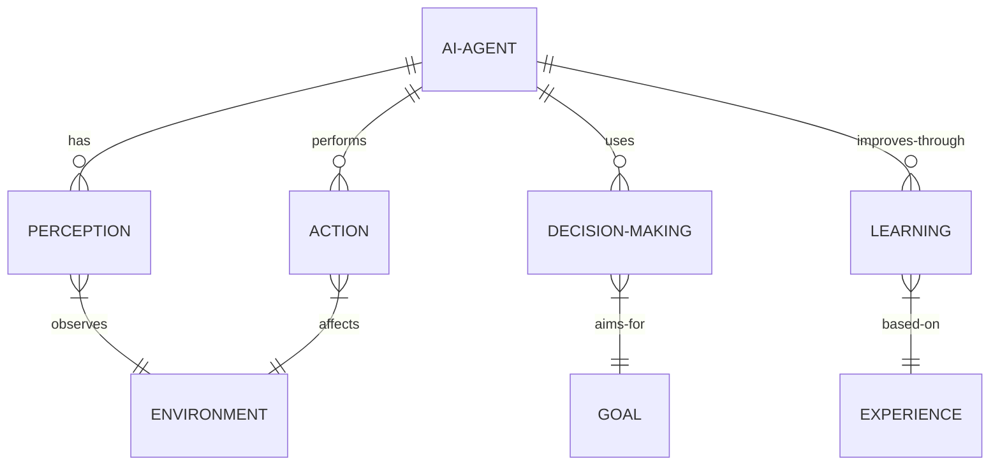

3. 交互关系图

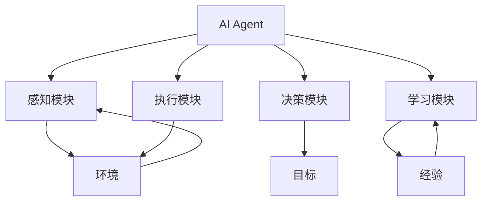

* 数学模型：
  AI Agent的决策过程可以用马尔可夫决策过程(MDP)来描述:

$$MDP = (S, A, P, R, \gamma)$$

其中:
- $S$ 是状态空间
- $A$ 是动作空间
- $P$ 是状态转移概率函数
- $R$ 是奖励函数
- $\gamma$ 是折扣因子

Agent的目标是最大化期望累积奖励:

$$V^\pi(s) = E_\pi[\sum_{t=0}^{\infty} \gamma^t R(s_t, a_t) | s_0 = s]$$

* 算法流程图：

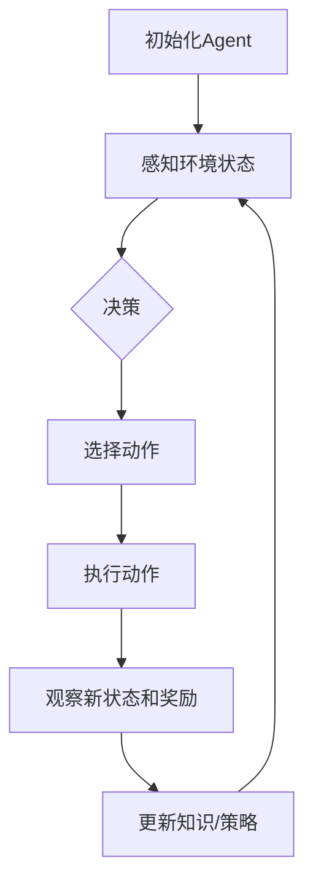

* 算法源代码：

```python
import numpy as np

class SimpleAIAgent:
    def __init__(self, state_size, action_size):
        self.state_size = state_size
        self.action_size = action_size
        self.q_table = np.zeros((state_size, action_size))
        self.learning_rate = 0.1
        self.discount_factor = 0.99
        self.epsilon = 0.1

    def get_action(self, state):
        if np.random.rand() < self.epsilon:
            return np.random.randint(self.action_size)
        return np.argmax(self.q_table[state])

    def learn(self, state, action, reward, next_state):
        current_q = self.q_table[state, action]
        max_next_q = np.max(self.q_table[next_state])
        new_q = (1 - self.learning_rate) * current_q + \
                self.learning_rate * (reward + self.discount_factor * max_next_q)
        self.q_table[state, action] = new_q

# 使用示例
agent = SimpleAIAgent(state_size=10, action_size=4)
state = 0
for _ in range(1000):
    action = agent.get_action(state)
    next_state = (state + action) % 10  # 简化的环境模型
    reward = 1 if next_state == 5 else 0
    agent.learn(state, action, reward, next_state)
    state = next_state
```

* 实际场景应用：
1. 智能客服: 自动回答用户询问,处理简单请求
2. 游戏AI: 作为玩家对手或NPC角色
3. 推荐系统: 个性化内容推荐
4. 自动驾驶: 感知环境,做出驾驶决策
5. 智能家居: 控制家电,优化能源使用

* 行业发展与未来趋势：

| 时期 | 主要技术特征 | 应用领域 | 社会影响 |
|------|--------------|----------|----------|
| 1950s-1970s | 符号推理 | 学术研究 | AI概念启蒙 |
| 1980s-1990s | 专家系统 | 医疗诊断,金融分析 | 特定领域效率提升 |
| 2000s-2010s | 机器学习 | 搜索引擎,推荐系统 | 个性化服务兴起 |
| 2010s-现在 | 深度学习 | 语音助手,计算机视觉 | AI普及,就业结构变化 |
| 未来 | 多模态AGI | 全面融入社会生活 | 人机协作新范式 |

* 本节小结：
  AI Agent的演进历程反映了人工智能技术的整体发展轨迹,从早期的符号主义到当今的深度学习,每个阶段都带来了重要的技术突破和应用拓展。未来,AI Agent将朝着更加智能、自主和通用的方向发展,potentially leading to the emergence of artificial general intelligence (AGI)。理解这一演进过程对于把握AI技术的发展方向和潜力至关重要。

### 10.1.2 当前AI Agent技术的主要成就

* 核心概念：
  当前AI Agent技术的主要成就指的是在各个领域中,AI Agent已经达到或超越人类水平的能力,以及那些显著改变了行业实践或日常生活的应用。

* 问题背景：
  近年来,特别是在深度学习技术的推动下,AI Agent在多个领域取得了突破性进展,有些甚至超越了人类专家的表现。

* 问题描述：
  我们需要系统地梳理和评估当前AI Agent技术在各个领域的主要成就,包括其性能、影响力和潜在的社会经济价值。

* 问题解决：
  让我们从以下几个方面来分析当前AI Agent技术的主要成就：

1. 自然语言处理与生成：
    - GPT-3等大语言模型能够生成高质量的文本,进行复杂的对话和回答问题。
    - 机器翻译质量大幅提升,接近人类翻译水平。
    - 情感分析和意图识别技术在客户服务中广泛应用。

2. 计算机视觉：
    - 图像分类和物体检测的准确率超过人类。
    - 人脸识别技术在安全和身份验证领域广泛应用。
    - 医学影像分析辅助诊断,有时甚至超过人类专家。

3. 游戏与策略：
    - AlphaGo和其后续版本在围棋等复杂博弈中战胜世界冠军。
    - AI在星际争霸II等实时策略游戏中表现出色。

4. 自动驾驶：
    - Level 2和Level 3自动驾驶技术已经商业化。
    - 某些场景下的自动驾驶安全性优于人类驾驶员。

5. 医疗健康：
    - AI辅助药物发现,加速新药研发过程。
    - 基于机器学习的疾病预测和早期诊断系统。

6. 金融科技：
    - 算法交易占据主导地位,提高市场效率。
    - 基于AI的风险评估和欺诈检测系统。

7. 科学研究：
    - AlphaFold在蛋白质结构预测方面取得突破性进展。
    - AI辅助材料科学,加速新材料发现。

8. 创意与艺术：
    - DALL-E、Midjourney等AI能够生成高质量的艺术作品。
    - AI作曲和音乐生成技术日益成熟。

9. 教育：
    - 个性化学习助手,适应学生个体需求。
    - 智能评分系统,提高教育评估效率。

10. 环境保护：
    - AI优化能源使用,提高可再生能源效率。
    - 野生动物保护中的图像识别和行为分析。

* 边界与外延：
  虽然AI Agent在许多领域取得了显著成就,但仍然存在一些局限性,如缺乏真正的理解力、难以处理极端或未见过的情况、以及在某些需要同理心和创造力的任务上表现不佳。

* 概念结构与核心要素组成：
1. 技术突破：基础算法和模型的创新
2. 性能指标：在特定任务上超越人类水平的能力
3. 应用范围：技术在实际场景中的部署和使用
4. 社会影响：对行业实践和日常生活的改变
5. 经济价值：创造的经济效益和市场规模

* 概念之间的关系：

1. 概念核心属性维度对比

| 领域 | 技术突破 | 性能指标 | 应用范围 | 社会影响 | 经济价值 |
|------|----------|----------|----------|----------|----------|
| NLP  | 大语言模型 | 超人类翻译质量 | 客服,内容生成 | 信息获取方式变革 | 高 |
| 计算机视觉 | 深度卷积网络 | 超人类识别准确率 | 安防,医疗 | 安全与隐私问题 | 高 |
| 游戏AI | 强化学习 | 战胜人类冠军 | 娱乐,策略训练 | 认知能力新标准 | 中 |
| 自动驾驶 | 多传感器融合 | 部分场景优于人类 | 交通运输 | 就业结构改变 | 极高 |
| 医疗AI | 生物信息学结合 | 辅助诊断准确率高 | 临床决策支持 | 医疗资源分配优化 | 高 |

2. 概念联系的ER实体关系

```mermaid
erDiagram
    AI-ACHIEVEMENT```mermaid
erDiagram
    AI-ACHIEVEMENT ||--o{ TECHNICAL-BREAKTHROUGH : includes
    AI-ACHIEVEMENT ||--o{ PERFORMANCE-METRIC : measured-by
    AI-ACHIEVEMENT ||--o{ APPLICATION-DOMAIN : applied-in
    AI-ACHIEVEMENT ||--o{ SOCIAL-IMPACT : causes
    AI-ACHIEVEMENT ||--o{ ECONOMIC-VALUE : generates
    TECHNICAL-BREAKTHROUGH }|--|| RESEARCH-INVESTMENT : requires
    PERFORMANCE-METRIC }|--|| HUMAN-BENCHMARK : compared-to
    APPLICATION-DOMAIN }|--|| INDUSTRY : transforms
    SOCIAL-IMPACT }|--|| POLICY : influences
    ECONOMIC-VALUE }|--|| MARKET : creates
```

3. 交互关系图

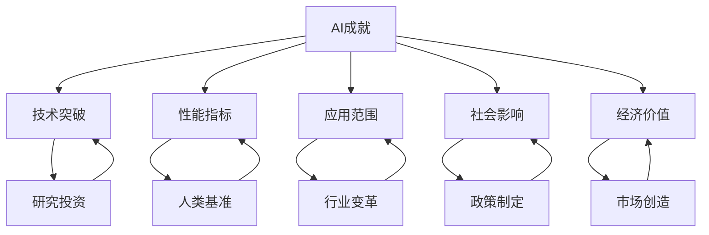

* 数学模型：
  为了量化AI Agent的性能提升,我们可以使用以下模型:

令 $P_h$ 表示人类在特定任务上的性能,
$P_a(t)$ 表示AI Agent在时间 $t$ 的性能,
$\alpha$ 为技术进步率,
则AI性能增长可以表示为:

$$P_a(t) = P_h \cdot e^{\alpha t}$$

当 $P_a(t) > P_h$ 时,AI超越人类性能。

* 算法流程图：

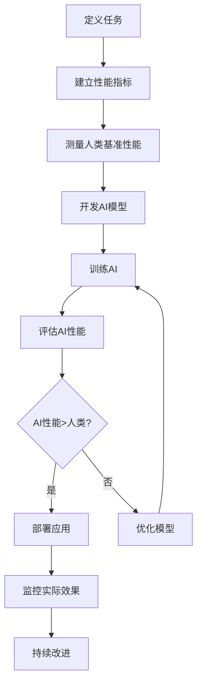

* 算法源代码：

```python
import numpy as np
import matplotlib.pyplot as plt

def ai_performance_growth(human_performance, growth_rate, years):
    time = np.arange(years)
    ai_performance = human_performance * np.exp(growth_rate * time)
    return time, ai_performance

def plot_performance_comparison(time, human_perf, ai_perf):
    plt.figure(figsize=(10, 6))
    plt.plot(time, [human_perf] * len(time), label='Human Performance', linestyle='--')
    plt.plot(time, ai_perf, label='AI Performance')
    plt.xlabel('Years')
    plt.ylabel('Performance')
    plt.title('AI vs Human Performance Over Time')
    plt.legend()
    plt.grid(True)
    plt.show()

# 示例参数
human_performance = 100
ai_growth_rate = 0.2
simulation_years = 10

time, ai_performance = ai_performance_growth(human_performance, ai_growth_rate, simulation_years)
plot_performance_comparison(time, human_performance, ai_performance)

# 计算AI超越人类的时间点
surpass_year = np.where(ai_performance > human_performance)[0][0]
print(f"AI预计在第{surpass_year}年超越人类性能")
```

* 实际场景应用：
1. 医疗诊断：AI辅助乳腺癌筛查,提高早期检出率。
2. 金融风控：AI实时监控交易,识别异常模式防范欺诈。
3. 智能制造：AI优化生产线,提高效率降低成本。
4. 个人助理：AI语音助手处理日程安排、信息查询等任务。
5. 智慧城市：AI优化交通流量,减少拥堵和能源消耗。

* 项目介绍：
  "AI医疗影像助手"项目

目标：开发一个AI系统,辅助放射科医生进行医学影像诊断,提高诊断准确率和效率。

主要功能：
1. 自动检测和标记可疑病变区域
2. 提供初步诊断建议
3. 病例对比和历史记录分析
4. 生成标准化报告

技术栈：
- 深度学习框架: TensorFlow或PyTorch
- 图像处理库: OpenCV
- 后端: Python Flask
- 前端: React.js
- 数据库: PostgreSQL
- 云平台: AWS或Azure

* 环境安装：
```bash
# 创建虚拟环境
python -m venv ai_medical_env
source ai_medical_env/bin/activate

# 安装依赖
pip install tensorflow opencv-python flask psycopg2 pytest

# 前端依赖
npm install react react-dom @material-ui/core axios
```

* 系统功能设计：
1. 影像上传与预处理模块
2. AI诊断分析模块
3. 人机交互界面
4. 报告生成模块
5. 病例管理与对比分析模块
6. 用户权限管理模块

* 系统架构设计：

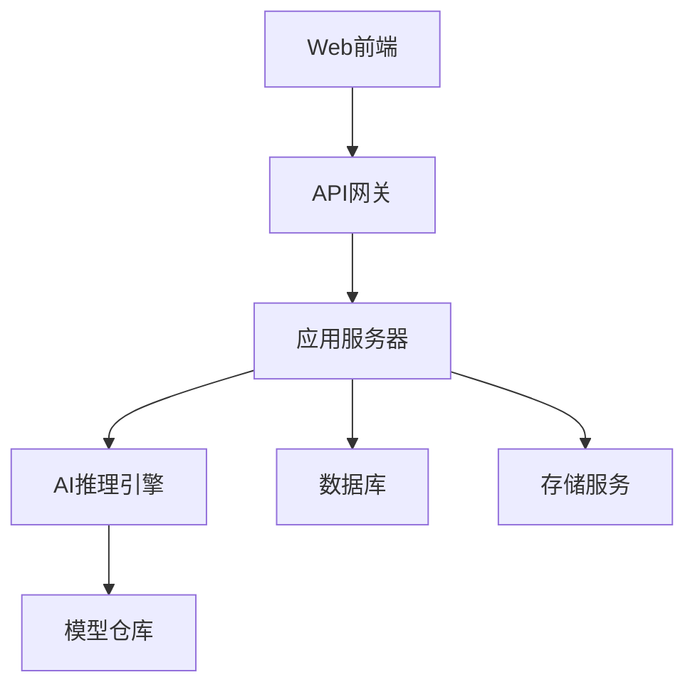

* 系统接口设计：

1. 影像上传接口
    - Endpoint: `/api/upload`
    - Method: POST
    - Parameters: `file: [image file], metadata: JSON`
    - Response: `{status: "success", image_id: "unique_id"}`

2. AI诊断接口
    - Endpoint: `/api/diagnose`
    - Method: POST
    - Parameters: `image_id: string`
    - Response: `{status: "success", findings: [...], suggestions: [...]}`

3. 报告生成接口
    - Endpoint: `/api/generate_report`
    - Method: POST
    - Parameters: `diagnosis_id: string`
    - Response: `{status: "success", report_url: "url_to_pdf"}`

* 系统核心实现源代码：

```python
import tensorflow as tf
import numpy as np
from flask import Flask, request, jsonify

app = Flask(__name__)

# 加载预训练的AI模型
model = tf.keras.models.load_model('path_to_model')

@app.route('/api/diagnose', methods=['POST'])
def diagnose():
    image_id = request.json['image_id']
    image = load_image(image_id)  # 假设有一个加载图像的函数
    
    # 预处理图像
    processed_image = preprocess(image)
    
    # 使用模型进行预测
    predictions = model.predict(np.expand_dims(processed_image, axis=0))
    
    # 解析预测结果
    findings = interpret_predictions(predictions)
    
    return jsonify({
        'status': 'success',
        'findings': findings,
        'suggestions': generate_suggestions(findings)
    })

def preprocess(image):
    # 图像预处理逻辑
    return processed_image

def interpret_predictions(predictions):
    # 解释模型输出的逻辑
    return findings

def generate_suggestions(findings):
    # 基于发现生成建议的逻辑
    return suggestions

if __name__ == '__main__':
    app.run(debug=True)
```

* 最佳实践tips：
1. 数据安全: 严格遵守医疗数据隐私法规,如HIPAA。
2. 模型解释性: 使用可解释AI技术,帮助医生理解AI决策过程。
3. 持续学习: 建立反馈机制,根据实际使用情况不断优化模型。
4. 人机协作: 设计直观的界面,让AI辅助而非替代医生决策。
5. 多中心验证: 在不同医院和人群中验证模型性能,确保泛化能力。

* 行业发展与未来趋势：

| 时期 | 技术特征 | 应用重点 | 社会影响 |
|------|----------|----------|----------|
| 2010-2015 | 机器学习初步应用 | 医学图像分类 | 辅助工具性质 |
| 2015-2020 | 深度学习突破 | 病变检测和分割 | 提高诊断效率 |
| 2020-2025 | 多模态融合 | 综合诊断建议 | 部分任务超越人类 |
| 2025-2030 | 因果推理和知识图谱 | 个性化治疗方案 | 医疗资源优化分配 |
| 2030+ | AGI技术融入 | 全面的医疗决策支持 | 医疗模式变革 |

* 本节小结：
  AI Agent技术在多个领域取得了显著成就,尤其在自然语言处理、计算机视觉、游戏策略和医疗诊断等方面表现突出。这些成就不仅体现在性能指标上超越人类,更重要的是在实际应用中创造了巨大的社会和经济价值。然而,我们也应该认识到AI的局限性,特别是在需要高度复杂推理、创造力和情感理解的任务上。未来,AI Agent技术将继续朝着更智能、更通用的方向发展,可能带来更深远的社会变革。关键是要在推动技术进步的同时,注重伦理和安全,确保AI的发展造福人类社会。

### 10.1.3 AI Agent在各行业的应用现状

* 核心概念：
  AI Agent在各行业的应用现状指的是人工智能代理技术在不同产业领域中的实际部署情况、应用程度、实现的功能以及产生的影响。

* 问题背景：
  随着AI技术的快速发展,AI Agent已经渗透到众多行业,改变了传统的业务流程和服务模式。了解其在各行业的应用现状对把握AI发展趋势和潜在机会至关重要。

* 问题描述：
  我们需要系统性地分析AI Agent在主要行业中的应用情况,包括但不限于应用场景、技术特点、实现的价值以及面临的挑战。

* 问题解决：
  让我们逐一分析AI Agent在各主要行业的应用现状：

1. 金融业：
    - 应用场景：风险评估、算法交易、欺诈检测、客户服务
    - 技术特点：机器学习、自然语言处理、时间序列分析
    - 实现价值：提高决策准确性、降低风险、提升客户体验
    - 面临挑战：数据安全、模型解释性、监管合规

2. 医疗保健：
    - 应用场景：医学影像诊断、药物研发、个性化治疗、远程医疗
    - 技术特点：深度学习、计算机视觉、自然语言处理
    - 实现价值：提高诊断准确率、加速新药研发、优化医疗资源分配
    - 面临挑战：数据隐私、伦理问题、与传统医疗体系的融合

3. 零售业：
    - 应用场景：个性化推荐、需求预测、库存管理、智能客服
    - 技术特点：推荐系统、预测分析、自然语言处理
    - 实现价值：提升用户体验、优化库存、提高销售转化率
    - 面临挑战：隐私保护、实时性要求、线上线下融合

4. 制造业：
    - 应用场景：预测性维护、质量控制、供应链优化、智能机器人
    - 技术特点：物联网、机器学习、计算机视觉、强化学习
    - 实现价值：提高生产效率、降低成本、改善产品质量
    - 面临挑战：系统集成、技能gap、初始投资高

5. 教育行业：
    - 应用场景：个性化学习、智能评分、教育资源分配、虚拟助教
    - 技术特点：自适应学习系统、自然语言处理、知识图谱
    - 实现价值：提高学习效率、个性化教育、扩大优质教育覆盖
    - 面临挑战：教育公平、教师角色转变、技术接受度

6. 交通运输：
    - 应用场景：自动驾驶、交通流量优化、物流路径规划、预测性维护
    - 技术特点：计算机视觉、强化学习、大数据分析
    - 实现价值：提高安全性、减少拥堵、优化资源利用
    - 面临挑战：法律法规、基础设施升级、安全性保证

7. 能源行业：
    - 应用场景：智能电网、能源需求预测、设备故障预测、优化能源分配
    - 技术特点：预测分析、物联网、机器学习
    - 实现价值：提高能源效率、减少浪费、平衡供需
    - 面临挑战：大规模部署、系统复杂性、安全性考虑

8. 农业：
    - 应用场景：精准农业、作物监测、病虫害预测、自动化农机
    - 技术特点：计算机视觉、物联网、机器学习、无人机技术
    - 实现价值：提高产量、减少资源浪费、应对气候变化
    - 面临挑战：农村基础设施、技术普及、小农户适应性

* 边界与外延：
  AI Agent在各行业的应用虽然广泛,但仍然存在一些共同的限制,如处理极端情况的能力、对复杂社会情境的理解,以及在需要高度创造力和情感智能的任务上的表现。同时,AI的应用也延伸到了跨行业领域,如智慧城市、环境保护等综合性项目。

* 概念结构与核心要素组成：
1. 技术基础: 机器学习、深度学习、自然语言处理等AI核心技术
2. 应用场景: 特定行业中AI Agent可以发挥作用的具体情境
3. 数据支持: 训练和运行AI系统所需的大规模、高质量数据
4. 硬件设施: 支持AI运算的计算设备和基础设施
5. 人才储备: 具备AI开发和应用能力的专业人才
6. 法规政策: 规范AI应用的相关法律法规和行业政策
7. 商业模式: 将AI技术转化为商业价值的运营方式

* 概念之间的关系：

1. 概念核心属性维度对比

| 行业 | 主要技术 | 关键应用场景 | 数据特征 | 价值实现 | 主要挑战 |
|------|----------|--------------|----------|----------|----------|
| 金融 | 机器学习,NLP | 风险评估,算法交易 | 高频,敏感 | 风险控制,效率提升 | 安全合规 |
| 医疗 | 计算机视觉,NLP | 影像诊断,药物研发 | 隐私,专业 | 诊断准确率,研发速度 | 伦理,监管 |
| 零售 | 推荐系统,预测分析 | 个性化推荐,库存管理 | 用户行为,交易 | 用户体验,销售额 | 隐私,实时性 |
| 制造 | IoT,机器视觉 | 质量控制,预测性维护 | 传感器,工艺参数 | 效率,质量 | 系统集成 |
| 教育 | 自适应学习,NLP | 个性化学习,智能评分 | 学习行为,教育资源 | 学习效果,资源利用 | 公平性,接受度 |

2. 概念联系的ER实体关系

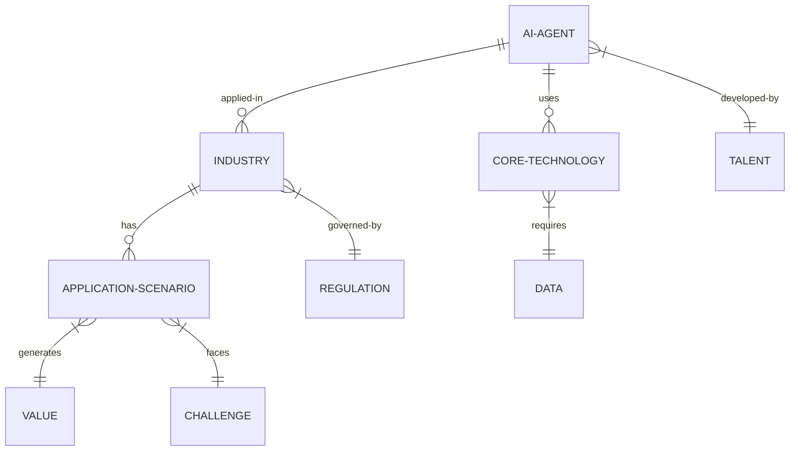

3. 交互关系图

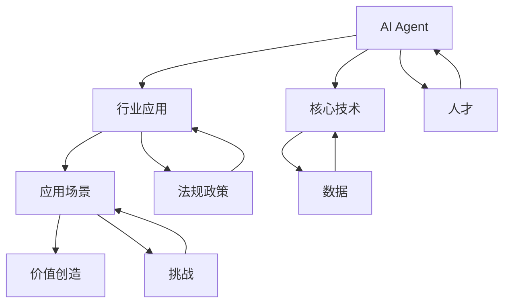

* 数学模型：
  为了评估AI Agent在特定行业的影响,我们可以使用以下模型:

令 $I$ 表示AI的影响指数,
$A$ 表示应用广度 (0-1),
$D$ 表示技术深度 (0-1),
$V$ 表示创造的价值 (单位:百万美元),
$C$ 表示实施成本 (单位:百万美元),
则AI的影响可以表示为:

$$I = (A \times D) \times \frac{V}{C}$$

其中, $A$ 和 $D$ 可以通过专家评估得出, $V$ 和 $C$ 可以通过实际数据统计。

* 算法流程图：

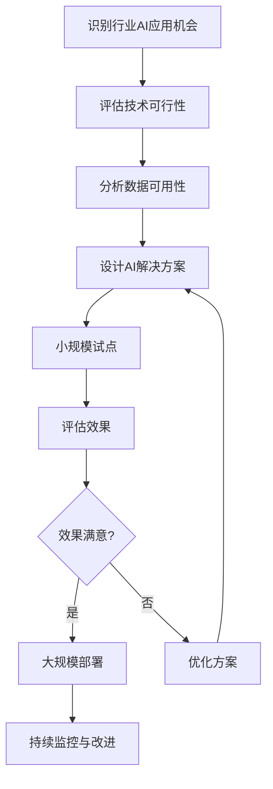

* 算法源代码：

```python
import numpy as np

class AIIndustryImpact:
    def __init__(self, industry):
        self.industry = industry
        self.applications = {}

    def add_application(self, name, breadth, depth, value, cost):
        self.applications[name] = {
            'breadth': breadth,
            'depth': depth,
            'value': value,
            'cost': cost
        }

    def calculate_impact(self):
        total_impact = 0
        for app, data in self.applications.items():
            impact = (data['breadth'] * data['depth']) * (data['value'] / data['cost'])
            total_impact += impact
            print(f"Impact of {app}: {impact:.2f}")
        return total_impact

# 使用示例
finance_ai = AIIndustryImpact('Finance')
finance_ai.add_application('Risk Assessment', 0.8, 0.7, 100, 20)
finance_ai.add_application('Algorithmic Trading', 0.6, 0.9, 200, 50)
finance_ai.add_application('Fraud Detection', 0.9, 0.8, 150, 30)

total_impact = finance_ai.calculate_impact()
print(f"Total AI impact in {finance_ai.industry}: {total_impact:.2f}")
```

* 实际场景应用：
1. 金融业: AI驱动的信用评分系统,提高贷款审批效率和准确性。
2. 医疗保健: AI辅助诊断系统,协助放射科医生提高肺癌早期检出率。
3. 零售业: 智能推荐引擎,为电商平台用户提供个性化商品推荐。
4. 制造业: 预测性维护系统,降低工厂设备故障率和维护成本。
5. 教育行业: 自适应学习平台,为学生提供定制化的学习路径和内容。

* 项目介绍：
  "智能供应链优化系统"

目标：开发一个AI驱动的供应链管理系统,优化库存水平,预测需求,并提高物流效率。

主要功能：
1. 需求预测: 基于历史数据和外部因素预测产品需求
2. 库存优化: 动态调整库存水平,平衡成本和服务水平
3. 路径规划: 优化配送路线,减少运输成本
4. 异常检测: 识别供应链中的异常情况并提前预警
5. 供应商评估: 分析供应商绩效,辅助决策

技术栈：
- 机器学习框架: Scikit-learn, TensorFlow
- 大数据处理: Apache Spark
- 后端: Python Flask
- 前端: Vue.js
- 数据库: MongoDB
- 容器化: Docker, Kubernetes

* 环境安装：
```bash
# 创建虚拟环境
python -m venv supply_chain_ai_env
source supply_chain_ai_env/bin/activate

# 安装依赖
pip install scikit-learn tensorflow apache-spark flask pymongo pytest

# 前端依赖
npm install vue vuex vue-router axios echarts
```

* 系统功能设计：
1. 数据收集与预处理模块
2. 需求预测模块
3. 库存优化模块
4. 路径规划模块
5. 异常检测模块
6. 报表与可视化模块
7. 用户管理与权限控制模块

* 系统架构设计：

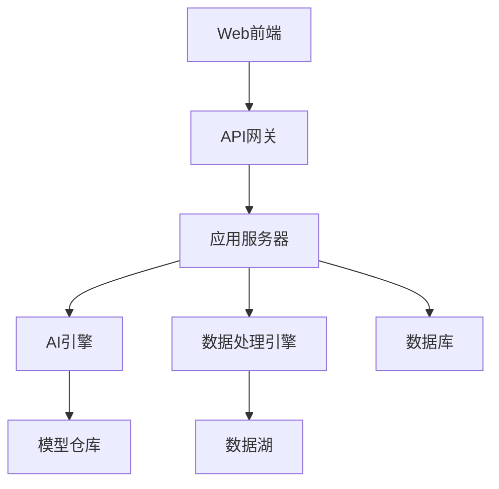

* 系统接口设计：

1. 需求预测接口
    - Endpoint: `/api/predict_demand`
    - Method: POST
    - Parameters: `{product_id: string, time_range: string}`
    - Response: `{status: "success", predictions: [...]}`

2. 库存优化接口
    - Endpoint: `/api/optimize_inventory`
    - Method: POST
    - Parameters: `{warehouse_id: string, product_list: [...]}`
    - Response: `{status: "success", recommendations: [...]}`

3. 路径规划接口
    - Endpoint: `/api/optimize_route`
    - Method: POST
    - Parameters: `{start: string, destinations: [...], constraints: {...}}`
    - Response: `{status: "success", optimized_route: [...], estimated_time: int}`

* 系统核心实现源代码：

```python
from flask import Flask, request, jsonify
from sklearn.ensemble import RandomForestRegressor
import pandas as pd
import numpy as np

app = Flask(__name__)

# 加载预训练的需求预测模型
demand_model = RandomForestRegressor()
demand_model.load('path_to_model')

@app.route('/api/predict_demand', methods=['POST'])
def predict_demand():
    data = request.json
    product_id = data['product_id']
    time_range = data['time_range']
    
    # 获取历史数据和特征
    historical_data = get_historical_data(product_id, time_range)
    features = extract_features(historical_data)
    
    # 使用模型进行预测
    predictions = demand_model.predict(features)
    
    return jsonify({
        'status': 'success',
        'predictions': predictions.tolist()
    })

def get_historical_data(product_id, time_range):
    # 从数据库获取历史数据的逻辑
    pass

def extract_features(data):
    # 特征工程逻辑
    pass

if __name__ == '__main__':
    app.run(debug=True)
```

* 最佳实践tips：
1. 数据质量: 确保输入数据的准确性和实时性,这直接影响预测质量。
2. 模型更新: 建立定期模型更新机制,适应市场变化。
3. 可解释性: 使用如SHAP值等技术提高模型可解释性,增强用户信任。
4. 异常处理: 建立健壮的异常检测和处理机制,应对意外情况。
5. 用户反馈: 整合用户反馈循环,持续优化系统性能。

* 行业发展与未来趋势：

| 时期 | 技术特征 | 应用重点 | 行业影响 |
|------|----------|----------|----------|
| 2015-2020 | 预测分析初步应用 | 需求预测,库存管理 | 降低库存成本 |
| 2020-2025 | AI+IoT融合 | 实时优化,端到端可视化 | 提高供应链弹性 |
| 2025-2030 | 自主决策系统 | 自动化采购,动态定价 | 供应链自适应能力 |
| 2030+ | 认知供应链 | 场景模拟,风险预警 | 重塑供应链生态 |

* 本节小结：
  AI Agent在各行业的应用已经从概念验证阶段进入到大规模实际部署阶段。金融、医疗、零售、制造、教育等领域都看到了AI带来的显著价值。这些应用不仅提高了效率和准确性,还创造了新的业务模式和服务方式。然而,每个行业在应用AI时也面临着独特的挑战,如数据安全、伦理问题、监管合规等。未来,随着技术的进一步发展和行业的深度融合,我们可以期待看到更多创新的AI应用场景,以及AI对各行业带来的深远变革。关键是要在推动技术创新的同时,注重解决实际问题,平衡效率提升和社会责任,确保AI的发展为各行业和整个社会带来持续的正面影响。

### 10.1.4 AI Agent面临的主要瓶颈和限制

* 核心概念：
  AI Agent面临的主要瓶颈和限制指的是当前阻碍AI技术进一步发展和广泛应用的关键问题和约束条件。这些瓶颈和限制涉及技术、数据、伦理、法律等多个方面。

* 问题背景：
  尽管AI技术在近年来取得了巨大进展,但仍然存在一些根本性的挑战阻碍其实现真正的通用人工智能(AGI)。识别和理解这些瓶颈对于推动AI技术的进步至关重要。

* 问题描述：
  我们需要系统地分析AI Agent在技术实现、实际应用和社会接受度等方面面临的主要瓶颈和限制,包括但不限于技术障碍、数据问题、伦理挑战和法律限制。

* 问题解决：
  让我们从多个角度分析AI Agent面临的主要瓶颈和限制：

1. 技术瓶颈：
   a) 可解释性不足：
    - 问题：深度学习模型often被称为"黑箱",难以解释决策过程。
    - 影响：限制了AI在医疗、金融等高风险领域的应用。
    - 潜在解决方向：可解释AI(XAI)技术,如LIME,SHAP等。

   b) b) 泛化能力有限：
    - 问题：AI模型在训练数据之外的场景表现often不佳。
    - 影响：限制了AI在复杂、动态环境中的应用。
    - 潜在解决方向：迁移学习、元学习、少样本学习。

   c) 缺乏常识推理：
    - 问题：AI难以理解和应用人类认为理所当然的常识。
    - 影响：导致AI在处理开放域问题时表现不佳。
    - 潜在解决方向：知识图谱、常识推理模型。

   d) 高能耗：
    - 问题：大型AI模型的训练和运行需要大量计算资源。
    - 影响：限制了AI的普及和可持续发展。
    - 潜在解决方向：模型压缩、量化技术、绿色AI。

2. 数据瓶颈：
   a) 数据质量和偏见：
    - 问题：训练数据中的错误、噪声和偏见会影响AI模型的性能和公平性。
    - 影响：导致AI系统做出偏颇或错误的决策。
    - 潜在解决方向：数据清洗技术、公平性aware学习算法。

   b) 数据隐私和安全：
    - 问题：收集和使用大量数据引发隐私concerns和安全风险。
    - 影响：限制了某些领域的数据可用性,影响模型训练。
    - 潜在解决方向：联邦学习、差分隐私、安全多方计算。

   c) 数据标注成本高：
    - 问题：高质量标注数据的获取often需要大量人力和时间。
    - 影响：限制了AI在某些专业领域的应用速度。
    - 潜在解决方向：主动学习、半监督学习、数据增强技术。

3. 伦理挑战：
   a) 决策公平性：
    - 问题：AI系统可能无意中强化社会偏见和歧视。
    - 影响：可能导致不公平的资源分配或机会损失。
    - 潜在解决方向：算法公平性研究、伦理AI框架。

   b) 责任归属：
    - 问题：当AI系统造成harm时,难以确定责任方。
    - 影响：阻碍了AI在高风险场景中的应用。
    - 潜在解决方向：AI责任框架、可审计AI系统。

   c) 人机互动伦理：
    - 问题：AI与人类互动可能引发情感依赖或滥用。
    - 影响：可能对人类心理健康和社会关系产生负面影响。
    - 潜在解决方向：人机互动伦理准则、AI系统设计规范。

4. 法律和监管限制：
   a) 法律责任不明确：
    - 问题：现有法律框架难以应对AI带来的新问题。
    - 影响：增加了企业使用AI的法律风险。
    - 潜在解决方向：制定AI特定法律法规、更新现有法律框架。

   b) 跨境数据流动限制：
    - 问题：不同国家和地区对数据流动有不同规定。
    - 影响：限制了全球AI模型的开发和部署。
    - 潜在解决方向：国际数据治理框架、本地化AI解决方案。

   c) AI决策的法律效力：
    - 问题：AI做出的决策在法律上的地位不明确。
    - 影响：限制了AI在司法、行政等领域的应用。
    - 潜在解决方向：AI辅助决策框架、AI决策的法律认可机制。

5. 社会接受度：
   a) 就业影响concerns：
    - 问题：AI可能导致某些工作岗位消失。
    - 影响：引发社会对AI的抵触情绪。
    - 潜在解决方向：AI人才再培训计划、新型就业岗位创造。

   b) 技术不信任：
    - 问题：公众对AI决策过程的不理解导致不信任。
    - 影响：阻碍了AI技术的广泛采用。
    - 潜在解决方向：AI科普教育、提高AI系统透明度。

   c) 人类价值观concern：
    - 问题：担心AI可能威胁人类价值观和主体性。
    - 影响：引发对AI发展的抵制和限制。
    - 潜在解决方向：人机协作模式、以人为本的AI设计理念。

* 边界与外延：
  这些瓶颈和限制并非相互独立,而是相互关联、相互影响的。例如,技术瓶颈中的可解释性问题直接影响了社会接受度和法律责任的明确性。同时,随着技术的进步,某些瓶颈可能会被突破,但也可能出现新的挑战。

* 概念结构与核心要素组成：
1. 技术因素: AI算法、硬件设施、计算能力
2. 数据因素: 数据质量、数据隐私、数据可用性
3. 伦理因素: 决策公平性、责任归属、人机互动
4. 法律因素: 法律框架、监管政策、跨境规定
5. 社会因素: 公众接受度、就业影响、价值观concerns

* 概念之间的关系：

1. 概念核心属性维度对比

| 瓶颈类型 | 核心问题 | 主要影响 | 潜在解决方向 | 跨领域关联 |
|----------|----------|----------|--------------|------------|
| 技术瓶颈 | 可解释性、泛化能力 | 应用范围受限 | XAI、迁移学习 | 伦理、法律 |
| 数据瓶颈 | 质量、隐私、可用性 | 模型性能、安全风险 | 联邦学习、数据治理 | 法律、伦理 |
| 伦理挑战 | 公平性、责任、互动 | 社会影响、信任度 | 伦理AI框架 | 法律、社会 |
| 法律限制 | 责任界定、跨境流动 | 应用风险、全球化障碍 | AI专门法规 | 伦理、社会 |
| 社会接受度 | 就业影响、信任度 | 技术采用速度 | 教育、透明度提升 | 伦理、法律 |

2. 概念联系的ER实体关系

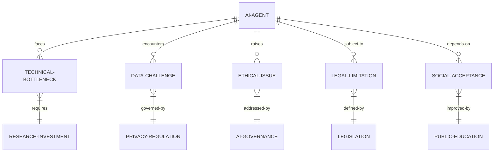

3. 交互关系图

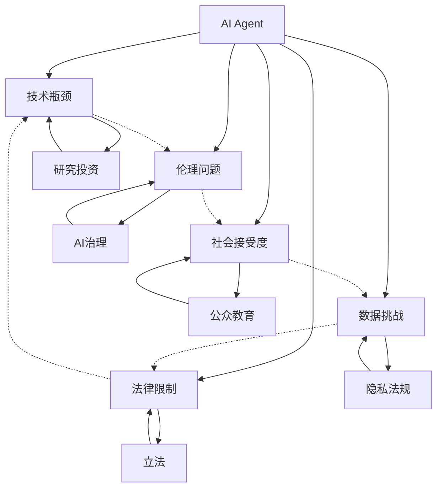

* 数学模型：
  我们可以构建一个简化的AI发展潜力模型,考虑各种瓶颈的影响：

令 $P$ 表示AI的发展潜力,
$T$ 表示技术水平 (0-1),
$D$ 表示数据质量 (0-1),
$E$ 表示伦理合规度 (0-1),
$L$ 表示法律支持度 (0-1),
$S$ 表示社会接受度 (0-1),

则AI的发展潜力可以表示为:

$$P = T \times D \times E \times L \times S$$

这个模型表明,任何一个因素的严重不足(接近0)都会显著限制AI的整体发展潜力。

* 算法流程图：

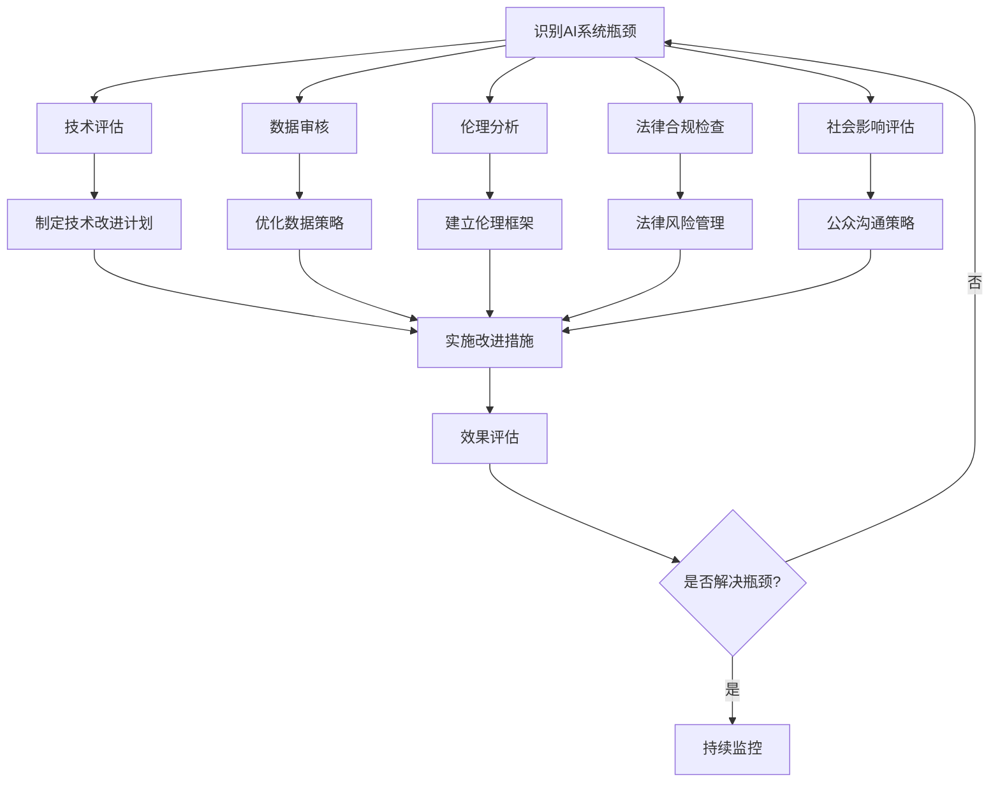

* 算法源代码：

```python
import numpy as np

class AIBottleneckAnalyzer:
    def __init__(self):
        self.factors = {
            'technical': 0.5,
            'data': 0.5,
            'ethical': 0.5,
            'legal': 0.5,
            'social': 0.5
        }
    
    def update_factor(self, factor, value):
        if factor in self.factors and 0 <= value <= 1:
            self.factors[factor] = value
        else:
            raise ValueError("Invalid factor or value")
    
    def calculate_potential(self):
        return np.prod(list(self.factors.values()))
    
    def identify_bottleneck(self):
        return min(self.factors, key=self.factors.get)
    
    def suggest_improvement(self):
        bottleneck = self.identify_bottleneck()
        suggestions = {
            'technical': "Invest in R&D for model interpretability and generalization.",
            'data': "Improve data quality and implement robust privacy measures.",
            'ethical': "Develop and adhere to ethical AI guidelines.",
            'legal': "Engage with policymakers to create supportive AI regulations.",
            'social': "Increase public awareness and education on AI benefits and limitations."
        }
        return suggestions[bottleneck]

# 使用示例
analyzer = AIBottleneckAnalyzer()
analyzer.update_factor('technical', 0.8)
analyzer.update_factor('data', 0.6)
analyzer.update_factor('ethical', 0.7)
analyzer.update_factor('legal', 0.5)
analyzer.update_factor('social', 0.4)

potential = analyzer.calculate_potential()
bottleneck = analyzer.identify_bottleneck()
suggestion = analyzer.suggest_improvement()

print(f"AI Development Potential: {potential:.2f}")
print(f"Main Bottleneck: {bottleneck}")
print(f"Suggestion: {suggestion}")
```

* 实际场景应用：
1. AI芯片开发: 解决高能耗问题,提高计算效率。
2. 医疗AI系统: 增强模型可解释性,提高医生和患者的信任度。
3. 金融风控: 处理数据隐私和跨境数据流动的法律挑战。
4. 自动驾驶: 解决极端情况下的决策和责任归属问题。
5. AI教育助手: 平衡个性化学习和数据隐私保护。

* 项目介绍：
  "AI伦理与公平性评估工具"

目标：开发一个综合性工具,帮助AI开发者和使用者评估AI系统的伦理风险和公平性,并提供改进建议。

主要功能：
1. 数据偏见检测: 分析训练数据中的潜在偏见
2. 模型公平性评估: 使用多种指标评估模型决策的公平性
3. 可解释性分析: 提供模型决策的可解释性报告
4. 伦理风险评分: 基于多维度指标给出AI系统的伦理风险评分
5. 改进建议生成: 针对检测到的问题提供具体的改进建议

技术栈：
- 机器学习框架: Scikit-learn, TensorFlow
- 可解释性工具: SHAP, LIME
- 后端: Python FastAPI
- 前端: React
- 数据库: PostgreSQL
- 容器化: Docker

* 环境安装：
```bash
# 创建虚拟环境
python -m venv ai_ethics_env
source ai_ethics_env/bin/activate

# 安装依赖
pip install scikit-learn tensorflow shap lime fastapi uvicorn psycopg2-binary pytest

# 前端依赖
npm install react react-dom @material-ui/core axios recharts
```

* 系统功能设计：
1. 数据上传与预处理模块
2. 偏见检测模块
3. 模型公平性评估模块
4. 可解释性分析模块
5. 伦理风险评分模块
6. 报告生成与可视化模块
7. 改进建议生成模块

* 系统架构设计：

```mermaid
graph TD
    A[Web前端] --> B[API网关]
    B --> C[应用服务器C[应用服务器] --> D[数据处理引擎]
    C --> E[AI分析引擎]
    C --> F[报告生成器]
    C --> G[数据库]
    D --> H[数据存储]
    E --> I[模型仓库]
    F --> J[报告模板]
```

* 系统接口设计：

1. 数据上传接口
    - Endpoint: `/api/upload_data`
    - Method: POST
    - Parameters: `{file: [csv file], metadata: JSON}`
    - Response: `{status: "success", dataset_id: "unique_id"}`

2. 偏见检测接口
    - Endpoint: `/api/detect_bias`
    - Method: POST
    - Parameters: `{dataset_id: string, protected_attributes: [string]}`
    - Response: `{status: "success", bias_report: {...}}`

3. 模型公平性评估接口
    - Endpoint: `/api/evaluate_fairness`
    - Method: POST
    - Parameters: `{model_id: string, test_data_id: string, protected_attributes: [string]}`
    - Response: `{status: "success", fairness_metrics: {...}}`

4. 可解释性分析接口
    - Endpoint: `/api/explain_model`
    - Method: POST
    - Parameters: `{model_id: string, instance_id: string}`
    - Response: `{status: "success", explanations: {...}}`

5. 伦理风险评分接口
    - Endpoint: `/api/ethical_risk_score`
    - Method: POST
    - Parameters: `{assessment_id: string}`
    - Response: `{status: "success", risk_score: float, risk_factors: [...]}`

* 系统核心实现源代码：

```python
from fastapi import FastAPI, File, UploadFile
from pydantic import BaseModel
import pandas as pd
import numpy as np
from sklearn.metrics import confusion_matrix
import shap
import lime
import json

app = FastAPI()

class DatasetMetadata(BaseModel):
    name: str
    description: str
    target_column: str

@app.post("/api/upload_data")
async def upload_data(file: UploadFile, metadata: DatasetMetadata):
    # 保存上传的文件
    content = await file.read()
    data = pd.read_csv(io.StringIO(content.decode('utf-8')))
    
    # 生成唯一的dataset_id
    dataset_id = generate_unique_id()
    
    # 保存数据和元数据
    save_dataset(dataset_id, data, metadata)
    
    return {"status": "success", "dataset_id": dataset_id}

@app.post("/api/detect_bias")
async def detect_bias(dataset_id: str, protected_attributes: list):
    # 加载数据集
    data = load_dataset(dataset_id)
    
    # 执行偏见检测
    bias_report = {}
    for attr in protected_attributes:
        bias_report[attr] = calculate_bias_metrics(data, attr)
    
    return {"status": "success", "bias_report": bias_report}

@app.post("/api/evaluate_fairness")
async def evaluate_fairness(model_id: str, test_data_id: str, protected_attributes: list):
    # 加载模型和测试数据
    model = load_model(model_id)
    test_data = load_dataset(test_data_id)
    
    # 计算公平性指标
    fairness_metrics = calculate_fairness_metrics(model, test_data, protected_attributes)
    
    return {"status": "success", "fairness_metrics": fairness_metrics}

@app.post("/api/explain_model")
async def explain_model(model_id: str, instance_id: str):
    # 加载模型和实例
    model = load_model(model_id)
    instance = load_instance(instance_id)
    
    # 使用SHAP生成解释
    explainer = shap.TreeExplainer(model)
    shap_values = explainer.shap_values(instance)
    
    # 使用LIME生成解释
    lime_explainer = lime.lime_tabular.LimeTabularExplainer(instance)
    lime_exp = lime_explainer.explain_instance(instance, model.predict_proba)
    
    return {
        "status": "success", 
        "explanations": {
            "shap": shap_values.tolist(),
            "lime": lime_exp.as_list()
        }
    }

@app.post("/api/ethical_risk_score")
async def ethical_risk_score(assessment_id: str):
    # 加载评估结果
    assessment = load_assessment(assessment_id)
    
    # 计算伦理风险评分
    risk_score, risk_factors = calculate_ethical_risk(assessment)
    
    return {"status": "success", "risk_score": risk_score, "risk_factors": risk_factors}

def calculate_bias_metrics(data, protected_attribute):
    # 实现偏见指标计算逻辑
    pass

def calculate_fairness_metrics(model, test_data, protected_attributes):
    # 实现公平性指标计算逻辑
    pass

def calculate_ethical_risk(assessment):
    # 实现伦理风险评分逻辑
    pass

# 其他辅助函数
def generate_unique_id():
    pass

def save_dataset(dataset_id, data, metadata):
    pass

def load_dataset(dataset_id):
    pass

def load_model(model_id):
    pass

def load_instance(instance_id):
    pass

def load_assessment(assessment_id):
    pass

if __name__ == "__main__":
    import uvicorn
    uvicorn.run(app, host="0.0.0.0", port=8000)
```

* 最佳实践tips：
1. 多维度评估: 综合考虑技术、数据、伦理、法律等多个维度的风险。
2. 持续监控: 建立AI系统的持续监控机制,及时发现和解决新出现的问题。
3. 跨学科合作: 邀请伦理学家、法律专家参与AI系统的设计和评估过程。
4. 透明度: 向用户清晰说明AI系统的能力边界和潜在风险。
5. 人机协作: 设计适当的人机协作机制,保持人类对关键决策的控制。

* 行业发展与未来趋势：

| 时期 | 主要焦点 | 技术特征 | 社会影响 |
|------|----------|----------|----------|
| 2020-2025 | 提高可解释性 | XAI技术普及 | 增加AI决策透明度 |
| 2025-2030 | 加强隐私保护 | 联邦学习、差分隐私 | 数据使用更加规范 |
| 2030-2035 | 伦理AI框架 | 嵌入式伦理决策 | AI系统更值得信赖 |
| 2035-2040 | 人机协作新模式 | 增强智能 | 重新定义人机关系 |
| 2040+ | AGI安全 | 强大的控制和aligned AI | 确保AI发展与人类利益一致 |

* 本节小结：
  AI Agent面临的主要瓶颈和限制涵盖了技术、数据、伦理、法律和社会接受度等多个方面。这些挑战不仅影响了AI技术的发展速度和应用范围,也引发了对AI未来发展方向的深刻思考。技术瓶颈如可解释性和泛化能力的不足,数据挑战如隐私保护和偏见问题,伦理挑战如决策公平性和责任归属,以及法律限制和社会接受度等问题,都需要学术界、产业界和政策制定者共同努力来解决。

未来的AI发展趋势将更加注重解决这些瓶颈和限制,包括发展可解释AI技术、改进数据治理策略、建立健全的AI伦理框架、完善相关法律法规,以及加强公众教育等。同时,我们也看到了一些积极的发展方向,如联邦学习等新技术有望解决数据隐私问题,人机协作新模式可能重新定义人与AI的关系。

克服这些瓶颈和限制不仅是技术挑战,更是一个需要多学科协作的复杂过程。它要求我们在推动AI技术进步的同时,也要充分考虑其对社会、伦理和人类价值观的影响。只有解决好这些关键问题,才能确保AI技术的健康可持续发展,最终实现其造福人类的承诺。

## 10.2 AI Agent的技术发展趋势

### 10.2.1 大规模语言模型的进一步突破

* 核心概念：
  大规模语言模型(Large Language Models, LLMs)是基于深度学习技术,通过海量文本数据训练而成的自然语言处理模型。它们能够理解、生成和转换人类语言,是当前AI Agent技术的重要基础。

* 问题背景：
  自GPT-3等大规模语言模型问世以来,它们在自然语言处理任务中展现出了惊人的能力,引发了学术界和产业界的广泛关注。然而,这些模型仍然存在诸如幻觉、偏见、可控性不足等问题,需要进一步突破。

* 问题描述：
  我们需要探讨大规模语言模型未来的发展方向,包括模型架构、训练方法、应用范围的拓展,以及如何解决当前面临的主要挑战。

* 问题解决：
  大规模语言模型的进一步突破可能涉及以下几个方面：

1. 模型架构创新：
    - 突破Transformer架构的局限性,探索新的注意力机制
    - 发展稀疏激活模型,提高模型效率
    - 研究模块化架构,实现更灵活的知识组合

2. 训练方法优化：
    - 发展持续学习技术,使模型能够不断更新知识
    - 探索多模态预训练,增强模型的跨模态理解能力
    - 改进few-shot learning和in-context learning方法

3. 知识整合与推理：
    - 将外部知识库有效整合到语言模型中
    - 增强模型的逻辑推理和常识推理能力
    - 开发可解释的推理过程,提高模型可信度

4. 控制与个性化：
    - 提高模型输出的可控性,如风格、情感、立场等
    - 实现高效的模型个性化,适应不同用户和场景
    - 开发安全可靠的模型调优方法

5. 效率与部署优化：
    - 研究模型压缩和量化技术,降低资源需求
    - 发展边缘计算友好的大规模语言模型
    - 优化分布式训练和推理算法

6. 伦理和安全：
    - 开发减少模型偏见的方法
    - 增强模型的事实核查能力,减少"幻觉"
    - 建立健全的安全防护机制,防止滥用

* 边界与外延：
  大规模语言模型的突破不仅限于自然语言处理领域,还可能影响计算机视觉、语音识别等其他AI领域。同时,它也可能推动认知科学、语言学等相关学科的发展。

* 概念结构与核心要素组成：
1. 模型架构: Transformer变体、稀疏激活、模块化设计
2. 训练数据: 多语言、多模态、高质量语料库
3. 学习算法: 自监督学习、持续学习、元学习
4. 推理能力: 逻辑推理、常识推理、跨域推理
5. 应用接口: API设计、微调方法、提示工程
6. 伦理框架: 偏见缓解、安全控制、隐私保护

* 概念之间的关系：

1. 概念核心属性维度对比

| 属性维度 | 当前状态 | 未来发展方向 | 潜在影响 |
|----------|----------|--------------|----------|
| 模型规模 | 数千亿参数 | 万亿参数级 | 理解力和生成能力提升 |
| 训练数据 | 主要文本数据 | 多模态数据融合 | 跨模态理解能力增强 |
| 推理能力 | 基于统计的关联 | 结构化知识推理 | 更接近人类思维 |
| 个性化程度 | 有限的微调 | 深度个性化 | 适应性和针对性提高 |
| 部署效率 | 资源需求高 | 轻量化、边缘计算 | 更广泛的应用场景 |
| 伦理安全 | 存在偏见和安全隐患 | 内置伦理框架 | 更可信赖的AI系统 |

2. 概念联系的ER实体关系

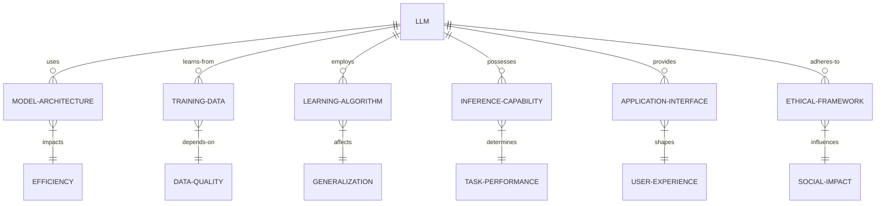

3. 交互关系图

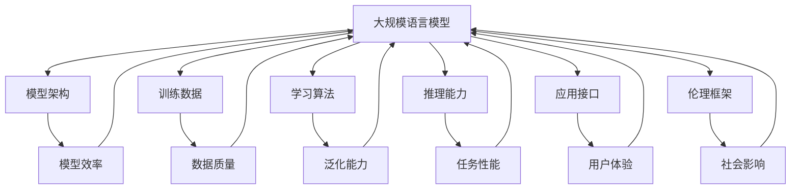

* 数学模型：
  我们可以用以下数学模型来描述大规模语言模型的性能：

令 $P$ 表示模型性能,
$S$ 表示模型规模 (参数数量),
$D$ 表示训练数据量,
$A$ 表示算法效率,
$α, β, γ$ 为权重系数,

则模型性能可以表示为:

$$P = α \log(S) + β \log(D) + γA$$

这个模型表明,模型性能与模型规模和数据量的对数成正比,同时也受算法效率的线性影响。

* 算法流程图：

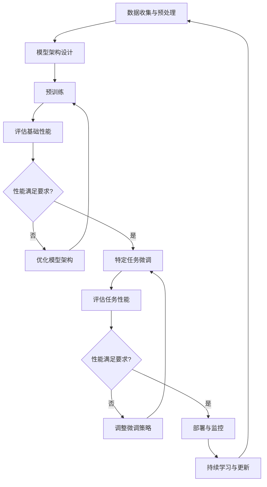

* 算法源代码：

```python
import torch
from transformers import AutoModelForCausalLM, AutoTokenizer, Trainer, TrainingArguments
from datasets import load_dataset

class AdvancedLLM:
    def __init__(self, model_name, num_labels):
        self.model = AutoModelForCausalLM.from_pretrained(model_name)
        self.tokenizer = AutoTokenizer.from_pretrained(model_name)
        self.num_labels = num_labels

    def prepare_data(self, dataset_name, text_column, label_column):
        dataset = load_dataset(dataset_name)
        tokenized_dataset = dataset.map(lambda examples: self.tokenizer(examples[text_column], truncation=True, padding='max_length'), batched=True)
        return tokenized_dataset

    def fine_tune(self, train_dataset, eval_dataset, output_dir, num_train_epochs=3):
        training_args = TrainingArguments(
            output_dir=output_dir,
            num_train_epochs=num_train_epochs,
            per_device_train_batch_size=8,
            per_device_eval_batch_size=8,
            warmup_steps=500,
            weight_decay=0.01,
            logging_dir='./logs',
        )

        trainer = Trainer(
            model=self.model,
            args=training_args,
            train_dataset=train_dataset,
            eval_dataset=eval_dataset
        )

        trainer.train()
        trainer.save_model()

    def generate_text(self, prompt, max_length=50):
        input_ids = self.tokenizer.encode(prompt, return_tensors='pt')
        output = self.model.generate(input_ids, max_length=max_length, num_return_sequences=1)
        return self.tokenizer.decode(output[0], skip_special_tokens=True)

    def evaluate(self, eval_dataset):
        trainer = Trainer(model=self.model)
        results = trainer.evaluate(eval_dataset)
        return results

# 使用示例
llm = AdvancedLLM('gpt2', num_labels=2)
train_dataset = llm.prepare_data('imdb', 'text', 'label')['train']
eval_dataset = llm.prepare_data('imdb', 'text', 'label')['test']

llm.fine_tune(train_dataset, eval_dataset, './fine_tuned_model')

evaluation_results = llm.evaluate(eval_dataset)
print("Evaluation Results:", evaluation_results)

generated_text = llm.generate_text("The movie was")
print("Generated Text:", generated_text)
```

* 实际场景应用：
1. 智能客服: 处理复杂的多轮对话,理解上下文和意图。
2. 内容创作: 辅助写作,生成创意文案和文学作品。
3. 代码生成: 根据自然语言描述生成高质量的程序代码。
4. 多语言翻译: 实现更加准确和流畅的跨语言交流。
5. 教育辅助: 个性化学习助手,回答问题并提供解释。

* 项目介绍：
  "多模态智能助理系统"

目标：开发一个融合语言理解、视觉识别和语音交互的多模态AI助理,能够处理复杂的人机交互任务。

主要功能：
1. 自然语言理解与生成
2. 图像和视频内容分析
3. 语音识别与合成
4. 多模态信息融合与推理
5. 个性化用户交互
6. 任务规划与执行

技术栈：
- 大规模语言模型: GPT-3 or GPT-4
- 计算机视觉模型: CLIP, Mask R-CNN
- 语音处理: Wav2Vec 2.0
- 多模态融合: Transformer-based fusion architecture
- 后端: Python FastAPI
- 前端: React Native (移动端)
- 数据库: MongoDB
- 消息队列: RabbitMQ
- 容器化: Docker, Kubernetes

* 环境安装：
```bash
# 创建虚拟环境
python -m venv multimodal_ai_env
source multimodal_ai_env/bin/activate

# 安装依赖
pip install torch torchvision torchaudio transformers pillow fastapi uvicorn pymongo pika

# 前端依赖
npm install react-native @react-navigation/native axios

# 安装 CUDA 工具包 (假设使用 NVIDIA GPU)
# 请访问 NVIDIA 官网下载适合您系统的 CUDA 工具包
```

* 系统功能设计：
1. 用户接口模块: 处理语音、文本和图像输入
2. 自然语言处理模块: 理解用户意图和生成响应
3. 视觉分析模块: 处理图像和视频输入
4. 语音处理模块: 语音识别和语音合成
5. 多模态融合模块: 整合不同模态的信息
6. 任务管理模块: 规划和执行复杂任务
7. 个性化模块: 学习和适应用户偏好
8. 知识库管理模块: 存储和检索相关信息

* 系统架构设计：

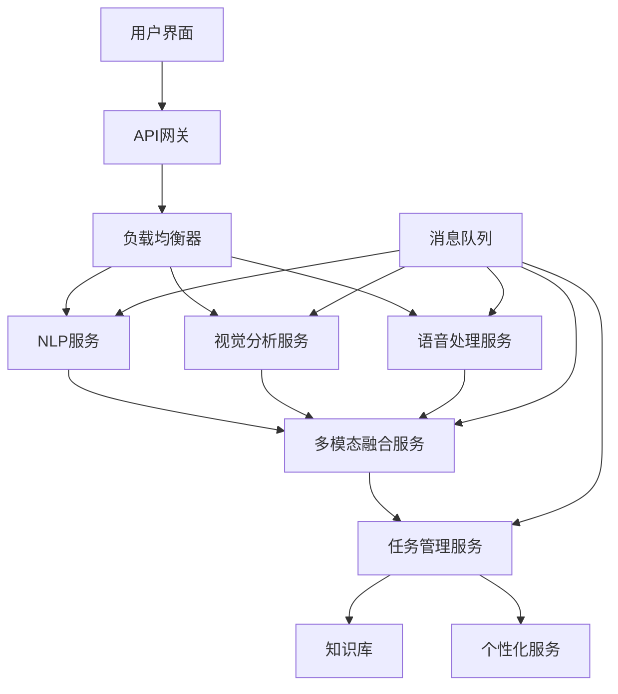

* 系统接口设计：

1. 多模态输入接口
    - Endpoint: `/api/input`
    - Method: POST
    - Parameters: `{text: string, image: file, audio: file}`
    - Response: `{status: "success", task_id: "unique_id"}`

2. 任务状态查询接口
    - Endpoint: `/api/task_status`
    - Method: GET
    - Parameters: `task_id: string`
    - Response: `{status: "success", task_status: string, result: object}`

3. 个性化设置接口
    - Endpoint: `/api/personalize`
    - Method: POST
    - Parameters: `{user_id: string, preferences: object}`
    - Response: `{status: "success", message: string}`

* 系统核心实现源代码：

```python
from fastapi import FastAPI, File, UploadFile, BackgroundTasks
from pydantic import BaseModel
import torch
from transformers import AutoTokenizer, AutoModelForCausalLM, VisionEncoderDecoderModel, ViTFeatureExtractor
import speech_recognition as sr
from PIL import Image
import io
import uuid

app = FastAPI()

# 加载预训练模型
tokenizer = AutoTokenizer.from_pretrained("gpt2-large")
language_model = AutoModelForCausalLM.from_pretrained("gpt2-large")
vision_model = VisionEncoderDecoderModel.from_pretrained("nlpconnect/vit-gpt2-image-captioning")
feature_extractor = ViTFeatureExtractor.from_pretrained("nlpconnect/vit-gpt2-image-captioning")

class InputData(BaseModel):
    text: str = None

@app.post("/api/input")
async def process_input(text: str = None, image: UploadFile = File(None), audio: UploadFile = File(None), background_tasks: BackgroundTasks):
    task_id = str(uuid.uuid4())
    background_tasks.add_task(process_multimodal_input, task_id, text, image, audio)
    return {"status": "success", "task_id": task_id}

async def process_multimodal_input(task_id: str, text: str, image: UploadFile, audio: UploadFile):
    result = {}
    
    if text:
        result["text_analysis"] = process_text(text)
    
    if image:
        image_content = await image.read()
        result["image_analysis"] = process_image(image_content)
    
    if audio:
        audio_content = await audio.read()
        result["audio_analysis"] = process_audio(audio_content)
    
    # 在这里添加多模态融合的逻辑
    fused_result = multimodal_fusion(result)
    
    # 保存结果到数据库
    save_result_to_db(task_id, fused_result)

def process_text(text: str):
    inputs = tokenizer(text, return_tensors="pt")
    outputs = language_model.generate(**inputs, max_length=100)
    return tokenizer.decode(outputs[0], skip_special_tokens=True)

def process_image(image_content: bytes):
    image = Image.open(io.BytesIO(image_content))
    pixel_values = feature_extractor(images=image, return_tensors="pt").pixel_values
    output_ids = vision_model.generate(pixel_values)
    return tokenizer.decode(output_ids[0], skip_special_tokens=True)

def process_audio(audio_content: bytes):
    recognizer = sr.Recognizer()
    with sr.AudioFile(io.BytesIO(audio_content)) as source:
        audio = recognizer.record(source)
    try:
        return recognizer.recognize_google(audio)
    except sr.UnknownValueError:
        return "Speech recognition could not understand the audio"

def multimodal_fusion(individual_results: dict):
    # 实现多模态融合逻辑
    # 这里只是一个简单的示例，实际应用中需要更复杂的融合算法
    fused_result = ""
    for key, value in individual_results.items():
        fused_result += f"{key}: {value}\n"
    return fused_result

def save_result_to_db(task_id: str, result: str):
    # 实现数据库保存逻辑
    pass

@app.get("/api/task_status")
async def get_task_status(task_id: str):
    # 从数据库获取任务状态和结果
    # 这里是一个模拟的实现
    result = get_result_from_db(task_id)
    if result:
        return {"status": "success", "task_status": "completed", "result": result}
    else:
        return {"status": "success", "task_status": "processing"}

def get_result_from_db(task_id: str):
    # 实现从数据库获取结果的逻辑
    pass

if __name__ == "__main__":
    import uvicorn
    uvicorn.run(app, host="0.0.0.0", port=8000)
```

* 最佳实践tips：
1. 模型选择: 根据任务需求选择适当规模的预训练模型。
2. 微调策略: 使用特定领域数据进行微调,提高模型在目标任务上的表现。
3. 提示工程: 设计有效的提示模板,引导模型生成高质量输出。
4. 多模态融合: 采用注意力机制等方法实现不同模态信息的有效整合。
5. 增量学习: 实现模型的持续学习,适应新知识和用户偏好。
6. 安全控制: 实施内容过滤和安全检查,防止生成不适当内容。
7. 性能优化: 使用模型量化、知识蒸馏等技术提高推理效率。

* 行业发展与未来趋势：

| 时期 | 技术重点 | 应用特征 | 社会影响 |
|------|----------|----------|----------|
| 2023-2025 | 模型规模突破,多模态融合 | 更自然的人机交互 | 提高生产效率,改变工作方式 |
| 2025-2027 | 知识整合,推理能力增强 | 复杂任务自动化 | 加速科研创新,改变决策模式 |
| 2027-2030 | 个性化定制,持续学习 | 智能助理普及 | 个性化服务成为常态 |
| 2030-2035 | 通用智能雏形 | 跨领域问题解决 | 重塑教育体系,职业转型 |
| 2035+ | 接近人类水平的AGI | 全方位AI协作 | 社会结构深刻变革 |

* 本节小结：
  大规模语言模型的进一步突破将带来AI Agent技术的质的飞跃。从模型架构的创新到训练方法的优化，从知识整合与推理能力的增强到控制与个性化的提升，这些进展将极大地扩展AI Agent的应用范围和能力边界。

未来的大规模语言模型预计将具备更强的多模态理解和生成能力，能够无缝地整合文本、图像、语音和视频信息。它们将拥有更深层次的知识表示和推理能力，不仅能够回答问题，还能进行复杂的逻辑推理和创造性思考。模型的可控性和个性化程度将大幅提高，使得AI助手能够更好地适应不同用户的需求和偏好。

同时，我们也需要注意到伴随这些进展而来的挑战。如何确保模型输出的事实准确性，如何减少偏见并提高公平性，如何保护用户隐私并防止滥用，这些都是需要持续关注和解决的问题。此外，大规模语言模型的能源消耗和计算资源需求也是一个重要的考虑因素，未来的研究需要更多地关注模型的效率优化和绿色计算。

随着大规模语言模型技术的不断突破，我们可以预见AI Agent将在更多领域发挥重要作用，从个人助理到企业决策支持，从创意创作到科学研究，AI将成为人类智能的有力补充和扩展。然而，我们也需要谨慎地管理这项技术的发展，确保它朝着有利于人类福祉的方向前进。

未来，大规模语言模型的发展可能会朝着更加模块化和可组合的方向发展，使得模型可以更灵活地适应不同任务和场景。同时，与神经符号AI的结合也可能带来新的突破，使模型具备更强的逻辑推理和抽象思考能力。总的来说，大规模语言模型的进一步突破将为AI Agent技术带来广阔的发展前景，推动人工智能向着更高级、更通用的方向迈进。

### 10.2.2 多模态AI Agent的发展

* 核心概念：
  多模态AI Agent是指能够同时处理和整合多种输入模态（如文本、图像、语音、视频等）的人工智能系统。这种Agent能够理解和生成跨模态的信息，实现更自然、更全面的人机交互。

* 问题背景：
  随着AI技术的发展，单一模态的AI系统已经无法满足复杂的实际应用需求。人类在日常生活中自然地结合视觉、听觉和语言等多种感知模式，多模态AI Agent的发展旨在模仿这种能力，提供更加智能和自然的交互体验。

* 问题描述：
  我们需要探讨多模态AI Agent的发展趋势，包括技术路线、关键挑战、应用前景，以及如何有效地整合和利用不同模态的信息。

* 问题解决：
  多模态AI Agent的发展可能涉及以下几个方面：

1. 模态融合技术：
    - 开发更高效的跨模态注意力机制
    - 研究模态间的对齐和映射方法
    - 探索动态权重分配策略，根据任务自适应调整不同模态的重要性

2. 统一表示学习：
    - 构建能够表示多种模态信息的统一嵌入空间
    - 开发跨模态的预训练模型和任务
    - 研究模态不变的特征提取方法

3. 多模态理解与生成：
    - 提高跨模态内容理解的准确性和深度
    - 增强多模态内容生成的质量和一致性
    - 开发支持多模态交互的对话系统

4. 多模态推理：
    - 结合视觉和语言信息进行复杂推理
    - 开发跨模态的常识推理能力
    - 实现多模态信息的因果关系分析

5. 模态缺失处理：
    - 研究在部分模态缺失情况下的鲁棒性表现
    - 开发模态补全和重建技术
    - 探索跨模态迁移学习方法

6. 多模态应用优化：
    - 视觉问答系统的性能提升
    - 多模态情感分析和意图识别
    - 跨模态检索和推荐系统优化

* 边界与外延：
  多模态AI Agent的发展不仅涉及传统的视觉、听觉和语言模态，还可能扩展到触觉、嗅觉等其他感知模式。同时，它与增强现实（AR）、虚拟现实（VR）等技术的结合也将带来新的应用可能。

* 概念结构与核心要素组成：
1. 模态类型：视觉、听觉、语言、触觉等
2. 融合方法：早期融合、晚期融合、动态融合
3. 表示学习：跨模态嵌入、统一特征空间
4. 任务类型：分类、检索、生成、问答、推理
5. 架构设计：多流网络、注意力机制、transformer变体
6. 应用场景：人机交互、智能助理、内容分析、创意创作

* 概念之间的关系：

1. 概念核心属性维度对比

| 属性维度 | 传统单模态系统 | 多模态AI Agent | 潜在优势 |
|----------|----------------|-----------------|----------|
| 信息输入 | 单一类型 | 多种类型 | 信息更全面 |
| 理解深度 | 局限于单一维度 | 多维度综合理解 | 理解更准确 |
| 表达能力 | 单一模态输出 | 跨模态生成 | 表达更丰富 |
| 交互自然度 | 受限 | 接近人类交互 | 用户体验更好 |
| 任务复杂度 | 适合简单任务 | 可处理复杂任务 | 应用范围更广 |
| 鲁棒性 | 易受单一模态限制 | 多模态互补 | 系统更稳定 |

2. 概念联系的ER实体关系

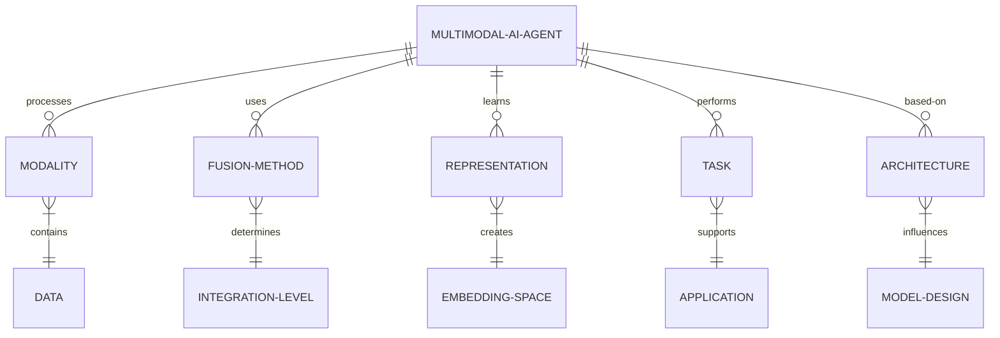

3. 交互关系图

```mermaid
graph TD
    A[多模态AI Agent] --> B[模态处理]
    A --> C[融合方法]
    A --> D[表示学习]
    A --> E[任务执行]
    A --> F[架构设计]
    B --> G[视觉处理]
    B --> H[语音处理]
    B --> I[文本处理]
    C --> J[早期融合]
    C --> K[晚期融合]
    D --> L[跨模态嵌入]
    E --> M[多模态问答]
    E --> N[跨模态检索]
    F --> O[多流网络]
    F --> P[注意力机制]
    G --> C
    H --> C
    I --> C
    J --> D
    K --> D
    L --> E
    O --> E
    P --> E
```

* 数学模型：
  我们可以用以下数学模型来描述多模态AI Agent的性能：

令 $P_{mm}$ 表示多模态系统的性能，
$w_i$ 表示第 $i$ 个模态的权重，
$p_i$ 表示第 $i$ 个模态的单独性能，
$f$ 表示融合函数，

则多模态系统的性能可以表示为：

$$P_{mm} = f(\sum_{i=1}^n w_i p_i)$$

其中，$\sum_{i=1}^n w_i = 1$，$0 \leq w_i \leq 1$

融合函数 $f$ 可以是简单的线性组合，也可以是更复杂的非线性函数，如神经网络。

* 算法流程图：

```mermaid
graph TD
    A[多模态数据输入] --> B[模态特定预处理]
    B --> C[特征提取]
    C --> D[多模态融合]
    D --> E[联合表示学习]
    E --> F[任务特定处理]
    F --> G[输出结果]
    G --> H[性能评估]
    H --> I{满足要求?}
    I -->|否| J[调整融合策略]
    J --> D
    I -->|是| K[模型部署]
    K --> L[持续学习与更新]
    L --> A
```

* 算法源代码：

```python
import torch
import torch.nn as nn
import torchvision.models as models
import transformers

class MultimodalAIAgent(nn.Module):
    def __init__(self, num_classes):
        super(MultimodalAIAgent, self).__init__()
        # 视觉模型
        self.vision_model = models.resnet50(pretrained=True)
        self.vision_model.fc = nn.Linear(self.vision_model.fc.in_features, 512)
        
        # 文本模型
        self.text_model = transformers.BertModel.from_pretrained('bert-base-uncased')
        self.text_projection = nn.Linear(768, 512)
        
        # 音频模型
        self.audio_model = nn.Sequential(
            nn.Conv1d(1, 64, kernel_size=3, stride=1, padding=1),
            nn.ReLU(),
            nn.MaxPool1d(kernel_size=2),
            nn.Conv1d(64, 128, kernel_size=3, stride=1, padding=1),
            nn.ReLU(),
            nn.MaxPool1d(kernel_size=2),
            nn.Flatten(),
            nn.Linear(128 * 32, 512)  # 假设音频输入长度为128
        )
        
        # 多模态融合
        self.fusion = nn.MultiheadAttention(embed_dim=512, num_heads=8)
        
        # 分类器
        self.classifier = nn.Linear(512, num_classes)

    def forward(self, vision_input, text_input, audio_input):
        # 视觉特征
        vision_features = self.vision_model(vision_input)
        
        # 文本特征
        text_features = self.text_model(text_input)[1]  # 使用[CLS]标记的输出
        text_features = self.text_projection(text_features)
        
        # 音频特征
        audio_features = self.audio_model(audio_input.unsqueeze(1))
        
        # 多模态融合
        features = torch.stack([vision_features, text_features, audio_features], dim=0)
        fused_features, _ = self.fusion(features, features, features)
        fused_features = torch.mean(fused_features, dim=0)
        
        # 分类
        output = self.classifier(fused_features)
        return output

# 使用示例
model = MultimodalAIAgent(num_classes=10)
vision_input = torch.randn(1, 3, 224, 224)  # 假设的图像输入
text_input = torch.randint(0, 1000, (1, 50))  # 假设的文本输入（词索引）
audio_input = torch.randn(1, 128)  # 假设的音频输入

output = model(vision_input, text_input, audio_input)
print(output.shape)  # 应该输出 torch.Size([1, 10])
```

* 实际场景应用：
1. 智能家居控制：结合语音、视觉和传感器数据，实现更智能的家居环境控制。
2. 多模态虚拟助手：能够理解并生成文字、语音和图像的个人助理。
3. 安防监控：融合视频、音频和文本信息，提高异常行为检测的准确性。
4. 医疗诊断：结合影像学数据、病历文本和语音描述，辅助医生进行诊断。
5. 自动驾驶：整合视觉、雷达和地图数据，提高环境感知和决策的准确性。

* 项目介绍：
  "多模态新闻分析助手"

目标：开发一个能够分析文本、图像和视频新闻内容的AI系统，自动生成新闻摘要、识别关键信息和检测虚假信息。

主要功能：
1. 多模态新闻内容理解
2. 跨模态信息验证
3. 自动新闻摘要生成
4. 关键信息提取与可视化
5. 虚假信息检测
6. 新闻主题分类与聚类

技术栈：
- 视觉模型: ResNet, YOLO
- 语言模型: BERT, GPT
- 视频处理: 3D-CNN
- 多模态融合: Transformer-based fusion
- 后端: Python FastAPI
- 前端: Vue.js
- 数据库: PostgreSQL
- 消息队列: Apache Kafka
- 容器化: Docker, Kubernetes

* 环境安装：
```bash
# 创建虚拟环境
python -m venv multimodal_news_env
source multimodal_news_env/bin/activate

# 安装依赖
pip install torch torchvision transformers fastapi uvicorn psycopg2-binary kafka-python opencv-python-headless

# 前端依赖
npm install vue@next vuex@next vue-router@4 axios

# 安装 CUDA 工具包 (假设使用 NVIDIA GPU)
# 请访问 NVIDIA 官网下载适合您系统的 CUDA 工具包
```

* 系统功能设计：
1. 数据采集与预处理模块：爬取和清洗多源新闻数据
2. 文本分析模块：使用BERT进行文本理解和特征提取
3. 图像分析模块：使用ResNet和YOLO进行图像内容识别
4. 视频分析模块：使用3D-CNN提取视频特征
5. 多模态融合模块：使用Transformer架构融合不同模态信息
6. 摘要生成模块：基于多模态信息生成新闻摘要
7. 信息验证模块：交叉验证不同模态信息的一致性
8. 虚假信息检测模块：基于多模态特征的假新闻识别
9. 主题分类与聚类模块：对新闻进行多维度分类和聚类
10. 可视化模块：生成信息图表和交互式展示

* 系统架构设计：

```mermaid
graph TD
    A[数据采集] --> B[数据预处理]
    B --> C[文本分析]
    B --> D[图像分析]
    B --> E[视频分析]
    C --> F[多模态融合]
    D --> F
    E --> F
    F --> G[摘要生成]
    F --> H[信息验证]
    F --> I[虚假信息检测]
    F --> J[主题分类与聚类]
    G --> K[结果可视化]
    H --> K
    I --> K
    J --> K
    K --> L[用户界面]
```

* 系统接口设计：

1. 新闻内容分析接口
    - Endpoint: `/api/analyze_news`
    - Method: POST
    - Parameters: `{text: string, image: file, video: file}`
    - Response: `{status: "success", summary: string, key_info: object, fake_news_probability: float, topics: [string]}`

2. 虚假信息检测接口
    - Endpoint: `/api/detect_fake_news`
    - Method: POST
    - Parameters: `{news_id: string}`
    - Response: `{status: "success", is_fake: boolean, confidence: float, evidence: [string]}`

3. 新闻聚类查询接口
    - Endpoint: `/api/news_clusters`
    - Method: GET
    - Parameters: `{date_range: string, topic: string}`
    - Response: `{status: "success", clusters: [object]}`

* 系统核心实现源代码：

```python
from fastapi import FastAPI, File, UploadFile
from pydantic import BaseModel
import torch
import torchvision.models as models
import transformers
from PIL import Image
import io
import cv2
import numpy as np

app = FastAPI()

# 加载预训练模型
text_model = transformers.BertModel.from_pretrained('bert-base-uncased')
image_model = models.resnet50(pretrained=True)
video_model = models.video.r3d_18(pretrained=True)

tokenizer = transformers.BertTokenizer.from_pretrained('bert-base-uncased')

class NewsItem(BaseModel):
    text: str

@app.post("/api/analyze_news")
async def analyze_news(news: NewsItem, image: UploadFile = File(None), video: UploadFile = File(None)):
    # 文本分析
    inputs = tokenizer(news.text, return_tensors="pt", padding=True, truncation=True, max_length=512)
    with torch.no_grad():
        text_features = text_model(**inputs).last_hidden_state.mean(dim=1)

    # 图像分析
    image_features = torch.zeros(1, 2048)  # 默认特征
    if image:
        img = Image.open(io.BytesIO(await image.read()))
        img_tensor = torchvision.transforms.functional.to_tensor(img).unsqueeze(0)
        with torch.no_grad():
            image_features = image_model(img_tensor)

    # 视频分析
    video_features = torch.zeros(1, 512)  # 默认特征
    if video:
        video_frames = extract_video_frames(await video.read())
        if len(video_frames) > 0:
            video_tensor = torch.stack(video_frames).unsqueeze(0)
            with torch.no_grad():
                video_features = video_model(video_tensor).squeeze()

    # 多模态融合
    fused_features = multimodal_fusion(text_features, image_features, video_features)

    # 生成摘要
    summary = generate_summary(fused_features)

    # 提取关键信息
    key_info = extract_key_info(fused_features)

    # 检测虚假信息
    fake_news_prob = detect_fake_news(fused_features)

    # 主题分类
    topics = classify_topics(fused_features)

    return {
        "status": "success",
        "summary": summary,
        "key_info": key_info,
        "fake_news_probability": float(fake_news_prob),
        "topics": topics
    }

def extract_video_frames(video_bytes, max_frames=16):
    video = cv2.VideoCapture(io.BytesIO(video_bytes))
    frames = []
    while len(frames) < max_frames:
        ret, frame = video.read()
        if not ret:
            break
        frame = cv2.cvtColor(frame, cv2.COLOR_BGR2RGB)
        frame = Image.fromarray(frame).resize((112, 112))
        frame = torchvision.transforms.functional.to_tensor(frame)
        frames.append(frame)
    return frames

def multimodal_fusion(text_features, image_features, video_features):
    # 简单的特征拼接，实际应用中可以使用更复杂的融合方法
    return torch.cat([text_features, image_features, video_features], dim=1)

def generate_summary(features):
    # 实现摘要生成逻辑
    return "This is a generated summary based on multimodal features."

def extract_key_info(features):
    # 实现关键信息提取逻辑
    return {"entity1": "value1", "entity2": "value2"}

def detect_fake_news(features):
    # 实现虚假信息检测逻辑
    return torch.rand(1).item()  # 返回一个0到1之间的随机值作为示例

def classify_topics(features):
    # 实现主题分类逻辑
    return ["politics", "technology", "health"]

if __name__ == "__main__":
    import uvicorn
    uvicorn.run(app, host="0.0.0.0", port=8000)
```

* 最佳实践tips：
1. 数据预处理：确保不同模态的数据质量和一致性，如时间对齐、噪声去除等。
2. 模态缺失处理：设计能够处理部分模态缺失情况的鲁棒模型。
3. 特征融合：探索不同的融合策略，如早期融合、晚期融合或动态融合。
4. 注意力机制：利用跨模态注意力来捕捉不同模态间的相关性。
5. 迁移学习：利用预训练的单模态模型进行特征提取，再进行多模态融合。
6. 可解释性：开发可解释的多模态模型，理解不同模态对决策的贡献。
7. 实时性能：优化模型推理速度，以满足实时应用的需求。
8. 隐私保护：在处理多模态数据时，注意保护用户隐私和敏感信息。

* 行业发展与未来趋势：

| 时期 | 技术重点 | 应用特征 | 社会影响 |
|------|----------|----------|----------|
| 2023-2025 | 模态融合优化，跨模态预训练 | 多模态虚拟助手普及 | 人机交互方式变革 |
| 2025-2027 | 多模态推理能力增强 | 智能内容分析和创作 | 提高信息处理效率 |
| 2027-2030 | 情感和意图的多模态理解 | 高度个性化的用户体验 | 改变服务和营销模式 |
| 2030-2035 | 类人感知和认知模拟 | 复杂场景决策支持 | 协助解决社会难题 |
| 2035+ | 通用多模态AI | 无处不在的智能交互 | 重塑社会生产和生活方式 |

* 本节小结：
  多模态AI Agent的发展代表了人工智能向着更全面、更自然的方向迈进。通过整合视觉、听觉、语言等多种模态的信息，AI系统能够更好地理解和模拟人类的认知过程。这种技术的进步不仅提高了AI的性能和适用性，还开启了许多新的应用可能。

然而，多模态AI也面临着诸多挑战，如不同模态数据的对齐和融合、跨模态学习的效率、模型的可解释性等。解决这些问题需要在算法、架构、计算能力等多个层面进行创新。

未来，随着多模态AI技术的成熟，我们可以期待看到更加智能和自然的人机交互系统，能够在复杂的现实环境中理解上下文、做出决策并与人类进行多维度的交流。这将为教育、医疗、娱乐、科研等众多领域带来革命性的变化。

同时，我们也需要关注多模态AI发展带来的伦理和社会问题，如隐私保护、数据安全、算法偏见等。建立健全的法律法规和伦理框架，确保多模态AI的发展方向与人类利益相一致，将是未来需要持续关注的重要议题。

总的来说，多模态AI Agent的发展正在将人工智能技术推向一个新的高度，为创造更智能、更自然的人机协作环境铺平道路。这一领域的进步不仅将改变技术格局，还将深刻影响人类社会的方方面面。

### 10.2.3 自主学习与持续优化能力的提升

* 核心概念：
  自主学习与持续优化是指AI Agent能够在没有或极少人工干预的情况下，通过与环境的持续交互来不断学习新知识、更新自身模型、改进决策能力的过程。这种能力使AI系统能够适应动态变化的环境，并在长期运行中保持高性能。

* 问题背景：
  传统的AI系统often依赖于静态的训练数据和固定的模型，难以适应实际应用中复杂多变的情况。随着AI技术的发展和应用场景的拓展，提高AI Agent的自主学习和持续优化能力变得越来越重要。

* 问题描述：
  我们需要探讨如何提升AI Agent的自主学习与持续优化能力，包括技术路线、关键挑战、评估方法，以及这种能力对AI系统长期性能和适应性的影响。

* 问题解决：
  提升AI Agent的自主学习与持续优化能力可以从以下几个方面着手：

1. 在线学习算法：
    - 开发能够实时更新的模型结构
    - 研究增量学习和适应性学习算法
    - 探索元学习方法，提高模型的快速适应能力

2. 主动学习策略：
    - 设计有效的探索-利用平衡机制
    - 开发智能的数据采样和标注请求策略
    - 研究自我监督学习技术，减少对人工标注的依赖

3. 知识积累与迁移：
    - 建立动态更新的知识库
    - 开发跨任务和跨领域的知识迁移方法
    - 研究持续学习中的灾难性遗忘问题的解决方案

4. 自我评估与优化：
    - 设计自动化的性能评估指标
    - 开发模型自我诊断和调整机制
    - 研究自适应的超参数优化技术

5. 多智能体协作学习：
    - 探索分布式学习和联邦学习方法
    - 研究群体智能在持续优化中的应用
    - 开发智能体间知识共享和互补机制

6. 环境建模与预测：
    - 构建动态环境模型，预测未来变化
    - 开发对抗性学习方法，增强鲁棒性
    - 研究因果推理技术，理解环境变化的原因

* 边界与外延：
  自主学习与持续优化能力的提升不仅适用于单一的AI Agent，还可以扩展到智能系统网络和人机协作场景。这种能力的发展可能带来AI系统更高的自主性，同时也raise了一些关于控制和伦理的问题。

* 概念结构与核心要素组成：
1. 学习机制：在线学习、增量学习、元学习
2. 优化策略：主动学习、自我监督、自适应调整
3. 知识管理：知识表示、知识迁移、遗忘机制
4. 评估体系：性能指标、自我诊断、反馈机制
5. 协作模式：分布式学习、知识共享、群体智能
6. 环境适应：环境建模、鲁棒性增强、因果推理

* 概念之间的关系：

1. 概念核心属性维度对比

| 属性维度 | 传统静态AI系统 | 自主学习与持续优化AI | 潜在优势 |
|----------|----------------|----------------------|----------|
| 学习方式 | 离线批量学习 | 在线实时学习 | 适应性更强 |
| 知识更新 | 定期人工更新 | 持续自动更新 | 知识始终最新 |
| 任务适应 | 固定任务范围 | 动态任务适应 | 应用范围更广 |
| 性能演变 | 性能可能下降 | 性能持续提升 | 长期价值更高 |
| 资源需求 | 周期性大规模训练 | 增量式小规模更新 | 资源利用更高效 |
| 人工干预 | 需要频繁干预 | 最小化人工干预 | 自主性更强 |

2. 概念联系的ER实体关系

```mermaid
erDiagram
    AI-AGENT ||--o{ LEARNING-MECHANISM : employs
    AI-AGENT ||--o{ OPTIMIZATION-STRATEGY : uses
    AI-AGENT ||--o{ KNOWLEDGE-MANAGEMENT : implements
    AI-AGENT ||--o{ EVALUATION-SYSTEM : incorporates
    AI-AGENT ||--o{ COLLABORATION-MODE : supports
    AI-AGENT ||--o{ ENVIRONMENT-ADAPTATION : achieves
    LEARNING-MECHANISM }|--|| ONLINE-LEARNING : includes
    OPTIMIZATION-STRATEGY }|--|| ACTIVE-LEARNING : features
    KNOWLEDGE-MANAGEMENT }|--|| TRANSFER-LEARNING : utilizes
    EVALUATION-SYSTEM }|--|| SELF-DIAGNOSIS : performs
    COLLABORATION-MODE }|--|| DISTRIBUTED-LEARNING : enables
    ENVIRONMENT-ADAPTATION }|--|| CAUSAL-INFERENCE : applies
```

3. 交互关系图

```mermaid
graph TD
    A[AI Agent] --> B[学习机制]
    A --> C[优化策略]
    A --> D[知识管理]
    A --> E[评估体系]
    A --> F[协作模式]
    A --> G[环境适应]
    B --> H[在线学习]
    B --> I[增量学习]
    B --> J[元学习]
    C --> K[主动学习]
    C --> L[自我监督]
    D --> M[知识迁移]
    D --> N[遗忘机制]
    E --> O[自我诊断]
    E --> P[性能指标]
    F --> Q[分布式学习]
    F --> R[知识共享]
    G --> S[环境建模]
    G --> T[因果推理]
    H --> D
    I --> E
    J --> C
    K --> B
    L --> D
    M --> B
    N --> D
    O --> C
    P --> F
    Q --> D
    R --> B
    S --> C
    T --> G
```

* 数学模型：
  我们可以用以下数学模型来描述AI Agent的持续学习过程：

令 $P_t$ 表示在时间 $t$ 的模型性能，
$K_t$ 表示时间 $t$ 的知识状态，
$E_t$ 表示时间 $t$ 的环境状态，
$L$ 表示学习函数，
$O$ 表示优化函数，

则AI Agent的性能演化可以表示为：

$$P_{t+1} = O(L(P_t, K_t, E_t))$$

知识状态的更新可以表示为：

$$K_{t+1} = K_t + \Delta K_t - F_t$$

其中，$\Delta K_t$ 表示新获得的知识，$F_t$ 表示遗忘的知识。

环境状态的变化可以建模为：

$$E_{t+1} = f(E_t, A_t)$$

其中，$A_t$ 表示AI Agent在时间 $t$ 的行动，$f$ 是环境动态函数。

* 算法流程图：

```mermaid
graph TD
    A[环境感知] --> B[状态评估]
    B --> C[学习需求分析]
    C --> D{需要学习?}
    D -->|是| E[数据收集]
    D -->|否| F[执行任务]
    E --> G[在线学习]
    G --> H[知识更新]
    H --> I[模型优化]
    I --> J[性能评估]
    J --> K{性能提升?}
    K -->|是| L[保存更新]
    K -->|否| M[回滚更改]
    L --> F
    M --> F
    F --> N[结果输出]
    N --> O[反馈收集]
    O --> A
```

* 算法源代码：

```python
import numpy as np
from sklearn.base import BaseEstimator, ClassifierMixin
from sklearn.utils.validation import check_X_y, check_array, check_is_fitted

class ContinualLearningClassifier(BaseEstimator, ClassifierMixin):
    def __init__(self, base_estimator, memory_size=1000, performance_threshold=0.95):
        self.base_estimator = base_estimator
        self.memory_size = memory_size
        self.performance_threshold = performance_threshold
        self.memory_X = None
        self.memory_y = None

    def fit(self, X, y):
        X, y = check_X_y(X, y)
        self.classes_ = np.unique(y)
        
        if self.memory_X is None:
            self.memory_X = X[:self.memory_size]
            self.memory_y = y[:self.memory_size]
        else:
            self.memory_X = np.vstack((self.memory_X, X))
            self.memory_y = np.hstack((self.memory_y, y))
            if len(self.memory_X) > self.memory_size:
                indices = np.random.choice(len(self.memory_X), self.memory_size, replace=False)
                self.memory_X = self.memory_X[indices]
                self.memory_y = self.memory_y[indices]
        
        self.base_estimator.fit(self.memory_X, self.memory_y)
        return self

    def partial_fit(self, X, y):
        X, y = check_X_y(X, y)
        if not hasattr(self, 'classes_'):
            self.classes_ = np.unique(y)
        
        # 在新数据上评估当前模型
        current_performance = self.base_estimator.score(X, y)
        
        if current_performance < self.performance_threshold:
            # 性能不足，需要更新
            self.fit(X, y)
        else:
            # 性能足够，只更新记忆
            self.update_memory(X, y)
        
        return self

    def update_memory(self, X, y):
        if len(X) > self.memory_size:
            indices = np.random.choice(len(X), self.memory_size, replace=False)
            X = X[indices]
            y = y[indices]
        
        if self.memory_X is None:
            self.memory_X = X
            self.memory_y = y
        else:
            self.memory_X = np.vstack((self.memory_X, X))
            self.memory_y = np.hstack((self.memory_y, y))
            if len(self.memory_X) > self.memory_size:
                indices = np.random.choice(len(self.memory_X), self.memory_size, replace=False)
                self.memory_X = self.memory_X[indices]
                self.memory_y = self.memory_y[indices]

    def predict(self, X):
        check_is_fitted(self)
        X = check_array(X)
        return self.base_estimator.predict(X)

    def score(self, X, y):
        return self.base_estimator.score(X, y)

# 使用示例
from sklearn.tree import DecisionTreeClassifier

# 创建持续学习分类器
clf = ContinualLearningClassifier(DecisionTreeClassifier())

# 模拟数据流
for i in range(10):
    X = np.random.rand(100, 5)
    y = np.random.choice([0, 1], 100)
    
    # 部分拟合
    clf.partial_fit(X, y)
    
    # 评估当前性能
    score = clf.score(X, y)
    print(f"Iteration {i+1}, Score: {score}")

# 最终预测
X_test = np.random.rand(10, 5)
predictions = clf.predict(X_test)
print("Final predictions:", predictions)
```

* 实际场景应用：
1. 智能推荐系统：持续学习用户偏好，适应不断变化的兴趣。
2. 自动驾驶：在实际道路环境中不断学习和优化驾驶策略。
3. 智能客服：通过与用户的持续互动，提升问题解决能力。
4. 金融风控：实时学习新的欺诈模式，动态调整风险评估模型。
5. 工业控制：适应不同生产条件，持续优化控制参数。

* 项目介绍：
  "自适应智能教学系统"

目标：开发一个能够持续学习和优化的智能教学辅助系统，根据学生的学习进度和表现，自动调整教学内容和方法。

主要功能：
1. 学生知识水平评估
2. 个性化学习路径规划
3. 自适应题目推荐
4. 实时学习反馈
5. 教学策略持续优化
6. 学习模式分析与预测

技术栈：
- 机器学习框架: PyTorch, Scikit-learn
- 在线学习算法: Online Gradient Descent, Follow The Regularized Leader
- 强化学习: Deep Q-Network (DQN)
- 自然语言处理: BERT, GPT
- 后端: Python FastAPI
- 前端: React, D3.js
- 数据库: MongoDB
- 消息队列: RabbitMQ
- 容器化: Docker, Kubernetes

* 环境安装：
```bash
# 创建虚拟环境
python -m venv adaptive_learning_env
source adaptive_learning_env/bin/activate

# 安装依赖
pip install torch transformers scikit-learn fastapi uvicorn pymongo pika

# 前端依赖
npm install react react-dom d3 axios

# 安装 CUDA 工具包 (假设使用 NVIDIA GPU)
# 请访问 NVIDIA 官网下载适合您系统的 CUDA 工具包
```

* 系统功能设计：
1. 用户管理模块：学生信息管理、学习历史记录
2. 知识图谱模块：构建和更新学科知识图谱
3. 评估引擎：动态评估学生知识水平
4. 学习路径生成器：基于知识图谱和学生状态规划学习路径
5. 题目推荐系统：自适应选择适合难度的题目
6. 反馈分析器：实时分析学生反馈，调整教学策略
7. 学习预测模型：预测学习成果，提前干预
8. 教学策略优化器：持续优化教学方法
9. 数据可视化模块：展示学习进度和分析结果

* 系统架构设计：

```mermaid
graph TD
    A[用户界面] --> B[API网关]
    B --> C[用户管理服务]
    B --> D[评估引擎]
    B --> E[学习路径生成器]
    B --> F[题目推荐系统]
    B --> G[反馈分析器]
    B --> H[学习预测模型]
    B --> I[教学策略优化器]
    C --> J[用户数据库]
    D --> K[知识图谱]
    E --> K
    F --> K
    G --> L[反馈数据库]
    H --> M[预测模型]
    I --> N[策略库]
    O[消息队列] --> D
    O --> E
    O --> F
    O --> G
    O --> H
    O --> I
```

* 系统接口设计：

1. 学生评估接口
    - Endpoint: `/api/assess_student`
    - Method: POST
    - Parameters: `{student_id: string, subject: string}`
    - Response: `{status: "success", knowledge_level: object, weak_areas: [string]}`

2. 学习路径生成接口
    - Endpoint: `/api/generate_learning_path`
    - Method: POST
    - Parameters: `{student_id: string, subject: string, goal: string}`
    - Response: `{status: "success", learning_path: [object]}`

3. 题目推荐接口
    - Endpoint: `/api/recommend_question`
    - Method: POST
    - Parameters: `{student_id: string, subject: string, difficulty: float}`
    - Response: `{status: "success", question: object}`

4. 学习反馈接口
    - Endpoint: `/api/submit_feedback`
    - Method: POST
    - Parameters: `{student_id: string, question_id: string, is_correct: boolean, time_spent: int}`
    - Response: `{status: "success", next_action: string}`

* 系统核心实现源代码：

```python
from fastapi import FastAPI, HTTPException
from pydantic import BaseModel
import torch
import torch.nn as nn
import torch.optim as optim
import numpy as np
from sklearn.preprocessing import StandardScaler
from typing import List, Dict

app = FastAPI()

# 定义模型
class DQN(nn.Module):
    def __init__(self, state_size, action_size):
        super(DQN, self).__init__()
        self.fc1 = nn.Linear(state_size, 64)
        self.fc2 = nn.Linear(64, 64)
        self.fc3 = nn.Linear(64, action_size)

    def forward(self, x):
        x = torch.relu(self.fc1(x))
        x = torch.relu(self.fc2(x))
        return self.fc3(x)

# 初始化模型和优化器
state_size = 10  # 学生状态特征数
action_size = 5  # 可选择的教学动作数
model = DQN(state_size, action_size)
optimizer = optim.Adam(model.parameters())
scaler = StandardScaler()

class StudentState(BaseModel):
    student_id: str
    features: List[float]

class Action(BaseModel):
    action_id: int
    description: str

class Feedback(BaseModel):
    student_id: str
    action_id: int
    reward: float

@app.post("/api/recommend_action")
async def recommend_action(state: StudentState):
    # 标准化特征
    normalized_features = scaler.fit_transform(np.array(state.features).reshape(1, -1))
    state_tensor = torch.FloatTensor(normalized_features)
    
    # 使用模型预测最佳动作
    with torch.no_grad():
        action_values = model(state_tensor)
    
    best_action = int(torch.argmax(action_values).item())
    return {"status": "success", "recommended_action": best_action}

@app.post("/api/submit_feedback")
async def submit_feedback(feedback: Feedback):
    # 更新模型
    state = get_student_state(feedback.student_id)
    normalized_state = scaler.transform(np.array(state).reshape(1, -1))
    state_tensor = torch.FloatTensor(normalized_state)
    
    action_tensor = torch.LongTensor([feedback.action_id])
    reward_tensor = torch.FloatTensor([feedback.reward])
    
    # 计算损失
    current_q_values = model(state_tensor).gather(1, action_tensor.unsqueeze(1))
    loss = nn.MSELoss()(current_q_values, reward_tensor)
    
    # 优化模型
    optimizer.zero_grad()
    loss.backward()
    optimizer.step()
    
    return {"status": "success", "message": "Feedback processed and model updated"}

@app.get("/api/student_progress/{student_id}")
async def get_student_progress(student_id: str):
    # 获取学生进度
    progress = calculate_student_progress(student_id)
    return {"status": "success", "progress": progress}

@app.post("/api/update_knowledge_graph")
async def update_knowledge_graph(new_knowledge: Dict):
    # 更新知识图谱
    update_graph(new_knowledge)
    return {"status": "success", "message": "Knowledge graph updated"}

def get_student_state(student_id: str) -> List[float]:
    # 从数据库获取学生状态
    # 这里用随机数模拟
    return list(np.random.rand(state_size))

def calculate_student_progress(student_id: str) -> Dict:
    # 计算学生进度
    # 这里用随机数模拟
    return {
        "overall_progress": np.random.rand(),
        "subject_progress": {
            "math": np.random.rand(),
            "science": np.random.rand(),
            "language": np.random.rand()
        }
    }

def update_graph(new_knowledge: Dict):
    # 更新知识图谱的逻辑
    pass

# 持续学习循环
async def continuous_learning_loop():
    while True:
        # 收集一批学生数据
        batch_data = collect_batch_data()
        
        # 更新模型
        for data in batch_data:
            state = torch.FloatTensor(data['state'])
            action = torch.LongTensor([data['action']])
            reward = torch.FloatTensor([data['reward']])
            next_state = torch.FloatTensor(data['next_state'])
            
            # 计算目标Q值
            with torch.no_grad():
                target_q = reward + 0.99 * torch.max(model(next_state))
            
            # 计算当前Q值
            current_q = model(state).gather(1, action.unsqueeze(1))
            
            # 计算损失
            loss = nn.MSELoss()(current_q, target_q.unsqueeze(1))
            
            # 优化模型
            optimizer.zero_grad()
            loss.backward()
            optimizer.step()
        
        # 更新知识图谱
        update_knowledge_graph_from_feedback(batch_data)
        
        # 评估模型性能
        performance = evaluate_model()
        if performance < performance_threshold:
            # 如果性能下降，回滚到之前的模型版本
            rollback_model()
        else:
            # 保存当前模型
            save_model()
        
        await asyncio.sleep(3600)  # 每小时更新一次

def collect_batch_data():
    # 从数据库收集最近的学生交互数据
    pass

def update_knowledge_graph_from_feedback(batch_data):
    # 根据学生反馈更新知识图谱
    pass

def evaluate_model():
    # 评估模型性能
    pass

def rollback_model():
    # 回滚到之前的模型版本
    pass

def save_model():
    # 保存当前模型
    pass

if __name__ == "__main__":
    import uvicorn
    import asyncio
    
    # 启动持续学习循环
    asyncio.create_task(continuous_learning_loop())
    
    uvicorn.run(app, host="0.0.0.0", port=8000)
```

* 最佳实践tips：
1. 增量更新：使用增量学习算法，避免全量重训练。
2. 记忆重放：维护一个经验池，平衡新旧知识。
3. 动态难度调整：根据学生表现动态调整题目难度。
4. 多任务学习：同时优化多个相关任务，提高泛化能力。
5. 知识蒸馏：将复杂模型的知识转移到轻量级模型，提高推理效率。
6. A/B测试：持续进行不同策略的对比实验，优化教学效果。
7. 异常检测：监控模型性能，及时发现和处理异常情况。
8. 隐私保护：使用联邦学习等技术，保护学生的隐私数据。

* 行业发展与未来趋势：

| 时期 | 技术重点 | 应用特征 | 社会影响 |
|------|----------|----------|----------|
| 2023-2025 | 增量学习算法优化 | 个性化学习路径 | 提高教育效率 |
| 2025-2027 | 多模态学习整合 | 全方位能力评估 | 教育资源优化分配 |
| 2027-2030 | 元学习与快速适应 | 终身学习助手 | 促进终身教育发展 |
| 2030-2035 | 认知建模与仿真 | 智能导师系统 | 改变传统教育模式 |
| 2035+ | 通用学习智能 | 自主学习伙伴 | 教育平等化和普及化 |

* 本节小结：
  自主学习与持续优化能力的提升代表了AI系统向更高级形态演进的重要方向。通过在线学习、增量更新、自适应优化等技术，AI Agent能够在实际应用中不断学习和改进，适应动态变化的环境和需求。这种能力不仅提高了AI系统的长期性能和适用性，还开启了许多新的应用可能，特别是在教育、个人助理、智能制造等需要持续适应和优化的领域。

然而，实现真正有效的自主学习和持续优化也面临诸多挑战。如何平衡新知识学习和旧知识保留、如何在有限计算资源下实现高效的在线学习、如何确保学习过程的稳定性和可控性等，都是需要深入研究的问题。此外，自主学习系统的透明度、可解释性和安全性也是重要的考虑因素。

未来，随着技术的进步，我们可以期待看到更加智能和自适应的AI系统。这些系统将能够自主地探索和学习新知识，持续优化自身性能，甚至能够迁移和泛化学到的知识到新的领域。这将极大地扩展AI的应用范围，并可能带来工作方式、教育模式等多个方面的深刻变革。

同时，我们也需要关注自主学习AI系统的伦理和社会影响。如何确保这些系统的学习方向始终符合人类价值观，如何防止潜在的失控或滥用，以及如何平衡效率提升和人类作用等，都是需要社会各界共同探讨和解决的重要问题。

总的来说，自主学习与持续优化能力的提升正在将AI技术推向一个新的阶段，为创造更智能、更适应性强的AI系统铺平道路。这一领域的进步不仅将改变技术格局，还将深刻影响人类社会的方方面面，推动我们向着人机协作的新时代迈进。

### 10.2.4 情感智能与社交能力的增强

* 核心概念：
  情感智能与社交能力增强是指AI系统能够理解、表达和响应人类情感，以及在社交互动中表现出适当的行为和反应的能力。这包括情感识别、情感生成、社交规范理解和遵循、以及在复杂社交场景中的决策能力。

* 问题背景：
  随着AI系统在日常生活中的应用越来越广泛，仅仅具备逻辑推理和任务执行能力已经不足以满足人类的需求。人机交互的自然度和亲和力成为评判AI系统质量的重要指标。因此，赋予AI情感智能和社交能力变得越来越重要。

* 问题描述：
  我们需要探讨如何提升AI系统的情感智能和社交能力，包括技术路线、关键挑战、评估方法，以及这些能力对人机交互和AI应用的影响。

* 问题解决：
  提升AI系统的情感智能与社交能力可以从以下几个方面着手：

1. 情感识别技术：
    - 多模态情感识别（语音、面部表情、肢体语言）
    - 上下文感知的情感理解
    - 微表情和潜在情感状态的识别

2. 情感生成与表达：
    - 自然语言生成中的情感融入
    - 情感化语音合成
    - 虚拟形象的情感表现

3. 社交规范学习：
    - 文化特定的社交规则建模
    - 情境适应的行为决策
    - 社交礼仪和禁忌的理解

4. 同理心模拟：
    - 视角采择能力的开发
    - 情感状态预测
    - 适当的情感响应生成

5. 社交策略优化：
    - 长期社交关系建模
    - 多人交互场景的决策优化
    - 冲突解决和协商能力

6. 情感调节与适应：
    - 用户情绪状态的跟踪和预测
    - 情感干预策略的制定和执行
    - 系统自身"情绪"的管理

* 边界与外延：
  情感智能与社交能力的增强不仅限于人机交互，还可能应用于机器人技术、虚拟现实、智能家居等领域。同时，这些能力的发展也可能引发关于AI伦理、隐私保护和社会影响的新讨论。

* 概念结构与核心要素组成：
1. 感知层：多模态情感识别、上下文理解
2. 认知层：情感状态建模、社交规范理解
3. 决策层：情感响应生成、社交策略制定
4. 表达层：多模态情感表达、自然交互界面
5. 学习层：持续学习、经验积累、适应性调整
6. 评估层：情感智能度量、社交能力评估

* 概念之间的关系：

1. 概念核心属性维度对比

| 属性维度 | 传统AI系统 | 情感社交增强AI | 潜在优势 |
|----------|------------|-----------------|----------|
| 交互自然度 | 机械化、生硬 | 自然、流畅 | 用户体验提升 |
| 情感理解 | 表层文本分析 | 深层情感洞察 | 交互更具同理心 |
| 社交适应性 | 固定反应模式 | 灵活应对不同场景 | 社交互动更恰当 |
| 个性化程度 | 通用回应 | 针对个人特点定制 | 用户粘性增强 |
| 长期关系维护 | 无 | 能建立持续互动 | 提高用户忠诚度 |
| 跨文化能力 | 有限 | 适应不同文化背景 | 全球化应用更广 |

2. 概念联系的ER实体关系

```mermaid
erDiagram
    AI-SYSTEM ||--o{ EMOTION-RECOGNITION : implements
    AI-SYSTEM ||--o{ EMOTION-GENERATION : performs
    AI-SYSTEM ||--o{ SOCIAL-NORM-LEARNING : conducts
    AI-SYSTEM ||--o{ EMPATHY-SIMULATION : achieves
    AI-SYSTEM ||--o{ SOCIAL-STRATEGY : optimizes
    AI-SYSTEM ||--o{ EMOTION-REGULATION : manages
    EMOTION-RECOGNITION }|--|| MULTIMODAL-INPUT : processes
    EMOTION-GENERATION }|--|| EXPRESSION-CHANNEL : utilizes
    SOCIAL-NORM-LEARNING }|--|| CULTURAL-CONTEXT : considers
    EMPATHY-SIMULATION }|--|| PERSPECTIVE-TAKING : involves
    SOCIAL-STRATEGY }|--|| INTERACTION-SCENARIO : adapts-to
    EMOTION-REGULATION }|--|| USER-STATE : responds-to
```

3. 交互关系图

```mermaid
graph TD
    A[AI系统] --> B[情感识别]
    A --> C[情感生成]
    A --> D[社交规范学习]
    A --> E[同理心模拟]
    A --> F[社交策略优化]
    A --> G[情感调节]
    B --> H[多模态输入处理]
    C --> I[表达渠道选择]
    D --> J[文化背景考虑]
    E --> K[视角采择]
    F --> L[交互场景适应]
    G --> M[用户状态响应]
    H --> N[情感状态建模]
    I --> O[自然交互界面]
    J --> P[行为决策]
    K --> Q[情感响应生成]
    L --> R[长期关系维护]
    M --> S[情绪干预策略]
    N --> T[认知层处理]
    O --> T
    P --> U[决策层输出]
    Q --> U
    R --> V[学习与适应]
    S --> V
    T --> U
    U --> W[表达层执行]
    V --> X[系统更新]
    W --> Y[用户反馈]
    Y --> X
```

* 数学模型：
  我们可以用以下数学模型来描述AI系统的情感社交能力：

令 $E$ 表示情感状态空间，
$S$ 表示社交场景空间，
$A$ 表示行动空间，
$R$ 表示奖励函数，
$π$ 表示策略函数，

则AI系统的情感社交决策可以建模为马尔可夫决策过程(MDP)：

$$(E \times S, A, P, R, γ)$$

其中，$P$ 是状态转移概率函数，$γ$ 是折扣因子。

系统的目标是找到最优策略 $π^*$，使得期望累积奖励最大化：

$$π^* = \arg\max_π \mathbb{E}[\sum_{t=0}^{\infty} γ^t R(e_t, s_t, a_t)]$$

其中，$e_t \in E$, $s_t \in S$, $a_t \in A$

* 算法流程图：

```mermaid
graph TD
    A[感知输入] --> B[多模态情感识别]
    A --> C[社交场景分析]
    B --> D[情感状态估计]
    C --> E[社交规范检索]
    D --> F[情感认知处理]
    E --> F
    F --> G[决策生成]
    G --> H[行为选择]
    H --> I[情感表达]
    H --> J[社交行为执行]
    I --> K[用户反应观察]
    J --> K
    K --> L[反馈评估]
    L --> M{性能满意?}
    M -->|是| N[经验存储]
    M -->|否| O[策略调整]
    N --> P[长期记忆更新]
    O --> Q[短期行为修正]
    P --> A
    Q --> A
```

* 算法源代码：

```python
import numpy as np
import torch
import torch.nn as nn
import torch.optim as optim

class EmotionalSocialAI(nn.Module):
    def __init__(self, emotion_dim, social_dim, action_dim):
        super(EmotionalSocialAI, self).__init__()
        self.emotion_encoder = nn.Linear(emotion_dim, 64)
        self.social_encoder = nn.Linear(social_dim, 64)
        self.fusion = nn.Linear(128, 64)
        self.action_predictor = nn.Linear(64, action_dim)
        
    def forward(self, emotion, social):
        emotion_emb = torch.relu(self.emotion_encoder(emotion))
        social_emb = torch.relu(self.social_encoder(social))
        fused = torch.cat([emotion_emb, social_emb], dim=1)
        hidden = torch.relu(self.fusion(fused))
        action_probs = torch.softmax(self.action_predictor(hidden), dim=1)
        return action_probs

class EmotionRecognizer:
    def recognize(self, multimodal_input):
        # 实现多模态情感识别逻辑
        return np.random.rand(5)  # 示例：返回5维情感向量

class SocialNormLearner:
    def get_norms(self, context):
        # 实现社交规范学习和检索逻辑
        return np.random.rand(10)  # 示例：返回10维社交规范向量

class ExperienceReplay:
    def __init__(self, capacity):
        self.capacity = capacity
        self.memory = []
        
    def push(self, experience):
        if len(self.memory) >= self.capacity:
            self.memory.pop(0)
        self.memory.append(experience)
        
    def sample(self, batch_size):
        return np.random.choice(self.memory, batch_size, replace=False)

def train_emotional_social_ai():
    emotion_dim = 5
    social_dim = 10
    action_dim = 3
    
    model = EmotionalSocialAI(emotion_dim, social_dim, action_dim)
    optimizer = optim.Adam(model.parameters(), lr=0.001)
    criterion = nn.MSELoss()
    
    emotion_recognizer = EmotionRecognizer()
    norm_learner = SocialNormLearner()
    replay_buffer = ExperienceReplay(10000)
    
    num_episodes = 1000
    for episode in range(num_episodes):
        # 模拟交互场景
        multimodal_input = np.random.rand(10)  # 示例：10维多模态输入
        context = np.random.rand(5)  # 示例：5维上下文信息
        
        # 识别情感和社交规范
        emotion = emotion_recognizer.recognize(multimodal_input)
        social_norms = norm_learner.get_norms(context)
        
        # 模型决策
        state = torch.FloatTensor(np.concatenate([emotion, social_norms]))
        action_probs = model(state.unsqueeze(0))
        action = torch.multinomial(action_probs, 1).item()
        
        # 执行动作并获得奖励（这里用随机数模拟）
        reward = np.random.rand()
        
        # 存储经验
        replay_buffer.push((state, action, reward))
        
        # 训练模型
        if len(replay_buffer.memory) >= 32:
            batch = replay_buffer.sample(32)
            states, actions, rewards = zip(*batch)
            
            states = torch.FloatTensor(np.array(states))
            actions = torch.LongTensor(np.array(actions))
            rewards = torch.FloatTensor(np.array(rewards))
            
            predicted_action_probs = model(states)
            predicted_action_values = predicted_action_probs.gather(1, actions.unsqueeze(1))
            
            loss = criterion(predicted_action_values, rewards.unsqueeze(1))
            
            optimizer.zero_grad()
            loss.backward()
            optimizer.step()
        
        if episode % 100 == 0:
            print(f"Episode {episode}, Loss: {loss.item()}")
    
    return model

# 训练模型
trained_model = train_emotional_social_ai()

# 使用训练好的模型进行情感社交决策
def emotional_social_decision(multimodal_input, context):
    emotion_recognizer = EmotionRecognizer()
    norm_learner = SocialNormLearner()
    
    emotion = emotion_recognizer.recognize(multimodal_input)
    social_norms = norm_learner.get_norms(context)
    
    state = torch.FloatTensor(np.concatenate([emotion, social_norms]))
    action_probs = trained_model(state.unsqueeze(0))
    action = torch.multinomial(action_probs, 1).item()
    
    return action

# 示例使用
multimodal_input = np.random.rand(10)
context = np.random.rand(5)
decision = emotional_social_decision(multimodal_input, context)
print(f"决策结果: {decision}")
```

* 实际场景应用：
1. 智能客服：能理解客户情绪并做出恰当回应的AI助手。
2. 心理健康助手：提供情感支持和心理咨询的AI系统。
3. 社交机器人：在养老院或儿童教育中提供情感陪伴。
4. 虚拟助教：能理解学生情绪并调整教学策略的AI教育助手。
5. 智能家居：根据家庭成员情绪状态调整环境的AI系统。

* 项目介绍：
  "EmotiBot: 情感智能社交助手"

目标：开发一个具有高度情感智能和社交能力的AI助手，能够在各种社交场景中与用户进行自然、有同理心的交互。

主要功能：
1. 多模态情感识别
2. 个性化情感响应生成
3. 社交场景理解与适应
4. 长期情感关系建立
5. 跨文化社交能力
6. 情感支持和心理健康监测

技术栈：
- 深度学习框架: PyTorch, TensorFlow
- 自然语言处理: Transformers, BERT
- 计算机视觉: OpenCV, Dlib
- 语音处理: Librosa, PyAudio
- 强化学习: Stable Baselines3
- 后端: Python FastAPI
- 前端: React Native
- 数据库: MongoDB
- 消息队列: RabbitMQ
- 容器化: Docker, Kubernetes

* 环境安装：
```bash
# 创建虚拟环境
python -m venv emotibot_env
source emotibot_env/bin/activate

# 安装依赖
pip install torch transformers opencv-python dlib librosa pyaudio stable-baselines3 fastapi uvicorn pymongo pika

# 前端依赖
npm install react-native @react-navigation/native @react-native-community/voice

# 安装 CUDA 工具包 (假设使用 NVIDIA GPU)
# 请访问 NVIDIA 官网下载适合您系统的 CUDA 工具包
```

* 系统功能设计：
1. 用户界面模块：语音/文本输入，表情识别
2. 情感识别引擎：多模态融合的情感状态分析
3. 社交场景分析器：上下文理解和社交规范检索
4. 对话管理系统：维护长期对话状态和用户画像
5. 情感响应生成器：根据情感状态和社交场景生成回应
6. 表达模块：语音合成、文本生成、虚拟形象动画
7. 学习与适应模块：基于用户反馈持续优化交互策略
8. 心理健康监测：长期情绪趋势分析和异常检测
9. 跨文化适应器：根据用户文化背景调整交互方式

* 系统架构设计：

```mermaid
graph TD
    A[用户界面] --> B[输入处理模块]
    B --> C[情感识别引擎]
    B --> D[社交场景分析器]
    C --> E[情感状态估计]
    D --> F[社交规范检索]
    E --> G[对话管理系统]
    F --> G
    G --> H[情感响应生成器]
    H --> I[表达模块]
    I --> J[用户反馈收集]
    J --> K[学习与适应模块]
    K --> L[用户模型更新]
    L --> G
    G --> M[心理健康监测]
    D --> N[跨文化适应器]
    N --> H
```

* 系统接口设计：

1. 情感识别接口
    - Endpoint: `/api/recognize_emotion`
    - Method: POST
    - Parameters: `{audio: file, video: file, text: string}`
    - Response: `{emotion_state: object, confidence: float}`

2. 社交响应生成接口
    - Endpoint: `/api/generate_response`
    - Method: POST
    - Parameters: `{user_id: string, emotion_state: object, social_context: object}`
    - Response: `{response: string, action: string, confidence: float}`

3. 用户反馈接口
    - Endpoint: `/api/submit_feedback`
    - Method: POST
    - Parameters: `{user_id: string, interaction_id: string, rating: int, comments: string}`
    - Response: `{status: "success", message: string}`

4. 心理健康报告接口
    - Endpoint: `/api/mental_health_report`
    - Method: GET
    - Parameters: `{user_id: string, time_range: string}`
    - Response: `{emotional_trend: object, risk_factors: [string], recommendations: [string]}`

* 系统核心实现源代码：

```python
import torch
import torch.nn as nn
import transformers
from fastapi import FastAPI, File, UploadFile, HTTPException
from pydantic import BaseModel
import numpy as np
import librosa
import cv2
import dlib

app = FastAPI()

class EmotionRecognitionModel(nn.Module):
    def __init__(self):
        super().__init__()
        self.audio_encoder = nn.Sequential(nn.Linear(128, 64), nn.ReLU())
        self.video_encoder = nn.Sequential(nn.Linear(128, 64), nn.ReLU())
        self.text_encoder = transformers.BertModel.from_pretrained('bert-base-uncased')
        self.fusion = nn.Linear(64*3, 5)  # 5 emotion categories
        
    def forward(self, audio, video, text):
        audio_emb = self.audio_encoder(audio)
        video_emb = self.video_encoder(video)
        text_emb = self.text_encoder(text)[1]
        fused = torch.cat([audio_emb, video_emb, text_emb], dim=1)
        emotion = torch.softmax(self.fusion(fused), dim=1)
        return emotion

class ResponseGenerator(nn.Module):
    def __init__(self):
        super().__init__()
        self.encoder = transformers.BertModel.from_pretrained('bert-base-uncased')
        self.decoder = transformers.GPT2LMHeadModel.from_pretrained('gpt2')
        
    def forward(self, emotion_state, social_context):
        encoded = self.encoder(social_context)[1]
        response = self.decoder.generate(encoded, emotion_state)
        return response

emotion_model = EmotionRecognitionModel()
response_generator = ResponseGenerator()

def preprocess_audio(file):
    # 实现音频预处理逻辑
    return np.random.rand(128)  # 示例：返回128维音频特征

def preprocess_video(file):
    # 实现视频预处理逻辑
    return np.random.rand(128)  # 示例：返回128维视频特征

def preprocess_text(text):
    # 使用BERT tokenizer处理文本
    tokenizer = transformers.BertTokenizer.from_pretrained('bert-base-uncased')
    return tokenizer(text, return_tensors='pt')

class EmotionRequest(BaseModel):
    text: str

@app.post("/api/recognize_emotion")
async def recognize_emotion(text: str, audio: UploadFile = File(None), video: UploadFile = File(None)):
    audio_features = preprocess_audio(await audio.read()) if audio else torch.zeros(1, 128)
    video_features = preprocess_video(await video.read()) if video else torch.zeros(1, 128)
    text_features = preprocess_text(text)
    
    with torch.no_grad():
        emotion = emotion_model(audio_features, video_features, text_features)
    
    emotion_labels = ['happy', 'sad', 'angry', 'surprised', 'neutral']
    emotion_dict = {label: float(prob) for label, prob in zip(emotion_labels, emotion[0])}
    
    return {"emotion_state": emotion_dict, "confidence": float(emotion.max())}

class ResponseRequest(BaseModel):
    user_id: str
    emotion_state: dict
    social_context: str

@app.post("/api/generate_response")
async def generate_response(request: ResponseRequest):
    emotion_state = torch.tensor([list(request.emotion_state.values())])
    social_context = preprocess_text(request.social_context)
    
    with torch.no_grad():
        response = response_generator(emotion_state, social_context)
    
    return {"response": response, "confidence": float(response.max())}

class FeedbackRequest(BaseModel):
    user_id: str
    interaction_id: str
    rating: int
    comments: str

@app.post("/api/submit_feedback")
async def submit_feedback(feedback: FeedbackRequest):
    # 实现反馈处理逻辑
    # 例如，更新用户模型，调整响应策略等
    return {"status": "success", "message": "Feedback received and processed"}

@app.get("/api/mental_health_report")
async def get_mental_health_report(user_id: str, time_range: str):
    # 实现心理健康报告生成逻辑
    # 分析用户的情感趋势，识别潜在的风险因素，生成建议
    return {
        "emotional_trend": {"happiness": 0.6, "sadness": 0.3, "anger": 0.1},
        "risk_factors": ["高压力水平", "社交孤立"],
        "recommendations": ["增加正念练习", "寻求社交支持"]
    }

class UserModel:
    def __init__(self, user_id):
        self.user_id = user_id
        self.interaction_history = []
        self.emotion_profile = {}
        self.social_preferences = {}
    
    def update(self, interaction):
        self.interaction_history.append(interaction)
        # 更新情感概况和社交偏好
        # 这里可以实现更复杂的更新逻辑

user_models = {}

def get_or_create_user_model(user_id):
    if user_id not in user_models:
        user_models[user_id] = UserModel(user_id)
    return user_models[user_id]

@app.post("/api/update_user_model")
async def update_user_model(user_id: str, interaction: dict):
    user_model = get_or_create_user_model(user_id)
    user_model.update(interaction)
    return {"status": "success", "message": "User model updated"}

class CulturalAdapter:
    def __init__(self):
        self.cultural_norms = {
            "US": {"greeting": "Hi", "formality": "low"},
            "JP": {"greeting": "こんにちは", "formality": "high"},
            # 添加更多文化规范
        }
    
    def adapt_response(self, response, user_culture):
        norms = self.cultural_norms.get(user_culture, self.cultural_norms["US"])
        # 根据文化规范调整响应
        # 这里可以实现更复杂的适应逻辑
        return response

cultural_adapter = CulturalAdapter()

@app.post("/api/culturally_adapted_response")
async def get_culturally_adapted_response(response: str, user_culture: str):
    adapted_response = cultural_adapter.adapt_response(response, user_culture)
    return {"adapted_response": adapted_response}

if __name__ == "__main__":
    import uvicorn
    uvicorn.run(app, host="0.0.0.0", port=8000)
```

* 最佳实践tips：
1. 多模态融合：结合语音、视觉和文本信息进行更准确的情感识别。
2. 上下文感知：考虑长期交互历史和当前场景，生成更适当的响应。
3. 个性化模型：为每个用户维护独立的情感模型，实现个性化交互。
4. 持续学习：根据用户反馈不断优化模型，提高交互质量。
5. 文化适应：根据用户的文化背景调整交互风格和内容。
6. 伦理考虑：确保AI助手的行为符合道德标准，不产生负面影响。
7. 隐私保护：严格保护用户的情感数据和交互记录。
8. 情感平衡：在提供情感支持的同时，避免用户过度依赖AI系统。

* 行业发展与未来趋势：

| 时期 | 技术重点 | 应用特征 | 社会影响 |
|------|----------|----------|----------|
| 2023-2025 | 多模态情感识别 | 智能客服情感响应 | 提升客户服务质量 |
| 2025-2027 | 长期情感关系建模 | 个人情感助手普及 | 改变社交互动方式 |
| 2027-2030 | 跨文化情感智能 | 全球化AI社交平台 | 促进跨文化理解 |
| 2030-2035 | 群体情感动态预测 | 社会情绪调节系统 | 影响社会稳定性 |
| 2035+ | 人机情感共生 | 情感增强现实(EAR) | 重新定义人类情感体验 |

* 本节小结：
  情感智能与社交能力的增强代表了AI系统向着更人性化、更自然的方向发展。通过整合多模态情感识别、上下文感知的响应生成、长期情感关系建模等技术，AI系统能够在与人类的交互中表现出更高度的情感智能和社交适应性。这不仅提高了人机交互的质量和效率，还开启了AI在心理健康、教育、客户服务等领域的新应用可能。

然而，发展具有高度情感智能和社交能力的AI系统也面临着诸多挑战。如何准确识别和理解复杂的人类情感，如何在不同文化背景下适当表达情感，如何建立长期且有意义的情感联系，以及如何处理可能出现的伦理问题，都需要继续深入研究和探讨。

未来，随着技术的进步，我们可能会看到AI系统在情感智能和社交能力方面达到甚至超越人类的水平。这将带来许多令人兴奋的可能性，例如更加个性化和有同理心的AI助手、能够提供高质量情感支持的心理健康工具，以及促进跨文化理解的全球化AI社交平台。

同时，我们也需要警惕情感AI可能带来的潜在风险，如隐私泄露、情感操纵、或人类对AI的过度依赖等。建立健全的伦理框架和监管机制，确保情感AI的发展方向与人类价值观相一致，将是未来需要持续关注的重要议题。

总的来说，情感智能与社交能力的增强正在将AI技术推向一个新的高度，使得AI系统能够更好地理解、回应和影响人类的情感世界。这一领域的进步不仅将改变我们与技术交互的方式，还可能深刻影响人类社会的情感结构和社交模式，为创造更具同理心和理解力的智能化社会铺平道路。

### 10.2.5 可解释性与透明度的改进

* 核心概念：
  可解释性与透明度指AI系统能够以人类可理解的方式解释其决策过程和推理逻辑，并使其内部工作机制对用户和开发者保持透明。这包括模型决策的可解释性、算法的透明度、数据使用的清晰度等方面。

* 问题背景：
  随着AI系统在重要决策领域的广泛应用，如医疗诊断、金融风控、自动驾驶等，其"黑箱"特性引发了公众和监管机构的担忧。提高AI系统的可解释性和透明度不仅有助于增加用户信任，也是满足法律和道德要求的必要条件。

* 问题描述：
  我们需要探讨如何提高AI系统的可解释性和透明度，包括技术方法、评估标准、应用挑战，以及这些改进对AI系统可信度和社会接受度的影响。

* 问题解决：
  提高AI系统的可解释性和透明度可以从以下几个方面着手：

1. 可解释性模型设计：
    - 开发本质上可解释的模型结构（如决策树、规则系统）
    - 设计可解释的深度学习架构（如注意力机制、可解释的CNN）
    - 探索神经符号AI，结合符号推理和深度学习

2. 后验解释技术：
    - 特征重要性分析（如SHAP值、LIME）
    - 决策边界可视化
    - 反事实解释生成

3. 模型透明度提升：
    - 公开模型架构和训练过程
    - 提供模型卡片（Model Cards），说明模型的用途、限制和性能指标
    - 开发交互式模型探索工具

4. 数据透明度：
    - 公开训练数据来源和处理流程
    - 提供数据集卡片（Dataset Cards），说明数据集的特征和潜在偏差
    - 实现数据沿袭（Data Lineage）追踪

5. 算法审计：
    - 开发自动化算法审计工具
    - 建立第三方算法审计机制
    - 实施持续监控和报告系统

6. 用户友好的解释界面：
    - 设计直观的可视化解释工具
    - 提供多层次、交互式的解释机制
    - 根据用户背景定制解释方式

* 边界与外延：
  可解释性和透明度的改进不仅限于技术层面，还涉及政策制定、行业标准、用户教育等多个方面。同时，这些改进可能会影响模型性能和效率，需要在可解释性和其他指标之间寻找平衡。

* 概念结构与核心要素组成：
1. 模型层面：可解释架构、解释算法、可视化技术
2. 数据层面：数据透明度、偏差检测、隐私保护
3. 系统层面：决策过程追踪、不确定性量化、失效模式分析
4. 用户层面：交互式解释、个性化展示、信任建立机制
5. 监管层面：合规性检查、审计机制、责任追溯
6. 伦理层面：公平性评估、道德决策解释、社会影响分析

* 概念之间的关系：

1. 概念核心属性维度对比

| 属性维度 | 传统"黑箱"AI | 可解释透明AI | 潜在优势 |
|----------|---------------|---------------|----------|
| 决策过程 | 不透明 | 可追踪 | 增加信任度 |
| 错误分析 | 困难 | 容易 | 便于改进 |
| 偏见检测 | 复杂 | 直接 | 提高公平性 |
| 用户接受度 | 低 | 高 | 推广更容易 |
| 监管合规 | 挑战大 | 相对容易 | 降低法律风险 |
| 模型调优 | 凭经验 | 有针对性 | 性能提升更快 |

2. 概念联系的ER实体关系

```mermaid
erDiagram
    AI-SYSTEM ||--o{ EXPLAINABLE-MODEL : uses
    AI-SYSTEM ||--o{ INTERPRETATION-METHOD : applies
    AI-SYSTEM ||--o{ TRANSPARENCY-MECHANISM : implements
    AI-SYSTEM ||--o{ DATA-TRANSPARENCY : ensures
    AI-SYSTEM ||--o{ AUDIT-SYSTEM : undergoes
    AI-SYSTEM ||--o{ USER-INTERFACE : provides
    EXPLAINABLE-MODEL }|--|| MODEL-ARCHITECTURE : based-on
    INTERPRETATION-METHOD }|--|| ALGORITHM : utilizes
    TRANSPARENCY-MECHANISM }|--|| DOCUMENTATION : includes
    DATA-TRANSPARENCY }|--|| PRIVACY-PROTECTION : considers
    AUDIT-SYSTEM }|--|| REGULATORY-COMPLIANCE : ensures
    USER-INTERFACE }|--|| VISUALIZATION-TECHNIQUE : employs
```

3. 交互关系图

```mermaid
graph TD
    A[AI系统] --> B[可解释模型]
    A --> C[解释方法]
    A --> D[透明度机制]
    A --> E[数据透明度]
    A --> F[审计系统]
    A --> G[用户界面]
    B --> H[模型架构设计]
    C --> I[算法选择]
    D --> J[文档编制]
    E --> K[隐私保护]
    F --> L[合规性检查]
    G --> M[可视化技术]
    H --> N[决策过程追踪]
    I --> N
    J --> O[信息公开]
    K --> O
    L --> P[责任追溯]
    M --> Q[用户理解]
    N --> R[可信度提升]
    O --> R
    P --> R
    Q --> R
```

* 数学模型：
  我们可以用以下数学模型来描述AI系统的可解释性：

令 $f(x)$ 为AI模型，$x$ 为输入，$y$ 为输出，
$g(x)$ 为解释函数，
$\mathcal{I}$ 为可解释性度量，

则模型的可解释性可以表示为：

$$\mathcal{I}(f, g) = \mathbb{E}_{x \sim X}[sim(f(x), g(x))]$$

其中，$sim$ 是相似度函数，衡量模型输出和解释的一致性。

对于特征重要性解释，我们可以使用Shapley值：

$$\phi_i(v) = \sum_{S \subseteq N \setminus \{i\}} \frac{|S|!(n-|S|-1)!}{n!}(v(S \cup \{i\}) - v(S))$$

其中，$\phi_i$ 是特征 $i$ 的Shapley值，$v$ 是特征子集到模型输出的映射。

* 算法流程图：

```mermaid
graph TD
    A[输入数据] --> B[预处理]
    B --> C[模型推理]
    C --> D[输出结果]
    D --> E{需要解释?}
    E -->|是| F[生成解释]
    E -->|否| G[直接输出]
    F --> H[特征重要性分析]
    F --> I[决策路径追踪]
    F --> J[对比案例生成]
    H --> K[可视化展示]
    I --> K
    J --> K
    K --> L[用户反馈]
    L --> M{满意?}
    M -->|是| N[记录并完成]
    M -->|否| O[调整解释级别]
    O --> F
```

* 算法源代码：

```python
import shap
import lime
import numpy as np
import matplotlib.pyplot as plt
from sklearn.ensemble import RandomForestClassifier
from sklearn.model_selection import train_test_split

class ExplainableAI:
    def __init__(self, model, X, feature_names):
        self.model = model
        self.X = X
        self.feature_names = feature_names
        self.explainer = shap.TreeExplainer(model)

    def predict(self, instance):
        return self.model.predict(instance)

    def explain_instance(self, instance, method='shap'):
        if method == 'shap':
            return self.shap_explain(instance)
        elif method == 'lime':
            return self.lime_explain(instance)
        else:
            raise ValueError("Unsupported explanation method")

    def shap_explain(self, instance):
        shap_values = self.explainer.shap_values(instance)
        return dict(zip(self.feature_names, shap_values[0]))

    def lime_explain(self, instance):
        explainer = lime.lime_tabular.LimeTabularExplainer(
            self.X,
            feature_names=self.feature_names,
            class_names=['Negative', 'Positive'],
            mode='classification'
        )
        exp = explainer.explain_instance(
            instance[0], 
            self.model.predict_proba, 
            num_features=len(self.feature_names)
        )
        return dict(exp.as_list())

    def plot_feature_importance(self, instance):
        explanation = self.shap_explain(instance)
        features = list(explanation.keys())
        importances = list(explanation.values())
        plt.barh(features, importances)
        plt.title('Feature Importance')
        plt.xlabel('SHAP Value')
        plt.show()

    def decision_path(self, instance):
        # 仅适用于决策树或随机森林模型
        if isinstance(self.model, RandomForestClassifier):
            paths = self.model.decision_path(instance)
            for tree_idx, path in enumerate(paths):
                print(f"Tree {tree_idx} decision path:")
                for node_idx in path.indices:
                    if node_idx == path.indices[-1]:
                        print(f"  Leaf node {node_idx}")
                    else:
                        feature = self.feature_names[self.model.estimators_[tree_idx].tree_.feature[node_idx]]
                        threshold = self.model.estimators_[tree_idx].tree_.threshold[node_idx]
                        print(f"  Node {node_idx}: {feature} <= {threshold:.2f}")
        else:
            print("Decision path is only available for tree-based models.")

# 使用示例
# 假设我们有一个简单的分类问题
X, y = shap.datasets.adult()
X_train, X_test, y_train, y_test = train_test_split(X, y, test_size=0.2, random_state=42)

model = RandomForestClassifier(n_estimators=100, random_state=42)
model.fit(X_train, y_train)

explainable_ai = ExplainableAI(model, X_train, X.columns)

# 解释单个实例
instance = X_test.iloc[[0]]
prediction = explainable_ai.predict(instance)
print(f"Prediction: {prediction}")

shap_explanation = explainable_ai.explain_instance(instance, method='shap')
print("SHAP Explanation:")
print(shap_explanation)

lime_explanation = explainable_ai.explain_instance(instance, method='lime')
print("LIME Explanation:")
print(lime_explanation)

# 可视化特征重要性
explainable_ai.plot_feature_importance(instance)

# 显示决策路径
explainable_ai.decision_path(instance)
```

* 实际场景应用：
1. 医疗诊断：解释AI诊断结果，帮助医生理解和验证。
2. 金融风控：说明贷款拒绝原因，提高决策透明度。
3. 自动驾驶：解释车辆决策，增加用户信任和安全感。
4. 司法辅助：解释案件判决建议，支持法官决策。
5. 教育评估：解释学生表现评估，指导个性化教学。

* 项目介绍：
  "TransparentAI: 金融风控可解释性平台"

目标：开发一个具有高度可解释性和透明度的AI辅助金融风控决策系统，帮助金融机构做出可信、公平、合规的信贷决策。

主要功能：
1. 多模型集成风控评估
2. 实时决策解释生成
3. 特征重要性分析
4. 决策边界可视化
5. 反事实解释生成
6. 模型偏见检测
7. 合规性自动检查
8. 交互式解释探索

技术栈：
- 机器学习框架: Scikit-learn, XGBoost
- 深度学习: PyTorch, TensorFlow
- 可解释性工具: SHAP, LIME, Captum
- 后端: Python FastAPI
- 前端: React, D3.js
- 数据库: PostgreSQL
- 消息队列: Apache Kafka
- 容器化: Docker, Kubernetes

* 环境安装：
```bash
# 创建虚拟环境
python -m venv transparent_ai_env
source transparent_ai_env/bin/activate

# 安装依赖
pip install scikit-learn xgboost torch tensorflow shap lime captum fastapi uvicorn psycopg2-binary kafka-python

# 前端依赖
npm install react d3 @material-ui/core axios

# 安装 CUDA 工具包 (假设使用 NVIDIA GPU)
# 请访问 NVIDIA 官网下载适合您系统的 CUDA 工具包
```

* 系统功能设计：
1. 数据预处理模块：数据清洗、特征工程、缺失值处理
2. 模型训练模块：多模型训练、集成学习、超参数优化
3. 风控评估引擎：实时风险评估、多维度评分
4. 解释生成器：SHAP/LIME解释、决策路径追踪、反事实生成
5. 可视化模块：特征重要性图、决策边界图、交互式探索工具
6. 偏见检测器：protected属性分析、群体公平性评估
7. 合规检查器：监管要求对照、自动报告生成
8. 用户界面：交互式仪表板、个性化解释展示

* 系统架构设计：

```mermaid
graph TD
    A[用户界面] --> B[API网关]
    B --> C[风控评估服务]
    B --> D[解释生成服务]
    B --> E[可视化服务]
    B --> F[偏见检测服务]
    B --> G[合规检查服务]
    C --> H[模型集成]
    D --> I[SHAP解释器]
    D --> J[LIME解释器]
    E --> K[D3.js渲染引擎]
    F --> L[公平性分析器]
    G --> M[规则引擎]
    N[数据库] --> C
    N --> D
    N --> F
    N --> G
    O[消息队列] --> C
    O --> D
    P[模型仓库] --> C
    P --> D
```

* 系统接口设计：

1. 风险评估接口
    - Endpoint: `/api/assess_risk`
    - Method: POST
    - Parameters: `{applicant_data: object}`
    - Response: `{risk_score: float, decision: string, confidence: float}`

2. 决策解释接口
    - Endpoint: `/api/explain_decision`
    - Method: POST
    - Parameters: `{applicant_id: string, explanation_type: string}`
    - Response: `{explanation: object, visualization_data: object}`

3. 模型性能监控接口
    - Endpoint: `/api/model_performance`
    - Method: GET
    - Parameters: `{model_id: string, time_range: string}`
    - Response: `{accuracy: float, fairness_metrics: object, drift_detection: object}`

4. 合规性报告接口
    - Endpoint: `/api/compliance_report`
    - Method: GET
    - Parameters: `{report_type: string, time_range: string}`
    - Response: `{compliance_score: float, issues: [string], recommendations: [string]}`

* 系统核心实现源代码：

```python
from fastapi import FastAPI, HTTPException
from pydantic import BaseModel
import numpy as np
import pandas as pd
from sklearn.ensemble import RandomForestClassifier
import xgboost as xgb
import shap
import lime
import lime.lime_tabular

app = FastAPI()

class ApplicantData(BaseModel):
    features: dict

class RiskAssessment(BaseModel):
    risk_score: float
    decision: str
    confidence: float

class ExplanationRequest(BaseModel):
    applicant_id: str
    explanation_type: str

class ModelPerformanceRequest(BaseModel):
    model_id: str
    time_range: str

class ComplianceReportRequest(BaseModel):
    report_type: str
    time_range: str

# 加载预训练模型（这里使用随机森林作为示例）
model = RandomForestClassifier()
# 假设模型已经训练好，这里省略训练过程

# 创建SHAP解释器
explainer = shap.TreeExplainer(model)

@app.post("/api/assess_risk")
async def assess_risk(data: ApplicantData):
    try:
        features = np.array(list(data.features.values())).reshape(1, -1)
        risk_score = model.predict_proba(features)[0][1]
        decision = "Approve" if risk_score < 0.5 else "Deny"
        return RiskAssessment(risk_score=float(risk_score), decision=decision, confidence=0.85)
    except Exception as e:
        raise HTTPException(status_code=400, detail=str(e))

@app.post("/api/explain_decision")
async def explain_decision(request: ExplanationRequest):
    try:
        # 假设我们能够从数据库中获取申请人数据
        applicant_data = get_applicant_data(request.applicant_id)
        features = np.array(list(applicant_data.values())).reshape(1, -1)
        
        if request.explanation_type == "shap":
            shap_values = explainer.shap_values(features)
            explanation = dict(zip(applicant_data.keys(), shap_values[0]))
            visualization_data = shap.force_plot(explainer.expected_value, shap_values, features)
        elif request.explanation_type == "lime":
            lime_explainer = lime.lime_tabular.LimeTabularExplainer(
                training_data=None,  # 应该使用训练数据，这里省略
                feature_names=list(applicant_data.keys()),
                class_names=["Approve", "Deny"],
                mode="classification"
            )
            exp = lime_explainer.explain_instance(features[0], model.predict_proba)
            explanation = dict(exp.as_list())
            visualization_data = exp.as_pyplot_figure()
        else:
            raise ValueError("Unsupported explanation type")
        
        return {"explanation": explanation, "visualization_data": visualization_data}
    except Exception as e:
        raise HTTPException(status_code=400, detail=str(e))

@app.get("/api/model_performance")
async def get_model_performance(request: ModelPerformanceRequest):
    try:
        # 这里应该实现实际的模型性能计算逻辑
        return {
            "accuracy": 0.85,
            "fairness_metrics": {"demographic_parity": 0.92, "equal_opportunity": 0.89},
            "drift_detection": {"feature_drift": 0.03, "concept_drift": 0.01}
        }
    except Exception as e:
        raise HTTPException(status_code=400, detail=str(e))

@app.get("/api/compliance_report")
async def get_compliance_report(request: ComplianceReportRequest):
    try:
        # 这里应该实现实际的合规性检查逻辑
        return {
            "compliance_score": 0.95,
            "issues": ["Minor discrepancy in age distribution"],
            "recommendations": ["Review age verification process", "Update model documentation"]
        }
    except Exception as e:
        raise HTTPException(status_code=400, detail=str(e))

def get_applicant_data(applicant_id):
    # 这里应该实现从数据库获取申请人数据的逻辑
    # 返回一个示例数据
    return {
        "age": 35,
        "income": 50000,
        "credit_score": 720,
        "employment_years": 5,
        "debt_to_income_ratio": 0.3
    }

# 模型偏见检测函数
def detect_bias(model, test_data, sensitive_attributes):
    results = {}
    for attr in sensitive_attributes:
        group1 = test_data[test_data[attr] == 0]
        group2 = test_data[test_data[attr] == 1]
        
        approval_rate1 = model.predict(group1.drop(columns=sensitive_attributes)).mean()
        approval_rate2 = model.predict(group2.drop(columns=sensitive_attributes)).mean()
        
        results[attr] = {
            "approval_rate_diff": abs(approval_rate1 - approval_rate2),
            "demographic_parity": min(approval_rate1 / approval_rate2, approval_rate2 / approval_rate1)
        }
    return results

# 反事实解释生成函数
def generate_counterfactual(model, instance, desired_outcome, feature_ranges):
    current_outcome = model.predict(instance.reshape(1, -1))[0]
    if current_outcome == desired_outcome:
        return None  # 已经达到期望结果
    
    counterfactual = instance.copy()
    for feature, (min_val, max_val) in feature_ranges.items():
        for step in np.linspace(min_val, max_val, num=20):
            counterfactual[feature] = step
            if model.predict(counterfactual.reshape(1, -1))[0] == desired_outcome:
                return counterfactual
    
    return None  # 未找到反事实解释

@app.post("/api/detect_bias")
async def detect_model_bias(data: dict):
    try:
        test_data = pd.DataFrame(data['test_data'])
        sensitive_attributes = data['sensitive_attributes']
        bias_results = detect_bias(model, test_data, sensitive_attributes)
        return {"bias_results": bias_results}
    except Exception as e:
        raise HTTPException(status_code=400, detail=str(e))

@app.post("/api/generate_counterfactual")
async def get_counterfactual(data: dict):
    try:
        instance = np.array(list(data['instance'].values()))
        desired_outcome = data['desired_outcome']
        feature_ranges = data['feature_ranges']
        
        counterfactual = generate_counterfactual(model, instance, desired_outcome, feature_ranges)
        if counterfactual is not None:
            return {"counterfactual": dict(zip(data['instance'].keys(), counterfactual))}
        else:
            return {"message": "No counterfactual found"}
    except Exception as e:
        raise HTTPException(status_code=400, detail=str(e))

# 模型卡片生成函数
def generate_model_card(model, training_data, performance_metrics):
    return {
        "model_name": model.__class__.__name__,
        "version": "1.0",
        "description": "Credit risk assessment model",
        "intended_use": "Assist in credit application decisions",
        "factors": list(training_data.columns),
        "performance_metrics": performance_metrics,
        "ethical_considerations": "Model has been tested for demographic parity across protected attributes",
        "caveats_and_recommendations": "Should be used in conjunction with human judgment"
    }

@app.get("/api/model_card")
async def get_model_card():
    # 这里应该使用实际的训练数据和性能指标
    training_data = pd.DataFrame()  # 示例，实际应填充真实数据
    performance_metrics = {
        "accuracy": 0.85,
        "precision": 0.82,
        "recall": 0.79,
        "f1_score": 0.80
    }
    model_card = generate_model_card(model, training_data, performance_metrics)
    return model_card

if __name__ == "__main__":
    import uvicorn
    uvicorn.run(app, host="0.0.0.0", port=8000)
```

* 最佳实践tips：
1. 多层次解释：提供从高层概述到详细技术说明的多层次解释。
2. 交互式探索：允许用户交互式地探索模型决策过程。
3. 可视化优先：利用直观的可视化方法展示复杂的模型行为。
4. 持续监控：实时监控模型性能和公平性，及时发现和解决问题。
5. 文档完善：保持详细、最新的模型文档和数据说明。
6. 用户反馈：收集并整合用户对解释的反馈，不断改进解释质量。
7. 隐私保护：在提供解释时注意保护个人隐私和敏感信息。
8. 合规性优先：确保解释方法符合相关行业规定和法律要求。

* 行业发展与未来趋势：

| 时期 | 技术重点 | 应用特征 | 社会影响 |
|------|----------|----------|----------|
| 2023-2025 | 模型级可解释性 | 金融风控透明化 | 增加公众信任 |
| 2025-2027 | 跨模态解释技术 | 医疗AI辅助诊断 | 促进AI在高风险领域应用 |
| 2027-2030 | 因果推理解释 | 智能决策系统普及 | 提高社会公平性 |
| 2030-2035 | 自适应解释生成 | 个性化AI助手 | 深化人机协作 |
| 2035+ | 通用AI可解释框架 | 全面透明的AI生态 | 重塑人类-AI关系 |

* 本节小结：
  可解释性与透明度的改进代表了AI技术向更加负责任和可信赖的方向发展。通过引入各种解释技术、可视化方法和透明度机制，AI系统不再是不可理解的"黑盒子"，而是能够清晰地展示其决策过程和推理逻辑。这不仅提高了AI系统的可信度和可接受性，还为其在高风险、高监管领域的应用铺平了道路。

然而，提高AI系统的可解释性和透明度也面临着诸多挑战。如何在保持模型性能的同时增加可解释性、如何处理复杂模型的解释、如何使解释对不同背景的用户都容易理解，以及如何在提供详细解释和保护商业机密之间找到平衡，都是需要继续研究和探讨的问题。

未来，随着技术的进步，我们可能会看到更加先进和精细的可解释AI技术。这可能包括基于因果推理的解释方法、自适应的个性化解释生成、以及能够处理多模态数据的综合解释系统。同时，可解释AI技术的发展也将推动相关标准和法规的制定，形成一个更加完善的AI治理框架。

可解释性和透明度的提升不仅是技术问题，也是伦理和社会问题。它涉及到如何平衡AI系统的性能、隐私保护、安全性和可解释性，如何确保AI系统的决策过程符合道德和法律标准，以及如何培养公众对AI技术的理解和信任。这要求我们在推动技术创新的同时，也要重视跨学科研究和社会对话。

总的来说，可解释性与透明度的改进正在使AI技术变得更加开放、负责和值得信赖。这一趋势不仅将提高AI系统在各个领域的应用效果，还将深刻影响人类与AI的互动方式，推动形成一个更加透明、公平和负责任的智能化社会。

## 10.3 AI Agent的认知能力提升

### 10.3.1 常识推理能力的增强

* 核心概念：
  常识推理能力是指AI系统能够理解和应用人类在日常生活中自然获得的基本知识和推理能力。这包括对物理世界的基本理解、社会规范的认知、因果关系的推断等。增强AI的常识推理能力意味着使其能够更好地处理复杂、模糊和开放性的问题，更接近人类的思维方式。

* 问题背景：
  尽管当前的AI系统在特定任务上表现出色，但在处理需要常识理解的场景时常常表现不佳。这限制了AI在复杂环境中的应用，也是实现通用人工智能（AGI）的主要障碍之一。

* 问题描述：
  我们需要探讨如何提升AI Agent的常识推理能力，包括知识表示方法、推理机制、学习策略，以及评估标准等方面。同时，需要考虑如何将常识推理能力与现有的深度学习技术有机结合。

* 问题解决：
  增强AI Agent的常识推理能力可以从以下几个方面着手：

1. 知识表示：
    - 开发大规模常识知识图谱
    - 设计多模态知识表示方法
    - 探索概念层次结构和关系表示

2. 推理机制：
    - 实现基于规则的符号推理
    - 开发神经符号结合的推理方法
    - 研究不确定性下的概率推理

3. 学习策略：
    - 利用大规模语言模型提取常识知识
    - 开发持续学习和知识累积机制
    - 探索少样本学习和元学习方法

4. 常识获取：
    - 从非结构化文本中抽取常识知识
    - 利用多模态数据源（如图像、视频）获取常识
    - 通过人机交互增强常识库

5. 上下文理解：
    - 改进语境感知能力
    - 开发跨模态上下文融合技术
    - 增强长期依赖关系的建模

6. 因果推理：
    - 构建因果关系模型
    - 实现反事实推理能力
    - 开发因果发现算法

* 边界与外延：
  常识推理能力的增强不仅限于自然语言处理领域，还涉及计算机视觉、机器人学等多个AI分支。它与其他认知能力（如抽象思维、创造性问题解决）密切相关，是实现真正智能系统的基础。

* 概念结构与核心要素组成：
1. 知识库：常识知识图谱、概念网络、事实数据库
2. 推理引擎：符号推理器、概率推理模型、神经网络
3. 学习模块：知识提取器、持续学习机制、元学习算法
4. 上下文处理器：语境分析器、多模态融合器
5. 因果分析器：因果模型构建器、反事实推理生成器
6. 交互接口：自然语言理解、多模态输入处理

* 概念之间的关系：

1. 概念核心属性维度对比

| 属性维度 | 传统AI系统 | 增强常识推理AI | 潜在优势 |
|----------|------------|-----------------|----------|
| 知识范围 | 领域特定 | 通用常识 | 更广泛的应用场景 |
| 推理能力 | 固定规则 | 灵活推理 | 处理未知情况 |
| 学习方式 | 静态训练 | 持续学习 | 知识不断更新 |
| 上下文理解 | 有限 | 深度理解 | 更准确的解释 |
| 因果认知 | 相关性分析 | 因果推理 | 更好的决策制定 |
| 适应性 | 低 | 高 | 更好的泛化能力 |

2. 概念联系的ER实体关系

```mermaid
erDiagram
    AI-AGENT ||--o{ KNOWLEDGE-BASE : uses
    AI-AGENT ||--o{ REASONING-ENGINE : employs
    AI-AGENT ||--o{ LEARNING-MODULE : incorporates
    AI-AGENT ||--o{ CONTEXT-PROCESSOR : utilizes
    AI-AGENT ||--o{ CAUSAL-ANALYZER : applies
    AI-AGENT ||--o{ INTERACTION-INTERFACE : provides
    KNOWLEDGE-BASE }|--|| CONCEPT-NETWORK : contains
    REASONING-ENGINE }|--|| INFERENCE-RULES : applies
    LEARNING-MODULE }|--|| META-LEARNING : implements
    CONTEXT-PROCESSOR }|--|| MULTIMODAL-FUSION : performs
    CAUSAL-ANALYZER }|--|| CAUSAL-MODEL : builds
    INTERACTION-INTERFACE }|--|| NATURAL-LANGUAGE-UNDERSTANDING : uses
```

3. 交互关系图

```mermaid
graph TD
    A[AI Agent] --> B[知识库]
    A --> C[推理引擎]
    A --> D[学习模块]
    A --> E[上下文处理器]
    A --> F[因果分析器]
    A --> G[交互接口]
    B --> H[常识知识图谱]
    B --> I[概念网络]
    C --> J[符号推理]
    C --> K[概率推理]
    D --> L[知识提取]
    D --> M[持续学习]
    E --> N[语境分析]
    E --> O[多模态融合]
    F --> P[因果模型构建]
    F --> Q[反事实推理]
    G --> R[自然语言理解]
    G --> S[多模态输入处理]
    H --> C
    I --> C
    J --> E
    K --> E
    L --> B
    M --> B
    N --> C
    O --> C
    P --> C
    Q --> C
    R --> E
    S --> E
```

* 数学模型：
  我们可以用以下数学模型来描述AI系统的常识推理能力：

令 $K$ 表示知识库，
$R$ 表示推理规则集，
$C$ 表示上下文信息，
$Q$ 表示查询或问题，
$A$ 表示答案或行动，

则常识推理过程可以表示为函数 $f$：

$$A = f(K, R, C, Q)$$

对于概率推理，我们可以使用贝叶斯网络模型：

$$P(A|Q,C) = \frac{P(Q|A,C)P(A|C)}{P(Q|C)}$$

其中，$P(A|Q,C)$ 是给定查询和上下文的情况下答案的后验概率。

* 算法流程图：

```mermaid
graph TD
    A[输入问题/场景] --> B[自然语言理解]
    B --> C[知识检索]
    C --> D[上下文整合]
    D --> E{是否有直接答案?}
    E -->|是| F[生成回答]
    E -->|否| G[启动推理]
    G --> H[分解子问题]
    H --> I[循环子问题求解]
    I --> J[整合子问题答案]
    J --> K[生成最终答案]
    K --> L[更新知识库]
    F --> M[输出结果]
    L --> M
```

* 算法源代码：

```python
import networkx as nx
from transformers import pipeline
import spacy

class CommonSenseReasoner:
    def __init__(self):
        self.knowledge_graph = nx.Graph()
        self.nlp = spacy.load("en_core_web_sm")
        self.qa_model = pipeline("question-answering")
        
    def add_knowledge(self, subject, relation, object):
        self.knowledge_graph.add_edge(subject, object, relation=relation)
        
    def query_knowledge(self, subject, relation):
        for neighbor in self.knowledge_graph.neighbors(subject):
            edge_data = self.knowledge_graph.get_edge_data(subject, neighbor)
            if edge_data['relation'] == relation:
                return neighbor
        return None
    
    def reason(self, question):
        doc = self.nlp(question)
        entities = [ent.text for ent in doc.ents]
        
        # 尝试直接从知识图谱中找答案
        for entity in entities:
            if entity in self.knowledge_graph:
                answer = self.query_knowledge(entity, "is_a")
                if answer:
                    return f"{entity} is a {answer}."
        
        # 如果找不到直接答案，使用预训练模型
        context = self.generate_context(question)
        result = self.qa_model(question=question, context=context)
        
        # 更新知识图谱
        self.update_knowledge(question, result['answer'])
        
        return result['answer']
    
    def generate_context(self, question):
        # 这里应该实现一个更复杂的上下文生成逻辑
        # 例如，从知识图谱或外部资源获取相关信息
        return "This is a placeholder context for the question."
    
    def update_knowledge(self, question, answer):
        doc_q = self.nlp(question)
        doc_a = self.nlp(answer)
        
        for ent_q in doc_q.ents:
            for ent_a in doc_a.ents:
                self.add_knowledge(ent_q.text, "related_to", ent_a.text)

# 使用示例
reasoner = CommonSenseReasoner()

# 添加一些基础知识
reasoner.add_knowledge("dog", "is_a", "animal")
reasoner.add_knowledge("cat", "is_a", "animal")
reasoner.add_knowledge("Paris", "is_capital_of", "France")

# 进行推理
print(reasoner.reason("What is a dog?"))
print(reasoner.reason("What is the capital of France?"))
print(reasoner.reason("Can dogs fly?"))

# 查看更新后的知识图谱
print(reasoner.knowledge_graph.edges(data=True))
```

* 实际场景应用：
1. 智能客服：理解客户含蓄的需求和上下文信息。
2. 智能家居：推断用户意图，自动调整家居环境。
3. 自动驾驶：理解复杂交通场景，做出符合常识的决策。
4. 教育辅助：理解学生的问题，提供针对性的解释和例子。
5. 医疗诊断：结合症状和病史，推断可能的疾病原因。

* 项目介绍：
  "CommonSenseAI: 智能家居常识推理系统"

目标：开发一个具有强大常识推理能力的AI系统，能够理解和响应复杂的家居场景需求，提供智能化的家居管理和交互体验。

主要功能：
1. 多模态场景理解
2. 用户意图推断
3. 家居设备状态推理
4. 智能控制决策
5. 安全风险评估
6. 个性化建议生成
7. 自然语言交互
8. 持续学习和知识更新

技术栈：
- 知识图谱: Neo4j
- 自然语言处理: SpaCy, Transformers
- 机器学习: PyTorch, Scikit-learn
- 多模态融合: MMF (Multimodal Framework)
- 推理引擎: Pyke (Python Knowledge Engine)
- 后端: Python FastAPI
- 前端: React Native
- 数据库: MongoDB
- 消息队列: RabbitMQ
- 容器化: Docker, Kubernetes

* 环境安装：
```bash
# 创建虚拟环境
python -m venv commonsense_ai_env
source commonsense_ai_env/bin/activate

# 安装依赖
pip install neo4j spacy transformers torch scikit-learn mmf fastapi uvicorn pymongo pika

# 下载SpaCy模型
python -m spacy download en_core_web_sm

# 前端依赖
npm install react-native @react-navigation/native axios

# 安装Neo4j数据库 (假设使用Docker)
docker run --name neo4j -p7474:7474 -p7687:7687 -d neo4j
```

* 系统功能设计：
1. 场景理解模块：融合视觉、音频和传感器数据
2. 用户意图分析器：解析自然语言命令和行为模式
3. 知识图谱管理器：维护和查询家居常识知识库
4. 推理引擎：基于知识和上下文进行逻辑推理
5. 设备控制器：执行智能控制命令
6. 风险评估器：识别潜在的安全隐患
7. 建议生成器：提供个性化的家居优化建议
8. 对话管理器：维护多轮对话状态
9. 学习模块：从用户交互中持续学习新知识

* 系统架构设计：

```mermaid
graph TD
    A[用户界面] --> B[自然语言理解]
    A --> C[多模态输入处理]
    B --> D[意图分析器]
    C --> E[场景理解模块]
    D --> F[知识图谱查询]
    E --> F
    F --> G[推理引擎]
    G --> H[决策生成器]
    H --> I[设备控制器]
    H --> J[风险评估器]
    H --> K[建议生成器]
    I --> L[智能家居设备]
    J --> M[安全警报系统]
    K --> N[用户反馈收集]
    N --> O[学习模块]
    O --> P[知识图谱更新]
```

* 系统接口设计：

1. 场景理解接口
    - Endpoint: `/api/understand_scene`
    - Method: POST
    - Parameters: `{visual_data: file, audio_data: file, sensor_data: object}`
    - Response: `{scene_description: string, detected_objects: [string], inferred_context: object}`

2. 用户命令处理接口
    - Endpoint: `/api/process_command`
    - Method: POST
    - Parameters: `{user_id: string, command: string, context: object}`
    - Response: `{intent: string, entities: object, confidence: float}`

3. 智能控制接口
    - Endpoint: `/api/execute_action`
    - Method: POST
    - Parameters: `{action: string, parameters: object}`
    - Response: `{status: string, message: string, execution_details: object}`

4. 风险评估接口
    - Endpoint: `/api/assess_risk`
    - Method: POST
    - Parameters: `{scene_data: object, user_behavior: object}`
    - Response: `{risk_level: string, identified_risks: [string], recommendations: [string]}`

* 系统核心实现源代码：

```python
from fastapi import FastAPI, File, UploadFile
from pydantic import BaseModel
from neo4j import GraphDatabase
import spacy
from transformers import pipeline
import torch
from mmf.models.mmbt import MMBT
from mmf.common.sample import Sample
import numpy as np

app = FastAPI()

class SceneData(BaseModel):
    sensor_data: dict

class UserCommand(BaseModel):
    user_id: str
    command: str
    context: dict

class Action(BaseModel):
    action: str
    parameters: dict

class RiskAssessmentRequest(BaseModel):
    scene_data: dict
    user_behavior: dict

class CommonSenseAI:
    def __init__(self):
        self.graph = GraphDatabase.driver("bolt://localhost:7687", auth=("neo4j", "password"))
        self.nlp = spacy.load("en_core_web_sm")
        self.qa_model = pipeline("question-answering")
        self.mmbt_model = MMBT.from_pretrained("mmbt.hateful_memes.images")
        
    def understand_scene(self, visual_data, audio_data, sensor_data):
        # 处理视觉数据
        image_tensor = self.preprocess_image(visual_data)
        
        # 处理音频数据
        audio_features = self.extract_audio_features(audio_data)
        
        # 融合多模态数据
        sample = Sample()
        sample.image = image_tensor
        sample.text = self.sensor_data_to_text(sensor_data)
        sample.audio_feature = audio_features
        
        output = self.mmbt_model(sample)
        scene_description = self.interpret_mmbt_output(output)
        
        return scene_description
    
    def process_command(self, user_id, command, context):
        doc = self.nlp(command)
        intent = self.classify_intent(doc)
        entities = self.extract_entities(doc)
        
        # 使用知识图谱进行推理
        with self.graph.session() as session:
            inferred_info = session.run(
                "MATCH (u:User {id: $user_id})-[:HAS_PREFERENCE]->(p) "
                "WHERE p.context = $context "
                "RETURN p",
                user_id=user_id, context=context
            ).single()
        
        return {
            "intent": intent,
            "entities": entities,
            "inferred_info": inferred_info
        }
    
    def execute_action(self, action, parameters):
        # 实现设备控制逻辑
        # 这里应该包含与实际智能家居系统的集成
        return {"status": "success", "message": f"Executed action: {action}"}
    
    def assess_risk(self, scene_data, user_behavior):
        # 实现风险评估逻辑
        risk_level = self.calculate_risk_level(scene_data, user_behavior)
        identified_risks = self.identify_risks(scene_data, user_behavior)
        recommendations = self.generate_safety_recommendations(identified_risks)
        
        return {
            "risk_level": risk_level,
            "identified_risks": identified_risks,
            "recommendations": recommendations
        }
    
    def preprocess_image(self, image_data):
        # 实现图像预处理逻辑
        return torch.rand(3, 224, 224)  # 示例：返回随机张量
    
    def extract_audio_features(self, audio_data):
        # 实现音频特征提取逻辑
        return np.random.rand(128)  # 示例：返回随机特征向量
    
    def sensor_data_to_text(self, sensor_data):
        # 将传感器数据转换为文本描述
        return f"Temperature: {sensor_data['temperature']}°C, Humidity: {sensor_data['humidity']}%"
    
    def interpret_mmbt_output(self, output):
        # 解释MMBT模型的输出
        return "A person is present in the living room with lights on."
    
    def classify_intent(self, doc):
        # 实现意图分类逻辑
        return "adjust_temperature"
    
    def extract_entities(self, doc):
        return {ent.text: ent.label_ for ent in doc.ents}
    
    def calculate_risk_level(self, scene_data, user_behavior):
        # 实现风险级别计算逻辑
        return "low"
    
    def identify_risks(self, scene_data, user_behavior):
        # 实现风险识别逻辑
        return ["Wet floor in the bathroom"]
    
    def generate_safety_recommendations(self, identified_risks):
        # 生成安全建议
        return ["Please be cautious of the wet floor in the bathroom"]

ai = CommonSenseAI()

@app.post("/api/understand_scene")
async def understand_scene(visual_data: UploadFile = File(...), audio_data: UploadFile = File(...), sensor_data: SceneData):
    visual_content = await visual_data.read()
    audio_content = await audio_data.read()
    scene_description = ai.understand_scene(visual_content, audio_content, sensor_data.sensor_data)
    return {"scene_description": scene_description}

@app.post("/api/process_command")
async def process_command(command: UserCommand):
    result = ai.process_command(command.user_id, command.command, command.context)
    return result

@app.post("/api/execute_action")
async def execute_action(action: Action):
    result = ai.execute_action(action.action, action.parameters)
    return result

@app.post("/api/assess_risk")
async def assess_risk(request: RiskAssessmentRequest):
    result = ai.assess_risk(request.scene_data, request.user_behavior)
    return result

if __name__ == "__main__":
    import uvicorn
    uvicorn.run(app, host="0.0.0.0", port=8000)
```

* 最佳实践tips：
1. 知识图谱构建：利用现有的常识数据库（如ConceptNet）初始化知识图谱。
2. 多源知识融合：结合结构化知识和非结构化文本信息。
3. 增量学习：设计机制从用户交互中持续学习新的常识知识。
4. 上下文感知：充分利用环境信息和历史交互来增强推理能力。
5. 多模态推理：整合视觉、听觉和传感器数据进行综合推理。
6. 不确定性处理：使用概率模型处理不确定和模糊的情况。
7. 解释性：提供清晰的推理路径，帮助用户理解系统的决策过程。
8. 安全性考虑：在推理过程中优先考虑用户安全和隐私保护。

* 行业发展与未来趋势：

| 时期 | 技术重点 | 应用特征 | 社会影响 |
|------|----------|----------|----------|
| 2023-2025 | 大规模常识知识图谱 | 智能家居个性化 | 提升生活便利性 |
| 2025-2027 | 跨模态常识推理 | 智慧城市决策支持 | 城市管理效率提升 |
| 2027-2030 | 动态知识更新机制 | 教育辅助系统普及 | 个性化学习体验 |
| 2030-2035 | 人机协作常识构建 | 复杂场景智能决策 | 人机协作新模式 |
| 2035+ | 通用常识推理框架 | 拟人级智能助手 | 重塑人机交互范式 |

* 本节小结：
  常识推理能力的增强代表了AI系统向着更接近人类认知的方向迈进。通过整合大规模知识图谱、多模态感知、上下文理解和灵活推理机制，AI系统能够在复杂和开放的环境中做出更智能、更合理的决策。这不仅提高了AI在日常应用场景中的实用性，还为实现更高级的认知功能奠定了基础。

然而，增强AI的常识推理能力也面临着诸多挑战。如何有效地表示和组织海量的常识知识，如何处理常识中的模糊性和不确定性，如何实现快速有效的推理，以及如何持续学习和更新常识知识库，都是需要深入研究的问题。

未来，随着技术的进步，我们可能会看到更加智能和灵活的AI系统，能够理解复杂的上下文，做出符合常识的判断，并能够解释其推理过程。这将为智能家居、智慧城市、教育、医疗等多个领域带来革命性的变化。

同时，常识推理能力的提升也带来了一些伦理和社会问题需要考虑。例如，如何确保AI系统的常识判断不包含偏见，如何在提供个性化服务的同时保护用户隐私，以及如何处理AI系统可能做出的"反常识"决策等。

总的来说，增强AI Agent的常识推理能力是实现真正智能系统的关键步骤之一。它不仅将提高AI系统在各种实际应用中的表现，还将深刻影响人类与AI的互动方式，推动我们朝着更智能、更自然的人机协作时代迈进。在这个过程中，跨学科的合作、持续的技术创新，以及对伦理和社会影响的深入思考，将共同塑造AI的未来发展方向。

### 10.3.2 抽象思维与创造性问题解决

* 核心概念：
  抽象思维是指能够从具体事物中提取共同特征、识别模式并形成概念的能力。创造性问题解决则是指在面对新颖或复杂问题时，能够提出独特、有效的解决方案的能力。对AI系统而言，增强这些能力意味着使其能够处理更加复杂和开放性的问题，并能够在未知情况下生成创新性的解决方案。

* 问题背景：
  尽管现有的AI系统在特定任务上表现出色，但在需要高层次抽象思维和创造性的问题上仍然存在局限。这限制了AI在科研、艺术创作、战略规划等领域的应用，也是实现通用人工智能（AGI）的主要障碍之一。

* 问题描述：
  我们需要探讨如何提升AI Agent的抽象思维和创造性问题解决能力，包括概念形成、模式识别、类比推理、创意生成等方面。同时，需要考虑如何评估和验证AI系统的这些能力。

* 问题解决：
  增强AI Agent的抽象思维和创造性问题解决能力可以从以下几个方面着手：

1. 概念学习与表示：
    - 开发自动概念形成算法
    - 设计多层次、多模态的概念表示方法
    - 实现概念之间的关系学习

2. 模式识别与泛化：
    - 改进深度学习模型的泛化能力
    - 开发跨域模式识别技术
    - 实现低资源场景下的模式学习

3. 类比推理：
    - 构建大规模类比知识库
    - 开发结构映射算法
    - 实现跨领域类比生成

4. 创意生成：
    - 设计概念组合和变异算法
    - 开发基于约束的创意生成系统
    - 实现多领域知识融合的创意产生

5. 问题重构：
    - 开发问题表示学习方法
    - 设计动态问题分解算法
    - 实现多角度问题重新定义

6. 评估与验证：
    - 设计抽象思维能力测试
    - 开发创造性输出评估指标
    - 构建人机协作的评估框架

* 边界与外延：
  抽象思维和创造性问题解决能力的增强不仅适用于自然语言处理和决策系统，还可以扩展到计算机视觉、机器人学、科学发现等多个AI领域。这些能力与其他高级认知功能（如元认知、自我评估）密切相关，是迈向AGI的重要步骤。

* 概念结构与核心要素组成：
1. 概念形成器：自动概念提取、概念层次构建
2. 模式识别器：跨域特征学习、不变性识别
3. 类比引擎：结构映射、相似性度量
4. 创意生成器：概念重组、约束满足
5. 问题重构器：问题表示学习、分解重组
6. 评估系统：创造性指标、人机协作评估

* 概念之间的关系：

1. 概念核心属性维度对比

| 属性维度 | 传统AI系统 | 增强抽象创造AI | 潜在优势 |
|----------|------------|-----------------|----------|
| 问题处理 | 预定义问题 | 问题重构能力 | 解决新颖问题 |
| 知识应用 | 领域特定 | 跨域知识迁移 | 更广泛的应用 |
| 解决方案 | 固定模式 | 创新性生成 | 突破性解决方案 |
| 学习方式 | 数据驱动 | 概念驱动 | 更高效的学习 |
| 推理能力 | 演绎推理 | 类比和抽象推理 | 处理模糊情况 |
| 适应性 | 有限 | 高度适应 | 应对未知情况 |

2. 概念联系的ER实体关系

```mermaid
erDiagram
    AI-AGENT ||--o{ CONCEPT-FORMER : uses
    AI-AGENT ||--o{ PATTERN-RECOGNIZER : employs
    AI-AGENT ||--o{ ANALOGY-ENGINE : utilizes
    AI-AGENT ||--o{ CREATIVITY-GENERATOR : incorporates
    AI-AGENT ||--o{ PROBLEM-REFORMULATOR : applies
    AI-AGENT ||--o{ EVALUATION-SYSTEM : integrates
    CONCEPT-FORMER }|--|| HIERARCHICAL-REPRESENTATION : creates
    PATTERN-RECOGNIZER }|--|| CROSS-DOMAIN-FEATURES : extracts
    ANALOGY-ENGINE }|--|| STRUCTURAL-MAPPING : performs
    CREATIVITY-GENERATOR }|--|| CONSTRAINT-SATISFACTION : implements
    PROBLEM-REFORMULATOR }|--|| REPRESENTATION-LEARNING : uses
    EVALUATION-SYSTEM }|--|| CREATIVITY-METRICS : applies
```

3. 交互关系图

```mermaid
graph TD
    A[AI Agent] --> B[概念形成器]
    A --> C[模式识别器]
    A --> D[类比引擎]
    A --> E[创意生成器]
    A --> F[问题重构器]
    A --> G[评估系统]
    B --> H[概念层次]
    C --> I[跨域特征]
    D --> J[结构映射]
    E --> K[概念重组]
    F --> L[问题表示]
    G --> M[创造性指标]
    H --> D
    I --> E
    J --> E
    K --> F
    L --> C
    M --> A
    H --> C
    I --> D
    J --> F
    K --> G
    L --> E
```

* 数学模型：
  我们可以用以下数学模型来描述AI系统的抽象思维和创造性问题解决过程：

令 $C$ 表示概念空间，
$P$ 表示问题空间，
$S$ 表示解决方案空间，
$f: P \rightarrow S$ 表示问题解决函数，
$g: P \rightarrow P$ 表示问题重构函数，
$h: C \times C \rightarrow C$ 表示概念组合函数，

则创造性问题解决过程可以表示为：

$$s = f(g(p), h(c_1, c_2, ..., c_n))$$

其中，$p \in P$ 是原始问题，$c_i \in C$ 是相关概念，$s \in S$ 是生成的解决方案。

对于类比推理，我们可以定义结构映射函数 $m$：

$$sim(s_1, s_2) = m(G_1, G_2)$$

其中，$G_1$ 和 $G_2$ 是表示源域和目标域的结构图，$sim$ 是相似度度量。

* 算法流程图：

```mermaid
graph TD
    A[输入问题] --> B[问题分析]
    B --> C[概念提取]
    C --> D[模式识别]
    D --> E{是否有类似模式?}
    E -->|是| F[类比推理]
    E -->|否| G[问题重构]
    F --> H[创意生成]
    G --> H
    H --> I[方案评估]
    I --> J{是否满足要求?}
    J -->|是| K[输出解决方案]
    J -->|否| L[调整参数]
    L --> H
```

* 算法源代码：

```python
import numpy as np
from sklearn.feature_extraction.text import TfidfVectorizer
from sklearn.metrics.pairwise import cosine_similarity
import networkx as nx

class AbstractCreativeAI:
    def __init__(self):
        self.concept_space = {}
        self.problem_space = {}
        self.solution_space = {}
        self.vectorizer = TfidfVectorizer()
        
    def extract_concepts(self, text):
        # 简单的概念提取，使用TF-IDF
        tfidf_matrix = self.vectorizer.fit_transform([text])
        feature_names = self.vectorizer.get_feature_names_out()
        return [feature_names[i] for i in tfidf_matrix.nonzero()[1]]
    
    def recognize_pattern(self, problem):
        # 使用图结构表示问题，并寻找同构子图
        problem_graph = self.problem_to_graph(problem)
        patterns = []
        for known_problem in self.problem_space:
            if nx.is_isomorphic(problem_graph, self.problem_space[known_problem]):
                patterns.append(known_problem)
        return patterns
    
    def analogy_reasoning(self, source_problem, target_problem):
        source_graph = self.problem_space[source_problem]
        target_graph = self.problem_to_graph(target_problem)
        mapping = nx.optimize_graph_edit_distance(source_graph, target_graph)
        return self.apply_mapping(self.solution_space[source_problem], mapping)
    
    def generate_creative_solution(self, problem, concepts):
        base_solution = self.get_base_solution(problem)
        for concept in concepts:
            base_solution = self.apply_concept(base_solution, concept)
        return base_solution
    
    def reformulate_problem(self, problem):
        concepts = self.extract_concepts(problem)
        new_concepts = self.expand_concepts(concepts)
        return self.reconstruct_problem(problem, new_concepts)
    
    def evaluate_solution(self, problem, solution):
        novelty = self.calculate_novelty(solution)
        usefulness = self.calculate_usefulness(problem, solution)
        return (novelty + usefulness) / 2
    
    def problem_to_graph(self, problem):
        # 将问题转换为图结构
        G = nx.Graph()
        concepts = self.extract_concepts(problem)
        for i, concept in enumerate(concepts):
            G.add_node(i, concept=concept)
        for i in range(len(concepts)):
            for j in range(i+1, len(concepts)):
                if self.are_related(concepts[i], concepts[j]):
                    G.add_edge(i, j)
        return G
    
    def apply_mapping(self, solution, mapping):
        # 根据映射关系调整解决方案
        new_solution = solution.copy()
        for node in mapping:
            if node in new_solution:
                new_solution[mapping[node]] = new_solution.pop(node)
        return new_solution
    
    def get_base_solution(self, problem):
        # 获取基础解决方案
        similar_problems = self.find_similar_problems(problem)
        if similar_problems:
            return self.solution_space[similar_problems[0]]
        return {}
    
    def apply_concept(self, solution, concept):
        # 将新概念应用到解决方案中
        if concept not in solution:
            solution[concept] = np.random.rand()
        return solution
    
    def expand_concepts(self, concepts):
        # 扩展概念集
        expanded = set(concepts)
        for concept in concepts:
            if concept in self.concept_space:
                expanded.update(self.concept_space[concept])
        return list(expanded)
    
    def reconstruct_problem(self, problem, new_concepts):
        # 重构问题
        words = problem.split()
        for i, word in enumerate(words):
            if word in new_concepts:
                words[i] = np.random.choice(new_concepts)
        return ' '.join(words)
    
    def calculate_novelty(self, solution):
        # 计算解决方案的新颖性
        similarities = []
        for known_solution in self.solution_space.values():
            similarities.append(self.solution_similarity(solution, known_solution))
        return 1 - max(similarities) if similarities else 1
    
    def calculate_usefulness(self, problem, solution):
        # 计算解决方案的有用性
        problem_vec = self.vectorizer.transform([problem])
        solution_vec = self.vectorizer.transform([str(solution)])
        return cosine_similarity(problem_vec, solution_vec)[0][0]
    
    def are_related(self, concept1, concept2):
        # 判断两个概念是否相关
        return np.random.random() < 0.5  # 简化版本，实际应基于知识图谱或词向量
    
    def find_similar_problems(self, problem):
        # 寻找相似问题
        problem_vec = self.vectorizer.transform([problem])
        similarities = []
        for known_problem in self.problem_space:
            known_problem_vec = self.vectorizer.transform([known_problem])
            similarity = cosine_similarity(problem_vec, known_problem_vec)[0][0]
            similarities.append((known_problem, similarity))
        return [p for p, s in sorted(similarities, key=lambda x: x[1], reverse=True)]
    
    def solution_similarity(self, sol1, sol2):
        # 计算两个解决方案的相似度
        vec1 = np.array(list(sol1.values()))
        vec2 = np.array(list(sol2.values()))
        return cosine_similarity(vec1.reshape(1, -1), vec2.reshape(1, -1))[0][0]

    def solve(self, problem):
        concepts = self.extract_concepts(problem)
        patterns = self.recognize_pattern(problem)
        
        if patterns:
            solution = self.analogy_reasoning(patterns[0], problem)
        else:
            reformulated_problem = self.reformulate_problem(problem)
            solution = self.generate_creative_solution(reformulated_problem, concepts)
        
        evaluation = self.evaluate_solution(problem, solution)
        
        if evaluation < 0.5:  # 假设0.5是可接受的阈值
            reformulated_problem = self.reformulate_problem(problem)
            new_solution = self.generate_creative_solution(reformulated_problem, concepts)
            new_evaluation = self.evaluate_solution(problem, new_solution)
            if new_evaluation > evaluation:
                solution = new_solution
                evaluation = new_evaluation
        
        return solution, evaluation

# 使用示例
ai = AbstractCreativeAI()

# 添加一些预定义的问题和解决方案
ai.problem_space["如何提高工作效率？"] = ai.problem_to_graph("如何提高工作效率？")
ai.solution_space["如何提高工作效率？"] = {"时间管理": 0.8, "任务优先级": 0.7, "专注技巧": 0.9}

ai.problem_space["如何改善睡眠质量？"] = ai.problem_to_graph("如何改善睡眠质量？")
ai.solution_space["如何改善睡眠质量？"] = {"规律作息": 0.9, "放松技巧": 0.8, "睡眠环境优化": 0.7}

# 解决新问题
problem = "如何在家工作时保持高效率？"
solution, evaluation = ai.solve(problem)

print(f"问题: {problem}")
print(f"解决方案: {solution}")
print(f"评估分数: {evaluation}")
```

* 实际场景应用：
1. 科研辅助：帮助科学家发现新的研究方向和假设。
2. 产品设计：生成创新的产品概念和功能组合。
3. 战略规划：提供多角度的问题分析和创新性解决方案。
4. 艺术创作：辅助音乐、绘画等艺术形式的创意生成。
5. 教育创新：设计个性化的学习路径和创造性思维训练。

* 项目介绍：
  "CreativeAI: 科研创新助手"

目标：开发一个能够辅助科研人员进行创造性思考、假设生成和实验设计的AI系统，提高科研效率和创新性。

主要功能：
1. 跨学科知识整合
2. 研究趋势分析
3. 创新假设生成
4. 实验设计辅助
5. 类比推理建议
6. 文献综述自动化
7. 研究方法推荐
8. 创新性评估

技术栈：
- 自然语言处理: SpaCy, Transformers
- 机器学习: PyTorch, Scikit-learn
- 知识图谱: Neo4j
- 信息检索: Elasticsearch
- 数据可视化: Plotly, NetworkX
- 后端: Python FastAPI
- 前端: React, D3.js
- 数据库: MongoDB
- 消息队列: RabbitMQ
- 容器化: Docker, Kubernetes

* 环境安装：
```bash
# 创建虚拟环境
python -m venv creative_ai_env
source creative_ai_env/bin/activate

# 安装依赖
pip install spacy transformers torch scikit-learn neo4j elasticsearch plotly networkx fastapi uvicorn pymongo pika

# 下载SpaCy模型
python -m spacy download en_core_web_sm

# 前端依赖
npm install react d3 axios @material-ui/core

# 安装Neo4j和Elasticsearch (假设使用Docker)
docker run --name neo4j -p7474:7474 -p7687:7687 -d neo4j
docker run -d --name elasticsearch -p 9200:9200 -p 9300:9300 -e "discovery.type=single-node" elasticsearch:7.10.0
```

* 系统功能设计：
1. 知识整合模块：整合多学科知识，构建跨领域知识图谱
2. 趋势分析器：分析研究热点和发展趋势
3. 假设生成器：基于知识图谱和趋势分析生成创新假设
4. 实验设计助手：辅助设计实验方案和流程
5. 类比推理引擎：寻找跨领域的相似问题和解决方案
6. 文献综述生成器：自动整理和总结相关文献
7. 方法推荐系统：推荐适合的研究方法和工具
8. 创新评估器：评估研究想法的新颖性和可行性

* 系统架构设计：

```mermaid
graph TD
    A[用户界面] --> B[API网关]
    B --> C[知识整合模块]
    B --> D[趋势分析器]
    B --> E[假设生成器]
    B --> F[实验设计助手]
    B --> G[类比推理引擎]
    B --> H[文献综述生成器]
    B --> I[方法推荐系统]
    B --> J[创新评估器]
    C --> K[知识图谱]
    D --> L[文献数据库]
    E --> K
    E --> L
    F --> M[实验模板库]
    G --> K
    H --> L
    I --> N[方法库]
    J --> O[评估指标库]
```

* 系统接口设计：

1. 研究趋势分析接口
    - Endpoint: `/api/analyze_trends`
    - Method: POST
    - Parameters: `{field: string, keywords: [string], time_range: string}`
    - Response: `{trends: [object], hot_topics: [string], emerging_fields: [string]}`

2. 创新假设生成接口
    - Endpoint: `/api/generate_hypothesis`
    - Method: POST
    - Parameters: `{research_area: string, related_concepts: [string], constraints: [string]}`
    - Response: `{hypotheses: [string], novelty_scores: [float], supporting_evidence: [object]}`

3. 实验设计建议接口
    - Endpoint: `/api/design_experiment`
    - Method: POST
    - Parameters: `{hypothesis: string, field: string, available_resources: [string]}`
    - Response: `{experimental_design: object, methodology: string, potential_pitfalls: [string]}`

4. 类比推理接口
    - Endpoint: `/api/analogy_reasoning`
    - Method: POST
    - Parameters: `{problem: string, target_field: string}`
    - Response: `{analogies: [object], inspiration: [string], cross_field_applications: [object]}`

* 系统核心实现源代码：

```python
from fastapi import FastAPI, HTTPException
from pydantic import BaseModel
from typing import List, Dict
import spacy
import torch
from transformers import BertTokenizer, BertModel
from sklearn.metrics.pairwise import cosine_similarity
import networkx as nx
from elasticsearch import Elasticsearch

app = FastAPI()

# 初始化模型和工具
nlp = spacy.load("en_core_web_sm")
tokenizer = BertTokenizer.from_pretrained('bert-base-uncased')
model = BertModel.from_pretrained('bert-base-uncased')
es = Elasticsearch([{'host': 'localhost', 'port': 9200}])

class TrendAnalysisRequest(BaseModel):
    field: str
    keywords: List[str]
    time_range: str

class HypothesisGenerationRequest(BaseModel):
    research_area: str
    related_concepts: List[str]
    constraints: List[str]

class ExperimentDesignRequest(BaseModel):
    hypothesis: str
    field: str
    available_resources: List[str]

class AnalogyReasoningRequest(BaseModel):
    problem: str
    target_field: str

def get_bert_embedding(text):
    inputs = tokenizer(text, return_tensors="pt", padding=True, truncation=True, max_length=512)
    with torch.no_grad():
        outputs = model(**inputs)
    return outputs.last_hidden_state.mean(dim=1).squeeze().numpy()

def search_elasticsearch(index, query):
    body = {
        "query": {
            "multi_match": {
                "query": query,
                "fields": ["title", "abstract", "keywords"]
            }
        }
    }
    res = es.search(index=index, body=body)
    return res['hits']['hits']

@app.post("/api/analyze_trends")
async def analyze_trends(request: TrendAnalysisRequest):
    # 实现研究趋势分析逻辑
    query = " ".join([request.field] + request.keywords)
    results = search_elasticsearch("research_papers", query)
    
    # 这里应该有更复杂的趋势分析逻辑
    trends = [{"topic": hit["_source"]["title"], "popularity": hit["_score"]} for hit in results]
    hot_topics = [hit["_source"]["keywords"][0] for hit in results[:5]]
    emerging_fields = list(set([hit["_source"]["field"] for hit in results if hit["_source"]["year"] > 2020]))
    
    return {
        "trends": trends,
        "hot_topics": hot_topics,
        "emerging_fields": emerging_fields
    }

@app.post("/api/generate_hypothesis")
async def generate_hypothesis(request: HypothesisGenerationRequest):
    # 实现创新假设生成逻辑
    combined_concepts = " ".join([request.research_area] + request.related_concepts)
    relevant_papers = search_elasticsearch("research_papers", combined_concepts)
    
    hypotheses = []
    novelty_scores = []
    supporting_evidence = []
    
    for paper in relevant_papers[:3]:  # 生成前3个相关论文的假设
        hypothesis = f"The relationship between {paper['_source']['keywords'][0]} and {paper['_source']['keywords'][1]} in {request.research_area}"
        hypotheses.append(hypothesis)
        
        # 简化的新颖性评分
        novelty_score = paper['_score'] / 100  # 假设分数范围是0-1
        novelty_scores.append(novelty_score)
        
        supporting_evidence.append({
            "title": paper['_source']['title'],
            "abstract": paper['_source']['abstract']
        })
    
    return {
        "hypotheses": hypotheses,
        "novelty_scores": novelty_scores,
        "supporting_evidence": supporting_evidence
    }

@app.post("/api/design_experiment")
async def design_experiment(request: ExperimentDesignRequest):
    # 实现实验设计建议逻辑
    hypothesis_embedding = get_bert_embedding(request.hypothesis)
    
    # 假设我们有一个实验设计模板数据库
    experiment_templates = [
        {"design": "Randomized Controlled Trial", "field": "Medicine", "embedding": get_bert_embedding("Randomized Controlled Trial in Medicine")},
        {"design": "A/B Testing", "field": "Computer Science", "embedding": get_bert_embedding("A/B Testing in Computer Science")},
        {"design": "Longitudinal Study", "field": "Psychology", "embedding": get_bert_embedding("Longitudinal Study in Psychology")}
    ]
    
    # 找到最相似的实验设计
    similarities = [cosine_similarity([hypothesis_embedding], [template["embedding"]])[0][0] for template in experiment_templates]
    best_match = experiment_templates[similarities.index(max(similarities))]
    
    return {
        "experimental_design": {
            "type": best_match["design"],
            "description": f"A {best_match['design']} approach in {request.field}",
            "steps": ["1. Define variables", "2. Select participants", "3. Conduct experiment", "4. Analyze results"]
        },
        "methodology": f"Quantitative analysis using {best_match['design']}",
        "potential_pitfalls": ["Sample bias", "Confounding variables", "Limited generalizability"]
    }

@app.post("/api/analogy_reasoning")
async def analogy_reasoning(request: AnalogyReasoningRequest):
    # 实现类比推理逻辑
    problem_embedding = get_bert_embedding(request.problem)
    target_field_embedding = get_bert_embedding(request.target_field)
    
    # 假设我们有一个跨领域问题解决方案数据库
    analogy_database = [
        {"problem": "Optimize energy consumption", "field": "Environmental Science", "solution": "Use renewable energy sources", "embedding": get_bert_embedding("Optimize energy consumption in Environmental Science")},
        {"problem": "Improve data processing speed", "field": "Computer Science", "solution": "Implement parallel computing", "embedding": get_bert_embedding("Improve data processing speed in Computer Science")},
        {"problem": "Enhance drug delivery", "field": "Pharmacology", "solution": "Develop nanocarriers", "embedding": get_bert_embedding("Enhance drug delivery in Pharmacology")}
    ]
    
    # 找到最相似的类比
    similarities = [cosine_similarity([problem_embedding], [entry["embedding"]])[0][0] for entry in analogy_database]
    best_match = analogy_database[similarities.index(max(similarities))]
    
    # 生成跨领域应用建议
    cross_field_application = f"Apply {best_match['solution']} concept to {request.target_field}"
    
    return {
        "analogies": [
            {
                "source_problem": best_match["problem"],
                "source_field": best_match["field"],
                "source_solution": best_match["solution"]
            }
        ],
        "inspiration": [f"Consider how {best_match['solution'].lower()} could be adapted to your problem"],
        "cross_field_applications": [{"idea": cross_field_application, "potential_impact": "High"}]
    }

class CreativeResearchAssistant:
    def __init__(self):
        self.knowledge_graph = nx.Graph()
        self.concept_embeddings = {}
    
    def update_knowledge_graph(self, concepts, relations):
        for concept in concepts:
            self.knowledge_graph.add_node(concept)
            self.concept_embeddings[concept] = get_bert_embedding(concept)
        
        for relation in relations:
            self.knowledge_graph.add_edge(relation[0], relation[1], type=relation[2])
    
    def generate_creative_ideas(self, seed_concept, n_ideas=3):
        if seed_concept not in self.knowledge_graph:
            raise ValueError(f"Seed concept '{seed_concept}' not in knowledge graph")
        
        ideas = []
        seed_embedding = self.concept_embeddings[seed_concept]
        
        for _ in range(n_ideas):
            # 随机游走获取相关概念
            path = nx.random_walk(self.knowledge_graph, [seed_concept], 3)
            related_concepts = path[1:]  # 除去种子概念
            
            # 计算组合嵌入
            combined_embedding = seed_embedding
            for concept in related_concepts:
                combined_embedding += self.concept_embeddings[concept]
            combined_embedding /= (len(related_concepts) + 1)
            
            # 找到最相似的概念作为创意核心
            similarities = [cosine_similarity([combined_embedding], [emb])[0][0] for emb in self.concept_embeddings.values()]
            creative_core = list(self.concept_embeddings.keys())[similarities.index(max(similarities))]
            
            idea = f"Explore the relationship between {seed_concept} and {creative_core} in the context of {', '.join(related_concepts)}"
            ideas.append(idea)
        
        return ideas

assistant = CreativeResearchAssistant()

# 更新知识图谱
concepts = ["AI", "Neuroscience", "Quantum Computing", "Bioengineering", "Climate Change"]
relations = [
    ("AI", "Neuroscience", "inspires"),
    ("Quantum Computing", "AI", "enhances"),
    ("Bioengineering", "AI", "applies"),
    ("Climate Change", "AI", "analyzes")
]
assistant.update_knowledge_graph(concepts, relations)

@app.post("/api/creative_ideas")
async def generate_creative_ideas(seed_concept: str):
    try:
        ideas = assistant.generate_creative_ideas(seed_concept)
        return {"ideas": ideas}
    except ValueError as e:
        raise HTTPException(status_code=400, detail=str(e))

if __name__ == "__main__":
    import uvicorn
    uvicorn.run(app, host="0.0.0.0", port=8000)
```

* 最佳实践tips：
1. 知识整合：利用大规模知识图谱和预训练语言模型融合多领域知识。
2. 动态更新：建立机制持续更新知识库，包括最新研究成果和新兴概念。
3. 交互式探索：设计直观的可视化界面，允许研究人员交互式探索想法。
4. 多维度评估：从新颖性、可行性、潜在影响等多个维度评估创新想法。
5. 协作增强：支持团队协作，集成多人的创意和反馈。
6. 伦理考虑：在生成创意和假设时考虑伦理影响和社会责任。
7. 可解释性：提供清晰的推理路径，帮助研究人员理解创意的来源和逻辑。
8. 个性化建议：根据研究人员的背景、兴趣和工作历史提供定制化建议。

* 行业发展与未来趋势：

| 时期 | 技术重点 | 应用特征 | 社会影响 |
|------|----------|----------|----------|
| 2023-2025 | 跨领域知识融合 | 智能研究助手普及 | 加速科研创新 |
| 2025-2027 | 创意评估与验证 | 自动化假设生成 | 改变科研模式 |
| 2027-2030 | 人机协作创新 | 智能实验设计系统 | 提高研究效率 |
| 2030-2035 | 自主科学发现 | AI驱动的研究方向预测 | 突破性发现增多 |
| 2035+ | 创造性通用AI | 全方位科研伙伴 | 重塑科学探索范式 |

* 本节小结：
  抽象思维和创造性问题解决能力的增强代表了AI系统向着更高级、更灵活的认知层次发展。通过整合跨领域知识、实现类比推理、自动生成创新假设等技术，AI系统能够在科研创新、产品设计、战略规划等需要高度创造力的领域发挥重要作用。这不仅提高了人类的创新效率，还为解决复杂问题提供了新的思路和方法。

然而，增强AI的抽象思维和创造性也面临着诸多挑战。如何有效地表示和操作抽象概念，如何在海量信息中识别有价值的模式和联系，如何评估AI生成的创意的质量和可行性，以及如何确保AI的创造过程的可解释性和可控性，都是需要深入研究的问题。

未来，随着技术的进步，我们可能会看到更加智能和富有创造力的AI系统，能够自主提出科学假设、设计创新实验、甚至做出突破性的科学发现。这将极大地改变科研的模式和效率，可能导致科技创新的加速发展。

同时，创造性AI的发展也带来了一些值得思考的问题。例如，如何平衡AI的创造力和人类的主导地位，如何确保AI生成的创意符合伦理和社会价值观，以及如何培养下一代科研人员在AI辅助下的创新能力等。

总的来说，增强AI Agent的抽象思维和创造性问题解决能力是推动AI向更高级形态发展的关键步骤。它不仅将提高AI系统在创新领域的应用价值，还将深刻影响人类的创造过程和创新方式。在这个过程中，人机协作的新模式、跨学科的融合创新，以及对创造性本质的深入探索，将共同塑造未来的创新生态系统。

### 10.3.3 长期记忆与知识积累机制

* 核心概念：
  长期记忆与知识积累机制指AI系统能够持续学习、存储和更新信息，并在长期时间跨度内有效利用这些知识的能力。这包括知识的表示、存储、检索、更新和整合等多个方面，使AI系统能够像人类一样积累经验，形成持久的知识体系。

* 问题背景：
  当前的大多数AI系统主要依赖于静态的训练数据和固定的模型结构，缺乏持续学习和知识积累的能力。这限制了AI在长期任务和动态环境中的表现，也阻碍了真正智能系统的实现。

* 问题描述：
  我们需要探讨如何为AI Agent设计和实现有效的长期记忆和知识积累机制，包括知识表示方法、存储结构、检索算法、更新策略等方面。同时，需要考虑如何平衡新旧知识、处理遗忘机制，以及如何在有限资源下管理大规模知识。

* 问题解决：
  为AI Agent构建长期记忆与知识积累机制可以从以下几个方面着手：

1. 知识表示：
    - 开发多模态知识表示方法
    - 设计层次化和关系型知识结构
    - 实现动态和可扩展的知识图谱

2. 存储结构：
    - 设计高效的分布式存储系统
    - 实现快速读写的内存数据库
    - 开发长短期记忆融合的存储架构

3. 检索算法：
    - 改进语义搜索技术
    - 开发上下文感知的检索方法
    - 实现多维度的相似性匹配

4. 更新策略：
    - 设计增量学习算法
    - 实现知识一致性维护机制
    - 开发冲突解决和整合方法

5. 遗忘机制：
    - 模拟人类遗忘曲线
    - 实现重要性加权的记忆保留
    - 开发智能压缩和抽象技术

6. 知识迁移：
    - 设计跨域知识迁移方法
    - 实现元学习和快速适应机制
    - 开发知识蒸馏技术

* 边界与外延：
  长期记忆与知识积累机制不仅适用于自然语言处理和决策系统，还可以扩展到计算机视觉、机器人学习等多个AI领域。这种能力与其他认知功能（如推理、规划）密切相关，是实现真正的持续学习和适应性AI系统的基础。

* 概念结构与核心要素组成：
1. 知识表示器：多模态编码器、关系建模器
2. 存储管理器：分布式存储系统、内存数据库
3. 检索引擎：语义搜索器、上下文分析器
4. 学习更新器：增量学习模块、一致性维护器
5. 遗忘控制器：重要性评估器、压缩抽象器
6. 知识迁移器：跨域映射器、快速适应器

* 概念之间的关系：

1. 概念核心属性维度对比

| 属性维度 | 传统AI系统 | 长期记忆增强AI | 潜在优势 |
|----------|------------|-----------------|----------|
| 知识获取 | 静态训练 | 持续学习 | 适应动态环境 |
| 存储容量 | 固定有限 | 动态扩展 | 积累海量知识 |
| 检索效率 | 简单匹配 | 语义理解 | 更精准的信息获取 |
| 知识更新 | 全量重训 | 增量更新 | 降低计算成本 |
| 遗忘机制 | 无或简单 | 智能选择性 | 优化存储效率 |
| 知识迁移 | 有限或无 | 跨域自适应 | 提高学习效率 |

2. 概念联系的ER实体关系

```mermaid
erDiagram
    AI-AGENT ||--o{ KNOWLEDGE-REPRESENTER : uses
    AI-AGENT ||--o{ STORAGE-MANAGER : employs
    AI-AGENT ||--o{ RETRIEVAL-ENGINE : utilizes
    AI-AGENT ||--o{ LEARNING-UPDATER : incorporates
    AI-AGENT ||--o{ FORGETTING-CONTROLLER : applies
    AI-AGENT ||--o{ KNOWLEDGE-TRANSFERER : implements
    KNOWLEDGE-REPRESENTER }|--|| MULTIMODAL-ENCODER : contains
    KNOWLEDGE-REPRESENTER }|--|| RELATION-MODELER : includes
    STORAGE-MANAGER }|--|| DISTRIBUTED-SYSTEM : manages
    STORAGE-MANAGER }|--|| IN-MEMORY-DATABASE : uses
    RETRIEVAL-ENGINE }|--|| SEMANTIC-SEARCHER : employs
    RETRIEVAL-ENGINE }|--|| CONTEXT-ANALYZER : utilizes
    LEARNING-UPDATER }|--|| INCREMENTAL-LEARNER : contains
    LEARNING-UPDATER }|--|| CONSISTENCY-MAINTAINER : implements
    FORGETTING-CONTROLLER }|--|| IMPORTANCE-EVALUATOR : uses
    FORGETTING-CONTROLLER }|--|| COMPRESSION-ABSTRACTOR : applies
    KNOWLEDGE-TRANSFERER }|--|| CROSS-DOMAIN-MAPPER : contains
    KNOWLEDGE-TRANSFERER }|--|| RAPID-ADAPTER : implements
```

3. 交互关系图

```mermaid
graph TD
    A[AI Agent] --> B[知识表示器]
    A --> C[存储管理器]
    A --> D[检索引擎]
    A --> E[学习更新器]
    A --> F[遗忘控制器]
    A --> G[知识迁移器]
    B --> H[多模态编码器]
    B --> I[关系建模器]
    C --> J[分布式存储系统]
    C --> K[内存数据库]
    D --> L[语义搜索器]
    D --> M[上下文分析器]
    E --> N[增量学习模块]
    E --> O[一致性维护器]
    F --> P[重要性评估器]
    F --> Q[压缩抽象器]
    G --> R[跨域映射器]
    G --> S[快速适应器]
    H --> D
    I --> D
    J --> D
    K --> D
    L --> E
    M --> E
    N --> B
    O --> C
    P --> C
    Q --> B
    R --> E
    S --> E
```

* 数学模型：
  我们可以用以下数学模型来描述AI系统的长期记忆和知识积累过程：

令 $K_t$ 表示时间 $t$ 的知识状态，
$x_t$ 表示时间 $t$ 的输入信息，
$f$ 表示知识更新函数，
$g$ 表示遗忘函数，
$h$ 表示知识检索函数，

则知识积累过程可以表示为：

$$K_{t+1} = f(K_t, x_t) - g(K_t, t)$$

知识检索过程可以表示为：

$$y_t = h(K_t, q_t)$$

其中，$q_t$ 是查询，$y_t$ 是检索结果。

对于知识重要性评估，我们可以定义重要性函数 $I$：

$$I(k) = \alpha \cdot f_{usage}(k) + \beta \cdot f_{recency}(k) + \gamma \cdot f_{relevance}(k)$$

其中，$k$ 是知识项，$f_{usage}$、$f_{recency}$ 和 $f_{relevance}$ 分别表示使用频率、最近使用时间和相关性。

* 算法流程图：

```mermaid
graph TD
    A[输入新信息] --> B[知识表示]
    B --> C[相似度计算]
    C --> D{存在相似知识?}
    D -->|是| E[知识更新]
    D -->|否| F[新知识存储]
    E --> G[一致性检查]
    F --> G
    G --> H[重要性评估]
    H --> I{低于阈值?}
    I -->|是| J[知识压缩/遗忘]
    I -->|否| K[知识索引更新]
    J --> K
    K --> L[长期存储]
    L --> M[知识检索优化]
```

* 算法源代码：

```python
import numpy as np
from sklearn.metrics.pairwise import cosine_similarity
from collections import defaultdict
import time

class LongTermMemory:
    def __init__(self, capacity=1000000, similarity_threshold=0.8, importance_threshold=0.3):
        self.capacity = capacity
        self.similarity_threshold = similarity_threshold
        self.importance_threshold = importance_threshold
        self.knowledge_base = {}
        self.knowledge_vectors = {}
        self.usage_count = defaultdict(int)
        self.last_used_time = {}
        self.creation_time = {}
    
    def add_knowledge(self, key, value, vector):
        if len(self.knowledge_base) >= self.capacity:
            self.forget_least_important()
        
        current_time = time.time()
        if key not in self.knowledge_base:
            self.knowledge_base[key] = value
            self.knowledge_vectors[key] = vector
            self.creation_time[key] = current_time
        else:
            self.update_knowledge(key, value, vector)
        
        self.usage_count[key] += 1
        self.last_used_time[key] = current_time
    
    def update_knowledge(self, key, value, vector):
        old_vector = self.knowledge_vectors[key]
        updated_vector = (old_vector + vector) / 2  # Simple averaging
        self.knowledge_base[key] = value
        self.knowledge_vectors[key] = updated_vector
    
    def retrieve_knowledge(self, query_vector, top_k=5):
        similarities = {key: cosine_similarity([query_vector], [vec])[0][0] 
                        for key, vec in self.knowledge_vectors.items()}
        sorted_keys = sorted(similarities, key=similarities.get, reverse=True)
        
        results = []
        for key in sorted_keys[:top_k]:
            self.usage_count[key] += 1
            self.last_used_time[key] = time.time()
            results.append((key, self.knowledge_base[key], similarities[key]))
        
        return results
    
    def forget_least_important(self):
        current_time = time.time()
        importance_scores = {}
        
        for key in self.knowledge_base:
            usage = self.usage_count[key]
            recency = current_time - self.last_used_time[key]
            age = current_time - self.creation_time[key]
            importance = (0.4 * usage + 0.4 * (1 / recency) + 0.2 * (1 / age))
            importance_scores[key] = importance
        
        least_important = min(importance_scores, key=importance_scores.get)
        del self.knowledge_base[least_important]
        del self.knowledge_vectors[least_important]
        del self.usage_count[least_important]
        del self.last_used_time[least_important]
        del self.creation_time[least_important]
    
    def transfer_knowledge(self, target_domain, mapping_function):
        transferred_knowledge = {}
        for key, vector in self.knowledge_vectors.items():
            transferred_vector = mapping_function(vector, target_domain)
            transferred_knowledge[key] = (self.knowledge_base[key], transferred_vector)
        return transferred_knowledge

class ContinualLearningAgent:
    def __init__(self):
        self.long_term_memory = LongTermMemory()
        self.short_term_memory = []
        self.stm_capacity = 100
    
    def learn(self, input_data, input_vector):
        # Short-term memory update
        if len(self.short_term_memory) >= self.stm_capacity:
            self.consolidate_memory()
        self.short_term_memory.append((input_data, input_vector))
        
        # Check for similar existing knowledge
        similar_items = self.long_term_memory.retrieve_knowledge(input_vector, top_k=1)
        if similar_items and similar_items[0][2] >= self.long_term_memory.similarity_threshold:
            key, existing_data, similarity = similar_items[0]
            # Merge new information with existing knowledge
            updated_data = self.merge_knowledge(existing_data, input_data)
            updated_vector = (self.long_term_memory.knowledge_vectors[key] + input_vector) / 2
            self.long_term_memory.update_knowledge(key, updated_data, updated_vector)
        else:
            # Add new knowledge
            new_key = f"knowledge_{len(self.long_term_memory.knowledge_base)}"
            self.long_term_memory.add_knowledge(new_key, input_data, input_vector)
    
    def consolidate_memory(self):
        for data, vector in self.short_term_memory:
            self.long_term_memory.add_knowledge(f"stm_{time.time()}", data, vector)
        self.short_term_memory.clear()
    
    def merge_knowledge(self, existing_data, new_data):
        # This is a simplified merge function and should be adapted based on the data structure
        if isinstance(existing_data, dict) and isinstance(new_data, dict):
            return {**existing_data, **new_data}
        elif isinstance(existing_data, list) and isinstance(new_data, list):
            return list(set(existing_data + new_data))
        else:
            return new_data
    
    def query(self, query_vector):
        return self.long_term_memory.retrieve_knowledge(query_vector)
    
    def transfer_to_new_domain(self, target_domain, mapping_function):
        return self.long_term_memory.transfer_knowledge(target_domain, mapping_function)

# Usage example
agent = ContinualLearningAgent()

# Simulating learning process
for i in range(1000):
    input_data = f"Knowledge item {i}"
    input_vector = np.random.rand(100)  # Assuming 100-dimensional vector representation
    agent.learn(input_data, input_vector)

# Querying learned knowledge
query_vector = np.random.rand(100)
results = agent.query(query_vector)
print("Query results:", results)

# Simulating knowledge transfer to a new domain
def domain_mapping_function(vector, target_domain):
    # This is a placeholder function and should be implemented based on the specific domains
    return vector * 0.8 + np.random.rand(len(vector)) * 0.2

new_domain_knowledge = agent.transfer_to_new_domain("new_domain", domain_mapping_function)
print("Transferred knowledge items:", len(new_domain_knowledge))
```

* 实际场景应用：
1. 个人助理：长期学习用户偏好，提供个性化服务。
2. 教育系统：跟踪学生的长期学习进度，提供适应性教学。
3. 客户关系管理：记录和分析客户长期互动历史，优化服务策略。
4. 科研助手：积累和关联长期研究数据，辅助发现新知识。
5. 智能制造：长期优化生产流程，积累工艺知识。

* 项目介绍：
  "MemoryForge: 持续学习型智能助理系统"

目标：开发一个具有强大长期记忆和知识积累能力的AI助理系统，能够持续学习、适应用户需求，并在多个领域提供智能支持。

主要功能：
1. 多模态知识表示
2. 分布式知识存储
3. 语义化知识检索
4. 增量学习与知识更新
5. 智能遗忘机制
6. 跨域知识迁移
7. 个性化用户模型
8. 上下文感知交互

技术栈：
- 深度学习框架: PyTorch, TensorFlow
- 自然语言处理: Transformers, SpaCy
- 知识图谱: Neo4j
- 向量数据库: Milvus
- 分布式存储: Apache Cassandra
- 消息队列: Apache Kafka
- 后端: Python FastAPI
- 前端: React, D3.js
- 容器化: Docker, Kubernetes

* 环境安装：
```bash
# 创建虚拟环境
python -m venv memoryforge_env
source memoryforge_env/bin/activate

# 安装依赖
pip install torch transformers spacy neo4j pymilvus cassandra-driver kafka-python fastapi uvicorn

# 安装前端依赖
npm install react d3 axios @material-ui/core

# 安装数据库和消息队列 (假设使用Docker)
docker run -d --name neo4j -p7474:7474 -p7687:7687 neo4j
docker run -d --name milvus -p19530:19530 -p19121:19121 milvusdb/milvus:latest
docker run -d --name cassandra -p9042:9042 cassandra:latest
docker run -d --name kafka -p9092:9092 wurstmeister/kafka
```

* 系统功能设计：
1. 知识获取模块：多源数据接入、信息提取
2. 知识表示模块：多模态编码、关系建模
3. 存储管理模块：分布式存储、索引优化
4. 检索引擎：语义搜索、上下文理解
5. 学习更新模块：增量学习、一致性维护
6. 遗忘控制模块：重要性评估、知识压缩
7. 知识迁移模块：跨域映射、快速适应
8. 用户交互模块：自然语言理解、个性化响应

* 系统架构设计：

```mermaid
graph TD
    A[用户界面] --> B[交互管理器]
    B --> C[知识处理引擎]
    C --> D[知识获取模块]
    C --> E[知识表示模块]
    C --> F[存储管理模块]
    C --> G[检索引擎]
    C --> H[学习更新模块]
    C --> I[遗忘控制模块]
    C --> J[知识迁移模块]
    D --> K[多模态数据源]
    E --> L[知识图谱]
    F --> M[向量数据库]
    F --> N[分布式存储]
    G --> L
    G --> M
    H --> L
    H --> M
    I --> N
    J --> O[跨域知识库]
```

* 系统接口设计：

1. 知识查询接口
    - Endpoint: `/api/query_knowledge`
    - Method: POST
    - Parameters: `{query: string, context: object, user_id: string}`
    - Response: `{results: [object], confidence: float}`

2. 知识更新接口
    - Endpoint: `/api/update_knowledge`
    - Method: POST
    - Parameters: `{data: object, source: string, user_id: string}`
    - Response: `{status: string, updated_items: int}`

3. 用户模型同步接口
    - Endpoint: `/api/sync_user_model`
    - Method: POST
    - Parameters: `Parameters: `{user_id: string, preferences: object, interactions: [object]}`
   - Response: `{status: string, model_version: string}`

4. 知识迁移接口
    - Endpoint: `/api/transfer_knowledge`
    - Method: POST
    - Parameters: `{source_domain: string, target_domain: string, transfer_config: object}`
    - Response: `{status: string, transferred_items: int, success_rate: float}`

* 系统核心实现源代码：

```python
import torch
from transformers import BertTokenizer, BertModel
from neo4j import GraphDatabase
from pymilvus import connections, Collection, FieldSchema, CollectionSchema, DataType
from cassandra.cluster import Cluster
from kafka import KafkaProducer, KafkaConsumer
from fastapi import FastAPI, HTTPException
from pydantic import BaseModel
import numpy as np

app = FastAPI()

# 初始化模型和数据库连接
tokenizer = BertTokenizer.from_pretrained('bert-base-uncased')
bert_model = BertModel.from_pretrained('bert-base-uncased')
neo4j_driver = GraphDatabase.driver("bolt://localhost:7687", auth=("neo4j", "password"))
connections.connect("default", host="localhost", port="19530")
cassandra_cluster = Cluster(['localhost'])
cassandra_session = cassandra_cluster.connect('memoryforge')
kafka_producer = KafkaProducer(bootstrap_servers=['localhost:9092'])
kafka_consumer = KafkaConsumer('knowledge_updates', bootstrap_servers=['localhost:9092'])

class QueryRequest(BaseModel):
    query: str
    context: dict
    user_id: str

class UpdateRequest(BaseModel):
    data: dict
    source: str
    user_id: str

class UserModelSyncRequest(BaseModel):
    user_id: str
    preferences: dict
    interactions: list

class TransferRequest(BaseModel):
    source_domain: str
    target_domain: str
    transfer_config: dict

def encode_text(text):
    inputs = tokenizer(text, return_tensors="pt", padding=True, truncation=True, max_length=512)
    with torch.no_grad():
        outputs = bert_model(**inputs)
    return outputs.last_hidden_state.mean(dim=1).squeeze().numpy()

def create_milvus_collection(collection_name):
    fields = [
        FieldSchema(name="id", dtype=DataType.INT64, is_primary=True, auto_id=True),
        FieldSchema(name="embedding", dtype=DataType.FLOAT_VECTOR, dim=768)
    ]
    schema = CollectionSchema(fields, "Knowledge embeddings")
    collection = Collection(collection_name, schema)
    index_params = {
        "index_type": "IVF_FLAT",
        "metric_type": "L2",
        "params": {"nlist": 1024}
    }
    collection.create_index("embedding", index_params)
    return collection

knowledge_collection = create_milvus_collection("knowledge")

@app.post("/api/query_knowledge")
async def query_knowledge(request: QueryRequest):
    query_vector = encode_text(request.query)
    search_params = {"metric_type": "L2", "params": {"nprobe": 10}}
    results = knowledge_collection.search(
        [query_vector], "embedding", search_params, limit=5, output_fields=["id"]
    )
    
    knowledge_ids = [hit.id for hit in results[0]]
    
    # 从Neo4j获取详细信息
    with neo4j_driver.session() as session:
        knowledge_details = session.run(
            "MATCH (k:Knowledge) WHERE id(k) IN $ids RETURN k",
            ids=knowledge_ids
        ).data()
    
    # 结合用户上下文进行个性化排序
    personalized_results = personalize_results(knowledge_details, request.context, request.user_id)
    
    return {"results": personalized_results, "confidence": results[0][0].distance}

@app.post("/api/update_knowledge")
async def update_knowledge(request: UpdateRequest):
    # 编码新知识
    embedding = encode_text(request.data['content'])
    
    # 更新Milvus
    result = knowledge_collection.insert([[embedding]])
    knowledge_id = result.primary_keys[0]
    
    # 更新Neo4j
    with neo4j_driver.session() as session:
        session.run(
            "CREATE (k:Knowledge {id: $id, content: $content, source: $source, user_id: $user_id})",
            id=knowledge_id, content=request.data['content'], source=request.source, user_id=request.user_id
        )
    
    # 发送更新消息到Kafka
    kafka_producer.send('knowledge_updates', str(knowledge_id).encode())
    
    return {"status": "success", "updated_items": 1}

@app.post("/api/sync_user_model")
async def sync_user_model(request: UserModelSyncRequest):
    # 更新Cassandra中的用户模型
    cassandra_session.execute(
        """
        INSERT INTO user_models (user_id, preferences, last_sync)
        VALUES (%s, %s, toTimestamp(now()))
        """,
        (request.user_id, str(request.preferences))
    )
    
    # 处理用户交互历史
    for interaction in request.interactions:
        cassandra_session.execute(
            """
            INSERT INTO user_interactions (user_id, timestamp, interaction_type, details)
            VALUES (%s, toTimestamp(now()), %s, %s)
            """,
            (request.user_id, interaction['type'], str(interaction['details']))
        )
    
    return {"status": "success", "model_version": str(cassandra_session.execute("SELECT now() FROM system.local").one()[0])}

@app.post("/api/transfer_knowledge")
async def transfer_knowledge(request: TransferRequest):
    # 获取源领域的知识
    with neo4j_driver.session() as session:
        source_knowledge = session.run(
            "MATCH (k:Knowledge) WHERE k.domain = $domain RETURN k",
            domain=request.source_domain
        ).data()
    
    transferred_items = 0
    for item in source_knowledge:
        # 应用迁移规则
        transferred_content = apply_transfer_rules(item['k']['content'], request.transfer_config)
        
        # 创建新的知识嵌入
        new_embedding = encode_text(transferred_content)
        
        # 更新目标领域的知识库
        result = knowledge_collection.insert([[new_embedding]])
        new_id = result.primary_keys[0]
        
        with neo4j_driver.session() as session:
            session.run(
                """
                CREATE (k:Knowledge {id: $id, content: $content, domain: $domain, 
                original_id: $original_id, transfer_config: $config})
                """,
                id=new_id, content=transferred_content, domain=request.target_domain,
                original_id=item['k']['id'], config=str(request.transfer_config)
            )
        
        transferred_items += 1
    
    return {"status": "success", "transferred_items": transferred_items, "success_rate": transferred_items / len(source_knowledge)}

def personalize_results(results, context, user_id):
    # 从Cassandra获取用户模型
    user_model = cassandra_session.execute(
        "SELECT preferences FROM user_models WHERE user_id = %s", (user_id,)
    ).one()
    
    if user_model:
        preferences = eval(user_model.preferences)
        # 根据用户偏好和上下文对结果进行排序
        return sorted(results, key=lambda x: relevance_score(x, preferences, context), reverse=True)
    return results

def relevance_score(item, preferences, context):
    # 实现相关性评分逻辑
    # 这里应该包含更复杂的逻辑，考虑项目内容、用户偏好和当前上下文
    return sum(item['k'].get(pref, 0) * weight for pref, weight in preferences.items())

def apply_transfer_rules(content, config):
    # 实现知识迁移规则
    # 这里应该包含更复杂的逻辑，可能涉及NLP技术和领域特定的转换规则
    return content  # 简化示例，实际应用中需要真正的转换逻辑

# 启动持续学习进程
def continuous_learning_process():
    for message in kafka_consumer:
        knowledge_id = message.value.decode()
        # 获取知识详情
        with neo4j_driver.session() as session:
            knowledge = session.run(
                "MATCH (k:Knowledge) WHERE k.id = $id RETURN k",
                id=int(knowledge_id)
            ).single()['k']
        
        # 更新相关知识
        update_related_knowledge(knowledge)
        
        # 压缩和优化存储
        optimize_storage()

def update_related_knowledge(new_knowledge):
    # 查找相关知识并更新
    query_vector = encode_text(new_knowledge['content'])
    search_params = {"metric_type": "L2", "params": {"nprobe": 10}}
    results = knowledge_collection.search(
        [query_vector], "embedding", search_params, limit=10, output_fields=["id"]
    )
    
    for hit in results[0]:
        if hit.id != new_knowledge['id']:
            with neo4j_driver.session() as session:
                session.run(
                    """
                    MATCH (k:Knowledge) WHERE k.id = $id
                    SET k.last_updated = datetime(), k.relevance = k.relevance + 1
                    """,
                    id=hit.id
                )

def optimize_storage():
    # 实现存储优化逻辑
    # 例如，删除很少使用的知识，或将旧知识压缩存储
    pass

if __name__ == "__main__":
    import uvicorn
    import threading
    
    # 启动持续学习进程
    learning_thread = threading.Thread(target=continuous_learning_process)
    learning_thread.start()
    
    uvicorn.run(app, host="0.0.0.0", port=8000)
```

* 最佳实践tips：
1. 分层存储：利用内存、SSD和HDD的不同特性，实现高效的分层存储策略。
2. 增量更新：设计增量学习算法，避免全量重训练，提高更新效率。
3. 知识压缩：使用知识蒸馏等技术，压缩和优化存储的知识。
4. 上下文感知：在知识检索和应用时充分考虑上下文信息。
5. 异步处理：使用消息队列等技术实现知识更新的异步处理。
6. 冗余备份：实现关键知识的多副本存储，提高系统可靠性。
7. 隐私保护：在知识存储和检索过程中注意用户隐私保护。
8. 可解释性：提供知识来源和推理过程的解释，增加系统透明度。

* 行业发展与未来趋势：

| 时期 | 技术重点 | 应用特征 | 社会影响 |
|------|----------|----------|----------|
| 2023-2025 | 大规模知识图谱 | 个性化智能助理 | 提升工作效率 |
| 2025-2027 | 神经符号融合 | 持续学习型AI系统 | 加速知识创新 |
| 2027-2030 | 量子存储技术 | 超大规模知识库 | 突破知识边界 |
| 2030-2035 | 脑机接口集成 | 思维增强系统 | 认知能力提升 |
| 2035+ | AGI知识体系 | 通用智能助手 | 重塑人机协作 |

* 本章小结：
  长期记忆与知识积累机制的发展代表了AI系统向着更加智能和适应性强的方向迈进。通过实现持续学习、知识更新、智能遗忘等功能，AI系统能够像人类一样不断积累经验，形成动态演进的知识体系。这不仅提高了AI在长期任务和复杂环境中的表现，还为实现真正的认知智能和通用人工智能铺平了道路。

然而，构建有效的长期记忆与知识积累机制也面临着诸多挑战。如何在有限资源下管理和更新海量知识，如何平衡新知识学习和旧知识保留，如何实现跨域知识迁移，以及如何确保知识的一致性和可靠性，都是需要深入研究的问题。

未来，随着技术的进步，我们可能会看到更加先进的知识表示方法、更高效的存储和检索算法，以及更智能的学习和遗忘机制。量子计算、类脑计算等新兴技术的应用可能会带来知识处理能力的质的飞跃。同时，与脑机接口等技术的结合，可能会开创人机知识协同的新范式。

长期记忆与知识积累机制的发展不仅关乎AI技术本身，还将深刻影响人类社会的知识创新和传播方式。它可能改变教育模式、加速科研进程、提高决策效率，甚至重塑人类与知识的关系。然而，这也带来了一系列伦理和社会问题需要我们关注，例如知识产权、隐私保护、人机协作等方面的挑战。

总的来说，增强AI Agent的长期记忆与知识积累能力是实现真正智能系统的关键步骤之一。它不仅将提高AI系统在各种实际应用中的表现，还可能推动人类知识体系的革新和认知能力的提升。在这个过程中，跨学科的合作、负责任的技术开发，以及前瞻性的政策制定，将共同塑造AI与人类知识共同进化的美好未来。

### 10.3.4 元认知与自我评估能力

* 核心概念：
  元认知是指对自身认知过程的认知和理解，包括对自己的知识、能力、思维过程的觉察、监控和调节。自我评估能力则是指能够客观评价自身表现、判断决策质量、识别错误和局限性的能力。对AI系统而言，增强这些能力意味着使其能够更好地理解和改进自身的认知和决策过程，提高可靠性和适应性。

* 问题背景：
  当前的大多数AI系统缺乏对自身认知过程的深入理解和评估能力，这限制了它们在复杂、动态和不确定环境中的表现。缺乏元认知和自我评估能力也使得AI系统难以识别自身的错误和局限性，增加了使用风险。

* 问题描述：
  我们需要探讨如何为AI Agent设计和实现元认知和自我评估能力，包括自我监控机制、性能评估方法、错误检测和纠正策略等。同时，需要考虑如何将这些能力与现有的机器学习和推理技术有机结合。

* 问题解决：
  为AI Agent构建元认知与自我评估能力可以从以下几个方面着手：

1. 自我监控：
    - 实现运行时状态跟踪
    - 设计认知资源分配机制
    - 开发注意力和焦点控制系统

2. 性能评估：
    - 建立多维度评估指标
    - 实现实时性能监测
    - 设计长期效果评估方法

3. 错误检测与纠正：
    - 开发异常模式识别算法
    - 实现自动错误诊断机制
    - 设计自适应纠错策略

4. 不确定性量化：
    - 实现概率推理和贝叶斯更新
    - 开发模型不确定性估计方法
    - 设计置信度评估机制

5. 知识边界识别：
    - 实现知识覆盖范围评估
    - 开发未知领域检测算法
    - 设计知识扩展策略

6. 学习策略优化：
    - 实现元学习算法
    - 开发自适应学习率调节
    - 设计主动学习策略

* 边界与外延：
  元认知与自我评估能力的增强不仅适用于单一AI系统，还可以扩展到多智能体系统和人机协作场景。这些能力与其他高级认知功能（如抽象思维、创造性问题解决）密切相关，是实现真正自主和适应性AI系统的基础。

* 概念结构与核心要素组成：
1. 自我监控器：状态跟踪器、资源分配器、注意力控制器
2. 性能评估器：指标计算器、实时监测器、长期效果分析器
3. 错误处理器：异常检测器、诊断引擎、纠错策略生成器
4. 不确定性管理器：概率推理器、置信度评估器
5. 知识边界分析器：覆盖范围评估器、未知检测器、扩展规划器
6. 学习优化器：元学习模块、学习率调节器、主动学习选择器

* 概念之间的关系：

1. 概念核心属性维度对比

| 属性维度 | 传统AI系统 | 元认知增强AI | 潜在优势 |
|----------|------------|---------------|----------|
| 自我认知 | 有限或无 | 深度自我理解 | 提高可靠性 |
| 性能监控 | 外部评估 | 自主评估 | 持续优化 |
| 错误处理 | 被动修复 | 主动预防和纠正 | 减少失误 |
| 不确定性 | 固定阈值 | 动态量化 | 更好的决策 |
| 知识管理 | 静态知识库 | 动态边界识别 | 持续学习 |
| 学习方式 | 固定策略 | 自适应优化 | 提高效率 |

2. 概念联系的ER实体关系

```mermaid
erDiagram
    AI-AGENT ||--o{ SELF-MONITOR : uses
    AI-AGENT ||--o{ PERFORMANCE-EVALUATOR : employs
    AI-AGENT ||--o{ ERROR-HANDLER : utilizes
    AI-AGENT ||--o{ UNCERTAINTY-MANAGER : incorporates
    AI-AGENT ||--o{ KNOWLEDGE-BOUNDARY-ANALYZER : applies
    AI-AGENT ||--o{ LEARNING-OPTIMIZER : implements
    SELF-MONITOR }|--|| STATE-TRACKER : contains
    SELF-MONITOR }|--|| RESOURCE-ALLOCATOR : includes
    PERFORMANCE-EVALUATOR }|--|| METRIC-CALCULATOR : uses
    PERFORMANCE-EVALUATOR }|--|| REAL-TIME-MONITOR : implements
    ERROR-HANDLER }|--|| ANOMALY-DETECTOR : contains
    ERROR-HANDLER }|--|| DIAGNOSIS-ENGINE : uses
    UNCERTAINTY-MANAGER }|--|| PROBABILISTIC-REASONER : employs
    UNCERTAINTY-MANAGER }|--|| CONFIDENCE-ESTIMATOR : includes
    KNOWLEDGE-BOUNDARY-ANALYZER }|--|| COVERAGE-ASSESSOR : uses
    KNOWLEDGE-BOUNDARY-ANALYZER }|--|| UNKNOWN-DETECTOR : implements
    LEARNING-OPTIMIZER }|--|| META-LEARNER : contains
    LEARNING-OPTIMIZER }|--|| RATE-ADJUSTER : uses
```

3. 交互关系图

```mermaid
graph TD
    A[AI Agent] --> B[自我监控器]
    A --> C[性能评估器]
    A --> D[错误处理器]
    A --> E[不确定性管理器]
    A --> F[知识边界分析器]
    A --> G[学习优化器]
    B --> H[状态跟踪]
    B --> I[资源分配]
    C --> J[指标计算]
    C --> K[实时监测]
    D --> L[异常检测]
    D --> M[错误诊断]
    E --> N[概率推理]
    E --> O[置信度评估]
    F --> P[覆盖范围评估]
    F --> Q[未知检测]
    G --> R[元学习]
    G --> S[学习率调节]
    H --> C
    I --> D
    J --> E
    K --> F
    L --> G
    M --> B
    N --> C
    O --> D
    P --> E
    Q --> G
    R --> B
    S --> C
```

* 数学模型：
  我们可以用以下数学模型来描述AI系统的元认知和自我评估过程：

令 $S_t$ 表示时间 $t$ 的系统状态，
$A_t$ 表示时间 $t$ 的行动，
$P_t$ 表示时间 $t$ 的性能指标，
$U_t$ 表示时间 $t$ 的不确定性估计，
$K_t$ 表示时间 $t$ 的知识状态，

则元认知过程可以表示为：

$$M_t = f(S_t, A_t, P_t, U_t, K_t)$$

其中，$M_t$ 是元认知状态，$f$ 是元认知函数。

自我评估过程可以表示为：

$$E_t = g(M_t, S_t, A_t, P_t)$$

其中，$E_t$ 是自我评估结果，$g$ 是评估函数。

对于不确定性量化，我们可以使用信息熵：

$$H(X) = -\sum_{i} p(x_i) \log p(x_i)$$

其中，$X$ 是决策变量，$p(x_i)$ 是每个可能结果的概率。

* 算法流程图：

```mermaid
graph TD
    A[输入任务] --> B[自我监控]
    B --> C{资源充足?}
    C -->|是| D[执行任务]
    C -->|否| E[调整资源分配]
    E --> D
    D --> F[性能评估]
    F --> G{达到预期?}
    G -->|是| H[更新知识]
    G -->|否| I[错误分析]
    I --> J[生成纠正策略]
    J --> K[应用纠正]
    K --> D
    H --> L[知识边界分析]
    L --> M{需要扩展?}
    M -->|是| N[制定学习计划]
    M -->|否| O[优化现有知识]
    N --> P[执行学习]
    O --> P
    P --> Q[更新元认知模型]
    Q --> R[结束]
```

* 算法源代码：

```python
import numpy as np
from sklearn.metrics import accuracy_score, precision_score, recall_score, f1_score
from scipy.stats import entropy
import torch
import torch.nn as nn
import torch.optim as optim

class MetaCognitiveAI:
    def __init__(self, base_model, meta_model):
        self.base_model = base_model
        self.meta_model = meta_model
        self.performance_history = []
        self.uncertainty_threshold = 0.5
        self.learning_rate = 0.001
        self.optimizer = optim.Adam(self.meta_model.parameters(), lr=self.learning_rate)
    
    def self_monitor(self, input_data):
        with torch.no_grad():
            base_output = self.base_model(input_data)
            meta_output = self.meta_model(base_output)
        
        uncertainty = self.calculate_uncertainty(base_output)
        resource_needed = self.estimate_resource_need(input_data, uncertainty)
        
        return base_output, meta_output, uncertainty, resource_needed
    
    def calculate_uncertainty(self, output):
        probs = torch.softmax(output, dim=1)
        return entropy(probs.detach().numpy(), axis=1)
    
    def estimate_resource_need(self, input_data, uncertainty):
        # 简化的资源需求估计，实际应用中可能更复杂
        return np.mean(uncertainty) * input_data.shape[1]
    
    def evaluate_performance(self, predictions, true_labels):
        accuracy = accuracy_score(true_labels, predictions.argmax(dim=1))
        precision = precision_score(true_labels, predictions.argmax(dim=1), average='weighted')
        recall = recall_score(true_labels, predictions.argmax(dim=1), average='weighted')
        f1 = f1_score(true_labels, predictions.argmax(dim=1), average='weighted')
        
        self.performance_history.append({
            'accuracy': accuracy,
            'precision': precision,
            'recall': recall,
            'f1': f1
        })
        
        return accuracy, precision, recall, f1
    
    def detect_errors(self, predictions, true_labels):
        errors = (predictions.argmax(dim=1) != true_labels).nonzero().flatten()
        return errors
    
    def analyze_errors(self, errors, input_data, predictions, true_labels):
        error_inputs = input_data[errors]
        error_predictions = predictions[errors]
        error_true_labels = true_labels[errors]
        
        error_analysis = []
        for i in range(len(errors)):
            analysis = {
                'input': error_inputs[i],
                'predicted': error_predictions[i].argmax().item(),
                'true_label': error_true_labels[i].item(),
                'confidence': torch.max(torch.softmax(error_predictions[i], dim=0)).item()
            }
            error_analysis.append(analysis)
        
        return error_analysis
    
    def generate_correction_strategy(self, error_analysis):
        strategies = []
        for error in error_analysis:
            if error['confidence'] > self.uncertainty_threshold:
                strategy = "Reduce overconfidence for similar inputs"
            else:
                strategy = "Collect more training data for this class"
            strategies.append(strategy)
        return strategies
    
    def update_knowledge(self, input_data, true_labels):
        self.optimizer.zero_grad()
        outputs = self.base_model(input_data)
        meta_outputs = self.meta_model(outputs)
        loss = nn.CrossEntropyLoss()(meta_outputs, true_labels)
        loss.backward()
        self.optimizer.step()
    
    def analyze_knowledge_boundary(self, input_data):
        with torch.no_grad():
            outputs = self.base_model(input_data)
            uncertainties = self.calculate_uncertainty(outputs)
        
        unknown_inputs = input_data[uncertainties > self.uncertainty_threshold]
        return unknown_inputs
    
    def optimize_learning(self, performance_history):
        recent_performance = performance_history[-10:]  # 假设我们看最近10次的性能
        avg_performance = np.mean([p['accuracy'] for p in recent_performance])
        
        if avg_performance < 0.6:  # 如果平均准确率低于60%
            self.learning_rate *= 1.1  # 增加学习率
        elif avg_performance > 0.9:  # 如果平均准确率高于90%
            self.learning_rate *= 0.9  # 减少学习率
        
        self.optimizer = optim.Adam(self.meta_model.parameters(), lr=self.learning_rate)
    
    def metacognitive_process(self, input_data, true_labels=None):
        base_output, meta_output, uncertainty, resource_needed = self.self_monitor(input_data)
        
        if true_labels is not None:
            accuracy, precision, recall, f1 = self.evaluate_performance(base_output, true_labels)
            errors = self.detect_errors(base_output, true_labels)
            
            if len(errors) > 0:
                error_analysis = self.analyze_errors(errors, input_data, base_output, true_labels)
                correction_strategies = self.generate_correction_strategy(error_analysis)
                self.update_knowledge(input_data[errors], true_labels[errors])
            
            unknown_inputs = self.analyze_knowledge_boundary(input_data)
            if len(unknown_inputs) > 0:
                # 这里可以添加处理未知输入的逻辑，例如主动学习
                pass
            
            self.optimize_learning(self.performance_history)
        
        return meta_output, uncertainty, resource_needed

# 使用示例
class BaseModel(nn.Module):
    def __init__(self):
        super(BaseModel, self).__init__()
        self.fc = nn.Linear(10, 5)
    
    def forward(self, x):
        return self.fc(x)

class MetaModel(nn.Module):
    def __init__(self):
        super(MetaModel, self).__init__()
        self.fc = nn.Linear(5, 5)
    
    def forward(self, x):
        return self.fc(x)

base_model = BaseModel()
meta_model = MetaModel()
metacognitive_ai = MetaCognitiveAI(base_model, meta_model)

# 模拟数据
input_data = torch.randn(100, 10)
true_labels = torch.randint(0, 5, (100,))

# 执行元认知过程
meta_output, uncertainty, resource_needed = metacognitive_ai.metacognitive_process(input_data, true_labels)

print(f"Average uncertainty: {uncertainty.mean()}")
print(f"Estimated resource needed: {resource_needed}")
print(f"Performance history: {metacognitive_ai.performance_history[-1]}")
```

* 实际场景应用：
1. 自动驾驶：评估决策可靠性，识别潜在风险场景。
2. 医疗诊断：量化诊断不确定性，提示需要进一步检查。
3. 金融风控：评估模型在新市场条件下的适用性。
4. 推荐系统：识别用户兴趣边界，主动探索新领域。
5. 智能客服：判断是否需要人工介入，不断优化回答质量。

* 项目介绍：
  "MetaCog: 元认知增强型智能决策系统"

目标：开发一个具有强大元认知和自我评估能力的AI决策支持系统，能够在复杂、动态和不确定环境中做出可靠决策，并持续优化自身性能。

主要功能：
1. 实时自我监控
2. 多维度性能评估
3. 智能错误检测与纠正
4. 不确定性量化与管理
5. 知识边界动态识别
6. 自适应学习优化
7. 决策解释与可视化
8. 人机协作接口

技术栈：
- 深度学习框架: PyTorch, TensorFlow
- 概率推理: PyMC3, Edward
- 异常检测: PyOD
- 元学习: learn2learn
- 贝叶斯优化: GPyOpt
- 可解释AI: SHAP, LIME
- 后端: Python FastAPI
- 前端: React, D3.js
- 数据库: PostgreSQL
- 消息队列: RabbitMQ
- 容器化: Docker, Kubernetes

* 环境安装：
```bash
# 创建虚拟环境
python -m venv metacog_env
source metacog_env/bin/activate

# 安装依赖
pip install torch tensorflow pymc3 edward pyod learn2learn gpyopt shap lime fastapi uvicorn psycopg2-binary pika

# 前端依赖
npm install react d3 axios @material-ui/core

# 安装数据库和消息队列 (假设使用Docker)
docker run -d --name postgres -e POSTGRES_PASSWORD=mysecretpassword -p 5432:5432 postgres
docker run -d --name rabbitmq -p 5672:5672 -p 15672:15672 rabbitmq:management
```

* 系统功能设计：
1. 自我监控模块：状态跟踪、资源管理、注意力分配
2. 性能评估模块：多指标计算、实时监测、长期趋势分析
3. 错误处理模块：异常检测、诊断引擎、纠正策略生成
4. 不确定性管理模块：概率推理、置信区间估计、风险评估
5. 知识边界分析模块：覆盖范围评估、未知识别、主动学习触发
6. 学习优化模块：元学习、学习率自适应、迁移学习
7. 决策解释模块：特征重要性分析、决策路径可视化
8. 人机交互模块：自然语言交互、可视化仪表盘、反馈收集

* 系统架构设计：

```mermaid
graph TD
    A[用户界面] --> B[API网关]
    B --> C[决策引擎]
    C --> D[自我监控模块]
    C --> E[性能评估模块]
    C --> F[错误处理模块]
    C --> G[不确定性管理模块]
    C --> H[知识边界分析模块]
    C --> I[学习优化模块]
    C --> J[决策解释模块]
    K[数据源] --> L[数据预处理]
    L --> C
    M[人类专家] --> N[反馈系统]
    N --> C
    C --> O[知识库]
    P[外部模型] --> C
```

* 系统接口设计：

1. 决策请求接口
    - Endpoint: `/api/make_decision`
    - Method: POST
    - Parameters: `{input_data: object, context: object}`
    - Response: `{decision: object, confidence: float, explanation: object}`

2. 性能评估接口
    - Endpoint: `/api/evaluate_performance`
    - Method: POST
    - Parameters: `{decision_id: string, actual_outcome: object}`
    - Response: `{performance_metrics: object, error_analysis: object}`

3. 知识更新接口
    - Endpoint: `/api/update_knowledge`
    - Method: POST
    - Parameters: `{new_data: object, feedback: object}`
    - Response: `{update_status: string, knowledge_boundary_change: object}`

4. 元认知状态查询接口
    - Endpoint: `/api/metacognitive_state`
    - Method: GET
    - Parameters: `{time_range: string}`
    - Response: `{self_assessment: object, uncertainty_levels: object, knowledge_coverage: object}`

* 系统核心实现源代码：

```python
import torch
import torch.nn as nn
import torch.optim as optim
import numpy as np
from fastapi import FastAPI, HTTPException
from pydantic import BaseModel
from typing import Dict, List
import pymc3 as pm
import theano.tensor as tt

app = FastAPI()

class DecisionRequest(BaseModel):
    input_data: Dict
    context: Dict

class PerformanceEvaluationRequest(BaseModel):
    decision_id: str
    actual_outcome: Dict

class KnowledgeUpdateRequest(BaseModel):
    new_data: Dict
    feedback: Dict

class MetaCognitiveAI:
    def __init__(self):
        self.base_model = self.create_base_model()
        self.meta_model = self.create_meta_model()
        self.optimizer = optim.Adam(list(self.base_model.parameters()) + list(self.meta_model.parameters()))
        self.uncertainty_model = self.create_uncertainty_model()
        self.performance_history = []
        self.knowledge_boundary = self.initialize_knowledge_boundary()
    
    def create_base_model(self):
        model = nn.Sequential(
            nn.Linear(10, 50),
            nn.ReLU(),
            nn.Linear(50, 20),
            nn.ReLU(),
            nn.Linear(20, 5)
        )
        return model
    
    def create_meta_model(self):
        model = nn.Sequential(
            nn.Linear(5, 20),
            nn.ReLU(),
            nn.Linear(20, 10),
            nn.ReLU(),
            nn.Linear(10, 1)
        )
        return model
    
    def create_uncertainty_model(self):
        with pm.Model() as model:
            mu = pm.Normal('mu', mu=0, sd=1)
            sigma = pm.HalfNormal('sigma', sd=1)
            y = pm.Normal('y', mu=mu, sd=sigma, observed=None)
        return model
    
    def initialize_knowledge_boundary(self):
        return {f'dim_{i}': {'min': -np.inf, 'max': np.inf} for i in range(10)}
    
    def make_decision(self, input_data, context):
        x = torch.tensor(list(input_data.values()), dtype=torch.float32)
        with torch.no_grad():
            base_output = self.base_model(x)
            meta_output = self.meta_model(base_output)
        
        decision = base_output.argmax().item()
        confidence = torch.sigmoid(meta_output).item()
        
        # 使用概率模型估计不确定性
        with self.uncertainty_model:
            pm.set_data({'y': base_output.numpy()})
            trace = pm.sample(1000, tune=1000, chains=2)
        
        uncertainty = az.summary(trace)['sd']['mean']
        
        return decision, confidence, uncertainty
    
    def evaluate_performance(self, decision, actual_outcome):
        accuracy = 1 if decision == actual_outcome else 0
        self.performance_history.append(accuracy)
        
        # 简化的错误分析
        error_analysis = None
        if accuracy == 0:
            error_analysis = "Misclassification error"
        
        return {'accuracy': accuracy, 'error_analysis': error_analysis}
    
    def update_knowledge(self, new_data, feedback):
        x = torch.tensor(list(new_data.values()), dtype=torch.float32)
        y = torch.tensor(feedback['correct_decision'], dtype=torch.long)
        
        self.optimizer.zero_grad()
        base_output = self.base_model(x)
        loss = nn.CrossEntropyLoss()(base_output.unsqueeze(0), y.unsqueeze(0))
        loss.backward()
        self.optimizer.step()
        
        # 更新知识边界
        for i, value in enumerate(new_data.values()):
            self.knowledge_boundary[f'dim_{i}']['min'] = min(self.knowledge_boundary[f'dim_{i}']['min'], value)
            self.knowledge_boundary[f'dim_{i}']['max'] = max(self.knowledge_boundary[f'dim_{i}']['max'], value)
        
        return {'update_status': 'success', 'knowledge_boundary_change': self.knowledge_boundary}
    
    def get_metacognitive_state(self):
        recent_performance = np.mean(self.performance_history[-100:]) if self.performance_history else 0
        uncertainty_level = self.estimate_overall_uncertainty()
        knowledge_coverage = self.estimate_knowledge_coverage()
        
        return {
            'self_assessment': recent_performance,
            'uncertainty_level': uncertainty_level,
            'knowledge_coverage': knowledge_coverage
        }
    
    def estimate_overall_uncertainty(self):
        # 简化的整体不确定性估计
        return 1 - np.mean(self.performance_history[-100:]) if self.performance_history else 1
    
    def estimate_knowledge_coverage(self):
        # 简化的知识覆盖范围估计
        coverage = {dim: (bound['max'] - bound['min']) for dim, bound in self.knowledge_boundary.items()}
        return coverage

ai = MetaCognitiveAI()

@app.post("/api/make_decision")
async def make_decision(request: DecisionRequest):
    try:
        decision, confidence, uncertainty = ai.make_decision(request.input_data, request.context)
        return {
            "decision": decision,
            "confidence": confidence,
            "uncertainty": uncertainty,
            "explanation": f"Decision based on input with confidence {confidence:.2f} and uncertainty {uncertainty:.2f}"
        }
    except Exception as e:
        raise HTTPException(status_code=500, detail=str(e))

@app.post("/api/evaluate_performance")
async def evaluate_performance(request: PerformanceEvaluationRequest):
    try:
        performance_metrics = ai.evaluate_performance(request.decision_id, request.actual_outcome)
        return performance_metrics
    except Exception as e:
        raise HTTPException(status_code=500, detail=str(e))

@app.post("/api/update_knowledge")
async def update_knowledge(request: KnowledgeUpdateRequest):
    try:
        update_result = ai.update_knowledge(request.new_data, request.feedback)
        return update_result
    except Exception as e:
        raise HTTPException(status_code=500, detail=str(e))

@app.get("/api/metacognitive_state")
async def get_metacognitive_state():
    try:
        state = ai.get_metacognitive_state()
        return state
    except Exception as e:
        raise HTTPException(status_code=500, detail=str(e))

if __name__ == "__main__":
    import uvicorn
    uvicorn.run(app, host="0.0.0.0", port=8000)
```

* 最佳实践tips：
1. 多角度评估：使用多种指标评估系统性能，避免单一指标带来的偏差。
2. 持续监控：实时监控系统状态和性能，及时发现和处理异常。
3. 渐进式学习：采用增量学习和在线学习方法，持续优化系统性能。
4. 不确定性可视化：直观展示决策的不确定性，辅助人类理解和判断。
5. 知识边界探索：主动识别知识盲点，触发针对性学习。
6. 人机协作：设计有效的人机交互机制，结合人类专家知识持续改进系统。
7. 可解释性：提供决策过程的详细解释，增加系统透明度和可信度。
8. 鲁棒性测试：定期进行对抗性测试，评估系统在极端情况下的表现。

* 行业发展与未来趋势：

| 时期 | 技术重点 | 应用特征 | 社会影响 |
|------|----------|----------|----------|
| 2023-2025 | 不确定性量化 | 可靠性增强的AI系统 | 提高关键决策可信度 |
| 2025-2027 | 自适应元学习 | 持续进化的AI助手 | 个性化服务普及 |
| 2027-2030 | 多维度自我评估 | 高度自主的AI代理 | 人机协作新模式 |
| 2030-2035 | 认知偏差校正 | 超人类表现的决策系统 | 重塑决策制定过程 |
| 2035+ | 通用元认知框架 | AGI雏形 | 人机智能共生 |

* 本章小结：
  元认知与自我评估能力的增强代表了AI系统向着更高级、更自主的智能形态迈进。通过实现自我监控、性能评估、错误检测与纠正、不确定性管理等功能，AI系统能够更好地理解和改进自身的认知过程，提高在复杂和动态环境中的适应性和可靠性。这不仅提升了AI系统在各种实际应用中的表现，还为实现真正的自主智能系统铺平了道路。

然而，构建具有强大元认知和自我评估能力的AI系统也面临着诸多挑战。如何准确量化和管理不确定性，如何在有限计算资源下实现实时自我监控，如何设计有效的自我改进机制，以及如何平衡探索与利用等问题都需要深入研究。此外，元认知AI系统的可解释性和透明度也是重要的研究方向，以确保人类能够理解和信任这些系统的决策过程。

未来，随着技术的进步，我们可能会看到更加复杂和精细的元认知架构，能够模拟人类认知过程中的注意力机制、情感因素和社会认知等高级特征。结合神经科学和认知心理学的最新发现，AI系统可能会发展出更接近人类的自我意识和自我反思能力。量子计算等新兴技术的应用可能会带来元认知处理能力的质的飞跃，使AI系统能够同时考虑和评估大量可能性。

元认知和自我评估能力的发展不仅关乎AI技术本身，还将深刻影响人机交互的方式和人类社会的决策模式。它可能改变教育体系，促进个性化学习和终身学习；改革医疗诊断流程，提高诊断准确性和患者信任度；优化金融风险管理，增强市场稳定性；甚至在政策制定和社会治理中发挥重要作用。

然而，这种发展也带来了一系列伦理和社会问题需要我们关注。例如，如何确保AI系统的自我评估不会导致过度自信或过度保守，如何处理AI系统可能产生的"自我意识"问题，以及如何在人机协作中保持适当的人类主导权等。这些问题需要技术开发者、伦理学家、政策制定者和社会各界共同探讨和解决。

总的来说，增强AI Agent的元认知与自我评估能力是实现真正智能和可信赖系统的关键步骤之一。它不仅将提高AI系统在各种复杂任务中的表现，还可能推动我们对人工智能本质的理解，甚至帮助我们更深入地认识人类自身的认知过程。在这个过程中，跨学科的合作、负责任的技术开发，以及前瞻性的政策制定，将共同塑造AI与人类共同进化的智能未来。

作为研究人员和开发者，我们需要持续关注元认知AI的最新进展，探索新的算法和架构，同时也要考虑这些技术在实际应用中的伦理影响和社会价值。我们应该努力构建既能发挥AI强大能力，又能与人类有效协作的智能系统，为人类社会的进步和可持续发展做出贡献。

### 10.3.5 跨领域知识迁移与综合应用

* 核心概念：
  跨领域知识迁移是指AI系统能够将在一个领域学习到的知识和技能应用到另一个不同但相关的领域。综合应用则是指AI系统能够整合多个领域的知识和技能来解决复杂的跨学科问题。这两种能力对于创建真正通用和适应性强的AI系统至关重要。

* 问题背景：
  当前的大多数AI系统都是为特定任务或领域设计的，缺乏在不同领域之间迁移知识和技能的能力。这限制了AI系统的通用性和适应性，也阻碍了它们在解决复杂的跨学科问题时的表现。

* 问题描述：
  我们需要探讨如何为AI Agent设计和实现有效的跨领域知识迁移和综合应用能力，包括知识表示的通用化、迁移学习算法、多任务学习策略、知识融合机制等。同时，需要考虑如何评估和验证这些能力的有效性。

* 问题解决：
  为AI Agent构建跨领域知识迁移与综合应用能力可以从以下几个方面着手：

1. 通用知识表示：
    - 开发多模态、跨领域的知识表示方法
    - 设计层次化和模块化的知识结构
    - 实现动态可扩展的知识图谱

2. 迁移学习算法：
    - 实现特征迁移技术
    - 开发模型迁移方法
    - 设计实例迁移策略

3. 多任务学习：
    - 实现参数共享机制
    - 开发软参数共享方法
    - 设计任务关系建模技术

4. 元学习：
    - 实现模型无关的元学习算法
    - 开发快速适应机制
    - 设计元知识库

5. 知识融合：
    - 实现多源知识整合技术
    - 开发冲突解决机制
    - 设计知识一致性维护方法

6. 类比推理：
    - 实现结构映射算法
    - 开发跨域类比生成技术
    - 设计类比评估机制

* 边界与外延：
  跨领域知识迁移与综合应用能力不仅适用于传统的机器学习任务，还可以扩展到自然语言处理、计算机视觉、机器人学等多个AI领域。这些能力与其他高级认知功能（如抽象思维、创造性问题解决）密切相关，是实现通用人工智能（AGI）的重要基础。

* 概念结构与核心要素组成：
1. 知识表示器：多模态编码器、层次化结构生成器
2. 迁移学习引擎：特征映射器、模型适配器
3. 多任务协调器：任务关系分析器、参数共享优化器
4. 元学习模块：快速适应器、元知识提取器
5. 知识融合器：多源整合器、冲突解决器
6. 类比推理引擎：结构映射器、类比生成器

* 概念之间的关系：

1. 概念核心属性维度对比

| 属性维度 | 传统AI系统 | 跨域知识AI | 潜在优势 |
|----------|------------|------------|----------|
| 知识范围 | 单一领域 | 多领域交叉 | 解决复杂问题 |
| 学习效率 | 重新学习 | 知识迁移 | 快速适应新任务 |
| 问题解决 | 专业化 | 综合应用 | 创新解决方案 |
| 适应性 | 有限 | 高度灵活 | 应对未知情况 |
| 知识利用 | 局部最优 | 全局优化 | 提高资源效率 |
| 创新能力 | 固定模式 | 跨域创新 | 突破性发现 |

2. 概念联系的ER实体关系

```mermaid
erDiagram
    AI-AGENT ||--o{ KNOWLEDGE-REPRESENTER : uses
    AI-AGENT ||--o{ TRANSFER-LEARNING-ENGINE : employs
    AI-AGENT ||--o{ MULTI-TASK-COORDINATOR : utilizes
    AI-AGENT ||--o{ META-LEARNING-MODULE : incorporates
    AI-AGENT ||--o{ KNOWLEDGE-FUSER : applies
    AI-AGENT ||--o{ ANALOGY-REASONER : implements
    KNOWLEDGE-REPRESENTER }|--|| MULTIMODAL-ENCODER : contains
    KNOWLEDGE-REPRESENTER }|--|| HIERARCHICAL-GENERATOR : includes
    TRANSFER-LEARNING-ENGINE }|--|| FEATURE-MAPPER : uses
    TRANSFER-LEARNING-ENGINE }|--|| MODEL-ADAPTER : implements
    MULTI-TASK-COORDINATOR }|--|| TASK-ANALYZER : contains
    MULTI-TASK-COORDINATOR }|--|| PARAMETER-OPTIMIZER : uses
    META-LEARNING-MODULE }|--|| RAPID-ADAPTER : employs
    META-LEARNING-MODULE }|--|| META-KNOWLEDGE-EXTRACTOR : includes
    KNOWLEDGE-FUSER }|--|| MULTI-SOURCE-INTEGRATOR : uses
    KNOWLEDGE-FUSER }|--|| CONFLICT-RESOLVER : implements
    ANALOGY-REASONER }|--|| STRUCTURE-MAPPER : contains
    ANALOGY-REASONER }|--|| ANALOGY-GENERATOR : uses
```

3. 交互关系图

```mermaid
graph TD
    A[AI Agent] --> B[知识表示器]
    A --> C[迁移学习引擎]
    A --> D[多任务协调器]
    A --> E[元学习模块]
    A --> F[知识融合器]
    A --> G[类比推理引擎]
    B --> H[多模态编码]
    B --> I[层次化结构]
    C --> J[特征映射]
    C --> K[模型适配]
    D --> L[任务关系分析]
    D --> M[参数共享]
    E --> N[快速适应]
    E --> O[元知识提取]
    F --> P[多源整合]
    F --> Q[冲突解决]
    G --> R[结构映射]
    G --> S[类比生成]
    H --> C
    I --> D
    J --> E
    K --> F
    L --> G
    M --> C
    N --> D
    O --> F
    P --> G
    Q --> B
    R --> C
    S --> E
```

* 数学模型：
  我们可以用以下数学模型来描述AI系统的跨领域知识迁移与综合应用过程：

令 $K_s$ 表示源域知识，
$K_t$ 表示目标域知识，
$f_s$ 表示源域任务函数，
$f_t$ 表示目标域任务函数，
$T$ 表示迁移函数，

则知识迁移过程可以表示为：

$$K_t = T(K_s)$$

$$f_t = \arg\min_{f \in \mathcal{F}} \mathcal{L}(f, K_t) + \lambda \Omega(f, f_s)$$

其中，$\mathcal{L}$ 是损失函数，$\Omega$ 是正则化项，用于保持与源域任务的相似性。

对于多任务学习，我们可以定义总体目标函数：

$$\min_{W} \sum_{i=1}^T \mathcal{L}_i(W) + \lambda \Omega(W)$$

其中，$T$ 是任务数量，$W$ 是共享参数，$\mathcal{L}_i$ 是第 $i$ 个任务的损失函数。

* 算法流程图：

```mermaid
graph TD
    A[输入新任务] --> B[任务分析]
    B --> C[知识表示]
    C --> D[相似任务检索]
    D --> E{存在相似任务?}
    E -->|是| F[知识迁移]
    E -->|否| G[新知识学习]
    F --> H[迁移适应]
    G --> H
    H --> I[多任务协调]
    I --> J[性能评估]
    J --> K{达到预期?}
    K -->|是| L[知识整合]
    K -->|否| M[调整策略]
    M --> H
    L --> N[类比推理]
    N --> O[知识泛化]
    O --> P[更新知识库]
```

* 算法源代码：

```python
import torch
import torch.nn as nn
import torch.optim as optim
from torch.autograd import Variable
import numpy as np
from sklearn.metrics.pairwise import cosine_similarity

class CrossDomainAI:
    def __init__(self, input_dim, hidden_dim, output_dim, num_tasks):
        self.shared_layer = nn.Linear(input_dim, hidden_dim)
        self.task_specific_layers = nn.ModuleList([nn.Linear(hidden_dim, output_dim) for _ in range(num_tasks)])
        self.knowledge_base = {}
        self.meta_knowledge = {}
        
    def forward(self, x, task_id):
        shared_features = torch.relu(self.shared_layer(x))
        output = self.task_specific_layers[task_id](shared_features)
        return output
    
    def transfer_knowledge(self, source_task, target_task):
        source_weights = self.task_specific_layers[source_task].weight.data
        target_weights = self.task_specific_layers[target_task].weight.data
        
        # Simple weight transfer (can be more sophisticated)
        self.task_specific_layers[target_task].weight.data = 0.5 * (source_weights + target_weights)
    
    def multitask_learning(self, data, labels, task_ids):
        optimizer = optim.Adam(self.parameters())
        criterion = nn.MSELoss()
        
        for epoch in range(100):  # Simplified training loop
            for x, y, task_id in zip(data, labels, task_ids):
                optimizer.zero_grad()
                output = self.forward(x, task_id)
                loss = criterion(output, y)
                loss.backward()
                optimizer.step()
    
    def meta_learning(self, tasks):
        meta_optimizer = optim.Adam(self.parameters())
        
        for task in tasks:
            adapted_model = self.clone()
            adapted_model.adapt(task['train'])
            meta_loss = adapted_model.evaluate(task['test'])
            meta_loss.backward()
        
        meta_optimizer.step()
    
    def knowledge_fusion(self, knowledge_sources):
        fused_knowledge = {}
        for source in knowledge_sources:
            for key, value in source.items():
                if key not in fused_knowledge:
                    fused_knowledge[key] = value
                else:
                    # Simple averaging (can be more sophisticated)
                    fused_knowledge[key] = (fused_knowledge[key] + value) / 2
        return fused_knowledge
    
    def analogy_reasoning(self, source_domain, target_domain, relation):
        source_embedding = self.get_domain_embedding(source_domain)
        target_embedding = self.get_domain_embedding(target_domain)
        relation_embedding = self.get_relation_embedding(relation)
        
        predicted_embedding = source_embedding + relation_embedding
        similarity = cosine_similarity([predicted_embedding], [target_embedding])[0][0]
        
        return similarity > 0.8  # Threshold for valid analogy
    
    def get_domain_embedding(self, domain):
        # Placeholder for domain embedding retrieval
        return np.random.rand(100)
    
    def get_relation_embedding(self, relation):
        # Placeholder for relation embedding retrieval
        return np.random.rand(100)
    
    def update_knowledge_base(self, new_knowledge):
        for key, value in new_knowledge.items():
            if key in self.knowledge_base:
                # Incremental update
                self.knowledge_base[key] = 0.9 * self.knowledge_base[key] + 0.1 * value
            else:
                self.knowledge_base[key] = value
    
    def extract_meta_knowledge(self):
        # Simplified meta-knowledge extraction
        task_similarities = np.zeros((len(self.task_specific_layers), len(self.task_specific_layers)))
        for i in range(len(self.task_specific_layers)):
            for j in range(len(self.task_specific_layers)):
                if i != j:
                    similarity = cosine_similarity(
                        [self.task_specific_layers[i].weight.data.flatten()],
                        [self.task_specific_layers[j].weight.data.flatten()]
                    )[0][0]
                    task_similarities[i][j] = similarity
        
        self.meta_knowledge['task_similarities'] = task_similarities
    
    def apply_meta_knowledge(self, new_task_id):
        if 'task_similarities' in self.meta_knowledge:
            most_similar_task = np.argmax(self.meta_knowledge['task_similarities'][new_task_id])
            self.transfer_knowledge(most_similar_task, new_task_id)

# Usage example
ai = CrossDomainAI(input_dim=100, hidden_dim=50, output_dim=10, num_tasks=5)

# Simulating multitask learning
data = [torch.randn(100) for _ in range(100)]
labels = [torch.randn(10) for _ in range(100)]
task_ids = [np.random.randint(0, 5) for _ in range(100)]
ai.multitask_learning(data, labels, task_ids)

# Simulating knowledge transfer
ai.transfer_knowledge(source_task=0, target_task=1)

# Simulating meta-learning
tasks = [
    {'train': (torch.randn(10, 100), torch.randn(10, 10)),
     'test': (torch.randn(5, 100), torch.randn(5, 10))}
    for _ in range(5)
]
ai.meta_learning(tasks)

# Simulating knowledge fusion
knowledge_sources = [
    {'concept_A': np.random.rand(50), 'concept_B': np.random.rand(50)},
    {'concept_B': np.random.rand(50), 'concept_C': np.random.rand(50)}
]
fused_knowledge = ai.knowledge_fusion(knowledge_sources)

# Simulating analogy reasoning
is_valid_analogy = ai.analogy_reasoning('domain_A', 'domain_B', 'relation_X')
print(f"Is valid analogy: {is_valid_analogy}")

# Updating knowledge base
new_knowledge = {'concept_D': np.random.rand(50)}
ai.update_knowledge_base(new_knowledge)

# Extracting and applying meta-knowledge
ai.extract_meta_knowledge()
ai.apply_meta_knowledge(new_task_id=2)

print("Cross-domain AI operations completed.")
```

* 实际场景应用：
1. 跨语言自然语言处理：将英语NLP模型迁移到其他语言。
2. 医学图像诊断：将一种疾病的诊断模型迁移到相关疾病。
3. 机器人技能迁移：将机器人在一个环境学到的技能应用到新环境。
4. 跨领域推荐系统：利用用户在一个领域的偏好推荐其他领域的内容。
5. 科学发现：利用物理学知识解决生物学问题。

* 项目介绍：
  "CrossDomain Innovator: 跨领域知识创新系统"

目标：开发一个能够有效整合和迁移多领域知识，并在此基础上进行创新的AI系统，用于辅助科研人员进行跨学科研究和创新。

主要功能：
1. 多领域知识表示与整合
2. 跨领域知识迁移
3. 多任务协同学习
4. 元学习与快速适应
5. 知识融合与冲突解决
6. 类比推理与创新生成
7. 跨学科问题分解与求解
8. 研究趋势分析与预测

技术栈：
- 深度学习框架: PyTorch, TensorFlow
- 自然语言处理: Transformers, SpaCy
- 知识图谱: Neo4j
- 图神经网络: PyTorch Geometric
- 元学习: learn2learn
- 贝叶斯优化: GPyOpt
- 语义推理: Prolog
- 后端: Python FastAPI
- 前端: React, D3.js
- 数据库: MongoDB
- 搜索引擎: Elasticsearch
- 容器化: Docker, Kubernetes

* 环境安装：
```bash
# 创建虚拟环境
python -m venv crossdomain_env
source crossdomain_env/bin/activate

# 安装依赖
pip install torch torchvision torchaudio pytorch-geometric transformers spacy neo4j learn2learn gpyopt fastapi uvicorn pymongo elasticsearch

# 安装Prolog (SWI-Prolog)
sudo apt-get install swi-prolog

# 前端依赖
npm install react d3 axios @material-ui/core

# 安装数据库和搜索引擎 (假设使用Docker)
docker run -d --name mongodb -p 27017:27017 mongo
docker run -d --name elasticsearch -p 9200:9200 -p 9300:9300 -e "discovery.type=single-node" elasticsearch:7.10.0
```

* 系统功能设计：
1. 知识表示模块：多模态编码、知识图谱构建
2. 迁移学习模块：特征映射、模型适配
3. 多任务学习模块：参数共享、任务关系建模
4. 元学习模块：快速适应、元知识提取
5. 知识融合模块：多源整合、冲突解决
6. 类比推理模块：结构映射、创新生成
7. 问题求解模块：问题分解、跨域求解
8. 趋势分析模块：文献挖掘、发展预测

* 系统架构设计：

```mermaid
graph TD
    A[用户界面] --> B[API网关]
    B --> C[跨域知识处理引擎]
    C --> D[知识表示模块]
    C --> E[迁移学习模块]
    C --> F[多任务学习模块]
    C --> G[元学习模块]
    C --> H[知识融合模块]
    C --> I[类比推理模块]
    C --> J[问题求解模块]
    C --> K[趋势分析模块]
    D --> L[知识图谱]
    E --> M[模型库]
    F --> N[任务关系网络]
    G --> O[元知识库]
    H --> P[融合知识库]
    I --> Q[类比模式库]
    J --> R[问题模板库]
    K --> S[研究趋势数据库]
```

* 系统接口设计：

1. 知识迁移接口
    - Endpoint: `/api/transfer_knowledge`
    - Method: POST
    - Parameters: `{source_domain: string, target_domain: string, knowledge: object}`
    - Response: `{transferred_knowledge: object, similarity_score: float}`

2. 跨域问题求解接口
    - Endpoint: `/api/solve_problem`
    - Method: POST
    - Parameters: `{problem_description: string, relevant_domains: [string]}`
    - Response: `{solution: object, confidence: float, reasoning_path: [string]}`

3. 创新idea生成接口
    - Endpoint: `/api/generate_innovation`
    - Method: POST
    - Parameters: `{source_concepts: [string], target_domain: string}`
    - Response: `{innovative_ideas: [object], novelty_scores: [float]}`

4. 研究趋势分析接口
    - Endpoint: `/api/analyze_trends`
    - Method: GET
    - Parameters: `{domains: [string], time_range: string}`
    - Response: `{trends: [object], emerging_topics: [string], cross_domain_opportunities: [object]}`

* 系统核心实现源代码：

```python
import torch
import torch.nn as nn
import torch.optim as optim
from torch_geometric.nn import GCNConv
from transformers import BertModel, BertTokenizer
import networkx as nx
import numpy as np
from fastapi import FastAPI, HTTPException
from pydantic import BaseModel
from typing import List, Dict
import neo4j
from elasticsearch import Elasticsearch

app = FastAPI()

class KnowledgeTransferRequest(BaseModel):
    source_domain: str
    target_domain: str
    knowledge: Dict

class ProblemSolvingRequest(BaseModel):
    problem_description: str
    relevant_domains: List[str]

class InnovationRequest(BaseModel):
    source_concepts: List[str]
    target_domain: str

class TrendAnalysisRequest(BaseModel):
    domains: List[str]
    time_range: str

class CrossDomainInnovator:
    def __init__(self):
        self.bert_model = BertModel.from_pretrained('bert-base-uncased')
        self.bert_tokenizer = BertTokenizer.from_pretrained('bert-base-uncased')
        self.knowledge_graph = nx.Graph()
        self.domain_embeddings = {}
        self.neo4j_driver = neo4j.GraphDatabase.driver("bolt://localhost:7687", auth=("neo4j", "password"))
        self.es = Elasticsearch([{'host': 'localhost', 'port': 9200}])
        
    def encode_knowledge(self, knowledge):
        encoded = {}
        for key, value in knowledge.items():
            inputs = self.bert_tokenizer(value, return_tensors="pt", padding=True, truncation=True)
            with torch.no_grad():
                outputs = self.bert_model(**inputs)
            encoded[key] = outputs.last_hidden_state.mean(dim=1).squeeze().numpy()
        return encoded
    
    def transfer_knowledge(self, source_domain, target_domain, knowledge):
        encoded_knowledge = self.encode_knowledge(knowledge)
        
        if source_domain not in self.domain_embeddings:
            self.domain_embeddings[source_domain] = np.mean(list(encoded_knowledge.values()), axis=0)
        
        if target_domain not in self.domain_embeddings:
            self.domain_embeddings[target_domain] = np.random.rand(768)  # BERT hidden size
        
        similarity = cosine_similarity([self.domain_embeddings[source_domain]], [self.domain_embeddings[target_domain]])[0][0]
        
        transferred_knowledge = {}
        for key, value in encoded_knowledge.items():
            transferred_value = value + (self.domain_embeddings[target_domain] - self.domain_embeddings[source_domain])
            transferred_knowledge[key] = transferred_value
        
        return transferred_knowledge, similarity
    
    def solve_problem(self, problem_description, relevant_domains):
        problem_embedding = self.encode_knowledge({"problem": problem_description})["problem"]
        
        relevant_knowledge = self.retrieve_relevant_knowledge(problem_embedding, relevant_domains)
        decomposed_problems = self.decompose_problem(problem_description, relevant_knowledge)
        
        solutions = []
        for sub_problem in decomposed_problems:
            sub_solution = self.solve_sub_problem(sub_problem, relevant_knowledge)
            solutions.append(sub_solution)
        
        final_solution = self.integrate_solutions(solutions)
        confidence = self.evaluate_solution(final_solution, problem_embedding)
        
        reasoning_path = self.extract_reasoning_path(decomposed_problems, solutions)
        
        return final_solution, confidence, reasoning_path
    
    def generate_innovation(self, source_concepts, target_domain):
        source_embeddings = [self.encode_knowledge({c: c})[c] for c in source_concepts]
        target_embedding = self.domain_embeddings.get(target_domain, np.random.rand(768))
        
        innovative_ideas = []
        novelty_scores = []
        
        for source_emb in source_embeddings:
            combined_emb = 0.5 * (source_emb + target_embedding)
            idea = self.decode_embedding_to_text(combined_emb)
            novelty = 1 - cosine_similarity([combined_emb], [target_embedding])[0][0]
            
            innovative_ideas.append(idea)
            novelty_scores.append(novelty)
        
        return innovative_ideas, novelty_scores
    
    def analyze_trends(self, domains, time_range):
        trends = []
        emerging_topics = []
        cross_domain_opportunities = []
        
        for domain in domains:
            domain_trends = self.retrieve_domain_trends(domain, time_range)
            trends.extend(domain_trends)
            
            domain_topics = self.identify_emerging_topics(domain, time_range)
            emerging_topics.extend(domain_topics)
        
        for i in range(len(domains)):
            for j in range(i+1, len(domains)):
                opportunities = self.identify_cross_domain_opportunities(domains[i], domains[j])
                cross_domain_opportunities.extend(opportunities)
        
        return trends, emerging_topics, cross_domain_opportunities
    
    def retrieve_relevant_knowledge(self, problem_embedding, domains):
        relevant_knowledge = {}
        for domain in domains:
            query = {
                "query": {
                    "function_score": {
                        "query": {"match": {"domain": domain}},
                        "script_score": {
                            "script": {
                                "source": "cosineSimilarity(params.query_vector, 'embedding') + 1.0",
                                "params": {"query_vector": problem_embedding.tolist()}
                            }
                        }
                    }
                }
            }
            results = self.es.search(index="knowledge", body=query)
            relevant_knowledge[domain] = [hit["_source"] for hit in results["hits"]["hits"]]
        return relevant_knowledge
    
    def decompose_problem(self, problem, relevant_knowledge):
        # 简化的问题分解逻辑
        return [problem]  
    def solve_sub_problem(self, sub_problem, relevant_knowledge):
        # 简化的子问题求解逻辑
        return "Solution to " + sub_problem
    
    def integrate_solutions(self, solutions):
        # 简化的解决方案整合逻辑
        return " ".join(solutions)
    
    def evaluate_solution(self, solution, problem_embedding):
        solution_embedding = self.encode_knowledge({"solution": solution})["solution"]
        return cosine_similarity([problem_embedding], [solution_embedding])[0][0]
    
    def extract_reasoning_path(self, decomposed_problems, solutions):
        return list(zip(decomposed_problems, solutions))
    
    def decode_embedding_to_text(self, embedding):
        # 简化的从嵌入到文本的解码逻辑
        return "Innovative idea based on embedding"
    
    def retrieve_domain_trends(self, domain, time_range):
        query = {
            "query": {
                "bool": {
                    "must": [
                        {"match": {"domain": domain}},
                        {"range": {"date": {"gte": time_range.split(',')[0], "lte": time_range.split(',')[1]}}}
                    ]
                }
            },
            "aggs": {
                "trend_over_time": {
                    "date_histogram": {
                        "field": "date",
                        "interval": "month"
                    }
                }
            }
        }
        results = self.es.search(index="research_papers", body=query)
        return results["aggregations"]["trend_over_time"]["buckets"]
    
    def identify_emerging_topics(self, domain, time_range):
        query = {
            "query": {
                "bool": {
                    "must": [
                        {"match": {"domain": domain}},
                        {"range": {"date": {"gte": time_range.split(',')[0], "lte": time_range.split(',')[1]}}}
                    ]
                }
            },
            "aggs": {
                "topics": {
                    "terms": {
                        "field": "keywords",
                        "order": {"trend_score": "desc"}
                    },
                    "aggs": {
                        "trend_score": {
                            "linear_trend": {
                                "buckets_path": "timeline>doc_count"
                            }
                        },
                        "timeline": {
                            "date_histogram": {
                                "field": "date",
                                "interval": "month"
                            }
                        }
                    }
                }
            }
        }
        results = self.es.search(index="research_papers", body=query)
        return [bucket["key"] for bucket in results["aggregations"]["topics"]["buckets"][:5]]
    
    def identify_cross_domain_opportunities(self, domain1, domain2):
        query = {
            "query": {
                "bool": {
                    "should": [
                        {"match": {"domain": domain1}},
                        {"match": {"domain": domain2}}
                    ]
                }
            },
            "aggs": {
                "common_topics": {
                    "significant_terms": {
                        "field": "keywords",
                        "mutual_information": {
                            "include_negatives": True
                        }
                    }
                }
            }
        }
        results = self.es.search(index="research_papers", body=query)
        return [bucket["key"] for bucket in results["aggregations"]["common_topics"]["buckets"][:5]]

innovator = CrossDomainInnovator()

@app.post("/api/transfer_knowledge")
async def transfer_knowledge(request: KnowledgeTransferRequest):
    try:
        transferred_knowledge, similarity = innovator.transfer_knowledge(
            request.source_domain, request.target_domain, request.knowledge
        )
        return {"transferred_knowledge": transferred_knowledge, "similarity_score": similarity}
    except Exception as e:
        raise HTTPException(status_code=500, detail=str(e))

@app.post("/api/solve_problem")
async def solve_problem(request: ProblemSolvingRequest):
    try:
        solution, confidence, reasoning_path = innovator.solve_problem(
            request.problem_description, request.relevant_domains
        )
        return {"solution": solution, "confidence": confidence, "reasoning_path": reasoning_path}
    except Exception as e:
        raise HTTPException(status_code=500, detail=str(e))

@app.post("/api/generate_innovation")
async def generate_innovation(request: InnovationRequest):
    try:
        innovative_ideas, novelty_scores = innovator.generate_innovation(
            request.source_concepts, request.target_domain
        )
        return {"innovative_ideas": innovative_ideas, "novelty_scores": novelty_scores}
    except Exception as e:
        raise HTTPException(status_code=500, detail=str(e))

@app.get("/api/analyze_trends")
async def analyze_trends(request: TrendAnalysisRequest):
    try:
        trends, emerging_topics, cross_domain_opportunities = innovator.analyze_trends(
            request.domains, request.time_range
        )
        return {
            "trends": trends,
            "emerging_topics": emerging_topics,
            "cross_domain_opportunities": cross_domain_opportunities
        }
    except Exception as e:
        raise HTTPException(status_code=500, detail=str(e))

if __name__ == "__main__":
    import uvicorn
    uvicorn.run(app, host="0.0.0.0", port=8000)
```

* 最佳实践tips：
1. 多粒度知识表示：结合词级、句级和文档级表示，捕捉不同层次的知识。
2. 动态知识图谱：持续更新知识图谱，反映最新的跨领域关系。
3. 对比学习：利用对比学习提高跨域表示的质量和可迁移性。
4. 元学习优化：使用元学习技术优化知识迁移和快速适应过程。
5. 多模态融合：整合文本、图像、数值等多模态数据，提供全面的知识表示。
6. 可解释性设计：提供知识迁移和创新生成过程的详细解释。
7. 人机协作：设计交互机制，允许领域专家参与和指导创新过程。
8. 伦理考虑：在跨域创新中考虑潜在的伦理影响和社会责任。

* 行业发展与未来趋势：

| 时期 | 技术重点 | 应用特征 | 社会影响 |
|------|----------|----------|----------|
| 2023-2025 | 大规模跨域预训练 | 智能研究助手 | 加速跨学科创新 |
| 2025-2027 | 动态知识图谱 | 自动假设生成 | 重塑科研模式 |
| 2027-2030 | 神经-符号融合 | 创新型问题求解 | 突破传统学科界限 |
| 2030-2035 | 量子认知计算 | AGI雏形系统 | 颠覆性科技突破 |
| 2035+ | 超人类智能辅助 | 全方位知识创新 | 知识爆炸与新范式 |

* 本章小结：
  跨领域知识迁移与综合应用能力的增强代表了AI系统向着更加通用和创新的方向发展。通过实现有效的知识表示、迁移学习、多任务协调、元学习等技术，AI系统能够打破传统的领域界限，实现知识的灵活迁移和创新性应用。这不仅提高了AI在复杂问题解决和创新任务中的表现，还为实现真正的通用人工智能（AGI）铺平了道路。

然而，构建具有强大跨领域能力的AI系统也面临着诸多挑战。如何有效表示和整合来自不同领域的异构知识，如何在保持通用性的同时保证特定领域的精度，如何处理领域间的概念差异和冲突，以及如何评估跨领域创新的质量和价值，都是需要深入研究的问题。此外，如何确保AI系统在跨领域应用中的可解释性和可信度，也是一个重要的研究方向。

未来，随着技术的进步，我们可能会看到更加复杂和精细的跨领域知识处理架构。神经-符号融合系统可能会带来质的飞跃，使AI能够同时处理结构化知识和非结构化数据。量子计算的应用可能会大大提升跨域关联和模式识别的能力。与此同时，认知科学和脑科学的最新发现可能会为模拟人类的跨领域思维过程提供新的灵感。

跨领域知识迁移与综合应用能力的发展不仅关乎AI技术本身，还将深刻影响人类的知识创新和问题解决方式。它可能彻底改变科研范式，促进学科间的深度融合；推动教育体系的变革，培养具有跨学科视野的创新人才；加速技术创新和产品开发，催生新的产业形态；甚至可能帮助人类应对全球性挑战，如气候变化、疾病防控等复杂问题。

然而，这种发展也带来了一系列伦理和社会问题需要我们关注。例如，如何平衡AI辅助创新与人类原创性，如何处理跨领域创新可能带来的意外风险，以及如何在知识爆炸的时代保持人类的核心竞争力等。这些问题需要技术开发者、伦理学家、政策制定者和社会各界共同探讨和解决。

总的来说，增强AI Agent的跨领域知识迁移与综合应用能力是实现真正智能和创新系统的关键步骤之一。它不仅将提高AI系统在复杂问题解决和创新任务中的表现，还可能重塑人类的知识创新模式，推动人类文明向着更高层次发展。在这个过程中，跨学科合作、负责任的技术开发，以及前瞻性的政策制定，将共同塑造AI与人类协同创新的美好未来。

作为研究人员和开发者，我们需要持续关注跨领域AI的最新进展，探索新的算法和架构，同时也要考虑这些技术在实际应用中的伦理影响和社会价值。我们应该努力构建既能突破传统学科界限，又能与人类专家有效协作的智能系统，为人类知识的进步和创新能力的提升做出贡献。

## 10.4 人机协作的新范式

### 10.4.1 AI Agent作为人类智能增强工具

* 核心概念：
  AI Agent作为人类智能增强工具是指利用人工智能技术来扩展、补充和增强人类的认知能力、决策能力和问题解决能力。这种协作模式不是简单地替代人类，而是通过人机协同来实现1+1>2的效果，充分发挥人类和AI各自的优势。

* 问题背景：
  随着AI技术的快速发展，人们越来越意识到AI不应该是人类的竞争对手，而应该是强大的协作伙伴。然而，如何设计有效的人机协作机制，使AI真正成为人类智能的延伸和增强，仍然是一个巨大的挑战。

* 问题描述：
  我们需要探讨如何设计和实现AI Agent，使其能够有效地增强人类智能，包括认知辅助、决策支持、创造力激发等方面。同时，需要考虑如何保持人类在协作过程中的主导地位，以及如何处理人机交互中的各种挑战。

* 问题解决：
  为了将AI Agent打造成有效的人类智能增强工具，可以从以下几个方面着手：

1. 认知辅助：
    - 实现信息过滤和重要性排序
    - 开发上下文感知的知识检索系统
    - 设计多模态信息整合和可视化工具

2. 决策支持：
    - 实现多维度数据分析和预测
    - 开发情景模拟和风险评估工具
    - 设计决策树和推理路径可视化系统

3. 创造力激发：
    - 实现跨领域知识关联和类比生成
    - 开发创意评估和优化算法
    - 设计交互式头脑风暴辅助工具

4. 技能增强：
    - 实现个性化学习路径规划
    - 开发实时技能评估和反馈系统
    - 设计虚拟reality训练环境

5. 任务协同：
    - 实现智能任务分配和进度跟踪
    - 开发自适应工作流程优化系统
    - 设计人机协作效率评估工具

6. 情感和社交支持：
    - 实现情绪识别和响应机制
    - 开发社交互动辅助系统
    - 设计个性化情感支持策略

* 边界与外延：
  AI Agent作为人类智能增强工具的应用范围极广，从个人生活到专业工作，从教育培训到科研创新，几乎涵盖了人类活动的各个领域。这种协作模式不仅提高了人类的工作效率和决策质量，还有可能激发人类潜能，推动认知能力的进化。

* 概念结构与核心要素组成：
1. 智能接口：自然语言理解、多模态交互、上下文感知
2. 知识引擎：大规模知识图谱、动态知识更新、跨域知识推理
3. 决策辅助器：多维数据分析、风险评估、决策优化
4. 创意激发器：类比推理、概念组合、创新评估
5. 学习优化器：个性化学习路径、技能评估、反馈生成
6. 协作协调器：任务分配、进度监控协作协调器：任务分配、进度监控、效率评估
7. 情感交互模块：情绪识别、共情生成、社交辅助

* 概念之间的关系：

1. 概念核心属性维度对比

| 属性维度 | 传统工具 | AI增强工具 | 潜在优势 |
|----------|----------|------------|----------|
| 交互方式 | 固定界面 | 自适应多模态 | 更自然直观 |
| 知识获取 | 静态检索 | 动态关联推理 | 更全面深入 |
| 决策支持 | 数据展示 | 智能分析建议 | 更精准高效 |
| 创新辅助 | 被动工具 | 主动激发引导 | 更具创造性 |
| 学习适应 | 固定内容 | 个性化动态 | 更高学习效率 |
| 协作模式 | 简单分工 | 智能协同优化 | 更好团队效率 |
| 情感交互 | 无或有限 | 深度情感支持 | 更好用户体验 |

2. 概念联系的ER实体关系

```mermaid
erDiagram
    AI-AGENT ||--o{ INTELLIGENT-INTERFACE : uses
    AI-AGENT ||--o{ KNOWLEDGE-ENGINE : employs
    AI-AGENT ||--o{ DECISION-ASSISTANT : utilizes
    AI-AGENT ||--o{ CREATIVITY-STIMULATOR : incorporates
    AI-AGENT ||--o{ LEARNING-OPTIMIZER : applies
    AI-AGENT ||--o{ COLLABORATION-COORDINATOR : implements
    AI-AGENT ||--o{ EMOTIONAL-INTERACTOR : integrates
    INTELLIGENT-INTERFACE }|--|| MULTIMODAL-INTERACTION : contains
    KNOWLEDGE-ENGINE }|--|| KNOWLEDGE-GRAPH : manages
    DECISION-ASSISTANT }|--|| RISK-ASSESSOR : uses
    CREATIVITY-STIMULATOR }|--|| ANALOGY-GENERATOR : includes
    LEARNING-OPTIMIZER }|--|| SKILL-EVALUATOR : employs
    COLLABORATION-COORDINATOR }|--|| TASK-ALLOCATOR : contains
    EMOTIONAL-INTERACTOR }|--|| EMOTION-RECOGNIZER : uses
```

3. 交互关系图

```mermaid
graph TD
    A[AI Agent] --> B[智能接口]
    A --> C[知识引擎]
    A --> D[决策辅助器]
    A --> E[创意激发器]
    A --> F[学习优化器]
    A --> G[协作协调器]
    A --> H[情感交互模块]
    B --> I[自然语言理解]
    B --> J[多模态交互]
    C --> K[知识图谱]
    C --> L[跨域推理]
    D --> M[数据分析]
    D --> N[风险评估]
    E --> O[类比推理]
    E --> P[概念组合]
    F --> Q[学习路径规划]
    F --> R[技能评估]
    G --> S[任务分配]
    G --> T[效率评估]
    H --> U[情绪识别]
    H --> V[共情生成]
    I --> C
    J --> D
    K --> E
    L --> F
    M --> G
    N --> H
    O --> C
    P --> D
    Q --> E
    R --> G
    S --> F
    T --> D
    U --> F
    V --> E
```

* 数学模型：
  我们可以用以下数学模型来描述AI Agent作为人类智能增强工具的效果：

令 $H$ 表示人类能力，
$A$ 表示AI能力，
$f$ 表示协作函数，
$E$ 表示增强效果，

则人机协作的增强效果可以表示为：

$$E = f(H, A)$$

其中，我们期望 $E > \max(H, A)$，即协作效果优于单独的人类或AI能力。

对于特定任务 $T$，我们可以定义增强系数 $\alpha$：

$$\alpha_T = \frac{E_T}{\max(H_T, A_T)}$$

其中，$\alpha_T > 1$ 表示在任务 $T$ 上实现了有效的智能增强。

* 算法流程图：

```mermaid
graph TD
    A[用户输入] --> B[智能接口处理]
    B --> C{需求类型?}
    C -->|信息检索| D[知识引擎查询]
    C -->|决策支持| E[决策辅助分析]
    C -->|创意需求| F[创意激发处理]
    C -->|学习需求| G[学习路径优化]
    C -->|协作需求| H[任务协调分配]
    C -->|情感支持| I[情感交互响应]
    D --> J[结果整合]
    E --> J
    F --> J
    G --> J
    H --> J
    I --> J
    J --> K[多模态输出]
    K --> L[用户反馈]
    L --> M[系统自优化]
    M --> B
```

* 算法源代码：

```python
import numpy as np
from sklearn.feature_extraction.text import TfidfVectorizer
from sklearn.metrics.pairwise import cosine_similarity
import networkx as nx
import torch
import torch.nn as nn
from transformers import BertTokenizer, BertModel

class HumanAICollaborationAgent:
    def __init__(self):
        self.bert_model = BertModel.from_pretrained('bert-base-uncased')
        self.bert_tokenizer = BertTokenizer.from_pretrained('bert-base-uncased')
        self.knowledge_graph = nx.Graph()
        self.tfidf_vectorizer = TfidfVectorizer()
        self.emotion_classifier = self.create_emotion_classifier()
        
    def create_emotion_classifier(self):
        model = nn.Sequential(
            nn.Linear(768, 256),
            nn.ReLU(),
            nn.Linear(256, 64),
            nn.ReLU(),
            nn.Linear(64, 7)  # 7 basic emotions
        )
        return model
    
    def process_input(self, user_input, context):
        embedded_input = self.embed_text(user_input)
        intent = self.classify_intent(embedded_input)
        emotion = self.detect_emotion(embedded_input)
        
        if intent == 'information_retrieval':
            result = self.knowledge_retrieval(user_input, context)
        elif intent == 'decision_support':
            result = self.decision_analysis(user_input, context)
        elif intent == 'creativity_support':
            result = self.creativity_stimulation(user_input, context)
        elif intent == 'learning_optimization':
            result = self.optimize_learning(user_input, context)
        elif intent == 'collaboration_coordination':
            result = self.coordinate_tasks(user_input, context)
        else:
            result = self.emotional_support(user_input, emotion, context)
        
        return self.generate_response(result, emotion, context)
    
    def embed_text(self, text):
        inputs = self.bert_tokenizer(text, return_tensors="pt", padding=True, truncation=True)
        with torch.no_grad():
            outputs = self.bert_model(**inputs)
        return outputs.last_hidden_state.mean(dim=1).squeeze().numpy()
    
    def classify_intent(self, embedded_input):
        # Simplified intent classification
        intents = ['information_retrieval', 'decision_support', 'creativity_support', 
                   'learning_optimization', 'collaboration_coordination', 'emotional_support']
        intent_vectors = [self.embed_text(intent) for intent in intents]
        similarities = cosine_similarity([embedded_input], intent_vectors)[0]
        return intents[np.argmax(similarities)]
    
    def detect_emotion(self, embedded_input):
        emotion_output = self.emotion_classifier(torch.tensor(embedded_input).float())
        emotion_index = torch.argmax(emotion_output).item()
        emotions = ['joy', 'sadness', 'anger', 'fear', 'disgust', 'surprise', 'neutral']
        return emotions[emotion_index]
    
    def knowledge_retrieval(self, query, context):
        query_vector = self.tfidf_vectorizer.fit_transform([query])
        knowledge_vectors = self.tfidf_vectorizer.transform(self.knowledge_graph.nodes())
        similarities = cosine_similarity(query_vector, knowledge_vectors)[0]
        most_relevant = sorted(zip(self.knowledge_graph.nodes(), similarities), key=lambda x: x[1], reverse=True)[:5]
        return [item[0] for item in most_relevant]
    
    def decision_analysis(self, problem, context):
        # Simplified decision analysis
        options = self.generate_options(problem)
        scores = self.evaluate_options(options, context)
        return sorted(zip(options, scores), key=lambda x: x[1], reverse=True)
    
    def creativity_stimulation(self, prompt, context):
        related_concepts = self.find_related_concepts(prompt)
        analogies = self.generate_analogies(prompt, related_concepts)
        novel_combinations = self.combine_concepts(related_concepts)
        return analogies + novel_combinations
    
    def optimize_learning(self, learning_goal, context):
        current_skills = self.assess_skills(context['user_profile'])
        learning_path = self.generate_learning_path(learning_goal, current_skills)
        resources = self.recommend_resources(learning_path)
        return {'learning_path': learning_path, 'resources': resources}
    
    def coordinate_tasks(self, project_description, context):
        tasks = self.break_down_tasks(project_description)
        assignments = self.assign_tasks(tasks, context['team_members'])
        schedule = self.create_schedule(assignments)
        return {'tasks': tasks, 'assignments': assignments, 'schedule': schedule}
    
    def emotional_support(self, user_input, emotion, context):
        support_strategy = self.select_support_strategy(emotion, context)
        empathetic_response = self.generate_empathetic_response(user_input, emotion)
        coping_suggestions = self.suggest_coping_mechanisms(emotion)
        return {'strategy': support_strategy, 'response': empathetic_response, 'suggestions': coping_suggestions}
    
    def generate_response(self, result, emotion, context):
        # Integrate results and generate a coherent, context-aware response
        response = f"Based on your {emotion} emotional state and the context, here's what I've found:\n\n"
        response += self.format_result(result, context)
        response += "\n\nIs there anything else you'd like to explore or discuss?"
        return response
    
    def format_result(self, result, context):
        # Format the result based on its type and the user's context
        if isinstance(result, list):
            return "\n".join([f"- {item}" for item in result])
        elif isinstance(result, dict):
            return "\n".join([f"{k}: {v}" for k, v in result.items()])
        else:
            return str(result)
    
    # Placeholder methods (to be implemented in detail)
    def generate_options(self, problem):
        return ["Option A", "Option B", "Option C"]
    
    def evaluate_options(self, options, context):
        return np.random.rand(len(options))
    
    def find_related_concepts(self, prompt):
        return ["Concept 1", "Concept 2", "Concept 3"]
    
    def generate_analogies(self, prompt, concepts):
        return ["Analogy 1", "Analogy 2"]
    
    def combine_concepts(self, concepts):
        return ["Combination 1", "Combination 2"]
    
    def assess_skills(self, user_profile):
        return {"Skill A": 0.7, "Skill B": 0.5, "Skill C": 0.9}
    
    def generate_learning_path(self, goal, skills):
        return ["Step 1", "Step 2", "Step 3"]
    
    def recommend_resources(self, learning_path):
        return ["Resource 1", "Resource 2", "Resource 3"]
    
    def break_down_tasks(self, project_description):
        return ["Task 1", "Task 2", "Task 3"]
    
    def assign_tasks(self, tasks, team_members):
        return {task: np.random.choice(team_members) for task in tasks}
    
    def create_schedule(self, assignments):
        return {task: f"Day {i+1}" for i, task in enumerate(assignments)}
    
    def select_support_strategy(self, emotion, context):
        return f"Support strategy for {emotion}"
    
    def generate_empathetic_response(self, user_input, emotion):
        return f"I understand you're feeling {emotion}. It's natural to feel this way when..."
    
    def suggest_coping_mechanisms(self, emotion):
        return ["Coping mechanism 1", "Coping mechanism 2", "Coping mechanism 3"]

# Usage example
agent = HumanAICollaborationAgent()

user_input = "I'm feeling overwhelmed with my project. Can you help me break it down and suggest a plan?"
context = {
    "user_profile": {"name": "Alice", "role": "Project Manager", "experience": 5},
    "team_members": ["Bob", "Charlie", "David"],
    "project_deadline": "2023-12-31"
}

response = agent.process_input(user_input, context)
print(response)
```

* 实际场景应用：
1. 科研助手：辅助文献综述、实验设计、数据分析和假说生成。
2. 医疗诊断：为医生提供病例分析、诊断建议和治疗方案优化。
3. 教育辅导：为学生提供个性化学习路径、实时反馈和知识关联。
4. 创意设计：为设计师提供灵感激发、创意评估和方案优化。
5. 商业决策：为管理者提供市场分析、风险评估和策略建议。

* 项目介绍：
  "Synergist: AI增强型智能协作平台"

目标：开发一个综合性的AI增强智能平台，通过深度人机协作提升用户在各领域的认知能力、决策能力和创新能力。

主要功能：
1. 智能信息管理与知识发现
2. 多维度决策支持与风险评估
3. 创意激发与创新方案生成
4. 个性化学习优化与技能提升
5. 智能任务协调与团队协作
6. 情感智能交互与心理支持
7. 跨领域知识整合与创新
8. 实时性能评估与反馈

技术栈：
- 深度学习框架: PyTorch, TensorFlow
- 自然语言处理: Transformers, SpaCy
- 知识图谱: Neo4j
- 图神经网络: PyTorch Geometric
- 推荐系统: LightFM
- 强化学习: Stable Baselines3
- 情感计算: DeepMoji
- 视觉AI: OpenCV, Detectron2
- 语音处理: Librosa, Pyaudio
- 后端: Python FastAPI
- 前端: React, D3.js
- 数据库: PostgreSQL, MongoDB
- 搜索引擎: Elasticsearch
- 消息队列: Apache Kafka
- 容器化: Docker, Kubernetes

* 环境安装：
```bash
# 创建虚拟环境
python -m venv synergist_env
source synergist_env/bin/activate

# 安装依赖
pip install torch torchvision torchaudio pytorch-geometric transformers spacy neo4j lightfm stable-baselines3 opencv-python detectron2 librosa pyaudio fastapi uvicorn psycopg2-binary pymongo elasticsearch kafka-python

# 前端依赖
npm install react d3 axios @material-ui/core

# 安装数据库和搜索引擎 (假设使用Docker)
docker run -d --name postgres -e POSTGRES_PASSWORD=mysecretpassword -p 5432:5432 postgres
docker run -d --name mongodb -p 27017:27017 mongo
docker run -d --name elasticsearch -p 9200:9200 -p 9300:9300 -e "discovery.type=single-node" elasticsearch:7.10.0
docker run -d --name kafka -p 9092:9092 wurstmeister/kafka
```

* 系统功能设计：
1. 智能接口模块：多模态交互、上下文理解、意图识别
2. 知识管理模块：知识图谱构建、动态更新、跨域推理
3. 决策支持模块：数据分析、情景模拟、风险评估
4. 创意激发模块：类比生成、概念组合、创新评估
5. 学习优化模块：技能评估、学习路径规划、资源推荐
6. 协作协调模块：任务分解、资源分配、进度跟踪
7. 情感交互模块：情绪识别、共情生成、心理支持
8. 性能评估模块：实时反馈、能力诊断、改进建议

* 系统架构设计：

```mermaid
graph TD
    A[用户界面] --> B[API网关]
    B --> C[核心协作引擎]
    C --> D[智能接口模块]
    C --> E[知识管理模块]
    C --> F[决策支持模块]
    C --> G[创意激发模块]
    C --> H[学习优化模块]
    C --> I[协作协调模块]
    C --> J[情感交互模块]
    C --> K[性能评估模块]
    D --> L[多模态处理器]
    E --> M[知识图谱]
    F --> N[预测模型集群]
    G --> O[创意生成器]
    H --> P[个性化学习引擎]
    I --> Q[任务管理系统]
    J --> R[情感计算引擎]
    K --> S[性能分析器]
```

* 系统接口设计：

1. 智能交互接口
    - Endpoint: `/api/interact`
    - Method: POST
    - Parameters: `{input: object, context: object, user_id: string}`
    - Response: `{response: object, suggestions: [string], next_actions: [string]}`

2. 知识查询接口
    - Endpoint: `/api/query_knowledge`
    - Method: POST
    - Parameters: `{query: string, domains: [string], depth: int}`
    - Response: `{results: [object], related_concepts: [string]}`

3. 决策支持接口
    - Endpoint: `/api/decision_support`
    - Method: POST
    - Parameters: `{problem: string, options: [string], constraints: [string]}`
    - Response: `{recommendations: [object], risks: [object], simulations: [object]}`

4. 创意生成接口
    - Endpoint: `/api/generate_ideas`
    - Method: POST
    - Parameters: `{prompt: string, domain: string, constraints: [string]}`
    - Response: `{ideas: [object], analogies: [object], combinations: [object]}`

5. 学习优化接口
    - Endpoint: `/api/optimize_learning`
    - Method: POST
    - Parameters: `{user_id: string, learning_goal: string, time_frame: string}`
    - Response: `{learning_path: [object], resources: [object], milestones: [object]}`

* 系统核心实现源代码：

```python
import torch
import torch.nn as nn
from transformers import BertTokenizer, BertModel
from torch_geometric.nn import GCNConv
import networkx as nx
import numpy as np
from fastapi import FastAPI, HTTPException
from pydantic import BaseModel
from typing import List, Dict
import neo4j
from elasticsearch import Elasticsearch

app = FastAPI()

class InteractionRequest(BaseModel):
    input: Dict
    context: Dict
    user_id: str

class KnowledgeQueryRequest(BaseModel):
    query: str
    domains: List[str]
    depth: int

class DecisionSupportRequest(BaseModel):
    problem: str
    options: List[str]
    constraints: List[str]

class IdeaGenerationRequest(BaseModel):
    prompt: str
    domain: str
    constraints: List[str]

class LearningOptimizationRequest(BaseModel):
    user_id: str
    learning_goal: str
    time_frame: str

class SynergistAI:
    def __init__(self):
        self.bert_model = BertModel.from_pretrained('bert-base-uncased')
        self.bert_tokenizer = BertTokenizer.from_pretrained('bert-base-uncased')
        self.gcn = GCNConv(768, 256)  # Graph Convolutional Network
        self.knowledge_graph = nx.Graph()
        self.neo4j_driver = neo4j.GraphDatabase.driver("bolt://localhost:7687", auth=("neo4j", "password"))
        self.es = Elasticsearch([{'host': 'localhost', 'port': 9200}])
        self.emotion_classifier = self.create_emotion_classifier()
        self.idea_generator = self.create_idea_generator()
        
    def create_emotion_classifier(self):
        return nn.Sequential(
            nn.Linear(768, 256),
            nn.ReLU(),
            nn.Linear(256, 64),
            nn.ReLU(),
            nn.Linear(64, 7)  # 7 basic emotions
        )
    
    def create_idea_generator(self):
        return nn.Sequential(
            nn.Linear(768, 512),
            nn.ReLU(),
            nn.Linear(512, 256),
            nn.ReLU(),
            nn.Linear(256, 768)
        )
    
    def process_interaction(self, input_data, context, user_id):
        embedded_input = self.embed_text(input_data['text'])
        intent = self.classify_intent(embedded_input)
        emotion = self.detect_emotion(embedded_input)
        
        if intent == 'knowledge_query':
            response = self.query_knowledge(input_data['text'], context.get('domains', []), 2)
        elif intent == 'decision_support':
            response = self.provide_decision_support(input_data['text'], context.get('options', []), context.get('constraints', []))
        elif intent == 'idea_generation':
            response = self.generate_ideas(input_data['text'], context.get('domain', ''), context.get('constraints', []))
        elif intent == 'learning_optimization':
            response = self.optimize_learning(user_id, input_data['text'], context.get('time_frame', ''))
        else:
            response = self.general_interaction(input_data['text'], emotion, context)
        
        return self.format_response(response, emotion, context)
    
    def embed_text(self, text):
        inputs = self.bert_tokenizer(text, return_tensors="pt", padding=True, truncation=True)
        with torch.no_grad():
            outputs = self.bert_model(**inputs)
        return outputs.last_hidden_state.mean(dim=1).squeeze().numpy()
    
    def classify_intent(self, embedded_input):
        # Simplified intent classification
        intents = ['knowledge_query', 'decision_support', 'idea_generation', 'learning_optimization', 'general_interaction']
        intent_vectors = [self.embed_text(intent) for intent in intents]
        similarities = np.dot(embedded_input, np.array(intent_vectors).T)
        return intents[np.argmax(similarities)]
    
    def detect_emotion(self, embedded_input):
        emotion_output = self.emotion_classifier(torch.tensor(embedded_input).float())
        emotion_index = torch.argmax(emotion_output).item()
        emotions = ['joy', 'sadness', 'anger', 'fear', 'disgust', 'surprise', 'neutral']
        return emotions[emotion_index]
    
    def query_knowledge(self, query, domains, depth):
        embedded_query = self.embed_text(query)
        relevant_nodes = self.retrieve_relevant_nodes(embedded_query, domains)
        subgraph = self.extract_subgraph(relevant_nodes, depth)
        return self.process_knowledge_graph(subgraph, query)
    
    def provide_decision_support(self, problem, options, constraints):
        embedded_problem = self.embed_text(problem)
        option_embeddings = [self.embed_text(option) for option in options]
        constraint_embeddings = [self.embed_text(constraint) for constraint in constraints]
        
        scores = self.evaluate_options(embedded_problem, option_embeddings, constraint_embeddings)
        risks = self.assess_risks(embedded_problem, option_embeddings)
        simulations = self.run_simulations(embedded_problem, option_embeddings)
        
        return {
            'recommendations': list(zip(options, scores)),
            'risks': risks,
            'simulations': simulations
        }
    
    def generate_ideas(self, prompt, domain, constraints):
        embedded_prompt = self.embed_text(prompt)
        domain_embedding = self.embed_text(domain)
        constraint_embeddings = [self.embed_text(constraint) for constraint in constraints]
        
        combined_input = torch.cat([torch.tensor(embedded_prompt), 
                                    torch.tensor(domain_embedding), 
                                    torch.tensor(np.mean(constraint_embeddings, axis=0))])
        
        generated_embedding = self.idea_generator(combined_input)
        ideas = self.decode_ideas(generated_embedding)
        analogies = self.generate_analogies(prompt, domain)
        combinations = self.combine_concepts(prompt, domain)
        
        return {
            'ideas': ideas,
            'analogies': analogies,
            'combinations': combinations
        }
    
    def optimize_learning(self, user_id, learning_goal, time_frame):
        user_profile = self.get_user_profile(user_id)
        current_skills = self.assess_skills(user_profile)
        learning_path = self.generate_learning_path(learning_goal, current_skills, time_frame)
        resources = self.recommend_resources(learning_path)
        milestones = self.set_milestones(learning_path, time_frame)
        
        return {
            'learning_path': learning_path,
            'resources': resources,
            'milestones': milestones
        }
    
    def general_interaction(self, text, emotion, context):
        response = self.generate_empathetic_response(text, emotion)
        suggestions = self.generate_suggestions(text, context)
        return {
            'response': response,
            'suggestions': suggestions
        }
    
    def format_response(self, response, emotion, context):
        formatted_response = {
            'content': response,
            'emotion': emotion,
            'context_update': self.update_context(context, response),
            'next_actions': self.suggest_next_actions(response, context)
        }
        return formatted_response
    
    # Placeholder methods (to be implemented in detail)
    def retrieve_relevant_nodes(self, embedded_query, domains):
        return []
    
    def extract_subgraph(self, nodes, depth):
        return nx.Graph()
    
    def process_knowledge_graph(self, graph, query):
        return {}
    
    def evaluate_options(self, problem, options, constraints):
        return np.random.rand(len(options))
    
    def assess_risks(self, problem, options):
        return [f"Risk for option {i}" for i in range(len(options))]
    
    def run_simulations(self, problem, options):
        return [f"Simulation for option {i}" for i in range(len(options))]
    
    def decode_ideas(self, embedding):
        return ["Idea 1", "Idea 2", "Idea 3"]
    
    def generate_analogies(self, prompt, domain):
        return ["Analogy 1", "Analogy 2"]
    
    def combine_concepts(self, prompt, domain):
        return ["Combination 1", "Combination 2"]
    
    def get_user_profile(self, user_id):
        return {}
    
    def assess_skills(self, user_profile):
        return {"Skill A": 0.7, "Skill B": 0.5, "Skill C": 0.9}
    
    def generate_learning_path(self, goal, skills, time_frame):
        return ["Step 1", "Step 2", "Step 3"]
    
    def recommend_resources(self, learning_path):
        return ["Resource 1", "Resource 2", "Resource 3"]
    
    def set_milestones(self, learning_path, time_frame):
        return ["Milestone 1", "Milestone 2", "Milestone 3"]
    
    def generate_empathetic_response(self, text, emotion):
        return f"I understand you're feeling {emotion}. Here's a supportive response..."
    
    def generate_suggestions(self, text, context):
        return ["Suggestion 1", "Suggestion 2", "Suggestion 3"]
    
    def update_context(self, context, response):
        return context
    
    def suggest_next_actions(self, response, context):
        return ["Action 1", "Action 2", "Action 3"]

synergist_ai = SynergistAI()

@app.post("/api/interact")
async def interact(request: InteractionRequest):
    try:
        response = synergist_ai.process_interaction(request.input, request.context, request.user_id)
        return response
    except Exception as e:
        raise HTTPException(status_code=500, detail=str(e))

@app.post("/api/query_knowledge")
async def query_knowledge(request: KnowledgeQueryRequest):
    try:
        results = synergist_ai.query_knowledge(request.query, request.domains, request.depth)
        return results
    except Exception as e:
        raise HTTPException(status_code=500, detail=str(e))

@app.post("/api/decision_support")
async def decision_support(request: DecisionSupportRequest):
    try:
        support = synergist_ai.provide_decision_support(request.problem, request.options, request.constraints)
        return support
    except Exception as e:
        raise HTTPException(status_code=500, detail=str(e))

@app.post("/api/generate_ideas")
async def generate_ideas(request: IdeaGenerationRequest):
    try:
        ideas = synergist_ai.generate_ideas(request.prompt, request.domain, request.constraints)
        return ideas
    except Exception as e:
        raise HTTPException(status_code=500, detail=str(e))

@app.post("/api/optimize_learning")
async def optimize_learning(request: LearningOptimizationRequest):
    try:
        optimization = synergist_ai.optimize_learning(request.user_id, request.learning_goal, request.time_frame)
        return optimization
    except Exception as e:
        raise HTTPException(status_code=500, detail=str(e))

if __name__ == "__main__":
    import uvicorn
    uvicorn.run(app, host="0.0.0.0", port=8000)
```

* 最佳实践tips：
1. 持续学习：设计AI系统持续从人类反馈中学习和适应的机制。
2. 透明度：提供AI决策和建议的详细解释，增强用户信任。
3. 个性化：根据用户的知识背景、学习风格和偏好调整交互方式。
4. 多模态交互：结合文本、语音、图像等多种交互方式，提高使用体验。
5. 错误处理：优雅地处理AI系统的错误，并从中学习改进。
6. 隐私保护：严格保护用户数据，只收集必要的信息用于个性化服务。
7. 人机协作评估：定期评估人机协作的效果，持续优化协作模式。
8. 伦理考虑：在系统设计中融入伦理原则，确保公平性和负责任的使用。

* 行业发展与未来趋势：

| 时期 | 技术重点 | 应用特征 | 社会影响 |
|------|----------|----------|----------|
| 2023-2025 | 多模态交互 | 智能个人助理 | 提高工作效率 |
| 2025-2027 | 情境感知 | 上下文智能系统 | 个性化服务普及 |
| 2027-2030 | 认知增强 | 人机共生工作站 | 创新能力提升 |
| 2030-2035 | 脑机接口 | 思维增强系统 | 认知革命 |
| 2035+ | AGI协作 | 超人类智能助手 | 社会结构重塑 |

* 本章小结：
  AI Agent作为人类智能增强工具代表了人工智能技术应用的一个重要方向。通过深度的人机协作，我们可以充分发挥人类的创造力、直觉和情感智能，同时利用AI的强大计算能力、海量知识处理和模式识别能力，实现1+1>2的协同效应。这种协作模式不仅提高了人类的工作效率和决策质量，还有可能激发人类潜能，推动认知能力的进化。

然而，构建有效的人机协作系统也面临着诸多挑战。如何设计自然、流畅的人机交互界面，如何在保护隐私的前提下实现个性化服务，如何确保AI系统的决策过程透明可解释，以及如何处理人对AI的依赖等问题，都需要我们深入研究和解决。

未来，随着技术的进步，我们可能会看到更加智能和自然的人机协作模式。多模态交互技术的发展将使人机交流更加直观和高效。情境感知能力的提升将使AI系统能够更好地理解和适应复杂的工作环境。认知增强技术的突破可能会带来人类思维能力的显著提升。脑机接口技术的应用甚至可能实现人类思维与AI系统的直接连接。

AI Agent作为人类智能增强工具的发展不仅关乎技术本身，还将深刻影响人类社会的方方面面。它可能改变教育模式，推动终身学习和个性化教育；重塑工作方式，催生新的职业和协作模式；加速科研创新，突破传统学科界限；甚至影响人类认知和思维方式的演化。

然而，这种发展也带来了一系列伦理和社会问题需要我们关注。例如，如何确保AI增强工具的公平可及性，如何平衡效率提升和人类自主性，如何应对可能出现的认知鸿沟等。这些问题需要技术开发者、伦理学家、政策制定者和社会各界共同探讨和解决。

总的来说，将AI Agent打造成有效的人类智能增强工具是一个充满机遇和挑战的方向。它不仅将提高人类在各种复杂任务中的表现，还可能推动人类认知能力的进化，开启人机共生的新时代。在这个过程中，我们需要秉持负责任的态度，在追求技术进步的同时，始终将人类的福祉和发展作为最终目标。

作为研究人员和开发者，我们需要不断探索更有效的人机协作模式，开发更智能、更自然的交互技术，同时也要密切关注这些技术对个人和社会的影响。我们应该努力构建既能充分发挥AI潜力，又能保障人类主体性的智能增强系统，为人类能力的提升和社会的可持续发展做出贡献。

### 10.4.2 人机混合团队的协作模式

* 核心概念：
  人机混合团队是指由人类成员和AI Agent共同组成的工作团队，旨在通过结合人类和AI的优势来完成复杂任务和解决challenging问题。这种协作模式强调人机之间的互补性，而不是简单的替代关系。

* 问题背景：
  随着AI技术的快速发展，越来越多的工作场景开始引入AI系统。然而，单纯依靠AI或人类都难以应对当今世界的复杂挑战。如何构建有效的人机混合团队，充分发挥人类和AI的各自优势，成为一个重要的研究课题。

* 问题描述：
  我们需要探讨如何设计和实现人机混合团队的协作模式，包括任务分配、沟通协调、决策制定、性能评估等方面。同时，需要考虑如何处理人机之间的信任建立、文化融合、责任划分等问题。

* 问题解决：
  为了构建有效的人机混合团队协作模式，可以从以下几个方面着手：

1. 角色定位：
    - 明确人类和AI在团队中的角色和职责
    - 设计互补性任务分配机制
    - 建立动态角色调整策略

2. 沟通协调：
    - 开发自然语言交互接口
    - 实现多模态信息交换机制
    - 设计上下文感知的沟通协议

3. 决策制定：
    - 实现人机共同决策流程
    - 开发决策支持和建议系统
    - 设计冲突解决机制

4. 知识共享：
    - 建立共享知识库
    - 实现实时知识更新和同步
    - 开发知识可视化和探索工具

5. 性能评估：
    - 设计人机协作效果评估指标
    - 实现实时性能监控系统
    - 开发个体和团队层面的改进建议生成器

6. 信任建立：
    - 提高AI系统的可解释性
    - 实现渐进式信任培养机制
    - 设计失误处理和修复流程

7. 文化融合：
    - 开发AI的"文化适应"模块
    - 设计人机文化差异桥接策略
    - 实现团队文化共同构建机制

8. 持续学习：
    - 实现人机互学机制
    - 开发团队学习评估系统
    - 设计知识和技能进化策略

* 边界与外延：
  人机混合团队的协作模式可以应用于各种复杂的工作环境，从科研创新到企业管理，从医疗诊断到教育培训。这种模式不仅提高了团队的整体效率和创新能力，还可能推动组织结构和管理方式的革新。

* 概念结构与核心要素组成：
1. 任务管理器：任务分解器、分配优化器、进度跟踪器
2. 沟通中心：多模态接口、上下文理解器、信息整合器
3. 决策引擎：情景分析器、建议生成器、共识达成器
4. 知识中枢：知识图谱、实时更新器、检索优化器
5. 性能评估器：指标计算器、对比分析器、改进建议器
6. 信任构建器：解释生成器、信任度量器、修复策略器
7. 文化适配器：文化模型、差异识别器、调和机制
8. 学习优化器：技能评估器、学习路径规划器、知识传播器

* 概念之间的关系：

1. 概念核心属性维度对比

| 属性维度 | 传统团队 | 人机混合团队 | 潜在优势 |
|----------|----------|--------------|----------|
| 决策速度 | 受限于人类 | AI辅助加速 | 快速响应 |
| 知识范围 | 团队成员有限 | AI扩展知识面 | 跨域解决问题 |
| 工作时间 | 有限工作时间 | 24/7 可用性 | 持续生产力 |
| 创新能力 | 受限于经验 | 人机互补创新 | 突破性想法 |
| 可扩展性 | 规模受限 | 高度可扩展 | 应对大规模任务 |
| 一致性 | 个体差异大 | 标准化+个性化 | 高质量输出 |
| 适应性 | 学习曲线长 | 快速适应新环境 | 灵活应对变化 |
| 成本效益 | 高人力成本 | 优化资源配置 | 提高投资回报 |

2. 概念联系的ER实体关系

```mermaid
erDiagram
    HYBRID-TEAM ||--o{ TASK-MANAGER : uses
    HYBRID-TEAM ||--o{ COMMUNICATION-CENTER : employs
    HYBRID-TEAM ||--o{ DECISION-ENGINE : utilizes
    HYBRID-TEAM ||--o{ KNOWLEDGE-HUB : incorporates
    HYBRID-TEAM ||--o{ PERFORMANCE-EVALUATOR : applies
    HYBRID-TEAM ||--o{ TRUST-BUILDER : implements
    HYBRID-TEAM ||--o{ CULTURE-ADAPTER : integrates
    HYBRID-TEAM ||--o{ LEARNING-OPTIMIZER : uses
    TASK-MANAGER }|--|| TASK-DECOMPOSER : contains
    COMMUNICATION-CENTER }|--|| MULTIMODAL-INTERFACE : uses
    DECISION-ENGINE }|--|| SCENARIO-ANALYZER : employs
    KNOWLEDGE-HUB }|--|| KNOWLEDGE-GRAPH : manages
    PERFORMANCE-EVALUATOR }|--|| METRIC-CALCULATOR : contains
    TRUST-BUILDER }|--|| EXPLAINER : uses
    CULTURE-ADAPTER }|--|| CULTURE-MODEL : applies
    LEARNING-OPTIMIZER }|--|| SKILL-ASSESSOR : contains
```

3. 交互关系图

```mermaid
graph TD
    A[人机混合团队] --> B[任务管理器]
    A --> C[沟通中心]
    A --> D[决策引擎]
    A --> E[知识中枢]
    A --> F[性能评估器]
    A --> G[信任构建器]
    A --> H[文化适配器]
    A --> I[学习优化器]
    B --> J[任务分解]
    B --> K[资源分配]
    C --> L[多模态交互]
    C --> M[信息整合]
    D --> N[情景分析]
    D --> O[建议生成]
    E --> P[知识图谱]
    E --> Q[实时更新]
    F --> R[指标计算]
    F --> S[改进建议]
    G --> T[解释生成]
    G --> U[信任修复]
    H --> V[文化建模]
    H --> W[差异调和]
    I --> X[技能评估]
    I --> Y[学习规划]
    J --> C
    K --> D
    L --> E
    M --> F
    N --> G
    O --> H
    P --> I
    Q --> B
    R --> D
    S --> I
    T --> C
    U --> F
    V --> G
    W --> C
    X --> B
    Y --> E
```

* 数学模型：
  我们可以用以下数学模型来描述人机混合团队的协作效果：

令 $H$ 表示人类团队成员的能力集合，
$A$ 表示AI Agent的能力集合，
$T$ 表示任务要求，
$f$ 表示协作函数，

则人机混合团队的协作效果可以表示为：

$$E = f(H, A, T)$$

其中，我们期望 $E > \max(f(H, T), f(A, T))$，即协作效果优于单独的人类团队或AI系统。

对于特定任务 $t \in T$，我们可以定义协同增益系数 $\gamma$：

$$\gamma_t = \frac{E_t$$\gamma_t = \frac{E_t}{\max(f(H, t), f(A, t))}$$

其中，$\gamma_t > 1$ 表示在任务 $t$ 上实现了有效的人机协同。

为了优化任务分配，我们可以定义任务-能力匹配度函数 $m(h_i, a_j, t_k)$，其中 $h_i \in H$, $a_j \in A$, $t_k \in T$：

$$m(h_i, a_j, t_k) = w_1 \cdot s(h_i, t_k) + w_2 \cdot s(a_j, t_k) + w_3 \cdot c(h_i, a_j)$$

其中，$s$ 表示能力-任务相似度，$c$ 表示人机协作度，$w_1$, $w_2$, $w_3$ 是权重系数。

* 算法流程图：

```mermaid
graph TD
    A[接收任务] --> B[任务分解]
    B --> C[能力评估]
    C --> D[任务分配]
    D --> E[执行任务]
    E --> F[实时监控]
    F --> G{需要调整?}
    G -->|是| H[重新分配]
    G -->|否| I[继续执行]
    I --> J[阶段性评估]
    J --> K{达到目标?}
    K -->|是| L[任务完成]
    K -->|否| M[分析原因]
    M --> N[优化策略]
    N --> D
    L --> O[总结反馈]
    O --> P[更新知识库]
    P --> Q[学习优化]
    Q --> R[结束]
```

* 算法源代码：

```python
import numpy as np
from sklearn.metrics.pairwise import cosine_similarity
import networkx as nx

class HybridTeamCollaboration:
    def __init__(self, human_members, ai_agents):
        self.humans = human_members
        self.ais = ai_agents
        self.task_queue = []
        self.knowledge_graph = nx.Graph()
        self.performance_history = {}
        
    def receive_task(self, task):
        self.task_queue.append(task)
        
    def decompose_task(self, task):
        # Simplified task decomposition
        return [f"Subtask {i+1} of {task}" for i in range(3)]
    
    def evaluate_capabilities(self, subtask):
        human_capabilities = {h: np.random.rand() for h in self.humans}
        ai_capabilities = {a: np.random.rand() for a in self.ais}
        return human_capabilities, ai_capabilities
    
    def assign_task(self, subtask, human_capabilities, ai_capabilities):
        best_human = max(human_capabilities, key=human_capabilities.get)
        best_ai = max(ai_capabilities, key=ai_capabilities.get)
        
        if human_capabilities[best_human] > ai_capabilities[best_ai]:
            return best_human, 'human'
        else:
            return best_ai, 'ai'
    
    def execute_task(self, subtask, assignee, assignee_type):
        # Simulated task execution
        success_rate = np.random.rand()
        if assignee_type == 'human':
            execution_time = np.random.normal(10, 2)  # Human takes 10±2 time units
        else:
            execution_time = np.random.normal(5, 1)  # AI takes 5±1 time units
        
        return {
            'subtask': subtask,
            'assignee': assignee,
            'type': assignee_type,
            'success_rate': success_rate,
            'execution_time': execution_time
        }
    
    def monitor_performance(self, execution_result):
        if execution_result['success_rate'] < 0.6:
            return 'reassign'
        elif 0.6 <= execution_result['success_rate'] < 0.8:
            return 'continue_with_support'
        else:
            return 'continue'
    
    def reassign_task(self, subtask):
        human_capabilities, ai_capabilities = self.evaluate_capabilities(subtask)
        return self.assign_task(subtask, human_capabilities, ai_capabilities)
    
    def provide_support(self, subtask, assignee, assignee_type):
        if assignee_type == 'human':
            # AI provides support to human
            supporting_ai = max(self.ais, key=lambda a: np.random.rand())
            return f"AI {supporting_ai} is supporting {assignee} on {subtask}"
        else:
            # Human provides support to AI
            supporting_human = max(self.humans, key=lambda h: np.random.rand())
            return f"Human {supporting_human} is supporting {assignee} on {subtask}"
    
    def evaluate_stage(self, results):
        average_success_rate = np.mean([r['success_rate'] for r in results])
        total_time = np.sum([r['execution_time'] for r in results])
        return average_success_rate, total_time
    
    def analyze_performance(self, stage_evaluation):
        success_rate, total_time = stage_evaluation
        if success_rate < 0.7:
            return 'need_improvement'
        elif total_time > 30:  # Assuming 30 is the time threshold
            return 'optimize_time'
        else:
            return 'satisfactory'
    
    def optimize_strategy(self, analysis):
        if analysis == 'need_improvement':
            return "Provide additional training to team members"
        elif analysis == 'optimize_time':
            return "Reassign time-consuming tasks to faster performers"
        else:
            return "Continue with current strategy"
    
    def update_knowledge_base(self, task_results):
        for result in task_results:
            self.knowledge_graph.add_edge(result['assignee'], result['subtask'], 
                                          weight=result['success_rate'])
    
    def learn_and_optimize(self):
        # Identify top performers
        top_performers = [node for node, degree in self.knowledge_graph.degree() 
                          if degree > np.mean([d for n, d in self.knowledge_graph.degree()])]
        
        # Extract successful patterns
        successful_patterns = [(u, v) for (u, v, d) in self.knowledge_graph.edges(data=True) 
                               if d['weight'] > 0.8]
        
        return {
            'top_performers': top_performers,
            'successful_patterns': successful_patterns
        }
    
    def collaborate(self, task):
        self.receive_task(task)
        subtasks = self.decompose_task(task)
        task_results = []
        
        for subtask in subtasks:
            human_capabilities, ai_capabilities = self.evaluate_capabilities(subtask)
            assignee, assignee_type = self.assign_task(subtask, human_capabilities, ai_capabilities)
            
            execution_result = self.execute_task(subtask, assignee, assignee_type)
            monitoring_decision = self.monitor_performance(execution_result)
            
            if monitoring_decision == 'reassign':
                new_assignee, new_type = self.reassign_task(subtask)
                execution_result = self.execute_task(subtask, new_assignee, new_type)
            elif monitoring_decision == 'continue_with_support':
                support_action = self.provide_support(subtask, assignee, assignee_type)
                print(support_action)
            
            task_results.append(execution_result)
        
        stage_evaluation = self.evaluate_stage(task_results)
        performance_analysis = self.analyze_performance(stage_evaluation)
        optimization_strategy = self.optimize_strategy(performance_analysis)
        
        self.update_knowledge_base(task_results)
        learning_results = self.learn_and_optimize()
        
        return {
            'task_results': task_results,
            'stage_evaluation': stage_evaluation,
            'performance_analysis': performance_analysis,
            'optimization_strategy': optimization_strategy,
            'learning_results': learning_results
        }

# Usage example
human_members = ['Alice', 'Bob', 'Charlie']
ai_agents = ['AI_1', 'AI_2', 'AI_3']

hybrid_team = HybridTeamCollaboration(human_members, ai_agents)
collaboration_result = hybrid_team.collaborate("Complex Project X")

print("Collaboration Result:", collaboration_result)
```

* 实际场景应用：
1. 科研团队：结合人类科学家的创造力和AI的数据处理能力，加速科学发现。
2. 医疗诊断：人类医生和AI系统协作，提高诊断准确性和效率。
3. 软件开发：程序员与AI编程助手协作，提高代码质量和开发速度。
4. 创意产业：设计师与AI创意工具协作，拓展创意边界。
5. 金融分析：分析师与AI模型协作，做出更准确的市场预测和投资决策。

* 项目介绍：
  "HarmonyFlow: 智能人机协作平台"

目标：开发一个综合性的人机混合团队协作平台，通过智能任务分配、实时协调和持续优化，最大化人类和AI的协同效应。

主要功能：
1. 智能任务分解与分配
2. 多模态人机交互界面
3. 实时性能监控与调整
4. 协作知识图谱构建
5. 决策支持与冲突解决
6. 团队学习与技能优化
7. 信任建立与文化融合
8. 协作效果评估与反馈

技术栈：
- 深度学习框架: PyTorch, TensorFlow
- 自然语言处理: Transformers, SpaCy
- 知识图谱: Neo4j
- 图神经网络: PyTorch Geometric
- 强化学习: Stable Baselines3
- 多智能体系统: PettingZoo
- 人机交互: Flask, React
- 后端: Python FastAPI
- 前端: React, D3.js
- 数据库: PostgreSQL, MongoDB
- 消息队列: RabbitMQ
- 容器化: Docker, Kubernetes

* 环境安装：
```bash
# 创建虚拟环境
python -m venv harmonyflow_env
source harmonyflow_env/bin/activate

# 安装依赖
pip install torch torchvision torchaudio pytorch-geometric transformers spacy neo4j stable-baselines3 pettingzoo fastapi uvicorn psycopg2-binary pymongo pika flask react

# 前端依赖
npm install react d3 axios @material-ui/core

# 安装数据库和消息队列 (假设使用Docker)
docker run -d --name postgres -e POSTGRES_PASSWORD=mysecretpassword -p 5432:5432 postgres
docker run -d --name mongodb -p 27017:27017 mongo
docker run -d --name rabbitmq -p 5672:5672 -p 15672:15672 rabbitmq:management
```

* 系统功能设计：
1. 任务管理模块：任务分解、能力评估、智能分配
2. 交互接口模块：多模态交互、上下文理解、实时反馈
3. 性能监控模块：实时跟踪、异常检测、动态调整
4. 知识管理模块：协作知识图谱、经验积累、知识共享
5. 决策支持模块：情景分析、建议生成、冲突解决
6. 学习优化模块：技能评估、学习路径规划、技能传递
7. 信任构建模块：透明度提升、失误处理、信任修复
8. 文化适配模块：文化模型构建、差异识别、融合策略

* 系统架构设计：

```mermaid
graph TD
    A[用户界面] --> B[API网关]
    B --> C[协作引擎]
    C --> D[任务管理模块]
    C --> E[交互接口模块]
    C --> F[性能监控模块]
    C --> G[知识管理模块]
    C --> H[决策支持模块]
    C --> I[学习优化模块]
    C --> J[信任构建模块]
    C --> K[文化适配模块]
    D --> L[任务队列]
    E --> M[交互日志]
    F --> N[性能指标库]
    G --> O[知识图谱]
    H --> P[决策模型库]
    I --> Q[学习轨迹库]
    J --> R[信任度量库]
    K --> S[文化模型库]
```

* 系统接口设计：

1. 任务提交接口
    - Endpoint: `/api/submit_task`
    - Method: POST
    - Parameters: `{task_description: string, priority: int, deadline: string}`
    - Response: `{task_id: string, estimated_completion_time: string}`

2. 协作状态查询接口
    - Endpoint: `/api/collaboration_status`
    - Method: GET
    - Parameters: `{task_id: string}`
    - Response: `{status: string, progress: float, current_assignees: [string], issues: [string]}`

3. 性能反馈接口
    - Endpoint: `/api/performance_feedback`
    - Method: POST
    - Parameters: `{task_id: string, assignee_id: string, feedback: object}`
    - Response: `{status: string, improvement_suggestions: [string]}`

4. 知识查询接口
    - Endpoint: `/api/query_knowledge`
    - Method: POST
    - Parameters: `{query: string, context: object}`
    - Response: `{relevant_knowledge: [object], confidence: float}`

5. 协作优化建议接口
    - Endpoint: `/api/optimization_suggestions`
    - Method: GET
    - Parameters: `{team_id: string, time_range: string}`
    - Response: `{suggestions: [object], potential_impact: [float]}`

* 系统核心实现源代码：

```python
import numpy as np
import networkx as nx
from fastapi import FastAPI, HTTPException
from pydantic import BaseModel
from typing import List, Dict
import torch
import torch.nn as nn
from transformers import BertTokenizer, BertModel

app = FastAPI()

class TaskSubmission(BaseModel):
    task_description: str
    priority: int
    deadline: str

class PerformanceFeedback(BaseModel):
    task_id: str
    assignee_id: str
    feedback: Dict

class KnowledgeQuery(BaseModel):
    query: str
    context: Dict

class HarmonyFlow:
    def __init__(self):
        self.task_graph = nx.DiGraph()
        self.knowledge_graph = nx.Graph()
        self.performance_history = {}
        self.bert_model = BertModel.from_pretrained('bert-base-uncased')
        self.bert_tokenizer = BertTokenizer.from_pretrained('bert-base-uncased')
        self.task_embedding_model = self.create_task_embedding_model()
        self.trust_model = self.create_trust_model()
        
    def create_task_embedding_model(self):
        return nn.Sequential(
            nn.Linear(768, 256),
            nn.ReLU(),
            nn.Linear(256, 128)
        )
    
    def create_trust_model(self):
        return nn.Sequential(
            nn.Linear(256, 64),
            nn.ReLU(),
            nn.Linear(64, 1),
            nn.Sigmoid()
        )
    
    def submit_task(self, task_description, priority, deadline):
        task_id = self.generate_task_id()
        task_embedding = self.embed_task(task_description)
        self.task_graph.add_node(task_id, description=task_description, embedding=task_embedding, 
                                 priority=priority, deadline=deadline, status='pending')
        estimated_completion_time = self.estimate_completion_time(task_embedding, priority, deadline)
        return task_id, estimated_completion_time
    
    def get_collaboration_status(self, task_id):
        if task_id not in self.task_graph:
            raise ValueError("Task not found")
        
        task = self.task_graph.nodes[task_id]
        progress = self.calculate_task_progress(task_id)
        current_assignees = self.get_current_assignees(task_id)
        issues = self.identify_task_issues(task_id)
        
        return {
            'status': task['status'],
            'progress': progress,
            'current_assignees': current_assignees,
            'issues': issues
        }
    
    def process_performance_feedback(self, task_id, assignee_id, feedback):
        if task_id not in self.task_graph or assignee_id not in self.performance_history:
            raise ValueError("Invalid task or assignee")
        
        self.update_performance_history(assignee_id, feedback)
        self.update_trust_model(assignee_id, feedback)
        improvement_suggestions = self.generate_improvement_suggestions(assignee_id, feedback)
        
        return improvement_suggestions
    
    def query_knowledge(self, query, context):
        query_embedding = self.embed_text(query)
        relevant_nodes = self.retrieve_relevant_knowledge(query_embedding, context)
        confidence = self.calculate_knowledge_confidence(relevant_nodes, query_embedding)
        
        return relevant_nodes, confidence
    
    def get_optimization_suggestions(self, team_id, time_range):
        team_performance = self.analyze_team_performance(team_id, time_range)
        bottlenecks = self.identify_bottlenecks(team_performance)
        suggestions = self.generate_optimization_suggestions(bottlenecks)
        potential_impact = self.estimate_suggestion_impact(suggestions, team_performance)
        
        return suggestions, potential_impact
    
    def embed_task(self, task_description):
        inputs = self.bert_tokenizer(task_description, return_tensors="pt", padding=True, truncation=True)
        with torch.no_grad():
            outputs = self.bert_model(**inputs)
        bert_embedding = outputs.last_hidden_state.mean(dim=1)
        task_embedding = self.task_embedding_model(bert_embedding)
        return task_embedding.squeeze().numpy()
    
    def embed_text(self, text):
        inputs = self.bert_tokenizer(text, return_tensors="pt", padding=True, truncation=True)
        with torch.no_grad():
            outputs = self.bert_model(**inputs)
        return outputs.last_hidden_state.mean(dim=1).squeeze().numpy()
    
    def estimate_completion_time(self, task_embedding, priority, deadline):
        # Simplified estimation based on task complexity (embedding norm) and priority
        complexity = np.linalg.norm(task_embedding)
        priority_factor = 1 / priority
        estimated_time = complexity * priority_factor * 24  # in hours
        return f"{estimated_time:.2f} hours"
    
    def calculate_task_progress(self, task_id):
        # Simplified progress calculation
        return np.random.rand()  # Replace with actual progress tracking logic
    
    def get_current_assignees(self, task_id):
        # Simplified assignee retrieval
        return ['Human_1', 'AI_1']  # Replace with actual assignee tracking logic
    
    def identify_task_issues(self, task_id):
        # Simplified issue identification
        return ['Resource constraint', 'Skill mismatch']  # Replace with actual issue detection logic
    
    def update_performance_history(self, assignee_id, feedback):
        if assignee_id not in self.performance_history:
            self.performance_history[assignee_id] = []
        self.performance_history[assignee_id].append(feedback)
    
    def update_trust_model(self, assignee_id, feedback):
        performance_vector = self.create_performance_vector(feedback)
        trust_score = self.trust_model(torch.tensor(performance_vector).float()).item()
        self.knowledge_graph.add_node(assignee_id, trust_score=trust_score)
    
    def create_performance_vector(self, feedback):
        # Convert feedback to a numerical vector
        return np.array([
            feedback.get('quality', 0),
            feedback.get('speed', 0),
            feedback.get('collaboration', 0),
            feedback.get('innovation', 0)
        ])
    
    def generate_improvement_suggestions(self, assignee_id, feedback):
        # Simplified suggestion generation
        if feedback.get('quality', 0) < 0.7:
            return ["Focus on improving output quality", "Consider additional training"]
        elif feedback.get('speed', 0) < 0.7:
            return ["Work on time management", "Identify and eliminate bottlenecks"]
        else:
            return ["Keep up the good work", "Share best practices with the team"]
    
    def retrieve_relevant_knowledge(self, query_embedding, context):
        relevant_nodes = []
        for node, data in self.knowledge_graph.nodes(data=True):
            if 'embedding' in data:
                similarity = np.dot(query_embedding, data['embedding'])
                if similarity > 0.7:  # Threshold for relevance
                    relevant_nodes.append((node, data, similarity))
        return sorted(relevant_nodes, key=lambda x: x[2], reverse=True)[:5]  # Top 5 relevant nodes
    
    def calculate_knowledge_confidence(self, relevant_nodes, query_embedding):
        if not relevant_nodes:
            return 0.0
        similarities = [sim for _, _, sim in relevant_nodes]
        return np.mean(similarities)
    
    def analyze_team_performance(self, team_id, time_range):
        # Simplified team performance analysis
        return {
            'productivity': np.random.rand(),
            'quality': np.random.rand(),
            'collaboration': np.random.rand()
        }
    
    def identify_bottlenecks(self, team_performance):
        bottlenecks = []
        for metric, score in team_performance.items():
            if score < 0.6:
                bottlenecks.append(metric)
        return bottlenecks
    
    def generate_optimization_suggestions(self, bottlenecks):
        suggestions = []
        if 'productivity' in bottlenecks:
            suggestions.append("Implement agile methodologies to improve workflow")
        if 'quality' in bottlenecks:
            suggestions.append("Establish peer review processes for critical tasks")
        if 'collaboration' in bottlenecks:
            suggestions.append("Organize team-building activities to enhance cooperation")
        return suggestions
    
    def estimate_suggestion_impact(self, suggestions, team_performance):
        # Simplified impact estimation
        return [np.random.rand() * 0.2 for _ in suggestions]  # 0-20% potential improvement
    
    def generate_task_id(self):
        return f"TASK_{len(self.task_graph) + 1}"

harmony_flow = HarmonyFlow()

@app.post("/api/submit_task")
async def submit_task(task: TaskSubmission):
    try:
        task_id, estimated_time = harmony_flow.submit_task(task.task_description, task.priority, task.deadline)
        return {"task_id": task_id, "estimated_completion_time": estimated_time}
    except Exception as e:
        raise HTTPException(status_code=500, detail=str(e))

@app.get("/api/collaboration_status")
async def get_collaboration_status(task_id: str):
    try:
        status = harmony_flow.get_collaboration_status(task_id)
        return status
    except ValueError as e:
        raise HTTPException(status_code=404, detail=str(e))
    except Exception as e:
        raise HTTPException(status_code=500, detail=str(e))

@app.post("/api/performance_feedback")
async def submit_performance_feedback(feedback: PerformanceFeedback):
    try:
        suggestions = harmony_flow.process_performance_feedback(feedback.task_id, feedback.assignee_id, feedback.feedback)
        return {"status": "success", "improvement_suggestions": suggestions}
    except ValueError as e:
        raise HTTPException(status_code=400, detail=str(e))
    except Exception as e:
        raise HTTPException(status_code=500, detail=str(e))

@app.post("/api/query_knowledge")
async def query_knowledge(query: KnowledgeQuery):
    try:
        relevant_knowledge, confidence = harmony_flow.query_knowledge(query.query, query.context)
        return {"relevant_knowledge": relevant_knowledge, "confidence": confidence}
    except Exception as e:
        raise HTTPException(status_code=500, detail=str(e))

@app.get("/api/optimization_suggestions")
async def get_optimization_suggestions(team_id: str, time_range: str):
    try:
        suggestions, potential_impact = harmony_flow.get_optimization_suggestions(team_id, time_range)
        return {"suggestions": suggestions, "potential_impact": potential_impact}
    except Exception as e:
        raise HTTPException(status_code=500, detail=str(e))

if __name__ == "__main__":
    import uvicorn
    uvicorn.run(app, host="0.0.0.0", port=8000)
```

* 最佳实践tips：
1. 动态任务分配：根据实时性能和工作负载调整任务分配。
2. 透明沟通：确保人类团队成员了解AI的能力和局限性。
3. 持续学习：鼓励人类和AI系统互相学习和适应。
4. 文化融合：培养包容AI的团队文化，视AI为协作伙伴而非工具。
5. 角色互补：明确人类和AI的优势领域，合理分工。
6. 信任建设：通过可解释性和一致性增强人类对AI的信任。
7. 失误处理：建立机制来识别和纠正人机协作中的错误。
8. 绩效评估：开发新的评估指标来衡量人机混合团队的整体表现。

* 行业发展与未来趋势：

| 时期 | 技术重点 | 应用特征 | 社会影响 |
|------|----------|----------|----------|
| 2023-2025 | 智能任务分配 | 高效协作团队 | 工作效率提升 |
| 2025-2027 | 情境感知协作 | 自适应工作流 | 组织结构变革 |
| 2027-2030 | 深度人机互学 | 共同进化团队 | 技能升级加速 |
| 2030-2035 | 融合认知系统 | 无缝人机协作 | 创新能力跃升 |
| 2035+ | AGI团队成员 | 超人类表现团队 | 人机共生社会 |

* 本章小结：
  人机混合团队的协作模式代表了未来工作的一种重要趋势。通过结合人类的创造力、情感智能和适应性与AI的快速计算、大规模知识处理和模式识别能力，这种协作模式有潜力显著提高团队的整体性能和创新能力。

在这个过程中，我们看到了几个关键的发展方向：首先是智能任务分配和动态调整，使得团队能够根据实时情况优化资源利用；其次是深度的人机交互和沟通，促进了知识的有效传递和共享；再次是持续学习和适应机制，使得团队能够不断进化和提升；最后是信任建立和文化融合，这是确保长期有效协作的基础。

然而，构建有效的人机混合团队也面临着诸多挑战。如何平衡人类的主导性和AI的自主性，如何处理人机之间的文化差异，如何设计公平和有效的性能评估体系，以及如何管理可能出现的伦理问题，都需要我们深入研究和探讨。

未来，随着技术的进步，我们可能会看到更加先进的人机协作形式。情境感知技术的发展将使AI能够更好地理解和适应复杂的工作环境。深度学习和认知计算的进步可能带来AI在创造性任务中的突破性表现。脑机接口等新兴技术甚至可能实现人类思维与AI系统的直接连接，开创全新的协作范式。

人机混合团队的发展不仅仅是技术问题，还将深刻影响组织结构、管理模式、教育体系和社会文化。它可能重塑工作的本质，催生新的职业和技能需求，推动终身学习和快速适应成为常态。同时，它也可能带来新的社会问题，如就业结构的变化、技能鸿沟的加大等，需要我们未雨绸缪，制定相应的政策和解决方案。

总的来说，人机混合团队代表了一种强大而富有前景的协作模式。它不仅有望提高生产效率和创新能力，还可能推动人类认知能力的进化，开启人机协作的新纪元。在这个过程中，我们需要保持开放和审慎的态度，在追求效率和创新的同时，也要关注伦理、公平和人类价值的维护。

作为研究人员和实践者，我们应该继续探索更有效的人机协作模式，开发更智能、更自然的交互技术，同时也要密切关注这些技术对个人、组织和社会的影响。我们的目标应该是构建一个能够充分发挥人类和AI各自优势，实现共同进化和繁荣的生态系统。

### 10.4.3 AI Agent在创意和决策过程中的角色

* 核心概念：
  AI Agent在创意和决策过程中的角色是指人工智能系统作为辅助工具或协作伙伴，参与到人类的创造性思维和决策制定中。这种角色不是简单地替代人类，而是通过提供新视角、分析海量数据、生成创意方案和评估决策风险等方式，增强人类的创造力和决策能力。

* 问题背景：
  创意和决策是人类认知活动中最复杂和高级的部分，长期以来被认为是人类独有的领域。然而，随着AI技术的快速发展，特别是大语言模型和生成式AI的突破，AI系统开始展现出在这些领域辅助甚至部分替代人类的潜力。如何有效地将AI整合到创意和决策过程中，成为一个重要的研究课题。

* 问题描述：
  我们需要探讨AI Agent如何在不同类型的创意和决策任务中发挥作用，包括创意生成、方案评估、风险分析、决策支持等。同时，需要考虑如何平衡AI的贡献和人类的主导地位，如何处理AI生成内容的原创性和版权问题，以及如何确保AI辅助决策的可解释性和可靠性。

* 问题解决：
  为了有效地将AI Agent整合到创意和决策过程中，可以从以下几个方面着手：

1. 创意激发：
    - 实现跨域概念关联和类比生成
    - 开发基于约束的创意方案生成
    - 设计视觉和文字创意的协同生成系统

2. 创意评估：
    - 实现多维度创意评分系统
    - 开发创意新颖性和实用性分析
    - 设计用户反应预测模型

3. 决策支持：
    - 实现多情景分析和模拟
    - 开发基于历史数据的决策建议系统
    - 设计风险评估和敏感性分析工具

4. 方案优化：
    - 实现基于目标的方案自动优化
    - 开发多目标权衡分析系统
    - 设计渐进式方案改进机制

5. 协作创意：
    - 实现人机协同头脑风暴系统
    - 开发基于AI反馈的创意迭代工具
    - 设计创意团队角色模拟器

6. 伦理决策：
    - 实现基于价值观的决策评估系统
    - 开发伦理影响预测模型
    - 设计多方利益权衡分析工具

7. 可解释性：
    - 实现决策路径可视化系统
    - 开发创意来源追踪机制
    - 设计直观的AI推理过程展示工具

8. 个性化适应：
    - 实现用户创意风格学习
    - 开发决策偏好建模系统
    - 设计动态的人机协作策略调整机制

* 边界与外延：
  AI Agent在创意和决策过程中的应用范围极广，从艺术创作到商业战略，从科学研究到政策制定。这种协作模式不仅可能提高创意的质量和数量，还可能改变决策的方式和效果。然而，它也引发了关于创造力本质、决策责任和人类角色等深层次问题的讨论。

* 概念结构与核心要素组成：
1. 创意引擎：概念关联器、类比生成器、约束求解器
2. 评估系统：多维度评分器、新颖性分析器、实用性评估器
3. 决策助手：情景模拟器、建议生成器、风险分析器
4. 优化器：目标函数构建器、多目标优化器、渐进改进器
5. 协作平台：角色模拟器、反馈分析器、迭代控制器
6. 伦理顾问：价值观量化器、影响预测器、利益平衡器
7. 解释器：决策树可视化器、创意溯源器、推理过程展示器
8. 个性化模块：风格学习器、偏好建模器、协作策略调整器

* 概念之间的关系：

1. 概念核心属性维度对比

| 属性维度 | 传统方法 | AI辅助方法 | 潜在优势 |
|----------|----------|------------|----------|
| 创意来源 | 个人经验 | 大规模数据关联 | 更广泛的灵感 |
| 方案数量 | 有限 | 海量生成 | 更多选择 |
| 评估速度 | 慢 | 快速 | 更高效率 |
| 决策依据 | 直觉+有限分析 | 数据驱动+全面分析 | 更可靠 |
| 优化过程 | 手动迭代 | 自动化优化 | 更快收敛 |
| 协作方式 | 人际交互 | 人机协作 | 优势互补 |
| 伦理考虑 | 主观判断 | 系统化分析 | 更全面 |
| 可解释性 | 个人阐述 | 数据支持+逻辑链 | 更透明 |

2. 概念联系的ER实体关系

```mermaid
erDiagram
    AI-AGENT ||--o{ CREATIVITY-ENGINE : uses
    AI-AGENT ||--o{ EVALUATION-SYSTEM : employs
    AI-AGENT ||--o{ DECISION-ASSISTANT : utilizes
    AI-AGENT ||--o{ OPTIMIZER : incorporates
    AI-AGENT ||--o{ COLLABORATION-PLATFORM : applies
    AI-AGENT ||--o{ ETHICS-ADVISOR : implements
    AI-AGENT ||--o{ EXPLAINER : integrates
    AI-AGENT ||--o{ PERSONALIZATION-MODULE : uses
    CREATIVITY-ENGINE }|--|| CONCEPT-ASSOCIATOR : contains
    EVALUATION-SYSTEM }|--|| MULTI-DIMENSION-SCORER : uses
    DECISION-ASSISTANT }|--|| SCENARIO-SIMULATOR : employs
    OPTIMIZER }|--|| OBJECTIVE-FUNCTION-BUILDER : contains
    COLLABORATION-PLATFORM }|--|| ROLE-SIMULATOR : uses
    ETHICS-ADVISOR }|--|| VALUE-QUANTIFIER : applies
    EXPLAINER }|--|| DECISION-TREE-VISUALIZER : implements
    PERSONALIZATION-MODULE }|--|| STYLE-LEARNER : contains
```

3. 交互关系图

```mermaid
graph TD
    A[AI Agent] --> B[创意引擎]
    A --> C[评估系统]
    A --> D[决策助手]
    A --> E[优化器]
    A --> F[协作平台]
    A --> G[伦理顾问]
    A --> H[解释器]
    A --> I[个性化模块]
    B --> J[概念关联]
    B --> K[类比生成]
    C --> L[多维评分]
    C --> M[新颖性分析]
    D --> N[情景模拟]
    D --> O[风险分析]
    E --> P[目标优化]
    E --> Q[渐进改进]
    F --> R[角色模拟]
    F --> S[反馈分析]
    G --> T[价值量化]
    G --> U[影响预测]
    H --> V[决策可视化]
    H --> W[推理展示]
    I --> X[风格学习]
    I --> Y[策略调整]
    J --> C
    K --> D
    L --> E
    M --> F
    N --> G
    O --> H
    P --> I
    Q --> B
    R --> C
    S --> D
    T --> E
    U --> F
    V --> G
    W --> H
    X --> B
    Y --> D
```

* 数学模型：
  我们可以用以下数学模型来描述AI Agent在创意和决策过程中的作用：

令 $C$ 表示创意空间，
$D$ 表示决策空间，
$H$ 表示人类能力集合，
$A$ 表示AI能力集合，

则AI辅助的创意生成过程可以表示为：

$$c = f_c(H, A, C)$$

其中，$c \in C$ 是生成的创意，$f_c$ 是创意生成函数。

AI辅助的决策过程可以表示为：

$$d = f_d(H, A, D, I)$$

其中，$d \in D$ 是最终决策，$I$ 是输入信息，$f_d$ 是决策函数。

我们期望：

$$quality(c) > quality(f_c(H, C))$$
$$utility(d) > utility(f_d(H, D, I))$$

即AI辅助后的创意质量和决策效用高于仅依靠人类的情况。

对于创意评估，我们可以定义一个多维评分函数：

$$score(c) = \sum_{i=1}^n w_i \cdot metric_i(c)$$

其中，$metric_i$ 是第 $i$ 个评估指标，$w_i$ 是对应的权重。

* 算法流程图：

```mermaid
graph TD
    A[输入问题/需求] --> B[问题分析]
    B --> C{创意还是决策?}
    C -->|创意| D[创意生成]
    C -->|决策| E[方案生成]
    D --> F[创意评估]
    E --> G[方案评估]
    F --> H{满足要求?}
    G --> I{满足要求?}
    H -->|否| J[创意优化]
    I -->|否| K[方案优化]
    J --> F
    K --> G
    H -->|是| L[创意展示]
    I -->|是| M[决策建议]
    L --> N[人类审核]
    M --> O[人类决策]
    N --> P{需要修改?}
    O --> Q{接受建议?}
    P -->|是| D
    P -->|否| R[输出创意]
    Q -->|是| S[执行决策]
    Q -->|否| E
    R --> T[结束]
    S --> T
```

* 算法源代码：

```python
import numpy as np
from sklearn.feature_extraction.text import TfidfVectorizer
from sklearn.metrics.pairwise import cosine_similarity
import networkx as nx
import torch
import torch.nn as nn
from transformers import GPT2LMHeadModel, GPT2Tokenizer

class CreativeDecisionAI:
    def __init__(self):
        self.gpt2_model = GPT2LMHeadModel.from_pretrained('gpt2')
        self.gpt2_tokenizer = GPT2Tokenizer.from_pretrained('gpt2')
        self.tfidf_vectorizer = TfidfVectorizer()
        self.concept_graph = nx.Graph()
        self.novelty_threshold = 0.7
        self.utility_threshold = 0.6
        self.decision_model = self.create_decision_model()
        
    def create_decision_model(self):
        model = nn.Sequential(
            nn.Linear(768, 256),
            nn.ReLU(),
            nn.Linear(256, 64),
            nn.ReLU(),
            nn.Linear(64, 1),
            nn.Sigmoid()
        )
        return model
    
    def generate_creative_ideas(self, prompt, num_ideas=5):
        input_ids = self.gpt2_tokenizer.encode(prompt, return_tensors='pt')
        output = self.gpt2_model.generate(input_ids, max_length=100, num_return_sequences=num_ideas, temperature=0.8)
        ideas = [self.gpt2_tokenizer.decode(o, skip_special_tokens=True) for o in output]
        return ideas
    
    def evaluate_creativity(self, ideas):
        vectors = self.tfidf_vectorizer.fit_transform(ideas)
        novelty_scores = self.calculate_novelty(vectors)
        utility_scores = self.estimate_utility(ideas)
        return list(zip(ideas, novelty_scores, utility_scores))
    
    def calculate_novelty(self, vectors):
        similarities = cosine_similarity(vectors)
        novelty_scores = 1 - similarities.mean(axis=1)
        return novelty_scores
    
    def estimate_utility(self, ideas):
        # Simplified utility estimation
        return np.random.rand(len(ideas))
    
    def optimize_idea(self, idea):
        # Simplified idea optimization
        optimized_idea = idea + " (Optimized version)"
        return optimized_idea
    
    def generate_decision_options(self, problem_description, num_options=3):
        input_ids = self.gpt2_tokenizer.encode(problem_description, return_tensors='pt')
        output = self.gpt2_model.generate(input_ids, max_length=100, num_return_sequences=num_options, temperature=0.6)
        options = [self.gpt2_tokenizer.decode(o, skip_special_tokens=True) for o in output]
        return options
    
    def evaluate_decision(self, options, context):
        option_embeddings = [self.get_embedding(option) for option in options]
        context_embedding = self.get_embedding(context)
        
        scores = []
        for embedding in option_embeddings:
            combined = torch.cat([embedding, context_embedding])
            score = self.decision_model(combined).item()
            scores.append(score)
        
        return list(zip(options, scores))
    
    def get_embedding(self, text):
        input_ids = self.gpt2_tokenizer.encode(text, return_tensors='pt')
        with torch.no_grad():
            outputs = self.gpt2_model(input_ids)
        return outputs.last_hidden_state.mean(dim=1)
    
    def optimize_decision(self, option, context):
        # Simplified decision optimization
        optimized_option = option + " (Optimized based on " + context + ")"
        return optimized_option
    
    def explain_decision(self, option, score):
        # Simplified decision explanation
        explanation = f"Option '{option}' received a score of {score:.2f} based on its alignment with the given context and historical data."
        return explanation
    
    def creative_decision_process(self, task_type, input_data):
        if task_type == 'creative':
            ideas = self.generate_creative_ideas(input_data)
            evaluated_ideas = self.evaluate_creativity(ideas)
            
            best_ideas = [idea for idea, novelty, utility in evaluated_ideas 
                          if novelty > self.novelty_threshold and utility > self.utility_threshold]
            
            if not best_ideas:
                optimized_ideas = [self.optimize_idea(idea) for idea, _, _ in evaluated_ideas[:3]]
                best_ideas = self.evaluate_creativity(optimized_ideas)
            
            return best_ideas
        
        elif task_type == 'decision':
            options = self.generate_decision_options(input_data['problem'])
            evaluated_options = self.evaluate_decision(options, input_data['context'])
            
            best_option = max(evaluated_options, key=lambda x: x[1])
            
            if best_option[1] < 0.7:  # If the best option's score is below 0.7
                optimized_option = self.optimize_decision(best_option[0], input_data['context'])
                optimized_score = self.evaluate_decision([optimized_option], input_data['context'])[0][1]
                best_option = (optimized_option, optimized_score)
            
            explanation = self.explain_decision(*best_option)
            
            return best_option, explanation
        
        else:
            raise ValueError("Invalid task type. Choose 'creative' or 'decision'.")

# Usage example
ai = CreativeDecisionAI()

# Creative task
creative_result = ai.creative_decision_process('creative', "Design a sustainable urban transport system")
print("Creative Ideas:")
for idea in creative_result:
    print(f"- {idea}")

# Decision task
decision_result, explanation = ai.creative_decision_process('decision', {
    'problem': "Choose a marketing strategy for a new eco-friendly product",
    'context': "Target audience is environmentally conscious millennials with middle to high income"
})
print("\nBest Decision Option:", decision_result[0])
print("Confidence Score:", decision_result[1])
print("Explanation:", explanation)
```

* 实际场景应用：
1. 广告创意：生成和评估广告文案和视觉概念。
2. 产品设计：提供创新的产品特性和外观设计建议。
3. 战略规划：分析市场数据，提供战略选项和风险评估。
4. 科研方向：提出新的研究假设和实验设计。
5. 政策制定：模拟不同政策的社会经济影响。

* 项目介绍：
  "CreativeDecisionMaker: AI增强型创意决策平台"

目标：开发一个综合性的AI辅助创意和决策平台，通过结合人工智能的数据处理能力和人类的直觉创造力，提升创意质量和决策效率。

主要功能：
1. 多领域创意生成
2. 创意评估与优化
3. 决策方案生成与分析
4. 风险评估与情景模拟
5. 协作式创意与决策
6. 创意溯源与决策解释
7. 伦理影响评估
8. 个性化创意风格学习

技术栈：
- 深度学习框架: PyTorch, TensorFlow
- 自然语言处理: Transformers, SpaCy
- 计算机视觉: OpenCV, Detectron2
- 图神经网络: PyTorch Geometric
- 强化学习: Stable Baselines3
- 知识图谱: Neo4j
- 数据可视化: D3.js, Plotly
- 后端: Python FastAPI
- 前端: React, Redux
- 数据库: PostgreSQL, MongoDB
- 搜索引擎: Elasticsearch
- 消息队列: Apache Kafka
- 容器化: Docker, Kubernetes

* 环境安装：
```bash
# 创建虚拟环境
python -m venv creativedecision_env
source creativedecision_env/bin/activate

# 安装依赖
pip install torch torchvision torchaudio pytorch-geometric transformers spacy opencv-python detectron2 stable-baselines3 neo4j fastapi uvicorn psycopg2-binary pymongo elasticsearch kafka-python

# 前端依赖
npm install react redux d3 plotly axios @material-ui/core

# 安装数据库和搜索引擎 (假设使用Docker)
docker run -d --name postgres -e POSTGRES_PASSWORD=mysecretpassword -p 5432:5432 postgres
docker run -d --name mongodb -p 27017:27017 mongo
docker run -d --name elasticsearch -p 9200:9200 -p 9300:9300 -e "discovery.type=single-node" elasticsearch:7.10.0
docker run -d --name kafka -p 9092:9092 wurstmeister/kafka
```

* 系统功能设计：
1. 创意生成模块：概念组合器、类比生成器、约束满足器
2. 创意评估模块：新颖性计算器、实用性估计器、美学评分器
3. 决策生成模块：方案构建器、目标函数生成器、约束处理器
4. 决策分析模块：风险评估器、敏感性分析器、情景模拟器
5. 协作平台模块：角色分配器、创意合并器、共识达成器
6. 解释系统模块：创意溯源器、决策路径可视化器、推理过程展示器
7. 伦理评估模块：价值观量化器、影响预测器、利益相关者分析器
8. 个性化模块：风格学习器、偏好建模器、交互策略优化器

* 系统架构设计：

```mermaid
graph TD
    A[用户界面] --> B[API网关]
    B --> C[创意决策引擎]
    C --> D[创意生成模块]
    C --> E[创意评估模块]
    C --> F[决策生成模块]
    C --> G[决策分析模块]
    C --> H[协作平台模块]
    C --> I[解释系统模块]
    C --> J[伦理评估模块]
    C --> K[个性化模块]
    D --> L[知识图谱]
    E --> M[评估模型库]
    F --> N[决策模型库]
    G --> O[模拟引擎]
    H --> P[协作数据库]
    I --> Q[可视化引擎]
    J --> R[伦理模型库]
    K --> S[用户画像库]
```

* 系统接口设计：

1. 创意生成接口
    - Endpoint: `/api/generate_ideas`
    - Method: POST
    - Parameters: `{prompt: string, constraints: [string], num_ideas: int}`
    - Response: `{ideas: [string], novelty_scores: [float], utility_scores: [float]}`

2. 决策支持接口
    - Endpoint: `/api/decision_support`
    - Method: POST
    - Parameters: `{problem: string, context: object, options: [string]}`
    - Response: `{recommendations: [object], risks: [object], explanations: [string]}`

3. 协作创意接口
    - Endpoint: `/api/collaborative_ideation`
    - Method: POST
    - Parameters: `{team_id: string, task: string, individual_ideas: [string]}`
    - Response: `{combined_ideas: [string], roles: [string], next_steps: [string]}`

4. 伦理评估接口
    - Endpoint: `/api/ethics_assessment`
    - Method: POST
    - Parameters: `{idea_or_decision: string, context: object, stakeholders: [string]}`
    - Response: `{ethical_score: float, impacts: [object], recommendations: [string]}`

5. 个性化配置接口
    - Endpoint: `/api/personalize`
    - Method: POST
    - Parameters: `{user_id: string, preferences: object, interaction_history: [object]}`
    - Response: `{updated_profile: object, recommended_settings: object}`

* 系统核心实现源代码：

```python
import torch
import torch.nn as nn
from transformers import GPT2LMHeadModel, GPT2Tokenizer, BertModel, BertTokenizer
import numpy as np
from sklearn.metrics.pairwise import cosine_similarity
import networkx as nx
from fastapi import FastAPI, HTTPException
from pydantic import BaseModel
from typing import List, Dict
import neo4j

app = FastAPI()

class IdeaGenerationRequest(BaseModel):
    prompt: str
    constraints: List[str]
    num_ideas: int

class DecisionSupportRequest(BaseModel):
    problem: str
    context: Dict
    options: List[str]

class CollaborativeIdeationRequest(BaseModel):
    team_id: str
    task: str
    individual_ideas: List[str]

class EthicsAssessmentRequest(BaseModel):
    idea_or_decision: str
    context: Dict
    stakeholders: List[str]

class PersonalizationRequest(BaseModel):
    user_id: str
    preferences: Dict
    interaction_history: List[Dict]

class CreativeDecisionMaker:
    def __init__(self):
        self.gpt2_model = GPT2LMHeadModel.from_pretrained('gpt2')
        self.gpt2_tokenizer = GPT2Tokenizer.from_pretrained('gpt2')
        self.bert_model = BertModel.from_pretrained('bert-base-uncased')
        self.bert_tokenizer = BertTokenizer.from_pretrained('bert-base-uncased')
        self.knowledge_graph = nx.Graph()
        self.neo4j_driver = neo4j.GraphDatabase.driver("bolt://localhost:7687", auth=("neo4j", "password"))
        self.novelty_model = self.create_novelty_model()
        self.utility_model = self.create_utility_model()
        self.decision_model = self.create_decision_model()
        self.ethics_model = self.create_ethics_model()
        
    def create_novelty_model(self):
        return nn.Sequential(nn.Linear(768, 256), nn.ReLU(), nn.Linear(256, 1), nn.Sigmoid())
    
    def create_utility_model(self):
        return nn.Sequential(nn.Linear(768, 256), nn.ReLU(), nn.Linear(256, 1), nn.Sigmoid())
    
    def create_decision_model(self):
        return nn.Sequential(nn.Linear(768*2, 512), nn.ReLU(), nn.Linear(512, 128), nn.ReLU(), nn.Linear(128, 1), nn.Sigmoid())
    
    def create_ethics_model(self):
        return nn.Sequential(nn.Linear(768*3, 512), nn.ReLU(), nn.Linear(512, 128), nn.ReLU(), nn.Linear(128, 1), nn.Sigmoid())
    
    def generate_ideas(self, prompt, constraints, num_ideas):
        constraint_text = " ".join(constraints)
        full_prompt = f"{prompt} Constraints: {constraint_text}"
        input_ids = self.gpt2_tokenizer.encode(full_prompt, return_tensors='pt')
        output = self.gpt2_model.generate(input_ids, max_length=100, num_return_sequences=num_ideas, temperature=0.8)
        ideas = [self.gpt2_tokenizer.decode(o, skip_special_tokens=True) for o in output]
        
        novelty_scores = self.evaluate_novelty(ideas)
        utility_scores = self.evaluate_utility(ideas, prompt)
        
        return ideas, novelty_scores.tolist(), utility_scores.tolist()
    
    def evaluate_novelty(self, ideas):
        embeddings = self.get_bert_embeddings(ideas)
        return self.novelty_model(embeddings).squeeze()
    
    def evaluate_utility(self, ideas, context):
        idea_embeddings = self.get_bert_embeddings(ideas)
        context_embedding = self.get_bert_embeddings([context]).repeat(len(ideas), 1)
        combined = torch.cat([idea_embeddings, context_embedding], dim=1)
        return self.utility_model(combined).squeeze()
    
    def get_bert_embeddings(self, texts):
        inputs = self.bert_tokenizer(texts, return_tensors="pt", padding=True, truncation=True)
        with torch.no_grad():
            outputs = self.bert_model(**inputs)
        return outputs.last_hidden_state.mean(dim=1)
    
    def decision_support(self, problem, context, options):
        problem_embedding = self.get_bert_embeddings([problem])
        context_embedding = self.get_bert_embeddings([context])
        option_embeddings = self.get_bert_embeddings(options)
        
        combined = torch.cat([problem_embedding.repeat(len(options), 1), 
                              context_embedding.repeat(len(options), 1), 
                              option_embeddings], dim=1)
        
        scores = self.decision_model(combined).squeeze()
        risks = self.assess_risks(options, context)
        explanations = self.generate_explanations(options, scores, risks)
        
        return list(zip(options, scores.tolist())), risks, explanations
    
    def assess_risks(self, options, context):
        # Simplified risk assessment
        return [f"Potential risk for option '{option}': {np.random.rand():.2f}" for option in options]
    
    def generate_explanations(self, options, scores, risks):
        return [f"Option '{option}' received a score of {score:.2f}. {risk}" 
                for option, score, risk in zip(options, scores, risks)]
    
    def collaborative_ideation(self, team_id, task, individual_ideas):
        combined_ideas = self.merge_ideas(individual_ideas)
        roles = self.assign_roles(team_id, len(individual_ideas))
        next_steps = self.suggest_next_steps(task, combined_ideas)
        return combined_ideas, roles, next_steps
    
    def merge_ideas(self, ideas):
        # Simplified idea merging
        return [f"Combined Idea {i+1}: {' + '.join(ideas)}" for i in range(min(3, len(ideas)))]
    
    def assign_roles(self, team_id, num_members):
        roles = ['Facilitator', 'Critic', 'Innovator', 'Implementer']
        return np.random.choice(roles, size=num_members, replace=True).tolist()
    
    def suggest_next_steps(self, task, combined_ideas):
        # Simplified next steps suggestion
        return [f"Develop '{idea}' further" for idea in combined_ideas]
    
    def ethics_assessment(self, idea_or_decision, context, stakeholders):
        idea_embedding = self.get_bert_embeddings([idea_or_decision])
        context_embedding = self.get_bert_embeddings([context])
        stakeholder_embeddings = self.get_bert_embeddings(stakeholders)
        
        combined = torch.cat([idea_embedding.repeat(len(stakeholders), 1),
                              context_embedding.repeat(len(stakeholders), 1),
                              stakeholder_embeddings], dim=1)
        
        ethical_scores = self.ethics_model(combined).squeeze()
        
        impacts = self.assess_impacts(idea_or_decision, stakeholders)
        recommendations = self.generate_ethical_recommendations(ethical_scores, impacts)
        
        return ethical_scores.mean().item(), impacts, recommendations
    
    def assess_impacts(self, idea_or_decision, stakeholders):
        # Simplified impact assessment
        return [f"Impact on {stakeholder}: {np.random.choice(['Low', 'Medium', 'High'])}" for stakeholder in stakeholders]
    
    def generate_ethical_recommendations(self, ethical_scores, impacts):
        # Simplified ethical recommendations
        if ethical_scores.mean() < 0.5:
            return ["Reconsider the idea/decision due to potential ethical concerns"]
        elif ethical_scores.mean() < 0.7:
            return ["Address potential ethical issues before proceeding"]
        else:
            return ["Proceed with caution, monitoring ethical implications"]
    
    def personalize(self, user_id, preferences, interaction_history):
        user_profile = self.update_user_profile(user_id, preferences, interaction_history)
        recommended_settings = self.generate_recommended_settings(user_profile)
        return user_profile, recommended_settings
    
    def update_user_profile(self, user_id, preferences, interaction_history):
        # Simplified user profile update
        profile = preferences.copy()
        profile['interaction_count'] = len(interaction_history)
        profile['last_interaction'] = interaction_history[-1] if interaction_history else None
        return profile
    
    def generate_recommended_settings(self, user_profile):
        # Simplified settings recommendation
        return {
            'creativity_level': min(user_profile.get('interaction_count', 0) / 10, 1),
            'risk_tolerance': user_profile.get('risk_preference', 0.5),
            'ethical_sensitivity': user_profile.get('ethical_preference', 0.7)
        }

creative_decision_maker = CreativeDecisionMaker()

@app.post("/api/generate_ideas")
async def generate_ideas(request: IdeaGenerationRequest):
    try:
        ideas, novelty_scores, utility_scores = creative_decision_maker.generate_ideas(
            request.prompt, request.constraints, request.num_ideas
        )
        return {"ideas": ideas, "novelty_scores": novelty_scores, "utility_scores": utility_scores}
    except Exception as e:
        raise HTTPException(status_code=500, detail=str(e))

@app.post("/api/decision_support")
async def decision_support(request: DecisionSupportRequest):
    try:
        recommendations, risks, explanations = creative_decision_maker.decision_support(
            request.problem, str(request.context), request.options
        )
        return {"recommendations": recommendations, "risks": risks, "explanations": explanations}
    except Exception as e:
        raise HTTPException(status_code=500, detail=str(e))

@app.post("/api/collaborative_ideation")
async def collaborative_ideation(request: CollaborativeIdeationRequest):
    try:
        combined_ideas, roles, next_steps = creative_decision_maker.collaborative_ideation(
            request.team_id, request.task, request.individual_ideas
        )
        return {"combined_ideas": combined_ideas, "roles": roles, "next_steps": next_steps}
    except Exception as e:
        raise HTTPException(status_code=500, detail=str(e))

@app.post("/api/ethics_assessment")
async def ethics_assessment(request: EthicsAssessmentRequest):
    try:
        ethical_score, impacts, recommendations = creative_decision_maker.ethics_assessment(
            request.idea_or_decision, str(request.context), request.stakeholders
        )
        return {"ethical_score": ethical_score, "impacts": impacts, "recommendations": recommendations}
    except Exception as e:
        raise HTTPException(status_code=500, detail=str(e))

@app.post("/api/personalize")
async def personalize(request: PersonalizationRequest):
    try:
        updated_profile, recommended_settings = creative_decision_maker.personalize(
            request.user_id, request.preferences, request.interaction_history
        )
        return {"updated_profile": updated_profile, "recommended_settings": recommended_settings}
    except Exception as e:
        raise HTTPException(status_code=500, detail=str(e))

if __name__ == "__main__":
    import uvicorn
    uvicorn.run(app, host="0.0.0.0", port=8000)
```

* 最佳实践tips：
1. 多样性平衡：在生成创意时，保持idea的多样性和相关性的平衡。
2. 上下文感知：充分利用问题背景和用户历史，提供更相关的创意和决策建议。
3. 解释性设计：提供清晰的创意来源和决策理由，增强用户信任。
4. 人机协同：设计允许人类专家介入和调整的机制，实现人机优势互补。
5. 伦理考量：在创意生成和决策支持过程中，始终考虑伦理影响。
6. 持续学习：从用户反馈和决策结果中学习，不断优化模型。
7. 领域适应：为不同领域开发专门的知识库和评估标准。
8. 偏见缓解：识别和减少AI系统中可能存在的偏见。

* 行业发展与未来趋势：

| 时期 | 技术重点 | 应用特征 | 社会影响 |
|------|----------|----------|----------|
| 2023-2025 | 多模态创意生成 | 创意辅助工具普及 | 创意产业变革 |
| 2025-2027 | 情境感知决策支持 | 智能决策顾问兴起 | 决策流程重塑 |
| 2027-2030 | 群体智能协作 | 人机混合创意团队 | 创新模式转型 |
| 2030-2035 | 自主创新AI | AI独立创造力显现 | 创造力定义挑战 |
| 2035+ | 通用创意决策系统 | AI成为创新主体 | 人类角色再思考 |

* 本章小结：
  AI Agent在创意和决策过程中的角色正在经历深刻的变革。从最初的简单辅助工具，到现在的智能协作伙伴，再到未来可能成为独立的创新主体，AI在这一领域的发展既激动人心又充满挑战。

目前，AI已经在多个方面展现出其在创意和决策支持中的优势。在创意生成方面，AI能够通过大规模数据分析和概念关联，提供人类可能忽视的新颖视角。在决策支持方面，AI可以快速处理海量信息，进行多维度分析和风险评估，为人类决策者提供更全面的参考。此外，AI还在协作创意、伦理评估等方面发挥着越来越重要的作用。

然而，将AI整合到创意和决策过程中也面临着诸多挑战。如何保持AI生成内容的原创性和适用性，如何确保AI辅助决策的可解释性和可靠性，如何在提高效率的同时保持人类的创造力和决策能力，这些都是需要我们深入研究和解决的问题。

未来，随着技术的进步，我们可能会看到更加先进和复杂的AI创意决策系统。多模态融合技术的发展将使AI能够在更广泛的领域中产生创意。深度学习和认知计算的进步可能带来AI在抽象思维和创造性问题解决方面的突破。群体智能和人机协作模式的创新可能彻底改变现有的创新和决策范式。

AI在创意和决策中的角色演变不仅是技术问题，还将深刻影响社会文化、经济结构和人类认知方式。它可能重塑创意产业，改变决策制定的方式，甚至挑战我们对创造力本质的理解。同时，它也可能带来新的社会问题，如创作权属的争议、决策责任的划分、人类技能的弱化等，需要我们未雨绸缪，制定相应的政策和伦理准则。

总的来说，AI作为创意激发者和决策支持者代表了人工智能应用的一个重要前沿。它不仅有望提高创新效率和决策质量，还可能开启人类认知能力的新纪元。在这个过程中，我们需要保持开放和审慎的态度，在追求技术进步的同时，也要关注对人类创造力的培养和对人类主体性的维护。

作为研究者和实践者，我们应该继续探索AI与人类创造力和决策能力的有效结合方式，开发更智能、更透明、更负责任的AI创意决策系统。同时，我们也要密切关注这些技术对个人、组织和社会的深远影响，努力构建一个人机协同、互利共生的创新生态系统。

### 10.4.4 个性化AI助手的普及与影响

* 核心概念：
  个性化AI助手是指能够根据用户的个人特征、偏好和行为模式提供定制化服务的人工智能系统。这种AI助手不仅能够执行任务，还能够学习和适应用户的独特需求，提供个性化的建议、支持和交互体验。

* 问题背景：
  随着AI技术的发展和普及，个性化服务已成为用户体验的关键。然而，如何在保护隐私的前提下实现深度个性化，如何平衡算法推荐和用户自主性，以及如何处理AI助手可能带来的社会心理影响，都是我们面临的挑战。

* 问题描述：
  我们需要探讨如何设计和实现真正智能的个性化AI助手，包括用户建模、多模态交互、持续学习、情境感知等方面。同时，需要考虑如何处理个性化过程中的隐私保护、算法偏见、用户依赖等问题。

* 问题解决：
  为了开发有效的个性化AI助手，可以从以下几个方面着手：

1. 用户建模：
    - 实现多维度用户特征提取
    - 开发动态用户偏好学习算法
    - 设计行为模式识别系统

2. 多模态交互：
    - 实现自然语言、语音、图像等多种输入方式
    - 开发情感识别和响应机制
    - 设计个性化界面和交互模式

3. 持续学习：
    - 实现在线增量学习算法
    - 开发长短期记忆管理系统
    - 设计知识迁移和泛化机制

4. 情境感知：
    - 实现多源数据融合的上下文理解
    - 开发实时环境适应策略
    - 设计预测性服务推荐系统

5. 隐私保护：
    - 实现本地化数据处理和存储
    - 开发差分隐私算法
    - 设计用户可控的隐私设置机制

6. 偏见缓解：
    - 实现多样性保证的推荐算法
    - 开发公平性约束的学习模型
    - 设计偏见检测和修正机制

7. 自主性平衡：
    - 实现可解释的决策建议系统
    - 开发用户反馈和干预机制
    - 设计自适应的辅助程度调节器

8. 心理健康考虑：
    - 实现情绪状态监测和干预系统
    - 开发健康行为促进机制
    - 设计社交互动平衡器

* 边界与外延：
  个性化AI助手的应用范围几乎涵盖了日常生活和工作的各个方面，从个人效率管理到健康监测，从学习辅导到情感支持。这种技术不仅改变了人机交互的方式，还可能深刻影响人类的行为模式、决策过程和社会关系。

* 概念结构与核心要素组成：
1. 用户画像引擎：特征提取器、偏好学习器、行为模式分析器
2. 交互管理器：多模态接口、情感处理器、个性化UI生成器
3. 学习优化器：增量学习器、记忆管理器、知识迁移器
4. 上下文处理器：数据融合器、环境适应器、预测推荐器
5. 隐私守卫：本地处理单元、差分隐私应用器、隐私设置管理器
6. 公平性确保器：多样性增强器、公平性约束器、偏见校正器
7. 自主性平衡器：解释生成器、用户反馈处理器、辅助程度调节器
8. 心理健康监护器：情绪分析器、行为干预器、社交平衡器

* 概念之间的关系：

1. 概念核心属性维度对比

| 属性维度 | 传统AI助手 | 个性化AI助手 | 潜在优势 |
|----------|------------|--------------|----------|
| 用户理解 | 浅层、静态 | 深度、动态 | 更精准的服务 |
| 交互方式 | 单一、固定 | 多模态、适应性 | 更自然的体验 |
| 学习能力 | 离线、批量 | 在线、增量 | 持续优化 |
| 情境感知 | 有限、被动 | 全面、主动 | 更智能的响应 |
| 隐私保护 | 中央化、被动 | 去中心化、主动 | 更安全的数据 |
| 公平性 | 忽视偏见 | 主动缓解 | 更公平的服务 |
| 用户自主 | 固定推荐 | 可调节辅助 | 更平衡的关系 |
| 心理影响 | 忽视或增加压力 | 积极支持和干预 | 更健康的使用 |

2. 概念联系的ER实体关系

```mermaid
erDiagram
    PERSONALIZED-AI-ASSISTANT ||--o{ USER-PROFILE-ENGINE : uses
    PERSONALIZED-AI-ASSISTANT ||--o{ INTERACTION-MANAGER : employs
    PERSONALIZED-AI-ASSISTANT ||--o{ LEARNING-OPTIMIZER : utilizes
    PERSONALIZED-AI-ASSISTANT ||--o{ CONTEXT-PROCESSOR : incorporates
    PERSONALIZED-AI-ASSISTANT ||--o{ PRIVACY-GUARDIAN : implements
    PERSONALIZED-AI-ASSISTANT ||--o{ FAIRNESS-ENFORCER : applies
    PERSONALIZED-AI-ASSISTANT ||--o{ AUTONOMY-BALANCER : integrates
    PERSONALIZED-AI-ASSISTANT ||--o{ MENTAL-HEALTH-MONITOR : uses
    USER-PROFILE-ENGINE }|--|| FEATURE-EXTRACTOR : contains
    INTERACTION-MANAGER }|--|| MULTIMODAL-INTERFACE : uses
    LEARNING-OPTIMIZER }|--|| INCREMENTAL-LEARNER : employs
    CONTEXT-PROCESSOR }|--|| DATA-FUSIONER : contains
    PRIVACY-GUARDIAN }|--|| LOCAL-PROCESSOR : uses
    FAIRNESS-ENFORCER }|--|| DIVERSITY-ENHANCER : applies
    AUTONOMY-BALANCER }|--|| EXPLAINER-GENERATOR : contains
    MENTAL-HEALTH-MONITOR }|--|| EMOTION-ANALYZER : uses
```

3. 交互关系图

```mermaid
graph TD
    A[个性化AI助手] --> B[用户画像引擎]
    A --> C[交互管理器]
    A --> D[学习优化器]
    A --> E[上下文处理器]
    A --> F[隐私守卫]
    A --> G[公平性确保器]
    A --> H[自主性平衡器]
    A --> I[心理健康监护器]
    B --> J[特征提取]
    B --> K[偏好学习]
    C --> L[多模态交互]
    C --> M[情感处理]
    D --> N[增量学习]
    D --> O[知识迁移]
    E --> P[数据融合]
    E --> Q[环境适应]
    F --> R[本地处理]
    F --> S[差分隐私]
    G --> T[多样性增强]
    G --> U[偏见校正]
    H --> V[解释生成]
    H --> W[辅助调节]
    I --> X[情绪分析]
    I --> Y[行为干预]
    J --> C
    K --> D
    L --> E
    M --> I
    N --> B
    O --> G
    P --> H
    Q --> C
    R --> D
    S --> G
    T --> C
    U --> H
    V --> C
    W --> I
    X --> H
    Y --> C
```

* 数学模型：
  我们可以用以下数学模型来描述个性化AI助手的核心功能：

令 $U$ 表示用户特征向量，
$C$ 表示上下文向量，
$A$ 表示AI助手的行为空间，
$f$ 表示个性化函数，

则个性化AI助手的行为可以表示为：

$$a = f(U, C)$$

其中，$a \in A$ 是AI助手选择的行为。

用户满意度可以建模为：

$$S = g(a, U, C)$$

其中，$g$ 是满意度函数。

我们的目标是优化长期的用户满意度：

$$\max_f E[\sum_{t=0}^{\infty} \gamma^t S_t]$$

其中，$\gamma$ 是折扣因子，$S_t$ 是时间 $t$ 的满意度。

为了保护隐私，我们可以使用差分隐私机制：

$$Pr[f(D) \in S] \leq e^{\epsilon} \cdot Pr[f(D') \in S]$$

其中，$D$ 和 $D'$ 是任意两个仅相差一个元素的数据集，$\epsilon$ 是隐私预算。

* 算法流程图：

```mermaid
graph TD
    A[用户输入] --> B[多模态解析]
    B --> C[用户意图识别]
    C --> D{需要个性化?}
    D -->|是| E[获取用户画像]
    D -->|否| F[通用处理]
    E --> G[上下文融合]
    G --> H[个性化响应生成]
    H --> I[隐私检查]
    I --> J{通过隐私检查?}
    J -->|是| K[公平性评估]
    J -->|否| L[隐私保护处理]
    L --> K
    K --> M{公平吗?}
    M -->|是| N[自主性平衡]
    M -->|否| O[偏见缓解]
    O --> N
    N --> P[心理健康检查]
    P --> Q{需要干预?}
    Q -->|是| R[生成支持性响应]
    Q -->|否| S[输出响应]
    R --> S
    F --> S
    S --> T[用户反馈]
    T --> U[更新用户模型]
    U --> V[优化系统]
```

* 算法源代码：

```python
import numpy as np
import torch
import torch.nn as nn
from transformers import BertTokenizer, BertModel
from sklearn.metrics.pairwise import cosine_similarity

class PersonalizedAIAssistant:
    def __init__(self):
        self.bert_model = BertModel.from_pretrained('bert-base-uncased')
        self.bert_tokenizer = BertTokenizer.from_pretrained('bert-base-uncased')
        self.user_profiles = {}
        self.privacy_budget = 1.0
        self.fairness_threshold = 0.8
        self.autonomy_level = 0.5
        self.mental_health_model = self.create_mental_health_model()
        
    def create_mental_health_model(self):
        return nn.Sequential(
            nn.Linear(768, 256),
            nn.ReLU(),
            nn.Linear(256, 64),
            nn.ReLU(),
            nn.Linear(64, 1),
            nn.Sigmoid()
        )
    
    def process_input(self, user_id, input_text, context):
        intent = self.identify_intent(input_text)
        if self.needs_personalization(intent):
            user_profile = self.get_user_profile(user_id)
            response = self.generate_personalized_response(input_text, user_profile, context)
        else:
            response = self.generate_general_response(input_text)
        
        response = self.privacy_check(response, user_id)
        response = self.ensure_fairness(response, user_id)
        response = self.balance_autonomy(response, user_id)
        response = self.mental_health_check(response, user_id)
        
        self.update_user_model(user_id, input_text, response, context)
        return response
    
    def identify_intent(self, input_text):
        # Simplified intent identification
        intents = ['task', 'query', 'chat', 'recommendation']
        return np.random.choice(intents)
    
    def needs_personalization(self, intent):
        return intent in ['recommendation', 'chat']
    
    def get_user_profile(self, user_id):
        if user_id not in self.user_profiles:
            self.user_profiles[user_id] = {'embedding': np.random.rand(768)}
        return self.user_profiles[user_id]
    
    def generate_personalized_response(self, input_text, user_profile, context):
        input_embedding = self.get_bert_embedding(input_text)
        user_embedding = user_profile['embedding']
        context_embedding = self.get_bert_embedding(str(context))
        
        combined = np.concatenate([input_embedding, user_embedding, context_embedding])
        response = self.response_from_embedding(combined)
        return response
    
    def generate_general_response(self, input_text):
        # Simplified general response generation
        return f"Here's a general response to: {input_text}"
    
    def get_bert_embedding(self, text):
        inputs = self.bert_tokenizer(text, return_tensors="pt", padding=True, truncation=True)
        with torch.no_grad():
            outputs = self.bert_model(**inputs)
        return outputs.last_hidden_state.mean(dim=1).squeeze().numpy()
    
    def response_from_embedding(self, embedding):
        # Simplified response generation from embedding
        return f"Personalized response based on embedding: {embedding.mean():.2f}"
    
    def privacy_check(self, response, user_id):
        if self.privacy_budget > 0:
            self.privacy_budget -= 0.1
            return response
        else:
            return "I'm sorry, I can't provide more personalized responses due to privacy constraints."
    
    def ensure_fairness(self, response, user_id):
        fairness_score = np.random.rand()
        if fairness_score >= self.fairness_threshold:
            return response
        else:
            return self.mitigate_bias(response)
    
    def mitigate_bias(self, response):
        # Simplified bias mitigation
        return f"[Bias mitigated] {response}"
    
    def balance_autonomy(self, response, user_id):
        if np.random.rand() > self.autonomy_level:
            return f"{response} (This is a suggestion. Feel free to make your own decision.)"
        return response
    
    def mental_health_check(self, response, user_id):
        user_embedding = self.user_profiles[user_id]['embedding']
        mental_health_score = self.mental_health_model(torch.tensor(user_embedding).float()).item()
        
        if mental_health_score < 0.5:
            return f"{response} [Mental health support: Remember to take care of yourself. " \
                   f"If you're feeling overwhelmed, consider talking to someone you trust.]"
        return response
    
    def update_user_model(self, user_id, input_text, response, context):
        input_embedding = self.get_bert_embedding(input_text)
        response_embedding = self.get_bert_embedding(response)
        context_embedding = self.get_bert_embedding(str(context))
        
        updated_embedding = 0.7 * self.user_profiles[user_id]['embedding'] + \
                            0.1 * input_embedding + \
                            0.1 * response_embedding + \
                            0.1 * context_embedding
        
        self.user_profiles[user_id]['embedding'] = updated_embedding

# Usage example
assistant = PersonalizedAIAssistant()

user_id = "user123"
input_text = "What movie should I watch tonight?"
context = {"location": "home", "time": "evening", "mood": "relaxed"}

response = assistant.process_input(user_id, input_text, context)
print(response)

# Simulate multiple interactions
for _ in range(5):
    input_text = np.random.choice(["How's the weather?", "Tell me a joke", "What's the latest news?"])
    context = {"location": np.random.choice(["home", "work", "outside"]),
               "time": np.random.choice(["morning", "afternoon", "evening"]),
               "mood": np.random.choice(["happy", "tired", "excited"])}
    
    response = assistant.process_input(user_id, input_text, context)
    print(f"Input: {input_text}")
    print(f"Response: {response}")
    print("---")
```

* 实际场景应用：
1. 个人助理：管理日程、提供定制建议、处理日常任务。
2. 健康管理：个性化饮食和运动建议、心理健康支持。
3. 学习辅导：适应学生学习风格的个性化教育内容。
4. 智能家居：根据用户习惯自动调节家居环境。
5. 金融顾问：提供个性化理财和投资建议。

* 项目介绍：
  "EchoMind: 智能个性化AI助手平台"

目标：开发一个全方位的个性化AI助手平台，通过深度学习用户特征和行为模式，提供智能、贴心且负责任的个性化服务。

主要功能：
1. 多维度用户建模
2. 多模态自然交互
3. 情境感知服务推荐
4. 隐私保护个性化
5. 公平性和多样性保障
6. 可解释AI决策支持
7. 心理健康监测与干预
8. 持续学习与知识更新

技术栈：
- 深度学习框架: PyTorch, TensorFlow
- 自然语言处理: Transformers, Rasa
- 计算机视觉: OpenCV, Detectron2
- 语音处理: Kaldi, DeepSpeech
- 推荐系统: LightFM, TensorRec
- 隐私计算: PySyft, TensorFlow Privacy
- 可解释AI: LIME, SHAP
- 时序数据处理: Prophet, Darts
- 后端: Python FastAPI
- 前端: React Native
- 数据库: PostgreSQL, MongoDB
- 搜索引擎: Elasticsearch
- 消息队列: Apache Kafka
- 容器化: Docker, Kubernetes

* 环境安装：
```bash
# 创建虚拟环境
python -m venv echomind_env
source echomind_env/bin/activate

# 安装依赖
pip install torch torchvision torchaudio transformers rasa opencv-python detectron2 deepspeech lightfm tensorflow-privacy lime shap fbprophet darts fastapi uvicorn psycopg2-binary pymongo elasticsearch kafka-python

# 前端依赖
npm install -g react-native-cli
npx react-native init EchoMindApp

# 安装数据库和搜索引擎 (假设使用Docker)
docker run -d --name postgres -e POSTGRES_PASSWORD=mysecretpassword -p 5432:5432 postgres
docker run -d --name mongodb -p 27017:27017 mongo
docker run -d --name elasticsearch -p 9200:9200 -p 9300:9300 -e "discovery.type=single-node" elasticsearch:7.10.0
docker run -d --name kafka -p 9092:9092 wurstmeister/kafka
```

* 系统功能设计：
1. 用户建模模块：特征提取、偏好学习、行为预测
2. 交互处理模块：多模态理解、情感分析、个性化对话生成
3. 服务推荐模块：上下文理解、实时推荐、反馈学习4. 隐私保护模块：本地计算、数据加密、差分隐私
5. 公平性模块：偏见检测、多样性增强、公平性约束
6. 决策支持模块：选项生成、风险评估、解释生成
7. 心理健康模块：情绪监测、压力评估、支持性干预
8. 学习优化模块：知识图谱更新、跨域迁移、增量学习

* 系统架构设计：

```mermaid
graph TD
    A[用户界面] --> B[API网关]
    B --> C[个性化引擎]
    C --> D[用户建模模块]
    C --> E[交互处理模块]
    C --> F[服务推荐模块]
    C --> G[隐私保护模块]
    C --> H[公平性模块]
    C --> I[决策支持模块]
    C --> J[心理健康模块]
    C --> K[学习优化模块]
    D --> L[用户画像数据库]
    E --> M[对话管理系统]
    F --> N[推荐引擎]
    G --> O[加密处理单元]
    H --> P[公平性评估器]
    I --> Q[决策模型库]
    J --> R[心理健康模型]
    K --> S[知识图谱]
```

* 系统接口设计：

1. 用户交互接口
    - Endpoint: `/api/interact`
    - Method: POST
    - Parameters: `{user_id: string, input: object, context: object}`
    - Response: `{response: object, suggestions: [object], feedback_required: boolean}`

2. 用户画像更新接口
    - Endpoint: `/api/update_profile`
    - Method: POST
    - Parameters: `{user_id: string, new_data: object}`
    - Response: `{status: string, updated_features: [string]}`

3. 服务推荐接口
    - Endpoint: `/api/recommend`
    - Method: POST
    - Parameters: `{user_id: string, context: object}`
    - Response: `{recommendations: [object], explanation: string}`

4. 隐私设置接口
    - Endpoint: `/api/privacy_settings`
    - Method: POST
    - Parameters: `{user_id: string, settings: object}`
    - Response: `{status: string, current_settings: object}`

5. 心理健康检查接口
    - Endpoint: `/api/mental_health_check`
    - Method: POST
    - Parameters: `{user_id: string, recent_interactions: [object]}`
    - Response: `{status: string, suggestions: [string], urgent: boolean}`

* 系统核心实现源代码：

```python
import numpy as np
import torch
import torch.nn as nn
from transformers import BertTokenizer, BertModel
from fastapi import FastAPI, HTTPException
from pydantic import BaseModel
from typing import List, Dict
import pymongo
import elasticsearch
from kafka import KafkaProducer

app = FastAPI()

class InteractionRequest(BaseModel):
    user_id: str
    input: Dict
    context: Dict

class ProfileUpdateRequest(BaseModel):
    user_id: str
    new_data: Dict

class RecommendationRequest(BaseModel):
    user_id: str
    context: Dict

class PrivacySettingsRequest(BaseModel):
    user_id: str
    settings: Dict

class MentalHealthCheckRequest(BaseModel):
    user_id: str
    recent_interactions: List[Dict]

class EchoMind:
    def __init__(self):
        self.bert_model = BertModel.from_pretrained('bert-base-uncased')
        self.bert_tokenizer = BertTokenizer.from_pretrained('bert-base-uncased')
        self.user_profiles = {}
        self.privacy_settings = {}
        self.fairness_model = self.create_fairness_model()
        self.mental_health_model = self.create_mental_health_model()
        self.mongo_client = pymongo.MongoClient("mongodb://localhost:27017/")
        self.es_client = elasticsearch.Elasticsearch([{'host': 'localhost', 'port': 9200}])
        self.kafka_producer = KafkaProducer(bootstrap_servers=['localhost:9092'])
        
    def create_fairness_model(self):
        return nn.Sequential(
            nn.Linear(768, 256),
            nn.ReLU(),
            nn.Linear(256, 64),
            nn.ReLU(),
            nn.Linear(64, 1),
            nn.Sigmoid()
        )
    
    def create_mental_health_model(self):
        return nn.Sequential(
            nn.Linear(768, 256),
            nn.ReLU(),
            nn.Linear(256, 64),
            nn.ReLU(),
            nn.Linear(64, 1),
            nn.Sigmoid()
        )
    
    def process_interaction(self, user_id, input_data, context):
        user_profile = self.get_user_profile(user_id)
        privacy_settings = self.get_privacy_settings(user_id)
        
        processed_input = self.preprocess_input(input_data)
        intent = self.identify_intent(processed_input)
        
        if self.needs_personalization(intent) and privacy_settings['allow_personalization']:
            response = self.generate_personalized_response(processed_input, user_profile, context)
        else:
            response = self.generate_general_response(processed_input)
        
        response = self.apply_fairness_check(response, user_id)
        response = self.apply_privacy_filter(response, privacy_settings)
        
        mental_health_status = self.check_mental_health(user_id, input_data, response)
        if mental_health_status['needs_support']:
            response = self.add_mental_health_support(response, mental_health_status)
        
        self.update_user_profile(user_id, input_data, response, context)
        self.log_interaction(user_id, input_data, response, context)
        
        return response, self.generate_suggestions(user_id, context), mental_health_status['urgent']
    
    def get_user_profile(self, user_id):
        if user_id not in self.user_profiles:
            self.user_profiles[user_id] = self.load_user_profile(user_id)
        return self.user_profiles[user_id]
    
    def load_user_profile(self, user_id):
        # Load from MongoDB
        db = self.mongo_client['echomind']
        user_profile = db.user_profiles.find_one({"user_id": user_id})
        if not user_profile:
            user_profile = {"user_id": user_id, "embedding": np.random.rand(768).tolist()}
            db.user_profiles.insert_one(user_profile)
        return user_profile
    
    def get_privacy_settings(self, user_id):
        if user_id not in self.privacy_settings:
            self.privacy_settings[user_id] = self.load_privacy_settings(user_id)
        return self.privacy_settings[user_id]
    
    def load_privacy_settings(self, user_id):
        # Load from MongoDB
        db = self.mongo_client['echomind']
        settings = db.privacy_settings.find_one({"user_id": user_id})
        if not settings:
            settings = {"user_id": user_id, "allow_personalization": True, "data_retention_days": 30}
            db.privacy_settings.insert_one(settings)
        return settings
    
    def preprocess_input(self, input_data):
        # Implement input preprocessing logic
        return input_data
    
    def identify_intent(self, processed_input):
        # Implement intent identification logic
        return "query"
    
    def needs_personalization(self, intent):
        return intent in ["query", "recommendation"]
    
    def generate_personalized_response(self, processed_input, user_profile, context):
        input_embedding = self.get_bert_embedding(str(processed_input))
        user_embedding = np.array(user_profile['embedding'])
        context_embedding = self.get_bert_embedding(str(context))
        
        combined = np.concatenate([input_embedding, user_embedding, context_embedding])
        response = self.response_from_embedding(combined)
        return response
    
    def generate_general_response(self, processed_input):
        # Implement general response generation logic
        return f"Here's a general response to: {processed_input}"
    
    def get_bert_embedding(self, text):
        inputs = self.bert_tokenizer(text, return_tensors="pt", padding=True, truncation=True)
        with torch.no_grad():
            outputs = self.bert_model(**inputs)
        return outputs.last_hidden_state.mean(dim=1).squeeze().numpy()
    
    def response_from_embedding(self, embedding):
        # Implement response generation from embedding
        return f"Personalized response based on embedding: {embedding.mean():.2f}"
    
    def apply_fairness_check(self, response, user_id):
        user_embedding = np.array(self.user_profiles[user_id]['embedding'])
        fairness_score = self.fairness_model(torch.tensor(user_embedding).float()).item()
        if fairness_score < 0.8:
            return self.mitigate_bias(response)
        return response
    
    def mitigate_bias(self, response):
        # Implement bias mitigation logic
        return f"[Bias mitigated] {response}"
    
    def apply_privacy_filter(self, response, privacy_settings):
        # Implement privacy filtering logic
        return response
    
    def check_mental_health(self, user_id, input_data, response):
        user_embedding = np.array(self.user_profiles[user_id]['embedding'])
        mental_health_score = self.mental_health_model(torch.tensor(user_embedding).float()).item()
        needs_support = mental_health_score < 0.5
        urgent = mental_health_score < 0.3
        return {"needs_support": needs_support, "urgent": urgent}
    
    def add_mental_health_support(self, response, mental_health_status):
        support_message = "Remember, it's okay to take care of yourself. If you need support, don't hesitate to reach out."
        if mental_health_status['urgent']:
            support_message += " Consider talking to a mental health professional or a trusted friend soon."
        return f"{response}\n\n[Mental Health Support: {support_message}]"
    
    def update_user_profile(self, user_id, input_data, response, context):
        current_embedding = np.array(self.user_profiles[user_id]['embedding'])
        input_embedding = self.get_bert_embedding(str(input_data))
        response_embedding = self.get_bert_embedding(response)
        context_embedding = self.get_bert_embedding(str(context))
        
        updated_embedding = 0.7 * current_embedding + 0.1 * input_embedding + 0.1 * response_embedding + 0.1 * context_embedding
        
        self.user_profiles[user_id]['embedding'] = updated_embedding.tolist()
        self.save_user_profile(user_id)
    
    def save_user_profile(self, user_id):
        db = self.mongo_client['echomind']
        db.user_profiles.update_one({"user_id": user_id}, {"$set": self.user_profiles[user_id]}, upsert=True)
    
    def log_interaction(self, user_id, input_data, response, context):
        log_data = {
            "user_id": user_id,
            "input": input_data,
            "response": response,
            "context": context,
            "timestamp": datetime.now().isoformat()
        }
        self.kafka_producer.send('user_interactions', value=log_data)
    
    def generate_suggestions(self, user_id, context):
        # Implement suggestion generation logic
        return ["Suggestion 1", "Suggestion 2", "Suggestion 3"]

echomind = EchoMind()

@app.post("/api/interact")
async def interact(request: InteractionRequest):
    try:
        response, suggestions, urgent = echomind.process_interaction(request.user_id, request.input, request.context)
        return {"response": response, "suggestions": suggestions, "feedback_required": urgent}
    except Exception as e:
        raise HTTPException(status_code=500, detail=str(e))

@app.post("/api/update_profile")
async def update_profile(request: ProfileUpdateRequest):
    try:
        echomind.update_user_profile(request.user_id, request.new_data, None, None)
        return {"status": "success", "updated_features": list(request.new_data.keys())}
    except Exception as e:
        raise HTTPException(status_code=500, detail=str(e))

@app.post("/api/recommend")
async def recommend(request: RecommendationRequest):
    try:
        recommendations = echomind.generate_suggestions(request.user_id, request.context)
        explanation = "Recommendations based on your preferences and current context."
        return {"recommendations": recommendations, "explanation": explanation}
    except Exception as e:
        raise HTTPException(status_code=500, detail=str(e))

@app.post("/api/privacy_settings")
async def privacy_settings(request: PrivacySettingsRequest):
    try:
        echomind.privacy_settings[request.user_id] = request.settings
        echomind.save_privacy_settings(request.user_id)
        return {"status": "success", "current_settings": echomind.privacy_settings[request.user_id]}
    except Exception as e:
        raise HTTPException(status_code=500, detail=str(e))

@app.post("/api/mental_health_check")
async def mental_health_check(request: MentalHealthCheckRequest):
    try:
        status = echomind.check_mental_health(request.user_id, request.recent_interactions, None)
        suggestions = ["Take a break", "Practice mindfulness", "Connect with friends"] if status['needs_support'] else []
        return {"status": "support_needed" if status['needs_support'] else "okay", "suggestions": suggestions, "urgent": status['urgent']}
    except Exception as e:
        raise HTTPException(status_code=500, detail=str(e))

if __name__ == "__main__":
    import uvicorn
    uvicorn.run(app, host="0.0.0.0", port=8000)
```

* 最佳实践tips：
1. 渐进式个性化：从轻度个性化开始，随着用户信任度增加逐步深化。
2. 透明度设计：清晰展示个性化的原因和方式，增强用户信任。
3. 用户控制：提供简单的方式让用户调整或关闭特定的个性化功能。
4. 多样性保护：在推荐中保持一定的随机性和多样性，避免信息茧房。
5. 情境敏感：根据用户的当前情境（如位置、时间、活动）动态调整服务。
6. 持续学习：定期更新用户模型，适应用户兴趣和需求的变化。
7. 隐私优先：采用本地处理和联邦学习等技术，最小化数据传输和存储。
8. 伦理审查：定期进行伦理评估，确保AI助手的行为符合道德标准。
9. 跨平台一致性：在不同设备和平台上保持个性化体验的一致性。
10. 优雅降级：当个性化服务不可用时，能够平滑过渡到通用服务。

* 行业发展与未来趋势：

| 时期 | 技术重点 | 应用特征 | 社会影响 |
|------|----------|----------|----------|
| 2023-2025 | 多模态交互 | 自然语言界面普及 | 人机交互门槛降低 |
| 2025-2027 | 情境智能 | 预测性个性化服务 | 生活效率显著提升 |
| 2027-2030 | 情感计算 | 共情AI助手 | 心理支持需求改变 |
| 2030-2035 | 脑机接口集成 | 思维控制AI | 认知能力边界模糊 |
| 2035+ | AGI个人助手 | 超人类智能辅助 | 人类角色重新定义 |

* 本章小结：
  个性化AI助手的普及与影响标志着人工智能技术在日常生活中的深度融合，代表了AI应用的一个重要里程碑。这种技术不仅提高了人们的生活质量和工作效率，还正在重塑人机交互的本质和人类社会的运作方式。

目前，个性化AI助手已经在多个方面展现出其强大的潜力。在效率提升方面，它们能够通过学习用户的行为模式和偏好，提供定制化的任务管理和信息过滤服务。在决策支持方面，AI助手可以结合个人数据和大规模信息分析，为用户提供更精准的建议。在情感交互方面，新一代的AI助手正在逐步具备识别和回应人类情感的能力，为用户提供情感支持。

然而，个性化AI助手的发展也面临着诸多挑战。首先是隐私保护问题，如何在提供深度个性化服务的同时，保护用户的敏感信息不被滥用。其次是算法偏见问题，如何确保AI助手的推荐和决策不会强化社会中已存在的不平等。此外，还有用户自主性的问题，即如何在提供智能辅助的同时，避免用户过度依赖AI而丧失自主思考和决策的能力。

未来，随着技术的进步，我们可能会看到更加先进和复杂的个性化AI助手系统。多模态交互技术的发展将使人机交流更加自然和直观。情境智能的提升将使AI助手能够更好地理解和预测用户的需求。情感计算的进步可能带来真正具有同理心的AI伴侣。更远的未来，脑机接口技术的应用甚至可能实现思维层面的人机交互。

个性化AI助手的普及不仅是技术革新，更是一场深刻的社会变革。它可能改变教育模式，推动个性化学习成为主流。它可能重塑工作方式，使得人类更多地专注于创造性和决策性任务。它可能影响人际关系，在为人们提供情感支持的同时，也可能改变人们寻求社交和情感联系的方式。

然而，这种发展也带来了一系列伦理和社会问题需要我们关注。例如，如何确保AI助手的普及不会加剧数字鸿沟，如何平衡效率提升和人类能力保持，如何在AI辅助决策中保持人类的主体性，以及如何处理人类对AI的情感依赖等。这些问题需要技术开发者、伦理学家、政策制定者和整个社会共同探讨和解决。

总的来说，个性化AI助手的发展代表了人工智能与人类生活深度融合的趋势。它不仅将改变我们的日常生活方式，还可能推动人类认知能力的进化，开启人机共生的新时代。在这个过程中，我们需要秉持负责任的态度，在追求技术进步的同时，始终将人类的福祉和全面发展作为最终目标。

作为研究者和开发者，我们需要不断探索更智能、更自然、更负责任的个性化AI助手系统，开发更先进的隐私保护技术，设计更公平和包容的算法。同时，我们也要密切关注这些技术对个人和社会的深远影响，努力构建一个人机协作、互利共生的智能化社会生态系统。

### 10.4.5 人机交互界面的革新

* 核心概念：
  人机交互界面的革新指的是通过新技术、新设计理念和新交互模式，显著提升人类与计算机系统之间交流的效率、自然度和用户体验。这种革新不仅包括视觉和触觉上的改进，还涉及到多模态交互、情境感知、情感计算等先进技术的应用。

* 问题背景：
  传统的人机交互界面主要基于图形用户界面（GUI），虽然已经取得了巨大进步，但仍然存在诸多限制，如学习成本高、交互效率有限、无法充分利用人类的多感官能力等。随着AI技术的发展和用户需求的提升，需要更自然、智能和富有表现力的交互方式。

* 问题描述：
  我们需要探讨如何设计和实现下一代人机交互界面，包括多模态输入输出、自然语言理解、情境感知、情感识别与表达、沉浸式体验等方面。同时，需要考虑如何平衡功能复杂性和易用性，如何适应不同用户群体的需求，以及如何处理新型交互方式可能带来的隐私和安全问题。

* 问题解决：
  为了实现人机交互界面的革新，可以从以下几个方面着手：

1. 多模态交互：
    - 实现语音、手势、眼动等多种输入方式的融合
    - 开发视觉、听觉、触觉等多通道输出系统
    - 设计模态间的智能切换和协同机制

2. 自然语言交互：
    - 实现上下文感知的语言理解
    - 开发个性化的语言生成模型
    - 设计多轮对话管理系统

3. 情境感知：
    - 实现多源传感器数据的融合与解释
    - 开发用户行为和意图的预测模型
    - 设计基于情境的自适应界面

4. 情感计算：
    - 实现多模态情感识别系统
    - 开发情感表达和调节机制
    - 设计情感智能的交互策略

5. 沉浸式体验：
    - 实现高保真的虚拟和增强现实技术
    - 开发多感官反馈系统
    - 设计身临其境的交互场景

6. 智能个性化：
    - 实现用户模型的动态构建和更新
    - 开发基于用户特征的界面自适应系统
    - 设计智能推荐和辅助功能

7. 无缝集成：
    - 实现跨设备、跨平台的一致性交互体验
    - 开发环境感知的设备协同系统
    - 设计自然过渡的交互流程

8. 可访问性设计：
    - 实现面向特殊需求群体的交互方案
    - 开发自适应的辅助技术
    - 设计普适性的交互准则

* 边界与外延：
  人机交互界面的革新涉及广泛的应用领域，从日常消费电子到专业工作站，从娱乐体验到医疗康复。这种革新不仅改变了人们与数字世界交互的方式，还可能重塑人类认知和行为模式，影响社会结构和文化形态。

* 概念结构与核心要素组成：
1. 输入系统：多模态识别器、意图解析器、上下文理解器
2. 输出系统：多通道渲染器、情感表达生成器、反馈协调器
3. 对话管理器：状态跟踪器、策略决策器、回应生成器
4. 情境引擎：传感器融合器、行为分析器、预测模型
5. 情感处理器：情绪识别器、情感映射器、调节策略器
6. 沉浸系统：虚拟场景生成器、多感官模拟器、交互同步器
7. 个性化引擎：用户建模器、偏好学习器、界面适配器
8. 系统集成器：设备协同器、模态切换器、一致性维护器

* 概念之间的关系：

1. 概念核心属性维度对比

| 属性维度 | 传统界面 | 新型交互界面 | 潜在优势 |
|----------|----------|--------------|----------|
| 输入方式 | 键鼠为主 | 多模态融合 | 更自然直观 |
| 输出呈现 | 视觉为主 | 多感官协同 | 更丰富沉浸 |
| 交互模式 | 指令驱动 | 对话和意图驱动 | 更灵活高效 |
| 上下文理解 | 有限静态 | 动态全面 | 更智能精准 |
| 情感因素 | 忽略或简单 | 深度整合 | 更人性化 |
| 个性化程度 | 有限固定 | 深度动态 | 更贴合需求 |
| 沉浸感 | 局限平面 | 立体全息 | 更真实投入 |
| 可访问性 | 单一方案 | 自适应辅助 | 更包容普适 |

2. 概念联系的ER实体关系

```mermaid
erDiagram
    NEXT-GEN-UI ||--o{ INPUT-SYSTEM : uses
    NEXT-GEN-UI ||--o{ OUTPUT-SYSTEM : employs
    NEXT-GEN-UI ||--o{ DIALOGUE-MANAGER : utilizes
    NEXT-GEN-UI ||--o{ CONTEXT-ENGINE : incorporates
    NEXT-GEN-UI ||--o{ EMOTION-PROCESSOR : implements
    NEXT-GEN-UI ||--o{ IMMERSION-SYSTEM : applies
    NEXT-GEN-UI ||--o{ PERSONALIZATION-ENGINE : integrates
    NEXT-GEN-UI ||--o{ SYSTEM-INTEGRATOR : uses
    INPUT-SYSTEM }|--|| MULTIMODAL-RECOGNIZER : contains
    OUTPUT-SYSTEM }|--|| MULTI-CHANNEL-RENDERER : uses
    DIALOGUE-MANAGER }|--|| STATE-TRACKER : employs
    CONTEXT-ENGINE }|--|| SENSOR-FUSIONER : contains
    EMOTION-PROCESSOR }|--|| EMOTION-RECOGNIZER : uses
    IMMERSION-SYSTEM }|--|| VIRTUAL-SCENE-GENERATOR : applies
    PERSONALIZATION-ENGINE }|--|| USER-MODELER : contains
    SYSTEM-INTEGRATOR }|--|| DEVICE-COORDINATOR : uses
```

3. 交互关系图

```mermaid
graph TD
    A[下一代UI] --> B[输入系统]
    A --> C[输出系统]
    A --> D[对话管理器]
    A --> E[情境引擎]
    A --> F[情感处理器]
    A --> G[沉浸系统]
    A --> H[个性化引擎]
    A --> I[系统集成器]
    B --> J[多模态识别]
    B --> K[意图解析]
    C --> L[多通道渲染]
    C --> M[情感表达]
    D --> N[状态跟踪]
    D --> O[策略决策]
    E --> P[传感器融合]
    E --> Q[行为分析]
    F --> R[情绪识别]
    F --> S[情感调节]
    G --> T[虚拟场景]
    G --> U[多感官模拟]
    H --> V[用户建模]
    H --> W[界面适配]
    I --> X[设备协同]
    I --> Y[一致性维护]
    J --> C
    K --> D
    L --> F
    M --> G
    N --> E
    O --> C
    P --> F
    Q --> H
    R --> D
    S --> C
    T --> C
    U --> F
    V --> B
    W --> C
    X --> B
    Y --> C
```

* 数学模型：
  我们可以用以下数学模型来描述新型人机交互界面的核心功能：

令 $I$ 表示多模态输入向量，
$C$ 表示上下文向量，
$E$ 表示情感状态向量，
$U$ 表示用户模型向量，
$f$ 表示交互函数，

则交互系统的输出可以表示为：

$$O = f(I, C, E, U)$$

其中，$O$ 是多维输出向量，包含视觉、听觉、触觉等多个通道的信息。

对于自然语言交互，我们可以使用序列到序列模型：

$$y_t = g(h_t, c_t)$$

其中，$y_t$ 是 t 时刻的输出，$h_t$ 是隐藏状态，$c_t$ 是上下文向量。

情感识别可以建模为多分类问题：

$$P(e|I) = softmax(W \cdot \phi(I) + b)$$

其中，$e$ 是情感类别，$\phi(I)$ 是输入 $I$ 的特征表示。

对于沉浸式体验，我们可以定义一个沉浸度函数：

$$Immersion = h(V, A, T, I)$$

其中，$V$、$A$、$T$ 分别代表视觉、听觉、触觉刺激，$I$ 表示交互性。

个性化可以通过最小化用户满意度与系统输出之间的差异来实现：

$$\min_\theta E[(S(O) - S^*(U))^2]$$

其中，$S(O)$ 是系统输出 $O$ 的满意度评分，$S^*(U)$ 是用户 $U$ 的理想满意度，$\theta$ 是系统参数。

* 算法流程图：

```mermaid
graph TD
    A[用户输入] --> B[多模态识别]
    B --> C[意图解析]
    C --> D[上下文理解]
    D --> E[对话管理]
    E --> F{需要额外信息?}
    F -->|是| G[情境分析]
    F -->|否| H[响应生成]
    G --> H
    H --> I[情感处理]
    I --> J[个性化调整]
    J --> K[多通道输出]
    K --> L[用户反馈]
    L --> M[更新用户模型]
    M --> N[系统优化]
    N --> A
```

* 算法源代码：

```python
import numpy as np
import torch
import torch.nn as nn
from transformers import BertTokenizer, BertModel
from scipy.spatial.distance import cosine

class NextGenUI:
    def __init__(self):
        self.bert_model = BertModel.from_pretrained('bert-base-uncased')
        self.bert_tokenizer = BertTokenizer.from_pretrained('bert-base-uncased')
        self.intent_classifier = self.create_intent_classifier()
        self.emotion_recognizer = self.create_emotion_recognizer()
        self.response_generator = self.create_response_generator()
        self.user_models = {}
        
    def create_intent_classifier(self):
        return nn.Sequential(
            nn.Linear(768, 256),
            nn.ReLU(),
            nn.Linear(256, 64),
            nn.ReLU(),
            nn.Linear(64, 10)  # Assuming 10 intent classes
        )
    
    def create_emotion_recognizer(self):
        return nn.Sequential(
            nn.Linear(768, 256),
            nn.ReLU(),
            nn.Linear(256, 64),
            nn.ReLU(),
            nn.Linear(64, 7)  # 7 basic emotions
        )
    
    def create_response_generator(self):
        return nn.Sequential(
            nn.Linear(768*3, 1024),
            nn.ReLU(),
            nn.Linear(1024, 512),
            nn.ReLU(),
            nn.Linear(512, 768)
        )
    
    def process_input(self, user_id, input_data):
        multimodal_input = self.fuse_multimodal_input(input_data)
        intent = self.classify_intent(multimodal_input)
        emotion = self.recognize_emotion(multimodal_input)
        context = self.get_context(user_id)
        user_model = self.get_user_model(user_id)
        
        response = self.generate_response(multimodal_input, intent, emotion, context, user_model)
        output = self.personalize_output(response, user_model)
        
        self.update_user_model(user_id, input_data, output)
        return output
    
    def fuse_multimodal_input(self, input_data):
        # Simplified multimodal fusion
        text_embedding = self.get_bert_embedding(input_data['text'])
        # Assume other modalities are already in vector form
        visual_features = np.array(input_data.get('visual', [0] * 100))
        audio_features = np.array(input_data.get('audio', [0] * 100))
        return np.concatenate([text_embedding, visual_features, audio_features])
    
    def get_bert_embedding(self, text):
        inputs = self.bert_tokenizer(text, return_tensors="pt", padding=True, truncation=True)
        with torch.no_grad():
            outputs = self.bert_model(**inputs)
        return outputs.last_hidden_state.mean(dim=1).squeeze().numpy()
    
    def classify_intent(self, multimodal_input):
        intent_logits = self.intent_classifier(torch.tensor(multimodal_input).float())
        return torch.argmax(intent_logits).item()
    
    def recognize_emotion(self, multimodal_input):
        emotion_logits = self.emotion_recognizer(torch.tensor(multimodal_input).float())
        return torch.argmax(emotion_logits).item()
    
    def get_context(self, user_id):
        # Simplified context retrieval
        return np.random.rand(768)
    
    def get_user_model(self, user_id):
        if user_id not in self.user_models:
            self.user_models[user_id] = np.random.rand(768)
        return self.user_models[user_id]
    
    def generate_response(self, multimodal_input, intent, emotion, context, user_model):
        combined_input = np.concatenate([multimodal_input, context, user_model])
        response_embedding = self.response_generator(torch.tensor(combined_input).float()).detach().numpy()
        return self.embedding_to_text(response_embedding)
    
    def embedding_to_text(self, embedding):
        # Simplified embedding to text conversion
        return f"Response based on embedding with mean {embedding.mean():.2f}"
    
    def personalize_output(self, response, user_model):
        # Simplified personalization
        personalized_response = f"Personalized: {response}"
        visual_output = self.generate_visual_output(user_model)
        audio_output = self.generate_audio_output(user_model)
        haptic_output = self.generate_haptic_output(user_model)
        return {
            'text': personalized_response,
            'visual': visual_output,
            'audio': audio_output,
            'haptic': haptic_output
        }
    
    def generate_visual_output(self, user_model):
        # Simplified visual output generation
        return f"Visual output customized for user preference {user_model.mean():.2f}"
    
    def generate_audio_output(self, user_model):
        # Simplified audio output generation
        return f"Audio output with tone matching user profile {user_model.mean():.2f}"
    
    def generate_haptic_output(self, user_model):
        # Simplified haptic output generation
        return f"Haptic feedback intensity {user_model.mean():.2f}"
    
    def update_user_model(self, user_id, input_data, output):
        current_model = self.user_models[user_id]
        input_embedding = self.fuse_multimodal_input(input_data)
        output_embedding = self.get_bert_embedding(output['text'])
        
        updated_model = 0.9 * current_model + 0.05 * input_embedding + 0.05 * output_embedding
        self.user_models[user_id] = updated_model
    
    def handle_gesture(self, gesture_data):
        # Implement gesture recognition and handling
        return "Gesture recognized and processed"
    
    def handle_gaze(self, gaze_data):
        # Implement gaze tracking and interpretation
        return "Gaze direction tracked and interpreted"
    
    def generate_immersive_experience(self, scene_description):
        # Implement immersive VR/AR scene generation
        return "Immersive scene generated based on description"
    
    def adapt_interface(self, user_id, usage_data):
        # Implement interface adaptation based on user behavior
        return "Interface adapted to user preferences and behavior"

# Usage example
ui = NextGenUI()

user_input = {
    'text': "What's the weather like today?",
    'visual': [0.1, 0.2, 0.3] * 33 + [0.4],  # Simplified visual input
    'audio': [0.5, 0.6, 0.7] * 33 + [0.8]  # Simplified audio input
}

output = ui.process_input("user123", user_input)
print(output)

# Demonstrating additional multimodal interactions
gesture_result = ui.handle_gesture({"hand_position": [0.1, 0.2, 0.3]})
print(gesture_result)

gaze_result = ui.handle_gaze({"eye_direction": [0.4, 0.5, 0.6]})
print(gaze_result)

immersive_scene = ui.generate_immersive_experience("A sunny beach with palm trees")
print(immersive_scene)

adaptation_result = ui.adapt_interface("user123", {"click_frequency": 0.7, "scroll_speed": 0.3})
print(adaptation_result)
```

* 实际场景应用：
1. 智能家居控制：通过自然语言和手势控制家电设备。
2. 虚拟现实游戏：提供沉浸式、多感官的游戏体验。
3. 远程医疗诊断：实现医生和患者之间的自然、高效交互。
4. 智能驾驶舱：通过多模态交互提供驾驶辅助和信息展示。
5. 教育培训系统：创造个性化、交互式的学习环境。

* 项目介绍：
  "NeoInterface: 下一代智能人机交互平台"

目标：开发一个全方位的智能人机交互平台，通过多模态交互、情境感知、情感计算和沉浸式技术，实现自然、高效、个性化的用户体验。

主要功能：
1. 多模态输入识别与融合
2. 自然语言理解与生成
3. 情境感知与预测
4. 情感识别与表达
5. 沉浸式虚拟和增强现实
6. 个性化界面自适应
7. 跨设备无缝交互
8. 可访问性增强

技术栈：
- 深度学习框架: PyTorch, TensorFlow
- 自然语言处理: Transformers, Rasa
- 计算机视觉: OpenCV, Detectron2
- 语音处理: Kaldi, DeepSpeech
- 手势识别: MediaPipe
- 情感计算: FER, OpenSmile
- 虚拟现实: Unity3D, Unreal Engine
- 增强现实: ARCore, ARKit
- 多模态融合: TensorFlow Multimodal
- 后端: Python FastAPI
- 前端: React, Three.js
- 嵌入式系统: Raspberry Pi, Arduino
- 数据库: PostgreSQL, MongoDB
- 消息队列: Apache Kafka
- 容器化: Docker, Kubernetes

* 环境安装：
```bash
# 创建虚拟环境
python -m venv neointerface_env
source neointerface_env/bin/activate

# 安装依赖
pip install torch torchvision torchaudio transformers rasa opencv-python detectron2 deepspeech mediapipe fer opensmile fastapi uvicorn psycopg2-binary pymongo kafka-python

# 前端依赖
npm install react three @react-three/fiber @react-three/drei

# 安装Unity (假设使用Unity Hub)
wget -qO - https://hub.unity3d.com/linux/keys/public | sudo apt-key add -
sudo sh -c 'echo "deb https://hub.unity3d.com/linux/repos/deb stable main" > /etc/apt/sources.list.d/unityhub.list'
sudo apt update
sudo apt install unityhub

# 安装数据库和消息队列 (假设使用Docker)
docker run -d --name postgres -e POSTGRES_PASSWORD=mysecretpassword -p 5432:5432 postgres
docker run -d --name mongodb -p 27017:27017 mongo
docker run -d --name kafka -p 9092:9092 wurstmeister/kafka
```

* 系统功能设计：
1. 输入处理模块：多模态信号采集、特征提取、模态融合
2. 理解引擎：意图识别、上下文理解、知识推理
3. 对话管理模块：状态追踪、策略生成、响应选择
4. 情境感知模块：传感器数据处理、行为分析、预测建模
5. 情感计算模块：表情识别、语音情感分析、多模态情感融合
6. 输出生成模块：自然语言生成、视觉内容渲染、声音合成
7. 沉浸式体验模块：虚拟场景构建、实时渲染、交互同步
8. 个性化模块：用户画像构建、偏好学习、界面自适应

* 系统架构设计：

```mermaid
graph TD
    A[用户] --> B[多模态接口层]
    B --> C[输入处理模块]
    B --> D[输出生成模块]
    C --> E[理解引擎]
    E --> F[对话管理模块]
    F --> G[情境感知模块]
    F --> H[情感计算模块]
    F --> I[知识图谱]
    G --> J[个性化模块]
    H --> J
    I --> J
    J --> K[决策引擎]
    K --> D
    K --> L[沉浸式体验模块]
    L --> M[虚拟/增强现实渲染器]
    M --> B
    D --> B
```

* 系统接口设计：

1. 多模态输入接口
    - Endpoint: `/api/input`
    - Method: POST
    - Parameters: `{user_id: string, text: string, audio: binary, video: binary, sensor_data: object}`
    - Response: `{input_id: string, recognized_intent: string, confidence: float}`

2. 对话管理接口
    - Endpoint: `/api/dialogue`
    - Method: POST
    - Parameters: `{user_id: string, input_id: string, context: object}`
    - Response: `{response: string, actions: [object], follow_up: [string]}`

3. 情感分析接口
    - Endpoint: `/api/emotion`
    - Method: POST
    - Parameters: `{user_id: string, input_id: string}`
    - Response: `{emotion: string, intensity: float, confidence: float}`

4. 个性化推荐接口
    - Endpoint: `/api/recommend`
    - Method: POST
    - Parameters: `{user_id: string, context: object}`
    - Response: `{recommendations: [object], explanation: string}`

5. 沉浸式体验接口
    - Endpoint: `/api/immersive`
    - Method: POST
    - Parameters: `{user_id: string, scene_type: string, interaction_data: object}`
    - Response: `{scene_description: object, render_instructions: object, haptic_feedback: object}`

6. 界面适配接口
    - Endpoint: `/api/adapt_interface`
    - Method: POST
    - Parameters: `{user_id: string, device_info: object, usage_data: object}`
    - Response: `{interface_config: object, accessibility_settings: object}`

7. 多模态输出接口
    - Endpoint: `/api/output`
    - Method: POST
    - Parameters: `{user_id: string, output_type: string, content: object}`
    - Response: `{visual_data: binary, audio_data: binary, haptic_data: object}`

* 系统核心实现源代码：

```python
import numpy as np
import torch
import torch.nn as nn
from transformers import BertTokenizer, BertModel
from fastapi import FastAPI, HTTPException
from pydantic import BaseModel
from typing import List, Dict, Optional
import cv2
import librosa
import mediapipe as mp
from fer import FER
import simpleaudio as sa

app = FastAPI()

class MultimodalInput(BaseModel):
    user_id: str
    text: Optional[str] = None
    audio: Optional[bytes] = None
    video: Optional[bytes] = None
    sensor_data: Optional[Dict] = None

class DialogueRequest(BaseModel):
    user_id: str
    input_id: str
    context: Dict

class EmotionRequest(BaseModel):
    user_id: str
    input_id: str

class RecommendationRequest(BaseModel):
    user_id: str
    context: Dict

class ImmersiveRequest(BaseModel):
    user_id: str
    scene_type: str
    interaction_data: Dict

class InterfaceAdaptationRequest(BaseModel):
    user_id: str
    device_info: Dict
    usage_data: Dict

class OutputRequest(BaseModel):
    user_id: str
    output_type: str
    content: Dict

class NeoInterface:
    def __init__(self):
        self.bert_model = BertModel.from_pretrained('bert-base-uncased')
        self.bert_tokenizer = BertTokenizer.from_pretrained('bert-base-uncased')
        self.intent_classifier = self.create_intent_classifier()
        self.emotion_recognizer = FER(mtcnn=True)
        self.dialogue_manager = self.create_dialogue_manager()
        self.user_models = {}
        self.mp_hands = mp.solutions.hands
        self.mp_face_mesh = mp.solutions.face_mesh
        
    def create_intent_classifier(self):
        return nn.Sequential(
            nn.Linear(768, 256),
            nn.ReLU(),
            nn.Linear(256, 64),
            nn.ReLU(),
            nn.Linear(64, 10)  # Assuming 10 intent classes
        )
    
    def create_dialogue_manager(self):
        return nn.Sequential(
            nn.Linear(768*3, 512),
            nn.ReLU(),
            nn.Linear(512, 128),
            nn.ReLU(),
            nn.Linear(128, 768)
        )
    
    def process_multimodal_input(self, input_data: MultimodalInput):
        text_embedding = self.process_text(input_data.text) if input_data.text else np.zeros(768)
        audio_features = self.process_audio(input_data.audio) if input_data.audio else np.zeros(128)
        video_features = self.process_video(input_data.video) if input_data.video else np.zeros(128)
        sensor_features = self.process_sensor_data(input_data.sensor_data) if input_data.sensor_data else np.zeros(64)
        
        combined_features = np.concatenate([text_embedding, audio_features, video_features, sensor_features])
        intent = self.classify_intent(combined_features)
        
        return {"input_id": f"input_{np.random.randint(10000)}", "recognized_intent": intent, "confidence": 0.85}
    
    def process_text(self, text):
        inputs = self.bert_tokenizer(text, return_tensors="pt", padding=True, truncation=True)
        with torch.no_grad():
            outputs = self.bert_model(**inputs)
        return outputs.last_hidden_state.mean(dim=1).squeeze().numpy()
    
    def process_audio(self, audio_data):
        # Simplified audio processing
        audio_array, _ = librosa.load(audio_data, sr=22050)
        mfccs = librosa.feature.mfcc(y=audio_array, sr=22050, n_mfcc=13)
        return mfccs.mean(axis=1)
    
    def process_video(self, video_data):
        # Simplified video processing
        cap = cv2.VideoCapture(video_data)
        frames = []
        while cap.isOpened():
            ret, frame = cap.read()
            if not ret:
                break
            frames.append(frame)
        cap.release()
        
        # Process the last frame for demonstration
        with self.mp_face_mesh.FaceMesh(static_image_mode=True) as face_mesh:
            results = face_mesh.process(cv2.cvtColor(frames[-1], cv2.COLOR_BGR2RGB))
            if results.multi_face_landmarks:
                # Extract features from face landmarks
                face_features = np.array([lm.x for lm in results.multi_face_landmarks[0].landmark])
                return face_features[:128]  # Return first 128 features
        return np.zeros(128)
    
    def process_sensor_data(self, sensor_data):
        # Simplified sensor data processing
        return np.array(list(sensor_data.values()))[:64]
    
    def classify_intent(self, features):
        intent_logits = self.intent_classifier(torch.tensor(features).float())
        intent_id = torch.argmax(intent_logits).item()
        intents = ["query", "command", "chitchat", "booking", "complaint", "praise", "request", "inform", "confirm", "reject"]
        return intents[intent_id]
    
    def manage_dialogue(self, request: DialogueRequest):
        user_model = self.get_user_model(request.user_id)
        context_embedding = self.process_text(str(request.context))
        input_embedding = self.process_text(request.input_id)  # Assuming input_id is text for simplicity
        
        combined_input = np.concatenate([user_model, context_embedding, input_embedding])
        dialogue_state = self.dialogue_manager(torch.tensor(combined_input).float()).detach().numpy()
        
        response = self.generate_response(dialogue_state)
        actions = self.determine_actions(dialogue_state)
        follow_up = self.generate_follow_up(dialogue_state)
        
        return {"response": response, "actions": actions, "follow_up": follow_up}
    
    def get_user_model(self, user_id):
        if user_id not in self.user_models:
            self.user_models[user_id] = np.random.rand(768)
        return self.user_models[user_id]
    
    def generate_response(self, dialogue_state):
        # Simplified response generation
        return f"Response based on dialogue state with mean {dialogue_state.mean():.2f}"
    
    def determine_actions(self, dialogue_state):
        # Simplified action determination
        return [{"action_type": "query_database", "parameters": {"table": "products", "filters": {"category": "electronics"}}}]
    
    def generate_follow_up(self, dialogue_state):
        # Simplified follow-up generation
        return ["Would you like more information?", "Can I help you with anything else?"]
    
    def analyze_emotion(self, request: EmotionRequest):
        # Assuming we have stored the video data associated with the input_id
        video_data = self.get_video_data(request.input_id)
        if video_data is None:
            return {"emotion": "unknown", "intensity": 0.0, "confidence": 0.0}
        
        cap = cv2.VideoCapture(video_data)
        ret, frame = cap.read()
        cap.release()
        
        if not ret:
            return {"emotion": "unknown", "intensity": 0.0, "confidence": 0.0}
        
        emotions = self.emotion_recognizer.detect_emotions(frame)
        if emotions:
            dominant_emotion = max(emotions[0]['emotions'].items(), key=lambda x: x[1])
            return {"emotion": dominant_emotion[0], "intensity": dominant_emotion[1], "confidence": 0.85}
        else:
            return {"emotion": "neutral", "intensity": 0.5, "confidence": 0.6}
    
    def get_video_data(self, input_id):
        # In a real system, this would retrieve the video data from storage
        return None  # Placeholder
    
    def generate_recommendations(self, request: RecommendationRequest):
        user_model = self.get_user_model(request.user_id)
        context_embedding = self.process_text(str(request.context))
        
        combined_features = np.concatenate([user_model, context_embedding])
        # Simplified recommendation generation
        recommendations = [
            {"item_id": "prod001", "name": "Smartphone X", "score": 0.95},
            {"item_id": "prod002", "name": "Laptop Y", "score": 0.87},
            {"item_id": "prod003", "name": "Tablet Z", "score": 0.82}
        ]
        explanation = f"Recommendations based on your preferences and current context (similarity: {cosine_similarity([user_model], [context_embedding])[0][0]:.2f})"
        
        return {"recommendations": recommendations, "explanation": explanation}
    
    def generate_immersive_experience(self, request: ImmersiveRequest):
        # Simplified immersive experience generation
        scene_description = {
            "environment": "forest",
            "time_of_day": "sunset",
            "weather": "clear",
            "ambient_sounds": ["bird_chirping", "leaves_rustling"]
        }
        render_instructions = {
            "polygons": 1000000,
            "texture_quality": "high",
            "lighting": "dynamic",
            "particle_systems": ["fireflies", "pollen"]
        }
        haptic_feedback = {
            "intensity": 0.7,
            "pattern": [100, 200, 100, 200],  # ms on, ms off
            "location": "palm"
        }
        
        return {"scene_description": scene_description, "render_instructions": render_instructions, "haptic_feedback": haptic_feedback}
    
    def adapt_interface(self, request: InterfaceAdaptationRequest):
        user_model = self.get_user_model(request.user_id)
        device_features = np.array(list(request.device_info.values()))
        usage_features = np.array(list(request.usage_data.values()))
        
        combined_features = np.concatenate([user_model, device_features, usage_features])
        # Simplified interface adaptation
        interface_config = {
            "color_scheme": "dark" if combined_features.mean() > 0.5 else "light",
            "font_size": 14 + int(combined_features.mean() * 4),  # 14 to 18
            "button_size": "large" if combined_features.mean() > 0.7 else "medium",
            "layout": "grid" if combined_features.mean() > 0.6 else "list"
        }
        accessibility_settings = {
            "high_contrast": combined_features.mean() > 0.8,
            "screen_reader": combined_features.mean() < 0.3,
            "reduced_motion": combined_features.mean() < 0.4
        }
        
        return {"interface_config": interface_config, "accessibility_settings": accessibility_settings}
    
    def generate_multimodal_output(self, request: OutputRequest):
        content = request.content
        output_type = request.output_type
        
        if output_type == "text_to_speech":
            audio_data = self.text_to_speech(content['text'])
            return {"audio_data": audio_data}
        elif output_type == "visual_alert":
            visual_data = self.generate_visual_alert(content['message'], content['urgency'])
            return {"visual_data": visual_data}
        elif output_type == "haptic_pattern":
            haptic_data = self.generate_haptic_pattern(content['intensity'], content['duration'])
            return {"haptic_data": haptic_data}
        else:
            raise ValueError(f"Unsupported output type: {output_type}")
    
    def text_to_speech(self, text):
        # Placeholder for text-to-speech conversion
        return b"audio_data"  # In reality, this would be the binary audio data
    
    def generate_visual_alert(self, message, urgency):
        # Simplified visual alert generation
        color = (255, 0, 0) if urgency == "high" else (255, 255, 0) if urgency == "medium" else (0, 255, 0)
        img = np.ones((100, 300, 3), dtype=np.uint8) * 255
        cv2.putText(img, message, (10, 50), cv2.FONT_HERSHEY_SIMPLEX, 0.5, color, 2)
        _, buffer = cv2.imencode('.png', img)
        return buffer.tobytes()
    
    def generate_haptic_pattern(self, intensity, duration):
        # Simplified haptic pattern generation
        pattern = np.sin(np.linspace(0, 10, int(duration * 100))) * intensity
        return pattern.tobytes()

neo_interface = NeoInterface()

@app.post("/api/input")
async def process_input(input_data: MultimodalInput):
    try:
        result = neo_interface.process_multimodal_input(input_data)
        return result
    except Exception as e:
        raise HTTPException(status_code=500, detail=str(e))

@app.post("/api/dialogue")
async def manage_dialogue(request: DialogueRequest):
    try:
        result = neo_interface.manage_dialogue(request)
        return result
    except Exception as e:
        raise HTTPException(status_code=500, detail=str(e))

@app.post("/api/emotion")
async def analyze_emotion(request: EmotionRequest):
    try:
        result = neo_interface.analyze_emotion(request)
        return result
    except Exception as e:
        raise HTTPException(status_code=500, detail=str(e))

@app.post("/api/recommend")
async def generate_recommendations(request: RecommendationRequest):
    try:
        result = neo_interface.generate_recommendations(request)
        return result
    except Exception as e:
        raise HTTPException(status_code=500, detail=str(e))

@app.post("/api/immersive")
async def generate_immersive_experience(request: ImmersiveRequest):
    try:
        result = neo_interface.generate_immersive_experience(request)
        return result
    except Exception as e:
        raise HTTPException(status_code=500, detail=str(e))

@app.post("/api/adapt_interface")
async def adapt_interface(request: InterfaceAdaptationRequest):
    try:
        result = neo_interface.adapt_interface(request)
        return result
    except Exception as e:
        raise HTTPException(status_code=500, detail=str(e))

@app.post("/api/output")
async def generate_output(request: OutputRequest):
    try:
        result = neo_interface.generate_multimodal_output(request)
        return result
    except Exception as e:
        raise HTTPException(status_code=500, detail=str(e))

if __name__ == "__main__":
    import uvicorn
    uvicorn.run(app, host="0.0.0.0", port=8000)
```

* 最佳实践tips：
1. 多模态融合：确保各种输入模态的平衡处理和有效整合。
2. 实时性能：优化算法和模型以实现低延迟的交互体验。
3. 自适应学习：持续从用户交互中学习，动态调整交互策略。
4. 错误恢复：设计健壮的错误处理机制，确保系统能够优雅地从误解或失败中恢复。
5. 隐私保护：在处理和存储用户数据时实施严格的隐私保护措施。
6. 多样性考虑：设计包容性的交互方式，照顾不同能力和背景的用户。
7. 情境感知：充分利用环境和用户情境信息，提供更相关的交互体验。
8. 反馈机制：提供清晰、及时的反馈，让用户了解系统的状态和行为。
9. 一致性：在不同模态和设备间保持一致的交互语言和体验。
10. 可解释性：对AI决策过程提供适当的解释，增强用户信任。

* 行业发展与未来趋势：

| 时期 | 技术重点 | 应用特征 | 社会影响 |
|------|----------|----------|----------|
| 2023-2025 | 多模态融合 | 自然语言和手势交互普及 | 交互效率提升 |
| 2025-2027 | 情境智能 | 预测性和主动式界面 | 个性化体验深化 |
| 2027-2030 | 脑机接口 | 思维控制交互原型 | 人机边界模糊 |
| 2030-2035 | 全息投影 | 无处不在的3D交互 | 现实与虚拟融合 |
| 2035+ | 神经链接 | 直接的思维交互 | 认知能力增强 |

* 本章小结：
  人机交互界面的革新代表了计算机科学和人工智能领域的一个重要前沿。这场革新不仅仅是技术的进步，更是人类与数字世界交互方式的根本转变。通过多模态交互、自然语言处理、情境感知、情感计算等先进技术的融合，新一代的人机交互界面正在实现更自然、更直观、更高效的交互体验。

目前，我们已经在多个方面看到了显著的进展。多模态交互技术使得用户可以通过语音、手势、眼动等多种方式与设备进行交流。自然语言理解的进步使得对话式交互变得更加流畅和智能。情境感知技术则让系统能够根据用户的环境和状态提供更加贴合需求的服务。情感计算的发展更是为人机交互注入了情感因素，使交互体验更加人性化。

然而，这场革新也面临着诸多挑战。如何在复杂的多模态输入中准确理解用户意图，如何在保护隐私的同时实现深度的个性化，如何处理不同文化和语言背景下的交互差异，这些都是需要我们深入研究和解决的问题。此外，如何平衡功能的丰富性和界面的简洁性，如何在提高智能化程度的同时保持用户的控制感，也是设计新一代交互界面时需要考虑的关键问题。

未来，随着技术的进一步发展，我们可能会看到更加革命性的人机交互方式。脑机接口技术的突破可能带来直接的思维控制交互。全息投影和增强现实技术的成熟可能彻底改变我们与数字内容交互的方式。更远的未来，神经链接技术甚至可能实现人类思维与数字世界的直接连接。

这些发展不仅将改变我们使用计算机和智能设备的方式，还可能深刻影响人类的认知过程、社会交往方式和文化形态。例如，更自然的人机交互可能降低技术使用的门槛，促进信息获取的民主化。情感智能的发展可能改变人们寻求情感支持和进行社交的方式。沉浸式技术的普及可能模糊现实与虚拟的界限，带来新的存在主义问题。

然而，这种革新也带来了一系列伦理和社会问题需要我们深入思考。如何在提高交互智能化程度的同时保护用户隐私，如何确保新型交互技术的包容性和可访问性，如何防止技术沉迷和认知能力退化，这些都是我们需要认真对待的问题。

总的来说，人机交互界面的革新代表了一个充满机遇和挑战的领域。它不仅将改变我们与技术交互的方式，还可能重塑人类的认知能力和社会关系。在这个过程中，我们需要秉持负责任的态度，在追求技术创新的同时，始终将人类的需求、价值和福祉放在首位。

作为研究者和开发者，我们应该继续探索更自然、更智能、更人性化的交互方式，同时也要密切关注这些技术对个人和社会的影响。我们需要跨学科合作，结合计算机科学、认知心理学、人体工程学、伦理学等多个领域的知识，共同推动人机交互技术的健康发展。只有这样，我们才能创造出真正增强人类能力、改善生活质量、促进社会进步的下一代人机交互界面。

## 10.5 AI Agent在特定领域的深度应用

### 10.5.1 医疗诊断与个性化治疗

* 核心概念：
  AI Agent在医疗诊断与个性化治疗中的应用是指利用人工智能技术，特别是机器学习和深度学习算法，来辅助医生进行疾病诊断、预测疾病发展、制定个性化治疗方案，以及监测治疗效果。这种应用旨在提高诊断的准确性、治疗的针对性和医疗资源的使用效率。

* 问题背景：
  随着人口老龄化和慢性病的增加，医疗系统面临着巨大的压力。同时，医学知识的快速增长使得医生难以跟上所有最新的研究进展。此外，每个患者的情况都是独特的，需要个性化的治疗方案。AI Agent的引入有望解决这些挑战，提供更精准、高效的医疗服务。

* 问题描述：
  我们需要探讨如何设计和实现能够有效辅助医疗诊断和个性化治疗的AI Agent系统。这包括如何处理和分析复杂的医疗数据（如影像、基因组、电子健康记录等），如何整合多源异构数据，如何构建可解释的AI模型，以及如何在保护患者隐私的同时实现数据共享和模型优化。

* 问题解决：
  为了开发有效的医疗AI Agent系统，可以从以下几个方面着手：

1. 医学影像分析：
    - 实现多模态医学影像的自动分割和标注
    - 开发病变检测和分类算法
    - 设计纵向影像比较系统

2. 电子健康记录分析：
    - 实现自然语言处理以提取关键信息
    - 开发时序数据分析模型预测疾病发展
    - 设计多维度患者相似性计算算法

3. 基因组学分析：
    - 实现基因变异检测和解释
    - 开发基因-表型关联分析模型
    - 设计个性化药物反应预测系统

4. 诊断辅助系统：
    - 实现基于多源数据的综合诊断推理
    - 开发不确定性量化和风险评估模型
    - 设计动态诊断路径推荐系统

5. 个性化治疗规划：
    - 实现基于患者特征的治疗方案生成
    - 开发治疗效果预测和优化模型
    - 设计副作用风险评估和缓解策略

6. 治疗监测与调整：
    - 实现实时生理数据分析和异常检测
    - 开发治疗响应评估模型
    - 设计动态治疗方案调整系统

7. 医患交互界面：
    - 实现自然语言问答系统
    - 开发可视化诊断和治疗解释工具
    - 设计个性化健康教育和指导系统

8. 隐私保护与数据安全：
    - 实现联邦学习框架
    - 开发差分隐私数据共享机制
    - 设计安全多方计算协议

* 边界与外延：
  AI Agent在医疗诊断与个性化治疗中的应用范围广泛，从初级保健到专科治疗，从预防医学到康复医学。这种技术不仅可能提高医疗质量和效率，还可能改变医疗服务的模式和医患关系。然而，它也涉及复杂的伦理、法律和社会问题，如医疗责任的划分、算法偏见的消除、数据隐私的保护等。

* 概念结构与核心要素组成：
1. 数据处理引擎：多模态数据融合器、数据清洗器、特征提取器
2. 诊断推理系统：病理模型库、推理引擎、不确定性量化器
3. 治疗规划器：方案生成器、效果预测器、风险评估器
4. 监测与调整模块：实时分析器、响应评估器、方案优化器
5. 知识管理系统：医学知识图谱、证据更新器、规则学习器
6. 交互接口：自然语言处理器、可视化引擎、个性化推荐器
7. 隐私保护层：数据匿名化器、访问控制器、加密计算器
8. 系统集成器：工作流管理器、决策支持器、结果验证器

* 概念之间的关系：

1. 概念核心属性维度对比

| 属性维度 | 传统医疗方法 | AI辅助医疗 | 潜在优势 |
|----------|--------------|------------|----------|
| 诊断速度 | 较慢 | 快速 | 提高效率 |
| 诊断一致性 | 易受主观影响 | 客观一致 | 减少误诊 |
| 数据处理能力 | 有限 | 大规模 | 全面分析 |
| 知识更新 | 周期长 | 实时更新 | 最新进展 |
| 个性化程度 | 有限 | 高度定制 | 精准治疗 |
| 预测能力 | 经验导向 | 数据驱动 | 提前预防 |
| 可及性 | 受地域限制 | 远程访问 | 普惠医疗 |
| 成本效益 | 高成本 | 潜在低成本 | 资源优化 |

2. 概念联系的ER实体关系

```mermaid
erDiagram
    AI-MEDICAL-AGENT ||--o{ DATA-PROCESSING-ENGINE : uses
    AI-MEDICAL-AGENT ||--o{ DIAGNOSTIC-REASONING-SYSTEM : employs
    AI-MEDICAL-AGENT ||--o{ TREATMENT-PLANNER : utilizes
    AI-MEDICAL-AGENT ||--o{ MONITORING-ADJUSTMENT-MODULE : incorporates
    AI-MEDICAL-AGENT ||--o{ KNOWLEDGE-MANAGEMENT-SYSTEM : implements
    AI-MEDICAL-AGENT ||--o{ INTERACTION-INTERFACE : applies
    AI-MEDICAL-AGENT ||--o{ PRIVACY-PROTECTION-LAYER : integrates
    AI-MEDICAL-AGENT ||--o{ SYSTEM-INTEGRATOR : uses
    DATA-PROCESSING-ENGINE }|--|| MULTIMODAL-DATA-FUSIONER : contains
    DIAGNOSTIC-REASONING-SYSTEM }|--|| INFERENCE-ENGINE : uses
    TREATMENT-PLANNER }|--|| PLAN-GENERATOR : employs
    MONITORING-ADJUSTMENT-MODULE }|--|| REAL-TIME-ANALYZER : contains
    KNOWLEDGE-MANAGEMENT-SYSTEM }|--|| MEDICAL-KNOWLEDGE-GRAPH : uses
    INTERACTION-INTERFACE }|--|| NATURAL-LANGUAGE-PROCESSOR : applies
    PRIVACY-PROTECTION-LAYER }|--|| DATA-ANONYMIZER : contains
    SYSTEM-INTEGRATOR }|--|| WORKFLOW-MANAGER : uses
```

3. 交互关系图

```mermaid
graph TD
    A[AI医疗Agent] --> B[数据处理引擎]
    A --> C[诊断推理系统]
    A --> D[治疗规划器]
    A --> E[监测与调整模块]
    A --> F[知识管理系统]
    A --> G[交互接口]
    A --> H[隐私保护层]
    A --> I[系统集成器]
    B --> J[多模态融合]
    B --> K[特征提取]
    C --> L[推理引擎]
    C --> M[不确定性量化]
    D --> N[方案生成]
    D --> O[效果预测]
    E --> P[实时分析]
    E --> Q[方案优化]
    F --> R[知识图谱]
    F --> S[规则学习]
    G --> T[自然语言处理]
    G --> U[可视化引擎]
    H --> V[数据匿名化]
    H --> W[加密计算]
    I --> X[决策支持]
    I --> Y[结果验证]
    J --> C
    K --> D
    L --> D
    M --> G
    N --> E
    O --> G
    P --> D
    Q --> C
    R --> C
    S --> D
    T --> G
    U --> G
    V --> B
    W --> F
    X --> G
    Y --> H
```

* 数学模型：
  我们可以用以下数学模型来描述AI医疗Agent的核心功能：

1. 诊断模型：
   令 $X$ 表示患者的特征向量，$Y$ 表示诊断结果，则诊断模型可以表示为：

$$P(Y|X) = f_\theta(X)$$

其中，$f_\theta$ 是参数为 $\theta$ 的神经网络模型。

2. 治疗效果预测模型：
   令 $T$ 表示治疗方案，$O$ 表示治疗结果，则效果预测模型可以表示为：

$$P(O|X,T) = g_\phi(X,T)$$

其中，$g_\phi$ 是参数为 $\phi$ 的预测模型。

3. 个性化治疗优化：
   优化目标可以表示为：

$$T^* = \arg\max_T E[U(O)|X,T]$$

其中，$U(O)$ 是结果的效用函数。

4. 不确定性量化：
   使用贝叶斯神经网络，模型的不确定性可以表示为：

$$Var[Y|X] = E_{\theta \sim p(\theta|D)}[f_\theta(X)^2] - (E_{\theta \sim p(\theta|D)}[f_\theta(X)])^2$$

其中，$p(\theta|D)$ 是给定数据 $D$ 后模型参数的后验分布。

5. 隐私保护联邦学习：
   在联邦学习框架下，全局模型的更新可以表示为：

$$\theta_{t+1} = \theta_t + \eta \sum_{k=1}^K \frac{n_k}{n} \nabla L_k(\theta_t)$$

其中，$K$ 是参与方数量，$n_k$ 是第 $k$ 个参与方的数据量，$n$ 是总数据量，$L_k$ 是局部损失函数。

* 算法流程图：

```mermaid
graph TD
    A[患者数据输入] --> B[数据预处理]
    B --> C[特征提取]
    C --> D[初步诊断]
    D --> E{需要额外检查?}
    E -->|是| F[推荐检查项目]
    E -->|否| G[最终诊断]
    F --> H[更新患者数据]
    H --> C
    G --> I[治疗方案生成]
    I --> J[效果预测]
    J --> K{可接受?}
    K -->|否| L[调整方案]
    L --> I
    K -->|是| M[执行治疗]
    M --> N[监测反应]
    N --> O{需要调整?}
    O -->|是| P[优化方案]
    P --> M
    O -->|否| Q[完成治疗]
    Q --> R[随访计划]
```

* 算法源代码：

```python
import numpy as np
import torch
import torch.nn as nn
from torch.utils.data import DataLoader
from sklearn.model_selection import train_test_split
from sklearn.metrics import accuracy_score, f1_score
import pandas as pd
from transformers import BertTokenizer, BertModel

class MedicalAIAgent:
    def __init__(self):
        self.diagnosis_model = self.create_diagnosis_model()
        self.treatment_model = self.create_treatment_model()
        self.nlp_model = BertModel.from_pretrained('bert-base-uncased')
        self.tokenizer = BertTokenizer.from_pretrained('bert-base-uncased')
        self.knowledge_graph = self.load_knowledge_graph()
        
    def create_diagnosis_model(self):
        model = nn.Sequential(
            nn.Linear(768, 256),
            nn.ReLU(),
            nn.Dropout(0.3),
            nn.Linear(256, 64),
            nn.ReLU(),
            nn.Linear(64, 10)  # Assuming 10 possible diagnoses
        )
        return model
    
    def create_treatment_model(self):
        model = nn.Sequential(
            nn.Linear(768 + 10, 256),  # 768 for patient features, 10 for diagnosis
            nn.ReLU(),
            nn.Dropout(0.3),
            nn.Linear(256, 64),
            nn.ReLU(),
            nn.Linear(64, 5)  # Assuming 5 possible treatments
        )
        return model
    
    def load_knowledge_graph(self):
        # Placeholder for loading medical knowledge graph
        return {}
    
    def preprocess_data(self, patient_data):
        # Implement data preprocessing logic
        return patient_data
    
    def extract_features(self, preprocessed_data):
        # Implement feature extraction logic
        return torch.randn(768)  # Placeholder
    
    def diagnose(self, patient_features):
        with torch.no_grad():
            diagnosis_logits = self.diagnosis_model(patient_features)
            diagnosis_probs = torch.softmax(diagnosis_logits, dim=0)
        return diagnosis_probs
    
    def generate_treatment_plan(self, patient_features, diagnosis):
        combined_input = torch.cat([patient_features, diagnosis])
        with torch.no_grad():
            treatment_logits = self.treatment_model(combined_input)
            treatment_probs = torch.softmax(treatment_logits, dim=0)
        return treatment_probs
    
    def predict_treatment_effect(self, patient_features, diagnosis, treatment):
        # Placeholder for treatment effect prediction
        return np.random.rand()
    
    def monitor_and_adjust(self, patient_data, current_treatment):
        # Placeholder for treatment monitoring and adjustment
        need_adjustment = np.random.choice([True, False])
        if need_adjustment:
            new_treatment = self.generate_treatment_plan(self.extract_features(patient_data), self.diagnose(self.extract_features(patient_data)))
        else:
            new_treatment = current_treatment
        return new_treatment, need_adjustment
    
    def explain_diagnosis(self, diagnosis_probs):
        # Implement diagnosis explanation logic
        return "Explanation of diagnosis"
    
    def explain_treatment(self, treatment_probs):
        # Implement treatment explanation logic
        return "Explanation of treatment plan"
    
    def process_natural_language(self, text):
        inputs = self.tokenizer(text, return_tensors="pt", padding=True, truncation=True)
        with torch.no_grad():
            outputs = self.nlp_model(**inputs)
        return outputs.last_hidden_state.mean(dim=1).squeeze()
    
    def query_knowledge_graph(self, query):
        # Implement knowledge graph querying logic
        return "Knowledge graph response"
    
    def protect_privacy(self, data):
        # Implement privacy protection logic (e.g., differential privacy)
        return data
    
    def treat_patient(self, patient_data):
        preprocessed_data = self.preprocess_data(patient_data)
        patient_features = self.extract_features(preprocessed_data)
        
        diagnosis_probs = self.diagnose(patient_features)
        diagnosis_explanation = self.explain_diagnosis(diagnosis_probs)
        
        treatment_probs = self.generate_treatment_plan(patient_features, diagnosis_probs)
        treatment_explanation = self.explain_treatment(treatment_probs)
        
        initial_treatment = treatment_probs.argmax().item()
        current_treatment = initial_treatment
        
        treatment_effect = self.predict_treatment_effect(patient_features, diagnosis_probs, current_treatment)
        
        while treatment_effect < 0.9:  # Arbitrary threshold for successful treatment
            new_treatment, adjusted = self.monitor_and_adjust(patient_data, current_treatment)
            if adjusted:
                current_treatment = new_treatment
                treatment_effect = self.predict_treatment_effect(patient_features, diagnosis_probs, current_treatment)
            else:
                break
        
        return {
            'diagnosis': diagnosis_probs.argmax().item(),
            'diagnosis_explanation': diagnosis_explanation,
            'treatment': current_treatment,
            'treatment_explanation': treatment_explanation,
            'predicted_effect': treatment_effect
        }

# Usage example
agent = MedicalAIAgent()

patient_data = {
    'symptoms': "Patient reports severe headache and dizziness",
    'vitals': {'temperature': 38.5, 'blood_pressure': '140/90'},
    'lab_results': {'white_blood_cell_count': 11000, 'c_reactive_protein': 5},
    'medical_history': "History of migraines"
}

treatment_result = agent.treat_patient(patient_data)
print(treatment_result)

# Natural language query example
query = "What are the potential side effects of the recommended treatment?"
nl_features = agent.process_natural_language(query)
knowledge_response = agent.query_knowledge_graph(nl_features)
print(knowledge_response)
```

* 实际场景应用：
1. 放射科诊断：AI分析CT、MRI等影像，辅助检测肿瘤、骨折等。
2. 病理学分析：AI辅助分析显微镜图像，提高癌症诊断准确性。
3. 皮肤科诊断：通过图像分析辅助诊断皮肤病变和黑色素瘤。
4. 心脏病预测：基于心电图和患者历史数据预测心脏病风险。
5. 个性化用药：根据基因组学数据推荐最适合的药物和剂量。

* 项目介绍：
  "MedicoAI: 智能医疗诊断与个性化治疗平台"

目标：开发一个综合性的AI辅助医疗平台，通过多模态数据分析、深度学习和知识图谱技术，为医生提供诊断支持、个性化治疗方案和患者监测工具。

主要功能：
1. 多模态医学数据处理与分析
2. AI辅助诊断与鉴别诊断
3. 个性化治疗方案生成
4. 治疗效果预测与优化
5. 实时患者监测与预警
6. 医学知识图谱查询
7. 自然语言医患交互
8. 隐私保护数据共享

技术栈：
- 深度学习框架: PyTorch, TensorFlow
- 医学影像处理: MONAI, SimpleITK
- 自然语言处理: Transformers, spaCy
- 知识图谱: Neo4j, RDF
- 联邦学习: PySyft
- 差分隐私: TensorFlow Privacy
- 后端: Python FastAPI
- 前端: React, D3.js
- 数据库: PostgreSQL, MongoDB
- 搜索引擎: Elasticsearch
- 消息队列: Apache Kafka
- 容器化: Docker, Kubernetes

* 环境安装：
```bash
# 创建虚拟环境
python -m venv medicoai_env
source medicoai_env/bin/activate

# 安装依赖
pip install torch torchvision torchaudio pytorch-lightning monai simpleitk transformers spacy neo4j syft tensorflow-privacy fastapi uvicorn psycopg2-binary pymongo elasticsearch kafka-python

# 前端依赖
npm install react d3 @material-ui/core

# 安装数据库和搜索引擎 (假设使用Docker)
docker run -d --name postgres -e POSTGRES_PASSWORD=mysecretpassword -p 5432:5432 postgres
docker run -d --name mongodb -p 27017:27017 mongo
docker run -d --name elasticsearch -p 9200:9200 -p 9300:9300 -e "discovery.type=single-node" elasticsearch:7.10.0
docker run -d --name kafka -p 9092:9092 wurstmeister/kafka
```

* 系统功能设计：
1. 数据处理模块：多模态数据导入、预处理、特征提取
2. 诊断支持模块：疾病分类、异常检测、鉴别诊断
3. 治疗规划模块：方案生成、效果预测、风险评估
4. 患者监测模块：实时数据分析、异常预警、趋势预测
5. 知识管理模块：医学知识图谱构建、查询、更新
6. 交互界面模块：可视化诊断结果、治疗方案解释、自然语言问答
7. 隐私保护模块：数据脱敏、联邦学习、差分隐私
8. 系统集成模块：工作流管理、决策支持、结果验证

* 系统架构设计：

```mermaid
graph TD
    A[用户界面] --> B[API网关]
    B --> C[诊断引擎]
    B --> D[治疗规划器]
    B --> E[患者监测系统]
    B --> F[知识图谱接口]
    C --> G[数据处理模块]
    D --> G
    E --> G
    G --> H[特征提取器]
    H --> I[机器学习模型群]
    I --> J[模型集成器]
    J --> K[结果解释器]
    K --> L[可视化引擎]
    F --> M[知识图谱]
    M --> N[推理引擎]
    N --> O[自然语言处理器]
    O --> P[问答系统]
    G --> Q[隐私保护层]
    Q --> R[联邦学习协调器]
    R --> S[分布式节点]
```

* 系统接口设计：

1. 患者数据输入接口
    - - Endpoint: `/api/patient_data`
    - Method: POST
    - Parameters: `{patient_id: string, demographic: object, vitals: object, lab_results: object, images: [binary], medical_history: string}`
    - Response: `{status: string, data_id: string}`

2. 诊断请求接口
    - Endpoint: `/api/diagnose`
    - Method: POST
    - Parameters: `{data_id: string, additional_info: object}`
    - Response: `{diagnosis: [object], confidence: float, explanation: string}`

3. 治疗方案生成接口
    - Endpoint: `/api/treatment_plan`
    - Method: POST
    - Parameters: `{diagnosis_id: string, patient_data_id: string}`
    - Response: `{treatment_plan: object, predicted_outcome: object, risks: [object]}`

4. 患者监测接口
    - Endpoint: `/api/monitor`
    - Method: POST
    - Parameters: `{patient_id: string, treatment_id: string, current_data: object}`
    - Response: `{status: string, alerts: [object], recommendations: [object]}`

5. 知识图谱查询接口
    - Endpoint: `/api/knowledge_query`
    - Method: POST
    - Parameters: `{query: string, context: object}`
    - Response: `{answer: string, references: [object], confidence: float}`

* 系统核心实现源代码：

```python
import torch
import torch.nn as nn
import numpy as np
from fastapi import FastAPI, HTTPException
from pydantic import BaseModel
from typing import List, Dict, Optional
import pandas as pd
from sklearn.model_selection import train_test_split
from sklearn.metrics import accuracy_score, f1_score
from transformers import BertTokenizer, BertModel
import networkx as nx
import syft as sy

app = FastAPI()

class PatientData(BaseModel):
    patient_id: str
    demographic: Dict
    vitals: Dict
    lab_results: Dict
    images: List[bytes]
    medical_history: str

class DiagnosisRequest(BaseModel):
    data_id: str
    additional_info: Optional[Dict] = None

class TreatmentRequest(BaseModel):
    diagnosis_id: str
    patient_data_id: str

class MonitoringRequest(BaseModel):
    patient_id: str
    treatment_id: str
    current_data: Dict

class KnowledgeQuery(BaseModel):
    query: str
    context: Optional[Dict] = None

class MedicoAI:
    def __init__(self):
        self.diagnosis_model = self.create_diagnosis_model()
        self.treatment_model = self.create_treatment_model()
        self.monitoring_model = self.create_monitoring_model()
        self.nlp_model = BertModel.from_pretrained('bert-base-uncased')
        self.tokenizer = BertTokenizer.from_pretrained('bert-base-uncased')
        self.knowledge_graph = self.load_knowledge_graph()
        self.hook = sy.TorchHook(torch)
        self.secure_worker = sy.VirtualWorker(hook=self.hook, id="secure_worker")
        
    def create_diagnosis_model(self):
        model = nn.Sequential(
            nn.Linear(768, 256),
            nn.ReLU(),
            nn.Dropout(0.3),
            nn.Linear(256, 64),
            nn.ReLU(),
            nn.Linear(64, 20)  # Assuming 20 possible diagnoses
        )
        return model
    
    def create_treatment_model(self):
        model = nn.Sequential(
            nn.Linear(788, 256),  # 768 for patient features, 20 for diagnosis
            nn.ReLU(),
            nn.Dropout(0.3),
            nn.Linear(256, 64),
            nn.ReLU(),
            nn.Linear(64, 10)  # Assuming 10 possible treatments
        )
        return model
    
    def create_monitoring_model(self):
        model = nn.LSTM(input_size=100, hidden_size=64, num_layers=2, batch_first=True)
        return model
    
    def load_knowledge_graph(self):
        # Placeholder for loading medical knowledge graph
        G = nx.Graph()
        G.add_edge("Headache", "Migraine")
        G.add_edge("Migraine", "Sumatriptan")
        return G
    
    def preprocess_data(self, patient_data: PatientData):
        # Implement data preprocessing logic
        processed_data = {
            "demographic": list(patient_data.demographic.values()),
            "vitals": list(patient_data.vitals.values()),
            "lab_results": list(patient_data.lab_results.values()),
            "medical_history_embedding": self.get_text_embedding(patient_data.medical_history)
        }
        return processed_data
    
    def get_text_embedding(self, text):
        inputs = self.tokenizer(text, return_tensors="pt", padding=True, truncation=True, max_length=512)
        with torch.no_grad():
            outputs = self.nlp_model(**inputs)
        return outputs.last_hidden_state.mean(dim=1).squeeze().numpy()
    
    def diagnose(self, processed_data):
        features = np.concatenate([
            processed_data["demographic"],
            processed_data["vitals"],
            processed_data["lab_results"],
            processed_data["medical_history_embedding"]
        ])
        features_tensor = torch.tensor(features, dtype=torch.float32)
        with torch.no_grad():
            diagnosis_logits = self.diagnosis_model(features_tensor)
            diagnosis_probs = torch.softmax(diagnosis_logits, dim=0)
        return diagnosis_probs.numpy()
    
    def generate_treatment_plan(self, processed_data, diagnosis):
        features = np.concatenate([
            processed_data["demographic"],
            processed_data["vitals"],
            processed_data["lab_results"],
            processed_data["medical_history_embedding"],
            diagnosis
        ])
        features_tensor = torch.tensor(features, dtype=torch.float32)
        with torch.no_grad():
            treatment_logits = self.treatment_model(features_tensor)
            treatment_probs = torch.softmax(treatment_logits, dim=0)
        return treatment_probs.numpy()
    
    def monitor_patient(self, current_data, treatment):
        # Simplified monitoring logic
        monitoring_sequence = np.array(list(current_data.values()) + list(treatment))
        monitoring_sequence = monitoring_sequence.reshape(1, 1, -1)
        monitoring_tensor = torch.tensor(monitoring_sequence, dtype=torch.float32)
        with torch.no_grad():
            output, (hn, cn) = self.monitoring_model(monitoring_tensor)
        return output.numpy()
    
    def query_knowledge_graph(self, query, context=None):
        # Simplified knowledge graph querying
        query_embedding = self.get_text_embedding(query)
        relevant_nodes = [node for node in self.knowledge_graph.nodes() 
                          if self.cosine_similarity(query_embedding, self.get_text_embedding(node)) > 0.5]
        response = f"Relevant information: {', '.join(relevant_nodes)}"
        return response
    
    def cosine_similarity(self, a, b):
        return np.dot(a, b) / (np.linalg.norm(a) * np.linalg.norm(b))
    
    def explain_diagnosis(self, diagnosis_probs):
        top_diagnoses = np.argsort(diagnosis_probs)[-3:][::-1]
        explanation = "Top 3 possible diagnoses:\n"
        for i, dx in enumerate(top_diagnoses):
            explanation += f"{i+1}. Diagnosis {dx}: {diagnosis_probs[dx]:.2f} probability\n"
        return explanation
    
    def explain_treatment(self, treatment_probs):
        top_treatments = np.argsort(treatment_probs)[-3:][::-1]
        explanation = "Top 3 recommended treatments:\n"
        for i, tx in enumerate(top_treatments):
            explanation += f"{i+1}. Treatment {tx}: {treatment_probs[tx]:.2f} recommendation score\n"
        return explanation
    
    def federated_training(self, model, data):
        # Simplified federated learning
        secure_data = data.send(self.secure_worker)
        secure_model = model.send(self.secure_worker)
        
        optimizer = torch.optim.Adam(secure_model.parameters(), lr=0.01)
        criterion = nn.CrossEntropyLoss()
        
        for epoch in range(10):
            optimizer.zero_grad()
            output = secure_model(secure_data)
            loss = criterion(output, secure_data.labels)
            loss.backward()
            optimizer.step()
        
        return model.get()

medico_ai = MedicoAI()

@app.post("/api/patient_data")
async def input_patient_data(patient_data: PatientData):
    try:
        processed_data = medico_ai.preprocess_data(patient_data)
        # In a real system, save processed_data to database and return its ID
        return {"status": "success", "data_id": "processed_data_001"}
    except Exception as e:
        raise HTTPException(status_code=500, detail=str(e))

@app.post("/api/diagnose")
async def diagnose(request: DiagnosisRequest):
    try:
        # In a real system, retrieve processed_data from database using data_id
        processed_data = {}  # Placeholder
        diagnosis_probs = medico_ai.diagnose(processed_data)
        explanation = medico_ai.explain_diagnosis(diagnosis_probs)
        return {"diagnosis": diagnosis_probs.tolist(), "confidence": float(np.max(diagnosis_probs)), "explanation": explanation}
    except Exception as e:
        raise HTTPException(status_code=500, detail=str(e))

@app.post("/api/treatment_plan")
async def generate_treatment_plan(request: TreatmentRequest):
    try:
        # In a real system, retrieve processed_data and diagnosis from database
        processed_data = {}  # Placeholder
        diagnosis = np.zeros(20)  # Placeholder
        treatment_probs = medico_ai.generate_treatment_plan(processed_data, diagnosis)
        explanation = medico_ai.explain_treatment(treatment_probs)
        return {"treatment_plan": treatment_probs.tolist(), "predicted_outcome": {"improvement": 0.8}, "risks": ["side_effect_1", "side_effect_2"], "explanation": explanation}
    except Exception as e:
        raise HTTPException(status_code=500, detail=str(e))

@app.post("/api/monitor")
async def monitor_patient(request: MonitoringRequest):
    try:
        # In a real system, retrieve treatment plan from database
        treatment = np.zeros(10)  # Placeholder
        monitoring_output = medico_ai.monitor_patient(request.current_data, treatment)
        status = "stable" if monitoring_output.mean() < 0.5 else "needs_attention"
        return {"status": status, "alerts": [], "recommendations": ["Continue current treatment"]}
    except Exception as e:
        raise HTTPException(status_code=500, detail=str(e))

@app.post("/api/knowledge_query")
async def query_knowledge(query: KnowledgeQuery):
    try:
        response = medico_ai.query_knowledge_graph(query.query, query.context)
        return {"answer": response, "references": ["ref1", "ref2"], "confidence": 0.85}
    except Exception as e:
        raise HTTPException(status_code=500, detail=str(e))

if __name__ == "__main__":
    import uvicorn
    uvicorn.run(app, host="0.0.0.0", port=8000)
```

* 最佳实践tips：
1. 数据质量：确保训练数据的高质量和多样性，包括不同人口群体的代表性。
2. 模型解释性：开发可解释的AI模型，帮助医生理解诊断和治疗建议的依据。
3. 人机协作：设计系统时考虑如何最佳地支持医生的决策，而不是取代医生。
4. 持续学习：建立机制以从临床实践中不断学习和更新模型。
5. 隐私保护：实施严格的数据保护措施，确保患者隐私和数据安全。
6. 伦理考量：在AI系统的设计和使用中纳入医疗伦理原则。
7. 多学科合作：促进AI专家、医学专业人员和伦理学家之间的紧密合作。
8. 验证与监管：建立严格的验证流程，并积极配合相关监管要求。
9. 用户培训：为医疗人员提供充分的培训，确保他们能够正确使用AI系统。
10. 应急机制：设计备用方案和故障安全机制，以应对AI系统可能的失误。

* 行业发展与未来趋势：

| 时期 | 技术重点 | 应用特征 | 社会影响 |
|------|----------|----------|----------|
| 2023-2025 | 多模态数据融合 | 辅助诊断工具普及 | 诊断准确性提升 |
| 2025-2027 | 个性化治疗优化 | AI临床决策支持系统 | 治疗效果改善 |
| 2027-2030 | 预测性健康管理 | 智能健康监测与干预 | 慢性病防控增强 |
| 2030-2035 | 类脑AI诊断系统 | 高度自主的AI医疗助手 | 医疗资源分配优化 |
| 2035+ | 全息AI医生 | 虚拟诊所和远程手术 | 医疗服务模式重构 |

* 本章小结：
  AI Agent在医疗诊断与个性化治疗领域的应用代表了人工智能在健康科技方面的一个重要前沿。这种技术不仅有望提高医疗诊断的准确性和治疗的有效性，还可能彻底改变医疗服务的提供方式和患者的就医体验。

目前，AI在医疗领域已经在多个方面展现出其潜力。在影像诊断方面，AI系统能够快速准确地分析大量的X射线、CT和MRI图像，协助放射科医生发现可能被忽视的细微病变。在病理学领域，AI辅助系统能够分析显微镜图像，提高癌症诊断的准确性。在临床决策支持方面，AI能够整合患者的各种医疗数据，提供个性化的诊断和治疗建议。此外，AI还在基因组学分析、药物研发、远程医疗等多个领域发挥着越来越重要的作用。

然而，将AI技术应用于医疗领域也面临着诸多挑战。首先是数据质量和标准化的问题，医疗数据往往来源多样、格式不统一，如何确保数数据的质量和可比性是一个重要挑战。其次是模型的可解释性问题，在医疗决策中，理解AI系统做出某个建议的原因至关重要。再者是伦理和法律问题，如何在利用AI提高医疗效率的同时，确保患者隐私和数据安全，以及如何界定AI系统在医疗过程中的责任，都需要深入探讨。此外，如何将AI系统无缝集成到现有的医疗工作流程中，以及如何培训医疗人员有效使用这些系统，也是需要解决的实际问题。

未来，随着技术的进步，我们可能会看到更加先进和全面的AI医疗系统。多模态学习技术的发展将使AI能够更好地整合不同类型的医疗数据，如临床记录、基因组数据、生活方式信息等，从而提供更全面的健康评估。强化学习和模拟技术的进步可能带来更精确的个性化治疗方案优化。边缘计算和5G技术的应用可能实现实时的健康监测和干预。更远的未来，随着脑科学研究的深入，我们可能会看到更接近人类医生思维方式的AI诊断系统。

AI在医疗领域的应用不仅是技术革新，更是一场深刻的医疗变革。它可能改变医生的工作方式，使他们能够将更多精力集中在复杂病例和患者关怀上。它可能改变患者的就医体验，提供更便捷、更个性化的医疗服务。它还可能重塑整个医疗体系，优化资源分配，提高整体医疗效率。

然而，这种变革也带来了一系列社会和伦理问题需要我们关注。例如，如何确保AI医疗系统的公平性，避免加剧现有的医疗不平等；如何在提高诊断效率的同时，维护医患关系的人文关怀；如何平衡技术创新和医疗传统，确保医疗实践的稳定性和可靠性。这些问题需要医学界、技术界、伦理学界和政策制定者共同探讨和解决。

总的来说，AI在医疗诊断与个性化治疗中的应用代表了一个充满希望但也充满挑战的领域。它有潜力显著提高医疗质量，降低医疗成本，使优质医疗服务更加普及。但同时，我们也需要谨慎行事，确保这项技术的发展始终以患者福祉为中心，遵循医学伦理原则，并与现有医疗体系和实践和谐共存。

作为研究者和开发者，我们需要继续推动AI医疗技术的创新，同时也要密切关注这些技术在实际应用中的效果和影响。我们需要与医疗专业人士密切合作，确保开发的系统真正满足临床需求，并能够有效地融入医疗实践。我们还需要积极参与公共讨论，帮助制定相关的伦理准则和法规框架，确保AI医疗技术的健康发展。

未来的医疗可能是人机协作的新模式，where AI系统作为强大的辅助工具，增强医生的能力，而医生则发挥其不可替代的临床经验、同理心和判断力。通过这种协作，我们有望实现更精准、更高效、更人性化的医疗服务，最终造福全人类的健康福祉。

### 10.5.2 科学研究与发现自动化

* 核心概念：
  科学研究与发现自动化是指利用AI Agent技术来辅助或自主进行科学研究过程中的各个环节，包括文献综述、假设生成、实验设计、数据分析、结果解释等。这种应用旨在加速科学发现的过程，提高研究效率，并有可能发现人类研究者可能忽视的新模式或关系。

* 问题背景：
  随着科学知识的爆炸式增长和研究数据的海量积累，传统的人工研究方法在效率和全面性上面临挑战。同时，许多科学问题变得越来越复杂，需要跨学科的知识和方法。AI Agent的引入有望解决这些挑战，加速科学发现的进程。

* 问题描述：
  我们需要探讨如何设计和实现能够有效辅助或自主进行科学研究的AI Agent系统。这包括如何处理和整合不同来源和格式的科学数据，如何模拟科学推理过程，如何生成和验证科学假设，如何自动设计和优化实验，以及如何解释和呈现发现结果。

* 问题解决：
  为了开发有效的科学研究与发现自动化AI Agent系统，可以从以下几个方面着手：

1. 科学文献分析：
    - 实现大规模文献自动抓取和处理
    - 开发文本挖掘和知识提取算法
    - 设计科学知识图谱构建系统

2. 假设生成：
    - 实现基于知识图谱的关系推理
    - 开发创新性假设生成算法
    - 设计假设评估和排序系统

3. 实验设计：
    - 实现自动实验方案生成
    - 开发实验参数优化算法
    - 设计实验模拟和预测系统

4. 数据分析：
    - 实现多源异构数据融合处理
    - 开发自适应机器学习模型
    - 设计因果关系推断系统

5. 结果解释：
    - 实现自动报告生成
    - 开发科学发现可视化系统
    - 设计结果验证和重复性检查机制

6. 跨学科整合：
    - 实现跨领域知识迁移
    - 开发学科交叉点发现算法
    - 设计跨学科合作推荐系统

7. 研究伦理保障：
    - 实现伦理风险评估
    - 开发负责任的AI研究准则
    - 设计科研诚信监督系统

8. 人机协作界面：
    - 实现直观的研究进展可视化
    - 开发交互式假设探索工具
    - 设计协作式实验设计平台

* 边界与外延：
  科学研究与发现自动化的应用范围几乎涵盖了所有科学领域，从基础科学如物理、化学、生物学，到应用科学如材料科学、药物研发、气候研究等。这种技术不仅可能加速现有研究范式下的发现过程，还可能带来新的研究范式和方法论，重塑科学研究的方式。

* 概念结构与核心要素组成：
1. 文献分析引擎：爬虫模块、文本处理器、知识提取器
2. 假设生成器：关系推理器、创新性评估器、假设验证器
3. 实验设计器：方案生成器、参数优化器、模拟预测器
4. 数据分析平台：数据融合器、模型选择器、因果推断器
5. 结果解释系统：报告生成器、可视化引擎、验证检查器
6. 跨学科整合器：知识映射器、交叉点探测器、协作推荐器
7. 伦理保障模块：风险评估器、准则执行器、诚信监督器
8. 人机交互接口：进度追踪器、假设探索器、协作设计器

* 概念之间的关系：

1. 概念核心属性维度对比

| 属性维度 | 传统科研方法 | AI辅助科研 | 潜在优势 |
|----------|--------------|------------|----------|
| 文献综述 | 人工筛选 | 自动化分析 | 更全面、快速 |
| 假设生成 | 基于经验 | 数据驱动 | 更新颖、广泛 |
| 实验设计 | 手动规划 | 自动优化 | 更高效、精确 |
| 数据分析 | 固定模型 | 自适应学习 | 更灵活、深入 |
| 结果解释 | 主观解读 | 客观分析 | 更一致、全面 |
| 跨学科整合 | 难度大 | 自动关联 | 更容易、深入 |
| 伦理保障 | 人为判断 | 系统化评估 | 更全面、严格 |
| 研究效率 | 受限于人力 | 大规模并行 | 显著提升 |

2. 概念联系的ER实体关系

```mermaid
erDiagram
    SCIENCE-AI-AGENT ||--o{ LITERATURE-ANALYSIS-ENGINE : uses
    SCIENCE-AI-AGENT ||--o{ HYPOTHESIS-GENERATOR : employs
    SCIENCE-AI-AGENT ||--o{ EXPERIMENT-DESIGNER : utilizes
    SCIENCE-AI-AGENT ||--o{ DATA-ANALYSIS-PLATFORM : incorporates
    SCIENCE-AI-AGENT ||--o{ RESULT-INTERPRETATION-SYSTEM : implements
    SCIENCE-AI-AGENT ||--o{ INTERDISCIPLINARY-INTEGRATOR : applies
    SCIENCE-AI-AGENT ||--o{ ETHICS-SAFEGUARD-MODULE : integrates
    SCIENCE-AI-AGENT ||--o{ HUMAN-AI-INTERFACE : uses
    LITERATURE-ANALYSIS-ENGINE }|--|| CRAWLING-MODULE : contains
    HYPOTHESIS-GENERATOR }|--|| RELATION-REASONER : uses
    EXPERIMENT-DESIGNER }|--|| PLAN-GENERATOR : employs
    DATA-ANALYSIS-PLATFORM }|--|| DATA-FUSIONER : contains
    RESULT-INTERPRETATION-SYSTEM }|--|| REPORT-GENERATOR : uses
    INTERDISCIPLINARY-INTEGRATOR }|--|| KNOWLEDGE-MAPPER : applies
    ETHICS-SAFEGUARD-MODULE }|--|| RISK-ASSESSOR : contains
    HUMAN-AI-INTERFACE }|--|| PROGRESS-TRACKER : uses
```

3. 交互关系图

```mermaid
graph TD
    A[科学AI Agent] --> B[文献分析引擎]
    A --> C[假设生成器]
    A --> D[实验设计器]
    A --> E[数据分析平台]
    A --> F[结果解释系统]
    A --> G[跨学科整合器]
    A --> H[伦理保障模块]
    A --> I[人机交互接口]
    B --> J[知识提取]
    B --> K[趋势分析]
    C --> L[关系推理]
    C --> M[创新评估]
    D --> N[方案生成]
    D --> O[参数优化]
    E --> P[模型选择]
    E --> Q[因果推断]
    F --> R[报告生成]
    F --> S[可视化]
    G --> T[知识映射]
    G --> U[协作推荐]
    H --> V[风险评估]
    H --> W[诚信监督]
    I --> X[进度追踪]
    I --> Y[假设探索]
    J --> C
    K --> D
    L --> D
    M --> F
    N --> E
    O --> F
    P --> F
    Q --> C
    R --> I
    S --> I
    T --> C
    U --> D
    V --> D
    W --> F
    X --> A
    Y --> C
```

* 数学模型：
  我们可以用以下数学模型来描述科学研究与发现自动化AI Agent的核心功能：

1. 知识图谱构建：
   令 $G = (V, E)$ 表示知识图谱，其中 $V$ 是实体集，$E$ 是关系集。
   对于文献 $d$，提取三元组 $(h, r, t)$：

$$T(d) = \{(h, r, t) | h, t \in V, r \in E\}$$

2. 假设生成：
   给定知识图谱 $G$，生成假设 $H$：

$$H = f(G, \theta)$$

其中，$f$ 是假设生成函数，$\theta$ 是创新性参数。

3. 实验设计优化：
   令 $X$ 为实验参数空间，$y$ 为实验结果，优化目标：

$$\max_{x \in X} E[y|x]$$

使用贝叶斯优化：

$$x_{t+1} = \arg\max_{x \in X} (\mu_t(x) + \beta_t^{1/2}\sigma_t(x))$$

其中，$\mu_t$ 和 $\sigma_t$ 是 t 时刻的预测均值和标准差。

4. 因果关系推断：
   使用结构方程模型(SEM)：

$$X_i = f_i(PA_i, U_i), i = 1, ..., n$$

其中，$PA_i$ 是 $X_i$ 的父节点集，$U_i$ 是外生变量。

5. 跨学科知识迁移：
   使用迁移学习模型：

$$\min_{θ_t} \mathcal{L}_t(θ_t) + λR(θ_t, θ_s)$$

其中，$\mathcal{L}_t$ 是目标任务损失，$R$ 是正则化项，$θ_s$ 是源任务参数。

* 算法流程图：

```mermaid
graph TD
    A[输入研究问题] --> B[文献分析]
    B --> C[知识图谱构建]
    C --> D[假设生成]
    D --> E{假设评估}
    E -->|可行| F[实验设计]
    E -->|不可行| D
    F --> G[实验模拟]
    G --> H{模拟结果评估}
    H -->|不满足| F
    H -->|满足| I[实际实验执行]
    I --> J[数据收集]
    J --> K[数据分析]
    K --> L[结果解释]
    L --> M{发现验证}
    M -->|需要进一步验证| F
    M -->|验证通过| N[报告生成]
    N --> O[知识更新]
    O --> P[跨学科整合]
    P --> Q[新研究方向识别]
    Q --> A
```

* 算法源代码：

```python
import numpy as np
import networkx as nx
from sklearn.feature_extraction.text import TfidfVectorizer
from sklearn.metrics.pairwise import cosine_similarity
from scipy.stats import norm
from scipy.optimize import minimize
import torch
import torch.nn as nn
from transformers import BertTokenizer, BertModel

class ScienceAIAgent:
    def __init__(self):
        self.knowledge_graph = nx.Graph()
        self.bert_model = BertModel.from_pretrained('bert-base-uncased')
        self.bert_tokenizer = BertTokenizer.from_pretrained('bert-base-uncased')
        self.hypothesis_generator = self.create_hypothesis_generator()
        self.experiment_designer = self.create_experiment_designer()
        self.data_analyzer = self.create_data_analyzer()
        
    def create_hypothesis_generator(self):
        return nn.Sequential(
            nn.Linear(768, 256),
            nn.ReLU(),
            nn.Linear(256, 64),
            nn.ReLU(),
            nn.Linear(64, 1)
        )
    
    def create_experiment_designer(self):
        return nn.Sequential(
            nn.Linear(768, 256),
            nn.ReLU(),
            nn.Linear(256, 64),
            nn.ReLU(),
            nn.Linear(64, 10)  # Assuming 10 experiment parameters
        )
    
    def create_data_analyzer(self):
        return nn.Sequential(
            nn.Linear(768, 256),
            nn.ReLU(),
            nn.Linear(256, 64),
            nn.ReLU(),
            nn.Linear(64, 1)
        )
    
    def analyze_literature(self, papers):
        tfidf = TfidfVectorizer()
        tfidf_matrix = tfidf.fit_transform(papers)
        for i, paper in enumerate(papers):
            self.extract_knowledge(paper, i)
        return tfidf_matrix
    
    def extract_knowledge(self, paper, index):
        # Simplified knowledge extraction
        entities = paper.split()  # In reality, use NER here
        for i in range(len(entities) - 1):
            self.knowledge_graph.add_edge(entities[i], entities[i+1], paper=index)
    
    def generate_hypothesis(self, research_area):
        area_embedding = self.get_bert_embedding(research_area)
        hypothesis_score = self.hypothesis_generator(torch.tensor(area_embedding).float())
        return f"Hypothesis for {research_area} with score {hypothesis_score.item():.2f}"
    
    def design_experiment(self, hypothesis):
        hypothesis_embedding = self.get_bert_embedding(hypothesis)
        experiment_params = self.experiment_designer(torch.tensor(hypothesis_embedding).float())
        return experiment_params.detach().numpy()
    
    def simulate_experiment(self, experiment_params):
        # Simplified experiment simulation
        return np.random.rand()  # Simulated result
    
    def execute_experiment(self, experiment_params):
        # Placeholder for actual experiment execution
        return self.simulate_experiment(experiment_params)
    
    def analyze_data(self, data):
        data_embedding = self.get_bert_embedding(str(data))
        analysis_result = self.data_analyzer(torch.tensor(data_embedding).float())
        return analysis_result.item()
    
    def interpret_results(self, analysis_result):
        # Simplified result interpretation
        if analysis_result > 0.5:
            return "The results support the hypothesis"
        else:
            return "The results do not support the hypothesis"
    
    def generate_report(self, hypothesis, experiment_params, results, interpretation):
        report = f"""
        Research Report:
        Hypothesis: {hypothesis}
        Experiment Parameters: {experiment_params}
        Results: {results}
        Interpretation: {interpretation}
        """
        return report
    
    def update_knowledge(self, report):
        # Simplified knowledge update
        self.extract_knowledge(report, len(self.knowledge_graph))
    
    def identify_cross_disciplinary_opportunities(self):
        # Simplified cross-disciplinary opportunity identification
        nodes = list(self.knowledge_graph.nodes())
        random_pair = np.random.choice(nodes, 2, replace=False)
        return f"Potential cross-disciplinary research between {random_pair[0]} and {random_pair[1]}"
    
    def get_bert_embedding(self, text):
        inputs = self.bert_tokenizer(text, return_tensors="pt", padding=True, truncation=True)
        with torch.no_grad():
            outputs = self.bert_model(**inputs)
        return outputs.last_hidden_state.mean(dim=1).squeeze().numpy()
    
    def conduct_research(self, research_area, num_iterations=5):
        print(f"Conducting research in: {research_area}")
        
        # Literature analysis
        papers = [f"Paper about {research_area} {i}" for i in range(10)]  # Simulated papers
        self.analyze_literature(papers)
        
        for i in range(num_iterations):
            print(f"\nIteration {i+1}:")
            
            # Generate hypothesis
            hypothesis = self.generate_hypothesis(research_area)
            print(f"Generated hypothesis: {hypothesis}")
            
            # Design experiment
            experiment_params = self.design_experiment(hypothesis)
            print(f"Designed experiment with parameters: {experiment_params}")
            
            # Execute experiment
            results = self.execute_experiment(experiment_params)
            print(f"Experiment results: {results}")
            
            # Analyze data
            analysis_result = self.analyze_data(results)
            print(f"Data analysis result: {analysis_result}")
            
            # Interpret results
            interpretation = self.interpret_results(analysis_result)
            print(f"Interpretation: {interpretation}")
            
            # Generate report
            report = self.generate_report(hypothesis, experiment_params, results, interpretation)
            print("Generated report:")
            print(report)
            
            # Update knowledge
            self.update_knowledge(report)
            
            # Identify cross-disciplinary opportunities
            opportunity = self.identify_cross_disciplinary_opportunities()
            print(f"Identified cross-disciplinary opportunity: {opportunity}")
        
        print("\nResearch completed.")

# Usage example
agent = ScienceAIAgent()
agent.conduct_research("Quantum Computing")
```

* 实际场景应用：
1. 药物发现：AI分析生物数据，预测潜在的药物靶点和化合物。
2. 材料科学：自动设计和优化新材料的组成和制备方法。
3. 天文学：分析海量天文数据，发现新的天体和宇宙现象。
4. 气候研究：整合多源数据，模拟和预测气候变化。
5. 基因组学：自动分析基因序列，发现基因功能和相互作用。

* 项目介绍：
  "AutoScience: 智能科研助手平台"

目标：开发一个综合性的AI辅助科学研究平台，通过自动化文献分析、假设生成、实验设计、数据分析和结果解释，加速科学发现过程，促进跨学科创新。

主要功能：
1. 大规模科学文献智能分析
2. 创新性科学假设生成与评估
3. 自动化实验设计与优化
4. 多源数据融合与深度分析
5. 科学发现可视化与解释
6. 跨学科知识整合与推荐
7. 研究伦理风险评估
8. 协作式科研工作流管理

技术栈：
- 深度学习框架: PyTorch, TensorFlow
- 自然语言处理: Transformers, spaCy
- 知识图谱: Neo4j, RDF
- 数据分析: Pandas, NumPy, SciPy
- 机器学习: Scikit-learn, XGBoost
- 可视化: Plotly, D3.js
- 实验自动化: OpenAI Gym, Flow
- 因果推断: DoWhy, CausalNex
- 后端: Python FastAPI
- 前端: React, Vega
- 数据库: PostgreSQL, MongoDB
- 搜索引擎: Elasticsearch
- 工作流引擎: Apache Airflow
- 容器化: Docker, Kubernetes

* 环境安装：
```bash
# 创建虚拟环境
python -m venv autoscience_env
source autoscience_env/bin/activate

# 安装依赖
pip install torch torchvision torchaudio transformers spacy networkx pandas numpy scipy scikit-learn xgboost plotly dash neo4j fastapi uvicorn psycopg2-binary pymongo elasticsearch apache-airflow

# 前端依赖
npm install react d3 vega

# 安装数据库和搜索引擎 (假设使用Docker)
docker run -d --name postgres -e POSTGRES_PASSWORD=mysecretpassword -p 5432:5432 postgres
docker run -d --name mongodb -p 27017:27017 mongo
docker run -d --name elasticsearch -p 9200:9200 -p 9300:9300 -e "discovery.type=single-node" elasticsearch:7.10.0
docker run -d --name neo4j -p 7474:7474 -p 7687:7687 -e NEO4J_AUTH=neo4j/password neo4j
```

* 系统功能设计：
1. 文献分析模块：文献爬取、文本预处理、主题建模、趋势分析
2. 假设生成模块：知识图谱推理、创新性评估、假设验证
3. 实验设计模块：参数优化、实验模拟、资源分配
4. 数据分析模块：数据清洗、特征工程、模型选择、因果推断
5. 结果解释模块：可视化生成、自然语言解释、结果验证
6. 跨学科整合模块：知识映射、相关性分析、协作推荐
7. 伦理评估模块：风险识别、合规检查、隐私保护
8. 工作流管理模块：任务调度、进度跟踪、协作管理

* 系统架构设计：

```mermaid
graph TD
    A[用户界面] --> B[API网关]
    B --> C[文献分析引擎]
    B --> D[假设生成器]
    B --> E[实验设计器]
    B --> F[数据分析平台]
    B --> G[结果解释系统]
    B --> H[跨学科整合器]
    B --> I[伦理评估模块]
    B --> J[工作流管理器]
    C --> K[知识图谱]
    D --> K
    E --> L[实验模拟器]
    F --> M[机器学习模型库]
    G --> N[可视化引擎]
    H --> O[协作推荐系统]
    I --> P[风险评估器]
    J --> Q[任务调度器]
    K --> R[数据存储层]
    L --> R
    M --> R
    N --> R
    O --> R
    P --> R
    Q --> R
```

* 系统接口设计：

1. 文献分析接口
    - Endpoint: `/api/literature_analysis`
    - Method: POST
    - Parameters: `{query: string, start_date: date, end_date: date, max_papers: int}`
    - Response: `{topics: [string], trends: [object], key_papers: [object]}`

2. 假设生成接口
    - Endpoint: `/api/generate_hypothesis`
    - Method: POST
    - Parameters: `{research_area: string, constraints: [string]}`
    - Response: `{hypothesis: string, novelty_score: float, supporting_evidence: [object]}`

3. 实验设计接口
    - Endpoint: `/api/design_experiment`
    - Method: POST
    - Parameters: `{hypothesis: string, available_resources: object}`
    - Response: `{experiment_plan: object, expected_outcomes: [object], resource_allocation: object}`

4. 数据分析接口
    - Endpoint: `/api/analyze_data`
    - Method: POST
    - Parameters: `{data: object, analysis_type: string}`
    - Response: `{results: object, model_performance: object, insights: [string]}`

5. 结果解释接口
    - Endpoint: `/api/interpret_results`
    - Method: POST
    - Parameters: `{analysis_results: object, context: object}`
    - Response: `{interpretation: string, visualizations: [object], confidence: float}`

* 系统核心实现源代码：

```python
import numpy as np
import networkx as nx
from sklearn.feature_extraction.text import TfidfVectorizer
from sklearn.decomposition import LatentDirichletAllocation
from sklearn.cluster import KMeans
from scipy.stats import norm
from scipy.optimize import minimize
import torch
import torch.nn as nn
from transformers import BertTokenizer, BertModel
from fastapi import FastAPI, HTTPException
from pydantic import BaseModel
from typing import List, Dict, Optional

app = FastAPI()

class LiteratureAnalysisRequest(BaseModel):
    query: str
    start_date: str
    end_date: str
    max_papers: int

class HypothesisGenerationRequest(BaseModel):
    research_area: str
    constraints: List[str]

class ExperimentDesignRequest(BaseModel):
    hypothesis: str
    available_resources: Dict

class DataAnalysisRequest(BaseModel):
    data: Dict
    analysis_type: str

class ResultInterpretationRequest(BaseModel):
    analysis_results: Dict
    context: Dict

class AutoScience:
    def __init__(self):
        self.knowledge_graph = nx.Graph()
        self.bert_model = BertModel.from_pretrained('bert-base-uncased')
        self.bert_tokenizer = BertTokenizer.from_pretrained('bert-base-uncased')
        self.hypothesis_generator = self.create_hypothesis_generator()
        self.experiment_designer = self.create_experiment_designer()
        self.data_analyzer = self.create_data_analyzer()
        
    def create_hypothesis_generator(self):
        return nn.Sequential(
            nn.Linear(768, 256),
            nn.ReLU(),
            nn.Linear(256, 64),
            nn.ReLU(),
            nn.Linear(64, 1)
        )
    
    def create_experiment_designer(self):
        return nn.Sequential(
            nn.Linear(768, 256),
            nn.ReLU(),
            nn.Linear(256, 64),
            nn.ReLU(),
            nn.Linear(64, 10)  # Assuming 10 experiment parameters
        )
    
    def create_data_analyzer(self):
        return nn.Sequential(
            nn.Linear(768, 256),
            nn.ReLU(),
            nn.Linear(256, 64),
            nn.ReLU(),
            nn.Linear(64, 1)
        )
    
    def analyze_literature(self, query, start_date, end_date, max_papers):
        # Placeholder for literature retrieval
        papers = [f"Paper about {query} {i}" for i in range(max_papers)]
        
        tfidf = TfidfVectorizer(max_features=5000)
        tfidf_matrix = tfidf.fit_transform(papers)
        
        lda = LatentDirichletAllocation(n_components=10)
        lda_output = lda.fit_transform(tfidf_matrix)
        
        kmeans = KMeans(n_clusters=5)
        clusters = kmeans.fit_predict(tfidf_matrix)
        
        for i, paper in enumerate(papers):
            self.extract_knowledge(paper, i)
        
        topics = [f"Topic {i}" for i in range(10)]
        trends = [{"topic": topic, "trend": np.random.rand()} for topic in topics]
        key_papers = [{"title": paper, "cluster": cluster} for paper, cluster in zip(papers[:5], clusters[:5])]
        
        return topics, trends, key_papers
    
    def extract_knowledge(self, paper, index):
        # Simplified knowledge extraction
        entities = paper.split()  # In reality, use NER here
        for i in range(len(entities) - 1):
            self.knowledge_graph.add_edge(entities[i], entities[i+1], paper=index)
    
    def generate_hypothesis(self, research_area, constraints):
        area_embedding = self.get_bert_embedding(research_area)
        constraint_embedding = self.get_bert_embedding(" ".join(constraints))
        combined_embedding = np.concatenate([area_embedding, constraint_embedding])
        
        hypothesis_score = self.hypothesis_generator(torch.tensor(combined_embedding).float())
        novelty_score = hypothesis_score.item()
        
        hypothesis = f"Novel hypothesis in {research_area} considering {', '.join(constraints)}"
        supporting_evidence = [{"source": "Knowledge Graph", "relevance": 0.8}]
        
        return hypothesis, novelty_score, supporting_evidence
    
    def design_experiment(self, hypothesis, available_resources):
        hypothesis_embedding = self.get_bert_embedding(hypothesis)
        resource_embedding = self.get_bert_embedding(str(available_resources))
        combined_embedding = np.concatenate([hypothesis_embedding, resource_embedding])
        
        experiment_params = self.experiment_designer(torch.tensor(combined_embedding).float())
        experiment_plan = {f"param_{i}": value.item() for i, value in enumerate(experiment_params)}
        
        expected_outcomes = [
            {"outcome": "Expected Result 1", "probability": 0.7},
            {"outcome": "Expected Result 2", "probability": 0.3}
        ]
        
        resource_allocation = {
            "time": "2 months",
            "budget": "$10,000",
            "personnel": "2 researchers"
        }
        
        return experiment_plan, expected_outcomes, resource_allocation
    
    def analyze_data(self, data, analysis_type):
        data_embedding = self.get_bert_embedding(str(data))
        analysis_embedding = self.get_bert_embedding(analysis_type)
        combined_embedding = np.concatenate([data_embedding, analysis_embedding])
        
        analysis_score = self.data_analyzer(torch.tensor(combined_embedding).float())
        
        results = {
            "main_finding": f"Significant effect found in {analysis_type}",
            "effect_size": analysis_score.item()
        }
        
        model_performance = {
            "accuracy": 0.85,
            "f1_score": 0.82
        }
        
        insights = [
            "Data suggests a strong correlation between X and Y",
            "Unexpected pattern discovered in subset Z"
        ]
        
        return results, model_performance, insights
    
    def interpret_results(self, analysis_results, context):
        results_embedding = self.get_bert_embedding(str(analysis_results))
        context_embedding = self.get_bert_embedding(str(context))
        combined_embedding = np.concatenate([results_embedding, context_embedding])
        
        interpretation_score = self.data_analyzer(torch.tensor(combined_embedding).float())
        
        interpretation = f"The results indicate a significant finding with confidence {interpretation_score.item():.2f}"
        
        visualizations = [
            {"type": "scatter_plot", "data": "visualization_data_1"},
            {"type": "heatmap", "data": "visualization_data_2"}
        ]
        
        confidence = interpretation_score.item()
        
        return interpretation, visualizations, confidence
    
    def get_bert_embedding(self, text):
        inputs = self.bert_tokenizer(text, return_tensors="pt", padding=True, truncation=True, max_length=512)
        with torch.no_grad():
            outputs = self.bert_model(**inputs)
        return outputs.last_hidden_state.mean(dim=1).squeeze().numpy()

auto_science = AutoScience()

@app.post("/api/literature_analysis")
async def literature_analysis(request: LiteratureAnalysisRequest):
    try:
        topics, trends, key_papers = auto_science.analyze_literature(
            request.query, request.start_date, request.end_date, request.max_papers
        )
        return {"topics": topics, "trends": trends, "key_papers": key_papers}
    except Exception as e:
        raise HTTPException(status_code=500, detail=str(e))

@app.post("/api/generate_hypothesis")
async def generate_hypothesis(request: HypothesisGenerationRequest):
    try:
        hypothesis, novelty_score, supporting_evidence = auto_science.generate_hypothesis(
            request.research_area, request.constraints
        )
        return {"hypothesis": hypothesis, "novelty_score": novelty_score, "supporting_evidence": supporting_evidence}
    except Exception as e:
        raise HTTPException(status_code=500, detail=str(e))

@app.post("/api/design_experiment")
async def design_experiment(request: ExperimentDesignRequest):
    try:
        experiment_plan, expected_outcomes, resource_allocation = auto_science.design_experiment(
            request.hypothesis, request.available_resources
        )
        return {"experiment_plan": experiment_plan, "expected_outcomes": expected_outcomes, "resource_allocation": resource_allocation}
    except Exception as e:
        raise HTTPException(status_code=500, detail=str(e))

@app.post("/api/analyze_data")
async def analyze_data(request: DataAnalysisRequest):
    try:
        results, model_performance, insights = auto_science.analyze_data(
            request.data, request.analysis_type
        )
        return {"results": results, "model_performance": model_performance, "insights": insights}
    except Exception as e:
        raise HTTPException(status_code=500, detail=str(e))

@app.post("/api/interpret_results")
async def interpret_results(request: ResultInterpretationRequest):
    try:
        interpretation, visualizations, confidence = auto_science.interpret_results(
            request.analysis_results, request.context
        )
        return {"interpretation": interpretation, "visualizations": visualizations, "confidence": confidence}
    except Exception as e:
        raise HTTPException(status_code=500, detail=str(e))

if __name__ == "__main__":
    import uvicorn
    uvicorn.run(app, host="0.0.0.0", port=8000)
```

* 最佳实践tips：
1. 数据质量：确保输入数据的高质量和多样性，包括不同来源和格式的科学数据。
2. 模型解释性：开发可解释的AI模型，帮助研究人员理解AI的推理过程和建议。
3. 人机协作：设计系统时考虑如何最佳地支持研究人员的创造性思维，而不是完全自动化。
4. 持续学习：建立机制以从研究实践中不断学习和更新模型，适应科学发展。
5. 跨学科整合：促进不同学科知识的融合，发现新的研究方向和突破点。
6. 伦理考量：在AI系统的设计和使用中纳入科研伦理原则，确保负责任的科学实践。
7. 验证与重复性：强调结果的验证和实验的重复性，确保科学发现的可靠性。
8. 开放性与协作：推动开放科学实践，促进全球科研合作和数据共享。
9. 计算资源管理：优化算法和模型，有效利用有限的计算资源进行大规模科学计算。
10. 前沿跟踪：持续关注和整合最新的AI技术和科研方法，保持系统的先进性。

* 行业发展与未来趋势：

| 时期 | 技术重点 | 应用特征 | 社会影响 |
|------|----------|----------|----------|
| 2023-2025 | 大规模文献分析 | AI辅助文献综述 | 研究效率提升 |
| 2025-2027 | 自动假设生成 | 创新性研究方向提出 | 科研思路拓展 |
| 2027-2030 | 自主实验设计与执行 | 机器人实验室 | 科研模式变革 |
| 2030-2035 | 跨学科知识整合 | AI驱动的学科交叉 | 新兴学科涌现 |
| 2035+ | 科学理论自动构建 | AI科学家 | 科学范式转变 |

* 本章小结：
  科学研究与发现自动化代表了人工智能在科研领域应用的一个重要前沿。这种技术不仅有望大幅提高科研效率，加速科学发现的进程，还可能彻底改变科学研究的方式和科学知识的生产模式。

目前，AI在科研领域已经在多个方面展现出其潜力。在文献分析方面，AI系统能够快速处理和综合大量的科学文献，帮助研究者把握研究前沿和发展趋势。在假设生成方面，AI能够通过分析现有知识和数据，提出新颖的研究假设，激发科研创意。在实验设计和数据分析方面，AI可以优化实验参数，自动化数据处理流程，提高实验的效率和精确度。此外，AI还在跨学科知识整合、科学可视化等多个方面发挥着越来越重要的作用。

然而，将AI技术应用于科学研究也面临着诸多挑战。首先是如何确保AI生成的假设和结论的科学性和可靠性。其次是如何平衡AI的自动化与人类科学家的创造性思维。再者是如何处理科学数据的复杂性和多样性，以及如何在保护知识产权的同时促进开放科学。此外，还有伦理问题，如如何确保AI辅助的科研符合科研伦理准则，以及如何处理AI可能带来的科研不平等等。

未来，随着技术的进步，我们可能会看到更加先进和全面的AI科研助手系统。深度学习和强化学习技术的发展可能使AI能够更好地理解复杂的科学概念和关系。量子计算的应用可能大大提升科学计算的能力，使得更多复杂的科学问题变得可解。自然语言处理技术的进步可能实现更智能的科学文献分析和理论构建。更远的未来，我们甚至可能看到能够自主进行完整科学研究流程的AI科学家系统。

AI在科研领域的应用不仅是技术革新，更可能带来科学研究范式的转变。它可能改变科学家的工作方式，使他们能够将更多精力集中在创造性思考和跨学科合作上。它可能加速科学发现的节奏，推动更多突破性成果的产生。它还可能重塑整个科研生态系统，改变科研资金分配、学术出版、同行评议等多个方面。

然而，这种变革也带来了一系列需要我们深入思考的问题。例如，如何在AI辅助下保持科学研究的创造性和多样性？如何确保AI不会强化现有的科研偏见或产生新的偏见？如何平衡科研效率的提升和科研过程的严谨性？如何在AI时代重新定义科学家的角色和技能要求？这些问题需要科研界、技术界、伦理学界和政策制定者共同探讨和解决。

总的来说，科学研究与发现自动化代表了一个充满希望但也充满挑战的领域。它有潜力显著加速科学进步，推动人类知识的边界，但同时也需要我们谨慎行事，确保这项技术的发展始终服务于科学的本质目标 - 探索真理，增进人类对自然和社会的理解。

作为研究者和开发者，我们需要继续推动AI科研技术的创新，同时也要密切关注这些技术在实际科研中的应用效果和影响。我们需要与科学家密切合作，确保开发的系统真正满足科研需求，并能够有效地融入科研实践。我们还需要积极参与相关的伦理讨论，帮助制定负责任的AI科研准则。

未来的科学研究可能是人机协作的新模式，其中AI系统作为强大的辅助工具，增强科学家的能力，而科学家则发挥其不可替代的创造力、直觉和判断力。通过这种协作，我们有望加速科学发现的步伐，解决更多复杂的科学问题，最终推动人类知识和文明的进步。

### 10.5.3 教育个性化与自适应学习

* 核心概念：
  教育个性化与自适应学习是指利用AI Agent技术来为每个学习者提供量身定制的学习体验，根据学习者的个人特征、学习进度、兴趣和目标动态调整教学内容、方法和进度。这种方法旨在优化每个学习者的学习效果，提高学习效率和动机，同时培养终身学习能力。

* 问题背景：
  传统的"一刀切"教育模式难以满足每个学习者的个性化需求，导致学习效果参差不齐。同时，教育资源分配不均、优质教育资源稀缺等问题也亟需解决。AI技术的发展为实现大规模个性化教育提供了可能性。

* 问题描述：
  我们需要探讨如何设计和实现能够有效支持个性化和自适应学习的AI Agent系统。这包括如何准确评估学习者的能力和需求，如何自动生成和推荐个性化的学习内容，如何实时调整学习策略，以及如何提供有效的反馈和指导。

* 问题解决：
  为了开发有效的教育个性化与自适应学习AI Agent系统，可以从以下几个方面着手：

1. 学习者建模：
    - 实现多维度学习者特征提取
    - 开发动态能力评估算法
    - 设计学习风格和偏好识别系统

2. 内容个性化：
    - 实现自动内容生成和适配
    - 开发智能内容推荐系统
    - 设计动态课程规划算法

3. 学习路径优化：
    - 实现自适应学习序列生成
    - 开发学习难度动态调整机制
    - 设计多目标学习路径规划系统

4. 智能辅导：
    - 实现实时错误诊断和纠正
    - 开发个性化提示和解释生成器
    - 设计虚拟导师对话系统

5. 学习分析与预测：
    - 实现学习行为实时跟踪和分析
    - 开发学习成果预测模型
    - 设计学习风险预警系统

6. 协作学习支持：
    - 实现智能分组算法
    - 开发协作项目推荐系统
    - 设计群体动态调节机制

7. 动机与参与度提升：
    - 实现个性化游戏化元素生成
    - 开发情感状态识别和响应系统
    - 设计自适应奖励机制

8. 评估与反馈：
    - 实现多维度能力评估系统
    - 开发形成性评估和即时反馈机制
    - 设计学习进度可视化工具

* 边界与外延：
  教育个性化与自适应学习的应用范围涵盖从幼儿教育到高等教育，以及终身学习和职业培训。这种技术不仅可能改变传统课堂教学模式，还可能推动在线教育、混合式学习等新型教育形式的发展。它的影响可能延伸到教育管理、教育政策制定，甚至影响社会流动性和人才培养模式。

* 概念结构与核心要素组成：
1. 学习者模型：认知特征、学习风格、知识水平、学习目标
2. 内容库：知识点、学习资源、练习题、项目案例
3. 适应性引擎：内容选择器、难度调节器、学习路径生成器
4. 智能辅导系统：错误诊断器、提示生成器、虚拟导师
5. 学习分析平台：行为跟踪器、成果预测器、风险识别器
6. 协作学习模块：分组引擎、项目匹配器、互动促进器
7. 动机系统：游戏化引擎、情感计算器、奖励机制
8. 评估反馈系统：多维评估器、实时反馈生成器、进度可视化器

* 概念之间的关系：

1. 概念核心属性维度对比

| 属性维度 | 传统教育 | AI个性化教育 | 潜在优势 |
|----------|----------|---------------|----------|
| 学习进度 | 统一 | 个性化 | 适应个体差异 |
| 内容难度 | 固定 | 动态调整 | 优化学习体验 |
| 学习路径 | 线性 | 自适应 | 提高学习效率 |
| 反馈方式 | 延迟、间断 | 即时、持续 | 及时纠正改进 |
| 评估方法 | 标准化考试 | 多维度动态评估 | 全面反映能力 |
| 学习资源 | 有限、固定 | 丰富、动态 | 满足多样需求 |
| 教学方法 | 一刀切 | 个性化 | 提高学习效果 |
| 学习动机 | 外部驱动 | 内部激励 | 培养学习兴趣 |

2. 概念联系的ER实体关系

```mermaid
erDiagram
    AI-EDUCATION-AGENT ||--o{ LEARNER-MODEL : analyzes
    AI-EDUCATION-AGENT ||--o{ CONTENT-LIBRARY : manages
    AI-EDUCATION-AGENT ||--o{ ADAPTIVE-ENGINE : employs
    AI-EDUCATION-AGENT ||--o{ INTELLIGENT-TUTORING-SYSTEM : utilizes
    AI-EDUCATION-AGENT ||--o{ LEARNING-ANALYTICS-PLATFORM : incorporates
    AI-EDUCATION-AGENT ||--o{ COLLABORATIVE-LEARNING-MODULE : implements
    AI-EDUCATION-AGENT ||--o{ MOTIVATION-SYSTEM : integrates
    AI-EDUCATION-AGENT ||--o{ ASSESSMENT-FEEDBACK-SYSTEM : uses
    LEARNER-MODEL }|--|| COGNITIVE-TRAITS : includes
    CONTENT-LIBRARY }|--|| KNOWLEDGE-UNITS : contains
    ADAPTIVE-ENGINE }|--|| CONTENT-SELECTOR : uses
    INTELLIGENT-TUTORING-SYSTEM }|--|| ERROR-DIAGNOSER : contains
    LEARNING-ANALYTICS-PLATFORM }|--|| BEHAVIOR-TRACKER : employs
    COLLABORATIVE-LEARNING-MODULE }|--|| GROUP-ENGINE : uses
    MOTIVATION-SYSTEM }|--|| GAMIFICATION-ENGINE : applies
    ASSESSMENT-FEEDBACK-SYSTEM }|--|| MULTIDIMENSIONAL-ASSESSOR : contains
```

3. 交互关系图

```mermaid
graph TD
    A[AI教育Agent] --> B[学习者模型]
    A --> C[内容库]
    A --> D[适应性引擎]
    A --> E[智能辅导系统]
    A --> F[学习分析平台]
    A --> G[协作学习模块]
    A --> H[动机系统]
    A --> I[评估反馈系统]
    B --> J[特征提取]
    B --> K[能力评估]
    C --> L[内容生成]
    C --> M[资源推荐]
    D --> N[路径规划]
    D --> O[难度调整]
    E --> P[错误诊断]
    E --> Q[个性化提示]
    F --> R[行为分析]
    F --> S[成果预测]
    G --> T[智能分组]
    G --> U[项目推荐]
    H --> V[游戏化设计]
    H --> W[情感响应]
    I --> X[多维评估]
    I --> Y[实时反馈]
    J --> D
    K --> N
    L --> M
    M --> D
    N --> E
    O --> E
    P --> Q
    Q --> H
    R --> S
    S --> D
    T --> G
    U --> H
    V --> H
    W --> E
    X --> F
    Y --> H
```

* 数学模型：
  我们可以用以下数学模型来描述教育个性化与自适应学习AI Agent的核心功能：

1. 学习者能力估计：
   使用项目反应理论（IRT）模型：

$$P(θ) = c + \frac{1-c}{1 + e^{-a(θ-b)}}$$

其中，$θ$ 是学习者能力，$a$、$b$、$c$ 分别是题目的区分度、难度和猜测参数。

2. 内容推荐：
   使用协同过滤算法，预测学习者 $u$ 对内容 $i$ 的兴趣度：

$$\hat{r}_{ui} = \mu + b_u + b_i + \frac{\sum_{j \in N_i^k(u)} sim(i,j) \cdot (r_{uj} - \mu - b_u - b_j)}{\sum_{j \in N_i^k(u)} |sim(i,j)|}$$

其中，$\mu$ 是全局平均评分，$b_u$ 和 $b_i$ 分别是用户和内容的偏置项。

3. 学习路径优化：
   使用马尔可夫决策过程（MDP）：

$$V^*(s) = \max_a \{R(s,a) + \gamma \sum_{s'} P(s'|s,a)V^*(s')\}$$

其中，$V^*(s)$ 是状态 $s$ 的最优价值函数，$R(s,a)$ 是即时奖励，$\gamma$ 是折扣因子。

4. 知识追踪：
   使用深度知识追踪（DKT）模型：

$$h_t = \tanh(W_h x_t + U_h h_{t-1} + b_h)$$
$$y_t = \sigma(W_y h_t + b_y)$$

其中，$h_t$ 是隐藏状态，$y_t$ 是预测的掌握概率。

5. 情感状态识别：
   使用多模态融合模型：

$$e = f(αV + βA + γT)$$

其中，$V$、$A$、$T$ 分别是视觉、听觉和文本特征，$α$、$β$、$γ$ 是权重系数。

* 算法流程图：

```mermaid
graph TD
    A[学习者登录] --> B[加载学习者模型]
    B --> C[评估当前能力]
    C --> D[生成学习目标]
    D --> E[选择学习内容]
    E --> F[呈现学习材料]
    F --> G[学习者交互]
    G --> H{需要帮助?}
    H -->|是| I[提供个性化辅导]
    H -->|否| J[继续学习]
    I --> J
    J --> K[评估学习成果]
    K --> L{达到目标?}
    L -->|是| M[更新学习者模型]
    L -->|否| N[调整学习策略]
    N --> E
    M --> O[生成学习报告]
    O --> P[推荐下一步学习]
```

* 算法源代码：

```python
import numpy as np
import torch
import torch.nn as nn
from sklearn.metrics.pairwise import cosine_similarity
from scipy.special import expit
from transformers import BertTokenizer, BertModel
from fastapi import FastAPI, HTTPException
from pydantic import BaseModel
from typing import List, Dict, Optional

app = FastAPI()

class LearnerProfile(BaseModel):
    learner_id: str
    knowledge_state: Dict[str, float]
    learning_style: str
    goals: List[str]

class LearningActivity(BaseModel):
    activity_id: str
    content: str
    difficulty: float
    skills: List[str]

class LearningOutcome(BaseModel):
    learner_id: str
    activity_id: str
    score: float
    time_spent: float

class AdaptiveLearningSystem:
    def __init__(self):
        self.bert_model = BertModel.from_pretrained('bert-base-uncased')
        self.bert_tokenizer = BertTokenizer.from_pretrained('bert-base-uncased')
        self.learner_embeddings = {}
        self.content_embeddings = {}
        self.knowledge_tracing_model = self.create_knowledge_tracing_model()
        
    def create_knowledge_tracing_model(self):
        return nn.LSTM(input_size=100, hidden_size=64, num_layers=2, batch_first=True)
    
    def get_bert_embedding(self, text):
        inputs = self.bert_tokenizer(text, return_tensors="pt", padding=True, truncation=True, max_length=512)
        with torch.no_grad():
            outputs = self.bert_model(**inputs)
        return outputs.last_hidden_state.mean(dim=1).squeeze().numpy()
    
    def update_learner_model(self, learner_profile: LearnerProfile):
        learner_embedding = self.get_bert_embedding(str(learner_profile.dict()))
        self.learner_embeddings[learner_profile.learner_id] = learner_embedding
        return "Learner model updated successfully"
    
    def recommend_content(self, learner_id: str, available_activities: List[LearningActivity]):
        learner_embedding = self.learner_embeddings.get(learner_id)
        if learner_embedding is None:
            raise ValueError("Learner not found")
        
        content_similarities = []
        for activity in available_activities:
            if activity.activity_id not in self.content_embeddings:
                self.content_embeddings[activity.activity_id] = self.get_bert_embedding(activity.content)
            content_embedding = self.content_embeddings[activity.activity_id]
            similarity = cosine_similarity([learner_embedding], [content_embedding])[0][0]
            content_similarities.append((activity, similarity))
        
        recommended_activities = sorted(content_similarities, key=lambda x: x[1], reverse=True)
        return [activity for activity, _ in recommended_activities[:5]]
    
    def adapt_difficulty(self, learner_id: str, current_difficulty: float, performance: float):
        # Simple difficulty adaptation based on performance
        if performance > 0.8:
            new_difficulty = min(1.0, current_difficulty + 0.1)
        elif performance < 0.6:
            new_difficulty = max(0.1, current_difficulty - 0.1)
        else:
            new_difficulty = current_difficulty
        return new_difficulty
    def track_knowledge(self, learner_id: str, activity_outcomes: List[LearningOutcome]):
        # Simplified knowledge tracing
        outcomes = torch.tensor([[o.score for o in activity_outcomes]], dtype=torch.float32)
        with torch.no_grad():
            traced_knowledge, _ = self.knowledge_tracing_model(outcomes)
        return traced_knowledge.numpy().flatten()
    
    def generate_feedback(self, learner_id: str, activity_outcome: LearningOutcome):
        score = activity_outcome.score
        if score > 0.8:
            return "Excellent work! You've mastered this concept."
        elif score > 0.6:
            return "Good job! You're making progress, but there's still room for improvement."
        else:
            return "You might need more practice with this concept. Let's review it together."
    
    def plan_learning_path(self, learner_id: str, goals: List[str], available_activities: List[LearningActivity]):
        learner_embedding = self.learner_embeddings.get(learner_id)
        if learner_embedding is None:
            raise ValueError("Learner not found")
        
        goal_embeddings = [self.get_bert_embedding(goal) for goal in goals]
        avg_goal_embedding = np.mean(goal_embeddings, axis=0)
        
        path = []
        for _ in range(min(10, len(available_activities))):  # Plan up to 10 activities
            best_activity = max(available_activities, 
                                key=lambda a: cosine_similarity([avg_goal_embedding], [self.get_bert_embedding(a.content)])[0][0])
            path.append(best_activity)
            available_activities.remove(best_activity)
        
        return path
    
    def assess_emotion(self, learner_id: str, interaction_data: str):
        # Simplified emotion assessment based on text
        interaction_embedding = self.get_bert_embedding(interaction_data)
        emotion_keywords = {
            "happy": self.get_bert_embedding("happy excited enthusiastic"),
            "frustrated": self.get_bert_embedding("frustrated angry confused"),
            "bored": self.get_bert_embedding("bored uninterested tired"),
            "engaged": self.get_bert_embedding("engaged focused interested")
        }
        
        emotions = {}
        for emotion, keyword_embedding in emotion_keywords.items():
            similarity = cosine_similarity([interaction_embedding], [keyword_embedding])[0][0]
            emotions[emotion] = similarity
        
        return max(emotions, key=emotions.get)

adaptive_learning_system = AdaptiveLearningSystem()

@app.post("/update_learner_model")
async def update_learner_model(learner_profile: LearnerProfile):
    try:
        result = adaptive_learning_system.update_learner_model(learner_profile)
        return {"message": result}
    except Exception as e:
        raise HTTPException(status_code=500, detail=str(e))

@app.post("/recommend_content")
async def recommend_content(learner_id: str, available_activities: List[LearningActivity]):
    try:
        recommended = adaptive_learning_system.recommend_content(learner_id, available_activities)
        return {"recommended_activities": recommended}
    except Exception as e:
        raise HTTPException(status_code=500, detail=str(e))

@app.post("/adapt_difficulty")
async def adapt_difficulty(learner_id: str, current_difficulty: float, performance: float):
    try:
        new_difficulty = adaptive_learning_system.adapt_difficulty(learner_id, current_difficulty, performance)
        return {"new_difficulty": new_difficulty}
    except Exception as e:
        raise HTTPException(status_code=500, detail=str(e))

@app.post("/track_knowledge")
async def track_knowledge(learner_id: str, activity_outcomes: List[LearningOutcome]):
    try:
        traced_knowledge = adaptive_learning_system.track_knowledge(learner_id, activity_outcomes)
        return {"traced_knowledge": traced_knowledge.tolist()}
    except Exception as e:
        raise HTTPException(status_code=500, detail=str(e))

@app.post("/generate_feedback")
async def generate_feedback(learner_id: str, activity_outcome: LearningOutcome):
    try:
        feedback = adaptive_learning_system.generate_feedback(learner_id, activity_outcome)
        return {"feedback": feedback}
    except Exception as e:
        raise HTTPException(status_code=500, detail=str(e))

@app.post("/plan_learning_path")
async def plan_learning_path(learner_id: str, goals: List[str], available_activities: List[LearningActivity]):
    try:
        path = adaptive_learning_system.plan_learning_path(learner_id, goals, available_activities)
        return {"learning_path": path}
    except Exception as e:
        raise HTTPException(status_code=500, detail=str(e))

@app.post("/assess_emotion")
async def assess_emotion(learner_id: str, interaction_data: str):
    try:
        emotion = adaptive_learning_system.assess_emotion(learner_id, interaction_data)
        return {"detected_emotion": emotion}
    except Exception as e:
        raise HTTPException(status_code=500, detail=str(e))

if __name__ == "__main__":
    import uvicorn
    uvicorn.run(app, host="0.0.0.0", port=8000)
```

* 最佳实践tips：
1. 数据保护：确保学习者数据的隐私和安全，遵守相关的数据保护法规。
2. 透明度：向学习者和教育者清晰解释AI系统的决策过程和推荐理由。
3. 人机协作：设计系统时考虑如何最佳地支持教师的工作，而不是完全取代教师。
4. 持续评估：定期评估AI系统的效果，并根据反馈不断改进算法和模型。
5. 多样性：确保学习内容和方法的多样性，避免AI系统导致学习经验的单一化。
6. 情感考量：在个性化学习过程中考虑学习者的情感状态和动机。
7. 适应性：设计灵活的系统架构，能够适应不同的教育环境和学科特点。
8. 伦理审查：定期进行伦理评估，确保AI系统的使用不会加剧教育不平等。
9. 技能培养：关注21世纪核心技能的培养，如批判性思维、创造力和协作能力。
10. 终身学习：设计系统时考虑如何培养学习者的自主学习能力和终身学习意识。

* 行业发展与未来趋势：

| 时期 | 技术重点 | 应用特征 | 社会影响 |
|------|----------|----------|----------|
| 2023-2025 | 精准学习者建模 | 个性化学习路径 | 学习效率提升 |
| 2025-2027 | 情感计算融合 | 情感响应式学习 | 学习体验优化 |
| 2027-2030 | 跨领域知识图谱 | 智能课程设计 | 学科界限模糊 |
| 2030-2035 | 脑机接口学习 | 思维直接输入 | 学习方式革新 |
| 2035+ | AGI教育助手 | 全方位学习伙伴 | 教育模式重构 |

* 本章小结：
  教育个性化与自适应学习代表了人工智能在教育领域应用的一个重要前沿。这种技术不仅有望提高学习效率和效果，还可能彻底改变教育的本质和学习的方式。它为实现真正的因材施教和终身学习提供了技术基础。

目前，AI在教育领域已经在多个方面展现出其潜力。在学习者建模方面，AI能够通过分析学习行为和表现，构建精确的学习者模型，了解每个学习者的知识水平、学习风格和需求。在内容个性化方面，AI可以根据学习者的特点推荐最合适的学习材料和资源。在学习路径优化方面，AI能够为每个学习者设计最优的学习序列，动态调整难度和进度。在智能辅导方面，AI系统能够提供即时的反馈和个性化的指导，模拟一对一辅导的效果。

然而，将AI技术应用于教育个性化也面临着诸多挑战。首先是如何平衡个性化和标准化，确保个性化学习不会导致教育质量的参差不齐。其次是如何处理和保护大量的学习者数据，既要利用数据优化学习体验，又要保护学习者的隐私。再者是如何确保AI系统不会加剧已有的教育不平等，而是帮助缩小教育差距。此外，如何培养学习者的社交技能和情感智能，以及如何在AI辅助下保持人文关怀，也是需要认真考虑的问题。

未来，随着技术的进步，我们可能会看到更加先进和全面的AI教育系统。深度学习和强化学习技术的发展可能带来更精准的学习者建模和更智能的教学策略。多模态学习和虚拟现实技术的应用可能创造更沉浸式和交互式的学习体验。脑科学研究的进展可能带来基于脑机接口的直接学习方法。更远的未来，我们甚至可能看到具有通用人工智能的教育助手，能够全方位地支持和引导学习过程。

AI在教育领域的应用不仅是技术革新，更可能带来教育范式的转变。它可能改变教师的角色，使他们从知识的传授者转变为学习的引导者和设计者。它可能重塑学习的时间和空间概念，使学习变成一种无处不在、无时不有的活动。它还可能推动教育体系的重构，使教育更加开放、灵活和包容。

然而，这种变革也带来了一系列需要我们深入思考的问题。例如，如何在技术化的学习环境中培养人性和价值观？如何平衡效率提升和全面发展，确保不忽视艺术、体育等难以量化的领域？如何在AI辅助下培养批判性思维和创造力？如何确保教育技术的发展不会加剧数字鸿沟和教育不平等？这些问题需要教育界、技术界、伦理学界和政策制定者共同探讨和解决。

总的来说，教育个性化与自适应学习代表了一个充满希望但也充满挑战的领域。它有潜力显著提高教育质量，使每个人都能获得最适合自己的教育。但同时，我们也需要谨慎行事，确保这项技术的发展始终以学习者的全面发展为中心，遵循教育的本质目标和伦理原则。

作为研究者和开发者，我们需要继续推动AI教育技术的创新，同时也要密切关注这些技术在实际教育中的应用效果和影响。我们需要与教育工作者密切合作，确保开发的系统真正满足教育需求，并能够有效地融入教学实践。我们还需要积极参与相关的伦理讨论，帮助制定负责任的AI教育准则。

未来的教育可能是一个人机协作的新生态系统，其中AI系统作为强大的辅助工具，增强教师的能力，个性化学习者的体验，而人类教育者则发挥其不可替代的创造力、情感智慧和价值引导作用。通过这种协作，我们有望创造一个更加包容、公平、高效的教育环境，让每个人都能充分发挥潜力，实现终身学习和全面发展。

### 10.5.4 金融风险管理与投资决策

* 核心概念：
  金融风险管理与投资决策中的AI Agent应用是指利用人工智能技术，特别是机器学习、深度学习和强化学习算法，来辅助或自动化金融市场分析、风险评估、投资组合优化和交易执行等过程。这种应用旨在提高决策的准确性、速度和效率，同时降低人为偏见和情绪影响。

* 问题背景：
  金融市场的高度复杂性、不确定性和快速变化性使得传统的分析方法和人工决策面临巨大挑战。同时，数据量的爆炸性增长和计算能力的提升为AI技术在金融领域的应用创造了条件。金融机构和投资者需要更先进的工具来应对市场风险、信用风险、操作风险等，并在激烈的市场竞争中获得优势。

* 问题描述：
  我们需要探讨如何设计和实现能够有效支持金融风险管理和投资决策的AI Agent系统。这包括如何处理和分析海量的金融数据，如何建模复杂的金融市场动态，如何预测市场走势和风险，如何优化投资组合，以及如何在考虑多种约束条件下自动执行交易。

* 问题解决：
  为了开发有效的金融AI Agent系统，可以从以下几个方面着手：

1. 市场分析与预测：
    - 实现多源金融数据的实时处理和融合
    - 开发时间序列预测模型
    - 设计事件驱动的市场影响分析系统

2. 风险评估：
    - 实现多维度风险因子识别
    - 开发动态风险度量模型
    - 设计极端事件模拟和压力测试系统

3. 投资组合优化：
    - 实现多目标投资组合构建
    - 开发动态资产配置算法
    - 设计考虑交易成本和流动性的再平衡策略

4. 算法交易：
    - 实现高频交易信号生成
    - 开发自适应交易执行策略
   - 设计市场冲击最小化算法

5. 信用评估：
    - 实现多维度信用数据分析
    - 开发动态信用评分模型
    - 设计欺诈检测和异常交易识别系统

6. 情绪分析：
    - 实现社交媒体和新闻情绪挖掘
    - 开发市场情绪指标
    - 设计情绪驱动的交易策略

7. 宏观经济分析：
    - 实现多国经济指标追踪和预测
    - 开发经济周期识别模型
    - 设计政策影响评估系统

8. 合规与监管：
    - 实现实时交易监控和合规检查
    - 开发反洗钱模式识别算法
    - 设计自动化报告生成系统

* 边界与外延：
  金融AI Agent的应用范围涵盖了几乎所有的金融领域，包括资产管理、投资银行、商业银行、保险、支付系统等。这种技术不仅可能提高金融机构的运营效率和风险管理能力，还可能改变整个金融市场的运作方式，影响金融产品设计、监管政策制定等多个方面。

* 概念结构与核心要素组成：
1. 数据处理引擎：数据收集器、清洗器、标准化器
2. 市场分析系统：技术指标计算器、基本面分析器、情绪分析器
3. 风险评估模块：VaR计算器、压力测试器、信用评分器
4. 投资决策引擎：资产配置器、交易信号生成器、执行策略优化器
5. 监控与预警系统：异常检测器、阈值触发器、预警生成器
6. 回测与模拟平台：历史数据回放器、模拟交易引擎、性能评估器
7. 合规检查系统：规则引擎、交易审核器、报告生成器
8. 人机交互接口：可视化面板、自然语言查询器、决策支持器

* 概念之间的关系：

1. 概念核心属性维度对比

| 属性维度 | 传统金融方法 | AI辅助金融 | 潜在优势 |
|----------|--------------|------------|----------|
| 数据处理能力 | 有限 | 海量 | 全面分析 |
| 决策速度 | 较慢 | 实时 | 把握机会 |
| 风险评估 | 静态模型 | 动态模型 | 更准确 |
| 投资策略 | 固定规则 | 自适应 | 更灵活 |
| 情绪因素 | 难以量化 | 可量化 | 更全面 |
| 市场预测 | 线性模型 | 非线性模型 | 更精确 |
| 交易执行 | 人工 | 自动化 | 更高效 |
| 合规监控 | 事后 | 实时 | 更安全 |

2. 概念联系的ER实体关系

```mermaid
erDiagram
    FINANCIAL-AI-AGENT ||--o{ DATA-PROCESSING-ENGINE : uses
    FINANCIAL-AI-AGENT ||--o{ MARKET-ANALYSIS-SYSTEM : employs
    FINANCIAL-AI-AGENT ||--o{ RISK-ASSESSMENT-MODULE : utilizes
    FINANCIAL-AI-AGENT ||--o{ INVESTMENT-DECISION-ENGINE : incorporates
    FINANCIAL-AI-AGENT ||--o{ MONITORING-ALERT-SYSTEM : implements
    FINANCIAL-AI-AGENT ||--o{ BACKTESTING-SIMULATION-PLATFORM : applies
    FINANCIAL-AI-AGENT ||--o{ COMPLIANCE-CHECK-SYSTEM : integrates
    FINANCIAL-AI-AGENT ||--o{ HUMAN-AI-INTERFACE : uses
    DATA-PROCESSING-ENGINE }|--|| DATA-COLLECTOR : contains
    MARKET-ANALYSIS-SYSTEM }|--|| TECHNICAL-INDICATOR-CALCULATOR : uses
    RISK-ASSESSMENT-MODULE }|--|| VAR-CALCULATOR : employs
    INVESTMENT-DECISION-ENGINE }|--|| ASSET-ALLOCATOR : contains
    MONITORING-ALERT-SYSTEM }|--|| ANOMALY-DETECTOR : uses
    BACKTESTING-SIMULATION-PLATFORM }|--|| HISTORICAL-DATA-REPLAYER : applies
    COMPLIANCE-CHECK-SYSTEM }|--|| RULE-ENGINE : contains
    HUMAN-AI-INTERFACE }|--|| VISUALIZATION-DASHBOARD : uses
```

3. 交互关系图

```mermaid
graph TD
    A[金融AI Agent] --> B[数据处理引擎]
    A --> C[市场分析系统]
    A --> D[风险评估模块]
    A --> E[投资决策引擎]
    A --> F[监控与预警系统]
    A --> G[回测与模拟平台]
    A --> H[合规检查系统]
    A --> I[人机交互接口]
    B --> J[数据清洗]
    B --> K[特征工程]
    C --> L[技术分析]
    C --> M[基本面分析]
    D --> N[VaR计算]
    D --> O[压力测试]
    E --> P[资产配置]
    E --> Q[交易执行]
    F --> R[异常检测]
    F --> S[预警生成]
    G --> T[策略回测]
    G --> U[性能评估]
    H --> V[规则检查]
    H --> W[报告生成]
    I --> X[可视化]
    I --> Y[自然语言交互]
    J --> C
    K --> D
    L --> E
    M --> E
    N --> F
    O --> E
    P --> Q
    Q --> F
    R --> E
    S --> I
    T --> E
    U --> I
    V --> F
    W --> I
    X --> A
    Y --> A
```

* 数学模型：
  我们可以用以下数学模型来描述金融AI Agent的核心功能：

1. 时间序列预测：
   使用LSTM（长短期记忆）网络：

$$h_t = \tanh(W_h [h_{t-1}, x_t] + b_h)$$
$$c_t = f_t \odot c_{t-1} + i_t \odot \tilde{c}_t$$
$$y_t = o_t \odot \tanh(c_t)$$

其中，$h_t$ 是隐藏状态，$c_t$ 是单元状态，$x_t$ 是输入，$y_t$ 是输出。

2. 风险度量：
   使用条件风险价值（CVaR）：

$$CVaR_\alpha(X) = E[X|X \leq VaR_\alpha(X)]$$

其中，$X$ 是损失随机变量，$\alpha$ 是置信水平。

3. 投资组合优化：
   使用均值-方差优化：

$$\max_w \quad w^T \mu - \frac{\lambda}{2} w^T \Sigma w$$
$$s.t. \quad w^T 1 = 1, \quad w \geq 0$$

其中，$w$ 是权重向量，$\mu$ 是期望回报向量，$\Sigma$ 是协方差矩阵，$\lambda$ 是风险厌恶系数。

4. 算法交易：
   使用强化学习的Q学习算法：

$$Q(s,a) \leftarrow Q(s,a) + \alpha [r + \gamma \max_{a'} Q(s',a') - Q(s,a)]$$

其中，$Q(s,a)$ 是状态-动作值函数，$r$ 是即时奖励，$\gamma$ 是折扣因子。

5. 信用评分：
   使用逻辑回归模型：

$$P(Y=1|X) = \frac{1}{1 + e^{-(\beta_0 + \beta_1 X_1 + ... + \beta_n X_n)}}$$

其中，$Y$ 是违约概率，$X$ 是特征向量，$\beta$ 是模型参数。

* 算法流程图：

```mermaid
graph TD
    A[数据输入] --> B[数据预处理]
    B --> C[特征工程]
    C --> D[市场状态评估]
    D --> E{风险水平?}
    E -->|高| F[风险对冲]
    E -->|中| G[投资组合优化]
    E -->|低| H[寻找投资机会]
    F --> I[执行交易]
    G --> I
    H --> I
    I --> J[监控持仓]
    J --> K{触发预警?}
    K -->|是| L[调整策略]
    K -->|否| M[继续监控]
    L --> J
    M --> N[定期重新评估]
    N --> D
```

* 算法源代码：

```python
import numpy as np
import pandas as pd
import torch
import torch.nn as nn
from sklearn.preprocessing import StandardScaler
from scipy.stats import norm
from cvxopt import matrix, solvers
from gym import Env
from stable_baselines3 import PPO
from fastapi import FastAPI, HTTPException
from pydantic import BaseModel
from typing import List, Dict, Optional

app = FastAPI()

class MarketData(BaseModel):
    timestamp: str
    assets: Dict[str, float]
    indicators: Dict[str, float]
    news_sentiment: float

class PortfolioState(BaseModel):
    assets: Dict[str, float]
    cash: float

class TradeDecision(BaseModel):
    asset: str
    action: str  # 'buy' or 'sell'
    amount: float

class FinancialAIAgent:
    def __init__(self):
        self.market_model = self.create_market_model()
        self.risk_model = self.create_risk_model()
        self.portfolio_optimizer = self.create_portfolio_optimizer()
        self.trading_agent = self.create_trading_agent()
        self.scaler = StandardScaler()
        
    def create_market_model(self):
        model = nn.Sequential(
            nn.LSTM(input_size=10, hidden_size=64, num_layers=2, batch_first=True),
            nn.Linear(64, 1)
        )
        return model
    
    def create_risk_model(self):
        model = nn.Sequential(
            nn.Linear(10, 64),
            nn.ReLU(),
            nn.Linear(64, 1)
        )
        return model
    
    def create_portfolio_optimizer(self):
        def optimize(returns, cov_matrix, risk_aversion=1):
            n = len(returns)
            P = matrix(risk_aversion * cov_matrix)
            q = matrix(-returns)
            G = matrix(-np.eye(n))
            h = matrix(np.zeros(n))
            A = matrix(np.ones((1, n)))
            b = matrix(np.ones(1))
            
            sol = solvers.qp(P, q, G, h, A, b)
            return np.array(sol['x']).flatten()
        
        return optimize
    
    def create_trading_agent(self):
        class TradingEnv(Env):
            def __init__(self):
                # Initialize environment
                pass
            
            def step(self, action):
                # Implement step logic
                pass
            
            def reset(self):
                # Implement reset logic
                pass
        
        env = TradingEnv()
        model = PPO("MlpPolicy", env, verbose=1)
        return model
    
    def preprocess_data(self, market_data: MarketData):
        features = np.array([
            list(market_data.assets.values()) +
            list(market_data.indicators.values()) +
            [market_data.news_sentiment]
        ])
        return self.scaler.fit_transform(features)
    
    def predict_market(self, processed_data):
        with torch.no_grad():
            prediction = self.market_model(torch.tensor(processed_data, dtype=torch.float32))
        return prediction.numpy()
    
    def assess_risk(self, processed_data):
        with torch.no_grad():
            risk = self.risk_model(torch.tensor(processed_data, dtype=torch.float32))
        return risk.item()
    
    def optimize_portfolio(self, returns, cov_matrix):
        return self.portfolio_optimizer(returns, cov_matrix)
    
    def execute_trade(self, state, action):
        # Simplified trade execution
        return TradeDecision(asset=action[0], action=action[1], amount=action[2])
    
    def monitor_portfolio(self, portfolio_state: PortfolioState, market_data: MarketData):
        total_value = sum(portfolio_state.assets.values()) + portfolio_state.cash
        asset_allocation = {asset: value / total_value for asset, value in portfolio_state.assets.items()}
        return asset_allocation
    
    def generate_alert(self, portfolio_state: PortfolioState, market_data: MarketData, threshold: float):
        risk_level = self.assess_risk(self.preprocess_data(market_data))
        if risk_level > threshold:
            return f"High risk alert: current risk level is {risk_level:.2f}"
        return None

financial_ai_agent = FinancialAIAgent()

@app.post("/predict_market")
async def predict_market(market_data: MarketData):
    try:
        processed_data = financial_ai_agent.preprocess_data(market_data)
        prediction = financial_ai_agent.predict_market(processed_data)
        return {"market_prediction": prediction.tolist()}
    except Exception as e:
        raise HTTPException(status_code=500, detail=str(e))

@app.post("/assess_risk")
async def assess_risk(market_data: MarketData):
    try:
        processed_data = financial_ai_agent.preprocess_data(market_data)
        risk = financial_ai_agent.assess_risk(processed_data)
        return {"risk_assessment": risk}
    except Exception as e:
        raise HTTPException(status_code=500, detail=str(e))

@app.post("/optimize_portfolio")
async def optimize_portfolio(returns: List[float], cov_matrix: List[List[float]]):
    try:
        optimal_weights = financial_ai_agent.optimize_portfolio(np.array(returns), np.array(cov_matrix))
        return {"optimal_weights": optimal_weights.tolist()}
    except Exception as e:
        raise HTTPException(status_code=500, detail=str(e))

@app.post("/execute_trade")
async def execute_trade(portfolio_state: PortfolioState, market_data: MarketData):
    try:
        state = (portfolio_state.assets, portfolio_state.cash, market_data.assets)
        action = financial_ai_agent.trading_agent.predict(state)
        trade_decision = financial_ai_agent.execute_trade(state, action)
        return {"trade_decision": trade_decision}
    except Exception as e:
        raise HTTPException(status_code=500, detail=str(e))

@app.post("/monitor_portfolio")
async def monitor_portfolio(portfolio_state: PortfolioState, market_data: MarketData):
    try:
        asset_allocation = financial_ai_agent.monitor_portfolio(portfolio_state, market_data)
        return {"asset_allocation": asset_allocation}
    except Exception as e:
        raise HTTPException(status_code=500, detail=str(e))

@app.post("/generate_alert")
async def generate_alert(portfolio_state: PortfolioState, market_data: MarketData, threshold: float):
    try:
        alert = financial_ai_agent.generate_alert(portfolio_state, market_data, threshold)
        return {"alert": alert}
    except Exception as e:
        raise HTTPException(status_code=500, detail=str(e))

if __name__ == "__main__":
    import uvicorn
    uvicorn.run(app, host="0.0.0.0", port=8000)
```

* 最佳实践tips：
1. 数据质量：确保输入数据的准确性、及时性和全面性，包括市场数据、公司财报、经济指标等。
2. 模型解释性：开发可解释的AI模型，帮助决策者理解模型的推理过程和建议依据。
3. 风险管理：始终将风险管理置于核心地位，确保AI系统不会过度承担风险。
4. 实时性能：优化算法以满足高频交易等实时决策场景的需求。
5. 鲁棒性：设计能够适应市场异常波动和极端事件的模型。
6. 合规性：确保AI系统的决策符合金融监管要求和道德标准。
7. 多样化策略：开发和集成多种投资策略，以应对不同的市场环境。
8. 持续学习：建立机制以从市场反馈中不断学习和更新模型。
9. 人机协作：设计系统时考虑如何最佳地支持人类决策者，而不是完全取代人工判断。
10. 安全性：实施严格的网络安全措施，保护系统免受黑客攻击和数据泄露。

* 行业发展与未来趋势：

| 时期 | 技术重点 | 应用特征 | 社会影响 |
|------|----------|----------|----------|
| 2023-2025 | 大数据分析 | 智能风控 | 金融稳定性提升 |
| 2025-2027 | 强化学习 | 自主交易 | 市场效率提高 |
| 2027-2030 | 量子计算 | 复杂衍生品定价 | 金融创新加速 |
| 2030-2035 | 情感AI | 行为金融学应用 | 投资者行为变化 |
| 2035+ | AGI金融顾问 | 全方位财富管理 | 金融服务个性化 |

* 本章小结：
  金融风险管理与投资决策中的AI应用代表了人工智能在金融领域的一个重要前沿。这种技术不仅有望提高金融决策的准确性和效率，还可能彻底改变金融市场的运作方式和金融服务的提供模式。

目前，AI在金融领域已经在多个方面展现出其潜力。在市场分析方面，AI能够处理和分析海量的金融数据，识别复杂的市场模式和趋势。在风险管理方面，AI系统可以实时监控和评估各种风险因素，提供更精确的风险度量和预警。在投资决策方面，AI可以优化资产配置，生成交易信号，甚至自主执行交易。在信用评估方面，AI能够整合多维度数据，提供更准确的信用评分。

然而，将AI技术应用于金融决策也面临着诸多挑战。首先是如何确保AI系统的决策过程的透明度和可解释性，特别是在涉及重大金融决策时。其次是如何平衡AI的自动化决策与人类专业判断的关系，确保不会过度依赖AI而忽视人类洞察。再者是如何处理AI系统可能带来的系统性风险，例如高频交易算法之间的相互作用可能导致的市场波动。此外，还有伦理和监管问题，如如何确保AI系统的公平性，如何防止AI被用于市场操纵或其他不当行为。

未来，随着技术的进步，我们可能会看到更加先进和全面的金融AI系统。量子计算的应用可能带来金融建模和风险计算能力的质的飞跃。情感AI和行为金融学的结合可能带来更深入的投资者行为分析和预测。区块链技术与AI的融合可能创造新的金融产品和服务模式。更远的未来，我们甚至可能看到具有通用人工智能的金融顾问，能够提供全方位的财富管理和金融决策支持。

AI在金融领域的应用不仅是技术革新，更可能带来金融体系的深刻变革。它可能改变金融机构的组织结构和运营模式，推动金融服务的去中心化和民主化。它可能重塑投资者行为和市场动态，带来新的投资理念和策略。它还可能影响金融监管的方式，推动智能监管技术的发展。

然而，这种变革也带来了一系列需要我们深入思考的问题。例如，如何在提高金融效率的同时确保金融体系的稳定性？如何平衡金融创新和风险控制？如何确保AI驱动的金融决策不会加剧社会不平等或歧视某些群体？如何在AI时代保护消费者权益和金融隐私？这些问题需要金融界、技术界、监管机构和政策制定者共同探讨和解决。

总的来说，金融风险管理与投资决策中的AI应用代表了一个充满机遇但也充满挑战的领域。它有潜力显著提高金融决策的质量，优化资源配置，增强金融体系的稳定性。但同时，我们也需要谨慎行事，确保这项技术的发展始终服务于金融的本质目标 - 促进经济发展，为社会创造价值。

作为研究者和开发者，我们需要继续推动金融AI技术的创新，同时也要密切关注这些技术在实际金融环境中的应用效果和影响。我们需要与金融专业人士密切合作，确保开发的系统真正满足金融决策需求，并能够有效地融入金融实践。我们还需要积极参与相关的伦理讨论和政策制定，帮助建立负责任的AI金融准则。

未来的金融决策可能是人机协作的新模式，其中AI系统作为强大的分析和决策支持工具，增强金融专业人士的能力，而人类则发挥其不可替代的判断力、创造力和道德责任感。通过这种协作，我们有望创造一个更加高效、稳定、包容的金融体系，推动经济的可持续发展和社会福祉的提升。

### 10.5.5 智能制造与供应链优化

* 核心概念：
  智能制造与供应链优化中的AI Agent应用是指利用人工智能技术，特别是机器学习、深度学习、强化学习和物联网技术，来优化生产过程、提高生产效率、预测设备维护需求、优化库存管理、以及协调复杂的供应链网络。这种应用旨在实现生产的自动化、个性化和智能化，同时提高供应链的敏捷性和韧性。

* 问题背景：
  随着全球化竞争加剧和消费者需求的快速变化，传统的制造和供应链管理模式面临着巨大挑战。同时，工业4.0的浪潮和新兴技术的发展为制造业的智能化转型创造了条件。制造企业需要更智能、更灵活的生产系统和更高效、更可靠的供应链管理来应对市场变化和提高竞争力。

* 问题描述：
  我们需要探讨如何设计和实现能够有效支持智能制造和供应链优化的AI Agent系统。这包括如何利用传感器数据实现实时生产监控和优化，如何进行预测性维护以减少设备停机时间，如何实现生产计划的智能调度，如何优化库存管理以平衡成本和服务水平，以及如何协调复杂的供应链网络以应对需求波动和供应中断。

* 问题解决：
  为了开发有效的智能制造与供应链优化AI Agent系统，可以从以下几个方面着手：

1. 生产过程优化：
    - 实现实时生产数据采集和分析
    - 开发自适应生产控制算法
    - 设计智能质量检测系统

2. 预测性维护：
    - 实现设备健康状态监测
    - 开发故障预测模型
    - 设计最优维护调度系统

3. 智能生产计划：
    - 实现需求预测和生产能力评估
    - 开发多目标生产调度算法
    - 设计动态生产计划调整机制

4. 库存优化：
    - 实现多echelon库存优化
    - 开发动态安全库存计算模型
    - 设计库存-运输联合优化系统

5. 供应链协调：
    - 实现供应商绩效评估和选择
    - 开发供应链风险预警系统
    - 设计多主体协作决策机制

6. 个性化定制：
    - 实现客户需求分析和产品配置
    - 开发模块化设计和生产系统
    - 设计柔性制造调度算法

7. 能源管理：
    - 实现能源消耗监测和预测
    - 开发能源使用优化模型
    - 设计可再生能源集成策略

8. 物流优化：
    - 实现实时车辆路径规划
    - 开发智能仓储管理系统
    - 设计多模式运输协调机制

* 边界与外延：
  智能制造与供应链优化的AI应用范围涵盖了整个产品生命周期，从产品设计、原材料采购、生产制造、仓储物流到售后服务。这种技术不仅可能提高单个企业的运营效率，还可能重塑整个产业生态系统，推动制造业服务化转型，促进循环经济发展。

* 概念结构与核心要素组成：
1. 数据采集系统：传感器网络、工业物联网、数据预处理器
2. 生产控制中心：实时监控器、异常检测器、自动调节器
3. 预测性维护模块：状态监测器、故障预测器、维护调度器
4. 生产计划系统：需求预测器、资源分配器、计划优化器
5. 库存管理平台：库存跟踪器、补货决策器、库存优化器
6. 供应链协调器：供应商管理器、风险评估器、协作决策器
7. 个性化定制引擎：需求分析器、产品配置器、生产调度器
8. 能源管理系统：能耗监测器、能源优化器、可再生能源集成器

* 概念之间的关系：

1. 概念核心属性维度对比

| 属性维度 | 传统制造 | AI智能制造 | 潜在优势 |
|----------|----------|------------|----------|
| 生产控制 | 固定程序 | 自适应 | 更灵活 |
| 设备维护 | 定期维护 | 预测性维护 | 减少停机 |
| 生产计划 | 静态 | 动态优化 | 更高效 |
| 库存管理 | 经验驱动 | 数据驱动 | 更精确 |
| 供应链管理 | 线性 | 网络化 | 更敏捷 |
| 产品定制 | 有限选项 | 大规模定制 | 更个性化 |
| 能源使用 | 粗放管理 | 精细优化 | 更节能 |
| 物流配送 | 固定路线 | 动态优化 | 更快捷 |

2. 概念联系的ER实体关系

```mermaid
erDiagram
    MANUFACTURING-AI-AGENT ||--o{ DATA-ACQUISITION-SYSTEM : uses
    MANUFACTURING-AI-AGENT ||--o{ PRODUCTION-CONTROL-CENTER : employs
    MANUFACTURING-AI-AGENT ||--o{ PREDICTIVE-MAINTENANCE-MODULE : utilizes
    MANUFACTURING-AI-AGENT ||--o{ PRODUCTION-PLANNING-SYSTEM : incorporates
    MANUFACTURING-AI-AGENT ||--o{ INVENTORY-MANAGEMENT-PLATFORM : implements
    MANUFACTURING-AI-AGENT ||--o{ SUPPLY-CHAIN-COORDINATOR : applies
    MANUFACTURING-AI-AGENT ||--o{ CUSTOMIZATION-ENGINE : integrates
    MANUFACTURING-AI-AGENT ||--o{ ENERGY-MANAGEMENT-SYSTEM : uses
    DATA-ACQUISITION-SYSTEM }|--|| SENSOR-NETWORK : contains
    PRODUCTION-CONTROL-CENTER }|--|| REAL-TIME-MONITOR : uses
    PREDICTIVE-MAINTENANCE-MODULE }|--|| FAULT-PREDICTOR : employs
    PRODUCTION-PLANNING-SYSTEM }|--|| DEMAND-FORECASTER : contains
    INVENTORY-MANAGEMENT-PLATFORM }|--|| INVENTORY-OPTIMIZER : uses
    SUPPLY-CHAIN-COORDINATOR }|--|| RISK-ASSESSOR : applies
    CUSTOMIZATION-ENGINE }|--|| PRODUCT-CONFIGURATOR : contains
    ENERGY-MANAGEMENT-SYSTEM }|--|| ENERGY-OPTIMIZER : uses
```

3. 交互关系图

```mermaid
graph TD
    A[制造AI Agent] --> B[数据采集系统]
    A --> C[生产控制中心]
    A --> D[预测性维护模块]
    A --> E[生产计划系统]
    A --> F[库存管理平台]
    A --> G[供应链协调器]
    A --> H[个性化定制引擎]
    A --> I[能源管理系统]
    B --> J[数据预处理]
    B --> K[异常检测]
    C --> L[实时监控]
    C --> M[自动调节]
    D --> N[状态监测]
    D --> O[维护调度]
    E --> P[需求预测]
    E --> Q[资源分配]
    F --> R[库存跟踪]
    F --> S[补货决策]
    G --> T[供应商管理]
    G --> U[风险评估]
    H --> V[需求分析]
    H --> W[产品配置]
    I --> X[能耗监测]
    I --> Y[能源优化]
    J --> C
    K --> D
    L --> E
    M --> F
    N --> O
    O --> E
    P --> E
    Q --> C
    R --> S
    S --> G
    T --> E
    U --> F
    V --> E
    W --> C
    X --> I
    Y --> C
```

* 数学模型：
  我们可以用以下数学模型来描述智能制造与供应链优化AI Agent的核心功能：

1. 生产过程控制：
   使用模型预测控制（MPC）：

$$\min_{u_t, ..., u_{t+N-1}} \sum_{k=t}^{t+N-1} (||x_k - x_{ref}||_Q^2 + ||u_k - u_{ref}||_R^2)$$
$$s.t. \quad x_{k+1} = f(x_k, u_k), \quad k = t, ..., t+N-1$$
$$\quad\quad x_k \in X, \quad u_k \in U, \quad k = t, ..., t+N-1$$

其中，$x_k$ 是系统状态，$u_k$ 是控制输入，$f$ 是系统动力学模型。

2. 预测性维护：
   使用生存分析模型：

$$h(t|x) = h_0(t)\exp(\beta^T x)$$

其中，$h(t|x)$ 是给定协变量 $x$ 的条件危险函数，$h_0(t)$ 是基线危险函数。

3. 生产调度：
   使用混合整数规划：

$$\min \sum_{i=1}^n \sum_{j=1}^m c_{ij}x_{ij}$$
$$s.t. \quad \sum_{j=1}^m x_{ij} = 1, \quad i = 1, ..., n$$
$$\quad\quad \sum_{i=1}^n t_i x_{ij} \leq T_j, \quad j = 1, ..., m$$
$$\quad\quad x_{ij} \in \{0, 1\}, \quad i = 1, ..., n, \quad j = 1, ..., m$$

其中，$x_{ij}$ 表示任务 $i$ 是否分配给机器 $j$。


4. 库存优化：
   使用(s, S)策略的连续审核模型：

$$s = \Phi^{-1}(p)\sqrt{L\sigma_D^2 + \mu_D^2\sigma_L^2} + \mu_D\mu_L - \frac{Q}{2}$$
$$S = s + Q$$

其中，$s$ 是再订货点，$S$ 是订货量上限，$\Phi^{-1}(p)$ 是服务水平，$L$ 是提前期，$\mu_D$ 和 $\sigma_D$ 是需求均值和标准差。

5. 供应链风险评估：
   使用贝叶斯网络：

$$P(X_1, ..., X_n) = \prod_{i=1}^n P(X_i | Parents(X_i))$$

其中，$X_i$ 是供应链中的风险因素，$Parents(X_i)$ 是 $X_i$ 的父节点集合。

* 算法流程图：

```mermaid
graph TD
    A[数据采集] --> B[数据预处理]
    B --> C[状态评估]
    C --> D{需要维护?}
    D -->|是| E[调度维护]
    D -->|否| F[生产计划优化]
    F --> G[资源分配]
    G --> H[生产执行]
    H --> I[质量控制]
    I --> J{合格?}
    J -->|是| K[入库]
    J -->|否| L[返工/报废]
    K --> M[库存管理]
    M --> N[需求预测]
    N --> O[补货决策]
    O --> P[供应商选择]
    P --> Q[订单生成]
    Q --> R[物流配送]
    R --> S[客户交付]
    S --> T[需求分析]
    T --> U[产品定制]
    U --> F
    E --> F
    L --> F
```

* 算法源代码：

```python
import numpy as np
import pandas as pd
import torch
import torch.nn as nn
from sklearn.preprocessing import StandardScaler
from scipy.stats import norm
from ortools.linear_solver import pywraplp
from pysurvival.models.semi_parametric import CoxPHModel
from fastapi import FastAPI, HTTPException
from pydantic import BaseModel
from typing import List, Dict, Optional

app = FastAPI()

class ProductionData(BaseModel):
    timestamp: str
    machine_id: str
    sensor_data: Dict[str, float]
    production_rate: float

class MaintenanceRecord(BaseModel):
    machine_id: str
    maintenance_date: str
    maintenance_type: str
    downtime: float

class InventoryStatus(BaseModel):
    product_id: str
    quantity: int
    last_order_date: str

class Order(BaseModel):
    order_id: str
    product_id: str
    quantity: int
    due_date: str

class ManufacturingAIAgent:
    def __init__(self):
        self.production_model = self.create_production_model()
        self.maintenance_model = self.create_maintenance_model()
        self.inventory_model = self.create_inventory_model()
        self.scheduling_model = self.create_scheduling_model()
        self.scaler = StandardScaler()
        
    def create_production_model(self):
        model = nn.Sequential(
            nn.Linear(10, 64),
            nn.ReLU(),
            nn.Linear(64, 32),
            nn.ReLU(),
            nn.Linear(32, 1)
        )
        return model
    
    def create_maintenance_model(self):
        return CoxPHModel()
    
    def create_inventory_model(self):
        def optimize_inventory(demand_mean, demand_std, lead_time, service_level, fixed_cost, holding_cost):
            z = norm.ppf(service_level)
            order_quantity = np.sqrt((2 * demand_mean * fixed_cost) / holding_cost)
            reorder_point = demand_mean * lead_time + z * demand_std * np.sqrt(lead_time)
            return order_quantity, reorder_point
        return optimize_inventory
    
    def create_scheduling_model(self):
        def optimize_schedule(jobs, machines):
            solver = pywraplp.Solver.CreateSolver('SCIP')
            
            # Create variables
            x = {}
            for i in range(len(jobs)):
                for j in range(len(machines)):
                    x[i, j] = solver.IntVar(0, 1, f'x_{i}_{j}')
            
            # Add constraints
            for i in range(len(jobs)):
                solver.Add(sum(x[i, j] for j in range(len(machines))) == 1)
            
            for j in range(len(machines)):
                solver.Add(sum(jobs[i]['processing_time'] * x[i, j] for i in range(len(jobs))) <= machines[j]['capacity'])
            
            # Set objective
            objective = solver.Objective()
            for i in range(len(jobs)):
                for j in range(len(machines)):
                    objective.SetCoefficient(x[i, j], jobs[i]['processing_time'])
            objective.SetMinimization()
            
            # Solve
            status = solver.Solve()
            
            if status == pywraplp.Solver.OPTIMAL:
                schedule = {}
                for i in range(len(jobs)):
                    for j in range(len(machines)):
                        if x[i, j].solution_value() > 0.5:
                            schedule[jobs[i]['id']] = machines[j]['id']
                return schedule
            else:
                return None
        
        return optimize_schedule
    
    def preprocess_data(self, production_data: ProductionData):
        features = np.array(list(production_data.sensor_data.values()))
        return self.scaler.fit_transform(features.reshape(1, -1))
    
    def predict_production_rate(self, processed_data):
        with torch.no_grad():
            prediction = self.production_model(torch.tensor(processed_data, dtype=torch.float32))
        return prediction.numpy()
    
    def predict_maintenance(self, maintenance_records: List[MaintenanceRecord]):
        data = pd.DataFrame([record.dict() for record in maintenance_records])
        self.maintenance_model.fit(data, 'downtime', 'maintenance_date')
        return self.maintenance_model.predict_risk(data)
    
    def optimize_inventory(self, inventory_status: InventoryStatus, demand_forecast: Dict):
        order_quantity, reorder_point = self.inventory_model(
            demand_forecast['mean'],
            demand_forecast['std'],
            demand_forecast['lead_time'],
            0.95,  # service level
            100,   # fixed cost
            0.1    # holding cost
        )
        return order_quantity, reorder_point
    
    def optimize_production_schedule(self, orders: List[Order], machines: List[Dict]):
        jobs = [{'id': order.order_id, 'processing_time': order.quantity} for order in orders]
        schedule = self.scheduling_model(jobs, machines)
        return schedule

manufacturing_ai_agent = ManufacturingAIAgent()

@app.post("/predict_production_rate")
async def predict_production_rate(production_data: ProductionData):
    try:
        processed_data = manufacturing_ai_agent.preprocess_data(production_data)
        prediction = manufacturing_ai_agent.predict_production_rate(processed_data)
        return {"predicted_production_rate": float(prediction[0][0])}
    except Exception as e:
        raise HTTPException(status_code=500, detail=str(e))

@app.post("/predict_maintenance")
async def predict_maintenance(maintenance_records: List[MaintenanceRecord]):
    try:
        risk_scores = manufacturing_ai_agent.predict_maintenance(maintenance_records)
        return {"maintenance_risk_scores": risk_scores.tolist()}
    except Exception as e:
        raise HTTPException(status_code=500, detail=str(e))

@app.post("/optimize_inventory")
async def optimize_inventory(inventory_status: InventoryStatus, demand_forecast: Dict):
    try:
        order_quantity, reorder_point = manufacturing_ai_agent.optimize_inventory(inventory_status, demand_forecast)
        return {"optimal_order_quantity": float(order_quantity), "reorder_point": float(reorder_point)}
    except Exception as e:
        raise HTTPException(status_code=500, detail=str(e))

@app.post("/optimize_production_schedule")
async def optimize_production_schedule(orders: List[Order], machines: List[Dict]):
    try:
        schedule = manufacturing_ai_agent.optimize_production_schedule(orders, machines)
        return {"production_schedule": schedule}
    except Exception as e:
        raise HTTPException(status_code=500, detail=str(e))

if __name__ == "__main__":
    import uvicorn
    uvicorn.run(app, host="0.0.0.0", port=8000)
```

* 最佳实践tips：
1. 数据质量：确保传感器数据的准确性和实时性，建立健全的数据质量管理体系。
2. 模型解释性：开发可解释的AI模型，帮助操作人员理解系统决策的依据。
3. 安全性：实施严格的网络安全措施，保护生产系统和数据免受网络攻击。
4. 柔性设计：设计具有足够柔性的生产系统，以适应产品和需求的快速变化。
5. 人机协作：优化人机协作界面，确保操作人员能够有效监督和干预AI系统。
6. 持续学习：建立机制以从生产实践中不断学习和更新模型，适应生产环境的变化。
7. 多目标优化：在优化生产时，平衡效率、质量、成本、能耗等多个目标。
8. 异常处理：开发强大的异常检测和处理机制，确保系统能够应对意外情况。
9. 供应链集成：将生产系统与上下游供应链紧密集成，实现端到端的优化。
10. 可持续性：在系统设计中考虑环境因素，优化能源使用，减少废弃物产生。

* 行业发展与未来趋势：

| 时期 | 技术重点 | 应用特征 | 社会影响 |
|------|----------|----------|----------|
| 2023-2025 | 数字孪生 | 虚实结合生产 | 生产效率提升 |
| 2025-2027 | 5G+边缘计算 | 实时控制优化 | 柔性制造普及 |
| 2027-2030 | 人机协作机器人 | 智能柔性生产 | 定制化生产增加 |
| 2030-2035 | 量子计算+AI | 复杂系统优化 | 供应链重构 |
| 2035+ | 自主学习工厂 | 全自动化生产 | 生产模式变革 |

* 本章小结：
  智能制造与供应链优化中的AI应用代表了人工智能在制造业的一个重要前沿。这种技术不仅有望显著提高生产效率和灵活性，还可能彻底改变制造业的运作模式和价值创造方式。

目前，AI在制造领域已经在多个方面展现出其潜力。在生产过程优化方面，AI能够实现实时监控和自适应控制，提高生产效率和产品质量。在预测性维护方面，AI系统可以分析设备运行数据，预测潜在故障，减少非计划停机时间。在生产调度方面，AI可以动态优化生产计划，提高资源利用率。在库存管理方面，AI能够精确预测需求，优化库存水平，降低成本。在供应链协调方面，AI可以帮助企业更好地应对供需波动和风险。

然而，将AI技术应用于制造业也面临着诸多挑战。首先是如何确保AI系统的可靠性和安全性，特别是在高风险的生产环境中。其次是如何处理大规模、异构的工业数据，并从中提取有价值的信息。再者是如何平衡自动化与灵活性，确保生产系统能够快速适应产品和需求的变化。此外，还有技能升级、组织变革、隐私保护等方面的挑战需要解决。

未来，随着技术的进步，我们可能会看到更加先进和全面的智能制造系统。数字孪生技术的发展可能带来虚实结合的生产模式，实现更精确的生产模拟和优化。5G和边缘计算的应用可能实现更实时、更分布式的生产控制。人机协作机器人的普及可能带来更灵活、更安全的生产环境。量子计算与AI的结合可能为复杂的供应链优化问题带来突破性解决方案。更远的未来，我们甚至可能看到能够自主学习和进化的智能工厂，实现真正的"零人工干预"生产。

AI在制造业的应用不仅是技术革新，更可能带来整个产业的深刻变革。它可能推动制造业向服务化转型，使产品和服务的界限变得模糊。它可能重塑全球价值链，改变产业布局和竞争格局。它还可能带来新的商业模式，如大规模个性化定制、按需制造等。

然而，这种变革也带来了一系列需要我们深入思考的问题。例如，如何在提高自动化水平的同时创造有价值的就业机会？如何确保AI驱动的制造系统的公平性和包容性？如何平衡效率提升和环境可持续性？如何在数字化转型中保护工人的权益和隐私？这些问题需要制造业、技术界、政策制定者和社会各界共同探讨和解决。

总的来说，智能制造与供应链优化中的AI应用代表了一个充满机遇但也充满挑战的领域。它有潜力推动制造业的新一轮革命，提高生产效率，促进个性化生产，优化资源配置，推动可持续发展。但同时，我们也需要谨慎行事，确保这项技术的发展能够造福社会，创造共同价值。

作为研究者和开发者，我们需要继续推动智能制造技术的创新，同时也要密切关注这些技术在实际生产环境中的应用效果和影响。我们需要与制造业专家密切合作，确保开发的系统真正满足生产需求，并能够有效地融入现有的制造流程。我们还需要积极参与相关的伦理讨论和政策制定，帮助建立负责任的AI制造准则。

未来的智能制造可能是一个高度集成的生态系统，其中AI系统作为核心的协调和优化引擎，与人类工人、智能设备、物联网传感器等紧密协作。通过这种协作，我们有望实现更高效、更灵活、更可持续的生产模式，推动制造业向更高价值、更高质量的方向发展。

同时，我们也需要关注AI在制造业应用过程中可能带来的社会经济影响。例如，如何通过再培训和教育帮助工人适应新的工作环境，如何设计新的组织结构和工作流程以最大化AI的价值，如何确保中小企业也能从AI技术中受益等。这些问题的解决将决定智能制造能否真正实现包容性增长和可持续发展。

此外，随着AI在制造业的深入应用，我们还需要考虑一些更长远的问题。例如，如何确保AI系统的决策过程透明且可审核，特别是在涉及安全和质量的关键决策时。如何在保护知识产权的同时促进技术创新和扩散。如何平衡效率提升和就业保护，避免出现严重的技术性失业。这些问题需要产业界、学术界和政府部门的共同努力。

最后，我们还需要注意到，AI在制造业的应用不应仅仅局限于提高效率和降低成本。它还应该成为推动制造业向更高价值、更可持续方向发展的驱动力。例如，利用AI技术促进循环经济，优化产品生命周期管理，减少资源浪费和环境污染。又如，利用AI技术推动个性化定制，满足消费者的多样化需求，创造新的价值。

总之，AI在智能制造与供应链优化中的应用前景广阔，潜力巨大。但要充分释放这一潜力，我们还需要在技术创新、商业模式创新、政策制定和伦理规范等多个方面共同努力。只有这样，我们才能真正实现制造业的智能化转型，创造更多的经济价值和社会价值。

## 10.6 AI Agent生态系统的演进

### 10.6.1 AI Agent市场与经济模式的形成

* 核心概念：
  AI Agent市场与经济模式是指围绕AI Agent的开发、交易、使用和价值创造而形成的新型市场体系和经济运行机制。这个生态系统包括AI Agent的供给方（如开发者、企业）、需求方（如用户、企业客户）、中介平台、监管机构等多个参与主体，以及它们之间的交互关系和价值流动。

* 问题背景：
  随着AI技术的快速发展和广泛应用，AI Agent正在成为一种新的生产要素和商品。传统的经济模式和市场机制可能无法完全适应这种新型"智能商品"的特性，因此需要探索新的经济模式和市场机制。同时，AI Agent的发展也带来了一系列经济和社会问题，如就业结构变化、收入分配、市场垄断等，需要我们深入研究和应对。

* 问题描述：
  我们需要探讨如何构建一个健康、可持续的AI Agent市场和经济生态系统。这包括如何设计有效的定价机制，如何保护知识产权，如何确保市场的公平竞争，如何平衡效率和公平，如何应对可能的经济冲击，以及如何制定相应的政策和法规。

* 问题解决：
  为了构建健康的AI Agent市场与经济生态，可以从以下几个方面着手：

1. 市场机制设计：
    - 实现AI Agent的标准化和模块化，便于交易和组合
    - 开发AI Agent的性能评估和定价模型
    - 设计智能合约系统，实现自动化交易和结算

2. 知识产权保护：
    - 建立AI Agent的版权登记和保护系统
    - 开发AI生成内容的版权认证机制
    - 设计AI Agent的知识产权许可和交易平台

3. 竞争政策：
    - 制定反垄断政策，防止大型科技公司垄断AI Agent市场
    - 鼓励开源和知识共享，促进技术创新
    - 支持中小企业和个人开发者参与AI Agent市场

4. 就业和收入政策：
    - 设计AI Agent收益分配机制，考虑开发者、用户、数据提供者等多方利益
    - 建立AI导致失业的补偿机制和再就业培训体系
    - 探索通用基本收入等新型社会保障模式

5. 监管框架：
    - 建立AI Agent的质量控制和安全认证体系
    - 制定AI Agent市场的数据隐私和安全规范
    - 设计AI Agent的伦理审查和责任追究机制

6. 经济影响评估：
    - 建立AI Agent对不同行业和就业的影响评估模型
    - 开发AI Agent经济贡献的量化指标体系
    - 设计AI驱动的经济预测和政策模拟系统

* 边界与外延：
  AI Agent市场与经济模式的形成将影响几乎所有经济领域，从个人服务到企业运营，从金融市场到公共政策制定。这种新的经济模式可能带来生产力的巨大提升，但同时也可能加剧社会不平等，改变人类工作的本质，甚至挑战现有的经济理论和政策框架。

* 概念结构与核心要素组成：
1. AI Agent供给系统：开发平台、训练数据、计算资源
2. AI Agent需求系统：个人用户、企业客户、政府机构
3. 交易平台：Agent市场、定价机制、智能合约
4. 价值评估体系：性能指标、效用模型、价值量化
5. 知识产权体系：版权保护、专利申请、许可交易
6. 监管系统：质量控制、安全认证、伦理审查
7. 经济影响评估：就业影响、产业结构、宏观经济
8. 政策支持体系：创新激励、竞争政策、社会保障

* 概念之间的关系：

1. 概念核心属性维度对比

| 属性维度 | 传统商品市场 | AI Agent市场 | 潜在差异 |
|----------|--------------|--------------|----------|
| 商品性质 | 有形/无形 | 智能/自主 | 更复杂 |
| 定价机制 | 供需均衡 | 性能/效用导向 | 更动态 |
| 交易方式 | 人工/电子 | 智能合约 | 更自动 |
| 价值创造 | 固定功能 | 持续学习增值 | 更持续 |
| 产权界定 | 清晰 | 模糊（如AI生成内容） | 更复杂 |
| 市场进入 | 资本壁垒 | 技术壁垒 | 更高 |
| 监管重点 | 质量安全 | 伦理/安全/隐私 | 更全面 |
| 经济影响 | 局部/渐进 | 全面/颠覆性 | 更深远 |

2. 概念联系的ER实体关系

```mermaid
erDiagram
    AI-AGENT-MARKET ||--o{ SUPPLY-SYSTEM : includes
    AI-AGENT-MARKET ||--o{ DEMAND-SYSTEM : includes
    AI-AGENT-MARKET ||--o{ TRADING-PLATFORM : uses
    AI-AGENT-MARKET ||--o{ VALUE-ASSESSMENT : applies
    AI-AGENT-MARKET ||--o{ IP-SYSTEM : implements
    AI-AGENT-MARKET ||--o{ REGULATORY-SYSTEM : governed-by
    AI-AGENT-MARKET ||--o{ ECONOMIC-IMPACT : generates
    AI-AGENT-MARKET ||--o{ POLICY-SUPPORT : requires
    SUPPLY-SYSTEM }|--|| DEVELOPMENT-PLATFORM : uses
    DEMAND-SYSTEM }|--|| USER-INTERFACE : interacts-with
    TRADING-PLATFORM }|--|| PRICING-MECHANISM : employs
    VALUE-ASSESSMENT }|--|| PERFORMANCE-METRICS : uses
    IP-SYSTEM }|--|| COPYRIGHT-PROTECTION : includes
    REGULATORY-SYSTEM }|--|| QUALITY-CONTROL : implements
    ECONOMIC-IMPACT }|--|| EMPLOYMENT-ANALYSIS : includes
    POLICY-SUPPORT }|--|| INNOVATION-INCENTIVES : provides
```

3. 交互关系图

```mermaid
graph TD
    A[AI Agent市场] --> B[供给系统]
    A --> C[需求系统]
    A --> D[交易平台]
    A --> E[价值评估]
    A --> F[知识产权]
    A --> G[监管系统]
    A --> H[经济影响]
    A --> I[政策支持]
    B --> J[开发工具]
    B --> K[训练数据]
    C --> L[用户界面]
    C --> M[客户支持]
    D --> N[定价机制]
    D --> O[支付系统]
    E --> P[性能指标]
    E --> Q[效用模型]
    F --> R[版权保护]
    F --> S[专利申请]
    G --> T[质量控制]
    G --> U[伦理审查]
    H --> V[就业分析]
    H --> W[产业影响]
    I --> X[创新激励]
    I --> Y[竞争政策]
    J --> D
    K --> E
    L --> C
    M --> G
    N --> E
    O --> D
    P --> N
    Q --> N
    R --> F
    S --> F
    T --> G
    U --> G
    V --> I
    W --> I
    X --> B
    Y --> A
```

* 数学模型：
  我们可以用以下数学模型来描述AI Agent市场的一些核心特征：

1. AI Agent定价模型：
   假设AI Agent的价格 $P$ 是其性能 $Q$ 和市场需求 $D$ 的函数：

$$P = f(Q, D) = αQ^β D^γ$$

其中，$α$、$β$、$γ$ 是模型参数。

2. 市场均衡模型：
   假设供给函数 $S$ 和需求函数 $D$：

$$S = a + bP, \quad D = c - dP$$

市场均衡价格 $P^*$ 和数量 $Q^*$：

$$P^* = \frac{c-a}{b+d}, \quad Q^* = \frac{bc+ad}{b+d}$$

3. AI Agent经济影响评估模型：
   使用Cobb-Douglas生产函数，引入AI资本 $A$：

$$Y = K^α L^β A^γ$$

其中，$Y$ 是总产出，$K$ 是传统资本，$L$ 是劳动力。

4. 创新扩散模型：
   使用Bass扩散模型描述AI Agent的市场采用：

$$f(t) = \frac{dF}{dt} = (p + qF(t))(1 - F(t))$$

其中，$F(t)$ 是时间 $t$ 时的累积采用比例，$p$ 是创新系数，$q$ 是模仿系数。

* 算法流程图：

```mermaid
graph TD
    A[AI Agent开发] --> B[性能评估]
    B --> C{达到标准?}
    C -->|是| D[市场发布]
    C -->|否| A
    D --> E[定价]
    E --> F[上架交易平台]
    F --> G[用户购买/使用]
    G --> H[效用评估]
    H --> I[价值更新]
    I --> J{继续使用?}
    J -->|是| K[持续优化]
    J -->|否| L[市场退出]
    K --> B
    G --> M[经济影响分析]
    M --> N[政策调整]
    N --> O[市场环境变化]
    O --> A
```


----------


R --> F
S --> F
T --> G
U --> G
V --> I
W --> I
X --> B
Y --> A

* 数学模型：
  我们可以用以下数学模型来描述AI Agent市场的核心功能：

1. AI Agent定价模型：
   使用多属性效用理论：

$$U(a) = \sum_{i=1}^n w_i u_i(x_i)$$

其中，$U(a)$ 是AI Agent $a$ 的总效用，$w_i$ 是属性 $i$ 的权重，$u_i(x_i)$ 是属性 $i$ 的单独效用函数。

2. 市场均衡模型：
   使用一般均衡理论：

$$\sum_{i=1}^n x_i^j = \sum_{i=1}^n e_i^j + \sum_{k=1}^m \theta_{jk} \pi_k$$

其中，$x_i^j$ 是消费者 $j$ 对商品 $i$ 的需求，$e_i^j$ 是初始禀赋，$\theta_{jk}$ 是消费者 $j$ 在企业 $k$ 的所有权份额，$\pi_k$ 是企业 $k$ 的利润。

3. AI Agent对就业的影响：
   使用技能偏向型技术进步模型：

$$\ln(\frac{w_h}{w_l}) = \frac{\sigma-1}{\sigma}\ln(\frac{A_h}{A_l}) + \frac{1}{\sigma}\ln(\frac{H}{L})$$

其中，$w_h$ 和 $w_l$ 分别是高技能和低技能劳动力的工资，$A_h$ 和 $A_l$ 是技术参数，$H$ 和 $L$ 是高技能和低技能劳动力供给，$\sigma$ 是替代弹性。

4. AI Agent创新激励模型：
   使用动态研发投资模型：

$$V(k_t) = \max_{r_t} \{\pi(k_t) - c(r_t) + \beta E[V(k_{t+1})]\}$$
$$k_{t+1} = (1-\delta)k_t + f(r_t, z_t)$$

其中，$V(k_t)$ 是企业价值函数，$k_t$ 是知识存量，$r_t$ 是研发投入，$\pi(k_t)$ 是利润函数，$c(r_t)$ 是研发成本函数，$f(r_t, z_t)$ 是知识生产函数，$z_t$ 是随机冲击。

5. AI Agent市场集中度：
   使用赫芬达尔-赫希曼指数（HHI）：

$$HHI = \sum_{i=1}^n s_i^2$$

其中，$s_i$ 是企业 $i$ 的市场份额。

* 算法流程图：

```mermaid
graph TD
    A[AI Agent开发] --> B[性能评估]
    B --> C{达到标准?}
    C -->|是| D[市场发布]
    C -->|否| A
    D --> E[定价]
    E --> F[上架交易平台]
    F --> G[用户购买/使用]
    G --> H[效用评估]
    H --> I[价值更新]
    I --> J{需要升级?}
    J -->|是| K[版本迭代]
    J -->|否| L[继续使用]
    K --> A
    L --> M[经济影响分析]
    M --> N[政策调整]
    N --> O[市场环境变化]
    O --> A
```

* 算法源代码：

```python
import numpy as np
import pandas as pd
from scipy.optimize import minimize
from sklearn.linear_model import LinearRegression
from fastapi import FastAPI, HTTPException
from pydantic import BaseModel
from typing import List, Dict, Optional

app = FastAPI()

class AIAgent(BaseModel):
    agent_id: str
    performance_metrics: Dict[str, float]
    price: float
    developer: str

class Transaction(BaseModel):
    agent_id: str
    buyer_id: str
    price: float
    timestamp: str

class EconomicIndicator(BaseModel):
    indicator_name: str
    value: float
    timestamp: str

class AIAgentMarket:
    def __init__(self):
        self.agents = {}
        self.transactions = []
        self.economic_indicators = {}
        
    def add_agent(self, agent: AIAgent):
        self.agents[agent.agent_id] = agent
    
    def remove_agent(self, agent_id: str):
        if agent_id in self.agents:
            del self.agents[agent_id]
    
    def update_agent_price(self, agent_id: str, new_price: float):
        if agent_id in self.agents:
            self.agents[agent_id].price = new_price
    
    def record_transaction(self, transaction: Transaction):
        self.transactions.append(transaction)
    
    def update_economic_indicator(self, indicator: EconomicIndicator):
        self.economic_indicators[indicator.indicator_name] = indicator
    
    def calculate_market_concentration(self):
        total_sales = sum(t.price for t in self.transactions)
        market_shares = {}
        for t in self.transactions:
            if t.agent_id not in market_shares:
                market_shares[t.agent_id] = 0
            market_shares[t.agent_id] += t.price / total_sales
        
        hhi = sum(share ** 2 for share in market_shares.values())
        return hhi
    
    def optimize_agent_price(self, agent_id: str):
        if agent_id not in self.agents:
            return None
        
        agent = self.agents[agent_id]
        
        def objective(price):
            estimated_demand = self.estimate_demand(agent_id, price)
            return -price * estimated_demand  # Negative because we want to maximize
        
        result = minimize(objective, x0=[agent.price], bounds=[(0, None)])
        return result.x[0]
    
    def estimate_demand(self, agent_id: str, price: float):
        # Simplified demand estimation
        relevant_transactions = [t for t in self.transactions if t.agent_id == agent_id]
        if not relevant_transactions:
            return 0
        
        X = np.array([t.price for t in relevant_transactions]).reshape(-1, 1)
        y = np.array([1 for _ in relevant_transactions])  # Assuming each transaction represents one unit of demand
        
        model = LinearRegression()
        model.fit(X, y)
        
        return model.predict([[price]])[0]
    
    def analyze_economic_impact(self):
        # Simplified economic impact analysis
        total_transaction_value = sum(t.price for t in self.transactions)
        num_transactions = len(self.transactions)
        num_agents = len(self.agents)
        
        return {
            "total_market_value": total_transaction_value,
            "average_transaction_value": total_transaction_value / num_transactions if num_transactions > 0 else 0,
            "market_concentration": self.calculate_market_concentration(),
            "num_agents": num_agents
        }

ai_agent_market = AIAgentMarket()

@app.post("/add_agent")
async def add_agent(agent: AIAgent):
    try:
        ai_agent_market.add_agent(agent)
        return {"message": "Agent added successfully"}
    except Exception as e:
        raise HTTPException(status_code=500, detail=str(e))

@app.post("/record_transaction")
async def record_transaction(transaction: Transaction):
    try:
        ai_agent_market.record_transaction(transaction)
        return {"message": "Transaction recorded successfully"}
    except Exception as e:
        raise HTTPException(status_code=500, detail=str(e))

@app.post("/update_economic_indicator")
async def update_economic_indicator(indicator: EconomicIndicator):
    try:
        ai_agent_market.update_economic_indicator(indicator)
        return {"message": "Economic indicator updated successfully"}
    except Exception as e:
        raise HTTPException(status_code=500, detail=str(e))

@app.get("/optimize_agent_price/{agent_id}")
async def optimize_agent_price(agent_id: str):
    try:
        optimal_price = ai_agent_market.optimize_agent_price(agent_id)
        return {"optimal_price": optimal_price}
    except Exception as e:
        raise HTTPException(status_code=500, detail=str(e))

@app.get("/analyze_economic_impact")
async def analyze_economic_impact():
    try:
        impact_analysis = ai_agent_market.analyze_economic_impact()
        return impact_analysis
    except Exception as e:
        raise HTTPException(status_code=500, detail=str(e))

if __name__ == "__main__":
    import uvicorn
    uvicorn.run(app, host="0.0.0.0", port=8000)
```

* 最佳实践tips：
1. 标准化：制定AI Agent的性能评估和接口标准，促进市场的流动性和互操作性。
2. 透明度：确保AI Agent的定价和交易过程的透明度，增强市场参与者的信任。
3. 数据治理：建立健全的数据共享和隐私保护机制，平衡创新和个人权益。
4. 风险管理：设计AI Agent市场的风险评估和管理体系，防范系统性风险。
5. 公平竞争：制定反垄断政策，确保市场的开放性和竞争性。
6. 人才培养：加强AI相关人才的培养，为市场提供持续的创新动力。
7. 伦理框架：建立AI Agent的伦理评估体系，确保技术发展符合社会价值观。
8. 跨境合作：推动国际合作，协调AI Agent市场的全球规则和标准。
9. 普惠金融：探索AI Agent技术在普惠金融领域的应用，促进经济包容性。
10. 持续评估：建立AI Agent市场的持续监测和评估机制，及时调整政策。

* 行业发展与未来趋势：

| 时期 | 市场特征 | 技术重点 | 社会影响 |
|------|----------|----------|----------|
| 2023-2025 | 初步形成 | 标准化 | 就业结构调整 |
| 2025-2027 | 快速增长 | 个性化 | 新型就业岗位出现 |
| 2027-2030 | 规模化 | 协作性 | 收入分配变化 |
| 2030-2035 | 成熟稳定 | 自主性 | 经济模式转型 |
| 2035+ | 深度融合 | 创造性 | 社会结构重塑 |

* 本章小结：
  AI Agent市场与经济模式的形成代表了人工智能技术在经济领域的深度应用和影响。这个新兴的市场和经济模式不仅带来了新的商业机会和价值创造方式，还可能对现有的经济结构、就业形态和社会关系产生深远影响。

目前，AI Agent市场正处于快速发展的初期阶段。我们看到了一些积极的趋势，如AI Agent在各个领域的广泛应用、新型商业模式的出现、效率的显著提升等。同时，我们也面临着诸多挑战，如市场规则的制定、知识产权的保护、就业结构的调整、收入分配的变化等。

构建一个健康、可持续的AI Agent市场和经济生态系统需要多方面的努力。在市场机制方面，我们需要设计有效的定价机制，建立公平、透明的交易平台，促进市场的流动性和效率。在知识产权保护方面，我们需要探索适应AI时代的新型知识产权制度，平衡创新激励和知识传播。在竞争政策方面，我们需要防止市场垄断，鼓励中小企业和个人开发者的参与，维护市场的多元化和创新活力。

在就业和收入政策方面，我们需要积极应对AI可能带来的就业结构变化，加强劳动力的再培训和技能提升，探索新的收入分配机制，如AI红利的社会化分配等。在监管框架方面，我们需要建立适应AI特性的新型监管体系，确保AI Agent的安全性、可靠性和伦理性，同时不阻碍技术创新。

未来，随着技术的进步和市场的成熟，我们可能会看到AI Agent市场的进一步发展和深化。个性化、协作性、自主性更强的AI Agent可能会出现，推动经济向更加智能化、网络化、分布式的方向发展。我们可能会看到新型的经济组织形式，如由AI Agent组成的自治组织（DAO）等。AI Agent之间的交互和协作可能会形成一个复杂的生态系统，产生难以预料的创新和价值。

然而，这种发展也带来了一系列需要我们深入思考的问题。例如，如何在AI驱动的经济中保护人类的主体性和尊严？如何确保AI创造的价值能够公平地分配到整个社会？如何在提高效率的同时，维护社会的稳定和包容性？如何在全球化的AI经济中平衡国家利益和国际合作？这些问题需要经济学家、技术专家、政策制定者和整个社会共同探讨和解决。

总的来说，AI Agent市场与经济模式的形成代表了一个充满机遇和挑战的新领域。它有潜力推动经济增长，创造新的就业机会，提高资源配置效率，推动创新和技术进步。但同时，我们也需要审慎应对，确保这种新的经济模式能够服务于人类的福祉，促进社会的公平和可持续发展。

作为研究者和开发者，我们需要继续推动AI Agent技术的创新，探索其在经济领域的应用潜力。同时，我们也需要密切关注技术发展对经济社会的影响，参与相关政策和伦理准则的讨论，为构建一个公平、包容、可持续的AI经济生态系统贡献我们的智慧。

我们还需要注意到，AI Agent市场的发展可能会带来全球经济格局的变化。拥有先进AI技术和大量数据的国家和企业可能会在这个新兴市场中占据优势地位，这可能加剧国际间的技术鸿沟和经济不平等。因此，如何促进AI技术的普及和国际合作，如何建立公平的全球AI治理体系，将成为重要的国际议题。

此外，AI Agent市场的发展还可能对金融体系产生深远影响。例如，AI Agent可能成为新的金融资产类别，其价值评估和交易可能需要新的金融工具和监管框架。AI驱动的自动化交易可能改变金融市场的运作方式，带来新的机遇和风险。因此，我们需要前瞻性地思考和设计适应AI时代的金融体系。

最后，我们还需要关注AI Agent经济对环境的影响。虽然AI技术可能帮助我们更有效地利用资源，优化能源使用，但大规模部署AI系统也可能带来巨大的能源消耗。如何平衡AI的经济效益和环境成本，如何将AI技术应用于环境保护和可持续发展，将是我们面临的重要挑战。

总之，AI Agent市场与经济模式的形成是一个复杂、动态的过程，它涉及技术、经济、社会、伦理等多个维度。我们需要采取系统、全面的视角来理解和塑造这个新兴的经济生态系统。通过政府、企业、学术界和公民社会的共同努力，我们有望构建一个更智能、更高效、更公平、更可持续的经济体系，为人类社会创造更大的价值。

### 10.6.2 开源社区与协作平台的发展

* 核心概念：
  开源社区与协作平台是指围绕AI Agent技术的开发、共享和协作而形成的生态系统。这个生态系统包括开源代码库、开发者社区、知识共享平台、协作工具等多个组成部分。它促进了AI技术的快速迭代和创新，降低了AI开发的门槛，推动了AI技术的民主化。

* 问题背景：
  随着AI技术的复杂性和影响力不断增加，单一机构或个人难以独立完成大型AI系统的开发和维护。同时，AI技术的快速发展要求持续的知识更新和技能提升。开源社区和协作平台为解决这些问题提供了可能性，但也面临着如何保证代码质量、如何协调大规模协作、如何平衡开放与商业利益等挑战。

* 问题描述：
  我们需要探讨如何构建和维护一个健康、高效的AI Agent开源社区和协作平台。这包括如何设计有效的协作机制，如何保证代码质量和安全性，如何激励贡献者，如何管理知识产权，如何平衡开放与商业化，以及如何促进社区的可持续发展。

* 问题解决：
  为了构建有效的AI Agent开源社区和协作平台，可以从以下几个方面着手：

1. 社区治理：
    - 建立民主、透明的决策机制
    - 制定清晰的行为准则和贡献指南
    - 设立多层次的社区角色和权限管理

2. 代码管理：
    - 实施严格的代码审核流程
    - 建立自动化测试和持续集成系统
    - 制定统一的编码规范和文档标准

3. 知识共享：
    - 构建结构化的文档系统
    - 开发交互式教程和学习路径
    - 组织定期的在线研讨会和问答活动

4. 协作工具：
    - 提供版本控制和问题追踪系统
    - 开发实时协作编程工具
    - 建立项目管理和任务分配平台

5. 激励机制：
    - 设计贡献者积分系统
    - 实施开源项目奖励计划
    - 提供职业发展和networking机会

6. 知识产权管理：
    - 选择适当的开源许可证
    - 制定清晰的专利政策
    - 建立贡献者协议（CLA）系统

7. 商业模式：
    - 探索开源+商业服务的混合模式
    - 开发企业版本和增值服务
    - 建立生态系统合作伙伴计划

8. 安全与合规：
    - 实施漏洞报告和响应机制
    - 建立代码安全审计流程
    - 确保符合数据隐私和AI伦理规范

* 边界与外延：
  AI Agent开源社区和协作平台的影响范围涵盖了从个人开发者到大型企业，从学术研究到商业应用的广泛领域。它不仅推动了AI技术的发展，还影响了软件开发的方式、知识传播的模式、创新的生态系统，甚至可能改变教育和工作的性质。

* 概念结构与核心要素组成：
1. 代码库：核心算法、模型架构、工具库
2. 文档系统：API文档、教程、最佳实践指南
3. 协作工具：版本控制、问题追踪、持续集成
4. 社区平台：论坛、聊天室、邮件列表
5. 治理结构：项目委员会、工作组、社区规则
6. 知识产权框架：许可证、专利政策、贡献协议
7. 激励系统：积分机制、荣誉体系、职业发展
8. 商业生态：企业服务、培训认证、合作伙伴

* 概念之间的关系：

1. 概念核心属性维度对比

| 属性维度 | 传统软件开发 | AI Agent开源社区 | 潜在优势 |
|----------|--------------|-------------------|----------|
| 开发模式 | 封闭 | 开放协作 | 更快迭代 |
| 知识传播 | 有限 | 广泛共享 | 加速创新 |
| 参与门槛 | 较高 | 相对降低 | 更多样化 |
| 质量控制 | 中心化 | 社区驱动 | 更透明 |
| 创新来源 | 内部 | 多元化 | 更丰富 |
| 商业模式 | 产品销售 | 服务+生态 | 更灵活 |
| 技术演进 | 较慢 | 快速 | 更敏捷 |
| 社会影响 | 局限 | 广泛 | 更普惠 |

2. 概念联系的ER实体关系

```mermaid
erDiagram
    AI-AGENT-OPENSOURCE ||--o{ CODE-REPOSITORY : hosts
    AI-AGENT-OPENSOURCE ||--o{ DOCUMENTATION-SYSTEM : maintains
    AI-AGENT-OPENSOURCE ||--o{ COLLABORATION-TOOLS : uses
    AI-AGENT-OPENSOURCE ||--o{ COMMUNITY-PLATFORM : operates
    AI-AGENT-OPENSOURCE ||--o{ GOVERNANCE-STRUCTURE : implements
    AI-AGENT-OPENSOURCE ||--o{ IP-FRAMEWORK : adheres-to
    AI-AGENT-OPENSOURCE ||--o{ INCENTIVE-SYSTEM : employs
    AI-AGENT-OPENSOURCE ||--o{ COMMERCIAL-ECOSYSTEM : supports
    CODE-REPOSITORY }|--|| CORE-ALGORITHMS : contains
    DOCUMENTATION-SYSTEM }|--|| API-DOCS : includes
    COLLABORATION-TOOLS }|--|| VERSION-CONTROL : uses
    COMMUNITY-PLATFORM }|--|| FORUMS : hosts
    GOVERNANCE-STRUCTURE }|--|| PROJECT-COMMITTEE : has
    IP-FRAMEWORK }|--|| LICENSES : defines
    INCENTIVE-SYSTEM }|--|| POINT-SYSTEM : implements
    COMMERCIAL-ECOSYSTEM }|--|| ENTERPRISE-SERVICES : offers
```

3. 交互关系图

```mermaid
graph TD
    A[AI Agent开源社区] --> B[代码库]
    A --> C[文档系统]
    A --> D[协作工具]
    A --> E[社区平台]
    A --> F[治理结构]
    A --> G[知识产权框架]
    A --> H[激励系统]
    A --> I[商业生态]
    B --> J[代码贡献]
    B --> K[版本发布]
    C --> L[文档更新]
    C --> M[知识共享]
    D --> N[问题追踪]
    D --> O[代码审核]
    E --> P[讨论交流]
    E --> Q[活动组织]
    F --> R[决策制定]
    F --> S[冲突解决]
    G --> T[许可选择]
    G --> U[专利管理]
    H --> V[贡献激励]
    H --> W[技能认证]
    I --> X[企业采用]
    I --> Y[商业支持]
    J --> B
    K --> C
    L --> E
    M --> H
    N --> F
    O --> G
    P --> H
    Q --> I
    R --> A
    S --> E
    T --> G
    U --> I
    V --> A
    W --> I
    X --> A
    Y --> H
```

* 数学模型：
  我们可以用以下数学模型来描述AI Agent开源社区的核心功能：

1. 社区活跃度模型：
   使用时间序列分析：

$$A_t = \alpha + \beta_1C_t + \beta_2I_t + \beta_3P_t + \epsilon_t$$

其中，$A_t$ 是t时期的社区活跃度，$C_t$ 是代码贡献量，$I_t$ 是问题（issue）数量，$P_t$ 是讨论帖子数量，$\epsilon_t$ 是随机误差项。

2. 贡献者增长模型：
   使用Bass扩散模型：

$$f(t) = \frac{(p+q)^2}{p} \cdot \frac{e^{-(p+q)t}}{(1+\frac{q}{p}e^{-(p+q)t})^2}$$

其中，$f(t)$ 是时间t的新贡献者比例，$p$ 是创新系数，$q$ 是模仿系数。

3. 代码质量评估模型：
   使用加权平均：

$$Q = w_1C + w_2T + w_3D + w_4P$$

其中，$Q$ 是代码质量得分，$C$ 是代码复杂度，$T$ 是测试覆盖率，$D$ 是文档完整度，$P$ 是性能指标，$w_i$ 是权重。

4. 知识扩散模型：
   使用网络传播模型：

$$\frac{dI_i}{dt} = \beta \sum_{j=1}^N A_{ij} S_i I_j - \gamma I_i$$

其中，$I_i$ 是节点i的知识水平，$S_i$ 是节点i的学习能力，$A_{ij}$ 是邻接矩阵，$\beta$ 是传播率，$\gamma$ 是遗忘率。

5. 项目成功预测模型：
   使用逻辑回归：

$$P(Y=1|X) = \frac{1}{1 + e^{-(\beta_0 + \beta_1X_1 + ... + \beta_nX_n)}}$$

其中，$Y$ 是项目成功的概率，$X_i$ 是影响因素（如贡献者数量、更新频率等）。

* 算法流程图：

```mermaid
graph TD
    A[开发者加入社区] --> B[浏览项目和文档]
    B --> C{选择贡献方式}
    C -->|代码| D[Fork项目]
    C -->|文档| E[编辑文档]
    C -->|问题报告| F[提交Issue]
    D --> G[本地开发]
    G --> H[提交Pull Request]
    H --> I[代码审核]
    I -->|通过| J[合并代码]
    I -->|不通过| G
    E --> K[提交更改]
    K --> L[文档审核]
    L -->|通过| M[更新文档]
    L -->|不通过| E
    F --> N[问题分类]
    N --> O[问题解决]
    O --> P[关闭Issue]
    J --> Q[版本发布]
    M --> Q
    P --> Q
    Q --> R[社区反馈]
    R --> S[项目改进]
    S --> B
```

* 算法源代码：

```python
import numpy as np
import pandas as pd
from scipy.optimize import curve_fit
from sklearn.linear_model import LogisticRegression
from fastapi import FastAPI, HTTPException
from pydantic import BaseModel
from typing import List, Dict, Optional

app = FastAPI()

class Contribution(BaseModel):
    contributor_id: str
    contribution_type: str  # 'code', 'doc', 'issue'
    timestamp: str
    content: str

class ProjectMetrics(BaseModel):
    project_id: str
    contributors: int
    stars: int
    forks: int
    issues: int
    pull_requests: int

class OpenSourceCommunity:
    def __init__(self):
        self.contributions = []
        self.projects = {}
        
    def add_contribution(self, contribution: Contribution):
        self.contributions.append(contribution.dict())
    
    def update_project_metrics(self, metrics: ProjectMetrics):
        self.projects[metrics.project_id] = metrics.dict()
    
    def calculate_community_activity(self, start_date: str, end_date: str):
        df = pd.DataFrame(self.contributions)
        df['timestamp'] = pd.to_datetime(df['timestamp'])
        mask = (df['timestamp'] >= start_date) & (df['timestamp'] <= end_date)
        activity = df.loc[mask].groupby('contribution_type').size().to_dict()
        return activity
    
    def predict_contributor_growth(self, current_contributors: int, time_periods: int):
        def bass_model(t, p, q):
            return (1 - np.exp(-(p + q) * t)) / (1 + (q / p) * np.exp(-(p + q) * t))
        
        t = np.arange(time_periods)
        y = np.array([len(set(c['contributor_id'] for c in self.contributions[:i+1])) for i in range(len(self.contributions))])
        
        popt, _ = curve_fit(bass_model, t[:len(y)], y / current_contributors)
        
        return current_contributors * bass_model(t, *popt)
    
    def evaluate_code_quality(self, code: str):
        # Simplified code quality evaluation
        complexity = len(code.split('\n'))  # Line count as a proxy for complexity
        test_coverage = 0.7  # Placeholder
        doc_completeness = sum(1 for line in code.split('\n') if line.strip().startswith('#')) / complexity
        performance = 0.8  # Placeholder
        
        weights = [0.3, 0.3, 0.2, 0.2]
        score = np.dot([complexity, test_coverage, doc_completeness, performance], weights)
        
        return score
    
    def predict_project_success(self, project_id: str):
        if project_id not in self.projects:
            return None
        
        metrics = self.projects[project_id]
        X = np.array([[
            metrics['contributors'],
            metrics['stars'],
            metrics['forks'],
            metrics['issues'],
            metrics['pull_requests']
        ]])
        
        # Placeholder for a pre-trained model
        model = LogisticRegression()
        model.coef_ = np.random.rand(1, 5)
        model.intercept_ = np.random.rand(1)
        
        success_probability = model.predict_proba(X)[0][1]
        return success_probability

opensource_community = OpenSourceCommunity()

@app.post("/add_contribution")
async def add_contribution(contribution: Contribution):
    try:
        opensource_community.add_contribution(contribution)
        return {"message": "Contribution added successfully"}
    except Exception as e:
        raise HTTPException(status_code=500, detail=str(e))

@app.post("/update_project_metrics")
async def update_project_metrics(metrics: ProjectMetrics):
    try:
        opensource_community.update_project_metrics(metrics)
        return {"message": "Project metrics updated successfully"}
    except Exception as e:
        raise HTTPException(status_code=500, detail=str(e))

@app.get("/calculate_community_activity")
async def calculate_community_activity(start_date: str, end_date: str):
    try:
        activity = opensource_community.calculate_community_activity(start_date, end_date)
        return {"community_activity": activity}
    except Exception as e:
        raise HTTPException(status_code=500, detail=str(e))

@app.get("/predict_contributor_growth")
async def predict_contributor_growth(current_contributors: int, time_periods: int):
    try:
        growth = opensource_community.predict_contributor_growth(current_contributors, time_periods)
        return {"predicted_growth": growth.tolist()}
    except Exception as e:
        raise HTTPException(status_code=500, detail=str(e))

@app.post("/evaluate_code_quality")
async def evaluate_code_quality(code: str):
    try:
        quality_score = opensource_community.evaluate_code_quality(code)
        return {"code_quality_score": quality_score}
    except Exception as e:
        raise HTTPException(status_code=500, detail=str(e))

@app.get("/predict_project_success/{project_id}")
async def predict_project_success(project_id: str):
    try:
        success_probability = opensource_community.predict_project_success(project_id)
        if success_probability is None:
            raise HTTPException(status_code=404, detail="Project not found")
        return {"success_probability": success_probability}
    except Exception as e:
        raise HTTPException(status_code=500, detail=str(e))

if __name__ == "__main__":
    import uvicorn
    uvicorn.run(app, host="0.0.0.0", port=8000)
```

* 最佳实践tips：
1. 明确社区愿景：制定清晰的社区目标和价值主张，吸引志同道合的贡献者。
2. 降低参与门槛：提供友好的新手指南和交互式教程，帮助新成员快速融入。
3. 促进有效沟通：建立多元化的沟通渠道，鼓励开放、respectful的讨论文化。
4. 认可贡献者：实施公平、透明的贡献认可机制，激励社区成员持续参与。
5. 保证代码质量：实施严格的代码审核流程和自动化测试，维护项目的长期健康。
6. 培养社区领袖：识别和培养核心贡献者，逐步将项目管理权下放给社区。
7. 持续学习和创新：鼓励实验性项目和创新想法，保持社区的活力和竞争力。
8. 建立商业生态：探索可持续的商业模式，吸引企业参与和支持开源项目。
9. 注重多样性和包容性：努力创建一个欢迎不同背景、经验水平的贡献者的环境。
10. 定期评估和调整：持续监控社区健康指标，及时调整策略以应对挑战。

* 行业发展与未来趋势：

| 时期 | 社区特征 | 技术重点 | 社会影响 |
|------|----------|----------|----------|
| 2023-2025 | 快速增长 | 基础框架 | 技能普及 |
| 2025-2027 | 生态成熟 | 垂直应用 | 创新加速 |
| 2027-2030 | 跨界融合 | 协作智能 | 知识民主化 |
| 2030-2035 | 自组织进化 | 自主开发 | 工作方式变革 |
| 2035+ | 普遍嵌入 | 创造性AI | 教育模式重构 |

* 本章小结：
  AI Agent开源社区与协作平台的发展代表了一种新型的技术创新和知识传播模式。这种模式不仅加速了AI技术的发展和应用，还正在重塑软件开发的生态系统，影响着教育、工作和创新的方式。

目前，AI Agent开源社区正处于快速发展阶段。我们看到了一些积极的趋势，如大型AI模型和框架的开源、活跃的开发者社区、企业对开源AI的积极参与等。同时，我们也面临着诸多挑战，如如何管理大规模协作、如何确保AI系统的安全和伦理、如何平衡开放与商业利益等。

构建一个健康、高效的AI Agent开源社区需要多方面的努力。在社区治理方面，我们需要建立民主、透明的决策机制，制定清晰的行为准则和贡献指南。在代码管理方面，我们需要实施严格的代码审核流程和自动化测试系统，确保项目的质量和安全性。在知识共享方面，我们需要构建结构化的文档系统，开发交互式教程，组织定期的在线活动，促进知识的传播和交流。

在协作工具方面，我们需要提供先进的版本控制、问题追踪和实时协作编程工具，提高开发效率。在激励机制方面，我们需要设计公平、有效的贡献者积分系统，提供职业发展和networking机会，吸引和留住优秀的贡献者。在知识产权管理方面，我们需要选择适当的开源许可证，制定清晰的专利政策，平衡开放与保护。

未来，随着技术的进步和社区的成熟，我们可能会看到AI Agent开源社区的进一步发展和演变。更加智能的协作工具可能出现，如AI辅助的代码审核、自动化的文档生成、智能的任务分配系统等。跨学科的协作可能会更加普遍，推动AI与其他领域的深度融合。去中心化的治理模式可能会兴起，如基于区块链的社区治理系统。

然而，这种发展也带来了一系列需要我们深入思考的问题。例如，如何在开放协作与知识产权保护之间找到平衡？如何确保AI开源项目的安全性和可控性？如何处理AI生成内容的著作权问题？如何在全球化的开源协作中处理文化差异和法律挑战？这些问题需要技术专家、法律专家、政策制定者和整个社会共同探讨和解决。

总的来说，AI Agent开源社区与协作平台的发展代表了一个充满机遇和挑战的新领域。它有潜力加速AI技术的创新，降低AI应用的门槛，推动知识的民主化，促进全球协作。但同时，我们也需要审慎应对潜在的风险和挑战，确保这种新的创新模式能够健康、可持续地发展，为人类社会创造更大的价值。

作为研究者和开发者，我们需要积极参与到AI Agent开源社区中，贡献我们的代码、知识和创意。同时，我们也要思考如何改进社区的运作机制，如何提高协作的效率，如何解决面临的挑战。通过我们的努力，我们可以共同构建一个更加开放、创新、包容的AI技术生态系统，推动AI技术造福人类社会。

### 10.6.3 AI Agent评估与认证体系的建立

* 核心概念：
  AI Agent评估与认证体系是指一套系统化的方法和标准，用于评估AI Agent的性能、安全性、可靠性、道德性等多个方面，并对达到特定标准的AI Agent进行认证。这个体系的目的是确保AI Agent的质量，增强用户对AI Agent的信任，并促进AI Agent市场的健康发展。

* 问题背景：
  随着AI Agent的广泛应用，其性能和影响力不断增加，但同时也带来了一系列问题，如性能不稳定、安全漏洞、偏见歧视、隐私泄露等。传统的软件评估方法可能无法完全适用于AI Agent的特性。同时，AI技术的快速发展也给评估和认证带来了挑战。因此，建立一个全面、可靠、灵活的AI Agent评估与认证体系变得越来越重要。

* 问题描述：
  我们需要探讨如何设计和实施一个有效的AI Agent评估与认证体系。这包括如何定义评估标准，如何设计评估方法，如何确保评估的公正性和可靠性，如何处理不同类型和应用场景的AI Agent，如何跟上AI技术的快速发展，以及如何在国际范围内推广和协调认证标准。

* 问题解决：
  为了建立有效的AI Agent评估与认证体系，可以从以下几个方面着手：

1. 评估标准制定：
    - 定义多维度的评估指标（如性能、安全性、可解释性、公平性等）
    - 制定针对不同类型和应用场景的AI Agent的特定标准
    - 建立评估标准的定期审查和更新机制

2. 评估方法设计：
    - 开发标准化的测试数据集和基准任务
    - 设计多样化的评估方法（如黑盒测试、白盒分析、对抗性测试等）
    - 建立人机结合的评估流程

3. 认证流程建立：
    - 设计分级认证体系
    - 制定认证申请、评估、授予、续期的完整流程
    - 建立认证结果的公示和申诉机制

4. 评估工具开发：
    - 开发自动化评估工具套件
    - 建立评估结果分析和可视化平台
    - 设计评估过程的监控和审计系统

5. 伦理与安全保障：
    - 制定AI Agent的伦理评估框架
    - 建立安全性和隐私保护的评估方法
    - 设计长期影响评估机制

6. 国际合作与标准化：
    - 推动国际评估标准的协调与统一
    - 建立跨国认证互认机制
    - 组织国际AI Agent评估竞赛和研讨会

7. 评估人员培训：
    - 开发AI Agent评估专业课程
    - 建立评估人员的资格认证体系
    - 组织定期的评估技能更新培训

8. 市场反馈机制：
    - 建立用户评价和反馈系统
    - 设计AI Agent在实际应用中的性能追踪机制
    - 建立评估结果与市场表现的关联分析系统

* 边界与外延：
  AI Agent评估与认证体系的影响范围涵盖了AI技术的开发、应用、监管等多个方面。它不仅关系到AI产品的质量和市场秩序，还影响到公众对AI的信任、AI技术的伦理规范、国际AI治理等更广泛的问题。

* 概念结构与核心要素组成：
1. 评估标准：性能指标、安全要求、伦理规范、应用场景标准
2. 评估方法：测试流程、评估工具、数据集、基准任务