# 第5章 AI Agent 应用架构设计模式与应用

## 5.1 AI Agent 架构设计模式概述

### 5.1.1 AI Agent 架构设计的重要性

* 核心概念：
  AI Agent 架构设计是指为人工智能代理系统创建一个结构化的框架，以确保其能够高效、可靠地执行预定任务。这个设计过程涉及系统组件的组织、交互方式的定义，以及整体功能的实现策略。

* 问题背景：
  随着人工智能技术的快速发展，AI Agent 在各个领域的应用日益广泛。然而，设计一个能够有效处理复杂任务、适应多变环境的 AI Agent 系统并非易事。许多开发者面临着如何构建灵活、可扩展且高性能的 AI Agent 架构的挑战。

* 问题描述：
1. 功能复杂性：AI Agent 需要处理的任务越来越复杂，涉及多个领域和多种能力。
2. 环境适应性：AI Agent 必须能够在不同的环境和场景中灵活运作。
3. 性能要求：用户对 AI Agent 的响应速度和准确性有越来越高的期望。
4. 可扩展性：随着业务需求的变化，AI Agent 系统需要能够轻松地进行功能扩展。
5. 维护困难：复杂的 AI Agent 系统往往难以维护和更新。

* 问题解决：
  为解决上述问题，合理的架构设计至关重要。一个优秀的 AI Agent 架构设计应该：
1. 采用模块化设计，将复杂功能分解为可管理的组件。
2. 实现高度的抽象，使系统能够适应不同的环境和任务。
3. 优化性能关键路径，确保快速响应和高效处理。
4. 设计灵活的接口和扩展机制，便于未来功能的添加和更新。
5. 建立清晰的架构文档和代码规范，提高系统的可维护性。

* 边界与外延：
  AI Agent 架构设计的范围不仅限于软件架构，还包括：
- 硬件资源配置：如 GPU 加速、分布式计算等。
- 数据流设计：包括数据的采集、处理、存储和分析流程。
- 安全性考虑：数据加密、访问控制等安全机制的设计。
- 用户交互界面：确保 AI Agent 能够以友好的方式与用户进行交互。

* 概念结构与核心要素组成：
  AI Agent 架构设计的核心要素包括：
1. 感知模块：负责接收和处理输入信息。
2. 决策引擎：基于输入和知识库做出决策。
3. 执行模块：将决策转化为具体的行动。
4. 学习机制：通过经验不断改进性能。
5. 知识库：存储 AI Agent 的知识和经验。
6. 通信接口：与外部系统和用户进行交互。

* 概念之间的关系：

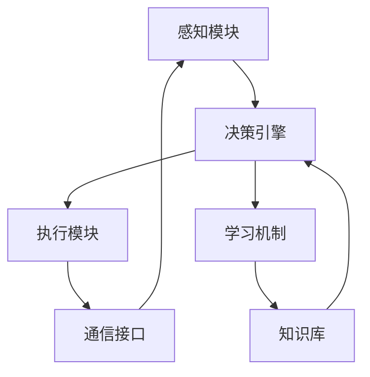

| 组件 | 主要功能 | 与其他组件的关系 |
|------|----------|-------------------|
| 感知模块 | 接收和处理输入 | 为决策引擎提供信息 |
| 决策引擎 | 分析情况并做出决策 | 从知识库获取信息，指导执行模块 |
| 执行模块 | 实施决策的行动 | 执行决策引擎的指令 |
| 学习机制 | 从经验中学习 | 更新知识库，优化决策引擎 |
| 知识库 | 存储知识和经验 | 为决策引擎和学习机制提供支持 |
| 通信接口 | 与外部环境交互 | 连接感知模块和执行模块与外界 |

* 数学模型：
  AI Agent 的决策过程可以用马尔可夫决策过程（MDP）来描述：

$$V(s) = \max_a \left(R(s, a) + \gamma \sum_{s'} P(s'|s, a)V(s')\right)$$

其中：
- $V(s)$ 是状态 $s$ 的价值函数
- $a$ 是可能的动作
- $R(s, a)$ 是在状态 $s$ 采取动作 $a$ 的即时奖励
- $\gamma$ 是折扣因子
- $P(s'|s, a)$ 是从状态 $s$ 采取动作 $a$ 转移到状态 $s'$ 的概率

* 算法流程图：

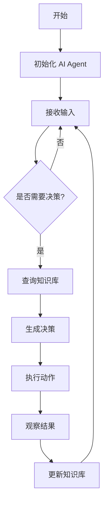

* 算法源代码：

```python
class AIAgent:
    def __init__(self):
        self.knowledge_base = {}
        self.learning_rate = 0.1

    def perceive(self, input_data):
        # 处理输入数据
        processed_data = self.process_input(input_data)
        return processed_data

    def decide(self, state):
        # 基于当前状态做出决策
        if state in self.knowledge_base:
            return self.knowledge_base[state]
        else:
            return self.default_action()

    def execute(self, action):
        # 执行决定的动作
        result = self.perform_action(action)
        return result

    def learn(self, state, action, result):
        # 从经验中学习
        if state not in self.knowledge_base:
            self.knowledge_base[state] = {}
        current_value = self.knowledge_base[state].get(action, 0)
        new_value = current_value + self.learning_rate * (result - current_value)
        self.knowledge_base[state][action] = new_value

    def run(self, input_data):
        state = self.perceive(input_data)
        action = self.decide(state)
        result = self.execute(action)
        self.learn(state, action, result)
        return result

    def process_input(self, input_data):
        # 实现输入处理逻辑
        pass

    def default_action(self):
        # 实现默认动作选择逻辑
        pass

    def perform_action(self, action):
        # 实现动作执行逻辑
        pass
```

* 实际场景应用：
  在智能客服系统中，AI Agent 架构设计的重要性体现在：
1. 多渠道输入处理：设计灵活的感知模块，能够处理文本、语音、图像等多种形式的客户查询。
2. 快速响应机制：优化决策引擎，确保能够在毫秒级别内生成回复。
3. 持续学习能力：实现有效的学习机制，从每次交互中学习，不断提高服务质量。
4. 知识库管理：设计高效的知识存储和检索系统，支持快速准确的信息获取。
5. 多语言支持：在架构中考虑语言处理模块，支持全球化服务。

* 最佳实践 tips：
1. 采用微服务架构，提高系统的可扩展性和维护性。
2. 使用容器技术（如 Docker）进行部署，确保环境一致性。
3. 实现全面的监控和日志系统，便于问题诊断和性能优化。
4. 定期进行架构审查，及时识别和解决潜在问题。
5. 建立完善的测试体系，包括单元测试、集成测试和压力测试。

* 行业发展与未来趋势：

| 时期 | 主要特征 | 代表技术 |
|------|----------|----------|
| 早期 | 规则基础的简单架构 | 专家系统 |
| 发展期 | 引入机器学习能力 | 神经网络、决策树 |
| 当前 | 深度学习和大规模模型 | Transformer、GPT |
| 未来 | 自适应和自进化架构 | 元学习、神经架构搜索 |

AI Agent 架构设计的重要性不言而喻。它是构建高效、可靠、可扩展 AI 系统的基础。随着技术的不断进步，我们可以预见未来的 AI Agent 架构将更加智能化、自适应，能够更好地满足各种复杂场景的需求。

### 5.1.2 常见 AI Agent 架构设计模式

* 核心概念：
  AI Agent 架构设计模式是一系列经过实践验证的、可重用的解决方案，用于解决 AI 系统设计中常见的问题。这些模式提供了构建 AI Agent 的结构化方法，有助于提高系统的效率、可维护性和可扩展性。

* 问题背景：
  随着 AI 技术的快速发展和广泛应用，开发者面临着如何设计高效、灵活且易于维护的 AI Agent 系统的挑战。不同的应用场景和需求往往需要不同的架构方法，这就催生了多种 AI Agent 架构设计模式的出现。

* 问题描述：
1. 复杂性管理：如何有效组织和管理 AI Agent 的各个组件。
2. 灵活性需求：如何设计能够适应不同任务和环境的 AI Agent。
3. 性能优化：如何在保证功能的同时，最大化系统性能。
4. 可扩展性：如何设计易于扩展和升级的 AI Agent 架构。
5. 可维护性：如何确保 AI Agent 系统易于理解和维护。

* 问题解决：
  通过采用不同的架构设计模式，可以有效解决上述问题。以下是几种常见的 AI Agent 架构设计模式：

1. 分层架构模式（Layered Architecture Pattern）：
    - 将 AI Agent 系统分为多个层次，如感知层、处理层、决策层和执行层。
    - 每一层都有明确的职责，层与层之间通过定义好的接口进行通信。
    - 优点：结构清晰，易于理解和维护。
    - 缺点：可能导致层间通信开销增加。

2. 事件驱动架构模式（Event-Driven Architecture Pattern）：
    - 基于事件的触发和处理来组织 AI Agent 的行为。
    - 使用发布-订阅模式，各组件之间松耦合。
    - 优点：高度灵活，易于扩展。
    - 缺点：可能导致系统行为难以预测和调试。

3. 微服务架构模式（Microservices Architecture Pattern）：
    - 将 AI Agent 的功能拆分为多个独立的微服务。
    - 每个微服务负责特定的功能，可以独立部署和扩展。
    - 优点：高度模块化，易于扩展和维护。
    - 缺点：增加了系统的复杂性和运维难度。

4. 反应式架构模式（Reactive Architecture Pattern）：
    - 设计响应式、弹性和可伸缩的 AI Agent 系统。
    - 强调系统的实时性和容错能力。
    - 优点：高性能，能够处理大量并发请求。
    - 缺点：实现复杂，需要特殊的编程模型。

5. 管道-过滤器架构模式（Pipe-and-Filter Architecture Pattern）：
    - 将 AI Agent 的处理过程组织为一系列数据处理单元（过滤器）。
    - 数据通过管道在不同的过滤器之间流动和转换。
    - 优点：高度模块化，易于并行处理。
    - 缺点：可能不适合需要复杂控制流的场景。

* 边界与外延：
  这些架构设计模式并不是互斥的，实际应用中常常会结合多种模式。此外，还有一些特定领域的架构模式，如:
- 强化学习架构：适用于需要通过与环境交互来学习的 AI Agent。
- 认知架构：模仿人类认知过程的 AI 系统架构。
- 混合智能架构：结合符号推理和神经网络的架构。

* 概念结构与核心要素组成：
  每种架构设计模式都有其特定的结构和组成要素，但通常包括以下核心元素：
1. 组件（Components）：系统的基本构建块。
2. 连接器（Connectors）：定义组件之间的交互方式。
3. 配置（Configuration）：组件和连接器的特定排列。
4. 约束（Constraints）：对系统设计的限制和规则。
5. 模式（Patterns）：解决特定问题的常用结构。

* 概念之间的关系：

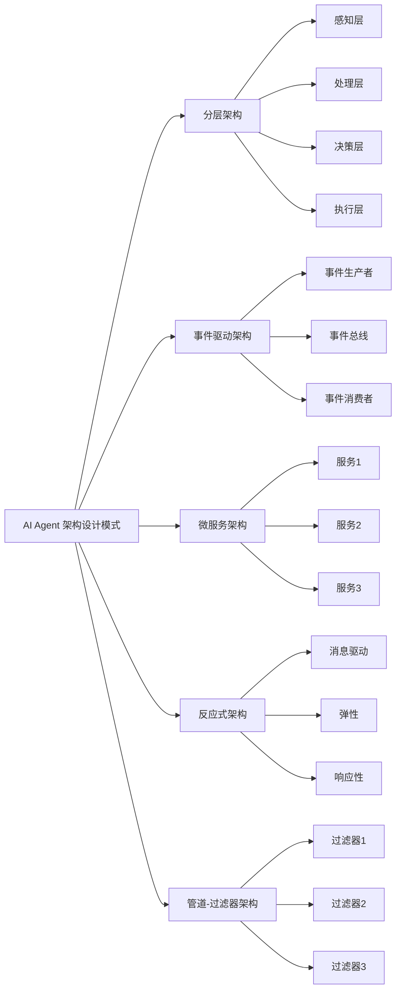

| 架构模式 | 主要特点 | 适用场景 | 优势 | 劣势 |
|----------|----------|----------|------|------|
| 分层架构 | 清晰的层次结构 | 复杂系统，需要明确分工 | 结构清晰，易维护 | 层间通信开销大 |
| 事件驱动架构 | 基于事件的松耦合设计 | 高并发，实时性要求高 | 灵活，可扩展性强 | 复杂度高，难调试 |
| 微服务架构 | 功能解耦，独立部署 | 大型分布式系统 | 高度模块化，易扩展 | 运维复杂，一致性难保证 |
| 反应式架构 | 响应快，弹性强 | 高负载，需要快速响应 | 高性能，容错性强 | 实现复杂，学习曲线陡 |
| 管道-过滤器架构 | 数据流处理 | 数据处理密集型应用 | 模块化强，易并行 | 不适合复杂控制流 |

* 数学模型：
  以事件驱动架构为例，可以用队列理论来描述其性能特征：

$$L = \lambda W$$

其中：
- $L$ 是系统中平均事件数
- $\lambda$ 是事件到达率
- $W$ 是事件在系统中的平均停留时间

这个公式（Little's Law）可以帮助设计者估算系统容量和性能。

* 算法流程图：
  以微服务架构为例：

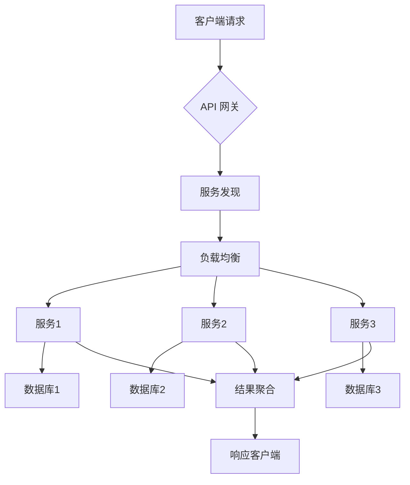

* 算法源代码：
  以下是一个简化的事件驱动架构示例：

```python
import asyncio
from collections import defaultdict

class EventBus:
    def __init__(self):
        self.subscribers = defaultdict(list)

    def subscribe(self, event_type, callback):
        self.subscribers[event_type].append(callback)

    async def publish(self, event_type, data):
        for callback in self.subscribers[event_type]:
            await callback(data)

class AIAgent:
    def __init__(self, event_bus):
        self.event_bus = event_bus
        self.event_bus.subscribe("input", self.process_input)
        self.event_bus.subscribe("decision", self.make_decision)
        self.event_bus.subscribe("action", self.execute_action)

    async def process_input(self, data):
        print(f"Processing input: {data}")
        await self.event_bus.publish("decision", f"Processed {data}")

    async def make_decision(self, data):
        print(f"Making decision based on: {data}")
        await self.event_bus.publish("action", f"Decision made for {data}")

    async def execute_action(self, data):
        print(f"Executing action: {data}")

async def main():
    event_bus = EventBus()
    agent = AIAgent(event_bus)
    await event_bus.publish("input", "User query")

asyncio.run(main())
```

* 实际场景应用：
1. 智能客服系统：采用微服务架构，将自然语言处理、知识库查询、对话管理等功能拆分为独立服务。
2. 智能家居控制中心：使用事件驱动架构，响应各种设备状态变化和用户指令。
3. 自动驾驶系统：采用分层架构，包括感知层、规划层和控制层。
4. 大规模数据处理 AI：使用管道-过滤器架构，实现高效的数据流处理。
5. 金融交易 AI：采用反应式架构，确保高并发和低延迟。

* 最佳实践 tips：
1. 根据具体需求选择合适的架构模式，不要盲目追求复杂性。
2. 考虑系统的可扩展性和未来演进，预留接口和扩展点。
3. 重视系统的可测试性，在架构设计中考虑测试策略。
4. 采用持续集成和持续部署（CI/CD）实践，提高开发效率。
5. 实现全面的监控和日志系统，便于问题诊断和性能优化。
6. 定期进行架构审查和重构，避免技术债务累积。

* 行业发展与未来趋势：

| 时期 | 主要特征 | 代表架构模式 |
|------|----------|--------------|
| 早期 | 单体应用 | 分层架构 |
| 发展期 | 分布式系统 | 事件驱动架构 |
| 当前 | 云原生应用 | 微服务架构、反应式架构 |
| 未来 | 智能自适应系统 | 自组织架构、认知计算架构 |

随着 AI 技术的不断进步，未来的 AI Agent 架构设计模式将更加注重自适应性、可解释性和人机协作。我们可能会看到更多结合认知科学的架构模式，以及能够自主进化和优化的智能架构。

### 5.1.3 设计模式选择的考虑因素

* 核心概念：
  设计模式选择是 AI Agent 架构设计过程中的关键决策，它直接影响系统的性能、可维护性和可扩展性。选择合适的设计模式需要综合考虑多个因素，以确保 AI Agent 能够最佳地满足特定应用场景的需求。

* 问题背景：
  在实际开发 AI Agent 时，开发者常常面临选择最佳架构设计模式的困难。每种设计模式都有其优缺点和适用场景，错误的选择可能导致系统性能低下、难以维护或无法满足业务需求。

* 问题描述：
1. 性能需求：不同设计模式对系统性能的影响各不相同。
2. 可扩展性：随着业务增长，系统需要能够方便地进行扩展。
3. 复杂性管理：如何在功能复杂性和系统可维护性之间取得平衡。
4. 资源限制：硬件资源、开发时间和成本等限制因素的考虑。
5. 团队技能：开发团队的技术栈和经验对设计模式的选择有影响。
6. 与现有系统的集成：新系统需要与现有基础设施和系统协同工作。

* 问题解决：
  为了选择最合适的设计模式，我们需要考虑以下因素：

1. 系统规模和复杂度：
    - 小型系统：可能适合简单的分层架构。
    - 大型复杂系统：可能需要微服务或事件驱动架构。

2. 性能要求：
    - 高并发：考虑反应式架构或事件驱动架构。
    - 实时处理：可能需要流处理架构或管道-过滤器架构。

3. 可扩展性需求：
    - 水平扩展：微服务架构提供良好的水平扩展能力。
    - 功能扩展：插件架构或基于组件的架构可能更合适。

4. 数据处理特征：
    - 大数据处理：考虑 Lambda 架构或 Kappa 架构。
    - 复杂数据流：管道-过滤器架构可能更适合。

5. 团队技能和经验：
    - 选择团队熟悉的技术栈和架构模式。
    - 考虑学习曲线和培训成本。

6. 部署环境：
    - 云环境：微服务架构或无服务器架构可能更适合。
    - 边缘计算：考虑轻量级的分层架构或反应式架构。

7. 安全性和隐私要求：
    - 高安全性要求：可能需要采用更严格的分层架构或隔离模式。

8. 与现有系统的集成：
    - 遗留系统集成：考虑采用适配器模式或网关模式。

9. 开发和维护成本：
    - 长期维护：选择易于理解和维护的架构模式。
    - 快速迭代：考虑支持敏捷开发的架构模式。

10. 未来发展趋势：
    - 考虑行业发展趋势和技术演进方向。
    - 选择具有前瞻性的架构模式。

* 边界与外延：
  设计模式选择的考虑因素不仅限于技术层面，还应包括：
- 业务需求：如业务流程的复杂性、业务变化的频率等。
- 法规遵从：如数据保护法规、行业特定规范等。
- 用户体验：架构选择如何影响最终用户体验。
- 生态系统：与合作伙伴、第三方服务的集成需求。

* 概念结构与核心要素组成：
  设计模式选择的决策过程可以分为以下几个核心步骤：
1. 需求分析：明确系统的功能和非功能需求。
2. 约束识别：识别技术、资源、时间等约束条件。
3. 模式评估：评估各种可能的架构模式。
4. 权衡分析：在不同因素之间进行权衡。
5. 决策：选择最适合的架构模式。
6. 验证：通过原型或概念验证来验证选择的合理性。

* 概念之间的关系：

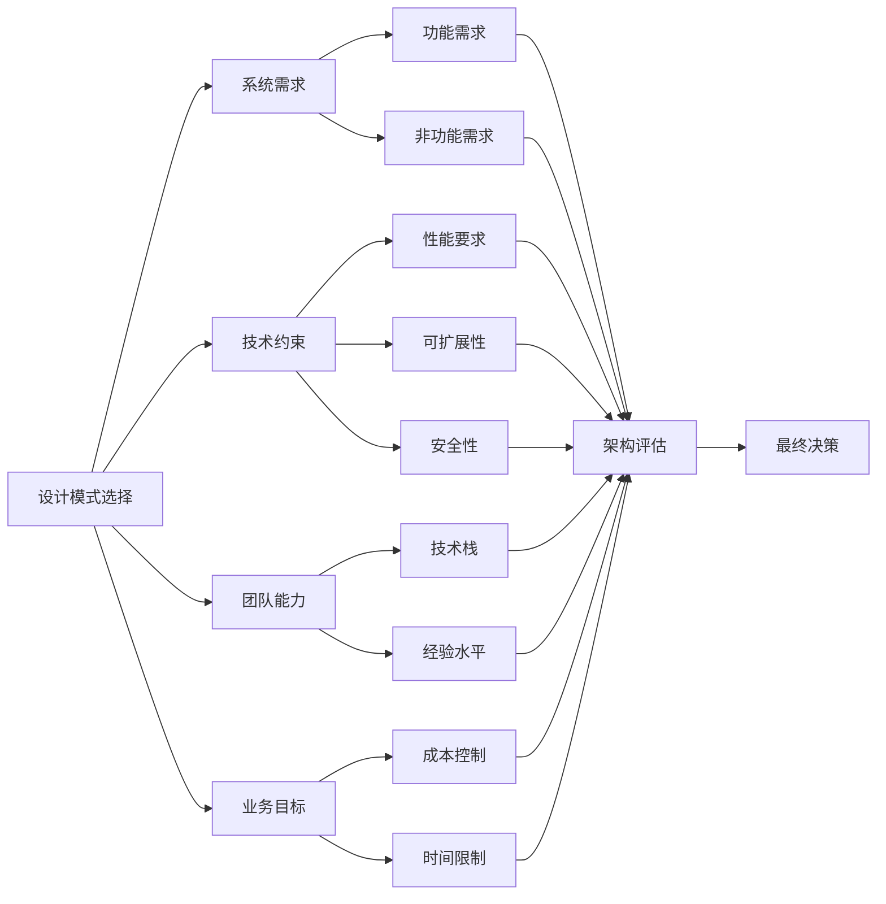

| 考虑因素 | 影响 | 适用架构模式示例 |
|----------|------|-------------------|
| 系统规模 | 复杂度管理 | 大型：微服务；小型：单体 |
| 性能要求 | 响应时间、吞吐量 | 高并发：事件驱动；实时：流处理 |
| 可扩展性 | 系统增长能力 | 水平扩展：微服务；功能扩展：插件架构 |
| 数据处理 | 数据流特征 | 大数据：Lambda架构；复杂流：管道-过滤器 |
| 团队技能 | 开发效率、维护难度 | 团队熟悉：分层架构；新技术：微服务 |
| 部署环境 | 基础设施限制 | 云环境：无服务器；边缘：轻量级分层 |
| 安全要求 | 数据保护、访问控制 | 高安全：严格分层；普通：微服务 |
| 集成需求 | 与现有系统协作 | 遗留系统：适配器模式；新系统：API网关 |
| 成本控制 | 开发和运维成本 | 低成本：单体架构；灵活成本：微服务 |
| 时间限制 | 开发周期 | 快速开发：RAD架构；长期演进：微服务 |

* 数学模型：
  可以使用多准则决策分析（MCDA）方法来辅助设计模式选择。例如，使用简单加权法：

$$S_j = \sum_{i=1}^n w_i r_{ij}$$

其中：
- $S_j$ 是第 j 个设计模式的总分
- $w_i$ 是第 i 个准则的权重
- $r_{ij}$ 是第 j 个设计模式在第 i 个准则上的评分

* 算法流程图：

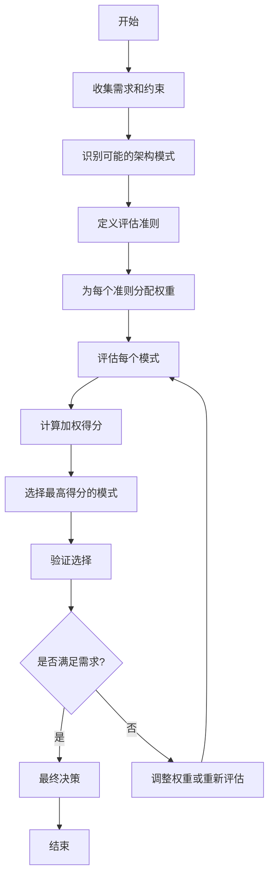

* 算法源代码：

```python
import numpy as np

class ArchitecturePatternSelector:
    def __init__(self, patterns, criteria):
        self.patterns = patterns
        self.criteria = criteria
        self.weights = np.ones(len(criteria)) / len(criteria)
        self.scores = np.zeros((len(patterns), len(criteria)))

    def set_weights(self, weights):
        self.weights = np.array(weights) / np.sum(weights)

    def score_patterns(self, scores):
        self.scores = np.array(scores)

    def calculate_total_scores(self):
        return np.dot(self.scores, self.weights)

    def select_best_pattern(self):
        total_scores = self.calculate_total_scores()
        best_index = np.argmax(total_scores)
        return self.patterns[best_index], total_scores[best_index]

# 使用示例
patterns = ["Microservices", "Layered", "Event-Driven", "Pipe-and-Filter"]
criteria = ["Scalability", "Performance", "Maintainability", "Cost"]

selector = ArchitecturePatternSelector(patterns, criteria)

# 设置权重
selector.set_weights([0.3, 0.3, 0.2, 0.2])

# 评分（示例分数）
scores = [
    [0.9, 0.7, 0.6, 0.5],  # Microservices
    [0.6, 0.8, 0.8, 0.7],  # Layered
    [0.8, 0.9, 0.7, 0.6],  # Event-Driven
    [0.7, 0.8, 0.7, 0.8]   # Pipe-and-Filter
]
selector.score_patterns(scores)

# 选择最佳模式
best_pattern, best_score = selector.select_best_pattern()
print(f"Best pattern: {best_pattern} with score: {best_score:.2f}")
```

* 实际场景应用：
1. 电子商务平台：
    - 需求：高并发、弹性扩展、微服务化
    - 选择：微服务架构 + 事件驱动模式
    - 原因：能够处理高峰期流量，便于独立扩展不同服务

2. 实时数据分析系统：
    - 需求：低延迟、高吞吐量、复杂数据处理
    - 选择：流处理架构 + Lambda架构
    - 原因：满足实时处理需求，同时支持批处理和历史数据分析

3. 物联网设备管理平台：
    - 需求：大量设备连接、实时数据收集、边缘计算
    - 选择：反应式架构 + 微服务
    - 原因：能够处理大量并发连接，支持边缘计算和云端协同

4. 企业级 CRM 系统：
    - 需求：与遗留系统集成、渐进式现代化、数据安全
    - 选择：分层架构 + 适配器模式
    - 原因：便于与现有系统集成，同时为未来微服务化铺平道路

5. AI 驱动的推荐系统：
    - 需求：实时个性化、大规模数据处理、模型更新
    - 选择：Lambda架构 + 微服务
    - 原因：支持批处理和流处理，便于模型的独立更新和部署

* 最佳实践 tips：
1. 进行充分的需求分析和系统建模，明确系统的关键质量属性。
2. 创建决策矩阵，对不同架构模式在各个标准上进行量化评分。
3. 考虑使用架构评估方法，如ATAM（架构权衡分析方法）。
4. 进行概念验证（PoC）或原型开发，验证所选架构的可行性。
5. 保持架构的灵活性，预留未来演进的空间。
6. 定期回顾和评估架构决策，确保其持续满足业务需求。
7. 关注行业最佳实践和新兴技术趋势，适时调整架构策略。

* 行业发展与未来趋势：

| 时期 | 主要特征 | 架构趋势 | 驱动因素 |
|------|----------|----------|----------|
| 过去 | 单体应用 | 分层架构 | 简单性、易于开发 |
| 现在 | 分布式系统 | 微服务、云原生 | 可扩展性、敏捷性 |
| 近期未来 | 智能化系统 | AI驱动架构、边缘计算 | 实时性、智能决策 |
| 长期展望 | 自适应系统 | 自组织架构、量子计算集成 | 极致性能、复杂问题解决 |

随着人工智能和量子计算等前沿技术的发展，未来的 AI Agent 架构设计将面临更多挑战和机遇。设计模式的选择将需要考虑更多维度，如AI模型的可解释性、系统的自适应能力、量子算法的集成等。同时，跨领域的知识融合将变得越来越重要，架构师需要具备更广泛的知识背景和更强的创新能力。

## 5.2 反思模式（Reflection Pattern）

### 5.2.1 反思模式的原理与特点

* 核心概念：
  反思模式（Reflection Pattern）是一种先进的AI Agent架构设计模式，它使AI系统能够对自身的行为、决策和输出进行自我评估和改进。这种模式模仿了人类的元认知能力，允许AI Agent在执行任务的同时，持续监控和优化其性能。

* 问题背景：
  随着AI系统变得越来越复杂，仅仅依靠预定义的规则和模型已经不足以应对各种复杂和动态的场景。传统的AI系统往往缺乏自我评估和自我改进的能力，导致在面对新情况时表现不佳或需要频繁的人工干预。

* 问题描述：
1. 适应性不足：AI系统难以适应新的、未预见的情况。
2. 性能瓶颈：系统性能难以突破预设的上限。
3. 错误累积：系统错误可能随时间累积，而没有自我纠正机制。
4. 可解释性差：难以理解AI系统的决策过程和依据。
5. 持续学习困难：系统难以从经验中学习并持续改进。

* 问题解决：
  反思模式通过以下机制解决上述问题：
1. 自我监控：系统持续监控自身的行为和决策过程。
2. 性能评估：对每个决策和行动的结果进行评估。
3. 错误分析：识别和分析错误或次优决策的原因。
4. 知识更新：基于反思结果更新系统的知识库和决策模型。
5. 行为调整：根据反思结果动态调整系统的行为策略。

* 边界与外延：
  反思模式的应用范围广泛，但也有其局限性：
- 适用范围：复杂决策系统、自主学习系统、需要高度适应性的AI应用。
- 局限性：增加了系统复杂度，可能影响实时性能，需要额外的计算资源。
- 扩展：可与其他模式如强化学习、元学习等结合，进一步增强系统能力。

* 概念结构与核心要素组成：
  反思模式的核心要素包括：
1. 执行模块：负责执行主要任务和决策。
2. 监控模块：实时监控系统行为和环境反馈。
3. 评估模块：分析系统性能和决策质量。
4. 学习模块：从反思结果中学习，更新知识和策略。
5. 调整模块：根据学习结果调整系统行为。

* 概念之间的关系：

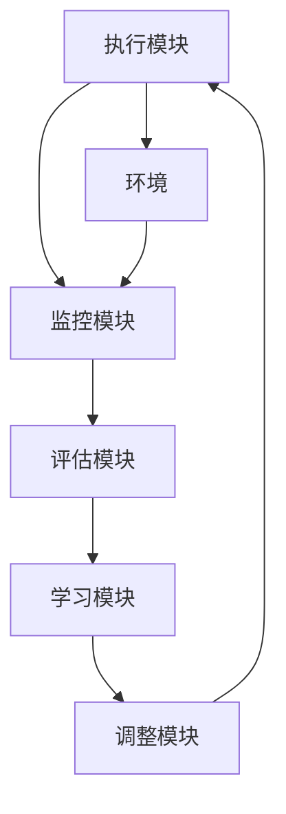

| 模块 | 主要功能 | 输入 | 输出 |
|------|----------|------|------|
| 执行模块 | 执行任务和决策 | 当前状态、任务目标 | 行动、决策结果 |
| 监控模块 | 观察系统行为和环境 | 系统行为、环境反馈 | 行为数据、环境数据 |
| 评估模块 | 分析性能和决策质量 | 行为数据、环境数据 | 性能评估结果 |
| 学习模块 | 从经验中学习 | 评估结果 | 更新的知识和策略 |
| 调整模块 | 优化系统行为 | 更新的知识和策略 | 行为调整指令 |

* 数学模型：
  反思模式可以用以下数学模型表示：

令 $s_t$ 为时间 $t$ 的系统状态，$a_t$ 为执行的动作，$r_t$ 为获得的奖励，$\theta_t$ 为系统参数。

1. 执行阶段：$a_t = \pi(s_t; \theta_t)$
2. 监控阶段：$o_t = f(s_t, a_t, s_{t+1})$
3. 评估阶段：$v_t = V(o_t)$
4. 学习阶段：$\Delta \theta_t = \alpha \nabla_\theta L(v_t, \theta_t)$
5. 调整阶段：$\theta_{t+1} = \theta_t + \Delta \theta_t$

其中，$\pi$ 是策略函数，$f$ 是观察函数，$V$ 是价值评估函数，$L$ 是损失函数，$\alpha$ 是学习率。

* 算法流程图：

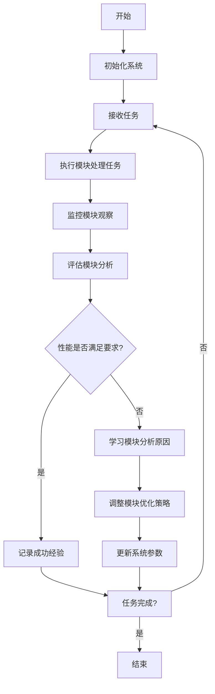

* 算法源代码：

```python
import numpy as np

class ReflectiveAIAgent:
    def __init__(self, learning_rate=0.01):
        self.state = None
        self.action = None
        self.reward = None
        self.parameters = np.random.rand(10)  # 初始化系统参数
        self.learning_rate = learning_rate

    def execute(self, state):
        self.state = state
        self.action = np.dot(state, self.parameters)  # 简化的决策过程
        return self.action

    def monitor(self, new_state, reward):
        self.reward = reward
        return new_state, self.action, reward

    def evaluate(self, observation):
        expected_reward = np.dot(observation, self.parameters)
        return self.reward - expected_reward  # 简化的评估过程

    def learn(self, evaluation):
        gradient = evaluation * self.state
        return gradient

    def adjust(self, gradient):
        self.parameters += self.learning_rate * gradient

    def reflect(self, new_state, reward):
        observation = self.monitor(new_state, reward)
        evaluation = self.evaluate(observation)
        if abs(evaluation) > 0.1:  # 如果评估结果显示性能不佳
            gradient = self.learn(evaluation)
            self.adjust(gradient)
        return evaluation

# 使用示例
agent = ReflectiveAIAgent()

for episode in range(100):
    state = np.random.rand(10)  # 模拟环境状态
    action = agent.execute(state)
    new_state = np.random.rand(10)  # 模拟下一个状态
    reward = np.random.rand()  # 模拟奖励
    evaluation = agent.reflect(new_state, reward)
    print(f"Episode {episode}, Evaluation: {evaluation}")
```

* 实际场景应用：
1. 自动驾驶系统：
    - 执行：控制车辆行驶
    - 监控：观察路况、车辆状态
    - 评估：分析驾驶性能和安全性
    - 学习：优化驾驶策略
    - 调整：更新控制参数

2. 智能客服系统：
    - 执行：回答用户查询
    - 监控：记录用户反馈和满意度
    - 评估：分析回答的准确性和用户满意度
    - 学习：从成功案例中学习
    - 调整：优化回答策略和知识库

3. 金融交易AI：
    - 执行：进行交易决策
    - 监控：跟踪市场变化和交易结果
    - 评估：分析交易性能和风险
    - 学习：从成功和失败的交易中学习
    - 调整：更新交易策略* 最佳实践 tips：
1. 设计合适的评估指标：确保评估模块能够准确反映系统性能。
2. 平衡实时性和反思深度：在系统响应速度和反思质量之间找到平衡点。
3. 增量学习：采用增量学习方法，避免大规模重训练带来的性能开销。
4. 多层次反思：实现短期、中期和长期的反思机制，全面提升系统性能。
5. 安全机制：设置安全边界，防止反思过程导致系统行为出现极端偏差。
6. 可解释性：保留反思过程的日志，提高系统决策的可解释性。
7. 人机协作：在关键决策点引入人类专家的反馈，提高反思质量。

* 行业发展与未来趋势：

| 时期 | 主要特征 | 技术焦点 | 应用领域 |
|------|----------|----------|----------|
| 早期 | 基础反馈机制 | 简单的错误检测和纠正 | 工业控制系统 |
| 现在 | 智能反思系统 | 深度学习、强化学习集成 | 自动驾驶、智能助手 |
| 近期未来 | 自主学习系统 | 元学习、迁移学习 | 通用AI、复杂决策系统 |
| 长期展望 | 认知级AI | 类人思维模拟、自我意识模型 | 高度自主系统、创新性任务 |

反思模式作为AI系统自我完善的关键机制，其重要性将随着AI技术的发展而不断提升。未来，我们可能会看到更加复杂和高效的反思模式，如多智能体协同反思、跨领域知识迁移反思等。这将极大地提升AI系统的适应性和创新能力，为实现真正的通用人工智能铺平道路。

### 5.2.2 实现反思模式的技术方法

* 核心概念：
  实现反思模式的技术方法是指一系列用于构建和优化AI系统自我评估和改进能力的具体技术和算法。这些方法使AI Agent能够分析自身行为，识别改进空间，并自主调整以提高性能。

* 问题背景：
  虽然反思模式的概念清晰，但其实际实现面临诸多挑战。如何设计有效的自我评估机制，如何从大量数据中提取有价值的信息，以及如何将反思结果转化为实际的系统改进，都是需要解决的关键问题。

* 问题描述：
1. 评估标准的定义：如何定义客观、全面的性能评估标准。
2. 数据收集和处理：如何高效收集和处理反思所需的大量数据。
3. 计算资源管理：如何在不影响主要任务执行的情况下进行反思。
4. 学习效率：如何从有限的经验中快速学习和改进。
5. 泛化能力：如何确保从特定经验中学到的知识能够泛化到新情况。

* 问题解决：
  以下是实现反思模式的几种关键技术方法：

1. 元学习（Meta-Learning）：
    - 原理：训练模型学习如何学习，提高学习效率和泛化能力。
    - 实现：使用MAML（Model-Agnostic Meta-Learning）等算法。

2. 自监督学习（Self-Supervised Learning）：
    - 原理：从未标记数据中自动生成监督信号。
    - 实现：使用对比学习、预测性编码等技术。

3. 强化学习与内在奖励（Reinforcement Learning with Intrinsic Rewards）：
    - 原理：设计内在奖励机制，鼓励探索和自我改进。
    - 实现：使用好奇心驱动学习、empowerment maximization等方法。

4. 记忆增强神经网络（Memory-Augmented Neural Networks）：
    - 原理：通过外部记忆模块增强系统的长期学习能力。
    - 实现：使用神经图灵机（NTM）或差分神经计算机（DNC）。

5. 因果推理（Causal Inference）：
    - 原理：理解行为与结果之间的因果关系，提高决策质量。
    - 实现：使用结构因果模型（SCM）和反事实推理。

6. 多任务学习（Multi-Task Learning）：
    - 原理：同时学习多个相关任务，提高知识迁移和泛化能力。
    - 实现：使用共享参数的神经网络架构。

7. 主动学习（Active Learning）：
    - 原理：主动选择最有价值的数据进行学习，提高学习效率。
    - 实现：使用不确定性采样、期望模型变化等策略。

* 边界与外延：
  这些技术方法的应用需要考虑以下因素：
- 计算复杂度：某些方法（如元学习）可能需要大量计算资源。
- 数据依赖性：自监督学习等方法的效果与可用数据的质量和数量密切相关。
- 适用性：不同方法适用于不同类型的任务和数据。
- 可解释性：某些高级方法（如神经图灵机）可能降低系统的可解释性。

* 概念结构与核心要素组成：

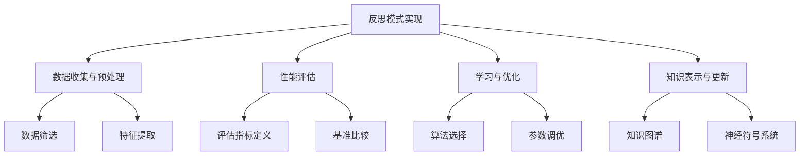

| 技术方法 | 主要优势 | 适用场景 | 实现复杂度 |
|----------|----------|----------|------------|
| 元学习 | 快速适应新任务 | 少样本学习、持续学习 | 高 |
| 自监督学习 | 减少标注数据依赖 | 大规模未标记数据场景 | 中 |
| 强化学习与内在奖励 | 自主探索和改进 | 交互式学习环境 | 中-高 |
| 记忆增强神经网络 | 长期记忆和快速适应 | 需要长期记忆的任务 | 高 |
| 因果推理 | 提高决策可解释性 | 需要理解因果关系的场景 | 中-高 |
| 多任务学习 | 知识共享和迁移 | 多个相关任务并存 | 中 |
| 主动学习 | 提高数据效率 | 标注成本高的场景 | 低-中 |

* 数学模型：
  以元学习为例，MAML算法的核心思想可以用以下数学公式表示：

$$\theta^* = \arg\min_\theta \sum_{T_i \sim p(T)} \mathcal{L}_{T_i}(f_{\theta'_i})$$

其中：
- $\theta$ 是模型的初始参数
- $T_i$ 是从任务分布 $p(T)$ 中采样的任务
- $\theta'_i = \theta - \alpha \nabla_\theta \mathcal{L}_{T_i}(f_\theta)$ 是在任务 $T_i$ 上经过一步梯度更新后的参数
- $\mathcal{L}_{T_i}$ 是任务 $T_i$ 的损失函数

* 算法流程图：
  以自监督学习为例：

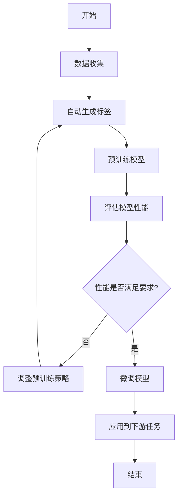

* 算法源代码：
  以简化的元学习（MAML）实现为例：

```python
import numpy as np

class MAMLModel:
    def __init__(self, input_dim, output_dim, alpha=0.01, beta=0.1):
        self.weights = np.random.randn(input_dim, output_dim)
        self.alpha = alpha  # 内循环学习率
        self.beta = beta    # 外循环学习率

    def forward(self, x):
        return np.dot(x, self.weights)

    def loss(self, x, y):
        return np.mean((self.forward(x) - y) ** 2)

    def grad(self, x, y):
        return 2 * np.dot(x.T, (self.forward(x) - y)) / x.shape[0]

    def inner_update(self, x, y):
        grads = self.grad(x, y)
        new_weights = self.weights - self.alpha * grads
        return MAMLModel(self.weights.shape[0], self.weights.shape[1], self.alpha, self.beta)._set_weights(new_weights)

    def outer_update(self, tasks):
        grads = np.zeros_like(self.weights)
        for x, y in tasks:
            updated_model = self.inner_update(x, y)
            grads += updated_model.grad(x, y)
        self.weights -= self.beta * grads / len(tasks)

    def _set_weights(self, weights):
        self.weights = weights
        return self

# 使用示例
model = MAMLModel(input_dim=2, output_dim=1)
tasks = [
    (np.random.randn(10, 2), np.random.randn(10, 1)),
    (np.random.randn(10, 2), np.random.randn(10, 1)),
]

for _ in range(1000):
    model.outer_update(tasks)

print("Final weights:", model.weights)
```

* 实际场景应用：
1. 自适应推荐系统：
    - 技术：元学习 + 多任务学习
    - 应用：快速适应用户偏好变化，同时学习多种推荐任务（如商品、新闻、视频）

2. 自动驾驶中的场景理解：
    - 技术：自监督学习 + 因果推理
    - 应用：从大量未标注的道路场景数据中学习，理解交通事件的因果关系

3. 智能客服机器人：
    - 技术：记忆增强神经网络 + 主动学习
    - 应用：长期记忆用户交互历史，主动学习处理新出现的问题类型

4. 工业生产优化：
    - 技术：强化学习与内在奖励 + 因果推理
    - 应用：自主探索生产参数优化空间，理解参数调整与产品质量的因果关系

5. 医疗诊断系统：
    - 技术：多任务学习 + 主动学习
    - 应用：同时学习多种疾病的诊断，主动请求专家对不确定案例进行标注

* 最佳实践 tips：
1. 数据质量优先：确保用于反思的数据具有高质量和代表性。
2. 渐进式实现：从简单的反思机制开始，逐步引入复杂技术。
3. 计算效率平衡：在反思深度和实时性能之间寻找平衡点。
4. 持续验证：定期评估反思机制的效果，及时调整策略。
5. 知识沉淀：建立知识库，积累反思产生的洞察和经验。
6. 安全机制：设置反思结果的应用阈值，防止过度自我调整导致的不稳定。
7. 人机协作：在关键决策点保留人类专家的介入机会。

* 行业发展与未来趋势：

| 时期 | 技术焦点 | 应用特征 | 挑战 |
|------|----------|----------|------|
| 当前 | 单一技术方法集成 | 特定领域的反思能力 | 泛化能力有限 |
| 近期 | 多技术方法协同 | 跨领域知识迁移 | 计算资源需求大 |
| 中期 | 自适应反思策略 | 动态环境中的持续学习 | 稳定性与适应性平衡 |
| 远期 | 认知级反思模型 | 类人自我意识和创新 | 伦理和控制问题 |

随着技术的进步，我们可以预见反思模式的实现将朝着更加智能、自主和通用的方向发展。未来的AI系统可能具备类似人类的自我反思和创新能力，不仅能够优化已知任务的执行，还能够自主发现和解决新问题。这将为AI在复杂、动态和未知环境中的应用开辟新的可能性。

### 5.2.3 自我评估与迭代改进机制

* 核心概念：
  自我评估与迭代改进机制是反思模式中的关键组成部分，它使AI Agent能够持续监控自身性能，识别不足之处，并通过迭代过程不断优化其行为和决策策略。这种机制模拟了人类的自我反思和学习过程，使AI系统能够在没有外部干预的情况下自主进化。

* 问题背景：
  随着AI系统被部署到越来越复杂和动态的环境中，静态的模型和固定的决策规则已经无法满足需求。系统需要能够适应环境变化，从错误中学习，并不断提高其性能。然而，设计一个有效的自我评估和改进机制面临诸多挑战。

* 问题描述：
1. 评估标准的定义：如何设定客观、全面且可量化的性能指标。
2. 反馈延迟：某些决策的结果可能在很长时间后才能观察到。
3. 噪声和不确定性：环境反馈可能包含噪声或不确定性，影响评估准确性。
4. 过拟合风险：过度优化短期性能可能导致泛化能力下降。
5. 计算资源限制：持续的自我评估和改进可能消耗大量计算资源。
6. 安全性考虑：自主改进可能导致意外或不安全的行为。

* 问题解决：
  以下是实现有效自我评估与迭代改进机制的关键方法：

1. 多维度评估指标：
    - 设计涵盖效率、准确性、稳定性等多个维度的评估指标体系。
    - 使用加权评分方法综合多个指标。

2. 长短期性能平衡：
    - 结合即时奖励和长期价值估计。
    - 使用时间差分学习等技术处理延迟反馈。

3. 鲁棒性评估：
    - 在不同条件下测试系统性能。
    - 使用蒙特卡洛方法评估决策的稳定性。

4. 增量学习与适应性调整：
    - 采用在线学习算法，实时更新模型。
    - 使用滑动窗口技术，平衡历史经验和最新数据。

5. 元学习策略：
    - 学习如何进行有效的自我评估和改进。
    - 动态调整学习率和探索策略。

6. 安全约束和渐进式改进：
    - 设置性能和行为的安全边界。
    - 采用小步迭代，逐步验证改进效果。

* 边界与外延：
  自我评估与迭代改进机制的应用需要考虑：
- 领域特性：不同应用领域可能需要特定的评估标准和改进策略。
- 计算资源：在资源受限的环境中，需要权衡评估频率和深度。
- 伦理考虑：在某些敏感领域，可能需要人类监督自主改进过程。
- 可解释性：保证改进过程的透明度和可解释性，特别是在高风险应用中。

* 概念结构与核心要素组成：

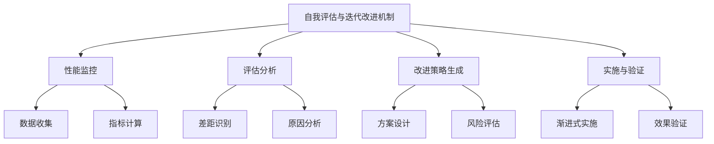

| 阶段 | 主要任务 | 关键技术 | 输出 |
|------|----------|----------|------|
| 性能监控 | 实时数据采集和指标计算 | 分布式监控、流处理 | 性能指标报告 |
| 评估分析 | 识别性能差距和问题根因 | 统计分析、因果推断 | 问题诊断报告 |
| 改进策略生成 | 设计优化方案 | 强化学习、遗传算法 | 改进策略建议 |
| 实施与验证 | 执行改进并验证效果 | A/B测试、增量部署 | 改进效果报告 |

* 数学模型：
  以强化学习为基础的自我改进过程可以用以下数学模型描述：

1. 价值函数估计：
   $$V(s) = \mathbb{E}[R_t | s_t = s]$$

2. 策略改进：
   $$\pi'(s) = \arg\max_a \sum_{s'} P(s'|s,a)[R(s,a,s') + \gamma V(s')]$$

3. 性能评估：
   $$J(\pi) = \mathbb{E}_{\tau \sim \pi}[\sum_{t=0}^{\infty} \gamma^t r_t]$$

其中，$V(s)$ 是状态 $s$ 的价值函数，$\pi(s)$ 是策略函数，$R$ 是奖励函数，$\gamma$ 是折扣因子，$J(\pi)$ 是策略 $\pi$ 的性能度量。

* 算法流程图：

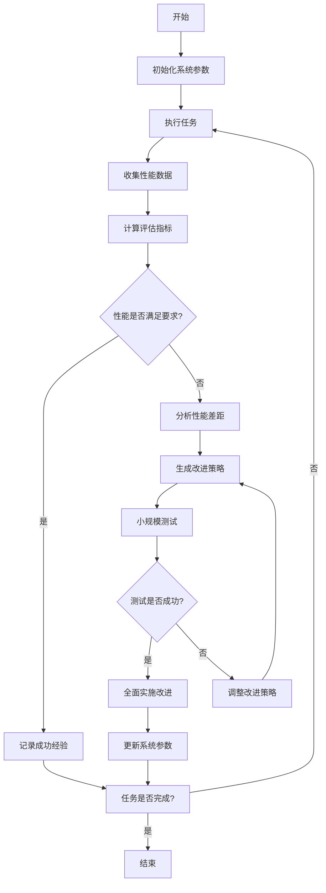

* 算法源代码：

```python
import numpy as np
from typing import List, Tuple

class SelfImprovingAgent:
    def __init__(self, state_size: int, action_size: int, learning_rate: float = 0.01):
        self.state_size = state_size
        self.action_size = action_size
        self.learning_rate = learning_rate
        self.value_function = np.zeros((state_size, action_size))
        self.performance_history: List[float] = []

    def choose_action(self, state: int) -> int:
        return np.argmax(self.value_function[state])

    def update(self, state: int, action: int, reward: float, next_state: int) -> None:
        current_q = self.value_function[state, action]
        next_max_q = np.max(self.value_function[next_state])
        new_q = current_q + self.learning_rate * (reward + next_max_q - current_q)
        self.value_function[state, action] = new_q

    def evaluate_performance(self) -> float:
        return np.mean(self.performance_history[-100:]) if self.performance_history else 0

    def improve(self) -> None:
        current_performance = self.evaluate_performance()
        if current_performance < 0.7:  # 假设0.7是性能阈值
            self.learning_rate *= 1.1  # 增加学习率
        else:
            self.learning_rate *= 0.9  # 减少学习率

    def run_episode(self, env) -> Tuple[List[int], List[int], List[float]]:
        state = env.reset()
        done = False
        states, actions, rewards = [], [], []
        while not done:
            action = self.choose_action(state)
            next_state, reward, done, _ = env.step(action)
            self.update(state, action, reward, next_state)
            states.append(state)
            actions.append(action)
            rewards.append(reward)
            state = next_state
        self.performance_history.append(sum(rewards))
        return states, actions, rewards

    def train(self, env, episodes: int = 1000) -> None:
        for episode in range(episodes):
            self.run_episode(env)
            if episode % 100 == 0:
                self.improve()
                print(f"Episode {episode}, Performance: {self.evaluate_performance():.2f}")

# 使用示例
class SimpleEnv:
    def __init__(self):
        self.state = 0

    def reset(self):
        self.state = 0
        return self.state

    def step(self, action):
        if action == self.state:
            reward = 1
            self.state = (self.state + 1) % 5
        else:
            reward = -1
        done = self.state == 0
        return self.state, reward, done, {}

env = SimpleEnv()
agent = SelfImprovingAgent(state_size=5, action_size=5)
agent.train(env)
```

* 实际场景应用：
1. 自适应推荐系统：
    - 评估指标：点击率、停留时间、转化率
    - 改进机制：动态调整特征权重，优化推荐算法

2. 智能客服机器人：
    - 评估指标：问题解决率、用户满意度、对话轮数
    - 改进机制：更新知识库，优化对话策略

3. 自动驾驶系统：
    - 评估指标：安全指数、乘坐舒适度、路线优化度
    - 改进机制：调整决策模型，优化控制参数

4. 工业生产优化：
    - 评估指标：产品质量、生产效率、资源利用率
    - 改进机制：优化生产参数，调整调度策略

5. 金融交易AI：
    - 评估指标：收益率、风险控制、交易成本
    - 改进机制：更新市场模型，调整交易策略

* 最佳实践 tips：
1. 多维度评估：综合考虑效率、质量、稳定性等多个方面。
2. 渐进式改进：采用小步迭代，避免剧烈变化导致的不稳定。
3. 长短期平衡：兼顾短期性能提升和长期学习能力。
4. 异常检测：建立机制及时发现和处理异常改进结果。
5. 版本控制：保留历史版本，支持快速回滚。
6. 人机协作：在关键决策点引入人类专家审核。
7. 持续监控：建立实时监控系统，及时发现性能退化。
8. 知识积累：建立知识库，沉淀改进经验和最佳实践。

* 行业发展与未来趋势：

| 时期 | 技术特征 | 应用焦点 | 主要挑战 |
|------|----------|----------|----------|
| 当前 | 基于规则的自动化改进 | 特定领域的性能优化 | 泛化能力有限 |
| 近期 | 数据驱动的智能优化 | 跨领域知识迁移 | 数据质量和隐私 |
| 中期 | 自适应学习系统 | 动态环境中的持续学习 | 稳定性与适应性平衡 |
| 远期 | 认知级自主进化 | 创新性问题解决 | 伦理和控制问题 |

未来的自我评估与迭代改进机制将朝着更智能、更自主的方向发展。我们可能会看到能够自主设定评估标准、设计改进策略，甚至重构自身架构的AI系统。这将为AI在复杂、不确定环境中的应用开辟新的可能性，同时也带来了如何确保AI系统行为可控和符合伦理的新挑战。

### 5.2.4 反思模式在内容生成中的应用

* 核心概念：
  反思模式在内容生成中的应用是指AI系统能够对自己生成的内容进行评估、分析和改进的过程。这种应用使AI能够产生更高质量、更符合要求的内容，同时不断学习和适应不同的内容生成任务。

* 问题背景：
  随着AI在文本、图像、音频等内容生成领域的广泛应用，如何提高生成内容的质量、创意性和适应性成为关键挑战。传统的内容生成模型往往缺乏自我评估和改进的能力，容易产生重复、不连贯或不符合上下文的内容。

* 问题描述：
1. 内容质量评估：如何客观评估生成内容的质量和相关性。
2. 创意性和独特性：如何生成既符合要求又具有创新性的内容。
3. 上下文理解：如何确保生成的内容与给定的上下文保持一致。
4. 风格适应：如何根据不同的目标受众调整内容风格。
5. 错误修正：如何识别并修正生成内容中的错误或不恰当表述。
6. 持续学习：如何从用户反馈和交互中不断改进生成能力。

* 问题解决：
  以下是在内容生成中应用反思模式的关键方法：

1. 多阶段生成-评估-修正流程：
    - 初次内容生成
    - 自我评估和分析
    - 基于评估结果进行修正和重新生成

2. 基于规则和机器学习的质量评估：
    - 使用预定义的质量指标（如语法正确性、关键词覆盖率）
    - 训练机器学习模型评估内容质量和相关性

3. 对比学习和差异化策略：
   -将生成的内容与高质量参考内容进行对比
    - 识别并强化独特和创新的元素

4. 上下文感知生成：
    - 使用注意力机制和上下文编码器
    - 动态调整生成策略以保持一致性

5. 元学习适应不同风格：
    - 学习如何快速适应不同的写作风格和目标受众
    - 使用少样本学习技术

6. 反馈循环和增量学习：
    - 收集和分析用户反馈
    - 持续更新模型以改进生成质量

7. 多模态反思：
    - 结合文本、图像、音频等多种模态进行综合评估
    - 确保跨模态内容的一致性和协调性

* 边界与外延：
  反思模式在内容生成中的应用需要考虑：
- 计算资源：反思过程可能增加生成时间和资源消耗
- 创意边界：在保持内容质量的同时不过度限制创意空间
- 隐私和版权：确保生成的内容不侵犯隐私或版权
- 伦理考虑：避免生成不适当或有害的内容

* 概念结构与核心要素组成：

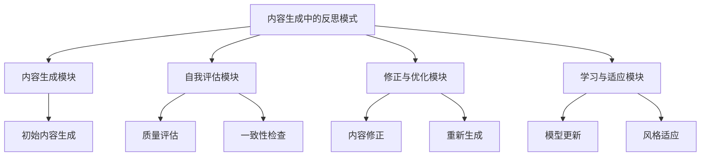

| 模块 | 主要功能 | 关键技术 | 输出 |
|------|----------|----------|------|
| 内容生成 | 创建初始内容 | 深度学习生成模型 | 原始内容 |
| 自我评估 | 分析内容质量和适应性 | NLP分析、机器学习分类 | 评估报告 |
| 修正与优化 | 基于评估改进内容 | 编辑距离算法、强化学习 | 优化后的内容 |
| 学习与适应 | 更新模型和策略 | 联邦学习、迁移学习 | 更新后的模型参数 |

* 数学模型：
  以强化学习框架为例，内容生成的反思过程可以建模为：

1. 生成策略 $\pi_\theta(a|s)$，其中 $\theta$ 是模型参数，$a$ 是生成动作，$s$ 是当前状态。

2. 价值函数 $V(s) = \mathbb{E}[\sum_{t=0}^{\infty} \gamma^t r_t | s_0 = s]$，其中 $r_t$ 是时间步 $t$ 的奖励，$\gamma$ 是折扣因子。

3. 优化目标：
   $$J(\theta) = \mathbb{E}_{s \sim \rho_\pi, a \sim \pi_\theta}[R(s, a)]$$

   其中 $\rho_\pi$ 是策略 $\pi$ 下的状态分布，$R(s, a)$ 是奖励函数。

4. 策略梯度更新：
   $$\theta \leftarrow \theta + \alpha \nabla_\theta J(\theta)$$

* 算法流程图：

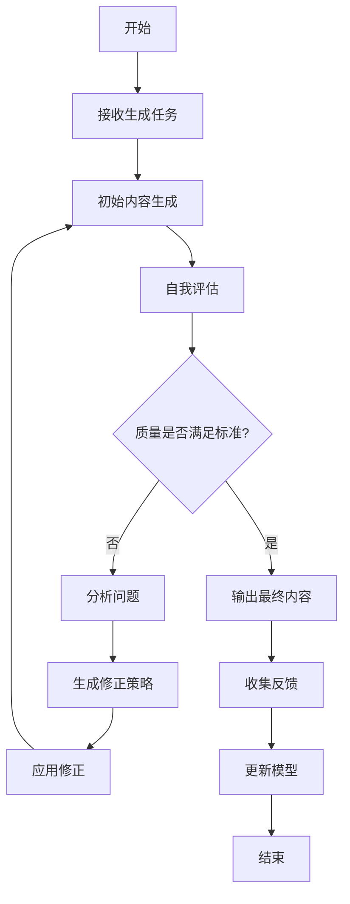

* 算法源代码：

```python
import numpy as np
from typing import List, Dict, Any

class ReflectiveContentGenerator:
    def __init__(self, model, evaluator, optimizer):
        self.model = model
        self.evaluator = evaluator
        self.optimizer = optimizer
        self.quality_threshold = 0.8

    def generate_content(self, prompt: str) -> str:
        content = self.model.generate(prompt)
        quality_score = self.evaluator.evaluate(content)
        
        attempts = 0
        while quality_score < self.quality_threshold and attempts < 3:
            improvements = self.evaluator.suggest_improvements(content)
            content = self.optimizer.apply_improvements(content, improvements)
            quality_score = self.evaluator.evaluate(content)
            attempts += 1
        
        return content

    def update_model(self, feedback: Dict[str, Any]) -> None:
        self.model.fine_tune(feedback)
        self.evaluator.update(feedback)
        self.optimizer.adjust_strategy(feedback)

class ContentModel:
    def generate(self, prompt: str) -> str:
        # 实现内容生成逻辑
        pass

    def fine_tune(self, feedback: Dict[str, Any]) -> None:
        # 实现模型微调逻辑
        pass

class ContentEvaluator:
    def evaluate(self, content: str) -> float:
        # 实现内容质量评估逻辑
        pass

    def suggest_improvements(self, content: str) -> List[str]:
        # 实现改进建议生成逻辑
        pass

    def update(self, feedback: Dict[str, Any]) -> None:
        # 更新评估标准
        pass

class ContentOptimizer:
    def apply_improvements(self, content: str, improvements: List[str]) -> str:
        # 实现内容优化逻辑
        pass

    def adjust_strategy(self, feedback: Dict[str, Any]) -> None:
        # 调整优化策略
        pass

# 使用示例
model = ContentModel()
evaluator = ContentEvaluator()
optimizer = ContentOptimizer()
generator = ReflectiveContentGenerator(model, evaluator, optimizer)

prompt = "Write a short story about AI"
content = generator.generate_content(prompt)
print(content)

feedback = {"quality": 0.9, "creativity": 0.8, "relevance": 0.95}
generator.update_model(feedback)
```

* 实际场景应用：
1. 智能文案生成：
    - 反思过程：评估文案的吸引力、目标关键词覆盖率、品牌语调一致性
    - 改进策略：调整措辞、重新组织结构、增强关键信息

2. 个性化新闻生成：
    - 反思过程：分析内容相关性、事实准确性、用户兴趣匹配度
    - 改进策略：更新信息源、调整叙述角度、个性化内容推荐

3. 智能客服对话生成：
    - 反思过程：评估回答的准确性、语气适当性、问题解决效率
    - 改进策略：扩展知识库、优化对话流程、调整语言风格

4. 自动代码生成：
    - 反思过程：检查代码的正确性、效率、可读性、安全性
    - 改进策略：重构代码、优化算法、增加注释、修复潜在漏洞

5. 创意写作辅助：
    - 反思过程：评估情节创新性、角色发展、语言风格一致性
    - 改进策略：引入新元素、深化角色刻画、调整叙事节奏

* 最佳实践 tips：
1. 多维度评估：综合考虑内容的质量、创意性、相关性等多个方面。
2. 渐进式改进：采用迭代方法，逐步提升内容质量。
3. A/B测试：对比不同版本的内容效果，选择最佳方案。
4. 人机协作：在关键决策点引入人类专家审核和指导。
5. 持续学习：建立反馈循环，不断从用户交互中学习和改进。
6. 上下文敏感：确保生成的内容与整体上下文保持一致。
7. 创意平衡：在保证质量的同时，保持内容的创新性和独特性。
8. 伦理审查：建立内容筛选机制，防止生成不当或有害内容。

* 行业发展与未来趋势：

| 时期 | 技术特征 | 应用焦点 | 主要挑战 |
|------|----------|----------|----------|
| 当前 | 基于规则的内容评估和修正 | 特定领域的内容生成 | 创意性和灵活性有限 |
| 近期 | 多模态内容理解和生成 | 跨领域知识整合 | 内容的连贯性和一致性 |
| 中期 | 自适应学习和创意生成 | 个性化和情境化内容 | 创意边界和版权问题 |
| 远期 | 认知级内容创作 | 人机协作内容创作 | 伦理和社会影响 |

反思模式在内容生成中的应用正在快速发展，未来我们可能会看到更加智能、创造性和适应性强的内容生成系统。这些系统将能够更好地理解和满足用户需求，生成高度个性化和情境化的内容。同时，如何在提高内容质量和创新性的同时，确保内容的真实性、道德性和社会责任，将成为重要的研究方向。随着技术的进步，人机协作的内容创作模式可能会成为主流，AI系统将成为强大的创意助手，辅助人类进行更高层次的内容创作。

### 5.2.5 反思模式在代码优化中的应用

* 核心概念：
  反思模式在代码优化中的应用是指AI系统能够分析、评估并改进自身或其他程序的代码质量、性能和结构的过程。这种应用使AI能够持续优化代码，提高软件质量，并适应不断变化的需求和环境。

* 问题背景：
  随着软件系统日益复杂，手动代码优化变得越来越困难和耗时。传统的静态分析和固定规则的优化方法往往无法应对动态变化的代码库和多样化的性能需求。因此，需要一种能够自主学习和适应的代码优化方法。

* 问题描述：
1. 性能瓶颈识别：如何准确定位代码中的性能瓶颈。
2. 优化策略选择：如何为不同类型的代码选择最适合的优化策略。
3. 重构决策：如何判断何时以及如何重构代码以提高可维护性。
4. 兼容性保证：如何确保优化不会破坏现有功能或引入新的bug。
5. 持续适应：如何使优化过程能够适应不断变化的代码库和运行环境。
6. 可解释性：如何解释和证明优化决策的合理性。

* 问题解决：
  以下是在代码优化中应用反思模式的关键方法：

1. 动态分析与性能剖析：
    - 使用运行时分析工具收集性能数据
    - 识别热点代码和资源使用瓶颈

2. 机器学习驱动的优化策略选择：
    - 基于历史优化经验训练模型
    - 预测不同优化策略的效果并选择最佳方案

3. 自动重构与代码生成：
    - 使用程序变换技术自动重构代码
    - 应用神经网络模型生成优化后的代码片段

4. 多目标优化：
    - 同时考虑性能、可读性、可维护性等多个目标
    - 使用多目标优化算法寻找平衡解

5. 增量式验证与回滚机制：
    - 逐步应用优化并验证每一步的正确性
    - 实现快速回滚机制以应对失败的优化

6. 知识图谱与因果推理：
    - 构建代码结构和优化知识的图谱
    - 使用因果推理分析优化决策的影响

7. 持续学习与适应：
    - 从每次优化尝试中学习并更新优化模型
    - 适应不同项目和编程语言的特性

* 边界与外延：
  反思模式在代码优化中的应用需要考虑：
- 领域特异性：不同领域的代码可能需要特定的优化策略
- 安全性：确保优化不会引入安全漏洞
- 团队协作：与人类开发者的协作和交互
- 计算资源：优化过程本身的资源消耗和效率

* 概念结构与核心要素组成：

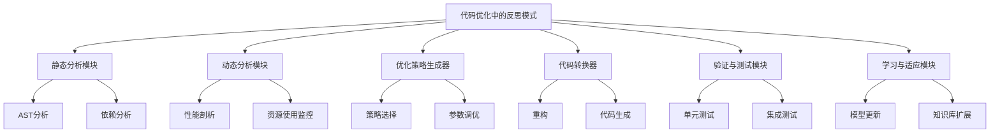

| 模块 | 主要功能 | 关键技术 | 输出 |
|------|----------|----------|------|
| 静态分析 | 分析代码结构和潜在问题 | AST解析、数据流分析 | 代码结构报告 |
| 动态分析 | 收集运行时性能数据 | 插桩、采样分析 | 性能热点图 |
| 优化策略生成器 | 生成针对性优化方案 | 强化学习、启发式算法 | 优化策略列表 |
| 代码转换器 | 实施代码优化 | 程序变换、代码生成 | 优化后的代码 |
| 验证与测试 | 确保优化的正确性 | 自动化测试、形式化验证 | 测试报告 |
| 学习与适应 | 更新优化知识和策略 | 迁移学习、在线学习 | 更新后的模型 |

* 数学模型：
  以强化学习框架模型化代码优化过程：

1. 状态空间 $S$：代码的当前状态，包括AST、性能指标等。
2. 动作空间 $A$：可能的优化操作集合。
3. 转移函数 $P(s'|s,a)$：描述执行优化操作后代码状态的变化。
4. 奖励函数 $R(s,a,s')$：评估优化操作的效果，考虑性能提升、代码质量等。

优化策略 $\pi$ 的目标是最大化期望累积奖励：

$$J(\pi) = \mathbb{E}_{\tau \sim \pi} \left[ \sum_{t=0}^{T} \gamma^t R(s_t, a_t, s_{t+1}) \right]$$

其中 $\tau$ 是优化轨迹，$\gamma$ 是折扣因子。

* 算法流程图：

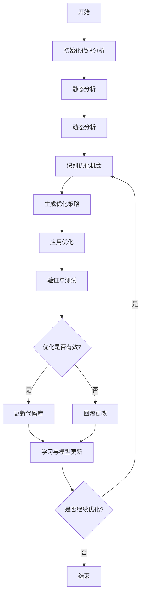

* 算法源代码：

```python
import ast
import numpy as np
from typing import List, Dict, Any

class CodeOptimizer:
    def __init__(self, code: str):
        self.original_code = code
        self.ast_tree = ast.parse(code)
        self.optimized_code = code
        self.performance_metrics = {}
        self.optimization_history = []

    def static_analysis(self) -> Dict[str, Any]:
        # 实现静态代码分析
        pass

    def dynamic_analysis(self) -> Dict[str, float]:
        # 实现动态性能分析
        pass

    def generate_optimization_strategy(self, analysis: Dict[str, Any]) -> List[str]:
        # 基于分析结果生成优化策略
        pass

    def apply_optimization(self, strategy: List[str]) -> str:
        # 应用优化策略到代码
        pass

    def validate_optimization(self, optimized_code: str) -> bool:
        # 验证优化后的代码
        pass

    def measure_performance(self, code: str) -> Dict[str, float]:
        # 测量代码性能
        pass

    def optimize(self) -> str:
        static_analysis_result = self.static_analysis()
        dynamic_analysis_result = self.dynamic_analysis()
        
        analysis = {**static_analysis_result, **dynamic_analysis_result}
        optimization_strategy = self.generate_optimization_strategy(analysis)
        
        for strategy in optimization_strategy:
            temp_optimized_code = self.apply_optimization(strategy)
            if self.validate_optimization(temp_optimized_code):
                new_performance = self.measure_performance(temp_optimized_code)
                if self.is_performance_improved(new_performance):
                    self.optimized_code = temp_optimized_code
                    self.performance_metrics = new_performance
                    self.optimization_history.append(strategy)
                else:
                    print(f"Optimization strategy {strategy} did not improve performance.")
            else:
                print(f"Optimization strategy {strategy} failed validation.")
        
        return self.optimized_code

    def is_performance_improved(self, new_performance: Dict[str, float]) -> bool:
        # 比较新旧性能指标
        pass

    def get_optimization_report(self) -> Dict[str, Any]:
        return {
            "original_code": self.original_code,
            "optimized_code": self.optimized_code,
            "performance_improvement": self.calculate_improvement(),
            "optimization_history": self.optimization_history
        }

    def calculate_improvement(self) -> Dict[str, float]:
        # 计算性能提升百分比
        pass

# 使用示例
code = """
def fibonacci(n):
    if n <= 1:
        return n
    else:
        return fibonacci(n-1) + fibonacci(n-2)

print(fibonacci(30))
"""

optimizer = CodeOptimizer(code)
optimized_code = optimizer.optimize()
report = optimizer.get_optimization_report()
print(f"Optimized code:\n{optimized_code}")
print(f"Performance improvement: {report['performance_improvement']}")
```

* 实际场景应用：
1. 数据处理管道优化：
    - 反思过程：分析数据流瓶颈、内存使用模式、并行处理机会
    - 优化策略：重构数据结构、引入并行处理、优化I/O操作

2. 网络服务性能调优：
    - 反思过程：分析请求响应时间、资源利用率、并发处理能力
    - 优化策略：实现缓存机制、优化数据库查询、调整负载均衡策略

3. 移动应用电池优化：
    - 反思过程：监控电池使用情况、识别高耗电操作、分析后台任务
    - 优化策略：优化网络请求、实现智能后台管理、调整UI渲染策略

4. 游戏引擎性能优化：
    - 反思过程：分析渲染管线、物理计算、资源加载时间
    - 优化策略：实现LOD技术、优化碰撞检测算法、实现资源流式加载

5. 编译器自优化：
    - 反思过程：分析生成代码的质量、优化pass的效果、目标平台特性
    - 优化策略：调整优化pass顺序、生成平台特定指令、实现自适应优化策略

* 最佳实践 tips：
1. 建立基准测试：为每个优化创建可重复的性能测试。
2. 增量式优化：逐步应用优化，每次只改变一个变量。
3. 版本控制：使用版本控制系统跟踪所有优化更改。
4. 性能分析工具：利用专业的性能分析工具获取详细的运行时数据。
5. 跨平台验证：在不同环境下验证优化效果，确保一致性。
6. 代码可读性平衡：在提高性能的同时，保持代码的可读性和可维护性。
7. 文档和注释：详细记录优化理由和过程，便于团队理解和维护。
8. 持续集成：将优化过程集成到CI/CD流程中，实现自动化优化和验证。

* 行业发展与未来趋势：

| 时期 | 技术特征 | 应用焦点 | 主要挑战 |
|------|----------|----------|----------|
| 当前 | 基于规则的优化、局部优化 | 特定热点代码优化 | 优化策略的通用性 |
| 近期 | 机器学习驱动的优化、全局优化 | 自适应性能调优 | 大规模代码库的优化 |
| 中期 | 自动化程序综合、跨语言优化 | 智能重构和代码生成 | 保证优化正确性 |
| 远期 | 认知计算、自进化代码 | 自主软件优化生态系统 | 人机协作和伦理问题 |

反思模式在代码优化中的应用正迅速发展，未来我们可能会看到更加智能和自主的代码优化系统。这些系统将能够理解更深层的代码语义，预测优化的长期影响，甚至自主设计新的优化算法。随着技术进步，代码优化可能会从单纯的性能提升扩展到更广泛的软件质量改进，包括可维护性、安全性和可扩展性等方面。

人工智能辅助的代码优化将极大地提高软件开发的效率和质量，但同时也带来了新的挑战，如如何保证自动优化的可靠性和可解释性，以及如何在自动化和人工控制之间找到平衡。未来，代码优化可能会成为一个持续的、自适应的过程，与软件开发生命周期深度集成，推动软件工程领域的革新。

### 5.2.6 案例分析：Self-RAG 框架

* 核心概念：
  Self-RAG（Self-Reflective Retrieval Augmented Generation）是一种结合了检索增强生成（RAG）和自反思机制的AI框架。它允许语言模型在生成过程中进行自我评估和修正，从而提高输出的质量、准确性和可靠性。

* 问题背景：
  传统的RAG模型虽然能够利用外部知识来增强生成能力，但往往缺乏对自身输出的批判性评估。这可能导致生成的内容存在事实错误、逻辑矛盾或与上下文不一致的问题。Self-RAG框架旨在解决这一问题，通过引入自反思机制来提高生成内容的质量。

* 问题描述：
1. 事实准确性：如何确保生成的内容与检索到的信息一致。
2. 逻辑连贯性：如何保证生成的内容在逻辑上是连贯和一致的。
3. 相关性控制：如何确保生成的内容与用户查询高度相关。
4. 不确定性处理：如何处理模型对某些信息不确定的情况。
5. 效率平衡：如何在增加自反思步骤的同时保持生成效率。
6. 多样性保持：如何在提高准确性的同时保持输出的创造性和多样性。

* 问题解决：
  Self-RAG框架通过以下机制解决上述问题：

1. 迭代生成与评估：
    - 生成初始回答
    - 使用自反思模块评估回答质量
    - 基于评估结果进行修正和重新生成

2. 多维度评估指标：
    - 事实一致性：检查生成内容与检索资料的一致性
    - 逻辑连贯性：评估内容的内部逻辑
    - 相关性：衡量内容与用户查询的相关度

3. 动态信息检索：
    - 在生成过程中动态检索额外信息
    - 根据自反思结果调整检索策略

4. 不确定性标记：
    - 识别并标记模型不确定的部分
    - 对不确定部分进行特殊处理或寻求澄清

5. 分层生成策略：
    - 先生成概要或大纲
    - 逐步细化和扩展内容，每一步都进行自反思

6. 对比学习：
    - 生成多个候选答案
    - 通过对比选择最佳答案或综合多个答案

* 边界与外延：
  Self-RAG框架的应用需要考虑：
- 计算资源：自反思过程可能增加计算复杂度
- 实时性要求：在需要快速响应的场景中可能需要权衡
- 领域适应性：不同领域可能需要特定的评估标准
- 隐私考虑：在处理敏感信息时需要额外的安全措施

* 概念结构与核心要素组成：

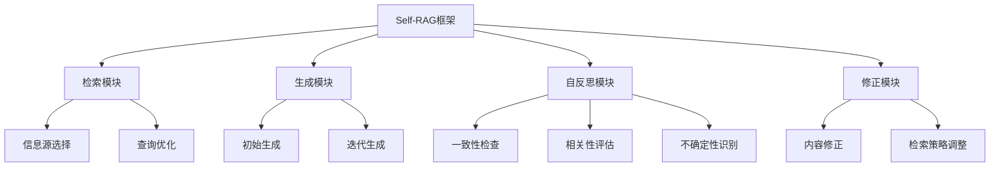

| 模块 | 主要功能 | 关键技术 | 输出 |
|------|----------|----------|------|
| 检索模块 | 获取相关信息 | 语义检索、查询扩展 | 相关文档集 |
| 生成模块 | 创建初始和修正内容 | 序列到序列模型、GPT | 生成的文本 |
| 自反思模块 | 评估生成内容质量 | 文本蕴含、一致性检查 | 评估报告 |
| 修正模块 | 基于评估改进内容 | 文本编辑、强化学习 | 修正后的文本 |

* 数学模型：
  Self-RAG可以用以下数学模型描述：

1. 检索函数：$R(q) = \{d_1, d_2, ..., d_k\}$，其中 $q$ 是查询，$d_i$ 是检索到的文档。

2. 生成函数：$G(q, R(q)) = y$，其中 $y$ 是生成的回答。

3. 评估函数：$E(y, R(q)) = (s_1, s_2, ..., s_m)$，其中 $s_i$ 是不同维度的评分。

4. 修正函数：$C(y, E(y, R(q))) = y'$，其中 $y'$ 是修正后的回答。

5. 迭代过程：
   $$y_{t+1} = C(y_t, E(y_t, R(q_t)))$$
   $$q_{t+1} = f(q_t, y_t, E(y_t, R(q_t)))$$

其中 $t$ 表示迭代次数，$f$ 是查询更新函数。

* 算法流程图：

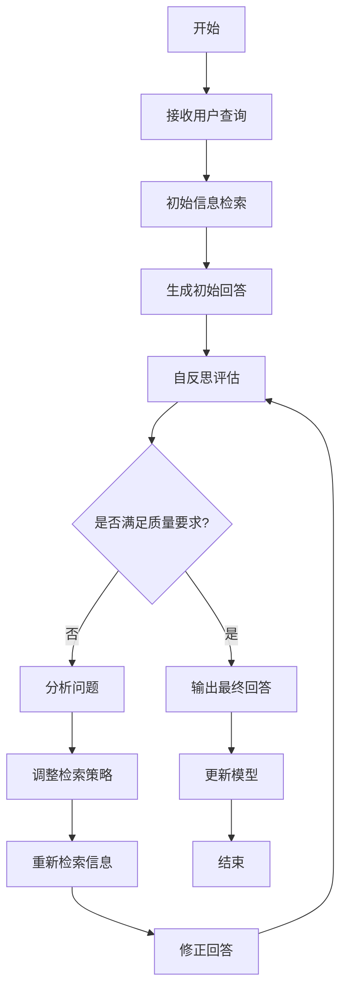

* 算法源代码：

```python
import numpy as np
from typing import List, Dict, Any

class SelfRAG:
    def __init__(self, retriever, generator, evaluator):
        self.retriever = retriever
        self.generator = generator
        self.evaluator = evaluator
        self.quality_threshold = 0.8

    def process_query(self, query: str, max_iterations: int = 3) -> str:
        documents = self.retriever.retrieve(query)
        answer = self.generator.generate(query, documents)
        
        for _ in range(max_iterations):
            evaluation = self.evaluator.evaluate(answer, documents)
            if evaluation['overall_score'] >= self.quality_threshold:
                break
            
            documents = self.retriever.refine(query, answer, evaluation)
            answer = self.generator.refine(query, answer, documents, evaluation)
        
        return answer

class Retriever:
    def retrieve(self, query: str) -> List[str]:
        # 实现检索逻辑
        pass

    def refine(self, query: str, answer: str, evaluation: Dict[str, float]) -> List[str]:
        # 实现检索优化逻辑
        pass

class Generator:
    def generate(self, query: str, documents: List[str]) -> str:
        # 实现生成逻辑
        pass

    def refine(self, query: str, previous_answer: str, documents: List[str], evaluation: Dict[str, float]) -> str:
        # 实现答案修正逻辑
        pass

class Evaluator:
    def evaluate(self, answer: str, documents: List[str]) -> Dict[str, float]:
        # 实现评估逻辑
        scores = {
            'factual_consistency': self._check_factual_consistency(answer, documents),
            'relevance': self._check_relevance(answer, documents),
            'coherence': self._check_coherence(answer),
            'uncertainty': self._check_uncertainty(answer)
        }
        scores['overall_score'] = np.mean(list(scores.values()))
        return scores

    def _check_factual_consistency(self, answer: str, documents: List[str]) -> float:
        # 实现事实一致性检查
        pass

    def _check_relevance(self, answer: str, documents: List[str]) -> float:
        # 实现相关性检查
        pass

    def _check_coherence(self, answer: str) -> float:
        # 实现连贯性检查
        pass

    def _check_uncertainty(self, answer: str) -> float:
        # 实现不确定性检查
        pass

# 使用示例
retriever = Retriever()
generator = Generator()
evaluator = Evaluator()
self_rag = SelfRAG(retriever, generator, evaluator)

query = "What are the potential impacts of artificial intelligence on future job markets?"
final_answer = self_rag.process_query(query)
print(final_answer)
```

* 实际场景应用：
1. 智能问答系统：
    - 应用：提供准确、相关且有深度的回答
    - Self-RAG优势：通过迭代提高回答质量，处理复杂多面的问题

2. 自动文献综述：
    - 应用：生成全面、准确的研究领域综述
    - Self-RAG优势：确保引用准确性，避免遗漏关键信息

3. 法律文书生成：
    - 应用：协助律师起草法律文件
    - Self-RAG优势：保证法律术语使用准确，逻辑论证严密

4. 医疗诊断辅助：
    - 应用：根据病历和症状提供初步诊断建议
    - Self-RAG优势：减少误诊风险，明确标注不确定信息

5. 个性化学习助手：
    - 应用：为学生提供定制的学习材料和解答
    - Self-RAG优势：根据学生反馈动态调整内容难度和深度

* 最佳实践 tips：
1. 多样化信息源：使用多元化的检索源，提高信息的全面性。
2. 渐进式评估：从基本事实一致性开始，逐步加入更复杂的评估维度。
3. 透明度设计：清晰展示自反思过程，增强用户信任。
4. 人机协作：在关键决策点引入人类专家审核。
5. 持续学习：收集用户反馈，不断优化评估标准和生成策略。
6. 领域适应：为不同应用领域定制评估指标和检索策略。
7. 效率优化：使用缓存机制和并行处理提高响应速度。
8. 隐私保护：在处理敏感信息时实施严格的数据安全措施。

* 行业发展与未来趋势：

| 时期 | 技术特征 | 应用焦点 | 主要挑战 |
|------|----------|----------|----------|
| 当前 | 基本自反思机制 | 提高生成内容准确性 | 计算效率和实时性 |
| 近期 | 多模态自反思 | 跨模态内容生成和验证 | 大规模知识整合 |
| 中期 | 深度语义理解 | 复杂推理和创新内容生成 | 处理抽象概念和隐含知识 |
| 远期 | 认知级自主学习 | 自适应知识构建和应用 | 伦理决策和创造力模拟 |

Self-RAG框架代表了AI系统向更高级认知能力发展的重要趋势。随着技术的进步，我们可以预见Self-RAG将朝着以下方向发展：

1. 多模态融合：整合文本、图像、音频等多种模态的信息，实现更全面的自我反思和生成。

2. 元认知能力：开发能够理解和改进自身思维过程的AI系统，实现更高层次的自我优化。

3. 持续学习：通过与用户的持续互动，不断更新和扩展知识库，提高长期表现。

4. 可解释性增强：提供更详细的推理过程解释，使用户能够理解和信任AI的决策。

5. 个性化适应：根据不同用户的需求和偏好，动态调整自反思和生成策略。

6. 伦理决策整合：在自反思过程中加入伦理考量，确保生成的内容符合道德标准。

7. 创造性思维：探索如何在保证准确性的同时，促进AI系统的创新能力。

8. 跨语言和跨文化适应：开发能够理解和处理不同语言和文化背景的Self-RAG系统。

这些发展将使Self-RAG成为更强大、更可靠的AI助手，能够在复杂的知识密集型任务中提供高质量的支持。然而，这也带来了新的挑战，如如何平衡自主性和可控性，如何处理潜在的偏见，以及如何在提高能力的同时保持系统的透明度和可解释性。未来的研究将需要多学科的合作，包括计算机科学、认知科学、伦理学等领域，以推动Self-RAG技术的负责任发展和应用。

## 5.3 工具使用模式（Tool Use Pattern）

### 5.3.1 工具使用模式的核心概念

* 核心概念：
  工具使用模式（Tool Use Pattern）是一种AI Agent架构设计模式，它使AI系统能够识别、选择和有效使用各种外部工具来完成复杂任务。这种模式模拟了人类使用工具解决问题的能力，使AI Agent能够扩展其功能范围，提高问题解决的效率和灵活性。

* 问题背景：
  随着AI系统面临的任务日益复杂和多样化，仅依靠内置功能已经无法满足所有需求。同时，大量专门的工具和API服务不断涌现，为AI提供了丰富的外部资源。如何让AI系统能够像人类一样灵活地使用这些工具，成为提升AI能力的关键问题。

* 问题描述：
1. 工具识别：如何让AI识别可用的工具及其功能。
2. 工具选择：如何在多个可用工具中选择最适合当前任务的工具。
3. 工具使用：如何正确调用和使用选定的工具。
4. 结果整合：如何将多个工具的输出整合成一个连贯的解决方案。
5. 错误处理：如何处理工具使用过程中可能出现的错误和异常。
6. 效率优化：如何在保证任务完成的同时，最小化工具调用次数。
7. 安全性：如何确保工具的安全使用，防止潜在的风险。

* 问题解决：
  工具使用模式通过以下机制解决上述问题：

1. 工具库和元数据：
    - 建立包含工具描述、输入输出规范的结构化工具库
    - 使用元数据标注工具功能、适用场景等信息

2. 上下文感知的工具选择：
    - 分析当前任务上下文和要求
    - 使用语义匹配算法选择最相关的工具

3. 参数化工具调用：
    - 设计统一的工具调用接口
    - 动态生成符合工具要求的参数

4. 结果解析和整合：
    - 定义标准化的工具输出格式
    - 使用自然语言处理技术解析和整合多个工具的输出

5. 错误处理和重试机制：
    - 实现工具调用的异常捕获和日志记录
    - 设计智能重试策略，包括参数调整和替代工具选择

6. 工具使用规划：
    - 使用规划算法优化工具使用序列
    - 实现并行工具调用以提高效率

7. 安全沙箱和权限控制：
    - 在隔离环境中执行工具调用
    - 实现细粒度的权限管理和访问控制

* 边界与外延：
  工具使用模式的应用需要考虑：
- 工具复杂度：从简单的API调用到复杂的软件操作
- 领域特异性：不同领域可能需要特定的工具集和使用策略
- 实时性要求：某些场景可能需要快速的工具选择和使用决策
- 资源限制：考虑计算资源、网络带宽等限制因素
- 可扩展性：支持新工具的动态添加和集成

* 概念结构与核心要素组成：

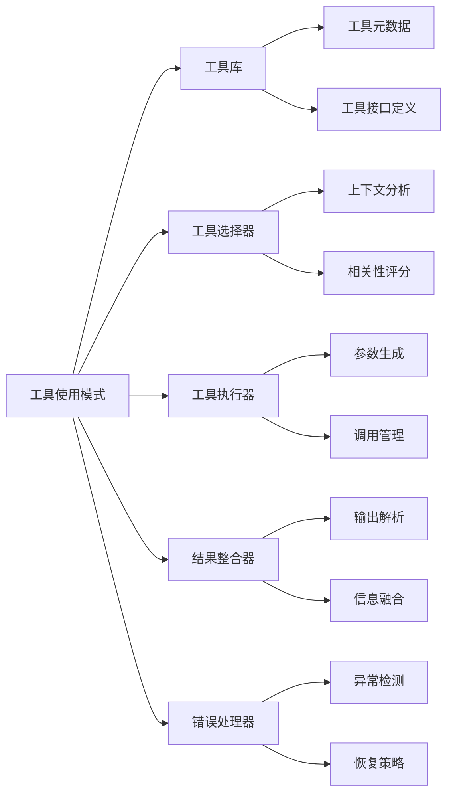

| 组件 | 主要功能 | 关键技术 | 输出 |
|------|----------|----------|------|
| 工具库 | 存储和管理工具信息 | 数据库、知识图谱 | 工具集合 |
| 工具选择器 | 选择合适的工具 | 语义匹配、决策树 | 工具列表 |
| 工具执行器 | 调用和管理工具执行 | API封装、并行处理 | 执行结果 |
| 结果整合器 | 整合多个工具的输出 | NLP、数据融合 | 综合结果 |
| 错误处理器 | 处理执行异常和错误 | 异常处理、重试逻辑 | 错误报告 |

* 数学模型：
  工具选择过程可以建模为一个多准则决策问题：

1. 定义工具集合 $T = \{t_1, t_2, ..., t_n\}$

2. 对于每个工具 $t_i$，定义特征向量 $f_i = (f_{i1}, f_{i2}, ..., f_{im})$，表示工具的各种属性

3. 给定任务上下文 $c$，定义相关性函数 $R(t_i, c)$

4. 工具选择问题可以表示为：

   $$t^* = \arg\max_{t_i \in T} R(t_i, c)$$

5. 相关性函数可以定义为特征向量和上下文的加权内积：

   $$R(t_i, c) = \sum_{j=1}^m w_j f_{ij} \cdot c_j$$

   其中 $w_j$ 是每个特征的权重，$c_j$ 是上下文的对应分量

* 算法流程图：

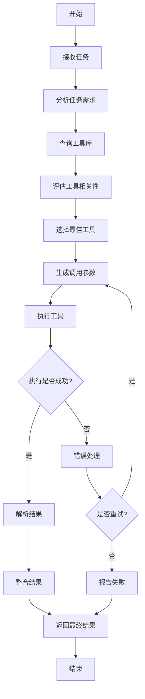

* 算法源代码：

```python
from typing import List, Dict, Any
import numpy as np

class Tool:
    def __init__(self, name: str, function: callable, features: List[float]):
        self.name = name
        self.function = function
        self.features = np.array(features)

class ToolUseAgent:
    def __init__(self, tools: List[Tool]):
        self.tools = tools
        self.context_weights = np.ones(len(tools[0].features))  # 初始化上下文权重

    def select_tool(self, context: List[float]) -> Tool:
        context_vector = np.array(context)
        relevance_scores = [np.dot(tool.features, self.context_weights * context_vector) for tool in self.tools]
        return self.tools[np.argmax(relevance_scores)]

    def use_tool(self, tool: Tool, params: Dict[str, Any]) -> Any:
        try:
            return tool.function(**params)
        except Exception as e:
            print(f"Error using {tool.name}: {str(e)}")
            return None

    def execute_task(self, task: str, context: List[float]) -> Any:
        selected_tool = self.select_tool(context)
        params = self.generate_params(task, selected_tool)
        result = self.use_tool(selected_tool, params)
        
        if result is None:
            # 简单的重试逻辑
            alternative_tool = self.select_alternative_tool(context, excluded=[selected_tool])
            if alternative_tool:
                params = self.generate_params(task, alternative_tool)
                result = self.use_tool(alternative_tool, params)
        
        return self.process_result(result)

    def generate_params(self, task: str, tool: Tool) -> Dict[str, Any]:
        # 这里应该实现参数生成逻辑
        # 简化示例：假设任务直接作为参数
        return {"task": task}

    def select_alternative_tool(self, context: List[float], excluded: List[Tool]) -> Tool:
        available_tools = [tool for tool in self.tools if tool not in excluded]
        if not available_tools:
            return None
        return self.select_tool(context)

    def process_result(self, result: Any) -> Any:
        # 这里应该实现结果处理逻辑
        # 简化示例：直接返回结果
        return result

# 使用示例
def calculator(operation: str, x: float, y: float) -> float:
    if operation == "add":
        return x + y
    elif operation == "multiply":
        return x * y
    else:
        raise ValueError("Unsupported operation")

def text_analyzer(text: str) -> Dict[str, Any]:
    return {
        "word_count": len(text.split()),
        "char_count": len(text)
    }

tools = [
    Tool("Calculator", calculator, [1, 0, 0]),
    Tool("TextAnalyzer", text_analyzer, [0, 1, 0])
]

agent = ToolUseAgent(tools)

# 数学任务
result1 = agent.execute_task("add 5 and 3", [1, 0, 0])
print(f"5 + 3 = {result1}")

# 文本分析任务
result2 = agent.execute_task("Analyze: Hello, world!", [0, 1, 0])
print(f"Text analysis result: {result2}")
```

* 实际场景应用：
1. 智能个人助理：
    - 应用：集成日历、邮件、天气等多种工具，协助日常任务管理
    - 工具使用：根据用户请求选择并调用适当的服务API

2. 自动化软件测试：
    - 应用：使用各种测试工具执行功能、性能、安全性测试
    - 工具使用：基于测试需求选择合适的测试框架和工具

3. 数据分析管道：
    - 应用：整合数据清洗、转换、分析、可视化等工具
    - 工具使用：根据数据特征和分析目标选择并编排工具使用顺序

4. 智能客服系统：
    - 应用：利用知识库、情感分析、问题分类等工具回答客户询问
    - 工具使用：根据客户问题类型选择合适的处理工具

5. 自动化代码审查：
    - 应用：集成静态分析、风格检查、安全扫描等工具
    - 工具使用：根据代码特征和项目要求选择并执行相关工具

* 最佳实践 tips：
1. 工具抽象：设计统一的工具接口，简化集成和管理
2. 动态发现：实现工具的动态注册和发现机制，支持灵活扩展
3. 上下文缓存：缓存工具调用上下文，减少重复计算
4. 并行执行：在可能的情况下并行调用多个工具，提高效率
5. 结果缓存：缓存常用工具调用结果，加快响应速度
6. 渐进式重试：实现渐进式的错误恢复策略，提高容错能力
7. 用户反馈：收集用户对工具使用效果的反馈，持续优化选择策略
8. 安全控制：实施细粒度的访问控制和监控，确保工具使用安全

* 行业发展与未来趋势：

| 时期 | 技术特征 | 应用焦点 | 主要挑战 |
|------|----------|----------|----------|
| 当前 | 基于规则的工具选择 | 特定领域任务自动化 | 工具集成和兼容性 |
| 近期 | 智能工具推荐 | 跨领域智能助手 | 上下文理解和工具组合 |
| 中期 | 自主工具学习和创造 | 复杂问题求解 | 工具使用的创新性和安全性 |
| 远期 | 认知级工具理解和使用 | 通用人工智能辅助 | 伦理决策和人机协作 |

工具使用模式的发展将极大地扩展AI系统的能力边界。未来的趋势包括：

1. 工具学习：AI系统能够自主学习新工具的使用方法。
2. 工具创造：AI能够根据需求设计和创造新的工具。
3. 元工具使用：使用工具来优化和管理其他工具的使用。
4. 跨模态工具整合：融合物理和数字工具，支持更复杂的任务。
5. 协作工具使用：多个AI系统协同使用工具解决问题。
6. 情境感知工具适配：根据环境和用户状态动态调整工具使用策略。
7. 伦理工具使用：在工具选择和使用过程中考虑伦理因素。
8. 可解释的工具使用：提供清晰的工具选择和使用理由，增强可信度。

这些发展将使AI系统在处理复杂、开放性问题时更加灵活和高效，同时也带来了新的挑战，如如何确保AI系统正确理解和使用工具，如何管理日益复杂的工具生态系统，以及如何在增强系统能力的同时保持可控性和安全性。未来的研究将需要跨学科的合作，结合认知科学、软件工程、伦理学等领域的知识，推动工具使用模式向更智能、更安全、更有益于人类的方向发展。

### 5.3.2 常见外部工具集成方法

* 核心概念：
  外部工具集成是指将各种独立的软件工具、服务或API整合到AI Agent系统中，使其能够扩展功能、增强能力并更有效地完成复杂任务的过程。这种集成使AI Agent能够利用专门的工具来处理特定的子任务，从而提高整体性能和灵活性。

* 问题背景：
  随着AI系统的应用范围不断扩大，单一的AI模型或算法往往无法满足所有需求。同时，大量专业工具和服务的出现为AI系统提供了丰富的外部资源。如何有效地将这些外部工具整合到AI系统中，成为提升系统能力和适应性的关键问题。

* 问题描述：
1. 接口兼容性：如何处理不同工具的接口差异。
2. 数据格式转换：如何在AI系统和外部工具之间转换数据格式。
3. 性能开销：如何minimise 外部工具调用带来的性能开销。
4. 错误处理：如何优雅地处理外部工具可能出现的错误和异常。
5. 版本管理：如何管理和更新集成的外部工具。
6. 安全性：如何确保外部工具的安全使用。
7. 可扩展性：如何设计系统以便于未来集成新的工具。

* 问题解决：
  以下是几种常见的外部工具集成方法：

1. API封装：
    - 为每个外部工具创建统一的API封装层
    - 使用适配器模式处理接口差异

2. 微服务架构：
    - 将每个外部工具封装为独立的微服务
    - 使用服务发现和负载均衡技术管理工具调用

3. 插件系统：
    - 设计插件接口，允许外部工具作为插件集成
    - 实现插件的动态加载和卸载机制

4. 消息队列：
    - 使用消息队列系统协调AI系统和外部工具之间的通信
    - 实现异步调用和解耦

5. 容器化集成：
    - 使用容器技术（如Docker）封装外部工具
    - 通过容器编排（如Kubernetes）管理工具的部署和扩展

6. 函数即服务（FaaS）：
    - 将外部工具封装为无服务器函数
    - 利用云平台的FaaS服务实现工具的按需调用

7. RPA（机器人流程自动化）：
    - 使用RPA工具模拟人类操作来集成难以直接API调用的工具
    - 适用于遗留系统或缺乏API的工具

8. 语义网络集成：
    - 使用语义网技术描述工具功能和接口
    - 实现基于语义的工具发现和调用

* 边界与外延：
  外部工具集成方法的选择需要考虑以下因素：
- 工具复杂度：从简单的API调用到复杂的软件系统
- 集成深度：从浅层的数据交换到深层的功能融合
- 实时性要求：同步调用vs异步处理
- 安全要求：数据敏感性和访问控制需求
- 扩展性：未来可能需要集成的工具类型和数量

* 概念结构与核心要素组成：

```mermaid
graph TD
    A[外部工具集成] --> B[接口层]
    A --> C[数据转换层]
    A --> D[调用管理层]
    A --> E[错误处理层]
    A --> F[安全层]
    B --> G[API封装]
    B --> H[协议适配]
    C --> I[序列化/反序列化]
    C --> J[格式转换]
    D --> K[负载均衡]
    D --> L[超时控制]
    E --> M[异常捕获]
    E --> N[重试机制]
    F --> O[认证授权]
    F --> P[数据加密]
```

| 集成方法 | 主要优势 | 适用场景 | 技术复杂度 |
|----------|----------|----------|------------|
| API封装 | 简单直接 | 工具数量少，接口稳定 | 低 |
| 微服务架构 | 高度解耦，可扩展 | 大规模、复杂系统 | 高 |
| 插件系统 | 灵活，易扩展 | 需要频繁添加新工具 | 中 |
| 消息队列 | 异步处理，解耦 | 高并发，低实时性要求 | 中 |
| 容器化集成 | 环境一致，易部署 | 工具有复杂依赖 | 中高 |
| FaaS | 按需使用，低维护 | 短暂、轻量级任务 | 中 |
| RPA | 可集成无API系统 | 遗留系统集成 | 中高 |
| 语义网络集成 | 智能发现和调用 | 动态、异构环境 | 高 |

* 数学模型：
  以微服务架构中的负载均衡为例，可以使用加权轮询算法：

1. 定义工具集合 $T = \{t_1, t_2, ..., t_n\}$，每个工具 $t_i$ 的权重为 $w_i$

2. 计算总权重 $W = \sum_{i=1}^n w_i$

3. 对于第 $k$ 次请求，选择的工具索引 $i$ 满足：

   $$i = \arg\min_j \left\{ j : \sum_{l=1}^j w_l > (k \mod W) \right\}$$

4. 调用选中的工具 $t_i$

* 算法流程图：
  以API封装方法为例：

```mermaid
graph TD
    A[开始] --> B[接收调用请求]
    B --> C[解析请求参数]
    C --> D[选择目标工具]
    D --> E[转换输入格式]
    E --> F[调用外部工具API]
    F --> G{调用是否成功?}
    G -- 是 --> H[解析响应]
    G -- 否 --> I[错误处理]
    I --> J[重试或报告错误]
    H --> K[转换输出格式]
    J --> L[返回结果]
    K --> L
    L --> M[结束]
```

* 算法源代码：
  以下是一个简化的API封装示例：

```python
import requests
from typing import Dict, Any, List

class ToolWrapper:
    def __init__(self, base_url: str, endpoints: Dict[str, str]):
        self.base_url = base_url
        self.endpoints = endpoints

    def call(self, tool_name: str, params: Dict[str, Any]) -> Any:
        if tool_name not in self.endpoints:
            raise ValueError(f"Unknown tool: {tool_name}")

        endpoint = self.endpoints[tool_name]
        url = f"{self.base_url}{endpoint}"

        try:
            response = requests.post(url, json=params)
            response.raise_for_status()
            return response.json()
        except requests.RequestException as e:
            print(f"Error calling {tool_name}: {str(e)}")
            return None

class ToolIntegrator:
    def __init__(self, tools: List[ToolWrapper]):
        self.tools = {tool.__class__.__name__: tool for tool in tools}

    def use_tool(self, tool_name: str, operation: str, params: Dict[str, Any]) -> Any:
        if tool_name not in self.tools:
            raise ValueError(f"Tool {tool_name} not integrated")

        tool = self.tools[tool_name]
        return tool.call(operation, params)

# 使用示例
calculator_tool = ToolWrapper(
    "http://api.calculator.com/",
    {"add": "/add", "subtract": "/subtract"}
)

text_tool = ToolWrapper(
    "http://api.textprocessor.com/",
    {"analyze": "/analyze", "translate": "/translate"}
)

integrator = ToolIntegrator([calculator_tool, text_tool])

# 使用计算器工具
result1 = integrator.use_tool("ToolWrapper", "add", {"x": 5, "y": 3})
print(f"5 + 3 = {result1}")

# 使用文本处理工具
result2 = integrator.use_tool("ToolWrapper", "analyze", {"text": "Hello, world!"})
print(f"Text analysis result: {result2}")
```

* 实际场景应用：
1. 智能客服平台：
    - 集成方法：微服务架构
    - 工具集成：知识库查询、情感分析、问题分类、对话管理
    - 优势：可以独立扩展和更新各个功能模块

2. 数据分析平台：
    - 集成方法：插件系统
    - 工具集成：数据清洗、统计分析、机器学习、数据可视化
    - 优势：用户可以根据需求安装和使用不同的分析工具

3. 自动化测试框架：
    - 集成方法：容器化集成
    - 工具集成：单元测试、UI测试、性能测试、安全测试
    - 优势：保证测试环境的一致性，易于部署和扩展

4. 智能家居控制系统：
    - 集成方法：消息队列
    - 工具集成：各种智能设备控制API（灯光、温度、安防等）
    - 优势：异步处理大量设备状态更新，提高系统响应性

5. 代码审查助手：
    - 集成方法：FaaS
    - 工具集成：静态代码分析、风格检查、依赖扫描
    - 优势：按需触发分析任务，节省资源

* 最佳实践 tips：
1. 标准化接口：定义统一的工具集成接口规范，简化集成过程
2. 异步处理：对于耗时操作，使用异步调用方式提高系统响应性
3. 熔断机制：实现服务熔断，防止单个工具故障影响整个系统
4. 版本控制：对集成的工具实施版本管理，确保兼容性
5. 监控和日志：建立全面的监控和日志系统，及时发现和解决问题
6. 缓存策略：合理使用缓存，减少重复调用，提高性能
7. 权限管理：实现细粒度的访问控制，确保工具使用的安全性
8. 文档化：详细记录每个工具的集成方法、使用方式和注意事项

* 行业发展与未来趋势：

| 时期 | 技术特征 | 应用焦点 | 主要挑战 |
|------|----------|----------|----------|
| 当前 | API驱动集成 | 功能扩展和自动化 | 接口标准化和兼容性 |
| 近期 | 智能集成和编排 | 自适应系统和动态集成 | 工具发现和上下文理解 |
| 中期 | 认知集成 | 复杂问题解决和创新 | 工具组合的优化和创新 |
| 远期 | 自主工具生态系统 | 通用人工智能 | 伦理和控制问题 |

外部工具集成方法的未来发展趋势包括：

1. 智能工具发现：AI系统能够自动发现和评估新的工具。
2. 动态工具组合：根据任务需求实时组合和配置工具链。
3. 跨模态工具集成：整合物理和数字工具，支持更复杂的任务场景。
4. 自学习接口适配：AI系统能够自主学习和适应新工具的接口。
5. 协作工具使用：多个AI系统协同使用和共享工具资源。
6. 工具使用的可解释性：提供清晰的工具选择和使用理由。
7. 安全性增强：开发更先进的沙箱技术和审计机制。
8. 认知级工具理解：AI系统能够理解工具的深层功能和适用场景。

这些趋势将推动AI系统向更智能、更灵活、更强大的方向发展。然而，也带来了新的挑战，如如何管理日益复杂的工具生态系统，如何确保工具使用的安全性和可控性，以及如何在提高系统自主性的同时保持人类的监督和控制。未来的研究将需要跨学科的合作，结合系统架构、认知科学、安全工程等多个领域的知识，以推动外部工具集成技术的负责任发展和应用。

### 5.3.3 API 和插件系统设计

* 核心概念：
  API（应用程序接口）和插件系统设计是一种允许AI Agent灵活扩展功能和集成外部工具的架构方法。API提供了标准化的接口，使外部工具能够与AI系统进行交互，而插件系统则允许动态地添加、移除和管理这些外部工具，从而增强系统的可扩展性和适应性。

* 问题背景：
  随着AI系统的复杂性增加和应用场景的多样化，设计一个能够灵活应对各种需求的系统变得越来越重要。传统的单一功能AI系统难以适应快速变化的需求，而完全重新设计和开发又耗时耗力。因此，一个well-designed的API和插件系统成为解决这一问题的关键。

* 问题描述：
1. 接口标准化：如何设计统一且灵活的API接口。
2. 插件管理：如何实现插件的动态加载、卸载和版本控制。
3. 安全性：如何确保API调用和插件运行的安全性。
4. 性能优化：如何minimise API调用和插件执行对系统性能的影响。
5. 数据交换：如何处理AI系统和插件之间的数据交换。
6. 错误处理：如何优雅地处理API调用和插件执行中的错误。
7. 文档和开发者支持：如何为API和插件开发者提供清晰的文档和支持。

* 问题解决：
  以下是API和插件系统设计的关键方法：

1. RESTful API设计：
    - 使用HTTP方法（GET, POST, PUT, DELETE等）定义资源操作
    - 采用JSON或XML作为数据交换格式
    - 实现版本控制（如通过URL路径或请求头）

2. GraphQL API：
    - 允许客户端精确指定所需数据
    - 减少over-fetching和under-fetching问题
    - 提供强类型架构

3. 插件注册机制：
    - 实现插件元数据声明（如名称、版本、依赖等）
    - 设计插件生命周期管理（安装、激活、停用、卸载）
    - 提供插件间依赖解析

4. 沙箱执行环境：
    - 隔离插件运行环境，防止对主系统的影响
    - 实现资源限制和访问控制

5. 事件驱动架构：
    - 使用发布-订阅模式进行系统和插件间的通信
    - 允许插件注册自定义事件处理器

6. 插件SDK：
    - 提供开发套件，简化插件开发过程
    - 包含常用功能库和开发工具

7. 服务发现：
    - 实现动态服务注册和发现机制
    - 支持负载均衡和故障转移

8. 认证和授权：
    - 实现OAuth 2.0或JWT等认证机制
    - 提供细粒度的权限控制

* 边界与外延：
  API和插件系统设计需要考虑：
- 可扩展性：支持未来功能的扩展和新技术的集成
- 向后兼容性：确保API更新不会破坏现有客户端
- 跨平台支持：考虑不同操作系统和编程语言的兼容性
- 性能和可伸缩性：设计能够处理高并发和大规模数据的系统

* 概念结构与核心要素组成：

```mermaid
graph TD
    A[API和插件系统] --> B[API层]
    A --> C[插件管理器]
    A --> D[安全模块]
    A --> E[数据交换层]
    B --> F[RESTful API]
    B --> G[GraphQL API]
    C --> H[插件注册]
    C --> I[生命周期管理]
    D --> J[认证授权]
    D --> K[沙箱执行]
    E --> L[序列化/反序列化]
    E --> M[数据验证]
```

| 组件 | 主要功能 | 关键技术 | 输出 |
|------|----------|----------|------|
| API层 | 提供外部接口 | RESTful, GraphQL | API端点 |
| 插件管理器 | 管理插件生命周期 | 动态加载, 依赖解析 | 插件实例 |
| 安全模块 | 确保系统安全 | OAuth, 沙箱技术 | 安全策略 |
| 数据交换层 | 处理数据传输 | JSON, Protocol Buffers | 规范化数据 |

* 数学模型：
  以插件依赖解析为例，可以使用图论中的拓扑排序算法：

1. 将插件集合表示为有向图 $G = (V, E)$，其中 $V$ 是插件集，$E$ 是依赖关系集。

2. 对图 $G$ 进行拓扑排序：

   ```python
   def topological_sort(graph):
       in_degree = {v: 0 for v in graph}
       for v in graph:
           for neighbor in graph[v]:
               in_degree[neighbor] += 1
       
       queue= [v for v in graph if in_degree[v] == 0]
       result = []
       
       while queue:
           v = queue.pop(0)
           result.append(v)
           for neighbor in graph[v]:
               in_degree[neighbor] -= 1
               if in_degree[neighbor] == 0:
                   queue.append(neighbor)
       
       if len(result) != len(graph):
           return None  # 存在循环依赖
       return result
   ```

3. 拓扑排序的结果即为插件的安装顺序。

* 算法流程图：
  API调用处理流程：

```mermaid
graph TD
    A[开始] --> B[接收API请求]
    B --> C[认证和授权]
    C --> D{认证是否通过?}
    D -- 否 --> E[返回错误响应]
    D -- 是 --> F[解析请求参数]
    F --> G[验证参数]
    G --> H{参数是否有效?}
    H -- 否 --> E
    H -- 是 --> I[调用相应的处理器]
    I --> J[执行业务逻辑]
    J --> K[格式化响应]
    K --> L[返回响应]
    L --> M[结束]
    E --> M
```

* 算法源代码：
  以下是一个简化的API和插件系统设计示例：

```python
from typing import Dict, Any, List
import importlib
import json

class API:
    def __init__(self):
        self.routes = {}

    def route(self, path):
        def decorator(f):
            self.routes[path] = f
            return f
        return decorator

    def handle_request(self, path: str, params: Dict[str, Any]) -> Dict[str, Any]:
        if path not in self.routes:
            return {"error": "Not Found"}
        try:
            result = self.routes[path](**params)
            return {"result": result}
        except Exception as e:
            return {"error": str(e)}

class PluginManager:
    def __init__(self):
        self.plugins = {}

    def load_plugin(self, name: str):
        try:
            module = importlib.import_module(f"plugins.{name}")
            plugin = module.Plugin()
            self.plugins[name] = plugin
            return True
        except ImportError:
            return False

    def unload_plugin(self, name: str):
        if name in self.plugins:
            del self.plugins[name]
            return True
        return False

    def get_plugin(self, name: str):
        return self.plugins.get(name)

class AISystem:
    def __init__(self):
        self.api = API()
        self.plugin_manager = PluginManager()

        @self.api.route("/load_plugin")
        def load_plugin(name: str):
            success = self.plugin_manager.load_plugin(name)
            return "Plugin loaded successfully" if success else "Failed to load plugin"

        @self.api.route("/unload_plugin")
        def unload_plugin(name: str):
            success = self.plugin_manager.unload_plugin(name)
            return "Plugin unloaded successfully" if success else "Failed to unload plugin"

        @self.api.route("/use_plugin")
        def use_plugin(name: str, method: str, **kwargs):
            plugin = self.plugin_manager.get_plugin(name)
            if not plugin:
                return "Plugin not found"
            if not hasattr(plugin, method):
                return "Method not found in plugin"
            return getattr(plugin, method)(**kwargs)

    def handle_request(self, path: str, params: Dict[str, Any]) -> str:
        result = self.api.handle_request(path, params)
        return json.dumps(result)

# 使用示例
ai_system = AISystem()

# 加载插件
print(ai_system.handle_request("/load_plugin", {"name": "math_plugin"}))

# 使用插件
print(ai_system.handle_request("/use_plugin", {"name": "math_plugin", "method": "add", "a": 5, "b": 3}))

# 卸载插件
print(ai_system.handle_request("/unload_plugin", {"name": "math_plugin"}))
```

* 实际场景应用：
1. 智能家居控制平台：
    - API：提供设备控制、状态查询、场景设置等接口
    - 插件：各种智能设备的驱动程序作为插件集成
    - 优势：轻松添加新设备支持，实现设备间的互操作

2. 数据分析平台：
    - API：提供数据导入、处理、分析、可视化等接口
    - 插件：各种专门的数据处理算法和可视化工具作为插件
    - 优势：用户可以根据需求选择和组合不同的分析工具

3. 内容管理系统（CMS）：
    - API：提供内容创建、编辑、发布、搜索等接口
    - 插件：SEO优化、多语言支持、社交媒体集成等功能作为插件
    - 优势：灵活定制CMS功能，适应不同类型的网站需求

4. 电子商务平台：
    - API：提供商品管理、订单处理、用户账户等接口
    - 插件：支付网关、物流集成、推荐系统等作为插件
    - 优势：易于集成各种第三方服务，提高平台功能性

5. 游戏开发引擎：
    - API：提供渲染、物理引擎、音频处理等核心功能接口
    - 插件：特效系统、AI行为树、网络同步等高级功能作为插件
    - 优势：开发者可以自由选择需要的功能模块，优化游戏性能

* 最佳实践 tips：
1. API版本控制：使用URL路径或请求头指定API版本，确保向后兼容性
2. 限流和熔断：实现请求限流和服务熔断机制，保护系统免受过载
3. 文档自动生成：使用工具自动从代码生成API文档，保持文档的及时性
4. 插件依赖管理：实现插件间依赖的自动解析和管理，避免版本冲突
5. 安全性检查：对插件进行安全性审核，防止恶意插件危害系统
6. 性能监控：实施全面的性能监控，及时发现和解决API和插件的性能问题
7. 错误处理标准化：定义统一的错误响应格式，便于客户端处理异常情况
8. 开发者社区：建立活跃的开发者社区，促进API和插件生态系统的发展

* 行业发展与未来趋势：

| 时期 | 技术特征 | 应用焦点 | 主要挑战 |
|------|----------|----------|----------|
| 当前 | RESTful API, 基本插件系统 | 功能扩展, 第三方集成 | API设计标准化, 插件安全性 |
| 近期 | GraphQL, 微服务API网关 | 灵活数据查询, 服务编排 | 性能优化, 分布式系统复杂性 |
| 中期 | AI辅助API设计, 自适应插件 | 智能化服务组合, 上下文感知插件 | API语义理解, 动态服务适配 |
| 远期 | 认知API, 自进化插件生态 | 意图驱动的服务调用, 自组织系统 | 人机协作界面, 伦理和控制问题 |

API和插件系统的未来发展趋势包括：

1. 意图驱动API：基于自然语言理解，允许通过描述意图来调用API。
2. 自适应API：根据使用情况自动调整API结构和功能。
3. AI辅助插件开发：使用AI技术辅助开发者设计和实现插件。
4. 跨平台插件标准：建立统一的跨平台、跨语言插件标准。
5. 实时协作API：支持多个客户端实时协作的API设计。
6. 区块链集成：利用区块链技术增强API调用的安全性和可追溯性。
7. 边缘计算支持：设计支持边缘设备的轻量级API和插件系统。
8. 自我修复系统：开发能够自动检测和修复API和插件问题的系统。

这些趋势将推动API和插件系统向更智能、更灵活、更安全的方向发展。然而，也带来了新的挑战，如如何确保系统的可控性和透明度，如何处理日益复杂的依赖关系，以及如何在提高系统灵活性的同时保证稳定性。未来的研究将需要在软件工程、人工智能、安全技术等多个领域的交叉点上进行创新，以应对这些挑战并充分发挥API和插件系统的潜力。

### 5.3.4 工具选择与调用策略

* 核心概念：
  工具选择与调用策略是指AI系统在面对复杂任务时，如何智能地选择合适的工具，并制定有效的调用顺序和方法，以最优化地完成任务。这个过程涉及对任务需求的理解、对可用工具能力的评估，以及对工具使用效果的预测和优化。

* 问题背景：
  随着AI系统可用工具的数量和复杂性不断增加，简单的预定义规则或随机选择已经无法满足高效完成任务的需求。同时，不同任务对工具的需求差异很大，需要一个灵活且智能的策略来做出最佳选择和调用决策。

* 问题描述：
1. 任务分析：如何准确理解任务需求和上下文。
2. 工具评估：如何评估每个工具的能力和适用性。
3. 组合优化：如何选择和组合多个工具以完成复杂任务。
4. 序列决策：如何决定工具调用的最佳顺序。
5. 资源平衡：如何在效果和资源消耗之间取得平衡。
6. 适应性调整：如何根据执行结果动态调整策略。
7. 不确定性处理：如何处理工具性能和任务环境的不确定性。

* 问题解决：
  以下是工具选择与调用策略的关键方法：

1. 基于规则的选择：
    - 使用预定义的规则集来匹配任务需求和工具能力
    - 适用于结构化程度高的任务

2. 机器学习驱动的选择：
    - 使用监督学习模型预测工具的适用性
    - 基于历史数据训练模型，学习任务特征和工具性能之间的关系

3. 强化学习方法：
    - 将工具选择建模为顺序决策问题
    - 使用强化学习算法优化长期效果

4. 启发式搜索：
    - 使用启发式算法（如A*）搜索最佳工具组合
    - 定义合适的评估函数来指导搜索过程

5. 元学习策略：
    - 学习如何针对不同类型的任务选择工具
    - 快速适应新的任务类型和工具集

6. 多臂赌博机模型：
    - 将每个工具视为一个"臂"，使用探索-利用策略
    - 适用于需要在线学习和适应的场景

7. 基于知识图谱的推理：
    - 构建任务、工具和领域知识的知识图谱
    - 使用图算法和语义推理选择工具

8. 协同过滤方法：
    - 基于相似任务的历史选择推荐工具
    - 利用群体智慧优化工具选择

* 边界与外延：
  工具选择与调用策略需要考虑：
- 任务多样性：策略需要适应各种不同类型和复杂度的任务
- 工具动态性：能够处理工具集的动态变化（如新工具添加、旧工具移除）
- 计算复杂度：在决策时间和决策质量之间取得平衡
- 可解释性：能够解释工具选择的理由，便于人类理解和干预

* 概念结构与核心要素组成：

```mermaid
graph TD
    A[工具选择与调用策略] --> B[任务分析器]
    A --> C[工具评估器]
    A --> D[策略生成器]
    A --> E[执行管理器]
    B --> F[特征提取]
    B --> G[需求分解]
    C --> H[能力匹配]
    C --> I[性能预测]
    D --> J[选择算法]
    D --> K[序列优化]
    E --> L[调用协调]
    E --> M[结果分析]
```

| 组件 | 主要功能 | 关键技术 | 输出 |
|------|----------|----------|------|
| 任务分析器 | 理解任务需求 | NLP、知识图谱 | 任务特征向量 |
| 工具评估器 | 评估工具适用性 | 机器学习、专家系统 | 工具评分 |
| 策略生成器 | 生成工具选择策略 | 强化学习、组合优化 | 工具调用计划 |
| 执行管理器 | 管理工具调用过程 | 并行计算、异常处理 | 执行结果 |

* 数学模型：
  以强化学习方法为例，可以将工具选择建模为马尔可夫决策过程（MDP）：

1. 状态空间 $S$：当前任务状态和已使用工具的历史
2. 动作空间 $A$：可选择的工具集合
3. 转移函数 $P(s'|s,a)$：描述使用工具后任务状态的变化
4. 奖励函数 $R(s,a,s')$：评估工具使用的即时效果
5. 策略 $\pi(a|s)$：决定在给定状态下选择工具的概率分布

目标是找到最优策略 $\pi^*$，使得期望累积奖励最大化：

$$V^{\pi^*}(s) = \max_{\pi} \mathbb{E}\left[\sum_{t=0}^{\infty} \gamma^t R(s_t, a_t, s_{t+1}) | \pi\right]$$

其中 $\gamma$ 是折扣因子，$0 < \gamma \leq 1$。

* 算法流程图：

```mermaid
graph TD
    A[开始] --> B[接收任务]
    B --> C[分析任务需求]
    C --> D[初始化候选工具集]
    D --> E[评估工具适用性]
    E --> F[生成工具选择策略]
    F --> G[选择下一个工具]
    G --> H[调用选中的工具]
    H --> I[分析执行结果]
    I --> J{任务是否完成?}
    J -- 否 --> K[更新任务状态]
    K --> E
    J -- 是 --> L[生成最终输出]
    L --> M[结束]
```

* 算法源代码：

```python
import numpy as np
from typing import List, Dict, Any

class Tool:
    def __init__(self, name: str, function: callable, features: List[float]):
        self.name = name
        self.function = function
        self.features = np.array(features)

class ToolSelector:
    def __init__(self, tools: List[Tool], learning_rate: float = 0.1, discount_factor: float = 0.9):
        self.tools = tools
        self.learning_rate = learning_rate
        self.discount_factor = discount_factor
        self.q_table = {}  # 状态-动作值函数

    def get_state_key(self, task_features: List[float]) -> str:
        return ','.join(map(str, task_features))

    def select_tool(self, task_features: List[float], epsilon: float = 0.1) -> Tool:
        state_key = self.get_state_key(task_features)
        if state_key not in self.q_table:
            self.q_table[state_key] = np.zeros(len(self.tools))

        if np.random.random() < epsilon:
            return np.random.choice(self.tools)  # 探索
        else:
            return self.tools[np.argmax(self.q_table[state_key])]  # 利用

    def update_q_value(self, task_features: List[float], tool_index: int, reward: float, next_task_features: List[float]):
        state_key = self.get_state_key(task_features)
        next_state_key = self.get_state_key(next_task_features)

        if next_state_key not in self.q_table:
            self.q_table[next_state_key] = np.zeros(len(self.tools))

        current_q = self.q_table[state_key][tool_index]
        max_next_q = np.max(self.q_table[next_state_key])
        new_q = current_q + self.learning_rate * (reward + self.discount_factor * max_next_q - current_q)
        self.q_table[state_key][tool_index] = new_q

class TaskExecutor:
    def __init__(self, tool_selector: ToolSelector):
        self.tool_selector = tool_selector

    def execute_task(self, task_features: List[float], max_steps: int = 10) -> List[str]:
        execution_history = []
        for _ in range(max_steps):
            selected_tool = self.tool_selector.select_tool(task_features)
            result = selected_tool.function(task_features)
            execution_history.append(f"Used {selected_tool.name}: {result}")

            reward = self.calculate_reward(result)
            next_task_features = self.update_task_features(task_features, result)
            
            tool_index = self.tool_selector.tools.index(selected_tool)
            self.tool_selector.update_q_value(task_features, tool_index, reward, next_task_features)

            if self.is_task_complete(next_task_features):
                break

            task_features = next_task_features

        return execution_history

    def calculate_reward(self, result: Any) -> float:
        # 实现奖励计算逻辑
        return 1.0 if result is not None else 0.0

    def update_task_features(self, current_features: List[float], result: Any) -> List[float]:
        # 实现任务特征更新逻辑
        return [f + 0.1 for f in current_features]  # 简化示例

    def is_task_complete(self, task_features: List[float]) -> bool:
        # 实现任务完成判断逻辑
        return sum(task_features) > 5.0  # 简化示例

# 使用示例
def tool_a(features):
    return "Tool A result"

def tool_b(features):
    return "Tool B result"

tools = [
    Tool("Tool A", tool_a, [1, 0, 0]),
    Tool("Tool B", tool_b, [0, 1, 0])
]

tool_selector = ToolSelector(tools)
executor = TaskExecutor(tool_selector)

task_features = [0.5, 0.5, 0.5]
execution_history = executor.execute_task(task_features)
print("Execution History:")
for step in execution_history:
    print(step)
```

* 实际场景应用：
1. 智能客服系统：
    - 工具集：知识库查询、情感分析、问题分类、对话生成
    - 策略：根据用户查询类型和情感状态选择合适的工具组合

2. 自动化数据分析平台：
    - 工具集：数据清洗、特征工程、模型选择、可视化
    - 策略：基于数据特征和分析目标选择最佳的数据处理和分析工具链

3. 智能家居控制中心：
    - 工具集：各种智能设备控制API、场景管理、能耗优化
    - 策略：根据用户行为模式和环境变化动态调整设备控制策略

4. 自动化软件测试系统：
    - 工具集：单元测试、集成测试、UI测试、性能测试、安全测试
    - 策略：基于代码变更和历史bug数据选择最有效的测试工具组合

5. 智能写作助手：
    - 工具集：语法检查、风格分析、内容生成、引用管理
    - 策略：根据写作类型和用户偏好选择合适的辅助工具

* 最佳实践 tips：
1. 持续学习：不断从工具使用结果中学习，更新选择策略
2. 上下文感知：充分考虑任务上下文，提高工具选择的准确性
3. 组合优化：考虑工具间的协同效应，优化工具组合
4. 异常处理：设计鲁棒的策略，能够处理工具失效或不可用的情况
5. 效率优化：平衡决策时间和决策质量，确保实时响应
6. 可解释性：提供工具选择的理由，增强用户信任
7. 人机协作：在关键决策点允许人类干预和调整
8. 性能监控：持续监控工具性能，及时更新工具评估指标

* 行业发展与未来趋势：

| 时期 | 技术特征 | 应用焦点 | 主要挑战 |
|------|----------|----------|----------|
| 当前 | 基于规则和简单ML的选择 | 特定领域任务自动化 | 策略泛化能力 |
| 近期 | 强化学习和元学习 | 跨领域智能决策 | 大规模工具集管理 |
| 中期 | 认知计算和上下文理解 | 复杂场景智能协作 | 不确定性和风险管理 |
| 远期 | 自主学习和创造性问题解决 | 通用人工智能辅助 | 伦理决策和责任分配 |

工具选择与调用策略的未来发展趋势包括：

1. 自适应学习：策略能够快速适应新的任务类型和工具集。
2. 多智能体协作：多个AI系统协同选择和使用工具，实现更复杂的任务。
3. 语义理解增强：深度理解任务语义和工具功能，实现更精确的匹配。
4. 创造性组合：能够创造性地组合工具，解决前所未见的问题。
5. 意图推理：基于用户意图推理，主动选择和调用工具。
6. 跨模态工具集成：整合物理和数字工具，扩展问题解决范围。
7. 可解释AI决策：提供清晰、直观的工具选择和使用解释。
8. 伦理和安全增强：在工具选择过程中考虑伦理因素和安全限制。

这些趋势将推动工具选择与调用策略向更智能、更灵活、更可靠的方向发展。然而，也带来了新的挑战，如如何在海量工具中快速做出决策，如何处理工具间复杂的依赖和冲突，以及如何在提高自主性的同时确保系统行为的可控性和可解释性。未来的研究将需要结合人工智能、认知科学、决策理论等多个领域的进展，以应对这些挑战并充分发挥工具使用模式的潜力。

### 5.3.5 多模态工具整合

* 核心概念：
  多模态工具整合是指在AI系统中集成和协调使用处理不同类型数据（如文本、图像、音频、视频等）的工具，以实现跨模态的信息处理和任务执行。这种整合使AI系统能够更全面地理解和处理复杂的真实世界场景，提高系统的适应性和问题解决能力。

* 问题背景：
  随着AI应用场景的复杂化，单一模态的处理已经无法满足多样化的需求。同时，人类在处理信息时自然地整合多种感官输入，AI系统也需要具备类似的能力。然而，不同模态数据的特性差异很大，如何有效地整合这些工具并协调它们的输出，成为一个重要的挑战。

* 问题描述：
1. 模态对齐：如何将不同模态的数据和工具输出在时间、空间或语义上对齐。
2. 信息融合：如何有效地融合来自不同模态工具的信息。
3. 跨模态推理：如何利用多模态信息进行综合推理和决策。
4. 模态选择：在给定任务中如何选择最相关的模态和工具。
5. 性能平衡：如何在多模态处理中平衡计算资源和效果。
6. 鲁棒性：如何处理某些模态数据缺失或质量低下的情况。
7. 可解释性：如何解释基于多模态输入的决策过程。

* 问题解决：
  以下是多模态工具整合的关键方法：

1. 多模态表示学习：
    - 使用深度学习方法学习不同模态数据的统一表示
    - 如使用多模态自编码器或跨模态嵌入

2. 注意力机制：
    - 实现跨模态的注意力，突出重要信息
    - 如使用Transformer架构处理多模态输入

3. 图神经网络：
    - 将多模态数据和关系建模为图结构
    - 使用GNN进行跨模态信息传播和融合

4. 多任务学习：
    - 同时训练处理多个模态的任务
    - 共享底层特征，提高模型的泛化能力

5. 迁移学习：
    - 利用在一个模态上预训练的模型知识迁移到其他模态
    - 如使用大规模预训练的视觉-语言模型

6. 多模态协同推理：
    - 设计推理机制，整合不同模态的证据
    - 如使用概率图模型或神经符号系统

7. 动态权重分配：
    - 根据任务和输入动态调整不同模态的重要性
    - 使用元学习方法学习最优的权重分配策略

8. 多模态数据增强：
    - 生成或合成跨模态的数据样本
    - 提高模型对多模态输入的鲁棒性

* 边界与外延：
  多模态工具整合需要考虑：
- 模态多样性：从常见的文本、图像、音频到更特殊的传感器数据
- 计算复杂度：多模态处理通常需要更多的计算资源
- 应用场景：不同场景可能需要特定的模态组合和处理策略
- 隐私和安全：多模态数据可能涉及更多的隐私问题

* 概念结构与核心要素组成：

```mermaid
graph TD
    A[多模态工具整合] --> B[数据预处理]
    A --> C[模态特征提取]
    A --> D[跨模态对齐]
    A --> E[信息融合]
    A --> F[决策与输出]
    B --> G[数据清洗]
    B --> H[格式转换]
    C --> I[模态特定模型]
    C --> J[特征提取]
    D --> K[时间对齐]
    D --> L[空间对齐]
    D --> M[语义对齐]
    E --> N[早期融合]
    E --> O[晚期融合]
    E --> P[混合融合]
    F --> Q[多模态推理]
    F --> R[结果生成]
```

| 组件 | 主要功能 | 关键技术 | 输出 |
|------|----------|----------|------|
| 数据预处理 | 清理和标准化输入 | 信号处理、数据增强 | 规范化数据 |
| 模态特征提取 | 提取各模态特征 | CNN, RNN, Transformer | 模态特征向量 |
| 跨模态对齐 | 同步不同模态信息 | DTW, CCA, 注意力机制 | 对齐的特征 |
| 信息融合 | 整合多模态信息 | 多模态Transformer, GNN | 融合表示 |
| 决策与输出 | 基于融合信息做决策 | 多层感知机, 逻辑回归 | 最终结果 |

* 数学模型：
  以多模态注意力机制为例，可以用以下数学模型描述：

给定 $n$ 种模态，每种模态的特征表示为 $X_i \in \mathbb{R}^{d_i \times T_i}$，其中 $d_i$ 是特征维度，$T_i$ 是序列长度。

1. 计算每种模态的自注意力：

   $$A_i = \text{softmax}\left(\frac{Q_iK_i^T}{\sqrt{d_i}}\right)V_i$$

   其中 $Q_i, K_i, V_i$ 是由 $X_i$ 线性变换得到的查询、键和值矩阵。

2. 计算跨模态注意力：

   $$C_{ij} = \text{softmax}\left(\frac{Q_iK_j^T}{\sqrt{d_j}}\right)V_j$$

   表示模态 $i$ 对模态 $j$ 的注意力。

3. 融合自注意力和跨模态注意力：

   $$Z_i = \text{LayerNorm}(X_i + \text{FFN}(\text{LayerNorm}(X_i + A_i + \sum_{j\neq i} C_{ij})))$$

   其中 FFN 是前馈神经网络，LayerNorm 是层归一化。

4. 最终的多模态表示可以通过简单拼接或加权求和得到：

   $$Z = \text{Concat}(Z_1, Z_2, ..., Z_n)$$ 或 $$Z = \sum_{i=1}^n w_i Z_i$$

* 算法流程图：

```mermaid
graph TD
    A[开始] --> B[输入多模态数据]
    B --> C[数据预处理]
    C --> D[模态特征提取]
    D --> E[跨模态对齐]
    E --> F[多模态注意力]
    F --> G[信息融合]
    G --> H[决策推理]
    H --> I[生成输出]
    I --> J[结束]
```

* 算法源代码：

```python
import torch
import torch.nn as nn

class MultiModalAttention(nn.Module):
    def __init__(self, modal_dims, num_heads=8):
        super().__init__()
        self.num_modalities = len(modal_dims)
        self.attentions = nn.ModuleList([
            nn.MultiheadAttention(embed_dim=dim, num_heads=num_heads)
            for dim in modal_dims
        ])
        self.cross_attentions = nn.ModuleList([
            nn.ModuleList([
                nn.MultiheadAttention(embed_dim=modal_dims[i], num_heads=num_heads)
                for j in range(self.num_modalities) if j != i
            ])
            for i in range(self.num_modalities)
        ])
        self.norms = nn.ModuleList([
            nn.LayerNorm(dim) for dim in modal_dims
        ])
        self.ffns = nn.ModuleList([
            nn.Sequential(
                nn.Linear(dim, dim * 4),
                nn.ReLU(),
                nn.Linear(dim * 4, dim)
            )
            for dim in modal_dims
        ])

    def forward(self, inputs):
        # inputs: list of tensor, each with shape (seq_len, batch_size, embed_dim)
        outputs = []
        for i, x in enumerate(inputs):
            # Self attention
            att_out, _ = self.attentions[i](x, x, x)
            x = self.norms[i](x + att_out)
            
            # Cross modal attention
            cross_att_outputs = []
            for j, y in enumerate(inputs):
                if j != i:
                    cross_att, _ = self.cross_attentions[i][j if j < i else j-1](x, y, y)
                    cross_att_outputs.append(cross_att)
            
            if cross_att_outputs:
                cross_att_sum = torch.stack(cross_att_outputs).sum(0)
                x = self.norms[i](x + cross_att_sum)
            
            # FFN
            x = self.norms[i](x + self.ffns[i](x))
            outputs.append(x)
        
        return outputs

class MultiModalFusion(nn.Module):
    def __init__(self, modal_dims, output_dim):
        super().__init__()
        self.attention = MultiModalAttention(modal_dims)
        self.fusion = nn.Linear(sum(modal_dims), output_dim)

    def forward(self, inputs):
        # inputs: list of tensor, each with shape (seq_len, batch_size, embed_dim)
        attended = self.attention(inputs)
        # Assume we use the last token for classification
        fused = torch.cat([x[-1] for x in attended], dim=-1)
        output = self.fusion(fused)
        return output

# 使用示例
modal_dims = [512, 768, 256]  # 假设有3种模态，维度分别为512, 768, 256
output_dim = 10  # 假设最终输出10个类别
model = MultiModalFusion(modal_dims, output_dim)

# 模拟输入数据
seq_len, batch_size = 20, 32
inputs = [
    torch.randn(seq_len, batch_size, dim) for dim in modal_dims
]

output = model(inputs)
print(output.shape)  # 应该是 (batch_size, output_dim)
```

* 实际场景应用：
1. 多模态情感分析：
    - 工具：文本情感分析、语音情感识别、面部表情识别
    - 整合：融合文本、语音和视觉信息，提供更准确的情感判断

2. 智能驾驶辅助：
    - 工具：视觉物体检测、雷达距离测量、GPS定位、语音交互
    - 整合：综合处理视觉、雷达、位置和语音信息，提供全面的驾驶辅助

3. 多模态医疗诊断：
    - 工具：医学图像分析、电子病历处理、生理信号分析
    - 整合：结合影像学、文本记录和生理数据，辅助医生进行综合诊断

4. 智能安防系统：
    - 工具：视频监控分析、音频异常检测、传感器数据处理
    - 整合：融合视频、音频和传感器数据，实现全方位的安全监控

5. 多模态教育助手：
    - 工具：自然语言处理、手写识别、语音识别、教育内容推荐
    - 整合：综合分析学生的文字、手写、语音输入，提供个性化学习建议

* 最佳实践 tips：
1. 数据预处理：确保不同模态数据的质量和一致性
2. 模态平衡：注意处理模态间的不平衡问题，如某些模态数据缺失
3. 特征选择：选择每个模态中最相关和信息量最大的特征
4. 融合策略：根据任务特性选择早期融合、晚期融合或混合融合
5. 注意力机制：利用注意力突出不同模态中的关键信息
6. 端到端训练：尽可能进行端到端的多模态模型训练
7. 可解释性设计：实现对多模态决策过程的可视化和解释
8. 鲁棒性增强：通过数据增强和对抗训练提高模型的鲁棒性

* 行业发展与未来趋势：

| 时期 | 技术特征 | 应用焦点 | 主要挑战 |
|------|----------|----------|----------|
| 当前 | 基本的多模态融合 | 特定领域的多模态分析 | 模态对齐和融合效率 |
| 近期 | 高级注意力机制和图网络 | 通用多模态理解系统 | 大规模多模态预训练 |
| 中期 | 跨模态生成和转换 | 创造性多模态任务 | 模态间的知识迁移 |
| 远期 | 认知级多模态交互 | 类人多模态感知和推理 | 多模态伦理和隐私 |

多模态工具整合的未来发展趋势包括：

1. 大规模预训练：开发能处理多种模态的统一预训练模型。
2. 跨模态生成：实现从一种模态到另一种模态的智能转换和生成。
3. 动态模态融合：根据任务和输入动态调整模态融合策略。
4. 多模态常识推理：整合多模态信息进行人类级别的常识推理。
5. 自监督多模态学习：利用模态间的内在关系进行自监督学习。
6. 多模态元学习：快速适应新的模态组合和任务类型。
7. 情境感知多模态处理：考虑环境和用户状态的多模态信息处理。
8. 多模态可解释AI：提供跨模态的决策解释和可视化。

这些趋势将推动多模态工具整合向更智能、更自然、更全面的方向发展。未来的AI系统将能够像人类一样自然地整合和处理多种感官输入，实现更高级的认知和决策能力。然而，这也带来了新的挑战，如如何处理和保护多模态数据中的敏感信息，如何在有限的计算资源下高效处理海量的多模态数据，以及如何确保多模态AI系统的公平性和可靠性。未来的研究将需要在人工智能、认知科学、信息论等多个领域的交叉点上进行创新，以充分发挥多模态工具整合的潜力，并应对其带来的技术和伦理挑战。

### 5.3.6 案例分析：GPT 助手的工具使用实践

* 核心概念：
  GPT（Generative Pre-trained Transformer）助手的工具使用实践是指基于大规模语言模型的AI系统如何有效地集成和使用各种外部工具来增强其能力，解决复杂任务。这种实践结合了自然语言处理、工具选择策略、API调用和结果整合等技术，使GPT助手能够像人类一样灵活地使用工具来扩展其知识和能力范围。

* 问题背景：
  尽管GPT等大型语言模型在自然语言理解和生成方面表现出色，但它们仍然面临知识时效性、专业领域深度和实时数据获取等限制。通过集成外部工具，GPT助手可以克服这些限制，提供更准确、最新和专业的服务。然而，如何有效地选择、调用和整合这些工具，同时保持自然的对话流程，是一个复杂的挑战。

* 问题描述：
1. 工具识别：如何从自然语言输入中识别需要使用的工具。
2. 上下文理解：如何在对话上下文中准确理解用户意图和工具使用需求。
3. 参数提取：如何从用户输入中提取工具所需的参数。
4. 工具调用：如何安全和高效地调用外部工具API。
5. 结果整合：如何将工具返回的结果自然地整合到对话响应中。
6. 错误处理：如何优雅地处理工具调用失败或结果不符合预期的情况。
7. 多轮交互：如何在多轮对话中维护工具使用的连贯性。
8. 隐私和安全：如何在使用工具时保护用户隐私和系统安全。

* 问题解决：
  以下是GPT助手工具使用实践的关键方法：

1. 意图识别和工具匹配：
    - 使用命名实体识别（NER）和意图分类模型识别工具相关的实体和意图
    - 维护工具功能的语义映射，将用户意图匹配到相应的工具

2. 上下文感知的参数提取：
    - 使用信息抽取技术从当前和历史对话中提取工具所需的参数
    - 实现参数补全机制，处理用户未明确提供的参数

3. 动态API调用：
    - 设计灵活的API封装层，支持动态参数构造和调用
    - 实现重试和错误处理机制，确保API调用的可靠性

4. 自然语言结果整合：
    - 使用模板或生成模型将API返回的结果转化为自然语言描述
    - 根据对话上下文调整结果的表达方式和详细程度

5. 多工具协同策略：
    - 实现工具调用的依赖关系管理，支持复杂任务的分解和执行
    - 使用规划算法优化多个工具的调用顺序

6. 交互式澄清机制：
    - 在工具使用过程中检测歧义或信息不足的情况
    - 生成针对性的问题，引导用户提供必要的信息

7. 结果验证和纠错：
    - 实现对工具返回结果的合理性检查
    - 在检测到异常时，尝试其他工具或请求人工干预

8. 隐私保护和安全控制：
    - 实现细粒度的权限控制，限制敏感操作的访问
    - 使用数据脱敏技术处理涉及隐私的信息

* 边界与外延：
  GPT助手的工具使用实践需要考虑：
- 工具多样性：从简单的API到复杂的软件系统
- 领域特异性：不同领域可能需要专门的工具和使用策略
- 用户个性化：根据用户偏好和历史调整工具使用方式
- 实时性要求：某些场景可能需要快速的工具选择和结果返回

* 概念结构与核心要素组成：

```mermaid
graph TD
    A[GPT助手工具使用] --> B[自然语言理解]
    A --> C[工具管理]
    A --> D[对话管理]
    A --> E[结果处理]
    B --> F[意图识别]
    B --> G[实体提取]
    C --> H[工具选择]
    C --> I[参数构造]
    C --> J[API调用]
    D --> K[上下文维护]
    D --> L[澄清交互]
    E --> M[结果整合]
    E --> N[错误处理]
```

| 组件 | 主要功能 | 关键技术 | 输出 |
|------|----------|----------|------|
| 自然语言理解 | 解析用户输入 | NLP、意图分类 | 结构化意图和实体 |
| 工具管理 | 选择和调用工具 | 语义匹配、API封装 | 工具调用结果 |
| 对话管理 | 维护对话流程 | 状态跟踪、对话策略 | 下一步对话行为 |
| 结果处理 | 整合和呈现结果 | 文本生成、错误处理 | 自然语言响应 |

* 数学模型：
  以工具选择过程为例，可以使用多臂赌博机（Multi-Armed Bandit）模型：

1. 定义工具集合 $T = \{t_1, t_2, ..., t_n\}$

2. 对每个工具 $t_i$，维护其期望奖励 $\mu_i$ 和不确定性 $\sigma_i$

3. 使用上置信界（UCB）算法选择工具：

   $$t^* = \arg\max_{t_i \in T} (\mu_i + c\sqrt{\frac{\log N}{n_i}})$$

   其中 $N$ 是总的选择次数，$n_i$ 是工具 $t_i$ 被选择的次数，$c$ 是探索参数

4. 更新选中工具的统计信息：

   $$\mu_i \leftarrow \frac{n_i\mu_i + r}{n_i + 1}$$
   $$n_i \leftarrow n_i + 1$$

   其中 $r$ 是本次使用工具获得的奖励

* 算法流程图：

```mermaid
graph TD
    A[开始] --> B[接收用户输入]
    B --> C[意图识别和实体提取]
    C --> D[工具选择]
    D --> E[参数构造]
    E --> F[API调用]
    F --> G{调用成功?}
    G -- 是 --> H[结果处理]
    G -- 否 --> I[错误处理]
    I --> J{需要重试?}
    J -- 是 --> E
    J -- 否 --> K[生成错误响应]
    H --> L[结果整合到响应]
    K --> L
    L --> M[生成自然语言回复]
    M --> N[更新对话状态]
    N --> O[结束]
```

* 算法源代码：

```python
import random
from typing import Dict, List, Any

class Tool:
    def __init__(self, name: str, function: callable):
        self.name = name
        self.function = function
        self.uses = 0
        self.total_reward = 0

    def use(self, **kwargs) -> Any:
        result = self.function(**kwargs)
        self.uses += 1
        return result

    def update_reward(self, reward: float):
        self.total_reward += reward

    @property
    def average_reward(self) -> float:
        return self.total_reward / self.uses if self.uses > 0 else 0

class GPTAssistant:
    def __init__(self, tools: List[Tool]):
        self.tools = {tool.name: tool for tool in tools}
        self.total_uses = 0

    def select_tool(self, intent: str) -> Tool:
        # 简化的UCB工具选择
        c = 2  # 探索参数
        best_tool = None
        best_score = float('-inf')
        for tool in self.tools.values():
            if tool.uses == 0:
                return tool  # 确保每个工具至少使用一次
            score = tool.average_reward + c * ((self.total_uses / tool.uses) ** 0.5)
            if score > best_score:
                best_score = score
                best_tool = tool
        return best_tool

    def use_tool(self, intent: str, **kwargs) -> str:
        tool = self.select_tool(intent)
        try:
            result = tool.use(**kwargs)
            self.total_uses += 1
            # 这里可以实现更复杂的奖励计算逻辑
            reward = 1 if result else 0
            tool.update_reward(reward)
            return self.format_result(tool.name, result)
        except Exception as e:
            return f"Error using {tool.name}: {str(e)}"

    def format_result(self, tool_name: str, result: Any) -> str:
        # 简单的结果格式化，实际应用中可能需要更复杂的自然语言生成
        return f"Using {tool_name}, I got the result: {result}"

    def process_input(self, user_input: str) -> str:
        # 简化的意图识别和参数提取
        intent, params = self.parse_input(user_input)
        return self.use_tool(intent, **params)

    def parse_input(self, user_input: str) -> Tuple[str, Dict[str, Any]]:
        # 实际应用中，这里应该使用更复杂的NLP技术
        words = user_input.lower().split()
        intent = words[0]
        params = {}
        for word in words[1:]:
            if '=' in word:
                key, value = word.split('=')
                params[key] = value
        return intent, params

# 示例工具函数
def calculator(operation: str, x: float, y: float) -> float:
    if operation == 'add':
        return x + y
    elif operation == 'multiply':
        return x * y
    else:
        raise ValueError("Unsupported operation")

def weather(city: str) -> str:
    # 实际应用中，这里应该调用真实的天气API
    return f"The weather in {city} is sunny."

# 创建GPT助手实例
tools = [
    Tool("Calculator", calculator),
    Tool("WeatherCheck", weather)
]
assistant = GPTAssistant(tools)

# 使用示例
print(assistant.process_input("calculate operation=add x=5 y=3"))
print(assistant.process_input("weather city=NewYork"))
```

* 实际场景应用：
1. 智能客服：
    - 工具集：知识库查询、订单管理、退款处理、产品推荐
    - 实践：根据客户问题动态选择合适的工具，提供精准服务

2. 个人助理：
    - 工具集：日程管理、邮件处理、天气查询、新闻摘要
    - 实践：整合多个工具完成复杂任务，如根据天气和日程安排行程

3. 代码助手：
    - 工具集：代码分析、自动补全、错误诊断、文档生成
    - 实践：结合上下文理解和工具使用，提供智能编程建议

4. 教育辅导：
    - 工具集：知识图谱、习题生成、学习进度跟踪、个性化推荐
    - 实践：根据学生水平和学习目标动态选择教学工具和内容

5. 医疗咨询：
    - 工具集：症状分析、药物信息查询、医学文献检索、预约系统
    - 实践：结合患者信息和医学知识，提供初步诊断和建议

* 最佳实践 tips：
1. 上下文感知：充分利用对话历史，提高工具选择和使用的准确性
2. 渐进式交互：在复杂任务中，逐步引导用户提供必要信息
3. 错误优雅处理：当工具失效时，提供替代方案或清晰的错误解释
4. 持续学习：从用户反馈中学习，不断优化工具选择和使用策略
5. 透明度：向用户解释工具使用的原因和过程，增加信任度
6. 个性化适应：根据用户偏好和使用历史调整工具使用方式
7. 多模态集成：结合文本、语音、图像等多模态输入，增强工具使用效果
8. 安全性优先：实施严格的权限控制和数据保护措施

* 行业发展与未来趋势：

| 时期 | 技术特征 | 应用焦点 | 主要挑战 |
|------|----------|----------|----------|
| 当前 | 基本工具集成, 规则基础选择 | 特定领域任务自动化 | 工具选择准确性, 上下文理解 |
| 近期 | 高级NLU, 动态工具发现 | 跨领域智能助手 | 复杂任务分解, 工具组合优化 |
| 中期 | 自主学习新工具, 创新使用 | 通用智能助理 | 工具创造, 抽象推理能力 |
| 远期 | 认知级工具理解和使用 | 类人综合问题解决 | 伦理决策, 创造性工具应用 |

GPT助手工具使用实践的未来发展趋势包括：

1. 自主工具学习：能够自动学习和适应新工具的使用方法。
2. 多模态工具交互：整合语音、视觉等多模态输入输出的工具使用。
3. 元学习优化：快速适应不同用户和任务的工具使用策略。
4. 创新工具组合：创造性地组合现有工具解决新问题。
5. 自然语言API：通过自然语言直接与各种系统和服务交互。
6. 情境感知工具选择：根据用户环境和状态动态调整工具使用策略。
7. 协作式工具使用：多个AI助手协同使用工具解决复杂问题。
8. 伦理和隐私增强：在工具使用过程中主动考虑伦理影响和隐私保护。

这些趋势将推动GPT助手向更智能、更自然、更强大的方向发展。未来的GPT助手将能够像人类专家一样灵活地使用各种工具，甚至创造性地应用工具解决前所未见的问题。然而，这也带来了新的挑战，如如何确保AI系统在使用强大工具时的安全性和可控性，如何处理工具使用过程中的道德和法律问题，以及如何在提高系统自主性的同时保持人类的最终控制权。未来的研究将需要在人工智能、认知科学、伦理学等多个领域的交叉点上进行创新，以充分发挥GPT助手工具使用的潜力，并应对其带来的技术和社会挑战。

## 5.4 规划模式（Planning Pattern）

### 5.4.1 规划模式的基本原理

* 核心概念：
  规划模式（Planning Pattern）是一种AI系统设计模式，它使AI代理能够在复杂、动态的环境中制定和执行一系列行动以达成特定目标。这种模式模拟了人类的思考过程，通过分析当前状态、预测未来可能的结果，并选择最优的行动序列来实现目标。

* 问题背景：
  随着AI系统应用于越来越复杂的领域，简单的反应式行为或预定义规则已经无法满足需求。AI系统需要能够处理长期目标、多步骤任务，并在不确定和变化的环境中做出明智的决策。规划模式正是为了解决这类复杂问题而设计的。

* 问题描述：
1. 目标表示：如何形式化和表示AI系统的目标。
2. 状态空间：如何定义和表示问题的状态空间。
3. 行动建模：如何描述可能的行动及其效果。
4. 不确定性处理：如何在不完全信息和不确定环境中进行规划。
5. 计算复杂性：如何在可接受的时间内生成有效的计划。
6. 计划执行：如何在执行过程中监控和调整计划。
7. 多目标权衡：如何在存在多个可能冲突的目标时进行规划。
8. 领域知识整合：如何有效地将特定领域的知识融入规划过程。

* 问题解决：
  规划模式通过以下关键组件和技术来解决上述问题：

1. 状态表示：
    - 使用符号逻辑或向量空间表示问题状态
    - 定义状态转换函数来描述行动对状态的影响

2. 目标表示：
    - 使用逻辑公式或效用函数表示目标
    - 支持多层次和复合目标的表示

3. 启发式搜索：
    - 使用A*或IDA*等算法在状态空间中搜索解决方案
    - 设计有效的启发函数来指导搜索

4. 分层任务网络（HTN）：
    - 将复杂任务分解为子任务和原子操作
    - 使用任务分解方法来生成计划

5. 概率规划：
    - 使用马尔可夫决策过程（MDP）建模不确定性
    - 应用动态规划或蒙特卡洛树搜索来生成策略

6. 基于约束的规划：
    - 将规划问题表示为约束满足问题
    - 使用约束传播和回溯搜索求解

7. 时序规划：
    - 考虑行动的持续时间和并行执行
    - 使用时间线或时序逻辑表示时序关系

8. 在线规划和重规划：
    - 实时监控计划执行情况
    - 在环境变化时动态调整计划

* 边界与外延：
  规划模式的应用需要考虑：
- 问题规模：从简单的线性规划到复杂的多智能体协同规划
- 时间限制：从离线规划到实时在线规划
- 环境动态性：从静态环境到高度动态和不确定的环境
- 知识完备性：从完全已知到部分可观察环境中的规划

* 概念结构与核心要素组成：

```mermaid
graph LR
    A[规划模式] --> B[状态表示]
    A --> C[目标定义]
    A --> D[行动模型]
    A --> E[规划算法]
    A --> F[执行监控]
    B --> G[状态空间]
    B --> H[状态转换函数]
    C --> I[目标条件]
    C --> J[效用函数]
    D --> K[前置条件]
    D --> L[效果描述]
    E --> M[搜索策略]
    E --> N[启发函数]
    F --> O[执行跟踪]
    F --> P[重规划触发]
```

| 组件 | 主要功能 | 关键技术 | 输出 |
|------|----------|----------|------|
| 状态表示 | 描述问题状态 | 逻辑表示、向量空间 | 状态描述 |
| 目标定义 | 指定期望达成的目标 | 逻辑公式、效用函数 | 目标表述 |
| 行动模型 | 定义可能的行动 | STRIPS、ADL | 行动描述 |
| 规划算法 | 生成达成目标的计划 | A*、HTN、PDDL | 行动序列 |
| 执行监控 | 监控和调整计划执行 | 状态估计、异常检测 | 执行状态 |

* 数学模型：
  以经典规划问题为例，可以用以下数学模型描述：

1. 状态空间：$S$ 是所有可能状态的集合
2. 初始状态：$s_0 \in S$
3. 目标状态集：$G \subseteq S$
4. 行动集：$A$ 是所有可能行动的集合
5. 转移函数：$T: S \times A \rightarrow S$，描述行动的效果
6. 规划问题：找到一个行动序列 $\pi = (a_1, a_2, ..., a_n)$，使得：

   $$T(T(...T(T(s_0, a_1), a_2)...), a_n) \in G$$

7. 在考虑成本的情况下，定义成本函数 $c: A \rightarrow \mathbb{R}^+$，目标是找到总成本最小的计划：

   $$\pi^* = \arg\min_{\pi} \sum_{i=1}^n c(a_i)$$

   其中 $\pi^*$ 是最优计划。

* 算法流程图：

```mermaid
graph TD
    A[开始] --> B[定义问题]
    B --> C[初始化起始状态]
    C --> D[检查当前状态]
    D --> E{是否达到目标?}
    E -- 是 --> F[返回计划]
    E -- 否 --> G[生成可能的行动]
    G --> H[评估行动]
    H --> I[选择最佳行动]
    I --> J[应用行动]
    J --> K[更新当前状态]
    K --> D
    F --> L[结束]
```

* 算法源代码：

```python
from typing import List, Tuple, Callable, Any

class State:
    def __init__(self, description: str):
        self.description = description

    def __eq__(self, other):
        return self.description == other.description

    def __hash__(self):
        return hash(self.description)

class Action:
    def __init__(self, name: str, precondition: Callable[[State], bool], effect: Callable[[State], State]):
        self.name = name
        self.precondition = precondition
        self.effect = effect

class Problem:
    def __init__(self, initial_state: State, goal_state: State, actions: List[Action]):
        self.initial_state = initial_state
        self.goal_state = goal_state
        self.actions = actions

def backward_search(problem: Problem) -> List[Action]:
    def is_goal_reached(state: State) -> bool:
        return state == problem.initial_state

    def get_predecessors(state: State) -> List[Tuple[Action, State]]:
        predecessors = []
        for action in problem.actions:
            pred_state = action.effect(state)
            if action.precondition(pred_state):
                predecessors.append((action, pred_state))
        return predecessors

    visited = set()
    frontier = [(problem.goal_state, [])]

    while frontier:
        state, path = frontier.pop(0)
        if is_goal_reached(state):
            return list(reversed(path))
        
        if state not in visited:
            visited.add(state)
            for action, pred_state in get_predecessors(state):
                if pred_state not in visited:
                    new_path = path + [action]
                    frontier.append((pred_state, new_path))

    return []  # No solution found

# 使用示例
def at_a(state: State) -> bool:
    return state.description == 'A'

def at_b(state: State) -> bool:
    return state.description == 'B'

def move_a_to_b(state: State) -> State:
    return State('B') if state.description == 'A' else state

def move_b_to_a(state: State) -> State:
    return State('A') if state.description == 'B' else state

initial_state = State('A')
goal_state = State('B')
actions = [
    Action('Move A to B', at_a, move_a_to_b),
    Action('Move B to A', at_b, move_b_to_a)
]

problem = Problem(initial_state, goal_state, actions)
plan = backward_search(problem)

print("Plan:")
for action in plan:
    print(action.name)
```

* 实际场景应用：
1. 自动化仓储系统：
    - 规划任务：优化商品拣选和配送路径
    - 规划考虑：仓库布局、订单优先级、机器人能力限制

2. 智能交通管理：
    - 规划任务：动态调整交通信号和路线建议
    - 规划考虑：实时交通流量、事故情况、特殊事件

3. 项目管理助手：
    - 规划任务：安排任务顺序和资源分配
    - 规划考虑：任务依赖关系、资源限制、截止日期

4. 智能家居系统：
    - 规划任务：优化家电使用和能源管理
    - 规划考虑：用户习惯、能源价格、天气预报

5. 自动化软件测试：
    - 规划任务：设计测试用例序列
    - 规划考虑：代码覆盖率、测试依赖、资源限制

* 最佳实践 tips：
1. 问题建模：精确定义状态空间和行动模型，确保问题表示的完整性
2. 分层规划：对于复杂问题，使用分层方法将问题分解为更易管理的子问题
3. 启发式设计：设计有效的启发函数来指导搜索，提高规划效率
4. 增量规划：对于动态环境，采用增量规划方法，能够快速响应变化
5. 并行计算：利用并行计算技术加速大规模规划问题的求解
6. 领域知识集成：将特定领域的知识编码到规划模型中，提高规划质量
7. 不确定性建模：使用概率模型来处理环境和行动的不确定性
8. 计划鲁棒性：生成具有一定容错能力的计划，能够应对minor扰动

* 行业发展与未来趋势：

| 时期 | 技术特征 | 应用焦点 | 主要挑战 |
|------|----------|----------|----------|
| 当前 | 确定性规划, HTN | 特定领域自动化 | 大规模问题求解效率 |
| 近期 | 概率规划, 在线规划 | 动态环境决策 | 不确定性建模和处理 |
| 中期 | 多智能体规划, 认知规划 | 复杂系统协同 | 分布式规划, 抽象推理 |
| 远期 | 自适应规划, 创造性规划 | 通用人工智能 | 目标自主生成, 伦理规划 |

规划模式的未来发展趋势包括：

1. 集成学习：将机器学习技术与规划算法结合，提高规划效率和适应性。
2. 认知规划：引入人类认知模型，实现更类人的规划过程。
3. 多目标规划：更好地处理现实世界中的多目标优化问题。
4. 分布式规划：开发能在分布式系统中高效协作的规划算法。
5. 可解释规划：生成人类可理解和可验证的计划。
6. 持续规划：实现持续的计划生成、执行和调整循环。
7. 迁移规划：能够将规划知识从一个领域迁移到另一个领域。
8. 元规划：开发能够选择和配置最佳规划算法的元级系统。

这些趋势将推动规划模式向更智能、更灵活、更强大的方向发展。未来的规划系统将能够处理更复杂、更动态的问题，并与人类更自然地协作。然而，这也带来了新的挑战，如如何在复杂环境中保证规划的可靠性和安全性，如何处理大规模多智能体系统中的协调问题，以及如何在规划过程中考虑伦理和社会影响。未来的研究将需要在人工智能、运筹学、认知科学等多个领域的交叉点上进行创新，以充分发挥规划模式的潜力，并应对其带来的技术和社会挑战。

### 5.4.2 任务分解与子目标设定

* 核心概念：
  任务分解与子目标设定是规划模式中的关键策略，它将复杂的高层任务分解成一系列更简单、更易管理的子任务或子目标。这种方法模仿了人类解决复杂问题的思维过程，通过将大问题分割成小问题来降低复杂度，使得整体任务变得可解。

* 问题背景：
  随着AI系统面临的任务变得越来越复杂，直接解决整体问题往往变得计算上不可行或效率极低。同时，许多复杂任务本身就具有层次结构，可以自然地分解为子任务。任务分解和子目标设定提供了一种系统化的方法来处理这种复杂性。

* 问题描述：
1. 分解粒度：如何确定适当的任务分解粒度。
2. 子目标依赖：如何处理子目标之间的依赖和冲突。
3. 完整性保证：如何确保分解后的子目标集合能完整表达原始目标。
4. 优先级设定：如何为子目标分配优先级。
5. 动态调整：如何在执行过程中动态调整分解和子目标。
6. 抽象级别：如何在不同抽象级别上进行任务分解。
7. 领域知识整合：如何利用领域特定知识指导任务分解。
8. 并行性利用：如何识别和利用子任务的并行执行机会。

* 问题解决：
  以下是任务分解与子目标设定的关键方法：

1. 层次任务网络（HTN）：
    - 将高层任务递归分解为更具体的子任务
    - 使用方法（methods）定义任务分解规则

2. 目标图（Goal Graph）：
    - 构建目标之间的依赖关系图
    - 使用AND/OR分解表示子目标之间的逻辑关系

3. 抽象分层：
    - 在多个抽象级别上定义问题
    - 从高层抽象开始规划，逐步细化到具体操作

4. 案例推理：
    - 利用过去解决类似问题的经验指导任务分解
    - 适应和修改已知解决方案以适应新问题

5. 约束满足：
    - 将任务分解表示为约束满足问题
    - 使用约束传播技术确保子目标的一致性

6. 启发式分解：
    - 基于领域特定的启发式规则进行任务分解
    - 利用专家知识设计分解策略

7. 动态规划：
    - 将问题分解为重叠子问题
    - 自底向上构建解决方案

8. 多智能体分解：
    - 将任务分配给多个智能体
    - 利用分布式问题解决技术

* 边界与外延：
  任务分解与子目标设定需要考虑：
- 问题结构：从高度结构化到非结构化问题
- 动态性：从静态环境到高度动态环境的任务分解
- 不确定性：处理部分可观察或不确定环境中的任务分解
- 可扩展性：支持大规模复杂任务的分解

* 概念结构与核心要素组成：

```mermaid
graph TD
    A[任务分解与子目标设定] --> B[任务分析]
    A --> C[分解策略]
    A --> D[子目标生成]
    A --> E[依赖管理]
    A --> F[执行控制]
    B --> G[任务特征识别]
    B --> H[复杂度评估]
    C --> I[层次分解]
    C --> J[功能分解]
    D --> K[子目标定义]
    D --> L[优先级分配]
    E --> M[依赖图构建]
    E --> N[冲突解决]
    F --> O[进度监控]
    F --> P[动态调整]
```

| 组件 | 主要功能 | 关键技术 | 输出 |
|------|----------|----------|------|
| 任务分析 | 理解任务结构和要求 | 特征提取、复杂度分析 | 任务特征描述 |
| 分解策略 | 确定任务分解方法 | HTN、目标图、抽象分层 | 分解计划 |
| 子目标生成 | 创建和定义子目标 | 启发式生成、案例推理 | 子目标集合 |
| 依赖管理 | 处理子目标间关系 | 图论、约束满足 | 依赖关系图 |
| 执行控制 | 监控和调整执行过程 | 进度跟踪、动态规划 | 执行状态报告 |

* 数学模型：
  以层次任务网络（HTN）为例，可以用以下数学模型描述：

1. 定义任务集 $T = \{t_1, t_2, ..., t_n\}$
2. 定义方法集 $M = \{m_1, m_2, ..., m_k\}$，每个方法 $m_i: t \rightarrow \{t_{i1}, t_{i2}, ..., t_{im}\}$ 将一个任务分解为子任务序列
3. 定义原子动作集 $A = \{a_1, a_2, ..., a_p\}$
4. HTN规划问题定义为元组 $P = (s_0, t_0, O, M)$，其中：
    - $s_0$ 是初始状态
    - $t_0$ 是顶层任务
    - $O$ 是原子动作的集合
    - $M$ 是方法的集合
5. 规划过程是递归地应用方法，直到所有任务都被分解为原子动作：

   $$\pi(t) = \begin{cases}
   [a] & \text{if } t \text{ is atomic and } a \in O \\
   \pi(t_1) \cdot \pi(t_2) \cdot ... \cdot \pi(t_m) & \text{if } m(t) = (t_1, t_2, ..., t_m) \in M
   \end{cases}$$

   其中 $\pi(t)$ 是任务 $t$ 的计划，$\cdot$ 表示序列连接。

* 算法流程图：

```mermaid
graph TD
    A[开始] --> B[接收高层任务]
    B --> C[分析任务特征]
    C --> D[选择分解策略]
    D --> E[应用分解方法]
    E --> F[生成子目标]
    F --> G[构建依赖关系]
    G --> H{是否全部为原子任务?}
    H -- 否 --> I[选择下一个非原子任务]
    I --> E
    H -- 是 --> J[优化子目标序列]
    J --> K[分配资源和优先级]
    K --> L[返回分解结果]
    L --> M[结束]
```

* 算法源代码：

```python
from typing import List, Dict, Any, Tuple

class Task:
    def __init__(self, name: str, is_primitive: bool = False):
        self.name = name
        self.is_primitive = is_primitive

class Method:
    def __init__(self, task: Task, subtasks: List[Task]):
        self.task = task
        self.subtasks = subtasks

class HTNPlanner:
    def __init__(self, methods: Dict[str, List[Method]]):
        self.methods = methods

    def decompose(self, task: Task) -> List[Task]:
        if task.is_primitive:
            return [task]
        
        if task.name not in self.methods:
            raise ValueError(f"No method defined for task: {task.name}")
        
        for method in self.methods[task.name]:
            plan = []
            for subtask in method.subtasks:
                plan.extend(self.decompose(subtask))
            if plan:
                return plan
        
        return []  # 分解失败

    def plan(self, initial_task: Task) -> List[Task]:
        return self.decompose(initial_task)

# 使用示例
def create_travel_planner() -> HTNPlanner:
    # 定义任务
    travel = Task("Travel")
    book_flight = Task("BookFlight", is_primitive=True)
    book_hotel = Task("BookHotel", is_primitive=True)
    plan_activities = Task("PlanActivities")
    visit_museum = Task("VisitMuseum", is_primitive=True)
    go_shopping = Task("GoShopping", is_primitive=True)

    # 定义方法
    travel_method = Method(travel, [book_flight, book_hotel, plan_activities])
    activities_method1 = Method(plan_activities, [visit_museum, go_shopping])
    activities_method2 = Method(plan_activities, [go_shopping, visit_museum])

    methods = {
        "Travel": [travel_method],
        "PlanActivities": [activities_method1, activities_method2]
    }

    return HTNPlanner(methods)

# 使用规划器
planner = create_travel_planner()
initial_task = Task("Travel")
plan = planner.plan(initial_task)

print("Travel Plan:")
for step in plan:
    print(f"- {step.name}")
```

* 实际场景应用：
1. 软件开发项目管理：
    - 高层任务：开发新产品
    - 子目标：需求分析、系统设计、编码实现、测试、部署
    - 分解考虑：技术栈、团队技能、时间限制

2. 智能家居任务规划：
    - 高层任务：准备晚餐派对
    - 子目标：清洁房间、购买食材、烹饪、布置餐桌
    - 分解考虑：时间安排、设备能力、用户偏好

3. 自动驾驶路线规划：
    - 高层任务：从A地到B地
    - 子目标：选择路线、控制速度、变道、避让障碍
    - 分解考虑：交通规则、路况、能耗优化

4. 医疗诊断和治疗计划：
    - 高层任务：治疗特定疾病
    - 子目标：症状分析、检查安排、药物治疗、随访计划
    - 分解考虑：患者状况、医疗资源、治疗指南

5. 教育个性化学习计划：
    - 高层任务：掌握某一学科
    - 子目标：概念学习、练习题、实验、测试评估
    - 分解考虑：学生能力、学习风格、课程要求

* 最佳实践 tips：
1. 自顶向下分解：从高层目标开始，逐步细化到可执行的具体任务
2. 灵活性保持：允许在执行过程中根据新信息动态调整分解策略
3. 领域知识利用：充分利用领域专家知识指导任务分解
4. 并行机会识别：识别可并行执行的子任务，提高整体效率
5. 抽象级别管理：在适当的抽象级别上进行分解，避免过度细化
6. 子目标间平衡：考虑子目标间的相互影响，寻找整体最优解
7. 分解模式库：建立常见任务的分解模式库，提高分解效率
8. 可解释性设计：确保任务分解过程和结果对人类用户可理解

* 行业发展与未来趋势：

| 时期 | 技术特征 | 应用焦点 | 主要挑战 |
|------|----------|----------|----------|
| 当前 | 基于规则的分解, HTN | 特定领域任务规划 | 分解知识获取和表示 |
| 近期 | 学习型任务分解, 动态调整 | 适应性任务管理 | 不确定环境中的分解 |
| 中期 | 多智能体协同分解, 元学习 | 复杂系统自组织 | 大规模任务的分布式分解 |
| 远期 | 认知级任务理解, 创造性分解 | 通用人工智能问题解决 | 抽象推理和目标创新 |

任务分解与子目标设定的未来发展趋势包括：

1. 自适应分解：根据执行反馈和环境变化动态调整分解策略。
2. 跨域迁移：将一个领域的分解知识迁移到新的问题域。
3. 多模态任务理解：整合自然语言、视觉等多模态信息理解任务。
4. 元分解学习：学习如何更好地进行任务分解的策略。
5. 协作式分解：多个智能体或人机协作共同进行任务分解。
6. 不确定性处理：在信息不完全或动态变化的环境中进行稳健的任务分解。
7. 可解释性增强：提供任务分解过程和结果的清晰解释。
8. 目标创新：不仅分解给定目标，还能创造性地提出新的子目标。

这些趋势将推动任务分解与子目标设定技术向更智能、更灵活、更强大的方向发展。未来的系统将能够处理更复杂、更开放的问题，并能够与人类更自然地协作。然而，这也带来了新的挑战，如如何在高度动态和不确定的环境中保证分解的有效性，如何处理大规模、跨领域的任务分解，以及如何在任务分解过程中考虑伦理和社会因素。未来的研究将需要结合人工智能、认知科学、复杂系统理论等多个领域的进展，以应对这些挑战并充分发挥任务分解与子目标设定在问题解决中的潜力。

### 5.4.3 动态规划与路径优化

* 核心概念：
  动态规划与路径优化是规划模式中的重要技术，用于在复杂的状态空间中寻找最优或近似最优的解决方案。动态规划通过将大问题分解为子问题并存储子问题的解来提高计算效率，而路径优化则专注于在给定约束条件下找到最佳路径或行动序列。这两种技术常常结合使用，以解决诸如资源分配、路线规划、决策序列优化等问题。

* 问题背景：
  在许多实际应用中，AI系统需要在大规模、复杂的状态空间中做出一系列决策，以达到特定目标。简单的穷举搜索通常是不可行的，因为状态空间的规模随问题复杂度呈指数级增长。动态规划和路径优化提供了一种结构化的方法来有效处理这类问题。

* 问题描述：
1. 状态空间表示：如何有效地表示和存储问题的状态空间。
2. 最优子结构：如何识别和利用问题的最优子结构。
3. 重叠子问题：如何避免重复计算重叠的子问题。
4. 维度诅咒：如何处理高维状态空间带来的计算复杂性。
5. 约束满足：如何在优化过程中处理各种约束条件。
6. 动态环境适应：如何在环境变化时调整优化策略。
7. 多目标优化：如何在存在多个可能冲突的目标时进行优化。
8. 实时性要求：如何在有限时间内得到可接受的解。

* 问题解决：
  以下是动态规划与路径优化的关键方法：

1. 自底向上动态规划：
    - 从最小的子问题开始求解，逐步构建更大问题的解
    - 使用表格存储中间结果，避免重复计算

2. 记忆化搜索（自顶向下动态规划）：
    - 使用递归方法，但存储已计算的子问题结果
    - 适用于不需要计算所有子问题的情况

3. 值迭代：
    - 通过迭代更新状态值函数来找到最优策略
    - 适用于马尔可夫决策过程（MDP）

4. 策略迭代：
    - 交替进行策略评估和策略改进
    - 通常比值迭代收敛更快，但每次迭代计算成本更高

5. A*算法：
    - 结合了最佳优先搜索和启发式搜索
    - 使用启发函数估计从当前节点到目标的成本

6. 贝尔曼-福特算法：
    - 用于寻找图中的最短路径，可处理负权边
    - 动态规划思想的典型应用

7. 遗传算法：
    - 模拟生物进化过程，通过选择、交叉和变异操作优化解
    - 适用于复杂的组合优化问题

8. 蚁群优化：
    - 模拟蚂蚁觅食行为，通过信息素积累找到最优路径
    - 适用于旅行商问题等路径优化问题

* 边界与外延：
  动态规划与路径优化技术的应用需要考虑：
- 问题规模：从小规模问题到大规模复杂系统
- 实时性要求：从离线优化到在线实时决策
- 不确定性：从确定性环境到随机动态环境
- 多智能体：从单一智能体到多智能体协同优化

* 概念结构与核心要素组成：

```mermaid
graph TD
    A[动态规划与路径优化] --> B[问题建模]
    A --> C[算法选择]
    A --> D[状态评估]
    A --> E[路径生成]
    A --> F[结果验证]
    B --> G[状态空间定义]
    B --> H[目标函数设计]
    C --> I[动态规划方法]
    C --> J[启发式搜索]
    D --> K[值函数估计]
    D --> L[策略评估]
    E --> M[路径构建]
    E --> N[路径优化]
    F --> O[优化度量]
    F --> P[约束检查]
```

| 组件 | 主要功能 | 关键技术 | 输出 |
|------|----------|----------|------|
| 问题建模 | 形式化问题描述 | 状态转移图、MDP | 数学模型 |
| 算法选择 | 确定求解方法 | 算法分析、复杂度评估 | 优化算法 |
| 状态评估 | 评估状态价值 | 值迭代、蒙特卡洛方法 | 状态值函数 |
| 路径生成 | 构建可行路径 | A*、遗传算法 | 优化路径 |
| 结果验证 | 验证解的质量 | 约束检查、性能分析 | 验证报告 |

* 数学模型：
  以最短路径问题为例，可以用动态规划方法解决：

1. 定义状态：$d(i)$ 表示从起点到节点 $i$ 的最短距离
2. 递推关系：

   $$d(i) = \min_{j \in N(i)} \{d(j) + w(j,i)\}$$

   其中 $N(i)$ 是节点 $i$ 的所有相邻节点集合，$w(j,i)$ 是节点 $j$ 到 $i$ 的边权重
3. 边界条件：$d(start) = 0$
4. 最优解：$d(end)$ 给出了从起点到终点的最短距离

* 算法流程图：

```mermaid
graph TD
    A[开始] --> B[初始化状态空间]
    B --> C[设置初始值和边界条件]
    C --> D[选择子问题求解顺序]
    D --> E[求解子问题]
    E --> F[存储子问题解]
    F --> G{是否所有子问题都已解决?}
    G -- 否 --> E
    G -- 是 --> H[构建最优解]
    H --> I[验证解的正确性]
    I --> J[输出最优解]
    J --> K[结束]
```

* 算法源代码：

```python
from typing import List, Tuple, Dict
import heapq

def dijkstra(graph: Dict[int, List[Tuple[int, int]]], start: int, end: int) -> Tuple[int, List[int]]:
    """
    使用Dijkstra算法解决最短路径问题
    
    :param graph: 图的邻接表表示，格式为 {node: [(neighbor, weight), ...]}
    :param start: 起始节点
    :param end: 终止节点
    :return: (最短距离, 最短路径)
    """
    distances = {node: float('infinity') for node in graph}
    distances[start] = 0
    predecessors = {node: None for node in graph}
    pq = [(0, start)]

    while pq:
        current_distance, current_node = heapq.heappop(pq)

        if current_node == end:
            path = []
            while current_node:
                path.append(current_node)
                current_node = predecessors[current_node]
            return current_distance, list(reversed(path))

        if current_distance > distances[current_node]:
            continue

        for neighbor, weight in graph[current_node]:
            distance = current_distance + weight
            if distance < distances[neighbor]:
                distances[neighbor] = distance
                predecessors[neighbor] = current_node
                heapq.heappush(pq, (distance, neighbor))

    return float('infinity'), []

# 使用示例
graph = {
    0: [(1, 4), (2, 1)],
    1: [(3, 1)],
    2: [(1, 2), (3, 5)],
    3: [(4, 3)],
    4: []
}

start_node = 0
end_node = 4

shortest_distance, shortest_path = dijkstra(graph, start_node, end_node)

print(f"最短距离: {shortest_distance}")
print(f"最短路径: {' -> '.join(map(str, shortest_path))}")
```

* 实际场景应用：
1. 物流路线优化：
    - 问题：在城市网络中找到最优配送路线
    - 应用：使用动态规划考虑交通状况、时间窗口等约束

2. 金融投资组合优化：
    - 问题：在给定风险水平下最大化投资回报
    - 应用：使用动态规划考虑不同时间点的投资决策

3. 网络流量调度：
    - 问题：优化数据中心的网络流量分配
    - 应用：使用路径优化算法最小化延迟和最大化吞吐量

4. 游戏AI决策：
    - 问题：在复杂游戏中做出最优策略决策
    - 应用：结合动态规划和蒙特卡洛树搜索进行实时决策

5. 自然语言处理中的序列标注：
    - 问题：为文本序列找到最优的标签序列
    - 应用：使用维特比算法（动态规划的应用）进行词性标注

* 最佳实践 tips：
1. 问题分解：仔细分析问题结构，识别最优子结构
2. 状态设计：设计紧凑而有信息量的状态表示
3. 记忆化：使用适当的数据结构存储中间结果，避免重复计算
4. 启发式函数：在A*等算法中，设计有效的启发式函数以提高搜索效率
5. 并行化：利用问题的并行特性，使用并行计算加速求解过程
6. 近似算法：对于大规模问题，考虑使用近似算法以在可接受时间内得到解
7. 增量更新：在动态环境中，设计支持增量更新的算法，避免完全重新计算
8. 多尺度方法：对于复杂问题，考虑使用多尺度方法，先在粗糙尺度上求解，再细化

* 行业发展与未来趋势：

| 时期 | 技术特征 | 应用焦点 | 主要挑战 |
|------|----------|----------|----------|
| 当前 | 基础动态规划、启发式搜索 | 离散优化问题 | 大规模问题的计算效率 |
| 近期 | 深度强化学习、近似动态规划 | 连续状态空间优化 | 高维空间的有效表示和学习 |
| 中期 | 分布式动态规划、量子启发算法 | 多智能体协同优化 | 不确定性和部分可观察环境 |
| 远期 | 认知动态规划、自适应优化系统 | 通用智能决策系统 | 与人类直觉相匹配的优化能力 |

动态规划与路径优化的未来发展趋势包括：

1. 深度学习集成：将深度学习技术与传统动态规划方法结合，提高在高维空间的表现。
2. 在线学习与适应：开发能够在动态环境中持续学习和适应的算法。
3. 多目标动态规划：更好地处理现实世界中的多目标优化问题。
4. 可解释性增强：提高动态规划和路径优化过程的可解释性，使决策过程更透明。
5. 量子计算应用：探索量子计算在动态规划和组合优化中的潜力。
6. 分布式和并行算法：开发更高效的分布式动态规划算法，以处理超大规模问题。
7. 鲁棒性优化：设计能够处理不确定性和噪声数据的稳健优化方法。
8. 跨领域应用：将动态规划和路径优化技术扩展到新的应用领域，如生物信息学、社会网络分析等。

这些趋势将推动动态规划与路径优化技术向更智能、更高效、更通用的方向发展。未来的系统将能够处理更复杂、更动态的优化问题，并在各种实际应用中发挥重要作用。然而，这也带来了新的挑战，如如何在高维度、高度不确定的环境中保证优化的有效性，如何在有限的计算资源下处理超大规模的优化问题，以及如何将人类的直觉和专业知识有效地整合到优化过程中。未来的研究将需要在人工智能、运筹学、复杂系统理论等多个领域的交叉点上进行创新，以应对这些挑战并充分发挥动态规划与路径优化在解决复杂问题中的潜力。

### 5.4.4 反应式规划（REACT）技术

* 核心概念：
  反应式规划（REACT - Real-time Adaptive Control and Planning Technique）是一种动态规划方法，专门设计用于在快速变化、不确定的环境中进行实时决策和行动。与传统的预先规划不同，REACT技术能够快速响应环境变化，持续更新其行动计划，并在执行过程中进行适应性调整。

* 问题背景：
  在许多实际应用中，环境是高度动态和不可预测的，预先制定的静态计划往往无法有效应对。例如，自动驾驶汽车需要实时应对交通状况变化，机器人需要在复杂环境中导航，智能助手需要根据用户的即时需求调整行为。REACT技术旨在解决这类需要快速响应和持续适应的问题。

* 问题描述：
1. 实时性：如何在限定的时间内做出决策。
2. 适应性：如何快速适应环境变化。
3. 不确定性处理：如何处理部分可观察和不确定的环境信息。
4. 计划执行监控：如何有效监控计划执行并及时调整。
5. 资源限制：如何在有限的计算和内存资源下进行规划。
6. 多目标平衡：如何在多个可能冲突的目标之间取得平衡。
7. 安全性保证：如何在快速决策的同时确保系统行为的安全性。
8. 学习与改进：如何从过去的经验中学习以改进未来的决策。

* 问题解决：
  REACT技术采用以下关键方法来解决上述问题：

1. 分层规划：
    - 将规划任务分为高层策略规划和低层反应式控制
    - 高层规划提供整体目标和约束，低层控制负责即时反应

2. 滚动时域规划：
    - 在短时间内制定局部最优计划
    - 持续更新计划以适应新的观察结果

3. 行为树：
    - 使用层次化的行为树结构组织决策逻辑
    - 允许快速选择和执行适当的行为

4. 模型预测控制：
    - 基于当前状态和环境模型预测未来状态
    - 优化短期控制动作以最小化预测误差

5. 快速重规划：
    - 检测到显著环境变化时触发快速重规划
    - 利用增量算法快速更新已有计划

6. 案例推理：
    - 维护过去成功处理类似情况的案例库
    - 快速检索和适应相关案例以应对新情况

7. 概率路线图：
    - 预先计算环境中的可行路径网络
    - 在执行时快速选择和调整路径

8. 强化学习：
    - 通过与环境交互不断改进决策策略
    - 使用函数逼近方法处理大规模状态空间

* 边界与外延：
  REACT技术的应用需要考虑：
- 环境复杂度：从简单静态环境到高度动态和不确定的环境
- 决策时间限制：从秒级到毫秒级的实时响应要求
- 系统自主程度：从人机协作到完全自主系统
- 任务多样性：从单一特定任务到多领域通用任务

* 概念结构与核心要素组成：

```mermaid
graph TD
    A[REACT技术] --> B[环境感知]
    A --> C[状态评估]
    A --> D[决策生成]
    A --> E[执行控制]
    A --> F[学习适应]
    B --> G[传感器数据处理]
    B --> H[环境建模]
    C --> I[状态估计]
    C --> J[风险评估]
    D --> K[行为选择]
    D --> L[路径规划]
    E --> M[动作执行]
    E --> N[结果监控]
    F --> O[经验积累]
    F --> P[策略更新]
```

| 组件 | 主要功能 | 关键技术 | 输出 |
|------|----------|----------|------|
| 环境感知 | 获取和处理环境信息 | 传感器融合、SLAM | 环境状态表示 |
| 状态评估 | 评估当前情况 | 卡尔曼滤波、蒙特卡洛方法 | 状态估计结果 |
| 决策生成 | 生成行动决策 | 行为树、强化学习 | 决策或行动计划 |
| 执行控制 | 执行决策并监控 | 反馈控制、容错机制 | 执行状态反馈 |
| 学习适应 | 从经验中学习和改进 | 在线学习、元学习 | 更新后的策略 |

* 数学模型：
  以模型预测控制（MPC）为例，可以用以下数学模型描述REACT的核心思想：

1. 系统动态模型：$x_{t+1} = f(x_t, u_t)$，其中 $x_t$ 是状态，$u_t$ 是控制输入
2. 预测时域 $N$
3. 目标函数：$J = \sum_{k=0}^{N-1} L(x_{t+k|t}, u_{t+k|t}) + V(x_{t+N|t})$
   其中 $L$ 是阶段成本，$V$ 是终端成本
4. 约束条件：$x_{t+k|t} \in \mathcal{X}, u_{t+k|t} \in \mathcal{U}$
5. 优化问题：

   $$\min_{u_{t|t}, ..., u_{t+N-1|t}} J$$

   $$\text{s.t. } x_{t+k+1|t} = f(x_{t+k|t}, u_{t+k|t}), k = 0, ..., N-1$$

   $$x_{t+k|t} \in \mathcal{X}, u_{t+k|t} \in \mathcal{U}, k = 0, ..., N-1$$

6. 反应式控制：仅执行优化序列的第一个控制输入 $u_{t|t}$，然后在下一时刻重新求解优化问题

* 算法流程图：

```mermaid
graph TD
    A[开始] --> B[感知环境]
    B --> C[更新状态估计]
    C --> D[预测未来状态]
    D --> E[生成决策选项]
    E --> F[评估决策选项]
    F --> G[选择最佳决策]
    G --> H[执行决策]
    H --> I[监控执行结果]
    I --> J{是否需要调整?}
    J -- 是 --> K[快速重规划]
    K --> H
    J -- 否 --> L[更新经验库]
    L --> B
```

* 算法源代码：

```python
import numpy as np
from typing import List, Tuple

class ReactPlanner:
    def __init__(self, state_dim: int, action_dim: int, horizon: int):
        self.state_dim = state_dim
        self.action_dim = action_dim
        self.horizon = horizon
        self.model = self.initialize_model()
        self.cost_function = self.initialize_cost_function()

    def initialize_model(self):
        # 简化的线性模型，实际应用中可能是更复杂的非线性模型
        return lambda x, u: x + u

    def initialize_cost_function(self):
        # 简化的二次成本函数
        return lambda x, u: np.sum(x**2) + np.sum(u**2)

    def plan(self, current_state: np.ndarray) -> List[np.ndarray]:
        best_actions = []
        best_cost = float('inf')

        # 简化的随机搜索，实际应用中可能使用更高级的优化方法
        for _ in range(100):  # 尝试100次随机动作序列
            actions = [np.random.randn(self.action_dim) for _ in range(self.horizon)]
            cost = self.evaluate_actions(current_state, actions)
            if cost < best_cost:
                best_cost = cost
                best_actions = actions

        return best_actions

    def evaluate_actions(self, initial_state: np.ndarray, actions: List[np.ndarray]) -> float:
        state = initial_state
        total_cost = 0
        for action in actions:
            state = self.model(state, action)
            total_cost += self.cost_function(state, action)
        return total_cost

    def react(self, current_state: np.ndarray) -> np.ndarray:
        plan = self.plan(current_state)
        return plan[0]  # 返回计划的第一个动作

# 使用示例
planner = ReactPlanner(state_dim=2, action_dim=2, horizon=5)

# 模拟控制循环
current_state = np.array([1.0, 0.0])
for _ in range(10):  # 模拟10个时间步
    action = planner.react(current_state)
    print(f"Current State: {current_state}, Action: {action}")
    # 在实际应用中，这里会执行动作并观察新的状态
    # 这里我们使用模型来模拟下一个状态
    current_state = planner.model(current_state, action)
```

* 实际场景应用：
1. 自动驾驶车辆：
    - REACT应用：实时路径规划、障碍物避让、车道变换决策
    - 优势：能够应对突发交通状况，保证行车安全和效率

2. 机器人导航：
    - REACT应用：动态环境中的路径规划、避障和目标追踪
    - 优势：在复杂、变化的环境中实现流畅导航

3. 智能家居系统：
    - REACT应用：根据用户行为和环境变化动态调整家电控制策略
    - 优势：提供个性化、节能的智能家居体验

4. 金融交易系统：
    - REACT应用：高频交易策略调整、风险实时管理
    - 优势：快速响应市场变化，优化交易决策

5. 工业过程控制：
    - REACT应用：实时调整生产参数、故障预测和响应
    - 优势：提高生产效率，减少停机时间

* 最佳实践 tips：
1. 多层次规划：结合长期策略和短期反应式规划，平衡全局最优和局部适应
2. 并行计算：利用并行处理技术加速决策生成过程
3. 轻量级模型：使用简化但有效的环境模型，保证实时性能
4. 渐进式优化：在时间允许的情况下，逐步改进初始快速解决方案
5. 鲁棒性设计：考虑最坏情况下的表现，增强系统的容错能力
6. 人机协作：在关键决策点允许人类干预，结合人类经验和机器效率
7. 持续学习：实施在线学习机制，不断从新经验中更新决策模型
8. 情境感知：充分利用上下文信息，提高决策的相关性和准确性

* 行业发展与未来趋势：

| 时期 | 技术特征 | 应用焦点 | 主要挑战 |
|------|----------|----------|----------|
| 当前 | 基于规则的反应、简单预测模型 | 特定领域实时控制 | 复杂环境建模、决策速度 |
| 近期 | 深度强化学习、改进的环境感知 | 多领域自适应系统 | 样本效率、安全保证 |
| 中期 | 元学习、跨域迁移 | 通用型智能反应系统 | 抽象推理、长期规划 |
| 远期 | 认知级理解、创造性问题解决 | 人级反应智能 | 伦理决策、自主创新 |

REACT技术的未来发展趋势包括：

1. 深度集成感知与规划：更紧密地结合环境感知和决策生成，实现端到端的反应式系统。
2. 多模态反应：整合视觉、听觉、触觉等多种感知模态，增强环境理解能力。
3. 分布式REACT：开发能在多智能体系统中协同工作的分布式反应式规划技术。
4. 可解释性增强：提高反应式决策的可解释性，使人类能够理解和信任系统的行为。
5. 情感和社交感知：在决策过程中考虑情感和社交因素，实现更自然的人机交互。
6. 极限环境适应：开发能在极端和未知环境中有效运作的REACT系统。
7. 自我修复和进化：具备自我诊断、修复和持续优化能力的反应式系统。
8. 伦理REACT：在反应式决策中集成伦理考量，确保系统行为符合道德标准。

这些趋势将推动REACT技术向更智能、更自主、更通用的方向发展。未来的REACT系统将能够在更复杂、更不确定的环境中做出近乎人类水平的实时决策。然而，这也带来了新的挑战，如如何在保证实时性的同时增加系统的认知能力，如何在快速反应和长期规划之间取得平衡，以及如何确保高度自主的REACT系统的安全性和可控性。未来的研究将需要在人工智能、控制理论、认知科学等多个领域的交叉点上进行创新，以应对这些挑战并充分发挥REACT技术在复杂动态环境中的潜力。

### 5.4.5 开放本体推理（ReWOO）在规划中的应用

* 核心概念：
  开放本体推理（ReWOO - Reasoning with Open-World Ontologies）是一种先进的AI推理技术，专门设计用于处理开放、动态和不完全信息的环境。在规划中应用ReWOO技术允许AI系统在面对未知或不确定情况时进行更灵活、更强大的推理和决策。ReWOO结合了本体论的结构化知识表示和开放世界假设，能够处理新概念、未知关系，并在知识不完备的情况下进行有效推理。

* 问题背景：
  传统的规划方法通常基于封闭世界假设，即假设所有相关信息都是已知的。然而，在真实世界的许多应用场景中，系统需要处理不完全信息、动态变化的环境，以及之前未遇到的情况。ReWOO的引入旨在解决这些挑战，使AI系统能够在更接近人类认知方式的开放环境中进行规划。

* 问题描述：
1. 知识表示：如何表示开放、动态的知识结构。
2. 不完全信息推理：如何在信息不完整的情况下进行有效推理。
3. 新概念整合：如何识别和整合之前未知的概念。
4. 不确定性处理：如何处理知识和环境中的不确定性。
5. 动态本体更新：如何在规划过程中动态更新和扩展本体。
6. 跨域推理：如何利用一个领域的知识推理到相关但不同的领域。
7. 可解释性：如何提供基于ReWOO的规划决策的清晰解释。
8. 计算效率：如何在开放世界假设下保持推理的效率。

* 问题解决：
  ReWOO在规划中的应用采用以下关键方法：

1. 开放本体建模：
    - 使用描述逻辑（DL）或OWL语言构建灵活的本体模型
    - 允许动态添加新概念和关系

2. 默认推理：
    - 采用默认逻辑处理不完全信息
    - 允许基于当前最佳知识做出假设，但保持可撤销性

3. 概率本体推理：
    - 集成概率理论，处理知识的不确定性
    - 使用马尔可夫逻辑网络等技术进行概率推理

4. 元级推理：
    - 实现对推理过程本身的推理能力
    - 允许系统调整和优化其推理策略

5. 类比推理：
    - 利用已知领域的知识推理未知领域
    - 通过结构映射发现不同概念间的相似性

6. 增量本体学习：
    - 在规划和执行过程中不断学习和更新本体
    - 使用在线学习算法适应新信息

7. 语义相似度计算：
    - 使用向量空间模型或图嵌入技术计算概念间的语义相似度
    - 辅助新概念的整合和跨域推理

8. 多智能体协同推理：
    - 结合多个智能体的知识和推理能力
    - 通过知识共享和分布式推理增强整体规划能力

* 边界与外延：
  ReWOO在规划中的应用需要考虑：
- 知识规模：从小规模领域知识到大规模跨领域知识库
- 推理复杂度：从简单的属性推理到复杂的因果和反事实推理
- 环境动态性：从相对静态的环境到高度动态和不可预测的环境
- 任务多样性：从特定领域任务到通用人工智能级别的多样化任务

* 概念结构与核心要素组成：

```mermaid
graph TD
    A[ReWOO规划] --> B[本体管理]
    A --> C[开放推理]
    A --> D[规划生成]
    A --> E[执行监控]
    A --> F[学习更新]
    B --> G[概念建模]
    B --> H[关系定义]
    C --> I[默认推理]
    C --> J[概率推理]
    D --> K[目标分解]
    D --> L[路径生成]
    E --> M[假设验证]
    E --> N[计划调整]
    F --> O[经验积累]
    F --> P[本体扩展]
```

| 组件 | 主要功能 | 关键技术 | 输出 |
|------|----------|----------|------|
| 本体管理 | 维护和更新知识结构 | OWL、描述逻辑 | 动态本体模型 |
| 开放推理 | 处理不完全信息 | 默认逻辑、概率推理 | 推理结果 |
| 规划生成 | 基于开放推理生成计划 | HTN、PDDL | 灵活的行动计划 |
| 执行监控 | 监控计划执行、处理异常 | 实时推理、异常检测 | 执行状态和调整建议 |
| 学习更新 | 从经验中学习、更新知识 | 增量学习、概念漂移检测 | 更新的知识和策略 |

* 数学模型：
  以概率本体推理为例，可以使用马尔可夫逻辑网络（MLN）来建模：

1. 定义谓词集合 $P$ 和常量集合 $C$
2. 构建一阶逻辑公式集 $F = \{(f_i, w_i)\}$，其中 $f_i$ 是公式，$w_i$ 是权重
3. 对于可能世界 $x$，其概率为：

   $$P(X=x) = \frac{1}{Z} \exp\left(\sum_i w_i n_i(x)\right)$$

   其中 $n_i(x)$ 是公式 $f_i$ 在 $x$ 中的真实实例数，$Z$ 是归一化常数

4. 推理任务：给定证据 $E$，计算查询 $Q$ 的条件概率：

   $$P(Q|E) = \frac{P(Q, E)}{P(E)} = \frac{\sum_{x:x\models Q,E} P(X=x)}{\sum_{x:x\models E} P(X=x)}$$

5. 在规划中，使用这个概率模型评估不同行动的期望效用

* 算法流程图：

```mermaid
graph TD
    A[开始] --> B[初始化本体和知识库]
    B --> C[接收规划任务]
    C --> D[分析任务和当前状态]
    D --> E[识别信息缺口]
    E --> F[开放世界推理]
    F --> G[生成候选计划]
    G --> H[评估计划可行性]
    H --> I{计划是否可行?}
    I -- 是 --> J[执行计划]
    I -- 否 --> K[调整假设或获取新信息]
    K --> F
    J --> L[监控执行]
    L --> M{是否需要调整?}
    M -- 是 --> N[重新规划]
    N --> F
    M -- 否 --> O[更新知识和经验]
    O --> P[结束]
```

* 算法源代码：

```python
from typing import Dict, List, Tuple
import random

class Concept:
    def __init__(self, name: str):
        self.name = name
        self.properties = {}
        self.relations = {}

class OpenOntology:
    def __init__(self):
        self.concepts = {}

    def add_concept(self, concept: Concept):
        self.concepts[concept.name] = concept

    def get_concept(self, name: str) -> Concept:
        return self.concepts.get(name)

class ReWOOPlanner:
    def __init__(self, ontology: OpenOntology):
        self.ontology = ontology
        self.current_state = {}
        self.goal_state = {}

    def set_current_state(self, state: Dict[str, any]):
        self.current_state = state

    def set_goal_state(self, state: Dict[str, any]):
        self.goal_state = state

    def plan(self) -> List[str]:
        plan = []
        current = self.current_state.copy()

        while not self._goal_achieved(current):
            action = self._choose_action(current)
            if action is None:
                # 需要开放世界推理
                new_concept = self._open_world_reasoning(current)
                if new_concept:
                    self.ontology.add_concept(new_concept)
                    continue
                else:
                    return []  # 无法找到有效计划

            plan.append(action)
            current = self._apply_action(current, action)

        return plan

    def _goal_achieved(self, state: Dict[str, any]) -> bool:
        return all(state.get(k) == v for k, v in self.goal_state.items())

    def _choose_action(self, state: Dict[str, any]) -> str:
        # 简化的动作选择逻辑，实际应用中可能更复杂
        for concept_name, concept in self.ontology.concepts.items():
            if concept_name not in state and concept_name in self.goal_state:
                return f"Achieve_{concept_name}"
        return None

    def _apply_action(self, state: Dict[str, any], action: str) -> Dict[str, any]:
        new_state = state.copy()
        concept_name = action.split('_')[1]
        new_state[concept_name] = True
        return new_state

    def _open_world_reasoning(self, state: Dict[str, any]) -> Concept:
        # 简化的开放世界推理，实际应用中可能使用更复杂的推理机制
        missing_concepts = set(self.goal_state.keys()) - set(state.keys())
        if missing_concepts:
            new_concept_name = random.choice(list(missing_concepts))
            return Concept(new_concept_name)
        return None

# 使用示例
ontology = OpenOntology()
ontology.add_concept(Concept("A"))
ontology.add_concept(Concept("B"))

planner = ReWOOPlanner(ontology)
planner.set_current_state({"A": True})
planner.set_goal_state({"A": True, "B": True, "C": True})

plan = planner.plan()
print("Generated Plan:", plan)
```

* 实际场景应用：
1. 智能个人助理：
    - ReWOO应用：理解和处理用户的新需求，推理未知任务的执行步骤
    - 优势：能够处理多样化和不断变化的用户请求

2. 自主探索机器人：
    - ReWOO应用：在未知环境中推理和规划，识别新的物体和情境
    - 优势：增强在复杂、动态环境中的适应性和学习能力

3. 智能医疗诊断：
    - ReWOO应用：整合新的医学发现，推理罕见或复杂病例
    - 优势：提高诊断的准确性和全面性，特别是对于非典型病例

4. 智能教育系统：
    - ReWOO应用：适应学生的个性化学习路径，推理最佳教学策略
    - 优势：提供更灵活、更个性化的学习体验

5. 智能城市管理：
    - ReWOO应用：整合多源数据，推理城市系统的复杂交互
    - 优势：更好地应对城市管理中的不确定性和新兴挑战

* 最佳实践 tips：
1. 增量式本体构建：逐步构建和完善本体，而不是试图一次性创建完整的知识结构
2. 多源知识融合：整合多个来源的知识，提高本体的全面性和准确性
3. 上下文敏感推理：考虑具体情境，避免过度泛化
4. 假设管理：明确跟踪和管理在推理过程中做出的假设
5. 交互式学习：通过与环境和用户的交互持续学习和更新知识
6. 不确定性量化：明确表示和处理知识的不确定性
7. 跨域类比：利用领域间的相似性进行知识迁移
8. 元认知监控：实施对推理过程本身的监控和优化机制

* 行业发展与未来趋势：

| 时期 | 技术特征 | 应用焦点 | 主要挑战 |
|------|----------|----------|----------|
| 当前 | 基本开放推理、静态本体 | 特定领域知识推理 | 知识表示的灵活性、推理效率 |
| 近期 | 动态本体学习、概率推理 | 跨域知识集成 | 大规模知识管理、不确定性处理 |
| 中期 | 认知架构集成、元学习 | 通用智能辅助系统 | 抽象推理、创新性问题解决 |
| 远期 | 自主知识创造、意识模拟 | 人类级别的开放推理 | 伦理推理、自我意识模拟 |

ReWOO在规划中应用的未来发展趋势包括：

1. 深度学习集成：结合深度学习技术增强概念学习和关系推理能力。
2. 情境感知推理：开发更强大的上下文理解和情境适应能力。
3. 分布式知识图谱：构建大规模、分布式的开放世界知识表示系统。
4. 多模态推理：整合文本、图像、语音等多模态数据进行综合推理。
5. 因果推理增强：提高系统理解和推理因果关系的能力。
6. 共情推理：在推理过程中考虑情感和社会因素。
7. 可解释AI推理：提供人类可理解的推理过程和决策说明。
8. 伦理约束推理：在开放世界推理中集成伦理考量和约束。

这些趋势将推动ReWOO技术向更智能、更灵活、更接近人类认知的方向发展。未来的ReWOO系统将能够在更开放、更不确定的环境中进行类人的推理和决策。然而，这也带来了新的挑战，如如何有效管理和更新大规模、动态变化的知识结构，如何在保持灵活性的同时确保推理的可靠性和一致性，以及如何处理潜在的知识冲突和伦理困境。未来的研究将需要在认知科学、知识表示、机器学习等多个领域的交叉点上进行创新，以应对这些挑战并充分发挥ReWOO在智能规划和决策中的潜力。

### 5.4.6 案例分析：复杂任务的自动规划实现

* 核心概念：
  复杂任务的自动规划实现是指利用高级AI技术，特别是规划算法和推理系统，来自动生成和执行解决复杂、多步骤问题的计划。这种实现通常涉及多个子目标、动态环境、不确定性，以及可能的资源约束。自动规划系统需要理解任务需求，分解问题，生成可行的行动序列，并在执行过程中进行必要的调整。

* 问题背景：
  随着AI技术的进步，越来越多的复杂任务需要自动化处理。这些任务可能涉及多个领域，需要长期规划，并且可能在执行过程中面临不可预见的变化。传统的简单规划方法难以应对这种复杂性，因此需要更先进、更灵活的自动规划系统。

* 问题描述：
1. 任务表示：如何形式化描述复杂任务及其约束。
2. 目标分解：如何将高层目标分解为可管理的子目标。
3. 不确定性处理：如何在计划中考虑环境的不确定性。
4. 资源管理：如何在有限资源下优化计划。
5. 动态调整：如何在执行过程中动态调整计划。
6. 多领域知识整合：如何整合不同领域的知识以生成综合性计划。
7. 长期与短期平衡：如何在长期目标和短期行动之间取得平衡。
8. 计划可解释性：如何生成人类可理解和可验证的计划。

* 案例分析：智能城市交通管理系统

背景：
一个大型城市正在实施智能交通管理系统，旨在优化交通流量、减少拥堵、提高安全性，并降低环境影响。这个系统需要处理复杂的交通模式、大量实时数据，并协调多个子系统。

解决方案：
1. 系统架构：
    - 分层架构：战略层、战术层、操作层
    - 分布式计算：利用边缘计算和云计算结合

2. 关键技术：
    - 分层任务网络（HTN）用于高层规划
    - 模型预测控制（MPC）用于短期交通流优化
    - 强化学习用于信号灯控制策略
    - 开放本体推理（ReWOO）用于处理新情况

3. 实现步骤：

a) 数据收集和融合：
- 使用物联网设备收集实时交通数据
- 整合天气、事件、历史数据等多源信息

b) 高层规划（使用HTN）：
- 目标：优化整体交通流量
- 子目标：高峰时段管理、事故响应、特殊事件处理
- 生成长期策略和资源分配计划

c) 战术层规划（使用MPC）：
- 预测未来短期交通状况
- 优化区域交通控制策略

d) 操作层控制（使用强化学习）：
- 实时调整信号灯时序
- 自适应车道管理

e) 动态响应（使用ReWOO）：
- 处理意外事件（如交通事故、道路施工）
- 推理新情况下的最佳响应策略

f) 持续学习和优化：
- 收集执行数据，更新模型和策略
- 定期评估系统性能，调整长期策略

* 数学模型：
  以信号灯控制为例，可以使用强化学习模型：

1. 状态空间 $S$：包括当前交通流量、车辆等待时间等
2. 动作空间 $A$：不同的信号灯配时方案
3. 奖励函数 $R(s,a)$：基于平均等待时间、吞吐量等指标
4. 策略 $\pi: S \rightarrow A$
5. 值函数：$V^\pi(s) = \mathbb{E}[\sum_{t=0}^{\infty} \gamma^t R(s_t, \pi(s_t)) | s_0 = s]$
6. 最优策略：$\pi^* = \arg\max_\pi V^\pi(s)$

使用Q-learning算法更新Q值：

$Q(s,a) \leftarrow Q(s,a) + \alpha [R + \gamma \max_{a'} Q(s',a') - Q(s,a)]$

* 算法流程图：

```mermaid
graph TD
    A[开始] --> B[数据收集和预处理]
    B --> C[高层规划 HTN]
    C --> D[生成长期策略]
    D --> E[战术层规划 MPC]
    E --> F[预测短期交通状况]
    F --> G[优化区域控制策略]
    G --> H[操作层控制 RL]
    H --> I[实时信号灯调整]
    I --> J[监控系统性能]
    J --> K{是否需要调整?}
    K -- 是 --> L[触发ReWOO推理]
    L --> M[动态调整计划]
    M --> H
    K -- 否 --> N[继续执行当前计划]
    N --> J
    H --> O[数据收集和模型更新]
    O --> B
```

* 代码示例（简化版信号灯控制）：

```python
import numpy as np
from typing import Tuple, List

class TrafficEnvironment:
    def __init__(self, num_intersections: int):
        self.num_intersections = num_intersections
        self.state = np.zeros((num_intersections, 4))  # 4方向的交通流量

    def step(self, action: int) -> Tuple[np.ndarray, float, bool]:
        # 简化的环境步进逻辑
        self.state = np.random.randint(0, 10, (self.num_intersections, 4))
        reward = -np.sum(self.state)  # 负的总等待车辆数作为奖励
        done = np.random.random() < 0.1  # 10%的概率结束回合
        return self.state, reward, done

class QLearningAgent:
    def __init__(self, num_intersections: int, num_actions: int):
        self.num_intersections = num_intersections
        self.num_actions = num_actions
        self.q_table = np.zeros((num_intersections, 10, 10, 10, 10, num_actions))
        self.epsilon = 0.1
        self.alpha = 0.1
        self.gamma = 0.9

    def get_action(self, state: np.ndarray) -> List[int]:
        actions = []
        for i in range(self.num_intersections):
            if np.random.random() < self.epsilon:
                actions.append(np.random.randint(self.num_actions))
            else:
                actions.append(np.argmax(self.q_table[i][tuple(state[i])]))
        return actions

    def update(self, state: np.ndarray, action: List[int], reward: float, next_state: np.ndarray):
        for i in range(self.num_intersections):
            current_q = self.q_table[i][tuple(state[i]) + (action[i],)]
            max_next_q = np.max(self.q_table[i][tuple(next_state[i])])
            new_q = current_q + self.alpha * (reward + self.gamma * max_next_q - current_q)
            self.q_table[i][tuple(state[i]) + (action[i],)] = new_q

def train(env: TrafficEnvironment, agent: QLearningAgent, num_episodes: int):
    for episode in range(num_episodes):
        state = env.state
        total_reward = 0
        done = False
        while not done:
            action = agent.get_action(state)
            next_state, reward, done = env.step(action[0])  # 简化：只使用第一个交叉口的动作
            agent.update(state, action, reward, next_state)
            state = next_state
            total_reward += reward
        if episode % 100 == 0:
            print(f"Episode {episode}, Total Reward: {total_reward}")

# 运行示例
env = TrafficEnvironment(num_intersections=5)
agent = QLearningAgent(num_intersections=5, num_actions=4)
train(env, agent, num_episodes=10000)
```

* 实现要点和最佳实践：
1. 多尺度规划：结合长期战略规划和短期战术规划
2. 实时数据处理：高效处理和分析大量实时数据
3. 分布式计算：利用边缘计算减少延迟，云计算处理复杂任务
4. 模型集成：整合多个子模型（如交通流模型、排放模型）
5. 自适应学习：持续学习和更新模型以适应变化
6. 鲁棒性设计：考虑各种异常情况和故障模式
7. 人机协作：在关键决策点允许人工干预
8. 可解释性：提供决策理由，便于审核和改进

* 挑战与未来发展：
1. 数据质量和隐私：确保数据准确性和保护个人隐私
2. 系统复杂性：管理大规模、高度互联的系统
3. 不确定性处理：提高在高度不确定环境中的决策能力
4. 跨部门协调：实现交通、环境、公共安全等部门的协同
5. 伦理决策：在自动化决策中考虑公平性和社会影响
6. 长期适应性：设计能够适应城市长期发展的系统
7. 人工智能安全：确保AI系统的安全性和可控性
8. 可持续性：平衡交通效率和环境保护目标

这个案例展示了如何将多种先进的AI技术和规划方法整合，以解决复杂的实际问题。它强调了分层设计、实时适应、持续学习和多目标优化的重要性。未来的发展将进一步提高系统的智能性、适应性和可持续性，使其能够应对更加复杂和动态的城市环境。

## 5.5 多智能体协作模式（Multi-Agent Collaboration Pattern）

### 5.5.1 多智能体系统的基础架构

* 核心概念：
  多智能体系统（Multi-Agent System, MAS）是由多个自主智能体组成的系统，这些智能体能够相互交互、协作或竞争，以完成复杂的任务或解决难题。MAS的基础架构提供了智能体存在、交互和运作的环境和机制，是构建高效协作系统的关键。

* 问题背景：
  随着AI技术的发展和问题复杂度的增加，单一智能体系统往往难以应对大规模、分布式、动态变化的环境和任务。多智能体系统通过分布式问题解决、并行处理和协同决策，提供了更灵活、更强大的解决方案。然而，设计一个有效的MAS基础架构面临诸多挑战，如智能体间的通信、协调、资源管理等。

* 问题描述：
1. 智能体抽象：如何定义和实现智能体的基本结构和功能。
2. 通信机制：如何实现智能体间高效、可靠的信息交换。
3. 环境建模：如何表示和管理智能体所处的共享环境。
4. 协调机制：如何实现智能体间的协调和冲突解决。
5. 资源管理：如何有效分配和管理系统资源。
6. 可扩展性：如何设计支持大规模智能体的架构。
7. 安全性：如何确保系统和智能体间的安全交互。
8. 性能监控：如何监控和评估整个系统的性能。

* 解决方案：
  多智能体系统的基础架构通常包含以下关键组件和技术：

1. 智能体模型：
    - 采用BDI（信念-欲望-意图）架构或类似模型
    - 定义智能体的知识表示、推理机制和决策逻辑

2. 通信中间件：
    - 实现基于消息传递的异步通信
    - 支持点对点和广播通信模式
    - 使用标准化的通信协议（如FIPA ACL）

3. 环境模拟器：
    - 提供虚拟或物理环境的抽象
    - 管理智能体与环境的交互
    - 支持时间和事件的模拟

4. 协调机制：
    - 实现基于合约网或拍卖的任务分配
    - 提供共享计划和目标管理
    - 支持组织结构和角色分配

5. 资源管理器：
    - 跟踪和分配计算资源、存储资源等
    - 实现负载均衡和资源优化策略

6. 安全框架：
    - 提供身份验证和访问控制机制
    - 实现通信加密和数据保护
    - 监控和防御恶意行为

7. 监控和分析工具：
    - 收集系统性能指标和智能体行为数据
    - 提供可视化和分析功能
    - 支持系统诊断和优化

8. 开发和部署工具：
    - 提供智能体开发框架和API
    - 支持分布式部署和版本管理
    - 集成测试和调试工具

* 边界与外延：
  MAS基础架构需要考虑：
- 规模：从小型局部系统到大规模分布式系统
- 异构性：支持不同类型和能力的智能体
- 开放性：允许智能体动态加入和退出系统
- 适应性：能够适应环境和需求的变化

* 概念结构与核心要素组成：

```mermaid
graph TD
    A[多智能体系统基础架构] --> B[智能体层]
    A --> C[通信层]
    A --> D[环境层]
    A --> E[协调层]
    A --> F[管理层]
    B --> G[智能体模型]
    B --> H[行为引擎]
    C --> I[消息传递]
    C --> J[协议处理]
    D --> K[环境模拟]
    D --> L[感知/作用接口]
    E --> M[任务分配]
    E --> N[冲突解决]
    F --> O[资源管理]
    F --> P[监控分析]
```

| 组件 | 主要功能 | 关键技术 | 输出 |
|------|----------|----------|------|
| 智能体层 | 定义智能体结构和行为 | BDI模型、规则引擎 | 智能体实例 |
| 通信层 | 实现智能体间通信 | 消息队列、ACL | 消息传输 |
| 环境层 | 模拟和管理环境 | 离散事件模拟、物理引擎 | 环境状态 |
| 协调层 | 管理智能体协作 | 合约网、组织理论 | 协调决策 |
| 管理层 | 系统级资源和性能管理 | 分布式计算、数据分析 | 管理报告 |

* 数学模型：
  以智能体通信为例，可以用图论模型描述：

1. 定义智能体集合 $A = \{a_1, a_2, ..., a_n\}$
2. 通信图 $G = (V, E)$，其中 $V = A$，$E$ 表示通信链接
3. 通信矩阵 $C$，其中 $C_{ij} = 1$ 如果 $(a_i, a_j) \in E$，否则 $C_{ij} = 0$
4. 消息传播模型：
   对于消息 $m$，从 $a_i$ 到 $a_j$ 的传播时间 $t_{ij}(m) = f(d_{ij}, b_{ij}, |m|)$
   其中 $d_{ij}$ 是距离，$b_{ij}$ 是带宽，$|m|$ 是消息大小

* 算法流程图：

```mermaid
graph TD
    A[开始] --> B[初始化系统]
    B --> C[创建智能体]
    C --> D[配置环境]
    D --> E[建立通信网络]
    E --> F[启动协调机制]
    F --> G[运行仿真循环]
    G --> H{是否结束?}
    H -- 否 --> I[更新环境状态]
    I --> J[智能体感知环境]
    J --> K[智能体决策]
    K --> L[执行动作]
    L --> M[处理通信]
    M --> N[更新协调状态]
    N --> G
    H -- 是 --> O[收集结果]
    O --> P[分析性能]
    P --> Q[结束]
```

* 代码示例（简化的多智能体系统框架）：

```python
import random
from typing import List, Tuple, Dict

class Agent:
    def __init__(self, agent_id: str):
        self.id = agent_id
        self.state = {}
        self.inbox = []

    def perceive(self, environment: 'Environment') -> None:
        # 感知环境，更新状态
        pass

    def decide(self) -> str:
        # 决策逻辑，返回动作
        return random.choice(['move', 'communicate', 'idle'])

    def act(self, action: str, environment: 'Environment') -> None:
        # 执行动作
        if action == 'move':
            environment.move_agent(self)
        elif action == 'communicate':
            self.send_message(random.choice(environment.agents))

    def send_message(self, recipient: 'Agent') -> None:
        message = f"Hello from {self.id}"
        recipient.receive_message(message)

    def receive_message(self, message: str) -> None:
        self.inbox.append(message)

class Environment:
    def __init__(self, size: Tuple[int, int]):
        self.size = size
        self.agents: List[Agent] = []
        self.grid: Dict[Tuple[int, int], Agent] = {}

    def add_agent(self, agent: Agent) -> None:
        self.agents.append(agent)
        x, y = random.randint(0, self.size[0]-1), random.randint(0, self.size[1]-1)
        self.grid[(x, y)] = agent

    def move_agent(self, agent: Agent) -> None:
        old_pos = next(pos for pos, ag in self.grid.items() if ag == agent)
        del self.grid[old_pos]
        new_pos = (
            (old_pos[0] + random.choice([-1, 0, 1])) % self.size[0],
            (old_pos[1] + random.choice([-1, 0, 1])) % self.size[1]
        )
        self.grid[new_pos] = agent

    def run_simulation(self, steps: int) -> None:
        for _ in range(steps):
            for agent in self.agents:
                agent.perceive(self)
                action = agent.decide()
                agent.act(action, self)
            self.update()

    def update(self) -> None:
        # 更新环境状态
        pass

class MASFramework:
    def __init__(self, num_agents: int, env_size: Tuple[int, int]):
        self.environment = Environment(env_size)
        for i in range(num_agents):
            agent = Agent(f"Agent_{i}")
            self.environment.add_agent(agent)

    def run(self, steps: int) -> None:
        self.environment.run_simulation(steps)

    def analyze_results(self) -> None:
        # 分析仿真结果
        for agent in self.environment.agents:
            print(f"{agent.id} received {len(agent.inbox)} messages")

# 使用示例
mas = MASFramework(num_agents=10, env_size=(50, 50))
mas.run(steps=100)
mas.analyze_results()
```

* 实现要点和最佳实践：
1. 模块化设计：将系统分为独立的模块，便于扩展和维护
2. 标准化接口：定义清晰的API，确保不同组件间的兼容性
3. 异步通信：使用异步消息传递，提高系统响应性
4. 分布式架构：设计支持分布式部署的架构，提高可扩展性
5. 容错机制：实现故障检测和恢复机制，提高系统稳定性
6. 安全设计：在架构层面考虑安全性，如加密通信、访问控制
7. 性能优化：注重关键路径的性能，如使用高效的数据结构和算法
8. 可配置性：提供灵活的配置选项，适应不同应用场景

* 挑战与未来发展：
1. 大规模系统：如何有效管理和协调数百万智能体
2. 异构集成：更好地支持不同类型和能力的智能体协作
3. 自适应架构：开发能够自动调整以适应环境变化的架构
4. 认知智能体：集成更高级的认知能力，如学习、推理、计划
5. 隐私和安全：在开放环境中保护智能体和系统的安全
6. 人机协作：设计支持人类和AI智能体无缝协作的架构
7. 伦理决策：在架构层面考虑伦理约束和决策机制
8. 跨域应用：开发能够在多个领域通用的MAS架构

多智能体系统的基础架构为复杂问题提供了强大的解决方案框架。随着技术的发展，未来的MAS架构将更加智能、灵活和强大，能够应对更复杂的实际问题。关键是要在保持系统开放性和适应性的同时，确保其可靠性、安全性和可解释性。这需要在计算机科学、人工智能、系统工程等多个领域的持续创新和跨学科研究。

### 5.5.2 智能体角色定义与分工

* 核心概念：
  智能体角色定义与分工是多智能体系统（MAS）中的关键概念，它涉及为系统中的每个智能体分配特定的功能、责任和权限。这种角色定义和分工机制使得复杂任务可以被有效地分解和执行，同时保持系统的灵活性和可扩展性。

* 问题背景：
  在复杂的多智能体系统中，不同智能体可能具有不同的能力、资源和目标。有效的角色定义和分工可以提高系统的整体效率，减少冲突，并实现更好的资源利用。然而，设计一个灵活、高效且公平的角色分配机制面临诸多挑战，尤其是在动态和不确定的环境中。

* 问题描述：
1. 角色抽象：如何定义和表示智能体角色。
2. 能力评估：如何评估智能体的能力以匹配合适的角色。
3. 动态分配：如何在运行时动态调整角色分配。
4. 角色冲突：如何处理多个智能体竞争同一角色的情况。
5. 任务分解：如何将复杂任务分解为适合不同角色的子任务。
6. 协作机制：如何设计角色间的协作机制。
7. 性能评估：如何评估角色分配的效果。
8. 适应性：如何使角色定义和分工适应环境变化。

* 解决方案：
  智能体角色定义与分工可以通过以下方法实现：

1. 角色模型设计：
    - 使用本体论定义角色结构和关系
    - 定义角色的职责、权限和约束

2. 能力匹配算法：
    - 使用多维特征向量表示智能体能力
    - 应用匹配算法（如余弦相似度）评估角色适配度

3. 动态角色分配：
    - 实现基于市场机制的角色竞争和分配
    - 使用强化学习动态调整角色分配策略

4. 组织结构模型：
    - 采用层级或网络结构组织智能体
    - 定义角色间的汇报和协作关系

5. 任务分解框架：
    - 使用层次任务网络（HTN）分解复杂任务
    - 将子任务映射到相应的角色

6. 协作协议设计：
    - 实现基于角色的通信协议
    - 定义跨角色协作的工作流程

7. 性能监控系统：
    - 跟踪各角色的关键性能指标（KPI）
    - 实现角色性能的可视化和分析

8. 自适应机制：
    - 使用机器学习技术自动调整角色定义
    - 实现基于环境反馈的角色进化

* 边界与外延：
  智能体角色定义与分工需要考虑：
- 系统规模：从小型封闭系统到大规模开放系统
- 环境动态性：从静态环境到高度动态和不确定的环境
- 任务复杂度：从简单重复任务到需要复杂决策的任务
- 智能体异构性：考虑智能体能力、资源和目标的差异

* 概念结构与核心要素组成：

```mermaid
graph TD
    A[智能体角色定义与分工] --> B[角色模型]
    A --> C[能力评估]
    A --> D[分配机制]
    A --> E[任务映射]
    A --> F[协作框架]
    A --> G[性能评估]
    B --> H[角色本体]
    B --> I[职责定义]
    C --> J[能力向量]
    C --> K[匹配算法]
    D --> L[市场机制]
    D --> M[学习算法]
    E --> N[任务分解]
    E --> O[角色任务映射]
    F --> P[通信协议]
    F --> Q[工作流定义]
    G --> R[KPI跟踪]
    G --> S[性能分析]
```

| 组件 | 主要功能 | 关键技术 | 输出 |
|------|----------|----------|------|
| 角色模型 | 定义角色结构和关系 | 本体工程、UML | 角色定义文档 |
| 能力评估 | 评估智能体适合度 | 特征工程、相似度计算 | 能力匹配分数 |
| 分配机制 | 分配角色给智能体 | 拍卖算法、强化学习 | 角色分配方案 |
| 任务映射 | 将任务分配给角色 | HTN、语义匹配 | 任务-角色映射 |
| 协作框架 | 定义角色间协作方式 | 协议设计、工作流引擎 | 协作规则集 |
| 性能评估 | 评估角色执行效果 | 数据分析、可视化 | 性能报告 |

* 数学模型：
  以基于市场机制的角色分配为例，可以用以下数学模型描述：

1. 定义角色集 $R = \{r_1, r_2, ..., r_m\}$
2. 定义智能体集 $A = \{a_1, a_2, ..., a_n\}$
3. 每个智能体的能力向量 $C_i = (c_{i1}, c_{i2}, ..., c_{ik})$
4. 每个角色的要求向量 $Q_j = (q_{j1}, q_{j2}, ..., q_{jk})$
5. 适配度函数 $f(C_i, Q_j) = \frac{\sum_{l=1}^k c_{il} q_{jl}}{\sqrt{\sum_{l=1}^k c_{il}^2} \sqrt{\sum_{l=1}^k q_{jl}^2}}$
6. 智能体 $a_i$ 对角色 $r_j$ 的出价 $b_{ij} = f(C_i, Q_j) \cdot v_j$
   其中 $v_j$ 是角色 $r_j$ 的价值
7. 分配问题：最大化总适配度

   $$\max \sum_{i=1}^n \sum_{j=1}^m x_{ij} b_{ij}$$

   $$\text{s.t. } \sum_{i=1}^n x_{ij} = 1, \forall j; \sum_{j=1}^m x_{ij} \leq 1, \forall i; x_{ij} \in \{0,1\}$$

* 算法流程图：

```mermaid
graph TD
    A[开始] --> B[初始化角色定义]
    B --> C[评估智能体能力]
    C --> D[计算角色适配度]
    D --> E[执行角色分配算法]
    E --> F[分配任务给角色]
    F --> G[监控角色执行]
    G --> H{需要调整?}
    H -- 是 --> I[重新评估和分配]
    I --> D
    H -- 否 --> J[继续执行]
    J --> K{任务完成?}
    K -- 否 --> G
    K -- 是 --> L[评估整体性能]
    L --> M[更新角色模型]
    M --> N[结束]
```

* 代码示例（简化的角色分配系统）：

```python
import numpy as np
from typing import List, Dict, Tuple

class Role:
    def __init__(self, name: str, requirements: np.ndarray):
        self.name = name
        self.requirements = requirements

class Agent:
    def __init__(self, name: str, capabilities: np.ndarray):
        self.name = name
        self.capabilities = capabilities
        self.assigned_role = None

class RoleAssignmentSystem:
    def __init__(self, roles: List[Role], agents: List[Agent]):
        self.roles = roles
        self.agents = agents

    def calculate_fitness(self, agent: Agent, role: Role) -> float:
        return np.dot(agent.capabilities, role.requirements) / (
            np.linalg.norm(agent.capabilities) * np.linalg.norm(role.requirements)
        )

    def assign_roles(self) -> Dict[str, str]:
        assignments = {}
        available_roles = self.roles.copy()

        for agent in self.agents:
            if not available_roles:
                break
            best_fit = max(available_roles, key=lambda r: self.calculate_fitness(agent, r))
            agent.assigned_role = best_fit
            assignments[agent.name] = best_fit.name
            available_roles.remove(best_fit)

        return assignments

    def evaluate_performance(self) -> Dict[str, float]:
        performance = {}
        for agent in self.agents:
            if agent.assigned_role:
                performance[agent.name] = self.calculate_fitness(agent, agent.assigned_role)
        return performance

# 使用示例
roles = [
    Role("Manager", np.array([0.9, 0.7, 0.5])),
    Role("Engineer", np.array([0.5, 0.9, 0.7])),
    Role("Designer", np.array([0.7, 0.5, 0.9]))
]

agents = [
    Agent("Alice", np.array([0.8, 0.6, 0.7])),
    Agent("Bob", np.array([0.6, 0.9, 0.5])),
    Agent("Charlie", np.array([0.7, 0.5, 0.8]))
]

system = RoleAssignmentSystem(roles, agents)
assignments = system.assign_roles()
performance = system.evaluate_performance()

print("Role Assignments:")
for agent, role in assignments.items():
    print(f"{agent} assigned to {role}")

print("\nPerformance Evaluation:")
for agent, score in performance.items():
    print(f"{agent}: {score:.2f}")
```

* 实现要点和最佳实践：
1. 灵活性：设计允许角色动态调整的系统
2. 公平性：确保角色分配机制公平合理
3. 效率：优化角色分配算法以支持大规模系统
4. 适应性：实现自适应机制以应对环境变化
5. 可解释性：提供角色分配决策的解释
6. 冲突解决：设计机制处理角色竞争和冲突
7. 多样性：鼓励系统中角色的多样性
8. 性能激励：建立基于角色表现的激励机制

* 挑战与未来发展：
1. 复杂任务建模：更好地建模和分解高度复杂的任务
2. 动态环境适应：提高在快速变化环境中的角色调整能力
3. 角色学习：开发能自主学习新角色的智能体
4. 跨域角色转换：支持智能体在不同领域间转换角色
5. 社会性角色：考虑社交和情感因素的角色定义
6. 伦理约束：在角色定义中集成伦理和道德考量
7. 人机协作角色：定义支持人机协作的混合角色
8. 元角色学习：开发能够学习如何定义和分配角色的元系统

智能体角色定义与分工是构建高效多智能体系统的关键。随着技术的进步，未来的角色定义和分工机制将更加智能、灵活和自适应，能够处理更复杂的任务和环境。这需要在人工智能、组织理论、社会心理学等多个领域的交叉研究，以开发出更先进的角色管理系统。同时，需要关注如何在提高系统效率的同时，保证公平性、可解释性和伦理性，以确保多智能体系统能够被广泛接受和应用。

### 5.5.3 智能体间通信协议设计

* 核心概念：
  智能体间通信协议设计是多智能体系统（MAS）中的关键组成部分，它定义了智能体之间交换信息和协调行动的规则和方法。一个良好设计的通信协议能够确保智能体之间高效、可靠、安全地交换信息，支持复杂的协作行为，并适应动态变化的环境。

* 问题背景：
  在复杂的多智能体系统中，智能体需要频繁地交换信息以协调行动、共享知识、解决冲突。然而，由于系统的分布式性质、智能体的异构性、网络的不可靠性等因素，设计一个有效的通信协议面临诸多挑战。此外，随着系统规模和复杂性的增加，通信效率、可扩展性和安全性成为关键考虑因素。

* 问题描述：
1. 消息结构：如何设计灵活且标准化的消息格式。
2. 协议语义：如何定义清晰的通信语义和会话流程。
3. 异步通信：如何处理异步和非阻塞通信场景。
4. 可靠性：如何确保消息的可靠传递和处理。
5. 安全性：如何保护通信内容和智能体身份。
6. 效率：如何在大规模系统中实现高效通信。
7. 互操作性：如何支持不同类型智能体间的通信。
8. 动态适应：如何使协议适应网络条件和系统变化。

* 解决方案：
  智能体间通信协议设计可以采用以下方法和技术：

1. 标准化消息格式：
    - 采用FIPA ACL（Agent Communication Language）标准
    - 使用XML或JSON等结构化数据格式

2. 语义框架：
    - 实现基于BDI（信念-欲望-意图）模型的通信语义
    - 定义明确的会话协议和状态机

3. 中间件支持：
    - 使用消息队列系统（如RabbitMQ、Kafka）支持异步通信
    - 实现发布-订阅模式便于多对多通信

4. 可靠性机制：
    - 实现消息确认和重传机制
    - 使用分布式日志保证消息持久性

5. 安全通信：
    - 采用TLS/SSL加密通信内容
    - 实现基于PKI的身份验证和授权机制

6. 通信优化：
    - 使用消息压缩技术减少带宽使用
    - 实现智能路由以优化消息传递路径

7. 协议适配层：
    - 设计协议转换接口支持异构智能体通信
    - 实现协议版本协商机制

8. 自适应机制：
    - 动态调整通信参数（如超时、重传间隔）
    - 实现基于网络条件的协议切换

* 边界与外延：
  智能体间通信协议设计需要考虑：
- 系统规模：从小型局域网到大规模互联网环境
- 网络特性：从可靠高速网络到不稳定的移动网络
- 智能体多样性：支持从简单反应型到复杂认知型的智能体
- 应用领域：适应从工业控制到社交网络的不同场景

* 概念结构与核心要素组成：

```mermaid
graph TD
    A[智能体通信协议] --> B[消息层]
    A --> C[语义层]
    A --> D[会话层]
    A --> E[传输层]
    A --> F[安全层]
    B --> G[消息结构]
    B --> H[编码格式]
    C --> I[通信行为]
    C --> J[内容语言]
    D --> K[会话协议]
    D --> L[状态管理]
    E --> M[可靠传输]
    E --> N[流量控制]
    F --> O[加密机制]
    F --> P[认证授权]
```

| 组件 | 主要功能 | 关键技术 | 输出 |
|------|----------|----------|------|
| 消息层 | 定义消息结构和格式 | ACL、XML/JSON | 标准化消息 |
| 语义层 | 规定通信语义和内容 | 本体、KQML | 语义解释 |
| 会话层 | 管理通信会话和流程 | 状态机、协议自动机 | 会话控制 |
| 传输层 | 确保可靠和高效传输 | TCP/IP、MQTT | 消息传递 |
| 安全层 | 提供安全和隐私保护 | TLS、PKI | 安全通道 |

* 数学模型：
  以消息传递的可靠性为例，可以用概率模型描述：

1. 定义消息传递成功概率 $p$
2. 重传次数 $n$
3. 至少一次成功传递的概率：

   $$P(\text{success}) = 1 - (1-p)^n$$

4. 期望传递延迟：
   假设每次传递时间为 $t$，则期望延迟 $E[T]$：

   $$E[T] = t \cdot \frac{1-(n+1)(1-p)^n+n(1-p)^{n+1}}{1-(1-p)^n}$$

5. 优化问题：在给定成功率要求 $P_{\text{req}}$ 的情况下，最小化期望延迟：

   $$\min E[T]$$
   $$\text{s.t. } 1 - (1-p)^n \geq P_{\text{req}}$$

* 算法流程图：

```mermaid
graph TD
    A[开始] --> B[初始化通信会话]
    B --> C[编码消息]
    C --> D[加密消息]D --> E[发送消息]
    E --> F{接收确认?}
    F -- 是 --> G[解密消息]
    F -- 否 --> H{重试次数<最大重试?}
    H -- 是 --> I[等待重试间隔]
    I --> E
    H -- 否 --> J[报告传输失败]
    G --> K[解析消息内容]
    K --> L[处理消息]
    L --> M[生成响应]
    M --> C
    J --> N[结束会话]
    L --> O{需要响应?}
    O -- 是 --> M
    O -- 否 --> P[更新会话状态]
    P --> Q[结束]
```

* 代码示例（简化的智能体通信协议实现）：

```python
import json
import asyncio
from typing import Dict, Any

class Message:
    def __init__(self, sender: str, receiver: str, content: Dict[str, Any]):
        self.sender = sender
        self.receiver = receiver
        self.content = content

    def encode(self) -> str:
        return json.dumps({
            "sender": self.sender,
            "receiver": self.receiver,
            "content": self.content
        })

    @classmethod
    def decode(cls, data: str) -> 'Message':
        msg_dict = json.loads(data)
        return cls(msg_dict["sender"], msg_dict["receiver"], msg_dict["content"])

class Agent:
    def __init__(self, name: str):
        self.name = name
        self.inbox = asyncio.Queue()

    async def send_message(self, receiver: 'Agent', content: Dict[str, Any]):
        message = Message(self.name, receiver.name, content)
        await receiver.receive_message(message)

    async def receive_message(self, message: Message):
        await self.inbox.put(message)

    async def process_messages(self):
        while True:
            message = await self.inbox.get()
            print(f"{self.name} received: {message.content}")
            # 处理消息的逻辑
            self.inbox.task_done()

class CommunicationProtocol:
    def __init__(self):
        self.agents: Dict[str, Agent] = {}

    def register_agent(self, agent: Agent):
        self.agents[agent.name] = agent

    async def start_communication(self):
        tasks = [agent.process_messages() for agent in self.agents.values()]
        await asyncio.gather(*tasks)

async def main():
    protocol = CommunicationProtocol()

    alice = Agent("Alice")
    bob = Agent("Bob")

    protocol.register_agent(alice)
    protocol.register_agent(bob)

    asyncio.create_task(protocol.start_communication())

    await alice.send_message(bob, {"type": "greeting", "text": "Hello, Bob!"})
    await bob.send_message(alice, {"type": "reply", "text": "Hi Alice, how are you?"})

    await asyncio.sleep(1)  # 给一些时间让消息被处理

if __name__ == "__main__":
    asyncio.run(main())
```

* 实现要点和最佳实践：
1. 标准化：遵循行业标准（如FIPA）以确保互操作性
2. 模块化：将协议分层，便于维护和升级
3. 异步设计：使用异步通信模式提高系统响应性
4. 错误处理：实现健壮的错误检测和恢复机制
5. 性能优化：使用缓冲、批处理等技术提高通信效率
6. 安全性：实施端到端加密和身份验证
7. 可扩展性：设计支持动态添加新消息类型和协议扩展
8. 监控和日志：实现通信过程的详细日志和性能监控

* 挑战与未来发展：
1. 语义互操作：提高不同本体和语义模型间的互操作性
2. 自适应协议：开发能根据网络条件自动调整的智能协议
3. 隐私保护：在保证通信效率的同时增强隐私保护能力
4. 量子通信：探索量子技术在智能体通信中的应用
5. 认知通信：开发基于智能体认知模型的高级通信协议
6. 群体智能：设计支持大规模群体协作的通信机制
7. 跨媒体通信：集成文本、语音、视觉等多模态通信能力
8. 意图理解：增强协议对通信意图的理解和推理能力

智能体间通信协议设计是构建高效多智能体系统的基石。随着技术的进步和应用场景的拓展，未来的通信协议将更加智能、安全、高效，能够支持更复杂的协作行为和更大规模的系统。这需要在网络通信、人工智能、安全加密等多个领域的持续创新。同时，如何在提高通信效率和功能性的同时，保证系统的可靠性、安全性和可扩展性，将是未来研究的重点方向。此外，随着物联网、边缘计算等技术的发展，智能体通信协议也需要适应更加分散和异构的计算环境，这将带来新的挑战和机遇。

### 5.5.4 任务分配与协调机制

* 核心概念：
  任务分配与协调机制是多智能体系统（MAS）中的关键组成部分，它涉及如何将复杂任务分解并分配给不同的智能体，以及如何协调这些智能体的行为以实现整体目标。有效的任务分配和协调可以提高系统的效率、灵活性和鲁棒性，使得MAS能够处理更加复杂和动态的问题。

* 问题背景：
  在复杂的多智能体环境中，任务通常具有多样性、相互依赖性和动态性。单个智能体可能无法独立完成所有任务，或者独立完成效率低下。因此，需要设计智能的任务分配和协调机制，以充分利用系统中每个智能体的能力，同时处理诸如资源竞争、冲突解决、负载均衡等问题。

* 问题描述：
1. 任务表示：如何形式化描述复杂任务及其依赖关系。
2. 能力匹配：如何评估智能体的能力并与任务需求匹配。
3. 动态分配：如何在环境变化时动态调整任务分配。
4. 负载均衡：如何确保任务分配的公平性和效率。
5. 冲突解决：如何处理智能体间的任务冲突和资源竞争。
6. 协作策略：如何设计智能体间的协作策略以完成复杂任务。
7. 性能评估：如何评估任务分配和协调的效果。
8. 可扩展性：如何设计可扩展到大规模系统的分配和协调机制。

* 解决方案：
  任务分配与协调机制可以采用以下方法和技术：

1. 任务建模：
    - 使用任务图或工作流模型表示任务结构和依赖关系
    - 应用本体论描述任务属性和需求

2. 市场机制：
    - 实现基于拍卖的任务分配机制
    - 使用合约网协议（Contract Net Protocol）进行任务协商

3. 组织结构：
    - 设计层级或团队结构以支持任务分配和协调
    - 实现基于角色的任务分配策略

4. 分布式规划：
    - 使用分布式约束优化（DCOP）算法进行任务分配
    - 应用分层任务网络（HTN）进行任务分解和分配

5. 学习与适应：
    - 使用强化学习优化任务分配策略
    - 实现自适应协调机制以应对环境变化

6. 共识算法：
    - 使用分布式共识算法处理任务优先级和资源分配
    - 应用区块链技术实现去中心化的任务管理

7. 协作模式：
    - 实现基于共享计划的协作策略
    - 设计团队形成和解散的动态机制

8. 性能监控：
    - 实时跟踪任务执行状态和智能体性能
    - 使用数据分析技术评估和优化协调效果

* 边界与外延：
  任务分配与协调机制需要考虑：
- 任务特性：从简单独立任务到复杂相互依赖的任务
- 系统规模：从小型封闭系统到大规模开放系统
- 环境动态性：从静态环境到高度动态和不确定的环境
- 智能体异构性：考虑智能体能力、资源和目标的差异

* 概念结构与核心要素组成：

```mermaid
graph TD
    A[任务分配与协调机制] --> B[任务分析]
    A --> C[分配策略]
    A --> D[协调策略]
    A --> E[执行监控]
    A --> F[性能评估]
    B --> G[任务建模]
    B --> H[需求分析]
    C --> I[市场机制]
    C --> J[启发式算法]
    D --> K[通信协议]
    D --> L[冲突解决]
    E --> M[状态跟踪]
    E --> N[动态调整]
    F --> O[效率评估]
    F --> P[公平性分析]
```

| 组件 | 主要功能 | 关键技术 | 输出 |
|------|----------|----------|------|
| 任务分析 | 理解和表示任务结构 | 工作流建模、本体工程 | 任务模型 |
| 分配策略 | 将任务分配给智能体 | 拍卖算法、DCOP | 分配方案 |
| 协调策略 | 协调智能体间的行为 | 共识算法、团队形成 | 协作计划 |
| 执行监控 | 监控任务执行情况 | 实时监控、状态估计 | 执行报告 |
| 性能评估 | 评估系统整体表现 | 数据分析、仿真评估 | 性能指标 |

* 数学模型：
  以基于市场机制的任务分配为例，可以用以下数学模型描述：

1. 定义任务集 $T = \{t_1, t_2, ..., t_m\}$
2. 定义智能体集 $A = \{a_1, a_2, ..., a_n\}$
3. 每个智能体的能力向量 $C_i = (c_{i1}, c_{i2}, ..., c_{ik})$
4. 每个任务的需求向量 $R_j = (r_{j1}, r_{j2}, ..., r_{jk})$
5. 任务完成时间函数 $f_{ij}(C_i, R_j)$
6. 智能体 $a_i$ 对任务 $t_j$ 的出价 $b_{ij} = g(f_{ij}(C_i, R_j))$
   其中 $g$ 是出价策略函数
7. 分配问题：最小化总完成时间

   $$\min \sum_{i=1}^n \sum_{j=1}^m x_{ij} f_{ij}(C_i, R_j)$$

   $$\text{s.t. } \sum_{i=1}^n x_{ij} = 1, \forall j; \sum_{j=1}^m x_{ij} \leq c_i, \forall i; x_{ij} \in \{0,1\}$$

   其中 $c_i$ 是智能体 $a_i$ 的容量限制

* 算法流程图：

```mermaid
graph TD
    A[开始] --> B[任务发布]
    B --> C[智能体评估任务]
    C --> D[提交投标]
    D --> E[任务分配决策]
    E --> F[分配结果公布]
    F --> G[任务执行]
    G --> H[执行监控]
    H --> I{需要调整?}
    I -- 是 --> J[重新分配]
    J --> E
    I -- 否 --> K[继续执行]
    K --> L{任务完成?}
    L -- 否 --> H
    L -- 是 --> M[结果评估]
    M --> N[更新策略]
    N --> O[结束]
```

* 代码示例（简化的基于市场机制的任务分配系统）：

```python
import random
from typing import List, Dict, Tuple

class Task:
    def __init__(self, task_id: str, requirements: List[float]):
        self.id = task_id
        self.requirements = requirements
        self.assigned_to = None

class Agent:
    def __init__(self, agent_id: str, capabilities: List[float]):
        self.id = agent_id
        self.capabilities = capabilities
        self.assigned_tasks = []

    def bid(self, task: Task) -> float:
        # 简化的投标策略：能力与需求的匹配度
        match = sum(min(c, r) for c, r in zip(self.capabilities, task.requirements))
        return match / sum(task.requirements)

class MarketMechanism:
    def __init__(self, tasks: List[Task], agents: List[Agent]):
        self.tasks = tasks
        self.agents = agents

    def allocate_tasks(self) -> Dict[str, str]:
        allocations = {}
        for task in self.tasks:
            bids = [(agent, agent.bid(task)) for agent in self.agents]
            best_agent, best_bid = max(bids, key=lambda x: x[1])
            if best_bid > 0:
                task.assigned_to = best_agent.id
                best_agent.assigned_tasks.append(task.id)
                allocations[task.id] = best_agent.id
        return allocations

    def execute_tasks(self) ->Dict[str, float]:
        results = {}
        for task in self.tasks:
            if task.assigned_to:
                agent = next(a for a in self.agents if a.id == task.assigned_to)
                # 简化的执行模拟：使用随机值表示执行质量
                execution_quality = random.uniform(0.5, 1.0) * agent.bid(task)
                results[task.id] = execution_quality
            else:
                results[task.id] = 0  # 未分配的任务执行质量为0
        return results

# 使用示例
tasks = [
    Task("T1", [0.8, 0.5, 0.3]),
    Task("T2", [0.4, 0.7, 0.6]),
    Task("T3", [0.6, 0.6, 0.6])
]

agents = [
    Agent("A1", [0.7, 0.6, 0.5]),
    Agent("A2", [0.5, 0.8, 0.4]),
    Agent("A3", [0.6, 0.5, 0.7])
]

market = MarketMechanism(tasks, agents)
allocations = market.allocate_tasks()
execution_results = market.execute_tasks()

print("Task Allocations:")
for task_id, agent_id in allocations.items():
    print(f"Task {task_id} assigned to Agent {agent_id}")

print("\nExecution Results:")
for task_id, quality in execution_results.items():
    print(f"Task {task_id}: Execution Quality = {quality:.2f}")
```

* 实现要点和最佳实践：
1. 动态适应：设计能够适应任务和环境变化的分配机制
2. 公平性：确保任务分配的公平性，避免某些智能体过载或闲置
3. 激励机制：实现激励机制以鼓励智能体积极参与和高效执行
4. 分布式决策：尽可能使用分布式决策方法，减少中央控制依赖
5. 鲁棒性：设计容错机制，处理智能体失效或通信中断情况
6. 可扩展性：确保分配和协调机制能够扩展到大规模系统
7. 学习与优化：集成学习算法，持续优化分配和协调策略
8. 异构性处理：设计能够处理异构智能体和任务的机制

* 挑战与未来发展：
1. 复杂依赖处理：更好地处理任务间的复杂依赖关系
2. 实时动态分配：在高度动态环境中实现实时任务重分配
3. 自组织协调：开发智能体自组织形成高效协作结构的机制
4. 长期规划：结合长期目标和短期任务分配的优化方法
5. 认知协调：融入智能体的认知模型，实现更智能的协调
6. 社会影响：考虑任务分配对智能体社会关系的影响
7. 人机协作：设计支持人类和AI智能体协同工作的分配机制
8. 伦理决策：在任务分配和协调中考虑伦理因素

任务分配与协调机制是多智能体系统效能的核心。随着技术的进步和应用场景的拓展，未来的分配和协调机制将更加智能、灵活、高效，能够处理更复杂的任务结构和更动态的环境。这需要在人工智能、运筹学、组织理论等多个领域的交叉创新。特别是，随着大规模分布式系统和人工智能技术的发展，如何设计能够自适应、自优化的协调机制，以及如何在效率、公平性和伦理性之间取得平衡，将成为未来研究的重点。此外，随着边缘计算和物联网的普及，任务分配与协调机制也需要适应更加分散和异构的计算环境，这将带来新的挑战和机遇。未来的发展方向可能包括更加智能化的自主协调系统、支持人机协作的混合智能系统，以及能够处理高度不确定性和复杂性的鲁棒协调框架。

### 5.5.5 群体智能与决策融合

* 核心概念：
  群体智能与决策融合是多智能体系统（MAS）中的高级概念，它涉及如何利用多个智能体的集体智慧来做出比单个智能体更优的决策。这种方法模仿了自然界中的群体行为（如蚁群、鸟群），通过简单个体间的交互产生复杂的集体行为和智能。决策融合则是将多个智能体的决策或信息综合起来，形成一个更准确、更可靠的整体决策。

* 问题背景：
  在复杂、动态和不确定的环境中，单一智能体往往难以做出最优决策。通过利用群体智能和决策融合，系统可以综合多个视角，减少个体偏差，提高决策的准确性和鲁棒性。这种方法在诸如环境监测、灾害响应、金融预测等领域有广泛应用。然而，如何有效地组织和利用群体智能，以及如何高效地融合不同智能体的决策，仍然是具有挑战性的问题。

* 问题描述：
1. 群体行为建模：如何模拟和预测群体智能行为。
2. 信息共享机制：如何设计高效的信息共享和传播机制。
3. 决策聚合：如何综合多个智能体的决策。
4. 冲突解决：如何处理智能体间的决策冲突。
5. 偏见消除：如何减少个体偏见对群体决策的影响。
6. 动态适应：如何使群体决策适应环境变化。
7. 可扩展性：如何在大规模系统中实现高效的决策融合。
8. 性能评估：如何评估群体智能和决策融合的效果。

* 解决方案：
  群体智能与决策融合可以采用以下方法和技术：

1. 群体算法：
    - 实现蚁群优化算法（ACO）用于路径规划
    - 应用粒子群优化（PSO）解决优化问题

2. 共识机制：
    - 使用分布式共识算法达成群体一致意见
    - 实现基于信任的加权共识模型

3. 集成学习：
    - 应用Boosting和Bagging技术融合多个决策模型
    - 实现随机森林等集成方法提高预测准确性

4. 贝叶斯融合：
    - 使用贝叶斯推理综合多源信息
    - 实现分布式贝叶斯网络进行概率推理

5. 投票机制：
    - 实现加权多数投票系统
    - 应用Borda计数等排序方法进行决策融合

6. 模糊逻辑：
    - 使用模糊集理论处理不确定性决策
    - 实现模糊推理系统融合多个模糊规则

7. 社会网络分析：
    - 利用网络拓扑结构分析信息流动和影响力
    - 实现基于社交影响力的决策传播模型

8. 自适应机制：
    - 设计动态权重调整算法
    - 实现在线学习方法持续优化融合策略

* 边界与外延：
  群体智能与决策融合需要考虑：
- 群体规模：从小型团队到大规模分布式系统
- 环境复杂度：从简单静态环境到高度动态和不确定的环境
- 任务多样性：从单一目标优化到多目标权衡决策
- 智能体异构性：考虑不同能力和可靠性的智能体

* 概念结构与核心要素组成：

```mermaid
graph TD
    A[群体智能与决策融合] --> B[群体行为]
    A --> C[信息传播]
    A --> D[决策聚合]
    A --> E[自适应机制]
    A --> F[性能评估]
    B --> G[涌现行为]
    B --> H[群体动力学]
    C --> I[信息共享]
    C --> J[影响力传播]
    D --> K[融合算法]
    D --> L[冲突解决]
    E --> M[权重调整]
    E --> N[策略更新]
    F --> O[准确性评估]
    F --> P[效率分析]
```

| 组件 | 主要功能 | 关键技术 | 输出 |
|------|----------|----------|------|
| 群体行为 | 模拟群体智能 | 群体算法、复杂系统理论 | 群体行为模型 |
| 信息传播 | 管理信息流动 | 网络传播、影响力最大化 | 信息扩散策略 |
| 决策聚合 | 综合个体决策 | 集成学习、共识算法 | 融合决策结果 |
| 自适应机制 | 动态调整策略 | 在线学习、元启发式算法 | 适应性策略 |
| 性能评估 | 评估系统效果 | 统计分析、仿真实验 | 性能报告 |

* 数学模型：
  以加权决策融合为例，可以用以下数学模型描述：

1. 定义智能体集合 $A = \{a_1, a_2, ..., a_n\}$
2. 每个智能体 $a_i$ 的决策 $d_i$ 和权重 $w_i$
3. 融合决策 $D$：

   $$D = \frac{\sum_{i=1}^n w_i d_i}{\sum_{i=1}^n w_i}$$

4. 权重更新规则（基于决策准确性）：

   $$w_i^{(t+1)} = w_i^{(t)} + \alpha(c_i - \bar{c})$$

   其中 $c_i$ 是智能体 $a_i$ 的决策准确率，$\bar{c}$ 是平均准确率，$\alpha$ 是学习率

5. 信息熵用于评估决策不确定性：

   $$H(D) = -\sum_{j=1}^m p_j \log p_j$$

   其中 $p_j$ 是决策 $D$ 中第 $j$ 个选项的概率

* 算法流程图：

```mermaid
graph TD
    A[开始] --> B[初始化群体]
    B --> C[信息感知与共享]
    C --> D[个体决策生成]
    D --> E[决策聚合]
    E --> F[融合结果评估]
    F --> G{达到终止条件?}
    G -- 否 --> H[更新权重和策略]
    H --> C
    G -- 是 --> I[输出最终决策]
    I --> J[性能分析]
    J --> K[结束]
```

* 代码示例（简化的群体智能决策融合系统）：

```python
import numpy as np
from typing import List, Tuple

class Agent:
    def __init__(self, agent_id: int):
        self.id = agent_id
        self.weight = 1.0
        self.last_decision = None
        self.accuracy = 0.5  # 初始准确率假设为0.5

    def make_decision(self, data: np.ndarray) -> float:
        # 简化的决策模型，实际应用中可能更复杂
        self.last_decision = np.mean(data) + np.random.normal(0, 0.1)
        return self.last_decision

    def update_weight(self, global_accuracy: float):
        self.weight += 0.1 * (self.accuracy - global_accuracy)
        self.weight = max(0.1, min(self.weight, 2.0))  # 限制权重范围

class SwarmIntelligence:
    def __init__(self, num_agents: int):
        self.agents = [Agent(i) for i in range(num_agents)]

    def swarm_decision(self, data: np.ndarray) -> Tuple[float, List[float]]:
        decisions = [agent.make_decision(data) for agent in self.agents]
        weights = [agent.weight for agent in self.agents]
        fused_decision = np.average(decisions, weights=weights)
        return fused_decision, decisions

    def update_accuracies(self, true_value: float):
        for agent in self.agents:
            agent.accuracy = 1 - abs(agent.last_decision - true_value) / true_value
        global_accuracy = np.mean([agent.accuracy for agent in self.agents])
        for agent in self.agents:
            agent.update_weight(global_accuracy)

    def run_simulation(self, data_stream: List[np.ndarray], true_values: List[float]) -> List[float]:
        fused_decisions = []
        for data, true_value in zip(data_stream, true_values):
            fused_decision, _ = self.swarm_decision(data)
            fused_decisions.append(fused_decision)
            self.update_accuracies(true_value)
        return fused_decisions

# 使用示例
np.random.seed(42)
num_agents = 10
num_iterations = 100
data_stream = [np.random.rand(5) for _ in range(num_iterations)]
true_values = [np.mean(data) for data in data_stream]

swarm = SwarmIntelligence(num_agents)
fused_decisions = swarm.run_simulation(data_stream, true_values)

# 评估性能
mse = np.mean((np.array(fused_decisions) - np.array(true_values)) ** 2)
print(f"Mean Squared Error: {mse}")

# 分析个体智能体的最终权重
foragent in swarm.agents:
    print(f"Agent {agent.id} final weight: {agent.weight:.2f}")
```

* 实现要点和最佳实践：
1. 多样性保持：确保群体中保持足够的多样性，避免过早收敛
2. 自适应权重：根据智能体的历史表现动态调整其在决策中的权重
3. 异常检测：实现机制识别和处理异常或恶意的智能体决策
4. 分布式计算：设计支持大规模分布式环境的决策融合算法
5. 实时性能：优化算法以满足实时决策需求，特别是在动态环境中
6. 可解释性：提供决策融合过程的可解释性，便于理解和调试
7. 鲁棒性：设计能够处理噪声、不完整信息和智能体失效的机制
8. 隐私保护：在决策融合过程中考虑智能体的隐私保护需求

* 挑战与未来发展：
1. 异构融合：更好地融合来自不同类型智能体的异构决策
2. 动态群体：处理智能体动态加入和退出的开放环境
3. 深度学习集成：将深度学习技术与群体智能决策相结合
4. 认知偏差处理：识别和减轻群体决策中的认知偏差
5. 多目标优化：在多个可能冲突的目标之间进行群体决策
6. 人机协作：设计支持人类专家和AI系统协同决策的框架
7. 社会影响建模：考虑社会网络结构和影响力在决策传播中的作用
8. 伦理决策：在群体智能系统中集成伦理推理和决策机制

群体智能与决策融合为解决复杂问题提供了强大的框架，能够充分利用集体智慧，提高决策的准确性和鲁棒性。随着技术的进步，未来的群体智能系统将更加智能、自适应和可扩展，能够处理更加复杂和动态的环境。关键的研究方向包括：

1. 认知群体智能：融合认知科学和人工智能，开发更接近人类集体智慧的模型。
2. 自组织决策系统：研究能够自主形成有效决策结构的群体智能机制。
3. 跨域知识融合：开发能够整合不同领域专业知识的群体决策框架。
4. 可解释群体智能：提高群体决策过程的透明度和可解释性。
5. 动态环境适应：增强群体智能系统在高度不确定和快速变化环境中的适应能力。
6. 大规模群体协调：开发能够有效协调数百万甚至数十亿智能体的方法。
7. 群体创新：研究如何利用群体智能产生创新性解决方案。
8. 社会物理学集成：将社会物理学原理应用于群体行为预测和决策优化。

这些发展将推动群体智能与决策融合技术在诸如智慧城市管理、复杂系统优化、全球风险评估等领域的广泛应用。同时，也需要关注伦理、隐私和安全等问题，确保群体智能系统的发展符合社会价值观和道德标准。未来的研究将需要跨学科合作，结合人工智能、复杂系统理论、认知科学、社会学等多个领域的知识，以推动群体智能与决策融合技术的进一步发展和应用。

## 5.6 混合模式与创新架构

### 5.6.1 设计模式的组合与融合

* 核心概念：
  设计模式的组合与融合是一种高级的架构设计方法，它涉及将多个AI设计模式整合在一起，以创建更复杂、更强大的系统架构。这种方法允许开发者利用不同模式的优势，同时克服单一模式的局限性，从而构建出能够应对复杂问题和多样化需求的AI系统。

* 问题背景：
  随着AI应用变得越来越复杂，单一的设计模式往往无法满足所有需求。例如，一个智能助手可能需要结合自然语言处理、知识图谱、推荐系统等多个模式。同时，不同模式之间可能存在冲突或重叠，如何有效地组合和融合这些模式成为一个关键挑战。

* 问题描述：
1. 模式兼容性：如何确保不同模式能够和谐共存。
2. 接口设计：如何设计清晰的接口以支持模式间的交互。
3. 性能优化：如何在组合模式的同时保持系统性能。
4. 复杂度管理：如何管理由于模式组合而增加的系统复杂度。
5. 灵活性：如何设计灵活的架构以支持模式的动态组合。
6. 一致性：如何确保组合后的系统行为一致性。
7. 可扩展性：如何设计易于扩展的组合架构。
8. 测试与验证：如何有效测试和验证复杂的组合模式。

* 解决方案：
  设计模式的组合与融合可以采用以下方法和技术：

1. 分层架构：
    - 将不同模式置于不同层次，如感知层、认知层、决策层
    - 定义清晰的层间接口和通信协议

2. 微服务架构：
    - 将各个模式实现为独立的微服务
    - 使用API网关和服务编排来管理模式间的交互

3. 事件驱动架构：
    - 采用发布-订阅模型实现模式间的松耦合通信
    - 使用事件总线协调不同模式的活动

4. 插件系统：
    - 设计可插拔的模式组件
    - 实现动态加载和卸载模式的机制

5. 中介者模式：
    - 使用中介者协调不同模式之间的交互
    - 减少模式之间的直接依赖

6. 适配器模式：
    - 为不兼容的模式接口创建适配器
    - 实现不同模式间的数据转换和协议转换

7. 组合模式：
    - 将复杂的模式组合视为单一实体
    - 递归地组合和管理模式树结构

8. 策略模式：
    - 实现可替换的算法族，支持动态切换模式
    - 允许在运行时选择最适合的模式组合

* 边界与外延：
  设计模式的组合与融合需要考虑：
- 应用场景：从特定领域应用到通用AI系统
- 规模复杂度：从简单的双模式组合到多模式复杂融合
- 运行环境：从单机环境到分布式云环境
- 动态性：从静态组合到动态自适应组合

* 概念结构与核心要素组成：

```mermaid
graph TD
    A[设计模式组合与融合] --> B[模式识别]
    A --> C[接口设计]
    A --> D[组合策略]
    A --> E[冲突解决]
    A --> F[性能优化]
    B --> G[模式分析]
    B --> H[兼容性评估]
    C --> I[标准化接口]
    C --> J[通信协议]
    D --> K[静态组合]
    D --> L[动态融合]
    E --> M[优先级机制]
    E --> N[调解算法]
    F --> O[资源分配]
    F --> P[并行处理]
```

| 组件 | 主要功能 | 关键技术 | 输出 |
|------|----------|----------|------|
| 模式识别 | 分析和选择适合的模式 | 模式匹配、启发式分析 | 模式组合建议 |
| 接口设计 | 定义模式间交互接口 | API设计、协议工程 | 接口规范 |
| 组合策略 | 确定模式组合方式 | 架构模式、设计模式 | 组合架构图 |
| 冲突解决 | 处理模式间的冲突 | 冲突检测、调解算法 | 冲突解决方案 |
| 性能优化 | 优化组合模式的性能 | 负载均衡、缓存策略 | 性能优化报告 |

* 数学模型：
  以模式组合的性能优化为例，可以用以下数学模型描述：

1. 定义模式集合 $P = \{p_1, p_2, ..., p_n\}$
2. 每个模式 $p_i$ 的性能函数 $f_i(x)$，其中 $x$ 是资源分配向量
3. 模式间的交互函数 $g_{ij}(x)$，表示 $p_i$ 和 $p_j$ 的交互开销
4. 总体性能优化问题：

   $$\max F(x) = \sum_{i=1}^n w_i f_i(x) - \sum_{i=1}^n \sum_{j=i+1}^n v_{ij} g_{ij}(x)$$

   $$\text{s.t. } \sum_{i=1}^n x_i \leq R, x_i \geq 0$$

   其中 $w_i$ 是模式 $p_i$ 的权重，$v_{ij}$ 是交互权重，$R$ 是总资源限制

5. 使用拉格朗日乘子法求解：

   $$L(x, \lambda) = F(x) + \lambda(R - \sum_{i=1}^n x_i)$$

   求解 $\nabla L(x, \lambda) = 0$ 得到最优资源分配

* 算法流程图：

```mermaid
graph TD
    A[开始] --> B[分析需求和约束]
    B --> C[识别适用模式]
    C --> D[评估模式兼容性]
    D --> E[设计组合架构]
    E --> F[定义模式接口]
    F --> G[实现模式集成]
    G --> H[冲突检测与解决]
    H --> I[性能测试与优化]
    I --> J{满足需求?}
    J -- 否 --> K[调整组合策略]
    K --> E
    J -- 是 --> L[文档和部署]
    L --> M[结束]
```

* 代码示例（简化的模式组合框架）：

```python
from abc import ABC, abstractmethod
from typing import List, Dict

class Pattern(ABC):
    @abstractmethod
    def execute(self, input_data: Dict) -> Dict:
        pass

class PatternA(Pattern):
    def execute(self, input_data: Dict) -> Dict:
        # 模式A的实现
        result = {"A_output": input_data["value"] * 2}
        return result

class PatternB(Pattern):
    def execute(self, input_data: Dict) -> Dict:
        # 模式B的实现
        result = {"B_output": input_data["value"] + 10}
        return result

class CompositePattern(Pattern):
    def __init__(self, patterns: List[Pattern]):
        self.patterns = patterns

    def execute(self, input_data: Dict) -> Dict:
        result = input_data
        for pattern in self.patterns:
            result.update(pattern.execute(result))
        return result

class PatternMediator:
    def __init__(self, patterns: Dict[str, Pattern]):
        self.patterns = patterns

    def execute_pattern(self, pattern_name: str, input_data: Dict) -> Dict:
        if pattern_name not in self.patterns:
            raise ValueError(f"Pattern {pattern_name} not found")
        return self.patterns[pattern_name].execute(input_data)

    def execute_composite(self, pattern_names: List[str], input_data: Dict) -> Dict:
        composite = CompositePattern([self.patterns[name] for name in pattern_names])
        return composite.execute(input_data)

# 使用示例
mediator = PatternMediator({
    "A": PatternA(),
    "B": PatternB(),
})

# 单一模式执行
result_a = mediator.execute_pattern("A", {"value": 5})
print("Pattern A result:", result_a)

# 组合模式执行
result_composite = mediator.execute_composite(["A", "B"], {"value": 5})
print("Composite pattern result:", result_composite)
```

* 实现要点和最佳实践：
1. 模块化设计：确保每个模式都是高度模块化的，便于组合和替换
2. 标准化接口：定义清晰的标准接口，facilitating模式间的交互
3. 松耦合：最小化模式间的直接依赖，使用中介者或事件机制通信
4. 配置驱动：使用配置文件或DSL定义模式组合，提高灵活性
5. 版本兼容性：注意处理不同版本模式的兼容性问题
6. 错误处理：实现强大的错误处理机制，gracefully处理模式间的异常
7. 性能监控：实现细粒度的性能监控，识别瓶颈并优化
8. 文档化：详细文档化每个模式的功能、接口和组合方式

* 挑战与未来发展：
1. 自适应组合：开发能够根据环境和需求自动调整模式组合的系统
2. 跨领域融合：探索跨不同AI领域（如NLP、计算机视觉、推荐系统）的模式融合3. 智能冲突解决：研究使用AI技术自动检测和解决模式间冲突
4. 动态性能优化：开发能在运行时动态优化模式组合性能的技术
5. 可解释性：提高组合模式系统的可解释性，特别是在复杂决策过程中
6. 分布式组合：设计支持大规模分布式环境下的模式组合和协调机制
7. 安全性考量：在模式组合中集成安全性和隐私保护机制
8. 形式化验证：开发用于验证复杂模式组合正确性的形式化方法

设计模式的组合与融合代表了AI系统架构设计的一个重要发展方向。随着AI技术的不断进步和应用领域的扩大，未来的AI系统将更加复杂，需要更加灵活和强大的架构设计。这种组合和融合的方法不仅能够提高系统的功能性和适应性，还能够促进不同AI技术领域之间的交叉创新。

关键的研究方向包括：

1. 元模式学习：开发能够学习和生成新的设计模式组合的AI系统
2. 认知架构集成：将认知科学原理融入设计模式的组合过程
3. 生物启发式组合：从生物系统中汲取灵感，设计更加自适应和鲁棒的模式组合
4. 量子计算集成：探索量子计算在优化复杂模式组合中的应用
5. 人机协作设计：开发支持人类设计师和AI系统协同设计模式组合的工具
6. 跨模态融合：研究如何有效地组合和融合处理不同数据模态（如文本、图像、音频）的模式
7. 边缘-云协同：设计支持边缘计算和云计算协同的模式组合架构
8. 伦理感知设计：在模式组合过程中考虑伦理因素，确保AI系统的负责任发展

这些发展将推动AI系统向更高层次的智能和适应性演进。未来的AI架构将能够更好地处理复杂、动态和不确定的环境，同时保持高度的可扩展性和可维护性。然而，这也带来了新的挑战，如如何管理日益增加的复杂性，如何确保组合系统的可靠性和安全性，以及如何平衡系统的灵活性和效率。

为了应对这些挑战，未来的研究需要跨学科合作，结合软件工程、人工智能、认知科学、系统理论等多个领域的知识。同时，也需要发展新的工具和方法论，如：

1. 高级模式可视化工具：帮助设计师直观地理解和操作复杂的模式组合
2. 自动化测试框架：专门针对组合模式系统的自动化测试和验证工具
3. 模式组合DSL（领域特定语言）：简化模式组合的描述和实现过程
4. 智能调试工具：辅助开发者诊断和解决复杂模式组合中的问题
5. 性能模拟器：预测和优化不同模式组合下的系统性能
6. 知识图谱辅助设计：利用AI设计模式的知识图谱辅助模式选择和组合
7. 协同设计平台：支持多人协作进行复杂AI系统的模式组合设计

总的来说，设计模式的组合与融合将成为构建下一代AI系统的关键技术之一。它不仅能够提高系统的功能性和适应性，还能促进AI技术的跨领域创新。随着这一领域的不断发展，我们可以期待看到更加智能、灵活和强大的AI系统架构，这将为解决复杂的现实世界问题提供新的可能性。

### 5.6.2 领域特定的架构创新

* 核心概念：
  领域特定的架构创新是指针对特定应用领域的独特需求和挑战，开发专门的AI系统架构。这种方法超越了通用AI架构，通过深入理解特定领域的特性、约束和目标，设计出更加高效、精确和适应性强的AI解决方案。

* 问题背景：
  随着AI技术在各个领域的深入应用，通用架构往往无法充分满足特定领域的需求。例如，医疗诊断、金融风控、自动驾驶等领域都有其独特的要求，如实时性、可解释性、安全性等。因此，需要开发针对这些特定需求的创新架构，以最大化AI在这些领域的价值。

* 问题描述：
1. 领域知识集成：如何有效地将领域专业知识融入AI架构。
2. 特定约束处理：如何处理领域特有的技术和规则约束。
3. 性能优化：如何针对特定领域的性能需求进行架构优化。
4. 可解释性：如何在特定领域背景下提供可解释的AI决策。
5. 数据特性：如何处理领域特有的数据结构和质量问题。
6. 实时性需求：如何满足某些领域的严格实时处理要求。
7. 安全性和隐私：如何应对特定领域的安全和隐私挑战。
8. 可扩展性：如何设计能适应领域需求变化的可扩展架构。

* 解决方案：
  领域特定的架构创新可以采用以下方法和技术：

1. 领域驱动设计（DDD）：
    - 使用领域模型驱动架构设计
    - 将领域概念直接映射到系统组件

2. 知识图谱集成：
    - 构建领域特定的知识图谱
    - 将知识图谱作为AI决策的核心组件

3. 混合架构：
    - 结合规则基础系统和机器学习模型
    - 利用领域规则指导学习过程

4. 专用硬件加速：
    - 设计针对领域特定算法的硬件加速器
    - 优化硬件-软件协同以提高性能

5. 实时处理框架：
    - 实现低延迟的数据处理管道
    - 使用流处理技术处理连续数据流

6. 联邦学习架构：
    - 在保护数据隐私的前提下进行分布式学习
    - 适应不同机构间的数据共享限制

7. 可解释AI框架：
    - 集成领域特定的解释方法
    - 生成符合领域专家理解的解释

8. 自适应架构：
    - 实现动态模型选择和参数调整
    - 根据领域反馈自动优化系统行为

* 边界与外延：
  领域特定的架构创新需要考虑：
- 应用范围：从单一任务到整个领域的端到端解决方案
- 技术深度：从表层应用到深度集成领域核心技术
- 创新程度：从现有架构的微调到全新架构范式的提出
- 跨领域潜力：评估创新架构在类似领域的应用可能性

* 概念结构与核心要素组成：

```mermaid
graph TD
    A[领域特定架构创新] --> B[领域分析]
    A --> C[需求建模]
    A --> D[架构设计]
    A --> E[技术集成]
    A --> F[性能优化]
    B --> G[领域知识提取]
    B --> H[约束识别]
    C --> I[功能需求]
    C --> J[非功能需求]
    D --> K[组件设计]
    D --> L[接口定义]
    E --> M[算法选择]
    E --> N[数据流设计]
    F --> O[瓶颈分析]
    F --> P[优化策略]
```

| 组件 | 主要功能 | 关键技术 | 输出 |
|------|----------|----------|------|
| 领域分析 | 理解领域特性和需求 | 领域建模、专家访谈 | 领域模型 |
| 需求建模 | 定义系统需求 | 需求工程、用例分析 | 需求规格 |
| 架构设计 | 设计系统总体架构 | 设计模式、DDD | 架构图 |
| 技术集成 | 选择和集成适当技术 | 技术评估、原型验证 | 技术栈 |
| 性能优化 | 优化系统性能 | 性能分析、优化技术 | 优化方案 |

* 数学模型：
  以医疗诊断领域为例，可以用贝叶斯网络模型来表示疾病诊断过程：

1. 定义变量集 $V = \{D_1, ..., D_n, S_1, ..., S_m\}$，其中 $D_i$ 表示疾病，$S_j$ 表示症状
2. 定义图结构 $G = (V, E)$，表示变量间的依赖关系
3. 每个节点的条件概率表 $P(V_i | Parents(V_i))$
4. 联合概率分布：

   $$P(V) = \prod_{i=1}^{n+m} P(V_i | Parents(V_i))$$

5. 诊断问题：给定观察到的症状 $S = s$，计算疾病概率

   $$P(D_i | S = s) = \frac{P(D_i, S = s)}{P(S = s)}$$

6. 使用变分推断或MCMC等方法进行近似推断

* 算法流程图：

```mermaid
graph TD
    A[开始] --> B[领域需求分析]
    B --> C[定义关键性能指标KPI]
    C --> D[初步架构设计]
    D --> E[技术选型与评估]
    E --> F[详细设计与原型]
    F --> G[性能测试与分析]
    G --> H{满足KPI?}
    H -- 否 --> I[优化与调整]
    I --> F
    H -- 是 --> J[部署与验证]
    J --> K[持续监控与优化]
    K --> L[结束]
```

* 代码示例（医疗诊断领域的简化架构）：

```python
from typing import Dict, List
import numpy as np

class MedicalKnowledgeBase:
    def __init__(self):
        # 简化的知识库，实际应用中可能是更复杂的知识图谱
        self.disease_symptom_map = {
            "Flu": ["Fever", "Cough", "Fatigue"],
            "Covid-19": ["Fever", "Cough", "LossOfTaste"],
            "Allergy": ["Sneezing", "Rash", "Itching"]
        }

class DiagnosisEngine:
    def __init__(self, knowledge_base: MedicalKnowledgeBase):
        self.kb = knowledge_base

    def diagnose(self, symptoms: List[str]) -> Dict[str, float]:
        probabilities = {}
        for disease, disease_symptoms in self.kb.disease_symptom_map.items():
            match = len(set(symptoms) & set(disease_symptoms))
            total = len(disease_symptoms)
            probabilities[disease] = match / total
        return probabilities

class ExplanationGenerator:
    def generate_explanation(self, diagnosis: Dict[str, float], symptoms: List[str]) -> str:
        top_disease = max(diagnosis, key=diagnosis.get)
        matching_symptoms = set(symptoms) & set(self.kb.disease_symptom_map[top_disease])
        explanation = f"Based on the symptoms {', '.join(matching_symptoms)}, "
        explanation += f"the most likely diagnosis is {top_disease} "
        explanation += f"with a probability of {diagnosis[top_disease]:.2f}."
        return explanation

class MedicalDiagnosisSystem:
    def __init__(self):
        self.kb = MedicalKnowledgeBase()
        self.diagnosis_engine = DiagnosisEngine(self.kb)
        self.explanation_generator = ExplanationGenerator()

    def process_patient(self, symptoms: List[str]) -> Dict:
        diagnosis = self.diagnosis_engine.diagnose(symptoms)
        explanation = self.explanation_generator.generate_explanation(diagnosis, symptoms)
        return {
            "diagnosis": diagnosis,
            "explanation": explanation
        }

# 使用示例
system = MedicalDiagnosisSystem()
patient_symptoms = ["Fever", "Cough", "Fatigue"]
result = system.process_patient(patient_symptoms)

print("Diagnosis Results:")
for disease, probability in result["diagnosis"].items():
    print(f"{disease}: {probability:.2f}")
print("\nExplanation:")
print(result["explanation"])
```

* 实现要点和最佳实践：
1. 领域专家合作：与领域专家密切合作，确保准确理解和建模领域知识
2. 模块化设计：采用高度模块化的设计，便于更新和扩展特定组件
3. 数据质量管理：实施严格的数据质量控制措施，确保输入数据的可靠性
4. 持续验证：建立持续验证机制，及时发现和纠正系统偏差
5. 安全性设计：从架构层面考虑安全性，实施必要的加密和访问控制
6. 性能监控：实现细粒度的性能监控，快速识别和解决瓶颈
7. 可解释性：设计直观的可视化和解释机制，提高系统透明度
8. 法规遵从：确保架构设计符合领域特定的法律和监管要求

* 挑战与未来发展：
1. 跨领域知识迁移：研究如何将特定领域的架构创新应用到相关领域
2. 动态知识更新：开发能够实时更新领域知识的架构
3. 多模态数据融合：设计能有效处理和整合多种数据类型的架构
4. 隐私保护计算：在保护隐私的同时实现高效的数据分析和模型训练
5. 极端场景适应：提高系统在极端或罕见情况下的表现
6. 人机协作增强：优化人类专家和AI系统的协作模式
7. 自适应学习：开发能够从实际应用中持续学习和优化的架构
8. 伦理决策框架：将伦理考量纳入架构设计，确保AI决策的公平性和责任性

领域特定的架构创新代表了AI系统设计的前沿，它将推动AI技术在各个专业领域的深度应用。这种创新不仅能够提高AI系统在特定领域的性能和适用性，还能够促进AI技术与传统领域知识的深度融合，产生新的研究方向和应用可能。

未来的发展趋势可能包括：

1. 认知架构集成：将认知科学原理融入领域特定架构，模拟人类专家的思维过程
2. 量子计算应用：探索量子计算在特定领域问题解决中的潜力
3. 生物启发式设计：从生物系统中汲取灵感，设计更加自适应和鲁棒的架构
4. 边缘智能：将AI能力下沉到边缘设备，实现更快速的本地决策
5. 混合智能系统：结合符号推理和神经网络，创造更强大的混合智能架构
6. 元学习架构：开发能够快速适应新任务和新环境的元学习框架
7. 情境感知系统：增强AI系统对复杂情境的理解和适应能力
8. 自主架构演化：研究能够自主优化和进化的AI系统架构

这些发展将推动AI系统向更高层次的智能和适应性演进。然而，这也带来了新的挑战，如如何平衡通用性和特殊性、如何确保跨领域的知识迁移、如何管理日益增加的系统复杂性等。为了应对这些挑战，未来的研究需要：

1. 跨学科合作：加强AI研究者与领域专家之间的深度合作
2. 标准化努力：推动领域特定AI架构的标准化，促进知识共享和互操作性
3. 伦理框架：建立适用于不同领域的AI伦理指南和评估框架
4. 教育创新：开发新的教育模式，培养既懂AI技术又精通特定领域知识的复合型人才
5. 开源生态：鼓励领域特定AI架构的开源开发，加速创新和知识传播
6. 监管适应：与监管机构合作，制定适应AI技术发展的新规则和标准
7. 长期影响评估：研究AI架构创新对特定领域长期发展的影响

总的来说，领域特定的架构创新将成为AI技术实现真正价值的关键路径。它不仅能够解决特定领域的挑战，还能够推动AI技术的整体进步。随着这一领域的不断发展，我们可以期待看到AI在医疗、金融、制造、环保等各个领域发挥越来越重要的作用，为人类社会带来更多的价值和可能性。同时，这也要求我们在追求技术创新的同时，始终保持对伦理、安全和社会影响的警惕，确保AI技术的发展始终服务于人类福祉。

### 5.6.3 可扩展性与模块化设计

* 核心概念：
  可扩展性与模块化设计是构建灵活、高效和易维护AI系统的关键策略。可扩展性指系统能够处理增长的负载和复杂性的能力，而模块化设计则是将系统分解为独立、可替换的模块，每个模块执行特定功能。这两个概念相辅相成，共同支持AI系统的长期发展和适应性。

* 问题背景：
  随着AI应用的规模和复杂性不断增加，传统的单体架构往往难以应对快速变化的需求和技术进步。同时，AI系统通常需要整合多种算法和模型，如何有效管理这些组件成为一大挑战。可扩展性和模块化设计为解决这些问题提供了方法论基础。

* 问题描述：
1. 性能扩展：如何设计能够随负载增加而平滑扩展的系统。
2. 功能扩展：如何便捷地添加新功能而不影响现有系统。
3. 模块解耦：如何最小化模块间的依赖，实现真正的独立性。
4. 接口标准化：如何定义清晰、一致的模块接口。
5. 版本管理：如何管理不同版本的模块，确保兼容性。
6. 测试策略：如何有效测试高度模块化的系统。
7. 性能优化：如何在模块化的同时保持系统性能。
8. 监控与管理：如何监控和管理分布式模块化系统。

* 解决方案：
  可扩展性与模块化设计可以采用以下方法和技术：

1. 微服务架构：
    - 将系统拆分为独立部署的微服务
    - 使用API网关管理服务间通信

2. 容器化技术：
    - 使用Docker容器封装模块
    - 采用Kubernetes等工具管理容器集群

3. 事件驱动架构：
    - 实现基于消息的松耦合通信
    - 使用消息队列（如Kafka）实现模块间异步交互

4. 插件系统：
    - 设计可插拔的模块接口
    - 实现动态加载和卸载模块的机制

5. 分布式计算框架：
    - 使用Spark或Dask等框架实现分布式处理
    - 设计支持水平扩展的数据处理流程

6. 服务网格：
    - 采用Istio等服务网格技术管理微服务通信
    - 实现流量控制、安全策略和可观察性

7. API版本控制：
    - 实现API版本管理策略
    - 使用兼容性层支持多版本共存

8. 自适应负载均衡：
    - 实现智能负载均衡算法
    - 根据实时性能指标动态调整资源分配

* 边界与外延：
  可扩展性与模块化设计需要考虑：
- 系统规模：从小型单机应用到大规模分布式系统
- 部署环境：从本地部署到云原生环境
- 性能要求：从批处理系统到实时响应系统
- 领域特性：考虑特定领域的扩展性和模块化需求

* 概念结构与核心要素组成：

```mermaid
graph TD
    A[可扩展性与模块化设计] --> B[架构设计]
    A --> C[模块定义]
    A --> D[接口设计]
    A --> E[扩展机制]
    A --> F[部署策略]
    B --> G[分层架构]
    B --> H[微服务架构]
    C --> I[功能划分]
    C --> J[依赖管理]
    D --> K[API设计]
    D --> L[通信协议]
    E --> M[水平扩展]
    E --> N[垂直扩展]
    F --> O[容器化]
    F --> P[服务编排]
```

| 组件 | 主要功能 | 关键技术 | 输出 |
|------|----------|----------|------|
| 架构设计 | 定义系统整体结构 | 微服务、事件驱动 | 架构图 |
| 模块定义 | 划分系统功能模块 | 领域驱动设计、解耦 | 模块清单 |
| 接口设计 | 规范模块间交互 | RESTful API、gRPC | API文档 |
| 扩展机制 | 实现系统可扩展性 | 负载均衡、分布式计算 | 扩展方案 |
| 部署策略 | 管理系统部署 | 容器化、Kubernetes | 部署配置 |

* 数学模型：
  以负载均衡为例，可以用排队论模型描述系统扩展性：

1. 假设请求到达遵循泊松分布，率为 $\lambda$
2. 服务时间遵循指数分布，单个服务器处理率为 $\mu$
3. 系统中有 $n$ 个并行服务器
4. 使用M/M/n队列模型，系统稳定条件：$\lambda < n\mu$
5. 平均等待时间 $W_q$：

   $$W_q = \frac{P_0 (\lambda/\mu)^n}{n! n\mu(1-\rho)} \cdot \frac{1}{\lambda}$$

   其中 $\rho = \lambda/(n\mu)$，$P_0$ 是系统空闲概率

6. 扩展决策：当 $W_q$ 超过阈值时，增加服务器数量 $n$

* 算法流程图：

```mermaid
graph TD
    A[开始] --> B[系统需求分析]
    B --> C[模块划分]
    C --> D[接口设计]
    D --> E[实现核心模块]
    E --> F[集成测试]
    F --> G{性能满足要求?}
    G -- 否 --> H[性能优化]
    H --> F
    G -- 是 --> I[部署基础版本]
    I --> J[监控系统性能]
    J --> K{需要扩展?}
    K -- 是 --> L[确定扩展策略]
    L --> M[实施扩展]
    M --> J
    K -- 否 --> N[维护现有系统]
    N --> J
```

* 代码示例（模块化AI推理系统）：

```python
from abc import ABC, abstractmethod
import numpy as np
from typing import Dict, Any

class AIModule(ABC):
    @abstractmethod
    def process(self, input_data: Dict[str, Any]) -> Dict[str, Any]:
        pass

class PreprocessingModule(AIModule):
    def process(self, input_data: Dict[str, Any]) -> Dict[str, Any]:
        # 简化的预处理逻辑
        processed_data = {k: np.array(v) for k, v in input_data.items()}
        return {"preprocessed": processed_data}

class ModelInferenceModule(AIModule):
    def __init__(self, model_path: str):
        self.model = self.load_model(model_path)

    def load_model(self, model_path: str):
        # 模拟模型加载，实际应用中应该加载真实模型
        return lambda x: x * 2

    def process(self, input_data: Dict[str, Any]) -> Dict[str, Any]:
        preprocessed_data = input_data["preprocessed"]
        results = {k: self.model(v) for k, v in preprocessed_data.items()}
        return {"inference_results": results}

class PostprocessingModule(AIModule):
    def process(self, input_data: Dict[str, Any]) -> Dict[str, Any]:
        inference_results = input_data["inference_results"]
        postprocessed = {k: v.tolist() for k, v in inference_results.items()}
        return {"final_results": postprocessed}

class ModularAISystem:
    def __init__(self):
        self.modules = []

    def add_module(self, module: AIModule):
        self.modules.append(module)

    def process(self, input_data: Dict[str, Any]) -> Dict[str, Any]:
        result = input_data
        for module in self.modules:
            result = module.process(result)
        return result

# 使用示例
system = ModularAISystem()
system.add_module(PreprocessingModule())
system.add_module(ModelInferenceModule("path/to/model"))
system.add_module(PostprocessingModule())

input_data = {"feature1": [1, 2, 3], "feature2": [4, 5, 6]}
result = system.process(input_data)
print("Final result:", result)
```

* 实现要点和最佳实践：
1. 接口一致性：确保模块间接口的一致性，便于替换和升级
2. 无状态设计：尽可能使模块无状态，提高系统的可扩展性
3. 配置外部化：将配置参数外部化，支持动态调整
4. 错误隔离：实现模块级别的错误隔离，防止级联故障
5. 性能监控：实现细粒度的性能监控，快速定位瓶颈
6. 版本策略：制定清晰的版本策略，管理模块的演进
7. 文档规范：保持详细且最新的文档，便于团队协作和维护
8. 自动化测试：实施全面的自动化测试，确保模块质量和系统稳定性

* 挑战与未来发展：
1. 动态组合：研究如何动态组合模块以适应不同任务需求
2. 自适应架构：开发能够根据负载自动调整架构的智能系统
3. 跨语言模块：实现支持多种编程语言模块无缝集成的框架
4. 边缘-云协同：设计支持边缘计算和云计算协同的模块化架构
5. 安全性增强：在模块化设计中集成高级安全特性，如零信任架构
6. 量子兼容性：探索量子计算友好的模块化设计原则
7. 认知架构集成：将认知科学原理融入模块化AI系统设计
8. 自优化模块：开发能自主优化性能和资源利用的智能模块

可扩展性与模块化设计是构建现代AI系统的基石，它们不仅提高了系统的灵活性和可维护性，也为AI技术的快速迭代和创新提供了坚实基础。随着AI应用的规模和复杂性不断增加，这种设计方法将变得越来越重要。

未来的发展趋势可能包括：

1. 智能模块编排：利用AI技术自动编排和优化模块组合
2. 跨域模块复用：促进不同领域间的模块共享和复用
3. 自适应接口：开发能够自动调整以适应不同模块需求的智能接口
4. 分布式一致性：在高度分布式的模块化系统中维护数据一致性
5. 模块级联邦学习：在模块级别实现隐私保护的分布式学习
6. 生物启发式架构：从生物系统中汲取灵感，设计更具适应性的模块化结构
7. 可解释性增强：提高模块化AI系统的可解释性和可追溯性
8. 伦理模块化：设计专门的伦理决策模块，确保AI系统的道德行为

这些发展将推动AI系统向更高层次的智能、灵活性和可靠性发展。然而，这也带来了新的挑战，如：

1. 复杂性管理：随着模块数量增加，如何有效管理系统复杂性
2. 性能权衡：如何在模块化和系统性能之间取得平衡
3. 一致性保证：在分布式模块化系统中确保数据和行为一致性
4. 安全性考量：如何在开放和可扩展的架构中保障系统安全
5. 标准化难题：制定广泛接受的模块化标准和接口规范
6. 版本兼容性：管理不同版本模块的兼容性和升级路径
7. 资源优化：在模块化系统中实现全局最优的资源分配
8. 学习曲线：降低开发者和用户适应模块化AI系统的学习成本

为了应对这些挑战，未来的研究和开发需要关注以下方面：

1. 高级抽象层：开发更高级的抽象层，简化模块化系统的设计和使用
2. 智能调试工具：创建专门用于模块化AI系统的智能调试和诊断工具
3. 模块市场生态：建立AI模块的交易和共享平台，促进模块复用
4. 形式化验证：开发用于验证模块化系统正确性的形式化方法
5. 自动化文档：实现模块自动生成文档和使用说明的技术
6. 性能预测模型：构建能准确预测模块组合性能的模型
7. 跨学科研究：加强与系统理论、复杂性科学等领域的交叉研究
8. 教育和培训：开发针对模块化AI系统设计的专门教育课程和培训项目

总的来说，可扩展性与模块化设计将继续是AI系统架构的核心原则。随着技术的进步，我们将看到更加智能、灵活和强大的模块化AI系统，能够更好地适应复杂多变的应用需求。这不仅将提高AI系统的开发效率和可维护性，还将为AI技术的创新和应用拓展提供更广阔的空间。同时，这种设计方法也将促进AI生态系统的形成，鼓励更多的协作和创新。然而，我们也需要警惕模块化带来的潜在风险，如系统复杂性增加、安全漏洞等，并积极开发相应的解决方案。未来，可扩展性与模块化设计将不仅是技术问题，也将涉及组织管理、标准制定和伦理考量等多个层面，需要产业界、学术界和监管机构的共同努力。

### 5.6.4 性能优化与资源管理

* 核心概念：
  性能优化与资源管理是构建高效AI系统的关键要素。性能优化旨在提高系统的处理速度、吞吐量和响应时间，而资源管理则关注如何有效分配和利用计算、存储和网络等资源。这两个方面紧密相连，共同决定了AI系统的整体效率和可扩展性。

* 问题背景：
  随着AI模型和应用的复杂性不断增加，对计算资源的需求也在急剧上升。同时，实时性要求和大规模数据处理的需求也在不断提高。如何在有限资源下实现最佳性能，以及如何高效管理和分配资源，成为AI系统设计中的关键挑战。

* 问题描述：
1. 计算优化：如何优化AI算法以提高计算效率。
2. 内存管理：如何有效管理和利用内存资源。
3. 分布式计算：如何设计和优化分布式AI计算框架。
4. 负载均衡：如何在多节点系统中实现有效的负载均衡。
5. 资源调度：如何动态分配资源以适应变化的工作负载。
6. 能耗优化：如何降低AI系统的能耗，提高能源效率。
7. 缓存策略：如何设计有效的缓存策略以提高数据访问速度。
8. 性能监控：如何实时监控和分析系统性能，快速识别瓶颈。

* 解决方案：
  性能优化与资源管理可以采用以下方法和技术：

1. 算法优化：
    - 实现模型压缩和量化技术
    - 使用低精度计算和混合精度训练

2. 并行计算：
    - 利用GPU和TPU进行大规模并行计算
    - 实现数据并行和模型并行策略

3. 分布式系统：
    - 使用参数服务器架构进行分布式训练
    - 实现Ring AllReduce等高效通信算法

4. 内存管理：
    - 实现梯度累积和大批量训练技术
    - 使用内存映射和零拷贝技术优化数据传输

5. 负载均衡：
    - 实现动态负载均衡算法
    - 使用任务窃取等技术优化工作分配

6. 资源调度：
    - 实现基于优先级的资源分配策略
    - 使用机器学习预测资源需求并优化分配

7. 缓存优化：
    - 实现多级缓存策略
    - 使用预取技术提高缓存命中率

8. 性能分析：
    - 使用分布式追踪工具分析系统性能
    - 实现自动化性能调优系统

* 边界与外延：
  性能优化与资源管理需要考虑：
- 系统规模：从单机系统到大规模分布式集群
- 应用类型：从批处理任务到实时推理服务
- 硬件环境：从通用硬件到专用AI加速器
- 能源约束：从高性能计算中心到边缘设备

* 概念结构与核心要素组成：

```mermaid
graph TD
    A[性能优化与资源管理] --> B[计算优化]
    A --> C[内存优化]
    A --> D[通信优化]
    A --> E[存储优化]
    A --> F[调度策略]
    B --> G[算法优化]
    B --> H[硬件加速]
    C --> I[内存分配]
    C --> J[缓存管理]
    D --> K[网络协议]
    D --> L[数据压缩]
    E --> M[存储架构]
    E --> N[数据布局]
    F --> O[任务调度]
    F --> P[资源分配]
```

| 组件 | 主要功能 | 关键技术 | 输出 |
|------|----------|----------|------|
| 计算优化 | 提高计算效率 | 模型压缩、量化 | 优化后的模型 |
| 内存优化 | 优化内存使用 | 内存池、垃圾回收 | 内存使用报告 |
| 通信优化 | 减少通信开销 | 高效通信算法 | 优化的通信模式 |
| 存储优化 | 提高数据访问速度 | 分布式存储、缓存 | 存储访问策略 |
| 调度策略 | 优化资源分配 | 智能调度算法 | 资源分配方案 |

* 数学模型：
  以负载均衡为例，可以用排队论模型描述系统性能：

1. 假设有 $N$ 个处理节点，每个节点的服务率为 $\mu_i$
2. 总体到达率为 $\lambda$
3. 使用Join-the-Shortest-Queue (JSQ) 策略
4. 系统稳定条件：$\lambda < \sum_{i=1}^N \mu_i$
5. 平均等待时间 $W$：

   $$W = \frac{\sum_{i=1}^N \rho_i}{2\lambda(1-\max_i \rho_i)}$$

   其中 $\rho_i = \lambda_i / \mu_i$，$\lambda_i$ 是节点 $i$ 的实际到达率

6. 优化目标：最小化 $W$ 同时平衡各节点负载

* 算法流程图：

```mermaid
graph TD
    A[开始] --> B[系统性能分析]
    B --> C[识别瓶颈]
    C --> D[制定优化策略]
    D --> E[实施优化措施]
    E --> F[性能测试]
    F --> G{达到性能目标?}
    G -- 否 --> H[调整优化方案]
    H --> E
    G -- 是 --> I[部署优化系统]
    I --> J[持续监控]
    J --> K{需要进一步优化?}
    K -- 是 --> B
    K -- 否 --> L[维护当前系统]
    L --> J
```

* 代码示例（简化的资源管理器）：

```python
import threading
import time
from typing import List, Dict

class Resource:
    def __init__(self, capacity: int):
        self.capacity = capacity
        self.used = 0
        self.lock = threading.Lock()

    def allocate(self, amount: int) -> bool:
        with self.lock:
            if self.used + amount <= self.capacity:
                self.used += amount
                return True
            return False

    def release(self, amount: int):
        with self.lock:
            self.used = max(0, self.used - amount)

class Task:
    def __init__(self, task_id: str, resource_requirements: Dict[str, int]):
        self.task_id = task_id
        self.resource_requirements = resource_requirements

class ResourceManager:
    def __init__(self):
        self.resources: Dict[str, Resource] = {}
        self.tasks: List[Task] = []

    def add_resource(self, resource_id: str, capacity: int):
        self.resources[resource_id] = Resource(capacity)

    def submit_task(self, task: Task):
        self.tasks.append(task)

    def allocate_resources(self, task: Task) -> bool:
        for resource_id, amount in task.resource_requirements.items():
            if resource_id not in self.resources:
                return False
            if not self.resources[resource_id].allocate(amount):
                # 回滚已分配的资源
                for r_id, a in task.resource_requirements.items():
                    if r_id == resource_id:
                        break
                    self.resources[r_id].release(a)
                return False
        return True

    def release_resources(self, task: Task):
        for resource_id, amount in task.resource_requirements.items():
            self.resources[resource_id].release(amount)

    def run_tasks(self):
        while self.tasks:
            task = self.tasks.pop(0)
            if self.allocate_resources(task):
                print(f"Running task {task.task_id}")
                # 模拟任务执行
                time.sleep(1)
                self.release_resources(task)
            else:
                print(f"Not enough resources for task {task.task_id}, re-queuing")
                self.tasks.append(task)

# 使用示例
manager = ResourceManager()
manager.add_resource("CPU", 4)
manager.add_resource("Memory", 8)

tasks = [
    Task("Task1", {"CPU": 2, "Memory": 4}),
    Task("Task2", {"CPU": 3, "Memory": 6}),
    Task("Task3", {"CPU": 1, "Memory": 2})
]

for task in tasks:
    manager.submit_task(task)

manager.run_tasks()
```

* 实现要点和最佳实践：
1. 性能分析：使用专业工具进行全面的性能分析，识别瓶颈
2. 算法优化：选择和实现适合特定问题的高效算法
3. 并行化：充分利用并行计算资源，如多核CPU和GPU
4. 内存管理：实现高效的内存分配和回收机制，避免内存泄漏
5. 数据流优化：优化数据流，减少不必要的数据移动和复制
6. 负载均衡：实现动态负载均衡，确保资源充分利用
7. 缓存策略：设计合适的缓存策略，提高数据访问速度
8. 异步处理：使用异步编程模型，提高系统并发性能

* 挑战与未来发展：
1. 自适应优化：开发能够根据运行时条件自动调整的优化策略
2. 跨硬件优化：设计能在不同硬件平台上自动优化的通用框架
3. 能耗感知优化：在性能优化的同时考虑能源效率
4. 分布式资源管理：改进大规模分布式系统的资源协调和管理
5. 智能调度：利用机器学习技术实现更智能的任务调度和资源分配
6. 安全性优化：在保证性能的同时增强系统安全性
7. 量子计算适应：为未来的量子计算机开发新的优化和资源管理策略
8. 边缘计算优化：针对边缘设备的资源限制开发特定的优化技术

性能优化与资源管理是AI系统工程中至关重要的环节，直接影响系统的效率、可扩展性和用户体验。随着AI应用的规模和复杂性不断增加，这一领域面临着新的挑战和机遇。

未来的发展趋势可能包括：

1. 智能化优化：利用AI技术自动识别性能瓶颈并提出优化建议
2. 全栈优化：从硬件到软件的全栈性能优化方法
3. 动态资源编排：实时动态调整资源分配以适应变化的工作负载
4. 异构计算优化：更好地利用CPU、GPU、TPU等异构计算资源
5. 绿色计算：将能源效率作为关键优化目标之一
6. 端到端优化：考虑从数据采集到结果呈现的全过程优化
7. 多目标优化：同时考虑性能、成本、能耗等多个目标的综合优化
8. 隐私保护计算：在保护数据隐私的同时实现高效计算

这些发展将推动AI系统向更高效、更灵活、更智能的方向演进。然而，这也带来了新的挑战：

1. 复杂性管理：如何管理日益复杂的优化策略和资源管理机制
2. 可解释性：如何解释和验证复杂优化决策的合理性
3. 一致性保证：在分布式环境中如何保证优化不影响系统一致性
4. 适应性平衡：如何在系统稳定性和适应性之间取得平衡
5. 成本效益：如何在性能提升和成本控制之间找到最佳平衡点
6. 安全性考量：如何确保优化和资源管理不引入新的安全漏洞
7. 标准化：如何制定跨平台、跨框架的性能优化和资源管理标准
8. 人才培养：如何培养既懂AI又精通系统优化的复合型人才

为了应对这些挑战，未来的研究和实践需要关注以下方面：

1. 跨学科研究：加强AI、系统工程、运筹学等领域的交叉研究
2. 自动化工具：开发更先进的自动化性能分析和优化工具
3. 模拟与预测：构建精确的系统性能模拟和预测模型
4. benchmark开发：建立全面的性能评估基准和测试套件
5. 开源生态：推动性能优化和资源管理相关的开源项目和社区建设
6. 硬件协同设计：加强AI算法与硬件架构的协同设计和优化
7. 理论突破：在计算复杂性、调度理论等基础领域寻求突破
8. 标准化努力：推动行业标准的制定，促进最佳实践的传播

总的来说，性能优化与资源管理将继续是AI系统工程中的核心挑战。随着技术的进步，我们将看到更智能、更高效的优化策略和资源管理方法。这不仅将提高AI系统的性能和效率，还将降低运营成本，减少能源消耗，从而推动AI技术更广泛、更深入的应用。同时，这一领域的进展也将促进整个计算机科学和工程领域的发展，带来新的理论突破和技术创新。

然而，我们也需要注意到，追求极致性能的同时，不应忽视系统的可靠性、可维护性和可扩展性。未来的性能优化与资源管理策略需要在多个目标之间寻找平衡，确保AI系统不仅高效，而且稳定、安全、可持续。这需要研究者、工程师和决策者的共同努力，以及跨学科、跨行业的广泛合作。通过持续的创新和优化，我们可以期待看到AI系统在各个领域发挥更大的潜力，为人类社会创造更多价值。

### 5.6.5 安全性与隐私保护考虑

* 核心概念：
  安全性与隐私保护是AI系统设计中不可或缺的关键考量。安全性涉及保护系统免受未授权访问、攻击和滥用，而隐私保护则关注如何在利用数据的同时保护个人或敏感信息。在AI系统中，这两个方面尤为重要，因为AI模型往往处理大量敏感数据，且其决策可能对个人和社会产生重大影响。

* 问题背景：
  随着AI技术的广泛应用，其面临的安全威胁和隐私风险也日益增加。恶意攻击者可能通过对抗性样本欺骗AI模型，或通过模型逆向工程提取训练数据。同时，大规模数据收集和分析也带来了严重的隐私泄露风险。因此，如何在保证AI系统性能的同时，确保其安全性和隐私保护，成为一个关键挑战。

* 问题描述：
1. 模型安全：如何保护AI模型免受对抗性攻击和模型窃取。
2. 数据隐私：如何在不泄露原始数据的情况下训练和使用AI模型。
3. 安全计算：如何在保护数据隐私的同时进行分布式计算。
4. 访问控制：如何实现细粒度的访问控制，防止未授权使用。
5. 审计追踪：如何实现可靠的审计机制，追踪AI系统的行为。
6. 合规性：如何确保AI系统符合各种隐私法规（如GDPR）。
7. 去中心化：如何设计去中心化的AI系统以增强隐私保护。
8. 可解释性：如何在保护模型知识产权的同时提供必要的可解释性。

* 解决方案：
  安全性与隐私保护可以采用以下方法和技术：

1. 差分隐私：
    - 在数据或模型中添加受控噪声，防止个体信息泄露
    - 实现ε-差分隐私保证

2. 联邦学习：
    - 在不共享原始数据的情况下进行分布式模型训练
    - 实现横向和纵向联邦学习框架

3. 安全多方计算：
    - 使用同态加密或秘密共享进行隐私保护计算
    - 实现安全的模型训练和推理

4. 对抗训练：
    - 在训练过程中引入对抗样本，增强模型鲁棒性
    - 实现自适应对抗训练策略

5. 零知识证明：
    - 证明知道某信息而不泄露信息内容
    - 用于身份验证和隐私保护计算

6. 区块链技术：
    - 使用区块链实现去中心化的数据共享和模型更新
    - 提供不可篡改的审计日志

7. 可验证计算：
    - 允许客户端验证云端AI计算结果的正确性
    - 实现高效的验证协议

8. 隐私保护数据合成：
    - 生成保护隐私的合成数据用于模型训练
    - 实现基于生成对抗网络（GAN）的数据生成

* 边界与外延：
  安全性与隐私保护需要考虑：
- 应用场景：从个人设备到大规模云服务
- 威胁模型：从被动观察者到主动攻击者
- 数据类型：从一般数据到高度敏感的个人信息
- 法规要求：考虑不同地区和行业的法规要求

* 概念结构与核心要素组成：

```mermaid
graph TD
    A[安全性与隐私保护] --> B[数据保护]
    A --> C[模型保护]
    A --> D[计算安全]
    A --> E[访问控制]
    A --> F[审计与合规]
    B --> G[数据加密]
    B --> H[匿名化技术]
    C --> I[对抗防御]
    C --> J[模型加密]
    D --> K[安全多方计算]
    D --> L[联邦学习]
    E --> M[身份认证]
    E --> N[权限管理]
    F --> O[审计日志]
    F --> P[合规性检查]
```

| 组件 | 主要功能 | 关键技术 | 输出 |
|------|----------|----------|------|
| 数据保护 | 保护原始数据安全 | 加密、匿名化 | 安全数据集 |
| 模型保护 | 防止模型被攻击或窃取 | 对抗训练、知识蒸馏 | 安全模型 |
| 计算安全 | 保护计算过程的隐私 | 同态加密、安全多方计算 | 安全计算协议 |
| 访问控制 | 管理系统访问权限 | 身份认证、RBAC | 访问策略 |
| 审计与合规 | 确保系统行为可追溯且合规 | 区块链、自动化合规检查 | 审计报告 |

* 数学模型：
  以差分隐私为例，可以用以下数学模型描述：

1. 定义数据集 $D$ 和 $D'$，它们最多相差一个元素
2. 随机算法 $M$ 满足 ε-差分隐私，如果对于任何输出 $S$：

   $$P[M(D) \in S] \leq e^\varepsilon \cdot P[M(D') \in S]$$

3. 拉普拉斯机制：对查询函数 $f$，添加拉普拉斯噪声：

   $$M(D) = f(D) + Lap(\frac{\Delta f}{\varepsilon})$$

   其中 $\Delta f$ 是 $f$ 的敏感度，$Lap(b)$ 是均值为0，尺度参数为 $b$ 的拉普拉斯分布

4. 组合定理：如果 $M_1$ 和 $M_2$ 分别满足 $\varepsilon_1$ 和 $\varepsilon_2$ 差分隐私，则它们的组合满足 $(\varepsilon_1 + \varepsilon_2)$ 差分隐私

* 算法流程图：

```mermaid
graph TD
    A[开始] --> B[数据收集]
    B --> C[数据预处理与匿名化]
    C --> D[风险评估]
    D --> E{是否需要额外保护?}
    E -- 是 --> F[应用差分隐私]
    E -- 否 --> G[存储加密数据]
    F --> G
    G --> H[模型训练]
    H --> I[对抗性测试]
    I --> J{模型是否安全?}
    J -- 否 --> K[应用对抗训练]
    K --> H
    J -- 是 --> L[部署模型]
    L --> M[持续监控]
    M --> N[定期安全审计]
    N --> O[结束]
```

* 代码示例（简化的差分隐私实现）：

```python
import numpy as np
from typing import List

class DifferentialPrivacy:
    def __init__(self, epsilon: float):
        self.epsilon = epsilon

    def add_laplace_noise(self, data: List[float], sensitivity: float) -> List[float]:
        scale = sensitivity / self.epsilon
        noise = np.random.laplace(0, scale, len(data))
        return [d + n for d, n in zip(data, noise)]

    def private_mean(self, data: List[float]) -> float:
        sensitivity = 2 * (max(data) - min(data)) / len(data)
        noisy_sum = sum(self.add_laplace_noise([sum(data)], sensitivity))
        return noisy_sum / len(data)

class SecureAISystem:
    def __init__(self, epsilon: float):
        self.dp = DifferentialPrivacy(epsilon)
        self.data = []

    def add_data(self, values: List[float]):
        self.data.extend(values)

    def compute_private_mean(self) -> float:
        return self.dp.private_mean(self.data)

# 使用示例
system = SecureAISystem(epsilon=0.1)
system.add_data([1, 2, 3, 4, 5])
private_mean = system.compute_private_mean()
print(f"Private mean: {private_mean}")
```

* 实现要点和最佳实践：
1. 安全设计：采用"安全by设计"原则，从系统设计初期就考虑安全性
2. 最小权限：实施最小权限原则，限制每个组件的访问权限
3. 数据加密：使用强加密算法保护静态和传输中的数据
4. 安全更新：实施安全的模型更新机制，防止恶意更新
5. 监控告警：建立实时监控和告警系统，快速发现安全威胁
6. 定期审计：进行定期安全审计和渗透测试
7. 隐私增强技术：集成多种隐私增强技术，如差分隐私、联邦学习等
8. 员工培训：对开发和运维人员进行安全意识培训

* 挑战与未来发展：
1. 隐私与效用平衡：如何在保护隐私和保持模型效用之间取得更好的平衡
2. 对抗攻击防御：开发更强大的防御机制来抵御不断演化的对抗性攻击
3. 量子安全：研究量子计算对AI安全的影响，开发量子安全的加密方案
4. 跨域隐私：处理跨组织、跨地域的数据共享和隐私保护问题
5. 动态环境适应：开发能适应动态变化环境的自适应安全机制
6. 可解释安全：提高安全措施的可解释性，增强用户信任
7. 法规技术融合：将新兴隐私法规要求（如GDPR）转化为技术实现
8. 去中心化安全：探索基于区块链等技术的去中心化AI安全解决方案

安全性与隐私保护是AI系统设计中至关重要的方面，它们不仅关系到个人权益，也影响到整个AI生态系统的健康发展。随着AI技术的快速进步和广泛应用，这一领域面临着前所未有的挑战和机遇。

未来的发展趋势可能包括：

1. 隐私保护AI：开发本质上尊重隐私的AI算法和架构
2. 联邦生态系统：构建基于联邦学习的大规模分布式AI生态系统
3. 自适应安全：利用AI技术实现自适应、自学习的安全防御系统
4. 同态加密应用：扩大同态加密在AI中的应用，实现更安全的云端AI服务
5. 多方安全计算：推动多方安全计算在复杂AI任务中的应用
6. 隐私市场：发展数据和模型的隐私保护交易市场
7. 安全标准化：制定AI安全和隐私保护的行业标准和最佳实践
8. 伦理AI：将伦理考量纳入AI系统的安全和隐私设计中

这些发展将推动AI系统向更安全、更可信、更尊重隐私的方向演进。然而，这也带来了新的挑战：

1. 性能权衡：如何在强化安全性和隐私保护的同时保持系统性能
2. 用户体验：如何在实施严格安全措施的同时保持良好的用户体验
3. 法律合规：如何应对不断evolving的隐私法规和跨地域法律差异
4. 安全评估：如何有效评估复杂AI系统的安全性和隐私保护水平
5. 供应链安全：如何确保AI系统整个供应链的安全性
6. 长期隐私：如何保护数据的长期隐私，防止未来可能的去匿名化攻击
7. 社会影响：如何评估和管理AI安全措施对社会的broader影响
8. 人机协作：如何在人机协作场景中保护人类和AI的隐私和安全

为了应对这些挑战，未来的研究和实践需要关注以下方面：

1. 跨学科研究：加强AI、密码学、法律、伦理等领域的交叉研究
2. 安全开发工具：开发集成了安全和隐私保护功能的AI开发工具和框架
3. 形式化验证：应用形式化方法验证AI系统的安全性和隐私保护属性
4. 安全数据集：构建专门用于安全和隐私研究的标准化数据集
5. 用户赋权：开发工具和接口，使用户能够更好地控制自己的数据和隐私
6. 安全生态系统：构建涵盖研究、开发、部署、监管的AI安全生态系统
7. 持续教育：为AI从业者提供持续的安全和隐私保护培训
8. 公共参与：促进公众对AI安全和隐私问题的理解和参与

总的来说，安全性与隐私保护将继续是AI系统发展中的核心挑战。随着技术的进步，我们将看到更多创新的解决方案，不仅能够有效保护个人隐私和系统安全，还能够支持AI技术的健康发展。这需要技术专家、政策制定者、企业和公众的共同努力，以创造一个安全、可信且尊重隐私的AI生态系统。通过持续的创新和合作，我们可以期待AI技术在保护隐私和增强安全的基础上，为社会创造更大的价值。

## 5.7 AI Agent 架构的实际应用案例

### 5.7.1 智能客服系统架构设计

* 核心概念：
  智能客服系统是一种利用AI技术来自动化客户服务流程的应用。它结合了自然语言处理、机器学习、知识图谱等技术，旨在提供高效、准确且个性化的客户服务体验。智能客服系统能够处理客户查询、解决常见问题、提供产品信息，甚至进行情感分析以提供更人性化的服务。

* 问题背景：
  随着电子商务和在线服务的快速发展，客户服务需求呈指数级增长。传统的人工客服模式面临着成本高、效率低、服务质量不一致等问题。智能客服系统的出现为解决这些问题提供了新的可能性，但同时也带来了技术实现、系统集成、用户体验等方面的挑战。

* 问题描述：
1. 自然语言理解：如何准确理解客户的各种表达和意图。
2. 知识库管理：如何构建和维护comprehensive且up-to-date的知识库。
3. 对话管理：如何维持连贯、上下文相关的对话流程。
4. 个性化服务：如何基于客户历史和偏好提供个性化回应。
5. 多模态交互：如何集成文本、语音、图像等多种交互方式。
6. 人机协作：如何实现AI与人工客服的无缝协作。
7. 性能和可扩展性：如何处理高并发和大规模用户请求。
8. 持续学习：如何从交互中学习并不断改进系统性能。

* 解决方案：
  智能客服系统架构可以采用以下方法和技术：

1. 自然语言处理引擎：
    - 使用深度学习模型（如BERT、GPT）进行意图识别和实体抽取
    - 实现多语言支持和方言理解

2. 知识图谱：
    - 构建产品、服务、政策等相关的知识图谱
    - 实现知识推理和关联查询

3. 对话管理系统：
    - 使用基于规则和机器学习的混合方法管理对话状态
    - 实现多轮对话和上下文理解

4. 个性化推荐引擎：
    - 基于用户画像和历史交互数据进行个性化推荐
    - 实现实时的用户行为分析和偏好更新

5. 多模态交互接口：
    - 集成语音识别和合成技术
    - 实现图像和视频处理能力

6. 人机协作平台：
    - 设计智能工单分发系统
    - 实现AI辅助的人工客服工作台

7. 分布式架构：
    - 使用微服务架构提高系统可扩展性
    - 实现负载均衡和故障恢复机制

8. 持续学习模块：
    - 实现在线学习算法，从用户反馈中不断优化模型
    - 设计主动学习机制，识别需要人工干预的案例

* 边界与外延：
  智能客服系统需要考虑：
- 应用场景：从简单的FAQ到复杂的技术支持和销售咨询
- 行业特性：考虑不同行业（如金融、零售、医疗）的特定需求
- 用户群体：适应不同年龄、文化背景的用户群体
- 隐私和安全：确保客户信息的安全和隐私保护

* 概念结构与核心要素组成：

```mermaid
graph TD
    A[智能客服系统] --> B[自然语言理解]
    A --> C[知识管理]
    A --> D[对话管理]
    A --> E[个性化服务]
    A --> F[多模态交互]
    A --> G[人机协作]
    B --> H[意图识别]
    B --> I[实体抽取]
    C --> J[知识图谱]
    C --> K[内容管理]
    D --> L[状态追踪]
    D --> M[回复生成]
    E --> N[用户画像]
    E --> O[推荐引擎]
    F --> P[语音处理]
    F --> Q[图像识别]
    G --> R[工单分发]
    G --> S[人工干预]
```

| 组件 | 主要功能 | 关键技术 | 输出 |
|------|----------|----------|------|
| 自然语言理解 | 理解用户输入 | NLP、深度学习 | 语义理解结果 |
| 知识管理 | 管理和检索知识 | 知识图谱、搜索引擎 | 相关知识 |
| 对话管理 | 控制对话流程 | 状态机、强化学习 | 对话策略 |
| 个性化服务 | 提供定制化响应 | 推荐系统、用户建模 | 个性化建议 |
| 多模态交互 | 处理多种输入方式 | 语音识别、计算机视觉 | 多模态理解结果 |
| 人机协作 | 协调AI和人工服务 | 工作流引擎、决策支持 | 协作方案 |

* 数学模型：
  以意图识别为例，可以使用多类分类模型：

1. 给定输入文本 $x$ 和意图集合 $Y = \{y_1, ..., y_k\}$
2. 使用预训练语言模型（如BERT）获取文本表示：$h = BERT(x)$
3. 通过全连接层和softmax函数计算各意图概率：

   $$p(y|x) = softmax(Wh + b)$$

4. 选择概率最高的意图作为识别结果：

   $$y^* = \arg\max_{y \in Y} p(y|x)$$

5. 使用交叉熵损失函数训练模型：

   $$L = -\sum_{i=1}^N \sum_{j=1}^k y_{ij} \log(p(y_j|x_i))$$

* 算法流程图：

```mermaid
graph TD
    A[开始] --> B[接收用户输入]
    B --> C[自然语言理解]
    C --> D[意图识别]
    D --> E{是否需要澄清?}
    E -- 是 --> F[生成澄清问题]
    F --> B
    E -- 否 --> G[知识检索]
    G --> H[生成回复]
    H --> I[个性化处理]
    I --> J[多模态输出]
    J --> K{是否解决问题?}
    K -- 是 --> L[结束对话]
    K -- 否 --> M{是否需要人工?}
    M -- 是 --> N[转人工客服]
    M -- 否 --> O[更新对话状态]
    O --> B
    N --> P[人机协作处理]
    P --> Q[记录反馈]
    Q --> R[更新知识库]
    R --> S[结束]
```

* 代码示例（简化的智能客服核心逻辑）：

```python
import numpy as np
from typing import Dict, List, Tuple

class IntentClassifier:
    def __init__(self, model_path: str):
        self.model = self.load_model(model_path)

    def load_model(self, model_path: str):
        # 实际应用中应该加载一个训练好的模型
        return lambda x: np.random.rand(5)  # 模拟5个意图的概率

    def classify(self, text: str) -> str:
        probs = self.model(text)
        intents = ["查询","投诉", "咨询", "购买", "其他"]
        return intents[np.argmax(probs)]

class KnowledgeBase:
    def __init__(self):
        self.knowledge = {
            "查询": "您可以在我们的网站上查询订单状态。",
            "投诉": "非常抱歉给您带来不便，请提供具体情况，我们会尽快处理。",
            "咨询": "我们的产品有多种型号，您可以告诉我您的具体需求。",
            "购买": "您可以通过我们的官方网站或线下门店进行购买。",
            "其他": "请告诉我您的具体问题，我会尽力协助您。"
        }

    def get_response(self, intent: str) -> str:
        return self.knowledge.get(intent, "抱歉，我暂时无法理解您的问题。")

class DialogueManager:
    def __init__(self):
        self.state = {}

    def update_state(self, intent: str, entities: Dict[str, str]):
        self.state["current_intent"] = intent
        self.state.update(entities)

    def get_state(self) -> Dict[str, str]:
        return self.state

class PersonalizationEngine:
    def personalize_response(self, response: str, user_id: str) -> str:
        # 简化的个性化逻辑
        return f"尊敬的{user_id}用户，" + response

class CustomerServiceSystem:
    def __init__(self):
        self.intent_classifier = IntentClassifier("model_path")
        self.knowledge_base = KnowledgeBase()
        self.dialogue_manager = DialogueManager()
        self.personalization_engine = PersonalizationEngine()

    def process_query(self, user_id: str, query: str) -> str:
        intent = self.intent_classifier.classify(query)
        self.dialogue_manager.update_state(intent, {})  # 简化版，没有实体抽取
        response = self.knowledge_base.get_response(intent)
        personalized_response = self.personalization_engine.personalize_response(response, user_id)
        return personalized_response

# 使用示例
system = CustomerServiceSystem()
user_query = "我想查询我的订单"
user_id = "12345"
response = system.process_query(user_id, user_query)
print(f"User: {user_query}")
print(f"System: {response}")
```

* 实现要点和最佳实践：
1. 模块化设计：将系统分为独立的模块，便于维护和扩展
2. 实时响应：优化算法和架构，确保快速响应用户查询
3. 上下文管理：有效管理对话上下文，提供连贯的交互体验
4. 错误处理：实现健壮的错误处理机制，优雅地处理异常情况
5. 多样性：使用多样化的回复模板，避免重复和机械的回答
6. 情感识别：集成情感分析，适当处理用户的情绪状态
7. A/B测试：实施持续的A/B测试，优化系统性能和用户体验
8. 隐私保护：严格遵守数据保护法规，保护用户隐私

* 挑战与未来发展：
1. 复杂查询处理：提高系统处理复杂、多步骤查询的能力
2. 跨语言服务：开发能够无缝切换多种语言的智能客服系统
3. 情感智能：增强系统的情感理解和表达能力，提供更人性化的服务
4. 知识自动更新：开发能从日常交互中自动学习和更新知识库的机制
5. 多模态理解：提高系统处理语音、图像、视频等多模态输入的能力
6. 预测性服务：基于用户行为分析，提供主动和预测性的客户服务
7. 深度个性化：实现更深度的个性化服务，如根据用户性格调整交互风格
8. 无缝人机协作：优化AI和人工客服之间的协作机制，提供无缝服务体验

智能客服系统代表了AI在客户服务领域的重要应用，它不仅能够提高服务效率和质量，还能为企业节省大量成本。随着技术的不断进步，智能客服系统将变得更加智能、个性化和人性化。

未来的发展趋势可能包括：

1. 认知计算：集成更高级的认知能力，如常识推理和类比学习
2. 自适应学习：系统能够从每次交互中学习，持续优化其性能
3. 情境感知：更好地理解和利用用户的情境信息，提供更相关的服务
4. 多渠道集成：无缝集成各种客户服务渠道，提供一致的体验
5. 预防性客户服务：基于数据分析，主动识别和解决潜在问题
6. 增强现实（AR）支持：利用AR技术提供可视化的客户支持
7. 情感计算：深入理解和适当响应客户的情感状态
8. 社交媒体集成：更好地利用社交媒体数据和渠道进行客户服务

这些发展将推动智能客服系统向更智能、更人性化的方向演进。然而，这也带来了新的挑战：

1. 伦理考量：如何确保AI系统的决策和行为符合伦理标准
2. 数据隐私：如何在提供个性化服务的同时保护用户隐私
3. 技能转移：如何帮助传统客服人员适应新的人机协作模式
4. 系统透明度：如何提高AI决策的可解释性，增强用户信任
5. 文化适应：如何使系统适应不同文化背景的用户需求
6. 情感劳动：如何平衡效率和情感劳动在客户服务中的作用
7. 技术依赖：如何避免过度依赖技术，保持人性化服务的平衡
8. 服务一致性：如何在多渠道服务中保持体验的一致性

为了应对这些挑战，未来的研究和实践需要关注以下方面：

1. 跨学科研究：加强AI、心理学、语言学等领域的交叉研究
2. 用户体验设计：重视AI交互界面的设计，提升用户体验
3. 伦理框架：建立智能客服系统的伦理指南和评估框架
4. 人机协作模型：开发更有效的人机协作模型和工具
5. 情感计算：深化对人类情感的理解和计算模型研究
6. 文化适应性：研究如何使AI系统更好地适应不同文化背景
7. 长期影响评估：研究智能客服系统对就业市场和社会的长期影响
8. 教育与培训：为客服人员和AI系统设计者提供必要的教育和培训

总的来说，智能客服系统的发展将持续改变客户服务行业的格局。它不仅提高了服务效率和质量，还为企业提供了宝贵的客户洞察。然而，在追求技术创新的同时，我们也需要谨慎考虑其对就业、隐私和人际交往的影响。通过技术创新、伦理考量和人机协作的平衡，智能客服系统有潜力创造一个更高效、更人性化的客户服务生态系统。

### 5.7.2 智能办公助手架构设计

* 核心概念：
  智能办公助手是一种利用AI技术来提高办公效率和生产力的系统。它集成了自然语言处理、机器学习、知识管理等技术，旨在协助用户完成各种办公任务，如日程管理、文档处理、信息检索、会议组织等。智能办公助手能够理解用户意图，自动化重复性任务，提供个性化建议，并与各种办公软件和系统无缝集成。

* 问题背景：
  现代办公环境面临信息过载、任务繁多、协作复杂等挑战。传统的办公软件虽然功能强大，但往往缺乏智能化和个性化能力。智能办公助手的出现为解决这些问题提供了新的可能性，但同时也面临着技术实现、系统集成、用户适应性等方面的挑战。

* 问题描述：
1. 任务理解：如何准确理解用户的各种办公需求和任务描述。
2. 多系统集成：如何实现与各种办公软件和系统的无缝集成。
3. 个性化助理：如何根据用户的工作习惯和偏好提供个性化服务。
4. 信息管理：如何高效管理和检索大量的办公文档和信息。
5. 协作支持：如何促进团队成员之间的有效协作。
6. 隐私保护：如何在提供智能服务的同时保护敏感的办公信息。
7. 自动化流程：如何自动化复杂的办公流程和决策过程。
8. 持续学习：如何从日常使用中学习并不断改进系统性能。

* 解决方案：
  智能办公助手架构可以采用以下方法和技术：

1. 自然语言理解引擎：
    - 使用深度学习模型进行意图识别和实体抽取
    - 实现上下文理解和多轮对话能力

2. 知识图谱：
    - 构建企业知识图谱，包含组织结构、业务流程、文档关系等信息
    - 实现智能推理和关联查询

3. 任务管理系统：
    - 设计智能任务分解和调度算法
    - 实现基于优先级和截止日期的任务管理

4. 文档处理引擎：
    - 集成OCR、NLP等技术实现智能文档分析和处理
    - 实现自动报告生成和文档摘要功能

5. 协作平台：
    - 设计智能会议管理和团队协作工具
    - 实现基于角色和项目的智能信息共享机制

6. 个性化推荐引擎：
    - 基于用户行为分析和工作模式识别进行个性化推荐
    - 实现自适应的用户界面和功能定制

7. 安全与隐私保护：
    - 实现细粒度的访问控制和数据加密机制
    - 设计隐私保护的数据分析和使用策略

8. 学习与优化模块：
    - 实现基于用户反馈的在线学习算法
    - 设计A/B测试框架持续优化系统性能

* 边界与外延：
  智能办公助手需要考虑：
- 应用场景：从个人办公到大型企业协作
- 行业特性：适应不同行业（如IT、金融、制造业）的特定需求
- 用户多样性：满足不同角色（如管理者、技术人员、行政人员）的需求
- 设备兼容性：支持多种设备（如PC、移动设备、智能音箱）

* 概念结构与核心要素组成：

```mermaid
graph TD
    A[智能办公助手] --> B[自然语言理解]
    A --> C[任务管理]
    A --> D[知识管理]
    A --> E[文档处理]
    A --> F[协作支持]
    A --> G[个性化服务]
    B --> H[意图识别]
    B --> I[实体抽取]
    C --> J[任务分解]
    C --> K[优先级管理]
    D --> L[知识图谱]
    D --> M[信息检索]
    E --> N[文档分析]
    E --> O[自动生成]
    F --> P[会议管理]
    F --> Q[团队协作]
    G --> R[用户建模]
    G --> S[自适应界面]
```

| 组件 | 主要功能 | 关键技术 | 输出 |
|------|----------|----------|------|
| 自然语言理解 | 理解用户指令 | NLP、深度学习 | 语义理解结果 |
| 任务管理 | 组织和调度任务 | 任务规划、优化算法 | 任务计划 |
| 知识管理 | 管理企业知识 | 知识图谱、语义搜索 | 知识检索结果 |
| 文档处理 | 智能处理文档 | OCR、文本分析 | 处理后的文档 |
| 协作支持 | 促进团队协作 | 群组算法、日程管理 | 协作方案 |
| 个性化服务 | 提供定制化体验 | 用户建模、推荐系统 | 个性化建议 |

* 数学模型：
  以任务优先级排序为例，可以使用多属性决策模型：

1. 定义任务集合 $T = \{t_1, ..., t_n\}$
2. 定义属性集合 $A = \{a_1, ..., a_m\}$（如紧急度、重要性、难度）
3. 每个任务 $t_i$ 在属性 $a_j$ 上的得分为 $s_{ij}$
4. 属性权重向量 $w = (w_1, ..., w_m)$
5. 任务 $t_i$ 的总得分：

   $$S_i = \sum_{j=1}^m w_j s_{ij}$$

6. 优先级排序：根据 $S_i$ 从高到低排序任务

7. 动态更新：根据任务完成情况和新增任务，定期重新计算和排序

* 算法流程图：

```mermaid
graph TD
    A[开始] --> B[接收用户指令]
    B --> C[自然语言理解]
    C --> D[意图识别]
    D --> E{是否需要澄清?}
    E -- 是 --> F[生成澄清问题]
    F --> B
    E -- 否 --> G[任务分解]
    G --> H[知识检索]
    H --> I[执行任务]
    I --> J[生成结果]
    J --> K[个性化呈现]
    K --> L{是否完成所有任务?}
    L -- 否 --> M[更新任务状态]
    M --> G
    L -- 是 --> N[学习与优化]
    N --> O[结束]
```

* 代码示例（简化的智能办公助手核心逻辑）：

```python
from typing import List, Dict
import datetime

class Task:
    def __init__(self, title: str, due_date: datetime.date, importance: int, urgency: int):
        self.title = title
        self.due_date = due_date
        self.importance = importance
        self.urgency = urgency
        self.score = 0

class TaskManager:
    def __init__(self):
        self.tasks: List[Task] = []

    def add_task(self, task: Task):
        self.tasks.append(task)
        self._update_priorities()

    def _calculate_score(self, task: Task) -> float:
        days_left = (task.due_date - datetime.date.today()).days
        time_score = max(1, 10 - days_left)  # 越接近截止日期，分数越高
        return task.importance * 0.5 + task.urgency * 0.3 + time_score * 0.2

    def _update_priorities(self):
        for task in self.tasks:
            task.score = self._calculate_score(task)
        self.tasks.sort(key=lambda x: x.score, reverse=True)

    def get_top_priorities(self, n: int) -> List[Task]:
        return self.tasks[:n]

class DocumentProcessor:
    def process_document(self, content: str) -> Dict[str, str]:
        # 简化的文档处理逻辑
        summary = content[:100] + "..."  # 简单地取前100个字符作为摘要
        return {"summary": summary}

class IntelligentAssistant:
    def __init__(self):
        self.task_manager = TaskManager()
        self.document_processor = DocumentProcessor()

    def handle_command(self, command: str) -> str:
        if command.startswith("添加任务:"):
            # 简化的任务添加逻辑
            task_info = command[5:].split(',')
            task = Task(task_info[0], datetime.date.fromisoformat(task_info[1]), 
                        int(task_info[2]), int(task_info[3]))
            self.task_manager.add_task(task)
            return f"已添加任务: {task.title}"
        elif command == "显示优先任务":
            top_tasks = self.task_manager.get_top_priorities(3)
            return "\n".join([f"{t.title} (得分: {t.score:.2f})" for t in top_tasks])
        elif command.startswith("处理文档:"):
            content = command[5:]
            result = self.document_processor.process_document(content)
            return f"文档摘要: {result['summary']}"
        else:
            return "对不起，我无法理解该指令。"

# 使用示例
assistant = IntelligentAssistant()

print(assistant.handle_command("添加任务:完成项目报告,2023-12-31,5,4"))
print(assistant.handle_command("添加任务:客户会议,2023-12-20,4,5"))
print(assistant.handle_command("显示优先任务"))
print(assistant.handle_command("处理文档:这是一个长文档的内容，需要进行摘要和分析。"))
```

* 实现要点和最佳实践：
1. 模块化设计：将系统分为独立的功能模块，便于维护和扩展
2. 用户友好界面：设计直观、易用的交互界面，降低学习成本
3. 智能推荐：基于用户行为和上下文提供智能建议和自动化操作
4. 多源集成：无缝集成各种办公软件和数据源
5. 安全性：实现强大的安全机制，保护敏感的办公数据
6. 可定制性：允许用户和组织根据需求定制助手功能
7. 持续学习：从用户交互中学习，不断改进系统性能
8. 多设备同步：支持跨设备的无缝体验和数据同步

* 挑战与未来发展：
1. 深度理解：提高系统对复杂工作场景和任务的理解能力
2. 预测性分析：开发能预测工作趋势和潜在问题的功能
3. 情感智能：增强系统理解和响应用户情绪状态的能力
4. 跨语言支持：开发多语言支持，适应全球化办公环境
5. 增强现实集成：将AR技术集成到办公助手，提供可视化辅助
6. 语音交互优化：改进语音识别和合成技术，提供更自然的语音交互
7. 道德决策支持：在关键决策中考虑道德和伦理因素
8. 人机协作增强：优化人类与AI助手之间的协作模式

智能办公助手代表了AI在提升工作效率和改变办公方式方面的重要应用。随着技术的不断进步，智能办公助手将变得更加智能、个性化和融入日常工作流程。

未来的发展趋势可能包括：

1. 认知增强：集成更高级的认知能力，如复杂推理和创造性思维
2. 智能工作流：自动化和优化整个工作流程，而不仅仅是单个任务
3. 情境感知：更好地理解和利用工作环境和上下文信息
4. 协作智能：增强团队协作能力，促进知识共享和集体智慧
5. 隐私计算：在保护隐私的同时实现跨组织的数据分析和协作
6. 可解释AI：提高AI决策的透明度和可解释性，增强用户信任
7. 自适应学习：系统能够持续学习和适应不同用户和组织的需求
8. 人机共创：支持人类与AI共同创新和解决复杂问题

这些发展将推动智能办公助手向更智能、更融合、更人性化的方向演进。然而，这也带来了新的挑战：

1. 技能转移：如何帮助员工适应AI辅助的新工作方式
2. 工作-生活平衡：如何利用AI提高效率的同时不加剧工作压力
3. 创造力保护：如何确保AI不会抑制人类的创造力和独特思维
4. 数据安全：如何在提高效率和数据共享的同时保护敏感信息
5. 技术依赖：如何避免过度依赖AI，保持人类的核心技能
6. 公平性：如何确保AI助手不会强化或创造工作场所的不平等
7. 伦理决策：如何在AI辅助决策中考虑伦理和道德因素
8. 长期影响：如何评估和管理AI对工作性质和就业市场的长期影响

为了应对这些挑战，未来的研究和实践需要关注以下方面：

1. 人机协作模型：开发新的理论和实践模型，优化人类与AI的协作
2. 伦理框架：建立AI辅助办公的伦理指南和评估框架
3. 技能发展：设计新的培训方法，帮助员工发展与AI协作的技能
4. 组织变革：研究AI如何影响组织结构和管理方式，并提出适应策略
5. 隐私保护技术：开发更先进的隐私保护技术，如联邦学习和差分隐私
6. 跨学科研究：加强AI、组织行为学、心理学等领域的交叉研究
7. 用户体验设计：创新AI交互设计，提升用户体验和接受度
8. 社会影响评估：持续评估AI办公助手对社会和经济的广泛影响

总的来说，智能办公助手的发展将深刻改变我们的工作方式和办公环境。它不仅能提高效率和生产力，还有潜力创造更具创新性和满足感的工作体验。然而，在追求技术创新的同时，我们也需要认真考虑其对工作文化、员工福祉和社会结构的影响。通过平衡技术进步与人文关怀，智能办公助手有望为未来的工作世界带来积极的变革，创造一个更高效、更人性化的办公生态系统。

### 5.7.3 数据分析 Agent 架构设计

* 核心概念：
  数据分析 Agent 是一种利用 AI 技术来自动化和增强数据分析流程的智能系统。它集成了机器学习、自然语言处理、统计分析等技术，旨在协助用户从大量复杂的数据中提取洞察、识别模式、预测趋势，并生成可操作的建议。数据分析 Agent 能够理解用户的分析需求，自动选择和应用适当的分析方法，并以直观的方式呈现结果。

* 问题背景：
  在当今数据驱动的决策环境中，组织面临着数据量激增、数据类型多样化、分析需求复杂化等挑战。传统的数据分析方法往往耗时耗力，且需要专业的数据科学技能。数据分析 Agent 的出现为解决这些问题提供了新的可能性，但同时也面临着技术实现、可解释性、用户信任等方面的挑战。

* 问题描述：
1. 数据理解：如何自动理解和处理各种类型和格式的数据。
2. 分析需求识别：如何准确理解用户的分析需求和目标。
3. 方法选择：如何自动选择最适合的分析方法和算法。
4. 结果解释：如何以易于理解的方式解释复杂的分析结果。
5. 可视化：如何自动生成直观、有洞察力的数据可视化。
6. 实时分析：如何处理和分析实时流数据。
7. 隐私保护：如何在进行深度分析的同时保护敏感数据。
8. 持续学习：如何从用户反馈和新数据中不断学习和改进。

* 解决方案：
  数据分析 Agent 架构可以采用以下方法和技术：

1. 数据集成与预处理引擎：
    - 实现多源数据的自动集成和清洗
    - 使用机器学习方法进行缺失值处理和异常检测

2. 自然语言理解模块：
    - 使用NLP技术理解用户的分析需求
    - 将自然语言查询转换为结构化的分析任务

3. 智能分析引擎：
    - 集成多种机器学习和统计分析算法
    - 实现自动特征选择和模型选择

4. 可解释性模块：
    - 使用SHAP值或LIME等技术解释模型决策
    - 生成自然语言的分析结果解释

5. 自动可视化引擎：
    - 基于数据特性和分析目标自动选择合适的可视化类型
    - 实现交互式和动态的数据可视化

6. 实时分析框架：
    - 使用流处理技术实现实时数据分析
    - 实现增量学习算法以适应数据流的变化

7. 隐私保护分析：
    - 实现差分隐私和同态加密等技术
    - 设计隐私保护的分布式学习算法

8. 持续学习与优化模块：
    - 实现在线学习算法，从用户反馈中优化模型
    - 设计主动学习机制，识别需要人工干预的情况

* 边界与外延：
  数据分析 Agent 需要考虑：
- 应用领域：从商业智能到科学研究的广泛应用
- 用户类型：从数据专家到业务决策者的不同需求
- 数据类型：结构化、半结构化和非结构化数据的处理
- 分析复杂度：从描述性统计到高级预测模型的全谱分析

* 概念结构与核心要素组成：

```mermaid
graph TD
    A[数据分析Agent] --> B[数据集成与预处理]
    A --> C[需求理解]
    A --> D[智能分析]
    A --> E[结果解释]
    A --> F[可视化]
    A --> G[隐私保护]
    B --> H[数据清洗]
    B --> I[特征工程]
    C --> J[NLP处理]
    C --> K[任务分解]
    D --> L[算法选择]
    D --> M[模型训练]
    E --> N[模型解释]
    E --> O[洞察生成]
    F --> P[图表选择]
    F --> Q[交互设计]
    G --> R[数据匿名化]
    G --> S[加密分析]
```

| 组件 | 主要功能 | 关键技术 | 输出 |
|------|----------|----------|------|
| 数据集成与预处理 | 整合和清理数据 | ETL、异常检测 | 处理后的数据集 |
| 需求理解 | 解析用户分析需求 | NLP、意图识别 | 结构化分析任务 |
| 智能分析 | 执行数据分析 | 机器学习、统计分析 | 分析结果 |
| 结果解释 | 解释分析结果 | 可解释AI、NLG | 结果解释报告 |
| 可视化 | 生成数据可视化 | 图表生成、交互设计 | 可视化图表 |
| 隐私保护 | 保护数据隐私 | 差分隐私、同态加密 | 安全分析结果 |

* 数学模型：
  以自动特征选择为例，可以使用基于 Lasso 回归的特征选择方法：

1. 给定数据集 $X \in \mathbb{R}^{n \times p}$，目标变量 $y \in \mathbb{R}^n$
2. Lasso 回归问题：

   $$\min_{\beta} \frac{1}{2n} ||y - X\beta||_2^2 + \lambda ||\beta||_1$$

   其中 $\beta$ 是回归系数，$\lambda$ 是正则化参数

3. 通过交叉验证选择最优 $\lambda$
4. 特征重要性：$|\beta_j|$ 的大小表示特征 $j$ 的重要性
5. 特征选择：选择 $|\beta_j| > 0$ 的特征

* 算法流程图：

```mermaid
graph TD
    A[开始] --> B[接收用户查询]
    B --> C[自然语言理解]
    C --> D[任务分解]
    D --> E[数据加载与预处理]
    E --> F[特征工程]
    F --> G[算法选择]
    G --> H[模型训练与评估]
    H --> I[结果生成]
    I --> J[可解释性分析]
    J --> K[可视化生成]
    K --> L[隐私检查]
    L --> M[生成报告]
    M --> N[用户反馈]
    N --> O[模型更新]
    O --> P[结束]
```

* 代码示例（简化的数据分析Agent核心逻辑）：

```python
import pandas as pd
import numpy as np
from sklearn.feature_selection import SelectFromModel
from sklearn.linear_model import Lasso
from sklearn.model_selection import train_test_split
from sklearn.metrics import mean_squared_error
import matplotlib.pyplot as plt

class DataAnalysisAgent:
    def __init__(self):
        self.data = None
        self.model = None
        self.selected_features = None

    def load_data(self, file_path):
        self.data = pd.read_csv(file_path)
        print(f"Data loaded. Shape: {self.data.shape}")

    def preprocess(self):
        # 简化的预处理逻辑
        self.data = self.data.dropna()
        print("Preprocessing completed.")

    def select_features(self, target_column):
        X = self.data.drop(columns=[target_column])
        y = self.data[target_column]
        
        lasso = Lasso(alpha=0.1)
        selector = SelectFromModel(lasso, prefit=False)
        selector.fit(X, y)
        
        self.selected_features = X.columns[selector.get_support()].tolist()
        print(f"Selected features: {self.selected_features}")

    def train_model(self, target_column):
        X = self.data[self.selected_features]
        y = self.data[target_column]
        
        X_train, X_test, y_train, y_test = train_test_split(X, y, test_size=0.2, random_state=42)
        
        self.model = Lasso(alpha=0.1)
        self.model.fit(X_train, y_train)
        
        y_pred = self.model.predict(X_test)
        mse = mean_squared_error(y_test, y_pred)
        print(f"Model trained. Test MSE: {mse:.4f}")

    def generate_visualization(self, target_column):
        plt.figure(figsize=(10, 6))
        plt.scatter(self.data[self.selected_features[0]], self.data[target_column])
        plt.xlabel(self.selected_features[0])
        plt.ylabel(target_column)
        plt.title(f"{self.selected_features[0]} vs {target_column}")
        plt.savefig("visualization.png")
        print("Visualization generated and saved as 'visualization.png'")

    def generate_report(self):
        report = f"Data Analysis Report\n"
        report += f"===================\n"
        report += f"Dataset shape: {self.data.shape}\n"
        report += f"Selected features: {', '.join(self.selected_features)}\n"
        report += f"Model coefficients:\n"
        for feature, coef in zip(self.selected_features, self.model.coef_):
            report += f"  {feature}: {coef:.4f}\n"
        return report

    def analyze(self, file_path, target_column):
        self.load_data(file_path)
        self.preprocess()
        self.select_features(target_column)
        self.train_model(target_column)
        self.generate_visualization(target_column)
        return self.generate_report()

# 使用示例
agent = DataAnalysisAgent()
report = agent.analyze("example_data.csv", "target_variable")
print(report)
```

* 实现要点和最佳实践：
1. 模块化设计：将系统分为独立的功能模块，便于维护和扩展
2. 自动化流程：尽可能自动化数据处理和分析流程，减少人工干预
3. 可解释性：确保分析结果和决策过程是可解释的
4. 数据质量检查：实施严格的数据质量控制机制
5. 隐私保护：在分析过程中实施必要的隐私保护措施
6. 可视化多样性：提供多种可视化选项，适应不同的数据特征和分析目标
7. 用户反馈集成：设计机制收集和整合用户反馈，持续改进系统
8. 性能优化：针对大规模数据集优化算法和系统性能

* 挑战与未来发展：
1. 因果推断：增强系统进行因果关系分析的能力
2. 跨域分析：开发能够进行跨领域知识迁移的分析能力
3. 自动化机器学习：进一步自动化模型选择和超参数调优过程
4. 自然语言交互：提供更自然、更具对话性的用户交互界面
5. 联邦学习：在保护数据隐私的前提下实现分布式数据分析
6. 实时大数据分析：增强处理和分析实时大规模数据流的能力
7. 多模态数据分析：集成处理文本、图像、视频等多模态数据的能力
8. 知识图谱集成：将领域知识图谱融入分析过程，增强分析深度

数据分析Agent代表了AI在数据科学领域的重要应用，它有潜力大大提高数据分析的效率和可访问性。随着技术的不断进步，数据分析Agent将变得更加智能、自动化和用户友好。

未来的发展趋势可能包括：

1. 认知增强：集成更高级的认知能力，如假设生成和推理
2. 自适应学习：系统能够从每次分析中学习，不断优化其分析策略
3. 协作分析：支持多个Agent协同工作，处理更复杂的分析任务
4. 增强现实集成：将AR技术用于数据可视化和交互式探索
5. 情感智能：考虑用户情感状态，提供更人性化的分析体验
6. 伦理AI：在分析过程中考虑伦理因素，避免偏见和不公平
7. 量子计算：探索量子计算在复杂数据分析中的应用
8. 边缘分析：将部分分析能力下放到边缘设备，实现更快的本地分析

这些发展将推动数据分析Agent向更智能、更全面、更易用的方向演进。然而，这也带来了新的挑战：

1. 数据偏见：如何识别和减少数据和分析结果中的偏见
2. 过度自动化：如何平衡自动化与人类专家判断的作用
3. 可解释性与复杂性：如何在提高模型复杂性的同时保持可解释性
4. 隐私与效用：如何在数据利用和隐私保护之间取得平衡
5. 跨域泛化：如何确保分析方法在不同领域和数据集上的泛化能力
6. 用户信任：如何建立用户对AI分析结果的信任
7. 计算资源：如何优化资源使用，使复杂分析在有限资源下可行
8. 持续学习：如何设计系统使其能够从新数据和用户反馈中持续学习

为了应对这些挑战，未来的研究和实践需要关注以下方面：

1. 跨学科合作：加强数据科学、AI、领域专家之间的合作
2. 伦理框架：建立数据分析AI的伦理指南和评估框架
3. 用户中心设计：深入理解用户需求，优化交互体验
4. 教育培训：培养既懂数据分析又理解AI的复合型人才
5. 标准化努力：推动数据分析AI的标准化，促进最佳实践的传播
6. 隐私增强技术：开发更先进的隐私保护数据分析技术
7. 可解释AI研究：深化对AI模型可解释性的研究
8. 社会影响评估：研究数据分析AI对决策过程和社会的广泛影响

总的来说，数据分析Agent的发展将深刻改变我们理解和利用数据的方式。它不仅能提高分析效率和质量，还有潜力使复杂的数据分析变得更加民主化和普及化。然而，在追求技术创新的同时，我们也需要谨慎考虑其对数据隐私、决策公平性和人类专业技能的影响。通过平衡技术进步与伦理考量，数据分析Agent有望为数据驱动的决策提供强大支持，推动各行各业的创新和发展。

### 5.7.4 创意写作 Agent 架构设计

* 核心概念：
  创意写作 Agent 是一种利用 AI 技术来辅助或自动化创意写作过程的智能系统。它集成了自然语言处理、机器学习、知识图谱等技术，旨在生成原创、富有创意的文本内容，如故事、诗歌、广告文案等。创意写作 Agent 不仅能够模仿各种写作风格，还能结合上下文和主题要求，产生新颖且有意义的内容。

* 问题背景：
  创意写作是一个高度依赖人类想象力和语言技巧的领域。然而，随着内容需求的急剧增长，纯人工创作面临效率和规模化的挑战。创意写作 Agent 的出现为解决这些问题提供了新的可能性，但同时也面临着创意性、原创性、伦理考量等方面的挑战。

* 问题描述：
1. 创意生成：如何让 AI 生成真正原创和富有创意的内容。
2. 风格模仿：如何准确模仿不同的写作风格和文学流派。
3. 情感表达：如何在 AI 生成的内容中注入适当的情感。
4. 上下文理解：如何保持长篇内容的连贯性和逻辑性。
5. 多模态创作：如何结合文字、图像等多种形式进行创意创作。
6. 个性化定制：如何根据用户偏好和需求定制创意内容。
7. 伦理考量：如何确保 AI 生成的内容符合道德和法律标准。
8. 人机协作：如何设计有效的人机协作模式来增强创意写作。

* 解决方案：
  创意写作 Agent 架构可以采用以下方法和技术：

1. 深度学习语言模型：
    - 使用大规模预训练语言模型（如GPT系列）作为基础
    - 实现微调和领域适应以适应特定创意写作任务

2. 创意生成模块：
    - 实现基于概念组合的创意生成算法
    - 使用变分自编码器（VAE）生成新颖的创意概念

3. 风格迁移引擎：
    - 实现基于注意力机制的文本风格迁移
    - 使用对抗生成网络（GAN）进行风格模仿

4. 情感分析与注入：
    - 集成情感分析模型以理解和生成情感化内容
    - 实现情感强度控制机制

5. 上下文管理系统：
    - 设计长短期记忆网络（LSTM）来维护长文本的上下文
    - 实现基于图的故事情节规划

6. 多模态融合模块：
    - 集成图像-文本联合嵌入模型
    - 实现基于视觉信息的创意文本生成

7. 个性化推荐引擎：
    - 构建用户兴趣和写作风格模型
    - 实现基于协同过滤的个性化内容推荐

8. 伦理审查模块：
    - 集成内容审核算法，检测不当或有争议的内容
    - 实现基于规则的伦理指南检查

* 边界与外延：
  创意写作 Agent 需要考虑：
- 创作类型：从短文到长篇小说，从诗歌到广告文案
- 目标受众：考虑不同年龄、文化背景的读者群体
- 创作目的：娱乐、教育、营销等不同目的的创意写作
- 版权问题：确保生成内容的原创性和合法性

* 概念结构与核心要素组成：

```mermaid
graph TD
    A[创意写作Agent] --> B[语言模型]
    A --> C[创意生成]
    A --> D[风格迁移]
    A --> E[情感注入]
    A --> F[上下文管理]
    A --> G[多模态融合]
    A --> H[个性化定制]
    A --> I[伦理审查]
    B --> J[预训练模型]
    B --> K[微调]
    C --> L[概念组合]
    C --> M[新颖性评估]
    D --> N[风格识别]
    D --> O[风格适应]
    E --> P[情感分析]
    E --> Q[情感生成]
    F --> R[记忆网络]
    F --> S[情节规划]
    G --> T[图文联合]
    G --> U[跨模态生成]
    H --> V[用户建模]
    H --> W[内容推荐]
    I --> X[内容审核]
    I --> Y[伦理指南]
```

| 组件 | 主要功能 | 关键技术 | 输出 |
|------|----------|----------|------|
| 语言模型 | 生成基础文本 | Transformer、GPT | 原始文本 |
| 创意生成 | 产生创意概念 | 概念组合、VAE | 创意构思 |
| 风格迁移 | 调整文本风格 | 注意力机制、GAN | 风格化文本 |
| 情感注入 | 添加情感元素 | 情感分析、控制生成 | 情感化文本 |
| 上下文管理 | 维护文本连贯性 | LSTM、图规划 | 连贯叙事 |
| 多模态融合 | 整合多种形式 | 多模态学习 | 多模态内容 |
| 个性化定制 | 适应用户偏好 | 协同过滤、推荐系统 | 个性化内容 |
| 伦理审查 | 确保内容合规 | 内容审核、规则系统 | 审核报告 |

* 数学模型：
  以创意概念生成为例，可以使用变分自编码器（VAE）模型：

1. 编码器 $q_\phi(z|x)$ 将输入 $x$ 映射到潜在空间
2. 解码器 $p_\theta(x|z)$ 从潜在表示 $z$ 重构输入
3. VAE 的目标函数：

   $$\mathcal{L}(\theta,\phi;x) = \mathbb{E}_{q_\phi(z|x)}[\log p_\theta(x|z)] - D_{KL}(q_\phi(z|x) || p(z))$$

   其中 $D_{KL}$ 是KL散度，$p(z)$ 是先验分布

4. 通过在潜在空间中采样和插值，生成新的创意概念

* 算法流程图：

```mermaid
graph TD
    A[开始] --> B[接收写作任务]
    B --> C[任务分析]
    C --> D[创意构思]
    D --> E[生成初始内容]
    E --> F[风格调整]
    F --> G[情感注入]
    G --> H[上下文优化]
    H --> I[多模态增强]
    I --> J[个性化定制]
    J --> K[伦理审查]
    K --> L{是否通过审查?}
    L -- 是 --> M[输出最终内容]
    L -- 否 --> N[内容修正]
    N --> K
    M --> O[用户反馈]
    O --> P[模型更新]
    P --> Q[结束]
```

* 代码示例（简化的创意写作Agent核心逻辑）：

```python
import torch
import torch.nn as nn
import torch.optim as optim
from transformers import GPT2LMHeadModel, GPT2Tokenizer

class CreativeWritingAgent:
    def __init__(self):
        self.model = GPT2LMHeadModel.from_pretrained('gpt2')
        self.tokenizer = GPT2Tokenizer.from_pretrained('gpt2')
        self.device = torch.device("cuda" if torch.cuda.is_available() else "cpu")
        self.model.to(self.device)

    def generate_text(self, prompt, max_length=100):
        input_ids = self.tokenizer.encode(prompt, return_tensors='pt').to(self.device)
        output = self.model.generate(
            input_ids,
            max_length=max_length,
            num_return_sequences=1,
            no_repeat_ngram_size=2,
            do_sample=True,
            top_k=50,
            top_p=0.95,
            temperature=0.7
        )
        return self.tokenizer.decode(output[0], skip_special_tokens=True)

    def fine_tune(self, texts, epochs=1):
        self.model.train()
        optimizer = optim.Adam(self.model.parameters(), lr=1e-5)
        
        for epoch in range(epochs):
            total_loss = 0
            for text in texts:
                inputs = self.tokenizer(text, return_tensors='pt', truncation=True, padding=True)
                inputs = {k: v.to(self.device) for k, v in inputs.items()}
                outputs = self.model(**inputs, labels=inputs['input_ids'])
                loss = outputs.loss
                total_loss += loss.item()
                
                optimizer.zero_grad()
                loss.backward()
                optimizer.step()
            
            print(f"Epoch {epoch+1}, Loss: {total_loss/len(texts)}")

    def style_transfer(self, text, style):
        # 简化的风格迁移逻辑
        styled_text = f"In the style of {style}: {text}"
        return self.generate_text(styled_text)

    def ethical_check(self, text):
        # 简化的伦理检查逻辑
        forbidden_words = ["hate", "violence", "discrimination"]
        return not any(word in text.lower() for word in forbidden_words)

    def create_content(self, prompt, style, max_length=200):
        initial_text = self.generate_text(prompt, max_length)
        styled_text = self.style_transfer(initial_text, style)
        if self.ethical_check(styled_text):
            return styled_text
        else:
            return "Content did not pass ethical check. Please try again."

# 使用示例
agent = CreativeWritingAgent()

# 微调示例（实际应用中需要更多的训练数据）
fine_tune_texts = [
    "The sunset painted the sky with hues of orange and purple.",
    "In the quiet forest, a gentle breeze whispered through the leaves."
]
agent.fine_tune(fine_tune_texts)

# 创作示例
prompt = "Once upon a time in a futuristic city"
style = "cyberpunk"
creative_content = agent.create_content(prompt, style)
print(creative_content)
```

* 实现要点和最佳实践：
1. 模型选择：选择适合创意写作任务的预训练语言模型
2. 数据准备：收集高质量、多样化的创意写作样本用于微调
3. 创意评估：实现创意性评分机制，促进高质量内容生成
4. 风格一致性：确保在长文本中保持风格的一致性
5. 情感控制：实现精细的情感控制机制，适应不同写作需求
6. 交互设计：设计直观的用户界面，方便创作者与AI互动
7. 版权保护：实施措施确保生成内容的原创性和合法性
8. 持续学习：从用户反馈中学习，不断改进模型性能

* 挑战与未来发展：
1. 真正的创造力：探索如何使AI具备真正的创造力，而不仅仅是模仿
2. 跨文化创作：增强系统在不同文化背景下进行创意写作的能力
3. 情感深度：提高AI在表达复杂和微妙情感方面的能力
4. 长篇创作：改进长篇内容的结构组织和情节发展能力
5. 互动叙事：开发能够根据读者反馈动态调整故事的交互式写作系统
6. 多模态创意：将文字创作与图像、音乐等其他形式的创意表达结合
7. 个性化风格：为每个用户开发独特的AI辅助写作风格
8. 伦理创作：在创意生成过程中融入更复杂的伦理考量

创意写作 Agent 代表了 AI 在文学和创意领域的前沿应用，它有潜力改变我们创作和消费内容的方式。随着技术的不断进步，创意写作 Agent 将变得更加智能、富有创意和个性化。

未来的发展趋势可能包括：

1. 认知叙事：融入认知科学原理，创造更符合人类思维模式的叙事
2. 情感共鸣：提高AI生成内容与读者情感共鸣的能力
3. 跨媒体创作：支持跨越文字、图像、音频和视频的综合创意表达
4. 协作创作：发展AI与人类作家之间更深入的协作模式
5. 个性化文学：为每个读者生成量身定制的个性化文学作品
6. 实时创作：开发能够实时响应事件和趋势的创意写作系统
7. 文化保护：利用AI保护和传承濒危文化的文学传统
8. 教育应用：将创意写作Agent应用于写作教育和技能培养

这些发展将推动创意写作 Agent 向更智能、更富创造力、更贴近人类需求的方向演进。然而，这也带来了新的挑战：

1. 创作伦理：如何平衡AI创作与人类创作者的利益
2. 版权问题：如何定义和保护AI生成内容的知识产权
3. 文学价值：如何评判AI生成作品的文学和艺术价值
4. 创造力定义：如何重新定义在AI时代的人类创造力
5. 文化影响：评估AI创意写作对文学传统和文化多样性的影响
6. 读者接受度：研究读者对AI生成内容的接受程度和阅读体验
7. 教育影响：分析AI创意写作工具对写作教育的影响
8. 就业变革：探讨AI创意写作对相关行业就业市场的影响

为了应对这些挑战，未来的研究和实践需要关注以下方面：

1. 跨学科合作：加强AI、文学、心理学、社会学等领域的交叉研究
2. 伦理框架：建立AI创意写作的伦理指南和评估标准
3. 人机协作模式：开发新的作家-AI协作模式，优化创作过程
4. 创意评估：建立客观评估AI创意作品的标准和方法
5. 用户研究：深入研究AI创意内容对读者的心理和情感影响
6. 教育创新：探索将AI创意写作工具整合入写作教育的新方法
7. 文化适应：研究如何使AI创意写作系统适应不同的文化背景
8. 长期影响评估：持续评估AI创意写作对文学生态系统的长期影响

总的来说，创意写作 Agent 的发展将为文学创作和内容生产带来革命性的变化。它不仅能提高创作效率，还有潜力开启全新的创意表达方式。然而，在推动技术创新的同时，我们也需要谨慎考虑其对人类创造力、文化多样性和艺术价值的影响。通过平衡技术进步与人文关怀，创意写作 Agent 有望成为增强人类创造力的有力工具，推动文学和创意产业的新发展。

### 5.7.5 代码生成与优化 Agent 架构设计

* 核心概念：
  代码生成与优化 Agent 是一种利用 AI 技术来自动化软件开发过程的智能系统。它集成了自然语言处理、机器学习、程序分析等技术，旨在根据需求描述生成高质量的代码，并对现有代码进行优化。这种 Agent 不仅能提高开发效率，还能帮助提升代码质量、降低 bug 率，并支持开发者进行更高层次的设计和创新。

* 问题背景：
  随着软件系统的复杂性不断增加，传统的手工编码方式面临效率低下、易出错、难以维护等挑战。同时，高质量的软件开发人才短缺也成为许多组织的痛点。代码生成与优化 Agent 的出现为解决这些问题提供了新的可能性，但同时也面临着代码质量保证、安全性、可维护性等方面的挑战。

* 问题描述：
1. 需求理解：如何准确理解并转换自然语言需求为可执行代码。
2. 代码生成：如何生成符合语法、语义正确且高效的代码。
3. 代码优化：如何识别并优化性能瓶颈和非效率代码。
4. 多语言支持：如何支持多种编程语言和框架。
5. 代码质量：如何确保生成代码的可读性、可维护性和可测试性。
6. 安全性：如何避免生成含有安全漏洞的代码。
7. 个性化适应：如何适应不同开发者的编码风格和偏好。
8. 持续学习：如何从新的编程范式和最佳实践中学习并更新。

* 解决方案：
  代码生成与优化 Agent 架构可以采用以下方法和技术：

1. 自然语言理解模块：
    - 使用深度学习模型（如BERT、GPT）理解需求描述
    - 实现领域特定语言（DSL）解析器

2. 代码生成引擎：
    - 使用神经网络模型（如Transformer）进行代码生成
    - 实现基于模板和规则的代码生成

3. 静态分析工具：
    - 集成抽象语法树（AST）分析
    - 实现数据流和控制流分析

4. 代码优化模块：
    - 使用机器学习模型识别优化机会
    - 实现基于启发式规则的代码重构

5. 多语言支持系统：
    - 设计语言无关的中间表示（IR）
    - 实现多目标代码生成后端

6. 质量保证模块：
    - 集成静态代码分析工具
    - 实现自动化测试用例生成

7. 安全检查系统：
    - 使用漏洞模式匹配技术
    - 实现污点分析以检测潜在的安全问题

8. 个性化引擎：
    - 构建用户编码风格模型
    - 实现基于偏好的代码生成和格式化

* 边界与外延：
  代码生成与优化 Agent 需要考虑：
- 应用领域：从Web开发到系统编程的广泛应用
- 开发阶段：支持从需求分析到维护的全生命周期
- 用户类型：适应从初学者到专家的不同层次开发者
- 集成环境：与现有IDE和开发工具链的无缝集成

* 概念结构与核心要素组成：

```mermaid
graph TD
    A[代码生成与优化Agent] --> B[需求理解]
    A --> C[代码生成]
    A --> D[代码优化]
    A --> E[多语言支持]
    A --> F[质量保证]
    A --> G[安全检查]
    A --> H[个性化适应]
    B --> I[NLP处理]
    B --> J[领域建模]
    C --> K[模型生成]
    C --> L[模板生成]
    D --> M[性能分析]
    D --> N[重构建议]
    E --> O[IR转换]
    E --> P[目标代码生成]
    F --> Q[静态分析]
    F --> R[测试生成]
    G --> S[漏洞检测]
    G --> T[安全建议]
    H --> U[风格学习]
    H --> V[偏好应用]
```

| 组件 | 主要功能 | 关键技术 | 输出 |
|------|----------|----------|------|
| 需求理解 | 解析需求描述 | NLP、知识图谱 | 结构化需求 |
| 代码生成 | 生成源代码 | 神经网络、模板系统 | 源代码 |
| 代码优化 | 改进代码质量 | 静态分析、机器学习 | 优化建议 |
| 多语言支持 | 支持多种语言 | IR、编译原理 | 多语言代码 |
| 质量保证 | 确保代码质量 | 静态分析、自动化测试 | 质量报告 |
| 安全检查 | 识别安全问题 | 漏洞扫描、污点分析 | 安全报告 |
| 个性化适应 | 适应用户偏好 | 风格建模、偏好学习 | 定制化代码 |

* 数学模型：
  以代码生成为例，可以使用序列到序列（Seq2Seq）模型：

1. 编码器将输入序列 $X = (x_1, ..., x_n)$ 编码为隐藏状态 $H = (h_1, ..., h_n)$
2. 注意力机制计算上下文向量 $c_t = \sum_{i=1}^n \alpha_{ti} h_i$
3. 解码器在每个时间步 $t$ 生成输出 $y_t$：

   $$p(y_t|y_{<t}, X) = softmax(W_o(tanh(W_c[c_t; s_t] + b_c)) + b_o)$$

   其中 $s_t$ 是解码器的隐藏状态

4. 训练目标是最大化条件概率：

   $$\max_\theta \sum_{(X,Y)\in D} \log p(Y|X; \theta)$$

   其中 $D$ 是训练数据集，$\theta$ 是模型参数

* 算法流程图：

```mermaid
graph TD
    A[开始] --> B[接收需求描述]
    B --> C[需求分析]
    C --> D[代码结构设计]
    D --> E[生成代码骨架]
    E --> F[填充代码细节]
    F --> G[静态代码分析]
    G --> H[代码优化]
    H --> I[安全检查]
    I --> J{是否通过检查?}
    J -- 是 --> K[生成测试用例]
    J -- 否 --> L[修复安全问题]
    L --> G
    K --> M[运行测试]
    M --> N{测试通过?}
    N -- 是 --> O[输出最终代码]
    N -- 否 --> P[调试并修复]
    P --> G
    O --> Q[用户反馈]
    Q --> R[更新模型]
    R --> S[结束]
```

* 代码示例（简化的代码生成与优化Agent核心逻辑）：

```python
import openai
from typing import List, Dict

class CodeGenerationOptimizationAgent:
    def __init__(self, api_key: str):
        openai.api_key = api_key

    def generate_code(self, prompt: str, language: str) -> str:
        response = openai.Completion.create(
            engine="davinci-codex",
            prompt=f"Generate {language} code for: {prompt}\n\n```{language}\n",
            max_tokens=150,
            n=1,
            stop=["```"],
            temperature=0.5,
        )
        return response.choices[0].text.strip()

    def optimize_code(self, code: str, language: str) -> str:
        response = openai.Completion.create(
            engine="davinci-codex",
            prompt=f"Optimize the following {language} code:\n\n```{language}\n{code}\n```\n\nOptimized code:\n\n```{language}\n",
            max_tokens=200,
            n=1,
            stop=["```"],
            temperature=0.2,
        )
        return response.choices[0].text.strip()

    def check_security(self, code: str, language: str) -> List[Dict[str, str]]:
        response = openai.Completion.create(
            engine="davinci-codex",
            prompt=f"Identify security issues in the following {language} code:\n\n```{language}\n{code}\n```\n\nSecurity issues:\n",
            max_tokens=100,
            n=1,
            temperature=0.3,
        )
        issues = response.choices[0].text.strip().split('\n')
        return [{'issue': issue} for issue in issues if issue]

    def generate_tests(self, code: str, language: str) -> str:
        response = openai.Completion.create(
            engine="davinci-codex",
            prompt=f"Generate unit tests for the following {language} code:\n\n```{language}\n{code}\n```\n\nUnit tests:\n\n```{language}\n",
            max_tokens=200,
            n=1,
            stop=["```"],
            temperature=0.5,
        )
        return response.choices[0].text.strip()

    def process_request(self, prompt: str, language: str) -> Dict[str, str]:
        generated_code = self.generate_code(prompt, language)
        optimized_code = self.optimize_code(generated_code, language)
        security_issues = self.check_security(optimized_code, language)
        
        if not security_issues:
            tests = self.generate_tests(optimized_code, language)
            return {
                'code': optimized_code,
                'tests': tests
            }
        else:
            return {
                'code': optimized_code,
                'security_issues': security_issues
            }

# 使用示例
agent = CodeGenerationOptimizationAgent("your-api-key-here")
result = agent.process_request("Create a function to calculate the factorial of a number", "python")
print(result)
```

* 实现要点和最佳实践：
1. 模型选择：选择适合代码生成任务的预训练模型，如CodeBERT或GPT-3
2. 数据准备：收集高质量、多样化的代码样本用于模型训练和微调
3. 上下文理解：充分利用项目上下文和相关代码库信息
4. 增量生成：支持增量代码生成和实时反馈
5. 代码表示：使用抽象语法树（AST）等结构化表示提高生成质量
6. 测试驱动：集成测试驱动开发（TDD）原则
7. 安全第一：将安全最佳实践融入代码生成过程
8. 持续学习：从用户反馈和新的编程模式中持续学习和改进

* 挑战与未来发展：
1. 代码理解：提高对复杂代码结构和设计模式的理解能力
2. 语义保持：在代码优化过程中确保语义不变
3. 跨语言转换：开发高质量的跨编程语言代码转换能力
4. 上下文感知：增强对大型项目结构和依赖关系的感知能力
5. 协作编程：开发支持人机协作编程的智能辅助系统
6. 自动修复：提高自动识别和修复代码缺陷的能力
7. 领域特化：为特定领域（如金融、医疗）开发专门的代码生成模型
8. 可解释性：提高代码生成和优化决策的可解释性

代码生成与优化 Agent 代表了 AI 在软件开发领域的重要应用，它有潜力显著提高开发效率和代码质量。随着技术的不断进步，这类 Agent 将变得更加智能、可靠和易于使用。

未来的发展趋势可能包括：

1. 自适应学习：从开发者的编码习惯和项目特性中持续学习和适应
2. 智能重构：提供更复杂、更全面的代码重构和架构优化建议
3. 自然语言编程：支持更接近自然语言的编程接口
4. 意图推断：更准确地推断开发者的意图，提供更精准的代码建议
5. 跨平台开发：简化跨平台和跨设备的应用开发过程
6. AI 辅助调试：智能识别和修复运行时错误和性能问题
7. 代码合规性：自动确保生成的代码符合特定的规范和标准
8. 创新型编程：辅助开发者探索新的算法和编程范式

这些发展将推动代码生成与优化 Agent 向更智能、更全面、更贴近开发者需求的方向演进。然而，这也带来了新的挑战：

1. 代码质量保证：如何确保生成代码的长期可维护性和可扩展性
2. 隐私和安全：如何在利用大规模代码库的同时保护知识产权和敏感信息
3. 开发者技能：如何平衡 AI 辅助和保持开发者核心编程技能
4. 过度依赖：如何避免开发者过度依赖 AI 工具，影响问题解决能力
5. 伦理考量：如何处理 AI 生成的代码可能带来的伦理和法律问题
6. 创造力与创新：如何确保 AI 辅助不会抑制开发者的创造力和创新
7. 工作流集成：如何无缝集成到现有的开发工作流和工具链中
8. 性能优化：如何在大规模项目中保持 Agent 的响应速度和效率

为了应对这些挑战，未来的研究和实践需要关注以下方面：

1. 人机协作模型：开发新的开发者-AI协作模式，优化软件开发过程
2. 代码理解：深化对程序语义和开发者意图的理解
3. 安全性研究：加强对 AI 生成代码的安全性和可靠性研究
4. 教育创新：探索将 AI 编程工具整合入软件工程教育的新方法
5. 伦理框架：建立 AI 辅助软件开发的伦理指南和最佳实践
6. 领域适应：研究如何使代码生成系统适应特定领域和组织需求
7. 长期影响评估：研究AI代码生成工具对软件行业和开发者职业发展的长期影响
8. 创新驱动：探索AI如何推动新的编程范式和软件开发方法论

总的来说，代码生成与优化Agent的发展将为软件开发带来革命性的变化。它不仅能提高开发效率和代码质量，还有潜力改变我们思考和实现软件的方式。然而，在推动技术创新的同时，我们也需要谨慎考虑其对软件工程实践、开发者技能培养和整个软件生态系统的影响。通过平衡技术进步与软件工程的核心原则，代码生成与优化Agent有望成为增强人类开发能力的强大工具，推动软件行业向更高效、更可靠、更创新的方向发展。

## 5.8 AI Agent 架构评估与优化

### 5.8.1 架构评估指标与方法

* 核心概念：
  AI Agent架构评估是一个系统性过程，旨在量化和分析AI系统的性能、效率和有效性。它涉及多个维度的评估指标和方法，以确保AI Agent能够满足预定的功能要求和质量标准。评估不仅关注技术层面的表现，还考虑了用户体验、可扩展性、安全性等多方面因素。

* 问题背景：
  随着AI Agent在各个领域的广泛应用，如何客观、全面地评估其架构质量变得越来越重要。传统的软件评估方法往往无法完全适用于AI系统的特殊性，如学习能力、适应性和不确定性。因此，需要开发专门针对AI Agent的评估框架和方法。

* 问题描述：
1. 性能评估：如何全面评估AI Agent的计算效率和响应时间。
2. 准确性评估：如何衡量AI决策和预测的准确性。
3. 可扩展性评估：如何评估系统在数据量和用户增加时的表现。
4. 鲁棒性评估：如何测试系统对异常输入和环境变化的适应能力。
5. 可解释性评估：如何评估AI决策过程的透明度和可解释性。
6. 安全性评估：如何评估系统对各种安全威胁的防御能力。
7. 用户体验评估：如何衡量系统的易用性和用户满意度。
8. 资源效率评估：如何评估系统对计算资源和能源的利用效率。

* 解决方案：
  AI Agent架构评估可以采用以下方法和指标：

1. 性能基准测试：
    - 使用标准化的测试集评估处理速度和吞吐量
    - 采用响应时间分布分析

2. 准确性指标：
    - 使用精确度、召回率、F1分数等指标
    - 采用混淆矩阵分析不同类型的错误

3. 可扩展性测试：
    - 进行负载测试和压力测试
    - 分析系统在不同规模下的性能曲线

4. 鲁棒性评估：
    - 使用对抗样本测试系统的抗干扰能力
    - 进行故障注入测试

5. 可解释性分析：
    - 使用SHAP值或LIME等技术分析决策过程
    - 评估系统生成的解释的质量和一致性

6. 安全性审计：
    - 进行渗透测试和漏洞扫描
    - 评估数据隐私保护措施的有效性

7. 用户体验研究：
    - 进行用户满意度调查
    - 分析用户行为数据和交互模式

8. 资源效率分析：
    - 监控CPU、内存、网络等资源利用率
    - 计算单位计算任务的能耗

* 边界与外延：
  AI Agent架构评估需要考虑：
- 应用场景：从简单的单任务系统到复杂的多智能体系统
- 部署环境：从云端到边缘设备的不同部署场景
- 用户群体：考虑不同技术背景和需求的用户群体
- 监管要求：符合不同行业和地区的法规要求

* 概念结构与核心要素组成：

```mermaid
graph TD
    A[AI Agent架构评估] --> B[性能评估]
    A --> C[准确性评估]
    A --> D[可扩展性评估]
    A --> E[鲁棒性评估]
    A --> F[可解释性评估]
    A --> G[安全性评估]
    A --> H[用户体验评估]
    A --> I[资源效率评估]
    B --> J[响应时间]
    B --> K[吞吐量]
    C --> L[精确度]
    C --> M[召回率]
    D --> N[负载测试]
    D --> O[压力测试]
    E --> P[对抗测试]
    E --> Q[故障恢复]
    F --> R[决策透明度]
    F --> S[解释质量]
    G --> T[漏洞扫描]
    G --> U[隐私保护]
    H --> V[易用性]
    H --> W[满意度]
    I --> X[资源利用率]
    I --> Y[能源效率]
```

| 评估维度 | 主要指标 | 评估方法 | 输出 |
|----------|----------|----------|------|
| 性能 | 响应时间、吞吐量 | 基准测试、负载测试 | 性能报告 |
| 准确性 | 精确度、召回率、F1分数 | 交叉验证、混淆矩阵 | 准确性报告 |
| 可扩展性 | 性能曲线、资源利用率 | 压力测试、集群测试 | 可扩展性分析 |
| 鲁棒性 | 抗干扰能力、故障恢复时间 | 对抗测试、故障注入 | 鲁棒性评估报告 |
| 可解释性 | 决策透明度、解释一致性 | SHAP分析、用户研究 | 可解释性报告 |
| 安全性 | 漏洞数量、数据保护强度 | 渗透测试、安全审计 | 安全评估报告 |
| 用户体验 | 易用性评分、用户满意度 | 用户调研、行为分析 | 用户体验报告 |
| 资源效率 | CPU利用率、能耗效率 | 资源监控、能耗分析 | 效率分析报告 |

* 数学模型：
  以准确性评估为例，可以使用F1分数作为综合指标：

1. 定义精确度 $P$ 和召回率 $R$：

   $$P = \frac{TP}{TP + FP}, R = \frac{TP}{TP + FN}$$

   其中 $TP$ 是真正例，$FP$ 是假正例，$FN$ 是假负例

2. F1分数的计算：

   $$F1 = 2 \cdot \frac{P \cdot R}{P + R}$$

3. 对于多分类问题，可以使用加权平均F1分数：

   $$F1_{weighted} = \sum_{i=1}^n w_i F1_i$$

   其中 $w_i$ 是第 $i$ 类的权重，通常基于样本数量

* 算法流程图：

```mermaid
graph TD
    A[开始评估] --> B[定义评估目标和范围]
    B --> C[选择评估指标和方法]
    C --> D[准备测试环境和数据]
    D --> E[执行性能测试]
    E --> F[进行准确性评估]
    F --> G[测试可扩展性]
    G --> H[评估鲁棒性]
    H --> I[分析可解释性]
    I --> J[进行安全性审计]
    J --> K[评估用户体验]
    K --> L[分析资源效率]
    L --> M[综合数据分析]
    M --> N[生成评估报告]
    N --> O[提出优化建议]
    O --> P[结束评估]
```

* 代码示例（简化的AI Agent评估框架）：

```python
import time
import numpy as np
from sklearn.metrics import accuracy_score, precision_recall_fscore_support
from typing import Dict, Any

class AIAgentEvaluator:
    def __init__(self, agent: Any):
        self.agent = agent
        self.evaluation_results = {}

    def evaluate_performance(self, test_data: np.ndarray, num_runs: int = 100) -> Dict[str, float]:
        start_time = time.time()
        for _ in range(num_runs):
            self.agent.process(test_data)
        end_time = time.time()
        
        avg_response_time = (end_time - start_time) / num_runs
        throughput = num_runs / (end_time - start_time)
        
        return {"avg_response_time": avg_response_time, "throughput": throughput}

    def evaluate_accuracy(self, X_test: np.ndarray, y_true: np.ndarray) -> Dict[str, float]:
        y_pred = self.agent.predict(X_test)
        accuracy = accuracy_score(y_true, y_pred)
        precision, recall, f1, _ = precision_recall_fscore_support(y_true, y_pred, average='weighted')
        
        return {"accuracy": accuracy, "precision": precision, "recall": recall, "f1": f1}

    def evaluate_scalability(self, data_sizes: List[int], max_time: float = 60) -> Dict[str, List[float]]:
        response_times = []
        for size in data_sizes:
            test_data = np.random.rand(size, 10)  # 假设10维特征
            start_time = time.time()
            self.agent.process(test_data)
            end_time = time.time()
            response_times.append(end_time - start_time)
            if end_time - start_time > max_time:
                break
        
        return {"data_sizes": data_sizes[:len(response_times)], "response_times": response_times}

    def evaluate_robustness(self, test_data: np.ndarray, noise_levels: List[float]) -> Dict[str, List[float]]:
        base_accuracy = self.evaluate_accuracy(test_data, self.agent.predict(test_data))["accuracy"]
        robustness_scores = []
        
        for noise_level in noise_levels:
            noisy_data = test_data + np.random.normal(0, noise_level, test_data.shape)
            noisy_accuracy = self.evaluate_accuracy(noisy_data, self.agent.predict(test_data))["accuracy"]
            robustness_score = noisy_accuracy / base_accuracy
            robustness_scores.append(robustness_score)
        
        return {"noise_levels": noise_levels, "robustness_scores": robustness_scores}

    def run_evaluation(self, test_data: np.ndarray, y_true: np.ndarray) -> Dict[str, Any]:
        self.evaluation_results["performance"] = self.evaluate_performance(test_data)
        self.evaluation_results["accuracy"] = self.evaluate_accuracy(test_data, y_true)
        self.evaluation_results["scalability"] = self.evaluate_scalability([1000, 10000, 100000])
        self.evaluation_results["robustness"] = self.evaluate_robustness(test_data, [0.1, 0.2, 0.3])
        
        return self.evaluation_results

    def generate_report(self) -> str:
        report = "AI Agent Evaluation Report\n"
        report += "===========================\n\n"
        
        for metric, results in self.evaluation_results.items():
            report += f"{metric.capitalize()} Evaluation:\n"
            for key, value in results.items():
                report += f"  {key}: {value}\n"
            report += "\n"
        
        return report

# 使用示例
class DummyAgent:
    def process(self, data): pass
    def predict(self, data): return np.random.randint(0, 2, size=len(data))

agent = DummyAgent()
evaluator = AIAgentEvaluator(agent)
test_data = np.random.rand(1000, 10)
y_true = np.random.randint(0, 2, size=1000)
evaluation_results = evaluator.run_evaluation(test_data, y_true)
report = evaluator.generate_report()
print(report)
```

* 实现要点和最佳实践：
1. 多维度评估：确保评估涵盖性能、准确性、可扩展性等多个维度
2. 标准化测试：使用标准化的测试集和基准来确保评估的一致性
3. 实际场景模拟：设计贴近实际应用场景的测试案例
4. 持续监控：实施持续的性能监控，而不仅仅是一次性评估
5. 用户反馈集成：将实际用户的反馈纳入评估过程
6. 自动化评估：开发自动化的评估工具和流程
7. 比较分析：与行业标准或竞争对手的解决方案进行比较
8. 安全性考量：将安全性和隐私保护作为评估的关键组成部分

* 挑战与未来发展：
1. 动态评估：开发能够实时评估和调整AI系统的方法
2. 跨领域评估：建立适用于不同应用领域的通用评估框架
3. 长期性能：评估AI Agent的长期学习和适应能力
4. 伦理评估：将伦理和公平性纳入评估框架
5. 复杂系统评估：开发评估大规模、多Agent系统的方法
6. 人机交互评估：深入评估AI Agent与人类用户的交互质量
7. 环境适应性：评估AI Agent在不同或变化环境中的表现
8. 创新性评估：开发衡量AI系统创新能力的指标和方法

AI Agent架构评估是确保AI系统质量和可靠性的关键环节。随着AI技术的不断进步，评估方法也需要相应地演进和完善。

未来的发展趋势可能包括：

1. 集成评估：将评估过程深度集成到AI系统的开发生命周期中
2. 自适应评估：开发能够根据系统特性自动调整评估策略的框架
3. 认知评估：引入认知科学原理，评估AI系统的"思维"过程
4. 社会影响评估：评估AI系统对社会、经济和文化的broader impact
5. 多模态评估：开发评估处理多种数据类型（文本、图像、语音等）能力的方法
6. 隐私保护评估：在保护数据隐私的前提下进行全面评估
7. 可迁移性评估：评估AI模型在不同领域和任务间迁移的能力
8. 生态系统评估：评估AI系统在更大的技术和业务生态系统中的表现

这些发展将推动AI Agent架构评估向更全面、更深入、更智能的方向演进。然而，这也带来了新的挑战：

1. 标准化：如何在多样化的AI应用中建立统一的评估标准
2. 复杂性管理：如何有效评估日益复杂的AI系统
3. 动态性：如何评估持续学习和evolving的AI系统
4. 不确定性：如何处理AI决策中的不确定性在评估过程中的影响
5. 人因素：如何在评估中充分考虑人机交互的复杂性
6. 长期影响：如何评估AI系统的长期性能和影响
7. 跨学科整合：如何整合计算机科学、认知科学、伦理学等多学科知识
8. 资源平衡：如何在有限资源下进行全面而深入的评估

为了应对这些挑战，未来的研究和实践需要关注以下方面：

1. 评估理论：深化对AI系统评估的理论基础研究
2. 工具开发：开发更先进、更自动化的评估工具和平台
3. 数据集构建：构建多样化、高质量的评估数据集
4. 跨领域合作：促进AI研究者、领域专家和最终用户之间的合作
5. 伦理框架：建立AI评估的伦理指南和最佳实践
6. 教育培训：培养专门的AI评估专家
7. 政策制定：推动制定相关的政策和标准，规范AI系统评估
8. 开源共享：鼓励评估方法、工具和结果的开源共享

总的来说，AI Agent架构评估将继续是AI系统开发和部署中的关键环节。它不仅确保了系统的技术质量，还有助于建立用户信任，推动AI技术的负责任发展。通过不断完善评估方法和框架，我们可以期待看到更可靠、更透明、更有价值的AI系统投入实际应用，为各行各业带来积极的变革。同时，评估过程本身也将成为推动AI技术进步的重要驱动力，促进我们对AI系统的深入理解和持续改进。

### 5.8.2 性能瓶颈识别与优化

* 核心概念：
  性能瓶颈识别与优化是提升AI Agent系统效率的关键过程。它涉及系统性地分析系统各个组件的性能，识别限制整体性能的关键因素，并采取针对性的优化措施。这个过程不仅关注计算效率，还包括内存使用、网络通信、数据处理等多个方面。

* 问题背景：
  随着AI Agent系统规模和复杂性的增加，性能优化变得越来越重要。传统的优化方法可能不足以应对AI系统的特殊需求，如大规模数据处理、实时响应、分布式计算等。因此，需要开发专门针对AI Agent的性能瓶颈识别和优化策略。

* 问题描述：
1. 计算瓶颈：如何识别和优化计算密集型操作。
2. 内存瓶颈：如何检测和解决内存泄漏和过度使用问题。
3. I/O瓶颈：如何优化数据读写和网络通信效率。
4. 并发瓶颈：如何提高系统的并行处理能力。
5. 算法瓶颈：如何识别和改进低效算法。
6. 资源分配：如何优化计算资源的分配和调度。
7. 模型优化：如何在保持准确性的同时简化模型结构。
8. 分布式性能：如何优化分布式系统中的节点间通信和负载均衡。

* 解决方案：
  性能瓶颈识别与优化可以采用以下方法和技术：

1. 性能分析工具：
    - 使用性能分析器（如cProfile、Flame Graph）识别热点代码
    - 采用内存分析工具（如Valgrind）检测内存问题

2. 算法优化：
    - 使用更高效的数据结构和算法
    - 实现并行化和向量化计算

3. 模型压缩：
    - 应用模型剪枝、量化和知识蒸馏技术
    - 使用轻量级神经网络架构

4. 缓存优化：
    - 实现多级缓存策略
    - 使用预计算和结果缓存

5. 分布式计算优化：
    - 优化任务调度和负载均衡算法
    - 实现高效的分布式通信协议

6. 数据处理优化：
    - 使用高效的数据序列化和压缩方法
    - 实现流式处理和增量计算

7. 硬件加速：
    - 利用GPU、TPU等专用硬件加速计算
    - 优化CPU指令集使用

8. 系统级优化：
    - 调整操作系统参数和配置
    - 优化网络协议栈和I/O子系统

* 边界与外延：
  性能瓶颈识别与优化需要考虑：
- 系统规模：从单机系统到大规模分布式系统
- 应用场景：考虑实时性、吞吐量等不同需求
- 硬件环境：从通用服务器到边缘设备的不同硬件配置
- 成本效益：平衡性能提升和资源投入

* 概念结构与核心要素组成：

```mermaid
graph TD
    A[性能瓶颈识别与优化] --> B[性能分析]
    A --> C[计算优化]
    A --> D[内存优化]
    A --> E[I/O优化]
    A --> F[并发优化]
    A --> G[算法优化]
    A --> H[模型优化]
    A --> I[分布式优化]
    B --> J[热点分析]
    B --> K[资源监控]
    C --> L[向量化]
    C --> M[并行化]
    D --> N[内存池]
    D --> O[垃圾回收]
    E --> P[异步I/O]
    E --> Q[数据压缩]
    F --> R[多线程]
    F --> S[协程]
    G --> T[复杂度降低]
    G --> U[缓存策略]
    H --> V[模型压缩]
    H --> W[量化]
    I --> X[负载均衡]
    I --> Y[通信优化]
```

| 优化维度 | 主要技术 | 优化方法 | 预期效果 |
|----------|----------|----------|----------|
| 计算优化 | 向量化、并行化 | SIMD指令、多线程 | 提高计算速度 |
| 内存优化 | 内存池、垃圾回收 | 自定义分配器、引用计数 | 降低内存占用 |
| I/O优化 | 异步I/O、数据压缩 | 非阻塞I/O、高效压缩算法 | 提高I/O效率 |
| 并发优化 | 多线程、协程 | 线程池、异步编程 | 提高并发能力 |
| 算法优化 | 复杂度降低、缓存 | 改进算法、记忆化搜索 | 降低计算复杂度 |
| 模型优化 | 模型压缩、量化 | 剪枝、低精度表示 | 减小模型size |
| 分布式优化 | 负载均衡、通信优化 | 动态调度、消息聚合 | 提高分布式效率 |

* 数学模型：
  以Amdahl定律为例，说明并行化对系统性能的影响：

1. 设系统中可并行化的部分比例为 $p$，优化前的执行时间为 $T$
2. 使用 $N$ 个处理单元并行化后，执行时间 $T(N)$ 为：

   $$T(N) = (1-p)T + \frac{p}{N}T$$

3. 加速比 $S(N)$ 为：

   $$S(N) = \frac{T}{T(N)} = \frac{1}{(1-p) + \frac{p}{N}}$$

4. 当 $N$ 趋于无穷大时，最大加速比：

   $$\lim_{N \to \infty} S(N) = \frac{1}{1-p}$$

这表明系统的最大性能提升受限于不可并行化的部分。

* 算法流程图：

```mermaid
graph TD
    A[开始] --> B[系统性能基准测试]
    B --> C[使用性能分析工具]
    C --> D[识别热点和瓶颈]
    D --> E{是计算瓶颈?}
    E -- 是 --> F[应用计算优化技术]
    E -- 否 --> G{是内存瓶颈?}
    G -- 是 --> H[应用内存优化技术]
    G -- 否 --> I{是I/O瓶颈?}
    I -- 是 --> J[应用I/O优化技术]
    I -- 否 --> K{是并发瓶颈?}
    K -- 是 --> L[应用并发优化技术]
    K -- 否 --> M[检查其他潜在问题]
    F --> N[重新测试性能]
    H --> N
    J --> N
    L --> N
    M --> N
    N --> O{性能是否满足要求?}
    O -- 是 --> P[结束优化]
    O -- 否 --> C
    P --> Q[长期性能监控]
    Q --> R[结束]
```

* 代码示例（简化的性能优化框架）：

```python
import time
import cProfile
import pstats
import io
from memory_profiler import profile
from line_profiler import LineProfiler

class PerformanceOptimizer:
    def __init__(self, target_function):
        self.target_function = target_function
        self.profiler = cProfile.Profile()
        self.line_profiler = LineProfiler()

    def profile_execution_time(self, *args, **kwargs):
        start_time = time.time()
        result = self.target_function(*args, **kwargs)
        end_time = time.time()
        execution_time = end_time - start_time
        print(f"Execution time: {execution_time:.4f} seconds")
        return result, execution_time

    def profile_cpu(self, *args, **kwargs):
        self.profiler.enable()
        self.target_function(*args, **kwargs)
        self.profiler.disable()
        
        s = io.StringIO()
        ps = pstats.Stats(self.profiler, stream=s).sort_stats('cumulative')
        ps.print_stats()
        print(s.getvalue())

    @profile
    def profile_memory(self, *args, **kwargs):
        return self.target_function(*args, **kwargs)

    def profile_line_by_line(self, *args, **kwargs):
        lp = LineProfiler()
        lp_wrapper = lp(self.target_function)
        result = lp_wrapper(*args, **kwargs)
        lp.print_stats()
        return result

    def optimize(self, *args, **kwargs):
        print("Initial performance measurement:")
        initial_result, initial_time = self.profile_execution_time(*args, **kwargs)

        print("\nCPU profiling:")
        self.profile_cpu(*args, **kwargs)

        print("\nMemory profiling:")
        self.profile_memory(*args, **kwargs)

        print("\nLine-by-line profiling:")
        self.profile_line_by_line(*args, **kwargs)

        # 这里可以添加基于profiling结果的自动优化逻辑
        # 例如，识别热点函数并应用优化技术

        print("\nPerformance after optimization:")
        optimized_result, optimized_time = self.profile_execution_time(*args, **kwargs)

        improvement = (initial_time - optimized_time) / initial_time * 100
        print(f"\nPerformance improvement: {improvement:.2f}%")

# 使用示例
def example_function(n):
    result = []
    for i in range(n):
        result.append(i ** 2)
    return sum(result)

optimizer = PerformanceOptimizer(example_function)
optimizer.optimize(10000)
```

* 实现要点和最佳实践：
1. 系统化方法：采用结构化的性能分析和优化流程
2. 全面监控：同时关注CPU、内存、I/O和网络性能
3. 数据驱动：基于详细的性能数据进行决策
4. 增量优化：逐步优化并验证每一步的效果
5. 权衡分析：在性能、资源消耗和代码复杂性之间寻找平衡
6. 自动化工具：利用自动化性能分析和优化工具
7. 持续集成：将性能测试集成到持续集成/持续部署（CI/CD）流程中
8. 文档记录：详细记录优化过程和结果，便于future参考和改进

* 挑战与未来发展：
1. 动态优化：开发能够实时自适应的性能优化系统
2. 跨栈优化：实现从硬件到应用层的全栈性能优化
3. AI辅助优化：使用机器学习技术自动识别和优化性能瓶颈
4. 异构计算优化：优化在CPU、GPU、TPU等混合环境下的性能
5. 能效平衡：在性能提升和能源效率之间寻找最佳平衡点
6. 分布式系统优化：改进大规模分布式AI系统的性能优化方法
7. 安全性考量：在性能优化过程中保证系统安全性不受影响
8. 可解释性：提高性能优化决策的可解释性和可视化

性能瓶颈识别与优化是AI Agent系统工程中的关键环节，直接影响系统的效率和可扩展性。随着AI技术的不断进步，性能优化方法也需要相应地演进和完善。

未来的发展趋势可能包括：

1. 智能化优化：开发能够自主学习和优化的AI性能优化系统
2. 场景适应：根据不同应用场景自动调整优化策略
3. 预测性优化：基于工作负载预测进行提前优化
4. 协同优化：考虑整个AI生态系统的协同优化，而不仅仅是单个系统
5. 量子计算适应：为未来的量子计算架构开发新的性能优化策略
6. 边缘计算优化：针对资源受限的边缘设备开发专门的优化技术
7. 跨平台优化：开发能在不同硬件和软件平台间迁移的优化策略
8. 隐私保护优化：在保护数据隐私的同时进行性能优化

这些发展将推动AI Agent性能优化向更智能、更全面、更精准的方向演进。然而，这也带来了新的挑战：

1. 复杂性管理：如何处理日益复杂的AI系统优化问题
2. 优化冲突：如何解决不同优化目标之间的潜在冲突
3. 可移植性：如何开发可在不同环境中通用的优化策略
4. 长期影响：如何评估优化措施的长期效果和稳定性
5. 人机协作：如何平衡自动化优化和人工干预
6. 资源约束：如何在有限资源下实现最佳优化效果
7. 法规遵从：如何确保优化过程符合相关法规和标准
8. 创新与兼容：如何在追求创新优化方法的同时保持与现有系统的兼容性

为了应对这些挑战，未来的研究和实践需要关注以下方面：

1. 跨学科研究：结合计算机科学、运筹学、控制理论等多学科知识
2. 智能化工具：开发更先进的AI辅助性能分析和优化工具
3. 标准化框架：建立性能优化的标准评估框架和最佳实践指南
4. 教育培训：加强对AI系统性能优化专家的培养
5. 开源合作：推动性能优化技术和工具的开源共享
6. 硬件协同：加强与硬件厂商的合作，实现软硬件协同优化
7. 用户体验研究：将用户体验作为性能优化的重要考量因素
8. 可持续性：关注性能优化对环境和能源消耗的影响

总的来说，性能瓶颈识别与优化将继续是AI Agent系统工程中的核心任务。它不仅关系到系统的效率和可扩展性，还直接影响用户体验和运营成本。通过不断创新优化方法和工具，我们可以期待看到更高效、更智能的AI系统投入实际应用，为各行各业带来更大的价值。同时，性能优化本身也将成为推动AI技术进步的重要驱动力，促进我们对AI系统性能极限的探索和突破。在这个过程中，平衡性能、成本、能耗和可维护性将是一个持续的挑战，需要开发者、研究者和行业专家的共同努力。

### 5.8.3 可靠性与鲁棒性提升策略

* 核心概念：
  可靠性与鲁棒性提升策略是确保AI Agent系统在各种条件下稳定运行并保持性能的关键方法。可靠性关注系统在正常条件下长期稳定运行的能力，而鲁棒性则强调系统在面对异常、干扰或不确定性时保持功能的能力。这两个方面共同决定了AI系统的overall质量和实用性。

* 问题背景：
  随着AI系统在关键领域的广泛应用，其可靠性和鲁棒性变得越来越重要。传统的软件可靠性方法可能不足以应对AI系统的特殊挑战，如数据依赖性、模型不确定性、对抗性攻击等。因此，需要开发专门针对AI Agent的可靠性和鲁棒性提升策略。

* 问题描述：
1. 模型稳定性：如何确保AI模型在不同输入下的表现稳定。
2. 错误恢复：如何设计系统快速从错误状态恢复的机制。
3. 对抗样本防御：如何增强系统对对抗性攻击的抵抗能力。
4. 不确定性处理：如何有效处理和量化AI决策的不确定性。
5. 长期稳定性：如何保证系统在长期运行中的性能稳定。
6. 环境适应性：如何提高系统在不同或变化环境中的适应能力。
7. 故障预测：如何预测和预防潜在的系统故障。
8. 可解释性增强：如何提高系统决策的可解释性，增加可信度。

* 解决方案：
  可靠性与鲁棒性提升策略可以采用以下方法和技术：

1. 模型集成：
    - 使用集成学习方法，如bagging、boosting
    - 实现多模型投票或平均策略

2. 对抗训练：
    - 在训练过程中引入对抗样本
    - 实现动态对抗训练策略

3. 不确定性量化：
    - 使用贝叶斯神经网络
    - 实现Monte Carlo Dropout等技术

4. 错误检测与恢复：
    - 实现健壮的异常处理机制
    - 设计自动回滚和重启策略

5. 持续学习与适应：
    - 实现在线学习算法
    - 设计适应性强的模型架构

6. 冗余设计：
    - 实现关键组件的冗余备份
    - 设计容错架构

7. 形式化验证：
    - 应用形式化方法验证关键属性
    - 实现运行时验证机制

8. 可解释性技术：
    - 使用LIME、SHAP等解释方法
    - 设计直观的可视化解释接口

* 边界与外延：
  可靠性与鲁棒性提升策略需要考虑：
- 应用领域：从一般任务到安全关键系统
- 运行环境：从受控环境到开放、动态环境
- 系统规模：从单一模型到大规模分布式系统
- 性能权衡：在可靠性、效率和成本之间寻找平衡

* 概念结构与核心要素组成：

```mermaid
graph TD
    A[可靠性与鲁棒性提升] --> B[模型强化]
    A --> C[错误处理]
    A --> D[安全防御]
    A --> E[不确定性管理]
    A --> F[系统监控]
    A --> G[环境适应]
    A --> H[可解释性]
    A --> I[形式化方法]
    B --> J[模型集成]
    B --> K[正则化]
    C --> L[异常检测]
    C --> M[自动恢复]
    D --> N[对抗训练]
    D --> O[输入验证]
    E --> P[概率建模]
    E --> Q[置信区间]
    F --> R[性能监控]
    F --> S[故障预测]
    G --> T[迁移学习]
    G --> U[自适应算法]
    H --> V[决策解释]
    H --> W[可视化]
    I --> X[属性验证]
    I --> Y[定理证明]
```

| 策略维度 | 主要技术 | 实现方法 | 预期效果 |
|----------|----------|----------|----------|
| 模型强化 | 集成学习、正则化 | Bagging、L1/L2正则 | 提高模型稳定性 |
| 错误处理 | 异常检测、自动恢复 | 统计分析、检查点 | 增强错误恢复能力 |
| 安全防御 | 对抗训练、输入验证 | FGSM、边界检查 | 提高安全性 |
| 不确定性管理 | 概率建模、置信区间 | 贝叶斯网络、Bootstrap | 量化不确定性 |
| 系统监控 | 性能监控、故障预测 | 日志分析、预测模型 | 提前发现问题 |
| 环境适应 | 迁移学习、自适应算法 | Fine-tuning、在线学习 | 增强适应性 |
| 可解释性 | 决策解释、可视化 | LIME、注意力图 | 提高透明度 |
| 形式化方法 | 属性验证、定理证明 | 模型检查、SMT求解器 | 保证关键属性 |

* 数学模型：
  以不确定性量化为例，使用Monte Carlo Dropout：

1. 给定输入 $x$，模型 $f$ 和参数 $\theta$
2. 在预测时保持dropout激活，进行 $T$ 次前向传播
3. 模型输出的均值：

   $$\mu_{\text{pred}} = \frac{1}{T} \sum_{t=1}^T f(x, \theta_t)$$

4. 模型输出的不确定性：

   $$\sigma_{\text{pred}}^2 = \frac{1}{T} \sum_{t=1}^T f(x, \theta_t)^2 - \mu_{\text{pred}}^2 + \frac{1}{\lambda} ||\theta||^2$$

   其中 $\lambda$ 是权重衰减参数

* 算法流程图：

```mermaid
graph TD
    A[开始] --> B[系统初始化]
    B --> C[输入数据预处理]
    C --> D[模型推理]
    D --> E{是否检测到异常?}
    E -- 是 --> F[启动错误处理机制]
    F --> G[尝试自动恢复]
    G --> H{恢复成功?}
    H -- 是 --> I[记录并分析错误]
    H -- 否 --> J[人工干预]
    E -- 否 --> K[不确定性量化]
    K --> L{不确定性是否可接受?}
    L -- 是 --> M[生成输出结果]
    L -- 否 --> N[请求额外信息或人工确认]
    I --> O[更新系统日志]
    J --> O
    M --> O
    N --> O
    O --> P[持续学习与适应]
    P --> Q[系统状态监控]
    Q --> R{是否需要维护?}
    R -- 是 --> S[执行预防性维护]
    R -- 否 --> T[继续运行]
    S --> T
    T --> C
```

* 代码示例（简化的可靠性与鲁棒性增强框架）：

```python
import numpy as np
from typing import List, Tuple, Callable
from scipy.stats import norm

class RobustAIAgent:
    def __init__(self, model: Callable, num_ensemble: int = 5, mc_samples: int = 100):
        self.model = model
        self.num_ensemble = num_ensemble
        self.mc_samples = mc_samples
        self.ensemble = [self.model for _ in range(num_ensemble)]

    def predict_with_uncertainty(self, x: np.ndarray) -> Tuple[float, float]:
        predictions = []
        for model in self.ensemble:
            model_preds = []
            for _ in range(self.mc_samples):
                pred = model(x)
                model_preds.append(pred)
            predictions.append(np.mean(model_preds))
        
        mean_pred = np.mean(predictions)
        uncertainty = np.std(predictions)
        returnmean_pred, uncertainty

    def robust_prediction(self, x: np.ndarray, threshold: float = 0.1) -> Tuple[float, bool]:
        mean, uncertainty = self.predict_with_uncertainty(x)
        is_reliable = uncertainty < threshold
        return mean, is_reliable

    def adversarial_training(self, x: np.ndarray, y: np.ndarray, epsilon: float = 0.1):
        x_adv = x + epsilon * np.sign(np.random.randn(*x.shape))
        for model in self.ensemble:
            model.train(np.vstack([x, x_adv]), np.hstack([y, y]))

    def error_detection(self, x: np.ndarray, y: np.ndarray) -> bool:
        predictions = [model(x) for model in self.ensemble]
        std_dev = np.std(predictions)
        z_score = abs(np.mean(predictions) - y) / std_dev
        return z_score > 3  # 3 sigma rule

    def adaptive_learning(self, x: np.ndarray, y: np.ndarray):
        if self.error_detection(x, y):
            self.adversarial_training(x, y)
        else:
            for model in self.ensemble:
                model.update(x, y)

class ExplainableWrapper:
    def __init__(self, agent: RobustAIAgent):
        self.agent = agent

    def explain_prediction(self, x: np.ndarray) -> str:
        mean, uncertainty = self.agent.predict_with_uncertainty(x)
        confidence_interval = norm.interval(0.95, loc=mean, scale=uncertainty)
        
        explanation = f"Prediction: {mean:.2f}\n"
        explanation += f"95% Confidence Interval: {confidence_interval}\n"
        explanation += f"Uncertainty: {uncertainty:.2f}\n"
        
        if uncertainty > 0.2:  # arbitrary threshold
            explanation += "High uncertainty detected. Consider gathering more data or consulting an expert."
        
        return explanation

# 使用示例
def dummy_model(x):
    return np.sum(x) + np.random.normal(0, 0.1)

agent = RobustAIAgent(dummy_model)
explainable_agent = ExplainableWrapper(agent)

x_test = np.array([1, 2, 3, 4, 5])
prediction, is_reliable = agent.robust_prediction(x_test)
print(f"Prediction: {prediction}, Reliable: {is_reliable}")

explanation = explainable_agent.explain_prediction(x_test)
print(explanation)

# 模拟在线学习
for _ in range(100):
    x = np.random.rand(5)
    y = np.sum(x) + np.random.normal(0, 0.1)
    agent.adaptive_learning(x, y)

print("After adaptive learning:")
prediction, is_reliable = agent.robust_prediction(x_test)
print(f"Prediction: {prediction}, Reliable: {is_reliable}")
```

* 实现要点和最佳实践：
1. 多层防御：实施多重保护机制，不依赖单一方法
2. 持续监控：实时监控系统性能和异常行为
3. 自适应策略：根据环境变化和新数据动态调整模型
4. 错误分析：详细记录和分析所有错误和异常情况
5. 安全优先：将安全性考虑纳入设计和实现的每个阶段
6. 冗余备份：关键组件实施冗余设计，确保高可用性
7. 优雅降级：在部分功能失效时，保持核心功能正常运行
8. 人机协作：在关键决策点引入人类专家的介入机制

* 挑战与未来发展：
1. 可扩展性：如何在大规模系统中高效实施可靠性策略
2. 实时适应：开发能够实时检测和适应新威胁的技术
3. 隐私保护：在提高系统鲁棒性的同时保护数据隐私
4. 跨域泛化：提高模型在不同领域和任务间的泛化能力
5. 长尾问题：有效处理罕见但重要的边缘情况
6. 计算效率：在有限资源下实现高可靠性和鲁棒性
7. 形式化保证：为AI系统的关键属性提供数学证明
8. 伦理考量：在提高系统可靠性时考虑伦理和公平性问题

可靠性与鲁棒性提升是AI Agent系统工程中的核心挑战，直接关系到AI技术的实际应用和社会接受度。随着AI系统在更多关键领域的部署，这一主题的重要性将继续提升。

未来的发展趋势可能包括：

1. 自修复系统：开发能够自主检测和修复错误的AI系统
2. 认知鲁棒性：提高AI系统理解和处理复杂、模糊情况的能力
3. 元学习策略：开发能快速适应新任务和环境的元学习算法
4. 跨模态鲁棒性：增强AI在处理多模态数据时的稳定性
5. 社会感知AI：开发能理解和适应社会规范的鲁棒AI系统
6. 量子增强鲁棒性：探索量子计算在增强AI鲁棒性方面的应用
7. 生物启发鲁棒性：从生物系统中汲取灵感，提高AI的适应性
8. 群体智能：利用多智能体系统提高overall的可靠性和鲁棒性

这些发展将推动AI Agent的可靠性与鲁棒性向更高层次演进。然而，这也带来了新的挑战：

1. 复杂性管理：如何在提高系统复杂性的同时保持可维护性
2. 验证与确认：如何有效验证高度复杂和自适应的AI系统
3. 安全与开放性平衡：如何在保证安全的同时保持系统的开放性和创新性
4. 人机信任：如何建立人类用户对AI系统的长期信任
5. 道德决策：如何在极端情况下做出合乎伦理的决策
6. 资源效率：如何在有限的计算和能源资源下实现高可靠性
7. 法律与责任：如何界定和处理AI系统失误的法律责任
8. 标准化：如何建立跨行业、跨领域的AI可靠性和鲁棒性标准

为了应对这些挑战，未来的研究和实践需要关注以下方面：

1. 跨学科合作：加强AI、系统工程、认知科学等领域的协作
2. 理论突破：深化对AI系统可靠性和鲁棒性的理论理解
3. 基准与评估：建立全面的基准测试集和评估方法
4. 开源生态：推动可靠性和鲁棒性工具的开源开发
5. 教育培训：培养具备跨域知识的AI可靠性专家
6. 政策与监管：制定促进AI系统可靠性和安全性的政策框架
7. 行业合作：促进学术界和工业界在实际应用中的紧密合作
8. 长期研究：支持针对AI长期可靠性和鲁棒性的基础研究

总的来说，提高AI Agent的可靠性与鲁棒性是一个持续的过程，需要技术创新、跨学科合作和社会各界的共同努力。通过不断完善和创新，我们可以期待看到更可靠、更安全、更值得信赖的AI系统在各个领域发挥重要作用，推动技术进步和社会发展。同时，这一领域的进展也将深化我们对智能系统本质的理解，为未来更高级形式的人工智能奠定基础。

### 5.8.4 用户体验优化

* 核心概念：
  用户体验（UX）优化是提升AI Agent系统对用户友好度、易用性和满意度的系统性过程。它涉及到界面设计、交互模式、响应速度、个性化等多个方面，旨在创造一个直观、高效且令人愉悦的用户体验。在AI系统中，UX优化还需要特别考虑如何让用户理解和信任AI的决策过程。

* 问题背景：
  随着AI系统在日常生活和工作中的广泛应用，用户体验变得越来越重要。然而，AI系统的复杂性和不确定性给UX设计带来了新的挑战。传统的UX方法可能不足以应对AI特有的问题，如解释AI决策、处理错误和不确定性、建立用户信任等。因此，需要开发专门针对AI Agent的UX优化策略。

* 问题描述：
1. 交互设计：如何设计直观且自然的人机交互界面。
2. 可解释性：如何向用户解释AI的决策过程和结果。
3. 个性化：如何根据用户偏好和行为定制AI系统的表现。
4. 错误处理：如何优雅地处理和呈现AI系统的错误和限制。
5. 信任建立：如何增强用户对AI系统的信任和接受度。
6. 反馈机制：如何设计有效的用户反馈收集和利用机制。
7. 学习曲线：如何降低用户学习和适应AI系统的难度。
8. 多模态交互：如何整合语音、视觉等多种交互方式。

* 解决方案：
  用户体验优化可以采用以下方法和技术：

1. 用户中心设计：
    - 进行深入的用户研究和需求分析
    - 采用迭代式设计和原型验证

2. 智能界面设计：
    - 实现自适应UI，根据用户行为动态调整
    - 使用数据可视化技术呈现复杂信息

3. 交互式解释：
    - 提供多层次的AI决策解释
    - 实现交互式探索AI模型的功能

4. 个性化推荐：
    - 使用协同过滤和内容基础推荐算法
    - 实现上下文感知的个性化服务

5. 错误恢复和优雅降级：
    - 设计用户友好的错误消息和恢复建议
    - 实现在部分功能失效时的备选方案

6. 信任建立机制：
    - 提供AI系统的性能和限制的透明信息
    - 实现渐进式的权限和功能授权

7. 持续学习和改进：
    - 设计隐式和显式的用户反馈收集机制
    - 实现基于用户反馈的模型更新策略

8. 多模态交互：
    - 集成语音识别和自然语言处理
    - 实现手势识别和增强现实交互

* 边界与外延：
  用户体验优化需要考虑：
- 用户多样性：从技术专家到普通用户的不同需求
- 应用场景：从个人助手到企业级应用的不同环境
- 设备兼容性：从桌面到移动设备的不同平台
- 文化适应：考虑不同文化背景的用户偏好

* 概念结构与核心要素组成：

```mermaid
graph TD
    A[用户体验优化] --> B[界面设计]
    A --> C[交互模式]
    A --> D[可解释性]
    A --> E[个性化]
    A --> F[错误处理]
    A --> G[信任建立]
    A --> H[反馈机制]
    A --> I[多模态交互]
    B --> J[自适应UI]
    B --> K[信息可视化]
    C --> L[对话式交互]
    C --> M[手势控制]
    D --> N[决策解释]
    D --> O[模型透明度]
    E --> P[用户建模]
    E --> Q[推荐系统]
    F --> R[优雅降级]
    F --> S[恢复建议]
    G --> T[性能展示]
    G --> U[渐进授权]
    H --> V[隐式反馈]
    H --> W[显式反馈]
    I --> X[语音交互]
    I --> Y[AR/VR集成]
```

| UX维度 | 主要技术 | 实现方法 | 预期效果 |
|--------|----------|----------|----------|
| 界面设计 | 自适应UI、数据可视化 | 响应式设计、D3.js | 提高易用性 |
| 交互模式 | 对话系统、手势识别 | NLP、计算机视觉 | 增强交互自然度 |
| 可解释性 | 决策树可视化、特征重要性 | LIME、SHAP | 增加透明度 |
| 个性化 | 用户画像、推荐算法 | 协同过滤、内容推荐 | 提高相关性 |
| 错误处理 | 异常检测、故障转移 | 统计分析、备份系统 | 提高可靠性 |
| 信任建立 | 性能指标、安全保证 | 仪表盘、加密技术 | 增强用户信任 |
| 反馈机制 | 用户行为分析、满意度调查 | 点击流分析、问卷 | 持续改进 |
| 多模态交互 | 语音识别、AR技术 | 深度学习、3D渲染 | 丰富交互方式 |

* 数学模型：
  以个性化推荐为例，使用协同过滤算法：

1. 用户-物品评分矩阵 R，用户 u 对物品 i 的预测评分：

   $$\hat{r}_{ui} = \bar{r}_u + \frac{\sum_{v \in N(u)} sim(u,v) \cdot (r_{vi} - \bar{r}_v)}{\sum_{v \in N(u)} |sim(u,v)|}$$

   其中 $\bar{r}_u$ 是用户 u 的平均评分，$N(u)$ 是与 u 相似的用户集合

2. 用户相似度计算（使用皮尔逊相关系数）：

   $$sim(u,v) = \frac{\sum_{i \in I_{uv}} (r_{ui} - \bar{r}_u)(r_{vi} - \bar{r}_v)}{\sqrt{\sum_{i \in I_{uv}} (r_{ui} - \bar{r}_u)^2} \sqrt{\sum_{i \in I_{uv}} (r_{vi} - \bar{r}_v)^2}}$$

   其中 $I_{uv}$ 是用户 u 和 v 共同评价过的物品集合

* 算法流程图：

```mermaid
graph TD
    A[开始] --> B[用户交互初始化]
    B --> C[收集用户数据和上下文]
    C --> D[个性化模型更新]
    D --> E[生成个性化界面/内容]
    E --> F[呈现给用户]
    F --> G[收集用户反馈]
    G --> H{是否需要解释?}
    H -- 是 --> I[生成可解释性信息]
    I --> J[展示解释]
    H -- 否 --> K[用户继续交互]
    J --> K
    K --> L{是否发生错误?}
    L -- 是 --> M[错误处理和恢复]
    M --> N[提供用户反馈]
    L -- 否 --> O[正常流程继续]
    N --> O
    O --> P[更新用户模型]
    P --> Q[优化系统响应]
    Q --> R[存储交互数据]
    R --> S[分析长期使用模式]
    S --> T[系统整体优化]
    T --> C
```

* 代码示例（简化的用户体验优化框架）：

```python
import numpy as np
from typing import Dict, List, Any
from sklearn.metrics.pairwise import cosine_similarity

class UserExperienceOptimizer:
    def __init__(self):
        self.user_profiles = {}
        self.item_features = {}
        self.interaction_history = {}

    def update_user_profile(self, user_id: str, interaction: Dict[str, Any]):
        if user_id not in self.user_profiles:
            self.user_profiles[user_id] = {}
        
        for key, value in interaction.items():
            if key in self.user_profiles[user_id]:
                self.user_profiles[user_id][key] = 0.9 * self.user_profiles[user_id][key] + 0.1 * value
            else:
                self.user_profiles[user_id][key] = value

    def personalize_interface(self, user_id: str) -> Dict[str, Any]:
        if user_id not in self.user_profiles:
            return {"layout": "default", "features": ["basic"]}
        
        profile = self.user_profiles[user_id]
        if profile.get("expertise", 0) > 0.7:
            return {"layout": "advanced", "features": ["advanced", "experimental"]}
        elif profile.get("expertise", 0) > 0.3:
            return {"layout": "intermediate", "features": ["intermediate"]}
        else:
            return {"layout": "beginner", "features": ["tutorial", "simplified"]}

    def recommend_items(self, user_id: str, num_items: int = 5) -> List[str]:
        if user_id not in self.user_profiles:
            return []
        
        user_vector = np.array([self.user_profiles[user_id].get(f, 0) for f in self.item_features])
        item_matrix = np.array([[v.get(f, 0) for f in self.item_features] for v in self.item_features.values()])
        
        similarities = cosine_similarity(user_vector.reshape(1, -1), item_matrix)[0]
        top_items = np.argsort(similarities)[-num_items:][::-1]
        
        return [list(self.item_features.keys())[i] for i in top_items]

    def explain_recommendation(self, user_id: str, item_id: str) -> str:
        user_profile = self.user_profiles.get(user_id, {})
        item_features = self.item_features.get(item_id, {})
        
        common_interests = [f for f in item_features if f in user_profile and user_profile[f] > 0.5]
        
        if common_interests:
            return f"Recommended based on your interests in {', '.join(common_interests)}."
        else:
            return "Recommended to expand your interests."

    def handle_error(self, error_type: str) -> Dict[str, str]:
        error_messages = {
            "not_found": "Sorry, we couldn't find what you're looking for. Try refining your search.",
            "permission_denied": "You don't have permission to access this feature. Would you like to upgrade?",
            "server_error": "We're experiencing technical difficulties. Please try again later."
        }
        return {"message": error_messages.get(error_type, "An error occurred."), "action": "retry"}

    def collect_feedback(self, user_id: str, interaction: Dict[str, Any]):
        if user_id not in self.interaction_history:
            self.interaction_history[user_id] = []
        self.interaction_history[user_id].append(interaction)
        self.update_user_profile(user_id, interaction)

    def analyze_long_term_patterns(self, user_id: str) -> Dict[str, Any]:
        if user_id not in self.interaction_history:
            return {}
        
        interactions = self.interaction_history[user_id]
        total_time = sum(i.get('duration', 0) for i in interactions)
        favorite_features = max(
            (f for i in interactions for f in i.get('features_used', [])),
            key=lambda f: sum(1 for i in interactions if f in i.get('features_used', []))
        )
        
        return {
            "total_interactions": len(interactions),
            "average_duration": total_time / len(interactions) if interactions else 0,
            "favorite_feature": favorite_features
        }

# 使用示例
ux_optimizer = UserExperienceOptimizer()

# 模拟用户交互
user_id = "user123"
ux_optimizer.collect_feedback(user_id, {"duration": 300, "features_used": ["search", "filter"]})
ux_optimizer.collect_feedback(user_id, {"duration": 450, "features_used": ["advanced_search", "export"]})

# 个性化界面
personalized_interface = ux_optimizer.personalize_interface(user_id)
print(f"Personalized interface for {user_id}: {personalized_interface}")

# 推荐项目
recommended_items = ux_optimizer.recommend_items(user_id)
print(f"Recommended items for {user_id}: {recommended_items}")

# 解释推荐
if recommended_items:
    explanation = ux_optimizer.explain_recommendation(user_id, recommended_items[0])
    print(f"Explanation for top recommendation: {explanation}")

# 错误处理
error_response = ux_optimizer.handle_error("not_found")
print(f"Error handling: {error_response}")

# 长期模式分析
long_term_patterns = ux_optimizer.analyze_long_term_patterns(user_id)
print(f"Long-term usage patterns for {user_id}: {long_term_patterns}")
```

* 实现要点和最佳实践：
1. 用户研究：深入了解目标用户群的需求、偏好和行为模式
2. 迭代设计：采用快速原型和迭代优化的方法
3. A/B测试：通过对照实验评估不同UX设计的效果
4. 性能优化：确保UI响应速度和流畅度
5. 无缝集成：将AI功能自然地融入用户工作流程
6. 渐进式展示：根据用户熟悉度逐步引入高级功能
7. 错误预防：设计智能的输入验证和错误预防机制
8. 持续学习：建立用户反馈循环，不断改进UX

* 挑战与未来发展：
1. 复杂性管理：如何在保持简洁的同时展示AI系统的复杂功能
2. 信任建立：如何在用户和AI系统之间建立长期信任关系
3. 文化适应：如何设计能适应不同文化背景的AI交互界面
4. 情感计算：如何在AI交互中引入情感识别和响应能力
5. 无障碍设计：如何确保AI系统对所有用户群体的可访问性
6. 隐私保护：如何在提供个性化体验的同时保护用户隐私
7. 多模态交互：如何无缝集成语音、视觉、触觉等多种交互方式
8. 增强现实集成：如何将AI功能自然地融入AR/VR环境

用户体验优化是AI Agent系统成功的关键因素，直接影响用户对AI技术的接受度和实际应用效果。随着AI技术的不断进步，UX设计也需要相应地演进和创新。

未来的发展趋势可能包括：

1. 情境感知UX：根据用户的环境和状态自动调整交互方式
2. 自适应学习界面：能够学习并适应个别用户习惯的智能界面
3. 脑机接口：探索直接的神经交互技术
4. 情感响应式设计：能够识别和回应用户情绪的UX设计
5. 虚拟现实中的AI交互：在VR/AR环境中创造沉浸式AI体验
6. 自然语言交互的进化：更接近人类对话的AI交互模式
7. 跨设备无缝体验：在多种设备间提供连贯的AI交互体验
8. 生物特征识别：利用生物特征实现更安全、更个性化的交互

这些发展将推动AI Agent的用户体验向更自然、更智能、更个性化的方向演进。然而，这也带来了新的挑战：

1. 技术与人性的平衡：如何在先进技术和人性化设计之间找到平衡
2. 过度依赖：如何避免用户过度依赖AI系统，保持独立思考能力
3. 信息过载：如何在提供丰富功能的同时避免用户信息过载
4. 伦理考量：如何在UX设计中考虑伦理因素，避免操纵或误导
5. 隐私与个性化：如何在个性化体验和用户隐私保护之间取得平衡
6. 跨文化设计：如何创造能被全球用户接受的AI交互模式
7. 技能退化：如何防止AI辅助导致的用户技能退化
8. 社会影响：如何评估和管理AI UX对社会行为模式的长期影响

为了应对这些挑战，未来的研究和实践需要关注以下方面：

1. 跨学科研究：结合HCI、认知科学、社会学等多学科知识
2. 伦理框架：建立AI UX设计的伦理指南和最佳实践
3. 用户赋权：开发tools和interfaces，让用户更好地控制和理解AI
4. 长期用户研究：进行长期的用户行为和体验追踪研究
5. 文化敏感设计：开发适应不同文化背景的UX设计方法
6. 技能增强：探索如何通过AI交互提升用户的技能和能力
7. 社会影响评估：研究AI UX对社会互动和行为模式的影响
8. 隐私增强技术：开发新的技术来平衡个性化和隐私保护

总的来说，AI Agent的用户体验优化是一个持续演进的过程，需要技术创新、人文关怀和社会责任的共同推动。通过不断改进和创新，我们可以期待看到更加智能、直观、令人愉悦的AI交互体验，使AI技术真正成为增强人类能力和改善生活质量的有力工具。同时，这一领域的进展也将深化我们对人机交互本质的理解，为未来更高级形式的智能交互奠定基础。

### 5.8.5 持续集成与部署最佳实践

* 核心概念：
  持续集成与部署（CI/CD）是一种软件开发实践，旨在通过自动化的构建、测试和部署过程，提高软件交付的速度和质量。在AI Agent系统中，CI/CD不仅涉及传统的代码集成和部署，还包括模型训练、验证和更新的自动化流程。这种实践对于保持AI系统的性能、可靠性和时效性至关重要。

* 问题背景：
  随着AI系统的复杂性增加和应用场景的多样化，传统的开发和部署方法往往无法满足快速迭代和持续优化的需求。AI模型的特殊性，如数据依赖、版本控制、性能监控等，给CI/CD带来了新的挑战。因此，需要开发专门针对AI Agent系统的CI/CD最佳实践。

* 问题描述：
1. 模型版本控制：如何有效管理AI模型的不同版本和配置。
2. 数据流水线：如何自动化数据收集、清洗和预处理过程。
3. 自动化测试：如何设计全面的自动化测试套件，包括单元测试、集成测试和端到端测试。
4. 性能监控：如何实时监控AI系统的性能和资源使用情况。
5. 模型更新策略：如何安全、高效地更新生产环境中的AI模型。


6. 环境一致性：如何确保开发、测试和生产环境的一致性。
7. 回滚机制：如何在模型或系统更新失败时快速回滚。
8. 安全性集成：如何将安全检查集成到CI/CD流程中。

* 解决方案：
  AI Agent系统的CI/CD最佳实践可以采用以下方法和技术：

1. 模型版本控制：
    - 使用专门的模型版本控制工具（如MLflow、DVC）
    - 实现模型、数据和代码的联合版本控制

2. 自动化数据流水线：
    - 使用数据工程工具（如Apache Airflow、Kubeflow）
    - 实现数据质量检查和异常检测

3. 全面的自动化测试：
    - 实现单元测试、集成测试和端到端测试
    - 使用模型性能评估指标进行自动化测试

4. 持续监控和报警：
    - 实施实时性能监控和日志分析
    - 设置自动报警机制

5. 蓝绿部署和金丝雀发布：
    - 使用蓝绿部署策略进行模型更新
    - 实施金丝雀发布进行渐进式推广

6. 容器化和编排：
    - 使用Docker容器化AI应用和依赖
    - 利用Kubernetes进行容器编排和管理

7. 自动回滚机制：
    - 实现自动性能监控和回滚触发
    - 保留多个版本的快照以支持快速回滚

8. DevSecOps集成：
    - 在CI/CD流程中集成安全扫描和漏洞检测
    - 实施自动化的合规性检查

* 边界与外延：
  AI Agent系统的CI/CD需要考虑：
- 系统规模：从单一模型到大规模分布式AI系统
- 部署环境：从云端到边缘设备的不同部署场景
- 更新频率：从每日更新到长期稳定运行的不同需求
- 监管要求：符合不同行业和地区的法规要求

* 概念结构与核心要素组成：

```mermaid
graph TD
    A[AI Agent CI/CD] --> B[版本控制]
    A --> C[数据管理]
    A --> D[自动化测试]
    A --> E[部署策略]
    A --> F[监控与报警]
    A --> G[环境管理]
    A --> H[安全与合规]
    A --> I[回滚机制]
    B --> J[代码版本控制]
    B --> K[模型版本控制]
    C --> L[数据版本控制]
    C --> M[数据流水线]
    D --> N[单元测试]
    D --> O[集成测试]
    D --> P[性能测试]
    E --> Q[蓝绿部署]
    E --> R[金丝雀发布]
    F --> S[性能监控]
    F --> T[日志分析]
    G --> U[容器化]
    G --> V[环境一致性]
    H --> W[安全扫描]
    H --> X[合规检查]
    I --> Y[自动触发]
    I --> Z[版本管理]
```

| CI/CD阶段 | 主要技术 | 实现方法 | 预期效果 |
|-----------|----------|----------|----------|
| 版本控制 | Git、MLflow | 联合版本控制 | 提高可追溯性 |
| 数据管理 | DVC、Airflow | 自动化数据流水线 | 确保数据质量 |
| 自动化测试 | pytest、Locust | 全面测试套件 | 提高系统可靠性 |
| 部署策略 | Docker、Kubernetes | 容器化部署 | 增强部署灵活性 |
| 监控与报警 | Prometheus、ELK | 实时监控和日志分析 | 快速问题响应 |
| 环境管理 | Docker Compose、Terraform | 基础设施即代码 | 确保环境一致性 |
| 安全与合规 | SonarQube、OWASP | 自动化安全扫描 | 增强系统安全性 |
| 回滚机制 | Jenkins、GitOps | 自动回滚流程 | 提高系统稳定性 |

* 数学模型：
  以模型性能监控为例，可以使用统计过程控制（SPC）来检测性能异常：

1. 计算模型性能指标（如准确率）的移动平均 $\bar{X}$ 和移动范围 $\bar{R}$
2. 计算控制限：
    - 上控制限（UCL）：$UCL = \bar{X} + A_2\bar{R}$
    - 下控制限（LCL）：$LCL = \bar{X} - A_2\bar{R}$
      其中 $A_2$ 是常数，取决于样本大小
3. 如果性能指标落在控制限之外，触发警报

* 算法流程图：

```mermaid
graph TD
    A[开始] --> B[代码提交]
    B --> C[自动化构建]
    C --> D[单元测试]
    D --> E{测试通过?}
    E -- 否 --> F[通知开发者]
    F --> B
    E -- 是 --> G[集成测试]
    G --> H{测试通过?}
    H -- 否 --> F
    H -- 是 --> I[模型训练/更新]
    I --> J[模型性能评估]
    J --> K{性能达标?}
    K -- 否 --> F
    K -- 是 --> L[打包]
    L --> M[部署到测试环境]
    M --> N[端到端测试]
    N --> O{测试通过?}
    O -- 否 --> F
    O -- 是 --> P[部署到生产环境]
    P --> Q[性能监控]
    Q --> R{性能正常?}
    R -- 否 --> S[自动回滚]
    S --> F
    R -- 是 --> T[继续监控]
    T --> Q
```

* 代码示例（简化的AI Agent CI/CD流程）：

```python
import subprocess
import time
from typing import Dict, Any
import docker
import requests

class AICICDPipeline:
    def __init__(self, repo_url: str, model_path: str, test_data_path: str):
        self.repo_url = repo_url
        self.model_path = model_path
        self.test_data_path = test_data_path
        self.docker_client = docker.from_env()

    def run_pipeline(self):
        if not self.clone_repo():
            return False
        if not self.run_tests():
            return False
        if not self.build_and_push_image():
            return False
        if not self.deploy_model():
            return False
        if not self.monitor_performance():
            self.rollback()
            return False
        return True

    def clone_repo(self) -> bool:
        try:
            subprocess.run(["git", "clone", self.repo_url], check=True)
            return True
        except subprocess.CalledProcessError:
            print("Failed to clone repository")
            return False

    def run_tests(self) -> bool:
        try:
            subprocess.run(["pytest", "tests/"], check=True)
            return True
        except subprocess.CalledProcessError:
            print("Tests failed")
            return False

    def build_and_push_image(self) -> bool:
        try:
            self.docker_client.images.build(path=".", tag="ai-agent:latest")
            self.docker_client.images.push("ai-agent:latest")
            return True
        except docker.errors.BuildError:
            print("Failed to build Docker image")
            return False

    def deploy_model(self) -> bool:
        try:
            self.docker_client.containers.run("ai-agent:latest", detach=True, ports={'8080/tcp': 8080})
            return True
        except docker.errors.APIError:
            print("Failed to deploy model")
            return False

    def monitor_performance(self) -> bool:
        for _ in range(10):  # Monitor for 10 minutes
            response = requests.get("http://localhost:8080/metrics")
            metrics = response.json()
            if not self.check_performance(metrics):
                return False
            time.sleep(60)
        return True

    def check_performance(self, metrics: Dict[str, Any]) -> bool:
        # Simplified performance check
        return metrics.get("accuracy", 0) > 0.9 and metrics.get("latency", 1000) < 100

    def rollback(self):
        print("Rolling back to previous version")
        # Implement rollback logic here, e.g., deploying the previous container version

# Usage
pipeline = AICICDPipeline("https://github.com/example/ai-agent.git", "models/latest.pkl", "data/test.csv")
success = pipeline.run_pipeline()
print(f"Pipeline {'succeeded' if success else 'failed'}")
```

* 实现要点和最佳实践：
1. 自动化优先：尽可能自动化所有流程，减少人工干预
2. 快速反馈：构建快速反馈循环，及时发现和解决问题
3. 环境一致性：使用容器技术确保各环境的一致性
4. 增量更新：采用增量更新策略，降低更新风险
5. 全面测试：实施全面的自动化测试，包括模型性能测试
6. 监控与可观测性：实施全面的监控和日志系统
7. 版本控制：对代码、数据、模型和配置进行版本控制
8. 安全第一：将安全考虑集成到CI/CD的每个阶段

* 挑战与未来发展：
1. 大规模数据处理：如何在CI/CD中高效处理和版本控制大规模数据
2. 模型可解释性：如何将模型可解释性测试集成到CI/CD流程中
3. 自适应CI/CD：开发能根据系统性能自动调整的CI/CD流程
4. 多环境协调：如何管理和协调跨云、边缘等多环境的部署
5. 安全性与隐私：如何在CI/CD中加强对数据隐私和模型安全的保护
6. 法规遵从：如何确保CI/CD流程符合不断evolving的AI法规要求
7. 资源优化：如何优化CI/CD过程中的计算资源使用
8. 跨团队协作：如何促进数据科学家、开发者和运维人员的有效协作

持续集成与部署是确保AI Agent系统高质量、高效率交付的关键实践。随着AI技术的快速发展和应用场景的不断拓展，CI/CD实践也需要相应地演进和创新。

未来的发展趋势可能包括：

1. AI驱动的CI/CD：使用AI技术优化CI/CD流程本身
2. 自适应测试：根据代码变更和历史数据动态生成测试用例
3. 实时模型更新：实现模型的无缝实时更新，减少停机时间
4. 分布式CI/CD：支持地理分布式团队和系统的协同开发和部署
5. 端到端自动化：从需求分析到生产部署的全流程自动化
6. 智能回滚决策：基于多维度指标自动决策是否回滚
7. 绿色CI/CD：优化CI/CD流程以减少能源消耗和碳排放
8. 法规自动化遵从：自动化法规遵从检查和报告生成

这些发展将推动AI Agent系统的CI/CD向更智能、更高效、更可靠的方向演进。然而，这也带来了新的挑战：

1. 复杂性管理：如何管理日益复杂的CI/CD流程和工具链
2. 技能要求：如何培养具备AI和DevOps双重技能的人才
3. 成本控制：如何平衡CI/CD的全面性和资源消耗
4. 安全风险：如何应对CI/CD自动化带来的新安全风险
5. 文化适应：如何推动组织文化适应快速迭代和持续部署
6. 质量保证：如何在快速迭代中保持高质量标准
7. 用户体验：如何确保频繁更新不会影响用户体验
8. 长期维护：如何设计易于长期维护的CI/CD系统

为了应对这些挑战，未来的研究和实践需要关注以下方面：

1. 标准化与最佳实践：制定AI系统CI/CD的行业标准和最佳实践
2. 工具生态系统：开发专门针对AI系统的CI/CD工具和平台
3. 教育与培训：加强对AI DevOps人才的培养和教育
4. 跨学科研究：结合软件工程、AI、系统架构等多学科知识
5. 性能基准：建立AI系统CI/CD性能的基准测试和评估体系
6. 安全框架：开发针对AI系统CI/CD的安全框架和审计机制
7. 用户反馈集成：将用户反馈更紧密地集成到CI/CD流程中
8. 可持续性研究：研究CI/CD实践对软件开发生命周期的长期影响

总的来说，AI Agent系统的持续集成与部署是一个复杂而动态的领域，需要技术创新、最佳实践和组织文化的共同推动。通过不断完善和创新CI/CD实践，我们可以期待看到更高质量、更可靠、更高效的AI系统快速迭代和部署，为各行各业带来更大的价值。同时，这一领域的进展也将深化我们对AI系统开发和运维的理解，为未来更复杂的智能系统管理奠定基础。

## 5.9 未来趋势与展望

### 5.9.1 新兴 AI Agent 架构模式

* 核心概念：
  新兴AI Agent架构模式是指随着技术进步和应用需求的变化而出现的创新性AI系统设计方法。这些新模式旨在解决传统架构的局限性，提高系统的性能、灵活性、可扩展性和适应性。它们通常融合了最新的AI技术、分布式系统理论和认知科学等多学科知识。

* 问题背景：
  随着AI应用场景的多样化和复杂化，传统的AI Agent架构面临着诸多挑战，如处理大规模数据、适应动态环境、实现多任务学习等。同时，新兴技术如量子计算、神经形态计算等的发展，为AI架构创新提供了新的可能性。因此，探索新的架构模式成为推动AI技术进步的关键。

* 问题描述：
1. 可扩展性：如何设计能够处理海量数据和复杂任务的架构。
2. 自适应性：如何创建能够快速适应新环境和任务的灵活架构。
3. 多模态集成：如何有效集成和处理多种模态的数据和任务。
4. 持续学习：如何实现在线学习和终身学习能力。
5. 资源效率：如何优化计算资源和能源使用。
6. 可解释性：如何增强AI系统决策过程的透明度和可解释性。
7. 安全性和隐私：如何在架构层面保障系统安全和数据隐私。
8. 人机协作：如何设计更有效的人机交互和协作模式。

* 解决方案：
  新兴AI Agent架构模式可能包括以下方向：

1. 分布式联邦学习架构：
    - 实现数据本地化处理和模型分布式更新
    - 设计安全的跨设备、跨组织协作学习机制

2. 混合神经-符号架构：
    - 结合神经网络的学习能力和符号系统的推理能力
    - 实现可解释性和泛化能力的平衡

3. 动态模块化架构：
    - 设计可动态组合和重配置的功能模块
    - 实现任务自适应和资源高效利用

4. 自监督多任务学习架构：
    - 集成自监督学习和多任务学习
    - 提高数据利用效率和模型通用性

5. 量子增强AI架构：
    - 利用量子计算加速特定AI算法
    - 探索量子-经典混合系统设计

6. 神经形态计算架构：
    - 模拟生物神经系统的信息处理机制
    - 实现高能效和并行计算

7. 边缘-云协同架构：
    - 优化边缘设备和云端资源的协同计算
    - 实现实时响应和隐私保护的平衡

8. 认知架构：
    - 融合感知、学习、推理、规划等多种认知功能
    - 模拟人类认知过程，实现更高级的智能行为

* 边界与外延：
  新兴AI Agent架构模式需要考虑：
- 技术可行性：从理论概念到实际实现的挑战
- 应用领域：不同领域对架构的特殊需求
- 计算资源：从高性能计算集群到资源受限设备的适应性
- 伦理和社会影响：架构设计对AI系统行为和社会影响的考量

* 概念结构与核心要素组成：

```mermaid
graph TD
    A[新兴AI Agent架构模式] --> B[分布式学习]
    A --> C[混合推理]
    A --> D[模块化设计]
    A --> E[多任务学习]
    A --> F[量子计算集成]
    A --> G[神经形态计算]
    A --> H[边缘计算]
    A --> I[认知模拟]
    B --> J[联邦学习]
    B --> K[去中心化AI]
    C --> L[神经-符号系统]
    C --> M[概率推理]
    D --> N[动态组件]
    D --> O[自适应结构]
    E --> P[任务迁移]
    E --> Q[知识共享]
    F --> R[量子算法]
    F --> S[混合系统]
    G --> T[脉冲神经网络]
    G --> U[类脑计算]
    H --> V[本地处理]
    H --> W[云边协同]
    I --> X[认知架构]
    I --> Y[元认知]
```

| 架构模式 | 核心技术 | 主要优势 | 潜在应用 |
|----------|----------|----------|----------|
| 分布式联邦学习 | 加密通信、模型聚合 | 隐私保护、协作学习 | 医疗、金融 |
| 混合神经-符号 | 神经网络、知识图谱 | 可解释性、泛化能力 | 自然语言处理、决策支持 |
| 动态模块化 | 神经架构搜索、元学习 | 灵活性、资源效率 | 多领域AI助手、自适应系统 |
| 自监督多任务 | 对比学习、任务调度 | 数据效率、通用性 | 计算机视觉、机器人学习 |
| 量子增强AI | 量子电路、混合优化 | 计算加速、优化能力 | 复杂优化、密码学 |
| 神经形态计算 | 脉冲神经网络、类脑芯片 | 能效、并行处理 | 边缘智能、实时系统 |
| 边缘-云协同 | 分布式推理、轻量化模型 | 实时性、隐私保护 | 物联网、智能家居 |
| 认知架构 | 多模块集成、元认知 | 高级认知能力、通用智能 | 智能机器人、人机交互 |

* 数学模型：
  以混合神经-符号系统为例，可以用概率图模型表示：

1. 定义符号知识图谱 G = (V, E)，其中 V 是概念节点，E 是关系边
2. 对于输入 x，神经网络部分输出 f(x)
3. 结合符号推理，后验概率可表示为：

   $$P(y|x,G) = \frac{P(y|f(x))P(y|G)}{\sum_{y'} P(y'|f(x))P(y'|G)}$$

   其中 P(y|f(x)) 是神经网络的输出，P(y|G) 是基于知识图谱的先验

* 算法流程图：

```mermaid
graph TD
    A[输入数据] --> B{任务类型判断}
    B --> |感知任务| C[神经网络处理]
    B --> |推理任务| D[符号系统处理]
    B --> |混合任务| E[神经-符号协同]
    C --> F[特征提取]
    D --> G[知识检索]
    E --> H[神经网络编码]
    E --> I[符号规则应用]
    F --> J[神经网络输出]
    G --> K[符号推理结果]
    H --> L[混合表示]
    I --> L
    J --> M[结果集成]
    K --> M
    L --> M
    M --> N[输出结果]
    N --> O[学习与更新]
    O --> |更新神经网络| C
    O --> |更新知识库| D
```

* 代码示例（简化的混合神经-符号系统框架）：

```python
import torch
import torch.nn as nn
import networkx as nx
from typing import Dict, List

class NeuralSymbolicSystem:
    def __init__(self, neural_model: nn.Module, knowledge_graph: nx.Graph):
        self.neural_model = neural_model
        self.knowledge_graph = knowledge_graph

    def neural_process(self, x: torch.Tensor) -> torch.Tensor:
        return self.neural_model(x)

    def symbolic_process(self, concept: str) -> List[str]:
        return list(self.knowledge_graph.neighbors(concept))

    def hybrid_inference(self, x: torch.Tensor, concept: str) -> Dict[str, float]:
        neural_output = self.neural_process(x)
        symbolic_output = self.symbolic_process(concept)
        
        combined_output = {}
        for c in symbolic_output:
            if c in neural_output:
                combined_output[c] = (neural_output[c] + self.knowledge_graph[concept][c]['weight']) / 2
            else:
                combined_output[c] = self.knowledge_graph[concept][c]['weight']
        
        return combined_output

    def update_knowledge(self, concept: str, related_concept: str, weight: float):
        if self.knowledge_graph.has_edge(concept, related_concept):
            self.knowledge_graph[concept][related_concept]['weight'] = weight
        else:
            self.knowledge_graph.add_edge(concept, related_concept, weight=weight)

    def learn(self, x: torch.Tensor, y: torch.Tensor, concept: str):
        # Update neural network
        self.neural_model.train()
        optimizer = torch.optim.Adam(self.neural_model.parameters())
        loss = nn.functional.mse_loss(self.neural_process(x), y)
        optimizer.zero_grad()
        loss.backward()
        optimizer.step()

        # Update knowledge graph
        with torch.no_grad():
            output = self.neural_process(x)
            for i, c in enumerate(output):
                self.update_knowledge(concept, c, float(output[i]))

# Usage example
class SimpleNN(nn.Module):
    def __init__(self):
        super().__init__()
        self.fc = nn.Linear(10, 5)
    
    def forward(self, x):
        return torch.sigmoid(self.fc(x))

neural_model = SimpleNN()
knowledge_graph = nx.Graph()
knowledge_graph.add_edge("A", "B", weight=0.8)
knowledge_graph.add_edge("A", "C", weight=0.6)

system = NeuralSymbolicSystem(neural_model, knowledge_graph)

# Simulating input
x = torch.randn(1, 10)
concept = "A"

result = system.hybrid_inference(x, concept)
print("Hybrid inference result:", result)

# Learning
y = torch.tensor([0.1, 0.2, 0.3, 0.4, 0.5])
system.learn(x, y, concept)

# After learning
result = system.hybrid_inference(x, concept)
print("Hybrid inference result after learning:", result)
```

* 实现要点和最佳实践：
1. 模块化设计：保持各组件的独立性和可替换性
2. 接口标准化：定义清晰的组件间交互接口
3. 可扩展性：设计支持未来功能扩展的架构
4. 性能优化：考虑计算效率和资源利用
5. 错误处理：实现健壮的错误检测和恢复机制
6. 可解释性：在设计中考虑决策过程的可解释性
7. 安全性：集成安全和隐私保护机制
8. 评估框架：建立全面的性能和效果评估体系

* 挑战与未来发展：
1. 理论基础：加强对混合系统的理论研究
2. 可扩展性：解决大规模和复杂场景下的扩展问题
3. 通用性：提高架构在不同任务和领域间的适应能力
4. 效率优化：平衡系统复杂性和计算效率
5. 持续学习：实现真正的终身学习能力
6. 伦理考量：在架构层面考虑AI伦理和公平性
7. 人机协作：优化人类智能和AI系统的协同方式
8. 实际应用：将新兴架构应用于实际问题并验证其效果

新兴AI Agent架构模式代表了AI系统设计的前沿，它们有潜力突破当前AI技术的限制，实现更高级的智能行为。随着这些新架构的发展，我们可能会看到AI系统在性能、适应性、可解释性等方面的显著提升。

未来的发展趋势可能包括：

1. 多模态融合：更深入地整合不同类型的数据和知识表示
2. 元学习架构：能够"学会如何学习"的自适应系统
3. 情感和社交智能：融入情感理解和社交互动能力的架构
4. 自主性增强：具有更高度自主决策和行动能力的系统
5. 创造性架构：能够生成新想法和解决方案的创新型AI
6. 群体智能：多个AI Agent协同工作的分布式智能系统
7. 生物启发架构：更深入地模仿生物神经系统和认知过程
8. 跨领域智能：能够在完全不同领域间迁移知识的通用AI架构

这些发展将推动AI向更高级、更通用的方向演进。然而，这也带来了新的挑战：

1. 复杂性管理：如何设计和管理日益复杂的AI系统
2. 可验证性：如何验证和保证高度复杂系统的行为
3. 资源需求：如何平衡先进功能和计算资源的限制
4. 伦理问题：如何在更自主的AI系统中嵌入伦理决策能力
5. 安全风险：如何应对更复杂、更自主系统可能带来的安全威胁
6. 人机界面：如何设计适合高级AI系统的人机交互模式
7. 社会影响：如何评估和管理新型AI架构对社会的长期影响
8. 标准化：如何为新兴架构建立行业标准和最佳实践

为了应对这些挑战，未来的研究和实践需要关注以下方面：

1. 跨学科合作：加强AI、认知科学、神经科学等领域的协作
2. 理论创新：发展新的数学和计算模型来描述复杂智能系统
3. 实验平台：建立大规模、多样化的测试环境验证新架构
4. 伦理框架：制定针对先进AI系统的伦理指南和监管框架
5. 安全研究：深化对AI系统安全性和鲁棒性的研究
6. 人机协作模型：探索新的人类-AI协作模式和接口设计
7. 社会科学整合：将社会学和心理学见解纳入AI架构设计
8. 教育革新：更新AI教育课程，培养跨领域AI人才

总的来说，新兴AI Agent架构模式代表了人工智能领域最前沿的探索。这些创新不仅推动了技术的进步，也深刻影响了我们对智能本质的理解。通过持续的创新和反思，我们有望开发出更加智能、更有适应性、更符合人类价值观的AI系统，为解决复杂的全球性挑战提供强大工具，同时也为人类认知和智能的本质提供新的洞察。在这个过程中，跨学科合作、负责任的创新和前瞻性思考将发挥关键作用，确保AI技术的发展既推动科技进步，又造福人类社会。

### 5.9.2 跨模态 AI Agent 架构

* 核心概念：
  跨模态AI Agent架构是一种能够处理、整合和理解多种不同类型数据（如文本、图像、音频、视频等）的智能系统设计。这种架构旨在模仿人类处理多感官信息的能力，实现更全面、更自然的人工智能交互和理解。

* 问题背景：
  现实世界的信息往往是多模态的，而传统的AI系统通常专注于单一模态的数据处理。随着AI应用场景的复杂化，单一模态的局限性日益凸显。跨模态AI能够更好地理解和处理复杂的真实世界场景，为诸如人机交互、环境感知、多媒体内容理解等领域带来突破性进展。

* 问题描述：
1. 模态对齐：如何将不同模态的数据进行有效对齐和匹配。
2. 信息融合：如何整合来自不同模态的信息以形成统一的理解。
3. 跨模态学习：如何实现跨模态知识迁移和泛化。
4. 模态缺失：如何处理部分模态缺失的情况。
5. 模态交互：如何建模不同模态之间的相互影响和关系。
6. 计算效率：如何高效处理多模态数据的计算需求。
7. 表示学习：如何学习跨模态的统一表示。
8. 应用适配：如何设计适应不同应用场景的跨模态架构。

* 解决方案：
  跨模态AI Agent架构可以采用以下方法和技术：

1. 多模态编码器-解码器：
    - 为每种模态设计专门的编码器
    - 实现跨模态的注意力机制

2. 共享表示学习：
    - 使用对比学习等技术学习统一的嵌入空间
    - 实现模态无关的特征表示

3. 图神经网络融合：
    - 将多模态信息构建为异构图
    - 使用图神经网络进行信息传播和融合

4. 多任务学习框架：
    - 同时训练多个模态相关任务
    - 实现隐式的知识共享和迁移

5. 模态转换网络：
    - 实现不同模态之间的直接转换
    - 用于处理模态缺失和数据增强

6. 层次化注意力机制：
    - 在不同层次上实现跨模态注意力
    - 捕捉模态间的细粒度交互

7. 迁移学习策略：
    - 利用预训练的单模态模型
    - 设计有效的跨模态微调方法

8. 动态融合机制：
    - 根据输入动态调整不同模态的重要性
    - 实现上下文感知的模态融合

* 边界与外延：
  跨模态AI Agent架构需要考虑：
- 模态多样性：从常见的文本-图像到复杂的多感官数据
- 应用场景：从人机交互到自动驾驶的广泛应用
- 计算资源：从高性能服务器到移动设备的部署需求
- 隐私安全：处理多模态数据时的隐私保护问题

* 概念结构与核心要素组成：

```mermaid
graph TD
    A[跨模态AI Agent架构] --> B[多模态输入处理]
    A --> C[模态对齐]
    A --> D[信息融合]
    A --> E[跨模态学习]
    A --> F[模态转换]
    A --> G[统一表示]
    A --> H[任务适配]
    A --> I[输出生成]
    B --> J[文本处理]
    B --> K[图像处理]
    B --> L[音频处理]
    C --> M[时序对齐]
    C --> N[语义对齐]
    D --> O[早期融合]
    D --> P[晚期融合]
    E --> Q[迁移学习]
    E --> R[多任务学习]
    F --> S[模态补全]
    F --> T[模态生成]
    G --> U[共享嵌入]
    G --> V[多视图学习]
    H --> W[任务特定适配]
    H --> X[多任务输出]
    I --> Y[多模态响应]
    I --> Z[单模态输出]
```

| 架构组件 | 核心技术 | 主要功能 | 应用示例 |
|----------|----------|----------|----------|
| 多模态输入处理 | 特定模态预处理、特征提取 | 处理不同类型的输入数据 | 图像分割、语音识别 |
| 模态对齐 | 动态时间规整、注意力机制 | 同步和匹配不同模态数据 | 视频字幕生成、手语识别 |
| 信息融合 | 多模态transformer、图融合 | 整合多模态信息 | 多模态情感分析、场景理解 |
| 跨模态学习 | 对比学习、领域适应 | 实现知识在模态间迁移 | 零样本学习、跨模态检索 |
| 模态转换 | 生成对抗网络、自编码器 | 在模态间进行转换 | 文本到图像生成、语音合成 |
| 统一表示 | 表示学习、嵌入对齐 | 创建统一的多模态表示 | 跨模态相似度计算、多模态聚类 |
| 任务适配 | 微调、元学习 | 适应特定任务需求 | 个性化推荐、多模态问答 |
| 输出生成 | 解码器网络、条件生成 | 产生任务相关的输出 | 多模态对话系统、虚拟助手 |

* 数学模型：
  以跨模态注意力机制为例：

1. 给定文本特征 $T \in \mathbb{R}^{n \times d_t}$ 和图像特征 $I \in \mathbb{R}^{m \times d_i}$
2. 计算跨模态注意力：

   $$A = softmax(\frac{(TW_q)(IW_k)^T}{\sqrt{d}})$$

   其中 $W_q$ 和 $W_k$ 是可学习的参数矩阵

3. 更新文本特征：

   $$T' = A(IW_v) + T$$

   其中 $W_v$ 是另一个可学习的参数矩阵

4. 类似地，可以计算图像对文本的注意力，更新图像特征

* 算法流程图：

```mermaid
graph TD
    A[输入多模态数据] --> B[模态特定预处理]
    B --> C[特征提取]
    C --> D[模态对齐]
    D --> E[跨模态注意力]
    E --> F[信息融合]
    F --> G[统一表示学习]
    G --> H[任务特定处理]
    H --> I{是否需要模态转换?}
    I -- 是 --> J[模态转换]
    I -- 否 --> K[多模态推理]
    J --> K
    K --> L[输出生成]
    L --> M[后处理]
    M --> N[最终输出]
```

* 代码示例（简化的跨模态AI Agent框架）：

```python
import torch
import torch.nn as nn
import torchvision.models as models
import transformers

class CrossModalAgent(nn.Module):
    def __init__(self, text_embed_dim, image_embed_dim, fusion_dim):
        super().__init__()
        self.text_encoder = transformers.BertModel.from_pretrained('bert-base-uncased')
        self.image_encoder = models.resnet50(pretrained=True)
        self.image_encoder.fc = nn.Identity()  # Remove the final FC layer
        
        self.text_projector = nn.Linear(768, fusion_dim)
        self.image_projector = nn.Linear(2048, fusion_dim)
        
        self.cross_attention = nn.MultiheadAttention(fusion_dim, 8)
        self.fusion_layer = nn.Sequential(
            nn.Linear(fusion_dim * 2, fusion_dim),
            nn.ReLU(),
            nn.Linear(fusion_dim, fusion_dim)
        )
        
        self.output_layer = nn.Linear(fusion_dim, 1000)  # Example: 1000 classes

    def forward(self, text_input, image_input):
        # Text encoding
        text_features = self.text_encoder(**text_input).last_hidden_state
        text_features = self.text_projector(text_features)
        
        # Image encoding
        image_features = self.image_encoder(image_input)
        image_features = self.image_projector(image_features).unsqueeze(0)
        
        # Cross-modal attention
        attn_output, _ = self.cross_attention(text_features, image_features, image_features)
        
        # Fusion
        fused_features = self.fusion_layer(torch.cat([attn_output.mean(1), image_features.squeeze(0)], dim=1))
        
        # Output
        output = self.output_layer(fused_features)
        return output

    def train_step(self, text_input, image_input, labels):
        outputs = self(text_input, image_input)
        loss = nn.functional.cross_entropy(outputs, labels)
        return loss

    def inference(self, text_input, image_input):
        with torch.no_grad():
            outputs = self(text_input, image_input)
        return torch.argmax(outputs, dim=1)

# Usage example
agent = CrossModalAgent(text_embed_dim=768, image_embed_dim=2048, fusion_dim=512)
optimizer = torch.optim.Adam(agent.parameters())

# Simulating input (you would need to properly prepare your data)
text_input = {"input_ids": torch.randint(0, 1000, (1, 50)),
              "attention_mask": torch.ones(1, 50)}
image_input = torch.randn(1, 3, 224, 224)
labels = torch.tensor([42])

# Training step
loss = agent.train_step(text_input, image_input, labels)
loss.backward()
optimizer.step()

# Inference
predicted_class = agent.inference(text_input, image_input)
print(f"Predicted class: {predicted_class.item()}")
```

* 实现要点和最佳实践：
1. 模态平衡：确保不同模态对最终决策的贡献得到适当平衡
2. 灵活架构：设计能够处理不同模态组合的灵活架构
3. 高效计算：优化多模态数据处理的计算效率
4. 鲁棒性：增强对模态缺失或噪声的鲁棒性
5. 可解释性：提供跨模态决策过程的可解释性机制
6. 隐私保护：在处理多模态数据时考虑隐私保护措施
7. 迁移能力：设计具有良好迁移能力的跨模态表示
8. 实时处理：优化架构以支持实时的多模态数据处理

* 挑战与未来发展：
1. 模态差异：克服不同模态数据特性差异带来的挑战
2. 大规模训练：开发高效的跨模态大规模预训练方法
3. 少样本学习：提高在少量多模态数据下的学习能力
4. 动态适应：实现对新模态或新任务的快速适应
5. 语义对齐：提高不同模态间的精确语义对齐
6. 交互式学习：开发能通过交互持续学习的跨模态系统
7. 认知启发：更深入地借鉴人类多感官认知过程
8. 伦理考量：处理多模态AI可能带来的新伦理挑战

跨模态AI Agent架构代表了向更全面、更自然的人工智能迈进的重要一步。这种架构不仅能够处理更复杂的真实世界场景，还有望带来更智能、更直观的人机交互体验。

未来的发展趋势可能包括：

1. 连续学习：开发能够持续从多模态输入中学习的架构
2. 自监督学习：利用大规模未标注的多模态数据进行预训练
3. 跨感官融合：整合更多感官模态，如触觉、嗅觉等
4. 情境感知：增强对复杂情境的理解和适应能力
5. 多模态推理：实现基于多模态输入的复杂逻辑推理
6. 创造性生成：跨模态内容的创造性生成和合成
7. 个性化适应：根据用户偏好动态调整多模态交互方式
8. 隐式通信理解：捕捉和理解非语言的隐式通信信号

这些发展将推动AI向更接近人类认知能力的方向演进。然而，这也带来了新的挑战：

1. 计算复杂性：如何在有限资源下处理日益复杂的多模态数据
2. 模态不一致：如何处理模态间信息不一致或矛盾的情况
3. 偏见和公平性：如何避免多模态系统中的潜在偏见
4. 隐私保护：如何在处理多种敏感数据时保护用户隐私
5. 解释性难题：如何解释复杂的跨模态决策过程
6. 鲁棒性：如何增强系统对模态缺失或噪声的抵抗力
7. 标准化：如何建立跨模态AI系统的评估和比较标准
8. 伦理考量：如何应对多模态AI可能带来的新伦理挑战

为了应对这些挑战，未来的研究和实践需要关注以下方面：

1. 跨学科合作：加强AI、认知科学、心理学等领域的协作
2. 新型神经网络：开发专门针对多模态数据的新型网络结构
3. 高效算法：研究处理多模态数据的高效算法和压缩技术
4. 伦理框架：建立适用于跨模态AI的伦理指南和监管框架
5. 数据集构建：创建大规模、高质量的多模态数据集
6. 评估方法：开发全面评估跨模态AI系统的方法和指标
7. 人机协作：探索基于多模态交互的新型人机协作模式
8. 应用研究：在实际应用中验证和改进跨模态AI技术

总的来说，跨模态AI Agent架构代表了AI技术向更全面、更自然智能迈进的重要方向。通过整合多种感知和理解能力，这些系统有潜力在复杂的现实世界任务中表现出更接近人类的智能。然而，实现这一目标需要克服诸多技术、伦理和社会挑战。未来的发展将不仅推动技术创新，还将深化我们对人类认知和智能本质的理解。在这个过程中，跨学科合作、负责任的创新和前瞻性思考将发挥关键作用，确保跨模态AI技术的发展既推动科技进步，又造福人类社会。

### 5.9.3 自适应与进化型 AI Agent 架构

* 核心概念：
  自适应与进化型AI Agent架构是一种能够根据环境变化、任务需求和用户反馈动态调整其结构、参数和行为的智能系统设计。这种架构旨在模仿生物系统的适应性和进化能力，实现持续学习、自我改进和环境适应。

* 问题背景：
  传统的AI系统往往在固定的架构和参数下运行，难以适应快速变化的环境和需求。随着AI应用场景的复杂化和动态性增强，静态系统的局限性日益凸显。自适应与进化型架构能够在运行时动态调整，为处理不确定性、持续学习和长期运行提供了新的可能性。

* 问题描述：
1. 动态架构：如何设计能够动态调整其结构的AI系统。
2. 持续学习：如何在不忘记已学知识的前提下学习新知识。
3. 环境适应：如何快速适应新环境或任务域。
4. 自我评估：如何实现系统的自我性能评估和改进。
5. 资源管理：如何在有限资源下优化系统性能和适应性。
6. 稳定性维护：如何在持续变化中保持系统的稳定性。
7. 知识迁移：如何有效地在不同任务和域之间迁移知识。
8. 进化策略：如何设计有效的系统进化和优化策略。

* 解决方案：
  自适应与进化型AI Agent架构可以采用以下方法和技术：

1. 神经架构搜索（NAS）：
    - 使用强化学习或进化算法自动设计网络结构
    - 实现任务特定的架构优化

2. 元学习框架：
    - 实现"学习如何学习"的能力
    - 快速适应新任务和环境

3. 终身学习算法：
    - 使用弹性权重整合等技术避免灾难性遗忘
    - 实现知识的累积和更新

4. 自适应参数调整：
    - 动态调整学习率、正则化强度等超参数
    - 实现基于性能反馈的参数优化

5. 模块化设计：
    - 构建可重组的功能模块库
    - 实现基于任务需求的动态模块组合

6. 多智能体系统：
    - 使用多个协作的自适应智能体
    - 实现分布式学习和决策

7. 强化学习框架：
    - 通过与环境交互持续优化策略
    - 实现长期reward导向的行为适应

8. 遗传算法优化：
    - 模拟生物进化过程优化系统参数和结构
    - 实现全局搜索和局部优化的平衡

* 边界与外延：
  自适应与进化型AI Agent架构需要考虑：
- 应用场景：从个人助手到工业控制的多样化需求
- 计算资源：从云端服务器到边缘设备的不同硬件约束
- 时间尺度：从短期适应到长期进化的不同时间维度
- 安全性考量：在自适应过程中维护系统安全和稳定性

* 概念结构与核心要素组成：

```mermaid
graph TD
    A[自适应与进化型AI Agent架构] --> B[动态结构优化]
    A --> C[持续学习机制]
    A --> D[环境感知与适应]
    A --> E[自我评估与改进]
    A --> F[资源动态分配]
    A --> G[知识管理与迁移]
    A --> H[进化策略]
    A --> I[安全性维护]
    B --> J[神经架构搜索]
    B --> K[动态模块组合]
    C --> L[增量学习]
    C --> M[经验回放]
    D --> N[环境建模]
    D --> O[策略适应]
    E --> P[性能监控]
    E --> Q[自动调优]
    F --> R[计算资源分配]
    F --> S[内存管理]
    G --> T[知识蒸馏]
    G --> U[迁移学习]
    H --> V[遗传算法]
    H --> W[多目标优化]
    I --> X[安全约束]
    I --> Y[异常检测]
```

| 架构组件 | 核心技术 | 主要功能 | 应用示例 |
|----------|----------|----------|----------|
| 动态结构优化 | 神经架构搜索、AutoML | 自动设计和调整网络结构 | 视觉识别模型优化 |
| 持续学习机制 | 弹性权重整合、渐进式网络 | 不断学习新知识而不遗忘旧知识 | 长期运行的对话系统 |
| 环境感知与适应 | 强化学习、上下文建模 | 理解和适应变化的环境 | 自适应控制系统 |
| 自我评估与改进 | 元学习、自动机器学习 | 自主评估性能并进行优化 | 自优化推荐系统 |
| 资源动态分配 | 动态资源调度、弹性计算 | 根据需求动态分配计算资源 | 云端AI服务 |
| 知识管理与迁移 | 知识图谱、迁移学习 | 有效管理和复用知识 | 跨领域AI助手 |
| 进化策略 | 遗传算法、进化计算 | 长期优化系统结构和参数 | 机器人运动控制优化 |
| 安全性维护 | 安全强化学习、形式化验证 | 确保系统在适应过程中的安全性 | 自动驾驶系统 |

* 数学模型：
  以元学习为例，模型适应新任务的过程可以描述为：

1. 元学习器 $M$ 在多个任务上学习，得到初始参数 $\theta$
2. 对于新任务 $\mathcal{T}$，有少量样本 $\mathcal{D} = \{(x_i, y_i)\}_{i=1}^n$
3. 快速适应过程：

   $$\theta' = \theta - \alpha \nabla_\theta \mathcal{L}_\mathcal{T}(f_\theta, \mathcal{D})$$

   其中 $\alpha$ 是学习率，$\mathcal{L}_\mathcal{T}$ 是任务特定的损失函数

4. 元优化目标：

   $$\min_\theta \mathbb{E}_\mathcal{T}[\mathcal{L}_\mathcal{T}(f_{\theta'}, \mathcal{D}_{test})]$$

   即最小化在新任务测试集上的期望损失

* 算法流程图：

```mermaid
graph TD
    A[输入数据/任务] --> B[环境感知]
    B --> C[任务分析]
    C --> D[结构适应]
    D --> E[参数优化]
    E --> F[性能评估]
    F --> G{是否达到目标?}
    G -- 否 --> H[进化策略生成]
    H --> I[应用变异/交叉]
    I --> J[选择优秀个体]
    J --> D
    G -- 是 --> K[知识整合]
    K --> L[更新知识库]
    L --> M[资源重分配]
    M --> N[安全性检查]
    N --> O{是否通过安全检查?}
    O -- 是 --> P[部署更新]
    O -- 否 --> Q[回滚到安全状态]
    Q --> B
    P --> R[持续监控]
    R --> B
```

* 代码示例（简化的自适应进化型AI Agent框架）：

```python
import numpy as np
import torch
import torch.nn as nn
import torch.optim as optim
from typing import List, Tuple

class AdaptiveModule(nn.Module):
    def __init__(self, input_dim: int, output_dim: int):
        super().__init__()
        self.layer = nn.Linear(input_dim, output_dim)
    
    def forward(self, x: torch.Tensor) -> torch.Tensor:
        return self.layer(x)

class EvolutionaryAgent(nn.Module):
    def __init__(self, input_dim: int, hidden_dims: List[int], output_dim: int):
        super().__init__()
        self.modules = nn.ModuleList([AdaptiveModule(in_dim, out_dim) 
                                      for in_dim, out_dim in zip([input_dim] + hidden_dims, hidden_dims + [output_dim])])
    
    def forward(self, x: torch.Tensor) -> torch.Tensor:
        for module in self.modules:
            x = torch.relu(module(x))
        return x
    
    def mutate(self, mutation_rate: float = 0.1):
        with torch.no_grad():
            for module in self.modules:
                if np.random.rand() < mutation_rate:
                    module.layer.weight.add_(torch.randn_like(module.layer.weight) * 0.1)
                    module.layer.bias.add_(torch.randn_like(module.layer.bias) * 0.1)

class EvolutionaryOptimizer:
    def __init__(self, population_size: int, input_dim: int, hidden_dims: List[int], output_dim: int):
        self.population = [EvolutionaryAgent(input_dim, hidden_dims, output_dim) for _ in range(population_size)]
        self.population_size = population_size
    
    def evolve(self, fitness_func, num_generations: int):
        for generation in range(num_generations):
            fitnesses = [fitness_func(agent) for agent in self.population]
            sorted_population = [x for _, x in sorted(zip(fitnesses, self.population), reverse=True)]
            
            # Keep top half, replace bottom half
            new_population = sorted_population[:self.population_size//2]
            for _ in range(self.population_size//2):
                child = self.crossover(new_population[np.random.randint(len(new_population))],
                                       new_population[np.random.randint(len(new_population))])
                child.mutate()
                new_population.append(child)
            
            self.population = new_population
            
            best_fitness = max(fitnesses)
            print(f"Generation {generation}: Best fitness = {best_fitness}")
    
    def crossover(self, parent1: EvolutionaryAgent, parent2: EvolutionaryAgent) -> EvolutionaryAgent:
        child = EvolutionaryAgent(parent1.modules[0].layer.in_features,
                                  [m.layer.out_features for m in parent1.modules[:-1]],
                                  parent1.modules[-1].layer.out_features)
        
        for child_module, parent1_module, parent2_module in zip(child.modules, parent1.modules, parent2.modules):
            mask = torch.rand_like(child_module.layer.weight) > 0.5
            child_module.layer.weight.data = torch.where(mask, parent1_module.layer.weight, parent2_module.layer.weight)
            child_module.layer.bias.data = (parent1_module.layer.bias + parent2_module.layer.bias) / 2
        
        return child

class AdaptiveEvolutionaryAgent:
    def __init__(self, input_dim: int, hidden_dims: List[int], output_dim: int):
        self.agent = EvolutionaryAgent(input_dim, hidden_dims, output_dim)
        self.optimizer = optim.Adam(self.agent.parameters())
        self.evolutionary_optimizer = EvolutionaryOptimizer(20, input_dim, hidden_dims, output_dim)
    
    def adapt(self, x: torch.Tensor, y: torch.Tensor, epochs: int = 10):
        for _ in range(epochs):
            self.optimizer.zero_grad()
            output = self.agent(x)
            loss = nn.functional.mse_loss(output, y)
            loss.backward()
            self.optimizer.step()
    
    def evolve(self, fitness_func, generations: int = 50):
        def agent_fitness(agent):
            return fitness_func(agent)
        
        self.evolutionary_optimizer.evolve(agent_fitness, generations)
        self.agent = self.evolutionary_optimizer.population[0]  # Best agent after evolution
    
    def predict(self, x: torch.Tensor) -> torch.Tensor:
        return self.agent(x)

# Usage example
def example_fitness_func(agent):
    x = torch.randn(100, 10)
    y = torch.sum(x, dim=1, keepdim=True)
    pred = agent(x)
    return -nn.functional.mse_loss(pred, y).item()  # Negative MSE as fitness

agent = AdaptiveEvolutionaryAgent(input_dim=10, hidden_dims=[20, 20], output_dim=1)

# Adaptation phase
x_adapt = torch.randn(1000, 10)
y_adapt = torch.sum(x_adapt, dim=1, keepdim=True)
agent.adapt(x_adapt, y_adapt)

# Evolution phase
agent.evolve(example_fitness_func)

# Test
x_test = torch.randn(100, 10)
y_test = torch.sum(x_test, dim=1, keepdim=True)
pred = agent.predict(x_test)
mse = nn.functional.mse_loss(pred, y_test)
print(f"Test MSE: {mse.item()}")
```

* 实现要点和最佳实践：
1. 模块化设计：使用可重配置的模块化结构
2. 多尺度适应：实现短期（参数）和长期（结构）的适应机制
3. 记忆管理：设计高效的经验存储和回放机制
4. 平衡探索与利用：在适应过程中平衡新知识学习和已有知识利用
5. 渐进式学习：采用渐进式方法，避免剧烈的结构变化
6. 多目标优化：考虑性能、效率、稳定性等多个目标
7. 安全约束：在进化过程中加入安全性和稳定性约束
8. 可解释性：保持系统行为的可解释性，便于监控和调试

* 挑战与未来发展：
1. 稳定性与适应性平衡：如何在保持系统稳定的同时实现高度适应性
2. 计算效率：如何在有限资源下实现快速适应和进化
3. 长期目标优化：如何在短期适应中不丢失长期优化目标
4. 知识累积：如何有效积累和利用长期学习的知识
5. 泛化能力：如何提高系统在未见场景中的泛化能力
6. 安全性保证：如何确保自适应系统的行为始终在安全边界内
7. 可解释性：如何提供动态变化系统的可解释性
8. 评估标准：如何建立评估自适应和进化型AI系统的统一标准

自适应与进化型AI Agent架构代表了向更灵活、更智能的AI系统迈进的重要方向。这种架构不仅能够适应复杂多变的环境，还能随时间推移不断自我完善和进化。

未来的发展趋势可能包括：

1. 超参数自适应：实现所有超参数的自动调整
2. 多智能体协同进化：探索多个AI Agent协同进化的方法
3. 硬件协同优化：结合硬件特性进行架构适应和优化
4. 生物启发机制：更深入地借鉴生物适应和进化机制
5. 认知架构集成：融合认知科学原理，实现更高级的适应性
6. 情感和社交适应：增强对人类情感和社交行为的适应能力
7. 跨模态适应：实现在不同感知模态间的知识迁移和适应
8. 伦理约束进化：在进化过程中融入伦理和价值观约束

这些发展将推动AI向更接近人类适应性和创造性的方向演进。然而，这也带来了新的挑战：

1. 不确定性管理：如何在高度不确定的环境中保持可靠性
2. 灾难性遗忘：如何在持续适应中避免重要能力的丢失
3. 资源效率：如何在有限计算资源下实现复杂的适应和进化
4. 训练稳定性：如何确保长期训练过程的稳定性
5. 多样性保持：如何在优化过程中维持足够的多样性
6. 目标漂移：如何处理长期运行中可能出现的目标函数变化
7. 可验证性：如何验证动态变化系统的正确性和安全性
8. 伦理考量：如何确保自适应系统的行为符合伦理标准

为了应对这些挑战，未来的研究和实践需要关注以下方面：

1. 理论基础：加强对复杂自适应系统的数学和理论研究
2. 跨学科合作：结合生物学、认知科学、控制理论等多学科知识
3. 基准测试：建立评估自适应和进化型AI系统的标准化基准
4. 安全框架：开发确保自适应系统安全性的理论和实践框架
5. 硬件创新：探索支持高效自适应计算的新型硬件架构
6. 可解释AI：增强自适应系统的可解释性和透明度
7. 伦理准则：制定自适应AI系统的伦理指南和监管框架
8. 长期研究：支持面向长期适应和进化的基础研究项目

总的来说，自适应与进化型AI Agent架构代表了AI技术向更高级、更灵活智能迈进的重要方向。通过不断自我完善和适应，这些系统有潜力在复杂、动态的现实世界任务中展现出前所未有的能力。然而，实现这一目标需要克服诸多技术、理论和伦理挑战。未来的发展将不仅推动技术创新，还将深化我们对智能、学习和适应本质的理解。在这个过程中，跨学科合作、负责任的创新和前瞻性思考将发挥关键作用，确保自适应与进化型AI技术的发展既推动科技进步，又造福人类社会。

### 5.9.4 分布式与边缘计算在 AI Agent 中的应用

* 核心概念：
  分布式与边缘计算在AI Agent中的应用是指将AI处理能力分散到网络边缘设备上，同时利用分布式计算原理协调多个节点的协作。这种方法旨在减少延迟、提高隐私保护、降低带宽需求，并实现更高效的资源利用。

* 问题背景：
  随着IoT设备的普及和5G网络的部署，大量数据在网络边缘产生。传统的集中式云计算模式面临着延迟、带宽、隐私等挑战。将AI能力下放到边缘设备，并有效协调分布式节点，成为提升AI Agent性能和适用性的关键。

* 问题描述：
1. 计算分配：如何在云端、边缘和设备间有效分配AI任务。
2. 模型压缩：如何将复杂AI模型压缩以适应边缘设备的资源限制。
3. 联合学习：如何在保护隐私的前提下实现分布式模型训练。
4. 一致性维护：如何在分布式环境中保持模型和数据的一致性。
5. 容错机制：如何处理节点失效和网络不稳定性。
6. 实时性保证：如何在边缘设备上实现低延迟的AI推理。
7. 资源管理：如何有效管理和调度分布式环境中的计算资源。
8. 安全性：如何确保分布式AI系统的安全性和隐私保护。

* 解决方案：
  分布式与边缘AI可以采用以下方法和技术：

1. 分层架构设计：
    - 实现云-边-端的三层架构
    - 根据任务复杂度和时效性需求分配计算任务

2. 模型压缩和加速：
    - 使用知识蒸馏、量化、剪枝等技术压缩模型
    - 针对边缘设备优化模型结构和计算

3. 联邦学习：
    - 在保护本地数据隐私的同时进行分布式模型训练
    - 实现安全聚合和差分隐私技术

4. 分布式一致性协议：
    - 使用共识算法维护分布式系统的一致性
    - 实现高效的数据同步机制

5. 弹性计算框架：
    - 设计能够适应节点动态加入和退出的框架
    - 实现任务动态调度和负载均衡

6. 边缘智能优化：
    - 使用轻量级神经网络架构
    - 实现硬件感知的模型优化

7. 资源编排与调度：
    - 开发智能资源分配算法
    - 实现跨设备的任务协同和资源共享

8. 安全通信和计算：
    - 使用加密技术保护数据传输和存储
    - 实现安全多方计算协议

* 边界与外延：
  分布式与边缘AI需要考虑：
- 设备异构性：从高性能服务器到资源受限的IoT设备
- 网络条件：从高速稳定到低带宽不稳定的网络环境
- 应用场景：从智能家居到工业物联网的多样化需求
- 隐私法规：符合不同地区和行业的数据保护法规

* 概念结构与核心要素组成：

```mermaid
graph TD
    A[分布式与边缘AI Agent] --> B[计算任务分配]
    A --> C[模型优化]
    A --> D[分布式学习]
    A --> E[一致性管理]
    A --> F[容错机制]
    A --> G[实时推理]
    A --> H[资源管理]
    A --> I[安全与隐私]
    B --> J[任务划分]
    B --> K[负载均衡]
    C --> L[模型压缩]
    C --> M[硬件加速]
    D --> N[联邦学习]
    D --> O[分布式SGD]
    E --> P[共识算法]
    E --> Q[数据同步]
    F --> R[故障检测]
    F --> S[自动恢复]
    G --> T[边缘推理]
    G --> U[预测缓存]
    H --> V[资源发现]
    H --> W[动态调度]
    I --> X[加密通信]
    I --> Y[差分隐私]
```

| 架构组件 | 核心技术 | 主要功能 | 应用示例 |
|----------|----------|----------|----------|
| 计算任务分配 | 任务图分割、启发式算法 | 优化任务在云边端的分配 | 智能视频分析 |
| 模型优化 | 知识蒸馏、量化、剪枝 | 压缩模型以适应边缘设备 | 移动设备上的目标检测 |
| 分布式学习 | 联邦学习、参数服务器 | 在保护隐私的同时协作学习 | 分布式医疗数据分析 |
| 一致性管理 | Paxos、Raft算法 | 维护分布式系统的数据一致性 | 分布式事务处理 |
| 容错机制 | 心跳检测、快照恢复 | 处理节点失效和网络中断 | 高可用性云服务 |
| 实时推理 | 模型量化、FPGA加速| 实现低延迟的AI推理 | 自动驾驶实时决策 |
| 资源管理 | 容器编排、弹性伸缩 | 优化分布式资源利用 | 云边协同计算平台 |
| 安全与隐私 | 同态加密、安全多方计算 | 保护数据和模型安全 | 隐私保护的健康监测 |

* 数学模型：
  以联邦学习为例，模型更新过程可以描述为：

1. 每个客户端 $k$ 在本地数据上计算梯度：

   $$g_k = \nabla F_k(w_t)$$

   其中 $F_k$ 是客户端 $k$ 的局部损失函数，$w_t$ 是当前全局模型参数

2. 服务器聚合来自 $K$ 个客户端的梯度：

   $$g_t = \frac{1}{K} \sum_{k=1}^K g_k$$

3. 更新全局模型：

   $$w_{t+1} = w_t - \eta g_t$$

   其中 $\eta$ 是学习率

* 算法流程图：

```mermaid
graph TD
    A[开始] --> B[任务接收]
    B --> C{任务类型判断}
    C -- 轻量级任务 --> D[本地处理]
    C -- 中等任务 --> E[边缘节点处理]
    C -- 复杂任务 --> F[云端处理]
    D --> G[结果汇总]
    E --> G
    F --> G
    G --> H[一致性检查]
    H --> I{是否一致?}
    I -- 否 --> J[冲突解决]
    J --> H
    I -- 是 --> K[结果输出]
    K --> L[资源释放]
    L --> M[学习与更新]
    M --> N[模型同步]
    N --> O[结束]
```

* 代码示例（简化的分布式边缘AI框架）：

```python
import torch
import torch.nn as nn
import torch.optim as optim
from typing import List, Dict
import threading

class EdgeDevice:
    def __init__(self, model: nn.Module, device_id: int):
        self.model = model
        self.device_id = device_id
        self.data = None
        self.optimizer = optim.SGD(self.model.parameters(), lr=0.01)

    def receive_data(self, data: torch.Tensor):
        self.data = data

    def local_train(self, epochs: int = 1):
        self.model.train()
        for _ in range(epochs):
            self.optimizer.zero_grad()
            output = self.model(self.data)
            loss = nn.functional.mse_loss(output, self.data)  # Example: autoencoder
            loss.backward()
            self.optimizer.step()
        return self.get_model_params()

    def get_model_params(self) -> Dict[str, torch.Tensor]:
        return {name: param.data for name, param in self.model.named_parameters()}

    def set_model_params(self, params: Dict[str, torch.Tensor]):
        for name, param in self.model.named_parameters():
            param.data = params[name].clone()

class CloudServer:
    def __init__(self, model: nn.Module, num_devices: int):
        self.global_model = model
        self.devices = [EdgeDevice(model.clone(), i) for i in range(num_devices)]

    def distribute_data(self, data: List[torch.Tensor]):
        threads = []
        for device, device_data in zip(self.devices, data):
            thread = threading.Thread(target=device.receive_data, args=(device_data,))
            thread.start()
            threads.append(thread)
        for thread in threads:
            thread.join()

    def federated_learning(self, rounds: int = 10):
        for _ in range(rounds):
            local_params = []
            threads = []
            for device in self.devices:
                thread = threading.Thread(target=lambda: local_params.append(device.local_train()))
                thread.start()
                threads.append(thread)
            for thread in threads:
                thread.join()

            # Aggregate parameters
            averaged_params = {}
            for name in local_params[0].keys():
                averaged_params[name] = torch.stack([params[name] for params in local_params]).mean(0)

            # Update global model
            self.global_model.load_state_dict(averaged_params)

            # Distribute updated model to devices
            for device in self.devices:
                device.set_model_params(averaged_params)

    def inference(self, data: torch.Tensor) -> torch.Tensor:
        self.global_model.eval()
        with torch.no_grad():
            return self.global_model(data)

# Usage example
class SimpleModel(nn.Module):
    def __init__(self):
        super().__init__()
        self.fc1 = nn.Linear(10, 5)
        self.fc2 = nn.Linear(5, 10)

    def forward(self, x):
        x = torch.relu(self.fc1(x))
        return self.fc2(x)

model = SimpleModel()
server = CloudServer(model, num_devices=3)

# Simulate data distribution
data = [torch.randn(100, 10) for _ in range(3)]
server.distribute_data(data)

# Perform federated learning
server.federated_learning(rounds=5)

# Inference
test_data = torch.randn(1, 10)
result = server.inference(test_data)
print("Inference result:", result)
```

* 实现要点和最佳实践：
1. 任务分割：根据任务特性和设备能力智能划分计算任务
2. 动态适应：设计能适应网络条件变化的弹性架构
3. 增量学习：实现边缘设备上的增量模型更新
4. 通信优化：最小化设备间的数据传输量
5. 安全机制：在所有通信和计算环节实施安全措施
6. 资源感知：开发能感知和适应设备资源状态的算法
7. 协同计算：设计云边端协同的计算范式
8. 标准化接口：定义统一的边缘AI接口和协议标准

* 挑战与未来发展：
1. 异构性处理：如何有效处理不同类型和能力的边缘设备
2. 隐私保护：如何在分布式环境中强化数据隐私保护
3. 实时性保证：如何在复杂网络条件下保证AI推理的实时性
4. 可扩展性：如何设计可支持大规模边缘设备的架构
5. 能效优化：如何提高边缘AI系统的能源效率
6. 安全威胁：如何应对分布式系统面临的新型安全威胁
7. 一致性与性能平衡：如何在保证系统一致性和高性能间取得平衡
8. 自适应学习：如何实现边缘设备的持续学习和适应

分布式与边缘计算在AI Agent中的应用代表了AI系统向更加分散、高效和普适方向发展的重要趋势。这种方法不仅能够提高系统性能和响应速度，还能更好地保护用户隐私和降低网络负载。

未来的发展趋势可能包括：

1. 智能边缘编排：更智能的任务分配和资源调度机制
2. 自组织边缘网络：能够自主组织和管理的边缘设备网络
3. 认知边缘计算：融合认知计算原理的边缘AI系统
4. 量子增强边缘计算：利用量子计算加速边缘AI处理
5. 生物启发边缘架构：借鉴生物神经系统的分布式计算模型
6. 边缘原生AI：专为边缘环境设计的AI算法和架构
7. 跨域边缘协作：支持不同管理域边缘设备间的协作
8. 情境感知边缘智能：深度融合环境感知的边缘AI系统

这些发展将推动AI向更加分散、自主和高效的方向演进。然而，这也带来了新的挑战：

1. 系统复杂性：如何管理和维护高度分布式的AI系统
2. 一致性保证：如何在大规模分布式环境中保证数据和模型一致性
3. 安全与隐私：如何应对分布式系统带来的新安全威胁
4. 资源受限：如何在资源受限的边缘设备上运行复杂AI任务
5. 网络依赖：如何处理网络不稳定或断连情况下的系统可靠性
6. 能源效率：如何优化分布式AI系统的整体能耗
7. 标准化：如何制定统一的分布式边缘AI标准和协议
8. 伦理和法规：如何处理分布式AI系统带来的新伦理和法规问题

为了应对这些挑战，未来的研究和实践需要关注以下方面：

1. 分布式算法：开发更高效的分布式机器学习和推理算法
2. 轻量级AI：研究适合边缘设备的轻量级AI模型和框架
3. 安全协议：设计针对分布式边缘环境的安全计算和通信协议
4. 自适应系统：开发能够根据环境变化自动调整的智能系统
5. 跨学科研究：结合网络科学、控制理论等多学科知识
6. 标准化努力：推动分布式边缘AI的标准化和互操作性
7. 隐私增强技术：发展适用于边缘环境的隐私保护技术
8. 实证研究：在真实世界场景中验证和改进分布式边缘AI技术

总的来说，分布式与边缘计算在AI Agent中的应用代表了AI技术向更加普适、高效和智能的方向发展。通过将AI能力下放到网络边缘，我们可以期待看到更快速、更私密、更个性化的AI服务。然而，实现这一愿景需要克服诸多技术、安全和管理挑战。未来的发展不仅将推动技术创新，还将深化我们对分布式智能系统的理解，为构建更智能、更安全的数字世界奠定基础。在这个过程中，跨学科合作、负责任的创新和前瞻性思考将发挥关键作用，确保分布式边缘AI技术的发展既推动科技进步，又造福人类社会。

### 5.9.5 AI Agent 架构标准化与生态系统建设

* 核心概念：
  AI Agent架构标准化与生态系统建设是指建立统一的AI Agent设计、开发、部署和交互标准，并围绕这些标准构建一个开放、协作的生态系统。这一过程旨在提高AI系统的互操作性、可复用性和可扩展性，同时促进行业创新和技术进步。

* 问题背景：
  随着AI技术的快速发展和广泛应用，不同平台、框架和应用之间的碎片化问题日益突出。缺乏统一标准导致了资源浪费、重复开发和系统间的不兼容性。建立AI Agent架构标准和健康的生态系统成为推动AI技术可持续发展的关键。

* 问题描述：
1. 接口标准化：如何定义统一的AI Agent接口和通信协议。
2. 模型交换：如何实现不同平台间AI模型的无缝交换和部署。
3. 评估基准：如何建立公认的AI Agent性能评估标准和基准。
4. 安全规范：如何制定AI Agent的安全性和隐私保护标准。
5. 生态协作：如何促进开发者、企业和研究机构间的有效协作。
6. 版本控制：如何管理AI Agent架构和标准的版本演进。
7. 跨域兼容：如何确保不同领域AI Agent的互操作性。
8. 伦理规范：如何在标准中融入AI伦理和责任使用原则。

* 解决方案：
  AI Agent架构标准化与生态系统建设可以采用以下方法和技术：

1. 开放标准制定：
    - 成立行业联盟或标准化组织
    - 采用开放、透明的标准制定流程

2. 参考架构设计：
    - 定义AI Agent的通用参考架构
    - 规范核心组件和接口定义

3. 互操作性协议：
    - 制定AI Agent间的通信和数据交换协议
    - 支持跨平台和跨语言的交互

4. 模型格式标准化：
    - 定义通用的AI模型表示格式
    - 开发模型转换和适配工具

5. 性能评估框架：
    - 建立标准化的性能指标体系
    - 开发公共基准测试集和评估平台

6. 安全与隐私规范：
    - 制定AI Agent的安全开发和部署指南
    - 规范数据隐私保护和模型安全措施

7. 生态系统平台：
    - 构建开放的AI Agent开发和分享平台
    - 提供工具、资源和协作机制

8. 版本管理系统：
    - 实施语义化版本控制
    - 建立标准的废弃和迁移流程

* 边界与外延：
  AI Agent架构标准化与生态系统建设需要考虑：
- 技术多样性：涵盖不同类型的AI技术和应用场景
- 行业特性：适应不同行业的特殊需求和监管要求
- 国际化：考虑全球化背景下的标准兼容性
- 创新空间：在标准化的同时保留足够的创新空间

* 概念结构与核心要素组成：

```mermaid
graph TD
    A[AI Agent架构标准化与生态系统] --> B[标准制定]
    A --> C[参考架构]
    A --> D[互操作性]
    A --> E[模型交换]
    A --> F[性能评估]
    A --> G[安全与隐私]
    A --> H[生态平台]
    A --> I[版本管理]
    B --> J[开放流程]
    B --> K[行业共识]
    C --> L[核心组件]
    C --> M[接口定义]
    D --> N[通信协议]
    D --> O[数据格式]
    E --> P[模型格式]
    E --> Q[转换工具]
    F --> R[评估指标]
    F --> S[基准测试]
    G --> T[安全指南]
    G --> U[隐私规范]
    H --> V[开发工具]
    H --> W[资源共享]
    I --> X[版本控制]
    I --> Y[兼容性管理]
```

| 标准化领域 | 核心技术 | 主要功能 | 应用示例 |
|------------|----------|----------|----------|
| 接口标准 | RESTful API、gRPC | 定义统一的交互接口 | 跨平台AI服务调用 |
| 模型交换 | ONNX、TensorFlow SavedModel | 实现模型的跨平台部署 | 模型市场，模型共享 |
| 数据格式 | JSON-LD、RDF | 规范化数据表示和交换 | 知识图谱交换 |
| 评估基准 | MLPerf、GLUE | 标准化性能评估 | AI系统性能比较 |
| 安全标准 | ISO/IEC 27001、NIST AI | 规范AI系统安全实践 | 安全认证，风险评估 |
| 伦理指南 | IEEE EAD、EU AI Ethics | 提供AI伦理实践指导 | 负责任的AI开发 |
| 开发框架 | TensorFlow、PyTorch | 提供标准化开发环境 | AI应用快速开发 |
| 部署标准 | Kubernetes、Docker | 规范化AI系统部署 | 云原生AI服务部署 |

* 数学模型：
  以模型性能评估为例，可以使用标准化得分来比较不同模型：

1. 对于指标 $i$，模型 $j$ 的标准化得分：

   $$S_{ij} = \frac{x_{ij} - \min_j(x_{ij})}{\max_j(x_{ij}) - \min_j(x_{ij})}$$

   其中 $x_{ij}$ 是模型 $j$ 在指标 $i$ 上的原始得分

2. 模型的综合得分：

   $$S_j = \sum_{i=1}^n w_i S_{ij}$$

   其中 $w_i$ 是指标 $i$ 的权重，$\sum_{i=1}^n w_i = 1$

* 算法流程图：

```mermaid
graph TD
    A[开始] --> B[标准提案]
    B --> C[社区讨论]
    C --> D{达成共识?}
    D -- 否 --> E[修订提案]
    E --> C
    D -- 是 --> F[标准草案]
    F --> G[公开评审]
    G --> H{通过评审?}
    H -- 否 --> I[修订草案]
    I --> G
    H -- 是 --> J[标准发布]
    J --> K[实施与推广]
    K --> L[收集反馈]
    L --> M{需要更新?}
    M -- 是 --> N[启动更新流程]
    N --> B
    M -- 否 --> O[维护现有标准]
    O --> L
```

* 代码示例（简化的AI Agent标准化接口示例）：

```python
from abc import ABC, abstractmethod
import json
from typing import Dict, Any

class StandardAIAgent(ABC):
    @abstractmethod
    def process(self, input_data: Dict[str, Any]) -> Dict[str, Any]:
        pass

    @abstractmethod
    def get_metadata(self) -> Dict[str, Any]:
        pass

class NLPAgent(StandardAIAgent):
    def __init__(self, model_path: str):
        # Initialize NLP model
        pass

    def process(self, input_data: Dict[str, Any]) -> Dict[str, Any]:
        text = input_data.get('text', '')
        # Process text using NLP model
        result = {'processed_text': f"Processed: {text}"}
        return result

    def get_metadata(self) -> Dict[str, Any]:
        return {
            'name': 'NLP Agent',
            'version': '1.0',
            'capabilities': ['text_processing', 'sentiment_analysis'],
            'input_format': {'text': 'string'},
            'output_format': {'processed_text': 'string'}
        }

class VisionAgent(StandardAIAgent):
    def __init__(self, model_path: str):
        # Initialize Vision model
        pass

    def process(self, input_data: Dict[str, Any]) -> Dict[str, Any]:
        image_url = input_data.get('image_url', '')
        # Process image using Vision model
        result = {'detected_objects': ['object1', 'object2']}
        return result

    def get_metadata(self) -> Dict[str, Any]:
        return {
            'name': 'Vision Agent',
            'version': '1.0',
            'capabilities': ['object_detection', 'image_classification'],
            'input_format': {'image_url': 'string'},
            'output_format': {'detected_objects': 'list[string]'}
        }

class AIAgentRegistry:
    def __init__(self):
        self.agents = {}

    def register_agent(self, agent: StandardAIAgent):
        metadata = agent.get_metadata()
        self.agents[metadata['name']] = agent

    def get_agent(self, name: str) -> StandardAIAgent:
        return self.agents.get(name)

    def list_agents(self) -> Dict[str, Dict[str, Any]]:
        return {name: agent.get_metadata() for name, agent in self.agents.items()}

# Usage example
registry = AIAgentRegistry()

nlp_agent = NLPAgent("path/to/nlp/model")
vision_agent = VisionAgent("path/to/vision/model")

registry.register_agent(nlp_agent)
registry.register_agent(vision_agent)

print("Available agents:", json.dumps(registry.list_agents(), indent=2))

# Use NLP agent
nlp_result = registry.get_agent("NLP Agent").process({"text": "Hello, world!"})
print("NLP result:", nlp_result)

# Use Vision agent
vision_result = registry.get_agent("Vision Agent").process({"image_url": "http://example.com/image.jpg"})
print("Vision result:", vision_result)
```

* 实现要点和最佳实践：
1. 开放性：确保标准的开放性和可访问性
2. 模块化：设计模块化的标准架构，便于扩展和定制
3. 向后兼容：在更新标准时注重向后兼容性
4. 安全优先：将安全性和隐私保护作为核心考虑因素
5. 社区驱动：鼓励社区参与标准制定和改进过程
6. 实用性：注重标准的实际可实施性和易用性
7. 国际化：考虑不同地区和文化的需求
8. 持续评估：建立机制定期评估和更新标准

* 挑战与未来发展：
1. 技术演进：如何使标准跟上快速发展的AI技术
2. 利益平衡：如何平衡不同利益相关者的需求
3. 采用推广：如何推动行业广泛采用统一标准
4. 创新与规范：如何在标准化和创新之间找到平衡
5. 跨领域整合：如何整合不同领域的AI标准
6. 法规适应：如何使标准适应不断变化的法律法规
7. 全球化：如何处理全球不同地区的标准差异
8. 长期维护：如何确保标准的长期维护和更新

AI Agent架构标准化与生态系统建设代表了AI行业走向成熟和规范化的重要一步。这不仅有助于提高系统的互操作性和效率，还能促进行业的健康发展和创新。

未来的发展趋势可能包括：

1. 智能合约标准：结合区块链技术的AI Agent交互标准
2. 认知架构标准：融合认知科学的AI系统设计标准
3. 跨模态交互标准：支持多模态AI系统的交互规范
4. 自适应标准框架：能够根据技术发展自动调整的动态标准
5. 量子兼容标准：为未来量子AI系统预留的标准扩展
6. 生物启发标准：借鉴生物系统的AI架构设计标准
7. 人机协作标准：规范AI系统与人类交互的设计原则
8. 伦理决策标准：将伦理决策过程标准化的框架

这些发展将推动AI技术向更加规范、可信和普适的方向演进。然而，这也带来了新的挑战：

1. 复杂性管理：如何管理日益复杂的AI系统标准
2. 创新限制：如何确保标准不会抑制技术创新
3. 跨学科整合：如何在标准中整合多学科知识
4. 文化适应：如何使标准适应不同文化和价值观
5. 隐私保护：如何在标准化过程中强化隐私保护
6. 责任界定：如何在标准中明确各方责任
7. 测试验证：如何有效测试和验证复杂AI系统的标准合规性
8. 教育培训：如何推广标准知识并培养相关人才

为了应对这些挑战，未来的研究和实践需要关注以下方面：

1. 跨学科合作：加强AI、法律、伦理、社会学等领域的协作
2. 动态标准：开发能够适应技术快速变化的动态标准框架
3. 模拟验证：使用高级模拟技术验证标准的有效性和影响
4. 用户参与：增加最终用户在标准制定过程中的参与度
5. 标准教育：加强对AI标准的教育和培训
6. 国际协调：促进全球范围内的AI标准协调和统一
7. 开源实践：推动标准实现的开源化，促进广泛采用
8. 伦理框架：将伦理考量深度整合到标准制定过程中

总的来说，AI Agent架构标准化与生态系统建设是一个复杂而持续的过程，需要行业各方的共同努力和长期投入。通过建立统一、开放、灵活的标准和生态系统，我们可以期待看到AI技术的更快发展、更广泛应用和更深远影响。这不仅将推动技术进步，还将为构建更加智能、安全、可信的数字世界奠定基础。在这个过程中，平衡创新与规范、技术与伦理、全球化与本地化将是关键挑战，需要我们不断探索和调整。最终，一个健康、繁荣的AI生态系统将为人类社会带来巨大价值，推动我们迈向更智能、更美好的未来。

## 本章小结

本章深入探讨了AI Agent应用架构设计模式与应用，涵盖了从基础概念到前沿趋势的广泛内容。我们首先介绍了AI Agent架构设计的重要性和常见模式，为后续讨论奠定了基础。接着，我们详细分析了几种关键的设计模式，包括反思模式、工具使用模式、规划模式和多智能体协作模式，每种模式都配以具体的实现方法和应用案例。

在探讨这些模式时，我们不仅关注了技术细节，还考虑了它们在实际应用中的优势和挑战。例如，反思模式如何提高AI系统的自我评估和改进能力，工具使用模式如何扩展AI的功能范围，规划模式如何提高复杂任务的执行效率，以及多智能体协作如何实现更复杂的问题解决。

我们还讨论了混合模式和创新架构的潜力，强调了灵活组合不同模式以适应特定应用需求的重要性。通过多个实际应用案例的分析，我们展示了这些架构模式在不同领域的实际应用，如智能客服、办公助手、数据分析等。

在架构评估与优化部分，我们提出了一系列评估指标和方法，强调了持续优化的重要性。我们讨论了如何识别性能瓶颈、提高系统可靠性和鲁棒性，以及如何优化用户体验。特别值得注意的是，我们深入探讨了持续集成与部署的最佳实践，这对于保持AI系统的高效运行和快速迭代至关重要。

最后，我们展望了AI Agent架构的未来趋势，包括新兴的架构模式、跨模态AI、自适应与进化型架构、分布式与边缘计算的应用，以及AI Agent架构的标准化和生态系统建设。这些趋势不仅反映了技术的发展方向，也预示了AI在未来社会中可能扮演的更加重要的角色。

总的来说，本章提供了一个全面的视角来理解和应用AI Agent架构设计。