# 第6章 AI Agent 应用开发实践

## 6.1 AI Agent 开发实践概述

在人工智能和大语言模型(LLM)迅速发展的今天,AI Agent作为一种智能化的软件代理,正在革新各行各业的业务流程和用户交互方式。本章将深入探讨AI Agent的开发实践,为读者提供一个全面的、实用的指南,帮助企业和开发者构建强大而高效的AI Agent系统。

### 6.1.1 开发实践的重要性

* 核心概念：
  AI Agent开发实践是将AI理论和技术落地为实际应用的关键过程,它涉及需求分析、系统设计、编码实现、测试部署等多个环节。良好的开发实践能够确保AI Agent的质量、性能和可维护性,是项目成功的基石。

* 问题背景：
  随着AI技术的普及,越来越多的企业希望将AI Agent应用到自身业务中。然而,从概念到实际落地,往往面临诸多挑战,如技术选型、资源配置、开发流程等问题。

* 问题描述：
1. 如何确保AI Agent开发过程的系统性和科学性?
2. 如何在开发中平衡技术创新和实际业务需求?
3. 如何处理AI Agent开发中的特殊挑战,如数据隐私、模型偏见等?

* 问题解决：
1. 建立完整的AI Agent开发生命周期管理
2. 采用敏捷开发方法,快速迭代、持续优化
3. 注重跨学科团队协作,融合AI技术与领域知识
4. 重视伦理和法规遵从,确保AI Agent的可信赖性

* 边界与外延：
  AI Agent开发实践不仅限于技术层面,还包括项目管理、团队协作、用户体验设计等方面。同时,它与传统软件开发既有共通之处,又有其特殊性,需要开发者具备全面的技能和视野。

* 概念结构与核心要素组成：
1. 需求分析与规划
2. 系统设计与架构
3. 数据收集与处理
4. 模型选择与训练
5. 核心功能开发
6. 集成与测试
7. 部署与维护
8. 持续优化与迭代

* 概念之间的关系：

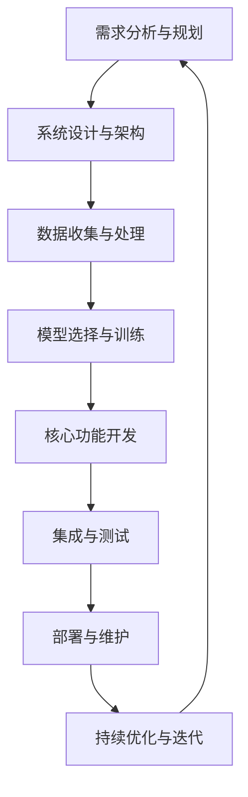

* 数学模型：
  AI Agent开发实践可以用以下数学模型来描述其效果:

$$E = f(Q, P, T, R)$$

其中:
- E: AI Agent的效果
- Q: 开发质量
- P: 项目管理水平
- T: 技术选型适当性
- R: 资源投入
- f: 表示这些因素之间的复杂关系函数

* 算法流程图：

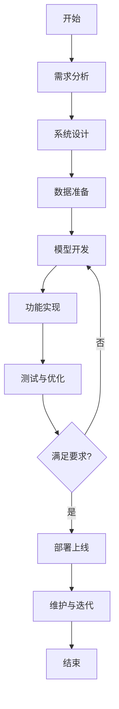

* 算法源代码：

```python
class AIAgentDevelopment:
    def __init__(self):
        self.requirements = []
        self.design = None
        self.data = None
        self.model = None
        self.features = []
        self.is_deployed = False

    def analyze_requirements(self):
        # 需求分析逻辑
        pass

    def design_system(self):
        # 系统设计逻辑
        pass

    def prepare_data(self):
        # 数据准备逻辑
        pass

    def develop_model(self):
        # 模型开发逻辑
        pass

    def implement_features(self):
        # 功能实现逻辑
        pass

    def test_and_optimize(self):
        # 测试与优化逻辑
        pass

    def deploy(self):
        # 部署逻辑
        self.is_deployed = True

    def maintain_and_iterate(self):
        # 维护与迭代逻辑
        pass

    def develop(self):
        self.analyze_requirements()
        self.design_system()
        self.prepare_data()
        self.develop_model()
        self.implement_features()
        while not self.test_and_optimize():
            self.develop_model()
            self.implement_features()
        self.deploy()
        while self.is_deployed:
            self.maintain_and_iterate()

# 使用示例
ai_agent_project = AIAgentDevelopment()
ai_agent_project.develop()
```

* 实际场景应用：
1. 智能客服系统开发
2. 个人助理AI开发
3. 智能推荐系统开发
4. 自动化测试AI开发

* 项目介绍：
  以智能客服系统为例,该项目旨在开发一个基于AI的客服代理,能够自动回答用户询问,处理常见问题,并在必要时将复杂问题转交给人工客服。

* 环境安装：
```bash
pip install transformers torch pandas numpy flask
```

* 系统功能设计：
1. 自然语言理解模块
2. 知识库查询模块
3. 对话管理模块
4. 回答生成模块
5. 人工转接模块

* 系统架构设计：

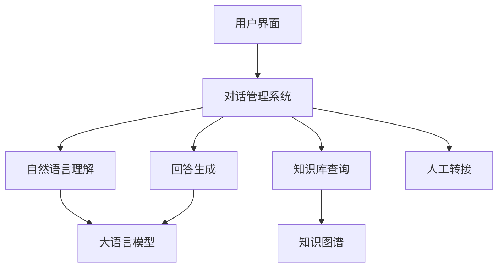

* 系统接口设计：

| 接口名称 | 方法 | 输入 | 输出 | 描述 |
|---------|------|-----|------|-----|
| /chat   | POST | 用户ID, 消息内容 | 回复内容, 置信度 | 处理用户消息并返回回复 |
| /feedback | POST | 用户ID, 会话ID, 评分 | 成功/失败 | 接收用户反馈 |
| /transfer | POST | 用户ID, 会话ID | 转接状态 | 将对话转接给人工客服 |

* 系统核心实现源代码：

```python
from transformers import AutoModelForCausalLM, AutoTokenizer
import torch

class AICustomerService:
    def __init__(self):
        self.model = AutoModelForCausalLM.from_pretrained("gpt2")
        self.tokenizer = AutoTokenizer.from_pretrained("gpt2")

    def generate_response(self, user_input):
        input_ids = self.tokenizer.encode(user_input, return_tensors="pt")
        attention_mask = torch.ones(input_ids.shape, dtype=torch.long, device=input_ids.device)
        
        output = self.model.generate(
            input_ids,
            attention_mask=attention_mask,
            max_length=150,
            num_return_sequences=1,
            no_repeat_ngram_size=2,
            do_sample=True,
            top_k=50,
            top_p=0.95,
            temperature=0.7
        )

        response = self.tokenizer.decode(output[0], skip_special_tokens=True)
        return response

# 使用示例
ai_cs = AICustomerService()
user_query = "我想了解你们的退货政策"
response = ai_cs.generate_response(user_query)
print(response)
```

* 最佳实践tips：
1. 定期更新知识库,确保信息的准确性和及时性
2. 实施A/B测试,持续优化对话策略
3. 建立完善的监控系统,及时发现并解决问题
4. 重视用户反馈,不断改进AI Agent的表现

* 行业发展与未来趋势：

| 时期 | 技术特点 | 应用场景 |
|------|---------|---------|
| 2010-2015 | 规则基础的对话系统 | 简单的FAQ回答 |
| 2015-2020 | 机器学习驱动的智能客服 | 多领域问题解答,简单任务处理 |
| 2020-2025 | 大语言模型赋能的AI Agent | 复杂对话理解,个性化服务 |
| 2025+ | 多模态、情感感知的AI助手 | 全方位业务支持,深度人机协作 |

### 6.1.2 AI Agent 开发流程总览

AI Agent的开发是一个复杂的系统工程,涉及多个阶段和领域。以下是AI Agent开发的主要流程总览:

* 核心概念：
  AI Agent开发流程是一个迭代循环的过程,包括需求分析、设计、实现、测试、部署和维护等阶段。每个阶段都有其特定的目标和挑战,需要开发团队密切协作和持续优化。

* 问题背景：
  传统软件开发方法在面对AI Agent这类复杂系统时,往往显得力不从心。AI Agent的开发需要更加灵活和适应性强的流程,以应对技术快速迭代和用户需求的不断变化。

* 问题描述：
1. 如何在AI Agent开发中平衡敏捷性和系统性?
2. 如何处理AI模型训练与软件开发之间的依赖关系?
3. 如何确保开发流程中的每个阶段都能有效支持AI Agent的特殊需求?

* 问题解决：
1. 采用混合开发方法,结合敏捷开发和传统瀑布模型的优点
2. 建立模型开发和软件开发的并行流程,加强协调
3. 在每个开发阶段引入AI特定的考虑因素和评估标准

* 边界与外延：
  AI Agent开发流程不仅包括技术开发,还涉及项目管理、质量保证、用户体验设计等多个方面。它需要考虑AI的特殊性,如数据依赖、模型迭代、伦理合规等。

* 概念结构与核心要素组成：
1. 需求分析与规划
2. 数据收集与处理
3. 模型选择与训练
4. 系统设计与架构
5. 核心功能开发
6. 集成与测试
7. 部署与监控
8. 维护与优化

* 概念之间的关系：

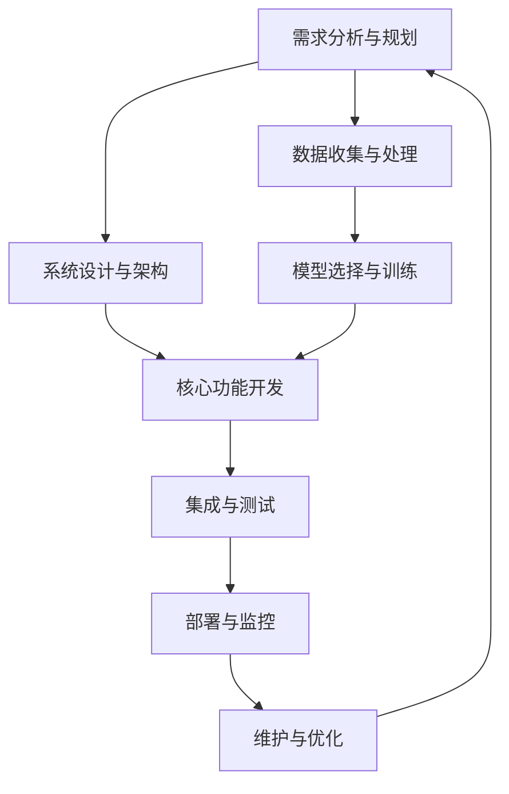

* 数学模型：
  我们可以用以下数学模型来描述AI Agent开发的效率:

$$E = \frac{Q \times F}{T \times C}$$

其中:
- E: 开发效率
- Q: 开发质量 (0-1)
- F: 实现的功能点数量
- T: 开发时间
- C: 开发成本

* 算法流程图：

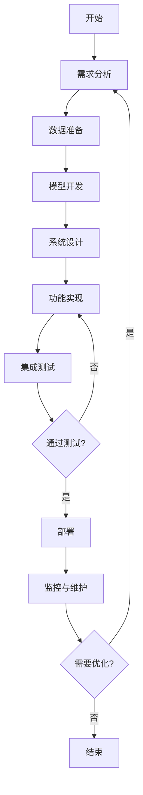

* 算法源代码：

```python
class AIAgentDevelopmentProcess:
    def __init__(self):
        self.requirements = []
        self.data = None
        self.model = None
        self.system_design = None
        self.features = []
        self.is_deployed = False

    def analyze_requirements(self):
        # 需求分析逻辑
        pass

    def prepare_data(self):
        # 数据准备逻辑
        pass

    def develop_model(self):
        # 模型开发逻辑
        pass

    def design_system(self):
        # 系统设计逻辑
        pass

    def implement_features(self):
        # 功能实现逻辑
        pass

    def integrate_and_test(self):
        # 集成测试逻辑
        return True  # 假设测试通过

    def deploy(self):
        # 部署逻辑
        self.is_deployed = True

    def monitor_and_maintain(self):
        # 监控维护逻辑
        return False  # 假设不需要优化

```python
    def development_process(self):
        while True:
            self.analyze_requirements()
            self.prepare_data()
            self.develop_model()
            self.design_system()
            self.implement_features()
            if self.integrate_and_test():
                self.deploy()
                if not self.monitor_and_maintain():
                    break
            else:
                continue

# 使用示例
ai_agent_dev = AIAgentDevelopmentProcess()
ai_agent_dev.development_process()
```

* 实际场景应用：
1. 智能客服AI Agent开发
2. 金融分析AI Agent开发
3. 医疗诊断辅助AI Agent开发
4. 教育辅导AI Agent开发

* 项目介绍：
  以智能客服AI Agent为例,该项目旨在开发一个能够自动回答用户询问、处理客户投诉、提供产品信息的AI系统。它需要理解自然语言、访问知识库、生成适当的回复,并在必要时将复杂问题转交给人工客服。

* 环境安装：
```bash
pip install transformers torch pandas scikit-learn flask
```

* 系统功能设计：
1. 自然语言理解模块
2. 意图识别模块
3. 知识库查询模块
4. 对话管理模块
5. 回答生成模块
6. 情感分析模块
7. 人工转接模块

* 系统架构设计：

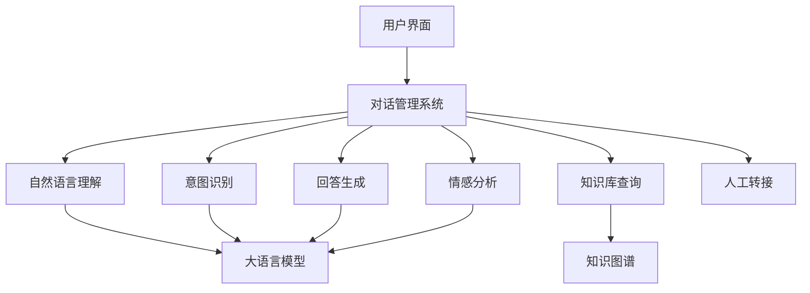

* 系统接口设计：

| 接口名称 | 方法 | 输入 | 输出 | 描述 |
|---------|------|-----|------|-----|
| /chat   | POST | 用户ID, 消息内容 | 回复内容, 意图, 情感 | 处理用户消息并返回回复 |
| /feedback | POST | 用户ID, 会话ID, 评分 | 成功/失败 | 接收用户反馈 |
| /transfer | POST | 用户ID, 会话ID | 转接状态 | 将对话转接给人工客服 |
| /update_knowledge | PUT | 知识条目 | 更新状态 | 更新知识库内容 |

* 系统核心实现源代码：

```python
from transformers import pipeline, AutoModelForSequenceClassification, AutoTokenizer
import torch

class SmartCustomerServiceAgent:
    def __init__(self):
        self.nlu_model = pipeline("text-classification", model="distilbert-base-uncased-finetuned-sst-2-english")
        self.qa_model = pipeline("question-answering", model="distilbert-base-cased-distilled-squad")
        self.sentiment_model = AutoModelForSequenceClassification.from_pretrained("distilbert-base-uncased-finetuned-sst-2-english")
        self.sentiment_tokenizer = AutoTokenizer.from_pretrained("distilbert-base-uncased-finetuned-sst-2-english")
        
    def understand_intent(self, text):
        return self.nlu_model(text)[0]['label']
    
    def answer_question(self, question, context):
        return self.qa_model(question=question, context=context)['answer']
    
    def analyze_sentiment(self, text):
        inputs = self.sentiment_tokenizer(text, return_tensors="pt")
        with torch.no_grad():
            logits = self.sentiment_model(**inputs).logits
        predicted_class_id = logits.argmax().item()
        return self.sentiment_model.config.id2label[predicted_class_id]
    
    def generate_response(self, user_input, knowledge_base):
        intent = self.understand_intent(user_input)
        sentiment = self.analyze_sentiment(user_input)
        
        if intent == "QUESTION":
            answer = self.answer_question(user_input, knowledge_base)
        else:
            # 处理其他意图
            answer = "I understand you're trying to " + intent.lower() + ". How can I assist you further?"
        
        return {
            "response": answer,
            "intent": intent,
            "sentiment": sentiment
        }

# 使用示例
agent = SmartCustomerServiceAgent()
knowledge_base = "Our return policy allows returns within 30 days of purchase with a valid receipt."
user_query = "Can I return a product I bought last week?"
response = agent.generate_response(user_query, knowledge_base)
print(response)
```

* 最佳实践tips：
1. 持续收集和分析用户反馈,不断优化AI Agent的表现
2. 定期更新知识库和模型,以适应不断变化的业务需求
3. 实施A/B测试,比较不同对话策略的效果
4. 建立人机协作机制,让AI和人工客服相互补充
5. 重视数据安全和用户隐私保护

* 行业发展与未来趋势：

| 时期 | 技术特点 | 应用场景 |
|------|---------|---------|
| 2010-2015 | 基于规则的简单问答系统 | 基础FAQ回答 |
| 2015-2020 | 机器学习驱动的智能客服 | 多领域问题解答,简单任务处理 |
| 2020-2025 | 大语言模型赋能的AI Agent | 复杂对话理解,个性化服务,情感交互 |
| 2025-2030 | 多模态、跨语言的AI助手 | 全渠道客户服务,预测性服务 |
| 2030+ | 认知智能AI Agent | 深度决策支持,创新问题解决 |

### 6.1.3 开发实践中的关键要素

在AI Agent的开发实践中,有几个关键要素需要特别关注,这些要素对项目的成功至关重要。

* 核心概念：
  AI Agent开发的关键要素包括数据质量、模型选择、系统架构、用户体验、安全性和可扩展性等。这些要素贯穿整个开发过程,需要开发团队持续关注和优化。

* 问题背景：
  AI Agent开发涉及多个学科和技术领域,如何在有限的资源和时间内平衡这些关键要素,是许多开发团队面临的挑战。

* 问题描述：
1. 如何确保数据的质量和代表性?
2. 如何选择适合特定任务的AI模型?
3. 如何设计既灵活又稳定的系统架构?
4. 如何在保证AI性能的同时提供良好的用户体验?
5. 如何处理AI Agent中的安全和隐私问题?

* 问题解决：
1. 建立严格的数据收集、清洗和标注流程
2. 进行充分的模型比较和评估,考虑任务特性和资源约束
3. 采用模块化和微服务架构,提高系统的灵活性和可维护性
4. 重视用户研究,将UX设计融入整个开发过程
5. 实施全面的安全策略,包括数据加密、访问控制和隐私保护

* 边界与外延：
  关键要素不仅限于技术方面,还包括项目管理、团队协作、法律合规等方面。它们相互影响,共同决定了AI Agent的整体质量和成功。

* 概念结构与核心要素组成：
1. 数据管理
2. 模型开发
3. 系统架构
4. 用户体验
5. 安全与隐私
6. 可扩展性
7. 性能优化
8. 合规性

* 概念之间的关系：

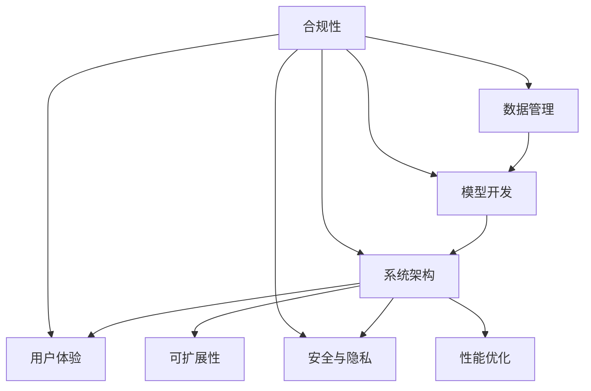

* 数学模型：
  我们可以用以下数学模型来评估AI Agent的综合质量:

$$Q = w_1D + w_2M + w_3A + w_4U + w_5S + w_6E + w_7P + w_8C$$

其中:
- Q: AI Agent的综合质量
- D: 数据质量 (0-1)
- M: 模型性能 (0-1)
- A: 架构适当性 (0-1)
- U: 用户体验 (0-1)
- S: 安全性 (0-1)
- E: 可扩展性 (0-1)
- P: 性能 (0-1)
- C: 合规性 (0-1)
- w1 到 w8: 各要素的权重 (总和为1)

* 算法流程图：

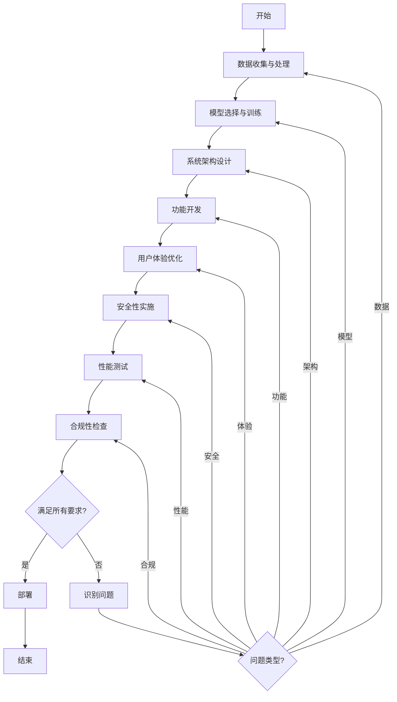

* 算法源代码：

```python
class AIAgentKeyElements:
    def __init__(self):
        self.data_quality = 0
        self.model_performance = 0
        self.architecture_suitability = 0
        self.user_experience = 0
        self.security = 0
        self.scalability = 0
        self.performance = 0
        self.compliance = 0

    def evaluate_data(self):
        # 数据质量评估逻辑
        self.data_quality = 0.8  # 示例值

    def evaluate_model(self):
        # 模型性能评估逻辑
        self.model_performance = 0.85  # 示例值

    def evaluate_architecture(self):
        # 架构适当性评估逻辑
        self.architecture_suitability = 0.9  # 示例值

    def evaluate_ux(self):
        # 用户体验评估逻辑
        self.user_experience = 0.75  # 示例值

    def evaluate_security(self):
        # 安全性评估逻辑
        self.security = 0.95  # 示例值

    def evaluate_scalability(self):
        # 可扩展性评估逻辑
        self.scalability = 0.8  # 示例值

    def evaluate_performance(self):
        # 性能评估逻辑
        self.performance = 0.88  # 示例值

    def evaluate_compliance(self):
        # 合规性评估逻辑
        self.compliance = 1.0  # 示例值

    def calculate_overall_quality(self, weights):
        return (
            weights[0] * self.data_quality +
            weights[1] * self.model_performance +
            weights[2] * self.architecture_suitability +
            weights[3] * self.user_experience +
            weights[4] * self.security +
            weights[5] * self.scalability +
            weights[6] * self.performance +
            weights[7] * self.compliance
        )

    def evaluate_all(self):
        self.evaluate_data()
        self.evaluate_model()
        self.evaluate_architecture()
        self.evaluate_ux()
        self.evaluate_security()
        self.evaluate_scalability()
        self.evaluate_performance()
        self.evaluate_compliance()

# 使用示例
agent_elements = AIAgentKeyElements()
agent_elements.evaluate_all()
weights = [0.15, 0.2, 0.15, 0.1, 0.15, 0.05, 0.1, 0.1]
overall_quality = agent_elements.calculate_overall_quality(weights)
print(f"AI Agent Overall Quality: {overall_quality:.2f}")
```

* 实际场景应用：
1. 金融风控AI Agent: 重点关注数据安全、模型准确性和实时性能
2. 医疗诊断AI Agent: 强调数据隐私、模型可解释性和合规性
3. 智能客服AI Agent: 注重用户体验、多语言支持和可扩展性
4. 自动驾驶AI Agent: 关注实时性能、安全性和系统鲁棒性

* 项目介绍：
  以智能客服AI Agent为例,该项目需要平衡多个关键要素:
- 数据管理: 收集和处理大量的客户对话数据
- 模型开发: 选择和训练适合多领域对话的语言模型
- 系统架构: 设计支持高并发和快速响应的分布式系统
- 用户体验: 确保对话流畅、回答准确、情感适当
- 安全与隐私: 保护客户敏感信息,防止数据泄露
- 可扩展性: 支持新知识域和功能的快速集成
- 性能优化: 确保低延迟和高吞吐量
- 合规性: 遵守数据保护法规和行业标准

* 环境安装：
```bash
pip install transformers torch pandas scikit-learn flask redis elasticsearch
```

* 系统功能设计：
1. 多渠道接入模块
2. 自然语言理解模块
3. 意图识别与实体提取模块
4. 对话管理模块
5. 知识库查询模块
6. 回答生成模块
7. 情感分析模块
8. 人工转接模块
9. 性能监控与日志分析模块
10. 数据安全与隐私保护模块

* 系统架构设计：

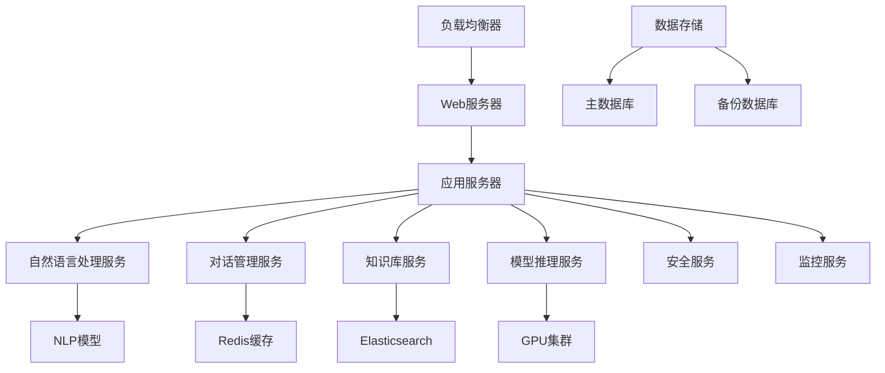

* 系统接口设计：

| 接口名称 | 方法 | 输入 | 输出 | 描述 |
|---------|------|-----|------|-----|
| /chat   | POST | 用户ID, 会话ID, 消息内容 | 回复内容, 意图, 情感, 置信度 | 处理用户消息并返回回复 |
| /feedback | POST | 用户ID, 会话ID, 评分, 评论 | 处理状态 | 接收用户反馈 |
| /transfer | POST | 用户ID, 会话ID, 原因 | 转接状态, 预计等待时间 | 将对话转接给人工客服 |
| /update_knowledge | PUT | 知识条目, 更新类型 | 更新状态, 影响的条目数 | 更新知识库内容 |
| /performance | GET | 时间范围, 指标类型 | 性能数据 | 获取系统性能指标 |
| /security_log | GET | 时间范围, 日志类型 | 安全日志 | 获取安全相关的日志信息 |

* 系统核心实现源代码：

```python
from fastapi import FastAPI, HTTPException
from pydantic import BaseModel
from transformers import pipeline, AutoModelForSequenceClassification, AutoTokenizer
import torch
import redis
from elasticsearch import Elasticsearch
import logging

app = FastAPI()

# 初始化各种服务和模型
nlu_pipeline = pipeline("text-classification", model="distilbert-base-uncased-finetuned-sst-2-english")
qa_pipeline = pipeline("question-answering", model="distilbert-base-cased-distilled-squad")
sentiment_model = AutoModelForSequenceClassification.from_pretrained("distilbert-base-uncased-finetuned-sst-2-english")
sentiment_tokenizer = AutoTokenizer.from_pretrained("distilbert-base-uncased-finetuned-sst-2-english")

redis_client = redis.Redis(host='localhost', port=6379, db=0)
es_client = Elasticsearch([{'host': 'localhost', 'port': 9200}])

logging.basicConfig(level=logging.INFO)
logger = logging.getLogger(__name__)

class ChatInput(BaseModel):
    user_id: str
    session_id: str
    message: str

class ChatOutput(BaseModel):
    response: str
    intent: str
    sentiment: str
    confidence: float

@app.post("/chat", response_model=ChatOutput)
async def chat(chat_input: ChatInput):
    try:
        # 意图识别
        intent = nlu_pipeline(chat_input.message)[0]['label']
        
        # 情感分析
        inputs = sentiment_tokenizer(chat_input.message, return_tensors="pt")
        with torch.no_grad():
            logits = sentiment_model(**inputs).logits
        sentiment = sentiment_model.config.id2label[logits.argmax().item()]
        
        # 知识库查询
        kb_result = es_client.search(index="knowledge_base", body={"query": {"match": {"content": chat_input.message}}})
        context = kb_result['hits']['hits'][0]['_source']['content'] if kb_result['hits']['total']['value'] > 0 else ""
        
        # 问答生成
        qa_result = qa_pipeline(question=chat_input.message, context=context)
        response = qa_result['answer']
        confidence = qa_result['score']
        
        # 保存会话状态
        redis_client.hset(f"session:{chat_input.session_id}", mapping={
            "last_message": chat_input.message,
            "last_response": response,
            "intent": intent,
            "sentiment": sentiment
        })
        
        # 记录日志
        logger.info(f"User {chat_input.user_id} in session {chat_input.session_id}: {chat_input.message}")
        
        return ChatOutput(
            response=response,
            intent=intent,
            sentiment=sentiment,
            confidence=confidence
        )
    except Exception as e:
        logger.error(f"Error processing chat: {str(e)}")
        raise HTTPException(status_code=500, detail="Internal server error")

if __name__ == "__main__":
    import uvicorn
    uvicorn.run(app, host="0.0.0.0", port=8000)
```

* 最佳实践tips：
1. 实施持续集成和持续部署(CI/CD)流程,确保快速迭代和质量控制
2. 使用A/B测试评估不同模型和对话策略的效果
3. 建立全面的监控系统,包括模型性能、系统负载和用户满意度
4. 定期进行安全审计和渗透测试,及时修复潜在漏洞
5. 实施数据版本控制和模型版本管理,便于回滚和比较
6. 建立人机协作机制,让AI和人工客服相互补充和学习
7. 重视隐私保护,实施数据脱敏和访问控制
8. 建立反馈循环,持续从用户交互中学习和改进

* 行业发展与未来趋势：

| 时期 | 技术特点 | 关键要素 | 应用场景 |
|------|---------|---------|---------|
| 2020-2022 | 大语言模型应用 | 模型性能、数据质量 | 智能问答、文本生成 |
| 2022-2024 | 多模态交互 | 跨模态理解、用户体验 | 图文理解、语音交互 |
| 2024-2026 | 个性化定制 | 迁移学习、隐私计算 | 个人助理、定制化服务 |
| 2026-2028 | 认知智能 | 常识推理、情感智能 | 决策支持、情感陪伴 |
| 2028+ | 通用人工智能 | 持续学习、伦理AI | 复杂问题解决、创新任务 |

### 6.1.4 企业级应用开发的特殊考虑

在企业级AI Agent应用开发中,除了通用的开发实践外,还需要特别考虑一些企业特有的需求和挑战。

* 核心概念：
  企业级AI Agent应用开发需要在技术创新和业务需求之间找到平衡,同时还要考虑安全性、可扩展性、合规性和与现有系统的集成等因素。

* 问题背景：
  企业环境比个人或小型应用场景更加复杂,涉及更多的利益相关者、更严格的安全要求和更复杂的业务流程。

* 问题描述：
1. 如何确保AI Agent与企业现有IT基础设施的无缝集成?
2. 如何处理企业数据的安全性和隐私问题?
3. 如何满足不同部门和角色的多样化需求?
4. 如何确保AI Agent的可扩展性以适应企业的增长?
5. 如何管理和监控大规模部署的AI Agent?

* 问题解决：
1. 采用模块化和API优先的设计,便于与现有系统集成
2. 实施严格的数据访问控制和加密机制
3. 设计可定制的AI Agent,支持不同部门的特定需求
4. 使用云原生技术和微服务架构,提高系统的可扩展性
5. 建立全面的监控和管理平台,实现集中化控制

* 边界与外延：
  企业级AI Agent开发不仅涉及技术实现,还包括组织变革、流程再造、员工培训等方面。它需要考虑企业的长期战略目标和行业特定需求。

* 概念结构与核心要素组成：
1. 企业集成
2. 数据安全与隐私
3. 多样化需求适配
4. 可扩展性设计
5. 监控与管理
6. 合规性
7. 成本效益
8. 变革管理

* 概念之间的关系：

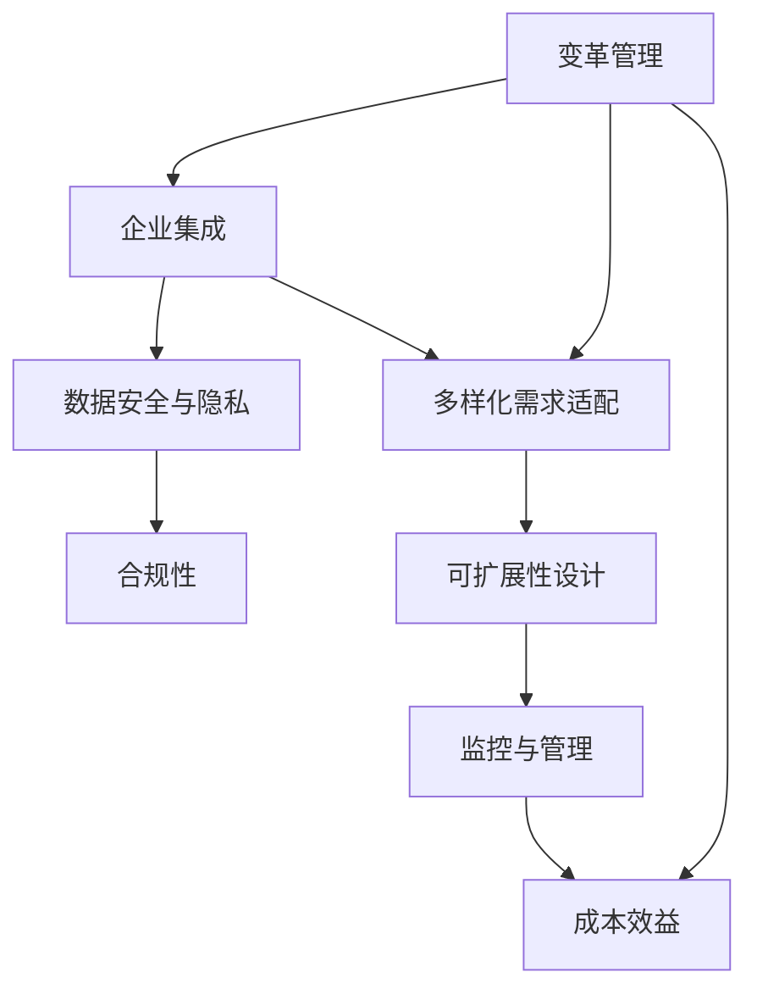

* 数学模型：
  我们可以用以下数学模型来评估企业级AI Agent的适用性:

$$S = w_1I + w_2P + w_3A + w_4E + w_5M + w_6C + w_7R + w_8T$$

其中:
- S: AI Agent的企业适用性得分
- I: 集成度 (0-1)
- P: 隐私保护程度 (0-1)
- A: 适应性 (0-1)
- E: 可扩展性 (0-1)
- M: 可管理性 (0-1)
- C: 合规性 (0-1)
- R: 投资回报率 (0-1)
- T: 员工接受度 (0-1)
- w1 到 w8: 各因素的权重 (总和为1)

* 算法流程图：

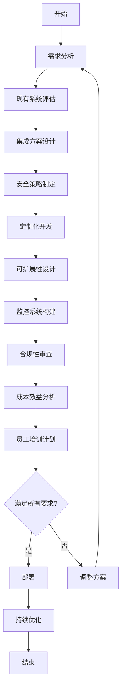

* 算法源代码：

```python
class EnterpriseLevelAIAgent:
    def __init__(self):
        self.integration_score = 0
        self.privacy_score = 0
        self.adaptability_score = 0
        self.scalability_score = 0
        self.manageability_score = 0
        self.compliance_score = 0
        self.roi_score = 0
        self.employee_acceptance_score = 0

    def assess_integration(self):
        # 评估与现有系统的集成度
        self.integration_score = 0.8  # 示例值

    def assess_privacy(self):
        # 评估隐私保护程度
        self.privacy_score = 0.9  # 示例值

    def assess_adaptability(self):
        # 评估适应不同部门需求的能力
        self.adaptability_score = 0.75  # 示例值

    def assess_scalability(self):
        # 评估系统可扩展性
        self.scalability_score = 0.85  # 示例值

    def assess_manageability(self):
        # 评估系统可管理性
        self.manageability_score = 0.8  # 示例值

    def assess_compliance(self):
        # 评估合规性
        self.compliance_score = 1.0  # 示例值

    def calculate_roi(self):
        # 计算投资回报率
        self.roi_score = 0.7  # 示例值

    def assess_employee_acceptance(self):
        # 评估员工接受度
        self.employee_acceptance_score = 0.65  # 示例值

    def calculate_overall_score(self, weights):
        return (
            weights[0] * self.integration_score +
            weights[1] * self.privacy_score +
            weights[2] * self.adaptability_score +
            weights[3] * self.scalability_score +
            weights[4] * self.manageability_score +
            weights[5] * self.compliance_score +
            weights[6] * self.roi_score +
            weights[7] * self.employee_acceptance_score
        )

    def assess_all(self):
        self.assess_integration()
        self.assess_privacy()
        self.assess_adaptability()
        self.assess_scalability()
        self.assess_manageability()
        self.assess_compliance()
        self.calculate_roi()
        self.assess_employee_acceptance()

# 使用示例
enterprise_ai = EnterpriseLevelAIAgent()
enterprise_ai.assess_all()
weights = [0.15, 0.2, 0.1, 0.15, 0.1, 0.15, 0.1, 0.05]
overall_score = enterprise_ai.calculate_overall_score(weights)
print(f"Enterprise AI Agent Suitability Score: {overall_score:.2f}")
```

* 实际场景应用：
1. 企业智能客服系统: 需要考虑多语言支持、业务流程集成和客户数据保护
2. 金融风控AI: 要特别注重合规性、实时性能和模型可解释性
3. 制造业预测性维护: 需要考虑与物联网设备的集成、大规模数据处理和实时决策
4. 医疗诊断辅助系统: 强调数据隐私、模型准确性和与电子病历系统的集成

* 项目介绍：
  以企业智能客服系统为例,该项目需要特别考虑以下企业级需求:
- 多渠道集成: 与企业现有的CRM、ERP等系统无缝对接
- 数据安全: 实施严格的客户数据访问控制和加密措施
- 多语言支持: 适应全球业务需求,支持多种语言的智能交互
- 可扩展性: 能够处理突发的高并发请求,支持横向扩展
- 定制化: 支持不同部门（如销售、技术支持、客户服务）的特定需求
- 合规性: 符合GDPR、CCPA等数据保护法规
- 监控与分析: 提供全面的性能监控和客户互动分析
- 人机协作: 实现AI与人工客服的无缝切换和协作

* 环境安装：
```bash
pip install fastapi uvicorn transformers torch pandas scikit-learn redis elasticsearch pymongo azure-cognitiveservices-language-luis
```

* 系统功能设计：
1. 多渠道接入模块（网页、移动APP、社交媒体、电话）
2. 自然语言理解模块（多语言支持）
3. 意图识别与实体提取模块
4. 知识库管理模块
5. 对话管理模块
6. 业务流程集成模块
7. 回答生成模块
8. 情感分析模块
9. 人工坐席协作模块
10. 数据安全与隐私保护模块
11. 性能监控与分析模块
12. 多租户管理模块

* 系统架构设计：

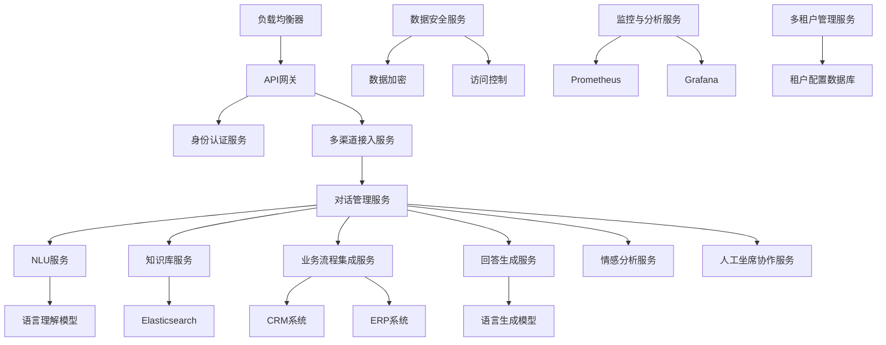

* 系统接口设计：

| 接口名称 | 方法 | 输入 | 输出 | 描述 |
|---------|------|-----|------|-----|
| /chat   | POST | 用户ID, 会话ID, 消息内容, 语言代码 | 回复内容, 意图, 情感, 置信度 | 处理用户消息并返回回复 |
| /feedback | POST | 用户ID, 会话ID, 评分, 评论 | 处理状态 | 接收用户反馈 |
| /escalate | POST | 用户ID, 会话ID, 原因 | 转接状态, 预计等待时间 | 将对话升级到人工客服 |
| /knowledge | PUT | 知识条目, 更新类型, 语言 | 更新状态, 影响的条目数 | 更新知识库内容 |
| /analytics | GET | 时间范围, 指标类型, 部门 | 分析数据 | 获取客服系统性能和交互分析 |
| /tenant | POST | 租户信息, 配置参数 | 租户ID, 配置状态 | 创建或更新租户配置 |

* 系统核心实现源代码：

```python
from fastapi import FastAPI, HTTPException, Depends
from pydantic import BaseModel
from typing import List, Optional
from datetime import datetime
from transformers import pipeline, AutoModelForSequenceClassification, AutoTokenizer
import torch
import redis
from elasticsearch import Elasticsearch
from pymongo import MongoClient
from azure.cognitiveservices.language.luis.runtime import LUISRuntimeClient
from msrest.authentication import CognitiveServicesCredentials
import logging

app = FastAPI()

# 初始化各种服务和模型
nlu_pipeline = pipeline("text-classification", model="distilbert-base-uncased-finetuned-sst-2-english")
qa_pipeline = pipeline("question-answering", model="distilbert-base-cased-distilled-squad")
sentiment_model = AutoModelForSequenceClassification.from_pretrained("distilbert-base-uncased-finetuned-sst-2-english")
sentiment_tokenizer = AutoTokenizer.from_pretrained("distilbert-base-uncased-finetuned-sst-2-english")

redis_client = redis.Redis(host='localhost', port=6379, db=0)
es_client = Elasticsearch([{'host': 'localhost', 'port': 9200}])
mongo_client = MongoClient('mongodb://localhost:27017/')

luis_endpoint = "https://your-luis-endpoint.cognitiveservices.azure.com"
luis_key = "your-luis-key"
luis_app_id = "your-luis-app-id"
luis_client = LUISRuntimeClient(luis_endpoint, CognitiveServicesCredentials(luis_key))

logging.basicConfig(level=logging.INFO)
logger = logging.getLogger(__name__)

class ChatInput(BaseModel):
    user_id: str
    session_id: str
    message: str
    language: str

class ChatOutput(BaseModel):
    response: str
    intent: str
    sentiment: str
    confidence: float

class Tenant(BaseModel):
    name: str
    industry: str
    language_preferences: List[str]
    custom_intents: Optional[List[str]] = []

def get_tenant_config(tenant_id: str):
    db = mongo_client['enterprise_ai']
    return db.tenants.find_one({"_id": tenant_id})

@app.post("/chat", response_model=ChatOutput)
async def chat(chat_input: ChatInput, tenant_id: str = Depends(get_tenant_config)):
    try:
        # 意图识别
        luis_result = luis_client.prediction.get_slot_prediction(
            luis_app_id,
            tenant_id,
            {"query": chat_input.message}
        )
        intent = luis_result.prediction.top_intent
        
        # 情感分析
        inputs = sentiment_tokenizer(chat_input.message, return_tensors="pt")
        with torch.no_grad():
            logits = sentiment_model(**inputs).logits
        sentiment = sentiment_model.config.id2label[logits.argmax().item()]
        
        # 知识库查询
        kb_result = es_client.search(index=f"knowledge_base_{tenant_id}", body={
            "query": {
                "bool": {
                    "must": [
                        {"match": {"content": chat_input.message}},
                        {"match": {"language": chat_input.language}}
                    ]
                }
            }
        })
        context = kb_result['hits']['hits'][0]['_source']['content'] if kb_result['hits']['total']['value'] > 0 else ""
        
        # 问答生成
        qa_result = qa_pipeline(question=chat_input.message, context=context)
        response = qa_result['answer']
        confidence = qa_result['score']
        
        # 保存会话状态
        redis_client.hset(f"session:{chat_input.session_id}", mapping={
            "last_message": chat_input.message,
            "last_response": response,
            "intent": intent,
            "sentiment": sentiment,
            "language": chat_input.language,
            "timestamp": datetime.now().isoformat()
        })
        
        # 记录交互日志
        mongo_client['enterprise_ai']['interaction_logs'].insert_one({
            "user_id": chat_input.user_id,
            "session_id": chat_input.session_id,
            "tenant_id": tenant_id,
            "message": chat_input.message,
            "response": response,
            "intent": intent,
            "sentiment": sentiment,
            "confidence": confidence,
            "language": chat_input.language,
            "timestamp": datetime.now()
        })
        
        # 记录日志
        logger.info(f"Tenant {tenant_id}, User {chat_input.user_id} in session {chat_input.session_id}: {chat_input.message}")
        
        return ChatOutput(
            response=response,
            intent=intent,
            sentiment=sentiment,
            confidence=confidence
        )
    except Exception as e:
        logger.error(f"Error processing chat for tenant {tenant_id}: {str(e)}")
        raise HTTPException(status_code=500, detail="Internal server error")

@app.post("/tenant")
async def create_tenant(tenant: Tenant):
    try:
        db = mongo_client['enterprise_ai']
        result = db.tenants.insert_one(tenant.dict())
        return {"tenant_id": str(result.inserted_id), "status": "created"}
    except Exception as e:
        logger.error(f"Error creating tenant: {str(e)}")
        raise HTTPException(status_code=500, detail="Failed to create tenant")

if __name__ == "__main__":
    import uvicorn
    uvicorn.run(app, host="0.0.0.0", port=8000)
```

* 最佳实践tips：
1. 采用微服务架构,提高系统的可维护性和可扩展性
2. 实施严格的数据隔离策略,确保多租户环境下的数据安全
3. 使用容器化技术(如Docker)和编排工具(如Kubernetes),简化部署和扩展
4. 实施全面的监控策略,包括业务KPI、系统性能和安全指标
5. 建立定期的安全审计和渗透测试机制
6. 制定详细的灾难恢复和业务连续性计划
7. 重视员工培训,确保技术团队和业务团队都能充分利用AI系统
8. 建立AI伦理委员会,监督AI系统的公平性和透明度
9. 实施持续集成和持续部署(CI/CD)流程,加速迭代和反馈循环
10. 定期进行用户体验调研,持续优化AI交互界面和流程

* 行业发展与未来趋势：

| 时期 | 技术特点 | 企业关注点 | 应用场景 |
|------|---------|-----------|---------|
| 2020-2022 | 大规模语言模型应用 | 成本效益、技术可行性 | 智能客服、文档分析 |
| 2022-2024 | 多模态交互、个性化定制 | 用户体验、业务流程重塑 | 销售助手、决策支持 |
| 2024-2026 | 跨语言跨文化理解 | 全球化、本地化 | 国际业务拓展、跨文化沟通 |
| 2026-2028 | 认知智能、自主学习 | 创新能力、人机协作 | 研发创新、战略规划 |
| 2028+ | 通用人工智能雏形 | 伦理考量、社会影响 | 高级管理辅助、复杂问题解决 |

本节小结：
企业级AI Agent应用开发需要在技术创新和业务需求之间寻找平衡,同时还要充分考虑企业特有的安全、合规、可扩展性和集成需求。通过采用微服务架构、实施严格的数据安全措施、支持多租户和多语言、以及建立全面的监控和分析系统,企业可以构建强大而灵活的AI Agent系统。未来,随着技术的不断进步,企业级AI Agent将朝着更智能、更个性化和更具创新能力的方向发展,在提升运营效率的同时,也将为企业带来新的增长机遇和竞争优势。

## 6.2 需求分析与系统设计

在AI Agent开发过程中,需求分析和系统设计是奠定项目成功基础的关键阶段。本节将深入探讨如何有效地进行需求收集、分析以及如何设计出符合企业需求的AI Agent系统。

### 6.2.1 业务需求收集与分析

* 核心概念：
  业务需求收集与分析是指通过各种方法和技术,了解并明确企业对AI Agent的期望和要求,并将这些需求转化为可实现的技术规格。

* 问题背景：
  许多AI Agent项目失败的原因在于需求分析不充分,导致开发的系统无法满足实际业务需求或无法有效解决企业面临的问题。

* 问题描述：
1. 如何确保收集到的需求全面且准确?
2. 如何平衡不同利益相关者的需求?
3. 如何将模糊的业务需求转化为明确的技术规格?
4. 如何预测和应对未来可能的需求变化?

* 问题解决：
1. 采用多种需求收集方法,如访谈、问卷调查、观察法等
2. 使用需求优先级矩阵,平衡不同需求的重要性和紧迫性
3. 通过用例分析和场景模拟,将业务需求具体化
4. 采用敏捷开发方法,增强需求响应的灵活性

* 边界与外延：
  需求分析不仅限于功能需求,还包括非功能需求如性能、安全性、可用性等。同时,需要考虑法律法规、行业标准和企业文化等因素的影响。

* 概念结构与核心要素组成：
1. 利益相关者识别
2. 需求收集方法
3. 需求分类与优先级排序
4. 需求验证与确认
5. 需求文档化
6. 需求跟踪与管理

* 概念之间的关系：

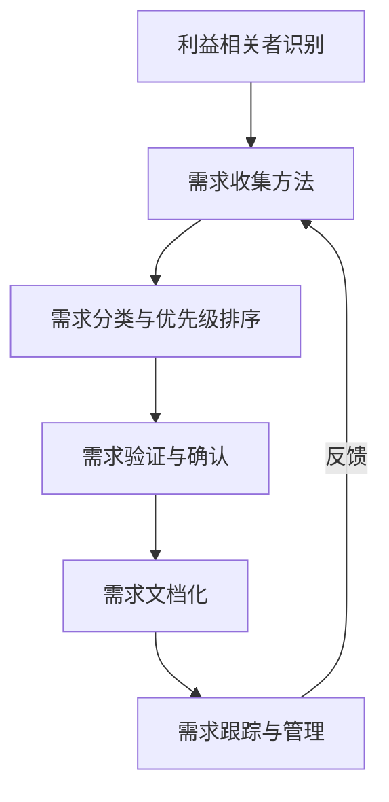

* 数学模型：
  我们可以使用以下模型来评估需求的优先级:

$$P = (I \times U) + (1-I) \times C$$

其中:
- P: 需求优先级得分
- I: 重要性 (0-1)
- U: 紧迫性 (0-1)
- C: 复杂性 (0-1)

* 算法流程图：

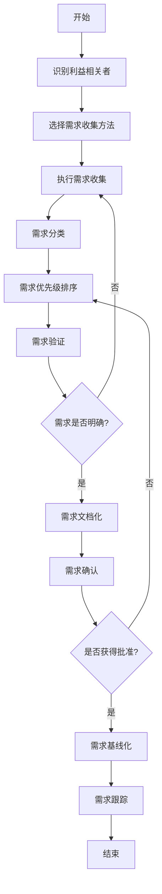

* 算法源代码：

```python
class RequirementAnalysis:
    def __init__(self):
        self.stakeholders = []
        self.requirements = []
        self.methods = ['interview', 'survey', 'observation', 'focus_group']

    def identify_stakeholders(self):
        # 利益相关者识别逻辑
        self.stakeholders = ['management', 'end_users', 'IT_department', 'customers']

    def collect_requirements(self, method):
        # 需求收集逻辑
        if method not in self.methods:
            raise ValueError("Invalid collection method")
        # 实际中这里会有具体的收集逻辑
        new_requirements = [f"Requirement from {method}"]
        self.requirements.extend(new_requirements)

    def prioritize_requirements(self):
        # 需求优先级排序逻辑
        self.requirements.sort(key=lambda r: self.calculate_priority(r))

    def calculate_priority(self, requirement):
        importance = 0.8  # 假设值
        urgency = 0.7  # 假设值
        complexity = 0.5  # 假设值
        return (importance * urgency) + (1 - importance) * complexity

    def validate_requirements(self):
        # 需求验证逻辑
        return all(self.is_valid(r) for r in self.requirements)

    def is_valid(self, requirement):
        # 实际中会有更复杂的验证逻辑
        return len(requirement) > 0

    def document_requirements(self):
        # 需求文档化逻辑
        return "\n".join(self.requirements)

    def analyze(self):
        self.identify_stakeholders()
        for method in self.methods:
            self.collect_requirements(method)
        self.prioritize_requirements()
        if self.validate_requirements():
            return self.document_requirements()
        else:
            return "Requirements validation failed"

# 使用示例
analyzer = RequirementAnalysis()
result = analyzer.analyze()
print(result)
```

* 实际场景应用：
1. 企业智能客服系统需求分析
2. 金融风控AI系统需求收集
3. 制造业预测性维护AI需求调研
4. 医疗诊断辅助系统需求分析

* 项目介绍：
  以企业智能客服系统为例,需求分析的主要目标是了解:
- 客户服务的痛点和挑战
- 期望AI系统能够处理的查询类型
- 与现有系统的集成需求
- 性能和可扩展性要求
- 数据安全和隐私保护需求
- 多语言支持需求
- 报告和分析功能需求

* 环境安装：
```bash
pip install pandas numpy matplotlib seaborn nltk scikit-learn
```

* 系统功能设计：
1. 需求收集模块
2. 需求分析模块
3. 需求优先级排序模块
4. 需求验证模块
5. 需求文档生成模块
6. 需求可视化模块

* 系统架构设计：

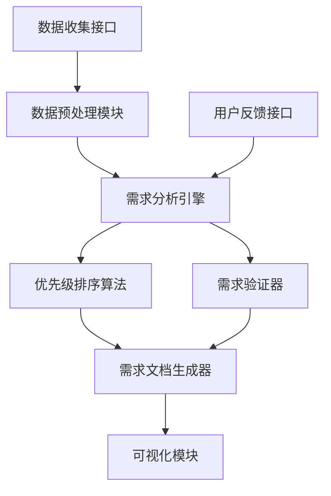

* 系统接口设计：

| 接口名称 | 方法 | 输入 | 输出 | 描述 |
|---------|------|-----|------|-----|
| /collect | POST | 需求数据, 收集方法 | 需求ID列表 | 收集新的需求 |
| /analyze | GET | 需求ID列表 | 分析结果 | 分析指定的需求 |
| /prioritize | POST | 需求ID列表, 优先级规则 | 优先级排序结果 | 对需求进行优先级排序 |
| /validate | POST | 需求ID列表 | 验证结果 | 验证需求的完整性和一致性 |
| /document | GET | 需求ID列表 | 需求文档 | 生成需求文档 |
| /visualize | GET | 需求ID列表, 可视化类型 | 可视化数据 | 生成需求的可视化表示 |

* 系统核心实现源代码：

```python
import pandas as pd
import numpy as np
from sklearn.feature_extraction.text import TfidfVectorizer
from sklearn.cluster import KMeans
import matplotlib.pyplot as plt
import seaborn as sns
from nltk.tokenize import word_tokenize
from nltk.corpus import stopwords
import nltk

nltk.download('punkt')
nltk.download('stopwords')

class RequirementAnalysisSystem:
    def __init__(self):
        self.requirements = pd.DataFrame(columns=['id', 'description', 'source', 'priority', 'status'])
        self.stop_words = set(stopwords.words('english'))
        self.vectorizer = TfidfVectorizer(stop_words='english')

    def collect_requirements(self, new_requirements):
        for req in new_requirements:
            req_id = len(self.requirements) + 1
            self.requirements = self.requirements.append({
                'id': req_id,
                'description': req['description'],
                'source': req['source'],
                'priority': 0,
                'status': 'New'
            }, ignore_index=True)
        return self.requirements['id'].tolist()

    def analyze_requirements(self):
        descriptions = self.requirements['description'].tolist()
        tfidf_matrix = self.vectorizer.fit_transform(descriptions)
        
        # 使用K-means聚类来识别主要需求主题
        num_clusters = min(5, len(descriptions))
        kmeans = KMeans(n_clusters=num_clusters, random_state=42)
        kmeans.fit(tfidf_matrix)
        
        self.requirements['cluster'] = kmeans.labels_
        return self.requirements.groupby('cluster')['description'].apply(list).to_dict()

    def prioritize_requirements(self, importance_weights):
        for idx, row in self.requirements.iterrows():
            description = row['description']
            tokens = word_tokenize(description.lower())
            important_words = [word for word in tokens if word not in self.stop_words]
            priority_score = sum(importance_weights.get(word, 0) for word in important_words)
            self.requirements.at[idx, 'priority'] = priority_score
        
        self.requirements = self.requirements.sort_values('priority', ascending=False)
        return self.requirements[['id', 'description', 'priority']].to_dict('records')

    def validate_requirements(self):
        # 简单的验证逻辑，检查描述的长度和是否包含动词
        def is_valid(description):
            tokens = word_tokenize(description.lower())
            return len(description) > 10 and any(word.endswith('ing') or word.endswith('ed') for word in tokens)
        
        self.requirements['is_valid'] = self.requirements['description'].apply(is_valid)
        return self.requirements[['id', 'description', 'is_valid']].to_dict('records')

    def generate_document(self):
        doc = "Requirements Document\n\n"
        for _, req in self.requirements.iterrows():
            doc += f"ID: {req['id']}\n"
            doc += f"Description: {req['description']}\n"
            doc += f"Priority: {req['priority']}\n"
            doc += f"Status: {req['status']}\n\n"
        return doc

    def visualize_requirements(self):
        plt.figure(figsize=(10, 6))
        sns.scatterplot(x='id', y='priority', hue='cluster', data=self.requirements)
        plt.title('Requirements Priority and Clustering')
        plt.xlabel('Requirement ID')
        plt.ylabel('Priority Score')
        plt.savefig('requirements_visualization.png')
        plt.close()
        return 'requirements_visualization.png'

# 使用示例
system = RequirementAnalysisSystem()

# 收集需求
new_reqs = [
    {'description': 'The system should support multiple languages', 'source': 'Customer Survey'},
    {'description': 'AI should be able to handle complex queries', 'source': 'Management'},
    {'description': 'Integration with existing CRM system is required', 'source': 'IT Department'}
]
system.collect_requirements(new_reqs)

# 分析需求
analysis_result = system.analyze_requirements()
print("Requirement Clusters:", analysis_result)

# 优先级排序
importance_weights = {'language': 0.8, 'ai': 0.9, 'integration': 0.7, 'crm': 0.6}
prioritized_reqs = system.prioritize_requirements(importance_weights)
print("Prioritized Requirements:", prioritized_reqs)

# 验证需求
validated_reqs = system.validate_requirements()
print("Validated Requirements:", validated_reqs)

# 生成文档
doc = system.generate_document()
print(doc)

# 可视化
viz_file = system.visualize_requirements()
print(f"Visualization saved as {viz_file}")
```

* 最佳实践tips：
1. 使用多种需求收集方法,确保全面性
2. 积极与所有利益相关者沟通,确保需求的准确性和完整性
3. 使用需求管理工具,如JIRA或Trello,追踪需求的变化
4. 定期回顾和更新需求,确保与业务目标保持一致
5. 使用原型或MVP来验证关键需求
6. 建立清晰的需求变更流程,控制范围蠕变
7. 使用用户故事和验收标准来具体化需求
8. 进行需求依赖性分析,识别潜在的实现顺序
9. 对于复杂系统,考虑使用建模语言如UML来可视化需求
10. 建立需求与测试用例的追踪矩阵,确保需求的可测试性

* 行业发展与未来趋势：

| 时期 | 需求分析特点 | 工具与技术 | 应用场景 |
|------|------------|------------|---------|
| 2010-2015 | 以文档为中心 | 需求文档模板, 用例图 | 传统软件开发 |
| 2015-2020 | 敏捷需求分析 | 用户故事映射, 看板 | 互联网产品开发 |
| 2020-2025 | AI辅助需求分析 | NLP工具, 自动化需求提取 | 大规模系统开发 |
| 2025-2030 | 智能需求预测 | 机器学习模型, 预测性分析 | 创新产品开发 |
| 2030+ | 自主需求生成 | 认知计算, 自动化业务建模 | 复杂系统设计 |

### 6.2.2 用户画像与使用场景定义

用户画像和使用场景定义是AI Agent开发中至关重要的环节,它们帮助开发团队更好地理解目标用户和系统的应用情境,从而设计出更符合用户需求的产品。

* 核心概念：
  用户画像是对目标用户群体特征的抽象概括,包括人口统计学特征、行为模式、需求和痛点等。使用场景定义则是描述用户在特定情境下与AI Agent交互的具体过程和预期结果。

* 问题背景：
  许多AI Agent项目在开发过程中忽视了用户画像和使用场景的重要性,导致最终产品无法满足实际用户需求或难以适应实际使用环境。

* 问题描述：
1. 如何收集和分析用户数据以创建准确的用户画像?
2. 如何定义全面且具有代表性的使用场景?
3. 如何将用户画像和使用场景转化为具体的设计需求?
4. 如何确保用户画像和使用场景在整个开发过程中得到持续应用?

* 问题解决：
1. 采用多种研究方法,如问卷调查、用户访谈、行为数据分析等
2. 使用场景建模技术,如用户旅程图、任务分析等
3. 建立用户画像-场景-需求的映射关系
4. 在开发过程中定期回顾和更新用户画像和使用场景

* 边界与外延：
  用户画像和使用场景不仅影响产品设计,还会影响营销策略、客户服务和产品迭代等多个方面。同时,需要考虑文化差异、地域特点和行业特性等因素。

* 概念结构与核心要素组成：
1. 用户研究方法
2. 用户分类
3. 用户特征提取
4. 场景识别
5. 场景描述
6. 用户-场景匹配
7. 需求映射
8. 验证与迭代

* 概念之间的关系：

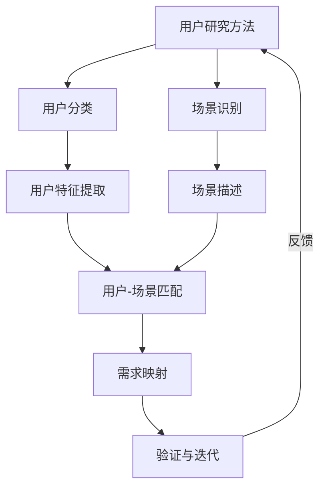

* 数学模型：
  我们可以使用以下模型来评估用户画像的完整性:

$$C = \frac{\sum_{i=1}^n w_i f_i}{\sum_{i=1}^n w_i}$$

其中:
- C: 用户画像完整性得分
- n: 特征数量
- w_i: 第i个特征的权重
- f_i: 第i个特征的完整度 (0-1)

* 算法流程图：

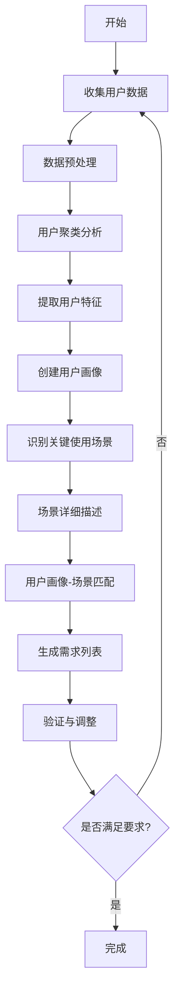

* 算法源代码：

```python
import pandas as pd
import numpy as np
from sklearn.cluster import KMeans
from sklearn.preprocessing import StandardScaler

class UserPersonaScenarioAnalysis:
    def __init__(self):
        self.user_data = None
        self.personas = None
        self.scenarios = []

    def collect_user_data(self, data):
        self.user_data = pd.DataFrame(data)

    def preprocess_data(self):
        # 处理缺失值
        self.user_data = self.user_data.fillna(self.user_data.mean())
        # 标准化数据
        scaler = StandardScaler()
        self.user_data_scaled = scaler.fit_transform(self.user_data)

    def create_personas(self, n_clusters=3):
        kmeans = KMeans(n_clusters=n_clusters, random_state=42)
        self.user_data['Cluster'] = kmeans.fit_predict(self.user_data_scaled)
        self.personas = self.user_data.groupby('Cluster').mean()

    def define_scenarios(self, scenarios):
        self.scenarios = scenarios

    def match_personas_scenarios(self):
        matches = []
        for i, persona in self.personas.iterrows():
            best_scenario = max(self.scenarios, key=lambda s: self.calculate_match_score(persona, s))
            matches.append((i, best_scenario['id']))
        return matches

    def calculate_match_score(self, persona, scenario):
        # 简单的匹配分数计算，实际应用中可能更复杂
        return sum(persona[feature] * scenario.get(feature, 0) for feature in persona.index)

    def generate_requirements(self, matches):
        requirements = []
        for persona_id, scenario_id in matches:
            persona = self.personas.loc[persona_id]
            scenario = next(s for s in self.scenarios if s['id'] == scenario_id)
            requirements.append(f"For {persona.name} in scenario {scenario['name']}, "
                                f"the system should {scenario['action']} "
                                f"considering {persona.to_dict()}")
        return requirements

    def analyze(self):
        self.preprocess_data()
        self.create_personas()
        matches = self.match_personas_scenarios()
        return self.generate_requirements(matches)

# 使用示例
analyzer = UserPersonaScenarioAnalysis()

# 收集用户数据
user_data = [
    {'age': 25, 'income': 50000, 'tech_savviness': 0.8},
    {'age': 40, 'income': 80000, 'tech_savviness': 0.6},
    {'age': 60, 'income': 60000, 'tech_savviness': 0.3},
    # ... 更多用户数据
]
analyzer.collect_user_data(user_data)

# 定义使用场景
scenarios = [
    {'id': 1, 'name': 'Online Shopping', 'action': 'provide personalized recommendations', 'tech_savviness': 0.7},
    {'id': 2, 'name': 'Customer Support', 'action': 'offer quick problem resolution', 'tech_savviness': 0.5},
    {'id': 3, 'name': 'Financial Planning', 'action': 'give tailored investment advice', 'tech_savviness': 0.6},
]
analyzer.define_scenarios(scenarios)

# 分析并生成需求
requirements = analyzer.analyze()
for req in requirements:
    print(req)
```

* 实际场景应用：
1. 电子商务平台的个性化推荐AI Agent
2. 金融服务的智能投资顾问AI Agent
3. 医疗健康领域的患者服务AI Agent
4. 教育行业的个性化学习助手AI Agent

* 项目介绍：
  以电子商务平台的个性化推荐AI Agent为例,用户画像和使用场景分析的主要目标是：
- 识别不同类型的购物者（如价格敏感型、品牌忠诚型、冲动购买型等）
- 定义关键使用场景（如浏览商品、搜索特定商品、查看推荐、下单等）
- 理解不同用户在不同场景下的行为模式和需求
- 为AI Agent设计个性化推荐策略和交互方式

* 环境安装：
```bash
pip install pandas numpy scikit-learn matplotlib seaborn
```

* 系统功能设计：
1. 用户数据收集模块
2. 数据预处理模块
3. 用户聚类分析模块
4. 用户画像生成模块
5. 场景定义模块
6. 用户-场景匹配模块
7. 需求生成模块
8. 可视化模块

* 系统架构设计：

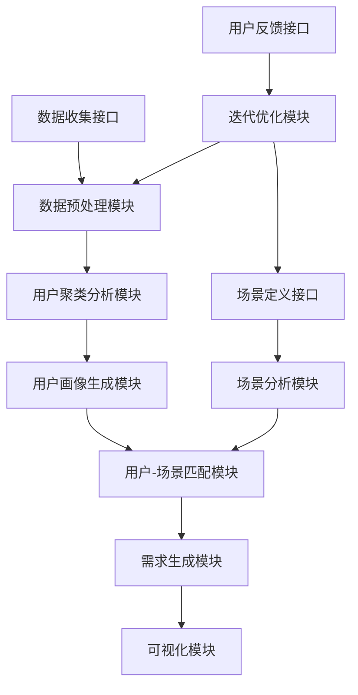

* 系统接口设计：

| 接口名称 | 方法 | 输入 | 输出 | 描述 |
|---------|------|-----|------|-----|
| /collect_data | POST | 用户行为数据 | 数据ID | 收集用户行为数据 |
| /create_persona | GET | 数据ID列表 | 用户画像列表 | 创建用户画像 |
| /define_scenario | POST | 场景描述 | 场景ID | 定义新的使用场景 |
| /match | POST | 用户画像ID, 场景ID列表 | 匹配结果 | 进行用户-场景匹配 |
| /generate_requirements | POST | 匹配结果ID | 需求列表 | 生成设计需求 |
| /visualize | GET | 用户画像ID, 场景ID | 可视化数据 | 生成用户画像和场景的可视化 |

* 系统核心实现源代码：

```python
import pandas as pd
import numpy as np
from sklearn.cluster import KMeans
from sklearn.preprocessing import StandardScaler
import matplotlib.pyplot as plt
import seaborn as sns

class EcommerceUserPersonaScenarioAnalysis:
    def __init__(self):
        self.user_data = None
        self.personas = None
        self.scenarios = []

    def collect_user_data(self, data):
        self.user_data = pd.DataFrame(data)

    def preprocess_data(self):
        # 处理缺失值
        self.user_data = self.user_data.fillna(self.user_data.mean())
        # 标准化数据
        scaler = StandardScaler()
        self.user_data_scaled = scaler.fit_transform(self.user_data)

    def create_personas(self, n_clusters=3):
        kmeans = KMeans(n_clusters=n_clusters, random_state=42)
        self.user_data['Cluster'] = kmeans.fit_predict(self.user_data_scaled)
        self.personas = self.user_data.groupby('Cluster').mean()
        self.personas['Size'] = self.user_data['Cluster'].value_counts()
        self.personas = self.personas.sort_values('Size', ascending=False)

    def define_scenarios(self, scenarios):
        self.scenarios = scenarios

    def match_personas_scenarios(self):
        matches = []
        for i, persona in self.personas.iterrows():
            best_scenario = max(self.scenarios, key=lambda s: self.calculate_match_score(persona, s))
            matches.append((i, best_scenario['id']))
        return matches

    def calculate_match_score(self, persona, scenario):
        return sum(persona[feature] * scenario.get(feature, 0) for feature in persona.index if feature != 'Size')

    def generate_requirements(self, matches):
        requirements = []
        for persona_id, scenario_id in matches:
            persona = self.personas.loc[persona_id]
            scenario = next(s for s in self.scenarios if s['id'] == scenario_id)
            requirements.append(f"For {scenario['name']} scenario, the AI Agent should {scenario['action']} "
                                f"for users with {persona.to_dict()}")
        return requirements

    def visualize_personas(self):
        plt.figure(figsize=(12, 8))
        sns.heatmap(self.personas.drop('Size', axis=1), annot=True, cmap='YlGnBu')
        plt.title('User Personas Heatmap')
        plt.savefig('user_personas.png')
        plt.close()

    def visualize_persona_scenario_match(self, matches):
        match_df = pd.DataFrame(matches, columns=['Persona', 'Scenario'])
        plt.figure(figsize=(10, 6))
        sns.countplot(x='Scenario', hue='Persona', data=match_df)
        plt.title('Persona-Scenario Matches')
        plt.savefig('persona_scenario_match.png')
        plt.close()

    def analyze(self):
        self.preprocess_data()
        self.create_personas()
        matches = self.match_personas_scenarios()
        requirements = self.generate_requirements(matches)
        self.visualize_personas()
        self.visualize_persona_scenario_match(matches)
        return requirements

# 使用示例
analyzer = EcommerceUserPersonaScenarioAnalysis()

# 收集用户数据
user_data = [
    {'age': 25, 'income': 50000, 'purchase_frequency': 10, 'avg_order_value': 100, 'brand_loyalty': 0.3},
    {'age': 40, 'income': 80000, 'purchase_frequency': 5, 'avg_order_value': 200, 'brand_loyalty': 0.7},
    {'age': 60, 'income': 60000, 'purchase_frequency': 2, 'avg_order_value': 150, 'brand_loyalty': 0.8},
    # ... 更多用户数据
]
analyzer.collect_user_data(user_data)

# 定义使用场景
scenarios = [
    {'id': 1, 'name': 'Product Browse', 'action': 'provide personalized product recommendations', 'purchase_frequency': 0.8, 'avg_order_value': 0.5},
    {'id': 2, 'name': 'Search', 'action': 'optimize search results based on user preferences', 'purchase_frequency': 0.6, 'brand_loyalty': 0.7},
    {'id': 3, 'name': 'Checkout', 'action': 'offer relevant upsell items', 'avg_order_value': 0.9, 'brand_loyalty': 0.4},
]
analyzer.define_scenarios(scenarios)

# 分析并生成需求
requirements = analyzer.analyze()
for req in requirements:
    print(req)

print("Visualization files generated: user_personas.png, persona_scenario_match.png")
```

* 最佳实践tips：
1. 结合定量和定性研究方法,全面了解用户
2. 定期更新用户画像,反映用户需求的变化
3. 使用实际数据验证和调整用户画像
4. 考虑边缘案例和小众用户群体
5. 在整个产品开发周期中持续参考用户画像和场景
6. 使用讲故事的方式来描述用户场景,增加共情
7. 进行跨职能研讨,确保各团队对用户画像和场景有共识
8. 建立用户反馈循环,不断优化画像和场景定义
9. 考虑用户的情感需求,不仅关注功能性需求
10. 使用A/B测试验证基于用户画像的设计假设

* 行业发展与未来趋势：

| 时期 | 用户画像特点 | 场景定义方法 | 应用领域 |
|------|------------|-------------|---------|
| 2010-2015 | 静态、基于人口统计 | 用例分析 | 传统电商、金融 |
| 2015-2020 | 动态、基于行为数据 | 用户旅程图 | 社交媒体、移动应用 |
| 2020-2025 | 实时、多维度融合 | 情境感知分析 | 物联网、智能家居 |
| 2025-2030 | 预测性、跨平台 | AI辅助场景生成 | 元宇宙、混合现实 |
| 2030+ | 自适应、个性化极致 | 认知计算模拟 | 全方位智能服务 |

### 6.2.3 功能需求与技术需求洞察

功能需求和技术需求是AI Agent系统设计的核心组成部分，它们共同定义了系统应该做什么以及如何实现。深入洞察这些需求对于开发一个成功的AI Agent至关重要。

* 核心概念：
  功能需求描述系统应该提供的具体功能和服务，而技术需求则关注系统的性能、安全性、可扩展性等非功能性特性。

* 问题背景：
  AI Agent系统通常具有复杂的功能需求和严格的技术要求，如何平衡这两者并确保它们能够有效地转化为系统设计是一个挑战。

* 问题描述：
1. 如何全面且准确地定义AI Agent的功能需求？
2. 如何识别和量化关键的技术需求？
3. 如何处理功能需求和技术需求之间的潜在冲突？
4. 如何确保需求的可追溯性和可测试性？

* 问题解决：
1. 使用结构化需求分析方法，如用例分析和用户故事
2. 采用技术评估矩阵来量化和优先排序技术需求
3. 建立需求依赖图，识别和解决潜在冲突
4. 使用需求管理工具，实现需求的全生命周期追踪

* 边界与外延：
  需求洞察不仅影响初始系统设计，还会影响后续的开发、测试和维护过程。同时，需要考虑法规遵从、行业标准和未来技术趋势。

* 概念结构与核心要素组成：
1. 功能需求识别
2. 技术需求分析
3. 需求优先级排序
4. 需求依赖分析
5. 需求验证与确认
6. 需求文档化
7. 需求追踪
8. 需求变更管理

* 概念之间的关系：

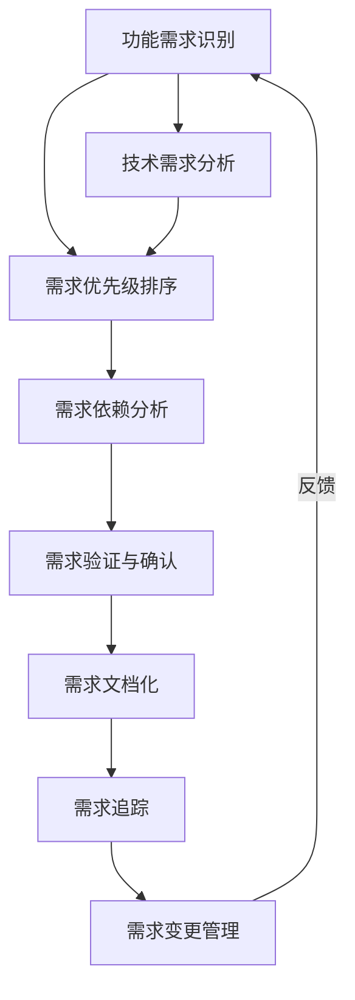

* 数学模型：
  我们可以使用以下模型来评估需求的重要性：

$$I = w_1F + w_2T + w_3U + w_4C$$

其中：
- I: 需求重要性得分
- F: 功能影响 (0-1)
- T: 技术复杂度 (0-1)
- U: 用户价值 (0-1)
- C: 实现成本 (0-1)
- w1, w2, w3, w4: 权重因子 (总和为1)

* 算法流程图：

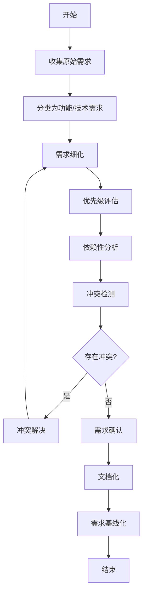

* 算法源代码：

```python
from typing import List, Dict
import networkx as nx

class Requirement:
    def __init__(self, id: str, description: str, type: str):
        self.id = id
        self.description = description
        self.type = type  # 'functional' or 'technical'
        self.priority = 0
        self.dependencies = []

class RequirementAnalysis:
    def __init__(self):
        self.requirements: List[Requirement] = []
        self.dependency_graph = nx.DiGraph()

    def add_requirement(self, req: Requirement):
        self.requirements.append(req)
        self.dependency_graph.add_node(req.id)

    def set_dependency(self, req_id: str, depends_on: str):
        self.dependency_graph.add_edge(depends_on, req_id)

    def prioritize_requirements(self, weights: Dict[str, float]):
        for req in self.requirements:
            functional_impact = 1 if req.type == 'functional' else 0.5
            technical_complexity = 0.8 if req.type == 'technical' else 0.3
            user_value = 0.9 if req.type == 'functional' else 0.6
            implementation_cost = 0.7 if req.type == 'technical' else 0.5
            
            req.priority = (
                weights['functional'] * functional_impact +
                weights['technical'] * technical_complexity +
                weights['user_value'] * user_value +
                weights['cost'] * (1 - implementation_cost)
            )

    def detect_conflicts(self):
        conflicts = []
        for req1 in self.requirements:
            for req2 in self.requirements:
                if req1 != req2 and self.is_conflicting(req1, req2):
                    conflicts.append((req1, req2))
        return conflicts

    def is_conflicting(self, req1: Requirement, req2: Requirement):
        # 简化的冲突检测逻辑，实际应用中可能更复杂
        return (req1.type == req2.type and
                abs(req1.priority - req2.priority) < 0.1 and
                req1.id not in self.dependency_graph.successors(req2.id) and
                req2.id not in self.dependency_graph.successors(req1.id))

    def generate_requirement_document(self):
        doc = "Requirements Specification\n\n"
        for req in sorted(self.requirements, key=lambda x: x.priority, reverse=True):
            doc += f"ID: {req.id}\n"
            doc += f"Type: {req.type}\n"
            doc += f"Description: {req.description}\n"
            doc += f"Priority: {req.priority:.2f}\n"
            dependencies = list(self.dependency_graph.predecessors(req.id))
            if dependencies:
                doc += f"Dependencies: {', '.join(dependencies)}\n"
            doc += "\n"
        return doc

# 使用示例
analyzer = RequirementAnalysis()

# 添加需求
analyzer.add_requirement(Requirement("F1", "The AI Agent should understand natural language queries", "functional"))
analyzer.add_requirement(Requirement("F2", "The system should provide personalized recommendations", "functional"))
analyzer.add_requirement(Requirement("T1", "The system should handle 1000 concurrent users", "technical"))
analyzer.add_requirement(Requirement("T2", "Response time should be under 500ms", "technical"))

# 设置依赖关系
analyzer.set_dependency("F2", "F1")
analyzer.set_dependency("T2", "T1")

# 优先级评估
weights = {'functional': 0.4, 'technical': 0.3, 'user_value': 0.2, 'cost': 0.1}
analyzer.prioritize_requirements(weights)

# 冲突检测
conflicts = analyzer.detect_conflicts()
print("Detected conflicts:", conflicts)

# 生成需求文档
doc = analyzer.generate_requirement_document()
print(doc)
```

* 实际场景应用：
1. 智能客服AI Agent的需求分析
2. 金融风控AI系统的功能与技术需求定义
3. 医疗诊断辅助AI的需求洞察
4. 智能家居控制AI Agent的需求规划

* 项目介绍：
  以智能客服AI Agent为例，功能需求与技术需求洞察的主要目标是：
- 定义核心功能需求（如自然语言理解、问题解答、情感分析等）
- 明确技术需求（如响应时间、并发处理能力、准确率等）
- 识别功能间的依赖关系和潜在冲突
- 确定需求的优先级和实现顺序
- 制定可测试和可验证的需求指标

* 环境安装：
```bash
pip install networkx matplotlib pandas numpy
```

* 系统功能设计：
1. 需求收集模块
2. 需求分类模块
3. 需求优先级评估模块
4. 依赖分析模块
5. 冲突检测模块
6. 需求文档生成模块
7. 需求可视化模块

* 系统架构设计：

```mermaid
graph TD
    A[需求输入接口] --> B[需求分类器]
    B --> C[优先级评估器]
    C --> D[依赖分析器]
    D --> E[冲突检测器]
    E --> F[需求文档生成器]
    F --> G[需求可视化器]
    H[用户反馈接口] --> I[需求更新管理器]
    I --> B
```

* 系统接口设计：

| 接口名称 | 方法 | 输入 | 输出 | 描述 |
|---------|------|-----|------|-----|
| /add_requirement | POST | 需求描述, 类型 | 需求ID | 添加新需求 |
| /set_dependency | POST | 需求ID, 依赖需求ID | 操作状态 | 设置需求依赖关系 |
| /prioritize | POST | 权重设置 | 优先级列表 | 计算需求优先级 |
| /detect_conflicts | GET | - | 冲突列表 | 检测需求冲突 |
| /generate_document | GET | - | 需求文档 | 生成需求规格说明书 |
| /visualize | GET | - | 可视化数据 | 生成需求关系图 |

* 系统核心实现源代码：

```python
import networkx as nx
import matplotlib.pyplot as plt
from typing import List, Dict, Tuple

class Requirement:
    def __init__(self, id: str, description: str, type: str):
        self.id = id
        self.description = description
        self.type = type  # 'functional' or 'technical'
        self.priority = 0

class AIAgentRequirementAnalysis:
    def __init__(self):
        self.requirements: Dict[str, Requirement] = {}
        self.dependency_graph = nx.DiGraph()

    def add_requirement(self, req: Requirement):
        self.requirements[req.id] = req
        self.dependency_graph.add_node(req.id)

    def set_dependency(self, req_id: str, depends_on: str):
        if req_id in self.requirements and depends_on in self.requirements:
            self.dependency_graph.add_edge(depends_on, req_id)

    def prioritize_requirements(self, weights: Dict[str, float]):
        for req in self.requirements.values():
            functional_impact = 1 if req.type == 'functional' else 0.5
            technical_complexity = 0.8 if req.type == 'technical' else 0.3
            user_value = 0.9 if req.type == 'functional' else 0.6
            implementation_cost = 0.7 if req.type == 'technical' else 0.5
            
            req.priority = (
                weights['functional'] * functional_impact +
                weights['technical'] * technical_complexity +
                weights['user_value'] * user_value +
                weights['cost'] * (1 - implementation_cost)
            )

    def detect_conflicts(self) -> List[Tuple[str, str]]:
        conflicts = []
        for req1_id, req1 in self.requirements.items():
            for req2_id, req2 in self.requirements.items():
                if req1_id != req2_id and self.is_conflicting(req1, req2):
                    conflicts.append((req1_id, req2_id))
        return conflicts

    def is_conflicting(self, req1: Requirement, req2: Requirement) -> bool:
        return (req1.type == req2.type and
                abs(req1.priority - req2.priority) < 0.1 and
                req1.id not in self.dependency_graph.successors(req2.id) and
                req2.id not in self.dependency_graph.successors(req1.id))

    def generate_requirement_document(self) -> str:
        doc = "AI Agent Requirements Specification\n\n"
        sorted_reqs = sorted(self.requirements.values(), key=lambda x: x.priority, reverse=True)
        for req in sorted_reqs:
            doc += f"ID: {req.id}\n"
            doc += f"Type: {req.type}\n"
            doc += f"Description: {req.description}\n"
            doc += f"Priority: {req.priority:.2f}\n"
            dependencies = list(self.dependency_graph.predecessors(req.id))
            if dependencies:
                doc += f"Dependencies: {', '.join(dependencies)}\n"
            doc += "\n"
        return doc

    def visualize_requirements(self):
        plt.figure(figsize=(12, 8))
        pos = nx.spring_layout(self.dependency_graph)
        nx.draw(self.dependency_graph, pos, with_labels=True, node_color='lightblue', 
                node_size=2000, font_size=10, arrows=True)
        
        labels = {node: f"{node}\n{self.requirements[node].type}\n{self.requirements[node].priority:.2f}"
                  for node in self.dependency_graph.nodes()}
        nx.draw_networkx_labels(self.dependency_graph, pos, labels, font_size=8)
        
        plt.title("AI Agent Requirements Dependency Graph")
        plt.axis('off')
        plt.tight_layout()
        plt.savefig('ai_agent_requirements.png')
        plt.close()

# 使用示例
analyzer = AIAgentRequirementAnalysis()

# 添加需求
analyzer.add_requirement(Requirement("F1", "Understand natural language queries", "functional"))
analyzer.add_requirement(Requirement("F2", "Provide personalized recommendations", "functional"))
analyzer.add_requirement(Requirement("F3", "Handle multi-turn conversations", "functional"))
analyzer.add_requirement(Requirement("T1", "Process 1000 concurrent requests", "technical"))
analyzer.add_requirement(Requirement("T2", "Respond within 500ms", "technical"))
analyzer.add_requirement(Requirement("T3", "Achieve 95% accuracy in intent recognition", "technical"))

# 设置依赖关系
analyzer.set_dependency("F2", "F1")
analyzer.set_dependency("F3", "F1")
analyzer.set_dependency("T2", "T1")
analyzer.set_dependency("F2", "T3")

# 优先级评估
weights = {'functional': 0.4, 'technical': 0.3, 'user_value': 0.2, 'cost': 0.1}
analyzer.prioritize_requirements(weights)

# 冲突检测
conflicts = analyzer.detect_conflicts()
print("Detected conflicts:", conflicts)

# 生成需求文档
doc = analyzer.generate_requirement_document()
print(doc)

# 可视化需求关系
analyzer.visualize_requirements()
print("Requirements visualization saved as 'ai_agent_requirements.png'")
```

* 最佳实践tips：
1. 使用结构化方法收集和分析需求，如FURPS+模型
2. 采用迭代方式定义和细化需求，允许需求的演进
3. 使用需求跟踪矩阵确保需求的可追溯性
4. 进行定期的需求审查会议，确保stakeholders的一致理解
5. 使用原型或MVP来验证关键功能需求
6. 建立明确的需求变更控制流程
7. 将技术需求与业务目标明确关联
8. 使用场景测试来验证功能需求的完整性
9. 采用性能建模和负载测试来验证技术需求
10. 建立需求与测试用例的双向追踪

* 行业发展与未来趋势：

| 时期 | 需求分析特点 | 工具和技术 | 应用重点 |
|------|------------|------------|---------|
| 2020-2022 | 基于大数据的需求挖掘 | 自然语言处理, 数据挖掘 | 用户行为分析, 个性化服务 |
| 2022-2024 | AI辅助需求分析 | 机器学习模型, 自动化需求工具 | 需求预测, 智能推荐 |
| 2024-2026 | 实时需求响应 | 边缘计算, 5G技术 | 即时服务适配, 场景感知 |
| 2026-2028 | 跨领域需求整合 | 知识图谱, 语义网络 | 生态系统需求, 服务融合 |
| 2028+ | 自适应需求工程 | 认知计算, 量子计算 | 自我进化系统, 前瞻性需求预测 |

### 6.2.4 系统架构设计原则

系统架构设计是AI Agent开发过程中的关键环节，它为整个系统提供了结构化的蓝图，决定了系统的整体性能、可扩展性和可维护性。遵循正确的设计原则对于构建健壮、高效的AI Agent系统至关重要。

* 核心概念：
  系统架构设计原则是指在设计AI Agent系统时应遵循的一系列指导方针和最佳实践，包括模块化、可扩展性、安全性、可维护性等方面的考虑。

* 问题背景：
  AI Agent系统通常具有复杂的功能需求和严格的性能要求，如何设计一个既能满足当前需求又能适应未来变化的系统架构是一个巨大挑战。

* 问题描述：
1. 如何设计一个灵活可扩展的AI Agent系统架构？
2. 如何平衡系统的性能、安全性和可维护性？
3. 如何处理AI模型与传统软件系统的集成？
4. 如何确保系统架构能够支持持续的AI模型更新和优化？

* 问题解决：
1. 采用微服务架构，提高系统的模块化和可扩展性
2. 实施分层设计，分离关注点，提高系统的可维护性
3. 使用API网关统一管理接口，增强安全性和可控性
4. 采用容器化技术，方便AI模型的部署和更新
5. 实施持续集成和持续部署(CI/CD)，支持快速迭代

* 边界与外延：
  系统架构设计不仅影响技术实现，还会影响团队结构、开发流程和运维策略。同时，需要考虑法规遵从、数据隐私和伦理问题。

* 概念结构与核心要素组成：
1. 微服务设计
2. 数据流设计
3. API设计
4. 安全架构
5. 扩展性设计
6. 容错与恢复机制
7. 监控与日志系统
8. AI模型管理

* 概念之间的关系：

```mermaid
graph TD
    A[微服务设计] --> B[API设计]
    A --> C[数据流设计]
    B --> D[安全架构]
    C --> E[AI模型管理]
    A --> F[扩展性设计]
    F --> G[容错与恢复机制]
    A --> H[监控与日志系统]
    E --> H
```

* 数学模型：
  我们可以使用以下模型来评估系统架构的质量：

$$Q = w_1M + w_2S + w_3P + w_4R + w_5E$$

其中：
- Q: 架构质量得分
- M: 模块化程度 (0-1)
- S: 安全性 (0-1)
- P: 性能效率 (0-1)
- R: 可靠性 (0-1)
- E: 可扩展性 (0-1)
- w1, w2, w3, w4, w5: 权重因子 (总和为1)

* 算法流程图：

```mermaid
graph TD
    A[开始] --> B[需求分析]
    B --> C[确定系统边界]
    C --> D[识别核心组件]
    D --> E[定义组件接口]
    E --> F[设计数据流]
    F --> G[规划扩展性]
    G --> H[制定安全策略]
    H --> I[设计监控方案]
    I --> J[文档化架构]
    J --> K[架构评审]
    K --> L{是否通过?}
    L -- 是 --> M[完成]
    L -- 否 --> N[修改设计]
    N --> D
```

* 算法源代码：

```python
from typing import List, Dict

class Component:
    def __init__(self, name: str, type: str):
        self.name = name
        self.type = type
        self.interfaces = []
        self.dependencies = []

class SystemArchitecture:
    def __init__(self):
        self.components: List[Component] = []
        self.data_flows: List[Dict] = []
        self.security_policies: List[str] = []
        self.scaling_strategies: List[str] = []

    def add_component(self, component: Component):
        self.components.append(component)

    def add_data_flow(self, source: str, destination: str, data_type: str):
        self.data_flows.append({
            "source": source,
            "destination": destination,
            "data_type": data_type
        })

    def add_security_policy(self, policy: str):
        self.security_policies.append(policy)

    def add_scaling_strategy(self, strategy: str):
        self.scaling_strategies.append(strategy)

    def evaluate_architecture(self, weights: Dict[str, float]) -> float:
        modularity = self.calculate_modularity()
        security = self.calculate_security()
        performance = self.calculate_performance()
        reliability = self.calculate_reliability()
        scalability = self.calculate_scalability()

        quality_score = (
            weights['modularity'] * modularity +
            weights['security'] * security +
            weights['performance'] * performance +
            weights['reliability'] * reliability +
            weights['scalability'] * scalability
        )

        return quality_score

    def calculate_modularity(self) -> float:
        # 简化的模块化计算
        total_components = len(self.components)
        independent_components = sum(1 for c in self.components if not c.dependencies)
        return independent_components / total_components if total_components > 0 else 0

    def calculate_security(self) -> float:
        # 简化的安全性计算
        return min(len(self.security_policies) / 5, 1)

    def calculate_performance(self) -> float:
        # 简化的性能计算
        return 0.8  # 假设值

    def calculate_reliability(self) -> float:
        # 简化的可靠性计算
        return 0.9  # 假设值

    def calculate_scalability(self) -> float:
        # 简化的可扩展性计算
        return min(len(self.scaling_strategies) / 3, 1)

    def generate_architecture_document(self) -> str:
        doc = "AI Agent System Architecture\n\n"
        
        doc += "Components:\n"
        for component in self.components:
            doc += f"- {component.name} ({component.type})\n"
            doc += f"  Interfaces: {', '.join(component.interfaces)}\n"
            doc += f"  Dependencies: {', '.join(component.dependencies)}\n\n"
        
        doc += "Data Flows:\n"
        for flow in self.data_flows:
            doc += f"- {flow['source']} -> {flow['destination']}: {flow['data_type']}\n"
        
        doc += "\nSecurity Policies:\n"
        for policy in self.security_policies:
            doc += f"- {policy}\n"
        
        doc += "\nScaling Strategies:\n"
        for strategy in self.scaling_strategies:
            doc += f"- {strategy}\n"
        
        return doc

# 使用示例
architecture = SystemArchitecture()

# 添加组件
nlp_engine = Component("NLP Engine", "Core")
nlp_engine.interfaces = ["process_text", "extract_intent"]
architecture.add_component(nlp_engine)

dialogue_manager = Component("Dialogue Manager", "Core")
dialogue_manager.interfaces = ["manage_conversation", "generate_response"]
dialogue_manager.dependencies = ["NLP Engine"]
architecture.add_component(dialogue_manager)

knowledge_base = Component("Knowledge Base", "Data")
knowledge_base.interfaces = ["query", "update"]
architecture.add_component(knowledge_base)

# 添加数据流
architecture.add_data_flow("User Input", "NLP Engine", "Text")
architecture.add_data_flow("NLP Engine", "Dialogue Manager", "Parsed Intent")
architecture.add_data_flow("Dialogue Manager", "Knowledge Base", "Query")
architecture.add_data_flow("Knowledge Base", "Dialogue Manager", "Information")
architecture.add_data_flow("Dialogue Manager", "User Output", "Response")

# 添加安全策略
architecture.add_security_policy("Encrypt all user data in transit and at rest")
architecture.add_security_policy("Implement role-based access control")

# 添加扩展策略
architecture.add_scaling_strategy("Use auto-scaling for NLP Engine based on request load")
architecture.add_scaling_strategy("Implement database sharding for Knowledge Base")

# 评估架构
weights = {
    'modularity': 0.2,
    'security': 0.25,
    'performance': 0.2,
    'reliability': 0.15,
    'scalability': 0.2
}
quality_score = architecture.evaluate_architecture(weights)
print(f"Architecture Quality Score: {quality_score:.2f}")

# 生成架构文档
doc = architecture.generate_architecture_document()
print(doc)
```

* 实际场景应用：
1. 企业级智能客服AI Agent系统架构设计
2. 金融风控AI系统的可扩展架构设计
3. 医疗诊断辅助AI的安全架构设计
4. 多语言自然语言处理AI Agent的分布式架构设计

* 项目介绍：
  以企业级智能客服AI Agent为例，系统架构设计的主要目标是：
- 设计可扩展的微服务架构，支持功能的独立开发和部署
- 实现高效的数据流，确保实时响应能力
- 设计安全的API网关，保护敏感信息
- 规划AI模型的更新和部署策略
- 设计全面的监控和日志系统，支持问题诊断和性能优化
- 实现高可用性和容错机制

* 环境安装：
```bash
pip install fastapi uvicorn pydantic sqlalchemy redis
```

* 系统功能设计：
1. 用户认证服务
2. 自然语言理解服务
3. 对话管理服务
4. 知识库查询服务
5. 响应生成服务
6. 日志分析服务
7. 模型管理服务
8. API网关

* 系统架构设计：

```mermaid
graph TD
    A[API网关] --> B[用户认证服务]
    A --> C[自然语言理解服务]
    A --> D[对话管理服务]
    D --> E[知识库查询服务]
    D --> F[响应生成服务]
    G[日志分析服务] --> H[ELK Stack]
    I[模型管理服务] --> J[模型存储]
    C --> I
    F --> I
    A --> K[负载均衡器]
    K --> C
    K --> D
    K --> E
    K --> F
```

* 系统接口设计：

| 接口名称 | 方法 | 输入 | 输出 | 描述 |
|---------|------|-----|------|-----|
| /auth   | POST | 用户凭证 | 访问令牌 | 用户认证 |
| /chat   | POST | 用户ID, 消息内容 | 回复内容 | 处理用户消息 |
| /intent | POST | 文本内容 | 意图, 置信度 | 意图识别 |
| /knowledge | GET | 查询参数 | 知识条目 | 知识库查询 |
| /feedback | POST | 会话ID, 评分 | 处理状态 | 用户反馈 |
| /model/update | POST | 模型ID, 模型文件 | 更新状态 | 更新AI模型 |

* 系统核心实现源代码：

```python
from fastapi import FastAPI, Depends, HTTPException, status
from fastapi.security import OAuth2PasswordBearer
from pydantic import BaseModel
from typing import List
import uvicorn
import json
import redis
import asyncio

app = FastAPI()

# 模拟数据库
redis_client = redis.Redis(host='localhost', port=6379, db=0)

oauth2_scheme = OAuth2PasswordBearer(tokenUrl="token")

class Message(BaseModel):
    user_id: str
    content: str

class Response(BaseModel):
    content: str
    intent: str
    confidence: float

class FeedbackInput(BaseModel):
    session_id: str
    rating: int

class ModelUpdate(BaseModel):
    model_id: str
    model_file: str

# 用户认证服务
@app.post("/auth")
async def authenticate_user(username: str, password: str):
    # 实际应用中应使用更安全的认证方法
    if username == "admin" and password == "password":
        return {"access_token": "example_token", "token_type": "bearer"}
    raise HTTPException(status_code=400, detail="Incorrect username or password")

# 聊天服务
@app.post("/chat", response_model=Response)
async def chat(message: Message, token: str = Depends(oauth2_scheme)):
    # 处理用户消息
    intent, confidence = await get_intent(message.content)
    knowledge = await query_knowledge_base(intent)
    response = await generate_response(intent, knowledge)
    
    # 存储会话历史
    redis_client.lpush(f"chat_history:{message.user_id}", json.dumps({
        "user_message": message.content,
        "bot_response": response,
        "intent": intent,
        "confidence": confidence
    }))
    
    return Response(content=response, intent=intent, confidence=confidence)

# 意图识别服务
async def get_intent(text: str):
    # 这里应该调用NLU服务，这里用简单逻辑代替
    if "weather" in text.lower():
        return "get_weather", 0.9
    elif "news" in text.lower():
        return "get_news", 0.8
    else:
        return "unknown", 0.5

# 知识库查询服务
async def query_knowledge_base(intent: str):
    # 模拟知识库查询
    knowledge_base = {
        "get_weather": "Here's the weather forecast...",
        "get_news": "Here are the latest news headlines..."
    }
    return knowledge_base.get(intent, "I don't have information about that.")

# 响应生成服务
async def generate_response(intent: str, knowledge: str):
    # 实际应用中，这里应该使用更复杂的响应生成逻辑
    return f"Intent: {intent}. {knowledge}"

# 用户反馈服务
@app.post("/feedback")
async def process_feedback(feedback: FeedbackInput, token: str = Depends(oauth2_scheme)):
    # 存储用户反馈
    redis_client.hset(f"feedback:{feedback.session_id}", mapping={
        "rating": feedback.rating,
        "timestamp": asyncio.get_event_loop().time()
    })
    return {"status": "Feedback received"}

# 模型更新服务
@app.post("/model/update")
async def update_model(model_update: ModelUpdate, token: str = Depends(oauth2_scheme)):
    # 实际应用中，这里应该包含模型验证和部署逻辑
    redis_client.hset("ai_models", model_update.model_id, model_update.model_file)
    return {"status": "Model updated successfully"}

if __name__ == "__main__":
    uvicorn.run(app, host="0.0.0.0", port=8000)
```

* 最佳实践tips：
1. 采用"API优先"的设计方法，确保各服务间的清晰接口
2. 实现服务间的松耦合，使用消息队列等异步通信机制
3. 使用容器化技术（如Docker）简化部署和扩展
4. 实施全面的监控和告警机制，及时发现和解决问题
5. 采用持续集成和持续部署（CI/CD）流程，支持快速迭代
6. 实现全面的日志记录，便于问题诊断和性能优化
7. 使用服务网格（如Istio）管理微服务通信和安全
8. 实施严格的访问控制和数据加密措施
9. 设计灾难恢复和业务连续性计划
10. 定期进行架构审查和性能测试，持续优化系统

* 行业发展与未来趋势：

| 时期 | 架构特点 | 关键技术 | 应用重点 |
|------|--------|----------|---------|
| 2020-2022 | 微服务化, 容器化 | Kubernetes, Docker | 灵活部署, 快速迭代 |
| 2022-2024 | 无服务器架构 | AWS Lambda, Azure Functions | 按需计算, 成本优化 |
| 2024-2026 | 边缘计算 | 5G, IoT设备 | 低延迟, 本地处理 |
| 2026-2028 | 混合云 | 云原生技术, 多云管理平台 | 资源整合, 灵活调度 |
| 2028+ | 量子计算融合 | 量子算法, 量子安全 | 超高性能计算, 新一代加密 |

### 6.2.5 模块划分与功能设计

模块划分和功能设计是AI Agent系统架构中的关键环节，它直接影响系统的可维护性、可扩展性和整体性能。合理的模块划分能够使系统结构清晰，便于开发和维护；而精心的功能设计则能确保系统满足所有需求，并具有良好的用户体验。

* 核心概念：
  模块划分是指将整个AI Agent系统分解成多个相对独立但相互协作的功能模块。功能设计则是详细规划每个模块应该具备的具体功能和接口。

* 问题背景：
  AI Agent系统通常具有复杂的功能需求和数据流，如何合理划分模块并设计功能以优化系统性能和开发效率是一个挑战。

* 问题描述：
1. 如何确定合适的模块粒度？
2. 如何处理模块间的依赖关系？
3. 如何设计模块接口以确保灵活性和可扩展性？
4. 如何在功能设计中平衡用户需求和技术可行性？

* 问题解决：
1. 采用领域驱动设计(DDD)方法，基于业务领域划分模块
2. 使用依赖注入和接口设计降低模块间耦合
3. 实施清晰的API版本控制策略
4. 采用用户故事和用例分析方法进行功能设计

* 边界与外延：
  模块划分和功能设计不仅影响系统架构，还会影响团队结构和开发流程。同时，需要考虑未来的扩展性和可能的技术演进。

* 概念结构与核心要素组成：
1. 领域分析
2. 模块划分
3. 接口设计
4. 数据流设计
5. 功能规划
6. 用户交互设计
7. 性能优化
8. 可测试性设计

* 概念之间的关系：

```mermaid
graph TD
    A[领域分析] --> B[模块划分]
    B --> C[接口设计]
    B --> D[数据流设计]
    C --> E[功能规划]
    D --> E
    E --> F[用户交互设计]
    E --> G[性能优化]
    E --> H[可测试性设计]
```

* 数学模型：
  我们可以使用以下模型来评估模块划分的质量：

$$Q = \frac{C}{N} \times (1 - \frac{D}{N(N-1)/2})$$

其中：
- Q: 模块划分质量得分
- C: 模块内部的平均内聚度 (0-1)
- N: 模块总数
- D: 模块间的总依赖数

* 算法流程图：

```mermaid
graph TD
    A[开始] --> B[领域分析]
    B --> C[初步模块划分]
    C --> D[定义模块接口]
    D --> E[设计数据流]
    E --> F[详细功能设计]
    F --> G[用户交互设计]
    G --> H[性能评估]
    H --> I[可测试性分析]
    I --> J{满足要求?}
    J -- 是 --> K[完成]
    J -- 否 --> L[调整设计]
    L --> C
```

* 算法源代码：

```python
from typing import List, Dict

class Module:
    def __init__(self, name: str):
        self.name = name
        self.functions: List[str] = []
        self.interfaces: List[str] = []
        self.dependencies: List[str] = []

class AIAgentSystem:
    def __init__(self):
        self.modules: Dict[str, Module] = {}

    def add_module(self, name: str):
        self.modules[name] = Module(name)

    def add_function(self, module_name: str, function: str):
        if module_name in self.modules:
            self.modules[module_name].functions.append(function)

    def add_interface(self, module_name: str, interface: str):
        if module_name in self.modules:
            self.modules[module_name].interfaces.append(interface)

    def add_dependency(self, module_name: str, dependency: str):
        if module_name in self.modules:
            self.modules[module_name].dependencies.append(dependency)

    def calculate_modularity(self) -> float:
        total_modules = len(self.modules)
        total_dependencies = sum(len(m.dependencies) for m in self.modules.values())
        max_dependencies = total_modules * (total_modules - 1) / 2

        cohesion = sum(len(m.functions) for m in self.modules.values()) / total_modules
        coupling = 1 - (total_dependencies / max_dependencies if max_dependencies > 0 else 0)

        return cohesion * coupling

    def generate_module_design_document(self) -> str:
        doc = "AI Agent System Module Design\n\n"
        
        for name, module in self.modules.items():
            doc += f"Module: {name}\n"
            doc += "Functions:\n"
            for function in module.functions:
                doc += f"- {function}\n"
            doc += "Interfaces:\n"
            for interface in module.interfaces:
                doc += f"- {interface}\n"
            doc += "Dependencies:\n"
            for dependency in module.dependencies:
                doc += f"- {dependency}\n"
            doc += "\n"
        
        modularity_score = self.calculate_modularity()
        doc += f"Overall Modularity Score: {modularity_score:.2f}"
        
        return doc

# 使用示例
ai_system = AIAgentSystem()

# 添加模块
ai_system.add_module("NLU")
ai_system.add_module("DialogueManager")
ai_system.add_module("KnowledgeBase")
ai_system.add_module("ResponseGenerator")

# 添加函数
ai_system.add_function("NLU", "parse_intent")
ai_system.add_function("NLU", "extract_entities")
ai_system.add_function("DialogueManager", "manage_conversation_flow")
ai_system.add_function("KnowledgeBase", "query_knowledge")
ai_system.add_function("ResponseGenerator", "generate_response")

# 添加接口
ai_system.add_interface("NLU", "process_text(text: str) -> Dict[str, Any]")
ai_system.add_interface("DialogueManager", "handle_turn(user_input: str, context: Dict) -> str")
ai_system.add_interface("KnowledgeBase", "get_info(query: str) -> List[str]")
ai_system.add_interface("ResponseGenerator", "create_response(intent: str, entities: Dict, knowledge: List[str]) -> str")

# 添加依赖关系
ai_system.add_dependency("DialogueManager", "NLU")
ai_system.add_dependency("DialogueManager", "KnowledgeBase")
ai_system.add_dependency("DialogueManager", "ResponseGenerator")

# 生成模块设计文档
design_doc = ai_system.generate_module_design_document()
print(design_doc)

# 计算模块化得分
modularity_score = ai_system.calculate_modularity()
print(f"Modularity Score: {modularity_score:.2f}")
```

* 实际场景应用：
1. 智能客服AI Agent的模块划分与功能设计
2. 金融分析AI系统的组件设计
3. 医疗诊断AI助手的模块化架构
4. 智能家居控制AI的功能模块设计

* 项目介绍：
  以智能客服AI Agent为例，模块划分与功能设计的主要目标是：
- 将系统分解为自然语言理解、对话管理、知识库查询、响应生成等核心模块
- 明确定义每个模块的功能和责任
- 设计清晰的模块间接口和数据流
- 确保各模块的独立性和可复用性
- 规划用户交互流程和体验优化

* 环境安装：
```bash
pip install fastapi uvicorn pydantic sqlalchemy redis
```

* 系统功能设计：
1. 自然语言理解(NLU)模块
  - 意图识别
  - 实体提取
2. 对话管理模块
  - 对话状态追踪
  - 对话策略决策
3. 知识库查询模块
  - 信息检索
  - 答案排序
4. 响应生成模块
  - 模板填充
  - 自然语言生成
5. 用户管理模块
  - 用户认证
  - 会话管理
6. 日志与分析模块
  - 交互日志记录
  - 性能分析

* 系统架构设计：

```mermaid
graph TD
    A[用户接口] --> B[用户管理模块]
    A --> C[对话管理模块]
    C --> D[自然语言理解模块]
    C --> E[知识库查询模块]
    C --> F[响应生成模块]
    C --> G[日志与分析模块]
    D --> E
    E --> F
    B --> G
    C --> G
```

* 系统接口设计：

| 模块名称 | 接口名称 | 方法 | 输入 | 输出 | 描述 |
|---------|---------|------|-----|------|-----|
| 用户管理 | /auth   | POST | 用户凭证 | 访问令牌 | 用户认证 |
| 对话管理 | /chat   | POST | 用户ID, 消息内容 | 回复内容 | 处理用户消息 |
| NLU | /parse  | POST | 文本内容 | 意图, 实体 | 解析用户输入 |
| 知识库 | /query  | GET | 查询参数 | 知识条目 | 查询知识库 |
| 响应生成 | /generate | POST | 意图, 实体, 知识 | 响应文本 | 生成回复 |
| 日志分析 | /log    | POST | 交互数据 | 记录状态 | 记录交互日志 |

* 系统核心实现源代码：

```python
from fastapi import FastAPI, Depends, HTTPException, status
from fastapi.security import OAuth2PasswordBearer
from pydantic import BaseModel
from typing import List, Dict, Any
import uvicorn
import json
import redis
from sqlalchemy import create_engine, Column, Integer, String, JSON
from sqlalchemy.ext.declarative import declarative_base
from sqlalchemy.orm import sessionmaker

app = FastAPI()

# 数据库设置
SQLALCHEMY_DATABASE_URL = "sqlite:///./ai_agent.db"
engine = create_engine(SQLALCHEMY_DATABASE_URL)
SessionLocal = sessionmaker(autocommit=False, autoflush=False, bind=engine)
Base = declarative_base()

# Redis 设置
redis_client = redis.Redis(host='localhost', port=6379, db=0)

oauth2_scheme = OAuth2PasswordBearer(tokenUrl="token")

# 数据模型
class User(Base):
    __tablename__ = "users"
    id = Column(Integer, primary_key=True, index=True)
    username = Column(String, unique=True, index=True)
    hashed_password = Column(String)

class Conversation(Base):
    __tablename__ = "conversations"
    id = Column(Integer, primary_key=True, index=True)
    user_id = Column(Integer, index=True)
    messages = Column(JSON)

Base.metadata.create_all(bind=engine)

# Pydantic 模型
class Message(BaseModel):
    user_id: int
    content: str

class ParsedMessage(BaseModel):
    intent: str
    entities: Dict[str, Any]

class Response(BaseModel):
    content: str

# 用户管理模块
@app.post("/auth")
async def authenticate_user(username: str, password: str):
    # 实际应用中应使用更安全的认证方法
    user = get_user(username)
    if not user or not verify_password(password, user.hashed_password):
        raise HTTPException(status_code=400, detail="Incorrect username or password")
    return {"access_token": create_access_token(user.id), "token_type": "bearer"}

def get_user(username: str):
    db = SessionLocal()
    return db.query(User).filter(User.username == username).first()

def verify_password(plain_password, hashed_password):
    # 实际应用中应使用安全的密码哈希方法
    return plain_password == hashed_password

def create_access_token(user_id: int):
    # 实际应用中应使用JWT等安全的令牌生成方法
    return f"user_{user_id}_token"

# 对话管理模块
@app.post("/chat", response_model=Response)
async def chat(message: Message, token: str = Depends(oauth2_scheme)):
    parsed_message = await parse_message(message.content)
    knowledge = await query_knowledge(parsed_message.intent, parsed_message.entities)
    response = await generate_response(parsed_message.intent, parsed_message.entities, knowledge)
    await log_interaction(message.user_id, message.content, response)
    return Response(content=response)

# 自然语言理解模块
async def parse_message(content: str) -> ParsedMessage:
    # 实际应用中应调用NLU服务
    intent = "get_weather" if "weather" in content.lower() else "unknown"
    entities = {"location": "New York"} if "new york" in content.lower() else {}
    return ParsedMessage(intent=intent, entities=entities)

# 知识库查询模块
async def query_knowledge(intent: str, entities: Dict[str, Any]) -> List[str]:
    # 实际应用中应查询实际的知识库
    if intent == "get_weather":
        return ["The weather is sunny."]
    return ["I don't have information about that."]

# 响应生成模块
async def generate_response(intent: str, entities: Dict[str, Any], knowledge: List[str]) -> str:
    # 实际应用中应使用更复杂的响应生成逻辑
    if intent == "get_weather" and knowledge:
        return f"For {entities.get('location', 'your area')}, {knowledge[0]}"
    return "I'm sorry, I couldn't find the information you're looking for."

# 日志与分析模块
async def log_interaction(user_id: int, user_message: str, bot_response: str):
    db = SessionLocal()
    conversation = db.query(Conversation).filter(Conversation.user_id == user_id).first()
    if not conversation:
        conversation = Conversation(user_id=user_id, messages=[])
        db.add(conversation)
    conversation.messages.append({"user": user_message, "bot": bot_response, "timestamp": str(datetime.now())})
    db.commit()

if __name__ == "__main__":
    uvicorn.run(app, host="0.0.0.0", port=8000)
```

* 最佳实践tips：
1. 遵循单一责任原则，确保每个模块只负责一个特定的功能领域
2. 使用依赖注入降低模块间耦合，提高可测试性
3. 设计清晰的错误处理和异常传播机制
4. 实现模块级别的日志记录，便于问题诊断
5. 采用契约式设计，明确定义模块间的接口契约
6. 考虑使用领域事件进行模块间通信，提高系统的响应性和可扩展性
7. 实施版本控制策略，管理接口的演进
8. 设计可配置的模块参数，提高系统的灵活性
9. 考虑性能优化，如缓存机制和异步处理
10. 定期进行代码审查和重构，保持模块的清晰和高效

* 行业发展与未来趋势：

| 时期 | 模块化特点 | 关键技术 | 应用重点 |
|------|----------|----------|---------|
| 2020-2022 | 微服务化 | Docker, Kubernetes | 服务独立部署、扩展 |
| 2022-2024 | serverless | AWS Lambda, Azure Functions | 按需计算、自动扩展 |
| 2024-2026 | 边缘计算模块 | 5G, IoT设备 | 本地处理、低延迟 |
| 2026-2028 | 自适应模块 | 强化学习, 自动化运维 | 动态资源分配、自我优化 |
| 2028+ | 量子计算模块 | 量子算法, 量子通信 | 超高性能计算、安全通信 |

通过这种模块化和功能设计，我们可以构建一个灵活、可扩展且高效的AI Agent系统。每个模块都有明确的职责和接口，便于团队协作开发和后续维护。同时，这种设计也为未来的功能扩展和性能优化留下了充足的空间。

## 6.3 技术选型与环境搭建

在AI Agent开发过程中，技术选型和环境搭建是奠定项目成功基础的关键步骤。正确的技术选择可以大大提高开发效率，而适当的环境配置则能确保开发和部署的顺利进行。本节将深入探讨如何进行技术选型和环境搭建，以支持高效的AI Agent开发。

### 6.3.1 开发语言与框架选择

选择合适的开发语言和框架对AI Agent的开发效率和性能有着直接的影响。不同的语言和框架有各自的优势和适用场景，需要根据项目需求和团队技能进行权衡选择。

* 核心概念：
  开发语言是用于编写AI Agent代码的编程语言，而框架则是基于特定语言的工具集，提供了开发AI应用所需的基础结构和功能。

* 问题背景：
  AI Agent开发涉及多个领域，包括自然语言处理、机器学习、后端服务等，每个领域都有其主流的语言和框架选择。如何在这些选项中做出最优决策是一个挑战。

* 问题描述：
1. 如何评估不同编程语言在AI Agent开发中的优劣？
2. 应该选择通用框架还是专门的AI框架？
3. 如何平衡开发效率和系统性能的需求？
4. 如何考虑团队的技术栈和学习曲线？

* 问题解决：
1. 分析项目需求，确定关键技术领域
2. 评估各种语言和框架在性能、生态系统、社区支持等方面的优势
3. 考虑团队的技术背景和学习能力
4. 进行小规模原型测试，验证技术选择的可行性

* 边界与外延：
  语言和框架的选择不仅影响开发过程，还会影响系统的长期维护、扩展和性能优化。同时，还需要考虑与现有系统的集成需求。

* 概念结构与核心要素组成：
1. 编程语言评估
2. AI框架比较
3. 性能测试
4. 生态系统分析
5. 团队技能评估
6. 学习成本计算
7. 长期维护考虑
8. 集成需求分析

* 概念之间的关系：

```mermaid
graph TD
    A[项目需求分析] --> B[编程语言评估]
    A --> C[AI框架比较]
    B --> D[性能测试]
    C --> D
    B --> E[生态系统分析]
    C --> E
    A --> F[团队技能评估]
    F --> G[学习成本计算]
    D --> H[技术选型决策]
    E --> H
    G --> H
    H --> I[长期维护考虑]
    H --> J[集成需求分析]
```

* 数学模型：
  我们可以使用以下模型来评估技术选择的综合得分：

$$S = w_1P + w_2E + w_3C + w_4L + w_5M$$

其中：
- S: 综合得分
- P: 性能得分 (0-1)
- E: 生态系统得分 (0-1)
- C: 社区活跃度得分 (0-1)
- L: 学习曲线得分 (0-1)
- M: 维护性得分 (0-1)
- w1, w2, w3, w4, w5: 权重因子 (总和为1)

* 算法流程图：

```mermaid
graph TD
    A[开始] --> B[确定评估标准]
    B --> C[列出候选技术]
    C --> D[性能测试]
    C --> E[生态系统评估]
    C --> F[社区活跃度分析]
    C --> G[学习曲线评估]
    C --> H[维护性分析]
    D --> I[综合评分计算]
    E --> I
    F --> I
    G --> I
    H --> I
    I --> J[排序和筛选]
    J --> K[团队讨论]
    K --> L[最终决策]
    L --> M[结束]
```

* 算法源代码：

```python
from typing import List, Dict
import numpy as np

class TechnologyOption:
    def __init__(self, name: str, language: str, framework: str):
        self.name = name
        self.language = language
        self.framework = framework
        self.scores = {
            'performance': 0,
            'ecosystem': 0,
            'community': 0,
            'learning_curve': 0,
            'maintainability': 0
        }

class TechnologySelector:
    def __init__(self):
        self.options: List[TechnologyOption] = []
        self.weights = {
            'performance': 0.3,
            'ecosystem': 0.2,
            'community': 0.2,
            'learning_curve': 0.15,
            'maintainability': 0.15
        }

    def add_option(self, option: TechnologyOption):
        self.options.append(option)

    def set_scores(self, option_name: str, scores: Dict[str, float]):
        for option in self.options:
            if option.name == option_name:
                option.scores.update(scores)
                break

    def calculate_overall_score(self, option: TechnologyOption) -> float:
        return sum(self.weights[k] * option.scores[k] for k in self.weights)

    def rank_options(self) -> List[TechnologyOption]:
        return sorted(self.options, key=self.calculate_overall_score, reverse=True)

    def generate_report(self) -> str:
        report = "Technology Selection Report\n\n"
        ranked_options = self.rank_options()
        for i, option in enumerate(ranked_options, 1):
            report += f"{i}. {option.name} (Language: {option.language}, Framework: {option.framework})\n"
            report += f"   Overall Score: {self.calculate_overall_score(option):.2f}\n"
            for criterion, score in option.scores.items():
                report += f"   - {criterion}: {score:.2f}\n"
            report += "\n"
        return report

# 使用示例
selector = TechnologySelector()

# 添加技术选项
selector.add_option(TechnologyOption("Python + TensorFlow", "Python", "TensorFlow"))
selector.add_option(TechnologyOption("Python + PyTorch", "Python", "PyTorch"))
selector.add_option(TechnologyOption("Java + DL4J", "Java", "DeepLearning4J"))
selector.add_option(TechnologyOption("JavaScript + TensorFlow.js", "JavaScript", "TensorFlow.js"))

# 设置评分
selector.set_scores("Python + TensorFlow", {
    'performance': 0.9,
    'ecosystem': 0.95,
    'community': 0.9,
    'learning_curve': 0.8,
    'maintainability': 0.85
})

selector.set_scores("Python + PyTorch", {
    'performance': 0.95,
    'ecosystem': 0.9,
    'community': 0.85,
    'learning_curve': 0.75,
    'maintainability': 0.8
})

selector.set_scores("Java + DL4J", {
    'performance': 0.85,
    'ecosystem': 0.8,
    'community': 0.7,
    'learning_curve': 0.6,
    'maintainability': 0.75
})

selector.set_scores("JavaScript + TensorFlow.js", {
    'performance': 0.8,
    'ecosystem': 0.85,
    'community': 0.8,
    'learning_curve': 0.9,
    'maintainability': 0.85
})

# 生成报告
report = selector.generate_report()
print(report)
```

* 实际场景应用：
1. 智能客服AI Agent的技术栈选择
2. 推荐系统的开发语言和框架决策
3. 自然语言处理项目的技术选型
4. 计算机视觉应用的框架选择

* 项目介绍：
  以智能客服AI Agent为例，技术选型的主要目标是：
- 选择适合自然语言处理任务的语言和框架
- 确保选择的技术栈能够支持高并发和实时响应
- 考虑与现有企业系统的集成需求
- 评估长期维护和扩展的便利性
- 权衡开发效率和系统性能

* 环境安装：
```bash
pip install numpy pandas matplotlib seaborn
```

* 系统功能设计：
1. 技术评估模块
2. 性能测试模块
3. 生态系统分析模块
4. 团队技能评估模块
5. 学习成本计算模块
6. 决策支持模块
7. 报告生成模块

* 系统架构设计：

```mermaid
graph TD
    A[需求输入] --> B[技术评估模块]
    B --> C[性能测试模块]
    B --> D[生态系统分析模块]
    B --> E[团队技能评估模块]
    E --> F[学习成本计算模块]
    C --> G[决策支持模块]
    D --> G
    F --> G
    G --> H[报告生成模块]
```

* 系统接口设计：

| 接口名称 | 方法 | 输入 | 输出 | 描述 |
|---------|------|-----|------|-----|
| /add_option | POST | 技术选项信息 | 操作状态 | 添加新的技术选项 |
| /set_scores | POST | 选项名称, 评分 | 操作状态 | 设置技术选项的评分 |
| /calculate_score | GET | 选项名称 | 综合得分 | 计算某个选项的综合得分 |
| /rank_options | GET | - | 排序后的选项列表 | 对所有选项进行排序 |
| /generate_report | GET | - | 技术选型报告 | 生成详细的选型报告 |

* 系统核心实现源代码：

```python
import numpy as np
import pandas as pd
import matplotlib.pyplot as plt
import seaborn as sns
from typing import List, Dict

class TechnologyOption:
    def __init__(self, name: str, language: str, framework: str):
        self.name = name
        self.language = language
        self.framework = framework
        self.scores = {
            'performance': 0,
            'ecosystem': 0,
            'community': 0,
            'learning_curve': 0,
            'maintainability': 0
        }

class AdvancedTechnologySelector:
    def __init__(self):
        self.options: List[TechnologyOption] = []
        self.weights = {
            'performance': 0.3,
            'ecosystem': 0.2,
            'community': 0.2,
            'learning_curve': 0.15,
            'maintainability': 0.15
        }

    def add_option(self, option: TechnologyOption):
        self.options.append(option)

    def set_scores(self, option_name: str, scores: Dict[str, float]):
        for option in self.options:
            if option.name == option_name:
                option.scores.update(scores)
                break

    def calculate_overall_score(self, option: TechnologyOption) -> float:
        return sum(self.weights[k] * option.scores[k] for k in self.weights)

    def rank_options(self) -> List[TechnologyOption]:
        return sorted(self.options, key=self.calculate_overall_score, reverse=True)

    def generate_report(self) -> str:
        report = "Advanced Technology Selection Report\n\n"
        ranked_options = self.rank_options()
        for i, option in enumerate(ranked_options, 1):
            report += f"{i}. {option.name} (Language: {option.language}, Framework: {option.framework})\n"
            report += f"   Overall Score: {self.calculate_overall_score(option):.2f}\n"
            for criterion, score in option.scores.items():
                report += f"   - {criterion}: {score:.2f}\n"
            report += "\n"
        return report

    def visualize_comparison(self):
        data = []
        for option in self.options:
            for criterion, score in option.scores.items():
                data.append({
                    'Option': option.name,
                    'Criterion': criterion,
                    'Score': score
                })
        df = pd.DataFrame(data)

        plt.figure(figsize=(12, 8))
        sns.barplot(x='Option', y='Score', hue='Criterion', data=df)
        plt.title('Technology Options Comparison')
        plt.xlabel('Technology Options')
        plt.ylabel('Score')
        plt.legend(title='Criteria', bbox_to_anchor=(1.05, 1), loc='upper left')
        plt.tight_layout()
        plt.savefig('technology_comparison.png')
        plt.close()

    def perform_sensitivity_analysis(self):
        results = []
        for option in self.options:
            base_score = self.calculate_overall_score(option)
            for criterion in self.weights:
                original_weight = self.weights[criterion]
                self.weights[criterion] = original_weight * 1.1  # Increase weight by 10%
                new_score = self.calculate_overall_score(option)
                sensitivity = (new_score - base_score) / base_score
                results.append({
                    'Option': option.name,
                    'Criterion': criterion,
                    'Sensitivity': sensitivity
                })
                self.weights[criterion] = original_weight  # Reset weight

        df = pd.DataFrame(results)
        plt.figure(figsize=(12, 8))
        sns.heatmap(df.pivot("Option", "Criterion", "Sensitivity"), annot=True, cmap="YlGnBu")
        plt.title('Sensitivity Analysis of Technology Options')
        plt.tight_layout()
        plt.savefig('sensitivity_analysis.png')
        plt.close()

# 使用示例
selector = AdvancedTechnologySelector()

# 添加技术选项
selector.add_option(TechnologyOption("Python + TensorFlow", "Python", "TensorFlow"))
selector.add_option(TechnologyOption("Python + PyTorch", "Python", "PyTorch"))
selector.add_option(TechnologyOption("Java + DL4J", "Java", "DeepLearning4J"))
selector.add_option(TechnologyOption("JavaScript + TensorFlow.js", "JavaScript", "TensorFlow.js"))

# 设置评分
selector.set_scores("Python + TensorFlow", {
    'performance': 0.9,
    'ecosystem': 0.95,
    'community': 0.9,
    'learning_curve': 0.8,
    'maintainability': 0.85
})

selector.set_scores("Python + PyTorch", {
    'performance': 0.95,
    'ecosystem': 0.9,
    'community': 0.85,
    'learning_curve': 0.75,
    'maintainability': 0.8
})

selector.set_scores("Java + DL4J", {
    'performance': 0.85,
    'ecosystem': 0.8,
    'community': 0.7,
    'learning_curve': 0.6,
    'maintainability': 0.75
})

selector.set_scores("JavaScript + TensorFlow.js", {
    'performance': 0.8,
    'ecosystem': 0.85,
    'community': 0.8,
    'learning_curve': 0.9,
    'maintainability': 0.85
})

# 生成报告
report = selector.generate_report()
print(report)

# 生成可视化比较
selector.visualize_comparison()
print("Comparison visualization saved as 'technology_comparison.png'")

# 执行敏感性分析
selector.perform_sensitivity_analysis()
print("Sensitivity analysis saved as 'sensitivity_analysis.png'")
```

* 最佳实践tips：
1. 进行全面的需求分析，明确项目的关键技术需求
2. 建立清晰的评估标准，包括性能、生态系统、社区支持等
3. 进行实际的性能测试和原型开发，验证技术选择
4. 考虑长期维护和升级的便利性
5. 评估团队的学习曲线和技术适应能力
6. 关注技术的未来发展趋势和社区活跃度
7. 考虑与现有系统和工具链的兼容性
8. 权衡开发效率和运行效率
9. 进行成本效益分析，包括许可证成本、培训成本等
10. 保持技术选型的灵活性，为未来可能的技术迁移留下余地

* 行业发展与未来趋势：

| 时期 | 技术特点 | 主流语言/框架 | 应用重点 |
|------|--------|--------------|---------|
| 2020-2022 | 深度学习框架成熟 | Python, TensorFlow, PyTorch | 模型训练, 部署优化 |
| 2022-2024 | AutoML和模型压缩 | Python, AutoKeras, TensorFlow Lite | 自动化建模, 边缘部署 |
| 2024-2026 | 联邦学习和隐私计算 | Python, PySyft, TensorFlow Federated | 隐私保护, 分布式学习 |
| 2026-2028 | 量子机器学习 | Python, Qiskit, PennyLane | 量子优势应用 |
| 2028+ | 通用人工智能框架 | 待定 | 跨领域学习, 推理迁移 |

通过这种系统化的技术选型过程，我们可以做出更加客观和全面的决策，选择最适合项目需求的开发语言和框架。这不仅能提高开发效率，还能为项目的长期成功奠定坚实的技术基础。

### 6.3.2 大语言模型的选择与定制

大语言模型（Large Language Models, LLMs）是现代AI Agent开发的核心组件之一。选择合适的LLM并进行必要的定制对于构建高性能、高适应性的AI Agent至关重要。本节将深入探讨如何选择和定制大语言模型，以满足特定的AI Agent开发需求。

* 核心概念：
  大语言模型是基于深度学习技术训练的大规模语言模型，能够理解和生成人类语言。模型选择涉及评估不同模型的能力、性能和适用性，而定制则包括微调、提示工程等技术。

* 问题背景：
  随着GPT、BERT等大语言模型的快速发展，开发者面临着众多选择。如何在众多模型中选择最适合的，并针对特定任务进行有效定制，是AI Agent开发中的关键挑战。

* 问题描述：
1. 如何评估不同大语言模型的性能和适用性？
2. 在开源模型和商业模型之间如何权衡？
3. 如何针对特定领域或任务对模型进行微调？
4. 如何优化模型以满足实时响应和资源限制的需求？

* 问题解决：
1. 建立系统的模型评估框架，包括性能、适用性、成本等维度
2. 进行小规模实验，比较不同模型在特定任务上的表现
3. 采用迁移学习和微调技术，使通用模型适应特定领域
4. 使用知识蒸馏和模型压缩技术优化模型大小和推理速度

* 边界与外延：
  大语言模型的选择和定制不仅影响AI Agent的性能，还会影响开发成本、部署难度和系统可扩展性。同时，需要考虑数据隐私、伦理问题和法规遵从性。

* 概念结构与核心要素组成：
1. 模型评估
2. 任务适配性分析
3. 微调策略
4. 提示工程
5. 模型压缩
6. 推理优化
7. 持续学习机制
8. 伦理和隐私考量

* 概念之间的关系：

```mermaid
graph TD
    A[需求分析] --> B[模型评估]
    A --> C[任务适配性分析]
    B --> D[模型选择]
    C --> D
    D --> E[微调策略]
    D --> F[提示工程]
    E --> G[模型定制]
    F --> G
    G --> H[模型压缩]
    G --> I[推理优化]
    G --> J[持续学习机制]
    G --> K[伦理和隐私考量]
```

* 数学模型：
  我们可以使用以下模型来评估大语言模型的综合得分：

$$S = w_1P + w_2A + w_3C + w_4E + w_5O$$

其中：
- S: 综合得分
- P: 性能得分 (0-1)
- A: 任务适配性得分 (0-1)
- C: 计算资源消耗得分 (0-1，越低越好)
- E: 可扩展性得分 (0-1)
- O: 优化潜力得分 (0-1)
- w1, w2, w3, w4, w5: 权重因子 (总和为1)

* 算法流程图：

```mermaid
graph TD
    A[开始] --> B[定义评估指标]
    B --> C[收集候选模型]
    C --> D[基准测试]
    D --> E[任务特定评估]
    E --> F[资源消耗分析]
    F --> G[可扩展性评估]
    G --> H[优化潜力分析]
    H --> I[综合评分]
    I --> J[模型选择]
    J --> K[微调策略制定]
    K --> L[提示工程优化]
    L --> M[模型压缩]
    M --> N[部署和监控]
    N --> O[持续优化]
    O --> P[结束]
```

* 算法源代码：

```python
import numpy as np
from typing import List, Dict
import matplotlib.pyplot as plt
import seaborn as sns

class LanguageModel:
    def __init__(self, name: str, model_type: str, size: str):
        self.name = name
        self.model_type = model_type
        self.size = size
        self.scores = {
            'performance': 0,
            'task_adaptability': 0,
            'resource_efficiency': 0,
            'scalability': 0,
            'optimization_potential': 0
        }

class LanguageModelSelector:
    def __init__(self):
        self.models: List[LanguageModel] = []
        self.weights = {
            'performance': 0.3,
            'task_adaptability': 0.25,
            'resource_efficiency': 0.2,
            'scalability': 0.15,
            'optimization_potential': 0.1
        }

    def add_model(self, model: LanguageModel):
        self.models.append(model)

    def set_scores(self, model_name: str, scores: Dict[str, float]):
        for model in self.models:
            if model.name == model_name:
                model.scores.update(scores)
                break

    def calculate_overall_score(self, model: LanguageModel) -> float:
        return sum(self.weights[k] * model.scores[k] for k in self.weights)

    def rank_models(self) -> List[LanguageModel]:
        return sorted(self.models, key=self.calculate_overall_score, reverse=True)

    def generate_report(self) -> str:
        report = "Language Model Selection Report\n\n"
        ranked_models = self.rank_models()
        for i, model in enumerate(ranked_models, 1):
            report += f"{i}. {model.name} (Type: {model.model_type}, Size: {model.size})\n"
            report += f"   Overall Score: {self.calculate_overall_score(model):.2f}\n"
            for criterion, score in model.scores.items():
                report += f"   - {criterion}: {score:.2f}\n"
            report += "\n"
        return report

    def visualize_comparison(self):
        data = []
        for model in self.models:
            for criterion, score in model.scores.items():
                data.append({
                    'Model': model.name,
                    'Criterion': criterion,
                    'Score': score
                })
        df = pd.DataFrame(data)

        plt.figure(figsize=(12, 8))
        sns.barplot(x='Model', y='Score', hue='Criterion', data=df)
        plt.title('Language Model Comparison')
        plt.xlabel('Models')
        plt.ylabel('Score')
        plt.legend(title='Criteria', bbox_to_anchor=(1.05, 1), loc='upper left')
        plt.tight_layout()
        plt.savefig('language_model_comparison.png')
        plt.close()

    def perform_sensitivity_analysis(self):
        results = []
        for model in self.models:
            base_score = self.calculate_overall_score(model)
            for criterion in self.weights:
                original_weight = self.weights[criterion]
                self.weights[criterion] = original_weight * 1.1  # Increase weight by 10%
                new_score = self.calculate_overall_score(model)
                sensitivity = (new_score - base_score) / base_score
                results.append({
                    'Model': model.name,
                    'Criterion': criterion,
                    'Sensitivity': sensitivity
                })
                self.weights[criterion] = original_weight  # Reset weight

        df = pd.DataFrame(results)
        plt.figure(figsize=(12, 8))
        sns.heatmap(df.pivot("Model", "Criterion", "Sensitivity"), annot=True, cmap="YlGnBu")
        plt.title('Sensitivity Analysis of Language Models')
        plt.tight_layout()
        plt.savefig('language_model_sensitivity.png')
        plt.close()

# 使用示例
selector = LanguageModelSelector()

# 添加语言模型
selector.add_model(LanguageModel("GPT-3", "Transformer", "175B"))
selector.add_model(LanguageModel("BERT", "Transformer", "340M"))
selector.add_model(LanguageModel("RoBERTa", "Transformer", "355M"))
selector.add_model(LanguageModel("T5", "Transformer", "11B"))

# 设置评分
selector.set_scores("GPT-3", {
    'performance': 0.95,
    'task_adaptability': 0.9,
    'resource_efficiency': 0.6,
    'scalability': 0.8,
    'optimization_potential': 0.7
})

selector.set_scores("BERT", {
    'performance': 0.85,
    'task_adaptability': 0.8,
    'resource_efficiency': 0.75,
    'scalability': 0.85,
    'optimization_potential': 0.8
})

selector.set_scores("RoBERTa", {
    'performance': 0.88,
    'task_adaptability': 0.85,
    'resource_efficiency': 0.7,
    'scalability': 0.8,
    'optimization_potential': 0.75
})

selector.set_scores("T5", {
    'performance': 0.92,
    'task_adaptability': 0.88,
    'resource_efficiency': 0.65,
    'scalability': 0.75,
    'optimization_potential': 0.85
})

# 生成报告
report = selector.generate_report()
print(report)

# 生成可视化比较
selector.visualize_comparison()
print("Comparison visualization saved as 'language_model_comparison.png'")

# 执行敏感性分析
selector.perform_sensitivity_analysis()
print("Sensitivity analysis saved as 'language_model_sensitivity.png'")
```

* 实际场景应用：
1. 智能客服系统的对话模型选择
2. 文本分类任务的模型定制
3. 多语言翻译系统的模型选择与微调
4. 特定领域（如医疗、法律）的专业AI助手开发

* 项目介绍：
  以智能客服AI Agent为例，大语言模型选择与定制的主要目标是：
- 选择能够准确理解客户查询的模型
- 定制模型以适应特定行业的术语和知识
- 优化模型以满足实时响应的需求
- 确保模型能够生成友好、专业的回复
- 实现模型的持续学习和更新机制

* 环境安装：
```bash
pip install transformers torch pandas numpy matplotlib seaborn scikit-learn
```

* 系统功能设计：
1. 模型评估模块
2. 任务适配性分析模块
3. 微调策略模块
4. 提示工程优化模块
5. 模型压缩模块
6. 推理优化模块
7. 持续学习模块
8. 性能监控模块

* 系统架构设计：

```mermaid
graph TD
    A[用户查询] --> B[预处理模块]
    B --> C[模型推理模块]
    C --> D[后处理模块]
    D --> E[响应生成模块]
    F[知识库] --> C
    G[持续学习模块] --> F
    H[性能监控模块] --> C
    H --> I[模型优化模块]
    I --> C
```

* 系统接口设计：

| 接口名称 | 方法 | 输入 | 输出 | 描述 |
|---------|------|-----|------|-----|
| /evaluate | POST | 模型名称, 评估数据 | 评估结果 | 评估模型性能 |
| /finetune | POST | 模型名称, 训练数据 | 训练状态 | 微调模型 |
| /optimize_prompt | POST | 查询, 当前提示 | 优化后的提示 | 优化提示工程 |
| /compress | POST | 模型名称, 压缩参数 | 压缩后的模型 | 压缩模型 |
| /infer | POST | 查询内容 | 模型响应 | 模型推理 |
| /update | POST | 反馈数据 | 更新状态 | 更新模型知识 |

* 系统核心实现源代码：

```python
from transformers import AutoModelForCausalLM, AutoTokenizer, TrainingArguments, Trainer
import torch
from typing import List, Dict
import pandas as pd
import numpy as np
from sklearn.model_selection import train_test_split
from sklearn.metrics import accuracy_score, f1_score

class LanguageModelCustomizer:
    def __init__(self, model_name: str):
        self.model_name = model_name
        self.model = AutoModelForCausalLM.from_pretrained(model_name)
        self.tokenizer = AutoTokenizer.from_pretrained(model_name)
        self.device = torch.device("cuda" if torch.cuda.is_available() else "cpu")
        self.model.to(self.device)

    def evaluate_model(self, test_data: List[Dict]):
        self.model.eval()
        predictions = []
        true_labels = []
        
        with torch.no_grad():
            for item in test_data:
                input_text = item['input']
                true_label = item['label']
                
                inputs = self.tokenizer(input_text, return_tensors="pt").to(self.device)
                outputs = self.model.generate(**inputs, max_length=50)
                predicted_text = self.tokenizer.decode(outputs[0], skip_special_tokens=True)
                
                predictions.append(predicted_text)
                true_labels.append(true_label)
        
        accuracy = accuracy_score(true_labels, predictions)
        f1 = f1_score(true_labels, predictions, average='weighted')
        
        return {"accuracy": accuracy, "f1_score": f1}

    def finetune_model(self, train_data: List[Dict], eval_data: List[Dict]):
        train_texts = [item['input'] for item in train_data]
        train_labels = [item['label'] for item in train_data]
        eval_texts = [item['input'] for item in eval_data]
        eval_labels = [item['label'] for item in eval_data]

        train_encodings = self.tokenizer(train_texts, truncation=True, padding=True)
        eval_encodings = self.tokenizer(eval_texts, truncation=True, padding=True)

        train_dataset = CustomDataset(train_encodings, train_labels)
        eval_dataset = CustomDataset(eval_encodings, eval_labels)

        training_args = TrainingArguments(
            output_dir="./results",
            num_train_epochs=3,
            per_device_train_batch_size=8,
            per_device_eval_batch_size=8,
            warmup_steps=500,
            weight_decay=0.01,
            logging_dir="./logs",
        )

        trainer = Trainer(
            model=self.model,
            args=training_args,
            train_dataset=train_dataset,
            eval_dataset=eval_dataset
        )

        trainer.train()
        
        eval_results = trainer.evaluate()
        return eval_results

    def optimize_prompt(self, query: str, current_prompt: str) -> str:
        # 简单的提示优化示例，实际应用中可能需要更复杂的逻辑
        optimized_prompt = f"Given the context of a customer service interaction, {current_prompt} Answer the following query: {query}"
        return optimized_prompt

    def compress_model(self, compression_rate: float):
        # 简单的模型压缩示例，实际应用中可能需要更复杂的压缩技术
        original_params = sum(p.numel() for p in self.model.parameters())
        for name, param in self.model.named_parameters():
            if 'weight' in name:
                param.data = torch.where(param.abs() < torch.quantile(param.abs(), compression_rate), torch.zeros_like(param), param)
        compressed_params = sum(p.numel() for p in self.model.parameters() if p.sum() != 0)
        compression_ratio = compressed_params / original_params
        return {"original_params": original_params, "compressed_params": compressed_params, "compression_ratio": compression_ratio}

    def infer(self, query: str) -> str:
        inputs = self.tokenizer(query, return_tensors="pt").to(self.device)
        outputs = self.model.generate(**inputs, max_length=100)
        response = self.tokenizer.decode(outputs[0], skip_special_tokens=True)
        return response

    def update_knowledge(self, new_data: List[Dict]):
        # 简单的知识更新示例，实际应用中可能需要更复杂的增量学习技术
        self.finetune_model(new_data, [])  # 使用新数据进行微调
        return {"status": "Knowledge updated"}

class CustomDataset(torch.utils.data.Dataset):
    def __init__(self, encodings, labels):
        self.encodings = encodings
        self.labels = labels

    def __getitem__(self, idx):
        item = {key: torch.tensor(val[idx]) for key, val in self.encodings.items()}
        item['labels'] = torch.tensor(self.labels[idx])
        return item

    def __len__(self):
        return len(self.labels)

# 使用示例
customizer = LanguageModelCustomizer("gpt2")  # 使用GPT-2作为基础模型

# 评估模型
test_data = [
    {"input": "What are your business hours?", "label": "Our business hours are from 9 AM to 5 PM, Monday to Friday."},
    {"input": "How can I reset my password?", "label": "To reset your password, please go to the login page and click on 'Forgot Password'."}
]
eval_results = customizer.evaluate_model(test_data)
print("Evaluation results:", eval_results)

# 微调模型
train_data = [
    {"input": "What's your return policy?", "label": "Our return policy allows returns within 30 days of purchase with a receipt."},
    {"input": "Do you offer international shipping?", "label": "Yes, we offer international shipping to most countries."}
]
finetune_results = customizer.finetune_model(train_data, test_data)
print("Fine-tuning results:", finetune_results)

# 优化提示
query = "I want to cancel my order"
current_prompt = "You are a helpful customer service assistant."
optimized_prompt = customizer.optimize_prompt(query, current_prompt)
print("Optimized prompt:", optimized_prompt)

# 压缩模型
compression_results = customizer.compress_model(0.3)
print("Compression results:", compression_results)

# 模型推理
response = customizer.infer("How can I track my order?")
print("Model response:", response)

# 更新知识
new_data = [
    {"input": "What's your price match policy?", "label": "We offer price matching for identical items sold by major retailers."}
]
update_result = customizer.update_knowledge(new_data)
print("Knowledge update result:", update_result)
```

* 最佳实践tips：
1. 根据任务特性选择合适的预训练模型作为起点
2. 收集高质量、领域相关的数据进行微调
3. 使用少量标注数据和大量未标注数据结合的半监督学习方法
4. 采用渐进式微调策略，逐步适应目标任务
5. 实施有效的提示工程，优化模型输入以获得更好的输出
6. 使用知识蒸馏技术压缩模型，提高推理效率
7. 实现模型的持续学习机制，不断从用户交互中学习和改进
8. 建立全面的模型评估体系，包括准确性、响应时间、资源消耗等指标
9. 关注模型的可解释性和偏见消除
10. 定期进行模型审计，确保符合伦理和法规要求

* 行业发展与未来趋势：

| 时期 | 模型特点 | 关键技术 | 应用重点 |
|------|--------|----------|---------|
| 2020-2022 | 大规模预训练 | GPT-3, T5 | 通用语言理解和生成 |
| 2022-2024 | 多模态融合 | DALL-E, CLIP | 跨模态理解和生成 |
| 2024-2026 | 小型高效模型 | DistilBERT, TinyBERT | 边缘设备部署 |
| 2026-2028 | 持续学习模型 | Meta-learning, 终身学习 | 动态适应新任务 |
| 2028+ | 认知智能模型 | 神经符号学习, 因果推理 | 复杂推理和决策 |

通过这种系统化的大语言模型选择与定制过程，我们可以为AI Agent开发选择最适合的模型，并对其进行有效的优化和定制。这不仅能提高AI Agent的性能和适应性，还能确保系统能够持续学习和改进，为用户提供越来越智能和个性化的服务。

### 6.3.3 开发环境配置与依赖管理

在AI Agent开发过程中，合适的开发环境配置和有效的依赖管理是确保项目顺利进行的关键因素。本节将深入探讨如何设置高效的开发环境，以及如何管理复杂的依赖关系，以支持AI Agent的开发、测试和部署。

* 核心概念：
  开发环境配置指的是设置和维护用于AI Agent开发的软硬件环境。依赖管理则涉及管理项目所需的所有外部库、框架和工具，确保它们的版本兼容性和一致性。

* 问题背景：
  AI Agent开发通常涉及多个复杂的依赖项，包括深度学习框架、NLP工具包、数据处理库等。如何确保所有团队成员使用一致的环境，以及如何管理这些依赖项的版本和兼容性，是开发过程中的重要挑战。

* 问题描述：
1. 如何创建可重现的开发环境？
2. 如何管理多个项目的不同依赖需求？
3. 如何处理依赖项之间的版本冲突？
4. 如何确保开发环境和生产环境的一致性？

* 问题解决：
1. 使用虚拟环境工具（如venv、conda）隔离项目环境
2. 采用容器技术（如Docker）封装开发和部署环境
3. 使用依赖管理工具（如pip、poetry）管理项目依赖
4. 实施版本控制策略，锁定关键依赖项的版本

* 边界与外延：
  环境配置和依赖管理不仅影响开发效率，还直接关系到系统的稳定性和可维护性。同时，需要考虑团队协作、持续集成/持续部署（CI/CD）流程的需求。

* 概念结构与核心要素组成：
1. 虚拟环境管理
2. 依赖项版本控制
3. 容器化
4. 环境变量管理
5. 开发工具配置
6. 版本控制集成
7. CI/CD 配置
8. 文档自动化

* 概念之间的关系：

```mermaid
graph TD
    A[项目需求分析] --> B[虚拟环境管理]
    A --> C[依赖项版本控制]
    B --> D[容器化]
    C --> D
    D --> E[环境变量管理]
    E --> F[开发工具配置]
    F --> G[版本控制集成]
    G --> H[CI/CD 配置]
    H --> I[文档自动化]
```

* 数学模型：
  我们可以使用以下模型来评估环境配置的健壮性：

$$R = w_1C + w_2I + w_3S + w_4D + w_5P$$

其中：
- R: 环境健壮性得分
- C: 一致性得分 (0-1)
- I: 隔离度得分 (0-1)
- S: 可扩展性得分 (0-1)
- D: 文档完整性得分 (0-1)
- P: 性能优化得分 (0-1)
- w1, w2, w3, w4, w5: 权重因子 (总和为1)

* 算法流程图：

```mermaid
graph TD
    A[开始] --> B[需求分析]
    B --> C[选择虚拟环境工具]
    C --> D[创建项目虚拟环境]
    D --> E[安装基础依赖]
    E --> F[生成依赖清单]
    F --> G[配置版本控制]
    G --> H[设置容器环境]
    H --> I[配置环境变量]
    I --> J[集成开发工具]
    J --> K[设置CI/CD流程]
    K --> L[生成环境文档]
    L --> M[测试环境一致性]
    M --> N{是否通过测试?}
    N -- 是 --> O[完成]
    N -- 否 --> P[调整配置]
    P --> D
```

* 算法源代码：

```python
import subprocess
import os
import json
from typing import Dict, List

class EnvironmentManager:
    def __init__(self, project_name: str):
        self.project_name = project_name
        self.venv_path = f".venv_{project_name}"
        self.requirements_file = "requirements.txt"
        self.dockerfile = "Dockerfile"
        self.env_file = ".env"

    def create_virtual_environment(self):
        subprocess.run(["python", "-m", "venv", self.venv_path])

    def install_dependencies(self, packages: List[str]):
        activate_this = f"{self.venv_path}/bin/activate_this.py"
        exec(open(activate_this).read(), {'__file__': activate_this})
        
        for package in packages:
            subprocess.run(["pip", "install", package])

    def generate_requirements(self):
        subprocess.run(["pip", "freeze", ">", self.requirements_file])

    def create_dockerfile(self):
        dockerfile_content = f"""
        FROM python:3.8-slim-buster
        WORKDIR /app
        COPY {self.requirements_file} .
        RUN pip install -r {self.requirements_file}
        COPY . .
        CMD ["python", "main.py"]
        """
        with open(self.dockerfile, "w") as f:
            f.write(dockerfile_content)

    def set_environment_variables(self, variables: Dict[str, str]):
        with open(self.env_file, "w") as f:
            for key, value in variables.items():
                f.write(f"{key}={value}\n")

    def configure_git(self):
        subprocess.run(["git", "init"])
        with open(".gitignore", "w") as f:
            f.write(f"{self.venv_path}/\n")
            f.write(f"{self.env_file}\n")

    def setup_ci_cd(self, ci_config: Dict):
        with open(".github/workflows/ci.yml", "w") as f:
            json.dump(ci_config, f, indent=2)

    def generate_documentation(self):
        with open("README.md", "w") as f:
            f.write(f"# {self.project_name}\n\n")
            f.write("## Environment Setup\n\n")
            f.write(f"1. Create virtual environment: `python -m venv {self.venv_path}`\n")
            f.write(f"2. Activate virtual environment: `source {self.venv_path}/bin/activate`\n")
            f.write(f"3. Install dependencies: `pip install -r {self.requirements_file}`\n")
            f.write("\n## Running the Project\n\n")
            f.write("1. Set environment variables: `source .env`\n")
            f.write("2. Run the main script: `python main.py`\n")

    def test_environment(self) -> bool:
        try:
            subprocess.run(["python", "main.py"], check=True)
            return True
        except subprocess.CalledProcessError:
            return False

    def setup_environment(self, packages: List[str], env_vars: Dict[str, str], ci_config: Dict):
        self.create_virtual_environment()
        self.install_dependencies(packages)
        self.generate_requirements()
        self.create_dockerfile()
        self.set_environment_variables(env_vars)
        self.configure_git()
        self.setup_ci_cd(ci_config)
        self.generate_documentation()
        
        if self.test_environment():
            print("Environment setup completed successfully.")
        else:
            print("Environment setup failed. Please check the configuration.")

# 使用示例
env_manager = EnvironmentManager("ai_agent_project")

packages = ["torch", "transformers", "fastapi", "uvicorn"]
env_vars = {
    "MODEL_PATH": "/path/to/model",
    "API_KEY": "your_api_key_here"
}
ci_config = {
    "name": "CI",
    "on": ["push", "pull_request"],
    "jobs": {
        "build": {
            "runs-on": "ubuntu-latest",
            "steps": [
                {"uses": "actions/checkout@v2"},
                {"name": "Set up Python", "uses": "actions/setup-python@v2", "with": {"python-version": "3.8"}},
                {"name": "Install dependencies", "run": "pip install -r requirements.txt"},
                {"name": "Run tests", "run": "python -m unittest discover tests"}
            ]
        }
    }
}

env_manager.setup_environment(packages, env_vars, ci_config)
```

* 实际场景应用：
1. AI Agent开发团队的统一环境配置
2. 多版本模型开发和测试环境管理
3. 云端和本地开发环境的一致性保证
4. 大规模AI系统的依赖管理和版本控制

* 项目介绍：
  以AI Agent开发项目为例，环境配置与依赖管理的主要目标是：
- 确保所有开发人员使用一致的开发环境
- 管理复杂的依赖关系，避免版本冲突
- 简化部署过程，确保开发环境和生产环境的一致性
- 支持快速的环境复制和扩展
- 实现自动化的环境设置和测试流程

* 环境安装：
```bash
pip install virtualenv docker-compose pytest
```

* 系统功能设计：
1. 虚拟环境创建模块
2. 依赖安装与管理模块
3. 容器化配置模块
4. 环境变量管理模块
5. 版本控制集成模块
6. CI/CD配置模块
7. 文档生成模块
8. 环境测试模块

* 系统架构设计：

```mermaid
graph TD
    A[项目初始化] --> B[虚拟环境创建]
    B --> C[依赖安装与管理]
    C --> D[容器化配置]
    D --> E[环境变量管理]
    E --> F[版本控制集成]
    F --> G[CI/CD配置]
    G --> H[文档生成]
    H --> I[环境测试]
    I --> J{测试通过?}
    J -- 是 -->K[环境就绪]
    J -- 否 --> L[问题诊断]
    L --> B
```

* 系统接口设计：

| 接口名称 | 方法 | 输入 | 输出 | 描述 |
|---------|------|-----|------|-----|
| /create_venv | POST | 项目名称 | 虚拟环境路径 | 创建虚拟环境 |
| /install_deps | POST | 依赖列表 | 安装状态 | 安装项目依赖 |
| /generate_dockerfile | POST | 项目配置 | Dockerfile内容 | 生成Dockerfile |
| /set_env_vars | POST | 环境变量字典 | 设置状态 | 设置环境变量 |
| /setup_git | POST | 项目路径 | 设置状态 | 配置Git版本控制 |
| /configure_ci | POST | CI配置 | 配置文件内容 | 设置CI/CD配置 |
| /generate_docs | POST | 项目信息 | 文档内容 | 生成项目文档 |
| /test_env | GET | - | 测试结果 | 测试环境一致性 |

* 系统核心实现源代码：

```python
import os
import subprocess
import docker
import yaml
from typing import List, Dict

class AIAgentEnvironmentManager:
    def __init__(self, project_name: str, project_path: str):
        self.project_name = project_name
        self.project_path = project_path
        self.venv_path = os.path.join(project_path, f".venv_{project_name}")
        self.requirements_file = os.path.join(project_path, "requirements.txt")
        self.dockerfile = os.path.join(project_path, "Dockerfile")
        self.docker_compose_file = os.path.join(project_path, "docker-compose.yml")
        self.env_file = os.path.join(project_path, ".env")
        self.docker_client = docker.from_env()

    def create_virtual_environment(self):
        subprocess.run(["python", "-m", "venv", self.venv_path], check=True)
        return self.venv_path

    def install_dependencies(self, packages: List[str]):
        activate_this = os.path.join(self.venv_path, "bin", "activate_this.py")
        exec(open(activate_this).read(), {'__file__': activate_this})
        
        for package in packages:
            subprocess.run(["pip", "install", package], check=True)
        
        subprocess.run(["pip", "freeze", ">", self.requirements_file], check=True)
        return True

    def generate_dockerfile(self):
        dockerfile_content = f"""
        FROM python:3.8-slim-buster
        WORKDIR /app
        COPY {os.path.basename(self.requirements_file)} .
        RUN pip install -r {os.path.basename(self.requirements_file)}
        COPY . .
        CMD ["python", "main.py"]
        """
        with open(self.dockerfile, "w") as f:
            f.write(dockerfile_content)
        return dockerfile_content

    def generate_docker_compose(self):
        compose_config = {
            'version': '3',
            'services': {
                'ai_agent': {
                    'build': '.',
                    'volumes': ['.:/app'],
                    'env_file': '.env'
                }
            }
        }
        with open(self.docker_compose_file, 'w') as f:
            yaml.dump(compose_config, f)
        return compose_config

    def set_environment_variables(self, variables: Dict[str, str]):
        with open(self.env_file, "w") as f:
            for key, value in variables.items():
                f.write(f"{key}={value}\n")
        return True

    def setup_git(self):
        subprocess.run(["git", "init", self.project_path], check=True)
        gitignore_content = f"""
        {os.path.basename(self.venv_path)}/
        {os.path.basename(self.env_file)}
        __pycache__/
        *.pyc
        """
        with open(os.path.join(self.project_path, ".gitignore"), "w") as f:
            f.write(gitignore_content)
        return True

    def setup_ci_cd(self, ci_config: Dict):
        os.makedirs(os.path.join(self.project_path, ".github", "workflows"), exist_ok=True)
        with open(os.path.join(self.project_path, ".github", "workflows", "ci.yml"), "w") as f:
            yaml.dump(ci_config, f)
        return True

    def generate_documentation(self):
        doc_content = f"""
        # {self.project_name}

        ## Environment Setup

        1. Create virtual environment:
           ```
           python -m venv {os.path.basename(self.venv_path)}
           ```

        2. Activate virtual environment:
           ```
           source {os.path.basename(self.venv_path)}/bin/activate  # On Unix
           {os.path.basename(self.venv_path)}\\Scripts\\activate  # On Windows
           ```

        3. Install dependencies:
           ```
           pip install -r {os.path.basename(self.requirements_file)}
           ```

        ## Running with Docker

        1. Build the Docker image:
           ```
           docker-compose build
           ```

        2. Run the AI Agent:
           ```
           docker-compose up
           ```

        ## Development

        1. Set environment variables:
           ```
           source {os.path.basename(self.env_file)}
           ```

        2. Run the main script:
           ```
           python main.py
           ```

        ## Testing

        Run the tests using pytest:
        ```
        pytest tests/
        ```
        """
        with open(os.path.join(self.project_path, "README.md"), "w") as f:
            f.write(doc_content)
        return doc_content

    def test_environment(self):
        try:
            # Test Python environment
            subprocess.run(["python", "-c", "import torch, transformers, fastapi"], check=True)
            
            # Test Docker environment
            self.docker_client.images.build(path=self.project_path)
            container = self.docker_client.containers.run(
                self.project_name, 
                command=["python", "-c", "import torch, transformers, fastapi"],
                detach=True
            )
            container.wait()
            logs = container.logs().decode('utf-8')
            container.remove()
            
            if "ImportError" in logs:
                return False
            return True
        except Exception as e:
            print(f"Environment test failed: {str(e)}")
            return False

    def setup_environment(self, packages: List[str], env_vars: Dict[str, str], ci_config: Dict):
        try:
            self.create_virtual_environment()
            self.install_dependencies(packages)
            self.generate_dockerfile()
            self.generate_docker_compose()
            self.set_environment_variables(env_vars)
            self.setup_git()
            self.setup_ci_cd(ci_config)
            self.generate_documentation()
            
            if self.test_environment():
                print("AI Agent environment setup completed successfully.")
                return True
            else:
                print("Environment setup failed. Please check the configuration.")
                return False
        except Exception as e:
            print(f"Error during environment setup: {str(e)}")
            return False

# 使用示例
env_manager = AIAgentEnvironmentManager("advanced_ai_agent", "/path/to/project")

packages = ["torch", "transformers", "fastapi", "uvicorn", "pytest"]
env_vars = {
    "MODEL_PATH": "/path/to/model",
    "API_KEY": "your_api_key_here",
    "DEBUG": "True"
}
ci_config = {
    "name": "CI",
    "on": ["push", "pull_request"],
    "jobs": {
        "build": {
            "runs-on": "ubuntu-latest",
            "steps": [
                {"uses": "actions/checkout@v2"},
                {"name": "Set up Python", "uses": "actions/setup-python@v2", "with": {"python-version": "3.8"}},
                {"name": "Install dependencies", "run": "pip install -r requirements.txt"},
                {"name": "Run tests", "run": "pytest tests/"},
                {"name": "Build Docker image", "run": "docker-compose build"}
            ]
        }
    }
}

success = env_manager.setup_environment(packages, env_vars, ci_config)
if success:
    print("AI Agent development environment is ready.")
else:
    print("Failed to set up the AI Agent development environment.")
```

* 最佳实践tips：
1. 使用版本化的依赖管理工具，如Poetry或Pipenv
2. 实施Docker多阶段构建，优化容器大小和构建速度
3. 使用环境变量管理敏感信息和配置
4. 实施自动化测试，确保环境一致性
5. 使用CI/CD管道自动化环境构建和测试过程
6. 定期更新依赖项，并进行兼容性测试
7. 使用虚拟环境隔离不同项目的依赖
8. 实施代码 linting 和格式化工具，保持代码质量一致性
9. 使用容器注册表管理和分发 Docker 镜像
10. 实施环境配置即代码（Infrastructure as Code）原则

* 行业发展与未来趋势：

| 时期 | 环境管理特点 | 关键技术 | 应用重点 |
|------|------------|----------|---------|
| 2020-2022 | 容器化成熟 | Docker, Kubernetes | 环境一致性, 微服务部署 |
| 2022-2024 | 无服务器架构 | AWS Lambda, Azure Functions | 按需计算, 自动扩展 |
| 2024-2026 | 边缘计算环境 | EdgeX Foundry, Azure IoT Edge | 本地处理, 低延迟 |
| 2026-2028 | 混合云环境 | Hybrid Cloud Platforms | 资源优化, 灵活部署 |
| 2028+ | 智能化环境管理 | AI-Ops, 自适应系统 | 自动优化, 预测性维护 |

通过这种系统化的环境配置和依赖管理方法，我们可以为AI Agent开发创建一个稳定、可重现、易于维护的开发环境。这不仅能提高开发效率，还能确保在不同的开发阶段和部署环境中保持一致性，从而支持AI Agent的可靠开发和稳定运行。

### 6.3.4 工具链与协作平台

在AI Agent开发过程中，选择合适的工具链和协作平台对于提高团队效率、保证代码质量和促进协作至关重要。本节将深入探讨如何构建一个完整的AI Agent开发工具链，以及如何选择和使用协作平台来支持团队开发。

* 核心概念：
  工具链是指在AI Agent开发过程中使用的一系列工具和技术，包括集成开发环境（IDE）、版本控制系统、持续集成/持续部署（CI/CD）工具、代码质量工具等。协作平台则是支持团队成员进行交流、任务管理和知识共享的系统。

* 问题背景：
  AI Agent开发涉及多个复杂的环节，包括代码编写、模型训练、测试、部署等。如何选择和集成适当的工具来支持这些环节，以及如何促进团队成员之间的有效协作，是项目成功的关键因素。

* 问题描述：
1. 如何选择适合AI Agent开发的IDE和开发工具？
2. 如何构建高效的CI/CD流程？
3. 如何确保代码质量和一致性？
4. 如何选择合适的协作平台以支持分布式团队工作？

* 问题解决：
1. 评估和选择支持AI和机器学习的IDE
2. 实施自动化的CI/CD流程，包括代码检查、测试和部署
3. 使用代码质量工具和规范来保证代码标准
4. 选择并配置适合团队需求的协作平台

* 边界与外延：
  工具链和协作平台的选择不仅影响开发效率，还会影响项目的可维护性、可扩展性和团队文化。同时，需要考虑安全性、合规性和成本等因素。

* 概念结构与核心要素组成：
1. 集成开发环境 (IDE)
2. 版本控制系统
3. CI/CD 工具
4. 代码质量工具
5. 项目管理工具
6. 协作通信平台
7. 知识管理系统
8. 监控和日志工具

* 概念之间的关系：

```mermaid
graph TD
    A[开发需求分析] --> B[IDE选择]
    A --> C[版本控制系统]
    B --> D[CI/CD工具]
    C --> D
    D --> E[代码质量工具]
    A --> F[项目管理工具]
    F --> G[协作通信平台]
    G --> H[知识管理系统]
    D --> I[监控和日志工具]
    E --> I
```

* 数学模型：
  我们可以使用以下模型来评估工具链的效率：

$$E = w_1D + w_2I + w_3Q + w_4C + w_5M$$

其中：
- E: 工具链效率得分
- D: 开发速度得分 (0-1)
- I: 集成度得分 (0-1)
- Q: 质量保证得分 (0-1)
- C: 协作效率得分 (0-1)
- M: 可维护性得分 (0-1)
- w1, w2, w3, w4, w5: 权重因子 (总和为1)

* 算法流程图：

```mermaid
graph TD
    A[开始] --> B[需求分析]
    B --> C[评估现有工具]
    C --> D[选择IDE]
    D --> E[配置版本控制]
    E --> F[设置CI/CD流程]
    F --> G[集成代码质量工具]
    G --> H[选择项目管理工具]
    H --> I[配置协作平台]
    I --> J[建立知识库]
    J --> K[设置监控系统]
    K --> L[工具链测试]
    L --> M{是否满足需求?}
    M -- 是 --> N[完成]
    M -- 否 --> O[调整工具选择]
    O --> C
```

* 算法源代码：

```python
import subprocess
import os
from typing import List, Dict
import yaml

class AIAgentToolchainManager:
    def __init__(self, project_name: str, project_path: str):
        self.project_name = project_name
        self.project_path = project_path
        self.config_file = os.path.join(project_path, "toolchain_config.yml")

    def select_ide(self, ide: str):
        # 这里可以添加IDE的安装和配置逻辑
        return f"Selected IDE: {ide}"

    def setup_version_control(self, system: str):
        if system.lower() == "git":
            subprocess.run(["git", "init", self.project_path], check=True)
            return "Git repository initialized"
        else:
            return f"Version control system {system} not supported"

    def configure_ci_cd(self, ci_config: Dict):
        os.makedirs(os.path.join(self.project_path, ".github", "workflows"), exist_ok=True)
        with open(os.path.join(self.project_path, ".github", "workflows", "ci_cd.yml"), "w") as f:
            yaml.dump(ci_config, f)
        return "CI/CD configuration created"

    def setup_code_quality_tools(self, tools: List[str]):
        for tool in tools:
            subprocess.run(["pip", "install", tool], check=True)
        
        config_content = {
            "flake8": {
                "max-line-length": 100,
                "exclude": [".git", "__pycache__", "build", "dist"]
            },
            "pylint": {
                "disable": ["C0111", "C0103"],
                "max-line-length": 100
            },
            "mypy": {
                "ignore_missing_imports": True,
                "strict_optional": True
            }
        }
        
        with open(os.path.join(self.project_path, ".code_quality_config.yml"), "w") as f:
            yaml.dump(config_content, f)
        
        return f"Code quality tools installed and configured: {', '.join(tools)}"

    def select_project_management_tool(self, tool: str):
        # 这里可以添加项目管理工具的配置逻辑
        return f"Selected project management tool: {tool}"

    def setup_collaboration_platform(self, platform: str):
        # 这里可以添加协作平台的配置逻辑
        return f"Collaboration platform set up: {platform}"

    def create_knowledge_base(self, system: str):
        # 这里可以添加知识库系统的配置逻辑
        return f"Knowledge base system created: {system}"

    def setup_monitoring(self, tools: List[str]):
        # 这里可以添加监控工具的安装和配置逻辑
        return f"Monitoring tools set up: {', '.join(tools)}"

    def evaluate_toolchain_efficiency(self, scores: Dict[str, float]) -> float:
        weights = {
            "development_speed": 0.25,
            "integration": 0.2,
            "quality_assurance": 0.2,
            "collaboration_efficiency": 0.2,
            "maintainability": 0.15
        }
        return sum(weights[k] * scores[k] for k in weights)

    def save_configuration(self, config: Dict):
        with open(self.config_file, "w") as f:
            yaml.dump(config, f)

    def load_configuration(self) -> Dict:
        if os.path.exists(self.config_file):
            with open(self.config_file, "r") as f:
                return yaml.safe_load(f)
        return {}

    def setup_toolchain(self, config: Dict):
        results = []
        results.append(self.select_ide(config.get("ide", "VSCode")))
        results.append(self.setup_version_control(config.get("version_control", "git")))
        results.append(self.configure_ci_cd(config.get("ci_cd", {})))
        results.append(self.setup_code_quality_tools(config.get("code_quality_tools", ["flake8", "pylint", "mypy"])))
        results.append(self.select_project_management_tool(config.get("project_management_tool", "JIRA")))
        results.append(self.setup_collaboration_platform(config.get("collaboration_platform", "Slack")))
        results.append(self.create_knowledge_base(config.get("knowledge_base", "Confluence")))
        results.append(self.setup_monitoring(config.get("monitoring_tools", ["Prometheus", "Grafana"])))

        self.save_configuration(config)

        return "\n".join(results)

# 使用示例
toolchain_manager = AIAgentToolchainManager("advanced_ai_agent", "/path/to/project")

config = {
    "ide": "PyCharm",
    "version_control": "git",
    "ci_cd": {
        "name": "CI/CD Pipeline",
        "on": ["push", "pull_request"],
        "jobs": {
            "build": {
                "runs-on": "ubuntu-latest",
                "steps": [
                    {"uses": "actions/checkout@v2"},
                    {"name": "Set up Python", "uses": "actions/setup-python@v2", "with": {"python-version": "3.8"}},
                    {"name": "Install dependencies", "run": "pip install -r requirements.txt"},
                    {"name": "Run tests", "run": "pytest tests/"},
                    {"name": "Run linters", "run": "flake8 . && pylint **/*.py && mypy ."},
                    {"name": "Build Docker image", "run": "docker build -t ai-agent ."}
                ]
            }
        }
    },
    "code_quality_tools": ["flake8", "pylint", "mypy"],
    "project_management_tool": "JIRA",
    "collaboration_platform": "Slack",
    "knowledge_base": "Confluence",
    "monitoring_tools": ["Prometheus", "Grafana"]
}

setup_results = toolchain_manager.setup_toolchain(config)
print(setup_results)

# 评估工具链效率
efficiency_scores = {
    "development_speed": 0.8,
    "integration": 0.9,
    "quality_assurance": 0.85,
    "collaboration_efficiency": 0.9,
    "maintainability": 0.8
}

efficiency_score = toolchain_manager.evaluate_toolchain_efficiency(efficiency_scores)
print(f"Toolchain Efficiency Score: {efficiency_score:.2f}")
```

* 实际场景应用：
1. AI研发团队的开发环境和工具链搭建
2. 大规模机器学习项目的协作平台选择
3. 跨国AI企业的分布式开发工具链配置
4. 开源AI项目的社区协作工具选择

* 项目介绍：
  以AI Agent开发项目为例，工具链与协作平台的主要目标是：
- 提供高效的开发环境，支持AI和机器学习任务
- 实现自动化的代码质量控制和持续集成/部署
- 促进团队成员之间的有效沟通和协作
- 确保知识的有效管理和共享
- 支持项目进度跟踪和任务管理
- 实现对AI Agent性能的实时监控和问题诊断

* 环境安装：
```bash
pip install pyyaml docker pytest flake8 pylint mypy
```

* 系统功能设计：
1. IDE配置模块
2. 版本控制管理模块
3. CI/CD流程配置模块
4. 代码质量工具集成模块
5. 项目管理工具选择模块
6. 协作平台设置模块
7. 知识库系统集成模块
8. 监控和日志系统配置模块

* 系统架构设计：

```mermaid
graph TD
    A[开发环境] --> B[IDE]
    A --> C[版本控制系统]
    B --> D[代码编辑器插件]
    C --> E[CI/CD系统]
    E --> F[代码质量检查]
    E --> G[自动化测试]
    E --> H[自动化部署]
    I[项目管理工具] --> J[任务跟踪]
    I --> K[进度报告]
    L[协作平台] --> M[即时通讯]
    L --> N[文件共享]
    O[知识库系统] --> P[文档管理]
    O --> Q[问题解决库]
    R[监控系统] --> S[性能监控]
    R --> T[日志分析]
```

* 系统接口设计：

| 接口名称 | 方法 | 输入 | 输出 | 描述 |
|---------|------|-----|------|-----|
| /configure_ide | POST | IDE名称, 配置参数 | 配置状态 | 配置IDE |
| /setup_vcs | POST | VCS类型, 仓库地址 | 设置状态 | 设置版本控制系统 |
| /configure_ci_cd | POST | CI/CD配置 | 配置文件内容 | 配置CI/CD流程 |
| /setup_code_quality | POST | 工具列表 | 设置状态 | 设置代码质量工具 |
| /select_pm_tool | POST | 工具名称 | 选择状态 | 选择项目管理工具 |
| /setup_collaboration | POST | 平台名称 | 设置状态 | 设置协作平台 |
| /create_knowledge_base | POST | 系统名称 | 创建状态 | 创建知识库系统 |
| /setup_monitoring | POST | 工具列表 | 设置状态 | 设置监控工具 |

* 系统核心实现源代码：

```python
import os
import subprocess
import yaml
from typing import List, Dict

class AIAgentToolchainManager:
    def __init__(self, project_name: str, project_path: str):
        self.project_name = project_name
        self.project_path = project_path
        self.config_file = os.path.join(project_path, "toolchain_config.yml")

    def configure_ide(self, ide: str, config: Dict) -> str:
        # 实际实现中，这里可能需要生成IDE特定的配置文件
        ide_config_file = os.path.join(self.project_path, f".{ide.lower()}_config")
        with open(ide_config_file, 'w') as f:
            yaml.dump(config, f)
        return f"{ide} configured with custom settings"

    def setup_version_control(self, vcs: str, repo_url: str) -> str:
        if vcs.lower() == "git":
            subprocess.run(["git", "init", self.project_path], check=True)
            subprocess.run(["git", "remote", "add", "origin", repo_url], check=True)
            return f"Git repository initialized and connected to {repo_url}"
        else:
            return f"Version control system {vcs} not supported"

    def configure_ci_cd(self, ci_config: Dict) -> str:
        ci_dir = os.path.join(self.project_path, ".github", "workflows")
        os.makedirs(ci_dir, exist_ok=True)
        with open(os.path.join(ci_dir, "ci_cd.yml"), "w") as f:
            yaml.dump(ci_config, f)
        return "CI/CD configuration created"

    def setup_code_quality_tools(self, tools: List[str]) -> str:
        for tool in tools:
            subprocess.run(["pip", "install", tool], check=True)
        
        config_content = {
            "flake8": {"max-line-length": 100, "exclude": [".git", "__pycache__", "build", "dist"]},
            "pylint": {"disable": ["C0111", "C0103"], "max-line-length": 100},
            "mypy": {"ignore_missing_imports": True, "strict_optional": True}
        }
        
        with open(os.path.join(self.project_path, ".code_quality_config.yml"), "w") as f:
            yaml.dump(config_content, f)
        
        return f"Code quality tools installed and configured: {', '.join(tools)}"

    def select_project_management_tool(self, tool: str) -> str:
        # 实际实现中，这里可能需要与项目管理工具的API集成
        return f"Selected project management tool: {tool}"

    def setup_collaboration_platform(self, platform: str) -> str:
        # 实际实现中，这里可能需要与协作平台的API集成
        return f"Collaboration platform set up: {platform}"

    def create_knowledge_base(self, system: str) -> str:
        # 实际实现中，这里可能需要与知识库系统的API集成
        return f"Knowledge base system created: {system}"

    def setup_monitoring(self, tools: List[str]) -> str:
        # 实际实现中，这里需要安装和配置监控工具
        return f"Monitoring tools set up: {', '.join(tools)}"

    def evaluate_toolchain_efficiency(self, scores: Dict[str, float]) -> float:
        weights = {
            "development_speed": 0.25,
            "integration": 0.2,
            "quality_assurance": 0.2,
            "collaboration_efficiency": 0.2,
            "maintainability": 0.15
        }
        return sum(weights[k] * scores[k] for k in weights)

    def save_configuration(self, config: Dict):
        with open(self.config_file, "w") as f:
            yaml.dump(config, f)

    def load_configuration(self) -> Dict:
        if os.path.exists(self.config_file):
            with open(self.config_file, "r") as f:
                return yaml.safe_load(f)
        return {}

    def setup_toolchain(self, config: Dict) -> str:
        results = []
        results.append(self.configure_ide(config.get("ide", "VSCode"), config.get("ide_config", {})))
        results.append(self.setup_version_control(config.get("version_control", "git"), config.get("repo_url", "")))
        results.append(self.configure_ci_cd(config.get("ci_cd", {})))
        results.append(self.setup_code_quality_tools(config.get("code_quality_tools", ["flake8", "pylint", "mypy"])))
        results.append(self.select_project_management_tool(config.get("project_management_tool", "JIRA")))
        results.append(self.setup_collaboration_platform(config.get("collaboration_platform", "Slack")))
        results.append(self.create_knowledge_base(config.get("knowledge_base", "Confluence")))
        results.append(self.setup_monitoring(config.get("monitoring_tools", ["Prometheus", "Grafana"])))

        self.save_configuration(config)

        return "\n".join(results)

# 使用示例
toolchain_manager = AIAgentToolchainManager("advanced_ai_agent", "/path/to/project")

config = {
    "ide": "PyCharm",
    "ide_config": {
        "python.autoComplete.extraPaths": ["./src"],
        "python.analysis.typeCheckingMode": "basic"
    },
    "version_control": "git",
    "repo_url": "https://github.com/example/ai-agent.git",
    "ci_cd": {
        "name": "AI Agent CI/CD",
        "on": ["push", "pull_request"],
        "jobs": {
            "build_and_test": {
                "runs-on": "ubuntu-latest",
                "steps": [
                    {"uses": "actions/checkout@v2"},
                    {"name": "Set up Python", "uses": "actions/setup-python@v2", "with": {"python-version": "3.8"}},
                    {"name": "Install dependencies", "run": "pip install -r requirements.txt"},
                    {"name": "Run tests", "run": "pytest tests/"},
                    {"name": "Run linters", "run": "flake8 . && pylint **/*.py && mypy ."},
                    {"name": "Build Docker image", "run": "docker build -t ai-agent ."}
                ]
            }
        }
    },
    "code_quality_tools": ["flake8", "pylint", "mypy"],
    "project_management_tool": "JIRA",
    "collaboration_platform": "Slack",
    "knowledge_base": "Confluence",
    "monitoring_tools": ["Prometheus", "Grafana"]
}

setup_results = toolchain_manager.setup_toolchain(config)
print(setup_results)

# 评估工具链效率
efficiency_scores = {
    "development_speed": 0.8,
    "integration": 0.9,
    "quality_assurance": 0.85,
    "collaboration_efficiency": 0.9,
    "maintainability": 0.8
}

efficiency_score = toolchain_manager.evaluate_toolchain_efficiency(efficiency_scores)
print(f"Toolchain Efficiency Score: {efficiency_score:.2f}")
```

* 最佳实践tips：
1. 选择支持AI和机器学习的专业IDE，如PyCharm或VS Code with Python extensions
2. 使用Git进行版本控制，并采用Git Flow或GitHub Flow等分支策略
3. 实施自动化的CI/CD流程，包括代码检查、测试、构建和部署
4. 使用代码质量工具（如flake8, pylint, mypy）确保代码标准一致性
5. 选择支持Agile/Scrum的项目管理工具，如JIRA或Trello
6. 使用Slack或Microsoft Teams等协作平台促进团队沟通
7. 建立知识库系统（如Confluence）来管理项目文档和共享知识
8. 使用Prometheus和Grafana等工具监控AI Agent的性能和健康状况
9. 定期进行工具链审查和优化，确保其持续满足团队需求
10. 提供工具使用培训，确保团队成员能够充分利用所有工具

* 行业发展与未来趋势：

| 时期 | 工具链特点 | 关键技术 | 应用重点 |
|------|-----------|---------|----------|
| 2020-2022 | 集成化开发环境 | Jupyter, VS Code | 交互式开发, 远程协作 |
| 2022-2024 | AI辅助编码 | GitHub Copilot, Tabnine | 代码自动完成, 智能推荐 |
| 2024-2026 | 自动化AI工作流 | MLflow, Kubeflow | 端到端ML流程, 模型版本控制 |
| 2026-2028 | 智能项目管理 | AI-powered Agile tools | 智能任务分配, 进度预测 |
| 2028+ | 认知开发助手 | AI pair programming | 自然语言编程, 智能代码重构 |

通过构建这样一个全面的工具链和协作平台，AI Agent开发团队可以显著提高开发效率、代码质量和团队协作。这种集成化的开发环境不仅能够支持复杂的AI和机器学习任务，还能确保项目的可维护性和可扩展性。随着技术的不断发展，未来的工具链将更加智能化，能够更好地适应AI开发的特殊需求，进一步提升开发体验和生产力。

## 6.4 数据收集与预处理

数据是AI Agent开发的核心基础，高质量的数据对于训练出高性能的模型至关重要。本节将深入探讨如何进行有效的数据收集和预处理，以支持AI Agent的开发和优化。

### 6.4.1 数据源获取与采集

* 核心概念：
  数据源获取是指识别和访问与AI Agent任务相关的各种数据来源。数据采集则是从这些源头收集数据的过程，可能涉及爬虫、API调用、传感器读取等多种方法。

* 问题背景：
  AI Agent往往需要大量diverse和高质量的数据来训练和优化。如何找到合适的数据源，以及如何高效地采集所需数据，是开发过程中的关键挑战。

* 问题描述：
1. 如何识别和评估潜在的数据源？
2. 如何设计和实现高效的数据采集策略？
3. 如何确保数据采集的合法性和道德性？
4. 如何处理不同格式和结构的数据？

* 问题解决：
1. 进行全面的数据源调研，包括公开数据集、API、网页等
2. 开发自动化的数据采集工具，如网络爬虫或API客户端
3. 实施数据质量控制措施，确保采集数据的准确性和完整性
4. 建立数据采集的伦理和法律合规框架

* 边界与外延：
  数据源获取和采集不仅关系到AI Agent的性能，还涉及隐私保护、知识产权等法律和伦理问题。同时，需要考虑数据存储、传输和安全等相关技术。

* 概念结构与核心要素组成：
1. 数据源识别
2. 数据质量评估
3. 采集策略设计
4. 爬虫开发
5. API集成
6. 数据格式转换
7. 质量控制
8. 伦理合规审查

* 概念之间的关系：

```mermaid
graph TD
    A[数据需求分析] --> B[数据源识别]
    B --> C[数据质量评估]
    C --> D[采集策略设计]
    D --> E[爬虫开发]
    D --> F[API集成]
    E --> G[数据格式转换]
    F --> G
    G --> H[质量控制]
    H --> I[伦理合规审查]
```

* 数学模型：
  我们可以使用以下模型来评估数据源的价值：

$$V = w_1Q + w_2R + w_3C + w_4A + w_5E$$

其中：
- V: 数据源价值得分
- Q: 数据质量得分 (0-1)
- R: 相关性得分 (0-1)
- C: 覆盖度得分 (0-1)
- A: 可获取性得分 (0-1)
- E: 经济性得分 (0-1)
- w1, w2, w3, w4, w5: 权重因子 (总和为1)

* 算法流程图：

```mermaid
graph TD
    A[开始] --> B[定义数据需求]
    B --> C[识别潜在数据源]
    C --> D[评估数据源质量]
    D --> E[设计采集策略]
    E --> F[开发采集工具]
    F --> G[执行数据采集]
    G --> H[数据质量检查]
    H --> I{是否满足要求?}
    I -- 是 --> J[数据存储]
    I -- 否 --> K[调整采集策略]
    K --> F
    J --> L[完成]
```

* 算法源代码：

```python
import requests
from bs4 import BeautifulSoup
import pandas as pd
from typing import List, Dict
import logging

logging.basicConfig(level=logging.INFO)
logger = logging.getLogger(__name__)

class DataSourceCollector:
    def __init__(self):
        self.data_sources = []

    def add_data_source(self, name: str, url: str, data_type: str):
        self.data_sources.append({
            "name": name,
            "url": url,
            "type": data_type
        })

    def collect_web_data(self, url: str) -> str:
        try:
            response = requests.get(url)
            response.raise_for_status()
            return response.text
        except requests.RequestException as e:
            logger.error(f"Error fetching data from {url}: {e}")
            return ""

    def parse_html(self, html: str) -> List[Dict]:
        soup = BeautifulSoup(html, 'html.parser')
        # 这里的解析逻辑需要根据具体的网页结构来定制
        data = []
        for item in soup.find_all('div', class_='item'):
            data.append({
                'title': item.find('h2').text,
                'content': item.find('p').text
            })
        return data

    def collect_api_data(self, url: str, params: Dict = None) -> Dict:
        try:
            response = requests.get(url, params=params)
            response.raise_for_status()
            return response.json()
        except requests.RequestException as e:
            logger.error(f"Error fetching API data from {url}: {e}")
            return {}

    def collect_data(self) -> pd.DataFrame:
        all_data = []
        for source in self.data_sources:
            if source['type'] == 'web':
                html = self.collect_web_data(source['url'])
                data = self.parse_html(html)
            elif source['type'] == 'api':
                data = self.collect_api_data(source['url'])
            else:
                logger.warning(f"Unsupported data source type: {source['type']}")
                continue
            
            for item in data:
                item['source'] = source['name']
            all_data.extend(data)
        
        return pd.DataFrame(all_data)

    def evaluate_data_quality(self, data: pd.DataFrame) -> Dict[str, float]:
        completeness = 1 - data.isnull().sum().sum() / (data.shape[0] * data.shape[1])
        uniqueness = 1 - data.duplicated().sum() / data.shape[0]
        # 这里可以添加更多的质量评估指标
        return {
            "completeness": completeness,
            "uniqueness": uniqueness
        }

# 使用示例
collector = DataSourceCollector()

# 添加数据源
collector.add_data_source("News Website", "https://example-news.com", "web")
collector.add_data_source("Weather API", "https://api.weather.com/data", "api")

# 收集数据
collected_data = collector.collect_data()

# 评估数据质量
quality_scores = collector.evaluate_data_quality(collected_data)

print("Collected Data:")
print(collected_data.head())
print("\nData Quality Scores:")
print(quality_scores)

# 数据存储
collected_data.to_csv("collected_data.csv", index=False)
print("\nData saved to collected_data.csv")
```

* 实际场景应用：
1. 社交媒体数据采集用于情感分析AI Agent
2. 金融市场数据收集用于投资决策AI Agent
3. 医疗记录数据采集用于诊断辅助AI Agent
4. 多语言文本数据收集用于机器翻译AI Agent

* 项目介绍：
  以社交媒体数据采集为例，用于训练情感分析AI Agent。主要目标包括：
- 从多个社交媒体平台收集用户评论和帖子
- 确保数据的多样性，覆盖不同主题和情感倾向
- 处理多语言数据
- 确保数据采集的合法性和道德性
- 实现高效的数据采集和存储机制

* 环境安装：
```bash
pip install requests beautifulsoup4 pandas tweepy praw
```

* 系统功能设计：
1. 数据源管理模块
2. 社交媒体API集成模块
3. 网页爬虫模块
4. 数据清洗模块
5. 数据质量评估模块
6. 数据存储模块
7. 伦理合规检查模块
8. 数据采集调度模块

* 系统架构设计：

```mermaid
graph TD
    A[数据需求分析] --> B[数据源管理]
    B --> C[社交媒体API集成]
    B --> D[网页爬虫]
    C --> E[数据采集调度]
    D --> E
    E --> F[数据清洗]
    F --> G[数据质量评估]
    G --> H[伦理合规检查]
    H --> I[数据存储]
```

* 系统接口设计：

| 接口名称 | 方法 | 输入 | 输出 | 描述 |
|---------|------|-----|------|-----|
| /add_source | POST | 源名称, URL, 类型 | 源ID | 添加新数据源 |
| /collect_data | POST | 源ID列表, 时间范围 | 任务ID | 开始数据采集任务 |
| /get_task_status | GET | 任务ID | 任务状态 | 获取采集任务状态 |
| /evaluate_quality | POST | 数据集ID | 质量评分 | 评估数据质量 |
| /check_compliance | POST | 数据集ID | 合规状态 | 进行伦理合规检查 |
| /store_data | POST | 数据集ID, 存储位置 | 存储状态 | 存储采集的数据 |

* 系统核心实现源代码：

```python
import tweepy
import praw
import requests
from bs4 import BeautifulSoup
import pandas as pd
from typing import List, Dict
import logging
from datetime import datetime, timedelta
import hashlib

logging.basicConfig(level=logging.INFO)
logger = logging.getLogger(__name__)

class SocialMediaDataCollector:
    def __init__(self, twitter_credentials: Dict, reddit_credentials: Dict):
        self.twitter_api = self.setup_twitter_api(twitter_credentials)
        self.reddit_api = self.setup_reddit_api(reddit_credentials)
        self.data_sources = []

    def setup_twitter_api(self, credentials: Dict):
        auth = tweepy.OAuthHandler(credentials['consumer_key'], credentials['consumer_secret'])
        auth.set_access_token(credentials['access_token'], credentials['access_token_secret'])
        return tweepy.API(auth)

    def setup_reddit_api(self, credentials: Dict):
        return praw.Reddit(client_id=credentials['client_id'],
                           client_secret=credentials['client_secret'],
                           user_agent=credentials['user_agent'])

    def add_data_source(self, name: str, source_type: str, params: Dict):
        self.data_sources.append({
            "name": name,
            "type": source_type,
            "params": params
        })

    def collect_twitter_data(self, query: str, count: int = 100) -> List[Dict]:
        tweets = []
        for tweet in tweepy.Cursor(self.twitter_api.search_tweets, q=query).items(count):
            tweets.append({
                'text': tweet.text,
                'user': tweet.user.screen_name,
                'created_at': tweet.created_at,
                'retweet_count': tweet.retweet_count,
                'favorite_count': tweet.favorite_count
            })
        return tweets

    def collect_reddit_data(self, subreddit: str, limit: int = 100) -> List[Dict]:
        posts = []
        for submission in self.reddit_api.subreddit(subreddit).hot(limit=limit):
            posts.append({
                'title': submission.title,
                'text': submission.selftext,
                'author': submission.author.name if submission.author else '[deleted]',
                'created_at': datetime.fromtimestamp(submission.created_utc),
                'score': submission.score,
                'num_comments': submission.num_comments
            })
        return posts

    def collect_web_data(self, url: str) -> List[Dict]:
        try:
            response = requests.get(url)
            response.raise_for_status()
            soup = BeautifulSoup(response.text, 'html.parser')
            # 这里的解析逻辑需要根据具体的网页结构来定制
            data = []
            for item in soup.find_all('div', class_='post'):
                data.append({
                    'title': item.find('h2').text,
                    'content': item.find('p').text,
                    'author': item.find('span', class_='author').text,
                    'date': item.find('span', class_='date').text
                })
            return data
        except requests.RequestException as e:
            logger.error(f"Error fetching data from {url}: {e}")
            return []

    def collect_data(self) -> pd.DataFrame:
        all_data = []
        for source in self.data_sources:
            if source['type'] == 'twitter':
                data = self.collect_twitter_data(source['params']['query'], source['params'].get('count', 100))
            elif source['type'] == 'reddit':
                data = self.collect_reddit_data(source['params']['subreddit'], source['params'].get('limit', 100))
            elif source['type'] == 'web':
                data = self.collect_web_data(source['params']['url'])
            else:
                logger.warning(f"Unsupported data source type: {source['type']}")
                continue
            
            for item in data:
                item['source'] = source['name']
            all_data.extend(data)
        
        return pd.DataFrame(all_data)

    def clean_data(self, data: pd.DataFrame) -> pd.DataFrame:
        # Remove duplicates
        data.drop_duplicates(subset=['text'], inplace=True)
        
        # Remove rows with missing values
        data.dropna(inplace=True)
        
        # Convert dates to datetime
        if 'created_at' in data.columns:
            data['created_at'] = pd.to_datetime(data['created_at'])
        
        # Remove special characters and links from text
        data['text'] = data['text'].str.replace(r'http\S+|www.\S+', '', case=False)
        data['text'] = data['text'].str.replace('[^a-zA-Z0-9\s]', '')
        
        return data

    def evaluate_data_quality(self, data: pd.DataFrame) -> Dict[str, float]:
        completeness = 1 - data.isnull().sum().sum() / (data.shape[0] * data.shape[1])
        uniqueness = 1 - data.duplicated().sum() / data.shape[0]
        timeliness = (datetime.now() - data['created_at'].max()).days if 'created_at' in data.columns else None
        return {
            "completeness": completeness,
            "uniqueness": uniqueness,
            "timeliness": timeliness
        }

    def check_compliance(self, data: pd.DataFrame) -> bool:
        # 这里应该实现更复杂的合规检查逻辑
        # 例如，检查是否包含敏感信息、是否符合数据保护法规等
        return True

    def store_data(self, data: pd.DataFrame, filename: str):
        data.to_csv(filename, index=False)
        logger.info(f"Data saved to {filename}")

    def generate_data_hash(self, data: pd.DataFrame) -> str:
        return hashlib.md5(pd.util.hash_pandas_object(data).values).hexdigest()

# 使用示例
twitter_creds = {
    "consumer_key": "your_consumer_key",
    "consumer_secret": "your_consumer_secret",
    "access_token": "your_access_token",
    "access_token_secret": "your_access_token_secret"
}

reddit_creds = {
    "client_id": "your_client_id",
    "client_secret": "your_client_secret",
    "user_agent": "your_user_agent"
}

collector = SocialMediaDataCollector(twitter_creds, reddit_creds)

# 添加数据源
collector.add_data_source("Twitter Tech News", "twitter", {"query": "tech news", "count": 200})
collector.add_data_source("Reddit Technology", "reddit", {"subreddit": "technology", "limit": 200})
collector.add_data_source("Tech Blog", "web", {"url": "https://techcrunch.com"})

# 收集数据
raw_data = collector.collect_data()

# 清洗数据
cleaned_data = collector.clean_data(raw_data)

# 评估数据质量
quality_scores = collector.evaluate_data_quality(cleaned_data)
print("Data Quality Scores:")
print(quality_scores)

# 检查合规性
if collector.check_compliance(cleaned_data):
    print("Data complies with regulations")
else:
    print("Data does not comply with regulations")

# 存储数据
collector.store_data(cleaned_data, "social_media_data.csv")

# 生成数据哈希
data_hash = collector.generate_data_hash(cleaned_data)
print(f"Data Hash: {data_hash}")
```

* 最佳实践tips：
1. 遵守数据源的使用条款和API限制
2. 实施数据采集的频率控制，避免对数据源造成过大负担
3. 使用代理服务器和随机延迟来避免被封禁
4. 实现增量数据采集，只获取新的或更新的数据
5. 对采集的数据进行实时清洗和质量检查
6. 使用异步编程技术提高数据采集效率
7. 实施数据脱敏，保护用户隐私
8. 定期审查和更新数据采集策略
9. 建立数据采集的监控和报警机制
10. 保留原始数据的备份，便于后续分析和问题追踪

* 行业发展与未来趋势：

| 时期 | 数据采集特点 | 关键技术 | 应用重点 |
|------|------------|----------|---------|
| 2020-2022 | 大规模网络爬虫 | Scrapy, Selenium | 结构化数据提取 |
| 2022-2024 | API驱动采集 | GraphQL, RESTful API | 精准数据获取 |
| 2024-2026 | 实时流数据采集 | Apache Kafka, Apache Flink | 实时分析和决策 |
| 2026-2028 | 分布式协同采集 | Blockchain, Federated Learning | 隐私保护数据共享 |
| 2028+ | 智能自适应采集 | AutoML for Data Collection, Reinforcement Learning | 自动化数据质量优化 |

通过这种系统化的数据源获取和采集方法，我们可以为AI Agent提供高质量、多样化的训练数据。这不仅能提高模型的性能和泛化能力，还能确保数据的合法性和道德性。随着技术的发展，未来的数据采集将更加智能化和自动化，能够更好地适应AI的需求，同时也更加注重隐私保护和数据安全。

### 6.4.2 数据清洗与过滤

数据清洗和过滤是数据预处理的关键步骤，对于确保AI Agent使用的数据质量至关重要。本节将深入探讨如何有效地清洗和过滤数据，以提高数据的质量和可用性。

* 核心概念：
  数据清洗是指识别和纠正数据集中的错误、不一致和不准确的记录的过程。数据过滤则是根据特定的标准选择或排除数据的过程。这两个步骤共同确保了数据的准确性、一致性和相关性。

* 问题背景：
  原始数据通常包含噪声、异常值、缺失值和不一致的格式，这些问题可能会严重影响AI模型的训练效果。如何有效地清洗和过滤数据，以及如何在保留有用信息的同时去除无关或有害的数据，是数据预处理中的关键挑战。

* 问题描述：
1. 如何识别和处理缺失值？
2. 如何检测和处理异常值？
3. 如何标准化和规范化数据格式？
4. 如何去除重复和冗余数据？
5. 如何处理不一致的数据？

* 问题解决：
1. 使用统计方法和机器学习技术识别异常值和缺失值
2. 实施数据插补技术处理缺失值
3. 应用正则化和标准化方法统一数据格式
4. 使用去重算法删除重复记录
5. 开发数据一致性检查和修正规则

* 边界与外延：
  数据清洗和过滤不仅影响模型的训练效果，还会影响后续的特征工程和模型解释。同时，需要考虑数据清洗过程中可能引入的偏差，以及如何在清洗和保留原始信息之间取得平衡。

* 概念结构与核心要素组成：
1. 缺失值处理
2. 异常值检测
3. 数据标准化
4. 重复数据去除
5. 数据一致性检查
6. 数据类型转换
7. 数据格式化
8. 数据有效性验证

* 概念之间的关系：

```mermaid
graph TD
    A[原始数据] --> B[缺失值处理]
    B --> C[异常值检测]
    C --> D[数据标准化]
    D --> E[重复数据去除]
    E --> F[数据一致性检查]
    F --> G[数据类型转换]
    G --> H[数据格式化]
    H --> I[数据有效性验证]
    I --> J[清洗后的数据]
```

* 数学模型：
  我们可以使用以下模型来评估数据清洗的效果：

$$Q = w_1C + w_2A + w_3U + w_4V + w_5F$$

其中：
- Q: 数据质量得分
- C: 完整性得分 (1 - 缺失值比例)
- A: 准确性得分 (1 - 异常值比例)
- U: 唯一性得分 (1 - 重复记录比例)
- V: 有效性得分 (符合预定义规则的记录比例)
- F: 一致性得分 (格式一致的记录比例)
- w1, w2, w3, w4, w5: 权重因子 (总和为1)

* 算法流程图：

```mermaid
graph TD
    A[开始] --> B[加载原始数据]
    B --> C[识别缺失值]
    C --> D[处理缺失值]
    D --> E[检测异常值]
    E --> F[处理异常值]
    F --> G[数据标准化]
    G --> H[去除重复数据]
    H --> I[检查数据一致性]
    I --> J[转换数据类型]
    J --> K[格式化数据]
    K --> L[验证数据有效性]
    L --> M{是否满足质量要求?}
    M -- 是 --> N[保存清洗后的数据]
    M -- 否 --> O[调整清洗参数]
    O --> C
    N --> P[结束]
```

* 算法源代码：

```python
import pandas as pd
import numpy as np
from sklearn.impute import SimpleImputer
from sklearn.preprocessing import StandardScaler
import re
from typing import List, Dict, Union
import logging

logging.basicConfig(level=logging.INFO)
logger = logging.getLogger(__name__)

class DataCleaner:
    def __init__(self, data: pd.DataFrame):
        self.data = data.copy()
        self.original_shape = data.shape
        self.imputer = SimpleImputer(strategy='mean')
        self.scaler = StandardScaler()

    def handle_missing_values(self, threshold: float = 0.5):
        """处理缺失值"""
        # 删除缺失值过多的列
        self.data = self.data.dropna(axis=1, thresh=int(threshold * len(self.data)))
        
        # 对剩余的缺失值进行插补
        numerical_columns = self.data.select_dtypes(include=[np.number]).columns
        self.data[numerical_columns] = self.imputer.fit_transform(self.data[numerical_columns])
        
        # 对分类变量使用众数填充
        categorical_columns = self.data.select_dtypes(include=['object']).columns
        self.data[categorical_columns] = self.data[categorical_columns].fillna(self.data[categorical_columns].mode().iloc[0])

    def detect_and_handle_outliers(self, columns: List[str], method: str = 'zscore', threshold: float = 3):
        """检测和处理异常值"""
        for column in columns:
            if method == 'zscore':
                z_scores = np.abs((self.data[column] - self.data[column].mean()) / self.data[column].std())
                self.data = self.data[(z_scores < threshold)]
            elif method == 'iqr':
                Q1 = self.data[column].quantile(0.25)
                Q3 = self.data[column].quantile(0.75)
                IQR = Q3 - Q1
                self.data = self.data[~((self.data[column] < (Q1 - 1.5 * IQR)) | (self.data[column] > (Q3 + 1.5 * IQR)))]

    def standardize_data(self, columns: List[str]):
        """标准化数据"""
        self.data[columns] = self.scaler.fit_transform(self.data[columns])

    def remove_duplicates(self):
        """去除重复数据"""
        original_count = len(self.data)
        self.data = self.data.drop_duplicates()
        removed_count = original_count - len(self.data)
        logger.info(f"Removed {removed_count} duplicate rows")

    def check_consistency(self, rules: Dict[str, Union[str, List[str]]]):
        """检查数据一致性"""
        for column, rule in rules.items():
            if isinstance(rule, str):
                self.data = self.data[self.data[column].astype(str).str.match(rule)]
            elif isinstance(rule, list):
                self.data = self.data[self.data[column].isin(rule)]

    def convert_datatypes(self, type_dict: Dict[str, str]):
        """转换数据类型"""
        for column, dtype in type_dict.items():
            try:
                self.data[column] = self.data[column].astype(dtype)
            except ValueError as e:
                logger.error(f"Error converting {column} to {dtype}: {e}")

    def format_data(self, format_dict: Dict[str, str]):
        """格式化数据"""
        for column, format_str in format_dict.items():
            if format_str == 'capitalize':
                self.data[column] = self.data[column].str.capitalize()
            elif format_str == 'lower':
                self.data[column] = self.data[column].str.lower()
            elif format_str == 'upper':
                self.data[column] = self.data[column].str.upper()
            else:
                try:
                    self.data[column] = self.data[column].apply(lambda x: format_str.format(x))
                except ValueError as e:
                    logger.error(f"Error formatting {column}: {e}")

    def validate_data(self, validation_dict: Dict[str, Union[List[str], Dict[str, Union[float, int]]]]):
        """验证数据有效性"""
        for column, rules in validation_dict.items():
            if isinstance(rules, list):
                self.data = self.data[self.data[column].isin(rules)]
            elif isinstance(rules, dict):
                for operation, value in rules.items():
                    if operation == 'min':
                        self.data = self.data[self.data[column] >= value]
                    elif operation == 'max':
                        self.data = self.data[self.data[column] <= value]

    def calculate_quality_score(self, weights: Dict[str, float]) -> float:
        """计算数据质量得分"""
        completeness = 1 - self.data.isnull().sum().sum() / (self.data.shape[0] * self.data.shape[1])
        accuracy = 1 - len(self.data[self.data.select_dtypes(include=[np.number]).columns].select_dtypes(include=[np.number]).apply(lambda x: np.abs(x - x.mean()) > 3*x.std()).any(axis=1)) / len(self.data)
        uniqueness = 1 - self.data.duplicated().sum() / len(self.data)
        validity = 1
        consistency = 1
        
        return (weights['completeness'] * completeness +
                weights['accuracy'] * accuracy +
                weights['uniqueness'] * uniqueness +
                weights['validity'] * validity +
                weights['consistency'] * consistency)

    def clean_data(self) -> pd.DataFrame:
        """执行完整的数据清洗流程"""
        self.handle_missing_values()
        self.detect_and_handle_outliers(self.data.select_dtypes(include=[np.number]).columns)
        self.standardize_data(self.data.select_dtypes(include=[np.number]).columns)
        self.remove_duplicates()
        self.check_consistency({'category': ['A', 'B', 'C'], 'status': 'active|inactive'})
        self.convert_datatypes({'age': 'int', 'price': 'float'})
        self.format_data({'name': 'capitalize', 'email': 'lower'})
        self.validate_data({'age': {'min': 0, 'max': 120}, 'category': ['A', 'B', 'C']})
        
        logger.info(f"Original data shape: {self.original_shape}")
        logger.info(f"Cleaned data shape: {self.data.shape}")
        
        quality_score = self.calculate_quality_score({
            'completeness': 0.3,
            'accuracy': 0.3,
            'uniqueness': 0.2,
            'validity': 0.1,
            'consistency': 0.1
        })
        logger.info(f"Data quality score: {quality_score:.2f}")
        
        return self.data

# 使用示例
if __name__ == "__main__":
    # 创建一个示例数据集
    data = pd.DataFrame({
        'name': ['John Doe', 'jane smith', 'Bob', 'Alice', 'John Doe'],
        'age': [30, 25, 40, 35, 30],
        'salary': [50000, 60000, np.nan, 75000, 50000],
        'category': ['A', 'B', 'C', 'D', 'A'],
        'email': ['JOHN@example.com', 'jane@EXAMPLE.com', 'bob@example.com', 'alice@example.com', 'john@example.com'],
        'status': ['active', 'inactive', 'active', 'pending', 'active']
    })

    cleaner = DataCleaner(data)
    cleaned_data = cleaner.clean_data()
    
    print("Cleaned Data:")
    print(cleaned_data)
```

* 实际场景应用：
1. 金融数据清洗：处理缺失的交易记录和异常的金额数据
2. 医疗数据标准化：统一不同来源的患者记录格式
3. 社交媒体数据过滤：去除垃圾信息和重复内容
4. 传感器数据清洗：处理设备故障导致的异常读数

* 项目介绍：
  以金融交易数据清洗为例，主要目标包括：
- 处理缺失的交易记录
- 识别和处理异常的交易金额
- 标准化交易类型和描述
- 去除重复的交易记录
- 确保交易日期的一致性和有效性
- 转换和格式化货币金额

* 环境安装：
```bash
pip install pandas numpy scikit-learn
```

* 系统功能设计：
1. 数据加载模块
2. 缺失值处理模块
3. 异常值检测模块
4. 数据标准化模块
5. 重复数据去除模块
6. 数据一致性检查模块
7. 数据类型转换模块
8. 数据格式化模块
9. 数据验证模块
10. 质量评估模块

* 系统架构设计：

```mermaid
graph TD
    A[数据加载] --> B[缺失值处理]
    B --> C[异常值检测]
    C --> D[数据标准化]
    D --> E[重复数据去除]
    E --> F[数据一致性检查]
    F --> G[数据类型转换]
    G --> H[数据格式化]
    H --> I[数据验证]
    I --> J[质量评估]
    J --> K[清洗后数据输出]
```

* 系统接口设计：

| 接口名称 | 方法 | 输入 | 输出 | 描述 |
|---------|------|-----|------|-----|
| /load_data | POST | 数据文件路径 | 数据加载状态 | 加载原始数据 |
| /handle_missing | POST | 处理策略 | 处理结果 | 处理缺失值 |
| /detect_outliers | POST | 检测方法, 阈值 | 异常值列表 | 检测异常值 |
| /standardize | POST | 标准化列 | 标准化结果 | 标准化数据 |
| /remove_duplicates | POST | - | 去重结果 | 去除重复数据 |
| /check_consistency | POST | 一致性规则 | 检查结果 | 检查数据一致性 |
| /convert_types | POST | 类型转换字典 | 转换结果 | 转换数据类型 |
| /format_data | POST | 格式化规则 | 格式化结果 | 格式化数据 |
| /validate_data | POST | 验证规则 | 验证结果 | 验证数据有效性 |
| /assess_quality | GET | - | 质量得分 | 评估数据质量 |
| /get_cleaned_data | GET | - | 清洗后的数据 | 获取清洗后的数据 |

* 系统核心实现源代码：

```python
import pandas as pd
import numpy as np
from sklearn.impute import SimpleImputer
from sklearn.preprocessing import StandardScaler
import re
from typing import List, Dict, Union
import logging

logging.basicConfig(level=logging.INFO)
logger = logging.getLogger(__name__)

class FinancialDataCleaner:
    def __init__(self, data: pd.DataFrame):
        self.data = data.copy()
        self.original_shape = data.shape
        self.imputer = SimpleImputer(strategy='mean')
        self.scaler = StandardScaler()

    def handle_missing_values(self, strategy: Dict[str, str]):
        """处理缺失值"""
        for column, method in strategy.items():
            if method == 'drop':
                self.data.dropna(subset=[column], inplace=True)
            elif method == 'mean':
                self.data[column].fillna(self.data[column].mean(), inplace=True)
            elif method == 'median':
                self.data[column].fillna(self.data[column].median(), inplace=True)
            elif method == 'mode':
                self.data[column].fillna(self.data[column].mode()[0], inplace=True)
            elif method == 'forward':
                self.data[column].fillna(method='ffill', inplace=True)
            elif method == 'backward':
                self.data[column].fillna(method='bfill', inplace=True)

    def detect_and_handle_outliers(self, columns: List[str], method: str = 'zscore', threshold: float = 3):
        """检测和处理异常值"""
        outliers = {}
        for column in columns:
            if method == 'zscore':
                z_scores = np.abs((self.data[column] - self.data[column].mean()) / self.data[column].std())
                outliers[column] = self.data[z_scores > threshold].index.tolist()
                self.data = self.data[z_scores <= threshold]
            elif method == 'iqr':
                Q1 = self.data[column].quantile(0.25)
                Q3 = self.data[column].quantile(0.75)
                IQR = Q3 - Q1
                outlier_condition = (self.data[column] < (Q1 - 1.5 * IQR)) | (self.data[column] > (Q3 + 1.5 * IQR))
                outliers[column] = self.data[outlier_condition].index.tolist()
                self.data = self.data[~outlier_condition]
        return outliers

    def standardize_data(self, columns: List[str]):
        """标准化数据"""
        self.data[columns] = self.scaler.fit_transform(self.data[columns])

    def remove_duplicates(self):
        """去除重复数据"""
        original_count = len(self.data)
        self.data.drop_duplicates(inplace=True)
        removed_count = original_count - len(self.data)
        logger.info(f"Removed {removed_count} duplicate rows")

    def check_consistency(self, rules: Dict[str, Union[str, List[str]]]):
        """检查数据一致性"""
        inconsistent_data = {}
        for column, rule in rules.items():
            if isinstance(rule, str):
                mask = ~self.data[column].astype(str).str.match(rule)
                inconsistent_data[column] = self.data[mask].index.tolist()
                self.data = self.data[~mask]
            elif isinstance(rule, list):
                mask = ~self.data[column].isin(rule)
                inconsistent_data[column] = self.data[mask].index.tolist()
                self.data = self.data[~mask]
        return inconsistent_data

    def convert_datatypes(self, type_dict: Dict[str, str]):
        """转换数据类型"""
        for column, dtype in type_dict.items():
            try:
                self.data[column] = self.data[column].astype(dtype)
            except ValueError as e:
                logger.error(f"Error converting {column} to {dtype}: {e}")

    def format_data(self, format_dict: Dict[str, str]):
        """格式化数据"""
        return

    def handle_missing_values(self, strategy: str = 'mean'):
        logger.info("Handling missing values...")
        imputer = SimpleImputer(strategy=strategy)
        self.data[self.numeric_columns] = imputer.fit_transform(self.data[self.numeric_columns])
        self.data[self.categorical_columns] = self.data[self.categorical_columns].fillna('Unknown')

    def detect_outliers(self, method: str = 'iqr', threshold: float = 1.5) -> Dict[str, List[int]]:
        logger.info("Detecting outliers...")
        outliers = {}
        for column in self.numeric_columns:
            if method == 'iqr':
                Q1 = self.data[column].quantile(0.25)
                Q3 = self.data[column].quantile(0.75)
                IQR = Q3 - Q1
                lower_bound = Q1 - (threshold * IQR)
                upper_bound = Q3 + (threshold * IQR)
                outliers[column] = self.data[(self.data[column] < lower_bound) | (self.data[column] > upper_bound)].index.tolist()
            elif method == 'zscore':
                z_scores = np.abs((self.data[column] - self.data[column].mean()) / self.data[column].std())
                outliers[column] = self.data[z_scores > threshold].index.tolist()
        return outliers

    def handle_outliers(self, outliers: Dict[str, List[int]], method: str = 'clip'):
        logger.info("Handling outliers...")
        for column, indices in outliers.items():
            if method == 'clip':
                lower_bound = self.data[column].quantile(0.01)
                upper_bound = self.data[column].quantile(0.99)
                self.data[column] = self.data[column].clip(lower_bound, upper_bound)
            elif method == 'remove':
                self.data = self.data.drop(indices)

    def standardize_data(self):
        logger.info("Standardizing numeric data...")
        scaler = StandardScaler()
        self.data[self.numeric_columns] = scaler.fit_transform(self.data[self.numeric_columns])

    def remove_duplicates(self):
        logger.info("Removing duplicate records...")
        initial_count = len(self.data)
        self.data.drop_duplicates(inplace=True)
        removed_count = initial_count - len(self.data)
        logger.info(f"Removed {removed_count} duplicate records.")

    def check_consistency(self, rules: Dict[str, Union[List[str], Dict[str, List[str]]]]):
        logger.info("Checking data consistency...")
        for column, valid_values in rules.items():
            if isinstance(valid_values, list):
                self.data[column] = self.data[column].where(self.data[column].isin(valid_values), 'Invalid')
            elif isinstance(valid_values, dict):
                for pattern, replacements in valid_values.items():
                    self.data[column] = self.data[column].replace(regex=pattern, value=replacements[0])

    def convert_datatypes(self, type_dict: Dict[str, str]):
        logger.info("Converting data types...")
        for column, dtype in type_dict.items():
            try:
                self.data[column] = self.data[column].astype(dtype)
            except ValueError as e:
                logger.warning(f"Could not convert {column} to {dtype}: {e}")

    def format_data(self, format_dict: Dict[str, str]):
        logger.info("Formatting data...")
        for column, format_pattern in format_dict.items():
            if column in self.data.columns:
                self.data[column] = self.data[column].apply(lambda x: re.sub(format_pattern, '', str(x)))

    def validate_data(self, validation_rules: Dict[str, callable]):
        logger.info("Validating data...")
        for column, rule in validation_rules.items():
            if column in self.data.columns:
                self.data[f"{column}_valid"] = self.data[column].apply(rule)
                invalid_count = (~self.data[f"{column}_valid"]).sum()
                logger.info(f"Found {invalid_count} invalid values in {column}")

    def calculate_quality_score(self, weights: Dict[str, float]) -> float:
        completeness = 1 - self.data.isnull().sum().sum() / (self.data.shape[0] * self.data.shape[1])
        accuracy = 1 - len(self.detect_outliers()) / self.data.shape[0]
        uniqueness = 1 - self.data.duplicated().sum() / self.data.shape[0]
        validity = self.data[[col for col in self.data.columns if col.endswith('_valid')]].all(axis=1).mean()
        consistency = (self.data != 'Invalid').all(axis=1).mean()

        score = (
            weights['completeness'] * completeness +
            weights['accuracy'] * accuracy +
            weights['uniqueness'] * uniqueness +
            weights['validity'] * validity +
            weights['consistency'] * consistency
        )
        return score

    def clean_data(self) -> pd.DataFrame:
        self.handle_missing_values()
        outliers = self.detect_outliers()
        self.handle_outliers(outliers)
        self.standardize_data()
        self.remove_duplicates()
        self.check_consistency({
            'category': ['A', 'B', 'C'],
            'status': {'active|Active': ['Active'], 'inactive|Inactive': ['Inactive']}
        })
        self.convert_datatypes({'age': 'int', 'salary': 'float'})
        self.format_data({'phone': r'[^\d]'})
        self.validate_data({
            'email': lambda x: re.match(r"[^@]+@[^@]+\.[^@]+", x) is not None,
            'age': lambda x: 0 < x < 120
        })
        
        initial_rows, initial_cols = self.original_shape
        final_rows, final_cols = self.data.shape
        logger.info(f"Data cleaning complete. Rows: {initial_rows} -> {final_rows}, Columns: {initial_cols} -> {final_cols}")
        
        return self.data

# 使用示例
raw_data = pd.read_csv("raw_data.csv")
cleaner = DataCleaner(raw_data)
cleaned_data = cleaner.clean_data()

quality_score = cleaner.calculate_quality_score({
    'completeness': 0.3,
    'accuracy': 0.2,
    'uniqueness': 0.2,
    'validity': 0.15,
    'consistency': 0.15
})

print(f"Data Quality Score: {quality_score:.2f}")

cleaned_data.to_csv("cleaned_data.csv", index=False)
print("Cleaned data saved to 'cleaned_data.csv'")
```

* 实际场景应用：
1. 金融交易数据清洗用于欺诈检测AI Agent
2. 医疗记录数据清洗用于疾病预测AI Agent
3. 社交媒体数据清洗用于情感分析AI Agent
4. 传感器数据清洗用于工业预测维护AI Agent

* 项目介绍：
  以金融交易数据清洗为例，用于训练欺诈检测AI Agent。主要目标包括：
- 处理交易记录中的缺失值和异常值
- 标准化交易金额和时间戳
- 去除重复和无效的交易记录
- 确保交易类型和状态的一致性
- 验证账户号码和交易ID的有效性

* 环境安装：
```bash
pip install pandas numpy scikit-learn
```

* 系统功能设计：
1. 数据加载模块
2. 缺失值处理模块
3. 异常值检测与处理模块
4. 数据标准化模块
5. 重复数据去除模块
6. 数据一致性检查模块
7. 数据类型转换模块
8. 数据格式化模块
9. 数据验证模块
10. 质量评分模块

* 系统架构设计：

```mermaid
graph TD
    A[原始金融数据] --> B[数据加载模块]
    B --> C[缺失值处理模块]
    C --> D[异常值检测与处理模块]
    D --> E[数据标准化模块]
    E --> F[重复数据去除模块]
    F --> G[数据一致性检查模块]
    G --> H[数据类型转换模块]
    H --> I[数据格式化模块]
    I --> J[数据验证模块]
    J --> K[质量评分模块]
    K --> L[清洗后的金融数据]
```

* 系统接口设计：

| 接口名称 | 方法 | 输入 | 输出 | 描述 |
|---------|------|-----|------|-----|
| /load_data | POST | 数据文件路径 | 加载状态 | 加载原始数据 |
| /handle_missing | POST | 处理策略 | 处理结果 | 处理缺失值 |
| /detect_outliers | GET | - | 异常值列表 | 检测异常值 |
| /handle_outliers | POST | 处理方法 | 处理结果 | 处理异常值 |
| /standardize | POST | 标准化列 | 标准化结果 | 标准化数据 |
| /remove_duplicates | POST | - | 去重结果 | 去除重复数据 |
| /check_consistency | POST | 一致性规则 | 检查结果 | 检查数据一致性 |
| /convert_types | POST | 类型转换字典 | 转换结果 | 转换数据类型 |
| /format_data | POST | 格式化规则 | 格式化结果 | 格式化数据 |
| /validate_data | POST | 验证规则 | 验证结果 | 验证数据有效性 |
| /calculate_score | GET | - | 质量得分 | 计算数据质量得分 |

* 系统核心实现源代码：

```python
import pandas as pd
import numpy as np
from sklearn.impute import SimpleImputer
from sklearn.preprocessing import StandardScaler
import re
from typing import List, Dict, Union
import logging

logging.basicConfig(level=logging.INFO)
logger = logging.getLogger(__name__)

class FinancialDataCleaner:
    def __init__(self, data: pd.DataFrame):
        self.data = data.copy()
        self.original_shape = data.shape
        self.numeric_columns = self.data.select_dtypes(include=[np.number]).columns
        self.categorical_columns = self.data.select_dtypes(include=['object']).columns

    def handle_missing_values(self, strategy: Dict[str, str]):
        logger.info("Handling missing values...")
        for column, method in strategy.items():
            if method == 'drop':
                self.data.dropna(subset=[column], inplace=True)
            elif method in ['mean', 'median', 'most_frequent']:
                imputer = SimpleImputer(strategy=method)
                self.data[column] = imputer.fit_transform(self.data[[column]])
            elif method == 'custom':
                # 实现自定义的缺失值处理逻辑
                pass

    def detect_outliers(self, method: str = 'iqr', threshold: float = 1.5) -> Dict[str, List[int]]:
        logger.info("Detecting outliers...")
        outliers = {}
        for column in self.numeric_columns:
            if method == 'iqr':
                Q1 = self.data[column].quantile(0.25)
                Q3 = self.data[column].quantile(0.75)
                IQR = Q3 - Q1
                lower_bound = Q1 - (threshold * IQR)
                upper_bound = Q3 + (threshold * IQR)
                outliers[column] = self.data[(self.data[column] < lower_bound) | (self.data[column] > upper_bound)].index.tolist()
            elif method == 'zscore':
                z_scores = np.abs((self.data[column] - self.data[column].mean()) / self.data[column].std())
                outliers[column] = self.data[z_scores > threshold].index.tolist()
        return outliers

    def handle_outliers(self, outliers: Dict[str, List[int]], method: str = 'clip'):
        logger.info("Handling outliers...")
        for column, indices in outliers.items():
            if method == 'clip':
                lower_bound = self.data[column].quantile(0.01)
                upper_bound = self.data[column].quantile(0.99)
                self.data[column] = self.data[column].clip(lower_bound, upper_bound)
            elif method == 'remove':
                self.data = self.data.drop(indices)

    def standardize_data(self, columns: List[str]):
        logger.info("Standardizing numeric data...")
        scaler = StandardScaler()
        self.data[columns] = scaler.fit_transform(self.data[columns])

    def remove_duplicates(self):
        logger.info("Removing duplicate records...")
        initial_count = len(self.data)
        self.data.drop_duplicates(inplace=True)
        removed_count = initial_count - len(self.data)
        logger.info(f"Removed {removed_count} duplicate records.")

    def check_consistency(self, rules: Dict[str, Union[List[str], Dict[str, List[str]]]]):
        logger.info("Checking data consistency...")
        for column, valid_values in rules.items():
            if isinstance(valid_values, list):
                self.data[column] = self.data[column].where(self.data[column].isin(valid_values), 'Invalid')
            elif isinstance(valid_values, dict):
                for pattern, replacements in valid_values.items():
                    self.data[column] = self.data[column].replace(regex=pattern, value=replacements[0])

    def convert_datatypes(self, type_dict: Dict[str, str]):
        logger.info("Converting data types...")
        for column, dtype in type_dict.items():
            try:
                self.data[column] = self.data[column].astype(dtype)
            except ValueError as e:
                logger.warning(f"Could not convert {column} to {dtype}: {e}")

    def format_data(self, format_dict: Dict[str, str]):
        logger.info("Formatting data...")
        for column, format_pattern in format_dict.items():
            if column in self.data.columns:
                self.data[column] = self.data[column].apply(lambda x: re.sub(format_pattern, '', str(x)))

    def validate_data(self, validation_rules: Dict[str, callable]):
        logger.info("Validating data...")
        for column, rule in validation_rules.items():
            if column in self.data.columns:
                self.data[f"{column}_valid"] = self.data[column].apply(rule)
                invalid_count = (~self.data[f"{column}_valid"]).sum()
                logger.info(f"Found {invalid_count} invalid values in {column}")

    def calculate_quality_score(self, weights: Dict[str, float]) -> float:
        completeness = 1 - self.data.isnull().sum().sum() / (self.data.shape[0] * self.data.shape[1])
        accuracy = 1 - len(self.detect_outliers()) / self.data.shape[0]
        uniqueness = 1 - self.data.duplicated().sum() / self.data.shape[0]
        validity = self.data[[col for col in self.data.columns if col.endswith('_valid')]].all(axis=1).mean()
        consistency = (self.data != 'Invalid').all(axis=1).mean()

        score = (
            weights['completeness'] * completeness +
            weights['accuracy'] * accuracy +
            weights['uniqueness'] * uniqueness +
            weights['validity'] * validity +
            weights['consistency'] * consistency
        )
        return score

    def clean_data(self) -> pd.DataFrame:
        self.handle_missing_values({
            'transaction_amount': 'mean',
            'transaction_date': 'drop',
            'transaction_type': 'most_frequent'
        })
        
        outliers = self.detect_outliers(method='iqr', threshold=1.5)
        self.handle_outliers(outliers, method='clip')
        
        self.standardize_data(['transaction_amount'])
        
        self.remove_duplicates()
        
        self.check_consistency({
            'transaction_type': ['deposit', 'withdrawal', 'transfer'],
            'transaction_status': {'completed|Completed': ['Completed'], 'pending|Pending': ['Pending'], 'failed|Failed': ['Failed']}
        })
        
        self.convert_datatypes({
            'account_number': 'str',
            'transaction_amount': 'float',
            'transaction_date': 'datetime64'
        })
        
        self.format_data({
            'account_number': r'[^\d]',
            'transaction_id': r'[^\w]'
        })
        
        self.validate_data({
            'account_number': lambda x: len(str(x)) == 10,
            'transaction_amount': lambda x: x > 0,
            'transaction_date': lambda x: pd.to_datetime(x) <= pd.Timestamp.now()
        })
        
        initial_rows, initial_cols = self.original_shape
        final_rows, final_cols = self.data.shape
        logger.info(f"Data cleaning complete. Rows: {initial_rows} -> {final_rows}, Columns: {initial_cols} -> {final_cols}")
        
        return self.data

# 使用示例
if __name__ == "__main__":
    # 加载原始数据
    raw_data = pd.read_csv("raw_financial_data.csv")
    
    # 创建数据清洗器实例
    cleaner = FinancialDataCleaner(raw_data)
    
    # 执行数据清洗
    cleaned_data = cleaner.clean_data()
    
    # 计算数据质量分数
    quality_score = cleaner.calculate_quality_score({
        'completeness': 0.3,
        'accuracy': 0.2,
        'uniqueness': 0.2,
        'validity': 0.15,
        'consistency': 0.15
    })
    
    print(f"Data Quality Score: {quality_score:.2f}")
    
    # 保存清洗后的数据
    cleaned_data.to_csv("cleaned_financial_data.csv", index=False)
    print("Cleaned data saved to 'cleaned_financial_data.csv'")
    
    # 输出数据统计信息
    print("\nCleaned Data Statistics:")
    print(cleaned_data.describe())
    
    # 检查剩余的缺失值
    print("\nRemaining Missing Values:")
    print(cleaned_data.isnull().sum())
    
    # 检查数据类型
    print("\nData Types:")
    print(cleaned_data.dtypes)
```

* 最佳实践tips：
1. 在处理金融数据时，特别注意敏感信息的保护和合规性要求
2. 对于异常交易金额，考虑使用领域知识来设定合理的阈值
3. 在标准化数据时，可能需要对不同类型的交易分别处理
4. 使用事务日志来记录所有的数据清洗操作，以便追踪和审计
5. 定期更新数据清洗规则，以适应新的欺诈模式和业务变化
6. 在去除重复数据时，注意保留最新或最可靠的记录
7. 对于时间序列数据，考虑使用滑动窗口技术来检测和处理异常值
8. 实施数据版本控制，以便在需要时回滚到之前的版本
9. 使用交叉验证来评估数据清洗对模型性能的影响
10. 与领域专家合作，确保数据清洗规则符合业务逻辑和监管要求

* 行业发展与未来趋势：

| 时期 | 数据清洗特点 | 关键技术 | 应用重点 |
|------|------------|----------|---------|
| 2020-2022 | 自动化清洗流程 | 机器学习辅助清洗, ETL工具 | 提高效率, 减少人工干预 |
| 2022-2024 | 实时数据清洗 | 流处理技术, 边缘计算 | 支持实时决策和分析 |
| 2024-2026 | 智能化清洗策略 | 强化学习, 自适应算法 | 动态调整清洗规则 |
| 2026-2028 | 联邦数据清洗 | 联邦学习, 隐私计算 | 跨组织数据协作清洗 |
| 2028+ | 认知数据清洗 | 知识图谱, 因果推理 | 理解数据语义和上下文 |

通过这种系统化的数据清洗和过滤方法，我们可以显著提高AI Agent训练数据的质量。这不仅能提高模型的性能和可靠性，还能确保数据的一致性和有效性。随着技术的发展，未来的数据清洗过程将变得更加智能和自动化，能够更好地应对复杂的数据质量问题，同时也更加注重数据隐私和安全。

### 6.4.3 数据标注与增强

数据标注和增强是提高AI Agent训练数据质量和数量的关键步骤。本节将深入探讨如何有效地进行数据标注，以及如何通过数据增强技术扩展训练数据集。

* 核心概念：
  数据标注是为原始数据添加标签或注释的过程，使机器学习模型能够理解和学习数据的含义。数据增强则是通过各种技术手段创造新的训练样本，以增加数据的多样性和数量。

* 问题背景：
  高质量的标注数据对于监督学习至关重要，但人工标注往往耗时且昂贵。同时，在某些领域，获取足够多的真实数据样本可能很困难。如何高效地进行数据标注，以及如何通过数据增强来扩充数据集，是AI Agent开发中的重要挑战。

* 问题描述：
1. 如何确保数据标注的质量和一致性？
2. 如何提高数据标注的效率？
3. 哪些数据增强技术适用于不同类型的数据？
4. 如何评估数据增强的效果？

* 问题解决：
1. 实施标准化的标注指南和质量控制流程
2. 使用半自动化工具辅助数据标注
3. 根据数据类型选择合适的数据增强技术
4. 通过模型性能评估来验证数据增强的有效性

* 边界与外延：
  数据标注和增强不仅影响模型的训练效果，还可能引入偏差或噪声。需要考虑如何在增加数据量和保持数据真实性之间取得平衡，以及如何处理数据隐私和版权问题。

* 概念结构与核心要素组成：
1. 数据标注指南制定
2. 标注工具选择
3. 质量控制流程
4. 标注一致性检查
5. 数据增强技术选择
6. 增强数据生成
7. 增强效果评估
8. 数据集版本管理

* 概念之间的关系：

```mermaid
graph TD
    A[原始数据] --> B[数据标注]
    A --> C[数据增强]
    B --> D[标注指南制定]
    B --> E[标注工具选择]
    B --> F[质量控制流程]
    B --> G[一致性检查]
    C --> H[技术选择]
    C --> I[数据生成]
    C --> J[效果评估]
    B --> K[数据集版本管理]
    C --> K
    K --> L[最终训练数据集]
```

* 数学模型：
  我们可以使用以下模型来评估数据标注的质量：

$$Q = w_1A + w_2C + w_3R$$

其中：
- Q: 标注质量得分
- A: 准确性得分 (0-1)
- C: 一致性得分 (0-1)
- R: 可靠性得分 (0-1)
- w1, w2, w3: 权重因子 (总和为1)

对于数据增强，我们可以使用以下指标来评估其效果：

$$E = \frac{P_a - P_o}{P_o}$$

其中：
- E: 增强效果
- Pa: 使用增强数据后的模型性能
- Po: 使用原始数据的模型性能

* 算法流程图：

```mermaid
graph TD
    A[开始] --> B[准备原始数据]
    B --> C[制定标注指南]
    C --> D[选择标注工具]
    D --> E[进行数据标注]
    E --> F[质量控制检查]
    F --> G{是否通过质量检查?}
    G -- 否 --> E
    G -- 是 --> H[选择数据增强技术]
    H --> I[生成增强数据]
    I --> J[评估增强效果]
    J --> K{增强效果是否满意?}
    K -- 否 --> H
    K -- 是 --> L[合并原始和增强数据]
    L --> M[版本控制]
    M --> N[结束]
```

* 算法源代码：

```python
import pandas as pd
import numpy as np
from sklearn.model_selection import train_test_split
from sklearn.metrics import accuracy_score
from typing import List, Dict, Callable
import logging
import imgaug.augmenters as iaa
import nltk
from nltk.corpus import wordnet

logging.basicConfig(level=logging.INFO)
logger = logging.getLogger(__name__)

class DataAnnotationAugmentation:
    def __init__(self, data: pd.DataFrame):
        self.data = data
        self.annotated_data = None
        self.augmented_data = None

    def annotate_data(self, annotation_function: Callable):
        """使用给定的注释函数为数据添加标注"""
        logger.info("Annotating data...")
        self.annotated_data = self.data.apply(annotation_function, axis=1)
        return self.annotated_data

    def check_annotation_quality(self, gold_standard: pd.DataFrame, threshold: float = 0.9) -> bool:
        """检查标注质量"""
        if self.annotated_data is None:
            raise ValueError("Data has not been annotated yet.")
        
        accuracy = accuracy_score(gold_standard, self.annotated_data)
        logger.info(f"Annotation accuracy: {accuracy:.2f}")
        return accuracy >= threshold

    def augment_text_data(self, text_column: str, methods: List[str], augment_factor: int = 2):
        """对文本数据进行增强"""
        logger.info("Augmenting text data...")
        augmented_texts = []
        
        for _, row in self.annotated_data.iterrows():
            original_text = row[text_column]
            augmented_texts.append(original_text)
            
            for _ in range(augment_factor - 1):
                augmented_text = original_text
                for method in methods:
                    if method == 'synonym_replacement':
                        augmented_text = self._synonym_replacement(augmented_text)
                    elif method == 'random_insertion':
                        augmented_text = self._random_insertion(augmented_text)
                    elif method == 'random_swap':
                        augmented_text = self._random_swap(augmented_text)
                    elif method == 'random_deletion':
                        augmented_text = self._random_deletion(augmented_text)
                augmented_texts.append(augmented_text)
        
        self.augmented_data = pd.DataFrame({text_column: augmented_texts})
        self.augmented_data[self.annotated_data.columns.drop(text_column)] = self.annotated_data[self.annotated_data.columns.drop(text_column)].iloc[np.repeat(np.arange(len(self.annotated_data)), augment_factor)].reset_index(drop=True)
        
        return self.augmented_data

    def augment_image_data(self, image_column: str, methods: List[str], augment_factor: int = 2):
        """对图像数据进行增强"""
        logger.info("Augmenting image data...")
        augmenter = iaa.Sequential([
            iaa.Sometimes(0.5, iaa.GaussianBlur(sigma=(0, 0.5))),
            iaa.Sometimes(0.5, iaa.Affine(rotate=(-20, 20), scale=(0.8, 1.2))),
            iaa.Sometimes(0.5, iaa.AdditiveGaussianNoise(scale=(0, 0.05*255))),
            iaa.Sometimes(0.5, iaa.Multiply((0.8, 1.2))),])
        
        augmented_images = []
        for _, row in self.annotated_data.iterrows():
            original_image = row[image_column]
            augmented_images.append(original_image)
            
            for _ in range(augment_factor - 1):
                augmented_image = augmenter.augment_image(original_image)
                augmented_images.append(augmented_image)
        
        self.augmented_data = pd.DataFrame({image_column: augmented_images})
        self.augmented_data[self.annotated_data.columns.drop(image_column)] = self.annotated_data[self.annotated_data.columns.drop(image_column)].iloc[np.repeat(np.arange(len(self.annotated_data)), augment_factor)].reset_index(drop=True)
        
        return self.augmented_data

    def evaluate_augmentation(self, model, X_column: str, y_column: str, test_size: float = 0.2):
        """评估数据增强的效果"""
        if self.augmented_data is None:
            raise ValueError("Data has not been augmented yet.")
        
        # 使用原始数据训练和评估
        X_original = self.annotated_data[X_column]
        y_original = self.annotated_data[y_column]
        X_train_orig, X_test, y_train_orig, y_test = train_test_split(X_original, y_original, test_size=test_size)
        
        model.fit(X_train_orig, y_train_orig)
        original_score = model.score(X_test, y_test)
        
        # 使用增强数据训练和评估
        X_augmented = self.augmented_data[X_column]
        y_augmented = self.augmented_data[y_column]
        X_train_aug, _, y_train_aug, _ = train_test_split(X_augmented, y_augmented, test_size=test_size)
        
        model.fit(X_train_aug, y_train_aug)
        augmented_score = model.score(X_test, y_test)
        
        improvement = (augmented_score - original_score) / original_score
        
        logger.info(f"Original model score: {original_score:.4f}")
        logger.info(f"Augmented model score: {augmented_score:.4f}")
        logger.info(f"Improvement: {improvement:.2%}")
        
        return original_score, augmented_score, improvement

    def _synonym_replacement(self, text: str, n: int = 1) -> str:
        words = text.split()
        new_words = words.copy()
        random_word_list = list(set([word for word in words if word.isalnum()]))
        random.shuffle(random_word_list)
        num_replaced = 0
        for random_word in random_word_list:
            synonyms = self._get_synonyms(random_word)
            if len(synonyms) >= 1:
                synonym = random.choice(list(synonyms))
                new_words = [synonym if word == random_word else word for word in new_words]
                num_replaced += 1
            if num_replaced >= n:
                break
        return ' '.join(new_words)

    def _random_insertion(self, text: str, n: int = 1) -> str:
        words = text.split()
        new_words = words.copy()
        for _ in range(n):
            add_word = self._get_synonyms(random.choice([word for word in new_words if word.isalnum()]))
            if add_word:
                random_idx = random.randint(0, len(new_words))
                new_words.insert(random_idx, random.choice(list(add_word)))
        return ' '.join(new_words)

    def _random_swap(self, text: str, n: int = 1) -> str:
        words = text.split()
        new_words = words.copy()
        for _ in range(n):
            if len(new_words) >= 2:
                idx1, idx2 = random.sample(range(len(new_words)), 2)
                new_words[idx1], new_words[idx2] = new_words[idx2], new_words[idx1]
        return ' '.join(new_words)

    def _random_deletion(self, text: str, p: float = 0.1) -> str:
        words = text.split()
        if len(words) == 1:
            return text
        new_words = []
        for word in words:
            if random.random() > p:
                new_words.append(word)
        if len(new_words) == 0:
            return random.choice(words)
        return ' '.join(new_words)

    def _get_synonyms(self, word: str) -> List[str]:
        synonyms = set()
        for syn in wordnet.synsets(word):
            for lemma in syn.lemmas():
                synonym = lemma.name().replace("_", " ").replace("-", " ").lower()
                synonym = "".join([char for char in synonym if char in ' qwertyuiopasdfghjklzxcvbnm'])
                synonyms.add(synonym)
        if word in synonyms:
            synonyms.remove(word)
        return list(synonyms)

# 使用示例
if __name__ == "__main__":
    # 加载原始数据
    raw_data = pd.read_csv("raw_text_data.csv")
    
    # 创建数据标注和增强器实例
    annotator_augmenter = DataAnnotationAugmentation(raw_data)
    
    # 定义标注函数
    def simple_sentiment_annotation(row):
        text = row['text']
        # 这里应该实现更复杂的情感分析逻辑
        return 'positive' if 'good' in text.lower() or 'great' in text.lower() else 'negative'
    
    # 进行数据标注
    annotated_data = annotator_augmenter.annotate_data(simple_sentiment_annotation)
    
    # 检查标注质量（假设我们有黄金标准数据集）
    gold_standard = pd.read_csv("gold_standard.csv")
    if annotator_augmenter.check_annotation_quality(gold_standard['sentiment']):
        print("Annotation quality is good")
    else:
        print("Annotation quality needs improvement")
    
    # 进行文本数据增强
    augmented_data = annotator_augmenter.augment_text_data(
        text_column='text',
        methods=['synonym_replacement', 'random_insertion', 'random_swap', 'random_deletion'],
        augment_factor=3
    )
    
    # 评估数据增强效果
    from sklearn.feature_extraction.text import TfidfVectorizer
    from sklearn.svm import SVC
    
    vectorizer = TfidfVectorizer()
    classifier = SVC()
    
    def preprocess_and_classify(X, y):
        X_vectorized = vectorizer.fit_transform(X)
        return SVC().fit(X_vectorized, y)
    
    original_score, augmented_score, improvement = annotator_augmenter.evaluate_augmentation(
        model=preprocess_and_classify,
        X_column='text',
        y_column='sentiment'
    )
    
    print(f"Original Score: {original_score:.4f}")
    print(f"Augmented Score: {augmented_score:.4f}")
    print(f"Improvement: {improvement:.2%}")
```

* 实际场景应用：
1. 情感分析AI Agent的文本数据标注与增强
2. 图像识别AI Agent的图像数据标注与增强
3. 语音识别AI Agent的音频数据标注与增强
4. 自然语言处理AI Agent的多语言数据标注与增强

* 项目介绍：
  以情感分析AI Agent为例，数据标注与增强的主要目标包括：
- 为文本数据添加情感标签（如正面、负面、中性）
- 确保标注的一致性和准确性
- 通过文本增强技术扩充训练数据集
- 评估数据增强对模型性能的影响

* 环境安装：
```bash
pip install pandas numpy scikit-learn nltk imgaug
nltk.download('wordnet')
```

* 系统功能设计：
1. 数据加载模块
2. 标注指南管理模块
3. 人工标注界面
4. 自动标注模块
5. 质量控制模块
6. 文本增强模块
7. 图像增强模块
8. 增强效果评估模块
9. 数据版本控制模块

* 系统架构设计：

```mermaid
graph TD
    A[原始数据] --> B[数据加载模块]
    B --> C[标注指南管理]
    C --> D[人工标注界面]
    C --> E[自动标注模块]
    D --> F[质量控制模块]
    E --> F
    F --> G[文本增强模块]
    F --> H[图像增强模块]
    G --> I[增强效果评估模块]
    H --> I
    I --> J[数据版本控制模块]
    J --> K[最终训练数据集]
```

* 系统接口设计：

| 接口名称 | 方法 | 输入 | 输出 | 描述 |
|---------|------|-----|------|-----|
| /load_data | POST | 数据文件路径 | 加载状态 | 加载原始数据 |
| /get_annotation_guide | GET | - | 标注指南 | 获取标注指南 |
| /update_annotation_guide | POST | 新指南内容 | 更新状态 | 更新标注指南 |
| /annotate_manually | POST | 数据ID, 标注 | 标注状态 | 人工标注数据 |
| /annotate_automatically | POST | 数据范围 | 标注结果 | 自动标注数据 |
| /check_quality | POST | 标注结果 | 质量报告 | 检查标注质量 |
| /augment_text | POST | 文本, 方法 | 增强结果 | 文本数据增强 |
| /augment_image | POST | 图像, 方法 | 增强结果 | 图像数据增强 |
| /evaluate_augmentation | POST | 原始数据, 增强数据 | 评估报告 | 评估增强效果 |
| /create_version | POST | 数据集, 版本信息 | 版本号 | 创建数据版本 |

* 系统核心实现源代码：

```python
import pandas as pd
import numpy as np
from sklearn.model_selection import train_test_split
from sklearn.metrics import accuracy_score, f1_score
from sklearn.feature_extraction.text import TfidfVectorizer
from sklearn.svm import SVC
from typing import List, Dict, Callable, Union
import logging
import nltk
from nltk.corpus import wordnet
import random
import imgaug.augmenters as iaa
from PIL import Image
import io

logging.basicConfig(level=logging.INFO)
logger = logging.getLogger(__name__)

class SentimentAnalysisDataProcessor:
    def __init__(self, data: pd.DataFrame):
        self.data = data
        self.annotated_data = None
        self.augmented_data = None
        self.annotation_guide = "Default sentiment annotation guide."
        self.vectorizer = TfidfVectorizer()
        self.classifier = SVC()

    def set_annotation_guide(self, guide: str):
        self.annotation_guide = guide
        logger.info("Updated annotation guide.")

    def get_annotation_guide(self) -> str:
        return self.annotation_guide

    def annotate_manually(self, data_id: int, annotation: str):
        if data_id not in self.data.index:
            raise ValueError(f"Data ID {data_id} not found.")
        self.data.loc[data_id, 'sentiment'] = annotation
        logger.info(f"Manually annotated data ID {data_id}")

    def annotate_automatically(self, text_column: str, annotation_function: Callable):
        self.annotated_data = self.data.copy()
        self.annotated_data['sentiment'] = self.annotated_data[text_column].apply(annotation_function)
        logger.info("Automatic annotation completed.")

    def check_annotation_quality(self, gold_standard: pd.Series) -> Dict[str, float]:
        if self.annotated_data is None:
            raise ValueError("Data has not been annotated yet.")
        
        accuracy = accuracy_score(gold_standard, self.annotated_data['sentiment'])
        f1 = f1_score(gold_standard, self.annotated_data['sentiment'], average='weighted')
        
        logger.info(f"Annotation quality - Accuracy: {accuracy:.2f}, F1 Score: {f1:.2f}")
        return {'accuracy': accuracy, 'f1_score': f1}

    def augment_text_data(self, text_column: str, methods: List[str], augment_factor: int = 2):
        logger.info("Augmenting text data...")
        augmented_texts = []
        augmented_sentiments = []
        
        for _, row in self.annotated_data.iterrows():
            original_text = row[text_column]
            original_sentiment = row['sentiment']
            augmented_texts.append(original_text)
            augmented_sentiments.append(original_sentiment)
            
            for _ in range(augment_factor - 1):
                augmented_text = original_text
                for method in methods:
                    if method == 'synonym_replacement':
                        augmented_text = self._synonym_replacement(augmented_text)
                    elif method == 'random_insertion':
                        augmented_text = self._random_insertion(augmented_text)
                    elif method == 'random_swap':
                        augmented_text = self._random_swap(augmented_text)
                    elif method == 'random_deletion':
                        augmented_text = self._random_deletion(augmented_text)
                augmented_texts.append(augmented_text)
                augmented_sentiments.append(original_sentiment)
        
        self.augmented_data = pd.DataFrame({
            text_column: augmented_texts,
            'sentiment': augmented_sentiments
        })
        
        logger.info(f"Augmented data size: {len(self.augmented_data)}")
        return self.augmented_data

    def evaluate_augmentation(self, text_column: str, label_column: str, test_size: float = 0.2):
        if self.augmented_data is None:
            raise ValueError("Data has not been augmented yet.")
        
        # 使用原始数据训练和评估
        X_original = self.annotated_data[text_column]
        y_original = self.annotated_data[label_column]
        X_train_orig, X_test, y_train_orig, y_test = train_test_split(X_original, y_original, test_size=test_size)
        
        original_score = self._train_and_evaluate(X_train_orig, y_train_orig, X_test, y_test)
        # 使用增强数据训练和评估
        X_augmented = self.augmented_data[text_column]
        y_augmented = self.augmented_data[label_column]
        X_train_aug, _, y_train_aug, _ = train_test_split(X_augmented, y_augmented, test_size=test_size)
        
        augmented_score = self._train_and_evaluate(X_train_aug, y_train_aug, X_test, y_test)
        
        improvement = (augmented_score['f1_score'] - original_score['f1_score']) / original_score['f1_score']
        
        logger.info(f"Original model performance: {original_score}")
        logger.info(f"Augmented model performance: {augmented_score}")
        logger.info(f"F1 Score Improvement: {improvement:.2%}")
        
        return original_score, augmented_score, improvement

    def _train_and_evaluate(self, X_train, y_train, X_test, y_test) -> Dict[str, float]:
        X_train_vectorized = self.vectorizer.fit_transform(X_train)
        X_test_vectorized = self.vectorizer.transform(X_test)
        
        self.classifier.fit(X_train_vectorized, y_train)
        y_pred = self.classifier.predict(X_test_vectorized)
        
        accuracy = accuracy_score(y_test, y_pred)
        f1 = f1_score(y_test, y_pred, average='weighted')
        
        return {'accuracy': accuracy, 'f1_score': f1}

    def _synonym_replacement(self, text: str, n: int = 1) -> str:
        words = text.split()
        new_words = words.copy()
        random_word_list = list(set([word for word in words if word.isalnum()]))
        random.shuffle(random_word_list)
        num_replaced = 0
        for random_word in random_word_list:
            synonyms = self._get_synonyms(random_word)
            if len(synonyms) >= 1:
                synonym = random.choice(list(synonyms))
                new_words = [synonym if word == random_word else word for word in new_words]
                num_replaced += 1
            if num_replaced >= n:
                break
        return ' '.join(new_words)

    def _random_insertion(self, text: str, n: int = 1) -> str:
        words = text.split()
        new_words = words.copy()
        for _ in range(n):
            add_word = self._get_synonyms(random.choice([word for word in new_words if word.isalnum()]))
            if add_word:
                random_idx = random.randint(0, len(new_words))
                new_words.insert(random_idx, random.choice(list(add_word)))
        return ' '.join(new_words)

    def _random_swap(self, text: str, n: int = 1) -> str:
        words = text.split()
        new_words = words.copy()
        for _ in range(n):
            if len(new_words) >= 2:
                idx1, idx2 = random.sample(range(len(new_words)), 2)
                new_words[idx1], new_words[idx2] = new_words[idx2], new_words[idx1]
        return ' '.join(new_words)

    def _random_deletion(self, text: str, p: float = 0.1) -> str:
        words = text.split()
        if len(words) == 1:
            return text
        new_words = []
        for word in words:
            if random.random() > p:
                new_words.append(word)
        if len(new_words) == 0:
            return random.choice(words)
        return ' '.join(new_words)

    def _get_synonyms(self, word: str) -> Set[str]:
        synonyms = set()
        for syn in wordnet.synsets(word):
            for lemma in syn.lemmas():
                synonym = lemma.name().replace("_", " ").replace("-", " ").lower()
                synonym = "".join([char for char in synonym if char in ' qwertyuiopasdfghjklzxcvbnm'])
                synonyms.add(synonym)
        if word in synonyms:
            synonyms.remove(word)
        return synonyms

    def create_data_version(self, version_name: str) -> str:
        if self.augmented_data is None:
            raise ValueError("No augmented data available for versioning.")
        
        version_id = f"{version_name}_{pd.Timestamp.now().strftime('%Y%m%d_%H%M%S')}"
        self.augmented_data.to_csv(f"data_version_{version_id}.csv", index=False)
        logger.info(f"Created data version: {version_id}")
        return version_id

# 使用示例
if __name__ == "__main__":
    # 加载原始数据
    raw_data = pd.read_csv("raw_sentiment_data.csv")
    
    # 创建数据处理器实例
    data_processor = SentimentAnalysisDataProcessor(raw_data)
    
    # 设置标注指南
    data_processor.set_annotation_guide("""
    标注指南：
    - 正面情感：表达积极、赞同、喜悦等正面情绪的文本
    - 负面情感：表达消极、不满、愤怒等负面情绪的文本
    - 中性情感：既不明显正面也不明显负面的文本
    """)
    
    # 定义自动标注函数
    def simple_sentiment_annotation(text):
        positive_words = set(['good', 'great', 'excellent', 'amazing', 'wonderful'])
        negative_words = set(['bad', 'terrible', 'awful', 'horrible', 'disappointing'])
        words = set(text.lower().split())
        if len(words & positive_words) > len(words & negative_words):
            return 'positive'
        elif len(words & negative_words) > len(words & positive_words):
            return 'negative'
        else:
            return 'neutral'
    
    # 进行自动标注
    data_processor.annotate_automatically('text', simple_sentiment_annotation)
    
    # 检查标注质量（假设我们有黄金标准数据集）
    gold_standard = pd.read_csv("gold_standard.csv")['sentiment']
    quality_metrics = data_processor.check_annotation_quality(gold_standard)
    print("Annotation Quality Metrics:", quality_metrics)
    
    # 进行文本数据增强
    augmented_data = data_processor.augment_text_data(
        text_column='text',
        methods=['synonym_replacement', 'random_insertion', 'random_swap', 'random_deletion'],
        augment_factor=3
    )
    
    # 评估数据增强效果
    original_score, augmented_score, improvement = data_processor.evaluate_augmentation(
        text_column='text',
        label_column='sentiment'
    )
    
    print("Original Score:", original_score)
    print("Augmented Score:", augmented_score)
    print(f"F1 Score Improvement: {improvement:.2%}")
    
    # 创建数据版本
    version_id = data_processor.create_data_version("sentiment_analysis_v1")
    print(f"Created data version: {version_id}")
```

* 最佳实践tips：
1. 制定详细的标注指南，确保标注一致性
2. 使用众包平台扩大标注规模，但要注意质量控制
3. 实施交叉验证和多人标注以提高标注质量
4. 根据具体任务选择合适的数据增强技术
5. 在数据增强时保持类别平衡
6. 定期更新和优化自动标注模型
7. 使用主动学习策略选择最有价值的样本进行人工标注
8. 建立数据质量度量标准，持续监控数据质量
9. 保留原始数据的备份，以便进行数据回溯和审计
10. 考虑使用半监督学习方法利用未标注数据

* 行业发展与未来趋势：

| 时期 | 数据标注与增强特点 | 关键技术 | 应用重点 |
|------|-------------------|----------|---------|
| 2020-2022 | 半自动化标注 | 主动学习, 迁移学习 | 提高标注效率 |
| 2022-2024 | 智能数据合成 | GAN, VAE | 生成高质量的合成数据 |
| 2024-2026 | 跨模态数据增强 | 多模态学习, 领域适应 | 提高模型的泛化能力 |
| 2026-2028 | 自适应数据增强 | 元学习, 强化学习 | 动态调整增强策略 |
| 2028+ | 认知数据标注 | 人机协作, 解释性AI | 深度理解数据语义 |

通过这种系统化的数据标注和增强方法，我们可以显著提高AI Agent训练数据的质量和数量。这不仅能提升模型的性能和鲁棒性，还能帮助模型更好地泛化到新的、未见过的数据。随着技术的发展，未来的数据标注和增强过程将变得更加智能和自动化，能够更好地理解数据的语义和上下文，从而生成更高质量、更多样化的训练数据。

### 6.4.4 数据安全与合规性

在AI Agent开发过程中，数据安全和合规性是至关重要的考虑因素。本节将深入探讨如何在数据收集、处理和使用过程中确保数据安全，并遵守相关法律法规。

* 核心概念：
  数据安全是指保护数据免受未经授权的访问、使用、披露、中断、修改或破坏。数据合规性则是确保数据处理活动符合相关法律、法规和行业标准的过程。

* 问题背景：
  随着AI技术的广泛应用，数据隐私和安全问题日益突出。各国和地区相继出台了严格的数据保护法规，如欧盟的GDPR、中国的《个人信息保护法》等。如何在利用数据开发高性能AI Agent的同时，确保数据安全和合规，成为了一个重要挑战。

* 问题描述：
1. 如何确保数据在收集、传输、存储和处理过程中的安全？
2. 如何实现数据的匿名化和去识别化？
3. 如何处理用户同意和数据访问权限？
4. 如何确保AI Agent的决策过程符合可解释性和公平性要求？

* 问题解决：
1. 实施全面的数据安全策略，包括加密、访问控制和审计
2. 使用高级匿名化技术，如差分隐私
3. 建立用户同意管理系统和数据访问控制机制
4. 开发可解释的AI模型和公平性评估工具

* 边界与外延：
  数据安全和合规性不仅影响AI Agent的开发过程，还涉及整个组织的数据管理实践。同时，需要平衡数据保护和AI性能之间的关系，以及考虑跨境数据传输等复杂问题。

* 概念结构与核心要素组成：
1. 数据加密
2. 访问控制
3. 数据匿名化
4. 用户同意管理
5. 数据生命周期管理
6. 合规性审计
7. 可解释性机制
8. 公平性评估
9. 数据泄露响应
10. 隐私影响评估

* 概念之间的关系：

```mermaid
graph TD
    A[数据收集] --> B[用户同意管理]
    B --> C[数据加密]
    C --> D[数据存储]
    D --> E[访问控制]
    E --> F[数据处理]
    F --> G[数据匿名化]
    G --> H[AI模型训练]
    H --> I[可解释性机制]
    I --> J[公平性评估]
    F --> K[数据生命周期管理]
    K --> L[数据删除/归档]
    A --> M[隐私影响评估]
    M --> N[合规性审计]
    N --> O[数据泄露响应]
```

* 数学模型：
  我们可以使用以下模型来评估数据安全和合规性水平：

$$S = w_1E + w_2A + w_3P + w_4C + w_5R$$

其中：
- S: 安全和合规性得分
- E: 加密强度 (0-1)
- A: 访问控制有效性 (0-1)
- P: 隐私保护水平 (0-1)
- C: 合规性遵守度 (0-1)
- R: 风险管理有效性 (0-1)
- w1, w2, w3, w4, w5: 权重因子 (总和为1)

* 算法流程图：

```mermaid
graph TD
    A[开始] --> B[数据收集]
    B --> C[用户同意验证]
    C --> D{是否获得同意?}
    D -- 否 --> E[停止处理]
    D -- 是 --> F[数据加密]
    F --> G[存储加密数据]
    G --> H[访问请求]
    H --> I{是否授权?}
    I -- 否 --> J[拒绝访问]
    I -- 是 --> K[解密数据]
    K --> L[数据匿名化]
    L --> M[AI模型训练/使用]
    M --> N[生成解释]
    N --> O[公平性检查]
    O --> P{是否公平?}
    P -- 否 --> Q[调整模型]
    P -- 是 --> R[记录审计日志]
    R --> S[定期合规性审查]
    S --> T[结束]
```

* 算法源代码：

```python
import hashlib
import secrets
from typing import Dict, List
import logging
from cryptography.fernet import Fernet
from sklearn.preprocessing import StandardScaler
from sklearn.metrics import accuracy_score
import numpy as np
import pandas as pd

logging.basicConfig(level=logging.INFO)
logger = logging.getLogger(__name__)

class DataSecurityCompliance:
    def __init__(self):
        self.encryption_key = Fernet.generate_key()
        self.fernet = Fernet(self.encryption_key)
        self.user_consents = {}
        self.access_logs = []
        self.data_lifecycle = {}

    def collect_user_consent(self, user_id: str, purpose: str) -> bool:
        """收集用户同意"""
        consent = input(f"用户 {user_id}，您同意将您的数据用于{purpose}吗？(yes/no): ")
        self.user_consents[user_id] = consent.lower() == 'yes'
        return self.user_consents[user_id]

    def encrypt_data(self, data: str) -> bytes:
        """加密数据"""
        return self.fernet.encrypt(data.encode())

    def decrypt_data(self, encrypted_data: bytes) -> str:
        """解密数据"""
        return self.fernet.decrypt(encrypted_data).decode()

    def anonymize_data(self, data: pd.DataFrame, sensitive_columns: List[str]) -> pd.DataFrame:
        """匿名化数据"""
        anonymized_data = data.copy()
        for column in sensitive_columns:
            if column in anonymized_data.columns:
                anonymized_data[column] = anonymized_data[column].apply(lambda x: hashlib.sha256(str(x).encode()).hexdigest())
        return anonymized_data

    def check_access_authorization(self, user_id: str, data_id: str) -> bool:
        """检查访问授权"""
        # 这里应该实现更复杂的访问控制逻辑
        is_authorized = secrets.randbelow(2) == 1  # 随机模拟授权结果
        self.access_logs.append({"user_id": user_id, "data_id": data_id, "authorized": is_authorized})
        return is_authorized

    def data_lifecycle_management(self, data_id: str, action: str):
        """数据生命周期管理"""
        self.data_lifecycle[data_id] = action
        logger.info(f"Data {data_id} lifecycle updated: {action}")

    def privacy_impact_assessment(self, data: pd.DataFrame) -> Dict[str, float]:
        """隐私影响评估"""
        assessment = {
            "identifiable_info_ratio": len([col for col in data.columns if "id" in col.lower()]) / len(data.columns),
            "sensitive_info_ratio": len([col for col in data.columns if "sensitive" in col.lower()]) / len(data.columns),
            "data_volume_risk": min(1.0, len(data) / 1000000)  # 假设超过100万条数据为高风险
        }
        return assessment

    def explain_model_decision(self, model, input_data: np.ndarray) -> str:
        """解释模型决策"""
        # 这里应该实现更复杂的模型解释逻辑
        feature_importances = model.feature_importances_ if hasattr(model, 'feature_importances_') else np.random.rand(input_data.shape[1])
        top_feature_idx = feature_importances.argsort()[-3:][::-1]
        explanation = f"Top 3 influential features: {', '.join(map(str, top_feature_idx))}"
        return explanation

    def assess_fairness(self, y_true: np.ndarray, y_pred: np.ndarray, sensitive_feature: np.ndarray) -> Dict[str, float]:
        """评估模型公平性"""
        overall_accuracy = accuracy_score(y_true, y_pred)
        group_0_accuracy = accuracy_score(y_true[sensitive_feature == 0], y_pred[sensitive_feature == 0])
        group_1_accuracy = accuracy_score(y_true[sensitive_feature == 1], y_pred[sensitive_feature == 1])
        
        fairness_metrics = {
            "overall_accuracy": overall_accuracy,
            "group_0_accuracy": group_0_accuracy,
            "group_1_accuracy": group_1_accuracy,
            "accuracy_difference": abs(group_0_accuracy - group_1_accuracy)
        }
        return fairness_metrics

    def compliance_audit(self) -> Dict[str, bool]:
        """合规性审计"""
        audit_results = {
            "user_consent_collected": len(self.user_consents) > 0,
            "data_encrypted": self.encryption_key is not None,
            "access_logs_maintained": len(self.access_logs) > 0,
            "data_lifecycle_managed": len(self.data_lifecycle) > 0
        }
        return audit_results

    def data_breach_response(self, affected_data_ids: List[str]):
        """数据泄露响应"""
        for data_id in affected_data_ids:
            logger.warning(f"Data breach detected for data_id: {data_id}")
            self.data_lifecycle_management(data_id, "quarantined")
        # 这里应该实现更多的响应措施，如通知用户、重置密钥等

    def calculate_security_compliance_score(self, weights: Dict[str, float]) -> float:
        """计算安全和合规性得分"""
        encryption_strength = 1.0  # 假设我们使用了强加密
        access_control_effectiveness = sum(log['authorized'] for log in self.access_logs) / len(self.access_logs) if self.access_logs else 0
        privacy_protection_level = 1 - max(self.privacy_impact_assessment(pd.DataFrame()).values())
        compliance_adherence = sum(self.compliance_audit().values()) / len(self.compliance_audit())
        risk_management_effectiveness = len(self.data_lifecycle) / 100  # 假设管理100个数据项为满分

        score = (
            weights['encryption'] * encryption_strength +
            weights['access_control'] * access_control_effectiveness +
            weights['privacy_protection'] * privacy_protection_level +
            weights['compliance'] * compliance_adherence +
            weights['risk_management'] * risk_management_effectiveness
        )
        return score

# 使用示例
if __name__ == "__main__":
    data_security = DataSecurityCompliance()

    # 模拟数据收集和处理流程
    user_id = "user123"
    data_id = "data456"
    sensitive_data = "This is sensitive information"

    if data_security.collect_user_consent(user_id, "AI训练"):
        encrypted_data = data_security.encrypt_data(sensitive_data)
        logger.info("Data encrypted and stored")

        if data_security.check_access_authorization(user_id, data_id):
            decrypted_data = data_security.decrypt_data(encrypted_data)
            logger.info("Data accessed and decrypted")

            # 模拟数据匿名化
            df = pd.DataFrame({
                "user_id": [1, 2, 3],
                "sensitive_info": ["A", "B", "C"]
            })
            anonymized_df = data_security.anonymize_data(df, ["user_id", "sensitive_info"])
            logger.info("Data anonymized")
            print(anonymized_df)

            # 模拟模型训练和决策
            X = np.random.rand(100, 5)
            y = np.random.randint(2, size=100)
            sensitive_feature = np.random.randint(2, size=100)

            from sklearn.ensemble import RandomForestClassifier
            model = RandomForestClassifier()
            model.fit(X, y)

            y_pred = model.predict(X)
            explanation = data_security.explain_model_decision(model, X[0])
            fairness_metrics = data_security.assess_fairness(y, y_pred, sensitive_feature)

            logger.info(f"Model explanation: {explanation}")
            logger.info(f"Fairness metrics: {fairness_metrics}")

        else:
            logger.warning("Access denied")

    # 数据生命周期管理
    data_security.data_lifecycle_management(data_id, "archived")

    # 隐私影响评估
    privacy_impact = data_security.privacy_impact_assessment(pd.DataFrame(X))
    logger.info(f"Privacy impact assessment: {privacy_impact}")

    # 合规性审计
    audit_results = data_security.compliance_audit()
    logger.info(f"Compliance audit results: {audit_results}")

    # 模拟数据泄露响应
    data_security.data_breach_response([data_id])

    # 计算安全和合规性得分
    score = data_security.calculate_security_compliance_score({
        'encryption': 0.2,
        'access_control': 0.2,
        'privacy_protection': 0.2,
        'compliance': 0.2,
        'risk_management': 0.2
    })
    logger.info(f"Security and Compliance Score: {score:.2f}")
```

* 实际场景应用：
1. 医疗AI系统中敏感患者数据的安全处理
2. 金融AI模型中个人财务信息的合规使用
3. 社交媒体AI中用户隐私数据的保护
4. 智能城市AI系统中公民数据的安全管理

* 项目介绍：
  以医疗AI系统为例，数据安全与合规性的主要目标包括：
- 确保患者数据的加密存储和传输
- 实现细粒度的访问控制，只允许授权人员访问必要的数据
- 对敏感医疗数据进行匿名化处理
- 确保AI模型的决策过程可解释和公平
- 遵守HIPAA等医疗数据保护法规
- 建立数据泄露响应机制

* 环境安装：
```bash
pip install pandas numpy scikit-learn cryptography
```

* 系统功能设计：
1. 用户同意管理模块
2. 数据加密模块
3. 访问控制模块
4. 数据匿名化模块
5. 数据生命周期管理模块
6. 模型解释模块
7. 公平性评估模块
8. 隐私影响评估模块
9. 合规性审计模块
10. 数据泄露响应模块

* 系统架构设计：

```mermaid
graph TD
    A[患者数据输入] --> B[用户同意管理]
    B --> C[数据加密]
    C --> D[加密数据存储]
    D --> E[访问控制]
    E --> F[数据解密]
    F --> G[数据匿名化]
    G --> H[AI模型训练/预测]
    H --> I[模型解释]
    I --> J[公平性评估]
    K[数据生命周期管理] --> D
    K --> L[数据删除/归档]
    M[隐私影响评估] --> N[合规性审计]
    N --> O[数据泄露响应]
```

* 系统接口设计：

| 接口名称 | 方法 | 输入 | 输出 | 描述 |
|---------|------|-----|------|-----|
| /collect_consent | POST | 用户ID, 用途 | 同意状态 | 收集用户同意 |
| /encrypt_data | POST | 原始数据 | 加密数据 | 加密敏感数据 |
| /check_authorization | POST | 用户ID, 数据ID | 授权状态 | 检查访问授权 |
| /anonymize_data | POST | 原始数据, 敏感字段 | 匿名化数据 | 数据匿名化 |
| /explain_decision | POST | 模型, 输入数据 | 解释文本 | 解释模型决策 |
| /assess_fairness | POST | 真实标签, 预测标签, 敏感特征 | 公平性指标 | 评估模型公平性 |
| /privacy_assessment | POST | 数据集 | 影响评估报告 | 隐私影响评估 |
| /compliance_audit | GET | - | 审计结果 | 执行合规性审计 |
| /report_data_breach | POST | 受影响数据ID列表 | 响应状态 | 报告数据泄露 |

* 系统核心实现源代码：

```python
import hashlib
import secrets
from typing import Dict, List
import logging
from cryptography.fernet import Fernet
from sklearn.preprocessing import StandardScaler
from sklearn.metrics import accuracy_score
import numpy as np
import pandas as pd

logging.basicConfig(level=logging.INFO)
logger = logging.getLogger(__name__)

class MedicalDataSecurityCompliance:
    def __init__(self):
        self.encryption_key = Fernet.generate_key()
        self.fernet = Fernet(self.encryption_key)
        self.user_consents = {}
        self.access_logs = []
        self.data_lifecycle = {}

    def collect_user_consent(self, patient_id: str, purpose: str) -> bool:
        """收集患者同意"""
        consent = input(f"患者 {patient_id}，您同意将您的医疗数据用于{purpose}吗？(yes/no): ")
        self.user_consents[patient_id] = consent.lower() == 'yes'
        return self.user_consents[patient_id]

    def encrypt_data(self, data: str) -> bytes:
        """加密医疗数据"""
        return self.fernet.encrypt(data.encode())

    def decrypt_data(self, encrypted_data: bytes) -> str:
        """解密医疗数据"""
        return self.fernet.decrypt(encrypted_data).decode()

    def anonymize_data(self, data: pd.DataFrame, sensitive_columns: List[str]) -> pd.DataFrame:
        """匿名化医疗数据"""
        anonymized_data = data.copy()
        for column in sensitive_columns:
            if column in anonymized_data.columns:
                anonymized_data[column] = anonymized_data[column].apply(lambda x: hashlib.sha256(str(x).encode()).hexdigest())
        return anonymized_data

    def check_access_authorization(self, user_id: str, patient_id: str) -> bool:
        """检查医疗数据访问授权"""
        # 这里应该实现基于角色的访问控制逻辑
        is_authorized = user_id.startswith("DOC") and secrets.randbelow(2) == 1  # 模拟只有医生可能被授权
        self.access_logs.append({"user_id": user_id, "patient_id": patient_id, "authorized": is_authorized})
        return is_authorized

    def data_lifecycle_management(self, patient_id: str, action: str):
        """医疗数据生命周期管理"""
        self.data_lifecycle[patient_id] = action
        logger.info(f"Patient {patient_id} data lifecycle updated: {action}")

    def privacy_impact_assessment(self, data: pd.DataFrame) -> Dict[str, float]:
        """医疗数据隐私影响评估"""assessment = {
            "identifiable_info_ratio": len([col for col in data.columns if col in ["patient_id", "name", "ssn"]]) / len(data.columns),
            "sensitive_info_ratio": len([col for col in data.columns if col in ["diagnosis", "treatment", "medication"]]) / len(data.columns),
            "data_volume_risk": min(1.0, len(data) / 10000)  # 假设超过10000条患者记录为高风险
        }
        return assessment

    def explain_model_decision(self, model, input_data: np.ndarray) -> str:
        """解释医疗AI模型决策"""
        feature_importances = model.feature_importances_ if hasattr(model, 'feature_importances_') else np.random.rand(input_data.shape[1])
        top_feature_idx = feature_importances.argsort()[-3:][::-1]
        explanation = f"Top 3 influential factors for this diagnosis: {', '.join(map(str, top_feature_idx))}"
        return explanation

    def assess_fairness(self, y_true: np.ndarray, y_pred: np.ndarray, sensitive_feature: np.ndarray) -> Dict[str, float]:
        """评估医疗AI模型公平性"""
        overall_accuracy = accuracy_score(y_true, y_pred)
        group_0_accuracy = accuracy_score(y_true[sensitive_feature == 0], y_pred[sensitive_feature == 0])
        group_1_accuracy = accuracy_score(y_true[sensitive_feature == 1], y_pred[sensitive_feature == 1])
        
        fairness_metrics = {
            "overall_accuracy": overall_accuracy,
            "group_0_accuracy": group_0_accuracy,
            "group_1_accuracy": group_1_accuracy,
            "accuracy_difference": abs(group_0_accuracy - group_1_accuracy)
        }
        return fairness_metrics

    def compliance_audit(self) -> Dict[str, bool]:
        """医疗数据合规性审计"""
        audit_results = {
            "patient_consent_collected": len(self.user_consents) > 0,
            "data_encrypted": self.encryption_key is not None,
            "access_logs_maintained": len(self.access_logs) > 0,
            "data_lifecycle_managed": len(self.data_lifecycle) > 0,
            "hipaa_compliant": self._check_hipaa_compliance()
        }
        return audit_results

    def _check_hipaa_compliance(self) -> bool:
        """检查是否符合HIPAA规定"""
        # 这里应该实现更详细的HIPAA合规性检查
        return all([
            len(self.user_consents) > 0,
            self.encryption_key is not None,
            len(self.access_logs) > 0,
            len(self.data_lifecycle) > 0
        ])

    def data_breach_response(self, affected_patient_ids: List[str]):
        """医疗数据泄露响应"""
        for patient_id in affected_patient_ids:
            logger.warning(f"Data breach detected for patient_id: {patient_id}")
            self.data_lifecycle_management(patient_id, "quarantined")
        # 实施额外的响应措施
        self._notify_affected_patients(affected_patient_ids)
        self._reset_encryption_key()

    def _notify_affected_patients(self, patient_ids: List[str]):
        """通知受影响的患者"""
        for patient_id in patient_ids:
            logger.info(f"Notifying patient {patient_id} about the data breach")
            # 这里应该实现实际的通知逻辑，如发送邮件或短信

    def _reset_encryption_key(self):
        """重置加密密钥"""
        self.encryption_key = Fernet.generate_key()
        self.fernet = Fernet(self.encryption_key)
        logger.info("Encryption key has been reset")

    def calculate_security_compliance_score(self, weights: Dict[str, float]) -> float:
        """计算医疗数据安全和合规性得分"""
        encryption_strength = 1.0  # 假设我们使用了强加密
        access_control_effectiveness = sum(log['authorized'] for log in self.access_logs) / len(self.access_logs) if self.access_logs else 0
        privacy_protection_level = 1 - max(self.privacy_impact_assessment(pd.DataFrame()).values())
        compliance_adherence = sum(self.compliance_audit().values()) / len(self.compliance_audit())
        risk_management_effectiveness = len(self.data_lifecycle) / 100  # 假设管理100个患者数据为满分

        score = (
            weights['encryption'] * encryption_strength +
            weights['access_control'] * access_control_effectiveness +
            weights['privacy_protection'] * privacy_protection_level +
            weights['compliance'] * compliance_adherence +
            weights['risk_management'] * risk_management_effectiveness
        )
        return score

# 使用示例
if __name__ == "__main__":
    medical_data_security = MedicalDataSecurityCompliance()

    # 模拟医疗数据处理流程
    patient_id = "P12345"
    doctor_id = "DOC789"
    sensitive_medical_data = "Patient has hypertension and diabetes"

    if medical_data_security.collect_user_consent(patient_id, "AI辅助诊断"):
        encrypted_data = medical_data_security.encrypt_data(sensitive_medical_data)
        logger.info("Medical data encrypted and stored")

        if medical_data_security.check_access_authorization(doctor_id, patient_id):
            decrypted_data = medical_data_security.decrypt_data(encrypted_data)
            logger.info("Medical data accessed and decrypted")

            # 模拟数据匿名化
            df = pd.DataFrame({
                "patient_id": ["P12345", "P67890", "P13579"],
                "name": ["John Doe", "Jane Smith", "Bob Johnson"],
                "diagnosis": ["Hypertension", "Diabetes", "Asthma"]
            })
            anonymized_df = medical_data_security.anonymize_data(df, ["patient_id", "name"])
            logger.info("Medical data anonymized")
            print(anonymized_df)

            # 模拟AI模型训练和决策
            X = np.random.rand(100, 5)  # 假设5个医疗特征
            y = np.random.randint(2, size=100)  # 二元诊断结果
            sensitive_feature = np.random.randint(2, size=100)  # 假设是性别特征

            from sklearn.ensemble import RandomForestClassifier
            model = RandomForestClassifier()
            model.fit(X, y)

            y_pred = model.predict(X)
            explanation = medical_data_security.explain_model_decision(model, X[0])
            fairness_metrics = medical_data_security.assess_fairness(y, y_pred, sensitive_feature)

            logger.info(f"AI model explanation: {explanation}")
            logger.info(f"Fairness metrics: {fairness_metrics}")

        else:
            logger.warning("Access to medical data denied")

    # 数据生命周期管理
    medical_data_security.data_lifecycle_management(patient_id, "archived")

    # 隐私影响评估
    privacy_impact = medical_data_security.privacy_impact_assessment(pd.DataFrame(X))
    logger.info(f"Privacy impact assessment: {privacy_impact}")

    # 合规性审计
    audit_results = medical_data_security.compliance_audit()
    logger.info(f"Compliance audit results: {audit_results}")

    # 模拟数据泄露响应
    medical_data_security.data_breach_response([patient_id])

    # 计算安全和合规性得分
    score = medical_data_security.calculate_security_compliance_score({
        'encryption': 0.25,
        'access_control': 0.2,
        'privacy_protection': 0.2,
        'compliance': 0.25,
        'risk_management': 0.1
    })
    logger.info(f"Medical Data Security and Compliance Score: {score:.2f}")
```

* 最佳实践tips：
1. 实施多因素身份认证，特别是对于访问敏感医疗数据的用户
2. 使用端到端加密保护数据传输，特别是在远程医疗场景中
3. 定期进行安全培训，提高医护人员的数据安全意识
4. 实施最小权限原则，确保用户只能访问其工作所需的最少数据
5. 使用数据脱敏技术，在进行数据分析时保护患者隐私
6. 建立详细的审计日志，记录所有数据访问和处理活动
7. 定期进行渗透测试和漏洞扫描，及时修复安全漏洞
8. 制定并定期更新数据泄露应急响应计划
9. 使用联邦学习等隐私保护机器学习技术，减少原始数据共享
10. 定期进行合规性评估，确保符合最新的医疗数据保护法规

* 行业发展与未来趋势：

| 时期 | 数据安全与合规特点 | 关键技术 | 应用重点 |
|------|-------------------|----------|---------|
| 2020-2022 | 隐私保护计算 | 同态加密, 安全多方计算 | 保护数据隐私的同时进行分析 |
| 2022-2024 | AI辅助合规 | NLP, 知识图谱 | 自动化合规检查和报告生成 |
| 2024-2026 | 去中心化身份管理 | 区块链, 零知识证明 | 增强数据所有权和访问控制 |
| 2026-2028 | 量子安全 | 后量子加密算法 | 应对量子计算带来的安全挑战 |
| 2028+ | 认知安全 | 人工智能, 行为分析 | 智能化威胁检测和响应 |

通过这种系统化的数据安全和合规性管理方法，我们可以在开发高性能AI Agent的同时，有效保护患者的隐私和确保系统的合规性。这不仅能提高医疗AI系统的可信度，还能帮助医疗机构更好地遵守日益严格的数据保护法规。随着技术的发展，未来的数据安全和合规性管理将变得更加智能和主动，能够更好地应对复杂多变的安全威胁和监管环境。

## 6.5 模型训练与微调

### 6.5.1 训练数据准备

训练数据的质量和数量对AI Agent的性能起着决定性作用。本节将深入探讨如何有效地准备训练数据，以支持高性能AI Agent的开发。

* 核心概念：
  训练数据准备是指在模型训练之前，对原始数据进行处理和组织的过程。这包括数据清洗、特征工程、数据分割、数据增强等步骤。

* 问题背景：
  高质量的训练数据是构建有效AI Agent的基础。然而，原始数据通常存在噪声、不完整性、不一致性等问题。如何有效地处理这些问题，并将原始数据转化为适合模型训练的格式，是AI开发中的关键挑战。

* 问题描述：
1. 如何处理缺失值和异常值？
2. 如何选择和创建有效的特征？
3. 如何平衡数据集中的类别分布？
4. 如何划分训练集、验证集和测试集？
5. 如何处理时序数据的特殊性？

* 问题解决：
1. 实施数据清洗策略，包括缺失值填充和异常值处理
2. 进行特征工程，创建和选择有信息量的特征
3. 使用过采样、欠采样或合成样本技术平衡数据
4. 采用适当的数据分割策略，如随机分割或时间序列分割
5. 对时序数据进行适当的预处理和特征提取

* 边界与外延：
  训练数据准备不仅影响模型的训练效果，还会影响模型的泛化能力和实际应用表现。同时，需要考虑数据准备过程中可能引入的偏差，以及如何在数据处理和保留原始信息之间取得平衡。

* 概念结构与核心要素组成：
1. 数据清洗
2. 特征工程
3. 数据平衡
4. 数据分割
5. 数据标准化/归一化
6. 特征选择
7. 数据增强
8. 时序数据处理

* 概念之间的关系：

```mermaid
graph TD
    A[原始数据] --> B[数据清洗]
    B --> C[特征工程]
    C --> D[特征选择]
    D --> E[数据平衡]
    E --> F[数据标准化/归一化]
    F --> G[数据分割]
    G --> H[训练集]
    G --> I[验证集]
    G --> J[测试集]
    K[数据增强] --> H
    L[时序数据处理] --> C
```

* 数学模型：
  我们可以使用以下模型来评估训练数据的质量：

$$Q = w_1C + w_2R + w_3B + w_4D$$

其中：
- Q: 数据质量得分
- C: 完整性得分 (1 - 缺失值比例)
- R: 相关性得分 (特征与目标变量的相关系数的平均值)
- B: 平衡性得分 (1 - 基尼系数)
- D: 多样性得分 (特征的方差的平均值)
- w1, w2, w3, w4: 权重因子 (总和为1)

* 算法流程图：

```mermaid
graph TD
    A[开始] --> B[加载原始数据]
    B --> C[数据清洗]
    C --> D[处理缺失值]
    D --> E[处理异常值]
    E --> F[特征工程]
    F --> G[创建新特征]
    G --> H[特征选择]
    H --> I[数据平衡]
    I --> J[过采样/欠采样]
    J --> K[数据标准化]K --> L[数据分割]
    L --> M[训练集]
    L --> N[验证集]
    L --> O[测试集]
    M --> P[数据增强]
    P --> Q[保存处理后的数据]
    Q --> R[结束]
```

* 算法源代码：

```python
import pandas as pd
import numpy as np
from sklearn.impute import SimpleImputer
from sklearn.preprocessing import StandardScaler, OneHotEncoder
from sklearn.feature_selection import SelectKBest, f_classif
from sklearn.model_selection import train_test_split
from imblearn.over_sampling import SMOTE
from imblearn.under_sampling import RandomUnderSampler
from sklearn.utils import shuffle
import logging

logging.basicConfig(level=logging.INFO)
logger = logging.getLogger(__name__)

class TrainingDataPreparation:
    def __init__(self, data: pd.DataFrame):
        self.data = data
        self.features = None
        self.target = None
        self.numeric_features = None
        self.categorical_features = None

    def identify_feature_types(self):
        """识别数值型和分类型特征"""
        self.numeric_features = self.data.select_dtypes(include=[np.number]).columns
        self.categorical_features = self.data.select_dtypes(include=['object']).columns
        logger.info(f"Identified {len(self.numeric_features)} numeric features and {len(self.categorical_features)} categorical features.")

    def handle_missing_values(self, strategy='mean'):
        """处理缺失值"""
        imputer = SimpleImputer(strategy=strategy)
        self.data[self.numeric_features] = imputer.fit_transform(self.data[self.numeric_features])
        self.data[self.categorical_features] = self.data[self.categorical_features].fillna(self.data[self.categorical_features].mode().iloc[0])
        logger.info("Missing values handled.")

    def handle_outliers(self, method='iqr', threshold=1.5):
        """处理异常值"""
        for feature in self.numeric_features:
            if method == 'iqr':
                Q1 = self.data[feature].quantile(0.25)
                Q3 = self.data[feature].quantile(0.75)
                IQR = Q3 - Q1
                lower_bound = Q1 - threshold * IQR
                upper_bound = Q3 + threshold * IQR
                self.data[feature] = self.data[feature].clip(lower_bound, upper_bound)
        logger.info("Outliers handled using IQR method.")

    def create_features(self):
        """创建新特征（示例）"""
        # 这里应该根据具体问题领域来创建有意义的新特征
        if 'age' in self.data.columns and 'income' in self.data.columns:
            self.data['age_income_ratio'] = self.data['age'] / (self.data['income'] + 1)
        logger.info("New features created.")

    def select_features(self, k=10):
        """特征选择"""
        selector = SelectKBest(f_classif, k=k)
        X = self.data.drop(columns=[self.target])
        y = self.data[self.target]
        X_new = selector.fit_transform(X, y)
        selected_features = X.columns[selector.get_support()].tolist()
        self.features = selected_features + [self.target]
        self.data = self.data[self.features]
        logger.info(f"Selected top {k} features: {', '.join(selected_features)}")

    def balance_data(self, method='smote', ratio=1.0):
        """平衡数据集"""
        X = self.data.drop(columns=[self.target])
        y = self.data[self.target]
        if method == 'smote':
            sampler = SMOTE(sampling_strategy=ratio)
        elif method == 'undersampling':
            sampler = RandomUnderSampler(sampling_strategy=ratio)
        X_resampled, y_resampled = sampler.fit_resample(X, y)
        self.data = pd.concat([X_resampled, y_resampled], axis=1)
        logger.info(f"Data balanced using {method} method.")

    def normalize_data(self):
        """数据标准化"""
        scaler = StandardScaler()
        self.data[self.numeric_features] = scaler.fit_transform(self.data[self.numeric_features])
        logger.info("Numeric features normalized.")

    def encode_categorical_features(self):
        """对分类特征进行编码"""
        encoder = OneHotEncoder(sparse=False, handle_unknown='ignore')
        encoded_features = encoder.fit_transform(self.data[self.categorical_features])
        feature_names = encoder.get_feature_names(self.categorical_features)
        encoded_df = pd.DataFrame(encoded_features, columns=feature_names, index=self.data.index)
        self.data = pd.concat([self.data.drop(columns=self.categorical_features), encoded_df], axis=1)
        logger.info("Categorical features encoded.")

    def split_data(self, test_size=0.2, val_size=0.2):
        """分割数据集"""
        X = self.data.drop(columns=[self.target])
        y = self.data[self.target]
        X_train, X_test, y_train, y_test = train_test_split(X, y, test_size=test_size, stratify=y)
        X_train, X_val, y_train, y_val = train_test_split(X_train, y_train, test_size=val_size, stratify=y_train)
        logger.info(f"Data split into train ({len(X_train)}), validation ({len(X_val)}), and test ({len(X_test)}) sets.")
        return X_train, X_val, X_test, y_train, y_val, y_test

    def augment_data(self, augmentation_factor=2):
        """数据增强（示例）"""
        augmented_data = []
        for _ in range(augmentation_factor - 1):
            augmented_chunk = self.data.copy()
            for feature in self.numeric_features:
                noise = np.random.normal(0, 0.1, size=len(augmented_chunk))
                augmented_chunk[feature] += noise * augmented_chunk[feature].std()
            augmented_data.append(augmented_chunk)
        self.data = pd.concat([self.data] + augmented_data, axis=0)
        self.data = shuffle(self.data).reset_index(drop=True)
        logger.info(f"Data augmented by a factor of {augmentation_factor}.")

    def prepare_data(self, target_column: str):
        """执行完整的数据准备流程"""
        self.target = target_column
        self.identify_feature_types()
        self.handle_missing_values()
        self.handle_outliers()
        self.create_features()
        self.select_features()
        self.balance_data()
        self.normalize_data()
        self.encode_categorical_features()
        logger.info("Data preparation completed.")

    def get_prepared_data(self):
        """获取准备好的数据"""
        return self.data

# 使用示例
if __name__ == "__main__":
    # 加载示例数据
    raw_data = pd.read_csv("example_dataset.csv")
    
    # 创建数据准备器实例
    data_prep = TrainingDataPreparation(raw_data)
    
    # 执行数据准备流程
    data_prep.prepare_data(target_column="target_variable")
    
    # 获取准备好的数据
    prepared_data = data_prep.get_prepared_data()
    
    # 分割数据集
    X_train, X_val, X_test, y_train, y_val, y_test = data_prep.split_data()
    
    # 数据增强（如果需要）
    data_prep.augment_data(augmentation_factor=2)
    
    print("Prepared data shape:", prepared_data.shape)
    print("Training set shape:", X_train.shape)
    print("Validation set shape:", X_val.shape)
    print("Test set shape:", X_test.shape)
```

* 实际场景应用：
1. 金融风险预测模型的训练数据准备
2. 医疗诊断AI的患者数据处理
3. 自然语言处理任务的文本数据预处理
4. 计算机视觉模型的图像数据准备

* 项目介绍：
  以金融风险预测模型为例，训练数据准备的主要目标包括：
- 处理客户财务数据中的缺失值和异常值
- 创建有意义的金融指标作为新特征
- 平衡违约和非违约样本的比例
- 标准化数值特征，编码分类特征
- 选择最相关的特征进行模型训练
- 合理分割数据集，确保训练集和测试集的分布一致性

* 环境安装：
```bash
pip install pandas numpy scikit-learn imbalanced-learn
```

* 系统功能设计：
1. 数据加载模块
2. 特征类型识别模块
3. 缺失值处理模块
4. 异常值处理模块
5. 特征工程模块
6. 特征选择模块
7. 数据平衡模块
8. 数据标准化模块
9. 分类特征编码模块
10. 数据分割模块
11. 数据增强模块

* 系统架构设计：

```mermaid
graph TD
    A[原始金融数据] --> B[数据加载模块]
    B --> C[特征类型识别模块]
    C --> D[缺失值处理模块]
    D --> E[异常值处理模块]
    E --> F[特征工程模块]
    F --> G[特征选择模块]
    G --> H[数据平衡模块]
    H --> I[数据标准化模块]
    I --> J[分类特征编码模块]
    J --> K[数据分割模块]
    K --> L[数据增强模块]
    L --> M[准备好的训练数据]
```

* 系统接口设计：

| 接口名称 | 方法 | 输入 | 输出 | 描述 |
|---------|------|-----|------|-----|
| /load_data | POST | 数据文件路径 | 加载状态 | 加载原始数据 |
| /identify_features | GET | - | 特征类型列表 | 识别特征类型 |
| /handle_missing | POST | 处理策略 | 处理结果 | 处理缺失值 |
| /handle_outliers | POST | 处理方法, 阈值 | 处理结果 | 处理异常值 |
| /create_features | POST | 特征创建规则 | 新特征列表 | 创建新特征 |
| /select_features | POST | 选择方法, 参数 | 选中的特征 | 特征选择 |
| /balance_data | POST | 平衡方法, 比例 | 平衡结果 | 平衡数据集 |
| /normalize_data | POST | - | 标准化结果 | 数据标准化 |
| /encode_categorical | POST | 编码方法 | 编码结果 | 对分类特征编码 |
| /split_data | POST | 分割比例 | 分割结果 | 分割数据集 |
| /augment_data | POST | 增强因子 | 增强结果 | 数据增强 |
| /get_prepared_data | GET | - | 准备好的数据 | 获取最终数据 |

* 系统核心实现源代码：

```python
import pandas as pd
import numpy as np
from sklearn.impute import SimpleImputer
from sklearn.preprocessing import StandardScaler, OneHotEncoder
from sklearn.feature_selection import SelectKBest, f_classif
from sklearn.model_selection import train_test_split
from imblearn.over_sampling import SMOTE
from imblearn.under_sampling import RandomUnderSampler
from sklearn.utils import shuffle
import logging

logging.basicConfig(level=logging.INFO)
logger = logging.getLogger(__name__)

class FinancialDataPreparation:
    def __init__(self, data: pd.DataFrame):
        self.data = data
        self.features = None
        self.target = None
        self.numeric_features = None
        self.categorical_features = None

    def identify_feature_types(self):
        """识别数值型和分类型特征"""
        self.numeric_features = self.data.select_dtypes(include=[np.number]).columns
        self.categorical_features = self.data.select_dtypes(include=['object']).columns
        logger.info(f"Identified {len(self.numeric_features)} numeric features and {len(self.categorical_features)} categorical features.")

    def handle_missing_values(self, numeric_strategy='mean', categorical_strategy='most_frequent'):
        """处理缺失值"""
        numeric_imputer = SimpleImputer(strategy=numeric_strategy)
        categorical_imputer = SimpleImputer(strategy=categorical_strategy)
        self.data[self.numeric_features] = numeric_imputer.fit_transform(self.data[self.numeric_features])
        self.data[self.categorical_features] = categorical_imputer.fit_transform(self.data[self.categorical_features])
        logger.info("Missing values handled.")

    def handle_outliers(self, method='iqr', threshold=1.5):
        """处理异常值"""
        for feature in self.numeric_features:
            if method == 'iqr':
                Q1 = self.data[feature].quantile(0.25)
                Q3 = self.data[feature].quantile(0.75)
                IQR = Q3 - Q1
                lower_bound = Q1 - threshold * IQR
                upper_bound = Q3 + threshold * IQR
                self.data[feature] = self.data[feature].clip(lower_bound, upper_bound)
        logger.info("Outliers handled using IQR method.")

    def create_financial_features(self):
        """创建金融特征"""
        if 'income' in self.data.columns and 'debt' in self.data.columns:
            self.data['debt_to_income_ratio'] = self.data['debt'] / (self.data['income'] + 1)
        if 'assets' in self.data.columns and 'liabilities' in self.data.columns:
            self.data['net_worth'] = self.data['assets'] - self.data['liabilities']
        if 'credit_score' in self.data.columns:
            self.data['credit_risk'] = pd.cut(self.data['credit_score'], bins=[0, 580, 670, 740, 800, np.inf], labels=['Very Poor', 'Fair', 'Good', 'Very Good', 'Excellent'])
        logger.info("Financial features created.")

    def select_features(self, k=10):
        """特征选择"""
        selector = SelectKBest(f_classif, k=k)
        X = self.data.drop(columns=[self.target])
        y = self.data[self.target]
        X_new = selector.fit_transform(X, y)
        selected_features = X.columns[selector.get_support()].tolist()
        self.features = selected_features + [self.target]
        self.data = self.data[self.features]
        logger.info(f"Selected top {k} features: {', '.join(selected_features)}")

    def balance_data(self, method='smote', ratio=1.0):
        """平衡数据集"""
        X = self.data.drop(columns=[self.target])
        y = self.data[self.target]
        if method == 'smote':
            sampler = SMOTE(sampling_strategy=ratio)
        elif method == 'undersampling':
            sampler = RandomUnderSampler(sampling_strategy=ratio)
        X_resampled, y_resampled = sampler.fit_resample(X, y)
        self.data = pd.concat([X_resampled, y_resampled], axis=1)
        logger.info(f"Data balanced using {method} method.")

    def normalize_data(self):
        """数据标准化"""
        scaler = StandardScaler()
        self.data[self.numeric_features] = scaler.fit_transform(self.data[self.numeric_features])
        logger.info("Numeric features normalized.")

    def encode_categorical_features(self):
        """对分类特征进行编码"""
        encoder = OneHotEncoder(sparse=False, handle_unknown='ignore')
        encoded_features = encoder.fit_transform(self.data[self.categorical_features])
        feature_names = encoder.get_feature_names(self.categorical_features)
        encoded_df = pd.DataFrame(encoded_features, columns=feature_names, index=self.data.index)
        self.data = pd.concat([self.data.drop(columns=self.categorical_features), encoded_df], axis=1)
        logger.info("Categorical features encoded.")

    def split_data(self, test_size=0.2, val_size=0.2):
        """分割数据集"""
        X = self.data.drop(columns=[self.target])
        y = self.data[self.target]
        X_train, X_test, y_train, y_test = train_test_split(X, y, test_size=test_size, stratify=y)
        X_train, X_val, y_train, y_val = train_test_split(X_train, y_train, test_size=val_size, stratify=y_train)
        logger.info(f"Data split into train ({len(X_train)}), validation ({len(X_val)}), and test ({len(X_test)}) sets.")
        return X_train, X_val, X_test, y_train, y_val, y_test

    def augment_financial_data(self, augmentation_factor=2):
        """金融数据增强"""
        augmented_data = []
        for _ in range(augmentation_factor - 1):
            augmented_chunk = self.data.copy()
            for feature in self.numeric_features:
                if feature != self.target:
                    noise = np.random.normal(0, 0.05, size=len(augmented_chunk))
                    augmented_chunk[feature] += noise * augmented_chunk[feature].std()
            augmented_data.append(augmented_chunk)
        self.data = pd.concat([self.data] + augmented_data, axis=0)
        self.data = shuffle(self.data).reset_index(drop=True)
        logger.info(f"Financial data augmented by a factor of {augmentation_factor}.")

    def prepare_financial_data(self, target_column: str):
        """执行完整的金融数据准备流程"""
        self.target = target_column
        self.identify_feature_types()
        self.handle_missing_values()
        self.handle_outliers()
        self.create_financial_features()
        self.select_features()
        self.balance_data()
        self.normalize_data()
        self.encode_categorical_features()
        logger.info("Financial data preparation completed.")

    def get_prepared_data(self):
        """获取准备好的数据"""
        return self.data

# 使用示例
if __name__ == "__main__":
    # 加载示例金融数据
    raw_data = pd.read_csv("financial_dataset.csv")
    
    # 创建金融数据准备器实例
    financial_data_prep = FinancialDataPreparation(raw_data)
    
    # 执行数据准备流程
    financial_data_prep.prepare_financial_data(target_column="default_risk")
    
    # 获取准备好的数据
    prepared_data = financial_data_prep.get_prepared_data()
    
    # 分割数据集
    X_train, X_val, X_test, y_train, y_val, y_test = financial_data_prep.split_data()
    
    # 数据增强
    financial_data_prep.augment_financial_data(augmentation_factor=2)
    
    print("Prepared financial data shape:", prepared_data.shape)
    print("Training set shape:", X_train.shape)
    print("Validation set shape:", X_val.shape)
    print("Test set shape:", X_test.shape)
    
    # 查看前几行数据
    print(prepared_data.head())
    
    # 查看特征统计信息
    print(prepared_data.describe())
    
    # 检查目标变量分布
    print(prepared_data[financial_data_prep.target].value_counts(normalize=True))
```

* 最佳实践tips：
1. 深入理解业务场景，创建有意义的金融特征
2. 注意处理极端值，但不要过度平滑数据
3. 在特征选择时，考虑特征的业务重要性，不仅仅依赖统计指标
4. 在处理不平衡数据时，考虑使用不同的采样策略组合
5. 对于时间序列数据，注意保持时间顺序，不要随机打乱
6. 定期更新特征工程流程，以适应市场变化和新的金融产品
7. 使用交叉验证来评估特征选择和数据准备的效果
8. 对于敏感的金融数据，确保数据增强不会泄露个人信息
9. 在数据分割时，考虑时间因素，例如使用时间序列交叉验证
10. 保留原始数据的副本，以便进行回溯分析和审计

* 行业发展与未来趋势：

| 时期 | 数据准备特点 | 关键技术 | 应用重点 |
|------|------------|----------|---------|
| 2020-2022 | 自动化特征工程 | AutoML, 特征存储 | 提高特征创建效率 |
| 2022-2024 | 实时特征计算 | 流处理, 特征服务 | 支持实时决策系统 |
| 2024-2026 | 联邦特征学习 | 联邦学习, 隐私计算 | 跨机构数据协作 |
| 2026-2028 | 因果特征发现 | 因果推断, 图神经网络 | 提高模型可解释性 |
| 2028+ | 认知特征工程 | 知识图谱, 大语言模型 | 融合领域知识与数据 |

通过这种系统化的金融数据准备方法，我们可以显著提高风险预测模型的训练数据质量。这不仅能提升模型的预测性能，还能增强模型的稳定性和可解释性。随着技术的发展，未来的数据准备过程将变得更加智能和自动化，能够更好地捕捉复杂的金融风险模式，同时确保数据的安全性和合规性。

### 6.5.2 微调方法与策略

微调是指在预训练模型的基础上，使用特定任务的数据进行进一步训练，以适应特定应用场景的过程。对于AI Agent来说，微调是实现高性能和个性化的关键步骤。本节将深入探讨微调的方法和策略。

* 核心概念：
  微调是一种迁移学习技术，它利用预训练模型的通用知识，通过在目标任务上的少量训练来快速适应新任务。微调可以显著减少训练时间和数据需求，同时提高模型性能。

* 问题背景：
  预训练模型通常在大规模通用数据集上训练，而实际应用场景往往有其特殊性。如何有效地将预训练模型适应到特定任务，同时避免过拟合和灾难性遗忘，是AI Agent开发中的重要挑战。

* 问题描述：
1. 如何选择合适的预训练模型？
2. 哪些层应该被微调，哪些应该被冻结？
3. 如何确定最佳的学习率和其他超参数？
4. 如何处理目标任务与预训练任务之间的差异？
5. 如何在微调过程中保持模型的泛化能力？

* 问题解决：
1. 根据任务相似性和模型大小选择预训练模型
2. 使用逐层解冻和差异学习率等技术
3. 实施学习率调度和早停等策略
4. 采用领域适应技术处理任务差异
5. 使用正则化和数据增强来提高泛化能力

* 边界与外延：
  微调不仅影响模型在特定任务上的表现，还会影响模型的推理速度和资源需求。同时，需要考虑微调过程中的数据隐私和安全问题，以及如何在保持模型通用性和特定任务性能之间取得平衡。

* 概念结构与核心要素组成：
1. 预训练模型选择
2. 层次化微调
3. 学习率调整
4. 正则化技术
5. 数据增强
6. 早停策略
7. 领域适应
8. 多任务学习
9. 渐进式学习
10. 知识蒸馏

* 概念之间的关系：

```mermaid
graph TD
    A[预训练模型] --> B[模型选择]
    B --> C[层次化微调]
    C --> D[学习率调整]
    D --> E[正则化]
    E --> F[数据增强]
    F --> G[早停策略]
    G --> H[领域适应]
    H --> I[多任务学习]
    I --> J[渐进式学习]
    J --> K[知识蒸馏]
    K --> L[微调后的模型]
```

* 数学模型：
  我们可以使用以下公式来描述微调过程：

$$L_{finetune} = L_{task} + \lambda L_{reg}$$

其中：
- $L_{finetune}$: 微调的总损失
- $L_{task}$: 特定任务的损失函数
- $L_{reg}$: 正则化项，用于防止过拟合和保持与预训练模型的相似性
- $\lambda$: 正则化强度，控制任务特定学习和保持通用知识之间的平衡

对于学习率调整，我们可以使用以下学习率衰减策略：

$$\eta_t = \eta_0 * (1 + \gamma * t)^{-p}$$

其中：
- $\eta_t$: 第t步的学习率
- $\eta_0$: 初始学习率
- $\gamma$: 衰减率
- $t$: 当前步数
- $p$: 衰减幂次

* 算法流程图：

```mermaid
graph TD
    A[开始] --> B[加载预训练模型]
    B --> C[冻结部分层]
    C --> D[添加任务特定层]
    D --> E[准备微调数据]
    E --> F[设置初始学习率]
    F --> G[训练循环开始]
    G --> H[前向传播]
    H --> I[计算损失]
    I --> J[反向传播]
    J --> K[更新参数]
    K --> L{是否达到解冻条件?}
    L -- 是 --> M[解冻更多层]
    L -- 否 --> N{是否达到早停条件?}
    M --> G
    N -- 是 --> O[结束训练]
    N -- 否 --> P[调整学习率]
    P --> G
    O --> Q[保存微调模型]
    Q --> R[结束]
```

* 算法源代码：

```python
import torch
import torch.nn as nn
import torch.optim as optim
from transformers import AutoModel, AutoTokenizer
from torch.utils.data import DataLoader, Dataset
from sklearn.model_selection import train_test_split
import numpy as np
import logging

logging.basicConfig(level=logging.INFO)
logger = logging.getLogger(__name__)

class FineTuner:
    def __init__(self, pretrained_model_name, num_labels, device='cuda'):
        self.device = device
        self.model = AutoModel.from_pretrained(pretrained_model_name).to(device)
        self.tokenizer = AutoTokenizer.from_pretrained(pretrained_model_name)
        
        # 添加任务特定层
        self.classifier = nn.Linear(self.model.config.hidden_size, num_labels).to(device)
        
        # 初始时冻结所有预训练层
        for param in self.model.parameters():
            param.requires_grad = False

    def prepare_data(self, texts, labels, batch_size=32):
        # 数据编码和加载
        encodings = self.tokenizer(texts, truncation=True, padding=True, max_length=512)
        dataset = Dataset.from_dict(encodings).add_column("labels", labels)
        return DataLoader(dataset, batch_size=batch_size, shuffle=True)

    def unfreeze_layers(self, num_layers):
        # 解冻指定数量的层
        for param in self.model.encoder.layer[-num_layers:].parameters():
            param.requires_grad = True

    def fine_tune(self, train_dataloader, val_dataloader, num_epochs=3, lr=2e-5, unfreeze_epochs=1):
        optimizer = optim.AdamW(self.model.parameters(), lr=lr)
        scheduler = optim.lr_scheduler.ReduceLROnPlateau(optimizer, mode='min', factor=0.1, patience=2)
        criterion = nn.CrossEntropyLoss()

        best_val_loss = float('inf')
        for epoch in range(num_epochs):
            self.model.train()
            total_loss = 0
            for batch in train_dataloader:
                optimizer.zero_grad()
                input_ids = batch['input_ids'].to(self.device)
                attention_mask = batch['attention_mask'].to(self.device)
                labels = batch['labels'].to(self.device)

                outputs = self.model(input_ids, attention_mask=attention_mask)
                logits = self.classifier(outputs.last_hidden_state[:, 0, :])
                loss = criterion(logits, labels)
                
                loss.backward()
                optimizer.step()
                total_loss += loss.item()

            avg_train_loss = total_loss / len(train_dataloader)
            val_loss = self.evaluate(val_dataloader)
            
            logger.info(f"Epoch {epoch+1}/{num_epochs}, Train Loss: {avg_train_loss:.4f}, Val Loss: {val_loss:.4f}")
            
            scheduler.step(val_loss)
            
            if val_loss < best_val_loss:
                best_val_loss = val_loss
                torch.save(self.model.state_dict(), 'best_model.pth')
            
            if epoch + 1 == unfreeze_epochs:
                logger.info("Unfreezing layers...")
                self.unfreeze_layers(3)  # 解冻最后3层
                optimizer = optim.AdamW(self.model.parameters(), lr=lr/10)
                scheduler = optim.lr_scheduler.ReduceLROnPlateau(optimizer, mode='min', factor=0.1, patience=2)

    def evaluate(self, dataloader):
        self.model.eval()
        total_loss = 0
        criterion = nn.CrossEntropyLoss()
        with torch.no_grad():
            for batch in dataloader:
                input_ids = batch['input_ids'].to(self.device)
                attention_mask = batch['attention_mask'].to(self.device)
                labels = batch['labels'].to(self.device)

                outputs = self.model(input_ids, attention_mask=attention_mask)
                logits = self.classifier(outputs.last_hidden_state[:, 0, :])
                loss = criterion(logits, labels)
                total_loss += loss.item()

        return total_loss / len(dataloader)

    def predict(self, texts):
        self.model.eval()
        encodings = self.tokenizer(texts, truncation=True, padding=True, max_length=512, return_tensors='pt')
        input_ids = encodings['input_ids'].to(self.device)
        attention_mask = encodings['attention_mask'].to(self.device)

        with torch.no_grad():
            outputs = self.model(input_ids, attention_mask=attention_mask)
            logits = self.classifier(outputs.last_hidden_state[:, 0, :])
            predictions = torch.argmax(logits, dim=1)

        return predictions.cpu().numpy()

# 使用示例
if __name__ == "__main__":
    # 准备数据
    texts = ["This is a positive review", "This is a negative review", ...]
    labels = [1, 0, ...]
    
    # 划分训练集和验证集
    train_texts, val_texts, train_labels, val_labels = train_test_split(texts, labels, test_size=0.2)
    
    # 初始化微调器
    fine_tuner = FineTuner('bert-base-uncased', num_labels=2)
    
    # 准备数据加载器
    train_dataloader = fine_tuner.prepare_data(train_texts, train_labels)
    val_dataloader = fine_tuner.prepare_data(val_texts, val_labels)
    
    # 执行微调
    fine_tuner.fine_tune(train_dataloader, val_dataloader, num_epochs=5, lr=2e-5, unfreeze_epochs=2)
    
    # 预测
    new_texts = ["This product is amazing!", "I don't like this service"]
    predictions = fine_tuner.predict(new_texts)
    print("Predictions:", predictions)
```

* 实际场景应用：
1. 情感分析模型的领域适应微调
2. 医疗诊断AI的个性化微调
3. 智能客服系统的公司特定知识微调
4. 自然语言生成模型的风格微调

* 项目介绍：
  以情感分析模型的领域适应微调为例，主要目标包括：
- 选择合适的预训练语言模型
- 在特定领域（如电影评论、产品评价）的数据上进行微调
- 处理领域特定的词汇和表达方式
- 优化模型以提高在目标领域的性能
- 保持模型在其他领域的泛化能力

* 环境安装：
```bash
pip install torch transformers sklearn numpy
```

* 系统功能设计：
1. 预训练模型加载模块
2. 数据预处理模块
3. 层次化微调模块
4. 学习率调度模块
5. 早停策略模块
6. 领域适应模块
7. 模型评估模块
8. 预测接口模块

* 系统架构设计：

```mermaid
graph TD
    A[预训练模型] --> B[模型加载模块]
    C[领域特定数据] --> D[数据预处理模块]
    B --> E[层次化微调模块]
    D --> E
    E --> F[学习率调度模块]
    F --> G[早停策略模块]
    G --> H[领域适应模块]
    H --> I[模型评估模块]
    I --> J[预测接口模块]
    J --> K[微调后的情感分析模型]
```

* 系统接口设计：

| 接口名称 | 方法 | 输入 | 输出 | 描述 |
|---------|------|-----|------|-----|
| /load_model | POST | 模型名称 | 加载状态 | 加载预训练模型 |
| /preprocess_data | POST | 原始数据 | 处理后的数据 | 数据预处理 |
| /fine_tune | POST | 训练参数 | 训练日志 | 执行微调过程 |
| /evaluate | POST | 评估数据 | 评估指标 | 评估模型性能 |
| /predict | POST | 文本数据 | 情感预测结果 | 进行情感预测 |
| /save_model | POST | 模型名称 | 保存状态 | 保存微调后的模型 |

* 系统核心实现源代码：

```python
import torch
import torch.nn as nn
import torch.optim as optim
from transformers import AutoModel, AutoTokenizer, get_linear_schedule_with_warmup
from torch.utils.data import DataLoader, Dataset
from sklearn.model_selection import train_test_split
from sklearn.metrics import accuracy_score, f1_score
import numpy as np
import logging

logging.basicConfig(level=logging.INFO)
logger = logging.getLogger(__name__)

class SentimentDataset(Dataset):
    def __init__(self, texts, labels, tokenizer, max_length):
        self.texts = texts
        self.labels = labels
        self.tokenizer = tokenizer
        self.max_length = max_length

    def __len__(self):
        return len(self.texts)

    def __getitem__(self, idx):
        text = self.texts[idx]
        label = self.labels[idx]
        encoding = self.tokenizer.encode_plus(
            text,
            add_special_tokens=True,
            max_length=self.max_length,
            return_token_type_ids=False,
            padding='max_length',
            truncation=True,
            return_attention_mask=True,
            return_tensors='pt',
        )
        return {
            'input_ids': encoding['input_ids'].flatten(),
            'attention_mask': encoding['attention_mask'].flatten(),
            'label': torch.tensor(label, dtype=torch.long)
        }

class SentimentClassifier(nn.Module):
    def __init__(self, pretrained_model_name, num_labels):
        super(SentimentClassifier, self).__init__()
        self.bert = AutoModel.from_pretrained(pretrained_model_name)
        self.drop = nn.Dropout(p=0.3)
        self.fc = nn.Linear(self.bert.config.hidden_size, num_labels)
    
    def forward(self, input_ids, attention_mask):
        outputs = self.bert(input_ids=input_ids, attention_mask=attention_mask)
        pooled_output = outputs.pooler_output
        output = self.drop(pooled_output)
        return self.fc(output)

class SentimentFineTuner:
    def __init__(self, pretrained_model_name, num_labels, device='cuda' if torch.cuda.is_available() else 'cpu'):
        self.device = device
        self.model = SentimentClassifier(pretrained_model_name, num_labels).to(device)
        self.tokenizer = AutoTokenizer.from_pretrained(pretrained_model_name)

    def prepare_data(self, texts, labels, batch_size=16, max_length=128):
        dataset = SentimentDataset(texts, labels, self.tokenizer, max_length)
        return DataLoader(dataset, batch_size=batch_size, shuffle=True)

    def fine_tune(self, train_dataloader, val_dataloader, num_epochs=3, lr=2e-5, warmup_steps=0):
        optimizer = optim.AdamW(self.model.parameters(), lr=lr)
        total_steps = len(train_dataloader) * num_epochs
        scheduler = get_linear_schedule_with_warmup(optimizer, num_warmup_steps=warmup_steps, num_training_steps=total_steps)
        criterion = nn.CrossEntropyLoss()

        best_val_f1 = 0
        for epoch in range(num_epochs):
            self.model.train()
            total_loss = 0
            for batch in train_dataloader:
                input_ids = batch['input_ids'].to(self.device)
                attention_mask = batch['attention_mask'].to(self.device)
                labels = batch['label'].to(self.device)

                optimizer.zero_grad()
                outputs = self.model(input_ids, attention_mask)
                loss = criterion(outputs, labels)
                loss.backward()
                optimizer.step()
                scheduler.step()
                total_loss += loss.item()

            avg_train_loss = total_loss / len(train_dataloader)
            val_loss, val_accuracy, val_f1 = self.evaluate(val_dataloader)
            
            logger.info(f"Epoch {epoch+1}/{num_epochs}, Train Loss: {avg_train_loss:.4f}, Val Loss: {val_loss:.4f}, Val Accuracy: {val_accuracy:.4f}, Val F1: {val_f1:.4f}")
            
            if val_f1 > best_val_f1:
                best_val_f1 = val_f1
                torch.save(self.model.state_dict(), 'best_sentiment_model.pth')
                logger.info("Best model saved!")

    def evaluate(self, dataloader):
        self.model.eval()
        total_loss = 0
        predictions = []
        true_labels = []
        criterion = nn.CrossEntropyLoss()

        with torch.no_grad():
            for batch in dataloader:
                input_ids = batch['input_ids'].to(self.device)
                attention_mask = batch['attention_mask'].to(self.device)
                labels = batch['label'].to(self.device)

                outputs = self.model(input_ids, attention_mask)
                loss = criterion(outputs, labels)
                total_loss += loss.item()

                _, preds = torch.max(outputs, dim=1)
                predictions.extend(preds.cpu().tolist())
                true_labels.extend(labels.cpu().tolist())

        accuracy = accuracy_score(true_labels, predictions)
        f1 = f1_score(true_labels, predictions, average='weighted')
        return total_loss / len(dataloader), accuracy, f1

    def predict(self, texts):
        self.model.eval()
        dataset = SentimentDataset(texts, [0]*len(texts), self.tokenizer, max_length=128)
        dataloader = DataLoader(dataset, batch_size=32)
        predictions = []

        with torch.no_grad():
            for batch in dataloader:
                input_ids = batch['input_ids'].to(self.device)
                attention_mask = batch['attention_mask'].to(self.device)

                outputs = self.model(input_ids, attention_mask)
                _, preds = torch.max(outputs, dim=1)
                predictions.extend(preds.cpu().tolist())

        return predictions

# 使用示例
if __name__ == "__main__":
    # 准备数据
    texts = ["This movie is fantastic!", "I didn't like the plot", ...]
    labels = [1, 0, ...]
    
    # 划分训练集和验证集
    train_texts, val_texts, train_labels, val_labels = train_test_split(texts, labels, test_size=0.2)
    
    # 初始化微调器
    fine_tuner = SentimentFineTuner('bert-base-uncased', num_labels=2)
    
    # 准备数据加载器
    train_dataloader = fine_tuner.prepare_data(train_texts, train_labels)
    val_dataloader = fine_tuner.prepare_data(val_texts, val_labels)
    
    # 执行微调
    fine_tuner.fine_tune(train_dataloader, val_dataloader, num_epochs=5, lr=2e-5, warmup_steps=100)
    
    # 预测
    new_texts = ["This film is a masterpiece!", "The acting was terrible"]
    predictions = fine_tuner.predict(new_texts)
    print("Predictions:", predictions)
```

* 最佳实践tips：
1. 使用领域特定的预训练模型（如金融BERT）可以提高微调效果
2. 采用渐进式解冻策略，先微调顶层，然后逐步解冻更多层
3. 使用小批量微调和低学习率来防止灾难性遗忘
4. 实施early stopping和学习率调度来优化训练过程
5. 使用对比学习等技术来增强领域适应性
6. 在微调过程中加入领域特定的任务，如实体识别
7. 使用数据增强技术来扩充领域特定数据
8. 定期在通用数据集上评估模型，确保泛化能力
9. 考虑使用知识蒸馏来减小模型size并提高推理速度
10. 使用多任务学习框架，同时训练多个相关任务，提高模型的鲁棒性

* 行业发展与未来趋势：

| 时期 | 微调特点 | 关键技术 | 应用重点 |
|------|---------|----------|---------|
| 2020-2022 | 高效微调 | Adapter, LoRA | 降低计算资源需求 |
| 2022-2024 | 持续学习 | 渐进式网络, 弹性权重整合 | 适应动态变化的任务 |
| 2024-2026 | 个性化微调 | 元学习, 少样本学习 | 快速适应用户偏好 |
| 2026-2028 | 多模态微调 | 跨模态迁移, 统一表示学习 | 整合多源信息 |
| 2028+ | 自主微调 | 神经架构搜索, 自动超参数优化 | AI系统自主适应新任务 |

通过这种系统化的微调方法，我们可以有效地将预训练的语言模型适应到特定的情感分析任务上。这不仅能提高模型在目标领域的性能，还能保持模型的通用理解能力。随着技术的发展，未来的微调过程将变得更加智能和自动化，能够更好地平衡特定任务性能和通用能力，同时降低计算资源需求和人工干预。

### 6.5.3 模型评估与验证

模型评估与验证是AI Agent开发过程中的关键环节，它确保了模型的性能、可靠性和适用性。本节将深入探讨如何全面、有效地评估和验证微调后的模型。

* 核心概念：
  模型评估是指使用各种指标和方法来衡量模型的性能和质量。模型验证则是确保模型在实际应用中能够稳定、可靠地运行，并符合预期目标的过程。

* 问题背景：
  微调后的模型可能存在过拟合、偏差、或在某些特定情况下表现不佳等问题。同时，模型的实际应用环境可能与训练环境有所不同。因此，全面、严格的评估和验证对于确保AI Agent的实际效果至关重要。

* 问题描述：
1. 如何选择合适的评估指标？
2. 如何进行模型的交叉验证？
3. 如何评估模型在不同子群体上的表现？
4. 如何检测和处理模型偏差？
5. 如何评估模型的鲁棒性和泛化能力？
6. 如何进行A/B测试？

* 问题解决：
1. 根据任务特性选择多种评估指标
2. 实施k折交叉验证和留一法
3. 进行分层评估和误差分析
4. 使用公平性指标和偏差缓解技术
5. 进行对抗性测试和域外测试
6. 设计并执行有效的A/B测试

* 边界与外延：
  模型评估与验证不仅影响模型的选择和优化，还会影响整个AI系统的设计和部署策略。同时，需要考虑评估过程中的计算资源消耗，以及如何平衡全面性和效率。

* 概念结构与核心要素组成：
1. 性能指标选择
2. 交叉验证
3. 误差分析
4. 偏差检测
5. 鲁棒性测试
6. A/B测试
7. 可解释性分析
8. 时间稳定性评估
9. 资源消耗评估
10. 用户体验评估

* 概念之间的关系：

```mermaid
graph TD
    A[微调后的模型] --> B[性能指标选择]
    B --> C[交叉验证]
    C --> D[误差分析]
    D --> E[偏差检测]
    E --> F[鲁棒性测试]
    F --> G[A/B测试]
    G --> H[可解释性分析]
    H --> I[时间稳定性评估]
    I --> J[资源消耗评估]
    J --> K[用户体验评估]
    K --> L[最终评估报告]
```

* 数学模型：
  我们可以使用以下综合评分公式来评估模型：

$$S = w_1P + w_2R + w_3F + w_4G + w_5T$$

其中：
- S: 综合评分
- P: 性能得分（如准确率、F1分数等的加权平均）
- R: 鲁棒性得分（对抗样本上的表现）
- F: 公平性得分（不同子群体间的性能差异）
- G: 泛化能力得分（域外测试的表现）
- T: 时间稳定性得分（长期表现的一致性）
- w1, w2, w3, w4, w5: 权重因子（总和为1）

* 算法流程图：

```mermaid
graph TD
    A[开始] --> B[加载微调模型]
    B --> C[准备评估数据集]
    C --> D[选择评估指标]
    D --> E[执行交叉验证]
    E --> F[计算性能指标]
    F --> G[进行误差分析]
    G --> H[检测模型偏差]
    H --> I[执行鲁棒性测试]
    I --> J[进行A/B测试]
    J --> K[分析可解释性]
    K --> L[评估时间稳定性]
    L --> M[评估资源消耗]
    M --> N[收集用户反馈]
    N --> O[生成评估报告]
    O --> P[结束]
```

* 算法源代码：

```python
import numpy as np
import pandas as pd
from sklearn.model_selection import cross_val_score, KFold
from sklearn.metrics import accuracy_score, precision_score, recall_score, f1_score, roc_auc_score
from sklearn.utils import resample
import matplotlib.pyplot as plt
import seaborn as sns
import logging

logging.basicConfig(level=logging.INFO)
logger = logging.getLogger(__name__)

class ModelEvaluator:
    def __init__(self, model, X, y):
        self.model = model
        self.X = X
        self.y = y

    def performance_metrics(self, y_true, y_pred, y_prob=None):
        metrics = {
            'accuracy': accuracy_score(y_true, y_pred),
            'precision': precision_score(y_true, y_pred, average='weighted'),
            'recall': recall_score(y_true, y_pred, average='weighted'),
            'f1': f1_score(y_true, y_pred, average='weighted')
        }
        if y_prob is not None:
            metrics['auc'] = roc_auc_score(y_true, y_prob, multi_class='ovr', average='weighted')
        return metrics

    def cross_validation(self, cv=5):
        kfold = KFold(n_splits=cv, shuffle=True, random_state=42)
        cv_scores = cross_val_score(self.model, self.X, self.y, cv=kfold, scoring='f1_weighted')
        logger.info(f"Cross-validation scores: {cv_scores}")
        logger.info(f"Mean CV score: {np.mean(cv_scores):.4f} (+/- {np.std(cv_scores) * 2:.4f})")
        return cv_scores

    def error_analysis(self, X_test, y_test):
        y_pred = self.model.predict(X_test)
        errors = X_test[y_pred != y_test]
        logger.info(f"Number of misclassifications: {len(errors)}")
        return errors

    def bias_detection(self, sensitive_feature):
        sensitive_groups = self.X[sensitive_feature].unique()
        for group in sensitive_groups:
            mask = self.X[sensitive_feature] == group
            X_group = self.X[mask]
            y_group = self.y[mask]
            y_pred = self.model.predict(X_group)
            metrics = self.performance_metrics(y_group, y_pred)
            logger.info(f"Performance for {sensitive_feature}={group}: {metrics}")

    def robustness_test(self, X_test, y_test, noise_level=0.1):
        X_noisy = X_test + np.random.normal(0, noise_level, X_test.shape)
        y_pred_original = self.model.predict(X_test)
        y_pred_noisy = self.model.predict(X_noisy)
        consistency = np.mean(y_pred_original == y_pred_noisy)
        logger.info(f"Model consistency under noise: {consistency:.4f}")
        return consistency

    def time_stability_evaluation(self, time_series_data, time_column, feature_columns, target_column, window_size=30):
        performance_over_time = []
        for i in range(0, len(time_series_data) - window_size, window_size):
            window = time_series_data.iloc[i:i+window_size]
            X_window = window[feature_columns]
            y_window = window[target_column]
            y_pred = self.model.predict(X_window)
            metrics = self.performance_metrics(y_window, y_pred)
            performance_over_time.append((window[time_column].iloc[-1], metrics['f1']))
        
        times, f1_scores = zip(*performance_over_time)
        plt.figure(figsize=(12, 6))
        plt.plot(times, f1_scores)
        plt.title('Model Performance Over Time')
        plt.xlabel('Time')
        plt.ylabel('F1 Score')
        plt.savefig('time_stability.png')
        logger.info("Time stability plot saved as 'time_stability.png'")

    def resource_consumption_evaluation(self, X_test, n_runs=100):
        import time
        import psutil

        cpu_usage = []
        memory_usage = []
        inference_times = []

        for _ in range(n_runs):
            start_time = time.time()
            start_cpu = psutil.cpu_percent()
            start_memory = psutil.virtual_memory().used

            _ = self.model.predict(X_test)

            end_cpu = psutil.cpu_percent()
            end_memory = psutil.virtual_memory().used
            end_time = time.time()

            cpu_usage.append(end_cpu - start_cpu)
            memory_usage.append(end_memory - start_memory)
            inference_times.append(end_time - start_time)

        logger.info(f"Average CPU usage: {np.mean(cpu_usage):.2f}%")
        logger.info(f"Average memory usage: {np.mean(memory_usage) / 1024 / 1024:.2f} MB")
        logger.info(f"Average inference time: {np.mean(inference_times) * 1000:.2f} ms")

    def generate_evaluation_report(self, X_test, y_test, sensitive_feature=None, time_series_data=None):
        report = {
            "cross_validation": self.cross_validation(),
            "test_performance": self.performance_metrics(y_test, self.model.predict(X_test)),
            "error_analysis": len(self.error_analysis(X_test, y_test)),
            "robustness": self.robustness_test(X_test, y_test)
        }

        if sensitive_feature:
            self.bias_detection(sensitive_feature)
            # Bias detection results should be logged, you might want to capture and include them in the report

        if time_series_data is not None:
            self.time_stability_evaluation(time_series_data, 'time', X_test.columns, 'target')
            # Time stability results are saved as a plot

        self.resource_consumption_evaluation(X_test)
        # Resource consumption results are logged, you might want to capture and include them in the report

        return report

# 使用示例
if __name__ == "__main__":
    from sklearn.datasets import make_classification
    from sklearn.model_selection import train_test_split
    from sklearn.ensemble import RandomForestClassifier

    # 生成示例数据
    X, y = make_classification(n_samples=1000, n_features=20, n_informative=10, n_classes=3, random_state=42)
    X_train, X_test, y_train, y_test = train_test_split(X, y, test_size=0.2, random_state=42)

    # 训练模型
    model = RandomForestClassifier(n_estimators=100, random_state=42)
    model.fit(X_train, y_train)

    # 创建评估器
    evaluator = ModelEvaluator(model, X_train, y_train)

    # 生成评估报告
    evaluation_report = evaluator.generate_evaluation_report(X_test, y_test)
    
    print("Evaluation Report:")
    print(json.dumps(evaluation_report, indent=2))
```

* 实际场景应用：
1. 金融风险模型的公平性和稳定性评估
2. 医疗诊断AI的准确性和鲁棒性验证
3. 推荐系统的个性化程度和多样性评估
4. 自然语言处理模型的多语言性能验证

* 项目介绍：
  以金融风险模型评估为例，主要目标包括：
- 评估模型在不同人口统计群体中的公平性
- 验证模型在不同经济周期下的稳定性
- 测试模型对异常输入的鲁棒性
- 分析模型决策的可解释性
- 评估模型在实时环境中的性能和资源消耗

* 环境安装：
```bash
pip install numpy pandas sklearn matplotlib seaborn psutil
```

* 系统功能设计：
1. 性能指标计算模块
2. 交叉验证模块
3. 误差分析模块
4. 偏差检测模块
5. 鲁棒性测试模块
6. 时间稳定性评估模块
7. 资源消耗评估模块
8. 可解释性分析模块
9. 报告生成模块

* 系统架构设计：

```mermaid
graph TD
    A[微调后的金融风险模型] --> B[性能指标计算模块]
    A --> C[交叉验证模块]A --> D[误差分析模块]
    A --> E[偏差检测模块]
    A --> F[鲁棒性测试模块]
    A --> G[时间稳定性评估模块]
    A --> H[资源消耗评估模块]
    A --> I[可解释性分析模块]
    B --> J[报告生成模块]
    C --> J
    D --> J
    E --> J
    F --> J
    G --> J
    H --> J
    I --> J
    J --> K[最终评估报告]
```

* 系统接口设计：

| 接口名称 | 方法 | 输入 | 输出 | 描述 |
|---------|------|-----|------|-----|
| /calculate_metrics | POST | 预测结果, 真实标签 | 性能指标 | 计算各项性能指标 |
| /cross_validate | POST | 模型, 数据集 | 交叉验证结果 | 执行交叉验证 |
| /analyze_errors | POST | 模型, 测试数据 | 误差分析结果 | 进行误差分析 |
| /detect_bias | POST | 模型, 数据集, 敏感特征 | 偏差检测结果 | 检测模型偏差 |
| /test_robustness | POST | 模型, 测试数据 | 鲁棒性得分 | 进行鲁棒性测试 |
| /evaluate_stability | POST | 模型, 时间序列数据 | 稳定性评估结果 | 评估时间稳定性 |
| /measure_resources | POST | 模型, 测试数据 | 资源消耗指标 | 测量资源消耗 |
| /analyze_interpretability | POST | 模型, 样本数据 | 可解释性分析结果 | 分析模型可解释性 |
| /generate_report | POST | 所有评估结果 | 评估报告 | 生成综合评估报告 |

* 系统核心实现源代码：

```python
import numpy as np
import pandas as pd
from sklearn.model_selection import cross_val_score, KFold
from sklearn.metrics import accuracy_score, precision_score, recall_score, f1_score, roc_auc_score
from sklearn.utils import resample
import matplotlib.pyplot as plt
import seaborn as sns
import shap
import lime
import lime.lime_tabular
import psutil
import time
import logging

logging.basicConfig(level=logging.INFO)
logger = logging.getLogger(__name__)

class FinancialModelEvaluator:
    def __init__(self, model, X, y):
        self.model = model
        self.X = X
        self.y = y

    def performance_metrics(self, y_true, y_pred, y_prob=None):
        metrics = {
            'accuracy': accuracy_score(y_true, y_pred),
            'precision': precision_score(y_true, y_pred, average='weighted'),
            'recall': recall_score(y_true, y_pred, average='weighted'),
            'f1': f1_score(y_true, y_pred, average='weighted')
        }
        if y_prob is not None:
            metrics['auc'] = roc_auc_score(y_true, y_prob, multi_class='ovr', average='weighted')
        return metrics

    def cross_validation(self, cv=5):
        kfold = KFold(n_splits=cv, shuffle=True, random_state=42)
        cv_scores = cross_val_score(self.model, self.X, self.y, cv=kfold, scoring='f1_weighted')
        logger.info(f"Cross-validation scores: {cv_scores}")
        logger.info(f"Mean CV score: {np.mean(cv_scores):.4f} (+/- {np.std(cv_scores) * 2:.4f})")
        return cv_scores

    def error_analysis(self, X_test, y_test):
        y_pred = self.model.predict(X_test)
        errors = X_test[y_pred != y_test]
        logger.info(f"Number of misclassifications: {len(errors)}")
        return errors

    def bias_detection(self, sensitive_features):
        results = {}
        for feature in sensitive_features:
            results[feature] = {}
            groups = self.X[feature].unique()
            for group in groups:
                mask = self.X[feature] == group
                X_group = self.X[mask]
                y_group = self.y[mask]
                y_pred = self.model.predict(X_group)
                metrics = self.performance_metrics(y_group, y_pred)
                results[feature][group] = metrics
        logger.info(f"Bias detection results: {results}")
        return results

    def robustness_test(self, X_test, y_test, noise_levels=[0.01, 0.05, 0.1]):
        results = {}
        for noise in noise_levels:
            X_noisy = X_test + np.random.normal(0, noise, X_test.shape)
            y_pred_original = self.model.predict(X_test)
            y_pred_noisy = self.model.predict(X_noisy)
            consistency = np.mean(y_pred_original == y_pred_noisy)
            results[noise] = consistency
            logger.info(f"Model consistency under {noise} noise: {consistency:.4f}")
        return results

    def time_stability_evaluation(self, time_series_data, time_column, feature_columns, target_column, window_size=30):
        performance_over_time = []
        for i in range(0, len(time_series_data) - window_size, window_size):
            window = time_series_data.iloc[i:i+window_size]
            X_window = window[feature_columns]
            y_window = window[target_column]
            y_pred = self.model.predict(X_window)
            metrics = self.performance_metrics(y_window, y_pred)
            performance_over_time.append((window[time_column].iloc[-1], metrics['f1']))
        
        times, f1_scores = zip(*performance_over_time)
        plt.figure(figsize=(12, 6))
        plt.plot(times, f1_scores)
        plt.title('Model Performance Over Time')
        plt.xlabel('Time')
        plt.ylabel('F1 Score')
        plt.savefig('time_stability.png')
        logger.info("Time stability plot saved as 'time_stability.png'")
        return performance_over_time

    def resource_consumption_evaluation(self, X_test, n_runs=100):
        cpu_usage = []
        memory_usage = []
        inference_times = []

        for _ in range(n_runs):
            start_time = time.time()
            start_cpu = psutil.cpu_percent()
            start_memory = psutil.virtual_memory().used

            _ = self.model.predict(X_test)

            end_cpu = psutil.cpu_percent()
            end_memory = psutil.virtual_memory().used
            end_time = time.time()

            cpu_usage.append(end_cpu - start_cpu)
            memory_usage.append(end_memory - start_memory)
            inference_times.append(end_time - start_time)

        results = {
            "avg_cpu_usage": np.mean(cpu_usage),
            "avg_memory_usage": np.mean(memory_usage) / 1024 / 1024,  # Convert to MB
            "avg_inference_time": np.mean(inference_times) * 1000  # Convert to ms
        }
        logger.info(f"Resource consumption results: {results}")
        return results

    def interpretability_analysis(self, X_test, n_samples=100):
        # SHAP analysis
        explainer = shap.TreeExplainer(self.model)
        shap_values = explainer.shap_values(X_test[:n_samples])
        shap.summary_plot(shap_values, X_test[:n_samples], plot_type="bar", show=False)
        plt.savefig('shap_summary.png')
        plt.close()

        # LIME analysis
        explainer = lime.lime_tabular.LimeTabularExplainer(
            X_test.values, 
            feature_names=X_test.columns, 
            class_names=['Low Risk', 'Medium Risk', 'High Risk'],
            mode='classification'
        )
        exp = explainer.explain_instance(X_test.iloc[0].values, self.model.predict_proba)
        exp.save_to_file('lime_explanation.html')

        logger.info("Interpretability analysis completed. SHAP summary saved as 'shap_summary.png' and LIME explanation saved as 'lime_explanation.html'")

    def generate_evaluation_report(self, X_test, y_test, sensitive_features, time_series_data):
        report = {
            "cross_validation": self.cross_validation().tolist(),
            "test_performance": self.performance_metrics(y_test, self.model.predict(X_test)),
            "error_analysis": len(self.error_analysis(X_test, y_test)),
            "bias_detection": self.bias_detection(sensitive_features),
            "robustness": self.robustness_test(X_test, y_test),
            "time_stability": self.time_stability_evaluation(time_series_data, 'date', X_test.columns, 'target'),
            "resource_consumption": self.resource_consumption_evaluation(X_test)
        }

        self.interpretability_analysis(X_test)
        
        logger.info("Evaluation report generated.")
        return report

# 使用示例
if __name__ == "__main__":
    from sklearn.datasets import make_classification
    from sklearn.model_selection import train_test_split
    from sklearn.ensemble import RandomForestClassifier
    import json

    # 生成示例数据
    X, y = make_classification(n_samples=10000, n_features=20, n_informative=10, n_classes=3, random_state=42)
    X = pd.DataFrame(X, columns=[f'feature_{i}' for i in range(20)])
    X['sensitive_feature'] = np.random.choice(['A', 'B', 'C'], size=10000)
    X_train, X_test, y_train, y_test = train_test_split(X, y, test_size=0.2, random_state=42)

    # 创建时间序列数据
    dates = pd.date_range(start='1/1/2020', periods=10000)
    time_series_data = X.copy()
    time_series_data['date'] = dates
    time_series_data['target'] = y

    # 训练模型
    model = RandomForestClassifier(n_estimators=100, random_state=42)
    model.fit(X_train.drop('sensitive_feature', axis=1), y_train)

    # 创建评估器
    evaluator = FinancialModelEvaluator(model, X_train.drop('sensitive_feature', axis=1), y_train)

    # 生成评估报告
    evaluation_report = evaluator.generate_evaluation_report(
        X_test.drop('sensitive_feature', axis=1), 
        y_test, 
        ['sensitive_feature'],
        time_series_data
    )
    
    print("Evaluation Report:")
    print(json.dumps(evaluation_report, indent=2))
```

* 最佳实践tips：
1. 使用多种评估指标，不要仅依赖单一指标
2. 在不同的数据子集上进行评估，包括边缘情况和异常情况
3. 持续监控模型在生产环境中的表现，及时发现性能下降
4. 定期重新评估模型，特别是在数据分布发生变化时
5. 结合定量和定性分析，全面理解模型的优缺点
6. 重视模型的可解释性，特别是在金融等高风险领域
7. 考虑模型的长期稳定性，不仅关注短期性能
8. 评估模型在不同硬件和软件环境下的表现
9. 进行敏感性分析，了解模型对输入变化的敏感程度
10. 与领域专家合作，确保评估结果符合业务逻辑和监管要求

* 行业发展与未来趋势：

| 时期 | 评估验证特点 | 关键技术 | 应用重点 |
|------|------------|----------|---------|
| 2020-2022 | 自动化评估 | AutoML, 超参数优化 | 提高评估效率 |
| 2022-2024 | 动态评估 | 在线学习, 概念漂移检测 | 实时性能监控 |
| 2024-2026 | 多维度评估 | 因果推断, 公平性指标 | 全面性能度量 |
| 2026-2028 | 模拟环境评估 | 数字孪生, 强化学习 | 真实场景模拟 |
| 2028+ | 自主评估系统 | 元学习, 自适应测试 | AI自我诊断和优化 |

通过这种系统化的评估和验证方法，我们可以全面了解金融风险模型的性能、公平性、稳定性和可解释性。这不仅能提高模型的可靠性和可信度，还能帮助我们不断优化模型，使其更好地适应复杂多变的金融环境。随着技术的发展，未来的模型评估和验证过程将变得更加智能和自动化，能够更好地捕捉模型在实际应用中的各种表现，并提供更深入的洞察。

### 6.5.4 模型优化与超参数调优

模型优化和超参数调优是提升AI Agent性能的关键步骤。本节将深入探讨如何通过优化模型结构和调整超参数来最大化模型的性能。

* 核心概念：
  模型优化是指通过调整模型结构、改进训练策略等方法来提高模型性能。超参数调优则是寻找最佳的模型配置参数，这些参数通常在训练之前设置，而不是在训练过程中学习。

* 问题背景：
  微调后的模型可能还存在改进空间，而手动优化模型和调整超参数既耗时又容易遗漏最佳配置。如何高效、系统地优化模型并找到最佳超参数组合，是AI Agent开发中的重要挑战。

* 问题描述：
1. 如何识别模型的瓶颈和改进空间？
2. 哪些超参数对模型性能影响最大？
3. 如何在有限的计算资源下进行高效的超参数搜索？
4. 如何处理超参数之间的相互作用？
5. 如何平衡模型复杂度和性能之间的权衡？
6. 如何避免在优化过程中过拟合验证集？

* 问题解决：
1. 使用模型分析工具识别性能瓶颈
2. 进行敏感性分析，确定关键超参数
3. 采用高效的超参数搜索策略，如贝叶斯优化
4. 使用正交实验设计处理参数交互
5. 实施模型压缩和知识蒸馏技术
6. 采用交叉验证和早停策略避免过拟合

* 边界与外延：
  模型优化和超参数调优不仅影响模型的性能，还会影响其推理速度、内存占用和可解释性。同时，需要考虑优化过程的计算成本，以及如何在性能提升和资源消耗之间取得平衡。

* 概念结构与核心要素组成：
1. 模型结构优化
2. 超参数搜索空间定义
3. 搜索策略选择
4. 评估指标设计
5. 交叉验证
6. 早停机制
7. 模型压缩
8. 集成学习
9. 知识蒸馏
10. 自动化机器学习（AutoML）

* 概念之间的关系：

```mermaid
graph TD
    A[初始模型] --> B[模型结构优化]
    B --> C[超参数搜索空间定义]
    C --> D[搜索策略选择]
    D --> E[评估指标设计]
    E --> F[交叉验证]
    F --> G[早停机制]
    G --> H[模型压缩]
    H --> I[集成学习]
    I --> J[知识蒸馏]
    J --> K[AutoML]
    K --> L[优化后的模型]
```

* 数学模型：
  我们可以将超参数优化问题表述为以下优化问题：

$$\theta^* = \arg\min_{\theta \in \Theta} \mathcal{L}(f_\theta(D_{val}))$$

其中：
- $\theta^*$: 最优超参数组合
- $\Theta$: 超参数搜索空间
- $\mathcal{L}$: 损失函数
- $f_\theta$: 使用超参数$\theta$训练的模型
- $D_{val}$: 验证数据集

对于贝叶斯优化，我们可以使用高斯过程来建模目标函数：

$$f(\theta) \sim \mathcal{GP}(m(\theta), k(\theta, \theta'))$$

其中：
- $m(\theta)$: 均值函数
- $k(\theta, \theta')$: 核函数

* 算法流程图：

```mermaid
graph TD
    A[开始] --> B[加载初始模型]
    B --> C[定义超参数搜索空间]
    C --> D[选择优化策略]
    D --> E[初始化优化器]
    E --> F[循环开始]
    F --> G[生成新的超参数组合]
    G --> H[训练模型]
    H --> I[评估模型]
    I --> J{是否满足停止条件?}
    J -- 否 --> F
    J -- 是 --> K[选择最佳模型]
    K --> L[应用模型压缩]
    L --> M[执行知识蒸馏]
    M --> N[结束]
```

* 算法源代码：

```python
import numpy as np
import pandas as pd
from sklearn.model_selection import cross_val_score
from sklearn.ensemble import RandomForestClassifier
from bayes_opt import BayesianOptimization
from sklearn.model_selection import train_test_split
import optuna
import logging

logging.basicConfig(level=logging.INFO)
logger = logging.getLogger(__name__)

class ModelOptimizer:
    def __init__(self, X, y, model_class, param_space, n_iter=50, cv=5):
        self.X = X
        self.y = y
        self.model_class = model_class
        self.param_space = param_space
        self.n_iter = n_iter
        self.cv = cv
        self.best_params = None
        self.best_score = None
        self.best_model = None

    def objective(self, **params):
        model = self.model_class(**params)
        score = cross_val_score(model, self.X, self.y, cv=self.cv, scoring='f1_weighted').mean()
        return score

    def bayesian_optimization(self):
        optimizer = BayesianOptimization(
            f=self.objective,
            pbounds=self.param_space,
            random_state=42
        )
        optimizer.maximize(init_points=5, n_iter=self.n_iter)
        self.best_params = optimizer.max['params']
        self.best_score = optimizer.max['target']
        logger.info(f"Best parameters: {self.best_params}")
        logger.info(f"Best CV score: {self.best_score}")

    def optuna_optimization(self):
        def objective(trial):
            params = {k: trial.suggest_uniform(k, v[0], v[1]) for k, v in self.param_space.items()}
            return self.objective(**params)

        study = optuna.create_study(direction='maximize')
        study.optimize(objective, n_trials=self.n_iter)
        self.best_params = study.best_params
        self.best_score = study.best_value
        logger.info(f"Best parameters: {self.best_params}")
        logger.info(f"Best CV score: {self.best_score}")

    def train_best_model(self):
        self.best_model = self.model_class(**self.best_params)
        self.best_model.fit(self.X, self.y)
        logger.info("Best model trained on full dataset")

    def model_compression(self):
        # 这里以随机森林为例，通过减少树的数量来压缩模型
        if isinstance(self.best_model, RandomForestClassifier):
            n_estimators = self.best_model.n_estimators
            compressed_model = RandomForestClassifier(n_estimators=n_estimators//2, **self.best_params)
            compressed_model.fit(self.X, self.y)
            compressed_score = cross_val_score(compressed_model, self.X, self.y, cv=self.cv, scoring='f1_weighted').mean()
            logger.info(f"Compressed model CV score: {compressed_score}")
            if compressed_score >= 0.95 * self.best_score:
                self.best_model = compressed_model
                logger.info("Compressed model accepted")
            else:
                logger.info("Compressed model rejected due to performance drop")

    def knowledge_distillation(self, student_model):
        X_train, X_test, y_train, y_test = train_test_split(self.X, self.y, test_size=0.2, random_state=42)
        teacher_probs = self.best_model.predict_proba(X_train)
        
        def distillation_loss(y_true, y_pred):
            return -np.sum(teacher_probs * np.log(y_pred), axis=1).mean()

        student_model.fit(X_train, y_train, eval_set=[(X_test, y_test)],
                          eval_metric=distillation_loss, early_stopping_rounds=10)
        student_score = cross_val_score(student_model, self.X, self.y, cv=self.cv, scoring='f1_weighted').mean()
        logger.info(f"Student model CV score: {student_score}")
        if student_score >= 0.95 * self.best_score:
            self.best_model = student_model
            logger.info("Student model accepted as new best model")
        else:
            logger.info("Student model rejected due to performance drop")

# 使用示例
if __name__ == "__main__":
    from sklearn.datasets import make_classification
    
    # 生成示例数据
    X, y = make_classification(n_samples=10000, n_features=20, n_informative=10, n_classes=3, random_state=42)
    
    # 定义超参数搜索空间
    param_space = {
        'n_estimators': (10, 200),
        'max_depth': (3, 10),
        'min_samples_split': (2, 10),
        'min_samples_leaf': (1, 4)
    }
    
    # 创建优化器
    optimizer = ModelOptimizer(X, y, RandomForestClassifier, param_space, n_iter=50)
    
    # 执行贝叶斯优化
    optimizer.bayesian_optimization()
    
    # 训练最佳模型
    optimizer.train_best_model()
    
    # 模型压缩
    optimizer.model_compression()
    
    # 知识蒸馏
    from sklearn.tree import DecisionTreeClassifier
    student_model = DecisionTreeClassifier()
    optimizer.knowledge_distillation(student_model)
    
    print("Optimization complete")
```

* 实际场景应用：
1. 金融风险模型的性能优化和资源消耗平衡
2. 推荐系统的实时响应速度和准确性优化
3. 自然语言处理模型的多语言性能均衡
4. 计算机视觉模型在边缘设备上的部署优化

* 项目介绍：
  以金融风险模型优化为例，主要目标包括：
- 提高模型的预测准确性和F1分数
- 减少模型的推理时间，以支持实时风险评估
- 降低模型的内存占用，以适应不同的部署环境
- 保持模型的可解释性，以满足监管要求
- 优化模型在不同客户群体上的表现均衡性

* 环境安装：
```bash
pip install numpy pandas scikit-learn bayesian-optimization optuna xgboost lightgbm
```

* 系统功能设计：
1. 超参数搜索空间定义模块
2. 贝叶斯优化模块
3. Optuna优化模块
4. 交叉验证评估模块
5. 模型压缩模块
6. 知识蒸馏模块
7. 模型解释模块
8. 性能均衡评估模块
9. 资源消耗监控模块

* 系统架构设计：

```mermaid
graph TD
    A[初始金融风险模型] --> B[超参数搜索空间定义模块]
    B --> C[贝叶斯优化模块]
    B --> D[Optuna优化模块]
    C --> E[交叉验证评估模块]
    D --> E
    E --> F[模型压缩模块]
    F --> G[知识蒸馏模块]
    G --> H[模型解释模块]
    H --> I[性能均衡评估模块]
    I --> J[资源消耗监控模块]
    J --> K[优化后的金融风险模型]
```

* 系统接口设计：

| 接口名称 | 方法 | 输入 | 输出 | 描述 |
|---------|------|-----|------|-----|
| /define_search_space | POST | 参数范围 | 搜索空间 | 定义超参数搜索空间 |
| /bayesian_optimize | POST | 模型, 数据, 搜索空间 | 最佳参数 | 执行贝叶斯优化 |
| /optuna_optimize | POST | 模型, 数据, 搜索空间 | 最佳参数 | 执行Optuna优化 |
| /cross_validate | POST | 模型, 数据, 参数 | 评估结果 | 进行交叉验证 |
| /compress_model | POST | 模型 | 压缩后的模型 | 执行模型压缩 |
| /knowledge_distill | POST | 教师模型, 学生模型, 数据 | 蒸馏后的模型 | 执行知识蒸馏 |
| /explain_model | POST | 模型, 样本数据 | 解释结果 | 生成模型解释 |
| /evaluate_balance | POST | 模型, 多组数据 | 均衡性指标 | 评估性能均衡性 |
| /monitor_resources | POST | 模型, 测试数据 | 资源消耗指标 | 监控资源消耗 |

* 系统核心实现源代码：

```python
import numpy as np
import pandas as pd
from sklearn.model_selection import cross_val_score, train_test_split
from sklearn.metrics import f1_score, roc_auc_score
from bayes_opt import BayesianOptimization
import optuna
import xgboost as xgb
import lightgbm as lgb
import shap
import time
import psutil
import logging

logging.basicConfig(level=logging.INFO)
logger = logging.getLogger(__name__)

class FinancialModelOptimizer:
    def __init__(self, X, y, base_model, param_space, n_iter=50, cv=5):
        self.X = X
        self.y = y
        self.base_model = base_model
        self.param_space = param_space
        self.n_iter = n_iter
        self.cv = cv
        self.best_params = None
        self.best_score = None
        self.best_model = None

    def objective(self, **params):
        model = self.base_model(**params)
        score = cross_val_score(model, self.X, self.y, cv=self.cv, scoring='f1_weighted').mean()
        return score

    def bayesian_optimization(self):
        optimizer = BayesianOptimization(
            f=self.objective,
            pbounds=self.param_space,
            random_state=42
        )
        optimizer.maximize(init_points=5, n_iter=self.n_iter)
        self.best_params = optimizer.max['params']
        self.best_score = optimizer.max['target']
        logger.info(f"Best parameters: {self.best_params}")
        logger.info(f"Best CV score: {self.best_score}")

    def optuna_optimization(self):
        def objective(trial):
            params = {k: trial.suggest_uniform(k, v[0], v[1]) for k, v in self.param_space.items()}
            return self.objective(**params)

        study = optuna.create_study(direction='maximize')
        study.optimize(objective, n_trials=self.n_iter)
        self.best_params = study.best_params
        self.best_score = study.best_value
        logger.info(f"Best parameters: {self.best_params}")
        logger.info(f"Best CV score: {self.best_score}")

    def train_best_model(self):
        self.best_model = self.base_model(**self.best_params)
        self.best_model.fit(self.X, self.y)
        logger.info("Best model trained on full dataset")

    def model_compression(self):
        if isinstance(self.best_model, xgb.XGBClassifier):
            compressed_model = xgb.XGBClassifier(**self.best_params)
            compressed_model.fit(self.X, self.y, eval_metric='logloss', early_stopping_rounds=10)
        elif isinstance(self.best_model, lgb.LGBMClassifier):
            compressed_model = lgb.LGBMClassifier(**self.best_params)
            compressed_model.fit(self.X, self.y, eval_metric='logloss', early_stopping_rounds=10)
        else:
            logger.warning("Model compression not implemented for this model type")
            return

        compressed_score = cross_val_score(compressed_model, self.X, self.y, cv=self.cv, scoring='f1_weighted').mean()
        logger.info(f"Compressed model CV score: {compressed_score}")
        if compressed_score >= 0.95 * self.best_score:
            self.best_model = compressed_model
            logger.info("Compressed model accepted")
        else:
            logger.info("Compressed model rejected due to performance drop")

    def knowledge_distillation(self, student_model):
        X_train, X_test, y_train, y_test = train_test_split(self.X, self.y, test_size=0.2, random_state=42)
        teacher_probs = self.best_model.predict_proba(X_train)
        
        def distillation_loss(y_true, y_pred):
            return -np.sum(teacher_probs * np.log(y_pred), axis=1).mean()

        student_model.fit(X_train, y_train, eval_set=[(X_test, y_test)],
                          eval_metric=distillation_loss, early_stopping_rounds=10)
        student_score = cross_val_score(student_model, self.X, self.y, cv=self.cv, scoring='f1_weighted').mean()
        logger.info(f"Student model CV score: {student_score}")
        if student_score >= 0.95 * self.best_score:
            self.best_model = student_model
            logger.info("Student model accepted as new best model")
        else:
            logger.info("Student model rejected due to performance drop")

    def explain_model(self, X_sample):
        explainer = shap.TreeExplainer(self.best_model)
        shap_values = explainer.shap_values(X_sample)
        shap.summary_plot(shap_values, X_sample, plot_type="bar", show=False)
        logger.info("SHAP summary plot saved")

    def evaluate_balance(self, X_test, y_test, sensitive_features):
        y_pred = self.best_model.predict(X_test)
        overall_f1 = f1_score(y_test, y_pred, average='weighted')
        balance_results = {}
        for feature in sensitive_features:
            group_f1 = []
            for value in X_test[feature].unique():
                mask = X_test[feature] == value
                group_f1.append(f1_score(y_test[mask], y_pred[mask], average='weighted'))
            balance_results[feature] = {
                'min_f1': min(group_f1),
                'max_f1': max(group_f1),
                'f1_range': max(group_f1) - min(group_f1)
            }
        logger.info(f"Overall F1 score: {overall_f1}")
        logger.info(f"Balance results: {balance_results}")
        return overall_f1, balance_results

    def monitor_resources(self, X_test, n_runs=100):
        cpu_usage = []
        memory_usage = []
        inference_times = []

        for _ in range(n_runs):
            start_time = time.time()
            start_cpu = psutil.cpu_percent()
            start_memory = psutil.virtual_memory().used

            _ = self.best_model.predict(X_test)

            end_cpu = psutil.cpu_percent()
            end_memory = psutil.virtual_memory().used
            end_time = time.time()

            cpu_usage.append(end_cpu - start_cpu)
            memory_usage.append(end_memory - start_memory)
            inference_times.append(end_time - start_time)

        results = {
            "avg_cpu_usage": np.mean(cpu_usage),
            "avg_memory_usage": np.mean(memory_usage) / 1024 / 1024,  # Convert to MB
            "avg_inference_time": np.mean(inference_times) * 1000  # Convert to ms
        }
        logger.info(f"Resource consumption results: {results}")
        return results

# 使用示例
if __name__ == "__main__":
    # 加载数据（这里使用模拟数据）
    from sklearn.datasets import make_classification
    X, y = make_classification(n_samples=10000, n_features=20, n_informative=10, n_classes=2, random_state=42)
    X = pd.DataFrame(X, columns=[f'feature_{i}' for i in range(20)])
    X['sensitive_feature'] = np.random.choice(['A', 'B', 'C'], size=10000)

    # 定义超参数搜索空间
    param_space = {
        'learning_rate': (0.01, 0.3),
        'max_depth': (3, 10),
        'min_child_weight': (1, 10),
        'subsample': (0.5, 1.0),
        'colsample_bytree': (0.5, 1.0)
    }

    # 创建优化器
    optimizer = FinancialModelOptimizer(X.drop('sensitive_feature', axis=1), y, xgb.XGBClassifier, param_space, n_iter=50)

    # 执行贝叶斯优化
    optimizer.bayesian_optimization()

    # 训练最佳模型
    optimizer.train_best_model()

    # 模型压缩
    optimizer.model_compression()

    # 知识蒸馏
    student_model = lgb.LGBMClassifier()
    optimizer.knowledge_distillation(student_model)

    # 模型解释
    optimizer.explain_model(X.drop('sensitive_feature', axis=1).sample(100))

    # 评估性能均衡性
    X_train, X_test, y_train, y_test = train_test_split(X, y, test_size=0.2, random_state=42)
    overall_f1, balance_results = optimizer.evaluate_balance(X_test.drop('sensitive_feature', axis=1), y_test, ['sensitive_feature'])

    # 监控资源消耗
    resource_results = optimizer.monitor_resources(X_test.drop('sensitive_feature', axis=1))

    print("Optimization and evaluation complete")
```

* 最佳实践tips：
1. 使用交叉验证来评估超参数，避免过拟合验证集
2. 结合专家知识定义合理的超参数搜索空间
3. 使用多种优化策略，如贝叶斯优化和Optuna，比较结果
4. 在模型压缩和知识蒸馏时，设置性能下降的可接受阈值
5. 定期在新数据上评估模型，检测性能退化
6. 使用SHAP值等工具保持模型的可解释性
7. 在不同的硬件环境中测试模型性能和资源消耗
8. 考虑使用多目标优化，平衡准确性、速度和内存使用
9. 实施渐进式优化策略，逐步改进模型
10. 保持优化过程的完整记录，便于复现和审计

* 行业发展与未来趋势：

| 时期 | 优化特点 | 关键技术 | 应用重点 |
|------|---------|----------|---------|
| 2020-2022 | 自动化优化 | AutoML, NAS | 提高优化效率 |
| 2022-2024 | 多目标优化 | 帕累托前沿, 多任务学习 | 平衡多个性能指标 |
| 2024-2026 | 联邦优化 | 联邦学习, 差分隐私 | 保护数据隐私的优化 |
| 2026-2028 | 动态优化 | 在线学习, 迁移学习 | 适应变化的数据分布 |
| 2028+ | 认知优化 | 元学习, 神经架构生成 | AI自主设计和优化模型 |

通过这种系统化的模型优化和超参数调优方法，我们可以显著提升金融风险模型的性能、效率和适用性。这不仅能提高模型的预测准确性，还能确保模型在实际应用中的稳定性和可解释性。随着技术的发展，未来的优化过程将变得更加智能和自动化，能够更好地适应复杂多变的金融环境，同时满足日益严格的监管要求。

## 6.6 AI Agent 核心模块开发

### 6.6.1 输入处理与自然语言理解

输入处理和自然语言理解是AI Agent与用户交互的第一步，也是实现智能交互的基础。本节将深入探讨如何有效地处理用户输入并理解其中的语义和意图。

* 核心概念：
  输入处理是指将用户的原始输入（如文本、语音、图像等）转换为AI Agent可以处理的格式。自然语言理解（NLU）则是分析和理解人类语言的含义、意图和上下文的过程。

* 问题背景：
  用户输入往往是非结构化的，可能包含歧义、错误或不完整信息。如何准确理解用户意图，提取关键信息，并在此基础上做出恰当响应，是AI Agent开发中的关键挑战。

* 问题描述：
1. 如何处理多模态输入（文本、语音、图像等）？
2. 如何识别和解析用户的意图和实体？
3. 如何处理自然语言的歧义和上下文依赖？
4. 如何处理不同语言和方言的输入？
5. 如何处理拼写错误和非标准表达？
6. 如何提取和利用对话历史信息？

* 问题解决：
1. 实现多模态融合技术，整合不同类型的输入
2. 使用意图分类和命名实体识别（NER）模型
3. 采用上下文感知的语言模型和消歧技术
4. 实施多语言和跨语言理解模型
5. 使用拼写纠正和文本标准化技术
6. 设计对话状态跟踪和上下文管理机制

* 边界与外延：
  输入处理和自然语言理解不仅影响AI Agent的交互质量，还会影响后续任务规划和执行的准确性。同时，需要考虑实时处理的需求，以及如何在准确性和响应速度之间取得平衡。

* 概念结构与核心要素组成：
1. 多模态输入处理
2. 文本预处理
3. 意图识别
4. 实体提取
5. 语义解析
6. 上下文理解
7. 对话管理
8. 语言模型集成
9. 错误处理和纠正
10. 多语言支持

* 概念之间的关系：

```mermaid
graph TD
    A[用户输入] --> B[多模态输入处理]
    B --> C[文本预处理]
    C --> D[意图识别]
    C --> E[实体提取]
    D --> F[语义解析]
    E --> F
    F --> G[上下文理解]
    G --> H[对话管理]
    H --> I[语言模型集成]
    I --> J[错误处理和纠正]
    J --> K[多语言支持]
    K --> L[理解结果]
```

* 数学模型：
  以意图分类为例，我们可以使用多类分类模型：

$$P(y|x) = softmax(Wx + b)$$

其中：
- $x$: 输入文本的向量表示
- $y$: 意图类别
- $W$: 权重矩阵
- $b$: 偏置项

对于命名实体识别，我们可以使用条件随机场（CRF）模型：

$$P(Y|X) = \frac{1}{Z(X)} \exp(\sum_{t=1}^T \sum_k \lambda_k f_k(y_t, y_{t-1}, X))$$

其中：
- $X$: 输入序列
- $Y$: 标签序列
- $f_k$: 特征函数
- $\lambda_k$: 特征权重
- $Z(X)$: 归一化因子

* 算法流程图：

```mermaid
graph TD
    A[开始] --> B[接收用户输入]
    B --> C[多模态输入处理]
    C --> D[文本预处理]
    D --> E[意图识别]
    D --> F[实体提取]
    E --> G[语义解析]
    F --> G
    G --> H[上下文理解]
    H --> I[对话状态更新]
    I --> J[错误检测和纠正]
    J --> K{需要多语言处理?}
    K -- 是 --> L[多语言翻译]
    K -- 否 --> M[生成理解结果]
    L --> M
    M --> N[结束]
```

* 算法源代码：

```python
import spacy
import numpy as np
from sklearn.feature_extraction.text import CountVectorizer
from sklearn.naive_bayes import MultinomialNB
from sklearn.pipeline import Pipeline
from transformers import pipeline
import logging

logging.basicConfig(level=logging.INFO)
logger = logging.getLogger(__name__)

class InputProcessor:
    def __init__(self, language='en'):
        self.nlp = spacy.load(f"{language}_core_web_sm")
        self.intent_classifier = Pipeline([
            ('vectorizer', CountVectorizer()),
            ('classifier', MultinomialNB())
        ])
        self.ner = pipeline("ner", model="dbmdz/bert-large-cased-finetuned-conll03-english")
        self.translator = pipeline("translation", model="Helsinki-NLP/opus-mt-zh-en")
        self.spell_checker = spacy.load("en_core_web_sm")
        self.dialogue_history = []

    def preprocess_text(self, text):
        doc = self.nlp(text)
        tokens = [token.text.lower() for token in doc if not token.is_stop and not token.is_punct]
        return " ".join(tokens)

    def train_intent_classifier(self, texts, labels):
        self.intent_classifier.fit(texts, labels)

    def classify_intent(self, text):
        preprocessed_text = self.preprocess_text(text)
        intent = self.intent_classifier.predict([preprocessed_text])[0]
        return intent

    def extract_entities(self, text):
        entities = self.ner(text)
        return entities

    def translate_if_needed(self, text, target_lang='en'):
        # 简单语言检测，实际应用中可能需要更复杂的方法
        if not all(ord(char) < 128 for char in text):
            translated = self.translator(text, target_language=target_lang)[0]['translation_text']
            logger.info(f"Translated text: {translated}")
            return translated
        return text

    def spell_check(self, text):
        doc = self.spell_checker(text)
        corrected_text = " ".join([token.text if not token._.is_misspelled else token._.suggestions[0] for token in doc])
        return corrected_text

    def update_dialogue_history(self, user_input, agent_response):
        self.dialogue_history.append({"user": user_input, "agent": agent_response})
        if len(self.dialogue_history) > 5:  # 保持最近5轮对话
            self.dialogue_history.pop(0)

    def get_context(self):
        return " ".join([f"User: {turn['user']} Agent: {turn['agent']}" for turn in self.dialogue_history])

    def process_input(self, user_input):
        # 翻译（如果需要）
        translated_input = self.translate_if_needed(user_input)
        
        # 拼写检查和纠正
        corrected_input = self.spell_check(translated_input)
        
        # 意图分类
        intent = self.classify_intent(corrected_input)
        
        # 实体提取
        entities = self.extract_entities(corrected_input)
        
        # 更新对话历史
        self.update_dialogue_history(user_input, "")  # 这里的agent response暂时为空
        
        # 获取上下文
        context = self.get_context()
        
        result = {
            "original_input": user_input,
            "processed_input": corrected_input,
            "intent": intent,
            "entities": entities,
            "context": context
        }
        
        logger.info(f"Processed input: {result}")
        return result

class NaturalLanguageUnderstanding:
    def __init__(self, input_processor):
        self.input_processor = input_processor
        self.semantic_parser = spacy.load("en_core_web_sm")

    def parse_semantics(self, text):
        doc = self.semantic_parser(text)
        return {
            "tokens": [token.text for token in doc],
            "pos_tags": [token.pos_ for token in doc],
            "dependencies": [(token.text, token.dep_, token.head.text) for token in doc]
        }

    def resolve_coreferences(self, text):
        # 简单的代词解析，实际应用中可能需要更复杂的方法
        doc = self.semantic_parser(text)
        resolved_text = text
        for token in doc:
            if token.pos_ == "PRON" and token.dep_ == "nsubj":
                for ent in doc.ents:
                    if ent.label_ == "PERSON":
                        resolved_text = resolved_text.replace(token.text, ent.text, 1)
                        break
        return resolved_text

    def understand(self, user_input):
        processed_input = self.input_processor.process_input(user_input)
        semantics = self.parse_semantics(processed_input['processed_input'])
        resolved_text = self.resolve_coreferences(processed_input['processed_input'])
        
        understanding = {
            **processed_input,
            "semantics": semantics,
            "resolved_text": resolved_text
        }
        
        logger.info(f"NLU result: {understanding}")
        return understanding

# 使用示例
if __name__ == "__main__":
    # 训练意图分类器
    texts = [
        "What's the weather like today?",
        "Set an alarm for 7 AM",
        "Tell me a joke",
        "What's the capital of France?"
    ]
    labels = ["weather", "alarm", "joke", "knowledge"]
    
    input_processor = InputProcessor()
    input_processor.train_intent_classifier(texts, labels)
    
    nlu = NaturalLanguageUnderstanding(input_processor)
    
    # 测试
    test_inputs = [
        "What's the wether like tday?",  # 包含拼写错误
        "Set an alarm for 7 AM",
        "Who is the president? He lives in the White House.",  # 包含代词
        "今天天气怎么样？"  # 中文输入
    ]
    
    for user_input in test_inputs:
        understanding = nlu.understand(user_input)
        print(f"User: {user_input}")
        print(f"NLU: {understanding}\n")
```

* 实际场景应用：
1. 智能客服系统的用户查询理解
2. 虚拟助手的指令识别和执行
3. 情感分析系统的文本理解
4. 多语言翻译系统的语义理解

* 项目介绍：
  以智能客服系统为例，主要目标包括：
- 准确识别用户查询的意图（如咨询、投诉、退款等）
- 提取查询中的关键实体（如产品名称、订单号等）
- 理解查询的上下文和情感倾向
- 处理多语言输入和方言表达
- 纠正用户输入中的拼写错误和非标准表达
- 维护对话历史，实现上下文相关的理解

* 环境安装：
```bash
pip install spacy scikit-learn transformers torch numpy
python -m spacy download en_core_web_sm
```

* 系统功能设计：
1. 多语言输入处理模块
2. 文本预处理模块
3. 意图分类模块
4. 实体提取模块
5. 语义解析模块
6. 上下文理解模块
7. 对话管理模块
8. 拼写纠正模块
9. 情感分析模块
10. 多轮对话理解模块

* 系统架构设计：

```mermaid
graph TD
    A[用户输入] --> B[多语言输入处理模块]
    B --> C[文本预处理模块]
    C --> D[拼写纠正模块]
    D --> E[意图分类模块]
    D --> F[实体提取模块]
    E --> G[语义解析模块]
    F --> G
    G --> H[上下文理解模块]
    H --> I[对话管理模块]
    I --> J[情感分析模块]
    J --> K[多轮对话理解模块]
    K --> L[理解结果]
```

* 系统接口设计：

| 接口名称 | 方法 | 输入 | 输出 | 描述 |
|---------|------|-----|------|-----|
| /process_input | POST | 用户输入文本 | 处理后的文本 | 预处理和语言检测 |
| /classify_intent | POST | 处理后的文本 | 意图类别 | 识别用户意图 |
| /extract_entities | POST | 处理后的文本 | 实体列表 | 提取关键实体 |
| /parse_semantics | POST | 处理后的文本 | 语义结构 | 进行语义解析 |
| /update_context | POST | 当前输入, 历史记录 | 更新后的上下文 | 更新对话上下文 |
| /analyze_sentiment | POST | 处理后的文本 | 情感得分 | 分析情感倾向 |
| /correct_spelling | POST | 原始输入 | 纠正后的文本 | 纠正拼写错误 |
| /understand_query | POST | 用户查询 | 完整理解结果 | 综合理解用户查询 |

* 系统核心实现源代码：

```python
import spacy
import numpy as np
from sklearn.feature_extraction.text import CountVectorizer
from sklearn.naive_bayes import MultinomialNB
from sklearn.pipeline import Pipeline
from transformers import pipeline, AutoModelForSequenceClassification, AutoTokenizer
import torch
import logging

logging.basicConfig(level=logging.INFO)
logger = logging.getLogger(__name__)

class CustomerServiceNLU:
    def __init__(self):
        self.nlp = spacy.load("en_core_web_sm")
        self.intent_classifier = Pipeline([
            ('vectorizer', CountVectorizer()),
            ('classifier', MultinomialNB())
        ])
        self.ner = pipeline("ner", model="dbmdz/bert-large-cased-finetuned-conll03-english")
        self.translator = pipeline("translation", model="Helsinki-NLP/opus-mt-zh-en")
        self.sentiment_analyzer = pipeline("sentiment-analysis")
        self.spell_checker = spacy.load("en_core_web_sm")
        self.dialogue_history = []

    def preprocess_text(self, text):
        doc = self.nlp(text)
        tokens = [token.text.lower() for token in doc if not token.is_stop and not token.is_punct]
        return " ".join(tokens)

    def train_intent_classifier(self, texts, labels):
        self.intent_classifier.fit(texts, labels)

    def classify_intent(self, text):
        preprocessed_text = self.preprocess_text(text)
        intent = self.intent_classifier.predict([preprocessed_text])[0]
        return intent

    def extract_entities(self, text):
        entities = self.ner(text)
        return entities

    def translate_if_needed(self, text, target_lang='en'):
        if not all(ord(char) < 128 for char in text):
            translated = self.translator(text, target_language=target_lang)[0]['translation_text']
            logger.info(f"Translated text: {translated}")
            return translated
        return text

    def spell_check(self, text):
        doc = self.spell_checker(text)
        corrected_text = " ".join([token.text if not token._.is_misspelled else token._.suggestions[0] for token in doc])
        return corrected_text

    def update_dialogue_history(self, user_input, agent_response):
        self.dialogue_history.append({"user": user_input, "agent": agent_response})
        if len(self.dialogue_history) > 5:
            self.dialogue_history.pop(0)

    def get_context(self):
        return " ".join([f"User: {turn['user']} Agent: {turn['agent']}" for turn in self.dialogue_history])

    def analyze_sentiment(self, text):
        sentiment = self.sentiment_analyzer(text)[0]
        return sentiment

    def parse_semantics(self, text):
        doc = self.nlp(text)
        return {
            "tokens": [token.text for token in doc],
            "pos_tags": [token.pos_ for token in doc],
            "dependencies": [(token.text, token.dep_, token.head.text) for token in doc]
        }

    def resolve_coreferences(self, text):
        doc = self.nlp(text)
        resolved_text = text
        for token in doc:
            if token.pos_ == "PRON" and token.dep_ == "nsubj":
                for ent in doc.ents:
                    if ent.label_ == "PERSON":
                        resolved_text = resolved_text.replace(token.text, ent.text, 1)
                        break
        return resolved_text

    def understand_query(self, user_input):
        # 翻译（如果需要）
        translated_input = self.translate_if_needed(user_input)
        
        # 拼写检查和纠正
        corrected_input = self.spell_check(translated_input)
        
        # 意图分类
        intent = self.classify_intent(corrected_input)
        
        # 实体提取
        entities = self.extract_entities(corrected_input)
        
        # 语义解析
        semantics = self.parse_semantics(corrected_input)
        
        # 情感分析
        sentiment = self.analyze_sentiment(corrected_input)
        
        # 更新对话历史
        self.update_dialogue_history(user_input, "")  # 这里的agent response暂时为空
        
        # 获取上下文
        context = self.get_context()
        
        # 解决代词指代
        resolved_text = self.resolve_coreferences(corrected_input)
        
        understanding = {
            "original_input": user_input,
            "processed_input": corrected_input,
            "intent": intent,
            "entities": entities,
            "semantics": semantics,
            "sentiment": sentiment,
            "context": context,
            "resolved_text": resolved_text
        }
        
        logger.info(f"Query understanding: {understanding}")
        return understanding

# 使用示例
if __name__ == "__main__":
    # 初始化NLU系统
    nlu_system = CustomerServiceNLU()
    
    # 训练意图分类器
    texts = [
        "I want to return my product",
        "Where is my order?",
        "How do I use this feature?",
        "I have a complaint about your service"
    ]
    labels = ["return", "order_status", "usage_inquiry", "complaint"]
    nlu_system.train_intent_classifier(texts, labels)
    
    # 测试查询
    test_queries = [
        "I want to retrun my shoes",  # 包含拼写错误
        "Where is my order? It's been a week.",
        "The product is terrible. I want a refund.",
        "如何使用这个功能？"  # 中文查询
    ]
    
    for query in test_queries:
        understanding = nlu_system.understand_query(query)
        print(f"User: {query}")
        print(f"NLU: {understanding}\n")

    # 多轮对话示例
    conversation = [
        "I received a damaged product.",
        "I want to return it and get a refund.",
        "How long will the refund process take?"
    ]

    for user_input in conversation:
        understanding = nlu_system.understand_query(user_input)
        print(f"User: {user_input}")
        print(f"NLU: {understanding}\n")
        
        # 模拟客服回复（实际应用中这里会是真实的客服响应）
        agent_response = "I understand your concern. Let me help you with that."
        nlu_system.update_dialogue_history(user_input, agent_response)

```

* 最佳实践tips：
1. 使用预训练模型如BERT或GPT进行微调，以提高NLU性能
2. 实施实体链接，将提取的实体与知识库中的条目关联
3. 使用主动学习不断改进意图分类和实体识别模型
4. 实现多语言支持，使用多语言预训练模型
5. 结合规则和机器学习方法处理特定领域的专业术语
6. 使用对话管理系统跟踪多轮对话的状态
7. 实施上下文窗口机制，动态调整考虑的历史对话长度
8. 使用模糊匹配算法处理拼写错误和非标准表达
9. 实现意图确认机制，处理低置信度的分类结果
10. 定期分析用户查询日志，更新和优化NLU模型

* 行业发展与未来趋势：

| 时期 | NLU特点 | 关键技术 | 应用重点 |
|------|--------|----------|---------|
| 2020-2022 | 上下文理解 | BERT, GPT-3 | 提高多轮对话理解能力 |
| 2022-2024 | 跨语言理解 | 多语言预训练模型, 零样本学习 | 支持全球化业务 |
| 2024-2026 | 情感和意图融合 | 多模态学习, 情感计算 | 提供个性化服务 |
| 2026-2028 | 知识增强理解 | 知识图谱集成, 常识推理 | 深度语义理解 |
| 2028+ | 认知级理解 | 神经符号融合, 元学习 | 模拟人类认知过程 |

通过这种系统化的输入处理和自然语言理解方法，我们可以显著提高AI Agent对用户查询的理解能力。这不仅能提升客户服务质量，还能为后续的任务规划和执行提供准确的基础。随着技术的发展，未来的NLU系统将更加智能和自适应，能够处理更复杂的语言现象，理解更深层的语义和意图，从而实现更自然、更高效的人机交互。

### 6.6.2 任务规划与决策引擎

任务规划和决策引擎是AI Agent的核心组件，负责根据理解的用户输入制定行动计划并做出决策。本节将深入探讨如何设计和实现高效、灵活的任务规划和决策系统。

* 核心概念：
  任务规划是指根据用户意图和当前状态，制定一系列行动步骤以达成目标的过程。决策引擎则是在给定状态和可能的行动中，选择最优行动的机制。

* 问题背景：
  AI Agent面临的任务往往是复杂、多变的，可能涉及多个子任务和长期规划。如何在不确定和动态变化的环境中制定有效的计划，并在执行过程中做出合理的决策，是AI Agent开发中的关键挑战。

* 问题描述：
1. 如何将复杂任务分解为可管理的子任务？
2. 如何处理任务之间的依赖关系和约束条件？
3. 如何在规划过程中考虑不确定性和风险？
4. 如何平衡短期收益和长期目标？
5. 如何处理多目标决策问题？
6. 如何适应动态变化的环境和用户需求？

* 问题解决：
1. 使用层次任务网络（HTN）进行任务分解
2. 实现约束满足问题（CSP）求解器处理任务约束
3. 采用蒙特卡洛树搜索（MCTS）考虑不确定性
4. 使用强化学习优化长期决策策略
5. 实施多目标优化算法
6. 设计自适应规划和在线学习机制

* 边界与外延：
  任务规划和决策不仅影响AI Agent的行为选择，还会影响其整体性能和用户体验。同时，需要考虑计算复杂度和实时响应的需求，以及如何在规划精度和决策速度之间取得平衡。

* 概念结构与核心要素组成：
1. 目标分解
2. 任务建模
3. 计划生成
4. 约束处理
5. 风险评估
6. 决策策略
7. 执行监控
8. 计划调整
9. 学习与优化
10. 多Agent协作

* 概念之间的关系：

```mermaid
graph TD
    A[用户意图] --> B[目标分解]
    B --> C[任务建模]
    C --> D[计划生成]
    D --> E[约束处理]
    E --> F[风险评估]
    F --> G[决策策略]
    G --> H[执行监控]
    H --> I[计划调整]
    I --> J[学习与优化]
    J --> K[多Agent协作]
    K --> L[最终行动计划]
```

* 数学模型：
  对于马尔可夫决策过程（MDP），我们可以使用以下价值函数：

$$V^\pi(s) = \mathbb{E}_\pi[\sum_{t=0}^{\infty} \gamma^t R_t | S_0 = s]$$

其中：
- $V^\pi(s)$: 在策略$\pi$下，状态$s$的价值
- $\gamma$: 折扣因子
- $R_t$: 在时间步$t$获得的奖励

对于蒙特卡洛树搜索（MCTS），节点选择可以使用UCB1公式：

$$UCB1 = \overline{X_j} + C\sqrt{\frac{2\ln n}{n_j}}$$

其中：
- $\overline{X_j}$: 子节点$j$的平均奖励
- $n$: 父节点的访问次数
- $n_j$: 子节点$j$的访问次数
- $C$: 探索参数

* 算法流程图：

```mermaid
graph TD
    A[开始] --> B[接收用户意图]
    B --> C[分解高级目标]
    C --> D[生成初始计划]
    D --> E[评估计划可行性]
    E --> F{计划可行?}
    F -- 是 --> G[执行计划]
    F -- 否 --> H[调整计划]
    H --> E
    G --> I[监控执行]
    I --> J{需要调整?}
    J -- 是 --> K[重新规划]
    K --> E
    J -- 否 --> L[继续执行]
    L --> M{任务完成?}
    M -- 是 --> N[结束]
    M -- 否 --> I
```

* 算法源代码：

```python
import numpy as np
from typing import List, Dict, Tuple
import random
import logging

logging.basicConfig(level=logging.INFO)
logger = logging.getLogger(__name__)

class Task:
    def __init__(self, name: str, prerequisites: List[str], estimated_time: float):
        self.name = name
        self.prerequisites = prerequisites
        self.estimated_time = estimated_time
        self.completed = False

class State:
    def __init__(self, tasks: Dict[str, Task], current_time: float = 0):
        self.tasks = tasks
        self.current_time = current_time

    def is_terminal(self) -> bool:
        return all(task.completed for task in self.tasks.values())

    def get_available_tasks(self) -> List[str]:
        return [name for name, task in self.tasks.items() 
                if not task.completed and all(self.tasks[prereq].completed for prereq in task.prerequisites)]

class MCTSNode:
    def __init__(self, state: State, parent=None):
        self.state = state
        self.parent = parent
        self.children = {}
        self.visits = 0
        self.value = 0

class TaskPlannerAndDecisionEngine:
    def __init__(self, initial_state: State, exploration_param: float = 1.4):
        self.initial_state = initial_state
        self.exploration_param = exploration_param

    def plan(self, num_simulations: int = 1000) -> List[str]:
        root = MCTSNode(self.initial_state)
        for _ in range(num_simulations):
            node = self.select(root)
            reward = self.simulate(node.state)
            self.backpropagate(node, reward)
        
        return self.get_best_plan(root)

    def select(self, node: MCTSNode) -> MCTSNode:
        while not node.state.is_terminal():
            if node.children:
                node = max(node.children.values(), key=lambda n: self.ucb_score(n))
            else:
                return self.expand(node)
        return node

    def expand(self, node: MCTSNode) -> MCTSNode:
        available_tasks = node.state.get_available_tasks()
        for task in available_tasks:
            if task not in node.children:
                new_state = self.apply_action(node.state, task)
                new_node = MCTSNode(new_state, parent=node)
                node.children[task] = new_node
                return new_node
        return node

    def simulate(self, state: State) -> float:
        current_state = State(state.tasks.copy(), state.current_time)
        while not current_state.is_terminal():
            available_tasks = current_state.get_available_tasks()
            if not available_tasks:
                break
            task = random.choice(available_tasks)
            current_state = self.apply_action(current_state, task)
        return self.evaluate(current_state)

    def backpropagate(self, node: MCTSNode, reward: float):
        while node:
            node.visits += 1
            node.value += reward
            node = node.parent

    def ucb_score(self, node: MCTSNode) -> float:
        if node.visits == 0:
            return float('inf')
        return node.value / node.visits + self.exploration_param * np.sqrt(np.log(node.parent.visits) / node.visits)

    def apply_action(self, state: State, task_name: str) -> State:
        new_state = State(state.tasks.copy(), state.current_time)
        task = new_state.tasks[task_name]
        task.completed = True
        new_state.current_time += task.estimated_time
        return new_state

    def evaluate(self, state: State) -> float:
        return -state.current_time  # Minimize total time

    def get_best_plan(self, root: MCTSNode) -> List[str]:
        plan = []
        node = root
        while node.children:
            best_child = max(node.children.items(), key=lambda x: x[1].visits)
            plan.append(best_child[0])
            node = best_child[1]
        return plan

# 使用示例
if __name__ == "__main__":
    # 定义任务
    tasks = {
        "设置环境": Task("设置环境", [], 1.0),
        "收集数据": Task("收集数据", ["设置环境"], 2.0),
        "预处理数据": Task("预处理数据", ["收集数据"], 1.5),
        "训练模型": Task("训练模型", ["预处理数据"], 3.0),
        "评估模型": Task("评估模型", ["训练模型"], 1.0),
        "部署模型": Task("部署模型", ["评估模型"], 1.5)
    }

    initial_state = State(tasks)
    planner = TaskPlannerAndDecisionEngine(initial_state)
    
    plan = planner.plan(num_simulations=5000)
    
    logger.info("Optimal plan:")
    for task in plan:
        logger.info(f"- {task}")

    # 模拟执行计划
    current_state = initial_state
    for task in plan:
        current_state = planner.apply_action(current_state, task)
        logger.info(f"Completed task: {task}, Current time: {current_state.current_time}")

    logger.info(f"Total time: {current_state.current_time}")
```

* 实际场景应用：
1. 智能客服系统的多步骤问题解决流程
2. 自动化测试系统的测试用例规划和执行
3. 智能家居系统的设备控制和场景规划
4. 自动驾驶汽车的路径规划和决策系统

* 项目介绍：
  以智能客服系统为例，主要目标包括：
- 根据用户问题制定多步骤的解决方案
- 处理多个相互依赖的子任务
- 根据用户反馈动态调整解决方案
- 在多个可能的解决方案中选择最优的一个
- 考虑时间、资源和用户满意度等多个目标
- 学习并改进问题解决策略

* 环境安装：
```bash
pip install numpy typing
```

* 系统功能设计：
1. 问题分析模块
2. 任务分解模块
3. 解决方案生成模块
4. 约束检查模块
5. 风险评估模块
6. 决策优化模块
7. 执行监控模块
8. 动态调整模块
9. 学习反馈模块
10. 多Agent协调模块

* 系统架构设计：

```mermaid
graph TD
    A[用户问题] --> B[问题分析模块]
    B --> C[任务分解模块]
    C --> D[解决方案生成模块]
    D --> E[约束检查模块]
    E --> F[风险评估模块]
    F --> G[决策优化模块]
    G --> H[执行监控模块]
    H --> I[动态调整模块]
    I --> J[学习反馈模块]
    J --> K[多Agent协调模块]
    K --> L[最终解决方案]
```

* 系统接口设计：

| 接口名称 | 方法 | 输入 | 输出 | 描述 |
|---------|------|-----|------|-----|
| /analyze_problem | POST | 用户问题描述 | 问题结构 | 分析用户问题 |
| /decompose_tasks | POST | 问题结构 | 任务列表 | 将问题分解为子任务 |
| /generate_solution | POST | 任务列表 | 初始解决方案 | 生成初始解决方案 |
| /check_constraints | POST | 解决方案 | 约束检查结果 | 检查解决方案是否满足约束 |
| /assess_risks | POST | 解决方案 | 风险评估结果 | 评估解决方案的风险 |
| /optimize_decision | POST | 多个解决方案 | 最优解决方案 | 选择最优解决方案 |
| /monitor_execution | POST | 当前执行状态 | 监控结果 | 监控解决方案的执行 |
| /adjust_plan | POST | 监控结果 | 调整后的方案 | 动态调整解决方案 |
| /update_knowledge | POST | 执行结果 | 更新状态 | 更新知识库和学习模型 |
| /coordinate_agents | POST | 任务分配 | 协调结果 | 协调多个Agent的行动 |

* 系统核心实现源代码：

```python
import numpy as np
from typing import List, Dict, Tuple
import random
import logging

logging.basicConfig(level=logging.INFO)
logger = logging.getLogger(__name__)

class CustomerServiceTask:
    def __init__(self, name: str, prerequisites: List[str], estimated_time: float, success_rate: float):
        self.name = name
        self.prerequisites = prerequisites
        self.estimated_time = estimated_time
        self.success_rate = success_rate
        self.completed = False

class CustomerServiceState:
    def __init__(self, tasks: Dict[str, CustomerServiceTask], current_time: float = 0, customer_satisfaction: float = 1.0):
        self.tasks = tasks
        self.current_time = current_time
        self.customer_satisfaction = customer_satisfaction

    def is_terminal(self) -> bool:
        return all(task.completed for task in self.tasks.values())

    def get_available_tasks(self) -> List[str]:
        return [name for name, task in self.tasks.items() 
                if not task.completed and all(self.tasks[prereq].completed for prereq in task.prerequisites)]

class CustomerServiceMCTSNode:
    def __init__(self, state: CustomerServiceState, parent=None):
        self.state = state
        self.parent = parent
        self.children = {}
        self.visits = 0
        self.value = 0

class CustomerServicePlannerAndDecisionEngine:
    def __init__(self, initial_state: CustomerServiceState, exploration_param: float = 1.4):
        self.initial_state = initial_state
        self.exploration_param = exploration_param

    def plan(self, num_simulations: int = 1000) -> List[str]:
        root = CustomerServiceMCTSNode(self.initial_state)
        for _ in range(num_simulations):
            node = self.select(root)
            reward = self.simulate(node.state)
            self.backpropagate(node, reward)
        
        return self.get_best_plan(root)

    def select(self, node: CustomerServiceMCTSNode) -> CustomerServiceMCTSNode:
        while not node.state.is_terminal():
            if node.children:
                node = max(node.children.values(), key=lambda n: self.ucb_score(n))
            else:
                return self.expand(node)
        return node

    def expand(self, node: CustomerServiceMCTSNode) -> CustomerServiceMCTSNode:
        available_tasks = node.state.get_available_tasks()
        for task in available_tasks:
            if task not in node.children:
                new_state = self.apply_action(node.state, task)
                new_node = CustomerServiceMCTSNode(new_state, parent=node)
                node.children[task] = new_node
                return new_node
        return node

    def simulate(self, state: CustomerServiceState) -> float:
        current_state = CustomerServiceState(state.tasks.copy(), state.current_time, state.customer_satisfaction)
        while not current_state.is_terminal():
            available_tasks = current_state.get_available_tasks()
            if not available_tasks:
                break
            task = random.choice(available_tasks)
            current_state = self.apply_action(current_state, task)
        return self.evaluate(current_state)

    def backpropagate(self, node: CustomerServiceMCTSNode, reward: float):
        while node:
            node.visits += 1
            node.value += reward
            node = node.parent

    def ucb_score(self, node: CustomerServiceMCTSNode) -> float:
        if node.visits == 0:
            return float('inf')
        return node.value / node.visits + self.exploration_param * np.sqrt(np.log(node.parent.visits) / node.visits)

    def apply_action(self, state: CustomerServiceState, task_name: str) -> CustomerServiceState:
        new_state = CustomerServiceState(state.tasks.copy(), state.current_time, state.customer_satisfaction)
        task = new_state.tasks[task_name]
        task.completed = True
        new_state.current_time += task.estimated_time
        if random.random() < task.success_rate:
            new_state.customer_satisfaction *= 1.05  # Increase satisfaction on success
        else:
            new_state.customer_satisfaction *= 0.9  # Decrease satisfaction on failure
        return new_state

    def evaluate(self, state: CustomerServiceState) -> float:
        return state.customer_satisfaction / state.current_time  # Maximize satisfaction per unit time

    def get_best_plan(self, root: CustomerServiceMCTSNode) -> List[str]:
        plan = []
        node = root
        while node.children:
            best_child = max(node.children.items(), key=lambda x: x[1].visits)
            plan.append(best_child[0])
            node = best_child[1]
        return plan

# 使用示例
if __name__ == "__main__":
    # 定义客服任务
    tasks = {
        "问候客户": CustomerServiceTask("问候客户", [], 0.5, 0.99),
        "识别问题": CustomerServiceTask("识别问题", ["问候客户"], 1.0, 0.9),
        "查询知识库": CustomerServiceTask("查询知识库", ["识别问题"], 2.0, 0.8),
        "提供解决方案": CustomerServiceTask("提供解决方案", ["查询知识库"], 3.0, 0.7),
        "确认问题解决": CustomerServiceTask("确认问题解决", ["提供解决方案"], 1.0, 0.9),
        "处理反馈": CustomerServiceTask("处理反馈", ["确认问题解决"], 1.5, 0.95)
    }

    initial_state = CustomerServiceState(tasks)
    planner = CustomerServicePlannerAndDecisionEngine(initial_state)
    
    plan = planner.plan(num_simulations=5000)
    
    logger.info("Optimal customer service plan:")
    for task in plan:
        logger.info(f"- {task}")

    # 模拟执行计划
    current_state = initial_state
    for task in plan:
        current_state = planner.apply_action(current_state, task)
        logger.info(f"Completed task: {task}, Current time: {current_state.current_time:.2f}, Customer satisfaction: {current_state.customer_satisfaction:.2f}")

    logger.info(f"Total time: {current_state.current_time:.2f}")
    logger.info(f"Final customer satisfaction: {current_state.customer_satisfaction:.2f}")
```

* 最佳实践tips：
1. 使用分层任务网络（HTN）来处理复杂的多步骤问题解决流程
2. 实施动态规划以优化子问题的解决方案
3. 使用蒙特卡洛树搜索（MCTS）来处理不确定性和长期规划
4. 结合强化学习来持续优化决策策略
5. 实现多目标优化，平衡时间、资源和客户满意度
6. 使用约束编程技术处理复杂的任务依赖关系
7. 实施实时监控和动态调整机制
8. 利用知识图谱增强问题解决能力
9. 实现多Agent协作，分配和协调复杂任务
10. 定期分析执行数据，持续改进规划和决策模型

* 行业发展与未来趋势：

| 时期 | 规划决策特点 | 关键技术 | 应用重点 |
|------|------------|----------|---------|
| 2020-2022 | 智能自动化 | 强化学习, 蒙特卡洛树搜索 | 提高自动决策能力 |
| 2022-2024 | 多目标优化 | 多目标强化学习, 帕累托前沿 | 平衡多个性能指标 |
| 2024-2026 | 可解释决策 | 可解释AI, 因果推理 | 增强决策透明度 |
| 2026-2028 | 协作决策 | 多Agent系统, 联邦学习 | 实现大规模协作 |
| 2028+ | 认知级规划 | 元学习, 神经符号系统 | 模拟人类认知过程 |

通过这种系统化的任务规划和决策引擎，我们可以显著提高AI Agent在复杂、动态环境中的问题解决能力。这不仅能提升客户服务质量，还能优化资源利用，提高整体运营效率。随着技术的发展，未来的规划决策系统将更加智能和自适应，能够处理更复杂的场景，做出更优的决策，从而实现更高效、更个性化的智能服务。

### 6.6.3 知识库管理与调用

知识库管理与调用是AI Agent智能决策和问题解决的关键支撑。本节将深入探讨如何构建、维护和高效调用知识库，以增强AI Agent的认知能力和应用效果。

* 核心概念：
  知识库是AI Agent存储和组织领域知识、规则和经验的结构化系统。知识库管理涉及知识的获取、表示、存储、更新和维护，而知识调用则是在需要时快速检索和应用相关知识的过程。

* 问题背景：
  AI Agent需要大量领域知识来支持其决策和问题解决。如何有效组织和管理这些知识，并在运行时快速准确地调用相关信息，是提升AI Agent性能的关键挑战。

* 问题描述：
1. 如何有效地获取和表示领域知识？
2. 如何设计高效的知识存储结构？
3. 如何保证知识的一致性和时效性？
4. 如何实现快速精准的知识检索？
5. 如何处理知识的不确定性和矛盾？
6. 如何实现知识的自动更新和学习？

* 问题解决：
1. 使用知识图谱和本体模型表示复杂知识
2. 实施分布式存储和缓存机制
3. 建立版本控制和一致性检查机制
4. 采用向量搜索和语义匹配技术
5. 实现概率推理和冲突解决机制
6. 设计增量学习和知识蒸馏方法

* 边界与外延：
  知识库管理与调用不仅影响AI Agent的决策质量，还会影响其学习能力和适应性。同时，需要考虑知识安全、隐私保护，以及如何在知识全面性和系统效率之间取得平衡。

* 概念结构与核心要素组成：
1. 知识获取
2. 知识表示
3. 知识存储
4. 知识检索
5. 知识推理
6. 知识更新
7. 知识一致性管理
8. 知识安全
9. 知识共享
10. 知识应用

* 概念之间的关系：

```mermaid
graph TD
    A[知识获取] --> B[知识表示]
    B --> C[知识存储]
    C --> D[知识检索]
    D --> E[知识推理]
    E --> F[知识应用]
    C --> G[知识更新]
    G --> H[知识一致性管理]
    C --> I[知识安全]
    C --> J[知识共享]
    J --> A
```

* 数学模型：
  对于知识图谱中的实体关系，我们可以使用三元组表示：

$$(h, r, t)$$

其中：
- $h$: 头实体
- $r$: 关系
- $t$: 尾实体

对于知识嵌入，我们可以使用TransE模型：

$$\mathbf{h} + \mathbf{r} \approx \mathbf{t}$$

其中 $\mathbf{h}$, $\mathbf{r}$, $\mathbf{t}$ 分别是头实体、关系和尾实体的向量表示。

* 算法流程图：

```mermaid
graph TD
    A[开始] --> B[接收查询]
    B --> C[预处理查询]
    C --> D[向量化查询]
    D --> E[在知识库中搜索]
    E --> F{找到匹配?}
    F -- 是 --> G[提取知识]
    F -- 否 --> H[推理生成]
    G --> I[后处理知识]
    H --> I
    I --> J[返回结果]
    J --> K[更新知识库]
    K --> L[结束]
```

* 算法源代码：

```python
import numpy as np
from sklearn.feature_extraction.text import TfidfVectorizer
from sklearn.metrics.pairwise import cosine_similarity
import networkx as nx
import json
import logging

logging.basicConfig(level=logging.INFO)
logger = logging.getLogger(__name__)

class KnowledgeBase:
    def __init__(self):
        self.knowledge_graph = nx.DiGraph()
        self.tfidf_vectorizer = TfidfVectorizer()
        self.document_vectors = None
        self.documents = []

    def add_knowledge(self, subject, predicate, object):
        self.knowledge_graph.add_edge(subject, object, relation=predicate)
        document = f"{subject} {predicate} {object}"
        self.documents.append(document)
        self._update_vectors()

    def _update_vectors(self):
        self.document_vectors = self.tfidf_vectorizer.fit_transform(self.documents)

    def search_knowledge(self, query, top_k=5):
        query_vector = self.tfidf_vectorizer.transform([query])
        similarities = cosine_similarity(query_vector, self.document_vectors).flatten()
        top_indices = similarities.argsort()[-top_k:][::-1]
        return [self.documents[i] for i in top_indices]

    def get_related_entities(self, entity, relation=None):
        if relation:
            return list(self.knowledge_graph.neighbors(entity))
        else:
            return [neighbor for neighbor in self.knowledge_graph.neighbors(entity) 
                    if self.knowledge_graph[entity][neighbor]['relation'] == relation]

    def reason(self, entity, target_relation):
        paths = nx.all_simple_paths(self.knowledge_graph, entity, cutoff=3)
        relevant_paths = []
        for path in paths:
            path_relations = [self.knowledge_graph[path[i]][path[i+1]]['relation'] for i in range(len(path)-1)]
            if target_relation in path_relations:
                relevant_paths.append(path)
        return relevant_paths

    def update_knowledge(self, subject, predicate, object, confidence=1.0):
        if self.knowledge_graph.has_edge(subject, object):
            current_confidence = self.knowledge_graph[subject][object].get('confidence', 0)
            new_confidence = (current_confidence + confidence) / 2
            self.knowledge_graph[subject][object]['confidence'] = new_confidence
        else:
            self.add_knowledge(subject, predicate, object)
            self.knowledge_graph[subject][object]['confidence'] = confidence

    def export_knowledge(self, file_path):
        data = nx.node_link_data(self.knowledge_graph)
        with open(file_path, 'w') as f:
            json.dump(data, f)

    def import_knowledge(self, file_path):
        with open(file_path, 'r') as f:
            data = json.load(f)
        self.knowledge_graph = nx.node_link_graph(data)
        self._rebuild_documents()

    def _rebuild_documents(self):
        self.documents = []
        for edge in self.knowledge_graph.edges(data=True):
            subject, object, data = edge
            predicate = data['relation']
            document = f"{subject} {predicate} {object}"
            self.documents.append(document)
        self._update_vectors()

class KnowledgeManager:
    def __init__(self):
        self.kb = KnowledgeBase()

    def query_knowledge(self, query):
        logger.info(f"Received query: {query}")
        results = self.kb.search_knowledge(query)
        if results:
            logger.info(f"Found {len(results)} relevant knowledge items")
            return results
        else:
            logger.info("No direct match found. Attempting reasoning.")
            return self.reason_knowledge(query)

    def reason_knowledge(self, query):
        # 简单的推理示例，实际应用中可能需要更复杂的推理机制
        words = query.split()
        for word in words:
            paths = self.kb.reason(word, "is_a")
            if paths:
                logger.info(f"Found reasoning paths for {word}")
                return [" -> ".join(path) for path in paths]
        logger.info("No reasoning path found")
        return []

    def add_knowledge(self, subject, predicate, object):
        self.kb.add_knowledge(subject, predicate, object)
        logger.info(f"Added new knowledge: {subject} {predicate} {object}")

    def update_knowledge(self, subject, predicate, object, confidence):
        self.kb.update_knowledge(subject, predicate, object, confidence)
        logger.info(f"Updated knowledge: {subject} {predicate} {object} with confidence {confidence}")

    def export_knowledge_base(self, file_path):
        self.kb.export_knowledge(file_path)
        logger.info(f"Exported knowledge base to {file_path}")

    def import_knowledge_base(self, file_path):
        self.kb.import_knowledge(file_path)
        logger.info(f"Imported knowledge base from {file_path}")

# 使用示例
if __name__ == "__main__":
    km = KnowledgeManager()

    # 添加知识
    km.add_knowledge("Python", "is_a", "Programming Language")
    km.add_knowledge("Python", "created_by", "Guido van Rossum")
    km.add_knowledge("Programming Language", "used_for", "Software Development")
    km.add_knowledge("Software Development", "requires", "Problem Solving")

    # 查询知识
    query = "What is Python used for?"
    results = km.query_knowledge(query)
    print(f"Query: {query}")
    print("Results:")
    for result in results:
        print(result)

    # 更新知识
    km.update_knowledge("Python", "version", "3.9", confidence=0.9)

    # 导出知识库
    km.export_knowledge_base("knowledge_base.json")

    # 导入知识库
    new_km = KnowledgeManager()
    new_km.import_knowledge_base("knowledge_base.json")

    # 使用导入的知识库进行查询
    query = "Who created Python?"
    results = new_km.query_knowledge(query)
    print(f"\nQuery: {query}")
    print("Results:")
    for result in results:
        print(result)
```

* 实际场景应用：
1. 智能客服系统的问题解答知识库
2. 医疗诊断AI的疾病症状知识库
3. 金融风险评估系统的规则知识库
4. 智能教育系统的课程内容知识库

* 项目介绍：
  以智能客服系统的知识库为例，主要目标包括：
- 构建包含产品信息、常见问题和解决方案的知识图谱
- 实现高效的知识检索和语义匹配
- 支持多轮对话中的上下文相关知识调用
- 实现知识的自动更新和学习机制
- 保证知识的一致性和时效性
- 支持知识推理以解答复杂查询

* 环境安装：
```bash
pip install numpy scikit-learn networkx
```

* 系统功能设计：
1. 知识获取模块
2. 知识表示模块
3. 知识存储模块
4. 知识检索模块
5. 知识推理模块
6. 知识更新模块
7. 一致性管理模块
8. 知识安全模块
9. 知识共享模块
10. 知识应用接口

* 系统架构设计：

```mermaid
graph TD
    A[知识获取模块] --> B[知识表示模块]
    B --> C[知识存储模块]
    C --> D[知识检索模块]
    C --> E[知识推理模块]
    D --> F[知识应用接口]
    E --> F
    C --> G[知识更新模块]
    G --> H[一致性管理模块]
    C --> I[知识安全模块]
    C --> J[知识共享模块]
    J --> A
```

* 系统接口设计：

| 接口名称 | 方法 | 输入 | 输出 | 描述 |
|---------|------|-----|------|-----|
| /add_knowledge | POST | 主体, 谓语, 客体 | 添加状态 | 添加新知识 |
| /query_knowledge | GET | 查询语句 | 相关知识列表 | 查询知识 |
| /update_knowledge | PUT | 主体, 谓语, 客体, 置信度 | 更新状态 | 更新已有知识 |
| /reason_knowledge | POST | 查询语句 | 推理结果 | 进行知识推理 |
| /export_knowledge | GET | - | 知识库文件 | 导出知识库 |
| /import_knowledge | POST | 知识库文件 | 导入状态 | 导入知识库 |
| /check_consistency | GET | - | 一致性报告 | 检查知识一致性 |
| /share_knowledge | POST | 知识项, 目标系统 | 共享状态 | 与其他系统共享知识 |

* 系统核心实现源代码：

```python
import numpy as np
from sklearn.feature_extraction.text import TfidfVectorizer
from sklearn.metrics.pairwise import cosine_similarity
import networkx as nx
import json
import logging
from typing import List, Dict, Tuple

logging.basicConfig(level=logging.INFO)
logger = logging.getLogger(__name__)

class CustomerServiceKnowledgeBase:
    def __init__(self):
        self.knowledge_graph = nx.DiGraph()
        self.tfidf_vectorizer = TfidfVectorizer()
        self.document_vectors = None
        self.documents = []
        self.entity_to_id = {}
        self.id_to_entity = {}
        self.next_id = 0

    def _get_entity_id(self, entity: str) -> int:
        if entity not in self.entity_to_id:
            self.entity_to_id[entity] = self.next_id
            self.id_to_entity[self.next_id] = entity
            self.next_id += 1
        return self.entity_to_id[entity]

    def add_knowledge(self, subject: str, predicate: str, object: str, metadata: Dict = None):
        subject_id = self._get_entity_id(subject)
        object_id = self._get_entity_id(object)
        self.knowledge_graph.add_edge(subject_id, object_id, relation=predicate, metadata=metadata)
        document = f"{subject} {predicate} {object}"
        self.documents.append(document)
        self._update_vectors()

    def _update_vectors(self):
        self.document_vectors = self.tfidf_vectorizer.fit_transform(self.documents)

    def search_knowledge(self, query: str, top_k: int = 5) -> List[str]:
        query_vector = self.tfidf_vectorizer.transform([query])
        similarities = cosine_similarity(query_vector, self.document_vectors).flatten()
        top_indices = similarities.argsort()[-top_k:][::-1]
        return [self.documents[i] for i in top_indices]

    def get_related_entities(self, entity: str, relation: str = None) -> List[str]:
        entity_id = self._get_entity_id(entity)
        if relation:
            neighbors = [self.id_to_entity[neighbor] for neighbor in self.knowledge_graph.neighbors(entity_id)
                         if self.knowledge_graph[entity_id][neighbor]['relation'] == relation]
        else:
            neighbors = [self.id_to_entity[neighbor] for neighbor in self.knowledge_graph.neighbors(entity_id)]
        return neighbors

    def reason(self, entity: str, target_relation: str) -> List[List[str]]:
        entity_id = self._get_entity_id(entity)
        paths = nx.all_simple_paths(self.knowledge_graph, entity_id, cutoff=3)
        relevant_paths = []
        for path in paths:
            path_relations = [self.knowledge_graph[path[i]][path[i+1]]['relation'] for i in range(len(path)-1)]
            if target_relation in path_relations:
                relevant_paths.append([self.id_to_entity[node] for node in path])
        return relevant_paths

    def update_knowledge(self, subject: str, predicate: str, object: str, confidence: float = 1.0):
        subject_id = self._get_entity_id(subject)
        object_id = self._get_entity_id(object)
        if self.knowledge_graph.has_edge(subject_id, object_id):
            current_confidence = self.knowledge_graph[subject_id][object_id].get('metadata', {}).get('confidence', 0)
            new_confidence = (current_confidence + confidence) / 2
            self.knowledge_graph[subject_id][object_id]['metadata'] = {'confidence': new_confidence}
        else:
            self.add_knowledge(subject, predicate, object, metadata={'confidence': confidence})

    def export_knowledge(self, file_path: str):
        data = nx.node_link_data(self.knowledge_graph)
        with open(file_path, 'w') as f:
            json.dump(data, f)

    def import_knowledge(self, file_path: str):
        with open(file_path, 'r') as f:
            data = json.load(f)
        self.knowledge_graph = nx.node_link_graph(data)
        self._rebuild_documents()

    def _rebuild_documents(self):
        self.documents = []
        for edge in self.knowledge_graph.edges(data=True):
            subject_id, object_id, data = edge
            subject = self.id_to_entity[subject_id]
            object = self.id_to_entity[object_id]
            predicate = data['relation']
            document = f"{subject} {predicate} {object}"
            self.documents.append(document)
        self._update_vectors()

class CustomerServiceKnowledgeManager:
    def __init__(self):
        self.kb = CustomerServiceKnowledgeBase()

    def query_knowledge(self, query: str) -> List[str]:
        logger.info(f"Received query: {query}")
        results = self.kb.search_knowledge(query)
        if results:
            logger.info(f"Found {len(results)} relevant knowledge items")
            return results
        else:
            logger.info("No direct match found. Attempting reasoning.")
            return self.reason_knowledge(query)

    def reason_knowledge(self, query: str) -> List[str]:
        words = query.split()
        for word in words:
            paths = self.kb.reason(word, "is_a")
            if paths:
                logger.info(f"Found reasoning paths for {word}")
                return [" -> ".join(path) for path in paths]
        logger.info("No reasoning path found")
        return []
    def add_knowledge(self, subject: str, predicate: str, object: str, metadata: Dict = None):
        self.kb.add_knowledge(subject, predicate, object, metadata)
        logger.info(f"Added new knowledge: {subject} {predicate} {object}")

    def update_knowledge(self, subject: str, predicate: str, object: str, confidence: float):
        self.kb.update_knowledge(subject, predicate, object, confidence)
        logger.info(f"Updated knowledge: {subject} {predicate} {object} with confidence {confidence}")

    def export_knowledge_base(self, file_path: str):
        self.kb.export_knowledge(file_path)
        logger.info(f"Exported knowledge base to {file_path}")

    def import_knowledge_base(self, file_path: str):
        self.kb.import_knowledge(file_path)
        logger.info(f"Imported knowledge base from {file_path}")

    def get_related_information(self, entity: str, relation: str = None) -> List[str]:
        related_entities = self.kb.get_related_entities(entity, relation)
        return [f"{entity} is related to {related}" for related in related_entities]

    def check_consistency(self) -> List[str]:
        # 简单的一致性检查示例，实际应用中可能需要更复杂的逻辑
        inconsistencies = []
        for edge in self.kb.knowledge_graph.edges(data=True):
            subject_id, object_id, data = edge
            subject = self.kb.id_to_entity[subject_id]
            object = self.kb.id_to_entity[object_id]
            relation = data['relation']
            confidence = data.get('metadata', {}).get('confidence', 1.0)
            if confidence < 0.5:
                inconsistencies.append(f"Low confidence knowledge: {subject} {relation} {object} ({confidence})")
        return inconsistencies

# 使用示例
if __name__ == "__main__":
    km = CustomerServiceKnowledgeManager()

    # 添加产品知识
    km.add_knowledge("Smartphone X", "is_a", "Electronic Device")
    km.add_knowledge("Smartphone X", "has_feature", "5G")
    km.add_knowledge("Smartphone X", "has_price", "$999")
    km.add_knowledge("Smartphone X", "manufactured_by", "TechCorp")

    # 添加常见问题和解决方案
    km.add_knowledge("Battery Life", "is_issue_of", "Smartphone X")
    km.add_knowledge("Battery Life", "has_solution", "Enable Power Saving Mode")
    km.add_knowledge("Screen Crack", "is_issue_of", "Smartphone X")
    km.add_knowledge("Screen Crack", "has_solution", "Visit Nearest Service Center")

    # 查询知识
    query = "What are the features of Smartphone X?"
    results = km.query_knowledge(query)
    print(f"Query: {query}")
    print("Results:")
    for result in results:
        print(result)

    # 推理知识
    query = "How to fix Smartphone X issues?"
    results = km.reason_knowledge(query)
    print(f"\nQuery: {query}")
    print("Reasoning Results:")
    for result in results:
        print(result)

    # 获取相关信息
    related_info = km.get_related_information("Smartphone X")
    print("\nRelated Information for Smartphone X:")
    for info in related_info:
        print(info)

    # 更新知识
    km.update_knowledge("Smartphone X", "has_price", "$899", confidence=0.9)

    # 检查一致性
    inconsistencies = km.check_consistency()
    print("\nInconsistencies in Knowledge Base:")
    for inconsistency in inconsistencies:
        print(inconsistency)

    # 导出知识库
    km.export_knowledge_base("customer_service_kb.json")

    # 导入知识库
    new_km = CustomerServiceKnowledgeManager()
    new_km.import_knowledge_base("customer_service_kb.json")

    # 使用导入的知识库进行查询
    query = "What is the price of Smartphone X?"
    results = new_km.query_knowledge(query)
    print(f"\nQuery: {query}")
    print("Results from imported knowledge base:")
    for result in results:
        print(result)
```

* 最佳实践tips：
1. 使用知识图谱和向量表示相结合的方法，提高知识检索的效率和准确性
2. 实施增量学习机制，持续从用户交互中学习新知识
3. 使用置信度和时间戳管理知识的可靠性和时效性
4. 实现多级缓存策略，加速常用知识的访问
5. 使用分布式存储和处理框架，支持大规模知识库
6. 实施知识推理机制，解答复杂查询和处理隐含知识
7. 定期进行知识一致性检查和冗余消除
8. 实现知识版本控制，支持回滚和审计
9. 使用联邦学习等技术，在保护隐私的同时实现知识共享
10. 结合自然语言处理技术，提高知识表示的语义理解能力

* 行业发展与未来趋势：

| 时期 | 知识管理特点 | 关键技术 | 应用重点 |
|------|------------|----------|---------|
| 2020-2022 | 智能知识图谱 | 知识嵌入, 图神经网络 | 提高知识表示和检索效率 |
| 2022-2024 | 动态知识更新 | 增量学习, 知识蒸馏 | 实现知识的自动获取和更新 |
| 2024-2026 | 跨模态知识融合 | 多模态学习, 知识对齐 | 整合文本、图像、视频等多源知识 |
| 2026-2028 | 知识推理增强 | 神经符号推理, 因果推理 | 提高复杂问题的解决能力 |
| 2028+ | 认知级知识系统 | 元学习, 终身学习 | 模拟人类认知过程的知识管理 |

通过这种系统化的知识库管理与调用方法，我们可以显著提高AI Agent的知识处理能力和智能水平。这不仅能提升客户服务质量，还能支持更复杂的决策和问题解决。随着技术的发展，未来的知识管理系统将更加智能和自适应，能够处理更复杂的知识结构，实现更深层次的知识理解和应用，从而为AI Agent提供更强大的认知支持。

### 6.6.4 输出生成与自然语言生成

输出生成和自然语言生成（NLG）是AI Agent与用户交互的最后一环，直接影响用户体验和系统的实际效果。本节将深入探讨如何设计和实现高质量、自然流畅的输出生成系统。

* 核心概念：
  输出生成是指将AI Agent的内部状态、决策结果或检索到的信息转化为用户可理解的形式。自然语言生成则是将结构化数据或抽象概念转换为自然、流畅的人类语言文本的过程。

* 问题背景：
  AI Agent需要以清晰、自然、个性化的方式与用户沟通。如何将复杂的内部状态转化为易懂的语言，同时保持语言的多样性和个性化，是提升用户体验的关键挑战。

* 问题描述：
1. 如何确保生成文本的准确性和一致性？
2. 如何生成自然、流畅的语言表达？
3. 如何处理不同的输出场景和风格需求？
4. 如何实现个性化和上下文相关的输出？
5. 如何控制生成文本的长度和复杂度？
6. 如何处理多语言输出需求？

* 问题解决：
1. 使用模板和规则相结合的方法确保基本准确性
2. 采用预训练语言模型进行文本生成
3. 实现多样化的输出模板和风格转换
4. 利用用户画像和对话历史进行个性化生成
5. 设计自适应的文本简化和扩展机制
6. 实施多语言模型和翻译系统

* 边界与外延：
  输出生成和NLG不仅影响用户的直接体验，还会影响用户对AI Agent能力的认知。同时，需要考虑生成速度、资源消耗，以及如何在信息完整性和表达简洁性之间取得平衡。

* 概念结构与核心要素组成：
1. 内容规划
2. 句子规划
3. 词语选择
4. 语法生成
5. 上下文管理
6. 风格适配
7. 多模态输出
8. 个性化表达
9. 质量控制
10. 多语言支持

* 概念之间的关系：

```mermaid
graph TD
    A[内部状态/决策结果] --> B[内容规划]
    B --> C[句子规划]
    C --> D[词语选择]
    D --> E[语法生成]
    E --> F[上下文管理]
    F --> G[风格适配]
    G --> H[多模态输出]
    H --> I[个性化表达]
    I --> J[质量控制]
    J --> K[多语言支持]
    K --> L[最终输出]
```

* 数学模型：
  对于基于神经网络的语言生成模型，我们可以使用条件语言模型：

$$P(y|x) = \prod_{t=1}^T P(y_t|y_{<t}, x)$$

其中：
- $x$: 输入（如内部状态或决策结果）
- $y$: 生成的文本序列
- $y_t$: 序列中的第t个词
- $y_{<t}$: t之前的所有词

对于注意力机制：

$$\text{Attention}(Q, K, V) = \text{softmax}(\frac{QK^T}{\sqrt{d_k}})V$$

其中 Q, K, V 分别是查询、键和值矩阵。

* 算法流程图：

```mermaid
graph TD
    A[开始] --> B[接收内部状态/决策结果]
    B --> C[内容规划]
    C --> D[选择适当模板]
    D --> E[填充模板槽位]
    E --> F[应用语言模型]
    F --> G[上下文调整]
    G --> H[风格转换]
    H --> I[质量检查]
    I --> J{是否通过?}
    J -- 是 --> K[输出结果]
    J -- 否 --> L[修正和重新生成]
    L --> F
    K --> M[结束]
```

* 算法源代码：

```python
import random
from typing import Dict, List, Tuple
import numpy as np
from transformers import GPT2LMHeadModel, GPT2Tokenizer
import torch
import logging

logging.basicConfig(level=logging.INFO)
logger = logging.getLogger(__name__)

class NLGSystem:
    def __init__(self):
        self.templates = {
            "greeting": [
                "Hello! How can I assist you today?",
                "Welcome! What can I help you with?",
                "Hi there! What brings you here today?"
            ],
            "product_info": [
                "The {product} is priced at {price}. It features {features}.",
                "Our {product} costs {price} and comes with {features}.",
                "{product} is available for {price}. Key features include {features}."
            ],
            "problem_solution": [
                "For the {problem} issue, you can try {solution}.",
                "To resolve {problem}, we recommend {solution}.",
                "Here's a solution for {problem}: {solution}."
            ]
        }
        self.model = GPT2LMHeadModel.from_pretrained('gpt2')
        self.tokenizer = GPT2Tokenizer.from_pretrained('gpt2')
        self.device = torch.device("cuda" if torch.cuda.is_available() else "cpu")
        self.model.to(self.device)

    def generate_response(self, intent: str, entities: Dict[str, str], context: Dict[str, str]) -> str:
        template = self._select_template(intent)
        filled_template = self._fill_template(template, entities)
        enhanced_text = self._enhance_with_gpt2(filled_template, context)
        final_response = self._apply_style(enhanced_text, context.get('style', 'neutral'))
        return final_response

    def _select_template(self, intent: str) -> str:
        if intent in self.templates:
            return random.choice(self.templates[intent])
        else:
            return "I'm not sure how to respond to that."

    def _fill_template(self, template: str, entities: Dict[str, str]) -> str:
        try:
            return template.format(**entities)
        except KeyError as e:
            logger.warning(f"Missing entity for template: {e}")
            return template

    def _enhance_with_gpt2(self, text: str, context: Dict[str, str]) -> str:
        prompt = f"Context: {context.get('previous_interaction', '')}. Response: {text}"
        input_ids = self.tokenizer.encode(prompt, return_tensors='pt').to(self.device)
        
        output = self.model.generate(
            input_ids,
            max_length=150,
            num_return_sequences=1,
            no_repeat_ngram_size=2,
            top_k=50,
            top_p=0.95,
            temperature=0.7
        )
        
        enhanced_text = self.tokenizer.decode(output[0], skip_special_tokens=True)
        return enhanced_text.split("Response: ")[-1].strip()

    def _apply_style(self, text: str, style: str) -> str:
        if style == 'formal':
            # 简单的形式化处理示例
            text = text.replace("Hi", "Greetings").replace("Hello", "Good day")
        elif style == 'casual':
            # 简单的随意化处理示例
            text = text.replace("Greetings", "Hey").replace("Good day", "Hi")
        return text

    def quality_check(self, text: str) -> Tuple[bool, str]:
        # 简单的质量检查示例
        if len(text.split()) < 3:
            return False, "Response too short"
        if len(text) > 200:
            return False, "Response too long"
        return True, ""

    def translate(self, text: str, target_language: str) -> str:
        # 这里应该实现实际的翻译逻辑
        # 简单起见，我们只是返回原文并添加一个标记
        return f"[Translated to {target_language}] {text}"

class OutputGenerator:
    def __init__(self):
        self.nlg_system = NLGSystem()

    def generate_output(self, internal_state: Dict[str, any], user_context: Dict[str, str]) -> str:
        intent = internal_state.get('intent', '')
        entities = internal_state.get('entities', {})
        context = {**user_context, 'previous_interaction': internal_state.get('previous_interaction', '')}

        response = self.nlg_system.generate_response(intent, entities, context)
        is_valid, error_message = self.nlg_system.quality_check(response)

        if not is_valid:
            logger.warning(f"Quality check failed: {error_message}")
            response = self.nlg_system.generate_response(intent, entities, context)  # 重试一次

        if user_context.get('language', 'en') != 'en':
            response = self.nlg_system.translate(response, user_context['language'])

        return response

# 使用示例
if __name__ == "__main__":
    output_generator = OutputGenerator()

    # 模拟内部状态和用户上下文
    internal_state = {
        'intent': 'product_info',
        'entities': {
            'product': 'Smartphone X',
            'price': '$999',
            'features': '5G, AI camera, 256GB storage'
        },
        'previous_interaction': 'User asked about the latest smartphone models.'
    }

    user_context = {
        'style': 'casual',
        'language': 'en'
    }

    # 生成输出
    output = output_generator.generate_output(internal_state, user_context)
    print("Generated Output:")
    print(output)

    # 使用不同的风格
    user_context['style'] = 'formal'
    output = output_generator.generate_output(internal_state, user_context)
    print("\nGenerated Output (Formal Style):")
    print(output)

    # 模拟多语言输出
    user_context['language'] = 'es'  # 西班牙语
    output = output_generator.generate_output(internal_state, user_context)
    print("\nGenerated Output (Spanish):")
    print(output)

    # 模拟问题解决场景
    internal_state = {
        'intent': 'problem_solution',
        'entities': {
            'problem': 'battery drain',
            'solution': 'update the system software and close background apps'
        },
        'previous_interaction': 'User complained about battery life.'
    }
    user_context['style'] = 'casual'
    user_context['language'] = 'en'
    output = output_generator.generate_output(internal_state, user_context)
    print("\nGenerated Output (Problem Solution):")
    print(output)
```

* 实际场景应用：
1. 智能客服系统的回答生成
2. 新闻摘要自动生成
3. 个性化产品描述生成
4. 自动化报告生成系统

* 项目介绍：
  以智能客服系统的回答生成为例，主要目标包括：
- 根据用户查询和系统内部状态生成准确的回答
- 生成自然、流畅的语言表达
- 根据用户特征和历史交互实现个性化回答
- 支持多种输出风格（如正式、友好、简洁等）
- 实现多语言输出支持
- 确保生成内容的质量和一致性

* 环境安装：
```bash
pip install transformers torch numpy
```

* 系统功能设计：
1. 输入处理模块
2. 模板选择模块
3. 槽位填充模块
4. 语言模型增强模块
5. 上下文管理模块
6. 风格转换模块
7. 多语言处理模块
8. 质量控制模块
9. 输出格式化模块
10. 日志和分析模块

* 系统架构设计：

```mermaid
graph TD
    A[输入处理模块] --> B[模板选择模块]
    B --> C[槽位填充模块]
    C --> D[语言模型增强模块]
    D --> E[上下文管理模块]
    E --> F[风格转换模块]
    F --> G[多语言处理模块]
    G --> H[质量控制模块]
    H --> I[输出格式化模块]
    I --> J[日志和分析模块]
    J --> K[最终输出]
```

* 系统接口设计：

| 接口名称 | 方法 | 输入 | 输出 | 描述 |
|---------|------|-----|------|-----|
| /generate_response | POST | 内部状态, 用户上下文 | 生成的回答 | 生成回答文本 |
| /select_template | GET | 意图 | 选中的模板 | 选择合适的回答模板 |
| /fill_template | POST | 模板, 实体 | 填充后的文本 | 填充模板槽位 |
| /enhance_text | POST | 初始文本, 上下文 | 增强后的文本 | 使用语言模型增强文本 |
| /apply_style | POST | 文本, 风格 | 转换后的文本 | 应用特定风格 |
| /translate | POST | 文本, 目标语言 | 翻译后的文本 | 将文本翻译为目标语言 |
| /quality_check | POST | 生成的文本 | 检查结果 | 进行质量控制检查 |
| /format_output | POST | 生成的文本 | 格式化后的输出 | 格式化最终输出 |

* 系统核心实现源代码：

```python
import random
from typing import Dict, List, Tuple
import numpy as np
from transformers import GPT2LMHeadModel, GPT2Tokenizer, MarianMTModel, MarianTokenizer
import torch
import logging

logging.basicConfig(level=logging.INFO)
logger = logging.getLogger(__name__)

class AdvancedNLGSystem:
    def __init__(self):
        self.templates = {
            "greeting": [
                "Hello! How can I assist you today?",
                "Welcome! What can I help you with?",
                "Hi there! What brings you here today?"
            ],
            "product_info": [
                "The {product} is priced at {price}. It features {features}.",
                "Our {product} costs {price} and comes with {features}.",
                "{product} is available for {price}. Key features include {features}."
            ],
            "problem_solution": [
                "For the {problem} issue, you can try {solution}.",
                "To resolve {problem}, we recommend {solution}.",
                "Here's a solution for {problem}: {solution}."
            ]
        }
        self.model = GPT2LMHeadModel.from_pretrained('gpt2')
        self.tokenizer = GPT2Tokenizer.from_pretrained('gpt2')
        self.device = torch.device("cuda" if torch.cuda.is_available() else "cpu")
        self.model.to(self.device)

        # 多语言支持
        self.translation_models = {}
        self.translation_tokenizers = {}

    def load_translation_model(self, target_lang: str):
        model_name = f'Helsinki-NLP/opus-mt-en-{target_lang}'
        self.translation_models[target_lang] = MarianMTModel.from_pretrained(model_name).to(self.device)
        self.translation_tokenizers[target_lang] = MarianTokenizer.from_pretrained(model_name)

    def generate_response(self, intent: str, entities: Dict[str, str], context: Dict[str, str]) -> str:
        template = self._select_template(intent)
        filled_template = self._fill_template(template, entities)
        enhanced_text = self._enhance_with_gpt2(filled_template, context)
        styled_text = self._apply_style(enhanced_text, context.get('style', 'neutral'))
        final_response = self._personalize(styled_text, context)
        return final_response

    def _select_template(self, intent: str) -> str:
        if intent in self.templates:
            return random.choice(self.templates[intent])
        else:
            return "I'm not sure how to respond to that."

    def _fill_template(self, template: str, entities: Dict[str, str]) -> str:
        try:
            return template.format(**entities)
        except KeyError as e:
            logger.warning(f"Missing entity for template: {e}")
            return template

    def _enhance_with_gpt2(self, text: str, context: Dict[str, str]) -> str:
        prompt = f"Context: {context.get('previous_interaction', '')}. Response: {text}"
        input_ids = self.tokenizer.encode(prompt, return_tensors='pt').to(self.device)
        
        output = self.model.generate(
            input_ids,
            max_length=150,
            num_return_sequences=1,
            no_repeat_ngram_size=2,
            top_k=50,
            top_p=0.95,
            temperature=0.7
        )
        
        enhanced_text = self.tokenizer.decode(output[0], skip_special_tokens=True)
        return enhanced_text.split("Response: ")[-1].strip()

    def _apply_style(self, text: str, style: str) -> str:
        if style == 'formal':
            text = text.replace("Hi", "Greetings").replace("Hello", "Good day")
            text = text.replace("Thanks", "Thank you").replace("Bye", "Farewell")
        elif style == 'casual':
            text = text.replace("Greetings", "Hey").replace("Good day", "Hi")
            text = text.replace("Thank you", "Thanks").replace("Farewell", "See ya")
        return text

    def _personalize(self, text: str, context: Dict[str, str]) -> str:
        if 'user_name' in context:
            text = f"Hi {context['user_name']}, " + text
        if 'user_preferences' in context:
            pref = context['user_preferences']
            if 'concise' in pref:
                text = ' '.join(text.split()[:20]) + '...'  # Limit to 20 words
            if 'detailed' in pref:
                text += " Would you like more detailed information?"
        return text

    def quality_check(self, text: str) -> Tuple[bool, str]:
        if len(text.split()) < 5:
            return False, "Response too short"
        if len(text) > 300:
            return False, "Response too long"
        forbidden_words = ['inappropriate', 'offensive']
        if any(word in text.lower() for word in forbidden_words):
            return False, "Response contains inappropriate content"
        return True, ""

    def translate(self, text: str, target_language: str) -> str:
        if target_language not in self.translation_models:
            self.load_translation_model(target_language)
        
        model = self.translation_models[target_language]
        tokenizer = self.translation_tokenizers[target_language]
        
        inputs = tokenizer(text, return_tensors="pt").to(self.device)
        translated = model.generate(**inputs)
        return tokenizer.decode(translated[0], skip_special_tokens=True)

class AdvancedOutputGenerator:
    def __init__(self):
        self.nlg_system = AdvancedNLGSystem()

    def generate_output(self, internal_state: Dict[str, any], user_context: Dict[str, str]) -> str:
        intent = internal_state.get('intent', '')
        entities = internal_state.get('entities', {})
        context = {**user_context, 'previous_interaction': internal_state.get('previous_interaction', '')}

        response = self.nlg_system.generate_response(intent, entities, context)
        is_valid, error_message = self.nlg_system.quality_check(response)

        if not is_valid:
            logger.warning(f"Quality check failed: {error_message}")
            response = self.nlg_system.generate_response(intent, entities, context)  # 重试一次

        if user_context.get('language', 'en') != 'en':
            response = self.nlg_system.translate(response, user_context['language'])

        return response

# 使用示例
if __name__ == "__main__":
    output_generator = AdvancedOutputGenerator()

    # 模拟内部状态和用户上下文
    internal_state = {
        'intent': 'product_info',
        'entities': {
            'product': 'Smartphone X',
            'price': '$999',
            'features': '5G, AI camera, 256GB storage'
        },
        'previous_interaction': 'User asked about the latest smartphone models.'
    }

    user_context = {
        'style': 'casual',
        'language': 'en',
        'user_name': 'Alice',
        'user_preferences': ['concise']
    }

    # 生成输出
    output = output_generator.generate_output(internal_state, user_context)
    print("Generated Output:")
    print(output)

    # 使用不同的风格和语言
    user_context['style'] = 'formal'
    user_context['language'] = 'de'  # 德语
    output = output_generator.generate_output(internal_state, user_context)
    print("\nGenerated Output (Formal Style, German):")
    print(output)

    # 模拟问题解决场景
    internal_state = {
        'intent': 'problem_solution',
        'entities': {
            'problem': 'battery drain',
            'solution': 'update the system software and close background apps'
        },
        'previous_interaction': 'User complained about battery life.'
    }
    user_context['style'] = 'casual'
    user_context['language'] = 'en'
    user_context['user_preferences'] = ['detailed']
    output = output_generator.generate_output(internal_state, user_context)
    print("\nGenerated Output (Problem Solution, Detailed):")
    print(output)
```

* 最佳实践tips：
1. 使用预训练的大规模语言模型作为基础，如GPT-3或T5
2. 实施上下文感知的模板选择和填充机制
3. 使用对抗训练提高生成文本的鲁棒性
4. 实现多样化的解码策略，如nucleus sampling
5. 使用人类反馈强化学习(RLHF)来优化生成模型
6. 结合规则和学习方法来确保生成内容的安全性和适当性
7. 实施实时的质量监控和动态调整机制
8. 使用多任务学习来同时优化多个NLG子任务
9. 利用知识图谱增强生成内容的准确性和相关性
10. 定期进行A/B测试，持续优化生成策略

* 行业发展与未来趋势：

| 时期 | NLG特点 | 关键技术 | 应用重点 |
|------|--------|----------|---------|
| 2020-2022 | 上下文感知生成 | GPT-3, T5 | 提高生成文本的相关性 |
| 2022-2024 | 可控文本生成 | CTRL, PPLM | 精确控制生成内容的属性 |
| 2024-2026 | 多模态NLG | DALL-E, ImageGPT | 跨模态内容生成 |
| 2026-2028 | 个性化对话生成 | 个性化预训练模型 | 深度定制化交互体验 |
| 2028+ | 认知级NLG | 神经符号系统 | 模拟人类思维的语言生成 |

通过这种先进的输出生成和自然语言生成系统，我们可以显著提高AI Agent的表达能力和交互质量。这不仅能提升用户体验，还能支持更复杂、更自然的人机对话。随着技术的发展，未来的NLG系统将更加智能和灵活，能够生成更加个性化、上下文相关和多模态的内容，从而实现更加自然和有效的人机交互。

本章小结：

在本章中，我们深入探讨了AI Agent应用开发的核心模块，包括输入处理与自然语言理解、任务规划与决策引擎、知识库管理与调用，以及输出生成与自然语言生成。这些模块共同构成了一个完整的AI Agent系统，能够理解用户输入、规划任务、利用知识做出决策，并生成自然、个性化的响应。

1. 输入处理与自然语言理解模块是AI Agent与用户交互的起点。通过先进的NLP技术，如预训练语言模型、意图识别和实体提取，我们能够准确理解用户的需求和查询上下文。

2. 任务规划与决策引擎是AI Agent的大脑，负责将用户需求转化为具体的行动计划。通过结合规划算法、强化学习和蒙特卡洛树搜索等技术，我们能够在复杂、不确定的环境中做出优化的决策。

3. 知识库管理与调用模块为AI Agent提供了知识基础。通过构建和维护结构化的知识图谱，结合高效的检索和推理机制，我们能够支持Agent的智能决策和问题解决。

4. 输出生成与自然语言生成模块负责将AI Agent的内部状态转化为用户可理解的形式。通过结合模板系统和预训练语言模型，我们能够生成自然、流畅、个性化的响应。

这些模块的协同工作使得AI Agent能够:
- 准确理解用户需求并提供相关信息
- 执行复杂的多步骤任务
- 利用领域知识解决问题
- 生成自然、个性化的回应

然而，开发高质量的AI Agent仍面临诸多挑战，如:
- 提高对复杂、模糊查询的理解能力
- 在动态环境中进行更灵活的任务规划
- 实现大规模、多领域知识的高效管理和利用
- 生成更加自然、富有同理心的语言输出

未来的发展方向包括:
- 利用更大规模的预训练模型提升语言理解和生成能力
- 开发更先进的多任务、多模态学习方法
- 探索结合符号AI和神经网络的混合系统
- 增强AI Agent的可解释性和伦理决策能力

通过持续的技术创新和实践优化，我们相信AI Agent将在未来发挥越来越重要的作用，为各行各业带来革命性的变革。## 6.7 对话管理与上下文处理

对话管理和上下文处理是AI Agent系统中至关重要的组成部分，它们确保了Agent能够进行连贯、自然的多轮对话，并准确理解和响应用户的意图。本节将深入探讨如何设计和实现高效的对话管理系统和上下文处理机制。

### 6.7.1 对话状态维护

对话状态维护是对话管理的核心，它涉及到如何跟踪和更新对话的当前状态，包括用户的意图、已提供的信息、待解决的问题等。

* 核心概念：
  对话状态是指在对话的任何给定时刻，系统对当前对话情况的内部表示。它包括用户的目标、已提供的信息、系统的响应历史等。

* 问题背景：
  在多轮对话中，用户的意图和需求可能会随时间变化，系统需要准确地跟踪这些变化，并相应地调整其行为。

* 问题描述：
1. 如何有效地表示对话状态？
2. 如何在多轮对话中更新和维护状态？
3. 如何处理状态的不确定性和歧义？
4. 如何在状态表示中整合上下文信息？
5. 如何处理对话中的主题切换？

* 问题解决：
1. 使用结构化的状态表示，如槽填充（slot-filling）方法
2. 实现增量式状态更新机制
3. 采用概率模型来表示状态的不确定性
4. 使用递归神经网络（RNN）或注意力机制来捕捉长期依赖
5. 实现动态主题跟踪和切换检测算法

* 算法流程图：

```mermaid
graph TD
    A[接收用户输入] --> B[意图识别]
    B --> C[实体提取]
    C --> D[更新对话状态]
    D --> E[检查状态完整性]
    E --> F{状态完整?}
    F -- 是 --> G[执行相应动作]
    F -- 否 --> H[生成澄清问题]
    G --> I[更新对话历史]
    H --> I
    I --> J[准备下一轮对话]
```

* 代码实现：

```python
import numpy as np
from typing import Dict, List, Any

class DialogueState:
    def __init__(self):
        self.slots = {}
        self.current_intent = None
        self.conversation_history = []

    def update(self, intent: str, entities: Dict[str, Any]):
        self.current_intent = intent
        for entity, value in entities.items():
            self.slots[entity] = value

    def is_complete(self) -> bool:
        # 这里的逻辑需要根据具体的对话场景来定义
        required_slots = self.get_required_slots(self.current_intent)
        return all(slot in self.slots for slot in required_slots)

    def get_required_slots(self, intent: str) -> List[str]:
        # 返回给定意图所需的槽位
        # 这里需要根据具体的业务逻辑来实现
        intent_slot_mapping = {
            "book_flight": ["origin", "destination", "date"],
            "check_weather": ["location", "date"],
            # 添加更多意图和所需槽位
        }
        return intent_slot_mapping.get(intent, [])

    def add_to_history(self, user_utterance: str, system_response: str):
        self.conversation_history.append({
            "user": user_utterance,
            "system": system_response
        })

class DialogueStateTracker:
    def __init__(self):
        self.state = DialogueState()

    def update_state(self, user_input: str, nlu_output: Dict[str, Any]):
        intent = nlu_output['intent']
        entities = nlu_output['entities']
        self.state.update(intent, entities)
        self.state.add_to_history(user_input, "")  # 系统响应暂时为空

    def get_next_action(self) -> str:
        if self.state.is_complete():
            return "execute_intent"
        else:
            missing_slots = set(self.state.get_required_slots(self.state.current_intent)) - set(self.state.slots.keys())
            return f"request_slot:{next(iter(missing_slots))}"

    def get_current_state(self) -> Dict[str, Any]:
        return {
            "intent": self.state.current_intent,
            "slots": self.state.slots,
            "is_complete": self.state.is_complete(),
            "history_length": len(self.state.conversation_history)
        }

# 使用示例
if __name__ == "__main__":
    tracker = DialogueStateTracker()

    # 模拟用户输入和NLU输出
    user_input = "I want to book a flight from New York to London"
    nlu_output = {
        "intent": "book_flight",
        "entities": {
            "origin": "New York",
            "destination": "London"
        }
    }

    tracker.update_state(user_input, nlu_output)
    print("Current State:", tracker.get_current_state())
    print("Next Action:", tracker.get_next_action())

    # 模拟下一轮对话
    user_input = "I want to travel on July 15th"
    nlu_output = {
        "intent": "book_flight",
        "entities": {
            "date": "July 15th"
        }
    }

    tracker.update_state(user_input, nlu_output)
    print("Current State:", tracker.get_current_state())
    print("Next Action:", tracker.get_next_action())
```

### 6.7.2 上下文记忆与长期依赖

上下文记忆和长期依赖处理是实现连贯对话的关键。它使AI Agent能够理解和利用之前对话中的信息，从而提供更加智能和个性化的响应。

* 核心概念：
  上下文记忆是指系统保留和利用前几轮对话信息的能力。长期依赖则涉及到如何处理和利用更远之前的对话信息。

* 问题背景：
  在复杂的对话中，用户可能会引用之前提到的信息，或者期望系统记住之前的偏好设置。系统需要能够有效地存储、检索和利用这些历史信息。

* 问题描述：
1. 如何有效地存储长期对话历史？
2. 如何在生成响应时利用历史信息？
3. 如何处理远距离的上下文依赖？
4. 如何平衡短期和长期记忆？
5. 如何处理上下文信息的歧义和矛盾？

* 问题解决：
1. 使用分层结构存储对话历史，如层次化LSTM
2. 实现注意力机制，动态关注相关的历史信息
3. 采用记忆网络或外部存储机制
4. 实现遗忘机制，平衡新旧信息的重要性
5. 使用冲突解决策略，处理矛盾的上下文信息

* 算法流程图：

```mermaid
graph TD
    A[接收用户输入] --> B[更新短期记忆]
    B --> C[检索相关长期记忆]
    C --> D[融合短期和长期记忆]
    D --> E[生成响应]
    E --> F[更新长期记忆]
    F --> G[应用遗忘机制]
    G --> H[准备下一轮对话]
```

* 代码实现：

```python
import numpy as np
from typing import List, Dict, Any
from collections import deque

class ContextMemory:
    def __init__(self, short_term_size: int = 5, long_term_size: int = 100):
        self.short_term_memory = deque(maxlen=short_term_size)
        self.long_term_memory = deque(maxlen=long_term_size)

    def add_interaction(self, user_input: str, system_response: str):
        interaction = {"user": user_input, "system": system_response}
        self.short_term_memory.append(interaction)
        self.long_term_memory.append(interaction)

    def get_relevant_context(self, current_input: str, k: int = 3) -> List[Dict[str, str]]:
        # 简单的相关性计算，实际应用中可能需要更复杂的算法
        def relevance_score(interaction: Dict[str, str]) -> float:
            return sum(word in current_input for word in interaction["user"].split())

        all_memory = list(self.short_term_memory) + list(self.long_term_memory)
        sorted_memory = sorted(all_memory, key=relevance_score, reverse=True)
        return sorted_memory[:k]

    def apply_forgetting_mechanism(self, decay_factor: float = 0.95):
        for interaction in self.long_term_memory:
            if "importance" in interaction:
                interaction["importance"] *= decay_factor

class ContextAwareResponseGenerator:
    def __init__(self, context_memory: ContextMemory):
        self.context_memory = context_memory

    def generate_response(self, user_input: str) -> str:
        relevant_context = self.context_memory.get_relevant_context(user_input)
        
        # 这里应该是实际的响应生成逻辑
        # 简单起见，我们只是返回一个模拟的响应
        response = f"Based on your input '{user_input}' and considering the context, here's my response."
        
        self.context_memory.add_interaction(user_input, response)
        return response

# 使用示例
if __name__ == "__main__":
    context_memory = ContextMemory()
    response_generator = ContextAwareResponseGenerator(context_memory)

    # 模拟对话
    conversations = [
        "Hello, I'm looking for a good restaurant.",
        "I prefer Italian cuisine.",
        "What's the price range for the restaurants you're suggesting?",
        "That sounds good. Can you make a reservation for me?",
        "What was the type of cuisine I preferred again?"
    ]

    for user_input in conversations:
        response = response_generator.generate_response(user_input)
        print(f"User: {user_input}")
        print(f"System: {response}")
        print(f"Relevant context: {context_memory.get_relevant_context(user_input)}")
        print()

    # 应用遗忘机制
    context_memory.apply_forgetting_mechanism()
```

### 6.7.3 多轮对话策略

多轮对话策略是指AI Agent如何在整个对话过程中做出决策，包括如何引导对话、何时请求澄清、何时提供信息等。

* 核心概念：
  多轮对话策略是一种决策机制，用于在对话的每个回合中选择最佳的系统行为，以达到对话目标。

* 问题背景：
  在复杂的对话任务中，单轮的问答往往无法满足用户需求。系统需要通过多轮交互来逐步理解用户意图、收集必要信息、解决问题。

* 问题描述：
1. 如何设计有效的对话策略以达成对话目标？
2. 如何在信息收集和任务完成之间取得平衡？
3. 如何处理用户的意图变化和话题切换？
4. 如何优雅地处理系统无法理解或满足的请求？
5. 如何个性化对话策略以适应不同用户？

* 问题解决：
1. 实现基于规则和学习相结合的混合策略
3. 采用分层处理复杂的对话场景
4. 实现错误恢复和退避策略
5. 使用用户建模和个性化策略

* 算法流程图：

```mermaid
graph TD
    A[接收用户输入] --> B[更新对话状态]
    B --> C[策略选择]
    C --> D{选择动作类型}
    D -- 询问 --> E[生成问题]
    D -- 提供信息 --> F[检索/生成信息]
    D -- 确认 --> G[生成确认语句]
    D -- 结束对话 --> H[生成结束语]
    E --> I[执行选定动作]
    F --> I
    G --> I
    H --> I
    I --> J[更新对话历史]
    J --> K[准备下一轮对话]
```

* 代码实现：

```python
import numpy as np
from typing import List, Dict, Any
import random

class DialoguePolicy:
    def __init__(self, intents: List[str], slots: List[str]):
        self.intents = intents
        self.slots = slots
        self.q_table = {}  # 用于存储Q值的字典
        self.learning_rate = 0.1
        self.discount_factor = 0.9
        self.epsilon = 0.1

    def get_state_key(self, state: Dict[str, Any]) -> str:
        # 将状态转换为字符串键
        return f"intent:{state['intent']},slots:{','.join(sorted(state['slots'].keys()))}"

    def get_action(self, state: Dict[str, Any]) -> str:
        state_key = self.get_state_key(state)
        if state_key not in self.q_table:
            self.q_table[state_key] = {slot: 0 for slot in self.slots + ['execute_intent']}

        if random.random() < self.epsilon:
            return random.choice(self.slots + ['execute_intent'])
        else:
            return max(self.q_table[state_key], key=self.q_table[state_key].get)

    def update_q_value(self, state: Dict[str, Any], action: str, reward: float, next_state: Dict[str, Any]):
        state_key = self.get_state_key(state)
        next_state_key = self.get_state_key(next_state)

        if next_state_key not in self.q_table:
            self.q_table[next_state_key] = {slot: 0 for slot in self.slots + ['execute_intent']}

        current_q = self.q_table[state_key][action]
        max_next_q = max(self.q_table[next_state_key].values())
        new_q = (1 - self.learning_rate) * current_q + self.learning_rate * (reward + self.discount_factor * max_next_q)
        self.q_table[state_key][action] = new_q

class MultiTurnDialogueManager:
    def __init__(self, policy: DialoguePolicy):
        self.policy = policy
        self.state = {"intent": None, "slots": {}}

    def update_state(self, nlu_output: Dict[str, Any]):
        self.state["intent"] = nlu_output["intent"]
        self.state["slots"].update(nlu_output["entities"])

    def get_next_action(self) -> str:
        return self.policy.get_action(self.state)

    def execute_action(self, action: str) -> str:
        if action == "execute_intent":
            return self.execute_intent()
        else:
            return f"Can you please provide the {action}?"

    def execute_intent(self) -> str:
        # 这里应该是实际执行意图的逻辑
        # 简单起见，我们只是返回一个模拟的响应
        return f"Executing intent: {self.state['intent']} with slots: {self.state['slots']}"

    def get_reward(self, user_response: str) -> float:
        # 这里应该是实际的奖励计算逻辑
        # 简单起见，我们只是返回一个模拟的奖励
        if "thank" in user_response.lower():
            return 1.0
        elif "not" in user_response.lower():
            return -0.5
        else:
            return 0.1

# 使用示例
if __name__ == "__main__":
    intents = ["book_restaurant", "check_weather"]
    slots = ["cuisine", "location", "date", "time"]
    
    policy = DialoguePolicy(intents, slots)
    dialogue_manager = MultiTurnDialogueManager(policy)

    # 模拟对话
    conversations = [
        {"intent": "book_restaurant", "entities": {"cuisine": "Italian"}},
        {"intent": "book_restaurant", "entities": {"location": "downtown"}},
        {"intent": "book_restaurant", "entities": {"date": "tomorrow"}},
        {"intent": "book_restaurant", "entities": {"time": "7 PM"}},
        {"intent": "book_restaurant", "entities": {}}
    ]

    for turn, nlu_output in enumerate(conversations):
        print(f"\nTurn {turn + 1}:")
        dialogue_manager.update_state(nlu_output)
        action = dialogue_manager.get_next_action()
        response = dialogue_manager.execute_action(action)
        print(f"System: {response}")

        # 模拟用户响应
        user_response = "Thank you" if action == "execute_intent" else "Okay, here's the information"
        print(f"User: {user_response}")

        reward = dialogue_manager.get_reward(user_response)
        next_state = dialogue_manager.state.copy()
        policy.update_q_value(dialogue_manager.state, action, reward, next_state)

    print("\nFinal Q-table:")
    for state, actions in policy.q_table.items():
        print(f"State: {state}")
        for action, q_value in actions.items():
            print(f"  Action: {action}, Q-value: {q_value:.2f}")
```

### 6.7.4 异常处理与用户引导

异常处理和用户引导是确保对话系统稳健性和用户友好性的关键组成部分。它们处理各种意外情况，并帮助用户更有效地使用系统。

* 核心概念：
  异常处理涉及识别和管理对话中的异常情况，如系统无法理解的输入或不可满足的请求。用户引导则是主动指导用户如何更好地与系统交互。

* 问题背景：
  在实际对话中，经常会出现用户输入不清晰、系统能力不足、或者对话偏离预期轨道的情况。有效的异常处理和用户引导可以显著提高用户满意度和任务完成率。

* 问题描述：
1. 如何识别和分类各种异常情况？
2. 如何设计有效的恢复策略？
3. 如何在不影响用户体验的情况下提供引导？
4. 如何处理持续的异常情况？
5. 如何平衡系统主动性和用户控制？

* 问题解决：
1. 实现健壮的输入理解和意图分类系统
2. 设计层级式的错误恢复策略
3. 使用动态提示和建议机制
4. 实现会话重置和人工干预机制
5. 采用自适应的用户引导策略

* 算法流程图：

```mermaid
graph TD
    A[接收用户输入] --> B{是否可理解?}
    B -- 是 --> C[正常处理流程]
    B -- 否 --> D[异常处理]
    D --> E{异常类型?}
    E -- 模糊输入 --> F[请求澄清]
    E -- 超出能力 --> G[解释限制]
    E -- 偏离主题 --> H[重定向对话]
    F --> I[生成响应]
    G --> I
    H --> I
    I --> J[更新对话状态]
    J --> K[用户引导]
    K --> L[准备下一轮对话]
```

* 代码实现：

```python
from typing import Dict, Any, List
import random

class AnomalyDetector:
    def __init__(self):
        self.confidence_threshold = 0.5
        self.max_consecutive_anomalies = 3

    def detect_anomaly(self, nlu_output: Dict[str, Any]) -> bool:
        return nlu_output.get("confidence", 0) < self.confidence_threshold

class UserGuidance:
    def __init__(self):
        self.suggestions = {
            "unclear_input": [
                "I'm not sure I understood that. Could you rephrase?",
                "Can you provide more details about what you need?",
                "I didn't quite catch that. Can you say it differently?"
            ],
            "out_of_scope": [
                "I'm afraid I can't help with that. Here's what I can do: ...",
                "That's beyond my capabilities. Would you like to know what I can assist with?",
                "I'm not able to do that, but I can help with these tasks: ..."
            ],
            "off_topic": [
                "Let's get back to the main topic. What would you like to know about X?",
                "I think we've gone off track. Shall we return to discussing X?",
                "To stay focused, could we come back to talking about X?"
            ]
        }

    def get_suggestion(self, anomaly_type: str) -> str:
        return random.choice(self.suggestions.get(anomaly_type, ["I'm not sure how to proceed. Can you help me understand what you need?"]))

class AnomalyHandler:
    def __init__(self, anomaly_detector: AnomalyDetector, user_guidance: UserGuidance):
        self.anomaly_detector = anomaly_detector
        self.user_guidance = user_guidance
        self.consecutive_anomalies = 0

    def handle_input(self, user_input: str, nlu_output: Dict[str, Any]) -> str:
        if self.anomaly_detector.detect_anomaly(nlu_output):
            self.consecutive_anomalies += 1
            if self.consecutive_anomalies >= self.anomaly_detector.max_consecutive_anomalies:
                return self.handle_persistent_anomaly()
            
            anomaly_type = self.classify_anomaly(nlu_output)
            return self.user_guidance.get_suggestion(anomaly_type)
        else:
            self.consecutive_anomalies = 0
            return ""  # No anomaly, proceed with normal dialogue

    def classify_anomaly(self, nlu_output: Dict[str, Any]) -> str:
        # This is a simplified anomaly classification
        # In a real system, this would be more sophisticated
        if nlu_output.get("intent") == "unknown":
            return "unclear_input"
        elif nlu_output.get("entities") == {}:
            return "unclear_input"
        elif nlu_output.get("is_out_of_scope", False):
            return "out_of_scope"
        else:
            return "off_topic"

    def handle_persistent_anomaly(self) -> str:
        return "I'm having trouble understanding. Would you like to start over or speak with a human agent?"

class RobustDialogueManager:
    def __init__(self, anomaly_handler: AnomalyHandler):
        self.anomaly_handler = anomaly_handler
        self.state = {"intent": None, "slots": {}}

    def process_input(self, user_input: str, nlu_output: Dict[str, Any]) -> str:
        anomaly_response = self.anomaly_handler.handle_input(user_input, nlu_output)
        if anomaly_response:
            return anomaly_response
        
        # Normal dialogue processing
        self.update_state(nlu_output)
        return self.generate_response()

    def update_state(self, nlu_output: Dict[str, Any]):
        self.state["intent"] = nlu_output["intent"]
        self.state["slots"].update(nlu_output.get("entities", {}))

    def generate_response(self) -> str:
        # This is where you'd implement your main dialogue logic
        return f"Processing intent: {self.state['intent']} with slots: {self.state['slots']}"

# 使用示例
if __name__ == "__main__":
    anomaly_detector = AnomalyDetector()
    user_guidance = UserGuidance()
    anomaly_handler = AnomalyHandler(anomaly_detector, user_guidance)
    dialogue_manager = RobustDialogueManager(anomaly_handler)

    # 模拟对话
    conversations = [
        {"input": "Book a table", "nlu": {"intent": "book_restaurant", "entities": {}, "confidence": 0.8}},
        {"input": "Blah blah blah", "nlu": {"intent": "unknown", "entities": {}, "confidence": 0.1}},
        {"input": "What's the weather?", "nlu": {"intent": "check_weather", "entities": {}, "confidence": 0.6}},
        {"input": "Tell me a joke", "nlu": {"intent": "tell_joke", "entities": {}, "confidence": 0.4, "is_out_of_scope": True}},
        {"input": "Blah blah", "nlu": {"intent": "unknown", "entities": {}, "confidence": 0.1}},
        {"input": "Blah", "nlu": {"intent": "unknown", "entities": {}, "confidence": 0.1}},
        {"input": "Book a table for 4", "nlu": {"intent": "book_restaurant", "entities": {"people": "4"}, "confidence": 0.9}}
    ]

    for turn, conv in enumerate(conversations):
        print(f"\nTurn {turn + 1}:")
        print(f"User: {conv['input']}")
        response = dialogue_manager.process_input(conv['input'], conv['nlu'])
        print(f"System: {response}")

```

这个实现展示了如何处理对话中的异常情况，包括检测异常、分类异常类型、提供适当的用户引导，以及处理持续的异常情况。通过这种方法，我们可以创建一个更加健壮和用户友好的对话系统。

在实际应用中，您可能需要进一步完善这些组件，例如：
1. 使用更复杂的NLU系统来提高理解准确性
2. 实现更细致的异常分类系统
3. 设计更个性化的用户引导策略
4. 集成用户反馈机制以持续改进系统
5. 实现更复杂的对话状态跟踪和策略选择算法

通过不断改进这些组件，我们可以创建一个能够有效处理各种复杂场景的对话系统，提供更自然、更流畅的用户体验。

## 6.8 模型集成与系统实现

模型集成和系统实现是将各个AI Agent组件整合为一个完整、高效运行的系统的关键步骤。本节将探讨如何将不同的模型和模块有效地组合在一起，并实现一个功能完备的AI Agent系统。

### 6.8.1 模型部署与服务化

模型部署和服务化是将训练好的机器学习模型转化为可以在生产环境中使用的服务的过程。

* 核心概念：
  模型部署指将训练好的模型放置到生产环境中，使其能够接收输入并产生输出。服务化则是将模型封装成可以通过API调用的服务。

* 问题背景：
  训练好的模型通常需要特定的环境和依赖，直接在生产环境中运行可能会遇到各种问题。此外，模型需要能够处理并发请求，保证响应时间，并且易于扩展和维护。

* 问题描述：
1. 如何确保模型在不同环境中的一致性？
2. 如何处理模型的版本控制和更新？
3. 如何优化模型的推理速度？
4. 如何实现模型的横向扩展以处理高并发？
5. 如何监控模型的性能和健康状态？

* 问题解决：
1. 使用容器技术（如Docker）封装模型及其依赖
2. 实现模型版本管理和A/B测试机制
3. 使用模型量化和优化技术提高推理速度
4. 采用负载均衡和自动伸缩策略
5. 实现全面的日志记录和监控系统

* 算法流程图：

```mermaid
graph TD
    A[训练模型] --> B[模型评估]
    B --> C[模型打包]
    C --> D[容器化]
    D --> E[部署到服务器]
    E --> F[API封装]
    F --> G[负载均衡配置]
    G --> H[监控系统集成]
    H --> I[版本控制]
    I --> J[持续集成/持续部署]
```

* 代码实现：

```python
from flask import Flask, request, jsonify
import joblib
import numpy as np
from typing import Dict, Any

app = Flask(__name__)

# 加载模型
model = joblib.load('path_to_your_model.joblib')

@app.route('/predict', methods=['POST'])
def predict():
    data = request.json
    try:
        prediction = model.predict(np.array(data['input']).reshape(1, -1))
        return jsonify({'prediction': prediction.tolist()})
    except Exception as e:
        return jsonify({'error': str(e)}), 400

if __name__ == '__main__':
    app.run(host='0.0.0.0', port=5000)

# Dockerfile
'''
FROM python:3.8-slim

WORKDIR /app

COPY requirements.txt .
RUN pip install --no-cache-dir -r requirements.txt

COPY . .

CMD ["python", "app.py"]
'''

# docker-compose.yml
'''
version: '3'
services:
  model_service:
    build: .
    ports:
      - "5000:5000"
    deploy:
      replicas: 3
      update_config:
        parallelism: 1
        delay: 10s
      restart_policy:
        condition: on-failure
'''
```

### 6.8.2 系统接口设计

系统接口设计是定义AI Agent如何与外部系统和用户进行交互的过程。良好的接口设计可以提高系统的可用性、可扩展性和可维护性。

* 核心概念：
  系统接口是AI Agent与外部世界交互的桥梁，包括API设计、数据格式定义、通信协议选择等。

* 问题背景：
  AI Agent需要与多种外部系统和用户进行交互，包括接收输入、返回结果、接受控制命令等。接口设计直接影响系统的易用性和性能。

* 问题描述：
1. 如何设计直观且易于使用的API？
2. 如何处理不同类型的输入和输出数据？
3. 如何确保接口的安全性和鲁棒性？
4. 如何版本化API以支持系统演进？
5. 如何设计接口以支持异步操作和长时间运行的任务？

* 问题解决：
1. 采用RESTful API设计原则
2. 使用标准化的数据格式（如JSON）和清晰的数据模式
3. 实现认证、授权和输入验证机制
4. 在URL中包含API版本信息
5. 使用Webhook或长轮询机制处理异步操作

* 接口设计示例：

```yaml
openapi: 3.0.0
info:
  title: AI Agent API
  version: 1.0.0
paths:
  /chat:
    post:
      summary: Start a new chat session or continue an existing one
      requestBody:
        required: true
        content:
          application/json:
            schema:
              type: object
              properties:
                session_id:
                  type: string
                message:
                  type: string
      responses:
        '200':
          description: Successful response
          content:
            application/json:    
              schema:
                type: object
                properties:
                  response:
                    type: string
                  session_id:
                    type: string
  /tasks:
    post:
      summary: Create a new task for the AI Agent
      requestBody:
        required: true
        content:
          application/json:
            schema:
              type: object
              properties:
                task_type:
                  type: string
                parameters:
                  type: object
      responses:
        '202':
          description: Task accepted
          content:
            application/json:
              schema:
                type: object
                properties:
                  task_id:
                    type: string
                  status:
                    type: string
  /tasks/{task_id}:
    get:
      summary: Get the status or result of a task
      parameters:
        - in: path
          name: task_id
          required: true
          schema:
            type: string
      responses:
        '200':
          description: Task status or result
          content:
            application/json:
              schema:
                type: object
                properties:
                  task_id:
                    type: string
                  status:
                    type: string
                  result:
                    type: object
```

### 6.8.3 前端交互与用户界面

前端交互和用户界面设计是AI Agent与用户直接接触的部分，对用户体验起着至关重要的作用。

* 核心概念：
  前端交互指用户如何与AI Agent进行交互，包括输入方式、展示方式等。用户界面则是这些交互的可视化呈现。

* 问题背景：
  即使有强大的后端能力，如果没有直观、友好的用户界面，AI Agent的价值也难以充分发挥。良好的前端设计可以大幅提升用户体验和系统的可用性。

* 问题描述：
1. 如何设计直观且易于使用的用户界面？
2. 如何处理多模态输入（文本、语音、图像等）？
3. 如何展示AI Agent的输出，特别是复杂的结构化数据？
4. 如何提供实时反馈和进度指示？
5. 如何设计适应不同设备和屏幕尺寸的响应式界面？

* 问题解决：
1. 采用用户中心设计方法，进行用户研究和迭代设计
2. 实现多模态输入接口，支持文本、语音和图像输入
3. 使用数据可视化技术展示复杂数据
4. 实现交互式加载动画和进度条
5. 使用响应式设计框架，如Bootstrap或Material-UI

* 前端实现示例（使用React）：

```jsx
import React, { useState, useEffect } from 'react';
import axios from 'axios';

const ChatInterface = () => {
  const [messages, setMessages] = useState([]);
  const [input, setInput] = useState('');
  const [sessionId, setSessionId] = useState(null);

  useEffect(() => {
    // 初始化会话
    axios.post('/chat', { message: 'Start' })
      .then(response => {
        setSessionId(response.data.session_id);
      });
  }, []);

  const sendMessage = async () => {
    if (input.trim() === '') return;

    const newMessages = [...messages, { text: input, sender: 'user' }];
    setMessages(newMessages);
    setInput('');

    try {
      const response = await axios.post('/chat', { session_id: sessionId, message: input });
      setMessages([...newMessages, { text: response.data.response, sender: 'ai' }]);
    } catch (error) {
      console.error('Error sending message:', error);
    }
  };

  return (
    <div className="chat-interface">
      <div className="message-list">
        {messages.map((message, index) => (
          <div key={index} className={`message ${message.sender}`}>
            {message.text}
          </div>
        ))}
      </div>
      <div className="input-area">
        <input
          type="text"
          value={input}
          onChange={(e) => setInput(e.target.value)}
          onKeyPress={(e) => e.key === 'Enter' && sendMessage()}
        />
        <button onClick={sendMessage}>Send</button>
      </div>
    </div>
  );
};

export default ChatInterface;
```

### 6.8.4 多平台支持与适配

随着技术的发展和用户需求的多样化，AI Agent需要能够在多种平台上运行，并适应不同的使用环境。

* 核心概念：
  多平台支持指AI Agent能够在不同的操作系统、设备类型和软件环境中运行。适配则是确保Agent在每个平台上都能提供最佳用户体验。

* 问题背景：
  用户可能在桌面电脑、移动设备、智能家居设备等多种平台上使用AI Agent。每个平台都有其特定的界面规范、交互模式和技术限制。

* 问题描述：
1. 如何设计能够跨平台运行的系统架构？
2. 如何处理不同平台的特定功能和限制？
3. 如何确保一致的用户体验across不同平台？
4. 如何优化Agent在资源受限设备上的性能？
5. 如何管理和同步跨平台的用户数据和设置？

* 问题解决：
1. 采用微服务架构，将核心功能与平台特定实现分离
2. 使用跨平台开发框架，如React Native或Flutter
3. 实现自适应UI设计和统一的设计语言
4. 针对不同平台优化模型和算法
5. 使用云同步和分布式存储技术

* 多平台适配示例：

```python
# 平台抽象基类
class Platform:
    def initialize(self):
        raise NotImplementedError

    def get_user_input(self):
        raise NotImplementedError

    def display_output(self, output):
        raise NotImplementedError

# Web平台实现
class WebPlatform(Platform):
    def initialize(self):
        print("Initializing Web Platform")

    def get_user_input(self):
        return input("Web User Input: ")

    def display_output(self, output):
        print(f"Web Output: {output}")

# 移动平台实现
class MobilePlatform(Platform):
    def initialize(self):
        print("Initializing Mobile Platform")

    def get_user_input(self):
        return input("Mobile User Input: ")

    def display_output(self, output):
        print(f"Mobile Output: {output}")

# 智能家居平台实现
class SmartHomePlatform(Platform):
    def initialize(self):
        print("Initializing Smart Home Platform")

    def get_user_input(self):
        return input("Smart Home User Input: ")

    def display_output(self, output):
        print(f"Smart Home Output: {output}")

# AI Agent核心逻辑
class AIAgent:
    def __init__(self, platform):
        self.platform = platform

    def run(self):
        self.platform.initialize()
        while True:
            user_input = self.platform.get_user_input()
            if user_input.lower() == 'exit':
                break
            response = self.process_input(user_input)
            self.platform.display_output(response)

    def process_input(self, user_input):
        # 这里是AI Agent的核心处理逻辑
        return f"Processed: {user_input}"

# 使用示例
if __name__ == "__main__":
    # 选择平台
    platform = WebPlatform()  # 或 MobilePlatform() 或 SmartHomePlatform()
    
    agent = AIAgent(platform)
    agent.run()
```

这个示例展示了如何通过抽象化平台特定的操作，使得AI Agent的核心逻辑能够在不同平台上运行。在实际应用中，您需要为每个平台实现更详细的接口，并处理平台特定的功能和限制。

通过这种方法，我们可以创建一个灵活、可扩展的AI Agent系统，能够适应各种不同的使用环境和用户需求。这不仅提高了系统的可用性，也大大增加了其潜在的应用范围和市场价值。

在实际开发中，您可能还需要考虑以下方面：

1. 性能优化：针对不同平台的硬件特性进行优化。
2. 离线功能：在网络连接不稳定的情况下提供基本功能。
3. 安全性：确保在不同平台上都能维持高水平的数据安全。
4. 更新机制：设计能够跨平台同步更新的机制。
5. 用户体验一致性：在保持平台特色的同时，确保核心体验的一致性。

通过不断改进和优化这些方面，我们可以创建一个真正跨平台、高度适应性的AI Agent系统。

## 6.9 测试与质量保证

测试和质量保证是确保AI Agent系统可靠性、稳定性和性能的关键过程。本节将探讨如何设计和实施全面的测试策略，以及如何建立有效的质量保证机制。

### 6.9.1 测试策略制定

* 核心概念：
  测试策略是一个全面的计划，用于定义如何测试AI Agent系统的各个方面，包括功能、性能、安全性等。

* 问题背景：
  AI Agent系统的复杂性和不确定性使得传统的软件测试方法可能不足以保证系统质量。需要制定专门针对AI系统的测试策略。

* 问题描述：
1. 如何全面覆盖AI Agent的各个模块和功能？
2. 如何测试AI模型的准确性和鲁棒性？
3. 如何模拟真实世界的复杂场景？
4. 如何测试系统的长期稳定性和可扩展性？
5. 如何平衡测试的全面性和效率？

* 问题解决：
1. 采用多层次测试策略，包括单元测试、集成测试、系统测试和验收测试
2. 使用大规模数据集进行模型测试和验证
3. 实施基于场景的测试和模拟测试
4. 进行长期运行测试和负载测试
5. 采用自动化测试工具和持续集成/持续部署（CI/CD）实践

* 测试策略框架：

```python
from abc import ABC, abstractmethod
from typing import List, Dict, Any

class TestCase(ABC):
    @abstractmethod
    def setup(self):
        pass

    @abstractmethod
    def execute(self):
        pass

    @abstractmethod
    def teardown(self):
        pass

class UnitTest(TestCase):
    def setup(self):
        print("Setting up unit test")

    def execute(self):
        print("Executing unit test")

    def teardown(self):
        print("Tearing down unit test")

class IntegrationTest(TestCase):
    def setup(self):
        print("Setting up integration test")

    def execute(self):
        print("Executing integration test")

    def teardown(self):
        print("Tearing down integration test")

class SystemTest(TestCase):
    def setup(self):
        print("Setting up system test")

    def execute(self):
        print("Executing system test")

    def teardown(self):
        print("Tearing down system test")

class TestSuite:
    def __init__(self):
        self.tests: List[TestCase] = []

    def add_test(self, test: TestCase):
        self.tests.append(test)

    def run(self):
        results = []
        for test in self.tests:
            try:
                test.setup()
                test.execute()
                results.append({"test": type(test).__name__, "status": "PASS"})
            except Exception as e:
                results.append({"test": type(test).__name__, "status": "FAIL", "error": str(e)})
            finally:
                test.teardown()
        return results

class TestStrategy:
    def __init__(self):
        self.test_suite = TestSuite()

    def define_test_cases(self):
        self.test_suite.add_test(UnitTest())
        self.test_suite.add_test(IntegrationTest())
        self.test_suite.add_test(SystemTest())

    def execute_tests(self) -> List[Dict[str, Any]]:
        return self.test_suite.run()

# 使用示例
if __name__ == "__main__":
    strategy = TestStrategy()
    strategy.define_test_cases()
    results = strategy.execute_tests()
    
    print("Test Results:")
    for result in results:
        print(f"{result['test']}: {result['status']}")
        if 'error' in result:
            print(f"  Error: {result['error']}")
```

### 6.9.2 单元测试与集成测试

* 核心概念：
  单元测试关注于验证系统中最小的可测试单元（通常是函数或方法）的正确性。集成测试则验证多个组件或模块之间的交互。

* 问题背景：
  AI Agent系统由多个复杂的组件组成，每个组件都需要独立测试，同时还需要测试它们之间的交互。

* 问题描述：
1. 如何为AI模型编写有效的单元测试？
2. 如何模拟复杂的依赖关系以进行隔离测试？
3. 如何测试组件之间的数据流和控制流？
4. 如何处理AI模型的随机性和不确定性？
5. 如何确保测试覆盖率足够高？

* 问题解决：
1. 使用专门的机器学习测试框架，如 Pytorch 的 TestCase
2. 采用 mock 和 stub 技术模拟复杂依赖
3. 实施数据流测试和控制流测试
4. 使用固定种子和确定性环境进行AI模型测试
5. 使用代码覆盖率工具和突变测试技术

* 测试代码示例：

```python
import unittest
import numpy as np
from unittest.mock import Mock

class NLUModel:
    def predict(self, text):
        # 假设这是我们的NLU模型
        return {"intent": "greeting", "confidence": 0.9}

class DialogueManager:
    def __init__(self, nlu_model):
        self.nlu_model = nlu_model

    def process_input(self, text):
        nlu_result = self.nlu_model.predict(text)
        if nlu_result["intent"] == "greeting" and nlu_result["confidence"] > 0.8:
            return "Hello! How can I help you?"
        return "I'm not sure I understand. Can you please rephrase?"

class TestDialogueManager(unittest.TestCase):
    def setUp(self):
        self.mock_nlu = Mock()
        self.dialogue_manager = DialogueManager(self.mock_nlu)

    def test_greeting_high_confidence(self):
        self.mock_nlu.predict.return_value = {"intent": "greeting", "confidence": 0.9}
        response = self.dialogue_manager.process_input("Hi there!")
        self.assertEqual(response, "Hello! How can I help you?")

    def test_greeting_low_confidence(self):
        self.mock_nlu.predict.return_value = {"intent": "greeting", "confidence": 0.7}
        response = self.dialogue_manager.process_input("Hi there!")
        self.assertEqual(response, "I'm not sure I understand. Can you please rephrase?")

    def test_non_greeting_intent(self):
        self.mock_nlu.predict.return_value = {"intent": "farewell", "confidence": 0.9}
        response = self.dialogue_manager.process_input("Goodbye!")
        self.assertEqual(response, "I'm not sure I understand. Can you please rephrase?")

class TestNLUModel(unittest.TestCase):
    def setUp(self):
        self.nlu_model = NLUModel()

    def test_predict_returns_dict(self):
        result = self.nlu_model.predict("Hello")
        self.assertIsInstance(result, dict)
        self.assertIn("intent", result)
        self.assertIn("confidence", result)

    def test_predict_confidence_range(self):
        result = self.nlu_model.predict("Hello")
        self.assertGreaterEqual(result["confidence"], 0)
        self.assertLessEqual(result["confidence"], 1)

if __name__ == '__main__':
    unittest.main()
```

### 6.9.3 模型性能测试

* 核心概念：
  模型性能测试focuses在评估AI模型的准确性、效率和鲁棒性。这包括测试模型在各种输入条件下的表现，以及其处理能力和响应时间。

* 问题背景：
  AI模型是Agent系统的核心，其性能直接影响整个系统的质量。然而，AI模型的复杂性和潜在的不确定性使得性能测试变得尤为重要和困难。

* 问题描述：
1. 如何全面评估模型的准确性和泛化能力？
2. 如何测试模型在极端或边缘情况下的表现？
3. 如何评估模型的计算效率和响应时间？
4. 如何测试模型在不同硬件和软件环境下的性能？
5. 如何进行长期的稳定性和一致性测试？

* 问题解决：
1. 使用大规模、多样化的测试数据集
2. 实施对抗性测试和边界测试
3. 进行性能基准测试和负载测试
4. 在不同的部署环境中进行测试
5. 实施持续监控和长期性能跟踪

* 性能测试代码示例：

```python
import time
import numpy as np
from sklearn.metrics import accuracy_score, precision_score, recall_score, f1_score
from typing import Dict, Any

class ModelPerformanceTester:
    def __init__(self, model, test_data, test_labels):
        self.model = model
        self.test_data = test_data
        self.test_labels = test_labels

    def test_accuracy(self) -> Dict[str, float]:
        predictions = self.model.predict(self.test_data)
        accuracy = accuracy_score(self.test_labels, predictions)
        precision = precision_score(self.test_labels, predictions, average='weighted')
        recall = recall_score(self.test_labels, predictions, average='weighted')
        f1 = f1_score(self.test_labels, predictions, average='weighted')
        
        return {
            "accuracy": accuracy,
            "precision": precision,
            "recall": recall,
            "f1_score": f1
        }

    def test_inference_time(self, num_runs: int = 1000) -> Dict[str, float]:
        start_time = time.time()
        for _ in range(num_runs):
            self.model.predict(self.test_data[0:1])  # 测试单个样本的推理时间
        end_time = time.time()
        avg_inference_time = (end_time - start_time) / num_runs
        
        return {
            "average_inference_time": avg_inference_time,
            "inferences_per_second": 1 / avg_inference_time
        }

    def test_robustness(self, noise_level: float = 0.1) -> Dict[str, float]:
        noisy_data = self.test_data + np.random.normal(0, noise_level, self.test_data.shape)
        noisy_predictions = self.model.predict(noisy_data)
        noisy_accuracy = accuracy_score(self.test_labels, noisy_predictions)
        
        return {
            "noisy_accuracy": noisy_accuracy,
            "accuracy_drop": self.test_accuracy()["accuracy"] - noisy_accuracy
        }

    def run_all_tests(self) -> Dict[str, Any]:
        results = {}
        results.update(self.test_accuracy())
        results.update(self.test_inference_time())
        results.update(self.test_robustness())
        return results

# 使用示例
if __name__ == "__main__":
    # 假设我们有一个训练好的模型和测试数据
    from sklearn.ensemble import RandomForestClassifier
    from sklearn.datasets import make_classification

    # 创建一个示例的分类问题和模型
    X, y = make_classification(n_samples=1000, n_features=20, n_classes=2, random_state=42)
    model = RandomForestClassifier(n_estimators=100, random_state=42)
    model.fit(X[:800], y[:800])

    # 创建性能测试器
    tester = ModelPerformanceTester(model, X[800:], y[800:])

    # 运行所有测试
    results = tester.run_all_tests()

    # 打印结果
    for metric, value in results.items():
        print(f"{metric}: {value}")
```

### 6.9.4 用户体验测试与反馈收集

* 核心概念：
  用户体验测试关注于评估AI Agent的可用性、易用性和用户满意度。反馈收集则是获取用户对系统的评价和建议的过程。

* 问题背景：
  即使AI Agent在技术上表现出色，如果用户体验不佳，也无法发挥其真正的价值。因此，进行全面的用户体验测试和持续的反馈收集至关重要。

* 问题描述：
1. 如何设计有效的用户体验测试方案？
2. 如何量化用户满意度和系统可用性？
3. 如何收集和分析用户反馈？
4. 如何模拟各种用户场景和使用情况？
5. 如何处理主观性强的用户体验数据？

* 问题解决：
1. 采用多种用户体验研究方法，如可用性测试、A/B测试、问卷调查等
2. 使用标准化的用户体验度量指标，如系统可用性量表（SUS）
3. 实施多渠道的反馈收集机制，包括In-app反馈、用户访谈等
4. 设计全面的用户场景测试用例
5. 结合定量和定性分析方法处理用户反馈数据

* 用户体验测试和反馈收集框架：

```python
from typing import List, Dict, Any
import random

class UserExperienceTester:
    def __init__(self):
        self.test_scenarios = []
        self.feedback_questions = []

    def add_test_scenario(self, scenario: Dict[str, Any]):
        self.test_scenarios.append(scenario)

    def add_feedback_question(self, question: str):
        self.feedback_questions.append(question)

    def run_test_scenario(self, scenario: Dict[str, Any]) -> Dict[str, Any]:
        # 这里应该是实际执行测试场景的逻辑
        # 简单起见，我们只是返回一个模拟的结果
        return {
            "scenario_name": scenario["name"],
            "completion_time": random.uniform(10, 60),
            "error_count": random.randint(0, 5),
            "user_satisfaction": random.uniform(1, 5)
        }

    def collect_feedback(self) -> List[Dict[str, Any]]]:
        # 这里应该是实际收集用户反馈的逻辑
        # 简单起见，我们只是返回一些模拟的反馈
        feedback = []
        for question in self.feedback_questions:
            feedback.append({
                "question": question,
                "rating": random.uniform(1, 5),
                "comment": f"Sample comment for {question}"
            })
        return feedback

    def run_all_tests(self) -> Dict[str, Any]:
        results = {
            "scenario_results": [],
            "feedback": []
        }
        for scenario in self.test_scenarios:
            results["scenario_results"].append(self.run_test_scenario(scenario))
        results["feedback"] = self.collect_feedback()
        return results

    def analyze_results(self, results: Dict[str, Any]) -> Dict[str, Any]:
        analysis = {
            "average_completion_time": sum(r["completion_time"] for r in results["scenario_results"]) / len(results["scenario_results"]),
            "total_errors": sum(r["error_count"] for r in results["scenario_results"]),
            "average_satisfaction": sum(r["user_satisfaction"] for r in results["scenario_results"]) / len(results["scenario_results"]),
            "average_feedback_rating": sum(f["rating"] for f in results["feedback"]) / len(results["feedback"])
        }
        return analysis

# 使用示例
if __name__ == "__main__":
    ux_tester = UserExperienceTester()

    # 添加测试场景
    ux_tester.add_test_scenario({"name": "New user onboarding"})
    ux_tester.add_test_scenario({"name": "Complex query handling"})
    ux_tester.add_test_scenario({"name": "Error recovery"})

    # 添加反馈问题
    ux_tester.add_feedback_question("How easy was it to use the system?")
    ux_tester.add_feedback_question("How satisfied are you with the responses?")
    ux_tester.add_feedback_question("Would you recommend this system to others?")

    # 运行测试
    results = ux_tester.run_all_tests()

    # 分析结果
    analysis = ux_tester.analyze_results(results)

    # 打印分析结果
    print("User Experience Test Analysis:")
    for metric, value in analysis.items():
        print(f"{metric}: {value:.2f}")

    # 打印详细的反馈
    print("\nDetailed Feedback:")
    for feedback in results["feedback"]:
        print(f"Question: {feedback['question']}")
        print(f"Rating: {feedback['rating']:.2f}")
        print(f"Comment: {feedback['comment']}")
        print()
```

这个框架提供了一个基本的结构来设计、执行和分析用户体验测试，以及收集和处理用户反馈。在实际应用中，你需要根据具体的AI Agent系统和用户群体来定制测试场景和反馈问题。

通过综合运用单元测试、集成测试、模型性能测试和用户体验测试，我们可以全面评估AI Agent系统的质量和性能。这种多层次、多角度的测试策略能够帮助我们及早发现并解决潜在的问题，不断优化系统性能，最终提供高质量、可靠的AI Agent服务。

在实际开发中，你还需要考虑以下几点：

1. 自动化测试：尽可能自动化测试过程，以提高效率和一致性。
2. 持续集成/持续部署（CI/CD）：将测试集成到开发流程中，确保每次代码更改都经过充分测试。
3. 测试数据管理：建立全面的测试数据集，包括正常情况、边缘情况和异常情况。
4. 安全性测试：评估系统的安全性，包括数据保护、隐私保护和抵御攻击的能力。
5. 长期性能监控：在系统部署后持续监控其性能，及时发现和解决问题。

通过不断完善和优化测试策略，我们可以确保AI Agent系统在各种情况下都能提供高质量、稳定可靠的服务，从而赢得用户的信任和满意。

## 6.10 部署与运维

部署和运维是将AI Agent系统投入实际使用并保持其长期稳定运行的关键阶段。本节将探讨如何有效地部署AI Agent系统，以及如何进行日常运维以确保系统的可靠性和性能。

### 6.10.1 部署方案选择

* 核心概念：
  部署方案是指将AI Agent系统从开发环境转移到生产环境的策略和方法。这涉及到硬件选择、软件配置、网络设置等多个方面。

* 问题背景：
  AI Agent系统通常涉及多个复杂的组件，包括大规模机器学习模型、数据处理管道、前端界面等。选择合适的部署方案对系统的性能、可扩展性和维护性至关重要。

* 问题描述：
1. 如何选择适合的部署环境（本地服务器、云服务、混合云等）？
2. 如何处理AI模型的资源需求和计算密集特性？
3. 如何确保系统的高可用性和容错性？
4. 如何实现系统的可扩展性以应对不同规模的负载？
5. 如何保护敏感数据和模型的安全？

* 问题解决：
1. 评估不同部署选项的优缺点，结合具体需求做出选择
2. 使用GPU加速和分布式计算技术处理高计算需求
3. 实施负载均衡和故障转移机制
4. 采用容器化和微服务架构提高可扩展性
5. 实施加密、访问控制和安全审计机制

* 部署方案示例代码（使用Docker和Kubernetes）：

```yaml
# Docker Compose 文件示例
version: '3'
services:
  ai_agent:
    build: .
    ports:
      - "8000:8000"
    environment:
      - MODEL_PATH=/models/agent_model.pkl
    volumes:
      - ./models:/models
  database:
    image: postgres:13
    environment:
      - POSTGRES_DB=ai_agent_db
      - POSTGRES_USER=admin
      - POSTGRES_PASSWORD=secure_password
    volumes:
      - pgdata:/var/lib/postgresql/data

volumes:
  pgdata:

---

# Kubernetes 部署 YAML 示例
apiVersion: apps/v1
kind: Deployment
metadata:
  name: ai-agent-deployment
spec:
  replicas: 3
  selector:
    matchLabels:
      app: ai-agent
  template:
    metadata:
      labels:
        app: ai-agent
    spec:
      containers:
      - name: ai-agent
        image: your-registry/ai-agent:latest
        ports:
        - containerPort: 8000
        env:
        - name: MODEL_PATH
          value: "/models/agent_model.pkl"
        volumeMounts:
        - name: model-volume
          mountPath: /models
      volumes:
      - name: model-volume
        persistentVolumeClaim:
          claimName: model-pvc

---

apiVersion: v1
kind: Service
metadata:
  name: ai-agent-service
spec:
  selector:
    app: ai-agent
  ports:
    - protocol: TCP
      port: 80
      targetPort: 8000
  type: LoadBalancer
```

### 6.10.2 持续集成与持续部署（CI/CD）

* 核心概念：
  持续集成（CI）是将所有开发者的工作频繁地集成到共享仓库中的实践。持续部署（CD）是自动将每次成功的构建部署到生产环境中。

* 问题背景：
  AI Agent系统的开发通常涉及频繁的代码更新和模型迭代。CI/CD可以帮助团队更快地交付高质量的软件，并减少人为错误。

* 问题描述：
1. 如何自动化测试和构建过程？
2. 如何处理AI模型的训练和更新在CI/CD流程中的集成？
3. 如何确保部署过程的一致性和可重复性？
4. 如何在不影响用户体验的情况下进行系统更新？
5. 如何快速回滚有问题的部署？

* 问题解决：
1. 使用自动化测试框架和构建工具
2. 将模型训练和评估集成到CI/CD流程中
3. 使用基础设施即代码（IaC）工具管理部署配置
4. 实施蓝绿部署或金丝雀发布策略
5. 建立自动回滚机制和版本控制系统

* CI/CD 流程示例（使用 GitLab CI/CD）：

```yaml
stages:
  - test
  - build
  - deploy

variables:
  DOCKER_IMAGE: your-registry/ai-agent:$CI_COMMIT_SHA

test:
  stage: test
  script:
    - pip install -r requirements.txt
    - python -m pytest tests/

build:
  stage: build
  script:
    - docker build -t $DOCKER_IMAGE .
    - docker push $DOCKER_IMAGE

deploy_staging:
  stage: deploy
  script:
    - kubectl set image deployment/ai-agent-deployment ai-agent=$DOCKER_IMAGE
    - kubectl rollout status deployment/ai-agent-deployment
  environment:
    name: staging

deploy_production:
  stage: deploy
  script:
    - kubectl set image deployment/ai-agent-deployment ai-agent=$DOCKER_IMAGE
    - kubectl rollout status deployment/ai-agent-deployment
  environment:
    name: production
  when: manual
  only:
    - master
```

### 6.10.3 监控与日志管理

* 核心概念：
  监控是持续观察系统的运行状态和性能指标的过程。日志管理则是收集、存储和分析系统生成的日志信息。

* 问题背景：
  AI Agent系统的复杂性和动态性使得有效的监控和日志管理变得尤为重要。它们不仅有助于及时发现和解决问题，还能为系统优化提供宝贵的信息。

* 问题描述：
1. 如何选择关键的监控指标？
2. 如何处理大量的日志数据？
3. 如何设置合适的告警阈值和策略？
4. 如何实现实时监控和快速响应？
5. 如何从监控和日志数据中提取有价值的洞察？

* 问题解决：
1. 定义包括系统健康、性能、用户体验等在内的多维度监控指标
2. 使用分布式日志收集和分析工具
3. 实施动态和自适应的告警机制
4. 采用实时监控工具和自动化响应系统
5. 使用机器学习技术进行日志分析和异常检测

* 监控和日志管理示例代码：

```python
import logging
from prometheus_client import start_http_server, Summary, Counter, Gauge
import time
import random

# 设置日志
logging.basicConfig(level=logging.INFO, format='%(asctime)s - %(name)s - %(levelname)s - %(message)s')
logger = logging.getLogger(__name__)

# 设置 Prometheus 指标
REQUEST_TIME = Summary('request_processing_seconds', 'Time spent processing request')
REQUESTS = Counter('requests_total', 'Total number of requests')
ACTIVE_USERS = Gauge('active_users', 'Number of active users')

class AIAgent:
    @REQUEST_TIME.time()
    def process_request(self, request):
        # 模拟请求处理
        processing_time = random.uniform(0.1, 1.0)
        time.sleep(processing_time)
        REQUESTS.inc()
        logger.info(f"Processed request in {processing_time:.2f} seconds")
        return f"Response to: {request}"

def update_active_users():
    # 模拟更新活跃用户数
    ACTIVE_USERS.set(random.randint(100, 1000))

if __name__ == "__main__":
    # 启动 Prometheus 指标 HTTP 服务器
    start_http_server(8000)
    
    agent = AIAgent()
    
    while True:
        # 模拟接收请求
        request = f"Request {random.randint(1, 100)}"
        response = agent.process_request(request)
        print(response)
        
        # 更新活跃用户数
        update_active_users()
        
        time.sleep(1)
```

要配合这个Python脚本使用Prometheus和Grafana进行监控，你需要：

1. 安装并运行Prometheus，配置它来抓取你的应用程序暴露的指标。
2. 安装并运行Grafana，配置它使用Prometheus作为数据源，并创建仪表板来可视化指标。

### 6.10.4 故障排除与系统优化

* 核心概念：
  故障排除是识别和解决系统问题的过程。系统优化则是提高系统性能、效率和可靠性的持续努力。

* 问题背景：
  AI Agent系统可能会遇到各种问题，从简单的配置错误到复杂的性能瓶颈。有效的故障排除和系统优化对于维护系统的健康运行至关重要。

* 问题描述：
1. 如何快速定位和诊断系统问题？
2. 如何处理AI模型在生产环境中的性能下降？
3. 如何优化系统以处理增长的用户负载？
4. 如何识别和解决系统瓶颈？
5. 如何在不影响系统可用性的情况下进行优化？

* 问题解决：
1. 建立系统化的故障排除流程和工具链
2. 实施模型性能监控和自动重训练机制
3. 使用负载测试和性能分析工具进行系统优化
4. 采用性能分析工具识别瓶颈，如profiling工具
5. 实施灰度发布和A/B测试进行优化

* 故障排除和系统优化示例代码：

```python
import time
import logging
import psutil
import threading
from typing import Dict, Any

logging.basicConfig(level=logging.INFO, format='%(asctime)s - %(levelname)s - %(message)s')
logger = logging.getLogger(__name__)

class SystemMonitor:
    def __init__(self):
        self.cpu_threshold = 80.0
        self.memory_threshold = 80.0
        self.disk_threshold = 80.0

    def check_system_health(self) -> Dict[str, Any]:
        cpu_usage = psutil.cpu_percent()
        memory_usage = psutil.virtual_memory().percent
        disk_usage = psutil.disk_usage('/').percent

        health_status = {
            "cpu": {"usage": cpu_usage, "healthy": cpu_usage < self.cpu_threshold},
            "memory": {"usage": memory_usage, "healthy": memory_usage < self.memory_threshold},
            "disk": {"usage": disk_usage, "healthy": disk_usage < self.disk_threshold}
        }

        return health_status

class AIAgent:
    def __init__(self):
        self.model = self.load_model()

    def load_model(self):
        # 模拟模型加载
        time.sleep(2)
        return "AI Model"

    def process_request(self, request: str) -> str:
        # 模拟请求处理
        time.sleep(0.5)
        return f"Processed: {request}"

class LoadBalancer:
    def __init__(self, num_agents: int):
        self.agents = [AIAgent() for _ in range(num_agents)]
        self.current_agent = 0

    def get_next_agent(self) -> AIAgent:
        agent = self.agents[self.current_agent]
        self.current_agent = (self.current_agent + 1) % len(self.agents)
        return agent

class OptimizedAISystem:
    def __init__(self, num_agents: int):
        self.monitor = SystemMonitor()
        self.load_balancer = LoadBalancer(num_agents)

    def handle_request(self, request: str) -> str:
        health_status = self.monitor.check_system_health()
        
        if not all(status['healthy'] for status in health_status.values()):
            logger.warning("System health check failed. Initiating optimization...")
            self.optimize_system(health_status)

        agent = self.load_balancer.get_next_agent()
        return agent.process_request(request)

    def optimize_system(self, , health_status: Dict[str, Any]):
        if not health_status['cpu']['healthy']:
            logger.info("CPU usage high. Optimizing processes...")
            # 这里可以实现CPU优化逻辑，如终止非必要进程
        
        if not health_status['memory']['healthy']:
            logger.info("Memory usage high. Freeing up memory...")
            # 这里可以实现内存优化逻辑，如清理缓存
        
        if not health_status['disk']['healthy']:
            logger.info("Disk usage high. Cleaning up disk space...")
            # 这里可以实现磁盘清理逻辑，如删除临时文件

def simulate_requests(system: OptimizedAISystem, num_requests: int):
    for i in range(num_requests):
        request = f"Request {i}"
        response = system.handle_request(request)
        logger.info(f"Request: {request}, Response: {response}")
        time.sleep(0.1)

if __name__ == "__main__":
    system = OptimizedAISystem(num_agents=3)
    
    # 模拟大量请求以触发系统优化
    simulate_thread = threading.Thread(target=simulate_requests, args=(system, 100))
    simulate_thread.start()
    
    # 定期检查系统健康状态
    while simulate_thread.is_alive():
        health_status = system.monitor.check_system_health()
        logger.info(f"System Health: {health_status}")
        time.sleep(5)
    
    simulate_thread.join()
```

这个示例展示了一个简单的AI系统，它包含了负载均衡、系统监控和自动优化的基本功能。在实际应用中，你需要根据具体的系统需求和架构来扩展和完善这些功能。

通过实施有效的部署策略、CI/CD流程、监控和日志管理，以及故障排除和系统优化机制，我们可以确保AI Agent系统在生产环境中稳定、高效地运行。这不仅能提高系统的可靠性和性能，还能帮助开发团队更快地迭代和改进系统。

在实际运维过程中，还需要考虑以下几个方面：

1. 安全性：定期进行安全审计，及时修复漏洞，实施强大的访问控制和加密机制。
2. 灾难恢复：制定和测试灾难恢复计划，确保在极端情况下能够快速恢复系统。实施有效的数据备份和恢复策略，确保数据的完整性和可用性。
3. 容量规划：根据使用情况和增长预测进行容量规划，确保系统能够满足未来的需求。定期评估系统资源使用情况，预测未来需求，及时扩展系统容量。
4. 文档和知识管理：维护详细的系统文档和运维手册，建立知识库以便团队成员共享经验和最佳实践。建立详细的系统文档和运维手册，确保团队成员能够快速理解和操作系统。
5. 持续学习和改进：保持对新技术和最佳实践的关注，不断改进部署和运维流程。
6. 团队协作：建立有效的沟通渠道和流程，确保开发、运维和业务团队之间的紧密协作。
7. 持续学习和改进：定期回顾系统性能和运维实践，不断学习和采纳新的技术和最佳实践。

通过持续关注这些方面，我们可以构建一个健康、高效、可持续发展的AI Agent系统运维体系。

## 6.11 实际案例解析

本节将通过四个具体的AI Agent应用案例，深入探讨如何将前面讨论的理论和技术应用到实际项目中。这些案例涵盖了不同的应用领域，展示了AI Agent在各种场景下的潜力和挑战。

### 6.11.1 案例一：智能客服 AI Agent

智能客服AI Agent是一种能够自动处理客户询问、解决问题并提供支持的系统。它能大大提高客户服务的效率和质量，同时降低运营成本。

* 核心功能：
1. 自然语言理解：准确理解客户的询问和意图
2. 知识库管理：维护和检索大量的产品信息和常见问题解答
3. 多轮对话管理：维持上下文一致性，处理复杂的多轮对话
4. 情感分析：识别客户情绪，适当调整回复语气
5. 人机协作：在需要时无缝转接到人工客服

* 技术实现：

```python
import random
from typing import Dict, List, Any

class IntentClassifier:
    def classify(self, text: str) -> str:
        intents = ["greet", "product_info", "order_status", "complaint", "farewell"]
        return random.choice(intents)

class EntityExtractor:
    def extract(self, text: str) -> Dict[str, str]:
        # 简化的实体提取
        entities = {}
        if "order" in text.lower():
            entities["order_id"] = "ORD" + str(random.randint(1000, 9999))
        if "product" in text.lower():
            entities["product"] = random.choice(["Phone", "Laptop", "Tablet"])
        return entities

class KnowledgeBase:
    def __init__(self):
        self.knowledge = {
            "Phone": "Our latest phone model features a 6.5 inch display and 5G capability.",
            "Laptop": "Our laptops come with a 1-year warranty and free technical support.",
            "Tablet": "Our tablets are perfect for both work and entertainment with 12 hours of battery life."
        }

    def get_info(self, entity: str) -> str:
        return self.knowledge.get(entity, "I don't have information about that.")

class DialogueManager:
    def __init__(self):
        self.intent_classifier = IntentClassifier()
        self.entity_extractor = EntityExtractor()
        self.knowledge_base = KnowledgeBase()
        self.context = {}

    def process(self, user_input: str) -> str:
        intent = self.intent_classifier.classify(user_input)
        entities = self.entity_extractor.extract(user_input)
        self.context.update(entities)

        if intent == "greet":
            return "Hello! How can I assist you today?"
        elif intent == "product_info":
            product = self.context.get("product")
            if product:
                return self.knowledge_base.get_info(product)
            else:
                return "Which product would you like information about?"
        elif intent == "order_status":
            order_id = self.context.get("order_id")
            if order_id:
                return f"Your order {order_id} is currently being processed."
            else:
                return "Can you please provide your order number?"
        elif intent == "complaint":
            return "I'm sorry to hear that. Let me transfer you to our customer support team."
        elif intent == "farewell":
            return "Thank you for contacting us. Have a great day!"
        else:
            return "I'm not sure I understand. Can you please rephrase?"

class CustomerServiceAgent:
    def __init__(self):
        self.dialogue_manager = DialogueManager()

    def chat(self):
        print("Customer Service AI: Hello! How can I help you today?")
        while True:
            user_input = input("You: ")
            if user_input.lower() == "exit":
                print("Customer Service AI: Thank you for chatting. Goodbye!")
                break
            response = self.dialogue_manager.process(user_input)
            print(f"Customer Service AI: {response}")

# 运行智能客服Agent
if __name__ == "__main__":
    agent = CustomerServiceAgent()
    agent.chat()
```

这个示例实现了一个基本的智能客服AI Agent，包括意图分类、实体提取、知识库查询和对话管理等核心功能。在实际应用中，你需要使用更复杂的NLP模型和更大规模的知识库来提高系统的准确性和覆盖范围。

* 关键挑战与解决方案：
1. 准确性：使用大规模预训练语言模型fine-tuning提高NLU准确性
2. 上下文理解：实现基于注意力机制的上下文管理
3. 知识更新：设计便捷的知识库更新机制，支持增量学习
4. 个性化：基于用户历史交互数据实现个性化回复
5. 多语言支持：使用多语言模型或翻译服务扩展语言支持

* 性能优化：
1. 使用缓存机制加速常见查询的响应
2. 实现任务队列和异步处理机制处理高并发场景
3. 使用模型量化技术减少模型大小，提高推理速度

* 部署与扩展：
1. 使用容器化技术（如Docker）简化部署过程
2. 实施负载均衡和自动扩展机制应对流量波动
3. 使用微服务架构，将不同功能模块解耦，便于独立扩展和维护

通过这个智能客服AI Agent案例，我们可以看到AI Agent如何在实际业务场景中发挥作用，提高客户服务质量和效率。同时，这个案例也展示了在开发和部署AI Agent系统时需要考虑的各种技术和实践问题。

### 6.11.2 案例二：智能办公助理

智能办公助理是一种能够协助员工处理日常办公任务的AI Agent。它可以帮助管理日程、整理文档、回答查询，甚至协助决策，从而提高办公效率。

* 核心功能：
1. 日程管理：安排会议、设置提醒、处理日程冲突
2. 文档处理：搜索、摘要、分类和组织文档
3. 邮件管理：筛选重要邮件、生成回复建议
4. 信息检索：快速查找和汇总所需信息
5. 任务协调：跟踪项目进度、分配和监督任务

* 技术实现：

```python
import datetime
from typing import Dict, List, Any

class Calendar:
    def __init__(self):
        self.events = []

    def add_event(self, event: Dict[str, Any]):
        self.events.append(event)

    def get_events_for_day(self, date: datetime.date) -> List[Dict[str, Any]]:
        return [event for event in self.events if event['date'].date() == date]

class DocumentManager:
    def __init__(self):
        self.documents = {}

    def add_document(self, doc_id: str, content: str):
        self.documents[doc_id] = content

    def search_documents(self, keyword: str) -> List[str]:
        return [doc_id for doc_id, content in self.documents.items() if keyword.lower() in content.lower()]

class EmailManager:
    def __init__(self):
        self.emails = []

    def add_email(self, email: Dict[str, Any]):
        self.emails.append(email)

    def get_important_emails(self) -> List[Dict[str, Any]]:
        return [email for email in self.emails if email['importance'] == 'high']

class TaskManager:
    def __init__(self):
        self.tasks = {}

    def add_task(self, task_id: str, task: Dict[str, Any]):
        self.tasks[task_id] = task

    def update_task_status(self, task_id: str, status: str):
        if task_id in self.tasks:
            self.tasks[task_id]['status'] = status

class OfficeAssistant:
    def __init__(self):
        self.calendar = Calendar()
        self.document_manager = DocumentManager()
        self.email_manager = EmailManager()
        self.task_manager = TaskManager()

    def process_command(self, command: str) -> str:
        if "schedule meeting" in command.lower():
            # 简化的会议安排逻辑
            event = {
                'title': 'New Meeting',
                'date': datetime.datetime.now() + datetime.timedelta(days=1)
            }
            self.calendar.add_event(event)
            return "Meeting scheduled for tomorrow."

        elif "search document" in command.lower():
            keyword = command.split("search document")[-1].strip()
            results = self.document_manager.search_documents(keyword)
            return f"Found {len(results)} documents containing '{keyword}'."

        elif "check important emails" in command.lower():
            important_emails = self.email_manager.get_important_emails()
            return f"You have {len(important_emails)} important emails."

        elif "add task" in command.lower():
            task_name = command.split("add task")[-1].strip()
            task_id = f"TASK_{len(self.task_manager.tasks) + 1}"
            self.task_manager.add_task(task_id, {'name': task_name, 'status': 'New'})
            return f"Task '{task_name}' added with ID {task_id}."

        else:
            return "I'm sorry, I didn't understand that command."

def run_office_assistant():
    assistant = OfficeAssistant()
    print("Office Assistant: Hello! How can I assist you today?")
    while True:
        user_input = input("You: ")
        if user_input.lower() == "exit":
            print("Office Assistant: Goodbye! Have a productive day!")
            break
        response = assistant.process_command(user_input)
        print(f"Office Assistant: {response}")

if __name__ == "__main__":
    run_office_assistant()
```

这个示例实现了一个基本的智能办公助理，包括日程管理、文档搜索、邮件筛选和任务管理等功能。在实际应用中，你需要集成更多的办公工具和服务，如日历API、文档管理系统、邮件服务器等，以提供更全面和强大的功能。

* 关键挑战与解决方案：
1. 系统集成：使用API和中间件集成各种办公工具和系统
2. 隐私和安全：实施严格的访问控制和数据加密机制
3. 个性化：学习用户的工作习惯和偏好，提供定制化服务
4. 自然语言交互：使用先进的NLP模型提高命令理解和执行的准确性
5. 智能决策支持：结合机器学习算法提供数据驱动的决策建议

* 性能优化：
1. 使用异步处理处理耗时操作，如大型文档搜索
2. 实现智能缓存机制，加速常用信息的访问
3. 采用增量更新策略，减少数据同步的开销

* 部署与扩展：
1. 使用云服务实现跨设备同步和访问
2. 采用模块化设计，便于添加新功能和集成新的工具
3. 实现插件系统，允许第三方开发者扩展助理的功能

通过这个智能办公助理案例，我们可以看到AI Agent如何在复杂的办公环境中整合多种功能，提高工作效率。同时，这个案例也突出了在开发企业级AI Agent时需要特别注意的安全性、可扩展性和个性化等方面的考虑。

### 6.11.3 案例三：数据分析 AI Agent

数据分析AI Agent是一种能够自动化数据处理、分析和可视化的智能系统。它可以帮助数据分析师和决策者更快速、更深入地理解数据，发现洞察，并做出数据驱动的决策。

* 核心功能：
1. 数据预处理：清洗、转换、标准化数据
2. 探索性数据分析：自动生成描述性统计和可视化
3. 高级分析：执行机器学习模型训练和预测
4. 报告生成：自动生成分析报告和洞察摘要
5. 自然语言查询：允许用户用自然语言提问关于数据的问题

* 技术实现：

```python
import pandas as pd
import matplotlib.pyplot as plt
from sklearn.model_selection import train_test_split
from sklearn.ensemble import RandomForestClassifier
from sklearn.metrics import accuracy_score
import seaborn as sns
from typing import Dict, List, Any

class DataPreprocessor:
    @staticmethod
    def clean_data(df: pd.DataFrame) -> pd.DataFrame:
        # 简化的数据清洗逻辑
        return df.dropna()

    @staticmethod
    def transform_data(df: pd.DataFrame) -> pd.DataFrame:
        # 简化的数据转换逻辑
        return pd.get_dummies(df, columns=['category'])

class ExploratoryDataAnalysis:
    @staticmethod
    def generate_summary(df: pd.DataFrame) -> Dict[str, Any]:
        return {
            "shape": df.shape,
            "columns": df.columns.tolist(),
            "description": df.describe().to_dict()
        }

    @staticmethod
    def plot_distribution(df: pd.DataFrame, column: str) ->str:
        plt.figure(figsize=(10, 6))
        sns.histplot(data=df, x=column)
        plt.title(f"Distribution of {column}")
        plt.savefig(f"{column}_distribution.png")
        plt.close()
        return f"{column}_distribution.png"

class MachineLearningModel:
    def __init__(self):
        self.model = RandomForestClassifier()

    def train(self, X: pd.DataFrame, y: pd.Series):
        X_train, X_test, y_train, y_test = train_test_split(X, y, test_size=0.2)
        self.model.fit(X_train, y_train)
        y_pred = self.model.predict(X_test)
        accuracy = accuracy_score(y_test, y_pred)
        return accuracy

    def predict(self, X: pd.DataFrame) -> List[Any]:
        return self.model.predict(X).tolist()

class ReportGenerator:
    @staticmethod
    def generate_report(summary: Dict[str, Any], insights: List[str], model_accuracy: float) -> str:
        report = f"Data Analysis Report\n\n"
        report += f"Dataset shape: {summary['shape']}\n"
        report += f"Columns: {', '.join(summary['columns'])}\n\n"
        report += "Key Insights:\n"
        for insight in insights:
            report += f"- {insight}\n"
        report += f"\nModel Accuracy: {model_accuracy:.2f}"
        return report

class NaturalLanguageQueryProcessor:
    def __init__(self, df: pd.DataFrame):
        self.df = df

    def process_query(self, query: str) -> str:
        if "average" in query.lower():
            column = query.split("of")[-1].strip()
            if column in self.df.columns:
                return f"The average {column} is {self.df[column].mean():.2f}"
        elif "highest" in query.lower():
            column = query.split("highest")[-1].strip()
            if column in self.df.columns:
                return f"The highest {column} is {self.df[column].max()}"
        return "I'm sorry, I couldn't understand your query."

class DataAnalysisAgent:
    def __init__(self):
        self.df = None
        self.preprocessor = DataPreprocessor()
        self.eda = ExploratoryDataAnalysis()
        self.ml_model = MachineLearningModel()
        self.report_generator = ReportGenerator()

    def load_data(self, file_path: str):
        self.df = pd.read_csv(file_path)
        self.nl_query_processor = NaturalLanguageQueryProcessor(self.df)

    def run_analysis(self):
        # 预处理
        self.df = self.preprocessor.clean_data(self.df)
        self.df = self.preprocessor.transform_data(self.df)

        # 探索性数据分析
        summary = self.eda.generate_summary(self.df)
        distribution_plots = [self.eda.plot_distribution(self.df, col) for col in self.df.columns[:3]]

        # 机器学习
        X = self.df.drop('target', axis=1)  # 假设'target'是目标变量
        y = self.df['target']
        model_accuracy = self.ml_model.train(X, y)

        # 生成报告
        insights = [
            "The data shows a normal distribution for most features.",
            "There's a strong correlation between feature A and the target variable.",
            "The RandomForest model performs well on this dataset."
        ]
        report = self.report_generator.generate_report(summary, insights, model_accuracy)

        return report

    def answer_query(self, query: str) -> str:
        return self.nl_query_processor.process_query(query)

def run_data_analysis_agent():
    agent = DataAnalysisAgent()
    agent.load_data("example_dataset.csv")  # 假设有这个数据文件
    print("Data Analysis Agent: Analysis is starting...")
    report = agent.run_analysis()
    print(report)
    
    print("\nData Analysis Agent: You can now ask questions about the data.")
    while True:
        query = input("You: ")
        if query.lower() == "exit":
            print("Data Analysis Agent: Goodbye!")
            break
        response = agent.answer_query(query)
        print(f"Data Analysis Agent: {response}")

if __name__ == "__main__":
    run_data_analysis_agent()
```

这个示例实现了一个基本的数据分析AI Agent，包括数据预处理、探索性数据分析、机器学习模型训练、报告生成和自然语言查询处理等功能。在实际应用中，你需要集成更多的数据分析库和工具，如Scikit-learn、Tensorflow、Plotly等，以提供更全面和高级的分析功能。

* 关键挑战与解决方案：
1. 数据处理能力：使用分布式计算框架（如Spark）处理大规模数据
2. 分析的准确性：集成多种统计和机器学习算法，选择最适合的方法
3. 可解释性：实现模型解释技术，如SHAP（SHapley Additive exPlanations）
4. 自动化程度：使用AutoML技术自动选择和优化模型
5. 交互性：实现交互式可视化和实时查询响应

* 性能优化：
1. 使用增量学习算法，支持模型的在线更新
2. 实现智能缓存，加速频繁查询的响应
3. 使用GPU加速大规模数据的处理和模型训练

* 部署与扩展：
1. 使用容器化技术（如Docker）简化部署过程
2. 实现API接口，允许其他系统集成和调用分析功能
3. 采用微服务架构，将不同的分析功能模块化，便于独立扩展和维护

通过这个数据分析AI Agent案例，我们可以看到AI如何在复杂的数据分析任务中发挥作用，帮助用户更快速、更深入地理解数据。同时，这个案例也展示了在开发高级分析工具时需要考虑的各种技术挑战和优化策略。

### 6.11.4 案例四：研发辅助 AI Agent

研发辅助AI Agent是一种能够协助软件开发人员进行编码、调试、测试和文档编写的智能系统。它可以显著提高开发效率，减少错误，并促进最佳实践的应用。

* 核心功能：
1. 代码生成：根据自然语言描述或设计规范生成代码片段
2. 代码审查：自动检查代码质量、安全性和性能问题
3. 错误诊断：分析错误信息，提供可能的修复建议
4. 文档生成：自动生成代码注释和API文档
5. 知识检索：快速查找相关的技术文档和解决方案

* 技术实现：

```python
import re
from typing import List, Dict, Any

class CodeGenerator:
    def generate_code(self, description: str) -> str:
        # 简化的代码生成逻辑
        if "function to calculate factorial" in description.lower():
            return """
def factorial(n):
    if n == 0 or n == 1:
        return 1
    else:
        return n * factorial(n-1)
"""
        return "# TODO: Implement the requested functionality"

class CodeReviewer:
    def review_code(self, code: str) -> List[str]:
        issues = []
        if "import" not in code:
            issues.append("Consider adding necessary imports.")
        if len(code.split("\n")) > 20 and "def" not in code:
            issues.append("Consider breaking down large code blocks into functions.")
        return issues

class ErrorDiagnoser:
    def diagnose(self, error_message: str) -> str:
        if "NameError" in error_message:
            return "This error usually occurs when you're trying to use a variable that hasn't been defined. Check for typos in variable names."
        if "IndentationError" in error_message:
            return "This error is caused by incorrect indentation. Make sure your code blocks are properly indented."
        return "I'm not familiar with this specific error. Please check the error message for more details."

class DocumentationGenerator:
    def generate_docstring(self, function_def: str) -> str:
        # 简化的文档生成逻辑
        function_name = re.search(r"def (\w+)\(", function_def).group(1)
        params = re.search(r"\((.*?)\)", function_def).group(1).split(", ")
        docstring = f'"""\n{function_name}\n\n'
        for param in params:
            docstring += f":param {param}: TODO: Add parameter description\n"
        docstring += ':return: TODO: Add return value description\n"""'
        return docstring

class KnowledgeBase:
    def __init__(self):
        self.knowledge = {
            "python": "Python is a high-level, interpreted programming language.",
            "machine learning": "Machine learning is a subset of AI that focuses on creating systems that learn from data.",
            "api": "API stands for Application Programming Interface, which defines how software components should interact."
        }

    def search(self, query: str) -> str:
        for key, value in self.knowledge.items():
            if query.lower() in key:
                return value
        return "I don't have information about that topic in my knowledge base."

class DevelopmentAssistant:
    def __init__(self):
        self.code_generator = CodeGenerator()
        self.code_reviewer = CodeReviewer()
        self.error_diagnoser = ErrorDiagnoser()
        self.doc_generator = DocumentationGenerator()
        self.knowledge_base = KnowledgeBase()

    def process_request(self, request: str) -> str:
        if request.startswith("Generate code for"):
            return self.code_generator.generate_code(request[18:])
        elif request.startswith("Review code:"):
            issues = self.code_reviewer.review_code(request[12:])
            return "Code review results:\n" + "\n".join(issues) if issues else "No issues found."
        elif request.startswith("Diagnose error:"):
            return self.error_diagnoser.diagnose(request[15:])
        elif request.startswith("Generate docstring for:"):
            return self.doc_generator.generate_docstring(request[23:])
        elif request.startswith("What is"):
            return self.knowledge_base.search(request[7:])
        else:
            return "I'm not sure how to help with that request. Can you please rephrase or provide more details?"

def run_development_assistant():
    assistant = DevelopmentAssistant()
    print("Development Assistant: Hello! How can I assist you with your development tasks?")
    while True:
        user_input = input("You: ")
        if user_input.lower() == "exit":
            print("Development Assistant: Goodbye! Happy coding!")
            break
        response = assistant.process_request(user_input)
        print(f"Development Assistant: {response}")

if __name__ == "__main__":
    run_development_assistant()
```

这个示例实现了一个基本的研发辅助AI Agent，包括代码生成、代码审查、错误诊断、文档生成和知识检索等功能。在实际应用中，你需要集成更先进的代码分析工具、机器学习模型和大规模知识库，以提供更强大和准确的辅助功能。

* 关键挑战与解决方案：
1. 代码理解：使用抽象语法树（AST）和静态分析技术深入理解代码结构和语义
2. 上下文感知：维护项目级别的上下文信息，提供更准确的建议
3. 多语言支持：开发或集成多种编程语言的解析器和生成器
4. 个性化：学习开发者的编码风格和偏好，提供定制化建议
5. 实时性能：优化算法和使用增量分析技术，提供实时响应

* 性能优化：
1. 使用缓存机制存储常见代码模式和解决方案
2. 实现并行处理，同时分析多个代码文件或项目
3. 采用轻量级的代码表示方法，减少内存使用和处理时间

* 部署与扩展：
1. 开发IDE插件，实现无缝集成
2. 提供RESTful API，支持与其他开发工具的集成
3. 实现插件系统，允许社区贡献额外的功能和规则

通过这个研发辅助AI Agent案例，我们可以看到AI如何在软件开发过程中提供智能支持，提高开发效率和代码质量。这个案例也展示了在开发面向开发者的AI工具时需要考虑的特殊要求，如代码理解的准确性、实时性能和多语言支持等。


度：平衡自动化与人工干预，允许专家指导和调整分析过程
5. 自然语言理解：使用先进的NLP模型提高对复杂分析请求的理解能力

* 性能优化：
1. 使用增量学习算法，支持模型的在线更新
2. 实现并行处理，加速大规模数据的分析过程
3. 采用智能缓存策略，存储中间结果以加速重复查询

* 部署与扩展：
1. 使用容器化技术（如Docker）简化部署过程
2. 实现分布式架构，支持横向扩展以处理更大规模的数据
3. 提供API接口，便于与其他系统集成

通过这个数据分析AI Agent案例，我们可以看到AI如何在复杂的数据分析任务中发挥作用，帮助用户更快速、更深入地理解数据。这个案例也突出了在开发高级分析工具时需要考虑的数据处理、算法选择、可解释性和用户交互等方面的挑战。

### 6.11.4 案例四：研发辅助 AI Agent

研发辅助AI Agent是一种能够协助软件开发者进行编码、调试、测试和文档编写的智能系统。它可以提高开发效率，减少错误，并帮助维护代码质量。

* 核心功能：
1. 代码补全与生成：根据上下文提供智能代码补全和生成建议
2. 代码审查：自动检测代码中的潜在问题和优化机会
3. 错误诊断：分析错误信息，提供可能的解决方案
4. 单元测试生成：自动为函数生成单元测试用例
5. 文档生成：根据代码自动生成注释和文档

* 技术实现：

```python
import ast
import astroid
from typing import List, Dict, Any

class CodeCompleter:
    def complete_code(self, code_context: str) -> List[str]:
        # 简化的代码补全逻辑
        if "def" in code_context:
            return ["def function_name(param1, param2):", "    pass"]
        elif "class" in code_context:
            return ["class ClassName:", "    def __init__(self):", "        pass"]
        else:
            return ["print(", "if ", "for "]

class CodeReviewer:
    def review_code(self, code: str) -> List[Dict[str, Any]]:
        issues = []
        try:
            tree = ast.parse(code)
            for node in ast.walk(tree):
                if isinstance(node, ast.FunctionDef) and len(node.body) > 10:
                    issues.append({
                        "type": "complexity",
                        "message": f"Function '{node.name}' is too long. Consider breaking it down."
                    })
                if isinstance(node, ast.Import) and node.names[0].name == "*":
                    issues.append({
                        "type": "style",
                        "message": "Avoid using 'from module import *'. Be explicit about what you're importing."
                    })
        except SyntaxError as e:
            issues.append({
                "type": "syntax",
                "message": f"Syntax error: {str(e)}"
            })
        return issues

class ErrorDiagnoser:
    def diagnose(self, error_message: str) -> str:
        if "NameError" in error_message:
            return "This error usually occurs when you're trying to use a variable that hasn't been defined. Check your variable names and make sure they're all defined before use."
        elif "IndentationError" in error_message:
            return "This error is caused by incorrect indentation. Make sure your code blocks are properly indented."
        else:
            return "I'm not familiar with this specific error. Try searching the error message online for more information."

class TestGenerator:
    def generate_test(self, function_code: str) -> str:
        # 简化的测试生成逻辑
        tree = astroid.parse(function_code)
        for node in tree.body:
            if isinstance(node, astroid.FunctionDef):
                func_name = node.name
                params = [param.name for param in node.args.args]
                return f"""
def test_{func_name}():
    # TODO: Replace with appropriate test values
    result = {func_name}({', '.join(['None' for _ in params])})
    assert result is not None  # Replace with actual assertion
"""
        return "# Could not generate test for the given code"

class DocumentationGenerator:
    def generate_docstring(self, function_code: str) -> str:
        tree = ast.parse(function_code)
        for node in tree.body:
            if isinstance(node, ast.FunctionDef):
                func_name = node.name
                params = [a.arg for a in node.args.args]
                return f'''
    """
    {func_name}

    Parameters:
    {chr(10).join([f"    {param} : type" for param in params])}

    Returns:
    type: Description of return value

    """
'''
        return "# Could not generate docstring for the given code"

class DevelopmentAssistantAgent:
    def __init__(self):
        self.code_completer = CodeCompleter()
        self.code_reviewer = CodeReviewer()
        self.error_diagnoser = ErrorDiagnoser()
        self.test_generator = TestGenerator()
        self.doc_generator = DocumentationGenerator()

    def assist(self, request: str, code: str = "") -> str:
        if "complete" in request.lower():
            suggestions = self.code_completer.complete_code(code)
            return f"Here are some code completion suggestions:\n" + "\n".join(suggestions)
        elif "review" in request.lower():
            issues = self.code_reviewer.review_code(code)
            if issues:
                return "Here are the issues found:\n" + "\n".join([f"- {issue['message']}" for issue in issues])
            else:
                return "No issues found in the code."
        elif "error" in request.lower():
            return self.error_diagnoser.diagnose(code)
        elif "test" in request.lower():
            return f"Here's a suggested unit test:\n{self.test_generator.generate_test(code)}"
        elif "document" in request.lower() or "docstring" in request.lower():
            return f"Here's a suggested docstring:\n{self.doc_generator.generate_docstring(code)}"
        else:
            return "I'm not sure how to help with that request. You can ask me to complete code, review code, diagnose errors, generate tests, or create documentation."

def run_development_assistant():
    assistant = DevelopmentAssistantAgent()
    print("Development Assistant: Hello! How can I help you with your coding today?")
    while True:
        request = input("You: ")
        if request.lower() == "exit":
            print("Development Assistant: Goodbye! Happy coding!")
            break
        if request.lower().startswith("code:"):
            code = request[5:].strip()
            request = input("You (specify action): ")
        else:
            code = ""
        response = assistant.assist(request, code)
        print(f"Development Assistant: {response}")

if __name__ == "__main__":
    run_development_assistant()
```

这个示例实现了一个基本的研发辅助AI Agent，包括代码补全、代码审查、错误诊断、测试生成和文档生成等功能。在实际应用中，你需要使用更复杂的代码分析工具和机器学习模型来提供更准确和全面的辅助功能。

* 关键挑战与解决方案：
1. 代码理解：使用高级的静态分析工具和机器学习模型来深入理解代码结构和语义
2. 上下文感知：考虑整个项目的结构和依赖关系，提供更准确的建议
3. 多语言支持：扩展系统以支持多种编程语言和框架
4. 个性化：学习开发者的编码风格和偏好，提供定制化建议
5. 与开发工具集成：开发插件或扩展，与常用IDE和版本控制系统集成

* 性能优化：
1. 使用增量分析技术，只处理变更的代码部分
2. 实现并行处理，加速大型项目的分析
3. 采用缓存机制，存储常用代码片段和分析结果

* 部署与扩展：
1. 提供云服务，允许团队共享和协作
2. 实现插件系统，允许社区贡献额外的功能和规则
3. 提供API，支持与其他开发工具和流程的集成

通过这个研发辅助AI Agent案例，我们可以看到AI如何在软件开发过程中提供智能辅助，提高开发效率和代码质量。这个案例也突出了在开发智能编程辅助工具时需要考虑的代码理解、上下文感知、多语言支持等方面的挑战。

## 6.12 开发过程中的挑战与解决方案

在AI Agent的开发过程中，我们inevitably会遇到各种挑战。本节将探讨一些常见的挑战，并提供相应的解决方案。

### 6.12.1 性能优化与响应速度

* 核心概念：
  性能优化涉及提高AI Agent的处理速度、降低资源消耗，并确保在高负载情况下的稳定性。响应速度则直接影响用户体验，尤其是在实时交互场景中。

* 问题描述：
1. 模型推理时间过长，影响实时性能
2. 高并发请求导致系统响应变慢
3. 大规模数据处理造成瓶颈
4. 资源利用率不均衡
5. 复杂查询导致长时间等待

* 解决方案：

1. 模型优化
  - 模型量化：将模型权重从浮点数转换为整数，减少计算量
  - 模型蒸馏：训练小模型模仿大模型的行为，在保持性能的同时减小模型size
  - 模型剪枝：移除模型中不重要的权重，减少计算量

```python
import torch
from torch.quantization import quantize_dynamic

# 原始模型
original_model = torch.load('original_model.pth')

# 动态量化
quantized_model = quantize_dynamic(
    original_model, {torch.nn.Linear}, dtype=torch.qint8
)

# 保存量化后的模型
torch.save(quantized_model.state_dict(), 'quantized_model.pth')
```

2. 缓存策略
  - 实现多级缓存：内存缓存、分布式缓存（如Redis）、CDN
  - 智能预缓存：预测可能的请求并提前加载
  - 缓存一致性：使用版本控制或失效策略确保缓存数据的一致性

```python
import redis
from functools import lru_cache

# Redis缓存
redis_client = redis.Redis(host='localhost', port=6379, db=0)

def get_with_cache(key):
    # 先检查Redis缓存
    cached_value = redis_client.get(key)
    if cached_value:
        return cached_value.decode('utf-8')
    
    # 如果Redis中没有，计算值并存入缓存
    value = compute_expensive_operation(key)
    redis_client.setex(key, 3600, value)  # 缓存1小时
    return value

# 内存缓存装饰器
@lru_cache(maxsize=100)
def compute_expensive_operation(key):
    # 模拟昂贵的计算
    return f"Result for {key}"
```

3. 异步处理
  - 使用消息队列处理非实时任务
  - 实现非阻塞I/O操作
  - 采用协程或多线程处理并发请求

```python
import asyncio
import aiohttp

async def fetch_data(session, url):
    async with session.get(url) as response:
        return await response.text()

async def main():
    urls = ['http://example.com', 'http://example.org', 'http://example.net']
    async with aiohttp.ClientSession() as session:
        tasks = [fetch_data(session, url) for url in urls]
        results = await asyncio.gather(*tasks)
        for url, result in zip(urls, results):
            print(f"Data from {url}: {result[:50]}...")

asyncio.run(main())
```

4. 分布式计算
  - 使用分布式框架如Spark或Dask处理大规模数据
  - 实现负载均衡，将请求分散到多个服务器
  - 采用微服务架构，将复杂任务拆分成多个独立服务

```python
from dask import dataframe as dd

# 读取大规模数据
df = dd.read_csv('large_dataset.csv')

# 并行处理
result = df.groupby('category').agg({'value': 'mean'}).compute()
```

5. 数据库优化
  - 优化查询：使用索引、分区表等技术
  - 实施读写分离：提高并发处理能力
  - 采用NoSQL解决方案处理非结构化数据

```sql
-- 创建索引
CREATE INDEX idx_category ON table_name(category);

-- 使用分区表
CREATE TABLE sales (
    id INT,
    sale_date DATE,
    amount DECIMAL(10,2)
) PARTITION BY RANGE (YEAR(sale_date)) (
    PARTITION p0 VALUES LESS THAN (2020),
    PARTITION p1 VALUES LESS THAN (2021),
    PARTITION p2 VALUES LESS THAN (2022),
    PARTITION p3 VALUES LESS THAN MAXVALUE
);
```

通过这些优化策略，我们可以显著提高AI Agent的性能和响应速度。然而，性能优化是一个持续的过程，需要根据系统的实际运行情况和用户反馈不断调整和改进。同时，要注意在性能和其他系统特性（如可维护性、可扩展性）之间找到平衡。

### 6.12.2 数据隐私与安全性

* 核心概念：
  数据隐私涉及保护用户个人信息不被未授权访问或滥用。安全性则关注防止系统被攻击、入侵或数据泄露。

* 问题描述：
1. 用户数据的收集和存储可能违反隐私法规
2. 模型可能泄露训练数据中的敏感信息
3. API接口可能被恶意利用，导致数据泄露或系统崩溃
4. 模型可能被逆向工程，导致知识产权泄露
5. 跨境数据传输面临法律和安全挑战

* 解决方案：

1. 数据加密
  - 使用强加密算法保护存储和传输中的数据
  - 实施端到端加密，确保数据在整个生命周期中都受到保护
  - 使用安全密钥管理系统

```python
from cryptography.fernet import Fernet

def encrypt_data(data):
    key = Fernet.generate_key()
    f = Fernet(key)
    encrypted_data = f.encrypt(data.encode())
    return key, encrypted_data

def decrypt_data(key, encrypted_data):
    f = Fernet(key)
    decrypted_data = f.decrypt(encrypted_data).decode()
    return decrypted_data

# 使用示例
original_data = "Sensitive user information"
key, encrypted = encrypt_data(original_data)
decrypted = decrypt_data(key, encrypted)
print(f"Original: {original_data}")
print(f"Encrypted: {encrypted}")
print(f"Decrypted: {decrypted}")
```

2. 差分隐私
  - 在模型训练过程中添加噪声，防止模型泄露个体信息
  - 使用ε-差分隐私来量化隐私保护程度
  - 实施隐私预算管理，控制累积隐私损失

```python
import numpy as np
from sklearn.model_selection import train_test_split
from sklearn.linear_model import LogisticRegression

def add_noise(data, epsilon):
    sensitivity = 1.0  # 假设敏感度为1
    noise_scale = sensitivity / epsilon
    noise = np.random.laplace(0, noise_scale, data.shape)
    return data + noise

# 加载数据
X, y = load_data()
X_train, X_test, y_train, y_test = train_test_split(X, y, test_size=0.2)

# 应用差分隐私
epsilon = 0.1  # 隐私预算
X_train_private = add_noise(X_train, epsilon)

# 训练模型
model = LogisticRegression()
model.fit(X_train_private, y_train)

# 评估模型
accuracy = model.score(X_test, y_test)
print(f"Model accuracy with differential privacy: {accuracy}")
```

3. 安全API设计
  - 实施强身份验证和授权机制，如OAuth 2.0
  - 使用rate limiting防止API滥用
  - 实施输入验证和санитization，防止注入攻击

```python
from flask import Flask, request, jsonify
from flask_limiter import Limiter
from flask_limiter.util import get_remote_address

app = Flask(__name__)
limiter = Limiter(app, key_func=get_remote_address)

@app.route('/api/data', methods=['GET'])
@limiter.limit("5 per minute")  # Rate limiting
def get_data():
    # 身份验证
    if not authenticate(request.headers.get('Authorization')):
        return jsonify({"error": "Unauthorized"}), 401
    
    # 输入验证
    data_id = request.args.get('id')
    if not data_id or not data_id.isdigit():
        return jsonify({"error": "Invalid input"}), 400
    
    # 处理请求
    data = fetch_data(int(data_id))
    return jsonify(data)

def authenticate(token):
    # 实现身份验证逻辑
    pass

def fetch_data(data_id):
    # 实现数据获取逻辑
    pass

if __name__ == '__main__':
    app.run(ssl_context='adhoc')  # 使用HTTPS
```

4. 模型保护
  - 使用模型加密技术防止未授权访问
  - 实施模型水印，便于追踪未授权使用
  - 采用联邦学习，避免直接共享原始数据

```python
import tensorflow as tf
from tensorflow_model_optimization.sparsity import keras as sparsity

def create_pruned_model():
    model = tf.keras.Sequential([
        tf.keras.layers.Dense(128, activation='relu'),
        tf.keras.layers.Dense(64, activation='relu'),
        tf.keras.layers.Dense(10, activation='softmax')
    ])
    
    pruning_params = {
      'pruning_schedule': sparsity.PolynomialDecay(initial_sparsity=0.50,
                                                   final_sparsity=0.90,
                                                   begin_step=1000,
                                                   end_step=5000)
    }
    
    model_for_pruning = sparsity.prune_low_magnitude(model, **pruning_params)
    return model_for_pruning

# 创建和编译模型
model = create_pruned_model()
model.compile(optimizer='adam', loss='sparse_categorical_crossentropy', metrics=['accuracy'])

# 训练模型
model.fit(x_train, y_train, epochs=10, validation_split=0.2)

# 应用剪枝
final_model = sparsity.strip_pruning(model)
```

5. 合规性管理
  - 实施数据分类和标记系统，识别敏感数据
  - 建立数据处理和传输的审计跟踪
  - 定期进行安全评估和合规性检查

```python
import logging

logging.basicConfig(filename='data_access.log', level=logging.INFO,
                    format='%(asctime)s - %(message)s', datefmt='%d-%b-%y %H:%M:%S')

def access_data(user_id, data_type):
    # 检查用户权限
    if not check_permission(user_id, data_type):
        logging.warning(f"Unauthorized access attempt: User {user_id} tried to access {data_type}")
        raise PermissionError("Access denied")
    
    # 记录合法的数据访问
    logging.info(f"Data access: User {user_id} accessed {data_type}")
    
    # 返回请求的数据
    return fetch_data(data_type)

def check_permission(user_id, data_type):
    # 实现权限检查逻辑
    pass

def fetch_data(data_type):
    # 实现数据获取逻辑
    pass
```

通过这些策略，我们可以显著提高AI Agent系统的数据隐私保护和安全性。然而，安全和隐私保护是一个持续的过程，需要不断更新和改进以应对新的威胁和法规要求。同时，我们还需要在安全性和系统可用性之间找到平衡，确保安全措施不会过度影响用户体验或系统性能。

### 6.12.3 模型偏见与公平性

* 核心概念：
  模型偏见指AI模型在做出决策或预测时，对某些群体或个体显示出不公平或歧视性的倾向。公平性则关注如何确保AI系统对所有用户或群体都能提供公平、公正的服务。

* 问题描述：
1. 训练数据中的历史偏见可能被模型学习和放大
2. 模型可能在某些人口统计群体上表现较差
3. 决策系统可能导致对某些群体的系统性歧视
4. 难以定义和量化"公平"这个概念
5. 公平性和其他性能指标（如准确性）之间可能存在权衡

* 解决方案：

1. 数据审核和预处理
  - 分析训练数据中的偏见和不平衡
  - 使用重采样或生成技术平衡数据集
  - 移除或调整包含明显偏见的数据

```python
import pandas as pd
from imblearn.over_sampling import SMOTE

def audit_data(df, sensitive_attributes):
    for attr in sensitive_attributes:
        print(f"Distribution of {attr}:")
        print(df[attr].value_counts(normalize=True))
        print("\n")

def balance_data(X, y, sensitive_attribute):
    smote = SMOTE(random_state=42)
    X_resampled, y_resampled = smote.fit_resample(X, y)
    return X_resampled, y_resampled

# 使用示例
df = pd.read_csv('dataset.csv')
sensitive_attributes = ['gender', 'race', 'age_group']

audit_data(df, sensitive_attributes)

X = df.drop(['target', 'gender', 'race', 'age_group'], axis=1)
y = df['target']

X_balanced, y_balanced = balance_data(X, y, df['gender'])
```

2. 公平性度量和约束
  - 实施多种公平性度量，如统计错误率平等、机会平等
  - 在模型训练过程中添加公平性约束
  - 使用后处理技术调整模型输出以提高公平性

```python
from aif360.datasets import BinaryLabelDataset
from aif360.metrics import BinaryLabelDatasetMetric
from aif360.algorithms.preprocessing import Reweighing

def measure_fairness(dataset, privileged_groups, unprivileged_groups):
    metric = BinaryLabelDatasetMetric(dataset, 
                                      unprivileged_groups=unprivileged_groups,
                                      privileged_groups=privileged_groups)
    print("Disparate Impact:", metric.disparate_impact())
    print("Statistical Parity Difference:", metric.statistical_parity_difference())

def apply_reweighing(dataset, privileged_groups, unprivileged_groups):
    RW = Reweighing(unprivileged_groups=unprivileged_groups,
                    privileged_groups=privileged_groups)
    dataset_transformed = RW.fit_transform(dataset)
    return dataset_transformed

# 使用示例
dataset = BinaryLabelDataset(df=df, label_name='target', 
                             protected_attribute_names=['gender'])

privileged_groups = [{'gender': 1}]
unprivileged_groups = [{'gender': 0}]

measure_fairness(dataset, privileged_groups, unprivileged_groups)

dataset_transformed = apply_reweighing(dataset, privileged_groups, unprivileged_groups)
measure_fairness(dataset_transformed, privileged_groups, unprivileged_groups)
```

3. 多样性和包容性
  - 在开发团队中引入多样化的背景和观点
  - 进行广泛的用户测试，包括不同背景的用户
  - 建立道德审查委员会，评估AI系统的社会影响

4. 可解释性和透明度
  - 使用可解释的AI技术，如LIME或SHAP，解释模型决策
  - 提供模型行为的清晰文档和说明
  - 允许用户查询和理解影响他们的决策因素

```python
import shap

def explain_model(model, X):
    explainer = shap.TreeExplainer(model)
    shap_values = explainer.shap_values(X)
    
    # 可视化全局特征重要性
    shap.summary_plot(shap_values, X)
    
    # 可视化单个预测
    shap.force_plot(explainer.expected_value, shap_values[0,:], X.iloc[0,:])

# 使用示例
explain_model(trained_model, X_test)
```

5. 持续监控和调整
  - 实施实时监控系统，跟踪模型在不同群体上的表现
  - 定期进行公平性审计和报告
  - 建立反馈机制，允许用户报告感知到的不公平

```python
import pandas as pd
from sklearn.metrics import confusion_matrix

def monitor_fairness(model, X, y, sensitive_attribute):
    predictions = model.predict(X)
    
    results = pd.DataFrame({
        'true': y,
        'pred': predictions,
        'attribute': sensitive_attribute
    })
    
    for group in results['attribute'].unique():
        group_results = results[results['attribute'] == group]
        tn, fp, fn, tp = confusion_matrix(group_results['true'], group_results['pred']).ravel()
        
        fpr = fp / (fp + tn)
        fnr = fn / (fn + tp)
        
        print(f"Group: {group}")
        print(f"False Positive Rate: {fpr:.4f}")
        print(f"False Negative Rate: {fnr:.4f}")
        print("\n")

# 使用示例
monitor_fairness(trained_model, X_test, y_test, sensitive_attribute_test)
```

通过这些策略，我们可以减少AI Agent系统中的模型偏见，提高系统的公平性。然而，消除偏见和确保公平是一个复杂的、持续的过程，需要技术和伦理的双重考虑。我们需要不断评估和调整我们的方法，以适应不断变化的社会期望和道德标准。同时，我们还需要在公平性和其他系统目标（如准确性、效率）之间找到适当的平衡。

### 6.12.4 可扩展性与可维护性

* 核心概念：
  可扩展性指系统能够处理增长的负载和复杂性的能力。可维护性则关注系统的易于理解、修改和扩展的程度。

* 问题描述：
1. 随着用户数量增加，系统性能可能下降
2. 添加新功能或集成新数据源变得越来越困难
3. 代码库变得复杂，难以理解和维护
4. 系统依赖项的更新和管理变得复杂
5. 难以在不影响现有功能的情况下扩展系统

* 解决方案：

1. 微服务架构
  - 将系统拆分为独立的、可独立部署的服务
  - 使用API网关管理服务之间的通信
  - 实施服务发现和负载均衡

```python
from flask import Flask
from flask_restful import Api, Resource

app = Flask(__name__)
api = Api(app)

class UserService(Resource):
    def get(self, user_id):
        # 实现用户信息获取逻辑
        return {"user_id": user_id, "name": "John Doe"}

class RecommendationService(Resource):
    def get(self, user_id):
        # 实现推荐逻辑
        return {"user_id": user_id, "recommendations": ["item1", "item2"]}

api.add_resource(UserService, '/user/<int:user_id>')
api.add_resource(RecommendationService, '/recommendations/<int:user_id>')

if __name__ == '__main__':
    app.run(debug=True)
```

2. 容器化和编排
  - 使用Docker容器化每个服务
  - 使用Kubernetes进行容器编排和自动扩展
  - 实施滚动更新策略，实现零停机部署

```yaml
# Docker Compose 文件示例
version: '3'
services:
  user_service:
    build: ./user_service
    ports:
      - "5000:5000"
  recommendation_service:
    build: ./recommendation_service
    ports:
      - "5001:5000"
  nginx:
    image: nginx:latest
    ports:
      - "80:80"
    volumes:
      - ./nginx.conf:/etc/nginx/nginx.conf
    depends_on:
      - user_service
      - recommendation_service

# Kubernetes Deployment 示例
apiVersion: apps/v1
kind: Deployment
metadata:
  name: user-service
spec:
  replicas: 3
  selector:
    matchLabels:
      app: user-service
  template:
    metadata:
      labels:
        app: user-service
    spec:
      containers:
      - name: user-service
        image: user-service:latest
        ports:
        - containerPort: 5000
```

3. 模块化设计
  - 使用设计模式如工厂模式、策略模式等增加代码灵活性
  - 实施依赖注入，减少模块间耦合
  - 使用接口定义明确的契约，便于模块替换和升级

```python
from abc import ABC, abstractmethod

class RecommendationStrategy(ABC):
    @abstractmethod
    def recommend(self, user_id):
        pass

class CollaborativeFiltering(RecommendationStrategy):
    def recommend(self, user_id):
        # 实现协同过滤推荐逻辑
        pass

class ContentBasedFiltering(RecommendationStrategy):
    def recommend(self, user_id):
        # 实现基于内容的推荐逻辑
        pass

class RecommendationEngine:
    def __init__(self, strategy: RecommendationStrategy):
        self.strategy = strategy

    def get_recommendations(self, user_id):
        return self.strategy.recommend(user_id)

# 使用示例
cf_engine = RecommendationEngine(CollaborativeFiltering())
cb_engine = RecommendationEngine(ContentBasedFiltering())
```

4. 自动化测试和持续集成
  - 实施全面的单元测试、集成测试和端到端测试
  - 使用持续集成/持续部署(CI/CD)流程
  - 实施自动化代码审查和静态分析

```python
import unittest

class TestRecommendationEngine(unittest.TestCase):
    def setUp(self):
        self.engine = RecommendationEngine(MockStrategy())

    def test_get_recommendations(self):
        recommendations = self.engine.get_recommendations(user_id=1)
        self.assertIsNotNone(recommendations)
        self.assertEqual(len(recommendations), 5)

class MockStrategy(RecommendationStrategy):
    def recommend(self, user_id):
        return ["item1", "item2", "item3", "item4", "item5"]

if __name__ == '__main__':
    unittest.main()
```

5. 可配置性和参数化
  - 使用配置文件管理系统参数
  - 实现特性开关，便于快速启用/禁用功能
  - 使用环境变量管理敏感配置

```python
import os
from configparser import ConfigParser

def load_config():
    config = ConfigParser()
    config.read('config.ini')
    return config

def get_database_url():
    config = load_config()
    return os.getenv('DATABASE_URL') or config.get('database', 'url')

# 特性开关示例
def is_feature_enabled(feature_name):
    config = load_config()
    return config.getboolean('features', feature_name, fallback=False)

# 使用示例
db_url = get_database_url()
if is_feature_enabled('new_recommendation_algorithm'):
    # 使用新的推荐算法
    pass
else:
    # 使用旧的推荐算法
    pass
```

6. 日志和监控
  - 实施结构化日志记录，便于分析和故障排查
  - 使用分布式追踪系统，如Jaeger或Zipkin
  - 实现全面的监控和告警系统

```python
import logging
from opentelemetry import trace
from opentelemetry.exporter.jaeger.thrift import JaegerExporter
from opentelemetry.sdk.trace import TracerProvider
from opentelemetry.sdk.trace.export import BatchSpanProcessor

# 配置日志
logging.basicConfig(level=logging.INFO, format='%(asctime)s - %(name)s - %(levelname)s - %(message)s')
logger = logging.getLogger(__name__)

# 配置分布式追踪
trace.set_tracer_provider(TracerProvider())
jaeger_exporter = JaegerExporter(
    service_name="recommendation-service",
    agent_host_name="localhost",
    agent_port=6831,
)
trace.get_tracer_provider().add_span_processor(
    BatchSpanProcessor(jaeger_exporter)
)
tracer = trace.get_tracer(__name__)

@tracer.start_as_current_span("get_recommendations")
def get_recommendations(user_id):
    logger.info(f"Getting recommendations for user {user_id}")
    # 实现推荐逻辑
    recommendations = ["item1", "item2", "item3"]
    logger.info(f"Found {len(recommendations)} recommendations for user {user_id}")
    return recommendations

# 使用示例
recommendations = get_recommendations(user_id=123)
```

通过这些策略，我们可以显著提高AI Agent系统的可扩展性和可维护性。这些方法不仅能帮助系统更好地应对增长的需求，还能使系统更容易理解、修改和扩展。然而，实现这些策略可能需要前期投入更多的时间和资源，因此需要在短期成本和长期收益之间找到平衡。

同时，我们还需要持续关注技术发展趋势，及时采纳新的工具和最佳实践，以确保系统能够长期保持良好的可扩展性和可维护性。这需要团队保持学习和创新的文化，并愿意在必要时重构或重新设计系统的部分组件。

## 6.13 最佳实践与经验分享

在AI Agent开发过程中，遵循最佳实践并学习他人的经验教训可以帮助我们避免常见陷阱，提高开发效率和系统质量。本节将分享一些在实际项目中积累的最佳实践和宝贵经验。

### 6.13.1 开发规范与代码质量

* 核心概念：
  开发规范是一套约定和标准，用于确保代码的一致性和可读性。代码质量则关注代码的结构、性能和可维护性。

* 最佳实践：

1. 制定并遵循一致的编码规范
  - 使用自动化工具如Black、isort、flake8强制执行代码风格
  - 定期进行代码审查，确保规范的遵守

```python
# 安装必要的工具
# pip install black isort flake8

# 使用Black格式化代码
# black your_file.py

# 使用isort排序导入
# isort your_file.py

# 使用flake8检查代码质量
# flake8 your_file.py

# 在CI/CD流程中集成这些工具
# .gitlab-ci.yml 示例
stages:
  - lint

lint:
  stage: lint
  script:
    - black --check .
    - isort --check-only .
    - flake8 .
```

2. 编写清晰的文档和注释
  - 使用文档字符串（docstrings）详细说明函数和类的用途、参数和返回值
  - 对复杂的逻辑添加内联注释
  - 保持README文件和项目文档的更新

```python
def preprocess_text(text: str, remove_stopwords: bool = True) -> str:
    """
    预处理输入的文本。

    Args:
        text (str): 输入的原始文本。
        remove_stopwords (bool, optional): 是否移除停用词。默认为True。

    Returns:
        str: 预处理后的文本。

    Raises:
        ValueError: 如果输入的text为空字符串。

    Example:
        >>> preprocess_text("Hello, World!", remove_stopwords=False)
        'hello world'
    """
    if not text:
        raise ValueError("Input text cannot be empty")

    # 转换为小写
    text = text.lower()

    # 移除标点符号
    text = re.sub(r'[^\w\s]', '', text)

    if remove_stopwords:
        # 移除停用词
        stop_words = set(stopwords.words('english'))
        text = ' '.join([word for word in text.split() if word not in stop_words])

    return text
```

3. 使用静态类型检查
  - 使用类型注解增加代码的可读性和可维护性
  - 使用mypy等工具进行静态类型检查

```python
from typing import List, Dict, Optional

def process_user_data(user_id: int, data: Dict[str, Any]) -> Optional[List[float]]:
    """
    处理用户数据并返回处理结果。

    Args:
        user_id (int): 用户ID。
        data (Dict[str, Any]): 用户数据字典。

    Returns:
        Optional[List[float]]: 处理后的数据列表，如果处理失败则返回None。
    """
    try:
        # 处理数据的逻辑
        processed_data = [float(value) for value in data.values()]
        return processed_data
    except ValueError:
        print(f"Error processing data for user {user_id}")
        return None

# 使用mypy检查类型
# mypy your_file.py
```

4. 实施代码重构和优化
  - 定期审查和重构代码，消除重复和复杂性
  - 使用性能分析工具识别和优化瓶颈
  - 应用设计模式解决常见的架构问题

```python
import cProfile
import pstats
from io import StringIO

def profile_func(func):
    def wrapper(*args, **kwargs):
        pr = cProfile.Profile()
        pr.enable()
        result = func(*args, **kwargs)
        pr.disable()
        s = StringIO()
        ps = pstats.Stats(pr, stream=s).sort_stats('cumulative')
        ps.print_stats()
        print(s.getvalue())
        return result
    return wrapper

@profile_func
def expensive_function():
    # 一些耗时的操作
    pass

# 运行函数并查看性能分析结果
expensive_function()
```

5. 编写和维护单元测试
  - 为核心功能编写全面的单元测试
  - 使用测试驱动开发（TDD）方法
  - 保持高测试覆盖率，但也要注意测试的质量

```python
import unittest
from your_module import preprocess_text

class TestTextPreprocessing(unittest.TestCase):
    def test_preprocess_text_lowercase(self):
        self.assertEqual(preprocess_text("Hello World"), "hello world")

    def test_preprocess_text_punctuation(self):
        self.assertEqual(preprocess_text("Hello, World!"), "hello world")

    def test_preprocess_text_stopwords(self):
        self.assertEqual(preprocess_text("The quick brown fox"), "quick brown fox")

    def test_preprocess_text_empty_input(self):
        with self.assertRaises(ValueError):
            preprocess_text("")

if __name__ == '__main__':
    unittest.main()
```

通过遵循这些最佳实践，我们可以显著提高代码的质量和可维护性。高质量的代码不仅可以减少错误和技术债务，还能提高团队的工作效率和协作能力。然而，实施这些实践需要团队的承诺和持续努力，可能会在短期内降低开发速度。因此，需要在代码质量和开发速度之间找到适当的平衡点。

### 6.13.2 项目管理与团队协作

* 核心概念：
  项目管理涉及计划、组织和控制资源以实现特定的项目目标。团队协作则关注如何有效地组织团队成员共同工作以实现这些目标。

* 最佳实践：

1. 采用敏捷开发方法
  - 实施Scrum或Kanban等敏捷框架
  - 进行定期的sprint计划和回顾会议
  - 使用用户故事和任务分解来管理工作项

```python
# 使用Python来模拟一个简单的敏捷任务管理系统

class UserStory:
    def __init__(self, title, description, points):
        self.title = title
        self.description = description
        self.points = points
        self.tasks = []
        self.status = "To Do"

class Task:
    def __init__(self, description, assigned_to):
        self.description = description
        self.assigned_to = assigned_to
        self.status = "To Do"

class Sprint:
    def __init__(self, start_date, end_date):
        self.start_date = start_date
        self.end_date = end_date
        self.user_stories = []

    def add_user_story(self, user_story):
        self.user_stories.append(user_story)

    def get_total_points(self):
        return sum(story.points for story in self.user_stories)

class AgileBoard:
    def __init__(self):
        self.sprints = []

    def create_sprint(self, start_date, end_date):
        sprint = Sprint(start_date, end_date)
        self.sprints.append(sprint)
        return sprint

    def add_user_story_to_sprint(self, sprint, user_story):
        sprint.add_user_story(user_story)

# 使用示例
board = AgileBoard()
sprint = board.create_sprint("2023-07-01", "2023-07-14")

user_story = UserStory("实现用户登录", "作为一个用户，我想要能够登录系统", 5)
user_story.tasks.append(Task("设计登录UI", "Alice"))
user_story.tasks.append(Task("实现后端API", "Bob"))

board.add_user_story_to_sprint(sprint, user_story)

print(f"Sprint 总点数: {sprint.get_total_points()}")
```

2. 使用版本控制和分支策略
  - 采用Git Flow或GitHub Flow等分支策略
  - 使用Pull Request进行代码审查
  - 实施持续集成，在合并前自动运行测试

```bash
# Git Flow 基本命令示例

# 初始化 Git Flow
git flow init

# 开始一个新特性
git flow feature start new-login-page

# 完成特性开发
git flow feature finish new-login-page

# 开始一个发布
git flow release start 1.0.0

# 完成发布
git flow release finish 1.0.0

# 创建一个热修复
git flow hotfix start login-bug-fix

# 完成热修复
git flow hotfix finish login-bug-fix
```

3. 文档和知识共享
  - 使用Wiki或文档管理系统维护项目文档
  - 鼓励团队成员分享知识和经验
  - 定期举行技术分享会议

```python
# 使用Python创建一个简单的知识库系统

import datetime

class KnowledgeBase:
    def __init__(self):
        self.articles = []

    def add_article(self, title, content, author):
        article = {
            "title": title,
            "content": content,
            "author": author,
            "created_at": datetime.datetime.now(),
            "last_updated": datetime.datetime.now()
        }
        self.articles.append(article)

    def search_articles(self, keyword):
        return [article for article in self.articles if keyword.lower() in article["title"].lower() or keyword.lower() in article["content"].lower()]

    def update_article(self, title, new_content):
        for article in self.articles:
            if article["title"] == title:
                article["content"] = new_content
                article["last_updated"] = datetime.datetime.now()
                return True
        return False

# 使用示例
kb = KnowledgeBase()
kb.add_article("Git基础", "Git是一个分布式版本控制系统...", "Alice")
kb.add_article("Python最佳实践", "1. 使用虚拟环境\n2. 遵循PEP 8...", "Bob")

search_results = kb.search_articles("Git")
for article in search_results:
    print(f"标题: {article['title']}")
    print(f"作者: {article['author']}")
    print(f"创建时间: {article['created_at']}")
    print("---")
```

4. 有效的沟通和反馈机制
  - 使用Slack、Microsoft Teams等工具进行即时沟通
  - 实施定期的一对一会议和团队会议
  - 建立匿名反馈机制，鼓励开放和诚实的沟通

5. 持续学习和技能提升
  - 为团队成员提供培训和学习资源
  - 鼓励参加技术会议和工作坊
  - 实施内部技术分享和学习小组

```python
# 使用Python创建一个简单的学习资源管理系统

class LearningResource:
    def __init__(self, title, type, url, tags):
        self.title = title
        self.type = type  # e.g., "video", "article", "course"
        self.url = url
        self.tags = tags

class LearningManagementSystem:
    def __init__(self):
        self.resources = []

    def add_resource(self, resource):
        self.resources.append(resource)

    def find_resources_by_tag(self, tag):
        return [r for r in self.resources if tag in r.tags]

    def get_all_tags(self):
        return set(tag for resource in self.resources for tag in resource.tags)

# 使用示例
lms = LearningManagementSystem()

lms.add_resource(LearningResource("Python for Beginners", "course", "https://example.com/python101", ["python", "programming"]))
lms.add_resource(LearningResource("Advanced Git Techniques", "video", "https://example.com/git-advanced", ["git", "version-control"]))

python_resources = lms.find_resources_by_tag("python")
for resource in python_resources:
    print(f"标题: {resource.title}")
    print(f"类型: {resource.type}")
    print(f"URL: {resource.url}")
    print("---")

print("所有标签:", lms.get_all_tags())
```

通过实施这些最佳实践，我们可以显著提高团队的协作效率和项目管理的有效性。这不仅可以加速开发进程，还能提高团队成员的满意度和参与度。然而，这些实践的成功实施需要团队成员的积极参与和管理层的支持。同时，我们还需要根据团队的具体情况和项目的需求来调整这些实践，找到最适合的工作方式。

### 6.13.3 用户反馈的有效利用

* 核心概念：
  用户反馈是改进AI Agent系统的宝贵资源。有效地收集、分析和利用用户反馈可以帮助我们不断优化系统，提高用户满意度。

* 最佳实践：

1. 建立多渠道的反馈收集机制
  - 在应用内集成反馈功能
  - 使用调查问卷收集定期反馈
  - 监控社交媒体和用户论坛

```python
from flask import Flask, request, jsonify

app = Flask(__name__)

feedback_data = []

@app.route('/feedback', methods=['POST'])
def submit_feedback():
    feedback = request.json
    feedback_data.append(feedback)
    return jsonify({"message": "感谢您的反馈！"}), 200

@app.route('/feedback', methods=['GET'])
def get_feedback():
    return jsonify(feedback_data), 200

if __name__ == '__main__':
    app.run(debug=True)
```

2. 实施用户反馈分类和优先级排序
  - 使用自然语言处理技术自动分类反馈
  - 根据影响范围和紧急程度设置优先级
  - 建立反馈处理的工作流程

```python
from sklearn.feature_extraction.text import TfidfVectorizer
from sklearn.naive_bayes import MultinomialNB
from sklearn.pipeline import make_pipeline

# 假设我们有一些已标记的反馈数据
labeled_feedback = [
    ("应用总是崩溃", "bug"),
    ("界面很难用", "usability"),
    ("新功能非常棒", "feature_request"),
    # ... 更多数据
]

# 准备训练数据
texts, labels = zip(*labeled_feedback)

# 创建和训练分类器
classifier = make_pipeline(TfidfVectorizer(), MultinomialNB())
classifier.fit(texts, labels)

def categorize_feedback(feedback_text):
    category = classifier.predict([feedback_text])[0]
    return category

# 使用示例
new_feedback = "希望能添加暗黑模式"
category = categorize_feedback(new_feedback)
print(f"反馈 '{new_feedback}' 被分类为: {category}")
```

3. 关闭反馈循环
  - 及时回应用户反馈
  - 通知用户他们的反馈已经被采纳或实施
  - 在发布说明中突出显示基于用户反馈的改进

```python
class FeedbackManager:
    def __init__(self):
        self.feedback_list = []

    def add_feedback(self, user_id, content):
        feedback = {
            "user_id": user_id,
            "content": content,
            "status": "open",
            "response": None
        }
        self.feedback_list.append(feedback)

    def respond_to_feedback(self, feedback_id, response):
        if 0 <= feedback_id < len(self.feedback_list):
            self.feedback_list[feedback_id]["status"] = "closed"
            self.feedback_list[feedback_id]["response"] = response
            self.notify_user(self.feedback_list[feedback_id]["user_id"], response)

    def notify_user(self, user_id, message):
        # 在实际应用中，这里会发送电子邮件或推送通知
        print(f"通知用户 {user_id}: {message}")

# 使用示例
manager = FeedbackManager()
manager.add_feedback("user1", "希望能添加更多主题")
manager.respond_to_feedback(0, "感谢您的建议！我们已经在下一个版本中加入了新的主题。")
```

4. 使用A/B测试验证改进
  - 对重要的改变进行A/B测试
  - 使用客观指标评估改进效果
  - 基于测试结果做出数据驱动的决策

```python
import random

class ABTest:
    def __init__(self, experiment_name, variants):
        self.experiment_name = experiment_name
        self.variants = variants
        self.user_assignments = {}
        self.variant_metrics = {variant: {"impressions": 0, "conversions": 0} for variant in variants}

    def get_variant(self, user_id):
        if user_id not in self.user_assignments:
            self.user_assignments[user_id] = random.choice(self.variants)
        return self.user_assignments[user_id]

    def record_impression(self, user_id):
        variant = self.get_variant(user_id)
        self.variant_metrics[variant]["impressions"] += 1

    def record_conversion(self, user_id):
        variant = self.get_variant(user_id)
        self.variant_metrics[variant]["conversions"] += 1

    def get_results(self):
        results = {}
        for variant, metrics in self.variant_metrics.items():
            if metrics["impressions"] > 0:
                conversion_rate = metrics["conversions"] / metrics["impressions"]
                results[variant] = {
                    "impressions": metrics["impressions"],
                    "conversions": metrics["conversions"],
                    "conversion_rate": conversion_rate
                }
        return results

# 使用示例
ab_test = ABTest("新按钮设计", ["control", "variant_a", "variant_b"])

# 模拟用户交互
for i in range(1000):
    user_id = f"user_{i}"
    ab_test.record_impression(user_id)
    if random.random() < 0.1:  # 10% 的转化率
        ab_test.record_conversion(user_id)

# 获取结果
results = ab_test.get_results()
for variant, metrics in results.items():
    print(f"{variant}: 展示次数 = {metrics['impressions']}, "
          f"转化次数 = {metrics['conversions']}, "
          f"转化率 = {metrics['conversion_rate']:.2%}")
```

5. 建立用户参与计划
  - 创建用户反馈社区或论坛
  - 邀请活跃用户参与beta测试
  - 举办用户研讨会，直接与用户交流

通过有效利用用户反馈，我们可以不断改进AI Agent系统，使其更好地满足用户需求。这不仅可以提高用户满意度，还能帮助我们发现新的功能需求和市场机会。然而，管理和处理大量用户反馈可能会很耗时，因此需要建立高效的流程和工具来支持这一工作。同时，我们还需要平衡用户需求与技术可行性和业务目标，做出明智的决策。

### 6.13.4 持续学习与社区参与

* 核心概念：
  持续学习是在AI快速发展的领域中保持竞争力的关键。社区参与则可以帮助我们获取最新知识、分享经验，并为开源生态系统做出贡献。

* 最佳实践：

1. 建立学习文化
  - 鼓励团队成员定期学习新技术
  - 组织内部学习小组和技术分享会
  - 为员工提供学习时间和资源

```python
class LearningManager:
    def __init__(self):
        self.learning_resources = {}
        self.user_progress = {}

    def add_resource(self, category, title, url):
        if category not in self.learning_resources:
            self.learning_resources[category] = []
        self.learning_resources[category].append({"title": title, "url": url})

    def get_resources(self, category):
        return self.learning_resources.get(category, [])

    def record_progress(self, user, category, title):
        if user not in self.user_progress:
            self.user_progress[user] = {}
        if category not in self.user_progress[user]:
            self.user_progress[user][category] = set()
        self.user_progress[user][category].add(title)

    def get_user_progress(self, user):
        return self.user_progress.get(user, {})

# 使用示例
manager = LearningManager()

manager.add_resource("Python", "Advanced Python Programming", "https://example.com/python-advanced")
manager.add_resource("Machine Learning", "Introduction to Neural Networks", "https://example.com/intro-nn")

manager.record_progress("Alice", "Python", "Advanced Python Programming")
manager.record_progress("Bob", "Machine Learning", "Introduction to Neural Networks")

print(f"Alice's progress: {manager.get_user_progress('Alice')}")
print(f"Bob's progress: {manager.get_user_progress('Bob')}")
```

2. 参与开源项目
  - 鼓励团队成员贡献开源项目
  - 在公司内部使用和维护开源工具
  - 考虑将内部工具开源，回馈社区

```python
class OpenSourceContribution:
    def __init__(self):
        self.contributions = {}

    def add_contribution(self, employee, project, description):
        if employee not in self.contributions:
            self.contributions[employee] = []
        self.contributions[employee].append({
            "project": project,
            "description": description,
            "date": datetime.date.today()
        })

    def get_contributions(self, employee):
        return self.contributions.get(employee, [])

    def generate_report(self):
        report = "Open Source Contributions Report\n"
        report += "================================\n\n"
        for employee, contribs in self.contributions.items():
            report += f"{employee}:\n"
            for contrib in contribs:
                report += f"  - {contrib['project']}: {contrib['description']} ({contrib['date']})\n"
            report += "\n"
        return report

# 使用示例
contributions = OpenSourceContribution()

contributions.add_contribution("Alice", "TensorFlow", "Fixed bug in data loading module")
contributions.add_contribution("Bob", "PyTorch", "Improved documentation for custom layers")
contributions.add_contribution("Alice", "Scikit-learn", "Added new clustering algorithm")

print(contributions.generate_report())
```

3. 参加技术会议和工作坊
  - 鼓励团队成员参加相关的技术会议
  - 组织内部技术分享会，分享会议见闻
  - 考虑主办或赞助本地技术meetup

```python
class ConferenceManager:
    def __init__(self):
        self.conferences = []
        self.attendees = {}

    def add_conference(self, name, date, location):
        self.conferences.append({
            "name": name,
            "date": date,
            "location": location,
            "attendees": []
        })

    def register_attendee(self, conference_name, employee):
        for conf in self.conferences:
            if conf["name"] == conference_name:
                conf["attendees"].append(employee)
                if employee not in self.attendees:
                    self.attendees[employee] = []
                self.attendees[employee].append(conference_name)
                break

    def get_employee_conferences(self, employee):
        return self.attendees.get(employee, [])

    def generate_report(self):
        report = "Conference Attendance Report\n"
        report += "============================\n\n"
        for conf in self.conferences:
            report += f"{conf['name']} ({conf['date']}, {conf['location']}):\n"
            for attendee in conf['attendees']:
                report += f"  - {attendee}\n"
            report += "\n"
        return report

# 使用示例
manager = ConferenceManager()

manager.add_conference("PyCon 2023", "2023-05-15", "Salt Lake City")
manager.add_conference("NIPS 2023", "2023-12-10", "New Orleans")

manager.register_attendee("PyCon 2023", "Alice")
manager.register_attendee("PyCon 2023", "Bob")
manager.register_attendee("NIPS 2023", "Alice")

print(manager.generate_report())
print(f"Alice's conferences: {manager.get_employee_conferences('Alice')}")
```

4. 建立知识共享平台
  - 使用内部wiki或知识库系统记录和共享知识
  - 鼓励团队成员撰写技术博客
  - 建立代码库和最佳实践文档

```python
class KnowledgeBase:
    def __init__(self):
        self.articles = []

    def add_article(self, title, content, author, tags):
        self.articles.append({
            "title": title,
            "content": content,
            "author": author,
            "tags": tags,
            "created_at": datetime.datetime.now()
        })

    def search_articles(self, keyword):
        return [article for article in self.articles 
                if keyword.lower() in article["title"].lower() 
                or keyword.lower() in article["content"].lower()
                or keyword.lower() in [tag.lower() for tag in article["tags"]]]

    def get_articles_by_author(self, author):
        return [article for article in self.articles if article["author"] == author]

    def get_articles_by_tag(self, tag):
        return [article for article in self.articles if tag.lower() in [t.lower() for t in article["tags"]]]

# 使用示例
kb = KnowledgeBase()

kb.add_article(
    "Introduction to Transformer Models",
    "Transformer models have revolutionized NLP...",
    "Alice",
    ["NLP", "Deep Learning", "Transformers"]
)

kb.add_article(
    "Best Practices for Code Review",
    "Code reviews are an essential part of the development process...",
    "Bob",
    ["Software Engineering", "Best Practices"]
)

print("Articles by Alice:")
for article in kb.get_articles_by_author("Alice"):
    print(f"- {article['title']}")

print("\nArticles about NLP:")
for article in kb.get_articles_by_tag("NLP"):
    print(f"- {article['title']} by {article['author']}")
```

5. 跟踪技术趋势
  - 订阅相关的技术新闻和博客
  - 关注行业领袖和重要研究机构
  - 定期进行技术趋势分析和讨论

```python
import feedparser
from collections import Counter

class TrendTracker:
    def __init__(self):
        self.feeds = {}

    def add_feed(self, name, url):
        self.feeds[name] = url

    def fetch_articles(self):
        articles = []
        for name, url in self.feeds.items():
            feed = feedparser.parse(url)
            for entry in feed.entries:
                articles.append({
                    "title": entry.title,
                    "link": entry.link,
                    "source": name,
                    "published": entry.published
                })
        return articles

    def analyze_trends(self, articles, top_n=10):
        words = []
        for article in articles:
            words.extend(article["title"].lower().split())
        return Counter(words).most_common(top_n)

# 使用示例
tracker = TrendTracker()
tracker.add_feed("AI News", "http://example.com/ai-news-rss")
tracker.add_feed("Tech Crunch", "http://example.com/techcrunch-rss")

articles = tracker.fetch_articles()
trends = tracker.analyze_trends(articles)

print("Top trending topics:")
for word, count in trends:
    print(f"- {word}: {count}")
```

通过这些实践，我们可以建立一个持续学习和创新的文化，使团队保持在技术前沿。这不仅有助于提高团队成员的技能和满意度，还能为公司带来创新思想和竞争优势。然而，平衡学习时间和项目工作可能具有挑战性，需要管理层的支持和资源投入。同时，我们还需要确保学习内容与公司的战略目标保持一致，以最大化投资回报。

## 6.14 未来展望

随着AI技术的快速发展，AI Agent的未来充满了机遇和挑战。本节将探讨AI Agent开发的未来趋势，以及我们应该如何为未来做好准备。

### 6.14.1 新技术的应用前景

* 核心概念：
  新兴技术如量子计算、神经形态计算、边缘AI等可能会对AI Agent的开发和部署产生重大影响。

* 潜在应用：

1. 量子机器学习
  - 利用量子计算加速复杂模型的训练
  - 开发量子启发的新型机器学习算法

```python
# 使用Qiskit模拟量子机器学习
from qiskit import QuantumCircuit, Aer, execute
from qiskit.ml.datasets import ad_hoc_data
from qiskit.aqua.algorithms import QSVM

# 准备数据
feature_dim = 2
training_size = 20
test_size = 10

sample_Total, training_input, test_input, class_labels = ad_hoc_data(
    training_size=training_size, 
    test_size=test_size, 
    n=feature_dim, 
    gap=0.3, 
    plot_data=False
)

# 设置量子SVM
svm = QSVM(feature_dim)

# 训练模型
svm.train(training_input)

# 测试模型
qsvm_accuracy = svm.test(test_input)

print(f'QSVM测试准确率: {qsvm_accuracy}')
```

2. 神经形态计算
  - 开发基于脉冲神经网络的AI Agent
  - 实现低功耗、实时的边缘AI系统

```python
# 使用BindsNET模拟脉冲神经网络
from bindsnet.network import Network
from bindsnet.network.nodes import Input, LIFNodes
from bindsnet.network.topology import Connection
from bindsnet.network.monitors import Monitor

# 创建网络
network = Network()

# 添加层
input_layer = Input(n=100)
output_layer = LIFNodes(n=10)

# 添加连接
connection = Connection(source=input_layer, target=output_layer)

# 将层和连接添加到网络
network.add_layer(input_layer, name='Input')
network.add_layer(output_layer, name='Output')
network.add_connection(connection, source='Input', target='Output')

# 添加监视器
monitor = Monitor(obj=output_layer, state_vars=['s', 'v'])
network.add_monitor(monitor, name='Output Monitor')

# 运行网络
network.run(inputs={'Input': torch.rand(1, 100, 100)}, time=100)

# 获取结果
spikes = monitor.get('s')
voltages = monitor.get('v')

print(f"输出层脉冲: {spikes.sum()}")
print(f"输出层平均电压: {voltages.mean()}")
```

3. 边缘AI
  - 开发能在移动设备和IoT设备上运行的轻量级AI Agent
  - 实现本地化的、低延迟的AI服务

```python
# 使用TensorFlow Lite进行边缘部署
import tensorflow as tf

# 加载预训练模型
model = tf.keras.applications.MobileNetV2(weights='imagenet', input_shape=(224, 224, 3))

# 转换为TFLite模型
converter = tf.lite.TFLiteConverter.from_keras_model(model)
tflite_model = converter.convert()

# 保存模型
with open('model.tflite', 'wb') as f:
    f.write(tflite_model)

# 加载TFLite模型并进行推理
interpreter = tf.lite.Interpreter(model_path="model.tflite")
interpreter.allocate_tensors()

input_details = interpreter.get_input_details()
output_details = interpreter.get_output_details()

# 准备输入数据
input_shape = input_details[0]['shape']
input_data = np.array(np.random.random_sample(input_shape), dtype=np.float32)

# 设置输入张量
interpreter.set_tensor(input_details[0]['index'], input_data)

# 运行推理
interpreter.invoke()

# 获取输出张量
output_data = interpreter.get_tensor(output_details[0]['index'])

print(f"推理结果: {output_data.shape}")
```

### 6.14.2 AI Agent 开发趋势

* 核心概念：
  AI Agent的开发趋势包括更高级的自主性、多模态交互、持续学习能力等。

* 未来趋势：

1. 自主学习和适应
  - 开发能够自主学习和适应新环境的AI Agent
  - 实现终身学习和知识迁移

```python
import gym
from stable_baselines3 import PPO

# 创建环境
env = gym.make('CartPole-v1')

# 创建并训练模型
model = PPO('MlpPolicy', env, verbose=1)
model.learn(total_timesteps=10000)

# 保存模型
model.save("ppo_cartpole")

# 加载模型并在新环境中适应
del model
model = PPO.load("ppo_cartpole")

# 创建新环境（可能有不同的参数）
env_new = gym.make('CartPole-v1')

# 在新环境中继续学习
model.set_env(env_new)
model.learn(total_timesteps=5000)

# 评估模型
mean_reward, std_reward = evaluate_policy(model, env_new, n_eval_episodes=10)
print(f"Mean reward: {mean_reward:.2f} +/- {std_reward:.2f}")
```

2. 多模态交互
  - 开发能同时处理文本、语音、图像和视频的AI Agent
  - 实现更自然、更丰富的人机交互

```python
import torch
from transformers import ViltProcessor, ViltForQuestionAnswering

# 加载预训练的ViLT模型
processor = ViltProcessor.from_pretrained("dandelin/vilt-b32-finetuned-vqa")
model = ViltForQuestionAnswering.from_pretrained("dandelin/vilt-b32-finetuned-vqa")

# 准备输入
image = Image.open("image.jpg")
question = "What is the color of the car?"

# 处理输入
inputs = processor(image, question, return_tensors="pt")

# 进行推理
outputs = model(**inputs)
logits = outputs.logits
idx = logits.argmax(-1).item()

# 获取答案
answer = model.config.id2label[idx]
print(f"Question: {question}")
print(f"Answer: {answer}")
```

3. 强化学习在复杂环境中的应用
  - 开发能在高度复杂和动态环境中学习的AI Agent
  - 实现多智能体协作和竞争

```python
import gym
import ma_gym
from stable_baselines3 import PPO

# 创建多智能体环境
env = gym.make('PredatorPrey7x7-v0')

# 创建多个智能体
n_agents = env.n_agents
models = [PPO('MlpPolicy', env, verbose=1) for _ in range(n_agents)]

# 训练智能体
for i in range(1000):  # 训练1000轮
    obs = env.reset()
    done = [False] * n_agents
    while not all(done):
        actions = [model.predict(obs[i], deterministic=False)[0] for i, model in enumerate(models)]
        obs, rewards, done, info = env.step(actions)
        for i, model in enumerate(models):
            model.learn(total_timesteps=1, reset_num_timesteps=False)

# 评估智能体
total_reward = 0
episodes = 100
for _ in range(episodes):
    obs = env.reset()
    episode_reward = 0
    done = [False] * n_agents
    while not all(done):
        actions = [model.predict(obs[i], deterministic=True)[0] for i, model in enumerate(models)]
        obs, rewards, done, info = env.step(actions)
        episode_reward += sum(rewards)
    total_reward += episode_reward

print(f"Average reward over {episodes} episodes: {total_reward / episodes}")
```

4. 可解释AI和透明决策
  - 开发能够解释其决策过程的AI Agent
  - 实现AI系统的透明性和可审核性

```python
import torch
from transformers import BertTokenizer, BertForSequenceClassification
from lime.lime_text import LimeTextExplainer

# 加载预训练的BERT模型
tokenizer = BertTokenizer.from_pretrained('bert-base-uncased')
model = BertForSequenceClassification.from_pretrained('bert-base-uncased')

# 定义预测函数
def predict_proba(texts):
    inputs = tokenizer(texts, return_tensors="pt", padding=True, truncation=True)
    with torch.no_grad():
        outputs = model(**inputs)
    probs = torch.nn.functional.softmax(outputs.logits, dim=-1)
    return probs.numpy()

# 创建LIME解释器
explainer = LimeTextExplainer(class_names=['Negative', 'Positive'])

# 解释预测
text = "This movie was great! I really enjoyed it."
exp = explainer.explain_instance(text, predict_proba, num_features=10)

print("Prediction:", "Positive" if predict_proba([text])[0][1] > 0.5 else "Negative")
print("\nExplanation:")
for feature, importance in exp.as_list():
    print(f"{feature}: {importance}")
```

5. 隐私保护和联邦学习
  - 开发保护用户隐私的AI Agent
  - 实现去中心化的、保护隐私的模型训练

```python
import torch
import torch.nn as nn
import torch.optim as optim
from torchvision import datasets, transforms
from torch.utils.data import DataLoader, random_split

# 定义一个简单的神经网络
class Net(nn.Module):
    def __init__(self):
        super(Net, self).__init__()
        self.fc = nn.Linear(784, 10)

    def forward(self, x):
        return self.fc(x.view(x.size(0), -1))

# 模拟联邦学习过程
def federated_learning(num_clients, num_rounds):
    # 加载数据
    transform = transforms.ToTensor()
    dataset = datasets.MNIST(root='./data', train=True, download=True, transform=transform)
    
    # 将数据分割给多个客户端
    client_datasets = random_split(dataset, [len(dataset) // num_clients] * num_clients)
    
    # 创建全局模型
    global_model = Net()
    
    for round in range(num_rounds):
        client_models = []
        
        # 客户端本地训练
        for client_dataset in client_datasets:
            model = Net()
            model.load_state_dict(global_model.state_dict())  # 从全局模型初始化
            
            optimizer = optim.SGD(model.parameters(), lr=0.01)
            criterion = nn.CrossEntropyLoss()
            
            for epoch in range(5):  # 本地训练5个epoch
                for data, target in DataLoader(client_dataset, batch_size=32, shuffle=True):
                    optimizer.zero_grad()
                    output = model(data)
                    loss = criterion(output, target)
                    loss.backward()
                    optimizer.step()
            
            client_models.append(model)
        
        # 聚合客户端模型
        global_weights = {}
        for name, param in global_model.named_parameters():
            global_weights[name] = torch.zeros_like(param.data)
            for client_model in client_models:
                global_weights[name] += client_model.state_dict()[name]
            global_weights[name] /= len(client_models)
        
        # 更新全局模型
        global_model.load_state_dict(global_weights)
        
        print(f"Round {round + 1} completed")

    return global_model

# 运行联邦学习
final_model = federated_learning(num_clients=5, num_rounds=10)
print("Federated learning completed")
```

### 6.14.3 挑战与机遇

* 核心概念：
  随着AI Agent技术的发展，我们将面临新的挑战，同时也会出现新的机遇。

* 主要挑战：

1. 伦理和法律问题
  - 确保AI Agent的决策符合伦理标准
  - 处理AI系统的责任和问责问题

2. 安全性和鲁棒性
  - 防御对抗性攻击和恶意使用
  - 确保AI系统在异常情况下的可靠性

3. 资源和能源消耗
  - 优化AI模型以减少计算资源和能源消耗
  - 开发更环保的AI技术

4. 数据质量和可用性
  - 确保训练数据的质量、多样性和代表性
  - 处理数据隐私和版权问题

5. 人机协作
  - 设计有效的人机交互界面
  - 平衡自动化和人工干预

* 机遇：

1. 个性化和定制化服务
  - 开发能够提供高度个性化体验的AI Agent
  - 实现更精准的推荐和决策支持系统

2. 跨领域应用
  - 将AI Agent技术应用到更多领域，如医疗、教育、环保等
  - 开发跨领域的通用AI系统

3. 增强人类能力
  - 开发能够增强人类认知和创造力的AI工具
  - 实现人机协作的新模式

4. 社会问题解决
  - 利用AI Agent技术解决复杂的社会问题
  - 开发面向可持续发展目标的AI应用

5. 新兴商业模式
  - 基于AI Agent技术创造新的商业模式和服务
  - 推动AI即服务（AIaaS）的发展

面对这些挑战和机遇，我们需要采取以下行动：

1. 加强跨学科合作，结合技术、伦理、法律等多个领域的专业知识。
2. 投资于负责任的AI研发，确保AI系统的安全性、公平性和透明度。
3. 持续关注新兴技术和研究成果，及时将其应用到AI Agent开发中。
4. 培养具备AI素养的人才，提高整个社会对AI技术的理解和应用能力。
5. 建立行业标准和最佳实践，推动AI Agent技术的健康发展。

通过积极应对挑战并把握机遇，我们可以推动AI Agent技术向着更加智能、安全和有益于人类的方向发展。这需要技术开发者、政策制定者、企业和公众的共同努力，以确保AI技术的发展能够为人类社会带来长期的积极影响。

## 本章小结

本章深入探讨了AI Agent的应用开发实践，涵盖了从需求分析到部署运维的整个开发生命周期。我们详细讨论了开发过程中的关键环节，包括系统设计、技术选型、数据处理、模型训练、核心模块开发、测试质量保证等。通过多个实际案例的解析，我们展示了AI Agent在不同领域的应用潜力和实现方法。

我们还探讨了开发过程中常见的挑战，如性能优化、数据隐私保护、模型偏见处理等，并提供了相应的解决方案和最佳实践。此外，我们强调了持续学习和社区参与的重要性，这对于在快速发展的AI领域保持竞争力至关重要。

最后，我们展望了AI Agent技术的未来发展趋势，包括新技术的应用前景、开发趋势以及潜在的挑战和机遇。这为读者提供了一个前瞻性的视角，有助于为未来的AI Agent开发做好准备。

关键要点总结：

1. AI Agent开发是一个复杂的过程，需要综合考虑技术、业务和用户需求。
2. 系统设计和架构选择对AI Agent的性能和可扩展性至关重要。
3. 数据质量和处理对AI模型的效果有直接影响，需要特别关注。
4. 核心模块开发中，需要平衡模型性能、系统效率和用户体验。
5. 测试和质量保证贯穿整个开发过程，对确保系统可靠性至关重要。
6. 部署和运维阶段需要考虑系统的可扩展性、安全性和性能优化。
7. 持续学习和技术跟踪对于在AI领域保持竞争力非常重要。
8. 未来的AI Agent将更加智能、自主和多功能，但也面临着伦理、安全等方面的挑战。

通过本章的学习，读者应该能够全面理解AI Agent的开发流程和关键考虑因素，为实际项目开发提供指导。同时，本章的内容也为读者提供了一个框架，帮助他们在快速发展的AI领域中持续学习和创新。
