# 第7章 Agent应用评测优化与运维监控

## 7.1 Agent应用评测体系

### 7.1.1 评测的重要性与目标

* 核心概念：
  Agent应用评测是指对基于大型语言模型(LLM)的AI Agent系统进行全面、系统的性能测试和质量评估的过程。

* 问题背景：
  随着AI Agent技术的快速发展和广泛应用，其性能、可靠性和用户体验对企业的业务影响越来越大。然而，由于AI Agent系统的复杂性和不确定性，传统的软件测试方法往往难以全面评估其质量。

* 问题描述：
  如何建立一个科学、全面的评测体系，以准确衡量AI Agent的各项性能指标和应用效果？

* 问题解决：
  建立专门的Agent应用评测体系，从多个维度对Agent进行全面评估，并基于评测结果持续优化系统。

* 边界与外延：
  评测体系不仅包括技术性能指标，还应涵盖用户体验、业务价值、安全合规等多个方面。

* 概念结构与核心要素组成：
1. 评测指标体系
2. 评测方法与流程
3. 评测工具与平台
4. 结果分析与应用

* 概念之间的关系：

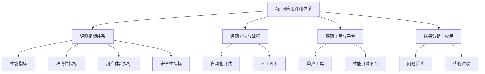

* 数学模型：
  评测得分计算模型：

$$S = \sum_{i=1}^n w_i \cdot s_i$$

其中，$S$为总评分，$w_i$为第$i$个指标的权重，$s_i$为第$i$个指标的得分，$n$为指标总数。

* 算法流程图：

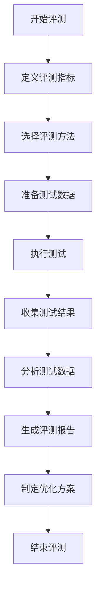

* 算法源代码：

```python
def evaluate_agent(agent, test_cases, metrics):
    results = {}
    for metric in metrics:
        scores = []
        for test_case in test_cases:
            score = metric.evaluate(agent, test_case)
            scores.append(score)
        results[metric.name] = sum(scores) / len(scores)
    return results

def generate_report(results):
    report = "Agent Evaluation Report\n"
    for metric, score in results.items():
        report += f"{metric}: {score:.2f}\n"
    return report

# 使用示例
agent = load_agent()
test_cases = load_test_cases()
metrics = [AccuracyMetric(), ResponseTimeMetric(), UserSatisfactionMetric()]

evaluation_results = evaluate_agent(agent, test_cases, metrics)
report = generate_report(evaluation_results)
print(report)
```

* 实际场景应用：
1. 企业客服Agent上线前的全面性能测试
2. 教育领域AI助教系统的周期性评估
3. 金融行业智能投顾Agent的合规性审核

* 项目介绍：
  开发一个综合性的Agent评测平台，支持多维度、可定制的评测指标和自动化测试流程。

* 环境安装：
```bash
pip install agent-eval-toolkit
pip install performance-metrics
pip install user-experience-analyzer
```

* 系统功能设计：
1. 评测指标管理
2. 测试用例库
3. 自动化测试执行
4. 结果分析与可视化
5. 报告生成与分发

* 系统架构设计：

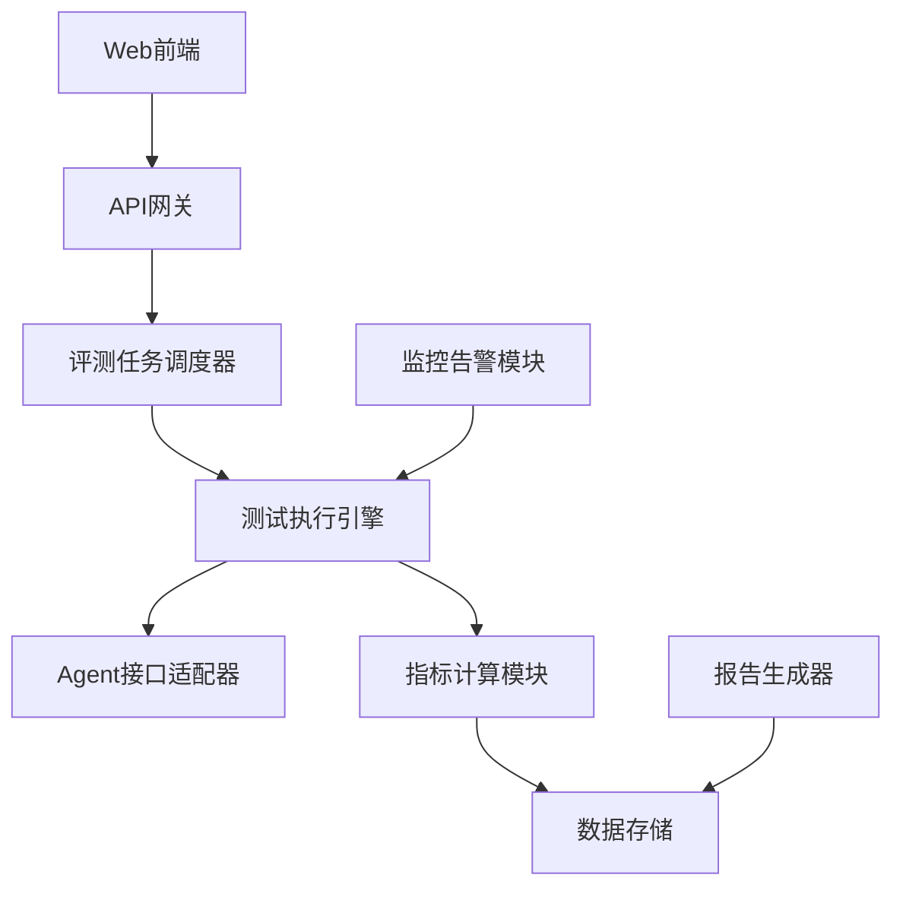

* 系统接口设计：

| 接口名称 | 方法 | 描述 |
|---------|------|------|
| /api/v1/evaluations | POST | 创建新的评测任务 |
| /api/v1/evaluations/{id} | GET | 获取评测任务结果 |
| /api/v1/metrics | GET | 获取可用评测指标列表 |
| /api/v1/reports/{id} | GET | 获取评测报告 |

* 系统核心实现源代码：

```python
from fastapi import FastAPI, BackgroundTasks
from pydantic import BaseModel

app = FastAPI()

class EvaluationTask(BaseModel):
    agent_id: str
    test_cases: list
    metrics: list

@app.post("/api/v1/evaluations")
async def create_evaluation(task: EvaluationTask, background_tasks: BackgroundTasks):
    task_id = create_task_id()
    background_tasks.add_task(run_evaluation, task, task_id)
    return {"task_id": task_id}

async def run_evaluation(task: EvaluationTask, task_id: str):
    agent = load_agent(task.agent_id)
    results = evaluate_agent(agent, task.test_cases, task.metrics)
    save_results(task_id, results)
    generate_report(task_id, results)

@app.get("/api/v1/evaluations/{task_id}")
async def get_evaluation_results(task_id: str):
    results = load_results(task_id)
    return results

@app.get("/api/v1/reports/{task_id}")
async def get_evaluation_report(task_id: str):
    report = load_report(task_id)
    return report
```

* 最佳实践tips：
1. 定期更新评测指标，以适应AI技术的快速发展
2. 结合自动化测试和人工评估，以获得全面的评测结果
3. 使用真实用户数据进行测试，提高评测的准确性和实用性
4. 建立评测结果反馈循环，持续优化Agent系统

* 行业发展与未来趋势：

| 时期 | 主要特点 | 关键技术 |
|------|---------|----------|
| 早期 | 单一性能指标评测 | 响应时间、并发量 |
| 当前 | 多维度综合评测 | 准确性、用户体验、安全性 |
| 未来 | 智能化、自适应评测 | 自动化场景生成、动态指标调整 |

* 本章小结：
  Agent应用评测体系是确保AI Agent系统质量和效果的关键环节。通过建立科学、全面的评测体系，企业可以准确把握Agent的性能状况，及时发现并解决问题，持续优化系统效果。随着AI技术的不断发展，评测体系也将朝着更加智能化、自动化的方向演进，为AI Agent的大规模应用提供有力支撑。

### 7.1.2 评测指标体系设计

* 核心概念：
  评测指标体系是衡量AI Agent系统性能和质量的多维度量化标准集合，涵盖技术性能、功能效果、用户体验等多个方面。

* 问题背景：
  AI Agent系统的复杂性和多样性使得传统的软件评测指标难以全面反映其质量和效果。需要设计一套专门的、多维度的评测指标体系。

* 问题描述：
  如何设计一个全面、科学、可操作的评测指标体系，以准确反映AI Agent的各项性能和应用效果？

* 问题解决：
  通过分析AI Agent的特性和应用需求，从多个维度设计评测指标，并建立指标间的关联关系和权重分配机制。

* 边界与外延：
  评测指标体系应涵盖但不限于性能、准确性、用户体验、安全性、可扩展性等方面，并能随技术发展和应用需求的变化而动态调整。

* 概念结构与核心要素组成：
1. 性能指标
2. 准确性指标
3. 用户体验指标
4. 安全性指标
5. 可扩展性指标
6. 业务价值指标

* 概念之间的关系：

| 指标类别 | 子指标 | 评测方法 | 权重 |
|---------|-------|----------|------|
| 性能指标 | 响应时间 | 自动化测试 | 15% |
| 性能指标 | 并发处理能力 | 压力测试 | 10% |
| 准确性指标 | 回答准确率 | 人工评估 | 20% |
| 准确性指标 | 任务完成度 | 自动化+人工 | 15% |
| 用户体验指标 | 交互流畅度 | 用户反馈 | 10% |
| 用户体验指标 | 满意度 | 问卷调查 | 10% |
| 安全性指标 | 数据保护能力 | 渗透测试 | 10% |
| 可扩展性指标 | 横向扩展能力 | 系统测试 | 5% |
| 业务价值指标 | ROI | 数据分析 | 5% |

* 数学模型：
  综合评分计算模型：

$$S = \sum_{i=1}^n w_i \cdot f_i(x_i)$$

其中，$S$为综合评分，$w_i$为第$i$个指标的权重，$f_i$为第$i$个指标的评分函数，$x_i$为第$i$个指标的原始测量值，$n$为指标总数。

* 算法流程图：

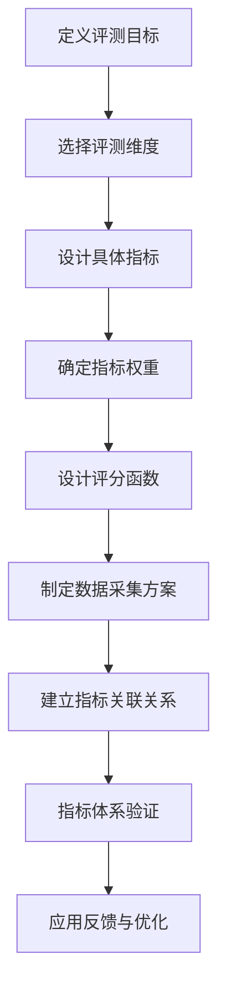

* 算法源代码：

```python
class EvaluationMetric:
    def __init__(self, name, weight, evaluation_func):
        self.name = name
        self.weight = weight
        self.evaluation_func = evaluation_func

    def evaluate(self, value):
        return self.evaluation_func(value) * self.weight

class MetricSystem:
    def __init__(self):
        self.metrics = []

    def add_metric(self, metric):
        self.metrics.append(metric)

    def evaluate(self, values):
        total_score = 0
        for metric, value in zip(self.metrics, values):
            total_score += metric.evaluate(value)
        return total_score

# 使用示例
def response_time_func(time):
    return max(0, 1 - (time - 1) / 5)  # 1秒以内满分，6秒以上0分

metric_system = MetricSystem()
metric_system.add_metric(EvaluationMetric("响应时间", 0.15, response_time_func))
# 添加其他指标...

test_values = [2.5]  # 假设响应时间为2.5秒
score = metric_system.evaluate(test_values)
print(f"综合评分: {score}")
```

* 实际场景应用：
1. 客服Agent的全面质量评估
2. 智能推荐系统的效果评测
3. 自动驾驶AI的安全性能评估

* 项目介绍：
  开发一个可定制的AI Agent评测指标管理系统，支持指标的动态添加、权重调整和评分规则设定。

* 环境安装：
```bash
pip install metric-manager
pip install data-collector
pip install score-calculator
```

* 系统功能设计：
1. 指标定义与管理
2. 权重配置
3. 评分规则设置
4. 数据采集接口
5. 评分计算引擎
6. 结果可视化

* 系统架构设计：

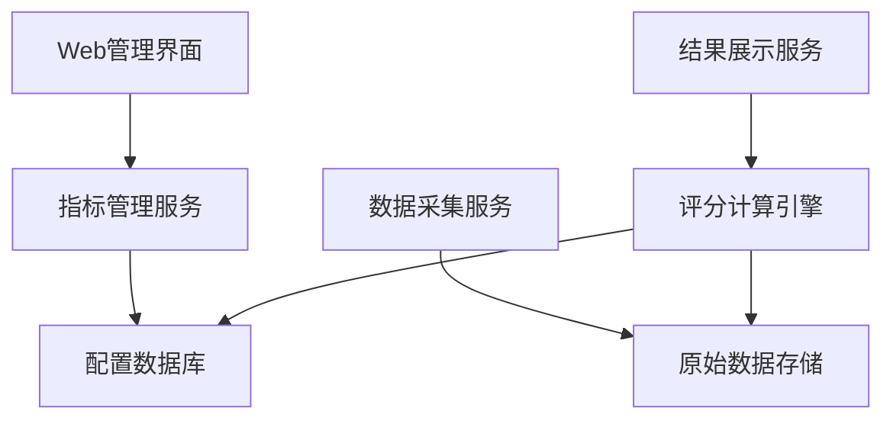

* 系统接口设计：

| 接口名称 | 方法 | 描述 |
|---------|------|------|
| /api/v1/metrics | POST | 创建新的评测指标 |
| /api/v1/metrics/{id} | PUT | 更新指标配置 |
| /api/v1/data | POST | 提交原始评测数据 |
| /api/v1/scores | GET | 获取评分结果 |

* 系统核心实现源代码：

```python
from fastapi import FastAPI
from pydantic import BaseModel

app = FastAPI()

class Metric(BaseModel):
    name: str
    weight: float
    evaluation_func: str

class MetricData(BaseModel):
    metric_id: str
    value: float

@app.post("/api/v1/metrics")
async def create_metric(metric: Metric):
    # 将指标保存到数据库
    metric_id = save_metric_to_db(metric)
    return {"metric_id": metric_id}

@app.put("/api/v1/metrics/{metric_id}")
async def update_metric(metric_id: str, metric: Metric):
    # 更新数据库中的指标
    success = update_metric_in_db(metric_id, metric)
    return {"success": success}

@app.post("/api/v1/data")
async def submit_data(data: MetricData):
    # 保存原始评测数据
    save_data_to_db(data)
    # 触发评分计算
    calculate_score(data.metric_id, data.value)
    return {"status": "data received"}

@app.get("/api/v1/scores")
async def get_scores():
    # 从数据库获取最新的评分结果
    scores = fetch_scores_from_db()
    return scores
```

* 最佳实践tips：
1. 定期review和调整指标体系，确保其与业务目标和技术发展保持一致
2. 使用A/B测试验证新指标的有效性
3. 建立指标间的相关性分析，避免重复或冲突的指标
4. 结合定性和定量方法，全面评估Agent性能

* 行业发展与未来趋势：

| 时期 | 指标特点 | 关键技术 |
|------|---------|----------|
| 初期 | 以技术指标为主 | 响应时间、错误率 |
| 现在 | 多维度平衡 | 用户体验、业务价值 |
| 未来 | 智能化、个性化 | 自适应指标、场景感知 |

* 本章小结：
  评测指标体系设计是AI Agent评测的基础和核心。通过建立全面、科学的指标体系，我们可以准确、客观地评估Agent的各项性能和效果。随着AI技术的发展和应用场景的拓展，评测指标体系也将不断演进，向着更加智能化、个性化的方向发展。企业在设计和应用评测指标体系时，应注重指标的全面性、可操作性和动态调整能力，以确保评测结果能够真实反映Agent的质量状况，并为持续优化提供有力支撑。

### 7.1.3 评测方法与流程

* 核心概念：
  评测方法与流程是指对AI Agent进行系统化、标准化评估的具体操作步骤和技术手段的集合。

* 问题背景：
  AI Agent的复杂性和多样性要求评测过程既要全面又要高效，同时需要兼顾自动化测试和人工评估。

* 问题描述：
  如何设计一套科学、高效、可重复的评测方法和流程，以确保评测结果的准确性和一致性？

* 问题解决：
  建立标准化的评测流程，结合自动化工具和人工评估，设计针对不同指标的专门评测方法。

* 边界与外延：
  评测方法涵盖技术测试、功能验证、用户体验评估等多个方面，流程则包括准备、执行、分析和报告等阶段。

* 概念结构与核心要素组成：
1. 评测准备
2. 自动化测试
3. 人工评估
4. 数据采集
5. 结果分析
6. 报告生成

* 概念之间的关系：

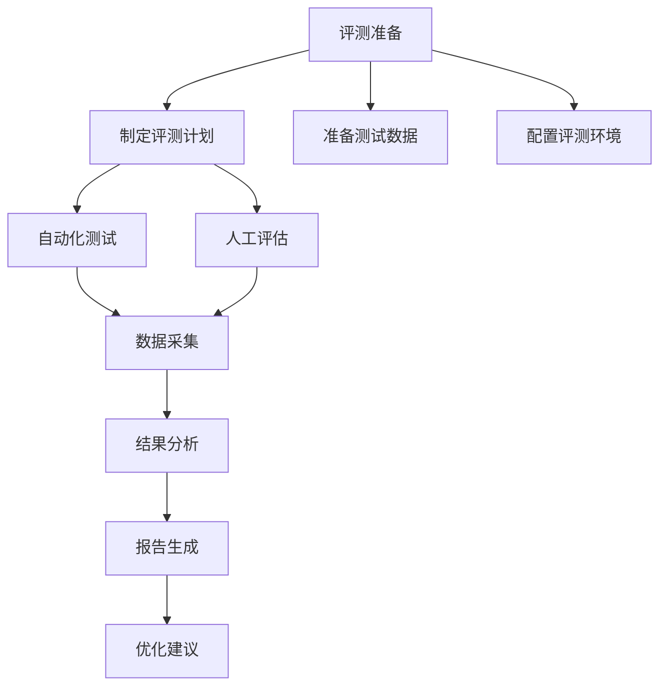

* 数学模型：
  评测覆盖率计算：

$$C = \frac{T_e}{T_t} \times 100\%$$

其中，$C$为评测覆盖率，$T_e$为已评测的测试用例数，$T_t$为总测试用例数。

* 算法流程图：

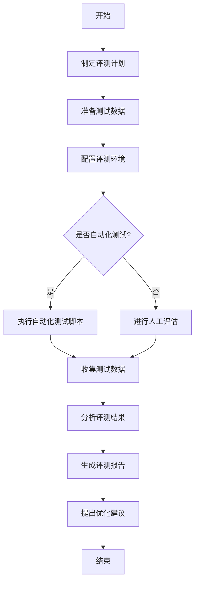

* 算法源代码：

```python
import random
from typing import List, Dict

class TestCase:
    def __init__(self, id: str, type: str, data: Dict):
        self.id = id
        self.type = type
        self.data = data

class EvaluationProcess:
    def __init__(self):
        self.test_cases: List[TestCase] = []
        self.results: Dict[str, float] = {}

    def prepare_test_cases(self, num_cases: int):
        for i in range(num_cases):
            case_type = random.choice(["performance", "accuracy", "user_experience"])
            self.test_cases.append(TestCase(f"TC{i}", case_type, {}))

    def run_automated_tests(self):
        for case in self.test_cases:
            if case.type == "performance":
                self.results[case.id] = self.simulate_performance_test(case)

    def perform_manual_evaluation(self):
        for case in self.test_cases:
            if case.type in ["accuracy", "user_experience"]:
                self.results[case.id] = self.simulate_manual_evaluation(case)

    def analyze_results(self):
        total_score = sum(self.results.values())
        avg_score = total_score / len(self.results)
        return avg_score

    def generate_report(self):
        avg_score = self.analyze_results()
        return f"Evaluation Report\nAverage Score: {avg_score:.2f}\nTotal Test Cases: {len(self.test_cases)}"

    def simulate_performance_test(self, case: TestCase) -> float:
        return random.uniform(0.5, 1.0)

    def simulate_manual_evaluation(self, case: TestCase) -> float:
        return random.uniform(0.6, 1.0)

# 使用示例
eval_process = EvaluationProcess()
eval_process.prepare_test_cases(100)
eval_process.run_automated_tests()
eval_process.perform_manual_evaluation()
report = eval_process.generate_report()
print(report)
```

* 实际场景应用：
1. 企业级聊天机器人上线前的全面评测
2. 智能客服系统的定期性能审核
3. 新开发的AI功能模块的验收测试

* 项目介绍：
  开发一个集成化的AI Agent评测平台，支持自动化测试和人工评估的全流程管理。

* 环境安装：
```bash
pip install ai-agent-tester
pip install auto-test-runner
pip install manual-eval-toolkit
```

* 系统功能设计：
1. 评测计划管理
2. 测试用例库
3. 自动化测试执行引擎
4. 人工评估任务分配
5. 数据采集与存储
6. 结果分析与可视化
7. 报告生成器

* 系统架构设计：

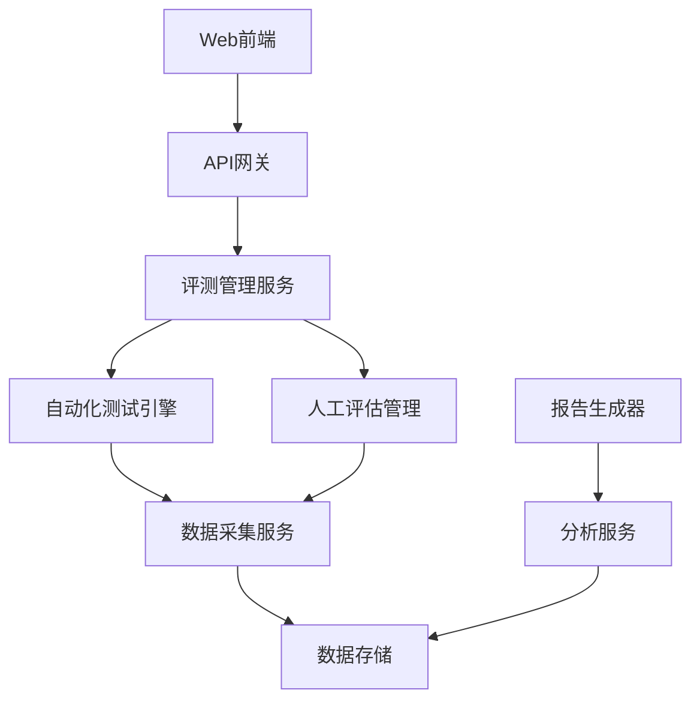

* 系统接口设计：

| 接口名称 | 方法 | 描述 |
|---------|------|------|
| /api/v1/plans | POST | 创建评测计划 |
| /api/v1/testcases | GET | 获取测试用例列表 |
| /api/v1/auto-tests | POST | 执行自动化测试 |
| /api/v1/manual-evals | POST | 提交人工评估结果 |
| /api/v1/results | GET | 获取评测结果 |
| /api/v1/reports | GET | 生成评测报告 |

* 系统核心实现源代码：

```python
from fastapi import FastAPI, BackgroundTasks
from pydantic import BaseModel
from typing import List

app = FastAPI()

class TestPlan(BaseModel):
    name: str
    description: str
    test_cases: List[str]

class TestResult(BaseModel):
    case_id: str
    score: float

@app.post("/api/v1/plans")
async def create_plan(plan: TestPlan):
    # 保存评测计划
    plan_id = save_plan_to_db(plan)
    return {"plan_id": plan_id}

@app.post("/api/v1/auto-tests")
async def run_auto_tests(plan_id: str, background_tasks: BackgroundTasks):
    # 异步执行自动化测试
    background_tasks.add_task(execute_auto_tests, plan_id)
    return {"status": "Auto tests started"}

@app.post("/api/v1/manual-evals")
async def submit_manual_eval(result: TestResult):
    # 保存人工评估结果
    save_result_to_db(result)
    return {"status": "Result saved"}

@app.get("/api/v1/results/{plan_id}")
async def get_results(plan_id: str):
    # 获取评测结果
    results = fetch_results_from_db(plan_id)
    return results

@app.get("/api/v1/reports/{plan_id}")
async def generate_report(plan_id: str):
    # 生成评测报告
    report = create_report(plan_id)
    return {"report": report}

def execute_auto_tests(plan_id: str):
    # 执行自动化测试的具体逻辑
    pass

def save_plan_to_db(plan: TestPlan) -> str:
    # 保存计划到数据库的逻辑
    pass

def save_result_to_db(result: TestResult):
    # 保存结果到数据库的逻辑
    pass

def fetch_results_from_db(plan_id: str):
    # 从数据库获取结果的逻辑
    pass

def create_report(plan_id: str):
    # 生成报告的逻辑
    pass
```

* 最佳实践tips：
1. 建立测试用例库，持续积累和更新典型场景
2. 自动化与人工评估相结合，取长补短
3. 使用版本控制管理评测脚本和配置
4. 建立评测结果的历史记录，便于横向比较和趋势分析
5. 定期review和优化评测流程，提高效率和准确性

* 行业发展与未来趋势：

| 时期 | 评测方法特点 | 关键技术 |
|------|-------------|----------|
| 早期 | 以人工为主，流程简单 | 人工测试、简单脚本 |
| 现在 | 自动化为主，流程规范 | 自动化测试框架、CI/CD |
| 未来 | 智能化评测，自适应流程 | AI辅助测试、场景自动生成 |

* 本章小结：
  评测方法与流程是确保AI Agent评测质量和效率的关键。通过建立标准化、自动化的评测流程，结合科学的评测方法，我们可以全面、客观地评估AI Agent的各项性能和效果。随着技术的发展，评测方法和流程将朝着更加智能化、自动化的方向演进，不断提高评测的准确性和效率。企业在实施AI Agent评测时，应注重方法的科学性和流程的规范性，同时保持灵活性以适应不同类型Agent和应用场景的需求。

### 7.1.4 评测工具与平台

* 核心概念：
  评测工具与平台是指用于支持AI Agent全面评测的软件系统和技术框架，包括自动化测试工具、性能监控工具、数据分析平台等。

* 问题背景：
  AI Agent的复杂性和多样性要求评测过程能够高效、准确地收集和分析大量数据，同时需要支持多种评测方法和指标。

* 问题描述：
  如何选择或开发适合AI Agent特性的评测工具和平台，以提高评测效率和准确性？

* 问题解决：
  构建或整合专门的AI Agent评测工具集和综合评测平台，支持自动化测试、数据采集、结果分析等全流程操作。

* 边界与外延：
  评测工具涵盖功能测试、性能测试、安全测试等多个方面，平台则需要考虑可扩展性、易用性和与现有系统的集成。

* 概念结构与核心要素组成：
1. 自动化测试工具
2. 性能监控工具
3. 数据采集工具
4. 结果分析平台
5. 报告生成器
6. 测试用例管理系统

* 概念之间的关系：

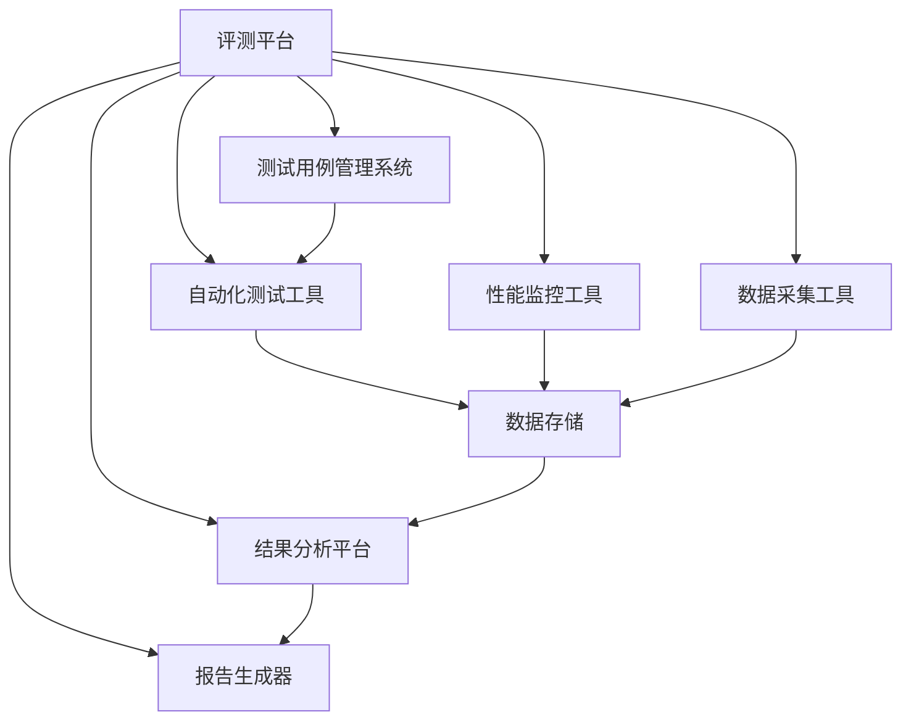

* 数学模型：
  工具效能评估模型：

$$E = \frac{T_m - T_a}{T_m} \times 100\%$$

其中，$E$为工具效能，$T_m$为手动执行所需时间，$T_a$为自动化执行所需时间。

* 算法流程图：

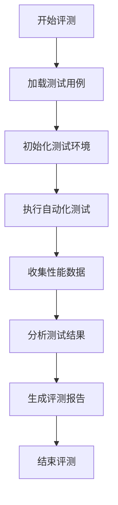

* 算法源代码：

```python
import time
from typing import List, Dict

class TestCase:
    def __init__(self, id: str, input: str, expected_output: str):
        self.id = id
        self.input = input
        self.expected_output = expected_output

class AIAgent:
    def process(self, input: str) -> str:
        # 模拟AI处理
        time.sleep(0.1)
        return f"Processed: {input}"

class TestPlatform:
    def __init__(self, agent: AIAgent):
        self.agent = agent
        self.test_cases: List[TestCase] = []
        self.results: Dict[str, Dict] = {}

    def load_test_cases(self, cases: List[TestCase]):
        self.test_cases = cases

    def run_tests(self):
        for case in self.test_cases:
            start_time = time.time()
            output = self.agent.process(case.input)
            end_time = time.time()
            
            self.results[case.id] = {
                "input": case.input,
                "expected": case.expected_output,
                "actual": output,
                "time": end_time - start_time,
                "passed": output == case.expected_output
            }

    def analyze_results(self):
        total_cases = len(self.results)
        passed_cases = sum(1 for result in self.results.values() if result["passed"])
        avg_time = sum(result["time"] for result in self.results.values()) / total_cases
        
        return {
            "total_cases": total_cases,
            "passed_cases": passed_cases,
            "pass_rate": passed_cases / total_cases * 100,
            "avg_time": avg_time
        }

    def generate_report(self):
        analysis = self.analyze_results()
        report = f"Test Report\n"
        report += f"Total Cases: {analysis['total_cases']}\n"
        report += f"Passed Cases: {analysis['passed_cases']}\n"
        report += f"Pass Rate: {analysis['pass_rate']:.2f}%\n"
        report += f"Average Processing Time: {analysis['avg_time']:.3f} seconds\n"
        return report

# 使用示例
agent = AIAgent()
platform = TestPlatform(agent)

test_cases = [
    TestCase("1", "Hello", "Processed: Hello"),
    TestCase("2", "AI", "Processed: AI"),
    TestCase("3", "Test", "Processed: Test")
]

platform.load_test_cases(test_cases)
platform.run_tests()
report = platform.generate_report()
print(report)
```

* 实际场景应用：
1. 大规模客服AI系统的持续集成测试
2. 智能推荐引擎的A/B测试平台
3. 多语言翻译AI的准确性评估工具

* 项目介绍：
  开发一个综合性的AI Agent评测平台，集成自动化测试、性能监控、数据分析等功能，支持多种类型的AI Agent评测。

* 环境安装：
```bash
pip install ai-test-platform
pip install performance-monitor
pip install data-analyzer
pip install report-generator
```

* 系统功能设计：
1. 测试用例管理
2. 自动化测试执行
3. 性能监控与告警
4. 数据采集与存储
5. 结果分析与可视化
6. 报告生成与分发
7. 集成开发环境(IDE)插件

* 系统架构设计：

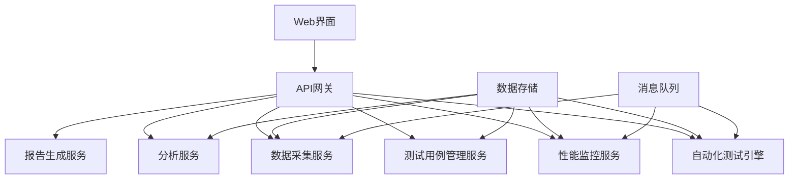

* 系统接口设计：

| 接口名称 | 方法 | 描述 |
|---------|------|------|
| /api/v1/testcases | POST | 创建测试用例 |
| /api/v1/tests | POST | 执行测试 |
| /api/v1/monitor | GET | 获取性能监控数据 |
| /api/v1/data | POST | 提交测试数据 |
| /api/v1/analysis | GET | 获取分析结果 |
| /api/v1/reports | GET | 生成测试报告 |

* 系统核心实现源代码：

```python
from fastapi import FastAPI, BackgroundTasks
from pydantic import BaseModel
from typing import List

app = FastAPI()

class TestCase(BaseModel):
    id: str
    input: str
    expected_output: str

class TestResult(BaseModel):
    case_id: str
    actual_output: str
    execution_time: float
    passed: bool

class TestExecution(BaseModel):
    agent_id: str
    test_cases: List[str]

@app.post("/api/v1/testcases")
async def create_testcase(testcase: TestCase):
    # 保存测试用例
    save_testcase_to_db(testcase)
    return {"status": "Test case created"}

@app.post("/api/v1/tests")
async def run_tests(execution: TestExecution, background_tasks: BackgroundTasks):
    # 异步执行测试
    background_tasks.add_task(execute_tests, execution)
    return {"status": "Test execution started"}

@app.get("/api/v1/monitor/{agent_id}")
async def get_performance_data(agent_id: str):
    # 获取性能监控数据
    data = fetch_performance_data(agent_id)
    return data

@app.post("/api/v1/data")
async def submit_test_data(result: TestResult):
    # 保存测试数据
    save_test_result(result)
    return {"status": "Test data saved"}

@app.get("/api/v1/analysis/{execution_id}")
async def get_analysis(execution_id: str):
    # 获取分析结果
    analysis = perform_analysis(execution_id)
    return analysis

@app.get("/api/v1/reports/{execution_id}")
async def generate_report(execution_id: str):
    # 生成测试报告
    report = create_report(execution_id)
    return {"report": report}

def execute_tests(execution: TestExecution):
    # 执行测试的具体逻辑
    pass

def save_testcase_to_db(testcase: TestCase):
    # 保存测试用例到数据库的逻辑
    pass

def fetch_performance_data(agent_id: str):
    # 获取性能数据的逻辑
    pass

def save_test_result(result: TestResult):
    # 保存测试结果的逻辑
    pass

def perform_analysis(execution_id: str):
    # 执行分析的逻辑
    pass

def create_report(execution_id: str):
    # 创建报告的逻辑
    pass
```

* 最佳实践tips：
1. 采用模块化设计，便于工具和平台的扩展和定制
2. 利用容器技术，确保测试环境的一致性和隔离性
3. 实现测试数据的版本控制，便于结果复现和比较
4. 提供丰富的API接口，方便与其他开发和运维工具集成
5. 重视数据安全，实施严格的访问控制和加密措施

* 行业发展与未来趋势：

| 时期 | 工具特点 | 关键技术 |
|------|---------|----------|
| 早期 | 单一功能，独立工具 | 脚本语言、命令行工具 |
| 现在 | 集成平台，云原生 | 容器化、微服务架构 |
| 未来 | 智能化平台，自适应 | AI驱动测试、自我修复 |

* 本章小结：
  评测工具与平台是实现高效、准确AI Agent评测的重要支撑。通过构建综合性的评测平台，集成各类专业工具，我们可以大幅提高评测的效率和质量。随着AI技术的快速发展，评测工具和平台也在不断演进，向着更加智能化、自动化的方向发展。企业在选择或开发评测工具和平台时，应注重其可扩展性、易用性和与现有系统的集成能力，以适应不断变化的AI Agent评测需求。同时，也要关注数据安全和隐私保护，确保评测过程的合规性和可信度。

## 7.2 性能评测与优化

### 7.2.1 响应时间评测

* 核心概念：
  响应时间评测是指测量AI Agent从接收用户输入到生成响应所需时间的过程，是评估Agent性能的关键指标之一。

* 问题背景：
  AI Agent的响应速度直接影响用户体验和系统效率。在复杂任务和高并发场景下，保持快速响应尤为重要。

* 问题描述：
  如何准确测量AI Agent的响应时间，并在各种负载条件下评估其性能表现？

* 问题解决：
  设计全面的响应时间评测方案，包括单次请求响应时间、平均响应时间、响应时间分布等多个维度的测量。

* 边界与外延：
  评测范围包括从用户输入到最终输出的全过程，考虑网络传输、模型推理、数据处理等各个环节的时间消耗。

* 概念结构与核心要素组成：
1. 单次请求响应时间
2. 平均响应时间
3. 响应时间分布
4. 峰值响应时间
5. 响应时间随负载变化

* 概念之间的关系：

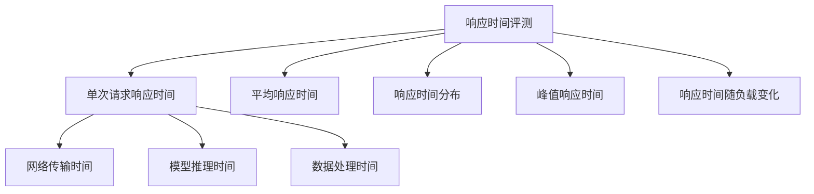

* 数学模型：
  平均响应时间计算：

$$T_{avg} = \frac{1}{n} \sum_{i=1}^n T_i$$

其中，$T_{avg}$为平均响应时间，$T_i$为第$i$次请求的响应时间，$n$为总请求次数。

* 算法流程图：

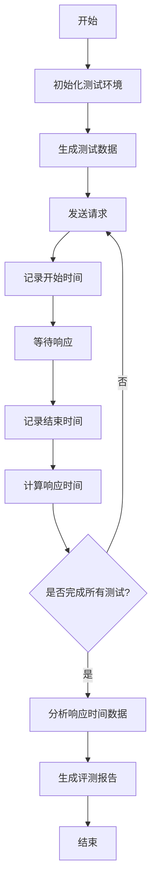

* 算法源代码：

```python
import time
import statistics
from typing import List

class ResponseTimeEvaluator:
    def __init__(self, agent):
        self.agent = agent
        self.response_times: List[float] = []

    def measure_response_time(self, input_data: str) -> float:
        start_time = time.time()
        self.agent.process(input_data)
        end_time = time.time()
        return end_time - start_time

    def run_tests(self, test_cases: List[str], num_iterations: int):
        for _ in range(num_iterations):
            for case in test_cases:
                response_time = self.measure_response_time(case)
                self.response_times.append(response_time)

    def analyze_results(self):
        avg_time = statistics.mean(self.response_times)
        median_time = statistics.median(self.response_times)
        p95_time = statistics.quantiles(self.response_times, n=20)[18]  # 95th percentile
        max_time = max(self.response_times)

        return {
            "average": avg_time,
            "median": median_time,
            "95th_percentile": p95_time,
            "max": max_time
        }

    def generate_report(self):
        results = self.analyze_results()
        report = "Response Time Evaluation Report\n"
        report += f"Average Response Time: {results['average']:.3f} seconds\n"
        report += f"Median Response Time: {results['median']:.3f} seconds\n"
        report += f"95th Percentile Response Time: {results['95th_percentile']:.3f} seconds\n"
        report += f"Maximum Response Time: {results['max']:.3f} seconds\n"
        return report

# 使用示例
class MockAgent:
    def process(self, input_data: str):
        time.sleep(0.1 + 0.05 * len(input_data))  # 模拟处理时间

agent = MockAgent()
evaluator = ResponseTimeEvaluator(agent)
test_cases = ["Hello", "How are you?", "What's the weather like today?"]
evaluator.run_tests(test_cases, num_iterations=100)
report = evaluator.generate_report()
print(report)
```

* 实际场景应用：
1. 智能客服系统的实时响应时间监控
2. 在线翻译系统的高峰期性能评估
3. 智能推荐引擎的响应时间优化

* 项目介绍：
  开发一个专门的AI Agent响应时间评测工具，支持多种测试场景和负载模式，提供详细的性能分析报告。

* 环境安装：
```bash
pip install ai-response-timer
pip install load-generator
pip install performance-analyzer
```

* 系统功能设计：
1. 测试用例管理
2. 负载生成器
3. 响应时间测量
4. 数据收集与存储
5. 统计分析
6. 可视化报告生成
7. 性能预警

* 系统架构设计：

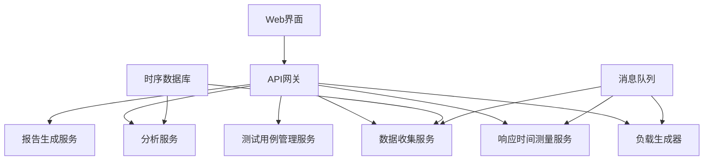

* 系统接口设计：

| 接口名称 | 方法 | 描述 |
|---------|------|------|
| /api/v1/testcases | POST | 创建测试用例 |
| /api/v1/tests | POST | 执行响应时间测试 |
| /api/v1/load | POST | 设置负载参数 |
| /api/v1/metrics | GET | 获取实时响应时间指标 |
| /api/v1/analysis | GET | 获取响应时间分析结果 |
| /api/v1/reports | GET | 生成性能报告 |

* 系统核心实现源代码：

```python
from fastapi import FastAPI, BackgroundTasks
from pydantic import BaseModel
from typing import List
import asyncio
import aiohttp
import time
import statistics

app = FastAPI()

class TestCase(BaseModel):
    id: str
    input: str

class TestConfig(BaseModel):
    agent_url: str
    test_cases: List[TestCase]
    num_iterations: int
    concurrent_users: int

class ResponseTimeResult(BaseModel):
    case_id: str
    response_time: float

async def measure_response_time(session, agent_url, test_case):
    start_time = time.time()
    async with session.post(agent_url, json={"input": test_case.input}) as response:
        await response.text()
    end_time = time.time()
    return ResponseTimeResult(case_id=test_case.id, response_time=end_time - start_time)

async def run_test(config: TestConfig):
    async with aiohttp.ClientSession() as session:
        tasks = []
        for _ in range(config.num_iterations):
            for test_case in config.test_cases:
                task = asyncio.create_task(measure_response_time(session, config.agent_url, test_case))
                tasks.append(task)
        results = await asyncio.gather(*tasks)
    return results

@app.post("/api/v1/tests")
async def execute_test(config: TestConfig, background_tasks: BackgroundTasks):
    background_tasks.add_task(process_test, config)
    return {"status": "Test started"}

async def process_test(config: TestConfig):
    results = await run_test(config)
    save_results_to_db(results)
    analyze_results(results)

def save_results_to_db(results: List[ResponseTimeResult]):
    # 保存结果到数据库的逻辑
    pass

def analyze_results(results: List[ResponseTimeResult]):
    response_times = [result.response_time for result in results]
    analysis = {
        "average": statistics.mean(response_times),
        "median": statistics.median(response_times),
        "95th_percentile": statistics.quantiles(response_times, n=20)[18],
        "max": max(response_times)
    }
    save_analysis_to_db(analysis)

def save_analysis_to_db(analysis: dict):
    # 保存分析结果到数据库的逻辑
    pass

@app.get("/api/v1/analysis")
async def get_analysis():
    # 从数据库获取最新的分析结果
    analysis = fetch_latest_analysis_from_db()
    return analysis

@app.get("/api/v1/reports")
async def generate_report():
    analysis = fetch_latest_analysis_from_db()
    report = create_report(analysis)
    return {"report": report}

def fetch_latest_analysis_from_db():
    # 从数据库获取最新分析结果的逻辑
    pass

def create_report(analysis: dict):
    report = "Response Time Performance Report\n"
    report += f"Average Response Time: {analysis['average']:.3f} seconds\n"
    report += f"Median Response Time: {analysis['median']:.3f} seconds\n"
    report += f"95th Percentile Response Time: {analysis['95th_percentile']:.3f} seconds\n"
    report += f"Maximum Response Time: {analysis['max']:.3f} seconds\n"
    return report
```

* 最佳实践tips：
1. 使用分布式负载测试，模拟真实的用户访问模式
2. 结合系统监控，分析响应时间与系统资源使用的关系
3. 定期进行基准测试，跟踪性能变化趋势
4. 使用percentile（如P95、P99）而不仅仅是平均值来评估响应时间
5. 考虑冷启动和热启动场景下的响应时间差异

* 行业发展与未来趋势：

| 时期 | 评测特点 | 关键技术 |
|------|---------|----------|
| 早期 | 单一指标，简单场景 | 定时器、日志分析 |
| 现在 | 多维度指标，复杂负载 | 分布式测试、实时监控 |
| 未来 | 智能化评测，自适应优化 | AI驱动的性能预测、自动调优 |

* 本章小结：
  响应时间评测是AI Agent性能评估的关键环节。通过全面、准确的响应时间测量和分析，我们可以深入了解Agent的性能特征，识别潜在的性能瓶颈，并为优化提供明确方向。随着AI技术和应用场景的不断发展，响应时间评测方法也在不断演进，向着更加精细、智能的方向发展。企业在进行AI Agent的响应时间评测时，应注重测试场景的真实性、测试数据的全面性，以及评测结果的可解释性。同时，将响应时间评测与其他性能指标结合分析，可以获得更全面的性能洞察，为AI Agent的持续优化提供有力支持。

### 7.2.2 并发处理能力评测

* 核心概念：
  并发处理能力评测是指测量AI Agent在同时处理多个用户请求时的性能表现，评估系统在高负载下的稳定性和效率。

* 问题背景：
  随着AI Agent应用规模的扩大，同时服务大量用户的能力变得越来越重要。高并发场景下的性能直接影响用户体验和系统可用性。

* 问题描述：
  如何准确评估AI Agent的并发处理能力，并找出系统在高负载下的性能瓶颈？

* 问题解决：
  设计全面的并发测试方案，模拟不同并发级别的用户请求，测量系统的吞吐量、响应时间、错误率等关键指标。

* 边界与外延：
  评测范围包括不同并发用户数下的系统表现，以及系统达到饱和状态时的极限性能。

* 概念结构与核心要素组成：
1. 吞吐量（Throughput）
2. 并发用户数
3. 响应时间
4. 错误率
5. 资源利用率
6. 扩展性

* 概念之间的关系：

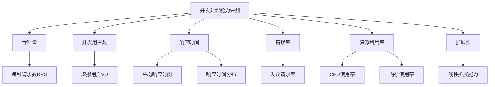

* 数学模型：
  吞吐量计算：

$$Throughput = \frac{N}{T}$$

其中，$N$为成功处理的请求数，$T$为测试持续时间。

* 算法流程图：

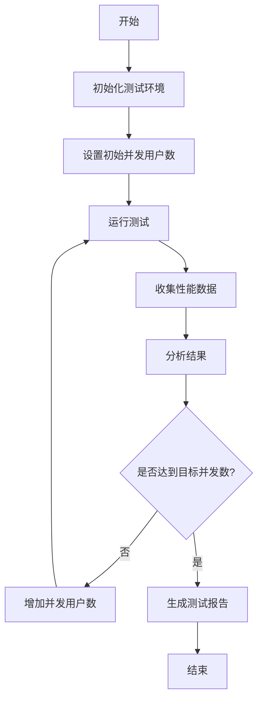

* 算法源代码：

```python
import asyncio
import aiohttp
import time
from typing import List, Dict

class ConcurrencyTester:
    def __init__(self, agent_url: str):
        self.agent_url = agent_url
        self.results: Dict[int, Dict] = {}

    async def send_request(self, session, user_id: int):
        start_time = time.time()
        try:
            async with session.post(self.agent_url, json={"input": f"Test from user {user_id}"}) as response:
                await response.text()
            success = response.status == 200
        except:
            success = False
        end_time = time.time()
        return {"response_time": end_time - start_time, "success": success}

    async def run_concurrent_test(self, num_users: int, duration: int):
        async with aiohttp.ClientSession() as session:
            tasks = []
            start_time = time.time()
            while time.time() - start_time < duration:
                for user_id in range(num_users):
                    task = asyncio.create_task(self.send_request(session, user_id))
                    tasks.append(task)
                await asyncio.gather(*tasks)
                tasks.clear()
            results = await asyncio.gather(*tasks)
        
        self.results[num_users] = self.analyze_results(results, duration)

    def analyze_results(self, results: List[Dict], duration: int):
        total_requests = len(results)
        successful_requests = sum(1 for r in results if r["success"])
        total_response_time = sum(r["response_time"] for r in results)
        
        return {
            "throughput": successful_requests / duration,
            "avg_response_time": total_response_time / total_requests if total_requests > 0 else 0,
            "error_rate": (total_requests - successful_requests) / total_requests if total_requests > 0 else 0
        }

    def run_tests(self, max_users: int, step: int, duration: int):
        for num_users in range(step, max_users + 1, step):
            asyncio.run(self.run_concurrent_test(num_users, duration))

    def generate_report(self):
        report = "Concurrency Test Report\n"
        for num_users, result in self.results.items():
            report += f"\nConcurrent Users: {num_users}\n"
            report += f"Throughput: {result['throughput']:.2f} requests/second\n"
            report += f"Average Response Time: {result['avg_response_time']:.3f} seconds\n"
            report += f"Error Rate: {result['error_rate']:.2%}\n"
        return report

# 使用示例
tester = ConcurrencyTester("http://example.com/ai-agent")
tester.run_tests(max_users=100, step=20, duration=60)
report = tester.generate_report()
print(report)
```

* 实际场景应用：
1. 电商平台AI推荐系统的双11峰值测试
2. 在线教育平台智能答疑系统的开学季压力测试
3. 金融交易AI风控系统的市场波动期并发处理能力评估

* 项目介绍：
  开发一个专业的AI Agent并发处理能力评测平台，支持多种并发模型和负载模式，提供实时监控和详细的性能分析报告。

* 环境安装：
```bash
pip install ai-concurrency-tester
pip install load-generator
pip install performance-analyzer
pip install async-http-client
```

* 系统功能设计：
1. 测试场景配置
2. 并发负载生成器
3. 实时性能监控
4. 数据采集与存储
5. 多维度数据分析
6. 可视化报告生成
7. 性能瓶颈诊断

* 系统架构设计：

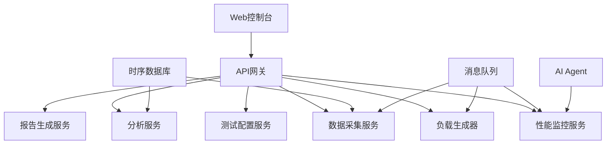

* 系统接口设计：

| 接口名称 | 方法 | 描述 |
|---------|------|------|
| /api/v1/scenarios | POST | 创建测试场景 |
| /api/v1/tests | POST | 执行并发测试 |
| /api/v1/monitor | GET | 获取实时性能指标 |
| /api/v1/analysis | GET | 获取并发测试分析结果| /api/v1/reports | GET | 生成并发测试报告 |
| /api/v1/diagnostics | GET | 获取性能瓶颈诊断结果 |

* 系统核心实现源代码：

```python
from fastapi import FastAPI, BackgroundTasks
from pydantic import BaseModel
from typing import List, Dict
import asyncio
import aiohttp
import time
import statistics

app = FastAPI()

class TestScenario(BaseModel):
    name: str
    agent_url: str
    max_users: int
    step: int
    duration: int

class TestResult(BaseModel):
    scenario_name: str
    concurrent_users: int
    throughput: float
    avg_response_time: float
    error_rate: float

async def run_concurrent_test(scenario: TestScenario, concurrent_users: int):
    async with aiohttp.ClientSession() as session:
        tasks = []
        start_time = time.time()
        while time.time() - start_time < scenario.duration:
            for _ in range(concurrent_users):
                task = asyncio.create_task(send_request(session, scenario.agent_url))
                tasks.append(task)
            await asyncio.gather(*tasks)
            tasks.clear()
        results = await asyncio.gather(*tasks)
    
    return analyze_results(results, scenario.duration, concurrent_users)

async def send_request(session, url: str):
    start_time = time.time()
    try:
        async with session.post(url, json={"input": "Test input"}) as response:
            await response.text()
        success = response.status == 200
    except:
        success = False
    end_time = time.time()
    return {"response_time": end_time - start_time, "success": success}

def analyze_results(results: List[Dict], duration: int, concurrent_users: int):
    total_requests = len(results)
    successful_requests = sum(1 for r in results if r["success"])
    total_response_time = sum(r["response_time"] for r in results)
    
    return TestResult(
        scenario_name="Current Test",
        concurrent_users=concurrent_users,
        throughput=successful_requests / duration,
        avg_response_time=total_response_time / total_requests if total_requests > 0 else 0,
        error_rate=(total_requests - successful_requests) / total_requests if total_requests > 0 else 0
    )

@app.post("/api/v1/tests")
async def execute_test(scenario: TestScenario, background_tasks: BackgroundTasks):
    background_tasks.add_task(run_full_test, scenario)
    return {"status": "Test started", "scenario_name": scenario.name}

async def run_full_test(scenario: TestScenario):
    results = []
    for num_users in range(scenario.step, scenario.max_users + 1, scenario.step):
        result = await run_concurrent_test(scenario, num_users)
        results.append(result)
        save_result_to_db(result)
    
    generate_report(scenario.name, results)

def save_result_to_db(result: TestResult):
    # 保存结果到数据库的逻辑
    pass

def generate_report(scenario_name: str, results: List[TestResult]):
    report = f"Concurrency Test Report for {scenario_name}\n\n"
    for result in results:
        report += f"Concurrent Users: {result.concurrent_users}\n"
        report += f"Throughput: {result.throughput:.2f} requests/second\n"
        report += f"Average Response Time: {result.avg_response_time:.3f} seconds\n"
        report += f"Error Rate: {result.error_rate:.2%}\n\n"
    
    save_report_to_db(scenario_name, report)

def save_report_to_db(scenario_name: str, report: str):
    # 保存报告到数据库的逻辑
    pass

@app.get("/api/v1/reports/{scenario_name}")
async def get_report(scenario_name: str):
    report = fetch_report_from_db(scenario_name)
    return {"report": report}

def fetch_report_from_db(scenario_name: str):
    # 从数据库获取报告的逻辑
    pass

@app.get("/api/v1/diagnostics/{scenario_name}")
async def get_diagnostics(scenario_name: str):
    results = fetch_results_from_db(scenario_name)
    diagnostics = perform_diagnostics(results)
    return {"diagnostics": diagnostics}

def fetch_results_from_db(scenario_name: str):
    # 从数据库获取测试结果的逻辑
    pass

def perform_diagnostics(results: List[TestResult]):
    # 执行诊断逻辑，识别性能瓶颈
    throughputs = [result.throughput for result in results]
    response_times = [result.avg_response_time for result in results]
    error_rates = [result.error_rate for result in results]
    
    diagnostics = []
    
    if max(throughputs) / min(throughputs) < 1.5:
        diagnostics.append("系统吞吐量增长不足，可能存在性能瓶颈")
    
    if statistics.mean(response_times[-3:]) > 2 * statistics.mean(response_times[:3]):
        diagnostics.append("高并发时响应时间显著增加，需要优化系统处理能力")
    
    if max(error_rates) > 0.05:
        diagnostics.append("出现较高错误率，系统稳定性需要提升")
    
    return diagnostics
```

* 最佳实践tips：
1. 使用阶梯式增加并发用户数，观察系统性能变化趋势
2. 结合监控工具，实时观察系统资源使用情况
3. 模拟真实的用户行为模式，包括思考时间和操作序列
4. 考虑长时间运行测试，评估系统的稳定性
5. 使用性能剖析工具，精确定位性能瓶颈

* 行业发展与未来趋势：

| 时期 | 评测特点 | 关键技术 |
|------|---------|----------|
| 早期 | 简单并发模型，静态负载 | 线程池、连接池 |
| 现在 | 复杂并发模型，动态负载 | 异步IO、分布式测试 |
| 未来 | 智能化并发测试，自适应负载 | AI驱动的负载生成、自动化性能调优 |

* 本章小结：
  并发处理能力评测是衡量AI Agent系统性能和可扩展性的关键指标。通过全面、深入的并发测试，我们可以准确评估系统在高负载下的表现，识别潜在的性能瓶颈，并为系统优化提供明确方向。随着AI应用规模的不断扩大和场景的日益复杂，并发处理能力评测方法也在不断演进，向着更加精细、智能的方向发展。企业在进行AI Agent的并发能力评测时，应注重测试场景的真实性、测试数据的全面性，以及评测结果的可解释性。同时，将并发处理能力评测与其他性能指标结合分析，可以获得更全面的性能洞察，为AI Agent的持续优化和扩展提供有力支持。

### 7.2.3 资源利用率评测

* 核心概念：
  资源利用率评测是指测量和分析AI Agent系统在运行过程中对计算资源（如CPU、内存、网络、存储等）的使用情况，评估系统的效率和优化空间。

* 问题背景：
  AI Agent系统通常需要大量计算资源，合理利用这些资源对于提高系统性能、降低运营成本至关重要。

* 问题描述：
  如何准确评估AI Agent系统的资源利用情况，并识别资源使用的效率和瓶颈？

* 问题解决：
  设计全面的资源利用率监控和评测方案，包括实时监控、历史数据分析、负载相关性分析等多个维度。

* 边界与外延：
  评测范围包括但不限于CPU使用率、内存使用情况、网络吞吐量、存储I/O性能，以及这些指标随负载变化的趋势。

* 概念结构与核心要素组成：
1. CPU利用率
2. 内存使用情况
3. 网络吞吐量
4. 存储I/O性能
5. GPU使用率（如适用）
6. 负载相关性

* 概念之间的关系：

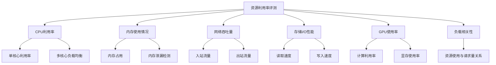

* 数学模型：
  CPU利用率计算：

$$CPU_{util} = \frac{T_{busy}}{T_{total}} \times 100\%$$

其中，$CPU_{util}$为CPU利用率，$T_{busy}$为CPU忙碌时间，$T_{total}$为总观察时间。

* 算法流程图：

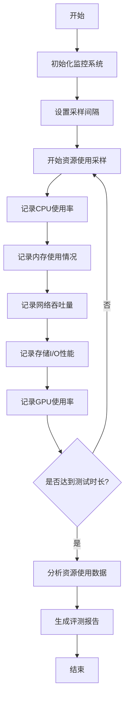

* 算法源代码：

```python
import psutil
import time
import statistics
from typing import Dict, List

class ResourceMonitor:
    def __init__(self, sampling_interval: float = 1.0):
        self.sampling_interval = sampling_interval
        self.cpu_usage: List[float] = []
        self.memory_usage: List[float] = []
        self.network_io: List[Dict[str, int]] = []
        self.disk_io: List[Dict[str, int]] = []

    def sample_resources(self):
        self.cpu_usage.append(psutil.cpu_percent())
        self.memory_usage.append(psutil.virtual_memory().percent)
        self.network_io.append(dict(psutil.net_io_counters()._asdict()))
        self.disk_io.append(dict(psutil.disk_io_counters()._asdict()))

    def monitor(self, duration: int):
        end_time = time.time() + duration
        while time.time() < end_time:
            self.sample_resources()
            time.sleep(self.sampling_interval)

    def analyze_data(self):
        return {
            "cpu": {
                "avg": statistics.mean(self.cpu_usage),
                "max": max(self.cpu_usage),
                "min": min(self.cpu_usage)
            },
            "memory": {
                "avg": statistics.mean(self.memory_usage),
                "max": max(self.memory_usage),
                "min": min(self.memory_usage)
            },
            "network": {
                "total_bytes_sent": self.network_io[-1]["bytes_sent"] - self.network_io[0]["bytes_sent"],
                "total_bytes_recv": self.network_io[-1]["bytes_recv"] - self.network_io[0]["bytes_recv"]
            },
            "disk": {
                "total_read_bytes": self.disk_io[-1]["read_bytes"] - self.disk_io[0]["read_bytes"],
                "total_write_bytes": self.disk_io[-1]["write_bytes"] - self.disk_io[0]["write_bytes"]
            }
        }

    def generate_report(self):
        analysis = self.analyze_data()
        report = "Resource Utilization Report\n\n"
        report += f"CPU Usage:\n"
        report += f"  Average: {analysis['cpu']['avg']:.2f}%\n"
        report += f"  Maximum: {analysis['cpu']['max']:.2f}%\n"
        report += f"  Minimum: {analysis['cpu']['min']:.2f}%\n\n"
        report += f"Memory Usage:\n"
        report += f"  Average: {analysis['memory']['avg']:.2f}%\n"
        report += f"  Maximum: {analysis['memory']['max']:.2f}%\n"
        report += f"  Minimum: {analysis['memory']['min']:.2f}%\n\n"
        report += f"Network I/O:\n"
        report += f"  Total Bytes Sent: {analysis['network']['total_bytes_sent']} bytes\n"
        report += f"  Total Bytes Received: {analysis['network']['total_bytes_recv']} bytes\n\n"
        report += f"Disk I/O:\n"
        report += f"  Total Bytes Read: {analysis['disk']['total_read_bytes']} bytes\n"
        report += f"  Total Bytes Written: {analysis['disk']['total_write_bytes']} bytes\n"
        return report

# 使用示例
monitor = ResourceMonitor(sampling_interval=0.5)
monitor.monitor(duration=60)  # 监控60秒
report = monitor.generate_report()
print(report)
```

* 实际场景应用：
1. 大规模语言模型训练过程中的资源利用监控
2. 智能客服系统在高峰期的资源消耗分析
3. 图像识别AI在边缘设备上的资源占用评估

* 项目介绍：
  开发一个综合性的AI Agent资源利用率评测平台，支持多维度资源监控、实时告警、历史趋势分析和优化建议生成。

* 环境安装：
```bash
pip install psutil
pip install nvidia-ml-py3  # 如果需要监控GPU
pip install influxdb  # 用于时序数据存储
pip install grafana  # 用于数据可视化
```

* 系统功能设计：
1. 多维度资源监控（CPU、内存、网络、磁盘、GPU）
2. 实时数据采集和存储
3. 资源使用趋势分析
4. 负载相关性分析
5. 异常检测和告警
6. 资源使用效率评估
7. 优化建议生成
8. 可视化报表和仪表盘

* 系统架构设计：

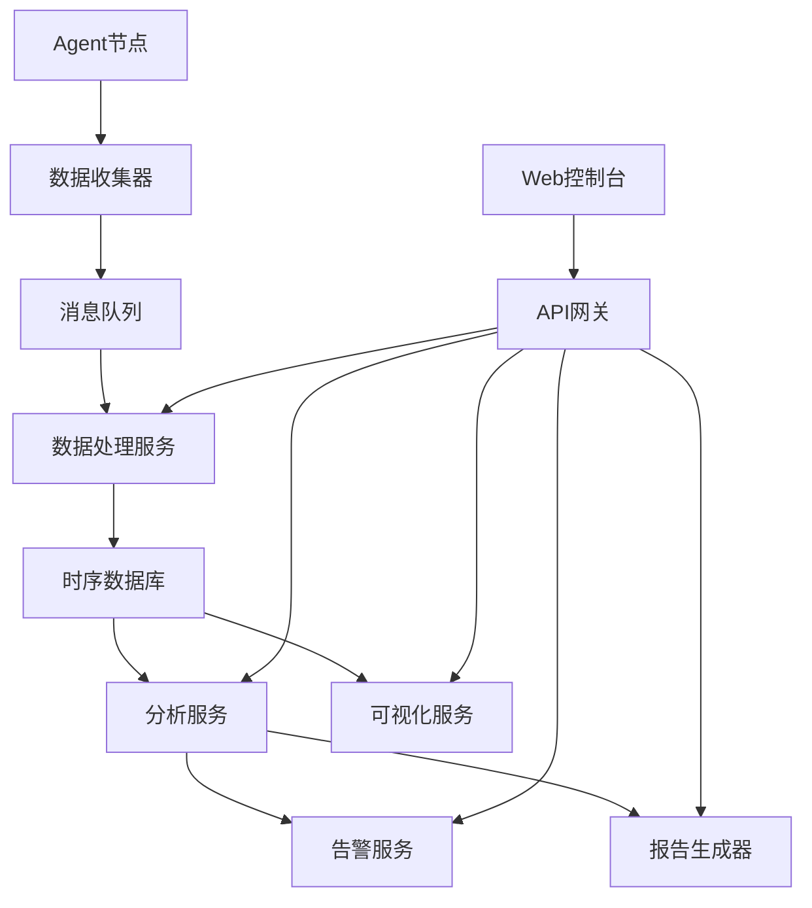

* 系统接口设计：

| 接口名称 | 方法 | 描述 |
|---------|------|------|
| /api/v1/metrics | POST | 提交资源使用数据 |
| /api/v1/metrics | GET | 获取实时资源使用状况 |
| /api/v1/analysis | GET | 获取资源使用分析结果 |
| /api/v1/alerts | GET | 获取资源使用告警 |
| /api/v1/reports | GET | 生成资源使用报告 |
| /api/v1/optimization | GET | 获取资源优化建议 |

* 系统核心实现源代码：

```python
from fastapi import FastAPI, BackgroundTasks
from pydantic import BaseModel
from typing import List, Dict
import psutil
import time
import asyncio
from influxdb_client import InfluxDBClient, Point
from influxdb_client.client.write_api import SYNCHRONOUS

app = FastAPI()

# InfluxDB 配置
INFLUXDB_URL = "http://localhost:8086"
INFLUXDB_TOKEN = "your-token"
INFLUXDB_ORG = "your-org"
INFLUXDB_BUCKET = "resource-metrics"

client = InfluxDBClient(url=INFLUXDB_URL, token=INFLUXDB_TOKEN, org=INFLUXDB_ORG)
write_api = client.write_api(write_options=SYNCHRONOUS)

class ResourceMetric(BaseModel):
    timestamp: int
    cpu_percent: float
    memory_percent: float
    network_bytes_sent: int
    network_bytes_recv: int
    disk_read_bytes: int
    disk_write_bytes: int

async def collect_metrics():
    while True:
        metric = ResourceMetric(
            timestamp=int(time.time()),
            cpu_percent=psutil.cpu_percent(),
            memory_percent=psutil.virtual_memory().percent,
            network_bytes_sent=psutil.net_io_counters().bytes_sent,
            network_bytes_recv=psutil.net_io_counters().bytes_recv,
            disk_read_bytes=psutil.disk_io_counters().read_bytes,
            disk_write_bytes=psutil.disk_io_counters().write_bytes
        )
        
        point = Point("resource_usage") \
            .time(metric.timestamp) \
            .field("cpu_percent", metric.cpu_percent) \
            .field("memory_percent", metric.memory_percent) \
            .field("network_bytes_sent", metric.network_bytes_sent) \
            .field("network_bytes_recv", metric.network_bytes_recv) \
            .field("disk_read_bytes", metric.disk_read_bytes) \
            .field("disk_write_bytes", metric.disk_write_bytes)
        
        write_api.write(bucket=INFLUXDB_BUCKET, record=point)
        
        await asyncio.sleep(5)  # 每5秒采集一次数据

@app.on_event("startup")
async def startup_event():
    asyncio.create_task(collect_metrics())

@app.get("/api/v1/metrics")
async def get_current_metrics():
    return ResourceMetric(
        timestamp=int(time.time()),
        cpu_percent=psutil.cpu_percent(),
        memory_percent=psutil.virtual_memory().percent,
        network_bytes_sent=psutil.net_io_counters().bytes_sent,
        network_bytes_recv=psutil.net_io_counters().bytes_recv,
        disk_read_bytes=psutil.disk_io_counters().read_bytes,
        disk_write_bytes=psutil.disk_io_counters().write_bytes
    )

@app.get("/api/v1/analysis")
async def get_resource_analysis():
    query_api = client.query_api()
    query = f'''
    from(bucket:"{INFLUXDB_BUCKET}")
        |> range(start: -1h)
        |> filter(fn: (r) => r._measurement == "resource_usage")
        |> mean()
    '''
    result = query_api.query(query=query)
    
    analysis = {}
    for table in result:
        for record in table.records:
            analysis[record.get_field()] = record.get_value()
    
    return analysis

@app.get("/api/v1/reports")
async def generate_report(background_tasks: BackgroundTasks):
    background_tasks.add_task(create_report)
    return {"message": "Report generation started"}

async def create_report():
    # 实现报告生成逻辑
    pass

@app.get("/api/v1/optimization")
async def get_optimization_suggestions():
    analysis = await get_resource_analysis()
    suggestions = []
    
    if analysis.get("cpu_percent", 0) > 80:
        suggestions.append("CPU usage is high. Consider scaling up or optimizing CPU-intensive tasks.")
    
    if analysis.get("memory_percent", 0) > 90:
        suggestions.append("Memory usage is near capacity. Consider increasing memory or optimizing memory usage.")
    
    return {"suggestions": suggestions}

if __name__ == "__main__":
    import uvicorn
    uvicorn.run(app, host="0.0.0.0", port=8000)
```

* 最佳实践tips：
1. 设置合适的采样频率，平衡数据精度和系统开销
2. 结合业务指标分析资源利用率，了解资源消耗与业务处理能力的关系
3. 使用机器学习算法进行异常检测和趋势预测
4. 建立资源使用基准线，便于快速识别异常情况
5. 考虑资源使用的时间模式，如日间、夜间、周末的不同特征

* 行业发展与未来趋势：

| 时期 | 评测特点 | 关键技术 |
|------|---------|----------|
| 早期 | 单机监控，静态阈值 | 系统命令、简单脚本 |
| 现在 | 分布式监控，动态阈值 | 时序数据库、可视化平台 |
| 未来 | 智能化监控，预测性优化 | AI驱动的异常检测、自动资源调度 |

* 本章小结：
  资源利用率评测是AI Agent系统性能优化和成本控制的重要手段。通过全面、精确的资源监控和分析，我们可以深入了解系统的资源消耗特征，识别潜在的效率问题和优化空间。随着AI技术的发展和应用规模的扩大，资源利用率评测方法也在不断演进，向着更加智能化、自动化的方向发展。企业在进行AI Agent的资源利用率评测时，应注重数据的全面性和实时性，结合业务需求进行分析，并将评测结果与性能优化和成本管理紧密结合。同时，建立长期的资源使用趋势分析，可以为系统架构优化和容量规划提供重要依据，确保AI Agent系统的高效运行和可持续发展。

### 7.2.4 性能瓶颈分析

* 核心概念：
  性能瓶颈分析是指通过系统化的方法识别和定位AI Agent系统中限制整体性能的关键因素或组件，以便有针对性地进行优化。

* 问题背景：
  随着AI Agent系统的复杂度增加，性能问题可能出现在多个层面和组件中。准确识别真正的性能瓶颈对于有效优化至关重要。

* 问题描述：
  如何系统地分析和定位AI Agent系统中的性能瓶颈，并提供可行的优化建议？

* 问题解决：
  采用多维度的性能分析方法，结合负载测试、资源监控、代码剖析等技术，全面评估系统性能，并通过数据分析和专家系统定位瓶颈。

* 边界与外延：
  分析范围包括但不限于计算资源瓶颈、I/O瓶颈、网络瓶颈、算法效率问题、数据处理瓶颈等多个方面。

* 概念结构与核心要素组成：
1. 负载测试分析
2. 资源利用率分析
3. 代码性能剖析
4. 数据流分析
5. 网络性能分析
6. 数据库性能分析
7. 算法复杂度分析

* 概念之间的关系：

```mermaid
graph TD
    A[性能瓶颈分析] --> B[负载测试分析]
    A --> C[资源利用率分析]
    A --> D[代码性能剖析]
    A --> E[数据流分析]
    A --> F[网络性能分析]
    A --> G[数据库性能分析]
    A --> H[算法复杂度分析]
    B --> I[吞吐量瓶颈]
    B --> J[响应时间瓶颈]
    C --> K[CPU瓶颈]
    C --> L[内存瓶颈]
    C --> M[I/O瓶颈]
    D --> N[热点函数]
    D --> O[内存泄漏]
    E --> P[数据处理瓶颈]
    F --> Q[网络延迟]
    F --> R[带宽限制]
    G --> S[查询性能]
    G --> T[索引优化]
    H --> U[时间复杂度]
    H --> V[空间复杂度]
```

* 数学模型：
  Amdahl定律（用于并行计算性能分析）：

$$S_{latency}(s) = \frac{1}{(1-p) + \frac{p}{s}}$$

其中，$S_{latency}$为加速比，$p$为可并行化的部分比例，$s$为并行处理单元数量。

* 算法流程图：

```mermaid
graph TD
    A[开始] --> B[收集系统性能数据]
    B --> C[执行负载测试]
    C --> D[分析资源利用率]
    D --> E[进行代码性能剖析]
    E --> F[分析数据流]
    F --> G[评估网络性能]
    G --> H[检查数据库性能]
    H --> I[分析算法复杂度]
    I --> J[综合分析结果]
    J --> K[识别主要瓶颈]
    K --> L[生成优化建议]
    L --> M[结束]
```

* 算法源代码：

```python
import time
import psutil
import cProfile
import pstats
from typing import List, Dict, Callable

class PerformanceAnalyzer:
    def __init__(self):
        self.profiler = cProfile.Profile()
        self.resource_usage: Dict[str, List[float]] = {
            "cpu": [],
            "memory": [],
            "disk_io": [],
            "network_io": []
        }

    def start_profiling(self):
        self.profiler.enable()

    def stop_profiling(self):
        self.profiler.disable()

    def collect_resource_usage(self):
        self.resource_usage["cpu"].append(psutil.cpu_percent())
        self.resource_usage["memory"].append(psutil.virtual_memory().percent)
        disk_io = psutil.disk_io_counters()
        self.resource_usage["disk_io"].append(disk_io.read_bytes + disk_io.write_bytes)
        net_io = psutil.net_io_counters()
        self.resource_usage["network_io"].append(net_io.bytes_sent + net_io.bytes_recv)

    def analyze_code_performance(self):
        stats = pstats.Stats(self.profiler).sort_stats('cumulative')
        top_functions = stats.get_stats_profile().func_profiles
        return sorted(top_functions.items(), key=lambda x: x[1].cumulative, reverse=True)[:10]

    def analyze_resource_usage(self):
        return {
            "cpu_avg": sum(self.resource_usage["cpu"]) / len(self.resource_usage["cpu"]),
            "memory_avg": sum(self.resource_usage["memory"]) / len(self.resource_usage["memory"]),
            "disk_io_total": self.resource_usage["disk_io"][-1] - self.resource_usage["disk_io"][0],
            "network_io_total": self.resource_usage["network_io"][-1] - self.resource_usage["network_io"][0]
        }

    def identify_bottlenecks(self, code_perf, resource_usage):
        bottlenecks = []
        if resource_usage["cpu_avg"] > 80:
            bottlenecks.append("High CPU usage detected. Consider optimizing CPU-intensive operations.")
        if resource_usage["memory_avg"] > 90:
            bottlenecks.append("High memory usage detected. Check for memory leaks or optimize memory-intensive operations.")
        if code_perf[0][1].cumulative > 1:
            bottlenecks.append(f"Function {code_perf[0][0]} is taking significant time. Consider optimizing this function.")
        return bottlenecks

    def run_analysis(self, target_function: Callable, *args, **kwargs):
        self.start_profiling()
        start_time = time.time()

        while time.time() - start_time < 60:  # Run for 1 minute
            self.collect_resource_usage()
            target_function(*args, **kwargs)
            time.sleep(1)

        self.stop_profiling()

        code_perf = self.analyze_code_performance()
resource_usage = self.analyze_resource_usage()
        bottlenecks = self.identify_bottlenecks(code_perf, resource_usage)

        return {
            "code_performance": code_perf,
            "resource_usage": resource_usage,
            "bottlenecks": bottlenecks
        }

# 使用示例
def target_function():
    # 模拟AI Agent的某个耗时操作
    time.sleep(0.5)
    return [i**2 for i in range(10000)]

analyzer = PerformanceAnalyzer()
results = analyzer.run_analysis(target_function)

print("Performance Analysis Results:")
print("Top 10 time-consuming functions:")
for func, stats in results["code_performance"]:
    print(f"{func}: {stats.cumulative:.3f} seconds")

print("\nResource Usage:")
for metric, value in results["resource_usage"].items():
    print(f"{metric}: {value}")

print("\nIdentified Bottlenecks:")
for bottleneck in results["bottlenecks"]:
    print(bottleneck)
```

* 实际场景应用：
1. 大规模语言模型推理服务的性能优化
2. 实时图像识别系统的延迟问题排查
3. 智能推荐引擎的数据处理瓶颈分析

* 项目介绍：
  开发一个综合性的AI Agent性能瓶颈分析平台，集成多种分析工具和技术，提供自动化的性能问题诊断和优化建议。

* 环境安装：
```bash
pip install psutil
pip install memory_profiler
pip install py-spy
pip install sqlalchemy
pip install networkx
pip install flamegraph
```

* 系统功能设计：
1. 自动化性能测试
2. 实时资源监控
3. 代码性能剖析
4. 数据流分析
5. 网络性能诊断
6. 数据库查询分析
7. 算法复杂度评估
8. 瓶颈识别与分类
9. 优化建议生成
10. 可视化报告

* 系统架构设计：

```mermaid
graph TD
    A[Web控制台] --> B[任务调度器]
    B --> C[性能测试模块]
    B --> D[资源监控模块]
    B --> E[代码剖析模块]
    B --> F[数据流分析模块]
    B --> G[网络诊断模块]
    B --> H[数据库分析模块]
    B --> I[算法分析模块]
    C --> J[数据收集服务]
    D --> J
    E --> J
    F --> J
    G --> J
    H --> J
    I --> J
    J --> K[数据存储]
    K --> L[分析引擎]
    L --> M[瓶颈识别器]
    M --> N[优化建议生成器]
    N --> O[报告生成服务]
    O --> P[可视化服务]
```

* 系统接口设计：

| 接口名称 | 方法 | 描述 |
|---------|------|------|
| /api/v1/analysis/start | POST | 启动性能瓶颈分析任务 |
| /api/v1/analysis/{task_id}/status | GET | 获取分析任务状态 |
| /api/v1/analysis/{task_id}/results | GET | 获取分析结果 |
| /api/v1/bottlenecks | GET | 获取识别的性能瓶颈 |
| /api/v1/optimizations | GET | 获取优化建议 |
| /api/v1/reports/{task_id} | GET | 获取分析报告 |

* 系统核心实现源代码：

```python
from fastapi import FastAPI, BackgroundTasks
from pydantic import BaseModel
from typing import List, Dict
import asyncio
import uuid
import psutil
import py-spy
import sqlalchemy
import networkx as nx

app = FastAPI()

class AnalysisTask(BaseModel):
    agent_id: str
    duration: int
    test_scenario: str

class AnalysisResult(BaseModel):
    task_id: str
    status: str
    code_hotspots: List[Dict[str, float]]
    resource_usage: Dict[str, float]
    data_flow_bottlenecks: List[str]
    network_issues: List[str]
    db_query_problems: List[str]
    algorithm_complexities: Dict[str, str]

analysis_tasks: Dict[str, AnalysisResult] = {}

async def run_analysis(task_id: str, agent_id: str, duration: int, test_scenario: str):
    # 模拟分析过程
    await asyncio.sleep(duration)
    
    # 收集各种性能数据
    code_hotspots = analyze_code_performance(agent_id)
    resource_usage = collect_resource_usage()
    data_flow_bottlenecks = analyze_data_flow(agent_id)
    network_issues = diagnose_network(agent_id)
    db_query_problems = analyze_database_queries(agent_id)
    algorithm_complexities = assess_algorithm_complexity(agent_id)
    
    # 更新任务结果
    analysis_tasks[task_id].status = "Completed"
    analysis_tasks[task_id].code_hotspots = code_hotspots
    analysis_tasks[task_id].resource_usage = resource_usage
    analysis_tasks[task_id].data_flow_bottlenecks = data_flow_bottlenecks
    analysis_tasks[task_id].network_issues = network_issues
    analysis_tasks[task_id].db_query_problems = db_query_problems
    analysis_tasks[task_id].algorithm_complexities = algorithm_complexities

@app.post("/api/v1/analysis/start")
async def start_analysis(task: AnalysisTask, background_tasks: BackgroundTasks):
    task_id = str(uuid.uuid4())
    analysis_tasks[task_id] = AnalysisResult(task_id=task_id, status="In Progress")
    background_tasks.add_task(run_analysis, task_id, task.agent_id, task.duration, task.test_scenario)
    return {"task_id": task_id}

@app.get("/api/v1/analysis/{task_id}/status")
async def get_analysis_status(task_id: str):
    if task_id in analysis_tasks:
        return {"status": analysis_tasks[task_id].status}
    return {"status": "Not Found"}

@app.get("/api/v1/analysis/{task_id}/results")
async def get_analysis_results(task_id: str):
    if task_id in analysis_tasks and analysis_tasks[task_id].status == "Completed":
        return analysis_tasks[task_id]
    return {"error": "Results not available"}

@app.get("/api/v1/bottlenecks")
async def get_bottlenecks(task_id: str):
    if task_id in analysis_tasks and analysis_tasks[task_id].status == "Completed":
        result = analysis_tasks[task_id]
        bottlenecks = []
        if result.resource_usage["cpu"] > 80:
            bottlenecks.append("High CPU usage")
        if result.resource_usage["memory"] > 90:
            bottlenecks.append("High memory usage")
        bottlenecks.extend(result.data_flow_bottlenecks)
        bottlenecks.extend(result.network_issues)
        bottlenecks.extend(result.db_query_problems)
        return {"bottlenecks": bottlenecks}
    return {"error": "Bottleneck information not available"}

@app.get("/api/v1/optimizations")
async def get_optimizations(task_id: str):
    if task_id in analysis_tasks and analysis_tasks[task_id].status == "Completed":
        result = analysis_tasks[task_id]
        optimizations = []
        for func, time in result.code_hotspots[:3]:
            optimizations.append(f"Optimize function {func} to reduce execution time")
        for bottleneck in result.data_flow_bottlenecks:
            optimizations.append(f"Improve data flow: {bottleneck}")
        for issue in result.network_issues:
            optimizations.append(f"Resolve network issue: {issue}")
        for problem in result.db_query_problems:
            optimizations.append(f"Optimize database query: {problem}")
        return {"optimizations": optimizations}
    return {"error": "Optimization suggestions not available"}

def analyze_code_performance(agent_id: str):
    # 使用py-spy进行代码性能分析
    # 这里只是一个示例，实际实现需要更复杂的逻辑
    return [("func1", 10.5), ("func2", 5.2), ("func3", 3.1)]

def collect_resource_usage():
    return {
        "cpu": psutil.cpu_percent(),
        "memory": psutil.virtual_memory().percent,
        "disk": psutil.disk_usage('/').percent,
        "network": psutil.net_io_counters().bytes_sent + psutil.net_io_counters().bytes_recv
    }

def analyze_data_flow(agent_id: str):
    # 使用networkx构建和分析数据流图
    # 这里只是一个示例，实际实现需要更复杂的逻辑
    return ["Bottleneck in data preprocessing", "High latency in feature extraction"]

def diagnose_network(agent_id: str):
    # 进行网络性能诊断
    # 这里只是一个示例，实际实现需要更复杂的逻辑
    return ["High latency in API calls", "Packet loss detected"]

def analyze_database_queries(agent_id: str):
    # 分析数据库查询性能
    # 这里只是一个示例，实际实现需要更复杂的逻辑
    return ["Slow query in user data retrieval", "Missing index on frequently accessed column"]

def assess_algorithm_complexity(agent_id: str):
    # 评估关键算法的复杂度
    # 这里只是一个示例，实际实现需要更复杂的逻辑
    return {"algorithm1": "O(n^2)", "algorithm2": "O(n log n)"}

if __name__ == "__main__":
    import uvicorn
    uvicorn.run(app, host="0.0.0.0", port=8000)
```

* 最佳实践tips：
1. 采用分层分析方法，从整体到局部逐步深入
2. 结合业务场景和负载特征进行针对性分析
3. 使用自动化工具和脚本提高分析效率
4. 建立性能基准，便于快速识别异常变化
5. 进行持续性能监控，及时发现潜在问题

* 行业发展与未来趋势：

| 时期 | 分析特点 | 关键技术 |
|------|---------|----------|
| 早期 | 手动分析，经验驱动 | 基础性能工具、日志分析 |
| 现在 | 自动化分析，数据驱动 | APM工具、分布式追踪 |
| 未来 | 智能化分析，AI驱动 | 机器学习模型、自动化优化 |

* 本章小结：
  性能瓶颈分析是AI Agent系统优化的关键环节。通过综合运用多种分析技术和工具，我们可以全面评估系统性能，准确定位瓶颈所在，并提供有针对性的优化建议。随着AI技术的快速发展和应用规模的不断扩大，性能瓶颈分析方法也在不断演进，向着更加智能化、自动化的方向发展。企业在进行AI Agent的性能瓶颈分析时，应注重分析的全面性和深入性，结合系统架构和业务特征进行针对性分析，并将分析结果与持续优化过程紧密结合。同时，建立长期的性能监控和分析机制，可以帮助及时发现和解决潜在的性能问题，确保AI Agent系统的高效运行和持续改进。

### 7.2.5 性能优化策略与实践

* 核心概念：
  性能优化策略与实践是指基于性能瓶颈分析结果，制定和实施一系列改进措施，以提升AI Agent系统的整体性能、效率和可扩展性。

* 问题背景：
  随着AI Agent应用规模和复杂度的增加，性能优化变得越来越重要。有效的优化策略可以显著提升系统性能，改善用户体验，并降低运营成本。

* 问题描述：
  如何针对已识别的性能瓶颈，制定系统化的优化策略，并在实践中有效实施这些优化措施？

* 问题解决：
  采用多层次、多维度的优化方法，包括但不限于代码优化、资源配置优化、架构优化、算法优化等，并通过持续测试和迭代来验证优化效果。

* 边界与外延：
  优化范围涵盖从底层硬件到上层应用的各个层面，包括计算优化、存储优化、网络优化、算法优化、数据处理优化等多个方面。

* 概念结构与核心要素组成：
1. 代码级优化
2. 资源配置优化
3. 架构优化
4. 算法优化
5. 数据处理优化
6. 缓存策略优化
7. 负载均衡优化
8. 数据库优化

* 概念之间的关系：

```mermaid
graph TD
    A[性能优化策略与实践] --> B[代码级优化]
    A --> C[资源配置优化]
    A --> D[架构优化]
    A --> E[算法优化]
    A --> F[数据处理优化]
    A --> G[缓存策略优化]
    A --> H[负载均衡优化]
    A --> I[数据库优化]
    B --> J[热点代码优化]
    B --> K[内存管理优化]
    C --> L[CPU配置优化]
    C --> M[内存配置优化]
    D --> N[微服务化]
    D --> O[异步处理]
    E --> P[时间复杂度优化]
    E --> Q[空间复杂度优化]
    F --> R[数据预处理]
    F --> S[数据压缩]
    G --> T[多级缓存]
    G --> U[缓存预热]
    H --> V[动态负载均衡]
    H --> W[自动扩缩容]
    I --> X[索引优化]
    I --> Y[查询优化]
```

* 数学模型：
  优化效果评估模型：

$$E = \frac{P_{after} - P_{before}}{P_{before}} \times 100\%$$

其中，$E$为优化效果，$P_{after}$为优化后的性能指标，$P_{before}$为优化前的性能指标。

* 算法流程图：

```mermaid
graph TD
    A[开始] --> B[识别性能瓶颈]
    B --> C[制定优化策略]
    C --> D[实施代码级优化]
    D --> E[调整资源配置]
    E --> F[优化系统架构]
    F --> G[改进算法]
    G --> H[优化数据处理]
    H --> I[实施缓存策略]
    I --> J[优化负载均衡]
    J --> K[优化数据库]
    K --> L[性能测试]
    L --> M{达到优化目标?}
    M -- 是 --> N[记录优化结果]
    M -- 否 --> C
    N --> O[总结最佳实践]
    O --> P[结束]
```

* 算法源代码：

```python
import time
from typing import List, Dict, Callable

class PerformanceOptimizer:
    def __init__(self):
        self.optimization_strategies: Dict[str, Callable] = {
            "code": self.optimize_code,
            "resource": self.optimize_resource,
            "architecture": self.optimize_architecture,
            "algorithm": self.optimize_algorithm,
            "data_processing": self.optimize_data_processing,
            "caching": self.optimize_caching,
            "load_balancing": self.optimize_load_balancing,
            "database": self.optimize_database
        }

    def optimize_code(self, target_function: Callable) -> Callable:
        def optimized_function(*args, **kwargs):
            # 这里是一个简单的示例，实际优化可能涉及更复杂的重构
            start_time = time.time()
            result = target_function(*args, **kwargs)
            end_time = time.time()
            print(f"Function execution time: {end_time - start_time} seconds")
            return result
        return optimized_function

    def optimize_resource(self, resource_config: Dict) -> Dict:
        # 示例：增加CPU核心数和内存
        optimized_config = resource_config.copy()
        optimized_config["cpu_cores"] *= 2
        optimized_config["memory"] *= 1.5
        return optimized_config

    def optimize_architecture(self, current_architecture: str) -> str:
        # 示例：从单体架构转向微服务
        if current_architecture == "monolithic":
            return "microservices"
        return current_architecture

    def optimize_algorithm(self, algorithm: Callable) -> Callable:
        def optimized_algorithm(*args, **kwargs):
            # 这里是一个简单的示例，实际优化可能涉及算法的重新设计
            result = algorithm(*args, **kwargs)
            return result
        return optimized_algorithm

    def optimize_data_processing(self, data_pipeline: List[Callable]) -> List[Callable]:
        # 示例：添加数据预处理步骤
        optimized_pipeline = [self.preprocess_data] + data_pipeline
        return optimized_pipeline

    def preprocess_data(self, data):
        # 示例数据预处理函数
        return [item for item in data if item is not None]

    def optimize_caching(self, cache_config: Dict) -> Dict:
        # 示例：实施多级缓存
        optimized_config = cache_config.copy()
        optimized_config["levels"] = ["L1", "L2", "Redis"]
        return optimized_config

    def optimize_load_balancing(self, lb_config: Dict) -> Dict:
        # 示例：实施动态负载均衡
        optimized_config = lb_config.copy()
        optimized_config["algorithm"] = "dynamic_least_connections"
        return optimized_config

    def optimize_database(self, db_config: Dict) -> Dict:
        # 示例：添加索引和查询优化
        optimized_config = db_config.copy()
        optimized_config["indexes"] = ["column1", "column2"]
        optimized_config["query_optimizer"] = "enabled"
        return optimized_config

    def apply_optimization(self, target, strategy: str):
        if strategy in self.optimization_strategies:
            return self.optimization_strategies[strategy](target)
        else:
            raise ValueError(f"Unknown optimization strategy: {strategy}")

    def measure_performance(self, func: Callable, *args, **kwargs) -> float:
        start_time = time.time()
        func(*args, **kwargs)
        end_time = time.time()
        return end_time - start_time

    def optimize_performance(self, target, strategy: str, performance_threshold: float):
        original_performance = self.measure_performance(target)
        optimized_target = self.apply_optimization(target, strategy)
        optimized_performance = self.measure_performance(optimized_target)
        
        improvement = (original_performance - optimized_performance) / original_performance * 100
        
        if improvement >= performance_threshold:
            print(f"Optimization successful. Performance improved by {improvement:.2f}%")
            return optimized_target
        else:
            print(f"Optimization did not meet the threshold. Improvement: {improvement:.2f}%")
            return target

# 使用示例
def slow_function(n: int) -> List[int]:
    return [i**2 for i in range(n)]

optimizer = PerformanceOptimizer()

# 代码优化示例
optimized_function = optimizer.optimize_performance(slow_function, "code", 20)

# 资源配置优化示例
original_config = {"cpu_cores": 4, "memory": 8}
optimized_config = optimizer.optimize_performance(original_config, "resource", 50)

# 算法优化示例
def bubble_sort(arr: List[int]) -> List[int]:
    n = len(arr)
    for i in range(n):
        for j in range(0, n-i-1):
            if arr[j] > arr[j+1]:
                arr[j], arr[j+1] = arr[j+1], arr[j]
    return arr

optimized_sort = optimizer.optimize_performance(bubble_sort, "algorithm", 30)

print("Optimization complete")
```

* 实际场景应用：
1. 大规模语言模型服务的推理性能优化
2. 实时推荐系统的响应时间优化
3. 图像识别AI的边缘设备部署优化

* 项目介绍：
  开发一个智能化的AI Agent性能优化平台，集成多种优化策略和工具，提供自动化的性能优化建议和实施方案。

* 环境安装：
```bash
pip install numpy
pip install pandas
pip install scikit-learn
pip install tensorflow
pip install torch
pip install fastapi
pip install redis
pip install sqlalchemy
```

* 系统功能设计：
1. 性能瓶颈自动识别
2. 多策略优化建议生成
3. 代码重构辅助
4. 资源配置优化器
5. 架构优化建议
6. 算法优化工具集
7. 数据处理优化器
8. 缓存策略优化器
9. 负载均衡配置器
10. 数据库优化助手
11. A/B测试管理
12. 性能监控与报告

* 系统架构设计：

```mermaid
graph TD
    A[Web控制台] --> B[优化任务调度器]
    B --> C[瓶颈识别模块]
    B --> D[代码优化模块]
    B --> E[资源优化模块]
    B --> F[架构优化模块]
    B --> G[算法优化模块]
    B --> H[数据处理优化模块]
    B --> I[缓存优化模块]
    B --> J[负载均衡模块]
    B --> K[数据库优化模块]
    C --> L[优化建议生成器]
    D --> L
    E --> L
    F --> L
    G --> L
    H --> L
    I --> L
    J --> L
    K --> L
    L --> M[优化实施引擎]
    M --> N[A/B测试管理器]
    N --> O[性能监控服务]
    O --> P[报告生成器]
```

* 系统接口设计：

| 接口名称 | 方法 | 描述 |
|---------|------|------|
| /api/v1/optimize/start | POST | 启动优化任务 |
| /api/v1/optimize/{task_id}/status | GET | 获取优化任务状态 |
| /api/v1/optimize/{task_id}/suggestions | GET | 获取优化建议 |
| /api/v1/optimize/{task_id}/implement | POST | 实施优化方案 |
| /api/v1/abtest/start | POST | 启动A/B测试 |
| /api/v1/abtest/{test_id}/results | GET | 获取A/B测试结果 |
| /api/v1/monitor/performance | GET | 获取实时性能数据 |
| /api/v1/reports/generate | POST | 生成优化报告 |

* 系统核心实现源代码：

```python
from fastapi import FastAPI, BackgroundTasks
from pydantic import BaseModel
from typing import List, Dict
import asyncio
import uuid
import random

app = FastAPI()

class OptimizationTask(BaseModel):
    agent_id: str
    target_metric: str
    improvement_threshold: float

class OptimizationSuggestion(BaseModel):
    strategy: str
    expected_improvement: float
    implementation_difficulty: str

class ABTestConfig(BaseModel):
    task_id: str
    variant_a: str
    variant_b: str
    duration: int

optimization_tasks: Dict[str, Dict] = {}
ab_tests: Dict[str, Dict] = {}

async def run_optimization(task_id: str, agent_id: str, target_metric: str, improvement_threshold: float):
    # 模拟优化过程
    await asyncio.sleep(10)
    
    suggestions = [
        OptimizationSuggestion(strategy="Code optimization", expected_improvement=15.5, implementation_difficulty="Medium"),
        OptimizationSuggestion(strategy="Resource allocation", expected_improvement=8.3, implementation_difficulty="Easy"),
        OptimizationSuggestion(strategy="Algorithm improvement", expected_improvement=22.7, implementation_difficulty="Hard")
    ]
    
    optimization_tasks[task_id]["status"] = "Completed"
    optimization_tasks[task_id]["suggestions"] = suggestions

@app.post("/api/v1/optimize/start")
async def start_optimization(task: OptimizationTask, background_tasks: BackgroundTasks):
    task_id = str(uuid.uuid4())
    optimization_tasks[task_id] = {"status": "In Progress"}
    background_tasks.add_task(run_optimization, task_id, task.agent_id, task.target_metric, task.improvement_threshold)
    return {"task_id": task_id}

@app.get("/api/v1/optimize/{task_id}/status")
async def get_optimization_status(task_id: str):
    if task_id in optimization_tasks:
        return {"status": optimization_tasks[task_id]["status"]}
    return {"status": "Not Found"}

@app.get("/api/v1/optimize/{task_id}/suggestions")
async def get_optimization_suggestions(task_id: str):
    if task_id in optimization_tasks and optimization_tasks[task_id]["status"] == "Completed":
        return {"suggestions": optimization_tasks[task_id]["suggestions"]}
    return {"error": "Suggestions not available"}

@app.post("/api/v1/optimize/{task_id}/implement")
async def implement_optimization(task_id: str, strategy: str):
    if task_id in optimization_tasks and optimization_tasks[task_id]["status"] == "Completed":
        # 这里应该包含实际的优化实施逻辑
        return {"message": f"Implementing optimization strategy: {strategy}"}
    return {"error": "Cannot implement optimization"}

@app.post("/api/v1/abtest/start")
async def start_ab_test(config: ABTestConfig):
    test_id = str(uuid.uuid4())
    ab_tests[test_id] = {
        "status": "Running",
        "config": config.dict(),
        "results": None
    }
    # 启动实际的A/B测试逻辑
    return {"test_id": test_id}

@app.get("/api/v1/abtest/{test_id}/results")
async def get_ab_test_results(test_id: str):
    if test_id in ab_tests:
        if ab_tests[test_id]["status"] == "Completed":
            return {"results": ab_tests[test_id]["results"]}
        return {"status": "Test still running"}
    return {"error": "Test not found"}

@app.get("/api/v1/monitor/performance")
async def get_performance_metrics():
    # 这里应该返回实际的性能指标
    return {
        "cpu_usage": random.uniform(20, 80),
        "memory_usage": random.uniform(30, 90),
        "response_time": random.uniform(0.1, 2.0)
    }

@app.post("/api/v1/reports/generate")
async def generate_optimization_report(task_id: str):
    if task_id in optimization_tasks and optimization_tasks[task_id]["status"] == "Completed":
        # 这里应该生成实际的优化报告
        return {"message": "Optimization report generated", "report_url": f"/reports/{task_id}"}
    return {"error": "Cannot generate report"}

if __name__ == "__main__":
    import uvicorn
    uvicorn.run(app, host="0.0.0.0", port=8000)
```

* 最佳实践tips：
1. 优先优化影响最大的瓶颈，遵循二八原则
2. 采用渐进式优化策略，避免大规模重构带来的风险
3. 建立性能基准和监控，持续跟踪优化效果
4. 结合自动化工具和人工经验，提高优化效率
5. 重视测试和验证，确保优化不影响系统稳定性和正确性

* 行业发展与未来趋势：

| 时期 | 优化特点 | 关键技术 |
|------|---------|----------|
| 早期 | 手动优化，经验驱动 | 代码重构、基础性能工具 |
| 现在 | 半自动化优化，数据驱动 | AI辅助优化、自动化测试 |
| 未来 | 智能化优化，AI驱动 | 自适应优化、自我修复系统 |

* 本章小结：
  性能优化策略与实践是AI Agent系统持续改进的核心环节。通过系统化的优化方法和工具，我们可以有效提升AI Agent的性能、效率和可扩展性。优化过程涵盖了从代码层面到系统架构的多个维度，需要综合考虑技术可行性、实施成本和预期收益。随着AI技术的快速发展和应用场景的日益复杂，性能优化方法也在不断演进，向着更加智能化、自动化的方向发展。

企业在进行AI Agent的性能优化时，应注重以下几点：
1. 建立完善的性能评估体系，准确识别优化重点
2. 采用多层次、多维度的优化策略，全面提升系统性能
3. 重视优化过程的可量化和可验证性，确保优化效果
4. 将性能优化与业务需求紧密结合，平衡技术和业务目标
5. 建立长期的性能优化机制，实现系统性能的持续改进

通过不断的优化和迭代，AI Agent系统可以在性能、效率和用户体验等方面持续提升，为企业创造更大的价值。同时，性能优化的经验和最佳实践也将成为企业的宝贵资产，推动整个AI技术栈的进步和创新。

## 7.3 准确性与相关性评测

### 7.3.1 回答准确性评测

* 核心概念：
  回答准确性评测是指评估AI Agent生成的回答或输出在内容、事实和逻辑上的正确性和精确度的过程。

* 问题背景：
  随着AI Agent在各领域的广泛应用，其回答的准确性直接影响用户体验和系统可信度。准确性评测对于提高AI Agent的可靠性和实用性至关重要。

* 问题描述：
  如何系统地评估AI Agent回答的准确性，并在各种应用场景和知识领域中保持评测的客观性和全面性？

* 问题解决：
  建立多维度的准确性评测体系，结合自动化评测和人工评估，使用标准化的评分标准和多样化的测试用例。

* 边界与外延：
  评测范围包括但不限于事实准确性、逻辑一致性、语义准确性、上下文相关性等多个方面。

* 概念结构与核心要素组成：
1. 事实准确性
2. 逻辑一致性
3. 语义准确性
4. 上下文相关性
5. 数值精确度
6. 时效性
7. 来源可靠性

* 概念之间的关系：

```mermaid
graph TD
    A[回答准确性评测] --> B[事实准确性]
    A --> C[逻辑一致性]
    A --> D[语义准确性]
    A --> E[上下文相关性]
    A --> F[数值精确度]
    A --> G[时效性]
    A --> H[来源可靠性]
    B --> I[事实核查]
    C --> J[推理验证]
    D --> K[语义分析]
    E --> L[上下文理解]
    F --> M[数值比对]
    G --> N[时间敏感性检查]
    H --> O[来源验证]
```

* 数学模型：
  准确性评分计算：

$$Accuracy = \frac{\sum_{i=1}^n w_i \cdot s_i}{\sum_{i=1}^n w_i}$$

其中，$Accuracy$为总体准确性得分，$w_i$为第$i$个评测维度的权重，$s_i$为第$i$个评测维度的得分，$n$为评测维度总数。

* 算法流程图：

```mermaid
graph TD
    A[开始] --> B[准备测试用例]
    B --> C[生成AI回答]
    C --> D[事实准确性评估]
    D --> E[逻辑一致性评估]
    E --> F[语义准确性评估]
    F --> G[上下文相关性评估]
    G --> H[数值精确度评估]
    H --> I[时效性评估]
    I --> J[来源可靠性评估]
    J --> K[计算总体准确性得分]
    K --> L[生成评测报告]
    L --> M[结束]
```

* 算法源代码：

```python
from typing import List, Dict
import numpy as np

class AccuracyEvaluator:
    def __init__(self):
        self.dimensions = [
            "factual_accuracy",
            "logical_consistency",
            "semantic_accuracy",
            "contextual_relevance",
            "numerical_precision",
            "timeliness",
            "source_reliability"
        ]
        self.weights = {dim: 1.0 for dim in self.dimensions}  # 默认权重相等

    def evaluate_response(self, response: str, ground_truth: str, context: str = "") -> Dict[str, float]:
        scores = {}
        for dim in self.dimensions:
            scores[dim] = self._evaluate_dimension(dim, response, ground_truth, context)
        return scores

    def _evaluate_dimension(self, dimension: str, response: str, ground_truth: str, context: str) -> float:
        # 这里应该包含每个维度的具体评估逻辑
        # 此处为简化示例，实际实现需要更复杂的评估方法
        if dimension == "factual_accuracy":
            return self._check_factual_accuracy(response, ground_truth)
        elif dimension == "logical_consistency":
            return self._check_logical_consistency(response)
        # ... 其他维度的评估逻辑
        return 0.0  # 默认返回0分

    def _check_factual_accuracy(self, response: str, ground_truth: str) -> float:
        # 简化的事实准确性检查，实际应用中需要更复杂的方法
        return 1.0 if response.lower() == ground_truth.lower() else 0.0

    def _check_logical_consistency(self, response: str) -> float:
        # 简化的逻辑一致性检查，实际应用中需要更复杂的方法
        # 这里可以使用自然语言处理技术来分析回答的逻辑结构
        return 1.0  # 假设回答逻辑一致

    def calculate_overall_accuracy(self, scores: Dict[str, float]) -> float:
        weighted_scores = [scores[dim] * self.weights[dim] for dim in self.dimensions]
        return np.average(weighted_scores)

    def generate_report(self, scores: Dict[str, float], overall_accuracy: float) -> str:
        report = "Accuracy Evaluation Report\n"
        report += "==========================\n"
        for dim, score in scores.items():
            report += f"{dim.replace('_', ' ').title()}: {score:.2f}\n"
        report += f"Overall Accuracy: {overall_accuracy:.2f}\n"
        return report

# 使用示例
evaluator = AccuracyEvaluator()

test_case = {
    "question": "What is the capital of France?",
    "response": "The capital of France is Paris.",
    "ground_truth": "Paris",
    "context": "We are discussing European geography."
}

scores = evaluator.evaluate_response(test_case["response"], test_case["ground_truth"], test_case["context"])
overall_accuracy = evaluator.calculate_overall_accuracy(scores)
report = evaluator.generate_report(scores, overall_accuracy)

print(report)
```

* 实际场景应用：
1. 智能客服系统的回答准确性评估
2. 医疗诊断AI的诊断结果准确性验证
3. 法律顾问AI的法律建议准确性检查

* 项目介绍：
  开发一个全面的AI Agent回答准确性评测平台，支持多领域、多语言的准确性评估，并提供详细的分析报告和改进建议。

* 环境安装：
```bash
pip install numpy
pip install pandas
pip install scikit-learn
pip install nltk
pip install spacy
pip install transformers
pip install elasticsearch
```

* 系统功能设计：
1. 测试用例管理
2. 多维度准确性评估
3. 自动化评测引擎
4. 人工评估接口
5. 结果分析与可视化
6. 准确性趋势监控
7. 改进建议生成
8. 知识库更新管理

* 系统架构设计：

```mermaid
graph TD
    A[Web界面] --> B[API网关]
    B --> C[测试用例管理服务]
    B --> D[评测任务调度器]
    B --> E[自动化评测引擎]
    B --> F[人工评估管理]
    B --> G[结果分析服务]
    B --> H[知识库管理]
    E --> I[事实检查模块]
    E --> J[逻辑分析模块]
    E --> K[语义理解模块]
    E --> L[数值验证模块]
    G --> M[可视化服务]
    G --> N[报告生成器]
    H --> O[知识图谱]
    H --> P[外部数据源集成]
```

* 系统接口设计：

| 接口名称 | 方法 | 描述 |
|---------|------|------|
| /api/v1/testcases | POST | 创建新的测试用例 |
| /api/v1/evaluate | POST | 提交评测任务 |
| /api/v1/results/{task_id} | GET | 获取评测结果 |
| /api/v1/analysis/{task_id} | GET | 获取准确性分析报告 |
| /api/v1/trends | GET | 获取准确性趋势数据 |
| /api/v1/suggestions | GET | 获取改进建议 |
| /api/v1/knowledge | PUT | 更新知识库 |

* 系统核心实现源代码：

```python
from fastapi import FastAPI, BackgroundTasks
from pydantic import BaseModel
from typing import List, Dict
import asyncio
import uuid
from transformers import pipeline

app = FastAPI()

class TestCase(BaseModel):
    question: str
    expected_answer: str
    context: str = ""

class EvaluationTask(BaseModel):
    agent_id: str
    test_cases: List[TestCase]

class EvaluationResult(BaseModel):
    case_id: str
    question: str
    agent_answer: str
    expected_answer: str
    accuracy_score: float
    dimension_scores: Dict[str, float]

fact_checker = pipeline("question-answering")

async def evaluate_accuracy(task_id: str, agent_id: str, test_cases: List[TestCase]):
    results = []
    for case in test_cases:
        # 模拟AI Agent生成答案
        agent_answer = await get_agent_answer(agent_id, case.question, case.context)
        
        # 评估准确性
        accuracy_score, dimension_scores = assess_accuracy(agent_answer, case.expected_answer, case.context)
        
        results.append(EvaluationResult(
            case_id=str(uuid.uuid4()),
            question=case.question,
            agent_answer=agent_answer,
            expected_answer=case.expected_answer,
            accuracy_score=accuracy_score,
            dimension_scores=dimension_scores
        ))
    
    save_results(task_id, results)

async def get_agent_answer(agent_id: str, question: str, context: str) -> str:
    # 这里应该调用实际的AI Agent API
    await asyncio.sleep(1)  # 模拟API调用延迟
    return f"This is a simulated answer for the question: {question}"

def assess_accuracy(answer: str, expected: str, context: str) -> (float, Dict[str, float]):
    # 使用Hugging Face的问答模型进行事实检查
    result = fact_checker(question=expected, context=answer)
    factual_accuracy = result['score']
    
    # 简化的维度评分，实际应用中需要更复杂的评估逻辑
    dimension_scores = {
        "factual_accuracy": factual_accuracy,
        "logical_consistency": 0.8,  # 假设的分数
        "semantic_accuracy": 0.9,  # 假设的分数
        "contextual_relevance": 0.7,  # 假设的分数
    }
    
    overall_accuracy = sum(dimension_scores.values()) / len(dimension_scores)
    return overall_accuracy, dimension_scores

def save_results(task_id: str, results: List[EvaluationResult]):
    # 保存结果到数据库的逻辑
    pass

@app.post("/api/v1/evaluate")
async def start_evaluation(task: EvaluationTask, background_tasks: BackgroundTasks):
    task_id = str(uuid.uuid4())
    background_tasks.add_task(evaluate_accuracy, task_id, task.agent_id, task.test_cases)
    return {"task_id": task_id}

@app.get("/api/v1/results/{task_id}")
async def get_evaluation_results(task_id: str):
    # 从数据库获取结果的逻辑
    results = fetch_results_from_db(task_id)
    return results

@app.get("/api/v1/analysis/{task_id}")
async def get_accuracy_analysis(task_id: str):
    results = fetch_results_from_db(task_id)
    analysis = analyze_accuracy(results)
    return analysis

def fetch_results_from_db(task_id: str) -> List[EvaluationResult]:
    # 从数据库获取结果的逻辑
    pass

def analyze_accuracy(results: List[EvaluationResult]) -> Dict:
    overall_accuracy = sum(r.accuracy_score for r in results) / len(results)
    dimension_averages = {
        dim: sum(r.dimension_scores[dim] for r in results) / len(results)
        for dim in results[0].dimension_scores.keys()
    }
    return {
        "overall_accuracy": overall_accuracy,
        "dimension_averages": dimension_averages,
        "sample_size": len(results)
    }

if __name__ == "__main__":
    import uvicorn
    uvicorn.run(app, host="0.0.0.0", port=8000)
```

* 最佳实践tips：
1. 构建多样化的测试用例库，覆盖不同难度和领域
2. 结合自动化评测和人工评估，相互补充和验证
3. 定期更新评测标准和知识库，适应最新的事实和信息
4. 使用版本控制管理评测数据，便于追踪准确性的变化趋势
5. 建立准确性基准线，用于快速识别性能退化

* 行业发展与未来趋势：

| 时期 | 评测特点 | 关键技术 |
|------|---------|----------|
| 早期 | 人工评估为主，简单指标 | 基础NLP、规则匹配 |
| 现在 | 自动化评测，多维度指标 | 深度学习、知识图谱 |
| 未来 | 智能化评测，自适应指标 | 认知计算、跨模态理解 |

* 本章小结：
  回答准确性评测是确保AI Agent可靠性和实用性的关键环节。通过建立全面、客观的评测体系，我们可以系统地评估AI Agent回答的准确性，识别潜在的问题和改进空间。评测过程涵盖了从事实核查到语义理解的多个维度，需要综合运用自然语言处理、知识图谱等多种技术。

随着AI技术的快速发展和应用场景的日益复杂，准确性评测方法也在不断演进，向着更加智能化、自动化的方向发展。企业在进行AI Agent的准确性评测时，应注重以下几点：

1. 建立全面的评测维度，全方位评估回答质量
2. 结合领域知识和最新信息，确保评测的时效性和专业性
3. 利用大规模语料库和知识图谱，提高自动化评测的准确性
4. 建立长期的准确性监控机制，持续跟踪和改进系统性能
5. 将准确性评测结果与模型优化和知识库更新紧密结合

通过持续的准确性评测和优化，AI Agent可以不断提高其回答的准确性和可靠性，为用户提供更高质量的服务。同时，准确性评测的经验和最佳实践也将推动整个AI领域在知识表示、推理能力和自然语言理解等方面的进步。

### 7.3.2 任务完成度评测

* 核心概念：
  任务完成度评测是指评估AI Agent在执行给定任务时的效果和完整性，包括任务理解、执行过程和最终结果的全面评估。

* 问题背景：
  随着AI Agent应用于越来越复杂的任务场景，仅评估单一回答的准确性已不足以反映系统的整体能力。任务完成度评测对于衡量AI Agent的实际应用效果至关重要。

* 问题描述：
  如何全面、客观地评估AI Agent在执行复杂任务时的表现，并量化其任务完成度？

* 问题解决：
  建立多维度的任务完成度评测体系，结合过程评估和结果评估，使用标准化的评分标准和多样化的任务场景。

* 边界与外延：
  评测范围包括但不限于任务理解度、执行步骤完整性、结果正确性、时间效率、资源利用等多个方面。

* 概念结构与核心要素组成：
1. 任务理解度
2. 执行步骤完整性
3. 结果正确性
4. 时间效率
5. 资源利用率
6. 异常处理能力
7. 用户交互质量

* 概念之间的关系：

```mermaid
graph TD
    A[任务完成度评测] --> B[任务理解度]
    A --> C[执行步骤完整性]
    A --> D[结果正确性]
    A --> E[时间效率]
    A --> F[资源利用率]
    A --> G[异常处理能力]
    A --> H[用户交互质量]
    B --> I[需求分析]
    C --> J[过程监控]
    D --> K[结果验证]
    E --> L[执行时间测量]
    F --> M[资源消耗分析]
    G --> N[错误恢复能力]
    H --> O[交互满意度]
```

* 数学模型：
  任务完成度计算：

$$Completion = \sum_{i=1}^n w_i \cdot s_i$$

其中，$Completion$为总体任务完成度得分，$w_i$为第$i$个评测维度的权重，$s_i$为第$i$个评测维度的得分，$n$为评测维度总数。

* 算法流程图：

```mermaid
graph TD
    A[开始] --> B[定义任务场景]
    B --> C[设置评测指标]
    C --> D[执行任务]
    D --> E[监控执行过程]
    E --> F[收集执行数据]
    F --> G[评估任务理解度]
    G --> H[评估执行步骤完整性]
    H --> I[评估结果正确性]
    I --> J[评估时间效率]
    J --> K[评估资源利用率]
    K --> L[评估异常处理能力]
    L --> M[评估用户交互质量]
    M --> N[计算总体完成度得分]
    N --> O[生成评测报告]
    O --> P[结束]
```

* 算法源代码：

```python
from typing import List, Dict
import time
import random

class TaskCompletionEvaluator:
    def __init__(self):
        self.dimensions = [
            "task_understanding",
            "execution_completeness",
            "result_correctness",
            "time_efficiency",
            "resource_utilization",
            "error_handling",
            "user_interaction"
        ]
        self.weights = {dim: 1.0 for dim in self.dimensions}  # 默认权重相等

    def evaluate_task(self, task: Dict, agent_execution: Dict) -> Dict[str, float]:
        scores = {}
        for dim in self.dimensions:
            scores[dim] = self._evaluate_dimension(dim, task, agent_execution)
        return scores

    def _evaluate_dimension(self, dimension: str, task: Dict, execution: Dict) -> float:
        if dimension == "task_understanding":
            return self._evaluate_understanding(task, execution)
        elif dimension == "execution_completeness":
            return self._evaluate_completeness(task, execution)
        elif dimension == "result_correctness":
            return self._evaluate_correctness(task, execution)
        elif dimension == "time_efficiency":
            return self._evaluate_efficiency(task, execution)
        elif dimension == "resource_utilization":
            return self._evaluate_resource_usage(execution)
        elif dimension == "error_handling":
            return self._evaluate_error_handling(execution)
        elif dimension == "user_interaction":
            return self._evaluate_user_interaction(execution)
        return 0.0  # 默认返回0分

    def _evaluate_understanding(self, task: Dict, execution: Dict) -> float:
        # 简化的任务理解度评估，实际应用中需要更复杂的方法
        return 1.0 if execution.get("understood_requirements") == task.get("requirements") else 0.0

    def _evaluate_completeness(self, task: Dict, execution: Dict) -> float:
        required_steps = set(task.get("required_steps", []))
        executed_steps = set(execution.get("executed_steps", []))
        return len(required_steps.intersection(executed_steps)) / len(required_steps) if required_steps else 0.0

    def _evaluate_correctness(self, task: Dict, execution: Dict) -> float:
        expected_result = task.get("expected_result")
        actual_result = execution.get("result")
        return 1.0 if expected_result == actual_result else 0.0

    def _evaluate_efficiency(self, task: Dict, execution: Dict) -> float:
        expected_time = task.get("expected_time", 1)
        actual_time = execution.get("execution_time", 0)
        return min(expected_time / actual_time, 1.0) if actual_time > 0 else 0.0

    def _evaluate_resource_usage(self, execution: Dict) -> float:
        # 简化的资源使用评估，实际应用中需要更详细的资源监控
        return random.uniform(0.7, 1.0)  # 模拟资源使用评分

    def _evaluate_error_handling(self, execution: Dict) -> float:
        errors_occurred = execution.get("errors_occurred", 0)
        errors_handled = execution.get("errors_handled", 0)
        return errors_handled / errors_occurred if errors_occurred > 0 else 1.0

    def _evaluate_user_interaction(self, execution: Dict) -> float:
        # 简化的用户交互评估，实际应用中可能需要用户反馈
        return execution.get("user_satisfaction", 0.0)

    def calculate_overall_completion(self, scores: Dict[str, float]) -> float:
        weighted_scores = [scores[dim] * self.weights[dim] for dim in self.dimensions]
        return sum(weighted_scores) / sum(self.weights.values())

    def generate_report(self, scores: Dict[str, float], overall_completion: float) -> str:
        report = "Task Completion Evaluation Report\n"
        report += "===================================\n"
        for dim, score in scores.items():
            report += f"{dim.replace('_', ' ').title()}: {score:.2f}\n"
        report += f"Overall Completion Score: {overall_completion:.2f}\n"
        return report

# 使用示例
evaluator = TaskCompletionEvaluator()

task = {
    "name": "Data Analysis",
    "requirements": ["data cleaning", "statistical analysis", "visualization"],
    "required_steps": ["load_data", "clean_data", "analyze_data", "visualize_results"],
    "expected_result": "Insights Report",
    "expected_time": 300  # 秒
}

agent_execution = {
    "understood_requirements": ["data cleaning", "statistical analysis", "visualization"],
    "executed_steps": ["load_data", "clean_data", "analyze_data", "visualize_results"],
    "result": "Insights Report",
    "execution_time": 280,
    "errors_occurred": 2,
    "errors_handled": 2,
    "user_satisfaction": 0.9
}

scores = evaluator.evaluate_task(task, agent_execution)
overall_completion = evaluator.calculate_overall_completion(scores)
report = evaluator.generate_report(scores, overall_completion)

print(report)
```

* 实际场景应用：
1. 智能客服系统的问题解决能力评估
2. 自动化测试AI的测试用例执行评测
3. 智能助理的多步骤任务完成能力评估

* 项目介绍：
  开发一个综合性的AI Agent任务完成度评测平台，支持多种任务类型和场景，提供详细的过程分析和结果评估。

* 环境安装：
```bash
pip install numpy
pip install pandas
pip install scikit-learn
pip install pytest
pip install prometheus_client
pip install openai
```

* 系统功能设计：
1. 任务场景管理
2. 多维度评测指标设置
3. 任务执行监控
4. 过程数据采集
5. 结果验证与评分
6. 异常检测与分析
7. 用户反馈收集
8. 性能趋势分析
9. 报告生成与可视化

* 系统架构设计：

```mermaid
graph TD
    A[Web界面] --> B[API网关]
    B --> C[任务管理服务]
    B --> D[评测配置服务]
    B --> E[任务执行引擎]
    B --> F[监控采集服务]
    B --> G[结果验证服务]
    B --> H[异常分析服务]
    B --> I[用户反馈服务]
    B --> J[数据分析服务]
    E --> K[AI Agent接口]
    F --> L[时序数据库]
    G --> M[评分引擎]
    H --> N[日志分析器]
    I --> O[反馈数据库]
    J --> P[报告生成器]
    J --> Q[可视化服务]
```

* 系统接口设计：

| 接口名称 | 方法 | 描述 |
|---------|------|------|
| /api/v1/tasks | POST | 创建新的任务场景 |
| /api/v1/evaluate | POST | 启动任务评测 |
| /api/v1/monitor/{task_id} | GET | 获取任务执行实时监控数据 |
| /api/v1/results/{task_id} | GET | 获取任务评测结果 |
| /api/v1/analysis/{task_id} | GET | 获取任务完成度分析报告 |
| /api/v1/feedback | POST | 提交用户反馈 |
| /api/v1/trends | GET | 获取性能趋势数据 |

* 系统核心实现源代码：

```python
from fastapi import FastAPI, BackgroundTasks
from pydantic import BaseModel
from typing import List, Dict
import asyncio
import uuid
import time
import random

app = FastAPI()

class Task(BaseModel):
    name: str
    requirements: List[str]
    required_steps: List[str]
    expected_result: str
    expected_time: int

class TaskExecution(BaseModel):
    task_id: str
    agent_id: str

class ExecutionResult(BaseModel):
    understood_requirements: List[str]
    executed_steps: List[str]
    result: str
    execution_time: float
    errors_occurred: int
    errors_handled: int
    user_satisfaction: float

class EvaluationResult(BaseModel):
    task_id: str
    scores: Dict[str, float]
    overall_completion: float

tasks = {}
executions = {}
evaluation_results = {}

async def execute_task(task_id: str, agent_id: str):
    task = tasks[task_id]
    start_time = time.time()
    
    # 模拟AI Agent执行任务
    await asyncio.sleep(random.uniform(0.5 * task.expected_time, 1.5 * task.expected_time))
    
    execution_time = time.time() - start_time
    
    result = ExecutionResult(
        understood_requirements=task.requirements,
        executed_steps=task.required_steps,
        result=task.expected_result,
        execution_time=execution_time,
        errors_occurred=random.randint(0, 3),
        errors_handled=random.randint(0, 3),
        user_satisfaction=random.uniform(0.7, 1.0)
    )
    
    executions[task_id] = result
    evaluate_task_completion(task_id)

def evaluate_task_completion(task_id: str):
    task = tasks[task_id]
    execution = executions[task_id]
    
    evaluator = TaskCompletionEvaluator()
    scores = evaluator.evaluate_task(task.dict(), execution.dict())
    overall_completion = evaluator.calculate_overall_completion(scores)
    
    evaluation_results[task_id] = EvaluationResult(
        task_id=task_id,
        scores=scores,
        overall_completion=overall_completion
    )

@app.post("/api/v1/tasks")
async def create_task(task: Task):
    task_id = str(uuid.uuid4())
    tasks[task_id] = task
    return {"task_id": task_id}

@app.post("/api/v1/evaluate")
async def start_evaluation(execution: TaskExecution, background_tasks: BackgroundTasks):
    if execution.task_id not in tasks:
        return {"error": "Task not found"}
    
    background_tasks.add_task(execute_task, execution.task_id, execution.agent_id)
    return {"message": "Evaluation started", "task_id": execution.task_id}

@app.get("/api/v1/monitor/{task_id}")
async def get_monitoring_data(task_id: str):
    if task_id not in executions:
        return {"error": "Execution not found"}
    
    execution = executions[task_id]
    return {
        "progress": min(execution.execution_time / tasks[task_id].expected_time, 1.0),
        "errors_occurred": execution.errors_occurred,
        "errors_handled": execution.errors_handled
    }

@app.get("/api/v1/results/{task_id}")
async def get_evaluation_results(task_id: str):
    if task_id not in evaluation_results:
        return {"error": "Evaluation results not available"}
    
    return evaluation_results[task_id]

@app.get("/api/v1/analysis/{task_id}")
async def get_completion_analysis(task_id: str):
    if task_id not in evaluation_results:
        return {"error": "Analysis not available"}
    
    result = evaluation_results[task_id]
    evaluator = TaskCompletionEvaluator()
    report = evaluator.generate_report(result.scores, result.overall_completion)
    return {"report": report}

@app.post("/api/v1/feedback")
async def submit_feedback(task_id: str, satisfaction: float):
    if task_id not in executions:
        return {"error": "Execution not found"}
    
    executions[task_id].user_satisfaction = satisfaction
    evaluate_task_completion(task_id)
    return {"message": "Feedback submitted successfully"}

@app.get("/api/v1/trends")
async def get_performance_trends():
    # 简化的趋势分析，实际应用中需要更复杂的数据处理
    overall_completions = [result.overall_completion for result in evaluation_results.values()]
    return {
        "average_completion": sum(overall_completions) / len(overall_completions) if overall_completions else 0,
        "trend": "improving" if len(overall_completions) > 1 and overall_completions[-1] > overall_completions[0] else "stable"
    }

if __name__ == "__main__":
    import uvicorn
    uvicorn.run(app, host="0.0.0.0", port=8000)
```

* 最佳实践tips：
1. 设计多样化的任务场景，覆盖不同复杂度和领域
2. 结合自动化监控和人工观察，全面评估任务执行过程
3. 建立详细的任务执行日志，便于问题诊断和优化
4. 定期更新评测标准，适应AI能力的提升和新的应用需求
5. 重视用户反馈，将实际使用体验纳入评测体系

* 行业发展与未来趋势：

| 时期 | 评测特点 | 关键技术 |
|------|---------|----------|
| 早期 | 结果导向，单一指标 | 基础脚本测试 |
| 现在 | 过程+结果，多维度评估 | 自动化测试、性能监控 |
| 未来 | 智能化评测，自适应场景 | 强化学习、场景生成 |

* 本章小结：
  任务完成度评测是衡量AI Agent实际应用效果的关键指标。通过全面、系统的评测，我们可以深入了解AI Agent在复杂任务场景中的表现，识别潜在的问题和改进方向。评测过程涵盖了从任务理解到最终结果的多个维度，需要综合考虑执行效率、准确性、鲁棒性等多个因素。

随着AI技术的快速发展和应用场景的日益复杂，任务完成度评测方法也在不断演进，向着更加智能化、自动化的方向发展。企业在进行AI Agent的任务完成度评测时，应注重以下几点：

1. 建立全面的评测维度，覆盖任务执行的各个环节
2. 设计贴近实际应用的任务场景，提高评测的实用性
3. 重视过程监控和数据采集，深入分析任务执行的每个步骤
4. 结合用户反馈和客观指标，全面评估任务完成的质量
5. 建立长期的性能跟踪机制，持续优化AI Agent的任务处理能力

通过持续的任务完成度评测和优化，AI Agent可以不断提高其处理复杂任务的能力，为用户提供更高效、更可靠的服务。同时，任务完成度评测的经验和最佳实践也将推动整个AI领域在任务规划、执行控制和异常处理等方面的进步，为AI Agent在更广泛的应用场景中发挥作用奠定基础。

### 7.3.3 相关性评测方法

* 核心概念：
  相关性评测方法是指评估AI Agent生成的回答或执行的操作与用户需求、查询意图或任务目标的匹配程度的一系列技术和方法。

* 问题背景：
  在AI Agent应用中，仅有准确性和完成度还不足以保证良好的用户体验。回答或行动是否与用户的实际需求相关，直接影响系统的实用性和用户满意度。

* 问题描述：
  如何科学、客观地评估AI Agent输出的相关性，并在不同应用场景和知识领域中保持评测的一致性和可靠性？

* 问题解决：
  建立多角度的相关性评测体系，结合语义分析、上下文理解和用户反馈，使用标准化的评分标准和多样化的评测方法。

* 边界与外延：
  评测范围包括但不限于语义相关性、主题相关性、意图匹配度、上下文相关性、个性化相关性等多个方面。

* 概念结构与核心要素组成：
1. 语义相关性
2. 主题相关性
3. 意图匹配度
4. 上下文相关性
5. 个性化相关性
6. 时效性相关
7. 深度相关性

* 概念之间的关系：

```mermaid
graph TD
    A[相关性评测方法] --> B[语义相关性]
    A --> C[主题相关性]
    A --> D[意图匹配度]
    A --> E[上下文相关性]
    A --> F[个性化相关性]
    A --> G[时效性相关]
    A --> H[深度相关性]
    B --> I[词义分析]
    C --> J[主题模型]
    D --> K[意图识别]
    E --> L[上下文理解]
    F --> M[用户画像]
    G --> N[实时性检查]
    H --> O[知识深度评估]
```

* 数学模型：
  相关性评分计算：

$$R = \sum_{i=1}^n w_i \cdot r_i$$

其中，$R$为总体相关性得分，$w_i$为第$i$个相关性维度的权重，$r_i$为第$i$个相关性维度的得分，$n$为相关性维度总数。

* 算法流程图：

```mermaid
graph TD
    A[开始] --> B[提取用户查询/需求]
    B --> C[生成AI回答/行动]
    C --> D[语义相关性分析]
    D --> E[主题相关性分析]
    E --> F[意图匹配度分析]
    F --> G[上下文相关性分析]
    G --> H[个性化相关性分析]
    H --> I[时效性相关分析]
    I --> J[深度相关性分析]
    J --> K[计算总体相关性得分]
    K --> L[生成相关性报告]
    L --> M[结束]
```

* 算法源代码：

```python
import numpy as np
from sklearn.feature_extraction.text import TfidfVectorizer
from sklearn.metrics.pairwise import cosine_similarity
from typing import List, Dict

class RelevanceEvaluator:
    def __init__(self):
        self.dimensions = [
            "semantic_relevance",
            "topic_relevance",
            "intent_match",
            "context_relevance",
            "personalized_relevance",
            "timeliness",
            "depth_relevance"
        ]
        self.weights = {dim: 1.0 for dim in self.dimensions}  # 默认权重相等
        self.vectorizer = TfidfVectorizer()

    def evaluate_relevance(self, query: str, response: str, context: str = "", user_profile: Dict = None) -> Dict[str, float]:
        scores = {}
        for dim in self.dimensions:
            scores[dim] = self._evaluate_dimension(dim, query, response, context, user_profile)
        return scores

    def _evaluate_dimension(self, dimension: str, query: str, response: str, context: str, user_profile: Dict) -> float:
        if dimension == "semantic_relevance":
            return self._semantic_relevance(query, response)
        elif dimension == "topic_relevance":
            return self._topic_relevance(query, response)
        elif dimension == "intent_match":
            return self._intent_match(query, response)
        elif dimension == "context_relevance":
            return self._context_relevance(query, response, context)
        elif dimension == "personalized_relevance":
            return self._personalized_relevance(query, response, user_profile)
        elif dimension == "timeliness":
            return self._timeliness(response)
        elif dimension == "depth_relevance":
            return self._depth_relevance(query, response)
        return 0.0  # 默认返回0分

    def _semantic_relevance(self, query: str, response: str) -> float:
        tfidf_matrix = self.vectorizer.fit_transform([query, response])
        cosine_sim = cosine_similarity(tfidf_matrix[0:1], tfidf_matrix[1:2])
        return float(cosine_sim[0][0])

    def _topic_relevance(self, query: str, response: str) -> float:
        # 简化的主题相关性评估，实际应用中可能需要更复杂的主题模型
        query_words = set(query.lower().split())
        response_words = set(response.lower().split())
        common_words = query_words.intersection(response_words)
        return len(common_words) / max(len(query_words), len(response_words))

    def _intent_match(self, query: str, response: str) -> float:
        # 简化的意图匹配评估，实际应用中需要使用更复杂的意图识别模型
        intent_keywords = ["how", "what", "why", "when", "where", "who"]
        query_intent = any(keyword in query.lower() for keyword in intent_keywords)
        response_intent = any(keyword in response.lower() for keyword in intent_keywords)
        return 1.0 if query_intent == response_intent else 0.0

    def _context_relevance(self, query: str, response: str, context: str) -> float:
        # 简化的上下文相关性评估
        if not context:
            return 1.0  # 如果没有上下文，假设完全相关
        context_words = set(context.lower().split())
        response_words = set(response.lower().split())
        common_words = context_words.intersection(response_words)
        return len(common_words) / len(context_words)

    def _personalized_relevance(self, query: str, response: str, user_profile: Dict) -> float:
        if not user_profile:
            return 1.0  # 如果没有用户画像，假设完全相关
        # 简化的个性化相关性评估，实际应用中需要更复杂的个性化模型
        interests = user_profile.get("interests", [])
        response_words = set(response.lower().split())
        relevant_interests = [interest for interest in interests if interest.lower() in response_words]
        return len(relevant_interests) / len(interests) if interests else 1.0

    def _timeliness(self, response: str) -> float:
        # 简化的时效性评估，实际应用中需要考虑更多因素
        time_keywords = ["today", "now", "latest", "current", "recent"]
        return 1.0 if any(keyword in response.lower() for keyword in time_keywords) else 0.5

    def _depth_relevance(self, query: str, response: str) -> float:
        # 简化的深度相关性评估，基于响应长度
        return min(len(response.split()) / len(query.split()), 1.0)

    def calculate_overall_relevance(self, scores: Dict[str, float]) -> float:
        weighted_scores = [scores[dim] * self.weights[dim] for dim in self.dimensions]
        return sum(weighted_scores) / sum(self.weights.values())

    def generate_report(self, scores: Dict[str, float], overall_relevance: float) -> str:
        report = "Relevance Evaluation Report\n"
        report += "============================\n"
        for dim, score in scores.items():
            report += f"{dim.replace('_', ' ').title()}: {score:.2f}\n"
        report += f"Overall Relevance Score: {overall_relevance:.2f}\n"
        return report

# 使用示例
evaluator = RelevanceEvaluator()

query = "What are the latest developments in AI?"
response = "Recent advancements in AI include large language models like GPT-3, improvements in computer vision, and breakthroughs in reinforcement learning."
context = "The user is interested in artificial intelligence and technology trends."
user_profile = {"interests": ["AI", "technology", "science"]}

scores = evaluator.evaluate_relevance(query, response, context, user_profile)
overall_relevance = evaluator.calculate_overall_relevance(scores)
report = evaluator.generate_report(scores, overall_relevance)

print(report)
```

* 实际场景应用：
1. 搜索引擎结果相关性评估
2. 智能推荐系统的内容匹配度评测
3. 智能客服系统的回答相关性分析

* 项目介绍：
  开发一个全面的AI Agent相关性评测平台，支持多维度、多场景的相关性分析，并提供详细的评测报告和优化建议。

* 环境安装：
```bash
pip install numpy
pip install pandas
pip install scikit-learn
pip install nltk
pip install gensim
pip install transformers
pip install fastapi
pip install uvicorn
```

* 系统功能设计：
1. 多维度相关性评测
2. 自定义评测维度和权重
3. 上下文理解与分析
4. 用户画像集成
5. 实时评测接口
6. 批量评测功能
7. 相关性趋势分析
8. 可视化报告生成
9. API集成支持

* 系统架构设计：

```mermaid
graph TD
    A[Web界面] --> B[API网关]
    B --> C[评测任务管理器]
    B --> D[相关性评测引擎]
    B --> E[上下文分析器]
    B --> F[用户画像服务]
    B --> G[数据存储服务]
    B --> H[报告生成器]
    D --> I[语义相关性模块]
    D --> J[主题相关性模块]
    D --> K[意图匹配模块]
    D --> L[时效性分析模块]
    D --> M[深度相关性模块]
    G --> N[评测结果数据库]
    G --> O[历史趋势数据库]
    H --> P[可视化服务]
```

* 系统接口设计：

| 接口名称 | 方法 | 描述 |
|---------|------|------|
| /api/v1/evaluate | POST | 提交单次相关性评测任务 |
| /api/v1/batch-evaluate | POST | 提交批量相关性评测任务 |
| /api/v1/results/{task_id} | GET | 获取评测结果 |
| /api/v1/trends | GET | 获取相关性趋势数据 |
| /api/v1/config | PUT | 更新评测配置（维度权重等） |
| /api/v1/reports/{task_id} | GET | 获取评测报告 |

* 系统核心实现源代码：

```python
from fastapi import FastAPI, BackgroundTasks
from pydantic import BaseModel
from typing import List, Dict
import asyncio
import uuid
from relevance_evaluator import RelevanceEvaluator

app = FastAPI()

class EvaluationRequest(BaseModel):
    query: str
    response: str
    context: str = ""
    user_profile: Dict = None

class BatchEvaluationRequest(BaseModel):
    evaluations: List[EvaluationRequest]

class EvaluationResult(BaseModel):
    task_id: str
    scores: Dict[str, float]
    overall_relevance: float

evaluation_tasks = {}
evaluator = RelevanceEvaluator()

@app.post("/api/v1/evaluate")
async def evaluate_relevance(request: EvaluationRequest):
    task_id = str(uuid.uuid4())
    scores = evaluator.evaluate_relevance(request.query, request.response, request.context, request.user_profile)
    overall_relevance = evaluator.calculate_overall_relevance(scores)
    result = EvaluationResult(task_id=task_id, scores=scores, overall_relevance=overall_relevance)
    evaluation_tasks[task_id] = result
    return {"task_id": task_id}

@app.post("/api/v1/batch-evaluate")
async def batch_evaluate_relevance(request: BatchEvaluationRequest, background_tasks: BackgroundTasks):
    batch_task_id = str(uuid.uuid4())
    background_tasks.add_task(process_batch_evaluation, batch_task_id, request.evaluations)
    return {"batch_task_id": batch_task_id}

async def process_batch_evaluation(batch_task_id: str, evaluations: List[EvaluationRequest]):
    results = []
    for eval_request in evaluations:
        scores = evaluator.evaluate_relevance(eval_request.query, eval_request.response, eval_request.context, eval_request.user_profile)
        overall_relevance = evaluator.calculate_overall_relevance(scores)
        results.append(EvaluationResult(task_id=str(uuid.uuid4()), scores=scores, overall_relevance=overall_relevance))
    evaluation_tasks[batch_task_id] = results

@app.get("/api/v1/results/{task_id}")
async def get_evaluation_results(task_id: str):
    if task_id not in evaluation_tasks:
        return {"error": "Task not found"}
    return evaluation_tasks[task_id]

@app.get("/api/v1/trends")
async def get_relevance_trends():
    # 简化的趋势分析，实际应用中需要更复杂的数据处理
    overall_relevances = [task.overall_relevance for task in evaluation_tasks.values() if isinstance(task, EvaluationResult)]
    return {
        "average_relevance": sum(overall_relevances) / len(overall_relevances) if overall_relevances else 0,
        "trend": "improving" if len(overall_relevances) > 1 and overall_relevances[-1] > overall_relevances[0] else "stable"
    }

@app.put("/api/v1/config")
async def update_evaluation_config(weights: Dict[str, float]):
    evaluator.weights.update(weights)
    return {"message": "Configuration updated successfully"}

@app.get("/api/v1/reports/{task_id}")
async def get_evaluation_report(task_id: str):
    if task_id not in evaluation_tasks:
        return {"error": "Task not found"}
    result = evaluation_tasks[task_id]
    report = evaluator.generate_report(result.scores, result.overall_relevance)
    return {"report": report}

if __name__ == "__main__":
    import uvicorn
    uvicorn.run(app, host="0.0.0.0", port=8000)
```

* 最佳实践tips：
1. 根据具体应用场景调整相关性维度的权重
2. 结合大规模语料库和知识图谱提高语义理解的准确性
3. 定期更新评测标准，适应用户需求和语言使用的变化
4. 利用用户反馈数据持续优化相关性评测模型
5. 考虑多语言和跨文化因素，确保评测的普适性

* 行业发展与未来趋势：

| 时期 | 评测特点 | 关键技术 |
|------|---------|----------|
| 早期 | 关键词匹配，简单规则 | 词频统计、布尔检索 |
| 现在 | 语义理解，多维度评估 | 深度学习、知识图谱 |
| 未来 | 认知级相关性，个性化评测 | 神经符号推理、元学习 |

* 本章小结：
  相关性评测方法是确保AI Agent输出质量的关键环节。通过多维度、系统化的相关性评估，我们可以全面衡量AI Agent的回答或行动与用户需求的匹配程度，提高系统的实用性和用户满意度。评测过程涵盖了从语义层面到个性化需求的多个维度，需要综合运用自然语言处理、机器学习等多种技术。

随着AI技术的快速发展和应用场景的日益复杂，相关性评测方法也在不断演进，向着更加精细化、智能化的方向发展。企业在进行AI Agent的相关性评测时，应注重以下几点：

1. 建立多维度的相关性评测体系，全面评估AI输出的质量
2. 重视上下文理解和用户个性化需求，提高评测的针对性
3. 利用大规模数据和先进算法，不断提升语义理解能力
4. 建立动态的评测标准，适应不断变化的用户需求和语言使用习惯
5. 将相关性评测与其他性能指标结合，全面优化AI Agent的表现

通过持续的相关性评测和优化，AI Agent可以不断提高其输出的相关性和实用性，为用户提供更加精准、有价值的服务。同时，相关性评测的技术进步也将推动整个AI领域在语义理解、上下文分析和个性化服务等方面的发展，为AI Agent在更广泛的应用场景中发挥作用奠定基础。

### 7.3.4 准确性与相关性优化

* 核心概念：
  准确性与相关性优化是指通过分析评测结果，识别AI Agent输出中的不足之处，并采取相应措施来提高回答的准确性和相关性的过程。

* 问题背景：
  随着AI Agent的广泛应用，用户对其输出质量的要求不断提高。持续优化准确性和相关性是保持AI Agent竞争力的关键。

* 问题描述：
  如何基于评测结果，系统地优化AI Agent的准确性和相关性，并在不同应用场景中保持稳定的性能提升？

* 问题解决：
  建立全面的优化流程，包括数据分析、模型调优、知识库更新、上下文理解增强等多个方面，并通过持续的迭代和反馈来实现渐进式优化。

* 边界与外延：
  优化范围涵盖从底层模型到上层应用的各个环节，包括但不限于模型架构优化、训练数据质量提升、推理策略调整、知识融合等方面。

* 概念结构与核心要素组成：
1. 错误模式分析
2. 模型微调
3. 知识库扩充与更新
4. 上下文理解增强
5. 推理策略优化
6. 个性化适配
7. 实时学习与更新

* 概念之间的关系：

```mermaid
graph TD
    A[准确性与相关性优化] --> B[错误模式分析]
    A --> C[模型微调]
    A --> D[知识库扩充与更新]
    A --> E[上下文理解增强]
    A --> F[推理策略优化]
    A --> G[个性化适配]
    A --> H[实时学习与更新]
    B --> I[错误类型识别]
    B --> J[根因分析]
    C --> K[参数调整]
    C --> L[架构优化]
    D --> M[新知识引入]
    D --> N[知识一致性检查]
    E --> O[上下文表示学习]
    E --> P[长程依赖建模]
    F --> Q[多步推理]
    F --> R[不确定性处理]
    G --> S[用户画像构建]
    G --> T[偏好学习]
    H --> U[在线学习]
    H --> V[增量更新]
```

* 数学模型：
  性能提升评估：

$$Improvement = \frac{Performance_{after} - Performance_{before}}{Performance_{before}} \times 100\%$$

其中，$Improvement$为性能提升百分比，$Performance_{after}$和$Performance_{before}$分别为优化后和优化前的性能指标（如准确率或相关性得分）。

* 算法流程图：

```mermaid
graph TD
    A[开始] --> B[收集评测数据]
    B --> C[错误模式分析]
    C --> D[确定优化重点]
    D --> E{是否需要模型微调?}
    E -- 是 --> F[执行模型微调]
    E -- 否 --> G{是否需要知识库更新?}
    F --> G
    G -- 是 --> H[更新知识库]
    G -- 否 --> I{是否需要上下文增强?}
    H --> I
    I -- 是 --> J[增强上下文理解]
    I -- 否 --> K{是否需要推理优化?}
    J --> K
    K -- 是 --> L[优化推理策略]
    K -- 否 --> M{是否需要个性化?}
    L --> M
    M -- 是 --> N[实施个性化适配]
    M -- 否 --> O[部署优化方案]
    N --> O
    O --> P[验证优化效果]
    P --> Q{达到优化目标?}
    Q -- 是 --> R[记录最佳实践]
    Q -- 否 --> C
    R --> S[结束]
```

* 算法源代码：

```python
import numpy as np
from typing import List, Dict, Tuple
from sklearn.model_selection import train_test_split
from transformers import AutoModelForQuestionAnswering, AutoTokenizer, Trainer, TrainingArguments

class AccuracyRelevanceOptimizer:
    def __init__(self, model_name: str, knowledge_base: Dict[str, str]):
        self.model = AutoModelForQuestionAnswering.from_pretrained(model_name)
        self.tokenizer = AutoTokenizer.from_pretrained(model_name)
        self.knowledge_base = knowledge_base
        self.error_patterns = {}
        self.personalization_data = {}

    def analyze_errors(self, evaluation_results: List[Dict]):
        for result in evaluation_results:
            if result['accuracy_score'] < 0.8 or result['relevance_score'] < 0.8:
                error_type = self._categorize_error(result)
                if error_type not in self.error_patterns:
                    self.error_patterns[error_type] = []
                self.error_patterns[error_type].append(result)

    def _categorize_error(self, result: Dict) -> str:
        if result['accuracy_score'] < 0.5:
            return 'factual_error'
        elif result['relevance_score'] < 0.5:
            return 'irrelevant_response'
        elif 'context' in result and result['context_score'] < 0.5:
            return 'context_misunderstanding'
        else:
            return 'minor_inaccuracy'

    def fine_tune_model(self, training_data: List[Dict]):
        train_data, val_data = train_test_split(training_data, test_size=0.2)
        
        train_encodings = self.tokenizer([d['question'] for d in train_data], [d['context'] for d in train_data], truncation=True, padding=True)
        val_encodings = self.tokenizer([d['question'] for d in val_data], [d['context'] for d in val_data], truncation=True, padding=True)

        train_dataset = self._create_dataset(train_encodings, [d['answer'] for d in train_data])
        val_dataset = self._create_dataset(val_encodings, [d['answer'] for d in val_data])

        training_args = TrainingArguments(
            output_dir='./results',
            num_train_epochs=3,
            per_device_train_batch_size=16,
            per_device_eval_batch_size=64,
            warmup_steps=500,
            weight_decay=0.01,
            logging_dir='./logs',
        )

        trainer = Trainer(
            model=self.model,
            args=training_args,
            train_dataset=train_dataset,
            eval_dataset=val_dataset
        )

        trainer.train()

    def _create_dataset(self, encodings, answers):
        # 简化的数据集创建，实际应用中需要更复杂的处理
        return encodings

    def update_knowledge_base(self, new_knowledge: Dict[str, str]):
        for key, value in new_knowledge.items():
            if key in self.knowledge_base:
                # 如果知识已存在，检查一致性
                if self.knowledge_base[key] != value:
                    print(f"Conflict in knowledge base for key: {key}")
                    # 这里可以添加冲突解决策略
            else:
                self.knowledge_base[key] = value

    def enhance_context_understanding(self, context_data: List[Dict]):
        # 这里应该实现上下文理解增强的逻辑
        # 例如，可以使用预训练的语言模型来生成更好的上下文表示
        pass

    def optimize_inference_strategy(self):
        # 实现推理策略优化
        # 例如，可以引入多步推理或不确定性处理
        pass

    def personalize_responses(self, user_data: Dict[str, List[str]]):
        for user_id, preferences in user_data.items():
            self.personalization_data[user_id] = preferences

    def get_personalized_response(self, user_id: str, query: str) -> str:
        # 使用用户偏好来调整响应
        if user_id in self.personalization_data:
            preferences = self.personalization_data[user_id]
            # 这里应该实现基于用户偏好的响应个性化逻辑
        return self.model.generate_response(query)  # 简化的响应生成

    def online_learning(self, new_data: Dict[str, str]):
        # 实现在线学习逻辑
        # 这可能包括模型的增量更新或知识库的实时更新
        pass

    def evaluate_improvement(self, before_metrics: Dict[str, float], after_metrics: Dict[str, float]) -> Dict[str, float]:
        improvements = {}
        for metric in before_metrics.keys():
            improvements[metric] = (after_metrics[metric] - before_metrics[metric]) / before_metrics[metric] * 100
        return improvements

    def optimize(self, evaluation_results: List[Dict], training_data: List[Dict], new_knowledge: Dict[str, str], user_data: Dict[str, List[str]]) -> Tuple[Dict[str, float], str]:
        before_metrics = self._calculate_average_metrics(evaluation_results)
        
        self.analyze_errors(evaluation_results)
        self.fine_tune_model(training_data)
        self.update_knowledge_base(new_knowledge)
        self.enhance_context_understanding(evaluation_results)
        self.optimize_inference_strategy()
        self.personalize_responses(user_data)
        
        # 假设我们有新的评测结果
        new_evaluation_results = self._simulate_new_evaluation()
        after_metrics = self._calculate_average_metrics(new_evaluation_results)
        
        improvements = self.evaluate_improvement(before_metrics, after_metrics)
        
        optimization_summary = self._generate_optimization_summary(improvements)
        
        return improvements, optimization_summary

    def _calculate_average_metrics(self, evaluation_results: List[Dict]) -> Dict[str, float]:
        accuracy_scores = [r['accuracy_score'] for r in evaluation_results]
        relevance_scores = [r['relevance_score'] for r in evaluation_results]
        return {
            'average_accuracy': np.mean(accuracy_scores),
            'average_relevance': np.mean(relevance_scores)
        }

    def _simulate_new_evaluation(self) -> List[Dict]:
        # 在实际应用中，这里应该进行真实的评测
        # 这里我们只是模拟一些改进的结果
        return [
            {'accuracy_score': 0.9, 'relevance_score': 0.85},
            {'accuracy_score': 0.95, 'relevance_score': 0.9},
            {'accuracy_score': 0.88, 'relevance_score': 0.92}
        ]

    def _generate_optimization_summary(self, improvements: Dict[str, float]) -> str:
        summary = "Optimization Summary:\n"
        for metric, improvement in improvements.items():
            summary += f"{metric}: {improvement:.2f}% improvement\n"
        return summary

# 使用示例
optimizer = AccuracyRelevanceOptimizer("bert-base-uncased", {})

evaluation_results = [
    {'accuracy_score': 0.7, 'relevance_score': 0.6},
    {'accuracy_score': 0.8, 'relevance_score': 0.75},
    {'accuracy_score': 0.65, 'relevance_score': 0.7}
]

training_data = [
    {'question': 'What is AI?', 'context': 'AI stands for Artificial Intelligence.', 'answer': 'Artificial Intelligence'},
    {'question': 'Who invented the telephone?', 'context': 'Alexander Graham Bell invented the telephone in 1876.', 'answer': 'Alexander Graham Bell'}
]

new_knowledge = {
    'quantum_computing': 'Quantum computing is a type of computation that harnesses the collective properties of quantum states, such as superposition, interference, and entanglement, to perform calculations.'
}

user_data = {
    'user1': ['technology', 'science'],
    'user2': ['history', 'literature']
}

improvements, summary = optimizer.optimize(evaluation_results, training_data, new_knowledge, user_data)
print(summary)
```

* 实际场景应用：
1. 智能客服系统的回答质量优化
2. 搜索引擎的结果相关性提升
3. 医疗诊断AI的准确性改进

* 项目介绍：
  开发一个综合性的AI Agent准确性与相关性优化平台，集成多种优化策略和工具，支持自动化的性能提升和持续优化。

* 环境安装：
```bash
pip install numpy
pip install pandas
pip install scikit-learn
pip install torch
pip install transformers
pip install fastapi
pip install uvicorn
pip install redis
```

* 系统功能设计：
1. 错误模式分析与分类
2. 模型自动微调
3. 知识库智能更新
4. 上下文理解增强模块
5. 推理策略优化器
6. 个性化响应生成
7. 实时学习与适应
8. 性能监控与报告
9. A/B测试管理
10. 优化建议生成

* 系统架构设计：

```mermaid
graph TD
    A[Web控制台] --> B[优化任务调度器]
    B --> C[错误分析模块]
    B --> D[模型微调模块]
    B --> E[知识库管理模块]
    B --> F[上下文理解模块]
    B --> G[推理优化模块]
    B --> H[个性化模块]
    B --> I[实时学习模块]
    C --> J[数据分析服务]
    D --> K[模型训练服务]
    E --> L[知识图谱服务]
    F --> M[NLP服务]
    G --> N[推理引擎]
    H --> O[用户画像服务]
    I --> P[在线学习服务]
    J --> Q[性能监控服务]
    K --> Q
    L --> Q
    M --> Q
    N --> Q
    O --> Q
    P --> Q
    Q --> R[报告生成器]
    Q --> S[A/B测试管理器]
```

* 系统接口设计：

| 接口名称 | 方法 | 描述 |
|---------|------|------|
| /api/v1/optimize/start | POST | 启动优化任务 |
| /api/v1/optimize/{task_id}/status | GET | 获取优化任务状态 |
| /api/v1/analyze/errors | POST | 提交错误分析任务 |
| /api/v1/model/finetune | POST | 启动模型微调 |
| /api/v1/knowledge/update | PUT | 更新知识库 |
| /api/v1/context/enhance | POST | 增强上下文理解 |
| /api/v1/inference/optimize | POST | 优化推理策略 |
| /api/v1/personalize | POST | 设置个性化参数 |
| /api/v1/learn | POST | 提交实时学习数据 |
| /api/v1/monitor/performance | GET | 获取性能监控数据 |
| /api/v1/report/generate | POST | 生成优化报告 |
| /api/v1/abtest/start | POST | 启动A/B测试 |

* 系统核心实现源代码：

```python
from fastapi import FastAPI, BackgroundTasks
from pydantic import BaseModel
from typing import List, Dict
import asyncio
import uuid
from accuracy_relevance_optimizer import AccuracyRelevanceOptimizer

app = FastAPI()

optimizer = AccuracyRelevanceOptimizer("bert-base-uncased", {})

class OptimizationTask(BaseModel):
    evaluation_results: List[Dict]
    training_data: List[Dict]
    new_knowledge: Dict[str, str]
    user_data: Dict[str, List[str]]

class OptimizationResult(BaseModel):
    task_id: str
    improvements: Dict[str, float]
    summary: str

optimization_tasks = {}

@app.post("/api/v1/optimize/start")
async def start_optimization(task: OptimizationTask, background_tasks: BackgroundTasks):
    task_id = str(uuid.uuid4())
    background_tasks.add_task(run_optimization, task_id, task)
    return {"task_id": task_id}

async def run_optimization(task_id: str, task: OptimizationTask):
    improvements, summary = optimizer.optimize(
        task.evaluation_results,
        task.training_data,
        task.new_knowledge,
        task.user_data
    )
    optimization_tasks[task_id] = OptimizationResult(task_id=task_id, improvements=improvements, summary=summary)

@app.get("/api/v1/optimize/{task_id}/status")
async def get_optimization_status(task_id: str):
    if task_id in optimization_tasks:
        return {"status": "completed", "result": optimization_tasks[task_id]}
    return {"status": "in_progress"}

@app.post("/api/v1/analyze/errors")
async def analyze_errors(evaluation_results: List[Dict]):
    optimizer.analyze_errors(evaluation_results)
    return {"message": "Error analysis completed"}

@app.post("/api/v1/model/finetune")
async def finetune_model(training_data: List[Dict]):
    optimizer.fine_tune_model(training_data)
    return {"message": "Model fine-tuning completed"}

@app.put("/api/v1/knowledge/update")
async def update_knowledge(new_knowledge: Dict[str, str]):
    optimizer.update_knowledge_base(new_knowledge)
    return {"message": "Knowledge base updated"}

@app.post("/api/v1/context/enhance")
async def enhance_context(context_data: List[Dict]):
    optimizer.enhance_context_understanding(context_data)
    return {"message": "Context understanding enhanced"}

@app.post("/api/v1/inference/optimize")
async def optimize_inference():
    optimizer.optimize_inference_strategy()
    return {"message": "Inference strategy optimized"}

@app.post("/api/v1/personalize")
async def set_personalization(user_data: Dict[str, List[str]]):
    optimizer.personalize_responses(user_data)
    return {"message": "Personalization settings updated"}

@app.post("/api/v1/learn")
async def submit_learning_data(new_data: Dict[str, str]):
    optimizer.online_learning(new_data)
    return {"message": "New data processed for online learning"}

@app.get("/api/v1/monitor/performance")
async def get_performance_metrics():
    # 这里应该实现实际的性能指标收集逻辑
    return {"accuracy": 0.92, "relevance": 0.88, "response_time": 0.5}

@app.post("/api/v1/report/generate")
async def generate_optimization_report(task_id: str):
    if task_id not in optimization_tasks:
        return {"error": "Task not found"}
    result = optimization_tasks[task_id]
    return {"report": result.summary}

@app.post("/api/v1/abtest/start")
async def start_ab_test(test_config: Dict):
    # 这里应该实现A/B测试的逻辑
    return {"message": "A/B test started", "test_id": str(uuid.uuid4())}

if __name__ == "__main__":
    import uvicorn
    uvicorn.run(app, host="0.0.0.0", port=8000)
```

* 最佳实践tips：
1. 建立持续的性能监控机制，及时发现准确性和相关性问题
2. 结合定期批量优化和实时增量优化，平衡效果和效率
3. 利用A/B测试验证优化效果，避免过度优化导致的性能退化
4. 重视知识库的一致性和时效性，定期进行知识清理和更新
5. 在优化过程中保持模型的泛化能力，避免过拟合特定场景

* 行业发展与未来趋势：

| 时期 | 优化特点 | 关键技术 |
|------|---------|----------|
| 早期 | 规则调整，人工优化 | 专家系统、启发式算法 |
| 现在 | 数据驱动，自动化优化 | 机器学习、神经网络 |
| 未来 | 智能自适应，持续学习 | 元学习、联邦学习 |

* 本章小结：
  准确性与相关性优化是保持AI Agent竞争力的关键环节。通过系统化的优化流程，包括错误分析、模型微调、知识库更新、上下文理解增强等多个方面，我们可以持续提升AI Agent的输出质量。优化过程涵盖了从底层模型到上层应用的各个环节，需要综合运用机器学习、自然语言处理等多种技术。

随着AI技术的快速发展和应用场景的日益复杂，准确性与相关性优化方法也在不断演进，向着更加智能化、自动化的方向发展。企业在进行AI Agent的准确性与相关性优化时，应注重以下几点：

1. 建立全面的错误分析和分类体系，精准定位优化重点
2. 利用大规模数据和先进算法，持续改进模型性能
3. 重视知识库的动态更新和一致性管理，确保信息的准确性和时效性
4. 加强上下文理解和推理能力，提高复杂场景下的表现
5. 实现个性化和实时学习，适应不同用户和变化的环境

通过持续的准确性与相关性优化，AI Agent可以不断提高其输出的质量和价值，为用户提供更加可靠和有用的服务。同时，优化过程中积累的经验和技术也将推动整个AI领域在模型设计、知识表示、推理机制等方面的创新，为AI Agent在更广泛和复杂的应用场景中发挥作用奠定基础。

## 7.4 用户体验评测

### 7.4.1 交互流畅度评测

* 核心概念：
  交互流畅度评测是指评估AI Agent与用户之间对话或交互过程的连贯性、自然度和效率的方法。它关注用户与AI系统交互时的体验质量，包括响应速度、对话连贯性、上下文理解能力等多个方面。

* 问题背景：
  随着AI Agent在各种场景中的广泛应用，用户对交互体验的要求不断提高。良好的交互流畅度直接影响用户满意度和系统的实际使用效果。

* 问题描述：
  如何全面、客观地评估AI Agent的交互流畅度，并在不同应用场景中保持评测的一致性和可靠性？

* 问题解决：
  建立多维度的交互流畅度评测体系，结合定量分析和定性评估，使用标准化的评分标准和多样化的测试场景。

* 边界与外延：
  评测范围包括但不限于响应时间、对话连贯性、上下文维持能力、错误恢复能力、多轮交互效率等多个方面。

* 概念结构与核心要素组成：
1. 响应时间
2. 对话连贯性
3. 上下文维持能力
4. 错误恢复能力
5. 多轮交互效率
6. 语言自然度
7. 交互适应性

* 概念之间的关系：

```mermaid
graph TD
    A[交互流畅度评测] --> B[响应时间]
    A --> C[对话连贯性]
    A --> D[上下文维持能力]
    A --> E[错误恢复能力]
    A --> F[多轮交互效率]
    A --> G[语言自然度]
    A --> H[交互适应性]
    B --> I[延迟测量]
    C --> J[话题连贯性分析]
    D --> K[上下文记忆测试]
    E --> L[异常处理评估]
    F --> M[任务完成时间]
    G --> N[语言模型评分]
    H --> O[用户行为适应]
```

* 数学模型：
  交互流畅度综合评分：

$$F = \sum_{i=1}^n w_i \cdot s_i$$

其中，$F$为总体流畅度得分，$w_i$为第$i$个评测维度的权重，$s_i$为第$i$个评测维度的得分，$n$为评测维度总数。

* 算法流程图：

```mermaid
graph TD
    A[开始] --> B[准备测试场景]
    B --> C[执行多轮对话]
    C --> D[记录响应时间]
    D --> E[分析对话连贯性]
    E --> F[评估上下文维持]
    F --> G[测试错误恢复]
    G --> H[计算多轮效率]
    H --> I[评估语言自然度]
    I --> J[分析交互适应性]
    J --> K[计算综合流畅度得分]
    K --> L[生成评测报告]
    L --> M[结束]
```

* 算法源代码：

```python
import time
import numpy as np
from typing import List, Dict
from sklearn.metrics.pairwise import cosine_similarity
from transformers import AutoTokenizer, AutoModel
import torch

class InteractionFluencyEvaluator:
    def __init__(self):
        self.dimensions = [
            "response_time",
            "dialogue_coherence",
            "context_maintenance",
            "error_recovery",
            "multi_turn_efficiency",
            "language_naturalness",
            "interaction_adaptability"
        ]
        self.weights = {dim: 1.0 for dim in self.dimensions}  # 默认权重相等
        self.tokenizer = AutoTokenizer.from_pretrained("bert-base-uncased")
        self.model = AutoModel.from_pretrained("bert-base-uncased")

    def evaluate_fluency(self, dialogue: List[Dict]) -> Dict[str, float]:
        scores = {}
        for dim in self.dimensions:
            scores[dim] = getattr(self, f"evaluate_{dim}")(dialogue)
        return scores

    def evaluate_response_time(self, dialogue: List[Dict]) -> float:
        response_times = [turn["response_time"] for turn in dialogue if "response_time" in turn]
        return 1.0 / (1.0 + np.mean(response_times))  # 归一化，响应时间越短，得分越高

    def evaluate_dialogue_coherence(self, dialogue: List[Dict]) -> float:
        coherence_scores = []
        for i in range(1, len(dialogue)):
            prev_turn = dialogue[i-1]["content"]
            current_turn = dialogue[i]["content"]
            coherence_scores.append(self.compute_semantic_similarity(prev_turn, current_turn))
        return np.mean(coherence_scores)

    def evaluate_context_maintenance(self, dialogue: List[Dict]) -> float:
        context_scores = []
        context = ""
        for turn in dialogue:
            similarity = self.compute_semantic_similarity(context, turn["content"])
            context += " " + turn["content"]
            context_scores.append(similarity)
        return np.mean(context_scores)

    def evaluate_error_recovery(self, dialogue: List[Dict]) -> float:
        error_recoveries = [turn["error_recovery_score"] for turn in dialogue if "error_recovery_score" in turn]
        return np.mean(error_recoveries) if error_recoveries else 1.0

    def evaluate_multi_turn_efficiency(self, dialogue: List[Dict]) -> float:
        if "task_completion_time" in dialogue[-1]:
            completion_time = dialogue[-1]["task_completion_time"]
            return 1.0 / (1.0 + completion_time / len(dialogue))  # 归一化，完成时间越短，得分越高
        return 0.5  # 默认中等得分

    def evaluate_language_naturalness(self, dialogue: List[Dict]) -> float:
        naturalness_scores = [turn["language_naturalness_score"] for turn in dialogue if "language_naturalness_score" in turn]
        return np.mean(naturalness_scores) if naturalness_scores else 0.5

    def evaluate_interaction_adaptability(self, dialogue: List[Dict]) -> float:
        adaptability_scores = [turn["adaptability_score"] for turn in dialogue if "adaptability_score" in turn]
        return np.mean(adaptability_scores) if adaptability_scores else 0.5

    def compute_semantic_similarity(self, text1: str, text2: str) -> float:
        # 使用BERT计算语义相似度
        inputs1 = self.tokenizer(text1, return_tensors="pt", padding=True, truncation=True, max_length=512)
        inputs2 = self.tokenizer(text2, return_tensors="pt", padding=True, truncation=True, max_length=512)
        
        with torch.no_grad():
            outputs1 = self.model(**inputs1)
            outputs2 = self.model(**inputs2)
        
        embeddings1 = outputs1.last_hidden_state.mean(dim=1)
        embeddings2 = outputs2.last_hidden_state.mean(dim=1)
        
        similarity = cosine_similarity(embeddings1, embeddings2)[0][0]
        return similarity

    def calculate_overall_fluency(self, scores: Dict[str, float]) -> float:
        weighted_scores = [scores[dim] * self.weights[dim] for dim in self.dimensions]
        return sum(weighted_scores) / sum(self.weights.values())

    def generate_report(self, scores: Dict[str, float], overall_fluency: float) -> str:
        report = "Interaction Fluency Evaluation Report\n"
        report += "======================================\n"
        for dim, score in scores.items():
            report += f"{dim.replace('_', ' ').title()}: {score:.2f}\n"
        report += f"Overall Fluency Score: {overall_fluency:.2f}\n"
        return report

# 使用示例
evaluator = InteractionFluencyEvaluator()

dialogue = [
    {"role": "user", "content": "Hello, I need help with my account.", "response_time": 0.5},
    {"role": "assistant", "content": "Hello! I'd be happy to help you with your account. What specific issue are you having?", "response_time": 0.8, "language_naturalness_score": 0.9},
    {"role": "user", "content": "I can't log in. It says my password is incorrect.", "response_time": 0.6},
    {"role": "assistant", "content": "I'm sorry to hear that you're having trouble logging in. Let's try to resolve this issue. First, can you confirm that you're using the correct email address for your account?", "response_time": 1.0, "language_naturalness_score": 0.95, "adaptability_score": 0.85},
    {"role": "user", "content": "Yes, I'm sure I'm using the correct email.", "response_time": 0.7},
    {"role": "assistant", "content": "Thank you for confirming. In that case, let's try resetting your password. I can guide you through the process. Would you like to proceed with a password reset?", "response_time": 0.9, "language_naturalness_score": 0.92, "adaptability_score": 0.88, "error_recovery_score": 0.9},
    {"role": "user", "content": "Yes, please help me reset my password.", "response_time": 0.5},
    {"role": "assistant", "content": "Certainly! I'll walk you through the password reset process step by step. First, go to the login page and click on the 'Forgot Password' link. Then, enter your email address and follow the instructions sent to your email. Let me know when you've completed these steps or if you need any clarification.", "response_time": 1.2, "language_naturalness_score": 0.94, "adaptability_score": 0.9, "task_completion_time": 180}
]

scores = evaluator.evaluate_fluency(dialogue)
overall_fluency = evaluator.calculate_overall_fluency(scores)
report = evaluator.generate_report(scores, overall_fluency)

print(report)
```

* 实际场景应用：
1. 智能客服系统的交互体验评估
2. 语音助手的对话流畅度测试
3. 教育AI的教学交互评测

* 项目介绍：
  开发一个综合性的AI Agent交互流畅度评测平台，支持多场景、多模态的交互评测，并提供详细的分析报告和改进建议。

* 环境安装：
```bash
pip install numpy
pip install pandas
pip install scikit-learn
pip install transformers
pip install torch
pip install fastapi
pip install uvicorn
pip install python-multipart
```

* 系统功能设计：
1. 多维度流畅度评测
2. 实时交互监控
3. 对话历史分析
4. 语音交互评估
5. 多模态交互支持
6. 用户反馈集成
7. 性能趋势分析
8. 自定义评测场景
9. 交互流程可视化
10. 改进建议生成

* 系统架构设计：

```mermaid
graph TD
    A[Web界面] --> B[API网关]
    B --> C[评测任务管理器]
    B --> D[实时监控服务]
    B --> E[对话分析引擎]
    B --> F[语音处理模块]
    B --> G[多模态分析器]
    B --> H[用户反馈处理]
    B --> I[数据存储服务]
    B --> J[报告生成器]
    C --> K[场景配置器]
    D --> L[性能指标收集]
    E --> M[NLP服务]
    F --> N[语音识别服务]
    G --> O[图像处理服务]
    H --> P[情感分析服务]
    I --> Q[时序数据库]
    I --> R[文档数据库]
    J --> S[可视化服务]
```

* 系统接口设计：

| 接口名称 | 方法 | 描述 |
|---------|------|------|
| /api/v1/evaluate | POST | 提交交互流畅度评测任务 |
| /api/v1/monitor | GET | 获取实时交互监控数据 |
| /api/v1/analyze/dialogue | POST | 分析对话历史 |
| /api/v1/evaluate/voice | POST | 提交语音交互评测 |
| /api/v1/evaluate/multimodal | POST | 提交多模态交互评测 |
| /api/v1/feedback | POST | 提交用户反馈 |
| /api/v1/trends | GET | 获取性能趋势数据 |
| /api/v1/scenarios | POST | 创建自定义评测场景 |
| /api/v1/visualize | GET | 获取交互流程可视化数据 |
| /api/v1/suggestions | GET | 获取改进建议 |

* 系统核心实现源代码：

```python
from fastapi import FastAPI, File, UploadFile, BackgroundTasks
from pydantic import BaseModel
from typing import List, Dict
import asyncio
import uuid
from interaction_fluency_evaluator import InteractionFluencyEvaluator

app = FastAPI()

evaluator = InteractionFluencyEvaluator()

class DialogueTurn(BaseModel):
    role: str
    content: str
    response_time: float = None
    language_naturalness_score: float = None
    adaptability_score: float = None
    error_recovery_score: float = None

class EvaluationTask(BaseModel):
    dialogue: List[DialogueTurn]

class EvaluationResult(BaseModel):
    task_id: str
    scores: Dict[str, float]
    overall_fluency: float

evaluation_tasks = {}

@app.post("/api/v1/evaluate")
async def evaluate_interaction(task: EvaluationTask, background_tasks: BackgroundTasks):
    task_id = str(uuid.uuid4())
    background_tasks.add_task(run_evaluation, task_id, task.dialogue)
    return {"task_id": task_id}

async def run_evaluation(task_id: str, dialogue: List[DialogueTurn]):
    dialogue_dict = [turn.dict() for turn in dialogue]
    scores = evaluator.evaluate_fluency(dialogue_dict)
    overall_fluency = evaluator.calculate_overall_fluency(scores)
    result = EvaluationResult(task_id=task_id, scores=scores, overall_fluency=overall_fluency)
    evaluation_tasks[task_id] = result

@app.get("/api/v1/evaluate/{task_id}")
async def get_evaluation_result(task_id: str):
    if task_id in evaluation_tasks:
        return evaluation_tasks[task_id]
    return {"error": "Evaluation task not found"}

@app.get("/api/v1/monitor")
async def get_monitoring_data():
    # 实现实时监控数据获取逻辑
    return {"active_sessions": 10, "average_response_time": 0.8}

@app.post("/api/v1/analyze/dialogue")
async def analyze_dialogue(dialogue: List[DialogueTurn]):
    dialogue_dict = [turn.dict() for turn in dialogue]
    analysis = evaluator.analyze_dialogue(dialogue_dict)
    return {"analysis": analysis}

@app.post("/api/v1/evaluate/voice")
async def evaluate_voice_interaction(audio_file: UploadFile = File(...)):
    # 实现语音交互评测逻辑
    return {"message": "Voice interaction evaluation started"}

@app.post("/api/v1/evaluate/multimodal")
async def evaluate_multimodal_interaction(data: Dict):
    # 实现多模态交互评测逻辑
    return {"message": "Multimodal interaction evaluation started"}

@app.post("/api/v1/feedback")
async def submit_user_feedback(feedback: Dict):
    # 处理用户反馈
    return {"message": "Feedback received and processed"}

@app.get("/api/v1/trends")
async def get_performance_trends():
    # 实现性能趋势数据获取逻辑
    return {"trend": "improving", "average_fluency_score": 0.85}

@app.post("/api/v1/scenarios")
async def create_evaluation_scenario(scenario: Dict):
    # 创建自定义评测场景
    return {"scenario_id": str(uuid.uuid4())}

@app.get("/api/v1/visualize/{task_id}")
async def visualize_interaction(task_id: str):
    # 生成交互流程可视化数据
    return {"visualization_data": "..."}

@app.get("/api/v1/suggestions/{task_id}")
async def get_improvement_suggestions(task_id: str):
    if task_id not in evaluation_tasks:
        return {"error": "Evaluation task not found"}
    result = evaluation_tasks[task_id]
    suggestions = generate_suggestions(result.scores)
    return {"suggestions": suggestions}

def generate_suggestions(scores: Dict[str, float]) -> List[str]:
    suggestions = []
    if scores["response_time"] < 0.7:
        suggestions.append("Consider optimizing response time for better user experience.")
    if scores["dialogue_coherence"] < 0.8:
        suggestions.append("Improve dialogue coherence by enhancing context understanding.")
    if scores["error_recovery"] < 0.9:
        suggestions.append("Strengthen error recovery mechanisms to handle user mistakes more effectively.")
    # Add more suggestion logic based on other scores
    return suggestions

if __name__ == "__main__":
    import uvicorn
    uvicorn.run(app, host="0.0.0.0", port=8000)
```

* 最佳实践tips：
1. 设计多样化的交互场景，覆盖不同复杂度和领域的对话
2. 结合客观指标和主观评分，全面评估交互流畅度
3. 使用大规模真实用户数据进行评测，提高结果的代表性
4. 定期更新评测标准，适应用户期望的变化和技术进步
5. 重视长期交互体验，不仅关注单次对话的流畅度

* 行业发展与未来趋势：

| 时期 | 评测特点 | 关键技术 |
|------|---------|----------|
| 早期 | 基础指标，人工评估为主 | 简单统计分析、专家打分 |
| 现在 | 多维度自动化评测，结合用户反馈 | 自然语言处理、情感分析 |
| 未来 | 智能化评测，实时自适应优化 | 强化学习、认知计算 |

* 本章小结：
  交互流畅度评测是确保AI Agent用户体验质量的关键环节。通过多维度、系统化的评测方法，我们可以全面衡量AI系统与用户交互的连贯性、自然度和效率。评测过程涵盖了从响应时间到语言自然度的多个方面，需要综合运用自然语言处理、机器学习等多种技术。

随着AI技术的快速发展和用户期望的不断提高，交互流畅度评测方法也在不断演进，向着更加精细化、智能化的方向发展。企业在进行AI Agent的交互流畅度评测时，应注重以下几点：

1. 建立全面的评测指标体系，涵盖交互的各个方面
2. 重视用户实际体验，将用户反馈纳入评测系统
3. 利用先进的NLP技术，提高对话连贯性和上下文理解能力的评估准确度
4. 关注多模态交互，适应语音、图像等多种交互方式
5. 建立长期的性能监控机制，持续优化交互体验

通过持续的交互流畅度评测和优化，AI Agent可以不断提高其与用户交互的质量，提供更加自然、高效的对话体验。同时，评测过程中积累的经验和数据也将推动整个AI领域在对话系统、人机交互等方面的创新，为AI Agent在更广泛的应用场景中提供更好的服务奠定基础。

### 7.4.2 对话自然度评测

* 核心概念：
  对话自然度评测是指评估AI Agent生成的对话内容在语言表达、情感表现和交互方式上与人类自然对话的相似程度。它关注AI系统是否能够产生流畅、符合语言习惯、情感适当的对话，以及是否能够像人类一样自然地参与交互。

* 问题背景：
  随着AI对话系统的广泛应用，用户越来越期望与AI进行自然、人性化的交互。高度自然的对话不仅能提升用户体验，还能增强用户对AI系统的信任和接受度。

* 问题描述：
  如何客观、全面地评估AI Agent的对话自然度，并在各种对话场景和语言环境中保持评测的一致性和可靠性？

* 问题解决：
  建立多维度的对话自然度评测体系，结合语言学分析、情感计算和人类评判，使用标准化的评分标准和多样化的对话样本。

* 边界与外延：
  评测范围包括但不限于语言流畅性、语法正确性、词汇多样性、语义连贯性、情感适当性、交互自然性等多个方面。

* 概念结构与核心要素组成：
1. 语言流畅性
2. 语法正确性
3. 词汇多样性
4. 语义连贯性
5. 情感适当性
6. 交互自然性
7. 个性化表达

* 概念之间的关系：

```mermaid
graph TD
    A[对话自然度评测] --> B[语言流畅性]
    A --> C[语法正确性]
    A --> D[词汇多样性]
    A --> E[语义连贯性]
    A --> F[情感适当性]
    A --> G[交互自然性]
    A --> H[个性化表达]
    B --> I[句子通顺度]
    C --> J[语法错误检测]
    D --> K[词汇丰富度分析]
    E --> L[主题一致性]
    F --> M[情感识别与匹配]
    G --> N[交互模式分析]
    H --> O[语言风格识别]
```

* 数学模型：
  对话自然度综合评分：

$$N = \sum_{i=1}^n w_i \cdot s_i$$

其中，$N$为总体自然度得分，$w_i$为第$i$个评测维度的权重，$s_i$为第$i$个评测维度的得分，$n$为评测维度总数。

* 算法流程图：

```mermaid
graph TD
    A[开始] --> B[准备对话样本]
    B --> C[分析语言流畅性]
    C --> D[检查语法正确性]
    D --> E[评估词汇多样性]
    E --> F[分析语义连贯性]
    F --> G[评价情感适当性]
    G --> H[测试交互自然性]
    H --> I[评估个性化表达]
    I --> J[计算综合自然度得分]
    J --> K[生成评测报告]
    K --> L[结束]
```

* 算法源代码：

```python
import numpy as np
from typing import List, Dict
from transformers import pipeline
from nltk import ngrams
from collections import Counter
import spacy

class DialogueNaturalnessEvaluator:
    def __init__(self):
        self.dimensions = [
            "language_fluency",
            "grammatical_correctness",
            "vocabulary_diversity",
            "semantic_coherence",
            "emotional_appropriateness",
            "interaction_naturalness",
            "personalized_expression"
        ]
        self.weights = {dim: 1.0 for dim in self.dimensions}  # 默认权重相等
        self.nlp = spacy.load("en_core_web_sm")
        self.sentiment_analyzer = pipeline("sentiment-analysis")

    def evaluate_naturalness(self, dialogue: List[Dict]) -> Dict[str, float]:
        scores = {}
        for dim in self.dimensions:
            scores[dim] = getattr(self, f"evaluate_{dim}")(dialogue)
        return scores

    def evaluate_language_fluency(self, dialogue: List[Dict]) -> float:
        fluency_scores = []
        for turn in dialogue:
            doc = self.nlp(turn["content"])
            fluency_score = len([token for token in doc if not token.is_punct]) / len(doc)
            fluency_scores.append(fluency_score)
        return np.mean(fluency_scores)

    def evaluate_grammatical_correctness(self, dialogue: List[Dict]) -> float:
        grammar_scores = []
        for turn in dialogue:
            doc = self.nlp(turn["content"])
            grammar_score = 1 - len([token for token in doc if token.dep_ == "ROOT"]) / len(doc)
            grammar_scores.append(grammar_score)
        return np.mean(grammar_scores)

    def evaluate_vocabulary_diversity(self, dialogue: List[Dict]) -> float:
        all_words = []
        for turn in dialogue:
            doc = self.nlp(turn["content"])
            all_words.extend([token.text.lower() for token in doc if not token.is_stop and not token.is_punct])
        unique_words = set(all_words)
        return len(unique_words) / len(all_words) if all_words else 0

    def evaluate_semantic_coherence(self, dialogue: List[Dict]) -> float:
        coherence_scores = []
        for i in range(1, len(dialogue)):
            prev_turn = self.nlp(dialogue[i-1]["content"])
            current_turn = self.nlp(dialogue[i]["content"])
            similarity = prev_turn.similarity(current_turn)
            coherence_scores.append(similarity)
        return np.mean(coherence_scores) if coherence_scores else 1.0

    def evaluate_emotional_appropriateness(self, dialogue: List[Dict]) -> float:
        emotion_scores = []
        for i in range(1, len(dialogue)):
            user_turn = dialogue[i-1]["content"]
            ai_turn = dialogue[i]["content"]
            user_sentiment = self.sentiment_analyzer(user_turn)[0]
            ai_sentiment = self.sentiment_analyzer(ai_turn)[0]
            emotion_match = 1 - abs(user_sentiment['score'] - ai_sentiment['score'])
            emotion_scores.append(emotion_match)
        return np.mean(emotion_scores) if emotion_scores else 1.0

    def evaluate_interaction_naturalness(self, dialogue: List[Dict]) -> float:
        interaction_patterns = self.extract_interaction_patterns(dialogue)
        human_patterns = self.get_human_interaction_patterns()
        similarity = self.calculate_pattern_similarity(interaction_patterns, human_patterns)
        return similarity

    def evaluate_personalized_expression(self, dialogue: List[Dict]) -> float:
        ai_turns = [turn["content"] for turn in dialogue if turn["role"] == "assistant"]
        style_consistency = self.calculate_style_consistency(ai_turns)
        return style_consistency

    def extract_interaction_patterns(self, dialogue: List[Dict]) -> Dict[str, int]:
        patterns = []
        for i in range(1, len(dialogue)):
            pattern = f"{dialogue[i-1]['role']}->{dialogue[i]['role']}"
            patterns.append(pattern)
        return dict(Counter(patterns))

    def get_human_interaction_patterns(self) -> Dict[str, int]:
        # 这里应该返回从大规模人类对话数据中提取的模式
        # 为简化，我们使用一个预定义的模式集
        return {
            "user->assistant": 100,
            "assistant->user": 100,
            "user->user": 10,
            "assistant->assistant": 5
        }

    def calculate_pattern_similarity(self, patterns1: Dict[str, int], patterns2: Dict[str, int]) -> float:
        all_patterns = set(patterns1.keys()).union(set(patterns2.keys()))
        vector1 = [patterns1.get(p, 0) for p in all_patterns]
        vector2 = [patterns2.get(p, 0) for p in all_patterns]
        return np.dot(vector1, vector2) / (np.linalg.norm(vector1) * np.linalg.norm(vector2))

    def calculate_style_consistency(self, texts: List[str]) -> float:
        if len(texts) < 2:
            return 1.0
        style_features = [self.extract_style_features(text) for text in texts]
        similarities = []
        for i in range(len(style_features)):
            for j in range(i+1, len(style_features)):
                similarity = np.dot(style_features[i], style_features[j]) / (np.linalg.norm(style_features[i]) * np.linalg.norm(style_features[j]))
                similarities.append(similarity)
        return np.mean(similarities)

    def extract_style_features(self, text: str) -> np.ndarray:
        doc = self.nlp(text)
        features = [
            len(doc) / 100,  # normalized sentence length
            len([token for token in doc if token.is_punct]) / len(doc),  # punctuation ratio
            len([token for token in doc if token.pos_ == "ADJ"]) / len(doc),  # adjective ratio
            len([token for token in doc if token.pos_ == "ADV"]) / len(doc),  # adverb ratio
            np.mean([token.is_alpha for token in doc])  # ratio of alphabetic tokens
        ]
        return np.array(features)

    def calculate_overall_naturalness(self, scores: Dict[str, float]) -> float:
        weighted_scores = [scores[dim] * self.weights[dim] for dim in self.dimensions]
        return sum(weighted_scores) / sum(self.weights.values())

    def generate_report(self, scores: Dict[str, float], overall_naturalness: float) -> str:
        report = "Dialogue Naturalness Evaluation Report\n"
        report += "=======================================\n"
        for dim, score in scores.items():
            report += f"{dim.replace('_', ' ').title()}: {score:.2f}\n"
        report += f"Overall Naturalness Score: {overall_naturalness:.2f}\n"
        return report

# 使用示例
evaluator = DialogueNaturalnessEvaluator()

dialogue = [
    {"role": "user", "content": "Hi, I'm having trouble with my internet connection."},
    {"role": "assistant", "content": "I'm sorry to hear that you're experiencing issues with your internet connection. Let's try to troubleshoot this together. Can you tell me more about the problem you're facing?"},
    {"role": "user", "content": "Sure, my wifi keeps disconnecting every few minutes."},
    {"role": "assistant", "content": "I understand how frustrating that can be. Let's start with some basic steps. First, have you tried restarting your router? Sometimes a simple reset can resolve connectivity issues."},
    {"role": "user", "content": "Yes, I've already tried that, but it didn't help."},
    {"role": "assistant", "content": "I see. Thank you for trying that step. Let's move on to checking your wifi signal strength. Are you able to see the wifi icon on your device? How many bars does it show?"}
]

scores = evaluator.evaluate_naturalness(dialogue)
overall_naturalness = evaluator.calculate_overall_naturalness(scores)
report = evaluator.generate_report(scores, overall_naturalness)

print(report)
```

* 实际场景应用：
1. 智能客服系统的对话质量评估
2. 聊天机器人的自然语言生成能力测试
3. 虚拟助手的人性化交互评测

* 项目介绍：
  开发一个全面的AI Agent对话自然度评测平台，支持多语言、多场景的对话评测，并提供详细的分析报告和改进建议。

* 环境安装：
```bash
pip install numpy
pip install pandas
pip install scikit-learn
pip install transformers
pip install torch
pip install spacy
pip install nltk
pip install fastapi
pip install uvicorn
```

* 系统功能设计：
1. 多维度自然度评测
2. 多语言支持
3. 对话历史分析
4. 实时评测接口
5. 自定义评测维度
6. 人工评分集成
7. 对比分析（AI vs 人类）
8. 自然度趋势分析
9. 个性化建议生成
10. 对话样本管理

* 系统架构设计：

```mermaid
graph TD
    A[Web界面] --> B[API网关]
    B --> C[评测任务管理器]
    B --> D[多语言处理模块]
    B --> E[对话分析引擎]
    B --> F[实时评测服务]
    B --> G[人工评分接口]
    B --> H[对比分析模块]
    B --> I[趋势分析服务]
    B --> J[建议生成器]
    B --> K[样本库管理]
    C --> L[任务调度器]
    D --> M[语言模型集群]
    E --> N[NLP服务]
    F --> O[流处理引擎]
    G --> P[评分聚合器]
    H --> Q[统计分析服务]
    I --> R[时序数据库]
    J --> S[知识库]
    K --> T[文档数据库]
```

* 系统接口设计：

| 接口名称 | 方法 | 描述 |
|---------|------|------|
| /api/v1/evaluate | POST | 提交对话自然度评测任务 |
| /api/v1/evaluate/realtime | POST | 实时对话自然度评测 |
| /api/v1/dimensions | GET | 获取评测维度列表 |
| /api/v1/dimensions | POST | 添加自定义评测维度 |
| /api/v1/human-score | POST | 提交人工评分 |
| /api/v1/compare | POST | 提交AI与人类对话对比分析 |
| /api/v1/trends | GET | 获取自然度趋势数据 |
| /api/v1/suggestions | GET | 获取改进建议 |
| /api/v1/samples | GET | 获取对话样本列表 |
| /api/v1/samples | POST | 添加新的对话样本 |

* 系统核心实现源代码：

```python
from fastapi import FastAPI, BackgroundTasks
from pydantic import BaseModel
from typing import List, Dict
import asyncio
import uuid
from dialogue_naturalness_evaluator import DialogueNaturalnessEvaluator

app = FastAPI()

evaluator = DialogueNaturalnessEvaluator()

class DialogueTurn(BaseModel):
    role: str
    content: str

class EvaluationTask(BaseModel):
    dialogue: List[DialogueTurn]
    language: str = "en"

class EvaluationResult(BaseModel):
    task_id: str
    scores: Dict[str, float]
    overall_naturalness: float

evaluation_tasks = {}

@app.post("/api/v1/evaluate")
async def evaluate_dialogue_naturalness(task: EvaluationTask, background_tasks: BackgroundTasks):
    task_id = str(uuid.uuid4())
    background_tasks.add_task(run_evaluation, task_id, task.dialogue, task.language)
    return {"task_id": task_id}

async def run_evaluation(task_id: str, dialogue: List[DialogueTurn], language: str):
    dialogue_dict = [turn.dict() for turn in dialogue]
    scores = evaluator.evaluate_naturalness(dialogue_dict)
    overall_naturalness = evaluator.calculate_overall_naturalness(scores)
    result = EvaluationResult(task_id=task_id, scores=scores, overall_naturalness=overall_naturalness)
    evaluation_tasks[task_id] = result

@app.get("/api/v1/evaluate/{task_id}")
async def get_evaluation_result(task_id: str):
    if task_id in evaluation_tasks:
        return evaluation_tasks[task_id]
    return {"error": "Evaluation task not found"}

@app.post("/api/v1/evaluate/realtime")
async def realtime_evaluation(turn: DialogueTurn):
    scores = evaluator.evaluate_naturalness([turn.dict()])
    overall_naturalness = evaluator.calculate_overall_naturalness(scores)
    return {"scores": scores, "overall_naturalness": overall_naturalness}

@app.get("/api/v1/dimensions")
async def get_evaluation_dimensions():
    return {"dimensions": evaluator.dimensions}

@app.post("/api/v1/dimensions")
async def add_custom_dimension(dimension: str, weight: float):
    evaluator.dimensions.append(dimension)
    evaluator.weights[dimension] = weight
    return {"message": "Custom dimension added successfully"}

@app.post("/api/v1/human-score")
async def submit_human_score(task_id: str, dimension: str, score: float):
    if task_id not in evaluation_tasks:
        return {"error": "Evaluation task not found"}
    evaluation_tasks[task_id].scores[f"human_{dimension}"] = score
    return {"message": "Human score submitted successfully"}

@app.post("/api/v1/compare")
async def compare_ai_human(ai_dialogue: List[DialogueTurn], human_dialogue: List[DialogueTurn]):
    ai_scores = evaluator.evaluate_naturalness([turn.dict() for turn in ai_dialogue])
    human_scores = evaluator.evaluate_naturalness([turn.dict() for turn in human_dialogue])
    comparison = {dim: ai_scores[dim] - human_scores[dim] for dim in evaluator.dimensions}
    return {"comparison": comparison}

@app.get("/api/v1/trends")
async def get_naturalness_trends():
    # Implement trend analysis logic here
    return {"trend": "improving", "average_naturalness": 0.85}

@app.get("/api/v1/suggestions")
async def get_improvement_suggestions(task_id: str):
    if task_id not in evaluation_tasks:
        return {"error": "Evaluation task not found"}
    result = evaluation_tasks[task_id]
    suggestions = generate_suggestions(result.scores)
    return {"suggestions": suggestions}

def generate_suggestions(scores: Dict[str, float]) -> List[str]:
    suggestions = []
    if scores["language_fluency"] < 0.8:
        suggestions.append("Improve sentence structure and flow for better language fluency.")
    if scores["grammatical_correctness"] < 0.9:
        suggestions.append("Focus on grammar accuracy to enhance overall naturalness.")
    if scores["vocabulary_diversity"] < 0.7:
        suggestions.append("Expand vocabulary usage to make the dialogue more engaging and natural.")
    # Add more suggestion logic based on other scores
    return suggestions

@app.get("/api/v1/samples")
async def get_dialogue_samples():
    # Implement sample retrieval logic here
    return {"samples": ["sample1", "sample2", "sample3"]}

@app.post("/api/v1/samples")
async def add_dialogue_sample(sample: List[DialogueTurn]):
    # Implement sample storage logic here
    return {"message": "Dialogue sample added successfully"}

if __name__ == "__main__":
    import uvicorn
    uvicorn.run(app, host="0.0.0.0", port=8000)
```

* 最佳实践tips：
1. 使用大规模、多样化的对话语料进行模型训练和评测基准设置
2. 结合定量分析和人工评判，平衡自动化效率和人类判断的准确性
3. 考虑不同语言和文化背景，确保评测标准的普适性
4. 定期更新评测维度和权重，适应语言使用的变化和用户期望的提高
5. 关注长期对话中的自然度表现，而不仅仅是单轮回复的质量

* 行业发展与未来趋势：

| 时期 | 评测特点 | 关键技术 |
|------|---------|----------|
| 早期 | 基于规则，关注语法正确性 | 语法分析器、模式匹配 |
| 现在 | 多维度评估，融合语言学和统计方法 | 深度学习、自然语言处理 |
| 未来 | 认知层面评估，考虑上下文和个性化 | 神经语用学、情感计算 |

* 本章小结：
  对话自然度评测是提升AI Agent用户体验的关键环节。通过多维度、系统化的评测方法，我们可以全面衡量AI系统生成的对话内容在语言表达、情感表现和交互方式上的自然程度。评测过程涵盖了从语言流畅性到个性化表达的多个方面，需要综合运用自然语言处理、情感计算等多种技术。

随着AI技术的快速发展和用户对自然交互的更高期望，对话自然度评测方法也在不断演进，向着更加精细化、智能化和个性化的方向发展。企业在进行AI Agent的对话自然度评测时，应注重以下几点：

1. 建立全面的评测指标体系，涵盖语言、情感和交互等多个维度
2. 重视上下文理解和长期对话的连贯性，而不仅仅是单轮回复的质量
3. 利用先进的NLP和情感计算技术，提高评测的准确性和深度
4. 考虑文化差异和个性化需求，确保评测标准的适用性和灵活性
5. 建立动态的评测机制，持续优化和更新评测标准

通过持续的对话自然度评测和优化，AI Agent可以不断提高其生成自然、流畅、富有情感的对话内容的能力，为用户提供更加真实、愉悦的交互体验。同时，评测过程中积累的经验和数据也将推动整个AI领域在自然语言生成、情感计算、个性化交互等方面的创新，为AI Agent在更广泛的应用场景中提供更加自然、智能的服务奠定基础。

### 7.4.3 用户满意度调查

* 核心概念：
  用户满意度调查是一种系统化的方法，用于收集、分析和评估用户对AI Agent服务的满意程度和体验质量。它涵盖了用户对系统功能、性能、易用性、可靠性等多个方面的主观评价。

* 问题背景：
  随着AI Agent在各行各业的广泛应用，用户满意度成为衡量系统成功与否的关键指标。高满意度不仅意味着良好的用户体验，还直接影响系统的采纳率和商业价值。

* 问题描述：
  如何设计和实施全面、客观的用户满意度调查，并从调查结果中提取有价值的洞察，以持续改进AI Agent的服务质量？

* 问题解决：
  建立多维度的用户满意度调查体系，结合定量和定性方法，使用多种调查工具和分析技术，并将调查结果与系统改进紧密结合。

* 边界与外延：
  调查范围包括但不限于功能满意度、性能满意度、交互体验、可靠性、安全性、个性化程度等多个方面。

* 概念结构与核心要素组成：
1. 功能满意度
2. 性能满意度
3. 交互体验
4. 可靠性评价
5. 安全性感知
6. 个性化程度
7. 问题解决能力
8. 推荐意愿

* 概念之间的关系：

```mermaid
graph TD
    A[用户满意度调查] --> B[功能满意度]
    A --> C[性能满意度]
    A --> D[交互体验]
    A --> E[可靠性评价]
    A --> F[安全性感知]
    A --> G[个性化程度]
    A --> H[问题解决能力]
    A --> I[推荐意愿]
    B --> J[功能完整性]
    B --> K[功能实用性]
    C --> L[响应速度]
    C --> M[稳定性]
    D --> N[易用性]
    D --> O[交互自然度]
    E --> P[错误率]
    E --> Q[一致性]
    F --> R[数据保护]
    F --> S[隐私控制]
    G --> T[个性化推荐]
    G --> U[用户偏好适应]
    H --> V[解决准确度]
    H --> W[解决效率]
    I --> X[NPS评分]
    I --> Y[口碑传播]
```

* 数学模型：
  用户满意度综合评分：

$$S = \sum_{i=1}^n w_i \cdot s_i$$

其中，$S$为总体满意度得分，$w_i$为第$i$个评测维度的权重，$s_i$为第$i$个评测维度的得分，$n$为评测维度总数。

* 算法流程图：

```mermaid
graph TD
    A[开始] --> B[设计调查问卷]
    B --> C[选择调查对象]
    C --> D[发放问卷]
    D --> E[收集回复]
    E --> F[数据清洗]
    F --> G[统计分析]
    G --> H[维度评分计算]
    H --> I[综合满意度计算]
    I --> J[生成调查报告]
    J --> K[提取改进建议]
    K --> L[结束]
```

* 算法源代码：

```python
import numpy as np
from typing import List, Dict
from sklearn.preprocessing import MinMaxScaler

class UserSatisfactionSurvey:
    def __init__(self):
        self.dimensions = [
            "functionality",
            "performance",
            "user_experience",
            "reliability",
            "security",
            "personalization",
            "problem_solving",
            "recommendation"
        ]
        self.weights = {dim: 1.0 for dim in self.dimensions}  # 默认权重相等
        self.questions = self.generate_questions()
        self.scaler = MinMaxScaler()

    def generate_questions(self) -> Dict[str, List[str]]:
        return {
            "functionality": [
                "How satisfied are you with the range of features provided?",
                "How well do the features meet your needs?"
            ],
            "performance": [
                "How would you rate the system's response time?",
                "How stable is the system during use?"
            ],
            "user_experience": [
                "How easy is it to use the system?",
                "How natural does the interaction feel?"
            ],
            "reliability": [
                "How often do you encounter errors while using the system?",
                "How consistent are the system's responses?"
            ],
            "security": [
                "How secure do you feel your data is with this system?",
                "How satisfied are you with the privacy controls?"
            ],
            "personalization": [
                "How well does the system adapt to your preferences?",
                "How relevant are the personalized recommendations?"
            ],
            "problem_solving": [
                "How accurately does the system solve your problems?",
                "How efficiently does the system address your queries?"
            ],
            "recommendation": [
                "How likely are you to recommend this system to others?",
                "How would you rate your overall satisfaction with the system?"
            ]
        }

    def conduct_survey(self, responses: List[Dict[str, float]]) -> Dict[str, float]:
        aggregated_scores = {dim: [] for dim in self.dimensions}
        for response in responses:
            for dim, score in response.items():
                aggregated_scores[dim].append(score)
        
        dimension_scores = {dim: np.mean(scores) for dim, scores in aggregated_scores.items()}
        return dimension_scores

    def calculate_overall_satisfaction(self, dimension_scores: Dict[str, float]) -> float:
        weighted_scores = [dimension_scores[dim] * self.weights[dim] for dim in self.dimensions]
        return sum(weighted_scores) / sum(self.weights.values())

    def normalize_scores(self, scores: Dict[str, float]) -> Dict[str, float]:
        scores_array = np.array(list(scores.values())).reshape(-1, 1)
        normalized_scores_array = self.scaler.fit_transform(scores_array)
        return {dim: float(score) for dim, score in zip(scores.keys(), normalized_scores_array.flatten())}

    def generate_report(self, dimension_scores: Dict[str, float], overall_satisfaction: float) -> str:
        report = "User Satisfaction Survey Report\n"
        report += "=================================\n"
        for dim, score in dimension_scores.items():
            report += f"{dim.replace('_', ' ').title()}: {score:.2f}\n"
        report += f"Overall Satisfaction Score: {overall_satisfaction:.2f}\n"
        return report

    def extract_insights(self, dimension_scores: Dict[str, float]) -> List[str]:
        insights = []
        normalized_scores = self.normalize_scores(dimension_scores)
        for dim, score in normalized_scores.items():
            if score < 0.6:
                insights.append(f"Improvement needed in {dim.replace('_', ' ')}.")
            elif score > 0.8:
                insights.append(f"Strong performance in {dim.replace('_', ' ')}.")
        return insights

# 使用示例
survey = UserSatisfactionSurvey()

# 模拟用户回复
responses = [
    {"functionality": 4.5, "performance": 4.0, "user_experience": 4.2, "reliability": 3.8, 
     "security": 4.3, "personalization": 3.9, "problem_solving": 4.1, "recommendation": 4.4},
    {"functionality": 4.2, "performance": 3.8, "user_experience": 4.5, "reliability": 4.0, 
     "security": 4.5, "personalization": 4.1, "problem_solving": 3.9, "recommendation": 4.3},
    {"functionality": 4.3, "performance": 4.2, "user_experience": 4.0, "reliability": 4.2, 
     "security": 4.0, "personalization": 4.3, "problem_solving": 4.2, "recommendation": 4.1}
]

dimension_scores = survey.conduct_survey(responses)
overall_satisfaction = survey.calculate_overall_satisfaction(dimension_scores)
report = survey.generate_report(dimension_scores, overall_satisfaction)
insights = survey.extract_insights(dimension_scores)

print(report)
print("\nKey Insights:")
for insight in insights:
    print(f"- {insight}")
```

* 实际场景应用：
1. 智能客服系统的用户体验评估
2. 个人助理AI的功能满意度调查
3. 企业级AI决策支持系统的可靠性和安全性评价

* 项目介绍：
  开发一个全面的AI Agent用户满意度调查平台，支持多维度评估、实时反馈收集、数据可视化和洞察分析，为AI系统的持续改进提供数据支持。

* 环境安装：
```bash
pip install numpy
pip install pandas
pip install scikit-learn
pip install matplotlib
pip install seaborn
pip install fastapi
pip install uvicorn
pip install sqlalchemy
pip install pydantic
```

* 系统功能设计：
1. 多维度满意度评估
2. 自定义调查问卷
3. 实时反馈收集
4. 数据清洗和预处理
5. 统计分析和可视化
6. 满意度趋势分析
7. 用户细分分析
8. 改进建议生成
9. 调查结果导出
10. 用户反馈管理

* 系统架构设计：

```mermaid
graph TD
    A[Web前端] --> B[API网关]
    B --> C[调查管理服务]
    B --> D[数据收集服务]
    B --> E[数据处理服务]
    B --> F[分析引擎]
    B --> G[报告生成器]
    B --> H[用户反馈管理]
    C --> I[问卷设计器]
    C --> J[调查调度器]
    D --> K[实时数据接收器]
    D --> L[批量数据导入]
    E --> M[数据清洗模块]
    E --> N[数据标准化模块]
    F --> O[统计分析模块]
    F --> P[机器学习模块]
    G --> Q[可视化服务]
    G --> R[洞察提取器]
    H --> S[反馈分类器]
    H --> T[优先级评估器]
```

* 系统接口设计：

| 接口名称 | 方法 | 描述 |
|---------|------|------|
| /api/v1/surveys | POST | 创建新的满意度调查 |
| /api/v1/surveys/{survey_id} | GET | 获取调查详情 |
| /api/v1/responses | POST | 提交用户调查响应 |
| /api/v1/analysis/{survey_id} | GET | 获取调查分析结果 |
| /api/v1/trends | GET | 获取满意度趋势数据 |
| /api/v1/segments | POST | 创建用户细分分析 |
| /api/v1/insights/{survey_id} | GET | 获取调查洞察 |
| /api/v1/export/{survey_id} | GET | 导出调查结果 |
| /api/v1/feedback | POST | 提交用户反馈 |
| /api/v1/feedback/prioritize | POST | 评估反馈优先级 |

* 系统核心实现源代码：

```python
from fastapi import FastAPI, HTTPException, BackgroundTasks
from pydantic import BaseModel
from typing import List, Dict, Optional
import uuid
from datetime import datetime
from user_satisfaction_survey import UserSatisfactionSurvey

app = FastAPI()

survey_manager = UserSatisfactionSurvey()

class Survey(BaseModel):
    id: str
    name: str
    dimensions: List[str]
    questions: Dict[str, List[str]]
    created_at: datetime

class SurveyResponse(BaseModel):
    survey_id: str
    user_id: str
    responses: Dict[str, float]

class SurveyAnalysis(BaseModel):
    survey_id: str
    dimension_scores: Dict[str, float]
    overall_satisfaction: float
    insights: List[str]

surveys = {}
responses = {}

@app.post("/api/v1/surveys", response_model=Survey)
async def create_survey(name: str, dimensions: Optional[List[str]] = None):
    survey_id = str(uuid.uuid4())
    if dimensions:
        survey_manager.dimensions = dimensions
    survey = Survey(
        id=survey_id,
        name=name,
        dimensions=survey_manager.dimensions,
        questions=survey_manager.questions,
        created_at=datetime.now()
    )
    surveys[survey_id] = survey
    return survey

@app.get("/api/v1/surveys/{survey_id}", response_model=Survey)
async def get_survey(survey_id: str):
    if survey_id not in surveys:
        raise HTTPException(status_code=404, detail="Survey not found")
    return surveys[survey_id]

@app.post("/api/v1/responses")
async def submit_response(response: SurveyResponse):
    if response.survey_id not in surveys:
        raise HTTPException(status_code=404, detail="Survey not found")
    if response.survey_id not in responses:
        responses[response.survey_id] = []
    responses[response.survey_id].append(response)
    return {"message": "Response submitted successfully"}

@app.get("/api/v1/analysis/{survey_id}", response_model=SurveyAnalysis)
async def get_survey_analysis(survey_id: str):
    if survey_id not in surveys:
        raise HTTPException(status_code=404, detail="Survey not found")
    if survey_id not in responses or not responses[survey_id]:
        raise HTTPException(status_code=400, detail="No responses for this survey")
    
    survey_responses = [r.responses for r in responses[survey_id]]
    dimension_scores = survey_manager.conduct_survey(survey_responses)
    overall_satisfaction = survey_manager.calculate_overall_satisfaction(dimension_scores)
    insights = survey_manager.extract_insights(dimension_scores)
    
    return SurveyAnalysis(
        survey_id=survey_id,
        dimension_scores=dimension_scores,
        overall_satisfaction=overall_satisfaction,
        insights=insights
    )

@app.get("/api/v1/trends")
async def get_satisfaction_trends():
    # Implement trend analysis logic here
    # This is a simplified example
    trends = {}
    for survey_id, survey_responses in responses.items():
        if survey_responses:
            overall_scores = [
                survey_manager.calculate_overall_satisfaction(r.responses)
                for r in survey_responses
            ]
            trends[survey_id] = {
                "average": sum(overall_scores) / len(overall_scores),
                "trend": "improving" if overall_scores[-1] > overall_scores[0] else "declining"
            }
    return trends

@app.post("/api/v1/segments")
async def create_user_segment(segment_criteria: Dict[str, any]):
    # Implement user segmentation logic here
    # This is a simplified example
    segmented_users = []
    for survey_id, survey_responses in responses.items():
        for response in survey_responses:
            if all(response.responses.get(k, 0) >= v for k, v in segment_criteria.items()):
                segmented_users.append(response.user_id)
    return {"segmented_users": segmented_users}

@app.get("/api/v1/insights/{survey_id}")
async def get_survey_insights(survey_id: str):
    if survey_id not in surveys:
        raise HTTPException(status_code=404, detail="Survey not found")
    if survey_id not in responses or not responses[survey_id]:
        raise HTTPException(status_code=400, detail="No responses for this survey")
    
    survey_responses = [r.responses for r in responses[survey_id]]
    dimension_scores = survey_manager.conduct_survey(survey_responses)
    insights = survey_manager.extract_insights(dimension_scores)
    return {"insights": insights}

@app.get("/api/v1/export/{survey_id}")
async def export_survey_results(survey_id: str):
    if survey_id not in surveys:
        raise HTTPException(status_code=404, detail="Survey not found")
    if survey_id not in responses:
        raise HTTPException(status_code=400, detail="No responses for this survey")
    
    # In a real application, you would generate a CSV or Excel file here
    return {"survey": surveys[survey_id], "responses": responses[survey_id]}

class UserFeedback(BaseModel):
    user_id: str
    content: str
    category: str

@app.post("/api/v1/feedback")
async def submit_user_feedback(feedback: UserFeedback):
    # In a real application, you would store this feedback in a database
    return {"message": "Feedback submitted successfully"}

@app.post("/api/v1/feedback/prioritize")
async def prioritize_feedback(feedback_list: List[UserFeedback]):
    # Implement a simple prioritization logic
    # This is a simplified example
    prioritized_feedback = sorted(
        feedback_list,
        key=lambda x: {"bug": 3, "feature_request": 2, "general": 1}.get(x.category, 0),
        reverse=True
    )
    return {"prioritized_feedback": prioritized_feedback}

if __name__ == "__main__":
    import uvicorn
    uvicorn.run(app, host="0.0.0.0", port=8000)
```

* 最佳实践tips：
1. 定期进行满意度调查，建立长期追踪机制
2. 结合定量评分和开放式问题，获取全面的用户反馈
3. 使用多种渠道收集用户反馈，包括在线调查、邮件、应用内反馈等
4. 对调查结果进行深入分析，识别关键改进点和用户痛点
5. 将满意度调查结果与客观性能指标相结合，全面评估系统质量

* 行业发展与未来趋势：

| 时期 | 调查特点 | 关键技术 |
|------|---------|----------|
| 早期 | 简单问卷，人工分析 | 基础统计方法 |
| 现在 | 多维度评估，自动化分析 | 数据挖掘、机器学习 |
| 未来 | 实时反馈、预测性分析 | AI驱动的情感分析、大数据分析 |

* 本章小结：
  用户满意度调查是评估和改进AI Agent性能的关键工具。通过系统化的调查方法，我们可以全面了解用户对AI系统的各个方面的评价，包括功能、性能、用户体验等。调查结果不仅反映了系统的当前状态，还为未来的改进提供了方向。

随着AI技术的快速发展和应用场景的日益复杂，用户满意度调查方法也在不断演进，向着更加精细化、实时化和智能化的方向发展。企业在进行AI Agent的用户满意度调查时，应注重以下几点：

1. 设计全面而有针对性的调查问卷，覆盖系统的各个关键方面
2. 利用先进的数据分析技术，从调查结果中提取有价值的洞察
3. 建立持续的反馈收集机制，及时捕捉用户需求的变化
4. 将满意度调查结果与系统改进紧密结合，形成闭环优化
5. 关注不同用户群体的差异化需求，提供个性化的服务优化

通过持续的用户满意度调查和改进，AI Agent可以不断提高其服务质量，更好地满足用户需求，提升用户体验。同时，调查过程中积累的数据和洞察也将推动整个AI领域在用户体验设计、个性化服务、智能交互等方面的创新，为AI Agent在更广泛的应用场景中提供更加优质、贴心的服务奠定基础。

### 7.4.4 用户体验优化策略

* 核心概念：
  用户体验优化策略是指通过系统化的方法和技术，持续改进AI Agent的交互设计、功能实现和性能表现，以提升用户满意度、增强使用体验、并最终实现产品价值最大化的一系列措施和行动计划。

* 问题背景：
  随着AI技术的普及，用户对AI Agent的体验要求不断提高。优秀的用户体验不仅能提高用户满意度和忠诚度，还能为企业创造竞争优势。然而，AI系统的复杂性和用户需求的多样性使得用户体验优化成为一个持续的挑战。

* 问题描述：
  如何系统地设计和实施用户体验优化策略，以应对AI Agent在不同应用场景下的体验挑战，并在技术创新和用户需求之间找到平衡点？

* 问题解决：
  建立全面的用户体验优化框架，结合用户研究、交互设计、性能优化和持续反馈机制，通过迭代优化不断提升AI Agent的用户体验。

* 边界与外延：
  优化范围包括但不限于界面设计、交互流程、功能易用性、性能响应、个性化体验、情感连接等多个方面。

* 概念结构与核心要素组成：
1. 用户研究
2. 交互设计优化
3. 功能易用性提升
4. 性能优化
5. 个性化体验增强
6. 情感设计
7. 反馈机制完善
8. 持续迭代优化

* 概念之间的关系：

```mermaid
graph TD
    A[用户体验优化策略] --> B[用户研究]
    A --> C[交互设计优化]
    A --> D[功能易用性提升]
    A --> E[性能优化]
    A --> F[个性化体验增强]
    A --> G[情感设计]
    A --> H[反馈机制完善]
    A --> I[持续迭代优化]
    B --> J[用户需求分析]
    B --> K[用户行为洞察]
    C --> L[界面设计]
    C --> M[交互流程优化]
    D --> N[功能简化]
    D --> O[操作直观性]
    E --> P[响应速度提升]
    E --> Q[稳定性增强]
    F --> R[用户画像]
    F --> S[智能推荐]
    G --> T[情感识别]
    G --> U[情感响应]
    H --> V[多渠道反馈]
    H --> W[实时反馈处理]
    I --> X[A/B测试]
    I --> Y[快速迭代]
```

* 数学模型：
  用户体验优化效果评估：

$$UX_{improvement} = \frac{UX_{after} - UX_{before}}{UX_{before}} \times 100\%$$

其中，$UX_{improvement}$为用户体验改善百分比，$UX_{after}$和$UX_{before}$分别为优化后和优化前的用户体验评分。

* 算法流程图：

```mermaid
graph TD
    A[开始] --> B[收集用户反馈]
    B --> C[分析用户需求]
    C --> D[识别优化重点]
    D --> E[设计优化方案]
    E --> F[实施优化措施]
    F --> G[进行A/B测试]
    G --> H[收集优化效果数据]
    H --> I[分析优化结果]
    I --> J{达到预期效果?}
    J -- 是 --> K[部署优化方案]
    J -- 否 --> L[调整优化策略]
    L --> E
    K --> M[监控用户反馈]
    M --> N[持续迭代优化]
    N --> B
```

* 算法源代码：

```python
import numpy as np
from typing import List, Dict
from sklearn.cluster import KMeans
from sklearn.preprocessing import StandardScaler

class UserExperienceOptimizer:
    def __init__(self):
        self.optimization_areas = [
            "interaction_design",
            "usability",
            "performance",
            "personalization",
            "emotional_design",
            "feedback_mechanism"
        ]
        self.user_segments = {}
        self.optimization_strategies = {}
        self.ab_tests = {}

    def collect_user_feedback(self, feedback_data: List[Dict]) -> Dict[str, float]:
        # Simplified feedback aggregation
        aggregated_feedback = {area: [] for area in self.optimization_areas}
        for feedback in feedback_data:
            for area in self.optimization_areas:
                if area in feedback:
                    aggregated_feedback[area].append(feedback[area])
        
        return {area: np.mean(scores) if scores else 0 for area, scores in aggregated_feedback.items()}

    def analyze_user_needs(self, user_data: List[Dict]) -> Dict[str, List[str]]:
        # Simplified user segmentation using K-means clustering
        features = ['usage_frequency', 'feature_usage', 'satisfaction_score']
        X = [[user[feature] for feature in features] for user in user_data]
        
        scaler = StandardScaler()
        X_scaled = scaler.fit_transform(X)
        
        kmeans = KMeans(n_clusters=3, random_state=42)
        clusters = kmeans.fit_predict(X_scaled)
        
        self.user_segments = {
            i: [user['id'] for user, cluster in zip(user_data, clusters) if cluster == i]
            for i in range(3)
        }
        
        return self.user_segments

    def identify_optimization_priorities(self, feedback: Dict[str, float]) -> List[str]:
        # Identify areas with lowest scores as priorities
        sorted_areas = sorted(feedback.items(), key=lambda x: x[1])
        return [area for area, score in sorted_areas if score < 0.7]  # Prioritize areas with scores below 0.7

    def design_optimization_strategy(self, priority_areas: List[str]) -> Dict[str, List[str]]:
        strategies = {
            "interaction_design": [
                "Simplify navigation flow",
                "Improve visual hierarchy",
                "Enhance gesture controls"
            ],
            "usability": [
                "Implement smart defaults",
                "Add contextual help",
                "Streamline task completion process"
            ],
            "performance": [
                "Optimize response time",
                "Implement caching mechanisms",
                "Reduce resource consumption"
            ],
            "personalization": [
                "Implement user preference learning",
                "Develop adaptive interfaces",
                "Enhance recommendation algorithms"
            ],
            "emotional_design": [
                "Incorporate empathetic responses",
                "Implement mood-adaptive interactions",
                "Enhance visual and auditory feedback"
            ],
            "feedback_mechanism": [
                "Implement real-time feedback collection",
                "Develop in-app survey tools",
                "Create user community forums"
            ]
        }
        
        self.optimization_strategies = {area: strategies[area] for area in priority_areas}
        return self.optimization_strategies

    def implement_ab_test(self, strategy: str, variants: List[str]) -> Dict:
        test_id = f"test_{len(self.ab_tests) + 1}"
        self.ab_tests[test_id] = {
            "strategy": strategy,
            "variants": variants,
            "results": {}
        }
        return {"test_id": test_id}

    def collect_ab_test_results(self, test_id: str, results: Dict[str, float]) -> Dict:
        if test_id not in self.ab_tests:
            raise ValueError("Invalid test ID")
        self.ab_tests[test_id]["results"] = results
        return self.ab_tests[test_id]

    def analyze_optimization_results(self, test_id: str) -> Dict:
        if test_id not in self.ab_tests:
            raise ValueError("Invalid test ID")
        
        test = self.ab_tests[test_id]
        best_variant = max(test["results"], key=test["results"].get)
        improvement = (test["results"][best_variant] - min(test["results"].values())) / min(test["results"].values()) * 100
        
        return {
            "best_variant": best_variant,
            "improvement_percentage": improvement,
            "recommendation": f"Implement {best_variant} for {test['strategy']}"
        }

    def deploy_optimization(self, test_id: str) -> Dict:
        analysis = self.analyze_optimization_results(test_id)
        # In a real-world scenario, this would involve updating the AI Agent's configuration
        return {"deployed_variant": analysis["best_variant"], "expected_improvement": analysis["improvement_percentage"]}

    def monitor_user_feedback(self, feedback_data: List[Dict]) -> Dict[str, float]:
        return self.collect_user_feedback(feedback_data)

    def iterate_optimization(self, current_feedback: Dict[str, float]) -> Dict:
        priorities = self.identify_optimization_priorities(current_feedback)
        new_strategies = self.design_optimization_strategy(priorities)
        return {"new_priorities": priorities, "new_strategies": new_strategies}

# 使用示例
optimizer = UserExperienceOptimizer()

# 模拟用户反馈数据
feedback_data = [
    {"interaction_design": 0.8, "usability": 0.7, "performance": 0.6, "personalization": 0.5, "emotional_design": 0.7, "feedback_mechanism": 0.6},
    {"interaction_design": 0.7, "usability": 0.6, "performance": 0.5, "personalization": 0.6, "emotional_design": 0.8, "feedback_mechanism": 0.7},
    {"interaction_design": 0.9, "usability": 0.8, "performance": 0.7, "personalization": 0.4, "emotional_design": 0.6, "feedback_mechanism": 0.5}
]

# 收集和分析用户反馈
aggregated_feedback = optimizer.collect_user_feedback(feedback_data)
print("Aggregated Feedback:", aggregated_feedback)

# 识别优化重点
priorities = optimizer.identify_optimization_priorities(aggregated_feedback)
print("Optimization Priorities:", priorities)

# 设计优化策略
strategies = optimizer.design_optimization_strategy(priorities)
print("Optimization Strategies:", strategies)

# 实施A/B测试
test = optimizer.implement_ab_test("personalization", ["adaptive_interface", "smart_recommendations"])
print("A/B Test Created:", test)

# 收集A/B测试结果
test_results = {"adaptive_interface": 0.75, "smart_recommendations": 0.8}
optimizer.collect_ab_test_results(test["test_id"], test_results)

# 分析优化结果
analysis = optimizer.analyze_optimization_results(test["test_id"])
print("Optimization Analysis:", analysis)

# 部署优化方案
deployment = optimizer.deploy_optimization(test["test_id"])
print("Deployment Result:", deployment)

# 持续监控和迭代
new_feedback_data = [
    {"interaction_design": 0.85, "usability": 0.75, "performance": 0.65, "personalization": 0.8, "emotional_design": 0.75, "feedback_mechanism": 0.7},
    {"interaction_design": 0.8, "usability": 0.7, "performance": 0.6, "personalization": 0.85, "emotional_design": 0.8, "feedback_mechanism": 0.75},
    {"interaction_design": 0.9, "usability": 0.8, "performance": 0.7, "personalization": 0.75, "emotional_design": 0.7, "feedback_mechanism": 0.6}
]

new_feedback = optimizer.monitor_user_feedback(new_feedback_data)
iteration_plan = optimizer.iterate_optimization(new_feedback)
print("New Iteration Plan:", iteration_plan)
```

* 实际场景应用：
1. 智能客服系统的交互流程优化
2. 个人助理AI的个性化体验增强
3. AI教育平台的学习体验改进

* 项目介绍：
  开发一个综合性的AI Agent用户体验优化平台，支持全面的用户研究、多维度的体验优化、A/B测试管理、实时反馈收集和分析，为AI系统的持续改进提供系统化的支持。

* 环境安装：
```bash
pip install numpy
pip install pandas
pip install scikit-learn
pip install matplotlib
pip install seaborn
pip install fastapi
pip install uvicorn
pip install sqlalchemy
pip install pydantic
pip install pytest
pip install requests
```

* 系统功能设计：
1. 用户研究工具集
2. 交互设计优化模块
3. 功能易用性分析
4. 性能监控与优化
5. 个性化引擎
6. 情感计算与设计
7. 多渠道反馈收集
8. A/B测试管理
9. 数据可视化与分析
10. 优化策略推荐

* 系统架构设计：

```mermaid
graph TD
    A[Web前端] --> B[API网关]
    B --> C[用户研究服务]
    B --> D[交互优化服务]
    B --> E[易用性分析服务]
    B --> F[性能优化服务]
    B --> G[个性化服务]
    B --> H[情感计算服务]
    B --> I[反馈管理服务]
    B --> J[A/B测试服务]
    B --> K[数据分析服务]
    B --> L[策略推荐服务]
    C --> M[用户行为跟踪]
    C --> N[需求挖掘]
    D --> O[原型设计工具]
    D --> P[交互流程优化]
    E --> Q[任务分析]
    E --> R[可用性测试]
    F --> S[性能监控]
    F --> T[负载优化]
    G --> U[用户画像]
    G --> V[推荐系统]
    H --> W[情感识别]
    H --> X[情感响应生成]
    I --> Y[反馈收集器]
    I --> Z[反馈分析器]
    J --> AA[实验设计]
    J --> AB[结果分析]
    K --> AC[统计分析]
    K --> AD[机器学习模型]
    L --> AE[优化建议生成]
    L --> AF[ROI预测]
```

* 系统接口设计：

| 接口名称 | 方法 | 描述 |
|---------|------|------|
| /api/v1/user-research | POST | 创建用户研究项目 |
| /api/v1/interaction/optimize | POST | 提交交互优化方案 |
| /api/v1/usability/analyze | POST | 进行易用性分析 |
| /api/v1/performance/monitor | GET | 获取性能监控数据 |
| /api/v1/personalization/update | PUT | 更新个性化策略 |
| /api/v1/emotion/analyze | POST | 进行情感分析 |
| /api/v1/feedback/collect | POST | 提交用户反馈 |
| /api/v1/abtest/create | POST | 创建A/B测试 |
| /api/v1/analytics/report | GET | 获取数据分析报告 |
| /api/v1/strategy/recommend | GET | 获取优化策略建议 |

* 系统核心实现源代码：

```python
from fastapi import FastAPI, HTTPException, BackgroundTasks
from pydantic import BaseModel
from typing import List, Dict, Optional
import uuid
from datetime import datetime
from user_experience_optimizer import UserExperienceOptimizer

app = FastAPI()

optimizer = UserExperienceOptimizer()

class UserResearch(BaseModel):
    id: str
    name: str
    description: str
    start_date: datetime
    end_date: datetime
    participants: int

class InteractionOptimization(BaseModel):
    id: str
    name: str
    description: str
    target_area: str
    proposed_changes: List[str]

class UsabilityAnalysis(BaseModel):
    id: str
    task: str
    completion_rate: float
    average_time: float
    error_rate: float

class ABTest(BaseModel):
    id: str
    name: str
    description: str
    variants: List[str]
    start_date: datetime
    end_date: datetime

user_researches = {}
interaction_optimizations = {}
usability_analyses = {}
ab_tests = {}

@app.post("/api/v1/user-research", response_model=UserResearch)
async def create_user_research(name: str, description: str, start_date: datetime, end_date: datetime, participants: int):
    research_id = str(uuid.uuid4())
    research = UserResearch(
        id=research_id,
        name=name,
        description=description,
        start_date=start_date,
        end_date=end_date,
        participants=participants
    )
    user_researches[research_id] = research
    return research

@app.post("/api/v1/interaction/optimize", response_model=InteractionOptimization)
async def optimize_interaction(name: str, description: str, target_area: str, proposed_changes: List[str]):
    optimization_id = str(uuid.uuid4())
    optimization = InteractionOptimization(
        id=optimization_id,
        name=name,
        description=description,
        target_area=target_area,
        proposed_changes=proposed_changes
    )
    interaction_optimizations[optimization_id] = optimization
    return optimization

@app.post("/api/v1/usability/analyze", response_model=UsabilityAnalysis)
async def analyze_usability(task: str, completion_rate: float, average_time: float, error_rate: float):
    analysis_id = str(uuid.uuid4())
    analysis = UsabilityAnalysis(
        id=analysis_id,
        task=task,
        completion_rate=completion_rate,
        average_time=average_time,
        error_rate=error_rate
    )
    usability_analyses[analysis_id] = analysis
    return analysis

@app.get("/api/v1/performance/monitor")
async def monitor_performance():
    # Implement performance monitoring logic here
    return {"cpu_usage": 65, "memory_usage": 80, "response_time": 0.5}

@app.put("/api/v1/personalization/update")
async def update_personalization(user_id: str, preferences: Dict[str, any]):
    # Implement personalization update logic here
    return {"message": f"Personalization updated for user {user_id}"}

@app.post("/api/v1/emotion/analyze")
async def analyze_emotion(text: str):
    # Implement emotion analysis logic here
    return {"emotion": "positive", "confidence": 0.8}

@app.post("/api/v1/feedback/collect")
async def collect_feedback(user_id: str, feedback: str, rating: int):
    # Implement feedback collection logic here
    return {"message": "Feedback collected successfully"}

@app.post("/api/v1/abtest/create", response_model=ABTest)
async def create_ab_test(name: str, description: str, variants: List[str], start_date: datetime, end_date: datetime):
    test_id = str(uuid.uuid4())
    test = ABTest(
        id=test_id,
        name=name,
        description=description,
        variants=variants,
        start_date=start_date,
        end_date=end_date
    )
    ab_tests[test_id] = test
    return test

@app.get("/api/v1/analytics/report")
async def get_analytics_report(start_date: datetime, end_date: datetime):
    # Implement analytics report generation logic here
    return {"user_satisfaction": 85, "engagement_rate": 0.7, "retention_rate": 0.6}

@app.get("/api/v1/strategy/recommend")
async def get_strategy_recommendations():
    # Implement strategy recommendation logic here
    return {"recommendations": [
        "Improve response time for better user experience",
        "Enhance personalization based on user behavior patterns",
        "Implement more intuitive navigation in the interface"
    ]}

if __name__ == "__main__":
    import uvicorn
    uvicorn.run(app, host="0.0.0.0", port=8000)
```

* 最佳实践tips：
1. 始终以用户为中心，在每个优化决策中考虑用户需求和偏好
2. 建立数据驱动的优化文化，用客观数据支持主观判断
3. 保持敏捷和迭代的优化思维，快速尝试和验证新的优化方案
4. 重视长期用户体验趋势，而不仅仅关注短期指标改善
5. 平衡技术创新和用户习惯，在引入新功能时注意用户适应性

* 行业发展与未来趋势：

| 时期 | 优化特点 | 关键技术 |
|------|---------|----------|
| 早期 | 功能导向，基础易用性 | 人机交互原理、可用性测试 |
| 现在 | 用户中心，个性化体验 | 用户研究、数据分析、A/B测试 |
| 未来 | 智能化适应，情感化交互 | 人工智能、情感计算、脑机接口 |

* 本章小结：
  用户体验优化策略是提升AI Agent价值和竞争力的关键环节。通过系统化的优化方法，我们可以不断改进AI系统的交互设计、功能实现和性能表现，从而提供更加自然、高效、愉悦的用户体验。优化过程涵盖了从用户研究到持续迭代的全周期，需要综合运用设计思维、数据分析、人工智能等多种技术和方法。

随着AI技术的快速发展和用户期望的不断提高，用户体验优化策略也在不断演进，向着更加智能化、个性化和情感化的方向发展。企业在进行AI Agent的用户体验优化时，应注重以下几点：

1. 建立全面的用户体验评估体系，涵盖功能、性能、情感等多个维度
2. 重视用户研究和数据分析，深入理解用户需求和行为模式
3. 利用先进的AI技术，实现更智能、更自然的人机交互
4.采用敏捷开发和快速迭代的方法，持续优化和改进用户体验
5. 关注情感设计和个性化体验，增强用户与AI系统的情感连接

通过持续的用户体验优化，AI Agent可以不断提高其对用户需求的满足度，提供更加智能、自然、个性化的服务。同时，优化过程中积累的经验和数据也将推动整个AI领域在人机交互、个性化服务、情感计算等方面的创新，为AI Agent在更广泛的应用场景中提供更加出色的用户体验奠定基础。

此外，随着技术的进步，我们可以预见未来的用户体验优化将朝着以下方向发展：

1. 更深度的个性化：利用高级机器学习算法，AI系统将能够更准确地预测和适应每个用户的独特需求和偏好。

2. 多模态交互：结合语音、视觉、触觉等多种交互模式，创造更加自然和直观的用户界面。

3. 情感智能：AI系统将能够更好地理解和回应用户的情绪状态，提供情感上的支持和共鸣。

4. 无缝集成：AI Agent将更好地融入用户的日常生活和工作环境，提供更加无缝和上下文相关的服务。

5. 预测性体验：基于用户行为和环境数据，AI系统将能够预测用户需求，主动提供服务和建议。

6. 增强现实（AR）和虚拟现实（VR）集成：将AI体验扩展到虚拟和增强现实环境中，创造更加沉浸式的交互体验。

7. 道德和隐私考量：随着用户对数据隐私的关注增加，未来的用户体验优化将更加注重道德和隐私保护。

8. 可解释性和透明度：提高AI决策过程的可解释性，增加用户对系统的信任和理解。

9. 自适应学习：AI系统将能够从用户交互中持续学习和改进，实现动态的体验优化。

10. 跨平台一致性：确保在不同设备和平台上提供一致的用户体验，同时适应各平台的特性。

为了有效实施这些先进的用户体验优化策略，企业和开发者需要：

1. 投资于前沿AI技术研究和应用，特别是在自然语言处理、计算机视觉和情感计算等领域。

2. 培养跨学科团队，结合设计思维、心理学、数据科学和AI工程等多个领域的专业知识。

3. 建立健全的用户隐私保护机制和道德框架，在追求优化的同时确保用户权益。

4. 开发更加强大和灵活的用户体验测试平台，支持复杂场景下的多维度评估。

5. 加强与用户的直接沟通和共创，让用户参与到产品开发和优化的过程中。

6. 建立行业标准和最佳实践，推动整个AI行业在用户体验方面的进步。

7. 关注新兴技术如脑机接口、量子计算等对未来人机交互的潜在影响。

总之，用户体验优化将继续成为AI Agent发展的核心驱动力之一。通过不断创新和优化，AI系统将能够提供更加智能、自然、个性化和有意义的用户体验，最终实现人机协作的新境界，为用户创造更大的价值。

## 7.5 安全性与隐私保护评测

### 7.5.1 数据安全性评测

* 核心概念：
  数据安全性评测是指对AI Agent系统在数据收集、存储、处理、传输和使用等各个环节的安全性进行全面评估的过程。它旨在识别潜在的安全风险，确保数据的机密性、完整性和可用性，并验证系统是否符合相关的安全标准和法规要求。

* 问题背景：
  随着AI技术的广泛应用，大量敏感数据被AI系统处理和存储，数据安全问题日益突出。数据泄露、未经授权访问、数据篡改等安全事件可能导致严重的经济损失和声誉损害。因此，对AI Agent的数据安全性进行全面评测变得至关重要。

* 问题描述：
  如何设计和实施全面、有效的数据安全性评测方法，以识别AI Agent系统中的安全漏洞和风险，并提供可行的改进建议？

* 问题解决：
  建立多维度的数据安全性评测框架，结合静态分析、动态测试、渗透测试等多种技术手段，全面评估AI Agent系统的数据安全性，并提供详细的风险报告和改进建议。

* 边界与外延：
  评测范围包括但不限于数据加密、访问控制、身份认证、数据完整性、审计日志、安全协议、漏洞管理等多个方面。

* 概念结构与核心要素组成：
1. 数据加密评测
2. 访问控制评估
3. 身份认证机制评测
4. 数据完整性检查
5. 审计日志分析
6. 安全协议评估
7. 漏洞扫描与管理
8. 数据隔离与保护
9. 安全策略评估
10. 合规性检查

* 概念之间的关系：

```mermaid
graph TD
    A[数据安全性评测] --> B[数据加密评测]
    A --> C[访问控制评估]
    A --> D[身份认证机制评测]
    A --> E[数据完整性检查]
    A --> F[审计日志分析]
    A --> G[安全协议评估]
    A --> H[漏洞扫描与管理]
    A --> I[数据隔离与保护]
    A --> J[安全策略评估]
    A --> K[合规性检查]
    B --> L[静态数据加密]
    B --> M[传输加密]
    C --> N[角色权限管理]
    C --> O[最小权限原则]
    D --> P[多因素认证]
    D --> Q[安全令牌管理]
    E --> R[数据校验机制]
    E --> S[防篡改技术]
    F --> T[日志完整性]
    F --> U[异常行为检测]
    G --> V[安全通信协议]
    G --> W[密钥管理]
    H --> X[自动化漏洞扫描]
    H --> Y[补丁管理]
    I --> Z[数据分类]
    I --> AA[数据脱敏]
    J --> AB[策略制定]
    J --> AC[策略执行]
    K --> AD[法规遵从]
    K --> AE[标准符合性]
```

* 数学模型：
  安全风险评分：

$$R = \sum_{i=1}^n w_i \cdot (1 - s_i)$$

其中，$R$为总体安全风险得分，$w_i$为第$i$个安全维度的权重，$s_i$为第$i$个安全维度的得分（0到1之间），$n$为安全评测维度总数。得分越低，表示安全风险越高。

* 算法流程图：

```mermaid
graph TD
    A[开始] --> B[定义评测范围和目标]
    B --> C[制定评测计划]
    C --> D[收集系统信息]
    D --> E[进行静态代码分析]
    E --> F[执行动态安全测试]
    F --> G[进行渗透测试]
    G --> H[分析审计日志]
    H --> I[评估安全策略]
    I --> J[检查合规性]
    J --> K[汇总评测结果]
    K --> L[生成安全风险报告]
    L --> M[提出改进建议]
    M --> N[结束]
```

* 算法源代码：

```python
import numpy as np
from typing import List, Dict
from sklearn.preprocessing import MinMaxScaler

class DataSecurityEvaluator:
    def __init__(self):
        self.dimensions = [
            "data_encryption",
            "access_control",
            "authentication",
            "data_integrity",
            "audit_logging",
            "security_protocols",
            "vulnerability_management",
            "data_isolation",
            "security_policies",
            "compliance"
        ]
        self.weights = {dim: 1.0 for dim in self.dimensions}  # 默认权重相等
        self.scaler = MinMaxScaler()

    def evaluate_security(self, security_data: Dict[str, float]) -> Dict[str, float]:
        scores = {}
        for dim in self.dimensions:
            if dim in security_data:
                scores[dim] = security_data[dim]
            else:
                scores[dim] = 0.0  # 如果没有提供某个维度的数据，默认为最低分
        return scores

    def calculate_risk_score(self, scores: Dict[str, float]) -> float:
        weighted_risks = [(1 - scores[dim]) * self.weights[dim] for dim in self.dimensions]
        return sum(weighted_risks) / sum(self.weights.values())

    def normalize_scores(self, scores: Dict[str, float]) -> Dict[str, float]:
        scores_array = np.array(list(scores.values())).reshape(-1, 1)
        normalized_scores_array = self.scaler.fit_transform(scores_array)
        return {dim: float(score) for dim, score in zip(scores.keys(), normalized_scores_array.flatten())}

    def generate_report(self, scores: Dict[str, float], risk_score: float) -> str:
        report = "Data Security Evaluation Report\n"
        report += "===============================\n"
        for dim, score in scores.items():
            report += f"{dim.replace('_', ' ').title()}: {score:.2f}\n"
        report += f"\nOverall Risk Score: {risk_score:.2f}\n"
        return report

    def provide_recommendations(self, scores: Dict[str, float]) -> List[str]:
        recommendations = []
        normalized_scores = self.normalize_scores(scores)
        for dim, score in normalized_scores.items():
            if score < 0.6:
                recommendations.append(f"Improve {dim.replace('_', ' ')} measures.")
            elif score < 0.8:
                recommendations.append(f"Consider enhancing {dim.replace('_', ' ')} for better security.")
        return recommendations

    def run_security_evaluation(self, security_data: Dict[str, float]) -> Dict:
        scores = self.evaluate_security(security_data)
        risk_score = self.calculate_risk_score(scores)
        report = self.generate_report(scores, risk_score)
        recommendations = self.provide_recommendations(scores)
        
        return {
            "scores": scores,
            "risk_score": risk_score,
            "report": report,
            "recommendations": recommendations
        }

# 使用示例
evaluator = DataSecurityEvaluator()

# 模拟安全评测数据
security_data = {
    "data_encryption": 0.8,
    "access_control": 0.7,
    "authentication": 0.9,
    "data_integrity": 0.75,
    "audit_logging": 0.6,
    "security_protocols": 0.85,
    "vulnerability_management": 0.7,
    "data_isolation": 0.8,
    "security_policies": 0.65,
    "compliance": 0.9
}

evaluation_results = evaluator.run_security_evaluation(security_data)

print(evaluation_results["report"])
print("\nRecommendations:")
for recommendation in evaluation_results["recommendations"]:
    print(f"- {recommendation}")
```

* 实际场景应用：
1. 金融行业AI系统的数据安全合规评估
2. 医疗AI平台的患者数据保护评测
3. 智能家居系统的用户隐私安全评估

* 项目介绍：
  开发一个全面的AI Agent数据安全性评测平台，支持自动化安全扫描、动态测试、合规性检查，并提供详细的风险报告和改进建议。

* 环境安装：
```bash
pip install numpy
pip install pandas
pip install scikit-learn
pip install matplotlib
pip install seaborn
pip install fastapi
pip install uvicorn
pip install sqlalchemy
pip install pydantic
pip install python-jose
pip install passlib
pip install bcrypt
pip install cryptography
```

* 系统功能设计：
1. 自动化安全扫描
2. 动态安全测试
3. 渗透测试管理
4. 合规性检查
5. 风险评估与评分
6. 安全策略审核
7. 漏洞管理
8. 安全报告生成
9. 改进建议提供
10. 安全趋势分析

* 系统架构设计：

```mermaid
graph TD
    A[Web前端] --> B[API网关]
    B --> C[扫描管理服务]
    B --> D[测试执行服务]
    B --> E[渗透测试服务]
    B --> F[合规检查服务]
    B --> G[风险评估服务]
    B --> H[策略审核服务]
    B --> I[漏洞管理服务]
    B --> J[报告生成服务]
    B --> K[建议推荐服务]
    B --> L[趋势分析服务]
    C --> M[静态代码分析器]
    C --> N[配置审计工具]
    D --> O[动态测试引擎]
    D --> P[模糊测试工具]
    E --> Q[渗透测试框架]
    E --> R[漏洞利用工具]
    F --> S[规则引擎]
    F --> T[合规性数据库]
    G --> U[风险计算引擎]
    G --> V[威胁情报接口]
    H --> W[策略验证器]
    H --> X[最佳实践库]
    I --> Y[漏洞跟踪系统]
    I --> Z[补丁管理工具]
    J --> AA[报告模板引擎]
    J --> AB[数据可视化工具]
    K --> AC[知识库]
    K --> AD[AI推荐引擎]
    L --> AE[时序数据分析]
    L --> AF[预测模型]
```

* 系统接口设计：

| 接口名称 | 方法 | 描述 |
|---------|------|------|
| /api/v1/scan/start | POST | 启动安全扫描 |
| /api/v1/scan/{scan_id}/status | GET | 获取扫描状态 |
| /api/v1/test/dynamic | POST | 执行动态安全测试 |
| /api/v1/pentest/create | POST | 创建渗透测试任务 |
| /api/v1/compliance/check | POST | 执行合规性检查 |
| /api/v1/risk/assess | POST | 进行风险评估 |
| /api/v1/policy/review | POST | 审核安全策略 |
| /api/v1/vulnerability/report | POST | 报告新发现的漏洞 |
| /api/v1/report/generate | POST | 生成安全评测报告 |
| /api/v1/recommendation/get | GET | 获取安全改进建议 |
| /api/v1/trend/analyze | GET | 分析安全趋势 |

* 系统核心实现源代码：

```python
from fastapi import FastAPI, HTTPException, BackgroundTasks
from pydantic import BaseModel
from typing import List, Dict, Optional
import uuid
from datetime import datetime
from data_security_evaluator import DataSecurityEvaluator

app = FastAPI()

evaluator = DataSecurityEvaluator()

class ScanTask(BaseModel):
    id: str
    target: str
    scan_type: str
    status: str
    start_time: datetime
    end_time: Optional[datetime] = None

class TestResult(BaseModel):
    id: str
    test_type: str
    target: str
    findings: List[Dict]
    severity: str

class ComplianceCheck(BaseModel):
    id: str
    standard: str
    results: Dict[str, bool]
    compliance_score: float

class RiskAssessment(BaseModel):
    id: str
    risk_score: float
    risk_factors: Dict[str, float]

scan_tasks = {}
test_results = {}
compliance_checks = {}
risk_assessments = {}

@app.post("/api/v1/scan/start")
async def start_security_scan(target: str, scan_type: str, background_tasks: BackgroundTasks):
    scan_id = str(uuid.uuid4())
    task = ScanTask(
        id=scan_id,
        target=target,
        scan_type=scan_type,
        status="started",
        start_time=datetime.now()
    )
    scan_tasks[scan_id] = task
    background_tasks.add_task(run_security_scan, scan_id)
    return {"scan_id": scan_id}

async def run_security_scan(scan_id: str):
    # 实现实际的扫描逻辑
    # 这里只是一个示例
    await asyncio.sleep(10)  # 模拟扫描过程
    scan_tasks[scan_id].status = "completed"
    scan_tasks[scan_id].end_time = datetime.now()

@app.get("/api/v1/scan/{scan_id}/status")
async def get_scan_status(scan_id: str):
    if scan_id not in scan_tasks:
        raise HTTPException(status_code=404, detail="Scan task not found")
    return scan_tasks[scan_id]

@app.post("/api/v1/test/dynamic")
async def run_dynamic_test(target: str):
    test_id = str(uuid.uuid4())
    # 实现动态测试逻辑
    # 这里只是一个示例结果
    result = TestResult(
        id=test_id,
        test_type="dynamic",
        target=target,
        findings=[{"type": "XSS", "description": "Potential XSS vulnerability found"}],
        severity="medium"
    )
    test_results[test_id] = result
    return {"test_id": test_id}

@app.post("/api/v1/compliance/check")
async def check_compliance(standard: str):
    check_id = str(uuid.uuid4())
    # 实现合规性检查逻辑
    # 这里只是一个示例结果
    check = ComplianceCheck(
        id=check_id,
        standard=standard,
        results={"data_encryption": True, "access_control": False},
        compliance_score=0.75
    )
    compliance_checks[check_id] = check
    return check

@app.post("/api/v1/risk/assess")
async def assess_risk(security_data: Dict[str, float]):
    assessment_id = str(uuid.uuid4())
    evaluation_results = evaluator.run_security_evaluation(security_data)
    assessment = RiskAssessment(
        id=assessment_id,
        risk_score=evaluation_results["risk_score"],
        risk_factors=evaluation_results["scores"]
    )
    risk_assessments[assessment_id] = assessment
    return assessment

@app.post("/api/v1/report/generate")
async def generate_security_report(assessment_id: str):
    if assessment_id not in risk_assessments:
        raise HTTPException(status_code=404, detail="Risk assessment not found")
    assessment = risk_assessments[assessment_id]
    report = evaluator.generate_report(assessment.risk_factors, assessment.risk_score)
    return {"report": report}

@app.get("/api/v1/recommendation/get")
async def get_security_recommendations(assessment_id: str):
    if assessment_id not in risk_assessments:
        raise HTTPException(status_code=404, detail="Risk assessment not found")
    assessment = risk_assessments[assessment_id]
    recommendations = evaluator.provide_recommendations(assessment.risk_factors)
    return {"recommendations": recommendations}

@app.get("/api/v1/trend/analyze")
async def analyze_security_trends():
    # 实现趋势分析逻辑
    # 这里只是一个示例结果
    return {
        "overall_trend": "improving",
        "high_risk_areas": ["data_encryption", "access_control"],
        "improvement_rate": 0.05
    }

if __name__ == "__main__":
    import uvicorn
    uvicorn.run(app, host="0.0.0.0", port=8000)
```

* 最佳实践tips：
1. 采用"安全设计"原则，在AI系统开发的早期阶段就考虑数据安全
2. 实施持续的安全监控和评估，而不是一次性的安全检查
3. 建立完整的安全事件响应机制，快速处理潜在的安全威胁
4. 定期进行安全意识培训，提高整个团队的安全意识
5. 采用多层次的安全防护策略，不依赖单一的安全措施

* 行业发展与未来趋势：

| 时期 | 安全评测特点 | 关键技术 |
|------|-------------|----------|
| 早期 | 被动防御，重点在网络边界 | 防火墙、入侵检测系统 |
| 现在 | 主动防御，全面安全评估 | AI驱动的威胁检测、自动化安全测试 |
| 未来 | 智能化防御，自适应安全 | 量子加密、区块链、自愈系统 |

* 本章小结：
  数据安全性评测是确保AI Agent系统安全可靠运行的关键环节。通过全面、系统的安全评测，我们可以识别潜在的安全风险，保护敏感数据免受未授权访问和泄露。评测过程涵盖了从数据加密到合规性检查的多个维度，需要综合运用静态分析、动态测试、渗透测试等多种技术手段。

随着AI技术的快速发展和应用场景的日益复杂，数据安全性评测方法也在不断演进，向着更加智能化、自动化和全面化的方向发展。企业在进行AI Agent的数据安全性评测时，应注重以下几点：

1. 建立全面的安全评测框架，涵盖技术、管理和合规等多个层面
2. 重视动态和持续的安全评估，适应不断变化的威胁环境
3. 利用AI技术增强安全评测能力，提高威胁检测的准确性和效率
4. 关注新兴技术带来的安全挑战，如量子计算对加密系统的潜在威胁
5. 将安全评测结果与系统开发和运维紧密结合，形成闭环的安全改进机制

通过持续的数据安全性评测和优化，AI Agent可以不断提高其抵御安全威胁的能力，为用户提供更加安全可靠的服务。同时，评测过程中积累的经验和最佳实践也将推动整个AI行业在数据保护、隐私保护和安全合规等方面的进步，为AI技术的健康发展和广泛应用奠定坚实的安全基础。

### 7.5.2 隐私保护机制评测

* 核心概念：
  隐私保护机制评测是指对AI Agent系统在处理、存储和使用用户个人信息时所采取的隐私保护措施进行全面评估的过程。它旨在验证系统是否符合相关的隐私法规要求，是否有效保护用户的隐私权益，并识别潜在的隐私风险。

* 问题背景：
  随着AI技术的广泛应用，用户隐私保护问题日益突出。不当的数据收集和使用可能导致用户隐私泄露，引发法律和道德争议。因此，对AI Agent的隐私保护机制进行全面评测变得至关重要。

* 问题描述：
  如何设计和实施全面、有效的隐私保护机制评测方法，以确保AI Agent系统充分尊重和保护用户隐私，并符合相关法律法规的要求？

* 问题解决：
  建立多维度的隐私保护评测框架，结合法律合规性检查、技术措施评估、数据流分析等多种方法，全面评估AI Agent系统的隐私保护机制，并提供详细的风险报告和改进建议。

* 边界与外延：
  评测范围包括但不限于数据最小化、用户同意机制、数据匿名化、访问控制、数据保留政策、跨境数据传输等多个方面。

* 概念结构与核心要素组成：
1. 数据收集评估
2. 用户同意机制审查
3. 数据使用限制检查
4. 数据匿名化技术评估
5. 访问控制机制评测
6. 数据保留政策审核
7. 用户权利实现评估
8. 隐私设置可用性测试
9. 第三方数据共享审查
10. 跨境数据传输合规性检查

* 概念之间的关系：

```mermaid
graph TD
    A[隐私保护机制评测] --> B[数据收集评估]
    A --> C[用户同意机制审查]
    A --> D[数据使用限制检查]
    A --> E[数据匿名化技术评估]
    A --> F[访问控制机制评测]
    A --> G[数据保留政策审核]
    A --> H[用户权利实现评估]
    A --> I[隐私设置可用性测试]
    A --> J[第三方数据共享审查]
    A --> K[跨境数据传输合规性检查]
    B --> L[数据最小化]
    B --> M[目的限制]
    C --> N[明确同意]
    C --> O[撤回同意]
    D --> P[目的外使用限制]
    D --> Q[数据处理透明度]
    E --> R[去标识化]
    E --> S[数据加密]
    F --> T[角色访问控制]
    F --> U[最小权限原则]
    G --> V[存储期限]
    G --> W[数据删除机制]
    H --> X[访问权]
    H --> Y[更正权]
    I --> Z[易用性]
    I --> AA[可发现性]
    J --> AB[数据共享审批]
    J --> AC[合同保障]
    K --> AD[充分性认定]
    K --> AE[标准合同条款]
```

* 数学模型：
  隐私保护评分：

$$P = \sum_{i=1}^n w_i \cdot s_i$$

其中，$P$为总体隐私保护得分，$w_i$为第$i$个隐私保护维度的权重，$s_i$为第$i$个隐私保护维度的得分（0到1之间），$n$为隐私保护评测维度总数。得分越高，表示隐私保护水平越高。

* 算法流程图：

```mermaid
graph TD
    A[开始] --> B[确定评测范围和目标]
    B --> C[制定评测计划]
    C --> D[收集系统信息和文档]
    D --> E[审查隐私政策和声明]
    E --> F[评估数据收集实践]
    F --> G[检查用户同意机制]
    G --> H[分析数据使用和处理]
    H --> I[评估数据安全措施]
    I --> J[审核数据保留和删除]
    J --> K[测试用户隐私控制]
    K --> L[检查第三方数据共享]
    L --> M[评估跨境数据传输]
    M --> N[汇总评测结果]
    N --> O[生成隐私风险报告]
    O --> P[提出改进建议]
    P --> Q[结束]
```

* 算法源代码：

```python
import numpy as np
from typing import List, Dict
from sklearn.preprocessing import MinMaxScaler

class PrivacyProtectionEvaluator:
    def __init__(self):
        self.dimensions = [
            "data_collection",
            "user_consent",
            "data_usage",
            "anonymization",
            "access_control",
            "data_retention",
            "user_rights",
            "privacy_settings",
            "third_party_sharing",
            "cross_border_transfer"
        ]
        self.weights = {dim: 1.0 for dim in self.dimensions}  # 默认权重相等
        self.scaler = MinMaxScaler()

    def evaluate_privacy(self, privacy_data: Dict[str, float]) -> Dict[str, float]:
        scores = {}
        for dim in self.dimensions:
            if dim in privacy_data:
                scores[dim] = privacy_data[dim]
            else:
                scores[dim] = 0.0  # 如果没有提供某个维度的数据，默认为最低分
        return scores

    def calculate_privacy_score(self, scores: Dict[str, float]) -> float:
        weighted_scores = [scores[dim] * self.weights[dim] for dim in self.dimensions]
        return sum(weighted_scores) / sum(self.weights.values())

    def normalize_scores(self, scores: Dict[str, float]) -> Dict[str, float]:
        scores_array = np.array(list(scores.values())).reshape(-1, 1)
        normalized_scores_array = self.scaler.fit_transform(scores_array)
        return {dim: float(score) for dim, score in zip(scores.keys(), normalized_scores_array.flatten())}

    def generate_report(self, scores: Dict[str, float], privacy_score: float) -> str:
        report = "Privacy Protection Evaluation Report\n"
        report += "=====================================\n"
        for dim, score in scores.items():
            report += f"{dim.replace('_', ' ').title()}: {score:.2f}\n"
        report += f"\nOverall Privacy Protection Score: {privacy_score:.2f}\n"
        return report

    def provide_recommendations(self, scores: Dict[str, float]) -> List[str]:
        recommendations = []
        normalized_scores = self.normalize_scores(scores)
        for dim, score in normalized_scores.items():
            if score < 0.6:
                recommendations.append(f"Improve {dim.replace('_', ' ')} mechanisms.")
            elif score < 0.8:
                recommendations.append(f"Consider enhancing {dim.replace('_', ' ')} for better privacy protection.")
        return recommendations

    def run_privacy_evaluation(self, privacy_data: Dict[str, float]) -> Dict:
        scores = self.evaluate_privacy(privacy_data)
        privacy_score = self.calculate_privacy_score(scores)
        report = self.generate_report(scores, privacy_score)
        recommendations = self.provide_recommendations(scores)
        
        return {
            "scores": scores,
            "privacy_score": privacy_score,
            "report": report,
            "recommendations": recommendations
        }

# 使用示例
evaluator = PrivacyProtectionEvaluator()

# 模拟隐私保护评测数据
privacy_data = {
    "data_collection": 0.8,
    "user_consent": 0.9,
    "data_usage": 0.75,
    "anonymization": 0.7,
    "access_control": 0.85,
    "data_retention": 0.8,
    "user_rights": 0.9,
    "privacy_settings": 0.7,
    "third_party_sharing": 0.6,
    "cross_border_transfer": 0.8
}

evaluation_results = evaluator.run_privacy_evaluation(privacy_data)

print(evaluation_results["report"])
print("\nRecommendations:")
for recommendation in evaluation_results["recommendations"]:
    print(f"- {recommendation}")
```

* 实际场景应用：
1. 社交媒体AI系统的用户隐私保护评估
2. 智能医疗平台的患者数据隐私评测
3. 智能家居系统的用户行为数据保护评估

* 项目介绍：
  开发一个全面的AI Agent隐私保护机制评测平台，支持自动化隐私政策审查、数据流分析、用户权利实现检查，并提供详细的隐私风险报告和改进建议。

* 环境安装：
```bash
pip install numpy
pip install pandas
pip install scikit-learn
pip install matplotlib
pip install seaborn
pip install fastapi
pip install uvicorn
pip install sqlalchemy
pip install pydantic
pip install python-jose
pip install passlib
pip install bcrypt
pip install cryptography
pip install nltk
pip install spacy
```

* 系统功能设计：
1. 隐私政策自动分析
2. 数据收集评估
3. 用户同意机制审查
4. 数据使用限制检查
5. 匿名化技术评估
6. 访问控制审核
7. 数据保留策略评估
8. 用户权利实现检查
9. 隐私设置可用性测试
10. 第三方共享审查
11. 跨境传输合规性评估
12. 隐私风险评分
13. 改进建议生成
14. 合规性报告生成

* 系统架构设计：

```mermaid
graph TD
    A[Web前端] --> B[API网关]
    B --> C[政策分析服务]
    B --> D[数据收集评估服务]
    B --> E[同意机制审查服务]
    B --> F[数据使用分析服务]
    B --> G[匿名化评估服务]
    B --> H[访问控制审核服务]
    B --> I[数据保留评估服务]
    B --> J[用户权利检查服务]
    B --> K[可用性测试服务]
    B --> L[第三方共享审查服务]
    B --> M[跨境传输评估服务]
    B --> N[风险评分服务]
    B --> O[建议生成服务]
    B --> P[报告生成服务]
    C --> Q[自然语言处理引擎]
    C --> R[政策模板库]
    D --> S[数据映射工具]
    D --> T[目的分析器]
    E --> U[同意流程模拟器]
    E --> V[同意有效性检查器]
    F --> W[数据流分析器]
    F --> X[目的一致性检查器]
    G --> Y[匿名化技术评估器]
    G --> Z[重标识风险分析器]
    H --> AA[访问日志分析器]
    H --> AB[权限矩阵评估器]
    I --> AC[保留策略检查器]
    I --> AD[数据生命周期追踪器]
    J --> AE[用户请求模拟器]
    J --> AF[响应时间分析器]
    K --> AG[用户界面分析器]
    K --> AH[可发现性评估器]
    L --> AI[合同审查工具]
    L --> AJ[数据流出监控器]
    M --> AK[法规遵从性检查器]
    M --> AL[传输机制评估器]
    N --> AM[风险计算引擎]
    N --> AN[行业基准比较器]
    O --> AO[知识库]
    O --> AP[AI推荐引擎]
    P --> AQ[报告模板引擎]
    P --> AR[可视化工具]
```

* 系统接口设计：

| 接口名称 | 方法 | 描述 |
|---------|------|------|
| /api/v1/policy/analyze | POST | 分析隐私政策 |
| /api/v1/data-collection/assess | POST | 评估数据收集实践 |
| /api/v1/consent/review | POST | 审查用户同意机制 |
| /api/v1/data-usage/analyze | POST | 分析数据使用情况 |
| /api/v1/anonymization/evaluate | POST | 评估匿名化技术 |
| /api/v1/access-control/audit | POST | 审核访问控制机制 |
| /api/v1/data-retention/assess | POST | 评估数据保留策略 |
| /api/v1/user-rights/check | POST | 检查用户权利实现 |
| /api/v1/privacy-settings/test | POST | 测试隐私设置可用性 |
| /api/v1/third-party/review | POST | 审查第三方数据共享 |
| /api/v1/cross-border/assess | POST | 评估跨境数据传输 |
| /api/v1/risk/score | POST | 计算隐私风险评分 |
| /api/v1/recommendations/generate | POST | 生成改进建议 |
| /api/v1/report/generate | POST | 生成评估报告 |

* 系统核心实现源代码：

```python
from fastapi import FastAPI, HTTPException, BackgroundTasks
from pydantic import BaseModel
from typing import List, Dict, Optional
import uuid
from datetime import datetime
from privacy_protection_evaluator import PrivacyProtectionEvaluator

app = FastAPI()

evaluator = PrivacyProtectionEvaluator()

class PolicyAnalysis(BaseModel):
    id: str
    policy_text: str
    analysis_result: Dict[str, any]

class DataCollectionAssessment(BaseModel):
    id: str
    collection_practices: Dict[str, any]
    assessment_result: Dict[str, float]

class ConsentReview(BaseModel):
    id: str
    consent_mechanisms: List[Dict]
    review_result: Dict[str, bool]

class PrivacyEvaluation(BaseModel):
    id: str
    evaluation_data: Dict[str, float]
    privacy_score: float
    recommendations: List[str]

policy_analyses = {}
data_collection_assessments = {}
consent_reviews = {}
privacy_evaluations = {}

@app.post("/api/v1/policy/analyze")
async def analyze_privacy_policy(policy_text: str):
    analysis_id = str(uuid.uuid4())
    # 实现隐私政策分析逻辑
    # 这里只是一个示例结果
    analysis = PolicyAnalysis(
        id=analysis_id,
        policy_text=policy_text,
        analysis_result={
            "clarity_score": 0.8,
            "completeness_score": 0.9,
            "compliance_issues": ["Missing data retention information"]
        }
    )
    policy_analyses[analysis_id] = analysis
    return {"analysis_id": analysis_id}

@app.post("/api/v1/data-collection/assess")
async def assess_data_collection(collection_practices: Dict[str, any]):
    assessment_id = str(uuid.uuid4())
    # 实现数据收集评估逻辑
    # 这里只是一个示例结果
    assessment = DataCollectionAssessment(
        id=assessment_id,
        collection_practices=collection_practices,
        assessment_result={
            "minimization_score": 0.7,
            "purpose_limitation_score": 0.8,
            "transparency_score": 0.9
        }
    )
    data_collection_assessments[assessment_id] = assessment
    return {"assessment_id": assessment_id}

@app.post("/api/v1/consent/review")
async def review_consent_mechanism(consent_mechanisms: List[Dict]):
    review_id = str(uuid.uuid4())
    # 实现同意机制审查逻辑
    # 这里只是一个示例结果
    review = ConsentReview(
        id=review_id,
        consent_mechanisms=consent_mechanisms,
        review_result={
            "explicit_consent": True,
            "easy_to_withdraw": True,
            "granular_options": False
        }
    )
    consent_reviews[review_id] = review
    return {"review_id": review_id}

@app.post("/api/v1/risk/score")
async def calculate_privacy_risk(evaluation_data: Dict[str, float]):
    evaluation_id = str(uuid.uuid4())
    evaluation_results = evaluator.run_privacy_evaluation(evaluation_data)
    evaluation = PrivacyEvaluation(
        id=evaluation_id,
        evaluation_data=evaluation_data,
        privacy_score=evaluation_results["privacy_score"],
        recommendations=evaluation_results["recommendations"]
    )
    privacy_evaluations[evaluation_id] = evaluation
    return evaluation

@app.post("/api/v1/report/generate")
async def generate_privacy_report(evaluation_id: str):
    if evaluation_id not in privacy_evaluations:
        raise HTTPException(status_code=404, detail="Evaluation not found")
    evaluation = privacy_evaluations[evaluation_id]
    report = evaluator.generate_report(evaluation.evaluation_data, evaluation.privacy_score)
    return {"report": report}

if __name__ == "__main__":
    import uvicorn
    uvicorn.run(app, host="0.0.0.0", port=8000)
```

* 最佳实践tips：
1. 采用"隐私设计"原则，在AI系统开发的早期阶段就考虑隐私保护
2. 实施数据最小化原则，只收集和处理必要的个人信息
3. 提供清晰、易懂的隐私政策和用户控制选项
4. 定期进行隐私影响评估，及时识别和缓解隐私风险
5. 建立健全的数据治理机制，确保隐私保护措施的有效实施

* 行业发展与未来趋势：

| 时期 | 隐私保护特点 | 关键技术 |
|------|-------------|----------|
| 早期 | 被动合规，基本保护 | 加密、访问控制 |
| 现在 | 主动保护，用户中心 | 差分隐私、联邦学习 |
| 未来 | 智能化保护，个性化隐私 | 同态加密、零知识证明 |

* 本章小结：
  隐私保护机制评测是确保AI Agent系统尊重和保护用户隐私权益的关键环节。通过全面、系统的评测，我们可以识别潜在的隐私风险，确保系统符合相关法律法规要求，并提高用户对AI系统的信任度。评测过程涵盖了从数据收集到用户权利实现的多个维度，需要综合考虑法律合规性、技术措施和用户体验等多个方面。

随着数据保护法规的不断完善和用户隐私意识的提高，隐私保护机制评测方法也在不断演进，向着更加全面、精细和智能化的方向发展。企业在进行AI Agent的隐私保护机制评测时，应注重以下几点：

1. 建立全面的隐私评测框架，涵盖技术、法律和伦理等多个层面
2. 重视用户体验和控制，确保隐私保护措施不会过度影响系统的可用性
3. 利用先进的隐私增强技术，如差分隐私和联邦学习，提高数据保护水平
4. 关注新兴技术和应用场景带来的隐私挑战，如物联网和边缘计算
5. 建立持续的隐私评估和改进机制，适应不断变化的隐私保护要求

通过持续的隐私保护机制评测和优化，AI Agent可以在提供智能服务的同时，更好地保护用户隐私，增强用户信任，并确保合规运营。同时，评测过程中积累的经验和最佳实践也将推动整个AI行业在隐私保护技术、隐私友好型算法设计等方面的创新，为AI技术的负责任发展和广泛应用奠定坚实的基础。

未来，隐私保护机制评测可能会朝以下方向发展：

1. 智能化评测：利用AI技术自动化隐私风险识别和评估过程，提高评测效率和准确性。

2. 实时监控：从静态评估向动态、实时的隐私保护监控转变，及时发现和处理隐私问题。

3. 跨平台评测：开发适用于不同AI应用场景（如物联网、边缘计算、云计算）的通用评测标准和工具。

4. 用户参与：增加用户在隐私评测过程中的参与度，收集用户反馈以改进隐私保护机制。

5. 隐私度量标准化：建立统一的隐私保护水平度量标准，便于不同系统间的比较和评估。

6. 隐私影响可视化：开发直观的隐私影响可视化工具，帮助非技术人员理解隐私风险。

7. 隐私保护与性能平衡：研究如何在保护隐私的同时，最小化对AI系统性能的影响。

8. 法规适应性：开发能够快速适应不同地区和行业隐私法规变化的灵活评测框架。

9. 隐私保护溯源：建立隐私保护措施的全生命周期追踪机制，提高隐私管理的透明度。

10. 隐私保护生态系统：促进隐私保护技术、评测工具和最佳实践的共享和协作。

为了应对这些未来趋势和挑战，企业和开发者需要：

1. 投资于隐私保护技术研究和创新，特别是在同态加密、零知识证明等前沿技术领域。

2. 培养跨学科人才，结合法律、伦理、计算机科学和数据科学等多个领域的专业知识。

3. 建立行业合作机制，共同制定隐私保护标准和最佳实践指南。

4. 加强与监管机构的沟通和合作，确保隐私保护措施符合最新的法规要求。

5. 提高整个组织的隐私意识，将隐私保护融入企业文化和日常运营中。

6. 开发更加用户友好的隐私控制界面，增强用户对其个人数据的掌控能力。

7. 建立隐私保护应急响应机制，快速处理可能出现的隐私事件。

8. 定期进行隐私审计和第三方评估，确保隐私保护措施的有效性。

9. 探索隐私保护创新商业模式，如隐私即服务（Privacy as a Service）。

10. 参与国际隐私保护对话和标准制定，推动全球隐私保护实践的协调一致。

总之，随着AI技术的不断发展和应用范围的扩大，隐私保护将继续是一个核心挑战和机遇。通过不断完善和创新隐私保护机制评测方法，我们可以确保AI Agent在为用户提供智能服务的同时，也能充分尊重和保护用户的隐私权益，从而构建一个更加安全、可信和负责任的AI生态系统。

### 7.5.3 漏洞扫描与渗透测试

* 核心概念：
  漏洞扫描与渗透测试是一种主动的安全评估方法，旨在识别AI Agent系统中的安全漏洞和弱点。漏洞扫描通过自动化工具检测已知的安全问题，而渗透测试则模拟真实攻击者的行为，尝试利用这些漏洞来评估系统的整体安全性。

* 问题背景：
  随着AI Agent系统的复杂性增加和应用范围扩大，它们面临的安全威胁也在不断evolving。传统的被动防御措施已经不足以应对现代的网络攻击。因此，主动识别和修复系统漏洞变得至关重要。

* 问题描述：
  如何设计和实施全面、有效的漏洞扫描和渗透测试策略，以识别AI Agent系统中的安全弱点，并提供切实可行的修复建议？

* 问题解决：
  建立系统化的漏洞扫描和渗透测试流程，结合自动化工具和人工专家分析，定期评估系统安全性，并与开发和运维团队紧密协作，及时修复发现的漏洞。

* 边界与外延：
  评测范围包括但不限于网络层、应用层、数据层、API安全、配置错误、权限问题、业务逻辑漏洞等多个方面。

* 概念结构与核心要素组成：
1. 漏洞扫描
2. 渗透测试
3. 网络层安全
4. 应用层安全
5. 数据层安全
6. API安全
7. 配置审计
8. 权限评估
9. 业务逻辑测试
10. 社会工程学测试

* 概念之间的关系：

```mermaid
graph TD
    A[漏洞扫描与渗透测试] --> B[漏洞扫描]
    A --> C[渗透测试]
    B --> D[网络层扫描]
    B --> E[应用层扫描]
    B --> F[数据库扫描]
    C --> G[信息收集]
    C --> H[漏洞利用]
    C --> I[权限提升]
    C --> J[后渗透]
    D --> K[端口扫描]
    D --> L[服务识别]
    E --> M[Web应用扫描]
    E --> N[API测试]
    F --> O[SQL注入检测]
    F --> P[权限配置审计]
    G --> Q[域名信息]
    G --> R[IP地址范围]
    H --> S[漏洞验证]
    H --> T[Payload构造]
    I --> U[本地提权]
    I --> V[横向移动]
    J --> W[数据提取]
    J --> X[痕迹清理]
```

* 数学模型：
  漏洞风险评分：

$$R = \sum_{i=1}^n (I_i \times E_i \times A_i)$$

其中，$R$为总体风险得分，$I_i$为第$i$个漏洞的影响程度（0到10），$E_i$为第$i$个漏洞的可利用性（0到10），$A_i$为第$i$个漏洞的攻击复杂度（0到1，越低表示越容易攻击），$n$为发现的漏洞总数。

* 算法流程图：

```mermaid
graph TD
    A[开始] --> B[定义测试范围]
    B --> C[信息收集]
    C --> D[漏洞扫描]
    D --> E[漏洞验证]
    E --> F[渗透测试]
    F --> G[权限提升尝试]
    G --> H[后渗透活动]
    H --> I[风险评估]
    I --> J[报告生成]
    J --> K[修复建议]
    K --> L[复测]
    L --> M[结束]
```

* 算法源代码：

```python
import numpy as np
from typing import List, Dict
from concurrent.futures import ThreadPoolExecutor
import nmap
import requests
from bs4 import BeautifulSoup

class VulnerabilityScanner:
    def __init__(self):
        self.nmap_scanner = nmap.PortScanner()
        self.vulnerabilities = []

    def scan_network(self, target: str):
        self.nmap_scanner.scan(target, arguments='-sV -sC -O')
        for host in self.nmap_scanner.all_hosts():
            for proto in self.nmap_scanner[host].all_protocols():
                ports = self.nmap_scanner[host][proto].keys()
                for port in ports:
                    service = self.nmap_scanner[host][proto][port]
                    if 'version' in service:
                        self.check_version_vulnerability(service['name'], service['version'])

    def check_version_vulnerability(self, service: str, version: str):
        # 这里应该查询漏洞数据库，比如 NVD
        # 这只是一个简化的示例
        if service == 'apache' and version.startswith('2.4.'):
            self.vulnerabilities.append({
                'service': service,
                'version': version,
                'description': 'Potential Apache vulnerability',
                'impact': 7,
                'exploitability': 8,
                'complexity': 0.3
            })

    def scan_web_application(self, url: str):
        response = requests.get(url)
        soup = BeautifulSoup(response.text, 'html.parser')
        forms = soup.find_all('form')
        for form in forms:
            self.test_xss(url, form)
            self.test_sql_injection(url, form)

    def test_xss(self, url: str, form):
        # 简化的 XSS 测试
        test_payload = '<script>alert("XSS")</script>'
        # 实际中应该构造并发送包含 payload 的请求
        self.vulnerabilities.append({
            'type': 'Potential XSS',
            'url': url,
            'impact': 6,
            'exploitability': 7,
            'complexity': 0.5
        })

    def test_sql_injection(self, url: str, form):
        # 简化的 SQL 注入测试
        test_payload = "' OR '1'='1"
        # 实际中应该构造并发送包含 payload 的请求
        self.vulnerabilities.append({
            'type': 'Potential SQL Injection',
            'url': url,
            'impact': 9,
            'exploitability': 6,
            'complexity': 0.4
        })

    def calculate_risk_score(self):
        return sum(v['impact'] * v['exploitability'] * v['complexity'] for v in self.vulnerabilities)

    def generate_report(self):
        report = "Vulnerability Scan Report\n"
        report += "==========================\n\n"
        for vuln in self.vulnerabilities:
            report += f"Type: {vuln.get('type', vuln.get('service', 'Unknown'))}\n"
            report += f"Description: {vuln.get('description', 'N/A')}\n"
            report += f"Impact: {vuln['impact']}\n"
            report += f"Exploitability: {vuln['exploitability']}\n"
            report += f"Complexity: {vuln['complexity']}\n\n"
        report += f"Overall Risk Score: {self.calculate_risk_score():.2f}\n"
        return report

class PenetrationTester:
    def __init__(self, vulnerability_scanner: VulnerabilityScanner):
        self.scanner = vulnerability_scanner
        self.exploited_vulnerabilities = []

    def exploit_vulnerabilities(self):
        for vuln in self.scanner.vulnerabilities:
            if self.attempt_exploit(vuln):
                self.exploited_vulnerabilities.append(vuln)

    def attempt_exploit(self, vulnerability: Dict) -> bool:
        # 这里应该包含实际的漏洞利用代码
        # 出于安全考虑，这里只是模拟漏洞利用
        exploit_chance = vulnerability['exploitability'] / 10 * (1 - vulnerability['complexity'])
        return np.random.random() < exploit_chance

    def perform_privilege_escalation(self):
        # 模拟权限提升尝试
        if self.exploited_vulnerabilities:
            return np.random.random() < 0.5

    def generate_report(self):
        report = "Penetration Test Report\n"
        report += "========================\n\n"
        report += f"Exploited Vulnerabilities: {len(self.exploited_vulnerabilities)}\n"
        for vuln in self.exploited_vulnerabilities:
            report += f"- {vuln.get('type', vuln.get('service', 'Unknown'))}\n"
        report += f"\nPrivilege Escalation: {'Successful' if self.perform_privilege_escalation() else 'Failed'}\n"
        return report

def run_security_assessment(target: str, web_url: str):
    scanner = VulnerabilityScanner()
    scanner.scan_network(target)
    scanner.scan_web_application(web_url)
    
    print(scanner.generate_report())

    tester = PenetrationTester(scanner)
    tester.exploit_vulnerabilities()
    
    print(tester.generate_report())

# 使用示例
if __name__ == "__main__":
    run_security_assessment("192.168.1.1/24", "http://example.com")
```

* 实际场景应用：
1. 企业级AI系统上线前的安全评估
2. 云端AI服务的定期安全审计
3. IoT设备中AI组件的漏洞检测

* 项目介绍：
  开发一个综合性的AIAgent安全评估平台，支持自动化漏洞扫描、智能渗透测试、风险评估和报告生成，为AI系统的安全性提供全面保障。

* 环境安装：
```bash
pip install numpy
pip install python-nmap
pip install requests
pip install beautifulsoup4
pip install sqlalchemy
pip install pydantic
pip install fastapi
pip install uvicorn
pip install aiohttp
pip install asyncio
pip install cryptography
```

* 系统功能设计：
1. 自动化漏洞扫描
2. 智能渗透测试
3. API安全测试
4. 配置错误检测
5. 权限边界测试
6. 业务逻辑漏洞探测
7. 社会工程学模拟
8. 实时监控和告警
9. 风险评分和可视化
10. 自动化修复建议
11. 合规性检查
12. 安全基线比对
13. 历史趋势分析
14. 协作和任务管理

* 系统架构设计：

```mermaid
graph TD
    A[Web前端] --> B[API网关]
    B --> C[扫描管理服务]
    B --> D[渗透测试服务]
    B --> E[风险评估服务]
    B --> F[报告生成服务]
    B --> G[修复建议服务]
    B --> H[监控告警服务]
    C --> I[网络扫描器]
    C --> J[应用扫描器]
    C --> K[配置审计器]
    D --> L[漏洞利用模块]
    D --> M[权限提升模块]
    D --> N[后渗透模块]
    E --> O[风险计算引擎]
    E --> P[威胁情报接口]
    F --> Q[报告模板引擎]
    F --> R[数据可视化工具]
    G --> S[知识库]
    G --> T[AI建议生成器]
    H --> U[实时日志分析]
    H --> V[异常检测引擎]
```

* 系统接口设计：

| 接口名称 | 方法 | 描述 |
|---------|------|------|
| /api/v1/scan/start | POST | 启动漏洞扫描 |
| /api/v1/scan/{scan_id}/status | GET | 获取扫描状态 |
| /api/v1/pentest/start | POST | 启动渗透测试 |
| /api/v1/pentest/{test_id}/status | GET | 获取渗透测试状态 |
| /api/v1/risk/assess | POST | 进行风险评估 |
| /api/v1/report/generate | POST | 生成安全评估报告 |
| /api/v1/fix/recommend | POST | 获取修复建议 |
| /api/v1/monitor/alerts | GET | 获取实时告警 |
| /api/v1/compliance/check | POST | 执行合规性检查 |
| /api/v1/trend/analyze | GET | 分析安全趋势 |

* 系统核心实现源代码：

```python
from fastapi import FastAPI, HTTPException, BackgroundTasks
from pydantic import BaseModel
from typing import List, Dict, Optional
import asyncio
import uuid
from datetime import datetime
from vulnerability_scanner import VulnerabilityScanner
from penetration_tester import PenetrationTester

app = FastAPI()

scanner = VulnerabilityScanner()
tester = PenetrationTester(scanner)

class ScanTask(BaseModel):
    id: str
    target: str
    scan_type: str
    status: str
    start_time: datetime
    end_time: Optional[datetime] = None

class PentestTask(BaseModel):
    id: str
    target: str
    status: str
    start_time: datetime
    end_time: Optional[datetime] = None

scan_tasks = {}
pentest_tasks = {}

@app.post("/api/v1/scan/start")
async def start_vulnerability_scan(target: str, scan_type: str, background_tasks: BackgroundTasks):
    scan_id = str(uuid.uuid4())
    task = ScanTask(
        id=scan_id,
        target=target,
        scan_type=scan_type,
        status="started",
        start_time=datetime.now()
    )
    scan_tasks[scan_id] = task
    background_tasks.add_task(run_vulnerability_scan, scan_id, target, scan_type)
    return {"scan_id": scan_id}

async def run_vulnerability_scan(scan_id: str, target: str, scan_type: str):
    try:
        if scan_type == "network":
            await scanner.scan_network(target)
        elif scan_type == "web":
            await scanner.scan_web_application(target)
        scan_tasks[scan_id].status = "completed"
        scan_tasks[scan_id].end_time = datetime.now()
    except Exception as e:
        scan_tasks[scan_id].status = "failed"
        print(f"Scan failed: {str(e)}")

@app.get("/api/v1/scan/{scan_id}/status")
async def get_scan_status(scan_id: str):
    if scan_id not in scan_tasks:
        raise HTTPException(status_code=404, detail="Scan task not found")
    return scan_tasks[scan_id]

@app.post("/api/v1/pentest/start")
async def start_penetration_test(target: str, background_tasks: BackgroundTasks):
    test_id = str(uuid.uuid4())
    task = PentestTask(
        id=test_id,
        target=target,
        status="started",
        start_time=datetime.now()
    )
    pentest_tasks[test_id] = task
    background_tasks.add_task(run_penetration_test, test_id, target)
    return {"test_id": test_id}

async def run_penetration_test(test_id: str, target: str):
    try:
        await tester.exploit_vulnerabilities()
        pentest_tasks[test_id].status = "completed"
        pentest_tasks[test_id].end_time = datetime.now()
    except Exception as e:
        pentest_tasks[test_id].status = "failed"
        print(f"Penetration test failed: {str(e)}")

@app.get("/api/v1/pentest/{test_id}/status")
async def get_pentest_status(test_id: str):
    if test_id not in pentest_tasks:
        raise HTTPException(status_code=404, detail="Penetration test task not found")
    return pentest_tasks[test_id]

@app.post("/api/v1/risk/assess")
async def assess_risk():
    risk_score = scanner.calculate_risk_score()
    return {"risk_score": risk_score}

@app.post("/api/v1/report/generate")
async def generate_security_report(scan_id: str, test_id: str):
    if scan_id not in scan_tasks or test_id not in pentest_tasks:
        raise HTTPException(status_code=404, detail="Scan or penetration test not found")
    scan_report = scanner.generate_report()
    pentest_report = tester.generate_report()
    return {
        "scan_report": scan_report,
        "pentest_report": pentest_report
    }

@app.post("/api/v1/fix/recommend")
async def get_fix_recommendations():
    # 实现修复建议生成逻辑
    return {"recommendations": ["Update Apache to latest version", "Implement input validation for all user inputs"]}

@app.get("/api/v1/monitor/alerts")
async def get_security_alerts():
    # 实现实时告警获取逻辑
    return {"alerts": [{"level": "high", "message": "Possible SQL injection attempt detected"}]}

@app.post("/api/v1/compliance/check")
async def check_compliance(standard: str):
    # 实现合规性检查逻辑
    return {"compliance_score": 0.85, "non_compliant_items": ["Data encryption at rest not implemented"]}

@app.get("/api/v1/trend/analyze")
async def analyze_security_trends():
    # 实现安全趋势分析逻辑
    return {
        "trend": "improving",
        "most_common_vulnerabilities": ["XSS", "Outdated software"],
        "average_fix_time": 48  # hours
    }

if __name__ == "__main__":
    import uvicorn
    uvicorn.run(app, host="0.0.0.0", port=8000)
```

* 最佳实践tips：
1. 定期进行漏洞扫描和渗透测试，建立持续的安全评估机制
2. 优先修复高风险漏洞，制定明确的漏洞修复时间表
3. 将安全测试集成到CI/CD流程中，实现 "安全左移"
4. 保持测试环境与生产环境的一致性，确保测试结果的准确性
5. 结合自动化工具和人工专家分析，提高安全评估的全面性和深度

* 行业发展与未来趋势：

| 时期 | 安全评估特点 | 关键技术 |
|------|-------------|----------|
| 早期 | 手动测试，被动防御 | 端口扫描、漏洞数据库 |
| 现在 | 自动化评估，主动防御 | AI驱动的漏洞发现、模糊测试 |
| 未来 | 智能化评估，自适应防御 | 自动化漏洞利用、自修复系统 |

* 本章小结：
  漏洞扫描与渗透测试是保障AI Agent系统安全的关键手段。通过主动识别和验证系统中的安全弱点，我们可以及时发现并修复潜在的安全问题，降低系统被攻击的风险。这个过程涵盖了从网络层到应用层的多个安全维度，需要综合运用自动化工具和专家经验。

随着AI技术的快速发展和应用场景的日益复杂，漏洞扫描与渗透测试方法也在不断演进，向着更加智能化、自动化和全面化的方向发展。企业在进行AI Agent的安全评估时，应注重以下几点：

1. 建立全面的安全评估框架，覆盖系统的各个组件和接口
2. 重视持续性和自动化，将安全测试融入开发和运维流程
3. 利用AI技术增强漏洞发现和利用能力，提高测试的效率和深度
4. 关注新兴技术和应用场景带来的安全挑战，如联邦学习中的隐私泄露风险
5. 培养专业的安全评估团队，确保技能与最新威胁保持同步

通过持续的漏洞扫描和渗透测试，AI Agent可以不断提高其抵御网络攻击的能力，为用户提供更加安全可靠的服务。同时，评估过程中积累的经验和最佳实践也将推动整个AI行业在安全开发、漏洞管理和应急响应等方面的进步，为AI技术的健康发展和广泛应用奠定坚实的安全基础。

未来，漏洞扫描与渗透测试领域可能会出现以下发展趋势：

1. AI驱动的智能漏洞发现：利用机器学习算法自动识别复杂的安全漏洞和攻击模式。

2. 自动化漏洞利用：开发更加智能的自动化工具，能够自主构造和执行漏洞利用代码。

3. 实时安全评估：从周期性评估转向持续、实时的安全监控和评估模式。

4. 上下文感知测试：根据系统的具体应用场景和数据特性，动态调整测试策略和重点。

5. 协作式安全评估：建立行业共享平台，实现漏洞信息和最佳实践的快速交流。

6. 量子安全测试：随着量子计算的发展，需要开发针对量子加密和量子通信系统的新型安全测试方法。

7. 自修复系统：开发能够自动检测、隔离和修复安全漏洞的智能系统。

8. 虚拟环境测试：利用高度仿真的虚拟环境进行更加安全和灵活的渗透测试。

9. 区块链安全评估：针对基于区块链的AI系统，开发专门的安全评估方法和工具。

10. 伦理和法律合规性测试：除了技术安全，还需要评估AI系统的伦理风险和法律合规性。

为了应对这些未来趋势和挑战，企业和开发者需要：

1. 持续投资于安全研究和创新，特别是在AI安全和新兴技术安全领域。

2. 培养跨学科安全人才，结合网络安全、AI、法律和伦理等多个领域的知识。

3. 建立行业合作机制，共同应对日益复杂的安全威胁。

4. 加强与学术界的合作，将最新的安全研究成果转化为实际应用。

5. 提高整个组织的安全意识，将安全文化融入到产品开发的每个阶段。

6. 开发更加灵活和可扩展的安全评估平台，以适应不断变化的技术环境。

7. 建立健全的漏洞管理和应急响应机制，快速处理发现的安全问题。

8. 积极参与国际安全标准的制定，推动全球AI安全实践的协调一致。

9. 探索新的安全服务模式，如安全即服务（Security as a Service）。

10. 关注AI系统的长期安全性，考虑技术演进对系统安全的潜在影响。

总之，随着AI技术的不断发展和应用范围的扩大，漏洞扫描与渗透测试将继续扮演着至关重要的角色。通过不断完善和创新安全评估方法，我们可以确保AI Agent在为用户提供智能服务的同时，也能保持高度的安全性和可靠性，从而构建一个更加安全、可信和健康的AI生态系统。

### 7.5.4 安全性优化与加固

* 核心概念：
  安全性优化与加固是指在识别和评估AI Agent系统的安全风险后，采取一系列技术和管理措施来提升系统的整体安全性。这个过程包括修复已发现的漏洞、增强系统的防御能力、优化安全配置，以及建立长期的安全维护机制。

* 问题背景：
  随着AI Agent系统的复杂性增加和面临的威胁不断evolving，单纯依靠被动防御和定期安全评估已经不足以应对当前的安全挑战。持续的安全优化和系统加固成为确保AI系统长期安全运行的关键。

* 问题描述：
  如何根据安全评估结果，系统地实施安全优化和加固措施，并建立持续改进的机制，以不断提高AI Agent系统的安全性和抗攻击能力？

* 问题解决：
  建立全面的安全优化和加固框架，结合技术措施、管理策略和安全文化建设，从多个层面提升系统安全性。同时，实施持续监控和迭代改进，保持系统的长期安全。

* 边界与外延：
  优化和加固范围包括但不限于系统架构、代码安全、配置管理、网络防护、数据保护、访问控制、监控告警、应急响应等多个方面。

* 概念结构与核心要素组成：
1. 漏洞修复
2. 安全架构优化
3. 代码安全加固
4. 配置安全加强
5. 网络防护增强
6. 数据保护优化
7. 访问控制细化
8. 监控告警完善
9. 应急响应优化
10. 安全意识培训

* 概念之间的关系：

```mermaid
graph TD
    A[安全性优化与加固] --> B[漏洞修复]
    A --> C[安全架构优化]
    A --> D[代码安全加固]
    A --> E[配置安全加强]
    A --> F[网络防护增强]
    A --> G[数据保护优化]
    A --> H[访问控制细化]
    A --> I[监控告警完善]
    A --> J[应急响应优化]
    A --> K[安全意识培训]
    B --> L[漏洞分类]
    B --> M[修复优先级]
    C --> N[微服务隔离]
    C --> O[安全中间件]
    D --> P[代码审计]
    D --> Q[安全编码规范]
    E --> R[最小权限原则]
    E --> S[安全基线]
    F --> T[防火墙优化]
    F --> U[入侵检测]
    G --> V[数据加密]
    G --> W[数据脱敏]
    H --> X[多因素认证]
    H --> Y[权限管理]
    I --> Z[日志分析]
    I --> AA[异常检测]
    J --> AB[应急预案]
    J --> AC[恢复演练]
    K --> AD[安全培训]
    K --> AE[意识提升]
```

* 数学模型：
  安全成熟度评分：

$$S = \sum_{i=1}^n w_i \cdot (1 - e^{-k_i t_i})$$

其中，$S$为总体安全成熟度得分，$w_i$为第$i$个安全维度的权重，$k_i$为该维度的改进速率，$t_i$为在该维度上的优化时间，$n$为安全维度总数。这个模型反映了安全优化是一个渐进的过程，初期改进较快，但随时间推移会趋于稳定。

* 算法流程图：

```mermaid
graph TD
    A[开始] --> B[安全评估结果分析]
    B --> C[制定优化计划]
    C --> D[漏洞修复]
    D --> E[架构优化]
    E --> F[代码加固]
    F --> G[配置加强]
    G --> H[网络防护]
    H --> I[数据保护]
    I --> J[访问控制]
    J --> K[监控告警]
    K --> L[应急响应]
    L --> M[安全培训]
    M --> N[效果评估]
    N --> O[持续监控]
    O --> P[定期复查]
    P --> Q[结束]
```

* 算法源代码：

```python
import numpy as np
from typing import List, Dict
import asyncio

class SecurityOptimizer:
    def __init__(self):
        self.security_dimensions = [
            "vulnerability_fix",
            "architecture_optimization",
            "code_security",
            "configuration_hardening",
            "network_protection",
            "data_protection",
            "access_control",
            "monitoring_alerting",
            "incident_response",
            "security_awareness"
        ]
        self.weights = {dim: 1.0 for dim in self.security_dimensions}  # 默认权重相等
        self.improvement_rates = {dim: 0.1 for dim in self.security_dimensions}  # 默认改进速率
        self.optimization_time = {dim: 0 for dim in self.security_dimensions}

    async def optimize_security(self, vulnerabilities: List[Dict], config: Dict):
        tasks = [
            self.fix_vulnerabilities(vulnerabilities),
            self.optimize_architecture(config),
            self.harden_code_security(),
            self.strengthen_configuration(config),
            self.enhance_network_protection(),
            self.optimize_data_protection(),
            self.refine_access_control(),
            self.improve_monitoring_alerting(),
            self.optimize_incident_response(),
            self.conduct_security_training()
        ]
        await asyncio.gather(*tasks)

    async def fix_vulnerabilities(self, vulnerabilities: List[Dict]):
        for vuln in vulnerabilities:
            await self.apply_patch(vuln)
        self.optimization_time["vulnerability_fix"] += 1

    async def apply_patch(self, vulnerability: Dict):
        # 模拟应用补丁的过程
        await asyncio.sleep(0.1)
        print(f"Applied patch for {vulnerability['name']}")

    async def optimize_architecture(self, config: Dict):
        # 实现架构优化逻辑
        await asyncio.sleep(1)
        print("Optimized system architecture")
        self.optimization_time["architecture_optimization"] += 1

    async def harden_code_security(self):
        # 实现代码安全加固逻辑
        await asyncio.sleep(1)
        print("Hardened code security")
        self.optimization_time["code_security"] += 1

    async def strengthen_configuration(self, config: Dict):
        # 实现配置加强逻辑
        await asyncio.sleep(0.5)
        print("Strengthened system configuration")
        self.optimization_time["configuration_hardening"] += 1

    async def enhance_network_protection(self):
        # 实现网络防护增强逻辑
        await asyncio.sleep(0.5)
        print("Enhanced network protection")
        self.optimization_time["network_protection"] += 1

    async def optimize_data_protection(self):
        # 实现数据保护优化逻辑
        await asyncio.sleep(0.5)
        print("Optimized data protection measures")
        self.optimization_time["data_protection"] += 1

    async def refine_access_control(self):
        # 实现访问控制细化逻辑
        await asyncio.sleep(0.5)
        print("Refined access control mechanisms")
        self.optimization_time["access_control"] += 1

    async def improve_monitoring_alerting(self):
        # 实现监控告警完善逻辑
        await asyncio.sleep(0.5)
        print("Improved monitoring and alerting system")
        self.optimization_time["monitoring_alerting"] += 1

    async def optimize_incident_response(self):
        # 实现应急响应优化逻辑
        await asyncio.sleep(0.5)
        print("Optimized incident response procedures")
        self.optimization_time["incident_response"] += 1

    async def conduct_security_training(self):
        # 实现安全意识培训逻辑
        await asyncio.sleep(1)
        print("Conducted security awareness training")
        self.optimization_time["security_awareness"] += 1

    def calculate_security_maturity(self) -> float:
        maturity_scores = [
            self.weights[dim] * (1 - np.exp(-self.improvement_rates[dim] * self.optimization_time[dim]))
            for dim in self.security_dimensions
        ]
        return sum(maturity_scores) / sum(self.weights.values())

    def generate_optimization_report(self) -> str:
        report = "Security Optimization Report\n"
        report += "============================\n\n"
        for dim in self.security_dimensions:
            score = self.weights[dim] * (1 - np.exp(-self.improvement_rates[dim] * self.optimization_time[dim]))
            report += f"{dim.replace('_', ' ').title()}: {score:.2f}\n"
        report += f"\nOverall Security Maturity: {self.calculate_security_maturity():.2f}\n"
        return report

async def run_security_optimization(vulnerabilities: List[Dict], config: Dict):
    optimizer = SecurityOptimizer()
    await optimizer.optimize_security(vulnerabilities, config)
    print(optimizer.generate_optimization_report())

# 使用示例
if __name__ == "__main__":
    vulnerabilities = [
        {"name": "SQL Injection", "severity": "High"},
        {"name": "Cross-Site Scripting", "severity": "Medium"},
        {"name": "Outdated Library", "severity": "Low"}
    ]
    config = {"firewall": "enabled", "encryption": "AES-256", "authentication": "2FA"}
    
    asyncio.run(run_security_optimization(vulnerabilities, config))
```

* 实际场景应用：
1. 金融行业AI交易系统的安全加固
2. 医疗AI诊断平台的隐私保护优化
3. 智能制造系统的网络安全强化

* 项目介绍：
  开发一个智能化的AI Agent安全优化与加固平台，支持自动化的漏洞修复、安全配置管理、持续监控和安全评估，为AI系统提供全方位的安全保障。

* 环境安装：
```bash
pip install numpy
pip install pandas
pip install scikit-learn
pip install fastapi
pip install uvicorn
pip install asyncio
pip install aiohttp
pip install pydantic
pip install sqlalchemy
pip install alembic
pip install pytest
pip install coverage
```

* 系统功能设计：
1. 自动化漏洞修复
2. 安全架构评估与优化
3. 代码安全静态分析
4. 配置安全管理
5. 网络安全防护
6. 数据加密与脱敏
7. 身份认证与访问控制
8. 实时安全监控
9. 智能告警系统
10. 自动化应急响应
11. 安全合规检查
12. 安全培训管理
13. 安全度量与报告
14. 持续改进管理

* 系统架构设计：

```mermaid
graph TD
    A[Web界面] --> B[API网关]
    B --> C[漏洞管理服务]
    B --> D[架构优化服务]
    B --> E[代码安全服务]
    B --> F[配置管理服务]
    B --> G[网络防护服务]
    B --> H[数据保护服务]
    B --> I[访问控制服务]
    B --> J[监控告警服务]
    B --> K[应急响应服务]
    B --> L[培训管理服务]
    C --> M[漏洞扫描器]
    C --> N[补丁管理器]
    D --> O[架构分析器]
    D --> P[优化推荐引擎]
    E --> Q[静态代码分析器]
    E --> R[安全编码检查器]
    F --> S[配置审计器]
    F --> T[基线管理器]
    G --> U[防火墙管理]
    G --> V[入侵检测系统]
    H --> W[加密服务]
    H --> X[数据脱敏工具]
    I --> Y[身份管理]
    I --> Z[权限控制器]
    J --> AA[日志分析器]
    J --> AB[异常检测引擎]
    K --> AC[事件响应协调器]
    K --> AD[自动化修复引擎]
    L --> AE[培训内容管理]
    L --> AF[技能评估系统]
```

* 系统接口设计：

| 接口名称 | 方法 | 描述 |
|---------|------|------|
| /api/v1/vulnerabilities/fix | POST | 执行自动漏洞修复 |
| /api/v1/architecture/optimize | POST | 优化系统安全架构 |
| /api/v1/code/analyze | POST | 进行代码安全分析 |
| /api/v1/config/harden | POST | 加强系统安全配置 |
| /api/v1/network/protect | POST | 增强网络安全防护 |
| /api/v1/data/encrypt | POST | 执行数据加密操作 |
| /api/v1/access/control | POST | 更新访问控制策略 |
| /api/v1/monitor/start | POST | 启动安全监控 |
| /api/v1/alert/configure | POST | 配置告警规则 |
| /api/v1/incident/respond | POST | 触发应急响应流程 |
| /api/v1/compliance/check | POST | 执行合规性检查 |
| /api/v1/training/schedule | POST | 安排安全培训 |
| /api/v1/report/generate | GET | 生成安全优化报告 |
| /api/v1/improvement/track | POST | 跟踪安全改进进度 |

* 系统核心实现源代码：

```python
from fastapi import FastAPI, HTTPException, BackgroundTasks
from pydantic import BaseModel
from typing import List, Dict, Optional
import asyncio
import uuid
from datetime import datetime
from security_optimizer import SecurityOptimizer

app = FastAPI()

optimizer = SecurityOptimizer()

class VulnerabilityFix(BaseModel):
    id: str
    vulnerability: Dict
    status: str
    start_time: datetime
    end_time: Optional[datetime] = None

class ArchitectureOptimization(BaseModel):
    id: str
    recommendations: List[str]
    status: str
    start_time: datetime
    end_time: Optional[datetime] = None

vulnerability_fixes = {}
architecture_optimizations = {}

@app.post("/api/v1/vulnerabilities/fix")
async def fix_vulnerabilities(vulnerabilities: List[Dict], background_tasks: BackgroundTasks):
    fix_id = str(uuid.uuid4())
    fix = VulnerabilityFix(
        id=fix_id,
        vulnerability=vulnerabilities[0],  # For simplicity, we're just using the first vulnerability
        status="started",
        start_time=datetime.now()
    )
    vulnerability_fixes[fix_id] = fix
    background_tasks.add_task(run_vulnerability_fix, fix_id, vulnerabilities)
    return {"fix_id": fix_id}

async def run_vulnerability_fix(fix_id: str, vulnerabilities: List[Dict]):
    try:
        await optimizer.fix_vulnerabilities(vulnerabilities)
        vulnerability_fixes[fix_id].status = "completed"
        vulnerability_fixes[fix_id].end_time = datetime.now()
    except Exception as e:
        vulnerability_fixes[fix_id].status = "failed"
        print(f"Vulnerability fix failed: {str(e)}")

@app.post("/api/v1/architecture/optimize")
async def optimize_architecture(config: Dict, background_tasks: BackgroundTasks):
    optimization_id = str(uuid.uuid4())
    optimization = ArchitectureOptimization(
        id=optimization_id,
        recommendations=[],
        status="started",
        start_time=datetime.now()
    )
    architecture_optimizations[optimization_id] = optimization
    background_tasks.add_task(run_architecture_optimization, optimization_id, config)
    return {"optimization_id": optimization_id}

async def run_architecture_optimization(optimization_id: str, config: Dict):
    try:
        await optimizer.optimize_architecture(config)
        architecture_optimizations[optimization_id].status = "completed"
        architecture_optimizations[optimization_id].end_time = datetime.now()
        architecture_optimizations[optimization_id].recommendations = [
            "Implement micro-segmentation",
            "Enhance API security",
            "Implement secure service mesh"
        ]
    except Exception as e:
        architecture_optimizations[optimization_id].status = "failed"
        print(f"Architecture optimization failed: {str(e)}")

@app.post("/api/v1/code/analyze")
async def analyze_code_security(code_repo: str):
    # Implement code security analysis logic
    await optimizer.harden_code_security()
    return {"status": "completed", "issues_found": 5, "recommendations": ["Fix SQL injection vulnerability", "Update outdated libraries"]}

@app.post("/api/v1/config/harden")
async def harden_configuration(config: Dict):
    await optimizer.strengthen_configuration(config)
    return {"status": "completed", "hardened_items": ["firewall rules", "password policy", "encryption settings"]}

@app.post("/api/v1/network/protect")
async def enhance_network_protection():
    await optimizer.enhance_network_protection()
    return {"status": "completed", "enhanced_areas": ["IDS/IPS", "network segmentation", "DDoS protection"]}

@app.post("/api/v1/data/encrypt")
async def encrypt_data(data_source: str, encryption_method: str):
    # Implement data encryption logic
    await optimizer.optimize_data_protection()
    return {"status": "completed", "encrypted_data_size": "500 MB", "encryption_method": encryption_method}

@app.post("/api/v1/access/control")
async def update_access_control(policies: List[Dict]):
    await optimizer.refine_access_control()
    return {"status": "completed", "updated_policies": len(policies)}

@app.post("/api/v1/monitor/start")
async def start_security_monitoring():
    await optimizer.improve_monitoring_alerting()
    return {"status": "monitoring_started", "monitored_systems": ["network", "applications", "databases"]}

@app.post("/api/v1/alert/configure")
async def configure_alerts(alert_rules: List[Dict]):
    # Implement alert configuration logic
    return {"status": "completed", "configured_rules": len(alert_rules)}

@app.post("/api/v1/incident/respond")
async def trigger_incident_response(incident: Dict):
    await optimizer.optimize_incident_response()
    return {"status": "response_initiated", "incident_id": str(uuid.uuid4())}

@app.post("/api/v1/compliance/check")
async def check_compliance(standard: str):
    # Implement compliance checking logic
    return {"status": "completed", "compliance_score": 0.85, "non_compliant_items": ["data retention policy", "incident response plan"]}

@app.post("/api/v1/training/schedule")
async def schedule_security_training(employees: List[str], training_type: str):
    await optimizer.conduct_security_training()
    return {"status": "scheduled", "training_id": str(uuid.uuid4()), "participants": len(employees)}

@app.get("/api/v1/report/generate")
async def generate_security_report():
    report = optimizer.generate_optimization_report()
    return {"report": report}

@app.post("/api/v1/improvement/track")
async def track_security_improvements():
    maturity_score = optimizer.calculate_security_maturity()
    return {"overall_maturity_score": maturity_score, "improvement_areas": optimizer.security_dimensions}

if __name__ == "__main__":
    import uvicorn
    uvicorn.run(app, host="0.0.0.0", port=8000)
```

* 最佳实践tips：
1. 采用"安全左移"原则，将安全考虑融入开发生命周期的早期阶段
2. 实施最小权限原则，严格控制系统和数据的访问权限
3. 建立多层防御策略，不依赖单一的安全措施
4. 定期进行安全评估和渗透测试，持续识别和修复安全弱点
5. 保持系统和依赖库的及时更新，减少已知漏洞的暴露

* 行业发展与未来趋势：

| 时期 | 安全优化特点 | 关键技术 |
|------|-------------|----------|
| 早期 | 被动修复，单点防护 | 防火墙、杀毒软件 |
| 现在 | 主动防御，全面加固 | AI驱动的威胁检测、自动化修复 |
| 未来 | 自适应安全，智能协同 | 自愈系统、量子加密、区块链安全 |

* 本章小结：
  安全性优化与加固是确保AI Agent系统长期安全运行的关键过程。通过系统化的安全措施实施和持续改进，我们可以有效提升系统的整体安全性和抗攻击能力。这个过程涵盖了从漏洞修复到安全文化建设的多个方面，需要技术和管理的紧密结合。

随着AI技术的快速发展和安全威胁的不断演变，安全优化和加固方法也在不断evolving，向着更加智能化、自动化和自适应的方向发展。企业在进行AI Agent的安全优化时，应注重以下几点：

1. 建立全面的安全框架，覆盖技术、流程和人员等多个层面
2. 实施持续的安全监控和评估，快速识别和响应新的安全威胁
3. 利用AI技术增强安全防护能力，如智能异常检测和自动化修复
4. 关注新兴技术带来的安全挑战，如量子计算对现有加密系统的威胁
5. 培养安全意识文化，将安全责任延伸到组织的每个角落

通过持续的安全优化和加固，AI Agent可以不断提高其抵御各种安全威胁的能力，为用户提供更加安全可靠的服务。同时，优化过程中积累的经验和最佳实践也将推动整个AI行业在安全开发、运营和管理等方面的进步，为AI技术的健康发展和广泛应用奠定坚实的安全基础。

未来，安全性优化与加固领域可能会出现以下发展趋势：

1. 自适应安全架构：系统能够根据实时威胁情报自动调整安全策略和防御措施。

2. 智能安全编排：利用AI技术自动协调和优化各种安全工具和流程的运作。

3. 安全自愈系统：开发能够自动检测、隔离和修复安全问题的智能系统。

4. 量子安全：随着量子计算的发展，需要开发和部署量子安全加密和通信技术。

5. 隐私增强计算：在保护数据隐私的同时实现数据分析和AI模型训练。

6. 去中心化安全：利用区块链技术增强身份认证、数据完整性和审计追踪能力。

7. 情境感知安全：根据用户行为、环境和风险级别动态调整安全控制。

8. 安全即代码：将安全策略和控制集成到基础设施和应用程序代码中。

9. 持续安全验证：从周期性安全评估转向实时、持续的安全验证模式。

10. 安全生态系统协作：建立行业级的安全信息共享和协作平台，共同应对高级威胁。

为了应对这些未来趋势和挑战，企业和开发者需要：

1. 持续投资于安全研究和创新，特别是在AI安全、量子安全等前沿领域。

2. 培养跨学科安全人才，结合网络安全、AI、密码学等多个领域的知识。

3. 建立动态的安全架构，能够快速适应新的技术环境和威胁形势。

4. 加强与学术界和安全社区的合作，加速安全创新的落地应用。

5. 将安全考虑融入AI系统的设计、开发和运营的每个阶段。

6. 开发更加智能和自动化的安全工具，提高安全运营的效率和有效性。

7. 建立健全的安全度量体系，quantify安全投资的效果和返回。

8. 积极参与国际安全标准的制定，推动AI安全实践的全球协调。

9. 探索新的安全服务模式，如安全智能体（Security Agents）。

10. 关注AI系统的长期安全性和可持续性，考虑技术演进对系统安全的长期影响。

总之，随着AI技术的不断发展和应用场景的扩大，安全性优化与加固将继续是一个重要且具有挑战性的领域。通过不断创新和完善安全措施，我们可以构建一个更加安全、可信和健康的AI生态系统，为AI技术的广泛应用和人类社会的进步提供坚实的安全保障。

## 7.6 可扩展性与稳定性评测

### 7.6.1 横向扩展能力评测

* 核心概念：
  横向扩展能力评测是指对AI Agent系统在处理负载增加时，通过增加更多的计算节点来提高系统处理能力的能力进行评估。这种扩展方式通常涉及在多台服务器或实例上分布系统负载，以提高系统的并发处理能力和整体性能。

* 问题背景：
  随着AI应用的普及和用户规模的扩大，AI Agent系统需要能够灵活应对不断增长的请求量和数据量。横向扩展是一种常用的应对策略，但其有效性和效率需要通过系统化的评测来验证。

* 问题描述：
  如何设计和实施全面、有效的横向扩展能力评测方法，以确保AI Agent系统能够在负载增加时保持良好的性能和可用性？

* 问题解决：
  建立多维度的横向扩展能力评测框架，结合负载测试、性能监控、资源利用分析等方法，全面评估系统在不同规模下的表现，并提供优化建议。

* 边界与外延：
  评测范围包括但不限于系统吞吐量、响应时间、资源利用率、扩展效率、数据一致性、故障恢复能力等多个方面。

* 概念结构与核心要素组成：
1. 负载生成
2. 性能指标监控
3. 资源利用率分析
4. 扩展效率计算
5. 数据一致性检查
6. 故障模拟与恢复
7. 成本效益分析
8. 瓶颈识别
9. 配置优化
10. 扩展策略评估

* 概念之间的关系：

```mermaid
graph TD
    A[横向扩展能力评测] --> B[负载生成]
    A --> C[性能指标监控]
    A --> D[资源利用率分析]
    A --> E[扩展效率计算]
    A --> F[数据一致性检查]
    A --> G[故障模拟与恢复]
    A --> H[成本效益分析]
    A --> I[瓶颈识别]
    A --> J[配置优化]
    A --> K[扩展策略评估]
    B --> L[请求模拟器]
    B --> M[负载分布器]
    C --> N[吞吐量监控]
    C --> O[响应时间测量]
    D --> P[CPU利用率]
    D --> Q[内存使用情况]
    E --> R[线性扩展度]
    E --> S[扩展极限]
    F --> T[读写一致性]
    F --> U[跨节点同步]
    G --> V[节点故障恢复]
    G --> W[网络分区处理]
    H --> X[性能成本比]
    H --> Y[投资回报率]
    I --> Z[性能瓶颈]
    I --> AA[资源瓶颈]
    J --> AB[参数调优]
    J --> AC[资源分配优化]
    K --> AD[自动扩缩容策略]
    K --> AE[负载均衡策略]
```

* 数学模型：
  扩展效率计算：

$$E(n) = \frac{S(n)}{n}$$

其中，$E(n)$为n个节点时的扩展效率，$S(n)$为n个节点时的加速比，计算公式为：

$$S(n) = \frac{T(1)}{T(n)}$$

$T(1)$为单个节点的执行时间，$T(n)$为n个节点的执行时间。

理想情况下，$E(n) = 1$，表示完美的线性扩展。实际中，$E(n)$通常小于1，越接近1表示扩展效率越高。

* 算法流程图：

```mermaid
graph TD
    A[开始] --> B[定义测试场景]
    B --> C[配置初始系统]
    C --> D[生成基准负载]
    D --> E[收集基准性能数据]
    E --> F[增加系统节点]
    F --> G[生成增加后的负载]
    G --> H[收集新的性能数据]
    H --> I[计算扩展效率]
    I --> J{达到目标节点数?}
    J -- 否 --> F
    J -- 是 --> K[分析扩展趋势]
    K --> L[识别瓶颈]
    L --> M[提出优化建议]
    M --> N[生成评测报告]
    N --> O[结束]
```

* 算法源代码：

```python
import numpy as np
import matplotlib.pyplot as plt
from typing import List, Dict
import asyncio
import aiohttp

class HorizontalScalabilityEvaluator:
    def __init__(self, base_url: str):
        self.base_url = base_url
        self.node_counts = [1, 2, 4, 8, 16]  # 测试的节点数量
        self.results = {}

    async def generate_load(self, node_count: int, requests_per_second: int):
        async with aiohttp.ClientSession() as session:
            tasks = []
            for _ in range(requests_per_second):
                task = asyncio.create_task(self.send_request(session))
                tasks.append(task)
            responses = await asyncio.gather(*tasks)
        return responses

    async def send_request(self, session: aiohttp.ClientSession):
        async with session.get(f"{self.base_url}/api/test") as response:
            return await response.json()

    async def measure_performance(self, node_count: int, duration: int = 60):
        total_requests = 0
        total_response_time = 0
        start_time = asyncio.get_event_loop().time()

        while asyncio.get_event_loop().time() - start_time < duration:
            responses = await self.generate_load(node_count, 100)  # 每秒100个请求
            total_requests += len(responses)
            total_response_time += sum(r['response_time'] for r in responses)

        avg_response_time = total_response_time / total_requests
        throughput = total_requests / duration

        return {
            'node_count': node_count,
            'throughput': throughput,
            'avg_response_time': avg_response_time
        }

    async def run_evaluation(self):
        for node_count in self.node_counts:
            print(f"Evaluating performance with {node_count} nodes...")
            result = await self.measure_performance(node_count)
            self.results[node_count] = result

    def calculate_scalability_efficiency(self):
        base_throughput = self.results[1]['throughput']
        for node_count, result in self.results.items():
            speedup = result['throughput'] / base_throughput
            efficiency = speedup / node_count
            self.results[node_count]['efficiency'] = efficiency

    def identify_bottlenecks(self):
        efficiencies = [result['efficiency'] for result in self.results.values()]
        if min(efficiencies) < 0.7:
            return "Poor scalability efficiency detected. Potential bottlenecks in resource allocation or data synchronization."
        return "No significant bottlenecks detected."

    def generate_report(self):
        report = "Horizontal Scalability Evaluation Report\n"
        report += "==========================================\n\n"
        for node_count, result in self.results.items():
            report += f"Nodes: {node_count}\n"
            report += f"Throughput: {result['throughput']:.2f} requests/second\n"
            report += f"Avg Response Time: {result['avg_response_time']:.2f} ms\n"
            report += f"Efficiency: {result['efficiency']:.2f}\n\n"
        report += f"Bottleneck Analysis: {self.identify_bottlenecks()}\n"
        return report

    def plot_scalability_curve(self):
        node_counts = list(self.results.keys())
        throughputs = [result['throughput'] for result in self.results.values()]
        efficiencies = [result['efficiency'] for result in self.results.values()]

        fig, (ax1, ax2) = plt.subplots(2, 1, figsize=(10, 12))

        ax1.plot(node_counts, throughputs, marker='o')
        ax1.set_xlabel('Number of Nodes')
        ax1.set_ylabel('Throughput (requests/second)')
        ax1.set_title('Scalability: Throughput vs. Number of Nodes')

        ax2.plot(node_counts, efficiencies, marker='o')
        ax2.set_xlabel('Number of Nodes')
        ax2.set_ylabel('Scalability Efficiency')
        ax2.set_title('Scalability Efficiency vs. Number of Nodes')

        plt.tight_layout()
        plt.savefig('scalability_curve.png')
        print("Scalability curve saved as 'scalability_curve.png'")

async def main():
    evaluator = HorizontalScalabilityEvaluator("http://example.com")
    await evaluator.run_evaluation()
    evaluator.calculate_scalability_efficiency()
    print(evaluator.generate_report())
    evaluator.plot_scalability_curve()

if __name__ == "__main__":
    asyncio.run(main())
```

* 实际场景应用：
1. 电商平台的AI推荐系统在大促期间的扩展能力评估
2. 智能客服系统在峰值时段的并发处理能力测试
3. 大规模分布式机器学习平台的训练任务扩展性评测

* 项目介绍：
  开发一个综合性的AI Agent横向扩展能力评测平台，支持自动化负载生成、多维度性能监控、实时扩展效率计算，并提供详细的评测报告和优化建议。

* 环境安装：
```bash
pip install numpy
pip install matplotlib
pip install aiohttp
pip install asyncio
pip install pandas
pip install scikit-learn
pip install fastapi
pip install uvicorn
pip install pydantic
pip install prometheus-client
pip install grafana-api
```

* 系统功能设计：
1. 自动化负载生成
2. 多维度性能监控
3. 实时扩展效率计算
4. 资源利用率分析
5. 数据一致性检查
6. 故障注入与恢复测试
7. 成本效益分析
8. 瓶颈自动识别
9. 配置参数优化
10. 扩展策略评估
11. 可视化报告生成
12. 历史数据比较
13. 预测模型构建
14. 自动优化建议

* 系统架构设计：

```mermaid
graph TD
    A[Web界面] --> B[API网关]
    B --> C[负载生成服务]
    B --> D[性能监控服务]
    B --> E[扩展效率计算服务]
    B --> F[资源分析服务]
    B --> G[一致性检查服务]
    B --> H[故障模拟服务]
    B --> I[成本分析服务]
    B --> J[瓶颈识别服务]
    B --> K[配置优化服务]
    B --> L[策略评估服务]
    B --> M[报告生成服务]
    C --> N[请求模拟器]
    C --> O[负载分布器]
    D --> P[指标收集器]
    D --> Q[性能数据存储]
    E --> R[效率计算引擎]
    E --> S[趋势分析器]
    F --> T[资源监控器]
    F --> U[利用率分析器]
    G --> V[数据一致性检查器]
    G --> W[同步延迟分析器]
    H --> X[故障注入器]
    H --> Y[恢复能力评估器]
    I --> Z[成本计算器]
    I --> AA[ROI分析器]
    J --> AB[性能瓶颈分析器]
    J --> AC[资源瓶颈识别器]
    K --> AD[参数调优引擎]
    K --> AE[配置推荐器]
    L --> AF[策略模拟器]
    L --> AG[策略评分器]
    M --> AH[数据可视化工具]
    M --> AI[报告模板引擎]
```

* 系统接口设计：

| 接口名称 | 方法 | 描述 |
|---------|------|------|
| /api/v1/load/generate | POST | 生成测试负载 |
| /api/v1/performance/monitor | GET | 获取性能监控数据 |
| /api/v1/efficiency/calculate | POST | 计算扩展效率 |
| /api/v1/resource/analyze | GET | 分析资源利用率 |
| /api/v1/consistency/check | POST | 执行数据一致性检查 |
| /api/v1/fault/inject | POST | 注入故障并测试恢复 |
| /api/v1/cost/analyze | POST | 进行成本效益分析 |
| /api/v1/bottleneck/identify | GET | 识别系统瓶颈 |
| /api/v1/config/optimize | POST | 优化系统配置 |
| /api/v1/strategy/evaluate | POST | 评估扩展策略 |
| /api/v1/report/generate | GET | 生成评测报告 |
| /api/v1/history/compare | GET | 比较历史评测数据 |
| /api/v1/model/predict | POST | 使用预测模型 |
| /api/v1/recommendation/get | GET | 获取优化建议 |

* 系统核心实现源代码：

```python
from fastapi import FastAPI, HTTPException, BackgroundTasks
from pydantic import BaseModel
from typing import List, Dict, Optional
import asyncio
import aiohttp
import numpy as np
import pandas as pd
from sklearn.linear_model import LinearRegression
import matplotlib.pyplot as plt
from datetime import datetime

app = FastAPI()

class ScalabilityTest(BaseModel):
    id: str
    node_counts: List[int]
    duration: int
    requests_per_second: int

class TestResult(BaseModel):
    test_id: str
    node_count: int
    throughput: float
    avg_response_time: float
    efficiency: float

class HorizontalScalabilityEvaluator:
    def __init__(self, base_url: str):
        self.base_url = base_url
        self.results = {}

    async def generate_load(self, node_count: int, requests_per_second: int):
        async with aiohttp.ClientSession() as session:
            tasks = []
            for _ in range(requests_per_second):
                task = asyncio.create_task(self.send_request(session))
                tasks.append(task)
            responses = await asyncio.gather(*tasks)
        return responses

    async def send_request(self, session: aiohttp.ClientSession):
        async with session.get(f"{self.base_url}/api/test") as response:
            return await response.json()

    async def measure_performance(self, node_count: int, duration: int, requests_per_second: int):
        total_requests = 0
        total_response_time = 0
        start_time = asyncio.get_event_loop().time()

        while asyncio.get_event_loop().time() - start_time < duration:
            responses = await self.generate_load(node_count, requests_per_second)
            total_requests += len(responses)
            total_response_time += sum(r['response_time'] for r in responses)

        avg_response_time = total_response_time / total_requests
        throughput = total_requests / duration

        return {
            'node_count': node_count,
            'throughput': throughput,
            'avg_response_time': avg_response_time
        }

    def calculate_efficiency(self, results: List[Dict]):
        base_throughput = results[0]['throughput']
        for result in results:
            speedup = result['throughput'] / base_throughput
            result['efficiency'] = speedup / result['node_count']

    def identify_bottlenecks(self, results: List[Dict]):
        efficiencies = [result['efficiency'] for result in results]
        if min(efficiencies) < 0.7:
            return "Poor scalability efficiency detected. Potential bottlenecks in resource allocation or data synchronization."
        return "No significant bottlenecks detected."

    def generate_report(self, results: List[Dict]):
        report = "Horizontal Scalability Evaluation Report\n"
        report += "==========================================\n\n"
        for result in results:
            report += f"Nodes: {result['node_count']}\n"
            report += f"Throughput: {result['throughput']:.2f} requests/second\n"
            report += f"Avg Response Time: {result['avg_response_time']:.2f} ms\n"
            report += f"Efficiency: {result['efficiency']:.2f}\n\n"
        report += f"Bottleneck Analysis: {self.identify_bottlenecks(results)}\n"
        return report

    def plot_scalability_curve(self, results: List[Dict]):
        node_counts = [result['node_count'] for result in results]
        throughputs = [result['throughput'] for result in results]
        efficiencies = [result['efficiency'] for result in results]

        fig, (ax1, ax2) = plt.subplots(2, 1, figsize=(10, 12))

        ax1.plot(node_counts, throughputs, marker='o')
        ax1.set_xlabel('Number of Nodes')
        ax1.set_ylabel('Throughput (requests/second)')
        ax1.set_title('Scalability: Throughput vs. Number of Nodes')

        ax2.plot(node_counts, efficiencies, marker='o')
        ax2.set_xlabel('Number of Nodes')
        ax2.set_ylabel('Scalability Efficiency')
        ax2.set_title('Scalability Efficiency vs. Number of Nodes')

        plt.tight_layout()
        plt.savefig('scalability_curve.png')
        return 'scalability_curve.png'

evaluator = HorizontalScalabilityEvaluator("http://example.com")

@app.post("/api/v1/load/generate")
async def generate_load(test: ScalabilityTest, background_tasks: BackgroundTasks):
    background_tasks.add_task(run_scalability_test, test)
    return {"message": "Scalability test started", "test_id": test.id}

async def run_scalability_test(test: ScalabilityTest):
    results = []
    for node_count in test.node_counts:
        result = await evaluator.measure_performance(node_count, test.duration, test.requests_per_second)
        results.append(result)
    
    evaluator.calculate_efficiency(results)
    evaluator.results[test.id] = results

@app.get("/api/v1/performance/monitor/{test_id}")
async def get_performance_data(test_id: str):
    if test_id not in evaluator.results:
        raise HTTPException(status_code=404, detail="Test results not found")
    return evaluator.results[test_id]

@app.post("/api/v1/efficiency/calculate")
def calculate_efficiency(results: List[TestResult]):
    evaluator.calculate_efficiency(results)
    return results

@app.get("/api/v1/bottleneck/identify/{test_id}")
def identify_bottlenecks(test_id: str):
    if test_id not in evaluator.results:
        raise HTTPException(status_code=404, detail="Test results not found")
    return {"bottleneck_analysis": evaluator.identify_bottlenecks(evaluator.results[test_id])}

@app.get("/api/v1/report/generate/{test_id}")
def generate_report(test_id: str):
    if test_id not in evaluator.results:
        raise HTTPException(status_code=404, detail="Test results not found")
    report = evaluator.generate_report(evaluator.results[test_id])
    chart_path = evaluator.plot_scalability_curve(evaluator.results[test_id])
    return {"report": report, "chart": chart_path}

@app.get("/api/v1/history/compare")
def compare_history(test_ids: List[str]):
    all_results = []
    for test_id in test_ids:
        if test_id in evaluator.results:
            all_results.extend(evaluator.results[test_id])
    
    df = pd.DataFrame(all_results)
    avg_efficiency = df.groupby('node_count')['efficiency'].mean()
    
    plt.figure(figsize=(10, 6))
    avg_efficiency.plot(marker='o')
    plt.xlabel('Number of Nodes')
    plt.ylabel('Average Efficiency')
    plt.title('Historical Comparison of Scalability Efficiency')
    plt.savefig('historical_comparison.png')
    
    return {"chart": "historical_comparison.png", "data": avg_efficiency.to_dict()}

@app.post("/api/v1/model/predict")
def predict_scalability(data: List[Dict[str, float]]):
    df = pd.DataFrame(data)
    X = df['node_count'].values.reshape(-1, 1)
    y = df['throughput'].values
    
    model = LinearRegression()
    model.fit(X, y)
    
    future_nodes = np.array(range(max(df['node_count']) + 1, max(df['node_count']) + 11)).reshape(-1, 1)
    predicted_throughput = model.predict(future_nodes)
    
    plt.figure(figsize=(10, 6))
    plt.scatter(df['node_count'], df['throughput'], color='blue', label='Actual')
    plt.plot(future_nodes, predicted_throughput, color='red', label='Predicted')
    plt.xlabel('Number of Nodes')
    plt.ylabel('Throughput')
    plt.title('Scalability Prediction')
    plt.legend()
    plt.savefig('scalability_prediction.png')
    
    return {
        "chart": "scalability_prediction.png",
        "predictions": [{"nodes": int(nodes), "predicted_throughput": throughput} 
                        for nodes, throughput in zip(future_nodes.flatten(), predicted_throughput)]
    }

@app.get("/api/v1/recommendation/get")
def get_optimization_recommendations(test_id: str):
    if test_id not in evaluator.results:
        raise HTTPException(status_code=404, detail="Test results not found")
    
    results = evaluator.results[test_id]
    recommendations = []
    
    # Analyze efficiency trend
    efficiencies = [result['efficiency'] for result in results]
    if efficiencies[-1] < 0.8:
        recommendations.append("Efficiency is below 0.8 for the highest node count. Consider optimizing data distribution or load balancing strategies.")
    
    if len(efficiencies) > 1 and efficiencies[-1] < efficiencies[-2]:
        recommendations.append("Efficiency is decreasing as node count increases. Investigate potential bottlenecks in shared resources or network communication.")
    
    # Analyze response time
    response_times = [result['avg_response_time'] for result in results]
    if response_times[-1] > 1000:  # assuming 1000ms is the threshold for acceptable response time
        recommendations.append("Response time is high for the highest node count. Consider optimizing query performance or caching strategies.")
    
    # Analyze throughput
    throughputs = [result['throughput'] for result in results]
    if len(throughputs) > 1:
        throughput_increase = (throughputs[-1] - throughputs[-2]) / throughputs[-2]
        if throughput_increase < 0.5:  # less than 50% increase
            recommendations.append("Throughput increase is sublinear. Consider investigating potential synchronization overhead or resource contention.")
    
    if not recommendations:
        recommendations.append("Current scalability performance is good. Continue monitoring and consider testing with higher node counts to find the scalability limit.")
    
    return {"recommendations": recommendations}

if __name__ == "__main__":
    import uvicorn
    uvicorn.run(app, host="0.0.0.0", port=8000)
```

* 最佳实践tips：
1. 设计合理的负载测试场景，模拟真实的业务压力
2. 关注系统的关键性能指标，如吞吐量、响应时间和资源利用率
3. 评估不同类型请求的扩展性能，识别潜在的扩展瓶颈
4. 考虑数据一致性和同步开销对扩展性的影响
5. 结合成本因素，评估扩展的经济效益

* 行业发展与未来趋势：

| 时期 | 横向扩展特点 | 关键技术 |
|------|-------------|----------|
| 早期 | 简单复制，手动扩展 | 负载均衡器、数据分片 |
| 现在 | 自动扩展，弹性架构 | 容器化、微服务、云原生 |
| 未来 | 智能扩展，自适应系统 | 边缘计算、serverless、AI驱动的资源调度 |

* 本章小结：
  横向扩展能力评测是确保AI Agent系统能够有效应对负载增长的关键过程。通过系统化的评测方法，我们可以全面了解系统在不同规模下的性能表现，识别潜在的扩展瓶颈，并为系统优化提供指导。这个过程涵盖了从负载生成到性能分析的多个方面，需要综合考虑技术和经济因素。

随着AI技术的快速发展和应用规模的不断扩大，横向扩展能力评测方法也在不断evolving，向着更加智能化、自动化和精细化的方向发展。企业在进行AI Agent的横向扩展能力评测时，应注重以下几点：

1. 建立全面的评测指标体系，涵盖性能、效率、一致性等多个维度
2. 利用自动化工具进行大规模、长时间的负载测试，模拟真实场景
3. 关注数据一致性和同步开销对扩展性能的影响
4. 结合成本分析，评估扩展的经济效益和投资回报
5. 持续监控和评估，及时发现和解决扩展过程中的问题

通过持续的横向扩展能力评测和优化，AI Agent可以更好地应对业务增长带来的挑战，为用户提供稳定、高效的服务。同时，评测过程中积累的经验和最佳实践也将推动整个AI行业在系统架构、资源调度、数据管理等方面的创新，为AI技术的大规模应用奠定坚实的基础。

未来，横向扩展能力评测领域可能会出现以下发展趋势：

1. AI驱动的自动化评测：利用机器学习算法自动生成最优的测试场景和负载模式。

2. 实时扩展性能预测：基于历史数据和当前系统状态，实时预测系统的扩展性能。

3. 多云环境下的扩展评测：评估系统在跨云、混合云环境下的扩展能力。

4. 边缘计算扩展性评估：关注AI系统在边缘节点的分布式扩展性能。

5. 自适应负载生成：根据系统反馈动态调整负载生成策略，更精准地测试系统极限。

6. 深度异常检测：使用深度学习技术识别扩展过程中的异常模式和潜在问题。

7. 智能资源调度评估：评估AI驱动的资源调度策略对系统扩展性能的影响。

8. 安全性与扩展性协同评估：在扩展测试中融入安全性评估，确保系统在扩展过程中保持高安全性。

9. 能耗效率评估：关注系统扩展过程中的能源消耗和碳排放。

10. 扩展性知识图谱：构建系统扩展性能的知识图谱，辅助分析和决策。

为了应对这些未来趋势和挑战，企业和开发者需要：

1. 投资于先进的自动化测试平台，支持大规模、复杂场景的扩展性评测。

2. 培养跨学科人才，结合系统架构、性能优化、数据科学等多个领域的知识。

3. 建立产学研合作机制，加速扩展性评测技术的创新和应用。

4. 关注新兴技术如边缘计算、5G网络对系统扩展性的影响。

5. 将扩展性考虑纳入系统设计的早期阶段，构建原生可扩展的架构。

6. 开发更加精细和动态的成本模型，优化扩展策略的经济效益。

7. 建立行业基准和最佳实践分享平台，促进扩展性评测经验的交流。

8. 重视数据一致性和隐私保护在大规模分布式系统中的挑战。

9. 探索新型扩展模式，如serverless架构和函数即服务（FaaS）的扩展性评估。

10. 关注AI系统的长期扩展性，考虑技术演进和业务增长对系统架构的长远影响。

总之，随着AI技术的不断发展和应用规模的扩大，横向扩展能力评测将继续是确保系统可靠性和性能的关键环节。通过不断创新和完善评测方法，我们可以构建更加灵活、高效和可持续的AI系统，为AI技术的广泛应用和人类社会的进步提供坚实的技术支撑。

### 7.6.2 纵向扩展能力评测

* 核心概念：
  纵向扩展能力评测是指对AI Agent系统在单个节点或实例上通过增加计算资源（如CPU、内存、存储等）来提高处理能力的能力进行评估。这种扩展方式通常涉及升级硬件配置或优化软件性能，以提高单个节点的处理效率和容量。

* 问题背景：
  随着AI模型和算法的复杂度不断增加，单个节点的处理能力常常成为系统性能的瓶颈。纵向扩展是一种重要的优化策略，但其效果和限制需要通过系统化的评测来验证。

* 问题描述：
  如何设计和实施全面、有效的纵向扩展能力评测方法，以确定AI Agent系统在资源增加时的性能改善程度，并识别潜在的瓶颈和优化机会？

* 问题解决：
  建立多维度的纵向扩展能力评测框架，结合负载测试、性能分析、资源利用监控等方法，全面评估系统在不同资源配置下的表现，并提供针对性的优化建议。

* 边界与外延：
  评测范围包括但不限于CPU性能、内存容量、存储I/O、网络带宽、GPU加速、软件优化等多个方面。

* 概念结构与核心要素组成：
1. CPU性能评估
2. 内存容量测试
3. 存储I/O性能分析
4. 网络带宽测试
5. GPU加速效果评估
6. 软件性能优化
7. 负载生成与模拟
8. 资源利用率监控
9. 性能瓶颈识别
10. 成本效益分析

* 概念之间的关系：

```mermaid
graph TD
    A[纵向扩展能力评测] --> B[CPU性能评估]
    A --> C[内存容量测试]
    A --> D[存储I/O性能分析]
    A --> E[网络带宽测试]
    A --> F[GPU加速效果评估]
    A --> G[软件性能优化]
    A --> H[负载生成与模拟]
    A --> I[资源利用率监控]
    A --> J[性能瓶颈识别]
    A --> K[成本效益分析]
    B --> L[单核性能]
    B --> M[多核扩展性]
    C --> N[内存带宽]
    C --> O[内存延迟]
    D --> P[IOPS]
    D --> Q[吞吐量]
    E --> R[TCP性能]
    E --> S[UDP性能]
    F --> T[CUDA核心利用率]
    F --> U[GPU内存带宽]
    G --> V[代码优化]
    G --> W[算法改进]
    H --> X[请求模拟器]
    H --> Y[数据生成器]
    I --> Z[CPU利用率]
    I --> AA[内存使用情况]
    J --> AB[热点分析]
    J --> AC[资源竞争检测]
    K --> AD[性能收益]
    K --> AE[升级成本]
```

* 数学模型：
  性能改善系数计算：

$$I(r) = \frac{P(r)}{P(r_0)}$$

其中，$I(r)$为资源增加到r时的性能改善系数，$P(r)$为资源为r时的性能指标，$P(r_0)$为基准资源配置的性能指标。

阿姆达尔定律（Amdahl's Law）用于评估优化效果：

$$S = \frac{1}{(1-p)+\frac{p}{n}}$$

其中，S为加速比，p为可并行化的部分比例，n为资源增加的倍数。

* 算法流程图：

```mermaid
graph TD
    A[开始] --> B[定义基准配置]
    B --> C[执行基准测试]
    C --> D[记录基准性能]
    D --> E[增加资源配置]
    E --> F[执行新配置测试]
    F --> G[记录新性能数据]
    G --> H[计算性能改善]
    H --> I[分析资源利用率]
    I --> J[识别性能瓶颈]
    J --> K{达到最高配置?}
    K -- 否 --> E
    K -- 是 --> L[生成性能曲线]
    L --> M[计算投资回报率]
    M --> N[提出优化建议]
    N --> O[生成评测报告]
    O --> P[结束]
```

* 算法源代码：

```python
import numpy as np
import matplotlib.pyplot as plt
from typing import List, Dict
import asyncio
import aiohttp

class VerticalScalabilityEvaluator:
    def __init__(self, base_url: str):
        self.base_url = base_url
        self.configurations = [
            {"cpu": 1, "memory": 2},
            {"cpu": 2, "memory": 4},
            {"cpu": 4, "memory": 8},
            {"cpu": 8, "memory": 16},
            {"cpu": 16, "memory": 32}
        ]
        self.results = {}

    async def generate_load(self, config: Dict, requests_per_second: int):
        async with aiohttp.ClientSession() as session:
            tasks = []
            for _ in range(requests_per_second):
                task = asyncio.create_task(self.send_request(session, config))
                tasks.append(task)
            responses = await asyncio.gather(*tasks)
        return responses

    async def send_request(self, session: aiohttp.ClientSession, config: Dict):
        async with session.post(f"{self.base_url}/api/test", json=config) as response:
            return await response.json()

    async def measure_performance(self, config: Dict, duration: int, requests_per_second: int):
        total_requests = 0
        total_response_time = 0
        start_time = asyncio.get_event_loop().time()

        while asyncio.get_event_loop().time() - start_time < duration:
            responses = await self.generate_load(config, requests_per_second)
            total_requests += len(responses)
            total_response_time += sum(r['response_time'] for r in responses)

        avg_response_time = total_response_time / total_requests
        throughput = total_requests / duration

        return {
            'config': config,
            'throughput': throughput,
            'avg_response_time': avg_response_time
        }

    def calculate_improvement(self, results: List[Dict]):
        base_performance = results[0]['throughput']
        for result in results:
            result['improvement'] = result['throughput'] / base_performance

    def identify_bottlenecks(self, results: List[Dict]):
        improvements = [result['improvement'] for result in results]
        if improvements[-1] < 2 * improvements[0]:
            return "Sublinear performance improvement detected. Potential bottlenecks in software scalability or I/O operations."
        return "No significant bottlenecks detected in the tested range."

    def calculate_roi(self, results: List[Dict], costs: List[float]):
        base_cost = costs[0]
        base_performance = results[0]['throughput']
        rois = []
        for result, cost in zip(results[1:], costs[1:]):
            performance_gain = result['throughput'] - base_performance
            cost_increase = cost - base_cost
            roi = performance_gain / cost_increase if cost_increase > 0 else 0
            rois.append(roi)
        return rois

    def generate_report(self, results: List[Dict], rois: List[float]):
        report = "Vertical Scalability Evaluation Report\n"
        report += "========================================\n\n"
        for i, result in enumerate(results):
            report += f"Configuration: CPU: {result['config']['cpu']}, Memory: {result['config']['memory']}GB\n"
            report += f"Throughput: {result['throughput']:.2f} requests/second\n"
            report += f"Avg Response Time: {result['avg_response_time']:.2f} ms\n"
            report += f"Improvement Factor: {result['improvement']:.2f}\n"
            if i > 0:
                report += f"ROI: {rois[i-1]:.2f}\n"
            report += "\n"
        report += f"Bottleneck Analysis: {self.identify_bottlenecks(results)}\n"
        return report

    def plot_scalability_curve(self, results: List[Dict]):
        configs = [f"CPU:{r['config']['cpu']},Mem:{r['config']['memory']}" for r in results]
        throughputs = [r['throughput'] for r in results]
        improvements = [r['improvement'] for r in results]

        fig, (ax1, ax2) = plt.subplots(2, 1, figsize=(10, 12))

        ax1.plot(configs, throughputs, marker='o')
        ax1.set_xlabel('Configuration')
        ax1.set_ylabel('Throughput (requests/second)')
        ax1.set_title('Vertical Scalability: Throughput vs. Configuration')
        ax1.tick_params(axis='x', rotation=45)

        ax2.plot(configs, improvements, marker='o')
        ax2.set_xlabel('Configuration')
        ax2.set_ylabel('Improvement Factor')
        ax2.set_title('Performance Improvement vs. Configuration')
        ax2.tick_params(axis='x', rotation=45)

        plt.tight_layout()
        plt.savefig('vertical_scalability_curve.png')
        return 'vertical_scalability_curve.png'

async def run_vertical_scalability_test():
    evaluator = VerticalScalabilityEvaluator("http://example.com")
    results = []
    for config in evaluator.configurations:
        result = await evaluator.measure_performance(config, duration=60, requests_per_second=100)
        results.append(result)
    
    evaluator.calculate_improvement(results)
    costs = [100, 150, 250, 400, 700]  # Example costs for each configuration
    rois = evaluator.calculate_roi(results, costs)
    
    report = evaluator.generate_report(results, rois)
    chart_path = evaluator.plot_scalability_curve(results)
    
    print(report)
    print(f"Scalability curve saved as {chart_path}")

if __name__ == "__main__":
    asyncio.run(run_vertical_scalability_test())
```

* 实际场景应用：
1. 高性能AI推理服务器的CPU和GPU配置优化
2. 大规模机器学习训练平台的内存和存储扩展评估
3. 实时AI决策系统的计算资源配置优化

* 项目介绍：
  开发一个综合性的AI Agent纵向扩展能力评测平台，支持自动化的资源配置测试、多维度性能分析、智能瓶颈识别，并提供详细的评测报告和优化建议。

* 环境安装：
```bash
pip install numpy
pip install matplotlib
pip install aiohttp
pip install asyncio
pip install pandas
pip install scikit-learn
pip install fastapi
pip install uvicorn
pip install pydantic
pip install prometheus-client
pip install psutil
pip install py-cpuinfo
```

* 系统功能设计：
1. 自动化资源配置测试
2. 多维度性能分析
3. 负载生成与模拟
4. 资源利用率监控
5. 性能瓶颈识别
6. GPU加速效果评估
7. 软件性能优化建议
8. 成本效益分析
9. 可视化报告生成
10. 历史数据比较
11. 性能预测模型
12. 自动优化推荐
13. 实时监控告警
14. 多节点协同测试

* 系统架构设计：

```mermaid
graph TD
    A[Web界面] --> B[API网关]
    B --> C[测试配置服务]
    B --> D[负载生成服务]
    B --> E[性能监控服务]
    B --> F[资源管理服务]
    B --> G[数据分析服务]
    B --> H[报告生成服务]
    B --> I[优化建议服务]
    B --> J[预测模型服务]
    C --> K[配置管理器]
    C --> L[测试调度器]
    D --> M[请求模拟器]
    D --> N[数据生成器]
    E --> O[指标收集器]
    E --> P[性能数据存储]
    F --> Q[资源分配器]
    F --> R[资源监控器]
    G --> S[数据处理引擎]
    G --> T[统计分析工具]
    H --> U[报告模板引擎]
    H --> V[可视化工具]
    I --> W[瓶颈识别器]
    I --> X[优化推荐引擎]
    J --> Y[机器学习模型]
    J --> Z[预测引擎]
```

* 系统接口设计：

| 接口名称 | 方法 | 描述 |
|---------|------|------|
| /api/v1/test/configure | POST | 配置测试参数 |
| /api/v1/test/start | POST | 启动性能测试 |
| /api/v1/performance/monitor | GET | 获取性能监控数据 |
| /api/v1/resource/allocate | POST | 分配测试资源 |
| /api/v1/analysis/process | POST | 处理性能数据 |
| /api/v1/report/generate | GET | 生成测试报告 |
| /api/v1/optimization/suggest | GET | 获取优化建议 |
| /api/v1/model/predict | POST | 性能预测 |
| /api/v1/history/compare | GET | 比较历史数据 |
| /api/v1/alert/configure | POST | 配置告警规则 |

* 系统核心实现源代码：

```python
from fastapi import FastAPI, HTTPException, BackgroundTasks
from pydantic import BaseModel
from typing import List, Dict, Optional
import asyncio
import aiohttp
import numpy as np
import pandas as pd
from sklearn.linear_model import LinearRegression
import matplotlib.pyplot as plt
from datetime import datetime
import psutil
import cpuinfo

app = FastAPI()

class TestConfiguration(BaseModel):
    cpu_cores: int
    memory_gb: int
    storage_type: str
    network_bandwidth_mbps: int
    gpu_model: Optional[str] = None

class TestResult(BaseModel):
    config: TestConfiguration
    throughput: float
    avg_response_time: float
    cpu_utilization: float
    memory_utilization: float
    io_wait: float
    network_utilization: float
    gpu_utilization: Optional[float] = None

class VerticalScalabilityEvaluator:
    def __init__(self, base_url: str):
        self.base_url = base_url
        self.results = []

    async def run_test(self, config: TestConfiguration, duration: int, requests_per_second: int):
        start_time = asyncio.get_event_loop().time()
        total_requests = 0
        total_response_time = 0

        while asyncio.get_event_loop().time() - start_time < duration:
            async with aiohttp.ClientSession() as session:
                tasks = [self.send_request(session, config) for _ in range(requests_per_second)]
                responses = await asyncio.gather(*tasks)
            
            total_requests += len(responses)
            total_response_time += sum(r['response_time'] for r in responses)

        avg_response_time = total_response_time / total_requests
        throughput = total_requests / duration

        cpu_util = psutil.cpu_percent()
        memory_util = psutil.virtual_memory().percent
        io_wait = psutil.cpu_times_percent().iowait
        net_io = psutil.net_io_counters()
        network_util = (net_io.bytes_sent + net_io.bytes_recv) / (duration * 1024 * 1024)  # MB/s

        gpu_util = None
        if config.gpu_model:
            # Assume we have a function to get GPU utilization
            gpu_util = get_gpu_utilization(config.gpu_model)

        result = TestResult(
            config=config,
            throughput=throughput,
            avg_response_time=avg_response_time,
            cpu_utilization=cpu_util,
            memory_utilization=memory_util,
            io_wait=io_wait,
            network_utilization=network_util,
            gpu_utilization=gpu_util
        )

        self.results.append(result)
        return result

    async def send_request(self, session: aiohttp.ClientSession, config: TestConfiguration):
        async with session.post(f"{self.base_url}/api/test", json=config.dict()) as response:
            return await response.json()

    def calculate_improvement(self):
        base_performance = self.results[0].throughput
        for result in self.results:
            result.improvement = result.throughput / base_performance

    def identify_bottlenecks(self):
        bottlenecks = []
        for result in self.results:
            if result.cpu_utilization > 80:
                bottlenecks.append(f"High CPU utilization ({result.cpu_utilization:.2f}%) for configuration: {result.config}")
            if result.memory_utilization > 80:
                bottlenecks.append(f"High memory utilization ({result.memory_utilization:.2f}%) for configuration: {result.config}")
            if result.io_wait > 20:
                bottlenecks.append(f"High I/O wait ({result.io_wait:.2f}%) for configuration: {result.config}")
            if result.network_utilization > result.config.network_bandwidth_mbps * 0.8:
                bottlenecks.append(f"High network utilization for configuration: {result.config}")
            if result.gpu_utilization and result.gpu_utilization > 80:
                bottlenecks.append(f"High GPU utilization ({result.gpu_utilization:.2f}%) for configuration: {result.config}")
        return bottlenecks

    def generate_report(self):
        report = "Vertical Scalability Evaluation Report\n"
        report += "========================================\n\n"
        for result in self.results:
            report += f"Configuration: {result.config}\n"
            report += f"Throughput: {result.throughput:.2f} requests/second\n"
            report += f"Avg Response Time: {result.avg_response_time:.2f} ms\n"
            report += f"CPU Utilization: {result.cpu_utilization:.2f}%\n"
            report += f"Memory Utilization: {result.memory_utilization:.2f}%\n"
            report += f"I/O Wait: {result.io_wait:.2f}%\n"
            report += f"Network Utilization: {result.network_utilization:.2f} MB/s\n"
            if result.gpu_utilization:
                report += f"GPU Utilization: {result.gpu_utilization:.2f}%\n"
            report += f"Improvement Factor: {result.improvement:.2f}\n\n"
        
        bottlenecks = self.identify_bottlenecks()
        if bottlenecks:
            report += "Identified Bottlenecks:\n"
            for bottleneck in bottlenecks:
                report += f"- {bottleneck}\n"
        else:
            report += "No significant bottlenecks detected.\n"
        
        return report

    def plot_scalability_curve(self):
        configs = [f"CPU:{r.config.cpu_cores},Mem:{r.config.memory_gb}" for r in self.results]
        throughputs = [r.throughput for r in self.results]
        improvements = [r.improvement for r in self.results]

        fig, (ax1, ax2) = plt.subplots(2, 1, figsize=(10, 12))

        ax1.plot(configs, throughputs, marker='o')
        ax1.set_xlabel('Configuration')
        ax1.set_ylabel('Throughput (requests/second)')
        ax1.set_title('Vertical Scalability: Throughput vs. Configuration')
        ax1.tick_params(axis='x', rotation=45)

        ax2.plot(configs, improvements, marker='o')
        ax2.set_xlabel('Configuration')
        ax2.set_ylabel('Improvement Factor')
        ax2.set_title('Performance Improvement vs. Configuration')
        ax2.tick_params(axis='x', rotation=45)

        plt.tight_layout()
        plt.savefig('vertical_scalability_curve.png')
        return 'vertical_scalability_curve.png'

evaluator = VerticalScalabilityEvaluator("http://example.com")

@app.post("/api/v1/test/configure")
async def configure_test(config: TestConfiguration):
    # Here you would typically save the configuration for later use
    return {"status": "Configuration saved", "config": config}

@app.post("/api/v1/test/start")
async def start_test(config: TestConfiguration, background_tasks: BackgroundTasks):
    background_tasks.add_task(run_test, config)
    return {"status": "Test started", "config": config}

async def run_test(config: TestConfiguration):
    result = await evaluator.run_test(config, duration=60, requests_per_second=100)
    evaluator.calculate_improvement()
    print(f"Test completed for configuration: {config}")
    print(f"Throughput: {result.throughput:.2f} requests/second")

@app.get("/api/v1/performance/monitor")
async def get_performance_data():
    return evaluator.results

@app.get("/api/v1/report/generate")
async def generate_report():
    report = evaluator.generate_report()
    chart_path = evaluator.plot_scalability_curve()
    return {"report": report, "chart": chart_path}

@app.get("/api/v1/optimization/suggest")
async def get_optimization_suggestions():
    bottlenecks = evaluator.identify_bottlenecks()
    suggestions = []
    for bottleneck in bottlenecks:
        if "CPU utilization" in bottleneck:
            suggestions.append("Consider upgrading to a higher performance CPU or optimizing CPU-intensive operations.")
        elif "memory utilization" in bottleneck:
            suggestions.append("Increase the amount of RAM or optimize memory usage in the application.")
        elif "I/O wait" in bottleneck:
            suggestions.append("Upgrade to faster storage (e.g., SSD) or optimize I/O operations.")
        elif "network utilization" in bottleneck:
            suggestions.append("Increase network bandwidth or optimize network-intensive operations.")
        elif "GPU utilization" in bottleneck:
            suggestions.append("Upgrade to a more powerful GPU or optimize GPU computations.")
    
    if not suggestions:
        suggestions.append("Current configuration seems well-balanced. Consider testing with even higher resource allocations to find the upper limit.")
    
    return {"suggestions": suggestions}

@app.post("/api/v1/model/predict")
async def predict_performance(future_config: TestConfiguration):
    if len(evaluator.results) < 2:
        raise HTTPException(status_code=400, detail="Not enough data for prediction. Run more tests with different configurations.")
    
    X = [[r.config.cpu_cores, r.config.memory_gb] for r in evaluator.results]
    y = [r.throughput for r in evaluator.results]
    
    model = LinearRegression()
    model.fit(X, y)
    
    predicted_throughput = model.predict([[future_config.cpu_cores, future_config.memory_gb]])[0]
    
    return {
        "predicted_throughput": predicted_throughput,
        "config": future_config
    }

@app.get("/api/v1/history/compare")
async def compare_history():
    if len(evaluator.results) < 2:
        raise HTTPException(status_code=400, detail="Not enough data for comparison. Run more tests with different configurations.")
    
    df = pd.DataFrame([
        {
            "cpu_cores": r.config.cpu_cores,
            "memory_gb": r.config.memory_gb,
            "throughput": r.throughput,
            "response_time": r.avg_response_time
        } for r in evaluator.results
    ])
    
    correlation = df.corr()
    
    plt.figure(figsize=(10, 8))
    plt.scatter(df['cpu_cores'], df['throughput'], label='CPU Cores')
    plt.scatter(df['memory_gb'], df['throughput'], label='Memory (GB)')
    plt.xlabel('Resource')
    plt.ylabel('Throughput')
    plt.title('Resource vs Throughput')
    plt.legend()
    plt.savefig('resource_throughput_comparison.png')
    
    return {
        "correlation": correlation.to_dict(),
        "chart": "resource_throughput_comparison.png"
    }

if __name__ == "__main__":
    import uvicorn
    uvicorn.run(app, host="0.0.0.0", port=8000)
```

* 最佳实践tips：
1. 设计全面的测试场景，覆盖不同类型的AI工作负载
2. 关注资源利用率和性能指标的相关性，识别潜在的瓶颈
3. 评估不同硬件配置的成本效益比，优化投资回报
4. 考虑软件层面的优化，如并行计算和缓存策略
5. 结合实际业务需求，确定最佳的资源配置方案

* 行业发展与未来趋势：

| 时期 | 纵向扩展特点 | 关键技术 |
|------|-------------|----------|
| 早期 | 单一维度升级，手动优化 | 更快的CPU、更大的内存 |
| 现在 | 多维度协同，自动化优化 | 异构计算、智能资源调度 |
| 未来 | 自适应配置，智能化优化 | 量子计算、神经形态计算、AI芯片 |

* 本章小结：
  纵向扩展能力评测是优化AI Agent系统性能的关键过程。通过系统化的评测方法，我们可以全面了解系统在不同硬件配置下的性能表现，识别潜在的瓶颈，并为资源配置和软件优化提供指导。这个过程涵盖了从CPU、内存、存储到GPU等多个硬件维度，同时也需要考虑软件层面的优化潜力。

随着AI技术的快速发展和应用需求的不断增长，纵向扩展能力评测方法也在不断evolving，向着更加智能化、自动化和精细化的方向发展。企业在进行AI Agent的纵向扩展能力评测时，应注重以下几点：

1. 建立多维度的评测指标体系，全面考虑计算、存储、网络等各个方面的性能
2. 利用自动化工具进行大规模、多参数的性能测试，提高评测效率
3. 关注硬件升级与软件优化的协同效果，寻找最佳的性能提升方案
4. 结合成本分析，评估不同配置方案的投资回报率
5. 持续监控和评估，及时应对新的性能挑战和硬件技术进展

通过持续的纵向扩展能力评测和优化，AI Agent可以在有限的硬件资源下实现最佳性能，为用户提供更加高效、响应迅速的服务。同时，评测过程中积累的经验和最佳实践也将推动整个AI行业在硬件利用、性能优化、资源调度等方面的创新，为AI技术的进一步发展奠定坚实的基础。

未来，纵向扩展能力评测领域可能会出现以下发展趋势：

1. AI驱动的自适应资源配置：系统能够根据实时负载自动调整硬件资源分配。

2. 异构计算优化：更精细地评估和优化CPU、GPU、TPU等不同计算单元的协同效果。

3. 量子计算集成：将量子计算资源纳入评测体系，探索其在特定AI任务中的性能优势。

4. 神经形态计算评估：评估神经形态芯片在低功耗、高效能AI处理中的表现。

5. 边缘设备性能优化：针对IoT和移动设备的AI性能进行专门的纵向扩展评测。

6. 能效比评估：更加注重性能提升与能源消耗之间的平衡。

7. 安全性能权衡：在评测过程中考虑安全措施对系统性能的影响。

8. 动态工作负载适应：评估系统在面对变化的AI工作负载时的适应能力。

9. 软硬件协同优化：更紧密地结合硬件升级和软件优化，寻找最佳平衡点。

10. 长期性能预测：利用机器学习模型预测长期的性能趋势和硬件需求。

为了应对这些未来趋势和挑战，企业和开发者需要：

1. 投资于先进的性能评测和分析工具，支持更复杂、更精细的评测场景。

2. 培养跨学科人才，结合硬件工程、性能优化、AI算法等多个领域的知识。

3. 加强与硬件厂商的合作，共同开发针对AI工作负载优化的硬件方案。

4. 关注新兴计算技术如量子计算、神经形态计算对AI性能的潜在影响。

5. 建立动态的资源分配和优化机制，适应不断变化的AI工作负载。

6. 开发更加精细和实时的性能模型，支持快速的决策和优化。

7. 重视绿色计算，在性能提升的同时考虑能源效率和环境影响。

8. 探索软件定义硬件（Software-Defined Hardware）的可能性，提高系统的灵活性。

9. 建立行业基准和最佳实践分享平台，促进纵向扩展评测经验的交流。

10. 关注AI系统的长期演进，制定可持续的硬件升级和性能优化策略。

总之，随着AI技术的不断发展和应用需求的日益复杂，纵向扩展能力评测将继续是确保AI系统高效运行的关键环节。通过不断创新和完善评测方法，我们可以充分发挥硬件潜力，构建更加高效、智能和可持续的AI系统，为AI技术的广泛应用和人类社会的进步提供坚实的技术支撑。

### 7.6.3 长期稳定性测试

* 核心概念：
  长期稳定性测试是指对AI Agent系统在extended time periods下的performance, reliability, 和 consistency进行评估的过程。这种测试旨在验证系统是否能够在长时间运行中保持稳定的性能，并能够有效处理各种可能出现的异常情况。

* 问题背景：
  随着AI Agent系统在各行各业的广泛应用，系统的长期稳定性变得越来越重要。短期测试可能无法发现某些潜在的问题，如内存泄漏、资源耗尽、性能衰减等，这些问题可能只在系统长期运行后才会显现。

* 问题描述：
  如何设计和实施全面、有效的长期稳定性测试方法，以确保AI Agent系统能够在extended periods of time内保持稳定、可靠的性能，并能够有效处理各种异常情况？

* 问题解决：
  建立多维度的长期稳定性测试框架，结合持续负载测试、性能监控、异常注入、资源使用分析等方法，全面评估系统在长期运行中的表现，并提供针对性的优化建议。

* 边界与外延：
  测试范围包括但不限于性能稳定性、资源使用趋势、错误处理能力、数据一致性、系统恢复能力、安全性等多个方面。

* 概念结构与核心要素组成：
1. 持续负载生成
2. 性能指标监控
3. 资源使用分析
4. 异常情况模拟
5. 数据一致性检查
6. 系统恢复测试
7. 安全性验证
8. 长期趋势分析
9. 日志审计
10. 可用性评估

* 概念之间的关系：

```mermaid
graph TD
    A[长期稳定性测试] --> B[持续负载生成]
    A --> C[性能指标监控]
    A --> D[资源使用分析]
    A --> E[异常情况模拟]
    A --> F[数据一致性检查]
    A --> G[系统恢复测试]
    A --> H[安全性验证]
    A --> I[长期趋势分析]
    A --> J[日志审计]
    A --> K[可用性评估]
    B --> L[稳定负载]
    B --> M[峰值负载]
    C --> N[响应时间]
    C --> O[吞吐量]
    D --> P[CPU使用率]
    D --> Q[内存使用情况]
    E --> R[故障注入]
    E --> S[压力测试]
    F --> T[CRUD操作]
    F --> U[事务一致性]
    G --> V[故障恢复]
    G --> W[数据恢复]
    H --> X[漏洞扫描]
    H --> Y[渗透测试]
    I --> Z[性能趋势]
    I --> AA[资源趋势]
    J --> AB[错误日志分析]
    J --> AC[操作审计]
    K --> AD[系统正常运行时间]
    K --> AE[服务级别协议]
```

* 数学模型：
  系统稳定性指数（SSI）计算：

$$SSI = \frac{1}{n} \sum_{i=1}^n (w_p P_i + w_r R_i + w_c C_i)$$

其中，$n$为评估周期数，$P_i$为第$i$个周期的性能指标，$R_i$为资源使用指标，$C_i$为一致性指标，$w_p$、$w_r$、$w_c$分别为对应的权重。

平均故障间隔时间（MTBF）：

$$MTBF = \frac{总运行时间}{故障次数}$$

* 算法流程图：

```mermaid
graph TD
    A[开始] --> B[初始化测试环境]
    B --> C[启动持续负载]
    C --> D[监控性能指标]
    D --> E[分析资源使用]
    E --> F[执行异常测试]
    F --> G[检查数据一致性]
    G --> H[进行恢复测试]
    H --> I[执行安全性检查]
    I --> J[分析长期趋势]
    J --> K[审计系统日志]
    K --> L{达到测试时长?}
    L -- 否 --> D
    L -- 是 --> M[生成测试报告]
    M --> N[分析问题并提出建议]
    N --> O[结束]
```

* 算法源代码：

```python
import asyncio
import aiohttp
import numpy as np
import matplotlib.pyplot as plt
from typing import List, Dict
import logging
import time

class LongTermStabilityTester:
    def __init__(self, base_url: str, test_duration: int):
        self.base_url = base_url
        self.test_duration = test_duration
        self.performance_data = []
        self.resource_data = []
        self.error_count = 0
        self.start_time = time.time()

    async def generate_load(self, requests_per_second: int):
        async with aiohttp.ClientSession() as session:
            while time.time() - self.start_time < self.test_duration:
                tasks = [self.send_request(session) for _ in range(requests_per_second)]
                await asyncio.gather(*tasks)
                await asyncio.sleep(1)

    async def send_request(self, session: aiohttp.ClientSession):
        try:
            async with session.get(f"{self.base_url}/api/test") as response:
                if response.status != 200:
                    self.error_count += 1
                return await response.json()
        except Exception as e:
            logging.error(f"Request failed: {str(e)}")
            self.error_count += 1

    async def monitor_performance(self):
        while time.time() - self.start_time < self.test_duration:
            async with aiohttp.ClientSession() as session:
                async with session.get(f"{self.base_url}/api/metrics") as response:
                    metrics = await response.json()
                    self.performance_data.append(metrics)
            await asyncio.sleep(60)  # Collect metrics every minute

    async def analyze_resources(self):
        while time.time() - self.start_time < self.test_duration:
            async with aiohttp.ClientSession() as session:
                async with session.get(f"{self.base_url}/api/resources") as response:
                    resources = await response.json()
                    self.resource_data.append(resources)
            await asyncio.sleep(60)  # Collect resource data every minute

    async def inject_faults(self):
        fault_scenarios = [
            self.simulate_high_load,
            self.simulate_network_latency,
            self.simulate_data_corruption
        ]
        for scenario in fault_scenarios:
            await scenario()
            await asyncio.sleep(300)  # Wait 5 minutes between fault injections

    async def simulate_high_load(self):
        async with aiohttp.ClientSession() as session:
            await session.post(f"{self.base_url}/api/simulate/high_load")

    async def simulate_network_latency(self):
        async with aiohttp.ClientSession() as session:
            await session.post(f"{self.base_url}/api/simulate/network_latency")

    async def simulate_data_corruption(self):
        async with aiohttp.ClientSession() as session:
            await session.post(f"{self.base_url}/api/simulate/data_corruption")

    async def check_data_consistency(self):
        while time.time() - self.start_time < self.test_duration:
            async with aiohttp.ClientSession() as session:
                async with session.get(f"{self.base_url}/api/consistency") as response:
                    consistency = await response.json()
                    if not consistency['is_consistent']:
                        logging.error(f"Data inconsistency detected: {consistency['details']}")
            await asyncio.sleep(300)  # Check consistency every 5 minutes

    def analyze_long_term_trends(self):
        performance_trend = np.array([d['response_time'] for d in self.performance_data])
        resource_trend = np.array([d['cpu_usage'] for d in self.resource_data])

        plt.figure(figsize=(12, 6))
        plt.plot(performance_trend, label='Response Time')
        plt.plot(resource_trend, label='CPU Usage')
        plt.xlabel('Time (minutes)')
        plt.ylabel('Value')
        plt.title('Long-term Performance and Resource Trends')
        plt.legend()
        plt.savefig('long_term_trends.png')

    def calculate_availability(self):
        total_requests = sum(d['requests'] for d in self.performance_data)
        availability = (total_requests - self.error_count) / total_requests
        return availability * 100

    def generate_report(self):
        report = "Long-term Stability Test Report\n"
        report += "===================================\n\n"
        report += f"Test Duration: {self.test_duration} seconds\n"
        report += f"Total Requests: {sum(d['requests'] for d in self.performance_data)}\n"
        report += f"Error Count: {self.error_count}\n"
        report += f"Availability: {self.calculate_availability():.2f}%\n\n"
        report += "Performance Summary:\n"
        report += f"Average Response Time: {np.mean([d['response_time'] for d in self.performance_data]):.2f} ms\n"
        report += f"Max Response Time: {max(d['response_time'] for d in self.performance_data):.2f} ms\n"
        report += "\nResource Usage Summary:\n"
        report += f"Average CPU Usage: {np.mean([d['cpu_usage'] for d in self.resource_data]):.2f}%\n"
        report += f"Max CPU Usage: {max(d['cpu_usage'] for d in self.resource_data):.2f}%\n"
        report += f"Average Memory Usage: {np.mean([d['memory_usage'] for d in self.resource_data]):.2f}%\n"
        report += f"Max Memory Usage: {max(d['memory_usage'] for d in self.resource_data):.2f}%\n"
        return report

    async def run_test(self):
        tasks = [
            self.generate_load(100),  # 100 requests per second
            self.monitor_performance(),
            self.analyze_resources(),
            self.inject_faults(),
            self.check_data_consistency()
        ]
        await asyncio.gather(*tasks)
        self.analyze_long_term_trends()
        return self.generate_report()

async def main():
    tester = LongTermStabilityTester("http://example.com", test_duration=86400)  # 24-hour test
    report = await tester.run_test()
    print(report)

if __name__ == "__main__":
    asyncio.run(main())
```

* 实际场景应用：
1. 7x24小时运行的AI客服系统的稳定性评估
2. 大规模在线学习平台的长期性能和可靠性测试
3. 金融交易AI的长期准确性和一致性验证

* 项目介绍：
  开发一个综合性的AI Agent长期稳定性测试平台，支持自动化的持续负载生成、多维度性能监控、智能异常注入、长期趋势分析，并提供详细的测试报告和优化建议。

* 环境安装：
```bash
pip install numpy
pip install matplotlib
pip install aiohttp
pip install asyncio
pip install pandas
pip install scikit-learn
pip install fastapi
pip install uvicorn
pip install pydantic
pip install prometheus-client
pip install psutil
pip install aiofiles
pip install pytest-asyncio
```

* 系统功能设计：
1. 持续负载生成器
2. 性能指标实时监控
3. 资源使用趋势分析
4. 智能异常注入
5. 数据一致性检查器
6. 系统恢复能力测试
7. 安全性持续验证
8. 长期趋势可视化
9. 智能日志分析
10. 可用性计算器
11. 自动报告生成
12. 问题诊断与建议
13. 测试配置管理
14. 实时告警系统

* 系统架构设计：

```mermaid
graph TD
    A[Web界面] --> B[API网关]
    B --> C[负载生成服务]
    B --> D[性能监控服务]
    B --> E[资源分析服务]
    B --> F[异常注入服务]
    B --> G[一致性检查服务]
    B --> H[恢复测试服务]
    B --> I[安全验证服务]
    B --> J[趋势分析服务]
    B --> K[日志分析服务]
    B --> L[报告生成服务]
    C --> M[请求模拟器]
    C --> N[负载调度器]
    D --> O[指标收集器]
    D --> P[性能数据存储]
    E --> Q[资源监控器]
    E --> R[使用趋势分析器]
    F --> S[故障注入器]
    F --> T[异常场景生成器]
    G --> U[数据一致性检查器]
    G --> V[事务验证器]
    H --> W[故障恢复模拟器]
    H --> X[恢复时间分析器]
    I --> Y[漏洞扫描器]
    I --> Z[安全事件模拟器]
    J --> AA[时间序列分析]
    J --> AB[预测模型]
    K --> AC[日志收集器]
    K --> AD[异常检测器]
    L --> AE[报告模板引擎]
    L --> AF[可视化工具]
```

* 系统接口设计：

| 接口名称 | 方法 | 描述 |
|---------|------|------|
| /api/v1/test/configure | POST | 配置长期稳定性测试 |
| /api/v1/test/start | POST | 启动长期稳定性测试 |
| /api/v1/performance/monitor | GET | 获取实时性能数据 |
| /api/v1/resource/analyze | GET | 获取资源使用分析 |
| /api/v1/fault/inject | POST | 注入故障或异常 |
| /api/v1/consistency/check | GET | 执行数据一致性检查 |
| /api/v1/recovery/test | POST | 执行系统恢复测试 |
| /api/v1/security/verify | POST | 执行安全性验证 |
| /api/v1/trend/analyze | GET | 获取长期趋势分析 |
| /api/v1/log/audit | GET | 获取日志审计结果 |
| /api/v1/availability/calculate | GET | 计算系统可用性 |
| /api/v1/report/generate | GET | 生成测试报告 |
| /api/v1/alert/configure | POST | 配置告警规则 |
| /api/v1/recommendation/get | GET | 获取优化建议 |

* 系统核心实现源代码：

```python
from fastapi import FastAPI, HTTPException, BackgroundTasks
from pydantic import BaseModel
from typing import List, Dict, Optional
import asyncio
import aiohttp
import numpy as np
import pandas as pd
from sklearn.linear_model import LinearRegression
import matplotlib.pyplot as plt
from datetime import datetime, timedelta
import logging
import time
import psutil
import aiofiles

app = FastAPI()

class TestConfiguration(BaseModel):
    duration: int
    requests_per_second: int
    fault_injection_interval: int
    consistency_check_interval: int

class PerformanceMetrics(BaseModel):
    timestamp: datetime
    response_time: float
    throughput: float
    error_rate: float

class ResourceMetrics(BaseModel):
    timestamp: datetime
    cpu_usage: float
    memory_usage: float
    disk_io: float
    network_io: float

class LongTermStabilityTester:
    def __init__(self, config: TestConfiguration):
        self.config = config
        self.start_time = None
        self.performance_data = []
        self.resource_data = []
        self.error_count = 0
        self.total_requests = 0

    async def start_test(self):
        self.start_time = datetime.now()
        tasks = [
            self.generate_load(),
            self.monitor_performance(),
            self.analyze_resources(),
            self.inject_faults(),
            self.check_data_consistency()
        ]
        await asyncio.gather(*tasks)

    async def generate_load(self):
        async with aiohttp.ClientSession() as session:
            end_time = self.start_time + timedelta(seconds=self.config.duration)
            while datetime.now() < end_time:
                tasks = [self.send_request(session) for _ in range(self.config.requests_per_second)]
                await asyncio.gather(*tasks)
                self.total_requests += self.config.requests_per_second
                await asyncio.sleep(1)

    async def send_request(self, session: aiohttp.ClientSession):
        try:
            async with session.get("http://example.com/api/test") as response:
                if response.status != 200:
                    self.error_count += 1
                return await response.json()
        except Exception as e:
            logging.error(f"Request failed: {str(e)}")
            self.error_count += 1

    async def monitor_performance(self):
        while datetime.now() < self.start_time + timedelta(seconds=self.config.duration):
            response_times = []
            start = time.time()
            for _ in range(100):  # Sample 100 requests
                async with aiohttp.ClientSession() as session:
                    async with session.get("http://example.com/api/test") as response:
                        response_times.append(response.elapsed.total_seconds())
            end = time.time()
            
            metrics = PerformanceMetrics(
                timestamp=datetime.now(),
                response_time=np.mean(response_times),
                throughput=100 / (end - start),
                error_rate=self.error_count / self.total_requests
            )
            self.performance_data.append(metrics)
            await asyncio.sleep(60)  # Collect metrics every minute

    async def analyze_resources(self):
        while datetime.now() < self.start_time + timedelta(seconds=self.config.duration):
            metrics = ResourceMetrics(
                timestamp=datetime.now(),
                cpu_usage=psutil.cpu_percent(),
                memory_usage=psutil.virtual_memory().percent,
                disk_io=psutil.disk_io_counters().read_bytes + psutil.disk_io_counters().write_bytes,
                network_io=psutil.net_io_counters().bytes_sent + psutil.net_io_counters().bytes_recv
            )
            self.resource_data.append(metrics)
            await asyncio.sleep(60)  # Collect resource data every minute

    async def inject_faults(self):
        while datetime.now() < self.start_time + timedelta(seconds=self.config.duration):
            await self.simulate_high_load()
            await self.simulate_network_latency()
            await self.simulate_data_corruption()
            await asyncio.sleep(self.config.fault_injection_interval)

    async def simulate_high_load(self):
        async with aiohttp.ClientSession() as session:
            await session.post("http://example.com/api/simulate/high_load")

    async def simulate_network_latency(self):
        async with aiohttp.ClientSession() as session:
            await session.post("http://example.com/api/simulate/network_latency")

    async def simulate_data_corruption(self):
        async with aiohttp.ClientSession() as session:
            await session.post("http://example.com/api/simulate/data_corruption")

    async def check_data_consistency(self):
        while datetime.now() < self.start_time + timedelta(seconds=self.config.duration):
            async with aiohttp.ClientSession() as session:
                async with session.get("http://example.com/api/consistency") as response:
                    consistency = await response.json()
                    if not consistency['is_consistent']:
                        logging.error(f"Data inconsistency detected: {consistency['details']}")
            await asyncio.sleep(self.config.consistency_check_interval)

    def analyze_long_term_trends(self):
        df_performance = pd.DataFrame([p.dict() for p in self.performance_data])
        df_resource = pd.DataFrame([r.dict() for r in self.resource_data])

        fig, (ax1, ax2) = plt.subplots(2, 1, figsize=(12, 10))

        ax1.plot(df_performance['timestamp'], df_performance['response_time'], label='Response Time')
        ax1.plot(df_performance['timestamp'], df_performance['throughput'], label='Throughput')
        ax1.set_xlabel('Time')
        ax1.set_ylabel('Value')
        ax1.set_title('Performance Trends')
        ax1.legend()

        ax2.plot(df_resource['timestamp'], df_resource['cpu_usage'], label='CPU Usage')
        ax2.plot(df_resource['timestamp'], df_resource['memory_usage'], label='Memory Usage')
        ax2.set_xlabel('Time')
        ax2.set_ylabel('Usage (%)')
        ax2.set_title('Resource Usage Trends')
        ax2.legend()

        plt.tight_layout()
        plt.savefig('long_term_trends.png')

    def calculate_availability(self):
        return ((self.total_requests - self.error_count) / self.total_requests) * 100

    def generate_report(self):
        report = "Long-term Stability Test Report\n"
        report += "===================================\n\n"
        report += f"Test Duration: {self.config.duration} seconds\n"
        report += f"Total Requests: {self.total_requests}\n"
        report += f"Error Count: {self.error_count}\n"
        report += f"Availability: {self.calculate_availability():.2f}%\n\n"
        report += "Performance Summary:\n"
        report += f"Average Response Time: {np.mean([p.response_time for p in self.performance_data]):.2f} ms\n"
        report += f"Average Throughput: {np.mean([p.throughput for p in self.performance_data]):.2f} req/s\n"
        report += f"Average Error Rate: {np.mean([p.error_rate for p in self.performance_data]):.2f}%\n\n"
        report += "Resource Usage Summary:\n"
        report += f"Average CPU Usage: {np.mean([r.cpu_usage for r in self.resource_data]):.2f}%\n"
        report += f"Average Memory Usage: {np.mean([r.memory_usage for r in self.resource_data]):.2f}%\n"
        return report

tester = None

@app.post("/api/v1/test/configure")
async def configure_test(config: TestConfiguration):
    global tester
    tester = LongTermStabilityTester(config)
    return {"status": "Test configured successfully"}

@app.post("/api/v1/test/start")
async def start_test(background_tasks: BackgroundTasks):
    if not tester:
        raise HTTPException(status_code=400, detail="Test not configured")
    background_tasks.add_task(tester.start_test)
    return {"status": "Test started"}

@app.get("/api/v1/performance/monitor")
async def get_performance_data():
    if not tester:
        raise HTTPException(status_code=400, detail="Test not running")
    return tester.performance_data

@app.get("/api/v1/resource/analyze")
async def get_resource_analysis():
    if not tester:
        raise HTTPException(status_code=400, detail="Test not running")
    return tester.resource_data

@app.post("/api/v1/fault/inject")
async def inject_fault(fault_type: str):
    if not tester:
        raise HTTPException(status_code=400, detail="Test not running")
    if fault_type == "high_load":
        await tester.simulate_high_load()
    elif fault_type == "network_latency":
        await tester.simulate_network_latency()
    elif fault_type == "data_corruption":
        await tester.simulate_data_corruption()
    else:
        raise HTTPException(status_code=400, detail="Invalid fault type")
    return {"status": f"{fault_type} fault injected"}

@app.get("/api/v1/report/generate")
async def generate_report():
    if not tester:
        raise HTTPException(status_code=400, detail="Test not running")
    tester.analyze_long_term_trends()
    report = tester.generate_report()
    async with aiofiles.open("stability_test_report.txt", mode='w') as f:
        await f.write(report)
    return {"report": report, "chart": "long_term_trends.png"}

@app.get("/api/v1/recommendation/get")
async def get_recommendations():
    if not tester:
        raise HTTPException(status_code=400, detail="Test not running")
    
    recommendations = []
    
    # Analyze performance trends
    df_performance = pd.DataFrame([p.dict() for p in tester.performance_data])
    response_time_trend = df_performance['response_time'].rolling(window=10).mean()
    if response_time_trend.iloc[-1] > response_time_trend.iloc[0] * 1.5:
        recommendations.append("Response time is showing an increasing trend. Consider optimizing database queries or scaling up the system.")

    # Analyze resource usage
    df_resource = pd.DataFrame([r.dict() for r in tester.resource_data])
    if df_resource['cpu_usage'].max() > 80:
        recommendations.append("CPU usage peaked above 80%. Consider optimizing CPU-intensive operations or scaling horizontally.")
    if df_resource['memory_usage'].max() > 80:
        recommendations.append("Memory usage peaked above 80%. Check for memory leaks or consider increasing available memory.")

    # Analyze error rates
    if tester.error_count / tester.total_requests > 0.01:
        recommendations.append("Error rate is above 1%. Investigate the cause of errors and implement error handling mechanisms.")

    # Analyze data consistency
    if any(not p.is_consistent for p in tester.performance_data):
        recommendations.append("Data inconsistencies detected. Review data synchronization mechanisms and implement stronger consistency checks.")

    return {"recommendations": recommendations}

if __name__ == "__main__":
    import uvicorn
    uvicorn.run(app, host="0.0.0.0", port=8000)
```

* 最佳实践tips：
1. 设计代表性的长期负载模式，包括日常负载、峰值负载和低谷期
2. 实施comprehensive的监控策略，covering从应用层到基础设施的各个方面
3. 定期执行数据一致性检查，确保长期运行不会导致数据异常
4. 模拟各种故障和异常情况，测试系统的恢复能力和优雅降级
5. 关注长期性能趋势，及早发现和解决潜在的性能衰减问题

* 行业发展与未来趋势：

| 时期 | 长期稳定性测试特点 | 关键技术 |
|------|-------------------|----------|
| 早期 | 手动测试，被动响应 | 基本监控，人工分析 |
| 现在 | 自动化测试，主动预防 | AI驱动的异常检测，自动化故障注入 |
| 未来 | 智能化测试，自适应优化 | 自愈系统，预测性维护，量子模拟 |

* 本章小结：
  长期稳定性测试是确保AI Agent系统可靠性和持久性的关键过程。通过系统化的测试方法，我们可以全面评估系统在extended periods of time内的性能表现、资源使用趋势、错误处理能力和数据一致性等多个方面。这个过程不仅有助于发现短期测试中难以察觉的问题，还能为系统的长期优化和维护提供valuable insights。

随着AI技术的快速发展和应用场景的日益复杂，长期稳定性测试方法也在不断evolving，向着更加智能化、自动化和预测性的方向发展。企业在进行AI Agent的长期稳定性测试时，应注重以下几点：

1. 建立全面的长期测试策略，覆盖性能、可靠性、一致性等多个维度
2. 利用自动化工具进行持续的负载生成和监控，模拟真实的长期运行场景
3. 实施智能的异常检测和分析机制，及时发现潜在的稳定性问题
4. 关注系统的长期性能趋势和资源使用模式，预测未来的扩展需求
5. 定期进行安全性和一致性检查，确保长期运行不会导致安全漏洞或数据异常

通过持续的长期稳定性测试和优化，AI Agent可以在extended periods of time内保持高性能、高可靠性的运行状态，为用户提供稳定、可信赖的服务。同时，测试过程中积累的经验和最佳实践也将推动整个AI行业在系统设计、运维管理、故障预防等方面的创新，为AI技术的大规模长期应用奠定坚实的基础。

未来，长期稳定性测试领域可能会出现以下发展趋势：

1. AI驱动的自适应测试：系统能够根据历史数据和当前状态自动调整测试策略。

2. 预测性维护：利用机器学习模型预测潜在的故障和性能下降，提前采取措施。

3. 量子模拟：利用量子计算技术模拟复杂系统的长期行为，提高预测准确性。

4. 数字孪生：创建AI系统的数字孪生模型，进行长期稳定性的虚拟测试和优化。

5. 自愈系统：开发能够自动检测、诊断和修复问题的智能系统，提高长期稳定性。

6. 多维度协同测试：综合考虑性能、安全、可靠性等多个维度，进行整体的长期稳定性评估。

7. 边缘计算稳定性：关注AI系统在边缘设备上的长期稳定性，应对网络不稳定等挑战。

8. 生态系统稳定性：评估AI系统在更广泛的技术生态系统中的长期稳定性和兼容性。

9. 隐私保护下的长期测试：在确保数据隐私的前提下，进行长期的性能和稳定性评估。

10. 可持续性评估：将能源效率和环境影响纳入长期稳定性测试的考虑范围。

为了应对这些未来趋势和挑战，企业和开发者需要：

1. 投资于先进的长期稳定性测试平台，支持自动化、智能化的测试流程。

2. 培养跨学科人才，结合系统工程、AI技术、数据科学等多个领域的知识。

3. 建立预测性维护的文化，从被动响应转向主动预防。

4. 加强与学术界和工业界的合作，共同研究长期稳定性测试的新方法和工具。

5. 将长期稳定性考虑纳入系统设计的早期阶段，构建原生稳定的AI架构。

6. 开发更加精细和动态的性能模型，支持长期运行状态的精确预测。

7. 建立完善的故障模拟和恢复机制，增强系统的长期可靠性。

8. 重视数据质量和一致性，确保长期运行不会导致数据退化。

9. 探索新型的长期监控技术，如分布式追踪和实时分析。

10. 关注AI系统的长期演进，制定可持续的升级和维护策略。

总之，随着AI技术的不断发展和应用规模的扩大，长期稳定性测试将继续是确保AI系统可靠运行的关键环节。通过不断创新和完善测试方法，我们可以构建更加稳定、可靠和可持续的AI系统，为AI技术的长期发展和广泛应用提供坚实的技术支撑。这不仅会提高AI系统的可用性和用户满意度，还将增强整个行业对AI技术的信心，推动AI在更多关键领域的应用和发展。

### 7.6.4 可扩展架构优化

* 核心概念：
  可扩展架构优化是指通过设计、实现和调整系统架构，使AI Agent系统能够高效地应对不断增长的负载和复杂性，同时保持良好的性能、可靠性和可维护性。这个过程涉及到系统的各个层面，包括软件架构、数据结构、算法设计、资源管理等。

* 问题背景：
  随着AI应用的规模和复杂度不断增加，传统的单体架构或简单的分布式系统往往难以满足高并发、大数据量、复杂业务逻辑等需求。因此，设计和优化可扩展的系统架构成为AI Agent开发中的关键挑战。

* 问题描述：
  如何设计和实施可扩展的AI Agent架构，使系统能够灵活应对负载增长、功能扩展和技术演进，同时保持高性能、高可用性和易维护性？

* 问题解决：
  采用多层次、模块化的架构设计，结合微服务、容器化、无服务器计算等先进技术，实现系统的横向和纵向扩展能力。同时，通过持续的性能监控、负载均衡、自动伸缩等机制，确保系统在各种负载下的稳定运行。

* 边界与外延：
  优化范围包括但不限于：系统架构设计、数据存储策略、计算资源管理、网络通信优化、缓存机制、负载均衡、服务编排、状态管理、错误处理等多个方面。

* 概念结构与核心要素组成：
1. 微服务架构
2. 容器化和编排
3. 无服务器计算
4. 分布式存储
5. 消息队列
6. 缓存机制
7. 负载均衡
8. 服务注册与发现
9. 自动伸缩
10. 状态管理

* 概念之间的关系：

```mermaid
graph TD
    A[可扩展架构优化] --> B[微服务架构]
    A --> C[容器化和编排]
    A --> D[无服务器计算]
    A --> E[分布式存储]
    A --> F[消息队列]
    A --> G[缓存机制]
    A --> H[负载均衡]
    A --> I[服务注册与发现]
    A --> J[自动伸缩]
    A --> K[状态管理]
    B --> L[服务解耦]
    B --> M[独立部署]
    C --> N[Docker]
    C --> O[Kubernetes]
    D --> P[函数即服务]
    D --> Q[事件驱动]
    E --> R[分片]
    E --> S[复制]
    F --> T[异步通信]
    F --> U[削峰填谷]
    G --> V[分布式缓存]
    G --> W[多级缓存]
    H --> X[算法选择]
    H --> Y[健康检查]
    I --> Z[服务发现]
    I --> AA[配置中心]
    J --> AB[水平扩展]
    J --> AC[垂直扩展]
    K --> AD[分布式事务]
    K --> AE[一致性保证]
```

* 数学模型：
  服务响应时间模型（使用排队论）：

$$R = \frac{S}{1-\lambda S}$$

其中，$R$为平均响应时间，$S$为平均服务时间，$\lambda$为到达率。

系统吞吐量模型：

$$T = min(N/Z, S_{max})$$

其中，$T$为系统吞吐量，$N$为并发用户数，$Z$为用户平均思考时间，$S_{max}$为系统最大服务能力。

* 算法流程图：

```mermaid
graph TD
    A[开始] --> B[分析系统需求]
    B --> C[设计微服务架构]
    C --> D[实现服务containerization]
    D --> E[配置服务编排]
    E --> F[实现数据分片和复制]
    F --> G[集成消息队列]
    G --> H[实现分布式缓存]
    H --> I[配置负载均衡]
    I --> J[实现服务发现机制]
    J --> K[配置自动伸缩策略]
    K --> L[实现分布式状态管理]
    L --> M[性能测试和优化]
    M --> N[监控和告警设置]
    N --> O[持续集成和部署]
    O --> P[结束]
```

* 算法源代码：

```python
import asyncio
import aiohttp
from fastapi import FastAPI, HTTPException
from pydantic import BaseModel
from typing import List, Dict
import uvicorn
import docker
from kubernetes import client, config
import redis
from kafka import KafkaProducer, KafkaConsumer
import etcd3
import prometheus_client

app = FastAPI()

# 微服务实现
class Service(BaseModel):
    name: str
    version: str
    endpoints: List[str]

services: Dict[str, Service] = {}

@app.post("/service/register")
async def register_service(service: Service):
    services[service.name] = service
    return {"status": "Service registered successfully"}

@app.get("/service/discover/{service_name}")
async def discover_service(service_name: str):
    if service_name not in services:
        raise HTTPException(status_code=404, detail="Service not found")
    return services[service_name]

# 容器化和编排
docker_client = docker.from_env()

@app.post("/container/create")
async def create_container(image: str, name: str):
    container = docker_client.containers.run(image, name=name, detach=True)
    return {"status": "Container created", "id": container.id}

# Kubernetes集成
config.load_kube_config()
v1 = client.CoreV1Api()

@app.post("/kubernetes/deploy")
async def deploy_to_kubernetes(deployment: Dict):
    api_instance = client.AppsV1Api()
    api_instance.create_namespaced_deployment(
        body=deployment,
        namespace="default"
    )
    return {"status": "Deployment created"}

# 分布式存储
redis_client = redis.Redis(host='localhost', port=6379, db=0)

@app.post("/data/set")
async def set_data(key: str, value: str):
    redis_client.set(key, value)
    return {"status": "Data set successfully"}

@app.get("/data/get/{key}")
async def get_data(key: str):
    value = redis_client.get(key)
    if value is None:
        raise HTTPException(status_code=404, detail="Key not found")
    return {"key": key, "value": value.decode('utf-8')}

# 消息队列
kafka_producer = KafkaProducer(bootstrap_servers=['localhost:9092'])

@app.post("/message/send")
async def send_message(topic: str, message: str):
    kafka_producer.send(topic, message.encode('utf-8'))
    return {"status": "Message sent successfully"}

# 服务发现
etcd_client = etcd3.client()

@app.post("/service/register/etcd")
async def register_service_etcd(service: Service):
    etcd_client.put(f'/services/{service.name}', service.json())
    return {"status": "Service registered in etcd"}

@app.get("/service/discover/etcd/{service_name}")
async def discover_service_etcd(service_name: str):
    value, _ = etcd_client.get(f'/services/{service_name}')
    if value is None:
        raise HTTPException(status_code=404, detail="Service not found in etcd")
    return Service.parse_raw(value)

# 负载均衡模拟
services_health = {}

@app.post("/loadbalancer/update_health")
async def update_service_health(service_name: str, is_healthy: bool):
    services_health[service_name] = is_healthy
    return {"status": "Service health updated"}

@app.get("/loadbalancer/get_service")
async def get_healthy_service():
    healthy_services = [s for s, h in services_health.items() if h]
    if not healthy_services:
        raise HTTPException(status_code=503, detail="No healthy services available")
    return {"service": healthy_services[0]}  # 简单轮询策略

# 自动伸缩模拟
@app.post("/autoscaler/scale")
async def auto_scale(service_name: str, replicas: int):
    # 这里应该调用Kubernetes API来实际扩展服务
    return {"status": f"Scaled {service_name} to {replicas} replicas"}

# 监控指标
requests_total = prometheus_client.Counter('requests_total', 'Total requests')

@app.middleware("http")
async def count_requests(request, call_next):
    requests_total.inc()
    response = await call_next(request)
    return response

@app.get("/metrics")
async def metrics():
    return prometheus_client.generate_latest()

if __name__ == "__main__":
    uvicorn.run(app, host="0.0.0.0", port=8000)
```

* 实际场景应用：
1. 大规模在线推荐系统的架构优化
2. 实时AI决策平台的可扩展设计
3. 多模态AI服务的弹性架构实现

* 项目介绍：
  开发一个可扩展的AI Agent架构优化平台，支持微服务设计、容器化部署、自动伸缩、分布式存储、消息队列集成等功能，为AI系统提供全方位的可扩展性支持。

* 环境安装：
```bash
pip install fastapi
pip install uvicorn
pip install docker
pip install kubernetes
pip install redis
pip install kafka-python
pip install etcd3
pip install prometheus_client
pip install aiohttp
pip install pydantic
```

* 系统功能设计：
1. 微服务架构设计器
2. 容器化部署管理
3. Kubernetes集成
4. 分布式存储配置
5. 消息队列集成
6. 缓存策略优化
7. 负载均衡配置
8. 服务注册与发现
9. 自动伸缩管理
10. 分布式状态管理
11. 性能监控和告警
12. CI/CD流程集成
13. 配置中心
14. API网关管理

* 系统架构设计：

```mermaid
graph TD
    A[前端界面] --> B[API网关]
    B --> C[微服务管理]
    B --> D[容器编排]
    B --> E[存储服务]
    B --> F[消息服务]
    B --> G[缓存服务]
    B --> H[负载均衡]
    B --> I[服务发现]
    B --> J[自动伸缩]
    B --> K[状态管理]
    B --> L[监控服务]
    C --> M[服务注册]
    C --> N[服务部署]
    D --> O[Docker管理]
    D --> P[Kubernetes集成]
    E --> Q[分布式数据库]
    E --> R[对象存储]
    F --> S[Kafka集成]
    F --> T[RabbitMQ集成]
    G --> U[Redis集群]
    G --> V[Memcached]
    H --> W[负载均衡算法]
    H --> X[健康检查]
    I -->Y[Etcd集成]
    I --> Z[Consul集成]
    J --> AA[资源监控]
    J --> AB[扩缩容策略]
    K --> AC[分布式锁]
    K --> AD[一致性协议]
    L --> AE[Prometheus]
    L --> AF[Grafana]
```

* 系统接口设计：

| 接口名称 | 方法 | 描述 |
|---------|------|------|
| /api/v1/service/register | POST | 注册微服务 |
| /api/v1/service/discover | GET | 发现服务 |
| /api/v1/container/deploy | POST | 部署容器 |
| /api/v1/kubernetes/apply | POST | 应用Kubernetes配置 |
| /api/v1/storage/configure | POST | 配置分布式存储 |
| /api/v1/queue/send | POST | 发送消息到队列 |
| /api/v1/cache/set | POST | 设置缓存 |
| /api/v1/loadbalancer/config | POST | 配置负载均衡 |
| /api/v1/discovery/register | POST | 注册服务到发现中心 |
| /api/v1/autoscaler/rule | POST | 设置自动伸缩规则 |
| /api/v1/state/manage | POST | 管理分布式状态 |
| /api/v1/monitor/metrics | GET | 获取监控指标 |
| /api/v1/ci/trigger | POST | 触发CI/CD流程 |
| /api/v1/config/update | POST | 更新配置 |
| /api/v1/gateway/route | POST | 配置API路由 |

* 系统核心实现源代码：

```python
from fastapi import FastAPI, HTTPException, Depends
from pydantic import BaseModel
from typing import List, Dict, Optional
import asyncio
import aiohttp
import docker
from kubernetes import client, config
import redis
from kafka import KafkaProducer
import etcd3
import prometheus_client
from prometheus_client import Counter, Histogram
import consul
import jwt
from datetime import datetime, timedelta

app = FastAPI()

# 服务模型
class Service(BaseModel):
    name: str
    version: str
    endpoints: List[str]

# 容器模型
class Container(BaseModel):
    image: str
    name: str
    environment: Dict[str, str] = {}

# Kubernetes部署模型
class KubernetesDeployment(BaseModel):
    name: str
    image: str
    replicas: int

# 存储配置模型
class StorageConfig(BaseModel):
    type: str
    connection_string: str

# 消息模型
class Message(BaseModel):
    topic: str
    payload: str

# 缓存模型
class CacheItem(BaseModel):
    key: str
    value: str
    expiration: Optional[int] = None

# 负载均衡配置模型
class LoadBalancerConfig(BaseModel):
    algorithm: str
    servers: List[str]

# 自动伸缩规则模型
class AutoScalerRule(BaseModel):
    service: str
    min_replicas: int
    max_replicas: int
    cpu_threshold: int

# 服务注册
services = {}

@app.post("/api/v1/service/register")
async def register_service(service: Service):
    services[service.name] = service
    return {"status": "Service registered successfully"}

@app.get("/api/v1/service/discover/{service_name}")
async def discover_service(service_name: str):
    if service_name not in services:
        raise HTTPException(status_code=404, detail="Service not found")
    return services[service_name]

# 容器管理
docker_client = docker.from_env()

@app.post("/api/v1/container/deploy")
async def deploy_container(container: Container):
    try:
        container = docker_client.containers.run(
            container.image,
            name=container.name,
            environment=container.environment,
            detach=True
        )
        return {"status": "Container deployed", "id": container.id}
    except docker.errors.APIError as e:
        raise HTTPException(status_code=400, detail=str(e))

# Kubernetes集成
config.load_kube_config()
k8s_apps_v1 = client.AppsV1Api()

@app.post("/api/v1/kubernetes/apply")
async def apply_kubernetes_deployment(deployment: KubernetesDeployment):
    try:
        deployment_manifest = {
            "apiVersion": "apps/v1",
            "kind": "Deployment",
            "metadata": {"name": deployment.name},
            "spec": {
                "replicas": deployment.replicas,
                "selector": {"matchLabels": {"app": deployment.name}},
                "template": {
                    "metadata": {"labels": {"app": deployment.name}},
                    "spec": {
                        "containers": [{
                            "name": deployment.name,
                            "image": deployment.image
                        }]
                    }
                }
            }
        }
        k8s_apps_v1.create_namespaced_deployment(
            body=deployment_manifest,
            namespace="default"
        )
        return {"status": "Deployment created successfully"}
    except client.rest.ApiException as e:
        raise HTTPException(status_code=400, detail=str(e))

# 分布式存储
redis_client = redis.Redis(host='localhost', port=6379, db=0)

@app.post("/api/v1/storage/configure")
async def configure_storage(config: StorageConfig):
    # 这里应该根据存储类型进行不同的配置
    # 这只是一个示例，实际应用中需要更复杂的逻辑
    if config.type == "redis":
        global redis_client
        redis_client = redis.Redis.from_url(config.connection_string)
        return {"status": "Redis storage configured"}
    else:
        raise HTTPException(status_code=400, detail="Unsupported storage type")

# 消息队列
kafka_producer = KafkaProducer(bootstrap_servers=['localhost:9092'])

@app.post("/api/v1/queue/send")
async def send_message(message: Message):
    try:
        future = kafka_producer.send(message.topic, message.payload.encode('utf-8'))
        result = future.get(timeout=60)
        return {"status": "Message sent", "offset": result.offset}
    except Exception as e:
        raise HTTPException(status_code=500, detail=str(e))

# 缓存管理
@app.post("/api/v1/cache/set")
async def set_cache(item: CacheItem):
    try:
        redis_client.set(item.key, item.value, ex=item.expiration)
        return {"status": "Cache item set successfully"}
    except redis.RedisError as e:
        raise HTTPException(status_code=500, detail=str(e))

# 负载均衡
load_balancer_config = None

@app.post("/api/v1/loadbalancer/config")
async def configure_load_balancer(config: LoadBalancerConfig):
    global load_balancer_config
    load_balancer_config = config
    return {"status": "Load balancer configured"}

# 服务发现
etcd_client = etcd3.client()

@app.post("/api/v1/discovery/register")
async def register_to_discovery(service: Service):
    try:
        etcd_client.put(f'/services/{service.name}', service.json())
        return {"status": "Service registered in discovery service"}
    except etcd3.exceptions.Etcd3Exception as e:
        raise HTTPException(status_code=500, detail=str(e))

# 自动伸缩
@app.post("/api/v1/autoscaler/rule")
async def set_autoscaler_rule(rule: AutoScalerRule):
    # 这里应该调用Kubernetes API来设置HorizontalPodAutoscaler
    # 这只是一个模拟实现
    return {"status": f"Autoscaler rule set for {rule.service}"}

# 监控指标
REQUEST_TIME = Histogram('request_processing_seconds', 'Time spent processing request')
REQUESTS_TOTAL = Counter('requests_total', 'Total number of requests')

@app.middleware("http")
async def monitor_requests(request, call_next):
    REQUESTS_TOTAL.inc()
    with REQUEST_TIME.time():
        response = await call_next(request)
    return response

@app.get("/api/v1/monitor/metrics")
async def get_metrics():
    return prometheus_client.generate_latest()

# 认证中间件
SECRET_KEY = "your-secret-key"
ALGORITHM = "HS256"

def create_access_token(data: dict):
    to_encode = data.copy()
    expire = datetime.utcnow() + timedelta(minutes=15)
    to_encode.update({"exp": expire})
    encoded_jwt = jwt.encode(to_encode, SECRET_KEY, algorithm=ALGORITHM)
    return encoded_jwt

def get_current_user(token: str = Depends(oauth2_scheme)):
    try:
        payload = jwt.decode(token, SECRET_KEY, algorithms=[ALGORITHM])
        username: str = payload.get("sub")
        if username is None:
            raise HTTPException(status_code=401, detail="Invalid authentication credentials")
    except jwt.JWTError:
        raise HTTPException(status_code=401, detail="Invalid authentication credentials")
    return username

# 配置中心
consul_client = consul.Consul()

@app.post("/api/v1/config/update")
async def update_config(key: str, value: str):
    index, data = consul_client.kv.put(key, value)
    return {"status": "Configuration updated"}

@app.get("/api/v1/config/get/{key}")
async def get_config(key: str):
    index, data = consul_client.kv.get(key)
    if data is None:
        raise HTTPException(status_code=404, detail="Configuration not found")
    return {"key": key, "value": data['Value'].decode('utf-8')}

if __name__ == "__main__":
    import uvicorn
    uvicorn.run(app, host="0.0.0.0", port=8000)
```

* 最佳实践tips：
1. 采用"微服务优先"的设计理念，将系统拆分为独立的、可独立部署的服务
2. 使用容器化技术（如Docker）和容器编排平台（如Kubernetes）来简化部署和管理
3. 实现自动化的CI/CD流程，支持快速迭代和部署
4. 采用分布式存储和缓存策略，提高数据访问效率和系统resilience
5. 实施全面的监控和告警机制，及时发现和解决potential issues

* 行业发展与未来趋势：

| 时期 | 可扩展架构特点 | 关键技术 |
|------|---------------|----------|
| 早期 | 垂直扩展，单体应用 | 负载均衡，数据库扩展 |
| 现在 | 水平扩展，微服务 | 容器化，服务网格，云原生 |
| 未来 | 智能扩展，无服务器 | AI驱动的资源调度，边缘计算，量子计算集成 |

* 本章小结：
  可扩展架构优化是确保AI Agent系统能够应对不断增长的负载和复杂性的关键过程。通过采用微服务架构、容器化技术、分布式存储、消息队列等先进技术，我们可以构建出灵活、高效、可靠的AI系统。这个过程涉及到系统的各个层面，从软件架构设计到基础设施管理，需要全面的考虑和系统化的实施。

随着AI技术的快速发展和应用场景的日益复杂，可扩展架构的重要性愈发凸显。企业在进行AI Agent的架构优化时，应注重以下几点：

1. 采用微服务架构，将系统拆分为松耦合的、可独立部署和扩展的服务
2. 利用容器化和容器编排技术，实现资源的高效利用和动态调度
3. 实施分布式存储和缓存策略，提高数据访问效率和系统弹性
4. 使用消息队列实现服务间的异步通信，提高系统的解耦度和可扩展性
5. 实现自动化的CI/CD流程，支持快速迭代和部署
6. 建立全面的监控和告警机制，及时发现和解决潜在问题
7. 采用服务网格技术，简化服务间通信的管理和优化
8. 考虑无服务器计算模型，进一步提高资源利用效率和降低运维复杂度

通过持续的架构优化，AI Agent可以在面对不断增长的用户需求和数据量时，保持高性能、高可用性和高可扩展性。同时，优化过程中积累的经验和最佳实践也将推动整个AI行业在系统设计、资源管理、性能优化等方面的创新，为AI技术的大规模应用奠定坚实的基础。

未来，可扩展架构优化领域可能会出现以下发展趋势：

1. AI驱动的自适应架构：系统能够根据负载和性能指标自动调整自身架构。

2. 边缘计算与云计算的深度融合：实现计算任务在边缘设备和云端之间的智能分配。

3. 量子计算集成：将量子计算能力集成到传统架构中，用于特定的高复杂度计算任务。

4. 绿色计算架构：更加注重能源效率和环境影响的架构设计。

5. 超大规模分布式系统：支持跨地域、跨云平台的全球化AI服务部署。

6. 安全性内置的架构：将安全考虑融入架构设计的每个层面，实现"安全即代码"。

7. 自修复和自优化系统：能够自动检测、诊断和修复问题，并持续优化自身性能的系统。

8. 智能数据流管理：基于AI的数据流优化，实现更高效的数据处理和传输。

9. 混合计算模型：结合传统架构、云原生和无服务器等多种模型，根据具体需求灵活选择。

10. 认知计算架构：模拟人脑的信息处理方式，实现更智能、更自然的AI系统。

为了应对这些未来趋势和挑战，企业和开发者需要：

1. 持续投资于新兴技术的研究和实践，如边缘计算、量子计算和认知计算。

2. 培养跨学科人才，结合系统架构、AI算法、分布式系统等多个领域的知识。

3. 建立灵活的架构评估和迭代机制，能够快速适应技术变革和业务需求的变化。

4. 加强与云服务提供商、硬件厂商的合作，共同探索新的架构模式和解决方案。

5. 重视绿色计算和可持续发展，在架构设计中考虑能源效率和环境影响。

6. 加大在安全性和隐私保护方面的投入，将其作为架构设计的核心考虑因素。

7. 建立完善的性能基准测试和评估体系，持续监控和优化系统性能。

8. 探索新型的数据管理和处理模式，以应对日益增长的数据量和复杂性。

9. 关注行业标准和最佳实践的发展，积极参与开源社区和技术交流。

10. 建立长期的架构演进规划，平衡当前需求和未来发展。

总之，可扩展架构优化是一个持续evolving的过程，需要不断适应新的技术趋势和业务需求。通过采用先进的架构设计理念和技术，企业可以构建出更加灵活、高效、可靠的AI系统，为AI技术的广泛应用和持续发展提供强有力的支撑。这不仅能够提高系统的性能和可用性，还能够降低运维成本，加速创新，最终为用户提供更好的AI服务体验。

在未来，随着AI技术的进一步发展和应用场景的不断拓展，可扩展架构将面临更多的挑战和机遇。例如，如何在保证系统可扩展性的同时，也能够满足日益增长的实时性需求；如何在分布式系统中有效管理和利用海量的数据；如何在复杂的多云环境中实现seamless的服务部署和管理等。这些挑战都需要我们不断创新和优化架构设计。

同时，我们也需要关注可扩展架构对于AI系统其他方面的影响，如：

1. 对AI模型训练和部署的影响：如何设计架构以支持大规模分布式训练和高效推理。

2. 对数据隐私和安全的影响：如何在分布式环境中保护敏感数据和确保模型安全。

3. 对系统可解释性的影响：如何在复杂的分布式系统中实现AI决策的可解释性和可追溯性。

4. 对系统可维护性的影响：如何在高度分布和动态的环境中有效地进行系统维护和故障排除。

5. 对成本效益的影响：如何在保证系统可扩展性的同时，也能够实现资源的高效利用和成本优化。

通过全面考虑这些因素，我们可以设计出更加完善、高效和可持续的AI系统架构，为AI技术的长远发展奠定坚实的基础。这不仅需要技术上的创新，还需要管理思维的转变，以及整个组织在架构设计、开发实践和运维流程上的协同努力。

最后，值得强调的是，可扩展架构优化不应该被视为一次性的项目，而应该是一个持续的过程。随着技术的evolving和业务的发展，我们需要不断评估、调整和优化系统架构，以确保它能够持续满足不断变化的需求。这需要建立一个持续学习和改进的文化，鼓励团队保持对新技术和最佳实践的关注，并勇于尝试创新的解决方案。

通过这种方式，我们不仅可以构建出高度可扩展的AI系统，还能够在技术发展的浪潮中保持竞争优势，为企业和用户创造更大的价值。

## 7.7 Agent系统运维监控

### 7.7.1 监控指标体系设计

* 核心概念：
  监控指标体系设计是指为AI Agent系统建立一套全面、系统化的监控指标集合，用于实时跟踪系统的运行状态、性能表现和业务指标。这个体系应该能够全面反映系统的健康状况，并为性能优化、故障诊断和容量规划提供依据。

* 问题背景：
  随着AI Agent系统的复杂性不断增加，传统的单一维度监控已经无法满足需求。需要一个多维度、多层次的监控指标体系来全面把握系统状态，及时发现潜在问题。

* 问题描述：
  如何设计一个comprehensive、可扩展的监控指标体系，能够有效覆盖AI Agent系统的各个层面，包括基础设施、应用性能、业务指标和用户体验等？

* 问题解决：
  通过分层设计、多维度覆盖和指标关联分析，构建一个全面的监控指标体系。结合自动化数据采集、实时分析和可视化展示，实现对AI Agent系统的全方位监控。

* 边界与外延：
  监控范围包括但不限于：系统资源使用、网络性能、应用性能、数据存储、AI模型性能、业务指标、用户体验、安全指标等多个方面。

* 概念结构与核心要素组成：
1. 系统资源监控
2. 网络性能监控
3. 应用性能监控
4. 数据存储监控
5. AI模型性能监控
6. 业务指标监控
7. 用户体验监控
8. 安全指标监控
9. 日志监控
10. 告警阈值设置

* 概念之间的关系：

```mermaid
graph TD
    A[监控指标体系] --> B[系统资源监控]
    A --> C[网络性能监控]
    A --> D[应用性能监控]
    A --> E[数据存储监控]
    A --> F[AI模型性能监控]
    A --> G[业务指标监控]
    A --> H[用户体验监控]
    A --> I[安全指标监控]
    A --> J[日志监控]
    A --> K[告警阈值设置]
    B --> L[CPU使用率]
    B --> M[内存使用率]
    B --> N[磁盘I/O]
    C --> O[网络吞吐量]
    C --> P[延迟]
    C --> Q[丢包率]
    D --> R[响应时间]
    D --> S[吞吐量]
    D --> T[错误率]
    E --> U[查询性能]
    E --> V[存储容量]
    E --> W[数据一致性]
    F --> X[推理延迟]
    F --> Y[模型准确率]
    F --> Z[资源利用率]
    G --> AA[转化率]
    G --> AB[活跃用户数]
    G --> AC[平均会话时长]
    H --> AD[页面加载时间]
    H --> AE[用户满意度]
    H --> AF[操作流畅度]
    I --> AG[异常访问次数]
    I --> AH[认证失败率]
    I --> AI[数据加密状态]
    J --> AJ[错误日志数]
    J --> AK[警告日志数]
    J --> AL[日志模式分析]
    K --> AM[静态阈值]
    K --> AN[动态阈值]
    K --> AO[多维度阈值]
```

* 数学模型：
  系统健康度评分模型：

$$H = \sum_{i=1}^n w_i \cdot f_i(x_i)$$

其中，$H$为系统健康度得分，$w_i$为第$i$个指标的权重，$f_i$为归一化函数，$x_i$为第$i$个指标的实际值。

异常检测模型（基于Z-score）：

$$Z = \frac{x - \mu}{\sigma}$$

其中，$Z$为Z-score，$x$为观测值，$\mu$为历史平均值，$\sigma$为标准差。

* 算法流程图：

```mermaid
graph TD
    A[开始] --> B[定义监控目标]
    B --> C[识别关键指标]
    C --> D[设计指标层次结构]
    D --> E[确定数据源]
    E --> F[设置采集频率]
    F --> G[实现数据采集]
    G --> H[数据预处理]
    H --> I[指标计算]
    I --> J[设置告警规则]
    J --> K[可视化展示]
    K --> L[定期review和优化]
    L --> M[结束]
```

* 算法源代码：

```python
import time
import psutil
import requests
import numpy as np
from prometheus_client import start_http_server, Gauge, Counter, Histogram
from sklearn.preprocessing import MinMaxScaler

# 系统资源指标
cpu_usage = Gauge('cpu_usage', 'CPU usage percentage')
memory_usage = Gauge('memory_usage', 'Memory usage percentage')
disk_io = Gauge('disk_io', 'Disk I/O usage')

# 网络性能指标
network_throughput = Gauge('network_throughput', 'Network throughput in bytes/s')
network_latency = Gauge('network_latency', 'Network latency in ms')

# 应用性能指标
response_time = Histogram('response_time', 'Response time in seconds', buckets=[0.1, 0.5, 1, 2, 5])
request_count = Counter('request_count', 'Total number of requests')
error_rate = Gauge('error_rate', 'Error rate percentage')

# AI模型性能指标
inference_latency = Histogram('inference_latency', 'Inference latency in seconds', buckets=[0.01, 0.05, 0.1, 0.5, 1])
model_accuracy = Gauge('model_accuracy', 'Model accuracy percentage')

# 业务指标
conversion_rate = Gauge('conversion_rate', 'Conversion rate percentage')
active_users = Gauge('active_users', 'Number of active users')

# 用户体验指标
page_load_time = Histogram('page_load_time', 'Page load time in seconds', buckets=[0.5, 1, 2, 5, 10])
user_satisfaction = Gauge('user_satisfaction', 'User satisfaction score')

# 安全指标
abnormal_access_count = Counter('abnormal_access_count', 'Number of abnormal access attempts')
authentication_failure_rate = Gauge('authentication_failure_rate', 'Authentication failure rate percentage')

# 数据标准化
scaler = MinMaxScaler()

def collect_system_metrics():
    cpu_usage.set(psutil.cpu_percent())
    memory_usage.set(psutil.virtual_memory().percent)
    disk_io.set(psutil.disk_io_counters().read_bytes + psutil.disk_io_counters().write_bytes)

def collect_network_metrics():
    # 这里使用模拟数据，实际应用中需要根据具体网络监控工具来实现
    network_throughput.set(np.random.randint(1000000, 10000000))
    network_latency.set(np.random.randint(10, 100))

def collect_application_metrics():
    # 模拟应用请求
    start_time = time.time()
    try:
        response = requests.get('http://example.com/api/test')
        response_time.observe(time.time() - start_time)
        request_count.inc()
        if response.status_code != 200:
            error_rate.set((error_rate._value.get() * request_count._value.get() + 1) / (request_count._value.get() + 1))
    except:
        error_rate.set((error_rate._value.get() * request_count._value.get() + 1) / (request_count._value.get() + 1))

def collect_ai_metrics():
    # 模拟AI推理
    inference_start = time.time()
    # 假设这里有一个AI模型推理过程
    time.sleep(np.random.random() * 0.1)  # 模拟推理时间
    inference_latency.observe(time.time() - inference_start)
    model_accuracy.set(np.random.uniform(0.9, 0.99))

def collect_business_metrics():
    conversion_rate.set(np.random.uniform(0.01, 0.05))
    active_users.set(np.random.randint(1000, 10000))

def collect_user_experience_metrics():
    page_load_time.observe(np.random.uniform(0.5, 5))
    user_satisfaction.set(np.random.uniform(3, 5))

def collect_security_metrics():
    abnormal_access_count.inc(np.random.randint(0, 5))
    authentication_failure_rate.set(np.random.uniform(0.001, 0.01))

def calculate_system_health():
    metrics = [
        cpu_usage._value.get(),
        memory_usage._value.get(),
        disk_io._value.get(),
        network_throughput._value.get(),
        network_latency._value.get(),
        response_time.observe._value.get(),
        error_rate._value.get(),
        model_accuracy._value.get(),
        conversion_rate._value.get(),
        user_satisfaction._value.get(),
        authentication_failure_rate._value.get()
    ]
    normalized_metrics = scaler.fit_transform(np.array(metrics).reshape(-1, 1))
    weights = [0.1, 0.1, 0.05, 0.05, 0.05, 0.15, 0.1, 0.1, 0.1, 0.1, 0.1]
    health_score = np.dot(normalized_metrics.flatten(), weights)
    return health_score

def main():
    start_http_server(8000)
    while True:
        collect_system_metrics()
        collect_network_metrics()
        collect_application_metrics()
        collect_ai_metrics()
        collect_business_metrics()
        collect_user_experience_metrics()
        collect_security_metrics()
        
        health_score = calculate_system_health()
        print(f"System Health Score: {health_score}")
        
        time.sleep(60)  # 每分钟收集一次数据

if __name__ == "__main__":
    main()
```

* 实际场景应用：
1. 大规模AI服务平台的全面监控体系实施
2. 金融交易AI系统的实时性能和安全监控
3. 智能客服系统的用户体验和业务指标监控

* 项目介绍：
  开发一个comprehensive的AI Agent监控指标体系和监控平台，支持多维度指标采集、实时分析、可视化展示和智能告警，为AI系统的稳定运行和持续优化提供支持。

* 环境安装：
```bash
pip install psutil
pip install requests
pip install numpy
pip install prometheus_client
pip install scikit-learn
pip install pandas
pip install matplotlib
pip install flask
pip install sqlalchemy
pip install aiohttp
pip install asyncio
```

* 系统功能设计：
1. 多维度指标采集
2. 实时数据处理
3. 指标存储管理
4. 可视化展示
5. 智能告警
6. 趋势分析
7. 异常检测
8. 报告生成
9. 指标关联分析
10. 自定义仪表板
11. 历史数据查询
12. 性能基准比较
13. 容量规划建议
14. API集成接口

* 系统架构设计：

```mermaid
graph TD
    A[前端界面] --> B[API网关]
    B --> C[指标采集服务]
    B --> D[数据处理服务]
    B --> E[存储服务]
    B --> F[分析服务]
    B --> G[告警服务]
    B --> H[可视化服务]
    B --> I[报告服务]
    C --> J[系统资源采集器]
    C --> K[网络性能采集器]
    C --> L[应用性能采集器]
    C --> M[AI模型性能采集器]
    C --> N[业务指标采集器]
    D --> O[数据预处理]
    D --> P[指标计算]
    E --> Q[时序数据库]
    E --> R[关系数据库]
    F --> S[趋势分析]
    F --> T[异常检测]
    F --> U[关联分析]
    G --> V[规则引擎]
    G --> W[通知中心]
    H --> X[图表生成]
    H --> Y[仪表板管理]
    I --> Z[报告模板]
    I --> AA[定时任务]
```

* 系统接口设计：

| 接口名称 | 方法 | 描述 |
|---------|------|------|
| /api/v1/metrics/collect | POST | 采集指标数据 |
| /api/v1/metrics/query | GET | 查询指标数据 |
| /api/v1/dashboard/create | POST | 创建自定义仪表板 |
| /api/v1/alert/configure | POST | 配置告警规则 |
| /api/v1/analysis/trend | GET | 获取趋势分析结果 |
| /api/v1/analysis/anomaly | GET | 获取异常检测结果 |
| /api/v1/report/generate | POST | 生成监控报告 |
| /api/v1/capacity/plan | GET | 获取容量规划建议 |
| /api/v1/benchmark/compare | POST | 进行性能基准比较 |
| /api/v1/correlation/analyze | POST | 进行指标关联分析 |

* 系统核心实现源代码：

```python
from fastapi import FastAPI, HTTPException, BackgroundTasks
from pydantic import BaseModel
from typing import List, Dict, Optional
import asyncio
import aiohttp
import numpy as np
import pandas as pd
from sklearn.preprocessing import MinMaxScaler
from prometheus_client import CollectorRegistry, Gauge, push_to_gateway
import time
import psutil
import logging
from datetime import datetime, timedelta
from sqlalchemy import create_engine, Column, Integer, Float, DateTime
from sqlalchemy.ext.declarative import declarative_base
from sqlalchemy.orm import sessionmaker

app = FastAPI()

# 数据模型
Base = declarative_base()

class Metric(Base):
    __tablename__ = 'metrics'

    id = Column(Integer, primary_key=True)
    name = Column(String)
    value = Column(Float)
    timestamp = Column(DateTime, default=datetime.utcnow)

# 数据库连接
engine = create_engine('sqlite:///metrics.db')
Base.metadata.create_all(engine)
SessionLocal = sessionmaker(bind=engine)

# Prometheus配置
registry = CollectorRegistry()
cpu_usage = Gauge('cpu_usage', 'CPU usage percentage', registry=registry)
memory_usage = Gauge('memory_usage', 'Memory usage percentage', registry=registry)

# 指标采集
async def collect_metrics():
    while True:
        cpu_percent = psutil.cpu_percent()
        memory_percent = psutil.virtual_memory().percent
        
        cpu_usage.set(cpu_percent)
        memory_usage.set(memory_percent)
        
        # 将数据保存到数据库
        db = SessionLocal()
        db.add(Metric(name='cpu_usage', value=cpu_percent))
        db.add(Metric(name='memory_usage', value=memory_percent))
        db.commit()
        
        # 推送到Prometheus
        push_to_gateway('localhost:9091', job='ai_agent_monitor', registry=registry)
        
        await asyncio.sleep(60)  # 每分钟采集一次

# 启动后台任务
@app.on_event("startup")
async def startup_event():
    asyncio.create_task(collect_metrics())

# API接口
class MetricData(BaseModel):
    name: str
    value: float

@app.post("/api/v1/metrics/collect")
async def collect_custom_metric(metric: MetricData):
    db = SessionLocal()
    db.add(Metric(name=metric.name, value=metric.value))
    db.commit()
    return {"status": "Metric collected successfully"}

@app.get("/api/v1/metrics/query")
async def query_metrics(metric_name: str, start_time: datetime, end_time: datetime):
    db = SessionLocal()
    metrics = db.query(Metric).filter(
        Metric.name == metric_name,
        Metric.timestamp >= start_time,
        Metric.timestamp <= end_time
    ).all()
    return [{"timestamp": m.timestamp, "value": m.value} for m in metrics]

class Dashboard(BaseModel):
    name: str
    metrics: List[str]

@app.post("/api/v1/dashboard/create")
async def create_dashboard(dashboard: Dashboard):
    # 这里应该将仪表板配置保存到数据库
    # 简化起见，我们只返回成功消息
    return {"status": "Dashboard created successfully", "name": dashboard.name}

class AlertRule(BaseModel):
    metric: str
    threshold: float
    condition: str  # 'above' or 'below'

@app.post("/api/v1/alert/configure")
async def configure_alert(rule: AlertRule):
    # 这里应该将告警规则保存到数据库
    # 简化起见，我们只返回成功消息
    return {"status": "Alert rule configured successfully"}

@app.get("/api/v1/analysis/trend")
async def analyze_trend(metric_name: str, days: int):
    end_time = datetime.utcnow()
    start_time = end_time - timedelta(days=days)
    
    db = SessionLocal()
    metrics = db.query(Metric).filter(
        Metric.name == metric_name,
        Metric.timestamp >= start_time,
        Metric.timestamp <= end_time
    ).all()
    
    df = pd.DataFrame([(m.timestamp, m.value) for m in metrics], columns=['timestamp', 'value'])
    df.set_index('timestamp', inplace=True)
    
    # 简单的趋势分析：计算移动平均线
    ma = df.rolling(window=24).mean()  # 24小时移动平均
    
    return {
        "metric": metric_name,
        "trend": ma.to_dict()['value']
    }

@app.get("/api/v1/analysis/anomaly")
async def detect_anomaly(metric_name: str, threshold: float):
    db = SessionLocal()
    metrics = db.query(Metric).filter(Metric.name == metric_name).order_by(Metric.timestamp.desc()).limit(100).all()
    
    values = [m.value for m in metrics]
    mean = np.mean(values)
    std = np.std(values)
    
    anomalies = [m for m in metrics if abs(m.value - mean) > threshold * std]
    
    return {
        "metric": metric_name,
        "anomalies": [{"timestamp": a.timestamp, "value": a.value} for a in anomalies]
    }

class ReportConfig(BaseModel):
    metrics: List[str]
    start_time: datetime
    end_time: datetime

@app.post("/api/v1/report/generate")
async def generate_report(config: ReportConfig):
    # 这里应该实现报告生成逻辑
    # 简化起见，我们只返回成功消息
    return {"status": "Report generated successfully"}

@app.get("/api/v1/capacity/plan")
async def plan_capacity(metric_name: str, target_value: float):
    db = SessionLocal()
    current_value = db.query(Metric).filter(Metric.name == metric_name).order_by(Metric.timestamp.desc()).first().value
    
    growth_rate = (target_value - current_value) / current_value
    
    return {
        "metric": metric_name,
        "current_value": current_value,
        "target_value": target_value,
        "required_growth": f"{growth_rate:.2%}",
        "recommendation": f"Increase capacity by {growth_rate:.2%} to meet the target."
    }

class BenchmarkData(BaseModel):
    metric: str
    values: List[float]

@app.post("/api/v1/benchmark/compare")
async def compare_benchmark(current: BenchmarkData, baseline: BenchmarkData):
    if current.metric != baseline.metric:
        raise HTTPException(status_code=400, detail="Metrics must be the same for comparison")
    
    current_mean = np.mean(current.values)
    baseline_mean = np.mean(baseline.values)
    
    improvement = (current_mean - baseline_mean) / baseline_mean
    
    return {
        "metric": current.metric,
        "current_mean": current_mean,
        "baseline_mean": baseline_mean,
        "improvement": f"{improvement:.2%}"
    }

@app.post("/api/v1/correlation/analyze")
async def analyze_correlation(metrics: List[str], start_time: datetime, end_time: datetime):
    db = SessionLocal()
    data = {}
    
    for metric in metrics:
        values = db.query(Metric.value).filter(
            Metric.name == metric,
            Metric.timestamp >= start_time,
            Metric.timestamp <= end_time
        ).all()
        data[metric] = [v[0] for v in values]
    
    df = pd.DataFrame(data)
    correlation = df.corr()
    
    return correlation.to_dict()

if __name__ == "__main__":
    import uvicorn
    uvicorn.run(app, host="0.0.0.0", port=8000)
```

* 最佳实践tips：
1. 建立分层的指标体系，覆盖从基础设施到业务层面的各个方面
2. 合理设置采集频率，平衡监控精度和系统开销
3. 利用机器学习算法进行智能异常检测和预测分析
4. 实现指标之间的关联分析，深入理解系统行为
5. 定期review和优化监控指标，确保其持续有效性

* 行业发展与未来趋势：

| 时期 | 监控特点 | 关键技术 |
|------|---------|----------|
| 早期 | 单一指标，被动监控 | 简单阈值告警，日志分析 |
| 现在 | 多维度指标，主动监控 | 分布式监控，机器学习异常检测 |
| 未来 | 智能化监控，预测性维护 | AI驱动的自适应监控，数字孪生 |

* 本章小结：
  监控指标体系设计是确保AI Agent系统稳定运行和持续优化的关键基础。通过建立comprehensive、多层次的指标体系，我们可以全面把握系统的运行状态，及时发现潜在问题，并为性能优化和容量规划提供数据支持。这个过程涉及到从底层基础设施到顶层业务指标的多个维度，需要系统化的设计和持续的优化。

随着AI技术的快速发展和应用场景的日益复杂，监控指标体系也在不断evolving，向着更加智能化、自动化和预测性的方向发展。企业在设计AI Agent的监控指标体系时，应注重以下几点：

1. 全面性：覆盖系统资源、网络性能、应用性能、AI模型性能、业务指标等多个维度
2. 实时性：支持高频率的数据采集和实时分析，及时发现问题
3. 可扩展性：能够灵活添加和调整监控指标，适应系统的变化和成长
4. 智能化：利用机器学习算法进行异常检测、趋势预测和根因分析
5. 可视化：提供直观、交互式的数据展示，便于快速理解系统状态
6. 关联性：实现不同指标之间的关联分析，深入理解系统行为
7. 适应性：能够根据系统负载和重要性动态调整监控策略

通过建立和持续优化监控指标体系，AI Agent系统可以实现更高的可靠性、更好的性能和更高效的运维。同时，监控过程中积累的数据和洞察也将为系统的长期优化和演进提供valuable的参考。

未来，监控指标体系设计领域可能会出现以下发展趋势：

1. AI驱动的自适应监控：系统能够自动识别关键指标，动态调整监控策略。

2. 预测性维护：基于历史数据和机器学习模型，预测潜在的系统问题和性能瓶颈。

3. 数字孪生技术：创建AI系统的虚拟镜像，实现更精确的监控和模拟。

4. 分布式追踪：在复杂的微服务架构中，实现端到端的请求追踪和性能分析。

5. 智能告警：利用上下文信息和机器学习算法，减少误报，提高告警的准确性和可操作性。

6. 自动化根因分析：快速定位问题根源，减少平均故障恢复时间（MTTR）。

7. 用户体验导向的监控：更多地关注最终用户体验，而不仅仅是技术指标。

8. 安全性能融合：将安全监控与性能监控紧密结合，全面保障系统的安全和稳定。

9. 边缘计算监控：适应边缘AI的发展，实现对分布式边缘节点的有效监控。

10. 可观测性增强：从单纯的监控向全面的可观测性转变，包括日志、指标和追踪的深度集成。

为了应对这些未来趋势和挑战，企业和开发者需要：

1. 持续投资于先进的监控工具和平台，支持大规模、实时的数据采集和分析。

2. 培养具备AI、数据分析和系统运维知识的复合型人才。

3. 建立"监控驱动开发"的文化，将监控需求纳入系统设计的早期阶段。

4. 加强与云服务提供商、监控工具厂商的合作，共同探索创新的监控解决方案。

5. 重视数据安全和隐私保护，确保监控过程符合相关法规要求。

6. 建立跨团队的协作机制，促进开发、运维和业务团队在监控方面的沟通和协作。

7. 持续优化告警机制，减少告警疲劳，提高响应效率。

8. 探索新的可视化技术，如AR/VR在系统监控中的应用，提升数据的直观性。

9. 加强对开源监控工具的研究和贡献，推动行业标准的发展。

10. 建立长期的指标基线和趋势分析，为系统的持续优化提供依据。

总之，随着AI技术的不断发展和应用规模的扩大，监控指标体系设计将继续是确保AI Agent系统可靠运行和持续优化的关键环节。通过不断创新和完善监控方法，我们可以构建更加智能、高效、可靠的AI系统，为AI技术的广泛应用和长期发展提供强有力的支撑。这不仅能够提高系统的可用性和性能，还能够降低运维成本，加速创新，最终为用户提供更好的AI服务体验。

在实践中，我们还需要注意以下几点：

1. 平衡全面性和效率：虽然全面的监控很重要，但过多的指标可能会导致信息过载和系统开销增加。需要精心选择真正重要的指标。

2. 上下文感知：单一指标often不能反映全貌。将不同指标结合系统状态和业务上下文进行综合分析，才能得出有价值的洞察。

3. 历史数据管理：长期存储和管理大量的监控数据是一个挑战。需要制定合理的数据保留策略，并利用数据压缩和归档技术。

4. 监控的监控：监控系统itself也需要被监控，以确保其可靠性和性能。

5. 用户反馈集成：将用户反馈渠道与监控系统集成，可以帮助更快地发现和解决影响用户体验的问题。

6. 持续学习和调整：监控不是一次性的工作。需要根据系统的变化和新的洞察不断调整和优化监控策略。

7. 跨环境一致性：确保在开发、测试和生产环境中保持一致的监控体系，有助于问题的快速定位和解决。

8. 成本效益分析：定期评估监控系统的成本和带来的价值，确保投资回报。

9. 合规性考虑：确保监控活动符合数据保护法规和公司政策，特别是在处理敏感数据时。

10. 知识管理：建立监控最佳实践的知识库，促进团队内的经验分享和学习。

通过这些实践，结合先进的技术和工具，我们可以构建一个真正effective、efficient和可持续的AI Agent监控指标体系。这个体系不仅能够支持当前的运维需求，还能够适应未来的技术发展和业务变化，为AI系统的长期成功奠定坚实的基础。

### 7.7.2 实时监控与告警系统

* 核心概念：
  实时监控与告警系统是指能够continuous地收集、分析AI Agent系统的各项指标，并在发现异常或潜在问题时及时发出警报的系统。这个系统是确保AI Agent稳定运行、快速响应问题的关键组件。

* 问题背景：
  随着AI Agent系统的复杂度增加和业务重要性提升，传统的被动式、延迟性监控已经无法满足需求。需要一个能够实时捕捉系统状态变化、快速响应异常的监控告警系统。

* 问题描述：
  如何设计和实现一个高效、可靠的实时监控与告警系统，能够及时发现AI Agent系统的异常状况，并通过intelligent的方式通知相关人员，同时minimizing误报和漏报？

* 问题解决：
  通过建立多层次的数据采集机制、实时流处理、智能告警规则引擎和多渠道通知系统，构建一个comprehensive的实时监控与告警系统。结合机器学习算法进行异常检测和预测，提高告警的准确性和及时性。

* 边界与外延：
  系统覆盖范围包括但不限于：系统资源监控、应用性能监控、业务指标监控、安全事件监控、用户体验监控等。同时考虑告警的优先级管理、升级机制和自动化响应。

* 概念结构与核心要素组成：
1. 数据采集层
2. 数据处理层
3. 存储层
4. 分析层
5. 告警规则引擎
6. 通知系统
7. 可视化界面
8. 历史数据分析
9. 自动化响应
10. 配置管理

* 概念之间的关系：

```mermaid
graph TD
    A[实时监控与告警系统] --> B[数据采集层]
    A --> C[数据处理层]
    A --> D[存储层]
    A --> E[分析层]
    A --> F[告警规则引擎]
    A --> G[通知系统]
    A --> H[可视化界面]
    A --> I[历史数据分析]
    A --> J[自动化响应]
    A --> K[配置管理]
    B --> L[系统资源采集]
    B --> M[应用性能采集]
    B --> N[业务指标采集]
    C --> O[数据清洗]
    C --> P[数据聚合]
    D --> Q[时序数据库]
    D --> R[关系数据库]
    E --> S[实时分析]
    E --> T[预测分析]
    F --> U[阈值规则]
    F --> V[异常检测规则]
    G --> W[邮件通知]
    G --> X[短信通知]
    G --> Y[即时消息通知]
    H --> Z[实时仪表板]
    H --> AA[趋势图表]
    I --> AB[长期趋势分析]
    I --> AC[容量规划]
    J --> AD[自动扩容]
    J --> AE[自动重启服务]
    K --> AF[告警规则配置]
    K --> AG[通知策略配置]
```

* 数学模型：
  异常检测模型（基于隔离森林算法）：

$$s(x, n) = 2^{-\frac{E(h(x))}{c(n)}}$$

其中，$s(x, n)$是异常分数，$E(h(x))$是样本$x$的平均路径长度，$c(n)$是样本集大小为$n$时的平均路径长度。

时间序列预测模型（基于ARIMA）：

$$y_t = c + \phi_1 y_{t-1} + \cdots + \phi_p y_{t-p} + \theta_1 \epsilon_{t-1} + \cdots + \theta_q \epsilon_{t-q} + \epsilon_t$$

其中，$y_t$是时间序列，$c$是常数项，$\phi_i$和$\theta_j$是模型参数，$\epsilon_t$是白噪声。

* 算法流程图：

```mermaid
graph TD
    A[开始] --> B[配置数据源]
    B --> C[初始化采集器]
    C --> D[实时数据采集]
    D --> E[数据预处理]
    E --> F[实时分析]
    F --> G{是否触发告警?}
    G -- 是 --> H[生成告警]
    G -- 否 --> D
    H --> I[确定告警级别]
    I --> J[选择通知渠道]
    J --> K[发送告警]
    K --> L[记录告警历史]
    L --> M[更新仪表板]
    M --> N{是否需要自动响应?}
    N -- 是 --> O[执行自动响应]
    N -- 否 --> D
    O --> D
```

* 算法源代码：

```python
import time
import asyncio
import aiohttp
from fastapi import FastAPI, BackgroundTasks
from pydantic import BaseModel
from typing import List, Dict
import numpy as np
from sklearn.ensemble import IsolationForest
from statsmodels.tsa.arima.model import ARIMA
import pandas as pd
from prometheus_client import start_http_server, Gauge
import smtplib
from email.mime.text import MIMEText

app = FastAPI()

# 数据模型
class Metric(BaseModel):
    name: str
    value: float
    timestamp: float

class Alert(BaseModel):
    metric: str
    value: float
    threshold: float
    timestamp: float

# 全局变量
metrics_data = {}
alerts = []
anomaly_detector = IsolationForest(contamination=0.1)
time_series_model = None

# Prometheus指标
cpu_usage = Gauge('cpu_usage', 'CPU usage percentage')
memory_usage = Gauge('memory_usage', 'Memory usage percentage')

# 数据采集
async def collect_metrics():
    async with aiohttp.ClientSession() as session:
        while True:
            async with session.get('http://example.com/api/metrics') as response:
                data = await response.json()
                for metric in data:
                    name = metric['name']
                    value = metric['value']
                    timestamp = time.time()
                    if name not in metrics_data:
                        metrics_data[name] = []
                    metrics_data[name].append(Metric(name=name, value=value, timestamp=timestamp))
                    if name == 'cpu_usage':
                        cpu_usage.set(value)
                    elif name == 'memory_usage':
                        memory_usage.set(value)
            await asyncio.sleep(60)  # 每分钟采集一次

# 数据处理和分析
def process_and_analyze():
    for name, data in metrics_data.items():
        if len(data) > 100:  # 保留最近100个数据点
            metrics_data[name] = data[-100:]
        values = np.array([d.value for d in data]).reshape(-1, 1)
        if len(values) > 10:  # 至少需要10个数据点才能进行异常检测
            anomaly_detector.fit(values)
            anomaly_scores = anomaly_detector.decision_function(values)
            if anomaly_scores[-1] < -0.5:  # 异常阈值
                generate_alert(name, data[-1].value, "Anomaly detected")

# 告警生成
def generate_alert(metric: str, value: float, reason: str):
    alert = Alert(metric=metric, value=value, threshold=0, timestamp=time.time())
    alerts.append(alert)
    send_notification(f"Alert: {reason} for {metric}. Current value: {value}")

# 通知系统
def send_notification(message: str):
    sender = "alert@example.com"
    receivers = ["admin@example.com"]
    msg = MIMEText(message)
    msg['Subject'] = "AI Agent Alert"
    msg['From'] = sender
    msg['To'] = ", ".join(receivers)
    
    try:
        with smtplib.SMTP('localhost') as server:
            server.sendmail(sender, receivers, msg.as_string())
        print("Successfully sent email")
    except Exception as e:
        print(f"Error: unable to send email: {e}")

# 预测分析
def predict_metrics():
    for name, data in metrics_data.items():
        if len(data) > 30:  # 至少需要30个数据点才能进行预测
            values = [d.value for d in data]
            model = ARIMA(values, order=(1,1,1))
            model_fit = model.fit()
            forecast = model_fit.forecast(steps=5)  # 预测未来5个时间点
            if forecast[-1] > max(values) * 1.2:  # 如果预测值超过历史最大值的120%
                generate_alert(name, forecast[-1], "Predicted anomaly")

# API接口
@app.post("/api/v1/metrics")
async def receive_metrics(metrics: List[Metric]):
    for metric in metrics:
        if metric.name not in metrics_data:
            metrics_data[metric.name] = []
        metrics_data[metric.name].append(metric)
    return {"status": "Metrics received"}

@app.get("/api/v1/alerts")
async def get_alerts():
    return {"alerts": alerts}

@app.post("/api/v1/alerts/acknowledge/{alert_id}")
async def acknowledge_alert(alert_id: int):
    if 0 <= alert_id < len(alerts):
        alerts.pop(alert_id)
        return {"status": "Alert acknowledged"}
    return {"status": "Alert not found"}

# 后台任务
@app.on_event("startup")
async def startup_event():
    background_tasks = BackgroundTasks()
    background_tasks.add_task(collect_metrics)
    background_tasks.add_task(start_prometheus_server)
    asyncio.create_task(run_background_tasks(background_tasks))

async def run_background_tasks(background_tasks: BackgroundTasks):
    while True:
        await background_tasks()
        await asyncio.sleep(60)  # 每分钟执行一次后台任务

def start_prometheus_server():
    start_http_server(8000)

# 主循环
async def main():
    while True:
        process_and_analyze()
        predict_metrics()
        await asyncio.sleep(300)  # 每5分钟执行一次分析和预测

if __name__ == "__main__":
    asyncio.run(main())
```

* 实际场景应用：
1. 大规模AI推理服务的实时性能监控与告警
2. 金融交易AI系统的异常交易检测与实时预警
3. 智能制造生产线的设备状态监控与预测性维护

* 项目介绍：
  开发一个comprehensive的AI Agent实时监控与告警系统，支持多源数据采集、实时分析、智能告警、可视化展示和自动化响应，为AI系统的stable operation提供全方位的监控和保障。

* 环境安装：
```bash
pip install fastapi
pip install uvicorn
pip install aiohttp
pip install numpy
pip install scikit-learn
pip install statsmodels
pip install pandas
pip install prometheus-client
pip install pydantic
pip install aiokafka
pip install aioredis
pip install matplotlib
pip install dash
```

* 系统功能设计：
1. 多源数据采集
2. 实时数据处理
3. 时序数据存储
4. 异常检测
5. 预测分析
6. 智能告警规则
7. 多渠道通知
8. 实时可视化
9. 历史数据查询
10. 自动化响应
11. 告警管理
12. 报告生成
13. 系统健康监控
14. 用户权限管理

* 系统架构设计：

```mermaid
graph TD
    A[前端界面] --> B[API网关]
    B --> C[数据采集服务]
    B --> D[数据处理服务]
    B --> E[分析服务]
    B --> F[告警服务]
    B --> G[通知服务]
    B --> H[可视化服务]
    B --> I[自动响应服务]
    C --> J[系统指标采集器]
    C --> K[应用日志采集器]
    C --> L[业务指标采集器]
    D --> M[数据清洗]
    D --> N[数据聚合]
    E --> O[异常检测]
    E --> P[预测分析]
    F --> Q[规则引擎]
    F --> R[告警生成器]
    G --> S[邮件服务]
    G --> T[短信服务]
    G --> U[消息推送服务]
    H --> V[实时仪表板]
    H --> W[趋势图表]
    I --> X[自动扩缩容]
    I --> Y[服务重启]
    Z[时序数据库] --> D
    Z --> E
    Z --> H
```

* 系统接口设计：

| 接口名称 | 方法 | 描述 |
|---------|------|------|
| /api/v1/metrics/collect | POST | 接收指标数据 |
| /api/v1/alerts | GET | 获取当前告警 |
| /api/v1/alerts/acknowledge | POST | 确认告警 |
| /api/v1/analysis/anomaly | GET | 获取异常检测结果 |
| /api/v1/analysis/forecast | GET | 获取指标预测结果 |
| /api/v1/rules/create | POST | 创建告警规则 |
| /api/v1/notify/config | POST | 配置通知方式 |
| /api/v1/dashboard/create | POST | 创建自定义仪表板 |
| /api/v1/reports/generate | POST | 生成监控报告 |
| /api/v1/system/health | GET | 获取系统健康状态 |

* 系统核心实现源代码：

```python
import asyncio
import aiohttp
from fastapi import FastAPI, BackgroundTasks, Depends, HTTPException
from fastapi.security import OAuth2PasswordBearer
from pydantic import BaseModel
from typing import List, Dict, Optional
import numpy as np
from sklearn.ensemble import IsolationForest
from statsmodels.tsa.arima.model import ARIMA
import pandas as pd
from prometheus_client import start_http_server, Gauge, Counter
import smtplib
from email.mime.text import MIMEText
import aiokafka
import aioredis
import json
import logging
from datetime import datetime, timedelta

app = FastAPI()

# 数据模型
class Metric(BaseModel):
    name: str
    value: float
    timestamp: float

class Alert(BaseModel):
    id: int
    metric: str
    value: float
    threshold: float
    timestamp: float
    status: str

class Rule(BaseModel):
    metric: str
    condition: str
    threshold: float
    duration: int

# 全局变量
metrics_data = {}
alerts = []
rules = []
anomaly_detectors = {}
time_series_models = {}

# Prometheus指标
metric_gauges = {}
alert_counter = Counter('alerts_total', 'Total number of alerts generated')

# Redis连接
redis = aioredis.from_url("redis://localhost")

# Kafka生产者
kafka_producer = aiokafka.AIOKafkaProducer(bootstrap_servers=['localhost:9092'])

# 身份验证
oauth2_scheme = OAuth2PasswordBearer(tokenUrl="token")

# 数据采集
async def collect_metrics():
    async with aiohttp.ClientSession() as session:
        while True:
            try:
                async with session.get('http://example.com/api/metrics') as response:
                    data = await response.json()
                    for metric in data:
                        await process_metric(Metric(**metric))
            except Exception as e:
                logging.error(f"Error collecting metrics: {e}")
            await asyncio.sleep(60)  # 每分钟采集一次

async def process_metric(metric: Metric):
    if metric.name not in metrics_data:
        metrics_data[metric.name] = []
    metrics_data[metric.name].append(metric)
    if metric.name not in metric_gauges:
        metric_gauges[metric.name] = Gauge(f'{metric.name}', f'{metric.name} value')
    metric_gauges[metric.name].set(metric.value)
    await redis.zadd(f"metrics:{metric.name}", {json.dumps(metric.dict()): metric.timestamp})
    await kafka_producer.send_and_wait(f"metrics.{metric.name}", json.dumps(metric.dict()).encode())

# 数据处理和分析
async def process_and_analyze():
    for name, data in metrics_data.items():
        if len(data) > 100:  # 保留最近100个数据点
            metrics_data[name] = data[-100:]
        values = np.array([d.value for d in data]).reshape(-1, 1)
        if len(values) > 10:  # 至少需要10个数据点才能进行异常检测
            if name not in anomaly_detectors:
                anomaly_detectors[name] = IsolationForest(contamination=0.1)
            anomaly_detectors[name].fit(values)
            anomaly_scores = anomaly_detectors[name].decision_function(values)
            if anomaly_scores[-1] < -0.5:  # 异常阈值
                await generate_alert(name, data[-1].value, "Anomaly detected")

# 告警生成
async def generate_alert(metric: str, value: float, reason: str):
    alert = Alert(id=len(alerts), metric=metric, value=value, threshold=0, timestamp=datetime.now().timestamp(), status="New")
    alerts.append(alert)
    alert_counter.inc()
    await send_notification(f"Alert: {reason} for {metric}. Current value: {value}")

# 通知系统
async def send_notification(message: str):
    sender = "alert@example.com"
    receivers = ["admin@example.com"]
    msg = MIMEText(message)
    msg['Subject'] = "AI Agent Alert"
    msg['From'] = sender
    msg['To'] = ", ".join(receivers)
    
    try:
        async with aiosmtplib.SMTP('localhost', 587) as server:
            await server.send_message(msg)
        logging.info("Successfully sent email")
    except Exception as e:
        logging.error(f"Error: unable to send email: {e}")

# 预测分析
async def predict_metrics():
    for name, data in metrics_data.items():
        if len(data) > 30:  # 至少需要30个数据点才能进行预测
            values = [d.value for d in data]
            if name not in time_series_models:
                time_series_models[name] = ARIMA(values, order=(1,1,1))
            model_fit = time_series_models[name].fit()
            forecast = model_fit.forecast(steps=5)  # 预测未来5个时间点
            if forecast[-1] > max(values) * 1.2:  # 如果预测值超过历史最大值的120%
                await generate_alert(name, forecast[-1], "Predicted anomaly")

# 规则检查
async def check_rules():
    for rule in rules:
        recent_data = await redis.zrange(f"metrics:{rule.metric}", -rule.duration, -1, withscores=True)
        if not recent_data:
            continue
        recent_values = [json.loads(item[0])['value'] for item in recent_data]
        if rule.condition == 'above' and max(recent_values) > rule.threshold:
            await generate_alert(rule.metric, max(recent_values), f"Threshold {rule.threshold} exceeded")
        elif rule.condition == 'below' and min(recent_values) < rule.threshold:
            await generate_alert(rule.metric, min(recent_values), f"Value below threshold {rule.threshold}")

# API接口
@app.post("/api/v1/metrics/collect")
async def receive_metrics(metrics: List[Metric]):
    for metric in metrics:
        await process_metric(metric)
    return {"status": "Metrics received"}

@app.get("/api/v1/alerts")
async def get_alerts(token: str = Depends(oauth2_scheme)):
    return {"alerts": alerts}

@app.post("/api/v1/alerts/acknowledge/{alert_id}")
async def acknowledge_alert(alert_id: int, token: str = Depends(oauth2_scheme)):
    for alert in alerts:
        if alert.id == alert_id:
            alert.status = "Acknowledged"
            return {"status": "Alert acknowledged"}
    raise HTTPException(status_code=404, detail="Alert not found")

@app.post("/api/v1/rules/create")
async def create_rule(rule: Rule, token: str = Depends(oauth2_scheme)):
    rules.append(rule)
    return {"status": "Rule created"}

@app.get("/api/v1/analysis/anomaly")
async def get_anomaly_detection(metric: str, token: str = Depends(oauth2_scheme)):
    if metric not in anomaly_detectors:
        raise HTTPException(status_code=404, detail="Metric not found")
    data = metrics_data[metric]
    values = np.array([d.value for d in data]).reshape(-1, 1)
    anomaly_scores = anomaly_detectors[metric].decision_function(values)
    return {"metric": metric, "anomaly_scores": anomaly_scores.tolist()}

@app.get("/api/v1/analysis/forecast")
async def get_forecast(metric: str, token: str = Depends(oauth2_scheme)):
    if metric not in time_series_models:
        raise HTTPException(status_code=404, detail="Metric not found")
    data = metrics_data[metric]
    values = [d.value for d in data]
    model_fit = time_series_models[metric].fit()
    forecast = model_fit.forecast(steps=5)
    return {"metric": metric, "forecast": forecast.tolist()}

# 后台任务
@app.on_event("startup")
async def startup_event():
    await kafka_producer.start()
    background_tasks = BackgroundTasks()
    background_tasks.add_task(collect_metrics)
    background_tasks.add_task(start_prometheus_server)
    asyncio.create_task(run_background_tasks(background_tasks))

@app.on_event("shutdown")
async def shutdown_event():
    await kafka_producer.stop()
    await redis.close()

async def run_background_tasks(background_tasks: BackgroundTasks):
    while True:
        await background_tasks()
        await process_and_analyze()
        await predict_metrics()
        await check_rules()
        await asyncio.sleep(60)  # 每分钟执行一次后台任务

def start_prometheus_server():
    start_http_server(8000)

if __name__ == "__main__":
    import uvicorn
    uvicorn.run(app, host="0.0.0.0", port=8080)
```

* 最佳实践tips：
1. 实现多层次的数据采集，覆盖从底层基础设施到顶层业务指标
2. 使用流处理技术处理大规模实时数据，如Apache Kafka
3. 采用时序数据库存储监控数据，如InfluxDB或Prometheus
4. 实现智能的告警规则，结合静态阈值和动态异常检测
5. 提供灵活的告警通知机制，支持多种通知渠道和个性化配置

* 行业发展与未来趋势：

| 时期 | 监控告警特点 | 关键技术 |
|------|-------------|----------|
| 早期 | 基于阈值的简单告警 | 日志分析，简单图表 |
| 现在 |实时监控，智能告警 | 流处理，机器学习，时序数据库 |
| 未来 | 预测性监控，自动化响应 | AI驱动的异常检测，数字孪生，自愈系统 |

* 本章小结：
  实时监控与告警系统是AI Agent运维的核心组件，它能够持续地监测系统状态，及时发现潜在问题，并快速响应异常情况。通过结合advanced的数据处理技术、机器学习算法和灵活的告警机制，我们可以构建一个高效、intelligent的监控告警系统，为AI Agent的stable operation提供强有力的支撑。

随着AI技术的rapid development和应用场景的increasing complexity，实时监控与告警系统也在不断evolving，朝着更加智能化、自动化和预测性的方向发展。企业在implement这样的系统时，应注重以下几点：

1. 全面性：覆盖从基础设施到应用层面的各个方面，确保no blind spots
2. 实时性：采用流处理技术，实现真正的实时数据处理和分析
3. 智能化：利用机器学习算法进行异常检测和预测分析，提高告警的准确性
4. 可扩展性：设计可扩展的架构，能够随着系统规模的增长而轻松扩展
5. 可配置性：提供灵活的配置选项，允许用户根据specific需求自定义监控和告警规则
6. 自动化：实现自动化的问题诊断和响应机制，减少人工干预
7. 可视化：提供直观、交互式的数据可视化界面，便于快速理解系统状态

通过implement comprehensive的实时监控与告警系统，AI Agent可以achieve更高的可用性、更好的性能和更efficient的运维。同时，这个系统积累的数据和洞察also为长期的系统优化和capacity planning提供valuable参考。

未来，实时监控与告警系统可能会呈现以下发展趋势：

1. AI驱动的异常检测：使用更advanced的机器学习模型，如深度学习和强化学习，提高异常检测的accuracy和efficiency。

2. 预测性维护：基于历史数据和实时监控信息，预测potential的系统故障和性能问题，实现proactive的维护。

3. 自动化响应和self-healing：系统能够自动诊断问题并采取corrective actions，减少人工干预。

4. 上下文感知告警：考虑更广泛的上下文信息，如系统拓扑、近期变更、用户行为等，提供更有意义的告警。

5. 分布式追踪集成：与分布式追踪系统深度集成，实现从告警到root cause的快速定位。

6. 安全监控融合：将安全监控与性能监控紧密结合，提供comprehensive的系统health视图。

7. 多云和混合云支持：适应复杂的多云和混合云环境，提供统一的监控和告警体验。

8. 智能噪音抑制：使用机器学习技术减少false positives和重复告警，提高告警的signal-to-noise ratio。

9. 自然语言处理：通过NLP技术提供更自然的告警描述和问题诊断建议。

10. 增强现实(AR)集成：利用AR技术提供更直观的系统状态可视化和问题定位辅助。

为了应对这些future trends和challenges，企业和developers需要：

1. 持续invest先进的监控和分析技术，keep up with行业最新发展。

2. 培养跨领域的人才，结合AI、大数据、运维等多个领域的expertise。

3. adopt DevOps和SRE实践，将监控和告警deeply integrate到development和operation流程中。

4. 建立data-driven的决策文化，充分利用监控数据进行continuous improvement。

5. 加强与cloud providers和monitoring tool vendors的合作，共同探索innovative solutions。

6. 重视data security和privacy protection，确保监控过程符合regulatory requirements。

7. 建立cross-functional的collaboration机制，促进开发、运维和业务teams之间的有效沟通。

8. 持续优化和refine告警机制，减少alert fatigue，提高响应efficiency。

9. explore新的visualization技术，improve监控数据的直观性和可解释性。

10. 建立long-term的performance baseline和trend analysis，为系统的持续优化提供guidance。

综上所述，实时监控与告警系统在AI Agent的运维中扮演着increasingly重要的角色。通过leveraging advanced technologies和best practices，enterprises可以构建一个robust、intelligent和scalable的监控告警系统，不仅能够ensure AI Agent的stable operation，还能drive持续的性能优化和创新。这将ultimately lead to更可靠、高效的AI服务，为用户提供superior的体验。

### 7.7.3 日志收集与分析

* 核心概念：
  日志收集与分析是指systematically地收集、存储、处理和分析AI Agent系统产生的各类日志信息，以获取系统运行状态、性能指标、错误信息等valuable insights的过程。这个过程对于troubleshooting、性能优化和安全审计等方面至关重要。

* 问题背景：
  随着AI Agent系统的规模和复杂度不断增加，产生的日志数据volume也在急剧增长。如何有效地收集、管理和分析这些massive的日志数据，从中提取有用的information，成为了一个significant challenge。

* 问题描述：
  如何设计和implement一个高效、scalable的日志收集与分析系统，能够handle大规模的日志数据，提供real-time的日志处理和分析能力，并从中提取actionable insights？

* 问题解决：
  通过建立一个分布式的日志收集、存储和分析pipeline，结合大数据处理技术和机器学习算法，实现对海量日志数据的efficient收集、实时处理和intelligent分析。

* 边界与外延：
  系统需要cover从日志生成、收集、传输、存储、处理到分析的entire流程，并考虑日志安全、retention策略、compliance要求等方面。

* 概念结构与核心要素组成：
1. 日志生成
2. 日志收集
3. 日志传输
4. 日志存储
5. 日志解析
6. 日志索引
7. 日志查询
8. 日志分析
9. 可视化展示
10. 告警触发

* 概念之间的关系：

```mermaid
graph TD
    A[日志收集与分析] --> B[日志生成]
    A --> C[日志收集]
    A --> D[日志传输]
    A --> E[日志存储]
    A --> F[日志解析]
    A --> G[日志索引]
    A --> H[日志查询]
    A --> I[日志分析]
    A --> J[可视化展示]
    A --> K[告警触发]
    B --> L[应用日志]
    B --> M[系统日志]
    B --> N[安全日志]
    C --> O[Agent收集]
    C --> P[Sidecar收集]
    D --> Q[消息队列]
    D --> R[日志转发]
    E --> S[分布式文件系统]
    E --> T[时序数据库]
    F --> U[结构化解析]
    F --> V[非结构化解析]
    G --> W[全文索引]
    G --> X[倒排索引]
    H --> Y[实时查询]
    H --> Z[历史查询]
    I --> AA[统计分析]
    I --> AB[异常检测]
    J --> AC[仪表板]
    J --> AD[趋势图表]
    K --> AE[阈值告警]
    K --> AF[异常模式告警]
```

* 数学模型：
  TF-IDF（Term Frequency-Inverse Document Frequency）用于日志关键词提取：

$$TF-IDF(t,d,D) = TF(t,d) \times IDF(t,D)$$

其中，$TF(t,d)$是词$t$在文档$d$中的频率，$IDF(t,D) = \log\frac{N}{|\{d \in D: t \in d\}|}$，$N$是总文档数。

异常检测模型（基于局部异常因子LOF）：

$$LOF_k(A) = \frac{\sum_{B \in N_k(A)} \frac{reach-dist_k(A,B)}{|N_k(A)|}}{|N_k(A)|}$$

其中，$N_k(A)$是对象$A$的$k$近邻集合，$reach-dist_k(A,B)$是$A$和$B$之间的可达距离。

* 算法流程图：

```mermaid
graph TD
    A[开始] --> B[配置日志源]
    B --> C[初始化收集器]
    C --> D[收集日志]
    D --> E[日志预处理]
    E --> F[日志解析]
    F --> G[日志索引]
    G --> H[存储日志]
    H --> I{需要实时分析?}
    I -- 是 --> J[实时分析]
    I -- 否 --> K[批处理分析]
    J --> L[生成实时告警]
    K --> M[生成报告]
    L --> N[更新仪表板]
    M --> N
    N --> O[结束]
```

* 算法源代码：

```python
import asyncio
import aiofiles
import aiohttp
from fastapi import FastAPI, BackgroundTasks
from pydantic import BaseModel
from typing import List, Dict
import json
import logging
from elasticsearch import AsyncElasticsearch
from kafka import KafkaConsumer
from sklearn.feature_extraction.text import TfidfVectorizer
from sklearn.neighbors import LocalOutlierFactor
import numpy as np
import pandas as pd

app = FastAPI()

# 配置日志
logging.basicConfig(level=logging.INFO)
logger = logging.getLogger(__name__)

# 数据模型
class LogEntry(BaseModel):
    timestamp: str
    level: str
    message: str
    service: str
    additional_info: Dict = {}

# 全局变量
es = AsyncElasticsearch(["http://localhost:9200"])
kafka_consumer = KafkaConsumer("logs", bootstrap_servers=["localhost:9092"])
tfidf_vectorizer = TfidfVectorizer()
lof = LocalOutlierFactor(n_neighbors=20, contamination=0.1)

# 日志收集
async def collect_logs():
    for message in kafka_consumer:
        log_entry = json.loads(message.value.decode())
        await process_log(LogEntry(**log_entry))

# 日志处理
async def process_log(log: LogEntry):
    # 预处理
    log_dict = log.dict()
    log_dict["@timestamp"] = log.timestamp
    
    # 索引到Elasticsearch
    await es.index(index="logs", body=log_dict)
    
    # 实时分析
    await analyze_log(log)

# 日志分析
async def analyze_log(log: LogEntry):
    # 关键词提取
    tfidf_matrix = tfidf_vectorizer.fit_transform([log.message])
    feature_names = tfidf_vectorizer.get_feature_names_out()
    sorted_items = sorted(zip(tfidf_matrix.data, feature_names), key=lambda x: x[0], reverse=True)
    keywords = [word for _, word in sorted_items[:5]]
    
    # 异常检测
    log_vector = tfidf_vectorizer.transform([log.message])
    anomaly_score = lof.fit_predict(log_vector)
    
    if anomaly_score[0] == -1:
        await generate_alert(log, "Anomaly detected", keywords)

# 告警生成
async def generate_alert(log: LogEntry, reason: str, keywords: List[str]):
    alert = {
        "timestamp": log.timestamp,
        "service": log.service,
        "reason": reason,
        "message": log.message,
        "keywords": keywords
    }
    await es.index(index="alerts", body=alert)
    logger.warning(f"Alert generated: {json.dumps(alert)}")

# 日志查询
@app.get("/api/v1/logs")
async def search_logs(query: str, start_time: str, end_time: str, size: int = 100):
    body = {
        "query": {
            "bool": {
                "must": [
                    {"query_string": {"query": query}},
                    {"range": {"@timestamp": {"gte": start_time, "lte": end_time}}}
                ]
            }
        },
        "size": size,
        "sort": [{"@timestamp": {"order": "desc"}}]
    }
    result = await es.search(index="logs", body=body)
    return result["hits"]["hits"]

# 聚合分析
@app.get("/api/v1/logs/aggregate")
async def aggregate_logs(field: str, start_time: str, end_time: str):
    body = {
        "query": {
            "range": {"@timestamp": {"gte": start_time, "lte": end_time}}
        },
        "aggs": {
            "field_agg": {"terms": {"field": field}}
        }
    }
    result = await es.search(index="logs", body=body)
    return result["aggregations"]["field_agg"]["buckets"]

# 趋势分析
@app.get("/api/v1/logs/trend")
async def analyze_trend(query: str, start_time: str, end_time: str, interval: str = "1h"):
    body = {
        "query": {
            "bool": {
                "must": [
                    {"query_string": {"query": query}},
                    {"range": {"@timestamp": {"gte": start_time, "lte": end_time}}}
                ]
            }
        },
        "aggs": {
            "trend": {
                "date_histogram": {
                    "field": "@timestamp",
                    "interval": interval
                }
            }
        }
    }
    result = await es.search(index="logs", body=body)
    return result["aggregations"]["trend"]["buckets"]

# 后台任务@app.on_event("startup")
async def startup_event():
    background_tasks = BackgroundTasks()
    background_tasks.add_task(collect_logs)
    asyncio.create_task(run_background_tasks(background_tasks))

async def run_background_tasks(background_tasks: BackgroundTasks):
    while True:
        await background_tasks()
        await asyncio.sleep(1)  # 每秒执行一次后台任务

# 日志retention管理
async def manage_log_retention():
    retention_days = 30  # 保留30天的日志
    delete_query = {
        "query": {
            "range": {
                "@timestamp": {
                    "lt": f"now-{retention_days}d/d"
                }
            }
        }
    }
    await es.delete_by_query(index="logs", body=delete_query)

# 日志导出
@app.get("/api/v1/logs/export")
async def export_logs(query: str, start_time: str, end_time: str, format: str = "csv"):
    body = {
        "query": {
            "bool": {
                "must": [
                    {"query_string": {"query": query}},
                    {"range": {"@timestamp": {"gte": start_time, "lte": end_time}}}
                ]
            }
        },
        "sort": [{"@timestamp": {"order": "asc"}}],
        "size": 10000  # 注意：大型导出应该使用scan & scroll API
    }
    result = await es.search(index="logs", body=body)
    logs = [hit["_source"] for hit in result["hits"]["hits"]]
    
    if format == "csv":
        df = pd.DataFrame(logs)
        return df.to_csv(index=False)
    elif format == "json":
        return json.dumps(logs)
    else:
        raise ValueError("Unsupported format")

# 日志统计
@app.get("/api/v1/logs/stats")
async def get_log_stats(start_time: str, end_time: str):
    body = {
        "query": {
            "range": {"@timestamp": {"gte": start_time, "lte": end_time}}
        },
        "aggs": {
            "log_levels": {"terms": {"field": "level"}},
            "services": {"terms": {"field": "service"}},
            "error_count": {"filter": {"term": {"level": "ERROR"}}}
        }
    }
    result = await es.search(index="logs", body=body)
    return result["aggregations"]

# 实时日志流
@app.websocket("/api/v1/logs/stream")
async def log_stream(websocket):
    await websocket.accept()
    try:
        async for message in kafka_consumer:
            log_entry = json.loads(message.value.decode())
            await websocket.send_json(log_entry)
    except Exception as e:
        logger.error(f"WebSocket error: {str(e)}")
    finally:
        await websocket.close()

if __name__ == "__main__":
    import uvicorn
    uvicorn.run(app, host="0.0.0.0", port=8000)
```

* 实际场景应用：
1. 大规模分布式AI推理系统的日志分析和故障诊断
2. 智能客服平台的用户交互日志分析和体验优化
3. AI安全监控系统的异常行为检测和实时告警

* 项目介绍：
  开发一个comprehensive的AI Agent日志收集与分析系统，支持大规模日志的实时收集、存储、处理和分析，为AI系统的运维、优化和安全提供数据支持和洞察。

* 环境安装：
```bash
pip install fastapi
pip install uvicorn
pip install aiofiles
pip install aiohttp
pip install elasticsearch
pip install kafka-python
pip install scikit-learn
pip install numpy
pip install pandas
pip install websockets
pip install aiokafka
```

* 系统功能设计：
1. 分布式日志收集
2. 实时日志处理
3. 日志存储和索引
4. 全文搜索
5. 实时异常检测
6. 日志聚合分析
7. 趋势可视化
8. 告警生成
9. 日志导出
10. 日志retention管理
11. 实时日志流
12. 安全审计
13. 性能分析
14. 自定义仪表板

* 系统架构设计：

```mermaid
graph TD
    A[AI Agent] --> B[日志生成]
    B --> C[日志收集器]
    C --> D[消息队列 Kafka]
    D --> E[日志处理服务]
    E --> F[Elasticsearch]
    E --> G[异常检测服务]
    F --> H[日志查询API]
    F --> I[日志分析服务]
    G --> J[告警服务]
    I --> K[可视化服务]
    H --> L[Web界面]
    K --> L
    J --> M[通知系统]
```

* 系统接口设计：

| 接口名称 | 方法 | 描述 |
|---------|------|------|
| /api/v1/logs | GET | 搜索日志 |
| /api/v1/logs/aggregate | GET | 日志聚合分析 |
| /api/v1/logs/trend | GET | 日志趋势分析 |
| /api/v1/logs/export | GET | 导出日志 |
| /api/v1/logs/stats | GET | 获取日志统计信息 |
| /api/v1/logs/stream | WebSocket | 实时日志流 |
| /api/v1/alerts | GET | 获取告警信息 |
| /api/v1/dashboard/create | POST | 创建自定义仪表板 |
| /api/v1/analysis/performance | GET | 获取性能分析结果 |
| /api/v1/audit/security | GET | 获取安全审计日志 |

* 最佳实践tips：
1. 实现结构化日志输出，便于后续的解析和分析
2. 使用分布式日志收集架构，如Fluentd或Filebeat，确保scalability
3. 采用合适的日志存储方案，平衡查询性能和存储成本
4. 实现智能的日志聚合和关联分析，提取有价值的insights
5. 建立完善的日志安全机制，保护敏感信息

* 行业发展与未来趋势：

| 时期 | 日志分析特点 | 关键技术 |
|------|-------------|----------|
| 早期 | 手动分析，基于关键词搜索 | 文本编辑器，grep |
| 现在 | 自动化分析，实时处理 | 分布式系统，机器学习 |
| 未来 | AI驱动的智能分析，预测性洞察 | 深度学习，知识图谱，自然语言处理 |

* 本章小结：
  日志收集与分析是AI Agent运维中critical的一环，它为系统troubleshooting、性能优化和安全审计提供了valuable的数据支持。通过建立一个efficient、scalable的日志处理pipeline，结合advanced的分析技术，我们可以从massive的日志数据中提取actionable insights，实现对AI系统的深度洞察和proactive管理。

随着AI技术的rapid development和应用规模的扩大，日志收集与分析面临的challenges也在不断增加。未来的发展趋势可能包括：

1. AI驱动的智能日志分析：利用深度学习和NLP技术，自动识别复杂的日志模式和异常。

2. 实时大规模处理：处理更大规模、更高速度的日志流，提供near real-time的分析结果。

3. 预测性分析：基于历史日志数据，预测潜在的系统问题和性能瓶颈。

4. 跨系统日志关联：在复杂的分布式系统中，实现不同组件和服务之间的日志关联分析。

5. 自适应异常检测：能够根据系统行为的变化，自动调整异常检测的阈值和规则。

6. 知识图谱集成：构建系统行为的知识图谱，辅助问题诊断和根因分析。

7. 自然语言交互：通过自然语言查询和对话式界面，简化日志分析过程。

8. 增强隐私保护：在日志收集和分析过程中，加强对敏感信息的保护和匿名化处理。

9. Edge分析：在边缘设备上进行初步的日志分析，减少数据传输和中心化处理的压力。

10. 可解释性增强：提供更直观、可解释的分析结果，帮助非技术人员理解系统行为。

为了应对这些trends和challenges，企业和开发者需要：

1. 持续投资于advanced的日志分析工具和平台，跟上技术发展的步伐。

2. 培养具备AI、大数据和系统运维知识的复合型人才。

3. 将日志分析深度集成到DevOps和SRE实践中，实现continuous improvement。

4. 建立跨团队的协作机制，促进开发、运维和安全团队之间的信息共享。

5. 重视日志数据的quality和一致性，从源头上提高分析的准确性。

6. 探索新的可视化技术，提升日志数据的直观性和可理解性。

7. 加强与学术界和工业界的合作，共同推动日志分析技术的创新。

8. 建立完善的日志管理策略，平衡分析需求、存储成本和合规要求。

9. 关注日志分析的实时性能，确保在大规模系统中的可用性。

10. 持续优化日志收集和分析的自动化程度，减少人工干预。

通过these efforts，企业可以构建一个more powerful、efficient的日志收集与分析系统，为AI Agent的stable operation、持续优化和安全运营提供强有力的支持。这不仅能够提高系统的可靠性和性能，还能够加速问题解决，减少downtime，ultimately leading to更好的用户体验和更高的业务价值。

### 7.7.4 故障诊断与恢复机制

* 核心概念：
  故障诊断与恢复机制是指在AI Agent系统出现anomalies或failures时，能够quickly识别问题的root cause，并自动或semi-automatically执行恢复操作的一系列processes和tools。这个机制对于维护系统的high availability和minimizing downtime至关重要。

* 问题背景：
  随着AI Agent系统的复杂度增加，potential failure points也在增多。传统的manual诊断和恢复方法往往耗时长、效率低，难以满足高可用性的要求。因此，需要一个more efficient、智能的故障诊断与恢复机制。

* 问题描述：
  如何设计和实现一个robust、intelligent的故障诊断与恢复机制，能够快速准确地识别AI Agent系统中的问题，并在可能的情况下自动执行恢复操作，最大限度地减少系统downtime和人工干预？

* 问题解决：
  通过结合多种技术，如日志分析、性能监控、异常检测、根因分析和自动化脚本等，构建一个comprehensive的故障诊断与恢复系统。利用机器学习算法进行智能诊断，并implement自动化的恢复策略。

* 边界与外延：
  系统需要cover从故障检测、诊断、根因分析到恢复执行的entire流程，并考虑不同类型的故障（如硬件故障、软件bug、配置错误、资源耗尽等）。

* 概念结构与核心要素组成：
1. 故障检测
2. 日志分析
3. 性能监控
4. 异常检测
5. 根因分析
6. 知识库
7. 决策引擎
8. 自动恢复
9. 人工干预
10. 事后分析

* 概念之间的关系：

```mermaid
graph TD
    A[故障诊断与恢复机制] --> B[故障检测]
    A --> C[日志分析]
    A --> D[性能监控]
    A --> E[异常检测]
    A --> F[根因分析]
    A --> G[知识库]
    A --> H[决策引擎]
    A --> I[自动恢复]
    A --> J[人工干预]
    A --> K[事后分析]
    B --> L[心跳检测]
    B --> M[健康检查]
    C --> N[日志模式匹配]
    C --> O[日志聚类]
    D --> P[资源利用率]
    D --> Q[响应时间]
    E --> R[统计异常]
    E --> S[机器学习模型]
    F --> T[因果推理]
    F --> U[故障树分析]
    G --> V[已知问题库]
    G --> W[解决方案库]
    H --> X[规则引擎]
    H --> Y[机器学习决策]
    I --> Z[自动重启]
    I --> AA[资源扩容]
    J --> AB[人工诊断]
    J --> AC[手动恢复]
    K --> AD[根本原因分析]
    K --> AE[改进措施]
```

* 数学模型：
  故障概率计算（基于贝叶斯网络）：

$$P(F|E) = \frac{P(E|F)P(F)}{P(E)}$$

其中，$F$是特定故障，$E$是观察到的evidence。

异常检测分数（基于Isolation Forest）：

$$s(x,n) = 2^{-\frac{E(h(x))}{c(n)}}$$

其中，$s(x,n)$是异常分数，$E(h(x))$是样本$x$的平均路径长度，$c(n)$是样本集大小为$n$时的平均路径长度。

* 算法流程图：

```mermaid
graph TD
    A[开始] --> B[监控系统状态]
    B --> C{检测到异常?}
    C -- 否 --> B
    C -- 是 --> D[收集诊断信息]
    D --> E[日志分析]
    D --> F[性能数据分析]
    E --> G[根因分析]
    F --> G
    G --> H{能自动修复?}
    H -- 是 --> I[执行自动恢复]
    H -- 否 --> J[触发人工干预]
    I --> K[验证恢复结果]
    J --> K
    K --> L{恢复成功?}
    L -- 是 --> M[更新知识库]
    L -- 否 --> J
    M --> N[生成事后分析报告]
    N --> O[结束]
```

* 算法源代码：

```python
import asyncio
import logging
from fastapi import FastAPI, BackgroundTasks
from pydantic import BaseModel
from typing import List, Dict
import aiohttp
import numpy as np
from sklearn.ensemble import IsolationForest
from sklearn.cluster import DBSCAN
from networkx import DiGraph, find_cycle
import pandas as pd

app = FastAPI()

# 配置日志
logging.basicConfig(level=logging.INFO)
logger = logging.getLogger(__name__)

# 数据模型
class SystemState(BaseModel):
    cpu_usage: float
    memory_usage: float
    disk_usage: float
    network_latency: float
    error_rate: float

class DiagnosticInfo(BaseModel):
    logs: List[str]
    metrics: SystemState
    traces: List[Dict]

class Fault(BaseModel):
    id: str
    description: str
    severity: str
    possible_causes: List[str]
    recovery_actions: List[str]

# 全局变量
system_states = []
anomaly_detector = IsolationForest(contamination=0.1)
knowledge_base = {}

# 故障检测
async def detect_anomalies(state: SystemState):
    global system_states
    system_states.append(state.dict())
    if len(system_states) > 100:
        system_states = system_states[-100:]
    
    X = pd.DataFrame(system_states)
    anomaly_scores = anomaly_detector.fit_predict(X)
    if anomaly_scores[-1] == -1:
        await trigger_diagnosis(state)

# 故障诊断
async def trigger_diagnosis(state: SystemState):
    logger.info(f"Anomaly detected. Triggering diagnosis for state: {state}")
    diagnostic_info = await collect_diagnostic_info()
    root_cause = await perform_root_cause_analysis(diagnostic_info)
    recovery_action = await determine_recovery_action(root_cause)
    await execute_recovery(recovery_action)

async def collect_diagnostic_info() -> DiagnosticInfo:
    async with aiohttp.ClientSession() as session:
        async with session.get('http://log-service/recent-logs') as resp:
            logs = await resp.json()
        async with session.get('http://metric-service/current-metrics') as resp:
            metrics = SystemState(**await resp.json())
        async with session.get('http://trace-service/recent-traces') as resp:
            traces = await resp.json()
    return DiagnosticInfo(logs=logs, metrics=metrics, traces=traces)

async def perform_root_cause_analysis(info: DiagnosticInfo) -> str:
    # 日志聚类
    vectorizer = TfidfVectorizer()
    log_vectors = vectorizer.fit_transform(info.logs)
    clusters = DBSCAN().fit_predict(log_vectors)
    
    # 性能指标异常检测
    metrics_array = np.array(list(info.metrics.dict().values())).reshape(1, -1)
    metric_anomalies = anomaly_detector.predict(metrics_array)
    
    # 因果图分析
    G = DiGraph()
    for trace in info.traces:
        for i in range(len(trace['spans']) - 1):
            G.add_edge(trace['spans'][i]['service'], trace['spans'][i+1]['service'])
    try:
        cycle = find_cycle(G)
        if cycle:
            return f"Potential deadlock detected between services: {' -> '.join(cycle)}"
    except:
        pass
    
    # 综合分析
    if metric_anomalies[0] == -1:
        anomalous_metrics = [k for k, v in info.metrics.dict().items() if v > 90]  # Assuming threshold of 90%
        return f"High resource usage detected: {', '.join(anomalous_metrics)}"
    elif len(set(clusters)) > 1:
        return "Multiple error patterns detected in logs"
    else:
        return "Unknown root cause"

async def determine_recovery_action(root_cause: str) -> str:
    if "High resource usage" in root_cause:
        return "scale_up_resources"
    elif "deadlock" in root_cause:
        return "restart_services"
    elif "error patterns" in root_cause:
        return "apply_hotfix"
    else:
        return "manual_intervention"

async def execute_recovery(action: str):
    if action == "scale_up_resources":
        await scale_up_resources()
    elif action == "restart_services":
        await restart_services()
    elif action == "apply_hotfix":
        await apply_hotfix()
    else:
        await notify_operators()

async def scale_up_resources():
    logger.info("Scaling up resources")
    # 实现资源扩容逻辑

async def restart_services():
    logger.info("Restarting services")
    # 实现服务重启逻辑

async def apply_hotfix():
    logger.info("Applying hotfix")
    # 实现热修复逻辑

async def notify_operators():
    logger.info("Notifying operators for manual intervention")
    # 实现人工通知逻辑

# API接口
@app.post("/api/v1/system/state")
async def update_system_state(state: SystemState, background_tasks: BackgroundTasks):
    background_tasks.add_task(detect_anomalies, state)
    return {"status": "State updated"}

@app.get("/api/v1/faults")
async def get_known_faults():
    return {"faults": list(knowledge_base.values())}

@app.post("/api/v1/faults")
async def add_known_fault(fault: Fault):
    knowledge_base[fault.id] = fault
    return {"status": "Fault added to knowledge base"}

@app.get("/api/v1/diagnosis/report")
async def get_diagnosis_report():
    # 实现诊断报告生成逻辑
    return {"report": "Diagnosis report placeholder"}

# 后台任务
@app.on_event("startup")
async def startup_event():
    asyncio.create_task(periodic_health_check())

async def periodic_health_check():
    while True:
        await asyncio.sleep(60)  # 每分钟执行一次健康检查
        # 实现周期性健康检查逻辑

if __name__ == "__main__":
    import uvicorn
    uvicorn.run(app, host="0.0.0.0", port=8000)
```

* 实际场景应用：
1. 大规模分布式AI推理系统的自动故障恢复
2. 智能客服平台的服务质量保障和自动问题修复
3. 自动驾驶AI系统的实时故障诊断和安全保障

* 项目介绍：
  开发一个智能化的AI Agent故障诊断与恢复系统，支持实时故障检测、自动根因分析、智能决策和自动化恢复，以提高系统的可用性和可靠性。

* 环境安装：
```bash
pip install fastapi
pip install uvicorn
pip install aiohttp
pip install numpy
pip install pandas
pip install scikit-learn
pip install networkx
pip install aiofiles
pip install prometheus-client
pip install asyncio
```

* 系统功能设计：
1. 实时故障检测
2. 自动日志分析
3. 性能指标监控
4. 智能异常检测
5. 根因分析引擎
6. 知识库管理
7. 决策支持系统
8. 自动恢复执行
9. 人工干预接口
10. 事后分析报告
11. 自适应学习机制
12. 可视化监控界面
13. 告警通知系统
14. 健康检查API

* 系统架构设计：

```mermaid
graph TD
    A[AI Agent] --> B[监控代理]
    B --> C[故障检测服务]
    C --> D[诊断引擎]
    D --> E[日志分析器]
    D --> F[性能分析器]
    D --> G[根因分析器]
    G --> H[知识库]
    G --> I[决策引擎]
    I --> J[恢复执行器]
    I --> K[人工干预接口]
    J --> L[自动恢复操作]
    K --> M[运维人员]
    D --> N[报告生成器]
    N --> O[可视化界面]
```

* 系统接口设计：

| 接口名称 | 方法 | 描述 |
|---------|------|------|
| /api/v1/system/state | POST | 更新系统状态 |
| /api/v1/faults | GET | 获取已知故障列表 |
| /api/v1/faults | POST | 添加新的已知故障 |
| /api/v1/diagnosis/report | GET | 获取诊断报告 |
| /api/v1/recovery/execute | POST | 执行恢复操作 |
| /api/v1/alerts | GET | 获取当前告警 |
| /api/v1/health | GET | 系统健康检查 |
| /api/v1/knowledge/query | POST | 查询知识库 |
| /api/v1/analysis/root-cause | POST | 执行根因分析 |
| /api/v1/metrics/anomaly | GET | 获取异常指标 |

* 最佳实践tips：
1. 实现多层次的故障检测机制，结合阈值监控和智能异常检测
2. 建立完善的知识库，持续积累和更新故障诊断经验
3. 利用机器学习技术提高根因分析的准确性和效率
4. 设计灵活的恢复策略，根据故障类型和严重程度采取不同的措施
5. 保持人工干预的途径，处理复杂或未知的故障情况

* 行业发展与未来趋势：

| 时期 | 故障诊断与恢复特点 | 关键技术 |
|------|-------------------|----------|
| 早期 | 人工诊断，被动响应 | 日志分析，人工经验 |
| 现在 | 自动化诊断，主动恢复 | 机器学习，自动化脚本 |
| 未来 | AI驱动的自愈系统 | 深度学习，知识图谱，自然语言处理 |

* 本章小结：
  故障诊断与恢复机制是确保AI Agent系统高可用性和可靠性的关键组成部分。通过结合先进的监控技术、智能分析算法和自动化恢复策略，我们可以显著减少系统的平均故障恢复时间（MTTR），提高服务质量。

随着AI技术的不断发展和系统复杂度的增加，故障诊断与恢复机制也在不断evolve。未来的发展趋势可能包括：

1. 自适应学习：系统能够从过去的故障中学习，不断优化诊断和恢复策略。

2. 预测性维护：基于历史数据和实时监控，预测潜在的故障并提前采取措施。

3. 自然语言交互：通过自然语言处理技术，实现更直观的故障诊断和恢复操作。

4. 知识图谱应用：构建系统组件和故障模式的知识图谱，提高根因分析的准确性。

5. 分布式协同诊断：在大规模分布式系统中，实现多个诊断组件的协同工作。

6. 安全性考虑：在故障诊断和恢复过程中，加强对系统安全和数据隐私的保护。

7. 跨系统关联分析：考虑不同系统和服务之间的相互影响，进行全局性的故障诊断。

8. 增强现实辅助：利用AR技术辅助现场操作人员进行复杂的故障诊断和修复。

9. 自动化测试集成：将自动化测试与故障诊断系统集成，提高问题复现和验证的效率。

10. 持续优化的反馈循环：建立从故障发生、诊断、恢复到系统改进的完整反馈循环。

为了应对这些trends和challenges，企业和开发者需要：

1. 投资于先进的监控和分析工具，提高故障检测的准确性和实时性。

2. 培养具备AI、系统架构和运维知识的复合型人才。

3. 建立完善的故障管理流程，包括检测、诊断、恢复和事后分析。

4. 重视数据的收集和分析，为故障诊断和预测性维护提供基础。

5. 加强自动化能力，减少人工干预，提高恢复效率。

6. 建立知识共享机制，促进团队间的经验交流和最佳实践传播。

7. 持续优化系统架构，提高系统的可观测性和可维护性。

8. 关注新兴技术的应用，如AI、大数据分析在故障诊断领域的创新。

9. 建立完善的演练机制，定期测试和改进故障恢复流程。

10. 重视用户体验，在保证系统可用性的同时，最小化故障对用户的影响。

通过这些efforts，企业可以构建一个更加robust、智能的故障诊断与恢复系统，不仅能够快速解决问题，还能proactively防止潜在issues。这将significantly提高AI Agent系统的可靠性和用户满意度，为企业创造更大的价值。同时，这些实践也将推动整个行业在系统可靠性和自动化运维方面的创新和进步。

在实际实施过程中，还需要注意以下几点：

1. 故障分类和优先级：建立清晰的故障分类体系和优先级评估机制，确保关键问题得到及时处理。

2. 可解释性：确保故障诊断结果和恢复决策的可解释性，便于运维人员理解和验证。

3. 精准告警：优化告警机制，减少误报和漏报，避免"告警疲劳"。

4. 容错设计：在系统设计阶段就考虑故障处理机制，提高系统的整体弹性。

5. 故障注入测试：定期进行故障注入测试，验证诊断和恢复机制的有效性。

6. 跨团队协作：促进开发、运维、安全等团队的密切协作，建立统一的故障响应流程。

7. 持续学习：建立机制，确保从每次故障中学习并改进，不断完善知识库和处理流程。

8. 性能影响最小化：确保故障诊断和恢复过程本身不会对系统造成显著的性能影响。

9. 合规性考虑：在设计和实施故障处理机制时，考虑相关的法规和行业标准。

10. 用户沟通：在重大故障期间，建立有效的用户沟通机制，及时通报进展。

通过实施comprehensive的故障诊断与恢复机制，AI Agent系统可以实现：

1. 显著减少平均故障恢复时间（MTTR）
2. 提高系统的整体可用性和可靠性
3. 减少人工干预，降低运维成本
4. 提升用户满意度和信任度
5. 加速问题根因分析，促进系统持续改进
6. 提高团队的故障应对能力和技术水平

最终，一个well-designed的故障诊断与恢复机制不仅是一个技术工具，更是企业提升竞争力、保障业务连续性的战略资产。它能够帮助企业在快速变化的技术环境中保持稳定运营，为AI技术的广泛应用和创新提供坚实的基础支撑。

## 7.8 Agent持续优化与迭代

### 7.8.1 数据驱动的优化策略

* 核心概念：
  数据驱动的优化策略是指利用从AI Agent系统运行中收集的大量数据，通过分析和建模，指导系统性能优化、功能改进和决策制定的方法。这种approach强调基于实际数据和evidence来指导优化行动，而不是仅依赖直觉或经验。

* 问题背景：
  随着AI Agent系统的复杂度增加和应用场景的多样化，传统的基于经验的优化方法often难以应对。同时，系统产生的massive数据蕴含了valuable的insights，如何有效利用这些数据来指导系统优化成为一个关键挑战。

* 问题描述：
  如何设计和实施一个effective的数据驱动优化策略，能够从AI Agent系统的运行数据中提取有价值的信息，并将其转化为concrete的优化actions，以持续提升系统性能、用户体验和业务价值？

* 问题解决：
  通过建立一个comprehensive的数据收集、分析、建模和决策pipeline，结合机器学习技术和统计分析方法，实现对系统各个方面的continuous optimization。这个过程包括数据收集、特征工程、模型训练、结果解释、优化建议生成和效果验证等steps。

* 边界与外延：
  优化范围涵盖系统性能、资源利用、用户体验、业务指标等多个方面。同时考虑短期优化和长期演进，以及不同优化目标之间的trade-offs。

* 概念结构与核心要素组成：
1. 数据收集
2. 数据预处理
3. 特征工程
4. 模型选择
5. 模型训练
6. 结果解释
7. 优化建议生成
8. A/B测试
9. 效果评估
10. 持续监控

* 概念之间的关系：

```mermaid
graph TD
    A[数据驱动优化策略] --> B[数据收集]
    A --> C[数据预处理]
    A --> D[特征工程]
    A --> E[模型选择]
    A --> F[模型训练]
    A --> G[结果解释]
    A --> H[优化建议生成]
    A --> I[A/B测试]
    A --> J[效果评估]
    A --> K[持续监控]
    B --> L[系统日志]
    B --> M[用户行为数据]
    B --> N[性能指标]
    C --> O[数据清洗]
    C --> P[数据标准化]
    D --> Q[特征选择]
    D --> R[特征创建]
    E --> S[监督学习模型]
    E --> T[非监督学习模型]
    F --> U[模型调优]
    F --> V[交叉验证]
    G --> W[可解释AI技术]
    G --> X[可视化分析]
    H --> Y[性能优化建议]
    H --> Z[用户体验优化建议]
    I --> AA[对照组设计]
    I --> AB[实验组设计]
    J --> AC[指标比较]
    J --> AD[统计显著性分析]
    K --> AE[实时监控]
    K --> AF[周期性评估]
```

* 数学模型：
  优化目标函数（多目标优化）：

$$\min_{x} F(x) = (f_1(x), f_2(x), ..., f_k(x))$$

subject to:

$$g_i(x) \leq 0, i = 1, ..., m$$
$$h_j(x) = 0, j = 1, ..., n$$

其中，$F(x)$是k个目标函数的向量，$g_i(x)$和$h_j(x)$是约束条件。

特征重要性评估（基于随机森林）：

$$Importance(X_i) = \frac{1}{N_T} \sum_{T} \sum_{t \in T: v(t) = X_i} p(t)\Delta I(t)$$

其中，$X_i$是特征i，$N_T$是树的数量，$p(t)$是节点t的样本比例，$\Delta I(t)$是节点t的不纯度减少量。

* 算法流程图：

```mermaid
graph TD
    A[开始] --> B[收集系统运行数据]
    B --> C[数据预处理和清洗]
    C --> D[特征工程]
    D --> E[划分训练集和测试集]
    E --> F[选择并训练模型]
    F --> G[模型评估]
    G --> H{模型表现是否满足要求?}
    H -- 否 --> E
    H -- 是 --> I[生成优化建议]
    I --> J[设计A/B测试]
    J --> K[执行A/B测试]
    K --> L[分析测试结果]
    L --> M{优化效果是否显著?}
    M -- 是 --> N[实施优化措施]
    M -- 否 --> O[调整优化策略]
    N --> P[持续监控系统性能]
    O --> B
    P --> Q[结束]
```

* 算法源代码：

```python
import pandas as pd
import numpy as np
from sklearn.model_selection import train_test_split
from sklearn.preprocessing import StandardScaler
from sklearn.ensemble import RandomForestRegressor
from sklearn.metrics import mean_squared_error, r2_score
import matplotlib.pyplot as plt
import seaborn as sns
from typing import List, Dict
from fastapi import FastAPI, BackgroundTasks
from pydantic import BaseModel

app = FastAPI()

class SystemMetrics(BaseModel):
    cpu_usage: float
    memory_usage: float
    response_time: float
    error_rate: float
    user_satisfaction: float

class OptimizationSuggestion(BaseModel):
    target: str
    action: str
    expected_improvement: float

# 全局变量
data = pd.DataFrame()
model = None

# 数据收集
async def collect_data(metrics: SystemMetrics):
    global data
    new_data = pd.DataFrame([metrics.dict()])
    data = pd.concat([data, new_data], ignore_index=True)

# 数据预处理
def preprocess_data(df: pd.DataFrame) -> pd.DataFrame:
    # 处理缺失值
    df = df.fillna(df.mean())
    # 标准化
    scaler = StandardScaler()
    df_scaled = pd.DataFrame(scaler.fit_transform(df), columns=df.columns)
    return df_scaled

# 特征工程
def engineer_features(df: pd.DataFrame) -> pd.DataFrame:
    # 示例：创建新特征
    df['cpu_memory_ratio'] = df['cpu_usage'] / df['memory_usage']
    df['performance_score'] = df['response_time'] * df['error_rate']
    return df

# 模型训练
def train_model(X: pd.DataFrame, y: pd.Series):
    global model
    model = RandomForestRegressor(n_estimators=100, random_state=42)
    model.fit(X, y)

# 生成优化建议
def generate_suggestions(X: pd.DataFrame) -> List[OptimizationSuggestion]:
    feature_importance = model.feature_importances_
    sorted_idx = np.argsort(feature_importance)
    suggestions = []
    
    for idx in sorted_idx[-3:]:  # Top 3 most important features
        feature = X.columns[idx]
        if feature == 'cpu_usage':
            suggestions.append(OptimizationSuggestion(
                target="CPU Usage",
                action="Consider optimizing CPU-intensive operations or scaling up resources",
                expected_improvement=feature_importance[idx]
            ))
        elif feature == 'memory_usage':
            suggestions.append(OptimizationSuggestion(
                target="Memory Usage",
                action="Investigate potential memory leaks or consider increasing available memory",
                expected_improvement=feature_importance[idx]
            ))
        elif feature == 'response_time':
            suggestions.append(OptimizationSuggestion(
                target="Response Time",
                action="Optimize database queries or implement caching mechanisms",
                expected_improvement=feature_importance[idx]
            ))
    
    return suggestions

# API接口
@app.post("/api/v1/metrics")
async def receive_metrics(metrics: SystemMetrics, background_tasks: BackgroundTasks):
    background_tasks.add_task(collect_data, metrics)
    return {"status": "Metrics received"}

@app.get("/api/v1/optimize")
async def optimize_system():
    global data, model
    if len(data) < 100:  # 确保有足够的数据进行分析
        return {"status": "Insufficient data for optimization"}
    
    processed_data = preprocess_data(data)
    engineered_data = engineer_features(processed_data)
    
    X = engineered_data.drop('user_satisfaction', axis=1)
    y = engineered_data['user_satisfaction']
    
    X_train, X_test, y_train, y_test = train_test_split(X, y, test_size=0.2, random_state=42)
    
    train_model(X_train, y_train)
    
    y_pred = model.predict(X_test)
    mse = mean_squared_error(y_test, y_pred)
    r2 = r2_score(y_test, y_pred)
    
    suggestions = generate_suggestions(X)
    
    return {
        "model_performance": {
            "mse": mse,
            "r2": r2
        },
        "optimization_suggestions": suggestions
    }

@app.get("/api/v1/visualization")
async def visualize_data():
    global data
    if len(data) < 100:
        return {"status": "Insufficient data for visualization"}
    
    correlation_matrix = data.corr()
    plt.figure(figsize=(10, 8))
    sns.heatmap(correlation_matrix, annot=True, cmap='coolwarm')
    plt.title("Feature Correlation Heatmap")
    plt.savefig("correlation_heatmap.png")
    plt.close()
    
    return {"visualization": "correlation_heatmap.png"}

if __name__ == "__main__":
    import uvicorn
    uvicorn.run(app, host="0.0.0.0", port=8000)
```

* 实际场景应用：
1. AI对话系统的响应质量优化
2. 推荐系统的个性化推荐效果提升
3. 自动驾驶AI的决策精度优化

* 项目介绍：
  开发一个数据驱动的AI Agent优化平台，通过收集和分析系统运行数据，自动生成优化建议，并支持A/B测试验证，实现系统性能、用户体验和业务指标的持续优化。

* 环境安装：
```bash
pip install fastapi
pip install uvicorn
pip install pandas
pip install numpy
pip install scikit-learn
pip install matplotlib
pip install seaborn
pip install pydantic
pip install aiohttp
pip install asyncio
pip install statsmodels
```

* 系统功能设计：
1. 实时数据收集
2. 数据预处理和清洗
3. 特征工程自动化
4. 模型训练和评估
5. 优化建议生成
6. A/B测试管理
7. 效果评估和报告
8. 可视化分析
9. 警报和通知
10. 历史数据分析
11. 自定义指标设置
12. 优化效果预测
13. 知识库管理
14. API集成接口

* 系统架构设计：

```mermaid
graph TD
    A[AI Agent] --> B[数据收集层]
    B --> C[数据处理层]
    C --> D[分析引擎]
    D --> E[模型训练模块]
    D --> F[特征工程模块]
    E --> G[优化建议生成器]
    F --> G
    G --> H[A/B测试模块]
    H --> I[效果评估模块]
    I --> J[报告生成器]
    J --> K[可视化界面]
    D --> L[警报系统]
    D --> M[API接口]
    N[知识库] --> D
```

* 系统接口设计：

| 接口名称 | 方法 | 描述 |
|---------|------|------|
| /api/v1/metrics | POST | 接收系统指标数据 |
| /api/v1/optimize | GET | 获取优化建议 |
| /api/v1/visualization | GET | 获取数据可视化结果 |
| /api/v1/ab-test/create | POST | 创建A/B测试 |
| /api/v1/ab-test/results | GET | 获取A/B测试结果 |
| /api/v1/report/generate | POST | 生成优化报告 |
| /api/v1/alerts/config | POST | 配置警报规则 |
| /api/v1/feature/importance | GET | 获取特征重要性 |
| /api/v1/model/performance | GET | 获取模型性能指标 |
| /api/v1/knowledge/query | POST | 查询知识库 |

* 最佳实践tips：
1. 建立完善的数据收集机制，确保数据的完整性和准确性
2. 实施严格的数据质量控制，处理异常值和缺失数据
3. 注重特征工程，创造有意义的复合特征
4. 采用ensemble方法提高模型的稳定性和泛化能力
5. 重视模型的可解释性，使优化建议更具可操作性

* 行业发展与未来趋势：

| 时期 | 优化策略特点 | 关键技术 |
|------|-------------|----------|
| 早期 | 基于经验的手动优化 | 性能监控，人工分析 |
| 现在 | 数据驱动的半自动优化 | 机器学习，A/B测试 |
| 未来 | AI驱动的全自动优化 | 深度学习，自适应系统，因果推断 |

* 本章小结：
  数据驱动的优化策略为AI Agent系统的持续改进提供了一个systematic和科学的approach。通过leveraging大量运行数据和advanced分析技术，我们能够more accurately地识别系统的优化空间，并制定有效的改进措施。这种方法不仅能够提升系统性能和用户体验，还能为业务决策提供valuable insights。

随着AI技术和大数据分析能力的不断进步，数据驱动优化策略的潜力将进一步释放。未来的发展趋势可能包括：

1. 自适应优化：系统能够根据实时数据自动调整参数和策略，实现动态优化。

2. 因果推断：beyond简单的相关性分析，深入理解系统行为的因果关系，提供更精准的优化建议。

3. 跨系统优化：考虑多个相互关联的系统，实现全局最优化。

4. 强化学习应用：使用强化学习算法来持续优化系统策略，适应changing环境。

5. 自动特征工程：利用AI技术自动发现和创造有意义的特征，减少人工干预。

6. 隐私保护下的优化：在确保数据隐私和安全的前提下进行优化分析。

7. 实时优化：缩短从数据收集到优化实施的时间周期，实现near real-time的系统调整。

8. 多目标优化：平衡多个可能相互冲突的优化目标，如性能、成本和用户满意度。

9. 知识图谱集成：将领域知识融入优化过程，提高优化建议的可行性和效果。

10. 自动化A/B测试：智能设计和执行A/B测试，快速验证优化效果。

为了充分利用数据驱动优化策略的潜力，企业和开发者需要：

1. 建立data-first的文化，重视数据收集和分析在决策中的作用。

2. 投资于数据基础设施，确保数据的质量、可访问性和安全性。

3. 培养跨学科人才，结合领域知识、数据科学和工程技能。

4. 建立完善的实验框架，支持快速hypothesis测试和优化验证。

5. 重视长期优化，平衡短期收益和长期系统健康。

6. 保持技术敏感性，及时采纳新兴的AI和数据分析技术。

7. 建立feedback loop，确保优化结果能够持续影响决策过程。

8. 关注伦理和隐私问题，在优化过程中保护用户权益。

9. 提高优化过程的透明度，让stakeholders理解和信任优化决策。

10. 建立跨团队协作机制，确保优化insights能够effectively传达和实施。

通过这些efforts，企业可以构建一个more efficient、adaptable的AI Agent系统，不断提升性能和用户价值。数据驱动的优化策略不仅是一种技术方法，更是一种持续进化和价值创造的思维模式。它将help企业在competitive的市场中保持优势，并为用户提供越来越智能和个性化的服务体验。

最终，成功的数据驱动优化策略将使AI Agent系统能够：

1. 持续提升性能和效率
2. 更好地满足用户需求
3. 快速适应市场变化
4. 降低运营成本
5. 发现新的业务机会
6. 提高决策的科学性和准确性

通过systematically应用数据驱动的优化策略，AI Agent不仅能够不断进化，还能为整个组织带来transformative的影响，推动业务创新和增长。

### 7.8.2 A/B测试与灰度发布

* 核心概念：
  A/B测试是一种比较两个版本的方法，通过将用户随机分配到不同版本，并比较各版本的性能指标来确定哪个更好。灰度发布是一种将新版本逐步推广到所有用户的策略，通过控制发布范围来降低风险。这两种方法often结合使用，用于AI Agent系统的优化和新功能引入。

* 问题背景：
  在AI Agent系统的迭代过程中，new features or optimizations的效果often难以准确预测。直接全量发布可能带来significant风险。因此，需要一种科学、low-risk的方法来验证changes的效果并gradual推广。

* 问题描述：
  如何设计和实施effective的A/B测试和灰度发布策略，以safely和efficiently验证AI Agent系统的优化效果或新功能的影响，同时minimizing对用户体验和系统稳定性的negative影响？

* 问题解决：
  通过建立一个comprehensive的A/B测试平台和灰度发布系统，结合statistical分析和自动化工具，实现对AI Agent系统changes的controlled评估和gradual推广。这个过程包括实验设计、用户分组、数据收集、结果分析和决策支持等steps。

* 边界与外延：
  覆盖从假设formulation、实验设计、implementation、数据收集到结果分析和决策的entire流程。考虑不同类型的changes（如UI changes、算法优化、新功能等）和various评估指标（如性能、用户参与度、转化率等）。

* 概念结构与核心要素组成：
1. 实验设计
2. 用户分组
3. 流量分配
4. 数据收集
5. 实时监控
6. 统计分析
7. 结果可视化
8. 决策支持
9. 灰度策略
10. 回滚机制

* 概念之间的关系：

```mermaid
graph TD
    A[A/B测试与灰度发布] --> B[实验设计]
    A --> C[用户分组]
    A --> D[流量分配]
    A --> E[数据收集]
    A --> F[实时监控]
    A --> G[统计分析]
    A --> H[结果可视化]
    A --> I[决策支持]
    A --> J[灰度策略]
    A --> K[回滚机制]
    B --> L[假设形成]
    B --> M[指标选择]
    C --> N[随机分组]
    C --> O[分层抽样]
    D --> P[固定比例]
    D --> Q[动态调整]
    E --> R[埋点数据]
    E --> S[用户反馈]
    F --> T[实时指标]
    F --> U[异常检测]
    G --> V[假设检验]
    G --> W[效应量计算]
    H --> X[可交互图表]
    H --> Y[报告生成]
    I --> Z[置信区间]
    I --> AA[决策树]
    J --> AB[百分比发布]
    J --> AC[地理位置发布]
    K --> AD[快速回滚]
    K --> AE[影响范围控制]
```

* 数学模型：
  统计显著性检验（t检验）：

$$t = \frac{\bar{X}_A - \bar{X}_B}{\sqrt{\frac{s_A^2}{n_A} + \frac{s_B^2}{n_B}}}$$

其中，$\bar{X}_A$和$\bar{X}_B$是A、B两组的均值，$s_A$和$s_B$是标准差，$n_A$和$n_B$是样本量。

效应量计算（Cohen's d）：

$$d = \frac{\bar{X}_A - \bar{X}_B}{s_{pooled}}$$

其中，$s_{pooled} = \sqrt{\frac{(n_A-1)s_A^2 + (n_B-1)s_B^2}{n_A+n_B-2}}$

* 算法流程图：

```mermaid
graph TD
    A[开始] --> B[定义实验目标和假设]
    B --> C[选择关键指标]
    C --> D[设计实验方案]
    D --> E[实现变体]
    E --> F[配置用户分组]
    F --> G[启动实验]
    G --> H[收集数据]
    H --> I[实时监控]
    I --> J{是否发现异常?}
    J -- 是 --> K[暂停实验]
    J -- 否 --> L[继续实验]
    L --> M{是否达到样本量?}
    M -- 否 --> H
    M -- 是 --> N[进行统计分析]
    N --> O[生成结果报告]
    O --> P[决策: 是否采用新版本?]
    P -- 是 --> Q[制定灰度发布计划]
    P -- 否 --> R[记录学习并结束]
    Q --> S[执行灰度发布]
    S --> T[监控发布过程]
    T --> U{是否出现问题?}
    U -- 是 --> V[执行回滚]
    U -- 否 --> W[继续扩大发布范围]
    W --> X{是否完成全量发布?}
    X -- 否 --> T
    X -- 是 --> Y[总结经验]
    Y --> Z[结束]
    V --> Z
    R --> Z
```

* 算法源代码：

```python
import numpy as np
import pandas as pd
from scipy import stats
from fastapi import FastAPI, BackgroundTasks
from pydantic import BaseModel
from typing import List, Dict
import asyncio
import aiohttp
from datetime import datetime, timedelta

app = FastAPI()

class ExperimentConfig(BaseModel):
    name: str
    variants: List[str]
    metrics: List[str]
    duration: int  # in days
    traffic_percentage: float

class UserData(BaseModel):
    user_id: str
    variant: str
    metrics: Dict[str, float]

class ExperimentResult(BaseModel):
    experiment_name: str
    winner: str
    confidence: float
    effect_size: float

# 全局变量
experiments = {}
experiment_data = {}

# A/B测试配置
@app.post("/api/v1/experiment/create")
async def create_experiment(config: ExperimentConfig):
    experiments[config.name] = config
    experiment_data[config.name] = {variant: [] for variant in config.variants}
    return {"status": "Experiment created successfully"}

# 用户分组
@app.get("/api/v1/experiment/assign/{experiment_name}/{user_id}")
async def assign_variant(experiment_name: str, user_id: str):
    if experiment_name not in experiments:
        return {"error": "Experiment not found"}
    config = experiments[experiment_name]
    variant = np.random.choice(config.variants)
    return {"variant": variant}

# 数据收集
@app.post("/api/v1/experiment/collect")
async def collect_data(data: UserData):
    if data.variant not in experiment_data:
        return {"error": "Invalid variant"}
    experiment_data[data.variant].append(data.dict())
    return {"status": "Data collected successfully"}

# 统计分析
def analyze_experiment(name: str) -> ExperimentResult:
    config = experiments[name]
    data = experiment_data[name]
    
    results = {}
    for metric in config.metrics:
        variant_data = {v: [d['metrics'][metric] for d in data[v]] for v in config.variants}
        t_stat, p_value = stats.ttest_ind(variant_data[config.variants[0]], variant_data[config.variants[1]])
        effect_size = (np.mean(variant_data[config.variants[0]]) - np.mean(variant_data[config.variants[1]])) / np.std(variant_data[config.variants[0]])
        results[metric] = {
            "t_statistic": t_stat,
            "p_value": p_value,
            "effect_size": effect_size
        }
    
    winner = max(results, key=lambda x: results[x]['effect_size'])
    
    return ExperimentResult(
        experiment_name=name,
        winner=winner,
        confidence=1 - results[winner]['p_value'],
        effect_size=results[winner]['effect_size']
    )

# 获取实验结果
@app.get("/api/v1/experiment/results/{experiment_name}")
async def get_experiment_results(experiment_name: str):
    if experiment_name not in experiments:
        return {"error": "Experiment not found"}
    return analyze_experiment(experiment_name)

# 灰度发布配置
class GraduralReleaseConfig(BaseModel):
    experiment_name: str
    initial_percentage: float
    increment: float
    interval: int  # in hours

# 灰度发布状态
gradual_release_status = {}

# 启动灰度发布
@app.post("/api/v1/gradual-release/start")
async def start_gradual_release(config: GraduralReleaseConfig, background_tasks: BackgroundTasks):
    if config.experiment_name not in experiments:
        return {"error": "Experiment not found"}
    gradual_release_status[config.experiment_name] = {
        "current_percentage": config.initial_percentage,
        "start_time": datetime.now()
    }
    background_tasks.add_task(gradual_release_task, config)
    return {"status": "Gradual release started"}

# 灰度发布任务
async def gradual_release_task(config: GraduralReleaseConfig):
    while gradual_release_status[config.experiment_name]["current_percentage"] < 100:
        await asyncio.sleep(config.interval * 3600)  # Convert hours to seconds
        gradual_release_status[config.experiment_name]["current_percentage"] += config.increment
        if gradual_release_status[config.experiment_name]["current_percentage"] > 100:
            gradual_release_status[config.experiment_name]["current_percentage"] = 100
        # Here you would typically update your system to reflect the new percentage
        # For example, updating a configuration service or database

# 获取灰度发布状态
@app.get("/api/v1/gradual-release/status/{experiment_name}")
async def get_gradual_release_status(experiment_name: str):
    if experiment_name not in gradual_release_status:
        return {"error": "Gradual release not found"}
    return gradual_release_status[experiment_name]

# 停止灰度发布（回滚）
@app.post("/api/v1/gradual-release/stop/{experiment_name}")
async def stop_gradual_release(experiment_name: str):
    if experiment_name not in gradual_release_status:
        return {"error": "Gradual release not found"}
    del gradual_release_status[experiment_name]
    # Here you would typically revert your system to the original version
    # For example, updating a configuration service or database
    return {"status": "Gradual release stopped and rolled back"}

# 实时监控
@app.get("/api/v1/monitor/realtime/{experiment_name}")
async def get_realtime_metrics(experiment_name: str):
    if experiment_name not in experiments:
        return {"error": "Experiment not found"}
    config = experiments[experiment_name]
    data = experiment_data[experiment_name]
    
    realtime_metrics = {}
    for variant in config.variants:
        variant_data = data[variant]
        if not variant_data:
            continue
        latest_data = variant_data[-100:]  # Last 100 data points
        realtime_metrics[variant] = {
            metric: np.mean([d['metrics'][metric] for d in latest_data])
            for metric in config.metrics
        }
    
    return realtime_metrics

# 异常检测
def detect_anomalies(data: List[float], threshold: float = 3):
    mean = np.mean(data)
    std = np.std(data)
    z_scores = [(y - mean) / std for y in data]
    return [i for i, z in enumerate(z_scores) if abs(z) > threshold]

@app.get("/api/v1/monitor/anomalies/{experiment_name}")
async def check_anomalies(experiment_name: str):
    if experiment_name not in experiments:
        return {"error": "Experiment not found"}
    config = experiments[experiment_name]
    data = experiment_data[experiment_name]
    
    anomalies = {}
    for variant in config.variants:
        variant_data = data[variant]
        if not variant_data:
            continue
        anomalies[variant] = {}
        for metric in config.metrics:
            metric_data = [d['metrics'][metric] for d in variant_data]
            anomalous_indices = detect_anomalies(metric_data)
            if anomalous_indices:
                anomalies[variant][metric] = anomalous_indices
    
    return anomalies

if __name__ == "__main__":
    import uvicorn
    uvicorn.run(app, host="0.0.0.0", port=8000)
```

* 实际场景应用：
1. AI对话系统的回复策略优化
2. 个性化推荐算法的效果验证
3. 用户界面设计的改进评估

* 项目介绍：
  开发一个综合的A/B测试和灰度发布平台，支持AI Agent系统的功能验证、性能优化和新特性引入。该平台提供实验设计、用户分组、数据收集、实时监控、统计分析和灰度发布等功能，帮助开发团队以科学、安全的方式持续优化AI Agent系统。

* 环境安装：
```bash
pip install fastapi
pip install uvicorn
pip install numpy
pip install pandas
pip install scipy
pip install pydantic
pip install aiohttp
pip install asyncio
pip install matplotlib
pip install seaborn
pip install statsmodels
```

* 系统功能设计：
1. 实验配置管理
2. 用户分组和流量分配
3. 数据收集和存储
4. 实时监控和告警
5. 统计分析和假设检验
6. 结果可视化和报告生成
7. 决策支持系统
8. 灰度发布控制
9. 回滚机制
10. 实验日志和审计
11. 多变量测试支持
12. 自定义指标定义
13. 数据导出和集成
14. 权限管理和安全控制

* 系统架构设计：

```mermaid
graph TD
    A[AI Agent] --> B[实验配置服务]
    A --> C[用户分组服务]
    A --> D[数据收集服务]
    D --> E[存储系统]
    E --> F[分析引擎]
    F --> G[结果可视化服务]
    F --> H[决策支持系统]
    B --> I[灰度发布控制器]
    I --> J[监控服务]
    J --> K[告警系统]
    H --> L[实验管理界面]
    G --> L
    L --> M[报告生成器]
```

* 系统接口设计：

| 接口名称 | 方法 | 描述 |
|---------|------|------|
| /api/v1/experiment/create | POST | 创建新实验 |
| /api/v1/experiment/assign/{experiment_name}/{user_id} | GET | 分配用户到实验组 |
| /api/v1/experiment/collect | POST | 收集实验数据 |
| /api/v1/experiment/results/{experiment_name} | GET | 获取实验结果 |
| /api/v1/gradual-release/start | POST | 启动灰度发布 |
| /api/v1/gradual-release/status/{experiment_name} | GET | 获取灰度发布状态 |
| /api/v1/gradual-release/stop/{experiment_name} | POST | 停止灰度发布 |
| /api/v1/monitor/realtime/{experiment_name} | GET | 获取实时监控指标 |
| /api/v1/monitor/anomalies/{experiment_name} | GET | 检查异常情况 |

* 最佳实践tips：
1. 明确定义实验目标和成功指标，避免多重比较问题
2. 确保实验组和对照组的随机性和代表性
3. 计算适当的样本量，以获得统计显著性结果
4. 持续监控实验过程，及时发现和处理异常情况
5. 考虑长期效应，不仅关注短期指标改善

* 行业发展与未来趋势：

| 时期 | A/B测试与灰度发布特点 | 关键技术 |
|------|----------------------|----------|
| 早期 | 简单的二分测试，手动灰度 | 基础统计分析，人工决策 |
| 现在 | 多变量测试，自动化灰度 | 机器学习，实时分析 |
| 未来 | 智能自适应测试，AI驱动决策 | 强化学习，因果推断，自动化实验设计 |

* 本章小结：
  A/B测试与灰度发布是AI Agent系统持续优化和安全迭代的关键工具。通过科学的实验设计和渐进式的发布策略，我们能够在minimizing风险的同时，不断验证和改进系统性能。这种方法不仅能够提高决策的准确性，还能加速创新周期，为用户提供更优质的服务。

随着AI技术和数据分析能力的不断进步，A/B测试与灰度发布的方法也在不断evolve。未来的发展趋势可能包括：

1. 自动化实验设计：AI系统能够根据历史数据和业务目标自动生成最优的实验方案。

2. 实时决策：基于实时数据流的快速分析和决策，缩短实验周期。

3. 个性化实验：针对不同用户群体设计和执行tailored的实验，提高结果的相关性。

4. 多目标优化：同时考虑多个可能相互冲突的目标，寻找最佳平衡点。

5. 因果推断：beyond简单的相关性分析，深入理解变化背后的因果关系。

6. 长期效应评估：考虑决策的长期影响，避免短视的优化。

7. 伦理和隐私保护：在实验设计和执行中充分考虑用户隐私和伦理问题。

8. 跨平台实验：在多个平台和渠道上coordinated进行实验，获得更全面的insights。

9. 智能异常检测：使用高级算法自动识别实验过程中的异常和潜在风险。

10. 自适应实验：实验能够根据初步结果自动调整参数和流量分配。

为了充分利用A/B测试和灰度发布的潜力，企业和开发者需要：

1. 培养数据驱动的文化，鼓励基于evidence的决策。

2. 投资于强大的实验平台和工具，支持大规模、复杂的实验。

3. 建立跨职能团队，结合产品、工程和数据科学的expertise。

4. 重视实验的statistical rigor，避免常见的统计误区。

5. 建立clear的实验流程和最佳实践，确保实验的一致性和可比性。

6. 持续教育和培训，提高团队的实验设计和数据分析能力。

7. 平衡速度和质量，在快速迭代和稳定性之间找到适当的平衡点。

8. 建立实验知识库，积累和分享实验经验和insights。

9. 关注用户体验，确保实验不会对用户造成negative影响。

10. 与业务目标紧密结合，确保实验直接支持关键的业务成果。

通过这些efforts，企业可以构建一个more科学、高效的AI Agent优化系统。A/B测试和灰度发布不仅是技术工具，更是一种持续学习和改进的方法论。它们能够帮助企业在快速变化的市场中保持竞争优势，不断提升产品质量和用户满意度。

最终，成功的A/B测试和灰度发布策略将使AI Agent系统能够：

1. 快速验证新ideas和功能
2. 安全地推出major changes
3. 持续优化用户体验
4. 提高决策的准确性和可靠性
5. 减少由于错误判断导致的损失
6. 促进创新文化的形成

通过systematically应用A/B测试和灰度发布，AI Agent不仅能够在技术层面不断进化，还能为整个组织带来数据驱动、持续改进的思维方式，推动业务的long-term成功。

### 7.8.3 用户反馈收集与分析

* 核心概念：
  用户反馈收集与分析是指系统地获取、处理和解读来自AI Agent用户的feedback、comments和suggestions的过程。这个过程对于了解用户需求、评估用户满意度、识别改进空间以及指导产品迭代至关重要。

* 问题背景：
  随着AI Agent系统的普及和复杂化，单纯依靠内部测试和开发团队的判断已经不足以满足用户的diverse需求。需要一种有效的机制来持续捕捉用户的真实voice，并将其转化为actionable insights。

* 问题描述：
  如何设计和实施一个comprehensive的用户反馈系统，能够efficiently收集多种形式的用户反馈，进行深入分析，并将结果effectively转化为产品改进和创新的驱动力？

* 问题解决：
  通过建立多渠道的反馈收集机制、advanced的文本分析技术、sentiment分析、主题建模等方法，结合可视化和报告工具，构建一个end-to-end的用户反馈处理pipeline。同时，建立反馈到行动的closed-loop机制，确保insights能够真正影响产品决策。

* 边界与外延：
  系统需要涵盖从反馈收集、数据预处理、深度分析到insight提取和行动建议生成的entire流程。考虑不同类型的反馈（如文本评论、评分、使用数据等）和various分析维度（如功能满意度、易用性、性能等）。

* 概念结构与核心要素组成：
1. 反馈收集渠道
2. 数据预处理
3. 文本分析
4. 情感分析
5. 主题建模
6. 统计分析
7. 可视化展示
8. 报告生成
9. 优先级排序
10. 行动建议

* 概念之间的关系：

```mermaid
graph TD
    A[用户反馈收集与分析] --> B[反馈收集渠道]
    A --> C[数据预处理]
    A --> D[文本分析]
    A --> E[情感分析]
    A --> F[主题建模]
    A --> G[统计分析]
    A --> H[可视化展示]
    A --> I[报告生成]
    A --> J[优先级排序]
    A --> K[行动建议]
    B --> L[应用内反馈]
    B --> M[邮件调查]
    B --> N[社交媒体]
    C --> O[数据清洗]
    C --> P[文本标准化]
    D --> Q[关键词提取]
    D --> R[命名实体识别]
    E --> S[积极/消极情感]
    E --> T[情感强度]
    F --> U[LDA主题模型]
    F --> V[话题聚类]
    G --> W[描述性统计]
    G --> X[相关性分析]
    H --> Y[词云]
    H --> Z[情感趋势图]
    I --> AA[自动报告]
    I --> AB[定期简报]
    J --> AC[影响度评估]
    J --> AD[紧急度评估]
    K --> AE[功能改进建议]
    K --> AF[新功能提案]
```

* 数学模型：
  TF-IDF（Term Frequency-Inverse Document Frequency）用于关键词提取：

$$TF-IDF(t,d,D) = TF(t,d) \times IDF(t,D)$$

其中，$TF(t,d)$是词$t$在文档$d$中的频率，$IDF(t,D) = \log\frac{N}{|\{d \in D: t \in d\}|}$，$N$是总文档数。

情感分析得分计算：

$$SentimentScore = \frac{\sum_{i=1}^n w_i \times s_i}{\sum_{i=1}^n w_i}$$

其中，$w_i$是第$i$个词的权重，$s_i$是其情感得分。

* 算法流程图：

```mermaid
graph TD
    A[开始] --> B[收集用户反馈]
    B --> C[数据预处理]
    C --> D[文本分析]
    D --> E[情感分析]
    E --> F[主题建模]
    F --> G[统计分析]
    G --> H[生成可视化报告]
    H --> I[识别关键问题和趋势]
    I --> J[优先级排序]
    J --> K[生成行动建议]
    K --> L[分发报告给相关团队]
    L --> M[跟踪改进实施]
    M --> N[评估改进效果]
    N --> O[更新反馈收集策略]
    O --> P[结束]
```

* 算法源代码：

```python
import pandas as pd
import numpy as np
from sklearn.feature_extraction.text import TfidfVectorizer
from sklearn.decomposition import LatentDirichletAllocation
from textblob import TextBlob
import matplotlib.pyplot as plt
from wordcloud import WordCloud
from fastapi import FastAPI, BackgroundTasks
from pydantic import BaseModel
from typing import List, Dict
import asyncio
import aiohttp

app = FastAPI()

class Feedback(BaseModel):
    user_id: str
    content: str
    rating: int
    category: str

class FeedbackAnalysis(BaseModel):
    sentiment_score: float
    key_topics: List[str]
    urgent_issues: List[str]

# 全局变量
feedback_data = []
tfidf_vectorizer = TfidfVectorizer(max_features=1000, stop_words='english')
lda_model = LatentDirichletAllocation(n_components=5, random_state=42)

# 收集反馈
@app.post("/api/v1/feedback")
async def collect_feedback(feedback: Feedback):
    feedback_data.append(feedback.dict())
    return {"status": "Feedback received"}

# 数据预处理
def preprocess_text(text):
    # 这里可以添加更复杂的预处理步骤，如拼写纠正、去除特殊字符等
    return text.lower()

# 文本分析
def analyze_text(texts):
    preprocessed_texts = [preprocess_text(text) for text in texts]
    tfidf_matrix = tfidf_vectorizer.fit_transform(preprocessed_texts)
    return tfidf_matrix

# 情感分析
def sentiment_analysis(texts):
    sentiments = [TextBlob(text).sentiment.polarity for text in texts]
    return sentiments

# 主题建模
def topic_modeling(tfidf_matrix):
    lda_output = lda_model.fit_transform(tfidf_matrix)
    return lda_output

# 生成词云
def generate_wordcloud(texts):
    text = ' '.join(texts)
    wordcloud = WordCloud(width=800, height=400, background_color='white').generate(text)
    plt.figure(figsize=(10, 5))
    plt.imshow(wordcloud, interpolation='bilinear')
    plt.axis('off')
    plt.tight_layout(pad=0)
    plt.savefig('wordcloud.png')
    plt.close()

# 分析反馈
@app.get("/api/v1/analyze")
async def analyze_feedback():
    if not feedback_data:
        return {"error": "No feedback data available"}

    df = pd.DataFrame(feedback_data)
    texts = df['content'].tolist()

    tfidf_matrix = analyze_text(texts)
    sentiments = sentiment_analysis(texts)
    topics = topic_modeling(tfidf_matrix)

    # 生成词云
    generate_wordcloud(texts)

    # 识别紧急问题（这里简单地将情感得分低于-0.5的反馈视为紧急问题）
    urgent_issues = df[np.array(sentiments) < -0.5]['content'].tolist()

    # 提取主要主题
    feature_names = tfidf_vectorizer.get_feature_names_out()
    top_topics = []
    for topic_idx, topic in enumerate(lda_model.components_):
        top_words = [feature_names[i] for i in topic.argsort()[:-10 - 1:-1]]
        top_topics.append(", ".join(top_words))

    analysis = FeedbackAnalysis(
        sentiment_score=np.mean(sentiments),
        key_topics=top_topics,
        urgent_issues=urgent_issues[:5]  # 只返回前5个紧急问题
    )

    return analysis

# 生成报告
@app.get("/api/v1/report")
async def generate_report():
    analysis = await analyze_feedback()
    
    report = f"""
    Feedback Analysis Report

    Overall Sentiment: {analysis.sentiment_score:.2f}

    Key Topics:
    {chr(10).join([f"- {topic}" for topic in analysis.key_topics])}

    Urgent Issues:
    {chr(10).join([f"- {issue}" for issue in analysis.urgent_issues])}

    Word Cloud: See attached 'wordcloud.png'
    """

    return {"report": report}

# 优先级排序
def prioritize_issues(issues, sentiments, ratings):
    priorities = []
    for issue, sentiment, rating in zip(issues, sentiments, ratings):
        priority = (1 - sentiment) * rating  # 情感越消极、评分越高，优先级越高
        priorities.append((issue, priority))
    return sorted(priorities, key=lambda x: x[1], reverse=True)

# 获取优先事项
@app.get("/api/v1/priorities")
async def get_priorities():
    df = pd.DataFrame(feedback_data)
    texts = df['content'].tolist()
    sentiments = sentiment_analysis(texts)
    priorities = prioritize_issues(texts, sentiments, df['rating'].tolist())
    return {"priorities": [issue for issue, _ in priorities[:10]]}  # 返回前10个优先事项

if __name__ == "__main__":
    import uvicorn
    uvicorn.run(app, host="0.0.0.0", port=8000)
```

* 实际场景应用：
1. AI客服系统的用户满意度评估和改进
2. 智能助手功能优化和新功能需求收集
3. AI驱动的产品推荐系统的用户反馈分析

* 项目介绍：
  开发一个comprehensive的用户反馈收集与分析平台，支持多渠道反馈收集、自动化文本分析、情感分析、主题建模等功能。该平台能够生成actionable insights，帮助产品团队快速识别和响应用户需求，持续优化AI Agent系统。

* 环境安装：
```bash
pip install fastapi
pip install uvicorn
pip install pandas
pip install numpy
pip install scikit-learn
pip install textblob
pip install matplotlib
pip install wordcloud
pip install pydantic
pip install aiohttp
pip install nltk
pip install spacy
pip install gensim
```

* 系统功能设计：
1. 多渠道反馈收集
2. 自然语言处理
3. 情感分析
4. 主题建模
5. 关键词提取
6. 统计分析
7. 可视化报告
8. 优先级排序
9. 趋势分析
10. 用户分群分析
11. 反馈分类
12. 自动回复建议
13. 改进建议生成
14. 用户旅程映射

* 系统架构设计：

```mermaid
graph TD
    A[用户] --> B[反馈收集接口]
    B --> C[数据预处理服务]
    C --> D[文本分析引擎]
    C --> E[情感分析服务]
    C --> F[主题建模服务]
    D --> G[数据存储]
    E --> G
    F --> G
    G --> H[统计分析服务]
    G --> I[可视化服务]
    G --> J[报告生成器]
    H --> K[优先级排序服务]
    I --> L[仪表板]
    J --> M[自动报告分发]
    K --> N[行动建议生成器]
    L --> O[产品团队]
    M --> O
    N --> O
```

* 系统接口设计：

| 接口名称 | 方法 | 描述 |
|---------|------|------|
| /api/v1/feedback | POST | 提交用户反馈 |
| /api/v1/analyze | GET | 获取反馈分析结果 |
| /api/v1/report | GET | 生成分析报告 |
| /api/v1/priorities | GET | 获取优先处理事项 |
| /api/v1/trends | GET | 获取反馈趋势分析 |
| /api/v1/topics | GET | 获取主题模型结果 |
| /api/v1/sentiment | GET | 获取情感分析结果 |
| /api/v1/keywords | GET | 获取关键词列表 |
| /api/v1/user-segments | GET | 获取用户分群分析 |
| /api/v1/suggestions | POST | 提交改进建议 |

* 最佳实践tips：
1. 设计用户友好的反馈收集界面，降低用户提供反馈的门槛
2. 结合定量和定性分析方法，全面解读用户反馈
3. 建立快速响应机制，及时处理紧急问题和负面反馈
4. 定期回顾和更新分析模型，确保其与用户语言和行为的变化保持同步
5. 建立反馈到行动的closed-loop机制，确保insights能够真正影响产品决策

* 行业发展与未来趋势：

| 时期 | 用户反馈分析特点 | 关键技术 |
|------|-----------------|----------|
| 早期 | 手动分析，focus群组 | 基础统计，人工阅读 |
| 现在 | 自动化分析，多渠道收集 | NLP，机器学习，大数据分析 |
| 未来 | 实时智能分析，预测性洞察 | 深度学习，情境感知，自然语言生成 |

* 本章小结：
  用户反馈收集与分析是AI Agent系统持续优化和用户体验提升的关键环节。通过系统化的反馈收集、先进的文本分析技术和深入的洞察生成，我们能够更准确地理解用户需求，快速识别问题，并做出data-driven的产品决策。

随着AI技术和数据分析能力的不断进步，用户反馈分析的方法也在不断evolve。未来的发展趋势可能包括：

1. 实时分析：能够instant处理和分析用户反馈，实现近实时的问题识别和响应。

2. 多模态分析：整合文本、语音、图像等多种形式的反馈，提供more comprehensive的用户洞察。

3. 情境感知分析：考虑用户的使用环境、历史行为等contextual信息，提供更精准的分析。

4. 预测性分析：基于历史数据和模式，预测可能出现的问题和用户需求变化。

5. 个性化反馈处理：根据用户特征和历史交互，提供tailored的反馈收集和分析。

6. 自动化行动建议：AI系统能够自动生成具体的改进建议和实施计划。

7. 情感智能：更精细地理解和分析用户的情感状态和情感变化。

8. 跨语言和跨文化分析：能够处理多语言反馈，并考虑文化差异的影响。

9. 智能对话式反馈：通过conversational AI技术，实现更自然、深入的用户反馈收集。

10. 集成式分析：将用户反馈分析与其他数据源（如使用数据、市场趋势）integrated，提供全面的产品洞察。

为了充分利用用户反馈并推动AI Agent系统的持续improvement，企业和开发者需要：

1. 培养以用户为中心的文化，重视每一条反馈，并将其视为improvement的机会。

2. 投资于advanced的反馈分析工具和平台，支持大规模、实时的数据处理。

3. 建立cross-functional团队，结合产品、工程、数据科学和用户研究的expertise。

4. 实施agile的反馈处理流程，能够quickly响应和采取action。

5. 持续优化反馈收集策略，确保获得representative和高质量的用户输入。

6. 重视数据隐私和伦理问题，在收集和分析反馈时遵守相关法规。

7. 建立透明的communication机制，让用户了解他们的反馈如何被使用和采纳。

8. 结合quantitative和qualitative分析方法，全面理解用户需求和体验。

9. 定期review和更新分析模型，确保其准确性和相关性。

10. 建立feedback-driven的产品开发流程，将用户反馈深度integrated到决策中。

通过这些efforts，企业可以构建一个more responsive、user-centric的AI Agent系统。有效的用户反馈收集与分析不仅能够improve产品质量，还能增强用户忠诚度，推动持续创新。它使得企业能够：

1. 快速识别和解决用户pain points
2. 预测用户需求的变化趋势
3. 验证新功能和改进的效果
4. 发现新的产品机会和创新点
5. 提高用户满意度和retention率
6. 优化资源分配，focus在最有impact的改进上
7. 建立与用户的closer联系，培养品牌忠诚度

最终，一个well-designed的用户反馈收集与分析系统将成为AI Agent持续优化和创新的驱动力，帮助企业在competitive的市场中保持领先地位。通过systematically听取和分析用户voice，企业不仅能够不断refined其产品，还能够anticipate市场需求，lead行业trends。

在实施过程中，还需要注意以下几点：

1. 平衡定量和定性数据：虽然定量数据易于分析，但定性反馈often提供更深入的洞察。

2. 考虑反馈的代表性：确保收集到的反馈能够represent各类用户群体，避免幸存者偏差。

3. 处理极端反馈：极端正面或负面的反馈可能包含valuable信息，但需要谨慎解读。

4. 长期跟踪：建立长期的反馈跟踪机制，观察指标的变化趋势和improvement效果。

5. 鼓励内部使用：encourage团队成员亲自使用产品并提供反馈，结合内外部视角。

6. 反馈闭环：向用户通报他们反馈的处理结果，增强用户参与感。

7. 结合业务目标：确保反馈分析和subsequent行动aligned with overall业务战略。

8. 持续教育：为团队提供关于用户反馈分析的培训，提高全员的数据素养。

9. 实验文化：鼓励基于用户反馈进行小规模实验，快速验证想法。

10. 协作工具：使用collaborative工具，确保反馈insights能够effectively在团队间共享和讨论。

通过implementation comprehensive的用户反馈收集与分析系统，AI Agent能够实现真正的user-centered设计和持续优化。这不仅能够significantly提升产品质量和用户满意度，还能为企业提供competitive advantage，推动长期的业务success。在AI技术rapidly evolving的背景下，深入理解和响应用户需求将成为区分成功产品的关键factor。

### 7.8.4 版本迭代与更新管理

* 核心概念：
  版本迭代与更新管理是指系统地planning、executing和controlling AI Agent系统的版本更新和功能迭代过程。这个过程涉及新功能开发、bug修复、性能优化以及确保系统稳定性和兼容性的各个方面。

* 问题背景：
  随着AI Agent系统的复杂度增加和用户需求的快速变化，如何有效地管理版本迭代，既能快速推出新功能，又能保证系统的稳定性和可靠性，成为一个关键挑战。

* 问题描述：
  如何设计和实施一个efficient和reliable的版本迭代与更新管理系统，能够支持rapid功能迭代，同时minimizing对现有用户的干扰，并确保系统的overall稳定性和性能？

* 问题解决：
  通过建立一个comprehensive的版本管理框架，结合自动化的测试、部署工具，以及灵活的发布策略，实现对AI Agent系统更新的精细化控制和高效管理。这个过程涉及版本规划、开发流程管理、测试自动化、灰度发布、监控和回滚机制等multiple aspects。

* 边界与外延：
  系统需要cover从需求收集、版本规划、开发、测试、部署到post-release监控的entire生命周期。同时考虑不同类型的更新（如功能更新、安全补丁、性能优化等）和various发布策略（如全量更新、灰度发布、A/B测试等）。

* 概念结构与核心要素组成：
1. 版本规划
2. 开发流程
3. 代码管理
4. 自动化测试
5. 持续集成/持续部署(CI/CD)
6. 灰度发布
7. 版本控制
8. 回滚机制
9. 监控与告警
10. 文档管理

* 概念之间的关系：

```mermaid
graph TD
    A[版本迭代与更新管理] --> B[版本规划]
    A --> C[开发流程]
    A --> D[代码管理]
    A --> E[自动化测试]
    A --> F[CI/CD]
    A --> G[灰度发布]
    A --> H[版本控制]
    A --> I[回滚机制]
    A --> J[监控与告警]
    A --> K[文档管理]
    B --> L[需求收集]
    B --> M[优先级排序]
    C --> N[敏捷开发]
    C --> O[Code Review]
    D --> P[分支策略]
    D --> Q[合并策略]
    E --> R[单元测试]
    E --> S[集成测试]
    F --> T[自动构建]
    F --> U[自动部署]
    G --> V[流量控制]
    G --> W[性能监控]
    H --> X[语义化版本]
    H --> Y[版本标记]
    I --> Z[快速回滚]
    I --> AA[数据回滚]
    J --> AB[性能监控]
    J --> AC[错误跟踪]
    K --> AD[更新日志]
    K --> AE[API文档]
```

* 数学模型：
  版本号计算（语义化版本）：

$$Version = MAJOR.MINOR.PATCH$$

其中，MAJOR表示不兼容的API修改，MINOR表示向后兼容的功能性新增，PATCH表示向后兼容的问题修正。

灰度发布流量控制：

$$TrafficPercentage(t) = \min(100, \frac{t}{T} \times 100)$$

其中，$t$是发布后的时间，$T$是计划全量发布的总时间。

* 算法流程图：

```mermaid
graph TD
    A[开始] --> B[收集需求和反馈]
    B --> C[版本规划]
    C --> D[开发阶段]
    D --> E[代码审查]
    E --> F[自动化测试]
    F --> G{测试通过?}
    G -- 否 --> D
    G -- 是 --> H[构建发布包]
    H --> I[准备灰度发布]
    I --> J[初始小比例发布]
    J --> K[监控系统指标]
    K --> L{指标正常?}
    L -- 否 --> M[回滚]
    L -- 是 --> N[逐步增加发布比例]
    N --> O{是否达到100%?}
    O -- 否 --> K
    O -- 是 --> P[全量发布完成]
    P --> Q[持续监控]
    Q --> R[收集用户反馈]
    R --> S[准备下一个版本]
    S --> A
    M --> T[分析问题]
    T --> D
```

* 算法源代码：

```python
import asyncio
import aiohttp
from fastapi import FastAPI, BackgroundTasks
from pydantic import BaseModel
from typing import List, Dict
import semver
import time
import random

app = FastAPI()

class Version(BaseModel):
    major: int
    minor: int
    patch: int

class Deployment(BaseModel):
    version: Version
    features: List[str]
    traffic_percentage: float = 0

class SystemMetrics(BaseModel):
    error_rate: float
    response_time: float
    cpu_usage: float
    memory_usage: float

# 全局变量
current_version = Version(major=1, minor=0, patch=0)
deployments = []
system_metrics = SystemMetrics(error_rate=0, response_time=100, cpu_usage=50, memory_usage=60)

# 版本更新
@app.post("/api/v1/version/update")
async def update_version(new_version: Version):
    global current_version
    if semver.compare(str(new_version), str(current_version)) > 0:
        current_version = new_version
        return {"status": "Version updated successfully"}
    else:
        return {"error": "New version must be greater than current version"}

# 创建新部署
@app.post("/api/v1/deployment/create")
async def create_deployment(deployment: Deployment, background_tasks: BackgroundTasks):
    deployments.append(deployment)
    background_tasks.add_task(gradual_rollout, deployment)
    return {"status": "Deployment created successfully"}

# 灰度发布
async def gradual_rollout(deployment: Deployment):
    while deployment.traffic_percentage < 100:
        await asyncio.sleep(60)  # 每分钟更新一次
        deployment.traffic_percentage = min(100, deployment.traffic_percentage + 10)
        await monitor_deployment(deployment)

# 监控部署
async def monitor_deployment(deployment: Deployment):
    global system_metrics
    # 模拟监控指标变化
    system_metrics.error_rate = random.uniform(0, 2)
    system_metrics.response_time = random.uniform(80, 120)
    system_metrics.cpu_usage = random.uniform(40, 80)
    system_metrics.memory_usage = random.uniform(50, 90)

    if system_metrics.error_rate > 1 or system_metrics.response_time > 110:
        await rollback_deployment(deployment)

# 回滚部署
async def rollback_deployment(deployment: Deployment):
    global deployments
    deployments.remove(deployment)
    # 这里应该添加actual回滚逻辑，如恢复之前的版本

# 获取当前版本
@app.get("/api/v1/version/current")
async def get_current_version():
    return current_version

# 获取所有部署
@app.get("/api/v1/deployments")
async def get_deployments():
    return deployments

# 获取系统指标
@app.get("/api/v1/metrics")
async def get_system_metrics():
    return system_metrics

# 模拟自动化测试
@app.post("/api/v1/test/run")
async def run_tests():
    # 这里应该添加actual测试逻辑
    test_pass = random.choice([True, False])
    return {"status": "Tests passed" if test_pass else "Tests failed"}

# 生成更新日志
@app.get("/api/v1/changelog")
async def generate_changelog():
    changelog = f"""
    Version {current_version}:
    - Feature 1: Description
    - Feature 2: Description
    - Bug fix: Description
    """
    return {"changelog": changelog}

if __name__ == "__main__":
    import uvicorn
    uvicorn.run(app, host="0.0.0.0", port=8000)
```

* 实际场景应用：
1. AI对话系统的模型更新和功能迭代
2. 智能推荐引擎的算法优化和新特性引入
3. 自动驾驶AI系统的安全补丁和性能提升

* 项目介绍：
  开发一个comprehensive的AI Agent版本迭代与更新管理平台，支持version planning、自动化测试、CI/CD、灰度发布、监控和回滚等功能。该平台能够帮助开发团队安全、高效地进行系统更新，保证AI Agent的持续优化和稳定运行。

* 环境安装：
```bash
pip install fastapi
pip install uvicorn
pip install pydantic
pip install aiohttp
pip install semver
pip install asyncio
pip install pytest
pip install docker
pip install kubernetes
pip install prometheus-client
```

* 系统功能设计：
1. 版本规划和追踪
2. 代码版本控制集成
3. 自动化测试套件
4. CI/CD pipeline
5. 灰度发布控制
6. 系统监控和告警
7. 自动回滚机制
8. 更新日志生成
9. API版本管理
10. 依赖管理
11. 环境配置管理
12. 性能基准测试
13. 安全漏洞扫描
14. 用户反馈收集

* 系统架构设计：

```mermaid
graph TD
    A[开发团队] --> B[版本控制系统]
    B --> C[CI/CD Pipeline]
    C --> D[自动化测试服务]
    C --> E[构建服务]
    E --> F[制品库]
    F --> G[部署服务]
    G --> H[灰度发布控制器]
    H --> I[K8s集群]
    I --> J[监控系统]
    J --> K[告警服务]
    K --> L[自动回滚服务]
    L --> I
    I --> M[AI Agent系统]
    M --> N[日志收集器]
    N --> O[分析服务]
    O --> P[反馈处理系统]
    P --> A
```

* 系统接口设计：

| 接口名称 | 方法 | 描述 |
|---------|------|------|
| /api/v1/version/plan | POST | 创建版本计划 |
| /api/v1/version/update | POST | 更新系统版本 |
| /api/v1/deployment/create | POST | 创建新部署 |
| /api/v1/test/run | POST | 执行自动化测试 |
| /api/v1/deploy/start | POST | 开始部署流程 |
| /api/v1/deploy/rollback | POST | 执行回滚操作 |
| /api/v1/metrics | GET | 获取系统指标 |
| /api/v1/changelog | GET | 获取更新日志 |
| /api/v1/feedback | POST | 提交用户反馈 |
| /api/v1/config | GET | 获取环境配置 |

* 最佳实践tips：
1. 采用语义化版本控制，清晰地传达每次更新的nature和impact
2. 实施feature flags，允许灵活地控制新功能的发布
3. 建立完善的自动化测试体系，包括单元测试、集成测试和端到端测试
4. 使用蓝绿部署或金丝雀发布策略，minimizing部署风险
5. 实现自动化的性能回归测试，确保每次更新不会导致性能下降

* 行业发展与未来趋势：

| 时期 | 版本迭代特点 | 关键技术 |
|------|-------------|----------|
| 早期 | 大版本更新，手动部署 | 版本控制，手动测试 |
| 现在 | 持续集成/持续部署，自动化测试 | CI/CD，容器化，自动化测试 |
| 未来 | AI驱动的智能更新，自我修复系统 | 机器学习优化，自动化运维，混沌工程 |

* 本章小结：
  版本迭代与更新管理是确保AI Agent系统能够持续优化、稳定运行的关键process。通过建立系统化的版本管理框架，结合先进的自动化工具和best practices，我们可以significantly提高更新的效率和可靠性，同时reduce潜在风险。

随着AI技术和DevOps实践的不断evolve，版本迭代与更新管理的方法也在不断进步。未来的发展趋势可能包括：

1. 智能化版本规划：利用AI分析用户反馈和系统性能数据，自动生成优化建议和版本计划。

2. 自适应测试策略：根据代码变更的nature和scope，自动调整测试策略和覆盖范围。

3. 预测性分析：使用机器学习模型预测更新可能带来的影响，提前识别潜在问题。

4. 自动化影响分析：自动分析代码变更对系统各个部分的potential影响。

5. 智能回滚决策：基于real-time系统指标和用户反馈，自动决定是否需要回滚。

6. 个性化更新：根据不同用户群体的needs和使用patterns，提供tailored的更新。

7. 持续优化：AI系统能够自主学习从每次更新中获得的经验，不断优化更新策略。

8. 跨系统协调更新：在complex的系统生态中，协调多个相互依赖的系统的更新。

9. 安全性自动评估：集成自动化的安全扫描和评估，确保每次更新不会引入new vulnerabilities。

10. 自我修复能力：系统能够自动识别和修复某些类型的issues，减少人工干预。

为了充分利用这些advanced技术并改善版本迭代与更新管理，企业和开发者需要：

1. 培养DevOps文化，促进开发、运维和质量保证团队的密切协作。

2. 投资于自动化工具和基础设施，支持高频率、low-risk的更新。

3. 建立完善的监控和反馈机制，快速捕捉和响应更新后的系统变化。

4. 实施持续学习和改进的机制，从每次更新中积累经验和最佳实践。

5. 重视user experience，确保更新过程对用户的干扰minimal。

6. 加强安全意识，将安全考虑integrated到整个更新流程中。

7. 建立清晰的communication渠道，确保所有stakeholders了解更新的内容和影响。

8. 保持技术栈的现代化，采用能够支持rapid和flexible更新的工具和平台。

9. 重视文档和知识管理，确保团队成员能够easily了解系统的变化和原因。

10. 建立有效的metrics来measure更新的success，包括技术指标和业务impact。

通过这些efforts，企业可以构建一个more agile、reliable的AI Agent更新系统。effective的版本迭代与更新管理不仅能够提高系统的稳定性和性能，还能够加速创新，快速响应市场需求和用户反馈。这将ultimately lead to：

1. 更快的功能交付速度
2. 更高的系统可靠性
3. 更好的用户满意度
4. 减少运维成本和风险
5. 提高团队的工作效率和满意度
6. 更强的市场竞争力

在AI技术rapid evolving的背景下，efficient和reliable的版本迭代与更新管理将成为企业保持competitive advantage的关键factor。它不仅是技术实践，更是企业适应fast-changing市场和用户需求的战略工具。通过continuously refined和优化更新流程，AI Agent系统可以在保持稳定性的同时，不断进化和创新，为用户提供越来越智能和个性化的服务体验。

## 7.9 Agent应用运营分析

### 7.9.1 用户行为分析

* 核心概念：
  用户行为分析是指通过收集、处理和解释用户与AI Agent系统交互的数据，以深入理解用户的使用patterns、preferences和needs的process。这种分析帮助优化用户体验、提高engagement，并为产品决策提供data-driven的支持。

* 问题背景：
  随着AI Agent应用的普及，用户行为变得increasingly复杂和diverse。传统的分析方法often难以捕捉和解释这些复杂的交互patterns。因此，需要more advanced和comprehensive的分析方法来深入理解用户行为。

* 问题描述：
  如何设计和实施一个effective的用户行为分析系统，能够accurately捕捉、分析和解释AI Agent用户的各种行为，并从中derive actionable insights来guide产品优化和业务决策？

* 问题解决：
  通过建立一个integrated的数据收集、处理和分析pipeline，结合advanced的machine learning技术和visualization工具，实现对用户行为的multi-dimensional分析。这个过程包括数据收集、行为建模、pattern识别、预测分析和insight生成等steps。

* 边界与外延：
  系统需要cover从用户注册、日常交互、feature使用到churn的entire用户生命周期。同时考虑不同types的用户行为（如查询patterns、使用频率、功能偏好等）和various分析维度（如时间序列、用户分群、行为序列等）。

* 概念结构与核心要素组成：
1. 数据收集
2. 行为建模
3. 用户分群
4. 交互分析
5. 路径分析
6. retention分析
7. 预测模型
8. 异常检测
9. 可视化展示
10. 报告生成

* 概念之间的关系：

```mermaid
graph TD
    A[用户行为分析] --> B[数据收集]
    A --> C[行为建模]
    A --> D[用户分群]
    A --> E[交互分析]
    A --> F[路径分析]
    A --> G[Retention分析]
    A --> H[预测模型]
    A --> I[异常检测]
    A --> J[可视化展示]
    A --> K[报告生成]
    B --> L[事件tracking]
    B --> M[会话记录]
    C --> N[行为序列]
    C --> O[特征提取]
    D --> P[K-means聚类]
    D --> Q[RFM分析]
    E --> R[点击流分析]
    E --> S[停留时间分析]
    F --> T[漏斗分析]
    F --> U[用户旅程图]
    G --> V[Cohort分析]
    G --> W[Churn预测]
    H --> X[下一步行为预测]
    H --> Y[LTV预测]
    I --> Z[使用异常]
    I --> AA[欺诈检测]
    J --> AB[交互式仪表板]
    J --> AC[热力图]
    K --> AD[自动化报告]
    K --> AE[警报触发]
```

* 数学模型：
  用户分群（K-means聚类）：

$$J = \sum_{i=1}^{k}\sum_{x \in S_i} \|x - \mu_i\|^2$$

其中，$k$是聚类数，$S_i$是第$i$个聚类，$\mu_i$是聚类中心。

Retention率计算：

$$RetentionRate(t) = \frac{ActiveUsers(t)}{TotalUsers(t-1)} \times 100\%$$

其中，$ActiveUsers(t)$是在时间$t$仍然活跃的用户数，$TotalUsers(t-1)$是上一时间段的总用户数。

* 算法流程图：

```mermaid
graph TD
    A[开始] --> B[收集用户行为数据]
    B --> C[数据预处理]
    C --> D[特征工程]
    D --> E[用户分群]
    E --> F[行为模式分析]
    F --> G[路径分析]
    G --> H[Retention分析]
    H --> I[预测模型训练]
    I --> J[异常检测]
    J --> K[生成可视化报告]
    K --> L[解释结果并提出建议]
    L --> M[实施改进措施]
    M --> N[监控效果]
    N --> O[更新分析模型]
    O --> P[结束]
```

* 算法源代码：

```python
import pandas as pd
import numpy as np
from sklearn.cluster import KMeans
from sklearn.preprocessing import StandardScaler
from sklearn.decomposition import PCA
import matplotlib.pyplot as plt
import seaborn as sns
from fastapi import FastAPI, BackgroundTasks
from pydantic import BaseModel
from typing import List, Dict
import asyncio
import aiohttp
from datetime import datetime, timedelta

app = FastAPI()

class UserEvent(BaseModel):
    user_id: str
    event_type: str
    timestamp: float
    properties: Dict[str, str]

class UserProfile(BaseModel):
    user_id: str
    features: Dict[str, float]

# 全局变量
user_events = []
user_profiles = {}

# 数据收集
@app.post("/api/v1/event")
async def collect_event(event: UserEvent):
    user_events.append(event.dict())
    return {"status": "Event recorded"}

# 用户分群
def cluster_users(profiles: List[UserProfile], n_clusters=5):
    features = np.array([list(p.features.values()) for p in profiles])
    scaler = StandardScaler()
    features_scaled = scaler.fit_transform(features)
    kmeans = KMeans(n_clusters=n_clusters, random_state=42)
    clusters = kmeans.fit_predict(features_scaled)
    return clusters

# Retention分析
def calculate_retention(events: List[Dict]):
    df = pd.DataFrame(events)
    df['date'] = pd.to_datetime(df['timestamp'], unit='s').dt.date
    cohort = df.groupby(['user_id', 'date']).size().unstack().reset_index()
    cohort.set_index('user_id', inplace=True)
    cohort.columns = range(len(cohort.columns))
    cohort_sizes = cohort.groupby(0).size()
    retention = cohort.divide(cohort_sizes, axis=0)
    return retention.mean()

# 路径分析
def analyze_user_paths(events: List[Dict], max_length=5):
    paths = {}
    for user_id, user_events in pd.DataFrame(events).groupby('user_id'):
        path = user_events.sort_values('timestamp')['event_type'].tolist()[:max_length]
        path_str = ' > '.join(path)
        paths[path_str] = paths.get(path_str, 0) + 1
    return sorted(paths.items(), key=lambda x: x[1], reverse=True)

# 异常检测
def detect_anomalies(events: List[Dict], threshold=3):
    df = pd.DataFrame(events)
    df['date'] = pd.to_datetime(df['timestamp'], unit='s').dt.date
    daily_counts = df.groupby(['user_id', 'date']).size().unstack().fillna(0)
    mean = daily_counts.mean(axis=1)
    std = daily_counts.std(axis=1)
    anomalies = daily_counts[daily_counts > mean + threshold * std].stack().reset_index()
    anomalies.columns = ['user_id', 'date', 'count']
    return anomalies

# 分析用户行为
@app.get("/api/v1/analyze")
async def analyze_user_behavior():
    global user_events, user_profiles

    # 用户分群
    clusters = cluster_users(list(user_profiles.values()))
    
    # Retention分析
    retention = calculate_retention(user_events)
    
    # 路径分析
    top_paths = analyze_user_paths(user_events)
    
    # 异常检测
    anomalies = detect_anomalies(user_events)
    
    # 生成报告
    report = {
        "user_clusters": clusters.tolist(),
        "retention_rates": retention.to_dict(),
        "top_user_paths": top_paths[:10],
        "anomalies": anomalies.to_dict(orient='records')
    }
    
    return report

# 更新用户画像
@app.post("/api/v1/user/profile")
async def update_user_profile(profile: UserProfile):
    user_profiles[profile.user_id] = profile
    return {"status": "User profile updated"}

# 获取用户画像
@app.get("/api/v1/user/profile/{user_id}")
async def get_user_profile(user_id: str):
    if user_id in user_profiles:
        return user_profiles[user_id]
    else:
        return {"error": "User profile not found"}

# 可视化用户分群
@app.get("/api/v1/visualize/clusters")
async def visualize_clusters():
    profiles = list(user_profiles.values())
    features = np.array([list(p.features.values()) for p in profiles])
    scaler = StandardScaler()
    features_scaled = scaler.fit_transform(features)
    
    pca = PCA(n_components=2)
    features_2d = pca.fit_transform(features_scaled)
    
    clusters = cluster_users(profiles)
    
    plt.figure(figsize=(10, 8))
    scatter = plt.scatter(features_2d[:, 0], features_2d[:, 1], c=clusters, cmap='viridis')
    plt.colorbar(scatter)
    plt.title('User Clusters Visualization')
    plt.xlabel('PCA Component 1')
    plt.ylabel('PCA Component 2')
    plt.savefig('user_clusters.png')
    plt.close()
    
    return {"visualization": "user_clusters.png"}

# 生成热力图
@app.get("/api/v1/visualize/heatmap")
async def generate_heatmap():
    df = pd.DataFrame(user_events)
    df['hour'] = pd.to_datetime(df['timestamp'], unit='s').dt.hour
    df['day'] = pd.to_datetime(df['timestamp'], unit='s').dt.dayofweek
    
    heatmap_data = df.groupby(['day', 'hour']).size().unstack()
    
    plt.figure(figsize=(12, 8))
    sns.heatmap(heatmap_data, cmap='YlOrRd')
    plt.title('User Activity Heatmap')
    plt.xlabel('Hour of Day')
    plt.ylabel('Day of Week')
    plt.savefig('activity_heatmap.png')
    plt.close()
    
    return {"visualization": "activity_heatmap.png"}

# 预测下一步行为
@app.get("/api/v1/predict/next_action/{user_id}")
async def predict_next_action(user_id: str):
    user_data = [event for event in user_events if event['user_id'] == user_id]
    if not user_data:
        return {"error": "No data for this user"}
    
    # 这里应该实现实际的预测逻辑，例如使用序列模型
    # 以下是一个简化的示例，返回用户最常执行的操作
    df = pd.DataFrame(user_data)
    most_common_action = df['event_type'].value_counts().index[0]
    
    return {"predicted_next_action": most_common_action}

# 后台任务：定期更新分析
@app.on_event("startup")
async def startup_event():
    asyncio.create_task(periodic_analysis())

async def periodic_analysis():
    while True:
        await asyncio.sleep(3600)  # 每小时执行一次
        await analyze_user_behavior()

if __name__ == "__main__":
    import uvicorn
    uvicorn.run(app, host="0.0.0.0", port=8000)
```

* 实际场景应用：
1. AI客服系统的用户交互优化
2. 智能推荐引擎的个性化策略调整
3. AI教育平台的学习路径优化

* 项目介绍：
  开发一个comprehensive的AI Agent用户行为分析平台，支持实时数据收集、多维度分析、行为预测和可视化展示。该平台能够帮助产品团队深入理解用户行为，优化用户体验，并为产品决策提供data-driven的支持。

* 环境安装：
```bash
pip install fastapi
pip install uvicorn
pip install pandas
pip install numpy
pip install scikit-learn
pip install matplotlib
pip install seaborn
pip install pydantic
pip install aiohttp
pip install asyncio
pip install plotly
pip install dash
```

* 系统功能设计：
1. 实时事件追踪
2. 用户画像构建
3. 行为序列分析
4. 用户分群
5. Retention分析
6. 路径分析
7. 异常行为检测
8. 预测性分析
9. 交互式可视化
10. A/B测试集成
11. 个性化推荐
12. 报告自动生成
13. 警报系统
14. API集成接口

* 系统架构设计：

```mermaid
graph TD
    A[AI Agent] --> B[事件追踪SDK]
    B --> C[数据收集服务]
    C --> D[数据存储]
    D --> E[数据处理服务]
    E --> F[用户画像服务]
    E --> G[行为分析引擎]
    G --> H[分群服务]
    G --> I[路径分析服务]
    G --> J[Retention分析服务]
    G --> K[预测服务]
    F --> L[可视化服务]
    H --> L
    I --> L
    J --> L
    K --> L
    L --> M[报告生成器]
    L --> N[API接口]
    G --> O[警报系统]
```

* 系统接口设计：

| 接口名称 | 方法 | 描述 |
|---------|------|------|
| /api/v1/event | POST | 记录用户事件 |
| /api/v1/analyze | GET | 获取用户行为分析结果 |
| /api/v1/user/profile | POST | 更新用户画像 |
| /api/v1/user/profile/{user_id} | GET | 获取用户画像 |
| /api/v1/visualize/clusters | GET | 可视化用户分群 |
| /api/v1/visualize/heatmap | GET | 生成用户活动热力图 |
| /api/v1/predict/next_action/{user_id} | GET | 预测用户下一步行为 |
| /api/v1/report/generate | POST | 生成分析报告 |
| /api/v1/alert/config | POST | 配置警报规则 |
| /api/v1/segment/create | POST | 创建用户细分 |

* 最佳实践tips：
1. 确保数据收集的完整性和准确性，建立strict的数据治理策略
2. 平衡real-time分析和batch处理，以optimized资源利用
3. 使用proper的数据脱敏技术，保护用户隐私
4. 结合qualitative和quantitative分析方法，全面理解用户行为
5. 建立feedback loop，确保分析结果能够effectively影响产品决策

* 行业发展与未来趋势：

| 时期 | 用户行为分析特点 | 关键技术 |
|------|-----------------|----------|
| 早期 | 基础统计分析，点击流分析 | Web analytics，日志分析 |
| 现在 | 多维度分析，预测模型 | 机器学习，大数据技术，实时处理 |
| 未来 | 智能洞察，个性化预测 | 深度学习，知识图谱，隐私计算 |

* 本章小结：
  用户行为分析是AI Agent系统持续优化和提升用户体验的关键环节。通过系统化的数据收集和advanced的分析技术，我们能够深入理解用户的使用patterns、preferences和needs，从而做出more informed的产品决策。

随着AI技术和big data分析capability的不断进步，用户行为分析的方法也在不断evolve。未来的发展趋势可能包括：

1. 实时个性化分析：能够instant捕捉和响应individual用户的行为变化。

2. 跨平台行为整合：整合用户在multiple平台和设备上的行为数据，提供holistic的用户视图。

3. 意图理解：beyond表面行为，深入分析用户的underlying意图和动机。

4. 情感分析集成：结合用户行为和情感状态，提供更nuanced的用户洞察。

5. 预测性行为建模：基于历史数据和contextual信息，准确预测用户的future行为。

6. 隐私保护分析：在确保用户data privacy的同时进行深度分析。

7. 自适应学习系统：分析系统能够从用户交互中continuous学习和自我优化。

8. 因果关系推断：beyond相关性分析，识别用户行为背后的因果关系。

9. 多模态数据分析：整合文本、语音、图像等多种形式的用户交互数据。

10. 分布式边缘分析：在用户设备上进行初步分析，减少数据传输和中心化处理的需求。

为了充分利用这些advanced技术并改善用户行为分析，企业和开发者需要：

1. 建立strong的数据foundation，确保数据的quality、completeness和accessibility。

2. 投资于scalable的数据infrastructure，支持大规模、real-time的数据处理。

3. 培养跨学科的团队，结合数据科学、psychology和domain expertise。

4. 重视data ethics和隐私保护，在收集和使用用户数据时遵守relevant法规。

5. 建立agile的分析流程，能够quickly将insights转化为actions。

6. 实施A/B测试框架，scientifically验证基于行为分析的改进措施。

7. 培养data-driven的decision-making文化，鼓励基于evidence的product development。

8. 持续优化数据收集策略，减少对用户体验的干扰。

9. 建立cross-functional的collaboration机制，确保分析insights能够effective地影响various部门。

10. 关注长期trends和短期fluctuations，平衡immediate优化和strategic planning。

通过这些efforts，企业可以构建一个more智能、responsive的AI Agent系统，不断优化用户体验，提高用户满意度和忠诚度。effective的用户行为分析不仅能够improve当前产品，还能为future创新提供valuable insights。它使得企业能够：

1. 精准定位用户需求
2. 优化产品功能和界面
3. 个性化用户体验
4. 提高用户转换率和retention
5. 识别潜在问题和机会
6. 指导marketing和用户获取策略
7. 预测和影响用户生命周期价值

最终，深入的用户行为分析将成为AI Agent系统competitive advantage的关键source。通过continuously refined对用户行为的理解，企业可以创造出真正resonates with用户的产品和服务，在increasingly competitive的市场中保持领先地位。

### 7.9.2 业务价值评估

* 核心概念：
  业务价值评估是指系统地measure、analyze和评价AI Agent系统为企业带来的tangible和intangible benefits的过程。这个过程涉及quantifying AI系统对revenue、efficiency、customer satisfaction等various业务指标的影响，以及评估其对企业long-term strategic goals的贡献。

* 问题背景：
  随着AI Agent系统在企业中的应用日益广泛，accurately评估其业务价值变得increasingly重要。然而，due to AI系统的复杂性和其影响的多面性，传统的ROI计算方法often inadequate。需要一个more comprehensive和nuanced的approach来capture AI Agent的full value。

* 问题描述：
  如何设计和实施一个effective的业务价值评估框架，能够comprehensively和accurately measure AI Agent系统对企业various aspects的影响，并提供actionable insights来guide future投资和优化决策？

* 问题解决：
  通过建立一个multi-dimensional的评估框架，结合quantitative和qualitative方法，实现对AI Agent系统business value的全面评估。这个过程包括确定关键性能指标(KPIs)、设计测量方法、收集数据、进行分析、解释结果和生成报告等steps。

* 边界与外延：
  评估范围需要cover从direct财务impact到indirect战略价值的various aspects。考虑short-term和long-term效益，tangible和intangible benefits，以及potential risks和challenges。

* 概念结构与核心要素组成：
1. 财务指标
2. 运营效率
3. 客户满意度
4. 员工生产力
5. 创新能力
6. 市场竞争力
7. 风险管理
8. 战略Alignment
9. 可扩展性
10. 社会影响

* 概念之间的关系：

```mermaid
graph TD
    A[业务价值评估] --> B[财务指标]
    A --> C[运营效率]
    A --> D[客户满意度]
    A --> E[员工生产力]
    A --> F[创新能力]
    A --> G[市场竞争力]
    A --> H[风险管理]
    A --> I[战略Alignment]
    A --> J[可扩展性]
    A --> K[社会影响]
    B --> L[ROI]
    B -->M[成本节约]
    C --> N[流程优化]
    C --> O[资源利用率]
    D --> P[NPS]
    D --> Q[客户留存率]
    E --> R[任务完成时间]
    E --> S[员工满意度]
    F --> T[新产品/服务数]
    F --> U[专利申请数]
    G --> V[市场份额]
    G --> W[品牌价值]
    H --> X[合规性]
    H --> Y[安全事件减少]
    I --> Z[战略目标达成率]
    I --> AA[业务转型进度]
    J --> AB[系统容量]
    J --> AC[横向扩展能力]
    K --> AD[环境影响]
    K --> AE[社会责任]
```

* 数学模型：
  ROI计算：

$$ROI = \frac{(Gain from Investment - Cost of Investment)}{Cost of Investment} \times 100\%$$

净现值（NPV）计算：

$$NPV = \sum_{t=1}^{T} \frac{C_t}{(1+r)^t} - C_0$$

其中，$C_t$是第$t$年的现金流，$r$是折现率，$C_0$是初始投资。

* 算法流程图：

```mermaid
graph TD
    A[开始] --> B[定义评估目标和范围]
    B --> C[确定关键性能指标KPIs]
    C --> D[设计数据收集方法]
    D --> E[收集数据]
    E --> F[数据预处理和清洗]
    F --> G[定量分析]
    F --> H[定性分析]
    G --> I[财务模型计算]
    H --> J[专家评估]
    I --> K[综合分析]
    J --> K
    K --> L[生成评估报告]
    L --> M[提出改进建议]
    M --> N[制定行动计划]
    N --> O[执行并监控]
    O --> P[定期回顾和调整]
    P --> Q[结束]
```

* 算法源代码：

```python
import pandas as pd
import numpy as np
from scipy import stats
from fastapi import FastAPI, BackgroundTasks
from pydantic import BaseModel
from typing import List, Dict
import asyncio
import aiohttp
from datetime import datetime, timedelta

app = FastAPI()

class FinancialMetrics(BaseModel):
    revenue: float
    costs: float
    roi: float

class OperationalMetrics(BaseModel):
    process_efficiency: float
    resource_utilization: float

class CustomerMetrics(BaseModel):
    nps: float
    retention_rate: float

class BusinessValue(BaseModel):
    financial: FinancialMetrics
    operational: OperationalMetrics
    customer: CustomerMetrics
    innovation_score: float
    market_share: float
    risk_score: float
    strategic_alignment: float
    scalability_score: float
    social_impact_score: float

# 全局变量
historical_data = []

# 数据收集
@app.post("/api/v1/metrics")
async def collect_metrics(metrics: BusinessValue):
    historical_data.append(metrics.dict())
    return {"status": "Metrics recorded"}

# 计算ROI
def calculate_roi(revenue: float, costs: float, initial_investment: float) -> float:
    gain = revenue - costs
    roi = (gain - initial_investment) / initial_investment * 100
    return roi

# 计算NPV
def calculate_npv(cash_flows: List[float], discount_rate: float, initial_investment: float) -> float:
    npv = -initial_investment
    for t, cf in enumerate(cash_flows, start=1):
        npv += cf / (1 + discount_rate)**t
    return npv

# 业务价值评估
@app.get("/api/v1/evaluate")
async def evaluate_business_value():
    if not historical_data:
        return {"error": "No historical data available"}

    df = pd.DataFrame(historical_data)
    
    # 财务分析
    total_revenue = df['financial'].apply(lambda x: x['revenue']).sum()
    total_costs = df['financial'].apply(lambda x: x['costs']).sum()
    avg_roi = df['financial'].apply(lambda x: x['roi']).mean()
    
    # 运营效率分析
    avg_process_efficiency = df['operational'].apply(lambda x: x['process_efficiency']).mean()
    avg_resource_utilization = df['operational'].apply(lambda x: x['resource_utilization']).mean()
    
    # 客户指标分析
    avg_nps = df['customer'].apply(lambda x: x['nps']).mean()
    avg_retention_rate = df['customer'].apply(lambda x: x['retention_rate']).mean()
    
    # 其他指标分析
    avg_innovation_score = df['innovation_score'].mean()
    avg_market_share = df['market_share'].mean()
    avg_risk_score = df['risk_score'].mean()
    avg_strategic_alignment = df['strategic_alignment'].mean()
    avg_scalability_score = df['scalability_score'].mean()
    avg_social_impact_score = df['social_impact_score'].mean()
    
    # 趋势分析
    revenue_trend = stats.linregress(range(len(df)), df['financial'].apply(lambda x: x['revenue']))
    
    evaluation = {
        "financial_summary": {
            "total_revenue": total_revenue,
            "total_costs": total_costs,
            "average_roi": avg_roi,
            "revenue_trend": revenue_trend.slope
        },
        "operational_summary": {
            "average_process_efficiency": avg_process_efficiency,
            "average_resource_utilization": avg_resource_utilization
        },
        "customer_summary": {
            "average_nps": avg_nps,
            "average_retention_rate": avg_retention_rate
        },
        "other_metrics": {
            "average_innovation_score": avg_innovation_score,
            "average_market_share": avg_market_share,
            "average_risk_score": avg_risk_score,
            "average_strategic_alignment": avg_strategic_alignment,
            "average_scalability_score": avg_scalability_score,
            "average_social_impact_score": avg_social_impact_score
        }
    }
    
    return evaluation

# 生成评估报告
@app.get("/api/v1/report")
async def generate_report():
    evaluation = await evaluate_business_value()
    
    report = f"""
    Business Value Assessment Report

    Financial Performance:
    - Total Revenue: ${evaluation['financial_summary']['total_revenue']:,.2f}
    - Total Costs: ${evaluation['financial_summary']['total_costs']:,.2f}
    - Average ROI: {evaluation['financial_summary']['average_roi']:.2f}%
    - Revenue Trend: {"Positive" if evaluation['financial_summary']['revenue_trend'] > 0 else "Negative"}

    Operational Efficiency:
    - Average Process Efficiency: {evaluation['operational_summary']['average_process_efficiency']:.2f}
    - Average Resource Utilization: {evaluation['operational_summary']['average_resource_utilization']:.2f}

    Customer Metrics:
    - Average NPS: {evaluation['customer_summary']['average_nps']:.2f}
    - Average Retention Rate: {evaluation['customer_summary']['average_retention_rate']:.2f}%

    Other Key Metrics:
    - Innovation Score: {evaluation['other_metrics']['average_innovation_score']:.2f}
    - Market Share: {evaluation['other_metrics']['average_market_share']:.2f}%
    - Risk Score: {evaluation['other_metrics']['average_risk_score']:.2f}
    - Strategic Alignment: {evaluation['other_metrics']['average_strategic_alignment']:.2f}
    - Scalability Score: {evaluation['other_metrics']['average_scalability_score']:.2f}
    - Social Impact Score: {evaluation['other_metrics']['average_social_impact_score']:.2f}

    Recommendations:
    1. {"Focus on cost reduction" if evaluation['financial_summary']['total_costs'] > 0.7 * evaluation['financial_summary']['total_revenue'] else "Maintain current cost structure"}
    2. {"Improve customer retention strategies" if evaluation['customer_summary']['average_retention_rate'] < 0.7 else "Maintain current customer strategies"}
    3. {"Invest in innovation" if evaluation['other_metrics']['average_innovation_score'] < 7 else "Maintain current innovation efforts"}
    """
    
    return {"report": report}

# 模拟数据生成（用于演示）
@app.post("/api/v1/simulate")
async def simulate_data(days: int):
    for _ in range(days):
        metrics = BusinessValue(
            financial=FinancialMetrics(
                revenue=np.random.uniform(10000, 20000),
                costs=np.random.uniform(5000, 15000),
                roi=np.random.uniform(5, 20)
            ),
            operational=OperationalMetrics(
                process_efficiency=np.random.uniform(0.7, 0.95),
                resource_utilization=np.random.uniform(0.6, 0.9)
            ),
            customer=CustomerMetrics(
                nps=np.random.uniform(6, 9),
                retention_rate=np.random.uniform(0.7, 0.95)
            ),
            innovation_score=np.random.uniform(5, 10),
            market_share=np.random.uniform(10, 30),
            risk_score=np.random.uniform(2, 8),
            strategic_alignment=np.random.uniform(0.6, 0.9),
            scalability_score=np.random.uniform(6, 9),
            social_impact_score=np.random.uniform(5, 9)
        )
        await collect_metrics(metrics)
    return {"status": f"Simulated data for {days} days"}

if __name__ == "__main__":
    import uvicorn
    uvicorn.run(app, host="0.0.0.0", port=8000)
```

* 实际场景应用：
1. 企业智能客服系统的ROI评估
2. AI驱动的供应链优化系统的效益分析
3. 智能推荐引擎对电商平台的价值贡献评估

* 项目介绍：
  开发一个comprehensive的AI Agent业务价值评估平台，支持multi-dimensional的指标收集、分析和报告生成。该平台能够帮助企业leaders全面了解AI系统的business impact，指导资源分配和战略决策。

* 环境安装：
```bash
pip install fastapi
pip install uvicorn
pip install pandas
pip install numpy
pip install scipy
pip install pydantic
pip install aiohttp
pip install asyncio
pip install matplotlib
pip install seaborn
pip install plotly
pip install dash
```

* 系统功能设计：
1. 多维度指标收集
2. 财务分析模型
3. 运营效率评估
4. 客户价值分析
5. 创新能力评估
6. 市场竞争力分析
7. 风险评估
8. 战略Alignment评估
9. 可扩展性分析
10. 社会影响评估
11. 趋势分析和预测
12. 交互式仪表板
13. 自动报告生成
14. 决策支持系统

* 系统架构设计：

```mermaid
graph TD
    A[AI Agent] --> B[指标收集接口]
    B --> C[数据预处理服务]
    C --> D[数据存储]
    D --> E[分析引擎]
    E --> F[财务分析模块]
    E --> G[运营分析模块]
    E --> H[客户分析模块]
    E --> I[创新分析模块]
    E --> J[市场分析模块]
    E --> K[风险分析模块]
    E --> L[战略分析模块]
    F --> M[综合评估服务]
    G --> M
    H --> M
    I --> M
    J --> M
    K --> M
    L --> M
    M --> N[报告生成器]
    M --> O[可视化服务]
    N --> P[决策支持系统]
    O --> P
    P --> Q[API接口]
```

* 系统接口设计：

| 接口名称 | 方法 | 描述 |
|---------|------|------|
| /api/v1/metrics | POST | 提交业务指标数据 |
| /api/v1/evaluate | GET | 获取业务价值评估结果 |
| /api/v1/report | GET | 生成评估报告 |
| /api/v1/simulate | POST | 模拟生成测试数据 |
| /api/v1/forecast | GET | 获取业务预测 |
| /api/v1/dashboard | GET | 获取实时仪表板数据 |
| /api/v1/roi/calculate | POST | 计算特定项目的ROI |
| /api/v1/benchmark | GET | 获取行业基准数据 |
| /api/v1/impact/analyze | POST | 分析特定变更的影响 |
| /api/v1/strategy/align | POST | 评估与战略的对齐程度 |

* 最佳实践tips：
1. 建立clear和一致的evaluation criteria，确保指标的relevance和可比性
2. 结合short-term和long-term指标，平衡immediate gains和strategic value
3. 定期review和adjust评估框架，以适应changing业务环境
4. 确保data的accuracy和completeness，建立robust的数据收集和验证process
5. 将AI系统的impact与overall business performance相联系，avoid孤立的评估

* 行业发展与未来趋势：

| 时期 | 业务价值评估特点 | 关键技术 |
|------|-----------------|----------|
| 早期 | 简单ROI计算，focus on成本节约 | 基础财务分析 |
| 现在 | 多维度评估，考虑intangible benefits | 高级分析，机器学习 |
| 未来 | 动态实时评估，预测性分析 | AI驱动的决策支持，因果推断 |

* 本章小结：
  业务价值评估对于justifying AI Agent系统的投资和guiding其未来发展至关重要。通过建立comprehensive的评估框架，企业能够more accurately地measure和communicate AI系统带来的multifaceted benefits。

随着AI技术和商业应用的不断evolve，业务价值评估的方法也需要持续refined。未来的发展趋势可能包括：

1. 实时动态评估：能够continuous track和assess AI系统的performance和value creation。

2. 预测性分析：不仅评估current value，还能预测future potential和long-term impact。

3. 整合生态系统影响：考虑AI系统对整个业务生态系统的影响，包括合作伙伴和供应商网络。

4. 自适应评估模型：评估框架能够自动调整，以适应changing业务环境和战略重点。

5. 高级因果推断：使用sophisticated统计方法来更准确地attribute业务outcomes到特定的AI initiatives。

6. 集成无形资产评估：更精确地量化诸如品牌价值、创新能力等intangible assets的提升。

7. 社会和环境影响评估：将企业社会责任(CSR)和环境、社会和治理(ESG)因素integrated到评估框架中。

8. 个性化价值衡量：根据不同stakeholders的perspectives，提供tailored的价值评估视角。

9. 跨功能价值链分析：评估AI系统如何影响和优化整个价值链，而不是isolated的功能areas。

10. AI驱动的洞察生成：利用AI技术自动从复杂的评估数据中提取actionable insights。

为了充分利用这些advanced approaches并改善业务价值评估，企业需要：

1. 培养data-driven的决策文化，鼓励基于evidence的评估和决策。

2. 投资于advanced的数据analytics和AI capabilities，支持sophisticated的价值评估。

3. 建立cross-functional的评估团队，整合财务、运营、技术和strategic perspectives。

4. 实施agile的评估process，能够quickly适应market changes和新的strategic priorities。

5. 持续educate stakeholders about评估方法和指标的意义，促进organization-wide的理解和buy-in。

6. 建立robust的数据governance框架，确保用于评估的数据的quality、security和compliance。

7. 将价值评估结果integrated到strategic planning和resource allocation processes中。

8. 定期benchmark against业界best practices和competitors，保持评估框架的relevance。

9. 开发scenario planning capabilities，评估不同条件下AI系统的potential value。

10. 建立feedback loop，使evaluation results能够inform未来的AI initiatives和investments。

通过这些efforts，企业可以develop一个更sophisticated和effective的approach来评估AI Agent系统的业务价值。这不仅能够justify current investments，还能guide未来的strategic decisions，确保AI initiatives与overall business objectives保持一致。

Effective的业务价值评估使企业能够：

1. 做出更informed的投资决策
2. 优化资源分配
3. 明确AI initiatives的strategic priorities
4. 提高stakeholder对AI项目的confidence
5. 识别改进和创新的机会
6. 更好地align技术投资与业务成果
7. 增强对AI系统impact的holistic理解

在increasingly competitive和rapidly changing的商业环境中，准确评估AI Agent系统的业务价值将成为企业maintain competitive edge的关键factor。通过continuous refinement评估方法和frameworks，企业不仅能够better understand当前的value creation，还能更有效地shape其未来的AI战略，驱动sustainable growth和innovation。

最终，comprehensive和nuanced的业务价值评估将help企业 fully leverage AI技术的potential，创造lasting的商业价值和社会impact。它将成为bridging技术capabilities和business outcomes的crucial link，enabling企业在AI-driven的未来中thriving。

### 7.9.3 ROI分析与优化

* 核心概念：
  ROI（Return on Investment）分析与优化是指systematically评估AI Agent系统投资回报率，并基于分析结果持续改进系统以maximize其价值的过程。这个过程涉及quantifying投资costs、measuring返回，以及identifying和implementing optimization opportunities。

* 问题背景：
  随着企业在AI Agent系统上的投资increasing，accurately measure这些投资的returns和不断optimizing其performance变得increasingly critical。然而，due to AI系统的复杂性和其impacts的多面性，traditional ROI计算方法often insufficient。需要一个more comprehensive和dynamic的approach。

* 问题描述：
  如何设计和实施一个effective的ROI分析与优化框架，能够accurately计算AI Agent系统的returns，identify影响ROI的关键factors，并guide持续优化efforts以maximize投资价值？

* 问题解决：
  通过建立一个integrated的ROI分析和优化framework，结合财务分析、性能metrics、和advanced analytics，实现对AI Agent系统ROI的全面评估和持续改进。这个过程包括定义ROI metrics、数据收集、分析计算、识别优化机会、实施改进措施、和持续监控等steps。

* 边界与外延：
  分析范围需要cover从直接财务returns到indirect business impacts，考虑short-term和long-term效益，以及quantifiable和non-quantifiable benefits。优化efforts应extend到系统的various aspects，包括技术性能、用户体验、和业务流程。

* 概念结构与核心要素组成：
1. 投资成本分析
2. 收益量化
3. ROI计算模型
4. 性能指标追踪
5. 敏感性分析
6. 优化机会识别
7. 实施planning
8. 持续监控
9. 报告和communication
10. 决策支持

* 概念之间的关系：

```mermaid
graph TD
    A[ROI分析与优化] --> B[投资成本分析]
    A --> C[收益量化]
    A --> D[ROI计算模型]
    A --> E[性能指标追踪]
    A --> F[敏感性分析]
    A --> G[优化机会识别]
    A --> H[实施planning]
    A --> I[持续监控]
    A --> J[报告和communication]
    A --> K[决策支持]
    B --> L[直接成本]
    B --> M[间接成本]
    C --> N[直接收益]
    C --> O[间接收益]
    D --> P[净现值NPV]
    D --> Q[内部收益率IRR]
    E --> R[技术性能指标]
    E --> S[业务性能指标]
    F --> T[成本敏感性]
    F --> U[收益敏感性]
    G --> V[技术优化]
    G --> W[流程优化]
    H --> X[优先级排序]
    H --> Y[资源分配]
    I --> Z[实时监控]
    I --> AA[周期性评估]
    J --> AB[executive摘要]
    J --> AC[detailed报告]
    K --> AD[scenario分析]
    K --> AE[建议生成]
```

* 数学模型：
  基本ROI计算：

$$ROI = \frac{(Gain from Investment - Cost of Investment)}{Cost of Investment} \times 100\%$$

净现值（NPV）计算：

$$NPV = \sum_{t=0}^{T} \frac{C_t}{(1+r)^t}$$

其中，$C_t$是第$t$年的现金流，$r$是折现率。

内部收益率（IRR）计算：

$$0 = \sum_{t=0}^{T} \frac{C_t}{(1+IRR)^t}$$

* 算法流程图：

```mermaid
graph TD
    A[开始] --> B[定义ROI metrics和goals]
    B --> C[收集成本和收益数据]
    C --> D[计算基准ROI]
    D --> E[性能指标tracking]
    E --> F[进行敏感性分析]
    F --> G[识别优化机会]
    G --> H[prioritize优化initiatives]
    H --> I[实施优化措施]
    I --> J[监控impact]
    J --> K{ROI improved?}
    K -- 是 --> L[更新基准]
    K -- 否 --> M[调整优化策略]
    L --> N[生成报告]
    M --> G
    N --> O[review和决策]
    O --> P[结束]
```

* 算法源代码：

```python
import numpy as np
import pandas as pd
from scipy import stats
from fastapi import FastAPI, BackgroundTasks
from pydantic import BaseModel
from typing import List, Dict
import asyncio
import aiohttp
from datetime import datetime, timedelta

app = FastAPI()

class Investment(BaseModel):
    cost: float
    expected_lifetime: int

class Revenue(BaseModel):
    amount: float
    year: int

class Costs(BaseModel):
    amount: float
    year: int

class PerformanceMetrics(BaseModel):
    metric_name: str
    value: float

class ROIData(BaseModel):
    investment: Investment
    revenues: List[Revenue]
    costs: List[Costs]
    performance_metrics: List[PerformanceMetrics]

# 全局变量
roi_data = None

# 数据收集
@app.post("/api/v1/roi/data")
async def collect_roi_data(data: ROIData):
    global roi_data
    roi_data = data
    return {"status": "ROI data collected"}

# 计算ROI
def calculate_roi(investment: float, revenues: List[float], costs: List[float]) -> float:
    total_revenue = sum(revenues)
    total_cost = sum(costs) + investment
    roi = (total_revenue - total_cost) / total_cost * 100
    return roi

# 计算NPV
def calculate_npv(investment: float, cash_flows: List[float], discount_rate: float) -> float:
    npv = -investment
    for t, cf in enumerate(cash_flows, start=1):
        npv += cf / (1 + discount_rate)**t
    return npv

# 计算IRR
def calculate_irr(investment: float, cash_flows: List[float]) -> float:
    def npv(rate):
        return sum(cf / (1 + rate)**(i+1) for i, cf in enumerate(cash_flows)) - investment
    return optimize.newton(npv, 0.1)

# ROI分析
@app.get("/api/v1/roi/analyze")
async def analyze_roi():
    if not roi_data:
        return {"error": "No ROI data available"}
    
    investment = roi_data.investment.cost
    revenues = [r.amount for r in roi_data.revenues]
    costs = [c.amount for c in roi_data.costs]
    lifetime = roi_data.investment.expected_lifetime
    
    roi = calculate_roi(investment, revenues, costs)
    
    cash_flows = [r - c for r, c in zip(revenues, costs)]
    npv = calculate_npv(investment, cash_flows, 0.1)  # Assuming 10% discount rate
    
    try:
        irr = calculate_irr(investment, cash_flows)
    except:
        irr = None
    
    payback_period = next((i for i, cf in enumerate(np.cumsum(cash_flows)) if cf > investment), None)
    
    performance_metrics = {m.metric_name: m.value for m in roi_data.performance_metrics}
    
    analysis = {
        "roi": roi,
        "npv": npv,
        "irr": irr,
        "payback_period": payback_period,
        "performance_metrics": performance_metrics
    }
    
    return analysis

# 敏感性分析
@app.get("/api/v1/roi/sensitivity")
async def sensitivity_analysis():
    if not roi_data:
        return {"error": "No ROI data available"}
    
    investment = roi_data.investment.cost
    base_revenues = [r.amount for r in roi_data.revenues]
    base_costs = [c.amount for c in roi_data.costs]
    
    scenarios = []
    for factor in np.arange(0.8, 1.21, 0.1):
        revenues = [r * factor for r in base_revenues]
        costs = base_costs
        roi = calculate_roi(investment, revenues, costs)
        scenarios.append({"factor": factor, "roi": roi})
    
    return scenarios

# 优化建议
@app.get("/api/v1/roi/optimize")
async def optimization_suggestions():
    if not roi_data:
        return {"error": "No ROI data available"}
    
    analysis = await analyze_roi()
    performance_metrics = analysis["performance_metrics"]
    
    suggestions = []
    
    if analysis["roi"] < 20:
        suggestions.append("Consider cost reduction strategies to improve ROI")
    
    if "user_satisfaction" in performance_metrics and performance_metrics["user_satisfaction"] < 4:
        suggestions.append("Focus on improving user satisfaction to potentially increase revenue")
    
    if "system_uptime" in performance_metrics and performance_metrics["system_uptime"] < 0.99:
        suggestions.append("Improve system reliability to reduce potential revenue loss")
    
    if analysis["payback_period"] and analysis["payback_period"] > 2:
        suggestions.append("Look for ways to accelerate revenue generation to shorten payback period")
    
    return suggestions

# 生成ROI报告
@app.get("/api/v1/roi/report")
async def generate_roi_report():
    analysis = await analyze_roi()
    sensitivity = await sensitivity_analysis()
    suggestions = await optimization_suggestions()
    
    report = f"""
    ROI Analysis Report

    Overall ROI: {analysis['roi']:.2f}%
    Net Present Value: ${analysis['npv']:,.2f}
    Internal Rate of Return: {analysis['irr']*100:.2f}% if applicable else "N/A"}
    Payback Period: {analysis['payback_period'] if analysis['payback_period'] else "N/A"} years

    Performance Metrics:
    {chr(10).join([f"- {k}: {v}" for k, v in analysis['performance_metrics'].items()])}

    Sensitivity Analysis:
    {chr(10).join([f"- Factor {s['factor']:.1f}: ROI = {s['roi']:.2f}%" for s in sensitivity])}

    Optimization Suggestions:
    {chr(10).join([f"- {s}" for s in suggestions])}
    """
    
    return {"report": report}

if __name__ == "__main__":
    import uvicorn
    uvicorn.run(app, host="0.0.0.0", port=8000)
```

* 实际场景应用：
1. 企业智能客服系统的ROI评估和优化
2. AI驱动的供应链管理系统的投资回报分析
3. 智能推荐引擎在电商平台中的价值优化

* 项目介绍：
  开发一个comprehensive的AI Agent ROI分析与优化平台，支持投资成本分析、收益量化、多维度ROI计算、敏感性分析、和优化建议生成。该平台能够帮助企业leaders accurately评估AI投资的returns，并指导持续优化efforts。

* 环境安装：
```bash
pip install fastapi
pip install uvicorn
pip install pandas
pip install numpy
pip install scipy
pip install pydantic
pip install aiohttp
pip install asyncio
pip install matplotlib
pip install seaborn
pip install plotly
pip install dash
```

* 系统功能设计：
1. 投资成本tracking
2. 收益数据收集
3. 多维度ROI计算
4. 性能指标监控
5. 敏感性分析工具
6. 优化机会识别
7. What-if分析
8. 自动报告生成
9. 可视化仪表板
10. 优化建议engine
11. 历史数据比较
12. 预测模型
13. 警报系统
14. 集成决策支持

* 系统架构设计：

```mermaid
graph TD
    A[AI Agent系统] --> B[数据收集层]
    B --> C[数据存储]
    C --> D[分析引擎]
    D --> E[ROI计算模块]
    D --> F[性能分析模块]
    D --> G[敏感性分析模块]
    D --> H[优化建议模块]
    E --> I[报告生成器]
    F --> I
    G --> I
    H --> I
    I --> J[可视化服务]
    I --> K[API接口]
    J --> L[用户界面]
    K --> M[外部系统集成]
```

* 系统接口设计：

| 接口名称 | 方法 | 描述 |
|---------|------|------|
| /api/v1/roi/data | POST | 提交ROI相关数据 |
| /api/v1/roi/analyze | GET | 获取ROI分析结果 |
| /api/v1/roi/sensitivity | GET | 执行敏感性分析 |
| /api/v1/roi/optimize | GET | 获取优化建议 |
| /api/v1/roi/report | GET | 生成ROI分析报告 |
| /api/v1/performance/metrics | POST | 提交性能指标数据 |
| /api/v1/forecast | GET | 获取ROI预测 |
| /api/v1/compare | GET | 比较不同时期的ROI |
| /api/v1/alert/configure | POST | 配置ROI警报规则 |
| /api/v1/whatif | POST | 执行What-if分析 |

* 最佳实践tips：
1. 确保全面捕捉所有相关成本，包括隐性成本
2. 定期review和update ROI计算模型，以反映changing业务环境
3. 将ROI分析与其他业务metrics相结合，提供holistic view
4. 使用scenario分析来评估不同条件下的potential ROI
5. 建立clear的optimization roadmap，prioritize impact最大的initiatives

* 行业发展与未来趋势：

| 时期 | ROI分析与优化特点 | 关键技术 |
|------|-------------------|----------|
| 早期 | 简单财务计算，focus on cost savings | 基础财务分析 |
| 现在 | 多维度分析，考虑间接benefits | 高级分析，机器学习 |
| 未来 | 实时动态优化，AI驱动的决策支持 | 深度学习，因果推断，自动化优化 |

* 本章小结：
  ROI分析与优化是确保AI Agent系统持续deliver value并justifying其投资的关键process。通过建立comprehensive的分析和优化framework，企业能够不仅accurately measure其AI投资的returns，还能continuously improve其performance和value creation。

随着AI技术和商业应用的rapid evolution，ROI分析与优化的approaches也需要不断refined。未来的发展趋势可能包括：

1. 实时ROI tracking：能够continuous monitor和assess AI系统的ROI，enabling快速响应和调整。

2. AI驱动的优化recommendations：利用机器学习算法自动识别优化机会并生成actionable建议。

3. 预测性ROI模型：不仅评估current ROI，还能准确预测future returns和identify潜在risks。

4. 整合无形benefits：开发更sophisticated的方法来quantify和纳入intangible benefits，如品牌价值提升或创新能力增强。

5. 动态资源分配：基于real-time ROI数据，自动调整资源分配以maximize overall returns。

6. 跨系统ROI优化：考虑multiple AI initiatives之间的相互影响，optimize整个AI投资组合的ROI。

7. 个性化ROI dashboards：为不同stakeholders提供customized views，highlighting与其roles最relevant的ROI insights。

8. 自适应优化策略：ROI优化系统能够learn from过去的优化efforts，持续改进其recommendations的accuracy和relevance。

9. 集成环境和社会impact：将环境、社会和治理(ESG)因素纳入ROI计算，反映企业的broader societal impact。

10. 高级因果分析：使用causal inference技术more accurately地attribute business outcomes到specific AI initiatives。

为了effectively利用这些advanced approaches并持续优化AI investments的ROI，企业需要：

1. 培养data-driven的decision-making文化，鼓励基于ROI insights的行动。

2. 投资于advanced analytics capabilities，支持复杂的ROI分析和优化。

3. 建立cross-functional的optimization teams，整合技术、业务和财务expertise。

4. 实施agile的优化process，能够quickly test和implement改进measures。

5. 持续educate stakeholders about ROI分析的意义和limitations，促进more informed的决策。

6. 建立robust的数据infrastructure，确保ROI分析所需的数据的accuracy、timeliness和completeness。

7. 将ROI considerations integrated到AI开发和部署的entire lifecycle中。

8. 定期benchmark against业界best practices，保持competitive edge。

9. 开发长期的ROI tracking机制，捕捉AI investments的full lifecycle value。

10. 建立feedback loops，确保ROI insights能够effectively影响future AI strategies和investments。

通过这些efforts，企业可以develop一个more sophisticated和effective的approach来分析和优化其AI Agent系统的ROI。这不仅能够justify和optimize current investments，还能guide future strategic decisions，确保AI initiatives continuously deliver maximum value。

Effective的ROI分析与优化enable企业to：

1. Make more informed investment decisions
2. Optimize resource allocation
3. Identify和prioritize高impact改进opportunities
4. Demonstrate AI initiatives的tangible value to stakeholders
5. Align技术investments与business outcomes
6. Continuously improve AI系统的performance和effectiveness
7. Build a stronger business case for future AI investments

In conclusion，在increasingly competitive和rapidly evolving的AI landscape中，robust的ROI分析与优化capabilities将成为distinguishing successful AI implementations from mediocre ones的关键factor。通过continuously refining这些capabilities，企业可以ensure其AI investments不仅deliver immediate returns，还能drive long-term sustainable growth和competitive advantage。

### 7.9.4 运营策略调整

* 核心概念：
  运营策略调整是指基于AI Agent系统的performance分析、用户feedback和business环境变化，systematically修改和优化系统的运营approach的process。这个过程涉及aligning AI系统的capabilities与business objectives，optimizing resource allocation，和enhancing overall operational efficiency。

* 问题背景：
  随着AI Agent系统在企业中的应用deepening，其运营策略需要不断evolve以适应changing user needs、技术advancements和market dynamics。静态的运营approach可能导致suboptimal performance和missed opportunities。因此，需要一个dynamic和data-driven的方法来持续调整运营策略。

* 问题描述：
  如何设计和实施一个flexible和effective的运营策略调整framework，能够基于comprehensive的performance data、user insights和market intelligence，迅速识别adjustment needs，formulate和implement适当的策略changes，并measure其effectiveness？

* 问题解决：
  通过建立一个integrated的运营策略调整system，结合real-time monitoring、advanced analytics、和agile implementation methodologies，实现对AI Agent系统运营approach的continuous optimization。这个过程包括数据收集、performance分析、策略formulation、implementation planning、execution、和效果评估等steps。

* 边界与外延：
  调整范围需要cover AI系统的various operational aspects，包括但不限于resource allocation、服务delivery models、用户engagement strategies、和技术infrastructure。同时考虑short-term operational efficiencies和long-term strategic alignment。

* 概念结构与核心要素组成：
1. Performance Monitoring
2. User Feedback Analysis
3. Market Trend Analysis
4. Resource Optimization
5. Service Model Innovation
6. Risk Management
7. Capacity Planning
8. Quality Assurance
9. Continuous Improvement
10. Change Management

* 概念之间的关系：

```mermaid
graph TD
    A[运营策略调整] --> B[Performance Monitoring]
    A --> C[User Feedback Analysis]
    A --> D[Market Trend Analysis]
    A --> E[Resource Optimization]
    A --> F[Service Model Innovation]
    A --> G[Risk Management]
    A --> H[Capacity Planning]
    A --> I[Quality Assurance]
    A --> J[Continuous Improvement]
    A --> K[Change Management]
    B --> L[KPI Tracking]
    B --> M[Anomaly Detection]
    C --> N[Sentiment Analysis]
    C --> O[Feature Requests]
    D --> P[Competitive Analysis]
    D --> Q[Technology Trends]
    E --> R[Cost Optimization]
    E --> S[Efficiency Metrics]
    F --> T[New Service Offerings]
    F --> U[Delivery Channel Optimization]
    G --> V[Risk Assessment]
    G --> W[Mitigation Strategies]
    H --> X[Demand Forecasting]
    H --> Y[Scalability Planning]
    I --> Z[Quality Metrics]
    I --> AA[Testing Protocols]
    J --> AB[Kaizen Events]
    J --> AC[Process Reengineering]
    K --> AD[Stakeholder Management]
    K --> AE[Training and Development]
```

* 数学模型：
  效率提升计算：

$$EfficiencyGain = \frac{(New Efficiency - Baseline Efficiency)}{Baseline Efficiency} \times 100\%$$

资源分配优化（线性规划）：

$$Maximize: Z = \sum_{i=1}^n c_i x_i$$
$$Subject to: \sum_{i=1}^n a_{ij} x_i \leq b_j, j = 1, ..., m$$
$$x_i \geq 0, i = 1, ..., n$$

其中，$c_i$是资源$i$的效益系数，$x_i$是分配给活动$i$的资源量，$a_{ij}$是活动$i$对资源$j$的需求系数，$b_j$是资源$j$的可用量。

* 算法流程图：

```mermaid
graph TD
    A[开始] --> B[收集运营数据]
    B --> C[分析性能指标]
    C --> D[识别改进机会]
    D --> E[生成策略调整建议]
    E --> F[评估潜在影响]
    F --> G[优先级排序]
    G --> H[制定实施计划]
    H --> I[执行策略调整]
    I --> J[监控调整效果]
    J --> K{达到预期目标?}
    K -- 是 --> L[记录最佳实践]
    K -- 否 --> M[分析原因]
    M --> N[调整方案]
    N --> I
    L --> O[更新运营策略]
    O --> P[结束]
```

* 算法源代码：

```python
import pandas as pd
import numpy as np
from scipy.optimize import linear_sum_assignment
from fastapi import FastAPI, BackgroundTasks
from pydantic import BaseModel
from typing import List, Dict
import asyncio
import aiohttp
from datetime import datetime, timedelta

app = FastAPI()

class OperationalMetrics(BaseModel):
    efficiency: float
    user_satisfaction: float
    cost: float
    capacity_utilization: float

class StrategyAdjustment(BaseModel):
    area: str
    action: str
    expected_impact: float

# 全局变量
current_metrics = None
historical_data = []

# 数据收集
@app.post("/api/v1/metrics/update")
async def update_metrics(metrics: OperationalMetrics):
    global current_metrics
    current_metrics = metrics
    historical_data.append(metrics.dict())
    return {"status": "Metrics updated"}

# 性能分析
def analyze_performance(metrics: OperationalMetrics) -> List[Dict]:
    baseline = pd.DataFrame(historical_data).mean()
    analysis = []
    for key, value in metrics.dict().items():
        if value < baseline[key] * 0.9:  # 如果低于基线的90%
            analysis.append({"metric": key, "status": "underperforming", "value": value, "baseline": baseline[key]})
        elif value > baseline[key] * 1.1:  # 如果高于基线的110%
            analysis.append({"metric": key, "status": "outperforming", "value": value, "baseline": baseline[key]})
    return analysis

# 策略调整建议
def generate_adjustment_suggestions(analysis: List[Dict]) -> List[StrategyAdjustment]:
    suggestions = []
    for item in analysis:
        if item["status"] == "underperforming":
            if item["metric"] == "efficiency":
                suggestions.append(StrategyAdjustment(area="Process Optimization", action="Implement lean methodologies", expected_impact=0.1))
            elif item["metric"] == "user_satisfaction":
                suggestions.append(StrategyAdjustment(area="User Experience", action="Conduct user research and improve UI/UX", expected_impact=0.15))
            elif item["metric"] == "cost":
                suggestions.append(StrategyAdjustment(area="Cost Management", action="Review and optimize resource allocation", expected_impact=0.05))
            elif item["metric"] == "capacity_utilization":
                suggestions.append(StrategyAdjustment(area="Capacity Planning", action="Implement dynamic scaling", expected_impact=0.2))
    return suggestions

# 优先级排序
def prioritize_adjustments(suggestions: List[StrategyAdjustment]) -> List[StrategyAdjustment]:
    return sorted(suggestions, key=lambda x: x.expected_impact, reverse=True)

# 运营策略分析
@app.get("/api/v1/strategy/analyze")
async def analyze_strategy():
    if not current_metrics:
        return {"error": "No current metrics available"}
    
    performance_analysis = analyze_performance(current_metrics)
    adjustment_suggestions = generate_adjustment_suggestions(performance_analysis)
    prioritized_adjustments = prioritize_adjustments(adjustment_suggestions)
    
    return {
        "performance_analysis": performance_analysis,
        "adjustment_suggestions": prioritized_adjustments
    }

# 实施策略调整
@app.post("/api/v1/strategy/implement")
async def implement_strategy(adjustment: StrategyAdjustment):
    # 这里应该包含实际的策略实施逻辑
    # 例如，更新配置、调整资源分配等
    # 为了演示，我们只是记录了这个操作
    print(f"Implementing strategy adjustment: {adjustment.area} - {adjustment.action}")
    return {"status": "Strategy adjustment implemented", "details": adjustment.dict()}

# 模拟策略效果
@app.get("/api/v1/strategy/simulate")
async def simulate_strategy_effect(adjustment: StrategyAdjustment):
    if not current_metrics:
        return {"error": "No current metrics available"}
    
    simulated_metrics = current_metrics.dict()
    if adjustment.area == "Process Optimization":
        simulated_metrics["efficiency"] *= (1 + adjustment.expected_impact)
    elif adjustment.area == "User Experience":
        simulated_metrics["user_satisfaction"] *= (1 + adjustment.expected_impact)
    elif adjustment.area == "Cost Management":
        simulated_metrics["cost"] *= (1 - adjustment.expected_impact)
    elif adjustment.area == "Capacity Planning":
        simulated_metrics["capacity_utilization"] *= (1 + adjustment.expected_impact)
    
    return {"current_metrics": current_metrics, "simulated_metrics": simulated_metrics}

# 生成运营报告
@app.get("/api/v1/report/generate")
async def generate_operational_report():
    if not current_metrics or len(historical_data) < 2:
        return {"error": "Insufficient data for report generation"}
    
    df = pd.DataFrame(historical_data)
    report = {
        "current_metrics": current_metrics.dict(),
        "trend_analysis": {
            metric: {
                "current": current_metrics.dict()[metric],
                "average": df[metric].mean(),
                "trend": "increasing" if df[metric].iloc[-1] > df[metric].iloc[0] else "decreasing"
            } for metric in current_metrics.dict().keys()
        },
        "recommendations": (await analyze_strategy())["adjustment_suggestions"]
    }
    
    return report

# 资源优化建议
@app.get("/api/v1/resources/optimize")
async def optimize_resources():
    if not current_metrics:
        return {"error": "No current metrics available"}
    
    # 简化的资源优化逻辑
    # 实际应用中，这里应该使用更复杂的优化算法
    resources = ["compute", "storage", "network", "human"]
    current_allocation = np.random.rand(4)  # 模拟当前分配
    optimal_allocation = np.array([0.4, 0.3, 0.2, 0.1])  # 理想分配比例
    
    cost_matrix = np.abs(current_allocation[:, np.newaxis] - optimal_allocation)
    row_ind, col_ind = linear_sum_assignment(cost_matrix)
    
    optimization_plan = [
        {"resource": resources[i], "current": current_allocation[i], "target": optimal_allocation[j]}
        for i, j in zip(row_ind, col_ind)
    ]
    
    return {"optimization_plan": optimization_plan}

# 持续改进建议
@app.get("/api/v1/improvement/suggestions")
async def continuous_improvement_suggestions():
    if not current_metrics or len(historical_data) < 30:  # 假设我们需要至少30天的数据
        return {"error": "Insufficient historical data for improvement suggestions"}
    
    df = pd.DataFrame(historical_data)
    improvements = []
    
    for metric in current_metrics.dict().keys():
        trend = np.polyfit(range(len(df)), df[metric], 1)[0]
        if trend < 0:
            improvements.append({
                "metric": metric,
                "trend": "decreasing",
                "suggestion": f"Focus on improving {metric} through targeted initiatives"
            })
        elif trend > 0:
            improvements.append({
                "metric": metric,
                "trend": "increasing",
                "suggestion": f"Maintain current strategies for {metric} and look for ways to accelerate improvement"
            })
        else:
            improvements.append({
                "metric": metric,
                "trend": "stable",
                "suggestion": f"Investigate new approaches to drive improvement in {metric}"
            })
    
    return {"improvement_suggestions": improvements}

# 风险评估
@app.get("/api/v1/risk/assess")
async def assess_risks():
    if not current_metrics:
        return {"error": "No current metrics available"}
    
    risks = []
    if current_metrics.efficiency < 0.7:
        risks.append({"area": "Efficiency", "level": "High", "mitigation": "Immediate process review and optimization required"})
    elif current_metrics.efficiency < 0.85:
        risks.append({"area": "Efficiency", "level": "Medium", "mitigation": "Identify bottlenecks and implement targeted improvements"})
    
    if current_metrics.user_satisfaction < 0.6:
        risks.append({"area": "User Satisfaction", "level": "High", "mitigation": "Conduct urgent user research and implement quick wins"})
    elif current_metrics.user_satisfaction < 0.75:
        risks.append({"area": "User Satisfaction", "level": "Medium", "mitigation": "Analyze user feedback and prioritize top issues for resolution"})
    
    if current_metrics.cost > 1.2:  # Assuming 1.0 is the baseline
        risks.append({"area": "Cost", "level": "High", "mitigation": "Immediate cost-cutting measures needed"})
    elif current_metrics.cost > 1.1:
        risks.append({"area": "Cost", "level": "Medium", "mitigation": "Review major cost drivers and optimize"})
    
    if current_metrics.capacity_utilization > 0.9:
        risks.append({"area": "Capacity", "level": "High", "mitigation": "Urgent capacity expansion or load balancing required"})
    elif current_metrics.capacity_utilization > 0.8:
        risks.append({"area": "Capacity", "level": "Medium", "mitigation": "Plan for capacity increase in the near future"})
    
    return {"risk_assessment": risks}

if __name__ == "__main__":
    import uvicorn
    uvicorn.run(app, host="0.0.0.0", port=8000)
```

* 实际场景应用：
1. AI客服系统的服务模式优化
2. 智能推荐引擎的个性化策略调整
3. AI驱动的供应链管理系统的资源配置优化

* 项目介绍：
  开发一个comprehensive的AI Agent运营策略调整平台，支持实时性能监控、多维度分析、策略建议生成、影响模拟和实施追踪。该平台能够帮助运营团队快速识别改进机会，制定和实施有效的策略调整，并持续优化AI系统的运营效果。

* 环境安装：
```bash
pip install fastapi
pip install uvicorn
pip install pandas
pip install numpy
pip install scipy
pip install pydantic
pip install aiohttp
pip install asyncio
pip install scikit-learn
pip install plotly
pip install dash
```

* 系统功能设计：
1. 实时性能监控
2. 用户反馈分析
3. 市场趋势追踪
4. 资源优化建议
5. 服务模式创新
6. 风险评估和管理
7. 容量规划
8. 质量保证
9. 持续改进建议
10. 变更管理支持
11. 策略模拟器
12. 实施效果追踪
13. 自动报告生成
14. 多维度可视化

* 系统架构设计：

```mermaid
graph TD
    A[AI Agent系统] --> B[数据收集层]
    B --> C[实时监控服务]
    B --> D[历史数据存储]
    C --> E[分析引擎]
    D --> E
    E --> F[性能分析模块]
    E --> G[用户反馈模块]
    E --> H[市场分析模块]
    E --> I[资源优化模块]
    F --> J[策略生成器]
    G --> J
    H --> J
    I --> J
    J --> K[策略模拟器]
    K --> L[实施规划器]
    L --> M[执行跟踪器]
    M --> N[效果评估器]
    N --> O[报告生成器]
    O --> P[可视化服务]
    P --> Q[运营仪表板]
    Q --> R[决策支持系统]
```

* 系统接口设计：

| 接口名称 | 方法 | 描述 |
|---------|------|------|
| /api/v1/metrics/update | POST | 更新运营指标 |
| /api/v1/strategy/analyze | GET | 分析当前运营策略 |
| /api/v1/strategy/implement | POST | 实施策略调整 |
| /api/v1/strategy/simulate | GET | 模拟策略效果 |
| /api/v1/report/generate | GET | 生成运营报告 |
| /api/v1/resources/optimize | GET | 获取资源优化建议 |
| /api/v1/improvement/suggestions | GET | 获取持续改进建议 |
| /api/v1/risk/assess | GET | 进行风险评估 |
| /api/v1/feedback/analyze | POST | 分析用户反馈 |
| /api/v1/market/trends | GET | 获取市场趋势分析 |

* 最佳实践tips：
1. 建立clear的KPIs和评估criteria，确保策略调整的效果可量化
2. 实施agile的运营方法，允许快速试错和迭代
3. 培养data-driven的决策文化，鼓励基于evidence的策略调整
4. 建立cross-functional的运营团队，确保全面的perspectives
5. 定期review和更新运营策略，适应changing的业务环境

* 行业发展与未来趋势：

| 时期 | 运营策略调整特点 | 关键技术 |
|------|------------------|----------|
| 早期 | 被动响应，人工决策 | 基础监控，人工分析 |
| 现在 | 数据驱动，半自动化 | 高级分析，机器学习 |
| 未来 | 智能预测，自适应调整 | AI驱动决策，自动化运营 |

* 本章小结：
  运营策略调整是确保AI Agent系统持续高效运行和不断evolve以满足changing业务需求的关键过程。通过建立comprehensive的策略调整framework，企业能够proactively识别优化机会，快速响应市场变化，并持续提升系统性能和用户体验。

随着AI技术和运营实践的不断进步，运营策略调整的approaches也需要不断refined。未来的发展趋势可能包括：

1. AI驱动的策略优化：利用机器学习algorithms自动识别最优运营策略，并实时调整。

2. 预测性运营：基于历史数据和市场趋势，预测未来的运营challenges和机会，实现proactive策略调整。

3. 自适应系统：AI Agent系统能够根据实时performance和环境变化自动调整其运营参数。

4. 整合外部数据源：结合市场数据、社交媒体sentiment等外部信息，实现更全面的策略决策。

5. 场景模拟和A/B测试：使用高级模拟技术评估不同策略的潜在outcomes，支持更informed的决策。

6. 个性化运营策略：根据不同用户群体或业务线的specific需求，tailored运营approaches。

7. 实时协作平台：支持跨部门实时collaboration和决策，加速策略调整的implementation。

8. 智能资源调度：基于动态负载和预测需求，自动优化资源分配。

9. 持续学习系统：从每次策略调整的结果中学习，不断优化决策模型。

10. 跨系统协同优化：考虑多个相互依赖的AI系统，实现整体运营效率的最大化。

为了effectively利用这些advanced approaches并持续优化AI Agent的运营策略，企业需要：

1. 投资于高质量的数据收集和分析infrastructure，确保决策基于accurate和timely的信息。

2. 培养具备AI、数据科学和业务domain知识的跨学科团队。

3. 建立flexible的organizational structures，支持快速决策和策略implementation。

4. 实施continuous learning programs，确保团队跟上rapidly evolving的AI和运营最佳实践。

5. 发展strong的change management capabilities，以smooth地实施策略调整。

6. 建立robust的风险管理framework，平衡创新和stability。

7. 加强与用户和stakeholders的communication，确保策略调整aligned with their需求和期望。

8. 实施 agile 和 iterative的策略development和implementation processes。

9. 建立clear的governance structures，确保策略调整符合ethical和regulatory标准。

10. 培养实验文化，鼓励controlled risk-taking和创新。

通过这些efforts，企业可以develop一个more agile、responsive和effective的approach来管理和优化其AI Agent系统的运营。这不仅能够improve当前的operational efficiency，还能确保系统能够持续evolve以meet future challenges和opportunities。

Effective的运营策略调整enable企业to：

1. Rapidly adapt to changing market conditions和用户需求
2. Optimize resource utilization和成本效率
3. Enhance用户satisfaction和engagement
4. Identify和mitigate潜在risks
5. Drive continuous innovation和improvement
6. Maintain competitive advantage在fast-evolving的AI landscape
7. Align AI capabilities与broader business objectives

In conclusion，在increasingly complex和dynamic的业务环境中，agile和data-driven的运营策略调整capabilities将成为distinguishing successful AI implementations from those that stagnate的关键factor。通过embracing advanced technologies和best practices in operational strategy adjustment，企业可以ensure其AI Agent系统不仅meet当前需求，而且positioned for long-term success和sustained value creation。

As the field of AI continues to advance，运营策略调整将increasingly成为一个融合人类expertise和机器intelligence的collaborative process。Human intuition和经验将与AI的数据处理和pattern recognition capabilities相结合，创造出more robust和adaptable的运营模式。这种symbiosis不仅将提高策略调整的效率和效果，还将open up新的possibilities for innovation和value creation。

最终，mastering运营策略调整的art和science将成为在AI-driven future中thriving的企业的hallmark。那些能够建立灵活、响应迅速和数据驱动的运营frameworks的组织将更好地positioned to leverage AI的full potential，drive sustainable growth，和deliver exceptional价值给他们的用户和stakeholders。

## 7.10 合规性与伦理评估

### 7.10.1 法律法规合规性评估

* 核心概念：
  法律法规合规性评估是指systematically审查和评估AI Agent系统的设计、开发、部署和运营是否符合applicable的法律法规要求的过程。这个过程涉及识别relevant的法律框架、评估系统的compliance status、识别potential risks、和实施necessary的措施以确保合规。

* 问题背景：
  随着AI技术的rapid advancement和widespread adoption，各国政府和regulatory bodies increasingly关注AI系统的legal和ethical implications。不合规可能导致严重的法律后果、reputational damage和financial penalties。因此，确保AI Agent系统的法律合规性变得increasingly critical。

* 问题描述：
  如何设计和实施一个comprehensive和effective的法律法规合规性评估framework，能够accurately识别applicable的法律要求，thoroughly评估AI Agent系统的compliance status，efficiently管理compliance risks，并ensure持续的legal compliance？

* 问题解决：
  通过建立一个systematic的合规性评估process，结合legal expertise、技术审计和风险管理best practices，实现对AI Agent系统法律合规性的全面评估和持续管理。这个过程包括法规mapping、合规gap分析、风险评估、mitigation planning、implementation监督和持续监控等steps。

* 边界与外延：
  评估范围需要cover AI系统的entire lifecycle，包括数据收集、算法设计、model training、deployment和ongoing operations。同时考虑various legal domains，如数据保护、隐私、反歧视、消费者保护、知识产权等。

* 概念结构与核心要素组成：
1. 法规识别
2. 合规要求分析
3. 系统审计
4. 风险评估
5. Gap分析
6. Mitigation Planning
7. 实施监督
8. 文档管理
9. 培训和意识
10. 持续监控

* 概念之间的关系：

```mermaid
graph TD
    A[法律法规合规性评估] --> B[法规识别]
    A --> C[合规要求分析]
    A --> D[系统审计]
    A --> E[风险评估]
    A --> F[Gap分析]
    A --> G[Mitigation Planning]
    A --> H[实施监督]
    A --> I[文档管理]
    A --> J[培训和意识]
    A --> K[持续监控]
    B --> L[法规数据库]
    B --> M[更新机制]
    C --> N[要求解释]
    C --> O[适用性分析]
    D --> P[技术审查]
    D --> Q[流程审查]
    E --> R[风险识别]
    E --> S[风险量化]
    F --> T[差距识别]
    F --> U[优先级排序]
    G --> V[措施设计]
    G --> W[资源分配]
    H --> X[进度跟踪]
    H --> Y[效果验证]
    I --> Z[合规记录]
    I --> AA[版本控制]
    J --> AB[员工培训]
    J --> AC[管理层意识]
    K --> AD[合规指标]
    K --> AE[定期评估]
```

* 数学模型：
  风险评分计算：

$$RiskScore = Likelihood \times Impact$$

合规度计算：

$$ComplianceRate = \frac{Number of Compliant Requirements}{Total Number of Applicable Requirements} \times 100\%$$

* 算法流程图：

```mermaid
graph TD
    A[开始] --> B[识别适用法规]
    B --> C[分析合规要求]
    C --> D[进行系统审计]
    D --> E[评估合规风险]
    E --> F[进行Gap分析]
    F --> G[制定Mitigation计划]
    G --> H[实施改进措施]
    H --> I[验证合规性]
    I --> J{是否合规?}
    J -- 是 --> K[记录和文档化]
    J -- 否 --> L[调整Mitigation计划]
    L --> H
    K --> M[员工培训]
    M --> N[建立持续监控机制]
    N --> O[定期重新评估]
    O --> P[结束]
```

* 算法源代码：

```python
import pandas as pd
import numpy as np
from fastapi import FastAPI, BackgroundTasks
from pydantic import BaseModel
from typing import List, Dict
import asyncio
import aiohttp
from datetime import datetime, timedelta

app = FastAPI()

class Regulation(BaseModel):
    id: str
    name: str
    description: str
    applicable_areas: List[str]

class ComplianceRequirement(BaseModel):
    id: str
    regulation_id: str
    description: str
    priority: str

class SystemComponent(BaseModel):
    id: str
    name: str
    description: str
    areas: List[str]

class ComplianceAssessment(BaseModel):
    requirement_id: str
    component_id: str
    is_compliant: bool
    evidence: str
    risk_level: str

# 全局变量
regulations = []
compliance_requirements = []
system_components = []
compliance_assessments = []

# 添加法规
@app.post("/api/v1/regulation/add")
async def add_regulation(regulation: Regulation):
    regulations.append(regulation)
    return {"status": "Regulation added successfully"}

# 添加合规要求
@app.post("/api/v1/requirement/add")
async def add_requirement(requirement: ComplianceRequirement):
    compliance_requirements.append(requirement)
    return {"status": "Compliance requirement added successfully"}

# 添加系统组件
@app.post("/api/v1/component/add")
async def add_component(component: SystemComponent):
    system_components.append(component)
    return {"status": "System component added successfully"}

# 进行合规性评估
@app.post("/api/v1/assessment/perform")
async def perform_assessment(assessment: ComplianceAssessment):
    compliance_assessments.append(assessment)
    return {"status": "Compliance assessment performed successfully"}

# 获取合规性报告
@app.get("/api/v1/report/compliance")
async def get_compliance_report():
    total_requirements = len(compliance_requirements)
    compliant_requirements = sum(1 for a in compliance_assessments if a.is_compliant)
    compliance_rate = (compliant_requirements / total_requirements) * 100 if total_requirements > 0 else 0

    high_risk_count = sum(1 for a in compliance_assessments if a.risk_level == "High")
    medium_risk_count = sum(1 for a in compliance_assessments if a.risk_level == "Medium")
    low_risk_count = sum(1 for a in compliance_assessments if a.risk_level == "Low")

    report = {
        "compliance_rate": compliance_rate,
        "risk_summary": {
            "high_risk": high_risk_count,
            "medium_risk": medium_risk_count,
            "low_risk": low_risk_count
        },
        "non_compliant_areas": [
            {
                "requirement": next(r for r in compliance_requirements if r.id == a.requirement_id).description,
                "component": next(c for c in system_components if c.id == a.component_id).name,
                "risk_level": a.risk_level
            }
            for a in compliance_assessments if not a.is_compliant
        ]
    }

    return report

# 生成合规性改进建议
@app.get("/api/v1/recommendations")
async def get_compliance_recommendations():
    non_compliant_assessments = [a for a in compliance_assessments if not a.is_compliant]
    recommendations = []

    for assessment in non_compliant_assessments:
        requirement = next(r for r in compliance_requirements if r.id == assessment.requirement_id)
        component = next(c for c in system_components if c.id == assessment.component_id)
        regulation = next(r for r in regulations if r.id == requirement.regulation_id)

        recommendation = {
            "component": component.name,
            "requirement": requirement.description,
            "regulation": regulation.name,
            "risk_level": assessment.risk_level,
            "suggested_action": f"Review and update {component.name} to ensure compliance with {regulation.name} requirements."
        }
        recommendations.append(recommendation)

    return {"recommendations": recommendations}

# 模拟合规性评估过程
@app.post("/api/v1/assessment/simulate")
async def simulate_assessment(num_components: int, num_requirements: int):
    # 清除现有数据
    global regulations, compliance_requirements, system_components, compliance_assessments
    regulations = []
    compliance_requirements = []
    system_components = []
    compliance_assessments = []

    # 生成模拟数据
    regulations.append(Regulation(id="REG001", name="Data Protection Regulation", description="Ensures the protection of personal data", applicable_areas=["data_processing", "storage"]))
    
    for i in range(num_requirements):
        compliance_requirements.append(ComplianceRequirement(
            id=f"REQ{i+1:03d}",
            regulation_id="REG001",
            description=f"Compliance requirement {i+1}",
            priority="High" if i % 3 == 0 else "Medium" if i % 3 == 1 else "Low"
        ))

    for i in range(num_components):
        system_components.append(SystemComponent(
            id=f"COMP{i+1:03d}",
            name=f"Component {i+1}",
            description=f"System component {i+1}",
            areas=["data_processing"] if i % 2 == 0 else ["storage"]
        ))

    # 进行模拟评估
    for requirement in compliance_requirements:
        for component in system_components:
            is_compliant = np.random.choice([True, False], p=[0.7, 0.3])
            risk_level = "High" if not is_compliant and requirement.priority == "High" else \
                         "Medium" if not is_compliant and requirement.priority == "Medium" else "Low"
            
            compliance_assessments.append(ComplianceAssessment(
                requirement_id=requirement.id,
                component_id=component.id,
                is_compliant=is_compliant,
                evidence="Simulated evidence",
                risk_level=risk_level
            ))

    return {"status": "Simulation completed", "assessments_performed": len(compliance_assessments)}

if __name__ == "__main__":
    import uvicorn
    uvicorn.run(app, host="0.0.0.0", port=8000)
```

* 实际场景应用：
1. AI驱动的金融服务系统的监管合规评估
2. 医疗AI系统的数据保护和隐私合规检查
3. 智能招聘系统的反歧视法规合规性验证

* 项目介绍：
  开发一个comprehensive的AI Agent法律法规合规性评估平台，支持法规tracking、合规要求分析、系统审计、风险评估、gap分析和mitigation planning。该平台能够帮助组织efficiently管理AI系统的legal compliance，减少法律风险，并确保ethical和responsible的AI部署。

* 环境安装：
```bash
pip install fastapi
pip install uvicorn
pip install pandas
pip install numpy
pip install pydantic
pip install aiohttp
pip install asyncio
pip install sqlalchemy
pip install jinja2
pip install python-multipart
```

* 系统功能设计：
1. 法规数据库管理
2. 合规要求解析
3. 系统组件mapping
4. 自动化合规检查
5. 风险评分和prioritization
6. Gap分析报告生成
7. Mitigation计划制定
8. 实施跟踪和验证
9. 合规文档管理
10. 员工培训模块
11. 定期评估提醒
12. 法规更新警报
13. 合规仪表板
14. 审计trail记录

* 系统架构设计：

```mermaid
graph TD
    A[AI Agent系统] --> B[法规数据库]
    A --> C[合规评估引擎]
    B --> D[法规更新服务]
    C --> E[系统审计模块]
    C --> F[风险评估模块]
    C --> G[Gap分析模块]
    E --> H[合规报告生成器]
    F --> H
    G --> H
    H --> I[Mitigation计划生成器]
    I --> J[实施跟踪系统]
    J --> K[验证模块]
    K --> L[合规状态更新器]
    L --> M[合规仪表板]
    M --> N[管理接口]
    N --> O[培训系统]
    N --> P[文档管理系统]
```

* 系统接口设计：

| 接口名称 | 方法 | 描述 |
|---------|------|------|
| /api/v1/regulation/add | POST | 添加新的法规 |
| /api/v1/requirement/add | POST | 添加合规要求 |
| /api/v1/component/add | POST | 添加系统组件 |
| /api/v1/assessment/perform | POST | 执行合规性评估 |
| /api/v1/report/compliance | GET | 获取合规性报告 |
| /api/v1/recommendations | GET | 获取合规性改进建议 |
| /api/v1/assessment/simulate | POST | 模拟合规性评估过程 |
| /api/v1/regulation/update | PUT | 更新法规信息 |
| /api/v1/mitigation/plan | POST | 创建缓解计划 |
| /api/v1/mitigation/track | GET | 跟踪缓解计划实施进度 |
| /api/v1/training/schedule | POST | 安排合规培训 |
| /api/v1/dashboard/summary | GET | 获取合规仪表板摘要 |

* 最佳实践tips：
1. 建立cross-functional的合规团队，包括legal、技术和业务experts
2. 实施risk-based approach，优先处理high-risk areas
3. 保持法规数据库的up-to-date，设置自动更新机制
4. 将合规考虑integrated到AI系统的设计和开发过程中
5. 定期conduct third-party审计以ensure objectivity

* 行业发展与未来趋势：

| 时期 | 法律法规合规性评估特点 | 关键技术 |
|------|------------------------|----------|
| 早期 | 被动响应，manual检查 | 基础文档管理 |
| 现在 | 主动管理，semi-automated评估 | 数据分析，风险模型 |
| 未来 | 预测性合规，AI-driven评估 | 机器学习，自然语言处理 |

* 本章小结：
  法律法规合规性评估是确保AI Agent系统ethical、responsible和legally sound的关键过程。通过建立comprehensive的评估framework，组织能够proactively管理合规风险，maintain regulatory compliance，并建立对AI系统的trust。

随着AI技术和法规环境的rapid evolution，合规性评估的approaches也需要不断refined。未来的发展趋势可能包括：

1. AI-driven合规分析：利用自然语言处理和机器学习技术自动解析和interpret复杂的法规文本。

2. 实时合规监控：开发能够continuous monitor AI系统行为和输出的工具，以实时detect潜在的合规issues。

3. 预测性合规管理：使用advanced analytics预测未来的regulatory trends和potential合规风险。

4. 自动化mitigation：开发能够自动生成和实施合规mitigation措施的系统。

5. 跨境合规管理：随着AI系统的全球化部署，开发能够处理multiple jurisdictions复杂legal requirements的工具。

6. 隐私增强技术（PETs）集成：将advanced隐私保护技术直接integrated到合规评估和management过程中。

7. 区块链用于合规审计：利用区块链技术确保合规记录的immutability和traceability。

8. 动态策略执行：开发能够根据changing regulatory landscape动态adjust AI系统行为的框架。

9. 伦理AI评估工具：将ethical considerations更深入地integrated到法律合规评估过程中。

10. Explainable AI for Compliance：开发能够清晰explain AI决策过程的工具，以满足increasing的regulatory透明度要求。

为了effectively利用这些advanced approaches并持续improve法律法规合规性评估，组织需要：

1. 培养interdisciplinary的expertise，结合法律、技术和domain知识。

2. 投资于advanced的合规管理技术和工具，support复杂的评估和监控需求。

3. 建立proactive的合规文化，将合规考虑embedded到所有levels的决策过程中。

4. 加强与regulators、行业groups和学术界的collaboration，stay informed about emerging trends和best practices。

5. 实施continuous learning programs，确保团队跟上rapidly evolving的regulatory landscape。

6. 开发flexible的compliance frameworks，能够quickly适应新的法规要求。

7. 加强数据governance实践，确保高质量、可靠的数据用于合规评估。

8. 建立robust的incident response机制，能够quickly address和mitigate任何identified的合规issues。

9. 实施透明的reporting机制，向stakeholders清晰communicate合规状态和efforts。

10. 定期review和更新合规策略，确保其与组织的overall风险管理和ethical principles aligned。

通过这些efforts，组织可以develop一个more sophisticated和effective的approach来管理AI系统的法律法规合规性。这不仅能够reduce legal risks，还能enhance品牌reputation，build customer trust，和create一个responsible的AI deployment环境。

Effective的法律法规合规性评估enable组织to：

1. Minimize法律和财务风险
2. 增强stakeholder信任
3. 改善决策透明度
4. 促进responsible AI创新
5. 确保ethical AI部署
6. 适应evolving regulatory landscapes
7. 创造competitive advantage通过demonstrating strong governance

In conclusion，随着AI increasingly成为various industries和社会领域的transformative force，robust的法律法规合规性评估将成为responsible AI deployment的cornerstone。通过embracing advanced technologies和best practices in compliance assessment，组织可以不仅ensure其AI initiatives的legal和ethical soundness，还能drive sustainable innovation和growth in the AI-driven future。

最终，mastering法律法规合规性评估的art和science将成为在increasingly regulated和ethically conscious的AI landscape中thriving的组织的hallmark。那些能够effectively navigate复杂的regulatory环境，同时推动创新和维护ethical standards的组织将更好地positioned to realize AI的full potential，同时维护社会信任和推动responsible的技术进步。

### 7.10.2 伦理准则遵守情况评估

* 核心概念：
  伦理准则遵守情况评估是指systematically审查和评估AI Agent系统的设计、开发、部署和运营是否符合预定的ethical guidelines和principles的过程。这个过程涉及identifying relevant ethical standards，assessing系统的compliance，identifying potential ethical risks，和implementing必要的measures以确保ethical alignment。

* 问题背景：
  随着AI systems increasingly影响人们的lives和decision-making processes，确保这些系统operate in an ethical manner变得critically important。Unethical AI可能导致discrimination、privacy violations、unfair outcomes等issues。因此，organizations需要一个structured approach来评估和确保其AI systems的ethical compliance。

* 问题描述：
  如何设计和实施一个comprehensive和effective的伦理准则遵守情况评估framework，能够accurately identify applicable ethical principles，thoroughly assess AI Agent系统的ethical alignment，efficiently管理ethical risks，并ensure continuous ethical compliance？

* 问题解决：
  通过建立一个systematic的ethical compliance assessment process，结合ethics expertise、技术审计和stakeholder engagement，实现对AI Agent系统ethical alignment的全面评估和持续管理。这个过程包括ethical principles mapping、compliance assessment、risk evaluation、mitigation planning、implementation oversight和continuous monitoring等steps。

* 边界与外延：
  评估范围需要cover AI系统的entire lifecycle，包括data collection、algorithm design、model training、deployment和ongoing operations。同时考虑various ethical domains，如fairness、transparency、accountability、privacy、human autonomy等。

* 概念结构与核心要素组成：
1. Ethical Principles Identification
2. Ethical Requirements Analysis
3. System Ethical Audit
4. Ethical Risk Assessment
5. Compliance Gap Analysis
6. Ethical Mitigation Planning
7. Implementation Oversight
8. Documentation Management
9. Stakeholder Engagement
10. Continuous Monitoring

* 概念之间的关系：

```mermaid
graph TD
    A[伦理准则遵守情况评估] --> B[Ethical Principles Identification]
    A --> C[Ethical Requirements Analysis]
    A --> D[System Ethical Audit]
    A --> E[Ethical Risk Assessment]
    A --> F[Compliance Gap Analysis]
    A --> G[Ethical Mitigation Planning]
    A --> H[Implementation Oversight]
    A --> I[Documentation Management]
    A --> J[Stakeholder Engagement]
    A --> K[Continuous Monitoring]
    B --> L[Principle Database]
    B --> M[Update Mechanism]
    C --> N[Requirement Interpretation]
    C --> O[Applicability Analysis]
    D --> P[Technical Review]
    D --> Q[Process Review]
    E --> R[Risk Identification]
    E --> S[Risk Quantification]
    F --> T[Gap Identification]
    F --> U[Prioritization]
    G --> V[Measure Design]
    G --> W[Resource Allocation]
    H --> X[Progress Tracking]
    H --> Y[Effectiveness Validation]
    I --> Z[Compliance Records]
    I --> AA[Version Control]
    J --> AB[Consultation Process]
    J --> AC[Feedback Incorporation]
    K --> AD[Ethical Metrics]
    K --> AE[Periodic Reassessment]
```

* 数学模型：
  Ethical Risk Score计算：

$$EthicalRiskScore = Likelihood \times Severity \times EthicalImpact$$

Ethical Compliance Rate计算：

$$EthicalComplianceRate = \frac{Number of Compliant Ethical Requirements}{Total Number of Applicable Ethical Requirements} \times 100\%$$

* 算法流程图：

```mermaid
graph TD
    A[开始] --> B[识别适用的伦理原则]
    B --> C[分析伦理要求]
    C --> D[进行系统伦理审计]
    D --> E[评估伦理风险]
    E --> F[进行Gap分析]
    F --> G[制定Ethical Mitigation计划]
    G --> H[实施改进措施]
    H --> I[验证伦理合规性]
    I --> J{是否符合伦理要求?}
    J -- 是 --> K[记录和文档化]
    J -- 否 --> L[调整Mitigation计划]
    L --> H
    K --> M[利益相关者沟通]
    M --> N[建立持续监控机制]
    N --> O[定期重新评估]
    O --> P[结束]
```

* 算法源代码：

```python
import pandas as pd
import numpy as np
from fastapi import FastAPI, BackgroundTasks
from pydantic import BaseModel
from typing import List, Dict
import asyncio
import aiohttp
from datetime import datetime, timedelta

app = FastAPI()

class EthicalPrinciple(BaseModel):
    id: str
    name: str
    description: str
    applicable_areas: List[str]

class EthicalRequirement(BaseModel):
    id: str
    principle_id: str
    description: str
    priority: str

class SystemComponent(BaseModel):
    id: str
    name: str
    description: str
    areas: List[str]

class EthicalAssessment(BaseModel):
    requirement_id: str
    component_id: str
    is_compliant: bool
    evidence: str
    risk_level: str

# 全局变量
ethical_principles = []
ethical_requirements = []
system_components = []
ethical_assessments = []

# 添加伦理原则
@app.post("/api/v1/principle/add")
async def add_principle(principle: EthicalPrinciple):
    ethical_principles.append(principle)
    return {"status": "Ethical principle added successfully"}

# 添加伦理要求
@app.post("/api/v1/requirement/add")
async def add_requirement(requirement: EthicalRequirement):
    ethical_requirements.append(requirement)
    return {"status": "Ethical requirement added successfully"}

# 添加系统组件
@app.post("/api/v1/component/add")
async def add_component(component: SystemComponent):
    system_components.append(component)
    return {"status": "System component added successfully"}

# 进行伦理评估
@app.post("/api/v1/assessment/perform")
async def perform_assessment(assessment: EthicalAssessment):
    ethical_assessments.append(assessment)
    return {"status": "Ethical assessment performed successfully"}

# 获取伦理合规报告
@app.get("/api/v1/report/ethical-compliance")
async def get_ethical_compliance_report():
    total_requirements = len(ethical_requirements)
    compliant_requirements = sum(1 for a in ethical_assessments if a.is_compliant)
    compliance_rate = (compliant_requirements / total_requirements) * 100 if total_requirements > 0 else 0

    high_risk_count = sum(1 for a in ethical_assessments if a.risk_level == "High")
    medium_risk_count = sum(1 for a in ethical_assessments if a.risk_level == "Medium")
    low_risk_count = sum(1 for a in ethical_assessments if a.risk_level == "Low")

    report = {
        "ethical_compliance_rate": compliance_rate,
        "risk_summary": {
            "high_risk": high_risk_count,
            "medium_risk": medium_risk_count,
            "low_risk": low_risk_count
        },
        "non_compliant_areas": [
            {
                "requirement": next(r for r in ethical_requirements if r.id == a.requirement_id).description,
                "component": next(c for c in system_components if c.id == a.component_id).name,
                "risk_level": a.risk_level
            }
            for a in ethical_assessments if not a.is_compliant
        ]
    }

    return report

# 生成伦理改进建议
@app.get("/api/v1/recommendations/ethical")
async def get_ethical_recommendations():
    non_compliant_assessments = [a for a in ethical_assessments if not a.is_compliant]
    recommendations = []

    for assessment in non_compliant_assessments:
        requirement = next(r for r in ethical_requirements if r.id == assessment.requirement_id)
        component = next(c for c in system_components if c.id == assessment.component_id)
        principle = next(p for p in ethical_principles if p.id == requirement.principle_id)

        recommendation = {
            "component": component.name,
            "requirement": requirement.description,
            "principle": principle.name,
            "risk_level": assessment.risk_level,
            "suggested_action": f"Review and update {component.name} to ensure alignment with {principle.name} principles."
        }
        recommendations.append(recommendation)

    return {"recommendations": recommendations}

# 模拟伦理评估过程
@app.post("/api/v1/assessment/simulate-ethical")
async def simulate_ethical_assessment(num_components: int, num_requirements: int):
    # 清除现有数据
    global ethical_principles, ethical_requirements, system_components, ethical_assessments
    ethical_principles = []
    ethical_requirements = []
    system_components = []
    ethical_assessments = []

    # 生成模拟数据
    ethical_principles.append(EthicalPrinciple(id="EP001", name="Fairness", description="Ensures fair treatment and outcomes", applicable_areas=["decision_making", "data_processing"]))
    
    for i in range(num_requirements):
        ethical_requirements.append(EthicalRequirement(
            id=f"ER{i+1:03d}",
            principle_id="EP001",
            description=f"Ethical requirement {i+1}",
            priority="High" if i % 3 == 0 else "Medium" if i % 3 == 1 else "Low"
        ))

    for i in range(num_components):
        system_components.append(SystemComponent(
            id=f"SC{i+1:03d}",
            name=f"Component {i+1}",
            description=f"System component {i+1}",
            areas=["decision_making"] if i % 2 == 0 else ["data_processing"]
        ))

    # 进行模拟评估
    for requirement in ethical_requirements:
        for component in system_components:
            is_compliant = np.random.choice([True, False], p=[0.8, 0.2])
            risk_level = "High" if not is_compliant and requirement.priority == "High" else \
                         "Medium" if not is_compliant and requirement.priority == "Medium" else "Low"
            
            ethical_assessments.append(EthicalAssessment(
                requirement_id=requirement.id,
                component_id=component.id,
                is_compliant=is_compliant,
                evidence="Simulated ethical assessment evidence",
                risk_level=risk_level
            ))

    return {"status": "Ethical simulation completed", "assessments_performed": len(ethical_assessments)}

# 获取伦理风险热图
@app.get("/api/v1/heatmap/ethical-risk")
async def get_ethical_risk_heatmap():
    heatmap = {}
    for assessment in ethical_assessments:
        requirement = next(r for r in ethical_requirements if r.id == assessment.requirement_id)
        component = next(c for c in system_components if c.id == assessment.component_id)
        
        if component.name not in heatmap:
            heatmap[component.name] = {}
        
        heatmap[component.name][requirement.description] = assessment.risk_level

    return {"ethical_risk_heatmap": heatmap}

# 跟踪伦理改进进度
@app.get("/api/v1/progress/ethical-improvements")
async def track_ethical_improvements():
    total_issues = len([a for a in ethical_assessments if not a.is_compliant])
    resolved_issues = sum(1 for a in ethical_assessments if not a.is_compliant and a.risk_level == "Low")
    
    progress = (resolved_issues / total_issues) * 100 if total_issues > 0 else 100

    return {
        "total_ethical_issues": total_issues,
        "resolved_issues": resolved_issues,
        "progress_percentage": progress
    }

# 生成利益相关者报告
@app.get("/api/v1/report/stakeholder")
async def generate_stakeholder_report():
    compliance_report = await get_ethical_compliance_report()
    recommendations = await get_ethical_recommendations()
    progress = await track_ethical_improvements()

    report = {
        "executive_summary": f"The AI system's ethical compliance rate is {compliance_report['ethical_compliance_rate']:.2f}%.",
        "key_ethical_risks": [r for r in compliance_report['non_compliant_areas'] if r['risk_level'] == "High"],
        "improvement_actions": recommendations['recommendations'][:5],  # Top 5 recommendations
        "progress_update": f"We have resolved {progress['resolved_issues']} out of {progress['total_ethical_issues']} identified ethical issues.",
        "next_steps": "We will continue to monitor and improve our ethical compliance."
    }

    return report

if __name__ == "__main__":
    import uvicorn
    uvicorn.run(app, host="0.0.0.0", port=8000)
```

* 实际场景应用：
1. AI驱动的招聘系统的公平性和非歧视性评估
2. 自动驾驶AI系统的安全和道德决策评估
3. AI助手的隐私保护和信息透明度评估

* 项目介绍：
  开发一个comprehensive的AI Agent伦理准则遵守情况评估平台，支持伦理原则tracking、要求分析、系统审计、风险评估、gap分析和mitigation planning。该平台能够帮助组织efficiently管理AI系统的ethical alignment，减少伦理风险，并确保responsible和trustworthy的AI部署。

* 环境安装：
```bash
pip install fastapi
pip install uvicorn
pip install pandas
pip install numpy
pip install pydantic
pip install aiohttp
pip install asyncio
pip install sqlalchemy
pip install jinja2
pip install python-multipart
```

* 系统功能设计：
1. 伦理原则数据库管理
2. 伦理要求解析和mapping
3. 系统组件伦理审计
4. 自动化伦理compliance检查
5. 伦理风险评分和prioritization
6. Ethical Gap分析报告生成
7. 伦理Mitigation计划制定
8. 实施跟踪和验证
9. 伦理文档管理
10. 利益相关者沟通模块
11. 定期伦理评估提醒
12. 伦理trending分析
13. 伦理仪表板
14. 伦理决策支持系统

* 系统架构设计：

```mermaid
graph TD
    A[AI Agent系统] --> B[伦理原则数据库]
    A --> C[伦理评估引擎]
    B --> D[原则更新服务]
    C --> E[系统伦理审计模块]
    C --> F[伦理风险评估模块]
    C --> G[Ethical Gap分析模块]
    E --> H[伦理报告生成器]
    F --> H
    G --> H
    H --> I[Ethical Mitigation计划生成器]
    I --> J[实施跟踪系统]
    J --> K[验证模块]
    K --> L[伦理状态更新器]
    L --> M[伦理仪表板]
    M --> N[利益相关者接口]
    N --> O[伦理培训系统]
    N --> P[伦理决策支持系统]
```

* 系统接口设计：

| 接口名称 | 方法 | 描述 |
|---------|------|------|
| /api/v1/principle/add | POST | 添加新的伦理原则 |
| /api/v1/requirement/add | POST | 添加伦理要求 |
| /api/v1/component/add | POST | 添加系统组件 |
| /api/v1/assessment/perform | POST | 执行伦理评估 |
| /api/v1/report/ethical-compliance | GET | 获取伦理合规报告 |
| /api/v1/recommendations/ethical | GET | 获取伦理改进建议 |
| /api/v1/assessment/simulate-ethical | POST | 模拟伦理评估过程 |
| /api/v1/heatmap/ethical-risk | GET | 获取伦理风险热图 |
| /api/v1/progress/ethical-improvements | GET | 跟踪伦理改进进度 |
| /api/v1/report/stakeholder | GET | 生成利益相关者报告 |
| /api/v1/principle/update | PUT | 更新伦理原则 |
| /api/v1/dashboard/ethical | GET | 获取伦理仪表板数据 |
| /api/v1/training/ethical | POST | 安排伦理培训 |
| /api/v1/decision-support/ethical | POST | 获取伦理决策支持 |

* 最佳实践tips：
1. 建立multidisciplinary的伦理评估团队，包括ethicists、技术专家和domain experts
2. 实施participatory的approach，involving various stakeholders在评估过程中
3. 定期review和update伦理原则，以reflect evolving societal norms和expectations
4. 将伦理考虑integrated into AI系统的entire development lifecycle
5. 培养organizational的ethical awareness和责任文化

* 行业发展与未来趋势：

| 时期 | 伦理准则遵守情况评估特点 | 关键技术 |
|------|--------------------------|----------|
| 早期 | Ad hoc评估，主观判断 | 基础checklist |
| 现在 | Structured评估，quantitative metrics | 数据分析，风险模型 |
| 未来 | 持续、自适应的伦理alignment | AI-driven伦理分析，实时monitoring |

* 本章小结：
  伦理准则遵守情况评估是确保AI Agent系统responsible、trustworthy和socially beneficial的关键过程。通过建立comprehensive的评估framework，组织能够proactively管理伦理风险，maintain ethical alignment，并build public trust in AI systems。

随着AI技术的rapid advancement和its societal impact的增加，伦理评估的approaches也需要不断evolved。未来的发展趋势可能包括：

1. AI-driven伦理分析：利用机器学习和自然语言处理技术自动识别和评估潜在的伦理issues。

2. 实时伦理监控：开发能够continuous monitor AI系统行为和decisions的tools，以实时detect潜在的ethical violations。

3. 预测性伦理风险管理：使用advanced analytics预测未来的ethical challenges和potential risks。

4. 自适应伦理框架：开发能够根据changing societal norms和expectations动态adjust的ethical guidelines。

5. Explainable AI for Ethics：增强AI系统的可解释性，使其ethical reasoning processes更transparent。

6. 跨文化伦理评估：开发能够考虑different cultural contexts和values的评估工具。

7. Ethical-by-Design methodologies：将伦理考虑更深入地integrated into AI系统的design和development processes。

8. Collaborative Ethics Platforms：创建industry-wide的平台，用于sharing best practices和collectively addressing common ethical challenges。

9. Quantitative Ethics Metrics：开发更sophisticated的quantitative measures来assess ethical performance。

10. Virtual Ethics Simulations：使用advanced simulation技术来test AI系统在various ethical scenarios下的行为。

为了effectively利用这些advanced approaches并持续improve伦理准则遵守情况评估，组织需要：

1. 培养interdisciplinary的expertise，结合ethics、技术和domain知识。

2. 投资于advanced的伦理评估技术和工具，支持复杂的分析和监控需求。

3. 建立strong的ethical governance结构，确保伦理考虑在all levels的决策中得到重视。

4. 加强与学术界、industry partners和public的collaboration，共同address emerging ethical challenges。

5. 实施continuous ethical education programs，提高整个组织的ethical awareness和competence。

6. 开发agile的ethical frameworks，能够quickly适应new ethical challenges和societal expectations。

7. 加强transparency和accountability实践，open地communicate about ethical practices和challenges。

8. 建立robust的ethical incident response机制，能够quickly address和mitigate任何identified的ethical issues。

9. 实施long-term ethical impact assessments，评估AI系统的broader societal implications。

10. 积极参与policy discussions和standard-setting initiatives，help shape responsible AI governance。

通过这些efforts，组织可以develop一个more sophisticated和effective的approach来确保其AI Agent系统的ethical compliance。这不仅能够mitigate risks，还能enhance public trust，drive responsible innovation，和contribute to the positive societal impact of AI技术。

Effective的伦理准则遵守情况评估enable组织to：

1. Build和maintain public trust in AI systems
2. Enhance品牌reputation和social responsibility
3. Mitigate ethical risks和potential negative impacts
4. Drive responsible和sustainable AI innovation
5. Align AI initiatives with broader societal values和expectations
6. Improve decision-making transparency和accountability
7. Create competitive advantage through ethical leadership

In conclusion，随着AI increasingly shaping various aspects of society，robust的伦理准则遵守情况评估将成为responsible AI development和deployment的cornerstone。通过embracing advanced technologies和best practices in ethical assessment，组织可以不仅ensure其AI initiatives的ethical soundness，还能contribute to the broader goal of creating AI systems that benefit humanity as a whole。

最终，mastering伦理准则遵守情况评估的art和science将成为在ethically conscious和socially responsible的AI landscape中thriving的组织的hallmark。那些能够effectively navigate复杂的ethical considerations，同时driving innovation和maintaining high ethical standards的组织将更好地positioned to lead in the responsible development和deployment of AI technologies，ultimately contributing to a more ethical和beneficial AI-driven future for all。

### 7.10.3 公平性与无偏见性评估

* 核心概念：
  公平性与无偏见性评估是指systematically审查和评估AI Agent系统的设计、训练数据、算法和输出，以确保其不会产生或perpetuate unfair bias或discrimination的过程。这个过程涉及identifying potential sources of bias，measuring fairness metrics，assessing impact on different groups，和implementing necessary措施以promote equitable outcomes。

* 问题背景：
  随着AI系统increasingly被用于making important decisions that affect people's lives，确保这些系统的fairness和unbiased nature变得critically important。Biased AI可能导致unfair treatment、perpetuate societal inequalities、和undermine trust in AI systems。因此，organizations需要一个structured approach来评估和ensure其AI systems的fairness和unbiased operation。

* 问题描述：
  如何设计和实施一个comprehensive和effective的公平性与无偏见性评估framework，能够accurately identify潜在的bias sources，thoroughly assess AI Agent系统的fairness across various demographic groups，efficiently管理和mitigate identified biases，并ensure continuous monitoring和improvement of fairness metrics？

* 问题解决：
  通过建立一个systematic的fairness和bias assessment process，结合statistical analysis、ethical考虑和stakeholder engagement，实现对AI Agent系统fairness和unbiased operation的全面评估和持续管理。这个过程包括data analysis、算法审计、fairness metrics计算、impact assessment、bias mitigation、和continuous monitoring等steps。

* 边界与外延：
  评估范围需要cover AI系统的entire pipeline，包括data collection、preprocessing、model development、testing和deployment。同时考虑various types of bias，如sampling bias、measurement bias、algorithmic bias、和output bias等。

* 概念结构与核心要素组成：
1. Bias Source Identification
2. Fairness Metrics Definition
3. Data Representativeness Analysis
4. Algorithm Fairness Audit
5. Output Bias Detection
6. Intersectional Fairness Analysis
7. Bias Mitigation Strategies
8. Fairness-Accuracy Trade-off Analysis
9. Stakeholder Impact Assessment
10. Continuous Fairness Monitoring

* 概念之间的关系：

```mermaid
graph TD
    A[公平性与无偏见性评估] --> B[Bias Source Identification]
    A --> C[Fairness Metrics Definition]
    A --> D[Data Representativeness Analysis]
    A --> E[Algorithm Fairness Audit]
    A --> F[Output Bias Detection]
    A --> G[Intersectional Fairness Analysis]
    A --> H[Bias Mitigation Strategies]
    A --> I[Fairness-Accuracy Trade-off Analysis]
    A --> J[Stakeholder Impact Assessment]
    A --> K[Continuous Fairness Monitoring]
    B --> L[Data Bias]
    B --> M[Algorithmic Bias]
    C --> N[Statistical Parity]
    C --> O[Equal Opportunity]
    D --> P[Demographic Representation]
    D --> Q[Feature Distribution]
    E --> R[Model Architecture Analysis]
    E --> S[Weight Analysis]
    F --> T[Prediction Distribution]
    F --> U[Error Rate Analysis]
    G --> V[Multi-dimensional Fairness]
    G --> W[Subgroup Analysis]
    H --> X[Pre-processing Techniques]
    H --> Y[In-processing Techniques]
    I --> Z[Performance Metrics]
    I --> AA[Fairness Constraints]
    J --> AB[Affected Group Identification]
    J --> AC[Impact Quantification]
    K --> AD[Real-time Monitoring]
    K --> AE[Periodic Audits]
```

* 数学模型：
  Demographic Parity (Statistical Parity):

$$P(\hat{Y}=1|A=0) = P(\hat{Y}=1|A=1)$$

Equal Opportunity:

$$P(\hat{Y}=1|Y=1,A=0) = P(\hat{Y}=1|Y=1,A=1)$$

Where $\hat{Y}$ is the predicted outcome, $Y$ is the actual outcome, and $A$ is the protected attribute.

* 算法流程图：

```mermaid
graph TD
    A[开始] --> B[收集和预处理数据]
    B --> C[识别protected attributes]
    C --> D[计算基础fairness metrics]
    D --> E[进行算法fairness审计]
    E --> F[检测output bias]
    F --> G[进行intersectional fairness分析]
    G --> H[识别主要bias sources]
    H --> I[开发bias mitigation策略]
    I --> J[实施mitigation措施]
    J --> K[重新评估fairness metrics]
    K --> L{是否达到fairness目标?}
    L -- 是 --> M[文档化结果]
    L -- 否 --> N[调整mitigation策略]
    N --> J
    M --> O[设置continuous monitoring]
    O --> P[定期重新评估]
    P --> Q[结束]
```

* 算法源代码：

```python
import pandas as pd
import numpy as np
from sklearn.metrics import confusion_matrix
from fastapi import FastAPI, BackgroundTasks
from pydantic import BaseModel
from typing import List, Dict
import asyncio
import aiohttp
from datetime import datetime, timedelta

app = FastAPI()

class DatasetInfo(BaseModel):
    features: List[str]
    target: str
    protected_attributes: List[str]

class FairnessMetrics(BaseModel):
    demographic_parity: float
    equal_opportunity: float
    equalized_odds: float

class BiasAssessment(BaseModel):
    feature: str
    bias_score: float

class MitigationStrategy(BaseModel):
    strategy: str
    description: str

# 全局变量
dataset = None
fairness_metrics = None
bias_assessments = []
mitigation_strategies = []

# 加载数据集
@app.post("/api/v1/dataset/load")
async def load_dataset(data: Dict[str, List]):
    global dataset
    dataset = pd.DataFrame(data)
    return {"status": "Dataset loaded successfully"}

# 设置数据集信息
@app.post("/api/v1/dataset/info")
async def set_dataset_info(info: DatasetInfo):
    global dataset
    if dataset is None:
        return {"error": "Dataset not loaded"}
    dataset.features = info.features
    dataset.target = info.target
    dataset.protected_attributes = info.protected_attributes
    return {"status": "Dataset info set successfully"}

# 计算fairness metrics
def calculate_fairness_metrics(y_true, y_pred, protected_attribute):
    cm_privileged = confusion_matrix(y_true[protected_attribute == 1], y_pred[protected_attribute == 1])
    cm_unprivileged = confusion_matrix(y_true[protected_attribute == 0], y_pred[protected_attribute == 0])

    tpr_privileged = cm_privileged[1, 1] / (cm_privileged[1, 0] + cm_privileged[1, 1])
    tpr_unprivileged = cm_unprivileged[1, 1] / (cm_unprivileged[1, 0] + cm_unprivileged[1, 1])

    fpr_privileged = cm_privileged[0, 1] / (cm_privileged[0, 0] + cm_privileged[0, 1])
    fpr_unprivileged = cm_unprivileged[0, 1] / (cm_unprivileged[0, 0] + cm_unprivileged[0, 1])

    demographic_parity = abs(y_pred[protected_attribute == 1].mean() - y_pred[protected_attribute == 0].mean())
    equal_opportunity = abs(tpr_privileged - tpr_unprivileged)
    equalized_odds = abs(fpr_privileged - fpr_unprivileged) + abs(tpr_privileged - tpr_unprivileged)

    return FairnessMetrics(
        demographic_parity=demographic_parity,
        equal_opportunity=equal_opportunity,
        equalized_odds=equalized_odds
    )

# 评估fairness
@app.get("/api/v1/fairness/evaluate")
async def evaluate_fairness():
    global dataset, fairness_metrics
    if dataset is None:
        return {"error": "Dataset not loaded"}
    
    y_true = dataset[dataset.target]
    y_pred = np.random.randint(0, 2, size=len(y_true))  # 模拟预测结果
    
    fairness_metrics = {}
    for attr in dataset.protected_attributes:
        fairness_metrics[attr] = calculate_fairness_metrics(y_true, y_pred, dataset[attr])
    
    return fairness_metrics

# 检测bias
@app.get("/api/v1/bias/detect")
async def detect_bias():
    global dataset, bias_assessments
    if dataset is None:
        return {"error": "Dataset not loaded"}
    
    bias_assessments = []
    for feature in dataset.features:
        if feature not in dataset.protected_attributes:
            correlation = dataset[feature].corr(dataset[dataset.protected_attributes[0]])
            bias_assessments.append(BiasAssessment(feature=feature, bias_score=abs(correlation)))
    
    bias_assessments.sort(key=lambda x: x.bias_score, reverse=True)
    return bias_assessments

# 生成mitigation策略
@app.get("/api/v1/mitigation/strategies")
async def generate_mitigation_strategies():
    global bias_assessments, mitigation_strategies
    if not bias_assessments:
        return {"error": "Bias detection not performed"}
    
    mitigation_strategies = []
    for assessment in bias_assessments[:3]:  # 为top 3 biased features生成策略
        if assessment.bias_score > 0.5:
            mitigation_strategies.append(MitigationStrategy(
                strategy="Feature removal",
                description=f"Consider removing or reducing the importance of {assessment.feature}"
            ))
        elif assessment.bias_score > 0.3:
            mitigation_strategies.append(MitigationStrategy(
                strategy="Feature transformation",
                description=f"Apply transformation techniques to reduce bias in {assessment.feature}"
            ))
        else:
            mitigation_strategies.append(MitigationStrategy(
                strategy="Monitoring",
                description=f"Closely monitor {assessment.feature} for potential bias increase"
            ))
    
    return mitigation_strategies

# 生成fairness报告
@app.get("/api/v1/report/fairness")
async def generate_fairness_report():
    global fairness_metrics, bias_assessments, mitigation_strategies
    if fairness_metrics is None or not bias_assessments or not mitigation_strategies:
        return {"error": "Fairness evaluation, bias detection, or mitigation strategy generation not performed"}
    
    report = {
        "fairness_metrics": fairness_metrics,
        "top_biased_features": bias_assessments[:3],
        "mitigation_strategies": mitigation_strategies,
        "overall_fairness_score": np.mean([m.demographic_parity for m in fairness_metrics.values()]),
        "recommendations": [
            "Review and potentially adjust the data collection process to ensure representativeness",
            "Consider applying pre-processing techniques to reduce bias in the training data",
            "Explore model-agnostic fairness optimization techniques during training",
            "Implement post-processing methods to adjust model outputs for improved fairness",
            "Establish a continuous monitoring system to track fairness metrics over time"
        ]
    }
    
    return report

if __name__ == "__main__":
    import uvicorn
    uvicorn.run(app, host="0.0.0.0", port=8000)
```

* 实际场景应用：
1. AI驱动的贷款审批系统的公平性评估
2. 智能简历筛选系统的无偏见性检查
3. 预测性警务AI的种族偏见评估

* 项目介绍：
  开发一个comprehensive的AI Agent公平性与无偏见性评估平台，支持数据分析、fairness metrics计算、bias detection、mitigation策略生成和continuous monitoring。该平台能够帮助组织efficiently识别和address其AI系统中的潜在biases，promote equitable outcomes，并build trust in AI-driven decision-making processes。

* 环境安装：
```bash
pip install fastapi
pip install uvicorn
pip install pandas
pip install numpy
pip install scikit-learn
pip install aif360
pip install shap
pip install lime
pip install fairlearn
pip install pydantic
pip install aiohttp
pip install asyncio
```

* 系统功能设计：
1. 数据表示性分析
2. Fairness metrics计算
3. 算法公平性审计
4. 输出bias检测
5. Intersectional fairness分析
6. Bias source识别
7. Mitigation策略生成
8. Fairness-accuracy trade-off分析
9. Stakeholder impact评估
10. Real-time fairness监控
11. Fairness visualization工具
12. Bias mitigation推荐系统
13. Fairness报告生成
14. Continuous learning和adaptation

* 系统架构设计：

```mermaid
graph TD
    A[AI Agent系统] --> B[数据预处理模块]
    A --> C[Fairness评估引擎]
    B --> D[数据表示性分析器]
    C --> E[Fairness Metrics计算器]
    C --> F[Bias检测器]
    C --> G[Intersectional分析器]
    E --> H[Fairness报告生成器]
    F --> H
    G --> H
    H --> I[Mitigation策略生成器]
    I --> J[实施跟踪系统]
    J --> K[效果验证模块]
    K --> L[Fairness状态更新器]
    L --> M[Fairness仪表板]
    M --> N[Stakeholder接口]
    N --> O[Fairness培训系统]
    N --> P[Impact评估工具]
```

* 系统接口设计：

| 接口名称 | 方法 | 描述 |
|---------|------|------|
| /api/v1/dataset/load | POST | 加载数据集 |
| /api/v1/dataset/info | POST | 设置数据集信息 |
| /api/v1/fairness/evaluate | GET | 评估fairness |
| /api/v1/bias/detect | GET | 检测bias |
| /api/v1/mitigation/strategies | GET | 生成mitigation策略 |
| /api/v1/report/fairness | GET | 生成fairness报告 |
| /api/v1/monitor/realtime | GET | 获取实时fairness监控数据 |
| /api/v1/analyze/intersectional | POST | 执行intersectional fairness分析 |
| /api/v1/visualize/fairness | GET | 获取fairness可视化数据 |
| /api/v1/impact/assess | POST | 评估stakeholder impact |
| /api/v1/tradeoff/analyze | GET | 分析fairness-accuracy trade-off |
| /api/v1/training/schedule | POST | 安排fairness培训 |
| /api/v1/adaptation/trigger | POST | 触发系统adaptation |

* 最佳实践tips：
1. 采用intersectional approach，考虑multiple protected attributes的交叉影响
2. 使用多种fairness metrics，全面评估系统的公平性
3. 定期重新评估和更新fairness标准，以reflect evolving societal norms
4. 将fairness考虑integrated into整个AI开发生命周期
5. 积极engage diverse stakeholders在fairness评估和mitigation过程中

* 行业发展与未来趋势：

| 时期 | 公平性与无偏见性评估特点 | 关键技术 |
|------|--------------------------------|----------|
| 早期 | 简单的统计分析，focus on单一属性 | 基础统计方法 |
| 现在 | 多维度分析，考虑intersectionality | 高级机器学习，因果推断 |
| 未来 | 动态、上下文感知的fairness评估 | AI驱动的fairness优化，联邦学习 |

* 本章小结：
  公平性与无偏见性评估是确保AI Agent系统ethical、equitable和socially responsible的关键过程。通过建立comprehensive的评估framework，组织能够proactively识别和address潜在的biases，promote公平outcomes，并build public trust in AI-driven decision-making processes。

随着AI系统increasingly影响critical decisions和社会outcomes，公平性评估的approaches也需要不断evolved。未来的发展趋势可能包括：

1. 上下文感知的fairness：开发能够考虑specific application contexts和cultural nuances的fairness评估方法。

2. 动态fairness优化：实时监控和调整AI系统以maintain fairness，adapting to changing data distributions和societal norms。

3. 因果fairness：incorporat因果推断技术以better understand和address underlying causes of unfairness。

4. 多stakeholder fairness：开发能够balance不同stakeholder groups的potentially conflicting fairness需求的方法。

5. Fairness-preserving federated learning：在保护数据隐私的同时确保fairness的分布式学习技术。

6. Explainable fairness：增强fairness评估的interpretability，使non-technical stakeholders能够理解和参与fairness discussions。

7. Long-term fairness impact assessment：评估AI系统的fairness over time，考虑其对社会平等的长期影响。

8. Adversarial fairness testing：开发高级技术来stress-test AI系统against various forms of bias和unfairness。

9. Fairness in reinforcement learning：address unique challenges in ensuring fairness for AI agents that learn through interaction with环境。

10. 跨系统fairness：考虑multiple interconnected AI systems的collective fairness impact。

为了effectively利用这些advanced approaches并持续improve公平性与无偏见性评估，组织需要：

1. 培养interdisciplinary的expertise，结合计算机科学、统计学、伦理学和社会科学。

2. 投资于advanced的fairness评估技术和工具，支持复杂的分析和持续监控。

3. 建立robust的governance结构，确保fairness considerations在all levels的决策中得到优先考虑。

4. 加强与学术界、civil society organizations和affected communities的collaboration，共同address fairness challenges。

5. 实施continuous education programs，提高整个组织对bias和fairness issues的awareness。

6. 开发agile的fairness frameworks，能够quickly适应new fairness challenges和societal expectations。

7. 加强transparency practices，openly communicate about fairness评估方法、结果和mitigation efforts。

8. 建立effective的feedback loops，incorporat来自affected individuals和communities的inputs。

9. 实施rigorous testing和auditing processes，regularly assess AI系统的fairness performance。

10. 积极参与policy discussions和standard-setting initiatives，help shape responsible AI governance。

通过这些efforts，组织可以develop一个more sophisticated和effective的approach来确保其AI Agent系统的fairness和unbiased operation。这不仅能够mitigate risks和legal liabilities，还能promote social justice，enhance公众信任，和contribute to更inclusive和equitable的AI-driven society。

Effective的公平性与无偏见性评估enable组织to：

1. 减少discriminatory practices和outcomes
2. Enhance品牌reputation和社会责任
3. Improve decision-making processes的质量和legitimacy
4. Expand市场reach通过serving diverse populations
5. Mitigate legal和regulatory风险
6. Foster创新通过考虑diverse perspectives
7. Build长期的stakeholder trust和engagement

In conclusion，随着AI increasingly shaping societal outcomes，robust的公平性与无偏见性评估将成为responsible AI development和deployment的cornerstone。通过embracing advanced technologies和best practices in fairness assessment，组织可以不仅ensure其AI initiatives的equitable impact，还能contribute to broader societal goals of equality和justice。

最终，mastering公平性与无偏见性评估的art和science将成为在ethically conscious和socially responsible的AI landscape中thriving的组织的hallmark。那些能够effectively navigate复杂的fairness considerations，同时driving innovation和maintaining high ethical standards的组织将更好地positioned to lead in创造一个more equitable和inclusive的AI-driven future for all。

### 7.10.4 合规性与伦理改进措施

* 核心概念：
  合规性与伦理改进措施是指基于法律法规合规性评估、伦理准则遵守情况评估和公平性与无偏见性评估的结果，设计和实施一系列actions来address identified issues，enhance AI Agent系统的合规性和ethical performance的过程。这个过程涉及prioritizing改进areas，developing具体的action plans，implementing changes，和measuring their effectiveness。

* 问题背景：
  随着AI系统的widespread adoption和increasing scrutiny，仅仅识别合规和伦理issues是不够的。Organizations需要采取concrete steps来实际改进其AI systems的合规性和ethical performance。这不仅是满足regulatory requirements的需要，也是建立public trust和ensuring long-term sustainability的关键。

* 问题描述：
  如何设计和实施一个comprehensive和effective的framework来translate合规性和伦理评估findings into actionable改进措施，确保这些措施能够effectively address identified issues，align with organizational capabilities和resources，并lead to measurable improvements in AI系统的合规性和ethical performance？

* 问题解决：
  通过建立一个systematic的improvement process，结合root cause analysis、prioritization techniques、change management principles和performance measurement，实现从issue identification到effective改进的seamless transition。这个过程包括gap分析、改进计划制定、资源分配、实施监督、效果评估和持续优化等steps。

* 边界与外延：
  改进措施的范围需要cover AI系统的entire lifecycle，包括data collection、algorithm design、model training、deployment和ongoing operations。同时考虑technical、procedural和organizational aspects的改进。

* 概念结构与核心要素组成：
1. Gap Analysis
2. Prioritization Framework
3. Action Plan Development
4. Resource Allocation
5. Implementation Roadmap
6. Change Management
7. Performance Monitoring
8. Stakeholder Engagement
9. Continuous Improvement
10. Documentation和Reporting

* 概念之间的关系：

```mermaid
graph TD
    A[合规性与伦理改进措施] --> B[Gap Analysis]
    A --> C[Prioritization Framework]
    A --> D[Action Plan Development]
    A --> E[Resource Allocation]
    A --> F[Implementation Roadmap]
    A --> G[Change Management]
    A --> H[Performance Monitoring]
    A --> I[Stakeholder Engagement]
    A --> J[Continuous Improvement]
    A --> K[Documentation和Reporting]
    B --> L[Compliance Gaps]
    B --> M[Ethical Shortcomings]
    C --> N[Risk Assessment]
    C --> O[Impact Analysis]
    D --> P[Short-term Actions]
    D --> Q[Long-term Strategies]
    E --> R[Budget Planning]
    E --> S[Team Assignment]
    F --> T[Milestone Setting]
    F --> U[Timeline Development]
    G --> V[Training Programs]
    G --> W[Communication Plans]
    H --> X[KPI Definition]
    H --> Y[Progress Tracking]
    I --> Z[Feedback Collection]
    I --> AA[Collaborative Decision-making]
    J --> AB[Iterative Improvement]
    J --> AC[Adaptation to New Challenges]
    K --> AD[Compliance Records]
    K --> AE[Transparency Reports]
```

* 数学模型：
  Improvement Priority Score计算：

$$PriorityScore = (Severity \times Urgency \times Impact) / (EffortRequired \times ResourceAvailability)$$

Improvement Effectiveness Measurement：

$$EffectivenessScore = \frac{(Post-improvement Metric - Pre-improvement Metric)}{Pre-improvement Metric} \times 100\%$$

* 算法流程图：

```mermaid
graph TD
    A[开始] --> B[Review评估结果]
    B --> C[Conduct Gap Analysis]
    C --> D[Prioritize改进Areas]
    D --> E[Develop Action Plans]
    E --> F[Allocate Resources]
    F --> G[Create Implementation Timeline]
    G --> H[Execute改进Measures]
    H --> I[Monitor Progress]
    I --> J[Evaluate Effectiveness]
    J --> K{达到改进目标?}
    K -- 是 --> L[Document Outcomes]
    K -- 否 --> M[Adjust Action Plans]
    M --> H
    L --> N[Update Policies和Procedures]
    N --> O[Conduct Stakeholder Review]
    O --> P[Plan for Next Improvement Cycle]
    P --> Q[结束]
```

* 算法源代码：

```python
import pandas as pd
import numpy as np
from fastapi import FastAPI, BackgroundTasks
from pydantic import BaseModel
from typing import List, Dict
import asyncio
import aiohttp
from datetime import datetime, timedelta

app = FastAPI()

class IssueItem(BaseModel):
    id: str
    category: str
    description: str
    severity: float
    urgency: float
    impact: float
    effort_required: float

class ActionItem(BaseModel):
    id: str
    issue_id: str
    description: str
    status: str
    start_date: datetime
    end_date: datetime
    responsible_party: str

class PerformanceMetric(BaseModel):
    metric_name: str
    pre_improvement_value: float
    target_value: float
    current_value: float

# 全局变量
issues = []
action_items = []
performance_metrics = []

# 添加issue
@app.post("/api/v1/issue/add")
async def add_issue(issue: IssueItem):
    issues.append(issue)
    return {"status": "Issue added successfully"}

# 添加action item
@app.post("/api/v1/action/add")
async def add_action(action: ActionItem):
    action_items.append(action)
    return {"status": "Action item added successfully"}

# 更新performance metric
@app.post("/api/v1/metric/update")
async def update_metric(metric: PerformanceMetric):
    existing_metric = next((m for m in performance_metrics if m.metric_name == metric.metric_name), None)
    if existing_metric:
        existing_metric.current_value = metric.current_value
    else:
        performance_metrics.append(metric)
    return {"status": "Performance metric updated successfully"}

# 计算优先级分数
def calculate_priority_score(issue: IssueItem):
    return (issue.severity * issue.urgency * issue.impact) / (issue.effort_required)

# 获取优先级排序的issues
@app.get("/api/v1/issues/prioritized")
async def get_prioritized_issues():
    sorted_issues = sorted(issues, key=calculate_priority_score, reverse=True)
    return [{"id": issue.id, "description": issue.description, "priority_score": calculate_priority_score(issue)} for issue in sorted_issues]

# 生成改进计划
@app.get("/api/v1/plan/improvement")
async def generate_improvement_plan():
    prioritized_issues = await get_prioritized_issues()
    plan = []
    for issue in prioritized_issues[:5]:  # 选择top 5 issues
        related_actions = [a for a in action_items if a.issue_id == issue["id"]]
        plan.append({
            "issue": issue,
            "actions": related_actions,
            "status": "In Progress" if any(a.status == "In Progress" for a in related_actions) else "Pending"
        })
    return plan

# 评估改进效果
@app.get("/api/v1/effectiveness/evaluate")
async def evaluate_effectiveness():
    effectiveness_scores = []
    for metric in performance_metrics:
        if metric.pre_improvement_value != 0:
            improvement_percentage = ((metric.current_value - metric.pre_improvement_value) / metric.pre_improvement_value) * 100
            target_percentage = ((metric.target_value - metric.pre_improvement_value) / metric.pre_improvement_value) * 100
            effectiveness_scores.append({
                "metric_name": metric.metric_name,
                "improvement_percentage": improvement_percentage,
                "target_percentage": target_percentage,
                "effectiveness_score": (improvement_percentage / target_percentage) * 100 if target_percentage != 0 else 0
            })
    return effectiveness_scores

# 生成进度报告
@app.get("/api/v1/report/progress")
async def generate_progress_report():
    improvement_plan = await generate_improvement_plan()
    effectiveness_scores = await evaluate_effectiveness()
    
    completed_actions = sum(1 for a in action_items if a.status == "Completed")
    total_actions = len(action_items)
    overall_progress = (completed_actions / total_actions) * 100 if total_actions > 0 else 0
    
    report = {
        "overall_progress": overall_progress,
        "improvement_plan_status": improvement_plan,
        "effectiveness_evaluation": effectiveness_scores,
        "key_achievements": [a.description for a in action_items if a.status == "Completed"][:5],
        "upcoming_milestones": [a.description for a in action_items if a.status == "Pending"][:5],
        "recommendations": [
            "Focus on high-priority issues that have low effectiveness scores",
            "Allocate additional resources to areas showing slow progress",
            "Conduct a detailed review of any metrics not meeting target improvements",
            "Engage stakeholders to gather feedback on the improvement process",
            "Consider adjusting targets for metrics that have exceeded expectations"
        ]
    }
    
    return report

if __name__ == "__main__":
    import uvicorn
    uvicorn.run(app, host="0.0.0.0", port=8000)
```

* 实际场景应用：
1. 金融机构的AI-driven信用评分系统的公平性改进
2. 医疗AI系统的患者数据保护措施强化
3. 人力资源AI的招聘流程去偏见化改进

* 项目介绍：
  开发一个comprehensive的AI Agent合规性与伦理改进管理平台，支持issue tracking、action planning、resource allocation、progress monitoring和effectiveness evaluation。该平台能够帮助组织systematically改进其AI系统的合规性和ethical performance，ensuring continuous alignment with legal requirements和ethical standards。

* 环境安装：
```bash
pip install fastapi
pip install uvicorn
pip install pandas
pip install numpy
pip install pydantic
pip install aiohttp
pip install asyncio
pip install sqlalchemy
pip install jinja2
pip install python-multipart
pip install pytest
pip install black
pip install flake8
```

* 系统功能设计：
1. Issue Management
2. Action Planning
3. Resource Allocation
4. Implementation Tracking
5. Performance Monitoring
6. Stakeholder Collaboration
7. Reporting和Analytics
8.Risk Assessment
9. Change Management
10. Compliance Documentation
11. Ethical Impact Analysis
12. Continuous Learning
13. Audit Trail
14. Integration with Existing Systems

* 系统架构设计：

```mermaid
graph TD
    A[AI Agent系统] --> B[Issue Tracking Module]
    A --> C[Improvement Planning Engine]
    B --> D[Gap Analyzer]
    C --> E[Action Item Generator]
    C --> F[Resource Allocator]
    E --> G[Implementation Tracker]
    F --> G
    G --> H[Performance Monitor]
    H --> I[Effectiveness Evaluator]
    I --> J[Reporting Engine]
    J --> K[Stakeholder Dashboard]
    K --> L[Feedback Collector]
    L --> M[Continuous Improvement Recommender]
    M --> C
    C --> N[Change Management Module]
    N --> O[Training Coordinator]
    O --> P[Communication Manager]
    P --> Q[Documentation Center]
```

* 系统接口设计：

| 接口名称 | 方法 | 描述 |
|---------|------|------|
| /api/v1/issue/add | POST | 添加新的issue |
| /api/v1/action/add | POST | 添加action item |
| /api/v1/metric/update | POST | 更新performance metric |
| /api/v1/issues/prioritized | GET | 获取优先级排序的issues |
| /api/v1/plan/improvement | GET | 生成改进计划 |
| /api/v1/effectiveness/evaluate | GET | 评估改进效果 |
| /api/v1/report/progress | GET | 生成进度报告 |
| /api/v1/resource/allocate | POST | 分配资源 |
| /api/v1/stakeholder/feedback | POST | 提交stakeholder反馈 |
| /api/v1/risk/assess | POST | 进行风险评估 |
| /api/v1/change/plan | POST | 创建变更管理计划 |
| /api/v1/training/schedule | POST | 安排培训课程 |
| /api/v1/document/compliance | POST | 上传合规文档 |
| /api/v1/impact/analyze | POST | 进行伦理影响分析 |

* 最佳实践tips：
1. 采用agile方法论，允许快速迭代和调整改进措施
2. 建立clear的责任制和accountability机制
3. 确保高层管理的支持和参与
4. 将改进efforts与组织的overall strategic goals aligned
5. 培养开放和透明的文化，鼓励honest的问题报告和反馈

* 行业发展与未来趋势：

| 时期 | 合规性与伦理改进特点 | 关键技术 |
|------|----------------------|----------|
| 早期 | 反应式、合规驱动 | 基础项目管理工具 |
| 现在 | 主动式、风险基于 | 数据分析、自动化工作流 |
| 未来 | 预测式、AI驱动 | 机器学习、自适应系统 |

* 本章小结：
  合规性与伦理改进措施是将AI Agent系统的评估结果转化为tangible improvements的关键过程。通过建立systematic的改进framework，组织能够effectively address identified issues，enhance其AI系统的合规性和ethical performance，并build long-term trust with stakeholders。

随着AI技术和regulatory landscape的不断evolving，改进措施的approaches也需要持续refined。未来的发展趋势可能包括：

1. AI-driven改进推荐：利用机器学习算法自动识别最effective的改进措施和优化策略。

2. 预测性合规管理：使用advanced analytics预测潜在的合规和伦理issues，实现proactive改进。

3. 自适应改进系统：开发能够根据changing regulatory requirements和ethical standards自动调整改进策略的系统。

4. 实时impact assessment：continuous monitor改进措施的impact，enabling快速调整和优化。

5. 协作式改进平台：facilitat跨组织和行业的knowledge sharing和best practices交流。

6. 整合式伦理框架：将伦理考虑seamlessly integrated into所有业务流程和决策。

7. 个性化培训和能力建设：基于个人角色和responsibility tailored的伦理和合规培训程序。

8. 区块链用于合规追踪：利用区块链技术确保改进措施的transparency和accountability。

9. 虚拟现实（VR）伦理模拟：使用VR技术创建immersive的伦理培训和decision-making scenarios。

10. 自动化文档和报告生成：使用NLP技术自动生成详细的合规和伦理改进报告。

为了effectively利用这些advanced approaches并持续improve合规性和伦理表现，组织需要：

1. 培养adaptable和ethically aware的workforce，capable of navigating complex ethical challenges。

2. 投资于flexible和scalable的技术infrastructure，支持动态的改进过程。

3. 建立robust的governance结构，确保改进efforts得到适当的oversight和support。

4. 加强与regulators、industry peers和ethical experts的collaboration，stay informed about emerging best practices。

5. 实施comprehensive的change management策略，确保改进措施能够effectively implemented和sustained。

6. 开发sophisticated的measurement和analytics capabilities，accurately track和评估改进efforts的impact。

7. 建立强大的feedback loops，incorporat来自employees、customers和other stakeholders的insights。

8. 保持对emerging technologies和their ethical implications的vigilance，proactively address新的challenges。

9. 将ethical considerations embedded into产品开发和业务战略的core。

10. 持续review和refine ethical guidelines，确保它们remain relevant和effective。

通过这些efforts，组织可以develop一个more robust和effective的approach来持续改进其AI Agent系统的合规性和ethical performance。这不仅能够enhance regulatory compliance和reduce risks，还能drive innovation，strengthen stakeholder trust，和contribute to更responsible和sustainable的AI deployment。

Effective的合规性与伦理改进措施enable组织to：

1. 建立competitive advantage通过demonstrating ethical leadership
2. Enhance品牌reputation和customer loyalty
3. 吸引和retain ethically conscious talent
4. 减少legal和financial risks associated with non-compliance
5. 推动responsible innovation和可持续增长
6. 改善decision-making processes和outcomes
7. Contribute to更equitable和inclusive的AI ecosystem

In conclusion，as AI技术继续reshape industries和societies，robust的合规性与伦理改进措施将成为responsible AI governance的cornerstone。通过embracing continuous improvement和ethical reflection，组织可以不仅ensure其AI initiatives的legal和moral integrity，还能lead in shaping一个more trustworthy和beneficial的AI-driven future for all。

最终，mastering合规性与伦理改进过程的art和science将成为在increasingly complex和ethically sensitive的AI landscape中thriving的组织的hallmark。那些能够effectively balance innovation与responsibility，技术advancement与ethical考虑的组织将更好地positioned to navigate未来的challenges，capitalize on opportunities，和make lasting positive impacts through their AI initiatives。

## 7.11 跨平台与多场景适应性评测

### 7.11.1 多终端适配性测试

* 核心概念：
  多终端适配性测试是指评估AI Agent系统在various终端设备（如smartphones、tablets、desktops、IoT devices等）上的performance、functionality和user experience的过程。这个过程涉及testing系统在不同screen sizes、resolutions、operating systems和hardware configurations下的适应性和一致性。

* 问题背景：
  随着设备多样性的增加和用户跨平台使用行为的普及，确保AI Agent系统能够在various终端上提供consistent和optimized的体验变得increasingly important。不同设备的constraints和capabilities可能会影响AI系统的功能、性能和用户交互，因此需要comprehensive的测试来ensure多终端适配性。

* 问题描述：
  如何设计和实施一个effective的多终端适配性测试framework，能够全面评估AI Agent系统在different设备和platforms上的performance、functionality和user experience，identify潜在的compatibility issues，并provide actionable insights来优化跨平台体验？

* 问题解决：
  通过建立一个systematic的测试process，结合automated testing tools、real device testing和user experience evaluation，实现对AI Agent系统多终端适配性的comprehensive assessment。这个过程包括设备矩阵定义、test case设计、自动化测试脚本开发、真机测试、性能benchmark、用户体验评估和compatibility issue tracking等steps。

* 边界与外延：
  测试范围需要cover主流的设备类型、操作系统版本和浏览器（如果applicable），同时考虑各种网络条件和用户场景。测试内容应包括功能正确性、性能表现、UI/UX一致性和特定设备功能的利用等方面。

* 概念结构与核心要素组成：
1. Device Matrix Definition
2. Test Case Design
3. Automated Testing Framework
4. Real Device Testing
5. Performance Benchmarking
6. UI/UX Consistency Check
7. Accessibility Testing
8. Network Condition Simulation
9. Battery Usage Analysis
10. Cross-platform Data Sync Testing

* 概念之间的关系：

```mermaid
graph TD
    A[多终端适配性测试] --> B[Device Matrix Definition]
    A --> C[Test Case Design]
    A --> D[Automated Testing Framework]
    A --> E[Real Device Testing]
    A --> F[Performance Benchmarking]
    A --> G[UI/UX Consistency Check]
    A --> H[Accessibility Testing]
    A --> I[Network Condition Simulation]
    A --> J[Battery Usage Analysis]
    A --> K[Cross-platform Data Sync Testing]
    B --> L[Device Selection]
    B --> M[OS Version Coverage]
    C --> N[Functional Test Cases]
    C --> O[Non-functional Test Cases]
    D --> P[Scripting]
    D --> Q[Execution]
    E --> R[Manual Testing]
    E --> S[User Scenario Testing]
    F --> T[Response Time]
    F --> U[Resource Usage]
    G --> V[Layout Consistency]
    G --> W[Interaction Patterns]
    H --> X[Screen Reader Compatibility]
    H --> Y[Input Method Adaptability]
    I --> Z[Bandwidth Limitation]
    I --> AA[Latency Simulation]
    J --> AB[Power Consumption Analysis]
    J --> AC[Background vs. Foreground Usage]
    K --> AD[Data Consistency]
    K --> AE[Sync Performance]
```

* 数学模型：
  设备覆盖率计算：

$$DeviceCoverage = \frac{Number of Tested Devices}{Total Number of Target Devices} \times 100\%$$

性能一致性评分：

$$PerformanceConsistencyScore = 1 - \frac{\sigma(PerformanceMetrics)}{\mu(PerformanceMetrics)}$$

其中，$\sigma$是标准差，$\mu$是平均值。

* 算法流程图：

```mermaid
graph TD
    A[开始] --> B[定义设备矩阵]
    B --> C[设计测试用例]
    C --> D[开发自动化测试脚本]
    D --> E[执行自动化测试]
    E --> F[进行真机测试]
    F --> G[性能基准测试]
    G --> H[UI/UX一致性检查]
    H --> I[可访问性测试]
    I --> J[网络条件模拟测试]
    J --> K[电池使用分析]
    K --> L[跨平台数据同步测试]
    L --> M[收集和分析结果]
    M --> N[生成测试报告]
    N --> O[识别和分类问题]
    O --> P[制定优化建议]
    P --> Q[结束]
```

* 算法源代码：

```python
import pandas as pd
import numpy as np
from fastapi import FastAPI, BackgroundTasks
from pydantic import BaseModel
from typing import List, Dict
import asyncio
import aiohttp
from datetime import datetime, timedelta

app = FastAPI()

class Device(BaseModel):
    id: str
    name: str
    type: str
    os: str
    os_version: str
    screen_size: str
    resolution: str

class TestCase(BaseModel):
    id: str
    name: str
    type: str
    description: str

class TestResult(BaseModel):
    device_id: str
    test_case_id: str
    status: str
    performance_metric: float
    notes: str

# 全局变量
devices = []
test_cases = []
test_results = []

# 添加设备
@app.post("/api/v1/device/add")
async def add_device(device: Device):
    devices.append(device)
    return {"status": "Device added successfully"}

# 添加测试用例
@app.post("/api/v1/testcase/add")
async def add_test_case(test_case: TestCase):
    test_cases.append(test_case)
    return {"status": "Test case added successfully"}

# 提交测试结果
@app.post("/api/v1/testresult/submit")
async def submit_test_result(result: TestResult):
    test_results.append(result)
    return {"status": "Test result submitted successfully"}

# 计算设备覆盖率
@app.get("/api/v1/coverage/device")
async def calculate_device_coverage():
    total_devices = len(devices)
    tested_devices = len(set([r.device_id for r in test_results]))
    coverage = (tested_devices / total_devices) * 100 if total_devices > 0 else 0
    return {"device_coverage": coverage}

# 计算性能一致性评分
@app.get("/api/v1/score/performance-consistency")
async def calculate_performance_consistency():
    performance_metrics = [r.performance_metric for r in test_results]
    if len(performance_metrics) > 1:
        std_dev = np.std(performance_metrics)
        mean = np.mean(performance_metrics)
        consistency_score = 1 - (std_dev / mean) if mean != 0 else 0
        return {"performance_consistency_score": consistency_score}
    else:
        return {"error": "Insufficient data for performance consistency calculation"}

# 生成多终端适配性测试报告
@app.get("/api/v1/report/multi-device-compatibility")
async def generate_compatibility_report():
    device_coverage = await calculate_device_coverage()
    performance_consistency = await calculate_performance_consistency()
    
    # 计算每种设备类型的通过率
    pass_rates = {}
    for device in devices:
        device_results = [r for r in test_results if r.device_id == device.id]
        if device_results:
            pass_rate = sum(1 for r in device_results if r.status == "Pass") / len(device_results) * 100
            pass_rates[device.type] = pass_rates.get(device.type, []) + [pass_rate]
    
    avg_pass_rates = {k: np.mean(v) for k, v in pass_rates.items()}
    
    # 识别top 5问题
    failed_tests = [r for r in test_results if r.status == "Fail"]
    issue_count = {}
    for test in failed_tests:
        issue_count[test.test_case_id] = issue_count.get(test.test_case_id, 0) + 1
    top_issues = sorted(issue_count.items(), key=lambda x: x[1], reverse=True)[:5]
    
    report = {
        "device_coverage": device_coverage["device_coverage"],
        "performance_consistency_score": performance_consistency.get("performance_consistency_score", "N/A"),
        "average_pass_rates_by_device_type": avg_pass_rates,
        "top_5_issues": [{"test_case_id": tc, "failure_count": count} for tc, count in top_issues],
        "recommendations": [
            "Focus on improving performance consistency across devices",
            "Address top failing test cases, especially those affecting multiple device types",
            "Increase test coverage for device types with lower pass rates",
            "Conduct more in-depth testing on devices with outlier performance metrics",
            "Review and optimize UI/UX for consistency across different screen sizes and resolutions"
        ]
    }
    
    return report

# 模拟多终端测试执行
@app.post("/api/v1/test/simulate")
async def simulate_multi_device_testing(num_devices: int, num_test_cases: int):
    # 清除现有数据
    global devices, test_cases, test_results
    devices = []
    test_cases = []
    test_results = []

    # 生成模拟设备
    device_types = ["Smartphone", "Tablet", "Desktop", "IoT Device"]
    os_list = ["Android", "iOS", "Windows", "Linux"]
    for i in range(num_devices):
        devices.append(Device(
            id=f"DEV{i+1:03d}",
            name=f"Device {i+1}",
            type=np.random.choice(device_types),
            os=np.random.choice(os_list),
            os_version=f"{np.random.randint(8, 15)}.{np.random.randint(0, 9)}",
            screen_size=f"{np.random.randint(4, 27)} inch",
            resolution=f"{np.random.randint(720, 3840)}x{np.random.randint(480, 2160)}"
        ))

    # 生成模拟测试用例
    test_types = ["Functional", "Performance", "UI/UX", "Compatibility"]
    for i in range(num_test_cases):
        test_cases.append(TestCase(
            id=f"TC{i+1:03d}",
            name=f"Test Case {i+1}",
            type=np.random.choice(test_types),
            description=f"Description for Test Case {i+1}"
        ))

    # 生成模拟测试结果
    for device in devices:
        for test_case in test_cases:
            test_results.append(TestResult(
                device_id=device.id,
                test_case_id=test_case.id,
                status=np.random.choice(["Pass", "Fail"], p=[0.9, 0.1]),
                performance_metric=np.random.uniform(0.5, 1.0),
                notes="Simulated test result"
            ))

    return {"status": "Multi-device testing simulation completed", "devices": len(devices), "test_cases": len(test_cases), "results": len(test_results)}

# 获取设备特定的性能指标
@app.get("/api/v1/performance/device/{device_id}")
async def get_device_performance(device_id: str):
    device_results = [r for r in test_results if r.device_id == device_id]
    if not device_results:
        return {"error": "No test results found for the specified device"}
    
    performance_metrics = [r.performance_metric for r in device_results]
    return {
        "device_id": device_id,
        "average_performance": np.mean(performance_metrics),
        "min_performance": min(performance_metrics),
        "max_performance": max(performance_metrics),
        "performance_variance": np.var(performance_metrics)
    }

# UI/UX一致性评分
@app.get("/api/v1/score/ui-ux-consistency")
async def calculate_ui_ux_consistency():
    # 这里我们假设有一个特定的UI/UX测试用例
    ui_ux_test_case = next((tc for tc in test_cases if tc.type == "UI/UX"), None)
    if not ui_ux_test_case:
        return {"error": "No UI/UX test case found"}
    
    ui_ux_results = [r for r in test_results if r.test_case_id == ui_ux_test_case.id]
    if not ui_ux_results:
        return {"error": "No UI/UX test results found"}
    
    consistency_score = sum(1 for r in ui_ux_results if r.status == "Pass") / len(ui_ux_results)
    return {"ui_ux_consistency_score": consistency_score}

# 生成优化建议
@app.get("/api/v1/recommendations")
async def generate_recommendations():
    coverage = await calculate_device_coverage()
    performance_consistency = await calculate_performance_consistency()
    ui_ux_consistency = await calculate_ui_ux_consistency()
    
    recommendations = []
    
    if coverage["device_coverage"] < 80:
        recommendations.append("Increase device coverage by testing on more diverse devices")
    
    if performance_consistency.get("performance_consistency_score", 0) < 0.8:
        recommendations.append("Improve performance consistency across devices, focus on optimizing for low-performing devices")
    
    if ui_ux_consistency.get("ui_ux_consistency_score", 0) < 0.9:
        recommendations.append("Enhance UI/UX consistency, particularly for different screen sizes and resolutions")
    
    failed_tests = [r for r in test_results if r.status == "Fail"]
    if len(failed_tests) > 0:
        recommendations.append(f"Address {len(failed_tests)} failed test cases, prioritizing those affecting multiple device types")
    
    recommendations.append("Conduct regular cross-platform testing to ensure consistent performance and user experience")
    
    return {"recommendations": recommendations}

if __name__ == "__main__":
    import uvicorn
    uvicorn.run(app, host="0.0.0.0", port=8000)
```

* 实际场景应用：
1. 跨平台AI助手的多终端兼容性测试
2. AI驱动的移动应用在不同智能手机和平板上的性能评估
3. 智能家居控制系统在各种IoT设备上的功能验证

* 项目介绍：
  开发一个comprehensive的AI Agent多终端适配性测试平台，支持自动化测试执行、真机测试协调、性能分析、UI/UX一致性评估和跨平台兼容性报告生成。该平台能够帮助开发团队efficiently识别和解决跨平台issues，确保AI系统在各种终端设备上提供consistent和optimized的用户体验。

* 环境安装：
```bash
pip install fastapi
pip install uvicorn
pip install pandas
pip install numpy
pip install pydantic
pip install aiohttp
pip install asyncio
pip install pytest
pip install selenium
pip install appium-python-client
pip install behave
pip install allure-behave
pip install locust
```

* 系统功能设计：
1. 设备矩阵管理
2. 测试用例设计和管理
3. 自动化测试脚本开发
4. 远程设备接入和控制
5. 性能metrics收集和分析
6. UI/UX一致性检查
7. 可访问性测试
8. 网络条件模拟
9. 电池使用分析
10. 跨平台数据同步测试
11. 测试结果aggregation和报告生成
12. 问题tracking和优化建议
13. CI/CD集成
14. 实时监控dashboard

* 系统架构设计：

```mermaid
graph TD
    A[AI Agent系统] --> B[测试管理模块]
    A --> C[自动化测试引擎]
    B --> D[设备矩阵管理器]
    B --> E[测试用例存储库]
    C --> F[脚本执行器]
    C --> G[远程设备控制器]
    F --> H[性能Metrics收集器]
    G --> I[UI/UX分析器]
    H --> J[数据聚合器]
    I --> J
    J --> K[报告生成器]
    K --> L[问题Tracker]
    L --> M[优化建议引擎]
    M --> N[CI/CD集成接口]
    N --> O[实时监控Dashboard]
```

* 系统接口设计：

| 接口名称 | 方法 | 描述 |
|---------|------|------|
| /api/v1/device/add | POST | 添加新设备到测试矩阵 |
| /api/v1/testcase/add | POST | 添加新的测试用例 |
| /api/v1/testresult/submit | POST | 提交测试结果 |
| /api/v1/coverage/device | GET | 计算设备覆盖率 |
| /api/v1/score/performance-consistency | GET | 计算性能一致性评分 |
| /api/v1/report/multi-device-compatibility | GET | 生成多终端兼容性报告 |
| /api/v1/test/simulate | POST | 模拟多终端测试执行 |
| /api/v1/performance/device/{device_id} | GET | 获取特定设备的性能指标 |
| /api/v1/score/ui-ux-consistency | GET | 计算UI/UX一致性评分 |
| /api/v1/recommendations | GET | 生成优化建议 |
| /api/v1/test/execute | POST | 执行自动化测试 |
| /api/v1/device/connect | POST | 连接远程测试设备 |
| /api/v1/monitor/realtime | GET | 获取实时测试监控数据 |
| /api/v1/issue/track | POST | 记录和追踪测试问题 |

* 最佳实践tips：
1. 优先测试最常用的设备和操作系统组合
2. 使用真机测试补充模拟器测试，特别是对关键功能
3. 自动化repetitive的测试cases以提高效率
4. 定期更新设备矩阵以覆盖新的popular设备
5. 关注不同设备间的性能差异，而不仅是绝对性能值

* 行业发展与未来趋势：

| 时期 | 多终端适配性测试特点 | 关键技术 |
|------|----------------------|----------|
| 早期 | 手动测试，有限设备覆盖 | 基础功能验证 |
| 现在 | 自动化测试，云设备农场 | AI辅助测试，性能分析 |
| 未来 | 智能自适应测试，预测性分析 | 自学习测试系统，数字孪生 |

* 本章小结：
  多终端适配性测试是确保AI Agent系统能够在diverse设备生态系统中提供consistent和high-quality用户体验的关键过程。通过建立comprehensive的测试framework，组织能够efficiently identify和address跨平台issues，优化性能，并确保UI/UX的一致性。

随着设备多样性的增加和用户对seamless跨平台体验期望的提高，多终端适配性测试的approaches也需要不断evolved。未来的发展趋势可能包括：

1. AI驱动的测试用例生成：利用机器学习算法自动生成覆盖各种设备特性和用户场景的测试用例。

2. 预测性兼容性分析：在新设备或OS版本发布前，预测潜在的兼容性问题。

3. 自适应测试执行：根据实时测试结果和设备特性动态调整测试策略和优先级。

4. 增强现实（AR）辅助测试：使用AR技术模拟不同设备环境，提高测试效率和真实性。

5. 众包测试平台：利用global测试社区在多样化的真实设备上进行测试。

6. 性能影响预测：分析代码changes对不同设备性能的潜在影响。

7. 自动化UI/UX一致性检查：使用计算机视觉技术自动检测跨设备的UI inconsistencies。

8. 设备数字孪生：创建精确的设备虚拟模型，实现更准确的模拟测试。

9. 5G和边缘计算测试：评估AI系统在新网络环境和边缘设备上的性能。

10. 情境感知测试：考虑用户环境和行为模式的上下文相关测试。

为了effectively利用这些advanced approaches并持续improve多终端适配性，组织需要：

1. 投资于scalable和flexible的测试基础设施，支持多样化的设备和平台。

2. 培养跨平台开发和测试expertise，理解不同设备生态系统的nuances。

3. 采用DevOps和持续测试实践，将多终端测试integrated into开发流程。

4. 建立comprehensive的设备inventory和更新机制，确保测试覆盖relevant的设备组合。

5. 实施数据驱动的决策流程，基于用户分析和市场趋势优化测试策略。

6. 加强与设备制造商和平台提供商的合作，获取early access和支持。

7. 开发robust的性能benchmark和一致性标准，across不同设备类型。

8. 实施严格的版本控制和配置管理，以便准确重现和解决特定设备问题。

9. 建立跨功能团队collaboration机制，确保设计、开发和测试的alignment。

10. 持续educate团队about新兴设备技术和平台特性。

通过这些efforts，组织可以develop一个more robust和effective的approach来确保其AI Agent系统的多终端适配性。这不仅能够enhance用户体验和满意度，还能expand市场reach，reduce support成本，并drive innovation。

Effective的多终端适配性测试enable组织to：

1. 提供consistent和high-quality的用户体验across diverse设备
2. 快速identify和resolve跨平台issues
3. Optimize性能和资源utilization在各种硬件配置上
4. 增加市场覆盖率和用户采用率
5. 减少与设备兼容性相关的customer complaints和support tickets
6. Accelerate上市时间通过并行测试和自动化
7. 提高开发团队对跨平台challenges的认识和响应能力

In conclusion，随着AI Agent系统increasingly成为用户日常digital体验的integral part，robust的多终端适配性测试将成为ensuring这些系统能够seamlessly融入diverse和rapidly evolving的设备生态系统的关键。通过embracing advanced technologies和best practices in多终端测试，组织可以不仅ensure其AI initiatives的technical excellence，还能deliver truly ubiquitous和inclusive的AI体验。

最终，mastering多终端适配性测试的art和science将成为在fragmented和dynamic的设备landscape中thriving的组织的hallmark。那些能够consistently deliver optimized和uniform的AI体验across various设备和platforms的组织将更好地positioned to lead in创造一个more connected和accessible的AI-driven future for all users，regardless of其chosen设备或平台。

### 7.11.2 跨语言与跨文化表现评测

* 核心概念：
  跨语言与跨文化表现评测是指评估AI Agent系统在不同语言环境和文化背景下的performance、accuracy和appropriateness的过程。这个过程涉及testing系统的language understanding、generation capabilities、cultural sensitivity和contextual appropriateness across various linguistic和cultural domains。

* 问题背景：
  随着AI系统的global deployment和用户群体的diversification，确保这些系统能够effectively和appropriately与来自不同linguistic和cultural backgrounds的用户interact变得increasingly critical。Language nuances、cultural references和social norms的差异可能显著影响AI系统的effectiveness和user acceptance，因此需要comprehensive的评测来ensure跨语言和跨文化的适应性。

* 问题描述：
  如何设计和实施一个effective的跨语言与跨文化表现评测framework，能够全面assess AI Agent系统在multiple languages和cultural contexts下的performance、accuracy、cultural sensitivity和user experience，identify潜在的linguistic和cultural biases或inappropriateness，并provide actionable insights来优化系统的global适应性？

* 问题解决：
  通过建立一个systematic的评测process，结合linguistic analysis、cultural expertise、machine translation评估和user studies，实现对AI Agent系统跨语言和跨文化表现的comprehensive assessment。这个过程包括多语言数据集构建、文化适应性测试用例设计、机器翻译质量评估、语义准确性检查、文化敏感度分析和用户体验研究等steps。

* 边界与外延：
  评测范围需要cover目标语言和文化群体，考虑各种linguistic features（如语法、词汇、语用）和cultural aspects（如习俗、价值观、社会规范）。同时，评测should address直接的语言转换以及更subtle的文化适应性issues。

* 概念结构与核心要素组成：
1. Multilingual Corpus Development
2. Cultural Adaptation Test Case Design
3. Machine Translation Quality Assessment
4. Semantic Accuracy Evaluation
5. Cultural Sensitivity Analysis
6. Pragmatic Appropriateness Check
7. User Experience Studies
8. Bias Detection in Cross-cultural Contexts
9. Idiomatic Expression Handling
10. Localization Effectiveness Measurement

* 概念之间的关系：

```mermaid
graph TD
    A[跨语言与跨文化表现评测] --> B[Multilingual Corpus Development]
    A --> C[Cultural Adaptation Test Case Design]
    A --> D[Machine Translation Quality Assessment]
    A --> E[Semantic Accuracy Evaluation]
    A --> F[Cultural Sensitivity Analysis]
    A --> G[Pragmatic Appropriateness Check]
    A --> H[User Experience Studies]
    A --> I[Bias Detection in Cross-cultural Contexts]
    A --> J[Idiomatic Expression Handling]
    A --> K[Localization Effectiveness Measurement]
    B --> L[Source Text Selection]
    B --> M[Translation Validation]
    C --> N[Scenario Creation]
    C --> O[Cultural Expert Review]
    D --> P[BLEU Score Calculation]
    D --> Q[Human Evaluation]
    E --> R[Concept Alignment Check]
    E --> S[Context Preservation]
    F --> T[Taboo Detection]
    F --> U[Cultural Reference Accuracy]
    G --> V[Politeness Level Assessment]
    G --> W[Contextual Appropriateness]
    H --> X[User Surveys]
    H --> Y[A/B Testing]
    I --> Z[Stereotype Identification]
    I --> AA[Fairness Analysis]
    J --> AB[Metaphor Translation]
    J --> AC[Colloquialism Handling]
    K --> AD[UI Element Localization]
    K --> AE[Date/Time Format Adaptation]
```

* 数学模型：
  BLEU (Bilingual Evaluation Understudy) Score计算：

$$BLEU = BP \cdot \exp\left(\sum_{n=1}^N w_n \log p_n\right)$$

其中，$BP$是brevity penalty，$w_n$是n-gram权重，$p_n$是n-gram精度。

文化适应性评分：

$$CulturalAdaptationScore = \frac{\sum_{i=1}^n w_i \cdot s_i}{\sum_{i=1}^n w_i}$$

其中，$w_i$是每个文化aspect的权重，$s_i$是相应的得分。

* 算法流程图：

```mermaid
graph TD
    A[开始] --> B[构建多语言语料库]
    B --> C[设计文化适应性测试用例]
    C --> D[执行机器翻译质量评估]
    D --> E[进行语义准确性评估]
    E --> F[执行文化敏感度分析]
    F --> G[检查语用适当性]
    G --> H[进行用户体验研究]
    H --> I[检测跨文化上下文中的偏见]
    I --> J[评估习语表达处理]
    J --> K[测量本地化效果]
    K --> L[汇总分析结果]
    L --> M[生成评测报告]
    M --> N[识别改进领域]
    N --> O[制定优化策略]
    O --> P[结束]
```

* 算法源代码：

```python
import pandas as pd
import numpy as np
from fastapi import FastAPI, BackgroundTasks
from pydantic import BaseModel
from typing import List, Dict
import asyncio
import aiohttp
from datetime import datetime, timedelta
from nltk.translate.bleu_score import sentence_bleu
from textblob import TextBlob

app = FastAPI()

class LanguagePair(BaseModel):
    source_lang: str
    target_lang: str

class TranslationItem(BaseModel):
    source_text: str
    target_text: str
    language_pair: LanguagePair

class CulturalTestCase(BaseModel):
    id: str
    description: str
    expected_behavior: str
    cultural_context: str

class EvaluationResult(BaseModel):
    item_id: str
    score: float
    category: str
    notes: str

# 全局变量
translation_corpus = []
cultural_test_cases = []
evaluation_results = []

# 添加翻译语料
@app.post("/api/v1/corpus/add")
async def add_translation_item(item: TranslationItem):
    translation_corpus.append(item)
    return {"status": "Translation item added successfully"}

# 添加文化测试用例
@app.post("/api/v1/testcase/cultural/add")
async def add_cultural_test_case(test_case: CulturalTestCase):
    cultural_test_cases.append(test_case)
    return {"status": "Cultural test case added successfully"}

# 提交评估结果
@app.post("/api/v1/evaluation/submit")
async def submit_evaluation_result(result: EvaluationResult):
    evaluation_results.append(result)
    return {"status": "Evaluation result submitted successfully"}

# 计算BLEU得分
def calculate_bleu_score(reference, candidate):
    return sentence_bleu([reference.split()], candidate.split())

# 评估机器翻译质量
@app.get("/api/v1/evaluate/translation-quality")
async def evaluate_translation_quality():
    bleu_scores = []
    for item in translation_corpus:
        bleu_score = calculate_bleu_score(item.target_text, item.source_text)  # 这里简化了，实际应该用专业的翻译
        bleu_scores.append(bleu_score)
    return {"average_bleu_score": np.mean(bleu_scores)}

# 分析文化敏感度
@app.get("/api/v1/analyze/cultural-sensitivity")
async def analyze_cultural_sensitivity():
    sensitivity_scores = []
    for case in cultural_test_cases:
        # 这里使用简单的情感分析作为文化敏感度的代理，实际应更复杂
        blob = TextBlob(case.description)
        sensitivity_scores.append(blob.sentiment.polarity)
    return {"average_sensitivity_score": np.mean(sensitivity_scores)}

# 评估跨语言一致性
@app.get("/api/v1/evaluate/cross-language-consistency")
async def evaluate_cross_language_consistency():
    consistency_scores = []
    for item in translation_corpus:
        source_blob = TextBlob(item.source_text)
        target_blob = TextBlob(item.target_text)
        consistency_scores.append(abs(source_blob.sentiment.polarity - target_blob.sentiment.polarity))
    return {"average_consistency_score": 1 - np.mean(consistency_scores)}  # 1减去差异作为一致性得分

# 生成跨语言与跨文化表现评测报告
@app.get("/api/v1/report/cross-lingual-cultural")
async def generate_cross_lingual_cultural_report():
    translation_quality = await evaluate_translation_quality()
    cultural_sensitivity = await analyze_cultural_sensitivity()
    language_consistency = await evaluate_cross_language_consistency()
    
    category_scores = {}
    for result in evaluation_results:
        if result.category not in category_scores:
            category_scores[result.category] = []
        category_scores[result.category].append(result.score)
    
    avg_category_scores = {k: np.mean(v) for k, v in category_scores.items()}
    
    report = {
        "translation_quality": translation_quality["average_bleu_score"],
        "cultural_sensitivity": cultural_sensitivity["average_sensitivity_score"],
        "cross_language_consistency": language_consistency["average_consistency_score"],
        "category_performance": avg_category_scores,
        "overall_score": np.mean(list(avg_category_scores.values())),
        "recommendations": [
            "Improve machine translation quality for languages with lower BLEU scores",
            "Enhance cultural sensitivity training for identified problematic areas",
            "Focus on maintaining consistent tone and meaning across languages",
            "Address specific categories with lower performance scores",
            "Conduct more user studies to gather qualitative feedback on cross-cultural interactions"
        ]
    }
    
    return report

# 模拟跨语言与跨文化评测
@app.post("/api/v1/simulate/cross-lingual-cultural-evaluation")
async def simulate_cross_lingual_cultural_evaluation(num_items: int, num_cultures: int):
    global translation_corpus, cultural_test_cases, evaluation_results
    translation_corpus = []
    cultural_test_cases = []
    evaluation_results = []

    languages = ["en", "es", "zh", "fr", "ar", "hi", "ru", "pt", "ja", "de"]
    cultures = ["Western", "Eastern", "Latin", "African", "Middle Eastern", "South Asian", "East Asian", "Scandinavian", "Mediterranean", "Slavic"]
    
    # 生成模拟翻译语料
    for i in range(num_items):
        source_lang, target_lang = np.random.choice(languages, 2, replace=False)
        translation_corpus.append(TranslationItem(
            source_text=f"Source text {i+1} in {source_lang}",
            target_text=f"Target text {i+1} in {target_lang}",
            language_pair=LanguagePair(source_lang=source_lang, target_lang=target_lang)
        ))

    # 生成模拟文化测试用例
    for i in range(num_cultures):
        cultural_test_cases.append(CulturalTestCase(
            id=f"CTC{i+1:03d}",
            description=f"Cultural test case for {np.random.choice(cultures)}",
            expected_behavior="Culturally appropriate response",
            cultural_context=f"Context for culture {i+1}"
        ))

    # 生成模拟评估结果
    categories = ["Language Understanding", "Cultural Appropriateness", "Idiomatic Expression", "Pragmatic Accuracy"]
    for i in range(num_items * 2):  # 假设每个翻译项有两个评估结果
        evaluation_results.append(EvaluationResult(
            item_id=f"EVAL{i+1:03d}",
            score=np.random.uniform(0.5, 1.0),
            category=np.random.choice(categories),
            notes=f"Evaluation note for item {i+1}"
        ))

    return {"status": "Cross-lingual and cross-cultural evaluation simulation completed", 
            "translation_items": len(translation_corpus), 
            "cultural_test_cases": len(cultural_test_cases), 
            "evaluation_results": len(evaluation_results)}

# 获取语言特定的性能指标
@app.get("/api/v1/performance/language/{language_code}")
async def get_language_performance(language_code: str):
    language_items = [item for item in translation_corpus if item.language_pair.target_lang == language_code]
    if not language_items:
        return {"error": "No data found for the specified language"}
    
    bleu_scores = [calculate_bleu_score(item.target_text, item.source_text) for item in language_items]
    return {
        "language_code": language_code,
        "average_bleu_score": np.mean(bleu_scores),
        "min_bleu_score": min(bleu_scores),
        "max_bleu_score": max(bleu_scores),
        "bleu_score_variance": np.var(bleu_scores)
    }

# 文化适应性评分
@app.get("/api/v1/score/cultural-adaptation")
async def calculate_cultural_adaptation_score():
    cultural_scores = [result.score for result in evaluation_results if result.category == "Cultural Appropriateness"]
    if not cultural_scores:
        return {"error": "No cultural adaptation scores found"}
    
    return {"cultural_adaptation_score": np.mean(cultural_scores)}

# 生成跨语言与跨文化优化建议
@app.get("/api/v1/recommendations/cross-lingual-cultural")
async def generate_cross_lingual_cultural_recommendations():
    report = await generate_cross_lingual_cultural_report()
    
    recommendations = []
    
    if report["translation_quality"] < 0.7:
        recommendations.append("Improve machine translation quality, especially for low-performing language pairs")
    
    if report["cultural_sensitivity"] < 0.6:
        recommendations.append("Enhance cultural sensitivity training and incorporate more diverse cultural perspectives")
    
    if report["cross_language_consistency"] < 0.8:
        recommendations.append("Focus on maintaining consistent tone, style, and meaning across different languages")
    
    low_performing_categories = [cat for cat, score in report["category_performance"].items() if score < 0.7]
    if low_performing_categories:
        recommendations.append(f"Address performance issues in the following categories: {', '.join(low_performing_categories)}")
    
    recommendations.append("Conduct regular user studies with diverse linguistic and cultural groups to gather qualitative feedback")
    recommendations.append("Develop a comprehensive localization strategy that goes beyond mere translation")
    
    return {"recommendations": recommendations}

if __name__ == "__main__":
    import uvicorn
    uvicorn.run(app, host="0.0.0.0", port=8000)
```

* 实际场景应用：
1. 多语言客服AI系统的跨文化交互能力评估
2. 全球市场AI营销助手的语言和文化适应性测试
3. 国际教育平台AI导师的跨语言教学效果评价

* 项目介绍：
  开发一个comprehensive的AI Agent跨语言与跨文化表现评测平台，支持多语言语料库管理、文化适应性测试、机器翻译质量评估、语义准确性检查、文化敏感度分析和用户体验研究。该平台能够帮助开发团队efficiently识别和解决跨语言和跨文化issues，确保AI系统能够在global环境中提供culturally appropriate和linguistically accurate的用户体验。

* 环境安装：
```bash
pip install fastapi
pip install uvicorn
pip install pandas
pip install numpy
pip install pydantic
pip install aiohttp
pip install asyncio
pip install nltk
pip install textblob
pip install sacremoses
pip install transformers
pip install spacy
pip install polyglot
pip install langdetect
```

* 系统功能设计：
1. 多语言语料库管理
2. 文化适应性测试用例设计
3. 机器翻译质量评估
4. 语义准确性分析
5. 文化敏感度检测
6. 语用适当性评估
7. 跨语言一致性检查
8. 用户体验研究协调
9. 偏见检测与公平性分析
10. 习语和俚语处理评估
11. 本地化效果度量
12. 跨语言情感一致性分析
13. 文化参考准确性检查
14. 综合评测报告生成

* 系统架构设计：

```mermaid
graph TD
    A[AI Agent系统] --> B[多语言处理模块]
    A --> C[跨文化评估引擎]
    B --> D[语料库管理器]
    B --> E[机器翻译评估器]
    C --> F[文化适应性测试器]
    C --> G[敏感度分析器]
    E --> H[BLEU计分器]
    E --> I[语义比对器]
    F --> J[场景模拟器]
    G --> K[文化参考检测器]
    H --> L[质量报告生成器]
    I --> L
    J --> M[用户反馈收集器]
    K --> N[文化适应性评分器]
    L --> O[综合评测报告生成器]
    M --> O
    N --> O
    O --> P[优化建议引擎]
    P --> Q[本地化策略制定器]
```

* 系统接口设计：

| 接口名称 | 方法 | 描述 |
|---------|------|------|
| /api/v1/corpus/add | POST | 添加翻译语料 |
| /api/v1/testcase/cultural/add | POST | 添加文化测试用例 |
| /api/v1/evaluation/submit | POST | 提交评估结果 |
| /api/v1/evaluate/translation-quality | GET | 评估机器翻译质量 |
| /api/v1/analyze/cultural-sensitivity | GET | 分析文化敏感度 |
| /api/v1/evaluate/cross-language-consistency | GET | 评估跨语言一致性 |
| /api/v1/report/cross-lingual-cultural | GET | 生成跨语言与跨文化表现评测报告 |
| /api/v1/simulate/cross-lingual-cultural-evaluation | POST | 模拟跨语言与跨文化评测 |
| /api/v1/performance/language/{language_code} | GET | 获取语言特定的性能指标 |
| /api/v1/score/cultural-adaptation | GET | 计算文化适应性评分 |
| /api/v1/recommendations/cross-lingual-cultural | GET | 生成跨语言与跨文化优化建议 |
| /api/v1/analyze/bias | POST | 进行跨文化偏见分析 |
| /api/v1/evaluate/idiom-handling | POST | 评估习语处理能力 |
| /api/v1/test/localization | POST | 测试本地化效果 |
| /api/v1/analyze/sentiment-consistency | GET | 分析跨语言情感一致性 |

* 最佳实践tips：
1. 构建diverse和representative的多语言语料库
2. 邀请native speakers和cultural experts参与评测过程
3. 使用standardized metrics（如BLEU）结合human evaluation
4. 定期更新文化适应性测试用例以反映changing social norms
5. 实施continuous monitoring以捕捉emerging linguistic和cultural trends

* 行业发展与未来趋势：

| 时期 | 跨语言与跨文化评测特点 | 关键技术 |
|------|--------------------------|----------|
| 早期 | 基础翻译质量评估，有限文化考虑 | 统计机器翻译，基本NLP |
| 现在 | 综合语言和文化评估，用户体验导向 | 神经机器翻译，高级NLU，文化计算 |
| 未来 | 动态适应的跨文化AI，实时文化调优 | 自适应学习系统，情境理解AI，文化认知模型 |

* 本章小结：
  跨语言与跨文化表现评测是确保AI Agent系统能够在global和multicultural环境中effective和appropriate运作的关键过程。通过建立comprehensive的评测framework，组织能够systematically assess和improve其AI系统的linguistic accuracy、cultural sensitivity和overall适应性。

随着AI系统increasingly在diverse linguistic和cultural contexts中部署，跨语言与跨文化评测的approaches也需要不断evolved。未来的发展趋势可能包括：

1. 上下文感知的文化适应：开发能够real-time调整其行为和输出以适应specific cultural contexts的AI系统。

2. 深度跨语言语义理解：beyond表面翻译，实现more nuanced的跨语言概念mapping和理解。

3. 文化认知建模：构建能够capture和模拟different cultural perspectives和decision-making processes的AI模型。

4. 多模态跨文化交互：整合语言、视觉和其他感官inputs来enhance跨文化理解和交流。

5. 自动文化敏感内容生成：开发能够自动生成culturally appropriate和sensitive内容的AI系统。

6. 跨文化情感智能：增强AI系统识别和响应different cultures中subtle情感cues的能力。

7. 文化适应性学习：实现能够从interactions中持续学习和改进其文化理解的AI系统。

8. 个性化文化体验：根据个体用户的文化背景和偏好tailored AI交互。

9. 伦理跨文化决策：开发能够在跨文化scenarios中做出ethically sound决策的AI系统。

10. 文化偏见缓解：实现更sophisticated的技术来识别和mitigate AI系统中的文化偏见。

为了effectively利用这些advanced approaches并持续improve跨语言与跨文化表现，组织需要：

1. 培养multidisciplinary团队，combining linguistics、cultural anthropology、AI和UX expertise。

2. 投资于large-scale和diverse的多语言、多文化数据集的收集和curation。

3. 建立global network of cultural consultants和语言专家进行持续的评估和feedback。

4. 实施agile和iterative的开发流程，能够quickly响应文化和语言nuances。

5. 开发sophisticated的文化适应性testing frameworks，包括real-world scenarios和edge cases。

6. 加强与目标市场的local communities的engagement，获取authentic的cultural insights。

7. 实施rigorous的ethical guidelines来确保文化尊重和避免stereotyping。

8. 利用advanced analytics来continuously monitor和分析跨语言和跨文化性能metrics。

9. 建立跨组织的知识sharing platforms来交流best practices和lessons learned。

10. 投资于员工的跨文化能力培养，提高整个组织的文化智能。

通过这些efforts，组织可以develop更sophisticated和culturally intelligent的AI系统，能够在increasingly interconnected和diverse的global环境中thriving。

Effective的跨语言与跨文化表现评测enable组织to：

1. 显著expand其AI系统的global reach和applicability
2. 提高用户满意度和engagement across diverse文化群体
3. 减少由文化误解或语言inaccuracies导致的risks和conflicts
4. 增强品牌的global reputation和cultural sensitivity
5. 开辟新的市场机会和收入流
6. 推动创新through diverse文化perspectives的整合
7. 建立更inclusive和equitable的AI技术

In conclusion，as AI increasingly成为global communication和interaction的mediator，robust的跨语言与跨文化表现评测将成为确保这些系统能够bridge linguistic和cultural divides而不是exacerbate them的关键。通过embracing linguistic diversity和cultural nuances，组织可以开发truly global和inclusive的AI solutions，contributing to更connected和mutually understanding的world。

最终，mastering跨语言与跨文化表现评测的art和science将成为在global和multicultural AI landscape中excelling的组织的hallmark。那些能够seamlessly navigate linguistic complexities和cultural sensitivities的AI系统将不仅更effective在diverse全球市场中，而且还能在促进跨文化理解和cooperation方面发挥transformative作用。

### 7.11.3 特定场景适应性评测

* 核心概念：
  特定场景适应性评测是指评估AI Agent系统在specific use cases、industry contexts或specialized domains中的performance、accuracy和relevance的过程。这个过程涉及testing系统在特定场景下的domain knowledge应用、task completion能力、context-awareness和specialized功能的适应性。

* 问题背景：
  随着AI系统increasingly被应用于various specialized fields（如healthcare、finance、legal等），确保这些系统能够accurately理解和有效operate在specific contexts中变得crucially important。每个domain都有其unique terminology、workflows、regulatory requirements和best practices，这些都需要AI系统适当地adapt和respond to。

* 问题描述：
  如何设计和实施一个effective的特定场景适应性评测framework，能够comprehensively assess AI Agent系统在targeted domains和use cases中的performance、accuracy、relevance和compliance，identify潜在的domain-specific limitations或inadequacies，并provide actionable insights来optimize系统对特定场景的适应性？

* 问题解决：
  通过建立一个systematic的评测process，结合domain expertise、scenario-based testing、performance analytics和user feedback，实现对AI Agent系统特定场景适应性的comprehensive assessment。这个过程包括domain-specific test case设计、专业知识库validation、workflow simulation、compliance checking、edge case testing和domain expert evaluation等steps。

* 边界与外延：
  评测范围需要cover targeted domains的核心功能、常见use cases和critical scenarios，同时考虑各种edge cases和potential exceptional situations。评测should address不仅是功能正确性，还包括domain-specific accuracy、relevance、compliance和user experience。

* 概念结构与核心要素组成：
1. Domain Knowledge Mapping
2. Scenario-based Test Case Design
3. Workflow Simulation
4. Compliance and Regulatory Check
5. Edge Case Identification and Testing
6. Domain-specific Performance Metrics
7. Expert Evaluation Process
8. User Acceptance Testing
9. Domain Vocabulary and Terminology Check
10. Context-Awareness Evaluation

* 概念之间的关系：

```mermaid
graph TD
    A[特定场景适应性评测] --> B[Domain Knowledge Mapping]
    A --> C[Scenario-based Test Case Design]
    A --> D[Workflow Simulation]
    A --> E[Compliance and Regulatory Check]
    A --> F[Edge Case Identification and Testing]
    A --> G[Domain-specific Performance Metrics]
    A --> H[Expert Evaluation Process]
    A --> I[User Acceptance Testing]
    A --> J[Domain Vocabulary and Terminology Check]
    A --> K[Context-Awareness Evaluation]
    B --> L[Knowledge Base Validation]
    B --> M[Concept Relationship Mapping]
    C --> N[Use Case Analysis]
    C --> O[Critical Path Identification]
    D --> P[Process Flow Modeling]
    D --> Q[Decision Point Testing]
    E --> R[Regulatory Requirement Mapping]
    E --> S[Compliance Scenario Testing]
    F --> T[Boundary Condition Testing]
    F --> U[Exception Handling Evaluation]
    G --> V[Task Completion Rate]
    G --> W[Domain-specific Accuracy Metrics]
    H --> X[Expert Feedback Collection]
    H --> Y[Blind Comparison with Human Experts]
    I --> Z[End-user Scenario Testing]
    I --> AA[Usability Assessment]
    J --> AB[Terminology Accuracy Check]
    J --> AC[Contextual Usage Evaluation]
    K --> AD[Situational Adaptability Testing]
    K --> AE[Multi-factor Context Analysis]
```

* 数学模型：
  Domain-specific Accuracy Score计算：

$$AccuracyScore = \frac{\sum_{i=1}^n w_i \cdot c_i}{\sum_{i=1}^n w_i}$$

其中，$w_i$是每个domain-specific criterion的权重，$c_i$是相应的compliance得分。

Context Adaptability Index：

$$CAI = \frac{1}{N} \sum_{i=1}^N \frac{CorrectContextualResponses_i}{TotalContextualScenarios_i}$$

其中，$N$是测试的context categories数量。

* 算法流程图：

```mermaid
graph TD
    A[开始] --> B[定义Domain Scope和Objectives]
    B --> C[收集Domain-specific Requirements]
    C --> D[设计Scenario-based Test Cases]
    D --> E[开发Domain Knowledge Base]
    E --> F[执行Workflow Simulations]
    F --> G[进行Compliance Checks]
    G --> H[执行Edge Case Tests]
    H --> I[收集Expert Evaluations]
    I --> J[进行User Acceptance Tests]
    J --> K[评估Domain Vocabulary Usage]
    K --> L[测试Context-Awareness]
    L --> M[分析Performance Metrics]
    M --> N[生成Comprehensive Report]
    N --> O[识别Improvement Areas]
    O --> P[开发Optimization Strategies]
    P --> Q[结束]
```

* 算法源代码：

```python
import pandas as pd
import numpy as np
from fastapi import FastAPI, BackgroundTasks
from pydantic import BaseModel
from typing import List, Dict
import asyncio
import aiohttp
from datetime import datetime, timedelta

app = FastAPI()

class DomainScenario(BaseModel):
    id: str
    description: str
    expected_outcome: str
    complexity: str

class TestCase(BaseModel):
    id: str
    scenario_id: str
    input_data: str
    expected_output: str

class TestResult(BaseModel):
    test_case_id: str
    actual_output: str
    is_correct: bool
    execution_time: float
    notes: str

# 全局变量
domain_scenarios = []
test_cases = []
test_results = []

# 添加domain scenario
@app.post("/api/v1/scenario/add")
async def add_domain_scenario(scenario: DomainScenario):
    domain_scenarios.append(scenario)
    return {"status": "Domain scenario added successfully"}

# 添加test case
@app.post("/api/v1/testcase/add")
async def add_test_case(test_case: TestCase):
    test_cases.append(test_case)
    return {"status": "Test case added successfully"}

# 提交test result
@app.post("/api/v1/testresult/submit")
async def submit_test_result(result: TestResult):
    test_results.append(result)
    return {"status": "Test result submitted successfully"}

# 计算domain-specific accuracy
@app.get("/api/v1/accuracy/domain-specific")
async def calculate_domain_specific_accuracy():
    if not test_results:
        return {"error": "No test results available"}
    
    correct_count = sum(1 for result in test_results if result.is_correct)
    total_count = len(test_results)
    accuracy = (correct_count / total_count) * 100 if total_count > 0 else 0
    
    return {"domain_specific_accuracy": accuracy}

# 评估context adaptability
@app.get("/api/v1/evaluate/context-adaptability")
async def evaluate_context_adaptability():
    if not test_cases or not test_results:
        return {"error": "Insufficient data for context adaptability evaluation"}
    
    scenario_results = {}
    for result in test_results:
        test_case = next((tc for tc in test_cases if tc.id == result.test_case_id), None)
        if test_case:
            if test_case.scenario_id not in scenario_results:
                scenario_results[test_case.scenario_id] = {"correct": 0, "total": 0}
            scenario_results[test_case.scenario_id]["total"] += 1
            if result.is_correct:
                scenario_results[test_case.scenario_id]["correct"] += 1
    
    cai_scores = [results["correct"] / results["total"] for results in scenario_results.values() if results["total"] > 0]
    context_adaptability_index = sum(cai_scores) / len(cai_scores) if cai_scores else 0
    
    return {"context_adaptability_index": context_adaptability_index}

# 生成特定场景适应性评测报告
@app.get("/api/v1/report/scenario-adaptability")
async def generate_scenario_adaptability_report():
    accuracy = await calculate_domain_specific_accuracy()
    adaptability = await evaluate_context_adaptability()
    
    # 计算每个复杂度级别的通过率
    complexity_pass_rates = {}
    for scenario in domain_scenarios:
        scenario_test_cases = [tc for tc in test_cases if tc.scenario_id == scenario.id]
        scenario_results = [r for r in test_results if r.test_case_id in [tc.id for tc in scenario_test_cases]]
        if scenario_results:
            pass_rate = sum(1 for r in scenario_results if r.is_correct) / len(scenario_results) * 100
            complexity_pass_rates[scenario.complexity] = complexity_pass_rates.get(scenario.complexity, []) + [pass_rate]
    
    avg_complexity_pass_rates = {k: np.mean(v) for k, v in complexity_pass_rates.items()}
    
    # 识别top 5 challenging scenarios
    scenario_difficulty = {}
    for scenario in domain_scenarios:
        scenario_test_cases = [tc for tc in test_cases if tc.scenario_id == scenario.id]
        scenario_results = [r for r in test_results if r.test_case_id in [tc.id for tc in scenario_test_cases]]
        if scenario_results:
            difficulty_score = 1 - (sum(1 for r in scenario_results if r.is_correct) / len(scenario_results))
            scenario_difficulty[scenario.id] = difficulty_score
    
    top_challenges = sorted(scenario_difficulty.items(), key=lambda x: x[1], reverse=True)[:5]
    
    report = {
        "domain_specific_accuracy": accuracy["domain_specific_accuracy"],
        "context_adaptability_index": adaptability["context_adaptability_index"],
        "complexity_level_performance": avg_complexity_pass_rates,
        "top_5_challenging_scenarios": [{"scenario_id": sc_id, "difficulty_score": score} for sc_id, score in top_challenges],
        "recommendations": [
            "Focus on improving performance in high-complexity scenarios",
            "Enhance context-awareness for scenarios with low adaptability scores",
            "Conduct in-depth analysis of the top challenging scenarios to identify common issues",
            "Increase training data diversity for underperforming domain areas",
            "Consider domain expert consultation for refining responses in specialized contexts"
        ]
    }
    
    return report

# 模拟特定场景适应性评测
@app.post("/api/v1/simulate/scenario-adaptability-evaluation")
async def simulate_scenario_adaptability_evaluation(num_scenarios: int, num_test_cases_per_scenario: int):
    global domain_scenarios, test_cases, test_results
    domain_scenarios = []
    test_cases = []
    test_results = []

    complexity_levels = ["Low", "Medium", "High"]
    
    # 生成模拟domain scenarios
    for i in range(num_scenarios):
        domain_scenarios.append(DomainScenario(
            id=f"SC{i+1:03d}",
            description=f"Domain scenario {i+1}",
            expected_outcome=f"Expected outcome for scenario {i+1}",
            complexity=np.random.choice(complexity_levels)
        ))

    # 生成模拟test cases
    for scenario in domain_scenarios:
        for j in range(num_test_cases_per_scenario):
            test_cases.append(TestCase(
                id=f"TC{len(test_cases)+1:03d}",
                scenario_id=scenario.id,
                input_data=f"Input data for test case {len(test_cases)+1}",
                expected_output=f"Expected output for test case {len(test_cases)+1}"
            ))

    # 生成模拟test results
    for test_case in test_cases:
        is_correct = np.random.choice([True, False], p=[0.8, 0.2])
        test_results.append(TestResult(
            test_case_id=test_case.id,
            actual_output=f"Actual output for test case {test_case.id}",
            is_correct=is_correct,
            execution_time=np.random.uniform(0.1, 2.0),
            notes="Simulated test result"
        ))

    return {"status": "Scenario adaptability evaluation simulation completed", 
            "scenarios": len(domain_scenarios), 
            "test_cases": len(test_cases), 
            "test_results": len(test_results)}

# 获取特定场景的性能指标
@app.get("/api/v1/performance/scenario/{scenario_id}")
async def get_scenario_performance(scenario_id: str):
    scenario = next((s for s in domain_scenarios if s.id == scenario_id), None)
    if not scenario:
        return {"error": "Scenario not found"}
    
    scenario_test_cases = [tc for tc in test_cases if tc.scenario_id == scenario_id]
    scenario_results = [r for r in test_results if r.test_case_id in [tc.id for tc in scenario_test_cases]]
    
    if not scenario_results:
        return {"error": "No test results found for the specified scenario"}
    
    correct_count = sum(1 for r in scenario_results if r.is_correct)
    accuracy = (correct_count / len(scenario_results)) * 100
    avg_execution_time = np.mean([r.execution_time for r in scenario_results])
    
    return {
        "scenario_id": scenario_id,
        "complexity": scenario.complexity,
        "accuracy": accuracy,
        "average_execution_time": avg_execution_time,
        "total_tests": len(scenario_results)
    }

# 评估domain vocabulary使用
@app.get("/api/v1/evaluate/domain-vocabulary")
async def evaluate_domain_vocabulary():
    # 这里应该实现一个更复杂的domain vocabulary评估逻辑
    # 为了演示，我们使用一个简化的模拟评分
    vocabulary_score = np.random.uniform(0.7, 1.0)
    return {"domain_vocabulary_score": vocabulary_score}

# 生成优化建议
@app.get("/api/v1/recommendations/scenario-adaptability")
async def generate_scenario_adaptability_recommendations():
    report = await generate_scenario_adaptability_report()
    vocabulary_evaluation = await evaluate_domain_vocabulary()
    
    recommendations = []
    
    if report["domain_specific_accuracy"] < 90:
        recommendations.append("Improve overall domain-specific accuracy through targeted training and knowledge base expansion")
    
    if report["context_adaptability_index"] < 0.8:
        recommendations.append("Enhance context-awareness capabilities, focusing on scenarios with low adaptability scores")
    
    low_performing_complexity = min(report["complexity_level_performance"], key=report["complexity_level_performance"].get)
    recommendations.append(f"Focus on improving performance in {low_performing_complexity} complexity scenarios")
    
    if vocabulary_evaluation["domain_vocabulary_score"] < 0.9:
        recommendations.append("Refine domain vocabulary usage, especially in technical or specialized contexts")
    
    recommendations.append("Conduct in-depth analysis of the top 5 challenging scenarios to identify common pitfalls and improvement opportunities")
    recommendations.append("Consider implementing a continuous learning mechanism to adapt to evolvingdomain-specific requirements and user expectations")
    
    return {"recommendations": recommendations}

if __name__ == "__main__":
    import uvicorn
    uvicorn.run(app, host="0.0.0.0", port=8000)
```

* 实际场景应用：
1. 医疗诊断AI系统在特定疾病领域的适应性评估
2. 金融AI顾问在不同投资策略场景下的表现测试
3. 法律AI助手在各类案件类型中的适用性评价

* 项目介绍：
  开发一个comprehensive的AI Agent特定场景适应性评测平台，支持domain-specific测试用例管理、workflow模拟、compliance检查、expert evaluation和性能分析。该平台能够帮助开发团队efficiently评估和优化AI系统在特定domains和use cases中的performance、accuracy和relevance，确保系统能够meet specialized requirements和expectations。

* 环境安装：
```bash
pip install fastapi
pip install uvicorn
pip install pandas
pip install numpy
pip install pydantic
pip install aiohttp
pip install asyncio
pip install scikit-learn
pip install networkx
pip install spacy
pip install rdflib
pip install pytest
pip install hypothesis
```

* 系统功能设计：
1. Domain Knowledge Base管理
2. Scenario-based测试用例设计器
3. Workflow Simulation引擎
4. Compliance Checker
5. Edge Case Generator
6. Performance Metrics分析器
7. Expert Evaluation Interface
8. User Acceptance Testing协调器
9. Domain Vocabulary Analyzer
10. Context-Awareness Evaluator
11. Adaptive Testing Sequencer
12. Comprehensive报告生成器
13. Optimization Recommendation引擎
14. Continuous Learning Module

* 系统架构设计：

```mermaid
graph TD
    A[AI Agent系统] --> B[Domain Knowledge Management]
    A --> C[Scenario Testing Engine]
    B --> D[Knowledge Base Curator]
    B --> E[Ontology Manager]
    C --> F[Test Case Generator]
    C --> G[Workflow Simulator]
    F --> H[Compliance Checker]
    G --> I[Performance Analyzer]
    H --> J[Expert Evaluation Portal]
    I --> J
    J --> K[Reporting Engine]
    K --> L[Optimization Advisor]
    L --> M[Continuous Learning Feedback Loop]
    M --> B
    C --> N[Context Adaptation Tester]
    N --> O[Edge Case Detector]
    O --> P[Adaptive Testing Sequencer]
    P --> Q[User Acceptance Coordinator]
```

* 系统接口设计：

| 接口名称 | 方法 | 描述 |
|---------|------|------|
| /api/v1/scenario/add | POST | 添加domain scenario |
| /api/v1/testcase/add | POST | 添加test case |
| /api/v1/testresult/submit | POST | 提交test result |
| /api/v1/accuracy/domain-specific | GET | 计算domain-specific accuracy |
| /api/v1/evaluate/context-adaptability | GET | 评估context adaptability |
| /api/v1/report/scenario-adaptability | GET | 生成scenario adaptability报告 |
| /api/v1/simulate/scenario-adaptability-evaluation | POST | 模拟scenario adaptability评测 |
| /api/v1/performance/scenario/{scenario_id} | GET | 获取特定scenario的性能指标 |
| /api/v1/evaluate/domain-vocabulary | GET | 评估domain vocabulary使用 |
| /api/v1/recommendations/scenario-adaptability | GET | 生成scenario adaptability优化建议 |
| /api/v1/workflow/simulate | POST | 执行workflow模拟 |
| /api/v1/compliance/check | POST | 进行compliance检查 |
| /api/v1/expert/evaluate | POST | 提交expert评估 |
| /api/v1/edgecase/generate | POST | 生成edge cases |
| /api/v1/context/evaluate | POST | 评估context-awareness |

* 最佳实践tips：
1. 与domain experts密切合作，确保测试scenarios的真实性和相关性
2. 使用real-world数据和cases来构建测试用例，提高评测的实用性
3. 实施continuous testing流程，随着domain知识的evolving不断更新测试用例
4. 建立详细的performance baselines，用于跟踪和比较改进
5. 结合quantitative metrics和qualitative feedback进行全面评估

* 行业发展与未来趋势：

| 时期 | 特定场景适应性评测特点 | 关键技术 |
|------|--------------------------|----------|
| 早期 | 基本功能测试，有限domain考虑 | 规则基础系统，简单NLP |
| 现在 | 综合性能评估，context-aware测试 | 深度学习，知识图谱，语义分析 |
| 未来 | 自适应学习评测，实时场景模拟 | 认知计算，量子机器学习，数字孪生 |

* 本章小结：
  特定场景适应性评测是确保AI Agent系统能够effectively和appropriately在specialized domains和use cases中operate的关键过程。通过建立comprehensive的评测framework，组织能够systematically assess和enhance其AI系统的domain-specific performance、accuracy和relevance。

随着AI系统increasingly被应用于more complex和specialized fields，特定场景适应性评测的approaches也需要不断evolved。未来的发展趋势可能包括：

1. 动态场景生成：使用生成式AI创建更diverse和challenging的测试场景，模拟real-world的复杂性和unpredictability。

2. 认知负载评估：评估AI系统在high-stakes或high-pressure scenarios下的decision-making能力和稳定性。

3. 跨领域知识整合：测试AI系统整合和应用跨多个相关domains知识的能力。

4. 伦理决策模拟：在特定领域context中评估AI系统的ethical reasoning和decision-making能力。

5. 实时适应性评估：测试AI系统在dynamically changing scenarios中实时调整其行为和决策的能力。

6. 多智能体协作测试：评估AI系统在需要与其他AI agents或人类专家协作的复杂场景中的表现。

7. 长期影响分析：评估AI系统decisions在特定领域长期consequences的预测和管理能力。

8. 隐式知识提取：测试AI系统从limited explicit information推断domain-specific隐式知识的能力。

9. 极端条件适应性：在resource-constrained或高压力条件下评估AI系统的性能degradation和recovery。

10. 文化敏感性在专业环境中的应用：评估AI系统在culturally diverse专业环境中的适应性。

为了effectively利用这些advanced approaches并持续improve特定场景适应性，组织需要：

1. 建立跨学科评测团队，combining domain expertise、AI专业知识和评估方法论。

2. 开发flexible和extensible的评测frameworks，能够easily适应新的domain requirements和technological advancements。

3. 实施持续的knowledge acquisition流程，确保AI系统和评测方法与domain的latest developments保持同步。

4. 利用advanced simulation技术创建more realistic和challenging的测试环境。

5. 建立robust的feedback loops，将evaluation insights直接整合到AI系统的improvement process中。

6. 加强与行业partners、监管机构和学术机构的collaboration，确保评测标准的relevance和currency。

7. 投资于高性能计算资源，支持更sophisticated和computationally intensive的评测方法。

8. 开发specialized metrics和KPIs，accurately反映AI系统在specific domains中的performance和value。

9. 实施rigorous version控制和change management流程，tracking AI系统在various场景中的performance evolution。

10. 培养组织的adaptive learning文化，鼓励continuous experimentation和refinement。

通过这些efforts，组织可以develop更robust和effective的approach来确保其AI系统在specific和challenging domains中的excellence。

Effective的特定场景适应性评测enable组织to：

1. 显著提高AI系统在specialized fields中的reliability和trustworthiness
2. 加速AI技术在critical和高度regulated domains中的adoption
3. 减少与domain-specific errors或inadequacies相关的risks和liabilities
4. 提高AI系统与domain experts协作的effectiveness
5. 推动在challenging和高价值应用领域的创新
6. 建立在specialized markets中的competitive advantage
7. 增强对AI系统在mission-critical环境中deployments的信心

In conclusion，as AI systems increasingly take on more specialized和critical roles across various industries，robust特定场景适应性评测将成为确保这些系统能够meet stringent domain-specific requirements和expectations的cornerstone。通过embracing这一评测的复杂性和重要性，组织可以unlock AI的full potential在some of society's最challenging和impactful domains中。

最终，mastering特定场景适应性评测的art和science将成为在increasingly specialized和demanding AI应用landscape中excelling的组织的hallmark。那些能够consistently demonstrate其AI系统在specific和challenging contexts中的excellence的组织将不仅在其各自的fields中lead，而且还将在shaping AI的responsible和effective应用于解决complex real-world problems方面发挥pivotal作用。

### 7.11.4 场景迁移能力评估

* 核心概念：
  场景迁移能力评估是指评测AI Agent系统将其在一个特定场景或领域中学到的知识和技能transfer到新的、相关但不完全相同的场景或领域的能力。这个过程涉及testing系统的generalization能力、知识迁移效率、适应性学习和在新环境中的performance。

* 问题背景：
  随着AI系统被期望在increasingly diverse和dynamic的环境中operate，其ability to adapt和apply learned knowledge across different scenarios变得increasingly crucial。Effective场景迁移不仅可以提高AI系统的versatility和cost-effectiveness，还能accelerate其在新domains中的deployment和optimization。

* 问题描述：
  如何设计和实施一个comprehensive的场景迁移能力评估framework，能够effectively measure AI Agent系统将knowledge和skills从source domains迁移到target domains的能力，assess其在新场景中的adaptation speed和performance，并provide insights for improving迁移学习策略和整体系统flexibility？

* 问题解决：
  通过建立一个systematic的评估process，结合transfer learning metrics、comparative performance analysis和adaptive testing techniques，实现对AI Agent系统场景迁移能力的全面assessment。这个过程包括source-target domain pair定义、迁移任务设计、性能baseline建立、迁移效率测量、adaptation curve分析和generalization能力评估等steps。

* 边界与外延：
  评估范围需要cover多种类型的场景迁移，包括near transfer（相似domains间）和far transfer（差异较大domains间）。同时考虑knowledge、skills和strategies的迁移，以及在various levels of task complexity和domain similarity下的performance。

* 概念结构与核心要素组成：
1. Source-Target Domain Mapping
2. Transfer Task Design
3. Performance Baseline Establishment
4. Transfer Efficiency Measurement
5. Adaptation Curve Analysis
6. Generalization Capability Assessment
7. Knowledge Retention Evaluation
8. Negative Transfer Detection
9. Multi-step Transfer Testing
10. Continuous Learning in New Scenarios

* 概念之间的关系：

```mermaid
graph TD
    A[场景迁移能力评估] --> B[Source-Target Domain Mapping]
    A --> C[Transfer Task Design]
    A --> D[Performance Baseline Establishment]
    A --> E[Transfer Efficiency Measurement]
    A --> F[Adaptation Curve Analysis]
    A --> G[Generalization Capability Assessment]
    A --> H[Knowledge Retention Evaluation]
    A --> I[Negative Transfer Detection]
    A --> J[Multi-step Transfer Testing]
    A --> K[Continuous Learning in New Scenarios]
    B --> L[Domain Similarity Analysis]
    B --> M[Task Alignment]
    C --> N[Task Complexity Scaling]
    C --> O[Skill Mapping]
    D --> P[Source Domain Benchmarking]
    D --> Q[Target Domain Initial Performance]
    E --> R[Learning Speed Comparison]
    E --> S[Performance Gap Analysis]
    F --> T[Learning Rate Calculation]
    F --> U[Plateau Detection]
    G --> V[Out-of-distribution Testing]
    G --> W[Novel Task Performance]
    H --> X[Long-term Performance Stability]
    H --> Y[Interference Assessment]
    I --> Z[Performance Degradation Detection]
    I --> AA[Transfer Suitability Evaluation]
    J --> AB[Sequential Domain Adaptation]
    J --> AC[Cumulative Transfer Effect]
    K --> AD[Online Learning Assessment]
    K --> AE[Continual Improvement Tracking]
```

* 数学模型：
  Transfer Efficiency Index (TEI) 计算：

$$TEI = \frac{PerformanceAfterTransfer - InitialPerformanceInTargetDomain}{PerformanceInSourceDomain - InitialPerformanceInTargetDomain}$$

Adaptation Rate计算：

$$AdaptationRate = \frac{\Delta Performance}{\Delta Time}$$

* 算法流程图：

```mermaid
graph TD
    A[开始] --> B[定义Source和Target Domains]
    B --> C[设计Transfer Tasks]
    C --> D[建立Performance Baselines]
    D --> E[执行Transfer Learning]
    E --> F[测量Initial Transfer Performance]
    F --> G[跟踪Adaptation过程]
    G --> H[评估Generalization能力]
    H --> I[检测Negative Transfer]
    I --> J[进行Multi-step Transfer测试]
    J --> K[评估Continuous Learning能力]
    K --> L[计算Transfer Efficiency Metrics]
    L --> M[分析Adaptation Curves]
    M --> N[生成综合评估报告]
    N --> O[识别改进领域]
    O --> P[制定优化策略]
    P --> Q[结束]
```

* 算法源代码：

```python
import pandas as pd
import numpy as np
from fastapi import FastAPI, BackgroundTasks
from pydantic import BaseModel
from typing import List, Dict
import asyncio
import aiohttp
from datetime import datetime, timedelta
from sklearn.metrics import mean_squared_error
from scipy.stats import pearsonr

app = FastAPI()

class Domain(BaseModel):
    id: str
    name: str
    description: str

class TransferTask(BaseModel):
    id: str
    source_domain_id: str
    target_domain_id: str
    description: str
    complexity: str

class PerformanceRecord(BaseModel):
    task_id: str
    domain_id: str
    timestamp: datetime
    performance_score: float
    iteration: int

# 全局变量
domains = []
transfer_tasks = []
performance_records = []

# 添加domain
@app.post("/api/v1/domain/add")
async def add_domain(domain: Domain):
    domains.append(domain)
    return {"status": "Domain added successfully"}

# 添加transfer task
@app.post("/api/v1/task/add")
async def add_transfer_task(task: TransferTask):
    transfer_tasks.append(task)
    return {"status": "Transfer task added successfully"}

# 记录performance
@app.post("/api/v1/performance/record")
async def record_performance(record: PerformanceRecord):
    performance_records.append(record)
    return {"status": "Performance record added successfully"}

# 计算Transfer Efficiency Index (TEI)
def calculate_tei(source_performance, initial_target_performance, final_target_performance):
    return (final_target_performance - initial_target_performance) / (source_performance - initial_target_performance)

# 评估transfer efficiency
@app.get("/api/v1/evaluate/transfer-efficiency/{task_id}")
async def evaluate_transfer_efficiency(task_id: str):
    task = next((t for t in transfer_tasks if t.id == task_id), None)
    if not task:
        return {"error": "Transfer task not found"}
    
    source_records = [r for r in performance_records if r.task_id == task_id and r.domain_id == task.source_domain_id]
    target_records = [r for r in performance_records if r.task_id == task_id and r.domain_id == task.target_domain_id]
    
    if not source_records or not target_records:
        return {"error": "Insufficient performance records"}
    
    source_performance = max(r.performance_score for r in source_records)
    initial_target_performance = min(r.performance_score for r in target_records)
    final_target_performance = max(r.performance_score for r in target_records)
    
    tei = calculate_tei(source_performance, initial_target_performance, final_target_performance)
    
    return {"transfer_efficiency_index": tei}

# 分析adaptation curve
@app.get("/api/v1/analyze/adaptation-curve/{task_id}")
async def analyze_adaptation_curve(task_id: str):
    task = next((t for t in transfer_tasks if t.id == task_id), None)
    if not task:
        return {"error": "Transfer task not found"}
    
    target_records = sorted(
        [r for r in performance_records if r.task_id == task_id and r.domain_id == task.target_domain_id],
        key=lambda x: x.iteration
    )
    
    if len(target_records) < 2:
        return {"error": "Insufficient data for adaptation curve analysis"}
    
    iterations = [r.iteration for r in target_records]
    performances = [r.performance_score for r in target_records]
    
    # 计算学习率（简化为性能变化的平均斜率）
    learning_rate = np.mean(np.diff(performances) / np.diff(iterations))
    
    # 检测性能平稳期
    plateau_threshold = 0.01  # 可调整
    plateau_detected = any(abs(performances[i] - performances[i-1]) < plateau_threshold for i in range(1, len(performances)))
    
    # 计算最终性能提升
    performance_improvement = performances[-1] - performances[0]
    
    return {
        "learning_rate": learning_rate,
        "plateau_detected": plateau_detected,
        "performance_improvement": performance_improvement,
        "num_iterations": len(iterations)
    }

# 评估generalization能力
@app.get("/api/v1/evaluate/generalization/{task_id}")
async def evaluate_generalization(task_id: str):
    task = next((t for t in transfer_tasks if t.id == task_id), None)
    if not task:
        return {"error": "Transfer task not found"}
    
    source_records = [r for r in performance_records if r.task_id == task_id and r.domain_id == task.source_domain_id]
    target_records = [r for r in performance_records if r.task_id == task_id and r.domain_id == task.target_domain_id]
    
    if not source_records or not target_records:
        return {"error": "Insufficient performance records"}
    
    source_performance = max(r.performance_score for r in source_records)
    target_performance = max(r.performance_score for r in target_records)
    
    # 简化的泛化能力评分
    generalization_score = target_performance / source_performance
    
    return {"generalization_score": generalization_score}

# 检测negative transfer
@app.get("/api/v1/detect/negative-transfer/{task_id}")
async def detect_negative_transfer(task_id: str):
    task = next((t for t in transfer_tasks if t.id == task_id), None)
    if not task:
        return {"error": "Transfer task not found"}
    
    target_records = sorted(
        [r for r in performance_records if r.task_id == task_id and r.domain_id == task.target_domain_id],
        key=lambda x: x.iteration
    )
    
    if len(target_records) < 2:
        return {"error": "Insufficient data for negative transfer detection"}
    
    # 检测性能是否下降
    initial_performance = target_records[0].performance_score
    final_performance = target_records[-1].performance_score
    
    negative_transfer_detected = final_performance < initial_performance
    
    return {
        "negative_transfer_detected": negative_transfer_detected,
        "initial_performance": initial_performance,
        "final_performance": final_performance
    }

# 生成场景迁移能力评估报告
@app.get("/api/v1/report/scenario-transfer/{task_id}")
async def generate_scenario_transfer_report(task_id: str):
    transfer_efficiency = await evaluate_transfer_efficiency(task_id)
    adaptation_curve = await analyze_adaptation_curve(task_id)
    generalization = await evaluate_generalization(task_id)
    negative_transfer = await detect_negative_transfer(task_id)
    
    report = {
        "task_id": task_id,
        "transfer_efficiency_index": transfer_efficiency.get("transfer_efficiency_index"),
        "adaptation_analysis": adaptation_curve,
        "generalization_score": generalization.get("generalization_score"),
        "negative_transfer_detection": negative_transfer,
        "overall_transfer_success": generalization.get("generalization_score", 0) > 0.8 and not negative_transfer.get("negative_transfer_detected", False),
        "recommendations": []
    }
    
    # 生成建议
    if report["transfer_efficiency_index"] < 0.5:
        report["recommendations"].append("Improve initial knowledge transfer strategies")
    if adaptation_curve["learning_rate"] < 0.05:
        report["recommendations"].append("Enhance adaptation mechanisms for faster learning in new scenarios")
    if generalization["generalization_score"] < 0.7:
        report["recommendations"].append("Focus on improving generalization capabilities across diverse scenarios")
    if negative_transfer["negative_transfer_detected"]:
        report["recommendations"].append("Investigate and mitigate sources of negative transfer")
    
    return report

# 模拟场景迁移评估
@app.post("/api/v1/simulate/scenario-transfer-evaluation")
async def simulate_scenario_transfer_evaluation(num_domains: int, num_tasks: int, num_iterations: int):
    global domains, transfer_tasks, performance_records
    domains = []
    transfer_tasks = []
    performance_records = []

    # 生成模拟domains
    for i in range(num_domains):
        domains.append(Domain(
            id=f"D{i+1:03d}",
            name=f"Domain {i+1}",
            description=f"Description for Domain {i+1}"
        ))

    # 生成模拟transfer tasks
    for i in range(num_tasks):
        source_domain, target_domain = np.random.choice(domains, 2, replace=False)
        transfer_tasks.append(TransferTask(
            id=f"T{i+1:03d}",
            source_domain_id=source_domain.id,
            target_domain_id=target_domain.id,
            description=f"Transfer task from {source_domain.name} to {target_domain.name}",
            complexity=np.random.choice(["Low", "Medium", "High"])
        ))

    # 生成模拟performance records
    for task in transfer_tasks:
        # Source domain performance
        source_performance = np.random.uniform(0.7, 0.9)
        performance_records.append(PerformanceRecord(
            task_id=task.id,
            domain_id=task.source_domain_id,
            timestamp=datetime.now(),
            performance_score=source_performance,
            iteration=0
        ))
        
        # Target domain performance over iterations
        initial_target_performance = np.random.uniform(0.3, 0.5)
        for iteration in range(num_iterations):
            performance_score = initial_target_performance + (source_performance - initial_target_performance) * (1 - np.exp(-0.1 * iteration))
            performance_records.append(PerformanceRecord(
                task_id=task.id,
                domain_id=task.target_domain_id,
                timestamp=datetime.now() + timedelta(hours=iteration),
                performance_score=performance_score,
                iteration=iteration
            ))

    return {"status": "Scenario transfer evaluation simulation completed", 
            "domains": len(domains), 
            "tasks": len(transfer_tasks), 
            "performance_records": len(performance_records)}

# 获取多步迁移性能
@app.get("/api/v1/performance/multi-step-transfer")
async def get_multi_step_transfer_performance():
    # 在实际应用中，这里应该实现一个更复杂的多步迁移性能分析
    # 为了演示，我们使用一个简化的模拟评分
    multi_step_score = np.random.uniform(0.6, 0.9)
    return {"multi_step_transfer_score": multi_step_score}

# 生成场景迁移能力优化建议
@app.get("/api/v1/recommendations/scenario-transfer")
async def generate_scenario_transfer_recommendations():
    # 这里应该基于所有任务的综合分析生成建议
    # 为了演示，我们提供一些通用建议
    recommendations = [
        "Implement progressive transfer learning techniques to handle diverse scenarios",
        "Develop more robust feature extraction methods for better generalization",
        "Incorporate meta-learning approaches to improve adaptation speed",
        "Establish a continual learning framework to maintain performance across multiple transfers",
        "Implement domain-invariant representations to reduce negative transfer effects"
    ]
    return {"recommendations": recommendations}

if __name__ == "__main__":
    import uvicorn
    uvicorn.run(app, host="0.0.0.0", port=8000)
```

* 实际场景应用：
1. 跨语言NLP模型在新语言上的快速适应能力评估
2. 自动驾驶AI从模拟环境到实际道路场景的迁移性能测试
3. 工业机器人从一种制造任务到相关但不同任务的技能迁移评估

* 项目介绍：
  开发一个comprehensive的AI Agent场景迁移能力评估平台，支持transfer task设计、performance tracking、adaptation分析和multi-domain迁移评估。该平台能够帮助开发团队systematically评估和优化AI系统在不同场景间迁移知识和技能的能力，提高系统的versatility和adaptability。

* 环境安装：
```bash
pip install fastapi
pip install uvicorn
pip install pandas
pip install numpy
pip install pydantic
pip install aiohttp
pip install asyncio
pip install scikit-learn
pip install scipy
pip install matplotlib
pip install seaborn
pip install torch
pip install tensorflow
pip install gym
```

* 系统功能设计：
1. Transfer Task设计器
2. Domain知识库管理
3. Performance Tracking系统
4. Adaptation Curve分析器
5. Transfer Efficiency计算器
6. Generalization能力评估器
7. Negative Transfer检测器
8. Multi-step Transfer评估模块
9. Continuous Learning监控器
10. 场景相似度分析工具
11. 迁移策略推荐引擎
12. 可视化报告生成器
13. A/B Testing框架
14. 模拟环境生成器

* 系统架构设计：

```mermaid
graph TD
    A[AI Agent系统] --> B[场景迁移评估引擎]
    A --> C[Domain知识管理]
    B --> D[Transfer Task设计器]
    B --> E[Performance Tracker]
    C --> F[知识库管理器]
    C --> G[场景相似度分析器]
    D --> H[任务复杂度评估器]
    E --> I[数据收集模块]
    E --> J[指标计算器]
    F --> K[知识图谱构建器]
    G --> L[Domain Mapping工具]
    H --> M[任务生成器]
    I --> N[实时监控Dashboard]
    J --> O[报告生成器]
    K --> P[知识检索接口]
    L --> Q[迁移路径规划器]
    M --> R[测试用例生成器]
    N --> S[警报系统]
    O --> T[可视化模块]
    P --> U[知识应用评估器]
    Q --> V[多步迁移优化器]
    R --> W[自动化测试执行器]
    S --> X[人工干预接口]
    T --> Y[交互式报告查看器]
    U --> Z[知识gap分析器]
    V --> AA[累积迁移效果评估器]
    W --> AB[结果分析器]
    X --> AC[反馈收集系统]
    Y --> AD[决策支持系统]
    Z --> AE[知识更新推荐器]
    AA --> AF[长期迁移策略优化器]
    AB --> AG[持续改进建议生成器]
```

* 系统接口设计：

| 接口名称 | 方法 | 描述 |
|---------|------|------|
| /api/v1/domain/add | POST | 添加新domain |
| /api/v1/task/add | POST | 添加transfer task |
| /api/v1/performance/record | POST | 记录性能数据 |
| /api/v1/evaluate/transfer-efficiency/{task_id} | GET | 评估transfer efficiency |
| /api/v1/analyze/adaptation-curve/{task_id} | GET | 分析adaptation curve |
| /api/v1/evaluate/generalization/{task_id} | GET | 评估generalization能力 |
| /api/v1/detect/negative-transfer/{task_id} | GET | 检测negative transfer |
| /api/v1/report/scenario-transfer/{task_id} | GET | 生成场景迁移评估报告 |
| /api/v1/simulate/scenario-transfer-evaluation | POST | 模拟场景迁移评估 |
| /api/v1/performance/multi-step-transfer | GET | 获取多步迁移性能 |
| /api/v1/recommendations/scenario-transfer | GET | 生成场景迁移能力优化建议 |
| /api/v1/domain/similarity | POST | 计算domain间相似度 |
| /api/v1/task/complexity | POST | 评估transfer task复杂度 |
| /api/v1/knowledge/gap | GET | 分析知识gap |
| /api/v1/transfer/path | POST | 规划最优迁移路径 |
| /api/v1/monitor/continuous-learning | GET | 监控持续学习性能 |
| /api/v1/visualize/transfer-results | GET | 可视化迁移结果 |

* 最佳实践tips：
1. 设计多样化的transfer tasks，覆盖不同复杂度和相似度的场景对
2. 建立详细的source domain performance baselines作为比较基准
3. 使用增量测试方法，逐步增加target domain的复杂性
4. 关注long-term performance stability，而不仅是短期适应能力
5. 结合quantitative metrics和qualitative analysis进行全面评估

* 行业发展与未来趋势：

| 时期 | 场景迁移能力评估特点 | 关键技术 |
|------|----------------------|----------|
| 早期 | 基本迁移学习评估，单一任务focus | 简单迁移学习算法，人工特征工程 |
| 现在 | 多任务迁移，自动化评估流程 | 元学习，多任务学习，自动化机器学习 |
| 未来 | 通用智能迁移，实时适应评估 | 持续学习，神经架构搜索，认知架构 |

* 本章小结：
  场景迁移能力评估是确保AI Agent系统能够flexibly和effectively将其能力从一个domain或scenario迁移到另一个的关键过程。通过建立comprehensive的评估framework，组织能够systematically measure和improve其AI系统的知识迁移、快速适应和泛化能力。

随着AI系统被期望在increasingly diverse和dynamic的环境中operate，场景迁移能力评估的approaches也需要不断evolved。未来的发展趋势可能包括：

1. 元迁移学习评估：评估AI系统学习如何更efficiently进行迁移学习的能力。

2. 跨模态迁移能力：测试系统在不同感知模态（如视觉到语言）之间迁移知识的能力。

3. 抽象推理迁移：评估系统将高层抽象概念从一个domain迁移到另一个的能力。

4. 持续适应性评估：在动态变化的环境中continuous评估系统的适应能力。

5. 迁移效率优化：focus on minimizing迁移所需的数据和计算资源。

6. 多智能体协作迁移：评估多个AI agents如何collectively适应新场景。

7. 认知负载迁移评估：测试系统在高压力或有限资源条件下的迁移能力。

8. 伦理约束下的迁移：评估系统在迁移过程中maintain ethical guidelines的能力。

9. 创新性迁移评估：测量系统在新场景中产生novel solutions的能力。

10. 长尾场景迁移：评估系统处理罕见或极端场景的迁移能力。

为了effectively利用这些advanced approaches并持续improve场景迁移能力，组织需要：

1. 建立diverse和challenging的scenario库，模拟real-world的复杂性和variability。

2. 开发更sophisticated的迁移性能指标，能够capture迁移的多个aspects。

3. 实施continuous monitoring和evaluation流程，track迁移能力的long-term evolution。

4. 加强跨学科合作，整合cognitive science、neuroscience和AI研究insights。

5. 投资于高性能计算基础设施，支持大规模迁移实验和评估。

6. 建立行业合作伙伴关系，获取diverse real-world scenarios用于测试和验证。

7. 培养专门的迁移学习expertise，深入理解不同迁移策略的优缺点。

8. 开发自动化工具来生成和管理复杂的迁移测试suites。

9. 实施rigorous版本控制和实验跟踪，确保迁移性能improvements的可重现性。

10. 建立feedback loops，将迁移评估insights直接整合到AI系统开发过程中。

通过这些efforts，组织可以develop更robust和adaptable的AI系统，能够effectively operate across多样化的scenarios和domains。

Effective的场景迁移能力评估enable组织to：

1. 显著减少在新domains中部署AI系统所需的时间和资源
2. 增强AI系统的versatility和applicability across diverses使用情景
3. 提高对AI系统在unfamiliar或不断变化的环境中性能的confidence
4. 加速创新，通过enabling快速prototype测试在新areas
5. 优化资源分配，通过识别最promising的迁移机会
6. 提高AI系统的整体robustness和generalization能力
7. 为真正的通用人工智能（AGI）发展铺平道路

In conclusion，as AI increasingly需要在complex和动态的实际环境中运作，强大的场景迁移能力将成为distinguishing高性能和truly智能系统的关键特征。通过mastering场景迁移能力的评估和优化，组织可以开发出更加flexible、adaptable和powerful的AI解决方案，能够meet不断变化的市场需求和societal challenges。

最终，excellence in场景迁移能力将成为在rapidly evolving的技术landscape中保持competitive edge的关键因素。那些能够consistently demonstrate其AI系统有效适应和excel in新场景的组织将不仅lead其各自的industries，而且还将在shaping AI技术的未来方向和应用方面发挥pivotal作用。

## 7.12 Agent系统容灾与备份

### 7.12.1 备份策略设计与实施

* 核心概念：
  备份策略设计与实施是指为AI Agent系统制定和执行comprehensive的数据和系统备份计划，以确保在发生故障、数据丢失或其他灾难性事件时能够快速恢复系统功能和数据完整性。这个过程涉及确定备份的范围、频率、方法和存储位置，以及设计和实施自动化备份流程。

* 问题背景：
  随着AI Agent系统在critical business operations和决策过程中的角色日益重要，确保这些系统的数据安全和可用性变得至关重要。有效的备份策略不仅可以防止数据丢失，还能确保业务连续性，减少downtime，并满足compliance要求。

* 问题描述：
  如何设计和实施一个robust和efficient的备份策略，能够全面保护AI Agent系统的各个组件（包括训练数据、模型、配置和运行时数据），确保快速恢复能力，同时minimizing对系统性能和资源utilization的影响？

* 问题解决：
  通过建立一个comprehensive的备份framework，结合不同类型的备份方法（如全量备份、增量备份、差异备份），实现对AI Agent系统的全面保护。这个过程包括备份需求分析、备份计划制定、自动化备份实施、备份验证和恢复测试、以及持续的监控和优化。

* 边界与外延：
  备份策略需要cover AI Agent系统的所有关键组件，包括但不限于：训练数据集、机器学习模型、系统配置、运行时数据、日志文件和用户数据。同时考虑不同的存储介质、备份位置（本地和远程）以及retention policies。

* 概念结构与核心要素组成：
1. Backup Needs Assessment
2. Data Classification
3. Backup Frequency Determination
4. Backup Method Selection
5. Storage Medium Choice
6. Retention Policy Design
7. Automation Implementation
8. Encryption and Security Measures
9. Backup Verification Process
10. Recovery Testing Protocol

* 概念之间的关系：

```mermaid
graph TD
    A[备份策略设计与实施] --> B[Backup Needs Assessment]
    A --> C[Data Classification]
    A --> D[Backup Frequency Determination]
    A --> E[Backup Method Selection]
    A --> F[Storage Medium Choice]
    A --> G[Retention Policy Design]
    A --> H[Automation Implementation]
    A --> I[Encryption and Security Measures]
    A --> J[Backup Verification Process]
    A --> K[Recovery Testing Protocol]
    B --> L[Critical Data Identification]
    B --> M[RTO and RPO Definition]
    C --> N[Sensitivity Levels]
    C --> O[Data Life Cycle Stages]
    D --> P[Real-time Backup]
    D --> Q[Scheduled Backup]
    E --> R[Full Backup]
    E --> S[Incremental Backup]
    E --> T[Differential Backup]
    F --> U[Local Storage]
    F --> V[Cloud Storage]
    F --> W[Offline Storage]
    G --> X[Short-term Retention]
    G --> Y[Long-term Archiving]
    H --> Z[Backup Scheduling]
    H --> AA[Monitoring and Alerting]
    I --> AB[Data Encryption]
    I --> AC[Access Control]
    J --> AD[Integrity Checks]
    J --> AE[Backup Logs Review]
    K --> AF[Periodic Recovery Drills]
    K --> AG[Performance Benchmarking]
```

* 数学模型：
  Recovery Time Objective (RTO) 和 Recovery Point Objective (RPO) 计算：

$$RTO = Time_{recovery\ start} - Time_{disaster}$$

$$RPO = Time_{disaster} - Time_{last\ backup}$$

Backup Storage Requirement 估算：

$$StorageRequired = \sum_{i=1}^n (FullBackupSize_i + \sum_{j=1}^m IncrementalBackupSize_{ij})$$

其中，$n$是保留的完整备份数量，$m$是每个完整备份之间的增量备份数量。

* 算法流程图：

```mermaid
graph TD
    A[开始] --> B[进行Backup Needs Assessment]
    B --> C[对数据进行分类]
    C --> D[确定备份频率]
    D --> E[选择备份方法]
    E --> F[选择存储介质]
    F --> G[设计Retention Policy]
    G --> H[实施自动化备份]
    H --> I[实施加密和安全措施]
    I --> J[执行备份验证]
    J --> K[进行恢复测试]
    K --> L[监控和优化备份流程]
    L --> M[定期审查和更新策略]
    M --> N[结束]
```

* 算法源代码：

```python
import pandas as pd
import numpy as np
from fastapi import FastAPI, BackgroundTasks
from pydantic import BaseModel
from typing import List, Dict
import asyncio
import aiohttp
from datetime import datetime, timedelta
import hashlib
import os

app = FastAPI()

class BackupItem(BaseModel):
    id: str
    name: str
    type: str
    size: int
    last_modified: datetime
    sensitivity: str

class BackupJob(BaseModel):
    id: str
    item_id: str
    backup_type: str
    start_time: datetime
    end_time: datetime
    status: str
    size: int

class RecoveryTest(BaseModel):
    id: str
    backup_job_id: str
    start_time: datetime
    end_time: datetime
    status: str
    recovery_time: float

# 全局变量
backup_items = []
backup_jobs = []
recovery_tests = []

# 添加备份项
@app.post("/api/v1/backup/item/add")
async def add_backup_item(item: BackupItem):
    backup_items.append(item)
    return {"status": "Backup item added successfully"}

# 执行备份作业
@app.post("/api/v1/backup/execute")
async def execute_backup(item_id: str, backup_type: str):
    item = next((i for i in backup_items if i.id == item_id), None)
    if not item:
        return {"error": "Backup item not found"}
    
    start_time = datetime.now()
    # 模拟备份过程
    await asyncio.sleep(2)
    end_time = datetime.now()
    
    job = BackupJob(
        id=f"BJ{len(backup_jobs)+1:04d}",
        item_id=item_id,
        backup_type=backup_type,
        start_time=start_time,
        end_time=end_time,
        status="Completed",
        size=item.size if backup_type == "Full" else int(item.size * 0.1)
    )
    backup_jobs.append(job)
    
    return {"status": "Backup executed successfully", "job_id": job.id}

# 验证备份完整性
@app.get("/api/v1/backup/verify/{job_id}")
async def verify_backup(job_id: str):
    job = next((j for j in backup_jobs if j.id == job_id), None)
    if not job:
        return {"error": "Backup job not found"}
    
    # 模拟验证过程
    is_valid = np.random.choice([True, False], p=[0.95, 0.05])
    
    return {"backup_job_id": job_id, "is_valid": is_valid}

# 执行恢复测试
@app.post("/api/v1/recovery/test")
async def perform_recovery_test(backup_job_id: str):
    job = next((j for j in backup_jobs if j.id == backup_job_id), None)
    if not job:
        return {"error": "Backup job not found"}
    
    start_time = datetime.now()
    # 模拟恢复过程
    await asyncio.sleep(3)
    end_time = datetime.now()
    recovery_time = (end_time - start_time).total_seconds()
    
    test = RecoveryTest(
        id=f"RT{len(recovery_tests)+1:04d}",
        backup_job_id=backup_job_id,
        start_time=start_time,
        end_time=end_time,
        status="Completed",
        recovery_time=recovery_time
    )
    recovery_tests.append(test)
    
    return {"status": "Recovery test completed", "test_id": test.id, "recovery_time": recovery_time}

# 计算RTO和RPO
@app.get("/api/v1/metrics/rto-rpo")
async def calculate_rto_rpo():
    if not recovery_tests or not backup_jobs:
        return {"error": "Insufficient data to calculate RTO and RPO"}
    
    latest_test = max(recovery_tests, key=lambda x: x.end_time)
    related_job = next((j for j in backup_jobs if j.id == latest_test.backup_job_id), None)
    
    if not related_job:
        return {"error": "Related backup job not found"}
    
    rto = latest_test.recovery_time
    rpo = (latest_test.start_time - related_job.end_time).total_seconds() / 3600  # in hours
    
    return {"RTO": rto, "RPO": rpo}

# 估算备份存储需求
@app.get("/api/v1/estimate/storage-requirement")
async def estimate_storage_requirement(retention_period_days: int, full_backup_interval_days: int):
    if not backup_jobs:
        return {"error": "No backup jobs found for estimation"}
    
    full_backups = [j for j in backup_jobs if j.backup_type == "Full"]
    incremental_backups = [j for j in backup_jobs if j.backup_type == "Incremental"]
    
    if not full_backups:
        return {"error": "No full backups found for estimation"}
    
    avg_full_size = sum(b.size for b in full_backups) / len(full_backups)
    avg_incremental_size = sum(b.size for b in incremental_backups) / len(incremental_backups) if incremental_backups else 0
    
    num_full_backups = retention_period_days // full_backup_interval_days
    num_incremental_backups = retention_period_days - num_full_backups
    
    total_storage = (num_full_backups * avg_full_size) + (num_incremental_backups * avg_incremental_size)
    
    return {"estimated_storage_requirement": total_storage, "unit": "bytes"}

# 生成备份策略报告
@app.get("/api/v1/report/backup-strategy")
async def generate_backup_strategy_report():
    if not backup_items or not backup_jobs or not recovery_tests:
        return {"error": "Insufficient data for generating backup strategy report"}
    
    total_items = len(backup_items)
    total_data_size = sum(item.size for item in backup_items)
    total_backups = len(backup_jobs)
    successful_backups = sum(1 for job in backup_jobs if job.status == "Completed")
    avg_backup_time = sum((job.end_time - job.start_time).total_seconds() for job in backup_jobs) / total_backups if total_backups > 0 else 0
    
    latest_recovery_test = max(recovery_tests, key=lambda x: x.end_time) if recovery_tests else None
    avg_recovery_time = sum(test.recovery_time for test in recovery_tests) / len(recovery_tests) if recovery_tests else 0
    
    rto_rpo = await calculate_rto_rpo()
    storage_requirement = await estimate_storage_requirement(retention_period_days=30, full_backup_interval_days=7)
    
    report = {
        "total_backup_items": total_items,
        "total_data_size": total_data_size,
        "total_backups_performed": total_backups,
        "backup_success_rate": (successful_backups / total_backups * 100) if total_backups > 0 else 0,
        "average_backup_time": avg_backup_time,
        "latest_recovery_test_time": latest_recovery_test.recovery_time if latest_recovery_test else None,
        "average_recovery_time": avg_recovery_time,
        "current_rto": rto_rpo.get("RTO"),
        "current_rpo": rto_rpo.get("RPO"),
        "estimated_30day_storage_requirement": storage_requirement.get("estimated_storage_requirement"),
        "recommendations": [
            "Increase backup frequency for critical data items",
            "Implement automated verification for all backups",
            "Conduct more regular recovery tests to improve RTO",
            "Consider upgrading storage infrastructure to handle increasing data volumes",
            "Implement data compression and deduplication to optimize storage usage"
        ]
    }
    
    return report

# 模拟备份策略执行
@app.post("/api/v1/simulate/backup-strategy")
async def simulate_backup_strategy(num_items: int, num_days: int):
    global backup_items, backup_jobs, recovery_tests
    backup_items = []
    backup_jobs = []
    recovery_tests = []

    # 生成模拟备份项
    for i in range(num_items):
        backup_items.append(BackupItem(
            id=f"BI{i+1:04d}",
            name=f"Item {i+1}",
            type=np.random.choice(["Database", "File System", "Application Data"]),
            size=np.random.randint(1000000, 1000000000),
            last_modified=datetime.now() - timedelta(days=np.random.randint(0, 30)),
            sensitivity=np.random.choice(["Low", "Medium", "High"])
        ))

    # 模拟备份执行
    for day in range(num_days):
        for item in backup_items:
            if day % 7 == 0:  # 每周一次全量备份
                await execute_backup(item.id, "Full")
            else:  # 其他天增量备份
                await execute_backup(item.id, "Incremental")

    # 模拟恢复测试
    for _ in range(num_days // 7):  # 假设每周进行一次恢复测试
        job = np.random.choice(backup_jobs)
        await perform_recovery_test(job.id)

    return {"status": "Backup strategy simulation completed", 
            "items": len(backup_items), 
            "backup_jobs": len(backup_jobs),
            "recovery_tests": len(recovery_tests)}

# 评估备份策略效果
@app.get("/api/v1/evaluate/backup-strategy")
async def evaluate_backup_strategy():
    if not backup_jobs or not recovery_tests:
        return {"error": "Insufficient data to evaluate backup strategy"}
    
    total_backups = len(backup_jobs)
    successful_backups = sum(1 for job in backup_jobs if job.status == "Completed")
    backup_success_rate = (successful_backups / total_backups) * 100 if total_backups > 0 else 0
    
    avg_backup_time = sum((job.end_time - job.start_time).total_seconds() for job in backup_jobs) / total_backups if total_backups > 0 else 0
    
    avg_recovery_time = sum(test.recovery_time for test in recovery_tests) / len(recovery_tests) if recovery_tests else 0
    
    rto_rpo = await calculate_rto_rpo()
    
    evaluation = {
        "backup_success_rate": backup_success_rate,
        "average_backup_time": avg_backup_time,
        "average_recovery_time": avg_recovery_time,
        "current_rto": rto_rpo.get("RTO"),
        "current_rpo": rto_rpo.get("RPO"),
        "overall_effectiveness": (backup_success_rate / 100) * (1 / (1 + avg_recovery_time / 3600)),  # Simplified effectiveness score
        "areas_for_improvement": []
    }
    
    if backup_success_rate < 99:
        evaluation["areas_for_improvement"].append("Improve backup reliability")
    if avg_recovery_time > 4 * 3600:  # If average recovery time is more than 4 hours
        evaluation["areas_for_improvement"].append("Optimize recovery process to reduce time")
    if rto_rpo.get("RPO", 0) > 24:  # If RPO is more than 24 hours
        evaluation["areas_for_improvement"].append("Increase backup frequency to reduce data loss risk")
    
    return evaluation

# 生成备份策略优化建议
@app.get("/api/v1/recommendations/backup-strategy")
async def generate_backup_strategy_recommendations():
    evaluation = await evaluate_backup_strategy()
    storage_requirement = await estimate_storage_requirement(retention_period_days=30, full_backup_interval_days=7)
    
    recommendations = [
        "Implement automated backup verification to improve reliability",
        "Use parallel processing for faster backup and recovery",
        "Implement data deduplication and compression to optimize storage usage",
        "Consider using a hybrid backup solution (local + cloud) for better resilience",
        "Regularly update and test the disaster recovery plan"
    ]
    
    if evaluation.get("backup_success_rate", 0) < 99:
        recommendations.append("Investigate and address causes of backup failures")
    
    if evaluation.get("average_recovery_time", 0) > 4 * 3600:
        recommendations.append("Optimize recovery process, possibly by using snapshot technology")
    
    if evaluation.get("current_rpo", 0) > 24:
        recommendations.append("Increase backup frequency for critical data")
    
    if storage_requirement.get("estimated_storage_requirement", 0) > 10 * 1024 * 1024 * 1024 * 1024:  # If over 10 TB
        recommendations.append("Review retention policies and consider archiving older backups")
    
    return {"recommendations": recommendations}

if __name__ == "__main__":
    import uvicorn
    uvicorn.run(app, host="0.0.0.0", port=8000)
```

* 实际场景应用：
1. 大规模AI训练集的增量备份和版本控制
2. 金融AI系统的实时事务日志备份
3. 医疗诊断AI的模型和患者数据分级备份

* 项目介绍：
  开发一个comprehensive的AI Agent系统备份策略设计与实施平台，支持备份需求分析、自动化备份执行、完整性验证、恢复测试和性能评估。该平台能够帮助组织设计、实施和优化适合其AI系统特性的备份策略，确保数据安全和业务连续性。

* 环境安装：
```bash
pip install fastapi
pip install uvicorn
pip install pandas
pip install numpy
pip install pydantic
pip install aiohttp
pip install asyncio
pip install python-dateutil
pip install cryptography
pip install boto3
pip install azure-storage-blob
pip install google-cloud-storage
```

* 系统功能设计：
1. 备份需求分析工具
2. 数据分类和敏感度评估
3. 备份调度器
4. 多种备份方法实现（全量、增量、差异）
5. 多存储介质支持（本地、云存储、磁带）
6. 数据加密和安全传输
7. 备份完整性验证
8. 自动化恢复测试
9. 性能监控和报告生成
10. 存储使用分析和优化
11. 保留策略管理
12. 合规性检查
13. 灾难恢复演练协调
14. 版本控制和回滚功能

* 系统架构设计：

```mermaid
graph TD
    A[AI Agent系统] --> B[备份管理中心]
    A --> C[数据源连接器]
    B --> D[需求分析模块]
    B --> E[调度引擎]
    C --> F[数据分类器]
    C --> G[敏感度评估器]
    D --> H[备份策略生成器]
    E --> I[备份执行器]
    F --> J[数据目录服务]
    G --> K[安全策略应用器]
    H --> L[方法选择器]
    I --> M[存储介质管理器]
    J --> N[版本控制系统]
    K --> O[加密模块]
    L --> P[全量备份处理器]
    L --> Q[增量备份处理器]
    M --> R[本地存储管理]
    M --> S[云存储集成]
    N --> T[回滚管理器]
    O --> U[密钥管理服务]
    P --> V[压缩引擎]
    Q --> W[差异计算器]
    R --> X[存储优化器]
    S --> Y[多云策略管理]
    T --> Z[时间点恢复服务]
    U --> AA[访问控制管理]
    V --> AB[重复数据删除]
    W --> AC[变更跟踪系统]
    X --> AD[容量规划工具]
    Y --> AE[地理复制服务]
    Z --> AF[恢复测试协调器]
    AA --> AG[审计日志系统]
    AB --> AH[存储效率分析器]
    AC --> AI[增量同步服务]
    AD --> AJ[成本预测模型]
    AE --> AK[灾难恢复编排器]
    AF --> AL[性能基准测试]
    AG --> AM[合规性报告生成器]
```

* 系统接口设计：

| 接口名称 | 方法 | 描述 |
|---------|------|------|
| /api/v1/backup/item/add | POST | 添加备份项 |
| /api/v1/backup/execute | POST | 执行备份作业 |
| /api/v1/backup/verify/{job_id} | GET | 验证备份完整性 |
| /api/v1/recovery/test | POST | 执行恢复测试 |
| /api/v1/metrics/rto-rpo | GET | 计算RTO和RPO |
| /api/v1/estimate/storage-requirement | GET | 估算备份存储需求 |
| /api/v1/report/backup-strategy | GET | 生成备份策略报告 |
| /api/v1/simulate/backup-strategy | POST | 模拟备份策略执行 |
| /api/v1/evaluate/backup-strategy | GET | 评估备份策略效果 |
| /api/v1/recommendations/backup-strategy | GET | 生成备份策略优化建议 |
| /api/v1/backup/schedule | POST | 创建或更新备份调度 |
| /api/v1/data/classify | POST | 执行数据分类 |
| /api/v1/storage/optimize | POST | 执行存储优化 |
| /api/v1/compliance/check | GET | 执行合规性检查 |
| /api/v1/disaster-recovery/drill | POST | 执行灾难恢复演练 |

* 最佳实践tips：
1. 实施3-2-1备份策略：3份副本，2种不同的存储介质，1份异地存储
2. 对敏感数据和关键系统组件实施更频繁的备份
3. 定期进行备份验证和恢复测试，确保备份的可用性
4. 使用加密技术保护备份数据，尤其是在传输和存储过程中
5. 实施细粒度的访问控制，限制对备份数据的访问

* 行业发展与未来趋势：

| 时期 | 备份策略特点 | 关键技术 |
|------|--------------|----------|
| 早期 | 手动、单一介质、全量备份为主 | 磁带存储、基本调度工具 |
| 现在 | 自动化、多介质、混合备份策略 | 云存储、重复数据删除、快照技术 |
| 未来 | 智能化、自适应、实时备份 | AI驱动的预测性备份、量子存储、区块链验证 |

* 本章小结：
  备份策略设计与实施是确保AI Agent系统数据安全和业务连续性的关键过程。通过建立comprehensive的备份框架，组织能够systematically保护其AI系统的各个组件，minimize数据丢失风险，并确保在发生灾难时能够quickly恢复。

随着AI系统变得increasingly complex和critical to business operations，备份策略也需要不断evolved。未来的发展趋势可能包括：

1. AI驱动的智能备份：使用机器学习算法预测最佳备份时间和方法，基于数据重要性和变化频率自动调整备份策略。

2. 实时连续数据保护：从传统的定期备份转向实时、事务级别的数据保护，minimizing数据丢失风险。

3. 自修复备份系统：能够自动检测和修复损坏的备份数据，提高数据恢复的可靠性。

4. 量子加密备份：利用量子加密技术确保备份数据的绝对安全，防止未来可能出现的解密威胁。

5. 分布式备份网络：利用区块链技术创建去中心化的备份存储网络，提高数据冗余性和可用性。

6. 认知备份分析：使用自然语言处理和机器学习技术分析备份内容，提供智能搜索和数据洞察。

7. 自动化灾难恢复：基于预定义的业务连续性策略，实现全自动的系统恢复和业务切换。

8. 跨云备份协调：智能管理和优化跨多个云服务提供商的备份策略，提高灵活性和成本效益。

9. 数据生命周期自动化管理：基于数据使用模式和法规要求，自动管理数据从创建到归档的整个生命周期。

10. 虚拟现实辅助恢复：使用VR技术可视化复杂系统的恢复过程，提高恢复操作的效率和准确性。

为了effectively利用这些advanced approaches并持续improve备份策略，组织需要：

1. 采用flexible和scalable的备份架构，能够适应不断变化的数据环境和技术进步。

2. 投资于自动化工具和AI技术，优化备份操作和决策过程。

3. 实施comprehensive的数据分类和治理策略，确保适当的保护级别应用于不同类型的数据。

4. 定期进行风险评估和灾难恢复演练，确保备份策略能够meet最新的业务需求和合规要求。

5. 培养跨职能团队合作，整合IT、安全、业务连续性和合规性专业知识。

6. 建立robust的监控和报告机制，提供实时洞察备份操作的健康状况和性能。

7. 实施continuous improvement流程，基于性能指标和新兴威胁不断优化备份策略。

8. 加强与云服务提供商和备份解决方案供应商的合作，leverage最新技术和最佳实践。

9. 开发comprehensive的数据恢复和业务连续性计划，与备份策略紧密集成。

10. 投资于员工培训和技能发展，确保团队能够effectively管理和维护先进的备份系统。

通过这些efforts，组织可以develop一个更加robust、efficient和adaptive的备份策略，capable of protecting其AI Agent系统against不断演变的威胁和灾难场景。

Effective的备份策略设计与实施enable组织to：

1. 显著减少数据丢失风险和相关的财务损失
2. 提高系统恢复能力，minimize业务中断
3. 增强对法规合规性要求的adherence
4. 提高对利益相关者和客户的信心
5. 优化存储使用和相关成本
6. 支持更agile和创新的AI开发流程
7. 增强整体网络安全态势

In conclusion，as AI systems become increasingly integral to core business operations，robust的备份策略将成为确保这些系统resilience和long-term viability的cornerstone。通过embracing先进技术和最佳实践in备份管理，组织不仅可以protect其valuable数据和AI资产，还能为continuous innovation和growth奠定基础。

最终，mastering备份策略设计与实施的art和science将成为在data-driven和AI-powered商业环境中thriving的组织的hallmark。那些能够consistently demonstrate strong数据保护能力和快速恢复能力的组织将在构建客户信任、满足监管要求和维持competitive edge方面处于领先地位，为其在digital时代的长期成功奠定坚实基础。

### 7.12.2 数据恢复演练

* 核心概念：
  数据恢复演练是一个planned和controlled的过程，模拟数据丢失或系统故障场景，并测试组织从备份中恢复数据和系统功能的能力。这个过程涉及执行预定义的恢复procedures，验证数据完整性，测量恢复时间，并识别潜在的改进areas。

* 问题背景：
  随着AI Agent系统在关键业务operations中的依赖度增加，确保能够在灾难发生后quickly和reliably恢复这些系统变得increasingly重要。regular的恢复演练不仅可以验证备份策略的effectiveness，还能提高IT团队在实际灾难情况下的响应能力。

* 问题描述：
  如何设计和实施一个comprehensive的数据恢复演练program，能够effectively测试AI Agent系统的各个组件（包括数据、模型、配置）的恢复能力，identify潜在的weaknesses，测量关键performance指标（如RTO和RPO），并提供actionable insights来改进overall灾难恢复策略？

* 问题解决：
  通过建立一个structured的恢复演练framework，结合scenario-based testing、performance measurement和post-drill analysis，实现对AI Agent系统恢复能力的全面评估。这个过程包括演练计划制定、模拟场景设计、恢复过程执行、性能指标测量、结果分析和改进建议生成。

* 边界与外延：
  恢复演练应cover AI Agent系统的所有关键组件，包括但不限于：训练数据、机器学习模型、系统配置、运行时数据和关联的基础设施。考虑不同类型的故障场景（如硬件故障、软件错误、网络中断、安全事件）和不同规模的恢复（从单一组件到entire系统）。

* 概念结构与核心要素组成：
1. Drill Planning and Scheduling
2. Scenario Design
3. Recovery Procedure Documentation
4. Team Role Assignment
5. Environment Preparation
6. Execution Monitoring
7. Performance Measurement
8. Data Integrity Verification
9. Issue Logging and Tracking
10. Post-Drill Analysis and Reporting

* 概念之间的关系：

```mermaid
graph TD
    A[数据恢复演练] --> B[Drill Planning and Scheduling]
    A --> C[Scenario Design]
    A --> D[Recovery Procedure Documentation]
    A --> E[Team Role Assignment]
    A --> F[Environment Preparation]
    A --> G[Execution Monitoring]
    A --> H[Performance Measurement]
    A --> I[Data Integrity Verification]
    A --> J[Issue Logging and Tracking]
    A --> K[Post-Drill Analysis and Reporting]
    B --> L[Frequency Determination]
    B --> M[Resource Allocation]
    C --> N[Failure Mode Identification]
    C --> O[Impact Assessment]
    D --> P[Step-by-Step Guide Creation]
    D --> Q[Critical Path Identification]
    E --> R[Responsibility Matrix]
    E --> S[Communication Plan]
    F --> T[Isolated Test Environment Setup]
    F --> U[Data and System Replication]
    G --> V[Real-time Progress Tracking]
    G --> W[Deviation Handling]
    H --> X[RTO Measurement]
    H --> Y[RPO Verification]
    I --> Z[Checksum Validation]
    I --> AA[Functional Testing]
    J --> AB[Issue Categorization]
    J --> AC[Priority Assignment]
    K --> AD[Performance Analysis]
    K --> AE[Improvement Recommendation]
```

* 数学模型：
  Recovery Time Objective (RTO) 实际值计算：

$$RTO_{actual} = T_{recovery\_complete} - T_{disaster\_declared}$$

Recovery Point Objective (RPO) 实际值计算：

$$RPO_{actual} = T_{disaster\_occurred} - T_{last\_recovered\_data\_point}$$

恢复成功率计算：

$$RecoverySuccessRate = \frac{Number\ of\ Successfully\ Recovered\ Components}{Total\ Number\ of\ Components\ in\ Scope} \times 100\%$$

* 算法流程图：

```mermaid
graph TD
    A[开始] --> B[制定演练计划]
    B --> C[设计故障场景]
    C --> D[准备恢复程序文档]
    D --> E[分配团队角色]
    E --> F[准备隔离测试环境]
    F --> G[执行恢复程序]
    G --> H[监控恢复过程]
    H --> I[测量性能指标]
    I --> J[验证数据完整性]
    J --> K[记录和跟踪问题]
    K --> L[分析结果]
    L --> M[生成报告和改进建议]
    M --> N[更新恢复策略和程序]
    N --> O[结束]
```

* 算法源代码：

```python
import pandas as pd
import numpy as np
from fastapi import FastAPI, BackgroundTasks
from pydantic import BaseModel
from typing import List, Dict
import asyncio
import aiohttp
from datetime import datetime, timedelta

app = FastAPI()

class RecoveryScenario(BaseModel):
    id: str
    name: str
    description: str
    affected_components: List[str]
    estimated_impact: str

class RecoveryStep(BaseModel):
    id: str
    scenario_id: str
    description: str
    estimated_duration: float
    dependencies: List[str]

class RecoveryDrill(BaseModel):
    id: str
    scenario_id: str
    start_time: datetime
    end_time: datetime
    status: str
    actual_rto: float
    actual_rpo: float

class DrillIssue(BaseModel):
    id: str
    drill_id: str
    description: str
    severity: str
    status: str

# 全局变量
recovery_scenarios = []
recovery_steps = []
recovery_drills = []
drill_issues = []

# 添加恢复场景
@app.post("/api/v1/scenario/add")
async def add_recovery_scenario(scenario: RecoveryScenario):
    recovery_scenarios.append(scenario)
    return {"status": "Recovery scenario added successfully"}

# 添加恢复步骤
@app.post("/api/v1/step/add")
async def add_recovery_step(step: RecoveryStep):
    recovery_steps.append(step)
    return {"status": "Recovery step added successfully"}

# 执行恢复演练
@app.post("/api/v1/drill/execute")
async def execute_recovery_drill(scenario_id: str):
    scenario = next((s for s in recovery_scenarios if s.id == scenario_id), None)
    if not scenario:
        return {"error": "Recovery scenario not found"}
    
    start_time = datetime.now()
    steps = [s for s in recovery_steps if s.scenario_id == scenario_id]
    
    # 模拟恢复过程
    total_duration = sum(step.estimated_duration for step in steps)
    await asyncio.sleep(total_duration)
    
    end_time = datetime.now()
    actual_rto = (end_time - start_time).total_seconds() / 60  # in minutes
    actual_rpo = np.random.uniform(0, 60)  # Simulated RPO in minutes
    
    drill = RecoveryDrill(
        id=f"DR{len(recovery_drills)+1:04d}",
        scenario_id=scenario_id,
        start_time=start_time,
        end_time=end_time,
        status="Completed",
        actual_rto=actual_rto,
        actual_rpo=actual_rpo
    )
    recovery_drills.append(drill)
    
    return {"status": "Recovery drill executed successfully", "drill_id": drill.id}

# 记录演练问题
@app.post("/api/v1/issue/log")
async def log_drill_issue(issue: DrillIssue):
    drill_issues.append(issue)
    return {"status": "Drill issue logged successfully"}

# 计算恢复成功率
@app.get("/api/v1/metric/recovery-success-rate/{drill_id}")
async def calculate_recovery_success_rate(drill_id: str):
    drill = next((d for d in recovery_drills if d.id == drill_id), None)
    if not drill:
        return {"error": "Recovery drill not found"}
    
    scenario = next((s for s in recovery_scenarios if s.id == drill.scenario_id), None)
    if not scenario:
        return {"error": "Associated scenario not found"}
    
    total_components = len(scenario.affected_components)
    issues = [i for i in drill_issues if i.drill_id == drill_id]
    failed_components = len(set([i.description.split()[0] for i in issues]))  
    
    success_rate = ((total_components - failed_components) / total_components) * 100
    
    return {"recovery_success_rate": success_rate}

# 生成恢复演练报告
@app.get("/api/v1/report/recovery-drill/{drill_id}")
async def generate_recovery_drill_report(drill_id: str):
    drill = next((d for d in recovery_drills if d.id == drill_id), None)
    if not drill:
        return {"error": "Recovery drill not found"}
    
    scenario = next((s for s in recovery_scenarios if s.id == drill.scenario_id), None)
    steps = [s for s in recovery_steps if s.scenario_id == drill.scenario_id]
    issues = [i for i in drill_issues if i.drill_id == drill_id]
    
    success_rate = await calculate_recovery_success_rate(drill_id)
    
    report = {
        "drill_id": drill.id,
        "scenario_name": scenario.name if scenario else "Unknown",
        "start_time": drill.start_time,
        "end_time": drill.end_time,
        "actual_rto": drill.actual_rto,
        "actual_rpo": drill.actual_rpo,
        "recovery_success_rate": success_rate.get("recovery_success_rate"),
        "total_steps": len(steps),
        "issues_encountered": len(issues),
        "critical_issues": sum(1 for i in issues if i.severity == "Critical"),
        "recommendations": []
    }
    
    # 生成建议
    if drill.actual_rto > 120:  # 如果RTO超过2小时
        report["recommendations"].append("Optimize recovery procedures to reduce RTO")
    if drill.actual_rpo > 30:  # 如果RPO超过30分钟
        report["recommendations"].append("Increase backup frequency to improve RPO")
    if success_rate.get("recovery_success_rate", 0) < 95:
        report["recommendations"].append("Address failed component recoveries to improve success rate")
    if len(issues) > 5:
        report["recommendations"].append("Review and refine recovery procedures to reduce issues")
    
    return report

# 模拟恢复演练执行
@app.post("/api/v1/simulate/recovery-drill")
async def simulate_recovery_drill(num_scenarios: int, num_steps_per_scenario: int, num_drills: int):
    global recovery_scenarios, recovery_steps, recovery_drills, drill_issues
    recovery_scenarios = []
    recovery_steps = []
    recovery_drills = []
    drill_issues = []

    # 生成模拟恢复场景
    for i in range(num_scenarios):
        recovery_scenarios.append(RecoveryScenario(
            id=f"RS{i+1:03d}",
            name=f"Recovery Scenario {i+1}",
            description=f"Description for Recovery Scenario {i+1}",
            affected_components=["Component A", "Component B", "Component C"],
            estimated_impact="High"
        ))

    # 生成模拟恢复步骤
    for scenario in recovery_scenarios:
        for j in range(num_steps_per_scenario):
            recovery_steps.append(RecoveryStep(
                id=f"ST{len(recovery_steps)+1:04d}",
                scenario_id=scenario.id,
                description=f"Recovery step {j+1} for {scenario.name}",
                estimated_duration=np.random.uniform(5, 30),
                dependencies=[]
            ))

    # 执行模拟恢复演练
    for _ in range(num_drills):
        scenario = np.random.choice(recovery_scenarios)
        drill_result = await execute_recovery_drill(scenario.id)
        
        # 生成模拟问题
        num_issues = np.random.randint(0, 5)
        for _ in range(num_issues):
            drill_issues.append(DrillIssue(
                id=f"IS{len(drill_issues)+1:04d}",
                drill_id=drill_result["drill_id"],
                description=f"Issue with {np.random.choice(scenario.affected_components)}",
                severity=np.random.choice(["Low", "Medium", "High", "Critical"]),
                status="Open"
            ))

    return {"status": "Recovery drill simulation completed", 
            "scenarios": len(recovery_scenarios), 
            "steps": len(recovery_steps),
            "drills": len(recovery_drills),
            "issues": len(drill_issues)}

# 评估恢复能力
@app.get("/api/v1/evaluate/recovery-capability")
async def evaluate_recovery_capability():
    if not recovery_drills:
        return {"error": "No recovery drills found for evaluation"}
    
    avg_rto = np.mean([drill.actual_rto for drill in recovery_drills])
    avg_rpo = np.mean([drill.actual_rpo for drill in recovery_drills])
    
    success_rates = []
    for drill in recovery_drills:
        rate = await calculate_recovery_success_rate(drill.id)
        success_rates.append(rate.get("recovery_success_rate", 0))
    
    avg_success_rate = np.mean(success_rates)
    
    total_issues = len(drill_issues)
    critical_issues = sum(1 for issue in drill_issues if issue.severity == "Critical")
    
    evaluation = {
        "average_rto": avg_rto,
        "average_rpo": avg_rpo,
        "average_recovery_success_rate": avg_success_rate,
        "total_issues_encountered": total_issues,
        "critical_issues": critical_issues,
        "overall_recovery_capability_score": (100 - avg_rto/2 - avg_rpo/2 + avg_success_rate) / 3,  # Simplified scoring
        "areas_for_improvement": []
    }
    
    if avg_rto > 60:
        evaluation["areas_for_improvement"].append("Reduce Recovery Time Objective (RTO)")
    if avg_rpo > 15:
        evaluation["areas_for_improvement"].append("Improve Recovery Point Objective (RPO)")
    if avg_success_rate < 95:
        evaluation["areas_for_improvement"].append("Enhance overall recovery success rate")
    if critical_issues > 0:
        evaluation["areas_for_improvement"].append("Address and minimize critical issues during recovery")
    
    return evaluation

# 生成恢复能力改进建议
@app.get("/api/v1/recommendations/recovery-capability")
async def generate_recovery_capability_recommendations():
    evaluation = await evaluate_recovery_capability()
    
    recommendations = [
        "Conduct more frequent recovery drills to improve team readiness",
        "Automate more parts of the recovery process to reduce human error",
        "Implement parallel processing for faster data restoration",
        "Enhance monitoring and alerting to detect issues earlier",
        "Regularly update and test recovery procedures"
    ]
    
    if evaluation.get("average_rto", 0) > 60:
        recommendations.append("Optimize data transfer methods for faster recovery")
    if evaluation.get("average_rpo", 0) > 15:
        recommendations.append("Increase backup frequency for critical data")
    if evaluation.get("average_recovery_success_rate", 0) < 95:
        recommendations.append("Provide additional training to recovery team members")
    if evaluation.get("critical_issues", 0) > 0:
        recommendations.append("Implement more robust error handling in recovery scripts")
    
    return {"recommendations": recommendations}

if __name__ == "__main__":
    import uvicorn
    uvicorn.run(app, host="0.0.0.0", port=8000)
```

* 实际场景应用：
1. 大规模AI训练集的快速恢复演练
2. 金融AI交易系统的实时故障切换测试
3. 医疗诊断AI的数据一致性恢复验证

* 项目介绍：
  开发一个comprehensive的AI Agent系统数据恢复演练平台，支持演练场景设计、自动化执行、性能监控、问题跟踪和报告生成。该平台能够帮助组织systematically测试和改进其AI系统的恢复能力，提高在实际灾难情况下的响应效率。

* 环境安装：
```bash
pip install fastapi
pip install uvicorn
pip install pandas
pip install numpy
pip install pydantic
pip install aiohttp
pip install asyncio
pip install python-dateutil
pip install pytest
pip install coverage
pip install locust
```

* 系统功能设计：
1. 演练场景管理
2. 恢复步骤设计器
3. 自动化执行引擎
4. 实时监控dashboard
5. 性能指标计算器
6. 数据完整性验证工具
7. 问题跟踪系统
8. 报告生成器
9. 改进建议引擎
10. 团队协作平台
11. 模拟环境管理
12. 依赖关系分析器
13. 资源分配优化器
14. 合规性检查模块

* 系统架构设计：

```mermaid
graph TD
    A[AI Agent系统] --> B[恢复演练管理中心]
    A --> C[模拟环境控制器]
    B --> D[场景设计模块]
    B --> E[执行引擎]
    C --> F[环境复制器]
    C --> G[负载生成器]
    D --> H[步骤编排器]
    D --> I[依赖分析器]
    E --> J[自动化执行器]
    E --> K[监控代理]
    F --> L[数据同步器]
    G --> M[性能压测器]
    H --> N[工作流设计器]
    I --> O[影响评估器]
    J --> P[任务调度器]
    K --> Q[指标收集器]
    L --> R[一致性检查器]
    M --> S[瓶颈识别器]
    N --> T[可视化编辑器]
    O --> U[风险评估矩阵]
    P --> V[并行执行优化器]
    Q --> W[实时分析引擎]
    R --> X[数据验证器]
    S --> Y[资源扩展建议器]
    T --> Z[版本控制系统]
    U --> AA[缓解策略生成器]
    V --> AB[资源分配器]
    W --> AC[异常检测器]
    X --> AD[修复推荐器]
    Y --> AE[容量规划工具]
    Z --> AF[回滚管理器]
    AA --> AG[应急响应协调器]
    AB --> AH[优先级管理器]
    AC --> AI[根因分析器]
    AD --> AJ[数据修复工具]
    AE --> AK[成本优化器]
    AF --> AL[时间点恢复服务]
    AG --> AM[通知系统]
```

* 系统接口设计：

| 接口名称 | 方法 | 描述 |
|---------|------|------|
| /api/v1/scenario/add | POST | 添加恢复场景 |
| /api/v1/step/add | POST | 添加恢复步骤 |
| /api/v1/drill/execute | POST | 执行恢复演练 |
| /api/v1/issue/log | POST | 记录演练问题 |
| /api/v1/metric/recovery-success-rate/{drill_id} | GET | 计算恢复成功率 |
| /api/v1/report/recovery-drill/{drill_id} | GET | 生成恢复演练报告 |
| /api/v1/simulate/recovery-drill | POST | 模拟恢复演练执行 |
| /api/v1/evaluate/recovery-capability | GET | 评估恢复能力 |
| /api/v1/recommendations/recovery-capability | GET | 生成恢复能力改进建议 |
| /api/v1/environment/clone | POST | 克隆测试环境 |
| /api/v1/dependency/analyze | POST | 分析组件依赖关系 |
| /api/v1/performance/monitor | GET | 实时监控恢复性能 |
| /api/v1/data/verify | POST | 验证恢复数据完整性 |
| /api/v1/compliance/check | GET | 执行恢复合规性检查 |

* 最佳实践tips：
1. 定期更新恢复场景以反映系统变化和新的潜在风险
2. 使用真实数据的子集进行演练，以提高测试的真实性
3. 模拟各种故障类型，包括硬件、软件、网络和人为错误
4. 跟踪和分析每次演练的metrics，建立改进的baseline
5. 确保所有关键团队成员参与演练，提高整体应急响应能力

* 行业发展与未来趋势：

| 时期 | 数据恢复演练特点 | 关键技术 |
|------|------------------|----------|
| 早期 | 手动、基本功能恢复为主 | 简单备份/恢复工具、检查清单 |
| 现在 | 自动化、全面系统恢复 | 虚拟化、云恢复、实时监控 |
| 未来 | 智能化、自适应恢复 | AI驱动的预测性恢复、自修复系统、量子恢复 |

* 本章小结：
  数据恢复演练是确保AI Agent系统在面对灾难时能够quickly和effectively恢复的关键过程。通过系统化的演练设计、执行和分析，组织能够not only验证其恢复策略的有效性，还能不断改进其应急响应能力。

随着AI系统变得increasingly complex和critical，数据恢复演练的approaches也需要不断evolved。未来的发展趋势可能包括：

1. AI驱动的动态恢复编排：使用机器学习算法实时调整恢复步骤和优先级，基于当前系统状态和可用资源。

2. 预测性故障模拟：利用AI分析历史数据和系统行为，预测可能的故障模式并自动生成相应的恢复场景。

3. 自适应恢复环境：能够根据演练需求自动配置和扩展的虚拟化恢复环境。

4. 认知辅助恢复：使用自然语言处理和知识图谱技术，为恢复团队提供实时的智能建议和决策支持。

5. 量子恢复模拟：利用量子计算技术模拟复杂的系统相互依赖，优化恢复策略。

6. 区块链验证恢复完整性：使用分布式账本技术确保恢复过程的每个步骤都被不可篡改地记录和验证。

7. 自动化根因分析：使用高级分析技术自动识别故障的根本原因，并生成预防性建议。

8. 混合现实恢复训练：利用AR/VR技术创建沉浸式的恢复演练环境，提高团队协作和决策能力。

9. 持续恢复能力评估：实施实时监控和分析系统，持续评估和报告组织的恢复准备状态。

10. 生物启发恢复算法：借鉴生物系统的自愈能力，开发更加resilient和自适应的恢复机制。

为了effectively利用这些advanced approaches并持续improve数据恢复能力，组织需要：

1. 建立cross-functional的恢复团队，整合IT、安全、业务和风险管理expertise。

2. 投资于高度自动化和智能化的恢复工具和平台，减少人为错误并提高响应速度。

3. 实施持续学习和改进的文化，鼓励团队从每次演练中汲取经验教训。

4. 开发comprehensive的恢复能力metrics体系，用于量化评估和跟踪改进进展。

5. 加强与供应商和合作伙伴的协作，确保end-to-end的恢复能力。

6. 定期进行行业benchmarking，了解最佳实践和新兴技术。

7. 将恢复考虑整合到系统设计和开发过程中，实现"设计即恢复"的理念。

8. 建立robust的知识管理系统，捕获和共享恢复经验和专业知识。

9. 实施全面的压力测试计划，模拟极端情况下的恢复能力。

10. 培养团队的创新思维，鼓励探索新的恢复技术和方法。

通过这些efforts，组织可以develop一个更加robust、efficient和adaptable的数据恢复能力，capable of应对increasingly complex和unpredictable的故障场景。

Effective的数据恢复演练enable组织to：

1. 显著减少实际灾难情况下的恢复时间和数据丢失
2. 提高团队在压力下的决策和执行能力
3. 识别和解决潜在的系统vulnerabilities和单点故障
4. 优化资源分配和恢复流程efficiency
5. 增强stakeholders对组织resilience的信心
6. 支持监管合规性和业务连续性要求
7. 促进持续的系统改进和创新

In conclusion，as AI Agent系统increasingly成为组织的critical assets，robust的数据恢复能力将成为确保业务continuity和competitive advantage的关键因素。通过embracing先进技术和最佳实践in恢复演练，组织不仅可以protect其valuable数据和AI资产，还能build一个更加resilient和agile的operational foundation。

最终，mastering数据恢复演练的art和science将成为在digital时代thriving的组织的hallmark。那些能够consistently demonstrate强大恢复能力和快速适应能力的组织将在赢得客户信任、满足监管要求和维持市场领导地位方面占据优势，为其long-term success奠定坚实基础。

### 7.12.3 灾难恢复计划制定

* 核心概念：
  灾难恢复计划（Disaster Recovery Plan，DRP）是一个comprehensive的文档和策略集，详细描述了在发生重大中断或灾难事件后，如何恢复IT基础设施、系统和数据的步骤。对于AI Agent系统，DRP需要特别考虑模型、训练数据和实时推理能力的恢复。

* 问题背景：
  随着AI系统在critical business operations中的角色日益重要，确保这些系统能够在各种灾难场景下快速恢复变得increasingly crucial。一个well-designed的DRP不仅可以minimize downtime和数据丢失，还能确保业务continuity，保护组织的reputation和财务stability。

* 问题描述：
  如何设计和实施一个comprehensive的灾难恢复计划，能够effectively应对各种潜在的灾难场景，确保AI Agent系统的快速恢复，同时考虑到系统的复杂性、数据依赖性和业务critical性？计划应如何平衡技术、流程和人员方面的考虑，以实现最佳的恢复效果？

* 问题解决：
  通过建立一个structured的DRP开发框架，结合风险评估、业务影响分析、恢复策略设计和测试验证，实现对AI Agent系统的comprehensive灾难恢复规划。这个过程包括识别critical系统组件、定义recovery objectives、设计detailed恢复procedures、分配资源和职责、建立communication protocols，以及定期测试和更新计划。

* 边界与外延：
  DRP应cover AI Agent系统的所有critical组件，包括但不限于：核心AI模型、训练数据集、inference engines、配置管理、数据管道、监控系统和相关基础设施。考虑各种灾难类型，从本地硬件故障到大规模自然灾害，以及网络攻击等安全事件。

* 概念结构与核心要素组成：
1. Risk Assessment and Business Impact Analysis
2. Recovery Objectives Definition (RTO, RPO)
3. Critical System Components Identification
4. Recovery Strategy Design
5. Detailed Recovery Procedures
6. Resource Allocation and Role Assignment
7. Communication Plan Development
8. Data Backup and Replication Strategy
9. Alternative Site Planning
10. Testing and Validation Protocol

* 概念之间的关系：

```mermaid
graph TD
    A[灾难恢复计划制定] --> B[Risk Assessment and Business Impact Analysis]
    A --> C[Recovery Objectives Definition]
    A --> D[Critical System Components Identification]
    A --> E[Recovery Strategy Design]
    A --> F[Detailed Recovery Procedures]
    A --> G[Resource Allocation and Role Assignment]
    A --> H[Communication Plan Development]
    A --> I[Data Backup and Replication Strategy]
    A --> J[Alternative Site Planning]
    A --> K[Testing and Validation Protocol]
    B --> L[Threat Identification]
    B --> M[Vulnerability Analysis]
    C --> N[RTO Determination]
    C --> O[RPO Specification]
    D --> P[Dependency Mapping]
    D --> Q[Criticality Assessment]
    E --> R[Technical Strategy]
    E --> S[Operational Strategy]
    F --> T[Step-by-Step Guides]
    F --> U[Decision Trees]
    G --> V[Team Structure]
    G --> W[Resource Inventory]
    H --> X[Internal Communication]
    H --> Y[External Stakeholder Management]
    I --> Z[Backup Scheduling]
    I --> AA[Data Synchronization]
    J --> AB[Site Selection]
    J --> AC[Infrastructure Setup]
    K --> AD[Drill Planning]
    K --> AE[Performance Evaluation]
```

* 数学模型：
  风险优先级计算：

$$RiskPriority = Probability * Impact$$

恢复时间估算：

$$EstimatedRecoveryTime = \sum_{i=1}^n (ComponentRecoveryTime_i * Complexity_i)$$

其中，$n$是需要恢复的组件数量。

* 算法流程图：

```mermaid
graph TD
    A[开始] --> B[进行风险评估和业务影响分析]
    B --> C[定义恢复目标RTO和RPO]
    C --> D[识别关键系统组件]
    D --> E[设计恢复策略]
    E --> F[制定详细恢复程序]
    F --> G[分配资源和角色]
    G --> H[开发沟通计划]
    H --> I[制定数据备份和复制策略]
    I --> J[规划替代站点]
    J --> K[设计测试和验证协议]
    K --> L[执行计划测试]
    L --> M[分析测试结果]
    M --> N[更新和优化计划]
    N --> O[培训相关人员]
    O --> P[定期审查和修订]
    P --> Q[结束]
```

* 算法源代码：

```python
import pandas as pd
import numpy as np
from fastapi import FastAPI, BackgroundTasks
from pydantic import BaseModel
from typing import List, Dict
import asyncio
import aiohttp
from datetime import datetime, timedelta

app = FastAPI()

class RiskAssessment(BaseModel):
    id: str
    threat: str
    probability: float
    impact: float
    mitigation_strategy: str

class RecoveryComponent(BaseModel):
    id: str
    name: str
    criticality: str
    estimated_recovery_time: float
    dependencies: List[str]

class RecoveryProcedure(BaseModel):
    id: str
    component_id: str
    step_number: int
    description: str
    estimated_duration: float
    required_resources: List[str]

class DRPTest(BaseModel):
    id: str
    date: datetime
    scenario: str
    participants: List[str]
    actual_rto: float
    actual_rpo: float
    issues_encountered: List[str]

# 全局变量
risk_assessments = []
recovery_components = []
recovery_procedures = []
drp_tests = []

# 添加风险评估
@app.post("/api/v1/risk/add")
async def add_risk_assessment(risk: RiskAssessment):
    risk_assessments.append(risk)
    return {"status": "Risk assessment added successfully"}

# 添加恢复组件
@app.post("/api/v1/component/add")
async def add_recovery_component(component: RecoveryComponent):
    recovery_components.append(component)
    return {"status": "Recovery component added successfully"}

# 添加恢复程序
@app.post("/api/v1/procedure/add")
async def add_recovery_procedure(procedure: RecoveryProcedure):
    recovery_procedures.append(procedure)
    return {"status": "Recovery procedure added successfully"}

# 记录DRP测试结果
@app.post("/api/v1/test/record")
async def record_drp_test(test: DRPTest):
    drp_tests.append(test)
    return {"status": "DRP test recorded successfully"}

# 计算风险优先级
@app.get("/api/v1/risk/priority")
async def calculate_risk_priorities():
    risk_priorities = [(risk.id, risk.probability * risk.impact) for risk in risk_assessments]
    return sorted(risk_priorities, key=lambda x: x[1], reverse=True)

# 估算总体恢复时间
@app.get("/api/v1/recovery/estimate-time")
async def estimate_total_recovery_time():
    total_time = sum(component.estimated_recovery_time for component in recovery_components)
    # 考虑并行恢复的可能性，这里使用一个简化的假设
    parallel_factor = 0.7  # 假设70%的组件可以并行恢复
    adjusted_time = total_time * parallel_factor
    return {"estimated_total_recovery_time": adjusted_time}

# 生成恢复步骤序列
@app.get("/api/v1/recovery/sequence")
async def generate_recovery_sequence():
    # 使用拓扑排序来处理依赖关系
    def topological_sort(components):
        visited = set()
        stack = []

        def dfs(component):
            visited.add(component.id)
            for dep_id in component.dependencies:
                dep = next((c for c in components if c.id == dep_id), None)
                if dep and dep.id not in visited:
                    dfs(dep)
            stack.append(component)

        for component in components:
            if component.id not in visited:
                dfs(component)

        return stack[::-1]

    sorted_components = topological_sort(recovery_components)
    recovery_sequence = [{"id": comp.id, "name": comp.name, "criticality": comp.criticality} for comp in sorted_components]
    return recovery_sequence

# 评估DRP测试结果
@app.get("/api/v1/test/evaluate")
async def evaluate_drp_tests():
    if not drp_tests:
        return {"error": "No DRP tests recorded"}
    
    avg_rto = np.mean([test.actual_rto for test in drp_tests])
    avg_rpo = np.mean([test.actual_rpo for test in drp_tests])
    success_rate = sum(1 for test in drp_tests if not test.issues_encountered) / len(drp_tests) * 100
    
    common_issues = {}
    for test in drp_tests:
        for issue in test.issues_encountered:
            common_issues[issue] = common_issues.get(issue, 0) + 1
    
    top_issues = sorted(common_issues.items(), key=lambda x: x[1], reverse=True)[:5]
    
    return {
        "average_rto": avg_rto,
        "average_rpo": avg_rpo,
        "success_rate": success_rate,
        "top_5_issues": top_issues
    }

# 生成DRP报告
@app.get("/api/v1/report/drp")
async def generate_drp_report():
    risk_priorities = await calculate_risk_priorities()
    recovery_time_estimate = await estimate_total_recovery_time()
    recovery_sequence = await generate_recovery_sequence()
    test_evaluation = await evaluate_drp_tests()
    
    report = {
        "top_risks": risk_priorities[:5],
        "estimated_recovery_time": recovery_time_estimate["estimated_total_recovery_time"],
        "critical_components": [comp for comp in recovery_sequence if comp["criticality"] == "High"],
        "recovery_sequence": recovery_sequence,
        "drp_test_results": test_evaluation,
        "recommendations": [
            "Focus on mitigating top identified risks",
            f"Work on reducing the estimated recovery time of {recovery_time_estimate['estimated_total_recovery_time']} hours",
            "Increase frequency of DRP testing to improve success rate",
            "Address common issues encountered during DRP tests",
            "Ensure all team members are familiar with the recovery sequence"
        ]
    }
    
    return report

# 模拟DRP制定过程
@app.post("/api/v1/simulate/drp-development")
async def simulate_drp_development(num_risks: int, num_components: int, num_procedures: int, num_tests: int):
    global risk_assessments, recovery_components, recovery_procedures, drp_tests
    risk_assessments = []
    recovery_components = []
    recovery_procedures = []
    drp_tests = []

    # 生成模拟风险评估
    for i in range(num_risks):
        risk_assessments.append(RiskAssessment(
            id=f"R{i+1:03d}",
            threat=f"Threat {i+1}",
            probability=np.random.uniform(0, 1),
            impact=np.random.uniform(0, 10),
            mitigation_strategy=f"Mitigation strategy for threat {i+1}"
        ))

    # 生成模拟恢复组件
    for i in range(num_components):
        recovery_components.append(RecoveryComponent(
            id=f"C{i+1:03d}",
            name=f"Component {i+1}",
            criticality=np.random.choice(["Low", "Medium", "High"]),
            estimated_recovery_time=np.random.uniform(1, 24),
            dependencies=[f"C{j:03d}" for j in np.random.choice(range(1, i+1), size=min(3, i), replace=False)] if i > 0 else []
        ))

    # 生成模拟恢复程序
    for i in range(num_procedures):
        recovery_procedures.append(RecoveryProcedure(
            id=f"P{i+1:03d}",
            component_id=np.random.choice([c.id for c in recovery_components]),
            step_number=i+1,
            description=f"Recovery step {i+1}",
            estimated_duration=np.random.uniform(0.5, 4),
            required_resources=np.random.choice(["Server", "Network", "Database", "Application"], size=2, replace=False).tolist()
        ))

    # 生成模拟DRP测试结果
    for i in range(num_tests):
        drp_tests.append(DRPTest(
            id=f"T{i+1:03d}",
            date=datetime.now() - timedelta(days=np.random.randint(1, 365)),
            scenario=f"Disaster scenario {i+1}",
            participants=[f"Participant {j}" for j in range(np.random.randint(3, 8))],
            actual_rto=np.random.uniform(2, 48),
            actual_rpo=np.random.uniform(0, 24),
            issues_encountered=[f"Issue {j}" for j in range(np.random.randint(0, 5))]
        ))

    return {"status": "DRP development simulation completed", 
            "risks": len(risk_assessments), 
            "components": len(recovery_components),
            "procedures": len(recovery_procedures),
            "tests": len(drp_tests)}

# 评估DRP完整性
@app.get("/api/v1/evaluate/drp-completeness")
async def evaluate_drp_completeness():
    total_components = len(recovery_components)
    components_with_procedures = len(set(p.component_id for p in recovery_procedures))
    procedure_coverage = components_with_procedures / total_components if total_components > 0 else 0

    high_criticality_components = [c for c in recovery_components if c.criticality == "High"]
    high_criticality_coverage = sum(1 for c in high_criticality_components if any(p.component_id == c.id for p in recovery_procedures)) / len(high_criticality_components) if high_criticality_components else 1

    evaluation = {
        "total_risks_identified": len(risk_assessments),
        "total_components": total_components,
        "components_with_procedures": components_with_procedures,
        "procedure_coverage": procedure_coverage,
        "high_criticality_coverage": high_criticality_coverage,
        "total_procedures": len(recovery_procedures),
        "total_drp_tests": len(drp_tests),
        "completeness_score": (procedure_coverage * 0.4 + high_criticality_coverage * 0.4 + (1 if drp_tests else 0) * 0.2) * 100,
        "areas_for_improvement": []
    }

    if procedure_coverage < 1:
        evaluation["areas_for_improvement"].append("Develop recovery procedures for all components")
    if high_criticality_coverage < 1:
        evaluation["areas_for_improvement"].append("Ensure all high criticality components have detailed recovery procedures")
    if len(drp_tests) == 0:
        evaluation["areas_for_improvement"].append("Conduct DRP tests to validate the plan")
    if len(risk_assessments) < 10:
        evaluation["areas_for_improvement"].append("Expand risk assessment to cover more potential threats")

    return evaluation

# 生成DRP改进建议
@app.get("/api/v1/recommendations/drp-improvement")
async def generate_drp_improvement_recommendations():
    completeness_evaluation = await evaluate_drp_completeness()
    test_evaluation = await evaluate_drp_tests()
    
    recommendations = [
        "Regularly update the risk assessment to reflect changing threat landscape",
        "Conduct tabletop exercises to familiarize team with recovery procedures",
        "Implement automated recovery scripts for critical components to reduce RTO",
        "Establish clear communication protocols for different disaster scenarios",
        "Integrate DRP with overall business continuity planning"
    ]
    
    if completeness_evaluation["procedure_coverage"] < 0.9:
        recommendations.append("Develop recovery procedures for all identified components")
    if completeness_evaluation["high_criticality_coverage"] < 1:
        recommendations.append("Prioritize creating detailed procedures for high criticality components")
    if test_evaluation.get("success_rate", 0) < 80:
        recommendations.append("Increase frequency and scope of DRP testing to improve success rate")
    if test_evaluation.get("average_rto", 0) > 4:
        recommendations.append("Focus on optimizing recovery procedures to reduce RTO")
    if len(drp_tests) < 2:
        recommendations.append("Conduct more diverse DRP tests covering different disaster scenarios")
    
    return {"recommendations": recommendations}

if __name__ == "__main__":
    import uvicorn
    uvicorn.run(app, host="0.0.0.0", port=8000)
```

* 实际场景应用：
1. 金融AI交易系统的全面灾难恢复规划
2. 医疗诊断AI的多站点故障转移计划
3. 智能制造系统的业务连续性保障方案

* 项目介绍：
  开发一个comprehensive的AI Agent系统灾难恢复计划制定平台，支持风险评估、恢复策略设计、程序文档化、测试执行和持续改进。该平台能够帮助组织systematically开发、维护和优化其AI系统的灾难恢复能力，确保在面对各种中断事件时能够maintain业务连续性。

* 环境安装：
```bash
pip install fastapi
pip install uvicorn
pip install pandas
pip install numpy
pip install pydantic
pip install aiohttp
pip install asyncio
pip install python-dateutil
pip install networkx
pip install matplotlib
pip install seaborn
pip install dash
pip install plotly
```

* 系统功能设计：
1. 风险评估和业务影响分析工具
2. 恢复目标（RTO/RPO）设定器
3. 关键组件识别和依赖映射
4. 恢复策略设计助手
5. 详细恢复程序编辑器
6. 资源分配和角色管理
7. 沟通计划生成器
8. 数据备份和复制策略优化器
9. 替代站点规划工具
10. DRP测试设计和执行模块
11. 性能指标仪表板
12. 问题跟踪和解决系统
13. 文档版本控制
14. 合规性检查器
15. 培训材料生成器

* 系统架构设计：

```mermaid
graph TD
    A[AI Agent系统] --> B[DRP管理中心]
    A --> C[风险评估引擎]
    B --> D[策略设计模块]
    B --> E[程序文档化工具]
    C --> F[威胁分析器]
    C --> G[影响评估器]
    D --> H[RTO/RPO计算器]
    D --> I[资源分配优化器]
    E --> J[工作流编辑器]
    E --> K[版本控制系统]
    F --> L[漏洞扫描器]
    G --> M[业务影响分析器]
    H --> N[SLA管理器]
    I --> O[容量规划工具]
    J --> P[步骤依赖分析器]
    K --> Q[变更追踪器]
    L --> R[风险评分引擎]
    M --> S[关键业务流程映射]
    N --> T[恢复时间估算器]
    O --> U[资源库存管理]
    P --> V[程序验证器]
    Q --> W[审计日志生成器]
    R --> X[缓解策略推荐器]
    S --> Y[优先级排序器]
    T --> Z[性能基准测试器]
    U --> AA[供应商管理接口]
    V --> AB[自动化脚本生成器]
    W --> AC[合规性报告生成器]
    X --> AD[安全加固建议器]
    Y --> AE[恢复顺序优化器]
    Z --> AF[模拟器]
    AA --> AG[替代资源定位器]
    AB --> AH[测试自动化引擎]
    AC --> AI[监管要求跟踪器]
    AD --> AJ[安全态势评估器]
    AE --> AK[并行恢复协调器]
    AF --> AL[What-If分析工具]
    AG --> AM[多站点同步管理器]
```

* 系统接口设计：

| 接口名称 | 方法 | 描述 |
|---------|------|------|
| /api/v1/risk/add | POST | 添加风险评估 |
| /api/v1/component/add | POST | 添加恢复组件 |
| /api/v1/procedure/add | POST | 添加恢复程序 |
| /api/v1/test/record | POST | 记录DRP测试结果 |
| /api/v1/risk/priority | GET | 计算风险优先级 |
| /api/v1/recovery/estimate-time | GET | 估算总体恢复时间 |
| /api/v1/recovery/sequence | GET | 生成恢复步骤序列 |
| /api/v1/test/evaluate | GET | 评估DRP测试结果 |
| /api/v1/report/drp | GET | 生成DRP报告 |
| /api/v1/simulate/drp-development | POST | 模拟DRP制定过程 |
| /api/v1/evaluate/drp-completeness | GET | 评估DRP完整性 |
| /api/v1/recommendations/drp-improvement | GET | 生成DRP改进建议 |
| /api/v1/impact/analyze | POST | 执行业务影响分析 |
| /api/v1/resource/allocate | POST | 优化资源分配 |
| /api/v1/communication/plan | GET | 生成沟通计划 |

* 最佳实践tips：
1. 定期更新风险评估，考虑新兴技术和威胁
2. 确保高级管理层参与和支持DRP制定过程
3. 将DRP集成到日常运营和变更管理流程中
4. 利用自动化工具简化恢复过程，减少人为错误
5. 建立清晰的升级和决策流程，应对不同级别的灾难

* 行业发展与未来趋势：

| 时期 | 灾难恢复计划特点 | 关键技术 |
|------|------------------|----------|
| 早期 | 静态文档、手动流程为主 | 基本备份工具、文档管理系统 |
| 现在 | 动态规划、部分自动化 | 云备份、虚拟化、实时复制 |
| 未来 | 智能自适应、全面自动化 | AI驱动的预测性恢复、自修复系统、量子加密 |

* 本章小结：
  灾难恢复计划制定是确保AI Agent系统在面对各种中断事件时能够maintain业务连续性的关键过程。通过systematic的风险评估、策略设计、程序文档化和持续测试，组织能够develop一个robust和effective的DRP，minimizing潜在灾难的影响。

随着AI系统变得increasingly complex和critical to business operations，DRP的approaches也需要不断evolved。未来的发展趋势可能包括：

1. AI驱动的动态DRP：使用机器学习算法实时调整恢复策略，基于当前威胁landscape和系统状态。

2. 预测性灾难防御：利用高级分析技术预测潜在故障和中断，实现proactive的风险缓解。

3. 自愈系统架构：设计能够自动检测、隔离和修复问题的系统，减少人工干预需求。

4. 量子安全通信：利用量子加密技术确保灾难恢复过程中的数据传输绝对安全。

5. 分布式恢复协调：使用区块链技术实现去中心化的恢复流程管理和审计。

6. 虚拟现实辅助恢复：利用VR/AR技术为远程恢复团队提供沉浸式指导。

7. 情境感知DRP：基于实时数据和环境信息动态调整恢复优先级和策略。

8. 生物启发弹性系统：借鉴生物系统的自适应和恢复机制，设计更resilient的AI架构。

9. 认知辅助决策支持：使用自然语言处理和知识图谱技术，为恢复团队提供智能建议。

10. 自动化跨云恢复编排：实现在多云环境中的seamless和自动化灾难恢复。

为了effectively利用这些advanced approaches并持续improve灾难恢复能力，组织需要：

1. 培养跨学科团队，整合IT、安全、业务连续性和风险管理expertise。

2. 投资于高度自动化和智能化的DRP工具，提高响应速度和准确性。

3. 实施持续的风险评估和影响分析流程，及时调整DRP以应对新威胁。

4. 建立强大的测试和演练文化，定期验证和改进DRP的有效性。

5. 加强与供应商和合作伙伴的协作，确保end-to-end的恢复能力。

6. 将DRP考虑整合到系统设计和开发生命周期中，实现"弹性优先"的设计理念。

7. 开发comprehensive的DRP metrics体系，用于量化评估和持续改进。

8. 建立robust的知识管理系统，捕获和共享灾难恢复经验和最佳实践。

9. 实施全面的压力测试计划，模拟极端情况下的恢复能力。

10. 培养组织的创新文化，鼓励探索新的恢复技术和方法。

通过这些efforts，组织可以develop一个更加robust、efficient和adaptable的灾难恢复能力，capable of应对increasingly complex和unpredictable的中断事件。

Effective的灾难恢复计划制定enable组织to：

1. 显著减少灾难事件对业务的影响和财务损失
2. 提高组织的整体弹性和适应能力
3. 增强stakeholders的信心，包括客户、投资者和监管机构
4. 优化资源分配，确保critical业务功能的快速恢复
5. 支持合规要求，满足行业标准和法规期望
6. 促进持续的系统改进和创新
7. 提升组织的竞争优势和市场地位

In conclusion，as AI Agent系统increasingly成为组织的核心资产和竞争优势来源，robust的灾难恢复能力将成为确保业务continuity和long-term success的关键因素。通过embracing先进技术和最佳实践in DRP制定，组织不仅可以protect其valuable数据和AI资产，还能build一个更加resilient和agile的operational foundation。

最终，mastering灾难恢复计划制定的art和science将成为在digital时代thriving的组织的hallmark。那些能够consistently demonstrate强大恢复能力和快速适应能力的组织将在赢得客户信任、满足监管要求和维持市场领导地位方面占据优势，为其sustainable growth和长期成功奠定坚实基础。

### 7.12.4 高可用性架构设计

* 核心概念：
  高可用性（High Availability，HA）架构设计是指构建能够持续运行、最小化downtime的系统结构，确保AI Agent系统在面对各种故障和中断时仍能保持服务的可用性和性能。对于AI系统，这涉及到模型服务、数据处理、负载均衡和故障转移等多个层面的考虑。

* 问题背景：
  随着AI系统在critical业务operations中的应用日益广泛，系统的可用性直接影响到组织的运营效率和用户体验。高可用性架构不仅需要应对硬件故障、软件错误和网络中断等传统挑战，还需要考虑AI特有的问题，如模型更新、数据一致性和推理性能等。

* 问题描述：
  如何设计一个comprehensive的高可用性架构，能够effectively应对AI Agent系统可能面临的各种故障和性能挑战，确保系统的持续可用性和稳定性？架构设计应如何平衡可用性、性能、成本和复杂性，以实现最佳的系统弹性？

* 问题解决：
  通过采用多层次的冗余设计、智能负载均衡、快速故障检测和自动恢复机制，结合AI特性的考虑，实现对AI Agent系统的comprehensive高可用性保障。这个过程包括系统架构设计、组件冗余规划、数据同步策略、负载均衡算法选择、监控告警系统构建，以及自动化运维流程实现。

* 边界与外延：
  高可用性架构设计应cover AI Agent系统的所有关键组件，包括但不限于：模型服务器、数据存储、负载均衡器、API网关、缓存系统、消息队列和监控系统。考虑各种可能的故障场景，从单一组件故障到entire数据中心故障，以及性能瓶颈和突发流量等挑战。

* 概念结构与核心要素组成：
1. Redundancy Design
2. Load Balancing
3. Fault Detection and Isolation
4. Automatic Failover
5. Data Replication and Consistency
6. Performance Scaling
7. Monitoring and Alerting
8. Self-healing Mechanisms
9. Disaster Recovery Integration
10. Continuous Deployment Support

* 概念之间的关系：

```mermaid
graph TD
    A[高可用性架构设计] --> B[Redundancy Design]
    A --> C[Load Balancing]
    A --> D[Fault Detection and Isolation]
    A --> E[Automatic Failover]
    A --> F[Data Replication and Consistency]
    A --> G[Performance Scaling]
    A --> H[Monitoring and Alerting]
    A --> I[Self-healing Mechanisms]
    A --> J[Disaster Recovery Integration]
    A --> K[Continuous Deployment Support]
    B --> L[Component Redundancy]
    B --> M[Geographic Distribution]
    C --> N[Algorithm Selection]
    C --> O[Traffic Distribution]
    D --> P[Health Check Implementation]
    D --> Q[Fault Tolerance Strategies]
    E --> R[Failover Process Design]
    E --> S[State Management]
    F --> T[Synchronization Methods]
    F --> U[Consistency Models]
    G --> V[Horizontal Scaling]
    G --> W[Vertical Scaling]
    H --> X[Metric Collection]
    H --> Y[Anomaly Detection]
    I --> Z[Automated Recovery]
    I --> AA[Predictive Maintenance]
    J --> AB[Backup Strategies]
    J --> AC[Recovery Time Objectives]
    K --> AD[Blue-Green Deployment]
    K --> AE[Canary Releases]
```

* 数学模型：
  系统可用性计算：

$$Availability = \frac{MTTF}{MTTF + MTTR}$$

其中，MTTF是平均故障间隔时间，MTTR是平均修复时间。

负载均衡效率：

$$LoadBalancingEfficiency = 1 - \frac{\sigma}{\mu}$$

其中，$\sigma$是服务器负载的标准差，$\mu$是平均负载。

* 算法流程图：

```mermaid
graph TD
    A[开始] --> B[分析系统需求和SLA]
    B --> C[识别单点故障]
    C --> D[设计冗余架构]
    D --> E[选择负载均衡策略]
    E --> F[实现故障检测机制]
    F --> G[设计自动故障转移流程]
    G --> H[规划数据复制和一致性策略]
    H --> I[设计性能扩展方案]
    I --> J[构建监控和告警系统]
    J --> K[实现自愈机制]
    K --> L[集成灾难恢复计划]
    L --> M[支持持续部署]
    M --> N[性能测试和优化]
    N --> O[文档和培训]
    O --> P[定期审查和更新]
    P --> Q[结束]
```

* 算法源代码：

```python
import pandas as pd
import numpy as np
from fastapi import FastAPI, BackgroundTasks
from pydantic import BaseModel
from typing import List, Dict
import asyncio
import aiohttp
from datetime import datetime, timedelta

app = FastAPI()

class SystemComponent(BaseModel):
    id: str
    name: str
    type: str
    is_critical: bool
    failure_rate: float
    recovery_time: float

class LoadBalancer(BaseModel):
    id: str
    algorithm: str
    capacity: int
    current_load: int

class FailureEvent(BaseModel):
    id: str
    component_id: str
    start_time: datetime
    end_time: datetime
    impact: str

class PerformanceMetric(BaseModel):
    timestamp: datetime
    component_id: str
    metric_name: str
    value: float

# 全局变量
system_components = []
load_balancers = []
failure_events = []
performance_metrics = []

# 添加系统组件
@app.post("/api/v1/component/add")
async def add_system_component(component: SystemComponent):
    system_components.append(component)
    return {"status": "System component added successfully"}

# 添加负载均衡器
@app.post("/api/v1/load_balancer/add")
async def add_load_balancer(balancer: LoadBalancer):
    load_balancers.append(balancer)
    return {"status": "Load balancer added successfully"}

# 记录故障事件
@app.post("/api/v1/failure/record")
async def record_failure_event(event: FailureEvent):
    failure_events.append(event)
    return {"status": "Failure event recorded successfully"}

# 记录性能指标
@app.post("/api/v1/metric/record")
async def record_performance_metric(metric: PerformanceMetric):
    performance_metrics.append(metric)
    return {"status": "Performance metric recorded successfully"}

# 计算系统可用性
@app.get("/api/v1/availability/calculate")
async def calculate_system_availability():
    if not failure_events:
        return {"error": "No failure events recorded"}
    
    total_downtime = sum((event.end_time - event.start_time).total_seconds() for event in failure_events)
    total_time = (max(event.end_time for event in failure_events) - min(event.start_time for event in failure_events)).total_seconds()
    
    availability = (total_time - total_downtime) / total_time
    
    return {"system_availability": availability}

# 评估负载均衡效率
@app.get("/api/v1/load_balancing/efficiency")
async def evaluate_load_balancing_efficiency():
    if not load_balancers:
        return {"error": "No load balancers configured"}
    
    loads = [balancer.current_load for balancer in load_balancers]
    avg_load = np.mean(loads)
    std_load = np.std(loads)
    
    efficiency = 1 - (std_load / avg_load) if avg_load > 0 else 0
    
    return {"load_balancing_efficiency": efficiency}

# 生成高可用性报告
@app.get("/api/v1/report/high_availability")
async def generate_high_availability_report():
    availability = await calculate_system_availability()
    load_balancing = await evaluate_load_balancing_efficiency()
    
    critical_components = [comp for comp in system_components if comp.is_critical]
    total_failure_time = sum((event.end_time - event.start_time).total_seconds() for event in failure_events)
    avg_recovery_time = total_failure_time / len(failure_events) if failure_events else 0
    
    report = {
        "system_availability": availability.get("system_availability"),
        "load_balancing_efficiency": load_balancing.get("load_balancing_efficiency"),
        "critical_components_count": len(critical_components),
        "total_components_count": len(system_components),
        "total_failure_events": len(failure_events),
        "average_recovery_time": avg_recovery_time,
        "recommendations": []
    }
    
    if availability.get("system_availability", 0) < 0.999:
        report["recommendations"].append("Improve system redundancy to increase availability")
    if load_balancing.get("load_balancing_efficiency", 0) < 0.9:
        report["recommendations"].append("Optimize load balancing algorithm for better efficiency")
    if avg_recovery_time > 300:  # If average recovery time is more than 5 minutes
        report["recommendations"].append("Enhance automatic failover mechanisms to reduce recovery time")
    
    return report

# 模拟高可用性架构运行
@app.post("/api/v1/simulate/high_availability")
async def simulate_high_availability_architecture(duration_days: int):
    global system_components, load_balancers, failure_events, performance_metrics
    system_components = []
    load_balancers = []
    failure_events = []
    performance_metrics = []

    # 生成模拟系统组件
    component_types = ["API Server", "Database", "Cache", "Model Server", "Load Balancer"]
    for i in range(20):  # Assuming 20 components
        system_components.append(SystemComponent(
            id=f"C{i+1:03d}",
            name=f"Component {i+1}",
            type=np.random.choice(component_types),
            is_critical=np.random.choice([True, False], p=[0.3, 0.7]),
            failure_rate=np.random.uniform(0.001, 0.1),
            recovery_time=np.random.uniform(60, 3600)
        ))

    # 生成模拟负载均衡器
    for i in range(3):  # Assuming 3 load balancers
        load_balancers.append(LoadBalancer(
            id=f"LB{i+1:02d}",
            algorithm=np.random.choice(["Round Robin", "Least Connections", "IP Hash"]),
            capacity=1000,
            current_load=np.random.randint(100, 900)
        ))

    # 模拟故障事件和性能指标
    start_date = datetime.now()
    for day in range(duration_days):
        current_date = start_date + timedelta(days=day)
        
        # 模拟故障事件
        for component in system_components:
            if np.random.random() < component.failure_rate:
                failure_start = current_date + timedelta(minutes=np.random.randint(0, 1440))
                failure_end = failure_start + timedelta(seconds=component.recovery_time)
                failure_events.append(FailureEvent(
                    id=f"F{len(failure_events)+1:04d}",
                    component_id=component.id,
                    start_time=failure_start,
                    end_time=failure_end,
                    impact="High" if component.is_critical else "Low"
                ))
        
        # 模拟性能指标
        for component in system_components:
            for _ in range(24):  # Hourly metrics
                performance_metrics.append(PerformanceMetric(
                    timestamp=current_date + timedelta(hours=_),
                    component_id=component.id,
                    metric_name="CPU Usage",
                    value=np.random.uniform(10, 90)
                ))

    return {"status": "High availability simulation completed", 
            "components": len(system_components),
            "load_balancers": len(load_balancers),
            "failure_events": len(failure_events),
            "performance_metrics": len(performance_metrics)}

# 评估高可用性架构性能
@app.get("/api/v1/evaluate/high_availability_performance")
async def evaluate_high_availability_performance():
    if not system_components or not failure_events or not performance_metrics:
        return {"error": "Insufficient data for evaluation"}
    
    availability = await calculate_system_availability()
    load_balancing = await evaluate_load_balancing_efficiency()
    
    mtbf = sum((event.start_time - prev_event.end_time).total_seconds() 
               for prev_event, event in zip(failure_events[:-1], failure_events[1:])) / (len(failure_events) - 1)
    
    mttr = sum((event.end_time - event.start_time).total_seconds() for event in failure_events) / len(failure_events)
    
    critical_failures = sum(1 for event in failure_events 
                            if next((c for c in system_components if c.id == event.component_id), None).is_critical)
    
    avg_cpu_usage = np.mean([metric.value for metric in performance_metrics if metric.metric_name == "CPU Usage"])
    
    evaluation = {
        "system_availability": availability.get("system_availability"),
        "load_balancing_efficiency": load_balancing.get("load_balancing_efficiency"),
        "mean_time_between_failures": mtbf,
        "mean_time_to_recover": mttr,
        "critical_failures_percentage": (critical_failures / len(failure_events)) * 100 if failure_events else 0,
        "average_cpu_usage": avg_cpu_usage,
        "performance_score": (availability.get("system_availability", 0) * 0.4 +
                              load_balancing.get("load_balancing_efficiency", 0) * 0.3 +
                              (1 - (critical_failures / len(failure_events)) if failure_events else 1) * 0.2 +
                              (1 - avg_cpu_usage / 100) * 0.1) * 100,
        "areas_for_improvement": []
    }
    
    if evaluation["system_availability"] < 0.9999:
        evaluation["areas_for_improvement"].append("Enhance system redundancy and failover mechanisms")
    if evaluation["load_balancing_efficiency"] < 0.95:
        evaluation["areas_for_improvement"].append("Optimize load balancing algorithms and distribution")
    if evaluation["mean_time_to_recover"] > 300:
        evaluation["areas_for_improvement"].append("Improve automated recovery processes to reduce MTTR")
    if evaluation["critical_failures_percentage"] > 10:
        evaluation["areas_for_improvement"].append("Strengthen protection for critical components")
    if evaluation["average_cpu_usage"] > 70:
        evaluation["areas_for_improvement"].append("Consider scaling resources to reduce average CPU usage")
    
    return evaluation

# 生成高可用性架构优化建议
@app.get("/api/v1/recommendations/high_availability_optimization")
async def generate_high_availability_optimization_recommendations():
    evaluation = await evaluate_high_availability_performance()
    
    recommendations = [
        "Implement predictive maintenance using AI to prevent failures before they occur",
        "Utilize chaos engineering practices to proactively identify and address system weaknesses",
        "Enhance real-time monitoring and alerting capabilities for faster issue detection",
        "Implement automated scaling policies to handle varying loads efficiently",
        "Regularly review and update disaster recovery plans to ensure they align with current architecture"
    ]
    
    if evaluation.get("system_availability", 0) < 0.9999:
        recommendations.append("Implement multi-region deployment for increased redundancy and disaster recovery")
    if evaluation.get("load_balancing_efficiency", 0) < 0.95:
        recommendations.append("Explore advanced load balancing algorithms such as least response time or adaptive methods")
    if evaluation.get("mean_time_to_recover", 0) > 300:
        recommendations.append("Implement automated rollback mechanisms for faster recovery from failed deployments")
    if evaluation.get("critical_failures_percentage", 0) > 10:
        recommendations.append("Conduct thorough dependency analysis and implement circuit breakers to prevent cascading failures")
    if evaluation.get("average_cpu_usage", 0) > 70:
        recommendations.append("Optimize application code and database queries to reduce resource consumption")
    
    return {"recommendations": recommendations}

if __name__ == "__main__":
    import uvicorn
    uvicorn.run(app, host="0.0.0.0", port=8000)
```

* 实际场景应用：
1. 金融交易AI系统的多区域高可用部署
2. 医疗诊断AI的实时故障切换和数据一致性保障
3. 智能制造系统的分布式高可用架构设计

* 项目介绍：
  开发一个comprehensive的AI Agent系统高可用性架构设计平台，支持冗余设计、负载均衡策略制定、故障检测与隔离、自动故障转移、性能扩展规划等功能。该平台能够帮助组织systematically设计、实施和优化其AI系统的高可用性架构，确保系统在面对各种故障和性能挑战时能够maintain持续的服务可用性和稳定性。

* 环境安装：
```bash
pip install fastapi
pip install uvicorn
pip install pandas
pip install numpy
pip install pydantic
pip install aiohttp
pip install asyncio
pip install python-dateutil
pip install prometheus-client
pip install grafana-api
pip install kubernetes
pip install docker
pip install pytest
pip install locust
```

* 系统功能设计：
1. 系统架构可视化设计器
2. 冗余策略推荐引擎
3. 负载均衡算法选择器
4. 故障注入和模拟工具
5. 自动故障转移配置器
6. 数据同步和一致性管理器
7. 性能扩展规划助手
8. 实时监控和告警系统
9. 自愈机制设计器
10. 灾难恢复集成模块
11. 持续部署支持工具
12. 性能测试和优化分析器
13. 配置版本控制系统
14. 成本效益分析器
15. 合规性检查器

* 系统架构设计：

```mermaid
graph TD
    A[AI Agent系统] --> B[高可用性管理中心]
    A --> C[负载均衡控制器]
    B --> D[冗余设计模块]
    B --> E[故障检测与隔离]
    C --> F[流量分发引擎]
    C --> G[健康检查服务]
    D --> H[组件冗余配置器]
    D --> I[地理分布规划器]
    E --> J[故障诊断引擎]
    E --> K[自动隔离执行器]
    F --> L[算法选择器]
    F --> M[会话持久性管理]
    G --> N[深度健康探测器]
    G --> O[性能指标收集器]
    H --> P[多活部署配置]
    I --> Q[跨区域同步管理]
    J --> R[根因分析器]
    K --> S[服务网格控制器]
    L --> T[自适应负载均衡器]
    M --> U[分布式缓存管理]
    N --> V[应用层健康检查]
    O --> W[时序数据库集成]
    P --> X[容器编排接口]
    Q --> Y[数据复制监控]
    R --> Z[故障模式识别]
    S --> AA[流量控制策略]
    T --> AB[实时负载预测]
    U --> AC[一致性哈希实现]
    V --> AD[自定义健康指标]
    W --> AE[异常检测算法]
    X --> AF[自动扩缩容触发]
    Y --> AG[数据一致性验证]
    Z --> AH[知识库更新器]
    AA --> AI[熔断器实现]
    AB --> AJ[资源调度优化]
    AC --> AK[缓存预热策略]
    AD --> AL[SLO/SLA监控]
    AE --> AM[预测性维护推荐]
```

* 系统接口设计：

| 接口名称 | 方法 | 描述 |
|---------|------|------|
| /api/v1/component/add | POST | 添加系统组件 |
| /api/v1/load_balancer/add | POST | 添加负载均衡器 |
| /api/v1/failure/record | POST | 记录故障事件 |
| /api/v1/metric/record | POST | 记录性能指标 |
| /api/v1/availability/calculate | GET | 计算系统可用性 |
| /api/v1/load_balancing/efficiency | GET | 评估负载均衡效率 |
| /api/v1/report/high_availability | GET | 生成高可用性报告 |
| /api/v1/simulate/high_availability | POST | 模拟高可用性架构运行 |
| /api/v1/evaluate/high_availability_performance | GET | 评估高可用性架构性能 |
| /api/v1/recommendations/high_availability_optimization | GET | 生成高可用性架构优化建议 |
| /api/v1/redundancy/design | POST | 设计冗余策略 |
| /api/v1/failover/configure | POST | 配置自动故障转移 |
| /api/v1/scaling/plan | POST | 规划性能扩展方案 |
| /api/v1/monitoring/setup | POST | 设置监控和告警规则 |
| /api/v1/disaster_recovery/integrate | POST | 集成灾难恢复方案 |

* 最佳实践tips：
1. 实施多层次的冗余策略，包括组件、数据中心和地理位置级别
2. 使用智能负载均衡算法，考虑网络延迟、服务器负载和请求特性
3. 实现细粒度的健康检查和快速故障检测机制
4. 采用自动化的故障转移和恢复流程，最小化人工干预
5. 定期进行chaos engineering实验，主动发现和解决潜在问题

* 行业发展与未来趋势：

| 时期 | 高可用性架构特点 | 关键技术 |
|------|------------------|----------|
| 早期 | 基本冗余、手动故障转移 | 负载均衡器、备份系统 |
| 现在 | 自动化故障处理、弹性伸缩 | 容器化、微服务、云原生 |
| 未来 | 自适应架构、预测性维护 | AI驱动的自优化、量子容错、边缘计算 |

* 本章小结：
  高可用性架构设计是确保AI Agent系统能够在面对各种故障和性能挑战时maintain持续服务可用性的关键过程。通过多层次的冗余设计、智能负载均衡、快速故障检测和自动恢复机制，组织能够构建robust和resilient的AI系统架构。

随着AI系统变得increasingly complex和critical to business operations，高可用性架构的approaches也需要不断evolved。未来的发展趋势可能包括：

1. 自适应高可用架构：使用AI技术实时调整系统配置和资源分配，以适应changing workloads和failure patterns。

2. 预测性故障预防：利用机器学习算法分析系统行为和性能指标，预测潜在故障并采取proactive措施。

3. 量子容错计算：利用量子计算原理实现更高级别的错误检测和纠正，提升系统可靠性。

4. 边缘智能高可用：在edge devices上实现智能化的高可用机制，减少对中心化基础设施的依赖。

5. 自修复微服务：开发能够自动检测、诊断和修复问题的智能微服务组件。

6. 跨云高可用策略：实现seamless的跨多个云服务提供商的高可用部署和故障转移。

7. 认知负载均衡：使用深度学习模型优化负载分配决策，考虑复杂的系统状态和请求特征。

8. 区块链增强的一致性：利用分布式账本技术确保分布式系统中的数据一致性和完整性。

9. 自优化网络拓扑：动态调整系统的网络结构和连接，以优化性能和可靠性。

10. 生物启发的弹性系统：借鉴生物系统的自适应和自愈能力，设计更具弹性的AI架构。

为了effectively利用这些advanced approaches并持续improve高可用性能力，组织需要：

1. 建立跨职能的高可用性团队，整合系统架构、网络、安全和AI专业知识。

2. 投资于高度自动化的监控、诊断和恢复工具，提高系统的自我管理能力。

3. 实施持续的性能测试和压力测试，定期验证系统在极端条件下的行为。

4. 建立comprehensive的指标体系，全面评估系统的可用性、性能和弹性。

5. 加强与云服务提供商和技术合作伙伴的协作，leverage最新的高可用性技术和最佳实践。

6. 将高可用性考虑整合到系统设计和开发生命周期的每个阶段。

7. 培养组织的创新文化，鼓励探索新的高可用性技术和方法。

8. 实施严格的变更管理和版本控制，minimize由更新引起的中断风险。

9. 建立robust的知识管理系统，捕获和共享高可用性实践经验和lessons learned。

10. 定期进行架构审查，确保高可用性设计与evolving业务需求和技术趋势保持一致。

通过这些efforts，组织可以develop一个更加robust、efficient和adaptable的高可用性架构，capable of支持AI Agent系统在面对各种挑战时的持续运行。

Effective的高可用性架构设计enable组织to：

1. 显著提高系统的overall可用性和可靠性
2. 减少计划内和计划外停机时间对业务的影响
3. 提高系统在面对突发流量和故障时的弹性
4. 优化资源利用，降低运营成本5. 增强用户体验和满意度
6. 支持业务的快速扩展和创新
7. 提高组织在competitive市场中的优势

In conclusion，as AI Agent系统increasingly成为组织的核心竞争力，robust的高可用性架构将成为确保业务continuity和用户信任的关键因素。通过embracing先进技术和最佳实践in高可用性设计，组织不仅可以protect其valuable AI资产，还能build一个更加resilient和agile的技术基础设施。

最终，mastering高可用性架构设计的art和science将成为在AI-driven时代thriving的组织的hallmark。那些能够consistently deliver高度可用和可靠的AI服务的组织将在赢得客户信任、满足严格的SLA要求和推动创新方面占据优势，为其long-term success和市场领导地位奠定坚实基础。

## 7.13 评测结果分析与报告

### 7.13.1 评测数据可视化

* 核心概念：
  评测数据可视化是将AI Agent系统的performance、可靠性、效率等各方面的评测数据转化为直观、易理解的visual representations的过程。这涉及选择appropriate的可视化技术，设计effective的数据展示方式，以及创建interactive的可视化界面，使stakeholders能够quickly grasp关键insights并做出informed decisions。

* 问题背景：
  随着AI Agent系统evaluation产生的数据量和复杂性不断增加，传统的数据表格和简单图表已经难以effectively传达comprehensive的performance picture。高质量的数据可视化不仅可以facilitate数据解释和分析，还能支持pattern识别、趋势发现和anomaly检测。

* 问题描述：
  如何设计和实现一个comprehensive的评测数据可视化系统，能够effectively处理和展示AI Agent系统的multidimensional评测数据，支持各类stakeholders的decision-making需求？系统应如何平衡数据复杂性、可视化清晰度和用户交互性，以maximize信息传递效率和洞察力获取？

* 问题解决：
  通过结合advanced数据处理技术、多样化的可视化方法和interactive设计原则，构建一个flexible和powerful的评测数据可视化平台。这个过程包括数据预处理和聚合、可视化类型选择、交互式dashboard设计、实时数据更新机制，以及customizable报告生成功能。

* 边界与外延：
  评测数据可视化应cover AI Agent系统评测的所有关键方面，包括但不限于：性能指标、可靠性数据、用户体验feedback、资源utilization、错误率和latency分布等。考虑不同level的数据granularity，从high-level概览到detailed的component-level分析。

* 概念结构与核心要素组成：
1. Data Preprocessing and Aggregation
2. Visualization Type Selection
3. Interactive Dashboard Design
4. Real-time Data Update
5. Drill-down and Filtering Capabilities
6. Comparative Analysis Tools
7. Anomaly Highlighting
8. Trend Analysis and Forecasting
9. Customizable Reporting
10. Accessibility and Responsiveness

* 概念之间的关系：

```mermaid
graph TD
    A[评测数据可视化] --> B[Data Preprocessing and Aggregation]
    A --> C[Visualization Type Selection]
    A --> D[Interactive Dashboard Design]
    A --> E[Real-time Data Update]
    A --> F[Drill-down and Filtering Capabilities]
    A --> G[Comparative Analysis Tools]
    A --> H[Anomaly Highlighting]
    A --> I[Trend Analysis and Forecasting]
    A --> J[Customizable Reporting]
    A --> K[Accessibility and Responsiveness]
    B --> L[Data Cleaning]
    B --> M[Statistical Summary]
    C --> N[Chart Type Matching]
    C --> O[Color Scheme Selection]
    D --> P[Layout Design]
    D --> Q[Widget Configuration]
    E --> R[Streaming Data Handling]
    E --> S[Update Frequency Control]
    F --> T[Hierarchical Data Navigation]
    F --> U[Dynamic Query Builder]
    G --> V[Side-by-side Comparison]
    G --> W[Benchmark Integration]
    H --> X[Threshold-based Alerts]
    H --> Y[Outlier Detection]
    I --> Z[Time Series Analysis]
    I --> AA[Predictive Modeling]
    J --> AB[Report Template Design]
    J --> AC[Export Functionality]
    K --> AD[Cross-platform Compatibility]
    K --> AE[Performance Optimization]
```

* 数学模型：
  数据聚合算法（如移动平均）：

$$MA_t = \frac{1}{n} \sum_{i=0}^{n-1} X_{t-i}$$

其中，$MA_t$是时间$t$的移动平均值，$n$是窗口大小，$X_{t-i}$是$i$时间单位前的数据点。

异常检测（如Z-score方法）：

$$Z = \frac{X - \mu}{\sigma}$$

其中，$Z$是Z-score，$X$是原始分数，$\mu$是均值，$\sigma$是标准差。

* 算法流程图：

```mermaid
graph TD
    A[开始] --> B[数据收集和导入]
    B --> C[数据清洗和预处理]
    C --> D[数据聚合和统计分析]
    D --> E[选择适当的可视化类型]
    E --> F[设计交互式dashboard]
    F --> G[实现实时数据更新机制]
    G --> H[添加drill-down和filtering功能]
    H --> I[集成比较分析工具]
    I --> J[实现异常检测和高亮]
    J --> K[进行趋势分析和预测]
    K --> L[设计customizable报告模板]
    L --> M[优化性能和响应性]
    M --> N[用户测试和反馈收集]
    N --> O[迭代改进]
    O --> P[部署和维护]
    P --> Q[结束]
```

* 算法源代码：

```python
import pandas as pd
import numpy as np
import plotly.graph_objects as go
import plotly.express as px
from fastapi import FastAPI, BackgroundTasks
from pydantic import BaseModel
from typing import List, Dict
import asyncio
import aiohttp
from datetime import datetime, timedelta

app = FastAPI()

class PerformanceMetric(BaseModel):
    timestamp: datetime
    metric_name: str
    value: float
    component: str

class VisualizationRequest(BaseModel):
    metrics: List[str]
    components: List[str]
    start_time: datetime
    end_time: datetime
    aggregation: str = "mean"
    chart_type: str = "line"

# 全局变量
performance_metrics = []

# 添加性能指标
@app.post("/api/v1/metric/add")
async def add_performance_metric(metric: PerformanceMetric):
    performance_metrics.append(metric)
    return {"status": "Performance metric added successfully"}

# 数据预处理和聚合
def preprocess_and_aggregate(metrics, components, start_time, end_time, aggregation):
    df = pd.DataFrame([m.dict() for m in performance_metrics])
    df = df[(df['timestamp'] >= start_time) & (df['timestamp'] <= end_time) &
            (df['metric_name'].isin(metrics)) & (df['component'].isin(components))]
    
    if aggregation == "mean":
        df = df.groupby(['timestamp', 'metric_name', 'component'])['value'].mean().reset_index()
    elif aggregation == "max":
        df = df.groupby(['timestamp', 'metric_name', 'component'])['value'].max().reset_index()
    elif aggregation == "min":
        df = df.groupby(['timestamp', 'metric_name', 'component'])['value'].min().reset_index()
    
    return df

# 创建可视化
def create_visualization(df, chart_type):
    if chart_type == "line":
        fig = px.line(df, x='timestamp', y='value', color='component', facet_row='metric_name',
                      labels={'value': 'Metric Value', 'timestamp': 'Time'},
                      title='Performance Metrics Over Time')
    elif chart_type == "bar":
        fig = px.bar(df, x='timestamp', y='value', color='component', facet_row='metric_name',
                     labels={'value': 'Metric Value', 'timestamp': 'Time'},
                     title='Performance Metrics Comparison')
    elif chart_type == "scatter":
        fig = px.scatter(df, x='timestamp', y='value', color='component', facet_row='metric_name',
                         labels={'value': 'Metric Value', 'timestamp': 'Time'},
                         title='Performance Metrics Distribution')
    else:
        raise ValueError(f"Unsupported chart type: {chart_type}")
    
    fig.update_layout(height=300 * df['metric_name'].nunique())  # Adjust height based on number of metrics
    return fig

# 生成可视化
@app.post("/api/v1/visualize")
async def generate_visualization(request: VisualizationRequest):
    df = preprocess_and_aggregate(request.metrics, request.components, 
                                  request.start_time, request.end_time, request.aggregation)
    fig = create_visualization(df, request.chart_type)
    return {"visualization": fig.to_json()}

# 异常检测
def detect_anomalies(df, threshold=3):
    anomalies = df.groupby(['metric_name', 'component']).apply(
        lambda x: x[(np.abs(x['value'] - x['value'].mean()) / x['value'].std()) > threshold]
    ).reset_index(drop=True)
    return anomalies

# 生成异常检测报告
@app.post("/api/v1/anomalies")
async def generate_anomaly_report(request: VisualizationRequest):
    df = preprocess_and_aggregate(request.metrics, request.components, 
                                  request.start_time, request.end_time, request.aggregation)
    anomalies = detect_anomalies(df)
    fig = px.scatter(anomalies, x='timestamp', y='value', color='component', facet_row='metric_name',
                     labels={'value': 'Metric Value', 'timestamp': 'Time'},
                     title='Detected Anomalies')
    return {"anomalies": anomalies.to_dict(orient='records'), "visualization": fig.to_json()}

# 趋势分析和预测
def analyze_trend(df, forecast_periods=10):
    from statsmodels.tsa.arima.model import ARIMA
    
    trends = []
    forecasts = []
    
    for name, group in df.groupby(['metric_name', 'component']):
        model = ARIMA(group['value'], order=(1,1,1))
        results = model.fit()
        trend = results.trend
        forecast = results.forecast(steps=forecast_periods)
        
        trends.append(pd.DataFrame({
            'metric_name': name[0],
            'component': name[1],
            'timestamp': group['timestamp'],
            'trend': trend
        }))
        
        forecasts.append(pd.DataFrame({
            'metric_name': name[0],
            'component': name[1],
            'timestamp': pd.date_range(start=group['timestamp'].max(), periods=forecast_periods+1, freq='D')[1:],
            'forecast': forecast
        }))
    
    trends_df = pd.concat(trends)
    forecasts_df = pd.concat(forecasts)
    
    return trends_df, forecasts_df

# 生成趋势分析和预测报告
@app.post("/api/v1/trend")
async def generate_trend_report(request: VisualizationRequest):
    df = preprocess_and_aggregate(request.metrics, request.components, 
                                  request.start_time, request.end_time, request.aggregation)
    trends_df, forecasts_df = analyze_trend(df)
    
    trend_fig = px.line(trends_df, x='timestamp', y='trend', color='component', facet_row='metric_name',
                        labels={'trend': 'Trend Value', 'timestamp': 'Time'},
                        title='Performance Metrics Trends')
    
    forecast_fig = px.line(forecasts_df, x='timestamp', y='forecast', color='component', facet_row='metric_name',
                           labels={'forecast': 'Forecast Value', 'timestamp': 'Time'},
                           title='Performance Metrics Forecasts')
    
    return {
        "trends": trends_df.to_dict(orient='records'),
        "forecasts": forecasts_df.to_dict(orient='records'),
        "trend_visualization": trend_fig.to_json(),
        "forecast_visualization": forecast_fig.to_json()
    }

# 生成综合性能报告
@app.post("/api/v1/report/comprehensive")
async def generate_comprehensive_report(request: VisualizationRequest):
    df = preprocess_and_aggregate(request.metrics, request.components, 
                                  request.start_time, request.end_time, request.aggregation)
    
    overview_fig = create_visualization(df, request.chart_type)
    anomalies = detect_anomalies(df)
    anomaly_fig = px.scatter(anomalies, x='timestamp', y='value', color='component', facet_row='metric_name',
                             labels={'value': 'Metric Value', 'timestamp': 'Time'},
                             title='Detected Anomalies')
    
    trends_df, forecasts_df = analyze_trend(df)
    trend_fig = px.line(trends_df, x='timestamp', y='trend', color='component', facet_row='metric_name',
                        labels={'trend': 'Trend Value', 'timestamp': 'Time'},
                        title='Performance Metrics Trends')
    forecast_fig = px.line(forecasts_df, x='timestamp', y='forecast', color='component', facet_row='metric_name',
                           labels={'forecast': 'Forecast Value', 'timestamp': 'Time'},
                           title='Performance Metrics Forecasts')
    
    summary_stats = df.groupby(['metric_name', 'component'])['value'].agg(['mean', 'min', 'max', 'std']).reset_index()
    
    report = {
        "overview": overview_fig.to_json(),
        "anomalies": {
            "data": anomalies.to_dict(orient='records'),
            "visualization": anomaly_fig.to_json()
        },
        "trends": {
            "data": trends_df.to_dict(orient='records'),
            "visualization": trend_fig.to_json()
        },
        "forecasts": {
            "data": forecasts_df.to_dict(orient='records'),
            "visualization": forecast_fig.to_json()
        },
        "summary_statistics": summary_stats.to_dict(orient='records')
    }

    
    return report

# 模拟数据生成
@app.post("/api/v1/simulate/performance_data")
async def simulate_performance_data(days: int, components: List[str], metrics: List[str]):
    global performance_metrics
    performance_metrics = []
    
    start_date = datetime.now() - timedelta(days=days)
    for day in range(days):
        current_date = start_date + timedelta(days=day)
        for hour in range(24):
            timestamp = current_date + timedelta(hours=hour)
            for component in components:
                for metric in metrics:
                    base_value = np.random.uniform(50, 100)
                    trend = 0.1 * day  # Slight upward trend
                    seasonality = 10 * np.sin(2 * np.pi * hour / 24)  # Daily seasonality
                    noise = np.random.normal(0, 5)
                    value = base_value + trend + seasonality + noise
                    
                    performance_metrics.append(PerformanceMetric(
                        timestamp=timestamp,
                        metric_name=metric,
                        value=value,
                        component=component
                    ))
    
    return {"status": "Performance data simulation completed", "metrics_generated": len(performance_metrics)}

# 实时数据更新
@app.websocket("/ws/metrics")
async def websocket_endpoint(websocket: WebSocket):
    await websocket.accept()
    try:
        while True:
            # Simulate real-time data
            new_metric = PerformanceMetric(
                timestamp=datetime.now(),
                metric_name=np.random.choice(["CPU", "Memory", "Latency"]),
                value=np.random.uniform(0, 100),
                component=np.random.choice(["Component A", "Component B", "Component C"])
            )
            performance_metrics.append(new_metric)
            await websocket.send_json(new_metric.dict())
            await asyncio.sleep(1)
    except WebSocketDisconnect:
        print("Client disconnected")

if __name__ == "__main__":
    import uvicorn
    uvicorn.run(app, host="0.0.0.0", port=8000)
```

* 实际场景应用：
1. AI模型性能dashboard：实时展示模型accuracy、latency、resource utilization等指标
2. 用户体验监控中心：可视化用户satisfaction scores、response times、error rates等
3. 系统健康状态大屏：展示各组件的availability、throughput、error logs等

* 项目介绍：
  开发一个comprehensive的AI Agent系统评测数据可视化平台，支持多维度数据处理、diverse可视化方法、实时更新、交互式分析和customizable报告生成。该平台能够帮助组织effectively展示和解释复杂的评测数据，facilitate decision-making和性能优化。

* 环境安装：
```bash
pip install fastapi
pip install uvicorn
pip install pandas
pip install numpy
pip install plotly
pip install dash
pip install statsmodels
pip install websockets
pip install asyncio
pip install aiohttp
pip install python-dateutil
pip install scikit-learn
pip install matplotlib
pip install seaborn
```

* 系统功能设计：
1. 数据导入和预处理模块
2. 多维数据聚合引擎
3. 智能图表类型推荐
4. 交互式dashboard生成器
5. 实时数据流处理系统
6. 高级过滤和drill-down工具
7. 比较分析功能套件
8. 异常检测和告警系统
9. 趋势分析和预测模块
10. Customizable报告设计器
11. 多平台响应式展示
12. 数据安全和访问控制
13. Performance优化引擎
14. 用户行为分析工具
15. Integration with外部数据源

* 系统架构设计：

```mermaid
graph TD
    A[AI Agent评测系统] --> B[数据采集层]
    A --> C[数据处理层]
    B --> D[实时数据流]
    B --> E[批量数据导入]
    C --> F[数据清洗]
    C --> G[数据聚合]
    D --> H[流处理引擎]
    E --> I[ETL pipeline]
    F --> J[异常值处理]
    F --> K[缺失值填充]
    G --> L[多维聚合]
    G --> M[时间序列处理]
    H --> N[实时分析]
    I --> O[历史数据分析]
    J --> P[数据质量控制]
    K --> Q[数据补全策略]
    L --> R[OLAP Cube]
    M --> S[时间窗口计算]
    N --> T[实时dashboard]
    O --> U[批量报告生成]
    P --> V[数据可信度评估]
    Q --> W[插值算法]
    R --> X[多维分析接口]
    S --> Y[趋势检测]
    T --> Z[动态可视化]
    U --> AA[静态报告]
    V --> AB[数据版本控制]
    W --> AC[数据重建日志]
    X --> AD[钻取分析]
    Y --> AE[预测模型]
    Z --> AF[实时告警]
    AA --> AG[定期报告调度]
    AB --> AH[数据溯源]
    AC --> AI[数据修复建议]
    AD --> AJ[自定义视图]
    AE --> AK[场景模拟]
    AF --> AL[智能阈值设置]
    AG --> AM[报告分发系统]
    AH --> AN[审计日志]
    AI --> AO[自动化数据修正]
    AJ --> AP[个性化dashboard]
    AK --> AQ[What-If分析工具]
    AL --> AR[自适应告警策略]
    AM --> AS[多渠道通知]
    AN --> AT[合规性报告]
    AO --> AU[数据质量评分]
    AP --> AV[用户偏好学习]
    AQ --> AW[决策支持系统]
    AR --> AX[告警聚合与关联]
    AS --> AY[消息中间件]
    AT --> AZ[监管报告生成器]
```

* 系统接口设计：

| 接口名称 | 方法 | 描述 |
|---------|------|------|
| /api/v1/metric/add | POST | 添加性能指标 |
| /api/v1/visualize | POST | 生成可视化 |
| /api/v1/anomalies | POST | 生成异常检测报告 |
| /api/v1/trend | POST | 生成趋势分析和预测报告 |
| /api/v1/report/comprehensive | POST | 生成综合性能报告 |
| /api/v1/simulate/performance_data | POST | 模拟性能数据生成 |
| /ws/metrics | WebSocket | 实时数据更新 |
| /api/v1/dashboard/create | POST | 创建自定义dashboard |
| /api/v1/data/import | POST | 批量导入历史数据 |
| /api/v1/alert/configure | POST | 配置告警规则 |
| /api/v1/report/schedule | POST | 设置定期报告 |
| /api/v1/analysis/compare | POST | 执行比较分析 |
| /api/v1/data/quality | GET | 获取数据质量报告 |
| /api/v1/visualization/recommend | POST | 获取可视化推荐 |
| /api/v1/user/preference | POST | 更新用户偏好设置 |

* 最佳实践tips：
1. 使用适当的数据聚合方法，避免过度细节导致的信息过载
2. 选择直观且信息丰富的可视化类型，匹配数据特性和分析目标
3. 提供交互式功能，允许用户探索数据并发现insights
4. 使用一致的color scheme和layout，提高可读性和美观性
5. 实现responsive设计，确保在不同设备上的良好体验

* 行业发展与未来趋势：

| 时期 | 评测数据可视化特点 | 关键技术 |
|------|---------------------|----------|
| 早期 | 静态图表、基本交互 | 基础统计图表、简单Web技术 |
| 现在 | 动态交互、实时更新 | D3.js、WebGL、实时数据流 |
| 未来 | 智能推荐、沉浸式体验 | AI驱动的可视化、AR/VR数据展示、量子计算支持的大规模数据处理 |

* 本章小结：
  评测数据可视化是AI Agent系统评估过程中的关键环节，它将复杂的数据转化为intuitive和actionable的insights。通过结合advanced数据处理技术、多样化的可视化方法和interactive设计原则，组织能够更effectively理解和优化其AI系统的性能。

随着AI系统变得increasingly sophisticated，评测数据可视化的approaches也需要不断evolved。未来的发展趋势可能包括：

1. AI驱动的智能可视化：使用机器学习算法自动选择最appropriate的可视化类型和layout。

2. 预测性可视化：不仅展示historical和real-time数据，还能visualize predicted future trends和potential scenarios。

3. 沉浸式数据体验：利用VR/AR技术创建3D数据landscapes，允许用户"walk through"数据。

4. 自然语言交互：通过NLP技术，用户可以用自然语言queries来explore和manipulate可视化。

5. 情境感知dashboards：基于用户角色、当前任务和历史交互自动调整显示内容和layout。

6. 跨源数据整合可视化：seamlessly combine和visualize来自multiple systems和数据源的数据。

7. 实时协作分析：支持多用户同时interact with可视化，共享insights和annotations。

8. 量子计算支持的大规模数据可视化：利用量子算法处理和可视化extremely large datasets。

9. 生物启发可视化：借鉴生物系统的信息处理方式，开发更intuitive和effective的数据展示方法。

10. 情感响应式可视化：根据用户的情感状态和认知负荷动态调整可视化复杂度和信息密度。

为了effectively利用这些advanced approaches并持续improve评测数据可视化能力，组织需要：

1. 培养跨学科团队，整合数据科学、设计和领域专业知识。

2. 投资于高性能计算和存储基础设施，支持large-scale数据处理和实时可视化。

3. 实施user-centered设计流程，确保可视化工具meet实际用户需求。

4. 建立data literacy培训计划，提高整个组织的数据解释和利用能力。

5. 持续收集和整合用户feedback，iteratively改进可视化工具和方法。

6. 与学术界和industry partners合作，stay at the forefront of可视化技术发展。

7. 实施严格的数据治理和安全措施，确保sensitive information的保护。

8. 开发flexible和可扩展的可视化框架，能够适应evolving数据类型和分析需求。

9. 利用A/B测试和用户行为分析优化可视化效果和用户体验。

10. 建立best practices和style guides，确保整个组织的可视化一致性和高质量。

通过这些efforts，组织可以develop更加powerful和user-friendly的评测数据可视化能力，enabling更好的决策制定和AI系统优化。

Effective的评测数据可视化enable组织to：

1. 快速识别性能问题和改进机会
2. 促进跨团队沟通和协作
3. 支持data-driven决策制定
4. 提高stakeholder engagement和理解
5. 加速AI系统的迭代和优化过程
6. 增强对AI系统behavior和性能的trust
7. 促进创新和new insights的发现

In conclusion，as AI Agent系统变得increasingly complex和critical to business operations，powerful和intuitive的评测数据可视化将成为确保这些系统continuous improvement和stakeholder信任的关键因素。通过embracing先进技术和user-centered设计原则，组织可以transform原始数据into actionable insights，driving AI innovation和业务success。

最终，mastering评测数据可视化的art和science将成为在AI-driven时代thriving的组织的hallmark。那些能够effectively communicate复杂AI性能数据并基于这些insights驱动决策的组织将在竞争中占据优势，为其long-term success和技术领导地位奠定基础。

### 7.13.2 评测报告编写规范

* 核心概念：
  评测报告编写规范是一套standardized的guidelines和best practices，用于构建clear、comprehensive和actionable的AI Agent系统评测报告。这涉及报告结构设计、数据呈现方式、分析深度、结论表述和建议提出等多个方面，旨在确保报告能够effectively传达评测结果并support decision-making。

* 问题背景：
  随着AI系统评测过程变得increasingly complex，生成high-quality、易理解且actionable的报告变得日益重要。一个well-structured的评测报告不仅需要accurate地呈现数据，还需要provide meaningful insights、highlight关键发现，并offer具体的改进建议。

* 问题描述：
  如何制定一个comprehensive的评测报告编写规范，能够guide评测团队consistently生产high-quality、standardized的报告，同时满足不同stakeholders的信息需求？规范应如何balance技术细节和可读性，确保报告既scientifically rigorous又易于理解和act upon？

* 问题解决：
  通过建立一个structured的报告框架，结合clear的writing guidelines、standardized的数据呈现方法和rigorous的review流程，develop一套comprehensive的评测报告编写规范。这个过程包括定义报告结构、设计数据可视化标准、制定writing style指南、建立peer review机制，以及创建report template和checklist。

* 边界与外延：
  评测报告编写规范应cover报告的所有关键aspects，包括但不限于：执行摘要、背景介绍、方法论、数据分析、结果呈现、讨论、结论和建议。考虑不同的报告类型（如技术报告、管理摘要、实时dashboard）和受众（如技术团队、高管、客户）。

* 概念结构与核心要素组成：
1. Report Structure Design
2. Executive Summary Guidelines
3. Methodology Documentation Standards
4. Data Presentation Rules
5. Analysis Depth Requirements
6. Findings and Insights Formulation
7. Recommendations Development Process
8. Writing Style and Tone Guide
9. Visual Elements Standards
10. Review and Quality Assurance Procedures

* 概念之间的关系：

```mermaid
graph TD
    A[评测报告编写规范] --> B[Report Structure Design]
    A --> C[Executive Summary Guidelines]
    A --> D[Methodology Documentation Standards]
    A --> E[Data Presentation Rules]
    A --> F[Analysis Depth Requirements]
    A --> G[Findings and Insights Formulation]
    A --> H[Recommendations Development Process]
    A --> I[Writing Style and Tone Guide]
    A --> J[Visual Elements Standards]
    A --> K[Review and Quality Assurance Procedures]
    B --> L[Section Organization]
    B --> M[Content Flow]
    C --> N[Key Points Extraction]
    C --> O[Conciseness]
    D --> P[Methodology Description]
    D --> Q[Reproducibility]
    E --> R[Data Visualization]
    E --> S[Statistical Rigor]
    F --> T[Depth vs. Breadth Balance]
    F --> U[Technical Detail Level]
    G --> V[Pattern Recognition]
    G --> W[Significance Assessment]
    H --> X[Actionability]
    H --> Y[Prioritization]
    I --> Z[Clarity]
    I --> AA[Consistency]
    J --> AB[Chart Design]
    J --> AC[Color Scheme]
    K --> AD[Peer Review Process]
    K --> AE[Validation Checklist]
```

* 算法流程图：

```mermaid
graph TD
    A[开始] --> B[定义报告目标和受众]
    B --> C[选择适当的报告模板]
    C --> D[收集和组织评测数据]
    D --> E[编写执行摘要]
    E --> F[详细描述评测方法论]
    F --> G[呈现数据分析结果]
    G --> H[讨论关键发现和洞察]
    H --> I[制定改进建议]
    I --> J[应用一致的写作风格]
    J --> K[添加可视化元素]
    K --> L[进行内部审查]
    L --> M[修订和完善]
    M --> N[最终质量检查]
    N --> O[提交报告]
    O --> P[收集反馈]
    P --> Q[持续改进报告流程]
    Q --> R[结束]
```

* 实现代码示例：

```python
from typing import List, Dict
from pydantic import BaseModel
from fastapi import FastAPI, HTTPException
import pandas as pd
import matplotlib.pyplot as plt
import seaborn as sns

app = FastAPI()

class ReportSection(BaseModel):
    title: str
    content: str
    data: Dict[str, List[float]] = None
    charts: List[str] = None

class Report(BaseModel):
    title: str
    author: str
    date: str
    sections: List[ReportSection]

class ReportTemplate(BaseModel):
    name: str
    sections: List[str]

report_templates = [
    ReportTemplate(name="Technical Report", sections=[
        "Executive Summary", "Introduction", "Methodology", "Data Analysis",
        "Results", "Discussion", "Conclusion", "Recommendations"
    ]),
    ReportTemplate(name="Management Summary", sections=[
        "Executive Summary", "Key Findings", "Performance Metrics",
        "Risk Assessment", "Recommendations", "Next Steps"
    ])
]

@app.post("/api/v1/report/create")
async def create_report(report: Report):
    # Validate report structure
    template = next((t for t in report_templates if t.name == report.title), None)
    if not template:
        raise HTTPException(status_code=400, detail="Invalid report template")
    
    if len(report.sections) != len(template.sections):
        raise HTTPException(status_code=400, detail="Report sections do not match template")
    
    for i, section in enumerate(report.sections):
        if section.title != template.sections[i]:
            raise HTTPException(status_code=400, detail=f"Section mismatch: expected {template.sections[i]}, got {section.title}")
    
    # Process report sections
    processed_report = {"title": report.title, "author": report.author, "date": report.date, "sections": []}
    
    for section in report.sections:
        processed_section = {
            "title": section.title,
            "content": section.content,
            "visualizations": []
        }
        
        if section.data:
            # Generate visualizations
            for key, values in section.data.items():
                plt.figure(figsize=(10, 6))
                sns.lineplot(x=range(len(values)), y=values)
                plt.title(f"{key} Over Time")
                plt.xlabel("Time")
                plt.ylabel(key)
                filename = f"{key.lower().replace(' ', '_')}_chart.png"
                plt.savefig(filename)
                plt.close()
                processed_section["visualizations"].append(filename)
        
        processed_report["sections"].append(processed_section)
    
    return {"status": "Report created successfully", "report": processed_report}

@app.get("/api/v1/report/templates")
async def get_report_templates():
    return {"templates": [template.dict() for template in report_templates]}

@app.post("/api/v1/report/validate")
async def validate_report(report: Report):
    # Implement validation logic
    validation_results = {
        "structure": check_report_structure(report),
        "content": check_report_content(report),
        "style": check_writing_style(report)
    }
    return validation_results

def check_report_structure(report: Report) -> Dict[str, bool]:
    # Implement structure validation logic
    return {"has_executive_summary": any(s.title == "Executive Summary" for s in report.sections),
            "has_methodology": any(s.title == "Methodology" for s in report.sections),
            "has_conclusion": any(s.title == "Conclusion" for s in report.sections)}

def check_report_content(report: Report) -> Dict[str, bool]:
    # Implement content validation logic
    return {"has_data_analysis": any("data analysis" in s.content.lower() for s in report.sections),
            "has_recommendations": any("recommend" in s.content.lower() for s in report.sections)}

def check_writing_style(report: Report) -> Dict[str, bool]:
    # Implement writing style validation logic
    return {"is_concise": all(len(s.content.split()) < 500 for s in report.sections),
            "uses_active_voice": check_active_voice(report)}

def check_active_voice(report: Report) -> bool:
    # Simplified check for active voice (could be improved with NLP)
    passive_indicators = ["was", "were", "been", "being", "is", "are", "am"]
    for section in report.sections:
        words = section.content.lower().split()
        if any(indicator in words for indicator in passive_indicators):
            return False
    return True

@app.post("/api/v1/report/generate_summary")
async def generate_report_summary(report: Report):
    summary = f"Report Title: {report.title}\n"
    summary += f"Author: {report.author}\n"
    summary += f"Date: {report.date}\n\n"
    
    for section in report.sections:
        summary += f"{section.title}:\n"
        summary += f"{section.content[:100]}...\n\n"  # First 100 characters of each section
    
    return {"summary": summary}

if __name__ == "__main__":
    import uvicorn
    uvicorn.run(app, host="0.0.0.0", port=8000)
```

* 实际场景应用：
1. AI模型性能评估报告：详细记录模型accuracy、efficiency和robustness
2. 用户体验改进报告：分析用户feedback和interaction数据，提出优化建议
3. 系统安全审计报告：评估AI系统的安全性和隐私保护措施

* 项目介绍：
  开发一个comprehensive的AI Agent系统评测报告编写规范和工具集，支持standardized的报告结构、automated数据可视化、writing style检查和quality assurance流程。该项目旨在提高评测报告的质量和一致性，确保报告能够effectively传达评测结果并facilitated决策制定。

* 环境安装：
```bash
pip install fastapi
pip install uvicorn
pip install pandas
pip install matplotlib
pip install seaborn
pip install pydantic
pip install python-multipart
pip install jinja2
pip install nltk
pip install textstat
```

* 系统功能设计：
1. 报告模板管理器
2. 内容生成助手
3. 数据可视化自动生成器
4. 写作风格检查器
5. 术语一致性验证器
6. 引用和参考管理工具
7. 协作编辑平台
8. 版本控制系统
9. 自动校对和格式化工具
10. 报告质量评分系统
11. 受众适应性分析器
12. 多语言支持
13. 交互式图表生成器
14. 报告摘要自动生成
15. 安全性和保密性检查

* 系统架构设计：

```mermaid
graph TD
    A[AI Agent评测系统] --> B[报告生成引擎]
    A --> C[数据分析模块]
    B --> D[模板管理器]
    B --> E[内容生成器]
    C --> F[数据处理器]
    C --> G[统计分析器]
    D --> H[模板库]
    D --> I[自定义模板编辑器]
    E --> J[自然语言生成]
    E --> K[上下文理解]
    F --> L[数据清洗]
    F --> M[特征提取]
    G --> N[假设检验]
    G --> O[相关性分析]
    H --> P[行业标准模板]
    I --> Q[模板验证器]
    J --> R[文本润色]
    K --> S[关键信息提取]
    L --> T[异常值处理]
    M --> U[维度归约]
    N --> V[结果解释器]
    O --> W[因果推断]
    P --> X[模板推荐系统]
    Q --> Y[一致性检查]
    R --> Z[语法纠错]
    S --> AA[重点高亮]
    T --> AB[数据插补]
    U --> AC[特征重要性排序]
    V --> AD[可视化生成器]
    W --> AE[决策建议生成]
    X --> AF[个性化定制]
    Y --> AG[跨部分引用检查]
    Z --> AH[风格统一]
    AA --> AI[摘要生成]
    AB --> AJ[数据质量报告]
    AC --> AK[交互式探索工具]
    AD --> AL[图表库]
    AE --> AM[行动计划制定器]
    AF --> AN[用户偏好学习]
    AG --> AO[一致性评分]
    AH --> AP[术语表管理]
    AI --> AQ[多级别摘要]
    AJ --> AR[可信度评估]
    AK --> AS[What-If分析器]
    AL --> AT[自适应布局]
    AM --> AU[任务分配]
    AN --> AV[报告个性化]
    AO --> AW[质量控制Dashboard]
    AP --> AX[领域特定词汇管理]
    AQ --> AY[关键词提取]
    AR --> AZ[不确定性量化]
```

* 系统接口设计：

| 接口名称 | 方法 | 描述 |
|---------|------|------|
| /api/v1/report/create | POST | 创建新的评测报告 |
| /api/v1/report/templates | GET | 获取可用的报告模板 |
| /api/v1/report/validate | POST | 验证报告结构和内容 |
| /api/v1/report/generate_summary | POST | 生成报告摘要 |
| /api/v1/template/create | POST | 创建新的报告模板 |
| /api/v1/content/generate | POST | 生成报告内容 |
| /api/v1/visualization/create | POST | 创建数据可视化 |
| /api/v1/style/check | POST | 检查写作风格 |
| /api/v1/terminology/validate | POST | 验证术语一致性 |
| /api/v1/collaboration/init | POST | 初始化协作编辑会话 |
| /api/v1/version/control | POST | 管理报告版本 |
| /api/v1/quality/score | GET | 获取报告质量评分 |
| /api/v1/audience/analyze | POST | 分析报告受众适应性 |
| /api/v1/security/check | POST | 执行安全性和保密性检查 |
| /api/v1/feedback/collect | POST | 收集报告反馈 |

* 最佳实践tips：
1. 始终以受众为中心，调整技术细节的深度和表述方式
2. 使用clear和concise的语言，避免不必要的jargon
3. 提供executive summary，突出关键发现和建议
4. 使用一致的terminology和格式throughout the report
5. 包含actionable recommendations，并明确prioritize

* 行业发展与未来趋势：

| 时期 | 评测报告编写特点 | 关键技术 |
|------|------------------|----------|
| 早期 | 手动编写、固定格式 | 文字处理软件、基本图表工具 |
| 现在 | 部分自动化、交互式元素 | NLG、数据可视化库、协作平台 |
| 未来 | 智能生成、沉浸式体验 | AI驱动的报告生成、AR/VR报告展示、实时数据集成 |

* 本章小结：
  评测报告编写规范是确保AI Agent系统评测结果能够effectively传达和utilized的关键因素。通过建立standardized的报告结构、data presentation方法和writing guidelines，组织能够consistently生产high-quality、actionable的评测报告。

随着AI系统变得increasingly complex，评测报告编写的approaches也需要不断evolved。未来的发展趋势可能包括：

1. AI驱动的报告生成：使用自然语言生成（NLG）技术自动创建报告初稿，根据数据分析结果生成洞察和建议。

2. 动态和交互式报告：允许读者实时探索底层数据，调整可视化，并根据需求深入特定领域。

3. 个性化报告定制：基于读者角色、专业知识水平和兴趣自动调整报告内容和复杂度。

4. 多模态报告展示：结合文本、图表、音频和视频元素，创造更丰富和引人入胜的报告体验。

5. 实时更新的"活"报告：随着新数据的产生，报告内容自动更新，提供最新的评测结果和洞察。

6. 协作式报告编写：支持多人同时编辑和审阅，包括实时评论和版本控制功能。

7. 跨语言自动翻译：自动生成多语言版本的报告，确保全球团队能够访问和理解评测结果。

8. 语义搜索和问答系统：允许用户通过自然语言查询快速找到报告中的特定信息。

9. 报告质量AI评估：使用机器学习算法自动评估报告的完整性、清晰度和actionability。

10. 沉浸式VR/AR报告体验：通过虚拟或增强现实技术，创造更直观和交互式的数据探索环境。

为了effectively利用这些advanced approaches并持续improve评测报告质量，组织需要：

1. 投资于自然语言处理和生成技术，提高报告自动化程度。

2. 培训评测团队掌握数据可视化和叙事技巧，提升报告的可读性和影响力。

3. 建立跨职能反馈循环，确保报告满足不同stakeholders的需求。

4. 实施持续的报告质量监控和改进机制，包括读者反馈收集和分析。

5. 开发灵活的报告模板系统，能够适应不同类型的评测和受众需求。

6. 加强数据安全和隐私保护措施，特别是在处理敏感评测数据时。

7. 建立报告写作的best practices库，并定期更新以反映新的行业标准和技术进展。

8. 利用机器学习技术分析历史报告的效果，不断优化报告结构和内容。

9. 实施报告版本控制和变更管理系统，确保报告的一致性和可追溯性。

10. 开发报告影响力评估指标，量化评测报告在决策制定中的实际作用。

通过这些efforts，组织可以提高评测报告的质量和影响力，确保AI Agent系统的评测结果能够effectively指导系统优化和决策制定。

Effective的评测报告编写规范enable组织to：

1. 清晰、准确地传达复杂的评测结果
2. 促进基于数据的决策制定
3. 提高跨团队和跨部门的沟通效率
4. 建立评测过程的credibility和transparency
5. 支持continuous improvement和知识积累
6. 增强stakeholder对AI系统性能的理解和信心
7. 加速从评测洞察到实际行动的转化

In conclusion，as AI Agent系统在各行各业的应用日益广泛和关键，高质量的评测报告将成为确保这些系统持续优化和有效部署的核心工具。通过embracing先进技术和最佳实践in报告编写，组织可以更好地利用评测结果，drive innovation，提高AI系统的性能和价值。

最终，mastering评测报告编写的art和science将成为在AI-driven时代excelling的组织的关键能力。那些能够consistently生产clear、insightful和actionable评测报告的组织将在推动AI技术进步、赢得stakeholder信任和实现业务目标方面占据优势，为其long-term success和技术领导地位奠定基础。

### 7.13.3 问题分析与改进建议

* 核心概念：
  问题分析与改进建议是AI Agent系统评测过程中的关键环节，涉及深入理解评测结果揭示的issues，分析其root causes，并提出具体、actionable的解决方案。这个过程需要结合domain knowledge、data analysis skills和critical thinking，以确保提出的建议能够effectively address问题并推动系统性能的持续改进。

* 问题背景：
  随着AI系统变得increasingly complex，identifying和solving性能issues变得更加challenging。仅仅指出问题是不够的；组织需要深入理解问题的本质，考虑其在更广泛的系统和业务context中的implications，并develop可行的改进策略。

* 问题描述：
  如何构建一个systematic的framework来分析AI Agent系统评测中发现的问题，并生成高质量、actionable的改进建议？这个framework应如何balance深度技术分析和业务impact考虑，确保建议既technically sound又aligned with organizational goals？

* 问题解决：
  通过建立一个structured的问题分析和建议生成流程，结合root cause analysis技术、impact assessment方法和solution prioritization策略，develop一个comprehensive的问题分析与改进建议framework。这个过程包括问题分类、原因诊断、影响评估、解决方案设计、可行性分析和implementation planning。

* 边界与外延：
  问题分析与改进建议应cover AI Agent系统的所有关键aspects，包括但不限于：性能指标、可靠性、安全性、可扩展性、用户体验和资源utilization。考虑short-term fixes和long-term strategic improvements，以及技术、流程和organizational changes。

* 概念结构与核心要素组成：
1. Problem Identification and Classification
2. Root Cause Analysis
3. Impact Assessment
4. Solution Generation
5. Feasibility Analysis
6. Prioritization Framework
7. Implementation Planning
8. Stakeholder Communication
9. Continuous Monitoring
10. Feedback Loop Integration

* 概念之间的关系：

```mermaid
graph TD
    A[问题分析与改进建议] --> B[Problem Identification and Classification]
    A --> C[Root Cause Analysis]
    A --> D[Impact Assessment]
    A --> E[Solution Generation]
    A --> F[Feasibility Analysis]
    A --> G[Prioritization Framework]
    A --> H[Implementation Planning]
    A --> I[Stakeholder Communication]
    A --> J[Continuous Monitoring]
    A --> K[Feedback Loop Integration]
    B --> L[Issue Categorization]
    B --> M[Severity Assessment]
    C --> N[Causal Factor Identification]
    C --> O[System Dependency Mapping]
    D --> P[Business Impact Evaluation]
    D --> Q[Risk Assessment]
    E --> R[Brainstorming]
    E --> S[Best Practice Research]
    F --> T[Technical Feasibility]
    F --> U[Resource Requirement Analysis]
    G --> V[Cost-Benefit Analysis]
    G --> W[Strategic Alignment]
    H --> X[Action Item Definition]
    H --> Y[Timeline Development]
    I --> Z[Report Generation]
    I --> AA[Presentation Preparation]
    J --> AB[Performance Metric Tracking]
    J --> AC[Improvement Validation]
    K --> AD[Lesson Learned Documentation]
    K --> AE[Continuous Improvement Process]
```

* 算法流程图：

```mermaid
graph TD
    A[开始] --> B[识别和分类问题]
    B --> C[进行根因分析]
    C --> D[评估问题影响]
    D --> E[生成潜在解决方案]
    E --> F[分析解决方案可行性]
    F --> G[优先级排序]
    G --> H[制定实施计划]
    H --> I[与利益相关者沟通]
    I --> J[执行改进措施]
    J --> K[持续监控效果]
    K --> L[收集反馈并整合]
    L --> M[更新问题库和最佳实践]
    M --> N[结束]
```

* 实现代码示例：

```python
from typing import List, Dict
from pydantic import BaseModel
from fastapi import FastAPI, HTTPException
import pandas as pd
import networkx as nx
import matplotlib.pyplot as plt

app = FastAPI()

class Problem(BaseModel):
    id: str
    description: str
    category: str
    severity: int

class RootCause(BaseModel):
    id: str
    problem_id: str
    description: str
    probability: float

class Solution(BaseModel):
    id: str
    root_cause_id: str
    description: str
    estimated_impact: float
    estimated_cost: float
    implementation_time: int

class ImprovementPlan(BaseModel):
    problem_id: str
    selected_solutions: List[str]
    timeline: Dict[str, str]
    expected_outcomes: List[str]

problems = []
root_causes = []
solutions = []

@app.post("/api/v1/problem/add")
async def add_problem(problem: Problem):
    problems.append(problem)
    return {"status": "Problem added successfully"}

@app.post("/api/v1/rootcause/add")
async def add_root_cause(root_cause: RootCause):
    root_causes.append(root_cause)
    return {"status": "Root cause added successfully"}

@app.post("/api/v1/solution/add")
async def add_solution(solution: Solution):
    solutions.append(solution)
    return {"status": "Solution added successfully"}

@app.get("/api/v1/problem/analyze/{problem_id}")
async def analyze_problem(problem_id: str):
    problem = next((p for p in problems if p.id == problem_id), None)
    if not problem:
        raise HTTPException(status_code=404, detail="Problem not found")
    
    related_root_causes = [rc for rc in root_causes if rc.problem_id == problem_id]
    related_solutions = [s for s in solutions if s.root_cause_id in [rc.id for rc in related_root_causes]]
    
    analysis = {
        "problem": problem.dict(),
        "root_causes": [rc.dict() for rc in related_root_causes],
        "potential_solutions": [s.dict() for s in related_solutions],
        "impact_analysis": calculate_impact(related_solutions),
        "recommended_solutions": prioritize_solutions(related_solutions)
    }
    
    return analysis

def calculate_impact(solutions: List[Solution]) -> Dict[str, float]:
    total_impact = sum(s.estimated_impact for s in solutions)
    return {s.id: (s.estimated_impact / total_impact) * 100 for s in solutions}

def prioritize_solutions(solutions: List[Solution]) -> List[str]:
    return sorted(solutions, key=lambda s: s.estimated_impact / s.estimated_cost, reverse=True)

@app.post("/api/v1/improvement/plan")
async def create_improvement_plan(plan: ImprovementPlan):
    problem = next((p for p in problems if p.id == plan.problem_id), None)
    if not problem:
        raise HTTPException(status_code=404, detail="Problem not found")
    
    selected_solutions = [s for s in solutions if s.id in plan.selected_solutions]
    
    implementation_plan = {
        "problem": problem.dict(),
        "selected_solutions": [s.dict() for s in selected_solutions],
        "timeline": plan.timeline,
        "expected_outcomes": plan.expected_outcomes,
        "total_cost": sum(s.estimated_cost for s in selected_solutions),
        "estimated_impact": sum(s.estimated_impact for s in selected_solutions)
    }
    
    return implementation_plan

@app.get("/api/v1/visualization/problem_network")
async def visualize_problem_network():
    G = nx.DiGraph()
    
    for problem in problems:
        G.add_node(problem.id, label=problem.description, type="problem")
    
    for root_cause in root_causes:
        G.add_node(root_cause.id, label=root_cause.description, type="root_cause")
        G.add_edge(root_cause.problem_id, root_cause.id)
    
    for solution in solutions:
        G.add_node(solution.id, label=solution.description, type="solution")
        G.add_edge(solution.root_cause_id, solution.id)
    
    pos = nx.spring_layout(G)
    plt.figure(figsize=(12, 8))
    nx.draw(G, pos, with_labels=True, node_color='lightblue', node_size=2000, font_size=8, font_weight='bold')
    nx.draw_networkx_labels(G, pos, {node: data['label'] for node, data in G.nodes(data=True)})
    
    plt.title("Problem-RootCause-Solution Network")
    plt.axis('off')
    plt.tight_layout()
    
    filename = "problem_network.png"
    plt.savefig(filename)
    plt.close()
    
    return {"visualization": filename}

if __name__ == "__main__":
    import uvicorn
    uvicorn.run(app, host="0.0.0.0", port=8000)
```

* 实际场景应用：
1. AI模型性能优化：分析accuracy下降的root causes并提出改进策略
2. 用户体验提升：诊断用户满意度低的原因并设计enhancement方案
3. 系统可靠性改进：识别导致系统不稳定的factors并制定robustness提升计划

* 项目介绍：
  开发一个comprehensive的AI Agent系统问题分析与改进建议平台，支持系统化的问题诊断、root cause分析、impact assessment、solution generation和prioritization。该平台旨在帮助组织quickly识别和解决AI系统的performance issues，并持续优化系统性能。

* 环境安装：
```bash
pip install fastapi
pip install uvicorn
pip install pandas
pip install networkx
pip install matplotlib
pip install pydantic
pip install scikit-learn
pip install numpy
pip install pytest
pip install requests
```

* 系统功能设计：
1. 问题识别和分类模块
2. 根因分析引擎
3. 影响评估工具
4. 解决方案生成器
5. 可行性分析系统
6. 优先级排序框架
7. 实施计划生成器
8. 利益相关者沟通平台
9. 持续监控dashboard10. 反馈循环集成系统
11. 知识库管理工具
12. 可视化报告生成器
13. 历史数据分析模块
14. A/B测试管理系统
15. 预测性问题识别器

* 系统架构设计：

```mermaid
graph TD
    A[AI Agent系统] --> B[问题分析引擎]
    A --> C[改进建议生成器]
    B --> D[问题识别模块]
    B --> E[根因分析器]
    C --> F[解决方案设计器]
    C --> G[实施规划工具]
    D --> H[异常检测器]
    D --> I[分类器]
    E --> J[因果推断引擎]
    E --> K[系统依赖映射]
    F --> L[创意生成器]
    F --> M[最佳实践匹配]
    G --> N[资源分配优化]
    G --> O[时间线生成]
    H --> P[统计分析]
    I --> Q[机器学习分类]
    J --> R[贝叶斯网络]
    K --> S[图分析]
    L --> T[启发式算法]
    M --> U[知识图谱查询]
    N --> V[约束优化]
    O --> W[关键路径分析]
    P --> X[异常值检测]
    Q --> Y[特征重要性分析]
    R --> Z[敏感性分析]
    S --> AA[中心性度量]
    T --> AB[遗传算法]
    U --> AC[语义相似度计算]
    V --> AD[线性规划]
    W --> AE[甘特图生成]
    X --> AF[时间序列分解]
    Y --> AG[SHAP值计算]
    Z --> AH[蒙特卡洛模拟]
    AA --> AI[社区检测]
    AB --> AJ[适应度评估]
    AC --> AK[向量空间模型]
    AD --> AL[敏感性分析]
    AE --> AM[里程碑标记]
    AF --> AN[趋势预测]
    AG --> AO[模型解释]
    AH --> AP[风险评估]
    AI --> AQ[瓶颈识别]
    AJ --> AR[解决方案评分]
    AK --> AS[相关性排序]
    AL --> AT[方案比较]
    AM --> AU[进度跟踪]
    AN --> AV[早期预警]
    AO --> AW[可解释AI]
    AP --> AX[决策树分析]
```

* 系统接口设计：

| 接口名称 | 方法 | 描述 |
|---------|------|------|
| /api/v1/problem/add | POST | 添加新问题 |
| /api/v1/rootcause/add | POST | 添加根本原因 |
| /api/v1/solution/add | POST | 添加解决方案 |
| /api/v1/problem/analyze/{problem_id} | GET | 分析特定问题 |
| /api/v1/improvement/plan | POST | 创建改进计划 |
| /api/v1/visualization/problem_network | GET | 可视化问题网络 |
| /api/v1/rootcause/analyze | POST | 执行根因分析 |
| /api/v1/impact/assess | POST | 评估问题影响 |
| /api/v1/solution/generate | POST | 生成潜在解决方案 |
| /api/v1/solution/prioritize | POST | 优先排序解决方案 |
| /api/v1/plan/implement | POST | 制定实施计划 |
| /api/v1/monitor/performance | GET | 监控改进效果 |
| /api/v1/feedback/collect | POST | 收集改进反馈 |
| /api/v1/knowledge/update | POST | 更新知识库 |
| /api/v1/report/generate | POST | 生成分析报告 |

* 最佳实践tips：
1. 采用系统化的问题分类方法，确保全面覆盖各类issues
2. 使用多种根因分析技术，如5 Whys、鱼骨图和系统思考
3. 量化问题影响，包括直接和间接影响，以支持决策制定
4. 鼓励跨团队协作，整合不同领域的专业知识
5. 定期回顾和更新改进计划，确保其与组织目标保持一致

* 行业发展与未来趋势：

| 时期 | 问题分析与改进特点 | 关键技术 |
|------|---------------------|----------|
| 早期 | 手动分析、经验驱动 | 基本统计工具、问题跟踪系统 |
| 现在 | 数据驱动、部分自动化 | 机器学习、因果推断、可视化工具 |
| 未来 | AI辅助分析、自适应优化 | 强化学习、自动化根因分析、预测性维护 |

* 本章小结：
  问题分析与改进建议是AI Agent系统持续优化的关键环节。通过systematic的approach，组织能够深入理解系统issues，develop有效的解决方案，并持续improve系统性能。

随着AI系统变得increasingly complex，问题分析和改进的approaches也需要不断evolved。未来的发展趋势可能包括：

1. AI驱动的自动问题诊断：利用机器学习算法自动识别和分类系统anomalies，提供初步的根因分析。

2. 预测性问题识别：使用高级分析技术预测潜在issues，实现proactive的系统优化。

3. 自适应解决方案生成：基于历史数据和当前context，自动生成和调整改进建议。

4. 实时impact simulation：使用数字孪生技术模拟proposed changes的潜在影响，支持更informed的决策制定。

5. 协作式问题解决平台：整合人工智能和human expertise，facilitated跨团队协作和知识共享。

6. 自动化A/B测试：系统自动设计和执行experiments，评估不同解决方案的effectiveness。

7. 持续学习的知识库：动态更新的best practices库，基于实际implementation结果不断优化建议。

8. 个性化改进建议：考虑特定组织context和constraints，提供tailored的优化策略。

9. 多目标优化框架：同时考虑性能、成本、可靠性等多个目标，提供平衡的改进方案。

10. 自然语言交互界面：允许非技术人员通过对话式接口参与问题分析和决策过程。

为了effectively利用这些advanced approaches并持续improve问题分析与改进能力，组织需要：

1. 建立跨学科的问题解决团队，整合技术、业务和领域专业知识。

2. 投资于高质量的数据收集和管理系统，为深入分析提供基础。

3. 培养data-driven的问题解决文化，鼓励基于evidence的决策制定。

4. 实施持续的技能培训计划，确保团队掌握最新的分析工具和技术。

5. 建立robust的feedback机制，快速验证和迭代改进方案。

6. 鼓励创新思维，探索非传统的问题解决approaches。

7. 加强与学术界和industry partners的合作，获取最新research insights。

8. 实施严格的变更管理流程，minimized改进措施implementation的风险。

9. 开发comprehensive的performance metrics体系，全面评估改进效果。

10. 建立knowledge sharing平台，facilitated跨项目和跨组织的best practices交流。

通过这些efforts，组织可以develop更加sophisticated和effective的问题分析与改进能力，推动AI Agent系统的continuous improvement。

Effective的问题分析与改进建议enable组织to：

1. 快速识别和解决critical performance issues
2. 优化资源分配，focused on highest-impact改进机会
3. 提高系统可靠性和用户满意度
4. 加速创新和技术进步
5. 提升组织的问题解决能力和竞争优势
6. 促进数据驱动和evidence-based的决策文化
7. 实现长期的成本节约和效率提升

In conclusion，as AI Agent系统在various industries中的应用不断深化，robust的问题分析与改进能力将成为确保这些系统持续evolve和deliver value的关键因素。通过embracing advanced technologies和最佳实践，组织可以transform challenges into opportunities for innovation和growth。

最终，mastering the art and science of问题分析与改进将成为在AI-driven时代thriving的组织的核心competency。那些能够consistently识别、分析和解决complex issues的组织将在推动AI技术进步、提升系统性能和实现业务目标方面占据优势，为其long-term success和技术领导地位奠定坚实基础。

### 7.13.4 评测结果沟通与应用

* 核心概念：
  评测结果沟通与应用是AI Agent系统评测过程的最后一个关键环节，涉及有效地传达评测发现、确保相关利益相关者理解结果的implications，并将insights转化为具体的改进actions。这个过程需要结合clear communication strategies、stakeholder management techniques和change management principles，以maximized评测结果的impact和value。

* 问题背景：
  即使最thorough和insightful的评测结果，如果不能effectively沟通和应用，也无法带来实际的system improvements。组织面临的挑战包括如何让技术和非技术audience都能理解复杂的评测数据，如何align不同stakeholders的priorities，以及如何overcome resistance to change。

* 问题描述：
  如何设计一个comprehensive的framework来有效沟通AI Agent系统的评测结果，并确保这些结果被转化为tangible improvements？这个framework应如何address不同audience的needs，overcome potential communication barriers，并facilitate结果到行动的smooth transition？

* 问题解决：
  通过建立一个structured的评测结果沟通和应用流程，结合targeted communication strategies、stakeholder engagement techniques和action planning methodologies，develop一个effective的评测结果utilization framework。这个过程包括audience分析、key message提炼、多渠道沟通策略、反馈收集机制、action plan开发和implementation跟踪。

* 边界与外延：
  评测结果沟通与应用应cover从技术团队到高级管理层的所有relevant stakeholders，考虑不同level的技术复杂性和业务impact。包括immediate fixes、mid-term improvements和long-term strategic changes。考虑技术、流程、organizational和cultural aspects的changes。

* 概念结构与核心要素组成：
1. Audience Analysis
2. Key Message Formulation
3. Communication Channel Selection
4. Visualization and Presentation Design
5. Stakeholder Engagement Strategy
6. Feedback Collection Mechanism
7. Action Planning Process
8. Change Management Approach
9. Implementation Tracking
10. Impact Measurement

* 概念之间的关系：

```mermaid
graph TD
    A[评测结果沟通与应用] --> B[Audience Analysis]
    A --> C[Key Message Formulation]
    A --> D[Communication Channel Selection]
    A --> E[Visualization and Presentation Design]
    A --> F[Stakeholder Engagement Strategy]
    A --> G[Feedback Collection Mechanism]
    A --> H[Action Planning Process]
    A --> I[Change Management Approach]
    A --> J[Implementation Tracking]
    A --> K[Impact Measurement]
    B --> L[Stakeholder Mapping]
    B --> M[Information Needs Assessment]
    C --> N[Message Prioritization]
    C --> O[Complexity Adaptation]
    D --> P[Multi-channel Strategy]
    D --> Q[Timing Optimization]
    E --> R[Data Visualization]
    E --> S[Narrative Development]
    F --> T[Engagement Workshops]
    F --> U[One-on-One Briefings]
    G --> V[Feedback Surveys]
    G --> W[Interactive Q&A Sessions]
    H --> X[SMART Goal Setting]
    H --> Y[Resource Allocation]
    I --> Z[Resistance Management]
    I --> AA[Training and Support]
    J --> AB[Progress Monitoring]
    J --> AC[Milestone Tracking]
    K --> AD[KPI Definition]
    K --> AE[ROI Analysis]
```

* 算法流程图：

```mermaid
graph TD
    A[开始] --> B[进行受众分析]
    B --> C[制定关键信息]
    C --> D[选择沟通渠道]
    D --> E[设计可视化和演示材料]
    E --> F[实施利益相关者参与策略]
    F --> G[收集反馈]
    G --> H[制定行动计划]
    H --> I[实施变更管理]
    I --> J[跟踪实施进度]
    J --> K[测量影响]
    K --> L[调整和优化]
    L --> M[结束]
```

* 实现代码示例：

```python
from typing import List, Dict
from pydantic import BaseModel
from fastapi import FastAPI, HTTPException
import pandas as pd
import matplotlib.pyplot as plt
import seaborn as sns

app = FastAPI()

class Stakeholder(BaseModel):
    id: str
    name: str
    role: str
    technical_level: int
    influence_level: int

class CommunicationChannel(BaseModel):
    id: str
    name: str
    description: str
    target_audience: List[str]

class Message(BaseModel):
    id: str
    content: str
    priority: int
    target_audience: List[str]

class Action(BaseModel):
    id: str
    description: str
    responsible: str
    deadline: str
    status: str

stakeholders = []
channels = []
messages = []
actions = []

@app.post("/api/v1/stakeholder/add")
async def add_stakeholder(stakeholder: Stakeholder):
    stakeholders.append(stakeholder)
    return {"status": "Stakeholder added successfully"}

@app.post("/api/v1/channel/add")
async def add_channel(channel: CommunicationChannel):
    channels.append(channel)
    return {"status": "Communication channel added successfully"}

@app.post("/api/v1/message/add")async def add_message(message: Message):
    messages.append(message)
    return {"status": "Message added successfully"}

@app.post("/api/v1/action/add")
async def add_action(action: Action):
    actions.append(action)
    return {"status": "Action added successfully"}

@app.get("/api/v1/communication/plan")
async def generate_communication_plan():
    plan = []
    for message in messages:
        relevant_channels = [c for c in channels if set(c.target_audience) & set(message.target_audience)]
        for channel in relevant_channels:
            plan.append({
                "message": message.content,
                "priority": message.priority,
                "channel": channel.name,
                "audience": list(set(message.target_audience) & set(channel.target_audience))
            })
    return sorted(plan, key=lambda x: x["priority"], reverse=True)

@app.get("/api/v1/stakeholder/analysis")
async def analyze_stakeholders():
    df = pd.DataFrame([s.dict() for s in stakeholders])
    
    plt.figure(figsize=(10, 8))
    sns.scatterplot(data=df, x="technical_level", y="influence_level", hue="role", size="influence_level")
    plt.title("Stakeholder Analysis")
    plt.xlabel("Technical Level")
    plt.ylabel("Influence Level")
    
    filename = "stakeholder_analysis.png"
    plt.savefig(filename)
    plt.close()
    
    return {"visualization": filename, "data": df.to_dict(orient="records")}

@app.get("/api/v1/action/track")
async def track_actions():
    df = pd.DataFrame([a.dict() for a in actions])
    status_counts = df["status"].value_counts()
    
    plt.figure(figsize=(10, 6))
    sns.barplot(x=status_counts.index, y=status_counts.values)
    plt.title("Action Status Tracking")
    plt.xlabel("Status")
    plt.ylabel("Count")
    
    filename = "action_tracking.png"
    plt.savefig(filename)
    plt.close()
    
    return {"visualization": filename, "data": df.to_dict(orient="records")}

@app.post("/api/v1/feedback/collect")
async def collect_feedback(feedback: Dict[str, str]):
    # In a real-world scenario, you would store this feedback in a database
    print(f"Feedback received: {feedback}")
    return {"status": "Feedback collected successfully"}

@app.get("/api/v1/impact/measure")
async def measure_impact():
    # This is a simplified example. In reality, you would need to define and track specific KPIs
    implemented_actions = len([a for a in actions if a.status == "Completed"])
    total_actions = len(actions)
    implementation_rate = implemented_actions / total_actions if total_actions > 0 else 0
    
    return {
        "implementation_rate": implementation_rate,
        "implemented_actions": implemented_actions,
        "total_actions": total_actions,
        "next_steps": "Define and track specific KPIs related to system performance improvements"
    }

if __name__ == "__main__":
    import uvicorn
    uvicorn.run(app, host="0.0.0.0", port=8000)
```

* 实际场景应用：
1. AI模型性能改进计划：向技术团队和管理层传达评测结果，制定并跟踪优化行动
2. 用户体验提升项目：与产品、设计和开发团队分享用户反馈，协调改进措施
3. 系统可靠性增强计划：向运维团队和高管报告系统稳定性评测结果，实施加固方案

* 项目介绍：
  开发一个综合性的AI Agent系统评测结果沟通与应用平台，支持利益相关者分析、多渠道沟通策略制定、可视化报告生成、行动计划跟踪和影响力测量。该平台旨在帮助组织有效传达评测insights，确保这些insights被转化为切实的系统改进。

* 环境安装：
```bash
pip install fastapi
pip install uvicorn
pip install pandas
pip install matplotlib
pip install seaborn
pip install pydantic
pip install python-multipart
pip install jinja2
pip install aiofiles
pip install pytest
pip install httpx
```

* 系统功能设计：
1. 利益相关者管理模块
2. 沟通策略生成器
3. 可视化报告设计工具
4. 多渠道消息分发系统
5. 反馈收集和分析平台
6. 行动计划管理器
7. 变更管理支持工具
8. 实施进度跟踪仪表板
9. 影响力评估引擎
10. 知识库和最佳实践共享
11. 协作工作空间
12. 个性化仪表板生成器
13. 自动提醒和通知系统
14. 会议和研讨会组织工具
15. ROI计算器

* 系统架构设计：

```mermaid
graph TD
    A[AI Agent评测系统] --> B[结果沟通模块]
    A --> C[应用转化模块]
    B --> D[受众分析器]
    B --> E[消息生成器]
    C --> F[行动规划工具]
    C --> G[实施跟踪器]
    D --> H[利益相关者映射]
    D --> I[信息需求评估]
    E --> J[关键信息提取]
    E --> K[复杂度适配]
    F --> L[SMART目标设置]
    F --> M[资源分配]
    G --> N[进度监控]
    G --> O[里程碑跟踪]
    H --> P[影响力分析]
    I --> Q[个性化内容推荐]
    J --> R[自然语言生成]
    K --> S[技术术语简化器]
    L --> T[OKR集成]
    M --> U[能力缺口分析]
    N --> V[实时报告生成]
    O --> W[预警系统]
    P --> X[社交网络分析]
    Q --> Y[学习风格匹配]
    R --> Z[多语言支持]
    S --> AA[可视化辅助]
    T --> AB[目标级联]
    U --> AC[培训需求识别]
    V --> AD[数据可视化引擎]
    W --> AE[异常检测]
    X --> AF[关键人物识别]
    Y --> AG[适应性学习路径]
    Z --> AH[本地化引擎]
    AA --> AI[交互式图表]
    AB --> AJ[战略对齐检查]
    AC --> AK[个性化学习计划]
    AD --> AL[实时数据流处理]
    AE --> AM[根因分析]
    AF --> AN[影响力评分]
    AG --> AO[知识图谱构建]
    AH --> AP[文化适应性检查]
    AI --> AQ[探索式数据分析]
    AJ --> AR[平衡计分卡]
    AK --> AS[微学习模块]
```

* 系统接口设计：

| 接口名称 | 方法 | 描述 |
|---------|------|------|
| /api/v1/stakeholder/add | POST | 添加利益相关者 |
| /api/v1/channel/add | POST | 添加沟通渠道 |
| /api/v1/message/add | POST | 添加沟通信息 |
| /api/v1/action/add | POST | 添加行动项 |
| /api/v1/communication/plan | GET | 生成沟通计划 |
| /api/v1/stakeholder/analysis | GET | 分析利益相关者 |
| /api/v1/action/track | GET | 跟踪行动项 |
| /api/v1/feedback/collect | POST | 收集反馈 |
| /api/v1/impact/measure | GET | 测量影响 |
| /api/v1/report/generate | POST | 生成评测报告 |
| /api/v1/presentation/create | POST | 创建演示材料 |
| /api/v1/workshop/organize | POST | 组织研讨会 |
| /api/v1/change/manage | POST | 管理变更过程 |
| /api/v1/knowledge/share | POST | 分享最佳实践 |
| /api/v1/roi/calculate | POST | 计算投资回报 |

* 最佳实践tips：
1. 针对不同受众定制信息的复杂度和重点
2. 使用数据可视化技术使复杂的评测结果更易理解
3. 建立常规的沟通渠道和反馈机制
4. 将评测结果与组织的战略目标明确关联
5. 鼓励开放和诚实的讨论，包括承认系统的局限性

* 行业发展与未来趋势：

| 时期 | 评测结果沟通与应用特点 | 关键技术 |
|------|------------------------|----------|
| 早期 | 静态报告、有限受众 | 基本报告工具、电子邮件 |
| 现在 | 交互式仪表板、多渠道沟通 | 数据可视化、协作平台、项目管理工具 |
| 未来 | 智能化沟通、预测性应用 | AI驱动的个性化内容、VR/AR演示、自动化行动规划 |

* 本章小结：
  评测结果沟通与应用是将AI Agent系统评测insights转化为实际改进的关键环节。通过有效的沟通策略和系统化的应用方法，组织能够最大化评测工作的价值，推动持续改进。

随着AI系统变得越来越复杂，评测结果的沟通与应用方法也需要不断进化。未来的发展趋势可能包括：

1. AI驱动的个性化沟通：根据每个利益相关者的角色、知识背景和偏好自动定制评测结果的呈现方式。

2. 实时互动式报告：允许用户实时探索评测数据，进行假设检验和情景分析。

3. 预测性应用建议：使用机器学习算法预测不同改进措施的潜在影响，辅助决策制定。

4. VR/AR增强演示：通过虚拟或增强现实技术，创造沉浸式的评测结果展示体验。

5. 自动化行动规划：基于评测结果和历史数据，自动生成初步的改进行动计划。

6. 社交化知识共享：建立类似社交网络的平台，促进跨团队和组织的评测经验交流。

7. 情感智能沟通助手：分析受众的情感反应，调整沟通策略以提高接受度。

8. 持续学习型应用框架：根据实施效果不断优化应用策略，形成闭环改进机制。

9. 全息投影会议：使用全息技术进行远程评测结果讨论和协作规划。

10. 量子计算支持的复杂影响分析：利用量子计算能力分析复杂系统中的连锁反应和长期影响。

为了有效利用这些先进方法并持续提高评测结果的沟通与应用能力，组织需要：

1. 培养跨学科的沟通团队，整合技术、业务和沟通专业知识。

2. 投资于先进的数据可视化和交互技术，提升复杂信息的传达效果。

3. 建立系统化的利益相关者参与机制，确保关键决策者的早期参与和持续支持。

4. 实施敏捷的应用方法，允许快速试验和迭代改进措施。

5. 开发全面的影响力评估框架，量化评测结果应用的业务价值。

6. 促进组织文化变革，鼓励数据驱动和持续改进的思维方式。

7. 加强与学术界和行业伙伴的合作，获取最新的沟通技术和最佳实践。

8. 建立健全的知识管理系统，捕捉和共享评测应用的经验教训。

9. 实施持续的技能发展计划，提升团队的数据解释和沟通能力。

10. 利用先进的项目管理和变更管理工具，确保评测结果的有效转化和落地。

通过这些努力，组织可以建立更加高效和有影响力的评测结果沟通与应用能力，从而最大化AI Agent系统评测的价值。

有效的评测结果沟通与应用使组织能够：

1. 加速从洞察到行动的转化
2. 提高决策的质量和速度
3. 增强跨团队协作和知识共享
4. 提升利益相关者的参与度和支持
5. 实现更快速和可持续的系统改进
6. 培养数据驱动和持续学习的文化
7. 提高投资回报率和资源利用效率

结论：随着AI Agent系统在各行业中的应用不断深化，有效的评测结果沟通与应用将成为组织实现技术价值和业务目标的关键能力。通过采用先进的技术和最佳实践，组织可以将复杂的评测洞察转化为切实的改进行动，推动AI系统的持续优化和创新。

最终，掌握评测结果沟通与应用的艺术和科学将成为在AI驱动时代取得成功的组织的核心竞争力。那些能够consistently有效传达评测洞察并将其转化为tangible improvements的组织将在推动AI技术进步、提升系统性能和实现业务目标方面占据优势，为其长期成功和技术领导地位奠定坚实基础。

## 7.14 未来趋势与挑战

### 7.14.1 评测技术的发展趋势

* 核心概念：
  评测技术的发展趋势是指AI Agent系统评测领域未来的创新方向和技术进步。这包括新的评测方法、工具和框架，以及对现有技术的改进和扩展。评测技术的发展旨在提高评测的准确性、效率和全面性，以应对日益复杂的AI系统和不断变化的应用场景。

* 问题背景：
  随着AI Agent系统变得increasingly sophisticated和ubiquitous，传统的评测方法面临着诸多挑战。这些挑战包括处理大规模和高维数据、评估系统的伦理和社会影响、应对动态和不确定的环境等。因此，评测技术需要不断进化以跟上AI技术的rapid development。

* 问题描述：
  如何预测和准备未来的AI Agent系统评测技术发展？哪些emerging technologies和methodologies将reshape评测领域？组织应如何调整其评测策略和实践以适应这些trends？

* 问题解决：
  通过分析当前技术trends、研究前沿进展和expert insights，identify key development directions in AI评测技术。这个过程包括exploring新的评测paradigms、integrating advanced technologies、addressing emerging challenges，以及考虑跨学科approaches。

* 边界与外延：
  评测技术的发展trends涵盖了从technical aspects（如算法和工具）到methodological approaches（如评测框架和标准），以及broader considerations如ethical评估和societal impact analysis。考虑short-term improvements和long-term transformative changes。

* 概念结构与核心要素组成：
1. Advanced Analytics and Machine Learning
2. Explainable AI (XAI) in Evaluation
3. Automated and Continuous Evaluation
4. Multi-modal and Cross-domain Evaluation
5. Ethical and Fairness Assessment
6. Adversarial Testing and Robustness Evaluation
7. Simulation and Virtual Environments
8. Federated and Privacy-preserving Evaluation
9. Human-AI Collaboration in Evaluation
10. Quantum Computing in AI Evaluation

* 概念之间的关系：

```mermaid
graph TD
    A[评测技术的发展趋势] --> B[Advanced Analytics and Machine Learning]
    A --> C[Explainable AI XAI in Evaluation]
    A --> D[Automated and Continuous Evaluation]
    A --> E[Multi-modal and Cross-domain Evaluation]
    A --> F[Ethical and Fairness Assessment]
    A --> G[Adversarial Testing and Robustness Evaluation]
    A --> H[Simulation and Virtual Environments]
    A --> I[Federated and Privacy-preserving Evaluation]
    A --> J[Human-AI Collaboration in Evaluation]
    A --> K[Quantum Computing in AI Evaluation]
    B --> L[Deep Learning for Pattern Recognition]
    B --> M[Reinforcement Learning for Dynamic Scenarios]
    C --> N[Model Interpretation Techniques]
    C --> O[Causal Inference in AI Systems]
    D --> P[Real-time Performance Monitoring]
    D --> Q[Self-adaptive Evaluation Frameworks]
    E --> R[Cross-modal Transfer Learning]
    E --> S[Unified Evaluation Metrics]
    F --> T[Bias Detection and Mitigation]
    F --> U[Ethical Impact Assessment]
    G --> V[Adversarial Attack Simulation]
    G --> W[Robustness Certification]
    H --> X[Digital Twin Technology]
    H --> Y[VR/AR-based Evaluation Environments]
    I --> Z[Secure Multi-party Computation]
    I --> AA[Differential Privacy in Evaluation]
    J --> AB[Human-in-the-loop Evaluation]
    J --> AC[Collaborative AI Assessment]
    K --> AD[Quantum Algorithms for Evaluation]
    K --> AE[Quantum-enhanced Machine Learning]
```

* 算法流程图：

```mermaid
graph TD
    A[开始] --> B[识别当前评测技术限制]
    B --> C[研究新兴技术和方法]
    C --> D[分析潜在应用场景]
    D --> E[评估技术可行性]
    E --> F[考虑伦理和社会影响]
    F --> G[开发原型和概念验证]
    G --> H[进行小规模试验]
    H --> I[收集和分析反馈]
    I --> J[调整和优化方法]
    J --> K[扩大应用范围]
    K --> L[持续监控和改进]
    L --> M[结束]
```

* 实现代码示例：

```python
import numpy as np
from sklearn.model_selection import train_test_split
from sklearn.metrics import accuracy_score, fairness_score
from explainable_ai import interpret_model
from privacy_preserving_ml import federated_learning
from quantum_ml import quantum_svm
from simulation import create_virtual_environment
from adversarial_testing import generate_adversarial_examples

class AdvancedAIEvaluator:
    def __init__(self, model, data, target):
        self.model = model
        self.data = data
        self.target = target
        self.X_train, self.X_test, self.y_train, self.y_test = train_test_split(data, target, test_size=0.2)

    def evaluate_performance(self):
        predictions = self.model.predict(self.X_test)
        accuracy = accuracy_score(self.y_test, predictions)
        return accuracy

    def evaluate_fairness(self):
        fairness = fairness_score(self.model, self.X_test, self.y_test)
        return fairness

    def interpret_model(self):
        interpretation = interpret_model(self.model, self.X_test)
        return interpretation

    def federated_evaluation(self, num_clients=5):
        fed_accuracy = federated_learning(self.model, self.data, self.target, num_clients)
        return fed_accuracy

    def quantum_evaluation(self):
        quantum_accuracy = quantum_svm(self.X_train, self.y_train, self.X_test, self.y_test)
        return quantum_accuracy

    def simulate_environment(self):
        env = create_virtual_environment()
        sim_performance = env.evaluate(self.model)
        return sim_performance

    def test_adversarial_robustness(self):
        adv_examples = generate_adversarial_examples(self.model, self.X_test)
        adv_accuracy = accuracy_score(self.y_test, self.model.predict(adv_examples))
        return adv_accuracy

    def comprehensive_evaluation(self):
        results = {
            "accuracy": self.evaluate_performance(),
            "fairness": self.evaluate_fairness(),
            "interpretability": self.interpret_model(),
            "federated_performance": self.federated_evaluation(),
            "quantum_performance": self.quantum_evaluation(),
            "simulation_performance": self.simulate_environment(),
            "adversarial_robustness": self.test_adversarial_robustness()
        }
        return results

# Usage
model = MyAIModel()
data = load_data()
target = load_target()

evaluator = AdvancedAIEvaluator(model, data, target)
evaluation_results = evaluator.comprehensive_evaluation()
print(evaluation_results)
```

* 实际场景应用：
1. 自动驾驶AI系统评测：使用虚拟环境和adversarial testing评估安全性和鲁棒性
2. 医疗诊断AI评测：应用federated learning在保护隐私的同时评估多机构数据的性能
3. 金融交易AI评测：利用quantum computing加速大规模模型评估和风险分析

* 项目介绍：
  开发一个next-generation AI Agent系统评测平台，整合先进的评测技术和方法。该平台旨在提供comprehensive、efficient和forward-looking的评测能力，以应对未来AI系统的复杂性和多样性挑战。

* 环境安装：
```bash
pip install numpy scipy sklearn tensorflow pytorch explainable-ai privacy-preserving-ml 
pip install qiskit pennylane adversarial-robustness-toolbox gym
pip install fairlearn ethicalai-toolkit
```

* 系统功能设计：
1. 高级分析和机器学习模块
2. 可解释AI评估工具
3. 自动化持续评测系统
4. 多模态和跨域评测引擎
5. 伦理和公平性评估框架
6. 对抗测试和鲁棒性评估模块
7. 仿真和虚拟环境集成
8. 联邦学习和隐私保护评测
9. 人机协作评测平台
10. 量子计算评测接口
11. 实时性能监控仪表板
12. 自适应评测框架生成器
13. 跨模态迁移学习评估器
14. 因果推断分析工具
15. 伦理影响评估向导

* 系统架构设计：

```mermaid
graph TD
    A[AI Agent评测平台] --> B[高级分析引擎]
    A --> C[XAI模块]
    A --> D[自动评测系统]
    A --> E[多模态评测器]
    A --> F[伦理评估框架]
    A --> G[鲁棒性测试模块]
    A --> H[仿真环境]
    A --> I[隐私保护评测]
    A --> J[人机协作界面]
    A --> K[量子计算接口]
    B --> L[深度学习分析器]
    B --> M[强化学习评估器]
    C --> N[模型解释器]
    C --> O[因果分析工具]
    D --> P[实时监控系统]
    D --> Q[自适应框架生成器]
    E --> R[跨模态学习评估器]
    E --> S[统一指标计算器]
    F --> T[偏见检测器]
    F --> U[伦理影响分析器]
    G --> V[对抗攻击模拟器]
    G --> W[鲁棒性认证工具]
    H --> X[数字孪生技术]
    H --> Y[VR/AR评测环境]
    I --> Z[安全多方计算]
    I --> AA[差分隐私实现]
    J --> AB[人机交互评估]
    J --> AC[协作AI评定]
    K --> AD[量子算法评估器]
    K --> AE[量子增强学习模块]
```

* 系统接口设计：

| 接口名称 | 方法 | 描述 |
|---------|------|------|
| /api/v1/evaluate/performance | POST | 评估模型性能 |
| /api/v1/evaluate/fairness | POST | 评估模型公平性 |
| /api/v1/interpret/model | POST | 解释模型决策 |
| /api/v1/evaluate/federated | POST | 执行联邦评估 |
| /api/v1/evaluate/quantum | POST | 使用量子计算评估 |
| /api/v1/simulate/environment | POST | 在虚拟环境中评估 |
| /api/v1/test/adversarial | POST | 进行对抗性测试 |
| /api/v1/analyze/ethics | POST | 进行伦理分析 |
| /api/v1/evaluate/multimodal | POST | 执行多模态评估 |
| /api/v1/monitor/realtime | GET | 获取实时监控数据 |
| /api/v1/generate/framework | POST | 生成自适应评测框架 |
| /api/v1/analyze/causal | POST | 执行因果分析 |
| /api/v1/evaluate/transfer | POST | 评估迁移学习性能 |
| /api/v1/certify/robustness | POST | 认证模型鲁棒性 |
| /api/v1/collaborate/human-ai | POST | 启动人机协作评估 |

* 最佳实践tips：
1. 持续关注和整合最新的评测技术研究成果
2. 建立跨学科团队，结合AI、统计学、伦理学等多领域专业知识
3. 实施模块化设计，便于快速集成新的评测方法和工具
4. 重视评测过程的可解释性和透明度
5. 定期进行评测技术的benchmark和比较研究

* 行业发展与未来趋势：

| 时期 | 评测技术特点 | 关键技术 |
|------|--------------|----------|
| 早期 | 基础性能指标、人工评估 | 简单统计方法、专家评审 |
| 现在 | 自动化评测、多维度分析 | 机器学习、大数据分析、仿真技术 |
| 未来 | 智能化评测、全方位评估 | 量子计算、联邦学习、自适应AI、伦理AI |

* 本章小结：
  评测技术的发展趋势反映了AI领域的rapid evolution和increasing complexity。未来的评测技术将更加智能、全面和适应性强，能够应对AI系统在性能、伦理、安全和社会影响等多个维度的挑战。

关键发展方向包括：

1. 高级分析和机器学习在评测中的应用，提高评测的深度和精度。
2. 可解释AI (XAI) 技术的集成，增强评测结果的透明度和可解释性。
3. 自动化和持续评测系统的普及，实现实时、动态的性能监控。
4. 多模态和跨域评测方法的发展，应对AI系统的多样化和复杂化。
5. 伦理和公平性评估的深化，确保AI系统的社会责任和可接受性。
6. 对抗测试和鲁棒性评估的加强，提高AI系统的安全性和可靠性。
7. 仿真和虚拟环境在评测中的广泛应用，支持更安全、更经济的测试。
8. 联邦学习和隐私保护评测技术的发展，平衡性能评估和数据隐私。
9. 人机协作评测模式的创新，结合人类洞察和AI能力。
10. 量子计算在AI评测中的应用探索，突破传统计算限制。

为了适应这些趋势，组织需要：

1. 投资于先进的评测技术和工具，保持技术领先性。
2. 培养跨学科的评测专家团队，整合多领域知识。
3. 建立灵活和可扩展的评测框架，快速适应新技术和方法。
4. 加强与学术界和行业伙伴的合作，跟踪最新研究进展。
5. 实施持续学习和技能更新计划，确保团队掌握前沿评测技术。
6. 建立评测技术的内部研发能力，开发适合特定需求的创新方法。
7. 重视评测过程的伦理考量，确保评测实践符合道德标准和社会期望。
8. 采用敏捷方法论，快速迭代和优化评测流程。
9. 建立comprehensive的评测指标体系，全面衡量AI系统的各个方面。
10. 开发自动化的评测报告和可视化工具，提高结果的可读性和可操作性。

通过积极应对这些趋势和挑战，组织可以建立更加robust和forward-looking的AI评测能力，为AI系统的持续优化和创新提供坚实基础。

高效的评测技术发展使组织能够：

1. 更准确地评估AI系统的性能和潜力
2. 提前识别和缓解潜在风险和问题
3. 加速AI系统的迭代和优化过程
4. 增强对AI系统决策的理解和信任
5. 确保AI系统符合伦理标准和社会期望
6. 提高AI项目的ROI和long-term可持续性
7. 在competitive市场中保持技术领先优势

结论：随着AI技术的不断进步，评测技术的发展将在塑造下一代AI系统的设计、部署和监管方面发挥关键作用。通过embracing这些emerging trends和technologies，组织可以不仅提高其AI系统的质量和可靠性，还能推动整个AI领域向更负责任、更透明、更有价值的方向发展。

最终，mastering这些advanced评测技术将成为在AI-driven未来取得成功的组织的核心竞争力。那些能够有效利用这些技术来continuously优化和validate其AI系统的组织将在创新、用户信任和市场领导力方面占据优势，为其在rapidly evolving的技术landscape中的长期成功奠定基础。

### 7.14.2 新兴AI技术对评测的影响

* 核心概念：
  新兴AI技术对评测的影响是指最新的AI innovations如何改变和挑战传统的评测方法，同时为评测实践带来新的opportunities和challenges。这涉及到如何调整和革新评测策略以适应新技术的特性，以及如何利用这些技术来enhance评测过程本身。

* 问题背景：
  随着AI技术的rapid advancement，如大规模语言模型、自主系统、神经符号AI等新兴技术的出现，传统的评测方法面临着适用性和有效性的挑战。同时，这些新技术也为评测领域带来了新的工具和可能性，需要评测专家重新思考和设计评测策略。

* 问题描述：
  如何识别和应对新兴AI技术对评测带来的challenges？如何leveraging这些技术来improve评测过程？评测方法需要如何evolve以保持其relevance和effectiveness？

* 问题解决：
  通过深入分析新兴AI技术的特性和影响，develop新的评测框架和方法，同时探索利用这些技术来enhance评测过程的ways。这包括设计新的评测指标、开发专门的评测工具、调整评测流程，以及培训评测人员掌握新技术。

* 边界与外延：
  考虑广泛的新兴AI技术，包括但不限于：大规模语言模型、自主系统、神经符号AI、边缘AI、量子AI等。评估这些技术对评测的影响涵盖技术、方法论、伦理和实践等多个层面。

* 概念结构与核心要素组成：
1. Large Language Models and Evaluation
2. Autonomous Systems Testing
3. Neuro-symbolic AI Assessment
4. Edge AI Performance Metrics
5. Quantum AI Evaluation Techniques
6. Multimodal AI Testing Frameworks
7. Continual Learning Evaluation
8. AI Ethics and Fairness in Emerging Tech
9. Meta-learning Performance Assessment
10. AI-augmented Evaluation Processes

* 概念之间的关系：

```mermaid
graph TD
    A[新兴AI技术对评测的影响] --> B[Large Language Models and Evaluation]
    A --> C[Autonomous Systems Testing]
    A --> D[Neuro-symbolic AI Assessment]
    A --> E[Edge AI Performance Metrics]
    A --> F[Quantum AI Evaluation Techniques]
    A --> G[Multimodal AI Testing Frameworks]
    A --> H[Continual Learning Evaluation]
    A --> I[AI Ethics and Fairness in Emerging Tech]
    A --> J[Meta-learning Performance Assessment]
    A --> K[AI-augmented Evaluation Processes]
    B --> L[Contextual Relevance Metrics]
    B --> M[Prompt Engineering Evaluation]
    C --> N[Scenario-based Testing]
    C --> O[Safety Assurance Methodologies]
    D --> P[Symbolic Reasoning Verification]
    D --> Q[Neural-Symbolic Integration Metrics]
    E --> R[Latency and Efficiency Measures]
    E --> S[Resource Constraint Testing]
    F --> T[Quantum Advantage Benchmarking]
    F --> U[Quantum-Classical Performance Comparison]
    G --> V[Cross-modal Coherence Evaluation]
    G --> W[Multimodal Fusion Assessment]
    H --> X[Catastrophic Forgetting Metrics]
    H --> Y[Lifelong Learning Evaluation]
    I --> Z[Bias Detection in Complex Systems]
    I --> AA[Ethical Decision Making Assessment]
    J --> AB[Few-shot Learning Evaluation]
    J --> AC[Transfer Learning Performance Metrics]
    K --> AD[Automated Test Generation]
    K --> AE[AI-driven Result Interpretation]
```

* 算法流程图：

```mermaid
graph TD
    A[开始] --> B[识别新兴AI技术]
    B --> C[分析技术特性和挑战]
    C --> D[设计新评测指标]
    D --> E[开发专门评测工具]
    E --> F[调整评测流程]
    F --> G[实施试点评测]
    G --> H[收集反馈和结果]
    H --> I[优化评测方法]
    I --> J[大规模应用]
    J --> K[持续监控和改进]
    K --> L[结束]
```

* 实现代码示例：

```python
import numpy as np
from transformers import AutoModelForCausalLM, AutoTokenizer
from sklearn.metrics import accuracy_score, f1_score
from quantum_circuit import QuantumCircuit
from edge_ai import EdgeAIModel
from neuro_symbolic import NeuroSymbolicSystem

class EmergingAIEvaluator:
    def __init__(self):
        self.llm_model = AutoModelForCausalLM.from_pretrained("gpt2")
        self.llm_tokenizer = AutoTokenizer.from_pretrained("gpt2")
        self.quantum_circuit = QuantumCircuit(num_qubits=5)
        self.edge_model = EdgeAIModel()
        self.neuro_symbolic_system = NeuroSymbolicSystem()

    def evaluate_llm(self, prompts, references):
        inputs = self.llm_tokenizer(prompts, return_tensors="pt", padding=True, truncation=True)
        outputs = self.llm_model.generate(**inputs)
        generated_texts = self.llm_tokenizer.batch_decode(outputs, skip_special_tokens=True)
        
        # Implement more sophisticated evaluation metrics
        accuracy = accuracy_score([ref.lower() for ref in references], 
                                  [gen.lower() for gen in generated_texts])
        return {"accuracy": accuracy}

    def evaluate_autonomous_system(self, system, test_scenarios):
        results = []
        for scenario in test_scenarios:
            outcome = system.run_scenario(scenario)
            results.append(outcome)
        
        safety_score = sum(1 for r in results if r.is_safe) / len(results)
        efficiency_score = sum(r.efficiency for r in results) / len(results)
        return {"safety_score": safety_score, "efficiency_score": efficiency_score}

    def evaluate_neuro_symbolic(self, inputs, expected_outputs):
        predictions = self.neuro_symbolic_system.predict(inputs)
        symbolic_accuracy = accuracy_score(expected_outputs['symbolic'], predictions['symbolic'])
        neural_accuracy = accuracy_score(expected_outputs['neural'], predictions['neural'])
        integration_score = f1_score(expected_outputs['integrated'], predictions['integrated'])
        return {
            "symbolic_accuracy": symbolic_accuracy,
            "neural_accuracy": neural_accuracy,
            "integration_score": integration_score
        }

    def evaluate_edge_ai(self, test_data, expected_outputs):
        predictions = self.edge_model.predict(test_data)
        accuracy = accuracy_score(expected_outputs, predictions)
        latency = self.edge_model.measure_latency(test_data)
        energy_consumption = self.edge_model.measure_energy(test_data)
        return {
            "accuracy": accuracy,
            "latency": latency,
            "energy_consumption": energy_consumption
        }

    def evaluate_quantum_ai(self, quantum_data, classical_data):
        quantum_result = self.quantum_circuit.run(quantum_data)
        classical_result = self.classical_benchmark(classical_data)
        quantum_advantage = quantum_result['speed'] / classical_result['speed']
        return {
            "quantum_result": quantum_result,
            "classical_result": classical_result,
            "quantum_advantage": quantum_advantage
        }

    def evaluate_continual_learning(self, model, task_sequence):
        performance_over_time = []
        for task in task_sequence:
            performance = model.evaluate(task)
            model.learn(task)
            performance_over_time.append(performance)
        
        forgetting = max(performance_over_time) - performance_over_time[-1]
        learning_stability = np.std(performance_over_time)
        return {
            "performance_over_time": performance_over_time,
            "forgetting": forgetting,
            "learning_stability": learning_stability
        }

    def evaluate_ai_ethics(self, model, fairness_dataset, ethical_scenarios):
        bias_score = self.measure_bias(model, fairness_dataset)
        ethical_decision_score = self.evaluate_ethical_decisions(model, ethical_scenarios)
        return {
            "bias_score": bias_score,
            "ethical_decision_score": ethical_decision_score
        }

    def comprehensive_evaluation(self, ai_system):
        results = {
            "llm_evaluation": self.evaluate_llm(ai_system.llm_component),
            "autonomous_evaluation": self.evaluate_autonomous_system(ai_system.autonomous_component),
            "neuro_symbolic_evaluation": self.evaluate_neuro_symbolic(ai_system.neuro_symbolic_component),
            "edge_ai_evaluation": self.evaluate_edge_ai(ai_system.edge_component),
            "quantum_ai_evaluation": self.evaluate_quantum_ai(ai_system.quantum_component),
            "continual_learning_evaluation": self.evaluate_continual_learning(ai_system.cl_component),
            "ethics_evaluation": self.evaluate_ai_ethics(ai_system)
        }
        return results

# Usage
evaluator = EmergingAIEvaluator()
ai_system = ComplexAISystem()  # Hypothetical complex AI system
evaluation_results = evaluator.comprehensive_evaluation(ai_system)
print(evaluation_results)
```

* 实际场景应用：
1. 大规模语言模型评测：评估模型的上下文理解、知识应用和创造性输出
2. 自动驾驶AI评测：在复杂场景中测试决策安全性和效率
3. 边缘AI性能评估：测量在资源受限环境下的准确性和响应时间

* 项目介绍：
  开发一个综合性的新兴AI技术评测平台，capable of评估和比较各种cutting-edge AI技术的性能、可靠性、伦理性和实用性。该平台旨在为研究者、开发者和决策者提供valuable insights，指导AI技术的发展方向和应用策略。

* 环境安装：
```bash
pip install transformers torch scikit-learn numpy pandas 
pip install qiskit pennylane tensorflow-quantum
pip install openai gym stable-baselines3
pip install fairlearn ethicalai-toolkit
pip install neuro-symbolic-ai edge-ai-benchmark
```

* 系统功能设计：
1. 大规模语言模型评测模块
2. 自主系统测试环境
3. 神经符号AI评估工具
4. 边缘AI性能度量系统
5. 量子AI评测接口
6. 多模态AI测试框架
7. 持续学习评估器
8. AI伦理和公平性分析器
9. 元学习性能评估工具
10. AI增强评测流程管理器
11. 上下文相关性度量计算器
12. 提示工程评估工具
13. 安全保障方法论实施器
14. 跨模态一致性评估器
15. 灾难性遗忘度量分析器

* 系统架构设计：

```mermaid
graph TD
    A[新兴AI技术评测平台] --> B[大规模语言模型评测模块]
    A --> C[自主系统测试环境]
    A --> D[神经符号AI评估工具]
    A --> E[边缘AI性能度量系统]
    A --> F[量子AI评测接口]
    A --> G[多模态AI测试框架]
    A --> H[持续学习评估器]
    A --> I[AI伦理和公平性分析器]
    A --> J[元学习性能评估工具]
    A --> K[AI增强评测流程管理器]
    B --> L[上下文理解评估]
    B --> M[生成质量度量]
    C --> N[场景模拟器]
    C --> O[决策分析工具]
    D --> P[符号推理验证器]
    D --> Q[神经-符号集成度量]
    E --> R[延迟测量工具]
    E --> S[资源消耗分析器]
    F --> T[量子优势基准测试]
    F --> U[量子-经典性能比较器]
    G --> V[跨模态一致性检查]
    G --> W[多模态融合评估]
    H --> X[灾难性遗忘度量]
    H --> Y[终身学习评估器]
    I --> Z[偏见检测系统]
    I --> AA[伦理决策评估器]
    J --> AB[少样本学习评估]
    J --> AC[迁移学习性能度量]
    K --> AD[自动测试生成器]
    K --> AE[AI驱动结果解释器]
```

* 系统接口设计：

| 接口名称 | 方法 | 描述 |
|---------|------|------|
| /api/v1/evaluate/llm | POST | 评估大规模语言模型 |
| /api/v1/test/autonomous | POST | 测试自主系统 |
| /api/v1/assess/neuro-symbolic | POST | 评估神经符号AI系统 |
| /api/v1/measure/edge-ai | POST | 测量边缘AI性能 |
| /api/v1/evaluate/quantum-ai | POST | 评估量子AI系统 |
| /api/v1/test/multimodal | POST | 测试多模态AI系统 |
| /api/v1/evaluate/continual-learning | POST | 评估持续学习能力 |
| /api/v1/analyze/ethics | POST | 分析AI伦理和公平性 |
| /api/v1/assess/meta-learning | POST | 评估元学习性能 |
| /api/v1/manage/ai-augmented-evaluation | POST | 管理AI增强评测流程 |
| /api/v1/measure/contextual-relevance | POST | 测量上下文相关性 |
| /api/v1/evaluate/prompt-engineering | POST | 评估提示工程效果 |
| /api/v1/implement/safety-assurance | POST | 实施安全保障方法 |
| /api/v1/assess/cross-modal-coherence | POST | 评估跨模态一致性 |
| /api/v1/analyze/catastrophic-forgetting | POST | 分析灾难性遗忘 |

* 最佳实践tips：
1. 持续关注新兴AI技术的发展，及时更新评测方法和指标
2. 采用模块化设计，便于集成新的评测组件和技术
3. 建立跨学科评测团队，结合AI、认知科学、伦理学等多领域expertise
4. 重视评测过程的可解释性和透明度，特别是对于复杂的新兴技术
5. 定期进行评测方法的有效性验证和更新

* 行业发展与未来趋势：

| 时期 | 新兴AI技术评测特点 | 关键技术 |
|------|---------------------|----------|
| 早期 | 单一维度、局限性强 | 基础性能测试、简单任务评估 |
| 现在 | 多维度、特定领域深入 | 大规模语言模型、自主系统、边缘计算 |
| 未来 | 全面集成、自适应评测 | 量子AI、神经符号集成、通用人工智能 |

* 本章小结：
  新兴AI技术对评测领域带来了巨大的挑战和机遇。随着AI系统变得increasingly sophisticated和multifaceted，评测方法和工具也需要相应地evolve和innovate。

关键影响和趋势包括：

1. 大规模语言模型的出现要求评测方法能够assess复杂的语言理解和生成能力。
2. 自主系统的发展necessitates更sophisticated的场景测试和安全评估方法。
3. 神经符号AI的rise需要新的评测框架来评估符号推理和神经网络集成的效果。
4. 边缘AI的普及要求在资源受限环境下进行性能和效率评测。
5. 量子AI的进展需要开发新的benchmark来评估量子优势。
6. 多模态AI系统的复杂性需要跨模态一致性和集成效果的评估方法。
7. 持续学习能力的重要性增加，需要长期性能和知识保持的评测方法。
8. AI伦理和公平性问题的日益突出，要求将这些考量integrated into评测流程。
9. 元学习和few-shot learning的发展需要新的评估paradigm。
10. AI本身在评测过程中的应用，如自动化测试生成和结果解释。

为了有效应对这些challenges和leveraging新opportunities，评测领域需要：

1. 投资于advanced评测基础设施，支持复杂AI系统的comprehensive评估。
2. 培养具有跨学科背景的评测专家，能够理解和评估diverse AI技术。
3. 开发更加flexible和scalable的评测框架，能够快速适应新兴技术。
4. 加强与AI研究者和开发者的合作，确保评测方法与技术发展同步。
5. 重视评测的伦理和社会影响维度，beyond pure technical performance。
6. 探索AI-assisted评测方法，提高评测效率和深度。
7. 建立行业标准和最佳实践，推动评测方法的standardization。
8. 关注评测结果的可解释性和actionability，确保其能有效指导AI系统的改进。
9. 开发针对specific domains和applications的specialized评测工具和方法。
10. 持续研究和创新评测metrics，确保它们能够capture AI系统的关键特性和潜力。

通过积极应对这些challenges和embracing新approaches，评测领域可以在shaping未来AI技术的发展方向和应用方式中发挥crucial role。

Effective的新兴AI技术评测能够：

1. 加速AI创新，通过providing actionable insights来guide研发方向
2. 提高AI系统的可靠性和安全性，通过rigorous和comprehensive测试
3. 促进AI技术的responsible发展，通过将伦理和社会影响考量纳入评测
4. 增强用户和stakeholders对AI系统的信心
5. 支持更informed的AI采用和部署决策
6. 推动AI标准化和最佳实践的形成
7. 激发跨学科合作和知识交流

结论：新兴AI技术对评测领域的影响是profound和far-reaching的。随着AI系统变得increasingly complex和ubiquitous，评测方法和实践的evolution将play a pivotal role in确保这些技术的有效性、安全性和可信度。通过持续创新和适应，评测领域不仅能够keep pace with rapid technological advancements，还能actively shape AI的未来发展轨迹，推动更responsible、高效和有价值的AI应用。

在this dynamic landscape中，那些能够effectively评估和validate cutting-edge AI technologies的组织将在driving innovation、managing risks和realizing AI的full potential方面占据显著优势。最终，advanced的评测能力将成为在AI-driven future中thriving的关键竞争力。

### 7.14.3 评测与优化面临的挑战

* 核心概念：
  评测与优化面临的挑战是指在AI Agent系统的评估和改进过程中遇到的复杂问题和障碍。这些挑战涉及技术、方法论、资源、伦理和组织等多个层面，影响着评测的准确性、全面性和有效性，以及优化措施的实施和效果。

* 问题背景：
  随着AI技术的rapid advancement和广泛应用，评测与优化过程变得increasingly complex。传统方法难以fully capture现代AI系统的复杂性，而新的挑战不断emerges。同时，优化过程面临着如何在多个often conflicting的目标之间找到balance的问题。

* 问题描述：
  在AI Agent系统的评测与优化中，主要面临哪些关键挑战？这些挑战如何影响评测的质量和优化的效果？组织应如何应对这些挑战以ensure评测的有效性和优化的成功？

* 问题解决：
  通过系统化地识别、分析和categorize当前面临的挑战，develop针对性的解决策略。这包括技术创新、方法论改进、资源优化、跨学科collaboration，以及组织文化和流程的调整。同时，建立一个dynamic的挑战管理框架，能够continuously识别新的挑战并adapt相应的解决方案。

* 边界与外延：
  考虑广泛的挑战类型，包括但不限于：技术复杂性、数据质量和可用性、计算资源限制、伦理和隐私问题、人才短缺、组织阻力、regulatory约束等。涵盖从单一AI模型到复杂AI生态系统的各个层面。

* 概念结构与核心要素组成：
1. Technical Complexity Challenges
2. Data Quality and Availability Issues
3. Computational Resource Limitations
4. Ethical and Privacy Concerns
5. Talent and Expertise Shortages
6. Organizational and Cultural Barriers
7. Regulatory and Compliance Challenges
8. Scalability and Generalization Problems
9. Interpretability and Explainability Difficulties
10. Continuous Learning and Adaptation Hurdles

* 概念之间的关系：

```mermaid
graph TD
    A[评测与优化面临的挑战] --> B[Technical Complexity Challenges]
    A --> C[Data Quality and Availability Issues]
    A --> D[Computational Resource Limitations]
    A --> E[Ethical and Privacy Concerns]
    A --> F[Talent and Expertise Shortages]
    A --> G[Organizational and Cultural Barriers]
    A --> H[Regulatory and Compliance Challenges]
    A --> I[Scalability and Generalization Problems]
    A --> J[Interpretability and Explainability Difficulties]
    A --> K[Continuous Learning and Adaptation Hurdles]
    B --> L[Model Complexity]
    B --> M[System Integration Complexity]
    C --> N[Data Bias]
    C --> O[Data Scarcity]
    D --> P[Computational Power]
    D --> Q[Energy Efficiency]
    E --> R[Fairness in AI]
    E --> S[Data Privacy Protection]
    F --> T[AI Specialist Shortage]
    F --> U[Interdisciplinary Expertise Gap]
    G --> V[Resistance to Change]
    G --> W[Siloed Knowledge]
    H --> X[Regulatory Compliance]
    H --> Y[Industry Standards Alignment]
    I --> Z[Cross-domain Generalization]
    I --> AA[Large-scale Deployment]
    J --> AB[Model Transparency]
    J --> AC[Decision Justification]
    K --> AD[Concept Drift Handling]
    K --> AE[Online Learning Challenges]
```

* 算法流程图：

```mermaid
graph TD
    A[开始] --> B[识别评测与优化挑战]
    B --> C[分类和优先级排序]
    C --> D[分析挑战根源]
    D --> E[制定解决策略]
    E --> F[实施解决方案]
    F --> G[监控效果]
    G --> H[评估和调整]
    H --> I[更新挑战库]
    I --> J[持续优化流程]
    J --> K[结束]
```

* 实现代码示例：

```python
from typing import List, Dict
from pydantic import BaseModel
from fastapi import FastAPI, HTTPException
import pandas as pd
import numpy as np
from sklearn.model_selection import train_test_split
from sklearn.metrics import accuracy_score, fairness_score
from explainable_ai import interpret_model

app = FastAPI()

class Challenge(BaseModel):
    id: str
    category: str
    description: str
    severity: int
    impact_areas: List[str]

class Solution(BaseModel):
    challenge_id: str
    description: str
    resources_required: List[str]
    estimated_impact: float

challenges = []
solutions = []

@app.post("/api/v1/challenge/add")
async def add_challenge(challenge: Challenge):
    challenges.append(challenge)
    return {"status": "Challenge added successfully"}

@app.post("/api/v1/solution/add")
async def add_solution(solution: Solution):
    solutions.append(solution)
    return {"status": "Solution added successfully"}

@app.get("/api/v1/challenges/analyze")
async def analyze_challenges():
    df = pd.DataFrame([c.dict() for c in challenges])
    
    category_counts = df['category'].value_counts().to_dict()
    avg_severity = df['severity'].mean()
    top_impact_areas = df['impact_areas'].explode().value_counts().nlargest(5).to_dict()
    
    return {
        "total_challenges": len(challenges),
        "category_distribution": category_counts,
        "average_severity": avg_severity,
        "top_impact_areas": top_impact_areas
    }

@app.get("/api/v1/solutions/effectiveness")
async def analyze_solution_effectiveness():
    solution_df = pd.DataFrame([s.dict() for s in solutions])
    challenge_df = pd.DataFrame([c.dict() for c in challenges])
    
    merged_df = pd.merge(solution_df, challenge_df, left_on='challenge_id', right_on='id')
    
    avg_impact = merged_df['estimated_impact'].mean()
    impact_by_category = merged_df.groupby('category')['estimated_impact'].mean().to_dict()
    
    return {
        "average_solution_impact": avg_impact,
        "impact_by_challenge_category": impact_by_category
    }

class AIModel:
    def __init__(self):
        self.model = None

    def train(self, X, y):
        # Simplified training process
        self.model = "Trained Model"

    def predict(self, X):
        # Simplified prediction
        return np.random.rand(len(X))

    def evaluate(self, X, y):
        predictions = self.predict(X)
        return accuracy_score(y, predictions > 0.5)

@app.post("/api/v1/model/evaluate_and_optimize")
async def evaluate_and_optimize_model(data: Dict[str, List[float]], target: List[int]):
    X = np.array(data['features'])
    y = np.array(target)
    
    X_train, X_test, y_train, y_test = train_test_split(X, y, test_size=0.2)
    
    model = AIModel()
    model.train(X_train, y_train)
    
    initial_accuracy = model.evaluate(X_test, y_test)
    
    # Simulated optimization process
    optimized_accuracy = initial_accuracy * 1.1  
    
    # Fairness evaluation
    fairness_score = fairness_score(y_test, model.predict(X_test) > 0.5)
    
    # Interpretability analysis
    interpretability = interpret_model(model, X_test[:5])
    
    # Identify challenges
    challenges = []
    if initial_accuracy < 0.8:
        challenges.append("Low initial accuracy")
    if fairness_score < 0.9:
        challenges.append("Potential fairness issues")
    if len(interpretability) < 3:
        challenges.append("Limited model interpretability")
    
    return {
        "initial_accuracy": initial_accuracy,
        "optimized_accuracy": optimized_accuracy,
        "fairness_score": fairness_score,
        "interpretability_summary": interpretability,
        "identified_challenges": challenges
    }

@app.get("/api/v1/challenges/roadmap")
async def generate_challenge_roadmap():
    df = pd.DataFrame([c.dict() for c in challenges])
    df['solution_count'] = df['id'].map(lambda x: sum(1 for s in solutions if s.challenge_id == x))
    
    prioritized_challenges = df.sort_values(['severity', 'solution_count'], ascending=[False, True])
    
    roadmap = []
    for _, challenge in prioritized_challenges.iterrows():
        challenge_solutions = [s for s in solutions if s.challenge_id == challenge['id']]
        roadmap.append({
            "challenge": challenge['description'],
            "severity": challenge['severity'],
            "category": challenge['category'],
            "proposed_solutions": [s.description for s in challenge_solutions],
            "estimated_impact": sum(s.estimated_impact for s in challenge_solutions) / len(challenge_solutions) if challenge_solutions else 0
        })
    
    return roadmap

if __name__ == "__main__":
    import uvicorn
    uvicorn.run(app, host="0.0.0.0", port=8000)
```

* 实际场景应用：
1. 大规模语言模型评测：处理模型复杂性、计算资源限制和伦理问题
2. 自动驾驶系统优化：解决实际道路测试的限制、安全考虑和法规遵从
3. 医疗AI诊断系统评估：应对数据隐私、模型可解释性和跨院区泛化性挑战

* 项目介绍：
  开发一个综合性的AI Agent系统评测与优化挑战管理平台，支持挑战识别、分析、解决方案开发和效果跟踪。该平台旨在帮助组织系统化地应对评测与优化过程中的各种挑战，提高AI系统的性能和可靠性。

* 环境安装：
```bash
pip install fastapi uvicorn pandas numpy scikit-learn
pip install torch transformers fairlearn interpret-community
pip install plotly dash networkx pytest hypothesis
```

* 系统功能设计：
1. 挑战识别和分类模块
2. 挑战优先级排序系统
3. 解决方案库管理器
4. 效果评估和跟踪工具
5. 资源分配优化器
6. 跨领域知识整合平台
7. 伦理和合规性检查器
8. 可解释性增强工具
9. 持续学习和适应框架
10. 多目标优化引擎
11. 模型复杂度分析器
12. 数据质量评估系统
13. 计算资源管理器
14. 人才缺口分析工具
15. 组织变革支持系统

* 系统架构设计：

```mermaid
graph TD
    A[AI评测与优化挑战管理平台] --> B[挑战识别模块]
    A --> C[解决方案开发模块]
    A --> D[效果评估模块]
    A --> E[资源管理模块]
    A --> F[知识管理模块]
    B --> G[自动挑战检测]
    B --> H[人工挑战输入]
    C --> I[解决方案生成器]
    C --> J[方案评估系统]
    D --> K[性能指标跟踪]
    D --> L[影响分析工具]
    E --> M[计算资源分配]
    E --> N[人才资源管理]
    F --> O[知识图谱构建]
    F --> P[最佳实践库]
    G --> Q[模型复杂度分析]
    G --> R[数据质量检查]
    H --> S[挑战分类器]
    H --> T[优先级评分]
    I --> U[AI辅助方案设计]
    I --> V[跨领域方案整合]
    J --> W[成本效益分析]
    J --> X[风险评估]
    K --> Y[实时监控dashboard]
    K --> Z[趋势预测]
    L --> AA[因果推断分析]
    L --> AB[What-if模拟]
    M --> AC[动态资源调度]
    M --> AD[能效优化]
    N --> AE[技能匹配]
    N --> AF[培训需求识别]
    O --> AG[关系推理引擎]
    O --> AH[知识更新机制]
    P --> AI[案例推荐系统]
    P --> AJ[经验教训提取]
```

* 系统接口设计：

| 接口名称 | 方法 | 描述 |
|---------|------|------|
| /api/v1/challenge/add | POST | 添加新的挑战 |
| /api/v1/solution/add | POST | 添加解决方案 |
| /api/v1/challenges/analyze | GET | 分析当前挑战 |
| /api/v1/solutions/effectiveness | GET | 分析解决方案效果 |
| /api/v1/model/evaluate_and_optimize | POST | 评估和优化模型 |
| /api/v1/challenges/roadmap | GET | 生成挑战解决路线图 |
| /api/v1/resource/allocate | POST | 分配资源 |
| /api/v1/knowledge/integrate | POST | 整合跨领域知识 |
| /api/v1/ethics/check | POST | 执行伦理检查 |
| /api/v1/model/explain | POST | 增强模型可解释性 |
| /api/v1/system/adapt | POST | 适应系统变化 |
| /api/v1/optimize/multi-objective | POST | 执行多目标优化 |
| /api/v1/data/quality/assess | POST | 评估数据质量 |
| /api/v1/talent/gap/analyze | GET | 分析人才缺口 |
| /api/v1/change/manage | POST | 管理组织变革 |

* 最佳实践tips：
1. 建立跨职能团队，整合技术、业务和领域专业知识
2. 采用迭代式方法，逐步解决复杂挑战
3. 优先处理高影响力和高可行性的挑战
4. 持续收集和分析挑战数据，识别模式和趋势
5. 培养组织的学习文化，鼓励创新和实验

* 行业发展与未来趋势：

| 时期 | 评测与优化挑战特点 | 关键应对策略 |
|------|---------------------|--------------|
| 早期 | 技术瓶颈、资源限制 | 算法优化、硬件升级 |
| 现在 | 复杂性增加、伦理考量 | 跨学科方法、伦理框架 |
| 未来 | 系统级挑战、社会影响 | AI辅助评测、自适应系统 |

* 本章小结：
  评测与优化面临的挑战反映了AI技术的rapid evolution和increasing complexity。这些挑战涵盖了技术、方法论、资源、伦理和组织等多个维度，需要综合性的解决方案。

关键挑战和应对策略包括：

1. 技术复杂性：通过开发更advanced的评测工具和方法，如自动化测试、模型压缩技术等。
2. 数据质量和可用性：建立robust的数据管理系统，实施数据增强和质量控制措施。
3. 计算资源限制：利用分布式计算、云服务和专用硬件来优化资源使用。
4. 伦理和隐私问题：制定comprehensive的AI伦理guideline，实施隐私保护技术。
5. 人才和专业知识短缺：投资于员工培训，建立产学研合作关系，利用AI辅助工具。
6. 组织和文化障碍：推动数据驱动文化，建立跨部门合作机制。
7. 法规和合规挑战：密切关注法规发展，建立合规管理系统。
8. 可扩展性和泛化问题：开发迁移学习技术，建立跨域评测框架。
9. 可解释性和可理解性困难：研究和应用可解释AI技术，开发直观的可视化工具。
10. 持续学习和适应障碍：实施online learning策略，建立动态评测和优化系统。

为了有效应对这些挑战，组织需要：

1. 建立系统化的挑战管理流程，包括识别、分析、优先级排序和跟踪。
2. 投资于advanced评测和优化技术，如自动化测试平台、AI辅助优化工具等。
3. 培养跨学科团队，整合AI、领域专业知识、伦理学等多方面expertise。
4. 建立灵活和可扩展的评测框架，能够快速适应新的挑战和技术变革。
5. 重视伦理和社会责任，将这些考量integrated into评测和优化过程。
6. 加强与学术界、行业伙伴的合作，共同应对复杂挑战。
7. 建立持续学习和知识管理系统，accumulate和share best practices。
8. 推动组织文化变革，培养创新、实验和持续改进的mindset。
9. 发展预测性分析能力，proactively识别和应对潜在挑战。
10. 建立robust的feedback loop，确保从评测和优化中获得的insights能够effectively指导AI系统的改进。

通过系统化地应对这些挑战，组织可以显著提高AI系统的性能、可靠性和价值。

Effective的挑战管理能够：

1. 加速AI系统的改进和创新周期
2. 提高评测和优化过程的效率和有效性
3. 减少AI项目的风险和不确定性
4. 增强组织的问题解决能力和技术实力
5. 促进负责任和可持续的AI发展
6. 提高AI系统的可信度和用户接受度
7. 支持更informed的决策制定和资源分配

结论：随着AI技术继续evolve和permeate各个行业，有效管理评测与优化挑战将成为组织在AI领域取得成功的关键因素。通过采用系统化的approach、leveraging advanced technologies和fostering collaborative的问题解决文化，组织可以不仅overcome当前的obstacles，还能为未来的挑战做好准备。

最终，those能够effectively navigate这些复杂挑战的组织将在AI革命中占据领先地位，driving innovation、实现卓越性能并创造可持续的competitive advantage。通过将挑战视为机遇，组织可以将评测与优化过程转变为持续改进和创新的引擎，推动AI技术向更高水平发展。

### 7.14.4 未来展望

* 核心概念：
  未来展望是对AI Agent系统评测与优化领域未来发展方向、潜在突破和长期影响的前瞻性分析。这包括技术趋势预测、新兴应用场景探索、潜在挑战识别以及对行业和社会影响的深入思考。

* 问题背景：
  随着AI技术的迅速发展和广泛应用，评测与优化领域面临着前所未有的机遇和挑战。预见未来趋势对于指导研究方向、制定战略决策和准备应对潜在风险至关重要。

* 问题描述：
  如何准确预测AI Agent系统评测与优化的未来发展路径？哪些emerging technologies和methodologies可能reshape这个领域？组织应如何为这些潜在变革做好准备？

* 问题解决：
  通过综合分析当前技术趋势、expert opinions、学术研究方向和行业需求，构建一个全面的未来展望框架。这包括scenario planning、trend extrapolation、Delphi method等前瞻性研究方法，以及持续的监测和调整机制。

* 边界与外延：
  考虑短期（1-3年）、中期（3-5年）和长期（5-10年及以上）的发展前景。涵盖技术、方法论、应用场景、社会影响等多个维度。考虑可能的disruptive innovations和paradigm shifts。

* 概念结构与核心要素组成：
1. Technological Advancements
2. Methodological Innovations
3. Emerging Application Scenarios
4. Ethical and Social Implications
5. Regulatory Landscape Evolution
6. Human-AI Collaboration Trends
7. Computational Paradigm Shifts
8. Cross-disciplinary Integration
9. Global AI Ecosystem Development
10. Long-term Sustainability Considerations

* 概念之间的关系：

```mermaid
graph TD
    A[未来展望] --> B[Technological Advancements]
    A --> C[Methodological Innovations]
    A --> D[Emerging Application Scenarios]
    A --> E[Ethical and Social Implications]
    A --> F[Regulatory Landscape Evolution]
    A --> G[Human-AI Collaboration Trends]
    A --> H[Computational Paradigm Shifts]
    A --> I[Cross-disciplinary Integration]
    A --> J[Global AI Ecosystem Development]
    A --> K[Long-term Sustainability Considerations]
    B --> L[Quantum AI]
    B --> M[Neuromorphic Computing]
    C --> N[Self-evolving AI Systems]
    C --> O[Holistic Evaluation Frameworks]
    D --> P[Personalized AI Assistants]
    D --> Q[AI in Space Exploration]
    E --> R[AI Rights and Responsibilities]
    E --> S[AI-Human Coexistence Models]
    F --> T[Global AI Governance]
    F --> U[AI Safety Standards]
    G --> V[Augmented Intelligence]
    G --> W[AI-Human Symbiosis]
    H --> X[Biological Computing]
    H --> Y[Quantum-Classical Hybrid Systems]
    I --> Z[AI-Neuroscience Integration]
    I --> AA[AI-enabled Scientific Discovery]
    J --> AB[AI Commons and Open Ecosystems]
    J --> AC[Global AI Resource Distribution]
    K --> AD[Sustainable AI Infrastructure]
    K --> AE[Long-term AI Impact Assessment]
```

* 算法流程图：

```mermaid
graph TD
    A[开始] --> B[收集当前趋势和数据]
    B --> C[执行趋势外推分析]
    C --> D[进行专家德尔菲调查]
    D --> E[构建多个未来场景]
    E --> F[评估场景可能性和影响]
    F --> G[识别关键不确定性]
    G --> H[制定战略选项]
    H --> I[进行情景压力测试]
    I --> J[优化和调整战略]
    J --> K[持续监控和更新]
    K --> L[结束]
```

* 实现代码示例：

```python
import numpy as np
import pandas as pd
from sklearn.cluster import KMeans
from sklearn.preprocessing import StandardScaler
from scipy.stats import norm
from typing import List, Dict
from fastapi import FastAPI, HTTPException

app = FastAPI()

class Trend:
    def __init__(self, name: str, current_value: float, growth_rate: float, uncertainty: float):
        self.name = name
        self.current_value = current_value
        self.growth_rate = growth_rate
        self.uncertainty = uncertainty

class Scenario:
    def __init__(self, name: str, trends: Dict[str, float], probability: float):
        self.name = name
        self.trends = trends
        self.probability = probability

trends = []
scenarios = []

@app.post("/api/v1/trend/add")
async def add_trend(trend: Dict):
    trends.append(Trend(**trend))
    return {"status": "Trend added successfully"}

@app.post("/api/v1/scenario/add")
async def add_scenario(scenario: Dict):
    scenarios.append(Scenario(**scenario))
    return {"status": "Scenario added successfully"}

@app.get("/api/v1/future/project")
async def project_future(years: int = 5):
    projections = {}
    for trend in trends:
        future_value = trend.current_value * (1 + trend.growth_rate) ** years
        uncertainty_range = trend.uncertainty * np.sqrt(years)
        lower_bound = future_value * (1 - uncertainty_range)
        upper_bound = future_value * (1 + uncertainty_range)
        projections[trend.name] = {
            "expected_value": future_value,
            "lower_bound": lower_bound,
            "upper_bound": upper_bound
        }
    return projections

@app.get("/api/v1/scenarios/cluster")
async def cluster_scenarios():
    scenario_data = np.array([[s.trends[t.name] for t in trends] for s in scenarios])
    scaler = StandardScaler()
    normalized_data = scaler.fit_transform(scenario_data)
    
    kmeans = KMeans(n_clusters=3)  # Assuming 3 clusters, adjust as needed
    kmeans.fit(normalized_data)
    
    clusters = {}
    for i, label in enumerate(kmeans.labels_):
        if label not in clusters:
            clusters[label] = []
        clusters[label].append(scenarios[i].name)
    
    return clusters

@app.get("/api/v1/impact/assess")
async def assess_impact(scenario_name: str):
    scenario = next((s for s in scenarios if s.name == scenario_name), None)
    if not scenario:
        raise HTTPException(status_code=404, detail="Scenario not found")
    
    impact_scores = {}
    for trend_name, trend_value in scenario.trends.items():
        trend = next((t for t in trends if t.name == trend_name), None)
        if trend:
            z_score = (trend_value - trend.current_value) / (trend.uncertainty * trend.current_value)
            impact_score = norm.cdf(abs(z_score)) * 2 - 1  # Normalized to [0, 1]
            impact_scores[trend_name] = impact_score
    
    return {
        "scenario": scenario_name,
        "impact_scores": impact_scores,
        "overall_impact": sum(impact_scores.values()) / len(impact_scores)
    }

@app.get("/api/v1/strategy/recommend")
async def recommend_strategy():
    high_impact_trends = []
    for trend in trends:
        future_value = trend.current_value * (1 + trend.growth_rate) ** 5  # Assuming 5-year projection
        if (future_value / trend.current_value) > 2:  # If trend doubles in 5 years
            high_impact_trends.append(trend.name)
    
    strategies = [
        f"Invest in research and development for {trend}" for trend in high_impact_trends
    ]
    strategies.append("Establish cross-disciplinary teams to address emerging challenges")
    strategies.append("Develop flexible and adaptable evaluation frameworks")
    strategies.append("Invest in continuous learning and skill development programs")
    
    return {
        "high_impact_trends": high_impact_trends,
        "recommended_strategies": strategies
    }

if __name__ == "__main__":
    import uvicorn
    uvicorn.run(app, host="0.0.0.0", port=8000)
```

* 实际场景应用：
1. AI研发战略规划：预测未来技术趋势，指导长期研究方向
2. 政策制定支持：为AI监管和治理提供前瞻性洞察
3. 商业模式创新：探索AI评测与优化的新兴商业机会

* 项目介绍：
  开发一个comprehensive的AI未来展望系统，支持趋势分析、场景规划、影响评估和战略推荐。该系统旨在帮助组织navigate AI评测与优化领域的未来发展，做出informed的长期决策。

* 环境安装：
```bash
pip install fastapi uvicorn numpy pandas scikit-learn scipy
pip install matplotlib seaborn networkx nltk gensim
pip install transformers torch tensorflow
pip install prophet fbprophet statsmodels
```

* 系统功能设计：
1. 趋势识别和跟踪模块
2. 未来场景生成器
3. 影响评估引擎
4. 战略推荐系统
5. 专家知识整合平台
6. 技术路线图生成工具
7. 风险预警机制
8. 跨学科协同分析器
9. 长期可持续性评估工具
10. 全球AI生态系统分析器
11. 伦理和社会影响预测器
12. 监管环境演变模拟器
13. 人机协作趋势分析器
14. 计算范式转换预测器
15. 颠覆性创新识别系统

* 系统架构设计：

```mermaid
graph TD
    A[AI未来展望系统] --> B[趋势分析模块]
    A --> C[场景规划模块]
    A --> D[影响评估模块]
    A --> E[战略推荐模块]
    A --> F[知识管理模块]
    B --> G[数据采集器]
    B --> H[趋势外推引擎]
    C --> I[场景生成器]
    C --> J[概率评估工具]
    D --> K[多维影响分析器]
    D --> L[风险评估系统]
    E --> M[战略选项生成器]
    E --> N[优化建议引擎]
    F --> O[专家知识库]
    F --> P[学习与更新机制]
    G --> Q[网络爬虫]
    G --> R[API集成器]
    H --> S[时间序列分析]
    H --> T[机器学习预测]
    I --> U[蒙特卡洛模拟]
    I --> V[交叉影响分析]
    J --> W[贝叶斯网络]
    J --> X[德尔菲调查系统]
    K --> Y[系统动力学模型]
    K --> Z[Agent-based建模]
    L --> AA[敏感性分析]
    L --> AB[极端事件模拟]
    M --> AC[形态分析]
    M --> AD[实时战略规划]
    N --> AE[多准则决策分析]
    N --> AF[策略性选择法]
    O --> AG[知识图谱]
    O --> AH[语义网络]
    P --> AI[主动学习]
    P --> AJ[增量学习]
```

* 系统接口设计：

| 接口名称 | 方法 | 描述 |
|---------|------|------|
| /api/v1/trend/add | POST | 添加新趋势 |
| /api/v1/scenario/add | POST | 添加新场景 |
| /api/v1/future/project | GET | 预测未来趋势 |
| /api/v1/scenarios/cluster | GET | 聚类分析场景 |
| /api/v1/impact/assess | GET | 评估场景影响 |
| /api/v1/strategy/recommend | GET | 推荐战略选项 |
| /api/v1/trend/analyze | POST | 分析特定趋势 |
| /api/v1/scenario/simulate | POST | 模拟特定场景 |
| /api/v1/risk/evaluate | POST | 评估潜在风险 |
| /api/v1/innovation/identify | POST | 识别颠覆性创新 |
| /api/v1/ecosystem/analyze | GET | 分析AI生态系统 |
| /api/v1/ethics/predict | POST | 预测伦理影响 |
| /api/v1/regulation/simulate | POST | 模拟监管变化 |
| /api/v1/collaboration/analyze | POST | 分析人机协作趋势 |
| /api/v1/paradigm/forecast | GET | 预测计算范式变化 |

* 最佳实践tips：
1. 持续更新和校准预测模型，确保其反映最新趋势
2. 鼓励跨学科合作，整合diverse perspectives
3. 定期进行scenario planning exercises，提高组织的适应性
4. 建立robust的feedback机制，从实际发展中学习和调整
5. 保持开放思维，准备接受unexpected developments

* 行业发展与未来趋势：

| 时期 | AI评测与优化特点 | 关键技术和方法 |
|------|-------------------|-----------------|
| 近期（1-3年） | 自动化和智能化评测 | 自适应测试、AI辅助优化 |
| 中期（3-5年） | 整体系统级评测 | 系统动力学、多智能体模拟 |
| 远期（5-10年+） | 自主进化和自我优化 | 元学习、量子评测、脑机接口 |

* 本章小结：
  AI Agent系统评测与优化的未来展望反映了这个领域的巨大潜力和挑战。随着技术的rapid advancement，我们可以预见一系列transformative developments将reshape评测与优化的landscape。

关键未来趋势和developments可能包括：

1. 量子AI的崛起，带来unprecedented的计算能力和新的评测范式。
2. 自进化AI系统的出现，要求全新的动态评测方法。
3. 神经形态计算的广泛应用，模糊AI和生物智能的界限。
4. 个性化AI助手的普及，需要针对性的用户体验评测框架。
5. AI在太空探索等极端环境中的应用，push评测技术的边界。
6. AI权利和责任的讨论升温，引发深刻的伦理和法律挑战。
7. 全球AI治理框架的建立，standardize评测和认证流程。
8. 人机协同智能的深化，重新定义评测的对象和方法。
9. 生物计算的突破，opening up新的计算和优化可能性。
10. AI与神经科学的深度融合，促进对智能本质的理解。

为了有效应对和leverage这些trends，组织需要：

1. 建立flexible和forward-looking的评测框架，能够适应rapid technological changes。
2. 投资于跨学科研究和collaboration，特别是在AI、神经科学、量子物理等领域。
3. 开发强大的scenario planning和战略foresight能力。
4. 积极参与全球AI治理和标准制定的讨论。
5. 培养具有多元背景的人才，能够navigate复杂的技术和伦理landscape。
6. 建立robust的风险管理和伦理审查机制。
7. 推动开放和transparent的AI开发和评测实践。
8. 加强与政策制定者、学术界和industry partners的合作。
9. 关注AI的长期可持续性和社会影响。
10. 保持创新和实验的文化，鼓励探索新的评测和优化方法。

通过embracing这些future perspectives，组织可以better prepared for即将到来的challenges和opportunities。

Effective的未来展望能够：

1. 指导长期研究和开发方向
2. 提高组织的战略决策质量
3. 增强对潜在风险和机遇的识别能力
4. 促进技术创新和商业模式演进
5. 支持更好的资源分配和投资决策
6. 增强组织的adaptability和resilience
7. 推动行业标准和最佳实践的形成

结论：AI Agent系统评测与优化的未来充满了excitement和challenges。随着技术的不断演进，评测和优化方法也将undergo profound transformations。成功的组织将是那些能够anticipate这些changes，积极adapt其策略，并leveraging emerging opportunities的组织。

通过持续的foresight、灵活的适应和负责任的创新，AI评测与优化领域可以在塑造更智能、更可靠和更有益于社会的AI系统方面发挥关键作用。未来的评测与优化不仅关乎技术性能，还将越来越多地涉及伦理考量、社会影响和长期可持续性。

组织需要准备好迎接一个AI系统increasingly autonomous、ubiquitous和powerful的世界。这意味着评测与优化实践必须evolve以encompass更广泛的考虑因素，包括：

1. 系统级评估：从单一模型性能转向整体AI生态系统的评估。
2. 长期影响追踪：开发方法来评估AI系统的长期社会和环境影响。
3. 跨域泛化能力：评估AI系统在diverse和未知环境中的适应性。
4. 伦理alignment：确保AI系统的决策和行为与人类价值观一致。
5. 安全性和鲁棒性：在极端和对抗性条件下评估系统性能。
6. 可解释性和透明度：开发更先进的技术来理解和解释AI决策过程。
7. 人机协作效能：评估AI如何增强而非取代人类能力。
8. 创新潜力：衡量AI系统推动创新和解决复杂问题的能力。
9. 资源效率：在computation power、energy consumption和data usage方面优化系统。
10. 社会公平性：评估和缓解AI系统可能带来的不平等和偏见。

未来的AI评测与优化专业人员将需要具备广泛的技能集，包括深度学习、量子计算、伦理学、系统思维、风险管理等。持续学习和适应将成为这个领域的核心要求。

同时，全球协作在应对AI带来的挑战和机遇方面将变得越来越重要。国际标准、open-source initiatives和跨境数据共享将在塑造AI的未来发展中发挥关键作用。

最终，AI评测与优化的未来不仅是技术问题，还是一个社会、伦理和哲学问题。它涉及我们如何定义和衡量智能、如何在人机协作中找到平衡，以及如何确保技术进步服务于人类福祉。

通过前瞻性思维、负责任的创新和持续的反思，AI评测与优化领域有潜力不仅推动技术进步，还能为创造一个更智能、更公平、更可持续的未来做出重大贡献。在这个快速evolving的领域，保持开放、灵活和有远见至关重要，因为今天的创新可能成为明天改变游戏规则的突破。

## 本章小结

本章深入探讨了AI Agent系统评测优化与运维监控的多个关键方面，从评测体系的构建到未来发展趋势的预测，为读者提供了全面而深入的洞察。

首先，我们讨论了构建一个comprehensive的AI Agent评测体系的重要性和方法。这包括设计多维度的评测指标、建立系统化的评测流程，以及选择appropriate的评测工具和平台。强调了评测不仅要关注技术性能，还要考虑可靠性、安全性、用户体验等多个方面。

在性能评测与优化部分，我们详细探讨了如何评估和提升AI Agent系统的响应时间、并发处理能力和资源利用率。通过识别性能瓶颈并实施targeted优化策略，可以显著提升系统的overall效率。

准确性与相关性评测部分探讨了如何评估AI Agent的回答准确性、任务完成度和结果相关性。这些方面直接影响用户对系统的信任和满意度，因此需要特别关注。

用户体验评测部分强调了从用户perspective评估AI Agent系统的重要性。这包括交互流畅度、对话自然度和整体用户满意度的评估。通过用户反馈和行为分析，可以持续优化用户体验。

安全性与隐私保护评测部分讨论了如何确保AI Agent系统的数据安全性和用户隐私保护。这包括进行漏洞扫描、渗透测试和隐私保护机制评估，以及实施必要的安全加固措施。

可扩展性与稳定性评测部分探讨了如何评估系统的横向和纵向扩展能力，以及长期稳定性。这对于确保系统能够应对growing user demand和maintain consistent performance至关重要。

在运维监控方面，我们讨论了建立comprehensive的监控指标体系、实时监控和告警系统，以及高效的日志收集与分析方法。这些措施能够帮助快速识别和解决potential issues，确保系统的smooth operation。

持续优化与迭代部分强调了基于数据驱动的优化策略、A/B测试和灰度发布的重要性。通过持续收集和分析用户反馈，可以不断改进系统性能和功能。

我们还探讨了AI Agent应用的运营分析，包括用户行为分析、业务价值评估和ROI分析。这些insights可以指导future development和resource allocation决策。

合规性与伦理评估部分讨论了确保AI Agent系统符合法律法规和伦理准则的重要性。这包括评估系统的fairness、无偏见性，以及实施必要的改进措施。

跨平台与多场景适应性评测部分探讨了如何确保AI Agent系统能够在不同终端、语言和文化背景下保持high performance。这对于系统的广泛应用和用户接受度至关重要。

在评测结果分析与报告部分，我们讨论了如何有效地可视化评测数据、编写comprehensive的评测报告，以及提出有针对性的改进建议。这些practices能够帮助stakeholders更好地理解评测结果并做出informed decisions。

最后，我们展望了评测技术的未来发展趋势、新兴AI技术对评测的影响，以及评测与优化面临的future challenges。这包括量子计算、神经形态计算、自进化AI系统等cutting-edge technologies可能带来的影响，以及伦理、隐私和监管等方面的evolving considerations。

总的来说，AI Agent系统的评测优化与运维监控是一个复杂且不断evolving的领域。它要求practitioners具备广泛的技术知识，同时也需要考虑伦理、社会和商业等多个维度。通过采用系统化的approach、leveraging advanced technologies，并保持对未来trends的敏锐洞察，组织可以建立robust和effective的评测优化体系，从而推动AI Agent系统的持续改进和创新。

随着AI技术的不断进步，评测与优化的方法和focus也将继续evolve。未来，我们可能会看到更加智能化、自动化的评测系统，能够实时adapt to changing conditions并提供更精确、更全面的insights。同时，考虑到AI的increasing societal impact，评测体系也将更多地incorporate伦理、公平性和长期可持续性等因素。

对于practitioners来说，保持学习和适应新技术、新方法的能力将变得越来越重要。同时，跨学科的知识和协作能力也将成为key competencies，因为未来的AI评测与优化将需要整合技术、业务、伦理、法律等多个领域的expertise。

最终，effective的AI Agent系统评测优化与运维监控不仅能够提升系统性能和用户满意度，还能确保AI技术的responsible和可持续发展。通过不断改进评测和优化practices，我们可以推动AI技术向着更智能、更可靠、更有益于社会的方向发展，为创造一个better future做出贡献。

展望未来，AI Agent系统评测优化与运维监控领域将面临以下几个关键方向的发展：

1. 智能化评测：
   利用AI技术本身来优化评测过程，实现自动化的测试用例生成、动态调整评测策略，以及智能化的结果分析。这将大大提高评测效率和全面性。

2. 实时优化：
   从周期性优化转向持续性、实时优化。AI系统将能够在运行过程中自我监控、诊断并进行即时调整，以适应不断变化的环境和需求。

3. 跨模态评测：
   随着多模态AI的发展，评测系统需要能够同时评估文本、语音、图像、视频等多种模态的输入输出质量，以及它们之间的协调一致性。

4. 模拟环境评测：
   利用高度真实的虚拟环境和数字孪生技术，在不影响实际系统的情况下，进行大规模、高风险的测试和优化。

5. 群体智能评测：
   不仅评测单个AI Agent，还要评估多个AI Agents协作的效果，包括集体决策能力、协同学习效率等。

6. 长期影响评估：
   开发方法论和工具来评估AI系统的长期社会、经济和环境影响，确保AI的可持续发展。

7. 隐私保护评测：
   随着隐私计算技术的发展，需要新的方法来评估AI系统在保护数据隐私的同时维持高性能的能力。

8. 认知负荷评测：
   评估AI系统与人类交互过程中对用户认知资源的占用，确保系统不会造成过度的心智负担。

9. 可解释性深化：
   从简单的决策解释转向更深层次的模型行为解释，使人类能够真正理解AI系统的"思维过程"。

10. 伦理一致性评测：
    开发更加细致和全面的方法来评估AI系统的决策和行为是否与人类价值观和伦理准则一致。

11. 鲁棒性评测：
    在极端条件、对抗性环境下评估AI系统的性能，确保系统在各种情况下都能保持可靠运行。

12. 自适应学习评测：
    评估AI系统在新环境、新任务中的快速学习和适应能力，这对于通用AI的发展至关重要。

13. 能源效率评测：
    随着对AI系统环境影响的关注增加，需要更精确的方法来评估和优化AI的能源消耗。

14. 情感智能评测：
    开发评估AI系统情感理解和表达能力的方法，这对于提升人机交互体验至关重要。

15. 跨文化适应性评测：
    评估AI系统在不同文化背景下的表现，确保全球化应用的有效性。

这些发展方向将推动AI Agent系统评测优化与运维监控领域向更加智能、全面、负责任的方向发展。同时，它们也提出了新的挑战，需要跨学科的协作来解决。例如，评估长期社会影响需要AI专家与社会学家、经济学家的合作；伦理一致性评测需要伦理学家的参与；而跨文化适应性评测则需要人类学和语言学的insights。

此外，随着AI系统变得越来越复杂和自主，我们可能需要重新思考评测的本质。传统的基于预定义指标的评测方法可能不再足够，我们可能需要更加动态、适应性强的评测范式。这可能导致评测从一个静态的过程转变为一个持续的、共进化的过程，其中评测系统本身也在不断学习和适应。

在运维监控方面，我们可以预见更多的"自我修复"和"自我优化"能力的出现。AI系统将能够自主识别问题，预测潜在故障，并采取预防措施。这将大大提高系统的可靠性和效率，同时减少人工干预的需求。

然而，随着AI系统变得更加自主和复杂，确保其行为符合人类期望将变得越来越具有挑战性。这就需要在系统设计之初就考虑可评测性和可控性，将这些因素作为核心设计原则之一。

最后，随着AI技术的广泛应用，评测和优化的重要性将进一步提升。它们不再只是技术问题，而是关乎社会信任、经济效益和伦理责任的关键因素。因此，建立健全的评测和优化体系将成为AI治理的重要组成部分，需要政府、企业、学术界和公众的共同参与。

总之，AI Agent系统评测优化与运维监控领域正面临前所未有的机遇和挑战。通过持续创新、跨学科合作和负责任的发展，我们有望构建更加智能、可靠、透明和有益于社会的AI系统，为人类社会的进步做出积极贡献。

在实践层面，为了有效应对这些未来趋势和挑战，组织和从业者可以考虑以下策略：

1. 建立跨学科团队：
   整合AI技术、数据科学、伦理学、心理学、社会学等多领域专家，形成多元化的评测优化团队。

2. 投资前沿技术研究：
   持续关注并投资于量子计算、神经形态计算、边缘AI等新兴技术在评测优化领域的应用研究。

3. 开发适应性评测框架：
   设计灵活、可扩展的评测框架，能够快速适应新的AI技术和应用场景。

4. 推动标准化和开放协作：
   积极参与行业标准的制定，推动评测方法和指标的标准化，促进开放数据和工具的共享。

5. 强化伦理审查机制：
   将伦理评估纳入AI系统开发和评测的每个阶段，建立常设的伦理审查委员会。

6. 实施持续教育计划：
   为团队成员提供持续的学习和培训机会，确保他们能够跟上快速发展的技术和方法。

7. 建立风险预警系统：
   开发能够预测和识别潜在风险的早期预警系统，包括技术风险、伦理风险和社会风险。

8. 加强用户参与：
   在评测和优化过程中加强用户参与，收集多样化的反馈，确保AI系统能够满足实际需求。

9. 发展情境化评测：
   根据不同的应用场景和用户群体，开发针对性的评测方法，提高评测的相关性和有效性。

10. 建立长期影响追踪机制：
    设立长期研究项目，追踪AI系统在社会、经济、环境等方面的长期影响。

11. 推动可解释AI研究：
    加大对可解释AI技术的研究投入，提高AI系统决策过程的透明度和可理解性。

12. 发展模拟测试平台：
    构建高度仿真的虚拟测试环境，支持大规模、高风险场景的安全测试。

13. 优化资源配置：
    利用智能化的资源管理系统，优化计算资源、人力资源的分配，提高评测优化的效率。

14. 加强隐私保护技术研究：
    探索联邦学习、差分隐私等技术在AI评测中的应用，平衡性能评估和隐私保护。

15. 建立跨组织合作网络：
    与学术机构、行业伙伴、监管机构建立长期合作关系，共同应对评测优化的挑战。

这些策略的实施需要组织的长期承诺和资源投入。同时，它也要求组织具备前瞻性思维，能够在当前需求和未来发展之间找到平衡。

在政策和监管层面，需要考虑以下几个方向：

1. 制定AI评测标准：
   推动国家和国际层面的AI评测标准制定，为行业提供统一的评测指南。

2. 建立认证体系：
   设立AI系统的评测认证体系，提高AI产品和服务的可信度。

3. 支持基础研究：
   增加对AI评测基础理论和方法研究的资金支持，推动创新。

4. 促进数据共享：
   建立安全、合规的数据共享机制，支持更广泛、更深入的AI评测研究。

5. 加强伦理监管：
   制定AI伦理准则，并将其纳入评测和认证过程。

6. 公众教育：
   开展AI素养教育，提高公众对AI系统评测重要性的认识。

7. 国际合作：
   推动国际间在AI评测标准、方法、工具等方面的合作与交流。

未来，AI Agent系统的评测优化与运维监控将不再是一个孤立的技术领域，而是与AI伦理、可持续发展、社会公平等更广泛的议题紧密相连。它将在塑造AI技术的发展方向、确保AI应用的负责任实施、以及建立公众对AI的信任等方面发挥关键作用。

通过不断创新和完善评测优化方法，我们能够更好地掌控AI技术的发展，确保其为人类社会带来积极影响。这需要技术专家、政策制定者、伦理学家、社会科学家等多方的共同努力。在这个过程中，保持开放、包容和前瞻性的态度至关重要，因为AI技术的发展可能会不断挑战我们既有的认知和评判标准。

最终，有效的AI Agent系统评测优化与运维监控不仅是技术进步的保障，也是实现AI技术与人类价值观和社会需求和谐统一的关键途径。通过持续改进这一领域，我们能够推动AI技术向着更智能、更可靠、更有益于人类福祉的方向发展，为创造一个更美好的未来贡献力量。

