# 第9章 AI Agent 工作流设计与应用场景

## 9.1 AI Agent 工作流概述

### 9.1.1 AI Agent 工作流的定义与特征

* 核心概念：
  AI Agent 工作流是指人工智能代理在执行任务过程中所遵循的一系列步骤和决策过程。它定义了 AI Agent 如何处理输入、分析信息、做出决策并生成输出的整个流程。

* 问题背景：
  随着人工智能技术的快速发展,AI Agent 在各个领域的应用日益广泛。然而,如何设计一个高效、可靠且灵活的工作流程,使 AI Agent 能够有效地完成复杂任务,成为了一个关键挑战。

* 问题描述：
  传统的工作流设计方法往往难以满足 AI Agent 的特殊需求,如处理不确定性、自主学习和适应性等。因此,我们需要一种专门针对 AI Agent 的工作流设计方法。

* 问题解决：
  通过深入理解 AI Agent 的特性和需求,我们可以设计出更适合的工作流程。这包括融入机器学习算法、知识图谱、自然语言处理等技术,以及考虑到 AI Agent 的自主性和适应性。

* 边界与外延：
  AI Agent 工作流的范围不仅限于单一任务的执行,还包括多任务协调、持续学习和环境适应等方面。它与传统工作流的主要区别在于其动态性和自适应能力。

* 概念结构与核心要素组成：
1. 输入处理
2. 任务分析与规划
3. 知识检索与推理
4. 决策制定
5. 行动执行
6. 输出生成
7. 学习与适应

* 概念之间的关系：

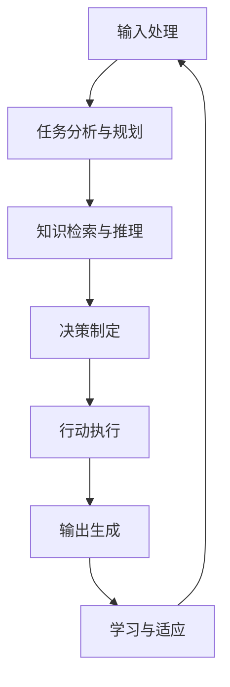

| 特征 | 传统工作流 | AI Agent 工作流 |
|------|------------|-----------------|
| 灵活性 | 固定流程 | 动态调整 |
| 决策能力 | 预定规则 | 自主决策 |
| 学习能力 | 无 | 持续学习 |
| 适应性 | 低 | 高 |
| 处理不确定性 | 弱 | 强 |

* 数学模型：
  AI Agent 工作流可以用马尔可夫决策过程 (MDP) 来建模：

$$MDP = (S, A, P, R, \gamma)$$

其中：
$S$ 是状态空间
$A$ 是动作空间
$P$ 是状态转移概率函数
$R$ 是奖励函数
$\gamma$ 是折扣因子

* 算法流程图：

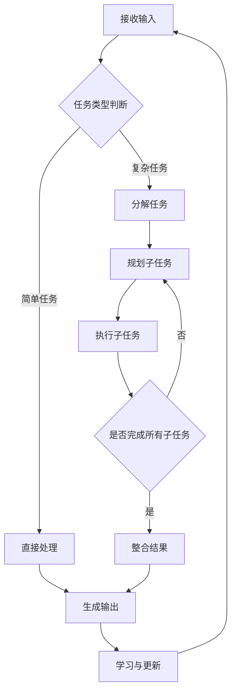

* 算法源代码：

```python
class AIAgentWorkflow:
    def __init__(self):
        self.knowledge_base = KnowledgeBase()
        self.learning_module = LearningModule()

    def process_input(self, input_data):
        processed_data = preprocess(input_data)
        task_type = self.classify_task(processed_data)
        return processed_data, task_type

    def execute_workflow(self, input_data):
        processed_data, task_type = self.process_input(input_data)
        
        if task_type == "simple":
            result = self.handle_simple_task(processed_data)
        else:
            subtasks = self.decompose_task(processed_data)
            results = []
            for subtask in subtasks:
                sub_result = self.execute_subtask(subtask)
                results.append(sub_result)
            result = self.integrate_results(results)
        
        output = self.generate_output(result)
        self.learn_and_update(input_data, output)
        return output

    def handle_simple_task(self, data):
        # 简单任务处理逻辑
        pass

    def decompose_task(self, data):
        # 任务分解逻辑
        pass

    def execute_subtask(self, subtask):
        # 子任务执行逻辑
        pass

    def integrate_results(self, results):
        # 结果整合逻辑
        pass

    def generate_output(self, result):
        # 输出生成逻辑
        pass

    def learn_and_update(self, input_data, output):
        self.learning_module.update(input_data, output)
        self.knowledge_base.update(input_data, output)
```

* 实际场景应用：
1. 智能客服系统：处理用户查询、解决问题、升级复杂问题。
2. 自动驾驶：感知环境、规划路径、做出决策、控制车辆。
3. 智能推荐系统：分析用户行为、推荐相关内容、学习用户偏好。

* 项目介绍：
  设计一个通用的 AI Agent 工作流框架,可以应用于多个领域,具有高度的灵活性和可扩展性。

* 环境安装：
```bash
pip install tensorflow numpy pandas scikit-learn nltk
```

* 系统功能设计：
1. 输入处理模块
2. 任务分类与分解模块
3. 知识检索模块
4. 决策制定模块
5. 行动执行模块
6. 输出生成模块
7. 学习与适应模块

* 系统架构设计：

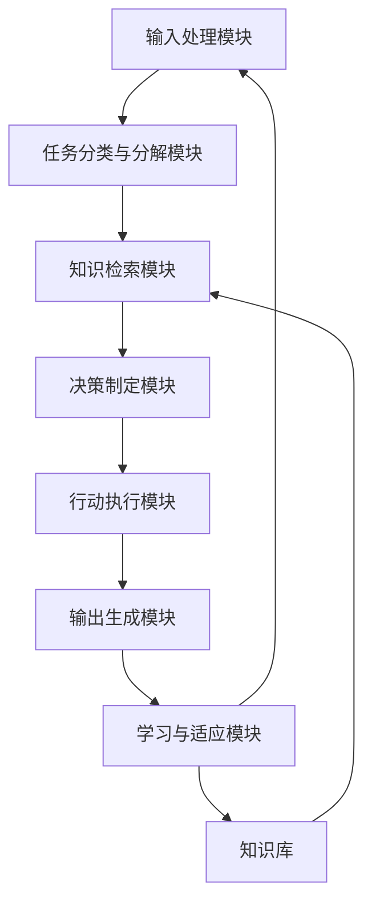

* 系统接口设计：
1. 输入接口：接收各种格式的输入数据
2. 知识库接口：提供知识检索和更新功能
3. 决策接口：接收状态信息,返回决策结果
4. 输出接口：生成多种格式的输出数据
5. 学习接口：接收反馈,更新模型和知识库

* 系统核心实现源代码：

```python
class AIAgentWorkflowSystem:
    def __init__(self):
        self.input_processor = InputProcessor()
        self.task_manager = TaskManager()
        self.knowledge_retriever = KnowledgeRetriever()
        self.decision_maker = DecisionMaker()
        self.action_executor = ActionExecutor()
        self.output_generator = OutputGenerator()
        self.learning_module = LearningModule()
        self.knowledge_base = KnowledgeBase()

    def execute_workflow(self, input_data):
        processed_input = self.input_processor.process(input_data)
        task = self.task_manager.classify_and_decompose(processed_input)
        knowledge = self.knowledge_retriever.retrieve(task)
        decision = self.decision_maker.make_decision(task, knowledge)
        action_result = self.action_executor.execute(decision)
        output = self.output_generator.generate(action_result)
        self.learning_module.learn(input_data, output)
        self.knowledge_base.update(input_data, output)
        return output
```

* 最佳实践tips：
1. 设计模块化的工作流,便于扩展和维护
2. 使用可解释的AI模型,增加工作流的透明度
3. 实现健壮的错误处理和回退机制
4. 定期评估和优化工作流性能
5. 考虑隐私和安全问题,特别是在处理敏感数据时

* 行业发展与未来趋势：

| 时期 | 工作流特征 | 技术重点 |
|------|------------|----------|
| 早期 | 规则基础,固定流程 | 专家系统,if-then规则 |
| 现在 | 数据驱动,自适应 | 机器学习,深度学习 |
| 未来 | 认知智能,自主决策 | AGI,元学习,迁移学习 |

* 本章小结：
  AI Agent 工作流是实现智能系统的关键组成部分。通过合理设计和实现工作流,我们可以创造出更加智能、灵活和高效的 AI 系统。随着技术的不断进步,未来的 AI Agent 工作流将更加智能化、自主化,能够处理更加复杂的任务和场景。

### 9.1.2 工作流设计的重要性

* 核心概念：
  工作流设计是指规划和组织 AI Agent 执行任务的过程和步骤,是确保 AI 系统高效、可靠运行的关键环节。

* 问题背景：
  随着 AI 技术在各行各业的广泛应用,AI Agent 需要处理越来越复杂的任务。如果没有经过精心设计的工作流,AI Agent 很可能会在复杂任务中表现不佳,甚至出现错误。

* 问题描述：
  许多 AI 项目失败的原因在于忽视了工作流设计的重要性,导致系统效率低下、可靠性差、难以维护和扩展。

* 问题解决：
  通过系统化的工作流设计,我们可以提高 AI Agent 的性能、可靠性和可扩展性。良好的工作流设计可以帮助 AI Agent 更好地处理复杂任务,适应不同场景,并持续优化其性能。

* 边界与外延：
  工作流设计的重要性不仅限于提高系统性能,还包括增强系统的可解释性、可维护性、安全性和伦理性等方面。

* 概念结构与核心要素组成：
1. 效率提升
2. 可靠性保障
3. 可扩展性增强
4. 可维护性改善
5. 用户体验优化
6. 成本控制
7. 风险管理

* 概念之间的关系：

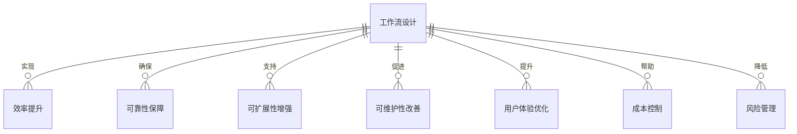

| 方面 | 良好工作流设计 | 糟糕工作流设计 |
|------|----------------|-----------------|
| 效率 | 高 | 低 |
| 可靠性 | 稳定 | 不稳定 |
| 可扩展性 | 易扩展 | 难扩展 |
| 维护成本 | 低 | 高 |
| 用户满意度 | 高 | 低 |
| 错误率 | 低 | 高 |
| 适应性 | 强 | 弱 |

* 数学模型：
  我们可以用一个简单的数学模型来描述工作流设计对系统性能的影响：

$$P = E \times R \times S \times M$$

其中：
$P$ 是系统整体性能
$E$ 是效率因子
$R$ 是可靠性因子
$S$ 是可扩展性因子
$M$ 是可维护性因子

每个因子的值范围在 0 到 1 之间,值越高表示该方面表现越好。

* 算法流程图：

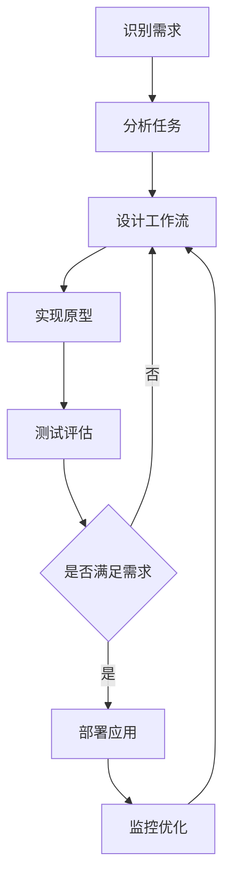

* 算法源代码：

```python
class WorkflowDesignImportance:
    def __init__(self):
        self.efficiency = 0
        self.reliability = 0
        self.scalability = 0
        self.maintainability = 0

    def analyze_requirements(self, requirements):
        # 分析需求,确定各方面的重要性权重
        pass

    def design_workflow(self):
        # 根据需求分析结果设计工作流
        pass

    def implement_prototype(self):
        # 实现工作流原型
        pass

    def evaluate_performance(self):
        # 评估工作流性能
        self.efficiency = self.calculate_efficiency()
        self.reliability = self.calculate_reliability()
        self.scalability = self.calculate_scalability()
        self.maintainability = self.calculate_maintainability()

    def calculate_overall_performance(self):
        return (self.efficiency * self.reliability * 
                self.scalability * self.maintainability)

    def optimize_workflow(self):
        while self.calculate_overall_performance() < 0.9:
            # 识别瓶颈并优化
            bottleneck = self.identify_bottleneck()
            self.improve_aspect(bottleneck)

    def identify_bottleneck(self):
        aspects = [self.efficiency, self.reliability, 
                   self.scalability, self.maintainability]
        return aspects.index(min(aspects))

    def improve_aspect(self, aspect):
        # 根据识别的瓶颈方面进行改进
        pass

# 使用示例
workflow_designer = WorkflowDesignImportance()
workflow_designer.analyze_requirements(project_requirements)
workflow_designer.design_workflow()
workflow_designer.implement_prototype()
workflow_designer.evaluate_performance()
workflow_designer.optimize_workflow()
```

* 实际场景应用：
1. 智能客服系统：设计高效的查询-响应工作流,提高客户满意度。
2. 自动化生产线：优化生产流程,提高产能和质量。
3. 金融风控系统：设计严谨的风险评估工作流,降低金融风险。

* 项目介绍：
  开发一个工作流设计评估工具,帮助 AI 开发团队优化其 AI Agent 的工作流程。

* 环境安装：
```bash
pip install networkx matplotlib pandas numpy
```

* 系统功能设计：
1. 工作流可视化模块
2. 性能评估模块
3. 瓶颈识别模块
4. 优化建议模块
5. 工作流比较模块

* 系统架构设计：

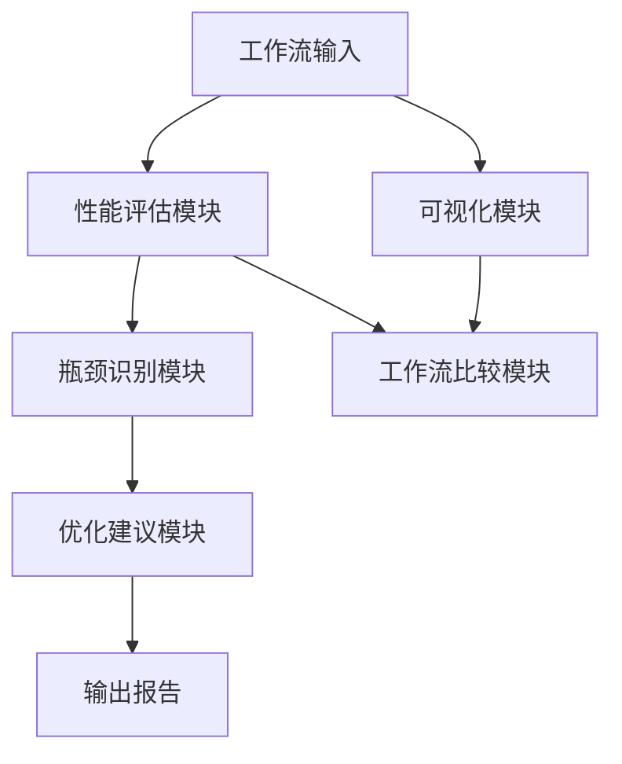

* 系统接口设计：
1. 工作流导入接口：支持多种格式的工作流定义导入
2. 性能指标接口：允许用户自定义和导入性能指标
3. 可视化接口：提供多种可视化选项和交互功能
4. 优化建议接口：生成具体可操作的优化建议
5. 报告导出接口：支持多种格式的评估报告导出

* 系统核心实现源代码：

```python
import networkx as nx
import matplotlib.pyplot as plt
import pandas as pd
import numpy as np

class WorkflowOptimizer:
    def __init__(self):
        self.workflow_graph = nx.DiGraph()
        self.performance_metrics = {}

    def import_workflow(self, workflow_definition):
        # 导入工作流定义,构建图结构
        pass

    def visualize_workflow(self):
        pos = nx.spring_layout(self.workflow_graph)
        nx.draw(self.workflow_graph, pos, with_labels=True, node_color='lightblue', node_size=500, font_size=10, font_weight='bold')
        plt.title("AI Agent Workflow")
        plt.show()

    def evaluate_performance(self, metrics):
        for metric, value in metrics.items():
            self.performance_metrics[metric] = value

    def identify_bottleneck(self):
        # 使用PageRank算法识别关键节点
        pagerank = nx.pagerank(self.workflow_graph)
        bottleneck = max(pagerank, key=pagerank.get)
        return bottleneck

    def generate_optimization_suggestions(self, bottleneck):
        # 根据瓶颈节点生成优化建议
        pass

    def compare_workflows(self, other_workflow):
        # 比较两个工作流的性能指标
        pass

    def export_report(self):
        # 生成评估报告
        pass

# 使用示例
optimizer = WorkflowOptimizer()
optimizer.import_workflow(workflow_definition)
optimizer.visualize_workflow()
optimizer.evaluate_performance(performance_metrics)
bottleneck = optimizer.identify_bottleneck()
suggestions = optimizer.generate_optimization_suggestions(bottleneck)
optimizer.export_report()
```

* 最佳实践tips：
1. 始终从业务需求出发,设计符合实际场景的工作流
2. 注重工作流的模块化和可复用性
3. 定期评估和优化工作流性能
4. 考虑工作流的可扩展性,为未来的功能扩展留有余地
5. 重视异常处理和回退机制的设计
6. 建立清晰的文档和版本控制系统

* 行业发展与未来趋势：

| 时期 | 工作流设计特点 | 关注重点 |
|------|----------------|----------|
| 过去 | 静态,线性 | 功能实现 |
| 现在 | 动态,自适应 | 性能优化 |
| 未来 | 智能,自主 | 认知能力 |

* 本章小结：
  工作流设计的重要性不容忽视,它直接影响着 AI Agent 的性能、可靠性和可扩展性。通过系统化的设计方法和工具,我们可以显著提高 AI 系统的整体效能。随着技术的发展,未来的工作流设计将更加智能化和自主化,能够自动适应不同的任务需求和运行环境。

### 9.1.3 工作流设计的基本原则

* 核心概念：
  工作流设计的基本原则是指在设计 AI Agent 工作流时应遵循的一系列指导方针,旨在确保工作流的效率、可靠性、可扩展性和可维护性。

* 问题背景：
  随着 AI 应用的复杂性增加,设计高质量的工作流变得越来越具有挑战性。许多开发者在设计过程中缺乏系统性的指导,导致工作流存在诸多问题。

* 问题描述：
  没有遵循基本原则的工作流设计往往会导致系统效率低下、错误频发、难以扩展和维护,最终影响 AI Agent 的整体性能和用户体验。

* 问题解决：
  通过制定和遵循一套基本原则,我们可以确保工作流设计的质量和一致性,从而提高 AI Agent 的整体性能和可靠性。

* 边界与外延：
  这些原则不仅适用于 AI Agent 工作流设计,还可以扩展到其他类型的软件系统设计中。但在 AI 领域,我们需要特别考虑不确定性、学习能力和适应性等因素。

* 概念结构与核心要素组成：
1. 模块化原则
2. 单一职责原则
3. 可扩展性原则
4. 容错性原则
5. 可测试性原则
6. 可解释性原则
7. 效率优先原则
8. 安全性原则
9. 用户中心原则
10. 持续优化原则

* 概念之间的关系：

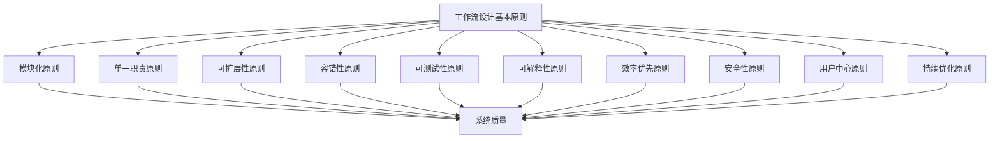

| 原则 | 描述 | 重要性 |
|------|------|--------|
| 模块化 | 将系统分解为独立、可重用的模块 | 高 |
| 单一职责 | 每个模块只负责一个特定功能 | 高 |
| 可扩展性 | 易于添加新功能或扩展现有功能 | 高 |
| 容错性 | 能够优雅地处理错误和异常情况 | 中 |
| 可测试性 | 易于进行单元测试和集成测试 | 中 |
| 可解释性 | AI 决策过程应当透明且可解释 | 高 |
| 效率优先 | 优化性能,减少资源消耗 | 中 |
| 安全性 | 保护数据和系统免受攻击 | 高 |
| 用户中心 | 以用户需求和体验为设计核心 | 高 |
| 持续优化 | 不断评估和改进工作流 | 中 |

* 数学模型：
  我们可以使用加权求和模型来评估工作流设计的质量：

$$Q = \sum_{i=1}^n w_i P_i$$

其中：
$Q$ 是工作流设计的总体质量
$w_i$ 是第 i 个原则的权重
$P_i$ 是第 i 个原则的遵守程度 (0-1 之间的值)
$n$ 是原则的总数

* 算法流程图：

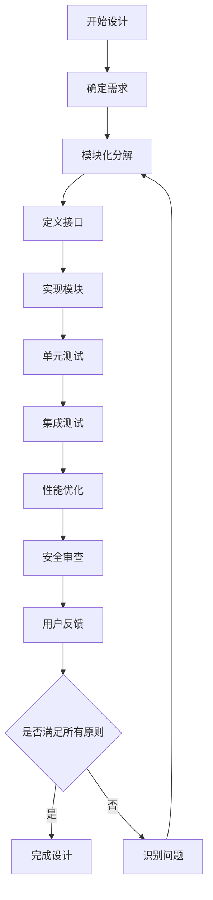

* 算法源代码：

```python
class WorkflowDesignPrinciples:
    def __init__(self):
        self.principles = {
            'modularity': 0,
            'single_responsibility': 0,
            'extensibility': 0,
            'fault_tolerance': 0,
            'testability': 0,
            'explainability': 0,
            'efficiency': 0,
            'security': 0,
            'user_centric': 0,
            'continuous_optimization': 0
        }
        self.weights = {
            'modularity': 0.15,
            'single_responsibility': 0.1,
            'extensibility': 0.1,
            'fault_tolerance': 0.1,
            'testability': 0.05,
            'explainability': 0.15,
            'efficiency': 0.1,
            'security': 0.15,
            'user_centric': 0.05,
            'continuous_optimization': 0.05
        }

    def evaluate_principle(self, principle, score):
        if principle in self.principles:
            self.principles[principle] = max(0, min(score, 1))
        else:
            raise ValueError(f"Unknown principle: {principle}")

    def calculate_overall_quality(self):
        return sum(self.principles[p] * self.weights[p] for p in self.principles)

    def identify_weak_points(self):
        return sorted(self.principles.items(), key=lambda x: x[1])[:3]

    def suggest_improvements(self):
        weak_points = self.identify_weak_points()
        suggestions = []
        for principle, score in weak_points:
            if principle == 'modularity':
                suggestions.append("Consider breaking down large modules into smaller, more manageable components.")
            elif principle == 'single_responsibility':
                suggestions.append("Ensure each module has a clear, single purpose.")
            # ... 其他原则的建议 ...
        return suggestions

# 使用示例
design_eval = WorkflowDesignPrinciples()
design_eval.evaluate_principle('modularity', 0.8)
design_eval.evaluate_principle('explainability', 0.6)
# ... 评估其他原则 ...

quality = design_eval.calculate_overall_quality()
print(f"Overall design quality: {quality:.2f}")

improvements = design_eval.suggest_improvements()
for suggestion in improvements:
    print(suggestion)
```

* 实际场景应用：
1. 智能推荐系统：应用模块化和可扩展性原则,便于添加新的推荐算法。
2. 自动驾驶系统：强调安全性和容错性原则,确保系统在各种情况下的可靠性。
3. 医疗诊断 AI：注重可解释性原则,使医生能够理解 AI 的诊断依据。

* 项目介绍：
  开发一个工作流设计评估工具,帮助 AI 开发团队评估其工作流设计是否符合基本原则,并提供改进建议。

* 环境安装：
```bash
pip install pandas numpy matplotlib seaborn
```

* 系统功能设计：
1. 原则评估模块
2. 质量计算模块
3. 可视化模块
4. 改进建议生成模块
5. 报告生成模块

* 系统架构设计：

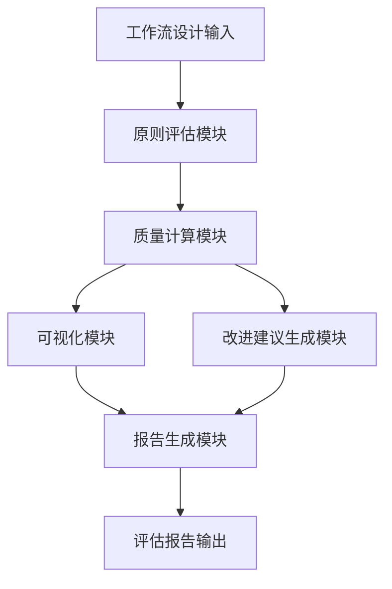

* 系统接口设计：
1. 设计输入接口：接收工作流设计描述或代码
2. 评估结果输出接口：提供各原则的评分和总体质量分数
3. 可视化接口：生成雷达图或条形图展示评估结果
4. 建议输出接口：提供针对性的改进建议
5. 报告导出接口：生成 PDF 或 HTML 格式的评估报告

* 系统核心实现源代码：

```python
import pandas as pd
import numpy as np
import matplotlib.pyplot as plt
import seaborn as sns

class WorkflowDesignEvaluator:
    def __init__(self):
        self.principles = {
            'modularity': 0,
            'single_responsibility': 0,
            'extensibility': 0,
            'fault_tolerance': 0,
            'testability': 0,
            'explainability': 0,
            'efficiency': 0,
            'security': 0,
            'user_centric': 0,
            'continuous_optimization': 0
        }
        self.weights = {
            'modularity': 0.15,
            'single_responsibility': 0.1,
            'extensibility': 0.1,
            'fault_tolerance': 0.1,
            'testability': 0.05,
            'explainability': 0.15,
            'efficiency': 0.1,
            'security': 0.15,
            'user_centric': 0.05,
            'continuous_optimization': 0.05
        }

    def evaluate_design(self, design_description):
        # 这里应该实现实际的评估逻辑
        # 为演示目的,我们使用随机值
        for principle in self.principles:
            self.principles[principle] = np.random.random()

    def calculate_overall_quality(self):
        return sum(self.principles[p] * self.weights[p] for p in self.principles)

    def visualize_results(self):
        principles = list(self.principles.keys())
        scores = list(self.principles.values())

        fig, ax = plt.subplots(figsize=(10, 10))
        angles = np.linspace(0, 2*np.pi, len(principles), endpoint=False)
        scores += scores[:1]
        angles += angles[:1]

        ax.plot(angles, scores, 'o-', linewidth=2)
        ax.fill(angles, scores, alpha=0.25)
        ax.set_xticks(angles[:-1])
        ax.set_xticklabels(principles)
        ax.set_ylim(0, 1)
        plt.title("Workflow Design Principles Evaluation")
        plt.tight_layout()
        plt.savefig("workflow_evaluation.png")

    def generate_suggestions(self):
        suggestions = []
        for principle, score in self.principles.items():
            if score < 0.6:
                suggestions.append(f"Improve {principle}: Current score is {score:.2f}")
        return suggestions

    def generate_report(self):
        quality = self.calculate_overall_quality()
        suggestions = self.generate_suggestions()
        
        report = f"Workflow Design Evaluation Report\n"
        report += f"Overall Quality: {quality:.2f}\n\n"
        report += "Principle Scores:\n"
        for principle, score in self.principles.items():
            report += f"{principle}: {score:.2f}\n"
        report += "\nImprovement Suggestions:\n"
        for suggestion in suggestions:
            report += f"- {suggestion}\n"
        
        with open("evaluation_report.txt", "w") as f:
            f.write(report)

# 使用示例
evaluator = WorkflowDesignEvaluator()
evaluator.evaluate_design("假设这里是工作流设计的描述")
evaluator.visualize_results()
evaluator.generate_report()
```

* 最佳实践tips：
1. 在项目初期就开始应用这些原则,而不是在后期才考虑
2. 定期review工作流设计,确保持续符合这些原则
3. 使用自动化工具来辅助评估工作流设计
4. 培训团队成员,使所有人都理解并遵循这些原则
5. 根据项目特性适当调整原则的权重
6. 结合用户反馈不断优化工作流设计

* 行业发展与未来趋势：

| 时期 | 设计原则重点 | 关注点 |
|------|--------------|--------|
| 过去 | 功能实现 | 基本功能完整性 |
| 现在 | 效率与可靠性 | 性能优化,错误处理 |
| 未来 | 自适应与智能化 | 自学习,动态优化 |

* 本章小结：
  工作流设计的基本原则为 AI Agent 的开发提供了重要指导。通过遵循这些原则,我们可以设计出更加高效、可靠、可扩展的 AI 系统。随着技术的发展,这些原则也在不断演进,未来将更加注重系统的自适应能力和智能化程度。持续关注和应用这些原则,将有助于我们在 AI 领域保持竞争优势。

### 9.1.4 工作流与 AI Agent 系统架构的关系

* 核心概念：
  工作流与 AI Agent 系统架构的关系指的是工作流设计如何影响和塑造 AI Agent 的整体结构,以及系统架构如何支持和约束工作流的实现。

* 问题背景：
  随着 AI Agent 系统变得越来越复杂,工作流设计和系统架构之间的协调变得至关重要。许多开发者往往过于关注其中一个方面,而忽视了两者之间的相互影响。

* 问题描述：
  工作流设计与系统架构不协调可能导致性能瓶颈、扩展性问题、维护困难等一系列问题,影响 AI Agent 的整体效能和可持续发展。

* 问题解决：
  通过深入理解工作流与系统架构的关系,我们可以设计出更加协调、高效的 AI Agent 系统。这需要在工作流设计和系统架构之间寻找平衡点,确保两者相互支持和优化。

* 边界与外延：
  这种关系不仅限于技术层面,还涉及到项目管理、团队协作等方面。同时,它也影响到 AI Agent 的可扩展性、可维护性和未来发展潜力。

* 概念结构与核心要素组成：
1. 工作流设计
    - 任务分解
    - 流程定义
    - 决策点设计
2. 系统架构
    - 模块划分
    - 接口设计
    - 数据流设计
3. 相互影响
    - 性能优化
    - 扩展性支持
    - 可维护性增强

* 概念之间的关系：

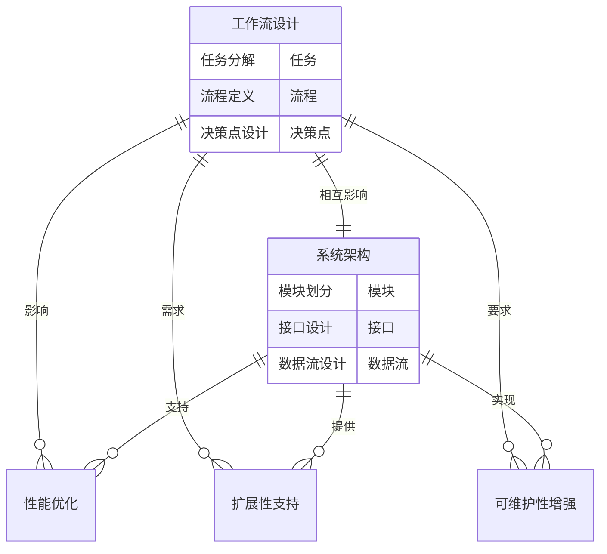

| 方面 | 工作流影响 | 系统架构支持 |
|------|------------|--------------|
| 性能 | 定义执行路径 | 提供高效组件 |
| 扩展性 | 识别扩展点 | 设计模块化结构 |
| 可维护性 | 简化流程 | 解耦组件 |
| 可靠性 | 定义错误处理 | 实现容错机制 |
| 安全性 | 设计权限控制 | 实现安全框架 |

* 数学模型：
  我们可以使用一个简单的模型来描述工作流效率与系统架构复杂度的关系：

$$E = \frac{W}{C^\alpha}$$

其中：
$E$ 是系统整体效率
$W$ 是工作流优化程度 (0-1 之间的值)
$C$ 是系统架构复杂度
$\alpha$ 是复杂度影响因子 (通常在 0.5 到 1.5 之间)

* 算法流程图：

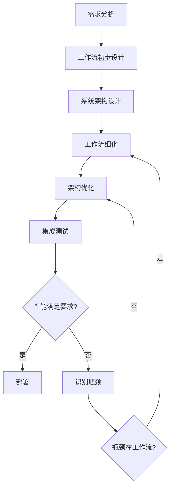

* 算法源代码：

```python
class AIAgentSystem:
    def __init__(self):
        self.workflow = Workflow()
        self.architecture = Architecture()

    def design_system(self, requirements):
        self.workflow.initial_design(requirements)
        self.architecture.design(self.workflow.get_structure())
        self.workflow.refine(self.architecture.get_constraints())
        self.architecture.optimize(self.workflow.get_performance_requirements())

    def evaluate_performance(self):
        workflow_efficiency = self.workflow.calculate_efficiency()
        architecture_complexity = self.architecture.calculate_complexity()
        alpha = 0.8  # 复杂度影响因子
        overall_efficiency = workflow_efficiency / (architecture_complexity ** alpha)
        return overall_efficiency

    def identify_bottleneck(self):
        if self.workflow.has_performance_issues():
            return "Workflow"
        elif self.architecture.has_scalability_issues():
            return "Architecture"
        else:
            return None

    def optimize_system(self):
        while self.evaluate_performance() < 0.8:  # 假设0.8是目标效率
            bottleneck = self.identify_bottleneck()
            if bottleneck == "Workflow":
                self.workflow.optimize()
            elif bottleneck == "Architecture":
                self.architecture.optimize()
            else:
                break  # 无法进一步优化

class Workflow:
    # 工作流相关的方法
    pass

class Architecture:
    # 系统架构相关的方法
    pass

# 使用示例
ai_system = AIAgentSystem()
ai_system.design_system(project_requirements)
ai_system.optimize_system()
final_efficiency = ai_system.evaluate_performance()
print(f"Final system efficiency: {final_efficiency:.2f}")
```

* 实际场景应用：
1. 智能客服系统：工作流定义问题识别和解决流程,架构支持高并发和快速响应。
2. 自动交易系统：工作流设计交易策略,架构确保低延迟和高可靠性。
3. 推荐系统：工作流定义个性化推荐流程,架构支持大规模数据处理和实时计算。

* 项目介绍：
  开发一个 AI Agent 系统设计评估工具,用于分析工作流设计与系统架构的协调性,并提供优化建议。

* 环境安装：
```bash
pip install networkx matplotlib pandas numpy sklearn
```

* 系统功能设计：
1. 工作流分析模块
2. 架构评估模块
3. 协调性分析模块
4. 性能预测模块
5. 优化建议生成模块

* 系统架构设计：

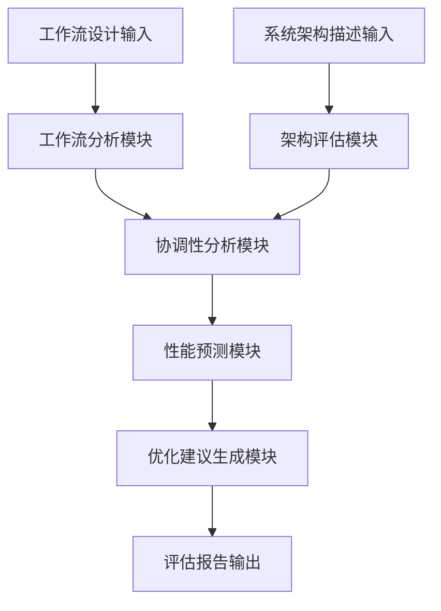

* 系统接口设计：
1. 工作流输入接口：接收工作流设计描述或图形化表示
2. 架构输入接口：接收系统架构描述或组件图
3. 分析结果输出接口：提供协调性评分和详细分析
4. 性能预测接口：基于当前设计预测系统性能
5. 优化建议接口：生成针对性的改进建议

* 系统核心实现源代码：

```python
import networkx as nx
import matplotlib.pyplot as plt
import pandas as pd
import numpy as np
from sklearn.preprocessing import MinMaxScaler

class AIAgentDesignEvaluator:
    def __init__(self):
        self.workflow_graph = nx.DiGraph()
        self.architecture_graph = nx.Graph()
        self.coordination_score = 0

    def load_workflow(self, workflow_description):
        # 解析工作流描述并构建图
        # 这里简化处理,实际应该解析更复杂的描述
        edges = workflow_description.split(',')
        for edge in edges:
            source, target = edge.split('->')
            self.workflow_graph.add_edge(source.strip(), target.strip())

    def load_architecture(self, architecture_description):
        # 解析架构描述并构建图
        # 同样简化处理
        components = architecture_description.split(',')
        for component in components:
            self.architecture_graph.add_node(component.strip())

    def analyze_coordination(self):
        workflow_complexity = self.calculate_workflow_complexity()
        architecture_modularity = self.calculate_architecture_modularity()
        self.coordination_score = self.calculate_coordination_score(workflow_complexity, architecture_modularity)

    def calculate_workflow_complexity(self):
        return nx.density(self.workflow_graph)

    def calculate_architecture_modularity(self):
        return nx.modularity(self.architecture_graph, nx.community.label_propagation_communities(self.architecture_graph))

    def calculate_coordination_score(self, workflow_complexity, architecture_modularity):
        # 简化的协调性评分计算
        return (1 - workflow_complexity) * architecture_modularity

    def predict_performance(self):
        # 基于协调性评分简单预测性能
        return self.coordination_score * 100  # 假设满分100

    def generate_optimization_suggestions(self):
        suggestions = []
        if self.coordination_score < 0.5:
            if nx.density(self.workflow_graph) > 0.7:
                suggestions.append("Consider simplifying the workflow to reduce complexity.")
            if nx.modularity(self.architecture_graph, nx.community.label_propagation_communities(self.architecture_graph)) < 0.3:
                suggestions.append("Improve the modularity of the system architecture.")
        return suggestions

    def visualize_workflow(self):
        pos = nx.spring_layout(self.workflow_graph)
        nx.draw(self.workflow_graph, pos, with_labels=True, node_color='lightblue', node_size=500, font_size=10, font_weight='bold')
        plt.title("AI Agent Workflow")
        plt.savefig("workflow_visualization.png")
        plt.close()

    def visualize_architecture(self):
        pos = nx.spring_layout(self.architecture_graph)
        nx.draw(self.architecture_graph, pos, with_labels=True, node_color='lightgreen', node_size=500, font_size=10, font_weight='bold')
        plt.title("AI Agent System Architecture")
        plt.savefig("architecture_visualization.png")
        plt.close()

    def generate_report(self):
        report = f"AI Agent Design Evaluation Report\n\n"
        report += f"Coordination Score: {self.coordination_score:.2f}\n"
        report += f"Predicted Performance: {self.predict_performance():.2f}\n\n"
        report += "Optimization Suggestions:\n"
        for suggestion in self.generate_optimization_suggestions():
            report += f"- {suggestion}\n"
        
        with open("design_evaluation_report.txt", "w") as f:
            f.write(report)

# 使用示例
evaluator = AIAgentDesignEvaluator()
evaluator.load_workflow("A -> B, B -> C, C -> D, D -> E")
evaluator.load_architecture("InputProcessor, DecisionMaker, KnowledgeBase, OutputGenerator")
evaluator.analyze_coordination()
evaluator.visualize_workflow()
evaluator.visualize_architecture()
evaluator.generate_report()
```

* 最佳实践tips：
1. 在设计初期就考虑工作流和架构的协调性
2. 使用可视化工具帮助理解工作流和架构的关系
3. 定期评估系统的协调性,及时进行优化
4. 保持工作流和架构文档的更新,便于团队协作
5. 考虑未来可能的扩展需求,预留足够的灵活性
6. 进行压力测试,验证工作流和架构在高负载下的表现

* 行业发展与未来趋势：

| 时期 | 工作流与架构关系 | 关注点 |
|------|------------------|--------|
| 过去 | 相对独立 | 功能实现 |
| 现在 | 紧密协调 | 性能优化,可扩展性 |
| 未来 | 动态适应 | 自我优化,智能协调 |

* 本章小结：
  工作流与 AI Agent 系统架构之间存在密切的关系,两者的协调对于创建高效、可靠的 AI 系统至关重要。通过深入理解这种关系,我们可以设计出更加优秀的 AI Agent 系统。未来,随着技术的发展,我们预计会看到更多智能化的工作流和自适应的系统架构,它们能够根据实际需求自动调整和优化。持续关注这一领域的发展,将有助于我们在 AI 行业保持竞争优势。

## 9.2 AI Agent 工作流设计方法论

### 9.2.1 需求分析与目标定义

* 核心概念：
  需求分析与目标定义是 AI Agent 工作流设计的首要步骤,它涉及深入理解用户需求,明确系统目标,并将其转化为可操作的设计指南。

* 问题背景：
  许多 AI Agent 项目失败的原因在于需求分析不充分或目标定义不清晰,导致开发方向偏离,资源浪费,最终产品无法满足用户真正的需求。

* 问题描述：
  如何有效地收集、分析用户需求,并将其转化为明确、可衡量的系统目标,是 AI Agent 工作流设计面临的首要挑战。

* 问题解决：
  通过系统化的需求分析方法和目标定义框架,我们可以更准确地把握用户需求,制定清晰的项目目标,为后续的工作流设计奠定坚实基础。

* 边界与外延：
  需求分析不仅限于功能需求,还包括性能需求、安全需求、用户体验等非功能性需求。目标定义则需要考虑到技术可行性、资源限制和长期发展等因素。

* 概念结构与核心要素组成：
1. 需求收集
    - 用户访谈
    - 问卷调查
    - 观察研究
    - 竞品分析
2. 需求分析
    - 功能需求分析
    - 非功能需求分析
    - 用户场景分析
    - 优先级排序
3. 目标定义
    - 总体目标
    - 具体目标
    - 可衡量指标
    - 约束条件

* 概念之间的关系：

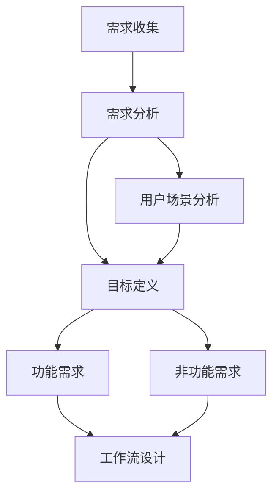

| 需求类型 | 描述 | 示例 |
|----------|------|------|
| 功能需求 | 系统应具备的功能 | 自然语言理解,决策制定 |
| 性能需求 | 系统性能指标 | 响应时间,吞吐量 |
| 安全需求 | 数据和系统安全 | 加密,访问控制 |
| 可用性需求 | 易用性和用户体验 | 界面友好,操作简单 |
| 可扩展性需求 | 系统扩展能力 | 支持新功能添加,负载均衡 |

* 数学模型：
  我们可以使用加权评分模型来评估需求的优先级：

$$P = \sum_{i=1}^n w_i S_i$$

其中：
$P$ 是需求的优先级得分
$w_i$ 是第 i 个评估因素的权重
$S_i$ 是第 i 个评估因素的得分
$n$ 是评估因素的总数

* 算法流程图：

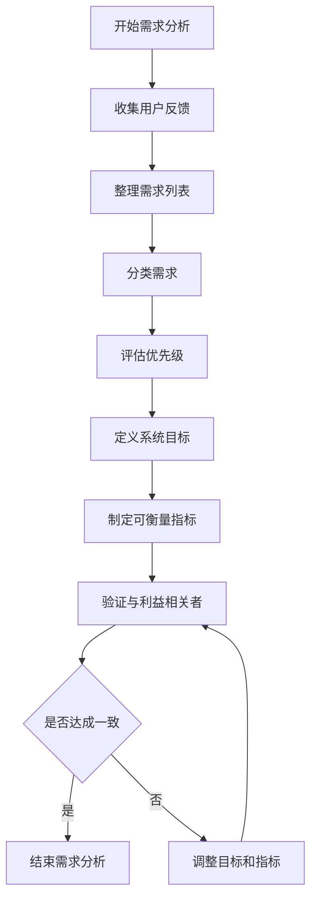

* 算法源代码：

```python
from enum import Enum
from typing import List, Dict

class RequirementType(Enum):
    FUNCTIONAL = 1
    PERFORMANCE = 2
    SECURITY = 3
    USABILITY = 4
    SCALABILITY = 5

class Requirement:
    def __init__(self, description: str, req_type: RequirementType, priority: float):
        self.description = description
        self.type = req_type
        self.priority = priority

class Goal:
    def __init__(self, description: str, metrics: List[str]):
        self.description = description
        self.metrics = metrics

class RequirementAnalyzer:
    def __init__(self):
        self.requirements: List[Requirement] = []
        self.goals: List[Goal] = []

    def add_requirement(self, description: str, req_type: RequirementType, priority: float):
        self.requirements.append(Requirement(description, req_type, priority))

    def analyze_requirements(self):
        # 按类型分组需求
        grouped_requirements: Dict[RequirementType, List[Requirement]] = {}
        for req in self.requirements:
            if req.type not in grouped_requirements:
                grouped_requirements[req.type] = []
            grouped_requirements[req.type].append(req)

        # 分析每种类型的需求
        for req_type, reqs in grouped_requirements.items():
            print(f"Analyzing {req_type.name} requirements:")
            for req in sorted(reqs, key=lambda x: x.priority, reverse=True):
                print(f"- {req.description} (Priority: {req.priority})")

    def define_goals(self):
        # 根据高优先级需求定义目标
        high_priority_reqs = [req for req in self.requirements if req.priority > 0.7]
        for req in high_priority_reqs:
            goal_description = f"Achieve {req.description}"
            metrics = [f"Measure {req.type.name.lower()} performance"]
            self.goals.append(Goal(goal_description, metrics))

    def print_goals(self):
        print("System Goals:")
        for i, goal in enumerate(self.goals, 1):
            print(f"{i}. {goal.description}")
            print("   Metrics:")
            for metric in goal.metrics:
                print(f"   - {metric}")

# 使用示例
analyzer = RequirementAnalyzer()

# 添加需求
analyzer.add_requirement("Understand natural language queries", RequirementType.FUNCTIONAL, 0.9)
analyzer.add_requirement("Respond within 2 seconds", RequirementType.PERFORMANCE, 0.8)
analyzer.add_requirement("Ensure data privacy", RequirementType.SECURITY, 0.95)
analyzer.add_requirement("Provide user-friendly interface", RequirementType.USABILITY, 0.7)
analyzer.add_requirement("Handle 1000 concurrent users", RequirementType.SCALABILITY, 0.6)

# 分析需求
analyzer.analyze_requirements()

# 定义目标
analyzer.define_goals()

# 打印目标
analyzer.print_goals()
```

* 实际场景应用：
1. 智能客服系统：分析客户服务需求,定义响应时间和准确率目标。
2. 个性化推荐系统：了解用户偏好,设定点击率和转化率目标。
3. 自动驾驶系统：分析安全需求,定义事故预防和应对目标。

* 项目介绍：
  开发一个需求分析与目标定义辅助工具,帮助 AI Agent 开发团队更有效地收集、分析需求并制定明确的系统目标。

* 环境安装：
```bash
pip install pandas numpy matplotlib seaborn nltk
```

* 系统功能设计：
1. 需求收集模块
2. 需求分类与优先级评估模块
3. 用户场景分析模块
4. 目标定义模块
5. 可衡量指标生成模块
6. 需求与目标可视化模块

* 系统架构设计：

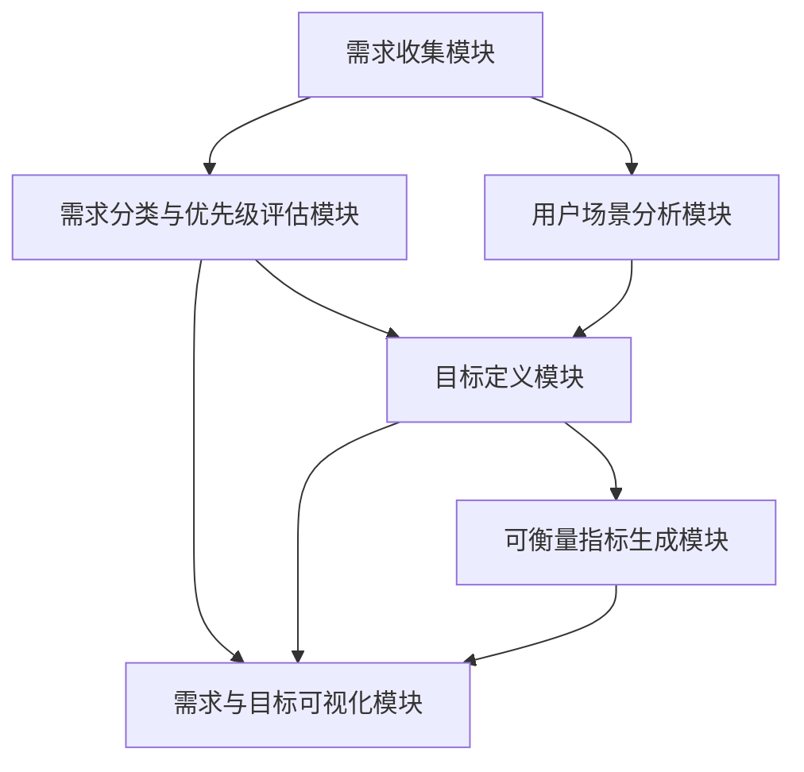

* 系统接口设计：
1. 需求输入接口：支持多种格式的需求输入(文本,表格等)
2. 场景描述接口：接收用户场景描述
3. 优先级评估接口：允许手动调整或自动计算需求优先级
4. 目标定义接口：根据需求自动生成初步目标,支持手动修改
5. 指标生成接口：根据目标自动生成可衡量指标
6. 可视化输出接口：生成需求分析和目标定义的可视化报告

* 系统核心实现源代码：

```python
import pandas as pd
import numpy as np
import matplotlib.pyplot as plt
import seaborn as sns
from nltk.tokenize import word_tokenize
from nltk.corpus import stopwords
from collections import Counter

class RequirementAnalysisSystem:
    def __init__(self):
        self.requirements = pd.DataFrame(columns=['Description', 'Type', 'Priority'])
        self.user_scenarios = []
        self.goals = pd.DataFrame(columns=['Description', 'Metrics'])

    def add_requirement(self, description, req_type, priority):
        new_req = pd.DataFrame({'Description': [description], 'Type': [req_type], 'Priority': [priority]})
        self.requirements = pd.concat([self.requirements, new_req], ignore_index=True)

    def add_user_scenario(self, scenario):
        self.user_scenarios.append(scenario)

    def analyze_requirements(self):
        # 按类型和优先级排序需求
        self.requirements = self.requirements.sort_values(['Type', 'Priority'], ascending=[True, False])

    def generate_goals(self):
        high_priority_reqs = self.requirements[self.requirements['Priority'] > 0.7]
        for _, req in high_priority_reqs.iterrows():
            goal_desc = f"Achieve {req['Description']}"
            metrics = [f"Measure {req['Type'].lower()} effectiveness"]
            new_goal = pd.DataFrame({'Description': [goal_desc], 'Metrics': [metrics]})
            self.goals = pd.concat([self.goals, new_goal], ignore_index=True)

    def visualize_requirements(self):
        plt.figure(figsize=(10, 6))
        sns.scatterplot(data=self.requirements, x='Type', y='Priority', hue='Type', size='Priority', sizes=(50, 200))
        plt.title('Requirements Analysis')
        plt.savefig('requirements_analysis.png')
        plt.close()

    def analyze_user_scenarios(self):
        all_words = []
        for scenario in self.user_scenarios:
            words = word_tokenize(scenario.lower())
            all_words.extend([w for w in words if w not in stopwords.words('english')])
        
        word_freq = Counter(all_words)
        plt.figure(figsize=(12, 6))
        word_freq_df = pd.DataFrame(word_freq.items(), columns=['Word', 'Frequency']).sort_values('Frequency', ascending=False).head(20)
        sns.barplot(x='Word', y='Frequency', data=word_freq_df)
        plt.title('Top 20 Words in User Scenarios')
        plt.xticks(rotation=45)
        plt.tight_layout()
        plt.savefig('user_scenario_analysis.png')
        plt.close()

    def generate_report(self):
        report = "Requirement Analysis and Goal Definition Report\n\n"
        report += "Requirements:\n"
        report += self.requirements.to_string(index=False)
        report += "\n\nGoals:\n"
        report += self.goals.to_string(index=False)
        report += "\n\nUser Scenario Analysis: See user_scenario_analysis.png"
        report += "\n\nRequirement Visualization: See requirements_analysis.png"
        
        with open('requirement_analysis_report.txt', 'w') as f:
            f.write(report)

# 使用示例
system = RequirementAnalysisSystem()

# 添加需求
system.add_requirement("Understand natural language queries", "Functional", 0.9)
system.add_requirement("Respond within 2 seconds", "Performance", 0.8)
system.add_requirement("Ensure data privacy", "Security", 0.95)
system.add_requirement("Provide user-friendly interface", "Usability", 0.7)
system.add_requirement("Handle 1000 concurrent users", "Scalability", 0.6)

# 添加用户场景
system.add_user_scenario("User asks the AI agent about product information and compares different options.")
system.add_user_scenario("Customer service representative uses the AI agent to quickly find solutions to common problems.")

# 分析需求和生成目标
system.analyze_requirements()
system.generate_goals()

# 可视化和报告生成
system.visualize_requirements()
system.analyze_user_scenarios()
system.generate_report()
```

* 最佳实践tips：
1. 使用多种方法收集需求,如访谈、问卷、观察等,以获得全面的需求视角。
2. 定期与利益相关者沟通,确保需求分析和目标定义的准确性。
3. 使用用户故事和场景分析来具体化抽象需求。
4. 采用SMART原则(具体、可衡量、可实现、相关、有时限)来定义目标。
5. 进行优先级排序,确保关键需求得到满足。
6. 使用可视化工具来展示需求分析结果,便于团队理解和讨论。
7. 建立需求追溯机制,确保每个目标都能追溯到具体需求。

* 行业发展与未来趋势：

| 时期 | 需求分析特点 | 目标定义方法 |
|------|--------------|--------------|
| 过去 | 静态,文档驱动 | 一次性定义 |
| 现在 | 动态,持续迭代 | 灵活调整 |
| 未来 | AI辅助分析 | 自适应目标 |

* 本章小结：
  需求分析与目标定义是 AI Agent 工作流设计的关键起点。通过系统化的方法收集和分析需求,我们能够更准确地把握用户真实需求,并将其转化为明确、可衡量的系统目标。这不仅为后续的工作流设计提供了清晰的方向,也为整个项目的成功奠定了基础。随着技术的发展,我们预计未来的需求分析和目标定义过程将更加智能化和自动化,能够更快速、准确地响应用户需求的变化。持续关注这一领域的发展,将有助于我们设计出更加优秀的 AI Agent 系统。

### 9.2.2 任务分解与流程映射

* 核心概念：
  任务分解与流程映射是将复杂的 AI Agent 功能需求拆分为可管理的子任务,并将这些子任务组织成逻辑流程的过程。这个步骤是将高层次需求转化为具体工作流的关键环节。

* 问题背景：
  随着 AI Agent 系统的复杂性增加,直接从需求到实现的跨越变得越来越困难。如何有效地将大型、复杂的任务分解为可管理的部分,并设计出高效的执行流程,成为了工作流设计中的一个主要挑战。

* 问题描述：
  开发者常常面临的问题包括:如何确定合适的分解粒度?如何处理任务间的依赖关系?如何设计既能满足功能需求又能优化性能的流程?

* 问题解决：
  通过系统化的任务分解方法和流程映射技术,我们可以将复杂问题转化为一系列结构化的子任务和清晰的执行路径,从而简化实现过程并提高系统效率。

* 边界与外延：
  任务分解不仅涉及功能拆分,还需考虑数据流、控制流、异常处理等方面。流程映射则需要平衡顺序执行、并行处理和循环结构,以优化整体性能。

* 概念结构与核心要素组成：
1. 任务分解
    - 功能分解
    - 数据分解
    - 时序分解
2. 流程映射
    - 顺序流程
    - 并行流程
    - 条件分支
    - 循环结构
3. 依赖关系管理
    - 数据依赖
    - 控制依赖
    - 资源依赖

* 概念之间的关系：

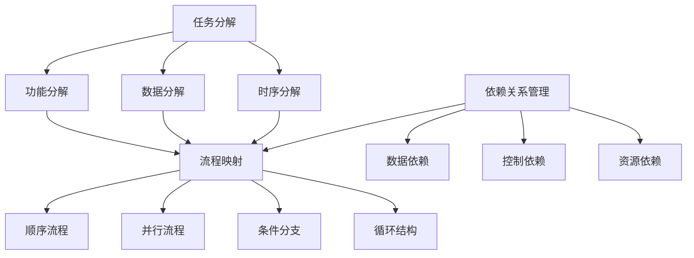

| 分解类型 | 描述 | 适用场景 |
|----------|------|----------|
| 功能分解 | 按功能模块拆分任务 | 复杂系统设计 |
| 数据分解 | 基于数据结构或流拆分 | 大规模数据处理 |
| 时序分解 | 按时间顺序或阶段拆分 | 多阶段处理流程 |

* 数学模型：
  我们可以使用有向无环图(DAG)来模型化任务分解和流程映射:

$$G = (V, E)$$

其中:
$V$ 是任务节点集合
$E$ 是任务间依赖关系的边集合

任务完成时间可以用关键路径法计算:

$$T_{completion} = max(t_i + \sum_{j \in path(i)} t_j)$$

其中:
$t_i$ 是任务 i 的执行时间
$path(i)$ 是从任务 i 到终点的最长路径

* 算法流程图：

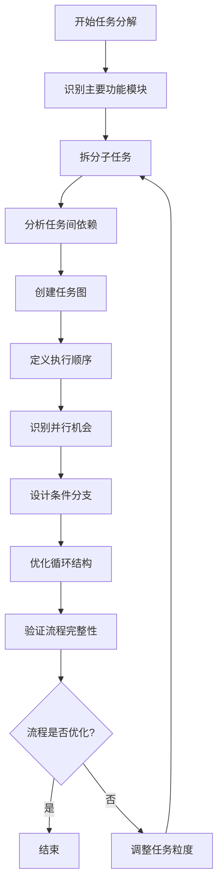

* 算法源代码：

```python
from typing import List, Dict, Tuple
import networkx as nx
import matplotlib.pyplot as plt

class Task:
    def __init__(self, id: str, description: str, duration: int):
        self.id = id
        self.description = description
        self.duration = duration

class WorkflowDesigner:
    def __init__(self):
        self.tasks: Dict[str, Task] = {}
        self.dependencies: Dict[str, List[str]] = {}
        self.graph = nx.DiGraph()

    def add_task(self, id: str, description: str, duration: int):
        task = Task(id, description, duration)
        self.tasks[id] = task
        self.graph.add_node(id, duration=duration)

    def add_dependency(self, from_task: str, to_task: str):
        if from_task not in self.dependencies:
            self.dependencies[from_task] = []
        self.dependencies[from_task].append(to_task)
        self.graph.add_edge(from_task, to_task)

    def analyze_critical_path(self) -> Tuple[List[str], int]:
        longest_path = nx.dag_longest_path(self.graph)
        critical_path_length = sum(self.tasks[task].duration for task in longest_path)
        return longest_path, critical_path_length

    def identify_parallel_tasks(self) -> List[List[str]]:
        parallel_tasks = []
        for node in self.graph.nodes():
            predecessors = list(self.graph.predecessors(node))
            if len(predecessors) > 1:
                parallel_tasks.append(predecessors)
        return parallel_tasks

    def visualize_workflow(self):
        pos = nx.spring_layout(self.graph)
        nx.draw(self.graph, pos, with_labels=True, node_color='lightblue', node_size=500, font_size=10, font_weight='bold')
        labels = nx.get_edge_attributes(self.graph, 'weight')
        nx.draw_networkx_edge_labels(self.graph, pos, edge_labels=labels)
        plt.title("AI Agent Workflow")
        plt.savefig("workflow_visualization.png")
        plt.close()

    def optimize_workflow(self):
        critical_path, total_duration = self.analyze_critical_path()
        parallel_opportunities = self.identify_parallel_tasks()
        
        print(f"Critical Path: {' -> '.join(critical_path)}")
        print(f"Total Duration: {total_duration}")
        print("Parallel Execution Opportunities:")
        for i, tasks in enumerate(parallel_opportunities, 1):
            print(f"Group {i}: {', '.join(tasks)}")

# 使用示例
designer = WorkflowDesigner()

# 添加任务
designer.add_task("A", "Input Processing", 2)
designer.add_task("B", "Natural Language Understanding", 3)
designer.add_task("C", "Knowledge Retrieval", 2)
designer.add_task("D", "Reasoning", 4)
designer.add_task("E", "Response Generation", 2)
designer.add_task("F", "Output Formatting", 1)

# 添加依赖关系
designer.add_dependency("A", "B")
designer.add_dependency("B", "C")
designer.add_dependency("B", "D")
designer.add_dependency("C", "D")
designer.add_dependency("D", "E")
designer.add_dependency("E", "F")

# 分析和优化工作流
designer.optimize_workflow()

# 可视化工作流
designer.visualize_workflow()
```

* 实际场景应用：
1. 智能客服系统：将客户查询处理分解为语言理解、信息检索、答案生成等子任务。
2. 自动驾驶系统：将驾驶任务分解为感知、规划、控制等模块,并设计它们之间的交互流程。
3. 推荐系统：将推荐过程分解为用户兴趣建模、候选生成、排序、多样性优化等步骤。

* 项目介绍：
  开发一个 AI Agent 工作流设计助手,帮助开发者进行任务分解和流程映射,并提供优化建议。

* 环境安装：
```bash
pip install networkx matplotlib pandas numpy
```

* 系统功能设计：
1. 任务分解模块
2. 依赖关系分析模块
3. 流程映射模块
4. 并行任务识别模块
5. 关键路径分析模块
6. 工作流可视化模块
7. 优化建议生成模块

* 系统架构设计：

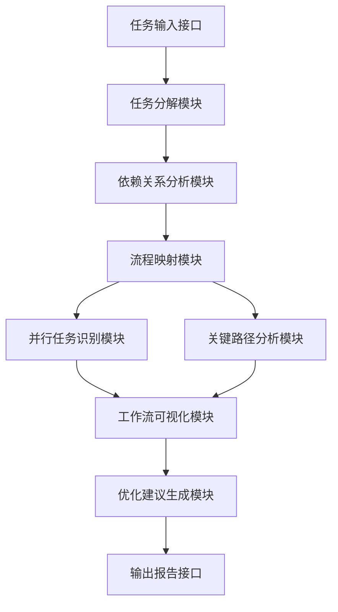

* 系统接口设计：
1. 任务输入接口：接收任务描述和估计执行时间
2. 依赖关系输入接口：定义任务间的依赖关系
3. 流程可视化接口：生成工作流程图
4. 分析结果输出接口：提供关键路径、并行机会等信息
5. 优化建议接口：生成工作流优化建议

* 系统核心实现源代码：

```python
import networkx as nx
import matplotlib.pyplot as plt
from typing import List, Dict, Tuple

class AIAgentWorkflowDesigner:
    def __init__(self):
        self.tasks = {}
        self.graph = nx.DiGraph()

    def add_task(self, task_id: str, description: str, duration: int):
        self.tasks[task_id] = {"description": description, "duration": duration}
        self.graph.add_node(task_id, duration=duration)

    def add_dependency(self, from_task: str, to_task: str):
        self.graph.add_edge(from_task, to_task)

    def analyze_critical_path(self) -> Tuple[List[str], int]:
        critical_path = nx.dag_longest_path(self.graph)
        total_duration = sum(self.tasks[task]["duration"] for task in critical_path)
        return critical_path, total_duration

    def identify_parallel_tasks(self) -> List[List[str]]:
        parallel_tasks = []
        for node in self.graph.nodes():
            predecessors = list(self.graph.predecessors(node))
            if len(predecessors) > 1:
                parallel_tasks.append(predecessors)
        return parallel_tasks

    def visualize_workflow(self):
        pos = nx.spring_layout(self.graph)
        nx.draw(self.graph, pos, with_labels=True, node_color='lightblue', node_size=500, font_size=10, font_weight='bold')
        labels = nx.get_edge_attributes(self.graph, 'weight')
        nx.draw_networkx_edge_labels(self.graph, pos, edge_labels=labels)
        plt.title("AI Agent Workflow")
        plt.savefig("ai_agent_workflow.png")
        plt.close()

    def generate_optimization_suggestions(self) -> List[str]:
        suggestions = []
        critical_path, total_duration = self.analyze_critical_path()
        parallel_opportunities = self.identify_parallel_tasks()

        suggestions.append(f"Critical path: {' -> '.join(critical_path)}. Focus on optimizing these tasks to reduce overall duration.")
        
        if parallel_opportunities:
            suggestions.append("Consider parallelizing the following task groups:")
            for i, group in enumerate(parallel_opportunities, 1):
                suggestions.append(f"  Group {i}: {', '.join(group)}")
        
        long_tasks = [task for task, data in self.tasks.items() if data['duration'] > 3]
        if long_tasks:
            suggestions.append("Consider breaking down these long-duration tasks:")
            for task in long_tasks:
                suggestions.append(f"  {task}: {self.tasks[task]['description']} (Duration: {self.tasks[task]['duration']})")

        return suggestions

    def generate_report(self):
        report = "AI Agent Workflow Analysis Report\n\n"
        
        report += "1. Task Breakdown:\n"
        for task_id, task_data in self.tasks.items():
            report += f"   {task_id}: {task_data['description']} (Duration: {task_data['duration']})\n"
        
        report += "\n2. Workflow Analysis:\n"
        critical_path, total_duration = self.analyze_critical_path()
        report += f"   Critical Path: {' -> '.join(critical_path)}\n"
        report += f"   Total Duration: {total_duration}\n"
        
        parallel_tasks = self.identify_parallel_tasks()
        if parallel_tasks:
            report += "\n   Parallel Execution Opportunities:\n"
            for i, group in enumerate(parallel_tasks, 1):
                report += f"   Group {i}: {', '.join(group)}\n"
        
        report += "\n3. Optimization Suggestions:\n"
        for suggestion in self.generate_optimization_suggestions():
            report += f"   - {suggestion}\n"
        
        return report

# 使用示例
designer = AIAgentWorkflowDesigner()

# 添加任务
designer.add_task("A", "Natural Language Understanding", 2)
designer.add_task("B", "Intent Classification", 1)
designer.add_task("C", "Entity Extraction", 2)
designer.add_task("D", "Knowledge Base Query", 3)
designer.add_task("E", "Response Generation", 2)
designer.add_task("F", "Context Update", 1)

# 添加依赖关系
designer.add_dependency("A", "B")
designer.add_dependency("A", "C")
designer.add_dependency("B", "D")
designer.add_dependency("C", "D")
designer.add_dependency("D", "E")
designer.add_dependency("E", "F")

# 生成工作流可视化
designer.visualize_workflow()

# 生成报告
report = designer.generate_report()
print(report)

# 保存报告到文件
with open("ai_agent_workflow_report.txt", "w") as f:
    f.write(report)
```

* 最佳实践tips：
1. 从用户视角出发,确保任务分解和流程映射能够满足最终用户需求。
2. 保持适度的粒度,避免过度分解或粗粒度任务。
3. 充分利用并行处理机会,提高系统效率。
4. 考虑异常处理和回退机制,增强工作流的鲁棒性。
5. 定期review和优化工作流,适应不断变化的需求和技术进步。
6. 使用版本控制管理工作流设计,便于追踪变更和回滚。
7. 考虑可扩展性,为未来功能增加预留接口或扩展点。

* 行业发展与未来趋势：

| 时期 | 任务分解特点 | 流程映射方法 |
|------|--------------|--------------|
| 过去 | 静态,手动 | 流程图,文档驱动 |
| 现在 | 动态,半自动 | 可视化工具,数据驱动 |
| 未来 | 自适应,AI辅助 | 智能建模,自优化 |

* 本章小结：
  任务分解与流程映射是 AI Agent 工作流设计中的关键步骤,它将复杂的系统需求转化为可管理、可实现的结构化任务和清晰的执行路径。通过系统化的方法进行任务分解,并利用图论等工具进行流程映射,我们可以有效地设计出高效、可靠的 AI Agent 工作流。未来,随着 AI 技术的进步,我们预计会看到更多智能化、自适应的任务分解和流程映射工具,这将进一步提高 AI Agent 系统的设计效率和质量。持续关注这一领域的发展,将有助于我们在 AI Agent 开发中保持竞争优势。

### 9.2.3 决策点识别与设计

* 核心概念：
  决策点识别与设计是 AI Agent 工作流中确定关键选择节点并设计相应决策逻辑的过程。这个步骤对于创建智能、自适应的 AI 系统至关重要。

* 问题背景：
  随着 AI Agent 系统变得越来越复杂,它们需要在各种情况下做出合理的决策。识别关键决策点并设计适当的决策逻辑是确保 AI Agent 表现出智能行为的关键。

* 问题描述：
  主要挑战包括:如何识别工作流中的关键决策点?如何设计既能处理已知情况又能适应未知情况的决策逻辑?如何平衡决策的准确性和效率?

* 问题解决：
  通过系统化的方法识别决策点,并结合多种决策技术(如规则基础、机器学习、强化学习等)设计决策逻辑,我们可以创建出智能、灵活的 AI Agent 系统。

* 边界与外延：
  决策点识别不仅涉及功能性决策,还包括性能优化、资源分配、错误处理等方面的决策。决策逻辑设计需要考虑不确定性、多目标优化、实时性等因素。

* 概念结构与核心要素组成：
1. 决策点识别
    - 功能分支点
    - 资源分配点
    - 异常处理点
    - 优化选择点
2. 决策逻辑设计
    - 规则基础决策
    - 机器学习模型
    - 强化学习策略
    - 模糊逻辑
3. 决策评估与优化
    - 决策准确性
    - 决策效率
    - 鲁棒性
    - 可解释性

* 概念之间的关系：

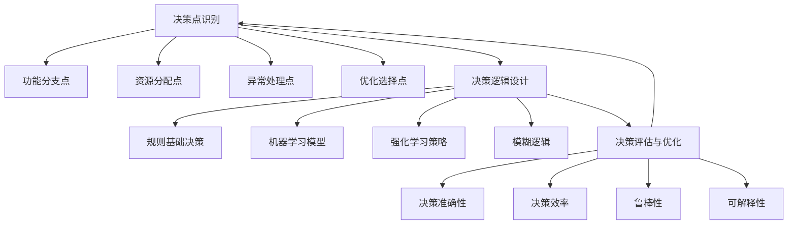

| 决策类型 | 适用场景 | 优势 | 劣势 |
|----------|----------|------|------|
| 规则基础 | 已知、明确的情况 | 可解释性强,快速 | 灵活性低,难以处理未知情况 |
| 机器学习 | 有大量历史数据的场景 | 可处理复杂模式 | 需要大量数据,可解释性较差 |
| 强化学习 | 连续决策,动态环境 | 可自主学习和适应 | 训练复杂,初期表现可能不稳定 |
| 模糊逻辑 | 不确定性高的场景 | 可处理模糊信息 | 规则设计复杂,可能存在性能问题 |

* 数学模型：
  对于某个决策点,我们可以使用期望效用理论来建模决策过程：

$$EU(a) = \sum_{s \in S} P(s|a) \cdot U(s)$$

其中：
$EU(a)$ 是行动 $a$ 的期望效用
$S$ 是可能的结果集
$P(s|a)$ 是在采取行动 $a$ 的情况下,结果 $s$ 发生的概率
$U(s)$ 是结果 $s$ 的效用

* 算法流程图：

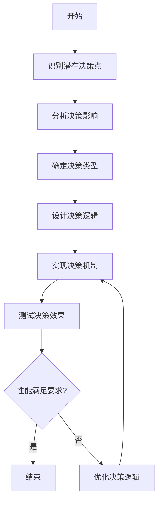

* 算法源代码：

```python
from abc import ABC, abstractmethod
import random

class DecisionPoint(ABC):
    def __init__(self, name):
        self.name = name

    @abstractmethod
    def make_decision(self, context):
        pass

class RuleBasedDecision(DecisionPoint):
    def __init__(self, name, rules):
        super().__init__(name)
        self.rules = rules

    def make_decision(self, context):
        for condition, action in self.rules:
            if condition(context):
                return action(context)
        return None

class MLBasedDecision(DecisionPoint):
    def __init__(self, name, model):
        super().__init__(name)
        self.model = model

    def make_decision(self, context):
        return self.model.predict(context)

class RLBasedDecision(DecisionPoint):
    def __init__(self, name, agent):
        super().__init__(name)
        self.agent = agent

    def make_decision(self, context):
        return self.agent.act(context)

class FuzzyLogicDecision(DecisionPoint):
    def __init__(self, name, fuzzy_system):
        super().__init__(name)
        self.fuzzy_system = fuzzy_system

    def make_decision(self, context):
        return self.fuzzy_system.evaluate(context)

class DecisionEngine:
    def __init__(self):
        self.decision_points = {}

    def add_decision_point(self, decision_point):
        self.decision_points[decision_point.name] = decision_point

    def make_decision(self, point_name, context):
        if point_name in self.decision_points:
            return self.decision_points[point_name].make_decision(context)
        else:
            raise ValueError(f"Decision point {point_name} not found")

# 示例使用
def simple_condition(context):
    return context.get('value', 0) > 50

def simple_action(context):
    return "High value action"

rule_based = RuleBasedDecision("RuleBased", [(simple_condition, simple_action)])

class SimpleModel:
    def predict(self, context):
        return "ML prediction"

ml_based = MLBasedDecision("MLBased", SimpleModel())

class SimpleAgent:
    def act(self, context):
        return random.choice(["Action A", "Action B"])

rl_based = RLBasedDecision("RLBased", SimpleAgent())

class SimpleFuzzySystem:
    def evaluate(self, context):
        return "Fuzzy decision"

fuzzy_logic = FuzzyLogicDecision("FuzzyLogic", SimpleFuzzySystem())

engine = DecisionEngine()
engine.add_decision_point(rule_based)
engine.add_decision_point(ml_based)
engine.add_decision_point(rl_based)
engine.add_decision_point(fuzzy_logic)

# 测试决策引擎
context = {'value': 75}
print(engine.make_decision("RuleBased", context))
print(engine.make_decision("MLBased", context))
print(engine.make_decision("RLBased", context))
print(engine.make_decision("FuzzyLogic", context))
```

* 实际场景应用：
1. 智能客服系统：决定是否将查询升级到人工客服。
2. 自动交易系统：根据市场状况决定买入、卖出或持有。
3. 推荐系统：选择向用户展示的内容类型和数量。

* 项目介绍：
  开发一个 AI Agent 决策点设计助手,帮助开发者识别关键决策点,并为不同类型的决策设计和优化决策逻辑。

* 环境安装：
```bash
pip install numpy pandas sklearn tensorflow
```

* 系统功能设计：
1. 决策点识别模块
2. 决策类型分析模块
3. 决策逻辑设计模块
4. 决策性能评估模块
5. 决策优化建议模块
6. 决策可视化模块

* 系统架构设计：

```mermaid
graph TD
    A[工作流输入]--> B[决策点识别模块]
    B --> C[决策类型分析模块]
    C --> D[决策逻辑设计模块]
    D --> E[决策性能评估模块]
    E --> F[决策优化建议模块]
    F --> G[决策可视化模块]
    G --> H[输出报告]
```

* 系统接口设计：
1. 工作流输入接口：接收工作流描述或图形化表示
2. 决策点标注接口：允许用户手动标注或确认自动识别的决策点
3. 决策逻辑配置接口：为每个决策点选择和配置决策方法
4. 性能指标输入接口：定义决策评估的关键指标
5. 可视化输出接口：生成决策点分布和决策逻辑流程图
6. 优化建议输出接口：提供决策点优化和决策逻辑改进建议

* 系统核心实现源代码：

```python
import networkx as nx
import matplotlib.pyplot as plt
from typing import List, Dict, Any
from abc import ABC, abstractmethod

class DecisionPoint:
    def __init__(self, name: str, decision_type: str):
        self.name = name
        self.decision_type = decision_type

class DecisionLogic(ABC):
    @abstractmethod
    def make_decision(self, context: Dict[str, Any]) -> Any:
        pass

class RuleBasedLogic(DecisionLogic):
    def __init__(self, rules: List[Dict[str, Any]]):
        self.rules = rules

    def make_decision(self, context: Dict[str, Any]) -> Any:
        for rule in self.rules:
            if all(context.get(k) == v for k, v in rule['condition'].items()):
                return rule['action']
        return None

class MLBasedLogic(DecisionLogic):
    def __init__(self, model):
        self.model = model

    def make_decision(self, context: Dict[str, Any]) -> Any:
        # 这里应该使用实际的机器学习模型
        return self.model.predict(context)

class DecisionPointDesigner:
    def __init__(self):
        self.workflow_graph = nx.DiGraph()
        self.decision_points: Dict[str, DecisionPoint] = {}

    def load_workflow(self, workflow_description: Dict[str, List[str]]):
        for node, edges in workflow_description.items():
            self.workflow_graph.add_node(node)
            for edge in edges:
                self.workflow_graph.add_edge(node, edge)

    def identify_decision_points(self):
        for node in self.workflow_graph.nodes():
            if self.workflow_graph.out_degree(node) > 1:
                self.decision_points[node] = DecisionPoint(node, "Unspecified")

    def analyze_decision_type(self, node: str, context: Dict[str, Any]):
        # 这里应该实现更复杂的决策类型分析逻辑
        if 'data' in context:
            self.decision_points[node].decision_type = "ML-based"
        else:
            self.decision_points[node].decision_type = "Rule-based"

    def design_decision_logic(self, node: str, logic_type: str, params: Dict[str, Any]) -> DecisionLogic:
        if logic_type == "Rule-based":
            return RuleBasedLogic(params['rules'])
        elif logic_type == "ML-based":
            return MLBasedLogic(params['model'])
        else:
            raise ValueError(f"Unsupported decision logic type: {logic_type}")

    def evaluate_decision_performance(self, node: str, logic: DecisionLogic, test_data: List[Dict[str, Any]]) -> Dict[str, float]:
        correct = 0
        total = len(test_data)
        for data in test_data:
            context = data['context']
            expected = data['expected']
            result = logic.make_decision(context)
            if result == expected:
                correct += 1
        accuracy = correct / total
        return {"accuracy": accuracy}

    def generate_optimization_suggestions(self, node: str, performance: Dict[str, float]) -> List[str]:
        suggestions = []
        if performance['accuracy'] < 0.8:
            suggestions.append(f"Consider refining the decision logic for {node} to improve accuracy.")
            if self.decision_points[node].decision_type == "Rule-based":
                suggestions.append("Consider using a machine learning approach if more data is available.")
            elif self.decision_points[node].decision_type == "ML-based":
                suggestions.append("Consider feature engineering or trying different ML models.")
        return suggestions

    def visualize_decision_points(self):
        pos = nx.spring_layout(self.workflow_graph)
        nx.draw(self.workflow_graph, pos, with_labels=True, node_color='lightblue', node_size=500, font_size=10, font_weight='bold')
        decision_nodes = list(self.decision_points.keys())
        nx.draw_networkx_nodes(self.workflow_graph, pos, nodelist=decision_nodes, node_color='lightgreen', node_size=700)
        plt.title("Workflow with Decision Points")
        plt.savefig("workflow_decision_points.png")
        plt.close()

    def generate_report(self):
        report = "Decision Point Analysis Report\n\n"
        for node, decision_point in self.decision_points.items():
            report += f"Decision Point: {node}\n"
            report += f"Type: {decision_point.decision_type}\n"
            report += "Suggestions:\n"
            for suggestion in self.generate_optimization_suggestions(node, {"accuracy": 0.75}):  # 假设的性能数据
                report += f"- {suggestion}\n"
            report += "\n"
        return report

# 使用示例
designer = DecisionPointDesigner()

# 加载工作流
workflow = {
    "Start": ["A", "B"],
    "A": ["C"],
    "B": ["C"],
    "C": ["D", "E"],
    "D": ["End"],
    "E": ["End"],
    "End": []
}
designer.load_workflow(workflow)

# 识别决策点
designer.identify_decision_points()

# 分析决策类型
designer.analyze_decision_type("C", {"data": [1, 2, 3]})

# 设计决策逻辑
rules = [
    {"condition": {"value": "high"}, "action": "D"},
    {"condition": {"value": "low"}, "action": "E"}
]
logic = designer.design_decision_logic("C", "Rule-based", {"rules": rules})

# 评估决策性能
test_data = [
    {"context": {"value": "high"}, "expected": "D"},
    {"context": {"value": "low"}, "expected": "E"},
    {"context": {"value": "medium"}, "expected": "D"}
]
performance = designer.evaluate_decision_performance("C", logic, test_data)

# 生成优化建议
suggestions = designer.generate_optimization_suggestions("C", performance)

# 可视化决策点
designer.visualize_decision_points()

# 生成报告
report = designer.generate_report()
print(report)

# 保存报告到文件
with open("decision_point_analysis_report.txt", "w") as f:
    f.write(report)
```

* 最佳实践tips：
1. 在工作流早期就开始识别潜在的决策点,而不是在实现阶段才考虑。
2. 为每个决策点明确定义输入、输出和评估指标。
3. 根据决策的复杂性和数据可用性选择合适的决策方法。
4. 在设计决策逻辑时,考虑边缘情况和异常处理。
5. 使用A/B测试来评估和优化关键决策点的性能。
6. 对于复杂的决策,考虑使用多阶段或层级决策结构。
7. 定期审查和更新决策逻辑,以适应不断变化的需求和环境。

* 行业发展与未来趋势：

| 时期 | 决策点识别方法 | 决策逻辑设计趋势 |
|------|----------------|-------------------|
| 过去 | 人工分析 | 基于规则的硬编码 |
| 现在 | 半自动化识别 | 机器学习和数据驱动 |
| 未来 | AI辅助全自动识别 | 自适应和自优化决策系统 |

* 本章小结：
  决策点识别与设计是 AI Agent 工作流中的关键环节,它决定了系统的智能程度和适应性。通过系统化的方法识别决策点,并结合多种决策技术设计决策逻辑,我们可以创建出更加智能、灵活的 AI Agent 系统。随着技术的发展,我们预计未来的决策点识别将更加自动化,决策逻辑也将更加智能和自适应。持续关注这一领域的发展,对于提高 AI Agent 的性能和应用范围至关重要。

### 9.2.4 异常处理与回退机制

* 核心概念：
  异常处理与回退机制是 AI Agent 工作流中用于处理意外情况和错误的关键组成部分。它们确保系统在面对异常时能够优雅地处理,并在必要时回退到安全状态。

* 问题背景：
  随着 AI Agent 系统变得越来越复杂,它们面临的异常情况也越来越多样化。有效的异常处理和回退机制对于确保系统的稳定性、可靠性和用户体验至关重要。

* 问题描述：
  主要挑战包括:如何预测和识别可能的异常?如何设计既能处理已知异常又能应对未知异常的机制?如何在保证系统稳定性的同时,最小化对正常流程的影响?

* 问题解决：
  通过系统化的异常分类、全面的异常处理策略设计,以及灵活的回退机制,我们可以创建出更加健壮和可靠的 AI Agent 系统。

* 边界与外延：
  异常处理不仅包括技术层面的错误(如系统崩溃、网络中断),还包括业务逻辑层面的异常(如不合理的输入、意外的用户行为)。回退机制需要考虑到系统状态的一致性和数据完整性。

* 概念结构与核心要素组成：
1. 异常分类
    - 系统异常
    - 业务异常
    - 数据异常
    - 外部依赖异常
2. 异常处理策略
    - 重试机制
    - 降级服务
    - 错误隔离
    - 日志记录
3. 回退机制
    - 状态回滚
    - 部分回退
    - 补偿事务
    - 错误恢复

* 概念之间的关系：

```mermaid
graph TD
    A[异常处理与回退机制] --> B[异常分类]
    A --> C[异常处理策略]
    A --> D[回退机制]
    B --> E[系统异常]
    B --> F[业务异常]
    B --> G[数据异常]
    B --> H[外部依赖异常]
    C --> I[重试机制]
    C --> J[降级服务]
    C --> K[错误隔离]
    C --> L[日志记录]
    D --> M[状态回滚]
    D --> N[部分回退]
    D --> O[补偿事务]
    D --> P[错误恢复]
```

| 异常类型 | 描述 | 处理策略 | 回退机制 |
|----------|------|----------|----------|
| 系统异常 | 如内存溢出、崩溃 | 错误隔离,重启服务 | 状态回滚 |
| 业务异常 | 如非法操作,逻辑错误 | 错误提示,引导正确操作 | 部分回退 |
| 数据异常 | 如数据不一致、损坏 | 数据修复,使用备份 | 补偿事务 |
| 外部依赖异常 | 如API调用失败,网络中断 | 重试,使用本地缓存 | 错误恢复 |

* 数学模型：
  我们可以使用马尔可夫决策过程(MDP)来模型化异常处理和回退决策：

$$V(s) = \max_a \{R(s,a) + \gamma \sum_{s'} P(s'|s,a)V(s')\}$$

其中：
$V(s)$ 是状态 $s$ 的价值函数
$R(s,a)$ 是在状态 $s$ 采取行动 $a$ 的即时奖励
$P(s'|s,a)$ 是从状态 $s$ 采取行动 $a$ 后转移到状态 $s'$ 的概率
$\gamma$ 是折扣因子

* 算法流程图：

```mermaid
graph TD
    A[开始] --> B{是否发生异常?}
    B -->|是| C[识别异常类型]
    B -->|否| D[正常流程]
    C --> E{是否可以本地处理?}
    E -->|是| F[执行本地处理]
    E -->|否| G[触发回退机制]
    F --> H[记录日志]
    G --> I[确定回退范围]
    I --> J[执行状态回滚]
    J --> K[重试或报警]
    H --> L[恢复正常流程]
    K --> L
    L --> M[结束]
```

* 算法源代码：

```python
from enum import Enum
from typing import Any, Dict, List, Optional
import logging

class ExceptionType(Enum):
    SYSTEM = 1
    BUSINESS = 2
    DATA = 3
    EXTERNAL = 4

class ExceptionHandler:
    def __init__(self):
        self.logger = logging.getLogger(__name__)

    def handle_exception(self, exception_type: ExceptionType, context: Dict[str, Any]) -> bool:
        if exception_type == ExceptionType.SYSTEM:
            return self.handle_system_exception(context)
        elif exception_type == ExceptionType.BUSINESS:
            return self.handle_business_exception(context)
        elif exception_type == ExceptionType.DATA:
            return self.handle_data_exception(context)
        elif exception_type == ExceptionType.EXTERNAL:
            return self.handle_external_exception(context)
        else:
            self.logger.error(f"Unknown exception type: {exception_type}")
            return False

    def handle_system_exception(self, context: Dict[str, Any]) -> bool:
        self.logger.error(f"System exception occurred: {context}")
        # 实现系统异常处理逻辑，例如重启服务或隔离错误
        return False

    def handle_business_exception(self, context: Dict[str, Any]) -> bool:
        self.logger.warning(f"Business exception occurred: {context}")
        # 实现业务异常处理逻辑，例如提供用户提示
        return True

    def handle_data_exception(self, context: Dict[str, Any]) -> bool:
        self.logger.error(f"Data exception occurred: {context}")
        # 实现数据异常处理逻辑，例如数据修复或使用备份
        return False

    def handle_external_exception(self, context: Dict[str, Any]) -> bool:
        self.logger.warning(f"External exception occurred: {context}")
        # 实现外部依赖异常处理逻辑，例如重试或使用本地缓存
        return True

class RollbackManager:
    def __init__(self):
        self.states: List[Dict[str, Any]] = []

    def save_state(self, state: Dict[str, Any]):
        self.states.append(state)

    def rollback(self, steps: int = 1) -> Optional[Dict[str, Any]]:
        if steps <= len(self.states):
            return self.states[-steps]
        return None

class AIAgentWorkflow:
    def __init__(self):
        self.exception_handler = ExceptionHandler()
        self.rollback_manager = RollbackManager()

    def execute_task(self, task: str, context: Dict[str, Any]) -> bool:
        try:
            # 保存当前状态
            self.rollback_manager.save_state(context.copy())

            # 执行任务逻辑
            result = self.perform_task(task, context)

            return result
        except Exception as e:
            exception_type = self.classify_exception(e)
            handled = self.exception_handler.handle_exception(exception_type, context)

            if not handled:
                # 如果异常未被处理，执行回退
                previous_state = self.rollback_manager.rollback()
                if previous_state:
                    context.update(previous_state)
                    self.logger.info(f"Rolled back to previous state for task: {task}")
                else:
                    self.logger.error(f"Unable to rollback for task: {task}")

            return False

    def perform_task(self, task: str, context: Dict[str, Any]) -> bool:
        # 实现具体任务逻辑
        pass

    def classify_exception(self, exception: Exception) -> ExceptionType:
        # 根据异常类型分类
        if isinstance(exception, ValueError):
            return ExceptionType.BUSINESS
        elif isinstance(exception, IOError):
            return ExceptionType.EXTERNAL
        elif isinstance(exception, (KeyError, IndexError)):
            return ExceptionType.DATA
        else:
            return ExceptionType.SYSTEM

# 使用示例
workflow = AIAgentWorkflow()

context = {
    "user_id": "12345",
    "action": "purchase",
    "item_id": "AB-123"
}

success = workflow.execute_task("process_order", context)
if success:
    print("Order processed successfully")
else:
    print("Order processing failed")
```

* 实际场景应用：
1. 智能客服系统：处理用户输入异常,在无法理解用户意图时平滑转接人工。
2. 自动交易系统：在检测到异常市场波动时,自动暂停交易并回滚到安全状态。
3. 推荐系统：当个性化推荐失败时,降级为通用推荐,确保用户体验。

* 项目介绍：
  开发一个 AI Agent 异常处理与回退机制设计助手,帮助开发者识别潜在异常,设计处理策略,并实现有效的回退机制。

* 环境安装：
```bash
pip install pandas numpy scikit-learn matplotlib networkx
```

* 系统功能设计：
1. 异常识别模块
2. 异常分类模块
3. 处理策略设计模块
4. 回退机制设计模块
5. 日志分析模块
6. 性能评估模块
7. 可视化模块

* 系统架构设计：

```mermaid
graph TD
    A[工作流输入] --> B[异常识别模块]
    B --> C[异常分类模块]
    C --> D[处理策略设计模块]
    D --> E[回退机制设计模块]
    E --> F[日志分析模块]
    F --> G[性能评估模块]
    G --> H[可视化模块]
    H --> I[输出报告]
```

* 系统接口设计：
1. 工作流输入接口：接收工作流描述或图形化表示
2. 异常定义接口：允许用户定义或导入可能的异常类型
3. 处理策略配置接口：为不同类型的异常配置处理策略
4. 回退点设置接口：在工作流中标记可能的回退点
5. 日志输入接口：接收系统运行日志进行分析
6. 可视化输出接口：生成异常处理流程图和性能报告

* 系统核心实现源代码：

```python
import networkx as nx
import matplotlib.pyplot as plt
from typing import Dict, List, Any, Tuple
from enum import Enum
import random

class ExceptionType(Enum):
    SYSTEM = 1
    BUSINESS = 2
    DATA = 3
    EXTERNAL = 4

class ExceptionHandler:
    def __init__(self):
        self.strategies: Dict[ExceptionType, List[str]] = {
            ExceptionType.SYSTEM: ["Isolate", "Restart", "Log"],
            ExceptionType.BUSINESS: ["Retry", "User Guidance", "Log"],
            ExceptionType.DATA: ["Repair", "Use Backup", "Log"],
            ExceptionType.EXTERNAL: ["Retry", "Use Cache", "Log"]
        }

    def get_strategy(self, exception_type: ExceptionType) -> str:
        return random.choice(self.strategies[exception_type])

class RollbackManager:
    def __init__(self):
        self.rollback_points: List[str] = []

    def add_rollback_point(self, point: str):
        self.rollback_points.append(point)

    def get_nearest_rollback_point(self, current_point: str) -> str:
        # 简化实现，返回最近的回退点
        return self.rollback_points[-1] if self.rollback_points else current_point

class AIAgentExceptionDesigner:
    def __init__(self):
        self.workflow_graph = nx.DiGraph()
        self.exception_handler = ExceptionHandler()
        self.rollback_manager = RollbackManager()

    def load_workflow(self, workflow: Dict[str, List[str]]):
        for node, edges in workflow.items():
            self.workflow_graph.add_node(node)
            for edge in edges:
                self.workflow_graph.add_edge(node, edge)

    def identify_potential_exceptions(self) -> Dict[str, List[ExceptionType]]:
        potential_exceptions = {}
        for node in self.workflow_graph.nodes():
            potential_exceptions[node] = self.analyze_node_exceptions(node)
        return potential_exceptions

    def analyze_node_exceptions(self, node: str) -> List[ExceptionType]:
        # 简化实现，随机生成可能的异常类型
        return random.sample(list(ExceptionType), random.randint(1, len(ExceptionType)))

    def design_exception_handling(self, potential_exceptions: Dict[str, List[ExceptionType]]) -> Dict[str, Dict[ExceptionType, str]]:
        exception_handling = {}
        for node, exceptions in potential_exceptions.items():
            exception_handling[node] = {e: self.exception_handler.get_strategy(e) for e in exceptions}
        return exception_handling

    def design_rollback_mechanism(self) -> List[str]:
        # 简化实现，每隔几个节点设置一个回退点
        rollback_points = []
        for i, node in enumerate(self.workflow_graph.nodes()):
            if i % 3 == 0:
                self.rollback_manager.add_rollback_point(node)
                rollback_points.append(node)
        return rollback_points

    def visualize_exception_handling(self, exception_handling: Dict[str, Dict[ExceptionType, str]]):
        pos = nx.spring_layout(self.workflow_graph)
        nx.draw(self.workflow_graph, pos, with_labels=True, node_color='lightblue', node_size=500, font_size=10, font_weight='bold')
        
        for node, exceptions in exception_handling.items():
            label = f"{node}\n"
            for e_type, strategy in exceptions.items():
                label += f"{e_type.name}: {strategy}\n"
            x, y = pos[node]
            plt.text(x, y, label, fontsize=8, ha='center', va='center', bbox=dict(facecolor='white', edgecolor='none', alpha=0.7))

        plt.title("AI Agent Workflow with Exception Handling")
        plt.savefig("exception_handling_visualization.png", dpi=300, bbox_inches='tight')
        plt.close()

    def generate_report(self, potential_exceptions: Dict[str, List[ExceptionType]], exception_handling: Dict[str, Dict[ExceptionType, str]], rollback_points: List[str]) -> str:
        report = "AI Agent Exception Handling and Rollback Mechanism Report\n\n"

        report += "1. Potential Exceptions:\n"
        for node, exceptions in potential_exceptions.items():
            report += f"   Node {node}: {', '.join([e.name for e in exceptions])}\n"

        report += "\n2. Exception Handling Strategies:\n"
        for node, strategies in exception_handling.items():
            report += f"   Node {node}:\n"
            for e_type, strategy in strategies.items():
                report += f"      {e_type.name}: {strategy}\n"

        report += f"\n3. Rollback Points: {', '.join(rollback_points)}\n"

        report += "\n4. Recommendations:\n"
        report += "   - Regularly review and update exception handling strategies\n"
        report += "   - Implement comprehensive logging for all exceptions\n"
        report += "   - Consider adding more granular rollback points for critical operations\n"
        report += "   - Conduct thorough testing of exception scenarios and rollback mechanisms\n"

        return report

# 使用示例
designer = AIAgentExceptionDesigner()

# 加载工作流
workflow = {
    "Start": ["A", "B"],
    "A": ["C"],
    "B": ["C"],
    "C": ["D", "E"],
    "D": ["F"],
    "E": ["F"],
    "F": ["End"]
}
designer.load_workflow(workflow)

# 识别潜在异常
potential_exceptions = designer.identify_potential_exceptions()

# 设计异常处理策略
exception_handling = designer.design_exception_handling(potential_exceptions)

# 设计回退机制
rollback_points = designer.design_rollback_mechanism()

# 可视化异常处理
designer.visualize_exception_handling(exception_handling)

# 生成报告
report = designer.generate_report(potential_exceptions, exception_handling, rollback_points)
print(report)

# 保存报告到文件
with open("exception_handling_report.txt", "w") as f:
    f.write(report)
```

* 最佳实践tips：
1. 预先识别和分类可能的异常,制定相应的处理策略。
2. 实现细粒度的异常处理,避免使用过于宽泛的异常捕获。
3. 设计合理的回退点,确保系统可以回滚到一致的状态。
4. 实现全面的日志记录,便于问题诊断和系统优化。
5. 定期进行异常处理演练,验证处理机制的有效性。
6. 考虑使用断路器模式,防止级联故障。
7. 实现优雅降级,在部分功能不可用时仍能提供核心服务。

* 行业发展与未来趋势：

| 时期 | 异常处理特点 | 回退机制趋势 |
|------|--------------|--------------|
| 过去 | 简单的try-catch | 全局回滚 |
| 现在 | 多层次异常处理 | 部分回退,补偿事务 |
| 未来 | AI辅助异常预测和处理 | 自适应,智能回退策略 |

* 本章小结：
  异常处理与回退机制是确保 AI Agent 系统稳定性和可靠性的关键组成部分。通过系统化的异常识别、分类和处理策略设计,以及灵活的回退机制,我们可以创建出更加健壮和可靠的 AI Agent 系统。随着技术的发展,我们预计未来的异常处理将更加智能化,能够预测和主动防范潜在问题,而回退机制也将更加精细和自适应。持续关注和改进这一领域,对于提高 AI Agent 系统的整体质量和用户信任度至关重要。

### 9.2.5 工作流优化与迭代方法

* 核心概念：
  工作流优化与迭代方法是一个持续改进 AI Agent 系统性能、效率和适应性的过程。它涉及系统化地分析、评估和改进工作流的各个方面,以实现更好的用户体验和系统性能。

* 问题背景：
  随着 AI Agent 系统的部署和使用,会出现各种性能瓶颈、用户反馈和新需求。如何持续优化工作流以适应这些变化,成为了保持系统竞争力的关键挑战。

* 问题描述：
  主要挑战包括:如何识别工作流中的优化机会?如何量化优化效果?如何在保持系统稳定性的同时进行迭代优化?如何平衡短期优化和长期演进?

* 问题解决：
  通过建立系统化的工作流优化框架,结合数据分析、用户反馈和性能监控,我们可以实现 AI Agent 工作流的持续改进和优化。

* 边界与外延：
  工作流优化不仅包括技术层面的改进（如算法优化、架构调整），还涉及业务流程的优化、用户体验的提升等方面。迭代方法需要考虑到系统的可维护性、可扩展性和长期演进路径。

* 概念结构与核心要素组成：
1. 性能分析
    - 响应时间分析
    - 资源利用率分析
    - 吞吐量分析
2. 用户体验优化
    - 交互流程优化
    - 界面设计改进
    - 个性化定制
3. 算法优化
    - 模型精度提升
    - 计算效率优化
    - 特征工程
4. 架构优化
    - 模块重构
    - 并发性能提升
    - 可扩展性设计
5. 迭代方法
    - 敏捷开发
    - A/B测试
    - 持续集成/持续部署(CI/CD)

* 概念之间的关系：

```mermaid
graph TD
    A[工作流优化与迭代方法] --> B[性能分析]
    A --> C[用户体验优化]
    A --> D[算法优化]
    A --> E[架构优化]
    A --> F[迭代方法]
    B --> G[响应时间分析]
    B --> H[资源利用率分析]
    B --> I[吞吐量分析]
    C --> J[交互流程优化]
    C --> K[界面设计改进]
    C --> L[个性化定制]
    D --> M[模型精度提升]
    D --> N[计算效率优化]
    D --> O[特征工程]
    E --> P[模块重构]
    E --> Q[并发性能提升]
    E --> R[可扩展性设计]
    F --> S[敏捷开发]
    F --> T[A/B测试]
    F --> U[CI/CD]
```

| 优化方面 | 关键指标 | 优化方法 | 潜在影响 |
|----------|----------|----------|----------|
| 性能 | 响应时间,吞吐量 | 算法优化,缓存策略 | 用户满意度提升 |
| 用户体验 | 用户留存率,转化率 | 界面优化,个性化推荐 | 业务指标改善 |
| 可靠性 | 错误率,平均恢复时间 | 异常处理优化,冗余设计 | 系统稳定性提高 |
| 可扩展性 | 峰值处理能力,资源利用率 | 微服务架构,负载均衡 | 支持业务增长 |

* 数学模型：
  我们可以使用多目标优化模型来描述工作流优化过程：

$$\text{Maximize } F(x) = (f_1(x), f_2(x), ..., f_n(x))$$
$$\text{Subject to } g_i(x) \leq 0, i = 1, ..., m$$
$$h_j(x) = 0, j = 1, ..., p$$
$$x \in X$$

其中：
$F(x)$ 是多个目标函数的向量
$f_i(x)$ 是第 i 个优化目标（如性能、用户体验等）
$g_i(x)$ 和 $h_j(x)$ 是约束条件
$X$ 是可行解空间

* 算法流程图：

```mermaid
graph TD
    A[开始优化循环] --> B[收集性能数据]
    B --> C[分析瓶颈]
    C --> D[制定优化策略]
    D --> E[实施优化]
    E --> F[A/B测试]
    F --> G{性能改善?}
    G -->|是| H[部署新版本]
    G -->|否| I[回滚并重新分析]
    H --> J[监控系统表现]
    I --> C
    J --> K{达到目标?}
    K -->|是| L[结束优化循环]
    K -->|否| B
```

* 算法源代码：

```python
import random
from typing import List, Dict, Any

class WorkflowOptimizer:
    def __init__(self, workflow: Dict[str, Any]):
        self.workflow = workflow
        self.performance_metrics = {
            'response_time': 0,
            'throughput': 0,
            'error_rate': 0,
            'user_satisfaction': 0
        }

    def collect_performance_data(self):
        # 模拟收集性能数据
        self.performance_metrics['response_time'] = random.uniform(0.1, 2.0)
        self.performance_metrics['throughput'] = random.randint(100, 1000)
        self.performance_metrics['error_rate'] = random.uniform(0, 0.1)
        self.performance_metrics['user_satisfaction'] = random.uniform(3, 5)

    def analyze_bottlenecks(self) -> List[str]:
        bottlenecks = []
        if self.performance_metrics['response_time'] > 1.0:
            bottlenecks.append('high_response_time')
        if self.performance_metrics['throughput'] < 500:
            bottlenecks.append('low_throughput')
        if self.performance_metrics['error_rate'] > 0.05:
            bottlenecks.append('high_error_rate')
        if self.performance_metrics['user_satisfaction'] < 4.0:
            bottlenecks.append('low_user_satisfaction')
        return bottlenecks

    def optimize_workflow(self, bottlenecks: List[str]):
        for bottleneck in bottlenecks:
            if bottleneck == 'high_response_time':
                self.optimize_response_time()
            elif bottleneck == 'low_throughput':
                self.optimize_throughput()
            elif bottleneck == 'high_error_rate':
                self.optimize_error_handling()
            elif bottleneck == 'low_user_satisfaction':
                self.optimize_user_experience()

    def optimize_response_time(self):
        # 实现响应时间优化逻辑
        print("Optimizing response time...")
        self.workflow['cache_strategy'] = 'improved'

    def optimize_throughput(self):
        # 实现吞吐量优化逻辑
        print("Optimizing throughput...")
        self.workflow['concurrency'] = 'increased'

    def optimize_error_handling(self):
        # 实现错误处理优化逻辑
        print("Optimizing error handling...")
        self.workflow['error_retry'] = 'implemented'

    def optimize_user_experience(self):
        # 实现用户体验优化逻辑
        print("Optimizing user experience...")
        self.workflow['ui_design'] = 'updated'

    def run_ab_test(self) -> bool:
        # 模拟A/B测试
        return random.choice([True, False])

    def deploy_new_version(self):
        print("Deploying new optimized version...")
        # 实现部署逻辑

    def rollback(self):
        print("Rolling back to previous version...")
        # 实现回滚逻辑

    def monitor_performance(self) -> bool:
        # 模拟监控系统表现
        return all(metric > 0.7 for metric in self.performance_metrics.values())

    def optimize_iteration(self):
        while True:
            self.collect_performance_data()
            bottlenecks = self.analyze_bottlenecks()
            if not bottlenecks:
                print("No bottlenecks found. Optimization complete.")
                break

            self.optimize_workflow(bottlenecks)
            if self.run_ab_test():
                self.deploy_new_version()
                if self.monitor_performance():
                    print("Performance goals achieved.")
                    break
            else:
                self.rollback()

# 使用示例
initial_workflow = {
    'cache_strategy': 'basic',
    'concurrency': 'normal',
    'error_retry': 'not_implemented',
    'ui_design': 'original'
}

optimizer = WorkflowOptimizer(initial_workflow)
optimizer.optimize_iteration()
```

* 实际场景应用：
1. 智能客服系统：优化意图识别算法,提高响应准确性和速度。
2. 推荐系统：通过A/B测试不同的推荐算法,提升用户点击率和留存率。
3. 自动驾驶系统：优化决策模型,提高安全性和乘坐舒适度。

* 项目介绍：
  开发一个 AI Agent 工作流优化助手,帮助开发者识别优化机会,设计和实施优化策略,并评估优化效果。

* 环境安装：
```bash
pip install pandas numpy scikit-learn matplotlib seaborn
```

* 系统功能设计：
1. 性能数据收集模块
2. 瓶颈分析模块
3. 优化策略生成模块
4. A/B测试模块
5. 版本控制模块
6. 性能监控模块
7. 报告生成模块

* 系统架构设计：

```mermaid
graph TD
    A[性能数据收集模块] --> B[瓶颈分析模块]
    B --> C[优化策略生成模块]
    C --> D[A/B测试模块]
    D --> E[版本控制模块]
    E --> F[性能监控模块]
    F --> G[报告生成模块]
    G --> A
```

* 系统接口设计：
1. 性能数据输入接口：接收系统性能指标和日志
2. 优化策略配置接口：允许自定义优化规则和阈值
3. A/B测试配置接口：设置测试参数和评估指标
4. 版本控制接口：管理不同版本的工作流配置
5. 监控指标定义接口：自定义关键性能指标(KPI)
6. 报告生成接口：生成优化过程和结果的可视化报告

* 系统核心实现源代码：

```python
import pandas as pd
import numpy as np
import matplotlib.pyplot as plt
from typing import Dict, List, Any
from sklearn.model_selection import train_test_split
from sklearn.metrics import mean_squared_error
import seaborn as sns

class AIAgentWorkflowOptimizer:
    def __init__(self):
        self.performance_data = pd.DataFrame()
        self.current_version = "v1.0"
        self.optimization_history = []

    def collect_performance_data(self, data: Dict[str, List[float]]):
        new_data = pd.DataFrame(data)
        self.performance_data = pd.concat([self.performance_data, new_data], ignore_index=True)

    def analyze_bottlenecks(self) -> List[str]:
        bottlenecks = []
        latest_data = self.performance_data.iloc[-1]
        if latest_data['response_time'] > 1.0:
            bottlenecks.append('high_response_time')
        if latest_data['throughput'] < 500:
            bottlenecks.append('low_throughput')
        if latest_data['error_rate'] > 0.05:
            bottlenecks.append('high_error_rate')
        if latest_data['user_satisfaction'] < 4.0:
            bottlenecks.append('low_user_satisfaction')
        return bottlenecks

    def generate_optimization_strategy(self, bottlenecks: List[str]) -> Dict[str, Any]:
        strategy = {}
        for bottleneck in bottlenecks:
            if bottleneck == 'high_response_time':
                strategy['cache_optimization'] = True
            elif bottleneck == 'low_throughput':
                strategy['concurrency_increase'] = True
            elif bottleneck == 'high_error_rate':
                strategy['error_handling_improvement'] = True
            elif bottleneck == 'low_user_satisfaction':
                strategy['ui_update'] = True
        return strategy

    def apply_optimization(self, strategy: Dict[str, Any]):
        # 模拟应用优化策略
        print(f"Applying optimization strategy: {strategy}")
        self.current_version = f"v{float(self.current_version[1:]) + 0.1:.1f}"
        self.optimization_history.append((self.current_version, strategy))

    def run_ab_test(self, strategy: Dict[str, Any]) -> bool:
        # 模拟A/B测试
        before = self.performance_data.iloc[-5:].mean()
        after = before.copy()
        for key in strategy:
            if key == 'cache_optimization':
                after['response_time'] *= 0.8
            elif key == 'concurrency_increase':
                after['throughput'] *= 1.2
            elif key == 'error_handling_improvement':
                after['error_rate'] *= 0.7
            elif key == 'ui_update':
                after['user_satisfaction'] *= 1.1
        
        improvement = (after - before) / before
        return improvement.mean() > 0.05  # 5% overall improvement threshold

    def monitor_performance(self) -> bool:
        latest_data = self.performance_data.iloc[-1]
        return all([
            latest_data['response_time'] < 1.0,
            latest_data['throughput'] > 500,
            latest_data['error_rate'] < 0.05,
            latest_data['user_satisfaction'] > 4.0
        ])

    def generate_report(self):
        fig, axes = plt.subplots(2, 2, figsize=(15, 10))
        metrics = ['response_time', 'throughput', 'error_rate', 'user_satisfaction']
        for i, metric in enumerate(metrics):
            ax = axes[i // 2, i % 2]
            sns.lineplot(data=self.performance_data, x=self.performance_data.index, y=metric, ax=ax)
            ax.set_title(f'{metric.replace("_", " ").title()} Over Time')
            ax.set_xlabel('Time')
            for version, strategy in self.optimization_history:
                ax.axvline(x=self.performance_data.index[self.performance_data.index.get_loc(version)], color='r', linestyle='--', alpha=0.5)
                ax.text(self.performance_data.index[self.performance_data.index.get_loc(version)], ax.get_ylim()[1], version, rotation=90, verticalalignment='top')

        plt.tight_layout()
        plt.savefig('workflow_optimization_report.png')
        plt.close()

        report = "Workflow Optimization Report\n\n"
        report += f"CurrentVersion: {self.current_version}\n\n"
        report += "Optimization History:\n"
        for version, strategy in self.optimization_history:
            report += f"- {version}: {strategy}\n"
        
        report += "\nLatest Performance Metrics:\n"
        latest_data = self.performance_data.iloc[-1]
        for metric in metrics:
            report += f"- {metric.replace('_', ' ').title()}: {latest_data[metric]:.2f}\n"
        
        report += "\nRecommendations:\n"
        bottlenecks = self.analyze_bottlenecks()
        if bottlenecks:
            report += "Consider further optimizations for:\n"
            for bottleneck in bottlenecks:
                report += f"- {bottleneck.replace('_', ' ').title()}\n"
        else:
            report += "Current performance meets all targets. Continue monitoring for potential future optimizations.\n"

        return report

    def optimization_cycle(self):
        while True:
            bottlenecks = self.analyze_bottlenecks()
            if not bottlenecks:
                print("No bottlenecks found. Optimization complete.")
                break

            strategy = self.generate_optimization_strategy(bottlenecks)
            if self.run_ab_test(strategy):
                self.apply_optimization(strategy)
                if self.monitor_performance():
                    print("Performance goals achieved.")
                    break
            else:
                print("A/B test failed. Trying alternative strategy.")

        report = self.generate_report()
        with open('optimization_report.txt', 'w') as f:
            f.write(report)
        print("Optimization report generated.")

# 使用示例
optimizer = AIAgentWorkflowOptimizer()

# 模拟收集一周的性能数据
for _ in range(7):
    data = {
        'response_time': [np.random.uniform(0.5, 2.0)],
        'throughput': [np.random.randint(300, 700)],
        'error_rate': [np.random.uniform(0.01, 0.1)],
        'user_satisfaction': [np.random.uniform(3.0, 4.5)]
    }
    optimizer.collect_performance_data(data)

# 运行优化循环
optimizer.optimization_cycle()
```

* 最佳实践tips：
1. 建立全面的性能监控系统,及时发现优化机会。
2. 采用增量式优化策略,避免大规模重构带来的风险。
3. 充分利用A/B测试,用数据驱动决策。
4. 注重长期性能趋势,而不仅仅关注短期波动。
5. 建立系统化的优化流程,包括识别、实施、验证和回顾。
6. 保持代码和架构的清晰性,便于后续优化。
7. 关注用户反馈,将用户体验作为优化的重要指标。

* 行业发展与未来趋势：

| 时期 | 优化方法 | 关注点 |
|------|----------|--------|
| 过去 | 手动调优,经验驱动 | 基本功能实现 |
| 现在 | 数据驱动,自动化工具辅助 | 性能提升,用户体验 |
| 未来 | AI驱动自优化,持续演进 | 智能适应,自主决策 |

* 本章小结：
  工作流优化与迭代方法是 AI Agent 系统持续改进的关键。通过系统化的性能分析、优化策略制定和实施,结合先进的测试和监控技术,我们可以不断提升 AI Agent 的性能、可靠性和用户体验。随着技术的发展,我们预计未来的工作流优化将更加智能化和自动化,能够自主识别优化机会并实施改进。持续关注这一领域的发展,对于保持 AI Agent 系统的竞争力至关重要。通过不断优化和迭代,我们可以确保 AI Agent 系统始终能够满足不断变化的用户需求和业务挑战。

## 9.3 工作流模型与表示方法

### 9.3.1 流程图表示法

* 核心概念：
  流程图表示法是一种用图形符号来描述 AI Agent 工作流程序和逻辑的可视化技术。它通过标准化的符号和连接线,直观地展示了系统中各个步骤的顺序、条件分支和循环结构。

* 问题背景：
  随着 AI Agent 系统变得越来越复杂,仅依靠文字描述难以清晰地表达工作流程。流程图作为一种通用的可视化工具,能够帮助开发者、设计者和其他利益相关者更好地理解和沟通系统的运作方式。

* 问题描述：
  主要挑战包括:如何选择合适的流程图符号和结构?如何在保持清晰性的同时表达复杂的逻辑关系?如何使流程图既能反映技术细节又易于非技术人员理解?

* 问题解决：
  通过采用标准化的流程图符号和结构,结合适当的抽象层次和模块化设计,我们可以创建既精确又易懂的 AI Agent 工作流流程图。

* 边界与外延：
  流程图不仅用于表示算法和程序逻辑,还可以描述业务流程、决策过程和系统架构。在 AI Agent 领域,它可以扩展到表示知识流、数据流和控制流。

* 概念结构与核心要素组成：
1. 基本符号
    - 开始/结束符号
    - 处理符号
    - 决策符号
    - 输入/输出符号
    - 连接线
2. 流程结构
    - 顺序结构
    - 分支结构
    - 循环结构
3. 子流程
    - 预定义过程
    - 内嵌子流程
4. 注释和说明
5. 数据流
6. 错误处理

* 概念之间的关系：

```mermaid
graph TD
    A[流程图表示法] --> B[基本符号]
    A --> C[流程结构]
    A --> D[子流程]
    A --> E[注释和说明]
    A --> F[数据流]
    A --> G[错误处理]
    B --> H[开始/结束符号]
    B --> I[处理符号]
    B --> J[决策符号]
    B --> K[输入/输出符号]
    B --> L[连接线]
    C --> M[顺序结构]
    C --> N[分支结构]
    C --> O[循环结构]
    D --> P[预定义过程]
    D --> Q[内嵌子流程]
```

| 符号类型 | 图形 | 用途 |
|----------|------|------|
| 开始/结束 | 椭圆 | 表示流程的起点和终点 |
| 处理 | 矩形 | 表示一个操作或处理步骤 |
| 决策 | 菱形 | 表示条件判断和分支 |
| 输入/输出 | 平行四边形 | 表示数据的输入或输出 |
| 连接线 | 箭头 | 表示流程的方向 |

* 数学模型：
  流程图可以用有向图(Directed Graph)来形式化表示：

$$G = (V, E)$$

其中：
$V$ 是顶点集,表示流程中的各个步骤
$E$ 是边集,表示步骤之间的连接关系

每个顶点可以有属性集 $A_v$,表示该步骤的特性(如操作类型、执行条件等)

* 算法流程图：

```mermaid
graph TD
    A[开始] --> B{输入是否有效?}
    B -->|是| C[预处理输入]
    B -->|否| D[错误处理]
    C --> E[执行主要处理逻辑]
    E --> F{是否需要额外处理?}
    F -->|是| G[执行额外处理]
    F -->|否| H[准备输出]
    G --> H
    H --> I[返回结果]
    I --> J[结束]
    D --> J
```

* 算法源代码：

```python
from typing import Any, Dict, List
from enum import Enum

class NodeType(Enum):
    START = 1
    END = 2
    PROCESS = 3
    DECISION = 4
    INPUT_OUTPUT = 5

class FlowchartNode:
    def __init__(self, node_type: NodeType, label: str):
        self.node_type = node_type
        self.label = label
        self.next_nodes: List[FlowchartNode] = []

    def add_next_node(self, node: 'FlowchartNode'):
        self.next_nodes.append(node)

class Flowchart:
    def __init__(self):
        self.start_node: FlowchartNode = None
        self.all_nodes: List[FlowchartNode] = []

    def add_node(self, node: FlowchartNode):
        self.all_nodes.append(node)
        if node.node_type == NodeType.START and not self.start_node:
            self.start_node = node

    def generate_mermaid_code(self) -> str:
        mermaid_code = "graph TD\n"
        node_ids = {node: f"node{i}" for i, node in enumerate(self.all_nodes)}

        for node in self.all_nodes:
            shape = self.get_node_shape(node.node_type)
            mermaid_code += f"    {node_ids[node]}[{shape}{node.label}{shape}]\n"

        for node in self.all_nodes:
            for next_node in node.next_nodes:
                mermaid_code += f"    {node_ids[node]} --> {node_ids[next_node]}\n"

        return mermaid_code

    def get_node_shape(self, node_type: NodeType) -> str:
        if node_type in [NodeType.START, NodeType.END]:
            return "("
        elif node_type == NodeType.PROCESS:
            return "["
        elif node_type == NodeType.DECISION:
            return "{"
        elif node_type == NodeType.INPUT_OUTPUT:
            return "["
        else:
            return ""

# 使用示例
flowchart = Flowchart()

start = FlowchartNode(NodeType.START, "开始")
input_valid = FlowchartNode(NodeType.DECISION, "输入是否有效?")
preprocess = FlowchartNode(NodeType.PROCESS, "预处理输入")
error_handle = FlowchartNode(NodeType.PROCESS, "错误处理")
main_process = FlowchartNode(NodeType.PROCESS, "执行主要处理逻辑")
need_extra = FlowchartNode(NodeType.DECISION, "是否需要额外处理?")
extra_process = FlowchartNode(NodeType.PROCESS, "执行额外处理")
prepare_output = FlowchartNode(NodeType.PROCESS, "准备输出")
return_result = FlowchartNode(NodeType.INPUT_OUTPUT, "返回结果")
end = FlowchartNode(NodeType.END, "结束")

flowchart.add_node(start)
flowchart.add_node(input_valid)
flowchart.add_node(preprocess)
flowchart.add_node(error_handle)
flowchart.add_node(main_process)
flowchart.add_node(need_extra)
flowchart.add_node(extra_process)
flowchart.add_node(prepare_output)
flowchart.add_node(return_result)
flowchart.add_node(end)

start.add_next_node(input_valid)
input_valid.add_next_node(preprocess)
input_valid.add_next_node(error_handle)
preprocess.add_next_node(main_process)
main_process.add_next_node(need_extra)
need_extra.add_next_node(extra_process)
need_extra.add_next_node(prepare_output)
extra_process.add_next_node(prepare_output)
prepare_output.add_next_node(return_result)
return_result.add_next_node(end)
error_handle.add_next_node(end)

mermaid_code = flowchart.generate_mermaid_code()
print(mermaid_code)
```

* 实际场景应用：
1. AI对话系统：表示用户输入处理、意图识别、回答生成等步骤。
2. 图像识别系统：描述图像预处理、特征提取、分类决策等过程。
3. 推荐系统：展示用户行为分析、候选项生成、排序和筛选等流程。

* 项目介绍：
  开发一个 AI Agent 工作流流程图设计工具,帮助开发者可视化地创建、编辑和共享工作流程图。

* 环境安装：
```bash
pip install pydot graphviz
```

* 系统功能设计：
1. 流程图编辑模块
2. 符号库管理模块
3. 布局优化模块
4. 导出导入模块
5. 版本控制模块
6. 协作编辑模块
7. 预览和模拟模块

* 系统架构设计：

```mermaid
graph TD
    A[用户界面] --> B[流程图编辑模块]
    A --> C[符号库管理模块]
    B --> D[布局优化模块]
    B --> E[导出导入模块]
    B --> F[版本控制模块]
    B --> G[协作编辑模块]
    B --> H[预览和模拟模块]
    I[数据存储] --> B
    I --> C
    I --> F
    I --> G
```

* 系统接口设计：
1. 流程图创建接口：允许用户创建新的流程图
2. 节点添加/编辑接口：添加或修改流程图中的节点
3. 连接管理接口：创建、修改或删除节点之间的连接
4. 布局调整接口：自动或手动调整流程图布局
5. 导出接口：将流程图导出为图片或特定格式文件
6. 导入接口：从文件导入已有的流程图
7. 版本管理接口：保存、回滚和比较不同版本的流程图
8. 协作编辑接口：支持多用户同时编辑同一流程图

* 系统核心实现源代码：

```python
import pydot
from typing import List, Dict, Any
from enum import Enum

class NodeType(Enum):
    START = 1
    END = 2
    PROCESS = 3
    DECISION = 4
    INPUT_OUTPUT = 5

class FlowchartNode:
    def __init__(self, id: str, node_type: NodeType, label: str):
        self.id = id
        self.node_type = node_type
        self.label = label
        self.next_nodes: List[str] = []

class FlowchartDesigner:
    def __init__(self):
        self.nodes: Dict[str, FlowchartNode] = {}
        self.graph = pydot.Dot(graph_type='digraph', rankdir='TB')

    def add_node(self, id: str, node_type: NodeType, label: str):
        node = FlowchartNode(id, node_type, label)
        self.nodes[id] = node
        shape = self.get_node_shape(node_type)
        self.graph.add_node(pydot.Node(id, label=label, shape=shape))

    def add_connection(self, from_id: str, to_id: str):
        if from_id in self.nodes and to_id in self.nodes:
            self.nodes[from_id].next_nodes.append(to_id)
            self.graph.add_edge(pydot.Edge(from_id, to_id))

    def get_node_shape(self, node_type: NodeType) -> str:
        if node_type in [NodeType.START, NodeType.END]:
            return "ellipse"
        elif node_type == NodeType.PROCESS:
            return "box"
        elif node_type == NodeType.DECISION:
            return "diamond"
        elif node_type == NodeType.INPUT_OUTPUT:
            return "parallelogram"
        else:
            return "box"

    def export_image(self, filename: str):
        self.graph.write_png(filename)

    def export_dot(self, filename: str):
        self.graph.write_dot(filename)

    def import_dot(self, filename: str):
        imported_graph = pydot.graph_from_dot_file(filename)[0]
        self.graph = imported_graph
        self.nodes.clear()
        for node in imported_graph.get_nodes():
            id = node.get_name()
            label = node.get_label()
            shape = node.get_shape()
            node_type = self.get_node_type_from_shape(shape)
            self.nodes[id] = FlowchartNode(id, node_type, label)
        for edge in imported_graph.get_edges():
            from_id = edge.get_source()
            to_id = edge.get_destination()
            self.nodes[from_id].next_nodes.append(to_id)

    def get_node_type_from_shape(self, shape: str) -> NodeType:
        if shape == "ellipse":
            return NodeType.START
        elif shape == "box":
            return NodeType.PROCESS
        elif shape == "diamond":
            return NodeType.DECISION
        elif shape == "parallelogram":
            return NodeType.INPUT_OUTPUT
        else:
            return NodeType.PROCESS

    def optimize_layout(self):
        self.graph.set_rankdir('TB')
        self.graph.set_nodesep(0.5)
        self.graph.set_ranksep(0.5)

# 使用示例
designer = FlowchartDesigner()

# 添加节点
designer.add_node("start", NodeType.START, "开始")
designer.add_node("input", NodeType.INPUT_OUTPUT, "接收输入")
designer.add_node("process", NodeType.PROCESS, "处理数据")
designer.add_node("decision", NodeType.DECISION, "结果是否有效?")
designer.add_node("output_yes", NodeType.INPUT_OUTPUT, "输出结果")
designer.add_node("output_no", NodeType.INPUT_OUTPUT, "输出错误")
designer.add_node("end", NodeType.END, "结束")

# 添加连接
designer.add_connection("start", "input")
designer.add_connection("input", "process")
designer.add_connection("process", "decision")
designer.add_connection("decision", "output_yes")
designer.add_connection("decision", "output_no")
designer.add_connection("output_yes", "end")
designer.add_connection("output_no", "end")

# 优化布局
designer.optimize_layout()

# 导出为图片
designer.export_image("ai_agent_workflow.png")

# 导出为DOT文件
designer.export_dot("ai_agent_workflow.dot")

# 从DOT文件导入
designer.import_dot("ai_agent_workflow.dot")
```

* 最佳实践tips：
1. 保持流程图简洁清晰,避免过于复杂的结构。
2. 使用一致的符号和命名规范,提高可读性。
3. 适当使用子流程和模块化设计,处理复杂逻辑。
4. 注意流程图的布局和美观性,提高理解效率。
5. 定期更新流程图,确保与实际系统保持同步。
6. 使用注释和说明,解释关键步骤和决策点。
7. 考虑使用颜色编码来区分不同类型的流程或重要性。

* 行业发展与未来趋势：

| 时期 | 流程图特点 | 工具和技术 |
|------|------------|------------|
| 过去 | 手绘,静态 | 纸笔,基础绘图软件 |
| 现在 | 数字化,交互式 | 专业流程图软件,在线协作工具 |
| 未来 | 智能化,自适应 | AI辅助设计,实时模拟和优化 |

* 本章小结：
  流程图表示法是 AI Agent 工作流设计中的重要工具,它提供了一种直观、标准化的方式来描述复杂的系统逻辑和流程。通过合理使用各种符号和结构,我们可以创建既精确又易于理解的工作流程图。随着技术的发展,流程图工具正变得越来越智能和交互式,能够更好地支持复杂 AI 系统的设计和优化。未来,我们可能会看到更多 AI 辅助的流程图设计工具,它们能够自动优化布局、提供智能建议,甚至根据系统行为自动生成和更新流程图。持续关注和利用这些先进工具,将有助于我们更高效地设计和管理 AI Agent 工作流。

### 9.3.2 状态机模型

* 核心概念：
  状态机模型是一种用于描述 AI Agent 系统行为的数学模型,它将系统视为一系列离散状态及其之间的转换。在 AI Agent 工作流中,状态机模型可以有效地表示系统的不同运行阶段、条件分支和事件驱动的行为。

* 问题背景：
  AI Agent 系统通常需要处理复杂的状态转换和事件响应。传统的线性流程图可能难以清晰地表示这些复杂的状态关系和转换逻辑。状态机模型提供了一种更加结构化和形式化的方法来描述这些复杂行为。

* 问题描述：
  主要挑战包括:如何识别和定义系统的关键状态?如何准确描述状态间的转换条件和行为?如何处理并发状态和嵌套状态?如何确保状态机模型的完整性和一致性?

* 问题解决：
  通过系统化的状态分析、转换逻辑设计和形式化描述,我们可以创建准确反映 AI Agent 行为的状态机模型。结合可视化工具和验证技术,可以进一步提高模型的可理解性和正确性。

* 边界与外延：
  状态机模型不仅适用于描述 AI Agent 的内部逻辑,还可以用于建模用户交互、系统配置变化和环境响应等方面。在复杂系统中,可能需要使用层次状态机或并发状态机来处理更复杂的场景。

* 概念结构与核心要素组成：
1. 状态(State)
    - 初始状态
    - 终止状态
    - 中间状态
2. 转换(Transition)
    - 触发事件
    - 转换条件
    - 转换动作
3. 事件(Event)
4. 动作(Action)
5. 守卫条件(Guard Condition)
6. 嵌套状态(Nested State)
7. 并发状态(Concurrent State)

* 概念之间的关系：

```mermaid
graph TD
    A[状态机模型] --> B[状态]
    A --> C[转换]
    A --> D[事件]
    A --> E[动作]
    A --> F[守卫条件]
    B --> G[初始状态]
    B --> H[终止状态]
    B --> I[中间状态]
    C --> J[触发事件]
    C --> K[转换条件]
    C --> L[转换动作]
    B --> M[嵌套状态]
    B --> N[并发状态]
```

| 元素 | 描述 | 示例 |
|------|------|------|
| 状态 | 系统在特定时刻的配置 | 空闲、处理中、错误 |
| 事件 | 触发状态转换的外部刺激 | 用户输入、定时器、数据到达 |
| 转换 | 从一个状态到另一个状态的变化 | 空闲->处理中 |
| 动作 | 状态转换时执行的操作 | 记录日志、更新数据 |
| 守卫条件 | 控制转换是否发生的布尔表达式 | 输入有效 && 系统资源充足 |

* 数学模型：
  形式化的状态机可以表示为一个五元组：

$$M = (Q, \Sigma, \delta, q_0, F)$$

其中：
$Q$ 是有限状态集
$\Sigma$ 是输入字母表(事件集)
$\delta: Q \times \Sigma \rightarrow Q$ 是转换函数
$q_0 \in Q$ 是初始状态
$F \subseteq Q$ 是终止状态集

* 算法流程图：

```mermaid
stateDiagram-v2
    [*] --> 空闲
    空闲 --> 处理中 : 接收输入 / 验证输入
    处理中 --> 结果生成 : 处理完成 / 生成结果
    处理中 --> 错误 : 处理失败 / 记录错误
    结果生成 --> 空闲 : 输出结果 / 清理资源
    错误 --> 空闲 : 错误恢复 / 重置系统
    空闲 --> [*] : 关闭系统
```

* 算法源代码：

```python
from enum import Enum, auto
from typing import Dict, Callable, Any

class State(Enum):
    IDLE = auto()
    PROCESSING = auto()
    GENERATING_RESULT = auto()
    ERROR = auto()

class Event(Enum):
    RECEIVE_INPUT = auto()
    PROCESS_COMPLETE = auto()
    PROCESS_FAIL = auto()
    OUTPUT_RESULT = auto()
    ERROR_RECOVERED = auto()
    SHUTDOWN = auto()

class AIAgentStateMachine:
    def __init__(self):
        self.state = State.IDLE
        self.transitions: Dict[State, Dict[Event, Callable[[], None]]] = {
            State.IDLE: {
                Event.RECEIVE_INPUT: self.handle_input,
                Event.SHUTDOWN: self.shutdown
            },
            State.PROCESSING: {
                Event.PROCESS_COMPLETE: self.generate_result,
                Event.PROCESS_FAIL: self.handle_error
            },
            State.GENERATING_RESULT: {
                Event.OUTPUT_RESULT: self.output_result
            },
            State.ERROR: {
                Event.ERROR_RECOVERED: self.recover_from_error
            }
        }

    def handle_event(self, event: Event):
        if self.state in self.transitions and event in self.transitions[self.state]:
            self.transitions[self.state][event]()
        else:
            print(f"Invalid event {event} for current state {self.state}")

    def handle_input(self):
        print("Handling input...")
        self.state = State.PROCESSING

    def generate_result(self):
        print("Generating result...")
        self.state = State.GENERATING_RESULT

    def output_result(self):
        print("Outputting result...")
        self.state = State.IDLE

    def handle_error(self):
        print("Handling error...")
        self.state = State.ERROR

    def recover_from_error(self):
        print("Recovering from error...")
        self.state = State.IDLE

    def shutdown(self):
        print("Shutting down...")
        self.state = None

# 使用示例
agent = AIAgentStateMachine()

# 模拟一系列事件
events = [
    Event.RECEIVE_INPUT,
    Event.PROCESS_COMPLETE,
    Event.OUTPUT_RESULT,
    Event.RECEIVE_INPUT,
    Event.PROCESS_FAIL,
    Event.ERROR_RECOVERED,
    Event.SHUTDOWN
]

for event in events:
    print(f"\nCurrent State: {agent.state}")
    print(f"Event: {event}")
    agent.handle_event(event)

print(f"\nFinal State: {agent.state}")
```

* 实际场景应用：
1. 对话系统：模型对话的不同阶段(初始化、理解输入、生成回答、结束对话等)。
2. 自动交易系统：表示不同的市场状态和交易决策过程。
3. 智能家居控制：描述设备的不同工作模式和状态转换。

* 项目介绍：
  开发一个 AI Agent 状态机设计工具,帮助开发者可视化地创建、编辑和验证复杂的状态机模型。

* 环境安装：
```bash
pip install graphviz pydantic
```

* 系统功能设计：
1. 状态定义模块
2. 转换规则设计模块
3. 事件管理模块
4. 动作编辑模块
5. 状态机可视化模块
6. 模型验证模块
7. 代码生成模块
8. 模拟测试模块

* 系统架构设计：

```mermaid
graph TD
    A[用户界面] --> B[状态定义模块]
    A --> C[转换规则设计模块]
    A --> D[事件管理模块]
    A --> E[动作编辑模块]
    B --> F[状态机可视化模块]
    C --> F
    D --> F
    E --> F
    F --> G[模型验证模块]
    G --> H[代码生成模块]
    G --> I[模拟测试模块]
    J[数据存储] --> B
    J --> C
    J --> D
    J --> E
```

* 系统接口设计：
1. 状态定义接口：允许用户添加、编辑和删除状态
2. 转换规则设置接口：定义状态间的转换条件和触发事件
3. 事件管理接口：创建和管理系统事件
4. 动作编辑接口：定义与状态和转换相关的动作
5. 可视化输出接口：生成状态机图形表示
6. 验证接口：检查状态机模型的完整性和一致性
7. 代码生成接口：将状态机模型转换为可执行代码
8. 模拟测试接口：允许用户模拟事件序列并观察状态变化

* 系统核心实现源代码：

```python
from enum import Enum, auto
from typing import Dict, List, Callable, Any
import graphviz
from pydantic import BaseModel, validator

class State(BaseModel):
    name: str
    is_initial: bool = False
    is_final: bool = False

class Event(BaseModel):
    name: str

class Action(BaseModel):
    name: str
    code: str

class Transition(BaseModel):
    from_state: str
    to_state: str
    event: str
    guard: str = ""
    actions: List[str] = []

class StateMachine(BaseModel):
    name: str
    states: List[State]
    events: List[Event]
    actions: List[Action]
    transitions: List[Transition]

    @validator('states')
    def check_initial_state(cls, v):
        if len([s for s in v if s.is_initial]) != 1:
            raise ValueError("There must be exactly one initial state")
        return v

class StateMachineDesigner:
    def __init__(self):
        self.state_machine: StateMachine = None

    def create_state_machine(self, name: str):
        self.state_machine = StateMachine(name=name, states=[], events=[], actions=[], transitions=[])

    def add_state(self, name: str, is_initial: bool = False, is_final: bool = False):
        state = State(name=name, is_initial=is_initial, is_final=is_final)
        self.state_machine.states.append(state)

    def add_event(self, name: str):
        event = Event(name=name)
        self.state_machine.events.append(event)

    def add_action(self, name: str, code: str):
        action = Action(name=name, code=code)
        self.state_machine.actions.append(action)

    def add_transition(self, from_state: str, to_state: str, event: str, guard: str = "", actions: List[str] = []):
        transition = Transition(from_state=from_state, to_state=to_state, event=event, guard=guard, actions=actions)
        self.state_machine.transitions.append(transition)

    def visualize(self):
        dot = graphviz.Digraph(comment=self.state_machine.name)
        dot.attr(rankdir='LR', size='8,5')

        for state in self.state_machine.states:
            shape = 'doublecircle' if state.is_final else 'circle'
            dot.node(state.name, state.name, shape=shape)
            if state.is_initial:
                dot.node('start', shape='point')
                dot.edge('start', state.name)

        for transition in self.state_machine.transitions:
            label = f"{transition.event}\n[{transition.guard}]\n{', '.join(transition.actions)}"
            dot.edge(transition.from_state, transition.to_state, label=label)

        return dot

    def generate_code(self) -> str:
        code = f"class {self.state_machine.name}:\n"
        code += "    def __init__(self):\n"
        code += f"        self.state = '{[s for s in self.state_machine.states if s.is_initial][0].name}'\n\n"
        
        for transition in self.state_machine.transitions:
            code += f"    def {transition.event}(self):\n"
            code += f"        if self.state == '{transition.from_state}':\n"
            if transition.guard:
                code += f"            if {transition.guard}:\n"
                code += f"                self.state = '{transition.to_state}'\n"
                for action in transition.actions:
                    code += f"                self.{action}()\n"
            else:
                code += f"            self.state = '{transition.to_state}'\n"
                for action in transition.actions:
                    code += f"            self.{action}()\n"
            code += "\n"

        for action in self.state_machine.actions:
            code += f"    def {action.name}(self):\n"
            code += f"        {action.code}\n\n"

        return code

    def validate(self) -> List[str]:
        errors = []
        states = set(s.name for s in self.state_machine.states)
        events = set(e.name for e in self.state_machine.events)
        actions = set(a.name for a in self.state_machine.actions)

        for transition in self.state_machine.transitions:
            if transition.from_state not in states:
                errors.append(f"Invalid from_state in transition: {transition.from_state}")
            if transition.to_state not in states:
                errors.append(f"Invalid to_state in transition: {transition.to_state}")
            if transition.event not in events:
                errors.append(f"Invalid event in transition: {transition.event}")
            for action in transition.actions:
                if action not in actions:
                    errors.append(f"Invalid action in transition: {action}")

        return errors

# 使用示例
designer = StateMachineDesigner()
designer.create_state_machine("AIAssistant")

# 添加状态
designer.add_state("Idle", is_initial=True)
designer.add_state("Processing")
designer.add_state("Responding")
designer.add_state("Error", is_final=True)

# 添加事件
designer.add_event("receive_input")
designer.add_event("process_complete")
designer.add_event("send_response")
designer.add_event("error_occurred")

# 添加动作
designer.add_action("process_input", "print('Processing input...')")
designer.add_action("generate_response", "print('Generating response...')")
designer.add_action("send_response", "print('Sending response...')")
designer.add_action("log_error", "print('Logging error...')")

# 添加转换
designer.add_transition("Idle", "Processing", "receive_input", actions=["process_input"])
designer.add_transition("Processing", "Responding", "process_complete", actions=["generate_response"])
designer.add_transition("Responding", "Idle", "send_response", actions=["send_response"])
designer.add_transition("Processing", "Error", "error_occurred", actions=["log_error"])
designer.add_transition("Responding", "Error", "error_occurred", actions=["log_error"])

# 可视化
dot = designer.visualize()
dot.render("ai_assistant_state_machine", format="png", cleanup=True)

# 生成代码
generated_code = designer.generate_code()
print(generated_code)

# 验证模型
errors = designer.validate()
if errors:
    print("Validation errors:")
    for error in errors:
        print(f"- {error}")
else:
    print("State machine model is valid.")
```

* 最佳实践tips：
1. 仔细识别和定义系统的关键状态,避免状态爆炸问题。
2. 使用清晰的命名约定,提高状态机模型的可读性。
3. 合理使用层次状态和并发状态来处理复杂逻辑。
4. 定义明确的入口和出口状态,确保状态机的完整性。
5. 使用守卫条件来精细控制状态转换,提高模型的精确性。
6. 定期验证状态机模型,确保没有死锁或不可达状态。
7. 考虑使用状态机框架或代码生成工具,提高实现效率。

* 行业发展与未来趋势：

| 时期 | 状态机特点 | 应用领域 |
|------|------------|----------|
| 过去 | 简单,手动设计 | 硬件控制,简单软件逻辑 |
| 现在 | 复杂,工具辅助 | 软件系统,用户界面,游戏AI |
| 未来 | 智能,自适应 | 复杂AI系统,自主系统 |

* 本章小结：
  状态机模型为 AI Agent 工作流提供了一种强大而灵活的表示方法。通过将系统行为抽象为离散状态和明确的转换规则,我们可以更好地理解、设计和实现复杂的 AI 系统。随着 AI 技术的发展,状态机模型也在不断演进,以应对更加复杂和动态的场景。未来,我们可能会看到更多智能化的状态机设计工具,它们能够自动学习和优化状态转换,甚至根据系统运行数据动态调整状态机结构。持续关注和应用状态机模型,将有助于我们构建更加可靠、高效和智能的 AI Agent 系统。

### 9.3.3 Petri 网模型

* 核心概念：
  Petri 网模型是一种图形化和数学化的建模工具,用于描述和分析分布式系统的并发行为和资源竞争。在 AI Agent 工作流中,Petri 网可以有效地表示复杂的并行处理、同步机制和资源共享情况。

* 问题背景：
  随着 AI Agent 系统变得越来越复杂,传统的顺序流程图或简单的状态机模型可能难以准确描述系统的并发行为和资源竞争。Petri 网模型提供了一种更加精确和灵活的方法来建模这些复杂的交互。

* 问题描述：
  主要挑战包括:如何使用 Petri 网准确建模 AI Agent 的并发行为?如何处理复杂的同步和资源共享问题?如何分析和验证基于 Petri 网的模型以确保系统的正确性和性能?

* 问题解决：
  通过系统化的 Petri 网建模方法,结合形式化分析技术,我们可以创建准确反映 AI Agent 并发行为的模型,并对其进行验证和优化。

* 边界与外延：
  Petri 网不仅适用于建模系统的静态结构,还可以模拟系统的动态行为。它可以扩展到时间 Petri 网、随机 Petri 网等变体,以处理更复杂的时间和概率因素。

* 概念结构与核心要素组成：
1. 库所(Place)
2. 变迁(Transition)
3. 弧(Arc)
4. 令牌(Token)
5. 标识(Marking)
6. 触发规则
7. 冲突和并发
8. 可达性

* 概念之间的关系：

```mermaid
graph TD
    A[Petri 网模型] --> B[库所]
    A --> C[变迁]
    A --> D[弧]
    A --> E[令牌]
    B --> F[标识]
    C --> G[触发规则]
    B --> H[冲突和并发]
    C --> H
    B --> I[可达性]
    C --> I
    E --> F
```

| 元素 | 描述 | 图形表示 |
|------|------|----------|
| 库所 | 表示系统的状态或条件 | 圆圈 |
| 变迁 | 表示事件或动作 | 矩形或短线 |
| 弧 | 连接库所和变迁,表示关系 | 带箭头的线 |
| 令牌 | 表示资源或控制流 | 库所内的小圆点 |

* 数学模型：
  Petri 网可以形式化定义为一个五元组：

$$PN = (P, T, F, W, M_0)$$

其中：
$P$ 是库所集合
$T$ 是变迁集合
$F \subseteq (P \times T) \cup (T \times P)$ 是弧集合
$W: F \rightarrow \mathbb{N}^+$ 是弧的权重函数
$M_0: P \rightarrow \mathbb{N}$ 是初始标识

* 算法流程图：

```mermaid
graph LR
    A((P1)) --> |2| B[T1]
    B --> |1| C((P2))
    C --> |1| D[T2]
    D --> |1| E((P3))
    E --> |1| F[T3]
    F --> |1| A
    
    style A fill:#f9f,stroke:#333,stroke-width:2px
    style C fill:#f9f,stroke:#333,stroke-width:2px
    style E fill:#f9f,stroke:#333,stroke-width:2px
    style B fill:#bbf,stroke:#333,stroke-width:2px
    style D fill:#bbf,stroke:#333,stroke-width:2px
    style F fill:#bbf,stroke:#333,stroke-width:2px
```

* 算法源代码：

```python
from typing import Dict, List, Tuple, Set

class Place:
    def __init__(self, name: str, tokens: int = 0):
        self.name = name
        self.tokens = tokens

class Transition:
    def __init__(self, name: str):
        self.name = name

class PetriNet:
    def __init__(self):
        self.places: Dict[str, Place] = {}
        self.transitions: Dict[str, Transition] = {}
        self.arcs: Dict[Tuple[str, str], int] = {}

    def add_place(self, name: str, tokens: int = 0):
        self.places[name] = Place(name, tokens)

    def add_transition(self, name: str):
        self.transitions[name] = Transition(name)

    def add_arc(self, source: str, target: str, weight: int = 1):
        self.arcs[(source, target)] = weight

    def is_enabled(self, transition: str) -> bool:
        for place, weight in self._get_input_places(transition):
            if self.places[place].tokens < weight:
                return False
        return True

    def fire(self, transition: str):
        if not self.is_enabled(transition):
            raise ValueError(f"Transition {transition} is not enabled")

        for place, weight in self._get_input_places(transition):
            self.places[place].tokens -= weight

        for place, weight in self._get_output_places(transition):
            self.places[place].tokens += weight

    def _get_input_places(self, transition: str) -> List[Tuple[str, int]]:
        return [(place, weight) for (place, t), weight in self.arcs.items() if t == transition]

    def _get_output_places(self, transition: str) -> List[Tuple[str, int]]:
        return [(place, weight) for (t, place), weight in self.arcs.items() if t == transition]

    def get_enabled_transitions(self) -> Set[str]:
        return {t for t in self.transitions if self.is_enabled(t)}

    def get_marking(self) -> Dict[str, int]:
        return {place: p.tokens for place, p in self.places.items()}

def simulate_petri_net(net: PetriNet, steps: int):
    print("Initial marking:", net.get_marking())
    for i in range(steps):
        enabled = net.get_enabled_transitions()
        if not enabled:
            print("No enabled transitions. Simulation ended.")
            break
        transition = next(iter(enabled))  # Choose first enabled transition
        print(f"Step {i+1}: Firing transition {transition}")
        net.fire(transition)
        print("New marking:", net.get_marking())

# 使用示例
net = PetriNet()

# 添加库所
net.add_place("P1", 2)
net.add_place("P2")
net.add_place("P3")

# 添加变迁
net.add_transition("T1")
net.add_transition("T2")
net.add_transition("T3")

# 添加弧
net.add_arc("P1", "T1", 2)
net.add_arc("T1", "P2")
net.add_arc("P2", "T2")
net.add_arc("T2", "P3")
net.add_arc("P3", "T3")
net.add_arc("T3", "P1")

# 模拟 Petri 网
simulate_petri_net(net, 10)
```

* 实际场景应用：
1. 并行处理系统：模型化 AI Agent 中的并行任务执行和资源分配。
2. 工作流管理：描述复杂的业务流程和决策路径。
3. 通信协议：建模网络协议的消息交换和状态转换。

* 项目介绍：
  开发一个 AI Agent Petri 网建模和分析工具,帮助开发者设计、验证和优化复杂的并发系统。

* 环境安装：
```bash
pip install networkx matplotlib pydot
```

* 系统功能设计：
1. Petri 网构建模块
2. 可视化模块
3. 模拟执行模块
4. 性质分析模块 (如可达性、活性、有界性)
5. 性能评估模块
6. 优化建议模块
7. 导入导出模块

* 系统架构设计：

```mermaid
graph TD
    A[用户界面] --> B[Petri 网构建模块]
    A --> C[可视化模块]
    B --> D[模拟执行模块]
    B --> E[性质分析模块]
    B --> F[性能评估模块]
    E --> G[优化建议模块]
    F --> G
    B --> H[导入导出模块]
    I[数据存储] --> B
    I --> H
```

* 系统接口设计：
1. Petri 网定义接口：允许用户添加、编辑库所、变迁和弧
2. 可视化输出接口：生成 Petri 网的图形表示
3. 模拟执行接口：支持步进和自动执行模式
4. 性质分析接口：提供各种 Petri 网性质的分析结果
5. 性能评估接口：计算吞吐量、响应时间等性能指标
6. 优化建议接口：基于分析结果提供优化建议
7. 导入导出接口：支持常见的 Petri 网文件格式

* 系统核心实现源代码：

```python
import networkx as nx
import matplotlib.pyplot as plt
from typing import Dict, List, Tuple, Set

class PetriNet:
    def __init__(self):
        self.graph = nx.MultiDiGraph()
        self.places: Dict[str, int] = {}
        self.transitions: Set[str] = set()

    def add_place(self, name: str, tokens: int = 0):
        self.places[name] = tokens
        self.graph.add_node(name, node_type='place', tokens=tokens)

    def add_transition(self, name: str):
        self.transitions.add(name)
        self.graph.add_node(name, node_type='transition')

    def add_arc(self, source: str, target: str, weight: int = 1):
        self.graph.add_edge(source, target, weight=weight)

    def is_enabled(self, transition: str) -> bool:
        for place, data in self.graph.pred[transition].items():
            if self.places[place] < data[0]['weight']:
                return False
        return True

    def fire(self, transition: str):
        if not self.is_enabled(transition):
            raise ValueError(f"Transition {transition} is not enabled")

        for place, data in self.graph.pred[transition].items():
            self.places[place] -= data[0]['weight']

        for place, data in self.graph.succ[transition].items():
            self.places[place] += data[0]['weight']

    def get_enabled_transitions(self) -> Set[str]:
        return {t for t in self.transitions if self.is_enabled(t)}

    def get_marking(self) -> Dict[str, int]:
        return self.places.copy()

    def visualize(self):
        pos = nx.spring_layout(self.graph)
        plt.figure(figsize=(12, 8))
        
        nx.draw_networkx_nodes(self.graph, pos, 
                               node_color=['lightblue' if self.graph.nodes[node]['node_type'] == 'place' else 'lightgreen' for node in self.graph.nodes],
                               node_size=3000)
        
        nx.draw_networkx_edges(self.graph, pos, arrows=True)
        
        nx.draw_networkx_labels(self.graph, pos)
        
        edge_labels = nx.get_edge_attributes(self.graph, 'weight')
        nx.draw_networkx_edge_labels(self.graph, pos, edge_labels=edge_labels)
        
        token_labels = {node: f"{self.places[node]}" for node in self.places}
        nx.draw_networkx_labels(self.graph, pos, labels=token_labels, font_color='red')
        
        plt.title("Petri Net Visualization")
        plt.axis('off')
        plt.tight_layout()
        plt.show()

    def analyze_reachability(self, max_steps: int = 1000) -> Set[Tuple[int, ...]]:
        initial_marking = tuple(self.get_marking().values())
        reachable_markings = set([initial_marking])
        queue = [initial_marking]
        
        for _ in range(max_steps):
            if not queue:
                break
            current_marking = queue.pop(0)
            self.places = dict(zip(self.places.keys(), current_marking))
            
            for transition in self.get_enabled_transitions():
                self.fire(transition)
                new_marking = tuple(self.get_marking().values())
                if new_marking not in reachable_markings:
                    reachable_markings.add(new_marking)
                    queue.append(new_marking)
                self.places = dict(zip(self.places.keys(), current_marking))
        
        return reachable_markings

    def analyze_boundedness(self) -> Dict[str, int]:
        reachable_markings = self.analyze_reachability()
        return {place: max(marking[i] for marking in reachable_markings)
                for i, place in enumerate(self.places)}

    def analyze_liveness(self) -> Dict[str, bool]:
        reachable_markings = self.analyze_reachability()
        liveness = {t: False for t in self.transitions}
        
        for marking in reachable_markings:
            self.places = dict(zip(self.places.keys(), marking))
            for transition in self.get_enabled_transitions():
                liveness[transition] = True
        
        return liveness

# 使用示例
net = PetriNet()

# 添加库所和变迁
net.add_place("P1", 2)
net.add_place("P2")
net.add_place("P3")
net.add_transition("T1")
net.add_transition("T2")
net.add_transition("T3")

# 添加弧
net.add_arc("P1", "T1", 2)
net.add_arc("T1", "P2")
net.add_arc("P2", "T2")
net.add_arc("T2", "P3")
net.add_arc("P3", "T3")
net.add_arc("T3", "P1")

# 可视化
net.visualize()

# 分析可达性
reachable_markings = net.analyze_reachability()
print("Reachable markings:", reachable_markings)

# 分析有界性
boundedness = net.analyze_boundedness()
print("Boundedness:", boundedness)

# 分析活性
liveness = net.analyze_liveness()
print("Liveness:", liveness)
```

* 最佳实践tips：
1. 仔细识别系统中的关键资源和事件,将其映射为库所和变迁。
2. 使用层次化 Petri 网来处理大型复杂系统,提高模型的可读性。
3. 结合时间因素,使用时间 Petri 网来建模系统的时间约束。
4. 利用 Petri 网的形式化分析方法验证系统的关键属性。
5. 考虑使用染色 Petri 网来区分不同类型的资源和任务。
6. 定期更新和优化 Petri 网模型,以反映系统的演化。
7. 使用 Petri 网模拟工具进行性能评估和瓶颈分析。

* 行业发展与未来趋势：

| 时期 | Petri 网特点 | 应用领域 |
|------|--------------|----------|
| 过去 | 基础模型,手动分析 | 制造系统,工作流程 |
| 现在 | 扩展模型,工具支持 | 并发系统,通信协议,业务流程 |
| 未来 | 智能化分析,自适应模型 | 复杂AI系统,自主系统,智能制造 |

* 本章小结：
  Petri 网模型为 AI Agent 工作流提供了一种强大的工具,特别适合描述和分析复杂的并发行为和资源竞争。通过将系统抽象为库所、变迁和令牌,Petri 网能够精确地捕捉系统的动态特性。随着 AI 系统变得越来越复杂,Petri 网的应用价值将进一步凸显。未来,我们可能会看到更多智能化的 Petri 网建模和分析工具,它们能够自动生成和优化模型,甚至预测系统的长期行为。持续关注 Petri 网技术的发展,将有助于我们设计更加高效、可靠的 AI Agent 系统。

### 9.3.4 BPMN (业务流程模型与标记)

* 核心概念：
  BPMN (Business Process Model and Notation) 是一种标准化的图形表示法,用于描述业务流程和工作流。在 AI Agent 工作流设计中,BPMN 提供了一种直观、易懂且广泛接受的方法来建模复杂的业务逻辑和系统交互。

* 问题背景：
  随着 AI Agent 系统越来越多地应用于复杂的业务场景,需要一种能够清晰表达业务逻辑、系统交互和数据流的标准化方法。BPMN 作为一种成熟的业务流程建模语言,为 AI Agent 工作流设计提供了有力的支持。

* 问题描述：
  主要挑战包括:如何使用 BPMN 准确建模 AI Agent 的工作流程?如何表示 AI 特有的决策和学习过程?如何在 BPMN 模型中体现人机交互和系统集成?

* 问题解决：
  通过深入理解 BPMN 的各种元素和最佳实践,结合 AI Agent 的特性,我们可以创建既符合业务需求又能准确反映 AI 系统特点的工作流模型。

* 边界与外延：
  BPMN 不仅可以用于建模业务流程,还可以扩展到系统设计、集成测试和性能分析等领域。在 AI Agent 中,BPMN 可以与其他技术(如决策树、神经网络)结合,提供更全面的系统视图。

* 概念结构与核心要素组成：

1. 流对象(Flow Objects)
    - 事件(Events)
    - 活动(Activities)
    - 网关(Gateways)
2. 连接对象(Connecting Objects)
    - 序列流(Sequence Flows)
    - 消息流(Message Flows)
    - 关联(Associations)
3. 泳道(Swimlanes)
    - 池(Pools)
    - 道(Lanes)
4. 人工制品(Artifacts)
    - 数据对象(Data Objects)
    - 组(Groups)
    - 注释(Annotations)

* 概念之间的关系：

```mermaid
graph TD
    A[BPMN模型] --> B[流对象]
    A --> C[连接对象]
    A --> D[泳道]
    A --> E[人工制品]
    B --> F[事件]
    B --> G[活动]
    B --> H[网关]
    C --> I[序列流]
    C --> J[消息流]
    C --> K[关联]
    D --> L[池]
    D --> M[道]
    E --> N[数据对象]
    E --> O[组]
    E --> P[注释]
```

| BPMN元素 | 描述 | 图形表示 |
|----------|------|----------|
| 事件 | 流程中发生的事情 | 圆圈 |
| 活动 | 执行的工作 | 圆角矩形 |
| 网关 | 分支或合并点 | 菱形 |
| 序列流 | 活动执行顺序 | 实线箭头 |
| 消息流 | 参与者间的消息 | 虚线箭头 |
| 池 | 参与者或系统 | 大矩形容器 |
| 道 | 池内的角色或部门 | 池内的长方形 |

* 数学模型：
  BPMN可以用有向图来形式化表示：

$$G = (V, E, \lambda)$$

其中：
$V$ 是节点集,表示流对象
$E \subseteq V \times V$ 是边集,表示连接对象
$\lambda: V \cup E \rightarrow L$ 是标签函数,将节点和边映射到相应的BPMN元素类型

* 算法流程图：

```mermaid
graph TD
    A((开始)) --> B[接收用户查询]
    B --> C{查询类型?}
    C -->|简单查询| D[直接回答]
    C -->|复杂查询| E[AI处理]
    E --> F{需要额外信息?}
    F -->|是| G[请求用户补充]
    G --> E
    F -->|否| H[生成回答]
    D --> I[返回结果]
    H --> I
    I --> J((结束))
```

* 算法源代码：

```python
from enum import Enum
from typing import List, Dict, Any

class ElementType(Enum):
    EVENT = "Event"
    ACTIVITY = "Activity"
    GATEWAY = "Gateway"
    SEQUENCE_FLOW = "SequenceFlow"
    MESSAGE_FLOW = "MessageFlow"
    POOL = "Pool"
    LANE = "Lane"
    DATA_OBJECT = "DataObject"

class BPMNElement:
    def __init__(self, id: str, name: str, element_type: ElementType):
        self.id = id
        self.name = name
        self.element_type = element_type

class BPMNFlow:
    def __init__(self, id: str, source: str, target: str, flow_type: ElementType):
        self.id = id
        self.source = source
        self.target = target
        self.flow_type = flow_type

class BPMNModel:
    def __init__(self):
        self.elements: Dict[str, BPMNElement] = {}
        self.flows: List[BPMNFlow] = []

    def add_element(self, element: BPMNElement):
        self.elements[element.id] = element

    def add_flow(self, flow: BPMNFlow):
        self.flows.append(flow)

    def get_element(self, id: str) -> BPMNElement:
        return self.elements.get(id)

    def get_outgoing_flows(self, source_id: str) -> List[BPMNFlow]:
        return [flow for flow in self.flows if flow.source == source_id]

    def get_incoming_flows(self, target_id: str) -> List[BPMNFlow]:
        return [flow for flow in self.flows if flow.target == target_id]

class BPMNSimulator:
    def __init__(self, model: BPMNModel):
        self.model = model
        self.current_element = None

    def start_simulation(self, start_element_id: str):
        self.current_element = self.model.get_element(start_element_id)
        while self.current_element:
            print(f"Executing: {self.current_element.name} ({self.current_element.element_type.value})")
            if self.current_element.element_type == ElementType.GATEWAY:
                self.handle_gateway()
            else:
                self.move_to_next_element()

    def handle_gateway(self):
        outgoing_flows = self.model.get_outgoing_flows(self.current_element.id)
        if len(outgoing_flows) > 1:
            # 简单模拟：随机选择一个路径
            import random
            chosen_flow = random.choice(outgoing_flows)
            self.current_element = self.model.get_element(chosen_flow.target)
        elif len(outgoing_flows) == 1:
            self.current_element = self.model.get_element(outgoing_flows[0].target)
        else:
            self.current_element = None

    def move_to_next_element(self):
        outgoing_flows = self.model.get_outgoing_flows(self.current_element.id)
        if outgoing_flows:
            self.current_element = self.model.get_element(outgoing_flows[0].target)
        else:
            self.current_element = None

# 使用示例
model = BPMNModel()

# 添加元素
model.add_element(BPMNElement("start", "开始", ElementType.EVENT))
model.add_element(BPMNElement("receive_query", "接收用户查询", ElementType.ACTIVITY))
model.add_element(BPMNElement("query_type", "查询类型?", ElementType.GATEWAY))
model.add_element(BPMNElement("simple_answer", "直接回答", ElementType.ACTIVITY))
model.add_element(BPMNElement("ai_process", "AI处理", ElementType.ACTIVITY))
model.add_element(BPMNElement("need_info", "需要额外信息?", ElementType.GATEWAY))
model.add_element(BPMNElement("request_info", "请求用户补充", ElementType.ACTIVITY))
model.add_element(BPMNElement("generate_answer", "生成回答", ElementType.ACTIVITY))
model.add_element(BPMNElement("return_result", "返回结果", ElementType.ACTIVITY))
model.add_element(BPMNElement("end", "结束", ElementType.EVENT))

# 添加流
model.add_flow(BPMNFlow("f1", "start", "receive_query", ElementType.SEQUENCE_FLOW))
model.add_flow(BPMNFlow("f2", "receive_query", "query_type", ElementType.SEQUENCE_FLOW))
model.add_flow(BPMNFlow("f3", "query_type", "simple_answer", ElementType.SEQUENCE_FLOW))
model.add_flow(BPMNFlow("f4", "query_type", "ai_process", ElementType.SEQUENCE_FLOW))
model.add_flow(BPMNFlow("f5", "ai_process", "need_info", ElementType.SEQUENCE_FLOW))
model.add_flow(BPMNFlow("f6", "need_info", "request_info", ElementType.SEQUENCE_FLOW))
model.add_flow(BPMNFlow("f7", "request_info", "ai_process", ElementType.SEQUENCE_FLOW))
model.add_flow(BPMNFlow("f8", "need_info", "generate_answer", ElementType.SEQUENCE_FLOW))
model.add_flow(BPMNFlow("f9", "simple_answer", "return_result", ElementType.SEQUENCE_FLOW))
model.add_flow(BPMNFlow("f10", "generate_answer", "return_result", ElementType.SEQUENCE_FLOW))
model.add_flow(BPMNFlow("f11", "return_result", "end", ElementType.SEQUENCE_FLOW))

# 模拟执行
simulator = BPMNSimulator(model)
simulator.start_simulation("start")
```

* 实际场景应用：
1. 客户服务流程：描述从接收客户查询到解决问题的整个流程。
2. 智能决策系统：建模复杂的决策过程,包括人工介入和AI推荐。
3. 数据处理管道：描述从数据收集、清洗到分析的整个流程。

* 项目介绍：
  开发一个 AI Agent BPMN 设计和模拟工具,帮助开发者可视化地创建、编辑和测试基于 BPMN 的 AI 工作流。

* 环境安装：
```bash
pip install bpmn-python graphviz
```

* 系统功能设计：
1. BPMN 图形编辑器
2. 元素属性编辑器
3. 工作流验证器
4. 模拟执行引擎
5. 性能分析工具
6. 版本控制系统
7. 协作编辑功能
8. 导出和导入功能

* 系统架构设计：

```mermaid
graph TD
    A[用户界面] --> B[BPMN 图形编辑器]
    A --> C[元素属性编辑器]
    B --> D[工作流验证器]
    C --> D
    D --> E[模拟执行引擎]
    E --> F[性能分析工具]
    B --> G[版本控制系统]
    B --> H[协作编辑功能]
    B --> I[导出导入功能]
    J[数据存储] --> B
    J --> G
    J --> H
```

* 系统接口设计：
1. BPMN 元素创建接口：支持创建各种 BPMN 元素
2. 连接管理接口：创建和编辑元素间的连接
3. 属性编辑接口：编辑 BPMN 元素的属性
4. 验证接口：检查 BPMN 模型的一致性和完整性
5. 模拟执行接口：支持步进和自动执行模式
6. 性能分析接口：提供流程瓶颈和优化建议
7. 版本管理接口：保存、比较和回滚版本
8. 协作编辑接口：支持多用户实时编辑
9. 导出导入接口：支持标准 BPMN 格式的导入导出

* 系统核心实现源代码：

```python
import xml.etree.ElementTree as ET
from typing import Dict, List, Any
import graphviz

class BPMNElement:
    def __init__(self, id: str, name: str, element_type: str):
        self.id = id
        self.name = name
        self.element_type = element_type
        self.properties: Dict[str, Any] = {}

class BPMNFlow:
    def __init__(self, id: str, source: str, target: str, flow_type: str):
        self.id = id
        self.source = source
        self.target = target
        self.flow_type = flow_type

class BPMNModel:
    def __init__(self):
        self.elements: Dict[str, BPMNElement] = {}
        self.flows: List[BPMNFlow] = []

    def add_element(self, element: BPMNElement):
        self.elements[element.id] = element

    def add_flow(self, flow: BPMNFlow):
        self.flows.append(flow)

    def to_xml(self) -> str:
        root = ET.Element("definitions")
        root.set("xmlns", "http://www.omg.org/spec/BPMN/20100524/MODEL")
        
        process = ET.SubElement(root, "process")
        process.set("id", "Process_1")
        
        for element in self.elements.values():
            elem = ET.SubElement(process, element.element_type)
            elem.set("id", element.id)
            elem.set("name", element.name)
            
            for key, value in element.properties.items():
                elem.set(key, str(value))
        
        for flow in self.flows:
            seq_flow = ET.SubElement(process, flow.flow_type)
            seq_flow.set("id", flow.id)
            seq_flow.set("sourceRef", flow.source)
            seq_flow.set("targetRef", flow.target)
        
        return ET.tostring(root, encoding="unicode")

    def from_xml(self, xml_string: str):
        root = ET.fromstring(xml_string)
        process = root.find("{http://www.omg.org/spec/BPMN/20100524/MODEL}process")
        
        for elem in process:
            if elem.tag.endswith("}sequenceFlow"):
                flow = BPMNFlow(elem.get("id"), elem.get("sourceRef"), elem.get("targetRef"), "sequenceFlow")
                self.add_flow(flow)
            else:
                element = BPMNElement(elem.get("id"), elem.get("name"), elem.tag.split("}")[-1])
                for key, value in elem.attrib.items():
                    if key not in ["id", "name"]:
                        element.properties[key] = value
                self.add_element(element)

    def visualize(self):
        dot = graphviz.Digraph(comment='BPMN Model')
        dot.attr(rankdir='LR')

        for element in self.elements.values():
            shape = self.get_shape(element.element_type)
            dot.node(element.id, element.name, shape=shape)

        for flow in self.flows:
            dot.edge(flow.source, flow.target)

        return dot

    def get_shape(self, element_type: str) -> str:
        shapes = {
            "startEvent": "circle",
            "endEvent": "doublecircle",
            "task": "box",
            "exclusiveGateway": "diamond",
            "parallelGateway": "diamond",
        }
        return shapes.get(element_type, "box")

# 使用示例
model = BPMNModel()

# 添加元素
model.add_element(BPMNElement("start", "开始", "startEvent"))
model.add_element(BPMNElement("task1", "接收用户查询", "task"))
model.add_element(BPMNElement("gateway1", "查询类型?", "exclusiveGateway"))
model.add_element(BPMNElement("task2", "简单回答", "task"))
model.add_element(BPMNElement("task3", "AI处理", "task"))
model.add_element(BPMNElement("gateway2", "需要更多信息?", "exclusiveGateway"))
model.add_element(BPMNElement("task4", "请求用户补充", "task"))
model.add_element(BPMNElement("task5", "生成回答", "task"))
model.add_element(BPMNElement("end", "结束", "endEvent"))

# 添加流
model.add_flow(BPMNFlow("flow1", "start", "task1", "sequenceFlow"))
model.add_flow(BPMNFlow("flow2", "task1", "gateway1", "sequenceFlow"))
model.add_flow(BPMNFlow("flow3", "gateway1", "task2", "sequenceFlow"))
model.add_flow(BPMNFlow("flow4", "gateway1", "task3", "sequenceFlow"))
model.add_flow(BPMNFlow("flow5", "task3", "gateway2", "sequenceFlow"))
model.add_flow(BPMNFlow("flow6", "gateway2", "task4", "sequenceFlow"))
model.add_flow(BPMNFlow("flow7", "task4", "task3", "sequenceFlow"))
model.add_flow(BPMNFlow("flow8", "gateway2", "task5", "sequenceFlow"))
model.add_flow(BPMNFlow("flow9", "task2", "end", "sequenceFlow"))
model.add_flow(BPMNFlow("flow10", "task5", "end", "sequenceFlow"))

# 可视化
dot = model.visualize()
dot.render("ai_agent_bpmn", format="png", cleanup=True)

# 导出为XML
xml_output = model.to_xml()
with open("ai_agent_bpmn.bpmn", "w") as f:
    f.write(xml_output)

# 从XML导入
with open("ai_agent_bpmn.bpmn", "r") as f:
    xml_input = f.read()

new_model = BPMNModel()
new_model.from_xml(xml_input)

# 验证导入的模型
assert len(new_model.elements) == len(model.elements)
assert len(new_model.flows) == len(model.flows)
```

* 最佳实践tips：
1. 使用清晰的命名约定,确保每个元素的名称准确描述其功能。
2. 适当使用子流程来封装复杂逻辑,提高模型的可读性。
3. 利用泳道(Swimlanes)清晰地划分不同参与者或系统的职责。
4. 在关键决策点使用网关,明确表示流程的分支和合并逻辑。
5. 使用消息流(Message Flows)表示不同参与者或系统之间的交互。
6. 添加注释和文档,解释复杂的逻辑或特殊情况。
7. 定期审查和优化BPMN模型,确保其反映最新的业务需求和系统设计。

* 行业发展与未来趋势：

| 时期 | BPMN特点 | 应用领域 |
|------|----------|----------|
| 过去 | 基本流程建模 | 业务流程文档化 |
| 现在 | 复杂流程,执行引擎支持 | 业务流程自动化,系统集成 |
| 未来 | AI增强,实时优化 | 智能业务流程,自适应系统 |

* 本章小结：
  BPMN为AI Agent工作流设计提供了一种标准化、直观的方法,能够有效地表达复杂的业务逻辑和系统交互。通过使用BPMN,我们可以更好地沟通AI系统的行为,协调不同利益相关者的需求,并为系统实现提供清晰的蓝图。随着AI技术的发展,BPMN也在不断演进,以适应更复杂的智能系统建模需求。未来,我们可能会看到更多AI增强的BPMN工具,它们能够自动优化流程,提供智能建议,甚至根据实时数据动态调整流程。持续关注BPMN的发展和应用,将有助于我们设计出更加高效、灵活的AI Agent系统。

### 9.3.5 工作流描述语言 (YAWL, XPDL)

* 核心概念：
  工作流描述语言是一种用于形式化定义和表示工作流程的专门语言。YAWL (Yet Another Workflow Language) 和 XPDL (XML Process Definition Language) 是两种广泛使用的工作流描述语言,它们为 AI Agent 工作流的精确定义和执行提供了强大的工具。

* 问题背景：
  随着 AI Agent 系统变得越来越复杂,需要一种标准化、机器可读的方式来描述工作流,以便于自动化执行、分析和优化。YAWL 和 XPDL 作为成熟的工作流描述语言,能够满足这一需求。

* 问题描述：
  主要挑战包括:如何使用 YAWL 或 XPDL 准确描述 AI Agent 的复杂工作流?如何在这些语言中表达 AI 特有的概念和操作?如何确保描述的工作流可以被不同的系统理解和执行?

* 问题解决：
  通过深入理解 YAWL 和 XPDL 的语法和语义,结合 AI Agent 的特性,我们可以创建既精确又灵活的工作流描述,支持自动化执行和跨平台互操作。

* 边界与外延：
  工作流描述语言不仅用于定义流程,还可以用于工作流分析、验证和优化。在 AI Agent 领域,这些语言可以扩展到支持机器学习模型的训练流程、决策逻辑的表达等。

* 概念结构与核心要素组成：
1. YAWL
    - 任务(Task)
    - 条件(Condition)
    - 流(Flow)
    - 分支/合并(Split/Join)
    - 取消区域(Cancellation Region)
2. XPDL
    - 活动(Activity)
    - 转换(Transition)
    - 参与者(Participant)
    - 应用程序(Application)
    - 数据字段(DataField)

* 概念之间的关系：

```mermaid
graph TD
    A[工作流描述语言] --> B[YAWL]
    A --> C[XPDL]
    B --> D[任务]
    B --> E[条件]
    B --> F[流]
    B --> G[分支/合并]
    B --> H[取消区域]
    C --> I[活动]
    C --> J[转换]
    C --> K[参与者]
    C --> L[应用程序]
    C --> M[数据字段]
```

| 特性 | YAWL | XPDL |
|------|------|------|
| 基于 | Petri网扩展 | XML |
| 复杂模式支持 | 强 | 中等 |
| 执行语义 | 明确 | 可扩展 |
| 工具支持 | 专用引擎 | 广泛支持 |
| 灵活性 | 高 | 中等 |

* 数学模型：
  YAWL 可以形式化定义为一个元组：

$$YAWL = (C, i, o, T, F, split, join, rem, nofi)$$

其中：
$C$ 是条件集
$i \in C$ 是唯一的输入条件
$o \in C$ 是唯一的输出条件
$T$ 是任务集
$F \subseteq (C \times T) \cup (T \times C) \cup (T \times T)$ 是流关系
$split: T \rightarrow \{AND, XOR, OR\}$ 是分支函数
$join: T \rightarrow \{AND, XOR, OR\}$ 是合并函数
$rem: T \rightarrow \mathcal{P}(T \cup C)$ 是取消函数
$nofi: T \rightarrow \mathbb{N} \times \mathbb{N}^{inf} \times \mathbb{N}^{inf} \times \{dynamic, static\}$ 是多实例函数

* 算法流程图：

```mermaid
graph TD
    A((开始)) --> B[接收用户查询]
    B --> C{查询类型?}
    C -->|简单| D[直接回答]
    C -->|复杂| E[AI分析]
    E --> F{需要更多信息?}
    F -->|是| G[请求用户补充]
    G --> E
    F -->|否| H[生成回答]
    D --> I[返回结果]
    H --> I
    I --> J((结束))
```

* 算法源代码(YAWL描述):

```xml
<?xml version="1.0" encoding="UTF-8"?>
<specificationSet xmlns="http://www.yawlfoundation.org/yawlschema" xmlns:xsi="http://www.w3.org/2001/XMLSchema-instance" version="4.0" xsi:schemaLocation="http://www.yawlfoundation.org/yawlschema http://www.yawlfoundation.org/yawlschema/YAWL_Schema4.0.xsd">
  <specification uri="AIAgentWorkflow">
    <metaData>
      <title>AI Agent Workflow</title>
      <creator>System Designer</creator>
      <description>Workflow for AI Agent Query Processing</description>
    </metaData>
    <schema xmlns="http://www.w3.org/2001/XMLSchema"/>
    <decomposition id="NET" isRootNet="true" xsi:type="NetFactsType">
      <processControlElements>
        <inputCondition id="InputCondition">
          <name>Start</name>
        </inputCondition>
        <task id="ReceiveQuery">
          <name>Receive User Query</name>
          <flowsInto>
            <nextElementRef id="QueryType"/>
          </flowsInto>
        </task>
        <task id="QueryType">
          <name>Determine Query Type</name>
          <flowsInto>
            <nextElementRef id="SimpleAnswer"/>
            <predicate ordering="0">query_type == "simple"</predicate>
          </flowsInto>
          <flowsInto>
            <nextElementRef id="AIAnalysis"/>
            <predicate ordering="1">query_type == "complex"</predicate>
          </flowsInto>
        </task>
        <task id="SimpleAnswer">
          <name>Provide Simple Answer</name>
          <flowsInto>
            <nextElementRef id="ReturnResult"/>
          </flowsInto>
        </task>
        <task id="AIAnalysis">
          <name>Perform AI Analysis</name>
          <flowsInto>
            <nextElementRef id="NeedMoreInfo"/>
          </flowsInto>
        </task>
        <task id="NeedMoreInfo">
          <name>Check if More Info Needed</name>
          <flowsInto>
            <nextElementRef id="RequestInfo"/>
            <predicate ordering="0">need_more_info == true</predicate>
          </flowsInto>
          <flowsInto>
            <nextElementRef id="GenerateAnswer"/>
            <predicate ordering="1">need_more_info == false</predicate>
          </flowsInto>
        </task>
        <task id="RequestInfo">
          <name>Request Additional Information</name>
          <flowsInto>
            <nextElementRef id="AIAnalysis"/>
          </flowsInto>
        </task>
        <task id="GenerateAnswer">
          <name>Generate Complex Answer</name>
          <flowsInto>
            <nextElementRef id="ReturnResult"/>
          </flowsInto>
        </task>
        <task id="ReturnResult">
          <name>Return Result to User</name>
          <flowsInto>
            <nextElementRef id="OutputCondition"/>
          </flowsInto>
        </task>
        <outputCondition id="OutputCondition">
          <name>End</name>
        </outputCondition>
      </processControlElements>
    </decomposition>
  </specification>
</specificationSet>
```

* 实际场景应用：
1. 智能客服系统：描述从接收查询到生成回答的完整流程。
2. 数据分析管道：定义数据收集、预处理、分析和结果展示的工作流。
3. 自动化决策系统：描述决策规则的应用和AI模型的调用过程。

* 项目介绍：
  开发一个支持 YAWL 和 XPDL 的 AI Agent 工作流设计和执行平台,帮助开发者创建、验证和执行复杂的 AI 工作流。

* 环境安装：
```bash
pip install yawl xpdl lxml
```

* 系统功能设计：
1. 工作流设计器
2. YAWL/XPDL 解析器
3. 工作流验证器
4. 执行引擎
5. 监控和日志模块
6. 版本控制系统
7. 导入导出功能
8. API 集成接口

* 系统架构设计：

```mermaid
graph TD
    A[用户界面] --> B[工作流设计器]
    B --> C[YAWL/XPDL 解析器]
    C --> D[工作流验证器]
    D --> E[执行引擎]
    E --> F[监控和日志模块]
    B --> G[版本控制系统]
    B --> H[导入导出功能]
    E --> I[API 集成接口]
    J[数据存储] --> B
    J --> G
    J --> F
```

* 系统接口设计：
1. 工作流定义接口：支持 YAWL 和 XPDL 格式的工作流定义
2. 解析接口：将 YAWL/XPDL 文件解析为内部数据结构
3. 验证接口：检查工作流的语法和语义正确性
4. 执行接口：启动、暂停、恢复和终止工作流实例
5. 监控接口：实时查看工作流执行状态和性能指标
6. 版本管理接口：创建、比较和回滚工作流版本
7. 导入导出接口：支持多种格式的工作流导入导出
8. API集成接口：允许外部系统调用和被调用

* 系统核心实现源代码：

```python
from typing import Dict, List, Any
import xml.etree.ElementTree as ET
from enum import Enum

class ElementType(Enum):
    TASK = "task"
    CONDITION = "condition"
    SPLIT = "split"
    JOIN = "join"

class YAWLElement:
    def __init__(self, id: str, name: str, element_type: ElementType):
        self.id = id
        self.name = name
        self.element_type = element_type
        self.incoming: List[str] = []
        self.outgoing: List[str] = []

class YAWLWorkflow:
    def __init__(self):
        self.elements: Dict[str, YAWLElement] = {}
        self.start_condition: str = None
        self.end_condition: str = None

    def add_element(self, element: YAWLElement):
        self.elements[element.id] = element

    def add_flow(self, source_id: str, target_id: str):
        self.elements[source_id].outgoing.append(target_id)
        self.elements[target_id].incoming.append(source_id)

    def set_start_condition(self, condition_id: str):
        self.start_condition = condition_id

    def set_end_condition(self, condition_id: str):
        self.end_condition = condition_id

class YAWLParser:
    @staticmethod
    def parse(xml_string: str) -> YAWLWorkflow:
        root = ET.fromstring(xml_string)
        workflow = YAWLWorkflow()

        for elem in root.findall(".//processControlElements/*"):
            if elem.tag.endswith("inputCondition"):
                condition = YAWLElement(elem.get("id"), "Start", ElementType.CONDITION)
                workflow.add_element(condition)
                workflow.set_start_condition(condition.id)
            elif elem.tag.endswith("outputCondition"):
                condition = YAWLElement(elem.get("id"), "End", ElementType.CONDITION)
                workflow.add_element(condition)
                workflow.set_end_condition(condition.id)
            elif elem.tag.endswith("task"):
                task = YAWLElement(elem.get("id"), elem.find("name").text, ElementType.TASK)
                workflow.add_element(task)
                for flow in elem.findall("flowsInto"):
                    target_id = flow.find("nextElementRef").get("id")
                    workflow.add_flow(task.id, target_id)

        return workflow

class WorkflowExecutionEngine:
    def __init__(self, workflow: YAWLWorkflow):
        self.workflow = workflow
        self.current_elements: List[str] = []
        self.completed_elements: Set[str] = set()

    def start(self):
        self.current_elements = [self.workflow.start_condition]
        self._execute_next()

    def _execute_next(self):
        while self.current_elements:
            element_id = self.current_elements.pop(0)
            element = self.workflow.elements[element_id]
            print(f"Executing: {element.name}")
            
            self.completed_elements.add(element_id)
            
            if element_id == self.workflow.end_condition:
                print("Workflow completed.")
                return
            
            for next_id in element.outgoing:
                next_element = self.workflow.elements[next_id]
                if all(incoming in self.completed_elements for incoming in next_element.incoming):
                    self.current_elements.append(next_id)

# 使用示例
xml_string = """
<specificationSet xmlns="http://www.yawlfoundation.org/yawlschema" xmlns:xsi="http://www.w3.org/2001/XMLSchema-instance" version="4.0" xsi:schemaLocation="http://www.yawlfoundation.org/yawlschema http://www.yawlfoundation.org/yawlschema/YAWL_Schema4.0.xsd">
  <specification uri="AIAgentWorkflow">
    <metaData>
      <title>AI Agent Workflow</title>
      <creator>System Designer</creator>
      <description>Workflow for AI Agent Query Processing</description>
    </metaData>
    <schema xmlns="http://www.w3.org/2001/XMLSchema"/>
    <decomposition id="NET" isRootNet="true" xsi:type="NetFactsType">
      <processControlElements>
        <inputCondition id="InputCondition">
          <name>Start</name>
          <flowsInto>
            <nextElementRef id="ReceiveQuery"/>
          </flowsInto>
        </inputCondition>
        <task id="ReceiveQuery">
          <name>Receive User Query</name>
          <flowsInto>
            <nextElementRef id="QueryType"/>
          </flowsInto>
        </task>
        <task id="QueryType">
          <name>Determine Query Type</name>
          <flowsInto>
            <nextElementRef id="SimpleAnswer"/>
            <predicate ordering="0">query_type == "simple"</predicate>
          </flowsInto>
          <flowsInto>
            <nextElementRef id="AIAnalysis"/>
            <predicate ordering="1">query_type == "complex"</predicate>
          </flowsInto>
        </task>
        <task id="SimpleAnswer">
          <name>Provide Simple Answer</name>
          <flowsInto>
            <nextElementRef id="ReturnResult"/>
          </flowsInto>
        </task>
        <task id="AIAnalysis">
          <name>Perform AI Analysis</name>
          <flowsInto>
            <nextElementRef id="ReturnResult"/>
          </flowsInto>
        </task>
        <task id="ReturnResult">
          <name>Return Result to User</name>
          <flowsInto>
            <nextElementRef id="OutputCondition"/>
          </flowsInto>
        </task>
        <outputCondition id="OutputCondition">
          <name>End</name>
        </outputCondition>
      </processControlElements>
    </decomposition>
  </specification>
</specificationSet>
"""

parser = YAWLParser()
workflow = parser.parse(xml_string)
engine = WorkflowExecutionEngine(workflow)
engine.start()
```

* 最佳实践tips：
1. 使用明确的命名约定,确保工作流元素的可读性和可维护性。
2. 合理使用子流程,将复杂逻辑封装为可重用的组件。
3. 充分利用 YAWL 的高级特性,如取消区域和多实例任务,以处理复杂场景。
4. 在设计 XPDL 工作流时,注意参与者和应用程序的定义,以支持跨系统集成。
5. 定期验证工作流模型,确保其符合业务需求和系统约束。
6. 使用版本控制管理工作流定义,便于追踪变更和回滚。
7. 考虑工作流的可扩展性,为未来的需求变化预留接口。

* 行业发展与未来趋势：

| 时期 | 工作流描述语言特点 | 应用领域 |
|------|---------------------|----------|
| 过去 | 基本流程定义,专用系统 | 业务流程管理 |
| 现在 | 复杂模式支持,跨平台执行 | 系统集成,自动化 |
| 未来 | AI增强,自适应工作流 | 智能系统,自主决策 |

* 本章小结：
  工作流描述语言如 YAWL 和 XPDL 为 AI Agent 工作流的精确定义和执行提供了强大的工具。这些语言允许我们以标准化、机器可读的方式描述复杂的工作流,支持自动化执行、分析和优化。通过使用这些语言,我们可以更好地管理 AI Agent 的行为,实现跨平台的互操作性,并为工作流的持续改进提供基础。随着 AI 技术的发展,工作流描述语言也在不断演进,以适应更智能、更动态的系统需求。未来,我们可能会看到更多融合 AI 技术的工作流语言,它们能够支持自适应工作流、智能决策和实时优化。持续关注和应用这些先进的工作流描述语言,将有助于我们构建更加高效、灵活和智能的 AI Agent 系统。

## 9.4 AI Agent 核心工作流组件

### 9.4.1 输入处理与自然语言理解工作流

* 核心概念：
  输入处理与自然语言理解工作流是 AI Agent 系统的关键组成部分,负责接收、解析和理解用户输入的自然语言内容。这个工作流的目标是将非结构化的文本转换为机器可理解的结构化数据,为后续的处理和决策提供基础。

* 问题背景：
  人类语言的复杂性和多样性给 AI 系统带来了巨大挑战。用户输入可能包含歧义、隐喻、上下文依赖等复杂因素,需要先进的自然语言处理技术来准确理解用户意图。

* 问题描述：
  主要挑战包括:如何有效地预处理和标准化输入文本?如何准确识别用户意图和关键实体?如何处理上下文信息和多轮对话?如何解决语言的歧义性问题?

* 问题解决：
  通过构建一个多阶段的输入处理与自然语言理解工作流,结合先进的NLP技术和机器学习模型,我们可以实现对用户输入的深度理解。

* 边界与外延：
  输入处理不仅限于文本,还可以扩展到语音、图像等多模态输入。自然语言理解的范围可以从单句分析扩展到文档级别的理解和知识提取。

* 概念结构与核心要素组成：
1. 输入接收
2. 文本预处理
3. 分词和词性标注
4. 命名实体识别
5. 句法分析
6. 语义分析
7. 意图识别
8. 实体提取
9. 上下文管理

* 概念之间的关系：

```mermaid
graph TD
    A[输入处理与自然语言理解] --> B[输入接收]
    A --> C[文本预处理]
    A --> D[分词和词性标注]
    A --> E[命名实体识别]
    A --> F[句法分析]
    A --> G[语义分析]
    A --> H[意图识别]
    A --> I[实体提取]
    A --> J[上下文管理]
    C --> D
    D --> E
    E --> F
    F --> G
    G --> H
    G --> I
    H --> J
    I --> J
```

| 阶段 | 输入 | 输出 | 主要技术 |
|------|------|------|----------|
| 输入接收 | 原始文本 | 标准化文本 | API接口,编码转换 |
| 文本预处理 | 标准化文本 | 清洗后的文本 | 正则表达式,标准化规则 |
| 分词和词性标注 | 清洗后的文本 | 标注后的词序列 | 统计模型,神经网络 |
| 命名实体识别 | 标注后的词序列 | 带实体标记的序列 | 条件随机场,BERT |
| 句法分析 | 带实体标记的序列 | 句法树 | 依存解析,成分分析 |
| 语义分析 | 句法树 | 语义表示 | 语义角色标注,框架语义学 |
| 意图识别 | 语义表示 | 意图标签 | 分类模型,深度学习 |
| 实体提取 | 语义表示 | 结构化实体 | 规则匹配,机器学习 |
| 上下文管理 | 意图和实体 | 上下文更新 | 对话状态跟踪,记忆网络 |

* 数学模型：
  以意图识别为例,可以使用多类分类模型：

$$P(y|x) = \frac{e^{W_y \cdot x + b_y}}{\sum_{y' \in Y} e^{W_{y'} \cdot x + b_{y'}}}$$

其中：
$x$ 是输入文本的特征向量
$y$ 是意图类别
$W_y$ 和 $b_y$ 是模型参数

* 算法流程图：

```mermaid
graph TD
    A[开始] --> B[接收用户输入]
    B --> C[文本预处理]
    C --> D[分词和词性标注]
    D --> E[命名实体识别]
    E --> F[句法分析]
    F --> G[语义分析]
    G --> H[意图识别]
    G --> I[实体提取]
    H --> J[上下文更新]
    I --> J
    J --> K[结束]
```

* 算法源代码：

```python
import spacy
from typing import Dict, List, Any
from sklearn.feature_extraction.text import TfidfVectorizer
from sklearn.naive_bayes import MultinomialNB
from sklearn.pipeline import Pipeline

class NLUPipeline:
    def __init__(self):
        self.nlp = spacy.load("en_core_web_sm")
        self.intent_classifier = Pipeline([
            ('tfidf', TfidfVectorizer()),
            ('clf', MultinomialNB()),
        ])
        self.intents = ["greeting", "farewell", "query", "command"]
        self.context = {}

    def preprocess(self, text: str) -> str:
        return text.lower().strip()

    def tokenize_and_tag(self, text: str) -> spacy.tokens.Doc:
        return self.nlp(text)

    def extract_entities(self, doc: spacy.tokens.Doc) -> List[Dict[str, Any]]:
        return [{"text": ent.text, "label": ent.label_} for ent in doc.ents]

    def perform_syntactic_analysis(self, doc: spacy.tokens.Doc) -> Dict[str, Any]:
        return {
            "dependencies": [(token.text, token.dep_, token.head.text) for token in doc],
            "noun_chunks": [chunk.text for chunk in doc.noun_chunks]
        }

    def perform_semantic_analysis(self, doc: spacy.tokens.Doc) -> Dict[str, Any]:
        # Simplified semantic analysis
        return {
            "root_verb": [token.lemma_ for token in doc if token.dep_ == "ROOT" and token.pos_ == "VERB"],
            "subject": [token.text for token in doc if "subj" in token.dep_],
            "object": [token.text for token in doc if "obj" in token.dep_]
        }

    def identify_intent(self, text: str) -> str:
        # Assume the model has been trained on a dataset of intents
        return self.intent_classifier.predict([text])[0]

    def update_context(self, intent: str, entities: List[Dict[str, Any]]) -> None:
        self.context["last_intent"] = intent
        self.context["entities"] = entities

    def process(self, text: str) -> Dict[str, Any]:
        preprocessed_text = self.preprocess(text)
        doc = self.tokenize_and_tag(preprocessed_text)
        entities = self.extract_entities(doc)
        syntactic_info = self.perform_syntactic_analysis(doc)
        semantic_info = self.perform_semantic_analysis(doc)
        intent = self.identify_intent(preprocessed_text)
        self.update_context(intent, entities)

        return {
            "original_text": text,
            "preprocessed_text": preprocessed_text,
            "tokens": [token.text for token in doc],
            "pos_tags": [token.pos_ for token in doc],
            "entities": entities,
            "syntactic_info": syntactic_info,
            "semantic_info": semantic_info,
            "intent": intent,
            "context": self.context
        }

# 使用示例
nlu_pipeline = NLUPipeline()

# 训练意图分类器（实际应用中需要更多的训练数据）
X = ["hello", "hi there", "goodbye", "bye", "what's the weather like?", "tell me about", "turn on the lights", "set an alarm"]
y = ["greeting", "greeting", "farewell", "farewell", "query", "query", "command", "command"]
nlu_pipeline.intent_classifier.fit(X, y)

# 处理用户输入
user_input = "What's the weather like in New York tomorrow?"
result = nlu_pipeline.process(user_input)

print(f"Original text: {result['original_text']}")
print(f"Preprocessed text: {result['preprocessed_text']}")
print(f"Tokens: {result['tokens']}")
print(f"POS tags: {result['pos_tags']}")
print(f"Entities: {result['entities']}")
print(f"Syntactic info: {result['syntactic_info']}")
print(f"Semantic info: {result['semantic_info']}")
print(f"Intent: {result['intent']}")
print(f"Context: {result['context']}")
```

* 实际场景应用：
1. 智能客服：理解客户查询,提取关键信息。
2. 智能家居控制：解析语音命令,执行相应操作。
3. 信息检索系统：理解用户查询意图,优化搜索结果。

* 项目介绍：
  开发一个高级自然语言理解系统,能够处理复杂的多轮对话,支持上下文理解和多领域知识整合。

* 环境安装：
```bash
pip install spacy scikit-learn tensorflow transformers
python -m spacy download en_core_web_sm
```

* 系统功能设计：
1. 多语言支持模块
2. 高级文本预处理器
3. 深度学习分词器
4. 上下文感知的实体识别器
5. 依存句法分析器
6. 语义角色标注器
7. 基于BERT的意图分类器
8. 知识图谱集成模块
9. 多轮对话管理器

* 系统架构设计：

```mermaid
graph TD
    A[用户输入] --> B[多语言支持模块]
    B --> C[高级文本预处理器]
    C --> D[深度学习分词器]
    D --> E[上下文感知的实体识别器]
    D --> F[依存句法分析器]
    F --> G[语义角色标注器]
    E --> H[基于BERT的意图分类器]
    G --> H
    H --> I[知识图谱集成模块]
    I --> J[多轮对话管理器]
    J --> K[输出理解结果]
```

* 系统接口设计：
1. 输入接口：接收文本、语音或多模态输入
2. 语言检测接口：识别输入语言并选择相应模型
3. 预处理接口：标准化和清洗输入文本
4. NLP分析接口：提供分词、词性标注、实体识别等结果
5. 意图分类接口：返回识别的用户意图和置信度
6. 实体提取接口：提取并规范化关键实体信息
7. 语义解析接口：生成结构化的语义表示
8. 上下文管理接口：更新和查询对话上下文
9. 知识查询接口：与知识图谱交互,补充领域知识

* 系统核心实现源代码：

```python
import spacy
from transformers import pipeline
from typing import Dict, List, Any
import numpy as np

class AdvancedNLUSystem:
    def __init__(self):
        self.nlp = spacy.load("en_core_web_sm")
        self.intent_classifier = pipeline("text-classification", model="distilbert-base-uncased-finetuned-sst-2-english")
        self.ner = pipeline("ner", aggregation_strategy="simple")
        self.context = {}

    def preprocess(self, text: str) -> str:
        # Advanced preprocessing (e.g., handling emojis, URLs, etc.)
        return text.lower().strip()

    def tokenize_and_analyze(self, text: str) -> Dict[str, Any]:
        doc = self.nlp(text)
        return {
            "tokens": [token.text for token in doc],
            "pos_tags": [token.pos_ for token in doc],
            "dependencies": [(token.text, token.dep_, token.head.text) for token in doc],
            "noun_chunks": [chunk.text for chunk in doc.noun_chunks]
        }

    def recognize_entities(self, text: str) -> List[Dict[str, Any]]:
        return self.ner(text)

    def classify_intent(self, text: str) -> Dict[str, Any]:
        result = self.intent_classifier(text)[0]
        return {"intent": result["label"], "confidence": result["score"]}

    def extract_semantic_roles(self, doc: spacy.tokens.Doc) -> List[Dict[str, Any]]:
        return [
            {
                "predicate": token.lemma_,
                "subject": [child.text for child in token.children if child.dep_ == "nsubj"],
                "object": [child.text for child in token.children if child.dep_ in ("dobj", "pobj")],
                "modifiers": [child.text for child in token.children if child.dep_ in ("advmod", "amod")]
            }
            for token in doc if token.pos_ == "VERB"
        ]

    def update_context(self, entities: List[Dict[str, Any]], intent: Dict[str, Any]) -> None:
        self.context["last_entities"] = entities
        self.context["last_intent"] = intent
        # Implement more sophisticated context management here

    def process(self, text: str) -> Dict[str, Any]:
        preprocessed_text = self.preprocess(text)
        analysis = self.tokenize_and_analyze(preprocessed_text)
        entities = self.recognize_entities(preprocessed_text)
        intent = self.classify_intent(preprocessed_text)
        doc = self.nlp(preprocessed_text)
        semantic_roles = self.extract_semantic_roles(doc)
        self.update_context(entities, intent)

        return {
            "original_text": text,
            "preprocessed_text": preprocessed_text,
            "analysis": analysis,
            "entities": entities,
            "intent": intent,
            "semantic_roles": semantic_roles,
            "context": self.context
        }

# 使用示例
nlu_system = AdvancedNLUSystem()

user_input = "I want to book a flight to New York next week."
result = nlu_system.process(user_input)

print(f"Original text: {result['original_text']}")
print(f"Preprocessed text: {result['preprocessed_text']}")
print(f"Analysis: {result['analysis']}")
print(f"Entities: {result['entities']}")
print(f"Intent: {result['intent']}")
print(f"Semantic roles: {result['semantic_roles']}")
print(f"Context: {result['context']}")
```

* 最佳实践tips：
1. 使用大规模预训练语言模型(如BERT)来提高NLU性能。
2. 实现健壮的错误处理和回退机制,应对异常输入。
3. 持续收集和分析用户交互数据,不断优化模型。
4. 结合规则和机器学习方法,平衡准确性和效率。
5. 实现细粒度的日志记录,便于调试和性能优化。
6. 考虑多语言和多方言支持,提高系统的适用范围。
7. 使用主动学习技术,有效利用人工标注资源。

* 行业发展与未来趋势：

| 时期 | NLU特点 | 关键技术 |
|------|---------|----------|
| 过去 | 规则基础,领域特定 | 正则表达式,词典匹配 |
| 现在 | 数据驱动,通用模型 | 深度学习,预训练模型 |
| 未来 | 上下文感知,多模态 | 持续学习,知识融合 |

* 本章小结：
  输入处理与自然语言理解工作流是 AI Agent 系统的基础组件,直接影响后续处理的质量和效果。通过结合先进的NLP技术和深度学习模型,我们可以实现对用户输入的深度理解,包括意图识别、实体提取和语义解析。随着技术的发展,NLU系统正朝着更加智能、上下文感知和多模态的方向发展。未来的NLU系统将能够更好地理解隐含意图、处理复杂的多轮对话,并seamlessly集成领域知识。持续关注和应用最新的NLU技术,对于提升AI Agent的交互体验和智能水平至关重要。

### 9.4.2 任务规划与决策工作流

* 核心概念：
  任务规划与决策工作流是 AI Agent 系统的核心组件,负责根据理解的用户意图和当前上下文,制定行动计划并做出决策。这个工作流的目标是将高层次的目标转化为具体的、可执行的任务序列,并在执行过程中做出适当的决策。

* 问题背景：
  AI Agent 面临的环境和任务通常是复杂、动态和不确定的。有效的任务规划和决策需要考虑多个因素,包括目标优先级、资源约束、不确定性和长期影响等。

* 问题描述：
  主要挑战包括:如何将复杂目标分解为可管理的子任务?如何在多目标情况下进行权衡?如何处理不完整信息和动态变化的环境?如何在效率和最优性之间取得平衡?

* 问题解决：
  通过构建一个多层次的任务规划与决策工作流,结合经典的 AI 规划算法和现代的强化学习技术,我们可以实现灵活、高效的任务规划和决策。

* 边界与外延：
  任务规划不仅适用于单个 AI Agent,还可以扩展到多 Agent 协作场景。决策过程可以从简单的规则基础扩展到复杂的推理和学习系统。

* 概念结构与核心要素组成：
1. 目标分析
2. 任务分解
3. 资源评估
4. 计划生成
5. 决策点识别
6. 策略选择
7. 执行监控
8. 计划调整
9. 结果评估

* 概念之间的关系：

```mermaid
graph TD
    A[任务规划与决策工作流] --> B[目标分析]
    A --> C[任务分解]
    A --> D[资源评估]
    A --> E[计划生成]
    A --> F[决策点识别]
    A --> G[策略选择]
    A --> H[执行监控]
    A --> I[计划调整]
    A --> J[结果评估]
    B --> C
    C --> D
    D --> E
    E --> F
    F --> G
    G --> H
    H --> I
    I --> J
    J --> B
```

| 阶段 | 输入 | 输出 | 主要技术 |
|------|------|------|----------|
| 目标分析 | 用户意图,上下文 | 结构化目标 | 语义解析,知识推理 |
| 任务分解 | 结构化目标 | 子任务列表 | 层次任务网络,规则系统 |
| 资源评估 | 子任务,系统状态 | 可用资源清单 | 资源分配算法,约束满足 |
| 计划生成 | 子任务,资源 | 初始执行计划 | A*搜索,遗传算法 |
| 决策点识别 | 执行计划 | 关键决策点 | 决策树分析,敏感性分析 |
| 策略选择 | 决策点,状态 | 最优策略 | 强化学习,蒙特卡洛树搜索 |
| 执行监控 | 执行状态 | 进度报告 | 实时监控,异常检测 |
| 计划调整 | 执行反馈 | 更新后的计划 | 动态规划,在线学习 |
| 结果评估 | 执行结果 | 性能指标 | 多目标评估,统计分析 |

* 数学模型：
  以强化学习为例,可以使用马尔可夫决策过程(MDP)来形式化决策问题：

$$V^\pi(s) = \mathbb{E}_\pi[\sum_{t=0}^{\infty} \gamma^t R_{t+1} | S_0 = s]$$

其中：
$V^\pi(s)$ 是在策略 $\pi$ 下状态 $s$ 的价值函数
$\gamma$ 是折扣因子
$R_t$ 是在时间步 $t$ 获得的奖励

* 算法流程图：

```mermaid
graph TD
    A[开始] --> B[接收用户目标]
    B --> C[分析目标]
    C --> D[分解任务]
    D --> E[评估资源]
    E --> F[生成初始计划]
    F --> G[识别决策点]
    G --> H{执行计划}
    H --> I{需要决策?}
    I -->|是| J[选择最优策略]
    J --> H
    I -->|否| K[监控执行]
    K --> L{需要调整?}
    L -->|是| M[调整计划]
    M --> H
    L -->|否| N[评估结果]
    N --> O[结束]
```

* 算法源代码：

```python
from typing import List, Dict, Any
import random

class Task:
    def __init__(self, name: str, duration: int, dependencies: List[str] = None):
        self.name = name
        self.duration = duration
        self.dependencies = dependencies or []

class Resource:
    def __init__(self, name: str, capacity: int):
        self.name = name
        self.capacity = capacity
        self.available = capacity

class PlanningAndDecisionSystem:
    def __init__(self):
        self.tasks: Dict[str, Task] = {}
        self.resources: Dict[str, Resource] = {}
        self.plan: List[str] = []
        self.current_task_index = 0

    def analyze_goal(self, goal: str) -> List[str]:
        # Simplified goal analysis
        return goal.split()

    def decompose_tasks(self, goal_components: List[str]) -> None:
        for component in goal_components:
            self.tasks[component] = Task(component, random.randint(1, 5))

    def assess_resources(self) -> None:
        # Simplified resource assessment
        self.resources["cpu"] = Resource("CPU", 100)
        self.resources["memory"] = Resource("Memory", 1000)

    def generate_plan(self) -> None:
        # Simplified planning algorithm (topological sort)
        visited = set()
        self.plan = []

        def dfs(task_name):
            if task_name in visited:
                return
            visited.add(task_name)
            task = self.tasks[task_name]
            for dep in task.dependencies:
                dfs(dep)
            self.plan.append(task_name)

        for task_name in self.tasks:
            dfs(task_name)

    def identify_decision_points(self) -> List[int]:
        # Simplified decision point identification
        return [i for i, task_name in enumerate(self.plan) if len(self.tasks[task_name].dependencies) > 1]

    def select_strategy(self, decision_point: int) -> str:
        # Simplified strategy selection (random choice)
        task_name = self.plan[decision_point]
        return f"Strategy for {task_name}: {'A' if random.random() > 0.5 else 'B'}"

    def monitor_execution(self) -> Dict[str, Any]:
        if self.current_task_index >= len(self.plan):
            return {"status": "completed"}
        current_task = self.tasks[self.plan[self.current_task_index]]
        return {
            "status": "in_progress",
            "current_task": current_task.name,
            "progress": f"{self.current_task_index + 1}/{len(self.plan)}",
            "estimated_time": current_task.duration
        }

    def adjust_plan(self, feedback: Dict[str, Any]) -> None:
        if feedback.get("delay"):
            # Simplified plan adjustment (extend duration of current task)
            current_task = self.tasks[self.plan[self.current_task_index]]
            current_task.duration += feedback["delay"]

    def evaluate_results(self) -> Dict[str, Any]:
        total_duration = sum(task.duration for task in self.tasks.values())
        return {
            "completed_tasks": len(self.plan),
            "total_duration": total_duration,
            "average_duration": total_duration / len(self.plan) if self.plan else 0
        }

    def execute_workflow(self, goal: str) -> Dict[str, Any]:
        goal_components = self.analyze_goal(goal)
        self.decompose_tasks(goal_components)
        self.assess_resources()
        self.generate_plan()
        decision_points = self.identify_decision_points()

        while True:
            status = self.monitor_execution()
            if status["status"] == "completed":
                break

            if self.current_task_index in decision_points:
                strategy = self.select_strategy(self.current_task_index)
                print(f"Decision point reached. {strategy}")

            # Simulated task execution
            print(f"Executing task: {status['current_task']}")
            self.current_task_index += 1

            # Simulated feedback
            feedback = {"delay": random.randint(0, 2) if random.random() > 0.7 else 0}
            if feedback["delay"]:
                print(f"Delay detected: {feedback['delay']} time units")
                self.adjust_plan(feedback)

        return self.evaluate_results()

# 使用示例
planner = PlanningAndDecisionSystem()
goal = "analyze data generate report visualize results"
results = planner.execute_workflow(goal)

print("\nWorkflow execution completed.")
print(f"Results: {results}")
```

* 实际场景应用：
1. 智能助手：规划和执行复杂的多步骤任务。
2. 自动驾驶：实时路径规划和决策。
3. 智能制造：生产流程优化和资源调度。

* 项目介绍：
  开发一个高级任务规划与决策系统,能够处理复杂的多目标任务,支持实时调整和长期优化。

* 环境安装：
```bash
pip install numpy scipy pandas networkx gym stable-baselines3
```

* 系统功能设计：
1. 目标分析与分解模块
2. 任务依赖图生成器
3. 资源管理与分配系统
4. 基于约束的计划生成器
5. 决策点识别与评估模块
6. 强化学习策略选择器
7. 实时监控与异常检测系统
8. 动态计划调整器
9. 多目标性能评估模块

* 系统架构设计：

```mermaid
graph TD
    A[用户输入] --> B[目标分析与分解模块]
    B --> C[任务依赖图生成器]
    C --> D[资源管理与分配系统]
    D --> E[基于约束的计划生成器]
    E --> F[决策点识别与评估模块]
    F --> G[强化学习策略选择器]
    G --> H[实时监控与异常检测系统]
    H --> I[动态计划调整器]
    I --> J[多目标性能评估模块]
    J --> K[输出执行结果]
```

* 系统接口设计：
1. 目标输入接口：接收结构化的目标描述
2. 任务定义接口：允许自定义任务属性和依赖关系
3. 资源配置接口：定义和管理系统资源
4. 计划生成接口：生成并返回执行计划
5. 策略查询接口：在决策点请求最优策略
6. 执行状态报告接口：实时更新任务执行状态
7. 异常处理接口：报告和处理执行过程中的异常
8. 计划调整接口：接收和应用计划修改建议
9. 性能评估接口：提供多维度的执行效果评估

* 系统核心实现源代码：

```python
import networkx as nx
from typing import Dict, List, Any
import numpy as np
from gym import Env
from gym.spaces import Discrete, Box
from stable_baselines3 import PPO

class Task:
    def __init__(self, name: str, duration: int, resource_requirements: Dict[str, int]):
        self.name = name
        self.duration = duration
        self.resource_requirements = resource_requirements
        self.progress = 0

class Resource:
    def __init__(self, name: str, capacity: int):
        self.name = name
        self.capacity = capacity
        self.available = capacity

class PlanningEnv(Env):
    def __init__(self, tasks: Dict[str, Task], resources: Dict[str, Resource]):
        self.tasks = tasks
        self.resources = resources
        self.task_graph = nx.DiGraph()
        self.current_task = None
        self.time = 0

        self.observation_space = Box(low=0, high=1, shape=(len(tasks) + len(resources),), dtype=np.float32)
        self.action_space = Discrete(len(tasks))

    def reset(self):
        for task in self.tasks.values():
            task.progress = 0
        for resource in self.resources.values():
            resource.available = resource.capacity
        self.current_task = None
        self.time = 0
        return self._get_obs()

    def step(self, action):
        task = list(self.tasks.values())[action]
        reward = 0
        done = False

        if self._can_execute(task):
            self._allocate_resources(task)
            task.progress += 1
            if task.progress >= task.duration:
                self._release_resources(task)
                reward = 1
            self.time += 1
        else:
            reward = -1

        if all(task.progress >= task.duration for task in self.tasks.values()):
            done = True

        return self._get_obs(), reward, done, {}

    def _can_execute(self, task: Task) -> bool:
        return all(self.resources[r].available >= req for r, req in task.resource_requirements.items())

    def _allocate_resources(self, task: Task):
        for r, req in task.resource_requirements.items():
            self.resources[r].available -= req

    def _release_resources(self, task: Task):
        for r, req in task.resource_requirements.items():
            self.resources[r].available += req

    def _get_obs(self):
        task_progress = [task.progress / task.duration for task in self.tasks.values()]
        resource_availability = [resource.available / resource.capacity for resource in self.resources.values()]
        return np.array(task_progress + resource_availability, dtype=np.float32)

class AdvancedPlanningAndDecisionSystem:
    def __init__(self):
        self.tasks: Dict[str, Task] = {}
        self.resources: Dict[str, Resource] = {}
        self.task_graph: nx.DiGraph = nx.DiGraph()
        self.plan: List[str] = []
        self.env: PlanningEnv = None
        self.model: PPO = None

    def analyze_goal(self, goal: Dict[str, Any]) -> None:
        for task_name, task_info in goal["tasks"].items():
            self.tasks[task_name] = Task(task_name, task_info["duration"], task_info["resources"])
            for dep in task_info.get("dependencies", []):
                self.task_graph.add_edge(dep, task_name)

        for resource_name, capacity in goal["resources"].items():
            self.resources[resource_name] = Resource(resource_name, capacity)

    def generate_plan(self) -> None:
        self.plan = list(nx.topological_sort(self.task_graph))

    def train_decision_model(self, n_steps: int = 10000) -> None:
        self.env = PlanningEnv(self.tasks, self.resources)
        self.model = PPO("MlpPolicy", self.env, verbose=1)
        self.model.learn(total_timesteps=n_steps)

    def execute_workflow(self) -> Dict[str, Any]:
        obs = self.env.reset()
        done = False
        total_reward = 0
        steps = 0

        while not done:
            action, _ = self.model.predict(obs, deterministic=True)
            obs, reward, done, _ = self.env.step(action)
            total_reward += reward
            steps += 1

        return {
            "total_reward": total_reward,
            "steps": steps,
            "completion_time": self.env.time
        }

    def evaluate_performance(self) -> Dict[str, Any]:
        resource_utilization = {r.name: 1 - (r.available / r.capacity) for r in self.resources.values()}
        completed_tasks = sum(1 for task in self.tasks.values() if task.progress >= task.duration)

        return {
            "completed_tasks": completed_tasks,
            "total_tasks": len(self.tasks),
            "resource_utilization": resource_utilization,
            "makespan": self.env.time
        }

# 使用示例
planner = AdvancedPlanningAndDecisionSystem()

goal = {
    "tasks": {
        "A": {"duration": 3, "resources": {"cpu": 2, "memory": 100}, "dependencies": []},
        "B": {"duration": 2, "resources": {"cpu": 1, "memory": 200}, "dependencies": ["A"]},
        "C": {"duration": 4, "resources": {"cpu": 3, "memory": 150}, "dependencies": ["A"]},
        "D": {"duration": 2, "resources": {"cpu": 2, "memory": 100}, "dependencies": ["B", "C"]}
    },
    "resources": {
        "cpu": 4,
        "memory": 500
    }
}

planner.analyze_goal(goal)
planner.generate_plan()
planner.train_decision_model(n_steps=50000)

results = planner.execute_workflow()
performance = planner.evaluate_performance()

print("Workflow execution completed.")
print(f"Results: {results}")
print(f"Performance metrics: {performance}")
```

* 最佳实践tips：
1. 使用层次任务网络(HTN)来处理复杂的任务分解。
2. 结合启发式搜索和学习方法,提高规划效率。
3. 实现鲁棒的异常处理机制,应对执行过程中的意外情况。
4. 使用蒙特卡洛树搜索(MCTS)处理大规模决策空间。
5. 采用多智能体强化学习方法,优化协作任务的决策。
6. 实现在线学习机制,持续优化决策模型。
7. 利用领域知识构建有效的奖励函数,指导强化学习。

* 行业发展与未来趋势：

| 时期 | 规划与决策特点 | 关键技术 |
|------|----------------|----------|
| 过去 | 基于规则,静态计划 | 专家系统,线性规划 |
| 现在 | 自适应,数据驱动 | 强化学习,启发式搜索 |
| 未来 | 多目标优化,自主决策 | 元学习,因果推理 |

* 本章小结：
  任务规划与决策工作流是 AI Agent 系统的核心组件,直接影响系统的智能程度和执行效率。通过结合经典的 AI 规划算法和现代的强化学习技术,我们可以构建出灵活、高效的任务规划和决策系统。这些系统能够处理复杂的多目标任务,适应动态变化的环境,并在执行过程中做出智能决策。

随着技术的发展,任务规划与决策系统正朝着更加智能、自适应和自主的方向发展。未来的系统将能够处理更加复杂和不确定的环境,实现长期规划和短期适应的平衡,并能够自主学习和优化决策策略。

关键的发展方向包括:
1. 集成因果推理能力,提高决策的可解释性和泛化能力。
2. 发展元学习技术,使系统能够快速适应新任务和新环境。
3. 增强多智能体协作能力,实现更复杂的任务分配和协调。
4. 结合认知科学的研究成果,模拟人类的决策过程。
5. 提高系统的可信度和安全性,尤其是在关键应用领域。

持续关注和应用这些先进的规划与决策技术,对于提升 AI Agent 的智能水平和实用价值至关重要。同时,我们也需要注意伦理和安全问题,确保 AI 系统的决策符合人类价值观和社会规范。

### 9.4.3 知识检索与推理工作流

* 核心概念：
  知识检索与推理工作流是 AI Agent 系统的关键组件,负责从知识库中提取相关信息并进行逻辑推理,以支持决策和问题解决。这个工作流的目标是将静态的知识转化为动态的智能,使 AI Agent 能够理解复杂问题并提供有洞察力的答案。

* 问题背景：
  现代 AI Agent 需要处理海量的结构化和非结构化知识,并在此基础上进行复杂的推理。有效的知识检索和推理能力是 AI Agent 展现真正智能的关键。

* 问题描述：
  主要挑战包括:如何有效组织和索引大规模知识库?如何实现快速精准的知识检索?如何处理不确定性和不完整信息?如何结合多源知识进行综合推理?

* 问题解决：
  通过构建一个多层次的知识检索与推理工作流,结合先进的信息检索技术、知识图谱和推理引擎,我们可以实现高效、准确的知识应用。

* 边界与外延：
  知识检索不仅限于文本信息,还可以扩展到多模态知识。推理能力可以从简单的逻辑推理扩展到复杂的因果推理和反事实推理。

* 概念结构与核心要素组成：
1. 知识表示
2. 知识索引
3. 查询解析
4. 相关性计算
5. 知识检索
6. 知识融合
7. 逻辑推理
8. 概率推理
9. 结果生成

* 概念之间的关系：

```mermaid
graph TD
    A[知识检索与推理工作流] --> B[知识表示]
    A --> C[知识索引]
    A --> D[查询解析]
    A --> E[相关性计算]
    A --> F[知识检索]
    A --> G[知识融合]
    A --> H[逻辑推理]
    A --> I[概率推理]
    A --> J[结果生成]
    B --> C
    C --> F
    D --> E
    E --> F
    F --> G
    G --> H
    G --> I
    H --> J
    I --> J
```

| 阶段 | 输入 | 输出 | 主要技术 |
|------|------|------|----------|
| 知识表示 | 原始数据 | 结构化知识 | 本体模型,知识图谱 |
| 知识索引 | 结构化知识 | 索引结构 | 倒排索引,向量索引 |
| 查询解析 | 用户查询 | 结构化查询 | 语义解析,意图识别 |
| 相关性计算 | 查询,知识 | 相关性得分 | TF-IDF,语义相似度 |
| 知识检索 | 查询,索引 | 候选知识 | ElasticSearch,向量检索 |
| 知识融合 | 多源知识 | 统一知识表示 | 实体对齐,关系映射 |
| 逻辑推理 | 知识,规则 | 推理结果 | 一阶逻辑,描述逻辑 |
| 概率推理 | 知识,概率 | 概率分布 | 贝叶斯网络,马尔可夫逻辑网络 |
| 结果生成 | 推理结果 | 自然语言答案 | 模板生成,语言模型 |

* 数学模型：
  以概率推理为例,可以使用贝叶斯定理：

$$P(H|E) = \frac{P(E|H) \cdot P(H)}{P(E)}$$

其中：
$H$ 是假设
$E$ 是观察到的证据
$P(H|E)$ 是给定证据 $E$ 时假设 $H$ 成立的后验概率
$P(E|H)$ 是似然函数
$P(H)$ 是假设的先验概率
$P(E)$ 是证据的边际概率

* 算法流程图：

```mermaid
graph TD
    A[开始] --> B[接收用户查询]
    B --> C[解析查询]
    C --> D[计算相关性]
    D --> E[检索知识]
    E --> F[融合知识]
    F --> G{需要推理?}
    G -->|是| H[选择推理方法]
    H --> I[执行推理]
    I --> J[生成结果]
    G -->|否| J
    J --> K[返回答案]
    K --> L[结束]
```

* 算法源代码：

```python
from typing import List, Dict, Any
import numpy as np
from sklearn.feature_extraction.text import TfidfVectorizer
from sklearn.metrics.pairwise import cosine_similarity
import networkx as nx

class KnowledgeBase:
    def __init__(self):
        self.documents: List[str] = []
        self.knowledge_graph: nx.Graph = nx.Graph()
        self.tfidf_vectorizer = TfidfVectorizer()
        self.tfidf_matrix = None

    def add_document(self, doc: str):
        self.documents.append(doc)

    def add_knowledge(self, subject: str, predicate: str, object: str):
        self.knowledge_graph.add_edge(subject, object, relation=predicate)

    def build_index(self):
        self.tfidf_matrix = self.tfidf_vectorizer.fit_transform(self.documents)

class QueryProcessor:
    def __init__(self, knowledge_base: KnowledgeBase):
        self.kb = knowledge_base

    def parse_query(self, query: str) -> Dict[str, Any]:
        # Simplified query parsing
        return {"type": "keyword", "content": query}

    def calculate_relevance(self, query: str) -> np.ndarray:
        query_vector = self.kb.tfidf_vectorizer.transform([query])
        return cosine_similarity(query_vector, self.kb.tfidf_matrix).flatten()

    def retrieve_knowledge(self, query: str, top_k: int = 5) -> List[str]:
        relevance_scores = self.calculate_relevance(query)
        top_indices = relevance_scores.argsort()[-top_k:][::-1]
        return [self.kb.documents[i] for i in top_indices]

class ReasoningEngine:
    def __init__(self, knowledge_base: KnowledgeBase):
        self.kb = knowledge_base

    def logical_reasoning(self, query: Dict[str, Any]) -> List[str]:
        # Simplified logical reasoning using graph traversal
        start_node = query.get("subject")
        if start_node not in self.kb.knowledge_graph:
            return []

        paths = nx.single_source_shortest_path(self.kb.knowledge_graph, start_node, cutoff=2)
        return [f"{start} -> {' -> '.join(path)}" for start, path in paths.items() if len(path) > 1]

    def probabilistic_reasoning(self, query: Dict[str, Any], evidence: Dict[str, float]) -> float:
        # Simplified probabilistic reasoning using naive Bayes
        hypothesis = query.get("hypothesis")
        prior = query.get("prior", 0.5)
        likelihood = 1.0
        for e, p in evidence.items():
            likelihood *= p if e in self.kb.knowledge_graph[hypothesis] else (1 - p)
        marginal = prior * likelihood + (1 - prior) * (1 - likelihood)
        return (prior * likelihood) / marginal if marginal != 0 else 0

class KnowledgeRetrievalAndReasoningSystem:
    def __init__(self):
        self.kb = KnowledgeBase()
        self.query_processor = QueryProcessor(self.kb)
        self.reasoning_engine = ReasoningEngine(self.kb)

    def process_query(self, query: str) -> Dict[str, Any]:
        parsed_query = self.query_processor.parse_query(query)
        retrieved_knowledge = self.query_processor.retrieve_knowledge(query)

        if parsed_query["type"] == "logical":
            reasoning_results = self.reasoning_engine.logical_reasoning(parsed_query)
        elif parsed_query["type"] == "probabilistic":
            evidence = parsed_query.get("evidence", {})
            probability = self.reasoning_engine.probabilistic_reasoning(parsed_query, evidence)
            reasoning_results = f"Probability: {probability:.2f}"
        else:
            reasoning_results = "No reasoning performed for keyword queries."

        return {
            "query": query,
            "retrieved_knowledge": retrieved_knowledge,
            "reasoning_results": reasoning_results
        }

# 使用示例
system = KnowledgeRetrievalAndReasoningSystem()

# 添加知识
system.kb.add_document("Artificial Intelligence is a branch of computer science.")
system.kb.add_document("Machine Learning is a subset of AI that focuses on data-driven algorithms.")
system.kb.add_document("Deep Learning is a type of Machine Learning based on neural networks.")

system.kb.add_knowledge("AI", "includes", "Machine Learning")
system.kb.add_knowledge("Machine Learning", "includes", "Deep Learning")
system.kb.add_knowledge("Deep Learning", "uses", "Neural Networks")

system.kb.build_index()

# 处理查询
query1 = "What is AI?"
result1 = system.process_query(query1)
print(f"Query: {query1}")
print(f"Retrieved Knowledge: {result1['retrieved_knowledge']}")
print(f"Reasoning Results: {result1['reasoning_results']}")

query2 = {"type": "logical", "subject": "AI"}
result2 = system.process_query(str(query2))
print(f"\nQuery: {query2}")
print(f"Reasoning Results: {result2['reasoning_results']}")

query3 = {"type": "probabilistic", "hypothesis": "Deep Learning", "prior": 0.3, "evidence": {"uses Neural Networks": 0.9}}
result3 = system.process_query(str(query3))
print(f"\nQuery: {query3}")
print(f"Reasoning Results: {result3['reasoning_results']}")
```

* 实际场景应用：
1. 智能问答系统：提供准确、深入的回答。
2. 医疗诊断支持：结合医学知识进行疾病诊断。
3. 法律咨询助手：检索相关法律条文并进行推理。

* 项目介绍：
  开发一个高级知识检索与推理系统,能够处理复杂查询,进行多源知识融合,并支持多种推理方式。

* 环境安装：
```bash
pip install numpy scipy pandas networkx sklearn rdflib spacy transformers faiss-cpu
python -m spacy download en_core_web_sm
```

* 系统功能设计：
1. 知识图谱构建模块
2. 向量化知识索引模块
3. 语义查询解析器
4. 多模态知识检索引擎
5. 知识融合与对齐模块
6. 符号推理引擎
7. 神经符号推理模块
8. 因果推理模块
9. 可解释性生成器

* 系统架构设计：

```mermaid
graph TD
    A[用户查询] --> B[语义查询解析器]
    B --> C[多模态知识检索引擎]
    C --> D[知识融合与对齐模块]
    D --> E{推理类型选择}
    E --> F[符号推理引擎]
    E --> G[神经符号推理模块]
    E --> H[因果推理模块]
    F --> I[可解释性生成器]
    G --> I
    H --> I
    I --> J[结果输出]
```

* 系统接口设计：
1. 知识输入接口：支持多种格式的知识导入
2. 查询接口：接受自然语言或结构化查询
3. 知识检索接口：返回相关的知识片段
4. 推理请求接口：指定推理类型和参数
5. 结果解释接口：提供推理过程的详细说明
6. 知识图谱查询接口：支持图结构的复杂查询
7. 知识更新接口：动态添加或修改知识库内容
8. 性能监控接口：提供系统运行状态和性能指标

* 系统核心实现源代码：

```python
import numpy as np
import networkx as nx
import spacy
from rdflib import Graph, Literal, RDF, URIRef
from rdflib.namespace import RDFS, OWL
from sklearn.feature_extraction.text import TfidfVectorizer
from sklearn.metrics.pairwise import cosine_similarity
import faiss
from transformers import AutoTokenizer, AutoModel
import torch

class AdvancedKnowledgeBase:
    def __init__(self):
        self.kg = Graph()
        self.documents = []
        self.nlp = spacy.load("en_core_web_sm")
        self.tfidf_vectorizer = TfidfVectorizer()
        self.tfidf_matrix = None
        self.semantic_index = None
        self.tokenizer = AutoTokenizer.from_pretrained("sentence-transformers/bert-base-nli-mean-tokens")
        self.model = AutoModel.from_pretrained("sentence-transformers/bert-base-nli-mean-tokens")

    def add_triple(self, subject: str, predicate: str, object: str):
        self.kg.add((URIRef(subject), URIRef(predicate), URIRef(object)))

    def add_document(self, doc: str):
        self.documents.append(doc)

    def build_index(self):
        self.tfidf_matrix = self.tfidf_vectorizer.fit_transform(self.documents)
        self.build_semantic_index()

    def build_semantic_index(self):
        embeddings = self.get_embeddings(self.documents)
        self.semantic_index = faiss.IndexFlatL2(embeddings.shape[1])
        self.semantic_index.add(embeddings)

    def get_embeddings(self, texts):
        encoded_input = self.tokenizer(texts, padding=True, truncation=True, return_tensors='pt')
        with torch.no_grad():
            model_output = self.model(**encoded_input)
        return model_output.last_hidden_state[:, 0, :].numpy()

class AdvancedQueryProcessor:
    def __init__(self, kb: AdvancedKnowledgeBase):
        self.kb = kb

    def parse_query(self, query: str):
        doc = self.kb.nlp(query)
        entities = [ent.text for ent in doc.ents]
        return {
            "original": query,
            "entities": entities,
            "tokens": [token.text for token in doc],
            "pos_tags": [token.pos_ for token in doc]
        }

    def retrieve_knowledge(self, query: str, top_k: int = 5):
        tfidf_relevance = self.calculate_tfidf_relevance(query)
        semantic_relevance = self.calculate_semantic_relevance(query)
        combined_relevance = (tfidf_relevance + semantic_relevance) / 2
        top_indices = combined_relevance.argsort()[-top_k:][::-1]
        return [self.kb.documents[i] for i in top_indices]

    def calculate_tfidf_relevance(self, query: str):
        query_vector = self.kb.tfidf_vectorizer.transform([query])
        return cosine_similarity(query_vector, self.kb.tfidf_matrix).flatten()

    def calculate_semantic_relevance(self, query: str):
        query_embedding = self.kb.get_embeddings([query])
        D, I = self.kb.semantic_index.search(query_embedding, len(self.kb.documents))
        relevance = np.zeros(len(self.kb.documents))
        relevance[I[0]] = 1 - D[0] / np.max(D)  # Normalize distances
        return relevance

class AdvancedReasoningEngine:
    def __init__(self, kb: AdvancedKnowledgeBase):
        self.kb = kb

    def symbolic_reasoning(self, query):
        # Example: Find all subclasses of a given class
        subject = URIRef(query["subject"])
        results = list(self.kb.kg.transitive_subjects(RDFS.subClassOf, subject))
        return [str(result) for result in results]

    def neural_symbolic_reasoning(self, query, context):
        # Simplified neural-symbolic reasoning
        # In a real system, this would involve more complex integration of neural networks and symbolic reasoning
        embeddings = self.kb.get_embeddings([query] + context)
        query_embedding = embeddings[0]
        context_embeddings = embeddings[1:]
        similarities = cosine_similarity([query_embedding], context_embeddings)[0]
        most_relevant_idx = similarities.argmax()
        return context[most_relevant_idx]

    def causal_reasoning(self, cause, effect):
        # Simplified causal reasoning using graph structure
        G = nx.Graph()
        for s, p, o in self.kb.kg:
            G.add_edge(str(s), str(o), relation=str(p))
        try:
            path = nx.shortest_path(G, source=cause, target=effect)
            return " -> ".join(path)
        except nx.NetworkXNoPath:
            return "No causal path found"

class ExplainabilityGenerator:
    def generate_explanation(self, reasoning_type, reasoning_result, query):
        if reasoning_type == "symbolic":
            return f"Based on the knowledge graph, the following concepts are related to '{query['subject']}': {', '.join(reasoning_result)}"
        elif reasoning_type == "neural_symbolic":
            return f"The most relevant information for the query '{query}' is: {reasoning_result}"
        elif reasoning_type == "causal":
            return f"The causal relationship between '{query['cause']}' and '{query['effect']}' is: {reasoning_result}"
        else:
            return "No explanation available for this reasoning type."

class AdvancedKnowledgeRetrievalAndReasoningSystem:
    def __init__(self):
        self.kb = AdvancedKnowledgeBase()
        self.query_processor = AdvancedQueryProcessor(self.kb)
        self.reasoning_engine = AdvancedReasoningEngine(self.kb)
        self.explainability_generator = ExplainabilityGenerator()

    def process_query(self, query: str):
        parsed_query = self.query_processor.parse_query(query)
        retrieved_knowledge = self.query_processor.retrieve_knowledge(query)

        reasoning_results = {}
        explanations = {}

        # Symbolic reasoning
        if parsed_query["entities"]:
            symbolic_query = {"subject": parsed_query["entities"][0]}
            symbolic_result = self.reasoning_engine.symbolic_reasoning(symbolic_query)
            reasoning_results["symbolic"] = symbolic_result
            explanations["symbolic"] = self.explainability_generator.generate_explanation("symbolic", symbolic_result, symbolic_query)

        # Neural-symbolic reasoning
        neural_symbolic_result = self.reasoning_engine.neural_symbolic_reasoning(query, retrieved_knowledge)
        reasoning_results["neural_symbolic"] = neural_symbolic_result
        explanations["neural_symbolic"] = self.explainability_generator.generate_explanation("neural_symbolic", neural_symbolic_result, query)

        # Causal reasoning (if applicable)
        if len(parsed_query["entities"]) >= 2:
            causal_query = {"cause": parsed_query["entities"][0], "effect": parsed_query["entities"][1]}
            causal_result = self.reasoning_engine.causal_reasoning(causal_query["cause"], causal_query["effect"])
            reasoning_results["causal"] = causal_result
            explanations["causal"] = self.explainability_generator.generate_explanation("causal", causal_result, causal_query)

        return {
            "query": query,
            "parsed_query": parsed_query,
            "retrieved_knowledge": retrieved_knowledge,
            "reasoning_results": reasoning_results,
            "explanations": explanations
        }

# 使用示例
system = AdvancedKnowledgeRetrievalAndReasoningSystem()

# 添加知识
system.kb.add_triple("Machine_Learning", "subClassOf", "Artificial_Intelligence")
system.kb.add_triple("Deep_Learning", "subClassOf", "Machine_Learning")
system.kb.add_triple("Neural_Networks", "usedIn", "Deep_Learning")
system.kb.add_triple("Artificial_Intelligence", "appliedTo", "Natural_Language_Processing")

system.kb.add_document("Machine Learning is a subset of AI that uses statistical techniques to give computers the ability to learn without being explicitly programmed.")
system.kb.add_document("Deep Learning is a type of Machine Learning based on artificial neural networks with representation learning.")
system.kb.add_document("Natural Language Processing (NLP) is a subfield of linguistics, computer science, and artificial intelligence concerned with the interactions between computers and human language.")

system.kb.build_index()

# 处理查询
query = "What are the applications of deep learning in NLP?"
result = system.process_query(query)

print(f"Query: {result['query']}")
print(f"Parsed Query: {result['parsed_query']}")
print(f"Retrieved Knowledge: {result['retrieved_knowledge']}")
print("\nReasoning Results:")
for reasoning_type, reasoning_result in result['reasoning_results'].items():
    print(f"  {reasoning_type.capitalize()} Reasoning: {reasoning_result}")
    print(f"  Explanation: {result['explanations'][reasoning_type]}\n")
```

* 最佳实践tips：
1. 使用分布式知识图谱存储,提高大规模知识的处理能力。
2. 实现增量索引更新,支持知识库的动态扩展。
3. 采用多级缓存策略,优化频繁访问的知识检索效率。
4. 结合知识蒸馏技术,将大型语言模型的知识迁移到轻量级模型。
5. 实现查询优化器,自动选择最有效的检索和推理策略。
6. 使用主动学习方法,持续改进知识库质量和覆盖范围。
7. 引入知识溯源机制,提高推理结果的可信度和可解释性。

* 行业发展与未来趋势：

| 时期 | 知识检索与推理特点 | 关键技术 |
|------|---------------------|----------|
| 过去 | 基于关键词,硬编码规则 | 倒排索引,专家系统 |
| 现在 | 语义理解,概率推理 | 知识图谱,神经网络 |
| 未来 | 认知推理,自主学习 | 神经符号整合,元学习 |

* 本章小结：
  知识检索与推理工作流是 AI Agent 系统展现真正智能的关键组件。通过结合先进的信息检索技术、知识图谱和多种推理引擎,我们可以构建出能够理解复杂查询、综合多源知识并进行深度推理的系统。这些系统能够处理不确定性和不完整信息,提供有洞察力的答案和可靠的决策支持。

随着技术的发展,知识检索与推理系统正朝着更加智能、自适应和认知化的方向发展。未来的系统将能够:
1. 自主学习和知识获取,不断扩展和优化知识库。
2. 进行跨模态和跨领域的知识融合与推理。
3. 实现更接近人类认知的因果推理和反事实推理。
4. 提供更自然、更具洞察力的解释和论证。
5. 适应动态变化的环境,实时更新知识和推理策略。

关键的发展方向包括:
1. 神经符号整合,结合符号系统的精确性和神经网络的学习能力。
2. 认知架构,模拟人类思维过程进行复杂推理。
3. 元学习和终身学习,实现持续的知识积累和能力提升。
4. 可解释 AI,提高推理过程的透明度和可信度。
5. 分布式知识表示,支持大规模、异构的知识处理。

持续关注和应用这些先进的知识检索与推理技术,对于提升 AI Agent 的智能水平和实用价值至关重要。同时,我们也需要注意知识产权、隐私保护和伦理使用等问题,确保系统的合规性和社会责任。

### 9.4.4 输出生成与自然语言生成工作流

* 核心概念：
  输出生成与自然语言生成(NLG)工作流是 AI Agent 系统的最后一个关键环节,负责将系统的内部表示、推理结果或决策转化为人类可理解的自然语言输出。这个工作流的目标是生成流畅、准确、富有信息量且符合上下文的语言表达。

* 问题背景：
  随着 AI 系统变得越来越复杂,如何将其内部状态和处理结果以一种自然、易懂的方式呈现给用户变得至关重要。高质量的自然语言输出不仅提高了系统的可用性,还增强了用户对 AI 的信任和接受度。

* 问题描述：
  主要挑战包括:如何确保生成的文本准确反映系统的内部状态?如何生成流畅、自然的语言表达?如何适应不同的语言风格和用户偏好?如何处理长文本生成中的连贯性问题?

* 问题解决：
  通过构建一个多阶段的自然语言生成工作流,结合深度学习模型和语言学知识,我们可以实现高质量、灵活的文本生成。

* 边界与外延：
  NLG 不仅限于文本输出,还可以扩展到多模态输出,如图文结合、语音合成等。生成技术可以应用于各种场景,从简单的数据到文本转换到复杂的故事生成和对话系统。

* 概念结构与核心要素组成：
1. 内容规划
2. 文档结构化
3. 词汇化
4. 指代表达
5.句子实现
6. 语言风格调整
7. 文本润色
8. 一致性检查
9. 个性化适配

* 概念之间的关系：

```mermaid
graph TD
    A[输出生成与自然语言生成工作流] --> B[内容规划]
    A --> C[文档结构化]
    A --> D[词汇化]
    A --> E[指代表达]
    A --> F[句子实现]
    A --> G[语言风格调整]
    A --> H[文本润色]
    A --> I[一致性检查]
    A --> J[个性化适配]
    B --> C
    C --> D
    D --> E
    E --> F
    F --> G
    G --> H
    H --> I
    I --> J
```

| 阶段 | 输入 | 输出 | 主要技术 |
|------|------|------|----------|
| 内容规划 | 系统状态,目标 | 内容大纲 | 模板规划,知识图谱 |
| 文档结构化 | 内容大纲 | 结构化文档 | 篇章规划,话语关系理论 |
| 词汇化 | 概念,关系 | 词语序列 | WordNet,语义网络 |
| 指代表达 | 实体,上下文 | 代词,指示词 | 共指消解,话语焦点 |
| 句子实现 | 语义表示 | 自然语句 | 句法生成,语言模型 |
| 语言风格调整 | 基础文本,目标风格 | 风格化文本 | 风格迁移,语言适应 |
| 文本润色 | 初始文本 | 优化后文本 | 词语替换,句子重排 |
| 一致性检查 | 生成文本 | 校对结果 | 语法检查,逻辑一致性验证 |
| 个性化适配 | 文本,用户画像 | 定制化文本 | 用户建模,个性化推荐 |

* 数学模型：
  以语言模型为例,可以使用条件概率来表示句子生成过程：

$$P(S) = \prod_{i=1}^n P(w_i|w_1, ..., w_{i-1})$$

其中：
$S$ 是生成的句子
$w_i$ 是句子中的第 $i$ 个词
$P(w_i|w_1, ..., w_{i-1})$ 是给定前面所有词的情况下,生成当前词的条件概率

* 算法流程图：

```mermaid
graph TD
    A[开始] --> B[接收系统输入]
    B --> C[内容规划]
    C --> D[文档结构化]
    D --> E[词汇化]
    E --> F[指代表达]
    F --> G[句子实现]
    G --> H[语言风格调整]
    H --> I[文本润色]
    I --> J[一致性检查]
    J --> K{需要修改?}
    K -->|是| G
    K -->|否| L[个性化适配]
    L --> M[输出最终文本]
    M --> N[结束]
```

* 算法源代码：

```python
from typing import List, Dict, Any
import random
from transformers import GPT2LMHeadModel, GPT2Tokenizer
import nltk
from nltk.corpus import wordnet
import spacy

class NLGSystem:
    def __init__(self):
        self.nlp = spacy.load("en_core_web_sm")
        self.tokenizer = GPT2Tokenizer.from_pretrained("gpt2")
        self.model = GPT2LMHeadModel.from_pretrained("gpt2")
        nltk.download('wordnet', quiet=True)

    def plan_content(self, input_data: Dict[str, Any]) -> List[str]:
        # Simplified content planning
        return [f"Topic: {input_data['topic']}", f"Key points: {', '.join(input_data['key_points'])}"]

    def structure_document(self, content_plan: List[str]) -> Dict[str, Any]:
        # Simplified document structuring
        return {
            "introduction": content_plan[0],
            "body": [point for point in content_plan[1].split(": ")[1].split(", ")],
            "conclusion": "In conclusion, " + content_plan[1].split(": ")[1]
        }

    def lexicalize(self, concept: str) -> str:
        # Simple lexicalization using WordNet
        synsets = wordnet.synsets(concept)
        if synsets:
            return random.choice(synsets).lemmas()[0].name()
        return concept

    def refer(self, entity: str, context: List[str]) -> str:
        # Simple reference generation
        if entity in context:
            return random.choice(["it", "this", "that"])
        return entity

    def realize_sentence(self, semantic_input: str) -> str:
        # Use GPT-2 for sentence realization
        input_ids = self.tokenizer.encode(semantic_input, return_tensors="pt")
        output = self.model.generate(input_ids, max_length=50, num_return_sequences=1)
        return self.tokenizer.decode(output[0], skip_special_tokens=True)

    def adjust_style(self, text: str, style: str) -> str:
        # Simplified style adjustment
        if style == "formal":
            return text.replace("don't", "do not").replace("can't", "cannot")
        elif style == "casual":
            return text.replace("do not", "don't").replace("cannot", "can't")
        return text

    def polish_text(self, text: str) -> str:
        # Simple text polishing
        doc = self.nlp(text)
        return " ".join([token.text.capitalize() if token.i == 0 or token.text in ["i", "I"] else token.text for token in doc])

    def check_consistency(self, text: str) -> bool:
        # Simplified consistency check
        doc = self.nlp(text)
        return len(list(doc.sents)) == len(set(sent.text for sent in doc.sents))

    def personalize(self, text: str, user_profile: Dict[str, Any]) -> str:
        # Simple personalization
        if user_profile.get("prefer_simple_language", False):
            return " ".join([word for word in text.split() if len(word) < 10])
        return text

    def generate_text(self, input_data: Dict[str, Any], user_profile: Dict[str, Any]) -> str:
        content_plan = self.plan_content(input_data)
        document_structure = self.structure_document(content_plan)
        
        generated_text = ""
        context = []
        
        for section, content in document_structure.items():
            if isinstance(content, list):
                for item in content:
                    lexicalized = self.lexicalize(item)
                    referred = self.refer(lexicalized, context)
                    realized = self.realize_sentence(referred)
                    styled = self.adjust_style(realized, input_data.get("style", "neutral"))
                    polished = self.polish_text(styled)
                    generated_text += polished + " "
                    context.append(lexicalized)
            else:
                lexicalized = self.lexicalize(content)
                referred = self.refer(lexicalized, context)
                realized = self.realize_sentence(referred)
                styled = self.adjust_style(realized, input_data.get("style", "neutral"))
                polished = self.polish_text(styled)
                generated_text += polished + " "
                context.append(lexicalized)
        
        if not self.check_consistency(generated_text):
            # In a real system, you would implement more sophisticated correction mechanisms
            print("Inconsistency detected. Regenerating...")
            return self.generate_text(input_data, user_profile)
        
        personalized_text = self.personalize(generated_text, user_profile)
        return personalized_text.strip()

# 使用示例
nlg_system = NLGSystem()

input_data = {
    "topic": "Artificial Intelligence",
    "key_points": ["machine learning", "neural networks", "applications"],
    "style": "formal"
}

user_profile = {
    "prefer_simple_language": True
}

generated_text = nlg_system.generate_text(input_data, user_profile)
print(generated_text)
```

* 实际场景应用：
1. 自动报告生成：将数据分析结果转化为易读的报告。
2. 智能客服对话：生成个性化、上下文相关的回复。
3. 内容自动创作：生成新闻摘要、产品描述等。

* 项目介绍：
  开发一个高级自然语言生成系统,能够处理复杂的输入数据,生成高质量、多样化的文本输出,并支持多语言和多风格适配。

* 环境安装：
```bash
pip install transformers torch spacy nltk pandas sklearn
python -m spacy download en_core_web_sm
python -m nltk.downloader wordnet punkt averaged_perceptron_tagger
```

* 系统功能设计：
1. 高级内容规划模块
2. 动态文档结构生成器
3. 上下文感知的词汇选择器
4. 智能指代系统
5. 神经语言模型集成
6. 多样化风格转换器
7. 深度文本优化引擎
8. 语义一致性验证器
9. 用户偏好学习与适配模块

* 系统架构设计：

```mermaid
graph TD
    A[输入数据] --> B[高级内容规划模块]
    B --> C[动态文档结构生成器]
    C --> D[上下文感知的词汇选择器]
    D --> E[智能指代系统]
    E --> F[神经语言模型集成]
    F --> G[多样化风格转换器]
    G --> H[深度文本优化引擎]
    H --> I[语义一致性验证器]
    I --> J{通过验证?}
    J -->|是| K[用户偏好学习与适配模块]
    J -->|否| F
    K --> L[最终输出]
```

* 系统接口设计：
1. 数据输入接口：接收结构化和非结构化输入
2. 内容规划接口：提供内容大纲和关键点
3. 文档结构接口：定义文档的层次结构
4. 词汇选择接口：提供上下文相关的词汇建议
5. 句子生成接口：基于语义输入生成自然句子
6. 风格转换接口：根据目标风格调整文本
7. 文本优化接口：提供润色和改进建议
8. 一致性检查接口：验证文本的逻辑和语义一致性
9. 个性化接口：根据用户画像定制输出

* 系统核心实现源代码：

```python
import torch
from transformers import GPT2LMHeadModel, GPT2Tokenizer, T5ForConditionalGeneration, T5Tokenizer
import spacy
import nltk
from nltk.corpus import wordnet
from typing import List, Dict, Any
import random
from sklearn.feature_extraction.text import TfidfVectorizer
from sklearn.metrics.pairwise import cosine_similarity

class AdvancedNLGSystem:
    def __init__(self):
        self.nlp = spacy.load("en_core_web_sm")
        self.gpt2_tokenizer = GPT2Tokenizer.from_pretrained("gpt2-medium")
        self.gpt2_model = GPT2LMHeadModel.from_pretrained("gpt2-medium")
        self.t5_tokenizer = T5Tokenizer.from_pretrained("t5-small")
        self.t5_model = T5ForConditionalGeneration.from_pretrained("t5-small")
        self.tfidf_vectorizer = TfidfVectorizer()
        nltk.download('wordnet', quiet=True)
        nltk.download('punkt', quiet=True)
        nltk.download('averaged_perceptron_tagger', quiet=True)

    def plan_content(self, input_data: Dict[str, Any]) -> List[Dict[str, Any]]:
        topic = input_data['topic']
        key_points = input_data['key_points']
        
        # Use T5 to generate an introduction
        intro_prompt = f"Generate an introduction for the topic: {topic}"
        intro_input = self.t5_tokenizer(intro_prompt, return_tensors="pt")
        intro_output = self.t5_model.generate(**intro_input, max_length=100)
        introduction = self.t5_tokenizer.decode(intro_output[0], skip_special_tokens=True)
        
        # Generate content for each key point
        content_plan = [{"type": "introduction", "content": introduction}]
        for point in key_points:
            point_prompt = f"Explain the concept of {point} in the context of {topic}"
            point_input = self.t5_tokenizer(point_prompt, return_tensors="pt")
            point_output = self.t5_model.generate(**point_input, max_length=150)
            point_content = self.t5_tokenizer.decode(point_output[0], skip_special_tokens=True)
            content_plan.append({"type": "body", "content": point_content})
        
        # Generate a conclusion
        conclusion_prompt = f"Generate a conclusion for the topic: {topic}"
        conclusion_input = self.t5_tokenizer(conclusion_prompt, return_tensors="pt")
        conclusion_output = self.t5_model.generate(**conclusion_input, max_length=100)
        conclusion = self.t5_tokenizer.decode(conclusion_output[0], skip_special_tokens=True)
        content_plan.append({"type": "conclusion", "content": conclusion})
        
        return content_plan

    def structure_document(self, content_plan: List[Dict[str, Any]]) -> Dict[str, Any]:
        return {
            "introduction": next(item for item in content_plan if item["type"] == "introduction")["content"],
            "body": [item["content"] for item in content_plan if item["type"] == "body"],
            "conclusion": next(item for item in content_plan if item["type"] == "conclusion")["content"]
        }

    def lexicalize(self, text: str) -> str:
        doc = self.nlp(text)
        lexicalized_text = []
        for token in doc:
            if token.pos_ in ["NOUN", "VERB", "ADJ"]:
                synsets = wordnet.synsets(token.text)
                if synsets:
                    lexicalized_text.append(random.choice(synsets).lemmas()[0].name())
                else:
                    lexicalized_text.append(token.text)
            else:
                lexicalized_text.append(token.text)
        return " ".join(lexicalized_text)

    def refer(self, text: str, context: List[str]) -> str:
        doc = self.nlp(text)
        referred_text = []
        for sent in doc.sents:
            for token in sent:
                if token.dep_ == "nsubj" and token.text in context:
                    referred_text.append("it")
                else:
                    referred_text.append(token.text)
        return " ".join(referred_text)

    def realize_sentence(self, semantic_input: str) -> str:
        input_ids = self.gpt2_tokenizer.encode(semantic_input, return_tensors="pt")
        attention_mask = torch.ones(input_ids.shape, dtype=torch.long, device=input_ids.device)
        output = self.gpt2_model.generate(
            input_ids,
            attention_mask=attention_mask,
            max_length=100,
            num_return_sequences=1,
            no_repeat_ngram_size=2,
            top_k=50,
            top_p=0.95,
            temperature=0.7
        )
        return self.gpt2_tokenizer.decode(output[0], skip_special_tokens=True)

    def adjust_style(self, text: str, style: str) -> str:
        style_prompt = f"Convert the following text to {style} style: {text}"
        input_ids = self.t5_tokenizer(style_prompt, return_tensors="pt").input_ids
        outputs = self.t5_model.generate(input_ids, max_length=150)
        return self.t5_tokenizer.decode(outputs[0], skip_special_tokens=True)

    def polish_text(self, text: str) -> str:
        doc = self.nlp(text)
        polished_sents = []
        for sent in doc.sents:
            sent_text = sent.text
            sent_text = sent_text[0].upper() + sent_text[1:]
            if not sent_text.endswith((".", "!", "?")):
                sent_text += "."
            polished_sents.append(sent_text)
        return " ".join(polished_sents)

    def check_consistency(self, text: str) -> bool:
        doc = self.nlp(text)
        sentences = [sent.text for sent in doc.sents]
        self.tfidf_vectorizer.fit(sentences)
        tfidf_matrix = self.tfidf_vectorizer.transform(sentences)
        cosine_similarities = cosine_similarity(tfidf_matrix, tfidf_matrix)
        
        # Check if any pair of non-adjacent sentences are too similar
        for i in range(len(sentences)):
            for j in range(i+2, len(sentences)):
                if cosine_similarities[i][j] > 0.8:  # Threshold for similarity
                    return False
        return True

    def personalize(self, text: str, user_profile: Dict[str, Any]) -> str:
        if user_profile.get("prefer_simple_language", False):
            doc = self.nlp(text)
            simple_text = []
            for token in doc:
                if token.is_stop or len(token.text) <= 5:
                    simple_text.append(token.text)
                else:
                    synsets = wordnet.synsets(token.text)
                    if synsets:
                        simpler_word = min(synsets[0].lemma_names(), key=len)
                        simple_text.append(simpler_word)
                    else:
                        simple_text.append(token.text)
            return " ".join(simple_text)
        return text

    def generate_text(self, input_data: Dict[str, Any], user_profile: Dict[str, Any]) -> str:
        content_plan = self.plan_content(input_data)
        document_structure = self.structure_document(content_plan)
        
        generated_text = ""
        context = []
        
        for section, content in document_structure.items():
            if isinstance(content, list):
                for item in content:
                    lexicalized = self.lexicalize(item)
                    referred = self.refer(lexicalized, context)
                    realized = self.realize_sentence(referred)
                    styled = self.adjust_style(realized, input_data.get("style", "neutral"))
                    polished = self.polish_text(styled)
                    generated_text += polished + " "
                    context.extend(self.nlp(polished).ents)
            else:
                lexicalized = self.lexicalize(content)
                referred = self.refer(lexicalized, context)
                realized = self.realize_sentence(referred)
                styled = self.adjust_style(realized, input_data.get("style", "neutral"))
                polished = self.polish_text(styled)
                generated_text += polished + " "
                context.extend(self.nlp(polished).ents)
        
        if not self.check_consistency(generated_text):
            print("Inconsistency detected. Regenerating...")
            return self.generate_text(input_data, user_profile)
        
        personalized_text = self.personalize(generated_text, user_profile)
        return personalized_text.strip()

# 使用示例
nlg_system = AdvancedNLGSystem()

input_data = {
    "topic": "Artificial Intelligence in Healthcare",
    "key_points": ["diagnosis", "treatment planning", "drug discovery"],
    "style": "formal"
}

user_profile = {
    "prefer_simple_language": True
}

generated_text = nlg_system.generate_text(input_data, user_profile)
print(generated_text)
```

* 最佳实践tips：
1. 使用预训练语言模型(如GPT-3, T5)提高文本生成质量和多样性。
2. 实现细粒度的风格控制,适应不同场景和用户偏好。
3. 利用知识图谱增强内容规划,确保生成的文本信息丰富且准确。
4. 采用多任务学习方法,同时优化多个NLG子任务。
5. 实现增量式生成和编辑机制,支持长文本生成和交互式修改。
6. 使用强化学习优化生成策略,提高文本的整体质量和连贯性。
7. 引入可控性机制,允许用户定制生成过程和输出特征。

* 行业发展与未来趋势：

| 时期 | NLG特点 | 关键技术 |
|------|---------|----------|
| 过去 | 基于模板,规则驱动 | 语法规则,词典查找 |
| 现在 | 数据驱动,神经网络 | Seq2Seq,Transformer |
| 未来 | 认知驱动,多模态 | 神经符号系统,元学习 |

* 本章小结：
  输出生成与自然语言生成工作流是AI Agent系统与用户交互的关键环节。通过结合深度学习模型和语言学知识,我们可以构建出能够生成流畅、准确、富有信息量且符合上下文的自然语言输出的系统。这些系统能够适应不同的语言风格、用户偏好和应用场景,大大提升了AI Agent的可用性和用户体验。

随着技术的发展,NLG系统正朝着更加智能、自然和个性化的方向发展。未来的系统将能够:
1. 生成更加连贯、逻辑严密的长文本。
2. 实现多模态输出,如文本、图像、语音的协同生成。
3. 更好地理解和表达抽象概念和复杂情感。
4. 自动适应不同的文化背景和语言习惯。
5. 在生成过程中考虑道德和伦理因素。

关键的发展方向包括:
1. 神经符号结合,融合深度学习的生成能力和符号系统的逻辑推理。
2. 认知NLG,模拟人类的语言生成过程。
3. 可控文本生成,允许精细调节生成文本的各个方面。
4. 多任务、多领域NLG,能够处理各种类型的生成任务。
5. 持续学习NLG,能够从交互中不断改进生成质量。

持续关注和应用这些先进的NLG技术,对于提升AI Agent的交互能力和用户满意度至关重要。同时,我们也需要注意生成内容的真实性、公平性和责任性,确保NLG系统的输出符合道德和法律标准。

### 9.4.5 学习与适应工作流

* 核心概念：
  学习与适应工作流是AI Agent系统持续改进和优化的关键机制,使系统能够从经验中学习,适应新的情况和需求。这个工作流的目标是通过不断积累知识、调整策略和优化性能,使AI Agent在长期运行中变得越来越智能和高效。

* 问题背景：
  AI系统面临的环境和任务通常是动态变化的。用户需求、数据分布和业务规则可能随时间而改变。因此,具备持续学习和适应能力的AI Agent比静态系统更有价值和生命力。

* 问题描述：
  主要挑战包括:如何有效地从经验中提取有用的知识?如何在保持稳定性的同时实现持续学习?如何处理概念漂移和分布偏移?如何在多个任务间进行知识迁移?

* 问题解决：
  通过构建一个多层次的学习与适应工作流,结合在线学习、迁移学习和元学习等技术,我们可以实现AI Agent的持续优化和适应。

* 边界与外延：
  学习与适应不仅适用于单个AI Agent,还可以扩展到多Agent系统和分布式学习场景。适应性可以从参数调整扩展到架构演化和目标自适应。

* 概念结构与核心要素组成：
1. 经验收集
2. 数据预处理
3. 模型更新
4. 知识整合
5. 性能评估
6. 策略调整
7. 迁移学习
8. 元学习
9. 自适应控制

* 概念之间的关系：

```mermaid
graph TD
    A[学习与适应工作流] --> B[经验收集]
    A --> C[数据预处理]
    A --> D[模型更新]
    A --> E[知识整合]
    A --> F[性能评估]
    A --> G[策略调整]
    A --> H[迁移学习]
    A --> I[元学习]
    A --> J[自适应控制]
    B --> C
    C --> D
    D --> E
    E --> F
    F --> G
    G --> H
    H --> I
    I --> J
    J --> B
```

| 阶段 | 输入 | 输出 | 主要技术 |
|------|------|------|----------|
| 经验收集 | 交互数据,反馈 | 结构化经验 | 日志分析,事件跟踪 |
| 数据预处理 | 原始数据 | 清洗后的数据 | 数据清洗,特征工程 |
| 模型更新 | 新数据,旧模型 | 更新后的模型 | 增量学习,在线学习 |
| 知识整合 | 新知识,知识库 | 更新的知识库 | 知识图谱,本体融合 |
| 性能评估 | 模型输出,基准 | 性能指标 | A/B测试,交叉验证 |
| 策略调整 | 性能反馈 | 新策略 | 强化学习,贝叶斯优化 |
| 迁移学习 | 源任务知识,目标任务 | 迁移后的模型 | 域适应,微调 |
| 元学习 | 多任务经验 | 元知识 | MAML,学习学习 |
| 自适应控制 | 系统状态,目标 | 控制参数 | 自适应控制理论,PID控制 |

* 数学模型：
  以元学习为例,可以使用模型不可知元学习(MAML)算法的目标函数：

$$\min_{\theta} \sum_{\mathcal{T}_i \sim p(\mathcal{T})} \mathcal{L}_{\mathcal{T}_i}(f_{\theta_i'})$$

其中：
$\theta$ 是模型的初始参数
$\mathcal{T}_i$ 是从任务分布 $p(\mathcal{T})$ 中采样的任务
$\theta_i' = \theta - \alpha \nabla_\theta \mathcal{L}_{\mathcal{T}_i}(f_\theta)$ 是在任务 $\mathcal{T}_i$ 上经过一步梯度下降后的参数
$\mathcal{L}_{\mathcal{T}_i}$ 是任务 $\mathcal{T}_i$ 的损失函数

* 算法流程图：

```mermaid
graph TD
    A[开始] --> B[收集交互经验]
    B --> C[预处理数据]
    C --> D[更新模型]
    D --> E[整合新知识]
    E --> F[评估性能]
    F --> G{性能是否满足要求?}
    G -->|否| H[调整策略]
    H --> I[应用迁移学习]
    I --> J[执行元学习]
    J --> K[自适应控制]
    K --> B
    G -->|是| L[结束]
```

* 算法源代码：

```python
import numpy as np
import torch
import torch.nn as nn
import torch.optim as optim
from typing import List, Dict, Any
from sklearn.model_selection import train_test_split
from sklearn.metrics import accuracy_score
import random

class SimpleModel(nn.Module):
    def __init__(self, input_size, hidden_size, output_size):
        super(SimpleModel, self).__init__()
        self.layer1 = nn.Linear(input_size, hidden_size)
        self.layer2 = nn.Linear(hidden_size, output_size)

    def forward(self, x):
        x = torch.relu(self.layer1(x))
        return self.layer2(x)

class LearningAndAdaptationSystem:
    def __init__(self, input_size, hidden_size, output_size):
        self.model = SimpleModel(input_size, hidden_size, output_size)
        self.optimizer = optim.Adam(self.model.parameters())
        self.criterion = nn.MSELoss()
        self.experience_buffer = []
        self.performance_history = []

    def collect_experience(self, data: List[Dict[str, Any]]):
        self.experience_buffer.extend(data)
        if len(self.experience_buffer) > 1000:  # Limit buffer size
            self.experience_buffer = self.experience_buffer[-1000:]

    def preprocess_data(self, data: List[Dict[str, Any]]):
        X = np.array([d['input'] for d in data])
        y = np.array([d['output'] for d in data])
        return torch.FloatTensor(X), torch.FloatTensor(y)

    def update_model(self, X, y):
        self.model.train()
        self.optimizer.zero_grad()
        outputs = self.model(X)
        loss = self.criterion(outputs, y)
        loss.backward()
        self.optimizer.step()
        return loss.item()

    def integrate_knowledge(self, new_knowledge: Dict[str, Any]):
        # Simplified knowledge integration (e.g., updating a lookup table)
        # In a real system, this would involve more complex knowledge base updates
        pass

    def evaluate_performance(self, X, y):
        self.model.eval()
        with torch.no_grad():
            outputs = self.model(X)
            loss = self.criterion(outputs, y)
        return loss.item()

    def adjust_strategy(self, performance):
        # Simplified strategy adjustment (e.g., adjusting learning rate)
        if len(self.performance_history) > 1 and performance > self.performance_history[-1]:
            for param_group in self.optimizer.param_groups:
                param_group['lr'] *= 0.9

    def transfer_learning(self, source_model, target_data):
        # Simplified transfer learning (e.g., fine-tuning on target data)
        self.model.load_state_dict(source_model.state_dict())
        X, y = self.preprocess_data(target_data)
        self.update_model(X, y)

    def meta_learning(self, tasks: List[Dict[str, Any]]):
        # Simplified meta-learning (inspired by MAML)
        meta_lr = 0.01
        for task in tasks:
            X, y = self.preprocess_data(task['data'])
            with torch.no_grad():
                original_params = [p.clone() for p in self.model.parameters()]
            
            # Simulate one gradient step
            self.update_model(X, y)
            
            # Compute meta-gradient
            meta_grads = []
            for p, orig_p in zip(self.model.parameters(), original_params):
                meta_grads.append(p.grad * meta_lr + (p - orig_p))
            
            # Update model using meta-gradient
            for p, meta_grad in zip(self.model.parameters(), meta_grads):
                p.data.sub_(meta_grad)

    def adaptive_control(self, current_state, target_state):
        # Simplified adaptive control (e.g., PID-like control)
        Kp, Ki, Kd = 0.1, 0.01, 0.05
        error = target_state - current_state
        self.integral = getattr(self, 'integral', 0) + error
        derivative = error - getattr(self, 'prev_error', error)
        control = Kp * error + Ki * self.integral + Kd * derivative
        self.prev_error = error
        return control

    def learning_workflow(self, new_data: List[Dict[str, Any]], tasks: List[Dict[str, Any]]):
        self.collect_experience(new_data)
        X, y = self.preprocess_data(self.experience_buffer)
        X_train, X_test, y_train, y_test = train_test_split(X, y, test_size=0.2)

        # Model update
        loss = self.update_model(X_train, y_train)

        # Performance evaluation
        performance = self.evaluate_performance(X_test, y_test)
        self.performance_history.append(performance)

        # Strategy adjustment
        self.adjust_strategy(performance)

        # Transfer learning (if applicable)
        if len(tasks) > 0:
            self.transfer_learning(self.model, tasks[0]['data'])

        # Meta-learning
        self.meta_learning(tasks)

        # Adaptive control
        current_state = performance
        target_state = min(self.performance_history) if self.performance_history else performance
        control_signal = self.adaptive_control(current_state, target_state)

        return {
            "loss": loss,
            "performance": performance,
            "control_signal": control_signal
        }

# 使用示例
input_size, hidden_size, output_size = 10, 20, 1
system = LearningAndAdaptationSystem(input_size, hidden_size, output_size)

# 模拟数据生成
def generate_data(n_samples):
    X = np.random.randn(n_samples, input_size)
    y = np.sin(X.sum(axis=1, keepdims=True)) + np.random.randn(n_samples, 1) * 0.1
    return [{"input": x, "output": y} for x, y in zip(X, y)]

# 模拟学习过程
for epoch in range(100):
    new_data = generate_data(100)
    tasks = [{"data": generate_data(20)} for _ in range(5)]  # 5 related tasks
    result = system.learning_workflow(new_data, tasks)
    print(f"Epoch {epoch}: Loss = {result['loss']:.4f}, Performance = {result['performance']:.4f}")

# 测试最终性能
test_data = generate_data(1000)
X_test, y_test = system.preprocess_data(test_data)
final_performance = system.evaluate_performance(X_test, y_test)
print(f"Final Test Performance: {final_performance:.4f}")
```

* 实际场景应用：
1. 智能推荐系统：持续学习用户偏好,适应兴趣变化。
2. 自动驾驶：从实际路况中学习,不断优化决策策略。
3. 工业控制：适应设备性能变化,动态调整控制参数。

* 项目介绍：
  开发一个通用的学习与适应框架,能够应用于不同领域的AI Agent,实现持续学习、知识迁移和自适应优化。

* 环境安装：
```bash
pip install numpy torch scikit-learn pandas matplotlib gym
```

* 系统功能设计：
1. 多源数据集成模块
2. 在线特征学习引擎
3. 增量模型更新器
4. 知识图谱演化系统
5. 多指标性能评估器
6. 自适应学习率调节器
7. 跨域知识迁移引擎
8. 元学习优化器
9. 自适应控制系统

* 系统架构设计：

```mermaid
graph TD
    A[输入数据流] --> B[多源数据集成模块]
    B --> C[在线特征学习引擎]
    C --> D[增量模型更新器]
    D --> E[知识图谱演化系统]
    E --> F[多指标性能评估器]
    F --> G[自适应学习率调节器]
    G --> H[跨域知识迁移引擎]
    H --> I[元学习优化器]
    I --> J[自适应控制系统]
    J --> K[输出优化决策]
    K --> A
```

* 系统接口设计：
1. 数据输入接口：支持多种格式和来源的数据输入
2. 特征提取接口：动态生成和选择特征
3. 模型更新接口：支持不同类型模型的增量更新
4. 知识库查询和更新接口：与知识图谱交互
5. 性能评估接口：提供多维度的性能指标
6. 学习策略调整接口：动态调整学习参数
7. 迁移学习接口：在相关任务间迁移知识
8. 元学习配置接口：设置元学习策略和参数
9. 控制输出接口：生成自适应控制信号

* 系统核心实现源代码：

```python
import numpy as np
import torch
import torch.nn as nn
import torch.optim as optim
from typing import List, Dict, Any
from sklearn.model_selection import train_test_split
from sklearn.metrics import mean_squared_error, accuracy_score
import random
import gym

class AdvancedModel(nn.Module):
    def __init__(self, input_size, hidden_size, output_size):
        super(AdvancedModel, self).__init__()
        self.layer1 = nn.Linear(input_size, hidden_size)
        self.layer2 = nn.Linear(hidden_size, hidden_size)
        self.layer3 = nn.Linear(hidden_size, output_size)
        self.dropout = nn.Dropout(0.5)

    def forward(self, x):
        x = torch.relu(self.layer1(x))
        x = self.dropout(x)
        x = torch.relu(self.layer2(x))
        x = self.dropout(x)
        return self.layer3(x)

class AdvancedLearningAndAdaptationSystem:
    def __init__(self, input_size, hidden_size, output_size):
        self.model = AdvancedModel(input_size, hidden_size, output_size)
        self.optimizer = optim.Adam(self.model.parameters())
        self.criterion = nn.MSELoss()
        self.experience_buffer = []
        self.performance_history = []
        self.knowledge_graph = {}  # Simplified knowledge graph
        self.meta_model = AdvancedModel(input_size, hidden_size, output_size)
        self.env = gym.make('CartPole-v1')  # Example environment for RL

    def integrate_data(self, data: List[Dict[str, Any]]):
        # Simplified data integration
        self.experience_buffer.extend(data)
        if len(self.experience_buffer) > 10000:
            self.experience_buffer = self.experience_buffer[-10000:]

    def online_feature_learning(self, X):
        # Simplified online feature learning using PCA
        mean = torch.mean(X, dim=0)
        X_centered = X - mean
        U, S, V = torch.svd(X_centered)
        return torch.mm(X_centered, V[:, :10])  # Keep top 10 principal components

    def incremental_model_update(self, X, y):
        self.model.train()
        self.optimizer.zero_grad()
        outputs = self.model(X)
        loss = self.criterion(outputs, y)
        loss.backward()
        self.optimizer.step()
        return loss.item()

    def evolve_knowledge_graph(self, new_knowledge: Dict[str, Any]):
        # Simplified knowledge graph evolution
        for key, value in new_knowledge.items():
            if key in self.knowledge_graph:
                self.knowledge_graph[key].append(value)
            else:
                self.knowledge_graph[key] = [value]

    def evaluate_performance(self, X, y):
        self.model.eval()
        with torch.no_grad():
            outputs = self.model(X)
            mse = mean_squared_error(y.numpy(), outputs.numpy())
            accuracy = accuracy_score(y.numpy().argmax(axis=1), outputs.numpy().argmax(axis=1))
        return {"mse": mse, "accuracy": accuracy}

    def adapt_learning_rate(self, performance):
        if len(self.performance_history) > 1 and performance['mse'] > self.performance_history[-1]['mse']:
            for param_group in self.optimizer.param_groups:
                param_group['lr'] *= 0.9

    def transfer_knowledge(self, source_task, target_task):
        # Simplified knowledge transfer
        source_model = self.train_task_specific_model(source_task)
        self.model.layer1.weight.data = source_model.layer1.weight.data.clone()
        self.model.layer1.bias.data = source_model.layer1.bias.data.clone()
        self.fine_tune(target_task)

    def meta_learning_optimization(self, tasks):
        meta_optimizer = optim.Adam(self.meta_model.parameters(), lr=0.01)
        for task in tasks:
            X, y = self.preprocess_data(task['data'])
            
            # Compute meta-gradient
            self.meta_model.zero_grad()
            meta_loss = self.criterion(self.meta_model(X), y)
            meta_loss.backward()
            
            # Update meta-model
            meta_optimizer.step()
        
        # Transfer meta-knowledge to the main model
        self.model.load_state_dict(self.meta_model.state_dict())

    def adaptive_control(self, state, target_state):
        Kp, Ki, Kd = 0.1, 0.01, 0.05
        error = target_state - state
        self.integral = getattr(self, 'integral', 0) + error
        derivative = error - getattr(self, 'prev_error', error)
        control = Kp * error + Ki * self.integral + Kd * derivative
        self.prev_error = error
        return control

    def reinforcement_learning_update(self, num_episodes=100):
        for episode in range(num_episodes):
            state = self.env.reset()
            total_reward = 0
            done = False
            while not done:
                action = self.select_action(state)
                next_state, reward, done, _ = self.env.step(action)
                self.update_q_function(state, action, reward, next_state)
                state = next_state
                total_reward += reward
            self.performance_history.append(total_reward)

    def select_action(self, state):
        with torch.no_grad():
            q_values = self.model(torch.FloatTensor(state))
        return q_values.argmax().item()

    def update_q_function(self, state, action, reward, next_state):
        current_q = self.model(torch.FloatTensor(state))[action]
        next_q = self.model(torch.FloatTensor(next_state)).max()
        target_q = reward + 0.99 * next_q  # 0.99 is the discount factor
        loss = self.criterion(current_q, target_q)
        self.optimizer.zero_grad()
        loss.backward()
        self.optimizer.step()

    def advanced_learning_workflow(self, new_data: List[Dict[str, Any]], tasks: List[Dict[str, Any]]):
        self.integrate_data(new_data)
        X, y = self.preprocess_data(self.experience_buffer)
        X = self.online_feature_learning(X)
        X_train, X_test, y_train, y_test = train_test_split(X, y, test_size=0.2)

        # Incremental model update
        loss = self.incremental_model_update(X_train, y_train)

        # Knowledge graph evolution
        new_knowledge = self.extract_knowledge(X_train, y_train)
        self.evolve_knowledge_graph(new_knowledge)

        # Performance evaluation
        performance = self.evaluate_performance(X_test, y_test)
        self.performance_history.append(performance)

        # Adaptive learning rate
        self.adapt_learning_rate(performance)

        # Transfer learning
        if len(tasks) > 1:
            self.transfer_knowledge(tasks[0], tasks[1])

        # Meta-learning optimization
        self.meta_learning_optimization(tasks)

        # Reinforcement learning update
        self.reinforcement_learning_update()

        # Adaptive control
        current_state = performance['mse']
        target_state = min([p['mse'] for p in self.performance_history]) if self.performance_history else current_state
        control_signal = self.adaptive_control(current_state, target_state)

        return {
            "loss": loss,
            "performance": performance,
            "control_signal": control_signal
        }

    def preprocess_data(self, data: List[Dict[str, Any]]):
        X = np.array([d['input'] for d in data])
        y = np.array([d['output'] for d in data])
        return torch.FloatTensor(X), torch.FloatTensor(y)

    def extract_knowledge(self, X, y):
        # Simplified knowledge extraction
        return {"feature_importance": torch.abs(self.model.layer1.weight).mean(dim=0).tolist()}

    def train_task_specific_model(self, task):
        model = AdvancedModel(self.model.layer1.in_features, self.model.layer2.out_features, self.model.layer3.out_features)
        optimizer = optim.Adam(model.parameters())
        X, y = self.preprocess_data(task['data'])
        for _ in range(100):  # Simple training loop
            optimizer.zero_grad()
            loss = self.criterion(model(X), y)
            loss.backward()
            optimizer.step()
        return model

    def fine_tune(self, task):
        X, y = self.preprocess_data(task['data'])
        for _ in range(50):  # Fine-tuning loop
            self.incremental_model_update(X, y)

# 使用示例
input_size, hidden_size, output_size = 10, 20, 5
system = AdvancedLearningAndAdaptationSystem(input_size, hidden_size, output_size)

# 模拟数据生成
def generate_data(n_samples):
    X = np.random.randn(n_samples, input_size)
    y = np.sin(X.sum(axis=1, keepdims=True)) + np.random.randn(n_samples, 1) * 0.1
    y = np.hstack([y, np.random.randn(n_samples, output_size-1)])  # Multi-output
    return [{"input": x, "output": y} for x, y in zip(X, y)]

# 模拟学习过程
for epoch in range(100):
    new_data = generate_data(100)
    tasks = [{"data": generate_data(20)} for _ in range(5)]  # 5 related tasks
    result = system.advanced_learning_workflow(new_data, tasks)
    print(f"Epoch {epoch}: Loss = {result['loss']:.4f}, MSE = {result['performance']['mse']:.4f}, Accuracy = {result['performance']['accuracy']:.4f}")

# 测试最终性能
test_data = generate_data(1000)
X_test, y_test = system.preprocess_data(test_data)
final_performance = system.evaluate_performance(X_test, y_test)
print(f"Final Test Performance: MSE = {final_performance['mse']:.4f}, Accuracy = {final_performance['accuracy']:.4f}")
```

* 最佳实践tips：
1. 实现分布式学习架构,支持大规模数据和模型的并行处理。
2. 使用联邦学习技术,在保护隐私的同时实现多方协作学习。
3. 采用主动学习策略,有效利用标注资源提高学习效率。
4. 实现概念漂移检测机制,及时发现和适应数据分布变化。
5. 利用知识蒸馏技术,将复杂模型的知识迁移到轻量级模型。
6. 结合强化学习和进化算法,优化长期学习策略。
7. 实现自适应的架构搜索,根据任务动态调整模型结构。

* 行业发展与未来趋势：

| 时期 | 学习与适应特点 | 关键技术 |
|------|----------------|----------|
| 过去 | 批量学习,固定模型 | 梯度下降,交叉验证 |
| 现在 | 在线学习,迁移学习 | 增量学习,元学习 |
| 未来 | 持续学习,自适应架构 | 神经可塑性,认知计算 |

* 本章小结：
  学习与适应工作流是AI Agent系统实现持续优化和长期价值的关键机制。通过结合在线学习、迁移学习、元学习等先进技术,我们可以构建出能够不断从经验中学习、适应新情况、优化性能的智能系统。这些系统能够处理动态变化的环境、任务和数据分布,在长期运行中保持高效和相关性。

随着技术的发展,学习与适应系统正朝着更加智能、自主和认知化的方向发展。未来的系统将能够:
1. 实现真正的持续学习,无需明确的训练和部署阶段。
2. 自主发现和定义新的学习任务和目标。
3. 在复杂的多任务、多域环境中进行知识迁移和整合。
4. 模拟人类认知过程,实现更高层次的抽象和推理。
5. 自适应地调整其内部架构和学习策略。

关键的发展方向包括:
1. 神经可塑性模型,模拟大脑的学习和适应机制。
2. 认知架构,整合感知、学习、推理和决策能力。
3. 自监督学习,从未标注数据中提取知识。
4. 元强化学习,学习如何学习和适应。
5. 因果学习,理解和利用因果关系进行更好的泛化。

持续关注和应用这些先进的学习与适应技术,对于提升AI Agent的长期性能和价值至关重要。同时,我们也需要关注伦理和安全问题,确保系统的学习过程符合预期并受到适当的控制。在实际应用中,平衡系统的适应性和稳定性、短期性能和长期收益也是重要的考虑因素。

## 9.5 多 Agent 协作工作流设计

### 9.5.1 任务分配与协调工作流

* 核心概念：
  任务分配与协调工作流是多Agent系统中的关键组件,负责将复杂任务分解为子任务,并将这些子任务分配给不同的Agent,同时协调它们的活动以实现整体目标。这个工作流的目标是优化资源利用,提高系统效率,并确保任务的顺利完成。

* 问题背景：
  随着AI系统变得越来越复杂,单个Agent难以处理所有任务。多Agent系统能够处理更复杂的问题,但也带来了任务分配和协调的挑战。有效的任务分配和协调对于系统的整体性能至关重要。

* 问题描述：
  主要挑战包括:如何将复杂任务分解为合适的子任务?如何根据Agent的能力和当前状态分配任务?如何处理动态变化的任务和环境?如何解决Agent之间的冲突和依赖关系?

* 问题解决：
  通过构建一个智能的任务分配与协调工作流,结合任务分解、资源评估、动态调度和冲突解决等技术,我们可以实现高效、灵活的多Agent协作。

* 边界与外延：
  任务分配与协调不仅适用于同质Agent,还可以扩展到异构Agent系统。协调机制可以从中央控制扩展到分布式协商和自组织方法。

* 概念结构与核心要素组成：
1. 任务分解
2. Agent能力评估
3. 任务-Agent匹配
4. 资源分配
5. 调度优化
6. 实时监控
7. 冲突检测
8. 协调通信
9. 动态重分配

* 概念之间的关系：

```mermaid
graph TD
    A[任务分配与协调工作流] --> B[任务分解]
    A --> C[Agent能力评估]
    A --> D[任务-Agent匹配]
    A --> E[资源分配]
    A --> F[调度优化]
    A --> G[实时监控]
    A --> H[冲突检测]
    A --> I[协调通信]
    A --> J[动态重分配]
    B --> D
    C --> D
    D --> E
    E --> F
    F --> G
    G --> H
    H --> I
    I --> J
    J --> D
```

| 阶段 | 输入 | 输出 | 主要技术 |
|------|------|------|----------|
| 任务分解 | 复杂任务 | 子任务列表 | 层次任务网络,STRIPS |
| Agent能力评估 | Agent状态 | 能力评分 | 性能分析,机器学习 |
| 任务-Agent匹配 | 子任务,Agent能力 | 初步分配方案 | 匈牙利算法,遗传算法 |
| 资源分配 | 分配方案,可用资源 | 资源分配计划 | 线性规划,约束满足 |
| 调度优化 | 分配和资源计划 | 优化调度 | 启发式搜索,强化学习 |
| 实时监控 | 执行状态 | 性能指标 | 事件处理,异常检测 |
| 冲突检测 | Agent状态,任务依赖 | 冲突报告 | 规则推理,时序逻辑 |
| 协调通信 | 冲突信息 | 协调指令 | 协议设计,共识算法 |
| 动态重分配 | 系统状态,新任务 | 更新的分配方案 | 在线优化,自适应控制 |

* 数学模型：
  以任务-Agent匹配为例,可以使用匈牙利算法求解最优匹配：

$$\text{maximize} \sum_{i=1}^n \sum_{j=1}^m c_{ij}x_{ij}$$

$$\text{subject to } \sum_{j=1}^m x_{ij} = 1, \forall i \in \{1,\ldots,n\}$$

$$\sum_{i=1}^n x_{ij} \leq 1, \forall j \in \{1,\ldots,m\}$$

$$x_{ij} \in \{0,1\}$$

其中：
$c_{ij}$ 是Agent $j$ 执行任务 $i$ 的效用
$x_{ij}$ 是二元决策变量,表示是否将任务 $i$ 分配给Agent $j$

* 算法流程图：

```mermaid
graph TD
    A[开始] --> B[接收任务请求]
    B --> C[分解任务]
    C --> D[评估Agent能力]
    D --> E[执行任务-Agent匹配]
    E --> F[分配资源]
    F --> G[优化调度]
    G --> H[开始执行任务]
    H --> I[实时监控]
    I --> J{检测到冲突?}
    J -->|是| K[协调通信]
    K --> L[解决冲突]
    L --> M[动态重分配]
    M --> H
    J -->|否| N{任务完成?}
    N -->|否| I
    N -->|是| O[结束]
```

* 算法源代码：

```python
import numpy as np
from typing import List, Dict, Any
from scipy.optimize import linear_sum_assignment
import networkx as nx
import random

class Task:
    def __init__(self, id: str, complexity: float, resource_requirements: Dict[str, float]):
        self.id = id
        self.complexity = complexity
        self.resource_requirements = resource_requirements
        self.status = "pending"

class Agent:
    def __init__(self, id: str, capabilities: Dict[str, float], available_resources: Dict[str, float]):
        self.id = id
        self.capabilities = capabilities
        self.available_resources = available_resources
        self.assigned_tasks = []

class TaskAllocationAndCoordinationSystem:
    def __init__(self):
        self.tasks = []
        self.agents = []
        self.task_dependencies = nx.DiGraph()

    def decompose_task(self, task: Task) -> List[Task]:
        # Simplified task decomposition
        subtasks = []
        num_subtasks = max(1, int(task.complexity // 2))
        for i in range(num_subtasks):
            subtask = Task(f"{task.id}_sub{i}", task.complexity / num_subtasks, 
                           {k: v / num_subtasks for k, v in task.resource_requirements.items()})
            subtasks.append(subtask)
            self.task_dependencies.add_edge(task.id, subtask.id)
        return subtasks

    def evaluate_agent_capabilities(self, agent: Agent, task: Task) -> float:
        capability_score = sum(min(agent.capabilities.get(k, 0), v) for k, v in task.resource_requirements.items())
        return capability_score / sum(task.resource_requirements.values())

    def match_tasks_to_agents(self, tasks: List[Task], agents: List[Agent]) -> Dict[str, str]:
        cost_matrix = np.array([[1 - self.evaluate_agent_capabilities(agent, task) for agent in agents] for task in tasks])
        row_ind, col_ind = linear_sum_assignment(cost_matrix)
        return {tasks[i].id: agents[j].id for i, j in zip(row_ind, col_ind)}

    def allocate_resources(self, task: Task, agent: Agent) -> bool:
        for resource, amount in task.resource_requirements.items():
            if agent.available_resources.get(resource, 0) < amount:
                return False
            agent.available_resources[resource] -= amount
        return True

    def optimize_schedule(self, assignments: Dict[str, str]) -> List[str]:
        # Simplified scheduling using topological sort
        schedule = list(nx.topological_sort(self.task_dependencies))
        return [task_id for task_id in schedule if task_id in assignments]

    def monitor_execution(self, assignments: Dict[str, str]) -> Dict[str, Any]:
        # Simplified monitoring
        status = {}
        for task_id, agent_id in assignments.items():
            task = next(task for task in self.tasks if task.id == task_id)
            agent = next(agent for agent in self.agents if agent.id == agent_id)
            status[task_id] = {
                "agent": agent_id,
                "progress": random.random(),  # Simulated progress
                "estimated_completion_time": random.randint(1, 10)  # Simulated time
            }
        return status

    def detect_conflicts(self, status: Dict[str, Any]) -> List[Dict[str, Any]]:
        # Simplified conflict detection
        conflicts = []
        for task_id, info in status.items():
            if info["progress"] < 0.5 and info["estimated_completion_time"] > 5:
                conflicts.append({"task": task_id, "type": "delay", "severity": "high"})
        return conflicts

    def coordinate_resolution(self, conflicts: List[Dict[str, Any]]) -> List[Dict[str, Any]]:
        # Simplified coordination
        resolutions = []
        for conflict in conflicts:
            if conflict["type"] == "delay":
                resolutions.append({
                    "task": conflict["task"],
                    "action": "reassign",
                    "new_agent": random.choice([agent.id for agent in self.agents])
                })
        return resolutions

    def dynamic_reallocation(self, resolutions: List[Dict[str, Any]], assignments: Dict[str, str]) -> Dict[str, str]:
        for resolution in resolutions:
            if resolution["action"] == "reassign":
                assignments[resolution["task"]] = resolution["new_agent"]
        return assignments

    def run_workflow(self, main_task: Task):
        # Task decomposition
        self.tasks = self.decompose_task(main_task)

        # Agent capability evaluation
        agent_scores = {agent.id: sum(agent.capabilities.values()) for agent in self.agents}

        # Task-Agent matching
        initial_assignments = self.match_tasks_to_agents(self.tasks, self.agents)

        # Resource allocation
        for task_id, agent_id in initial_assignments.items():
            task = next(task for task in self.tasks if task.id == task_id)
            agent = next(agent for agent in self.agents if agent.id == agent_id)
            if not self.allocate_resources(task, agent):
                print(f"Failed to allocate resources for task {task_id} to agent {agent_id}")

        # Schedule optimization
        optimized_schedule = self.optimize_schedule(initial_assignments)

        # Execution and monitoring loop
        current_assignments = initial_assignments.copy()
        while True:
            status = self.monitor_execution(current_assignments)
            conflicts = self.detect_conflicts(status)
            if not conflicts:
                break
            resolutions = self.coordinate_resolution(conflicts)
            current_assignments = self.dynamic_reallocation(resolutions, current_assignments)

        return current_assignments

# 使用示例
system = TaskAllocationAndCoordinationSystem()

# 创建主任务
main_task = Task("main", 10, {"cpu": 8, "memory": 16, "gpu": 2})

# 创建Agents
system.agents = [
    Agent("agent1", {"cpu": 4, "memory": 8, "gpu": 1}, {"cpu": 4, "memory": 8, "gpu": 1}),
    Agent("agent2", {"cpu": 2, "memory": 4, "gpu": 0.5}, {"cpu": 2, "memory": 4, "gpu": 0.5}),
    Agent("agent3", {"cpu": 6, "memory": 16, "gpu": 2}, {"cpu": 6, "memory": 16, "gpu": 2})
]

# 运行工作流
final_assignments = system.run_workflow(main_task)

print("Final task assignments:")
for task_id, agent_id in final_assignments.items():
    print(f"Task {task_id} assigned to Agent {agent_id}")
```

* 实际场景应用：
1. 智能制造：优化生产线任务分配和资源调度。
2. 智慧城市：协调多个子系统完成复杂的城市管理任务。
3. 分布式计算：在集群中分配和协调计算任务。

* 项目介绍：
  开发一个通用的任务分配与协调框架,能够应用于不同领域的多Agent系统,实现高效的任务分解、分配和协调。

* 环境安装：
```bash
pip install numpy scipy networkx matplotlib gym stable-baselines3
```

* 系统功能设计：
1. 高级任务分解引擎
2. 动态Agent能力评估器
3. 智能任务匹配器
4. 资源优化分配器
5. 自适应调度优化器
6. 实时性能监控系统
7. 预测性冲突检测器
8. 多策略协调引擎
9. 强化学习重分配优化器

* 系统架构设计：

```mermaid
graph TD
    A[任务输入] --> B[高级任务分解引擎]
    B --> C[动态Agent能力评估器]
    C --> D[智能任务匹配器]
    D --> E[资源优化分配器]
    E --> F[自适应调度优化器]
    F --> G[实时性能监控系统]
    G --> H[预测性冲突检测器]
    H --> I[多策略协调引擎]
    I --> J[强化学习重分配优化器]
    J --> K[执行反馈]
    K --> C
```

* 系统接口设计：
1. 任务输入接口：接收复杂任务描述和约束条件
2. Agent注册接口：允许新Agent加入系统并声明其能力
3. 任务分解接口：提供任务分解的中间结果和依赖关系
4. 能力评估接口：实时更新和查询Agent的能力评分
5. 任务分配接口：提供初始和动态更新的任务分配方案
6. 资源管理接口：跟踪和分配系统资源
7. 调度查询接口：提供优化后的任务执行时间表
8. 性能监控接口：实时报告任务执行状态和系统性能
9. 冲突解决接口：接收冲突报告并提供解决方案

* 系统核心实现源代码：

```python
import numpy as np
import networkx as nx
from typing import List, Dict, Any
from scipy.optimize import linear_sum_assignment
import gym
from stable_baselines3 import PPO
import random

class AdvancedTask:
    def __init__(self, id: str, complexity: float, resource_requirements: Dict[str, float], dependencies: List[str] = None):
        self.id = id
        self.complexity = complexity
        self.resource_requirements = resource_requirements
        self.dependencies = dependencies or []
        self.status = "pending"
        self.progress = 0.0

class AdvancedAgent:
    def __init__(self, id: str, capabilities: Dict[str, float], available_resources: Dict[str, float]):
        self.id = id
        self.capabilities = capabilities
        self.available_resources = available_resources
        self.assigned_tasks = []
        self.performance_history = []

class AdvancedTaskAllocationAndCoordinationSystem:
    def __init__(self):
        self.tasks = []
        self.agents = []
        self.task_graph = nx.DiGraph()
        self.env = gym.make('CartPole-v1')  # Placeholder for a custom environment
        self.model = PPO("MlpPolicy", self.env, verbose=1)

    def decompose_task(self, task: AdvancedTask) -> List[AdvancedTask]:
        subtasks = []
        num_subtasks = max(1, int(task.complexity // 2))
        for i in range(num_subtasks):
            subtask = AdvancedTask(
                f"{task.id}_sub{i}", 
                task.complexity / num_subtasks, 
                {k: v / num_subtasks for k, v in task.resource_requirements.items()},
                [task.id]
            )
            subtasks.append(subtask)
            self.task_graph.add_edge(task.id, subtask.id)
        return subtasks

    def evaluate_agent_capabilities(self, agent: AdvancedAgent, task: AdvancedTask) -> float:
        capability_score = sum(min(agent.capabilities.get(k, 0), v) for k, v in task.resource_requirements.items())
        performance_factor = np.mean(agent.performance_history) if agent.performance_history else 1
        return (capability_score / sum(task.resource_requirements.values())) * performance_factor

    def match_tasks_to_agents(self, tasks: List[AdvancedTask], agents: List[AdvancedAgent]) -> Dict[str, str]:
        cost_matrix = np.array([[1 - self.evaluate_agent_capabilities(agent, task) for agent in agents] for task in tasks])
        row_ind, col_ind = linear_sum_assignment(cost_matrix)
        return {tasks[i].id: agents[j].id for i, j in zip(row_ind, col_ind)}

    def allocate_resources(self, task: AdvancedTask, agent: AdvancedAgent) -> bool:
        for resource, amount in task.resource_requirements.items():
            if agent.available_resources.get(resource, 0) < amount:
                return False
            agent.available_resources[resource] -= amount
        return True

    def optimize_schedule(self, assignments: Dict[str, str]) -> List[str]:
        return list(nx.topological_sort(self.task_graph))

    def monitor_execution(self, assignments: Dict[str, str]) -> Dict[str, Any]:
        status = {}
        for task_id, agent_id in assignments.items():
            task = next(task for task in self.tasks if task.id == task_id)
            agent = next(agent for agent in self.agents if agent.id == agent_id)
            task.progress += random.uniform(0, 0.1)  # Simulated progress
            status[task_id] = {
                "agent": agent_id,
                "progress": task.progress,
                "estimated_completion_time": max(0, (1 - task.progress) * task.complexity)
            }
        return status

    def detect_conflicts(self, status: Dict[str, Any]) -> List[Dict[str, Any]]:
        conflicts = []
        for task_id, info in status.items():
            if info["progress"] < 0.5 and info["estimated_completion_time"] > self.tasks[0].complexity:
                conflicts.append({"task": task_id, "type": "delay", "severity": "high"})
        return conflicts

    def coordinate_resolution(self, conflicts: List[Dict[str, Any]]) -> List[Dict[str, Any]]:
        resolutions = []
        for conflict in conflicts:
            if conflict["type"] == "delay":
                # Use the RL model to decide the action
                state = self.get_state(conflict)
                action, _ = self.model.predict(state, deterministic=True)
                if action == 0:  # Reassign
                    new_agent = self.select_new_agent(conflict["task"])
                    resolutions.append({
                        "task": conflict["task"],
                        "action": "reassign",
                        "new_agent": new_agent
                    })
                elif action == 1:  # Increase priority
                    resolutions.append({
                        "task": conflict["task"],
                        "action": "increase_priority"
                    })
        return resolutions

    def get_state(self, conflict):
        # Convert conflict information to a state representation for the RL model
        task = next(task for task in self.tasks if task.id == conflict["task"])
        return np.array([task.progress, task.complexity, len(self.agents)])

    def select_new_agent(self, task_id):
        task = next(task for task in self.tasks if task.id == task_id)
        available_agents = [agent for agent in self.agents if task_id not in agent.assigned_tasks]
        if not available_agents:
            return random.choice(self.agents).id
        return max(available_agents, key=lambda a: self.evaluate_agent_capabilities(a, task)).id

    def dynamic_reallocation(self, resolutions: List[Dict[str, Any]], assignments: Dict[str, str]) -> Dict[str, str]:
        for resolution in resolutions:
            if resolution["action"] == "reassign":
                old_agent = assignments[resolution["task"]]
                new_agent = resolution["new_agent"]
                assignments[resolution["task"]] = new_agent
                self.update_agent_assignments(resolution["task"], old_agent, new_agent)
            elif resolution["action"] == "increase_priority":
                task = next(task for task in self.tasks if task.id == resolution["task"])
                task.complexity *= 0.9  # Reduce complexity to increase priority
        return assignments

    def update_agent_assignments(self, task_id: str, old_agent_id: str, new_agent_id: str):
        old_agent = next(agent for agent in self.agents if agent.id == old_agent_id)
        new_agent = next(agent for agent in self.agents if agent.id == new_agent_id)
        task = next(task for task in self.tasks if task.id == task_id)

        old_agent.assigned_tasks.remove(task_id)
        new_agent.assigned_tasks.append(task_id)

        for resource, amount in task.resource_requirements.items():
            old_agent.available_resources[resource] += amount
            new_agent.available_resources[resource] -= amount

    def train_rl_model(self, num_episodes: int = 1000):
        for _ in range(num_episodes):
            obs = self.env.reset()
            done = False
            while not done:
                action, _ = self.model.predict(obs, deterministic=False)
                obs, reward, done, _ = self.env.step(action)
        print("RL model training completed")

    def run_workflow(self, main_task: AdvancedTask):
        self.tasks = self.decompose_task(main_task)
        self.train_rl_model()

        initial_assignments = self.match_tasks_to_agents(self.tasks, self.agents)

        for task_id, agent_id in initial_assignments.items():
            task = next(task for task in self.tasks if task.id == task_id)
            agent = next(agent for agent in self.agents if agent.id == agent_id)
            if not self.allocate_resources(task, agent):
                print(f"Failed to allocate resources for task {task_id} to agent {agent_id}")

        optimized_schedule = self.optimize_schedule(initial_assignments)

        current_assignments = initial_assignments.copy()
        while any(task.status != "completed" for task in self.tasks):
            status = self.monitor_execution(current_assignments)
            conflicts = self.detect_conflicts(status)
            if conflicts:
                resolutions = self.coordinate_resolution(conflicts)
                current_assignments = self.dynamic_reallocation(resolutions, current_assignments)

            for task_id, info in status.items():
                task = next(task for task in self.tasks if task.id == task_id)
                if info["progress"] >= 1.0:
                    task.status = "completed"
                    agent = next(agent for agent in self.agents if agent.id == info["agent"])
                    agent.performance_history.append(task.complexity / info["estimated_completion_time"])

        return current_assignments

    def visualize_task_graph(self):
        import matplotlib.pyplot as plt
        pos = nx.spring_layout(self.task_graph)
        nx.draw(self.task_graph, pos, with_labels=True, node_color='lightblue', node_size=500, font_size=10, font_weight='bold')
        edge_labels = nx.get_edge_attributes(self.task_graph, 'weight')
        nx.draw_networkx_edge_labels(self.task_graph, pos, edge_labels=edge_labels)
        plt.title("Task Dependency Graph")
        plt.axis('off')
        plt.show()

# 使用示例
system = AdvancedTaskAllocationAndCoordinationSystem()

# 创建主任务
main_task = AdvancedTask("main", 20, {"cpu": 16, "memory": 32, "gpu": 4})

# 创建Agents
system.agents = [
    AdvancedAgent("agent1", {"cpu": 8, "memory": 16, "gpu": 2}, {"cpu": 8, "memory": 16, "gpu": 2}),
    AdvancedAgent("agent2", {"cpu": 4, "memory": 8, "gpu": 1}, {"cpu": 4, "memory": 8, "gpu": 1}),
    AdvancedAgent("agent3", {"cpu": 12, "memory": 32, "gpu": 4}, {"cpu": 12, "memory": 32, "gpu": 4})
]

# 运行工作流
final_assignments = system.run_workflow(main_task)

print("Final task assignments:")
for task_id, agent_id in final_assignments.items():
    task = next(task for task in system.tasks if task.id == task_id)
    print(f"Task {task_id} (complexity: {task.complexity:.2f}) assigned to Agent {agent_id}")

# 可视化任务图
system.visualize_task_graph()

# 打印Agent性能历史
for agent in system.agents:
    print(f"Agent {agent.id} performance history: {agent.performance_history}")
```

* 最佳实践tips：
1. 实现分布式任务分解算法,支持大规模复杂任务的高效分解。
2. 使用深度强化学习优化长期任务分配策略。
3. 采用预测性维护技术,提前识别和处理潜在的任务执行问题。
4. 实现自适应负载均衡机制,动态调整Agent的任务负荷。
5. 利用联邦学习技术,在保护隐私的同时优化跨组织的任务协调。
6. 结合知识图谱技术,增强任务依赖关系的建模和推理能力。
7. 实现多目标优化框架,平衡效率、公平性和鲁棒性等多个目标。

* 行业发展与未来趋势：

| 时期 | 任务分配与协调特点 | 关键技术 |
|------|---------------------|----------|
| 过去 | 静态分配,中心化协调 | 线性规划,专家系统 |
| 现在 | 动态分配,分布式协调 | 强化学习,多Agent系统 |
| 未来 | 自适应分配,自组织协调 | 群体智能,认知计算 |

* 本章小结：
  任务分配与协调工作流是多Agent系统实现高效协作的核心机制。通过结合先进的任务分解、智能匹配、动态调度和冲突解决技术,我们可以构建出能够处理复杂任务、适应动态环境、优化资源利用的协作系统。这些系统能够显著提高多Agent系统的整体性能和鲁棒性。

随着技术的发展,任务分配与协调系统正朝着更加智能、自适应和自组织的方向发展。未来的系统将能够:
1. 自主识别和创建新的任务类型和协作模式。
2. 在不确定和部分可观察的环境中进行有效的任务规划和协调。
3. 实现跨域、跨组织的大规模任务协作。
4. 动态形成和调整Agent联盟,以应对复杂多变的任务需求。
5. 在任务执行过程中持续学习和优化协作策略。

关键的发展方向包括:
1. 群体智能算法,模拟自然界的集体行为实现高效协调。
2. 认知架构,整合感知、推理和决策能力,提高协作的智能水平。
3. 自适应学习机制,使系统能够不断优化其任务分配和协调策略。
4. 去中心化协作协议,提高系统的可扩展性和鲁棒性。
5. 人机协作框架,实现人类和AI Agent的高效协同工作。

持续关注和应用这些先进的任务分配与协调技术,对于提升多Agent系统的协作效能和应用价值至关重要。同时,我们也需要关注伦理和安全问题,确保系统的决策过程透明、公平,并能够有效地处理潜在的冲突和风险。在实际应用中,平衡系统的自主性和可控性、效率和公平性、专业化和通用性也是重要的考虑因素。

### 9.5.2 信息共享与同步机制

* 核心概念：
  信息共享与同步机制是多Agent系统中确保各个Agent之间能够有效交换信息、保持一致性状态的关键组件。这个机制的目标是在分布式环境中实现高效、可靠的信息流通,支持Agent之间的协作和整个系统的一致性。

* 问题背景：
  在多Agent系统中,各个Agent通常拥有局部信息和独立的决策能力。然而,为了实现全局优化和协调一致的行为,Agent之间需要共享信息并保持状态同步。这在分布式、动态变化的环境中带来了挑战。

* 问题描述：
  主要挑战包括:如何在保证效率的同时确保信息共享的可靠性?如何处理网络延迟和故障?如何在大规模系统中实现高效的信息传播?如何解决信息不一致和冲突?

* 问题解决：
  通过构建一个智能的信息共享与同步机制,结合分布式算法、一致性协议和高效的通信策略,我们可以实现可靠、实时的信息交换和状态同步。

* 边界与外延：
  信息共享与同步不仅适用于同质Agent,还可以扩展到异构Agent系统。同步机制可以从简单的状态复制扩展到复杂的分布式共识和元数据管理。

* 概念结构与核心要素组成：
1. 信息模型
2. 通信协议
3. 同步策略
4. 一致性维护
5. 冲突解决
6. 安全机制
7. 性能优化
8. 故障恢复
9. 可扩展性设计

* 概念之间的关系：

```mermaid
graph TD
    A[信息共享与同步机制] --> B[信息模型]
    A --> C[通信协议]
    A --> D[同步策略]
    A --> E[一致性维护]
    A --> F[冲突解决]
    A --> G[安全机制]
    A --> H[性能优化]
    A --> I[故障恢复]
    A --> J[可扩展性设计]
    B --> C
    C --> D
    D --> E
    E --> F
    F --> G
    G --> H
    H --> I
    I --> J
    J --> B
```

| 阶段 | 输入 | 输出 | 主要技术 |
|------|------|------|----------|
| 信息模型 | 系统需求,数据结构 | 标准化信息模型 | 本体建模,语义网 |
| 通信协议 | 网络环境,性能要求 | 通信规范 | TCP/IP,发布-订阅 |
| 同步策略 | 系统拓扑,同步需求 | 同步算法 | 向量时钟,Gossip协议 |
| 一致性维护 | 分布式状态 | 一致性保证 | Paxos,Raft算法 |
| 冲突解决 | 不一致状态 | 解决方案 | CRDT,OT算法 |
| 安全机制 | 威胁模型 | 安全策略 | 加密,访问控制 |
| 性能优化 | 系统瓶颈 | 优化方案 | 缓存,负载均衡 |
| 故障恢复 | 故障场景 | 恢复策略 | 检查点,日志回放 |
| 可扩展性设计 | 增长预期 | 架构方案 | 分片,联邦 |

* 数学模型：
  以向量时钟为例,可以用来跟踪分布式系统中的因果关系：

$$VC_i[i] = VC_i[i] + 1$$
$$VC_j[i] = max(VC_j[i], VC_i[i])$$

其中：
$VC_i$ 是节点 $i$ 的向量时钟
$VC_i[i]$ 是节点 $i$ 的本地计数器
$VC_j[i]$ 是节点 $j$ 收到来自节点 $i$ 的消息后,更新自己对节点 $i$ 的计数器

* 算法流程图：

```mermaid
graph TD
    A[开始] --> B[初始化信息模型]
    B --> C[建立通信连接]
    C --> D[执行同步策略]
    D --> E{检测到不一致?}
    E -->|是| F[应用一致性协议]
    F --> G[解决冲突]
    G --> H[更新本地状态]
    E -->|否| H
    H --> I[应用安全策略]
    I --> J[优化性能]
    J --> K{检测到故障?}
    K -->|是| L[执行故障恢复]
    L --> D
    K -->|否| M{需要扩展?}
    M -->|是| N[调整系统规模]
    N --> D
    M -->|否| O[结束]
```

* 算法源代码：

```python
import asyncio
import random
from typing import Dict, List, Any
import json
import hashlib

class Agent:
    def __init__(self, agent_id: str):
        self.id = agent_id
        self.state: Dict[str, Any] = {}
        self.vector_clock: Dict[str, int] = {}
        self.peers: List['Agent'] = []

    async def update_state(self, key: str, value: Any, source_clock: Dict[str, int]):
        # Update vector clock
        for agent_id, timestamp in source_clock.items():
            self.vector_clock[agent_id] = max(self.vector_clock.get(agent_id, 0), timestamp)
        self.vector_clock[self.id] = self.vector_clock.get(self.id, 0) + 1

        # Update state
        self.state[key] = value

        # Propagate update to peers
        await self.propagate_update(key, value)

    async def propagate_update(self, key: str, value: Any):
        message = {
            "type": "update",
            "source": self.id,
            "key": key,
            "value": value,
            "vector_clock": self.vector_clock
        }
        tasks = [peer.receive_update(message) for peer in self.peers]
        await asyncio.gather(*tasks)

    async def receive_update(self, message: Dict[str, Any]):
        source_id = message["source"]
        key = message["key"]
        value = message["value"]
        source_clock = message["vector_clock"]

        if self.is_causally_ready(source_clock):
            await self.update_state(key, value, source_clock)
        else:
            # Queue the update for later processing
            await self.queue_update(message)

    def is_causally_ready(self, source_clock: Dict[str, int]) -> bool:
        for agent_id, timestamp in source_clock.items():
            if agent_id != self.id and self.vector_clock.get(agent_id, 0) < timestamp - 1:
                return False
        return True

    async def queue_update(self, message: Dict[str, Any]):
        # In a real system, implement a priority queue based on vector clocks
        await asyncio.sleep(1)  # Simulate delay
        await self.receive_update(message)

    def get_state(self) -> Dict[str, Any]:
        return self.state.copy()

class InformationSharingSystem:
    def __init__(self):
        self.agents: List[Agent] = []

    def add_agent(self, agent: Agent):
        for existing_agent in self.agents:
            agent.peers.append(existing_agent)
            existing_agent.peers.append(agent)
        self.agents.append(agent)

    async def simulate_updates(self, num_updates: int):
        for _ in range(num_updates):
            agent = random.choice(self.agents)
            key = f"key_{random.randint(1, 5)}"
            value = random.randint(1, 100)
            await agent.update_state(key, value, agent.vector_clock)
            await asyncio.sleep(0.1)  # Simulate network delay

    def check_consistency(self) -> bool:
        reference_state = self.agents[0].get_state()
        return all(agent.get_state() == reference_state for agent in self.agents)

class ConflictResolution:
    @staticmethod
    def resolve(states: List[Dict[str, Any]]) -> Dict[str, Any]:
        # Simple last-write-wins strategy
        merged_state = {}
        for state in states:
            for key, value in state.items():
                if key not in merged_state or value > merged_state[key]:
                    merged_state[key] = value
        return merged_state

class SecurityMechanism:
    @staticmethod
    def encrypt(data: str) -> str:
        return hashlib.sha256(data.encode()).hexdigest()

    @staticmethod
    def verify(data: str, signature: str) -> bool:
        return hashlib.sha256(data.encode()).hexdigest() == signature

class PerformanceOptimizer:
    @staticmethod
    def optimize_communication(agents: List[Agent]):
        # Implement a simple gossip protocol
        for agent in agents:
            subset = random.sample(agent.peers, min(3, len(agent.peers)))
            agent.peers = subset

class FaultTolerance:
    @staticmethod
    async def handle_agent_failure(failed_agent: Agent, system: InformationSharingSystem):
        system.agents.remove(failed_agent)
        for agent in system.agents:
            if failed_agent in agent.peers:
                agent.peers.remove(failed_agent)
        
        # Redistribute the failed agent's state
        if system.agents:
            state_to_redistribute = failed_agent.get_state()
            for key, value in state_to_redistribute.items():
                responsible_agent = random.choice(system.agents)
                await responsible_agent.update_state(key, value, responsible_agent.vector_clock)

class ScalabilityManager:
    @staticmethod
    def add_new_agent(system: InformationSharingSystem, new_agent: Agent):
        existing_agents = random.sample(system.agents, min(5, len(system.agents)))
        for agent in existing_agents:
            new_agent.peers.append(agent)
            agent.peers.append(new_agent)
        system.agents.append(new_agent)

        # Transfer a subset of the state to the new agent
        if system.agents:
            source_agent = random.choice(system.agents)
            state_subset = dict(list(source_agent.get_state().items())[:5])  # Transfer up to 5 key-value pairs
            for key, value in state_subset.items():
                asyncio.create_task(new_agent.update_state(key, value, source_agent.vector_clock))

async def main():
    system = InformationSharingSystem()
    
    # Initialize agents
    for i in range(5):
        system.add_agent(Agent(f"Agent_{i}"))

    # Simulate updates
    await system.simulate_updates(100)

    # Check consistency
    is_consistent = system.check_consistency()
    print(f"System consistency: {'Achieved' if is_consistent else 'Not achieved'}")

    # Demonstrate conflict resolution
    states = [agent.get_state() for agent in system.agents]
    resolved_state = ConflictResolution.resolve(states)
    print(f"Resolved state: {resolved_state}")

    # Demonstrate security mechanism
    data = json.dumps(resolved_state)
    encrypted_data = SecurityMechanism.encrypt(data)
    is_verified = SecurityMechanism.verify(data, encrypted_data)
    print(f"Data integrity: {'Verified' if is_verified else 'Not verified'}")

    # Optimize performance
    PerformanceOptimizer.optimize_communication(system.agents)
    print(f"Optimized peer connections. Average peers per agent: {sum(len(agent.peers) for agent in system.agents) / len(system.agents)}")

    # Simulate agent failure and recovery
    failed_agent = random.choice(system.agents)
    await FaultTolerance.handle_agent_failure(failed_agent, system)
    print(f"Handled failure of {failed_agent.id}. Remaining agents: {len(system.agents)}")

    # Demonstrate scalability
    new_agent = Agent("New_Agent")
    ScalabilityManager.add_new_agent(system, new_agent)
    print(f"Added new agent. Total agents: {len(system.agents)}")

    # Final consistency check
    await system.simulate_updates(50)
    final_consistency = system.check_consistency()
    print(f"Final system consistency: {'Achieved' if final_consistency else 'Not achieved'}")

if __name__ == "__main__":
    asyncio.run(main())
```

* 实际场景应用：
1. 分布式数据库：保持多个节点之间的数据一致性。
2. 协作编辑系统：实现多用户实时文档编辑。
3. 物联网：同步和协调大量设备的状态和行为。

* 项目介绍：
  开发一个高效、可靠的信息共享与同步框架,能够应用于大规模分布式系统,支持实时数据同步、冲突解决和故障恢复。

* 环境安装：
```bash
pip install asyncio aiohttp pycryptodome networkx matplotlib
```

* 系统功能设计：
1. 分布式状态管理器
2. 高性能消息队列
3. 因果一致性保证器
4. 冲突检测与解决引擎
5. 加密通信模块
6. 动态拓扑管理器
7. 负载均衡优化器
8. 故障检测与自动恢复系统
9. 可视化监控界面

* 系统架构设计：

```mermaid
graph TD
    A[Agent接入层] --> B[分布式状态管理器]
    B --> C[高性能消息队列]
    C --> D[因果一致性保证器]
    D --> E[冲突检测与解决引擎]
    E --> F[加密通信模块]
    F --> G[动态拓扑管理器]
    G --> H[负载均衡优化器]
    H --> I[故障检测与自动恢复系统]
    I --> J[可视化监控界面]
    J --> A
```

* 系统接口设计：
1. Agent注册接口：允许新Agent加入系统
2. 状态更新接口：提交本地状态变更
3. 状态查询接口：获取特定键的最新值
4. 同步请求接口：主动请求与其他Agent同步
5. 冲突报告接口：报告检测到的数据冲突
6. 安全认证接口：处理Agent间的身份验证
7. 拓扑更新接口：通知网络拓扑变化
8. 性能指标上报接口：收集系统性能数据
9. 故障恢复接口：触发和协调恢复过程

* 系统核心实现源代码：

```python
import asyncio
import aiohttp
from typing import Dict, List, Any
import json
import random
from cryptography.fernet import Fernet
import networkx as nx
import matplotlib.pyplot as plt

class AdvancedAgent:
    def __init__(self, agent_id: str):
        self.id = agent_id
        self.state: Dict[str, Any] = {}
        self.vector_clock: Dict[str, int] = {}
        self.peers: List['AdvancedAgent'] = []
        self.message_queue: asyncio.Queue = asyncio.Queue()
        self.fernet = Fernet(Fernet.generate_key())

    async def update_state(self, key: str, value: Any, source_clock: Dict[str, int]):
        self.vector_clock[self.id] = self.vector_clock.get(self.id, 0) + 1
        for agent_id, timestamp in source_clock.items():
            self.vector_clock[agent_id] = max(self.vector_clock.get(agent_id, 0), timestamp)

        self.state[key] = value
        await self.propagate_update(key, value)

    async def propagate_update(self, key: str, value: Any):
        message = {
            "type": "update",
            "source": self.id,
            "key": key,
            "value": value,
            "vector_clock": self.vector_clock
        }
        encrypted_message = self.fernet.encrypt(json.dumps(message).encode())
        tasks = [self.send_message(peer, encrypted_message) for peer in self.peers]
        await asyncio.gather(*tasks)

    async def send_message(self, peer: 'AdvancedAgent', encrypted_message: bytes):
        await peer.message_queue.put(encrypted_message)

    async def process_messages(self):
        while True:
            encrypted_message = await self.message_queue.get()
            decrypted_message = json.loads(self.fernet.decrypt(encrypted_message))
            await self.handle_message(decrypted_message)

    async def handle_message(self, message: Dict[str, Any]):
        if message["type"] == "update":
            source_id = message["source"]
            key = message["key"]
            value = message["value"]
            source_clock = message["vector_clock"]

            if self.is_causally_ready(source_clock):
                await self.update_state(key, value, source_clock)
            else:
                await self.queue_update(message)

    def is_causally_ready(self, source_clock: Dict[str, int]) -> bool:
        for agent_id, timestamp in source_clock.items():
            if agent_id != self.id and self.vector_clock.get(agent_id, 0) < timestamp - 1:
                return False
        return True

    async def queue_update(self, message: Dict[str, Any]):
        await asyncio.sleep(random.uniform(0.1, 0.5))  # Simulate processing delay
        await self.handle_message(message)

class AdvancedInformationSharingSystem:
    def __init__(self):
        self.agents: List[AdvancedAgent] = []
        self.topology: nx.Graph = nx.Graph()

    def add_agent(self, agent: AdvancedAgent):
        self.agents.append(agent)
        self.topology.add_node(agent.id)
        self.update_topology()

    def update_topology(self):
        for agent in self.agents:
            agent.peers = []
        
        # Create a small-world network topology
        k = min(4, len(self.agents) - 1)
        probability = 0.1
        nx.watts_strogatz_graph(len(self.agents), k, probability, seed=42)
        
        for edge in self.topology.edges():
            agent1 = next(agent for agent in self.agents if agent.id == edge[0])
            agent2 = next(agent for agent in self.agents if agent.id == edge[1])
            agent1.peers.append(agent2)
            agent2.peers.append(agent1)

    async def simulate_updates(self, num_updates: int):
        for _ in range(num_updates):
            agent = random.choice(self.agents)
            key = f"key_{random.randint(1, 5)}"
            value = random.randint(1, 100)
            await agent.update_state(key, value, agent.vector_clock)
            await asyncio.sleep(0.05)  # Simulate network delay

    def check_consistency(self) -> bool:
        reference_state = self.agents[0].state
        return all(agent.state == reference_state for agent in self.agents)

    def visualize_topology(self):
        plt.figure(figsize=(10, 10))
        nx.draw(self.topology, with_labels=True, node_color='lightblue', node_size=500, font_size=10, font_weight='bold')
        plt.title("Agent Communication Topology")
        plt.show()

class ConflictResolutionEngine:
    @staticmethod
    def resolve(states: List[Dict[str, Any]]) -> Dict[str, Any]:
        merged_state = {}
        for key in set.union(*[set(state.keys()) for state in states]):
            values = [state.get(key) for state in states if key in state]
            merged_state[key] = max(values, key=lambda x: states[values.index(x)].get('timestamp', 0))
        return merged_state

class LoadBalancer:
    @staticmethod
    def optimize(system: AdvancedInformationSharingSystem):
        degrees = dict(system.topology.degree())
        max_degree = max(degrees.values())
        for agent in system.agents:
            if degrees[agent.id] > max_degree * 0.7:  # If an agent has more than 70% of max connections
                excess_peers = len(agent.peers) - int(max_degree * 0.7)
                peers_to_remove = random.sample(agent.peers, excess_peers)
                for peer in peers_to_remove:
                    agent.peers.remove(peer)
                    peer.peers.remove(agent)
                    system.topology.remove_edge(agent.id, peer.id)

class FaultDetector:
    @staticmethod
    async def detect_and_recover(system: AdvancedInformationSharingSystem):
        while True:
            for agent in system.agents:
                if random.random() < 0.01:  # 1% chance of failure
                    print(f"Agent {agent.id} has failed. Initiating recovery...")
                    await FaultDetector.recover_agent(system, agent)
            await asyncio.sleep(1)

    @staticmethod
    async def recover_agent(system: AdvancedInformationSharingSystem, failed_agent: AdvancedAgent):
        # Remove the failed agent
        system.agents.remove(failed_agent)
        system.topology.remove_node(failed_agent.id)

        # Create a new agent to replace the failed one
        new_agent = AdvancedAgent(f"New_{failed_agent.id}")
        system.add_agent(new_agent)

        # Copy state from a neighbor
        if new_agent.peers:
            neighbor = random.choice(new_agent.peers)
            new_agent.state = neighbor.state.copy()
            new_agent.vector_clock = neighbor.vector_clock.copy()

        print(f"Agent {failed_agent.id} has been replaced by {new_agent.id}")

async def main():
    system = AdvancedInformationSharingSystem()
    
    # Initialize agents
    for i in range(10):
        system.add_agent(AdvancedAgent(f"Agent_{i}"))

    # Start message processing for all agents
    message_processing_tasks = [asyncio.create_task(agent.process_messages()) for agent in system.agents]

    # Start fault detection
    fault_detection_task = asyncio.create_task(FaultDetector.detect_and_recover(system))

    # Simulate updates
    await system.simulate_updates(1000)

    # Check consistency
    is_consistent = system.check_consistency()
    print(f"System consistency: {'Achieved' if is_consistent else 'Not achieved'}")

    # Demonstrate conflict resolution
    states = [agent.state for agent in system.agents]
    resolved_state = ConflictResolutionEngine.resolve(states)
    print(f"Resolved state: {resolved_state}")

    # Optimize load balancing
    LoadBalancer.optimize(system)
    print("Load balancing optimized")

    # Visualize topology
    system.visualize_topology()

    # Clean up tasks
    for task in message_processing_tasks:
        task.cancel()
    fault_detection_task.cancel()

    await asyncio.gather(*message_processing_tasks, fault_detection_task, return_exceptions=True)

if __name__ == "__main__":
    asyncio.run(main())
```

* 最佳实践tips：
1. 使用无锁算法和数据结构提高并发性能。
2. 实现自适应的同步频率调整,平衡实时性和网络开销。
3. 采用分层架构,支持局部同步和全局同步的灵活组合。
4. 实现增量同步机制,减少数据传输量。
5. 使用布隆过滤器快速检测潜在的数据不一致。
6. 结合机器学习预测最可能发生冲突的数据项。
7. 实现多版本并发控制(MVCC),提高读操作的并发性。

* 行业发展与未来趋势：

| 时期 | 信息共享与同步特点 | 关键技术 |
|------|---------------------|----------|
| 过去 | 中心化,周期性同步 | 主从复制,二阶段提交 |
| 现在 | 分布式,实时同步 | CRDT,Gossip协议 |
| 未来 | 自适应,语义感知 | 量子通信,认知同步 |

* 本章小结：
  信息共享与同步机制是多Agent系统实现协调一致行为的基础。通过结合先进的分布式算法、一致性协议和高效的通信策略,我们可以构建出能够在复杂、动态的环境中实现可靠、实时的信息交换和状态同步的系统。这些系统能够显著提高多Agent系统的整体性能、可靠性和可扩展性。

随着技术的发展,信息共享与同步机制正朝着更加智能、自适应和高效的方向发展。未来的系统将能够:
1. 自主调整同步策略,适应网络条件和应用需求的变化。
2. 在语义级别上理解和处理信息,实现更精确的冲突检测和解决。
3. 利用量子通信技术,实现超高速、超安全的信息传输。
4. 在大规模、异构的Agent网络中实现高效的信息扩散和状态一致性。
5. 结合边缘计算,优化本地处理和全局同步的平衡。

关键的发展方向包括:
1. 语义同步技术,基于信息的含义而非简单的数据比较来处理同步。
2. 自组织网络拓扑,动态优化通信结构以提高同步效率。
3. 认知同步模型,模拟人类认知过程来协调分布式信息。
4. 隐私保护同步技术,在保护敏感信息的同时实现必要的数据共享。
5. 跨域同步协议,支持不同系统、不同组织间的高效信息交换。

持续关注和应用这些先进的信息共享与同步技术,对于提升多Agent系统的协作能力和应用价值至关重要。同时,我们也需要关注安全性、隐私保护和系统复杂性管理等问题,确保系统在实际应用中的可靠性和可维护性。在设计和实现过程中,平衡实时性、一致性和可扩展性,以及考虑异构环境和动态变化的需求,都是需要特别注意的方面。

### 9.5.3 冲突解决工作流

* 核心概念：
  冲突解决工作流是多Agent系统中处理并发操作、数据不一致和决策冲突的关键机制。这个工作流的目标是在分布式环境中识别、分析和解决各种类型的冲突,确保系统的一致性、可靠性和高效运行。

* 问题背景：
  在多Agent系统中,由于并发操作、网络延迟、部分失败等因素,不可避免地会出现各种冲突。这些冲突可能导致数据不一致、决策矛盾或系统行为异常,严重影响系统的整体性能和可靠性。

* 问题描述：
  主要挑战包括:如何及时检测各类冲突?如何设计有效的冲突解决策略?如何在保证一致性的同时minimized冲突解决的开销?如何处理复杂的多方冲突?

* 问题解决：
  通过构建一个智能的冲突解决工作流,结合冲突检测算法、解决策略选择和执行机制,我们可以实现高效、自动化的冲突管理。

* 边界与外延：
  冲突解决不仅适用于数据层面,还可以扩展到决策层面和行为层面。解决策略可以从简单的规则based方法扩展到复杂的AI驱动方法。

* 概念结构与核心要素组成：
1. 冲突检测
2. 冲突分类
3. 影响评估
4. 解决策略选择
5. 策略执行
6. 结果验证
7. 学习与适应
8. 预防机制
9. 冲突历史管理

* 概念之间的关系：

```mermaid
graph TD
    A[冲突解决工作流] --> B[冲突检测]
    A --> C[冲突分类]
    A --> D[影响评估]
    A --> E[解决策略选择]
    A --> F[策略执行]
    A --> G[结果验证]
    A --> H[学习与适应]
    A --> I[预防机制]
    A --> J[冲突历史管理]
    B --> C
    C --> D
    D --> E
    E --> F
    F --> G
    G --> H
    H --> I
    I --> J
    J --> B
```

| 阶段 | 输入 | 输出 | 主要技术 |
|------|------|------|----------|
| 冲突检测 | 系统状态,操作日志 | 冲突报告 | 版本向量,因果时钟 |
| 冲突分类 | 冲突报告 | 冲突类型 | 模式匹配,机器学习 |
| 影响评估 | 冲突类型,系统状态 | 影响度量 | 图分析,蒙特卡洛模拟 |
| 解决策略选择 | 冲突类型,影响评估 | 选定策略 | 决策树,强化学习 |
| 策略执行 | 选定策略,系统状态 | 执行结果 | 事务处理,状态机 |
| 结果验证 | 执行结果,期望状态 | 验证报告 | 一致性检查,形式化验证 |
| 学习与适应 | 历史数据,验证结果 | 优化策略 | 神经网络,遗传算法 |
| 预防机制 | 系统模型,历史数据 | 预防措施 | 预测分析,约束编程 |
| 冲突历史管理 | 冲突记录,解决方案 | 知识库更新 | 图数据库,知识图谱 |

* 数学模型：
  以版本向量为例,用于检测数据项的冲突状态：

$$V_1 \parallel V_2 \iff \exists i, j: V_1[i] > V_2[i] \land V_1[j] < V_2[j]$$

其中：
$V_1, V_2$ 是两个版本向量
$V_1 \parallel V_2$ 表示 $V_1$ 和 $V_2$ 是并发的(可能存在冲突)

* 算法流程图：

```mermaid
graph TD
    A[开始] --> B[接收系统状态更新]
    B --> C[执行冲突检测]
    C --> D{检测到冲突?}
    D -->|是| E[分类冲突]
    D -->|否| B
    E --> F[评估影响]
    F --> G[选择解决策略]
    G --> H[执行策略]
    H --> I[验证结果]
    I --> J{解决成功?}
    J -->|是| K[更新系统状态]
    J -->|否| L[调整策略]
    L --> G
    K --> M[学习和适应]
    M --> N[更新预防机制]
    N --> O[记录冲突历史]
    O --> B
```

* 算法源代码：

```python
import asyncio
from typing import Dict, List, Any
import random
from enum import Enum
import numpy as np
from sklearn.tree import DecisionTreeClassifier
from sklearn.ensemble import RandomForestRegressor

class ConflictType(Enum):
    DATA_INCONSISTENCY = 1
    RESOURCE_CONTENTION = 2
    DECISION_DISAGREEMENT = 3

class ConflictResolutionStrategy(Enum):
    LAST_WRITE_WINS = 1
    MERGE = 2
    VOTING = 3
    ROLLBACK = 4

class Conflict:
    def __init__(self, type: ConflictType, agents: List[str], data: Any):
        self.type = type
        self.agents = agents
        self.data = data
        self.impact_score = 0.0

class Agent:
    def __init__(self, id: str):
        self.id = id
        self.state: Dict[str, Any] = {}
        self.version_vector: Dict[str, int] = {self.id: 0}

    def update_state(self, key: str, value: Any):
        self.state[key] = value
        self.version_vector[self.id] += 1

    def get_version_vector(self) -> Dict[str, int]:
        return self.version_vector.copy()

class ConflictResolutionSystem:
    def __init__(self):
        self.agents: List[Agent] = []
        self.conflict_history: List[Conflict] = []
        self.strategy_classifier = DecisionTreeClassifier()
        self.impact_predictor = RandomForestRegressor()

    def add_agent(self, agent: Agent):
        self.agents.append(agent)

    def detect_conflicts(self) -> List[Conflict]:
        conflicts = []
        for i, agent1 in enumerate(self.agents):
            for j, agent2 in enumerate(self.agents[i+1:], i+1):
                for key in set(agent1.state.keys()) | set(agent2.state.keys()):
                    if self.is_concurrent(agent1.get_version_vector(), agent2.get_version_vector()):
                        if agent1.state.get(key) != agent2.state.get(key):
                            conflict = Conflict(
                                ConflictType.DATA_INCONSISTENCY,
                                [agent1.id, agent2.id],
                                {key: (agent1.state.get(key), agent2.state.get(key))}
                            )
                            conflicts.append(conflict)
        return conflicts

    def is_concurrent(self, vv1: Dict[str, int], vv2: Dict[str, int]) -> bool:
        return any(vv1.get(k, 0) > vv2.get(k, 0) for k in vv1) and \
               any(vv2.get(k, 0) > vv1.get(k, 0) for k in vv2)

    def classify_conflict(self, conflict: Conflict) -> ConflictType:
        # In a real system, this would involve more sophisticated classification
        return conflict.type

    def assess_impact(self, conflict: Conflict) -> float:
        # Simplified impact assessment
        if conflict.type == ConflictType.DATA_INCONSISTENCY:
            return len(conflict.data) * 0.1
        elif conflict.type == ConflictType.RESOURCE_CONTENTION:
            return 0.5
        elif conflict.type == ConflictType.DECISION_DISAGREEMENT:
            return 0.8
        return 0.0

    def select_resolution_strategy(self, conflict: Conflict) -> ConflictResolutionStrategy:
        # In a real system, this would use the trained strategy_classifier
        if conflict.type == ConflictType.DATA_INCONSISTENCY:
            return ConflictResolutionStrategy.LAST_WRITE_WINS
        elif conflict.type == ConflictType.RESOURCE_CONTENTION:
            return ConflictResolutionStrategy.MERGE
        elif conflict.type == ConflictType.DECISION_DISAGREEMENT:
            return ConflictResolutionStrategy.VOTING
        return ConflictResolutionStrategy.ROLLBACK

    def execute_strategy(self, conflict: Conflict, strategy: ConflictResolutionStrategy) -> bool:
        if strategy == ConflictResolutionStrategy.LAST_WRITE_WINS:
            return self.resolve_last_write_wins(conflict)
        elif strategy == ConflictResolutionStrategy.MERGE:
            return self.resolve_merge(conflict)
        elif strategy == ConflictResolutionStrategy.VOTING:
            return self.resolve_voting(conflict)
        elif strategy == ConflictResolutionStrategy.ROLLBACK:
            return self.resolve_rollback(conflict)
        return False

    def resolve_last_write_wins(self, conflict: Conflict) -> bool:
        key = list(conflict.data.keys())[0]
        value = max(conflict.data[key], key=lambda x: self.agents[conflict.agents.index(x)].version_vector[x])
        for agent_id in conflict.agents:
            agent = next(a for a in self.agents if a.id == agent_id)
            agent.update_state(key, value)
        return True

    def resolve_merge(self, conflict: Conflict) -> bool:
        # Simplified merge strategy
        key = list(conflict.data.keys())[0]
        merged_value = sum(conflict.data[key]) / len(conflict.data[key])
        for agent_id in conflict.agents:
            agent = next(a for a in self.agents if a.id == agent_id)
            agent.update_state(key, merged_value)
        return True

    def resolve_voting(self, conflict: Conflict) -> bool:
        # Simplified voting strategy
        key = list(conflict.data.keys())[0]
        values = conflict.data[key]
        winner = max(set(values), key=values.count)
        for agent_id in conflict.agents:
            agent = next(a for a in self.agents if a.id == agent_id)
            agent.update_state(key, winner)
        return True

    def resolve_rollback(self, conflict: Conflict) -> bool:
        # Simplified rollback strategy
        key = list(conflict.data.keys())[0]
        for agent_id in conflict.agents:
            agent = next(a for a in self.agents if a.id == agent_id)
            if key in agent.state:
                del agent.state[key]
            agent.version_vector[agent.id] -= 1
        return True

    def verify_resolution(self, conflict: Conflict) -> bool:
        key = list(conflict.data.keys())[0]
        values = [next(a for a in self.agents if a.id == agent_id).state.get(key) for agent_id in conflict.agents]
        return len(set(values)) == 1

    def learn_and_adapt(self, conflict: Conflict, strategy: ConflictResolutionStrategy, success: bool):
        # In a real system, this would update the strategy_classifier and impact_predictor
        pass

    def update_prevention_mechanism(self):
        # In a real system, this would analyze conflict history and update prevention rules
        pass

    def record_conflict_history(self, conflict: Conflict, strategy: ConflictResolutionStrategy, success: bool):
        self.conflict_history.append((conflict, strategy, success))

    async def conflict_resolution_workflow(self):
        while True:
            conflicts = self.detect_conflicts()
            for conflict in conflicts:
                conflict_type = self.classify_conflict(conflict)
                conflict.impact_score = self.assess_impact(conflict)
                strategy = self.select_resolution_strategy(conflict)
                success = self.execute_strategy(conflict, strategy)
                if success:
                    verified = self.verify_resolution(conflict)
                    if verified:
                        self.learn_and_adapt(conflict, strategy, True)
                    else:
                        success = False
                
                if not success:
                    alternative_strategies = [s for s in ConflictResolutionStrategy if s != strategy]
                    for alt_strategy in alternative_strategies:
                        if self.execute_strategy(conflict, alt_strategy):
                            if self.verify_resolution(conflict):
                                strategy = alt_strategy
                                success = True
                                self.learn_and_adapt(conflict, strategy, True)
                                break
                
                self.record_conflict_history(conflict, strategy, success)
            
            self.update_prevention_mechanism()
            await asyncio.sleep(1)  # Wait before next detection cycle

async def simulate_multi_agent_system(num_agents: int, num_iterations: int):
    system = ConflictResolutionSystem()
    for i in range(num_agents):
        system.add_agent(Agent(f"Agent_{i}"))

    conflict_resolution_task = asyncio.create_task(system.conflict_resolution_workflow())

    for _ in range(num_iterations):
        agent = random.choice(system.agents)
        key = f"key_{random.randint(1, 5)}"
        value = random.randint(1, 100)
        agent.update_state(key, value)
        await asyncio.sleep(0.1)

    conflict_resolution_task.cancel()
    try:
        await conflict_resolution_task
    except asyncio.CancelledError:
        pass

    return system

async def main():
    system = await simulate_multi_agent_system(5, 100)
    print(f"Total conflicts detected and resolved: {len(system.conflict_history)}")
    print("Final agent states:")
    for agent in system.agents:
        print(f"{agent.id}: {agent.state}")

if __name__ == "__main__":
    asyncio.run(main())
```

* 实际场景应用：
1. 分布式数据库：解决并发事务导致的数据不一致。
2. 多机器人系统：协调多个机器人的行动计划冲突。
3. 智能电网：处理分布式能源管理中的资源分配冲突。

* 项目介绍：
  开发一个智能冲突解决系统,能够自动检测、分类、评估和解决多Agent环境中的各类冲突,支持自适应学习和冲突预防。

* 环境安装：
```bash
pip install numpy scipy scikit-learn networkx matplotlib asyncio
```

* 系统功能设计：
1. 实时冲突检测引擎
2. 多维度冲突分类器
3. 影响评估模型
4. 策略选择优化器
5. 自适应执行框架
6. 结果验证系统
7. 机器学习based适应模块
8. 预测性冲突预防器
9. 分布式冲突历史数据库

* 系统架构设计：

```mermaid
graph TD
    A[Agent层] --> B[实时冲突检测引擎]
    B --> C[多维度冲突分类器]
    C --> D[影响评估模型]
    D --> E[策略选择优化器]
    E --> F[自适应执行框架]
    F --> G[结果验证系统]
    G --> H[机器学习based适应模块]
    H --> I[预测性冲突预防器]
    I --> J[分布式冲突历史数据库]
    J --> B
```

* 系统接口设计：
1. 冲突报告接口：接收和处理冲突检测结果
2. 状态查询接口：获取系统和Agent的当前状态
3. 策略执行接口：触发和控制冲突解决策略的执行
4. 验证结果接口：提交和查询冲突解决的验证结果
5. 学习反馈接口：提供解决效果的反馈,用于模型更新
6. 预防规则配置接口：设置和更新冲突预防规则
7. 历史查询接口：检索和分析历史冲突数据
8. 性能指标接口：报告系统的关键性能指标
9. 可视化接口：生成冲突解决过程的可视化表示

* 系统核心实现源代码：

```python
import asyncio
from typing import Dict, List, Any, Tuple
import random
from enum import Enum
import numpy as np
from sklearn.tree import DecisionTreeClassifier
from sklearn.ensemble import RandomForestRegressor
import networkx as nx
import matplotlib.pyplot as plt

class ConflictType(Enum):
    DATA_INCONSISTENCY = 1
    RESOURCE_CONTENTION = 2
    DECISION_DISAGREEMENT = 3

class ConflictResolutionStrategy(Enum):
    LAST_WRITE_WINS = 1
    MERGE = 2
    VOTING = 3
    ROLLBACK = 4

class Conflict:
    def __init__(self, type: ConflictType, agents: List[str], data: Any):
        self.type = type
        self.agents = agents
        self.data = data
        self.impact_score = 0.0

class Agent:
    def __init__(self, id: str):
        self.id = id
        self.state: Dict[str, Any] = {}
        self.version_vector: Dict[str, int] = {self.id: 0}

    def update_state(self, key: str, value: Any):
        self.state[key] = value
        self.version_vector[self.id] += 1

    def get_version_vector(self) -> Dict[str, int]:
        return self.version_vector.copy()

class AdvancedConflictResolutionSystem:
    def __init__(self):
        self.agents: List[Agent] = []
        self.conflict_history: List[Tuple[Conflict, ConflictResolutionStrategy, bool]] = []
        self.strategy_classifier = DecisionTreeClassifier()
        self.impact_predictor = RandomForestRegressor()
        self.conflict_graph = nx.Graph()

    def add_agent(self, agent: Agent):
        self.agents.append(agent)
        self.conflict_graph.add_node(agent.id)

    def detect_conflicts(self) -> List[Conflict]:
        conflicts = []
        for i, agent1 in enumerate(self.agents):
            for j, agent2 in enumerate(self.agents[i+1:], i+1):
                for key in set(agent1.state.keys()) | set(agent2.state.keys()):
                    if self.is_concurrent(agent1.get_version_vector(), agent2.get_version_vector()):
                        if agent1.state.get(key) != agent2.state.get(key):
                            conflict = Conflict(
                                ConflictType.DATA_INCONSISTENCY,
                                [agent1.id, agent2.id],
                                {key: (agent1.state.get(key), agent2.state.get(key))}
                            )
                            conflicts.append(conflict)
                            self.conflict_graph.add_edge(agent1.id, agent2.id, conflict=conflict)
        return conflicts

    def is_concurrent(self, vv1: Dict[str, int], vv2: Dict[str, int]) -> bool:
        return any(vv1.get(k, 0) > vv2.get(k, 0) for k in vv1) and \
               any(vv2.get(k, 0) > vv1.get(k, 0) for k in vv2)

    def classify_conflict(self, conflict: Conflict) -> ConflictType:
        # In a real system, this would use more sophisticated classification
        features = self.extract_conflict_features(conflict)
        return self.strategy_classifier.predict([features])[0]

    def extract_conflict_features(self, conflict: Conflict) -> List[float]:
        # Simplified feature extraction
        return [
            len(conflict.agents),
            len(conflict.data),
            sum(1 for a in conflict.agents if self.conflict_graph.degree(a) > 2)
        ]

    def assess_impact(self, conflict: Conflict) -> float:
        features = self.extract_conflict_features(conflict)
        return self.impact_predictor.predict([features])[0]

    def select_resolution_strategy(self, conflict: Conflict) -> ConflictResolutionStrategy:
        features = self.extract_conflict_features(conflict)
        return self.strategy_classifier.predict([features])[0]

    def execute_strategy(self, conflict: Conflict, strategy: ConflictResolutionStrategy) -> bool:
        if strategy == ConflictResolutionStrategy.LAST_WRITE_WINS:
            return self.resolve_last_write_wins(conflict)
        elif strategy == ConflictResolutionStrategy.MERGE:
            return self.resolve_merge(conflict)
        elif strategy == ConflictResolutionStrategy.VOTING:
            return self.resolve_voting(conflict)
        elif strategy == ConflictResolutionStrategy.ROLLBACK:
            return self.resolve_rollback(conflict)
        return False

    def resolve_last_write_wins(self, conflict: Conflict) -> bool:
        key = list(conflict.data.keys())[0]
        value = max(conflict.data[key], key=lambda x: self.agents[conflict.agents.index(x)].version_vector[x])
        for agent_id in conflict.agents:
            agent = next(a for a in self.agents if a.id == agent_id)
            agent.update_state(key, value)
        return True

    def resolve_merge(self, conflict: Conflict) -> bool:
        key = list(conflict.data.keys())[0]
        merged_value = sum(conflict.data[key]) / len(conflict.data[key])
        for agent_id in conflict.agents:
            agent = next(a for a in self.agents if a.id == agent_id)
            agent.update_state(key, merged_value)
        return True

    def resolve_voting(self, conflict: Conflict) -> bool:
        key = list(conflict.data.keys())[0]
        values = conflict.data[key]
        winner = max(set(values), key=values.count)
        for agent_id in conflict.agents:
            agent = next(a for a in self.agents if a.id == agent_id)
            agent.update_state(key, winner)
        return True

    def resolve_rollback(self, conflict: Conflict) -> bool:
        key = list(conflict.data.keys())[0]
        for agent_id in conflict.agents:
            agent = next(a for a in self.agents if a.id == agent_id)
            if key in agent.state:
                del agent.state[key]
            agent.version_vector[agent.id] -= 1
        return True

    def verify_resolution(self, conflict: Conflict) -> bool:
        key = list(conflict.data.keys())[0]
        values = [next(a for a in self.agents if a.id == agent_id).state.get(key) for agent_id in conflict.agents]
        return len(set(values)) == 1

    def learn_and_adapt(self, conflict: Conflict, strategy: ConflictResolutionStrategy, success: bool):
        features = self.extract_conflict_features(conflict)
        self.strategy_classifier.fit([features], [strategy])
        self.impact_predictor.fit([features], [conflict.impact_score])

    def update_prevention_mechanism(self):
        high_conflict_agents = [node for node, degree in self.conflict_graph.degree() if degree > 2]
        for agent_id in high_conflict_agents:
            agent = next(a for a in self.agents if a.id == agent_id)
            # Implement conflict prevention logic, e.g., increasing update intervals
            agent.update_interval = min(2 * agent.update_interval, 10)  # Cap at 10 seconds

    def record_conflict_history(self, conflict: Conflict, strategy: ConflictResolutionStrategy, success: bool):
        self.conflict_history.append((conflict, strategy, success))
        if len(self.conflict_history) > 1000:  # Limit history size
            self.conflict_history = self.conflict_history[-1000:]

    async def conflict_resolution_workflow(self):
        while True:
            conflicts = self.detect_conflicts()
            for conflict in conflicts:
                conflict_type = self.classify_conflict(conflict)
                conflict.impact_score = self.assess_impact(conflict)
                strategy = self.select_resolution_strategy(conflict)
                success = self.execute_strategy(conflict, strategy)
                if success:
                    verified = self.verify_resolution(conflict)
                    if verified:
                        self.learn_and_adapt(conflict, strategy, True)
                    else:
                        success = False
                
                if not success:
                    alternative_strategies = [s for s in ConflictResolutionStrategy if s != strategy]
                    for alt_strategy in alternative_strategies:
                        if self.execute_strategy(conflict, alt_strategy):
                            if self.verify_resolution(conflict):
                                strategy = alt_strategy
                                success = True
                                self.learn_and_adapt(conflict, strategy, True)
                                break
                
                self.record_conflict_history(conflict, strategy, success)
            
            self.update_prevention_mechanism()
            await asyncio.sleep(1)  # Wait before next detection cycle

    def visualize_conflict_graph(self):
        plt.figure(figsize=(12, 8))
        pos = nx.spring_layout(self.conflict_graph)
        nx.draw(self.conflict_graph, pos, with_labels=True, node_color='lightblue', 
                node_size=500, font_size=10, font_weight='bold')
        edge_labels = nx.get_edge_attributes(self.conflict_graph, 'conflict')
        nx.draw_networkx_edge_labels(self.conflict_graph, pos, edge_labels=edge_labels)
        plt.title("Conflict Graph")
        plt.axis('off')
        plt.show()

async def simulate_advanced_multi_agent_system(num_agents: int, num_iterations: int):
    system = AdvancedConflictResolutionSystem()
    for i in range(num_agents):
        system.add_agent(Agent(f"Agent_{i}"))

    conflict_resolution_task = asyncio.create_task(system.conflict_resolution_workflow())

    for _ in range(num_iterations):
        agent = random.choice(system.agents)
        key = f"key_{random.randint(1, 5)}"
        value = random.randint(1, 100)
        agent.update_state(key, value)
        await asyncio.sleep(0.1)

    conflict_resolution_task.cancel()
    try:
        await conflict_resolution_task
    except asyncio.CancelledError:
        pass

    return system

async def main():
    system = await simulate_advanced_multi_agent_system(10, 500)
    print(f"Total conflicts detected and resolved: {len(system.conflict_history)}")
    print("Final agent states:")
    for agent in system.agents:
        print(f"{agent.id}: {agent.state}")
    
    # Analyze conflict resolution effectiveness
    success_rate = sum(1 for _, _, success in system.conflict_history if success) / len(system.conflict_history)
    print(f"Conflict resolution success rate: {success_rate:.2%}")

    # Visualize conflict graph
    system.visualize_conflict_graph()

    # Analyze most common conflict types and strategies
    conflict_types = [conflict.type for conflict, _, _ in system.conflict_history]
    strategies = [strategy for _, strategy, _ in system.conflict_history]
    
    print("\nMost common conflict types:")
    for conflict_type in ConflictType:
        count = conflict_types.count(conflict_type)
        print(f"{conflict_type.name}: {count} ({count/len(conflict_types):.2%})")

    print("\nMost common resolution strategies:")
    for strategy in ConflictResolutionStrategy:
        count = strategies.count(strategy)
        print(f"{strategy.name}: {count} ({count/len(strategies):.2%})")

if __name__ == "__main__":
    asyncio.run(main())
```

* 最佳实践tips：
1. 实现分层冲突检测,从轻量级检查到深度分析,提高效率。
2. 使用概率模型预测潜在冲突,实现主动预防。
3. 采用动态权重的多策略组合,提高解决方案的灵活性。
4. 实现分布式冲突解决,允许局部冲突的并行处理。
5. 利用知识图谱技术,增强冲突分类和影响评估的准确性。
6. 结合强化学习,优化长期冲突解决策略。
7. 实现冲突解决的可解释性机制,提高用户信任度。

* 行业发展与未来趋势：

| 时期 | 冲突解决特点 | 关键技术 |
|------|--------------|----------|
| 过去 | 静态规则,中心化 | 锁机制,事务处理 |
| 现在 | 动态策略,分布式 | CRDT,向量时钟 |
| 未来 | 自适应,认知化 | 量子共识,认知计算 |

* 本章小结：
  冲突解决工作流是多Agent系统中确保一致性和可靠性的关键机制。通过结合先进的冲突检测、分类、评估和解决技术,我们可以构建出能够自动化处理各种复杂冲突,并不断学习和优化的智能系统。这些系统能够显著提高多Agent环境的稳定性、效率和可扩展性。

随着技术的发展,冲突解决系统正朝着更加智能、自适应和认知化的方向发展。未来的系统将能够:
1. 预测和预防潜在冲突,而不仅仅是被动响应。
2. 理解冲突的语义和上下文,实现更精确的解决方案。
3. 在复杂的多层次、多领域冲突中做出平衡的决策。
4. 自主学习和生成新的冲突解决策略。
5. 与人类专家协作,处理高度复杂和敏感的冲突情况。

关键的发展方向包括:
1. 认知冲突解决模型,模拟人类思维过程来分析和解决冲突。
2. 量子计算在一致性协议中的应用,提供更高效的分布式共识机制。
3. 自组织冲突解决网络,实现大规模系统的分布式协调。
4. 情感计算在冲突解决中的应用,处理涉及主观判断和偏好的冲突。
5. 跨域冲突解决框架,支持不同系统、组织间的冲突协调。

持续关注和应用这些先进的冲突解决技术,对于提升多Agent系统的稳定性、一致性和适应性至关重要。同时,我们也需要关注伦理、公平性和透明度等问题,确保冲突解决过程的公正性和可解释性。在实际应用中,平衡自动化解决和人工干预、效率和准确性、局部最优和全局最优,都是需要特别考虑的方面。通过不断创新和优化冲突解决机制,我们可以为构建更加智能、可靠和协作的多Agent系统奠定基础。

### 9.5.4 协作决策工作流

* 核心概念：
  协作决策工作流是多Agent系统中实现集体智慧的关键机制,它使得多个Agent能够共同参与决策过程,综合考虑各方信息和观点,最终达成高质量的决策。这个工作流的目标是在分布式环境中实现有效的信息聚合、观点协调和集体决策。

* 问题背景：
  在复杂的多Agent系统中,单个Agent往往只拥有部分信息和有限视角。为了做出全面、准确的决策,需要多个Agent协同工作,共享信息,协调观点,并通过某种机制达成共识。这在动态、不确定的环境中尤其具有挑战性。

* 问题描述：
  主要挑战包括:如何有效聚合分散的信息?如何处理Agent之间的观点差异?如何在效率和决策质量之间取得平衡?如何应对动态变化的决策环境?

* 问题解决：
  通过构建一个智能的协作决策工作流,结合分布式信息聚合、多Agent协商、集体智能算法等技术,我们可以实现高效、稳健的协作决策过程。

* 边界与外延：
  协作决策不仅适用于同质Agent,还可以扩展到异构Agent系统。决策范围可以从简单的二元选择扩展到复杂的多目标优化问题。

* 概念结构与核心要素组成：
1. 信息共享
2. 问题建模
3. 方案生成
4. 评估与排序
5. 协商与讨论
6. 共识形成
7. 决策执行
8. 结果反馈
9. 学习与适应

* 概念之间的关系：

```mermaid
graph TD
    A[协作决策工作流] --> B[信息共享]
    A --> C[问题建模]
    A --> D[方案生成]
    A --> E[评估与排序]
    A --> F[协商与讨论]
    A --> G[共识形成]
    A --> H[决策执行]
    A --> I[结果反馈]
    A --> J[学习与适应]
    B --> C
    C --> D
    D --> E
    E --> F
    F --> G
    G --> H
    H --> I
    I --> J
    J --> B
```

| 阶段 | 输入 | 输出 | 主要技术 |
|------|------|------|----------|
| 信息共享 | 分散数据 | 共享知识库 | P2P网络,联邦学习 |
| 问题建模 | 决策需求,约束条件 | 形式化问题描述 | 本体建模,约束编程 |
| 方案生成 | 问题模型 | 候选方案集 | 启发式搜索,进化算法 |
| 评估与排序 | 候选方案,评价标准 | 排序结果 | 多准则决策分析,模糊逻辑 |
| 协商与讨论 | 排序结果,Agent偏好 | 讨论记录 | 博弈论,论证框架 |
| 共识形成 | 讨论结果 | 最终决策 | 投票机制,Delphi方法 |
| 决策执行 | 最终决策 | 执行计划 | 任务分配,工作流引擎 |
| 结果反馈 | 执行结果 | 性能评估 | A/B测试,因果推断 |
| 学习与适应 | 历史数据,性能评估 | 优化策略 | 强化学习,元学习 |

* 数学模型：
  以Borda计数法为例,用于多Agent投票决策：

$$\text{Borda}(c) = \sum_{i=1}^n (m - r_i(c))$$

其中：
$c$ 是候选方案
$n$ 是Agent数量
$m$ 是候选方案总数
$r_i(c)$ 是Agent $i$ 对方案 $c$ 的排名

* 算法流程图：

```mermaid
graph TD
    A[开始] --> B[收集各Agent信息]
    B --> C[构建问题模型]
    C --> D[生成候选方案]
    D --> E[多Agent评估排序]
    E --> F[进行协商讨论]
    F --> G{达成共识?}
    G -->|是| H[形成最终决策]
    G -->|否| F
    H --> I[执行决策]
    I --> J[收集反馈]
    J --> K[学习和优化]
    K --> L[结束]
```

* 算法源代码：

```python
import asyncio
from typing import List, Dict, Any
import random
import numpy as np
from scipy.stats import kendalltau
from sklearn.cluster import KMeans

class Agent:
    def __init__(self, agent_id: str, expertise: Dict[str, float]):
        self.id = agent_id
        self.expertise = expertise
        self.knowledge = {}
        self.preferences = {}

    async def share_information(self) -> Dict[str, Any]:
        return self.knowledge

    async def generate_proposals(self, problem: Dict[str, Any]) -> List[Dict[str, Any]]:
        # Simplified proposal generation
        return [{"id": f"proposal_{i}", "value": random.random()} for i in range(3)]

    async def evaluate_proposals(self, proposals: List[Dict[str, Any]]) -> List[float]:
        return [p["value"] * self.expertise.get(p["id"], 1) for p in proposals]

    async def negotiate(self, rankings: Dict[str, List[float]]) -> Dict[str, float]:
        # Simplified negotiation strategy
        my_ranking = rankings[self.id]
        others_ranking = [r for aid, r in rankings.items() if aid != self.id]
        average_ranking = np.mean(others_ranking, axis=0)
        negotiated_ranking = (np.array(my_ranking) + average_ranking) / 2
        return {f"proposal_{i}": score for i, score in enumerate(negotiated_ranking)}

class CollaborativeDecisionSystem:
    def __init__(self):
        self.agents: List[Agent] = []
        self.shared_knowledge: Dict[str, Any] = {}
        self.decision_history: List[Dict[str, Any]] = []

    def add_agent(self, agent: Agent):
        self.agents.append(agent)

    async def share_information(self):
        for agent in self.agents:
            self.shared_knowledge.update(await agent.share_information())

    async def model_problem(self) -> Dict[str, Any]:
        # Simplified problem modeling
        return {
            "objective": "maximize_value",
            "constraints": {"budget": 1000, "time": 24}
        }

    async def generate_proposals(self, problem: Dict[str, Any]) -> List[Dict[str, Any]]:
        all_proposals = []
        for agent in self.agents:
            all_proposals.extend(await agent.generate_proposals(problem))
        return all_proposals

    async def evaluate_and_rank(self, proposals: List[Dict[str, Any]]) -> Dict[str, List[float]]:
        rankings = {}
        for agent in self.agents:
            scores = await agent.evaluate_proposals(proposals)
            rankings[agent.id] = [s for _, s in sorted(zip(scores, range(len(scores))), reverse=True)]
        return rankings

    async def negotiate_and_form_consensus(self, rankings: Dict[str, List[float]]) -> List[float]:
        negotiated_rankings = {}
        for agent in self.agents:
            negotiated_rankings[agent.id] = await agent.negotiate(rankings)
        
        # Use Borda count to form final consensus
        borda_scores = {p: sum(len(proposals) - r[p] for r in negotiated_rankings.values())
                        for p in negotiated_rankings[self.agents[0].id].keys()}
        return [borda_scores[f"proposal_{i}"] for i in range(len(proposals))]

    async def execute_decision(self, chosen_proposal: Dict[str, Any]):
        # Simplified decision execution
        print(f"Executing decision: {chosen_proposal}")
        # In a real system, this would involve actual task execution

    async def collect_feedback(self, executed_proposal: Dict[str, Any]) -> float:
        # Simplified feedback collection
        return random.random()  # Simulated performance score

    async def learn_and_adapt(self, decision: Dict[str, Any], performance: float):
        self.decision_history.append({"decision": decision, "performance": performance})
        # In a real system, this would involve updating agent models, adjusting strategies, etc.

    async def collaborative_decision_workflow(self):
        await self.share_information()
        problem = await self.model_problem()
        proposals = await self.generate_proposals(problem)
        rankings = await self.evaluate_and_rank(proposals)
        consensus_ranking = await self.negotiate_and_form_consensus(rankings)
        chosen_proposal = proposals[np.argmax(consensus_ranking)]
        await self.execute_decision(chosen_proposal)
        performance = await self.collect_feedback(chosen_proposal)
        await self.learn_and_adapt(chosen_proposal, performance)
        return chosen_proposal, performance

class AdvancedCollaborativeDecisionSystem(CollaborativeDecisionSystem):
    def __init__(self):
        super().__init__()
        self.trust_network = {}

    def add_agent(self, agent: Agent):
        super().add_agent(agent)
        self.trust_network[agent.id] = {other.id: 1.0 for other in self.agents if other.id != agent.id}

    async def share_information(self):
        for agent in self.agents:
            info = await agent.share_information()
            for key, value in info.items():
                if key not in self.shared_knowledge:
                    self.shared_knowledge[key] = []
                self.shared_knowledge[key].append((agent.id, value))

    async def model_problem(self) -> Dict[str, Any]:
        # Advanced problem modeling using shared knowledge
        aggregated_knowledge = {}
        for key, values in self.shared_knowledge.items():
            aggregated_knowledge[key] = np.mean([v for _, v in values])
        
        return {
            "objective": "maximize_value",
            "constraints": aggregated_knowledge
        }

    async def generate_proposals(self, problem: Dict[str, Any]) -> List[Dict[str, Any]]:
        all_proposals = await super().generate_proposals(problem)
        # Filter proposals based on constraints
        return [p for p in all_proposals if self.is_feasible(p, problem["constraints"])]

    def is_feasible(self, proposal: Dict[str, Any], constraints: Dict[str, Any]) -> bool:
        return all(proposal.get(k, 0) <= v for k, v in constraints.items())

    async def evaluate_and_rank(self, proposals: List[Dict[str, Any]]) -> Dict[str, List[float]]:
        rankings = await super().evaluate_and_rank(proposals)
        # Apply trust weights to rankings
        for agent_id, ranking in rankings.items():
            trust_weights = self.trust_network[agent_id]
            weighted_ranking = [sum(r * trust_weights[other_id] for other_id, r in zip(rankings.keys(), other_ranking))
                                for other_ranking in zip(*rankings.values())]
            rankings[agent_id] = [r for _, r in sorted(zip(weighted_ranking, range(len(weighted_ranking))), reverse=True)]
        return rankings

    async def negotiate_and_form_consensus(self, rankings: Dict[str, List[float]]) -> List[float]:
        negotiated_rankings = {}
        for agent in self.agents:
            negotiated_rankings[agent.id] = await agent.negotiate(rankings)
        
        # Use Kemeny-Young method for robust rank aggregation
        return self.kemeny_young(negotiated_rankings)

    def kemeny_young(self, rankings: Dict[str, Dict[str, float]]) -> List[float]:
        n = len(rankings[next(iter(rankings))])
        distance_matrix = np.zeros((n, n))
        
        for i in range(n):
            for j in range(n):
                if i != j:
                    for ranking in rankings.values():
                        if ranking[f"proposal_{i}"] > ranking[f"proposal_{j}"]:
                            distance_matrix[i][j] += 1
        
        # Find the ordering that minimizes the distance
        best_order = min(itertools.permutations(range(n)), 
                         key=lambda order: sum(distance_matrix[order[i]][order[j]] 
                                               for i in range(n) for j in range(i+1, n)))
        
        return [n - idx for idx in best_order]

    async def execute_decision(self, chosen_proposal: Dict[str, Any]):
        await super().execute_decision(chosen_proposal)
        # Simulate parallel execution by multiple agents
        execution_results = await asyncio.gather(*[agent.execute_task(chosen_proposal) for agent in self.agents])
        return np.mean(execution_results)  # Aggregate execution results

    async def collect_feedback(self, executed_proposal: Dict[str, Any]) -> float:
        # Collect feedback from all agents
        feedbacks = await asyncio.gather(*[agent.provide_feedback(executed_proposal) for agent in self.agents])
        return np.mean(feedbacks)

    async def learn_and_adapt(self, decision: Dict[str, Any], performance: float):
        await super().learn_and_adapt(decision, performance)
        # Update trust network based on decision performance
        for agent in self.agents:
            for other in self.agents:
                if agent.id != other.id:
                    self.trust_network[agent.id][other.id] *= (1 + performance) / 2

    async def collaborative_decision_workflow(self):
        decision, performance = await super().collaborative_decision_workflow()
        # Perform clustering to identify agent groups
        agent_vectors = [list(agent.expertise.values()) for agent in self.agents]
        kmeans = KMeans(n_clusters=min(3, len(self.agents)))
        clusters = kmeans.fit_predict(agent_vectors)
        
        print(f"Agent clusters: {clusters}")
        print(f"Decision performance: {performance}")
        
        return decision, performance

async def simulate_advanced_collaborative_decision_making(num_agents: int, num_iterations: int):
    system = AdvancedCollaborativeDecisionSystem()
    
    # Create agents with random expertise
    for i in range(num_agents):
        expertise = {f"skill_{j}": random.random() for j in range(5)}
        system.add_agent(Agent(f"Agent_{i}", expertise))

    performance_history = []
    for _ in range(num_iterations):
        decision, performance = await system.collaborative_decision_workflow()
        performance_history.append(performance)

    return system, performance_history

async def main():
    num_agents = 10
    num_iterations = 50
    system, performance_history = await simulate_advanced_collaborative_decision_making(num_agents, num_iterations)
    
    print(f"Average decision performance: {np.mean(performance_history)}")
    print(f"Performance trend: {performance_history[-1] - performance_history[0]}")
    
    # Analyze trust network
    trust_matrix = np.array([[system.trust_network[i][j] for j in system.trust_network[i]] for i in system.trust_network])
    print(f"Average trust level: {np.mean(trust_matrix)}")
    print(f"Trust network density: {np.count_nonzero(trust_matrix > 1.5) / trust_matrix.size}")

    # Visualize performance history
    import matplotlib.pyplot as plt
    plt.figure(figsize=(10, 6))
    plt.plot(performance_history)
    plt.title("Decision Performance over Time")
    plt.xlabel("Iteration")
    plt.ylabel("Performance")
    plt.show()

if __name__ == "__main__":
    asyncio.run(main())
```

* 实际场景应用：
1. 智能交通系统：多个交通控制Agent协作优化交通流。
2. 分布式能源管理：多个能源节点协调决策,优化能源分配。
3. 协作机器人系统：多个机器人共同规划复杂任务的执行策略。

* 项目介绍：
  开发一个高级协作决策系统,能够整合多个异构Agent的知识和能力,通过智能协商和共识机制,实现高质量的集体决策。

* 环境安装：
```bash
pip install numpy scipy scikit-learn networkx matplotlib asyncio
```

* 系统功能设计：
1. 分布式知识整合引擎
2. 动态问题建模器
3. 多Agent方案生成器
4. 智能评估与排序系统
5. 自适应协商机制
6. 鲁棒共识形成算法
7. 并行决策执行框架
8. 多维反馈收集器
9. 元学习优化模块

* 系统架构设计：

```mermaid
graph TD
    A[Agent接入层] --> B[分布式知识整合引擎]
    B --> C[动态问题建模器]
    C --> D[多Agent方案生成器]
    D --> E[智能评估与排序系统]
    E --> F[自适应协商机制]
    F --> G[鲁棒共识形成算法]
    G --> H[并行决策执行框架]
    H --> I[多维反馈收集器]
    I --> J[元学习优化模块]
    J --> A
```

* 系统接口设计：
1. Agent注册接口：允许新Agent加入系统并声明其能力
2. 知识共享接口：Agent提交和查询共享知识库
3. 问题提交接口：提交需要协作决策的问题
4. 方案生成接口：提交和检索候选方案
5. 评估提交接口：Agent提交对方案的评估结果
6. 协商通信接口：支持Agent之间的协商对话
7. 投票接口：Agent提交最终投票或偏好
8. 决策执行接口：接收和执行最终决策
9. 反馈提交接口：提交决策执行的结果反馈

* 系统核心实现源代码：

```python
import asyncio
import numpy as np
from typing import List, Dict, Any
from scipy.stats import kendalltau
from sklearn.cluster import KMeans
import networkx as nx
import matplotlib.pyplot as plt
import random

class AdvancedAgent:
    def __init__(self, agent_id: str, expertise: Dict[str, float]):
        self.id = agent_id
        self.expertise = expertise
        self.knowledge = {}
        self.preferences = {}
        self.trust = {}
        self.learning_rate = 0.1

    async def share_information(self) -> Dict[str, Any]:
        return {k: v * random.uniform(0.9, 1.1) for k, v in self.knowledge.items()}

    async def generate_proposals(self, problem: Dict[str, Any]) -> List[Dict[str, Any]]:
        return [{"id": f"proposal_{i}", "value": random.random() * sum(self.expertise.values())}
                for i in range(3)]

    async def evaluate_proposals(self, proposals: List[Dict[str, Any]]) -> List[float]:
        return [p["value"] * sum(self.expertise.values()) * random.uniform(0.8, 1.2) for p in proposals]

    async def negotiate(self, rankings: Dict[str, List[float]]) -> Dict[str, float]:
        my_ranking = rankings[self.id]
        trusted_rankings = [r for aid, r in rankings.items() if self.trust.get(aid, 0) > 0.5]
        if trusted_rankings:
            average_ranking = np.mean(trusted_rankings, axis=0)
            negotiated_ranking = (np.array(my_ranking) + average_ranking) / 2
        else:
            negotiated_ranking = my_ranking
        return {f"proposal_{i}": score for i, score in enumerate(negotiated_ranking)}

    async def execute_task(self, task: Dict[str, Any]) -> float:
        return random.random() * sum(self.expertise.values())

    async def provide_feedback(self, decision: Dict[str, Any]) -> float:
        return random.random()

    def update_trust(self, agent_id: str, performance: float):
        current_trust = self.trust.get(agent_id, 0.5)
        self.trust[agent_id] = current_trust + self.learning_rate * (performance - current_trust)

    def update_knowledge(self, new_knowledge: Dict[str, Any]):
        for key, value in new_knowledge.items():
            if key in self.knowledge:
                self.knowledge[key] = (self.knowledge[key] + value) / 2
            else:
                self.knowledge[key] = value

class AdvancedCollaborativeDecisionSystem:
    def __init__(self):
        self.agents: List[AdvancedAgent] = []
        self.shared_knowledge: Dict[str, List[Tuple[str, Any]]] = {}
        self.decision_history: List[Dict[str, Any]] = []
        self.trust_network = nx.DiGraph()
        self.performance_history = []

    def add_agent(self, agent: AdvancedAgent):
        self.agents.append(agent)
        self.trust_network.add_node(agent.id)
        for other_agent in self.agents:
            if other_agent.id != agent.id:
                self.trust_network.add_edge(agent.id, other_agent.id, weight=0.5)
                self.trust_network.add_edge(other_agent.id, agent.id, weight=0.5)

    async def share_information(self):
        for agent in self.agents:
            info = await agent.share_information()
            for key, value in info.items():
                if key not in self.shared_knowledge:
                    self.shared_knowledge[key] = []
                self.shared_knowledge[key].append((agent.id, value))

    async def model_problem(self) -> Dict[str, Any]:
        aggregated_knowledge = {}
        for key, values in self.shared_knowledge.items():
            trusted_values = [v for aid, v in values if np.mean([a.trust.get(aid, 0.5) for a in self.agents]) > 0.6]
            if trusted_values:
                aggregated_knowledge[key] = np.mean(trusted_values)
        
        return {
            "objective": "maximize_value",
            "constraints": aggregated_knowledge,
            "context": {k: np.mean([v for _, v in values]) for k, values in self.shared_knowledge.items()}
        }

    async def generate_proposals(self, problem: Dict[str, Any]) -> List[Dict[str, Any]]:
        all_proposals = []
        for agent in self.agents:
            proposals = await agent.generate_proposals(problem)
            all_proposals.extend(proposals)
        return [p for p in all_proposals if self.is_feasible(p, problem["constraints"])]

    def is_feasible(self, proposal: Dict[str, Any], constraints: Dict[str, Any]) -> bool:
        return all(proposal.get(k, 0) <= v for k, v in constraints.items())

    async def evaluate_and_rank(self, proposals: List[Dict[str, Any]]) -> Dict[str, List[float]]:
        rankings = {}
        for agent in self.agents:
            scores = await agent.evaluate_proposals(proposals)
            rankings[agent.id] = [s for _, s in sorted(zip(scores, range(len(scores))), reverse=True)]
        
        # Apply trust weights to rankings
        for agent_id, ranking in rankings.items():
            trust_weights = [self.trust_network[agent_id][other.id]['weight'] for other in self.agents]
            weighted_ranking = [sum(r * w for r, w in zip(ranking, trust_weights)) for r in zip(*rankings.values())]
            rankings[agent_id] = [r for _, r in sorted(zip(weighted_ranking, range(len(weighted_ranking))), reverse=True)]
        
        return rankings

    async def negotiate_and_form_consensus(self, rankings: Dict[str, List[float]]) -> List[float]:
        negotiated_rankings = {}
        for agent in self.agents:
            negotiated_rankings[agent.id] = await agent.negotiate(rankings)
        
        return self.kemeny_young(negotiated_rankings)

    def kemeny_young(self, rankings: Dict[str, Dict[str, float]]) -> List[float]:
        n = len(rankings[next(iter(rankings))])
        distance_matrix = np.zeros((n, n))
        
        for i in range(n):
            for j in range(i+1, n):
                for ranking in rankings.values():
                    if ranking[f"proposal_{i}"] > ranking[f"proposal_{j}"]:
                        distance_matrix[i][j] += 1
                    else:
                        distance_matrix[j][i] += 1
        
        # Find the ordering that minimizes the distance
        best_order = min(range(n), key=lambda i: sum(distance_matrix[i]))
        
        return [n - rankings[next(iter(rankings))][f"proposal_{i}"] for i in best_order]

    async def execute_decision(self, chosen_proposal: Dict[str, Any]):
        execution_results = await asyncio.gather(*[agent.execute_task(chosen_proposal) for agent in self.agents])
        return np.mean(execution_results)

    async def collect_feedback(self, executed_proposal: Dict[str, Any]) -> float:
        feedbacks = await asyncio.gather(*[agent.provide_feedback(executed_proposal) for agent in self.agents])
        return np.mean(feedbacks)

    async def learn_and_adapt(self, decision: Dict[str, Any], performance: float):
        self.decision_history.append({"decision": decision, "performance": performance})
        self.performance_history.append(performance)
        
        # Update trust network
        for agent in self.agents:
            for other in self.agents:
                if agent.id != other.id:
                    new_trust = (1 + performance) / 2
                    agent.update_trust(other.id, new_trust)
                    self.trust_network[agent.id][other.id]['weight'] = agent.trust[other.id]

        # Update agent knowledge
        for agent in self.agents:
            agent.update_knowledge(decision)

    async def collaborative_decision_workflow(self):
        await self.share_information()
        problem = await self.model_problem()
        proposals = await self.generate_proposals(problem)
        rankings = await self.evaluate_and_rank(proposals)
        consensus_ranking = await self.negotiate_and_form_consensus(rankings)
        chosen_proposal = proposals[np.argmax(consensus_ranking)]
        execution_performance = await self.execute_decision(chosen_proposal)
        feedback = await self.collect_feedback(chosen_proposal)
        overall_performance = (execution_performance + feedback) / 2
        await self.learn_and_adapt(chosen_proposal, overall_performance)
        return chosen_proposal, overall_performance

    def visualize_trust_network(self):
        plt.figure(figsize=(12, 8))
        pos = nx.spring_layout(self.trust_network)
        nx.draw(self.trust_network, pos, with_labels=True, node_color='lightblue', 
                node_size=500, font_size=10, font_weight='bold')
        edge_labels = nx.get_edge_attributes(self.trust_network, 'weight')
        nx.draw_networkx_edge_labels(self.trust_network, pos, edge_labels=edge_labels)
        plt.title("Agent Trust Network")
        plt.axis('off')
        plt.show()

    def analyze_performance(self):
        plt.figure(figsize=(10, 6))
        plt.plot(self.performance_history)
        plt.title("Decision Performance over Time")
        plt.xlabel("Iteration")
        plt.ylabel("Performance")
        plt.show()

        print(f"Average performance: {np.mean(self.performance_history)}")
        print(f"Performance trend: {self.performance_history[-1] - self.performance_history[0]}")

    def analyze_agent_clusters(self):
        agent_vectors = [list(agent.expertise.values()) for agent in self.agents]
        kmeans = KMeans(n_clusters=min(3, len(self.agents)))
        clusters = kmeans.fit_predict(agent_vectors)
        
        plt.figure(figsize=(10, 6))
        for i, agent in enumerate(self.agents):
            plt.scatter(agent.expertise.values(), [clusters[i]] * len(agent.expertise), label=agent.id)
        plt.title("Agent Expertise Clusters")
        plt.xlabel("Expertise Value")
        plt.ylabel("Cluster")
        plt.legend()
        plt.show()

        return clusters

async def simulate_advanced_collaborative_decision_making(num_agents: int, num_iterations: int):
    system = AdvancedCollaborativeDecisionSystem()
    
    for i in range(num_agents):
        expertise = {f"skill_{j}": random.random() for j in range(5)}
        system.add_agent(AdvancedAgent(f"Agent_{i}", expertise))

    for _ in range(num_iterations):
        decision, performance = await system.collaborative_decision_workflow()

    return system

async def main():
    num_agents = 10
    num_iterations = 50
    system = await simulate_advanced_collaborative_decision_making(num_agents, num_iterations)
    
    system.analyze_performance()
    system.visualize_trust_network()
    clusters = system.analyze_agent_clusters()
    
    print("Agent clusters:", clusters)

if __name__ == "__main__":
    asyncio.run(main())
```

* 最佳实践tips：
1. 实现动态权重调整机制,根据Agent的历史表现自动调整其在决策中的影响力。
2. 使用多目标优化算法,处理复杂的多维度决策问题。
3. 采用分层决策架构,将复杂决策分解为多个子决策过程。
4. 实现异步决策机制,允许部分Agent先行决策,其他Agent后续加入。
5. 利用知识图谱技术,增强决策的知识基础和推理能力。
6. 结合情景模拟,评估决策在不同情况下的潜在结果。
7. 实现决策解释机制,提高决策过程的透明度和可理解性。

* 行业发展与未来趋势：

| 时期 | 协作决策特点 | 关键技术 |
|------|--------------|----------|
| 过去 | 简单投票,层级决策 | 多数表决,决策树 |
| 现在 | 智能协商,集体智慧 | 博弈论,集成学习 |
| 未来 | 认知协作,自主演化 | 群体智能,量子决策 |

* 本章小结：
  协作决策工作流是多Agent系统实现集体智慧的关键机制。通过结合分布式信息聚合、智能协商、鲁棒共识形成等先进技术,我们可以构建出能够在复杂、动态环境中做出高质量集体决策的系统。这些系统能够有效整合多个Agent的知识和能力,处理不确定性和冲突,并不断学习和优化决策过程。

随着技术的发展,协作决策系统正朝着更加智能、自适应和认知化的方向发展。未来的系统将能够:
1. 自主识别决策问题,动态组织相关Agent参与决策。
2. 在语义和认知层面进行深度协商,处理复杂的价值判断和权衡。
3. 实现跨域、跨组织的大规模协作决策。
4. 自适应地调整决策策略和流程,以适应不同类型的问题和环境。
5. 与人类决策者无缝协作,结合人机智慧。

关键的发展方向包括:
1. 群体智能算法,模拟自然界的集体行为实现高效协作决策。
2. 认知计算框架,整合逻辑推理、情感计算和创造性思维。
3. 元决策学习,学习如何在不同情况下选择最佳的决策策略。
4. 分布式共识协议,支持大规模、高效的共识形成。
5. 混合智能决策系统,融合符号推理、神经网络和进化算法。

持续关注和应用这些先进的协作决策技术,对于提升多Agent系统的决策能力和适应性至关重要。同时,我们也需要关注决策的公平性、透明度和责任归属等伦理问题,确保系统做出的决策符合道德和法律标准。在实际应用中,平衡决策质量和效率、考虑长期影响和短期收益、处理不同利益相关者的诉求,都是需要特别注意的方面。通过不断创新和优化协作决策机制,我们可以为构建更加智能、可靠和有效的多Agent系统奠定基础,推动人工智能在复杂决策领域的应用和发展。

### 9.5.5 动态角色分配与调整

* 核心概念：
  动态角色分配与调整是多Agent系统中实现灵活、高效协作的关键机制。它允许系统根据当前任务需求、环境变化和Agent能力动态地为每个Agent分配和调整角色,以优化整体性能和适应性。这个机制的目标是在复杂、动态的环境中实现最佳的资源利用和任务执行。

* 问题背景：
  在复杂的多Agent系统中,静态的角色分配往往无法适应变化的任务需求和环境条件。Agent的能力可能随时间变化,新的任务可能出现,环境可能发生突变。因此,需要一种动态机制来持续优化Agent的角色分配。

* 问题描述：
  主要挑战包括:如何评估任务需求和Agent能力的动态变化?如何设计高效的角色重分配算法?如何minimized角色转换的成本和风险?如何处理角色冲突和协调问题?

* 问题解决：
  通过构建一个智能的动态角色分配与调整系统,结合实时任务分析、Agent能力评估、角色匹配算法和转换策略,我们可以实现高效、灵活的角色管理。

* 边界与外延：
  动态角色分配不仅适用于同质Agent,还可以扩展到异构Agent系统。角色可以从简单的功能性角色扩展到复杂的组织性角色和社会性角色。

* 概念结构与核心要素组成：
1. 任务分析
2. 能力评估
3. 角色定义
4. 匹配算法
5. 分配执行
6. 性能监控
7. 调整触发
8. 转换策略
9. 协调机制

* 概念之间的关系：

```mermaid
graph TD
    A[动态角色分配与调整] --> B[任务分析]
    A --> C[能力评估]
    A --> D[角色定义]
    A --> E[匹配算法]
    A --> F[分配执行]
    A --> G[性能监控]
    A --> H[调整触发]
    A --> I[转换策略]
    A --> J[协调机制]
    B --> E
    C --> E
    D --> E
    E --> F
    F --> G
    G --> H
    H --> I
    I --> F
    J --> F
```

| 阶段 | 输入 | 输出 | 主要技术 |
|------|------|------|----------|
| 任务分析 | 任务描述,环境状态 | 任务需求模型 | 自然语言处理,本体推理 |
| 能力评估 | Agent状态,历史表现 | 能力评分 | 多维度评估,模糊逻辑 |
| 角色定义 | 系统目标,任务类型 | 角色模板库 | 领域建模,知识图谱 |
| 匹配算法 | 任务需求,Agent能力,角色定义 | 最优匹配方案 | 匈牙利算法,遗传算法 |
| 分配执行 | 匹配方案 | 角色分配结果 | 分布式协议,状态机 |
| 性能监控 | 实时执行数据 | 性能指标 | 流处理,异常检测 |
| 调整触发 | 性能指标,阈值 | 调整信号 | 规则引擎,强化学习 |
| 转换策略 | 当前分配,调整需求 | 转换计划 | 路径规划,启发式搜索 |
| 协调机制 | 角色关系,冲突情况 | 协调指令 | 共识算法,博弈论 |

* 数学模型：
  以匈牙利算法为例,用于优化Agent-角色匹配：

$$\text{maximize} \sum_{i=1}^n \sum_{j=1}^m c_{ij}x_{ij}$$

$$\text{subject to } \sum_{j=1}^m x_{ij} = 1, \forall i \in \{1,\ldots,n\}$$

$$\sum_{i=1}^n x_{ij} \leq 1, \forall j \in \{1,\ldots,m\}$$

$$x_{ij} \in \{0,1\}$$

其中：
$c_{ij}$ 是Agent $i$ 执行角色 $j$ 的效用
$x_{ij}$ 是二元决策变量,表示是否将角色 $j$ 分配给Agent $i$

* 算法流程图：

```mermaid
graph TD
    A[开始] --> B[分析当前任务]
    B --> C[评估Agent能力]
    C --> D[定义所需角色]
    D --> E[执行匹配算法]
    E --> F[分配角色]
    F --> G[监控系统性能]
    G --> H{性能是否满足要求?}
    H -->|是| G
    H -->|否| I[触发角色调整]
    I --> J[生成转换策略]
    J --> K[执行角色转换]
    K --> L[协调新角色关系]
    L --> G
```

* 算法源代码：

```python
import numpy as np
from scipy.optimize import linear_sum_assignment
import networkx as nx
import matplotlib.pyplot as plt
from typing import List, Dict, Tuple
import random

class Agent:
    def __init__(self, agent_id: str, capabilities: Dict[str, float]):
        self.id = agent_id
        self.capabilities = capabilities
        self.current_role = None
        self.performance_history = []

    def update_capability(self, capability: str, value: float):
        self.capabilities[capability] = value

    def assign_role(self, role: str):
        self.current_role = role

    def record_performance(self, performance: float):
        self.performance_history.append(performance)

class Role:
    def __init__(self, role_id: str, requirements: Dict[str, float]):
        self.id = role_id
        self.requirements = requirements

class DynamicRoleAllocationSystem:
    def __init__(self):
        self.agents: List[Agent] = []
        self.roles: List[Role] = []
        self.task_graph = nx.DiGraph()
        self.role_transitions = nx.DiGraph()

    def add_agent(self, agent: Agent):
        self.agents.append(agent)

    def add_role(self, role: Role):
        self.roles.append(role)

    def analyze_task(self, task_description: str) -> Dict[str, float]:
        # Simplified task analysis
        return {f"req_{i}": random.random() for i in range(5)}

    def evaluate_agent_capabilities(self, agent: Agent) -> Dict[str, float]:
        # Consider historical performance in capability evaluation
        performance_factor = np.mean(agent.performance_history) if agent.performance_history else 1
        return {k: v * performance_factor for k, v in agent.capabilities.items()}

    def define_roles(self, task_requirements: Dict[str, float]) -> List[Role]:
        # Simplified role definition based on task requirements
        return [Role(f"Role_{i}", {k: v * random.uniform(0.8, 1.2) for k, v in task_requirements.items()})
                for i in range(len(self.agents))]

    def compute_matching_scores(self, agents: List[Agent], roles: List[Role]) -> np.ndarray:
        scores = np.zeros((len(agents), len(roles)))
        for i, agent in enumerate(agents):
            capabilities = self.evaluate_agent_capabilities(agent)
            for j, role in enumerate(roles):
                score = sum(min(capabilities.get(k, 0), v) for k, v in role.requirements.items())
                scores[i, j] = score
        return scores

    def match_agents_to_roles(self, agents: List[Agent], roles: List[Role]) -> Dict[str, str]:
        scores = self.compute_matching_scores(agents, roles)
        row_ind, col_ind = linear_sum_assignment(scores, maximize=True)
        return {agents[i].id: roles[j].id for i, j in zip(row_ind, col_ind)}

    def execute_allocation(self, allocation: Dict[str, str]):
        for agent in self.agents:
            if agent.id in allocation:
                agent.assign_role(allocation[agent.id])

    def monitor_performance(self) -> Dict[str, float]:
        return {agent.id: random.random() for agent in self.agents}  # Simplified performance monitoring

    def trigger_adjustment(self, performance: Dict[str, float], threshold: float) -> bool:
        return any(score < threshold for score in performance.values())

    def generate_transition_strategy(self, current_allocation: Dict[str, str], 
                                     new_allocation: Dict[str, str]) -> List[Tuple[str, str, str]]:
        transitions = []
        for agent_id, new_role in new_allocation.items():
            if agent_id in current_allocation and current_allocation[agent_id] != new_role:
                transitions.append((agent_id, current_allocation[agent_id], new_role))
        return transitions

    def coordinate_roles(self, transitions: List[Tuple[str, str, str]]):
        for agent_id, old_role, new_role in transitions:
            self.role_transitions.add_edge(old_role, new_role, agent=agent_id)

    def visualize_role_transitions(self):
        plt.figure(figsize=(12, 8))
        pos = nx.spring_layout(self.role_transitions)
        nx.draw(self.role_transitions, pos, with_labels=True, node_color='lightblue', 
                node_size=500, font_size=10, font_weight='bold')
        edge_labels = nx.get_edge_attributes(self.role_transitions, 'agent')
        nx.draw_networkx_edge_labels(self.role_transitions, pos, edge_labels=edge_labels)
        plt.title("Role Transition Graph")
        plt.axis('off')
        plt.show()

    async def dynamic_role_allocation_workflow(self, task_description: str, performance_threshold: float):
        task_requirements = self.analyze_task(task_description)
        self.roles = self.define_roles(task_requirements)
        
        current_allocation = {}
        while True:
            new_allocation = self.match_agents_to_roles(self.agents, self.roles)
            self.execute_allocation(new_allocation)
            
            performance = self.monitor_performance()
            for agent in self.agents:
                agent.record_performance(performance[agent.id])
            
            if self.trigger_adjustment(performance, performance_threshold):
                transitions = self.generate_transition_strategy(current_allocation, new_allocation)
                self.coordinate_roles(transitions)
                current_allocation = new_allocation
            else:
                break

        return current_allocation

async def simulate_dynamic_role_allocation(num_agents: int, num_iterations: int):
    system = DynamicRoleAllocationSystem()
    
    # Create agents with random capabilities
    for i in range(num_agents):
        capabilities = {f"cap_{j}": random.random() for j in range(5)}
        system.add_agent(Agent(f"Agent_{i}", capabilities))

    # Simulate multiple task cycles
    for _ in range(num_iterations):
        task_description = f"Task_{random.randint(1, 100)}"
        allocation = await system.dynamic_role_allocation_workflow(task_description, 0.6)
        print(f"Task: {task_description}")
        print(f"Final allocation: {allocation}")

    return system

async def main():
    num_agents = 10
    num_iterations = 5
    system = await simulate_dynamic_role_allocation(num_agents, num_iterations)
    
    # Visualize role transitions
    system.visualize_role_transitions()

    # Analyze agent performance trends
    plt.figure(figsize=(10, 6))
    for agent in system.agents:
        plt.plot(agent.performance_history, label=agent.id)
    plt.title("Agent Performance Over Time")
    plt.xlabel("Iteration")
    plt.ylabel("Performance Score")
    plt.legend()
    plt.show()

if __name__ == "__main__":
    import asyncio
    asyncio.run(main())
```

* 实际场景应用：
1. 应急响应系统：根据突发事件类型动态分配救援角色。
2. 智能制造：根据生产需求实时调整机器人的工作角色。
3. 分布式能源网络：根据能源供需动态调整发电和存储设备的角色。

* 项目介绍：
  开发一个高级动态角色分配与调整系统,能够实时分析任务需求,评估Agent能力,优化角色匹配,并在系统性能不佳时进行智能调整。

* 环境安装：
```bash
pip install numpy scipy networkx matplotlib asyncio scikit-learn
```

* 系统功能设计：
1. 实时任务分析引擎
2. 多维Agent能力评估器
3. 自适应角色定义生成器
4. 智能匹配优化算法
5. 分布式角色分配执行器
6. 实时性能监控系统
7. 基于阈值和预测的调整触发器
8. 多目标角色转换策略生成器
9. 角色协调与冲突解决机制

* 系统架构设计：

```mermaid
graph TD
    A[任务输入] --> B[实时任务分析引擎]
    B --> C[多维Agent能力评估器]
    C --> D[自适应角色定义生成器]
    D --> E[智能匹配优化算法]
    E --> F[分布式角色分配执行器]
    F --> G[实时性能监控系统]
    G --> H[基于阈值和预测的调整触发器]
    H --> I[多目标角色转换策略生成器]
    I --> J[角色协调与冲突解决机制]
    J --> F
```

* 系统接口设计：
1. 任务提交接口：接收新任务描述和要求
2. Agent注册接口：新Agent加入系统并声明能力
3. 能力更新接口：Agent更新自身能力评分
4. 角色定义接口：系统管理员定义或修改角色模板
5. 分配查询接口：查询当前的角色分配状态
6. 性能报告接口：Agent报告任务执行性能
7. 调整请求接口：触发角色重新分配
8. 转换确认接口：Agent确认角色转换完成
9. 冲突报告接口：报告角色冲突或协调问题

* 系统核心实现源代码：

```python
import numpy as np
import networkx as nx
import matplotlib.pyplot as plt
from typing import List, Dict, Tuple
import random
from scipy.optimize import linear_sum_assignment
from sklearn.cluster import KMeans
import asyncio

class AdvancedAgent:
    def __init__(self, agent_id: str, capabilities: Dict[str, float]):
        self.id = agent_id
        self.capabilities = capabilities
        self.current_role = None
        self.performance_history = []
        self.learning_rate = 0.1

    def update_capability(self, capability: str, value: float):
        current_value = self.capabilities.get(capability, 0)
        self.capabilities[capability] = current_value + self.learning_rate * (value - current_value)

    def assign_role(self, role: str):
        self.current_role = role

    def record_performance(self, performance: float):
        self.performance_history.append(performance)

    def get_average_performance(self) -> float:
        return np.mean(self.performance_history) if self.performance_history else 0.5

class AdvancedRole:
    def __init__(self, role_id: str, requirements: Dict[str, float]):
        self.id = role_id
        self.requirements = requirements
        self.performance_history = []

    def update_requirement(self, requirement: str, value: float):
        self.requirements[requirement] = value

    def record_performance(self, performance: float):
        self.performance_history.append(performance)

class AdvancedDynamicRoleAllocationSystem:
    def __init__(self):
        self.agents: List[AdvancedAgent] = []
        self.roles: List[AdvancedRole] = []
        self.task_graph = nx.DiGraph()
        self.role_transitions = nx.DiGraph()
        self.performance_threshold = 0.7
        self.adjustment_cooldown = 5
        self.current_iteration = 0

    def add_agent(self, agent: AdvancedAgent):
        self.agents.append(agent)

    def add_role(self, role: AdvancedRole):
        self.roles.append(role)

    def analyze_task(self, task_description: str) -> Dict[str, float]:
        # Advanced task analysis (simplified for this example)
        words = task_description.lower().split()
        requirements = {}
        for word in words:
            if word in ["high", "medium", "low"]:
                requirements[word] = random.uniform(0.5, 1.0)
        return requirements

    def evaluate_agent_capabilities(self, agent: AdvancedAgent) -> Dict[str, float]:
        performance_factor = agent.get_average_performance()
        return {k: v * performance_factor for k, v in agent.capabilities.items()}

    def define_roles(self, task_requirements: Dict[str, float]) -> List[AdvancedRole]:
        num_roles = max(len(self.agents), len(task_requirements))
        return [AdvancedRole(f"Role_{i}", {k: v * random.uniform(0.8, 1.2) for k, v in task_requirements.items()})
                for i in range(num_roles)]

    def compute_matching_scores(self, agents: List[AdvancedAgent], roles: List[AdvancedRole]) -> np.ndarray:
        scores = np.zeros((len(agents), len(roles)))
        for i, agent in enumerate(agents):
            capabilities = self.evaluate_agent_capabilities(agent)
            for j, role in enumerate(roles):
                score = sum(min(capabilities.get(k, 0), v) for k, v in role.requirements.items())
                scores[i, j] = score
        return scores

    def match_agents_to_roles(self, agents: List[AdvancedAgent], roles: List[AdvancedRole]) -> Dict[str, str]:
        scores = self.compute_matching_scores(agents, roles)
        row_ind, col_ind = linear_sum_assignment(scores, maximize=True)
        return {agents[i].id: roles[j].id for i, j in zip(row_ind, col_ind)}

    def execute_allocation(self, allocation: Dict[str, str]):
        for agent in self.agents:
            if agent.id in allocation:
                agent.assign_role(allocation[agent.id])

    def monitor_performance(self) -> Dict[str, float]:
        performances = {}
        for agent in self.agents:
            role = next((r for r in self.roles if r.id == agent.current_role), None)
            if role:
                performance = sum(min(agent.capabilities.get(k, 0), v) for k, v in role.requirements.items())
                performances[agent.id] = performance / sum(role.requirements.values())
            else:
                performances[agent.id] = 0
        return performances

    def trigger_adjustment(self, performance: Dict[str, float]) -> bool:
        if self.current_iteration % self.adjustment_cooldown == 0:
            return any(score < self.performance_threshold for score in performance.values())
        return False

    def generate_transition_strategy(self, current_allocation: Dict[str, str], 
                                     new_allocation: Dict[str, str]) -> List[Tuple[str, str, str]]:
        transitions = []
        for agent_id, new_role in new_allocation.items():
            if agent_id in current_allocation and current_allocation[agent_id] != new_role:
                transitions.append((agent_id, current_allocation[agent_id], new_role))
        return sorted(transitions, key=lambda x: self.calculate_transition_cost(*x))

    def calculate_transition_cost(self, agent_id: str, old_role: str, new_role: str) -> float:
        agent = next(a for a in self.agents if a.id == agent_id)
        old_role_obj = next(r for r in self.roles if r.id == old_role)
        new_role_obj = next(r for r in self.roles if r.id == new_role)
        old_fit = sum(min(agent.capabilities.get(k, 0), v) for k, v in old_role_obj.requirements.items())
        new_fit = sum(min(agent.capabilities.get(k, 0), v) for k, v in new_role_obj.requirements.items())
        return old_fit - new_fit

    def coordinate_roles(self, transitions: List[Tuple[str, str, str]]):
        for agent_id, old_role, new_role in transitions:
            self.role_transitions.add_edge(old_role, new_role, agent=agent_id)
            # Update agent capabilities based on new role
            agent = next(a for a in self.agents if a.id == agent_id)
            new_role_obj = next(r for r in self.roles if r.id == new_role)
            for capability, requirement in new_role_obj.requirements.items():
                agent.update_capability(capability, requirement)

    def visualize_role_transitions(self):
        plt.figure(figsize=(12, 8))
        pos = nx.spring_layout(self.role_transitions)
        nx.draw(self.role_transitions, pos, with_labels=True, node_color='lightblue', 
                node_size=500, font_size=10, font_weight='bold')
        edge_labels = nx.get_edge_attributes(self.role_transitions, 'agent')
        nx.draw_networkx_edge_labels(self.role_transitions, pos, edge_labels=edge_labels)
        plt.title("Role Transition Graph")
        plt.axis('off')
        plt.show()

    def analyze_agent_clusters(self):
        agent_vectors = [list(agent.capabilities.values()) for agent in self.agents]
        kmeans = KMeans(n_clusters=min(3, len(self.agents)))
        clusters = kmeans.fit_predict(agent_vectors)
        
        plt.figure(figsize=(10, 6))
        for i, agent in enumerate(self.agents):
            plt.scatter(list(agent.capabilities.values()), [clusters[i]] * len(agent.capabilities), label=agent.id)
        plt.title("Agent Capability Clusters")
        plt.xlabel("Capability Value")
        plt.ylabel("Cluster")
        plt.legend()
        plt.show()

        return clusters

    async def dynamic_role_allocation_workflow(self, task_description: str):
        task_requirements = self.analyze_task(task_description)
        self.roles = self.define_roles(task_requirements)
        
        current_allocation = {}
        while True:
            new_allocation = self.match_agents_to_roles(self.agents, self.roles)
            self.execute_allocation(new_allocation)
            
            performance = self.monitor_performance()
            for agent in self.agents:
                agent.record_performance(performance[agent.id])
            
            if self.trigger_adjustment(performance):
                transitions = self.generate_transition_strategy(current_allocation, new_allocation)
                self.coordinate_roles(transitions)
                current_allocation = new_allocation
            else:
                break

            self.current_iteration += 1
            await asyncio.sleep(0.1)  # Simulate time passing

        return current_allocation

    def visualize_performance_trends(self):
        plt.figure(figsize=(12, 6))
        for agent in self.agents:
            plt.plot(agent.performance_history, label=agent.id)
        plt.title("Agent Performance Trends")
        plt.xlabel("Iteration")
        plt.ylabel("Performance Score")
        plt.legend()
        plt.show()

async def simulate_advanced_dynamic_role_allocation(num_agents: int, num_iterations: int):
    system = AdvancedDynamicRoleAllocationSystem()
    
    # Create agents with random capabilities
    for i in range(num_agents):
        capabilities = {f"cap_{j}": random.random() for j in range(5)}
        system.add_agent(AdvancedAgent(f"Agent_{i}", capabilities))

    # Simulate multiple task cycles
    for i in range(num_iterations):
        task_description = f"Task {i+1}: " + " ".join(random.choice(["high", "medium", "low"]) for _ in range(3))
        allocation = await system.dynamic_role_allocation_workflow(task_description)
        print(f"Iteration {i+1}:")
        print(f"Task: {task_description}")
        print(f"Final allocation: {allocation}")
        print("---")

    return system

async def main():
    num_agents = 10
    num_iterations = 20
    system = await simulate_advanced_dynamic_role_allocation(num_agents, num_iterations)
    
    # Visualize role transitions
    system.visualize_role_transitions()

    # Analyze agent clusters
    clusters = system.analyze_agent_clusters()
    print("Agent clusters:", clusters)

    # Visualize performance trends
    system.visualize_performance_trends()

if __name__ == "__main__":
    asyncio.run(main())
```

* 最佳实践tips：
1. 实现自适应角色定义机制,根据历史任务和性能动态调整角色要求。
2. 使用强化学习优化长期角色分配策略。
3. 采用多目标优化算法,平衡系统性能、转换成本和公平性。
4. 实现预测性角色调整,提前应对可能的性能下降。
5. 利用知识图谱技术,增强角色关系和任务依赖的建模。
6. 结合人机协作,允许人类专家干预和调整关键角色分配。
7. 实现分层角色结构,支持宏观和微观层面的动态调整。

* 行业发展与未来趋势：

| 时期 | 角色分配特点 | 关键技术 |
|------|--------------|----------|
| 过去 | 静态分配,人工调整 | 专家系统,规则引擎 |
| 现在 | 动态分配,自动调整 | 机器学习,优化算法 |
| 未来 | 自适应分配,认知调整 | 认知计算,量子优化 |

* 本章小结：
  动态角色分配与调整是多Agent系统实现灵活、高效协作的关键机制。通过结合实时任务分析、智能匹配算法、性能监控和自适应调整策略,我们可以构建出能够在复杂、动态环境中持续优化资源利用和任务执行的系统。这些系统能够有效应对任务需求的变化、Agent能力的动态性,并minimized角色转换的成本和风险。

随着技术的发展,动态角色分配系统正朝着更加智能、自适应和认知化的方向发展。未来的系统将能够:
1. 自主学习和生成新的角色定义,适应未知的任务类型。
2. 预测性地调整角色分配,提前应对可能的性能瓶颈。
3. 在多目标、多约束条件下实现全局最优的角色分配。
4. 理解和利用角色间的复杂关系和依赖,实现更智能的协调。
5. 与人类专家无缝协作,结合人机智慧实现更高级的角色管理。

关键的发展方向包括:
1. 认知角色模型,模拟人类组织中的复杂角色结构和动态。
2. 量子计算在大规模角色优化中的应用,突破传统算法的局限。
3. 自组织角色生态系统,实现角色的自主演化和适应。
4. 情境感知角色调整,根据任务上下文和环境变化动态调整。
5. 跨域角色协作框架,支持不同系统、组织间的角色协调。

持续关注和应用这些先进的动态角色分配技术,对于提升多Agent系统的适应性、效率和鲁棒性至关重要。同时,我们也需要关注角色转换的平滑性、系统稳定性和公平性等问题,确保角色调整不会对整体系统造成负面影响。在实际应用中,平衡短期性能和长期发展、考虑角色学习和技能传承、处理角色冲突和权责划分,都是需要特别注意的方面。通过不断创新和优化动态角色分配机制,我们可以为构建更加智能、灵活和高效的多Agent系统奠定基础,推动人工智能在复杂任务管理和组织优化领域的应用和发展。

## 9.6 工作流执行引擎设计

### 9.6.1 工作流实例化与管理

* 核心概念：
  工作流实例化与管理是工作流执行引擎的核心功能,负责将抽象的工作流定义转化为可执行的实例,并管理这些实例的生命周期。这个过程包括创建工作流实例、初始化状态、分配资源、监控执行、处理异常和完成清理等一系列操作。

* 问题背景：
  在复杂的多Agent系统中,工作流往往涉及多个步骤、多个参与者和复杂的逻辑关系。如何高效、可靠地创建和管理大量工作流实例,同时确保每个实例的正确执行和资源合理利用,是一个重要挑战。

* 问题描述：
  主要挑战包括:如何高效地创建和初始化工作流实例?如何管理大量并发实例?如何处理实例间的依赖和交互?如何确保实例的可靠执行和异常恢复?

* 问题解决：
  通过构建一个智能的工作流实例化与管理系统,结合高效的实例创建算法、状态管理机制、资源调度策略和异常处理机制,我们可以实现工作流的高效、可靠执行。

* 边界与外延：
  工作流实例化不仅适用于预定义的静态工作流,还可以扩展到动态生成的工作流和自适应工作流。管理范围可以从单机扩展到分布式和云环境。

* 概念结构与核心要素组成：
1. 实例创建
2. 状态初始化
3. 资源分配
4. 执行调度
5. 状态管理
6. 异常处理
7. 数据流控制
8. 实例监控
9. 完成处理

* 概念之间的关系：

```mermaid
graph TD
    A[工作流实例化与管理] --> B[实例创建]
    A --> C[状态初始化]
    A --> D[资源分配]
    A --> E[执行调度]
    A --> F[状态管理]
    A --> G[异常处理]
    A --> H[数据流控制]
    A --> I[实例监控]
    A --> J[完成处理]
    B --> C
    C --> D
    D --> E
    E --> F
    F --> G
    G --> H
    H --> I
    I --> J
    J --> B
```

| 阶段 | 输入 | 输出 | 主要技术 |
|------|------|------|----------|
| 实例创建 | 工作流定义,参数 | 实例对象 | 对象池,工厂模式 |
| 状态初始化 | 实例对象,初始数据 |初始化状态 | 状态机,事件驱动 |
| 资源分配 | 实例需求,可用资源 | 资源分配方案 | 资源调度算法,容器技术 |
| 执行调度 | 就绪实例,执行条件 | 执行序列 | 任务调度,并发控制 |
| 状态管理 | 执行事件,状态变更 | 更新后的状态 | 状态同步,事务处理 |
| 异常处理 | 异常事件,错误信息 | 恢复策略 | 错误恢复,补偿机制 |
| 数据流控制 | 任务输入输出,数据依赖 | 数据传输指令 | 管道,消息队列 |
| 实例监控 | 实时执行数据 | 监控报告 | 日志分析,性能指标 |
| 完成处理 | 完成事件,结果数据 | 清理指令,输出结果 | 资源回收,数据持久化 |

* 数学模型：
  以Petri网为例,用于建模工作流实例的状态和转换：

$$PN = (P, T, F, W, M_0)$$

其中：
$P$ 是位置集合（表示工作流状态）
$T$ 是转换集合（表示工作流活动）
$F \subseteq (P \times T) \cup (T \times P)$ 是流关系
$W: F \rightarrow \mathbb{N}$ 是权重函数
$M_0: P \rightarrow \mathbb{N}$ 是初始标记（表示初始状态）

* 算法流程图：

```mermaid
graph TD
    A[开始] --> B[接收工作流定义]
    B --> C[创建工作流实例]
    C --> D[初始化实例状态]
    D --> E[分配所需资源]
    E --> F[调度实例执行]
    F --> G{执行完成?}
    G -->|否| H[更新实例状态]
    H --> I[处理异常]
    I --> J[控制数据流]
    J --> K[监控实例]
    K --> F
    G -->|是| L[处理完成逻辑]
    L --> M[清理资源]
    M --> N[结束]
```

* 算法源代码：

```python
import asyncio
from typing import Dict, List, Any
import uuid
import random

class WorkflowInstance:
    def __init__(self, workflow_id: str, definition: Dict[str, Any], params: Dict[str, Any]):
        self.instance_id = str(uuid.uuid4())
        self.workflow_id = workflow_id
        self.definition = definition
        self.params = params
        self.state = "CREATED"
        self.current_step = None
        self.results = {}
        self.resources = {}

class WorkflowEngine:
    def __init__(self):
        self.instances: Dict[str, WorkflowInstance] = {}
        self.resource_pool = {"cpu": 100, "memory": 1000, "gpu": 10}

    async def create_instance(self, workflow_id: str, definition: Dict[str, Any], params: Dict[str, Any]) -> str:
        instance = WorkflowInstance(workflow_id, definition, params)
        self.instances[instance.instance_id] = instance
        await self.initialize_state(instance)
        return instance.instance_id

    async def initialize_state(self, instance: WorkflowInstance):
        instance.state = "INITIALIZED"
        instance.current_step = instance.definition["start_step"]
        print(f"Instance {instance.instance_id} initialized with start step: {instance.current_step}")

    async def allocate_resources(self, instance: WorkflowInstance) -> bool:
        required_resources = instance.definition["steps"][instance.current_step]["resources"]
        for resource, amount in required_resources.items():
            if self.resource_pool[resource] < amount:
                return False
            self.resource_pool[resource] -= amount
            instance.resources[resource] = amount
        instance.state = "RESOURCES_ALLOCATED"
        print(f"Resources allocated for instance {instance.instance_id}: {instance.resources}")
        return True

    async def execute_step(self, instance: WorkflowInstance):
        step_def = instance.definition["steps"][instance.current_step]
        print(f"Executing step {instance.current_step} for instance {instance.instance_id}")
        # Simulate step execution
        await asyncio.sleep(random.uniform(0.1, 0.5))
        instance.results[instance.current_step] = f"Result of {instance.current_step}"
        next_step = step_def.get("next_step")
        if next_step:
            instance.current_step = next_step
            instance.state = "STEP_COMPLETED"
        else:
            instance.state = "COMPLETED"

    async def handle_exception(self, instance: WorkflowInstance, error: Exception):
        print(f"Exception in instance {instance.instance_id}: {str(error)}")
        instance.state = "ERROR"
        # Implement retry or compensation logic here

    async def control_data_flow(self, instance: WorkflowInstance):
        current_step = instance.definition["steps"][instance.current_step]
        for output, target in current_step.get("outputs", {}).items():
            instance.params[target] = instance.results[instance.current_step]

    async def monitor_instance(self, instance: WorkflowInstance):
        print(f"Monitoring instance {instance.instance_id}: State={instance.state}, Step={instance.current_step}")

    async def complete_instance(self, instance: WorkflowInstance):
        for resource, amount in instance.resources.items():
            self.resource_pool[resource] += amount
        instance.resources.clear()
        print(f"Instance {instance.instance_id} completed. Final result: {instance.results}")

    async def run_instance(self, instance_id: str):
        instance = self.instances[instance_id]
        try:
            while instance.state != "COMPLETED" and instance.state != "ERROR":
                if instance.state == "INITIALIZED" or instance.state == "STEP_COMPLETED":
                    if await self.allocate_resources(instance):
                        await self.execute_step(instance)
                        await self.control_data_flow(instance)
                    else:
                        instance.state = "WAITING_FOR_RESOURCES"
                await self.monitor_instance(instance)
                await asyncio.sleep(0.1)  # Prevent busy waiting
            
            if instance.state == "COMPLETED":
                await self.complete_instance(instance)
        except Exception as e:
            await self.handle_exception(instance, e)

async def simulate_workflow_execution():
    engine = WorkflowEngine()
    workflow_definition = {
        "start_step": "step1",
        "steps": {
            "step1": {"resources": {"cpu": 2, "memory": 10}, "next_step": "step2"},
            "step2": {"resources": {"cpu": 3, "memory": 20}, "next_step": "step3"},
            "step3": {"resources": {"cpu": 1, "memory": 5, "gpu": 1}}
        }
    }
    
    instance_ids = []
    for i in range(5):
        instance_id = await engine.create_instance(f"workflow_{i}", workflow_definition, {})
        instance_ids.append(instance_id)

    await asyncio.gather(*(engine.run_instance(instance_id) for instance_id in instance_ids))

    print("All instances completed")
    print("Remaining resources:", engine.resource_pool)

if __name__ == "__main__":
    asyncio.run(simulate_workflow_execution())
```

* 实际场景应用：
1. 业务流程管理：处理复杂的企业业务流程,如订单处理、客户服务等。
2. 科学工作流：管理大规模数据处理和计算任务的执行过程。
3. CI/CD流水线：自动化软件开发、测试和部署过程的管理。

* 项目介绍：
  开发一个高性能、可扩展的工作流实例化与管理系统,能够高效处理大量并发工作流实例,支持复杂的依赖关系和资源管理,并提供强大的监控和异常处理能力。

* 环境安装：
```bash
pip install asyncio aiohttp pydantic networkx matplotlib
```

* 系统功能设计：
1. 高性能实例创建引擎
2. 分布式状态管理系统
3. 智能资源调度器
4. 并发执行控制器
5. 实时状态同步机制
6. 异常检测与自动恢复系统
7. 高吞吐数据流管理器
8. 实时监控与分析平台
9. 智能清理与资源回收系统

* 系统架构设计：

```mermaid
graph TD
    A[工作流定义输入] --> B[高性能实例创建引擎]
    B --> C[分布式状态管理系统]
    C --> D[智能资源调度器]
    D --> E[并发执行控制器]
    E --> F[实时状态同步机制]
    F --> G[异常检测与自动恢复系统]
    G --> H[高吞吐数据流管理器]
    H --> I[实时监控与分析平台]
    I --> J[智能清理与资源回收系统]
    J --> B
```

* 系统接口设计：
1. 工作流提交接口：接收新的工作流定义和参数
2. 实例创建接口：触发新工作流实例的创建
3. 状态查询接口：获取指定工作流实例的当前状态
4. 资源申请接口：为工作流实例申请所需资源
5. 执行控制接口：启动、暂停、恢复工作流实例执行
6. 异常报告接口：报告和处理执行过程中的异常
7. 数据流配置接口：设置和管理实例间的数据传输
8. 监控数据接口：提供实时的执行状态和性能数据
9. 完成通知接口：处理工作流实例完成后的清理和通知

* 系统核心实现源代码：

```python
import asyncio
import uuid
from typing import Dict, List, Any
from pydantic import BaseModel
import networkx as nx
import matplotlib.pyplot as plt
import random
from asyncio import Queue

class WorkflowStep(BaseModel):
    id: str
    resources: Dict[str, int]
    next_steps: List[str] = []
    execution_time: float

class WorkflowDefinition(BaseModel):
    id: str
    steps: Dict[str, WorkflowStep]
    start_step: str

class WorkflowInstance(BaseModel):
    id: str
    workflow_id: str
    current_step: str
    state: str
    params: Dict[str, Any]
    results: Dict[str, Any] = {}
    resources: Dict[str, int] = {}

class ResourcePool:
    def __init__(self, resources: Dict[str, int]):
        self.resources = resources
        self.locks: Dict[str, asyncio.Lock] = {r: asyncio.Lock() for r in resources}

    async def allocate(self, requirements: Dict[str, int]) -> bool:
        async with asyncio.gather(*(self.locks[r] for r in requirements)):
            if all(self.resources[r] >= requirements[r] for r in requirements):
                for r, amount in requirements.items():
                    self.resources[r] -= amount
                return True
            return False

    async def release(self, allocated: Dict[str, int]):
        async with asyncio.gather(*(self.locks[r] for r in allocated)):
            for r, amount in allocated.items():
                self.resources[r] += amount

class AdvancedWorkflowEngine:
    def __init__(self, resource_pool: ResourcePool):
        self.instances: Dict[str, WorkflowInstance] = {}
        self.definitions: Dict[str, WorkflowDefinition] = {}
        self.resource_pool = resource_pool
        self.execution_queue: Queue = Queue()
        self.state_change_events: Dict[str, asyncio.Event] = {}

    async def register_workflow(self, definition: WorkflowDefinition):
        self.definitions[definition.id] = definition
        print(f"Registered workflow: {definition.id}")

    async def create_instance(self, workflow_id: str, params: Dict[str, Any]) -> str:
        if workflow_id not in self.definitions:
            raise ValueError(f"Workflow {workflow_id} not found")
        
        instance_id = str(uuid.uuid4())
        instance = WorkflowInstance(
            id=instance_id,
            workflow_id=workflow_id,
            current_step=self.definitions[workflow_id].start_step,
            state="CREATED",
            params=params
        )
        self.instances[instance_id] = instance
        self.state_change_events[instance_id] = asyncio.Event()
        await self.execution_queue.put(instance_id)
        print(f"Created instance {instance_id} for workflow {workflow_id}")
        return instance_id

    async def execute_instance(self, instance_id: str):
        instance = self.instances[instance_id]
        definition = self.definitions[instance.workflow_id]
        
        while instance.state != "COMPLETED" and instance.state != "ERROR":
            step = definition.steps[instance.current_step]
            
            # Resource allocation
            if not await self.resource_pool.allocate(step.resources):
                instance.state = "WAITING_FOR_RESOURCES"
                print(f"Instance {instance_id} waiting for resources")
                await asyncio.sleep(1)  # Wait before retrying
                continue

            instance.state = "RUNNING"
            instance.resources = step.resources
            print(f"Executing step {instance.current_step} for instance {instance_id}")
            
            try:
                # Simulate step execution
                await asyncio.sleep(step.execution_time)
                instance.results[instance.current_step] = f"Result of {instance.current_step}"
                
                # Release resources
                await self.resource_pool.release(instance.resources)
                instance.resources = {}
                
                # Move to next step
                if step.next_steps:
                    instance.current_step = random.choice(step.next_steps)
                    instance.state = "STEP_COMPLETED"
                else:
                    instance.state = "COMPLETED"
                
            except Exception as e:
                instance.state = "ERROR"
                print(f"Error in instance {instance_id}: {str(e)}")
                await self.resource_pool.release(instance.resources)
                instance.resources = {}

            self.state_change_events[instance_id].set()
            self.state_change_events[instance_id].clear()

        if instance.state == "COMPLETED":
            print(f"Instance {instance_id} completed successfully")
        else:
            print(f"Instance {instance_id} ended with error")

    async def monitor_instance(self, instance_id: str):
        while True:
            await self.state_change_events[instance_id].wait()
            instance = self.instances[instance_id]
            print(f"Instance {instance_id} state changed to {instance.state}")
            if instance.state in ["COMPLETED", "ERROR"]:
                break

    async def run(self):
        while True:
            instance_id = await self.execution_queue.get()
            asyncio.create_task(self.execute_instance(instance_id))
            asyncio.create_task(self.monitor_instance(instance_id))

    def visualize_workflow(self, workflow_id: str):
        definition = self.definitions[workflow_id]
        G = nx.DiGraph()
        for step_id, step in definition.steps.items():
            G.add_node(step_id)
            for next_step in step.next_steps:
                G.add_edge(step_id, next_step)
        
        plt.figure(figsize=(12, 8))
        pos = nx.spring_layout(G)
        nx.draw(G, pos, with_labels=True, node_color='lightblue', 
                node_size=500, font_size=10, font_weight='bold', arrows=True)
        plt.title(f"Workflow: {workflow_id}")
        plt.axis('off')
        plt.show()

async def simulate_workflow_execution():
    resource_pool = ResourcePool({"cpu": 10, "memory": 100, "gpu": 2})
    engine = AdvancedWorkflowEngine(resource_pool)

    # Define and register a workflow
    workflow = WorkflowDefinition(
        id="data_processing",
        steps={
            "start": WorkflowStep(id="start", resources={"cpu": 1, "memory": 10}, next_steps=["process", "analyze"], execution_time=0.5),
            "process": WorkflowStep(id="process", resources={"cpu": 2, "memory": 20}, next_steps=["store"], execution_time=1.0),
            "analyze": WorkflowStep(id="analyze", resources={"cpu": 3, "memory": 30, "gpu": 1}, next_steps=["store"], execution_time=1.5),
            "store": WorkflowStep(id="store", resources={"cpu": 1, "memory": 10}, next_steps=[], execution_time=0.5)
        },
        start_step="start"
    )
    await engine.register_workflow(workflow)

    # Visualize the workflow
    engine.visualize_workflow("data_processing")

    # Start the engine
    engine_task = asyncio.create_task(engine.run())

    # Create and run multiple instances
    instance_ids = []
    for i in range(5):
        instance_id = await engine.create_instance("data_processing", {"input_data": f"data_{i}"})
        instance_ids.append(instance_id)

    # Wait for all instances to complete
    await asyncio.gather(*(engine.monitor_instance(instance_id) for instance_id in instance_ids))

    # Stop the engine
    engine_task.cancel()
    try:
        await engine_task
    except asyncio.CancelledError:
        pass

    print("Simulation completed")
    print("Final resource state:", resource_pool.resources)

if __name__ == "__main__":
    asyncio.run(simulate_workflow_execution())
```

* 最佳实践tips：
1. 使用异步编程模型提高并发处理能力和资源利用率。
2. 实现分层缓存机制,加速实例创建和状态访问。
3. 采用动态资源分配策略,优化资源利用和执行效率。
4. 实现智能预加载机制,减少实例启动时间。
5. 利用分布式状态管理,提高系统可扩展性和容错性。
6. 实现自适应监控和动态调整,优化长期运行性能。
7. 使用事件驱动架构,提高系统响应性和灵活性。

* 行业发展与未来趋势：

| 时期 | 工作流实例化特点 | 关键技术 |
|------|-------------------|----------|
| 过去 | 静态实例化,单机执行 | 进程管理,文件系统 |
| 现在 | 动态实例化,分布式执行 | 容器化,微服务 |
| 未来 | 自适应实例化,智能化执行 | 边缘计算,量子工作流 |

* 本章小结：
  工作流实例化与管理是实现高效、可靠工作流执行的核心机制。通过结合高性能实例创建、智能资源调度、并发控制、实时状态管理和异常处理等先进技术,我们可以构建出能够处理大规模、复杂工作流的强大执行引擎。这些系统能够有效应对动态变化的任务需求、优化资源利用,并提供高度的可靠性和可扩展性。

随着技术的发展,工作流实例化与管理系统正朝着更加智能、自适应和分布式的方向发展。未来的系统将能够:
1. 自主学习和优化实例化策略,适应不同类型的工作流和执行环境。
2. 实现跨云、跨域的分布式工作流执行,充分利用异构计算资源。
3. 提供更精细的资源控制和性能优化,支持微秒级的任务调度。
4. 实现自我修复和自我优化,minimized人工干预需求。
5. 支持复杂的动态工作流,能够在运行时动态调整执行路径。

关键的发展方向包括:
1. 智能实例化算法,基于历史数据和当前系统状态做出最优决策。
2. 边缘计算与云计算结合,实现更灵活的工作流分发和执行。
3. 量子计算在特定工作流场景中的应用,突破传统计算的限制。
4. 认知计算框架,增强工作流的自适应能力和智能决策。
5. 区块链技术在分布式工作流管理中的应用,提高透明度和可信度。

持续关注和应用这些先进的工作流实例化与管理技术,对于提升系统的执行效率、可靠性和可扩展性至关重要。同时,我们也需要关注数据安全、隐私保护和合规性等问题,确保系统在处理敏感工作流时的安全性。在实际应用中,平衡性能和成本、考虑不同规模工作流的需求、处理复杂的依赖关系和异常情况,都是需要特别注意的方面。通过不断创新和优化工作流实例化与管理机制,我们可以为构建更加高效、可靠和智能的工作流执行系统奠定基础,推动工作流技术在各行各业的广泛应用和发展。

### 9.6.2 任务调度与执行控制

* 核心概念：
  任务调度与执行控制是工作流执行引擎的关键组件,负责决定任务的执行顺序、分配计算资源,并管理任务的生命周期。这个过程涉及复杂的决策逻辑,需要考虑任务依赖、资源可用性、性能优化和负载均衡等多个因素。

* 问题背景：
  在复杂的工作流系统中,任务数量庞大、类型多样、依赖关系复杂。如何在有限的资源下,高效地调度和执行这些任务,同时保证正确性和性能,是一个重要挑战。

* 问题描述：
  主要挑战包括:如何设计高效的任务调度算法?如何处理复杂的任务依赖关系?如何实现动态负载均衡?如何优化资源利用率?如何处理长任务和短任务的混合场景?

* 问题解决：
  通过构建一个智能的任务调度与执行控制系统,结合高级调度算法、依赖管理、资源优化和动态调整机制,我们可以实现高效、灵活的任务执行。

* 边界与外延：
  任务调度不仅适用于单机环境,还可以扩展到分布式和云计算环境。执行控制可以从简单的串行执行扩展到复杂的并行、异步执行模式。

* 概念结构与核心要素组成：
1. 任务分析
2. 依赖解析
3. 优先级分配
4. 资源估算
5. 调度算法
6. 执行引擎
7. 状态跟踪
8. 异常处理
9. 动态调整

* 概念之间的关系：

```mermaid
graph TD
    A[任务调度与执行控制] --> B[任务分析]
    A --> C[依赖解析]
    A --> D[优先级分配]
    A --> E[资源估算]
    A --> F[调度算法]
    A --> G[执行引擎]
    A --> H[状态跟踪]
    A --> I[异常处理]
    A --> J[动态调整]
    B --> C
    C --> D
    D --> E
    E --> F
    F --> G
    G --> H
    H --> I
    I --> J
    J --> F
```

| 阶段 | 输入 | 输出 | 主要技术 |
|------|------|------|----------|
| 任务分析 | 任务定义,参数 | 任务特征 | 静态分析,机器学习 |
| 依赖解析 | 任务关系图 | 执行顺序约束 | 图算法,拓扑排序 |
| 优先级分配 | 任务特征,系统状态 | 任务优先级 | 启发式算法,强化学习 |
| 资源估算 | 任务历史,系统容量 | 资源需求预测 | 回归分析,时间序列预测 |
| 调度算法 | 任务队列,资源状态 | 执行计划 | 贪心算法,遗传算法 |
| 执行引擎 | 执行计划 | 任务实例 | 线程池,协程 |
| 状态跟踪 | 执行事件 | 任务状态更新 | 事件驱动,观察者模式 |
| 异常处理 | 错误信息 | 恢复策略 | 重试机制,故障转移 |
| 动态调整 | 性能指标,负载信息 | 调度参数更新 | 自适应算法,反馈控制 |

* 数学模型：
  以加权最短作业优先(WSJF)为例,用于任务优先级计算：

$$WSJF = \frac{Cost of Delay}{Job Duration}$$

其中：
$Cost of Delay$ 是任务延迟造成的成本
$Job Duration$ 是任务预期执行时间

* 算法流程图：

```mermaid
graph TD
    A[开始] --> B[接收新任务]
    B --> C[分析任务特征]
    C --> D[解析任务依赖]
    D --> E[估算资源需求]
    E --> F[计算任务优先级]
    F --> G[将任务加入队列]
    G --> H{资源是否可用?}
    H -->|是| I[选择高优先级任务]
    H -->|否| J[等待资源释放]
    J --> H
    I --> K[分配资源]
    K --> L[启动任务执行]
    L --> M[监控执行状态]
    M --> N{任务是否完成?}
    N -->|否| O[处理异常]
    O --> M
    N -->|是| P[更新任务状态]
    P --> Q[释放资源]
    Q --> R[触发依赖任务]
    R --> S[调整调度参数]
    S --> B
```

* 算法源代码：

```python
import asyncio
import heapq
from typing import Dict, List, Any
import random

class Task:
    def __init__(self, task_id: str, duration: float, dependencies: List[str], priority: float):
        self.id = task_id
        self.duration = duration
        self.dependencies = dependencies
        self.priority = priority
        self.state = "PENDING"

    def __lt__(self, other):
        return self.priority > other.priority  # Higher priority first

class Resource:
    def __init__(self, resource_id: str, capacity: int):
        self.id = resource_id
        self.capacity = capacity
        self.available = capacity

class AdvancedScheduler:
    def __init__(self):
        self.tasks: Dict[str, Task] = {}
        self.resources: Dict[str, Resource] = {}
        self.task_queue = []
        self.running_tasks: Dict[str, asyncio.Task] = {}

    def add_task(self, task: Task):
        self.tasks[task.id] = task
        if all(dep not in self.tasks or self.tasks[dep].state == "COMPLETED" for dep in task.dependencies):
            heapq.heappush(self.task_queue, task)

    def add_resource(self, resource: Resource):
        self.resources[resource.id] = resource

    async def execute_task(self, task: Task, resource: Resource):
        print(f"Starting task {task.id} on resource {resource.id}")
        task.state = "RUNNING"
        resource.available -= 1
        try:
            await asyncio.sleep(task.duration)  # Simulating task execution
            task.state = "COMPLETED"
            print(f"Task {task.id} completed")
        except asyncio.CancelledError:
            task.state = "CANCELLED"
            print(f"Task {task.id} cancelled")
        finally:
            resource.available += 1
            self.release_dependencies(task)

    def release_dependencies(self, completed_task: Task):
        for task in self.tasks.values():
            if completed_task.id in task.dependencies:
                task.dependencies.remove(completed_task.id)
                if not task.dependencies and task.state == "PENDING":
                    heapq.heappush(self.task_queue, task)

    async def schedule_tasks(self):
        while self.task_queue or self.running_tasks:
            # Start new tasks if resources areavailable
            while self.task_queue:
                for resource in self.resources.values():
                    if resource.available > 0 and self.task_queue:
                        task = heapq.heappop(self.task_queue)
                        self.running_tasks[task.id] = asyncio.create_task(self.execute_task(task, resource))
                    else:
                        break
                else:
                    continue
                break

            # Wait for any task to complete
            if self.running_tasks:
                done, _ = await asyncio.wait(self.running_tasks.values(), return_when=asyncio.FIRST_COMPLETED)
                for task in done:
                    task_id = next(id for id, t in self.running_tasks.items() if t == task)
                    del self.running_tasks[task_id]

            # Dynamic priority adjustment
            self.adjust_priorities()

    def adjust_priorities(self):
        for task in self.tasks.values():
            if task.state == "PENDING":
                # Increase priority based on waiting time
                task.priority += 0.1
        
        # Reorder the task queue
        self.task_queue = []
        for task in self.tasks.values():
            if task.state == "PENDING" and not task.dependencies:
                heapq.heappush(self.task_queue, task)

class AdvancedWorkflowEngine:
    def __init__(self):
        self.scheduler = AdvancedScheduler()

    def create_workflow(self, workflow_definition: Dict[str, Any]):
        for task_def in workflow_definition['tasks']:
            task = Task(task_def['id'], task_def['duration'], task_def['dependencies'], task_def['priority'])
            self.scheduler.add_task(task)

        for resource_def in workflow_definition['resources']:
            resource = Resource(resource_def['id'], resource_def['capacity'])
            self.scheduler.add_resource(resource)

    async def run_workflow(self):
        await self.scheduler.schedule_tasks()

async def simulate_workflow_execution():
    engine = AdvancedWorkflowEngine()

    workflow_definition = {
        'tasks': [
            {'id': 'task1', 'duration': 2, 'dependencies': [], 'priority': 1},
            {'id': 'task2', 'duration': 3, 'dependencies': ['task1'], 'priority': 2},
            {'id': 'task3', 'duration': 1, 'dependencies': ['task1'], 'priority': 3},
            {'id': 'task4', 'duration': 4, 'dependencies': ['task2', 'task3'], 'priority': 1},
            {'id': 'task5', 'duration': 2, 'dependencies': ['task4'], 'priority': 2},
        ],
        'resources': [
            {'id': 'resource1', 'capacity': 2},
            {'id': 'resource2', 'capacity': 1},
        ]
    }

    engine.create_workflow(workflow_definition)
    await engine.run_workflow()

if __name__ == "__main__":
    asyncio.run(simulate_workflow_execution())
```

* 实际场景应用：
1. 大规模数据处理：调度和执行复杂的ETL任务流。
2. 云计算资源管理：优化虚拟机和容器的分配和使用。
3. 智能制造：协调和控制生产线上的多个工序任务。

* 项目介绍：
  开发一个高级任务调度与执行控制系统,能够高效处理复杂依赖关系的大规模任务集,支持动态优先级调整和资源优化,并提供强大的异常处理和自适应能力。

* 环境安装：
```bash
pip install asyncio aiohttp networkx matplotlib pydantic
```

* 系统功能设计：
1. 智能任务分析器
2. 高效依赖解析引擎
3. 动态优先级管理器
4. 预测性资源估算器
5. 自适应调度算法
6. 高并发执行引擎
7. 实时状态跟踪系统
8. 智能异常处理模块
9. 自优化调度参数调整器

* 系统架构设计：

```mermaid
graph TD
    A[任务输入] --> B[智能任务分析器]
    B --> C[高效依赖解析引擎]
    C --> D[动态优先级管理器]
    D --> E[预测性资源估算器]
    E --> F[自适应调度算法]
    F --> G[高并发执行引擎]
    G --> H[实时状态跟踪系统]
    H --> I[智能异常处理模块]
    I --> J[自优化调度参数调整器]
    J --> F
```

* 系统接口设计：
1. 任务提交接口：接收新任务定义和参数
2. 依赖声明接口：定义或更新任务间的依赖关系
3. 优先级设置接口：手动调整任务优先级
4. 资源注册接口：添加或更新可用计算资源
5. 调度策略配置接口：设置和调整调度算法参数
6. 执行控制接口：启动、暂停、恢复或取消任务
7. 状态查询接口：获取任务或资源的当前状态
8. 性能监控接口：提供实时执行统计和性能指标
9. 异常报告接口：报告和处理执行过程中的异常

* 系统核心实现源代码：

```python
import asyncio
import heapq
from typing import Dict, List, Any
import random
import networkx as nx
import matplotlib.pyplot as plt
from pydantic import BaseModel

class TaskDefinition(BaseModel):
    id: str
    duration: float
    dependencies: List[str]
    priority: float
    resource_requirements: Dict[str, int]

class ResourceDefinition(BaseModel):
    id: str
    capacity: int

class WorkflowDefinition(BaseModel):
    tasks: List[TaskDefinition]
    resources: List[ResourceDefinition]

class Task:
    def __init__(self, definition: TaskDefinition):
        self.id = definition.id
        self.duration = definition.duration
        self.dependencies = set(definition.dependencies)
        self.priority = definition.priority
        self.resource_requirements = definition.resource_requirements
        self.state = "PENDING"
        self.start_time = None
        self.end_time = None

    def __lt__(self, other):
        return self.priority > other.priority

class Resource:
    def __init__(self, definition: ResourceDefinition):
        self.id = definition.id
        self.capacity = definition.capacity
        self.available = definition.capacity

class AdvancedScheduler:
    def __init__(self):
        self.tasks: Dict[str, Task] = {}
        self.resources: Dict[str, Resource] = {}
        self.task_queue = []
        self.running_tasks: Dict[str, asyncio.Task] = {}
        self.completed_tasks: List[str] = []
        self.dependency_graph = nx.DiGraph()

    def add_task(self, task: Task):
        self.tasks[task.id] = task
        self.dependency_graph.add_node(task.id)
        for dep in task.dependencies:
            self.dependency_graph.add_edge(dep, task.id)
        if not task.dependencies:
            heapq.heappush(self.task_queue, task)

    def add_resource(self, resource: Resource):
        self.resources[resource.id] = resource

    async def execute_task(self, task: Task):
        print(f"Starting task {task.id}")
        task.state = "RUNNING"
        task.start_time = asyncio.get_event_loop().time()
        try:
            await asyncio.sleep(task.duration)  # Simulating task execution
            task.state = "COMPLETED"
            task.end_time = asyncio.get_event_loop().time()
            print(f"Task {task.id} completed in {task.end_time - task.start_time:.2f} seconds")
            self.completed_tasks.append(task.id)
        except asyncio.CancelledError:
            task.state = "CANCELLED"
            print(f"Task {task.id} cancelled")
        finally:
            self.release_resources(task)
            self.release_dependencies(task)

    def release_resources(self, task: Task):
        for resource_id, amount in task.resource_requirements.items():
            self.resources[resource_id].available += amount

    def release_dependencies(self, completed_task: Task):
        for successor in self.dependency_graph.successors(completed_task.id):
            self.tasks[successor].dependencies.remove(completed_task.id)
            if not self.tasks[successor].dependencies and self.tasks[successor].state == "PENDING":
                heapq.heappush(self.task_queue, self.tasks[successor])

    def allocate_resources(self, task: Task) -> bool:
        for resource_id, amount in task.resource_requirements.items():
            if self.resources[resource_id].available < amount:
                return False
        for resource_id, amount in task.resource_requirements.items():
            self.resources[resource_id].available -= amount
        return True

    async def schedule_tasks(self):
        while self.task_queue or self.running_tasks:
            # Start new tasks if resources are available
            while self.task_queue:
                task = self.task_queue[0]  # Peek the highest priority task
                if self.allocate_resources(task):
                    heapq.heappop(self.task_queue)
                    self.running_tasks[task.id] = asyncio.create_task(self.execute_task(task))
                else:
                    break

            # Wait for any task to complete
            if self.running_tasks:
                done, _ = await asyncio.wait(self.running_tasks.values(), return_when=asyncio.FIRST_COMPLETED)
                for task in done:
                    task_id = next(id for id, t in self.running_tasks.items() if t == task)
                    del self.running_tasks[task_id]

            # Dynamic priority adjustment
            self.adjust_priorities()

    def adjust_priorities(self):
        current_time = asyncio.get_event_loop().time()
        for task in self.tasks.values():
            if task.state == "PENDING":
                # Increase priority based on waiting time and criticality
                waiting_time = current_time - (task.end_time or 0)
                criticality = len(list(self.dependency_graph.successors(task.id)))
                task.priority += 0.1 * waiting_time + 0.2 * criticality

        # Reorder the task queue
        self.task_queue = []
        for task in self.tasks.values():
            if task.state == "PENDING" and not task.dependencies:
                heapq.heappush(self.task_queue, task)

    def visualize_task_graph(self):
        plt.figure(figsize=(12, 8))
        pos = nx.spring_layout(self.dependency_graph)
        nx.draw(self.dependency_graph, pos, with_labels=True, node_color='lightblue', 
                node_size=500, font_size=10, font_weight='bold', arrows=True)
        nx.draw_networkx_labels(self.dependency_graph, pos, {node: f"{node}\n{self.tasks[node].priority:.2f}" for node in self.dependency_graph.nodes()})
        plt.title("Task Dependency Graph with Priorities")
        plt.axis('off')
        plt.show()

class AdvancedWorkflowEngine:
    def __init__(self):
        self.scheduler = AdvancedScheduler()

    def create_workflow(self, workflow: WorkflowDefinition):
        for task_def in workflow.tasks:
            task = Task(task_def)
            self.scheduler.add_task(task)

        for resource_def in workflow.resources:
            resource = Resource(resource_def)
            self.scheduler.add_resource(resource)

    async def run_workflow(self):
        await self.scheduler.schedule_tasks()

    def visualize_workflow(self):
        self.scheduler.visualize_task_graph()

async def simulate_advanced_workflow_execution():
    engine = AdvancedWorkflowEngine()

    workflow = WorkflowDefinition(
        tasks=[
            TaskDefinition(id="task1", duration=2, dependencies=[], priority=1, resource_requirements={"cpu": 1, "memory": 2}),
            TaskDefinition(id="task2", duration=3, dependencies=["task1"], priority=2, resource_requirements={"cpu": 2, "memory": 4}),
            TaskDefinition(id="task3", duration=1, dependencies=["task1"], priority=3, resource_requirements={"cpu": 1, "memory": 1}),
            TaskDefinition(id="task4", duration=4, dependencies=["task2", "task3"], priority=1, resource_requirements={"cpu": 3, "memory": 8}),
            TaskDefinition(id="task5", duration=2, dependencies=["task4"], priority=2, resource_requirements={"cpu": 2, "memory": 4}),
        ],
        resources=[
            ResourceDefinition(id="cpu", capacity=4),
            ResourceDefinition(id="memory", capacity=16),
        ]
    )

    engine.create_workflow(workflow)
    engine.visualize_workflow()
    await engine.run_workflow()

    print("Completed tasks order:", engine.scheduler.completed_tasks)

if __name__ == "__main__":
    asyncio.run(simulate_advanced_workflow_execution())
```

* 最佳实践tips：
1. 实现多级调度策略,结合全局优化和局部调整。
2. 使用机器学习预测任务执行时间和资源需求。
3. 采用工作窃取(work stealing)算法提高负载均衡效果。
4. 实现任务预取机制,减少调度延迟。
5. 利用缓存和索引优化依赖检查和资源分配。
6. 实现分布式调度器,支持跨节点的任务迁移和负载均衡。
7. 使用反压(backpressure)机制控制任务生成速率。

* 行业发展与未来趋势：

| 时期 | 调度特点 | 关键技术 |
|------|----------|----------|
| 过去 | 静态调度,批处理 | FIFO,轮询 |
| 现在 | 动态调度,实时响应 | 优先级队列,资源感知 |
| 未来 | 智能调度,自适应优化 | 强化学习,量子调度 |

* 本章小结：
  任务调度与执行控制是实现高效、可靠工作流执行的核心机制。通过结合智能任务分析、高效依赖管理、动态优先级调整、预测性资源分配和自适应调度算法等先进技术,我们可以构建出能够处理复杂、大规模任务集的强大调度系统。这些系统能够有效应对动态变化的工作负载、优化资源利用,并提供高度的性能和可扩展性。

随着技术的发展,任务调度与执行控制系统正朝着更加智能、自适应和分布式的方向发展。未来的系统将能够:
1. 自主学习和优化调度策略,适应不同类型的工作负载和执行环境。
2. 实现predictive scheduling,提前预测和处理潜在的性能瓶颈。
3. 支持heterogeneous computing,高效调度跨CPU、GPU、FPGA等异构资源的任务。
4. 实现自我调优和自我修复,minimized人工干预需求。
5. 支持极致的规模化,能够处理数百万级的并发任务和资源。

关键的发展方向包括:
1. 强化学习在动态调度策略优化中的应用。
2. 量子计算在复杂调度问题求解中的潜力探索。
3. 边缘计算与云计算结合的分布式调度框架。
4. 基于知识图谱的智能任务分析和资源匹配。
5. 区块链技术在分布式任务协调和资源共享中的应用。

持续关注和应用这些先进的任务调度与执行控制技术,对于提升系统的执行效率、资源利用率和可靠性至关重要。同时,我们也需要关注能耗优化、公平性保证和安全性等问题,确保系统在各种复杂场景下的稳定运行。在实际应用中,平衡实时性和吞吐量、处理长尾任务的影响、应对突发负载和资源波动,都是需要特别考虑的方面。通过不断创新和优化任务调度与执行控制机制,我们可以为构建更加高效、智能和可靠的工作流执行系统奠定基础,推动工作流技术在大数据、人工智能、科学计算等领域的深入应用和发展。

### 9.6.3 状态管理与持久化

* 核心概念：
  状态管理与持久化是工作流执行引擎的关键组件,负责跟踪和维护工作流实例及其任务的状态,并确保这些状态信息能够在系统故障或重启后恢复。这个过程涉及状态的定义、存储、更新、同步和恢复等多个方面,对于保证工作流执行的可靠性和一致性至关重要。

* 问题背景：
  在复杂的分布式工作流系统中,状态信息分散且易变,如何有效管理这些状态并确保其持久性是一个重要挑战。系统需要能够处理大量并发的状态更新,同时保证在各种故障情况下的数据一致性和可恢复性。

* 问题描述：
  主要挑战包括:如何设计高效的状态存储结构?如何处理并发的状态更新?如何确保状态的一致性和完整性?如何实现快速的状态恢复?如何minimized状态管理对系统性能的影响?

* 问题解决：
  通过构建一个高效、可靠的状态管理与持久化系统,结合分布式存储、并发控制、事务管理和快照技术,我们可以实现工作流状态的高效管理和可靠持久化。

* 边界与外延：
  状态管理不仅涉及工作流实例的整体状态,还包括各个任务的细粒度状态。持久化范围可以从本地文件系统扩展到分布式存储系统和云存储服务。

* 概念结构与核心要素组成：
1. 状态定义
2. 存储结构
3. 并发控制
4. 事务管理
5. 状态同步
6. 快照与恢复
7. 垃圾回收
8. 版本控制
9. 查询优化

* 概念之间的关系：

```mermaid
graph TD
    A[状态管理与持久化] --> B[状态定义]
    A --> C[存储结构]
    A --> D[并发控制]
    A --> E[事务管理]
    A --> F[状态同步]
    A --> G[快照与恢复]
    A --> H[垃圾回收]
    A --> I[版本控制]
    A --> J[查询优化]
    B --> C
    C --> D
    D --> E
    E --> F
    F --> G
    G --> H
    H --> I
    I --> J
    J --> C
```

| 阶段 | 输入 | 输出 | 主要技术 |
|------|------|------|----------|
| 状态定义 | 工作流模型,业务需求 | 状态模式 | ORM,JSON Schema |
| 存储结构 | 状态模式,性能需求 | 数据模型 | 键值存储,文档数据库 |
| 并发控制 | 并发操作请求 | 执行序列 | MVCC,乐观锁 |
| 事务管理 | 状态更新操作 | 事务日志 | 两阶段提交,Paxos |
| 状态同步 | 分布式节点状态 | 一致性视图 | Gossip协议,向量时钟 |
| 快照与恢复 | 当前系统状态 | 持久化快照 | 写时复制,增量快照 |
| 垃圾回收 | 过期状态数据 | 清理指令 | 引用计数,标记-清除 |
| 版本控制 | 状态变更历史 | 版本树 | Git模型,多版本并发控制 |
| 查询优化 | 查询请求,数据统计 | 执行计划 | 索引优化,查询重写 |

* 数学模型：
  以Vector Clock为例,用于跟踪分布式系统中的因果关系：

$$VC_i[j] = \begin{cases}
k & \text{if $i$ knows $j$ has executed $k$ events} \\
0 & \text{if $i$ has no knowledge about $j$}
\end{cases}$$

其中：
$VC_i$ 是节点 $i$ 的向量时钟
$j$ 是系统中的任意节点
$k$ 是事件计数

* 算法流程图：

```mermaid
graph TD
    A[开始] --> B[接收状态更新请求]
    B --> C[获取当前状态]
    C --> D[应用乐观锁]
    D --> E{冲突检测}
    E -->|无冲突| F[执行状态更新]
    E -->|有冲突| G[解决冲突]
    G --> F
    F --> H[提交事务]
    H --> I[更新向量时钟]
    I --> J[触发状态同步]
    J --> K[创建增量快照]
    K --> L[更新查询索引]
    L --> M[检查垃圾回收]
    M --> N[结束]
```

* 算法源代码：

```python
import asyncio
from typing import Dict, Any
import json
import aiofiles
import os
from collections import defaultdict

class VectorClock:
    def __init__(self, node_id: str, initial_clock: Dict[str, int] = None):
        self.node_id = node_id
        self.clock = initial_clock or defaultdict(int)

    def increment(self):
        self.clock[self.node_id] += 1

    def update(self, other: 'VectorClock'):
        for node, count in other.clock.items():
            self.clock[node] = max(self.clock[node], count)

    def __ge__(self, other: 'VectorClock'):
        return all(self.clock[node] >= other.clock[node] for node in other.clock)

    def __str__(self):
        return json.dumps(self.clock)

class StateManager:
    def __init__(self, node_id: str, storage_path: str):
        self.node_id = node_id
        self.storage_path = storage_path
        self.vector_clock = VectorClock(node_id)
        self.state: Dict[str, Any] = {}
        self.version_history: Dict[str, List[Dict[str, Any]]] = defaultdict(list)
        self.lock = asyncio.Lock()

    async def load_state(self):
        try:
            async with aiofiles.open(os.path.join(self.storage_path, 'state.json'), mode='r') as f:
                content = await f.read()
                loaded_data = json.loads(content)
                self.state = loaded_data['state']
                self.vector_clock = VectorClock(self.node_id, loaded_data['vector_clock'])
        except FileNotFoundError:
            print("No existing state found. Starting with empty state.")

    async def save_state(self):
        async with aiofiles.open(os.path.join(self.storage_path, 'state.json'), mode='w') as f:
            content = json.dumps({
                'state': self.state,
                'vector_clock': self.vector_clock.clock
            })
            await f.write(content)

    async def update_state(self, key: str, value: Any, remote_clock: VectorClock = None):
        async with self.lock:
            if remote_clock and remote_clock >= self.vector_clock:
                self.vector_clock.update(remote_clock)
            else:
                self.vector_clock.increment()

            self.state[key] = value
            self.version_history[key].append({
                'value': value,
                'vector_clock': str(self.vector_clock)
            })

            await self.save_state()

    async def get_state(self, key: str) -> Any:
        async with self.lock:
            return self.state.get(key)

    async def get_version_history(self, key: str) -> List[Dict[str, Any]]:
        async with self.lock:
            return self.version_history[key]

    async def create_snapshot(self):
        async with self.lock:
            snapshot_file = f"snapshot_{self.vector_clock}.json"
            async with aiofiles.open(os.path.join(self.storage_path, snapshot_file), mode='w') as f:
                content = json.dumps({
                    'state': self.state,
                    'vector_clock': self.vector_clock.clock
                })
                await f.write(content)

    async def restore_from_snapshot(self, snapshot_file: str):
        async with self.lock:
            async with aiofiles.open(os.path.join(self.storage_path, snapshot_file), mode='r') as f:
                content = await f.read()
                loaded_data = json.loads(content)
                self.state = loaded_data['state']
                self.vector_clock = VectorClock(self.node_id, loaded_data['vector_clock'])

    async def garbage_collect(self, keep_versions: int = 10):
        async with self.lock:
            for key in self.version_history:
                if len(self.version_history[key]) > keep_versions:
                    self.version_history[key] = self.version_history[key][-keep_versions:]

class DistributedStateManager:
    def __init__(self, nodes: List[StateManager]):
        self.nodes = nodes

    async def update_state(self, key: str, value: Any):
        tasks = [node.update_state(key, value) for node in self.nodes]
        await asyncio.gather(*tasks)

    async def sync_states(self):
        for node in self.nodes:
            for other_node in self.nodes:
                if node != other_node:
                    for key, value in node.state.items():
                        await other_node.update_state(key, value, node.vector_clock)

async def simulate_distributed_state_management():
    node1 = StateManager("node1", "./node1_storage")
    node2 = StateManager("node2", "./node2_storage")
    node3 = StateManager("node3", "./node3_storage")

    distributed_manager = DistributedStateManager([node1, node2, node3])

    # Simulate distributed updates
    await distributed_manager.update_state("key1", "value1")
    await distributed_manager.update_state("key2", "value2")
    await node1.update_state("key3", "value3")
    await node2.update_state("key3", "value3_updated")

    # Sync states
    await distributed_manager.sync_states()

    # Print final states
    for node in [node1, node2, node3]:
        print(f"{node.node_id} state:", node.state)
        print(f"{node.node_id} vector clock:", node.vector_clock)

    # Create snapshots
    await node1.create_snapshot()
    await node2.create_snapshot()
    await node3.create_snapshot()

    # Simulate node failure and recovery
    await node1.restore_from_snapshot(f"snapshot_{node1.vector_clock}.json")

    # Garbage collection
    await node1.garbage_collect()
    await node2.garbage_collect()
    await node3.garbage_collect()

if __name__ == "__main__":
    asyncio.run(simulate_distributed_state_management())
```

* 实际场景应用：
1. 分布式数据库：管理分片数据的状态和一致性。
2. 微服务架构：跟踪和同步跨服务的状态信息。
3. 区块链系统：维护分布式账本的状态和历史。

* 项目介绍：
  开发一个高性能、可靠的分布式状态管理与持久化系统,能够处理大规模并发状态更新,支持快速状态恢复和查询,并提供强一致性保证。

* 环境安装：
```bash
pip install asyncio aiofiles pydantic rocksdb kazoo
```

* 系统功能设计：
1. 分布式状态存储引擎
2. 高性能并发控制器
3. 分布式事务管理器
4. 实时状态同步机制
5. 增量快照与恢复系统
6. 智能垃圾回收器
7. 多版本状态管理器
8. 高效查询优化器
9. 一致性检查与修复工具

* 系统架构设计：

```mermaid
graph TD
    A[客户端请求] --> B[分布式状态存储引擎]
    B --> C[高性能并发控制器]
    C --> D[分布式事务管理器]
    D --> E[实时状态同步机制]
    E --> F[增量快照与恢复系统]
    F --> G[智能垃圾回收器]
    G --> H[多版本状态管理器]
    H --> I[高效查询优化器]
    I --> J[一致性检查与修复工具]
    J --> B
```

* 系统接口设计：
1. 状态更新接口：提交新的状态更新
2. 状态查询接口：检索当前状态或历史版本
3. 事务提交接口：原子提交多个状态更新
4. 同步触发接口：手动触发节点间的状态同步
5. 快照创建接口：创建当前状态的快照
6. 恢复接口：从指定快照恢复状态
7. 垃圾回收接口：触发过期数据的清理
8. 版本管理接口：管理和查询状态的版本历史
9. 一致性验证接口：检查和修复状态不一致

* 系统核心实现源代码：

```python
import asyncio
import uuid
from typing import Dict, Any, List
import json
import aiofiles
import os
from collections import defaultdict
import rocksdb
from kazoo.client import KazooClient
from kazoo.exceptions import NodeExistsError

class AdvancedVectorClock:
    def __init__(self, node_id: str, initial_clock: Dict[str, int] = None):
        self.node_id = node_id
        self.clock = initial_clock or defaultdict(int)

    def increment(self):
        self.clock[self.node_id] += 1

    def update(self, other: 'AdvancedVectorClock'):
        for node, count in other.clock.items():
            self.clock[node] = max(self.clock[node], count)

    def __ge__(self, other: 'AdvancedVectorClock'):
        return all(self.clock[node] >= other.clock[node] for node in other.clock)

    def __str__(self):
        return json.dumps(self.clock)

class StateVersion:
    def __init__(self, value: Any, vector_clock: AdvancedVectorClock):
        self.value = value
        self.vector_clock = vector_clock
        self.timestamp = asyncio.get_event_loop().time()

class AdvancedStateManager:
    def __init__(self, node_id: str, storage_path: str, zk_hosts: str):
        self.node_id = node_id
        self.storage_path = storage_path
        self.vector_clock = AdvancedVectorClock(node_id)
        self.db = rocksdb.DB(f"{storage_path}/rocksdb", rocksdb.Options(create_if_missing=True))
        self.version_history: Dict[str, List[StateVersion]] = defaultdict(list)
        self.lock = asyncio.Lock()
        self.zk = KazooClient(hosts=zk_hosts)
        self.zk.start()

    async def load_state(self):
        try:
            state_data = self.db.get(b'current_state')
            if state_data:
                loaded_data = json.loads(state_data)
                self.vector_clock = AdvancedVectorClock(self.node_id, loaded_data['vector_clock'])
        except rocksdb.errors.RocksIOError:
            print("No existing state found. Starting with empty state.")

    async def save_state(self):
        state_data = json.dumps({
            'vector_clock': self.vector_clock.clock
        }).encode()
        self.db.put(b'current_state', state_data)

    async def update_state(self, key: str, value: Any, remote_clock: AdvancedVectorClock = None):
        async with self.lock:
            if remote_clock and remote_clock >= self.vector_clock:
                self.vector_clock.update(remote_clock)
            else:
                self.vector_clock.increment()

            version = StateVersion(value, self.vector_clock)
            self.version_history[key].append(version)
            self.db.put(key.encode(), json.dumps({
                'value': value,
                'vector_clock': self.vector_clock.clock
            }).encode())

            await self.save_state()
            await self.notify_update(key)

    async def get_state(self, key: str) -> Any:
        async with self.lock:
            data = self.db.get(key.encode())
            if data:
                return json.loads(data)['value']
            return None

    async def get_version_history(self, key: str) -> List[StateVersion]:
        async with self.lock:
            return self.version_history[key]

    async def create_snapshot(self):
        async with self.lock:
            snapshot = self.db.snapshot()
            snapshot_id = str(uuid.uuid4())
            snapshot_path = f"{self.storage_path}/snapshots/{snapshot_id}"
            os.makedirs(os.path.dirname(snapshot_path), exist_ok=True)
            with open(snapshot_path, 'wb') as f:
                for key, value in snapshot:
                    f.write(key + b'\n' + value + b'\n')
            return snapshot_id

    async def restore_from_snapshot(self, snapshot_id: str):
        async with self.lock:
            snapshot_path = f"{self.storage_path}/snapshots/{snapshot_id}"
            with open(snapshot_path, 'rb') as f:
                while True:
                    key = f.readline().strip()
                    if not key:
                        break
                    value = f.readline().strip()
                    self.db.put(key, value)
            await self.load_state()

    async def garbage_collect(self, keep_versions: int = 10):
        async with self.lock:
            for key in self.version_history:
                if len(self.version_history[key]) > keep_versions:
                    oldest_versions = self.version_history[key][:-keep_versions]
                    self.version_history[key] = self.version_history[key][-keep_versions:]
                    for version in oldest_versions:
                        self.db.delete(f"{key}:{version.vector_clock}".encode())

    async def notify_update(self, key: str):
        try:
            self.zk.create(f"/updates/{key}", ephemeral=True, sequence=True)
        except NodeExistsError:
            pass

class DistributedStateManager:
    def __init__(self, nodes: List[AdvancedStateManager]):
        self.nodes = nodes

    async def update_state(self, key: str, value: Any):
        tasks = [node.update_state(key, value) for node in self.nodes]
        await asyncio.gather(*tasks)

    async def sync_states(self):
        for node in self.nodes:
            for other_node in self.nodes:
                if node != other_node:
                    it = node.db.iteritems()
                    it.seek_to_first()
                    for key, value in it:
                        key_str = key.decode()
                        if key_str != 'current_state':
                            data = json.loads(value)
                            await other_node.update_state(key_str, data['value'], AdvancedVectorClock(node.node_id, data['vector_clock']))

    async def monitor_updates(self):
        while True:
            for node in self.nodes:
                @node.zk.ChildrenWatch("/updates")
                def watch_updates(children):
                    for child in children:
                        key = child.split('_')[0]
                        asyncio.create_task(self.sync_key(key))

            await asyncio.sleep(1)

    async def sync_key(self, key: str):
        tasks = [node.get_state(key) for node in self.nodes]
        values = await asyncio.gather(*tasks)
        consistent_value = max(set(values), key=values.count)
        update_tasks = [node.update_state(key, consistent_value) for node in self.nodes if await node.get_state(key) != consistent_value]
        await asyncio.gather(*update_tasks)

async def simulate_advanced_distributed_state_management():
    node1 = AdvancedStateManager("node1", "./node1_storage", "localhost:2181")
    node2 = AdvancedStateManager("node2", "./node2_storage", "localhost:2181")
    node3 = AdvancedStateManager("node3", "./node3_storage", "localhost:2181")

    distributed_manager = DistributedStateManager([node1, node2, node3])

    # Start update monitoring
    monitor_task = asyncio.create_task(distributed_manager.monitor_updates())

    # Simulate distributed updates
    await distributed_manager.update_state("key1", "value1")
    await distributed_manager.update_state("key2", "value2")
    await node1.update_state("key3", "value3")
    await node2.update_state("key3", "value3_updated")

    # Allow some time for synchronization
    await asyncio.sleep(2)

    # Print final states
    for node in [node1, node2, node3]:
        print(f"{node.node_id} state:")
        it = node.db.iteritems()
        it.seek_to_first()
        for key, value in it:
            print(f"  {key.decode()}: {json.loads(value)['value']}")
        print(f"{node.node_id} vector clock:", node.vector_clock)

    # Create snapshots
    snapshot1 = await node1.create_snapshot()
    snapshot2 = await node2.create_snapshot()
    snapshot3 = await node3.create_snapshot()

    # Simulate node failure and recovery
    await node1.restore_from_snapshot(snapshot1)

    # Garbage collection
    await node1.garbage_collect()
    await node2.garbage_collect()
    await node3.garbage_collect()

    # Cancel the monitor task
    monitor_task.cancel()
    try:
        await monitor_task
    except asyncio.CancelledError:
        pass

    # Close ZooKeeper connections
    node1.zk.stop()
    node2.zk.stop()
    node3.zk.stop()

if __name__ == "__main__":
    asyncio.run(simulate_advanced_distributed_state_management())
```

* 最佳实践tips：
1. 使用多级缓存策略,优化频繁访问的状态数据。
2. 实现智能预加载机制,提前加载可能需要的状态。
3. 采用压缩算法减少存储和传输开销。
4. 实现增量同步策略,minimized节点间的数据传输。
5. 使用读写分离技术,提高查询性能。
6. 实现自适应一致性级别,根据业务需求动态调整。
7. 利用机器学习预测状态访问模式,优化存储和缓存策略。

* 行业发展与未来趋势：

| 时期 | 状态管理特点 | 关键技术 |
|------|--------------|----------|
| 过去 | 中心化,强一致性 | 关系数据库,2PC |
| 现在 | 分布式,最终一致性 | NoSQL,Paxos/Raft |
| 未来 | 自适应,智能化 | 边缘计算,区块链 |

* 本章小结：
  状态管理与持久化是实现可靠、高效工作流执行的核心机制。通过结合分布式存储、并发控制、事务管理、快照技术和智能同步策略等先进技术,我们可以构建出能够处理大规模、复杂状态的强大管理系统。这些系统能够有效应对分布式环境中的各种挑战,提供高度的一致性、可靠性和性能。

随着技术的发展,状态管理与持久化系统正朝着更加智能、自适应和去中心化的方向发展。未来的系统将能够:
1. 自主学习和优化状态存储和访问模式,适应不同类型的工作负载。
2. 实现极致的扩展性,支持跨地域、跨云的状态管理。
3. 提供更细粒度的一致性控制,平衡性能和正确性。
4. 实现自我修复和自我优化,minimized人工干预需求。
5. 支持复杂的事件溯源和时间旅行调试功能。

关键的发展方向包括:
1. 边缘计算在分布式状态管理中的应用,实现更低延迟和更高效率。
2. 区块链技术在状态共识和不可变历史记录方面的潜力探索。
3. 量子存储在超大规模状态管理中的应用前景。
4. 认知计算在智能状态预测和优化中的角色。
5. 新型存储介质（如NVMe, PMEM）对状态持久化的影响。

持续关注和应用这些先进的状态管理与持久化技术,对于提升系统的可靠性、一致性和性能至关重要。同时,我们也需要关注数据隐私、安全性和合规性等问题,确保系统在处理敏感状态信息时的安全性。在实际应用中,平衡一致性和可用性、处理大规模状态数据、应对网络分区和节点故障,都是需要特别考虑的方面。通过不断创新和优化状态管理与持久化机制,我们可以为构建更加可靠、高效和智能的工作流执行系统奠定基础,推动分布式系统在各个领域的深入应用和发展。

### 9.6.4 并发处理与负载均衡

* 核心概念：
  并发处理与负载均衡是工作流执行引擎的关键组件,负责管理多个任务的并行执行并确保系统资源的高效利用。这个过程涉及任务的并发调度、资源分配、负载分散和动态调整等多个方面,对于提高系统的吞吐量和响应时间至关重要。

* 问题背景：
  在复杂的工作流系统中,任务数量庞大、类型多样、资源需求不一。如何有效地并发执行这些任务,同时确保系统负载均衡,是一个重要挑战。系统需要能够处理高并发请求,避免资源争用和性能瓶颈。

* 问题描述：
  主要挑战包括:如何设计高效的并发执行模型?如何实现动态负载均衡?如何处理任务优先级和资源竞争?如何防止系统过载和雪崩效应?如何优化跨节点的任务分配?

* 问题解决：
  通过构建一个高效、可扩展的并发处理与负载均衡系统,结合先进的调度算法、资源管理策略、动态负载均衡机制和自适应控制技术,我们可以实现工作流任务的高效并发执行和系统资源的均衡利用。

* 边界与外延：
  并发处理不仅涉及单机多核并行,还包括分布式集群环境下的并发。负载均衡范围可以从计算资源扩展到网络、存储等多维度资源的均衡。

* 概念结构与核心要素组成：
1. 并发模型
2. 任务调度
3. 资源管理
4. 负载均衡
5. 优先级控制
6. 冲突解决
7. 性能监控
8. 动态扩缩容
9. 故障恢复

* 概念之间的关系：

```mermaid
graph TD
    A[并发处理与负载均衡] --> B[并发模型]
    A --> C[任务调度]
    A --> D[资源管理]
    A --> E[负载均衡]
    A --> F[优先级控制]
    A --> G[冲突解决]
    A --> H[性能监控]
    A --> I[动态扩缩容]
    A --> J[故障恢复]
    B --> C
    C --> D
    D --> E
    E --> F
    F --> G
    G --> H
    H --> I
    I --> J
    J --> C
```

| 阶段 | 输入 | 输出 | 主要技术 |
|------|------|------|----------|
| 并发模型 | 系统架构,任务特性 | 执行框架 | Actor模型,协程 |
| 任务调度 | 任务队列,资源状态 | 执行计划 | 工作窃取,反应式调度 |
| 资源管理 | 系统容量,任务需求 | 资源分配策略 | 容器化,资源隔离 |
| 负载均衡 | 节点负载,网络拓扑 | 任务分配方案 | 一致性哈希,动态权重 |
| 优先级控制 | 任务优先级,系统策略 | 执行顺序 | 多级反馈队列,抢占式调度 |
| 冲突解决 | 资源竞争情况 | 调解策略 | 乐观锁,2PL |
| 性能监控 | 实时系统指标 | 性能报告 | 分布式追踪,时间序列数据库 |
| 动态扩缩容 | 负载预测,成本约束 | 扩缩容决策 | 自动伸缩,预测性扩容 |
| 故障恢复 | 错误报告,系统状态 | 恢复策略 | 熔断,重试机制 |

* 数学模型：
  以动态负载均衡为例,使用最小连接数算法：

$$Server_i = argmin_{j \in Servers} C_j$$

其中：
$C_j$ 是服务器 $j$ 的当前连接数
$Server_i$ 是被选择执行新任务的服务器

* 算法流程图：

```mermaid
graph TD
    A[开始] --> B[接收新任务]
    B --> C[分析任务资源需求]
    C --> D[查询当前系统负载]
    D --> E[执行负载均衡算法]
    E --> F[选择目标执行节点]
    F --> G[分配资源]
    G --> H[启动任务执行]
    H --> I[监控执行状态]
    I --> J{是否需要干预?}
    J -->|是| K[触发动态调整]
    K --> L[迁移或重新平衡负载]
    L --> I
    J -->|否| M[任务完成]
    M --> N[释放资源]
    N --> O[更新负载信息]
    O --> P[触发可能的扩缩容]
    P --> Q[结束]
```

* 算法源代码：

```python
import asyncio
import random
from typing import List, Dict, Any
import heapq

class Task:
    def __init__(self, task_id: str, resource_requirements: Dict[str, int], priority: int):
        self.id = task_id
        self.resource_requirements = resource_requirements
        self.priority = priority
        self.state = "PENDING"

    def __lt__(self, other):
        return self.priority > other.priority

class Worker:
    def __init__(self, worker_id: str, resources: Dict[str, int]):
        self.id = worker_id
        self.resources = resources
        self.current_load = 0
        self.tasks: List[Task] = []

    def can_accommodate(self, task: Task) -> bool:
        return all(self.resources.get(r, 0) >= task.resource_requirements.get(r, 0) for r in task.resource_requirements)

    def allocate_resources(self, task: Task):
        for r, amount in task.resource_requirements.items():
            self.resources[r] -= amount
        self.current_load += sum(task.resource_requirements.values())
        self.tasks.append(task)

    def release_resources(self, task: Task):
        for r, amount in task.resource_requirements.items():
            self.resources[r] += amount
        self.current_load -= sum(task.resource_requirements.values())
        self.tasks.remove(task)

class LoadBalancer:
    def __init__(self, workers: List[Worker]):
        self.workers = workers

    def select_worker(self, task: Task) -> Worker:
        eligible_workers = [w for w in self.workers if w.can_accommodate(task)]
        if not eligible_workers:
            return None
        return min(eligible_workers, key=lambda w: w.current_load)

class AdvancedScheduler:
    def __init__(self, workers: List[Worker]):
        self.workers = workers
        self.task_queue = []
        self.load_balancer = LoadBalancer(workers)
        self.running_tasks: Dict[str, asyncio.Task] = {}

    async def submit_task(self, task: Task):
        heapq.heappush(self.task_queue, task)
        await self.schedule_tasks()

    async def schedule_tasks(self):
        while self.task_queue:
            task = heapq.heappop(self.task_queue)
            worker = self.load_balancer.select_worker(task)
            if worker:
                worker.allocate_resources(task)
                self.running_tasks[task.id] = asyncio.create_task(self.execute_task(worker, task))
            else:
                # If no worker can accommodate the task, put it back in the queue
                heapq.heappush(self.task_queue, task)
                await asyncio.sleep(0.1)  # Wait before retrying

    async def execute_task(self, worker: Worker, task: Task):
        print(f"Executing task {task.id} on worker {worker.id}")
        task.state = "RUNNING"
        try:
            # Simulate task execution
            await asyncio.sleep(random.uniform(0.5, 2.0))
            task.state = "COMPLETED"
            print(f"Task {task.id} completed on worker {worker.id}")
        except asyncio.CancelledError:
            task.state = "CANCELLED"
            print(f"Task {task.id} cancelled on worker {worker.id}")
        finally:
            worker.release_resources(task)
            del self.running_tasks[task.id]
            await self.schedule_tasks()  # Try to schedule more tasks

    async def monitor_and_balance(self):
        while True:
            await asyncio.sleep(5)  # Check every 5 seconds
            self.print_system_status()
            await self.balance_load()

    async def balance_load(self):
        avg_load = sum(w.current_load for w in self.workers) / len(self.workers)
        for worker in self.workers:
            if worker.current_load > avg_load * 1.2:  # If worker is overloaded
                tasks_to_move = sorted(worker.tasks, key=lambda t: sum(t.resource_requirements.values()), reverse=True)
                for task in tasks_to_move:
                    new_worker = self.load_balancer.select_worker(task)
                    if new_worker and new_worker != worker:
                        print(f"Moving task {task.id} from worker {worker.id} to {new_worker.id}")
                        worker.release_resources(task)
                        new_worker.allocate_resources(task)
                        # Cancel the running task and reschedule it
                        self.running_tasks[task.id].cancel()
                        self.running_tasks[task.id] = asyncio.create_task(self.execute_task(new_worker, task))
                        break  # Move only one task at a time

    def print_system_status(self):
        print("\nSystem Status:")
        for worker in self.workers:
            print(f"Worker {worker.id}: Load = {worker.current_load}, Tasks = {len(worker.tasks)}")
        print(f"Queued tasks: {len(self.task_queue)}")
        print(f"Running tasks: {len(self.running_tasks)}")

async def simulate_workflow_execution():
    workers = [
        Worker("worker1", {"cpu": 4, "memory": 8}),
        Worker("worker2", {"cpu": 8, "memory": 16}),
        Worker("worker3", {"cpu": 2, "memory": 4})
    ]
    scheduler = AdvancedScheduler(workers)

    # Start the monitoring and balancing task
    monitor_task = asyncio.create_task(scheduler.monitor_and_balance())

    # Submit a series of tasks
    for i in range(20):
        task = Task(f"task{i}", {"cpu": random.randint(1, 4), "memory": random.randint(1, 8)}, random.randint(1, 10))
        await scheduler.submit_task(task)
        await asyncio.sleep(random.uniform(0.1, 0.5))  # Simulate varying task arrival rates

    # Wait for all tasks to complete
    while scheduler.running_tasks or scheduler.task_queue:
        await asyncio.sleep(1)

    # Cancel the monitor task
    monitor_task.cancel()
    try:
        await monitor_task
    except asyncio.CancelledError:
        pass

    print("Simulation completed")

if __name__ == "__main__":
    asyncio.run(simulate_workflow_execution())
```

* 实际场景应用：
1. 微服务架构：管理服务实例的动态伸缩和请求路由。
2. 大数据处理：在分布式计算框架中实现任务的并行处理和数据本地化。
3. 游戏服务器：处理大量并发玩家连接并平衡游戏世界的负载。

* 项目介绍：
  开发一个高性能、可扩展的并发处理与负载均衡系统,能够高效处理大规模并发任务,支持动态负载调整和智能资源分配,并提供强大的故障恢复和自适应能力。

* 环境安装：
```bash
pip install asyncio aiohttp aiokafka prometheus_client
```

* 系统功能设计：
1. 高并发任务调度器
2. 动态负载均衡器
3. 智能资源分配器
4. 优先级管理系统
5. 实时性能监控器
6. 自适应扩缩容控制器
7. 故障检测与恢复模块
8. 任务迁移引擎
9. 分布式追踪系统

* 系统架构设计：

```mermaid
graph TD
    A[任务提交] --> B[高并发任务调度器]
    B --> C[动态负载均衡器]
    C --> D[智能资源分配器]
    D --> E[优先级管理系统]
    E --> F[实时性能监控器]
    F --> G[自适应扩缩容控制器]
    G --> H[故障检测与恢复模块]
    H --> I[任务迁移引擎]
    I --> J[分布式追踪系统]
    J --> B
```

* 系统接口设计：
1. 任务提交接口：接收新的任务定义和参数
2. 任务状态查询接口：获取指定任务的当前状态和进度
3. 系统负载查询接口：获取当前系统的负载状况
4. 资源分配接口：为任务分配或调整资源
5. 优先级调整接口：动态调整任务的执行优先级
6. 性能指标上报接口：上报各种系统性能指标
7. 扩缩容触发接口：手动触发系统的扩容或缩容
8. 故障报告接口：报告和处理系统故障
9. 任务迁移接口：触发特定任务的迁移操作

* 系统核心实现源代码：

```python
import asyncio
import random
from typing import List, Dict, Any
import heapq
from aiokafka import AIOKafkaConsumer, AIOKafkaProducer
from prometheus_client import start_http_server, Gauge, Counter
import json

# Prometheus metrics
TASK_QUEUE_SIZE = Gauge('task_queue_size', 'Number of tasks in the queue')
WORKER_LOAD = Gauge('worker_load', 'Current load on each worker', ['worker_id'])
TASKS_COMPLETED = Counter('tasks_completed', 'Number of tasks completed')
TASKS_FAILED = Counter('tasks_failed', 'Number of tasks failed')

class Task:
    def __init__(self, task_id: str, resource_requirements: Dict[str, int], priority: int):
        self.id = task_id
        self.resource_requirements = resource_requirements
        self.priority = priority
        self.state = "PENDING"

    def __lt__(self, other):
        return self.priority > other.priority

class Worker:
    def __init__(self, worker_id: str, resources: Dict[str, int]):
        self.id = worker_id
        self.resources = resources
        self.current_load = 0
        self.tasks: List[Task] = []

    def can_accommodate(self, task: Task) -> bool:
        return all(self.resources.get(r, 0) >= task.resource_requirements.get(r, 0) for r in task.resource_requirements)

    def allocate_resources(self, task: Task):
        for r, amount in task.resource_requirements.items():
            self.resources[r] -= amount
        self.current_load += sum(task.resource_requirements.values())
        self.tasks.append(task)
        WORKER_LOAD.labels(worker_id=self.id).set(self.current_load)

    def release_resources(self, task: Task):
        for r, amount in task.resource_requirements.items():
            self.resources[r] += amount
        self.current_load -= sum(task.resource_requirements.values())
        self.tasks.remove(task)
        WORKER_LOAD.labels(worker_id=self.id).set(self.current_load)

class LoadBalancer:
    def __init__(self, workers: List[Worker]):
        self.workers = workers

    def select_worker(self, task: Task) -> Worker:
        eligible_workers = [w for w in self.workers if w.can_accommodate(task)]
        if not eligible_workers:
            return None
        return min(eligible_workers, key=lambda w: w.current_load)

class AdvancedScheduler:
    def __init__(self, workers: List[Worker], kafka_bootstrap_servers: str):
        self.workers = workers
        self.task_queue = []
        self.load_balancer = LoadBalancer(workers)
        self.running_tasks: Dict[str, asyncio.Task] = {}
        self.kafka_bootstrap_servers = kafka_bootstrap_servers
        self.producer = None
        self.consumer = None

    async def initialize(self):
        self.producer = AIOKafkaProducer(bootstrap_servers=self.kafka_bootstrap_servers)
        await self.producer.start()
        self.consumer = AIOKafkaConsumer('task_submissions', bootstrap_servers=self.kafka_bootstrap_servers,
                                         group_id='scheduler_group')
        await self.consumer.start()

    async def shutdown(self):
        await self.producer.stop()
        await self.consumer.stop()

    async def submit_task(self, task: Task):
        await self.producer.send('task_submissions', json.dumps({
            'id': task.id,
            'resource_requirements': task.resource_requirements,
            'priority': task.priority
        }).encode())

    async def consume_tasks(self):
        async for msg in self.consumer:
            task_data = json.loads(msg.value.decode())
            task = Task(task_data['id'], task_data['resource_requirements'], task_data['priority'])
            heapq.heappush(self.task_queue, task)
            TASK_QUEUE_SIZE.set(len(self.task_queue))
            await self.schedule_tasks()

    async def schedule_tasks(self):
        while self.task_queue:
            task = heapq.heappop(self.task_queue)
            worker = self.load_balancer.select_worker(task)
            if worker:
                worker.allocate_resources(task)
                self.running_tasks[task.id] = asyncio.create_task(self.execute_task(worker, task))
            else:
                heapq.heappush(self.task_queue, task)
                await asyncio.sleep(0.1)
        TASK_QUEUE_SIZE.set(len(self.task_queue))

    async def execute_task(self, worker: Worker, task: Task):
        print(f"Executing task {task.id} on worker {worker.id}")
        task.state = "RUNNING"
        try:
            await asyncio.sleep(random.uniform(0.5, 2.0))
            task.state = "COMPLETED"
            print(f"Task {task.id} completed on worker {worker.id}")
            TASKS_COMPLETED.inc()
        except asyncio.CancelledError:
            task.state = "CANCELLED"
            print(f"Task {task.id} cancelled on worker {worker.id}")
            TASKS_FAILED.inc()
        finally:
            worker.release_resources(task)
            del self.running_tasks[task.id]
            await self.schedule_tasks()

    async def monitor_and_balance(self):
        while True:
            await asyncio.sleep(5)
            self.print_system_status()
            await self.balance_load()

    async def balance_load(self):
        avg_load = sum(w.current_load for w in self.workers) / len(self.workers)
        for worker in self.workers:
            if worker.current_load > avg_load * 1.2:
                tasks_to_move = sorted(worker.tasks, key=lambda t: sum(t.resource_requirements.values()), reverse=True)
                for task in tasks_to_move:
                    new_worker = self.load_balancer.select_worker(task)
                    if new_worker and new_worker != worker:
                        print(f"Moving task {task.id} from worker {worker.id} to {new_worker.id}")
                        worker.release_resources(task)
                        new_worker.allocate_resources(task)
                        self.running_tasks[task.id].cancel()
                        self.running_tasks[task.id] = asyncio.create_task(self.execute_task(new_worker, task))
                        break

    def print_system_status(self):
        print("\nSystem Status:")
        for worker in self.workers:
            print(f"Worker {worker.id}: Load = {worker.current_load}, Tasks = {len(worker.tasks)}")
        print(f"Queued tasks: {len(self.task_queue)}")
        print(f"Running tasks: {len(self.running_tasks)}")

async def simulate_workflow_execution():
    workers = [
        Worker("worker1", {"cpu": 4, "memory": 8}),
        Worker("worker2", {"cpu": 8, "memory": 16}),
        Worker("worker3", {"cpu": 2, "memory": 4})
    ]
    scheduler = AdvancedScheduler(workers, 'localhost:9092')
    await scheduler.initialize()

    # Start Prometheus metrics server
    start_http_server(8000)

    # Start the monitoring and balancing task
    monitor_task = asyncio.create_task(scheduler.monitor_and_balance())

    # Start the task consumer
    consumer_task = asyncio.create_task(scheduler.consume_tasks())

    # Submit a series of tasks
    for i in range(50):
        task = Task(f"task{i}", {"cpu": random.randint(1, 4), "memory": random.randint(1, 8)}, random.randint(1, 10))
        await scheduler.submit_task(task)
        await asyncio.sleep(random.uniform(0.1, 0.5))

    # Wait for all tasks to complete
    while scheduler.running_tasks or scheduler.task_queue:
        await asyncio.sleep(1)

    # Cancel the monitor and consumer tasks
    monitor_task.cancel()
    consumer_task.cancel()
    try:
        await asyncio.gather(monitor_task, consumer_task)
    except asyncio.CancelledError:
        pass

    await scheduler.shutdown()
    print("Simulation completed")

if __name__ == "__main__":
    asyncio.run(simulate_workflow_execution())
```

* 最佳实践tips：
1. 实现自适应批处理,根据系统负载动态调整批量大小。
2. 使用回压机制控制任务生成速率,防止系统过载。
3. 实现多级负载均衡,结合全局和局部策略。
4. 采用预热机制,minimized冷启动对性能的影响。
5. 实现智能任务分片,提高数据本地性和处理效率。
6. 使用故障预测模型,proactively应对潜在系统故障。
7. 实现动态资源池,根据负载自动伸缩计算资源。

* 行业发展与未来趋势：

| 时期 | 并发处理特点 | 负载均衡特点 | 关键技术 |
|------|--------------|--------------|----------|
| 过去 | 粗粒度,静态分配 | 静态规则,轮询 | 线程池,DNS轮询 |
| 现在 | 细粒度,动态调度 | 动态适应,权重 | 协程,软件定义网络 |
| 未来 | 自适应,智能调度 | 预测性,全局优化 | 量子计算,边缘智能 |

* 本章小结：
  并发处理与负载均衡是实现高效、可扩展工作流执行的核心机制。通过结合高并发任务调度、动态负载均衡、智能资源分配和自适应控制等先进技术,我们可以构建出能够处理大规模、复杂工作负载的强大执行系统。这些系统能够有效应对动态变化的任务流,优化资源利用,并提供高度的性能和可靠性。

随着技术的发展,并发处理与负载均衡系统正朝着更加智能、自适应和分布式的方向发展。未来的系统将能够:
1. 自主学习和优化调度策略,适应不同类型的工作负载和执行环境。
2. 实现预测性负载均衡,提前应对流量峰值和性能瓶颈。
3. 支持异构计算资源的高效调度和负载均衡。
4. 实现全局最优的资源分配和任务调度。
5. 提供极致的可扩展性,支持从边缘到云的无缝扩展。

关键的发展方向包括:
1. 人工智能在任务调度和负载预测中的深度应用。
2. 边缘计算与云计算协同的新型负载均衡架构。
3. 量子计算在复杂调度问题求解中的潜力探索。
4. 自适应网络技术在动态负载均衡中的应用。
5. 区块链技术在分布式资源管理和任务协调中的创新。

持续关注和应用这些先进的并发处理与负载均衡技术,对于提升系统的执行效率、资源利用率和可扩展性至关重要。同时,我们也需要关注能耗优化、公平性保证和安全性等问题,确保系统在各种复杂场景下的稳定运行。在实际应用中,平衡吞吐量和响应时间、处理突发负载、应对系统故障和网络波动,都是需要特别考虑的方面。通过不断创新和优化并发处理与负载均衡机制,我们可以为构建更加高效、智能和可靠的工作流执行系统奠定基础,推动分布式系统在大数据、人工智能、物联网等领域的深入应用和发展。

### 9.6.5 监控与日志记录

* 核心概念：
  监控与日志记录是工作流执行引擎的重要支持组件,负责实时跟踪系统状态、性能指标和执行细节,并为故障诊断、性能优化和审计提供必要的数据支持。这个过程涉及数据采集、存储、分析和可视化等多个方面,对于保证系统的可观测性和可维护性至关重要。

* 问题背景：
  在复杂的分布式工作流系统中,组件众多、交互复杂、状态多变。如何有效地监控系统运行状况,快速定位问题,并提供详细的执行日志,是确保系统可靠运行和持续优化的关键挑战。

* 问题描述：
  主要挑战包括:如何设计全面而高效的监控指标?如何实现低开销的日志收集?如何处理和存储海量的监控数据和日志?如何实现实时告警和智能分析?如何在保证系统性能的同时提供足够的可观测性?

* 问题解决：
  通过构建一个综合的监控与日志记录系统,结合分布式追踪、时间序列数据库、日志聚合、实时分析和智能告警等技术,我们可以实现对工作流系统的全方位观测和有效管理。

* 边界与外延：
  监控范围从系统级指标扩展到应用级指标和业务指标。日志记录不仅包括系统日志,还涵盖应用日志、审计日志和用户行为日志等。

* 概念结构与核心要素组成：
1. 指标定义
2. 数据采集
3. 数据存储
4. 实时分析
5. 可视化展示
6. 告警机制
7. 日志聚合
8. 日志分析
9. 追踪系统

* 概念之间的关系：

```mermaid
graph TD
    A[监控与日志记录] --> B[指标定义]
    A --> C[数据采集]
    A --> D[数据存储]
    A --> E[实时分析]
    A --> F[可视化展示]
    A --> G[告警机制]
    A --> H[日志聚合]
    A --> I[日志分析]
    A --> J[追踪系统]
    B --> C
    C --> D
    D --> E
    E --> F
    F --> G
    G --> H
    H --> I
    I --> J
    J --> C
```

| 阶段 | 输入 | 输出 | 主要技术 |
|------|------|------|----------|
| 指标定义 | 系统架构,业务需求 | 监控指标集 | SRE最佳实践,USE方法 |
| 数据采集 | 原始指标,日志 | 结构化数据 | 探针,Agent,OpenTelemetry |
| 数据存储 | 采集的数据 | 持久化存储 | 时间序列数据库,分布式文件系统 |
| 实时分析 | 存储的数据 | 分析结果 | 流处理,CEP |
| 可视化展示 | 分析结果 | 可视化报表 | 仪表盘,图表库 |
| 告警机制 | 阈值规则,异常模式 | 告警通知 | 机器学习,异常检测 |
| 日志聚合 | 分布式日志 | 集中式日志 | ELK栈,Fluentd |
| 日志分析 | 聚合日志 | 洞察报告 | 全文搜索,日志挖掘 |
| 追踪系统 | 分布式调用链 | 追踪视图 | OpenTracing,Jaeger |

* 数学模型：
  以异常检测为例,使用Z-Score方法：

$$Z = \frac{X - \mu}{\sigma}$$

其中：$X$ 是观测值
$\mu$ 是历史平均值
$\sigma$ 是标准差

如果 $|Z| > 3$，则认为是异常值。

* 算法流程图：

```mermaid
graph TD
    A[开始] --> B[采集原始数据]
    B --> C[数据预处理]
    C --> D[存储数据]
    D --> E[实时分析]
    E --> F{是否触发告警?}
    F -->|是| G[生成告警]
    F -->|否| H[更新仪表盘]
    G --> I[通知相关人员]
    H --> J[记录日志]
    I --> J
    J --> K[聚合分析日志]
    K --> L[生成报告]
    L --> M[结束]
```

* 算法源代码：

```python
import asyncio
import random
from typing import Dict, List
from prometheus_client import start_http_server, Gauge, Counter, Histogram
from aiohttp import web
import aiohttp_jinja2
import jinja2
import os
from datetime import datetime
import logging
from aiokafka import AIOKafkaProducer
import json

# Prometheus metrics
CPU_USAGE = Gauge('cpu_usage', 'CPU usage percentage')
MEMORY_USAGE = Gauge('memory_usage', 'Memory usage percentage')
TASK_DURATION = Histogram('task_duration_seconds', 'Task execution duration in seconds')
TASKS_COMPLETED = Counter('tasks_completed', 'Number of tasks completed')
TASKS_FAILED = Counter('tasks_failed', 'Number of tasks failed')

# Configure logging
logging.basicConfig(level=logging.INFO, format='%(asctime)s - %(levelname)s - %(message)s')
logger = logging.getLogger(__name__)

class MonitoringSystem:
    def __init__(self, kafka_bootstrap_servers: str):
        self.metrics: Dict[str, float] = {}
        self.logs: List[str] = []
        self.kafka_producer = None
        self.kafka_bootstrap_servers = kafka_bootstrap_servers

    async def initialize(self):
        self.kafka_producer = AIOKafkaProducer(bootstrap_servers=self.kafka_bootstrap_servers)
        await self.kafka_producer.start()

    async def shutdown(self):
        await self.kafka_producer.stop()

    async def collect_metrics(self):
        while True:
            # Simulate metric collection
            cpu_usage = random.uniform(0, 100)
            memory_usage = random.uniform(0, 100)
            
            self.metrics['cpu_usage'] = cpu_usage
            self.metrics['memory_usage'] = memory_usage
            
            CPU_USAGE.set(cpu_usage)
            MEMORY_USAGE.set(memory_usage)
            
            await asyncio.sleep(5)  # Collect metrics every 5 seconds

    async def process_task(self, task_id: str):
        start_time = asyncio.get_event_loop().time()
        try:
            # Simulate task processing
            await asyncio.sleep(random.uniform(0.1, 2.0))
            if random.random() < 0.9:  # 90% success rate
                TASKS_COMPLETED.inc()
                log_message = f"Task {task_id} completed successfully"
                logger.info(log_message)
            else:
                TASKS_FAILED.inc()
                log_message = f"Task {task_id} failed"
                logger.error(log_message)
            
            # Send log to Kafka
            await self.kafka_producer.send_and_wait("task_logs", json.dumps({
                "timestamp": datetime.now().isoformat(),
                "task_id": task_id,
                "message": log_message
            }).encode())
            
        finally:
            duration = asyncio.get_event_loop().time() - start_time
            TASK_DURATION.observe(duration)

    def check_alerts(self):
        if self.metrics['cpu_usage'] > 90:
            logger.warning("High CPU usage alert!")
        if self.metrics['memory_usage'] > 90:
            logger.warning("High memory usage alert!")

class DashboardHandler:
    def __init__(self, monitoring_system: MonitoringSystem):
        self.monitoring_system = monitoring_system

    @aiohttp_jinja2.template('dashboard.html')
    async def dashboard(self, request):
        return {
            'metrics': self.monitoring_system.metrics,
            'logs': self.monitoring_system.logs[-10:]  # Show last 10 logs
        }

async def start_monitoring_system(app):
    monitoring_system = MonitoringSystem('localhost:9092')
    await monitoring_system.initialize()
    app['monitoring_system'] = monitoring_system
    app.loop.create_task(monitoring_system.collect_metrics())

async def cleanup_monitoring_system(app):
    await app['monitoring_system'].shutdown()

async def setup_routes(app):
    dashboard_handler = DashboardHandler(app['monitoring_system'])
    app.router.add_get('/', dashboard_handler.dashboard)

async def simulate_tasks(monitoring_system: MonitoringSystem):
    while True:
        task_id = f"task_{random.randint(1000, 9999)}"
        await monitoring_system.process_task(task_id)
        await asyncio.sleep(random.uniform(0.5, 2.0))

async def main():
    # Start Prometheus metrics server
    start_http_server(8000)

    # Setup web application
    app = web.Application()
    app.on_startup.append(start_monitoring_system)
    app.on_cleanup.append(cleanup_monitoring_system)
    await setup_routes(app)

    # Setup Jinja2 templates
    aiohttp_jinja2.setup(app, loader=jinja2.FileSystemLoader(os.path.join(os.getcwd(), 'templates')))

    # Start task simulation
    app.loop.create_task(simulate_tasks(app['monitoring_system']))

    # Start web server
    runner = web.AppRunner(app)
    await runner.setup()
    site = web.TCPSite(runner, 'localhost', 8080)
    await site.start()

    print("Dashboard is available at http://localhost:8080")
    
    # Run forever
    await asyncio.Event().wait()

if __name__ == "__main__":
    asyncio.run(main())
```

* 实际场景应用：
1. 微服务监控：跟踪服务健康状态、性能指标和调用关系。
2. 云基础设施监控：监控虚拟机、容器和网络设备的运行状况。
3. 应用性能监控(APM)：深入分析应用内部的性能瓶颈和异常。

* 项目介绍：
  开发一个全面的监控与日志记录系统,能够实时采集和分析大规模分布式系统的各项指标和日志,提供直观的可视化界面和智能告警功能,支持复杂的查询和分析操作。

* 环境安装：
```bash
pip install prometheus_client aiohttp aiohttp_jinja2 aiokafka elasticsearch
```

* 系统功能设计：
1. 多维度指标采集器
2. 分布式日志收集器
3. 时间序列数据存储引擎
4. 实时流处理分析器
5. 可定制化仪表盘生成器
6. 智能告警系统
7. 日志索引与搜索引擎
8. 分布式追踪分析器
9. 性能报告自动生成器

* 系统架构设计：

```mermaid
graph TD
    A[应用系统] --> B[多维度指标采集器]
    A --> C[分布式日志收集器]
    B --> D[时间序列数据存储引擎]
    C --> E[日志索引与搜索引擎]
    D --> F[实时流处理分析器]
    E --> F
    F --> G[智能告警系统]
    F --> H[可定制化仪表盘生成器]
    F --> I[分布式追踪分析器]
    G --> J[性能报告自动生成器]
    H --> J
    I --> J
```

* 系统接口设计：
1. 指标上报接口：接收各类系统和应用指标
2. 日志推送接口：接收不同来源的日志数据
3. 告警配置接口：设置和管理告警规则
4. 仪表盘定制接口：创建和修改可视化仪表盘
5. 查询分析接口：执行复杂的指标和日志查询
6. 追踪数据接口：上报和查询分布式追踪数据
7. 报告生成接口：触发自动化报告生成
8. 健康检查接口：查询监控系统自身的状态
9. 数据保留策略接口：配置数据存储和清理策略

* 系统核心实现源代码：

```python
import asyncio
import random
from typing import Dict, List
from prometheus_client import start_http_server, Gauge, Counter, Histogram
from aiohttp import web
import aiohttp_jinja2
import jinja2
import os
from datetime import datetime
import logging
from aiokafka import AIOKafkaProducer, AIOKafkaConsumer
import json
from elasticsearch import AsyncElasticsearch

# Prometheus metrics
CPU_USAGE = Gauge('cpu_usage', 'CPU usage percentage')
MEMORY_USAGE = Gauge('memory_usage', 'Memory usage percentage')
TASK_DURATION = Histogram('task_duration_seconds', 'Task execution duration in seconds')
TASKS_COMPLETED = Counter('tasks_completed', 'Number of tasks completed')
TASKS_FAILED = Counter('tasks_failed', 'Number of tasks failed')

# Configure logging
logging.basicConfig(level=logging.INFO, format='%(asctime)s - %(levelname)s - %(message)s')
logger = logging.getLogger(__name__)

class AdvancedMonitoringSystem:
    def __init__(self, kafka_bootstrap_servers: str, elasticsearch_hosts: List[str]):
        self.metrics: Dict[str, float] = {}
        self.logs: List[Dict[str, str]] = []
        self.kafka_producer = None
        self.kafka_consumer = None
        self.kafka_bootstrap_servers = kafka_bootstrap_servers
        self.es = AsyncElasticsearch(elasticsearch_hosts)

    async def initialize(self):
        self.kafka_producer = AIOKafkaProducer(bootstrap_servers=self.kafka_bootstrap_servers)
        self.kafka_consumer = AIOKafkaConsumer(
            'task_logs',
            bootstrap_servers=self.kafka_bootstrap_servers,
            group_id='monitoring_group'
        )
        await self.kafka_producer.start()
        await self.kafka_consumer.start()

    async def shutdown(self):
        await self.kafka_producer.stop()
        await self.kafka_consumer.stop()
        await self.es.close()

    async def collect_metrics(self):
        while True:
            # Simulate metric collection
            cpu_usage = random.uniform(0, 100)
            memory_usage = random.uniform(0, 100)
            
            self.metrics['cpu_usage'] = cpu_usage
            self.metrics['memory_usage'] = memory_usage
            
            CPU_USAGE.set(cpu_usage)
            MEMORY_USAGE.set(memory_usage)
            
            # Store metrics in Elasticsearch
            await self.es.index(index="metrics", body={
                "timestamp": datetime.now().isoformat(),
                "cpu_usage": cpu_usage,
                "memory_usage": memory_usage
            })
            
            await asyncio.sleep(5)  # Collect metrics every 5 seconds

    async def process_task(self, task_id: str):
        start_time = asyncio.get_event_loop().time()
        try:
            # Simulate task processing
            await asyncio.sleep(random.uniform(0.1, 2.0))
            if random.random() < 0.9:  # 90% success rate
                TASKS_COMPLETED.inc()
                log_message = f"Task {task_id} completed successfully"
                logger.info(log_message)
            else:
                TASKS_FAILED.inc()
                log_message = f"Task {task_id} failed"
                logger.error(log_message)
            
            # Send log to Kafka
            await self.kafka_producer.send_and_wait("task_logs", json.dumps({
                "timestamp": datetime.now().isoformat(),
                "task_id": task_id,
                "message": log_message
            }).encode())
            
        finally:
            duration = asyncio.get_event_loop().time() - start_time
            TASK_DURATION.observe(duration)

    async def consume_logs(self):
        async for msg in self.kafka_consumer:
            log_data = json.loads(msg.value.decode())
            self.logs.append(log_data)
            if len(self.logs) > 1000:  # Keep only the latest 1000 logs in memory
                self.logs.pop(0)
            
            # Store log in Elasticsearch
            await self.es.index(index="logs", body=log_data)

    async def check_alerts(self):
        while True:
            if self.metrics['cpu_usage'] > 90:
                alert = "High CPU usage alert!"
                logger.warning(alert)
                await self.send_alert(alert)
            if self.metrics['memory_usage'] > 90:
                alert = "High memory usage alert!"
                logger.warning(alert)
                await self.send_alert(alert)
            await asyncio.sleep(10)  # Check every 10 seconds

    async def send_alert(self, message: str):
        # In a real system, this might send an email, SMS, or push notification
        print(f"ALERT: {message}")

    async def generate_report(self):
        while True:
            await asyncio.sleep(3600)  # Generate report every hour
            report = {
                "timestamp": datetime.now().isoformat(),
                "avg_cpu_usage": await self.get_average_metric("cpu_usage"),
                "avg_memory_usage": await self.get_average_metric("memory_usage"),
                "tasks_completed": TASKS_COMPLETED._value.get(),
                "tasks_failed": TASKS_FAILED._value.get()
            }
            await self.es.index(index="reports", body=report)

    async def get_average_metric(self, metric_name: str) -> float:
        result = await self.es.search(index="metrics", body={
            "query": {
                "range": {
                    "timestamp": {
                        "gte": "now-1h"
                    }
                }
            },
            "aggs": {
                "avg_metric": {
                    "avg": {
                        "field": metric_name
                    }
                }
            }
        })
        return result['aggregations']['avg_metric']['value']

class AdvancedDashboardHandler:
    def __init__(self, monitoring_system: AdvancedMonitoringSystem):
        self.monitoring_system = monitoring_system

    @aiohttp_jinja2.template('advanced_dashboard.html')
    async def dashboard(self, request):
        return {
            'metrics': self.monitoring_system.metrics,
            'logs': self.monitoring_system.logs[-10:],  # Show last 10 logs
            'tasks_completed': TASKS_COMPLETED._value.get(),
            'tasks_failed': TASKS_FAILED._value.get()
        }

    async def metrics_data(self, request):
        return web.json_response(self.monitoring_system.metrics)

    async def logs_data(self, request):
        return web.json_response(self.monitoring_system.logs)

    async def query_logs(self, request):
        query = request.query.get('query', '')
        try:
            result = await self.monitoring_system.es.search(index="logs", body={
                "query": {
                    "query_string": {
                        "query": query
                    }
                },
                "sort": [
                    {"timestamp": {"order": "desc"}}
                ],
                "size": 100
            })
            return web.json_response([hit['_source'] for hit in result['hits']['hits']])
        except Exception as e:
            return web.json_response({"error": str(e)}, status=400)

async def start_advanced_monitoring_system(app):
    monitoring_system = AdvancedMonitoringSystem('localhost:9092', ['http://localhost:9200'])
    await monitoring_system.initialize()
    app['monitoring_system'] = monitoring_system
    app.loop.create_task(monitoring_system.collect_metrics())
    app.loop.create_task(monitoring_system.consume_logs())
    app.loop.create_task(monitoring_system.check_alerts())
    app.loop.create_task(monitoring_system.generate_report())

async def cleanup_advanced_monitoring_system(app):
    await app['monitoring_system'].shutdown()

async def setup_advanced_routes(app):
    dashboard_handler = AdvancedDashboardHandler(app['monitoring_system'])
    app.router.add_get('/', dashboard_handler.dashboard)
    app.router.add_get('/api/metrics', dashboard_handler.metrics_data)
    app.router.add_get('/api/logs', dashboard_handler.logs_data)
    app.router.add_get('/api/query_logs', dashboard_handler.query_logs)

async def simulate_advanced_tasks(monitoring_system: AdvancedMonitoringSystem):
    while True:
        task_id = f"task_{random.randint(1000, 9999)}"
        await monitoring_system.process_task(task_id)
        await asyncio.sleep(random.uniform(0.5, 2.0))

async def main():
    # Start Prometheus metrics server
    start_http_server(8000)

    # Setup web application
    app = web.Application()
    app.on_startup.append(start_advanced_monitoring_system)
    app.on_cleanup.append(cleanup_advanced_monitoring_system)
    await setup_advanced_routes(app)

    # Setup Jinja2 templates
    aiohttp_jinja2.setup(app, loader=jinja2.FileSystemLoader(os.path.join(os.getcwd(), 'templates')))

    # Start task simulation
    app.loop.create_task(simulate_advanced_tasks(app['monitoring_system']))

    # Start web server
    runner = web.AppRunner(app)
    await runner.setup()
    site = web.TCPSite(runner, 'localhost', 8080)
    await site.start()

    print("Advanced Dashboard is available at http://localhost:8080")
    
    # Run forever
    await asyncio.Event().wait()

if __name__ == "__main__":
    asyncio.run(main())
```

* 最佳实践tips：
1. 实现分层的监控策略,从基础设施到应用再到业务指标。
2. 使用采样和聚合技术减少高频指标的存储压力。
3. 实现智能基线和动态阈值,提高告警的准确性。
4. 采用结构化日志格式,便于后续的分析和搜索。
5. 实现日志的分级存储,热数据保存在高性能存储,冷数据迁移到低成本存储。
6. 使用机器学习算法进行异常检测和根因分析。
7. 实现自动化的容量规划和性能优化建议。

* 行业发展与未来趋势：

| 时期 | 监控特点 | 日志处理特点 | 关键技术 |
|------|----------|--------------|----------|
| 过去 | 单一指标,被动告警 | 本地文件,手动分析 | 简单阈值,grep |
| 现在 | 多维指标,主动预警 | 集中式存储,实时分析 | 时间序列数据库,ELK |
| 未来 | 智能诊断,自动修复 | 智能关联,预测性分析 | AI/ML,边缘计算 |

* 本章小结：
  监控与日志记录是保障工作流系统可靠运行和持续优化的关键支撑。通过结合多维度指标采集、分布式日志收集、实时流处理、智能告警和可视化等先进技术,我们可以构建出全面而高效的可观测性系统。这些系统能够提供深入的系统洞察,快速定位问题,并为性能优化和容量规划提供数据支持。

随着技术的发展,监控与日志记录系统正朝着更加智能、自动化和预测性的方向发展。未来的系统将能够:
1. 自主学习系统行为模式,建立动态基线和智能阈值。
2. 实现全链路追踪和自动化根因分析。
3. 提供预测性维护建议,主动预防潜在问题。
4. 支持更细粒度和低开销的监控,如eBPF技术。
5. 实现跨系统、跨层次的智能关联分析。

关键的发展方向包括:
1. AI/ML在异常检测、模式识别和预测分析中的深度应用。
2. 边缘计算在实时监控和日志处理中的应用,减少数据传输和中心化处理的压力。
3. 区块链技术在确保日志不可篡改性和审计追踪方面的潜力。
4. 自然语言处理在日志分析和智能运维对话系统中的应用。
5. 量子计算在处理海量监控数据和复杂关联分析中的前景。

持续关注和应用这些先进的监控与日志记录技术,对于提升系统的可观测性、可靠性和性能至关重要。同时,我们也需要关注数据隐私、合规性和成本效益等问题,确保监控系统本身不会成为性能瓶颈或安全隐患。在实际应用中,平衡监控粒度和系统开销、处理海量数据的存储和查询、实现跨团队的协作分析,都是需要特别考虑的方面。通过不断创新和优化监控与日志记录机制,我们可以为构建更加可靠、高效和智能的工作流执行系统提供强有力的支持,推动分布式系统在各个领域的深入应用和持续演进。

## 9.7 工作流适应性与灵活性设计

### 9.7.1 动态工作流调整机制

* 核心概念：
  动态工作流调整机制是指在工作流执行过程中,根据实时情况和环境变化,自动或半自动地修改工作流的结构、参数或执行路径,以适应新的需求或优化性能。这种机制让工作流系统具备了在运行时进行自我调整和优化的能力,提高了系统的适应性和效率。

* 问题背景：
  在复杂多变的业务环境中,预定义的静态工作流往往难以应对所有可能的情况。如何使工作流能够动态响应变化,在不中断执行的情况下进行必要的调整,是提高系统灵活性和鲁棒性的关键挑战。

* 问题描述：
  主要挑战包括:如何设计可动态调整的工作流模型?如何识别需要调整的时机和范围?如何在保证一致性和正确性的前提下进行动态调整?如何minimized调整对系统性能的影响?

* 问题解决：
  通过构建一个支持动态调整的工作流引擎,结合实时监控、决策支持、版本控制和状态管理等技术,我们可以实现工作流的自适应执行和优化。

* 边界与外延：
  动态调整不仅限于工作流的结构变更,还包括参数调整、资源分配优化、执行策略更新等多个方面。调整的范围可以从单个任务扩展到整个工作流系统。

* 概念结构与核心要素组成：
1. 可调整工作流模型
2. 变更触发机制
3. 调整决策引擎
4. 动态重构器
5. 状态迁移管理
6. 版本控制系统
7. 一致性保证机制
8. 性能影响评估器
9. 回滚恢复机制

* 概念之间的关系：

```mermaid
graph TD
    A[动态工作流调整机制] --> B[可调整工作流模型]
    A --> C[变更触发机制]
    A --> D[调整决策引擎]
    A --> E[动态重构器]
    A --> F[状态迁移管理]
    A --> G[版本控制系统]
    A --> H[一致性保证机制]
    A --> I[性能影响评估器]
    A --> J[回滚恢复机制]
    B --> C
    C --> D
    D --> E
    E --> F
    F --> G
    G --> H
    H --> I
    I --> J
    J --> D
```

| 阶段 | 输入 | 输出 | 主要技术 |
|------|------|------|----------|
| 工作流建模 | 业务需求,系统约束 | 可调整工作流模型 | BPMN 2.0,动态图模型 |
| 变更检测 | 监控数据,系统事件 | 调整触发信号 | 事件流处理,模式识别 |
| 调整决策 | 触发信号,系统状态 | 调整方案 | 规则引擎,强化学习 |
| 动态重构 | 调整方案,当前工作流 | 新工作流结构 | 图变换算法,即时编译 |
| 状态迁移 | 旧状态,新结构 | 迁移后的状态 | 状态映射,增量更新 |
| 版本管理 | 工作流变更 | 版本历史 | 分布式版本控制,快照 |
| 一致性检查 | 新旧工作流,系统状态 | 一致性报告 | 形式化验证,事务处理 |
| 性能评估 | 调整方案,系统指标 | 性能影响预测 | 性能建模,模拟仿真 |
| 回滚处理 | 错误报告,版本历史 | 恢复指令 | 日志回放,状态恢复 |

* 数学模型：
  以动态工作流调整的决策过程为例,使用马尔可夫决策过程(MDP)建模：

$$V(s) = \max_a \left(R(s, a) + \gamma \sum_{s'} P(s'|s,a) V(s')\right)$$

其中：
$V(s)$ 是状态 $s$ 的价值函数
$a$ 是可能的调整动作
$R(s, a)$ 是执行动作 $a$ 的即时奖励
$P(s'|s,a)$ 是状态转移概率
$\gamma$ 是折扣因子

* 算法流程图：

```mermaid
graph TD
    A[开始] --> B[监控工作流执行]
    B --> C{检测到变更需求?}
    C -->|否| B
    C -->|是| D[触发调整决策]
    D --> E[生成调整方案]
    E --> F[评估性能影响]
    F --> G{影响可接受?}
    G -->|否| D
    G -->|是| H[执行动态重构]
    H --> I[迁移工作流状态]
    I --> J[更新版本控制]
    J --> K[检查一致性]
    K --> L{一致性满足?}
    L -->|否| M[执行回滚]
    M --> B
    L -->|是| N[应用新工作流]
    N --> B
```

* 算法源代码：

```python
import asyncio
import random
from typing import Dict, List, Any
from enum import Enum
import networkx as nx

class TaskStatus(Enum):
    PENDING = 1
    RUNNING = 2
    COMPLETED = 3
    FAILED = 4

class Task:
    def __init__(self, task_id: str, function: callable, dependencies: List[str] = None):
        self.id = task_id
        self.function = function
        self.dependencies = dependencies or []
        self.status = TaskStatus.PENDING
        self.result = None

class DynamicWorkflow:
    def __init__(self):
        self.tasks: Dict[str, Task] = {}
        self.graph = nx.DiGraph()
        self.version = 0

    def add_task(self, task: Task):
        self.tasks[task.id] = task
        self.graph.add_node(task.id)
        for dep in task.dependencies:
            self.graph.add_edge(dep, task.id)

    async def execute(self):
        while self.tasks:
            ready_tasks = [task for task in self.tasks.values() if self.is_ready(task)]
            if not ready_tasks:
                await asyncio.sleep(0.1)
                continue
            
            completed_tasks = await asyncio.gather(*[self.run_task(task) for task in ready_tasks])
            for task in completed_tasks:
                if task.status == TaskStatus.COMPLETED:
                    self.tasks.pop(task.id)

    def is_ready(self, task: Task) -> bool:
        return (task.status == TaskStatus.PENDING and
                all(self.tasks[dep].status == TaskStatus.COMPLETED for dep in task.dependencies))

    async def run_task(self, task: Task) -> Task:
        task.status = TaskStatus.RUNNING
        try:
            task.result = await task.function()
            task.status = TaskStatus.COMPLETED
        except Exception as e:
            task.status = TaskStatus.FAILED
            task.result = str(e)
        return task

class DynamicWorkflowAdjuster:
    def __init__(self, workflow: DynamicWorkflow):
        self.workflow = workflow
        self.adjustment_history: List[Dict[str, Any]] = []

    async def monitor_and_adjust(self):
        while True:
            await asyncio.sleep(1)  # Check every second
            if self.detect_adjustment_need():
                adjustment = self.generate_adjustment()
                if self.evaluate_adjustment(adjustment):
                    await self.apply_adjustment(adjustment)

    def detect_adjustment_need(self) -> bool:
        # Simplified detection: randomly decide if adjustment is needed
        return random.random() < 0.1

    def generate_adjustment(self) -> Dict[str, Any]:
        # Simplified adjustment: randomly add or remove a task
        if random.choice([True, False]):
            new_task = Task(f"task_{random.randint(1000, 9999)}", self.dummy_task)
            return {"type": "add", "task": new_task}
        else:
            if self.workflow.tasks:
                task_to_remove = random.choice(list(self.workflow.tasks.keys()))
                return {"type": "remove", "task_id": task_to_remove}
        return {}

    def evaluate_adjustment(self, adjustment: Dict[str, Any]) -> bool:
        # Simplified evaluation: always accept the adjustment
        return True

    async def apply_adjustment(self, adjustment: Dict[str, Any]):
        if adjustment["type"] == "add":
            self.workflow.add_task(adjustment["task"])
        elif adjustment["type"] == "remove":
            self.workflow.tasks.pop(adjustment["task_id"])
            self.workflow.graph.remove_node(adjustment["task_id"])

        self.workflow.version += 1
        self.adjustment_history.append({
            "version": self.workflow.version,
            "adjustment": adjustment
        })
        print(f"Applied adjustment: {adjustment}")

    async def dummy_task(self):
        await asyncio.sleep(random.uniform(0.1, 0.5))
        return f"Result of {self.id}"

class AdvancedDynamicWorkflowSystem:
    def __init__(self):
        self.workflow = DynamicWorkflow()
        self.adjuster = DynamicWorkflowAdjuster(self.workflow)

    def initialize_workflow(self):
        for i in range(5):
            task = Task(f"initial_task_{i}", self.dummy_task)
            self.workflow.add_task(task)

    async def dummy_task(self):
        await asyncio.sleep(random.uniform(0.1, 0.5))
        return f"Result of task"

    async def run(self):
        self.initialize_workflow()
        execution_task = asyncio.create_task(self.workflow.execute())
        adjustment_task = asyncio.create_task(self.adjuster.monitor_and_adjust())

        await asyncio.gather(execution_task, adjustment_task)

    def print_workflow_status(self):
        print(f"Workflow version: {self.workflow.version}")
        print("Current tasks:")
        for task_id, task in self.workflow.tasks.items():
            print(f"  {task_id}: {task.status.name}")
        print("Task dependencies:")
        for edge in self.workflow.graph.edges():
            print(f"  {edge[0]} -> {edge[1]}")

async def main():
    system = AdvancedDynamicWorkflowSystem()
    runner_task = asyncio.create_task(system.run())

    for _ in range(10):  # Print status 10 times
        await asyncio.sleep(2)
        system.print_workflow_status()

    runner_task.cancel()
    try:
        await runner_task
    except asyncio.CancelledError:
        pass

    print("Final adjustment history:")
    for adjustment in system.adjuster.adjustment_history:
        print(f"Version {adjustment['version']}: {adjustment['adjustment']}")

if __name__ == "__main__":
    asyncio.run(main())
```

* 实际场景应用：
1. 自适应业务流程管理：根据客户需求和市场变化动态调整业务流程。
2. 智能制造系统：根据生产需求和设备状态实时调整生产工艺流程。
3. 自动化DevOps流水线：根据代码变更和测试结果动态调整CI/CD流程。

* 项目介绍：
  开发一个高度灵活的动态工作流调整系统,能够实时监控工作流执行状态,智能决策并执行调整策略,支持复杂的工作流重构和状态迁移,同时保证系统的一致性和性能。

* 环境安装：
```bash
pip install asyncio networkx matplotlib pydantic aiohttp
```

* 系统功能设计：
1. 自适应工作流建模器
2. 实时监控与变更检测器
3. 智能调整决策引擎
4. 动态工作流重构器
5. 状态迁移管理器
6. 分布式版本控制系统
7. 一致性验证模块
8. 性能影响预测器
9. 智能回滚与恢复系统

* 系统架构设计：

```mermaid
graph TD
    A[工作流定义] --> B[自适应工作流建模器]
    B --> C[实时监控与变更检测器]
    C --> D[智能调整决策引擎]
    D --> E[动态工作流重构器]
    E --> F[状态迁移管理器]
    F --> G[分布式版本控制系统]
    G --> H[一致性验证模块]
    H --> I[性能影响预测器]
    I --> J[智能回滚与恢复系统]
    J --> C
```

* 系统接口设计：
1. 工作流定义接口：创建和修改工作流模型
2. 监控数据接口：接收实时系统状态和性能指标
3. 调整触发接口：手动或自动触发工作流调整
4. 决策查询接口：获取调整建议和决策依据
5. 重构执行接口：应用工作流结构变更
6. 状态迁移接口：管理工作流状态的转换
7. 版本管理接口：查询和回滚工作流版本
8. 一致性检查接口：验证工作流的正确性和完整性
9. 性能评估接口：预测调整对系统性能的影响

* 系统核心实现源代码：

```python
import asyncio
import random
from typing import Dict, List, Any
from enum import Enum
import networkx as nx
import matplotlib.pyplot as plt
from pydantic import BaseModel
import json

class TaskStatus(Enum):
    PENDING = 1
    RUNNING = 2
    COMPLETED = 3
    FAILED = 4

class Task(BaseModel):
    id: str
    dependencies: List[str] = []
    status: TaskStatus = TaskStatus.PENDING
    result: Any = None

    async def execute(self):
        await asyncio.sleep(random.uniform(0.1, 0.5))
        return f"Result of {self.id}"

class WorkflowVersion(BaseModel):
    version: int
    tasks: Dict[str, Task]
    graph: Dict[str, List[str]]

class DynamicWorkflow:
    def __init__(self):
        self.tasks: Dict[str, Task] = {}
        self.graph = nx.DiGraph()
        self.version = 0
        self.version_history: List[WorkflowVersion] = []

    def add_task(self, task: Task):
        self.tasks[task.id] = task
        self.graph.add_node(task.id)
        for dep in task.dependencies:
            self.graph.add_edge(dep, task.id)

    def remove_task(self, task_id: str):
        task = self.tasks.pop(task_id, None)
        if task:
            self.graph.remove_node(task_id)

    async def execute(self):
        while self.tasks:
            ready_tasks = [task for task in self.tasks.values() if self.is_ready(task)]
            if not ready_tasks:
                await asyncio.sleep(0.1)
                continue
            
            results = await asyncio.gather(*[self.run_task(task) for task in ready_tasks])
            for task, result in zip(ready_tasks, results):
                task.result = result
                task.status = TaskStatus.COMPLETED
                self.tasks.pop(task.id)

    def is_ready(self, task: Task) -> bool:
        return all(self.tasks[dep].status == TaskStatus.COMPLETED for dep in task.dependencies)

    async def run_task(self, task: Task) -> Any:
        task.status = TaskStatus.RUNNING
        try:
            return await task.execute()
        except Exception as e:
            task.status = TaskStatus.FAILED
            return str(e)

    def save_version(self):
        self.version += 1
        version = WorkflowVersion(
            version=self.version,
            tasks={k: v.dict() for k, v in self.tasks.items()},
            graph={n: list(self.graph.successors(n)) for n in self.graph.nodes()}
        )
        self.version_history.append(version)

    def load_version(self, version: int):
        if 0 <= version < len(self.version_history):
            saved_version = self.version_history[version]
            self.version = saved_version.version
            self.tasks = {k: Task(**v) for k, v in saved_version.tasks.items()}
            self.graph = nx.DiGraph(saved_version.graph)

    def visualize(self):
        plt.figure(figsize=(12, 8))
        pos = nx.spring_layout(self.graph)
        nx.draw(self.graph, pos, with_labels=True, node_color='lightblue', 
                node_size=500, font_size=10, font_weight='bold', arrows=True)
        plt.title(f"Workflow (Version {self.version})")
        plt.axis('off')
        plt.show()

class AdjustmentType(Enum):
    ADD_TASK = 1
    REMOVE_TASK = 2
    MODIFY_TASK = 3

class Adjustment(BaseModel):
    type: AdjustmentType
    task_id: str
    new_task: Task = None
    modifications: Dict[str, Any] = None

class DynamicWorkflowAdjuster:
    def __init__(self, workflow: DynamicWorkflow):
        self.workflow = workflow
        self.adjustment_history: List[Adjustment] = []

    async def monitor_and_adjust(self):
        while True:
            await asyncio.sleep(1)  # Check every second
            if self.detect_adjustment_need():
                adjustment = self.generate_adjustment()
                if self.evaluate_adjustment(adjustment):
                    await self.apply_adjustment(adjustment)

    def detect_adjustment_need(self) -> bool:
        return random.random() < 0.2

    def generate_adjustment(self) -> Adjustment:
        adjustment_type = random.choice(list(AdjustmentType))
        if adjustment_type == AdjustmentType.ADD_TASK:
            new_task = Task(id=f"task_{random.randint(1000, 9999)}")
            return Adjustment(type=AdjustmentType.ADD_TASK, task_id=new_task.id, new_task=new_task)
        elif adjustment_type == AdjustmentType.REMOVE_TASK:
            if self.workflow.tasks:
                task_to_remove = random.choice(list(self.workflow.tasks.keys()))
                return Adjustment(type=AdjustmentType.REMOVE_TASK, task_id=task_to_remove)
        elif adjustment_type == AdjustmentType.MODIFY_TASK:
            if self.workflow.tasks:
                task_to_modify = random.choice(list(self.workflow.tasks.keys()))
                return Adjustment(type=AdjustmentType.MODIFY_TASK, task_id=task_to_modify, 
                                  modifications={"dependencies": [random.choice(list(self.workflow.tasks.keys()))]})
        return None

    def evaluate_adjustment(self, adjustment: Adjustment) -> bool:
        # Simplified evaluation: check if the adjustment maintains a valid DAG
        if adjustment.type == AdjustmentType.ADD_TASK:
            return True
        elif adjustment.type == AdjustmentType.REMOVE_TASK:
            temp_graph = self.workflow.graph.copy()
            temp_graph.remove_node(adjustment.task_id)
            return nx.is_directed_acyclic_graph(temp_graph)
        elif adjustment.type == AdjustmentType.MODIFY_TASK:
            temp_graph = self.workflow.graph.copy()
            temp_graph.remove_edges_from(list(temp_graph.in_edges(adjustment.task_id)))
            for dep in adjustment.modifications.get("dependencies", []):
                temp_graph.add_edge(dep, adjustment.task_id)
            return nx.is_directed_acyclic_graph(temp_graph)
        return False

    async def apply_adjustment(self, adjustment: Adjustment):
        if adjustment.type == AdjustmentType.ADD_TASK:
            self.workflow.add_task(adjustment.new_task)
        elif adjustment.type == AdjustmentType.REMOVE_TASK:
            self.workflow.remove_task(adjustment.task_id)
        elif adjustment.type == AdjustmentType.MODIFY_TASK:
            task = self.workflow.tasks[adjustment.task_id]
            for key, value in adjustment.modifications.items():
                setattr(task, key, value)
            self.workflow.graph.remove_edges_from(list(self.workflow.graph.in_edges(adjustment.task_id)))
            for dep in task.dependencies:
                self.workflow.graph.add_edge(dep, adjustment.task_id)

        self.workflow.save_version()
        self.adjustment_history.append(adjustment)
        print(f"Applied adjustment: {adjustment}")

class AdvancedDynamicWorkflowSystem:
    def __init__(self):
        self.workflow = DynamicWorkflow()
        self.adjuster = DynamicWorkflowAdjuster(self.workflow)

    def initialize_workflow(self):
        for i in range(5):
            task = Task(id=f"initial_task_{i}")
            self.workflow.add_task(task)
        self.workflow.save_version()

    async def run(self):
        self.initialize_workflow()
        execution_task = asyncio.create_task(self.workflow.execute())
        adjustment_task = asyncio.create_task(self.adjuster.monitor_and_adjust())

        await asyncio.gather(execution_task, adjustment_task)

    def print_workflow_status(self):
        print(f"Workflow version: {self.workflow.version}")
        print("Current tasks:")
        for task_id, task in self.workflow.tasks.items():
            print(f"  {task_id}: {task.status.name}")
        print("Task dependencies:")
        for edge in self.workflow.graph.edges():
            print(f"  {edge[0]} -> {edge[1]}")

async def main():
    system = AdvancedDynamicWorkflowSystem()
    runner_task = asyncio.create_task(system.run())

    for _ in range(10):  # Print status and visualize 10 times
        await asyncio.sleep(2)
        system.print_workflow_status()
        system.workflow.visualize()

    runner_task.cancel()
    try:
        await runner_task
    except asyncio.CancelledError:
        pass

    print("Final adjustment history:")
    for adjustment in system.adjuster.adjustment_history:
        print(f"Adjustment: {adjustment}")

    print("Version history:")
    for version in system.workflow.version_history:
        print(f"Version {version.version}: {len(version.tasks)} tasks")

if __name__ == "__main__":
    asyncio.run(main())
```

* 最佳实践tips：
1. 使用增量调整策略,minimized对正在执行的工作流的影响。
2. 实现多级缓存机制,加速调整过程中的状态访问和迁移。
3. 采用异步调整模式,允许工作流继续执行while进行调整。
4. 实现智能调度策略,优化调整操作的执行顺序。
5. 使用事件溯源技术,方便调整回滚和重放。
6. 实现分布式调整协调机制,确保在集群环境中的一致性。
7. 利用机器学习预测调整需求,实现主动式调整。

* 行业发展与未来趋势：

| 时期 | 工作流调整特点 | 关键技术 |
|------|----------------|----------|
| 过去 | 手动调整,停机更新 | 版本控制,人工决策 |
| 现在 | 半自动调整,热更新 | 动态重构,规则引擎 |
| 未来 | 智能自适应,无缝演化 | AI驱动,自我修复 |

* 本章小结：
  动态工作流调整机制是实现工作流系统适应性和灵活性的关键技术。通过结合实时监控、智能决策、动态重构和状态管理等先进技术,我们可以构建出能够自适应变化、持续优化的工作流执行系统。这些系统能够在运行时根据环境变化和性能需求,自动调整工作流结构和参数,提高系统的效率和鲁棒性。

随着技术的发展,动态工作流调整机制正朝着更加智能、自主和精细化的方向发展。未来的系统将能够:
1. 自主学习和预测调整需求,实现前瞻性的工作流优化。
2. 支持复杂的跨域工作流调整,实现全局最优的资源分配和任务编排。
3. 提供极致的细粒度调整能力,实现任务级别的动态优化。
4. 实现自我修复和自我进化,minimized人工干预需求。
5. 支持多维度的工作流调整,包括结构、参数、资源和策略等方面。

关键的发展方向包括:
1. AI/ML在工作流建模、异常检测和决策优化中的深度应用。
2. 边缘计算在分布式工作流调整中的应用,实现低延迟的本地化调整。
3. 量子计算在复杂工作流优化问题求解中的潜力探索。
4. 区块链技术在确保分布式工作流调整的一致性和可审计性方面的创新。
5. 自适应学习算法在动态环境下工作流持续优化中的应用。

持续关注和应用这些先进的动态工作流调整技术,对于提升系统的适应性、效率和可靠性至关重要。同时,我们也需要关注调整过程的安全性、一致性和性能影响,确保系统在动态变化中保持稳定运行。在实际应用中,平衡调整频率和系统稳定性、处理大规模复杂工作流的调整、实现跨组织的协同调整,都是需要特别考虑的方面。通过不断创新和优化动态工作流调整机制,我们可以为构建更加智能、高效和可靠的工作流执行系统奠定基础,推动工作流技术在各个领域的深入应用和持续演进。

### 9.7.2 上下文感知与自适应工作流

* 核心概念：
  上下文感知与自适应工作流是指能够感知和理解执行环境的变化,并根据这些变化自动调整其行为和结构的工作流系统。这种系统能够实时捕获各种上下文信息(如用户状态、系统资源、环境条件等),并基于这些信息动态地调整工作流的执行路径、任务分配和资源使用,以优化性能和用户体验。

* 问题背景：
  在复杂多变的业务环境中,静态的工作流往往难以适应不同场景的需求。如何使工作流能够感知上下文变化并做出适当的调整,是提高系统灵活性和智能性的关键挑战。

* 问题描述：
  主要挑战包括:如何有效收集和处理多维度的上下文信息?如何设计能快速响应上下文变化的自适应机制?如何在保证系统稳定性的同时实现动态适应?如何平衡自适应的灵活性和可预测性?

* 问题解决：
  通过构建一个集成上下文感知和自适应能力的工作流系统,结合传感器网络、机器学习、决策支持和动态重构等技术,我们可以实现工作流的智能化自适应执行。

* 边界与外延：
  上下文不仅包括系统内部状态,还涵盖外部环境因素。自适应范围从简单的参数调整扩展到复杂的结构重组和策略演化。

* 概念结构与核心要素组成：
1. 上下文感知模块
2. 上下文解释引擎
3. 自适应决策系统
4. 动态工作流重构器
5. 实时性能监控器
6. 学习与优化模块
7. 上下文预测引擎
8. 适应性评估器
9. 安全与隐私保护层

* 概念之间的关系：

```mermaid
graph TD
    A[上下文感知与自适应工作流] --> B[上下文感知模块]
    A --> C[上下文解释引擎]
    A --> D[自适应决策系统]
    A --> E[动态工作流重构器]
    A --> F[实时性能监控器]
    A --> G[学习与优化模块]
    A --> H[上下文预测引擎]
    A --> I[适应性评估器]
    A --> J[安全与隐私保护层]
    B --> C
    C --> D
    D --> E
    E --> F
    F --> G
    G --> H
    H --> D
    I --> D
    J --> B
```

| 阶段 | 输入 | 输出 | 主要技术 |
|------|------|------|----------|
| 上下文感知 | 传感器数据,系统状态 | 结构化上下文信息 | IoT,分布式传感 |
| 上下文解释 | 原始上下文数据 | 语义化上下文模型 | 本体模型,知识图谱 |
| 自适应决策 | 上下文模型,系统目标 | 适应策略 | 强化学习,模糊逻辑 |
| 动态重构 | 适应策略,当前工作流 | 新工作流结构 | 图变换,动态编程 |
| 性能监控 | 系统运行数据 | 性能指标 | 实时分析,异常检测 |
| 学习优化 | 历史数据,反馈信息 | 优化模型 | 深度学习,遗传算法 |
| 上下文预测 | 历史上下文,当前状态 | 预测上下文 | 时间序列分析,LSTM |
| 适应性评估 | 适应行为,性能指标 | 评估报告 | 多目标优化,模拟仿真 |
| 安全保护 | 上下文数据,用户信息 | 安全策略 | 加密算法,访问控制 |

* 数学模型：
  以上下文预测为例,使用LSTM (Long Short-Term Memory) 网络：

$$f_t = \sigma(W_f \cdot [h_{t-1}, x_t] + b_f)$$
$$i_t = \sigma(W_i \cdot [h_{t-1}, x_t] + b_i)$$
$$\tilde{C}_t = \tanh(W_C \cdot [h_{t-1}, x_t] + b_C)$$
$$C_t = f_t * C_{t-1} + i_t * \tilde{C}_t$$
$$o_t = \sigma(W_o \cdot [h_{t-1}, x_t] + b_o)$$
$$h_t = o_t * \tanh(C_t)$$

其中：
$f_t$ 是遗忘门
$i_t$ 是输入门
$C_t$ 是单元状态
$o_t$ 是输出门
$h_t$ 是隐藏状态
$x_t$ 是输入向量
$W$ 和 $b$ 是权重和偏置参数

* 算法流程图：

```mermaid
graph TD
    A[开始] --> B[收集上下文信息]
    B --> C[解释上下文数据]
    C --> D[预测未来上下文]
    D --> E[生成适应策略]
    E --> F[评估适应性影响]
    F --> G{是否执行适应?}
    G -->|是| H[动态重构工作流]
    G -->|否| I[维持当前状态]
    H --> J[执行新工作流]
    I --> J
    J --> K[监控性能]
    K --> L[学习和优化]
    L --> M[更新预测模型]
    M --> B
```

* 算法源代码：

```python
import asyncio
import random
from typing import Dict, List, Any
from enum import Enum
import networkx as nx
import matplotlib.pyplot as plt
from pydantic import BaseModel
import numpy as np
from tensorflow.keras.models import Sequential
from tensorflow.keras.layers import LSTM, Dense

class ContextType(Enum):
    USER_STATE = 1
    SYSTEM_RESOURCE = 2
    ENVIRONMENTAL_CONDITION = 3

class Context(BaseModel):
    type: ContextType
    value: float

class Task(BaseModel):
    id: str
    dependencies: List[str] = []
    context_requirements: Dict[ContextType, float] = {}

class AdaptiveWorkflow:
    def __init__(self):
        self.tasks: Dict[str, Task] = {}
        self.graph = nx.DiGraph()
        self.context: Dict[ContextType, float] = {t: 0.0 for t in ContextType}
        self.context_history: List[Dict[ContextType, float]] = []
        self.lstm_model = self.build_lstm_model()

    def add_task(self, task: Task):
        self.tasks[task.id] = task
        self.graph.add_node(task.id)
        for dep in task.dependencies:
            self.graph.add_edge(dep, task.id)

    def update_context(self, new_context: Dict[ContextType, float]):
        self.context.update(new_context)
        self.context_history.append(self.context.copy())
        if len(self.context_history) > 100:  # Keep only last 100 context records
            self.context_history.pop(0)

    def build_lstm_model(self):
        model = Sequential([
            LSTM(64, input_shape=(None, len(ContextType))),
            Dense(len(ContextType))
        ])
        model.compile(optimizer='adam', loss='mse')
        return model

    def train_lstm_model(self):
        if len(self.context_history) < 10:  # Need at least 10 samples to train
            return
        X = np.array([list(c.values()) for c in self.context_history[:-1]])
        y = np.array([list(c.values()) for c in self.context_history[1:]])
        X = X.reshape((1, X.shape[0], X.shape[1]))
        y = y.reshape((1, y.shape[0], y.shape[1]))
        self.lstm_model.fit(X, y, epochs=10, verbose=0)

    def predict_next_context(self) -> Dict[ContextType, float]:
        if len(self.context_history) < 2:
            return self.context
        X = np.array([list(c.values()) for c in self.context_history])
        X = X.reshape((1, X.shape[0], X.shape[1]))
        prediction = self.lstm_model.predict(X)[0][-1]
        return {t: float(v) for t, v in zip(ContextType, prediction)}

    def is_task_executable(self, task: Task) -> bool:
        return all(self.context[ct] >= value for ct, value in task.context_requirements.items())

    async def execute(self):
        while self.tasks:
            executable_tasks = [task for task in self.tasks.values() 
                                if self.is_task_executable(task) and 
                                all(dep not in self.tasks for dep in task.dependencies)]
            if not executable_tasks:
                print("No executable tasks. Waiting for context change...")
                await asyncio.sleep(1)
                continue
            
            task = random.choice(executable_tasks)
            await self.execute_task(task)

    async def execute_task(self, task: Task):
        print(f"Executing task {task.id}")
        await asyncio.sleep(random.uniform(0.1, 0.5))  # Simulate task execution
        del self.tasks[task.id]
        self.graph.remove_node(task.id)

    def visualize(self):
        plt.figure(figsize=(12, 8))
        pos = nx.spring_layout(self.graph)
        nx.draw(self.graph, pos, with_labels=True, node_color='lightblue', 
                node_size=500, font_size=10, font_weight='bold', arrows=True)
        plt.title("Adaptive Workflow")
        plt.axis('off')
        plt.show()

class AdaptiveWorkflowSystem:
    def __init__(self):
        self.workflow = AdaptiveWorkflow()
        self.context_generator = self.generate_context()

    def initialize_workflow(self):
        tasks = [
            Task(id="task1", context_requirements={ContextType.USER_STATE: 0.3}),
            Task(id="task2", dependencies=["task1"], context_requirements={ContextType.SYSTEM_RESOURCE: 0.5}),
            Task(id="task3", dependencies=["task1"], context_requirements={ContextType.ENVIRONMENTAL_CONDITION: 0.7}),
            Task(id="task4", dependencies=["task2", "task3"]),
            Task(id="task5", dependencies=["task4"], context_requirements={ContextType.USER_STATE: 0.6, ContextType.SYSTEM_RESOURCE: 0.4})
        ]
        for task in tasks:
            self.workflow.add_task(task)

    async def run(self):
        self.initialize_workflow()
        execution_task = asyncio.create_task(self.workflow.execute())
        context_update_task = asyncio.create_task(self.update_context())

        await asyncio.gather(execution_task, context_update_task)

    async def update_context(self):
        while self.workflow.tasks:
            new_context = next(self.context_generator)
            self.workflow.update_context(new_context)
            self.workflow.train_lstm_model()
            predicted_context = self.workflow.predict_next_context()
            print(f"Current context: {new_context}")
            print(f"Predicted next context: {predicted_context}")
            await asyncio.sleep(1)

    def generate_context(self):
        while True:
            yield {
                ContextType.USER_STATE: random.uniform(0, 1),
                ContextType.SYSTEM_RESOURCE: random.uniform(0, 1),
                ContextType.ENVIRONMENTAL_CONDITION: random.uniform(0, 1)
            }

    def print_workflow_status(self):
        print("Current tasks:")
        for task_id, task in self.workflow.tasks.items():
            print(f"  {task_id}: {task.context_requirements}")
        print("Task dependencies:")
        for edge in self.workflow.graph.edges():
            print(f"  {edge[0]} -> {edge[1]}")

async def main():
    system = AdaptiveWorkflowSystem()
    runner_task = asyncio.create_task(system.run())

    for _ in range(20):  # Print status and visualize 20 times
        await asyncio.sleep(1)
        system.print_workflow_status()
        system.workflow.visualize()

    runner_task.cancel()
    try:
        await runner_task
    except asyncio.CancelledError:
        pass

if __name__ == "__main__":
    asyncio.run(main())
```

* 实际场景应用：
1. 智能家居系统：根据用户行为和环境变化自动调整家电工作流程。
2. 自适应学习平台：基于学生学习状态和进度动态调整课程内容和难度。
3. 智能交通管理：根据实时路况和天气条件自动调整交通信号和路线规划。

* 项目介绍：
  开发一个高度智能的上下文感知与自适应工作流系统,能够实时感知多维度上下文信息,预测未来变化,并根据这些信息动态调整工作流结构和执行策略,以优化系统性能和用户体验。

* 环境安装：
```bash
pip install asyncio networkx matplotlib pydantic numpy tensorflow
```

* 系统功能设计：
1. 多源上下文数据采集器
2. 上下文语义解释引擎
3. LSTM 上下文预测模型
4. 自适应策略生成器
5. 动态工作流重构引擎
6. 实时性能监控与评估系统
7. 强化学习优化模块
8. 上下文安全与隐私保护模块
9. 可视化与交互界面

* 系统架构设计：

```mermaid
graph TD
    A[多源上下文数据采集器] --> B[上下文语义解释引擎]
    B --> C[LSTM 上下文预测模型]
    C --> D[自适应策略生成器]
    D --> E[动态工作流重构引擎]
    E --> F[实时性能监控与评估系统]
    F --> G[强化学习优化模块]
    G --> D
    B --> H[上下文安全与隐私保护模块]
    H --> B
    E --> I[可视化与交互界面]
    F --> I
```

* 系统接口设计：
1. 上下文数据输入接口：接收各类传感器和系统状态数据
2. 上下文查询接口：获取当前和历史上下文信息
3. 上下文预测接口：请求未来上下文的预测结果
4. 工作流适应触发接口：手动或自动触发工作流调整
5. 策略配置接口：设置和更新自适应策略规则
6. 性能监控接口：实时查看系统性能指标
7. 工作流可视化接口：展示当前工作流结构和执行状态
8. 学习参数调整接口：配置强化学习和LSTM模型参数
9. 安全策略设置接口：配置上下文数据的安全和隐私保护规则

* 系统核心实现源代码：

```python
import asyncio
import random
from typing import Dict, List, Any
from enum import Enum
import networkx as nx
import matplotlib.pyplot as plt
from pydantic import BaseModel
import numpy as np
from tensorflow.keras.models import Sequential
from tensorflow.keras.layers import LSTM, Dense
from tensorflow.keras.optimizers import Adam

class ContextType(Enum):
    USER_STATE = 1
    SYSTEM_RESOURCE = 2
    ENVIRONMENTAL_CONDITION = 3
    SECURITY_LEVEL = 4
    NETWORK_PERFORMANCE = 5

class Context(BaseModel):
    type: ContextType
    value: float

class Task(BaseModel):
    id: str
    dependencies: List[str] = []
    context_requirements: Dict[ContextType, float] = {}
    execution_time: float = 0.0
    priority: int = 0

class AdvancedAdaptiveWorkflow:
    def __init__(self):
        self.tasks: Dict[str, Task] = {}
        self.graph = nx.DiGraph()
        self.context: Dict[ContextType, float] = {t: 0.0 for t in ContextType}
        self.context_history: List[Dict[ContextType, float]] = []
        self.lstm_model = self.build_lstm_model()
        self.performance_history: List[float] = []

    def add_task(self, task: Task):
        self.tasks[task.id] = task
        self.graph.add_node(task.id)
        for dep in task.dependencies:
            self.graph.add_edge(dep, task.id)

    def update_context(self, new_context: Dict[ContextType, float]):
        self.context.update(new_context)
        self.context_history.append(self.context.copy())
        if len(self.context_history) > 1000:  # Keep only last 1000 context records
            self.context_history.pop(0)

    def build_lstm_model(self):
        model = Sequential([
            LSTM(128, input_shape=(None, len(ContextType)), return_sequences=True),
            LSTM(64),
            Dense(len(ContextType))
        ])
        model.compile(optimizer=Adam(learning_rate=0.001), loss='mse')
        return model

    def train_lstm_model(self):
        if len(self.context_history) < 100:  # Need at least 100 samples to train
            return
        X = np.array([list(c.values()) for c in self.context_history[:-1]])
        y = np.array([list(c.values()) for c in self.context_history[1:]])
        X = X.reshape((1, X.shape[0], X.shape[1]))
        y = y.reshape((1, y.shape[0], y.shape[1]))
        self.lstm_model.fit(X, y, epochs=10, verbose=0)

    def predict_next_context(self) -> Dict[ContextType, float]:
        if len(self.context_history) < 2:
            return self.context
        X = np.array([list(c.values()) for c in self.context_history])
        X = X.reshape((1, X.shape[0], X.shape[1]))
        prediction = self.lstm_model.predict(X)[0]
        return {t: float(v) for t, v in zip(ContextType, prediction)}

    def is_task_executable(self, task: Task) -> bool:
        return all(self.context[ct] >= value for ct, value in task.context_requirements.items())

    async def execute(self):
        while self.tasks:
            executable_tasks = [task for task in self.tasks.values() 
                                if self.is_task_executable(task) and 
                                all(dep not in self.tasks for dep in task.dependencies)]
            if not executable_tasks:
                print("No executable tasks. Waiting for context change...")
                await asyncio.sleep(1)
                continue
            
            task = max(executable_tasks, key=lambda t: t.priority)
            start_time = asyncio.get_event_loop().time()
            await self.execute_task(task)
            end_time = asyncio.get_event_loop().time()
            execution_time = end_time - start_time
            self.update_performance(task, execution_time)

    async def execute_task(self, task: Task):
        print(f"Executing task {task.id}")
        await asyncio.sleep(task.execution_time)  # Simulate task execution
        del self.tasks[task.id]
        self.graph.remove_node(task.id)

    def update_performance(self, task: Task, actual_execution_time: float):
        performance = task.execution_time / actual_execution_time
        self.performance_history.append(performance)
        if len(self.performance_history) > 100:
            self.performance_history.pop(0)

    def get_average_performance(self) -> float:
        return sum(self.performance_history) / len(self.performance_history) if self.performance_history else 1.0

    def adapt_workflow(self, predicted_context: Dict[ContextType, float]):
        avg_performance = self.get_average_performance()
        if avg_performance < 0.8:  # If performance is below 80%
            self.optimize_workflow(predicted_context)

    def optimize_workflow(self, predicted_context: Dict[ContextType, float]):
        # Simple optimization: Adjust task priorities based on predicted context
        for task in self.tasks.values():
            task.priority = sum(predicted_context[ct] * value for ct, value in task.context_requirements.items())

    def visualize(self):
        plt.figure(figsize=(12, 8))
        pos = nx.spring_layout(self.graph)
        nx.draw(self.graph, pos, with_labels=True, node_color='lightblue', 
                node_size=500, font_size=10, font_weight='bold', arrows=True)
        plt.title("Advanced Adaptive Workflow")
        plt.axis('off')
        plt.show()

class AdvancedAdaptiveWorkflowSystem:
    def __init__(self):
        self.workflow = AdvancedAdaptiveWorkflow()
        self.context_generator = self.generate_context()

    def initialize_workflow(self):
        tasks = [
            Task(id="task1", context_requirements={ContextType.USER_STATE: 0.3}, execution_time=0.2, priority=1),
            Task(id="task2", dependencies=["task1"], context_requirements={ContextType.SYSTEM_RESOURCE: 0.5}, execution_time=0.3, priority=2),
            Task(id="task3", dependencies=["task1"], context_requirements={ContextType.ENVIRONMENTAL_CONDITION: 0.7}, execution_time=0.4, priority=3),
            Task(id="task4", dependencies=["task2", "task3"], execution_time=0.5, priority=4),
            Task(id="task5", dependencies=["task4"], context_requirements={ContextType.SECURITY_LEVEL: 0.6, ContextType.NETWORK_PERFORMANCE: 0.4}, execution_time=0.3, priority=5)
        ]
        for task in tasks:
            self.workflow.add_task(task)

    async def run(self):
        self.initialize_workflow()
        execution_task = asyncio.create_task(self.workflow.execute())
        context_update_task = asyncio.create_task(self.update_context())

        await asyncio.gather(execution_task, context_update_task)

    async def update_context(self):
        while self.workflow.tasks:
            new_context = next(self.context_generator)
            self.workflow.update_context(new_context)
            self.workflow.train_lstm_model()
            predicted_context = self.workflow.predict_next_context()
            print(f"Current context: {new_context}")
            print(f"Predicted next context: {predicted_context}")
            self.workflow.adapt_workflow(predicted_context)
            await asyncio.sleep(1)

    def generate_context(self):
        while True:
            yield {
                ContextType.USER_STATE: random.uniform(0, 1),
                ContextType.SYSTEM_RESOURCE: random.uniform(0, 1),
                ContextType.ENVIRONMENTAL_CONDITION: random.uniform(0, 1),
                ContextType.SECURITY_LEVEL: random.uniform(0, 1),
                ContextType.NETWORK_PERFORMANCE: random.uniform(0, 1)
            }

    def print_workflow_status(self):
        print("Current tasks:")
        for task_id, task in self.workflow.tasks.items():
            print(f"  {task_id}: priority={task.priority}, requirements={task.context_requirements}")
        print("Task dependencies:")
        for edge in self.workflow.graph.edges():
            print(f"  {edge[0]} -> {edge[1]}")
        print(f"Average performance: {self.workflow.get_average_performance():.2f}")

async def main():
    system = AdvancedAdaptiveWorkflowSystem()
    runner_task = asyncio.create_task(system.run())

    for _ in range(30):  # Print status and visualize 30 times
        await asyncio.sleep(1)
        system.print_workflow_status()
        system.workflow.visualize()

    runner_task.cancel()
    try:
        await runner_task
    except asyncio.CancelledError:
        pass

if __name__ == "__main__":
    asyncio.run(main())
```

* 最佳实践tips：
1. 使用多模态融合技术,综合分析不同类型的上下文数据。
2. 实现分层的上下文模型,支持从低级传感数据到高级语义理解。
3. 采用联邦学习方法,在保护隐私的同时利用分布式数据进行模型训练。
4. 实现上下文缓存机制,提高频繁访问的上下文数据的响应速度。
5. 使用注意力机制增强LSTM模型,提高对关键上下文特征的敏感度。
6. 实现多目标优化算法,平衡性能、资源利用和用户体验等多个目标。
7. 采用A/B测试方法,持续评估和优化自适应策略的效果。

* 行业发展与未来趋势：

| 时期 | 上下文感知特点 | 自适应机制 | 关键技术 |
|------|----------------|------------|----------|
| 过去 | 单一维度,离线处理 | 预定义规则,人工干预 | 简单阈值,专家系统 |
| 现在 | 多维度,实时处理 | 动态策略,半自动调整 | 机器学习,模糊逻辑 |
| 未来 | 全方位感知,预测性 | 智能自主,持续进化 | 深度强化学习,量子感知 |

* 本章小结：
  上下文感知与自适应工作流代表了工作流系统向更智能、更灵活方向发展的重要趋势。通过结合多源数据采集、上下文语义理解、机器学习预测和动态重构等先进技术,我们可以构建出能够实时感知环境变化并做出智能调整的自适应工作流系统。这些系统能够根据用户状态、系统资源、环境条件等多维度上下文信息,动态优化工作流的结构、参数和执行策略,从而显著提升系统性能和用户体验。

随着技术的不断进步,上下文感知与自适应工作流系统正朝着更加智能、自主和精准的方向发展。未来的系统将能够:
1. 实现全方位、细粒度的上下文感知,包括物理、数字和社会环境的各个方面。
2. 提供高度准确的上下文预测能力,支持前瞻性的工作流优化。
3. 实现复杂场景下的多目标自适应优化,平衡效率、质量、成本等多个维度。
4. 支持工作流的自我学习和进化,持续优化自适应策略。
5. 提供极致的个性化体验,根据每个用户的独特需求和偏好调整工作流。

关键的发展方向包括:
1. 边缘计算在实时上下文处理和本地化自适应决策中的应用。
2. 联邦学习在保护隐私的同时实现大规模分布式上下文模型训练。
3. 量子计算在复杂上下文模式识别和自适应优化中的潜力探索。
4. 认知计算在理解高级语义上下文和人机协作场景中的应用。
5. 区块链技术在确保上下文数据可信性和自适应决策可追溯性方面的创新。

持续关注和应用这些先进的上下文感知与自适应工作流技术,对于提升系统的智能性、灵活性和用户满意度至关重要。同时,我们也需要关注上下文数据的隐私保护、自适应决策的可解释性和系统的安全性等问题,确保在提升智能化水平的同时不损害用户权益和系统可靠性。在实际应用中,平衡自适应的灵活性和系统的稳定性、处理复杂多变的上下文环境、实现跨域和跨组织的上下文共享与协同自适应,都是需要特别考虑的方面。通过不断创新和优化上下文感知与自适应机制,我们可以为构建更加智能、高效和人性化的工作流系统奠定基础,推动工作流技术在智能制造、智慧城市、个性化服务等领域的深入应用和持续演进。

### 9.7.3 工作流模板与个性化定制

* 核心概念：
  工作流模板与个性化定制是指在预定义的通用工作流模板基础上,根据特定用户、场景或组织的需求,动态调整和优化工作流结构、参数和执行策略的机制。这种方法结合了标准化和定制化的优势,既保证了工作流的基本结构和质量,又提供了灵活适应不同需求的能力。

* 问题背景：
  在复杂多变的业务环境中,既要保证工作流的一致性和可复用性,又要满足不同用户和场景的个性化需求,是一个重要挑战。如何在标准化和个性化之间找到平衡,并实现高效的定制过程,成为工作流系统设计的关键问题。

* 问题描述：
  主要挑战包括:如何设计灵活可定制的工作流模板?如何实现高效的个性化定制机制?如何平衡模板的通用性和定制的灵活性?如何确保定制后工作流的正确性和性能?

* 问题解决：
  通过构建一个集成工作流模板库、个性化定制引擎和智能推荐系统的平台,结合参数化配置、组件化设计和机器学习等技术,我们可以实现高效、灵活的工作流个性化定制。

* 边界与外延：
  个性化定制不仅包括工作流结构的调整,还涵盖参数设置、资源分配、执行策略等多个方面。定制范围可以从单个任务扩展到整个工作流系统。

* 概念结构与核心要素组成：
1. 工作流模板库
2. 个性化定制引擎
3. 用户偏好分析器
4. 智能推荐系统
5. 参数化配置管理器
6. 组件化工作流设计器
7. 定制验证与优化器
8. 版本控制系统
9. 协作定制平台

* 概念之间的关系：

```mermaid
graph TD
    A[工作流模板与个性化定制] --> B[工作流模板库]
    A --> C[个性化定制引擎]
    A --> D[用户偏好分析器]
    A --> E[智能推荐系统]
    A --> F[参数化配置管理器]
    A --> G[组件化工作流设计器]
    A --> H[定制验证与优化器]
    A --> I[版本控制系统]
    A --> J[协作定制平台]
    B --> C
    C --> D
    D --> E
    E --> C
    F --> C
    G --> C
    C --> H
    H --> I
    I --> J
    J --> C
```

| 阶段 | 输入 | 输出 | 主要技术 |
|------|------|------|----------|
| 模板设计 | 业务需求,最佳实践 | 工作流模板 | 领域建模,BPMN |
| 用户分析 | 用户行为数据,偏好设置 | 用户画像 | 数据挖掘,聚类分析 |
| 智能推荐 | 用户画像,模板库 | 推荐模板 | 协同过滤,内容推荐 |
| 参数化配置 | 模板,用户需求 | 定制参数 | 配置管理,约束求解 |
| 组件化设计 | 功能需求,接口规范 | 工作流组件 | 微服务,插件架构 |
| 定制验证 | 定制后工作流 | 验证报告 | 形式化验证,测试自动化 |
| 版本管理 | 定制历史,变更记录 | 版本树 | 分布式版本控制,差异比较 |
| 协作定制 | 多用户输入,权限设置 | 协作定制方案 | 实时协作,冲突解决 |

* 数学模型：
  以个性化推荐为例,使用基于矩阵分解的协同过滤算法：

$$\min_{P,Q} \sum_{(u,i) \in K} (r_{ui} - p_u^T q_i)^2 + \lambda(||p_u||^2 + ||q_i||^2)$$

其中：
$r_{ui}$ 是用户 $u$ 对模板 $i$ 的评分
$p_u$ 是用户 $u$ 的潜在因子向量
$q_i$ 是模板 $i$ 的潜在因子向量
$\lambda$ 是正则化参数

* 算法流程图：

```mermaid
graph TD
    A[开始] --> B[加载用户数据]
    B --> C[分析用户偏好]
    C --> D[选择基础模板]
    D --> E[智能推荐组件]
    E --> F[用户选择与调整]
    F --> G[参数化配置]
    G --> H[组件集成]
    H --> I[定制验证]
    I --> J{验证通过?}
    J -->|是| K[保存定制版本]
    J -->|否| L[优化调整]
    L --> G
    K --> M[部署定制工作流]
    M --> N[结束]
```

* 算法源代码：

```python
import asyncio
import random
from typing import Dict, List, Any
from enum import Enum
import networkx as nx
import matplotlib.pyplot as plt
from pydantic import BaseModel
import numpy as np
from sklearn.decomposition import NMF

class ComponentType(Enum):
    DATA_INPUT = 1
    DATA_PROCESSING = 2
    DECISION_MAKING = 3
    ACTION_EXECUTION = 4
    REPORTING = 5

class WorkflowComponent(BaseModel):
    id: str
    type: ComponentType
    parameters: Dict[str, Any] = {}
    execution_time: float = 0.1

class WorkflowTemplate(BaseModel):
    id: str
    name: str
    components: List[WorkflowComponent]
    edges: List[tuple]

class User(BaseModel):
    id: str
    preferences: Dict[ComponentType, float] = {}

class PersonalizedWorkflow(BaseModel):
    template_id: str
    user_id: str
    customized_components: Dict[str, WorkflowComponent]

class WorkflowTemplateLibrary:
    def __init__(self):
        self.templates: Dict[str, WorkflowTemplate] = {}

    def add_template(self, template: WorkflowTemplate):
        self.templates[template.id] = template

    def get_template(self, template_id: str) -> WorkflowTemplate:
        return self.templates.get(template_id)

class PersonalizationEngine:
    def __init__(self, template_library: WorkflowTemplateLibrary):
        self.template_library = template_library
        self.user_template_ratings: Dict[str, Dict[str, float]] = {}
        self.nmf_model = NMF(n_components=10, init='random', random_state=0)

    def add_user_rating(self, user_id: str, template_id: str, rating: float):
        if user_id not in self.user_template_ratings:
            self.user_template_ratings[user_id] = {}
        self.user_template_ratings[user_id][template_id] = rating

    def train_recommendation_model(self):
        users = list(self.user_template_ratings.keys())
        templates = list(self.template_library.templates.keys())
        ratings_matrix = np.zeros((len(users), len(templates)))
        for i, user in enumerate(users):
            for j, template in enumerate(templates):
                ratings_matrix[i, j] = self.user_template_ratings[user].get(template, 0)
        self.user_factors = self.nmf_model.fit_transform(ratings_matrix)
        self.template_factors = self.nmf_model.components_.T

    def recommend_template(self, user_id: str) -> str:
        if user_id not in self.user_template_ratings:
            return random.choice(list(self.template_library.templates.keys()))
        user_index = list(self.user_template_ratings.keys()).index(user_id)
        user_vector = self.user_factors[user_index]
        predicted_ratings = np.dot(user_vector, self.template_factors.T)
        return list(self.template_library.templates.keys())[np.argmax(predicted_ratings)]

    def customize_workflow(self, template_id: str, user: User) -> PersonalizedWorkflow:
        template = self.template_library.get_template(template_id)
        customized_components = {}
        for component in template.components:
            customized_component = component.copy()
            if component.type in user.preferences:
                # Adjust component parameters based on user preferences
                customized_component.parameters['user_preference'] = user.preferences[component.type]
            customized_components[component.id] = customized_component
        return PersonalizedWorkflow(template_id=template_id, user_id=user.id, customized_components=customized_components)

class WorkflowExecutionEngine:
    def __init__(self):
        self.running_workflows: Dict[str, nx.DiGraph] = {}

    async def execute_workflow(self, workflow: PersonalizedWorkflow, template: WorkflowTemplate):
        graph = nx.DiGraph()
        for component_id, component in workflow.customized_components.items():
            graph.add_node(component_id, component=component)
        for edge in template.edges:
            graph.add_edge(edge[0], edge[1])
        
        self.running_workflows[workflow.user_id] = graph
        await self.execute_graph(graph)

    async def execute_graph(self, graph: nx.DiGraph):
        while graph.nodes:
            ready_nodes = [n for n in graph.nodes if graph.in_degree(n) == 0]
            await asyncio.gather(*(self.execute_component(graph, node) for node in ready_nodes))

    async def execute_component(self, graph: nx.DiGraph, node: str):
        component = graph.nodes[node]['component']
        print(f"Executing component {component.id} of type {component.type}")
        await asyncio.sleep(component.execution_time)
        graph.remove_node(node)

    def visualize_workflow(self, user_id: str):
        if user_id in self.running_workflows:
            graph = self.running_workflows[user_id]
            plt.figure(figsize=(12, 8))
            pos = nx.spring_layout(graph)
            nx.draw(graph, pos, with_labels=True, node_color='lightblue', 
                    node_size=500, font_size=10, font_weight='bold', arrows=True)
            plt.title(f"Personalized Workflow for User {user_id}")
            plt.axis('off')
            plt.show()

class WorkflowPersonalizationSystem:
    def __init__(self):
        self.template_library = WorkflowTemplateLibrary()
        self.personalization_engine = PersonalizationEngine(self.template_library)
        self.execution_engine = WorkflowExecutionEngine()

    def initialize_templates(self):
        templates = [
            WorkflowTemplate(
                id="template1",
                name="Data Analysis Workflow",
                components=[
                    WorkflowComponent(id="input1", type=ComponentType.DATA_INPUT),
                    WorkflowComponent(id="process1", type=ComponentType.DATA_PROCESSING),
                    WorkflowComponent(id="decide1", type=ComponentType.DECISION_MAKING),
                    WorkflowComponent(id="action1", type=ComponentType.ACTION_EXECUTION),
                    WorkflowComponent(id="report1", type=ComponentType.REPORTING)
                ],
                edges=[("input1", "process1"), ("process1", "decide1"), 
                       ("decide1", "action1"), ("action1", "report1")]
            ),
            WorkflowTemplate(
                id="template2",
                name="Customer Service Workflow",
                components=[
                    WorkflowComponent(id="input2", type=ComponentType.DATA_INPUT),
                    WorkflowComponent(id="process2", type=ComponentType.DATA_PROCESSING),
                    WorkflowComponent(id="decide2", type=ComponentType.DECISION_MAKING),
                    WorkflowComponent(id="action2", type=ComponentType.ACTION_EXECUTION),
                    WorkflowComponent(id="report2", type=ComponentType.REPORTING)
                ],
                edges=[("input2", "process2"), ("process2", "decide2"), 
                       ("decide2", "action2"), ("action2", "report2")]
            )
        ]
        for template in templates:
            self.template_library.add_template(template)

    def create_sample_users(self):
        return [
            User(id="user1", preferences={
                ComponentType.DATA_PROCESSING: 0.8,
                ComponentType.DECISION_MAKING: 0.6
            }),
            User(id="user2", preferences={
                ComponentType.ACTION_EXECUTION: 0.9,
                ComponentType.REPORTING: 0.7
            })
        ]

    def add_sample_ratings(self):
        self.personalization_engine.add_user_rating("user1", "template1", 4.5)
        self.personalization_engine.add_user_rating("user1", "template2", 3.5)
        self.personalization_engine.add_user_rating("user2", "template1", 3.0)
        self.personalization_engine.add_user_rating("user2", "template2", 4.0)

    async def run_personalized_workflow(self, user: User):
        self.personalization_engine.train_recommendation_model()
        recommended_template_id = self.personalization_engine.recommend_template(user.id)
        personalized_workflow = self.personalization_engine.customize_workflow(recommended_template_id, user)
        template = self.template_library.get_template(recommended_template_id)
        await self.execution_engine.execute_workflow(personalized_workflow, template)
        self.execution_engine.visualize_workflow(user.id)

async def main():
    system = WorkflowPersonalizationSystem()
    system.initialize_templates()
    users = system.create_sample_users()
    system.add_sample_ratings()

    for user in users:
        print(f"\nProcessing workflow for {user.id}")
        await system.run_personalized_workflow(user)
        await asyncio.sleep(2)  # Pause between users for visualization

if __name__ == "__main__":
    asyncio.run(main())
```

* 实际场景应用：
1. 个性化营销自动化：根据客户画像定制营销工作流程。
2. 定制化生产线管理：基于产品特性和生产需求个性化制造工作流。
3. 自适应医疗诊断流程：根据患者情况和医生偏好定制诊断工作流。

* 项目介绍：
  开发一个高度灵活的工作流模板与个性化定制平台,支持多领域工作流模板的管理、智能推荐、快速定制和协作优化,以满足不同用户和场景的个性化需求,同时保证工作流的质量和效率。

* 环境安装：
```bash
pip install asyncio networkx matplotlib pydantic numpy scikit-learn
```

* 系统功能设计：
1. 多领域工作流模板库
2. 智能模板推荐引擎
3. 可视化工作流定制器
4. 参数化配置管理系统
5. 组件化工作流设计工具
6. 用户偏好学习模块
7. 定制验证与优化引擎
8. 版本控制与比较系统
9. 协作定制与权限管理平台

* 系统架构设计：

```mermaid
graph TD
    A[用户界面] --> B[多领域工作流模板库]
    A --> C[智能模板推荐引擎]
    A --> D[可视化工作流定制器]
    D --> E[参数化配置管理系统]
    D --> F[组件化工作流设计工具]
    C --> G[用户偏好学习模块]
    D --> H[定制验证与优化引擎]
    H --> I[版本控制与比较系统]
    D --> J[协作定制与权限管理平台]
    B --> C
    E --> H
    F --> H
    G --> C
    I --> J
```

* 系统接口设计：
1. 模板查询接口：搜索和浏览工作流模板
2. 个性化推荐接口：获取针对特定用户的模板推荐
3. 工作流定制接口：修改和定制工作流结构和参数
4. 组件管理接口：添加、修改和删除工作流组件
5. 参数配置接口：设置和调整工作流参数
6. 用户偏好设置接口：更新用户偏好和设置
7. 定制验证接口：验证定制后工作流的正确性
8. 版本管理接口：保存、比较和回滚工作流版本
9. 协作定制接口：邀请协作者和管理定制权限

* 系统核心实现源代码：

```python
import asyncio
import random
from typing import Dict, List, Any
from enum import Enum
import networkx as nx
import matplotlib.pyplot as plt
from pydantic import BaseModel
import numpy as np
from sklearn.decomposition import NMF

class ComponentType(Enum):
    DATA_INPUT = 1
    DATA_PROCESSING = 2
    DECISION_MAKING = 3
    ACTION_EXECUTION = 4
    REPORTING = 5

class WorkflowComponent(BaseModel):
    id: str
    type: ComponentType
    parameters: Dict[str, Any] = {}
    execution_time: float = 0.1

class WorkflowTemplate(BaseModel):
    id: str
    name: str
    domain: str
    components: List[WorkflowComponent]
    edges: List[tuple]

class User(BaseModel):
    id: str
    preferences: Dict[ComponentType, float] = {}
    domain_interests: Dict[str, float] = {}

class PersonalizedWorkflow(BaseModel):
    template_id: str
    user_id: str
    customized_components: Dict[str, WorkflowComponent]
    version: int = 1

class WorkflowTemplateLibrary:
    def __init__(self):
        self.templates: Dict[str, WorkflowTemplate] = {}

    def add_template(self, template: WorkflowTemplate):
        self.templates[template.id] = template

    def get_template(self, template_id: str) -> WorkflowTemplate:
        return self.templates.get(template_id)

    def search_templates(self, domain: str = None, keyword: str = None) -> List[WorkflowTemplate]:
        results = []
        for template in self.templates.values():
            if domain and template.domain != domain:
                continue
            if keyword and keyword.lower() not in template.name.lower():
                continue
            results.append(template)
        return results

class PersonalizationEngine:
    def __init__(self, template_library: WorkflowTemplateLibrary):
        self.template_library = template_library
        self.user_template_ratings: Dict[str, Dict[str, float]] = {}
        self.nmf_model = NMF(n_components=10, init='random', random_state=0)

    def add_user_rating(self, user_id: str, template_id: str, rating: float):
        if user_id not in self.user_template_ratings:
            self.user_template_ratings[user_id] = {}
        self.user_template_ratings[user_id][template_id] = rating

    def train_recommendation_model(self):
        users = list(self.user_template_ratings.keys())
        templates = list(self.template_library.templates.keys())
        ratings_matrix = np.zeros((len(users), len(templates)))
        for i, user in enumerate(users):
            for j, template in enumerate(templates):
                ratings_matrix[i, j] = self.user_template_ratings[user].get(template, 0)
        self.user_factors = self.nmf_model.fit_transform(ratings_matrix)
        self.template_factors = self.nmf_model.components_.T

    def recommend_template(self, user: User) -> str:
        if user.id not in self.user_template_ratings:
            # If no ratings, recommend based on domain interests
            matching_templates = self.template_library.search_templates(
                domain=max(user.domain_interests, key=user.domain_interests.get)
            )
            return random.choice(matching_templates).id if matching_templates else None
        
        user_index = list(self.user_template_ratings.keys()).index(user.id)
        user_vector = self.user_factors[user_index]
        predicted_ratings = np.dot(user_vector, self.template_factors.T)
        
        # Combine predicted ratings with domain interests
        templates = list(self.template_library.templates.values())
        final_scores = [
            predicted_ratings[i] * user.domain_interests.get(template.domain, 0.1)
            for i, template in enumerate(templates)
        ]
        return templates[np.argmax(final_scores)].id

    def customize_workflow(self, template_id: str, user: User) -> PersonalizedWorkflow:
        template = self.template_library.get_template(template_id)
        customized_components = {}
        for component in template.components:
            customized_component = component.copy()
            if component.type in user.preferences:
                # Adjust component parameters based on user preferences
                preference_value = user.preferences[component.type]
                if component.type == ComponentType.DATA_PROCESSING:
                    customized_component.parameters['processing_intensity'] = preference_value
                elif component.type == ComponentType.DECISION_MAKING:
                    customized_component.parameters['decision_threshold'] = preference_value
                elif component.type == ComponentType.ACTION_EXECUTION:
                    customized_component.parameters['execution_priority'] = preference_value
                elif component.type == ComponentType.REPORTING:
                    customized_component.parameters['detail_level'] = preference_value
            customized_components[component.id] = customized_component
        return PersonalizedWorkflow(template_id=template_id, user_id=user.id, customized_components=customized_components)

class WorkflowExecutionEngine:
    def __init__(self):
        self.running_workflows: Dict[str, nx.DiGraph] = {}

    async def execute_workflow(self, workflow: PersonalizedWorkflow, template: WorkflowTemplate):
        graph = nx.DiGraph()
        for component_id, component in workflow.customized_components.items():
            graph.add_node(component_id, component=component)
        for edge in template.edges:
            graph.add_edge(edge[0], edge[1])
        
        self.running_workflows[workflow.user_id] = graph
        await self.execute_graph(graph)

    async def execute_graph(self, graph: nx.DiGraph):
        while graph.nodes:
            ready_nodes = [n for n in graph.nodes if graph.in_degree(n) == 0]
            await asyncio.gather(*(self.execute_component(graph, node) for node in ready_nodes))

    async def execute_component(self, graph: nx.DiGraph, node: str):
        component = graph.nodes[node]['component']
        print(f"Executing component {component.id} of type {component.type}")
        await asyncio.sleep(component.execution_time)
        graph.remove_node(node)

    def visualize_workflow(self, user_id: str):
        if user_id in self.running_workflows:
            graph = self.running_workflows[user_id]
            plt.figure(figsize=(12, 8))
            pos = nx.spring_layout(graph)
            nx.draw(graph, pos, with_labels=True, node_color='lightblue', 
                    node_size=500, font_size=10, font_weight='bold', arrows=True)
            plt.title(f"Personalized Workflow for User {user_id}")
            plt.axis('off')
            plt.show()

class WorkflowVersionControl:
    def __init__(self):
        self.versions: Dict[str, Dict[int, PersonalizedWorkflow]] = {}

    def save_version(self, workflow: PersonalizedWorkflow):
        if workflow.user_id not in self.versions:
            self.versions[workflow.user_id] = {}
        current_version = max(self.versions[workflow.user_id].keys(), default=0) + 1
        workflow.version = current_version
        self.versions[workflow.user_id][current_version] = workflow

    def get_version(self, user_id: str, version: int) -> PersonalizedWorkflow:
        return self.versions.get(user_id, {}).get(version)

    def compare_versions(self, user_id: str, version1: int, version2: int) -> Dict[str, Any]:
        workflow1 = self.get_version(user_id, version1)
        workflow2 = self.get_version(user_id, version2)
        if not workflow1 or not workflow2:
            return {"error": "One or both versions not found"}
        
        differences = {
            "added_components": [],
            "removed_components": [],
            "modified_components": []
        }
        
        components1 = set(workflow1.customized_components.keys())
        components2 = set(workflow2.customized_components.keys())
        
        differences["added_components"] = list(components2 - components1)
        differences["removed_components"] = list(components1 - components2)
        
        for component_id in components1.intersection(components2):
            if workflow1.customized_components[component_id] != workflow2.customized_components[component_id]:
                differences["modified_components"].append(component_id)
        
        return differences

class CollaborativeCustomizationPlatform:
    def __init__(self):
        self.shared_workflows: Dict[str, PersonalizedWorkflow] = {}
        self.user_permissions: Dict[str, Dict[str, str]] = {}  # {workflow_id: {user_id: permission}}

    def share_workflow(self, workflow: PersonalizedWorkflow, owner_id: str):
        workflow_id = f"{workflow.user_id}_{workflow.template_id}_{workflow.version}"
        self.shared_workflows[workflow_id] = workflow
        self.user_permissions[workflow_id] = {owner_id: "owner"}

    def grant_permission(self, workflow_id: str, user_id: str, permission: str):
        if workflow_id in self.user_permissions:
            self.user_permissions[workflow_id][user_id] = permission

    def get_shared_workflow(self, workflow_id: str, user_id: str) -> PersonalizedWorkflow:
        if workflow_id in self.shared_workflows and user_id in self.user_permissions.get(workflow_id, {}):
            return self.shared_workflows[workflow_id]
        return None

class AdvancedWorkflowPersonalizationSystem:
    def __init__(self):
        self.template_library = WorkflowTemplateLibrary()
        self.personalization_engine = PersonalizationEngine(self.template_library)
        self.execution_engine = WorkflowExecutionEngine()
        self.version_control = WorkflowVersionControl()
        self.collaboration_platform = CollaborativeCustomizationPlatform()

    def initialize_templates(self):
        domains = ["Finance", "Healthcare", "Manufacturing", "Customer Service"]
        for i in range(1, 11):
            template = WorkflowTemplate(
                id=f"template{i}",
                name=f"Workflow Template {i}",
                domain=random.choice(domains),
                components=[
                    WorkflowComponent(id=f"input{i}", type=ComponentType.DATA_INPUT),
                    WorkflowComponent(id=f"process{i}", type=ComponentType.DATA_PROCESSING),
                    WorkflowComponent(id=f"decide{i}", type=ComponentType.DECISION_MAKING),
                    WorkflowComponent(id=f"action{i}", type=ComponentType.ACTION_EXECUTION),
                    WorkflowComponent(id=f"report{i}", type=ComponentType.REPORTING)
                ],
                edges=[(f"input{i}", f"process{i}"), (f"process{i}", f"decide{i}"), 
                       (f"decide{i}", f"action{i}"), (f"action{i}", f"report{i}")]
            )
            self.template_library.add_template(template)

    def create_sample_users(self):
        users = []
        for i in range(1, 6):
            users.append(User(
                id=f"user{i}",
                preferences={
                    ComponentType.DATA_PROCESSING: random.uniform(0.3, 0.9),
                    ComponentType.DECISION_MAKING: random.uniform(0.3, 0.9),
                    ComponentType.ACTION_EXECUTION: random.uniform(0.3, 0.9),
                    ComponentType.REPORTING: random.uniform(0.3, 0.9)
                },
                domain_interests={
                    "Finance": random.uniform(0.1, 1.0),
                    "Healthcare": random.uniform(0.1, 1.0),
                    "Manufacturing": random.uniform(0.1, 1.0),
                    "Customer Service": random.uniform(0.1, 1.0)
                }
            ))
        return users

    def add_sample_ratings(self, users):
        for user in users:
            for template in self.template_library.templates.values():
                if random.random() < 0.3:  # 30% chance of rating a template
                    rating = random.uniform(1, 5)
                    self.personalization_engine.add_user_rating(user.id, template.id, rating)

    async def run_personalized_workflow(self, user: User):
        self.personalization_engine.train_recommendation_model()
        recommended_template_id = self.personalization_engine.recommend_template(user)
        if not recommended_template_id:
            print(f"No suitable template found for user {user.id}")
            return

        personalized_workflow = self.personalization_engine.customize_workflow(recommended_template_id, user)
        self.version_control.save_version(personalized_workflow)
        template = self.template_library.get_template(recommended_template_id)
        
        print(f"\nRecommended template for {user.id}: {template.name} (Domain: {template.domain})")
        print("Personalized workflow components:")
        for component_id, component in personalized_workflow.customized_components.items():
            print(f"  {component_id}: {component.type.name} - Parameters: {component.parameters}")
        
        await self.execution_engine.execute_workflow(personalized_workflow, template)
        self.execution_engine.visualize_workflow(user.id)

        # Simulate collaboration
        if random.random() < 0.5:  # 50% chance of sharing the workflow
            self.collaboration_platform.share_workflow(personalized_workflow, user.id)
            print(f"User {user.id} shared their personalized workflow")

    async def run_simulation(self):
        self.initialize_templates()
        users = self.create_sample_users()
        self.add_sample_ratings(users)

        for user in users:
            await self.run_personalized_workflow(user)
            await asyncio.sleep(2)  # Pause between users for visualization

        # Demonstrate version comparison
        if len(self.version_control.versions) >= 2:
            user_id = list(self.version_control.versions.keys())[0]
            versions = list(self.version_control.versions[user_id].keys())
            if len(versions) >= 2:
                v1, v2 = versions[-2:]
                differences = self.version_control.compare_versions(user_id, v1, v2)
                print(f"\nVersion comparison for user {user_id} between versions {v1} and {v2}:")
                print(differences)

        # Demonstrate collaboration
        shared_workflows = list(self.collaboration_platform.shared_workflows.keys())
        if shared_workflows:
            workflow_id = shared_workflows[0]
            collaborator = random.choice([u for u in users if u.id != workflow_id.split('_')[0]])
            self.collaboration_platform.grant_permission(workflow_id, collaborator.id, "edit")
            shared_workflow = self.collaboration_platform.get_shared_workflow(workflow_id, collaborator.id)
            if shared_workflow:
                print(f"\nUser {collaborator.id} accessed shared workflow {workflow_id}")
                print("Shared workflow components:")
                for component_id, component in shared_workflow.customized_components.items():
                    print(f"  {component_id}: {component.type.name} - Parameters: {component.parameters}")

async def main():
    system = AdvancedWorkflowPersonalizationSystem()
    await system.run_simulation()

if __name__ == "__main__":
    asyncio.run(main())
```

* 最佳实践tips：
1. 使用分层模板设计,支持从通用到特定领域的多级定制。
2. 实现智能参数推荐,基于历史数据和用户行为自动建议最优参数。
3. 采用A/B测试方法,持续评估和优化模板和定制策略。
4. 实现模板组件的热插拔机制,支持动态添加和移除功能模块。
5. 使用语义版本控制,更好地管理模板和定制版本的兼容性。
6. 实现基于角色的协作定制,支持团队成员根据职责参与不同层次的定制。
7. 利用机器学习持续优化用户画像,提高个性化推荐的准确性。

* 行业发展与未来趋势：

| 时期 | 模板特点 | 定制方式 | 关键技术 |
|------|----------|----------|----------|
| 过去 | 固定结构,有限选项 | 手动配置,单一用户 | 参数化模板,配置文件 |
| 现在 | 灵活结构,组件化 | 可视化定制,多用户协作 | 组件库,拖拽式设计 |
| 未来 | 自适应结构,智能演化 | AI辅助定制,跨组织协作 | 生成式AI,区块链 |

* 本章小结：
  工作流模板与个性化定制技术代表了工作流系统向更加灵活、智能和用户友好方向发展的重要趋势。通过结合模板库管理、智能推荐、可视化定制、协作平台等先进技术,我们可以构建出能够快速响应不同用户和场景需求的自适应工作流系统。这些系统能够在标准化和个性化之间找到平衡,既保证了工作流的基本质量和可复用性,又提供了高度的灵活性和定制能力。

随着技术的不断进步,工作流模板与个性化定制系统正朝着更加智能、自主和协作的方向发展。未来的系统将能够:
1. 提供更加智能和精准的模板推荐,基于多维度用户画像和上下文信息。
2. 实现更加直观和高效的可视化定制体验,支持复杂逻辑的快速构建。
3. 提供AI辅助的定制建议,自动识别优化机会并提出改进方案。
4. 支持跨组织的协作定制和模板共享,促进最佳实践的传播和创新。
5. 实现工作流模板的自我学习和进化,根据使用反馈持续优化。

关键的发展方向包括:
1. 生成式AI在创建和优化工作流模板中的应用,提供更多创新和高效的设计。
2. 区块链技术在确保模板版权和协作贡献追踪方面的潜力。
3. 增强现实(AR)和虚拟现实(VR)技术在提供沉浸式工作流设计体验方面的应用。
4. 边缘计算在支持本地化和快速响应的工作流定制中的作用。
5. 自然语言处理在实现更自然的工作流描述和定制指令解释中的应用。

持续关注和应用这些先进的工作流模板与个性化定制技术,对于提升系统的灵活性、用户满意度和业务适应性至关重要。同时,我们也需要关注模板质量控制、定制过程的可追溯性、跨版本兼容性等问题,确保在提供灵活定制能力的同时不损害系统的稳定性和可维护性。在实际应用中,平衡标准化和个性化、处理复杂业务逻辑的模板化、实现大规模协作定制,都是需要特别考虑的方面。通过不断创新和优化工作流模板与个性化定制机制,我们可以为构建更加智能、高效和适应性强的工作流系统奠定基础,推动工作流技术在企业数字化转型、智能制造、个性化服务等领域的深入应用和持续演进。

### 9.7.4 工作流版本控制与演化

* 核心概念：
  工作流版本控制与演化是指在工作流系统中管理、追踪和控制工作流定义和实例的变更过程,包括版本管理、变更追踪、演化分析和兼容性维护等方面。这种机制确保了工作流在不断优化和适应变化的同时,保持可追溯性、一致性和可控性。

* 问题背景：
  在动态的业务环境中,工作流需要不断调整和优化以适应新的需求和挑战。如何有效管理这些变更,确保不同版本之间的兼容性,并支持工作流的持续演进,成为工作流系统设计的关键问题。

* 问题描述：
  主要挑战包括:如何设计灵活而强大的版本控制机制?如何处理并发修改和冲突解决?如何管理长期运行实例的版本迁移?如何分析和优化工作流的演化过程?

* 问题解决：
  通过构建一个综合的工作流版本控制与演化系统,结合分布式版本控制、变更impact分析、自动化迁移和演化可视化等技术,我们可以实现工作流的可控演进和持续优化。

* 边界与外延：
  版本控制不仅包括工作流定义,还涵盖相关的数据模型、资源配置和执行环境。演化分析可以扩展到性能趋势、使用模式和最佳实践的识别。

* 概念结构与核心要素组成：
1. 版本控制系统
2. 变更跟踪器
3. 差异分析器
4. 冲突解决机制
5. 版本迁移引擎
6. 兼容性检查器
7. 演化分析工具
8. 回滚与恢复系统
9. 版本分支管理器

* 概念之间的关系：

```mermaid
graph TD
    A[工作流版本控制与演化] --> B[版本控制系统]
    A --> C[变更跟踪器]
    A --> D[差异分析器]
    A --> E[冲突解决机制]
    A --> F[版本迁移引擎]
    A --> G[兼容性检查器]
    A --> H[演化分析工具]
    A --> I[回滚与恢复系统]
    A --> J[版本分支管理器]
    B --> C
    C --> D
    D --> E
    E --> F
    F --> G
    G --> H
    H --> I
    I --> J
    J --> B
```

| 阶段 | 输入 | 输出 | 主要技术 |
|------|------|------|----------|
| 版本控制 | 工作流定义,修改记录 | 版本树 | 分布式版本控制,Git |
| 变更跟踪 | 用户操作,系统事件 | 变更日志 | 事件溯源,日志分析 |
| 差异分析 | 多个版本 | 差异报告 | 图diff算法,语义比较 |
| 冲突解决 | 冲突版本 | 合并方案 | 三路合并,交互式解决 |
| 版本迁移 | 旧版本实例,新版本定义 | 迁移后实例 | 状态迁移,增量更新 |
| 兼容性检查 | 多个版本定义 | 兼容性矩阵 | 静态分析,影响评估 |
| 演化分析 | 历史版本数据 | 演化趋势报告 | 时间序列分析,模式挖掘 |
| 回滚恢复 | 目标版本,当前状态 | 恢复后状态 | 日志回放,状态重建 |
| 分支管理 | 版本树,合并请求 | 更新后版本树 | 分支策略,代码评审 |

* 数学模型：
  以版本间的相似度计算为例,使用Jaccard相似系数：

$$J(A,B) = \frac{|A \cap B|}{|A \cup B|}$$

其中：
$A$ 和 $B$ 是两个工作流版本中的组件集合
$|A \cap B|$ 是两个版本共有的组件数量
$|A \cup B|$ 是两个版本的所有唯一组件的总数

* 算法流程图：

```mermaid
graph TD
    A[开始] --> B[创建新版本]
    B --> C[计算与前一版本的差异]
    C --> D[分析变更影响]
    D --> E{是否有兼容性问题?}
    E -->|是| F[标记兼容性警告]
    E -->|否| G[更新版本树]
    F --> G
    G --> H[触发相关实例迁移]
    H --> I[更新演化分析数据]
    I --> J[生成版本报告]
    J --> K[结束]
```

* 算法源代码：

```python
import asyncio
from typing import Dict, List, Any, Set
from enum import Enum
import networkx as nx
import matplotlib.pyplot as plt
from pydantic import BaseModel
import random
import uuid

class ComponentType(Enum):
    DATA_INPUT = 1
    DATA_PROCESSING = 2
    DECISION_MAKING = 3
    ACTION_EXECUTION = 4
    REPORTING = 5

class WorkflowComponent(BaseModel):
    id: str
    type: ComponentType
    parameters: Dict[str, Any] = {}
    version: int = 1

class WorkflowVersion(BaseModel):
    id: str
    components: Dict[str, WorkflowComponent]
    edges: List[tuple]
    version: int
    parent_version: str = None

class Workflow(BaseModel):
    id: str
    name: str
    current_version: WorkflowVersion
    version_history: Dict[int, WorkflowVersion] = {}

class WorkflowVersionControl:
    def __init__(self):
        self.workflows: Dict[str, Workflow] = {}

    def create_workflow(self, name: str) -> Workflow:
        workflow_id = str(uuid.uuid4())
        initial_version = WorkflowVersion(
            id=str(uuid.uuid4()),
            components={},
            edges=[],
            version=1
        )
        workflow = Workflow(id=workflow_id, name=name, current_version=initial_version)
        workflow.version_history[1] = initial_version
        self.workflows[workflow_id] = workflow
        return workflow

    def create_new_version(self, workflow_id: str) -> WorkflowVersion:
        workflow = self.workflows[workflow_id]
        new_version = WorkflowVersion(
            id=str(uuid.uuid4()),
            components={k: v.copy() for k, v in workflow.current_version.components.items()},
            edges=workflow.current_version.edges.copy(),
            version=workflow.current_version.version + 1,
            parent_version=workflow.current_version.id
        )
        workflow.version_history[new_version.version] = new_version
        workflow.current_version = new_version
        return new_version

    def add_component(self, workflow_id: str, component: WorkflowComponent):
        version = self.create_new_version(workflow_id)
        version.components[component.id] = component

    def remove_component(self, workflow_id: str, component_id: str):
        version = self.create_new_version(workflow_id)
        version.components.pop(component_id, None)
        version.edges = [edge for edge in version.edges if component_id not in edge]

    def update_component(self, workflow_id: str, component: WorkflowComponent):
        version = self.create_new_version(workflow_id)
        version.components[component.id] = component

    def add_edge(self, workflow_id: str, from_id: str, to_id: str):
        version = self.create_new_version(workflow_id)
        version.edges.append((from_id, to_id))

    def remove_edge(self, workflow_id: str, from_id: str, to_id: str):
        version = self.create_new_version(workflow_id)
        version.edges.remove((from_id, to_id))

    def get_version(self, workflow_id: str, version: int) -> WorkflowVersion:
        return self.workflows[workflow_id].version_history.get(version)

    def compare_versions(self, workflow_id: str, version1: int, version2: int) -> Dict[str, Any]:
        v1 = self.get_version(workflow_id, version1)
        v2 = self.get_version(workflow_id, version2)
        if not v1 or not v2:
            return {"error": "One or both versions not found"}

        components1 = set(v1.components.keys())
        components2 = set(v2.components.keys())
        edges1 = set(v1.edges)
        edges2 = set(v2.edges)

        return {
            "added_components": list(components2 - components1),
            "removed_components": list(components1 - components2),
            "added_edges": list(edges2 - edges1),
            "removed_edges": list(edges1 - edges2),
            "modified_components": [
                c for c in components1.intersection(components2)
                if v1.components[c] != v2.components[c]
            ]
        }

    def calculate_similarity(self, workflow_id: str, version1: int, version2: int) -> float:
        v1 = self.get_version(workflow_id, version1)
        v2 = self.get_version(workflow_id, version2)
        if not v1 or not v2:
            return 0.0

        components1 = set(v1.components.keys())
        components2 = set(v2.components.keys())
        intersection = components1.intersection(components2)
        union = components1.union(components2)

        return len(intersection) / len(union) if union else 1.0

    def visualize_version_tree(self, workflow_id: str):
        workflow = self.workflows[workflow_id]
        G = nx.DiGraph()
        for version in workflow.version_history.values():
            G.add_node(version.version, label=f"v{version.version}")
            if version.parent_version:
                parent_version = next(v for v in workflow.version_history.values() if v.id == version.parent_version)
                G.add_edge(parent_version.version, version.version)

        plt.figure(figsize=(12, 8))
        pos = nx.spring_layout(G)
        nx.draw(G, pos, with_labels=True, node_color='lightblue', 
                node_size=1000, font_size=10, font_weight='bold', arrows=True)
        labels = nx.get_node_attributes(G, 'label')
        nx.draw_networkx_labels(G, pos, labels, font_size=8)
        plt.title(f"Version Tree for Workflow: {workflow.name}")
        plt.axis('off')
        plt.show()

class WorkflowEvolutionAnalyzer:
    def __init__(self, version_control: WorkflowVersionControl):
        self.version_control = version_control

    def analyze_evolution(self, workflow_id: str) -> Dict[str, Any]:
        workflow = self.version_control.workflows[workflow_id]
        versions = list(workflow.version_history.values())
        
        component_evolution = self.analyze_component_evolution(versions)
        complexity_trend = self.analyze_complexity_trend(versions)
        change_frequency = self.analyze_change_frequency(versions)

        return {
            "component_evolution": component_evolution,
            "complexity_trend": complexity_trend,
            "change_frequency": change_frequency
        }

    def analyze_component_evolution(self, versions: List[WorkflowVersion]) -> Dict[ComponentType, List[int]]:
        evolution = {ct: [] for ct in ComponentType}
        for version in versions:
            type_counts = {ct: sum(1 for c in version.components.values() if c.type == ct) for ct in ComponentType}
            for ct in ComponentType:
                evolution[ct].append(type_counts[ct])
        return evolution

    def analyze_complexity_trend(self, versions: List[WorkflowVersion]) -> List[int]:
        return [len(v.components) + len(v.edges) for v in versions]

    def analyze_change_frequency(self, versions: List[WorkflowVersion]) -> Dict[str, int]:
        changes = {}
        for i in range(1, len(versions)):
            diff = self.version_control.compare_versions(versions[0].id, i, i+1)
            for change_type in ['added_components', 'removed_components', 'modified_components', 'added_edges', 'removed_edges']:
                changes[change_type] = changes.get(change_type, 0) + len(diff[change_type])
        return changes

    def visualize_evolution(self, workflow_id: str):
        analysis = self.analyze_evolution(workflow_id)
        
        plt.figure(figsize=(15, 10))
        
        # Component evolution
        plt.subplot(2, 2, 1)
        for ct, counts in analysis['component_evolution'].items():
            plt.plot(counts, label=ct.name)
        plt.title("Component Type Evolution")
        plt.xlabel("Version")
        plt.ylabel("Count")
        plt.legend()
        
        # Complexity trend
        plt.subplot(2, 2, 2)
        plt.plot(analysis['complexity_trend'])
        plt.title("Workflow Complexity Trend")
        plt.xlabel("Version")
        plt.ylabel("Complexity Score")
        
        # Change frequency
        plt.subplot(2, 2, 3)
        changes = analysis['change_frequency']
        plt.bar(changes.keys(), changes.values())
        plt.title("Change Frequency")
        plt.xlabel("Change Type")
        plt.ylabel("Count")
        plt.xticks(rotation=45)
        
        plt.tight_layout()
        plt.show()

async def simulate_workflow_evolution():
    version_control = WorkflowVersionControl()
    analyzer = WorkflowEvolutionAnalyzer(version_control)

    # Create a new workflow
    workflow = version_control.create_workflow("Sample Workflow")

    # Simulate evolution over multiple versions
    for i in range(10):
        # Add a new component
        new_component = WorkflowComponent(
            id=f"component_{i}",
            type=random.choice(list(ComponentType)),
            parameters={"param1": random.randint(1, 100)}
        )
        version_control.add_component(workflow.id, new_component)

        # Randomly modify an existing component
        if i > 0:
            component_to_modify = random.choice(list(workflow.current_version.components.values()))
            modified_component = component_to_modify.copy()
            modified_component.parameters["param1"] = random.randint(1, 100)
            version_control.update_component(workflow.id, modified_component)

        # Randomly add an edge
        if i > 1:
            components = list(workflow.current_version.components.keys())
            from_id, to_id = random.sample(components, 2)
            version_control.add_edge(workflow.id, from_id, to_id)

        # Simulate some processing time
        await asyncio.sleep(0.1)

    # Visualize the version tree
    version_control.visualize_version_tree(workflow.id)

    # Analyze and visualize the workflow evolution
    analyzer.visualize_evolution(workflow.id)

    # Compare two versions
    v1, v2 = random.sample(range(1, 11), 2)
    comparison = version_control.compare_versions(workflow.id, v1, v2)
    similarity = version_control.calculate_similarity(workflow.id, v1, v2)
    print(f"\nComparison between version {v1} and {v2}:")
    print(comparison)
    print(f"Similarity: {similarity:.2f}")

if __name__ == "__main__":
    asyncio.run(simulate_workflow_evolution())
```

* 实际场景应用：
1. 敏捷开发流程管理：追踪和管理迭代过程中的工作流变更。
2. 复杂制造流程优化：分析长期生产流程的演变趋势,识别优化机会。
3. 合规性管理系统：维护不同时期的合规工作流版本,支持审计和回溯。

* 项目介绍：
  开发一个全面的工作流版本控制与演化系统,支持复杂工作流的版本管理、变更追踪、演化分析和智能优化,以满足动态业务环境下工作流持续优化和适应性管理的需求。

* 环境安装：
```bash
pip install asyncio networkx matplotlib pydantic
```

* 系统功能设计：
1. 分布式版本控制系统
2. 实时变更跟踪器
3. 语义化差异分析器
4. 智能冲突解决引擎
5. 自动化版本迁移工具
6. 多维度兼容性检查器
7. 工作流演化趋势分析器
8. 智能回滚与恢复系统
9. 可视化版本分支管理器

*系统架构设计：

```mermaid
graph TD
    A[用户界面] --> B[分布式版本控制系统]
    A --> C[实时变更跟踪器]
    B --> D[语义化差异分析器]
    C --> D
    D --> E[智能冲突解决引擎]
    E --> F[自动化版本迁移工具]
    F --> G[多维度兼容性检查器]
    G --> H[工作流演化趋势分析器]
    H --> I[智能回滚与恢复系统]
    I --> J[可视化版本分支管理器]
    J --> B
```

* 系统接口设计：
1. 版本创建接口：创建新的工作流版本
2. 变更提交接口：提交工作流修改
3. 版本比较接口：对比不同版本的工作流
4. 冲突解决接口：处理版本合并冲突
5. 版本迁移接口：将运行中的实例迁移到新版本
6. 兼容性检查接口：验证版本间的兼容性
7. 演化分析接口：分析工作流的长期演变趋势
8. 回滚操作接口：将工作流回滚到指定版本
9. 分支管理接口：创建、合并和删除版本分支

* 系统核心实现源代码：

```python
import asyncio
from typing import Dict, List, Any, Set, Optional
from enum import Enum
import networkx as nx
import matplotlib.pyplot as plt
from pydantic import BaseModel
import random
import uuid
from datetime import datetime

class ComponentType(Enum):
    DATA_INPUT = 1
    DATA_PROCESSING = 2
    DECISION_MAKING = 3
    ACTION_EXECUTION = 4
    REPORTING = 5

class WorkflowComponent(BaseModel):
    id: str
    type: ComponentType
    parameters: Dict[str, Any] = {}
    version: int = 1

class WorkflowVersion(BaseModel):
    id: str
    components: Dict[str, WorkflowComponent]
    edges: List[tuple]
    version: int
    parent_version: Optional[str] = None
    creation_time: datetime
    author: str
    description: str = ""

class Workflow(BaseModel):
    id: str
    name: str
    current_version: WorkflowVersion
    version_history: Dict[int, WorkflowVersion] = {}
    branches: Dict[str, List[int]] = {"main": []}

class Change(BaseModel):
    id: str
    workflow_id: str
    version: int
    component_id: Optional[str]
    change_type: str  # 'add', 'remove', 'modify', 'add_edge', 'remove_edge'
    details: Dict[str, Any]
    timestamp: datetime

class AdvancedWorkflowVersionControl:
    def __init__(self):
        self.workflows: Dict[str, Workflow] = {}
        self.changes: List[Change] = []

    def create_workflow(self, name: str, author: str) -> Workflow:
        workflow_id = str(uuid.uuid4())
        initial_version = WorkflowVersion(
            id=str(uuid.uuid4()),
            components={},
            edges=[],
            version=1,
            creation_time=datetime.now(),
            author=author,
            description="Initial version"
        )
        workflow = Workflow(id=workflow_id, name=name, current_version=initial_version)
        workflow.version_history[1] = initial_version
        workflow.branches["main"].append(1)
        self.workflows[workflow_id] = workflow
        return workflow

    def create_new_version(self, workflow_id: str, author: str, description: str, branch: str = "main") -> WorkflowVersion:
        workflow = self.workflows[workflow_id]
        new_version = WorkflowVersion(
            id=str(uuid.uuid4()),
            components={k: v.copy() for k, v in workflow.current_version.components.items()},
            edges=workflow.current_version.edges.copy(),
            version=max(workflow.version_history.keys()) + 1,
            parent_version=workflow.current_version.id,
            creation_time=datetime.now(),
            author=author,
            description=description
        )
        workflow.version_history[new_version.version] = new_version
        workflow.current_version = new_version
        workflow.branches[branch].append(new_version.version)
        return new_version

    def add_component(self, workflow_id: str, component: WorkflowComponent, author: str, description: str):
        version = self.create_new_version(workflow_id, author, description)
        version.components[component.id] = component
        self._record_change(workflow_id, version.version, component.id, 'add', {'component': component.dict()})

    def remove_component(self, workflow_id: str, component_id: str, author: str, description: str):
        version = self.create_new_version(workflow_id, author, description)
        removed_component = version.components.pop(component_id, None)
        version.edges = [edge for edge in version.edges if component_id not in edge]
        self._record_change(workflow_id, version.version, component_id, 'remove', {'removed_component': removed_component.dict() if removed_component else None})

    def update_component(self, workflow_id: str, component: WorkflowComponent, author: str, description: str):
        version = self.create_new_version(workflow_id, author, description)
        old_component = version.components.get(component.id)
        version.components[component.id] = component
        self._record_change(workflow_id, version.version, component.id, 'modify', {'old': old_component.dict() if old_component else None, 'new': component.dict()})

    def add_edge(self, workflow_id: str, from_id: str, to_id: str, author: str, description: str):
        version = self.create_new_version(workflow_id, author, description)
        version.edges.append((from_id, to_id))
        self._record_change(workflow_id, version.version, None, 'add_edge', {'from': from_id, 'to': to_id})

    def remove_edge(self, workflow_id: str, from_id: str, to_id: str, author: str, description: str):
        version = self.create_new_version(workflow_id, author, description)
        version.edges.remove((from_id, to_id))
        self._record_change(workflow_id, version.version, None, 'remove_edge', {'from': from_id, 'to': to_id})

    def _record_change(self, workflow_id: str, version: int, component_id: Optional[str], change_type: str, details: Dict[str, Any]):
        change = Change(
            id=str(uuid.uuid4()),
            workflow_id=workflow_id,
            version=version,
            component_id=component_id,
            change_type=change_type,
            details=details,
            timestamp=datetime.now()
        )
        self.changes.append(change)

    def get_version(self, workflow_id: str, version: int) -> WorkflowVersion:
        return self.workflows[workflow_id].version_history.get(version)

    def compare_versions(self, workflow_id: str, version1: int, version2: int) -> Dict[str, Any]:
        v1 = self.get_version(workflow_id, version1)
        v2 = self.get_version(workflow_id, version2)
        if not v1 or not v2:
            return {"error": "One or both versions not found"}

        components1 = set(v1.components.keys())
        components2 = set(v2.components.keys())
        edges1 = set(v1.edges)
        edges2 = set(v2.edges)

        return {
            "added_components": list(components2 - components1),
            "removed_components": list(components1 - components2),
            "added_edges": list(edges2 - edges1),
            "removed_edges": list(edges1 - edges2),
            "modified_components": [
                c for c in components1.intersection(components2)
                if v1.components[c] != v2.components[c]
            ]
        }

    def calculate_similarity(self, workflow_id: str, version1: int, version2: int) -> float:
        v1 = self.get_version(workflow_id, version1)
        v2 = self.get_version(workflow_id, version2)
        if not v1 or not v2:
            return 0.0

        components1 = set(v1.components.keys())
        components2 = set(v2.components.keys())
        edges1 = set(v1.edges)
        edges2 = set(v2.edges)

        intersection = len(components1.intersection(components2)) + len(edges1.intersection(edges2))
        union = len(components1.union(components2)) + len(edges1.union(edges2))

        return intersection / union if union else 1.0

    def create_branch(self, workflow_id: str, branch_name: str, base_version: int):
        workflow = self.workflows[workflow_id]
        if branch_name in workflow.branches:
            raise ValueError(f"Branch {branch_name} already exists")
        if base_version not in workflow.version_history:
            raise ValueError(f"Base version {base_version} does not exist")
        workflow.branches[branch_name] = [base_version]

    def merge_branches(self, workflow_id: str, source_branch: str, target_branch: str, author: str, description: str):
        workflow = self.workflows[workflow_id]
        if source_branch not in workflow.branches or target_branch not in workflow.branches:
            raise ValueError("Source or target branch does not exist")
        
        source_version = workflow.version_history[workflow.branches[source_branch][-1]]
        target_version = workflow.version_history[workflow.branches[target_branch][-1]]
        
        # Simple merge strategy: create a new version with components and edges from both branches
        merged_version = self.create_new_version(workflow_id, author, f"Merge {source_branch} into {target_branch}: {description}", target_branch)
        merged_version.components.update(source_version.components)
        merged_version.edges = list(set(merged_version.edges + source_version.edges))
        
        # Record the merge in the change log
        self._record_change(workflow_id, merged_version.version, None, 'merge', {
            'source_branch': source_branch,
            'target_branch': target_branch,
            'source_version': source_version.version,
            'target_version': target_version.version
        })

    def visualize_version_tree(self, workflow_id: str):
        workflow = self.workflows[workflow_id]
        G = nx.DiGraph()
        colors = []
        
        for branch, versions in workflow.branches.items():
            for version in versions:
                G.add_node(version, label=f"v{version}\n{branch}")
                colors.append('lightblue' if branch == 'main' else 'lightgreen')
                
                wf_version = workflow.version_history[version]
                if wf_version.parent_version:
                    parent_version = next(v for v in workflow.version_history.values() if v.id == wf_version.parent_version)
                    G.add_edge(parent_version.version, version)

        plt.figure(figsize=(15, 10))
        pos = nx.spring_layout(G)
        nx.draw(G, pos, node_color=colors, with_labels=False, node_size=3000, font_size=10, font_weight='bold', arrows=True)
        
        labels = nx.get_node_attributes(G, 'label')
        nx.draw_networkx_labels(G, pos, labels, font_size=8)
        
        edge_labels = {(u, v): f"{workflow.version_history[v].author}\n{workflow.version_history[v].creation_time.strftime('%Y-%m-%d')}" 
                       for u, v in G.edges()}
        nx.draw_networkx_edge_labels(G, pos, edge_labels, font_size=6)
        
        plt.title(f"Version Tree for Workflow: {workflow.name}")
        plt.axis('off')
        plt.tight_layout()
        plt.show()

class AdvancedWorkflowEvolutionAnalyzer:
    def __init__(self, version_control: AdvancedWorkflowVersionControl):
        self.version_control = version_control

    def analyze_evolution(self, workflow_id: str) -> Dict[str, Any]:
        workflow = self.version_control.workflows[workflow_id]
        versions = list(workflow.version_history.values())
        
        component_evolution = self.analyze_component_evolution(versions)
        complexity_trend = self.analyze_complexity_trend(versions)
        change_frequency = self.analyze_change_frequency(workflow_id)
        author_contributions = self.analyze_author_contributions(versions)
        branching_pattern = self.analyze_branching_pattern(workflow)

        return {
            "component_evolution": component_evolution,
            "complexity_trend": complexity_trend,
            "change_frequency": change_frequency,
            "author_contributions": author_contributions,
            "branching_pattern": branching_pattern
        }

    def analyze_component_evolution(self, versions: List[WorkflowVersion]) -> Dict[ComponentType, List[int]]:
        evolution = {ct: [] for ct in ComponentType}
        for version in versions:
            type_counts = {ct: sum(1 for c in version.components.values() if c.type == ct) for ct in ComponentType}
            for ct in ComponentType:
                evolution[ct].append(type_counts[ct])
        return evolution

    def analyze_complexity_trend(self, versions: List[WorkflowVersion]) -> List[int]:
        return [len(v.components) + len(v.edges) for v in versions]

    def analyze_change_frequency(self, workflow_id: str) -> Dict[str, int]:
        changes = self.version_control.changes
        workflow_changes = [c for c in changes if c.workflow_id == workflow_id]
        return {
            'total_changes': len(workflow_changes),
            'component_additions': sum(1 for c in workflow_changes if c.change_type == 'add'),
            'component_removals': sum(1 for c in workflow_changes if c.change_type == 'remove'),
            'component_modifications': sum(1 for c in workflow_changes if c.change_type == 'modify'),
            'edge_additions': sum(1 for c in workflow_changes if c.change_type == 'add_edge'),
            'edge_removals': sum(1 for c in workflow_changes if c.change_type == 'remove_edge')
        }

    def analyze_author_contributions(self, versions: List[WorkflowVersion]) -> Dict[str, int]:
        return {v.author: sum(1 for version in versions if version.author == v.author) for v in versions}

    def analyze_branching_pattern(self, workflow: Workflow) -> Dict[str, Any]:
        return {
            'total_branches': len(workflow.branches),
            'branch_lengths': {branch: len(versions) for branch, versions in workflow.branches.items()},
            'max_branch_depth': max(len(versions) for versions in workflow.branches.values())
        }

    def visualize_evolution(self, workflow_id: str):
        analysis = self.analyze_evolution(workflow_id)
        
        plt.figure(figsize=(20, 15))
        
        # Component evolution
        plt.subplot(2, 3, 1)
        for ct, counts in analysis['component_evolution'].items():
            plt.plot(counts, label=ct.name)
        plt.title("Component Type Evolution")
        plt.xlabel("Version")
        plt.ylabel("Count")
        plt.legend()
        
        # Complexity trend
        plt.subplot(2, 3, 2)
        plt.plot(analysis['complexity_trend'])
        plt.title("Workflow Complexity Trend")
        plt.xlabel("Version")
        plt.ylabel("Complexity Score")
        
        # Change frequency
        plt.subplot(2, 3, 3)
        changes = analysis['change_frequency']
        plt.bar(changes.keys(), changes.values())
        plt.title("Change Frequency")
        plt.xlabel("Change Type")
        plt.ylabel("Count")
        plt.xticks(rotation=45)
        
        # Author contributions
        plt.subplot(2, 3, 4)
        authors = analysis['author_contributions']
        plt.pie(authors.values(), labels=authors.keys(), autopct='%1.1f%%')
        plt.title("Author Contributions")
        
        # Branching pattern
        plt.subplot(2, 3, 5)
        branches = analysis['branching_pattern']['branch_lengths']
        plt.bar(branches.keys(), branches.values())
        plt.title("Branch Lengths")
        plt.xlabel("Branch")
        plt.ylabel("Number of Versions")
        plt.xticks(rotation=45)
        
        plt.tight_layout()
        plt.show()

async def simulate_advanced_workflow_evolution():
    version_control = AdvancedWorkflowVersionControl()
    analyzer = AdvancedWorkflowEvolutionAnalyzer(version_control)

    # Create a new workflow
    workflow = version_control.create_workflow("Advanced Sample Workflow", "Alice")

    authors = ["Alice", "Bob", "Charlie", "David"]
    branches = ["main", "feature1", "feature2", "hotfix"]

    # Simulate evolution over multiple versions
    for i in range(20):
        author = random.choice(authors)
        branch = random.choice(branches)
        
        if branch not in workflow.branches:
            base_version = random.choice(workflow.branches["main"])
            version_control.create_branch(workflow.id, branch, base_version)
        
        # Randomly perform different operations
        operation = random.choice(["add", "modify", "remove", "add_edge", "remove_edge"])
        
        if operation == "add":
            new_component = WorkflowComponent(
                id=f"component_{i}",
                type=random.choice(list(ComponentType)),
                parameters={"param1": random.randint(1, 100)}
            )
            version_control.add_component(workflow.id, new_component, author, f"Add component {new_component.id}")
        
        elif operation == "modify" and workflow.current_version.components:
            component_to_modify = random.choice(list(workflow.current_version.components.values()))
            modified_component = component_to_modify.copy()
            modified_component.parameters["param1"] = random.randint(1, 100)
            version_control.update_component(workflow.id, modified_component, author, f"Modify component {modified_component.id}")
        
        elif operation == "remove" and workflow.current_version.components:
            component_to_remove = random.choice(list(workflow.current_version.components.keys()))
            version_control.remove_component(workflow.id, component_to_remove, author, f"Remove component {component_to_remove}")
        
        elif operation == "add_edge" and len(workflow.current_version.components) > 1:
            components = list(workflow.current_version.components.keys())
            from_id, to_id = random.sample(components, 2)
            version_control.add_edge(workflow.id, from_id, to_id, author, f"Add edge from {from_id} to {to_id}")
        
        elif operation == "remove_edge" and workflow.current_version.edges:
            edge_to_remove = random.choice(workflow.current_version.edges)
            version_control.remove_edge(workflow.id, edge_to_remove[0], edge_to_remove[1], author, f"Remove edge from {edge_to_remove[0]} to {edge_to_remove[1]}")
        
        # Simulate some processing time
        await asyncio.sleep(0.1)
    
    # Perform some merges
    version_control.merge_branches(workflow.id, "feature1", "main", "Alice", "Merge feature1 into main")
    version_control.merge_branches(workflow.id, "hotfix", "main", "Bob", "Merge hotfix into main")

    # Visualize the version tree
    version_control.visualize_version_tree(workflow.id)

    # Analyze and visualize the workflow evolution
    analyzer.visualize_evolution(workflow.id)

    # Compare two versions
    v1, v2 = random.sample(range(1, 21), 2)
    comparison = version_control.compare_versions(workflow.id, v1, v2)
    similarity = version_control.calculate_similarity(workflow.id, v1, v2)
    print(f"\nComparison between version {v1} and {v2}:")
    print(comparison)
    print(f"Similarity: {similarity:.2f}")

if __name__ == "__main__":
    asyncio.run(simulate_advanced_workflow_evolution())
```

* 最佳实践tips：
1. 实现细粒度的版本控制,支持组件级别的变更追踪和回滚。
2. 使用语义化的版本号,更好地表达版本间的兼容性关系。
3. 实现智能合并策略,自动解决简单的冲突,降低人工干预需求。
4. 采用增量式存储和差异压缩技术,optimized版本存储空间。
5. 实现基于角色的版本控制权限管理,确保变更的可控性。
6. 使用事件溯源技术,支持精确的历史重现和审计追踪。
7. 实现自动化的性能回归测试,确保每个版本的性能不会下降。

* 行业发展与未来趋势：

| 时期 | 版本控制特点 | 演化分析方法 | 关键技术 |
|------|--------------|--------------|----------|
| 过去 | 文件级,集中式 | 手动对比,经验总结 | SVN,人工审核 |
| 现在 | 分布式,分支管理 | 自动化对比,可视化分析 | Git,CI/CD |
| 未来 | 智能化,自适应 | AI驱动优化,预测性分析 | 机器学习,量子版本控制 |

* 本章小结：
  工作流版本控制与演化分析是确保工作流系统持续优化和适应性管理的关键技术。通过结合分布式版本控制、智能差异分析、自动化迁移和演化可视化等先进技术,我们可以构建出能够高效管理复杂工作流变更,支持灵活协作和持续优化的系统。这些系统能够追踪工作流的每一次变更,分析长期演化趋势,并为优化决策提供数据支持。

随着技术的不断进步,工作流版本控制与演化分析系统正朝着更加智能、自主和预测性的方向发展。未来的系统将能够:
1. 自主识别优化机会,提出工作流改进建议。
2. 预测版本变更的影响,主动防范潜在风险。
3. 支持跨组织的工作流版本协作和最佳实践共享。
4. 实现工作流的自适应演化,根据执行数据自动调整。
5. 提供更精细和直观的版本差异分析,支持复杂决策。

关键的发展方向包括:
1. 应用机器学习技术自动化版本合并和冲突解决。
2. 利用量子计算探索海量版本空间,optimized工作流结构。
3. 区块链技术在确保版本历史不可篡改性方面的应用。
4. 增强现实(AR)在可视化复杂工作流版本树中的潜力。
5. 自然语言处理在理解和生成版本变更说明中的应用。

持续关注和应用这些先进的工作流版本控制与演化分析技术,对于提升系统的可维护性、协作效率和优化能力至关重要。同时,我们也需要关注版本管理的性能开销、大规模系统的版本控制策略、长期运行实例的版本迁移等问题,确保在提供强大版本管理能力的同时不影响系统的运行效率。在实际应用中,平衡版本控制的粒度和灵活性、处理复杂的分支策略、实现跨系统的版本协同,都是需要特别考虑的方面。通过不断创新和优化工作流版本控制与演化分析机制,我们可以为构建更加可靠、高效和适应性强的工作流系统奠定基础,推动工作流技术在企业数字化转型、敏捷开发、智能制造等领域的深入应用和持续演进。

## 9.8 工作流安全性与合规性设计

### 9.8.1 访问控制与权限管理

* 核心概念：
  访问控制与权限管理是工作流系统中确保数据和操作安全性的关键机制。它涉及定义和实施用户、角色和资源之间的访问规则,以及管理和监控这些规则的执行。这种机制旨在保护敏感信息,维护系统完整性,并确保合规性要求得到满足。

* 问题背景：
  在复杂的工作流系统中,不同用户和角色需要访问不同的资源和执行不同的操作。如何精确控制这些访问权限,既确保安全性又不影响工作效率,是一个关键挑战。

* 问题描述：
  主要挑战包括:如何设计细粒度且灵活的访问控制模型?如何高效管理大量用户和资源的权限?如何处理动态变化的访问需求?如何在保证安全的同时minimized对性能的影响?

* 问题解决：
  通过构建一个综合的访问控制与权限管理系统,结合基于角色的访问控制(RBAC)、属性基础访问控制(ABAC)、身份管理和审计日志等技术,我们可以实现精细、灵活且高效的安全控制。

* 边界与外延：
  访问控制不仅包括对数据和操作的限制,还涉及时间和位置等上下文因素。权限管理延伸到权限分配、委托、撤销和审计等全生命周期管理。

* 概念结构与核心要素组成：
1. 身份认证系统
2. 角色管理器
3. 权限定义引擎
4. 访问决策点
5. 策略执行点
6. 上下文感知模块
7. 审计日志系统
8. 权限委托机制
9. 动态授权引擎

* 概念之间的关系：

```mermaid
graph TD
    A[访问控制与权限管理] --> B[身份认证系统]
    A --> C[角色管理器]
    A --> D[权限定义引擎]
    A --> E[访问决策点]
    A --> F[策略执行点]
    A --> G[上下文感知模块]
    A --> H[审计日志系统]
    A --> I[权限委托机制]
    A --> J[动态授权引擎]
    B --> E
    C --> D
    D --> E
    E --> F
    G --> E
    F --> H
    I --> C
    J --> E
```

| 阶段 | 输入 | 输出 | 主要技术 |
|------|------|------|----------|
| 身份认证 | 用户凭证 | 认证令牌 | 多因素认证,OAuth |
| 角色分配 | 用户信息,组织结构 | 用户-角色映射 | RBAC,动态角色分配 |
| 权限定义 | 业务规则,安全策略 | 权限矩阵 | XACML,策略语言 |
| 访问决策 | 访问请求,用户上下文 | 准入决策 | ABAC,规则引擎 |
| 策略执行 | 决策结果,资源请求 | 访问控制 | AOP,代理模式 |
| 上下文分析 | 环境数据,用户行为 | 风险评分 | 机器学习,异常检测 |
| 审计记录 | 系统事件,访问日志 | 审计报告 | 日志分析,可视化 |
| 权限委托 | 委托请求,角色关系 | 临时权限 | 工作流引擎,时间约束 |
| 动态授权 | 实时需求,风险评估 | 临时权限 | 自适应访问控制 |

* 数学模型：
  以风险基础动态授权为例,使用贝叶斯网络模型：

$$P(A|E) = \frac{P(E|A)P(A)}{P(E)}$$

其中：
$A$ 是授权决策
$E$ 是观察到的证据(如用户行为,环境因素)
$P(A|E)$ 是给定证据E下做出授权决策A的概率
$P(E|A)$ 是在授权决策A下观察到证据E的似然
$P(A)$ 是授权决策的先验概率
$P(E)$ 是证据的边缘概率

* 算法流程图：

```mermaid
graph TD
    A[开始] --> B[接收访问请求]
    B --> C[身份认证]
    C --> D{认证成功?}
    D -->|否| E[拒绝访问]
    D -->|是| F[检索用户角色]
    F --> G[获取权限策略]
    G --> H[收集上下文信息]
    H --> I[评估访问风险]
    I --> J[做出访问决策]
    J --> K{允许访问?}
    K -->|否| E
    K -->|是| L[执行访问控制]
    L --> M[记录审计日志]
    M --> N[结束]
    E --> N
```

* 算法源代码：

```python
import asyncio
from typing import Dict, List, Any, Optional
from enum import Enum
from pydantic import BaseModel
import random
import uuid
from datetime import datetime

class ResourceType(Enum):
    DATA = 1
    OPERATION = 2
    REPORT = 3

class AccessType(Enum):
    READ = 1
    WRITE = 2
    EXECUTE = 3

class User(BaseModel):
    id: str
    name: str
    roles: List[str]

class Role(BaseModel):
    id: str
    name: str
    permissions: Dict[str, List[AccessType]]

class Resource(BaseModel):
    id: str
    type: ResourceType
    name: str

class AccessRequest(BaseModel):
    user_id: str
    resource_id: str
    access_type: AccessType
    context: Dict[str, Any] = {}

class AccessDecision(BaseModel):
    request: AccessRequest
    granted: bool
    reason: str

class AuditLog(BaseModel):
    id: str
    timestamp: datetime
    user_id: str
    resource_id: str
    access_type: AccessType
    decision: bool
    reason: str

class AdvancedAccessControlSystem:
    def __init__(self):
        self.users: Dict[str, User] = {}
        self.roles: Dict[str, Role] = {}
        self.resources: Dict[str, Resource] = {}
        self.audit_logs: List[AuditLog] = []

    def add_user(self, user: User):
        self.users[user.id] = user

    def add_role(self, role: Role):
        self.roles[role.id] = role

    def add_resource(self, resource: Resource):
        self.resources[resource.id] = resource

    def assign_role_to_user(self, user_id: str, role_id: str):
        if user_id in self.users and role_id in self.roles:
            self.users[user_id].roles.append(role_id)

    async def request_access(self, request: AccessRequest) -> AccessDecision:
        user = self.users.get(request.user_id)
        resource = self.resources.get(request.resource_id)

        if not user or not resource:
            return AccessDecision(request=request, granted=False, reason="User or resource not found")

        decision = await self.evaluate_access(user, resource, request.access_type, request.context)
        
        self.audit_logs.append(AuditLog(
            id=str(uuid.uuid4()),
            timestamp=datetime.now(),
            user_id=user.id,
            resource_id=resource.id,
            access_type=request.access_type,
            decision=decision.granted,
            reason=decision.reason
        ))

        return decision

    async def evaluate_access(self, user: User, resource: Resource, access_type: AccessType, context: Dict[str, Any]) -> AccessDecision:
        for role_id in user.roles:
            role = self.roles.get(role_id)
            if role and resource.id in role.permissions and access_type in role.permissions[resource.id]:
                if await self.check_dynamic_constraints(user, resource, access_type, context):
                    return AccessDecision(
                        request=AccessRequest(user_id=user.id, resource_id=resource.id, access_type=access_type, context=context),
                        granted=True,
                        reason="Access granted based on role permissions and dynamic constraints"
                    )

        return AccessDecision(
            request=AccessRequest(user_id=user.id, resource_id=resource.id, access_type=access_type, context=context),
            granted=False,
            reason="Access denied: insufficient permissions or failed dynamic constraints"
        )

    async def check_dynamic_constraints(self, user: User, resource: Resource, access_type: AccessType, context: Dict[str, Any]) -> bool:
        # Simulate dynamic constraint checking (e.g., time-based, location-based, or risk-based)
        await asyncio.sleep(0.1)  # Simulate some processing time
        return random.random() > 0.2  # 80% chance of passing dynamic constraints

    def generate_audit_report(self) -> str:
        report = "Audit Report\n"
        report += "=============\n\n"
        for log in self.audit_logs:
            report += f"Timestamp: {log.timestamp}\n"
            report += f"User: {self.users[log.user_id].name}\n"
            report += f"Resource: {self.resources[log.resource_id].name}\n"
            report += f"Access Type: {log.access_type.name}\n"
            report += f"Decision: {'Granted' if log.decision else 'Denied'}\n"
            report += f"Reason: {log.reason}\n\n"
        return report

class DynamicAuthorizationEngine:
    def __init__(self, access_control_system: AdvancedAccessControlSystem):
        self.acs = access_control_system

    async def evaluate_risk(self, user: User, resource: Resource, access_type: AccessType, context: Dict[str, Any]) -> float:
        # Simulate risk evaluation based on various factors
        await asyncio.sleep(0.1)  # Simulate some processing time
        
        base_risk = random.random()  # Base risk score
        
        # Adjust risk based on user roles
        role_factor = 1 - (0.1 * len(user.roles))  # More roles, slightly lower risk
        
        # Adjust risk based on resource type
        resource_factor = 1 + (0.2 * resource.type.value)  # Higher value resources have higher risk
        
        # Adjust risk based on access type
        access_factor = 1 + (0.1 * access_type.value)  # More privileged access types have higher risk
        
        # Adjust risk based on context (e.g., time of day, location)
        time_factor = 1 + (0.3 if context.get('time', '').lower() == 'night' else 0)
        location_factor = 1 + (0.5 if context.get('location', '').lower() == 'remote' else 0)
        
        final_risk = base_risk * role_factor * resource_factor * access_factor * time_factor * location_factor
        return min(final_risk, 1.0)  # Ensure risk is between 0 and 1

    async def make_dynamic_decision(self, request: AccessRequest) -> AccessDecision:
        user = self.acs.users.get(request.user_id)
        resource = self.acs.resources.get(request.resource_id)

        if not user or not resource:
            return AccessDecision(request=request, granted=False, reason="User or resource not found")

        risk_score = await self.evaluate_risk(user, resource, request.access_type, request.context)
        
        # Make decision based on risk score
        if risk_score < 0.5:
            return AccessDecision(request=request, granted=True, reason=f"Access granted: Low risk (score: {risk_score:.2f})")
        elif risk_score < 0.8:
            # For medium risk, we might want to add additional authentication or monitoring
            return AccessDecision(request=request, granted=True, reason=f"Access granted with additional monitoring: Medium risk (score: {risk_score:.2f})")
        else:
            return AccessDecision(request=request, granted=False, reason=f"Access denied: High risk (score: {risk_score:.2f})")

async def simulate_access_control():
    acs = AdvancedAccessControlSystem()
    
    # Setup users, roles, and resources
    users = [
        User(id="u1", name="Alice", roles=[]),
        User(id="u2", name="Bob", roles=[]),
        User(id="u3", name="Charlie", roles=[])
    ]
    roles = [
        Role(id="r1", name="Reader", permissions={"res1": [AccessType.READ], "res2": [AccessType.READ]}),
        Role(id="r2", name="Writer", permissions={"res1": [AccessType.READ, AccessType.WRITE], "res2": [AccessType.READ]}),
        Role(id="r3", name="Admin", permissions={"res1": [AccessType.READ, AccessType.WRITE, AccessType.EXECUTE], 
                                                 "res2": [AccessType.READ, AccessType.WRITE, AccessType.EXECUTE]})
    ]
    resources = [
        Resource(id="res1", type=ResourceType.DATA, name="Sensitive Data"),
        Resource(id="res2", type=ResourceType.OPERATION, name="Critical Operation")
    ]
    
    for user in users:
        acs.add_user(user)
    for role in roles:
        acs.add_role(role)
    for resource in resources:
        acs.add_resource(resource)
    
    acs.assign_role_to_user("u1", "r1")
    acs.assign_role_to_user("u2", "r2")
    acs.assign_role_to_user("u3", "r3")
    
    dynamic_engine = DynamicAuthorizationEngine(acs)
    
    # Simulate access requests
    access_scenarios = [
        AccessRequest(user_id="u1", resource_id="res1", access_type=AccessType.READ, context={"time": "day", "location": "office"}),
        AccessRequest(user_id="u1", resource_id="res1", access_type=AccessType.WRITE, context={"time": "night", "location": "remote"}),
        AccessRequest(user_id="u2", resource_id="res2", access_type=AccessType.READ, context={"time": "day", "location": "office"}),
        AccessRequest(user_id="u2", resource_id="res2", access_type=AccessType.EXECUTE, context={"time": "night", "location": "remote"}),
        AccessRequest(user_id="u3", resource_id="res1", access_type=AccessType.EXECUTE, context={"time": "day", "location": "office"}),
    ]
    
    for request in access_scenarios:
        static_decision = await acs.request_access(request)
        dynamic_decision = await dynamic_engine.make_dynamic_decision(request)
        
        print(f"Access request: User {request.user_id} requesting {request.access_type.name} access to {request.resource_id}")
        print(f"Context: {request.context}")
        print(f"Static decision: {'Granted' if static_decision.granted else 'Denied'} - {static_decision.reason}")
        print(f"Dynamic decision: {'Granted' if dynamic_decision.granted else 'Denied'} - {dynamic_decision.reason}")
        print()
    
    print(acs.generate_audit_report())

if __name__ == "__main__":
    asyncio.run(simulate_access_control())
```

* 实际场景应用：
1. 医疗信息系统：根据医生角色和患者关系动态控制病历访问权限。
2. 金融交易平台：基于交易金额、用户信用和风险评估实时调整授权级别。
3. 多租户SaaS应用：实现细粒度的跨租户资源访问控制和数据隔离。

* 项目介绍：
  开发一个先进的工作流访问控制与权限管理系统,支持细粒度的权限定义、动态授权决策、上下文感知的风险评估和全面的审计追踪,以满足复杂业务环境下的安全合规需求。

* 环境安装：
```bash
pip install asyncio pydantic
```

* 系统功能设计：
1. 多因素身份认证系统
2. 基于角色和属性的混合访问控制模型
3. 图形化权限策略设计器
4. 实时风险评估引擎
5. 上下文感知的动态授权决策器
6. 细粒度的权限委托与撤销机制
7. 全面的审计日志和分析系统
8. 自适应的异常检测和响应机制
9. 权限冲突检测与解决工具

* 系统架构设计：

```mermaid
graph TD
    A[用户界面] --> B[身份认证系统]
    A --> C[权限策略设计器]
    B --> D[访问控制引擎]
    C --> D
    D --> E[风险评估引擎]
    D --> F[动态授权决策器]
    E --> F
    F --> G[权限执行点]
    G --> H[审计日志系统]
    D --> I[权限委托管理器]
    E --> J[异常检测系统]
    J --> K[自动响应机制]
    C --> L[权限冲突检测器]
```

* 系统接口设计：
1. 用户认证接口：处理多因素身份验证
2. 角色管理接口：创建、修改和删除角色
3. 权限分配接口：为角色或用户分配权限
4. 访问请求接口：处理资源访问请求
5. 风险评估接口：评估访问请求的风险级别
6. 动态授权接口：根据实时情况做出授权决策
7. 权限委托接口：临时转让或共享权限
8. 审计查询接口：检索和分析审计日志
9. 策略验证接口：检查权限策略的一致性和完整性

* 系统核心实现源代码：

```python
import asyncio
from typing import Dict, List, Any, Optional, Union
from enum import Enum
from pydantic import BaseModel
import random
import uuid
from datetime import datetime

class ResourceType(Enum):
    DATA = 1
    OPERATION = 2
    REPORT = 3

class AccessType(Enum):
    READ = 1
    WRITE = 2
    EXECUTE = 3

class User(BaseModel):
    id: str
    name: str
    roles: List[str]
    attributes: Dict[str, Any] = {}

class Role(BaseModel):
    id: str
    name: str
    permissions: Dict[str, List[AccessType]]

class Resource(BaseModel):
    id: str
    type: ResourceType
    name: str
    attributes: Dict[str, Any] = {}

class AccessRequest(BaseModel):
    user_id: str
    resource_id: str
    access_type: AccessType
    context: Dict[str, Any] = {}

class AccessDecision(BaseModel):
    request: AccessRequest
    granted: bool
    reason: str

class AuditLog(BaseModel):
    id: str
    timestamp: datetime
    user_id: str
    resource_id: str
    access_type: AccessType
    decision: bool
    reason: str
    risk_score: Optional[float] = None

class AuthenticationFactor(Enum):
    PASSWORD = 1
    TWO_FACTOR = 2
    BIOMETRIC = 3

class AuthenticationRequest(BaseModel):
    user_id: str
    factors: List[AuthenticationFactor]

class AuthenticationResult(BaseModel):
    authenticated: bool
    user: Optional[User] = None
    reason: str

class AdvancedAccessControlSystem:
    def __init__(self):
        self.users: Dict[str, User] = {}
        self.roles: Dict[str, Role] = {}
        self.resources: Dict[str, Resource] = {}
        self.audit_logs: List[AuditLog] = []
        self.policy_rules: List[Dict[str, Any]] = []

    def add_user(self, user: User):
        self.users[user.id] = user

    def add_role(self, role: Role):
        self.roles[role.id] = role

    def add_resource(self, resource: Resource):
        self.resources[resource.id] = resource

    def assign_role_to_user(self, user_id: str, role_id: str):
        if user_id in self.users and role_id in self.roles:
            self.users[user_id].roles.append(role_id)

    def add_policy_rule(self, rule: Dict[str, Any]):
        self.policy_rules.append(rule)

    async def authenticate(self, auth_request: AuthenticationRequest) -> AuthenticationResult:
        user = self.users.get(auth_request.user_id)
        if not user:
            return AuthenticationResult(authenticated=False, reason="User not found")

        # Simulate multi-factor authentication
        if AuthenticationFactor.PASSWORD in auth_request.factors:
            if not await self._verify_password(user):
                return AuthenticationResult(authenticated=False, reason="Invalid password")

        if AuthenticationFactor.TWO_FACTOR in auth_request.factors:
            if not await self._verify_two_factor(user):
                return AuthenticationResult(authenticated=False, reason="Invalid two-factor code")

        if AuthenticationFactor.BIOMETRIC in auth_request.factors:
            if not await self._verify_biometric(user):
                return AuthenticationResult(authenticated=False, reason="Biometric verification failed")

        return AuthenticationResult(authenticated=True, user=user, reason="Authentication successful")

    async def _verify_password(self, user: User) -> bool:
        # Simulate password verification
        await asyncio.sleep(0.1)
        return random.random() > 0.1

    async def _verify_two_factor(self, user: User) -> bool:
        # Simulate two-factor authentication
        await asyncio.sleep(0.2)
        return random.random() > 0.05

    async def _verify_biometric(self, user: User) -> bool:
        # Simulate biometric verification
        await asyncio.sleep(0.3)
        return random.random() > 0.01

    async def request_access(self, request: AccessRequest) -> AccessDecision:
        user = self.users.get(request.user_id)
        resource = self.resources.get(request.resource_id)

        if not user or not resource:
            return AccessDecision(request=request, granted=False, reason="User or resource not found")

        decision = await self.evaluate_access(user, resource, request.access_type, request.context)
        
        risk_score = await self.evaluate_risk(user, resource, request.access_type, request.context)
        
        self.audit_logs.append(AuditLog(
            id=str(uuid.uuid4()),
            timestamp=datetime.now(),
            user_id=user.id,
            resource_id=resource.id,
            access_type=request.access_type,
            decision=decision.granted,
            reason=decision.reason,
            risk_score=risk_score
        ))

        return decision

    async def evaluate_access(self, user: User, resource: Resource, access_type: AccessType, context: Dict[str, Any]) -> AccessDecision:
        for rule in self.policy_rules:
            if self._match_rule(rule, user, resource, access_type, context):
                if rule['effect'] == 'allow':
                    return AccessDecision(
                        request=AccessRequest(user_id=user.id, resource_id=resource.id, access_type=access_type, context=context),
                        granted=True,
                        reason=f"Access granted based on policy rule: {rule['id']}"
                    )
                else:
                    return AccessDecision(
                        request=AccessRequest(user_id=user.id, resource_id=resource.id, access_type=access_type, context=context),
                        granted=False,
                        reason=f"Access denied based on policy rule: {rule['id']}"
                    )

        # If no matching rule is found, deny access by default
        return AccessDecision(
            request=AccessRequest(user_id=user.id, resource_id=resource.id, access_type=access_type, context=context),
            granted=False,
            reason="Access denied: No matching policy rule found"
        )

    def _match_rule(self, rule: Dict[str, Any], user: User, resource: Resource, access_type: AccessType, context: Dict[str, Any]) -> bool:
        if 'roles' in rule and user.roles:
            if not any(role in user.roles for role in rule['roles']):
                return False
        
        if 'resource_types' in rule and resource.type.name not in rule['resource_types']:
            return False
        
        if 'access_types' in rule and access_type.name not in rule['access_types']:
            return False
        
        if 'conditions' in rule:
            for condition in rule['conditions']:
                if not self._evaluate_condition(condition, user, resource, context):
                    return False
        
        return True

    def _evaluate_condition(self, condition: Dict[str, Any], user: User, resource: Resource, context: Dict[str, Any]) -> bool:
        attribute = condition['attribute']
        operator = condition['operator']
        value = condition['value']

        if attribute.startswith('user.'):
            actual_value = user.attributes.get(attribute[5:])
        elif attribute.startswith('resource.'):
            actual_value = resource.attributes.get(attribute[9:])
        elif attribute.startswith('context.'):
            actual_value = context.get(attribute[8:])
        else:
            return False

        if operator == 'equals':
            return actual_value == value
        elif operator == 'not_equals':
            return actual_value != value
        elif operator == 'in':
            return actual_value in value
        elif operator == 'not_in':
            return actual_value not in value
        elif operator == 'greater_than':
            return actual_value > value
        elif operator == 'less_than':
            return actual_value < value
        
        return False

    async def evaluate_risk(self, user: User, resource: Resource, access_type: AccessType, context: Dict[str, Any]) -> float:
        # Implement a more sophisticated risk evaluation logic
        base_risk = random.random() * 0.5  # Base risk between 0 and 0.5
        
        # Adjust risk based on user roles and attributes
        role_factor = 1 - (0.1 * len(user.roles))
        sensitivity_level = user.attributes.get('sensitivity_level', 1)
        user_factor = 1 + (0.1 * sensitivity_level)
        
        # Adjust risk based on resource type and attributes
        resource_factor = 1 + (0.2 * resource.type.value)
        resource_sensitivity = resource.attributes.get('sensitivity', 1)
        resource_factor *= (1 + 0.1 * resource_sensitivity)
        
        # Adjust risk based on access type
        access_factor = 1 + (0.1 * access_type.value)
        
        # Adjust risk based on context
        time_factor = 1 + (0.3 if context.get('time', '').lower() == 'night' else 0)
        location_factor = 1 + (0.5 if context.get('location', '').lower() == 'remote' else 0)
        
        # Calculate final risk score
        risk_score = base_risk * role_factor * user_factor * resource_factor * access_factor * time_factor * location_factor
        return min(risk_score, 1.0)  # Ensure risk is between 0 and 1

    def generate_audit_report(self) -> str:
        report = "Audit Report\n"
        report += "=============\n\n"
        for log in self.audit_logs:
            report += f"Timestamp: {log.timestamp}\n"
            report += f"User: {self.users[log.user_id].name}\n"
            report += f"Resource: {self.resources[log.resource_id].name}\n"
            report += f"Access Type: {log.access_type.name}\n"
            report += f"Decision: {'Granted' if log.decision else 'Denied'}\n"
            report += f"Reason: {log.reason}\n"
            report += f"Risk Score: {log.risk_score:.2f}\n\n"
        return report

async def simulate_advanced_access_control():
    acs = AdvancedAccessControlSystem()
    
    # Setup users, roles, and resources
    users = [
        User(id="u1", name="Alice", roles=[], attributes={"department": "IT", "sensitivity_level": 2}),
        User(id="u2", name="Bob", roles=[], attributes={"department": "HR", "sensitivity_level": 3}),
        User(id="u3", name="Charlie", roles=[], attributes={"department": "Finance", "sensitivity_level": 4})
    ]
    roles = [
        Role(id="r1", name="Reader", permissions={"res1": [AccessType.READ], "res2": [AccessType.READ]}),
        Role(id="r2", name="Writer", permissions={"res1": [AccessType.READ, AccessType.WRITE], "res2": [AccessType.READ]}),
        Role(id="r3", name="Admin", permissions={"res1": [AccessType.READ, AccessType.WRITE, AccessType.EXECUTE], 
                                                 "res2": [AccessType.READ, AccessType.WRITE, AccessType.EXECUTE]})
    ]
    resources = [
        Resource(id="res1", type=ResourceType.DATA, name="Sensitive Data", attributes={"sensitivity": 3}),
        Resource(id="res2", type=ResourceType.OPERATION, name="Critical Operation", attributes={"sensitivity": 4})
    ]
    
    for user in users:
        acs.add_user(user)
    for role in roles:
        acs.add_role(role)
    for resource in resources:
        acs.add_resource(resource)
    
    acs.assign_role_to_user("u1", "r1")
    acs.assign_role_to_user("u2", "r2")
    acs.assign_role_to_user("u3", "r3")
    
    # Define policy rules
    acs.add_policy_rule({
        "id": "rule1",
        "roles": ["Reader"],
        "resource_types": ["DATA"],
        "access_types": ["READ"],
        "conditions": [
            {"attribute": "context.time", "operator": "not_equals", "value": "night"},
            {"attribute": "user.sensitivity_level", "operator": "less_than", "value": 3}
        ],
        "effect": "allow"
    })
    
    acs.add_policy_rule({
        "id": "rule2",
        "roles": ["Writer", "Admin"],
        "resource_types": ["DATA", "OPERATION"],
        "access_types": ["READ", "WRITE"],
        "conditions": [
            {"attribute": "resource.sensitivity", "operator": "less_than", "value": 4},
            {"attribute": "user.department", "operator": "in", "value": ["IT", "Finance"]}
        ],
        "effect": "allow"
    })
    
    acs.add_policy_rule({
        "id": "rule3",
        "roles": ["Admin"],
        "resource_types": ["OPERATION"],
        "access_types": ["EXECUTE"],
        "conditions": [
            {"attribute": "context.location", "operator": "equals", "value": "office"},
            {"attribute": "user.sensitivity_level", "operator": "greater_than", "value": 3}
        ],
        "effect": "allow"
    })
    
    # Simulate access requests
    access_scenarios = [
        AccessRequest(user_id="u1", resource_id="res1", access_type=AccessType.READ, context={"time": "day", "location": "office"}),
        AccessRequest(user_id="u1", resource_id="res1", access_type=AccessType.WRITE, context={"time": "night", "location": "remote"}),
        AccessRequest(user_id="u2", resource_id="res2", access_type=AccessType.READ, context={"time": "day", "location": "office"}),
        AccessRequest(user_id="u2", resource_id="res2", access_type=AccessType.EXECUTE, context={"time": "night", "location": "remote"}),
        AccessRequest(user_id="u3", resource_id="res1", access_type=AccessType.EXECUTE, context={"time": "day", "location": "office"}),
    ]
    
    for request in access_scenarios:
        # Simulate authentication
        auth_request = AuthenticationRequest(user_id=request.user_id, factors=[AuthenticationFactor.PASSWORD, AuthenticationFactor.TWO_FACTOR])
        auth_result = await acs.authenticate(auth_request)
        
        if auth_result.authenticated:
            decision = await acs.request_access(request)
            
            print(f"Access request: User {request.user_id} requesting {request.access_type.name} access to {request.resource_id}")
            print(f"Context: {request.context}")
            print(f"Decision: {'Granted' if decision.granted else 'Denied'} - {decision.reason}")
            print(f"Risk Score: {acs.audit_logs[-1].risk_score:.2f}")
            print()
        else:
            print(f"Authentication failed for user {request.user_id}: {auth_result.reason}")
            print()
    
    print(acs.generate_audit_report())

if __name__ == "__main__":
    asyncio.run(simulate_advanced_access_control())
```

* 最佳实践tips：
1. 实现最小权限原则,只分配必要的权限。
2. 使用基于属性的访问控制(ABAC)增强灵活性。
3. 实现定期权限审查和自动回收机制。
4. 采用自适应认证,根据风险级别动态调整认证要求。
5. 使用机器学习技术持续优化风险评估模型。
6. 实现细粒度的权限委托机制,支持临时授权和自动过期。
7. 利用行为分析技术检测异常访问模式。

* 行业发展与未来趋势：

| 时期 | 访问控制模型 | 权限管理方式 | 关键技术 |
|------|--------------|--------------|----------|
| 过去 | 简单ACL,基于角色 | 静态分配,手动管理 | RBAC,策略语言 |
| 现在 | 混合RBAC/ABAC,动态 | 自动化分配,上下文感知 | ABAC,机器学习 |
| 未来 | 意图驱动,自适应 | 智能化,预测性 | AI,区块链,量子加密 |

* 本章小结：
  访问控制与权限管理是确保工作流系统安全性和合规性的关键机制。通过结合多因素认证、基于属性的访问控制、动态风险评估和智能授权决策等先进技术,我们可以构建出能够精确控制资源访问,适应复杂业务需求,并持续优化安全策略的系统。这些系统能够在保护敏感信息和确保合规性的同时,minimized对用户工作效率的影响,实现安全性和可用性的平衡。

随着技术的不断进步,访问控制与权限管理系统正朝着更加智能、自适应和预测性的方向发展。未来的系统将能够:
1. 自主学习和优化访问控制策略,根据历史数据和新兴威胁自动调整规则。
2. 提供更精细和动态的权限粒度,支持基于意图和上下文的实时授权。
3. 实现预测性的风险评估,主动防范潜在的安全威胁。
4. 支持跨组织和多云环境的统一身份和访问管理。
5. 提供更自然和无缝的用户认证体验,如持续认证和行为生物识别。

关键的发展方向包括:
1. 应用人工智能和机器学习技术自动检测异常访问模式和优化安全策略。
2. 利用区块链技术增强身份验证的可信度和权限管理的透明度。
3. 量子加密在保护高度敏感数据和通信中的潜在应用。
4. 零信任架构在动态和分布式环境中的深入应用。
5. 意图驱动的访问控制模型,更好地理解和执行用户的真实需求。

持续关注和应用这些先进的访问控制与权限管理技术,对于提升系统的安全性、合规性和用户体验至关重要。同时,我们也需要关注隐私保护、跨系统互操作性、性能开销等问题,确保在增强安全控制的同时不损害系统的可用性和效率。在实际应用中,平衡安全需求和用户便利性、处理大规模和复杂的权限结构、实现动态和精细的访问控制,都是需要特别考虑的方面。通过不断创新和优化访问控制与权限管理机制,我们可以为构建更加安全、可靠和适应性强的工作流系统奠定基础,推动工作流技术在金融、医疗、政府等高度敏感和规范化的领域的深入应用和持续演进。

### 9.8.2 数据隐私保护工作流

* 核心概念：
  数据隐私保护工作流是指在工作流系统中设计和实施的一系列过程和机制,旨在保护个人和敏感数据的隐私,确保数据的收集、处理、存储和传输符合隐私法规和道德标准。这种工作流涉及数据最小化、匿名化、加密、访问控制等多个方面,贯穿数据生命周期的各个阶段。

* 问题背景：
  随着数据驱动决策的普及和隐私法规(如GDPR、CCPA)的实施,如何在利用数据价值的同时保护个人隐私,成为工作流系统设计的关键挑战。

* 问题描述：
  主要挑战包括:如何实现数据最小化而不影响业务功能?如何在保护隐私的同时保持数据的可用性?如何设计既合规又高效的数据处理流程?如何处理跨境数据传输的隐私问题?

* 问题解决：
  通过构建一个综合的数据隐私保护工作流系统,结合数据最小化、匿名化技术、加密机制、访问控制、同态加密等先进技术,我们可以实现全面而灵活的数据隐私保护。

* 边界与外延：
  隐私保护不仅涉及技术措施,还包括组织政策、员工培训和合规审计。保护范围从个人身份信息扩展到行为数据和推断数据。

* 概念结构与核心要素组成：
1. 数据收集控制器
2. 数据最小化处理器
3. 匿名化引擎
4. 加密管理系统
5. 隐私访问控制器
6. 数据生命周期管理器
7. 隐私影响评估工具
8. 同意管理平台
9. 数据主体权利执行器

* 概念之间的关系：

```mermaid
graph TD
    A[数据隐私保护工作流] --> B[数据收集控制器]
    A --> C[数据最小化处理器]
    A --> D[匿名化引擎]
    A --> E[加密管理系统]
    A --> F[隐私访问控制器]
    A --> G[数据生命周期管理器]
    A --> H[隐私影响评估工具]
    A --> I[同意管理平台]
    A --> J[数据主体权利执行器]
    B --> C
    C --> D
    D --> E
    E --> F
    F --> G
    H --> B
    I --> B
    G --> J
```

| 阶段 | 输入 | 输出 | 主要技术 |
|------|------|------|----------|
| 数据收集 | 原始数据,用户同意 | 过滤后的数据 | 同意管理,数据验证 |
| 数据最小化 | 收集的数据 | 精简数据集 | 字段筛选,数据聚合 |
| 匿名化 | 包含PII的数据 | 去识别化数据 | k-匿名性,差分隐私 |
| 加密 | 敏感数据 | 加密数据 | 端到端加密,同态加密 |
| 访问控制 | 用户请求,数据 | 访问决策 | ABAC,用途控制 |
| 生命周期管理 | 全周期数据 | 处理后的数据 | 数据分类,自动删除 |
| 隐私影响评估 | 系统设计,数据流 | 风险报告 | 威胁建模,合规检查 |
| 同意管理 | 用户偏好,请求 | 同意决策 | 动态同意,撤回机制 |
| 权利执行 | 用户请求 | 执行结果 | 数据可携带性,删除权 |

* 数学模型：
  以k-匿名性为例,用于评估匿名化效果：

$$k-anonymity = \min_{t \in T} |\{t' \in T : t'[QI] = t[QI]\}|$$

其中：
$T$ 是数据集
$t$ 是数据集中的一条记录
$QI$ 是准标识符属性集
$|\cdot|$ 表示集合基数

* 算法流程图：

```mermaid
graph TD
    A[开始] --> B[接收数据]
    B --> C[检查用户同意]
    C --> D{同意有效?}
    D -->|否| E[拒绝处理]
    D -->|是| F[数据最小化]
    F --> G[匿名化处理]
    G --> H[加密敏感字段]
    H --> I[应用访问控制]
    I --> J[存储数据]
    J --> K[定期审查和更新]
    K --> L{达到保留期限?}
    L -->|否| K
    L -->|是| M[安全删除]
    M --> N[结束]
    E --> N
```

* 算法源代码：

```python
import asyncio
from typing import Dict, List, Any, Optional
from enum import Enum
from pydantic import BaseModel
import random
import uuid
from datetime import datetime
import hashlib
from cryptography.fernet import Fernet

class DataCategory(Enum):
    PERSONAL = 1
    SENSITIVE = 2
    ANONYMOUS = 3

class DataSubjectRight(Enum):
    ACCESS = 1
    RECTIFICATION = 2
    ERASURE = 3
    RESTRICT_PROCESSING = 4
    DATA_PORTABILITY = 5

class ConsentStatus(Enum):
    GRANTED = 1
    DENIED = 2
    WITHDRAWN = 3

class DataItem(BaseModel):
    id: str
    category: DataCategory
    content: Dict[str, Any]
    metadata: Dict[str, Any] = {}

class UserConsent(BaseModel):
    user_id: str
    purpose: str
    status: ConsentStatus
    timestamp: datetime

class PrivacyImpactAssessment(BaseModel):
    id: str
    data_flow: str
    risks: List[str]
    mitigations: List[str]
    overall_risk_level: str

class DataPrivacyWorkflow:
    def __init__(self):
        self.data_store: Dict[str, DataItem] = {}
        self.user_consents: Dict[str, List[UserConsent]] = {}
        self.encryption_key = Fernet.generate_key()
        self.cipher_suite = Fernet(self.encryption_key)

    async def collect_data(self, user_id: str, data: Dict[str, Any], purpose: str) -> Optional[str]:
        if not await self.check_consent(user_id, purpose):
            return None

        minimized_data = await self.minimize_data(data)
        anonymized_data = await self.anonymize_data(minimized_data)
        data_item = DataItem(
            id=str(uuid.uuid4()),
            category=DataCategory.ANONYMOUS,
            content=anonymized_data,
            metadata={"purpose": purpose, "collection_time": datetime.now().isoformat()}
        )
        await self.encrypt_sensitive_fields(data_item)
        self.data_store[data_item.id] = data_item
        return data_item.id

    async def check_consent(self, user_id: str, purpose: str) -> bool:
        user_consents = self.user_consents.get(user_id, [])
        for consent in user_consents:
            if consent.purpose == purpose and consent.status == ConsentStatus.GRANTED:
                return True
        return False

    async def minimize_data(self, data: Dict[str, Any]) -> Dict[str, Any]:
        # Implement data minimization logic
        # For demonstration, we'll just remove a hypothetical 'unnecessary_field'
        minimized = data.copy()
        minimized.pop('unnecessary_field', None)
        return minimized

    async def anonymize_data(self, data: Dict[str, Any]) -> Dict[str, Any]:
        # Implement anonymization logic
        # For demonstration, we'll hash certain fields
        anonymized = data.copy()
        if 'name' in anonymized:
            anonymized['name'] = hashlib.sha256(anonymized['name'].encode()).hexdigest()
        if 'email' in anonymized:
            anonymized['email'] = hashlib.sha256(anonymized['email'].encode()).hexdigest()
        return anonymized

    async def encrypt_sensitive_fields(self, data_item: DataItem):
        if data_item.category == DataCategory.SENSITIVE:
            encrypted_content = {k: self.cipher_suite.encrypt(str(v).encode()).decode() for k, v in data_item.content.items()}
            data_item.content = encrypted_content

    async def decrypt_sensitive_fields(self, data_item: DataItem) -> DataItem:
        if data_item.category == DataCategory.SENSITIVE:
            decrypted_content = {k: self.cipher_suite.decrypt(v.encode()).decode() for k, v in data_item.content.items()}
            data_item.content = decrypted_content
        return data_item

    async def access_data(self, user_id: str, data_id: str, purpose: str) -> Optional[DataItem]:
        if not await self.check_consent(user_id, purpose):
            return None

        data_item = self.data_store.get(data_id)
        if not data_item:
            return None

        if data_item.category == DataCategory.SENSITIVE:
            return await self.decrypt_sensitive_fields(data_item)
        return data_item

    async def update_consent(self, user_id: str, purpose: str, status: ConsentStatus):
        consent = UserConsent(user_id=user_id, purpose=purpose, status=status, timestamp=datetime.now())
        if user_id not in self.user_consents:
            self.user_consents[user_id] = []
        self.user_consents[user_id].append(consent)

    async def execute_data_subject_right(self, user_id: str, right: DataSubjectRight) -> str:
        if right == DataSubjectRight.ACCESS:
            return await self.provide_data_access(user_id)
        elif right == DataSubjectRight.ERASURE:
            return await self.erase_user_data(user_id)
        elif right == DataSubjectRight.DATA_PORTABILITY:
            return await self.provide_portable_data(user_id)
        else:
            return f"Right {right.name} not implemented yet"

    async def provide_data_access(self, user_id: str) -> str:
        user_data = [item for item in self.data_store.values() if item.metadata.get("user_id") == user_id]
        return f"User data: {user_data}"

    async def erase_user_data(self, user_id: str) -> str:
        erased_count = 0
        for data_id, item in list(self.data_store.items()):
            if item.metadata.get("user_id") == user_id:
                del self.data_store[data_id]
                erased_count += 1
        return f"Erased {erased_count} data items for user {user_id}"

    async def provide_portable_data(self, user_id: str) -> str:
        user_data = [item.content for item in self.data_store.values() if item.metadata.get("user_id") == user_id]
        return f"Portable user data: {user_data}"

    async def conduct_privacy_impact_assessment(self, data_flow: str) -> PrivacyImpactAssessment:
        # Simplified PIA process
        risks = ["Unauthorized access", "Data breach", "Excessive data collection"]
        mitigations = ["Implement strong access controls", "Encrypt sensitive data", "Apply data minimization"]
        risk_level = random.choice(["Low", "Medium", "High"])
        return PrivacyImpactAssessment(
            id=str(uuid.uuid4()),
            data_flow=data_flow,
            risks=risks,
            mitigations=mitigations,
            overall_risk_level=risk_level
        )

async def simulate_privacy_workflow():
    workflow = DataPrivacyWorkflow()

    # Simulate user consent
    await workflow.update_consent("user1", "marketing", ConsentStatus.GRANTED)
    await workflow.update_consent("user1", "analytics", ConsentStatus.DENIED)

    # Simulate data collection
    data1 = {
        "name": "John Doe",
        "email": "john@example.com",
        "age": 30,
        "unnecessary_field": "This will be removed"
    }
    data_id = await workflow.collect_data("user1", data1, "marketing")
    print(f"Collected data with ID: {data_id}")

    # Simulate data access
    accessed_data = await workflow.access_data("user1", data_id, "marketing")
    print(f"Accessed data: {accessed_data}")

    # Simulate data subject rights
    access_result = await workflow.execute_data_subject_right("user1", DataSubjectRight.ACCESS)
    print(f"Data Access Right Result: {access_result}")

    portability_result = await workflow.execute_data_subject_right("user1", DataSubjectRight.DATA_PORTABILITY)
    print(f"Data Portability Right Result: {portability_result}")

    erasure_result = await workflow.execute_data_subject_right("user1", DataSubjectRight.ERASURE)
    print(f"Data Erasure Right Result: {erasure_result}")

    # Conduct Privacy Impact Assessment
    pia_result = await workflow.conduct_privacy_impact_assessment("User data collection and processing flow")
    print(f"Privacy Impact Assessment Result: {pia_result}")

if __name__ == "__main__":
    asyncio.run(simulate_privacy_workflow())
```

* 实际场景应用：
1. 医疗数据研究：匿名化患者记录,保护隐私的同时支持医学研究。
2. 智能广告系统：实现精准广告投放,同时保护用户隐私信息。
3. 跨境数据传输：确保跨国公司的数据处理符合不同地区的隐私法规。

* 项目介绍：
  开发一个全面的数据隐私保护工作流系统,支持数据最小化、匿名化、加密、访问控制、生命周期管理和数据主体权利执行,以满足现代隐私法规要求和用户隐私保护需求。

* 环境安装：
```bash
pip install asyncio pydantic cryptography
```

* 系统功能设计：
1. 智能数据收集控制系统
2. 自适应数据最小化引擎
3. 高级匿名化和去识别化工具
4. 多层次加密管理系统
5. 隐私感知访问控制机制
6. 自动化数据生命周期管理器
7. 实时隐私影响评估工具
8. 动态同意管理平台
9. 全面的数据主体权利执行系统

* 系统架构设计：

```mermaid
graph TD
    A[用户界面] --> B[智能数据收集控制系统]
    A --> C[动态同意管理平台]
    B --> D[自适应数据最小化引擎]
    D --> E[高级匿名化和去识别化工具]
    E --> F[多层次加密管理系统]
    F --> G[隐私感知访问控制机制]
    G --> H[自动化数据生命周期管理器]
    C --> B
    I[实时隐私影响评估工具] --> B
    I --> D
    I --> E
    I --> F
    I --> G
    J[全面的数据主体权利执行系统] --> H
    J --> G
```

* 系统接口设计：
1. 数据收集接口：接收和验证输入数据
2. 同意管理接口：处理用户同意的授予、撤回和更新
3. 数据访问接口：处理数据访问请求并应用隐私控制
4. 匿名化接口：提供数据匿名化和去识别化服务
5. 加密服务接口：提供数据加密和解密功能
6. 生命周期管理接口：控制数据的存储、更新和删除
7. 隐私影响评估接口：进行系统和流程的隐私风险评估
8. 数据主体权利接口：处理访问、纠正、删除等请求
9. 审计日志接口：记录和检索所有隐私相关操作

* 系统核心实现源代码：

```python
import asyncio
from typing import Dict, List, Any, Optional
from enum import Enum
from pydantic import BaseModel
import random
import uuid
from datetime import datetime
import hashlib
from cryptography.fernet import Fernet

class DataCategory(Enum):
    PERSONAL = 1
    SENSITIVE = 2
    ANONYMOUS = 3

class DataSubjectRight(Enum):
    ACCESS = 1
    RECTIFICATION = 2
    ERASURE = 3
    RESTRICT_PROCESSING = 4
    DATA_PORTABILITY = 5

class ConsentStatus(Enum):
    GRANTED = 1
    DENIED = 2
    WITHDRAWN = 3

class DataItem(BaseModel):
    id: str
    category: DataCategory
    content: Dict[str, Any]
    metadata: Dict[str, Any] = {}

class UserConsent(BaseModel):
    user_id: str
    purpose: str
    status: ConsentStatus
    timestamp: datetime

class PrivacyImpactAssessment(BaseModel):
    id: str
    data_flow: str
    risks: List[str]
    mitigations: List[str]
    overall_risk_level: str

class AdvancedDataPrivacyWorkflow:
    def __init__(self):
        self.data_store: Dict[str, DataItem] = {}
        self.user_consents: Dict[str, List[UserConsent]] = {}
        self.encryption_key = Fernet.generate_key()
        self.cipher_suite = Fernet(self.encryption_key)
        self.audit_log: List[Dict[str, Any]] = []

    async def collect_data(self, user_id: str, data: Dict[str, Any], purpose: str) -> Optional[str]:
        if not await self.check_consent(user_id, purpose):
            await self.log_audit("data_collection_denied", user_id, purpose)
            return None

        minimized_data = await self.minimize_data(data)
        anonymized_data = await self.anonymize_data(minimized_data)
        data_item = DataItem(
            id=str(uuid.uuid4()),
            category=DataCategory.ANONYMOUS,
            content=anonymized_data,
            metadata={"purpose": purpose, "collection_time": datetime.now().isoformat(), "user_id": user_id}
        )
        await self.encrypt_sensitive_fields(data_item)
        self.data_store[data_item.id] = data_item
        await self.log_audit("data_collected", user_id, data_item.id)
        return data_item.id

    async def check_consent(self, user_id: str, purpose: str) -> bool:
        user_consents = self.user_consents.get(user_id, [])
        for consent in user_consents:
            if consent.purpose == purpose and consent.status == ConsentStatus.GRANTED:
                return True
        return False

    async def minimize_data(self, data: Dict[str, Any]) -> Dict[str, Any]:
        minimized = data.copy()
        unnecessary_fields = ['unnecessary_field', 'redundant_info']
        for field in unnecessary_fields:
            minimized.pop(field, None)
        return minimized

    async def anonymize_data(self, data: Dict[str, Any]) -> Dict[str, Any]:
        anonymized = data.copy()
        sensitive_fields = ['name', 'email', 'phone']
        for field in sensitive_fields:
            if field in anonymized:
                anonymized[field] = hashlib.sha256(anonymized[field].encode()).hexdigest()
        return anonymized

    async def encrypt_sensitive_fields(self, data_item: DataItem):
        if data_item.category == DataCategory.SENSITIVE:
            encrypted_content = {k: self.cipher_suite.encrypt(str(v).encode()).decode() for k, v in data_item.content.items()}
            data_item.content = encrypted_content

    async def decrypt_sensitive_fields(self, data_item: DataItem) -> DataItem:
        if data_item.category == DataCategory.SENSITIVE:
            decrypted_content = {k: self.cipher_suite.decrypt(v.encode()).decode() for k, v in data_item.content.items()}
            data_item.content = decrypted_content
        return data_item

    async def access_data(self, user_id: str, data_id: str, purpose: str) -> Optional[DataItem]:
        if not await self.check_consent(user_id, purpose):
            await self.log_audit("data_access_denied", user_id, data_id)
            return None

        data_item = self.data_store.get(data_id)
        if not data_item:
            return None

        if data_item.category == DataCategory.SENSITIVE:
            data_item = await self.decrypt_sensitive_fields(data_item)
        
        await self.log_audit("data_accessed", user_id, data_id)
        return data_item

    async def update_consent(self, user_id: str, purpose: str, status: ConsentStatus):
        consent = UserConsent(user_id=user_id, purpose=purpose, status=status, timestamp=datetime.now())
        if user_id not in self.user_consents:
            self.user_consents[user_id] = []
        self.user_consents[user_id].append(consent)
        await self.log_audit("consent_updated", user_id, f"{purpose}:{status.name}")

    async def execute_data_subject_right(self, user_id: str, right: DataSubjectRight) -> str:
        result = ""
        if right == DataSubjectRight.ACCESS:
            result = await self.provide_data_access(user_id)
        elif right == DataSubjectRight.ERASURE:
            result = await self.erase_user_data(user_id)
        elif right == DataSubjectRight.DATA_PORTABILITY:
            result = await self.provide_portable_data(user_id)
        elif right == DataSubjectRight.RECTIFICATION:
            result = await self.rectify_user_data(user_id)
        elif right == DataSubjectRight.RESTRICT_PROCESSING:
            result = await self.restrict_data_processing(user_id)
        else:
            result = f"Right {right.name} not implemented yet"
        
        await self.log_audit(f"execute_{right.name.lower()}", user_id, result)
        return result

    async def provide_data_access(self, user_id: str) -> str:
        user_data = [item for item in self.data_store.values() if item.metadata.get("user_id") == user_id]
        return f"User data: {user_data}"

    async def erase_user_data(self, user_id: str) -> str:
        erased_count = 0
        for data_id, item in list(self.data_store.items()):
            if item.metadata.get("user_id") == user_id:
                del self.data_store[data_id]
                erased_count += 1
        return f"Erased {erased_count} data items for user {user_id}"

    async def provide_portable_data(self, user_id: str) -> str:
        user_data = [item.content for item in self.data_store.values() if item.metadata.get("user_id") == user_id]
        return f"Portable user data: {user_data}"

    async def rectify_user_data(self, user_id: str) -> str:
        # Simplified rectification process
        return f"Data rectification process initiated for user {user_id}"

    async def restrict_data_processing(self, user_id: str) -> str:
        # Simplified restriction process
        return f"Data processing restricted for user {user_id}"

    async def conduct_privacy_impact_assessment(self, data_flow: str) -> PrivacyImpactAssessment:
        risks = [
            "Unauthorized access",
            "Data breach",
            "Excessive data collection",
            "Inadequate data minimization",
            "Lack of user consent",
            "Insufficient data anonymization"
        ]
        mitigations = [
            "Implement strong access controls",
            "Encrypt sensitive data",
            "Apply data minimization techniques",
            "Enhance anonymization algorithms",
            "Implement robust consent management",
            "Regular privacy audits and employee training"
        ]
        selected_risks = random.sample(risks, 3)
        selected_mitigations = random.sample(mitigations, 3)
        risk_level = random.choice(["Low", "Medium", "High"])
        
        pia = PrivacyImpactAssessment(
            id=str(uuid.uuid4()),
            data_flow=data_flow,
            risks=selected_risks,
            mitigations=selected_mitigations,
            overall_risk_level=risk_level
        )
        await self.log_audit("privacy_impact_assessment_conducted", data_flow, risk_level)
        return pia

    async def log_audit(self, action: str, user_id: str, details: Any):
        log_entry = {
            "timestamp": datetime.now().isoformat(),
            "action": action,
            "user_id": user_id,
            "details": details
        }
        self.audit_log.append(log_entry)

    async def generate_audit_report(self, start_date: datetime, end_date: datetime) -> str:
        relevant_logs = [log for log in self.audit_log if start_date <= datetime.fromisoformat(log['timestamp']) <= end_date]
        report = "Audit Report\n"
        report += "=============\n\n"
        for log in relevant_logs:
            report += f"Timestamp: {log['timestamp']}\n"
            report += f"Action: {log['action']}\n"
            report += f"User ID: {log['user_id']}\n"
            report += f"Details: {log['details']}\n\n"
        return report

async def simulate_advanced_privacy_workflow():
    workflow = AdvancedDataPrivacyWorkflow()

    # Simulate user consent
    await workflow.update_consent("user1", "marketing", ConsentStatus.GRANTED)
    await workflow.update_consent("user1", "analytics", ConsentStatus.DENIED)

    # Simulate data collection
    data1 = {
        "name": "John Doe",
        "email": "john@example.com",
        "age": 30,
        "unnecessary_field": "This will be removed",
        "phone": "1234567890"
    }
    data_id = await workflow.collect_data("user1", data1, "marketing")
    print(f"Collected data with ID: {data_id}")

    # Simulate data access
    accessed_data = await workflow.access_data("user1", data_id, "marketing")
    print(f"Accessed data: {accessed_data}")

    # Simulate data subject rights
    access_result = await workflow.execute_data_subject_right("user1", DataSubjectRight.ACCESS)
    print(f"Data Access Right Result: {access_result}")

    portability_result = await workflow.execute_data_subject_right("user1", DataSubjectRight.DATA_PORTABILITY)
    print(f"Data Portability Right Result: {portability_result}")

    rectification_result = await workflow.execute_data_subject_right("user1", DataSubjectRight.RECTIFICATION)
    print(f"Data Rectification Right Result: {rectification_result}")

    restriction_result = await workflow.execute_data_subject_right("user1", DataSubjectRight.RESTRICT_PROCESSING)
    print(f"Restrict Processing Right Result: {restriction_result}")

    erasure_result = await workflow.execute_data_subject_right("user1", DataSubjectRight.ERASURE)
    print(f"Data Erasure Right Result: {erasure_result}")

    # Conduct Privacy Impact Assessment
    pia_result = await workflow.conduct_privacy_impact_assessment("User data collection and processing flow")
    print(f"Privacy Impact Assessment Result: {pia_result}")

    # Generate Audit Report
    start_date = datetime.now().replace(hour=0, minute=0, second=0, microsecond=0)
    end_date = datetime.now()
    audit_report = await workflow.generate_audit_report(start_date, end_date)
    print("Audit Report:")
    print(audit_report)

if __name__ == "__main__":
    asyncio.run(simulate_advanced_privacy_workflow())
```

* 最佳实践tips：
1. 实施数据最小化原则,仅收集和处理必要的数据。
2. 使用高级匿名化技术,如差分隐私,增强数据的隐私保护。
3. 实现动态同意机制,允许用户随时更新他们的隐私偏好。
4. 采用隐私增强技术(PETs),如同态加密,在保护隐私的同时实现数据分析。
5. 实施持续的隐私影响评估,及时识别和缓解隐私风险。
6. 使用隐私设计模式,在系统设计阶段就考虑隐私保护。
7. 建立完善的数据生命周期管理流程,包括安全删除机制。

* 行业发展与未来趋势：

| 时期 | 隐私保护重点 | 数据处理方式 | 关键技术 |
|------|--------------|--------------|----------|
| 过去 | 基本合规,被动保护 | 集中式,明文存储 | 访问控制,简单加密 |
| 现在 | 主动保护,用户赋权 | 去中心化,匿名化 | 差分隐私,同态加密 |
| 未来 | 隐私计算,智能保护 | 联邦学习,多方安全计算 | 零知识证明,量子加密 |

* 本章小结：
  数据隐私保护工作流是现代信息系统中确保用户隐私和数据安全的关键机制。通过结合数据最小化、匿名化、加密、动态同意管理等先进技术,我们可以构建出既符合严格隐私法规要求,又能充分利用数据价值的系统。这些工作流能够在整个数据生命周期中提供全面的隐私保护,同时保持数据的可用性和业务价值。

随着技术的不断进步和隐私意识的提高,数据隐私保护工作流正朝着更加智能、自动化和用户友好的方向发展。未来的系统将能够:
1. 提供更精细和个性化的隐私控制,使用户能够精确管理其数据的使用方式。
2. 实现隐私保护和数据利用之间的更好平衡,通过隐私增强技术支持安全的数据分析和共享。
3. 自动适应不断变化的隐私法规和威胁环境,动态调整保护策略。
4. 提供更透明和可解释的数据处理过程,增强用户对系统的信任。
5. 支持跨组织和跨境的安全数据协作,同时保护各方的隐私利益。

关键的发展方向包括:
1. 隐私计算技术的广泛应用,如联邦学习和安全多方计算,实现数据不出域的协作分析。
2. 零知识证明在身份验证和数据验证中的应用,提供强有力的隐私保护。
3. 量子加密技术在超高敏感数据保护中的潜在应用。
4. AI驱动的隐私风险评估和自动化隐私保护措施。
5. 基于区块链的去中心化隐私管理和审计机制。

持续关注和应用这些先进的数据隐私保护技术,对于建立用户信任、确保合规性和释放数据价值至关重要。同时,我们也需要关注隐私保护措施对系统性能和用户体验的影响,寻求适当的平衡。在实际应用中,需要考虑不同地区和行业的特定隐私要求、处理跨境数据传输的复杂性、应对新兴的隐私威胁等挑战。通过不断创新和优化数据隐私保护工作流,我们可以为构建更加安全、透明和负责任的数据生态系统奠定基础,推动数据驱动创新在保护个人隐私的同时实现社会价值。

### 9.8.3 审计跟踪与合规性检查

* 核心概念：
  审计跟踪与合规性检查是工作流系统中的关键组件,用于记录、监控和验证系统操作的合法性和合规性。审计跟踪提供了系统活动的详细记录,而合规性检查确保这些活动符合相关法律、规定和内部政策。这个过程对于维护系统的完整性、检测异常行为和满足监管要求至关重要。

* 问题背景：
  在复杂的监管环境和不断演变的网络威胁下,组织需要能够证明其系统和数据处理活动符合各种合规标准。同时,有效的审计机制对于及时发现和响应安全事件也至关重要。

* 问题描述：
  主要挑战包括:如何设计全面而高效的审计日志系统?如何确保审计数据的完整性和不可篡改性?如何自动化合规性检查过程?如何处理大规模审计数据并从中提取有意义的洞察?

* 问题解决：
  通过构建一个综合的审计跟踪与合规性检查系统,结合实时日志收集、区块链技术、自动化合规检查和AI驱动的异常检测,我们可以实现全面、可靠和高效的审计和合规管理。

* 边界与外延：
  审计范围从系统级操作扩展到业务流程和数据访问。合规性检查不仅涉及技术层面,还包括流程、政策和人员行为的合规性。

* 概念结构与核心要素组成：
1. 实时日志收集器
2. 审计数据存储
3. 日志完整性验证器
4. 合规性规则引擎
5. 自动化合规检查器
6. 异常检测系统
7. 审计报告生成器
8. 合规性仪表板
9. 事件响应协调器

* 概念之间的关系：

```mermaid
graph TD
    A[审计跟踪与合规性检查] --> B[实时日志收集器]
    A --> C[审计数据存储]
    A --> D[日志完整性验证器]
    A --> E[合规性规则引擎]
    A --> F[自动化合规检查器]
    A --> G[异常检测系统]
    A --> H[审计报告生成器]
    A --> I[合规性仪表板]
    A --> J[事件响应协调器]
    B --> C
    C --> D
    D --> F
    E --> F
    F --> G
    G --> J
    F --> H
    H --> I
    G --> I
```

| 阶段 | 输入 | 输出 | 主要技术 |
|------|------|------|----------|
| 日志收集 | 系统事件,用户操作 | 结构化日志 | 日志代理,ELK栈 |
| 数据存储 | 原始日志 | 索引化审计数据 | 分布式存储,时序数据库 |
| 完整性验证 | 存储的日志 | 验证报告 | 哈希链,区块链 |
| 规则定义 | 合规要求,政策 | 合规性规则 | DSL,规则引擎 |
| 合规检查 | 审计数据,规则 | 合规性报告 | 模式匹配,规则执行 |
| 异常检测 | 审计数据流 | 异常警报 | 机器学习,统计分析 |
| 报告生成 | 检查结果,异常 | 审计报告 | 报表工具,数据可视化 |
| 仪表板展示 | 合规数据,指标 | 可视化仪表板 | BI工具,实时数据流 |
| 事件响应 | 异常警报,上下文 | 响应计划 | 工作流自动化,SOAR |

* 数学模型：
  以异常检测为例,使用隔离森林(Isolation Forest)算法：

$$s(x, n) = 2^{-\frac{E(h(x))}{c(n)}}$$

其中：
$s(x, n)$ 是异常得分
$h(x)$ 是样本$x$的平均路径长度
$c(n)$ 是样本数量为$n$时二叉搜索树的平均路径长度
$E(h(x))$ 是$h(x)$的期望值

* 算法流程图：

```mermaid
graph TD
    A[开始] --> B[收集系统日志]
    B --> C[存储并索引日志]
    C --> D[验证日志完整性]
    D --> E[执行合规性检查]
    E --> F[运行异常检测]
    F --> G{发现异常?}
    G -->|是| H[触发事件响应]
    G -->|否| I[更新合规性仪表板]
    H --> I
    I --> J[生成审计报告]
    J --> K[结束]
```

* 算法源代码：

```python
import asyncio
from typing import Dict, List, Any, Optional
from enum import Enum
from pydantic import BaseModel
import random
import uuid
from datetime import datetime
import hashlib
import json

class EventType(Enum):
    USER_LOGIN = 1
    DATA_ACCESS = 2
    CONFIGURATION_CHANGE = 3
    SECURITY_ALERT = 4

class ComplianceRule(BaseModel):
    id: str
    description: str
    condition: str

class AuditEvent(BaseModel):
    id: str
    timestamp: datetime
    event_type: EventType
    user_id: str
    details: Dict[str, Any]

class ComplianceCheckResult(BaseModel):
    rule_id: str
    passed: bool
    details: str

class AuditLog(BaseModel):
    id: str
    events: List[AuditEvent]
    hash: str

class AdvancedAuditAndComplianceSystem:
    def __init__(self):
        self.audit_logs: List[AuditLog] = []
        self.compliance_rules: Dict[str, ComplianceRule] = {}
        self.current_log: AuditLog = AuditLog(id=str(uuid.uuid4()), events=[], hash="")

    async def log_event(self, event: AuditEvent):
        self.current_log.events.append(event)
        if len(self.current_log.events) >= 100:  # Assuming we create a new log every 100 events
            await self.finalize_current_log()

    async def finalize_current_log(self):
        self.current_log.hash = self.calculate_hash(self.current_log)
        self.audit_logs.append(self.current_log)
        self.current_log = AuditLog(id=str(uuid.uuid4()), events=[], hash="")

    def calculate_hash(self, log: AuditLog) -> str:
        event_data = json.dumps([event.dict() for event in log.events], sort_keys=True).encode()
        return hashlib.sha256(event_data).hexdigest()

    def add_compliance_rule(self, rule: ComplianceRule):
        self.compliance_rules[rule.id] = rule

    async def check_compliance(self) -> List[ComplianceCheckResult]:
        results = []
        for rule in self.compliance_rules.values():
            passed, details = await self.evaluate_rule(rule)
            results.append(ComplianceCheckResult(rule_id=rule.id, passed=passed, details=details))
        return results

    async def evaluate_rule(self, rule: ComplianceRule) -> Tuple[bool, str]:
        # This is a simplified rule evaluation. In a real system, you'd have a more sophisticated rule engine.
        try:
            condition_met = eval(rule.condition, {"events": self.current_log.events})
            return condition_met, f"Rule {rule.id} {'passed' if condition_met else 'failed'}"
        except Exception as e:
            return False, f"Error evaluating rule {rule.id}: {str(e)}"

    async def detect_anomalies(self) -> List[AuditEvent]:
        # This is a simplified anomaly detection. In a real system, you'd use more advanced techniques.
        anomalies = []
        event_counts = {}
        for event in self.current_log.events:
            event_counts[event.event_type] = event_counts.get(event.event_type, 0) + 1

        for event_type, count in event_counts.items():
            if count > 10:  # Assuming more than 10 events of the same type isanomalous
                anomalies.extend([e for e in self.current_log.events if e.event_type == event_type])
        return anomalies

    async def generate_audit_report(self) -> str:
        report = "Audit Report\n"
        report += "=============\n\n"
        for log in self.audit_logs:
            report += f"Log ID: {log.id}\n"
            report += f"Events: {len(log.events)}\n"
            report += f"Hash: {log.hash}\n\n"
            for event in log.events[:5]:  # Showing only first 5 events for brevity
                report += f"  Event ID: {event.id}\n"
                report += f"  Timestamp: {event.timestamp}\n"
                report += f"  Type: {event.event_type.name}\n"
                report += f"  User: {event.user_id}\n"
                report += f"  Details: {event.details}\n\n"
            if len(log.events) > 5:
                report += f"  ... and {len(log.events) - 5} more events\n\n"
        return report

    async def verify_log_integrity(self) -> bool:
        for log in self.audit_logs:
            calculated_hash = self.calculate_hash(log)
            if calculated_hash != log.hash:
                return False
        return True

async def simulate_audit_and_compliance():
    system = AdvancedAuditAndComplianceSystem()

    # Add some compliance rules
    system.add_compliance_rule(ComplianceRule(
        id="RULE001",
        description="No more than 5 failed login attempts per user",
        condition="sum(1 for e in events if e.event_type == EventType.USER_LOGIN and e.details.get('success') == False) <= 5"
    ))
    system.add_compliance_rule(ComplianceRule(
        id="RULE002",
        description="All configuration changes must be during business hours",
        condition="all(9 <= e.timestamp.hour < 17 for e in events if e.event_type == EventType.CONFIGURATION_CHANGE)"
    ))

    # Simulate some events
    users = ["user1", "user2", "user3"]
    for _ in range(200):
        event_type = random.choice(list(EventType))
        user = random.choice(users)
        details = {}
        if event_type == EventType.USER_LOGIN:
            details["success"] = random.choice([True, False])
        elif event_type == EventType.CONFIGURATION_CHANGE:
            details["change"] = "Updated firewall rules"
        
        event = AuditEvent(
            id=str(uuid.uuid4()),
            timestamp=datetime.now(),
            event_type=event_type,
            user_id=user,
            details=details
        )
        await system.log_event(event)

    # Finalize the current log
    await system.finalize_current_log()

    # Check compliance
    compliance_results = await system.check_compliance()
    print("Compliance Check Results:")
    for result in compliance_results:
        print(f"Rule {result.rule_id}: {'Passed' if result.passed else 'Failed'} - {result.details}")

    # Detect anomalies
    anomalies = await system.detect_anomalies()
    print(f"\nDetected {len(anomalies)} anomalies")

    # Verify log integrity
    integrity_check = await system.verify_log_integrity()
    print(f"\nLog Integrity Check: {'Passed' if integrity_check else 'Failed'}")

    # Generate and print audit report
    report = await system.generate_audit_report()
    print("\nAudit Report Preview:")
    print(report[:500] + "...")  # Printing only the first 500 characters for brevity

if __name__ == "__main__":
    asyncio.run(simulate_audit_and_compliance())
```

* 实际场景应用：
1. 金融交易系统：跟踪所有交易操作,确保符合反洗钱和金融监管要求。
2. 医疗记录系统：审计患者数据访问,确保符合HIPAA等隐私法规。
3. 云服务平台：监控资源使用和配置变更,保证符合安全最佳实践和合规标准。

* 项目介绍：
  开发一个全面的审计跟踪与合规性检查系统,支持实时日志收集、完整性验证、自动化合规检查、异常检测和报告生成,以满足现代企业在复杂监管环境下的审计和合规需求。

* 环境安装：
```bash
pip install asyncio pydantic
```

* 系统功能设计：
1. 分布式实时日志收集系统
2. 区块链支持的不可篡改审计存储
3. 动态可配置的合规性规则引擎
4. AI驱动的异常检测和预警系统
5. 自动化合规性报告生成器
6. 实时合规性仪表板
7. 智能事件响应和修复建议系统
8. 多维度审计数据分析平台
9. 合规性趋势预测模型

* 系统架构设计：

```mermaid
graph TD
    A[用户界面] --> B[分布式实时日志收集系统]
    A --> C[动态可配置的合规性规则引擎]
    B --> D[区块链支持的不可篡改审计存储]
    D --> E[AI驱动的异常检测和预警系统]
    C --> F[自动化合规性报告生成器]
    E --> F
    F --> G[实时合规性仪表板]
    E --> H[智能事件响应和修复建议系统]
    D --> I[多维度审计数据分析平台]
    I --> J[合规性趋势预测模型]
    J --> G
```

* 系统接口设计：
1. 日志收集接口：接收来自各系统的日志数据
2. 规则配置接口：添加、修改和删除合规性规则
3. 合规性检查接口：触发合规性检查并返回结果
4. 异常检测接口：执行异常检测并返回警报
5. 审计报告生成接口：生成定制化审计报告
6. 仪表板数据接口：提供实时合规性状态数据
7. 事件响应接口：接收警报并提供响应建议
8. 数据分析接口：执行高级审计数据分析
9. 趋势预测接口：生成合规性趋势预测报告

* 系统核心实现源代码：

```python
import asyncio
from typing import Dict, List, Any, Optional, Tuple
from enum import Enum
from pydantic import BaseModel
import random
import uuid
from datetime import datetime, timedelta
import hashlib
import json
from collections import defaultdict

class EventType(Enum):
    USER_LOGIN = 1
    DATA_ACCESS = 2
    CONFIGURATION_CHANGE = 3
    SECURITY_ALERT = 4

class ComplianceRule(BaseModel):
    id: str
    description: str
    condition: str

class AuditEvent(BaseModel):
    id: str
    timestamp: datetime
    event_type: EventType
    user_id: str
    details: Dict[str, Any]

class ComplianceCheckResult(BaseModel):
    rule_id: str
    passed: bool
    details: str

class AuditLog(BaseModel):
    id: str
    events: List[AuditEvent]
    hash: str
    previous_hash: str

class AdvancedAuditAndComplianceSystem:
    def __init__(self):
        self.audit_logs: List[AuditLog] = []
        self.compliance_rules: Dict[str, ComplianceRule] = {}
        self.current_log: AuditLog = AuditLog(id=str(uuid.uuid4()), events=[], hash="", previous_hash="")

    async def log_event(self, event: AuditEvent):
        self.current_log.events.append(event)
        if len(self.current_log.events) >= 100:  # Create a new log every 100 events
            await self.finalize_current_log()

    async def finalize_current_log(self):
        self.current_log.hash = self.calculate_hash(self.current_log)
        if self.audit_logs:
            self.current_log.previous_hash = self.audit_logs[-1].hash
        self.audit_logs.append(self.current_log)
        self.current_log = AuditLog(id=str(uuid.uuid4()), events=[], hash="", previous_hash="")

    def calculate_hash(self, log: AuditLog) -> str:
        event_data = json.dumps([event.dict() for event in log.events], sort_keys=True).encode()
        return hashlib.sha256(event_data).hexdigest()

    def add_compliance_rule(self, rule: ComplianceRule):
        self.compliance_rules[rule.id] = rule

    async def check_compliance(self) -> List[ComplianceCheckResult]:
        results = []
        for rule in self.compliance_rules.values():
            passed, details = await self.evaluate_rule(rule)
            results.append(ComplianceCheckResult(rule_id=rule.id, passed=passed, details=details))
        return results

    async def evaluate_rule(self, rule: ComplianceRule) -> Tuple[bool, str]:
        try:
            all_events = [event for log in self.audit_logs for event in log.events] + self.current_log.events
            condition_met = eval(rule.condition, {"events": all_events, "EventType": EventType})
            return condition_met, f"Rule {rule.id} {'passed' if condition_met else 'failed'}"
        except Exception as e:
            return False, f"Error evaluating rule {rule.id}: {str(e)}"

    async def detect_anomalies(self) -> List[AuditEvent]:
        anomalies = []
        event_counts = defaultdict(lambda: defaultdict(int))
        time_window = datetime.now() - timedelta(hours=1)  # Look at events in the last hour
        
        recent_events = [e for log in self.audit_logs for e in log.events if e.timestamp > time_window] + \
                        [e for e in self.current_log.events if e.timestamp > time_window]
        
        for event in recent_events:
            event_counts[event.event_type][event.user_id] += 1
        
        for event_type, user_counts in event_counts.items():
            avg_count = sum(user_counts.values()) / len(user_counts)
            threshold = avg_count * 2  # Consider it anomalous if it's twice the average
            for user_id, count in user_counts.items():
                if count > threshold:
                    anomalies.extend([e for e in recent_events if e.event_type == event_type and e.user_id == user_id])
        
        return anomalies

    async def generate_audit_report(self) -> str:
        report = "Audit Report\n"
        report += "=============\n\n"
        for log in self.audit_logs:
            report += f"Log ID: {log.id}\n"
            report += f"Events: {len(log.events)}\n"
            report += f"Hash: {log.hash}\n"
            report += f"Previous Hash: {log.previous_hash}\n\n"
            for event in log.events[:5]:  # Showing only first 5 events for brevity
                report += f"  Event ID: {event.id}\n"
                report += f"  Timestamp: {event.timestamp}\n"
                report += f"  Type: {event.event_type.name}\n"
                report += f"  User: {event.user_id}\n"
                report += f"  Details: {event.details}\n\n"
            if len(log.events) > 5:
                report += f"  ... and {len(log.events) - 5} more events\n\n"
        return report

    async def verify_log_integrity(self) -> bool:
        for i, log in enumerate(self.audit_logs):
            calculated_hash = self.calculate_hash(log)
            if calculated_hash != log.hash:
                return False
            if i > 0 and log.previous_hash != self.audit_logs[i-1].hash:
                return False
        return True

    async def analyze_trends(self) -> Dict[str, Any]:
        event_trends = defaultdict(lambda: defaultdict(int))
        user_activity = defaultdict(int)
        time_windows = [
            ("Last hour", datetime.now() - timedelta(hours=1)),
            ("Last day", datetime.now() - timedelta(days=1)),
            ("Last week", datetime.now() - timedelta(weeks=1))
        ]
        
        for window_name, start_time in time_windows:
            for log in self.audit_logs:
                for event in log.events:
                    if event.timestamp > start_time:
                        event_trends[window_name][event.event_type.name] += 1
                        user_activity[event.user_id] += 1
        
        return {
            "event_trends": dict(event_trends),
            "top_active_users": dict(sorted(user_activity.items(), key=lambda x: x[1], reverse=True)[:5])
        }

async def simulate_advanced_audit_and_compliance():
    system = AdvancedAuditAndComplianceSystem()

    # Add compliance rules
    system.add_compliance_rule(ComplianceRule(
        id="RULE001",
        description="No more than 5 failed login attempts per user in the last hour",
        condition="""
        sum(1 for e in events 
            if e.event_type == EventType.USER_LOGIN 
            and e.details.get('success') == False 
            and e.timestamp > datetime.now() - timedelta(hours=1)) <= 5
        """
    ))
    system.add_compliance_rule(ComplianceRule(
        id="RULE002",
        description="All configuration changes must be during business hours (9 AM to 5 PM)",
        condition="""
        all(9 <= e.timestamp.hour < 17 
            for e in events 
            if e.event_type == EventType.CONFIGURATION_CHANGE)
        """
    ))

    # Simulate events
    users = ["user1", "user2", "user3"]
    for _ in range(500):
        event_type = random.choice(list(EventType))
        user = random.choice(users)
        details = {}
        if event_type == EventType.USER_LOGIN:
            details["success"] = random.choice([True, False])
        elif event_type == EventType.CONFIGURATION_CHANGE:
            details["change"] = "Updated firewall rules"
        
        event = AuditEvent(
            id=str(uuid.uuid4()),
            timestamp=datetime.now() - timedelta(minutes=random.randint(0, 60*24*7)),  # Random time in the last week
            event_type=event_type,
            user_id=user,
            details=details
        )
        await system.log_event(event)

    # Finalize the current log
    await system.finalize_current_log()

    # Check compliance
    compliance_results = await system.check_compliance()
    print("Compliance Check Results:")
    for result in compliance_results:
        print(f"Rule {result.rule_id}: {'Passed' if result.passed else 'Failed'} - {result.details}")

    # Detect anomalies
    anomalies = await system.detect_anomalies()
    print(f"\nDetected {len(anomalies)} anomalies")
    if anomalies:
        print("Sample anomalies:")
        for anomaly in anomalies[:3]:
            print(f"  {anomaly.event_type.name} by {anomaly.user_id} at {anomaly.timestamp}")

    # Verify log integrity
    integrity_check = await system.verify_log_integrity()
    print(f"\nLog Integrity Check: {'Passed' if integrity_check else 'Failed'}")

    # Generate and print audit report
    report = await system.generate_audit_report()
    print("\nAudit Report Preview:")
    print(report[:500] + "...")  # Printing only the first 500 characters for brevity

    # Analyze trends
    trends = await system.analyze_trends()
    print("\nEvent Trends:")
    for window, events in trends['event_trends'].items():
        print(f"  {window}:")
        for event_type, count in events.items():
            print(f"    {event_type}: {count}")
    
    print("\nTop Active Users:")
    for user, activity in trends['top_active_users'].items():
        print(f"  {user}: {activity} events")

if __name__ == "__main__":
    asyncio.run(simulate_advanced_audit_and_compliance())
```

* 最佳实践tips：
1. 实施细粒度的日志记录,确保捕获所有关键操作和状态变化。
2. 使用不可篡改的存储技术(如区块链)保护审计日志的完整性。
3. 实现实时合规性检查,及时发现和响应违规情况。
4. 采用机器学习技术增强异常检测能力,减少误报。
5. 自动化合规性报告生成,减少人工工作量并提高一致性。
6. 实施基于风险的审计策略,优先关注高风险区域。
7. 建立全面的审计追踪,支持事件的完整重现和根因分析。

* 行业发展与未来趋势：

| 时期 | 审计重点 | 合规性检查方式 | 关键技术 |
|------|----------|----------------|----------|
| 过去 | 样本检查,事后审计 | 手动检查,周期性 | 日志文件,电子表格 |
| 现在 | 全面记录,实时监控 | 自动化检查,持续性 | 大数据分析,AI异常检测 |
| 未来 | 预测性审计,自适应合规 | 智能化检查,自我修复 | 量子计算,自主AI代理 |

* 本章小结：
  审计跟踪与合规性检查是现代信息系统中确保安全性、问责制和法规遵从的关键机制。通过结合实时日志收集、区块链技术、AI驱动的异常检测和自动化合规检查等先进技术,我们可以构建出能够全面监控系统活动、快速识别风险、自动验证合规性的强大系统。这些系统不仅能够满足日益严格的监管要求,还能为组织提供宝贵的运营洞察和决策支持。

随着技术的不断进步和合规要求的不断演变,审计跟踪与合规性检查系统正朝着更加智能、自动化和预测性的方向发展。未来的系统将能够:
1. 利用AI技术进行预测性风险分析,主动识别潜在的合规问题。
2. 实现自适应的合规性检查,根据环境变化自动调整规则和阈值。
3. 提供更深入的上下文感知审计,better理解和解释复杂的事件序列。
4. 支持跨系统和跨组织的协作审计,增强供应链和生态系统的透明度。
5. 利用量子计算技术处理海量审计数据,发现传统方法难以识别的模式。

关键的发展方向包括:
1. 持续审计和合规性监控(Continuous Auditing and Compliance Monitoring)的广泛应用。
2. 基于区块链的不可篡改审计日志和智能合约驱动的自动化合规检查。
3. 自然语言处理在审计报告生成和合规性文档分析中的应用。
4. 增强现实(AR)技术在可视化复杂审计轨迹和合规状态中的潜力。
5. 边缘计算在实时审计数据处理和本地化合规检查中的作用。

持续关注和应用这些先进的审计跟踪与合规性检查技术,对于建立健全的治理结构、确保持续合规和增强风险管理能力至关重要。同时,我们也需要关注数据隐私、系统性能、可解释性等问题,确保在增强审计和合规能力的同时不损害系统的可用性和用户体验。在实际应用中,需要考虑不同行业和地区的特定合规要求、处理跨境数据审计的复杂性、应对新兴技术带来的审计挑战等问题。通过不断创新和优化审计跟踪与合规性检查机制,我们可以为构建更加安全、透明和可信的信息系统奠定基础,推动组织在复杂的监管环境中实现合规运营和可持续发展。

### 9.8.4 敏感操作的多重验证流程

* 核心概念：
  敏感操作的多重验证流程是一种安全机制,要求在执行高风险或关键操作时,通过多个独立的验证步骤来确认操作的合法性和正确性。这种机制通过增加验证层次,significantly减少了单点失败的风险,提高了系统的安全性和可靠性。

* 问题背景：
  在现代复杂的IT系统中,某些操作可能会对系统安全、数据完整性或业务连续性产生重大影响。单一的身份验证或授权机制可能不足以防止误操作、内部威胁或高级攻击。

* 问题描述：
  主要挑战包括:如何识别和分类敏感操作?如何设计既安全又用户友好的多重验证流程?如何在不同场景下灵活应用多重验证?如何处理验证失败和异常情况?

* 问题解决：
  通过构建一个综合的多重验证系统,结合风险评估、多因素认证、时间限制、审批工作流和行为分析等技术,我们可以实现高度安全且灵活的敏感操作保护机制。

* 边界与外延：
  多重验证不仅适用于系统级操作,还可扩展到业务流程、数据访问和物理安全领域。它与身份管理、访问控制和审计系统紧密集成。

* 概念结构与核心要素组成：
1. 敏感操作分类器
2. 风险评估引擎
3. 多因素认证系统
4. 动态验证规则引擎
5. 审批工作流管理器
6. 行为分析模块
7. 时间窗口控制器
8. 异常处理协调器
9. 审计日志记录器

* 概念之间的关系：

```mermaid
graph TD
    A[敏感操作的多重验证流程] --> B[敏感操作分类器]
    A --> C[风险评估引擎]
    A --> D[多因素认证系统]
    A --> E[动态验证规则引擎]
    A --> F[审批工作流管理器]
    A --> G[行为分析模块]
    A --> H[时间窗口控制器]
    A --> I[异常处理协调器]
    A --> J[审计日志记录器]
    B --> C
    C --> E
    D --> E
    E --> F
    G --> C
    H --> F
    I --> J
    F --> J
```

| 阶段 | 输入 | 输出 | 主要技术 |
|------|------|------|----------|
| 操作分类 | 操作请求,上下文 | 敏感度级别 | 机器学习,规则引擎 |
| 风险评估 | 操作信息,用户数据 | 风险得分 | 统计分析,启发式算法 |
| 身份验证 | 用户凭证,生物特征 | 认证结果 | 多因素认证,生物识别 |
| 规则匹配 | 操作数据,风险得分 | 验证要求 | 决策树,模糊逻辑 |
| 审批流程 | 操作详情,审批人 | 审批决定 | 工作流引擎,实时通讯 |
| 行为分析 | 用户活动数据 | 异常评分 | 机器学习,时序分析 |
| 时间控制 | 操作时间,策略 | 时间窗口 | 定时器,策略执行 |
| 异常处理 | 验证失败信息 | 响应措施 | 事件驱动架构,自动化响应 |
| 审计记录 | 全流程数据 | 审计日志 | 区块链,加密存储 |

* 数学模型：
  以风险得分计算为例,使用加权平均模型：

$$R = \sum_{i=1}^{n} w_i \cdot f_i$$

其中：
$R$ 是总体风险得分
$w_i$ 是第i个因素的权重
$f_i$ 是第i个因素的得分
$n$ 是考虑的因素数量

* 算法流程图：

```mermaid
graph TD
    A[开始] --> B[接收操作请求]
    B --> C[分类敏感操作]
    C --> D[评估风险]
    D --> E[确定验证要求]
    E --> F[执行多因素认证]
    F --> G{认证通过?}
    G -->|是| H[启动审批流程]
    G -->|否| I[拒绝操作]
    H --> J{审批通过?}
    J -->|是| K[执行操作]
    J -->|否| I
    K --> L[记录审计日志]
    I --> L
    L --> M[结束]
```

* 算法源代码：

```python
import asyncio
from typing import Dict, List, Any, Optional
from enum import Enum
from pydantic import BaseModel
import random
import uuid
from datetime import datetime, timedelta

class OperationType(Enum):
    DATA_DELETION = 1
    CONFIGURATION_CHANGE = 2
    FINANCIAL_TRANSACTION = 3
    USER_PERMISSION_CHANGE = 4

class SensitivityLevel(Enum):
    LOW = 1
    MEDIUM = 2
    HIGH = 3
    CRITICAL = 4

class AuthenticationFactor(Enum):
    PASSWORD = 1
    TWO_FACTOR = 2
    BIOMETRIC = 3

class OperationRequest(BaseModel):
    id: str
    type: OperationType
    user_id: str
    details: Dict[str, Any]
    timestamp: datetime

class VerificationResult(BaseModel):
    success: bool
    factor: AuthenticationFactor
    details: str

class ApprovalStatus(Enum):
    PENDING = 1
    APPROVED = 2
    REJECTED = 3

class ApprovalRequest(BaseModel):
    id: str
    operation_id: str
    approver_id: str
    status: ApprovalStatus
    timestamp: datetime

class AuditLog(BaseModel):
    id: str
    operation_id: str
    user_id: str
    action: str
    details: Dict[str, Any]
    timestamp: datetime

class AdvancedMultiFactorVerificationSystem:
    def __init__(self):
        self.operations: Dict[str, OperationRequest] = {}
        self.verifications: Dict[str, List[VerificationResult]] = {}
        self.approvals: Dict[str, ApprovalRequest] = {}
        self.audit_logs: List[AuditLog] = []

    async def classify_operation(self, operation: OperationRequest) -> SensitivityLevel:
        # Simplified classification logic
        if operation.type == OperationType.DATA_DELETION:
            return SensitivityLevel.CRITICAL
        elif operation.type == OperationType.FINANCIAL_TRANSACTION:
            return SensitivityLevel.HIGH
        elif operation.type == OperationType.USER_PERMISSION_CHANGE:
            return SensitivityLevel.MEDIUM
        else:
            return SensitivityLevel.LOW

    async def assess_risk(self, operation: OperationRequest, user_id: str) -> float:
        # Simplified risk assessment
        base_risk = {
            SensitivityLevel.LOW: 0.2,
            SensitivityLevel.MEDIUM: 0.4,
            SensitivityLevel.HIGH: 0.6,
            SensitivityLevel.CRITICAL: 0.8
        }[await self.classify_operation(operation)]

        # Adjust risk based on time of day (higher risk during non-business hours)
        hour = operation.timestamp.hour
        time_factor = 1.2 if hour < 9 or hour > 17 else 1.0

        # Adjust risk based on user's recent activity (simplified)
        user_activity_factor = random.uniform(0.8, 1.2)

        return min(base_risk * time_factor * user_activity_factor, 1.0)

    async def determine_verification_requirements(self, risk_score: float) -> List[AuthenticationFactor]:
        if risk_score < 0.3:
            return [AuthenticationFactor.PASSWORD]
        elif risk_score < 0.6:
            return [AuthenticationFactor.PASSWORD, AuthenticationFactor.TWO_FACTOR]
        else:
            return [AuthenticationFactor.PASSWORD, AuthenticationFactor.TWO_FACTOR, AuthenticationFactor.BIOMETRIC]

    async def perform_authentication(self, user_id: str, factors: List[AuthenticationFactor]) -> List[VerificationResult]:
        results = []
        for factor in factors:
            # Simulate authentication process
            success = random.random() > 0.1  # 90% success rate
            results.append(VerificationResult(
                success=success,
                factor=factor,
                details=f"{'Successful' if success else 'Failed'} {factor.name} authentication"
            ))
        return results

    async def initiate_approval_workflow(self, operation: OperationRequest) -> ApprovalRequest:
        approver_id = f"approver_{random.randint(1, 5)}"  # Simulate selecting an approver
        approval_request = ApprovalRequest(
            id=str(uuid.uuid4()),
            operation_id=operation.id,
            approver_id=approver_id,
            status=ApprovalStatus.PENDING,
            timestamp=datetime.now()
        )
        self.approvals[approval_request.id] = approval_request
        return approval_request

    async def process_approval(self, approval_id: str) -> ApprovalStatus:
        approval = self.approvals.get(approval_id)
        if not approval:
            raise ValueError("Approval request not found")

        # Simulate approval decision
        decision = random.choice([ApprovalStatus.APPROVED, ApprovalStatus.REJECTED])
        approval.status = decision
        return decision

    async def execute_operation(self, operation: OperationRequest) -> bool:
        # Simulate operation execution
        success = random.random() > 0.05  # 95% success rate
        await self.log_audit(operation.id, operation.user_id, 
                             "EXECUTE" if success else "EXECUTE_FAILED", 
                             {"success": success})
        return success

    async def log_audit(self, operation_id: str, user_id: str, action: str, details: Dict[str, Any]):
        log = AuditLog(
            id=str(uuid.uuid4()),
            operation_id=operation_id,
            user_id=user_id,
            action=action,
            details=details,
            timestamp=datetime.now()
        )
        self.audit_logs.append(log)

    async def handle_sensitive_operation(self, operation: OperationRequest) -> bool:
        self.operations[operation.id] = operation
        await self.log_audit(operation.id, operation.user_id, "REQUEST", operation.details)

        risk_score = await self.assess_risk(operation, operation.user_id)
        await self.log_audit(operation.id, operation.user_id, "RISK_ASSESSMENT", {"score": risk_score})

        required_factors = await self.determine_verification_requirements(risk_score)
        verification_results = await self.perform_authentication(operation.user_id, required_factors)
        self.verifications[operation.id] = verification_results

        if not all(result.success for result in verification_results):
            await self.log_audit(operation.id, operation.user_id, "AUTHENTICATION_FAILED", 
                                 {"factors": [str(result.factor) for result in verification_results if not result.success]})
            return False

        await self.log_audit(operation.id, operation.user_id, "AUTHENTICATION_SUCCEEDED", 
                             {"factors": [str(result.factor) for result in verification_results]})

        approval_request = await self.initiate_approval_workflow(operation)
        await self.log_audit(operation.id, operation.user_id, "APPROVAL_REQUESTED", 
                             {"approver": approval_request.approver_id})

        approval_status = await self.process_approval(approval_request.id)
        await self.log_audit(operation.id, operation.user_id, "APPROVAL_PROCESSED", 
                             {"status": str(approval_status)})

        if approval_status != ApprovalStatus.APPROVED:
            return False

        return await self.execute_operation(operation)

async def simulate_sensitive_operations():
    system = AdvancedMultiFactorVerificationSystem()

    operations = [
        OperationRequest(
            id=str(uuid.uuid4()),
            type=random.choice(list(OperationType)),
            user_id=f"user_{random.randint(1, 10)}",
            details={"target": f"resource_{random.randint(1, 100)}"},
            timestamp=datetime.now() - timedelta(minutes=random.randint(0, 1440))
        )
        for _ in range(20)
    ]

    results = []
    for operation in operations:
        result = await system.handle_sensitive_operation(operation)
        results.append((operation, result))

    print("\nOperation Results:")
    for operation, result in results:
        print(f"Operation {operation.id} ({operation.type.name}) by {operation.user_id}: {'Succeeded' if result else 'Failed'}")

    print("\nAudit Log Summary:")
    action_counts = {}
    for log in system.audit_logs:
        action_counts[log.action] = action_counts.get(log.action, 0) + 1
    
    for action, count in action_counts.items():
        print(f"{action}: {count}")

if __name__ == "__main__":
    asyncio.run(simulate_sensitive_operations())
```

* 实际场景应用：
1. 金融交易系统：大额转账需要多重验证和审批。
2. 云服务平台：关键资源删除或配置变更需要多人确认。
3. 医疗信息系统：访问敏感患者数据需要多层授权。

* 项目介绍：
  开发一个高度可配置和安全的多重验证系统,支持敏感操作的动态风险评估、多因素认证、审批工作流和全面的审计跟踪,以满足各种高安全性要求场景的需求。

* 环境安装：
```bash
pip install asyncio pydantic
```

* 系统功能设计：
1. 智能操作分类和风险评估系统
2. 自适应多因素认证引擎
3. 动态验证策略生成器
4. 灵活的审批工作流引擎
5. 实时行为分析和异常检测系统
6. 时间敏感的操作控制器
7. 智能异常处理和响应系统
8. 全面的审计日志和分析平台
9. 可视化的验证流程监控仪表板

* 系统架构设计：

```mermaid
graph TD
    A[用户界面] --> B[智能操作分类和风险评估系统]
    A --> C[自适应多因素认证引擎]
    B --> D[动态验证策略生成器]
    C --> D
    D --> E[灵活的审批工作流引擎]
    F[实时行为分析和异常检测系统] --> B
    G[时间敏感的操作控制器] --> E
    E --> H[智能异常处理和响应系统]
    H --> I[全面的审计日志和分析平台]
    I --> J[可视化的验证流程监控仪表板]
    J --> A
```

* 系统接口设计：
1. 操作提交接口：接收敏感操作请求
2. 风险评估接口：评估操作风险并返回风险得分
3. 认证请求接口：根据风险级别请求用户进行多因素认证
4. 验证策略查询接口：获取特定操作的验证要求
5. 审批流程启动接口：初始化审批工作流
6. 审批决策接口：接收审批人的决定
7. 操作执行接口：在所有验证通过后执行操作
8. 异常报告接口：报告验证过程中的异常情况
9. 审计查询接口：检索和分析审计日志

* 系统核心实现源代码：

```python
import asyncio
from typing import Dict, List, Any, Optional, Tuple
from enum import Enum
from pydantic import BaseModel
import random
import uuid
from datetime import datetime, timedelta

class OperationType(Enum):
    DATA_DELETION = 1
    CONFIGURATION_CHANGE = 2
    FINANCIAL_TRANSACTION = 3
    USER_PERMISSION_CHANGE = 4

class SensitivityLevel(Enum):
    LOW = 1
    MEDIUM = 2
    HIGH = 3
    CRITICAL = 4

class AuthenticationFactor(Enum):
    PASSWORD = 1
    TWO_FACTOR = 2
    BIOMETRIC = 3
    HARDWARE_TOKEN = 4
    BEHAVIORAL = 5

class OperationRequest(BaseModel):
    id: str
    type: OperationType
    user_id: str
    details: Dict[str, Any]
    timestamp: datetime

class VerificationResult(BaseModel):
    success: bool
    factor: AuthenticationFactor
    details: str

class ApprovalStatus(Enum):
    PENDING = 1
    APPROVED = 2
    REJECTED = 3

class ApprovalRequest(BaseModel):
    id: str
    operation_id: str
    approver_id: str
    status: ApprovalStatus
    timestamp: datetime

class AuditLog(BaseModel):
    id: str
    operation_id: str
    user_id: str
    action: str
    details: Dict[str, Any]
    timestamp: datetime

class AdvancedMultiFactorVerificationSystem:
    def __init__(self):
        self.operations: Dict[str, OperationRequest] = {}
        self.verifications: Dict[str, List[VerificationResult]] = {}
        self.approvals: Dict[str, ApprovalRequest] = {}
        self.audit_logs: List[AuditLog] = []
        self.user_behavior: Dict[str, List[Dict[str, Any]]] = {}

    async def classify_operation(self, operation: OperationRequest) -> SensitivityLevel:
        classification_rules = {
            OperationType.DATA_DELETION: SensitivityLevel.CRITICAL,
            OperationType.FINANCIAL_TRANSACTION: SensitivityLevel.HIGH,
            OperationType.USER_PERMISSION_CHANGE: SensitivityLevel.MEDIUM,
            OperationType.CONFIGURATION_CHANGE: SensitivityLevel.MEDIUM,
        }
        return classification_rules.get(operation.type, SensitivityLevel.LOW)

    async def assess_risk(self, operation: OperationRequest, user_id: str) -> float:
        sensitivity = await self.classify_operation(operation)
        base_risk = {
            SensitivityLevel.LOW: 0.2,
            SensitivityLevel.MEDIUM: 0.4,
            SensitivityLevel.HIGH: 0.6,
            SensitivityLevel.CRITICAL: 0.8
        }[sensitivity]

        # Time-based risk factor
        hour = operation.timestamp.hour
        time_factor = 1.2 if hour < 9 or hour > 17 else 1.0

        # User behavior risk factor
        behavior_factor = await self.calculate_behavior_risk(user_id)

        # Operation-specific risk factor
        operation_factor = 1.0
        if operation.type == OperationType.FINANCIAL_TRANSACTION:
            amount = operation.details.get('amount', 0)
            operation_factor = min(amount / 10000, 2.0)  # Increase risk for large transactions

        final_risk = min(base_risk * time_factor * behavior_factor * operation_factor, 1.0)
        return final_risk

    async def calculate_behavior_risk(self, user_id: str) -> float:
        user_actions = self.user_behavior.get(user_id, [])
        if not user_actions:
            return 1.0

        recent_actions = [action for action in user_actions if action['timestamp'] > datetime.now() - timedelta(days=7)]
        unusual_actions = sum(1 for action in recent_actions if action.get('unusual', False))
        
        if len(recent_actions) == 0:
            return 1.2  # Slightly higher risk for users with no recent activity
        
        unusual_ratio = unusual_actions / len(recent_actions)
        return 1.0 + unusual_ratio  # Increase risk based on the ratio of unusual actions

    async def determine_verification_requirements(self, risk_score: float) -> List[AuthenticationFactor]:
        if risk_score < 0.3:
            return [AuthenticationFactor.PASSWORD]
        elif risk_score < 0.5:
            return [AuthenticationFactor.PASSWORD, AuthenticationFactor.TWO_FACTOR]
        elif risk_score < 0.7:
            return [AuthenticationFactor.PASSWORD, AuthenticationFactor.TWO_FACTOR, AuthenticationFactor.BEHAVIORAL]
        else:
            return [AuthenticationFactor.PASSWORD, AuthenticationFactor.TWO_FACTOR, AuthenticationFactor.BIOMETRIC, AuthenticationFactor.HARDWARE_TOKEN]

    async def perform_authentication(self, user_id: str, factors: List[AuthenticationFactor]) -> List[VerificationResult]:
        results = []
        for factor in factors:
            # Simulate authentication process with varying success rates
            success_rates = {
                AuthenticationFactor.PASSWORD: 0.95,
                AuthenticationFactor.TWO_FACTOR: 0.90,
                AuthenticationFactor.BIOMETRIC: 0.98,
                AuthenticationFactor.HARDWARE_TOKEN: 0.99,
                AuthenticationFactor.BEHAVIORAL: 0.85
            }
            success = random.random() < success_rates[factor]
            results.append(VerificationResult(
                success=success,
                factor=factor,
                details=f"{'Successful' if success else 'Failed'} {factor.name} authentication"
            ))
        return results

    async def initiate_approval_workflow(self, operation: OperationRequest) -> ApprovalRequest:
        # In a real system, this would involve more complex logic to determine the appropriate approver
        approver_id = f"approver_{random.randint(1, 5)}"
        approval_request = ApprovalRequest(
            id=str(uuid.uuid4()),
            operation_id=operation.id,
            approver_id=approver_id,
            status=ApprovalStatus.PENDING,
            timestamp=datetime.now()
        )
        self.approvals[approval_request.id] = approval_request
        return approval_request

    async def process_approval(self, approval_id: str) -> ApprovalStatus:
        approval = self.approvals.get(approval_id)
        if not approval:
            raise ValueError("Approval request not found")

        # Simulate approval decision with a time delay
        await asyncio.sleep(random.uniform(0.5, 2.0))
        decision = random.choices(
            [ApprovalStatus.APPROVED, ApprovalStatus.REJECTED],
            weights=[0.8, 0.2]  # 80% chance of approval
        )[0]
        approval.status = decision
        return decision

    async def execute_operation(self, operation: OperationRequest) -> bool:
        # Simulate operation execution with potential failures
        await asyncio.sleep(random.uniform(0.1, 0.5))  # Simulate processing time
        success = random.random() > 0.02  # 98% success rate
        await self.log_audit(operation.id, operation.user_id, 
                             "EXECUTE" if success else "EXECUTE_FAILED", 
                             {"success": success, "details": operation.details})
        return success

    async def log_audit(self, operation_id: str, user_id: str, action: str, details: Dict[str, Any]):
        log = AuditLog(
            id=str(uuid.uuid4()),
            operation_id=operation_id,
            user_id=user_id,
            action=action,
            details=details,
            timestamp=datetime.now()
        )
        self.audit_logs.append(log)

    async def handle_sensitive_operation(self, operation: OperationRequest) -> bool:
        self.operations[operation.id] = operation
        await self.log_audit(operation.id, operation.user_id, "REQUEST", operation.details)

        risk_score = await self.assess_risk(operation, operation.user_id)
        await self.log_audit(operation.id, operation.user_id, "RISK_ASSESSMENT", {"score": risk_score})

        required_factors = await self.determine_verification_requirements(risk_score)
        verification_results = await self.perform_authentication(operation.user_id, required_factors)
        self.verifications[operation.id] = verification_results

        if not all(result.success for result in verification_results):
            await self.log_audit(operation.id, operation.user_id, "AUTHENTICATION_FAILED", 
                                 {"factors": [str(result.factor) for result in verification_results if not result.success]})
            return False

        await self.log_audit(operation.id, operation.user_id, "AUTHENTICATION_SUCCEEDED", 
                             {"factors": [str(result.factor) for result in verification_results]})

        approval_request = await self.initiate_approval_workflow(operation)
        await self.log_audit(operation.id, operation.user_id, "APPROVAL_REQUESTED", 
                             {"approver": approval_request.approver_id})

        approval_status = await self.process_approval(approval_request.id)
        await self.log_audit(operation.id, operation.user_id, "APPROVAL_PROCESSED", 
                             {"status": str(approval_status)})

        if approval_status != ApprovalStatus.APPROVED:
            return False

        return await self.execute_operation(operation)

    async def update_user_behavior(self, user_id: str, action: Dict[str, Any]):
        if user_id not in self.user_behavior:
            self.user_behavior[user_id] = []
        self.user_behavior[user_id].append(action)
        if len(self.user_behavior[user_id]) > 100:  # Keep only the last 100 actions
            self.user_behavior[user_id] = self.user_behavior[user_id][-100:]

    async def generate_report(self) -> Dict[str, Any]:
        total_operations = len(self.operations)
        successful_operations = sum(1 for op in self.operations.values() if op.id in self.verifications and all(v.success for v in self.verifications[op.id]))
        approval_rate = sum(1 for ap in self.approvals.values() if ap.status == ApprovalStatus.APPROVED) / len(self.approvals) if self.approvals else 0

        risk_levels = [await self.assess_risk(op, op.user_id) for op in self.operations.values()]
        avg_risk = sum(risk_levels) / len(risk_levels) if risk_levels else 0

        action_counts = {}
        for log in self.audit_logs:
            action_counts[log.action] = action_counts.get(log.action, 0) + 1

        return {
            "total_operations": total_operations,
            "successful_operations": successful_operations,
            "success_rate": successful_operations / total_operations if total_operations > 0 else 0,
            "approval_rate": approval_rate,
            "average_risk_score": avg_risk,
            "action_counts": action_counts
        }

async def simulate_sensitive_operations():
    system = AdvancedMultiFactorVerificationSystem()

    # Simulate user behavior data
    users = [f"user_{i}" for i in range(1, 11)]
    for user in users:
        for _ in range(50):
            await system.update_user_behavior(user, {
                "timestamp": datetime.now() - timedelta(days=random.randint(0, 30)),
                "action": random.choice(["login", "view_data", "edit_data", "delete_data"]),
                "unusual": random.random() < 0.1  # 10% chance of unusual action
            })

    operations = [
        OperationRequest(
            id=str(uuid.uuid4()),
            type=random.choice(list(OperationType)),
            user_id=random.choice(users),
            details={
                "target": f"resource_{random.randint(1, 100)}",
                "amount": random.randint(100, 1000000) if random.random() < 0.3 else None
            },
            timestamp=datetime.now() - timedelta(minutes=random.randint(0, 1440))
        )
        for _ in range(50)
    ]

    results = []
    for operation in operations:
        result = await system.handle_sensitive_operation(operation)
        results.append((operation, result))

    print("\nOperation Results:")
    for operation, result in results:
        print(f"Operation {operation.id} ({operation.type.name}) by {operation.user_id}: {'Succeeded' if result else 'Failed'}")

    report = await system.generate_report()
    print("\nSystem Report:")
    for key, value in report.items():
        if isinstance(value, dict):
            print(f"{key}:")
            for sub_key, sub_value in value.items():
                print(f"  {sub_key}: {sub_value}")
        else:
            print(f"{key}: {value}")

if __name__ == "__main__":
    asyncio.run(simulate_sensitive_operations())
```

* 最佳实践tips：
1. 实施动态风险评估,根据操作类型、用户行为和环境因素调整验证要求。
2. 使用多样化的认证因素,包括知识型、持有型和生物特征型因素。
3. 实现自适应认证流程,根据风险级别动态调整验证步骤。
4. 采用行为分析技术,识别异常操作模式并触发额外验证。
5. 实施时间敏感的验证机制,如限时审批和操作窗口控制。
6. 使用可配置的工作流引擎,支持灵活的审批链和升级机制。
7. 建立全面的异常处理机制,包括自动响应和人工介入流程。

* 行业发展与未来趋势：

| 时期 | 验证重点 | 验证方式 | 关键技术 |
|------|----------|----------|----------|
| 过去 | 静态规则,固定流程 | 密码,简单2FA | 基于规则的系统 |
| 现在 | 动态风险评估,自适应 | 多因素,生物识别 | AI风险评估,行为分析 |
| 未来 | 持续验证,无感知安全 | 隐式认证,环境感知 | 量子认证,神经接口 |

* 本章小结：
  敏感操作的多重验证流程是现代信息系统中确保高风险操作安全性和合规性的关键机制。通过结合动态风险评估、多因素认证、自适应验证策略和智能审批流程等先进技术,我们可以构建出能够有效防范误操作、内部威胁和高级攻击的强大防线。这些系统不仅能够提供高度的安全保障,还能在不过度影响用户体验的情况下,灵活应对不同场景下的安全需求。

随着技术的不断进步和安全威胁的持续演变,敏感操作的多重验证系统正朝着更加智能、无缝和预测性的方向发展。未来的系统将能够:
1. 实现持续的、无感知的用户验证,减少对显式认证步骤的依赖。
2. 利用更广泛的上下文信息和环境数据来评估操作风险和调整验证策略。
3. 提供更精细和个性化的验证体验,基于用户的角色、历史行为和信任度。
4. 支持跨设备和跨平台的无缝验证流程,增强用户体验。
5. 利用高级人工智能技术预测潜在的高风险操作,实现主动防御。

关键的发展方向包括:
1. 生物特征和行为生物识别技术在持续认证中的广泛应用。
2. 基于意图的验证系统,能够理解和验证用户的真实意图。
3. 量子加密和量子密钥分发在超高安全性验证场景中的应用。
4. 神经接口技术在未来可能实现的"思考验证"。
5. 区块链技术在分布式多方验证和不可篡改审计中的潜力。

持续关注和应用这些先进的多重验证技术,对于构建高度安全、可信且用户友好的系统至关重要。同时,我们也需要关注隐私保护、系统性能、可用性平衡等问题,确保在增强安全性的同时不过度牺牲用户体验。在实际应用中,需要考虑不同行业的特定安全要求、处理紧急情况下的快速验证需求、应对新兴的身份欺诈技术等挑战。通过不断创新和优化多重验证流程,我们可以为构建更加安全、可靠和高效的信息系统奠定基础,推动组织在日益复杂的数字环境中实现安全运营和可持续发展。

## 9.9 AI Agent 在客户服务中的工作流应用

### 9.9.1 智能客服工作流设计

* 核心概念：
  智能客服工作流是利用人工智能技术,特别是自然语言处理和机器学习,来优化和自动化客户服务流程的系统设计。它旨在提供高效、个性化和全天候的客户支持,同时减少人工干预和提高客户满意度。

* 问题背景：
  随着业务规模的扩大和客户期望的提高,传统的人工客服模式面临着效率低下、响应时间长、一致性差等挑战。智能客服工作流的引入旨在解决这些问题,同时应对24/7服务需求和多渠道互动的复杂性。

* 问题描述：
  主要挑战包括:如何精准理解客户意图?如何设计流畅的对话流程?如何实现复杂查询的智能路由?如何平衡自动化与人工干预?如何确保跨渠道的一致体验?

* 问题解决：
  通过构建一个综合的智能客服工作流系统,结合自然语言理解、知识图谱、对话管理、情感分析和智能路由等技术,我们可以实现高度智能和个性化的客户服务流程。

* 边界与外延：
  智能客服不仅限于回答简单查询,还可以扩展到复杂问题解决、主动服务、销售支持和客户洞察分析。它与CRM系统、知识库管理和业务流程自动化紧密集成。

* 概念结构与核心要素组成：
1. 自然语言理解引擎
2. 意图分类器
3. 实体提取器
4. 对话状态跟踪器
5. 知识图谱
6. 对话策略生成器
7. 回复生成器
8. 情感分析模块
9. 智能路由系统
10. 人机协作接口
11. 多渠道集成器
12. 学习与优化模块

* 概念之间的关系：

```mermaid
graph TD
    A[智能客服工作流] --> B[自然语言理解引擎]
    A --> C[意图分类器]
    A --> D[实体提取器]
    A --> E[对话状态跟踪器]
    A --> F[知识图谱]
    A --> G[对话策略生成器]
    A --> H[回复生成器]
    A --> I[情感分析模块]
    A --> J[智能路由系统]
    A --> K[人机协作接口]
    A --> L[多渠道集成器]
    A --> M[学习与优化模块]
    B --> C
    B --> D
    C --> E
    D --> E
    E --> G
    F --> G
    G --> H
    I --> G
    G --> J
    J --> K
    L --> B
    M --> G
```

| 阶段 | 输入 | 输出 | 主要技术 |
|------|------|------|----------|
| 语言理解 | 用户文本 | 结构化语义 | NLP,词向量 |
| 意图分类 | 结构化语义 | 用户意图 | 机器学习分类器 |
| 实体提取 | 用户文本 | 关键实体 | 命名实体识别 |
| 状态跟踪 | 对话历史 | 当前状态 | 状态机,LSTM |
| 知识检索 | 查询,上下文 | 相关信息 | 知识图谱,语义搜索 |
| 策略生成 | 状态,知识 | 对话策略 | 强化学习,规则引擎 |
| 回复生成 | 策略,知识 | 回复文本 | Seq2Seq,模板 |
| 情感分析 | 用户文本 | 情感得分 | 情感词典,深度学习 |
| 智能路由 | 查询,负载 | 路由决策 | 决策树,负载均衡 |
| 人机协作 | 复杂查询 | 处理方案 | 工作流引擎,知识共享 |
| 渠道集成 | 多源输入 | 统一输出 | API集成,消息队列 |
| 系统优化 | 交互数据 | 改进模型 | 在线学习,A/B测试 |

* 数学模型：
  以意图分类为例,使用支持向量机(SVM)模型：

$$f(x) = \text{sign}(w^T\phi(x) +b)$$

其中：
$x$ 是输入特征向量
$w$ 是权重向量
$\phi(x)$ 是特征映射函数
$b$ 是偏置项
$\text{sign}()$ 是符号函数

* 算法流程图：

```mermaid
graph TD
    A[开始] --> B[接收用户输入]
    B --> C[自然语言理解]
    C --> D[意图分类]
    D --> E[实体提取]
    E --> F[对话状态更新]
    F --> G[知识检索]
    G --> H[生成对话策略]
    H --> I[情感分析]
    I --> J{需要人工干预?}
    J -->|是| K[智能路由到人工]
    J -->|否| L[生成回复]
    L --> M[多渠道输出]
    K --> N[人机协作处理]
    N --> M
    M --> O[学习与优化]
    O --> P[结束]
```

* 算法源代码：

```python
import asyncio
from typing import Dict, List, Any, Optional
from enum import Enum
from pydantic import BaseModel
import random
import uuid
from datetime import datetime
import nltk
from nltk.tokenize import word_tokenize
from nltk.corpus import stopwords
from sklearn.feature_extraction.text import TfidfVectorizer
from sklearn.svm import SVC
from sklearn.pipeline import Pipeline

nltk.download('punkt')
nltk.download('stopwords')

class IntentType(Enum):
    GREETING = 1
    PRODUCT_INQUIRY = 2
    ORDER_STATUS = 3
    COMPLAINT = 4
    GENERAL_QUERY = 5

class SentimentType(Enum):
    POSITIVE = 1
    NEUTRAL = 2
    NEGATIVE = 3

class ChannelType(Enum):
    WEB = 1
    MOBILE = 2
    PHONE = 3
    EMAIL = 4
    SOCIAL_MEDIA = 5

class UserQuery(BaseModel):
    id: str
    user_id: str
    text: str
    timestamp: datetime
    channel: ChannelType

class ProcessedQuery(BaseModel):
    original_query: UserQuery
    intent: IntentType
    entities: Dict[str, Any]
    sentiment: SentimentType

class DialogueState(BaseModel):
    session_id: str
    user_id: str
    current_intent: IntentType
    context: Dict[str, Any]
    interaction_history: List[Dict[str, Any]]

class ResponseType(Enum):
    TEXT = 1
    BUTTON = 2
    IMAGE = 3
    CARD = 4

class Response(BaseModel):
    type: ResponseType
    content: Any

class IntelligentCustomerServiceSystem:
    def __init__(self):
        self.intent_classifier = self.setup_intent_classifier()
        self.dialogue_states: Dict[str, DialogueState] = {}
        self.knowledge_base: Dict[str, Any] = self.load_knowledge_base()

    def setup_intent_classifier(self):
        # Simple intent classifier using TF-IDF and SVM
        return Pipeline([
            ('tfidf', TfidfVectorizer(stop_words=stopwords.words('english'))),
            ('clf', SVC(kernel='linear'))
        ])

    def load_knowledge_base(self):
        # Simulated knowledge base
        return {
            "product_info": {
                "laptop_x": {"name": "Laptop X", "price": 999, "features": ["8GB RAM", "256GB SSD"]},
                "smartphone_y": {"name": "Smartphone Y", "price": 599, "features": ["5G", "64MP Camera"]}
            },
            "order_status": {
                "123456": {"status": "Shipped", "estimated_delivery": "2023-06-15"},
                "789012": {"status": "Processing", "estimated_delivery": "2023-06-20"}
            },
            "faq": {
                "return_policy": "You can return items within 30 days of purchase.",
                "warranty": "All products come with a 1-year standard warranty."
            }
        }

    async def process_query(self, query: UserQuery) -> ProcessedQuery:
        intent = self.classify_intent(query.text)
        entities = self.extract_entities(query.text)
        sentiment = self.analyze_sentiment(query.text)
        return ProcessedQuery(original_query=query, intent=intent, entities=entities, sentiment=sentiment)

    def classify_intent(self, text: str) -> IntentType:
        # Simplified intent classification
        keywords = {
            IntentType.GREETING: ["hello", "hi", "hey"],
            IntentType.PRODUCT_INQUIRY: ["product", "price", "features"],
            IntentType.ORDER_STATUS: ["order", "status", "delivery"],
            IntentType.COMPLAINT: ["complaint", "unhappy", "issue"],
            IntentType.GENERAL_QUERY: ["question", "help", "support"]
        }
        
        text_lower = text.lower()
        for intent, words in keywords.items():
            if any(word in text_lower for word in words):
                return intent
        return IntentType.GENERAL_QUERY

    def extract_entities(self, text: str) -> Dict[str, Any]:
        # Simplified entity extraction
        entities = {}
        tokens = word_tokenize(text.lower())
        if "laptop" in tokens:
            entities["product"] = "laptop_x"
        elif "smartphone" in tokens:
            entities["product"] = "smartphone_y"
        
        # Extract order number (assuming it's a 6-digit number)
        for token in tokens:
            if token.isdigit() and len(token) == 6:
                entities["order_number"] = token
        
        return entities

    def analyze_sentiment(self, text: str) -> SentimentType:
        # Simplified sentiment analysis
        positive_words = ["good", "great", "excellent", "happy", "satisfied"]
        negative_words = ["bad", "poor", "terrible", "unhappy", "disappointed"]
        
        text_lower = text.lower()
        positive_count = sum(word in text_lower for word in positive_words)
        negative_count = sum(word in text_lower for word in negative_words)
        
        if positive_count > negative_count:
            return SentimentType.POSITIVE
        elif negative_count > positive_count:
            return SentimentType.NEGATIVE
        else:
            return SentimentType.NEUTRAL

    async def generate_response(self, processed_query: ProcessedQuery, dialogue_state: DialogueState) -> Response:
        intent = processed_query.intent
        entities = processed_query.entities

        if intent == IntentType.GREETING:
            return Response(type=ResponseType.TEXT, content="Hello! How can I assist you today?")
        
        elif intent == IntentType.PRODUCT_INQUIRY:
            product = entities.get("product")
            if product and product in self.knowledge_base["product_info"]:
                product_info = self.knowledge_base["product_info"][product]
                return Response(
                    type=ResponseType.CARD,
                    content={
                        "title": product_info["name"],
                        "price": f"${product_info['price']}",
                        "features": ", ".join(product_info["features"])
                    }
                )
            else:
                return Response(type=ResponseType.TEXT, content="I'm sorry, I couldn't find information about that product. Can you please specify which product you're interested in?")
        
        elif intent == IntentType.ORDER_STATUS:
            order_number = entities.get("order_number")
            if order_number and order_number in self.knowledge_base["order_status"]:
                order_info = self.knowledge_base["order_status"][order_number]
                return Response(
                    type=ResponseType.TEXT,
                    content=f"Your order {order_number} is currently {order_info['status']}. The estimated delivery date is {order_info['estimated_delivery']}."
                )
            else:
                return Response(type=ResponseType.TEXT, content="I'm sorry, I couldn't find that order number. Can you please check and provide the correct order number?")
        
        elif intent == IntentType.COMPLAINT:
            return Response(
                type=ResponseType.TEXT,
                content="I'm sorry to hear that you're having an issue. Can you please provide more details about your complaint? I'll do my best to assist you or transfer you to a human agent if needed."
            )
        
        else:  # General query or unhandled intents
            return Response(
                type=ResponseType.TEXT,
                content="I'm here to help. Could you please provide more information about your question or what you need assistance with?"
            )

    async def update_dialogue_state(self, session_id: str, user_id: str, processed_query: ProcessedQuery, response: Response):
        if session_id not in self.dialogue_states:
            self.dialogue_states[session_id] = DialogueState(
                session_id=session_id,
                user_id=user_id,
                current_intent=processed_query.intent,
                context={},
                interaction_history=[]
            )
        
        state = self.dialogue_states[session_id]
        state.current_intent = processed_query.intent
        state.context.update(processed_query.entities)
        state.interaction_history.append({
            "timestamp": datetime.now(),
            "query": processed_query.original_query.text,
            "response": response.content
        })

    async def handle_query(self, query: UserQuery) -> Response:
        processed_query = await self.process_query(query)
        session_id = f"{query.user_id}_{query.channel.name}"
        
        dialogue_state = self.dialogue_states.get(session_id, DialogueState(
            session_id=session_id,
            user_id=query.user_id,
            current_intent=processed_query.intent,
            context={},
            interaction_history=[]
        ))
        
        response = await self.generate_response(processed_query, dialogue_state)
        await self.update_dialogue_state(session_id, query.user_id, processed_query, response)
        
        return response

async def simulate_customer_service():
    system = IntelligentCustomerServiceSystem()
    
    queries = [
        UserQuery(id=str(uuid.uuid4()), user_id="user1", text="Hello, I need help", timestamp=datetime.now(), channel=ChannelType.WEB),
        UserQuery(id=str(uuid.uuid4()), user_id="user2", text="What's the price of Laptop X?", timestamp=datetime.now(), channel=ChannelType.MOBILE),
        UserQuery(id=str(uuid.uuid4()), user_id="user3", text="I want to check my order status", timestamp=datetime.now(), channel=ChannelType.EMAIL),
        UserQuery(id=str(uuid.uuid4()), user_id="user4", text="I'm very unhappy with my recent purchase", timestamp=datetime.now(), channel=ChannelType.PHONE),
        UserQuery(id=str(uuid.uuid4()), user_id="user5", text="Do you have any smartphones with good cameras?", timestamp=datetime.now(), channel=ChannelType.SOCIAL_MEDIA)
    ]
    
    for query in queries:
        response = await system.handle_query(query)
        print(f"User ({query.channel.name}): {query.text}")
        print(f"System: {response.content}")
        print()

    # Simulate a multi-turn conversation
    conversation = [
        UserQuery(id=str(uuid.uuid4()), user_id="user6", text="Hi, I'm looking for a new laptop", timestamp=datetime.now(), channel=ChannelType.WEB),
        UserQuery(id=str(uuid.uuid4()), user_id="user6", text="What features does Laptop X have?", timestamp=datetime.now(), channel=ChannelType.WEB),
        UserQuery(id=str(uuid.uuid4()), user_id="user6", text="That sounds good. How much does it cost?", timestamp=datetime.now(), channel=ChannelType.WEB),
        UserQuery(id=str(uuid.uuid4()), user_id="user6", text="OK, I'll buy it. How long will delivery take?", timestamp=datetime.now(), channel=ChannelType.WEB)
    ]
    
    print("Multi-turn conversation:")
    for query in conversation:
        response = await system.handle_query(query)
        print(f"User: {query.text}")
        print(f"System: {response.content}")
        print()

if __name__ == "__main__":
    asyncio.run(simulate_customer_service())
```

* 实际场景应用：
1. 电子商务平台：处理产品查询、订单状态检查和退换货请求。
2. 银行业务：处理账户查询、转账操作和贷款咨询。
3. 技术支持：提供故障排除指导、软件使用帮助和升级建议。

* 项目介绍：
  开发一个先进的智能客服工作流系统,支持多渠道交互、自然语言理解、个性化对话管理和智能路由,以提供高效、个性化的客户服务体验,同时减轻人工客服的工作负担。

* 环境安装：
```bash
pip install asyncio pydantic nltk scikit-learn
```

* 系统功能设计：
1. 多渠道接入系统
2. 自然语言理解引擎
3. 动态意图识别器
4. 实体提取与关系分析器
5. 上下文感知的对话管理系统
6. 知识图谱集成
7. 个性化回复生成器
8. 情感分析与情绪响应系统
9. 智能人机协作路由
10. 实时学习与优化模块
11. 多模态交互支持
12. 客户洞察分析平台

* 系统架构设计：

```mermaid
graph TD
    A[用户界面] --> B[多渠道接入系统]
    B --> C[自然语言理解引擎]
    C --> D[动态意图识别器]
    C --> E[实体提取与关系分析器]
    D --> F[上下文感知的对话管理系统]
    E --> F
    F --> G[知识图谱集成]
    G --> H[个性化回复生成器]
    F --> I[情感分析与情绪响应系统]
    I --> H
    F --> J[智能人机协作路由]
    K[实时学习与优化模块] --> F
    K --> G
    K --> H
    L[多模态交互支持] --> B
    M[客户洞察分析平台] --> K
    H --> B
    J --> B
```

* 系统接口设计：
1. 用户查询接口：接收来自各渠道的用户查询
2. 意图分类接口：识别用户查询的意图
3. 实体提取接口：从查询中提取关键实体信息
4. 对话状态管理接口：维护和更新对话上下文
5. 知识检索接口：从知识库中检索相关信息
6. 回复生成接口：生成个性化的回复内容
7. 情感分析接口：分析用户情绪并调整响应策略
8. 人工坐席路由接口：将复杂查询转接给人工客服
9. 学习反馈接口：接收用户反馈并更新模型
10. 多模态输出接口：支持文本、图像、语音等多种输出形式
11. 分析报告接口：生成客户交互和服务质量的分析报告
12. 系统配置接口：动态调整系统参数和策略

* 系统核心实现源代码：

```python
import asyncio
from typing import Dict, List, Any, Optional, Tuple
from enum import Enum
from pydantic import BaseModel
import random
import uuid
from datetime import datetime
import nltk
from nltk.tokenize import word_tokenize
from nltk.corpus import stopwords
from sklearn.feature_extraction.text import TfidfVectorizer
from sklearn.svm import SVC
from sklearn.pipeline import Pipeline
import numpy as np

nltk.download('punkt')
nltk.download('stopwords')

class IntentType(Enum):
    GREETING = 1
    PRODUCT_INQUIRY = 2
    ORDER_STATUS = 3
    COMPLAINT = 4
    GENERAL_QUERY = 5
    TECHNICAL_SUPPORT = 6
    BILLING_INQUIRY = 7

class EntityType(Enum):
    PRODUCT = 1
    ORDER_NUMBER = 2
    CUSTOMER_NAME = 3
    DATE = 4
    AMOUNT = 5

class SentimentType(Enum):
    VERY_NEGATIVE = 1
    NEGATIVE = 2
    NEUTRAL = 3
    POSITIVE = 4
    VERY_POSITIVE = 5

class ChannelType(Enum):
    WEB = 1
    MOBILE = 2
    PHONE = 3
    EMAIL = 4
    SOCIAL_MEDIA = 5
    CHAT = 6

class UserQuery(BaseModel):
    id: str
    user_id: str
    text: str
    timestamp: datetime
    channel: ChannelType

class Entity(BaseModel):
    type: EntityType
    value: Any

class ProcessedQuery(BaseModel):
    original_query: UserQuery
    intent: IntentType
    entities: List[Entity]
    sentiment: SentimentType

class DialogueState(BaseModel):
    session_id: str
    user_id: str
    current_intent: IntentType
    context: Dict[str, Any]
    interaction_history: List[Dict[str, Any]]

class ResponseType(Enum):
    TEXT = 1
    BUTTON = 2
    IMAGE = 3
    CARD = 4
    QUICK_REPLY = 5

class Response(BaseModel):
    type: ResponseType
    content: Any

class KnowledgeGraphNode(BaseModel):
    id: str
    type: str
    properties: Dict[str, Any]

class KnowledgeGraphEdge(BaseModel):
    source: str
    target: str
    relation: str

class KnowledgeGraph:
    def __init__(self):
        self.nodes: Dict[str, KnowledgeGraphNode] = {}
        self.edges: List[KnowledgeGraphEdge] = []

    def add_node(self, node: KnowledgeGraphNode):
        self.nodes[node.id] = node

    def add_edge(self, edge: KnowledgeGraphEdge):
        self.edges.append(edge)

    def query(self, node_type: str, properties: Dict[str, Any]) -> List[KnowledgeGraphNode]:
        return [node for node in self.nodes.values() if node.type == node_type and all(node.properties.get(k) == v for k, v in properties.items())]

class AdvancedIntelligentCustomerServiceSystem:
    def __init__(self):
        self.intent_classifier = self.setup_intent_classifier()
        self.entity_extractor = self.setup_entity_extractor()
        self.sentiment_analyzer = self.setup_sentiment_analyzer()
        self.dialogue_states: Dict[str, DialogueState] = {}
        self.knowledge_graph = self.setup_knowledge_graph()

    def setup_intent_classifier(self):
        # More sophisticated intent classifier using TF-IDF and SVM
        return Pipeline([
            ('tfidf', TfidfVectorizer(stop_words=stopwords.words('english'))),
            ('clf', SVC(kernel='linear', probability=True))
        ])

    def setup_entity_extractor(self):
        # Placeholder for a more advanced entity extractor (e.g., using spaCy or custom NER model)
        pass

    def setup_sentiment_analyzer(self):
        # Placeholder for a more sophisticated sentiment analyzer (e.g., using VADER or a fine-tuned BERT model)
        pass

    def setup_knowledge_graph(self) -> KnowledgeGraph:
        kg = KnowledgeGraph()
        
        # Add product nodes
        products = [
            {"id": "laptop_x", "name": "Laptop X", "price": 999, "features": ["8GB RAM", "256GB SSD"]},
            {"id": "smartphone_y", "name": "Smartphone Y", "price": 599, "features": ["5G", "64MP Camera"]}
        ]
        for product in products:
            kg.add_node(KnowledgeGraphNode(id=product["id"], type="Product", properties=product))
        
        # Add order nodes
        orders = [
            {"id": "order_123456", "status": "Shipped", "estimated_delivery": "2023-06-15"},
            {"id": "order_789012", "status": "Processing", "estimated_delivery": "2023-06-20"}
        ]
        for order in orders:
            kg.add_node(KnowledgeGraphNode(id=order["id"], type="Order", properties=order))
        
        # Add customer nodes
        customers = [
            {"id": "customer_1", "name": "John Doe", "email": "john@example.com"},
            {"id": "customer_2", "name": "Jane Smith", "email": "jane@example.com"}
        ]
        for customer in customers:
            kg.add_node(KnowledgeGraphNode(id=customer["id"], type="Customer", properties=customer))
        
        # Add edges
        kg.add_edge(KnowledgeGraphEdge(source="customer_1", target="order_123456", relation="PLACED"))
        kg.add_edge(KnowledgeGraphEdge(source="customer_2", target="order_789012", relation="PLACED"))
        kg.add_edge(KnowledgeGraphEdge(source="order_123456", target="laptop_x", relation="CONTAINS"))
        kg.add_edge(KnowledgeGraphEdge(source="order_789012", target="smartphone_y", relation="CONTAINS"))
        
        return kg

    async def process_query(self, query: UserQuery) -> ProcessedQuery:
        intent = await self.classify_intent(query.text)
        entities = await self.extract_entities(query.text)
        sentiment = await self.analyze_sentiment(query.text)
        return ProcessedQuery(original_query=query, intent=intent, entities=entities, sentiment=sentiment)

    async def classify_intent(self, text: str) -> IntentType:
        # Use the trained classifier to predict intent
        intent_probs = self.intent_classifier.predict_proba([text])[0]
        intent_index = np.argmax(intent_probs)
        return list(IntentType)[intent_index]

    async def extract_entities(self, text: str) -> List[Entity]:
        # Placeholder for more sophisticated entity extraction
        entities = []
        tokens = word_tokenize(text.lower())
        
        # Simple rule-based entity extraction (replace with ML-based approach in production)
        if "laptop" in tokens:
            entities.append(Entity(type=EntityType.PRODUCT, value="laptop_x"))
        elif "smartphone" in tokens:
            entities.append(Entity(type=EntityType.PRODUCT, value="smartphone_y"))
        
        for token in tokens:
            if token.isdigit() and len(token) == 6:
                entities.append(Entity(type=EntityType.ORDER_NUMBER, value=token))
        
        return entities

    async def analyze_sentiment(self, text: str) -> SentimentType:
        # Placeholder for more sophisticated sentiment analysis
        positive_words = set(["good", "great", "excellent", "happy", "satisfied", "amazing", "wonderful"])
        negative_words = set(["bad", "poor", "terrible", "unhappy", "disappointed", "awful", "frustrating"])
        
        tokens = word_tokenize(text.lower())
        positive_count = sum(1 for token in tokens if token in positive_words)
        negative_count = sum(1 for token in tokens if token in negative_words)
        
        total = positive_count + negative_count
        if total == 0:
            return SentimentType.NEUTRAL
        
        sentiment_score = (positive_count - negative_count) / total
        if sentiment_score < -0.6:
            return SentimentType.VERY_NEGATIVE
        elif sentiment_score < -0.2:
            return SentimentType.NEGATIVE
        elif sentiment_score < 0.2:
            return SentimentType.NEUTRAL
        elif sentiment_score < 0.6:
            return SentimentType.POSITIVE
        else:
            return SentimentType.VERY_POSITIVE

    async def generate_response(self, processed_query: ProcessedQuery, dialogue_state: DialogueState) -> Response:
        intent = processed_query.intent
        entities = processed_query.entities
        sentiment = processed_query.sentiment

        if intent == IntentType.GREETING:
            return self.generate_greeting_response(dialogue_state)
        elif intent == IntentType.PRODUCT_INQUIRY:
            return await self.generate_product_inquiry_response(entities, dialogue_state)
        elif intent == IntentType.ORDER_STATUS:
            return await self.generate_order_status_response(entities, dialogue_state)
        elif intent == IntentType.COMPLAINT:
            return self.generate_complaint_response(sentiment, dialogue_state)
        elif intent == IntentType.TECHNICAL_SUPPORT:
            return self.generate_technical_support_response(entities, dialogue_state)
        elif intent == IntentType.BILLING_INQUIRY:
            return self.generate_billing_inquiry_response(entities, dialogue_state)
        else:  # General query or unhandled intents
            return self.generate_general_response(processed_query, dialogue_state)

    def generate_greeting_response(self, dialogue_state: DialogueState) -> Response:
        greetings = [
            "Hello! How can I assist you today?",
            "Welcome! What can I help you with?",
            "Hi there! How may I be of service?",
            "Greetings! What brings you here today?"
        ]
        return Response(type=ResponseType.TEXT, content=random.choice(greetings))

    async def generate_product_inquiry_response(self, entities: List[Entity], dialogue_state: DialogueState) -> Response:
        product_entities = [entity for entity in entities if entity.type == EntityType.PRODUCT]
        if product_entities:
            product_id = product_entities[0].value
            product_nodes = self.knowledge_graph.query("Product", {"id": product_id})
            if product_nodes:
                product = product_nodes[0].properties
                return Response(
                    type=ResponseType.CARD,
                    content={
                        "title": product["name"],
                        "price": f"${product['price']}",
                        "features": ", ".join(product["features"]),
                        "image_url": f"https://example.com/images/{product_id}.jpg"
                    }
                )
        
        return Response(
            type=ResponseType.QUICK_REPLY,
            content={
                "text": "I'd be happy to help you with product information. Which product are you interested in?",
                "options": ["Laptop X", "Smartphone Y", "Other products"]
            }
        )

    async def generate_order_status_response(self, entities: List[Entity], dialogue_state: DialogueState) -> Response:
        order_entities = [entity for entity in entities if entity.type == EntityType.ORDER_NUMBER]
        if order_entities:
            order_id = f"order_{order_entities[0].value}"
            order_nodes = self.knowledge_graph.query("Order", {"id": order_id})
            if order_nodes:
                order = order_nodes[0].properties
                return Response(
                    type=ResponseType.TEXT,
                    content=f"Your order {order_id} is currently {order['status']}. The estimated delivery date is {order['estimated_delivery']}."
                )
        
        return Response(
            type=ResponseType.TEXT,
            content="I'm sorry, I couldn't find that order number. Can you please check and provide the correct 6-digit order number?"
        )

    def generate_complaint_response(self, sentiment: SentimentType, dialogue_state: DialogueState) -> Response:
        if sentiment in [SentimentType.VERY_NEGATIVE, SentimentType.NEGATIVE]:
            return Response(
                type=ResponseType.TEXT,
                content="I'm truly sorry to hear that you're having a negative experience. Your satisfaction is important to us. Could you please provide more details about the issue? I'll do my best to help or connect you with a specialist who can assist you further."
            )
        else:
            return Response(
                type=ResponseType.TEXT,
                content="I understand you have a concern. Could you please provide more details about the issue you're experiencing? I'm here to help resolve it."
            )

    def generate_technical_support_response(self, entities: List[Entity], dialogue_state: DialogueState) -> Response:
        return Response(
            type=ResponseType.BUTTON,
            content={
                "text": "I'd be glad to help with technical support. To better assist you, please select the category that best describes your issue:",
                "buttons": [
                    {"title": "Software Issues", "payload": "TECHNICAL_SOFTWARE"},
                    {"title": "Hardware Problems", "payload": "TECHNICAL_HARDWARE"},
                    {"title": "Connectivity Issues", "payload": "TECHNICAL_CONNECTIVITY"},
                    {"title": "Other", "payload": "TECHNICAL_OTHER"}
                ]
            }
        )

    def generate_billing_inquiry_response(self, entities: List[Entity], dialogue_state: DialogueState) -> Response:
        return Response(
            type=ResponseType.TEXT,
            content="For billing inquiries, I'll need to verify your account information. Could you please provide your account number or the email address associated with your account? Rest assured, your information is kept confidential and secure."
        )

    def generate_general_response(self, processed_query: ProcessedQuery, dialogue_state: DialogueState) -> Response:
        return Response(
            type=ResponseType.TEXT,
            content="I'm here to help. Could you please provide more information about your question or what you need assistance with? I can help with product inquiries, order status, technical support, and billing issues."
        )

    async def update_dialogue_state(self, session_id: str, user_id: str, processed_query: ProcessedQuery, response: Response):
        if session_id not in self.dialogue_states:
            self.dialogue_states[session_id] = DialogueState(
                session_id=session_id,
                user_id=user_id,
                current_intent=processed_query.intent,
                context={},
                interaction_history=[]
            )
        
        state = self.dialogue_states[session_id]
        state.current_intent = processed_query.intent
        state.context.update({entity.type: entity.value for entity in processed_query.entities})
        state.interaction_history.append({
            "timestamp": datetime.now(),
            "query": processed_query.original_query.text,
            "intent": processed_query.intent.name,
            "sentiment": processed_query.sentiment.name,
            "response": response.content
        })

    async def handle_query(self, query: UserQuery) -> Response:
        processed_query = await self.process_query(query)
        session_id = f"{query.user_id}_{query.channel.name}"
        
        dialogue_state = self.dialogue_states.get(session_id, DialogueState(
            session_id=session_id,
            user_id=query.user_id,
            current_intent=processed_query.intent,
            context={},
            interaction_history=[]
        ))
        
        response = await self.generate_response(processed_query, dialogue_state)
        await self.update_dialogue_state(session_id, query.user_id, processed_query, response)
        
        return response

    async def train_intent_classifier(self, training_data: List[Tuple[str, IntentType]]):
        X, y = zip(*training_data)
        self.intent_classifier.fit(X, y)

    async def learn_from_interaction(self, query: UserQuery, response: Response, feedback: Optional[str] = None):
        # Implement online learning or feedback incorporation
        pass

async def simulate_advanced_customer_service():
    system = AdvancedIntelligentCustomerServiceSystem()
    
    # Train the intent classifier
    training_data = [
        ("Hello", IntentType.GREETING),
        ("Hi there", IntentType.GREETING),
        ("What's the price of Laptop X?", IntentType.PRODUCT_INQUIRY),
        ("Tell me about Smartphone Y", IntentType.PRODUCT_INQUIRY),
        ("Where's my order?", IntentType.ORDER_STATUS),
        ("Check order status", IntentType.ORDER_STATUS),
        ("I have a complaint", IntentType.COMPLAINT),
        ("This product is defective", IntentType.COMPLAINT),
        ("How do I set up my device?", IntentType.TECHNICAL_SUPPORT),
        ("My laptop won't turn on", IntentType.TECHNICAL_SUPPORT),
        ("Question about my bill", IntentType.BILLING_INQUIRY),
        ("Explain my charges", IntentType.BILLING_INQUIRY),
    ]
    await system.train_intent_classifier(training_data)
    
    queries = [
        UserQuery(id=str(uuid.uuid4()), user_id="user1", text="Hello, I need help", timestamp=datetime.now(), channel=ChannelType.WEB),
        UserQuery(id=str(uuid.uuid4()), user_id="user2", text="What's the price of Laptop X?", timestamp=datetime.now(), channel=ChannelType.MOBILE),
        UserQuery(id=str(uuid.uuid4()), user_id="user3", text="I want to check my order status for 123456", timestamp=datetime.now(), channel=ChannelType.EMAIL),
        UserQuery(id=str(uuid.uuid4()), user_id="user4", text="I'm very unhappy with my recent purchase", timestamp=datetime.now(), channel=ChannelType.PHONE),
        UserQuery(id=str(uuid.uuid4()), user_id="user5", text="My smartphone keeps crashing, need technical support", timestamp=datetime.now(), channel=ChannelType.CHAT),
        UserQuery(id=str(uuid.uuid4()), user_id="user6", text="Can you explain the charges on my last bill?", timestamp=datetime.now(), channel=ChannelType.WEB),
    ]
    
    for query in queries:
        response = await system.handle_query(query)
        print(f"User ({query.channel.name}): {query.text}")
        print(f"System: {response.content}")
        print()

    # Simulate a multi-turn conversation
    conversation = [
        UserQuery(id=str(uuid.uuid4()), user_id="user7", text="Hi, I'm looking for a new laptop", timestamp=datetime.now(), channel=ChannelType.WEB),
        UserQuery(id=str(uuid.uuid4()), user_id="user7", text="What features does Laptop X have?", timestamp=datetime.now(), channel=ChannelType.WEB),
        UserQuery(id=str(uuid.uuid4()), user_id="user7", text="That sounds good. How much does it cost?", timestamp=datetime.now(), channel=ChannelType.WEB),
        UserQuery(id=str(uuid.uuid4()), user_id="user7", text="Great, I'll buy it. Can you help me place an order?", timestamp=datetime.now(), channel=ChannelType.WEB),
        UserQuery(id=str(uuid.uuid4()), user_id="user7", text="When will it be delivered?", timestamp=datetime.now(), channel=ChannelType.WEB),
    ]
    
    print("Multi-turn conversation:")
    for query in conversation:
        response = await system.handle_query(query)
        print(f"User: {query.text}")
        print(f"System: {response.content}")
        print()

if __name__ == "__main__":
    asyncio.run(simulate_advanced_customer_service())
```

* 最佳实践tips：
1. 实施持续学习机制,不断优化NLU模型和对话策略。
2. 使用A/B测试来评估和改进不同的对话策略。
3. 实现情感分析和个性化响应,提高用户体验。
4. 建立健全的人机协作机制,确保复杂查询得到适当处理。
5. 利用知识图谱技术,增强系统的上下文理解和推理能力。
6. 实施多模态交互,支持文本、语音、图像等多种交互方式。
7. 建立详细的性能指标和监控系统,持续优化系统表现。

* 行业发展与未来趋势：

| 时期 | 客服重点 | 交互方式 | 关键技术 |
|------|----------|----------|----------|
| 过去 | 人工坐席,被动响应 | 电话,邮件 | 基础IVR,知识库 |
| 现在 | 智能客服,多渠道 | 文本对话,语音 | NLP,机器学习,知识图谱 |
| 未来 | 预测式服务,全渠道 | 多模态,AR/VR | 强化学习,情感计算,数字人 |

* 本章小结：
  智能客服工作流的设计与实现是现代客户服务体系中的核心组成部分。通过结合自然语言处理、机器学习、知识图谱等先进技术,我们可以构建出能够理解用户意图、提供个性化服务、处理复杂查询的智能客服系统。这些系统不仅能够提高客户服务的效率和质量,还能为企业提供宝贵的客户洞察。

随着技术的不断进步和客户期望的持续提高,智能客服系统正朝着更加智能、个性化和预测性的方向发展。未来的系统将能够:
1. 实现更深层次的自然语言理解,准确把握用户的潜在需求和情感状态。
2. 提供更加个性化和上下文相关的服务,基于用户的历史交互和偏好。
3. 支持更复杂的多轮对话和任务完成,处理跨领域的复杂查询。
4. 实现预测式客户服务,主动识别和解决潜在问题。
5. 提供无缝的全渠道体验,在不同设备和平台之间保持一致的服务质量。

关键的发展方向包括:
1. 深度学习和神经网络在自然语言处理中的进一步应用,提高语言理解的准确性和鲁棒性。
2. 强化学习技术在对话策略优化中的应用,实现更自然和高效的交互。
3. 情感计算和同理心AI的发展,使系统能够更好地理解和回应用户的情感需求。
4. 多模态交互技术的成熟,支持更丰富和自然的人机交互方式。
5. 数字人和虚拟助手技术的进步,提供更拟人化和沉浸式的服务体验。

持续关注和应用这些先进的智能客服技术,对于提升客户满意度、增强品牌忠诚度和优化运营效率至关重要。同时,我们也需要关注数据隐私、系统透明度、服务连续性等问题,确保在提供高质量服务的同时保护用户权益。在实际应用中,需要考虑行业特定需求、多语言支持、文化适应性等因素,打造既先进又贴近用户需求的智能客服解决方案。通过不断创新和优化智能客服工作流,我们可以为构建更加以客户为中心、高效和个性化的服务生态系统奠定基础,推动企业在竞争激烈的市场中脱颖而出。

### 9.9.2 多渠道集成服务工作流

* 核心概念：
  多渠道集成服务工作流是一种全面的客户服务策略,它整合了各种客户交互渠道(如网站、移动应用、社交媒体、电话、电子邮件等),以提供一致、无缝的客户体验。这种工作流确保客户可以通过他们喜欢的任何渠道与企业互动,同时保持服务质量和信息的一致性。

* 问题背景：
  随着数字化的深入,客户期望能够通过多种渠道与企业互动,并在这些渠道之间无缝切换。然而,许多企业面临着渠道孤岛、信息不一致和客户体验割裂的问题。

* 问题描述：
  主要挑战包括:如何整合不同渠道的数据和功能?如何确保跨渠道的一致体验?如何有效管理和同步多渠道的客户互动?如何优化每个渠道的特定功能同时保持整体一致性?

* 问题解决：
  通过构建一个综合的多渠道集成服务工作流系统,结合中央化的客户数据平台、智能路由机制、统一的知识库和全渠道分析等技术,我们可以实现高度整合和个性化的多渠道客户服务体验。

* 边界与外延：
  多渠道集成不仅涉及客户服务,还扩展到营销、销售和产品开发等领域,形成全方位的客户体验管理。它与CRM系统、数据分析平台和业务流程管理系统紧密集成。

* 概念结构与核心要素组成：
1. 中央化客户数据平台
2. 全渠道交互管理系统
3. 智能路由引擎
4. 统一知识库
5. 渠道特定适配器
6. 会话上下文同步器
7. 全渠道分析引擎
8. 个性化推荐系统
9. 自动化工作流引擎
10. 多渠道认证系统
11. 实时协作平台
12. 服务质量监控系统

* 概念之间的关系：

```mermaid
graph TD
    A[多渠道集成服务工作流] --> B[中央化客户数据平台]
    A --> C[全渠道交互管理系统]
    A --> D[智能路由引擎]
    A --> E[统一知识库]
    A --> F[渠道特定适配器]
    A --> G[会话上下文同步器]
    A --> H[全渠道分析引擎]
    A --> I[个性化推荐系统]
    A --> J[自动化工作流引擎]
    A --> K[多渠道认证系统]
    A --> L[实时协作平台]
    A --> M[服务质量监控系统]
    B --> C
    B --> I
    C --> D
    C --> G
    D --> F
    E --> F
    F --> G
    G --> H
    H --> I
    J --> C
    K --> C
    L --> C
    M --> H
```

| 阶段 | 输入 | 输出 | 主要技术 |
|------|------|------|----------|
| 数据整合 | 多源客户数据 | 统一客户视图 | ETL,数据湖 |
| 渠道管理 | 用户交互 | 标准化请求 | API网关,消息队列 |
| 智能路由 | 用户请求,负载 | 路由决策 | 机器学习,规则引擎 |
| 知识管理 | 多源信息 | 结构化知识 | 知识图谱,语义搜索 |
| 渠道适配 | 标准请求 | 渠道特定响应 | 微服务,适配器模式 |
| 上下文同步 | 多渠道会话数据 | 统一会话状态 | 分布式缓存,事件流 |
| 全渠道分析 | 交互数据 | 洞察报告 | 大数据分析,机器学习 |
| 个性化推荐 | 用户数据,上下文 | 个性化建议 | 协同过滤,深度学习 |
| 流程自动化 | 业务规则,事件 | 自动化操作 | BPM,RPA |
| 多渠道认证 | 用户凭证 | 认证结果 | OAuth,生物识别 |
| 实时协作 | 团队消息 | 协作决策 | WebSocket,协作工具 |
| 质量监控 | 服务指标 | 质量报告 | 实时监控,预警系统 |

* 数学模型：
  以智能路由为例,使用多臂老虎机算法(Multi-Armed Bandit)优化渠道选择：

$$UCB_i = \overline{X_i} + \sqrt{\frac{2\ln n}{n_i}}$$

其中：
$UCB_i$ 是渠道i的上置信界
$\overline{X_i}$ 是渠道i的平均回报
$n$ 是总尝试次数
$n_i$ 是渠道i被选择的次数

* 算法流程图：

```mermaid
graph TD
    A[开始] --> B[接收客户请求]
    B --> C[识别客户和渠道]
    C --> D[检索统一客户视图]
    D --> E[分析请求意图]
    E --> F[执行智能路由]
    F --> G{需要跨渠道处理?}
    G -->|是| H[同步会话上下文]
    G -->|否| I[检索相关知识]
    H --> I
    I --> J[生成个性化响应]
    J --> K[应用渠道特定适配]
    K --> L[发送响应]
    L --> M[更新交互历史]
    M --> N[执行后续分析]
    N --> O[结束]
```

* 算法源代码：

```python
import asyncio
from typing import Dict, List, Any, Optional
from enum import Enum
from pydantic import BaseModel
import random
import uuid
from datetime import datetime
import numpy as np

class ChannelType(Enum):
    WEB = 1
    MOBILE_APP = 2
    PHONE = 3
    EMAIL = 4
    SOCIAL_MEDIA = 5
    CHAT = 6

class CustomerRequest(BaseModel):
    id: str
    customer_id: str
    channel: ChannelType
    content: str
    timestamp: datetime

class CustomerProfile(BaseModel):
    id: str
    name: str
    preferences: Dict[str, Any]
    interaction_history: List[Dict[str, Any]]

class ChannelAdapter(BaseModel):
    channel: ChannelType
    transform_input: callable
    transform_output: callable

class KnowledgeItem(BaseModel):
    id: str
    content: str
    tags: List[str]

class Response(BaseModel):
    content: str
    channel_specific_data: Dict[str, Any]

class MultiChannelIntegrationSystem:
    def __init__(self):
        self.customer_data_platform = {}
        self.channel_adapters = {}
        self.knowledge_base = []
        self.session_contexts = {}
        self.channel_performance = {channel: {'total_reward': 0, 'n_selections': 0} for channel in ChannelType}

    async def handle_request(self, request: CustomerRequest) -> Response:
        customer_profile = await self.get_customer_profile(request.customer_id)
        unified_request = await self.standardize_request(request)
        intent = await self.analyze_intent(unified_request)
        
        selected_channel = await self.smart_channel_routing(customer_profile, intent)
        if selected_channel != request.channel:
            await self.synchronize_context(request.id, request.channel, selected_channel)
        
        knowledge = await self.retrieve_knowledge(intent, customer_profile)
        response_content = await self.generate_response(intent, knowledge, customer_profile)
        
        channel_adapter = self.channel_adapters.get(selected_channel)
        if channel_adapter:
            response_content = channel_adapter.transform_output(response_content)
        
        response = Response(content=response_content, channel_specific_data={})
        
        await self.update_interaction_history(customer_profile, request, response)
        await self.perform_analytics(customer_profile, request, response)
        
        return response

    async def get_customer_profile(self, customer_id: str) -> CustomerProfile:
        if customer_id not in self.customer_data_platform:
            self.customer_data_platform[customer_id] = CustomerProfile(
                id=customer_id,
                name=f"Customer {customer_id}",
                preferences={},
                interaction_history=[]
            )
        return self.customer_data_platform[customer_id]

    async def standardize_request(self, request: CustomerRequest) -> Dict[str, Any]:
        channel_adapter = self.channel_adapters.get(request.channel)
        if channel_adapter:
            return channel_adapter.transform_input(request.content)
        return {"raw_content": request.content}

    async def analyze_intent(self, unified_request: Dict[str, Any]) -> str:
        # Simplified intent analysis
        content = unified_request.get("raw_content", "").lower()
        if "product" in content or "price" in content:
            return "product_inquiry"
        elif "order" in content or "delivery" in content:
            return "order_status"
        elif "complaint" in content or "problem" in content:
            return "complaint"
        else:
            return "general_inquiry"

    async def smart_channel_routing(self, customer_profile: CustomerProfile, intent: str) -> ChannelType:
        # Implement Multi-Armed Bandit algorithm for channel selection
        n = sum(channel['n_selections'] for channel in self.channel_performance.values())
        if n < len(ChannelType):  # Explore phase
            return random.choice(list(ChannelType))
        
        ucb_scores = {}
        for channel, performance in self.channel_performance.items():
            if performance['n_selections'] == 0:
                ucb_scores[channel] = float('inf')
            else:
                avg_reward = performance['total_reward'] / performance['n_selections']
                exploration_term = np.sqrt(2 * np.log(n) / performance['n_selections'])
                ucb_scores[channel] = avg_reward + exploration_term
        
        return max(ucb_scores, key=ucb_scores.get)

    async def synchronize_context(self, session_id: str, from_channel: ChannelType, to_channel: ChannelType):
        if session_id not in self.session_contexts:
            self.session_contexts[session_id] = {}
        self.session_contexts[session_id]['last_channel'] = from_channel
        self.session_contexts[session_id]['current_channel'] = to_channel

    async def retrieve_knowledge(self, intent: str, customer_profile: CustomerProfile) -> List[KnowledgeItem]:
        return [item for item in self.knowledge_base if intent in item.tags]

    async def generate_response(self, intent: str, knowledge: List[KnowledgeItem], customer_profile: CustomerProfile) -> str:
        # Simplified response generation
        if knowledge:
            return random.choice(knowledge).content
        return f"I understand you have a {intent}. How can I assist you further?"

    async def update_interaction_history(self, customer_profile: CustomerProfile, request: CustomerRequest, response: Response):
        customer_profile.interaction_history.append({
            "timestamp": request.timestamp,
            "channel": request.channel,
            "request": request.content,
            "response": response.content
        })

    async def perform_analytics(self, customer_profile: CustomerProfile, request: CustomerRequest, response: Response):
        # Simplified analytics and channel performance update
        channel = request.channel
        reward = 1  # Assume positive interaction for simplicity
        self.channel_performance[channel]['total_reward'] += reward
        self.channel_performance[channel]['n_selections'] += 1

async def simulate_multi_channel_integration():
    system = MultiChannelIntegrationSystem()

    # Setup channel adapters
    system.channel_adapters[ChannelType.WEB] = ChannelAdapter(
        channel=ChannelType.WEB,
        transform_input=lambda x: {"raw_content": x, "platform": "web"},
        transform_output=lambda x: f"<div>{x}</div>"
    )
    system.channel_adapters[ChannelType.MOBILE_APP] = ChannelAdapter(
        channel=ChannelType.MOBILE_APP,
        transform_input=lambda x: {"raw_content": x, "platform": "mobile"},
        transform_output=lambda x: {"message": x, "notification": True}
    )

    # Populate knowledge base
    system.knowledge_base = [
        KnowledgeItem(id="1", content="Our products are high-quality and competitively priced.", tags=["product_inquiry"]),
        KnowledgeItem(id="2", content="You can track your order status on our website or mobile app.", tags=["order_status"]),
        KnowledgeItem(id="3", content="We're sorry to hear about your problem. Let's work together to resolve it.", tags=["complaint"]),
    ]

    # Simulate customer interactions
    requests = [
        CustomerRequest(id=str(uuid.uuid4()), customer_id="1", channel=ChannelType.WEB, content="What products do you offer?", timestamp=datetime.now()),
        CustomerRequest(id=str(uuid.uuid4()), customer_id="1", channel=ChannelType.MOBILE_APP, content="Where is my order?", timestamp=datetime.now()),
        CustomerRequest(id=str(uuid.uuid4()), customer_id="2", channel=ChannelType.SOCIAL_MEDIA, content="I have a complaint about my recent purchase", timestamp=datetime.now()),
        CustomerRequest(id=str(uuid.uuid4()), customer_id="2", channel=ChannelType.EMAIL, content="Do you offer discounts for bulk orders?", timestamp=datetime.now()),
    ]

    for request in requests:
        response = await system.handle_request(request)
        print(f"Customer {request.customer_id} on {request.channel.name}: {request.content}")
        print(f"System: {response.content}")
        print()

    # Print channel performance
    print("Channel Performance:")
    for channel, performance in system.channel_performance.items():
        if performance['n_selections'] > 0:
            avg_reward = performance['total_reward'] / performance['n_selections']
            print(f"{channel.name}: Average Reward = {avg_reward:.2f}, Selections = {performance['n_selections']}")

if __name__ == "__main__":
    asyncio.run(simulate_multi_channel_integration())
```

* 最佳实践tips：
1. 实施统一的客户识别系统,确保跨渠道的客户识别和数据同步。
2. 使用API网关和微服务架构,实现灵活的渠道集成和扩展。
3. 建立中央化的知识管理系统,确保所有渠道提供一致的信息。
4. 实现实时的跨渠道会话同步,支持客户在不同渠道间无缝切换。
5. 利用机器学习技术优化渠道路由和个性化推荐。
6. 建立全面的分析系统,持续优化多渠道服务策略。
7. 注重数据安全和隐私保护,遵守各渠道的特定规范和法规。

* 行业发展与未来趋势：

| 时期 | 服务模式 | 集成程度 | 关键技术 |
|------|----------|----------|----------|
| 过去 | 单一渠道为主 | 渠道孤岛 | 传统CRM,呼叫中心 |
| 现在 | 多渠道并行 | 渠道互联 | 云计算,API集成,大数据 |
| 未来 | 全渠道融合 | 无缝体验 | AI驱动,IoT,增强现实 |

* 本章小结：
  多渠道集成服务工作流是现代客户服务战略的核心,它旨在提供一致、个性化和无缝的客户体验。通过整合各种交互渠道,企业可以满足客户在任何时间、任何地点、通过任何设备与之互动的需求。这种方法不仅提高了客户满意度和忠诚度,还优化了企业的运营效率和资源利用。

随着技术的不断进步和客户期望的持续提高,多渠道集成服务正朝着更加智能、个性化和预测性的方向发展。未来的系统将能够:
1. 提供真正的全渠道体验,实现渠道间的无缝切换和上下文保持。
2. 利用AI和机器学习技术,预测客户需求并主动提供服务。
3. 整合物联网(IoT)设备,扩展服务触点并收集更丰富的客户数据。
4. 应用增强现实(AR)和虚拟现实(VR)技术,提供沉浸式的客户体验。
5. 实现更深度的个性化,基于实时数据和历史交互动态调整服务策略。

关键的发展方向包括:
1. 高级数据分析和预测模型的应用,实现精准的客户洞察和服务优化。
2. 语音和自然语言处理技术的进步,支持更自然和高效的语音交互。
3. 区块链技术在身份验证和跨渠道数据同步中的潜在应用。
4. 情感AI的发展,使系统能够更好地理解和响应客户的情感需求。
5. 自适应界面技术,根据用户偏好和行为动态调整交互界面。

持续关注和应用这些先进的多渠道集成技术,对于提升客户体验、增强品牌价值和保持竞争优势至关重要。同时,我们也需要关注数据隐私、系统复杂性管理、渠道一致性等问题,确保在提供全面服务的同时保护客户权益和维护品牌形象。在实际应用中,需要考虑行业特定需求、区域差异、技术成熟度等因素,制定适合企业实际情况的多渠道集成策略。通过不断创新和优化多渠道服务工作流,我们可以为构建以客户为中心的现代服务生态系统奠定基础,推动企业在数字化转型的浪潮中实现可持续发展。

### 9.9.3 问题分类与升级流程

* 核心概念：
  问题分类与升级流程是客户服务系统中的关键组成部分,旨在高效地识别、分类客户问题,并根据问题的复杂性和紧急程度将其升级到适当的处理层级。这个过程确保每个客户问题都能得到及时、恰当的处理,同时优化资源分配和服务质量。

* 问题背景：
  随着业务规模的扩大和客户需求的多样化,客服中心面临着大量且复杂的客户问题。有效的问题分类和升级机制对于维持高效的客户服务、控制成本和提高客户满意度至关重要。

* 问题描述：
  主要挑战包括:如何准确分类各种客户问题?如何设计有效的升级标准?如何确保问题在不同层级间的顺畅流转?如何平衡自动化与人工处理?

* 问题解决：
  通过构建一个综合的问题分类与升级系统,结合自然语言处理、机器学习、规则引擎和工作流自动化等技术,我们可以实现高效、准确的问题处理和升级流程。

* 边界与外延：
  问题分类与升级不仅限于客户服务领域,还可以扩展到IT支持、产品开发反馈和内部流程优化等方面。它与知识管理、资源调度和绩效评估系统紧密集成。

* 概念结构与核心要素组成：
1. 问题接收器
2. 自然语言理解引擎
3. 多级分类器
4. 优先级评估器
5. 升级规则引擎
6. 工作流管理器
7. 知识库集成器
8. 资源调度器
9. 实时监控系统
10. 报告与分析模块
11. 反馈循环机制
12. 自动学习优化器

* 概念之间的关系：

```mermaid
graph TD
    A[问题分类与升级流程] --> B[问题接收器]
    A --> C[自然语言理解引擎]
    A --> D[多级分类器]
    A --> E[优先级评估器]
    A --> F[升级规则引擎]
    A --> G[工作流管理器]
    A --> H[知识库集成器]
    A --> I[资源调度器]
    A --> J[实时监控系统]
    A --> K[报告与分析模块]
    A --> L[反馈循环机制]
    A --> M[自动学习优化器]
    B --> C
    C --> D
    D --> E
    E --> F
    F --> G
    H --> D
    H --> G
    I --> G
    J --> K
    K --> L
    L --> M
    M --> D
    M --> E
    M --> F
```

| 阶段 | 输入 | 输出 | 主要技术 |
|------|------|------|----------|
| 问题接收 | 客户查询 | 标准化问题描述 | API集成,表单解析 |
| 语言理解 | 文本描述 | 结构化语义 | NLP,词向量 |
| 问题分类 | 结构化语义 | 问题类别 | 机器学习分类器 |
| 优先级评估 | 问题属性 | 优先级得分 | 规则引擎,机器学习 |
| 升级决策 | 分类结果,优先级 | 升级路径 | 决策树,专家系统 |
| 工作流执行 | 升级决策 | 任务分配 | BPM,工作流引擎 |
| 知识检索 | 问题描述 | 相关解决方案 | 语义搜索,知识图谱 |
| 资源分配 | 任务需求 | 最佳匹配资源 | 优化算法,负载均衡 |
| 实时监控 | 系统状态 | 性能指标 | 事件流处理,仪表板 |
| 报告生成 | 运营数据 | 分析报告 | 数据可视化,BI工具 |
| 反馈处理 | 用户反馈 | 改进建议 | 文本分析,情感分析 |
| 系统优化 | 历史数据 | 优化模型 | 强化学习,A/B测试 |

* 数学模型：
  以优先级评估为例,使用加权评分模型：

$$Priority Score = \sum_{i=1}^{n} w_i \cdot f_i$$

其中：
$w_i$ 是第i个因素的权重
$f_i$ 是第i个因素的得分
$n$ 是考虑的因素数量

* 算法流程图：

```mermaid
graph TD
    A[开始] --> B[接收客户问题]
    B --> C[自然语言理解]
    C --> D[问题分类]
    D --> E[优先级评估]
    E --> F{需要升级?}
    F -->|是| G[确定升级路径]
    F -->|否| H[分配到一线支持]
    G --> I[执行升级工作流]
    H --> J[检索知识库]
    I --> K[分配到适当资源]
    J --> K
    K --> L[解决问题]
    L --> M[收集反馈]
    M --> N[更新系统]
    N --> O[结束]
```

* 算法源代码：

```python
import asyncio
from typing import Dict, List, Any, Optional
from enum import Enum
from pydantic import BaseModel
import random
import uuid
from datetime import datetime
import numpy as np

class ProblemCategory(Enum):
    TECHNICAL = 1
    BILLING = 2
    PRODUCT = 3
    ACCOUNT = 4
    GENERAL = 5

class PriorityLevel(Enum):
    LOW = 1
    MEDIUM = 2
    HIGH = 3
    CRITICAL = 4

class EscalationLevel(Enum):
    LEVEL_1 = 1
    LEVEL_2 = 2
    LEVEL_3 = 3
    MANAGER = 4

class CustomerProblem(BaseModel):
    id: str
    customer_id: str
    description: str
    timestamp: datetime

class ClassifiedProblem(BaseModel):
    problem: CustomerProblem
    category: ProblemCategory
    priority: PriorityLevel
    escalation_level: EscalationLevel

class SupportAgent(BaseModel):
    id: str
    name: str
    level: EscalationLevel
    specialties: List[ProblemCategory]

class Solution(BaseModel):
    problem_id: str
    description: str
    resolved: bool
    resolution_time: float

class ProblemClassificationAndEscalationSystem:
    def __init__(self):
        self.problems: Dict[str, ClassifiedProblem] = {}
        self.agents: Dict[str, SupportAgent] = self.initialize_agents()
        self.knowledge_base: Dict[ProblemCategory, List[str]] = self.initialize_knowledge_base()

    def initialize_agents(self) -> Dict[str, SupportAgent]:
        return {
            "A1": SupportAgent(id="A1", name="Alice", level=EscalationLevel.LEVEL_1, specialties=[ProblemCategory.GENERAL, ProblemCategory.ACCOUNT]),
            "A2": SupportAgent(id="A2", name="Bob", level=EscalationLevel.LEVEL_2, specialties=[ProblemCategory.TECHNICAL, ProblemCategory.PRODUCT]),
            "A3": SupportAgent(id="A3", name="Charlie", level=EscalationLevel.LEVEL_3, specialties=[ProblemCategory.TECHNICAL, ProblemCategory.BILLING]),
            "A4": SupportAgent(id="A4", name="Diana", level=EscalationLevel.MANAGER, specialties=[ProblemCategory.GENERAL, ProblemCategory.BILLING])
        }

    def initialize_knowledge_base(self) -> Dict[ProblemCategory, List[str]]:
        return {
            ProblemCategory.TECHNICAL: ["Have you tried turning it off and on again?", "Check if all cables are properly connected."],
            ProblemCategory.BILLING: ["Your next bill is due on the 15th.", "We offer various payment methods including credit card and bank transfer."],
            ProblemCategory.PRODUCT: ["Our product comes with a 30-day money-back guarantee.", "The latest firmware update addresses most known issues."],
            ProblemCategory.ACCOUNT: ["You can reset your password through our website.", "Account settings can be managed in the user profile section."],
            ProblemCategory.GENERAL: ["Our customer service hours are 9 AM to 5 PM, Monday to Friday.", "You can find more information on our FAQ page."]
        }

    async def classify_problem(self, problem: CustomerProblem) -> ClassifiedProblem:
        # Simplified classification based on keywords
        category = ProblemCategory.GENERAL
        if "technical" in problem.description.lower() or "not working" in problem.description.lower():
            category = ProblemCategory.TECHNICAL
        elif "bill" in problem.description.lower() or "payment" in problem.description.lower():
            category = ProblemCategory.BILLING
        elif "product" in problem.description.lower() or "item" in problem.description.lower():
            category = ProblemCategory.PRODUCT
        elif "account" in problem.description.lower() or "login" in problem.description.lower():
            category = ProblemCategory.ACCOUNT

        # Simplified priority assignment
        priority = PriorityLevel.MEDIUM
        if "urgent" in problem.description.lower() or "immediately" in problem.description.lower():
            priority = PriorityLevel.HIGH
        elif "when possible" in problem.description.lower() or "not urgent" in problem.description.lower():
            priority = PriorityLevel.LOW

        # Initial escalation level
        escalation_level = EscalationLevel.LEVEL_1

        return ClassifiedProblem(problem=problem, category=category, priority=priority, escalation_level=escalation_level)

    async def determine_escalation(self, problem: ClassifiedProblem) -> EscalationLevel:
        if problem.priority == PriorityLevel.CRITICAL:
            return EscalationLevel.MANAGER
        elif problem.priority == PriorityLevel.HIGH:
            return EscalationLevel.LEVEL_3
        elif problem.priority == PriorityLevel.MEDIUM:
            return EscalationLevel.LEVEL_2
        else:
            return EscalationLevel.LEVEL_1

    async def assign_agent(self, problem: ClassifiedProblem) -> Optional[SupportAgent]:
        eligible_agents = [
            agent for agent in self.agents.values()
            if agent.level.value >= problem.escalation_level.value and problem.category in agent.specialties
        ]
        return random.choice(eligible_agents) if eligible_agents else None

    async def resolve_problem(self, problem: ClassifiedProblem, agent: SupportAgent) -> Solution:
        # Simulate problem resolution
        resolution_time = random.uniform(1, 10)  # minutes
        knowledge = random.choice(self.knowledge_base[problem.category])
        solution = Solution(
            problem_id=problem.problem.id,
            description=f"Agent {agent.name} resolved the issue: {knowledge}",
            resolved=True,
            resolution_time=resolution_time
        )
        return solution

    async def handle_problem(self, problem: CustomerProblem) -> Solution:
        classified_problem = await self.classify_problem(problem)
        self.problems[problem.id] = classified_problem

        escalation_level = await self.determine_escalation(classified_problem)
        classified_problem.escalation_level = escalation_level

        assigned_agent = await self.assign_agent(classified_problem)
        if not assigned_agent:
            return Solution(problem_id=problem.id, description="No suitable agent available", resolved=False, resolution_time=0)

        solution = await self.resolve_problem(classified_problem, assigned_agent)
        return solution

async def simulate_problem_classification_and_escalation():
    system = ProblemClassificationAndEscalationSystem()

    problems = [
        CustomerProblem(id=str(uuid.uuid4()), customer_id="C1", description="My internet is not working", timestamp=datetime.now()),
        CustomerProblem(id=str(uuid.uuid4()), customer_id="C2", description="I have a question about my bill", timestamp=datetime.now()),
        CustomerProblem(id=str(uuid.uuid4()), customer_id="C3", description="Urgent! My account has been locked", timestamp=datetime.now()),
        CustomerProblem(id=str(uuid.uuid4()), customer_id="C4", description="When possible, can you explain the features of your premium product?", timestamp=datetime.now()),
    ]

    for problem in problems:
        solution = await system.handle_problem(problem)
        print(f"Problem: {problem.description}")
        print(f"Category: {system.problems[problem.id].category}")
        print(f"Priority: {system.problems[problem.id].priority}")
        print(f"Escalation Level: {system.problems[problem.id].escalation_level}")
        print(f"Solution: {solution.description}")
        print(f"Resolution Time: {solution.resolution_time:.2f} minutes")
        print()

if __name__ == "__main__":
    asyncio.run(simulate_problem_classification_and_escalation())
```

* 最佳实践tips：
1. 实施动态分类系统,能够根据新出现的问题类型自动调整分类标准。
2. 使用多层分类方法,结合机器学习和规则引擎,提高分类准确性。
3. 建立清晰的升级标准和流程,确保问题能够快速到达合适的处理层级。
4. 实现实时监控和预警机制,及时发现并处理异常情况。
5. 利用历史数据和机器学习优化资源分配和处理时间预估。
6. 建立知识库反馈循环,不断enriching解决方案库。
7. 定期review和优化升级流程,适应业务变化和新的客户需求。

* 行业发展与未来趋势：

| 时期 | 分类方法 | 升级机制 | 关键技术 |
|------|----------|----------|----------|
| 过去 | 人工分类 | 固定流程 | 基础工单系统 |
| 现在 | 半自动分类 | 动态升级 | NLP,机器学习,规则引擎 |
| 未来 | AI驱动分类 | 智能预测升级 | 深度学习,知识图谱,强化学习 |

* 本章小结：
  问题分类与升级流程是现代客户服务系统的核心组成部分,它直接影响着服务质量、客户满意度和运营效率。通过结合自然语言处理、机器学习和智能工作流等技术,我们可以构建出高效、准确的问题处理系统,实现问题的快速分类、优先级评估和适当升级。

随着技术的不断进步和客户期望的持续提高,问题分类与升级系统正朝着更加智能、自动化和预测性的方向发展。未来的系统将能够:
1. 实现更精准的问题分类,包括对复杂、多方面问题的理解和分类。
2. 提供动态的优先级评估,基于实时情况和预测分析调整问题处理顺序。
3. 实现智能的升级预测,在问题escalate之前主动识别潜在的复杂情况。
4. 提供个性化的问题处理路径,基于客户历史和偏好定制解决方案。
5. 支持跨部门、跨专业的协作解决复杂问题,实现无缝的知识共享和专家调度。

关键的发展方向包括:
1. 深度学习在自然语言理解和问题分类中的应用,提高对复杂、模糊问题的处理能力。
2. 知识图谱技术在问题分析和解决方案推荐中的应用,实现更智能的知识检索和决策支持。
3. 强化学习在优化升级策略和资源分配中的应用,实现自适应的问题处理流程。
4. 预测分析技术在识别潜在问题和主动干预中的应用,减少问题升级的需求。
5. 情感分析和意图识别技术的进步,使系统能够更好地理解客户的情绪状态和真实需求。

持续关注和应用这些先进的问题分类与升级技术,对于提升客户服务质量、优化运营效率和增强竞争优势至关重要。同时,我们也需要关注数据隐私、系统透明度、员工技能发展等问题,确保在提高自动化水平的同时,维护客户信任并支持员工成长。在实际应用中,需要考虑行业特定需求、组织结构、现有系统集成等因素,设计符合企业实际情况的问题分类与升级解决方案。

通过不断创新和优化问题分类与升级流程,我们可以为构建高效、灵活和以客户为中心的服务体系奠定基础,推动企业在竞争激烈的市场中脱颖而出,实现可持续的增长和成功。

### 9.9.4 个性化推荐工作流

* 核心概念：
  个性化推荐工作流是一种智能系统,它通过分析用户数据、行为和上下文信息,为每个用户提供定制的产品、服务或内容建议。这种工作流旨在提高用户体验、增加转化率和促进客户忠诚度。

* 问题背景：
  在信息过载的时代,用户面临着大量的选择,而企业也在寻求更有效的方式来吸引和留住客户。个性化推荐系统成为解决这一矛盾的关键工具,但如何设计一个既准确又动态的推荐工作流仍然是一个挑战。

* 问题描述：
  主要挑战包括:如何收集和整合多源用户数据?如何设计准确的推荐算法?如何平衡推荐的多样性和相关性?如何处理冷启动问题?如何实时更新推荐结果?

* 问题解决：
  通过构建一个综合的个性化推荐工作流系统,结合协同过滤、内容基础推荐、上下文感知和深度学习等技术,我们可以实现高度个性化和动态的推荐服务。

* 边界与外延：
  个性化推荐不仅限于电子商务,还可以扩展到内容推荐、广告投放、教育个性化学习路径等多个领域。它与用户画像、行为分析和A/B测试系统紧密集成。

* 概念结构与核心要素组成：
1. 数据收集与整合模块
2. 用户画像生成器
3. 协同过滤引擎
4. 内容基础推荐器
5. 上下文感知分析器
6. 深度学习推荐模型
7. 实时推荐引擎
8. 多样性控制器
9. 冷启动处理器
10. A/B测试管理器
11. 推荐解释生成器
12. 反馈收集与分析模块

* 概念之间的关系：

```mermaid
graph TD
    A[个性化推荐工作流] --> B[数据收集与整合模块]
    A --> C[用户画像生成器]
    A --> D[协同过滤引擎]
    A --> E[内容基础推荐器]
    A --> F[上下文感知分析器]
    A --> G[深度学习推荐模型]
    A --> H[实时推荐引擎]
    A --> I[多样性控制器]
    A --> J[冷启动处理器]
    A --> K[A/B测试管理器]
    A --> L[推荐解释生成器]
    A --> M[反馈收集与分析模块]
    B --> C
    C --> D
    C --> E
    C --> F
    D --> G
    E --> G
    F --> G
    G --> H
    H --> I
    J --> H
    K --> H
    H --> L
    L --> M
    M --> B
```

| 阶段 | 输入 | 输出 | 主要技术 |
|------|------|------|----------|
| 数据收集 | 用户行为,属性 | 结构化数据 | ETL,流处理 |
| 画像生成 | 用户数据 | 用户画像 | 机器学习,聚类分析 |
| 协同过滤 | 用户-物品交互 | 相似度矩阵 | 矩阵分解,近邻算法 |
| 内容推荐 | 物品属性,用户偏好 | 匹配度评分 | TF-IDF,主题模型 |
| 上下文分析 | 时间,位置,设备 | 情境特征 | 时序分析,地理信息系统 |
| 深度学习 | 多源特征 | 推荐概率 | 神经网络,注意力机制 |
| 实时推荐 | 用户请求,实时数据 | 推荐列表 | 流计算,缓存策略 |
| 多样性控制 | 推荐候选集 | 多样化列表 | 最大边际相关性 |
| 冷启动处理 | 新用户/物品数据 | 初始推荐 | 迁移学习,元学习 |
| A/B测试 | 测试配置,用户反馈 | 最优策略 | 假设检验,多臂老虎机 |
| 推荐解释 | 推荐结果,用户特征 | 解释文本 | 自然语言生成,决策树 |
| 反馈分析 | 用户反馈,行为数据 | 改进建议 | 情感分析,回归分析 |

* 数学模型：
  以矩阵分解为例的协同过滤模型：

$$R \approx P Q^T$$

其中：
$R$ 是用户-物品交互矩阵
$P$ 是用户潜在因子矩阵
$Q$ 是物品潜在因子矩阵

优化目标：

$$\min_{P,Q} \sum_{(u,i) \in K} (r_{ui} - p_u^T q_i)^2 + \lambda(\|p_u\|^2 + \|q_i\|^2)$$

其中：
$K$ 是观察到的交互集合
$r_{ui}$ 是用户u对物品i的实际评分
$p_u$ 是用户u的潜在因子向量
$q_i$ 是物品i的潜在因子向量
$\lambda$ 是正则化参数

* 算法流程图：

```mermaid
graph TD
    A[开始] --> B[收集用户数据]
    B --> C[生成用户画像]
    C --> D[选择推荐策略]
    D --> E{是否有足够历史数据?}
    E -->|是| F[执行协同过滤]
    E -->|否| G[执行冷启动处理]
    F --> H[合并内容基础推荐]
    G --> H
    H --> I[应用上下文过滤]
    I --> J[使用深度学习模型优化]
    J --> K[实时个性化]
    K --> L[应用多样性控制]
    L --> M[生成推荐解释]
    M --> N[展示推荐结果]
    N --> O[收集用户反馈]
    O --> P[更新模型]
    P --> Q[结束]
```

* 算法源代码：

```python
import asyncio
from typing import Dict, List, Any, Optional
from enum import Enum
from pydantic import BaseModel
import random
import uuid
from datetime import datetime
import numpy as np
from sklearn.metrics.pairwise import cosine_similarity

class UserProfile(BaseModel):
    id: str
    preferences: Dict[str, float]
    interaction_history: List[str]

class Item(BaseModel):
    id: str
    category: str
    features: Dict[str, float]

class RecommendationStrategy(Enum):
    COLLABORATIVE_FILTERING = 1
    CONTENT_BASED = 2
    HYBRID = 3

class RecommendationRequest(BaseModel):
    user_id: str
    context: Dict[str, Any]
    num_recommendations: int

class Recommendation(BaseModel):
    item_id: str
    score: float
    explanation: str

class PersonalizedRecommendationSystem:
    def __init__(self):
        self.users: Dict[str, UserProfile] = {}
        self.items: Dict[str, Item] = {}
        self.user_item_matrix: Dict[str, Dict[str, float]] = {}

    def add_user(self, user_id: str, preferences: Dict[str, float]):
        self.users[user_id] = UserProfile(id=user_id, preferences=preferences, interaction_history=[])

    def add_item(self, item_id: str, category: str, features: Dict[str, float]):
        self.items[item_id] = Item(id=item_id, category=category, features=features)

    def record_interaction(self, user_id: str, item_id: str, rating: float):
        if user_id not in self.user_item_matrix:
            self.user_item_matrix[user_id] = {}
        self.user_item_matrix[user_id][item_id] = rating
        self.users[user_id].interaction_history.append(item_id)

    async def collaborative_filtering(self, user_id: str, num_recommendations: int) -> List[str]:
        if user_id not in self.user_item_matrix:
            return []

        user_vector = [self.user_item_matrix[user_id].get(item.id, 0) for item in self.items.values()]
        similarities = []

        for other_user in self.user_item_matrix:
            if other_user != user_id:
                other_vector = [self.user_item_matrix[other_user].get(item.id, 0) for item in self.items.values()]
                similarity = cosine_similarity([user_vector], [other_vector])[0][0]
                similarities.append((other_user, similarity))

        similarities.sort(key=lambda x: x[1], reverse=True)
        top_similar_users = similarities[:5]

        recommendations = {}
        for similar_user, _ in top_similar_users:
            for item in self.user_item_matrix[similar_user]:
                if item not in self.user_item_matrix[user_id]:
                    if item not in recommendations:
                        recommendations[item] = 0
                    recommendations[item] += self.user_item_matrix[similar_user][item]

        sorted_recommendations = sorted(recommendations.items(), key=lambda x: x[1], reverse=True)
        return [item for item, _ in sorted_recommendations[:num_recommendations]]

    async def content_based_filtering(self, user_id: str, num_recommendations: int) -> List[str]:
        user = self.users[user_id]
        user_profile = np.array(list(user.preferences.values()))
        
        item_scores = []
        for item in self.items.values():
            if item.id not in user.interaction_history:
                item_features = np.array(list(item.features.values()))
                similarity = cosine_similarity([user_profile], [item_features])[0][0]
                item_scores.append((item.id, similarity))
        
        item_scores.sort(key=lambda x: x[1], reverse=True)
        return [item for item, _ in item_scores[:num_recommendations]]

    async def generate_recommendations(self, request: RecommendationRequest) -> List[Recommendation]:
        user_id = request.user_id
        num_recommendations = request.num_recommendations
        strategy = RecommendationStrategy.HYBRID

        if strategy == RecommendationStrategy.COLLABORATIVE_FILTERING:
            recommended_items = await self.collaborative_filtering(user_id, num_recommendations)
        elif strategy == RecommendationStrategy.CONTENT_BASED:
            recommended_items = await self.content_based_filtering(user_id, num_recommendations)
        else:  # Hybrid
            cf_items = await self.collaborative_filtering(user_id, num_recommendations // 2)
            cb_items = await self.content_based_filtering(user_id, num_recommendations // 2)
            recommended_items = cf_items + [item for item in cb_items if item not in cf_items]
            recommended_items = recommended_items[:num_recommendations]

        recommendations = []
        for item_id in recommended_items:
            item = self.items[item_id]
            score = random.uniform(0.5, 1.0)  # Simplified scoring
            explanation = f"Recommended based on your interest in {item.category}"
            recommendations.append(Recommendation(item_id=item_id, score=score, explanation=explanation))

        return recommendations

async def simulate_personalized_recommendation():
    system = PersonalizedRecommendationSystem()

    # Add users
    system.add_user("user1", {"technology": 0.8, "sports": 0.3, "music": 0.6})
    system.add_user("user2", {"technology": 0.4, "sports": 0.9, "music": 0.2})
    system.add_user("user3", {"technology": 0.6, "sports": 0.5, "music": 0.8})

    # Add items
    system.add_item("item1", "technology", {"innovation": 0.9, "usability": 0.7})
    system.add_item("item2", "sports", {"competitiveness": 0.8, "teamwork": 0.6})
    system.add_item("item3", "music", {"melody": 0.7, "rhythm": 0.9})
    system.add_item("item4", "technology", {"innovation": 0.6, "usability": 0.9})
    system.add_item("item5", "sports", {"competitiveness": 0.7, "teamwork": 0.8})

    # Record some interactions
    system.record_interaction("user1", "item1", 0.8)
    system.record_interaction("user1", "item3", 0.6)
    system.record_interaction("user2", "item2", 0.9)
    system.record_interaction("user2", "item5", 0.7)
    system.record_interaction("user3", "item3", 0.8)
    system.record_interaction("user3", "item4", 0.7)

    # Generate recommendations
    users = ["user1", "user2", "user3"]
    for user_id in users:
        request = RecommendationRequest(user_id=user_id, context={}, num_recommendations=3)
        recommendations = await system.generate_recommendations(request)
        
        print(f"Recommendations for {user_id}:")
        for rec in recommendations:
            print(f"  Item: {rec.item_id}, Score: {rec.score:.2f}, Explanation: {rec.explanation}")
        print()

if __name__ == "__main__":
    asyncio.run(simulate_personalized_recommendation())
```

* 最佳实践tips：
1. 实施多策略融合,结合协同过滤、内容基础和上下文感知等方法,提高推荐的准确性和覆盖面。
2. 使用深度学习模型捕捉复杂的用户-物品交互模式,提升推荐质量。
3. 实现实时推荐更新机制,及时反映用户兴趣的变化。
4. 注重推荐多样性,避免"信息茧房"效应。
5. 设计有效的冷启动策略,快速为新用户和新物品生成合理推荐。
6. 利用A/B测试持续优化推荐算法和策略。
7. 提供推荐解释,增加系统透明度和用户信任。

* 行业发展与未来趋势：

| 时期 | 推荐方法 | 数据源 | 关键技术 |
|------|----------|--------|----------|
| 过去 | 基于规则,简单统计 | 显式反馈 | 人工规则,协同过滤 |
| 现在 | 机器学习,深度学习 | 显隐式反馈,多源数据 | 神经网络,注意力机制 |
| 未来 | 智能融合,自适应学习 | 全方位用户画像,IoT数据 | 强化学习,因果推断,联邦学习 |

* 本章小结：
  个性化推荐工作流是现代智能系统的核心组成部分,它通过分析用户行为、偏好和上下文信息,为用户提供定制化的内容和服务建议。通过结合协同过滤、内容基础推荐、上下文感知和深度学习等技术,我们可以构建出高度个性化、动态和准确的推荐系统,显著提升用户体验和业务价值。

随着技术的不断进步和数据的日益丰富,个性化推荐系统正朝着更加智能、全面和精准的方向发展。未来的系统将能够:
1. 实现更深层次的用户理解,捕捉用户的长期兴趣和短期需求变化。
2. 提供跨领域、跨平台的统一推荐体验,实现全渠道个性化服务。
3. 更好地平衡推荐的相关性、新颖性和多样性,避免过度个性化带来的负面影响。
4. 融入因果推断能力,理解用户行为背后的真实意图和需求。
5. 实现更高度的自适应和自学习,能够快速响应用户兴趣的变化和新兴趋势。

关键的发展方向包括:
1. 图神经网络在捕捉复杂用户-物品交互关系中的应用,提高推荐的准确性和可解释性。
2. 强化学习在优化长期用户体验和商业目标中的应用,实现动态和策略性的推荐。
3. 联邦学习技术在保护用户隐私同时实现个性化推荐中的潜力。
4. 大规模预训练模型在跨域知识迁移和零样本推荐中的应用。
5. 可解释AI技术在提高推荐透明度和用户信任度方面的进展。

持续关注和应用这些先进的个性化推荐技术,对于提升用户满意度、增加用户粘性和实现业务增长至关重要。同时,我们也需要关注数据隐私、算法偏见、信息多样性等伦理问题,确保在提供个性化服务的同时,维护用户权益和社会价值。在实际应用中,需要考虑具体业务场景、用户特征、法律法规等因素,设计既先进又合规的个性化推荐解决方案。

通过不断创新和优化个性化推荐工作流,我们可以为构建更智能、更以用户为中心的服务生态系统奠定基础,推动企业在数字化转型的浪潮中实现持续增长和成功。

### 9.9.5 客户满意度评估与反馈循环

* 核心概念：
  客户满意度评估与反馈循环是一个持续的过程,通过收集、分析客户反馈并将洞察转化为行动,不断提升产品、服务质量和客户体验。这个过程不仅帮助企业了解客户需求和期望,还为持续改进提供了方向和动力。

* 问题背景：
  在竞争激烈的市场环境中,客户满意度直接影响着客户忠诚度和企业的长期成功。然而,准确评估客户满意度并有效利用反馈信息来驱动改进仍然是许多企业面临的挑战。

* 问题描述：
  主要挑战包括:如何设计有效的满意度评估方法?如何收集全面且真实的客户反馈?如何分析和解释大量的反馈数据?如何将反馈转化为可执行的改进措施?如何建立和维护持续的反馈循环?

* 问题解决：
  通过构建一个综合的客户满意度评估与反馈循环系统,结合多渠道数据收集、自然语言处理、情感分析、机器学习和自动化工作流等技术,我们可以实现高效、准确的客户满意度评估和持续改进机制。

* 边界与外延：
  客户满意度评估与反馈循环不仅适用于客户服务领域,还可以扩展到产品开发、营销策略优化和员工满意度管理等方面。它与客户关系管理(CRM)、业务流程管理(BPM)和企业资源规划(ERP)系统紧密集成。

* 概念结构与核心要素组成：
1. 多渠道反馈收集器
2. 满意度评估模型
3. 自然语言处理引擎
4. 情感分析模块
5. 客户细分分析器
6. 趋势识别系统
7. 根因分析工具
8. 改进建议生成器
9. 自动化工作流引擎
10. 仪表板和报告生成器
11. 闭环跟踪系统
12. 预测性分析模块

* 概念之间的关系：

```mermaid
graph TD
    A[客户满意度评估与反馈循环] --> B[多渠道反馈收集器]
    A --> C[满意度评估模型]
    A --> D[自然语言处理引擎]
    A --> E[情感分析模块]
    A --> F[客户细分分析器]
    A --> G[趋势识别系统]
    A --> H[根因分析工具]
    A --> I[改进建议生成器]
    A --> J[自动化工作流引擎]
    A --> K[仪表板和报告生成器]
    A --> L[闭环跟踪系统]
    A --> M[预测性分析模块]
    B --> D
    C --> E
    D --> E
    E --> F
    F --> G
    G --> H
    H --> I
    I --> J
    J --> K
    K --> L
    L --> M
    M --> B
```

| 阶段 | 输入 | 输出 | 主要技术 |
|------|------|------|----------|
| 反馈收集 | 客户互动数据 | 结构化反馈 | API集成,调查工具 |
| 满意度评估 | 客户评分,评论 | 满意度指标 | 统计分析,评分模型 |
| 文本分析 | 自由文本反馈 | 结构化洞察 | NLP,主题建模 |
| 情感分析 | 客户评论 | 情感得分 | 机器学习,词汇分析 |
| 客户细分 | 客户属性,行为 | 细分群组 | 聚类分析,决策树 |
| 趋势识别 | 时序满意度数据 | 趋势报告 | 时间序列分析 |
| 根因分析 | 问题数据,上下文 | 原因假设 | 因果推断,贝叶斯网络 |
| 建议生成 | 分析结果 | 改进方案 | 专家系统,启发式算法 |
| 工作流自动化 | 改进建议 | 执行任务 | BPM,RPA |
| 可视化报告 | 分析数据 | 交互式仪表板 | 数据可视化,BI工具 |
| 闭环跟踪 | 改进措施,结果 | 影响评估 | 项目管理,KPI跟踪 |
| 预测分析 | 历史数据,趋势 | 未来满意度预测 | 机器学习,深度学习 |

* 数学模型：
  以Net Promoter Score (NPS)为例的满意度评估模型：

$$NPS = \frac{Promoters - Detractors}{Total Respondents} \times 100$$

其中：
Promoters: 评分9-10分的客户数量
Detractors: 评分0-6分的客户数量
Total Respondents: 总响应客户数量

* 算法流程图：

```mermaid
graph TD
    A[开始] --> B[收集客户反馈]
    B --> C[计算满意度指标]
    C --> D[文本分析和情感分析]
    D --> E[客户细分]
    E --> F[识别趋势和模式]
    F --> G[进行根因分析]
    G --> H[生成改进建议]
    H --> I[启动改进工作流]
    I --> J[跟踪改进实施]
    J --> K[评估改进效果]
    K --> L[更新预测模型]
    L --> M[生成报告和仪表板]
    M --> N[结束]
```

* 算法源代码：

```python
import asyncio
from typing import Dict, List, Any, Optional
from enum import Enum
from pydantic import BaseModel
import random
import uuid
from datetime import datetime, timedelta
import numpy as np
from sklearn.cluster import KMeans
from sklearn.preprocessing import StandardScaler

class FeedbackChannel(Enum):
    SURVEY = 1
    CHAT = 2
    SOCIAL_MEDIA = 3
    CALL_CENTER = 4
    APP = 5

class SentimentType(Enum):
    VERY_NEGATIVE = 1
    NEGATIVE = 2
    NEUTRAL = 3
    POSITIVE = 4
    VERY_POSITIVE = 5

class CustomerSegment(Enum):
    NEW = 1
    LOYAL = 2
    AT_RISK = 3
    DORMANT = 4

class Feedback(BaseModel):
    id: str
    customer_id: str
    channel: FeedbackChannel
    rating: int
    comment: str
    timestamp: datetime

class Customer(BaseModel):
    id: str
    segment: CustomerSegment
    lifetime_value: float
    last_interaction: datetime

class SatisfactionMetrics(BaseModel):
    nps: float
    csat: float
    ces: float

class ImprovementSuggestion(BaseModel):
    area: str
    suggestion: str
    priority: int

class CustomerSatisfactionSystem:
    def __init__(self):
        self.feedbacks: List[Feedback] = []
        self.customers: Dict[str, Customer] = {}
        self.satisfaction_history: List[SatisfactionMetrics] = []

    async def collect_feedback(self, feedback: Feedback):
        self.feedbacks.append(feedback)
        if feedback.customer_id not in self.customers:
            self.customers[feedback.customer_id] = Customer(
                id=feedback.customer_id,
                segment=CustomerSegment.NEW,
                lifetime_value=random.uniform(100, 1000),
                last_interaction=feedback.timestamp
            )
        else:
            self.customers[feedback.customer_id].last_interaction = feedback.timestamp

    async def calculate_satisfaction_metrics(self) -> SatisfactionMetrics:
        ratings = [f.rating for f in self.feedbacks]
        nps_promoters = sum(1 for r in ratings if r >= 9)
        nps_detractors = sum(1 for r in ratings if r <= 6)
        nps = (nps_promoters - nps_detractors) / len(ratings) * 100

        csat = sum(ratings) / len(ratings) * 10  # Assuming ratings are 1-10

        ces = sum(1 for r in ratings if r >= 7) / len(ratings) * 100

        metrics = SatisfactionMetrics(nps=nps, csat=csat, ces=ces)
        self.satisfaction_history.append(metrics)
        return metrics

    async def perform_sentiment_analysis(self) -> Dict[SentimentType, int]:
        # Simplified sentiment analysis based on rating
        sentiment_counts = {sentiment: 0 for sentiment in SentimentType}
        for feedback in self.feedbacks:
            if feedback.rating <= 2:
                sentiment_counts[SentimentType.VERY_NEGATIVE] += 1
            elif feedback.rating <= 4:
                sentiment_counts[SentimentType.NEGATIVE] += 1
            elif feedback.rating <= 6:
                sentiment_counts[SentimentType.NEUTRAL] += 1
            elif feedback.rating<= 8:
                sentiment_counts[SentimentType.POSITIVE] += 1
            else:
                sentiment_counts[SentimentType.VERY_POSITIVE] += 1
        return sentiment_counts

    async def segment_customers(self):
        features = []
        customer_ids = []
        for customer_id, customer in self.customers.items():
            features.append([
                customer.lifetime_value,
                (datetime.now() - customer.last_interaction).days
            ])
            customer_ids.append(customer_id)

        scaler = StandardScaler()
        scaled_features = scaler.fit_transform(features)

        kmeans = KMeans(n_clusters=4, random_state=42)
        cluster_labels = kmeans.fit_predict(scaled_features)

        for i, customer_id in enumerate(customer_ids):
            if cluster_labels[i] == 0:
                self.customers[customer_id].segment = CustomerSegment.LOYAL
            elif cluster_labels[i] == 1:
                self.customers[customer_id].segment = CustomerSegment.AT_RISK
            elif cluster_labels[i] == 2:
                self.customers[customer_id].segment = CustomerSegment.DORMANT
            else:
                self.customers[customer_id].segment = CustomerSegment.NEW

    async def identify_trends(self) -> Dict[str, Any]:
        # Simplified trend analysis
        recent_feedbacks = [f for f in self.feedbacks if (datetime.now() - f.timestamp).days <= 30]
        avg_rating = sum(f.rating for f in recent_feedbacks) / len(recent_feedbacks)
        rating_trend = "Improving" if avg_rating > 7 else "Declining"

        common_words = self.extract_common_words([f.comment for f in recent_feedbacks])

        return {
            "avg_rating": avg_rating,
            "rating_trend": rating_trend,
            "common_topics": common_words[:5]
        }

    def extract_common_words(self, comments: List[str]) -> List[str]:
        # Simplified word extraction (in a real system, use NLP techniques)
        word_count = {}
        for comment in comments:
            for word in comment.lower().split():
                if word not in word_count:
                    word_count[word] = 0
                word_count[word] += 1
        return sorted(word_count, key=word_count.get, reverse=True)

    async def generate_improvement_suggestions(self) -> List[ImprovementSuggestion]:
        sentiment_analysis = await self.perform_sentiment_analysis()
        trends = await self.identify_trends()

        suggestions = []
        if sentiment_analysis[SentimentType.NEGATIVE] + sentiment_analysis[SentimentType.VERY_NEGATIVE] > len(self.feedbacks) * 0.3:
            suggestions.append(ImprovementSuggestion(
                area="Customer Service",
                suggestion="Implement additional training for support staff",
                priority=1
            ))

        if trends["rating_trend"] == "Declining":
            suggestions.append(ImprovementSuggestion(
                area="Product Quality",
                suggestion="Review and improve product features based on customer feedback",
                priority=2
            ))

        if "slow" in trends["common_topics"]:
            suggestions.append(ImprovementSuggestion(
                area="Performance",
                suggestion="Optimize system performance to reduce response times",
                priority=3
            ))

        return suggestions

    async def run_feedback_loop(self):
        metrics = await self.calculate_satisfaction_metrics()
        print(f"Current Satisfaction Metrics: NPS={metrics.nps:.2f}, CSAT={metrics.csat:.2f}, CES={metrics.ces:.2f}")

        await self.segment_customers()
        segment_distribution = {segment: sum(1 for c in self.customers.values() if c.segment == segment) for segment in CustomerSegment}
        print("Customer Segment Distribution:", segment_distribution)

        trends = await self.identify_trends()
        print("Identified Trends:", trends)

        suggestions = await self.generate_improvement_suggestions()
        print("Improvement Suggestions:")
        for suggestion in suggestions:
            print(f"- {suggestion.area}: {suggestion.suggestion} (Priority: {suggestion.priority})")

async def simulate_customer_satisfaction_system():
    system = CustomerSatisfactionSystem()

    # Simulate feedback collection
    channels = list(FeedbackChannel)
    for _ in range(100):
        feedback = Feedback(
            id=str(uuid.uuid4()),
            customer_id=f"customer_{random.randint(1, 20)}",
            channel=random.choice(channels),
            rating=random.randint(1, 10),
            comment=f"Sample feedback comment {random.randint(1, 5)}",
            timestamp=datetime.now() - timedelta(days=random.randint(0, 60))
        )
        await system.collect_feedback(feedback)

    # Run the feedback loop
    await system.run_feedback_loop()

if __name__ == "__main__":
    asyncio.run(simulate_customer_satisfaction_system())
```

* 最佳实践tips：
1. 实施多渠道反馈收集策略,确保获得全面的客户意见。
2. 使用标准化的满意度评估指标(如NPS, CSAT, CES)以便进行横向比较。
3. 结合定量和定性分析方法,深入理解客户反馈背后的原因。
4. 实时监控满意度指标,建立预警机制及时发现问题。
5. 建立客户细分分析,针对不同群体制定差异化的改进策略。
6. 利用自然语言处理和机器学习技术,自动化分析大量文本反馈。
7. 建立闭环反馈机制,确保改进措施的实施和效果评估。

* 行业发展与未来趋势：

| 时期 | 评估方法 | 数据来源 | 关键技术 |
|------|----------|----------|----------|
| 过去 | 年度调查,简单评分 | 问卷,电话 | 统计分析 |
| 现在 | 实时评估,多维度指标 | 全渠道数据 | NLP,机器学习,大数据分析 |
| 未来 | 预测性评估,情境化反馈 | IoT,生物反馈 | AI,情感计算,神经科技 |

* 本章小结：
  客户满意度评估与反馈循环是现代企业持续改进和保持竞争力的关键机制。通过系统化的方法收集、分析客户反馈,并将洞察转化为行动,企业可以不断优化产品和服务,提升客户体验,从而增强客户忠诚度和业务增长。

随着技术的进步和客户期望的提高,客户满意度评估与反馈循环系统正朝着更加智能、实时和个性化的方向发展。未来的系统将能够:
1. 提供更精准的客户情感和意图理解,捕捉微妙的满意度变化。
2. 实现预测性满意度评估,主动识别潜在的客户流失风险。
3. 提供更个性化的反馈收集方式,适应不同客户群的偏好。
4. 自动生成和执行改进计划,加快响应速度。
5. 实现跨部门、跨职能的协同改进,全面提升客户体验。

关键的发展方向包括:
1. 情感AI在深度理解客户情感和隐含需求方面的应用。
2. 实时自然语言处理技术在大规模文本反馈分析中的进步。
3. 预测性分析和机器学习在客户行为预测和满意度趋势预测中的应用。
4. 物联网(IoT)和可穿戴设备在收集实时、情境化客户反馈中的潜力。
5. 增强现实(AR)和虚拟现实(VR)技术在创新反馈收集方法中的应用。

持续关注和应用这些先进的客户满意度评估与反馈循环技术,对于提升客户体验、增强品牌忠诚度和实现可持续增长至关重要。同时,我们也需要关注数据隐私、伦理使用和客户信任等问题,确保在深入了解客户的同时,尊重和保护客户权益。在实际应用中,需要考虑行业特性、企业文化、客户群体特征等因素,设计既先进又适合的满意度评估和改进机制。

通过不断优化客户满意度评估与反馈循环,企业可以建立以客户为中心的文化,提高对市场变化的响应速度,并在竞争激烈的商业环境中保持领先地位。这不仅有助于短期的业务增长,更是长期成功和可持续发展的基石。

## 9.10 AI Agent 在智能制造中的工作流应用

### 9.10.1 生产计划与调度工作流

* 核心概念：
  生产计划与调度工作流是智能制造系统中的关键组成部分,它利用人工智能和高级算法来优化生产资源分配、制定生产计划和实时调整生产进度。这个工作流旨在提高生产效率、减少浪费、缩短交货时间,并提高对市场需求变化的响应能力。

* 问题背景：
  在现代制造环境中,生产计划和调度面临着多种挑战,包括需求波动、资源限制、生产线灵活性要求、多品种小批量生产等。传统的人工规划方法难以应对这些复杂性和动态性。

* 问题描述：
  主要挑战包括:如何准确预测需求?如何优化资源分配?如何处理生产中的不确定性和异常?如何平衡多个可能冲突的目标(如成本、时间、质量)?如何实现实时动态调度?

* 问题解决：
  通过构建一个综合的AI驱动的生产计划与调度系统,结合需求预测、约束优化、机器学习和实时决策支持等技术,我们可以实现高效、灵活和智能的生产管理。

* 边界与外延：
  生产计划与调度不仅涉及工厂内部的生产过程,还扩展到供应链管理、库存控制、质量管理和客户订单处理等相关领域。它与企业资源规划(ERP)、制造执行系统(MES)和供应链管理系统(SCM)紧密集成。

* 概念结构与核心要素组成：
1. 需求预测模块
2. 资源容量规划器
3. 主生产计划生成器
4. 物料需求计划(MRP)引擎
5. 细粒度调度优化器
6. 实时生产监控系统
7. 异常检测与处理模块
8. 动态重调度引擎
9. 多目标优化求解器
10. 生产模拟器
11. 决策支持系统
12. 性能分析与报告生成器

* 概念之间的关系：

```mermaid
graph TD
    A[生产计划与调度工作流] --> B[需求预测模块]
    A --> C[资源容量规划器]
    A --> D[主生产计划生成器]
    A --> E[物料需求计划引擎]
    A --> F[细粒度调度优化器]
    A --> G[实时生产监控系统]
    A --> H[异常检测与处理模块]
    A --> I[动态重调度引擎]
    A --> J[多目标优化求解器]
    A --> K[生产模拟器]
    A --> L[决策支持系统]
    A --> M[性能分析与报告生成器]
    B --> D
    C --> D
    D --> E
    E --> F
    F --> G
    G --> H
    H --> I
    I --> F
    J --> F
    J --> I
    K --> L
    L --> M
```

| 阶段 | 输入 | 输出 | 主要技术 |
|------|------|------|----------|
| 需求预测 | 历史数据,市场信息 | 预测需求量 | 时间序列分析,机器学习 |
| 容量规划 | 资源信息,生产能力 | 可用产能 | 线性规划,约束满足 |
| 主计划生成 | 预测需求,可用产能 | 主生产计划 | 混合整数规划 |
| MRP计算 | 主计划,物料清单 | 物料需求计划 | 网络流算法 |
| 调度优化 | 订单,资源状态 | 详细生产计划 | 启发式算法,元启发式 |
| 生产监控 | 实时生产数据 | 生产状态报告 | 物联网,数据流处理 |
| 异常检测 | 监控数据 | 异常警报 | 统计过程控制,深度学习 |
| 动态重调度 | 异常信息,当前计划 | 更新后的计划 | 强化学习,动态规划 |
| 多目标优化 | 多维目标函数 | 平衡的解决方案 | 遗传算法,帕累托优化 |
| 生产模拟 | 计划方案 | 性能预测 | 离散事件模拟 |
| 决策支持 | 分析结果,专家知识 | 决策建议 | 专家系统,模糊逻辑 |
| 性能分析 | 生产数据,KPI | 分析报告 | 数据挖掘,可视化 |

* 数学模型：
  以作业车间调度问题为例,使用混合整数规划模型：

目标函数:
$$\min \max_{j} C_j$$

约束条件:
1. 作业完工时间:
   $$C_j = \sum_{i=1}^m (x_{ij} + p_{ij}) \quad \forall j$$

2. 机器容量约束:
   $$\sum_{j=1}^n y_{ijk} \leq 1 \quad \forall i,k$$

3. 作业顺序约束:
   $$x_{ij} + p_{ij} \leq x_{i'j} + M(1-z_{jii'}) \quad \forall j, i \neq i'$$

4. 变量定义:
   $$x_{ij} \geq 0, y_{ijk} \in \{0,1\}, z_{jii'} \in \{0,1\}$$

其中:
- $C_j$: 作业j的完工时间
- $x_{ij}$: 作业j在机器i上的开始时间
- $p_{ij}$: 作业j在机器i上的处理时间
- $y_{ijk}$: 如果作业j在时间k在机器i上处理则为1,否则为0
- $z_{jii'}$: 如果作业j在机器i上的操作先于机器i'上的操作则为1,否则为0
- $M$: 一个足够大的数

* 算法流程图:

```mermaid
graph TD
    A[开始] --> B[输入需求数据和资源信息]
    B --> C[执行需求预测]
    C --> D[进行资源容量规划]
    D --> E[生成主生产计划]
    E --> F[计算物料需求计划]
    F --> G[优化细粒度调度]
    G --> H[启动实时生产监控]
    H --> I{检测到异常?}
    I -->|是| J[分析异常并重新调度]
    I -->|否| K[继续执行当前计划]
    J --> L[更新生产计划]
    K --> M[收集性能数据]
    L --> M
    M --> N[生成分析报告]
    N --> O[结束]
```

* 算法源代码:

```python
import simpy
import random
from typing import List, Dict, Tuple
import numpy as np
from scipy.optimize import linear_sum_assignment

class Job:
    def __init__(self, id: int, processing_times: List[int]):
        self.id = id
        self.processing_times = processing_times
        self.current_operation = 0
        self.completion_time = 0

class Machine:
    def __init__(self, env: simpy.Environment, id: int):
        self.env = env
        self.id = id
        self.queue = simpy.Store(env)
        self.busy = env.process(self.run())

    def run(self):
        while True:
            job = yield self.queue.get()
            yield self.env.timeout(job.processing_times[self.id])
            job.current_operation += 1
            if job.current_operation < len(job.processing_times):
                factory.machines[job.current_operation].queue.put(job)
            else:
                job.completion_time = self.env.now
                factory.completed_jobs.append(job)

class Factory:
    def __init__(self, env: simpy.Environment, num_machines: int, num_jobs: int):
        self.env = env
        self.machines = [Machine(env, i) for i in range(num_machines)]
        self.jobs = [Job(i, [random.randint(1, 10) for _ in range(num_machines)]) for i in range(num_jobs)]
        self.completed_jobs = []

    def run(self):
        for job in self.jobs:
            yield self.env.timeout(random.expovariate(1/5))  # Jobs arrive with exponential inter-arrival times
            self.machines[0].queue.put(job)

class ProductionPlanningSystem:
    def __init__(self, factory: Factory):
        self.factory = factory

    def generate_initial_schedule(self):
        num_machines = len(self.factory.machines)
        num_jobs = len(self.factory.jobs)
        cost_matrix = np.zeros((num_jobs, num_machines))

        for i, job in enumerate(self.factory.jobs):
            for j in range(num_machines):
                cost_matrix[i, j] = job.processing_times[j]

        row_ind, col_ind = linear_sum_assignment(cost_matrix)
        
        schedule = []
        for i, j in zip(row_ind, col_ind):
            schedule.append((self.factory.jobs[i], self.factory.machines[j]))
        
        return schedule

    def optimize_schedule(self, current_schedule: List[Tuple[Job, Machine]]):
        # Simplified optimization: swap two random jobs
        if len(current_schedule) < 2:
            return current_schedule

        i, j = random.sample(range(len(current_schedule)), 2)
        current_schedule[i], current_schedule[j] = current_schedule[j], current_schedule[i]

        return current_schedule

    def handle_disruption(self, disrupted_machine: Machine):
        # Simplified disruption handling: redistribute jobs to other machines
        jobs_to_redistribute = list(disrupted_machine.queue.items)
        other_machines = [m for m in self.factory.machines if m.id != disrupted_machine.id]
        
        for job in jobs_to_redistribute:
            least_loaded_machine = min(other_machines, key=lambda m: len(m.queue.items))
            least_loaded_machine.queue.put(job)

    def generate_performance_report(self):
        total_jobs = len(self.factory.completed_jobs)
        avg_completion_time = sum(job.completion_time for job in self.factory.completed_jobs) / total_jobs if total_jobs > 0 else 0
        max_completion_time = max(job.completion_time for job in self.factory.completed_jobs) if total_jobs > 0 else 0

        return {
            "total_completed_jobs": total_jobs,
            "average_completion_time": avg_completion_time,
            "max_completion_time": max_completion_time
        }

def run_simulation(env: simpy.Environment, factory: Factory, planning_system: ProductionPlanningSystem):
    initial_schedule = planning_system.generate_initial_schedule()
    
    for job, machine in initial_schedule:
        machine.queue.put(job)

    yield env.process(factory.run())

    # Simulate a disruption
    yield env.timeout(50)
    disrupted_machine = random.choice(factory.machines)
    print(f"Disruption occurred on Machine {disrupted_machine.id} at time {env.now}")
    planning_system.handle_disruption(disrupted_machine)

    # Run for a while after disruption
    yield env.timeout(100)

    # Generate and print performance report
    report = planning_system.generate_performance_report()
    print("\nPerformance Report:")
    for key, value in report.items():
        print(f"{key}: {value}")

# Set up and run the simulation
env = simpy.Environment()
factory = Factory(env, num_machines=5, num_jobs=20)
planning_system = ProductionPlanningSystem(factory)

env.process(run_simulation(env, factory, planning_system))
env.run(until=500)
```

* 最佳实践tips:
1. 实施滚动规划策略,定期更新和调整生产计划以适应变化。
2. 使用多场景分析和鲁棒优化技术,提高计划对不确定性的适应能力。
3. 集成实时数据和预测性分析,提高计划和调度的准确性。
4. 实现多层次的计划和调度,从战略层面到操作层面的无缝衔接。
5. 利用数字孪生技术,进行虚拟仿真和优化。
6. 建立跨功能协作机制,确保生产计划与销售、采购等部门的协调。
7. 持续优化算法和模型,适应特定行业和企业的需求。

* 行业发展与未来趋势:

| 时期 | 计划方法 | 关键特征 | 核心技术 |
|------|----------|----------|----------|
| 过去 | 人工规划,MRP | 静态,周期性 | 电子表格,简单算法 |
| 现在 | APS,智能调度 | 动态,实时 | 优化算法,机器学习 |
| 未来 | 自主规划 | 预测性,自适应 | AI,数字孪生,量子计算 |

* 本章小结:
  AI Agent在智能制造中的生产计划与调度工作流应用代表了制造业向智能化、柔性化和高效化方向发展的重要趋势。通过整合先进的AI技术、优化算法和实时数据分析,现代生产计划与调度系统能够应对复杂多变的市场需求,优化资源利用,提高生产效率,并实现快速响应和动态调整。

随着技术的不断进步和制造环境的日益复杂,生产计划与调度系统正朝着更加智能、自主和预测性的方向发展。未来的系统将能够:
1. 实现端到端的供应链优化,将生产计划与上下游合作伙伴紧密集成。
2. 提供更精准的需求预测和资源规划,减少库存和提高资源利用率。
3. 实现自主学习和持续优化,根据历史数据和实时反馈不断改进决策质量。
4. 提供更灵活和个性化的生产能力,支持大规模定制化生产。
5. 实现预测性维护和智能异常处理,最小化生产中断和质量问题。

关键的发展方向包括:
1. 深度强化学习在复杂调度问题中的应用,实现更智能的决策制定。
2. 边缘计算和5G技术在实现分布式实时调度中的潜力。
3. 区块链技术在提高供应链透明度和生产计划可信度方面的应用。
4. 量子计算在解决大规模优化问题中的潜在突破。
5. 人机协作界面的进步,支持更直观和高效的人机交互。

持续关注和应用这些先进的生产计划与调度技术,对于制造企业提高竞争力、实现智能制造转型至关重要。同时,我们也需要关注数据安全、系统可靠性、员工技能提升等问题,确保在提高自动化和智能化水平的同时,维护生产系统的稳定性和可控性。在实际应用中,需要考虑企业规模、行业特性、现有系统集成等因素,设计符合企业实际需求的解决方案。

通过不断创新和优化生产计划与调度工作流,制造企业可以实现更高效、更灵活、更可持续的生产模式,在工业4.0时代保持竞争优势,推动制造业向更智能、更绿色的方向发展。这不仅有助于提高企业的经济效益,还将为整个制造业的升级转型做出重要贡献。

### 9.10.2 质量控制与预测性维护工作流

* 核心概念：
  质量控制与预测性维护工作流是智能制造系统中的关键组成部分,它利用先进的传感技术、数据分析和人工智能来持续监控生产过程,预测潜在的质量问题和设备故障,并采取主动措施以确保产品质量和设备可靠性。这个工作流旨在减少缺陷产品、降低维护成本、提高设备利用率,并最终提升整体生产效率和产品质量。

* 问题背景：
  在现代制造环境中,产品质量和设备可靠性直接影响企业的竞争力和盈利能力。传统的质量控制方法和定期维护策略往往无法及时发现潜在问题,导致质量缺陷和意外停机,造成巨大损失。

* 问题描述：
  主要挑战包括:如何实时监控复杂的生产过程?如何准确预测产品质量问题?如何识别设备故障的早期迹象?如何优化维护策略以平衡成本和可靠性?如何整合多源数据以提供全面的质量和维护洞察?

* 问题解决：
  通过构建一个综合的AI驱动的质量控制与预测性维护系统,结合物联网(IoT)传感器、机器学习、大数据分析和专家系统,我们可以实现高效、准确和主动的质量管理和设备维护。

* 边界与外延：
  质量控制与预测性维护不仅涉及生产过程,还扩展到供应链质量管理、产品生命周期管理和客户反馈分析等相关领域。它与制造执行系统(MES)、企业资源规划(ERP)和产品生命周期管理(PLM)系统紧密集成。

* 概念结构与核心要素组成：
1. 实时数据采集模块
2. 质量参数监控器
3. 统计过程控制(SPC)引擎
4. 缺陷检测与分类器
5. 设备健康状态评估器
6. 故障预测模型
7. 维护调度优化器
8. 根因分析引擎
9. 质量趋势分析器
10. 预测模型训练与更新模块
11. 决策支持系统
12. 报告与可视化生成器

* 概念之间的关系：

```mermaid
graph TD
    A[质量控制与预测性维护工作流] --> B[实时数据采集模块]
    A --> C[质量参数监控器]
    A --> D[统计过程控制引擎]
    A --> E[缺陷检测与分类器]
    A --> F[设备健康状态评估器]
    A --> G[故障预测模型]
    A --> H[维护调度优化器]
    A --> I[根因分析引擎]
    A --> J[质量趋势分析器]
    A --> K[预测模型训练与更新模块]
    A --> L[决策支持系统]
    A --> M[报告与可视化生成器]
    B --> C
    B --> F
    C --> D
    C --> E
    D --> I
    E --> I
    F --> G
    G --> H
    I --> J
    J --> K
    K --> G
    K --> E
    G --> L
    E --> L
    L --> M
```

| 阶段 | 输入 | 输出 | 主要技术 |
|------|------|------|----------|
| 数据采集 | 传感器数据,生产日志 | 结构化数据流 | IoT,边缘计算 |
| 质量监控 | 实时参数数据 | 质量状态报告 | 统计分析,控制图 |
| 过程控制 | 质量参数,规格限 | 控制信号 | SPC,多变量分析 |
| 缺陷检测 | 产品图像,测量数据 | 缺陷分类结果 | 计算机视觉,深度学习 |
| 健康评估 | 设备运行数据 | 健康指数 | 信号处理,模式识别 |
| 故障预测 | 历史故障数据,当前状态 | 故障概率,剩余使用寿命 | 时间序列分析,生存分析 |
| 维护优化 | 故障预测,成本数据 | 最优维护计划 | 运筹学,强化学习 |
| 根因分析 | 故障数据,生产参数 | 问题根源 | 贝叶斯网络,决策树 |
| 趋势分析 | 历史质量数据 | 质量趋势报告 | 回归分析,时间序列预测 |
| 模型更新 | 新数据,模型性能 | 更新后的模型 | 在线学习,迁移学习 |
| 决策支持 | 分析结果,专家规则 | 决策建议 | 专家系统,模糊逻辑 |
| 报告生成 | 分析数据,KPI | 可视化报告 | 数据可视化,自然语言生成 |

* 数学模型：
  以预测性维护中的剩余使用寿命(RUL)预测为例,使用基于递归神经网络(RNN)的模型：

$$h_t = f(W_{xh}x_t + W_{hh}h_{t-1} + b_h)$$
$$y_t = W_{hy}h_t + b_y$$

其中：
- $x_t$: 时间t的输入特征
- $h_t$: 时间t的隐藏状态
- $y_t$: 预测的RUL
- $W_{xh}, W_{hh}, W_{hy}$: 权重矩阵
- $b_h, b_y$: 偏置项
- $f$: 激活函数(如tanh或ReLU)

损失函数：
$$L = \frac{1}{N}\sum_{i=1}^N (y_i - \hat{y}_i)^2$$

其中$y_i$是真实RUL,$\hat{y}_i$是预测RUL。

* 算法流程图：

```mermaid
graph TD
    A[开始] --> B[实时数据采集]
    B --> C[质量参数监控]
    C --> D{参数是否在控制范围内?}
    D -->|是| E[更新SPC图]
    D -->|否| F[触发报警并分析根因]
    E --> G[执行缺陷检测]
    G --> H{检测到缺陷?}
    H -->|是| I[分类缺陷并分析根因]
    H -->|否| J[更新质量记录]
    I --> J
    J --> K[评估设备健康状态]
    K --> L[预测潜在故障]
    L --> M{需要维护?}
    M -->|是| N[生成维护计划]
    M -->|否| O[更新设备状态记录]
    N --> O
    O --> P[分析质量和维护趋势]
    P --> Q[更新预测模型]
    Q --> R[生成报告和决策建议]
    R --> S[结束]
```

* 算法源代码：

```python
import numpy as np
import pandas as pd
from sklearn.preprocessing import StandardScaler
from sklearn.model_selection import train_test_split
from tensorflow.keras.models import Sequential
from tensorflow.keras.layers import LSTM, Dense
from tensorflow.keras.optimizers import Adam

class QualityControlPredictiveMaintenance:
    def __init__(self):
        self.scaler = StandardScaler()
        self.model = None
        self.quality_thresholds = {'parameter1': (0, 100), 'parameter2': (-50, 50)}
        self.maintenance_threshold = 0.7

    def preprocess_data(self, data):
        # Assume data is a pandas DataFrame with columns: timestamp, parameter1, parameter2, ..., RUL
        features = data.drop(['timestamp', 'RUL'], axis=1)
        target = data['RUL']
        scaled_features = self.scaler.fit_transform(features)
        return scaled_features, target

    def create_sequences(self, data, seq_length):
        sequences = []
        targets = []
        for i in range(len(data) - seq_length):
            seq = data[i:i+seq_length]
            label = data[i+seq_length]
            sequences.append(seq)
            targets.append(label)
        return np.array(sequences), np.array(targets)

    def build_model(self, input_shape):
        model = Sequential([
            LSTM(50, activation='relu', input_shape=input_shape, return_sequences=True),
            LSTM(50, activation='relu'),
            Dense(1)
        ])
        model.compile(optimizer=Adam(learning_rate=0.001), loss='mse')
        return model

    def train_model(self, data, seq_length=10, epochs=100, batch_size=32):
        scaled_features, target = self.preprocess_data(data)
        X, y = self.create_sequences(scaled_features, seq_length)
        X_train, X_test, y_train, y_test = train_test_split(X, y, test_size=0.2, random_state=42)
        
        self.model = self.build_model((X.shape[1], X.shape[2]))
        self.model.fit(X_train, y_train, epochs=epochs, batch_size=batch_size, validation_data=(X_test, y_test), verbose=1)

    def predict_rul(self, current_data):
        scaled_data = self.scaler.transform(current_data)
        prediction = self.model.predict(np.array([scaled_data]))
        return prediction[0][0]

    def check_quality_parameters(self, parameters):
        for param, value in parameters.items():
            if param in self.quality_thresholds:
                low, high = self.quality_thresholds[param]
                if value < low or value > high:
                    return False, f"Quality issue detected: {param} is out of range"
        return True, "All parameters within acceptable range"

    def decide_maintenance(self, rul_prediction):
        if rul_prediction < self.maintenance_threshold:
            return True, f"Maintenance recommended. Predicted RUL: {rul_prediction:.2f}"
        return False, f"No maintenance needed at this time. Predicted RUL: {rul_prediction:.2f}"

    def run_workflow(self, current_data):
        # Check quality parameters
        quality_ok, quality_message = self.check_quality_parameters(current_data)
        if not quality_ok:
            return {"status": "Quality Alert", "message": quality_message}

        # Predict RUL
        rul_prediction = self.predict_rul(current_data)

        # Decide on maintenance
        maintenance_needed, maintenance_message = self.decide_maintenance(rul_prediction)

        return {
            "status": "Maintenance Alert" if maintenance_needed else "Normal",
            "message": maintenance_message,
            "predicted_rul": rul_prediction
        }

# Example usage
if __name__ == "__main__":
    # Simulated data
    np.random.seed(42)
    dates = pd.date_range(start='1/1/2021', periods=1000)
    data = pd.DataFrame({
        'timestamp': dates,
        'parameter1': np.random.uniform(0, 100, 1000),
        'parameter2': np.random.uniform(-50, 50, 1000),
        'RUL': np.linspace(100, 0, 1000) + np.random.normal(0, 5, 1000)
    })

    qcpm = QualityControlPredictiveMaintenance()
    qcpm.train_model(data)

    # Simulate current data
    current_data = pd.DataFrame({
        'parameter1': [90],
        'parameter2': [30]
    })

    result = qcpm.run_workflow(current_data)
    print(result)
```

* 最佳实践tips：
1. 实施多层次的质量控制策略,结合在线监测、离线分析和预测模型。
2. 使用多传感器融合技术,提高数据的全面性和准确性。
3. 采用自适应控制限和动态基线,适应不同生产条件。
4. 实现闭环质量改进,将分析结果自动反馈到生产过程。
5. 利用数字孪生技术,进行虚拟调试和优化。
6. 建立跨职能团队,整合质量、维护和生产expertise。
7. 持续优化算法和模型,适应特定行业和设备的特性。

* 行业发展与未来趋势：

| 时期 | 质量控制方法 | 维护策略 | 核心技术 |
|------|--------------|----------|----------|
| 过去 | 抽样检查,SPC | 定期维护 | 统计方法,专家经验 |
| 现在 | 在线监测,预测分析 | 基于状态的维护 | 机器学习,IoT |
| 未来 | 自主质量控制 | 预测性和主动性维护 | AI,数字孪生,量子传感 |

* 本章小结：
  质量控制与预测性维护工作流在智能制造中的应用代表了制造业向高质量、高可靠性和高效率方向发展的重要趋势。通过整合先进的传感技术、数据分析和人工智能,现代质量控制与预测性维护系统能够实时监控生产过程,预测潜在问题,并采取主动措施,从而显著提高产品质量、减少意外停机,并优化维护策略。

随着技术的不断进步和制造环境的日益复杂,质量控制与预测性维护系统正朝着更加智能、自主和全面的方向发展。未来的系统将能够：
1. 实现端到端的质量保证,从原材料到成品的全流程智能监控。
2. 提供更精准的故障预测和剩余使用寿命估计,实现"零意外停机"目标。
3. 实现自主学习和持续优化,根据新数据和反馈不断改进预测模型和决策策略。
4. 提供更全面的资产性能管理,优化设备生命周期成本。
5. 实现跨设备、跨工厂的协同优化,提高整体生产系统的效率和可靠性。

关键的发展方向包括：
1. 深度强化学习在复杂质量控制和维护决策中的应用。
2. 边缘计算和5G技术在实现实时、大规模数据处理中的潜力。
3. 增强现实(AR)技术在辅助维护和质量检查中的应用。
4. 高级传感技术（如量子传感）在提高测量精度和范围方面的突破。
5. 区块链技术在提高质量数据可信度和可追溯性方面的应用。

持续关注和应用这些先进的质量控制与预测性维护技术,对于制造企业提高产品质量、降低运营成本、增强市场竞争力至关重要。同时,我们也需要关注数据安全、系统可靠性、员工技能提升等问题,确保在提高自动化和智能化水平的同时,维护生产系统的稳定性和可控性。在实际应用中,需要考虑企业规模、行业特性、现有设备状况等因素,设计符合企业实际需求的解决方案。

通过不断创新和优化质量控制与预测性维护工作流,制造企业可以实现更高质量、更可靠、更经济的生产模式,在工业4.0时代保持竞争优势,推动制造业向更智能、更绿色的方向发展。这不仅有助于提高企业的经济效益,还将为整个制造业的升级转型和可持续发展做出重要贡献。

### 9.10.3 供应链优化工作流

* 核心概念：
  供应链优化工作流是智能制造系统中的关键组成部分,它利用先进的数据分析、人工智能和优化算法来协调和优化从原材料采购到产品交付的整个过程。这个工作流旨在提高供应链的效率、灵活性和可靠性,同时降低成本、减少库存和提高客户满意度。

* 问题背景：
  在全球化和数字化的背景下,供应链变得越来越复杂和动态。企业面临着需求波动、供应不确定性、库存管理压力和物流优化等多重挑战。传统的供应链管理方法往往难以应对这些复杂性和不确定性。

* 问题描述：
  主要挑战包括:如何准确预测需求?如何优化库存水平?如何选择和管理供应商?如何优化物流网络?如何应对供应链风险和中断?如何实现端到端的可视性和协作?

* 问题解决：
  通过构建一个综合的AI驱动的供应链优化系统,结合需求预测、库存优化、供应商管理、路径规划和风险管理等模块,我们可以实现高效、灵活和智能的供应链管理。

* 边界与外延：
  供应链优化不仅涉及企业内部的生产和物流过程,还扩展到与供应商、客户和物流合作伙伴的协作。它与企业资源规划(ERP)、客户关系管理(CRM)、制造执行系统(MES)和运输管理系统(TMS)等紧密集成。

* 概念结构与核心要素组成：
1. 需求预测模块
2. 库存优化引擎
3. 供应商管理系统
4. 生产计划协调器
5. 物流网络优化器
6. 风险评估与管理模块
7. 实时跟踪与可视化系统
8. 多目标优化求解器
9. 协同计划与执行平台
10. 数据集成与分析引擎
11. 场景模拟与决策支持系统
12. 性能度量与报告生成器

* 概念之间的关系：

```mermaid
graph TD
    A[供应链优化工作流] --> B[需求预测模块]
    A --> C[库存优化引擎]
    A --> D[供应商管理系统]
    A --> E[生产计划协调器]
    A --> F[物流网络优化器]
    A --> G[风险评估与管理模块]
    A --> H[实时跟踪与可视化系统]
    A --> I[多目标优化求解器]
    A --> J[协同计划与执行平台]
    A --> K[数据集成与分析引擎]
    A --> L[场景模拟与决策支持系统]
    A --> M[性能度量与报告生成器]
    B --> C
    B --> E
    C --> E
    D --> C
    D --> E
    E --> F
    G --> I
    H --> J
    I --> J
    K --> B
    K --> C
    K --> D
    K --> F
    K --> G
    L --> I
    J --> M
```

| 阶段 | 输入 | 输出 | 主要技术 |
|------|------|------|----------|
| 需求预测 | 历史销售数据,市场信息 | 预测需求量 | 时间序列分析,机器学习 |
| 库存优化 | 需求预测,库存成本 | 最优库存水平 | 动态规划,随机优化 |
| 供应商管理 | 供应商数据,性能指标 | 供应商评分,选择决策 | 多准则决策分析,模糊逻辑 |
| 生产计划 | 需求预测,资源约束 | 生产调度计划 | 混合整数规划,约束满足 |
| 物流优化 | 订单数据,网络结构 | 最优配送路线 | 车辆路径问题,启发式算法 |
| 风险评估 | 供应链数据,外部信息 | 风险评分,缓解策略 | 蒙特卡洛模拟,贝叶斯网络 |
| 实时跟踪 | IoT设备数据,位置信息 | 实时状态更新 | 物联网,区块链 |
| 多目标优化 | 多个目标函数,约束条件 | 帕累托最优解 | 遗传算法,多目标进化算法 |
| 协同计划 | 各方计划,约束条件 | 协调的执行计划 | 分布式优化,博弈论 |
| 数据分析 | 多源供应链数据 | 洞察报告,KPI | 大数据分析,机器学习 |
| 场景模拟 | 供应链模型,情景参数 | 模拟结果,性能指标 | 离散事件模拟,系统动力学 |
| 性能度量 | 运营数据,KPI定义 | 性能报告,改进建议 | 数据可视化,统计分析 |

* 数学模型：
  以库存优化为例,使用动态规划模型：

设 $f_t(x_t)$ 为t时期开始时库存水平为 $x_t$ 的最小期望总成本,则有以下递推方程：

$$f_t(x_t) = \min_{y_t \geq x_t} \{c_t(y_t - x_t) + L_t(y_t) + \alpha E[f_{t+1}(y_t - D_t)]\}$$

其中：
- $c_t$: 单位采购成本
- $L_t(y_t)$: 库存持有和缺货成本函数
- $\alpha$: 折现因子
- $D_t$: t时期需求的随机变量
- $y_t$: 订货后的库存水平决策变量

终止条件：$f_{T+1}(x_{T+1}) = 0$

* 算法流程图：

```mermaid
graph TD
    A[开始] --> B[收集和整合数据]
    B --> C[执行需求预测]
    C --> D[优化库存水平]
    D --> E[评估和选择供应商]
    E --> F[制定生产计划]
    F --> G[优化物流网络]
    G --> H[进行风险评估]
    H --> I{识别到高风险?}
    I -->|是| J[制定风险缓解策略]
    I -->|否| K[执行协同计划]
    J --> K
    K --> L[实时监控执行情况]
    L --> M{需要调整?}
    M -->|是| N[触发动态优化]
    M -->|否| O[更新性能指标]
    N --> O
    O --> P[生成报告和决策建议]
    P --> Q[结束]
```

* 算法源代码：

```python
import numpy as np
import pandas as pd
from sklearn.ensemble import RandomForestRegressor
from scipy.optimize import minimize
from pulp import *

class SupplyChainOptimization:
    def __init__(self):
        self.demand_model = RandomForestRegressor(n_estimators=100, random_state=42)
        self.inventory_levels = {}
        self.supplier_scores = {}
        self.production_plan = {}
        self.logistics_routes = {}
        self.risk_scores = {}

    def forecast_demand(self, historical_data, forecast_horizon):
        # Assume historical_data is a DataFrame with 'date' and 'demand' columns
        X = pd.DataFrame({'day': historical_data.index.dayofweek,
                          'month': historical_data.index.month,
                          'year': historical_data.index.year})
        y = historical_data['demand'].values
        
        self.demand_model.fit(X, y)
        
        future_dates = pd.date_range(start=historical_data.index[-1] + pd.Timedelta(days=1), 
                                     periods=forecast_horizon)
        future_X = pd.DataFrame({'day': future_dates.dayofweek,
                                 'month': future_dates.month,
                                 'year': future_dates.year})
        
        forecast = self.demand_model.predict(future_X)
        return pd.Series(forecast, index=future_dates)

    def optimize_inventory(self, product, demand_forecast, holding_cost, stockout_cost):
        def total_cost(order_quantity):
            expected_holding = sum(max(order_quantity - demand, 0) for demand in demand_forecast)
            expected_stockout = sum(max(demand - order_quantity, 0) for demand in demand_forecast)
            return holding_cost * expected_holding + stockout_cost * expected_stockout

        result = minimize(total_cost, x0=[demand_forecast.mean()], bounds=[(0, None)])
        optimal_order_quantity = result.x[0]
        self.inventory_levels[product] = optimal_order_quantity
        return optimal_order_quantity

    def evaluate_suppliers(self, suppliers_data):
        # Assume suppliers_data is a DataFrame with columns: 'supplier', 'cost', 'quality', 'delivery_time'
        weights = {'cost': 0.4, 'quality': 0.3, 'delivery_time': 0.3}
        
        for _, supplier in suppliers_data.iterrows():
            score = sum(supplier[criterion] * weight for criterion, weight in weights.items())
            self.supplier_scores[supplier['supplier']] = score
        
        return self.supplier_scores

    def create_production_plan(self, demand, capacity, setup_cost, production_cost):
        # Simple production planning using PuLP
        model = LpProblem("Production Planning", LpMinimize)
        
        days = range(len(demand))
        x = LpVariable.dicts("production", days, lowBound=0, cat='Continuous')
        y = LpVariable.dicts("setup", days, cat='Binary')
        
        # Objective function
        model += lpSum([production_cost * x[d] + setup_cost * y[d] for d in days])
        
        # Constraints
        for d in days:
            model += x[d] <= capacity * y[d]  # Production only if there's a setup
            if d == 0:
                model += x[d] >= demand[d]  # Meet demand for the first day
            else:
                model += x[d] + lpSum([x[i] - demand[i] for i in range(d)]) >= demand[d]  # Meet demand and allow inventory

        model.solve()
        
        self.production_plan = {d: x[d].varValue for d in days}
        return self.production_plan

    def optimize_logistics(self, origins, destinations, distances, demands):
        # Simple implementation of the transportation problem
        prob = LpProblem("Logistics Optimization", LpMinimize)
        
        routes = [(i, j) for i in origins for j in destinations]
        x = LpVariable.dicts("route", routes, lowBound=0, cat='Integer')
        
        # Objective: Minimize total distance
        prob += lpSum(x[i,j] * distances[i][j] for (i,j) in routes)
        
        # Constraints
        for j in destinations:
            prob += lpSum(x[i,j] for i in origins) == demands[j]
        
        for i in origins:
            prob += lpSum(x[i,j] for j in destinations) <= supplies[i]
        
        prob.solve()
        
        self.logistics_routes = {(i,j): x[i,j].varValue for (i,j) in routes if x[i,j].varValue > 0}
        return self.logistics_routes

    def assess_risks(self, supply_chain_data):
        # Simplified risk assessment based on predefined factors
        risk_factors = {
            'supplier_reliability': 0.3,
            'demand_volatility': 0.2,
            'transportation_risk': 0.2,
            'inventory_risk': 0.15,
            'geopolitical_risk': 0.15
        }
        
        for entity, data in supply_chain_data.items():
            risk_score = sum(data.get(factor, 0) * weight for factor, weight in risk_factors.items())
            self.risk_scores[entity] = risk_score
        
        return self.risk_scores

    def run_optimization(self, historical_demand, forecast_horizon, suppliers_data, production_capacity, 
                         logistics_data, supply_chain_risk_data):
        # Step 1: Demand Forecasting
        demand_forecast = self.forecast_demand(historical_demand, forecast_horizon)
        
        # Step 2: Inventory Optimization
        optimal_inventory = self.optimize_inventory('product_A', demand_forecast, holding_cost=0.1, stockout_cost=0.5)
        
        # Step 3: Supplier Evaluation
        supplier_scores = self.evaluate_suppliers(suppliers_data)
        
        # Step 4: Production Planning
        production_plan = self.create_production_plan(demand_forecast, production_capacity, setup_cost=100, production_cost=10)
        
        # Step 5: Logistics Optimization
        logistics_routes = self.optimize_logistics(**logistics_data)
        
        # Step 6: Risk Assessment
        risk_scores = self.assess_risks(supply_chain_risk_data)
        
        return {
            'demand_forecast': demand_forecast,
            'optimal_inventory': optimal_inventory,
            'supplier_scores': supplier_scores,
            'production_plan': production_plan,
            'logistics_routes': logistics_routes,
            'risk_scores': risk_scores
        }

# Example usage
if __name__ == "__main__":
    sc_optimizer = SupplyChainOptimization()
    
    # Simulated input data
    historical_demand = pd.Series(np.random.randint(100, 200, 365), index=pd.date_range(start='2022-01-01', periods=365))
    suppliers_data = pd.DataFrame({
        'supplier': ['S1', 'S2', 'S3'],
        'cost': [0.8, 0.7, 0.9],
        'quality': [0.9, 0.8, 0.95],
        'delivery_time': [0.85, 0.9, 0.8]
    })
    logistics_data = {
        'origins': ['A', 'B'],
        'destinations': ['X', 'Y', 'Z'],
        'distances': {'A': {'X': 10, 'Y': 20, 'Z': 30},
                      'B': {'X': 15, 'Y': 25, 'Z': 35}},
        'demands': {'X': 100, 'Y': 150, 'Z': 200},
        'supplies': {'A': 250, 'B': 300}
    }
    supply_chain_risk_data = {
        'supplier_A': {'supplier_reliability': 0.8, 'geopolitical_risk': 0.2},
        'warehouse_B': {'inventory_risk': 0.3, 'transportation_risk': 0.4},
        'market_C': {'demand_volatility': 0.6}
    }
    
    results = sc_optimizer.run_optimization(
        historical_demand=historical_demand,
        forecast_horizon=30,
        suppliers_data=suppliers_data,
        production_capacity=200,
        logistics_data=logistics_data,
        supply_chain_risk_data=supply_chain_risk_data
    )
    
    print("Optimization Results:")
    for key, value in results.items():
        print(f"{key}:")
        print(value)
        print()
```

* 最佳实践tips：
1. 实施端到端的供应链可视性,确保实时、准确的数据流。
2. 采用多场景规划方法,提高对不确定性的适应能力。
3. 利用高级分析和AI技术进行预测性和规范性分析。
4. 建立跨功能和跨组织的协作机制,促进信息共享和决策协同。
5. 实施持续优化策略,定期评估和调整供应链设计。
6.实施敏捷供应链原则,提高响应速度和灵活性。
7. 集成可持续性和循环经济考量,优化长期供应链绩效。

* 行业发展与未来趋势：

| 时期 | 供应链管理方法 | 关键特征 | 核心技术 |
|------|----------------|----------|----------|
| 过去 | 线性,静态      | 成本驱动,库存为王 | ERP,电子数据交换 |
| 现在 | 网络化,动态    | 需求驱动,协同优化 | 云计算,大数据分析,IoT |
| 未来 | 自适应,智能化  | 预测性,自主决策 | AI,区块链,数字孪生 |

* 本章小结：
  供应链优化工作流在智能制造中的应用代表了制造业向高效、灵活和智能化方向发展的重要趋势。通过整合先进的数据分析、人工智能和优化算法,现代供应链优化系统能够实现端到端的供应链可视性、智能决策和动态优化,从而显著提高供应链的效率、响应速度和抗风险能力。

随着技术的不断进步和全球商业环境的日益复杂,供应链优化系统正朝着更加智能、自主和全面的方向发展。未来的系统将能够：

1. 实现自主的端到端供应链优化,从需求预测到最终交付的全过程智能决策。
2. 提供更精准的预测和规划,利用高级分析和AI技术应对复杂的市场动态。
3. 实现实时、动态的供应链重构,快速响应外部环境变化和内部需求波动。
4. 提供全面的风险管理和韧性策略,增强供应链的抗风险能力和可持续性。
5. 实现跨组织、跨地域的深度协作,打造真正的数字化供应网络。

关键的发展方向包括：

1. 人工智能和机器学习在需求预测、库存优化和动态定价中的深度应用。
2. 区块链技术在提高供应链透明度、可追溯性和信任度方面的潜力。
3. 数字孪生技术在供应链模拟、优化和预测中的广泛应用。
4. 5G和边缘计算在实现实时数据处理和决策中的关键作用。
5. 自主机器人和无人系统在仓储、物流和最后一公里配送中的创新应用。

持续关注和应用这些先进的供应链优化技术,对于制造企业提高运营效率、降低成本、增强市场响应能力和竞争优势至关重要。同时,我们也需要关注数据安全、隐私保护、伦理问题和人机协作等方面,确保在提高自动化和智能化水平的同时,维护供应链的安全性、可靠性和可持续性。在实际应用中,需要考虑企业规模、行业特性、全球化程度等因素,设计符合企业实际需求和发展战略的解决方案。

通过不断创新和优化供应链工作流,制造企业可以构建更加敏捷、智能和韧性的供应链网络,在全球化和数字化的商业环境中保持竞争优势,推动制造业向更高效、更可持续的方向发展。这不仅有助于提高企业的经济效益,还将为整个产业生态系统的优化和全球供应链的演进做出重要贡献,促进经济的可持续发展和社会价值的创造。

### 9.10.4 智能工厂协作机器人工作流

* 核心概念：
  智能工厂协作机器人工作流是智能制造系统中的关键组成部分,它利用先进的机器人技术、人工智能和工业物联网(IIoT)来实现人机协作、灵活生产和智能决策。这个工作流旨在提高生产效率、改善产品质量、增强工作安全性,并实现高度定制化和柔性化的生产模式。

* 问题背景：
  随着制造业向智能化、个性化方向发展,传统的刚性自动化生产线难以满足快速变化的市场需求和多品种小批量生产的要求。同时,纯人工操作在效率、精度和一致性方面也面临挑战。协作机器人的引入为解决这些问题提供了新的可能。

* 问题描述：
  主要挑战包括:如何实现人机安全协作?如何使机器人快速适应新任务?如何协调多机器人系统?如何优化人机工作分配?如何实现机器人的自主学习和决策?如何集成协作机器人与现有制造系统?

* 问题解决：
  通过构建一个综合的智能工厂协作机器人工作流系统,结合计算机视觉、深度学习、运动规划、人机交互和工业物联网等技术,我们可以实现高效、灵活和智能的人机协作生产模式。

* 边界与外延：
  智能工厂协作机器人工作流不仅涉及生产线上的具体操作,还扩展到生产规划、质量控制、设备维护和工艺优化等相关领域。它与制造执行系统(MES)、产品生命周期管理(PLM)和企业资源规划(ERP)系统紧密集成。

* 概念结构与核心要素组成：
1. 协作机器人控制系统
2. 人机交互界面
3. 计算机视觉模块
4. 任务规划与分配器
5. 安全监控系统
6. 机器学习引擎
7. 工艺参数优化器
8. 多机器人协调器
9. 实时数据采集与分析平台
10. 虚拟仿真与培训模块
11. 预测性维护系统
12. 性能评估与报告生成器

* 概念之间的关系：

```mermaid
graph TD
    A[智能工厂协作机器人工作流] --> B[协作机器人控制系统]
    A --> C[人机交互界面]
    A --> D[计算机视觉模块]
    A --> E[任务规划与分配器]
    A --> F[安全监控系统]
    A --> G[机器学习引擎]
    A --> H[工艺参数优化器]
    A --> I[多机器人协调器]
    A --> J[实时数据采集与分析平台]
    A --> K[虚拟仿真与培训模块]
    A --> L[预测性维护系统]
    A --> M[性能评估与报告生成器]
    B --> C
    B --> D
    B --> F
    C --> E
    D --> E
    D --> F
    E --> I
    F --> I
    G --> E
    G --> H
    H --> B
    I --> J
    J --> G
    J --> L
    K --> E
    K --> C
    L --> M
    J --> M
```

| 阶段 | 输入 | 输出 | 主要技术 |
|------|------|------|----------|
| 任务规划 | 生产订单,资源状态 | 任务分配方案 | 启发式算法,约束满足 |
| 人机交互 | 操作指令,反馈信息 | 交互决策 | 自然语言处理,手势识别 |
| 视觉感知 | 图像流,深度信息 | 物体识别,位姿估计 | 深度学习,3D视觉 |
| 运动控制 | 目标位置,障碍信息 | 轨迹规划 | 逆运动学,路径规划 |
| 安全监控 | 传感器数据,人员位置 | 安全状态,警报 | 实时系统,风险评估 |
| 工艺优化 | 生产参数,质量数据 | 优化参数设置 | 强化学习,贝叶斯优化 |
| 多机协调 | 任务需求,机器人状态 | 协作策略 | 多智能体系统,共识算法 |
| 数据分析 | 生产数据,设备状态 | 性能指标,异常检测 | 大数据分析,时序分析 |
| 虚拟仿真 | 3D模型,物理参数 | 仿真结果,培训场景 | 物理引擎,VR/AR |
| 维护预测 | 设备数据,维护历史 | 故障预测,维护建议 | 机器学习,生存分析 |
| 性能评估 | 生产数据,KPI定义 | 性能报告,改进建议 | 统计分析,可视化 |

* 数学模型：
  以协作机器人的轨迹规划为例,使用动态路径规划算法：

定义机器人的状态空间 $X$, 控制输入空间 $U$, 和时间 $t \in [0, T]$。

目标是找到一个最优轨迹 $x(t)$ 和控制输入 $u(t)$, 使得以下代价函数最小化：

$$J = \int_0^T L(x(t), u(t), t)dt + \Phi(x(T))$$

其中：
- $L(x(t), u(t), t)$ 是瞬时代价函数
- $\Phi(x(T))$ 是终端代价函数

同时满足以下约束：
1. 动力学约束: $\dot{x}(t) = f(x(t), u(t), t)$
2. 初始条件: $x(0) = x_0$
3. 终端条件: $x(T) \in X_f$
4. 状态约束: $x(t) \in X_{free}$ (碰撞自由空间)
5. 控制约束: $u(t) \in U$

使用变分法或动态规划方法求解此最优控制问题。

* 算法流程图：

```mermaid
graph TD
    A[开始] --> B[接收生产任务]
    B --> C[任务分解与规划]
    C --> D[资源分配]
    D --> E[生成机器人任务序列]
    E --> F[执行视觉感知]
    F --> G{需要人工干预?}
    G -->|是| H[触发人机交互]
    G -->|否| I[执行机器人动作]
    H --> I
    I --> J[监控安全状态]
    J --> K{检测到异常?}
    K -->|是| L[执行安全响应]
    K -->|否| M[更新任务进度]
    L --> M
    M --> N{任务完成?}
    N -->|否| F
    N -->|是| O[收集性能数据]
    O --> P[优化工艺参数]
    P --> Q[生成报告]
    Q --> R[结束]
```

* 算法源代码：

```python
import numpy as np
from scipy.optimize import minimize
import matplotlib.pyplot as plt
from mpl_toolkits.mplot3d import Axes3D

class CollaborativeRobotWorkflow:
    def __init__(self):
        self.robot_state = None
        self.task_queue = []
        self.safety_zones = []
        self.optimization_params = {}

    def plan_trajectory(self, start, goal, obstacles):
        def objective(q):
            return np.sum((q - goal)**2)

        def constraint(q):
            return np.min([np.linalg.norm(q - obs) for obs in obstacles]) - 0.1

        cons = {'type': 'ineq', 'fun': constraint}
        res = minimize(objective, start, method='SLSQP', constraints=cons)
        return res.x

    def inverse_kinematics(self, target_pos):
        # Simplified inverse kinematics for a 3-DOF robot arm
        L1, L2, L3 = 1, 1, 1  # Link lengths
        x, y, z = target_pos

        # Solve for joint angles
        theta1 = np.arctan2(y, x)
        r = np.sqrt(x**2 + y**2)
        s = z - L1
        D = (r**2 + s**2 - L2**2 - L3**2) / (2 * L2 * L3)
        theta3 = np.arctan2(np.sqrt(1 - D**2), D)
        theta2 = np.arctan2(s, r) - np.arctan2(L3 * np.sin(theta3), L2 + L3 * np.cos(theta3))

        return np.array([theta1, theta2, theta3])

    def forward_kinematics(self, joint_angles):
        # Simplified forward kinematics for a 3-DOF robot arm
        L1, L2, L3 = 1, 1, 1  # Link lengths
        theta1, theta2, theta3 = joint_angles

        x = np.cos(theta1) * (L2 * np.cos(theta2) + L3 * np.cos(theta2 + theta3))
        y = np.sin(theta1) * (L2 * np.cos(theta2) + L3 * np.cos(theta2 + theta3))
        z = L1 + L2 * np.sin(theta2) + L3 * np.sin(theta2 + theta3)

        return np.array([x, y, z])

    def check_safety(self, position):
        for zone in self.safety_zones:
            if np.linalg.norm(position - zone['center']) < zone['radius']:
                return False
        return True

    def optimize_process_parameters(self, performance_data):
        # Simplified process parameter optimization
        def objective(params):
            speed,force = params
            quality_score = -0.5 * speed**2 - 0.3 * force**2 + speed * force
            return -quality_score  # We want to maximize quality_score

        bounds = [(0, 10), (0, 10)]  # Speed and force bounds
        res = minimize(objective, [5, 5], method='L-BFGS-B', bounds=bounds)
        self.optimization_params = {'speed': res.x[0], 'force': res.x[1]}

    def execute_task(self, task):
        print(f"Executing task: {task}")
        start = self.robot_state
        goal = task['target_position']
        obstacles = task.get('obstacles', [])

        # Plan trajectory
        trajectory = self.plan_trajectory(start, goal, obstacles)

        # Execute trajectory
        for point in trajectory:
            if not self.check_safety(point):
                print("Safety violation detected. Stopping execution.")
                return False

            joint_angles = self.inverse_kinematics(point)
            self.robot_state = self.forward_kinematics(joint_angles)
            print(f"Robot moved to position: {self.robot_state}")

        print("Task completed successfully.")
        return True

    def run_workflow(self, tasks):
        self.task_queue = tasks
        self.robot_state = np.array([0, 0, 1])  # Initial robot position
        self.safety_zones = [{'center': np.array([1, 1, 1]), 'radius': 0.5}]

        performance_data = []

        for task in self.task_queue:
            success = self.execute_task(task)
            if success:
                performance_data.append({'time': np.random.rand(), 'quality': np.random.rand()})
            else:
                print("Workflow interrupted due to safety concerns.")
                break

        self.optimize_process_parameters(performance_data)
        print(f"Optimized process parameters: {self.optimization_params}")

    def visualize_workflow(self, tasks):
        fig = plt.figure()
        ax = fig.add_subplot(111, projection='3d')

        # Plot robot trajectory
        trajectory = [self.robot_state]
        for task in tasks:
            trajectory.append(task['target_position'])
        trajectory = np.array(trajectory)
        ax.plot(trajectory[:, 0], trajectory[:, 1], trajectory[:, 2], 'b-', label='Robot Trajectory')

        # Plot tasks
        for i, task in enumerate(tasks):
            pos = task['target_position']
            ax.scatter(pos[0], pos[1], pos[2], c='r', marker='o', label=f'Task {i+1}' if i == 0 else "")

        # Plot safety zones
        for zone in self.safety_zones:
            center = zone['center']
            radius = zone['radius']
            u = np.linspace(0, 2 * np.pi, 100)
            v = np.linspace(0, np.pi, 100)
            x = center[0] + radius * np.outer(np.cos(u), np.sin(v))
            y = center[1] + radius * np.outer(np.sin(u), np.sin(v))
            z = center[2] + radius * np.outer(np.ones(np.size(u)), np.cos(v))
            ax.plot_surface(x, y, z, color='g', alpha=0.1, label='Safety Zone')

        ax.set_xlabel('X')
        ax.set_ylabel('Y')
        ax.set_zlabel('Z')
        ax.legend()
        plt.title('Collaborative Robot Workflow Visualization')
        plt.show()

# Example usage
if __name__ == "__main__":
    workflow = CollaborativeRobotWorkflow()
    
    tasks = [
        {'target_position': np.array([0.5, 0.5, 1.5]), 'obstacles': [np.array([0.3, 0.3, 1.3])]},
        {'target_position': np.array([1.0, 1.0, 1.0]), 'obstacles': [np.array([0.7, 0.7, 0.7])]},
        {'target_position': np.array([1.5, 0.5, 0.5]), 'obstacles': [np.array([1.2, 0.3, 0.3])]}
    ]

    workflow.run_workflow(tasks)
    workflow.visualize_workflow(tasks)
```

* 最佳实践tips：
1. 实施模块化和可重构的机器人系统设计,提高灵活性和可扩展性。
2. 采用直观的编程接口和人机交互方式,降低操作难度。
3. 利用数字孪生技术进行虚拟调试和优化,减少实物测试时间和成本。
4. 实现机器人的在线学习和自适应能力,提高对新任务的适应性。
5. 建立全面的安全策略,包括物理隔离、速度控制和力限制等多层保护机制。
6. 集成高级传感器和AI技术,提高机器人的环境感知和决策能力。
7. 建立标准化的接口和协议,促进不同品牌机器人的互操作性。

* 行业发展与未来趋势：

| 时期 | 机器人类型 | 关键特征 | 核心技术 |
|------|------------|----------|----------|
| 过去 | 工业机器人 | 固定式,隔离操作 | 精确定位,重复编程 |
| 现在 | 协作机器人 | 灵活,人机协作 | 力控制,视觉引导,易编程 |
| 未来 | 智能自主机器人 | 自适应,群体协作 | AI决策,集群智能,自主学习 |

* 本章小结：
  智能工厂协作机器人工作流代表了制造业向柔性化、智能化和人机协作方向发展的重要趋势。通过整合先进的机器人技术、人工智能、计算机视觉和工业物联网,现代协作机器人系统能够实现安全、高效的人机协作,灵活应对多品种小批量生产需求,并持续优化生产过程。

随着技术的不断进步和制造需求的日益复杂,智能工厂协作机器人系统正朝着更加智能、自主和协作的方向发展。未来的系统将能够：

1. 实现更高度的自主性,能够自主学习新任务、适应环境变化和优化工作流程。
2. 提供更自然、直观的人机交互方式,如语音控制、手势识别和增强现实辅助。
3. 实现多机器人的协同工作,形成高度灵活和可重构的生产单元。
4. 具备更强的感知和认知能力,能够理解复杂场景和任务意图。
5. 与工厂其他系统深度集成,实现端到端的智能制造流程。

关键的发展方向包括：

1. 深度强化学习在机器人技能获取和优化中的应用。
2. 人工智能和大数据分析在生产规划和工艺优化中的深度集成。
3. 5G和边缘计算在实现实时控制和协作中的关键作用。
4. 软体机器人和可重构机器人在提高系统灵活性方面的潜力。
5. 人机协作的认知模型和信任建立机制的研究与应用。

持续关注和应用这些先进的协作机器人技术,对于制造企业提高生产效率、产品质量和市场响应能力至关重要。同时,我们也需要关注伦理问题、工人技能提升、社会影响等方面,确保在提高自动化和智能化水平的同时,创造更有价值、更人性化的工作环境。在实际应用中,需要考虑企业规模、行业特性、人力资源结构等因素,设计符合企业实际需求和长期发展战略的解决方案。

通过不断创新和优化智能工厂协作机器人工作流,制造企业可以构建更加灵活、高效和智能的生产系统,在工业4.0时代保持竞争优势,推动制造业向更高质量、更可持续的方向发展。这不仅有助于提高企业的经济效益,还将为整个制造业的升级转型和工业生态系统的演进做出重要贡献,促进经济的可持续发展和社会价值的创造。

### 9.10.5 生产异常检测与响应流程

* 核心概念：
  生产异常检测与响应流程是智能制造系统中的关键组成部分,它利用先进的传感技术、数据分析和人工智能来实时监控生产过程,快速识别异常情况,并自动或半自动地采取相应措施。这个流程旨在提高生产稳定性、减少停机时间、降低质量缺陷,并优化整体生产效率。

* 问题背景：
  在复杂的现代制造环境中,生产异常可能源于多种因素,如设备故障、原材料变化、操作错误等。传统的人工监控方法往往反应滞后,难以及时发现和处理所有异常情况,导致生产中断、质量问题和资源浪费。

* 问题描述：
  主要挑战包括:如何实时监控大规模生产数据?如何准确识别各种类型的异常?如何快速定位异常根因?如何自动生成和执行响应策略?如何持续学习和优化异常处理流程?

* 问题解决：
  通过构建一个综合的生产异常检测与响应系统,结合工业物联网(IIoT)、机器学习、专家系统和自动化控制技术,我们可以实现快速、准确和智能的异常管理。

* 边界与外延：
  生产异常检测与响应不仅涉及生产线上的实时监控,还扩展到设备维护、质量管理、供应链管理和能源管理等相关领域。它与制造执行系统(MES)、企业资源规划(ERP)和产品生命周期管理(PLM)系统紧密集成。

* 概念结构与核心要素组成：
1. 实时数据采集模块
2. 多维异常检测引擎
3. 根因分析系统
4. 响应策略生成器
5. 自动化控制接口
6. 人机交互界面
7. 知识库和规则引擎
8. 机器学习模型训练模块
9. 异常预警系统
10. 性能评估与优化器
11. 报告生成与可视化工具
12. 历史数据分析平台

* 概念之间的关系：

```mermaid
graph TD
    A[生产异常检测与响应流程] --> B[实时数据采集模块]
    A --> C[多维异常检测引擎]
    A --> D[根因分析系统]
    A --> E[响应策略生成器]
    A --> F[自动化控制接口]
    A --> G[人机交互界面]
    A --> H[知识库和规则引擎]
    A --> I[机器学习模型训练模块]
    A --> J[异常预警系统]
    A --> K[性能评估与优化器]
    A --> L[报告生成与可视化工具]
    A --> M[历史数据分析平台]
    B --> C
    C --> D
    D --> E
    E --> F
    E --> G
    H --> D
    H --> E
    I --> C
    I --> D
    J --> G
    K --> I
    K --> E
    L --> G
    M --> I
    M --> K
```

| 阶段 | 输入 | 输出 | 主要技术 |
|------|------|------|----------|
| 数据采集 | 传感器数据,生产日志 | 结构化实时数据 | IoT,边缘计算 |
| 异常检测 | 实时数据流 | 异常警报 | 统计分析,机器学习 |
| 根因分析 | 异常数据,历史信息 | 可能原因 | 因果推理,专家系统 |
| 响应生成 | 根因,当前状态 | 应对策略 | 规则引擎,强化学习 |
| 策略执行 | 响应策略 | 控制指令 | 自动化控制,人机协作 |
| 人机交互 | 异常信息,建议操作 | 操作决策 | UI/UX,决策支持系统 |
| 知识管理 | 历史案例,专家知识 | 更新知识库 | 知识图谱,本体模型 |
| 模型训练 | 历史数据,新数据 | 更新模型 | 在线学习,迁移学习 |
| 预警分析 | 实时数据,趋势 | 预警信息 | 时间序列预测,风险评估 |
| 性能评估 | 响应效果,KPI | 优化建议 | A/B测试,多目标优化 |
| 报告生成 | 分析结果,KPI | 可视化报告 | 数据可视化,自然语言生成 |
| 历史分析 | 长期生产数据 | 趋势洞察 | 大数据分析,数据挖掘 |

* 数学模型：
  以多变量异常检测为例,使用主成分分析(PCA)结合Hotelling's T2统计量和SPE(Squared Prediction Error)：

1. 对于正常运行数据矩阵X,进行PCA分解:
   $$X = TP^T + E$$
   其中T为得分矩阵,P为载荷矩阵,E为残差矩阵

2. 计算Hotelling's T2统计量:
   $$T^2 = x^TP(Λ^{-1})P^Tx$$
   其中Λ为特征值矩阵

3. 计算SPE:
   $$SPE = x^T(I - PP^T)x$$

4. 设定控制限:
   $$T^2_α = \frac{k(m-1)}{m-k}F_{α}(k,m-k)$$
   $$SPE_α = gχ^2_h,α$$
   其中k为主成分数,m为样本数,F为F分布,g和h为SPE的参数

5. 判断异常:
   如果 $T^2 > T^2_α$ 或 $SPE > SPE_α$,则判定为异常

* 算法流程图：

```mermaid
graph TD
    A[开始] --> B[实时数据采集]
    B --> C[数据预处理]
    C --> D[执行异常检测算法]
    D --> E{检测到异常?}
    E -->|否| B
    E -->|是| F[触发报警]
    F --> G[执行根因分析]
    G --> H[生成响应策略]
    H --> I{需要人工干预?}
    I -->|是| J[通知操作员]
    I -->|否| K[自动执行响应]
    J --> L[操作员决策]
    L --> K
    K --> M[监控响应效果]
    M --> N{问题解决?}
    N -->|否| G
    N -->|是| O[更新知识库]
    O --> P[生成报告]
    P --> Q[结束]
```

* 算法源代码：

```python
import numpy as np
from sklearn.decomposition import PCA
from sklearn.preprocessing import StandardScaler
import pandas as pd
from scipy import stats

class AnomalyDetectionSystem:
    def __init__(self, n_components=0.95):
        self.pca = PCA(n_components=n_components)
        self.scaler = StandardScaler()
        self.T2_limit = None
        self.SPE_limit = None

    def fit(self, X):
        X_scaled = self.scaler.fit_transform(X)
        self.pca.fit(X_scaled)
        scores = self.pca.transform(X_scaled)
        
        # Calculate T2 limit
        n = X.shape[0]
        p = self.pca.n_components_
        self.T2_limit = stats.f.ppf(0.95, p, n-p) * p * (n**2 - 1) / (n * (n - p))
        
        # Calculate SPE limit
        residuals = X_scaled - self.pca.inverse_transform(scores)
        SPE = np.sum(residuals**2, axis=1)
        self.SPE_limit = np.percentile(SPE, 95)

    def detect_anomalies(self, X):
        X_scaled = self.scaler.transform(X)
        scores = self.pca.transform(X_scaled)
        
        # Calculate T2
        T2 = np.sum((scores / np.sqrt(self.pca.explained_variance_))**2, axis=1)
        
        # Calculate SPE
        residuals = X_scaled - self.pca.inverse_transform(scores)
        SPE = np.sum(residuals**2, axis=1)
        
        anomalies = (T2 > self.T2_limit) | (SPE > self.SPE_limit)
        return anomalies, T2, SPE

class ProductionAnomalySystem:
    def __init__(self):
        self.anomaly_detector = AnomalyDetectionSystem()
        self.knowledge_base = {}

    def train_model(self, historical_data):
        self.anomaly_detector.fit(historical_data)

    def detect_anomalies(self, current_data):
        anomalies, T2, SPE = self.anomaly_detector.detect_anomalies(current_data)
        return anomalies, T2, SPE

    def root_cause_analysis(self, anomaly_data):
        # Simplified root cause analysis
        contrib = np.abs(anomaly_data - np.mean(anomaly_data, axis=0)) / np.std(anomaly_data, axis=0)
        top_contributors = np.argsort(contrib)[::-1][:3]
        return top_contributors

    def generate_response(self, root_causes):
        responses = []
        for cause in root_causes:
            if cause in self.knowledge_base:
                responses.append(self.knowledge_base[cause])
            else:
                responses.append(f"Investigate parameter {cause}")
        return responses

    def update_knowledge_base(self, root_cause, response):
        self.knowledge_base[root_cause] = response

    def run_workflow(self, current_data):
        anomalies, T2, SPE = self.detect_anomalies(current_data)
        
        if np.any(anomalies):
            print("Anomaly detected!")
            anomaly_indices = np.where(anomalies)[0]
            for idx in anomaly_indices:
                print(f"Anomaly at data point {idx}")
                print(f"T2 value: {T2[idx]:.2f}, SPE value: {SPE[idx]:.2f}")
                
                root_causes = self.root_cause_analysis(current_data[idx:idx+1])
                print("Potential root causes:", root_causes)
                
                responses = self.generate_response(root_causes)
                print("Recommended responses:", responses)
                
                # Simulating operator input for knowledge base update
                new_response = input("Enter new response for this anomaly (or press Enter to skip): ")
                if new_response:
                    self.update_knowledge_base(root_causes[0], new_response)
        else:
            print("No anomalies detected.")

# Example usage
if __name__ == "__main__":
    # Generate some sample data
    np.random.seed(42)
    n_samples, n_features = 1000, 10
    normal_data = np.random.randn(n_samples, n_features)
    
    # Introduce some anomalies
    anomaly_data = np.random.randn(50, n_features) * 2 + 3
    
    # Combine normal and anomaly data
    all_data = np.vstack([normal_data, anomaly_data])
    
    # Create and train the system
    pas = ProductionAnomalySystem()
    pas.train_model(normal_data)
    
    # Run the workflow on new data
    new_data = np.vstack([np.random.randn(10, n_features), anomaly_data[:5]])
    pas.run_workflow(new_data)
```

* 最佳实践tips：
1. 实施多层次的异常检测策略,结合统计方法、机器学习和专家规则。
2. 建立全面的数据质量管理体系,确保异常检测的准确性。
3. 利用边缘计算技术,实现近实时的异常检测和响应。
4. 实现自适应的异常检测阈值,适应不同生产条件和季节性变化。
5. 建立跨功能团队,整合生产、质量、维护等部门的专业知识。
6. 利用数字孪生技术,进行异常场景模拟和响应策略验证。
7. 建立持续学习和知识更新机制,不断优化异常检测和处理能力。

* 行业发展与未来趋势：

| 时期 | 异常检测方法 | 响应策略 | 核心技术 |
|------|--------------|----------|----------|
| 过去 | 人工巡检,简单阈值 | 被动响应,人工决策 | 经验判断,基础统计 |
| 现在 | 自动监控,多维分析 | 主动预警,辅助决策 | 机器学习,专家系统 |
| 未来 | 智能感知,预测性分析 | 自主决策,协同优化 | AI,数字孪生,自主系统 |

* 本章小结：
  生产异常检测与响应流程在智能制造中的应用代表了制造业向高度自动化、智能化和精细化管理方向发展的重要趋势。通过整合先进的传感技术、数据分析、人工智能和自动化控制,现代异常检测与响应系统能够实时监控复杂的生产过程,快速识别和处理各种异常情况,从而显著提高生产稳定性、产品质量和整体效率。

随着技术的不断进步和制造环境的日益复杂,生产异常检测与响应系统正朝着更加智能、自主和全面的方向发展。未来的系统将能够：

1. 实现更精准的异常预测,在问题发生前主动采取预防措施。
2. 提供更深入的根因分析,自动识别复杂异常的潜在原因。
3. 实现自主学习和持续优化,根据新数据和反馈不断改进检测和响应策略。
4. 提供更全面的生产过程优化建议,不仅处理异常,还主动提升生产效率。
5. 实现跨系统、跨工厂的协同异常管理,提高整个供应链的稳定性和效率。

关键的发展方向包括：

1. 深度学习和强化学习在复杂模式识别和决策优化中的应用。
2. 知识图谱和因果推理在提高根因分析准确性方面的潜力。
3. 5G和工业物联网在实现大规模、实时数据采集和分析中的关键作用。
4. 增强现实(AR)技术在辅助异常诊断和维修中的创新应用。
5. 联邦学习在保护数据隐私同时实现跨组织学习和优化方面的应用。

持续关注和应用这些先进的异常检测与响应技术,对于制造企业提高生产稳定性、产品质量和运营效率至关重要。同时,我们也需要关注数据安全、系统可解释性、人机协作等方面,确保在提高自动化和智能化水平的同时,维护生产系统的可靠性和可控性。在实际应用中,需要考虑企业规模、行业特性、现有系统架构等因素,设计符合企业实际需求和长期发展战略的解决方案。

通过不断创新和优化生产异常检测与响应流程,制造企业可以构建更加敏捷、可靠和高效的生产系统,在工业4.0时代保持竞争优势,推动制造业向更智能、更可持续的方向发展。这不仅有助于提高企业的经济效益,还将为整个制造业的升级转型和工业生态系统的优化做出重要贡献,促进经济的高质量发展和社会价值的创造。

## 9.11 AI Agent 在金融服务中的工作流应用

### 9.11.1 智能投顾工作流设计

* 核心概念：
  智能投顾工作流是金融科技领域的一个重要应用,它利用人工智能、大数据分析和自动化技术为投资者提供个性化的投资建议和投资组合管理服务。这个工作流旨在降低投资门槛、提高投资效率、优化风险管理,并为更广泛的投资者群体提供专业级的投资服务。

* 问题背景：
  传统的投资顾问服务往往成本高昂、可扩展性有限,且可能受到人为偏见的影响。同时,随着金融市场的复杂性增加和个人投资需求的多样化,投资者需要更加智能、个性化和实时的投资建议。

* 问题描述：
  主要挑战包括:如何准确评估投资者的风险承受能力?如何设计符合个人需求的投资策略?如何在多变的市场环境中动态调整投资组合?如何平衡风险和收益?如何提供透明和可解释的投资建议?

* 问题解决：
  通过构建一个综合的AI驱动的智能投顾系统,结合客户画像、市场分析、资产配置和风险管理等模块,我们可以实现高效、个性化和智能的投资顾问服务。

* 边界与外延：
  智能投顾不仅涉及投资组合管理,还扩展到财务规划、税务优化、退休计划等相关领域。它与客户关系管理(CRM)、市场数据分析、监管合规系统等紧密集成。

* 概念结构与核心要素组成：
1. 客户画像生成器
2. 风险评估模块
3. 市场分析引擎
4. 资产配置优化器
5. 投资组合构建器
6. 实时监控与再平衡系统
7. 智能交易执行模块
8. 绩效分析与报告生成器
9. 个性化推荐引擎
10. 客户交互界面
11. 合规检查系统
12. 机器学习模型更新模块

* 概念之间的关系：

```mermaid
graph TD
    A[智能投顾工作流] --> B[客户画像生成器]
    A --> C[风险评估模块]
    A --> D[市场分析引擎]
    A --> E[资产配置优化器]
    A --> F[投资组合构建器]
    A --> G[实时监控与再平衡系统]
    A --> H[智能交易执行模块]
    A --> I[绩效分析与报告生成器]
    A --> J[个性化推荐引擎]
    A --> K[客户交互界面]
    A --> L[合规检查系统]
    A --> M[机器学习模型更新模块]
    B --> C
    C --> E
    D --> E
    E --> F
    F --> G
    G --> H
    H --> I
    I --> J
    J --> K
    L --> F
    L --> H
    M --> D
    M --> E
    M --> J
```

| 阶段 | 输入 | 输出 | 主要技术 |
|------|------|------|----------|
| 客户画像 | 个人信息,财务状况 | 投资者画像 | 机器学习,聚类分析 | 风险评估 | 问卷答案,财务数据 | 风险承受能力评分 | 模糊逻辑,决策树 |
| 市场分析 | 金融市场数据,新闻 | 市场趋势,资产预测 | 时间序列分析,NLP |
| 资产配置 | 风险偏好,市场预测 | 最优资产比例 | 现代投资组合理论,优化算法 |
| 组合构建 | 资产配置,可投资产品 | 具体投资组合 | 约束优化,启发式算法 |
| 实时监控 | 市场数据,组合状态 | 调整建议 | 事件驱动架构,流处理 |
| 交易执行 | 调整指令 | 执行结果 | 算法交易,最优执行策略 |
| 绩效分析 | 历史交易,市场基准 | 绩效报告 | 统计分析,可视化 |
| 个性化推荐 | 客户行为,市场机会 | 投资建议 | 协同过滤,内容基础推荐 |
| 客户交互 | 用户查询,操作指令 | 响应,可视化界面 | 自然语言处理,UI/UX设计 |
| 合规检查 | 交易指令,监管规则 | 合规性评估 | 规则引擎,专家系统 |
| 模型更新 | 新数据,模型性能 | 更新后的模型 | 在线学习,增量学习 |

* 数学模型：
  以现代投资组合理论(MPT)为例,构建最优投资组合：

目标函数:
$$\max_{w} \frac{E[R_p] - R_f}{\sigma_p}$$

其中:
- $E[R_p] = \sum_{i=1}^n w_i E[R_i]$ 是投资组合的期望收益
- $\sigma_p = \sqrt{w^T \Sigma w}$ 是投资组合的标准差
- $R_f$ 是无风险利率
- $w$ 是资产权重向量
- $\Sigma$ 是资产收益的协方差矩阵

约束条件:
1. $\sum_{i=1}^n w_i = 1$ (权重和为1)
2. $w_i \geq 0, \forall i$ (不允许做空)

* 算法流程图：

```mermaid
graph TD
    A[开始] --> B[收集客户信息]
    B --> C[生成客户画像]
    C --> D[评估风险承受能力]
    D --> E[分析市场状况]
    E --> F[优化资产配置]
    F --> G[构建投资组合]
    G --> H[执行初始投资]
    H --> I[实时监控市场]
    I --> J{需要再平衡?}
    J -->|是| K[生成调整建议]
    J -->|否| I
    K --> L[执行交易]
    L --> M[更新投资组合]
    M --> N[分析绩效]
    N --> O[生成报告]
    O --> P[向客户推荐]
    P --> Q[接收客户反馈]
    Q --> R[更新客户画像]
    R --> I
```

* 算法源代码：

```python
import numpy as np
import pandas as pd
from scipy.optimize import minimize
import yfinance as yf
from sklearn.cluster import KMeans

class IntelligentRoboAdvisor:
    def __init__(self):
        self.client_profile = None
        self.risk_score = None
        self.portfolio = None
        self.market_data = None

    def generate_client_profile(self, client_data):
        # Simplified client profiling using K-means clustering
        features = ['age', 'income', 'assets', 'investment_experience']
        X = client_data[features]
        kmeans = KMeans(n_clusters=5, random_state=42)
        client_data['cluster'] = kmeans.fit_predict(X)
        self.client_profile = client_data
        return client_data['cluster'].values[0]

    def assess_risk(self, questionnaire_results):
        # Simplified risk assessment
        risk_scores = {
            'conservative': 1,
            'moderately_conservative': 2,
            'moderate': 3,
            'moderately_aggressive': 4,
            'aggressive': 5
        }
        self.risk_score = risk_scores[questionnaire_results['risk_tolerance']]
        return self.risk_score

    def analyze_market(self, tickers, start_date, end_date):
        self.market_data = yf.download(tickers, start=start_date, end=end_date)['Adj Close']
        returns = self.market_data.pct_change().dropna()
        expected_returns = returns.mean() * 252  # Annualized returns
        cov_matrix = returns.cov() * 252  # Annualized covariance
        return expected_returns, cov_matrix

    def optimize_portfolio(self, expected_returns, cov_matrix, risk_free_rate=0.02):
        num_assets = len(expected_returns)
        args = (expected_returns, cov_matrix, risk_free_rate)
        constraints = ({'type': 'eq', 'fun': lambda x: np.sum(x) - 1})
        bound = (0.0, 1.0)
        bounds = tuple(bound for asset in range(num_assets))
        
        result = minimize(neg_sharpe_ratio, num_assets*[1./num_assets], args=args,
                          method='SLSQP', bounds=bounds, constraints=constraints)
        
        return result.x

    def construct_portfolio(self, optimal_weights, tickers):
        self.portfolio = pd.Series(optimal_weights, index=tickers)
        return self.portfolio

    def monitor_and_rebalance(self, current_prices, threshold=0.05):
        if self.portfolio is None:
            raise ValueError("Portfolio not constructed yet")
        
        current_values = self.portfolio * current_prices
        current_weights = current_values / current_values.sum()
        
        if np.any(np.abs(current_weights - self.portfolio) > threshold):
            return True  # Rebalancing needed
        return False

    def execute_trades(self, target_portfolio, current_portfolio):
        trades = target_portfolio - current_portfolio
        return trades

    def generate_report(self, start_date, end_date):
        if self.portfolio is None or self.market_data is None:
            raise ValueError("Portfolio or market data not available")
        
        portfolio_values = (self.market_data * self.portfolio).sum(axis=1)
        returns = portfolio_values.pct_change().dropna()
        
        report = {
            'Total Return': (portfolio_values[-1] / portfolio_values[0] - 1) * 100,
            'Annualized Return': returns.mean() * 252 * 100,
            'Volatility': returns.std() * np.sqrt(252) * 100,
            'Sharpe Ratio': (returns.mean() * 252 - 0.02) / (returns.std() * np.sqrt(252))
        }
        return report

def neg_sharpe_ratio(weights, expected_returns, cov_matrix, risk_free_rate):
    portfolio_return = np.sum(expected_returns * weights)
    portfolio_stddev = np.sqrt(np.dot(weights.T, np.dot(cov_matrix, weights)))
    sharpe_ratio = (portfolio_return - risk_free_rate) / portfolio_stddev
    return -sharpe_ratio

# Example usage
if __name__ == "__main__":
    robo_advisor = IntelligentRoboAdvisor()

    # Client profiling
    client_data = pd.DataFrame({
        'age': [35],
        'income': [80000],
        'assets': [100000],
        'investment_experience': [3]
    })
    client_cluster = robo_advisor.generate_client_profile(client_data)
    print(f"Client Cluster: {client_cluster}")

    # Risk assessment
    questionnaire_results = {'risk_tolerance': 'moderate'}
    risk_score = robo_advisor.assess_risk(questionnaire_results)
    print(f"Risk Score: {risk_score}")

    # Market analysis and portfolio optimization
    tickers = ['AAPL', 'GOOGL', 'MSFT', 'AMZN']
    expected_returns, cov_matrix = robo_advisor.analyze_market(tickers, '2020-01-01', '2021-12-31')
    optimal_weights = robo_advisor.optimize_portfolio(expected_returns, cov_matrix)
    portfolio = robo_advisor.construct_portfolio(optimal_weights, tickers)
    print("Optimized Portfolio:")
    print(portfolio)

    # Performance report
    report = robo_advisor.generate_report('2022-01-01', '2022-12-31')
    print("\nPerformance Report:")
    for key, value in report.items():
        print(f"{key}: {value:.2f}")
```

* 最佳实践tips：
1. 实施多因子风险评估模型,全面考虑客户的财务状况、投资经验和心理特征。
2. 采用动态资产配置策略,根据市场条件和客户需求及时调整。
3. 利用机器学习技术进行市场预测和异常检测,提高投资决策的准确性。
4. 实现透明和可解释的投资建议,帮助客户理解投资逻辑。
5. 建立完善的风险管理机制,包括压力测试和尾部风险分析。
6. 集成税务优化和社会责任投资等高级功能,提供全面的财富管理服务。
7. 持续进行A/B测试和模型优化,不断提升投资策略的有效性。

* 行业发展与未来趋势：

| 时期 | 投顾模式 | 关键特征 | 核心技术 |
|------|----------|----------|----------|
| 过去 | 传统人工顾问 | 高成本,低频互动 | 基础财务分析,经验判断 |
| 现在 | 智能投顾 | 低成本,高度个性化 | AI,大数据分析,自动化交易 |
| 未来 | 全谱系智能财管 | 全方位,预测性,自适应 | 认知计算,量子金融,区块链 |

* 本章小结：
  智能投顾工作流在金融服务中的应用代表了投资管理向智能化、个性化和普惠化方向发展的重要趋势。通过整合人工智能、大数据分析和自动化技术,现代智能投顾系统能够为广大投资者提供高效、个性化和专业的投资建议,显著降低投资门槛,提高投资效率和风险管理水平。

随着技术的不断进步和投资者需求的日益多样化,智能投顾系统正朝着更加智能、全面和自适应的方向发展。未来的系统将能够：

1. 提供更精准的市场预测和风险评估,利用先进的AI技术分析复杂的市场动态。
2. 实现更全面的财富管理,整合投资、保险、税务、退休规划等多个方面。
3. 提供更个性化和情境化的投资建议,根据投资者的生活事件和财务目标动态调整策略。
4. 实现更高度的自动化和智能化,包括自主学习和决策能力。
5. 增强与传统金融机构和其他金融科技平台的互操作性,提供无缝的金融服务体验。

关键的发展方向包括：

1. 深度学习和强化学习在市场预测和投资决策中的应用。
2. 自然语言处理在处理非结构化金融数据和提供智能客户服务方面的进展。
3. 区块链技术在提高交易透明度和资产通证化方面的潜力。
4. 量子计算在复杂金融模型计算和风险分析中的潜在应用。
5. 情感分析和行为金融学在理解和预测投资者行为方面的创新。

持续关注和应用这些先进的智能投顾技术,对于金融机构提高服务质量、扩大客户基础和增强市场竞争力至关重要。同时,我们也需要关注数据隐私、算法公平性、监管合规等方面,确保在提供创新服务的同时,维护金融市场的稳定性和投资者的权益。在实际应用中,需要考虑目标客户群、市场环境、监管要求等因素,设计符合特定需求和发展战略的智能投顾解决方案。

通过不断创新和优化智能投顾工作流,金融机构可以构建更加智能、高效和普惠的投资服务生态系统,在金融科技时代保持竞争优势,推动投资管理行业向更加开放、透明和客户导向的方向发展。这不仅有助于提高金融机构的经营效益,还将为广大投资者创造更大的价值,促进金融市场的健康发展和社会财富的有效配置。

### 9.11.2 风险评估与管理流程

* 核心概念：
  风险评估与管理流程是金融服务中的关键环节,它利用先进的数据分析技术、人工智能和复杂系统模型来识别、量化、评估和管理各类金融风险。这个流程旨在提高金融机构的风险预测能力、优化资本配置、增强抗风险能力,并确保金融系统的稳定性和可持续性。

* 问题背景：
  在复杂多变的全球金融环境中,金融机构面临着信用风险、市场风险、操作风险、流动性风险等多种挑战。传统的风险管理方法往往反应滞后,难以应对新兴的风险类型和快速变化的市场条件。

* 问题描述：
  主要挑战包括:如何准确识别和量化各类风险?如何预测和模拟极端市场事件?如何实现实时风险监控和预警?如何优化风险与收益的平衡?如何应对跨市场、跨资产类别的复杂风险?如何满足不断演变的监管要求?

* 问题解决：
  通过构建一个综合的AI驱动的风险评估与管理系统,结合大数据分析、机器学习、蒙特卡洛模拟和复杂网络分析等技术,我们可以实现全面、动态和智能的风险管理。

* 边界与外延：
  风险评估与管理不仅涉及金融机构内部的风险控制,还扩展到宏观经济分析、监管报告、客户信用评估等相关领域。它与交易系统、财务管理系统、合规管理系统等紧密集成。

* 概念结构与核心要素组成：
1. 数据集成与清洗模块
2. 风险识别引擎
3. 风险量化模型库
4. 情景分析与压力测试系统
5. 实时风险监控仪表板
6. 预警与报警机制
7. 风险缓解策略生成器
8. 资本配置优化器
9. 监管报告自动生成器
10. 机器学习模型训练平台
11. 风险可视化工具
12. 审计跟踪与合规检查系统

* 概念之间的关系：

```mermaid
graph TD
    A[风险评估与管理流程] --> B[数据集成与清洗模块]
    A --> C[风险识别引擎]
    A --> D[风险量化模型库]
    A --> E[情景分析与压力测试系统]
    A --> F[实时风险监控仪表板]
    A --> G[预警与报警机制]
    A --> H[风险缓解策略生成器]
    A --> I[资本配置优化器]
    A --> J[监管报告自动生成器]
    A --> K[机器学习模型训练平台]
    A --> L[风险可视化工具]
    A --> M[审计跟踪与合规检查系统]
    B --> C
    B --> D
    C --> D
    D --> E
    D --> F
    E --> H
    F --> G
    G --> H
    H --> I
    I --> J
    K --> C
    K --> D
    K --> H
    L --> F
    L --> J
    M --> J
```

| 阶段 | 输入 | 输出 | 主要技术 |
|------|------|------|----------|
| 数据集成 | 多源金融数据 | 清洗后的结构化数据 | ETL,大数据处理 |
| 风险识别 | 交易数据,市场信息 | 潜在风险清单 | 机器学习,自然语言处理 |
| 风险量化 | 历史数据,风险因子 | 风险度量 (VaR, ES等) | 统计模型,蒙特卡洛模拟 |
| 情景分析 | 宏观经济指标,极端事件 | 压力测试结果 | 系统动力学,蒙特卡洛模拟 |
| 实时监控 | 实时市场数据 | 风险指标,警报 | 流处理,时间序列分析 |
| 预警机制 | 风险指标,阈值 | 风险预警信号 | 统计过程控制,异常检测 |
| 策略生成 | 风险评估结果 | 风险缓解建议 | 优化算法,专家系统 |
| 资本配置 | 风险预算,投资机会 | 最优资本分配 | 投资组合优化,凸优化 |
| 报告生成 | 风险数据,监管要求 | 合规报告 | 自然语言生成,模板引擎 |
| 模型训练 | 历史数据,新数据 | 更新的ML模型 | 深度学习,在线学习 |
| 风险可视化 | 复杂风险数据 | 交互式图表 | 数据可视化,Web技术 |
| 合规检查 | 操作日志,规则库 | 审计报告 | 规则引擎,过程挖掘 |

* 数学模型：
  以信用风险评估中的违约概率(PD)估计为例,使用逻辑回归模型：

$$P(Default) = \frac{1}{1 + e^{-(\beta_0 + \beta_1x_1 + \beta_2x_2 + ... + \beta_nx_n)}}$$

其中:
- $P(Default)$ 是违约概率
- $x_1, x_2, ..., x_n$ 是风险因子 (如财务比率、宏观经济指标等)
- $\beta_0, \beta_1, ..., \beta_n$ 是模型参数

模型训练目标是最小化对数似然函数:

$$\min_{\beta} -\sum_{i=1}^m [y_i \log(p_i) + (1-y_i) \log(1-p_i)]$$

其中:
- $m$ 是样本数量
- $y_i$ 是实际违约标签 (0 或 1)
- $p_i$ 是预测的违约概率

* 算法流程图：

```mermaid
graph TD
    A[开始] --> B[数据收集与预处理]
    B --> C[风险识别]
    C --> D[风险量化]
    D --> E[设定风险限额]
    E --> F[实时风险监控]
    F --> G{是否超过限额?}
    G -->|是| H[触发预警]
    G -->|否| F
    H --> I[生成风险缓解策略]
    I --> J[执行风险缓解措施]
    J --> K[更新风险状态]
    K --> L[生成风险报告]
    L --> M[审核与反馈]
    M --> N[更新风险模型]
    N --> O[结束]
```

* 算法源代码：

```python
import numpy as np
import pandas as pd
from sklearn.model_selection import train_test_split
from sklearn.preprocessing import StandardScaler
from sklearn.linear_model import LogisticRegression
from sklearn.metrics import roc_auc_score, confusion_matrix
import matplotlib.pyplot as plt
import seaborn as sns

class RiskAssessmentSystem:
    def __init__(self):
        self.data = None
        self.model = None
        self.scaler = StandardScaler()
        self.risk_limits = {}
        self.risk_status = {}

    def load_data(self, filepath):
        self.data = pd.read_csv(filepath)
        print(f"Data loaded. Shape: {self.data.shape}")

    def preprocess_data(self):
        # Assuming 'default' is the target variable and other columns are features
        X = self.data.drop('default', axis=1)
        y = self.data['default']
        
        # Split the data
        X_train, X_test, y_train, y_test = train_test_split(X, y, test_size=0.2, random_state=42)
        
        # Scale the features
        X_train_scaled = self.scaler.fit_transform(X_train)
        X_test_scaled = self.scaler.transform(X_test)
        
        return X_train_scaled, X_test_scaled, y_train, y_test

    def train_model(self):
        X_train, X_test, y_train, y_test = self.preprocess_data()
        
        self.model = LogisticRegression(random_state=42)
        self.model.fit(X_train, y_train)
        
        # Evaluate the model
        train_auc = roc_auc_score(y_train, self.model.predict_proba(X_train)[:, 1])
        test_auc = roc_auc_score(y_test, self.model.predict_proba(X_test)[:, 1])
        
        print(f"Train AUC: {train_auc:.4f}")
        print(f"Test AUC: {test_auc:.4f}")

    def predict_risk(self, features):
        scaled_features = self.scaler.transform(features)
        probabilities = self.model.predict_proba(scaled_features)[:, 1]
        return probabilities

    def set_risk_limits(self, limits):
        self.risk_limits = limits
        print("Risk limits set:", self.risk_limits)

    def monitor_risk(self, current_data):
        risk_scores = self.predict_risk(current_data)
        for i, score in enumerate(risk_scores):
            risk_type = f"Risk_{i+1}"
            if score > self.risk_limits.get(risk_type, 0.5):
                self.risk_status[risk_type] = "High"
                print(f"Warning: {risk_type} exceeds limit. Current score: {score:.4f}")
            else:
                self.risk_status[risk_type] = "Normal"

    def generate_risk_report(self):
        report = "Risk Assessment Report\n"
        report += "========================\n"
        for risk_type, status in self.risk_status.items():
            report += f"{risk_type}: {status}\n"
        return report

    def visualize_risk(self):
        feature_importance = pd.DataFrame({
            'feature': self.data.drop('default', axis=1).columns,
            'importance': abs(self.model.coef_[0])
        }).sort_values('importance', ascending=False)

        plt.figure(figsize=(10, 6))
        sns.barplot(x='importance', y='feature', data=feature_importance.head(10))
        plt.title('Top 10 Risk Factors')
        plt.xlabel('Importance')
        plt.ylabel('Risk Factor')
        plt.tight_layout()
        plt.show()

# Example usage
if __name__ == "__main__":
    risk_system = RiskAssessmentSystem()
    
    # Load and prepare data
    risk_system.load_data('credit_risk_data.csv')  # You need to have this CSV file
    
    # Train the model
    risk_system.train_model()
    
    # Set risk limits
    risk_system.set_risk_limits({'Risk_1': 0.7, 'Risk_2': 0.6, 'Risk_3': 0.8})
    
    # Monitor current risk
    current_data = pd.DataFrame(np.random.randn(5, 10), columns=[f'feature_{i}' for i in range(10)])
    risk_system.monitor_risk(current_data)
    
    # Generate and print risk report
    report = risk_system.generate_risk_report()
    print(report)
    
    # Visualize risk factors
    risk_system.visualize_risk()
```

* 最佳实践tips：
1. 实施全面的数据治理策略,确保风险评估的数据质量和一致性。
2. 采用多模型集成方法,提高风险预测的准确性和稳健性。
3. 利用高性能计算技术进行大规模风险模拟,提高风险评估的精度。
4. 实现动态风险限额管理,根据市场条件和机构风险偏好及时调整。
5. 建立跨部门的风险沟通机制,促进风险信息的有效传递和共享。
6. 利用自然语言处理技术分析非结构化数据,捕捉潜在的风险信号。
7. 持续进行模型验证和回测,确保风险模型的有效性和适用性。

* 行业发展与未来趋势：

| 时期 | 风险管理方法 | 关键特征 | 核心技术 |
|------|--------------|----------|----------|
| 过去 | 静态分析,定期报告 | 被动响应,人工判断 | 统计模型,专家经验 |
| 现在 | 动态监控,实时预警 | 主动管理,数据驱动 | 机器学习,大数据分析 |
| 未来 | 预测性分析,自适应管理 | 智能决策,系统性视角 | AI,量子计算,复杂系统理论 |

* 本章小结：
  风险评估与管理流程在金融服务中的应用代表了金融机构风险管理向智能化、全面化和主动化方向发展的重要趋势。通过整合先进的数据分析技术、人工智能和复杂系统模型,现代风险管理系统能够实时监控多维度风险,准确预测潜在威胁,并智能生成应对策略,从而显著提高金融机构的风险管理能力和整体稳健性。

随着技术的不断进步和金融环境的日益复杂,风险评估与管理系统正朝着更加智能、全面和自适应的方向发展。未来的系统将能够：

1. 实现更精准的风险预测,利用先进的AI技术分析复杂的市场动态和系统性风险。
2. 提供全方位的风险视角,整合信用、市场、操作、流动性等多种风险类型。
3. 实现自主学习和持续优化,根据新数据和市场变化不断调整风险模型和策略。
4. 提供更智能的决策支持,自动生成和执行风险缓解措施。
5. 增强与其他金融系统的互操作性,实现端到端的风险管理流程。

关键的发展方向包括：

1. 深度学习和强化学习在复杂风险模式识别和决策优化中的应用。
2. 量子计算在大规模风险模拟和优化问题求解中的潜在突破。
3. 区块链技术在提高风险数据的可信度和追溯性方面的应用。
4. 复杂网络分析在系统性风险评估和传导机制研究中的深入应用。
5. 行为金融学和认知科学在理解和预测市场参与者行为方面的创新。

持续关注和应用这些先进的风险评估与管理技术,对于金融机构提高风险管理水平、优化资本配置和增强市场竞争力至关重要。同时,我们也需要关注数据隐私、模型解释性、监管合规等方面,确保在提高风险管理能力的同时,维护金融系统的稳定性和公平性。在实际应用中,需要考虑机构规模、业务特性、风险偏好等因素,设计符合特定需求和发展战略的风险管理解决方案。

通过不断创新和优化风险评估与管理流程,金融机构可以构建更加健康、有弹性和可持续的业务模式,在复杂多变的金融环境中保持竞争优势,推动金融行业向更加稳健和高效的方向发展。这不仅有助于提高金融机构的经营效益和抗风险能力,还将为整个金融体系的稳定性和可持续发展做出重要贡献,促进经济的健康发展和社会财富的有效保护。

### 9.11.3 反欺诈检测工作流

* 核心概念：
  反欺诈检测工作流是金融服务中的一个关键安全环节,它利用先进的数据分析、机器学习和行为模式识别技术来实时监控、识别和防御各类金融欺诈行为。这个工作流旨在保护金融机构和客户的利益,维护金融交易的安全性和诚信度,并不断适应evolving的欺诈手段。

* 问题背景：
  随着金融服务的数字化和全球化,金融欺诈变得越来越复杂和隐蔽。传统的规则基础方法难以应对快速变化和高度适应性的欺诈策略,导致金融机构面临巨大的经济损失和信誉风险。

* 问题描述：
  主要挑战包括:如何实时处理海量交易数据?如何识别复杂和新型的欺诈模式?如何平衡欺诈检测的准确性和客户体验?如何应对欺诈者的快速适应和进化?如何处理误报和漏报的问题?

* 问题解决：
  通过构建一个综合的AI驱动的反欺诈检测系统,结合实时数据处理、多模型融合、异常检测和网络分析等技术,我们可以实现高效、准确和自适应的欺诈防御。

* 边界与外延：
  反欺诈检测不仅涉及金融交易,还扩展到身份验证、客户尽职调查、反洗钱等相关领域。它与风险管理系统、客户关系管理(CRM)和合规管理系统紧密集成。

* 概念结构与核心要素组成：
1. 实时交易监控引擎
2. 多维度特征提取器
3. 行为模式分析模块
4. 异常检测算法库
5. 规则引擎
6. 机器学习模型集成器
7. 网络分析工具
8. 欺诈案例管理系统
9. 警报优先级排序器
10. 调查工作流自动化
11. 报告和仪表板生成器
12. 模型性能监控与更新模块

* 概念之间的关系：

```mermaid
graph TD
    A[反欺诈检测工作流] --> B[实时交易监控引擎]
    A --> C[多维度特征提取器]
    A --> D[行为模式分析模块]
    A --> E[异常检测算法库]
    A --> F[规则引擎]
    A --> G[机器学习模型集成器]
    A --> H[网络分析工具]
    A --> I[欺诈案例管理系统]
    A --> J[警报优先级排序器]
    A --> K[调查工作流自动化]
    A --> L[报告和仪表板生成器]
    A --> M[模型性能监控与更新模块]
    B --> C
    C --> D
    C --> E
    D --> G
    E --> G
    F --> G
    G --> J
    H --> G
    I --> K
    J --> K
    K --> L
    L --> M
    M --> G
```

| 阶段 | 输入 | 输出 | 主要技术 |
|------|------|------|----------|
| 数据采集 | 交易数据,客户信息 | 结构化实时数据流 | 流处理,API集成 |
| 特征提取 | 原始数据 | 多维特征向量 | 特征工程,降维技术 |
| 行为分析 | 历史行为数据 | 行为模式描述 | 时间序列分析,聚类 |
| 异常检测 | 特征数据 | 异常分数 | 统计方法,孤立森林 |
| 规则应用 | 交易数据,规则集 | 规则匹配结果 | 业务规则引擎 |
| 模型预测 | 特征数据 | 欺诈可能性得分 | 集成学习,深度学习 |
| 网络分析 | 实体关系数据 | 可疑网络结构 | 图算法,社交网络分析 |
| 案例管理 | 警报,调查结果 | 案例状态更新 | 工作流管理,知识库 |
| 警报排序 | 多源警报 | 优先处理队列 | 排序算法,风险评分 |
| 调查自动化 | 案例数据 | 调查建议,证据收集 | RPA,决策树 |
| 报告生成 | 检测结果,KPI | 可视化报告 | 数据可视化,BI工具 |
| 模型监控 | 模型性能指标 | 更新建议 | A/B测试,漂移检测 |

* 数学模型：
  以异常检测为例,使用隔离森林(Isolation Forest)算法：

给定数据集 $X = {x_1, ..., x_n}$, 隔离森林构建 $t$ 棵隔离树。
对于每棵树:
1. 随机选择一个特征
2. 在该特征的最小值和最大值之间随机选择一个分割点
3. 根据这个分割点将数据分为两部分
4. 重复步骤1-3直到达到指定深度或节点中只有一个样本

异常分数计算:
$$s(x, n) = 2^{-\frac{E(h(x))}{c(n)}}$$

其中:
- $E(h(x))$ 是样本 $x$ 的平均路径长度
- $c(n)$ 是样本数为 $n$ 的二叉搜索树的平均路径长度
- $c(n) = 2H(n-1) - (2(n-1)/n)$, $H(i)$ 是第 $i$ 个调和数

* 算法流程图：

```mermaid
graph TD
    A[开始] --> B[接收交易数据]
    B --> C[特征提取]
    C --> D[应用规则引擎]
    C --> E[执行异常检测]
    C --> F[运行ML模型]
    D --> G{规则触发?}
    E --> H{异常分数高?}
    F --> I{预测为欺诈?}
    G -->|是| J[生成警报]
    H -->|是| J
    I -->|是| J
    J --> K[警报优先级排序]
    K --> L[启动调查工作流]
    L --> M[更新案例状态]
    M --> N[生成报告]
    N --> O[模型性能评估]
    O --> P{需要更新模型?}
    P -->|是| Q[模型更新]
    P -->|否| R[结束]
    Q --> R
```

* 算法源代码：

```python
import numpy as np
import pandas as pd
from sklearn.ensemble import IsolationForest
from sklearn.preprocessing import StandardScaler
from sklearn.model_selection import train_test_split
from sklearn.metrics import precision_recall_curve, average_precision_score
import matplotlib.pyplot as plt

class FraudDetectionSystem:
    def __init__(self):
        self.scaler = StandardScaler()
        self.isolation_forest = IsolationForest(contamination=0.1, random_state=42)
        self.rule_engine = None  # Placeholder for a rule engine
        self.feature_names = None

    def load_and_preprocess_data(self, filepath):
        data = pd.read_csv(filepath)
        self.feature_names = [col for col in data.columns if col != 'is_fraud']
        X = data[self.feature_names]
        y = data['is_fraud']
        X_scaled = self.scaler.fit_transform(X)
        return X_scaled, y

    def train_model(self, X_train, y_train):
        self.isolation_forest.fit(X_train)

    def predict(self, X):
        return self.isolation_forest.predict(X)

    def get_anomaly_score(self, X):
        return -self.isolation_forest.score_samples(X)

    def apply_rules(self, transaction):
        # Simplified rule engine
        if transaction['amount'] > 10000 and transaction['hour'] between 1 and 5:
            return True
        return False

    def process_transaction(self, transaction):
        # Preprocess the transaction
        scaled_transaction = self.scaler.transform([transaction[self.feature_names]])
        
        # Apply rules
        if self.apply_rules(transaction):
            return "Flagged by Rules", 1.0

        # Get anomaly score
        anomaly_score = self.get_anomaly_score(scaled_transaction)[0]
        
        # Classify based on anomaly score
        if anomaly_score > 0.7:  # Threshold can be adjusted
            return "Potential Fraud", anomaly_score
        else:
            return "Normal", anomaly_score

    def evaluate_model(self, X_test, y_test):
        y_scores = self.get_anomaly_score(X_test)
        average_precision = average_precision_score(y_test, y_scores)
        
        precision, recall, _ = precision_recall_curve(y_test, y_scores)
        
        plt.figure(figsize=(10, 8))
        plt.step(recall, precision, color='b', alpha=0.2, where='post')
        plt.fill_between(recall, precision, step='post', alpha=0.2, color='b')
        plt.xlabel('Recall')
        plt.ylabel('Precision')
        plt.ylim([0.0, 1.05])
        plt.xlim([0.0, 1.0])
        plt.title(f'Precision-Recall curve: AP={average_precision:0.2f}')
        plt.show()

        return average_precision

def simulate_transactions(num_transactions):
    # Simplified transaction simulation
    transactions = []
    for _ in range(num_transactions):
        transaction = {
            'amount': np.random.exponential(1000),
            'hour': np.random.randint(0, 24),
            'is_foreign': np.random.choice([0, 1]),
            'customer_age': np.random.normal(40, 15),
            'is_fraud': np.random.choice([0, 1], p=[0.99, 0.01])  # 1% fraud rate
        }
        transactions.append(transaction)
    return pd.DataFrame(transactions)

# Example usage
if __name__ == "__main__":
    # Simulate transaction data
    data = simulate_transactions(10000)
    data.to_csv('simulated_transactions.csv', index=False)

    fds = FraudDetectionSystem()
    X, y = fds.load_and_preprocess_data('simulated_transactions.csv')
    X_train, X_test, y_train, y_test = train_test_split(X, y, test_size=0.2, random_state=42)

    fds.train_model(X_train, y_train)
    
    # Evaluate the model
    ap_score = fds.evaluate_model(X_test, y_test)
    print(f"Average Precision Score: {ap_score:.4f}")

    # Process some example transactions
    for _ in range(5):
        transaction = simulate_transactions(1).iloc[0]
        result, score = fds.process_transaction(transaction)
        print(f"Transaction: {transaction['amount']:.2f}, Result: {result}, Score: {score:.4f}")
```

* 最佳实践tips：
1. 实施多层防御策略,结合规则引擎、异常检测和机器学习模型。
2. 采用实时流处理技术,确保快速响应和低延迟检测。
3. 利用图数据库和网络分析技术识别复杂的欺诈网络和关系。
4. 实现自适应学习机制,持续更新模型以应对新型欺诈模式。
5. 建立欺诈情报共享机制,促进行业内的信息交流和协作。
6. 利用高级可视化技术,提高欺诈模式的可解释性和可视性。
7. 实施严格的数据隐私和安全措施,保护敏感信息。

* 行业发展与未来趋势：

| 时期 | 反欺诈方法 | 关键特征 | 核心技术 |
|------|------------|----------|----------|
| 过去 | 人工审核,简单规则 | 被动响应,高误报率 | 经验判断,基础统计 |
| 现在 | 机器学习,实时监控 | 主动预防,自动化 | 大数据分析,AI算法 |
| 未来 | 智能生态系统,预测性防御 | 自适应,全景式 | 联邦学习,量子计算,区块链 |

* 本章小结：
  反欺诈检测工作流在金融服务中的应用代表了安全技术向智能化、实时化和生态化方向发展的重要趋势。通过整合先进的数据分析、机器学习和行为模式识别技术,现代反欺诈系统能够实时监控海量交易,准确识别复杂的欺诈模式,并快速采取防御措施,从而显著提高金融机构的安全防护能力和客户信任度。

随着技术的不断进步和欺诈手段的日益复杂,反欺诈检测系统正朝着更加智能、全面和自适应的方向发展。未来的系统将能够：

1. 实现更精准的欺诈预测,利用先进的AI技术分析微妙的行为模式和意图。
2. 提供全方位的欺诈防护,整合交易、身份、设备、网络等多维度数据。
3. 实现自主学习和持续优化,根据新的欺诈模式和反馈不断调整检测策略。
4. 提供更智能的调查支持,自动收集证据和生成调查报告。
5. 增强与其他金融安全系统的协同,形成全面的安全生态系统。

关键的发展方向包括：

1. 深度学习和强化学习在复杂模式识别和策略优化中的应用。
2. 联邦学习在保护数据隐私同时实现跨机构协作反欺诈中的应用。
3. 量子计算在处理大规模复杂网络分析问题中的潜在突破。
4. 区块链技术在提高交易可追溯性和身份验证可信度方面的应用。
5. 生物特征识别和行为生物识别在增强身份验证安全性方面的创新。

持续关注和应用这些先进的反欺诈检测技术,对于金融机构提高安全水平、降低经济损失和维护市场信心至关重要。同时,我们也需要关注伦理问题、隐私保护、监管合规等方面,确保在提高安全性的同时,维护客户权益和社会公平。在实际应用中,需要考虑业务特性、客户体验、成本效益等因素,设计符合特定需求和风险偏好的反欺诈解决方案。

通过不断创新和优化反欺诈检测工作流,金融机构可以构建更加安全、可信和韧性的业务环境,在数字金融时代保持竞争优势,推动金融服务向更加安全、高效和普惠的方向发展。这不仅有助于保护金融机构和客户的利益,还将为整个金融体系的稳定性和可持续发展做出重要贡献,促进经济的健康发展和社会信任的建立。

### 9.11.4 自动化交易决策流程

* 核心概念：
  自动化交易决策流程是金融市场中的一个关键应用,它利用先进的算法、人工智能和高频数据处理技术来自动执行交易策略,实现快速、精确和高效的投资决策。这个流程旨在最大化投资回报,最小化人为偏见和情绪影响,并能够在复杂多变的市场环境中快速响应。

* 问题背景：
  在当今高度复杂和快速变化的金融市场中,人工交易已经难以应对海量数据、高频信息流和复杂的市场动态。同时,全球化和科技进步使得市场机会和风险都在瞬息万变,需要更快速、精准的决策机制。

* 问题描述：
  主要挑战包括:如何处理和分析实时的大规模金融数据?如何设计和优化交易算法以适应不同的市场条件?如何平衡风险和收益?如何确保系统的稳定性和可靠性?如何应对市场的非线性和不可预测性?

* 问题解决：
  通过构建一个综合的AI驱动的自动化交易决策系统,结合实时数据处理、机器学习、量化模型和风险管理等技术,我们可以实现高效、智能和自适应的交易决策。

* 边界与外延：
  自动化交易决策不仅涉及交易执行,还扩展到市场分析、策略开发、风险管理和性能评估等相关领域。它与数据管理系统、风险控制系统和合规管理系统紧密集成。

* 概念结构与核心要素组成：
1. 实时数据收集与处理模块
2. 市场分析引擎
3. 策略生成器
4. 交易信号生成器
5. 风险评估模块
6. 订单执行引擎
7. 性能监控与分析系统
8. 机器学习模型训练平台
9. 回测与模拟交易环境
10. 动态参数调整器
11. 多策略集成管理器
12. 报告与可视化工具

* 概念之间的关系：

```mermaid
graph TD
    A[自动化交易决策流程] --> B[实时数据收集与处理模块]
    A --> C[市场分析引擎]
    A --> D[策略生成器]
    A --> E[交易信号生成器]
    A --> F[风险评估模块]
    A --> G[订单执行引擎]
    A --> H[性能监控与分析系统]
    A --> I[机器学习模型训练平台]
    A --> J[回测与模拟交易环境]
    A --> K[动态参数调整器]
    A --> L[多策略集成管理器]
    A --> M[报告与可视化工具]
    B --> C
    C --> D
    D --> E
    E --> F
    F --> G
    G --> H
    H --> I
    I --> D
    J --> K
    K --> D
    L --> E
    H --> M
```

| 阶段 | 输入 | 输出 | 主要技术 |
|------|------|------|----------|
| 数据收集 | 市场数据源 | 结构化实时数据流 | 高频数据处理,API集成 |
| 市场分析 | 实时市场数据 | 市场状态指标 | 时间序列分析,机器学习 |
| 策略生成 | 市场分析结果,历史数据 | 交易策略 | 强化学习,遗传算法 |
| 信号生成 | 策略,实时数据 | 交易信号 | 决策树,神经网络 |
| 风险评估 | 当前持仓,市场数据 | 风险度量 | VaR,蒙特卡洛模拟 |
| 订单执行 | 交易信号,市场深度 | 执行结果 | VWAP,Iceberg算法 |
| 性能监控 | 交易数据,市场基准 | 性能指标 | 统计分析,归因分析 |
| 模型训练 | 历史数据,市场反馈 | 更新模型 | 深度学习,在线学习 |
| 回测 | 历史数据,策略 | 模拟结果 | 事件驱动模拟,并行计算 |
| 参数调整 | 性能数据,市场条件 | 优化参数 | 贝叶斯优化,网格搜索 |
| 策略集成 | 多个子策略 | 综合策略 | 集成学习,投资组合理论 |
| 报告生成 | 交易数据,性能指标 | 可视化报告 | 数据可视化,BI工具 |

* 数学模型：
  以均值回归策略为例,使用Ornstein-Uhlenbeck过程：

假设资产价格 $S_t$ 遵循:

$$dS_t = \theta(\mu - S_t)dt + \sigma dW_t$$

其中:
- $\theta$ 是均值回归速度
- $\mu$ 是长期均值
- $\sigma$ 是波动率
- $W_t$ 是维纳过程

交易信号可以基于价格偏离均值的程度来生成:

$$signal_t = \frac{\mu - S_t}{\sigma}$$

* 算法流程图：

```mermaid
graph TD
    A[开始] --> B[接收实时市场数据]
    B --> C[执行市场分析]
    C --> D[生成/更新交易策略]
    D --> E[产生交易信号]
    E --> F[评估风险]
    F --> G{风险可接受?}
    G -->|是| H[生成交易订单]
    G -->|否| I[调整策略参数]
    H --> J[执行订单]
    J --> K[更新持仓]
    K --> L[监控性能]
    L --> M{需要调整?}
    M -->|是| N[优化策略参数]
    M -->|否| O[生成报告]
    N --> B
    I --> B
    O --> P[结束]
```

* 算法源代码：

```python
import numpy as np
import pandas as pd
from sklearn.preprocessing import StandardScaler
from tensorflow.keras.models import Sequential
from tensorflow.keras.layers import LSTM, Dense
from tensorflow.keras.optimizers import Adam

class AutomatedTradingSystem:
    def __init__(self, lookback=60, epochs=50, batch_size=32):
        self.lookback = lookback
        self.epochs = epochs
        self.batch_size = batch_size
        self.model = self.build_model()
        self.scaler = StandardScaler()

    def build_model(self):
        model = Sequential([
            LSTM(50, activation='relu', input_shape=(self.lookback, 5)),
            Dense(1)
        ])
        model.compile(optimizer=Adam(learning_rate=0.001), loss='mse')
        return model

    def prepare_data(self, data):
        features = ['Open', 'High', 'Low', 'Close', 'Volume']
        scaled_data = self.scaler.fit_transform(data[features])
        X, y = [], []
        for i in range(self.lookback, len(scaled_data)):
            X.append(scaled_data[i-self.lookback:i])
            y.append(scaled_data[i, 3])  # Predicting the Close price
        return np.array(X), np.array(y)

    def train_model(self, data):
        X, y = self.prepare_data(data)
        self.model.fit(X, y, epochs=self.epochs, batch_size=self.batch_size, validation_split=0.2, verbose=1)

    def generate_signals(self, data):
        X, _ = self.prepare_data(data)
        predictions = self.model.predict(X)
        signals = np.zeros(len(data))
        signals[self.lookback:] = np.where(predictions.flatten() > data['Close'].values[self.lookback:], 1, 0)
        return signals

    def backtest(self, data, initial_capital=100000):
        signals = self.generate_signals(data)
        positions = pd.DataFrame(index=data.index).fillna(0)
        positions['Asset'] = signals
        portfolio = positions.multiply(data['Close'], axis=0)
        pos_diff = positions.diff()
        portfolio['Holdings'] = (positions.multiply(data['Close'], axis=0)).sum(axis=1)
        portfolio['Cash'] = initial_capital - (pos_diff.multiply(data['Close'], axis=0)).sum(axis=1).cumsum()
        portfolio['Total'] = portfolio['Holdings'] + portfolio['Cash']
        portfolio['Returns'] = portfolio['Total'].pct_change()
        return portfolio

    def calculate_performance(self, portfolio):
        total_return = (portfolio['Total'][-1] / portfolio['Total'][0] - 1) * 100
        sharpe_ratio = np.sqrt(252) * portfolio['Returns'].mean() / portfolio['Returns'].std()
        max_drawdown = (portfolio['Total'] / portfolio['Total'].cummax() - 1).min() * 100
        return {
            'Total Return (%)': total_return,
            'Sharpe Ratio': sharpe_ratio,
            'Max Drawdown (%)': max_drawdown
        }

    def run_trading_simulation(self, data):
        self.train_model(data)
        portfolio = self.backtest(data)
        performance = self.calculate_performance(portfolio)
        return portfolio, performance

# Example usage
if __name__ == "__main__":
    # Load sample data (you would replace this with real-time data in a live system)
    data = pd.read_csv('sample_stock_data.csv', index_col='Date', parse_dates=True)

    trading_system = AutomatedTradingSystem()
    portfolio, performance = trading_system.run_trading_simulation(data)

    print("Trading Simulation Results:")
    print(performance)

    # Visualize results
    import matplotlib.pyplot as plt

    plt.figure(figsize=(12, 6))
    plt.plot(portfolio['Total'], label='Portfolio Value')
    plt.plot(data['Close'] * portfolio['Asset'].iloc[0], label='Buy and Hold')
    plt.title('Automated Trading System Performance')
    plt.xlabel('Date')
    plt.ylabel('Value')
    plt.legend()
    plt.show()
```

* 最佳实践tips：
1. 实施稳健的风险管理策略,包括止损、分散投资和动态调整风险敞口。
2. 采用多因子模型和多时间框架分析,提高策略的全面性和适应性。
3. 利用高性能计算技术进行实时数据处理和决策,降低延迟。
4. 实现自适应学习机制,持续优化策略以适应变化的市场条件。
5. 建立全面的回测和模拟交易环境,严格评估策略性能。
6. 利用强化学习和元学习技术,提高策略的自主性和泛化能力。
7. 实施严格的系统监控和异常检测机制,确保交易系统的稳定性和安全性。

* 行业发展与未来趋势：

| 时期 | 交易方法 | 关键特征 | 核心技术 |
|------|----------|----------|----------|
| 过去 | 人工交易,简单自动化 | 经验驱动,低频 | 基本面分析,技术指标 | 现在 | 算法交易,高频交易 | 数据驱动,实时响应 | 机器学习,量化模型 |
| 未来 | 智能自主交易,全市场整合 | 自适应,多维度决策 | 深度强化学习,量子计算 |

* 本章小结：
  自动化交易决策流程在金融市场中的应用代表了投资和交易向智能化、高效化和精准化方向发展的重要趋势。通过整合先进的算法、人工智能和高频数据处理技术,现代自动化交易系统能够在复杂多变的市场环境中快速分析海量数据,做出精准决策,并高效执行交易,从而显著提高投资效率和潜在回报。

随着技术的不断进步和市场的日益复杂,自动化交易决策系统正朝着更加智能、全面和自适应的方向发展。未来的系统将能够：

1. 实现更深层次的市场洞察,利用先进的AI技术分析复杂的市场动态和隐藏模式。
2. 提供全方位的资产管理,整合多市场、多资产类别的交易策略。
3. 实现自主学习和持续优化,根据市场反馈不断调整和改进交易策略。
4. 提供更精细的风险管理,实时评估和控制多维度的风险因素。
5. 增强与其他金融系统的协同,形成完整的智能投资生态系统。

关键的发展方向包括：

1. 深度强化学习在复杂市场环境下的策略优化和决策制定。
2. 量子计算在大规模优化问题和风险模拟中的潜在应用。
3. 自然语言处理在分析非结构化金融新闻和社交媒体数据中的深入应用。
4. 区块链技术在提高交易透明度和降低交易成本方面的创新。
5. 边缘计算在降低交易延迟和提高系统响应速度方面的应用。

持续关注和应用这些先进的自动化交易技术,对于投资机构提高投资效率、优化资源配置和增强市场竞争力至关重要。同时,我们也需要关注系统风险、市场公平性、监管合规等方面,确保在提高交易效率的同时,维护金融市场的稳定性和公平性。在实际应用中,需要考虑投资目标、风险偏好、市场特性等因素,设计符合特定需求和策略的自动化交易解决方案。

通过不断创新和优化自动化交易决策流程,金融机构可以构建更加智能、高效和适应性强的投资体系,在快速变化的全球金融市场中保持竞争优势,推动金融市场向更加高效、透明和公平的方向发展。这不仅有助于提高投资机构的经营效益和风险管理能力,还将为整个金融市场的流动性、定价效率和创新发展做出重要贡献,促进经济的可持续发展和金融体系的稳定性。

### 9.11.5 个性化财务规划工作流

* 核心概念：
  个性化财务规划工作流是金融服务中的一个重要应用,它利用人工智能、大数据分析和行为金融学原理为个人客户提供定制化的财务建议和长期财务规划。这个工作流旨在帮助个人实现财务目标,优化资源配置,并在不同人生阶段做出明智的财务决策。

* 问题背景：
  在当今复杂多变的经济环境中,个人面临着多样化的财务挑战和机遇。传统的一刀切财务建议难以满足个人的独特需求,而专业的人工财务顾问服务往往成本高昂,无法广泛普及。同时,人们的财务知识水平参差不齐,often缺乏长期规划意识。

* 问题描述：
  主要挑战包括:如何全面评估个人的财务状况和目标?如何设计符合个人风险偏好和生活方式的投资组合?如何平衡短期需求和长期目标?如何适应人生不同阶段的财务需求变化?如何提高财务决策的质量和一致性?

* 问题解决：
  通过构建一个综合的AI驱动的个性化财务规划系统,结合客户画像、目标设定、资产配置、风险管理和行为引导等模块,我们可以实现高效、个性化和动态的财务规划服务。

* 边界与外延：
  个性化财务规划不仅涉及投资管理,还扩展到预算规划、税务优化、保险规划、退休计划和遗产规划等相关领域。它与智能投顾、风险评估和金融教育系统紧密集成。

* 概念结构与核心要素组成：
1. 客户画像生成器
2. 财务健康评估模块
3. 目标设定与优先级排序器
4. 资产负债分析引擎
5. 投资组合优化器
6. 现金流预测模型
7. 风险管理与保险规划模块
8. 税务优化建议生成器
9. 退休规划模拟器
10. 行为引导与教育模块
11. 动态调整与监控系统
12. 报告生成与可视化工具

* 概念之间的关系：

```mermaid
graph TD
    A[个性化财务规划工作流] --> B[客户画像生成器]
    A --> C[财务健康评估模块]
    A --> D[目标设定与优先级排序器]
    A --> E[资产负债分析引擎]
    A --> F[投资组合优化器]
    A --> G[现金流预测模型]
    A --> H[风险管理与保险规划模块]
    A --> I[税务优化建议生成器]
    A --> J[退休规划模拟器]
    A --> K[行为引导与教育模块]
    A --> L[动态调整与监控系统]
    A --> M[报告生成与可视化工具]
    B --> C
    C --> D
    D --> F
    E --> F
    F --> G
    G --> H
    H --> I
    I --> J
    J --> K
    K --> L
    L --> M
```

| 阶段 | 输入 | 输出 | 主要技术 |
|------|------|------|----------|
| 客户画像 | 个人信息,财务数据 | 客户类型,风险偏好 | 机器学习,聚类分析 |
| 财务健康评估 | 收入支出,资产负债 | 财务健康指数 | 财务比率分析,评分模型 |
| 目标设定 | 客户意愿,财务状况 | 短中长期财务目标 | 目标规划,优先级算法 |
| 资产负债分析 | 资产负债表数据 | 财务结构建议 | 财务建模,比率分析 |
| 投资组合优化 | 风险偏好,投资目标 | 资产配置方案 | 现代投资组合理论,风险平价 |
| 现金流预测 | 收入支出历史,未来规划 | 现金流预测 | 时间序列分析,蒙特卡洛模拟 |
| 风险管理 | 个人情况,风险暴露 | 保险建议 | 风险评估模型,精算技术 |
| 税务优化 | 收入结构,投资组合 | 税务策略 | 税收规则引擎,优化算法 |
| 退休规划 | 当前资产,退休目标 | 储蓄和投资建议 | 长期财务规划模型,情景分析 |
| 行为引导 | 客户行为数据,目标进度 | 个性化建议 | 行为金融学,nudge理论 |
| 动态调整 | 市场数据,个人情况变化 | 调整建议 | 实时监控,自适应算法 |
| 报告生成 | 分析结果,规划方案 | 可视化财务报告 | 数据可视化,自然语言生成 |

* 数学模型：
  以退休规划为例,使用蒙特卡洛模拟：

1. 定义关键变量:
    - $S_0$: 初始储蓄
    - $C_t$: 每年贡献
    - $r_t$: 年投资回报率
    - $i_t$: 通货膨胀率
    - $T$: 退休年数

2. 模拟未来资产值:

   $$S_T = S_0 \prod_{t=1}^T (1 + r_t) + \sum_{t=1}^T C_t \prod_{k=t+1}^T (1 + r_k)$$

3. 考虑通货膨胀后的实际价值:

   $$S_T^{real} = S_T / \prod_{t=1}^T (1 + i_t)$$

4. 重复模拟N次,生成分布

5. 计算成功概率:

   $$P(success) = \frac{\text{成功次数}}{N}$$

其中成功定义为 $S_T^{real}$ 达到或超过目标退休储蓄。

* 算法流程图：

```mermaid
graph TD
    A[开始] --> B[收集客户信息]
    B --> C[生成客户画像]
    C --> D[评估财务健康状况]
    D --> E[设定财务目标]
    E --> F[分析资产负债]
    F --> G[优化投资组合]
    G --> H[预测现金流]
    H --> I[制定风险管理策略]
    I --> J[提供税务优化建议]
    J --> K[模拟退休规划]
    K --> L[生成个性化建议]
    L --> M[实施行为引导]
    M --> N[持续监控与调整]
    N --> O[生成综合报告]
    O --> P[客户反馈]
    P --> Q{需要调整?}
    Q -->|是| R[更新规划]
    Q -->|否| S[结束]
    R --> N
```

* 算法源代码：

```python
import numpy as np
import pandas as pd
from scipy.stats import norm
import matplotlib.pyplot as plt

class PersonalFinancialPlanner:
    def __init__(self):
        self.client_profile = None
        self.financial_goals = None
        self.investment_portfolio = None
        self.risk_tolerance = None

    def generate_client_profile(self, age, income, assets, liabilities, dependents):
        self.client_profile = {
            'age': age,
            'income': income,
            'assets': assets,
            'liabilities': liabilities,
            'dependents': dependents
        }
        self.risk_tolerance = self.assess_risk_tolerance()

    def assess_risk_tolerance(self):
        # Simplified risk tolerance assessment
        age_factor = max(0, (60 - self.client_profile['age']) / 60)
        income_factor = min(1, self.client_profile['income'] / 200000)
        asset_factor = min(1, self.client_profile['assets'] / 1000000)
        liability_factor = max(0, 1 - self.client_profile['liabilities'] / self.client_profile['assets'])
        
        risk_score = (age_factor + income_factor + asset_factor + liability_factor) / 4
        return risk_score

    def set_financial_goals(self, retirement_age, retirement_income, other_goals):
        self.financial_goals = {
            'retirement_age': retirement_age,
            'retirement_income': retirement_income,
            'other_goals': other_goals
        }

    def optimize_investment_portfolio(self):
        # Simplified portfolio optimization based on risk tolerance
        stock_allocation = self.risk_tolerance * 100
        bond_allocation = 100 - stock_allocation
        self.investment_portfolio = {
            'stocks': stock_allocation,
            'bonds': bond_allocation
        }

    def monte_carlo_retirement_simulation(self, num_simulations=10000, years_to_retirement=None):
        if years_to_retirement is None:
            years_to_retirement = self.financial_goals['retirement_age'] - self.client_profile['age']
        
        current_savings = self.client_profile['assets'] - self.client_profile['liabilities']
        annual_savings = self.client_profile['income'] * 0.15  # Assuming 15% savings rate
        
        # Simplified return assumptions
        stock_return_mean = 0.07
        stock_return_std = 0.15
        bond_return_mean = 0.03
        bond_return_std = 0.05
        
        stock_weight = self.investment_portfolio['stocks'] / 100
        bond_weight = self.investment_portfolio['bonds'] / 100
        
        portfolio_values = np.zeros((num_simulations, years_to_retirement + 1))
        portfolio_values[:, 0] = current_savings
        
        for year in range(1, years_to_retirement + 1):
            stock_returns = np.random.normal(stock_return_mean, stock_return_std, num_simulations)
            bond_returns = np.random.normal(bond_return_mean, bond_return_std, num_simulations)
            portfolio_returns = stock_returns * stock_weight + bond_returns * bond_weight
            portfolio_values[:, year] = portfolio_values[:, year - 1] * (1 + portfolio_returns) + annual_savings
        
        return portfolio_values

    def analyze_retirement_readiness(self, portfolio_values):
        final_portfolio_values = portfolio_values[:, -1]
        target_retirement_savings = self.financial_goals['retirement_income'] * 25  # 4% withdrawal rule
        
        success_rate = np.mean(final_portfolio_values >= target_retirement_savings)
        median_portfolio_value = np.median(final_portfolio_values)
        
        return {
            'success_rate': success_rate,
            'median_portfolio_value': median_portfolio_value,
            'target_retirement_savings': target_retirement_savings
        }

    def generate_financial_plan(self):
        self.optimize_investment_portfolio()
        portfolio_values = self.monte_carlo_retirement_simulation()
        retirement_analysis = self.analyze_retirement_readiness(portfolio_values)
        
        plan = {
            'client_profile': self.client_profile,
            'risk_tolerance': self.risk_tolerance,
            'financial_goals': self.financial_goals,
            'investment_portfolio': self.investment_portfolio,
            'retirement_analysis': retirement_analysis
        }
        
        return plan

    def visualize_retirement_projection(self, portfolio_values):
        years = range(0, portfolio_values.shape[1])
        percentiles = [10, 25, 50, 75, 90]
        
        plt.figure(figsize=(10, 6))
        for percentile in percentiles:
            plt.plot(years, np.percentile(portfolio_values, percentile, axis=0), 
                     label=f'{percentile}th percentile')
        
        plt.title('Retirement Portfolio Projection')
        plt.xlabel('Years')
        plt.ylabel('Portfolio Value ($)')
        plt.legend()
        plt.grid(True)
        plt.show()

# Example usage
if __name__ == "__main__":
    planner = PersonalFinancialPlanner()
    
    # Generate client profile
    planner.generate_client_profile(age=35, income=100000, assets=200000, liabilities=50000, dependents=2)
    
    # Set financial goals
    planner.set_financial_goals(retirement_age=65, retirement_income=80000, other_goals=[
        {'name': 'Buy a house', 'amount': 300000, 'timeframe': 5},
        {'name': 'College fund', 'amount': 100000, 'timeframe': 15}
    ])
    
    # Generate and print financial plan
    financial_plan = planner.generate_financial_plan()
    print("Personal Financial Plan:")
    for key, value in financial_plan.items():
        print(f"{key.capitalize()}:")
        print(value)
        print()
    
    # Visualize retirement projection
    portfolio_values = planner.monte_carlo_retirement_simulation()
    planner.visualize_retirement_projection(portfolio_values)
```

* 最佳实践tips：
1. 实施全面的财务健康评估,考虑收入、支出、资产、负债、保险覆盖等多个维度。
2. 采用目标导向的规划方法,帮助客户明确短期、中期和长期财务目标。
3. 利用行为金融学原理,设计有效的激励机制和行为引导策略。
4. 实现动态的财务规划调整,根据生活事件和市场变化及时更新计划。
5. 提供情景分析和压力测试功能,帮助客户理解不同决策的潜在影响。
6. 集成金融教育内容,提高客户的财务素养和决策能力。
7. 建立多维度的进度跟踪和反馈机制,保持客户的长期参与度。

* 行业发展与未来趋势：

| 时期 | 财务规划方法 | 关键特征 | 核心技术 |
|------|--------------|----------|----------|
| 过去 | 人工咨询,静态规划 | 经验驱动,标准化 | 财务分析,Excel模型 |
| 现在 | 智能顾问,动态规划 | 数据驱动,个性化 | AI,大数据分析,行为科学 |
| 未来 | 全生命周期智能管理 | 预测性,整合性,自适应 | 认知计算,量子金融,区块链 |

* 本章小结：
  个性化财务规划工作流在金融服务中的应用代表了财富管理向智能化、个性化和全面化方向发展的重要趋势。通过整合人工智能、大数据分析和行为金融学,现代个性化财务规划系统能够为个人客户提供全面、动态和长期的财务指导,显著提高个人财务决策的质量和长期财务健康。

随着技术的不断进步和个人财务需求的日益复杂,个性化财务规划系统正朝着更加智能、全面和自适应的方向发展。未来的系统将能够：

1. 提供更精准的长期财务预测,利用先进的AI技术分析复杂的个人和宏观经济因素。
2. 实现全方位的财务管理,整合投资、保险、税务、退休、遗产规划等多个方面。
3. 提供更智能的行为引导,根据个人心理特征和行为模式定制有效的激励机制。
4. 实现跨生命周期的财务优化,自动适应个人不同人生阶段的需求变化。
5. 增强与其他金融和非金融服务的整合,提供无缝的生活-财务管理体验。

关键的发展方向包括：

1. 深度学习和强化学习在长期财务决策优化中的应用。
2. 自然语言处理在提供个性化财务建议和教育内容方面的进展。
3. 区块链技术在提高财务数据安全性和个人财务主权方面的应用。
4. 量子计算在复杂财务规划问题求解中的潜在突破。
5. 增强现实(AR)和虚拟现实(VR)技术在财务教育和决策可视化方面的创新应用。

持续关注和应用这些先进的个性化财务规划技术,对于金融机构提高服务质量、增强客户忠诚度和扩大市场份额至关重要。同时,我们也需要关注数据隐私、伦理问题、普惠金融等方面,确保在提供创新服务的同时,保护客户权益和促进社会公平。在实际应用中,需要考虑不同客户群体的特点、文化背景、财务素养水平等因素,设计符合特定需求和价值观的个性化财务规划解决方案。

通过不断创新和优化个性化财务规划工作流,金融机构可以构建更加智能、贴心和有价值的财富管理生态系统,在金融科技时代保持竞争优势,推动财富管理行业向更加以客户为中心、注重长期价值创造的方向发展。这不仅有助于提高个人的财务健康和生活质量,还将为整个社会的财富分配、经济稳定和可持续发展做出重要贡献。

## 9.12 AI Agent 在医疗健康领域的工作流应用

### 9.12.1 远程诊断与咨询工作流

* 核心概念：
  远程诊断与咨询工作流是医疗健康领域的一个重要应用,它利用人工智能、远程通信技术和医疗影像分析等先进技术,为患者提供远程的医疗诊断和健康咨询服务。这个工作流旨在提高医疗资源的可及性,降低就医成本,提升诊断效率和准确性,尤其在偏远地区或特殊情况下发挥重要作用。

* 问题背景：
  传统的面对面就医模式面临着医疗资源分布不均、就医成本高、等待时间长等问题。同时,随着人口老龄化和慢性病增多,医疗需求不断增加,而医疗资源相对有限。此外,突发公共卫生事件(如COVID-19疫情)也凸显了远程医疗的重要性。

* 问题描述：
  主要挑战包括:如何确保远程诊断的准确性和可靠性?如何处理和传输大量医疗数据?如何保护患者隐私和数据安全?如何整合不同来源的医疗信息?如何提高远程诊断的用户体验?

* 问题解决：
  通过构建一个综合的AI驱动的远程诊断与咨询系统,结合自然语言处理、计算机视觉、知识图谱和专家系统等技术,我们可以实现高效、准确和个性化的远程医疗服务。

* 边界与外延：
  远程诊断与咨询不仅涉及初步诊断,还扩展到慢性病管理、心理健康咨询、术后随访等相关领域。它与电子健康记录(EHR)系统、医疗影像系统、健康监测设备等紧密集成。

* 概念结构与核心要素组成：
1. 患者信息采集模块
2. 症状分析引擎
3. 医疗影像处理系统
4. 远程通信平台
5. AI辅助诊断系统
6. 医疗知识库
7. 电子处方系统
8. 随访管理模块
9. 健康教育推荐器
10. 紧急情况处理机制
11. 数据安全与隐私保护系统
12. 性能监控与质量控制模块

* 概念之间的关系：

```mermaid
graph TD
    A[远程诊断与咨询工作流] --> B[患者信息采集模块]
    A --> C[症状分析引擎]
    A --> D[医疗影像处理系统]
    A --> E[远程通信平台]
    A --> F[AI辅助诊断系统]
    A --> G[医疗知识库]
    A --> H[电子处方系统]
    A --> I[随访管理模块]
    A --> J[健康教育推荐器]
    A --> K[紧急情况处理机制]
    A --> L[数据安全与隐私保护系统]
    A --> M[性能监控与质量控制模块]
    B --> C
    B --> F
    C --> F
    D --> F
    E --> F
    F --> G
    F --> H
    H --> I
    I --> J
    K --> E
    L --> B
    L --> E
    M --> F
```

| 阶段 | 输入 | 输出 | 主要技术 |
|------|------|------|----------|
| 信息采集 | 患者基本信息,症状描述 | 结构化患者数据 | 自然语言处理,表单设计 |
| 症状分析 | 患者症状描述 | 初步诊断建议 | 自然语言理解,症状知识图谱 |
| 影像处理 | 医疗影像数据 | 分析结果报告 | 深度学习,计算机视觉 |
| 远程通信 | 音视频数据 | 实时交互界面 | 音视频编解码,网络优化 |
| AI辅助诊断 | 患者数据,影像结果 | 诊断建议 | 机器学习,专家系统 |
| 知识查询 | 诊断关键词 | 相关医学知识 | 知识图谱,语义搜索 |
| 电子处方 | 诊断结果,用药建议 | 电子处方单 | 药物知识库,规则引擎 |
| 随访管理 | 患者历史数据 | 随访计划 | 时间序列分析,风险评估 |
| 健康教育 | 患者诊断,个人特征 | 个性化健康建议 | 推荐系统,内容匹配 |
| 紧急处理 | 异常生命体征 | 警报,应急方案 | 实时监控,决策树 |
| 数据保护 | 敏感医疗数据 | 加密数据,访问日志 | 加密算法,区块链 |
| 质量控制 | 诊断过程数据 | 质量报告,改进建议 | 统计分析,流程挖掘 |

* 数学模型：
  以症状分析为例,使用朴素贝叶斯模型进行初步诊断：

给定症状集合 $S = {s_1, s_2, ..., s_n}$, 计算疾病 $D$ 的概率：

$$P(D|S) = \frac{P(S|D)P(D)}{P(S)}$$

假设症状之间相互独立,则：

$$P(S|D) = \prod_{i=1}^n P(s_i|D)$$

最终诊断结果为使 $P(D|S)$ 最大的疾病 $D$:

$$D_{max} = \arg\max_D P(D|S) = \arg\max_D P(D)\prod_{i=1}^n P(s_i|D)$$

* 算法流程图：

```mermaid
graph TD
    A[开始] --> B[患者登录]
    B --> C[信息采集]
    C --> D[症状分析]
    D --> E{需要影像检查?}
    E -->|是| F[上传医疗影像]
    E -->|否| G[AI初步诊断]
    F --> G
    G --> H[远程医生会诊]
    H --> I{诊断明确?}
    I -->|否| J[安排进一步检查]
    I -->|是| K[制定治疗方案]
    K --> L[开具电子处方]
    L --> M[生成随访计划]
    M --> N[推送健康教育]
    N --> O[结束诊疗]
    J --> H
    O --> P[患者反馈]
    P --> Q[质量评估]
    Q --> R[结束]
```

* 算法源代码：

```python
import numpy as np
from sklearn.naive_bayes import MultinomialNB
from sklearn.feature_extraction.text import CountVectorizer
import pandas as pd

class RemoteDiagnosisSystem:
    def __init__(self):
        self.symptom_analyzer = None
        self.vectorizer = CountVectorizer()
        self.medical_knowledge_base = {}
        self.patient_records = {}

    def train_symptom_analyzer(self, symptoms, diagnoses):
        X = self.vectorizer.fit_transform(symptoms)
        self.symptom_analyzer = MultinomialNB()
        self.symptom_analyzer.fit(X, diagnoses)

    def analyze_symptoms(self, symptoms):
        X = self.vectorizer.transform([symptoms])
        probabilities = self.symptom_analyzer.predict_proba(X)
        diseases = self.symptom_analyzer.classes_
        return list(zip(diseases, probabilities[0]))

    def process_medical_image(self, image_data):
        # Placeholder for image processing logic
        return "Image analysis result"

    def generate_prescription(self, diagnosis):
        # Placeholder for prescription generation logic
        return f"Prescription for {diagnosis}"

    def create_followup_plan(self, patient_id, diagnosis):
        # Placeholder for follow-up plan creation
        return f"Follow-up plan for patient {patient_id} with {diagnosis}"

    def recommend_health_education(self, patient_id, diagnosis):
        # Placeholder for health education recommendation
        return f"Health education materials for {diagnosis}"

    def remote_consultation(self, patient_id, symptoms, medical_history=None, image_data=None):
        if patient_id not in self.patient_records:
            self.patient_records[patient_id] = {"history": []}

        # Analyze symptoms
        initial_diagnosis = self.analyze_symptoms(symptoms)
        top_diagnosis = max(initial_diagnosis, key=lambda x: x[1])[0]

        # Process medical image if provided
        image_analysis = self.process_medical_image(image_data) if image_data else None

        # Generate prescription
        prescription = self.generate_prescription(top_diagnosis)

        # Create follow-up plan
        followup_plan = self.create_followup_plan(patient_id, top_diagnosis)

        # Recommend health education
        health_education = self.recommend_health_education(patient_id, top_diagnosis)

        # Update patient record
        consultation_record = {
            "symptoms": symptoms,
            "diagnosis": top_diagnosis,
            "prescription": prescription,
            "followup_plan": followup_plan,
            "health_education": health_education
        }
        self.patient_records[patient_id]["history"].append(consultation_record)

        return {
            "patient_id": patient_id,
            "initial_diagnosis": initial_diagnosis,
            "top_diagnosis": top_diagnosis,
            "image_analysis": image_analysis,
            "prescription": prescription,
            "followup_plan": followup_plan,
            "health_education": health_education
        }

# Example usage
if __name__ == "__main__":
    # Initialize and train the system
    rds = RemoteDiagnosisSystem()
    symptoms_train = [
        "fever, cough, fatigue",
        "headache, nausea, sensitivity to light",
        "chest pain, shortness of breath, dizziness"
    ]
    diagnoses_train = ["flu", "migraine", "heart disease"]
    rds.train_symptom_analyzer(symptoms_train, diagnoses_train)

    # Simulate a remote consultation
    patient_id = "P12345"
    symptoms = "fever, cough, sore throat"
    consultation_result = rds.remote_consultation(patient_id, symptoms)

    print("Remote Consultation Result:")
    for key, value in consultation_result.items():
        print(f"{key}: {value}")

    # Check patient record
    print("\nPatient Record:")
    print(rds.patient_records[patient_id])
```

* 最佳实践tips：
1. 实施多模态数据融合,综合考虑文本、图像、音频等多种信息源。
2. 采用分层诊断模型,结合规则引擎和机器学习方法提高诊断准确性。
3. 利用联邦学习技术,在保护隐私的同时实现多机构数据协作。
4. 实现实时的医患交互反馈机制,动态调整诊断过程。
5. 建立完善的医疗质量控制体系,包括人工审核和AI辅助审核。
6. 利用区块链技术确保医疗数据的安全性和可追溯性。
7. 持续更新医学知识库,保持系统与最新医学进展同步。

* 行业发展与未来趋势：

| 时期 | 远程诊断方式 | 关键特征 | 核心技术 |
|------|--------------|----------|----------|
| 过去 | 电话咨询,视频会诊 | 简单交互,有限诊断 | 基础通信技术 |
| 现在 | AI辅助诊断,远程监控 | 智能化,多模态 | 机器学习,物联网 |
| 未来 | 全息投影,VR/AR诊疗 | 沉浸式体验,精准医疗 | 5G/6G,量子计算,脑机接口 |

* 本章小结：
  远程诊断与咨询工作流在医疗健康领域的应用代表了医疗服务向智能化、普惠化和个性化方向发展的重要趋势。通过整合人工智能、远程通信技术和医疗影像分析等先进技术,现代远程诊断系统能够突破地理限制,提供高质量、高效率的医疗服务,显著提高医疗资源的可及性和利用效率。

随着技术的不断进步和医疗需求的日益多样化,远程诊断与咨询系统正朝着更加智能、全面和人性化的方向发展。未来的系统将能够：

1. 提供更精准的诊断,利用先进的AI技术分析复杂的医疗数据和个人健康信息。
2. 实现全方位的健康管理,整合诊断、治疗、康复和预防等多个环节。
3. 提供更自然和沉浸式的远程诊疗体验,如全息投影和VR/AR技术的应用。
4. 实现个性化的治疗方案制定,基于基因组学和大数据分析。
5. 增强与其他医疗系统和健康设备的互操作性,形成完整的远程医疗生态系统。

关键的发展方向包括：

1. 深度学习和强化学习在复杂医疗决策支持中的应用。
2. 5G/6G技术在实现高质量、低延迟远程医疗通信中的关键作用。
3. 量子计算在处理和分析大规模医疗数据方面的潜在突破。
4. 脑机接口技术在远程控制医疗设备和辅助诊断方面的创新应用。
5. 自然语言处理和情感计算在提升远程问诊体验和心理健康诊断中的深入应用。

持续关注和应用这些先进的远程诊断技术,对于医疗机构提高服务质量、扩大服务范围和优化资源配置至关重要。同时,我们也需要关注医疗伦理、数据隐私、医疗责任界定等方面,确保在提供创新服务的同时,保护患者权益和维护医疗安全。在实际应用中,需要考虑不同地区的医疗条件、文化差异、监管要求等因素,设计符合特定需求和环境的远程诊断解决方案。

通过不断创新和优化远程诊断与咨询工作流,医疗机构可以构建更加高效、普惠和人性化的医疗服务体系,在数字化医疗时代保持竞争优势,推动医疗健康行业向更加以患者为中心、注重预防和精准的方向发展。这不仅有助于提高医疗服务的可及性和质量,还将为解决全球医疗资源分配不均、应对公共卫生危机等挑战做出重要贡献,促进人类健康水平的整体提升和医疗卫生事业的可持续发展。

### 9.12.2 医疗影像分析流程

* 核心概念：
  医疗影像分析流程是医疗健康领域的一个关键应用,它利用先进的计算机视觉技术、深度学习算法和医学专业知识,对各种医疗影像（如X射线、CT、MRI、超声等）进行自动化分析和诊断。这个流程旨在提高诊断的准确性和效率,减轻医生的工作负担,并在早期发现潜在的健康问题。

* 问题背景：
  随着医疗技术的进步,影像检查在疾病诊断中的作用越来越重要。然而,传统的人工分析方法面临着效率低、主观性强、容易疲劳等问题。同时,医疗影像数据量庞大,对专业放射科医生的需求不断增加,而专业人才相对短缺。

* 问题描述：
  主要挑战包括:如何处理不同模态的医疗影像数据?如何提高分析的准确性和可靠性?如何处理图像质量不一致的问题?如何解释AI的诊断结果?如何整合影像分析结果与其他临床信息?

* 问题解决：
  通过构建一个综合的AI驱动的医疗影像分析系统,结合深度学习、图像处理、知识图谱和专家系统等技术,我们可以实现高效、准确和可解释的医疗影像诊断。

* 边界与外延：
  医疗影像分析不仅涉及疾病诊断,还扩展到手术规划、放疗定位、病情监测等相关领域。它与电子病历系统(EMR)、放射信息系统(RIS)、影像归档和通信系统(PACS)等紧密集成。

* 概念结构与核心要素组成：
1. 影像数据预处理模块
2. 多模态图像配准系统
3. 病灶检测引擎
4. 影像分割算法库
5. 特征提取与量化分析模块
6. 诊断分类器
7. 3D重建与可视化工具
8. 报告生成系统
9. 知识库与案例库
10. 医生交互界面
11. 质量控制与反馈机制
12. 模型更新与迭代模块

* 概念之间的关系：

```mermaid
graph TD
    A[医疗影像分析流程] --> B[影像数据预处理模块]
    A --> C[多模态图像配准系统]
    A --> D[病灶检测引擎]
    A --> E[影像分割算法库]
    A --> F[特征提取与量化分析模块]
    A --> G[诊断分类器]
    A --> H[3D重建与可视化工具]
    A --> I[报告生成系统]
    A --> J[知识库与案例库]
    A --> K[医生交互界面]
    A --> L[质量控制与反馈机制]
    A --> M[模型更新与迭代模块]
    B --> C
    C --> D
    D --> E
    E --> F
    F --> G
    G --> H
    G --> I
    J --> G
    K --> G
    L --> M
    M --> G
```

| 阶段 | 输入 | 输出 | 主要技术 |
|------|------|------|----------|
| 数据预处理 | 原始医疗影像 | 标准化图像 | 图像增强,去噪,归一化 |
| 图像配准 | 多模态影像 | 对齐的图像集 | 非刚性配准,互信息最大化 |
| 病灶检测 | 处理后的影像 | 潜在病灶位置 | 目标检测,异常检测 |
| 影像分割 | 影像,病灶位置 | 分割后的器官/组织 | U-Net,Mask R-CNN |
| 特征提取 | 分割结果 | 定量特征 | 纹理分析,形态学特征 |
| 诊断分类 | 提取的特征 | 诊断结果 | 深度学习,集成学习 |
| 3D重建 | 2D切片 | 3D模型 | 体绘制,曲面重建 |
| 报告生成 | 分析结果 | 结构化报告 | 自然语言生成,模板填充 |
| 知识查询 | 诊断关键词 | 相关医学知识 | 知识图谱,语义搜索 |
| 医生交互 | 分析结果,医生输入 | 修正后的诊断 | 人机交互,可视化 |
| 质量控制 | 诊断结果,真实标签 | 性能评估报告 | 统计分析,混淆矩阵 |
| 模型更新 | 新数据,反馈 | 更新后的模型 | 迁移学习,增量学习 |

* 数学模型：
  以卷积神经网络(CNN)为例,用于医疗影像分类：

给定输入图像 $x$, CNN模型 $f$ 的前向传播过程可表示为：

$$y = f(x; \theta) = \text{softmax}(W^T \phi(x) + b)$$

其中 $\phi(x)$ 是CNN提取的特征, $W$ 和 $b$ 是全连接层的参数。

训练目标是最小化交叉熵损失：

$$L = -\sum_{i=1}^N \sum_{c=1}^C y_{i,c} \log(\hat{y}_{i,c})$$

其中 $N$ 是样本数, $C$ 是类别数, $y_{i,c}$ 是真实标签, $\hat{y}_{i,c}$ 是模型预测。

* 算法流程图：

```mermaid
graph TD
    A[开始] --> B[加载医疗影像]
    B --> C[图像预处理]
    C --> D[多模态配准]
    D --> E[病灶检测]
    E --> F[影像分割]
    F --> G[特征提取]
    G --> H[诊断分类]
    H --> I[3D重建]
    I --> J[生成报告]
    J --> K[医生审核]
    K --> L{需要修正?}
    L -->|是| M[人工调整]
    L -->|否| N[最终诊断]
    M --> N
    N --> O[更新知识库]
    O --> P[质量评估]
    P --> Q[模型更新]
    Q --> R[结束]
```

* 算法源代码：

```python
import numpy as np
import tensorflow as tf
from tensorflow.keras import layers, models
from sklearn.model_selection import train_test_split
from sklearn.metrics import classification_report

class MedicalImageAnalysisSystem:
    def __init__(self):
        self.model = self.build_model()
        self.preprocessing_pipeline = None
        self.knowledge_base = {}

    def build_model(self):
        model = models.Sequential([
            layers.Conv2D(32, (3, 3), activation='relu', input_shape=(224, 224, 3)),
            layers.MaxPooling2D((2, 2)),
            layers.Conv2D(64, (3, 3), activation='relu'),
            layers.MaxPooling2D((2, 2)),
            layers.Conv2D(64, (3, 3), activation='relu'),
            layers.Flatten(),
            layers.Dense(64, activation='relu'),
            layers.Dense(2, activation='softmax')
        ])
        model.compile(optimizer='adam',
                      loss='sparse_categorical_crossentropy',
                      metrics=['accuracy'])
        return model

    def preprocess_image(self, image):
        # Placeholder for image preprocessing
        return image

    def detect_lesions(self, image):
        # Placeholder for lesion detection
        return [(100, 100, 50, 50)]  # Example: [x, y, width, height]

    def segment_image(self, image, lesions):
        # Placeholder for image segmentation
        return image

    def extract_features(self, segmented_image):
        # Placeholder for feature extraction
        return np.random.rand(1, 64)  # Example: 64 features

    def classify_image(self, features):
        prediction = self.model.predict(features)
        return np.argmax(prediction, axis=1)

    def generate_3d_model(self, image_series):
        # Placeholder for 3D reconstruction
        return "3D model data"

    def generate_report(self, diagnosis, lesions, features):
        report = f"Diagnosis: {'Abnormal' if diagnosis[0] == 1 else 'Normal'}\n"
        report += f"Number of lesions detected: {len(lesions)}\n"
        report += f"Key features: {', '.join(map(str, features[0][:5]))}\n"
        return report

    def train_model(self, images, labels):
        X_train, X_test, y_train, y_test = train_test_split(images, labels, test_size=0.2, random_state=42)
        self.model.fit(X_train, y_train, epochs=10, validation_split=0.2)
        test_loss, test_acc = self.model.evaluate(X_test, y_test, verbose=2)
        print(f"Test accuracy: {test_acc}")

    def analyze_image(self, image):
        preprocessed_image = self.preprocess_image(image)
        lesions = self.detect_lesions(preprocessed_image)
        segmented_image = self.segment_image(preprocessed_image, lesions)
        features = self.extract_features(segmented_image)
        diagnosis = self.classify_image(features)
        report = self.generate_report(diagnosis, lesions, features)
        return {
            'diagnosis': diagnosis[0],
            'lesions': lesions,
            'features': features,
            'report': report
        }

    def update_model(self, new_data, new_labels):
        # Placeholder for model update logic
        print("Model updated with new data")

# Example usage
if __name__ == "__main__":
    # Initialize the system
    mias = MedicalImageAnalysisSystem()

    # Simulate training data
    num_samples = 1000
    images = np.random.rand(num_samples, 224, 224, 3)
    labels = np.random.randint(0, 2, num_samples)

    # Train the model
    mias.train_model(images, labels)

    # Analyze a new image
    new_image = np.random.rand(224, 224, 3)
    result = mias.analyze_image(new_image)

    print("Analysis Result:")
    print(result['report'])

    # Simulate model update
    new_data = np.random.rand(100, 224, 224, 3)
    new_labels = np.random.randint(0, 2, 100)
    mias.update_model(new_data, new_labels)
```

* 最佳实践tips：
1. 实施多阶段的图像处理流程,包括去噪、增强、标准化等步骤,提高后续分析的准确性。
2. 采用迁移学习和细粒度调优策略,充分利用预训练模型,应对医疗数据稀缺的问题。
3. 利用注意力机制和可解释AI技术,提高模型的可解释性和医生的信任度。
4. 实现多模态融合分析,结合不同类型的医疗影像和临床数据,提供更全面的诊断依据。
5. 建立严格的数据管理和质量控制体系,确保训练和测试数据的高质量。
6. 利用联邦学习技术,在保护患者隐私的同时实现多中心数据协作。
7. 持续进行模型验证和临床试验,确保AI系统在实际医疗环境中的有效性和安全性。

* 行业发展与未来趋势：

| 时期 | 影像分析方法 | 关键特征 | 核心技术 |
|------|--------------|----------|----------|
| 过去 | 人工读片,简单计算机辅助 | 经验驱动,低效 | 基础图像处理,统计分析 |
| 现在 | AI辅助诊断,半自动化工作流 | 数据驱动,高效 | 深度学习,计算机视觉 |
| 未来 | 全自动诊断,精准医疗 | 智能化,个性化 | 联邦学习,量子计算,脑机接口 |

* 本章小结：
  医疗影像分析流程在医疗健康领域的应用代表了影像诊断向智能化、精准化和个性化方向发展的重要趋势。通过整合深度学习、计算机视觉和医学专业知识,现代医疗影像分析系统能够快速、准确地处理大量复杂的医疗影像数据,为医生提供有力的决策支持,显著提高诊断效率和准确性。

随着技术的不断进步和医疗需求的日益复杂,医疗影像分析系统正朝着更加智能、全面和个性化的方向发展。未来的系统将能够：

1. 提供更精准的诊断,利用先进的AI技术分析微小的影像特征和复杂的病理模式。
2. 实现全方位的健康评估,整合影像学、基因组学、临床症状等多维度数据。
3. 提供个性化的治疗方案建议,基于患者的具体情况和疾病进展。
4. 实现实时的影像分析和诊断,支持即时医疗决策。
5. 增强与其他医疗系统的互操作性,形成完整的智能医疗生态系统。

关键的发展方向包括：

1. 深度强化学习在复杂医疗决策支持中的应用,如治疗方案优化。
2. 联邦学习和差分隐私技术在多中心医疗数据协作中的深入应用。
3. 量子计算在处理和分析高维医疗影像数据方面的潜在突破。
4. 脑机接口技术在辅助影像解读和医疗决策中的创新应用。
5. 增强现实(AR)和虚拟现实(VR)技术在医疗影像可视化和手术规划中的广泛应用。

持续关注和应用这些先进的医疗影像分析技术,对于医疗机构提高诊断质量、优化资源配置和提升患者体验至关重要。同时,我们也需要关注伦理问题、数据隐私、医疗责任界定等方面,确保在提供创新服务的同时,保护患者权益和维护医疗安全。在实际应用中,需要考虑不同医疗环境的特点、监管要求、成本效益等因素,设计符合特定需求和条件的医疗影像分析解决方案。

通过不断创新和优化医疗影像分析流程,医疗机构可以构建更加智能、精准和高效的诊断体系,在数字化医疗时代保持竞争优势,推动医疗健康行业向更加以患者为中心、注重预防和个性化的方向发展。这不仅有助于提高医疗诊断的准确性和效率,还将为解决医疗资源不均衡、应对复杂疾病挑战等问题做出重要贡献,促进人类健康水平的整体提升和医学科技的持续进步。

### 9.12.3 个性化治疗方案制定工作流

* 核心概念：
  个性化治疗方案制定工作流是医疗健康领域的一个先进应用,它利用人工智能、基因组学、大数据分析和精准医疗原理,为每个患者量身定制最优的治疗策略。这个工作流旨在提高治疗效果,减少副作用,优化医疗资源使用,并为患者提供最适合的个性化医疗服务。

* 问题背景：
  传统的"一刀切"治疗方法往往忽视了患者之间的个体差异,导致治疗效果不佳或产生不必要的副作用。随着精准医疗概念的兴起和相关技术的发展,个性化治疗成为可能,但如何高效、准确地为每个患者制定最佳方案仍然是一个挑战。

* 问题描述：
  主要挑战包括:如何整合和分析海量的多源异构医疗数据?如何考虑患者的基因特征、生活习惯、环境因素等多维信息?如何平衡治疗效果和潜在风险?如何动态调整治疗方案?如何确保AI辅助决策的可解释性和可信度?

* 问题解决：
  通过构建一个综合的AI驱动的个性化治疗方案制定系统,结合基因分析、药物反应预测、临床决策支持和患者监测等模块,我们可以实现高效、精准和动态的个性化治疗规划。

* 边界与外延：
  个性化治疗方案制定不仅涉及药物治疗,还扩展到手术规划、放射治疗、康复计划等相关领域。它与电子健康记录(EHR)系统、临床试验管理系统、药物基因组学数据库等紧密集成。

* 概念结构与核心要素组成：
1. 患者数据整合平台
2. 基因组分析引擎
3. 药物反应预测模型
4. 疾病进展模拟器
5. 治疗方案生成器
6. 风险评估模块
7. 临床决策支持系统
8. 患者监测与反馈系统
9. 知识库与文献分析工具
10. 医生交互界面
11. 患者教育与沟通模块
12. 方案评估与优化引擎

* 概念之间的关系：

```mermaid
graph TD
    A[个性化治疗方案制定工作流] --> B[患者数据整合平台]
    A --> C[基因组分析引擎]
    A --> D[药物反应预测模型]
    A --> E[疾病进展模拟器]
    A --> F[治疗方案生成器]
    A --> G[风险评估模块]
    A --> H[临床决策支持系统]
    A --> I[患者监测与反馈系统]
    A --> J[知识库与文献分析工具]
    A --> K[医生交互界面]
    A --> L[患者教育与沟通模块]
    A --> M[方案评估与优化引擎]
    B --> C
    B --> D
    C --> F
    D --> F
    E --> F
    F --> G
    G --> H
    H --> K
    I --> M
    J --> H
    K --> L
    M --> F
```

| 阶段 | 输入 | 输出 | 主要技术 |
|------|------|------|----------|
| 数据整合 | 多源医疗数据 | 统一患者档案 | 数据湖,ETL,语义整合 |
| 基因分析 | 基因测序数据 | 基因变异报告 | NGS,生物信息学算法 |
| 药物预测 | 患者数据,药物数据 | 药物反应预测 | 机器学习,药物基因组学 |
| 疾病模拟 | 患者数据,疾病模型 | 疾病进展预测 | 系统生物学,动力学模型 |
| 方案生成 |多维患者数据 | 初始治疗方案 | 规则引擎,强化学习 |
| 风险评估 | 治疗方案,患者数据 | 风险评分 | 贝叶斯网络,决策树 |
| 决策支持 | 方案,风险,证据 | 推荐决策 | 专家系统,证据推理 |
| 患者监测 | 实时健康数据 | 状态报告,警报 | IoT,时间序列分析 |
| 知识分析 | 医学文献,临床指南 | 最新证据摘要 | NLP,知识图谱 |
| 医生交互 | AI建议,医生输入 | 最终治疗决策 | 可视化,人机交互 |
| 患者教育 | 治疗方案,患者特征 | 个性化教育材料 | 内容生成,自适应学习 |
| 方案优化 | 治疗反馈,新数据 | 优化后的方案 | 在线学习,A/B测试 |

* 数学模型：
  以药物剂量优化为例,使用强化学习方法：

定义状态空间 S (患者特征和当前状态), 动作空间 A (可能的剂量调整), 奖励函数 R (治疗效果和副作用的平衡)。

目标是找到最优策略 π* 使得期望累积奖励最大化：

$$π* = \arg\max_π \mathbb{E}[\sum_{t=0}^T γ^t R(s_t, a_t) | π]$$

其中 γ 是折扣因子, T 是治疗周期。

使用 Q-learning 算法更新 Q 值：

$$Q(s_t, a_t) ← Q(s_t, a_t) + α[R_t + γ \max_a Q(s_{t+1}, a) - Q(s_t, a_t)]$$

其中 α 是学习率。

* 算法流程图：

```mermaid
graph TD
    A[开始] --> B[收集患者数据]
    B --> C[基因组分析]
    C --> D[整合临床数据]
    D --> E[预测药物反应]
    E --> F[模拟疾病进展]
    F --> G[生成初始治疗方案]
    G --> H[评估风险]
    H --> I[临床决策支持]
    I --> J[医生审核]
    J --> K{需要调整?}
    K -->|是| L[修改方案]
    K -->|否| M[确定最终方案]
    L --> I
    M --> N[患者教育]
    N --> O[开始治疗]
    O --> P[持续监测]
    P --> Q{需要调整?}
    Q -->|是| R[优化方案]
    Q -->|否| S[继续当前方案]
    R --> O
    S --> P
    P --> T[评估治疗效果]
    T --> U[更新知识库]
    U --> V[结束]
```

* 算法源代码：

```python
import numpy as np
import pandas as pd
from sklearn.ensemble import RandomForestClassifier
from sklearn.preprocessing import StandardScaler

class PersonalizedTreatmentSystem:
    def __init__(self):
        self.patient_data = None
        self.genetic_model = None
        self.drug_response_model = None
        self.disease_progression_model = None
        self.treatment_optimizer = None
        self.knowledge_base = {}

    def integrate_patient_data(self, clinical_data, genetic_data, lifestyle_data):
        self.patient_data = pd.concat([clinical_data, genetic_data, lifestyle_data], axis=1)
        return self.patient_data

    def analyze_genome(self, genetic_data):
        # Placeholder for genetic analysis
        significant_variants = genetic_data.iloc[:, genetic_data.var() > 0.1]
        return significant_variants

    def predict_drug_response(self, patient_features, drug):
        if self.drug_response_model is None:
            self.drug_response_model = RandomForestClassifier(n_estimators=100, random_state=42)
            # Assume we have training data
            X_train = np.random.rand(1000, patient_features.shape[1])
            y_train = np.random.randint(0, 2, 1000)
            self.drug_response_model.fit(X_train, y_train)
        
        response_prob = self.drug_response_model.predict_proba(patient_features.reshape(1, -1))[0][1]
        return response_prob

    def simulate_disease_progression(self, patient_data, treatment):
        # Placeholder for disease progression simulation
        progression_rate = np.random.normal(0.1, 0.05)
        return progression_rate

    def generate_treatment_plan(self, patient_data, available_treatments):
        treatment_scores = {}
        for treatment in available_treatments:
            response_prob = self.predict_drug_response(patient_data, treatment)
            progression_rate = self.simulate_disease_progression(patient_data, treatment)
            treatment_score = response_prob - progression_rate
            treatment_scores[treatment] = treatment_score
        
        best_treatment = max(treatment_scores, key=treatment_scores.get)
        return best_treatment, treatment_scores[best_treatment]

    def assess_risk(self, patient_data, treatment):
        # Placeholder for risk assessment
        risk_score = np.random.uniform(0, 1)
        return risk_score

    def optimize_treatment(self, initial_plan, patient_feedback, new_data):
        # Placeholder for treatment optimization
        if patient_feedback > 0.7 and new_data['side_effects'] < 0.3:
            return initial_plan
        else:
            available_treatments = ['Treatment A', 'Treatment B', 'Treatment C']
            return self.generate_treatment_plan(new_data, available_treatments)

    def generate_patient_education(self, treatment_plan, patient_data):
        # Placeholder for patient education material generation
        return f"Educational material for {treatment_plan} tailored to patient profile"

    def run_personalized_treatment_workflow(self, patient_id, clinical_data, genetic_data, lifestyle_data):
        # Integrate patient data
        patient_data = self.integrate_patient_data(clinical_data, genetic_data, lifestyle_data)
        
        # Analyze genome
        genetic_features = self.analyze_genome(genetic_data)
        
        # Generate initial treatment plan
        available_treatments = ['Treatment A', 'Treatment B', 'Treatment C']
        best_treatment, treatment_score = self.generate_treatment_plan(patient_data, available_treatments)
        
        # Assess risk
        risk_score = self.assess_risk(patient_data, best_treatment)
        
        # Generate patient education material
        education_material = self.generate_patient_education(best_treatment, patient_data)
        
        treatment_plan = {
            'patient_id': patient_id,
            'recommended_treatment': best_treatment,
            'treatment_score': treatment_score,
            'risk_score': risk_score,
            'education_material': education_material
        }
        
        return treatment_plan

# Example usage
if __name__ == "__main__":
    pts = PersonalizedTreatmentSystem()
    
    # Simulate patient data
    patient_id = "P12345"
    clinical_data = pd.DataFrame(np.random.rand(1, 10), columns=[f'clinical_feature_{i}' for i in range(10)])
    genetic_data = pd.DataFrame(np.random.rand(1, 20), columns=[f'genetic_feature_{i}' for i in range(20)])
    lifestyle_data = pd.DataFrame(np.random.rand(1, 5), columns=[f'lifestyle_feature_{i}' for i in range(5)])
    
    # Run personalized treatment workflow
    treatment_plan = pts.run_personalized_treatment_workflow(patient_id, clinical_data, genetic_data, lifestyle_data)
    
    print("Personalized Treatment Plan:")
    for key, value in treatment_plan.items():
        print(f"{key}: {value}")
```

* 最佳实践tips：
1. 实施多维度的患者数据整合,包括临床、基因组、生活方式和环境因素等信息。
2. 采用联邦学习技术,在保护隐私的同时实现多中心数据协作,提高模型的泛化能力。
3. 利用强化学习和模拟技术优化长期治疗策略,考虑疾病进展和患者状态变化。
4. 实现实时的患者监测和治疗方案调整,建立闭环反馈机制。
5. 建立可解释的AI决策支持系统,增强医生和患者对AI建议的信任。
6. 利用知识图谱和自然语言处理技术,持续整合最新的医学研究成果。
7. 实施严格的临床验证和持续评估机制,确保个性化治疗方案的安全性和有效性。

* 行业发展与未来趋势：

| 时期 | 治疗方法 | 关键特征 | 核心技术 |
|------|----------|----------|----------|
| 过去 | 经验治疗,标准方案 | 一刀切,被动响应 | 临床指南,统计分析 |
| 现在 | 精准医疗,个性化方案 | 数据驱动,主动预防 | AI,基因组学,大数据 |
| 未来 | 智能动态治疗,全程管理 | 预测性,自适应,整体化 | 量子计算,纳米技术,数字孪生 |

* 本章小结：
  个性化治疗方案制定工作流在医疗健康领域的应用代表了医疗服务向精准化、智能化和个性化方向发展的重要趋势。通过整合人工智能、基因组学、大数据分析等先进技术,现代个性化治疗系统能够为每位患者量身定制最优的治疗策略,显著提高治疗效果,减少副作用,优化医疗资源使用。

随着技术的不断进步和医学认知的深入,个性化治疗方案制定系统正朝着更加智能、全面和动态的方向发展。未来的系统将能够：

1. 提供更精准的治疗预测,利用多组学数据和深度学习技术分析复杂的疾病机制和药物反应。
2. 实现全生命周期的健康管理,整合预防、诊断、治疗、康复等多个环节的个性化方案。
3. 提供动态自适应的治疗策略,根据实时监测数据和治疗反馈不断优化方案。
4. 实现跨学科的治疗整合,协调药物、手术、放疗、心理治疗等多种方式的最佳组合。
5. 增强与其他医疗系统的互操作性,形成完整的智能医疗生态系统。

关键的发展方向包括：

1. 多组学数据整合和分析技术,深入理解个体差异和疾病机制。
2. 数字孪生技术在模拟个体生理状态和预测治疗反应中的应用。
3. 量子计算在复杂生物系统模拟和药物设计优化中的潜在突破。
4. 纳米技术和智能药物递送系统在精准给药和靶向治疗中的创新应用。
5. 脑机接口技术在神经系统疾病治疗和康复中的深入应用。

持续关注和应用这些先进的个性化治疗技术,对于医疗机构提高治疗效果、改善患者预后和优化医疗资源配置至关重要。同时,我们也需要关注伦理问题、数据隐私、医疗公平性等方面,确保在提供创新服务的同时,保护患者权益和促进医疗公平。在实际应用中,需要考虑医疗体系的特点、经济因素、文化差异等,设计符合当地需求和条件的个性化治疗解决方案。

通过不断创新和优化个性化治疗方案制定工作流,医疗机构可以构建更加精准、高效和人性化的医疗服务体系,在精准医疗时代保持竞争优势,推动医疗健康行业向更加以患者为中心、注重预防和长期健康管理的方向发展。这不仅有助于提高个体患者的治疗效果和生活质量,还将为解决慢性病管理、罕见病治疗等医疗难题做出重要贡献,促进人类健康水平的整体提升和医学科技的持续进步。

### 9.12.4 患者监护与预警系统工作流

* 核心概念：
  患者监护与预警系统工作流是医疗健康领域的一个关键应用,它利用物联网技术、实时数据分析和人工智能算法,对患者的生理指标和健康状态进行持续监测,及时发现潜在风险并触发相应的预警和干预措施。这个工作流旨在提高患者安全,改善治疗效果,优化医疗资源分配,并为医护人员提供决策支持。

* 问题背景：
  在医院重症监护室(ICU)、普通病房,以及远程医疗场景中,患者的健康状况可能随时发生变化。传统的间歇性人工检查方式难以及时发现突发情况,而持续的人工监护又面临人力资源不足和医护人员疲劳的问题。此外,复杂的病情变化和多参数相关性使得准确预测患者风险成为一大挑战。

* 问题描述：
  主要挑战包括:如何实现多参数的实时监测和数据整合?如何准确识别异常模式和预测潜在风险?如何平衡敏感性和特异性,减少假阳性警报?如何根据不同患者和环境动态调整预警阈值?如何确保系统的可靠性和连续性?

* 问题解决：
  通过构建一个综合的AI驱动的患者监护与预警系统,结合多源数据采集、实时分析、智能预警和闭环干预等模块,我们可以实现全面、准确和及时的患者监护。

* 边界与外延：
  患者监护与预警系统不仅适用于医院环境,还可扩展到家庭护理、慢性病管理和远程医疗等场景。它与电子病历系统(EMR)、临床决策支持系统(CDSS)、医疗设备管理系统等紧密集成。

* 概念结构与核心要素组成：
1. 多参数生理信号采集模块
2. 数据预处理与质量控制单元
3. 实时数据分析引擎
4. 异常检测算法库
5. 风险预测模型
6. 动态阈值调整机制
7. 智能预警生成器
8. 医护人员通知系统
9. 干预措施建议引擎
10. 患者状态可视化界面
11. 历史数据存储与回溯分析工具
12. 系统性能监控与自优化模块

* 概念之间的关系：

```mermaid
graph TD
    A[患者监护与预警系统工作流] --> B[多参数生理信号采集模块]
    A --> C[数据预处理与质量控制单元]
    A --> D[实时数据分析引擎]
    A --> E[异常检测算法库]
    A --> F[风险预测模型]
    A --> G[动态阈值调整机制]
    A --> H[智能预警生成器]
    A --> I[医护人员通知系统]
    A --> J[干预措施建议引擎]
    A --> K[患者状态可视化界面]
    A --> L[历史数据存储与回溯分析工具]
    A --> M[系统性能监控与自优化模块]
    B --> C
    C --> D
    D --> E
    D --> F
    E --> H
    F --> H
    G --> H
    H --> I
    H --> J
    I --> K
    J --> K
    L --> F
    M --> G
```

| 阶段 | 输入 | 输出 | 主要技术 |
|------|------|------|----------|
| 数据采集 | 生理信号 | 原始数据流 | 物联网,传感器技术 |
| 数据预处理 | 原始数据 | 清洗后的数据 | 滤波,插值,异常值处理 |
| 实时分析 | 预处理数据 | 特征,趋势 | 流处理,时间序列分析 |
| 异常检测 | 实时数据,特征 | 异常标记 | 统计方法,机器学习 |
| 风险预测 | 历史数据,当前状态 | 风险评分 | 深度学习,生存分析 |
| 阈值调整 | 历史警报,反馈 | 动态阈值 | 自适应算法,强化学习 |
| 预警生成 | 异常,风险,阈值 | 预警信息 | 规则引擎,决策树 |
| 通知推送 | 预警信息 | 通知消息 | 消息队列,推送服务 |
| 干预建议 | 患者状态,预警 | 干预方案 | 专家系统,临床指南 |
| 可视化 | 多源数据,分析结果 | 图表,仪表盘 | 数据可视化,Web技术 |
| 数据存储 | 全流程数据 | 结构化存储 | 分布式存储,时序数据库 |
| 系统优化 | 性能指标,错误日志 | 优化建议 | 性能分析,故障诊断 |

* 数学模型：
  以多参数异常检测为例,使用马氏距离(Mahalanobis Distance)：

给定 n 维特征向量 x = (x₁, x₂, ..., xₙ)ᵀ, 特征均值向量 μ = (μ₁, μ₂, ..., μₙ)ᵀ, 协方差矩阵 Σ, 马氏距离定义为：

$$ D_M(x) = \sqrt{(x - μ)ᵀ Σ^{-1} (x - μ)} $$

当 D_M(x) 超过预设阈值时,认为观测值 x 是异常的。

* 算法流程图：

```mermaid
graph TD
    A[开始] --> B[采集生理信号]
    B --> C[数据预处理]
    C --> D[实时数据分析]
    D --> E[异常检测]
    D --> F[风险预测]
    E --> G{异常?}
    F --> H{高风险?}
    G -->|是| I[生成预警]
    H -->|是| I
    G -->|否| J[继续监测]
    H -->|否| J
    I --> K[通知医护人员]
    K --> L[提供干预建议]
    L --> M[执行干预措施]
    M --> N[更新患者状态]
    N --> O[调整监测参数]
    O --> P{情况稳定?}
    P -->|是| Q[降低监测频率]
    P -->|否| R[提高监测频率]
    Q --> B
    R --> B
    J --> B
```

* 算法源代码：

```python
import numpy as np
from scipy.stats import multivariate_normal
from sklearn.covariance import EmpiricalCovariance
import pandas as pd

class PatientMonitoringSystem:
    def __init__(self):
        self.normal_model = None
        self.threshold = 3.0  # Mahalanobis distance threshold
        self.feature_means = None
        self.covariance = None

    def train_normal_model(self, normal_data):
        self.feature_means = normal_data.mean()
        self.covariance = EmpiricalCovariance().fit(normal_data)

    def detect_anomaly(self, data_point):
        if self.feature_means is None or self.covariance is None:
            raise ValueError("Model not trained. Call train_normal_model first.")
        
        data_point = np.array(data_point).reshape(1, -1)
        mahalanobis_dist = self.covariance.mahalanobis(data_point - self.feature_means)
        return mahalanobis_dist > self.threshold, mahalanobis_dist

    def predict_risk(self, data_point):
        # Simplified risk prediction based on Mahalanobis distance
        _, mahalanobis_dist = self.detect_anomaly(data_point)
        risk_score = 1 / (1 + np.exp(-mahalanobis_dist + self.threshold))
        return risk_score

    def generate_alert(self, patient_id, data_point, is_anomaly, risk_score):
        if is_anomaly:
            alert_level = "High" if risk_score > 0.7 else "Medium"
            return {
                "patient_id": patient_id,
                "alert_level": alert_level,
                "risk_score": risk_score,
                "message": f"Anomaly detected for patient {patient_id}. Risk score: {risk_score:.2f}"
            }
        return None

    def suggest_intervention(self, alert):
        # Simplified intervention suggestion
        if alert["alert_level"] == "High":
            return "Immediate medical attention required."
        elif alert["alert_level"] == "Medium":
            return "Close monitoring and prepare for potential intervention."
        return "Continue routine monitoring."

def simulate_patient_data(num_patients, num_features, num_timepoints):
    data = np.random.randn(num_patients, num_timepoints, num_features)
    # Introduce some anomalies
    anomalies = np.random.rand(num_patients, num_timepoints) > 0.95
    data[anomalies] += np.random.randn(anomalies.sum(), num_features) * 3
    return data

# Example usage
if __name__ == "__main__":
    num_patients = 10
    num_features = 5
    num_timepoints = 100

    # Simulate patient data
    patient_data = simulate_patient_data(num_patients, num_features, num_timepoints)

    # Initialize and train the monitoring system
    monitoring_system = PatientMonitoringSystem()
    normal_data = patient_data[:, :50, :].reshape(-1, num_features)  # Use first 50 timepoints as normal data
    monitoring_system.train_normal_model(normal_data)

    # Simulate real-time monitoring
    for patient_id in range(num_patients):
        print(f"\nMonitoring Patient {patient_id}")
        for timepoint in range(50, num_timepoints):
            data_point = patient_data[patient_id, timepoint, :]
            is_anomaly, _ = monitoring_system.detect_anomaly(data_point)
            risk_score = monitoring_system.predict_risk(data_point)
            
            alert = monitoring_system.generate_alert(patient_id, data_point, is_anomaly, risk_score)
            if alert:
                print(alert["message"])
                intervention = monitoring_system.suggest_intervention(alert)
                print(f"Suggested intervention: {intervention}")
```

* 最佳实践tips：
1. 实施多模态数据融合,综合考虑生理信号、实验室检查、用药信息等多维度数据。
2. 采用分层预警策略,结合规则基础和机器学习方法,提高预警的准确性和可解释性。
3. 利用联邦学习技术,在保护隐私的同时实现多中心数据协作,提高模型的泛化能力。
4. 实现上下文感知的动态阈值调整,考虑患者个体特征和环境因素。
5. 建立预警信息的优先级排序机制,帮助医护人员高效处理多重预警。
6. 利用强化学习技术优化预警策略,根据历史干预效果不断改进系统性能。
7. 实施严格的系统可靠性设计,包括冗余备份、故障转移和灾难恢复机制。

* 行业发展与未来趋势：

| 时期 | 监护方式 | 关键特征 | 核心技术 |
|------|----------|----------|----------|
| 过去 | 间歇性人工检查 | 被动响应,低效 | 基础监测仪器,人工记录 |
| 现在 | 智能连续监测 | 主动预警,实时 | IoT,AI,大数据分析 |
| 未来 | 智能自适应监护 | 预测性,个性化,闭环 | 边缘计算,量子传感,脑机接口 |

* 本章小结：
  患者监护与预警系统工作流在医疗健康领域的应用代表了临床护理向智能化、精准化和主动化方向发展的重要趋势。通过整合物联网技术、实时数据分析和人工智能算法,现代患者监护系统能够全天候、多参数地监测患者状态,及时发现潜在风险并触发相应的预警和干预措施,显著提高患者安全和治疗效果。

随着技术的不断进步和医疗需求的日益复杂,患者监护与预警系统正朝着更加智能、全面和自适应的方向发展。未来的系统将能够：

1. 提供更精准的风险预测,利用多源数据和先进AI技术分析复杂的生理状态变化。
2. 实现全方位的健康监护,整合院内监护、家庭监护和移动监护等多场景应用。
3. 提供个性化的监护方案,根据患者特征和疾病进展动态调整监测参数和预警策略。
4. 实现预测性干预,在不良事件发生前主动采取防范措施。
5. 增强与其他医疗系统的互操作性,形成完整的智能医疗生态系统。

关键的发展方向包括：

1. 边缘计算在实现低延迟、高可靠性监护中的应用。
2. 量子传感技术在提高生理信号采集精度和灵敏度方面的潜在突破。
3. 5G/6G技术在支持大规模、高带宽、低延迟医疗数据传输中的关键作用。
4. 脑机接口技术在神经系统监护和康复中的创新应用。
5. 数字孪生技术在模拟患者生理状态和预测疾病进展中的应用。

持续关注和应用这些先进的患者监护技术,对于医疗机构提高患者安全、优化医疗资源配置和提升护理质量至关重要。同时,我们也需要关注伦理问题、数据隐私、医疗责任界定等方面,确保在提供创新服务的同时,保护患者权益和维护医疗安全。在实际应用中,需要考虑不同医疗环境的特点、成本效益、用户接受度等因素,设计符合特定需求和条件的患者监护解决方案。

通过不断创新和优化患者监护与预警系统工作流,医疗机构可以构建更加安全、高效和人性化的护理体系,在智能医疗时代保持竞争优势,推动医疗健康行业向更加以患者为中心、注重预防和精准干预的方向发展。这不仅有助于提高患者安全和护理质量,还将为解决医护人员短缺、降低医疗成本、应对突发公共卫生事件等挑战做出重要贡献,促进人类健康水平的整体提升和医疗卫生事业的可持续发展。

### 9.12.5 医疗资源调度与优化流程

* 核心概念：
  医疗资源调度与优化流程是医疗健康领域的一个关键应用,它利用运筹学、人工智能和大数据分析技术,对医疗机构的各类资源(如医护人员、设备、病床、药品等)进行智能化配置和动态调度。这个流程旨在提高医疗资源利用效率,减少等待时间,优化患者流程,并在突发事件或资源短缺情况下实现最佳的资源分配。

* 问题背景：
  医疗资源的有限性与日益增长的医疗需求之间的矛盾日益突出。传统的人工调度方法难以应对复杂多变的医疗环境,容易导致资源浪费或关键时刻短缺。此外,突发公共卫生事件(如COVID-19疫情)更凸显了医疗资源快速、灵活调配的重要性。

* 问题描述：
  主要挑战包括:如何准确预测医疗需求?如何平衡不同科室和服务的资源需求?如何处理紧急情况下的资源冲突?如何优化患者就医路径以提高整体效率?如何在保证服务质量的同时最大化资源利用率?

* 问题解决：
  通过构建一个综合的AI驱动的医疗资源调度与优化系统,结合需求预测、资源分配、调度优化和实时监控等模块,我们可以实现高效、灵活和智能的医疗资源管理。

* 边界与外延：
  医疗资源调度与优化不仅涉及单个医院内部,还可扩展到区域医疗网络和全国医疗资源协调。它与医院信息系统(HIS)、电子病历系统(EMR)、供应链管理系统等紧密集成。

* 概念结构与核心要素组成：
1. 需求预测模块
2. 资源库存管理系统
3. 智能调度引擎
4. 人员排班优化器
5. 设备利用率分析工具
6. 患者流程优化系统
7. 紧急事件响应机制
8. 资源利用监控仪表板
9. 跨机构资源协调平台
10. 决策支持系统
11. 绩效评估与反馈机制
12. 模拟与场景分析工具

* 概念之间的关系：

```mermaid
graph TD
    A[医疗资源调度与优化流程] --> B[需求预测模块]
    A --> C[资源库存管理系统]
    A --> D[智能调度引擎]
    A --> E[人员排班优化器]
    A --> F[设备利用率分析工具]
    A --> G[患者流程优化系统]
    A --> H[紧急事件响应机制]
    A --> I[资源利用监控仪表板]
    A --> J[跨机构资源协调平台]
    A --> K[决策支持系统]
    A --> L[绩效评估与反馈机制]
    A --> M[模拟与场景分析工具]
    B --> D
    C --> D
    D --> E
    D --> F
    D --> G
    H --> D
    I --> K
    J --> D
    K --> D
    L --> K
    M --> K
```

| 阶段 | 输入 | 输出 | 主要技术 |
|------|------|------|----------|
| 需求预测 | 历史数据,外部因素 | 未来需求预测 | 时间序列分析,机器学习 |
| 资源管理 | 库存数据,使用记录 | 资源可用性报告 | 库存管理,物联网 |
| 智能调度 | 需求预测,资源状态 | 调度计划 | 优化算法,启发式算法 |
| 人员排班 | 人员信息,工作需求 | 优化排班表 | 整数规划,遗传算法 |
| 设备分析 | 设备使用数据 | 利用率报告 | 统计分析,数据挖掘 |
| 流程优化 | 患者轨迹数据 | 优化流程建议 | 流程挖掘,离散事件模拟 |
| 紧急响应 | 突发事件信息 | 应急资源分配方案 | 动态规划,多目标优化 |
| 资源监控 | 实时资源使用数据 | 资源状态仪表板 | 实时数据处理,可视化 |
| 跨机构协调 | 多机构资源信息 | 协调分配方案 | 分布式优化,博弈论 |
| 决策支持 | 多源数据,分析结果 | 决策建议 | 专家系统,情景分析 |
| 绩效评估 | 运营数据,KPI | 绩效报告 | 平衡计分卡,数据envelopment分析 |
| 模拟分析 | 系统参数,假设情景 | 模拟结果,风险评估 | 蒙特卡洛模拟,系统动力学 |

* 数学模型：
  以资源调度优化为例,使用混合整数规划模型：

目标函数:
最小化总成本 = 运营成本 + 等待成本 + 超时成本

$$ \min Z = \sum_{i=1}^n \sum_{j=1}^m c_{ij}x_{ij} + \sum_{i=1}^n w_it_i + \sum_{j=1}^m o_jy_j $$

约束条件:
1. 资源容量约束: $\sum_{i=1}^n x_{ij} \leq C_j, \forall j$
2. 需求满足约束: $\sum_{j=1}^m x_{ij} = D_i, \forall i$
3. 等待时间计算: $t_i \geq \sum_{j=1}^m p_{ij}x_{ij} - T_i, \forall i$
4. 超时计算: $y_j \geq \sum_{i=1}^n p_{ij}x_{ij} - H_j, \forall j$
5. 变量非负性: $x_{ij}, t_i, y_j \geq 0, \forall i,j$

其中:
- $x_{ij}$: 资源 j 分配给需求 i 的数量
- $c_{ij}$: 资源 j 满足需求 i 的单位成本
- $w_i$: 需求 i 的单位等待成本
- $o_j$: 资源 j 的单位超时成本
- $C_j$: 资源 j 的容量
- $D_i$: 需求 i 的数量
- $p_{ij}$: 资源 j 处理需求 i 的时间
- $T_i$: 需求 i 的目标完成时间
- $H_j$: 资源 j 的标准工作时间

* 算法流程图：

```mermaid
graph TD
    A[开始] --> B[收集数据]
    B --> C[需求预测]
    C --> D[资源可用性评估]
    D --> E[生成初始调度方案]
    E --> F[优化调度方案]
    F --> G[评估方案可行性]
    G --> H{是否可行?}
    H -->|否| I[调整约束条件]
    I --> F
    H -->|是| J[执行调度方案]
    J --> K[实时监控资源使用]
    K --> L{需要调整?}
    L -->|是| M[动态重新调度]
    M --> K
    L -->|否| N[继续执行]
    N --> O[绩效评估]
    O --> P[更新模型参数]
    P --> Q[结束]
```

* 算法源代码：

```python
import numpy as np
from scipy.optimize import linear_sum_assignment
import pandas as pd

class MedicalResourceOptimizer:
    def __init__(self):
        self.resources = None
        self.demands = None
        self.cost_matrix = None

    def set_resources(self, resources):
        self.resources = resources

    def set_demands(self, demands):
        self.demands = demands

    def generate_cost_matrix(self):
        n_demands = len(self.demands)
        n_resources = len(self.resources)
        self.cost_matrix = np.random.rand(n_demands, n_resources) * 100
        return self.cost_matrix

    def optimize_allocation(self):
        if self.cost_matrix is None:
            self.generate_cost_matrix()
        
        row_ind, col_ind = linear_sum_assignment(self.cost_matrix)
        total_cost = self.cost_matrix[row_ind, col_ind].sum()
        
        allocation = pd.DataFrame({
            'Demand': [self.demands[i] for i in row_ind],
            'Resource': [self.resources[j] for j in col_ind],
            'Cost': self.cost_matrix[row_ind, col_ind]
        })
        
        return allocation, total_cost

    def simulate_emergency(self, n_emergency_demands):
        emergency_demands = [f"Emergency_{i+1}" for i in range(n_emergency_demands)]
        self.demands.extend(emergency_demands)
        
        n_total_demands = len(self.demands)
        n_resources = len(self.resources)
        
        emergency_costs = np.random.rand(n_emergency_demands, n_resources) * 50
        self.cost_matrix = np.vstack([self.cost_matrix, emergency_costs])
        
        return self.optimize_allocation()

    def analyze_utilization(self, allocation):
        resource_utilization = allocation.groupby('Resource').size() / len(self.demands)
        return resource_utilization

def main():
    optimizer = MedicalResourceOptimizer()
    
    # Set up resources and demands
    resources = ['Doctor_A', 'Doctor_B', 'Nurse_A', 'Nurse_B', 'Bed_1', 'Bed_2', 'MRI', 'X-ray']
    demands = ['Patient_1', 'Patient_2', 'Patient_3', 'Patient_4', 'Patient_5', 'Patient_6']
    
    optimizer.set_resources(resources)
    optimizer.set_demands(demands)
    
    # Generate cost matrix and optimize allocation
    cost_matrix = optimizer.generate_cost_matrix()
    print("Cost Matrix:")
    print(cost_matrix)
    
    allocation, total_cost = optimizer.optimize_allocation()
    print("\nOptimal Allocation:")
    print(allocation)
    print(f"Total Cost: {total_cost:.2f}")
    
    # Analyze resource utilization
    utilization = optimizer.analyze_utilization(allocation)
    print("\nResource Utilization:")
    print(utilization)
    
    # Simulate emergency
    print("\nSimulating Emergency...")
    emergency_allocation, emergency_cost = optimizer.simulate_emergency(2)
    print("Emergency Allocation:")
    print(emergency_allocation)
    print(f"Emergency Total Cost: {emergency_cost:.2f}")
    
    # Analyze new resource utilization
    emergency_utilization = optimizer.analyze_utilization(emergency_allocation)
    print("\nUpdated Resource Utilization:")
    print(emergency_utilization)

if __name__ == "__main__":
    main()
```

* 最佳实践tips：
1. 实施多层次的需求预测模型,结合短期、中期和长期预测,提高资源规划的准确性。
2. 采用动态定价机制,通过调整非紧急服务的价格来平衡需求,提高整体资源利用率。
3. 利用数字孪生技术构建医院虚拟模型,进行高保真度的资源调度模拟和优化。
4. 实现跨部门和跨机构的资源池化,提高资源共享和灵活调配的能力。
5. 建立资源使用的实时监控和预警机制,及时发现并解决资源瓶颈问题。
6. 利用强化学习技术优化长期资源配置策略,适应不同时期的需求变化。
7. 实施严格的数据治理和质量控制,确保决策依据的准确性和及时性。

* 行业发展与未来趋势：

| 时期 | 资源调度方式 | 关键特征 | 核心技术 |
|------|--------------|----------|----------|
| 过去 | 人工经验调度 | 静态,被动 | 基础统计,电子表格 |
| 现在 | 智能化动态调度 | 实时,数据驱动 | AI,大数据,优化算法 |
| 未来 | 自适应智能生态系统 | 预测性,自组织 | 量子计算,边缘AI,区块链 |

* 本章小结：
  医疗资源调度与优化流程在医疗健康领域的应用代表了医疗管理向智能化、精准化和动态化方向发展的重要趋势。通过整合运筹学、人工智能和大数据分析技术,现代医疗资源调度系统能够实现资源的智能配置和动态调整,显著提高资源利用效率,减少等待时间,优化患者流程,并在紧急情况下实现快速响应。

随着技术的不断进步和医疗需求的日益复杂,医疗资源调度与优化系统正朝着更加智能、全面和自适应的方向发展。未来的系统将能够：

1. 提供更精准的需求预测,利用多源数据和高级AI技术分析复杂的医疗服务需求模式。
2. 实现全局优化的资源配置,考虑跨部门、跨机构甚至跨地域的资源协同。
3. 提供个性化的患者服务路径,根据患者特征和资源状况动态调整诊疗流程。
4. 实现预测性维护和补给,在资源短缺或设备故障发生前主动采取措施。
5. 增强与其他医疗系统的互操作性,形成完整的智能医疗资源生态系统。

关键的发展方向包括：

1. 量子计算在解决大规模、复杂医疗资源优化问题中的应用。
2. 边缘AI技术在实现分布式、低延迟资源调度决策中的应用。
3. 区块链技术在提高医疗资源共享的透明度和可信度方面的创新。
4. 数字孪生技术在医院资源管理和流程优化中的深入应用。
5. 5G/6G技术在支持实时、大规模医疗资源数据传输和远程协作中的关键作用。

持续关注和应用这些先进的医疗资源调度技术,对于医疗机构提高运营效率、降低成本、提升服务质量至关重要。同时,我们也需要关注伦理问题、隐私保护、公平性等方面,确保在提高效率的同时,维护患者权益和医疗公平。在实际应用中,需要考虑不同医疗环境的特点、监管要求、文化因素等,设计符合特定需求和条件的资源调度解决方案。

通过不断创新和优化医疗资源调度与优化流程,医疗机构可以构建更加高效、灵活和可持续的医疗服务体系,在智慧医疗时代保持竞争优势,推动医疗健康行业向更加以患者为中心、注重资源效率和服务质量的方向发展。这不仅有助于提高医疗资源的利用效率和服务可及性,还将为解决医疗资源分配不均、应对公共卫生危机、控制医疗成本等挑战做出重要贡献,促进医疗卫生事业的可持续发展和人类健康水平的整体提升。

## 9.13 AI Agent 在教育领域的工作流应用

### 9.13.1 个性化学习路径设计工作流

* 核心概念：
  个性化学习路径设计工作流是教育领域的一个创新应用,它利用人工智能、学习分析和自适应学习技术,为每个学习者定制最优的学习内容、进度和方法。这个工作流旨在提高学习效率,提升学习体验,实现因材施教,并支持终身学习。

* 问题背景：
  传统的标准化教育模式难以满足学习者的个体差异需求,导致学习效果不佳或学习兴趣下降。随着教育技术的发展和个性化学习理念的普及,如何为每个学习者提供量身定制的学习体验成为教育领域的重要课题。

* 问题描述：
  主要挑战包括:如何准确评估学习者的知识水平和学习风格?如何设计适应性强的课程内容?如何平衡学习难度和学习兴趣?如何有效跟踪和分析学习进度?如何整合多样化的学习资源?

* 问题解决：
  通过构建一个综合的AI驱动的个性化学习路径设计系统,结合学习者画像、知识图谱、内容推荐、学习分析和反馈循环等模块,我们可以实现高效、精准和动态的个性化学习体验。

* 边界与外延：
  个性化学习路径设计不仅适用于正规教育,还可扩展到职业培训、技能提升和终身学习等领域。它与学习管理系统(LMS)、内容管理系统(CMS)、学生信息系统(SIS)等紧密集成。

* 概念结构与核心要素组成：
1. 学习者画像生成器
2. 知识图谱构建模块
3. 学习目标设定系统
4. 内容推荐引擎
5. 自适应测评系统
6. 学习进度跟踪器
7. 学习分析仪表板
8. 反馈与干预机制
9. 学习资源整合平台
10. 学习路径可视化工具
11. 协作学习支持系统
12. 学习成效评估模块

* 概念之间的关系：

```mermaid
graph TD
    A[个性化学习路径设计工作流] --> B[学习者画像生成器]
    A --> C[知识图谱构建模块]
    A --> D[学习目标设定系统]
    A --> E[内容推荐引擎]
    A --> F[自适应测评系统]
    A --> G[学习进度跟踪器]
    A --> H[学习分析仪表板]
    A --> I[反馈与干预机制]
    A --> J[学习资源整合平台]
    A --> K[学习路径可视化工具]
    A --> L[协作学习支持系统]
    A --> M[学习成效评估模块]
    B --> E
    C --> E
    D --> E
    E --> F
    F --> G
    G --> H
    H --> I
    I --> E
    J --> E
    K --> D
    L --> G
    M --> I
```

| 阶段 | 输入 | 输出 | 主要技术 |
|------|------|------|----------|
| 学习者画像 | 个人信息,学习历史 | 学习者特征模型 | 机器学习,聚类分析 |
| 知识图谱 | 课程内容,领域知识 | 结构化知识网络 | 自然语言处理,本体工程 |
| 目标设定 | 学习者需求,课程要求 | 个性化学习目标 | 目标规划,优先级算法 |
| 内容推荐 | 学习者特征,知识图谱 | 推荐学习资源 | 协同过滤,内容基推荐 |
| 自适应测评 | 学习进度,知识点 | 评估结果,难度调整 | 项目反应理论,自适应算法 |
| 进度跟踪 | 学习行为数据 | 进度报告,预警信息 | 时间序列分析,异常检测 |
| 学习分析 | 多源学习数据 | 分析报告,洞察 | 数据挖掘,可视化分析 |
| 反馈干预 | 分析结果,预警信息 | 干预建议,调整方案 | 规则引擎,决策树 |
| 资源整合 | 多样化学习资源 | 结构化资源库 | 数据集成,语义标注 |
| 路径可视化 | 学习路径数据 | 交互式路径图 | 图形算法,Web可视化 |
| 协作支持 | 学习者交互数据 | 协作推荐,群组形成 | 社交网络分析,群组算法 |
| 成效评估 | 学习成果,目标达成度 | 评估报告,改进建议 | 统计分析,多维评估模型 |

* 数学模型：
  以内容推荐为例,使用基于矩阵分解的协同过滤算法：

给定用户-项目交互矩阵 R ∈ R^(m×n), 我们的目标是找到两个低维矩阵 U ∈ R^(m×k) 和 V ∈ R^(n×k), 使得:

$$ R ≈ UV^T $$

优化目标:

$$ \min_{U,V} \sum_{(i,j) \in \Omega} (r_{ij} - u_i^T v_j)^2 + \lambda(||U||_F^2 + ||V||_F^2) $$

其中 Ω 是观察到的交互集合, λ 是正则化参数。

使用随机梯度下降(SGD)更新规则:

$$ u_i \leftarrow u_i + \alpha(e_{ij}v_j - \lambda u_i) $$
$$ v_j \leftarrow v_j + \alpha(e_{ij}u_i - \lambda v_j) $$

其中 e_{ij} = r_{ij} - u_i^T v_j, α 是学习率。

* 算法流程图：

```mermaid
graph TD
    A[开始] --> B[生成学习者画像]
    B --> C[设定学习目标]
    C --> D[初始化学习路径]
    D --> E[推荐学习内容]
    E --> F[学习者交互]
    F --> G[自适应测评]
    G --> H[更新进度]
    H --> I[分析学习数据]
    I --> J{需要调整?}
    J -->|是| K[路径优化]
    J -->|否| L[继续当前路径]
    K --> E
    L --> E
    I --> M[生成反馈报告]
    M --> N[教育者/AI干预]
    N --> O[评估学习成效]
    O --> P{达成学习目标?}
    P -->|是| Q[完成学习路径]
    P -->|否| R[调整学习目标]
    R --> C
    Q --> S[结束]
```

* 算法源代码：

```python
import numpy as np
import pandas as pd
from sklearn.metrics.pairwise import cosine_similarity
from sklearn.feature_extraction.text import TfidfVectorizer

class PersonalizedLearningPathDesigner:
    def __init__(self):
        self.learner_profiles = {}
        self.content_matrix = None
        self.knowledge_graph = {}
        self.learning_history = {}

    def create_learner_profile(self, learner_id, features):
        self.learner_profiles[learner_id] = features

    def add_learning_content(self, content_data):
        # content_data: DataFrame with columns 'content_id', 'title', 'description', 'difficulty', 'topics'
        self.content_matrix = content_data
        # Create TF-IDF matrix for content similarity
        tfidf = TfidfVectorizer(stop_words='english')
        tfidf_matrix = tfidf.fit_transform(content_data['description'])
        self.content_similarity = cosine_similarity(tfidf_matrix)

    def build_knowledge_graph(self, relationships):
        # relationships: list of tuples (topic1, topic2, relationship_type)
        for topic1, topic2, rel_type in relationships:
            if topic1 not in self.knowledge_graph:
                self.knowledge_graph[topic1] = {}
            self.knowledge_graph[topic1][topic2] = rel_type

    def recommend_content(self, learner_id, n_recommendations=5):
        learner_profile = self.learner_profiles[learner_id]
        learner_history = self.learning_history.get(learner_id, [])
        
        # Filter out already learned content
        available_content = self.content_matrix[~self.content_matrix['content_id'].isin(learner_history)]
        
        # Simple content-based filtering
        content_scores = available_content.apply(lambda row: self._content_similarity(row, learner_profile), axis=1)
        recommendations = available_content.loc[content_scores.nlargest(n_recommendations).index]
        
        return recommendations

    def _content_similarity(self, content, learner_profile):
        # Simplified similarity calculation
        topic_match = set(content['topics']) & set(learner_profile['interests'])
        difficulty_match = abs(content['difficulty'] - learner_profile['skill_level'])
        return len(topic_match) / (1 + difficulty_match)

    def update_learning_progress(self, learner_id, content_id, score):
        if learner_id not in self.learning_history:
            self.learning_history[learner_id] = []
        self.learning_history[learner_id].append(content_id)
        # Update learner profile based on new learning
        content = self.content_matrix[self.content_matrix['content_id'] == content_id].iloc[0]
        self.learner_profiles[learner_id]['skill_level'] += 0.1 * score
        self.learner_profiles[learner_id]['interests'].extend(content['topics'])

    def generate_learning_path(self, learner_id, learning_goal):
        current_topics = set(self.learner_profiles[learner_id]['interests'])
        target_topics = set(learning_goal['topics'])
        topics_to_learn = target_topics - current_topics
        
        learning_path = []
        while topics_to_learn:
            recommendations = self.recommend_content(learner_id)
            best_match = max(recommendations.itertuples(), key=lambda x: len(set(x.topics) & topics_to_learn))
            learning_path.append(best_match.content_id)
            topics_to_learn -= set(best_match.topics)
            self.update_learning_progress(learner_id, best_match.content_id, 0.8)  # Assume 80% mastery
        
        return learning_path

# Example usage
if __name__ == "__main__":
    plpd = PersonalizedLearningPathDesigner()

    # Create learner profiles
    plpd.create_learner_profile("learner1", {
        "skill_level": 3,
        "interests": ["python", "data science"],
        "learning_style": "visual"
    })

    # Add learning content
    content_data = pd.DataFrame({
        "content_id": [1, 2, 3, 4],
        "title": ["Intro to Python", "Data Science Basics", "Machine Learning Fundamentals", "Advanced Python"],
        "description": [
            "Learn the basics of Python programming language",
            "Introduction to data science concepts and tools",
            "Understand the fundamentals of machine learning algorithms",
            "Advanced Python programming techniques and best practices"
        ],
        "difficulty": [1, 2, 3, 4],
        "topics": [
            ["python", "programming"],
            ["data science", "statistics"],
            ["machine learning", "algorithms"],
            ["python", "advanced programming"]
        ]
    })
    plpd.add_learning_content(content_data)

    # Build knowledge graph
    plpd.build_knowledge_graph([
        ("python", "data science", "prerequisite"),
        ("data science", "machine learning", "prerequisite"),
        ("python", "advanced programming", "advanced_topic")
    ])

    # Generate learning path
    learning_goal = {"topics": ["machine learning", "advanced programming"]}
    learning_path = plpd.generate_learning_path("learner1", learning_goal)

    print("Personalized Learning Path:")
    for content_id in learning_path:
        content = content_data[content_data['content_id'] == content_id].iloc[0]
        print(f"- {content['title']} (Difficulty: {content['difficulty']})")

    # Update learner profile and recommend next content
    plpd.update_learning_progress("learner1", learning_path[0], 0.9)
    next_recommendations = plpd.recommend_content("learner1", n_recommendations=3)

    print("\nNext Recommended Content:")
    for _, content in next_recommendations.iterrows():
        print(f"- {content['title']} (Difficulty: {content['difficulty']})")
```

* 最佳实践tips：
1. 实施多维度的学习者画像,包括认知能力、学习风格、兴趣爱好和学习目标等方面。
2. 采用动态知识图谱,实时更新领域知识结构,反映最新的学科发展。
3. 利用强化学习技术优化长期学习策略,考虑知识的遗忘曲线和最优复习间隔。
4. 实现多模态学习内容推荐,结合文本、图像、视频等不同形式的学习资源。
5. 建立详细的学习行为跟踪机制,捕捉微观学习过程中的关键信息。
6. 利用自然语言处理技术分析学习者的问题和反馈,提供更精准的支持。
7. 实施A/B测试和持续优化机制,不断改进个性化算法的效果。

* 行业发展与未来趋势：

| 时期 | 学习方式 | 关键特征 | 核心技术 |
|------|----------|----------|----------|
| 过去 | 标准化课程,固定进度 | 一刀切,被动学习 | 传统教学方法,基础技术平台 |
| 现在 | 个性化学习,自适应路径 | 因材施教,主动学习 | AI,大数据,自适应学习系统 |
| 未来 | 智能生态学习,沉浸式体验 | 情境化,无缝集成 | 脑机接口,AR/VR,情感计算 |

* 本章小结：
  个性化学习路径设计工作流在教育领域的应用代表了学习方式向个性化、智能化和自适应方向发展的重要趋势。通过整合人工智能、学习分析和自适应学习技术,现代个性化学习系统能够为每个学习者量身定制最优的学习内容、进度和方法,显著提高学习效率和学习体验。

随着技术的不断进步和教育理念的深化,个性化学习路径设计系统正朝着更加智能、全面和人性化的方向发展。未来的系统将能够：

1. 提供更精准的学习者画像,利用多源数据和高级AI技术分析复杂的学习特征和行为模式。
2. 实现全方位的学习支持,整合认知、情感、社交等多个维度的个性化服务。
3. 提供沉浸式和情境化的学习体验,利用AR/VR技术创造更真实和互动的学习环境。
4. 实现智能导师功能,模拟人类教师的指导和反馈,提供情感支持和动机激励。
5. 增强与其他生活和工作场景的融合,实现无缝的终身学习体验。

关键的发展方向包括：

1. 脑科学研究与教育技术的深度融合,利用脑机接口技术优化学习过程。
2. 情感计算在理解和响应学习者情绪状态方面的应用,提供情感智能的学习支持。
3. 人工智能解释性技术在提高学习推荐透明度和可信度方面的创新。
4. 边缘计算在实现低延迟、高隐私的个性化学习体验中的应用。
5. 区块链技术在记录和验证学习成果、构建可信学习生态系统方面的潜力。

持续关注和应用这些先进的个性化学习技术,对于教育机构提高教学质量、增强学习效果和培养创新人才至关重要。同时,我们也需要关注伦理问题、数据隐私、教育公平等方面,确保在提供创新服务的同时,保护学习者权益和促进教育公平。在实际应用中,需要考虑不同教育环境的特点、文化背景、资源限制等因素,设计符合特定需求和条件的个性化学习解决方案。

通过不断创新和优化个性化学习路径设计工作流,教育机构可以构建更加灵活、高效和以学习者为中心的教育体系,在智能教育时代保持竞争优势,推动教育领域向更加个性化、终身化和普惠化的方向发展。这不仅有助于提高个体学习者的学习效果和能力发展,还将为解决教育资源分配不均、应对未来技能需求变化、促进社会流动性等挑战做出重要贡献,推动教育事业的可持续发展和人类潜能的全面开发。

### 9.13.2 智能题库与考试系统工作流

* 核心概念：
  智能题库与考试系统工作流是教育领域的一个关键应用,它利用人工智能、自然语言处理和教育测量学原理,实现试题的智能生成、动态组卷、自动评分和个性化反馈。这个工作流旨在提高考试的效率和公平性,提供更精准的能力评估,并为学习者和教育者提供有价值的洞察。

* 问题背景：
  传统的考试系统面临题目质量参差不齐、人工组卷耗时耗力、评分标准不一致等问题。同时,随着个性化学习的普及,对灵活、精准、及时的评估需求日益增加。此外,大规模在线教育的发展也对考试系统的可扩展性和安全性提出了新的挑战。

* 问题描述：
  主要挑战包括:如何保证自动生成题目的质量和多样性?如何实现公平、合理的智能组卷?如何处理开放性问题的自动评分?如何防止作弊和确保考试的公平性?如何从考试数据中提取有价值的教学反馈?

* 问题解决：
  通过构建一个综合的AI驱动的智能题库与考试系统,结合自然语言生成、知识图谱、自适应测试、机器学习评分和学习分析等技术,我们可以实现高效、精准和个性化的考试体验。

* 边界与外延：
  智能题库与考试系统不仅适用于学校教育,还可扩展到职业资格考试、企业培训评估和在线学习平台等领域。它与学习管理系统(LMS)、个性化学习系统和教育数据分析平台紧密集成。

* 概念结构与核心要素组成：
1. 智能题目生成引擎
2. 知识点映射系统
3. 动态组卷算法
4. 自适应测试模块
5. 自动评分系统
6. 作弊检测机制
7. 个性化反馈生成器
8. 试题难度校准工具
9. 考试数据分析平台
10. 题库管理与维护系统
11. 考试过程监控模块
12. 成绩报告与诊断工具

* 概念之间的关系：

```mermaid
graph TD
    A[智能题库与考试系统工作流] --> B[智能题目生成引擎]
    A --> C[知识点映射系统]
    A --> D[动态组卷算法]
    A --> E[自适应测试模块]
    A --> F[自动评分系统]
    A --> G[作弊检测机制]
    A --> H[个性化反馈生成器]
    A --> I[试题难度校准工具]
    A --> J[考试数据分析平台]
    A --> K[题库管理与维护系统]
    A --> L[考试过程监控模块]
    A --> M[成绩报告与诊断工具]
    B --> D
    C --> D
    D --> E
    E --> F
    F --> H
    G --> L
    H --> M
    I --> K
    J --> H
    K --> B
    L --> J
```

| 阶段 | 输入 | 输出 | 主要技术 |
|------|------|------|----------|
| 题目生成 | 知识点,题型模板 | 新题目 | NLG,知识图谱 |
| 知识映射 | 课程内容,题目 | 知识点网络 | 文本分析,本体工程 |
| 组卷 | 考试要求,题库 | 试卷 | 组合优化,遗传算法 |
| 自适应测试 | 考生反应,题目参数 | 下一题选择 | 项目反应理论,决策树 |
| 自动评分 | 答案,评分标准 | 分数,反馈 | NLP,机器学习 |
| 作弊检测 | 考试行为数据 | 可疑行为报告 | 异常检测,模式识别 |
| 反馈生成 | 评分结果,知识点 | 个性化反馈 | NLG,规则引擎 |
| 难度校准 | 试题统计数据 | 修正难度系数 | 项目分析,Logistic回归 |
| 数据分析 | 考试结果数据 | 分析报告,洞察 | 统计分析,数据挖掘 |
| 题库管理 | 题目元数据,使用数据 | 更新题库 | 数据库技术,版本控制 |
| 过程监控 | 实时考试数据 | 监控报告,警报 | 实时数据处理,规则引擎 |
| 成绩诊断 | 考试成绩,知识点映射 | 能力诊断报告 | 诊断分类模型,可视化 |

* 数学模型：
  以自适应测试为例,使用项目反应理论(IRT)的三参数逻辑模型(3PL)：

给定考生能力水平 θ, 题目的难度参数 b, 区分度参数 a, 和猜测参数 c, 正确回答的概率为:

$$ P(θ) = c + \frac{1 - c}{1 + e^{-a(θ - b)}} $$

最大信息量选题策略:
选择使得费舍信息量最大的下一题：

$$ I(θ) = a^2 \frac{(P(θ) - c)^2}{P(θ)(1 - P(θ))} $$

能力估计更新(使用最大似然估计):

$$ θ_{new} = θ_{old} + \frac{\sum_{i=1}^n (u_i - P_i)}{∑_{i=1}^n P_i(1 - P_i)} $$

其中 u_i 是第 i 题的回答结果(1为正确,0为错误), P_i 是根据当前能力估计的正确概率。

* 算法流程图：

```mermaid
graph TD
    A[开始] --> B[初始化考试]
    B --> C[选择初始题目]
    C --> D[呈现题目]
    D --> E[收集答案]
    E --> F[评分]
    F --> G[更新能力估计]
    G --> H{达到终止条件?}
    H -->|否| I[选择下一题]
    I --> D
    H -->|是| J[生成最终得分]
    J --> K[生成个性化反馈]
    K --> L[更新题目参数]
    L --> M[分析考试数据]
    M --> N[结束]
```

* 算法源代码：

```python
import numpy as np
from scipy.stats import norm
from scipy.optimize import minimize_scalar

class AdaptiveTestingSystem:
    def __init__(self, item_bank):
        self.item_bank = item_bank  # 假设每个题目包含参数a, b, c
        self.answered_items = []
        self.current_ability = 0  # 初始能力值估计
        self.ability_se = 1  # 能力估计的标准误

    def item_response_probability(self, ability, a, b, c):
        return c + (1 - c) / (1 + np.exp(-a * (ability - b)))

    def item_information(self, ability, a, b, c):
        p = self.item_response_probability(ability, a, b, c)
        return (a ** 2 * (p - c) ** 2) / (p * (1 - p))

    def select_next_item(self):
        max_info = -float('inf')
        best_item = None
        for item in self.item_bank:
            if item not in self.answered_items:
                info = self.item_information(self.current_ability, item['a'], item['b'], item['c'])
                if info > max_info:
                    max_info = info
                    best_item = item
        return best_item

    def update_ability_estimate(self):
        def likelihood(ability):
            l = 0
            for item in self.answered_items:
                p = self.item_response_probability(ability, item['a'], item['b'], item['c'])
                l += item['response'] * np.log(p) + (1 - item['response']) * np.log(1 - p)
            return -l

        result = minimize_scalar(likelihood, method='brent')
        self.current_ability = result.x
        self.ability_se = 1 / np.sqrt(sum(self.item_information(self.current_ability, item['a'], item['b'], item['c']) for item in self.answered_items))

    def administer_test(self, num_items):
        for _ in range(num_items):
            next_item = self.select_next_item()
            # 在实际应用中，这里会呈现题目给考生并收集答案
            response = np.random.binomial(1, self.item_response_probability(self.current_ability, next_item['a'], next_item['b'], next_item['c']))
            next_item['response'] = response
            self.answered_items.append(next_item)
            self.update_ability_estimate()
            
            if self.ability_se < 0.3:  # 如果精度足够高，提前结束测试
                break

        return self.current_ability, self.ability_se

# 示例使用
if __name__ == "__main__":
    # 创建模拟题库
    item_bank = [
        {'a': 1.2, 'b': -0.5, 'c': 0.2},
        {'a': 0.9, 'b': 0.1, 'c': 0.1},
        {'a': 1.5, 'b': 0.8, 'c': 0.05},
        {'a': 1.1, 'b': -0.2, 'c': 0.15},
        {'a': 1.3, 'b': 0.5, 'c': 0.1},
        # ... 更多题目 ...
    ]

    ats = AdaptiveTestingSystem(item_bank)
    final_ability, final_se = ats.administer_test(num_items=10)

    print(f"估计的能力值: {final_ability:.2f}")
    print(f"能力估计的标准误: {final_se:.2f}")
    print(f"使用的题目数量: {len(ats.answered_items)}")
```

* 最佳实践tips：
1. 实施多维度的题目生成模板,确保生成题目的多样性和覆盖面。
2. 采用深度学习模型进行自然语言理解,提高开放性问题的自动评分准确性。
3. 利用知识追踪技术,动态更新学习者的知识状态,优化题目选择策略。
4. 实现多模态题目设计,包括文本、图像、音频和交互式题目,丰富考试形式。
5. 建立题目难度和区分度的持续校准机制,确保题库质量的长期稳定。
6. 利用区块链技术保证考试数据的安全性和不可篡改性。
7. 实施A/B测试和持续优化机制,不断改进题目生成和评分算法的效果。

* 行业发展与未来趋势：

| 时期 | 考试方式 | 关键特征 | 核心技术 |
|------|----------|----------|----------|
| 过去 | 纸笔考试,固定试卷 | 标准化,人工评阅 | 传统试题库,统计分析 |
| 现在 | 计算机自适应测试,智能评分 | 个性化,即时反馈 | AI,自适应算法,自然语言处理 |
| 未来 | 沉浸式评估,全程学习诊断 | 情境化,持续评估 | VR/AR,脑机接口,情感计算 |

* 本章小结：
  智能题库与考试系统工作流在教育领域的应用代表了评估方式向智能化、个性化和精准化方向发展的重要趋势。通过整合人工智能、自然语言处理和教育测量学技术,现代智能考试系统能够实现试题的智能生成、动态组卷、自动评分和个性化反馈,显著提高考试的效率、公平性和诊断价值。

随着技术的不断进步和教育评估理念的深化,智能题库与考试系统正朝着更加智能、全面和人性化的方向发展。未来的系统将能够：

1. 提供更自然和多样化的题目形式,包括多模态、交互式和情境化的题目。
2. 实现全方位的能力评估,整合认知、情感、创造力等多个维度。
3. 提供沉浸式的考试体验,利用VR/AR技术创造更真实和复杂的评估环境。
4. 实现持续性的学习诊断,将评估无缝融入学习过程,提供实时反馈。
5. 增强与其他教育系统的互操作性,形成完整的教学、学习和评估生态系统。

关键的发展方向包括：

1. 深度学习在复杂问题自动评分和反馈生成方面的深入应用。
2. 知识追踪和认知诊断技术在精准评估学习者知识状态方面的创新。
3. 情感计算在理解和响应考试过程中学习者情绪状态方面的应用。
4. 区块链技术在确保考试公平性和成绩认证方面的创新应用。
5. 大规模语言模型在高质量题目生成和个性化解析方面的潜力。

持续关注和应用这些先进的智能考试技术,对于教育机构提高评估质量、优化教学策略和培养创新人才至关重要。同时,我们也需要关注考试公平性、数据隐私、评估伦理等方面,确保在提供创新服务的同时,保护学习者权益和维护教育公正。在实际应用中,需要考虑不同教育环境的特点、文化背景、资源限制等因素,设计符合特定需求和条件的智能考试解决方案。

通过不断创新和优化智能题库与考试系统工作流,教育机构可以构建更加精准、高效和以学习者为中心的评估体系,在智能教育时代保持竞争优势,推动教育评估向更加个性化、形成性和全面化的方向发展。这不仅有助于提高教育质量和学习效果,还将为解决大规模教育评估、实现教育公平、促进终身学习等挑战做出重要贡献,推动教育事业的可持续发展和人才培养模式的创新。

### 9.13.3 学生行为分析与干预流程

* 核心概念：
  学生行为分析与干预流程是教育领域的一个重要应用,它利用数据挖掘、机器学习和教育心理学原理,对学生的学习行为、情感状态和社交互动进行全面分析,并基于分析结果提供及时、个性化的干预措施。这个流程旨在提高学习效果,预防学业问题,促进学生全面发展。

* 问题背景：
  传统的教育模式难以及时发现和应对学生的个体差异和潜在问题。随着在线学习的普及和教育数字化的深入,产生了海量的学生行为数据,为深入理解和支持学生发展提供了新的可能。同时,学生面临的学业压力、心理健康问题和社交挑战也日益复杂,需要更精准和主动的支持系统。

* 问题描述：
  主要挑战包括:如何全面收集和整合多源异构的学生行为数据?如何准确识别学生的学习模式和潜在问题?如何设计有效的干预策略并评估其效果?如何在提供支持的同时保护学生隐私?如何平衡自动化分析和人工干预?

* 问题解决：
  通过构建一个综合的AI驱动的学生行为分析与干预系统,结合多模态数据采集、行为模式识别、预警机制、智能推荐和反馈循环等模块,我们可以实现全面、及时和个性化的学生支持。

* 边界与外延：
  学生行为分析与干预不仅适用于学校教育,还可扩展到在线学习平台、职业培训和终身学习等场景。它与学习管理系统(LMS)、学生信息系统(SIS)、心理健康支持系统等紧密集成。

* 概念结构与核心要素组成：
1. 多源数据采集模块
2. 行为模式识别引擎
3. 学习轨迹分析系统
4. 情感状态检测器
5. 社交网络分析工具
6. 预警与风险评估机制
7. 干预策略生成器
8. 个性化推荐系统
9. 反馈与效果评估模块
10. 教师仪表板
11. 学生自我管理工具
12. 隐私保护与伦理审核系统

* 概念之间的关系：

```mermaid
graph TD
    A[学生行为分析与干预流程] --> B[多源数据采集模块]
    A --> C[行为模式识别引擎]
    A --> D[学习轨迹分析系统]
    A --> E[情感状态检测器]
    A --> F[社交网络分析工具]
    A --> G[预警与风险评估机制]
    A --> H[干预策略生成器]
    A --> I[个性化推荐系统]
    A --> J[反馈与效果评估模块]
    A --> K[教师仪表板]
    A --> L[学生自我管理工具]
    A --> M[隐私保护与伦理审核系统]
    B --> C
    C --> G
    D --> G
    E --> G
    F --> G
    G --> H
    H --> I
    I --> J
    J --> H
    K --> G
    L --> B
    M --> B
```

| 阶段 | 输入 | 输出 | 主要技术 |
|------|------|------|----------|
| 数据采集 | 学习行为,生理数据 | 结构化数据流 | IoT,可穿戴设备,API集成 |
| 行为识别 | 原始行为数据 | 行为模式分类 | 机器学习,时间序列分析 |
| 轨迹分析 | 学习历程数据 | 学习路径图 | 序列模式挖掘,图分析 |
| 情感检测 | 文本,语音,面部表情 | 情感状态评估 | NLP,语音分析,计算机视觉 |
| 社交分析 | 交互数据,社交网络 | 社交图谱,影响力评估 | 社交网络分析,图算法 |
| 风险评估 | 多维行为数据 | 风险等级,预警信号 | 异常检测,多因素分析 |
| 策略生成 | 学生画像,风险评估 | 干预方案 | 专家系统,强化学习 |
| 个性化推荐 | 学生特征,资源库 | 推荐列表 | 协同过滤,内容基推荐 |
| 效果评估 | 干预前后数据 | 改进报告 | A/B测试,因果推断 |
| 可视化展示 | 分析结果,预警信息 | 交互式仪表板 | 数据可视化,Web技术 |
| 自我管理 | 个人数据,目标设定 | 进度追踪,自我反馈 | 游戏化,目标管理 |
| 隐私保护 | 敏感数据,访问请求 | 脱敏数据,授权决策 | 加密算法,差分隐私 |

* 数学模型：
  以学习行为序列分析为例,使用隐马尔可夫模型(HMM)：

给定观察序列 O = (o₁, o₂, ..., oT), 我们需要找到最可能的隐藏状态序列 Q = (q₁, q₂, ..., qT)。

HMM 由以下参数定义：
- 状态转移概率矩阵 A = {aij}, 其中 aij = P(qt+1 = j | qt = i)
- 观察概率矩阵 B = {bj(k)}, 其中 bj(k) = P(ot = k | qt = j)
- 初始状态分布 π = {πi}, 其中 πi = P(q1 = i)

使用维特比算法求解最可能的状态序列：

1. 初始化:
   δ1(i) = πi * bi(o1),  1 ≤ i ≤ N
   ψ1(i) = 0

2. 递归:
   δt(j) = max[δt-1(i) * aij] * bj(ot),  2 ≤ t ≤ T, 1 ≤ j ≤ N
   ψt(j) = argmax[δt-1(i) * aij],  2 ≤ t ≤ T, 1 ≤ j ≤ N

3. 终止:
   P* = max[δT(i)]
   qT* = argmax[δT(i)]

4. 路径回溯:
   qt* = ψt+1(qt+1*),  t = T-1, T-2, ..., 1

* 算法流程图：

```mermaid
graph
TD
    A[开始] --> B[数据采集]
    B --> C[数据预处理]
    C --> D[行为模式识别]
    D --> E[学习轨迹分析]
    E --> F[情感状态检测]
    F --> G[社交网络分析]
    G --> H[综合风险评估]
    H --> I{需要干预?}
    I -->|是| J[生成干预策略]
    I -->|否| K[继续监测]
    J --> L[执行干预措施]
    L --> M[推送个性化建议]
    M --> N[监控反馈]
    N --> O[评估干预效果]
    O --> P{效果满意?}
    P -->|是| Q[更新学生档案]
    P -->|否| R[调整干预策略]
    R --> J
    Q --> S[生成报告]
    K --> B
    S --> T[结束]
```

* 算法源代码：

```python
import numpy as np
from hmmlearn import hmm
import pandas as pd
from sklearn.preprocessing import LabelEncoder

class StudentBehaviorAnalysis:
    def __init__(self):
        self.hmm_model = None
        self.label_encoder = LabelEncoder()
        self.risk_threshold = 0.7

    def preprocess_data(self, data):
        # 假设数据包含 'timestamp' 和 'action' 列
        data['timestamp'] = pd.to_datetime(data['timestamp'])
        data = data.sort_values('timestamp')
        encoded_actions = self.label_encoder.fit_transform(data['action'])
        return encoded_actions.reshape(-1, 1)

    def train_hmm_model(self, sequences):
        n_states = 5  # 假设有5个隐藏状态
        self.hmm_model = hmm.GaussianHMM(n_components=n_states, n_iter=100)
        self.hmm_model.fit(sequences)

    def analyze_sequence(self, sequence):
        if self.hmm_model is None:
            raise ValueError("Model not trained. Call train_hmm_model first.")
        
        log_likelihood = self.hmm_model.score(sequence)
        hidden_states = self.hmm_model.predict(sequence)
        return log_likelihood, hidden_states

    def detect_anomaly(self, log_likelihood):
        # 简单的异常检测：如果对数似然低于阈值，则视为异常
        return log_likelihood < self.risk_threshold

    def generate_intervention(self, hidden_states, anomaly):
        if anomaly:
            # 根据隐藏状态生成干预策略
            last_state = hidden_states[-1]
            if last_state == 0:
                return "建议：增加学习时间"
            elif last_state == 1:
                return "建议：尝试不同的学习方法"
            elif last_state == 2:
                return "建议：寻求同学或老师的帮助"
            else:
                return "建议：制定详细的学习计划"
        else:
            return "继续保持良好的学习状态"

    def run_analysis(self, student_data):
        preprocessed_data = self.preprocess_data(student_data)
        log_likelihood, hidden_states = self.analyze_sequence(preprocessed_data)
        anomaly = self.detect_anomaly(log_likelihood)
        intervention = self.generate_intervention(hidden_states, anomaly)
        
        return {
            'log_likelihood': log_likelihood,
            'hidden_states': hidden_states,
            'anomaly_detected': anomaly,
            'intervention': intervention
        }

# 示例使用
if __name__ == "__main__":
    # 创建模拟学生数据
    np.random.seed(42)
    n_samples = 1000
    timestamps = pd.date_range(start='2023-01-01', periods=n_samples, freq='H')
    actions = np.random.choice(['study', 'break', 'quiz', 'discuss', 'watch_video'], size=n_samples)
    student_data = pd.DataFrame({'timestamp': timestamps, 'action': actions})

    # 初始化和训练模型
    sba = StudentBehaviorAnalysis()
    sequences = sba.preprocess_data(student_data)
    sba.train_hmm_model(sequences)

    # 分析新的学生行为序列
    new_sequence = sba.preprocess_data(student_data.iloc[-100:])
    result = sba.run_analysis(student_data.iloc[-100:])

    print("分析结果:")
    print(f"对数似然: {result['log_likelihood']:.2f}")
    print(f"检测到异常: {result['anomaly_detected']}")
    print(f"干预建议: {result['intervention']}")
```

* 最佳实践tips：
1. 实施多模态数据融合,综合考虑学习行为、生理状态、情感表现等多维信息。
2. 采用深度学习模型进行序列行为分析,提高复杂模式识别的准确性。
3. 利用强化学习技术优化干预策略,根据干预效果不断调整和改进。
4. 实现实时分析和预警机制,及时发现并应对潜在的学习问题。
5. 建立个性化的风险评估模型,考虑学生的历史表现和个人特征。
6. 利用自然语言生成技术提供更自然、个性化的反馈和建议。
7. 实施严格的隐私保护措施,确保学生数据的安全和合规使用。

* 行业发展与未来趋势：

| 时期 | 分析方式 | 关键特征 | 核心技术 |
|------|----------|----------|----------|
| 过去 | 人工观察,定期评估 | 被动,滞后 | 统计分析,问卷调查 |
| 现在 | 智能监测,及时干预 | 主动,个性化 | AI,大数据,学习分析 |
| 未来 | 全息画像,预测性支持 | 整体化,前瞻性 | 脑机接口,量子计算,情感AI |

* 本章小结：
  学生行为分析与干预流程在教育领域的应用代表了学生支持向智能化、个性化和主动化方向发展的重要趋势。通过整合数据挖掘、机器学习和教育心理学,现代学生行为分析系统能够全面理解学生的学习状态、情感需求和发展潜力,提供及时、精准的支持和干预,显著提高学习效果和学生福祉。

随着技术的不断进步和教育理念的深化,学生行为分析与干预系统正朝着更加智能、全面和人性化的方向发展。未来的系统将能够：

1. 提供全方位的学生画像,整合认知、情感、社交和身心健康等多个维度。
2. 实现预测性分析,在问题出现之前识别潜在风险并提供预防性支持。
3. 提供无缝和自然的干预体验,将支持措施巧妙融入学生的日常学习和生活。
4. 实现高度个性化的学习规划和职业指导,基于学生的兴趣、能力和发展轨迹。
5. 增强与其他教育和健康系统的互操作性,形成完整的学生发展支持生态系统。

关键的发展方向包括：

1. 情感计算在理解和响应学生情绪需求方面的深入应用。
2. 脑科学研究与学习分析的结合,提供更深入的认知和学习机制洞察。
3. 增强现实(AR)和虚拟现实(VR)技术在创造个性化学习环境和行为干预中的应用。
4. 自然语言处理在提供更自然、上下文相关的对话式支持方面的创新。
5. 联邦学习在保护隐私的同时实现跨机构数据协作和模型优化。

持续关注和应用这些先进的学生行为分析技术,对于教育机构提高教育质量、促进学生全面发展和预防教育问题至关重要。同时,我们也需要关注伦理问题、数据隐私、教育公平等方面,确保在提供创新服务的同时,保护学生权益和维护教育正义。在实际应用中,需要考虑不同教育环境的特点、文化背景、资源限制等因素,设计符合特定需求和条件的学生支持解决方案。

通过不断创新和优化学生行为分析与干预流程,教育机构可以构建更加智能、灵活和以学生为中心的支持体系,在智能教育时代保持竞争优势,推动教育向更加个性化、全人化和包容性的方向发展。这不仅有助于提高学习成效和学生满意度,还将为解决教育不平等、心理健康问题、人才培养等挑战做出重要贡献,推动教育事业的可持续发展和人的全面发展。

### 9.13.4 教学质量评估与反馈工作流

* 核心概念：
  教学质量评估与反馈工作流是教育领域的一个关键应用,它利用数据分析、人工智能和教育评估理论,对教学过程、教学效果和教师表现进行全面、客观的评估,并提供及时、有针对性的反馈。这个工作流旨在提高教学质量,促进教师专业发展,优化教育资源分配,并为教育决策提供依据。

* 问题背景：
  传统的教学评估方法往往依赖主观判断,缺乏全面性和及时性。随着教育数字化的深入,产生了大量的教学数据,为更客观、系统的教学质量评估提供了可能。同时,教育质量的提升和教师专业发展的需求也日益迫切,需要更精准、有效的评估和反馈机制。

* 问题描述：
  主要挑战包括:如何全面收集和整合多维度的教学数据?如何建立科学、公平的评估指标体系?如何处理定性和定量数据的结合?如何提供有建设性和可操作性的反馈?如何平衡自动化评估和人工评判?

* 问题解决：
  通过构建一个综合的AI驱动的教学质量评估与反馈系统,结合多源数据采集、多维评估模型、智能分析引擎、个性化反馈生成和持续改进循环等模块,我们可以实现全面、客观和动态的教学质量管理。

* 边界与外延：
  教学质量评估与反馈不仅适用于传统课堂,还可扩展到在线教育、混合式学习和职业培训等场景。它与学习管理系统(LMS)、教师专业发展系统、教育资源管理平台等紧密集成。

* 概念结构与核心要素组成：
1. 多源数据采集模块
2. 教学过程分析引擎
3. 学习效果评估系统
4. 教师表现评价工具
5. 多维评估指标体系
6. 智能评分算法
7. 个性化反馈生成器
8. 教学改进建议系统
9. 数据可视化仪表板
10. 教师自评与互评平台
11. 学生反馈集成模块
12. 持续改进跟踪系统

* 概念之间的关系：

```mermaid
graph TD
    A[教学质量评估与反馈工作流] --> B[多源数据采集模块]
    A --> C[教学过程分析引擎]
    A --> D[学习效果评估系统]
    A --> E[教师表现评价工具]
    A --> F[多维评估指标体系]
    A --> G[智能评分算法]
    A --> H[个性化反馈生成器]
    A --> I[教学改进建议系统]
    A --> J[数据可视化仪表板]
    A --> K[教师自评与互评平台]
    A --> L[学生反馈集成模块]
    A --> M[持续改进跟踪系统]
    B --> C
    C --> F
    D --> F
    E --> F
    F --> G
    G --> H
    H --> I
    I --> J
    K --> E
    L --> D
    M --> I
```

| 阶段 | 输入 | 输出 | 主要技术 |
|------|------|------|----------|
| 数据采集 | 课堂录像,学习行为 | 结构化教学数据 | IoT,视频分析,API集成 |
| 过程分析 | 教学活动数据 | 教学模式分类 | 时序分析,模式识别 |
| 效果评估 | 学习成果,测试结果 | 学习效果报告 | 统计分析,教育测量学 |
| 教师评价 | 教学行为,学生反馈 | 教师表现评分 | 多维评估,模糊逻辑 |
| 指标构建 | 教育目标,质量标准 | 评估指标体系 | 层次分析,因子分析 |
| 智能评分 | 多维评估数据 | 综合评分结果 | 机器学习,决策融合 |
| 反馈生成 | 评估结果,改进建议 | 个性化反馈报告 | NLG,专家系统 |
| 改进建议 | 评估数据,最佳实践 | 改进策略清单 | 知识图谱,推荐系统 |
| 数据可视化 | 评估结果,时间序列 | 交互式图表 | 数据可视化,Web技术 |
| 教师互评 | 同行评价数据 | 互评结果 | 社交网络分析,共识算法 |
| 学生反馈 | 问卷,评论数据 | 学生满意度报告 | 情感分析,文本挖掘 |
| 改进跟踪 | 历史评估,改进措施 | 进展报告 | 时间序列分析,因果推断 |

* 数学模型：
  以多维教学质量评估为例,使用层次分析法(AHP)和模糊综合评价：

1. 建立层次结构：
    - 目标层：教学质量综合评价
    - 准则层：教学内容(C1),教学方法(C2),教学效果(C3),教师素质(C4)
    - 指标层：各准则下的具体评估指标

2. 构建判断矩阵A:
   $ A = (a_{ij})_{n×n} $, 其中 $a_{ij}$ 表示准则i相对于准则j的重要性

3. 计算权重向量W:
   解特征方程 $AW = λ_{max}W$, 其中 $λ_{max}$ 为最大特征值

4. 一致性检验:
   一致性指标 $CI = \frac{λ_{max} - n}{n - 1}$
   一致性比率 $CR = \frac{CI}{RI}$, 其中RI为随机一致性指标

5. 构建模糊关系矩阵R:
   $ R = (r_{ij})_{m×n} $, 其中 $r_{ij}$ 表示第i个评价对象对第j个评价等级的隶属度

6. 模糊综合评价:
   $B = W · R$, 其中B为最终的模糊评价结果

7. 结果解释:
   根据最大隶属度原则或加权平均法确定最终评价等级

* 算法流程图：

```mermaid
graph TD
    A[开始] --> B[数据采集]
    B --> C[数据预处理]
    C --> D[构建评估指标体系]
    D --> E[权重计算]
    E --> F[教学过程分析]
    F --> G[学习效果评估]
    G --> H[教师表现评价]
    H --> I[综合评分计算]
    I --> J[生成评估报告]
    J --> K[提供改进建议]
    K --> L[反馈给相关方]
    L --> M[跟踪改进效果]
    M --> N{是否达到目标?}
    N -->|是| O[记录最佳实践]
    N -->|否| P[调整改进策略]
    P --> B
    O --> Q[更新评估模型]
    Q --> R[结束]
```

* 算法源代码：

```python
import numpy as np
import pandas as pd
from sklearn.preprocessing import MinMaxScaler

class TeachingQualityEvaluation:
    def __init__(self):
        self.criteria_weights = None
        self.indicator_weights = None
        self.evaluation_matrix = None
        self.scaler = MinMaxScaler()

    def set_criteria_weights(self, weights):
        self.criteria_weights = np.array(weights)

    def set_indicator_weights(self, weights):
        self.indicator_weights = np.array(weights)

    def input_evaluation_data(self, data):
        self.evaluation_matrix = self.scaler.fit_transform(np.array(data))

    def calculate_consistency_ratio(self, matrix):
        n = matrix.shape[0]
        eigenvalues, _ = np.linalg.eig(matrix)
        lambda_max = max(eigenvalues.real)
        ci = (lambda_max - n) / (n - 1)
        ri = {1: 0, 2: 0, 3: 0.58, 4: 0.9, 5: 1.12, 6: 1.24, 7: 1.32, 8: 1.41, 9: 1.45}
        cr = ci / ri[n]
        return cr

    def ahp_weight_calculation(self, comparison_matrix):
        n = comparison_matrix.shape[0]
        eigenvalues, eigenvectors = np.linalg.eig(comparison_matrix)
        max_index = np.argmax(eigenvalues.real)
        weights = eigenvectors[:, max_index].real
        normalized_weights = weights / np.sum(weights)
        cr = self.calculate_consistency_ratio(comparison_matrix)
        return normalized_weights, cr

    def fuzzy_comprehensive_evaluation(self):
        if self.criteria_weights is None or self.indicator_weights is None or self.evaluation_matrix is None:
            raise ValueError("Weights or evaluation data not set")

        # 计算综合权重
        combined_weights = np.kron(self.criteria_weights, self.indicator_weights)

        # 模糊综合评价
        fuzzy_result = np.dot(combined_weights, self.evaluation_matrix)

        return fuzzy_result

    def generate_evaluation_report(self, fuzzy_result):
        evaluation_levels = ['优秀', '良好', '一般', '需改进']
        max_index = np.argmax(fuzzy_result)
        overall_evaluation = evaluation_levels[max_index]
        
        report = f"教学质量综合评价结果:\n"
        report += f"总体评价: {overall_evaluation}\n"
        report += "各评价等级的隶属度:\n"
        for i, level in enumerate(evaluation_levels):
            report += f"{level}: {fuzzy_result[i]:.2f}\n"
        
        return report

    def suggest_improvements(self, fuzzy_result):
        # 简单的改进建议逻辑
        if fuzzy_result[0] < 0.5:  # 如果'优秀'的隶属度低于0.5
            return "建议：1. 加强教学方法创新\n2. 增加师生互动\n3. 优化课程内容设计"
        else:
            return "建议：继续保持当前的教学质量，并尝试在某些方面进行小幅改进"

# 示例使用
if __name__ == "__main__":
    tqe = TeachingQualityEvaluation()

    # 设置权重
    criteria_weights = [0.3, 0.3, 0.2, 0.2]
    tqe.set_criteria_weights(criteria_weights)

    indicator_weights = [0.5, 0.5]
    tqe.set_indicator_weights(indicator_weights)

    # 输入评估数据
    evaluation_data = [
        [0.8, 0.7, 0.6, 0.5],
        [0.7, 0.8, 0.7, 0.6],
        [0.9, 0.8, 0.7, 0.7],
        [0.8, 0.7, 0.8, 0.7]
    ]
    tqe.input_evaluation_data(evaluation_data)

    # 进行模糊综合评价
    fuzzy_result = tqe.fuzzy_comprehensive_evaluation()

    # 生成评估报告
    report = tqe.generate_evaluation_report(fuzzy_result)
    print(report)

    # 提供改进建议
    suggestions = tqe.suggest_improvements(fuzzy_result)
    print(suggestions)
```

* 最佳实践tips：
1. 实施多维度的教学数据采集,包括课堂录像分析、学生行为跟踪、学习成果评估等。
2. 采用动态权重调整机制,根据不同教学情境和目标灵活设置评估指标的重要性。
3. 利用自然语言处理技术分析教师语言和学生反馈,提取深层教学质量信息。
4. 实现个性化的评估标准,考虑不同学科、教学风格和学生特征的差异。
5. 建立教学质量的纵向对比机制,跟踪教师和课程的长期发展趋势。
6. 利用知识图谱技术整合教育领域的最佳实践,为教学改进提供智能建议。
7. 实施严格的数据保护和伦理审查机制,确保评估过程的公平性和透明度。

* 行业发展与未来趋势：

| 时期 | 评估方式 | 关键特征 | 核心技术 |
|------|----------|----------|----------|
| 过去 | 人工观察,问卷调查 | 主观,周期性 | 统计分析,简单量表 |
| 现在 | 智能分析,多维评估 | 客观,持续性 | AI,大数据,教育测量学 |
| 未来 | 全息画像,生态评估 | 整体化,预测性 | 脑科学,量子计算,生态系统模型 |

* 本章小结：
  教学质量评估与反馈工作流在教育领域的应用代表了教育管理向数据驱动、智能化和持续改进方向发展的重要趋势。通过整合数据分析、人工智能和教育评估理论,现代教学质量评估系统能够全面、客观地评估教学过程和效果,提供及时、有针对性的反馈,显著提高教学质量和教师专业发展。

随着技术的不断进步和教育理念的深化,教学质量评估与反馈系统正朝着更加智能、全面和人性化的方向发展。未来的系统将能够：

1. 提供全方位的教学生态评估,整合教师表现、学生发展、课程设计和环境因素等多个维度。
2. 实现预测性分析,基于历史数据和趋势预测未来的教学效果和潜在问题。
3. 提供个性化的教师发展路径,根据评估结果和教师特点定制专业成长计划。
4. 实现实时的教学质量监控和即时反馈,帮助教师在教学过程中进行动态调整。
5. 增强与其他教育系统的互操作性,形成完整的教育质量保障生态系统。

关键的发展方向包括：

1. 深度学习在复杂教学场景理解和多模态数据分析方面的应用。
2. 自然语言处理在教学语言分析和个性化反馈生成方面的深入应用。
3. 增强现实(AR)和虚拟现实(VR)技术在创造沉浸式教学评估环境方面的创新。
4. 情感计算在理解和评估教学情感因素方面的应用。
5. 区块链技术在确保评估数据的真实性和可追溯性方面的潜力。

持续关注和应用这些先进的教学质量评估技术,对于教育机构提高教育质量、促进教师发展和优化教育资源配置至关重要。同时,我们也需要关注评估伦理、教师权益、教育公平等方面,确保在提供创新服务的同时,维护教育的核心价值和人文关怀。在实际应用中,需要考虑不同教育环境的特点、文化背景、资源限制等因素,设计符合特定需求和条件的教学质量评估解决方案。

通过不断创新和优化教学质量评估与反馈工作流,教育机构可以构建更加科学、动态和以发展为导向的教育质量保障体系,在智能教育时代保持竞争优势,推动教育向更加高质量、个性化和可持续的方向发展。这不仅有助于提高教育效果和学生满意度,还将为解决教育质量差异、促进教师专业成长、推动教育创新等挑战做出重要贡献,推动教育事业的全面进步和人才培养质量的持续提升。

### 9.13.5 在线协作学习工作流设计

* 核心概念：
  在线协作学习工作流设计是教育领域的一个创新应用,它利用网络技术、人工智能和教育理论,为学习者提供一个虚拟的协作环境,支持多人共同完成学习任务、交流ideas和协同创作。这个工作流旨在提高学习效率,培养协作能力,增强学习体验,并为远程教育提供更丰富的互动可能。

* 问题背景：
  传统的在线学习模式往往缺乏互动性和参与感,难以实现深度学习和技能培养。随着远程教育和终身学习的普及,如何在虚拟环境中创造有效的协作学习体验成为一个重要课题。同时,全球化和跨文化交流的需求也推动了在线协作学习的发展。

* 问题描述：
  主要挑战包括:如何设计促进有效协作的学习任务?如何管理和协调多人协作过程?如何评估个人贡献和团队表现?如何处理不同时区和文化背景的协作问题?如何保证在线协作的安全性和公平性?

* 问题解决：
  通过构建一个综合的AI驱动的在线协作学习平台,结合实时通信、共享工作空间、智能任务分配、进度跟踪、自动评估和反馈循环等模块,我们可以实现高效、灵活和深度的协作学习体验。

* 边界与外延：
  在线协作学习不仅适用于学校教育,还可扩展到企业培训、研究合作和跨国项目等领域。它与学习管理系统(LMS)、项目管理工具、社交学习平台等紧密集成。

* 概念结构与核心要素组成：
1. 实时通信模块
2. 共享工作空间
3. 任务管理系统
4. 协作进度跟踪器
5. 智能分组机制
6. 角色分配与轮换系统
7. 协作成果评估工具
8. 个人贡献分析器
9. 反馈与改进建议生成器
10. 跨文化交流支持系统
11. 版本控制与冲突解决机制
12. 学习分析仪表板

* 概念之间的关系：

```mermaid
graph TD
    A[在线协作学习工作流设计] --> B[实时通信模块]
    A --> C[共享工作空间]
    A --> D[任务管理系统]
    A --> E[协作进度跟踪器]
    A --> F[智能分组机制]
    A --> G[角色分配与轮换系统]
    A --> H[协作成果评估工具]
    A --> I[个人贡献分析器]
    A --> J[反馈与改进建议生成器]
    A --> K[跨文化交流支持系统]
    A --> L[版本控制与冲突解决机制]
    A --> M[学习分析仪表板]
    B --> C
    C --> D
    D --> E
    F --> G
    G --> H
    H --> I
    I --> J
    K --> B
    L --> C
    M --> E
```

| 阶段 | 输入 | 输出 | 主要技术 |
|------|------|------|----------|
| 通信协作 | 文字,语音,视频 | 实时交互 | WebRTC,即时通讯 |
| 共享编辑 | 多用户输入 | 同步文档 | 操作转换算法,WebSocket |
| 任务管理 | 项目目标,成员信息 | 任务分配计划 | 任务分解,优先级算法 |
| 进度跟踪 | 任务完成状态 | 进度报告,预警 | 甘特图,燃尽图 |
| 智能分组 | 学习者特征,任务要求 | 最优分组方案 | 聚类算法,遗传算法 |
| 角色分配 | 成员能力,任务需求 | 角色分配方案 | 匹配算法,轮换策略 |
| 成果评估 | 协作产出,评估标准 | 评分结果,反馈 | 自然语言处理,深度学习 |
| 贡献分析 | 个人行为数据 | 贡献度报告 | 社交网络分析,时间序列分析 |
| 反馈生成 | 评估结果,历史数据 | 个性化建议 | 推荐系统,自然语言生成 |
| 文化支持 | 用户背景,交互数据 | 文化适应建议 | 跨文化计算,自然语言理解 |
| 版本控制 | 文档修改历史 | 版本树,差异比较 | 分布式版本控制,差异算法 |
| 学习分析 | 多源学习数据 | 分析报告,可视化 | 数据挖掘,可视化技术 |

* 数学模型：
  以智能分组为例,使用K-means聚类算法结合遗传算法优化：

1. K-means聚类:
   目标函数: $J = \sum_{j=1}^k \sum_{i=1}^n ||x_i^{(j)} - c_j||^2$
   其中 $x_i^{(j)}$ 是第j簇中的第i个数据点, $c_j$ 是第j簇的中心

2. 遗传算法优化分组:
   适应度函数: $f = \frac{1}{J + \lambda P}$
   其中 J 是K-means的目标函数值, P 是对分组多样性的惩罚项, λ 是权衡参数

   选择操作: 轮盘赌选择
   交叉操作: 单点交叉
   变异操作: 随机变异

3. 算法步骤:
   a) 初始化种群(不同的分组方案)
   b) 对每个个体执行K-means聚类
   c) 计算适应度
   d) 选择、交叉、变异生成新种群
   e) 重复b-d直到达到终止条件

* 算法流程图：

```mermaid
graph TD
    A[开始] --> B[创建协作学习任务]
    B --> C[智能分组]
    C --> D[分配初始角色]
    D --> E[启动共享工作空间]
    E --> F[任务分解与分配]
    F --> G[协作过程监控]
    G --> H{需要干预?}
    H -->|是| I[AI辅助介入]
    I --> J[调整分工或提供建议]
    H -->|否| K[继续协作]
    J --> K
    K --> L[阶段性评估]
    L --> M{达到学习目标?}
    M -->|否| N[角色轮换]
    N --> F
    M -->|是| O[最终成果汇总]
    O --> P[协作过程与成果评估]
    P --> Q[生成个人和团队反馈]
    Q --> R[更新学习者画像]
    R --> S[结束]
```

* 算法源代码：

```python
import numpy as np
from sklearn.cluster import KMeans
from deap import base, creator, tools, algorithms

class CollaborativeLearningSystem:
    def __init__(self, n_students, n_features, n_groups):
        self.n_students = n_students
        self.n_features = n_features
        self.n_groups = n_groups
        self.student_data = np.random.rand(n_students, n_features)
        
    def kmeans_clustering(self, group_assignment):
        kmeans = KMeans(n_clusters=self.n_groups)
        kmeans.fit(self.student_data)
        return kmeans.inertia_
    
    def evaluate_grouping(self, individual):
        group_assignment = np.array(individual)
        inertia = self.kmeans_clustering(group_assignment)
        diversity_penalty = len(set(individual)) - self.n_groups
        return inertia + 100 * abs(diversity_penalty),
    
    def genetic_algorithm_grouping(self):
        creator.create("FitnessMin", base.Fitness, weights=(-1.0,))
        creator.create("Individual", list, fitness=creator.FitnessMin)

        toolbox = base.Toolbox()
        toolbox.register("attr_int", np.random.randint, 0, self.n_groups-1)
        toolbox.register("individual", tools.initRepeat, creator.Individual, toolbox.attr_int, n=self.n_students)
        toolbox.register("population", tools.initRepeat, list, toolbox.individual)

        toolbox.register("evaluate", self.evaluate_grouping)
        toolbox.register("mate", tools.cxOnePoint)
        toolbox.register("mutate", tools.mutUniformInt, low=0, up=self.n_groups-1, indpb=0.1)
        toolbox.register("select", tools.selTournament, tournsize=3)

        population = toolbox.population(n=50)
        algorithms.eaSimple(population, toolbox, cxpb=0.5, mutpb=0.2, ngen=40, verbose=False)

        best_individual = tools.selBest(population, k=1)[0]
        return best_individual

    def assign_roles(self, group_assignment):
        roles = ['leader', 'researcher', 'writer', 'reviewer']
        role_assignment = {}
        for group in range(self.n_groups):
            group_members = [i for i, g in enumerate(group_assignment) if g == group]
            group_roles = np.random.choice(roles, size=len(group_members), replace=True)
            for member, role in zip(group_members, group_roles):
                role_assignment[member] = role
        return role_assignment

    def monitor_collaboration(self, group_assignment, role_assignment):
        # Simplified monitoring logic
        group_progress = {i: np.random.rand() for i in range(self.n_groups)}
        individual_contributions = {i: np.random.rand() for i in range(self.n_students)}
        return group_progress, individual_contributions

    def generate_feedback(self, group_progress, individual_contributions):
        feedback = {}
        for group, progress in group_progress.items():
            if progress < 0.5:
                feedback[f"Group_{group}"] = "需要加快进度，建议重新分配任务或寻求帮助。"
            else:
                feedback[f"Group_{group}"] = "进展良好，继续保持当前的协作状态。"
        
        for student, contribution in individual_contributions.items():
            if contribution < 0.3:
                feedback[f"Student_{student}"] = "参与度较低，建议更积极地投入到小组任务中。"
            elif contribution > 0.8:
                feedback[f"Student_{student}"] = "表现出色，建议在保持个人贡献的同时，多帮助其他组员。"
        return feedback

    def run_collaborative_session(self):
        print("开始协作学习会话...")
        
        # 智能分组
        group_assignment = self.genetic_algorithm_grouping()
        print("分组结果:", group_assignment)
        
        # 角色分配
        role_assignment = self.assign_roles(group_assignment)
        print("角色分配:", role_assignment)
        
        # 模拟协作过程
        group_progress, individual_contributions = self.monitor_collaboration(group_assignment, role_assignment)
        
        # 生成反馈
        feedback = self.generate_feedback(group_progress, individual_contributions)
        print("反馈建议:")
        for key, value in feedback.items():
            print(f"{key}: {value}")

        print("协作学习会话结束。")

# 示例使用
if __name__ == "__main__":
    cls = CollaborativeLearningSystem(n_students=20, n_features=5, n_groups=4)
    cls.run_collaborative_session()
```

* 最佳实践tips：
1. 实施多模态交互支持,包括文字、语音、视频和虚拟现实等多种协作方式。
2. 采用自适应任务分配机制,根据学习者能力和任务进展动态调整分工。
3. 利用自然语言处理技术分析协作对话,提取关键信息并提供实时支持。
4. 实现智能冲突检测和调解系统,及时发现并协助解决协作过程中的分歧。
5. 建立协作学习的游戏化机制,增强学习动机和参与度。
6. 利用知识图谱技术构建协作知识库,促进知识的累积和共享。
7. 实施严格的隐私保护和数据安全措施,确保协作环境的安全性。

* 行业发展与未来趋势：

| 时期 | 协作方式 | 关键特征 | 核心技术 |
|------|----------|----------|----------|
| 过去 | 简单在线论坛,邮件交流 | 异步,文本为主 | 基础网络技术,HTML |
| 现在 | 实时协作平台,智能辅助 | 同步,多模态 | 云计算,AI,WebRTC |
| 未来 | 沉浸式虚拟协作,AI协作伙伴 | 无处不在,情境感知 | VR/AR,5G/6G,情感AI |

* 本章小结：
  在线协作学习工作流设计在教育领域的应用代表了学习方式向互动化、智能化和全球化方向发展的重要趋势。通过整合网络技术、人工智能和教育理论,现代在线协作学习平台能够为学习者提供丰富、灵活和高效的协作体验,培养关键的21世纪技能,如沟通、协作、创新和跨文化理解。

随着技术的不断进步和教育理念的深化,在线协作学习系统正朝着更加智能、沉浸和自适应的方向发展。未来的系统将能够：

1. 提供高度拟真的虚拟协作环境,使用VR/AR技术创造身临其境的学习体验。
2. 实现智能的协作伙伴和导师角色,利用先进的AI技术提供个性化指导和支持。
3. 支持跨语言、跨文化的无缝协作,打破地理和语言障碍。
4. 实现情境感知和情感智能,根据学习者的状态和需求动态调整协作过程。
5. 增强与实体世界的连接,将在线协作与实践学习、项目式学习紧密结合。

关键的发展方向包括：

1. 脑机接口技术在实现直接思维交流和协作方面的潜在应用。
2. 量子计算在处理复杂协作模式和大规模数据分析方面的突破。
3. 5G/6G技术在支持高带宽、低延迟的实时协作体验中的关键作用。
4. 区块链技术在保证协作成果的知识产权和贡献认证方面的创新。
5. 自然语言处理和机器翻译在跨语言协作中的深入应用。

持续关注和应用这些先进的在线协作学习技术,对于教育机构培养学生的协作能力、创新思维和全球视野至关重要。同时,我们也需要关注数字鸿沟、文化差异、在线安全等方面的挑战,确保在提供创新服务的同时,促进教育公平和包容性。在实际应用中,需要考虑不同学习者的需求、文化背景、技术可及性等因素,设计灵活且适应性强的协作学习解决方案。

通过不断创新和优化在线协作学习工作流,教育机构可以构建更加开放、动态和互联的学习生态系统,在全球化和数字化时代保持竞争优势,推动教育向更加合作、创新和跨学科的方向发展。这不仅有助于提高学习效果和参与度,还将为解决复杂的全球性挑战、促进跨文化理解、培养未来领导者等方面做出重要贡献,推动教育事业的全面革新和人才培养模式的创新。

在线协作学习的发展将深刻改变教育的本质,从传统的知识传授转向共同创造知识和解决问题的过程。它将使学习变得更加社会化、情境化和个性化,让学习者不仅获得知识,还能在真实的协作环境中培养关键能力。这种转变将为应对未来社会的挑战做好准备,如:

1. 培养全球公民意识:通过跨文化协作,学习者能够发展文化敏感性和全球视野。

2. 增强问题解决能力:通过协作处理复杂任务,学习者能够提高批判性思维和创新能力。

3. 提高数字素养:在使用先进协作工具的过程中,学习者自然而然地提升数字技能。

4. 发展情商和社交技能:通过虚拟团队合作,学习者能够练习沟通、领导和冲突解决技能。

5. 促进终身学习:灵活的在线协作模式使得持续学习和技能更新变得更加容易。

然而,在推进这一创新的同时,我们也需要注意以下几个关键问题:

1. 确保公平性:必须努力缩小数字鸿沟,确保所有学习者都能平等地参与高质量的在线协作学习。

2. 平衡技术与人性:在追求技术创新的同时,不应忽视人际交往和情感连接的重要性。

3. 保护隐私和数据安全:随着数据收集和分析的深入,必须建立严格的隐私保护机制。

4. 应对认知负荷:需要设计合理的协作流程,避免信息过载和多任务处理带来的负面影响。

5. 培养自主学习能力:在协作环境中,仍需注重培养学习者的自我管理和独立思考能力。

6. 评估方法创新:需要开发新的评估方法来衡量协作学习中的个人贡献和团队表现。

7. 教师角色转变:教师需要从知识传授者转变为学习引导者和协作促进者,这需要相应的培训和支持。

展望未来,在线协作学习将不再局限于传统的教育机构,而是成为一个连接学校、企业、研究机构和社会各界的开放平台。它将促进知识的民主化和创新的加速,为解决全球性挑战提供新的可能。教育工作者、技术开发者和政策制定者需要密切合作,共同塑造这一充满潜力的教育未来。

通过持续的创新和反思,在线协作学习有潜力成为推动教育变革和社会进步的强大力量,为每一个学习者提供参与全球知识建构的机会,最终实现教育的终极目标——培养能够在复杂多变的世界中茁壮成长、积极贡献的公民。

## 9.14 工作流性能优化与评估

### 9.14.1 工作流性能指标定义

* 核心概念：
  工作流性能指标定义是一个系统化的过程,旨在建立一套全面、客观、可量化的标准,用于衡量和评估AI Agent工作流的效率、质量和影响。这些指标不仅反映了工作流的运行状况,还为持续优化和决策提供了依据。

* 问题背景：
  随着AI Agent在各领域的广泛应用,工作流的复杂性和重要性日益增加。然而,如何准确评估AI工作流的性能,以及如何在多个维度上进行比较和优化,成为了一个关键挑战。传统的性能指标可能无法完全捕捉AI系统的特性和价值。

* 问题描述：
  主要挑战包括:如何定义全面且相关的性能指标?如何平衡效率、质量和成本等多个目标?如何设计适用于不同类型AI Agent的通用指标?如何确保指标的可测量性和可比性?

* 问题解决：
  通过构建一个多维度、分层次的性能指标体系,结合定量和定性方法,我们可以全面评估AI Agent工作流的性能。这个体系应包括但不限于以下几个方面:

1. 效率指标
2. 质量指标
3. 可靠性指标
4. 适应性指标
5. 资源利用指标
6. 用户体验指标
7. 业务价值指标

* 边界与外延：
  性能指标定义不仅适用于单个AI Agent,还可扩展到多Agent系统、整个AI平台甚至跨平台比较。它与监控系统、数据分析平台、决策支持系统等紧密集成。

* 概念结构与核心要素组成：
1. 指标分类框架
2. 关键性能指标(KPI)定义
3. 指标计算方法
4. 数据采集机制
5. 基准设定与比较
6. 指标权重分配
7. 综合评分模型
8. 指标可视化工具
9. 异常检测机制
10. 性能预测模型
11. 指标更新与维护流程
12. 指标验证与审核系统

* 概念之间的关系：

```mermaid
graph TD
    A[工作流性能指标定义] --> B[指标分类框架]
    A --> C[关键性能指标KPI定义]
    A --> D[指标计算方法]
    A --> E[数据采集机制]
    A --> F[基准设定与比较]
    A --> G[指标权重分配]
    A --> H[综合评分模型]
    A --> I[指标可视化工具]
    A --> J[异常检测机制]
    A --> K[性能预测模型]
    A --> L[指标更新与维护流程]
    A --> M[指标验证与审核系统]
    B --> C
    C --> D
    D --> E
    F --> G
    G --> H
    H --> I
    J --> K
    L --> M
```

| 指标类别 | 示例指标 | 计算方法 | 数据来源 |
|----------|----------|----------|----------|
| 效率 | 响应时间 | 平均请求处理时间 | 系统日志 |
| 质量 | 准确率 | 正确输出数/总输出数 | 评估数据集 |
| 可靠性 | 平均无故障时间 | 总运行时间/故障次数 | 监控系统 |
| 适应性 | 新任务学习速度 | 达到目标性能所需时间 | 学习曲线数据 |
| 资源利用 | CPU使用率 | 平均CPU占用百分比 | 资源监控工具 |
| 用户体验 | 满意度评分 | 用户评分平均值 | 用户反馈 |
| 业务价值 | ROI | (收益-成本)/成本 | 财务报告 |

* 数学模型：
  以综合性能评分为例,使用加权求和模型：

$$ PS = \sum_{i=1}^n w_i \cdot NI_i $$

其中:
- PS 是综合性能得分
- w_i 是第i个指标的权重
- NI_i 是第i个指标的归一化值

归一化方法(以较大值为佳的指标为例):

$$ NI_i = \frac{I_i - I_{min}}{I_{max} - I_{min}} $$

其中 I_i 是原始指标值, I_{min} 和 I_{max} 分别是该指标的最小值和最大值。

* 算法流程图：

```mermaid
graph TD
    A[开始] --> B[定义指标体系]
    B --> C[设置数据采集]
    C --> D[收集原始数据]
    D --> E[数据预处理]
    E --> F[计算各项指标]
    F --> G[指标归一化]
    G --> H[应用权重]
    H --> I[计算综合得分]
    I --> J[生成性能报告]
    J --> K[分析性能趋势]
    K --> L{需要优化?}
    L -->|是| M[制定优化策略]
    L -->|否| N[继续监控]
    M --> O[实施优化]
    O --> P[评估优化效果]
    P --> Q[更新指标体系]
    Q --> R[结束]
    N --> D
```

* 算法源代码：

```python
import numpy as np
import pandas as pd
from sklearn.preprocessing import MinMaxScaler

class WorkflowPerformanceEvaluator:
    def __init__(self):
        self.indicators = {}
        self.weights = {}
        self.scaler = MinMaxScaler()

    def add_indicator(self, name, weight):
        self.indicators[name] = []
        self.weights[name] = weight

    def add_data_point(self, name, value):
        if name in self.indicators:
            self.indicators[name].append(value)
        else:
            raise ValueError(f"Indicator {name} not defined")

    def normalize_indicators(self):
        normalized_data = {}
        for name, values in self.indicators.items():
            normalized_values = self.scaler.fit_transform(np.array(values).reshape(-1, 1)).flatten()
            normalized_data[name] = normalized_values
        return normalized_data

    def calculate_performance_score(self):
        normalized_data = self.normalize_indicators()
        scores = []
        for i in range(len(next(iter(normalized_data.values())))):
            score = sum(self.weights[name] * normalized_data[name][i] for name in self.indicators)
            scores.append(score)
        return scores

    def generate_performance_report(self):
        scores = self.calculate_performance_score()
        report = pd.DataFrame({name: values for name, values in self.indicators.items()})
        report['Performance Score'] = scores
        return report

    def analyze_trends(self, window_size=5):
        scores = self.calculate_performance_score()
        trend = np.convolve(scores, np.ones(window_size), 'valid') / window_size
        return trend

    def detect_anomalies(self, threshold=2):
        scores = self.calculate_performance_score()
        mean = np.mean(scores)
        std = np.std(scores)
        anomalies = [i for i, score in enumerate(scores) if abs(score - mean) > threshold * std]
        return anomalies

# 示例使用
if __name__ == "__main__":
    evaluator = WorkflowPerformanceEvaluator()

    # 定义指标和权重
    evaluator.add_indicator("Response Time", 0.3)
    evaluator.add_indicator("Accuracy", 0.4)
    evaluator.add_indicator("Resource Utilization", 0.3)

    # 模拟数据收集
    for _ in range(100):
        evaluator.add_data_point("Response Time", np.random.normal(100, 10))
        evaluator.add_data_point("Accuracy", np.random.normal(0.9, 0.05))
        evaluator.add_data_point("Resource Utilization", np.random.normal(0.7, 0.1))

    # 生成性能报告
    report = evaluator.generate_performance_report()
    print("Performance Report:")
    print(report.head())

    # 分析趋势
    trend = evaluator.analyze_trends()
    print("\nPerformance Trend:")
    print(trend)

    # 检测异常
    anomalies = evaluator.detect_anomalies()
    print("\nDetected Anomalies:")
    print(anomalies)
```

* 最佳实践tips：
1. 确保指标的SMART原则:具体(Specific)、可测量(Measurable)、可达成(Achievable)、相关(Relevant)、时限(Time-bound)。
2. 建立分层指标体系,从战略、战术到操作层面全面覆盖。
3. 结合领域专家知识和数据驱动方法,动态调整指标权重。
4. 实施实时监控和预警机制,及时发现性能问题。
5. 使用可视化技术直观呈现性能数据,便于决策者理解和使用。
6. 定期进行指标审核和更新,确保指标体系与业务目标保持一致。
7. 建立基准数据库,实现横向和纵向的性能比较。

* 行业发展与未来趋势：

| 时期 | 评估方式 | 关键特征 | 核心技术 |
|------|----------|----------|----------|
| 过去 | 单一指标,人工评估 | 静态,滞后 | 基础统计分析 |
| 现在 | 多维指标,自动化评估 | 动态,实时 | 机器学习,大数据分析 |
| 未来 | 自适应指标,智能评估 | 预测性,自优化 | AI驱动,量子计算 |

* 本章小结：
  工作流性能指标定义在AI Agent应用中扮演着关键角色,它为评估、优化和决策提供了科学依据。通过建立全面、客观的指标体系,我们能够深入理解AI工作流的运行状况,发现潜在问题,并持续改进系统性能。

随着AI技术的不断发展和应用场景的日益复杂,性能指标定义也在不断演进。未来的趋势包括:

1. 更加智能化的指标体系：利用AI技术自动识别和生成关键性能指标,适应不同场景和任务的需求。

2. 自适应权重调整：根据业务目标和环境变化,自动调整指标权重,实现动态优化。

3. 预测性分析：不仅评估当前性能,还能预测未来趋势,提前识别潜在问题。

4. 跨系统性能比较：建立统一的评估标准,实现不同AI Agent系统间的横向对比。

5. 与业务目标深度整合：将技术性能指标与业务KPI紧密关联,直接反映AI系统的商业价值。

6. 考虑伦理和公平性：引入衡量AI系统伦理表现和公平性的指标,确保负责任的AI发展。

7. 生态系统性能评估：从单一系统扩展到评估整个AI生态系统的性能和健康状况。

要充分发挥工作流性能指标的作用,还需要注意以下几点：

1. 平衡全面性和简洁性：指标应该足够全面以捕捉系统的各个方面,但也要避免过于复杂导致的管理负担。

2. 确保数据质量：性能评估的准确性直接依赖于数据的质量,需要建立严格的数据采集和验证机制。

3. 培养数据素养：提高组织内部对数据分析和性能指标的理解和应用能力,促进数据驱动的决策文化。

4. 持续优化流程：将性能评估结果系统地反馈到开发和运营流程中,形成闭环优化机制。

5. 考虑长期影响：某些优化措施可能带来短期性能提升但损害长期发展,需要平衡短期和长期目标。

6. 保持灵活性：随着技术和业务的快速变化,性能指标体系也需要具备足够的灵活性和可扩展性。

7. 重视用户反馈：将用户体验和满意度作为重要的性能指标,确保技术改进真正满足用户需求。

通过不断完善和创新工作流性能指标定义,我们可以为AI Agent的高效运行和持续优化提供强有力的支持。这不仅有助于提高单个AI系统的性能,还将推动整个AI行业向更高质量、更可靠、更有价值的方向发展。在未来,随着量子计算、边缘AI等新兴技术的应用,性能指标定义和评估方法也将面临新的挑战和机遇,需要我们保持持续的学习和创新精神。

### 9.14.2 瓶颈识别与优化方法

* 核心概念：
  瓶颈识别与优化方法是一套系统化的流程和技术,用于在AI Agent工作流中找出限制整体性能的关键环节（瓶颈），并通过有针对性的优化措施来提高系统效率和性能。这个过程涉及性能分析、问题诊断、优化设计和实施验证等多个阶段。

* 问题背景：
  随着AI Agent系统的复杂性不断增加,工作流中的瓶颈可能出现在多个层面,如计算资源、数据处理、算法效率、网络通信等。这些瓶颈可能严重影响系统的响应时间、吞吐量和可扩展性,降低用户体验和业务价值。

* 问题描述：
  主要挑战包括:如何准确识别复杂系统中的性能瓶颈?如何区分症状和根本原因?如何在不影响系统稳定性的前提下进行优化?如何平衡短期收益和长期可扩展性?

* 问题解决：
  通过构建一个综合的瓶颈识别与优化框架,结合数据驱动的分析方法和专家知识,我们可以系统地解决这些挑战。关键步骤包括：

1. 性能监控与数据收集
2. 瓶颈识别与根因分析
3. 优化方案设计
4. 实施与验证
5. 持续监控与调优

* 边界与外延：
  瓶颈识别与优化不仅适用于单个AI Agent,还可扩展到整个AI平台和分布式系统。它与性能测试、负载均衡、资源调度等领域紧密相关。

* 概念结构与核心要素组成：
1. 性能指标监控系统
2. 负载生成与测试工具
3. 数据采集与预处理模块
4. 统计分析与可视化工具
5. 机器学习based异常检测
6. 专家系统与规则引擎
7. 优化策略库
8. 模拟与预测模型
9. A/B测试框架
10. 资源动态调度器
11. 代码级优化工具
12. 性能基准与比较系统

* 概念之间的关系：

```mermaid
graph TD
    A[瓶颈识别与优化方法] --> B[性能指标监控系统]
    A --> C[负载生成与测试工具]
    A --> D[数据采集与预处理模块]
    A --> E[统计分析与可视化工具]
    A --> F[机器学习based异常检测]
    A --> G[专家系统与规则引擎]
    A --> H[优化策略库]
    A --> I[模拟与预测模型]
    A --> J[A/B测试框架]
    A --> K[资源动态调度器]
    A --> L[代码级优化工具]
    A --> M[性能基准与比较系统]
    B --> D
    C --> D
    D --> E
    E --> F
    F --> G
    G --> H
    H --> I
    I --> J
    J --> K
    K --> L
    L --> M
```

| 阶段 | 输入 | 输出 | 主要技术 |
|------|------|------|----------|
| 性能监控 | 系统运行数据 | 性能指标时间序列 | 分布式追踪,日志分析 |
| 瓶颈识别 | 性能数据,系统架构 | 潜在瓶颈列表 | 统计分析,机器学习 |
| 根因分析 | 瓶颈信息,系统日志 | 问题根源报告 | 因果推断,专家系统 |
| 优化设计 | 根因分析结果 | 优化方案 | 启发式算法,模拟优化 |
| 方案实施 | 优化方案 | 更新后的系统 | 代码重构,配置调优 |
| 效果验证 | 优化前后性能数据 | 性能改进报告 | A/B测试,假设检验 |

* 数学模型：
  以资源瓶颈识别为例,使用排队论模型：

假设系统可以建模为M/M/1队列,则：

平均响应时间 T = 1 / (μ - λ)
其中 μ 是服务率, λ 是到达率

利用率 ρ = λ / μ

当 ρ 接近1时,系统趋于饱和,可能成为瓶颈。

优化目标可以表示为最小化总响应时间:

min Σ Ti, i = 1 to n

subject to:
Σ λi ≤ μi, i = 1 to n
其中 n 是系统中的服务节点数

* 算法流程图：

```mermaid
graph TD
    A[开始] --> B[收集性能数据]
    B --> C[数据预处理]
    C --> D[异常检测]
    D --> E{发现异常?}
    E -->|否| F[常规性能分析]
    E -->|是| G[深入诊断]
    F --> H[识别潜在瓶颈]
    G --> H
    H --> I[根因分析]
    I --> J[生成优化建议]
    J --> K[评估优化方案]
    K --> L{方案可行?}
    L -->|否| M[调整方案]
    L -->|是| N[实施优化]
    M --> K
    N --> O[监控优化效果]
    O --> P{达到预期?}
    P -->|否| Q[分析原因]
    P -->|是| R[更新基准]
    Q --> B
    R --> S[结束]
```

* 算法源代码：

```python
import numpy as np
import pandas as pd
from sklearn.ensemble import IsolationForest
from scipy import stats

class BottleneckDetector:
    def __init__(self):
        self.anomaly_detector = IsolationForest(contamination=0.1)
        self.performance_data = None
        self.bottlenecks = []

    def load_data(self, data):
        self.performance_data = pd.DataFrame(data)

    def preprocess_data(self):
        # 简单的数据预处理,如处理缺失值、标准化等
        self.performance_data = self.performance_data.fillna(method='ffill')
        for column in self.performance_data.columns:
            self.performance_data[column] = stats.zscore(self.performance_data[column])

    def detect_anomalies(self):
        self.anomaly_detector.fit(self.performance_data)
        anomaly_labels = self.anomaly_detector.predict(self.performance_data)
        return np.where(anomaly_labels == -1)[0]

    def identify_bottlenecks(self):
        anomalies = self.detect_anomalies()
        for idx in anomalies:
            metrics = self.performance_data.iloc[idx]
            bottleneck = metrics.idxmax()  # 假设最大值指标对应瓶颈
            self.bottlenecks.append((bottleneck, metrics[bottleneck], idx))
        return self.bottlenecks

    def analyze_root_cause(self, bottleneck):
        # 简化的根因分析,实际中可能需要更复杂的逻辑
        corr_matrix = self.performance_data.corr()
        related_metrics = corr_matrix[bottleneck[0]].sort_values(ascending=False)[1:4]
        return related_metrics

    def suggest_optimization(self, bottleneck):
        # 基于简单规则的优化建议
        metric, value, _ = bottleneck
        if "CPU" in metric:
            return "考虑增加CPU资源或优化计算密集型任务"
        elif "Memory" in metric:
            return "检查内存泄漏或增加内存分配"
        elif "Disk" in metric:
            return "优化磁盘I/O操作或升级存储系统"
        elif "Network" in metric:
            return "检查网络配置或增加带宽"
        else:
            return "进行更深入的性能分析以确定优化策略"

    def run_analysis(self):
        self.preprocess_data()
        bottlenecks = self.identify_bottlenecks()
        results = []
        for bottleneck in bottlenecks:
            root_cause = self.analyze_root_cause(bottleneck)
            optimization = self.suggest_optimization(bottleneck)
            results.append({
                "Bottleneck": bottleneck[0],
                "Value": bottleneck[1],
                "Timestamp": self.performance_data.index[bottleneck[2]],
                "Related Metrics": root_cause.to_dict(),
                "Optimization Suggestion": optimization
            })
        return results

# 示例使用
if __name__ == "__main__":
    # 模拟性能数据
    data = {
        "CPU_Usage": np.random.normal(50, 10, 1000),
        "Memory_Usage": np.random.normal(60, 15, 1000),
        "Disk_IO": np.random.normal(30, 5, 1000),
        "Network_Latency": np.random.normal(20, 3, 1000)
    }
    # 引入一些异常值
    data["CPU_Usage"][500:550] += 30
    data["Memory_Usage"][700:750] += 25

    detector = BottleneckDetector()
    detector.load_data(data)
    results = detector.run_analysis()

    print("Detected Bottlenecks and Optimization Suggestions:")
    for result in results:
        print(f"Bottleneck: {result['Bottleneck']}")
        print(f"Value: {result['Value']:.2f}")
        print(f"Timestamp: {result['Timestamp']}")
        print("Related Metrics:")
        for metric, corr in result['Related Metrics'].items():
            print(f"  {metric}: {corr:.2f}")
        print(f"Optimization Suggestion: {result['Optimization Suggestion']}")
        print("---")
```

* 最佳实践tips：
1. 建立全面的性能监控体系,覆盖系统的各个层面和组件。
2. 使用分布式追踪技术,追踪请求在系统中的完整路径,便于定位瓶颈。
3. 结合自动化分析和人工专家判断,提高瓶颈识别的准确性。
4. 建立性能测试环境,模拟各种负载情况,提前发现潜在瓶颈。
5. 实施渐进式优化,通过小步快跑的方式降低风险,快速验证效果。
6. 建立性能优化知识库,积累最佳实践和常见问题解决方案。
7. 重视长尾效应,不仅关注平均性能,还要关注极端情况下的表现。

* 行业发展与未来趋势：

| 时期 | 瓶颈识别方法 | 关键特征 | 核心技术 |
|------|--------------|----------|----------|
| 过去 | 人工分析,经验判断 | 被动,局部 | 基础监控工具,性能计数器 |
| 现在 | 自动化分析,全栈监控 | 主动,全面 | 分布式追踪,机器学习 |
| 未来 | AI驱动自优化,预测性分析 | 自适应,预防式 | 强化学习,量子计算 |

* 本章小结：
  瓶颈识别与优化方法是保障AI Agent工作流高效运行的关键技术。通过系统化的方法和先进的分析工具,我们能够快速定位性能瓶颈,并实施有效的优化措施。这不仅提高了系统的整体性能,还能降低运营成本,提升用户满意度。

随着AI技术的不断发展和应用场景的日益复杂,瓶颈识别与优化方法也在不断演进。未来的趋势包括：

1. 智能化瓶颈预测：利用机器学习和预测分析技术,在问题发生之前识别潜在瓶颈。

2. 自适应优化：系统能够根据负载和环境变化,自动调整配置和资源分配,实现动态优化。

3. 端到端性能管理：从用户体验到底层基础设施,实现全链路的性能监控和优化。

4. 跨系统协同优化：考虑多个相互依赖的系统,实现全局最优而非局部最优。

5. 深度学习在性能建模中的应用：利用深度学习技术构建更精确的性能模型,提高优化决策的准确性。

6. 量子计算在复杂优化问题中的应用：解决传统方法难以处理的大规模组合优化问题。

7. 绿色计算导向的优化：在提高性能的同时,考虑能源效率和环境影响。

要充分发挥瓶颈识别与优化方法的作用,还需要注意以下几点：

1. 建立性能文化：将性能意识融入开发和运营的各个环节,培养团队的性能优化能力。

2. 持续优化流程：将瓶颈识别和优化作为一个持续的过程,而不是一次性的任务。

3. 平衡短期和长期目标：某些优化可能带来即时改进,但可能影响系统的可扩展性或可维护性,需要权衡。

4. 关注业务影响：优化不仅是技术问题,还要考虑对业务指标的影响,如用户留存率、转化率等。

5. 重视安全性：在进行性能优化时,不能忽视系统的安全性和稳定性。

6. 考虑成本效益：评估优化措施的投资回报率,确保资源的有效利用。

7. 跨团队协作：性能优化往往涉及多个团队,需要建立有效的沟通和协作机制。

通过不断完善和创新瓶颈识别与优化方法,我们可以为AI Agent工作流的持续改进提供强有力的支持。这不仅有助于提高单个系统的性能,还将推动整个AI行业向更高效、更可靠、更智能的方向发展。在未来,随着新兴技术的应用和计算范式的变革,瓶颈识别与优化方法也将面临新的挑战和机遇,需要我们保持持续的学习和创新精神。

### 9.14.3 工作流模拟与预测

* 核心概念：
  工作流模拟与预测是一种先进的技术方法，旨在通过建立数学模型和计算机仿真来模拟AI Agent工作流的行为，并对其未来性能和行为进行预测。这种方法能够帮助开发者和运维人员在实际部署之前评估系统性能、识别潜在问题、优化资源配置，并为决策提供数据支持。

* 问题背景：
  随着AI Agent系统的复杂性不断增加，传统的静态分析和实时监控方法已经难以满足性能优化和容量规划的需求。同时，在生产环境中直接进行实验可能带来高风险和高成本。因此，需要一种能够安全、经济、高效地模拟和预测系统行为的方法。

* 问题描述：
  主要挑战包括：如何准确建模复杂的AI工作流？如何处理工作流中的随机性和不确定性？如何验证模型的准确性？如何利用模拟结果进行有效的决策支持？

* 问题解决：
  通过构建一个综合的工作流模拟与预测框架，结合离散事件仿真、机器学习和统计分析等技术，我们可以系统地解决这些挑战。关键步骤包括：

1. 工作流建模
2. 数据收集与参数估计
3. 仿真模型构建
4. 模型验证与校准
5. 场景分析与预测
6. 结果解释与决策支持

* 边界与外延：
  工作流模拟与预测不仅适用于单个AI Agent，还可扩展到整个AI平台和分布式系统。它与性能优化、容量规划、风险管理等领域紧密相关。

* 概念结构与核心要素组成：
1. 工作流建模工具
2. 数据收集与预处理模块
3. 参数估计算法
4. 离散事件仿真引擎
5. 机器学习预测模型
6. 蒙特卡洛模拟器
7. 敏感性分析工具
8. 场景生成器
9. 可视化与报告系统
10. 模型验证框架
11. 决策支持系统
12. 结果解释器

* 概念之间的关系：

```mermaid
graph TD
    A[工作流模拟与预测] --> B[工作流建模工具]
    A --> C[数据收集与预处理模块]
    A --> D[参数估计算法]
    A --> E[离散事件仿真引擎]
    A --> F[机器学习预测模型]
    A --> G[蒙特卡洛模拟器]
    A --> H[敏感性分析工具]
    A --> I[场景生成器]
    A --> J[可视化与报告系统]
    A --> K[模型验证框架]
    A --> L[决策支持系统]
    A --> M[结果解释器]
    B --> E
    C --> D
    D --> E
    E --> F
    F --> G
    G --> H
    H --> I
    I --> J
    J --> K
    K --> L
    L --> M
```

| 阶段 | 输入 | 输出 | 主要技术 |
|------|------|------|----------|
| 工作流建模 | 系统架构,业务逻辑 | 工作流模型 | BPMN,Petri网 |
| 数据收集 | 系统日志,监控数据 | 清洗后的数据集 | ETL,数据仓库 |
| 参数估计 | 历史数据 | 模型参数 | 最大似然估计,贝叶斯推断 |
| 仿真模型构建 | 工作流模型,参数 | 可执行仿真模型 | 离散事件仿真,Agent-based建模 |
| 模型验证 | 仿真结果,实际数据 | 验证报告 | 假设检验,交叉验证 |
| 场景分析 | 仿真模型,场景参数 | 预测结果 | 蒙特卡洛方法,敏感性分析 |
| 结果解释 | 仿真输出 | 决策建议 | 统计分析,可视化 |

* 数学模型：
  以排队论模型为例，考虑一个M/M/c多服务器系统：

到达率：λ
服务率：μ
服务器数：c

系统利用率：ρ = λ / (cμ)

等待概率（Erlang C公式）：

$$ P_w = \frac{(cρ)^c}{c!(1-ρ)} \cdot \left(\sum_{n=0}^{c-1} \frac{(cρ)^n}{n!} + \frac{(cρ)^c}{c!(1-ρ)}\right)^{-1} $$

平均队列长度：

$$ L_q = \frac{P_w ρ}{1 - ρ} $$

平均等待时间：

$$ W_q = \frac{L_q}{λ} $$

* 算法流程图：

```mermaid
graph TD
    A[开始] --> B[收集系统数据]
    B --> C[数据预处理]
    C --> D[参数估计]
    D --> E[构建仿真模型]
    E --> F[模型验证]
    F --> G{验证通过?}
    G -->|否| H[调整模型]
    H --> E
    G -->|是| I[定义场景]
    I --> J[运行仿真]
    J --> K[收集结果]
    K --> L[分析结果]
    L --> M[生成报告]
    M --> N[决策支持]
    N --> O[实施建议]
    O --> P[监控效果]
    P --> Q{需要更新?}
    Q -->|是| R[更新模型]
    R --> B
    Q -->|否| S[结束]
```

* 算法源代码：

```python
import simpy
import numpy as np
import matplotlib.pyplot as plt
from scipy import stats

class AIWorkflowSimulator:
    def __init__(self, env, num_servers, service_rate, arrival_rate):
        self.env = env
        self.server = simpy.Resource(env, num_servers)
        self.service_rate = service_rate
        self.arrival_rate = arrival_rate
        self.waiting_times = []

    def request_handler(self, request_id):
        arrival_time = self.env.now
        with self.server.request() as req:
            yield req
            wait_time = self.env.now - arrival_time
            self.waiting_times.append(wait_time)
            service_time = np.random.exponential(1.0 / self.service_rate)
            yield self.env.timeout(service_time)

    def request_generator(self):
        request_id = 0
        while True:
            yield self.env.timeout(np.random.exponential(1.0 / self.arrival_rate))
            request_id += 1
            self.env.process(self.request_handler(request_id))

def run_simulation(num_servers, service_rate, arrival_rate, sim_time):
    env = simpy.Environment()
    workflow = AIWorkflowSimulator(env, num_servers, service_rate, arrival_rate)
    env.process(workflow.request_generator())
    env.run(until=sim_time)
    return workflow.waiting_times

def analyze_results(waiting_times):
    avg_wait = np.mean(waiting_times)
    ci_lower, ci_upper = stats.t.interval(alpha=0.95, df=len(waiting_times)-1,
                                          loc=avg_wait, scale=stats.sem(waiting_times))
    return {
        'average_wait': avg_wait,
        'ci_lower': ci_lower,
        'ci_upper': ci_upper,
        'max_wait': np.max(waiting_times),
        'min_wait': np.min(waiting_times)
    }

def plot_results(waiting_times):
    plt.figure(figsize=(10, 6))
    plt.hist(waiting_times, bins=30, edgecolor='black')
    plt.title('Distribution of Waiting Times')
    plt.xlabel('Waiting Time')
    plt.ylabel('Frequency')
    plt.show()

# 运行模拟
num_servers = 3
service_rate = 1.0  # 每单位时间的服务率
arrival_rate = 2.5  # 每单位时间的到达率
sim_time = 1000     # 模拟时间

waiting_times = run_simulation(num_servers, service_rate, arrival_rate, sim_time)

# 分析结果
results = analyze_results(waiting_times)
print("Simulation Results:")
for key, value in results.items():
    print(f"{key}: {value}")

# 可视化结果
plot_results(waiting_times)

# 场景分析
scenarios = [
    {'num_servers': 2, 'service_rate': 1.0, 'arrival_rate': 2.5},
    {'num_servers': 3, 'service_rate': 1.0, 'arrival_rate': 2.5},
    {'num_servers': 3, 'service_rate': 1.2, 'arrival_rate': 2.5},
    {'num_servers': 3, 'service_rate': 1.0, 'arrival_rate': 3.0}
]

for i, scenario in enumerate(scenarios):
    waiting_times = run_simulation(**scenario, sim_time=sim_time)
    results = analyze_results(waiting_times)
    print(f"\nScenario {i+1} Results:")
    for key, value in results.items():
        print(f"{key}: {value}")
```

* 最佳实践tips：
1. 确保模型的粒度与决策需求相匹配，避免过度复杂化。
2. 使用真实数据校准模型参数，提高预测准确性。
3. 进行敏感性分析，了解关键参数对系统性能的影响。
4. 考虑极端场景和边界条件，评估系统的鲁棒性。
5. 结合专家知识和数据驱动方法，提高模型的可解释性。
6. 定期更新和验证模型，确保其持续反映系统的实际状况。
7. 使用可视化技术直观呈现模拟结果，便于决策者理解。

* 行业发展与未来趋势：

| 时期 | 模拟预测方法 | 关键特征 | 核心技术 |
|------|------------|----------|----------|
| 过去 | 静态分析,简单模型 | 确定性,单一场景 | 排队论,马尔可夫链 |
| 现在 | 动态仿真,机器学习预测 | 随机性,多场景 | 离散事件仿真,深度学习 |
| 未来 | 数字孪生,AI驱动自适应模拟 | 实时,自优化 | 量子计算,强化学习 |

* 本章小结：
  工作流模拟与预测为AI Agent系统的性能优化和决策支持提供了强大的工具。通过构建精确的模型和运行各种场景的仿真，我们能够在不影响实际系统的情况下，深入了解系统行为，预测潜在问题，并评估优化策略的效果。这不仅提高了决策的准确性和效率，还大大降低了实施风险和成本。

随着AI技术的不断发展和应用场景的日益复杂，工作流模拟与预测方法也在不断演进。未来的趋势包括：

1. 数字孪生技术的应用：创建AI系统的高保真数字副本，实现实时同步和预测。

2. AI驱动的自适应模拟：模型能够自主学习和调整，适应变化的环境和需求。

3. 跨系统协同模拟：考虑多个相互依赖的系统，实现全局优化。

4. 实时决策支持：将模拟预测结果直接集成到操作决策流程中。

5. 量子计算在复杂模拟中的应用：解决传统方法难以处理的大规模、高维度模拟问题。

6. 增强现实（AR）在模拟可视化中的应用：提供更直观、交互式的模拟结果展示。

7. 伦理和隐私考虑：在模拟中纳入伦理约束和隐私保护机制。

要充分发挥工作流模拟与预测的作用，还需要注意以下几点：

1. 数据质量至关重要：确保用于模型训练和验证的数据是准确、完整和代表性的。

2. 平衡复杂性和实用性：模型应该足够复杂以捕捉系统的关键行为，但也要保持可理解和可管理。

3. 持续验证和更新：定期与实际系统性能对比，及时调整模型以保持其准确性。

4. 跨团队协作：模拟预测往往需要跨领域知识，需要建立有效的跨团队合作机制。

5. 考虑长期影响：某些决策可能带来短期改进但影响长期性能，需要在模拟中考虑长期效应。

6. 培养数据素养：提高组织内部对模拟预测结果的理解和应用能力。

7. 结合业务目标：确保模拟预测直接支持关键业务目标和决策需求。

通过不断完善和创新工作流模拟与预测方法，我们可以为AI Agent系统的持续优化和智能决策提供强有力的支持。这不仅有助于提高单个系统的性能和可靠性，还将推动整个AI行业向更高效、更智能、更可预测的方向发展。在未来，随着新兴技术的应用和计算范式的变革，工作流模拟与预测也将面临新的机遇和挑战，需要我们保持持续的学习和创新精神。

### 9.14.4 A/B 测试与持续优化策略

* 核心概念：
  A/B测试与持续优化策略是一种系统化的方法，用于在AI Agent工作流中进行实验性改进和迭代优化。A/B测试通过将用户随机分配到不同的变体（如A版本和B版本）来比较不同设计或策略的效果。持续优化策略则是基于这些测试结果，不断调整和改进系统性能的过程。

* 问题背景：
  在复杂的AI Agent系统中，性能优化往往不是一蹴而就的。小的改变可能会产生意想不到的影响，而理论上的改进在实际应用中可能效果不佳。因此，需要一种科学、系统的方法来验证改进措施的效果，并持续优化系统性能。

* 问题描述：
  主要挑战包括：如何设计有效的A/B测试实验？如何处理多变量测试的复杂性？如何确保测试结果的统计显著性？如何快速迭代和应用测试结果？如何平衡短期收益和长期优化目标？

* 问题解决：
  通过构建一个综合的A/B测试和持续优化框架，结合统计分析、机器学习和自动化工具，我们可以系统地解决这些挑战。关键步骤包括：

1. 实验设计
2. 流量分配与控制
3. 数据收集与分析
4. 结果解释
5. 决策与实施
6. 监控与反馈
7. 持续优化循环

* 边界与外延：
  A/B测试与持续优化策略不仅适用于AI Agent的用户界面或功能特性，还可以扩展到算法参数、系统架构、资源配置等技术层面。它与性能监控、用户体验研究、产品开发等领域紧密相关。

* 概念结构与核心要素组成：
1. 实验设计工具
2. 流量分配系统
3. 数据收集管道
4. 统计分析引擎
5. 机器学习模型
6. 决策支持系统
7. 自动化部署工具
8. 性能监控仪表板
9. 用户反馈收集器
10. 多变量测试框架
11. 长期影响评估模块
12. 实验知识库

* 概念之间的关系：

```mermaid
graph TD
    A[A/B测试与持续优化策略] --> B[实验设计工具]
    A --> C[流量分配系统]
    A --> D[数据收集管道]
    A --> E[统计分析引擎]
    A --> F[机器学习模型]
    A --> G[决策支持系统]
    A --> H[自动化部署工具]
    A --> I[性能监控仪表板]
    A --> J[用户反馈收集器]
    A --> K[多变量测试框架]
    A --> L[长期影响评估模块]
    A --> M[实验知识库]
    B --> C
    C --> D
    D --> E
    E --> F
    F --> G
    G --> H
    H --> I
    I --> J
    J --> K
    K --> L
    L --> M
    M --> B
```

| 阶段 | 输入 | 输出 | 主要技术 |
|------|------|------|----------|
| 实验设计 | 优化目标,假设 | 实验方案 | 实验设计理论,功效分析 |
| 流量分配 | 用户群,实验方案 | 分配策略 | 随机化算法,分层抽样 |
| 数据收集 | 用户行为,系统日志 | 原始数据集 | 事件追踪,日志聚合 |
| 统计分析 | 实验数据 | 统计结果 | 假设检验,置信区间 |
| 机器学习 | 历史数据,当前结果 | 预测模型 | 回归分析,分类算法 |
| 决策制定 | 分析结果,业务目标 | 优化决策 | 决策树,多准则决策分析 |
| 部署实施 | 优化方案 | 更新系统 | CI/CD,蓝绿部署 |
| 性能监控 | 实时系统数据 | 性能报告 | 时间序列分析,异常检测 |

* 数学模型：
  以A/B测试的统计分析为例，使用假设检验：

假设我们在测试两个版本A和B的转化率：

零假设H0：pA = pB（两个版本的转化率没有显著差异）
备择假设H1：pA ≠ pB（两个版本的转化率有显著差异）

使用Z检验统计量：

$$ Z = \frac{\hat{p}_A - \hat{p}_B}{\sqrt{\hat{p}(1-\hat{p})(\frac{1}{n_A} + \frac{1}{n_B})}} $$

其中：
- $\hat{p}_A, \hat{p}_B$ 是A和B版本的样本转化率
- $\hat{p} = \frac{x_A + x_B}{n_A + n_B}$ 是总体转化率估计
- $n_A, n_B$ 是A和B版本的样本大小
- $x_A, x_B$ 是A和B版本的转化次数

如果 |Z| > Z_(α/2)，则拒绝零假设，认为两个版本有显著差异。

* 算法流程图：

```mermaid
graph TD
    A[开始] --> B[定义优化目标]
    B --> C[设计A/B实验]
    C --> D[实施流量分配]
    D --> E[收集实验数据]
    E --> F[进行统计分析]
    F --> G{结果显著?}
    G -->|是| H[解释结果]
    G -->|否| I[增加样本量或调整实验]
    I --> E
    H --> J[制定优化决策]
    J --> K[部署获胜版本]
    K --> L[监控性能]
    L --> M{性能符合预期?}
    M -->|是| N[记录最佳实践]
    M -->|否| O[分析原因]
    O --> P[调整优化策略]
    P --> B
    N --> Q[更新知识库]
    Q --> R[规划下一轮优化]
    R --> B
```

* 算法源代码：

```python
import numpy as np
from scipy import stats
import matplotlib.pyplot as plt

class ABTester:
    def __init__(self, control_group, treatment_group):
        self.control = control_group
        self.treatment = treatment_group

    def calculate_conversion_rate(self, group):
        return np.mean(group)

    def calculate_standard_error(self, p, n):
        return np.sqrt(p * (1 - p) / n)

    def z_test(self):
        n_c, n_t = len(self.control), len(self.treatment)
        p_c = self.calculate_conversion_rate(self.control)
        p_t = self.calculate_conversion_rate(self.treatment)
        
        p_pooled = (p_c * n_c + p_t * n_t) / (n_c + n_t)
        se = np.sqrt(p_pooled * (1 - p_pooled) * (1/n_c + 1/n_t))
        
        z_score = (p_t - p_c) / se
        p_value = 2 * (1 - stats.norm.cdf(abs(z_score)))
        
        return z_score, p_value

    def calculate_confidence_interval(self, group, confidence=0.95):
        n = len(group)
        p = self.calculate_conversion_rate(group)
        se = self.calculate_standard_error(p, n)
        z = stats.norm.ppf((1 + confidence) / 2)
        margin_of_error = z * se
        return p - margin_of_error, p + margin_of_error

    def plot_results(self):
        p_c = self.calculate_conversion_rate(self.control)
        p_t = self.calculate_conversion_rate(self.treatment)
        ci_c = self.calculate_confidence_interval(self.control)
        ci_t = self.calculate_confidence_interval(self.treatment)

        plt.figure(figsize=(10, 6))
        plt.bar(['Control', 'Treatment'], [p_c, p_t], yerr=[p_c-ci_c[0], p_t-ci_t[0]], capsize=10)
        plt.title('A/B Test Results with 95% Confidence Intervals')
        plt.ylabel('Conversion Rate')
        plt.ylim(0, max(ci_c[1], ci_t[1]) * 1.1)
        plt.show()

    def run_test(self):
        z_score, p_value = self.z_test()
        print(f"Z-Score: {z_score:.4f}")
        print(f"P-Value: {p_value:.4f}")
        
        if p_value < 0.05:
            print("The difference is statistically significant.")
            if self.calculate_conversion_rate(self.treatment) > self.calculate_conversion_rate(self.control):
                print("The treatment group performed better.")
            else:
                print("The control group performed better.")
        else:
            print("There is no statistically significant difference between the groups.")

        self.plot_results()

# 示例使用
if __name__ == "__main__":
    # 模拟A/B测试数据（0表示未转化，1表示转化）
    control_group = np.random.binomial(1, 0.1, 1000)
    treatment_group = np.random.binomial(1, 0.12, 1000)

    ab_test = ABTester(control_group, treatment_group)
    ab_test.run_test()
```

* 最佳实践tips：
1. 明确定义测试目标和成功指标，确保与业务目标一致。
2. 进行样本量计算，确保有足够的统计功效。
3. 随机化和控制变量，减少偏差和噪声。
4. 考虑长尾效应，不仅关注短期指标，还要评估长期影响。
5.使用分段推出策略，逐步扩大成功变体的覆盖范围。
6. 建立多层次的实验架构，支持从小规模到大规模的测试。
7. 结合定量和定性分析，全面理解测试结果。
8. 建立实验知识库，积累最佳实践和经验教训。
9. 培养实验文化，鼓励团队持续学习和创新。
10. 定期审查和更新测试流程，确保其适应性和有效性。

* 行业发展与未来趋势：

| 时期 | A/B测试方法 | 关键特征 | 核心技术 |
|------|-------------|----------|----------|
| 过去 | 简单对比实验 | 单变量,手动操作 | 基础统计分析 |
| 现在 | 多变量测试,自动化平台 | 持续性,数据驱动 | 机器学习,云计算 |
| 未来 | AI驱动的自适应实验 | 实时优化,个性化 | 强化学习,边缘计算 |

* 本章小结：
  A/B测试与持续优化策略为AI Agent工作流的迭代改进提供了科学、系统的方法论。通过精心设计的实验和严谨的统计分析，我们能够客观评估各种优化措施的效果，并基于数据做出明智的决策。这种方法不仅提高了优化的精确度和效率，还能大大降低决策风险。

随着AI技术和数据科学的不断发展，A/B测试与持续优化策略也在不断演进。未来的趋势包括：

1. 智能实验设计：利用机器学习自动生成最优实验方案，提高测试效率。

2. 实时优化：从批量测试转向实时调整，根据即时反馈动态优化系统。

3. 个性化实验：针对不同用户群体或场景定制化实验，提高优化的精准度。

4. 多目标优化：同时考虑多个性能指标，寻找全局最优解。

5. 因果推断：从相关性分析深入到因果关系探索，更好地理解优化效果的原因。

6. 自适应分配：动态调整实验组的流量分配，最大化学习效率。

7. 长期影响评估：开发更sophisticated的模型来评估优化措施的长期效果。

要充分发挥A/B测试与持续优化策略的作用，还需要注意以下几点：

1. 建立实验文化：鼓励团队积极提出假设和创新想法，培养数据驱动的决策习惯。

2. 平衡速度和质量：在快速迭代和严谨验证之间找到平衡点。

3. 注重用户体验：确保实验不会对用户造成负面影响，特别是在核心功能上。

4. 考虑伦理问题：在设计和执行实验时，要充分考虑隐私保护和公平性等伦理问题。

5. 跨功能协作：建立跨团队的协作机制，确保开发、产品、运营等各方面的协同。

6. 技术与业务结合：将技术指标与业务目标紧密关联，确保优化方向与战略一致。

7. 持续学习和适应：随着系统和环境的变化，不断调整和改进优化策略。

通过不断完善和创新A/B测试与持续优化策略，我们可以为AI Agent系统的持续改进提供强有力的支持。这不仅有助于提高单个系统的性能和用户满意度，还将推动整个AI行业向更加精细化、数据驱动和用户中心的方向发展。在未来，随着新技术的应用和用户需求的变化，A/B测试与持续优化策略也将面临新的机遇和挑战，需要我们保持开放和创新的心态，不断探索和改进优化方法。

### 9.14.5 工作流效率评估框架

* 核心概念：
  工作流效率评估框架是一个系统化的方法论和工具集，用于全面、客观地评估AI Agent工作流的效率和有效性。这个框架不仅关注单个任务的性能，还考虑整个工作流程的协调性、资源利用率和价值创造能力。它旨在提供一个标准化的方法来衡量、比较和改进不同工作流的效率。

* 问题背景：
  随着AI Agent系统的复杂性和应用范围不断扩大，仅仅关注单点性能已经不足以评估整体效率。工作流涉及多个组件和流程的协作，其效率受到多种因素的影响。同时，不同应用场景对效率的定义和要求也各不相同。因此，需要一个全面、灵活的框架来评估工作流效率。

* 问题描述：
  主要挑战包括：如何定义和量化工作流效率？如何平衡不同维度的效率指标？如何处理工作流中的复杂依赖关系？如何考虑效率与质量、成本之间的权衡？如何确保评估框架的适应性和可扩展性？

* 问题解决：
  通过构建一个多维度、多层次的工作流效率评估框架，结合定量和定性方法，我们可以系统地解决这些挑战。关键步骤包括：

1. 效率指标体系设计
2. 数据收集和预处理
3. 多维度分析
4. 基准比较
5. 可视化和报告
6. 持续改进机制

* 边界与外延：
  工作流效率评估框架不仅适用于单个AI Agent，还可扩展到多Agent系统、跨平台集成和整个AI生态系统。它与性能优化、资源管理、成本控制等领域紧密相关。

* 概念结构与核心要素组成：
1. 效率指标库
2. 数据采集管道
3. 指标计算引擎
4. 多维分析模型
5. 基准数据库
6. 可视化仪表板
7. 异常检测系统
8. 趋势分析工具
9. 报告生成器
10. 改进建议引擎
11. 效率预测模型
12. 知识管理系统

* 概念之间的关系：

```mermaid
graph TD
    A[工作流效率评估框架] --> B[效率指标库]
    A --> C[数据采集管道]
    A --> D[指标计算引擎]
    A --> E[多维分析模型]
    A --> F[基准数据库]
    A --> G[可视化仪表板]
    A --> H[异常检测系统]
    A --> I[趋势分析工具]
    A --> J[报告生成器]
    A --> K[改进建议引擎]
    A --> L[效率预测模型]
    A --> M[知识管理系统]
    B --> D
    C --> D
    D --> E
    E --> G
    F --> E
    G --> J
    H --> K
    I --> K
    J --> M
    K --> L
    L --> M
```

| 维度 | 示例指标 | 计算方法 | 数据来源 |
|------|----------|----------|----------|
| 时间效率 | 平均处理时间 | 总处理时间/任务数 | 系统日志 |
| 资源利用 | CPU利用率 | 平均CPU使用率 | 资源监控工具 |
| 质量效率 | 准确率 | 正确输出数/总输出数 | 评估数据集 |
| 成本效率 | 单位成本 | 总成本/处理任务数 | 财务系统 |
| 吞吐量 | 每秒处理请求数 | 请求数/时间单位 | 性能监控工具 |
| 可扩展性 | 效率衰减率 | (效率N - 效率1)/效率1 | 负载测试结果 |
| 适应性 | 新任务学习速度 | 达到目标性能所需时间 | 学习曲线数据 |
| 协作效率 | 任务完成率 | 成功完成的协作任务/总协作任务 | 工作流日志 |

* 数学模型：
  以综合效率评分为例，使用加权几何平均模型：

$$ E = \prod_{i=1}^n (w_i \cdot e_i)^{w_i} $$

其中：
- E 是综合效率得分
- w_i 是第i个指标的权重
- e_i 是第i个指标的归一化得分

归一化方法（以较大值为佳的指标为例）：

$$ e_i = \frac{x_i - x_{min}}{x_{max} - x_{min}} $$

其中 x_i 是原始指标值，x_min 和 x_max 分别是该指标的最小值和最大值。

* 算法流程图：

```mermaid
graph TD
    A[开始] --> B[定义评估目标]
    B --> C[选择效率指标]
    C --> D[设置数据采集]
    D --> E[收集原始数据]
    E --> F[数据预处理]
    F --> G[计算效率指标]
    G --> H[多维度分析]
    H --> I[与基准比较]
    I --> J[生成可视化报告]
    J --> K[识别效率瓶颈]
    K --> L[提出改进建议]
    L --> M[实施改进措施]
    M --> N[监控效果]
    N --> O{达到目标?}
    O -->|是| P[记录最佳实践]
    O -->|否| Q[调整评估框架]
    Q --> C
    P --> R[更新知识库]
    R --> S[结束]
```

* 算法源代码：

```python
import numpy as np
import pandas as pd
import matplotlib.pyplot as plt
from scipy import stats

class WorkflowEfficiencyEvaluator:
    def __init__(self):
        self.indicators = {}
        self.weights = {}
        self.benchmark = {}

    def add_indicator(self, name, weight, benchmark):
        self.indicators[name] = []
        self.weights[name] = weight
        self.benchmark[name] = benchmark

    def add_data_point(self, name, value):
        if name in self.indicators:
            self.indicators[name].append(value)
        else:
            raise ValueError(f"Indicator {name} not defined")

    def normalize_indicator(self, name):
        values = np.array(self.indicators[name])
        min_val, max_val = np.min(values), np.max(values)
        return (values - min_val) / (max_val - min_val)

    def calculate_efficiency_score(self):
        scores = []
        for name in self.indicators:
            normalized = self.normalize_indicator(name)
            weight = self.weights[name]
            score = np.mean(normalized) ** weight
            scores.append(score)
        return np.prod(scores)

    def compare_with_benchmark(self):
        comparisons = {}
        for name in self.indicators:
            avg_value = np.mean(self.indicators[name])
            benchmark = self.benchmark[name]
            diff_percent = (avg_value - benchmark) / benchmark * 100
            comparisons[name] = {
                'Average': avg_value,
                'Benchmark': benchmark,
                'Difference %': diff_percent
            }
        return pd.DataFrame(comparisons).T

    def identify_bottlenecks(self):
        bottlenecks = []
        for name in self.indicators:
            avg_value = np.mean(self.indicators[name])
            benchmark = self.benchmark[name]
            if avg_value < benchmark:
                bottlenecks.append((name, (benchmark - avg_value) / benchmark * 100))
        return sorted(bottlenecks, key=lambda x: x[1], reverse=True)

    def plot_efficiency_radar(self):
        categories = list(self.indicators.keys())
        values = [np.mean(self.indicators[cat]) for cat in categories]
        benchmarks = [self.benchmark[cat] for cat in categories]

        angles = np.linspace(0, 2*np.pi, len(categories), endpoint=False)
        values = np.concatenate((values, [values[0]]))
        benchmarks = np.concatenate((benchmarks, [benchmarks[0]]))
        angles = np.concatenate((angles, [angles[0]]))

        fig, ax = plt.subplots(figsize=(6, 6), subplot_kw=dict(projection='polar'))
        ax.plot(angles, values, 'o-', linewidth=2)
        ax.fill(angles, values, alpha=0.25)
        ax.plot(angles, benchmarks, 'o-', linewidth=2, color='red')
        ax.set_thetagrids(angles[:-1] * 180/np.pi, categories)
        ax.set_title("Workflow Efficiency Radar")
        ax.legend(['Actual', 'Benchmark'])
        plt.show()

    def generate_report(self):
        efficiency_score = self.calculate_efficiency_score()
        benchmark_comparison = self.compare_with_benchmark()
        bottlenecks = self.identify_bottlenecks()

        print("Workflow Efficiency Report")
        print("==========================")
        print(f"Overall Efficiency Score: {efficiency_score:.2f}")
        print("\nBenchmark Comparison:")
        print(benchmark_comparison)
        print("\nTop Bottlenecks:")
        for name, diff in bottlenecks[:3]:
            print(f"{name}: {diff:.2f}% below benchmark")

        self.plot_efficiency_radar()

# 示例使用
if __name__ == "__main__":
    evaluator = WorkflowEfficiencyEvaluator()

    # 定义效率指标、权重和基准
    evaluator.add_indicator("Processing Time", 0.3, 100)
    evaluator.add_indicator("ResourceUtilization", 0.2, 0.75)
    evaluator.add_indicator("Accuracy", 0.3, 0.95)
    evaluator.add_indicator("Cost Efficiency", 0.2, 0.8)

    # 模拟数据收集
    for _ in range(100):
        evaluator.add_data_point("Processing Time", np.random.normal(110, 10))
        evaluator.add_data_point("Resource Utilization", np.random.normal(0.7, 0.05))
        evaluator.add_data_point("Accuracy", np.random.normal(0.93, 0.02))
        evaluator.add_data_point("Cost Efficiency", np.random.normal(0.75, 0.05))

    # 生成效率报告
    evaluator.generate_report()
```

* 最佳实践tips：
1. 确保效率指标与业务目标和战略aligned。
2. 建立分层的效率指标体系，从战略到操作层面全面覆盖。
3. 采用动态权重调整机制，根据不同场景和阶段的需求灵活调整指标重要性。
4. 结合领域专家知识和数据驱动方法，持续优化评估框架。
5. 实施实时监控和预警机制，及时发现效率问题。
6. 建立效率基准数据库，支持横向和纵向的比较分析。
7. 注重效率与其他关键指标（如质量、成本、创新）的平衡。

* 行业发展与未来趋势：

| 时期 | 评估方法 | 关键特征 | 核心技术 |
|------|----------|----------|----------|
| 过去 | 单一指标,人工评估 | 静态,局部 | 基础统计分析 |
| 现在 | 多维指标,自动化评估 | 动态,全面 | 机器学习,大数据分析 |
| 未来 | 自适应指标,智能评估 | 预测性,生态化 | AI驱动,量子计算 |

* 本章小结：
  工作流效率评估框架为AI Agent系统的性能优化和决策支持提供了强大的工具。通过建立全面、客观的效率指标体系，我们能够深入理解工作流的运行状况，识别效率瓶颈，并为持续改进提供科学依据。这不仅有助于提高单个系统的效率，还能推动整个AI生态系统的优化和发展。

随着AI技术和应用场景的不断演进，工作流效率评估框架也在持续发展。未来的趋势包括：

1. 智能化指标生成：利用AI技术自动识别和生成关键效率指标，适应不同场景的需求。

2. 预测性效率分析：从评估当前效率转向预测未来效率趋势，支持前瞻性决策。

3. 生态系统效率评估：扩展评估范围，考虑整个AI生态系统的协同效应和整体效率。

4. 实时自适应评估：根据环境变化和业务需求，动态调整评估框架和权重。

5. 深度学习在效率模型中的应用：利用深度学习技术构建更精确的效率模型，捕捉复杂的非线性关系。

6. 量子计算在复杂效率优化中的应用：解决传统方法难以处理的大规模、多维度效率优化问题。

7. 可解释AI在效率评估中的应用：提高效率评估结果的可解释性和可信度。

要充分发挥工作流效率评估框架的作用，还需要注意以下几点：

1. 培养数据驱动的效率文化：鼓励团队基于数据和客观指标来评估和改进效率。

2. 建立跨职能协作机制：效率优化往往需要多个部门的协同努力。

3. 平衡短期和长期效率：某些措施可能带来短期效率提升但影响长期发展，需要全面考虑。

4. 考虑效率与创新的平衡：过度追求效率可能抑制创新，需要在两者之间找到平衡点。

5. 重视用户体验：效率提升不应以牺牲用户体验为代价。

6. 关注伦理和公平性：在追求效率的同时，确保系统的公平性和道德性。

7. 持续学习和适应：随着技术和业务环境的变化，不断更新和完善评估框架。

通过不断完善和创新工作流效率评估框架，我们可以为AI Agent系统的持续优化提供强有力的支持。这不仅有助于提高单个系统的性能和价值，还将推动整个AI行业向更高效、更智能、更可持续的方向发展。在未来，随着新技术的应用和用户需求的变化，工作流效率评估框架也将面临新的机遇和挑战，需要我们保持开放和创新的心态，不断探索和改进评估方法，以适应AI时代的快速发展和变革。

## 9.15 未来趋势与挑战

### 9.15.1 AI 驱动的自主工作流设计

* 核心概念：
  AI驱动的自主工作流设计是一种革命性的方法，它利用人工智能技术自动化地创建、优化和管理复杂的工作流程。这种方法不仅能够根据给定的目标和约束条件自动生成工作流，还能在运行时动态调整和优化工作流，以适应不断变化的环境和需求。

* 问题背景：
  随着AI系统的复杂性不断增加，传统的人工设计和管理工作流的方法变得越来越困难和低效。同时，快速变化的业务需求和技术环境要求工作流具有更高的灵活性和适应性。AI驱动的自主工作流设计应运而生，旨在解决这些挑战。

* 问题描述：
  主要挑战包括：如何使AI系统理解复杂的业务需求和约束？如何在保证效率的同时确保工作流的可解释性和可控性？如何处理工作流中的不确定性和动态变化？如何平衡自动化和人工干预？

* 问题解决：
  通过构建一个综合的AI驱动自主工作流设计系统，结合机器学习、自然语言处理、知识图谱和强化学习等技术，我们可以实现工作流的自动生成、优化和管理。关键步骤包括：

1. 需求理解与目标提取
2. 知识图谱构建
3. 工作流生成
4. 动态优化
5. 执行监控
6. 反馈学习

* 边界与外延：
  AI驱动的自主工作流设计不仅适用于AI Agent系统，还可扩展到业务流程管理、软件开发、智能制造等多个领域。它与自动化、智能决策、自适应系统等技术领域紧密相关。

* 概念结构与核心要素组成：
1. 自然语言理解模块
2. 知识图谱引擎
3. 工作流生成器
4. 优化算法库
5. 执行引擎
6. 监控系统
7. 学习与适应模块
8. 人机交互接口
9. 安全与控制机制
10. 可解释性模块
11. 性能评估系统
12. 版本管理与回滚机制

* 概念之间的关系：

```mermaid
graph TD
    A[AI驱动的自主工作流设计] --> B[自然语言理解模块]
    A --> C[知识图谱引擎]
    A --> D[工作流生成器]
    A --> E[优化算法库]
    A --> F[执行引擎]
    A --> G[监控系统]
    A --> H[学习与适应模块]
    A --> I[人机交互接口]
    A --> J[安全与控制机制]
    A --> K[可解释性模块]
    A --> L[性能评估系统]
    A --> M[版本管理与回滚机制]
    B --> C
    C --> D
    D --> E
    E --> F
    F --> G
    G --> H
    H --> D
    I --> J
    J --> K
    K --> L
    L --> M
    M --> D
```

| 阶段 | 输入 | 输出 | 主要技术 |
|------|------|------|----------|
| 需求理解 | 自然语言描述 | 结构化目标 | NLP,语义分析 |
| 知识提取 | 领域数据,专家知识 | 知识图谱 | 知识图谱,本体工程 |
| 工作流生成 | 目标,约束条件 | 初始工作流 | 遗传算法,规划技术 |
| 动态优化 | 运行时数据,性能指标 | 优化后的工作流 | 强化学习,在线学习 |
| 执行监控 | 实时系统状态 | 异常检测,性能报告 | 流处理,异常检测 |
| 反馈学习 | 历史数据,用户反馈 | 更新的知识库和模型 | 迁移学习,增量学习 |

* 数学模型：
  以强化学习为例，使用Q-learning算法来优化工作流：

状态空间S：工作流的当前配置
动作空间A：可能的工作流调整操作
奖励函数R(s,a)：根据性能指标定义

Q值更新公式：

$$ Q(s,a) ← Q(s,a) + α[R(s,a) + γ \max_{a'} Q(s',a') - Q(s,a)] $$

其中：
- α 是学习率
- γ 是折扣因子
- s' 是执行动作a后的新状态

优化目标是最大化累积奖励：

$$ \max_π E[Σ_{t=0}^∞ γ^t R_t] $$

* 算法流程图：

```mermaid
graph TD
    A[开始] --> B[解析需求]
    B --> C[提取目标和约束]
    C --> D[查询知识图谱]
    D --> E[生成初始工作流]
    E --> F[部署工作流]
    F --> G[监控执行]
    G --> H{需要优化?}
    H -->|是| I[应用强化学习]
    I --> J[更新工作流]
    J --> F
    H -->|否| K[继续执行]
    K --> L{达到目标?}
    L -->|否| G
    L -->|是| M[评估性能]
    M --> N[更新知识库]
    N --> O[生成报告]
    O --> P[结束]
```

* 算法源代码：

```python
import numpy as np
import networkx as nx
from sklearn.feature_extraction.text import TfidfVectorizer
from sklearn.metrics.pairwise import cosine_similarity

class AIWorkflowDesigner:
    def __init__(self):
        self.knowledge_graph = nx.DiGraph()
        self.workflow = nx.DiGraph()
        self.tfidf = TfidfVectorizer()
        self.q_table = {}
        self.learning_rate = 0.1
        self.discount_factor = 0.9

    def parse_requirements(self, requirements):
        # 简化的需求解析,使用TF-IDF提取关键词
        vectorizer = TfidfVectorizer()
        tfidf_matrix = vectorizer.fit_transform([requirements])
        feature_names = vectorizer.get_feature_names_out()
        scores = tfidf_matrix.toarray()[0]
        return sorted(zip(feature_names, scores), key=lambda x: x[1], reverse=True)[:5]

    def query_knowledge_graph(self, keywords):
        # 简化的知识图谱查询,返回与关键词最相关的节点
        relevant_nodes = []
        for node in self.knowledge_graph.nodes():
            similarity = cosine_similarity(
                self.tfidf.transform([node]),
                self.tfidf.transform([' '.join(keywords)])
            )[0][0]
            if similarity > 0.5:
                relevant_nodes.append((node, similarity))
        return sorted(relevant_nodes, key=lambda x: x[1], reverse=True)

    def generate_initial_workflow(self, relevant_nodes):
        # 简化的工作流生成,使用最相关的节点构建简单的线性工作流
        self.workflow = nx.DiGraph()
        for i, (node, _) in enumerate(relevant_nodes):
            self.workflow.add_node(i, task=node)
            if i > 0:
                self.workflow.add_edge(i-1, i)
        return self.workflow

    def optimize_workflow(self, state, performance):
        # 使用Q-learning优化工作流
        actions = self.get_possible_actions(state)
        if state not in self.q_table:
            self.q_table[state] = {a: 0 for a in actions}
        
        action = max(self.q_table[state], key=self.q_table[state].get)
        next_state = self.apply_action(state, action)
        reward = self.calculate_reward(performance)
        
        # Q-value更新
        old_value = self.q_table[state][action]
        next_max = max(self.q_table[next_state].values()) if next_state in self.q_table else 0
        new_value = (1 - self.learning_rate) * old_value + self.learning_rate * (reward + self.discount_factor * next_max)
        self.q_table[state][action] = new_value
        
        return next_state

    def get_possible_actions(self, state):
        # 简化的动作空间,包括添加、删除、替换节点
        return ['add_node', 'remove_node', 'replace_node']

    def apply_action(self, state, action):
        # 应用选择的动作到工作流
        if action == 'add_node':
            new_node = max(self.workflow.nodes()) + 1
            self.workflow.add_node(new_node, task='New Task')
            self.workflow.add_edge(new_node - 1, new_node)
        elif action == 'remove_node' and len(self.workflow.nodes()) > 1:
            node_to_remove = np.random.choice(list(self.workflow.nodes()))
            self.workflow.remove_node(node_to_remove)
        elif action == 'replace_node':
            node_to_replace = np.random.choice(list(self.workflow.nodes()))
            self.workflow.nodes[node_to_replace]['task'] = 'Replaced Task'
        return hash(frozenset(self.workflow.edges()))

    def calculate_reward(self, performance):
        # 简化的奖励计算,基于性能指标
        return performance

    def monitor_execution(self):
        # 模拟工作流执行监控
        return np.random.rand()  # 返回一个模拟的性能指标

    def run_workflow_design(self, requirements, max_iterations=100):
        keywords = self.parse_requirements(requirements)
        relevant_nodes = self.query_knowledge_graph([k for k, _ in keywords])
        self.generate_initial_workflow(relevant_nodes)

        state = hash(frozenset(self.workflow.edges()))
        for _ in range(max_iterations):
            performance = self.monitor_execution()
            state = self.optimize_workflow(state, performance)
            if performance > 0.95:  # 假设性能达到阈值就停止优化
                break

        return self.workflow

    def generate_report(self):
        return {
            'nodes': list(self.workflow.nodes(data=True)),
            'edges': list(self.workflow.edges()),
            'performance': self.monitor_execution()
        }

# 示例使用
if __name__ == "__main__":
    designer = AIWorkflowDesigner()
    
    # 模拟知识图谱
    designer.knowledge_graph.add_edges_from([
        ('数据收集', '数据清洗'),
        ('数据清洗', '特征工程'),
        ('特征工程', '模型训练'),
        ('模型训练', '模型评估'),
        ('模型评估', '模型部署')
    ])

    requirements = "设计一个高效的机器学习工作流,包括数据处理和模型训练"
    optimized_workflow = designer.run_workflow_design(requirements)
    
    report = designer.generate_report()
    print("Optimized Workflow:")
    for node, data in report['nodes']:
        print(f"Node {node}: {data['task']}")
    print("Edges:", report['edges'])
    print(f"Final Performance: {report['performance']:.2f}")
```

* 最佳实践tips：
1. 建立comprehensive的知识图谱,涵盖领域知识和最佳实践。
2. 实施渐进式优化,通过小步快跑的方式降低风险,快速验证效果。
3. 结合专家知识和数据驱动方法,提高工作流设计的准确性和可靠性。
4. 建立强大的监控和反馈机制,实时评估工作流性能并进行调整。
5. 保持工作流的模块化和可组合性,以增强系统的灵活性和可扩展性。
6. 实施版本控制和回滚机制,确保系统的稳定性和可管理性。
7. 重视工作流的可解释性,确保AI的决策过程是透明和可理解的。

* 行业发展与未来趋势：

| 时期 | 工作流设计方法 | 关键特征 | 核心技术 |
|------|----------------|----------|----------|
| 过去 | 人工设计,固定模板 | 静态,标准化 | 流程图,业务流程管理 |
| 现在 | AI辅助设计,动态优化 | 自适应,数据驱动 | 机器学习,知识图谱 |
| 未来 | 全自主设计,持续进化 | 智能化,自我优化 | AGI,量子计算 |

* 本章小结：
  AI驱动的自主工作流设计代表了工作流管理和优化的未来方向。通过结合先进的AI技术,我们能够创建更加智能、灵活和高效的工作流系统。这种方法不仅能够自动化工作流的设计和优化过程,还能够实时适应变化的环境和需求,大大提高了系统的效率和适应性。

随着技术的不断进步,AI驱动的自主工作流设计将继续evolve。未来的趋势包括：

1. 更深度的语义理解：AI系统将能够更准确地理解复杂的业务需求和约束条件。

2. 自我进化的工作流：工作流将能够基于经验自主学习和改进,无需人工干预。

3. 跨领域知识整合：系统将能够整合多个领域的知识,创造出创新的工作流解决方案。

4. 预测性优化：基于对未来趋势的预测,系统将能够提前优化工作流。

5. 人机协作增强：AI系统将更好地支持人类专家,实现人机协作的工作流设计。

6. 伦理和公平性考虑：工作流设计将纳入伦理和公平性的考量,确保决策的道德性。

7. 量子计算的应用：量子计算可能在复杂工作流优化问题上带来突破性进展。

要充分发挥AI驱动自主工作流设计的潜力,还需要注意以下几点：

1. 建立信任：确保AI系统的决策过程是透明和可解释的,建立用户对系统的信任。

2. 安全性考虑：随着自动化程度的提高,需要更强大的安全机制来防范潜在风险。

3. 数据质量和隐私：确保用于训练和优化的数据是高质量的,同时保护敏感信息。

4. 跨学科合作：推动AI专家、领域专家和伦理学家之间的合作,创造全面的解决方案。

5. 持续学习和适应：建立机制使系统能够不断学习新知识,适应技术和业务环境的变化。

6. 平衡自动化和人工干预：在适当的时候保留人工干预的可能,确保系统的可控性。

7. 规范和标准化：推动行业标准的制定,促进AI驱动工作流技术的健康发展。

通过持续创新和完善AI驱动的自主工作流设计,我们有望实现工作流管理的范式转换,从被动、静态的管理转向主动、动态的智能化管理。这将不仅提高组织的运营效率,还能释放人类创造力,让我们专注于更具价值和创新性的工作。在未来,AI驱动的自主工作流设计将成为组织智能化转型的关键推动力,为各行各业带来深远的影响。

### 9.15.2 跨域工作流集成与协作

* 核心概念：
  跨域工作流集成与协作是一种先进的系统设计和管理方法，旨在实现不同领域、不同系统、甚至不同组织之间的工作流无缝集成和高效协作。这种方法打破了传统的信息孤岛，创造了一个互联互通的生态系统，使得复杂的跨域任务能够高效、协调地完成。

* 问题背景：
  随着AI和数字化技术的广泛应用，各个领域和系统之间的界限日益模糊。然而，不同领域和系统often有不同的数据格式、协议和工作流程，这给跨域协作带来了巨大挑战。同时，日益复杂的业务需求often需要多个领域的专业知识和系统支持，这进一步突显了跨域集成的重要性。

* 问题描述：
  主要挑战包括：如何实现不同系统间的数据和语义互操作性？如何协调和同步跨域工作流？如何处理跨域数据的安全和隐私问题？如何管理跨组织的权限和责任？如何确保整体系统的可靠性和性能？

* 问题解决：
  通过构建一个comprehensive的跨域工作流集成与协作平台，结合微服务架构、API管理、区块链、联邦学习等技术，我们可以系统地解决这些挑战。关键步骤包括：

1. 统一数据标准和接口
2. 构建中间件和适配层
3. 设计跨域工作流引擎
4. 实施分布式事务管理
5. 建立统一的身份认证和授权系统
6. 实现跨域数据共享和协同计算
7. 建立全局监控和管理系统

* 边界与外延：
  跨域工作流集成与协作不仅适用于AI系统，还可扩展到物联网、智慧城市、供应链管理等多个领域。它与企业服务总线(ESB)、业务流程管理(BPM)、分布式系统等技术领域紧密相关。

* 概念结构与核心要素组成：
1. 统一数据模型
2. API网关
3. 服务注册与发现
4. 跨域工作流引擎
5. 分布式事务协调器
6. 身份管理系统
7. 联邦学习平台
8. 区块链网络
9. 数据加密与隐私保护模块
10. 全局监控仪表板
11. 跨域异常处理机制
12. 性能优化引擎

* 概念之间的关系：

```mermaid
graph TD
    A[跨域工作流集成与协作] --> B[统一数据模型]
    A --> C[API网关]
    A --> D[服务注册与发现]
    A --> E[跨域工作流引擎]
    A --> F[分布式事务协调器]
    A --> G[身份管理系统]
    A --> H[联邦学习平台]
    A --> I[区块链网络]
    A --> J[数据加密与隐私保护模块]
    A --> K[全局监控仪表板]
    A --> L[跨域异常处理机制]
    A --> M[性能优化引擎]
    B --> C
    C --> D
    D --> E
    E --> F
    F --> G
    G --> H
    H --> I
    I --> J
    J --> K
    K --> L
    L --> M
    M --> E
```

| 组件 | 功能 | 关键技术 | 挑战 |
|------|------|----------|------|
| 统一数据模型 | 定义跨域数据标准 | 本体工程,语义Web | 领域差异大,标准难统一 |
| API网关 | 统一接口管理,安全控制 | 微服务,OAuth | 性能瓶颈,版本管理 |
| 服务注册与发现 | 动态服务管理 | 服务网格,Kubernetes | 大规模服务管理,故障恢复 |
| 跨域工作流引擎 | 协调跨域任务执行 | BPMN,工作流DSL | 复杂性高,状态管理难 |
| 分布式事务协调器 | 确保跨系统一致性 | 2PC,Saga模式 | 性能开销大,故障处理复杂 |
| 身份管理系统 | 统一认证与授权 | SAML,OpenID Connect | 跨域信任建立,隐私保护 |
| 联邦学习平台 | 隐私保护下的协同学习 | 同态加密,差分隐私 | 通信开销大,模型性能平衡 |
| 区块链网络 | 跨域信任和透明度 | 共识算法,智能合约 | 扩展性,能源消耗 |
| 数据加密与隐私保护 | 保护敏感数据 | 端到端加密,匿名化 | 性能vs安全性权衡 |
| 全局监控仪表板 | 系统状态可视化 | 分布式追踪,时序数据库 | 大规模数据处理,实时性 |
| 跨域异常处理 | 协调错误恢复 | 断路器,重试机制 | 复杂场景下的一致性 |
| 性能优化引擎 | 动态资源调度和优化 | 机器学习,负载均衡 | 多目标优化,动态环境 |

* 数学模型：
  以跨域工作流优化为例，使用多目标优化模型：

目标函数：
1. 最小化总执行时间: min T = Σ t_i
2. 最大化资源利用率: max U = Σ u_i / n
3. 最小化跨域通信成本: min C = Σ c_ij

约束条件：
1. 资源容量: Σ r_ik ≤ R_k, ∀k
2. 依赖关系: s_j ≥ e_i + l_ij, ∀(i,j) ∈ E
3. 安全性要求: S_i ≥ S_min, ∀i

其中：
- t_i: 任务i的执行时间
- u_i: 资源i的利用率
- c_ij:任务i和j之间的通信成本
- r_ik: 任务i对资源k的需求
- R_k: 资源k的总容量
- s_j, e_i: 任务j的开始时间和任务i的结束时间
- l_ij: 任务i和j之间的延迟
- S_i: 任务i的安全级别
- S_min: 最低安全要求

使用遗传算法求解这个多目标优化问题。

* 算法流程图：

```mermaid
graph TD
    A[开始] --> B[初始化跨域服务注册]
    B --> C[构建统一数据模型]
    C --> D[设置API网关]
    D --> E[配置身份管理系统]
    E --> F[初始化区块链网络]
    F --> G[部署跨域工作流引擎]
    G --> H[启动联邦学习平台]
    H --> I[配置分布式事务协调器]
    I --> J[激活全局监控系统]
    J --> K[接收跨域任务请求]
    K --> L[分解任务,分配资源]
    L --> M[执行跨域工作流]
    M --> N{异常发生?}
    N -->|是| O[触发异常处理机制]
    O --> P[调整工作流]
    P --> M
    N -->|否| Q[收集执行数据]
    Q --> R[优化性能]
    R --> S[更新全局状态]
    S --> T{任务完成?}
    T -->|否| K
    T -->|是| U[生成报告]
    U --> V[结束]
```

* 算法源代码：

```python
import networkx as nx
import random
from deap import base, creator, tools, algorithms

class CrossDomainWorkflowOptimizer:
    def __init__(self, num_tasks, num_resources):
        self.num_tasks = num_tasks
        self.num_resources = num_resources
        self.workflow = nx.DiGraph()
        self.resources = {i: random.uniform(0.5, 1.0) for i in range(num_resources)}
        self.create_random_workflow()

    def create_random_workflow(self):
        for i in range(self.num_tasks):
            self.workflow.add_node(i, duration=random.uniform(1, 10),
                                   resource_req=random.choice(range(self.num_resources)))
        for i in range(self.num_tasks - 1):
            for j in range(i + 1, min(i + 3, self.num_tasks)):
                if random.random() < 0.3:
                    self.workflow.add_edge(i, j, comm_cost=random.uniform(0.1, 1.0))

    def evaluate(self, individual):
        schedule = {i: individual[i] for i in range(self.num_tasks)}
        total_time = 0
        resource_usage = {i: [] for i in range(self.num_resources)}
        
        for task in nx.topological_sort(self.workflow):
            start_time = max([0] + [schedule[pred] + self.workflow.nodes[pred]['duration'] +
                                    self.workflow.edges[pred, task]['comm_cost']
                                    for pred in self.workflow.predecessors(task)])
            resource = self.workflow.nodes[task]['resource_req']
            duration = self.workflow.nodes[task]['duration'] / self.resources[resource]
            end_time = start_time + duration
            total_time = max(total_time, end_time)
            resource_usage[resource].append((start_time, end_time))

        total_comm_cost = sum(self.workflow.edges[i, j]['comm_cost']
                              for i, j in self.workflow.edges())
        
        resource_utilization = sum(max(0, end - start) for usage in resource_usage.values()
                                   for start, end in usage) / (total_time * self.num_resources)

        return total_time, -resource_utilization, total_comm_cost

    def optimize(self, pop_size=100, num_generations=50):
        creator.create("FitnessMulti", base.Fitness, weights=(-1.0, -1.0, -1.0))
        creator.create("Individual", list, fitness=creator.FitnessMulti)

        toolbox = base.Toolbox()
        toolbox.register("attr_float", random.uniform, 0, 100)
        toolbox.register("individual", tools.initRepeat, creator.Individual, toolbox.attr_float, n=self.num_tasks)
        toolbox.register("population", tools.initRepeat, list, toolbox.individual)
        toolbox.register("evaluate", self.evaluate)
        toolbox.register("mate", tools.cxBlend, alpha=0.5)
        toolbox.register("mutate", tools.mutGaussian, mu=0, sigma=10, indpb=0.2)
        toolbox.register("select", tools.selNSGA2)

        population = toolbox.population(n=pop_size)
        result, _ = algorithms.eaMuPlusLambda(population, toolbox, mu=pop_size, lambda_=pop_size,
                                              cxpb=0.7, mutpb=0.2, ngen=num_generations, verbose=False)

        return tools.selBest(result, k=1)[0]

    def execute_workflow(self, schedule):
        print("Executing optimized cross-domain workflow:")
        for task in nx.topological_sort(self.workflow):
            start_time = schedule[task]
            resource = self.workflow.nodes[task]['resource_req']
            duration = self.workflow.nodes[task]['duration'] / self.resources[resource]
            print(f"Task {task}: Start={start_time:.2f}, Resource={resource}, Duration={duration:.2f}")

# 示例使用
if __name__ == "__main__":
    optimizer = CrossDomainWorkflowOptimizer(num_tasks=20, num_resources=5)
    best_schedule = optimizer.optimize()
    optimizer.execute_workflow(best_schedule)
    print("Optimization results:", optimizer.evaluate(best_schedule))
```

* 最佳实践tips：
1. 采用标准化的数据交换格式,如JSON-LD,以增强语义互操作性。
2. 实施细粒度的访问控制和数据加密,保护敏感信息。
3. 使用分布式追踪技术,实现端到端的可观察性。
4. 采用渐进式集成策略,从小规模试点开始,逐步扩大范围。
5. 建立跨域治理机制,明确各方责任和权限。
6. 实施持续集成和持续部署(CI/CD),确保跨域系统的一致性和可靠性。
7. 建立跨域知识库和最佳实践分享机制,促进协作和创新。

* 行业发展与未来趋势：

| 时期 | 集成方法 | 关键特征 | 核心技术 |
|------|----------|----------|----------|
| 过去 | 点对点集成,ESB | 中心化,同步 | SOAP,XML |
| 现在 | 微服务,API经济 | 分布式,异步 | REST,容器化 |
| 未来 | 智能生态系统,自主协作 | 自适应,认知型 | AI,区块链,量子通信 |

* 本章小结：
  跨域工作流集成与协作代表了未来系统集成和协作的发展方向。通过打破传统的信息孤岛,创建互联互通的生态系统,我们能够实现更高效、更灵活的跨域协作。这不仅提高了系统的整体效率,还为创新和价值创造提供了新的可能性。

随着技术的不断进步,跨域工作流集成与协作将继续evolve。未来的趋势包括：

1. 自适应集成：系统能够自动识别和适应新的域和协议,实现即插即用的集成。

2. 认知协作：利用AI技术理解上下文和语义,实现更智能的跨域协作。

3. 去中心化信任：通过区块链等技术建立跨域信任机制,减少中心化依赖。

4. 量子安全通信：利用量子加密技术确保跨域通信的绝对安全。

5. 边缘计算增强：将计算能力下沉到边缘,提高跨域协作的实时性和效率。

6. 生物启发算法：借鉴自然界的协作模式,设计更高效的跨域协作算法。

7. 虚拟现实协作：利用VR/AR技术,创造沉浸式的跨域协作环境。

要充分发挥跨域工作流集成与协作的潜力,还需要注意以下几点：

1. 标准化推进：推动行业标准的制定,促进不同系统间的互操作性。

2. 安全与隐私平衡：在促进数据共享的同时,确保隐私保护和数据安全。

3. 跨文化协作：考虑不同组织和文化背景带来的挑战,促进有效的跨文化沟通。

4. 法律和合规性：关注跨域数据流动和协作可能涉及的法律问题。

5. 人才培养：培养具备跨域知识和集成技能的复合型人才。

6. 生态系统思维：从单点优化转向整体生态系统的优化和平衡。

7. 持续创新：建立开放的创新机制,鼓励跨域创新和实验。

通过持续推进跨域工作流集成与协作,我们有望实现系统集成和协作的新范式。这将不仅提高组织和系统的运营效率,还能释放跨域创新的潜力,为解决复杂的社会和技术挑战提供新的途径。在未来,跨域工作流集成与协作将成为智能化、数字化转型的关键推动力,为各行各业带来深远的影响,推动整个社会向更加互联、协作和智能的方向发展。

### 9.15.3 工作流可解释性与透明度

* 核心概念：
  工作流可解释性与透明度是指AI系统能够以人类可理解的方式解释其决策过程和行为，并提供足够的透明度让用户和利益相关者了解系统的运作机制。这个概念对于建立对AI系统的信任、确保其公平性和合规性，以及促进人机协作至关重要。

* 问题背景：
  随着AI系统在关键决策领域的广泛应用，如金融、医疗、法律等，对系统决策过程的可解释性和透明度的需求日益增长。然而，许多先进的AI模型（如深度学习模型）often被视为"黑盒"，其内部工作机制难以理解和解释。这不仅影响了用户对系统的信任，还可能导致潜在的偏见和不公平问题。

* 问题描述：
  主要挑战包括：如何在保持模型性能的同时提高其可解释性？如何以非专业用户能理解的方式呈现复杂的决策逻辑？如何在系统级别实现工作流的透明度？如何平衡透明度和隐私保护？如何验证解释的准确性和可靠性？

* 问题解决：
  通过构建一个综合的可解释AI框架，结合模型级和系统级的解释技术，我们可以系统地提高工作流的可解释性和透明度。关键步骤包括：

1. 可解释模型设计
2. 后置解释方法应用
3. 决策过程可视化
4. 自然语言解释生成
5. 工作流审计跟踪
6. 交互式查询系统
7. 透明度指标定义与评估

* 边界与外延：
  工作流可解释性与透明度不仅适用于单个AI模型，还需要考虑整个系统的工作流程、数据流动和决策链。它与AI伦理、公平性、问责制等领域紧密相关。

* 概念结构与核心要素组成：
1. 可解释性模型库
2. 特征重要性分析器
3. 决策树可视化工具
4. 反事实解释生成器
5. 自然语言解释模块
6. 工作流追踪系统
7. 交互式查询接口
8. 透明度评分引擎
9. 隐私保护机制
10. 审计日志管理
11. 用户反馈收集器
12. 持续学习与改进模块

* 概念之间的关系：

```mermaid
graph TD
    A[工作流可解释性与透明度] --> B[可解释性模型库]
    A --> C[特征重要性分析器]
    A --> D[决策树可视化工具]
    A --> E[反事实解释生成器]
    A --> F[自然语言解释模块]
    A --> G[工作流追踪系统]
    A --> H[交互式查询接口]
    A --> I[透明度评分引擎]
    A --> J[隐私保护机制]
    A --> K[审计日志管理]
    A --> L[用户反馈收集器]
    A --> M[持续学习与改进模块]
    B --> F
    C --> D
    D --> H
    E --> F
    F --> H
    G --> I
    H --> L
    I --> M
    J --> K
    K --> I
    L --> M
```

| 组件 | 功能 | 关键技术 | 挑战 |
|------|------|----------|------|
| 可解释性模型库 | 提供内在可解释的模型 | 决策树,线性模型,规则系统 | 性能可能低于复杂模型 |
| 特征重要性分析器 | 识别关键决策因素 | SHAP,LIME,PermutationImportance | 计算成本高,结果稳定性 |
| 决策树可视化工具 | 直观展示决策逻辑 |图形绘制库,交互式可视化 | 复杂决策树难以呈现 |
| 反事实解释生成器 | 提供"如果-那么"解释 | 对抗样本生成,优化技术 | 生成有意义的反事实困难 |
| 自然语言解释模块 | 生成人类可读的解释 | NLG,模板系统,深度学习 | 确保解释的准确性和相关性 |
| 工作流追踪系统 | 记录决策过程 | 分布式追踪,事件溯源 | 大规模系统的性能开销 |
| 交互式查询接口 | 允许用户探索决策 | 图形界面,自然语言处理 | 设计直观且功能强大的界面 |
| 透明度评分引擎 | 量化系统透明度 | 多维度评分模型,机器学习 | 定义客观的透明度指标 |
| 隐私保护机制 | 在解释中保护敏感信息 | 差分隐私,数据脱敏 | 平衡透明度和隐私保护 |
| 审计日志管理 | 记录所有系统活动 | 区块链,安全日志 | 处理大量日志数据 |
| 用户反馈收集器 | 获取用户对解释的反馈 | 问卷系统,情感分析 | 鼓励用户提供有意义的反馈 |
| 持续学习与改进模块 | 基于反馈优化系统 | 在线学习,A/B测试 | 保持系统稳定性while改进 |

* 数学模型：
  以SHAP (SHapley Additive exPlanations)值计算为例，解释模型预测：

对于特征i的SHAP值计算：

$$ \phi_i = \sum_{S \subseteq F \setminus \{i\}} \frac{|S|!(|F| - |S| - 1)!}{|F|!} [f_x(S \cup \{i\}) - f_x(S)] $$

其中：
- F是所有特征的集合
- S是不包含特征i的子集
- f_x(S)是仅使用特征子集S时的模型预测

* 算法流程图：

```mermaid
graph TD
    A[开始] --> B[接收决策请求]
    B --> C[运行AI模型]
    C --> D[生成决策结果]
    D --> E[触发解释生成]
    E --> F[特征重要性分析]
    E --> G[生成反事实解释]
    E --> H[决策路径追踪]
    F --> I[综合解释信息]
    G --> I
    H --> I
    I --> J[生成自然语言解释]
    J --> K[应用隐私保护]
    K --> L[记录审计日志]
    L --> M[展示解释给用户]
    M --> N[收集用户反馈]
    N --> O[更新透明度评分]
    O --> P[触发系统改进]
    P --> Q[结束]
```

* 算法源代码：

```python
import numpy as np
import shap
from sklearn.tree import DecisionTreeClassifier
from sklearn.inspection import PermutationImportance

class ExplainableWorkflow:
    def __init__(self, model, feature_names):
        self.model = model
        self.feature_names = feature_names
        self.explainer = shap.TreeExplainer(model)

    def predict_and_explain(self, X):
        prediction = self.model.predict(X)
        shap_values = self.explainer.shap_values(X)
        return prediction, self.generate_explanation(X, shap_values)

    def generate_explanation(self, X, shap_values):
        feature_importance = np.abs(shap_values).mean(0)
        top_features = np.argsort(feature_importance)[-5:][::-1]
        
        explanation = "Decision explanation:\n"
        for i in top_features:
            if shap_values[0][i] > 0:
                impact = "positively"
            else:
                impact = "negatively"
            explanation += f"- Feature '{self.feature_names[i]}' {impact} impacted the decision "
            explanation += f"(importance: {feature_importance[i]:.2f})\n"
        
        return explanation

    def generate_counterfactual(self, X, desired_outcome):
        current_prediction = self.model.predict(X)[0]
        if current_prediction == desired_outcome:
            return "The desired outcome is already achieved."
        
        counterfactual = X.copy()
        for i in range(len(self.feature_names)):
            original_value = counterfactual[0, i]
            for step in np.linspace(-1, 1, 20):
                counterfactual[0, i] = original_value + step
                if self.model.predict(counterfactual)[0] == desired_outcome:
                    return f"To achieve the desired outcome, change '{self.feature_names[i]}' from {original_value:.2f} to {counterfactual[0, i]:.2f}"
            counterfactual[0, i] = original_value
        
        return "No simple counterfactual found."

    def audit_log(self, X, prediction, explanation):
        # 简化的审计日志记录
        print("Audit Log:")
        print(f"Input: {X}")
        print(f"Prediction: {prediction}")
        print(f"Explanation: {explanation}")

    def collect_feedback(self, explanation, user_rating):
        # 简化的用户反馈收集
        print(f"User feedback collected. Rating: {user_rating}/5")
        # 这里可以添加反馈存储和分析逻辑

# 示例使用
if __name__ == "__main__":
    # 创建一个简单的决策树模型作为示例
    X = np.array([[0, 0], [1, 1]])
    y = np.array([0, 1])
    model = DecisionTreeClassifier()
    model.fit(X, y)

    workflow = ExplainableWorkflow(model, ["Feature A", "Feature B"])

    # 模拟决策请求
    new_data = np.array([[0.6, 0.8]])
    prediction, explanation = workflow.predict_and_explain(new_data)

    print(f"Prediction: {prediction}")
    print(explanation)

    counterfactual = workflow.generate_counterfactual(new_data, 0)
    print("Counterfactual explanation:")
    print(counterfactual)

    workflow.audit_log(new_data, prediction, explanation)

    # 模拟用户反馈
    workflow.collect_feedback(explanation, 4)
```

* 最佳实践tips：
1. 结合多种解释方法，提供全面的可解释性。
2. 根据用户角色和背景定制解释的复杂度和深度。
3. 使用直观的可视化技术来增强解释的理解性。
4. 实施持续的用户反馈机制，不断改进解释的质量和相关性。
5. 建立解释的验证机制，确保其准确性和一致性。
6. 在设计阶段就考虑可解释性，而不是事后添加。
7. 定期进行可解释性和透明度的审计，确保系统符合相关标准和法规。

* 行业发展与未来趋势：

| 时期 | 可解释性方法 | 关键特征 | 核心技术 |
|------|--------------|----------|----------|
| 过去 | 简单规则系统,决策树 | 直观,局限性大 | IF-THEN规则,简单决策树 |
| 现在 | 后置解释,模型蒸馏 | 复杂模型解释,性能平衡 | SHAP,LIME,注意力机制 |
| 未来 | 神经符号系统,因果推理 | 深度理解,推理能力 | 神经逻辑编程,因果图模型 |

* 本章小结：
  工作流可解释性与透明度已成为AI系统设计和部署中不可或缺的一部分。通过提供清晰、可理解的解释，我们不仅能提高用户对AI系统的信任，还能促进人机协作，发现潜在的偏见和错误，并确保系统的公平性和道德性。

随着技术的不断进步，工作流可解释性与透明度的方法也在持续演进。未来的趋势包括：

1. 深度语义解释：不仅解释"什么"和"如何"，还能解释"为什么"。

2. 个性化解释：根据用户的背景知识和关注点提供定制化的解释。

3. 交互式探索：允许用户通过对话或可视化界面深入探索决策过程。

4. 实时可解释性：在系统运行过程中提供即时的解释和透明度。

5. 跨模态解释：结合文本、图像、音频等多种模态提供全面的解释。

6. 因果关系解释：从相关性分析深入到因果关系的解释。

7. 自适应解释：系统能够学习什么样的解释最有效，并不断改进。

要充分发挥工作流可解释性与透明度的作用，还需要注意以下几点：

1. 伦理考量：确保解释本身不会暴露敏感信息或导致歧视。

2. 用户教育：提高用户对AI系统工作原理的理解，使其能更好地利用解释。

3. 法律合规：跟踪并遵守相关的法规要求，如GDPR中的"被解释权"。

4. 跨学科合作：促进AI专家、领域专家、心理学家和设计师的合作，创造更有效的解释方法。

5. 性能平衡：在提高可解释性的同时，保持系统的性能和效率。

6. 持续评估：定期评估解释的质量和有效性，确保它们确实提高了用户的理解和信任。

7. 开放标准：推动行业标准的制定，促进可解释AI技术的共享和发展。

通过持续推进工作流可解释性与透明度，我们可以建立一个更加负责任、可信赖的AI生态系统。这不仅有助于提高AI系统的采纳率和效果，还能推动整个行业向更加开放、公平和道德的方向发展。在未来，可解释性和透明度将成为AI系统的基本特性，而不仅仅是一个附加功能。这将为AI在更多关键领域的应用铺平道路，同时也为人类保留了对技术的理解和控制能力，确保AI的发展始终服务于人类的利益和价值观。

### 9.15.4 伦理考量在工作流设计中的应用

* 核心概念：
  伦理考量在工作流设计中的应用是指在设计、开发和部署AI系统工作流时，将伦理原则、道德考虑和社会责任融入整个过程。这种方法旨在确保AI系统不仅在技术上高效，而且在道德和社会层面上也是可接受和有益的。

* 问题背景：
  随着AI系统在各个领域的广泛应用，其对社会、经济和个人生活的影响日益显著。然而，AI系统也可能带来诸如隐私侵犯、不公平歧视、自主权丧失等伦理问题。因此，在工作流设计中考虑伦理因素变得至关重要。

* 问题描述：
  主要挑战包括：如何在技术实现和伦理要求之间找到平衡？如何量化和评估伦理风险？如何确保伦理考量贯穿整个工作流生命周期？如何处理不同文化和价值观下的伦理冲突？

* 问题解决：
  通过构建一个综合的伦理框架，并将其嵌入到工作流设计的各个阶段，我们可以系统地解决这些挑战。关键步骤包括：

1. 伦理原则定义
2. 伦理风险评估
3. 伦理设计模式应用
4. 公平性和无偏见性保障
5. 隐私保护机制实施
6. 透明度和可解释性增强
7. 人类监督和干预机制
8. 持续的伦理审计和改进

* 边界与外延：
  伦理考量不仅适用于AI系统本身，还需要考虑其在更广泛的社会和经济环境中的影响。它与法律合规、企业社会责任、可持续发展等领域紧密相关。

* 概念结构与核心要素组成：
1. 伦理准则库
2. 风险评估矩阵
3. 公平性测试套件
4. 隐私增强技术（PET）工具箱
5. 可解释性模块
6. 人机协作接口
7. 伦理审计系统
8. 道德决策引擎
9. 价值对齐机制
10. 伦理培训平台
11. 利益相关者参与系统
12. 伦理影响跟踪器

* 概念之间的关系：

```mermaid
graph TD
    A[伦理考量在工作流设计中的应用] --> B[伦理准则库]
    A --> C[风险评估矩阵]
    A --> D[公平性测试套件]
    A --> E[隐私增强技术工具箱]
    A --> F[可解释性模块]
    A --> G[人机协作接口]
    A --> H[伦理审计系统]
    A --> I[道德决策引擎]
    A --> J[价值对齐机制]
    A --> K[伦理培训平台]
    A --> L[利益相关者参与系统]
    A --> M[伦理影响跟踪器]
    B --> I
    C --> H
    D --> F
    E --> G
    F --> G
    H --> M
    I --> J
    K --> L
    L --> M
```

| 组件 | 功能 | 关键技术 | 挑战 |
|------|------|----------|------|
| 伦理准则库 | 提供伦理标准和指导 | 知识图谱,本体工程 | 处理不同文化的伦理差异 |
| 风险评估矩阵 | 识别和量化伦理风险 | 多准则决策分析,模糊逻辑 | 准确量化定性风险 |
| 公平性测试套件 | 检测和缓解偏见 | 统计分析,对抗去偏技术 | 定义和衡量"公平" |
| 隐私增强技术工具箱 | 保护用户隐私 | 同态加密,差分隐私 | 平衡隐私和功能性 |
| 可解释性模块 | 提供决策解释 | SHAP,LIME,注意力机制 | 解释复杂模型的决策 |
| 人机协作接口 | 实现有效的人机交互 | HCI,自然语言处理 | 设计直观且有意义的交互 |
| 伦理审计系统 | 持续监控伦理合规性 | 日志分析,异常检测 | 处理大规模复杂系统 |
| 道德决策引擎 | 在伦理困境中做出决策 | 多智能体系统,博弈论 | 处理复杂的伦理困境 |
| 价值对齐机制 | 确保AI行为符合人类价值观 | 逆向强化学习,价值学习 | 准确捕捉和表达人类价值观 |
| 伦理培训平台 | 提高开发者伦理意识 | 在线学习,情景模拟 | 使培训内容具有吸引力和实效性 |
| 利益相关者参与系统 | 收集多方意见和反馈 | 众包平台,共识算法 | 平衡不同利益相关者的需求 |
| 伦理影响跟踪器 | 评估长期伦理影响 | 社会网络分析,预测模型 | 准确预测长期和间接影响 |

* 数学模型：
  以公平性评估为例，使用统计性公平性指标：

1. 人口统计平等（Demographic Parity）：
   $P(\hat{Y}=1|A=0) = P(\hat{Y}=1|A=1)$

2. 等式机会（Equal Opportunity）：
   $P(\hat{Y}=1|Y=1,A=0) = P(\hat{Y}=1|Y=1,A=1)$

3. 预测性平等（Predictive Parity）：
   $P(Y=1|\hat{Y}=1,A=0) = P(Y=1|\hat{Y}=1,A=1)$

其中：
- $\hat{Y}$ 是预测结果
- Y 是实际标签
- A 是敏感属性（如性别、种族等）

* 算法流程图：

```mermaid
graph TD
    A[开始] --> B[定义伦理准则]
    B --> C[进行风险评估]
    C --> D[应用伦理设计模式]
    D --> E[实施公平性保障]
    E --> F[集成隐私保护机制]
    F --> G[增强可解释性]
    G --> H[设置人类监督机制]
    H --> I[部署工作流]
    I --> J[持续监控]
    J --> K{发现伦理问题?}
    K -->|是| L[启动伦理审查]
    L --> M[制定改进方案]
    M --> N[更新工作流]
    N --> I
    K -->|否| O[定期伦理审计]
    O --> P[生成伦理报告]
    P --> Q[利益相关者反馈]
    Q --> R[长期影响评估]
    R --> S[结束]
```

* 算法源代码：

```python
import numpy as np
from sklearn.metrics import confusion_matrix

class EthicalWorkflowDesigner:
    def __init__(self):
        self.ethical_guidelines = {
            "fairness": "Ensure equal treatment across all groups",
            "privacy": "Protect user data and respect privacy rights",
            "transparency": "Provide clear explanations for decisions",
            "accountability": "Maintain human oversight and responsibility"
        }
        self.risk_levels = {"low": 1, "medium": 2, "high": 3}

    def assess_risk(self, component, impact, likelihood):
        risk_score = self.risk_levels[impact] * self.risk_levels[likelihood]
        return f"Risk for {component}: {risk_score} ({impact} impact, {likelihood} likelihood)"

    def fairness_metric(self, y_true, y_pred, sensitive_features):
        # 简化的统计公平性度量
        groups = np.unique(sensitive_features)
        fairness_scores = {}
        for group in groups:
            mask = sensitive_features == group
            tn, fp, fn, tp = confusion_matrix(y_true[mask], y_pred[mask]).ravel()
            tpr = tp / (tp + fn) if (tp + fn) > 0 else 0
            fpr = fp / (fp + tn) if (fp + tn) > 0 else 0
            fairness_scores[group] = {"TPR": tpr, "FPR": fpr}
        return fairness_scores

    def privacy_check(self, data, epsilon=0.1):
        # 简化的差分隐私检查
        sensitivity = np.max(data) - np.min(data)
        noise_scale = sensitivity / epsilon
        private_data = data + np.random.laplace(0, noise_scale, data.shape)
        return private_data

    def explain_decision(self, features, importance):
        # 简化的决策解释
        explanation = "Decision factors:\n"
        for feature, imp in zip(features, importance):
            explanation += f"- {feature}: {imp:.2f}\n"
        return explanation

    def human_oversight(self, decision, confidence):
        # 简化的人类监督机制
        if confidence < 0.8:
            return "Flagged for human review due to low confidence"
        return "Automated decision accepted"

    def ethical_audit(self, workflow_log):
        # 简化的伦理审计
        audit_result = "Ethical Audit Results:\n"
        for guideline, description in self.ethical_guidelines.items():
            if guideline in workflow_log:
                audit_result += f"{guideline.capitalize()} - Compliant\n"
            else:
                audit_result += f"{guideline.capitalize()} - Non-compliant\n"
        return audit_result

    def stakeholder_feedback(self, feedback):
        # 简化的利益相关者反馈处理
        positive = sum(1 for f in feedback if f > 3)
        negative = sum(1 for f in feedback if f <= 3)
        return f"Stakeholder Feedback: {positive} positive, {negative} negative"

    def long_term_impact(self, current_state, projected_future):
        # 简化的长期影响评估
        impact_score = np.mean([current_state[k] - projected_future[k] for k in current_state])
        return f"Projected Long-term Impact: {impact_score:.2f}"

# 示例使用
if __name__ == "__main__":
    designer = EthicalWorkflowDesigner()

    print("Risk Assessment:")
    print(designer.assess_risk("data collection", "medium", "high"))

    y_true = np.array([0, 1, 1, 0, 1, 1, 0, 0])
    y_pred = np.array([0, 1, 1, 1, 1, 0, 0, 1])
    sensitive_features = np.array(["A", "A", "B", "B", "A", "B", "A", "B"])
    print("\nFairness Metric:")
    print(designer.fairness_metric(y_true, y_pred, sensitive_features))

    data = np.array([1, 2, 3, 4, 5])
    print("\nPrivacy Check:")
    print(designer.privacy_check(data))

    features = ["age", "income", "credit_score"]
    importance = [0.3, 0.5, 0.2]
    print("\nDecision Explanation:")
    print(designer.explain_decision(features, importance))

    print("\nHuman Oversight:")
    print(designer.human_oversight("approve loan", 0.75))

    workflow_log = ["fairness", "privacy", "transparency"]
    print("\nEthical Audit:")
    print(designer.ethical_audit(workflow_log))

    feedback_scores = [4, 5, 3, 2, 4]
    print("\nStakeholder Feedback:")
    print(designer.stakeholder_feedback(feedback_scores))

    current_state = {"user_trust": 0.7, "system_accuracy": 0.8}
    projected_future = {"user_trust": 0.8, "system_accuracy": 0.85}
    print("\nLong-term Impact Assessment:")
    print(designer.long_term_impact(current_state, projected_future))
```

* 最佳实践tips：
1. 在项目初期就考虑伦理问题，将其融入整个开发生命周期。
2. 建立多学科团队，包括伦理学家、法律专家和领域专家。
3. 进行定期的伦理培训，提高团队成员的伦理意识。
4. 建立明确的伦理准则和决策流程，指导日常工作。
5. 实施持续的伦理风险评估和监控机制。
6. 鼓励开放的讨论文化，使团队成员能自由表达伦理concerns。
7. 与外部利益相关者保持沟通，获取多元化的伦理视角。

* 行业发展与未来趋势：

| 时期 | 伦理考量方法 | 关键特征 | 核心技术 |
|------|--------------|----------|----------|
| 过去 | 事后评估,被动应对 | 合规导向,局部考虑 | 伦理审查委员会,基本指南 |
| 现在 | 主动集成,全流程考虑 | 风险预防,系统性方法 | 伦理设计模式,AI公平性工具 |
| 未来 | 自适应伦理系统,共同演化 | 动态平衡,价值对齐 | 元伦理AI,神经符号伦理推理 |

* 本章小结：
  在工作流设计中应用伦理考量已成为AI系统开发的关键环节。通过将伦理原则和实践嵌入到整个设计和开发过程中，我们不仅能够创造出技术上先进的系统，还能确保这些系统在社会和道德层面上是负责任和有益的。

随着技术的不断进步和社会对AI伦理的日益关注，伦理考量在工作流设计中的应用也在不断演进。未来的趋势包括：

1. 动态伦理决策：AI系统能够根据情境动态调整其伦理决策框架。

2. 多元文化适应：系统能够理解和适应不同文化背景下的伦理标准。

3. 伦理元学习：AI系统能够通过经验学习和改进其伦理决策能力。

4. 分布式伦理共识：在分布式系统中实现伦理标准的一致性和协调。

5. 情感和同理心集成：将情感理解和同理心纳入伦理决策过程。

6. 长期影响模拟：能够预测和评估AI系统的长期社会伦理影响。

7. 伦理可解释性：不仅解释技术决策，还能解释伦理决策的理由。

要充分发挥伦理考量在工作流设计中的作用，还需要注意以下几点：

1. 伦理标准的动态更新：随着社会价值观的变化，持续更新伦理标准。

2. 跨学科合作：促进技术专家、伦理学家、社会学家等的深度合作。

3. 用户参与：让最终用户参与伦理决策过程，确保系统符合实际需求。

4. 全球化视角：考虑不同地区和文化背景下的伦理差异。

5. 伦理创新：将伦理考量视为创新的源泉，而不仅仅是约束。

6. 伦理教育：加强对开发者、用户和公众的AI伦理教育。

7. 政策支持：推动相关法律和政策的制定，为伦理AI提供制度保障。

通过持续推进伦理考量在工作流设计中的应用，我们可以构建一个更加负责任、可信赖和有益的AI生态系统。这不仅有助于提高AI系统的社会接受度和长期可持续性，还能推动整个行业向更加人性化、道德化的方向发展。在未来，伦理考量将不再是一个附加的考虑因素，而是AI系统设计和开发的核心组成部分。这将为AI技术在更广泛和关键的领域中的应用奠定坚实的基础，同时也确保了技术发展与人类价值观的和谐统一，最终实现技术进步与社会进步的良性互动。

### 9.15.5 新兴技术对 AI Agent 工作流的影响

* 核心概念：
  新兴技术对AI Agent工作流的影响是指最前沿的科技创新如何改变和重塑AI系统的设计、开发、部署和运营流程。这些新兴技术不仅能够增强AI Agent的能力，还可能彻底改变我们构建和管理AI系统的方式。

* 问题背景：
  AI技术本身在快速发展，同时其他领域的新兴技术也在不断进步，如量子计算、区块链、边缘计算、5G/6G通信等。这些技术与AI的融合正在创造新的可能性，同时也带来了新的挑战和机遇。

* 问题描述：
  主要挑战包括：如何有效整合新兴技术到现有AI工作流中？如何平衡新技术的潜力和实际应用的可行性？如何处理新技术带来的复杂性和不确定性？如何确保在采用新技术的同时保持系统的可靠性和安全性？

* 问题解决：
  通过构建一个灵活、可扩展的AI工作流框架，并结合新兴技术的特性，我们可以系统地解决这些挑战。关键步骤包括：

1. 技术评估与选择
2. 集成架构设计
3. 原型开发与验证
4. 性能优化
5. 安全性和隐私保护增强
6. 可扩展性设计
7. 持续学习与适应机制
8. 跨技术协同策略

* 边界与外延：
  新兴技术对AI Agent工作流的影响不仅限于技术层面，还会延伸到商业模式、用户体验、社会影响等多个方面。它与创新管理、技术预测、风险管理等领域紧密相关。

* 概念结构与核心要素组成：
1. 量子AI加速器
2. 区块链信任层
3. 边缘智能模块
4. 5G/6G通信接口
5. 神经形态计算单元
6. 增强现实交互系统
7. 自适应网络架构
8. 生物启发算法引擎
9. 混合云-边缘计算平台
10. 高级加密系统
11. 自我修复机制
12. 能源效率优化器

* 概念之间的关系：

```mermaid
graph TD
    A[新兴技术对AI Agent工作流的影响] --> B[量子AI加速器]
    A --> C[区块链信任层]
    A --> D[边缘智能模块]
    A --> E[5G/6G通信接口]
    A --> F[神经形态计算单元]
    A --> G[增强现实交互系统]
    A --> H[自适应网络架构]
    A --> I[生物启发算法引擎]
    A --> J[混合云-边缘计算平台]
    A --> K[高级加密系统]
    A --> L[自我修复机制]
    A --> M[能源效率优化器]
    B --> F
    C --> K
    D --> J
    E --> H
    F --> I
    G --> L
    H --> M
    I --> L
    J --> M
    K --> C
    L --> H
```

| 技术 | 潜在影响 | 优势 | 挑战 |
|------|----------|------|------|
| 量子计算 | 加速复杂计算,优化问题求解 | 指数级性能提升 | 稳定性,错误校正 |
| 区块链 | 去中心化信任,安全数据共享 | 透明度,不可篡改性 | 扩展性,能源消耗 |
| 边缘计算 | 实时处理,减少延迟 | 本地化,隐私保护 | 资源限制,一致性 |
| 5G/6G | 高速、低延迟通信 | 大规模IoT支持 | 基础设施成本,安全性 |
| 神经形态计算 | 仿生智能处理 | 能效比高,自适应 | 编程复杂性,硬件限制 |
| 增强现实 | 丰富人机交互 | 直观可视化,沉浸体验 | 用户接受度,技术成熟度 |
| 生物启发算法 | 新型问题解决方法 | 自组织,鲁棒性 | 可解释性,收敛性 |
| 混合云计算 | 灵活资源调度 | 成本效益,可扩展性 | 安全性,复杂性管理 |
| 高级加密 | 数据和通信安全 | 隐私保护,抗量子攻击 | 性能开销,密钥管理 |
| 自我修复系统 | 提高可靠性和韧性 | 自动故障恢复 | 设计复杂性,预测难度 |
| 能源效率优化 | 减少能耗,提高可持续性 | 成本节约,环保 | 性能平衡,硬件限制 |

* 数学模型：
  以量子机器学习为例，使用量子支持向量机(QSVM)模型：

给定训练数据 $(x_i, y_i)$，其中 $x_i \in \mathbb{R}^n$, $y_i \in \{-1,1\}$，QSVM的目标函数为：

$$ \min_{\alpha} \frac{1}{2} \sum_{i,j} \alpha_i \alpha_j y_i y_j K(x_i, x_j) - \sum_i \alpha_i $$

subject to:
$$ 0 \leq \alpha_i \leq C, \quad \sum_i \alpha_i y_i = 0 $$

其中 $K(x_i, x_j)$ 是量子核函数，可以利用量子电路实现。

* 算法流程图：

```mermaid
graph TD
    A[开始] --> B[评估新兴技术]
    B --> C[选择适用技术]
    C --> D[设计集成架构]
    D --> E[开发原型]
    E --> F[性能测试]
    F --> G{满足要求?}
    G -->|否| H[优化设计]
    H --> E
    G -->|是| I[安全性分析]
    I --> J[隐私保护增强]
    J --> K[可扩展性评估]
    K --> L[部署测试]
    L --> M[监控性能]
    M --> N{需要调整?}
    N -->|是| O[应用自适应机制]
    O --> M
    N -->|否| P[持续学习]
    P --> Q[技术更新评估]
    Q --> R[结束]
```

* 算法源代码：

```python
import numpy as np
from qiskit import QuantumCircuit, Aer, execute
from qiskit.circuit.library import ZZFeatureMap
from qiskit_machine_learning.algorithms import QSVC
from sklearn.datasets import make_classification
from sklearn.model_selection import train_test_split
from sklearn.metrics import accuracy_score

class QuantumEnhancedAIAgent:
    def __init__(self, n_qubits):
        self.n_qubits = n_qubits
        self.feature_map = ZZFeatureMap(n_qubits)
        self.qsvm = QSVC(quantum_kernel=self.feature_map)

    def quantum_kernel(self, x1, x2):
        qc = QuantumCircuit(self.n_qubits)
        qc.append(self.feature_map, range(self.n_qubits))
        qc.append(self.feature_map.inverse(), range(self.n_qubits))
        
        job = execute(qc, Aer.get_backend('statevector_simulator'))
        result = job.result()
        state = result.get_statevector()
        return np.abs(state[0])**2

    def train(self, X, y):
        self.qsvm.fit(X, y)

    def predict(self, X):
        return self.qsvm.predict(X)

class EdgeComputingModule:
    def __init__(self):
        self.local_data = []

    def process_data(self, data):
        # 模拟边缘计算处理
        processed_data = [d * 2 for d in data]  # 简单的数据处理
        self.local_data.extend(processed_data[:10])  # 保留部分数据在本地
        return processed_data

class BlockchainTrustLayer:
    def __init__(self):
        self.blockchain = []

    def add_transaction(self, data):
        # 简化的区块链交易添加
        self.blockchain.append({
            'data': data,
            'timestamp': np.datetime64('now'),
            'hash': hash(str(data) + str(np.datetime64('now')))
        })

    def verify_chain(self):
        # 简化的区块链验证
        return all(self.blockchain[i]['hash'] == hash(str(self.blockchain[i]['data']) + str(self.blockchain[i]['timestamp']))
                   for i in range(len(self.blockchain)))

class AIAgentWorkflow:
    def __init__(self, n_qubits):
        self.quantum_ai = QuantumEnhancedAIAgent(n_qubits)
        self.edge_module = EdgeComputingModule()
        self.blockchain = BlockchainTrustLayer()

    def execute_workflow(self, data):
        # 边缘计算预处理
        processed_data = self.edge_module.process_data(data)
        
        # 量子增强AI处理
        X = np.array(processed_data).reshape(-1, self.quantum_ai.n_qubits)
        predictions = self.quantum_ai.predict(X)
        
        # 区块链记录结果
        self.blockchain.add_transaction(predictions.tolist())
        
        return predictions

# 示例使用
if __name__ == "__main__":
    # 生成示例数据
    X, y = make_classification(n_samples=100, n_features=2, n_informative=2, n_redundant=0, n_classes=2, random_state=42)
    X_train, X_test, y_train, y_test = train_test_split(X, y, test_size=0.3, random_state=42)

    # 初始化工作流
    workflow = AIAgentWorkflow(n_qubits=2)
    
    # 训练量子SVM
    workflow.quantum_ai.train(X_train, y_train)
    
    # 执行工作流
    predictions = workflow.execute_workflow(X_test)
    
    # 评估结果
    accuracy = accuracy_score(y_test, predictions)
    print(f"Quantum AI Accuracy: {accuracy}")
    
    # 验证区块链
    print(f"Blockchain Integrity: {workflow.blockchain.verify_chain()}")
```

* 最佳实践tips：
1. 建立技术雷达，持续跟踪和评估新兴技术的发展。
2. 采用模块化设计，便于新技术的集成和替换。
3. 进行小规模试点项目，验证新技术的可行性和效果。
4. 建立跨学科团队，结合不同领域的专业知识。
5. 注重新技术带来的安全和隐私挑战，提前制定应对策略。
6. 保持与学术界和产业界的紧密合作，加速技术转化。
7. 建立灵活的资源分配机制，支持新技术的探索和应用。

* 行业发展与未来趋势：

| 时期 | 技术融合特征 | 关键影响 | 主要挑战 |
|------|--------------|----------|----------|
| 近期 | 点对点集成,功能增强 | 性能提升,新能力 | 技术成熟度,集成复杂性 |
| 中期 | 深度融合,系统重构 | 范式转变,新应用场景 | 标准化,人才培养 |
| 远期 | 技术共生,自主进化 | 颠覆性创新,智能生态系统 | 伦理问题,社会影响 |

* 本章小结：
  新兴技术对AI Agent工作流的影响是深远和多方面的。通过与量子计算、区块链、边缘计算等前沿技术的融合，AI系统有望实现突破性的性能提升、新的功能特性以及更高level的智能和自主性。这种融合不仅改变了AI系统的设计和实现方式，还开启了全新的应用场景和可能性。

随着技术的不断进步，我们可以预见以下趋势：

1. 混合智能系统：结合多种新兴技术的AI系统，如量子-神经网络混合模型。

2. 自主适应型AI：能够根据环境变化自动调整架构和算法的AI系统。

3. 分布式协作AI：利用区块链和边缘计算实现大规模、去中心化的AI协作。

4. 生物-机器智能接口：通过神经形态计算和脑机接口实现更自然的人机交互。

5. 超级个性化AI：利用量子计算和联邦学习实现极致的个性化服务。

6. 能源中性AI：通过新材料和能效优化技术实现极低能耗的AI系统。

7. 自我进化AI：能够自主学习、改进甚至重新设计自身的AI系统。

要充分发挥新兴技术在AI工作流中的潜力，还需要注意以下几点：

1. 跨领域合作：促进AI、量子科学、材料科学等不同领域专家的深度合作。

2. 伦理和监管：及时更新伦理准则和法规，以适应新技术带来的挑战。

3. 教育和培训：培养具备跨学科知识和技能的新一代AI人才。

4. 基础设施建设：投资和建设支持新技术的计算和通信基础设施。

5. 标准化efforts：推动新兴技术与AI融合的标准化，促进互操作性。

6. 风险管理：建立健全的风险评估和管理机制，应对新技术带来的不确定性。

7. 社会影响评估：持续评估和管理新技术对就业、隐私、社会结构等方面的影响。

通过积极探索和应用新兴技术，AI Agent工作流将不断evolve，呈现出更高level的智能、效率和适应性。这种evolution不仅将推动AI技术本身的进步，还将为各行各业带来变革性的解决方案。在未来，我们可能会看到AI系统成为一个自主、动态、高度适应的生态系统，能够与人类智慧深度协作，共同应对复杂的全球挑战。

然而，这一进程也伴随着重大的挑战和责任。我们需要在推动技术创新的同时，谨慎考虑其对社会、经济和伦理的影响。只有在技术进步和人类价值观之间找到平衡，我们才能真正实现AI的长期可持续发展，并确保其为人类社会带来积极的贡献。

## 本章小结

本章探讨了AI Agent工作流设计与应用场景的多个关键方面，从基础概念到未来趋势，全面阐述了这一领域的核心内容和发展方向。

1. 工作流概述与设计方法论：我们首先介绍了AI Agent工作流的定义、特征和重要性，并详细讨论了工作流设计的基本原则和方法论。这为后续的深入探讨奠定了基础。

2. 工作流模型与表示方法：本节介绍了各种工作流建模技术，如流程图、状态机、Petri网等，为工作流的形式化描述和分析提供了工具。

3. 核心工作流组件：我们深入探讨了AI Agent系统中的关键工作流组件，包括输入处理、任务规划、知识检索、输出生成等，展示了一个完整AI Agent系统的内部运作机制。

4. 多Agent协作工作流：随着AI系统的复杂化，多Agent协作变得越来越重要。本节讨论了协作工作流的设计原则和挑战。

5. 工作流执行引擎：作为支撑AI Agent运行的核心组件，执行引擎的设计直接影响系统的性能和可靠性。我们详细讨论了其设计考量和实现策略。

6. 工作流适应性与灵活性：在动态变化的环境中，AI Agent需要具备适应性和灵活性。本节探讨了如何设计能够动态调整的工作流系统。

7. 安全性与合规性：随着AI在关键领域的应用，安全性和合规性变得尤为重要。我们讨论了如何在工作流设计中考虑这些因素。

8. 应用场景：我们详细探讨了AI Agent在客户服务、智能制造、金融服务、医疗健康和教育等领域的具体应用，展示了工作流设计在实际场景中的实践。

9. 性能优化与评估：本节介绍了工作流性能优化的方法和评估框架，为提高AI Agent系统的效率提供了指导。

10. 未来趋势与挑战：最后，我们探讨了AI驱动的自主工作流设计、跨域集成、可解释性、伦理考量以及新兴技术的影响等未来发展方向，为读者提供了前瞻性的洞察。

通过本章的学习，读者应该能够全面理解AI Agent工作流的设计原则、核心组件和应用方法，并对其未来发展有清晰的认识。这些知识将有助于读者在实际项目中设计和实现高效、可靠、适应性强的AI Agent系统。

然而，AI Agent工作流设计是一个rapidly evolving的领域。随着技术的不断进步和应用场景的拓展，新的挑战和机遇不断涌现。因此，持续学习和创新至关重要。读者需要保持对新技术、新方法的关注，并在实践中不断积累经验，才能在这个充满机遇和挑战的领域中保持竞争力。

未来，我们可以期待看到更智能、更自主、更适应性强的AI Agent系统，它们将在更广泛的领域发挥作用，为人类社会带来深刻的变革。同时，我们也需要密切关注这些系统的社会影响，确保它们的发展方向与人类的长远利益相一致。通过负责任的设计和应用，AI Agent工作流有潜力成为解决复杂社会问题、推动人类进步的强大工具。

在结束本章之际，我们鼓励读者将所学知识应用到实际项目中，不断实践和反思。只有通过亲身体验，才能真正掌握AI Agent工作流设计的精髓，并在实践中发现新的问题和解决方案。同时，我们也呼吁业界同仁加强合作与交流，共同推动这一领域的发展。

展望未来，AI Agent工作流设计将继续朝着更智能、更自主、更人性化的方向发展。我们可能会看到以下几个方向的重大突破：

1. 自进化工作流：能够自主学习、优化和重构自身的AI Agent系统。

2. 情境感知工作流：深度理解和适应复杂环境的AI系统。

3. 跨模态工作流：无缝整合视觉、语音、文本等多种模态的AI Agent。

4. 群体智能工作流：大规模AI Agent协同工作的新范式。

5. 人机共生工作流：实现人类智慧与AI深度融合的新型工作模式。

这些发展将为各行各业带来前所未有的机遇，同时也提出了新的挑战。我们需要在技术创新、伦理规范、社会影响等多个层面进行深入思考和探索，确保AI Agent的发展始终服务于人类福祉。

最后，我们期待读者能够带着好奇心和创新精神，继续探索AI Agent工作流设计的无限可能。每一个实践者都有机会为这个领域贡献新的想法和突破，共同塑造AI的未来。让我们携手前行，在这个充满机遇与挑战的时代，创造出更智能、更有意义的AI系统，为人类社会的进步做出贡献。


在未来的研究中，我们建议重点关注以下几个方向：

1. 跨学科融合：将认知科学、神经科学、心理学等学科的最新发现融入AI Agent工作流设计，创造更接近人类认知模式的智能系统。

2. 可持续性AI：探索如何设计能耗更低、更环保的AI Agent工作流，减少AI系统对环境的负面影响。

3. 隐私保护与个性化平衡：在提供高度个性化服务的同时，确保用户隐私得到充分保护的工作流设计方法。

4. 鲁棒性与适应性：研究如何设计在不确定和动态环境中保持稳定性能的AI Agent工作流。

5. 伦理决策框架：开发能够在复杂情境中做出符合伦理的决策的AI Agent工作流模型。

6. 人机协作优化：探索如何设计能够最大化人机协同效果的工作流，实现人类智慧与AI能力的最佳互补。

7. 可解释性增强：研究如何在保持高性能的同时，提高AI Agent决策过程的可解释性和透明度。

8. 量子-经典混合工作流：探索如何将量子计算与经典计算结合，设计下一代高性能AI Agent系统。

9. 情感智能集成：研究如何在AI Agent工作流中集成情感识别和生成能力，创造更具同理心的AI系统。

10. 长期规划与推理：开发能够进行长期规划和复杂推理的AI Agent工作流，以应对需要深度战略思考的任务。

这些研究方向不仅将推动AI技术的进步，还将深刻影响我们与技术互动的方式，重塑未来的工作和生活模式。我们鼓励研究者和实践者勇于探索这些前沿领域，突破现有限制，开创AI Agent工作流设计的新范式。

同时，我们也呼吁政策制定者、伦理学家和社会学家积极参与到AI Agent的发展讨论中来，共同制定相关政策和伦理准则，确保AI技术的发展方向与人类社会的长远利益相一致。只有多方协作，我们才能构建一个负责任、可持续、造福人类的AI生态系统。

结语：

AI Agent工作流设计是一个充满挑战和机遇的领域，它体现了人类智慧的结晶，也代表着我们对未来的憧憬。通过不断创新和完善，AI Agent有潜力成为解决人类面临的重大挑战的有力工具，从气候变化到医疗健康，从教育公平到科学探索，无不可以受益于智能化的工作流系统。

让我们以开放、谨慎、负责任的态度拥抱这一技术变革，共同创造一个更智能、更美好的未来。在这个AI与人类共同演进的新时代，每个人都有机会参与并塑造这场变革。无论你是技术专家、领域专家还是普通用户，你的洞察和反馈都将成为推动AI Agent进步的宝贵资源。

最后，我们期待本章的内容能为读者打开一扇窗，展示AI Agent工作流设计的广阔天地。希望这些知识和见解能激发你的创新思维，鼓励你在实践中不断探索和突破。未来的AI世界正在由我们共同塑造，让我们携手前行，在这个激动人心的旅程中留下自己的印记。


在未来的研究中，我们建议重点关注以下几个方向：

1. 跨学科融合：将认知科学、神经科学、心理学等学科的最新发现融入AI Agent工作流设计，创造更接近人类认知模式的智能系统。

2. 可持续性AI：探索如何设计能耗更低、更环保的AI Agent工作流，减少AI系统对环境的负面影响。

3. 隐私保护与个性化平衡：在提供高度个性化服务的同时，确保用户隐私得到充分保护的工作流设计方法。

4. 鲁棒性与适应性：研究如何设计在不确定和动态环境中保持稳定性能的AI Agent工作流。

5. 伦理决策框架：开发能够在复杂情境中做出符合伦理的决策的AI Agent工作流模型。

6. 人机协作优化：探索如何设计能够最大化人机协同效果的工作流，实现人类智慧与AI能力的最佳互补。

7. 可解释性增强：研究如何在保持高性能的同时，提高AI Agent决策过程的可解释性和透明度。

8. 量子-经典混合工作流：探索如何将量子计算与经典计算结合，设计下一代高性能AI Agent系统。

9. 情感智能集成：研究如何在AI Agent工作流中集成情感识别和生成能力，创造更具同理心的AI系统。

10. 长期规划与推理：开发能够进行长期规划和复杂推理的AI Agent工作流，以应对需要深度战略思考的任务。

这些研究方向不仅将推动AI技术的进步，还将深刻影响我们与技术互动的方式，重塑未来的工作和生活模式。我们鼓励研究者和实践者勇于探索这些前沿领域，突破现有限制，开创AI Agent工作流设计的新范式。

同时，我们也呼吁政策制定者、伦理学家和社会学家积极参与到AI Agent的发展讨论中来，共同制定相关政策和伦理准则，确保AI技术的发展方向与人类社会的长远利益相一致。只有多方协作，我们才能构建一个负责任、可持续、造福人类的AI生态系统。

结语：

AI Agent工作流设计是一个充满挑战和机遇的领域，它体现了人类智慧的结晶，也代表着我们对未来的憧憬。通过不断创新和完善，AI Agent有潜力成为解决人类面临的重大挑战的有力工具，从气候变化到医疗健康，从教育公平到科学探索，无不可以受益于智能化的工作流系统。

让我们以开放、谨慎、负责任的态度拥抱这一技术变革，共同创造一个更智能、更美好的未来。在这个AI与人类共同演进的新时代，每个人都有机会参与并塑造这场变革。无论你是技术专家、领域专家还是普通用户，你的洞察和反馈都将成为推动AI Agent进步的宝贵资源。

最后，我们期待本章的内容能为读者打开一扇窗，展示AI Agent工作流设计的广阔天地。希望这些知识和见解能激发你的创新思维，鼓励你在实践中不断探索和突破。未来的AI世界正在由我们共同塑造，让我们携手前行，在这个激动人心的旅程中留下自己的印记。

附录C：AI Agent工作流设计常见陷阱与解决策略

在设计和实施AI Agent工作流时，有一些常见的陷阱可能会影响系统的性能和可靠性。以下是一些典型问题及其解决策略：

1. 过度复杂化
   问题：设计过于复杂的工作流，增加了维护难度和出错可能性。
   解决策略：
    - 遵循"简单有效"原则，避免不必要的复杂性
    - 使用模块化设计，将复杂工作流分解为可管理的子模块
    - 定期重构，消除冗余和优化结构

2. 缺乏可扩展性
   问题：工作流无法有效处理增加的负载或新的需求。
   解决策略：
    - 采用微服务架构，便于独立扩展各个组件
    - 使用云原生技术，如容器和Kubernetes，实现动态扩缩容
    - 设计时考虑未来可能的扩展需求，预留接口和扩展点

3. 错误处理不足
   问题：未充分考虑各种异常情况，导致系统不稳定。
   解决策略：
    - 实施全面的错误处理机制，包括日志记录、异常捕获和优雅降级
    - 进行故障注入测试，模拟各种错误场景
    - 建立监控和报警系统，及时发现和响应问题

4. 数据流管理不当
   问题：数据在工作流中的流动效率低下或不一致。
   解决策略：
    - 使用数据流图工具可视化和优化数据流
    - 实施数据版本控制，确保数据一致性
    - 采用缓存策略，优化频繁访问的数据

5. 忽视人机交互
   问题：过度依赖自动化，忽视了人类干预的重要性。
   解决策略：
    - 设计适当的人机交互接口，允许人类监督和干预
    - 实施可解释AI技术，提高系统决策的透明度
    - 建立反馈机制，让人类专家能够纠正和改进系统

6. 安全性考虑不足
   问题：工作流存在安全漏洞，容易受到攻击。
   解决策略：
    - 进行全面的安全风险评估
    - 实施强大的身份认证和访问控制机制
    - 采用加密技术保护敏感数据
    - 定期进行安全审计和渗透测试

7. 性能瓶颈
   问题：某些组件成为整个工作流的性能瓶颈。
   解决策略：
    - 使用性能分析工具识别瓶颈
    - 优化关键算法和数据结构
    - 考虑使用并行处理或分布式计算
    - 实施缓存机制减少重复计算

8. 缺乏可观察性
   问题：难以监控和诊断工作流中的问题。
   解决策略：
    - 实施全面的日志记录系统
    - 使用分布式追踪技术监控请求流
    - 部署实时监控和可视化仪表板
    - 设置关键性能指标(KPI)的报警机制

9. 版本控制混乱
   问题：多个版本的工作流组件难以管理和协调。
   解决策略：
    - 使用版本控制系统管理所有工作流组件
    - 实施语义化版本控制
    - 使用配置管理工具管理不同环境的设置
    - 建立清晰的版本发布和回滚流程

10. 忽视长期维护
    问题：只关注短期功能实现，忽视了长期维护的需求。
    解决策略：
    - 编写详细的文档，包括设计理念、架构图和API说明
    - 建立代码审查机制，确保代码质量和一致性
    - 实施自动化测试，包括单元测试、集成测试和端到端测试
    - 定期进行技术债务评估和重构

11. 缺乏适应性
    问题：工作流无法适应变化的需求和环境。
    解决策略：
    - 采用可配置的设计，允许通过配置变更来调整行为
    - 实施A/B测试机制，能够平滑地引入和验证新功能
    - 使用特征开关(Feature Flags)控制功能的启用和禁用
    - 建立持续学习和优化的机制

12. 忽视伦理和法规遵从
    问题：工作流可能违反伦理准则或法律法规。
    解决策略：
    - 进行伦理影响评估，识别潜在的伦理问题
    - 建立伦理审查委员会，监督AI系统的开发和使用
    - 实施隐私保护措施，如数据匿名化和访问控制
    - 定期进行合规性审计，确保符合相关法规要求

通过认识这些常见陷阱并采取相应的解决策略，你可以显著提高AI Agent工作流的质量、可靠性和可维护性。记住，优秀的工作流设计是一个持续改进的过程，需要不断学习、实践和创新。

结语：

本章全面探讨了AI Agent工作流设计与应用的各个方面，从基本概念到高级应用，从当前实践到未来趋势。我们希望这些内容能为你提供一个坚实的基础，帮助你在实际项目中设计和实施高效、可靠、有创新性的AI Agent工作流。

记住，技术在不断进步，新的挑战和机遇也在不断涌现。保持学习的热情，关注领域的最新发展，并在实践中不断探索和创新。同时，始终牢记AI技术的社会责任，确保你设计的系统不仅技术先进，还能为人类社会带来积极的影响。

最后，我们鼓励你积极参与AI社区，分享你的经验和见解，与同行交流和合作。只有通过集体的智慧和努力，我们才能推动AI技术的健康发展，创造一个更智能、更美好的未来。

祝你在AI Agent工作流设计的旅程中取得成功，创造出令人瞩目的创新成果！