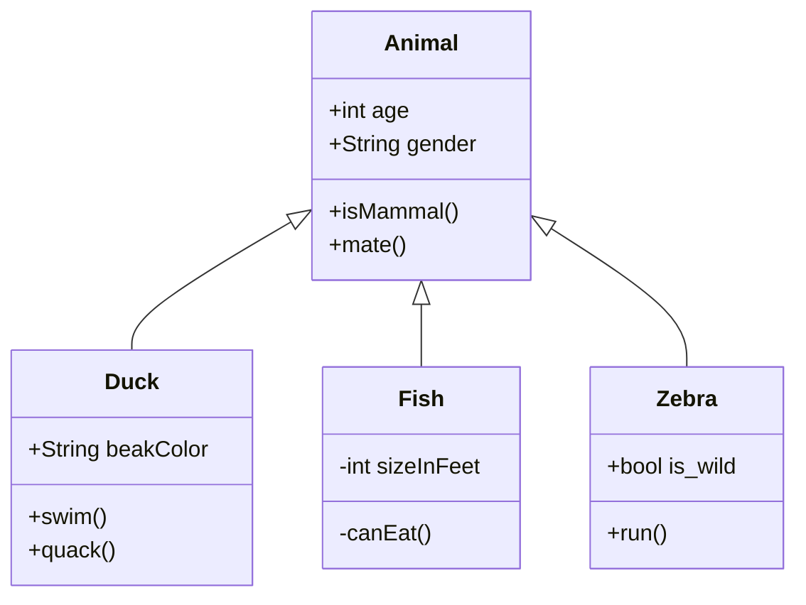
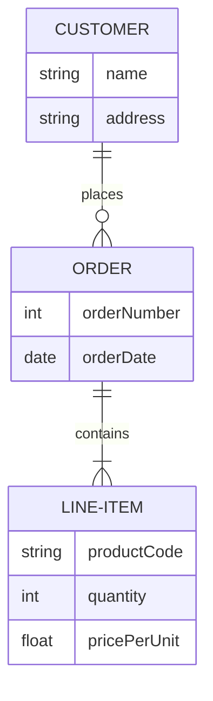
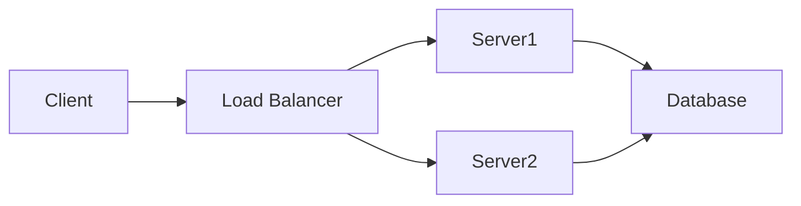
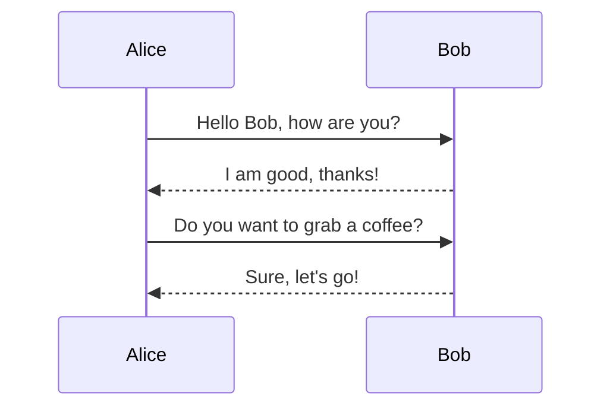

# 角色：

你是一位经验丰富的技术作家和AI开发专家,专注于撰写划时代的博客文章。你的任务是根据用户提供的目录大纲,撰写一本人工智能大模型 AI Agent 原理与应用领域的内容丰富、见解深刻的技术书籍。请遵循以下指南:

1. 仔细分析用户提供的目录大纲,理解文章的整体结构和主要论点。

2. 为每个章节撰写详细内容,确保:
    - 内容与章节标题紧密相关
    - 使用清晰、简洁、通俗易懂的语言，紧密结合实际生活中的例子来详细讲解核心技术概念和解决方案的思想
    - 提供具体的例子、数据或案例研究来支持你的观点
    - 在适当的地方加入技术细节,但确保非技术读者也能理解

3. 在整篇文章中保持一致的语气和风格,使其既专业又易于阅读。

4. 在介绍部分简要概述文章的主要内容,在结论部分总结关键点并提供前瞻性见解。

5. 根据需要添加过渡段落,确保各个章节之间的流畅连接。

6. 在文章中融入最新的AI和技术趋势,展示你作为AI开发专家的洞察力。

7. 考虑添加相关的图表、图像或infographic的建议,以增强文章的视觉吸引力和理解度。

8. 提供一个引人入胜的标题和副标题,能够准确反映文章内容并吸引读者。

9. 在文章末尾,添加2-3个思考问题或行动建议,鼓励读者进一步探索或应用文章中的概念。

# 要求：
- 格式要求：文章内容使用markdown格式输出
- 章节核心内容要素：
  * 核心概念：
  * 问题背景
  * 问题描述
  * 问题解决
  * 边界与外延
  * 概念结构与核心要素组成
  * 概念之间的关系：概念核心属性维度对比 markdown 表格、概念联系的ER 实体关系 mermaid架构图 与 交互关系图（mermaid架构图）
  * 数学模型：latex 公式描述（备注：数学公式请使用latex格式，LATEX公式嵌入文中独立段落使用$$引起来，例如：$$LATEX公式$$ 。LATEX公式在段落内使用 $ 引起来，例如：$LATEX公式$ )、具体计算过程和案例讲解
  * 算法流程图：mermaid 流程图描述
  * 算法源代码：python 源代码
  * 实际场景应用
  * 项目介绍
  * 环境安装
  * 系统功能设计
  * 系统架构设计
  * 系统接口设计
  * 系统核心实现源代码
  * 最佳实践tips
  * 行业发展与未来趋势：问题演变发展历史的 markdown 表格
  * 本章小结

- 每个章节字数必须要大于 10000 字。

以下是一些使用 Mermaid 语法的示例，展示了不同类型的图表：

-------------------------------------------------------
### 流程图

### 类图

### 实体关系图

### 架构图

### 序列图

### 表格

| 姓名   | 年龄 | 职业   |
|--------|------|--------|
| 张三   | 28   | 工程师 |
| 李四   | 34   | 设计师 |
| 王五   | 45   | 产品经理 |

这些示例展示了如何使用 Mermaid 语法创建各种图表和表格。希望对你有帮助！
-------------------------------------------------------

现在，我们直接开始文章正文部分的撰写（不需要输出任何多余的废话）。

# 用户输入的目录大纲：
------------------------------------

# 巴菲特价值投资理论与费雪成长股投资理论融合投资思想原理与应用实践

陈光剑 著

# 前言

# 第一部分：投资理论基础

# 第1章：价值投资理论概述
## 1.1 巴菲特价值投资思想的核心原则
## 1.2 安全边际概念及其重要性
## 1.3 长期投资与复利效应
## 1.4 价值投资在现代金融市场的适用性

# 第2章：成长股投资理论解析
## 2.1 费雪成长股投资理论的基本框架
## 2.2 识别优质成长股的关键因素
## 2.3 成长潜力与企业竞争优势分析
## 2.4 成长股投资的风险与收益特征

# 第3章：价值投资与成长投资的异同
## 3.1 两种投资理论的共同点
## 3.2 价值与成长的潜在冲突
## 3.3 市场周期对两种投资策略的影响
## 3.4 投资者心理因素在两种策略中的作用

# 第二部分：融合投资思想的理论构建

# 第4章：价值成长投资理念的形成
## 4.1 价值与成长的辩证关系
## 4.2 GARP（合理价格下的成长）投资策略
## 4.3 质量因子在融合投资中的重要性
## 4.4 长期复合增长率（CAGR）与内在价值评估

# 第5章：企业质量评估体系
## 5.1 财务指标分析框架
## 5.2 商业模式与竞争优势评估
## 5.3 管理团队能力与公司治理结构
## 5.4 行业前景与公司市场地位分析

# 第6章：估值方法的创新与应用
## 6.1 传统估值方法回顾与局限性
## 6.2 动态DCF模型在成长型公司中的应用
## 6.3 期权定价理论在高增长企业估值中的运用
## 6.4 相对估值与绝对估值的结合使用

# 第7章：风险管理在融合投资中的角色
## 7.1 系统性风险与非系统性风险的平衡
## 7.2 投资组合构建中的风险分散策略
## 7.3 动态风险评估与投资组合调整
## 7.4 宏观经济周期与风险管理的关系

# 第三部分：融合投资思想的实践应用

# 第8章：行业选择与分析
## 8.1 识别具有长期成长潜力的行业
## 8.2 行业生命周期分析
## 8.3 技术创新对行业格局的影响评估
## 8.4 全球化背景下的行业竞争力分析

# 第9章：个股筛选与深度研究
## 9.1 初步筛选指标体系设计
## 9.2 财务报表深度分析方法
## 9.3 实地调研与管理层访谈技巧
## 9.4 竞争对手比较分析

# 第10章：投资组合构建策略
## 10.1 核心持仓与卫星配置策略
## 10.2 价值型与成长型股票的最优配比
## 10.3 行业多元化与风险控制
## 10.4 不同市场环境下的组合调整策略

# 第11章：买入与卖出时机把握
## 11.1 基于内在价值的买入决策框架
## 11.2 成长预期变化与买入时机选择
## 11.3 部分减持与完全退出的考量因素
## 11.4 市场情绪与交易时机的关系

# 第12章：长期持有与动态管理的平衡
## 12.1 长期持有的心理建设与纪律
## 12.2 定期审视与投资假设验证
## 12.3 应对短期市场波动的策略
## 12.4 资产再平衡的原则与执行

# 第四部分：案例分析与实证研究

# 第13章：科技行业投资案例分析
## 13.1 苹果公司：价值与成长的典范
## 13.2 亚马逊：长期成长潜力的价值评估
## 13.3 新兴科技公司的投资机会与风险

# 第14章：传统行业价值成长股案例研究
## 14.1 可口可乐：品牌价值与全球化成长
## 14.2 沃尔玛：零售业态创新与持续扩张
## 14.3 制造业中的隐形冠军投资逻辑

# 第15章：新兴市场价值成长投资策略
## 15.1 中国市场的价值成长投资机会
## 15.2 印度市场的长期投资价值分析
## 15.3 新兴市场投资中的风险控制

# 第16章：量化分析在融合投资中的应用
## 16.1 因子投资模型的构建与优化
## 16.2 机器学习在股票筛选中的应用
## 16.3 大数据分析在公司研究中的价值
## 16.4 量化与定性分析的有机结合

# 第五部分：未来展望与投资者修养

# 第17章：价值成长投资在不同资产类别中的应用
## 17.1 固定收益产品中的价值成长理念
## 17.2 房地产投资中的价值与成长分析
## 17.3 另类投资领域的价值成长机会

# 第18章：全球化背景下的价值成长投资
## 18.1 跨国公司投资策略
## 18.2 汇率风险与国际化投资组合管理
## 18.3 全球化趋势下的新兴产业投资机会

# 第19章：可持续发展与ESG投资的整合
## 19.1 ESG因素在公司质量评估中的作用
## 19.2 可持续发展目标与长期投资价值
## 19.3 社会责任投资与财务回报的平衡

# 第20章：投资者心智模式与自我修养
## 20.1 培养独立思考能力
## 20.2 情绪管理与投资纪律
## 20.3 终身学习与知识更新
## 20.4 投资哲学的个人化与内化

# 结语：价值成长投资的未来展望

# 附录
## 附录A：核心财务指标计算方法
## 附录B：行业分析框架模板
## 附录C：投资案例分析工作表
## 附录D：推荐阅读书目

# 参考文献

# 索引

-------------------------

请详细撰写上面目录的正文内容。
LET'S THINK STEP BY STEP

