# 巴菲特价值投资理论与费雪成长股投资理论融合投资思想原理与应用实践


陈光剑 著

# 前言

 
在当今复杂多变的金融市场中，投资者面临着前所未有的机遇与挑战。随着全球经济的快速发展和科技的不断进步，传统的投资理论和方法正在经受着严峻的考验。在这样的背景下，如何在保护资本的同时实现长期稳健的收益增长，成为了每一位serious投资者的核心追求。

本书旨在探讨两种经典投资理论——巴菲特的价值投资理论和菲利普·费雪的成长股投资理论——的融合与创新应用。这两种理论虽然在投资哲学和具体操作上存在一些差异，但它们都立足于对企业基本面的深入分析，强调长期投资的重要性，并致力于在合理估值的基础上获取超额回报。

巴菲特的价值投资理论强调以低于内在价值的价格购买优质公司的股票，并耐心等待市场认可其真实价值。这种方法注重安全边际，有助于降低投资风险，但在快速变化的市场环境中可能错过一些高增长的投资机会。

另一方面，费雪的成长股投资理论则聚焦于寻找具有卓越增长潜力的公司，即使这些公司的当前估值看似较高。这种方法能够捕捉到创新型企业和新兴行业的投资机会，但也面临着估值风险和成长预期不确定性的挑战。

本书提出的融合投资思想，旨在汲取这两种理论的精华，构建一个更加全面和适应性强的投资框架。我们将探讨如何在保持价值投资稳健本质的同时，融入成长投资的动态视角，以应对现代金融市场的复杂性和不确定性。

具体而言，本书将分为五个部分展开讨论：

第一部分着重介绍价值投资和成长股投资的基本理论，为读者奠定坚实的概念基础。我们将深入分析这两种投资理论的核心原则、优势和局限性，并探讨它们在现代金融市场中的适用性。

第二部分聚焦于融合投资思想的理论构建。我们将详细讨论如何将价值和成长的概念有机结合，构建一个全面的企业质量评估体系，创新估值方法，并在此基础上制定有效的风险管理策略。

第三部分将理论付诸实践，深入探讨融合投资思想在实际投资过程中的应用。从行业选择、个股筛选到投资组合构建，我们将提供详细的操作指南和策略建议，帮助投资者在复杂的市场环境中做出明智的决策。

第四部分通过丰富的案例分析和实证研究，展示融合投资思想在不同行业和市场环境下的实际应用效果。我们将剖析科技巨头、传统行业龙头以及新兴市场企业的投资案例，并探讨量化分析在融合投资中的创新应用。

最后，第五部分展望未来，讨论融合投资思想在不同资产类别中的应用前景，探索全球化背景下的投资机会，以及如何将可持续发展和ESG因素纳入投资决策过程。我们还将强调投资者心智模式和自我修养的重要性，为读者提供全面的投资智慧。

本书旨在为专业投资者、财务顾问、商学院学生以及对投资理论和实践感兴趣的读者提供一个全面、深入且实用的投资指南。通过融合巴菲特和费雪的投资智慧，我们希望能够帮助读者在瞬息万变的金融市场中构建一个更加稳健、灵活且富有洞察力的投资体系。

在当前全球经济面临诸多不确定性的背景下，掌握融合投资思想将使投资者能够更好地应对市场波动，把握长期投资机会，并在保护资本的同时实现可持续的财富增长。让我们携手共同探索这一激动人心的投资新领域，开启智慧投资之旅！

陈光剑
2025年2月1日于北京


# 第一部分：投资理论基础

# 第1章：价值投资理论概述

价值投资是一种基于深入分析和理性决策的投资方法，其核心思想是以低于其内在价值的价格购买优质资产。这种投资理念最早由本杰明·格雷厄姆提出，后来由沃伦·巴菲特进一步发展和完善，成为现代投资学中最具影响力的理论之一。

## 1.1 巴菲特价值投资思想的核心原则

巴菲特的价值投资思想建立在几个关键原则之上，这些原则不仅指导着他的投资决策，也为全球countless投资者提供了宝贵的指导。

### 1.1.1 理解企业

* 核心概念：深入了解企业的业务模式、竞争优势和长期发展前景。

* 问题背景：在复杂多变的市场环境中，许多投资者倾向于追逐短期市场趋势或依赖表面财务指标，而忽视了对企业本质的理解。

* 问题描述：如何在信息爆炸的时代，有效地分析和理解一家企业的真实情况？

* 问题解决：
    1. 全面研究企业的产品和服务
    2. 分析企业在行业中的竞争地位
    3. 评估管理团队的能力和诚信
    4. 研究企业的财务报表和现金流情况
    5. 考察企业的长期增长潜力和可持续性

* 边界与外延：理解企业不仅限于财务分析，还包括对行业动态、技术趋势、监管环境等宏观因素的把握。

### 1.1.2 寻找护城河

* 核心概念：识别并投资于具有持久竞争优势（即"护城河"）的企业。

* 问题背景：在激烈的市场竞争中，企业的竞争优势往往是短暂的。持久的竞争优势能够帮助企业在长期内保持盈利能力。

* 问题描述：如何识别和评估企业的护城河？

* 问题解决：
    1. 分析品牌价值和客户忠诚度
    2. 评估规模经济和网络效应
    3. 考察专利和知识产权保护
    4. 研究转换成本和锁定效应
    5. 分析独特的企业文化和管理体系

* 边界与外延：护城河的概念可以扩展到新兴行业和技术型企业，但需要考虑行业特性和技术变革的影响。

### 1.1.3 长期持有

* 核心概念：对优质企业进行长期投资，而非频繁交易。

* 问题背景：市场短期波动和噪音often导致投资者过度交易，增加成本并降低回报。

* 问题描述：如何在市场波动中保持长期投资的纪律？

* 问题解决：
    1. 建立坚实的投资理念和方法论
    2. 关注企业的基本面而非短期市场波动
    3. 定期复盘投资决策，验证投资假设
    4. 控制情绪，避免受市场情绪影响
    5. 培养耐心，给予优质企业足够的时间成长

* 边界与外延：长期持有并不意味着永不调整，需要根据基本面变化适时调整投资组合。

### 1.1.4 概念结构与核心要素组成

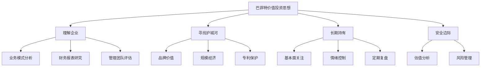

### 1.1.5 概念之间的关系

| 概念 | 理解企业 | 寻找护城河 | 长期持有 | 安全边际 |
|------|----------|------------|----------|----------|
| 理解企业 | - | 高度相关 | 直接支持 | 基础要素 |
| 寻找护城河 | 高度相关 | - | 强化理由 | 增强保障 |
| 长期持有 | 直接支持 | 强化理由 | - | 降低风险 |
| 安全边际 | 基础要素 | 增强保障 | 降低风险 | - |

### 1.1.6 投资决策流程

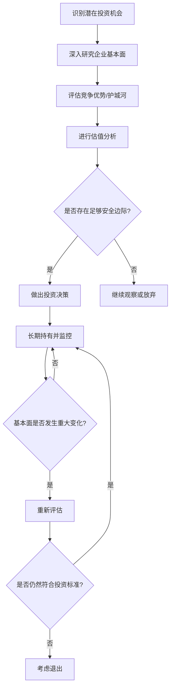

## 1.2 安全边际概念及其重要性

安全边际是价值投资理论中最为核心的概念之一，它为投资决策提供了一个重要的保护机制，有助于降低投资风险并提高长期回报。

* 核心概念：安全边际是指一项投资的市场价格与其估计内在价值之间的差距。

* 问题背景：金融市场的不确定性和投资者的有限理性often导致资产定价偏离其真实价值，为具有耐心和洞察力的投资者创造了机会。

* 问题描述：如何确定合适的安全边际，并在实际投资中应用这一概念？

* 问题解决：
    1. 进行深入的基本面分析，估算企业的内在价值
    2. 考虑行业特性和企业风险，确定所需的安全边际比例
    3. 耐心等待市场提供足够的安全边际
    4. 在安全边际充足时果断行动
    5. 持续监控投资，确保安全边际的持续性

* 数学模型：

假设一家企业的估计内在价值为V，当前市场价格为P，则安全边际（SM）可表示为：

$$ SM = \frac{V - P}{P} \times 100\% $$

例如，如果一家企业的估计内在价值为100元，而当前市场价格为80元，则安全边际为：

$$ SM = \frac{100 - 80}{80} \times 100\% = 25\% $$

这意味着投资者有25%的安全边际来抵御潜在的估值错误或不利的市场变动。

* 算法流程：

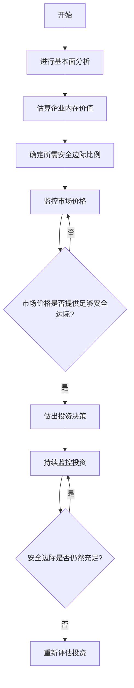

* 实际场景应用：

考虑一家科技公司，通过深入分析其财务报表、增长前景和竞争地位，估算其内在价值为每股100元。考虑到行业的快速变化和潜在风险，投资者决定要求30%的安全边际。因此，只有当股价跌至70元或以下时，投资者才会考虑购买。

这种方法不仅提供了对潜在损失的缓冲，还增加了获得超额回报的可能性。如果市场最终认可了公司的真实价值，投资者可能会获得显著的资本增值。

## 1.3 长期投资与复利效应

长期投资是巴菲特价值投资理论的另一个核心支柱，它与复利效应紧密相连，共同构成了创造巨大财富的关键机制。

* 核心概念：长期投资指持有优质资产多年甚至几十年，让时间和复利效应充分发挥作用。

* 问题背景：在短期主义盛行的金融市场中，许多投资者过于关注短期波动和即时收益，忽视了长期复合增长的强大力量。

* 问题描述：如何在实际投资中践行长期投资理念，并充分利用复利效应？

* 问题解决：
    1. 选择具有持续竞争优势和增长潜力的企业
    2. 制定明确的长期投资计划和目标
    3. 培养耐心和纪律，抵制频繁交易的冲动
    4. 理解并利用复利效应，让收益在时间中倍增
    5. 定期复盘但避免过度干预，给予投资时间成长

* 数学模型：

复利增长可以用以下公式表示：

$$ FV = PV \times (1 + r)^n $$

其中：
- FV 是未来价值
- PV 是现值
- r 是年复合增长率
- n 是年数

例如，假设初始投资10,000元，年复合增长率为15%，20年后的价值将是：

$$ FV = 10,000 \times (1 + 0.15)^{20} = 163,665.37 $$

这展示了复利效应的强大力量，初始投资在20年内增长了16倍多。

* 算法流程：

```python
def compound_growth(initial_investment, annual_rate, years):
    return initial_investment * (1 + annual_rate) ** years

def main():
    initial_investment = 10000
    annual_rate = 0.15
    years = 20
    
    final_value = compound_growth(initial_investment, annual_rate, years)
    
    print(f"Initial investment: ${initial_investment}")
    print(f"Annual growth rate: {annual_rate*100}%")
    print(f"Investment period: {years} years")
    print(f"Final value: ${final_value:.2f}")
    print(f"Total growth: {(final_value/initial_investment - 1)*100:.2f}%")

if __name__ == "__main__":
    main()
```

这段代码计算了长期投资的复利效应，展示了初始投资如何随时间增长。

* 实际场景应用：

考虑投资者在1980年投资1万美元购买伯克希尔·哈撒韦公司的股票。截至2021年，这笔投资已经增长到约4,000万美元，年复合增长率约为20%。这个例子生动地展示了长期投资结合优质资产的威力。

然而，重要的是要认识到，并非所有长期投资都能获得如此惊人的回报。关键在于选择具有持久竞争优势的企业，并在合理的估值水平进行投资。

## 1.4 价值投资在现代金融市场的适用性

随着金融市场的不断发展和变革，价值投资理论的适用性一直是学术界和投资界热议的话题。在高频交易、量化投资盛行的今天，传统的价值投资方法是否仍然有效？让我们深入探讨这个问题。

* 核心概念：价值投资在现代金融市场中的适用性指的是这种投资方法在当前市场环境下的有效性和实用性。

* 问题背景：技术进步、市场结构变化、信息传播速度加快等因素似乎对传统的价值投资方法构成了挑战。

* 问题描述：在高度效率的现代金融市场中，价值投资还能够产生超额回报吗？如何调整和优化价值投资策略以适应新的市场环境？

* 问题解决：
    1. 深入分析市场效率与价值投资的关系
    2. 探讨信息技术对价值投资的影响
    3. 研究价值投资在不同市场周期中的表现
    4. 考察价值投资与其他投资策略的结合
    5. 提出适应现代金融市场的价值投资新方法

* 边界与外延：
    - 价值投资的适用性可能因资产类别、市场状况和投资者能力而异
    - 需要考虑新兴市场、另类资产等领域的价值投资机会
    - 探讨ESG因素、人工智能等新趋势对价值投资的影响

* 概念结构与核心要素组成：

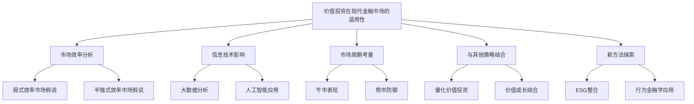

* 概念之间的关系：

| 概念 | 市场效率 | 信息技术 | 市场周期 | 策略结合 | 新方法探索 |
|------|----------|----------|----------|----------|------------|
| 市场效率 | - | 高度相关 | 中度相关 | 低度相关 | 中度相关 |
| 信息技术 | 高度相关 | - | 低度相关 | 高度相关 | 高度相关 |
| 市场周期 | 中度相关 | 低度相关 | - | 中度相关 | 中度相关 |
| 策略结合 | 低度相关 | 高度相关 | 中度相关 | - | 高度相关 |
| 新方法探索 | 中度相关 | 高度相关 | 中度相关 | 高度相关 | - |

* 数学模型：

考虑一个简化的模型来评估价值投资在不同市场效率下的表现：

假设 $R_v$ 为价值投资策略的回报率，$E$ 为市场效率指数（0 ≤ E ≤ 1，1表示完全有效市场），$α$ 为价值投资产生的超额回报，$R_m$ 为市场平均回报率。则可以表示为：

$$ R_v = R_m + α(1-E) $$

这个模型表明，随着市场效率的提高（E接近1），价值投资产生超额回报的能力会降低。

* 算法流程：

```python
def value_investing_performance(market_efficiency, alpha, market_return):
    return market_return + alpha * (1 - market_efficiency)

def simulate_market_conditions(num_simulations):
    results = []
    for _ in range(num_simulations):
        market_efficiency = random.uniform(0, 1)
        alpha = random.uniform(0, 0.1)  # 假设最大超额回报为10%
        market_return = random.uniform(-0.2, 0.2)  # 假设市场回报在-20%到20%之间
        
        value_return = value_investing_performance(market_efficiency, alpha, market_return)
        results.append((market_efficiency, value_return - market_return))
    
    return results

def analyze_results(results):
    efficiencies, outperformance = zip(*results)
    plt.scatter(efficiencies, outperformance)
    plt.xlabel('市场效率')
    plt.ylabel('价值投资超额回报')
    plt.title('价值投资表现vs市场效率')
    plt.show()

results = simulate_market_conditions(1000)
analyze_results(results)
```

这段代码模拟了不同市场效率下价值投资的表现，并通过图表展示了结果。

* 实际场景应用：

1. 高频交易环境：
   在高频交易占主导的市场中，价值投资者可能需要更长的时间周期来实现其投资理念。然而，高频交易也可能造成短期的市场错误定价，为价值投资者创造机会。

2. 新兴市场：
   在信息不够透明、分析师覆盖不足的新兴市场中，深入的基本面分析可能会发现被低估的优质公司，价值投资仍有较大的适用空间。

3. 科技行业：
   传统的价值投资可能难以准确评估快速成长的科技公司。然而，通过结合成长因素和调整估值方法，价值投资理念仍可应用于选择具有强大竞争优势和合理估值的科技公司。

4. ESG投资：
   将环境、社会和治理因素纳入价值投资框架，可以帮助投资者识别长期可持续发展的公司，这是价值投资在现代金融市场中的一个重要发展方向。

5. 被动投资兴起：
   尽管指数基金和ETF的普及对主动管理构成了挑战，但这也可能导致某些股票被错误定价，为价值投资者创造机会。

总结来看，尽管现代金融市场发生了巨大变化，价值投资的核心理念——以合理价格购买优质资产——仍然适用。然而，价值投资者需要与时俱进，利用新技术、新方法来增强分析能力，同时保持耐心和纪律，以在长期中实现优异的投资回报。


# 第2章：成长股投资理论解析

成长股投资是另一种广受欢迎的投资策略，其核心是寻找和投资那些具有高于平均水平增长潜力的公司。这种投资方法最早由菲利普·费雪（Philip Fisher）系统化，并在20世纪后半叶得到广泛应用和发展。本章将深入探讨成长股投资理论的基本框架、关键因素以及在现代金融市场中的应用。

## 2.1 费雪成长股投资理论的基本框架

费雪的成长股投资理论为投资者提供了一个系统的方法来识别和评估具有卓越增长潜力的公司。这个框架不仅影响了众多投资者，也为现代投资理论的发展做出了重要贡献。

* 核心概念：费雪理论强调通过深入研究和分析来识别具有持续高增长潜力的公司，并长期持有这些公司的股票。

* 问题背景：在20世纪中期，随着科技和创新驱动的经济快速发展，传统的价值投资方法难以准确评估那些高增长但当前盈利较低的公司。

* 问题描述：如何系统地识别和评估具有长期增长潜力的公司？如何在高估值风险和高增长潜力之间找到平衡？

* 问题解决：
    1. 建立全面的公司调研方法
    2. 关注公司的创新能力和市场拓展潜力
    3. 评估管理团队的质量和公司文化
    4. 分析公司的竞争优势和行业地位
    5. 考察公司的财务健康状况和盈利能力

* 边界与外延：
    - 费雪理论主要适用于成长型公司，可能不适合所有行业和公司类型
    - 需要考虑宏观经济环境和行业周期对公司增长的影响
    - 理论的应用需要投资者具备深入的行业知识和分析能力

* 概念结构与核心要素组成：

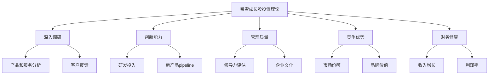

* 概念之间的关系：

| 概念 | 深入调研 | 创新能力 | 管理质量 | 竞争优势 | 财务健康 |
|------|----------|----------|----------|----------|----------|
| 深入调研 | - | 高度相关 | 中度相关 | 高度相关 | 中度相关 |
| 创新能力 | 高度相关 | - | 中度相关 | 高度相关 | 低度相关 |
| 管理质量 | 中度相关 | 中度相关 | - | 高度相关 | 中度相关 |
| 竞争优势 | 高度相关 | 高度相关 | 高度相关 | - | 中度相关 |
| 财务健康 | 中度相关 | 低度相关 | 中度相关 | 中度相关 | - |

* 数学模型：

费雪没有提出具体的数学模型，但我们可以构建一个简化的模型来评估公司的成长潜力：

假设 G 为公司的综合成长潜力指数，R 为收入增长率，I 为创新指数（0-1），M 为管理质量指数（0-1），C 为竞争优势指数（0-1），F 为财务健康指数（0-1）。则：

$$ G = w_1R + w_2I + w_3M + w_4C + w_5F $$

其中 $w_1, w_2, w_3, w_4, w_5$ 为各因素的权重，且 $\sum_{i=1}^5 w_i = 1$

* 算法流程：

```python
def calculate_growth_potential(revenue_growth, innovation, management, competitive_advantage, financial_health, weights):
    return (
        weights[0] * revenue_growth +
        weights[1] * innovation +
        weights[2] * management +
        weights[3] * competitive_advantage +
        weights[4] * financial_health
    )

def evaluate_company(company_data, weights):
    growth_potential = calculate_growth_potential(
        company_data['revenue_growth'],
        company_data['innovation'],
        company_data['management'],
        company_data['competitive_advantage'],
        company_data['financial_health'],
        weights
    )
    return growth_potential

# 示例使用
company_data = {
    'revenue_growth': 0.25,
    'innovation': 0.8,
    'management': 0.9,
    'competitive_advantage': 0.7,
    'financial_health': 0.85
}

weights = [0.3, 0.2, 0.2, 0.15, 0.15]

growth_potential = evaluate_company(company_data, weights)
print(f"公司成长潜力指数：{growth_potential:.2f}")
```

这个算法展示了如何根据费雪理论的核心要素评估公司的成长潜力。

* 实际场景应用：

1. 科技创新公司：
   对于像特斯拉这样的公司，费雪理论可以帮助投资者评估其创新能力（如电池技术、自动驾驶）、管理团队的远见（如马斯克的领导力）、竞争优势（品牌价值、技术领先）等因素，即使在公司尚未盈利的阶段也能识别其长期增长潜力。

2. 生物科技公司：
   在评估生物科技公司时，费雪理论强调研究其药物研发管线、临床试验进展、管理团队的专业背景等，这些因素对公司的长期成功至关重要。

3. 软件即服务（SaaS）公司：
   对于快速增长的SaaS公司，费雪理论会关注其客户获取成本、续约率、产品创新速度等指标，这些都是预测未来增长的关键因素。

4. 新兴市场公司：
   在评估新兴市场的成长型公司时，费雪理论特别强调深入的实地调研和对当地市场动态的理解，这可能比单纯依赖财务报表更能发现潜在的投资机会。

5. 消费品牌公司：
   对于像星巴克这样的公司，费雪理论会关注其品牌价值、国际扩张策略、产品创新能力等，这些因素支撑了公司的长期增长。

费雪的成长股投资理论为投资者提供了一个全面的框架来评估公司的长期增长潜力。通过深入研究公司的各个方面，投资者可以识别那些真正具有持续竞争优势和增长潜力的公司。然而，这种方法也需要投资者具备深厚的行业知识和分析能力，同时要有耐心等待投资理念的实现。在现代金融市场中，费雪理论仍然是许多成功投资者的重要指导原则。

## 2.2 识别优质成长股的关键因素

在成长股投资中，准确识别具有持续高增长潜力的公司是成功的关键。本节将深入探讨识别优质成长股的关键因素，这些因素不仅包括财务指标，还涵盖了质性分析的多个方面。

* 核心概念：优质成长股是指那些不仅当前增长速度快，而且能够在较长时期内保持高于行业平均水平增长的公司股票。

* 问题背景：在市场中，许多公司可能呈现出短期的高增长，但能够持续保持高增长的公司却相对稀少。投资者面临的挑战是如何从众多看似有潜力的公司中筛选出真正的长期赢家。

* 问题描述：哪些因素能够有效预示一家公司的长期增长潜力？如何系统地评估和比较不同公司的成长前景？* 问题解决：
    1. 分析公司的市场机会和总可寻址市场（TAM）
    2. 评估公司的创新能力和研发投入
    3. 考察公司的竞争优势和护城河
    4. 分析管理团队的质量和执行力
    5. 研究公司的财务健康状况和盈利能力
    6. 评估公司的扩张能力和规模化潜力
    7. 考虑行业趋势和宏观经济环境

* 边界与外延：
    - 不同行业和发展阶段的公司可能需要关注不同的关键因素
    - 需要考虑定性因素和定量因素的平衡
    - 关键因素可能随时间和市场环境变化而调整

* 概念结构与核心要素组成：

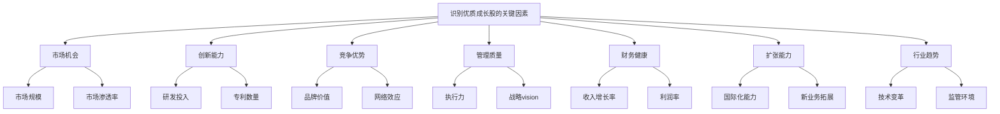

* 概念之间的关系：

| 因素 | 市场机会 | 创新能力 | 竞争优势 | 管理质量 | 财务健康 | 扩张能力 | 行业趋势 |
|------|----------|----------|----------|----------|----------|----------|----------|
| 市场机会 | - | 中度相关 | 高度相关 | 低度相关 | 中度相关 | 高度相关 | 高度相关 |
| 创新能力 | 中度相关 | - | 高度相关 | 中度相关 | 低度相关 | 中度相关 | 高度相关 |
| 竞争优势 | 高度相关 | 高度相关 | - | 中度相关 | 高度相关 | 高度相关 | 中度相关 |
| 管理质量 | 低度相关 | 中度相关 | 中度相关 | - | 中度相关 | 高度相关 | 低度相关 |
| 财务健康 | 中度相关 | 低度相关 | 高度相关 | 中度相关 | - | 中度相关 | 低度相关 |
| 扩张能力 | 高度相关 | 中度相关 | 高度相关 | 高度相关 | 中度相关 | - | 中度相关 |
| 行业趋势 | 高度相关 | 高度相关 | 中度相关 | 低度相关 | 低度相关 | 中度相关 | - |

* 数学模型：

我们可以构建一个综合评分模型来量化优质成长股的潜力：

设 S 为公司的综合成长潜力得分，各因素的得分为 f₁, f₂, ..., f₇（对应上述7个关键因素），权重为 w₁, w₂, ..., w₇。则：

$$ S = \sum_{i=1}^7 w_i \cdot f_i $$

其中， $\sum_{i=1}^7 w_i = 1$ 且 $0 \leq f_i \leq 10$

* 算法流程：

```python
def calculate_growth_score(factors, weights):
    if len(factors) != len(weights):
        raise ValueError("因素和权重数量必须相同")
    
    if abs(sum(weights) - 1) > 1e-6:
        raise ValueError("权重之和必须为1")
    
    return sum(f * w for f, w in zip(factors, weights))

def evaluate_company(company_data):
    factors = [
        company_data['market_opportunity'],
        company_data['innovation'],
        company_data['competitive_advantage'],
        company_data['management_quality'],
        company_data['financial_health'],
        company_data['expansion_capability'],
        company_data['industry_trends']
    ]
    
    weights = [0.2, 0.15, 0.15, 0.15, 0.1, 0.15, 0.1]
    
    score = calculate_growth_score(factors, weights)
    return score

# 示例使用
company_data = {
    'market_opportunity': 9,
    'innovation': 8,
    'competitive_advantage': 7,
    'management_quality': 8,
    'financial_health': 6,
    'expansion_capability': 7,
    'industry_trends': 9
}

growth_score = evaluate_company(company_data)
print(f"公司成长潜力得分：{growth_score:.2f}")
```

这个算法提供了一个框架来综合评估公司的成长潜力，可以根据具体情况调整权重和评分标准。

* 实际场景应用：

1. 科技巨头评估：
   以亚马逊为例，我们可以这样评估其关键因素：
    - 市场机会：电子商务、云计算、人工智能等多个巨大市场 (9/10)
    - 创新能力：持续的技术创新，如AWS、Alexa等 (9/10)
    - 竞争优势：规模经济、网络效应、品牌认知度 (9/10)
    - 管理质量：杰夫·贝索斯的远见和执行力 (9/10)
    - 财务健康：强劲的收入增长和现金流 (8/10)
    - 扩张能力：成功进入多个新领域 (9/10)
    - 行业趋势：数字化转型的全球趋势 (9/10)

2. 新兴生物科技公司：
   对于一家专注于基因治疗的初创公司：
    - 市场机会：潜在的巨大市场，但风险也高 (8/10)
    - 创新能力：前沿的研究成果和专利 (9/10)
    - 竞争优势：独特的技术平台，但尚未完全验证 (7/10)
    - 管理质量：经验丰富的科学家和管理团队 (8/10)
    - 财务健康：烧钱阶段，需要持续融资 (5/10)
    - 扩张能力：技术具有广泛应用潜力 (7/10)
    - 行业趋势：个性化医疗的大趋势 (9/10)

3. 传统行业的转型企业：
   考虑一家正在数字化转型的零售企业：
    - 市场机会：线上线下融合的新零售市场 (7/10)
    - 创新能力：数字化创新，但不是核心优势 (6/10)
    - 竞争优势：强大的品牌和客户基础 (8/10)
    - 管理质量：新老管理层的融合 (7/10)
    - 财务健康：稳定的现金流，但增长放缓 (7/10)
    - 扩张能力：通过数字化开拓新市场 (7/10)
    - 行业趋势：零售业态的持续演变 (8/10)

在实际应用中，投资者需要根据公司所处的行业、发展阶段和具体情况来调整各因素的权重和评分标准。同时，这种评估应该是动态的，需要随着公司和市场的变化而不断更新。

识别优质成长股是一个复杂的过程，需要综合考虑多个因素，并将定量分析与定性判断相结合。通过系统化的评估框架，投资者可以更客观地比较不同公司的成长潜力，从而做出更明智的投资决策。然而，我们也要认识到，即使是最全面的分析也无法完全预测未来，因此在投资决策中保持适度的谦逊和持续学习的态度同样重要。

## 2.3 成长潜力与企业竞争优势分析

在成长股投资中，准确评估公司的成长潜力和竞争优势是至关重要的。这两个因素不仅决定了公司能否实现持续高速增长，还影响着公司在竞争激烈的市场中的长期生存和发展能力。

* 核心概念：
    - 成长潜力：指公司在未来一定时期内保持高于行业平均水平增长的能力。
    - 企业竞争优势：指公司相对于竞争对手所具有的独特优势，使其能够在市场中获得持续的成功。

* 问题背景：在快速变化的商业环境中，许多公司可能在短期内展现出快速增长，但只有那些具有持续竞争优势的公司才能在长期保持高增长。

* 问题描述：如何有效地评估公司的长期成长潜力？哪些因素构成了企业的核心竞争优势？这些因素如何影响公司的长期成长能力？

* 问题解决：
    1. 分析公司的市场定位和增长战略
    2. 评估公司的创新能力和技术优势
    3. 考察公司的品牌价值和客户粘性
    4. 分析公司的规模经济和成本优势
    5. 评估公司的网络效应和生态系统
    6. 考虑公司的知识产权和专利保护
    7. 分析公司的人才优势和组织文化

* 边界与外延：
    - 成长潜力和竞争优势的评估需要考虑行业特性和宏观环境
    - 需要平衡短期增长和长期可持续性
    - 竞争优势可能随时间和技术变革而改变

* 概念结构与核心要素组成：

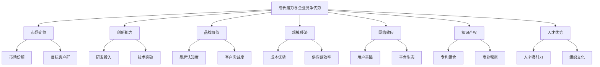

* 概念之间的关系：

| 因素 | 市场定位 | 创新能力 | 品牌价值 | 规模经济 | 网络效应 | 知识产权 | 人才优势 |
|------|----------|----------|----------|----------|----------|----------|----------|
| 市场定位 | - | 中度相关 | 高度相关 | 中度相关 | 中度相关 | 低度相关 | 低度相关 |
| 创新能力 | 中度相关 | - | 中度相关 | 低度相关 | 中度相关 | 高度相关 | 高度相关 |
| 品牌价值 | 高度相关 | 中度相关 | - | 中度相关 | 高度相关 | 低度相关 | 中度相关 |
| 规模经济 | 中度相关 | 低度相关 | 中度相关 | - | 高度相关 | 低度相关 | 低度相关 |
| 网络效应 | 中度相关 | 中度相关 | 高度相关 | 高度相关 | - | 低度相关 | 中度相关 |
| 知识产权 | 低度相关 | 高度相关 | 低度相关 | 低度相关 | 低度相关 | - | 中度相关 |
| 人才优势 | 低度相关 | 高度相关 | 中度相关 | 低度相关 | 中度相关 | 中度相关 | - |

* 数学模型：

我们可以构建一个综合评分模型来量化公司的成长潜力和竞争优势：

设 C 为公司的综合竞争力得分，各因素的得分为 f₁, f₂, ..., f₇（对应上述7个关键因素），权重为 w₁, w₂, ..., w₇。同时，考虑到行业增长率 G 和公司相对行业的增长溢价 P。则：

$$ C = (\sum_{i=1}^7 w_i \cdot f_i) \cdot (1 + G + P) $$

其中， $\sum_{i=1}^7 w_i = 1$，$0 \leq f_i \leq 10$，G 为行业年增长率，P 为公司相对行业的年增长溢价。

* 算法流程：

```python
def calculate_competitiveness_score(factors, weights, industry_growth, growth_premium):
    if len(factors) != len(weights):
        raise ValueError("因素和权重数量必须相同")
    
    if abs(sum(weights) - 1) > 1e-6:
        raise ValueError("权重之和必须为1")
    
    base_score = sum(f * w for f, w in zip(factors, weights))
    return base_score * (1 + industry_growth + growth_premium)

def evaluate_company_competitiveness(company_data, industry_growth):
    factors = [
        company_data['market_positioning'],
        company_data['innovation_capability'],
        company_data['brand_value'],
        company_data['economies_of_scale'],
        company_data['network_effects'],
        company_data['intellectual_property'],
        company_data['talent_advantage']
    ]
    
    weights = [0.15, 0.20, 0.15, 0.10, 0.15, 0.10, 0.15]
    
    growth_premium = company_data['growth_rate'] - industry_growth
    
    score = calculate_competitiveness_score(factors, weights, industry_growth, growth_premium)
    return score

# 示例使用
company_data = {
    'market_positioning': 8,
    'innovation_capability': 9,
    'brand_value': 7,
    'economies_of_scale': 6,
    'network_effects': 8,
    'intellectual_property': 7,
    'talent_advantage': 8,
    'growth_rate': 0.25  # 25% 年增长率
}

industry_growth = 0.10  # 10% 行业年增长率

competitiveness_score = evaluate_company_competitiveness(company_data, industry_growth)
print(f"公司竞争力得分：{competitiveness_score:.2f}")
```

这个算法提供了一个框架来综合评估公司的竞争优势和成长潜力，可以根据具体情况调整权重和评分标准。

* 实际场景应用：

1. 科技行业巨头：以苹果公司为例
    - 市场定位：高端消费电子和服务生态系统 (9/10)
    - 创新能力：持续的产品创新和技术突破 (9/10)
    - 品牌价值：全球最有价值品牌之一 (10/10)
    - 规模经济：强大的供应链管理和成本控制 (9/10)
    - 网络效应：iOS生态系统和服务平台 (9/10)
    - 知识产权：大量专利和独特设计 (9/10)
    - 人才优势：吸引和保留顶尖人才的能力 (9/10)

   假设行业增长率为8%，苹果的增长率为15%：
   ```python
   apple_data = {
       'market_positioning': 9,
       'innovation_capability': 9,
       'brand_value': 10,
       'economies_of_scale': 9,
       'network_effects': 9,
       'intellectual_property': 9,
       'talent_advantage': 9,
       'growth_rate': 0.15
   }
   industry_growth = 0.08
   apple_score = evaluate_company_competitiveness(apple_data, industry_growth)
   print(f"苹果公司竞争力得分：{apple_score:.2f}")
   ```

2. 新兴电动车公司：以特斯拉为例
    - 市场定位：高端电动车和可持续能源解决方案 (9/10)
    - 创新能力：电池技术和自动驾驶领域的领先者 (10/10)
    - 品牌价值：强大的品牌认知度和粉丝基础 (9/10)
    - 规模经济：正在快速扩大生产规模 (7/10)
    - 网络效应：充电网络和数据收集优势 (8/10)
    - 知识产权：大量电动车和电池相关专利 (9/10)
    - 人才优势：吸引顶尖工程师和创新人才 (9/10)

   假设行业增长率为20%，特斯拉的增长率为50%：
   ```python
   tesla_data = {
       'market_positioning': 9,
       'innovation_capability': 10,
       'brand_value': 9,
       'economies_of_scale': 7,
       'network_effects': 8,
       'intellectual_property': 9,
       'talent_advantage': 9,
       'growth_rate': 0.50
   }
   industry_growth = 0.20
   tesla_score = evaluate_company_competitiveness(tesla_data, industry_growth)
   print(f"特斯拉公司竞争力得分：{tesla_score:.2f}")
   ```

3. 传统零售转型：以沃尔玛为例
    - 市场定位：全球最大的零售商，正在向电商转型 (8/10)
    - 创新能力：在数字化转型和物流创新方面投入大 (7/10)
    - 品牌价值：强大的品牌认知度和信任度 (9/10)
    - 规模经济：巨大的采购和分销网络优势 (10/10)
    - 网络效应：正在构建线上线下融合的生态系统 (7/10)
    - 知识产权：在零售技术和流程方面有多项专利 (7/10)
    - 人才优势：正在加强技术人才的引进 (7/10)

   假设行业增长率为3%，沃尔玛的增长率为5%：
   ```python
   walmart_data = {
       'market_positioning': 8,
       'innovation_capability': 7,
       'brand_value': 9,
       'economies_of_scale': 10,
       'network_effects': 7,
       'intellectual_property': 7,
       'talent_advantage': 7,
       'growth_rate': 0.05
   }
   industry_growth = 0.03
   walmart_score = evaluate_company_competitiveness(walmart_data, industry_growth)
   print(f"沃尔玛公司竞争力得分：{walmart_score:.2f}")
   ```

这些示例展示了如何在不同行业和发展阶段的公司中应用成长潜力和竞争优势分析。值得注意的是，这种分析应该是动态的，需要定期更新以反映公司和市场的变化。

在实际投资决策中，投资者不仅需要关注公司当前的竞争优势，还要预测这些优势在未来是否可以持续。例如，技术变革可能迅速改变行业格局，使得原有的竞争优势变得不再重要。因此，对公司管理层的远见和适应能力的评估也是至关重要的。

此外，成长潜力和竞争优势的分析应该与估值考量相结合。一家具有强大竞争优势和高成长潜力的公司可能已经被市场高度认可，股价可能已经反映了这些正面因素。因此，投资者需要权衡公司的质量、成长潜力与当前估值水平，以做出明智的投资决策。

最后，It's crucial to注意到，没有任何分析方法可以完全消除投资风险。即使是最具竞争优势的公司也可能面临不可预见的挑战。因此，投资组合的多元化和持续的风险管理仍然是成长股投资策略中不可或缺的部分。

## 2.4 成长股投资的风险与收益特征

成长股投资虽然有潜力带来高回报，但同时也伴随着较高的风险。了解成长股投资的风险与收益特征对于投资者制定合适的投资策略和管理预期至关重要。

* 核心概念：
    - 成长股：预期未来盈利和收入增长率高于市场平均水平的公司股票。
    - 风险：投资可能出现亏损的概率和程度。
    - 收益：投资产生的财务回报。

* 问题背景：成长股往往表现出高波动性和高估值特征，这使得它们在不同市场环境下的表现差异很大。

* 问题描述：成长股投资具有哪些特有的风险和收益特征？如何权衡成长股投资的风险和潜在回报？

* 问题解决：
    1. 分析成长股的高波动性特征
    2. 评估高估值风险
    3. 考察成长预期不确定性
    4. 分析行业和技术变革风险
    5. 评估管理风险和公司治理问题
    6. 考虑成长股的潜在高回报
    7. 分析成长股在不同市场周期中的表现

* 边界与外延：
    - 成长股的风险和收益特征可能因行业、公司规模和发展阶段而异
    - 需要考虑宏观经济环境和市场情绪对成长股表现的影响
    - 风险和收益的评估应该是动态的，需要随时间调整

* 概念结构与核心要素组成：

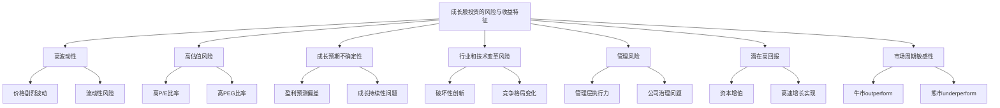

* 概念之间的关系：

| 特征 | 高波动性 | 高估值风险 | 成长预期不确定性 | 行业和技术变革风险 | 管理风险 | 潜在高回报 | 市场周期敏感性 |
|------|----------|------------|-------------------|----------------------|----------|------------|------------------|
| 高波动性 | - | 高度相关 | 高度相关 | 中度相关 | 中度相关 | 高度相关 | 高度相关 |
| 高估值风险 | 高度相关 | - | 高度相关 | 中度相关 | 低度相关 | 高度相关 | 高度相关 |
| 成长预期不确定性 | 高度相关 | 高度相关 | - | 高度相关 | 中度相关 | 高度相关 | 中度相关 |
| 行业和技术变革风险 | 中度相关 | 中度相关 | 高度相关 | - | 中度相关 | 中度相关 | 中度相关 |
| 管理风险 | 中度相关 | 低度相关 | 中度相关 | 中度相关 | - | 中度相关 | 低度相关 |
| 潜在高回报 | 高度相关 | 高度相关 | 高度相关 | 中度相关 | 中度相关 | - | 高度相关 |
| 市场周期敏感性 | 高度相关 | 高度相关 | 中度相关 | 中度相关 | 低度相关 | 高度相关 | - |

* 数学模型：

我们可以构建一个简化模型来描述成长股的风险-收益特征：

假设 R 为预期收益率，Rf 为无风险利率，β 为股票的贝塔系数（衡量系统性风险），g 为预期增长率，ε 为公司特定风险溢价。则：

$$ R = R_f + \beta(R_m - R_f) + g + \varepsilon $$

其中，(Rm - Rf) 为市场风险溢价。

同时，我们可以用夏普比率来衡量风险调整后的收益：

$$ Sharpe Ratio = \frac{R - R_f}{\sigma} $$

其中，σ 为收益率的标准差，衡量总风险。

* 算法流程：

```python
import numpy as np

def calculate_growth_stock_metrics(risk_free_rate, market_return, beta, expected_growth_rate, company_specific_risk, volatility):
    # 计算预期收益率
    expected_return = risk_free_rate + beta * (market_return - risk_free_rate) + expected_growth_rate + company_specific_risk
    
    # 计算夏普比率
    sharpe_ratio = (expected_return - risk_free_rate) / volatility
    
    return expected_return, sharpe_ratio

def simulate_growth_stock_performance(num_simulations, **params):
    returns = []
    sharpe_ratios = []
    
    for _ in range(num_simulations):
        # 模拟增长率的不确定性
        growth_rate = np.random.normal(params['expected_growth_rate'], params['growth_volatility'])
        
        # 模拟公司特定风险
        specific_risk = np.random.normal(0, params['specific_risk_volatility'])
        
        return_, sharpe = calculate_growth_stock_metrics(
            params['risk_free_rate'],
            params['market_return'],
            params['beta'],
            growth_rate,
            specific_risk,
            params['volatility']
        )
        
        returns.append(return_)
        sharpe_ratios.append(sharpe)
    
    return returns, sharpe_ratios

# 示例使用
params = {
    'risk_free_rate': 0.02,
    'market_return': 0.08,
    'beta': 1.5,
    'expected_growth_rate': 0.15,
    'growth_volatility': 0.05,
    'specific_risk_volatility': 0.03,
    'volatility': 0.25
}

num_simulations = 10000
returns, sharpe_ratios = simulate_growth_stock_performance(num_simulations, **params)

print(f"平均预期收益率: {np.mean(returns):.2%}")
print(f"收益率标准差: {np.std(returns):.2%}")
print(f"平均夏普比率: {np.mean(sharpe_ratios):.2f}")
print(f"夏普比率标准差: {np.std(sharpe_ratios):.2f}")
```

这个算法模拟了成长股的风险和收益特征，考虑了成长预期的不确定性和公司特定风险。

* 实际场景应用：

1. 高科技成长股：以云计算公司为例
    - 高波动性：股价可能在短期内大幅波动，反映市场对公司前景的迅速变化的看法。
    - 高估值风险：P/E 比率可能达到 100 或更高，反映市场对未来增长的高预期。
    - 成长预期不确定性：收入可能以 40%+ 的年率增长，但持续性存疑。
    - 行业和技术变革风险：面临来自大型科技公司和新兴创新者的激烈竞争。
    - 管理风险：依赖关键技术人才和管理团队的战略执行力。
    - 潜在高回报：成功案例可能在几年内实现股价数倍增长。
    - 市场周期敏感性：在牛市中可能大幅跑赢大盘，但在熊市中可能遭遇严重抛售。

   ```python
   tech_growth_params = {
       'risk_free_rate': 0.02,
       'market_return': 0.08,
       'beta': 2.0,
       'expected_growth_rate': 0.40,
       'growth_volatility': 0.15,
       'specific_risk_volatility': 0.10,
       'volatility': 0.50
   }
   
   tech_returns, tech_sharpe_ratios = simulate_growth_stock_performance(10000, **tech_growth_params)
   print("高科技成长股:")
   print(f"平均预期收益率: {np.mean(tech_returns):.2%}")
   print(f"收益率标准差: {np.std(tech_returns):.2%}")
   print(f"平均夏普比率: {np.mean(tech_sharpe_ratios):.2f}")
   ```

2. 生物科技成长股：以早期生物制药公司为例
    - 高波动性：临床试验结果或监管决定可能导致股价剧烈波动。
    - 高估值风险：由于尚未盈利，传统估值指标可能不适用。
    - 成长预期不确定性：产品开发成功与否存在高度不确定性。
    - 行业和技术变革风险：新治疗方法可能使现有研究方向过时。
    - 管理风险：依赖核心科学家和管理团队的专业知识。
    - 潜在高回报：成功开发新药可能带来巨大回报。
    - 市场周期敏感性：可能不太受整体市场周期影响，但对行业特定事件高度敏感。

   ```python
   biotech_growth_params = {
       'risk_free_rate': 0.02,
       'market_return': 0.08,
       'beta': 1.8,
       'expected_growth_rate': 0.50,
       'growth_volatility': 0.30,
       'specific_risk_volatility': 0.20,
       'volatility': 0.70
   }
   
   biotech_returns, biotech_sharpe_ratios = simulate_growth_stock_performance(10000, **biotech_growth_params)
   print("\n生物科技成长股:")
   print(f"平均预期收益率: {np.mean(biotech_returns):.2%}")
   print(f"收益率标准差: {np.std(biotech_returns):.2%}")
   print(f"平均夏普比率: {np.mean(biotech_sharpe_ratios):.2f}")
   ```

3. 新兴市场成长股：以电子商务公司为例
    - 高波动性：受本地经济条件和货币波动的双重影响。
    - 高估值风险：市场可能对新兴市场的增长潜力过度乐观。
    - 成长预期不确定性：增长速度快但可持续性存疑。
    - 行业和技术变革风险：面临来自全球科技巨头的竞争。
    - 管理风险：公司治理标准可能不如成熟市场完善。
    - 潜在高回报：有潜力成为区域或全球领导者。
    - 市场周期敏感性：对全球经济周期和资金流动高度敏感。

   ```python
   emerging_market_params = {
       'risk_free_rate': 0.04,
       'market_return': 0.10,
       'beta': 1.6,
       'expected_growth_rate': 0.30,
       'growth_volatility': 0.10,
       'specific_risk_volatility': 0.15,
       'volatility': 0.45
   }
   
   em_returns, em_sharpe_ratios = simulate_growth_stock_performance(10000, **emerging_market_params)
   print("\n新兴市场成长股:")
   print(f"平均预期收益率: {np.mean(em_returns):.2%}")
   print(f"收益率标准差: {np.std(em_returns):.2%}")
   print(f"平均夏普比率: {np.mean(em_sharpe_ratios):.2f}")
   ```

这些示例突出了不同类型成长股的风险和收益特征。投资者在考虑成长股投资时，需要权衡以下几点：

1. 风险承受能力：成长股的高波动性要求投资者具有较高的风险承受能力和长期投资视角。

2. 分散投资：鉴于单个成长股的高风险，适当分散投资组合至关重要。

3. 持续监控：成长股的基本面可能迅速变化，需要投资者持续关注公司发展和行业动态。

4. 估值纪律：尽管高增长可以支撑较高估值，但投资者仍需警惕过度乐观定价带来的风险。

5. 长期视角：成功的成长股投资往往需要较长的时间才能实现价值，投资者需要有耐心。

6. 适应市场周期：了解成长股在不同市场环境下的表现特征，适时调整投资策略。

7. 质量优先：关注那些具有强大竞争优势和可持续商业模式的高质量成长公司。

成长股投资可以为投资组合带来显著的超额收益，但也伴随着较高的风险。成功的成长股投资者需要深入的研究能力、严格的投资纪律和对市场周期的敏锐洞察。通过平衡风险和潜在回报，投资者可以构建一个既能把握高增长机会，又能在市场动荡时期提供一定保护的投资组合。


# 第3章：价值投资与成长投资的异同

价值投资和成长投资是两种截然不同但又相互补充的投资策略。理解这两种方法的异同对于构建全面的投资策略至关重要。本章将深入探讨这两种投资理念的共同点和差异，以及它们在不同市场环境下的表现。

## 3.1 两种投资理论的共同点

尽管价值投资和成长投资在方法和关注点上存在明显差异，但它们也有一些重要的共同点。理解这些共同点有助于我们更好地把握投资的本质。

* 核心概念：
    - 价值投资：寻找市场价格低于内在价值的股票。
    - 成长投资：寻找具有高于平均水平增长潜力的公司。

* 问题背景：这两种投资策略常被视为对立的，但实际上它们有着共同的基础和目标。

* 问题描述：价值投资和成长投资有哪些本质上的共同点？这些共同点如何影响投资决策？

* 问题解决：
    1. 分析两种策略对公司基本面的重视
    2. 比较长期投资理念在两种策略中的作用
    3. 探讨安全边际概念在两种策略中的应用
    4. 分析两种策略对公司质量的关注
    5. 比较两种策略在市场效率方面的假设
    6. 探讨两种策略对管理层质量的重视
    7. 分析两种策略在风险管理方面的共同点

* 边界与外延：
    - 共同点的理解有助于构建更全面的投资策略
    - 需要考虑这些共同点在不同市场环境下的适用性
    - 共同点的存在并不意味着两种策略在所有方面都可以融合

* 概念结构与核心要素组成：

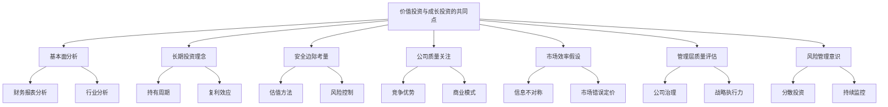

* 概念之间的关系：

| 共同点 | 基本面分析 | 长期投资 | 安全边际 | 公司质量 | 市场效率 | 管理层质量 | 风险管理 |
|--------|------------|----------|----------|----------|----------|------------|----------|
| 基本面分析 | - | 高度相关 | 高度相关 | 高度相关 | 中度相关 | 高度相关 | 中度相关 |
| 长期投资 | 高度相关 | - | 高度相关 | 高度相关 | 低度相关 | 中度相关 | 中度相关 |
| 安全边际 | 高度相关 | 高度相关 | - | 中度相关 | 中度相关 | 低度相关 | 高度相关 |
| 公司质量 | 高度相关 | 高度相关 | 中度相关 | - | 低度相关 | 高度相关 | 中度相关 |
| 市场效率 | 中度相关 | 低度相关 | 中度相关 | 低度相关 | - | 低度相关 | 中度相关 |
| 管理层质量 | 高度相关 | 中度相关 | 低度相关 | 高度相关 | 低度相关 | - | 中度相关 |
| 风险管理 | 中度相关 | 中度相关 | 高度相关 | 中度相关 | 中度相关 | 中度相关 | - |

* 数学模型：

虽然价值投资和成长投资的具体方法不同，但我们可以构建一个通用的投资决策模型来反映它们的共同点：

设 I 为投资决策指数，Q 为公司质量得分，V 为估值吸引力得分，G 为增长潜力得分，M 为管理层质量得分，R 为风险评分。则：

$$ I = w_1Q + w_2V + w_3G + w_4M - w_5R $$

其中，w₁, w₂, w₃, w₄, w₅ 为各因素的权重，且 $\sum_{i=1}^5 w_i = 1$

价值投资者可能会给予 V 更高的权重，而成长投资者可能会更重视 G，但两者都会考虑所有这些因素。

* 算法流程：

```python
def calculate_investment_score(quality, valuation, growth, management, risk, weights):
    return (
        weights['quality'] * quality +
        weights['valuation'] * valuation +
        weights['growth'] * growth +
        weights['management'] * management -
        weights['risk'] * risk
    )

def evaluate_investment(company_data, strategy):
    if strategy == 'value':
        weights = {'quality': 0.25, 'valuation': 0.35, 'growth': 0.10, 'management': 0.20, 'risk': 0.10}
    elif strategy == 'growth':
        weights = {'quality': 0.20, 'valuation': 0.10, 'growth': 0.35, 'management': 0.25, 'risk': 0.10}
    else:
        raise ValueError("Invalid strategy. Choose 'value' or 'growth'.")
    
    score = calculate_investment_score(
        company_data['quality'],
        company_data['valuation'],
        company_data['growth'],
        company_data['management'],
        company_data['risk'],
        weights)
    return score

# 示例使用
company_data = {
    'quality': 8,
    'valuation': 7,
    'growth': 9,
    'management': 8,
    'risk': 6
}

value_score = evaluate_investment(company_data, 'value')
growth_score = evaluate_investment(company_data, 'growth')

print(f"价值投资评分：{value_score:.2f}")
print(f"成长投资评分：{growth_score:.2f}")
```

这个算法展示了价值投资和成长投资如何用不同的权重评估相同的公司特征。

* 实际场景应用：

1. 科技巨头分析：以亚马逊为例
    - 基本面分析：两种策略都会深入研究亚马逊的财务状况、市场地位和竞争优势。
    - 长期投资理念：价值投资者和成长投资者都可能长期持有亚马逊，看好其长期发展前景。
    - 安全边际考量：价值投资者可能关注亚马逊的现金流和资产价值，而成长投资者则可能关注其市场份额和增长潜力作为安全边际。
    - 公司质量关注：两种策略都会高度重视亚马逊的品牌价值、网络效应和规模经济。
    - 管理层质量评估：杰夫·贝索斯的领导力和战略眼光受到两类投资者的认可。

   ```python
   amazon_data = {
       'quality': 9,
       'valuation': 6,
       'growth': 9,
       'management': 9,
       'risk': 5
   }

   amazon_value_score = evaluate_investment(amazon_data, 'value')
   amazon_growth_score = evaluate_investment(amazon_data, 'growth')

   print("亚马逊分析：")
   print(f"价值投资评分：{amazon_value_score:.2f}")
   print(f"成长投资评分：{amazon_growth_score:.2f}")
   ```

2. 传统蓝筹股：以可口可乐为例
    - 基本面分析：两种策略都会分析可口可乐的品牌价值、全球市场份额和现金流状况。
    - 长期投资理念：价值投资者和成长投资者都可能欣赏可口可乐的长期稳定性。
    - 安全边际考量：价值投资者可能更看重其稳定的股息和现金流，而成长投资者可能关注其在新兴市场的增长潜力。
    - 公司质量关注：两种策略都会重视可口可乐强大的品牌护城河和全球分销网络。
    - 风险管理意识：两类投资者都会考虑健康意识提高对碳酸饮料需求的潜在影响。

   ```python
   coca_cola_data = {
       'quality': 9,
       'valuation': 7,
       'growth': 6,
       'management': 8,
       'risk': 4
   }

   coca_cola_value_score = evaluate_investment(coca_cola_data, 'value')
   coca_cola_growth_score = evaluate_investment(coca_cola_data, 'growth')

   print("\n可口可乐分析：")
   print(f"价值投资评分：{coca_cola_value_score:.2f}")
   print(f"成长投资评分：{coca_cola_growth_score:.2f}")
   ```

3. 新兴生物科技公司：以Moderna为例
    - 基本面分析：两种策略都会研究Moderna的技术平台、产品管线和市场潜力。
    - 长期投资理念：价值投资者和成长投资者都需要有耐心等待生物科技投资的回报。
    - 安全边际考量：价值投资者可能更关注其现金储备和知识产权价值，而成长投资者可能更看重其技术平台的广泛应用潜力。
    - 公司质量关注：两种策略都会评估Moderna的创新能力和研发效率。
    - 市场效率假设：两类投资者都可能认为市场对生物科技公司的定价不够有效，存在投资机会。

   ```python
   moderna_data = {
       'quality': 7,
       'valuation': 5,
       'growth': 9,
       'management': 8,
       'risk': 8
   }

   moderna_value_score = evaluate_investment(moderna_data, 'value')
   moderna_growth_score = evaluate_investment(moderna_data, 'growth')

   print("\nModerna分析：")
   print(f"价值投资评分：{moderna_value_score:.2f}")
   print(f"成长投资评分：{moderna_growth_score:.2f}")
   ```

这些例子说明，尽管价值投资和成长投资在具体方法上有所不同，但它们在评估公司时考虑的核心因素是相似的。两种策略都强调：

1. 深入的基本面研究：无论是价值投资还是成长投资，都需要对公司的财务状况、商业模式、竞争优势进行全面分析。

2. 长期投资视角：两种策略都倾向于长期持有，相信时间是优质公司的朋友。

3. 质量优先：两种策略都强调投资高质量的公司，只是对"质量"的定义可能有所不同。

4. 安全边际意识：虽然表现形式不同，但两种策略都试图通过某种形式的安全边际来控制风险。

5. 管理层重要性：两种策略都重视公司管理层的能力和诚信。

6. 市场inefficiency的利用：两种策略都基于市场可能会错误定价的假设。

7. 持续学习和适应：成功的价值投资者和成长投资者都需要不断学习和调整策略以适应变化的市场环境。

理解这些共同点有助于投资者构建更全面、更灵活的投资策略。实际上，许多成功的投资者并不严格区分价值投资和成长投资，而是根据具体情况采用最适合的方法。在当今快速变化的市场环境中，能够融合两种策略的优点，并根据不同的投资机会灵活运用，可能是更有效的投资方法。

## 3.2 价值与成长的潜在冲突

尽管价值投资和成长投资有许多共同点，但这两种策略在某些方面也存在潜在的冲突。理解这些冲突有助于投资者更好地权衡不同的投资机会，并在实际操作中做出更明智的决策。

* 核心概念：
    - 价值投资：注重当前的估值水平和安全边际。
    - 成长投资：关注未来的增长潜力和市场机会。

* 问题背景：在实际投资中，价值和成长的考量有时会相互矛盾，投资者需要在两者之间做出权衡。

* 问题描述：价值投资和成长投资在哪些方面存在潜在冲突？这些冲突如何影响投资决策？

* 问题解决：
    1. 分析估值与增长预期之间的矛盾
    2. 比较短期盈利与长期增长投入的权衡
    3. 探讨风险承受度的差异
    4. 分析现金流分配（股息vs再投资）的冲突
    5. 比较市场时机选择的不同方法
    6. 探讨行业选择的偏好差异
    7. 分析公司生命周期阶段的影响

* 边界与外延：
    - 冲突的程度可能因具体公司和市场环境而异
    - 需要考虑投资者个人风险偏好和投资目标
    - 某些情况下，价值和成长的特征可能在同一公司中共存

* 概念结构与核心要素组成：

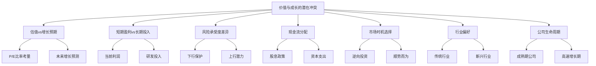

* 概念之间的关系：

| 冲突点 | 估值vs增长 | 短期vs长期 | 风险承受度 | 现金流分配 | 市场时机 | 行业偏好 | 生命周期 |
|--------|------------|------------|------------|------------|----------|----------|----------|
| 估值vs增长 | - | 高度相关 | 中度相关 | 高度相关 | 中度相关 | 高度相关 | 高度相关 |
| 短期vs长期 | 高度相关 | - | 中度相关 | 高度相关 | 低度相关 | 中度相关 | 高度相关 |
| 风险承受度 | 中度相关 | 中度相关 | - | 中度相关 | 高度相关 | 高度相关 | 中度相关 |
| 现金流分配 | 高度相关 | 高度相关 | 中度相关 | - | 低度相关 | 中度相关 | 高度相关 |
| 市场时机 | 中度相关 | 低度相关 | 高度相关 | 低度相关 | - | 中度相关 | 低度相关 |
| 行业偏好 | 高度相关 | 中度相关 | 高度相关 | 中度相关 | 中度相关 | - | 高度相关 |
| 生命周期 | 高度相关 | 高度相关 | 中度相关 | 高度相关 | 低度相关 | 高度相关 | - |

* 数学模型：

我们可以构建一个简化模型来说明价值与成长的权衡：

假设 V 为公司的价值得分，G 为公司的成长得分，P 为当前股价，E 为每股收益，g 为预期增长率，r 为要求回报率。则：

价值投资者可能关注的指标：
$$ V = \frac{E}{P} $$

成长投资者可能关注的指标：
$$ G = \frac{g}{r} $$

综合评分可表示为：
$$ S = w_v \cdot V + w_g \cdot G $$

其中，w_v 和 w_g 分别为价值和成长因素的权重，且 w_v + w_g = 1

* 算法流程：

```python
def calculate_value_score(earnings, price):
    return earnings / price if price != 0 else 0

def calculate_growth_score(growth_rate, required_return):
    return growth_rate / required_return if required_return != 0 else 0

def evaluate_stock(earnings, price, growth_rate, required_return, value_weight):
    value_score = calculate_value_score(earnings, price)
    growth_score = calculate_growth_score(growth_rate, required_return)
    
    growth_weight = 1 - value_weight
    composite_score = value_weight * value_score + growth_weight * growth_score
    
    return value_score, growth_score, composite_score

# 示例使用
earnings = 5
price = 100
growth_rate = 0.15
required_return = 0.10
value_weight = 0.6

value_score, growth_score, composite_score = evaluate_stock(earnings, price, growth_rate, required_return, value_weight)

print(f"价值得分: {value_score:.2f}")
print(f"成长得分: {growth_score:.2f}")
print(f"综合得分: {composite_score:.2f}")
```

这个算法展示了如何在价值和成长因素之间进行权衡。

* 实际场景应用：

1. 科技成长股：以特斯拉为例
    - 估值vs增长预期：特斯拉的P/E比率极高，但增长预期也非常强劲。
    - 短期盈利vs长期投入：公司大量投资于研发和产能扩张，影响短期盈利能力。
    - 风险承受度：高风险高回报的典型代表。
    - 现金流分配：所有现金流用于再投资，不派发股息。
    - 行业偏好：新兴电动车行业，传统价值投资者可能会回避。

   ```python
   tesla_data = {
       'earnings': 1,
       'price': 700,
       'growth_rate': 0.50,
       'required_return': 0.15
   }

   tesla_value_score, tesla_growth_score, tesla_composite_score = evaluate_stock(
       tesla_data['earnings'], 
       tesla_data['price'], 
       tesla_data['growth_rate'], 
       tesla_data['required_return'], 
       0.4  # 假设我们更看重成长因素
   )

   print("特斯拉分析：")
   print(f"价值得分: {tesla_value_score:.4f}")
   print(f"成长得分: {tesla_growth_score:.2f}")
   print(f"综合得分: {tesla_composite_score:.2f}")
   ```

2. 传统价值股：以AT&T为例
    - 估值vs增长预期：较低的P/E比率，但增长预期也较低。
    - 短期盈利vs长期投入：注重当前的盈利能力和现金流。
    - 风险承受度：相对较低的风险和波动性。
    - 现金流分配：高股息支付率。
    - 行业偏好：成熟的电信行业，典型的价值投资标的。

   ```python
   att_data = {
       'earnings': 3,
       'price': 30,
       'growth_rate': 0.02,
       'required_return': 0.08
   }

   att_value_score, att_growth_score, att_composite_score = evaluate_stock(
       att_data['earnings'], 
       att_data['price'], 
       att_data['growth_rate'], 
       att_data['required_return'], 
       0.8  # 假设我们更看重价值因素
   )

   print("\nAT&T分析：")
   print(f"价值得分: {att_value_score:.4f}")
   print(f"成长得分: {att_growth_score:.2f}")
   print(f"综合得分: {att_composite_score:.2f}")
   ```

3. 价值与成长兼具：以苹果为例
    - 估值vs增长预期：相对合理的P/E比率，同时保持不错的增长预期。
    - 短期盈利vs长期投入：强劲的当前盈利能力，同时持续投资未来增长。
    - 风险承受度：中等风险水平。
    - 现金流分配：平衡股息支付和股票回购与再投资。
    - 行业偏好：科技行业，但已经成为一个成熟的大型公司。

   ```python
   apple_data = {
       'earnings': 5,
       'price': 150,
       'growth_rate': 0.15,
       'required_return': 0.10
   }

   apple_value_score, apple_growth_score, apple_composite_score = evaluate_stock(
       apple_data['earnings'], 
       apple_data['price'], 
       apple_data['growth_rate'], 
       apple_data['required_return'], 
       0.5  # 假设我们平衡看待价值和成长因素
   )

   print("\n苹果公司分析：")
   print(f"价值得分: {apple_value_score:.4f}")
   print(f"成长得分: {apple_growth_score:.2f}")
   print(f"综合得分: {apple_composite_score:.2f}")
   ```

这些例子清楚地展示了价值与成长之间的潜在冲突：

1. 估值与增长预期的权衡：高增长公司通常具有较高的估值倍数，这可能使价值投资者望而却步。相反，估值较低的公司可能缺乏足够的增长动力，无法吸引成长投资者。

2. 短期盈利与长期投资的平衡：成长型公司往往将大部分资源投入到扩张和研发中，可能牺牲短期盈利。价值投资者更看重当前的盈利能力和现金流。

3. 风险承受度的差异：成长股通常波动性更大，需要更高的风险承受能力。价值投资者则倾向于寻求更稳定、低风险的投资机会。

4. 现金流分配策略：价值投资者通常青睐高股息公司，而成长投资者更愿意看到公司将利润再投资于业务扩张。

5. 市场时机选择：价值投资者倾向于逆势而为，在市场低迷时买入；成长投资者则可能更多地追随市场趋势。

6. 行业偏好：成长投资者可能更关注新兴行业和创新型公司，而价值投资者往往在成熟行业中寻找被低估的公司。

7. 公司生命周期阶段：成长投资者偏好处于快速扩张期的公司，价值投资者则可能更看重成熟期的稳定公司。

面对这些潜在冲突，投资者需要：

1. 明确个人投资目标和风险偏好，在价值和成长之间找到适合自己的平衡点。

2. 认识到纯粹的价值或纯粹的成长策略可能都存在局限性，考虑采用更灵活的方法。

3. 深入分析每个投资机会，不要仅仅因为一个公司不符合典型的价值或成长特征就忽视它。

4. 在投资组合层面平衡价值和成长因素，可以同时持有不同类型的股票以分散风险。

5. 随着市场环境和个股情况的变化，定期重新评估投资策略和持仓。

6. 培养跨领域思考的能力，学会从多个角度评估投资机会。

7. 保持开放和学习的心态，因为成功的投资往往需要整合不同投资理念的优点。

理解价值与成长的潜在冲突，有助于投资者更全面地看待投资机会，做出更明智的决策。在实际操作中，许多成功的投资者并不严格将自己局限于单一的投资风格，而是根据具体情况灵活运用不同的策略。关键是要深入理解每种方法的优缺点，并在具体实践中不断调整和优化自己的投资策略。

## 3.3 市场周期对两种投资策略的影响

市场周期对价值投资和成长投资策略的有效性有着重要影响。不同的经济环境和市场情绪可能导致这两种策略在特定时期表现出较大差异。理解这些影响对于投资者在不同市场阶段做出正确的投资决策至关重要。

* 核心概念：
    - 市场周期：经济和股票市场的周期性波动，通常包括扩张、高峰、收缩和谷底阶段。
    - 策略轮动：根据市场周期的不同阶段调整投资策略的做法。

* 问题背景：价值投资和成长投资在不同的市场周期中可能表现出不同的优势和劣势。

* 问题描述：市场周期如何影响价值投资和成长投资的表现？投资者应如何根据市场周期调整其投资策略？

* 问题解决：
    1. 分析不同市场周期阶段的特征
    2. 评估价值投资在各个周期阶段的表现
    3. 考察成长投资在不同市场环境下的效果
    4. 探讨利率变化对两种策略的影响
    5. 分析行业轮动与投资策略的关系
    6. 考虑投资者情绪对策略有效性的影响
    7. 提出根据市场周期调整投资组合的方法

* 边界与外延：
    - 市场周期的影响可能因不同地区和行业而异
    - 需要考虑宏观经济政策对市场周期的干预作用
    - 技术创新和结构性变化可能改变传统的周期模式

* 概念结构与核心要素组成：

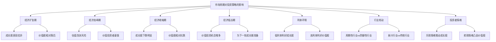

* 概念之间的关系：

| 市场阶段 | 经济扩张期 | 经济高峰期 | 经济收缩期 | 经济低谷期 | 利率环境 | 行业轮动 | 投资者情绪 |
|----------|------------|------------|------------|------------|----------|----------|------------|
| 经济扩张期 | - | 高度相关 | 负相关 | 负相关 | 中度相关 | 高度相关 | 高度相关 |
| 经济高峰期 | 高度相关 | - | 中度相关 | 负相关 | 高度相关 | 中度相关 | 高度相关 |
| 经济收缩期 | 负相关 | 中度相关 | - | 高度相关 | 中度相关 | 高度相关 | 高度相关 |
| 经济低谷期 | 负相关 | 负相关 | 高度相关 | - | 中度相关 | 中度相关 | 高度相关 |
| 利率环境 | 中度相关 | 高度相关 | 中度相关 | 中度相关 | - | 中度相关 | 中度相关 |
| 行业轮动 | 高度相关 | 中度相关 | 高度相关 | 中度相关 | 中度相关 | - | 高度相关 |
| 投资者情绪 | 高度相关 | 高度相关 | 高度相关 | 高度相关 | 中度相关 | 高度相关 | - |

* 数学模型：

我们可以构建一个简化模型来说明市场周期对投资策略的影响：

假设 R_v 为价值投资回报率，R_g 为成长投资回报率，C 为市场周期指标（0到1之间，0表示低谷，1表示高峰），i 为利率水平，S 为投资者情绪指标（-1到1之间，-1表示极度悲观，1表示极度乐观）。则：

$$ R_v = \alpha_v + \beta_v \cdot (1-C) - \gamma_v \cdot i + \delta_v \cdot (1-S) $$
$$ R_g = \alpha_g + \beta_g \cdot C - \gamma_g \cdot i + \delta_g \cdot S $$

其中，α, β, γ, δ 为各因素的权重系数。

* 算法流程：

```python
import numpy as np

def calculate_returns(cycle, interest_rate, sentiment, strategy='value'):
    if strategy == 'value':
        alpha, beta, gamma, delta = 0.05, 0.10, 0.05, 0.05
        return alpha + beta * (1 - cycle) - gamma * interest_rate + delta * (1 - sentiment)
    elif strategy == 'growth':
        alpha, beta, gamma, delta = 0.08, 0.15, 0.03, 0.10
        return alpha + beta * cycle - gamma * interest_rate + delta * sentiment
    else:
        raise ValueError("Invalid strategy. Choose 'value' or 'growth'.")

def simulate_market_cycle(num_periods=100):
    cycle = np.sin(np.linspace(0, 4*np.pi, num_periods)) * 0.5 + 0.5
    interest_rate = np.random.uniform(0.01, 0.05, num_periods)
    sentiment = np.random.uniform(-1, 1, num_periods)
    
    value_returns = [calculate_returns(c, i, s, 'value') for c, i, s in zip(cycle, interest_rate, sentiment)]
    growth_returns = [calculate_returns(c, i, s, 'growth') for c, i, s in zip(cycle, interest_rate, sentiment)]
    
    return cycle, interest_rate, sentiment, value_returns, growth_returns

# 运行模拟
cycle, interest_rate, sentiment, value_returns, growth_returns = simulate_market_cycle()

# 输出结果
print(f"价值投资平均回报率: {np.mean(value_returns):.2%}")
print(f"成长投资平均回报率: {np.mean(growth_returns):.2%}")
print(f"价值投资回报率标准差: {np.std(value_returns):.2%}")
print(f"成长投资回报率标准差: {np.std(growth_returns):.2%}")
```

这个算法模拟了一个完整的市场周期，展示了价值投资和成长投资在不同阶段的表现差异。

* 实际场景应用：

1. 经济扩张期（2009-2020年牛市）：
    - 特征：低利率环境，经济增长强劲，投资者情绪乐观。
    - 成长股表现：科技巨头如亚马逊、Facebook等表现优异。
    - 价值股表现：传统行业股票如银行、能源公司相对落后。
    - 策略调整：增加成长股配置，特别是在创新领域。

   ```python
   expansion_cycle = 0.8
   expansion_interest_rate = 0.02
   expansion_sentiment = 0.7

   value_return = calculate_returns(expansion_cycle, expansion_interest_rate, expansion_sentiment, 'value')
   growth_return = calculate_returns(expansion_cycle, expansion_interest_rate, expansion_sentiment, 'growth')

   print("\n经济扩张期:")
   print(f"价值投资预期回报: {value_return:.2%}")
   print(f"成长投资预期回报: {growth_return:.2%}")
   ```

2. 经济高峰期（2021年市场高点）：
    - 特征：估值处于历史高位，通胀压力显现，加息预期升温。
    - 成长股表现：部分高估值成长股开始回调。
    - 价值股表现：周期性行业股票表现改善。
    - 策略调整：增加价值股和防御性资产的配置，减少高估值成长股敞口。

   ```python
   peak_cycle = 1.0
   peak_interest_rate = 0.03
   peak_sentiment = 0.9

   value_return = calculate_returns(peak_cycle, peak_interest_rate, peak_sentiment, 'value')
   growth_return = calculate_returns(peak_cycle, peak_interest_rate, peak_sentiment, 'growth')

   print("\n经济高峰期:")
   print(f"价值投资预期回报: {value_return:.2%}")
   print(f"成长投资预期回报: {growth_return:.2%}")
   ```

3. 经济收缩期（2022年市场调整）：
    - 特征：通胀高企，央行加速加息，经济增长放缓。
    - 成长股表现：高估值科技股大幅回调。
    - 价值股表现：防御性行业如公用事业、医疗保健相对抗跌。
    - 策略调整：增加价值股和高质量股票的配置，关注现金流和股息。

   ```python
   contraction_cycle = 0.3
   contraction_interest_rate = 0.05
   contraction_sentiment = -0.5

   value_return = calculate_returns(contraction_cycle, contraction_interest_rate, contraction_sentiment, 'value')
   growth_return = calculate_returns(contraction_cycle, contraction_interest_rate, contraction_sentiment, 'growth')

   print("\n经济收缩期:")
   print(f"价值投资预期回报: {value_return:.2%}")
   print(f"成长投资预期回报: {growth_return:.2%}")
   ```

4. 经济低谷期（假设未来的衰退）：
    - 特征：经济活动低迷，失业率上升，央行可能开始降息。
    - 成长股表现：优质成长股可能开始企稳，为未来复苏做准备。
    - 价值股表现：深度价值股可能出现，但需警惕价值陷阱。
    - 策略调整：寻找被过度悲观看待的优质公司，为下一轮复苏布局。

   ```python
   trough_cycle = 0.0
   trough_interest_rate = 0.01
   trough_sentiment = -0.8

   value_return = calculate_returns(trough_cycle, trough_interest_rate, trough_sentiment, 'value')
   growth_return = calculate_returns(trough_cycle, trough_interest_rate, trough_sentiment, 'growth')

   print("\n经济低谷期:")
   print(f"价值投资预期回报: {value_return:.2%}")
   print(f"成长投资预期回报: {growth_return:.2%}")
   ```

基于上述分析，我们可以得出以下关于市场周期对价值投资和成长投资策略影响的关键洞察：

1. 策略表现的周期性：价值投资和成长投资在不同的市场周期阶段表现各异。成长投资通常在经济扩张期表现较好，而价值投资在经济收缩期和低谷期可能表现更佳。

2. 利率环境的影响：低利率环境通常有利于成长股，因为它降低了未来现金流的贴现率。相反，高利率环境可能更有利于价值股，特别是那些当前现金流充沛的公司。

3. 投资者情绪的作用：乐观情绪往往推动成长股表现，而在悲观情绪占主导时，价值股的防御特性可能更受青睐。

4. 行业轮动：不同的市场周期往往伴随着行业轮动。例如，经济扩张初期可能有利于周期性行业，而经济高峰期可能更有利于防御性行业。

5. 风险特征的变化：成长股在牛市中可能表现出色，但在熊市中可能面临更大的下行风险。价值股通常波动性较小，但可能错过强劲的上涨行情。

6. 估值重要性：在经济高峰期，警惕成长股可能出现的估值泡沫。在经济低谷期，价值投资者可能发现更多被低估的机会。

7. 策略调整的必要性：成功的投资者需要根据市场周期的变化适时调整策略，而不是死守单一方法。

基于这些洞察，投资者可以采取以下策略：

1. 动态资产配置：根据经济周期的不同阶段，调整价值股和成长股的配置比例。

2. 行业轮动策略：关注受益于当前经济环境的行业，适时进行行业配置的调整。

3. 质量优先：无论是价值投资还是成长投资，始终关注公司的基本面质量。

4. 长期视角：尽管短期内策略表现可能有所不同，但保持长期投资视角，避免过度交易。

5. 逆向思考：在市场极度乐观时保持谨慎，在市场极度悲观时寻找机会。

6. 多元化：通过在不同风格、行业和地区之间分散投资，降低单一策略的风险。

7. 持续学习和适应：市场环境在不断变化，投资者需要不断学习和调整自己的策略。

理解市场周期对投资策略的影响，有助于投资者在不同的经济环境中做出更明智的决策。然而，也要注意到，预测市场周期转折点是极其困难的。因此，构建一个能够在不同市场环境中都能表现良好的多元化投资组合，可能比试图精确把握市场时机更为重要。同时，保持灵活性和开放心态，根据市场变化适时调整策略，是应对复杂多变市场环境的关键。

## 3.4 投资者心理因素在两种策略中的作用

投资者的心理因素在价值投资和成长投资策略的执行过程中扮演着关键角色。理解和管理这些心理因素不仅能够帮助投资者更好地坚持自己的投资策略，还能够在市场的极端情况下做出更理性的决策。

* 核心概念：
    - 行为金融学：研究投资者心理如何影响金融决策和市场行为的学科。
    - 认知偏差：影响判断和决策的系统性思维错误。
    - 情绪控制：管理投资过程中产生的各种情绪的能力。

* 问题背景：投资者的心理状态可能导致非理性决策，影响投资策略的有效执行。

* 问题描述：投资者的心理因素如何影响价值投资和成长投资策略的执行？如何管理这些心理因素以提高投资效果？

* 问题解决：
    1. 分析常见的投资者心理偏差
    2. 评估这些偏差对价值投资的影响
    3. 考察心理因素在成长投资中的作用
    4. 探讨如何克服这些心理障碍
    5. 分析情绪管理在不同市场环境下的重要性
    6. 考虑长期投资视角的培养方法
    7. 提出建立系统化投资流程的策略

* 边界与外延：
    - 心理因素的影响可能因个人经验和性格特征而异
    - 需要考虑文化背景和教育水平对投资心理的影响
    - 市场环境的变化可能加剧或缓解某些心理偏差

* 概念结构与核心要素组成：

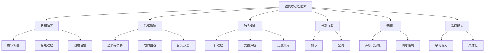

* 概念之间的关系：

| 心理因素 | 认知偏差 | 情绪影响 | 行为倾向 | 长期视角 | 纪律性 | 适应能力 |
|----------|----------|----------|----------|----------|--------|----------|
| 认知偏差 | - | 高度相关 | 高度相关 | 中度相关 | 中度相关 | 低度相关 |
| 情绪影响 | 高度相关 | - | 高度相关 | 高度相关 | 高度相关 | 中度相关 |
| 行为倾向 | 高度相关 | 高度相关 | - | 中度相关 | 高度相关 | 中度相关 |
| 长期视角 | 中度相关 | 高度相关 | 中度相关 | - | 高度相关 | 中度相关 |
| 纪律性 | 中度相关 | 高度相关 | 高度相关 | 高度相关 | - | 高度相关 |
| 适应能力 | 低度相关 | 中度相关 | 中度相关 | 中度相关 | 高度相关 | - |

* 数学模型：

我们可以构建一个简化模型来量化心理因素对投资决策的影响：

假设 D 为投资决策的偏离度（0表示完全理性，1表示完全非理性），C 为认知偏差指数，E 为情绪影响指数，B 为行为倾向指数，L 为长期视角指数，S 为纪律性指数，A 为适应能力指数。则：

$$ D = w_1C + w_2E + w_3B - w_4L - w_5S - w_6A $$

其中，w₁, w₂, ..., w₆ 为各因素的权重，且 $\sum_{i=1}^6 w_i = 1$

* 算法流程：

```python
import random

def generate_psychological_factors():
    return {
        'cognitive_bias': random.uniform(0, 1),
        'emotional_impact': random.uniform(0, 1),
        'behavioral_tendency': random.uniform(0, 1),
        'long_term_perspective': random.uniform(0, 1),
        'discipline': random.uniform(0, 1),
        'adaptability': random.uniform(0, 1)
    }

def calculate_decision_deviation(factors, weights):
    return (
        weights['cognitive_bias'] * factors['cognitive_bias'] +
        weights['emotional_impact'] * factors['emotional_impact'] +
        weights['behavioral_tendency'] * factors['behavioral_tendency'] -
        weights['long_term_perspective'] * factors['long_term_perspective'] -
        weights['discipline'] * factors['discipline'] -
        weights['adaptability'] * factors['adaptability']
    )

def simulate_investment_decision(strategy):
    factors = generate_psychological_factors()
    
    if strategy == 'value':
        weights = {
            'cognitive_bias': 0.15,
            'emotional_impact': 0.20,
            'behavioral_tendency': 0.15,
            'long_term_perspective': 0.20,
            'discipline': 0.20,
            'adaptability': 0.10
        }
    elif strategy == 'growth':
        weights = {
            'cognitive_bias': 0.20,
            'emotional_impact': 0.25,
            'behavioral_tendency': 0.20,
            'long_term_perspective': 0.15,
            'discipline': 0.10,
            'adaptability': 0.10
        }
    else:
        raise ValueError("Invalid strategy. Choose 'value' or 'growth'.")
    
    deviation = calculate_decision_deviation(factors, weights)
    return deviation

# 模拟多次投资决策
num_simulations = 1000
value_deviations = [simulate_investment_decision('value') for _ in range(num_simulations)]
growth_deviations = [simulate_investment_decision('growth') for _ in range(num_simulations)]

print(f"价值投资平均决策偏离度: {sum(value_deviations) / len(value_deviations):.4f}")
print(f"成长投资平均决策偏离度: {sum(growth_deviations) / len(growth_deviations):.4f}")
```

这个算法模拟了价值投资和成长投资策略中心理因素对决策的影响。

* 实际场景应用：

1. 价值投资者面对长期underperform的情况：
    - 心理挑战：怀疑自己的投资理念，面临peer pressure。
    - 潜在偏差：确认偏差（只关注支持自己观点的信息）。
    - 应对策略：回顾历史数据，重新验证投资理念，保持长期视角。

   ```python
   value_investor_scenario = {
       'cognitive_bias': 0.7,  # 高确认偏差
       'emotional_impact': 0.8,  # 高情绪影响
       'behavioral_tendency': 0.6,
       'long_term_perspective': 0.9,  # 仍保持较高的长期视角
       'discipline': 0.7,
       'adaptability': 0.5
   }

   value_weights = {
       'cognitive_bias': 0.15,
       'emotional_impact': 0.20,
       'behavioral_tendency': 0.15,
       'long_term_perspective': 0.20,
       'discipline': 0.20,
       'adaptability': 0.10
   }

   value_deviation = calculate_decision_deviation(value_investor_scenario, value_weights)
   print(f"\n价值投资者在面对长期underperform时的决策偏离度: {value_deviation:.4f}")
   ```

2. 成长投资者在市场高涨时：
    - 心理挑战：过度自信，忽视风险。
    - 潜在偏差：代表性偏差（认为近期趋势会持续）。
    - 应对策略：重新评估估值，考虑部分获利了结。

   ```python
   growth_investor_scenario = {
       'cognitive_bias': 0.8,  # 高认知偏差
       'emotional_impact': 0.9,  # 高情绪影响（过度乐观）
       'behavioral_tendency': 0.8,  # 可能过度交易
       'long_term_perspective': 0.6,
       'discipline': 0.5,
       'adaptability': 0.7
   }

   growth_weights = {
       'cognitive_bias': 0.20,
       'emotional_impact': 0.25,
       'behavioral_tendency': 0.20,
       'long_term_perspective': 0.15,
       'discipline': 0.10,
       'adaptability': 0.10
   }

   growth_deviation = calculate_decision_deviation(growth_investor_scenario, growth_weights)
   print(f"成长投资者在市场高涨时的决策偏离度: {growth_deviation:.4f}")
   ```

3. 价值投资者在发现潜在价值陷阱时：
    - 心理挑战：纠结于沉没成本，难以承认错误。
    - 潜在偏差：锚定效应（对初始购买价格的执着）。
    - 应对策略：客观重新评估，设置止损点。

   ```python
   value_trap_scenario = {
       'cognitive_bias': 0.8,  # 高认知偏差（锚定效应）
       'emotional_impact': 0.7,  # 情绪影响（不愿承认错误）
       'behavioral_tendency': 0.6,
       'long_term_perspective': 0.7,
       'discipline': 0.6,
       'adaptability': 0.4  # 低适应性（难以改变观点）
   }

   value_trap_deviation = calculate_decision_deviation(value_trap_scenario, value_weights)
   print(f"价值投资者面对潜在价值陷阱时的决策偏离度: {value_trap_deviation:.4f}")
   ```

4. 成长投资者在市场突然下跌时：
    - 心理挑战：恐慌情绪，倾向于急于出售。
    - 潜在偏差：损失厌恶（过度关注短期亏损）。
    - 应对策略：回顾长期增长逻辑，控制情绪影响。

   ```python
   market_crash_scenario = {
       'cognitive_bias': 0.7,
       'emotional_impact': 0.9,  # 高情绪影响（恐慌）
       'behavioral_tendency': 0.8,  # 可能急于卖出
       'long_term_perspective': 0.5,  # 短期视角占优
       'discipline': 0.4,  # 低纪律性
       'adaptability': 0.6
   }

   market_crash_deviation = calculate_decision_deviation(market_crash_scenario, growth_weights)
   print(f"成长投资者在市场突然下跌时的决策偏离度: {market_crash_deviation:.4f}")
   ```

基于上述分析，我们可以得出以下关于投资者心理因素在价值投资和成长投资策略中作用的关键洞察：

1. 认知偏差的普遍性：无论是价值投资者还是成长投资者，都容易受到各种认知偏差的影响。关键是要意识到这些偏差的存在，并采取措施减少其影响。

2. 情绪管理的重要性：情绪因素在投资决策中扮演着重要角色。成功的投资者需要学会控制自己的情绪，特别是在市场极端情况下。

3. 长期视角vs短期压力：保持长期投资视角对两种策略都很重要，但在面对短期市场波动时，投资者常常会感受到放弃长期视角的压力。

4. 纪律性的作用：严格执行预设的投资策略和规则可以帮助投资者避免受到短期市场噪音的影响。

5. 适应性的需求：市场环境在不断变化，投资者需要保持一定的灵活性，适时调整策略，但同时又不能过度反应。

6. 确认偏差的危险：无论是价值投资者还是成长投资者，都容易陷入只寻找支持自己观点的信息的陷阱。

7. 过度自信的风险：特别是在市场上涨时期，投资者容易高估自己的能力，低估风险。

为了更好地管理这些心理因素，投资者可以采取以下策略：

1. 自我认知：定期进行自我反思，识别自己容易受到哪些心理偏差的影响。

2. 建立系统：制定明确的投资规则和流程，减少情绪化决策的空间。

3. 分散投资：通过投资组合多元化来分散风险，减少单一投资失败带来的心理压力。

4. 持续学习：学习心理学和行为金融学知识，提高对自身行为的认识。

5. 保持记录：详细记录每次投资决策的理由和结果，以便日后复盘和学习。

6. 寻求反馈：与其他投资者交流，听取不同意见，避免陷入思维定式。

7. 设置检查点：定期评估投资策略的有效性，而不是盲目坚持或轻易放弃。

8. 情绪缓冲：在做出重大投资决策前，给自己一定的冷静期。

9. 理性分析工具：使用定量分析工具来辅助决策，减少主观判断的影响。

10. 模拟练习：通过模拟交易来练习控制情绪和执行策略的能力。

理解并管理这些心理因素，对于成功执行价值投资或成长投资策略至关重要。投资者需要不断提高自我认知，培养理性思考的能力，在坚持长期投资理念的同时，也要保持必要的灵活性。通过持续的学习和实践，投资者可以逐步提高自己的心理韧性，在复杂多变的市场环境中做出更加明智的投资决策。


# 第二部分：融合投资思想的理论构建

# 第4章：价值成长投资理念的形成

价值成长投资理念是一种融合了价值投资和成长投资优点的投资策略。这种理念试图在保持价值投资的稳健性的同时，捕捉高增长公司带来的潜在高回报。本章将深入探讨价值成长投资理念的形成过程、核心原则以及在现代投资环境中的应用。

## 4.1 价值与成长的辩证关系

价值和成长这两个概念在投资领域常被视为对立的，但实际上它们之间存在着密切的辩证关系。理解这种关系对于形成全面的投资视角至关重要。

* 核心概念：
    - 价值：公司的内在价值，通常通过财务指标和资产评估来衡量。
    - 成长：公司收入、利润或市场份额的增长潜力。
    - 辩证关系：两个看似对立的概念之间相互依存、相互影响的关系。

* 问题背景：传统投资理论often将价值和成长视为互斥的投资风格，但现实市场中，这两个因素常常是相互交织的。

* 问题描述：如何理解价值与成长之间的辩证关系？这种关系如何影响投资决策和公司估值？

* 问题解决：
    1. 分析价值如何影响成长
    2. 探讨成长对价值的贡献
    3. 考察价值与成长在不同行业和公司生命周期中的表现
    4. 研究市场如何定价价值和成长因素
    5. 分析价值陷阱和成长陷阱的形成原因
    6. 探讨如何在投资决策中平衡价值和成长考量
    7. 考虑技术创新和商业模式变革对价值-成长关系的影响

* 边界与外延：
    - 价值与成长的关系可能因行业特性而异
    - 需要考虑宏观经济环境对价值-成长动态的影响
    - 投资者的时间跨度会影响对价值和成长的权衡

* 概念结构与核心要素组成：

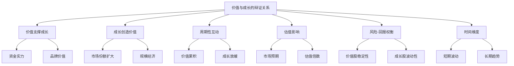

* 概念之间的关系：

| 关系 | 价值支撑成长 | 成长创造价值 | 周期性互动 | 估值影响 | 风险-回报权衡 | 时间维度 |
|------|--------------|--------------|------------|----------|----------------|----------|
| 价值支撑成长 | - | 高度相关 | 中度相关 | 高度相关 | 中度相关 | 高度相关 |
| 成长创造价值 | 高度相关 | - | 高度相关 | 高度相关 | 高度相关 | 高度相关 |
| 周期性互动 | 中度相关 | 高度相关 | - | 高度相关 | 中度相关 | 高度相关 |
| 估值影响 | 高度相关 | 高度相关 | 高度相关 | - | 高度相关 | 中度相关 |
| 风险-回报权衡 | 中度相关 | 高度相关 | 中度相关 | 高度相关 | - | 高度相关 |
| 时间维度 | 高度相关 | 高度相关 | 高度相关 | 中度相关 | 高度相关 | - |

* 数学模型：

我们可以构建一个简化模型来描述价值与成长的关系：

假设 V 为公司的价值，G 为公司的成长率，E 为当前收益，r 为贴现率，t 为时间。则：

$$ V = \sum_{t=1}^{\infty} \frac{E(1+G)^t}{(1+r)^t} $$

这个模型显示，公司的价值是其未来现金流的现值，而未来现金流又受到成长率的影响。

同时，我们可以考虑成长如何影响价值：

$$ \frac{dV}{dG} = \sum_{t=1}^{\infty} \frac{tE(1+G)^{t-1}}{(1+r)^t} > 0 $$

这表明成长率的提高会增加公司的价值。

* 算法流程：

```python
import numpy as np

def calculate_value(earnings, growth_rate, discount_rate, years):
    value = 0
    for t in range(1, years + 1):
        value += (earnings * (1 + growth_rate)**t) / (1 + discount_rate)**t
    return value

def analyze_value_growth_relationship(initial_earnings, growth_rates, discount_rate, years):
    values = []
    for growth_rate in growth_rates:
        value = calculate_value(initial_earnings, growth_rate, discount_rate, years)
        values.append(value)
    return values

# 参数设置
initial_earnings = 100
growth_rates = np.arange(0, 0.21, 0.01)  # 0% to 20% growth rates
discount_rate = 0.10
years = 10

# 分析价值与成长的关系
values = analyze_value_growth_relationship(initial_earnings, growth_rates, discount_rate, years)

# 输出结果
for growth_rate, value in zip(growth_rates, values):
    print(f"Growth Rate: {growth_rate:.2%}, Value: {value:.2f}")

# 可视化
import matplotlib.pyplot as plt

plt.figure(figsize=(10, 6))
plt.plot(growth_rates, values)
plt.title('Value vs Growth Rate')
plt.xlabel('Growth Rate')
plt.ylabel('Company Value')
plt.grid(True)
plt.show()
```

这个算法展示了成长率如何影响公司价值，并通过图表直观地呈现这种关系。

* 实际场景应用：

1. 成熟价值股转型：以IBM为例
    - 价值支撑成长：利用强大的现金流和品牌优势进入云计算和人工智能领域。
    - 成长创造新价值：新业务增长改变了市场对IBM的看法，可能带来估值提升。
    - 挑战：在保持传统业务稳定的同时实现新领域的快速增长。

   ```python
   ibm_earnings = 1000  # 百万美元
   ibm_traditional_growth = 0.01  # 1% 传统业务增长
   ibm_new_business_growth = 0.15  # 15% 新业务增长
   ibm_discount_rate = 0.08
   ibm_years = 10

   traditional_value = calculate_value(ibm_earnings * 0.8, ibm_traditional_growth, ibm_discount_rate, ibm_years)
   new_business_value = calculate_value(ibm_earnings * 0.2, ibm_new_business_growth, ibm_discount_rate, ibm_years)
   total_value = traditional_value + new_business_value

   print(f"IBM估计价值: ${total_value:.2f} 百万")
   ```

2. 高增长科技股：以亚马逊为例
    - 成长创造显著价值：持续的高增长使亚马逊成为市值最高的公司之一。
    - 价值支撑未来成长：强大的现金流允许持续大规模投资新业务。
    - 挑战：保持高增长率，同时提高盈利能力以支持高估值。

   ```python
   amazon_earnings = 20000  # 百万美元
   amazon_growth_rates = [0.30, 0.25, 0.20, 0.15, 0.10]  # 假设未来5年增长率逐年下降
   amazon_discount_rate = 0.10
   amazon_years = 5

   amazon_value = 0
   current_earnings = amazon_earnings
   for year, growth_rate in enumerate(amazon_growth_rates, start=1):
       amazon_value += current_earnings * (1 + growth_rate) / (1 + amazon_discount_rate)**year
       current_earnings *= (1 + growth_rate)

   print(f"亚马逊估计价值: ${amazon_value:.2f} 百万")
   ```

3. 价值与成长的平衡：以苹果公司为例
    - 价值特征：强大的品牌、稳定的现金流、高利润率。
    - 成长特征：持续创新、服务业务快速增长。
    - 平衡策略：利用稳定的硬件业务现金流投资于高增长的服务业务。

   ```python
   apple_hardware_earnings = 200000  # 百万美元
   apple_services_earnings = 50000  # 百万美元
   apple_hardware_growth = 0.05  # 5% 硬件业务增长
   apple_services_growth = 0.20  # 20% 服务业务增长
   apple_discount_rate = 0.09
   apple_years = 10

   hardware_value = calculate_value(apple_hardware_earnings, apple_hardware_growth, apple_discount_rate, apple_years)
   services_value = calculate_value(apple_services_earnings, apple_services_growth, apple_discount_rate, apple_years)
   total_value = hardware_value + services_value

   print(f"苹果公司估计价值: ${total_value:.2f} 百万")
   ```

基于上述分析，我们可以得出以下关于价值与成长辩证关系的关键洞察：

1. 互补性：价值和成长并非相互排斥，而是相互补充的概念。强大的价值基础可以支持持续成长，而高增长又能创造新的价值。

2. 动态平衡：公司在不同发展阶段可能呈现出不同的价值-成长特征。成功的公司often能够在这两者之间保持动态平衡。

3. 长期视角的重要性：从短期来看，价值和成长可能表现出一定的矛盾，但从长期来看，它们往往是统一的。

4. 行业特性的影响：不同行业的价值-成长动态可能有很大差异。例如，科技行业可能更强调成长，而公用事业行业可能更看重稳定的价值。

5. 市场预期的作用：市场对公司未来成长的预期会直接影响其当前估值，从而影响其价值特征。

6. 风险与回报的权衡：纯粹的价值投资可能牺牲部分成长机会，而过度关注成长可能忽视估值风险。平衡两者可以优化风险-回报特征。

7. 创新的双刃剑效应：技术创新可以为成熟公司带来新的成长机会，但也可能破坏现有的价值基础。

8. 资本配置的重要性：公司如何在维护现有业务价值和投资未来成长之间分配资源，对其长期成功至关重要。

9. 周期性考量：经济周期的不同阶段可能交替凸显价值和成长的重要性。

10. 估值方法的综合运用：准确评估一家公司需要同时考虑其价值基础和成长潜力，可能需要结合多种估值方法。

对于投资者而言，理解价值与成长的辩证关系意味着：

1. 避免教条主义：不应将自己严格限定为"价值投资者"或"成长投资者"，而应灵活运用两种思维。

2. 全面分析：在评估投资机会时，既要考虑公司当前的价值基础，也要评估其未来的成长潜力。

3. 动态调整：随着公司和市场环境的变化，及时调整对价值和成长因素的权重。

4. 长期思维：培养长期投资视角，允许价值和成长因素在更长的时间跨度内相互作用。

5. 风险管理：通过在投资组合中平衡价值型和成长型公司来分散风险。

6. 持续学习：密切关注可能改变价值-成长动态的技术创新和商业模式变革。

7. 耐心与纪律：认识到价值实现和成长显现可能需要时间，保持耐心和投资纪律。

理解并运用价值与成长的辩证关系，可以帮助投资者构建更加全面和灵活的投资策略，在不同的市场环境中把握投资机会，实现长期稳定的投资回报。

## 4.2 GARP（合理价格下的成长）投资策略

GARP（Growth At a Reasonable Price，合理价格下的成长）投资策略是一种试图结合价值投资和成长投资优点的方法。这种策略旨在寻找那些具有良好成长前景，同时估值又相对合理的公司。GARP策略在现代投资实践中越来越受到重视，因为它提供了一种平衡的方法来捕捉成长机会，同时控制估值风险。

* 核心概念：
    - GARP：在合理价格下购买具有良好成长潜力的股票。
    - PEG比率：市盈率（P/E）除以预期每股收益增长率，用于评估股票的成长性价比。
    - 合理价格：相对于公司的成长前景而言不过高的价格。

* 问题背景：纯粹的价值投资可能错过高增长机会，而纯粹的成长投资可能忽视估值风险。GARP策略试图在两者之间找到平衡点。

* 问题描述：如何有效地实施GARP策略？哪些指标和方法可以用来识别GARP股票？

* 问题解决：
    1. 分析PEG比率的计算和应用
    2. 探讨其他用于GARP策略的财务指标
    3. 考察行业特性对GARP策略的影响
    4. 研究如何评估公司的可持续成长性
    5. 分析估值方法在GARP策略中的应用
    6. 探讨GARP策略在不同市场周期中的表现
    7. 考虑如何将定性分析融入GARP策略

* 边界与外延：
    - GARP策略的有效性可能因市场环境而异
    - 需要考虑公司规模、行业特性对GARP应用的影响
    - GARP策略可能需要根据不同地区市场的特点进行调整

* 概念结构与核心要素组成：

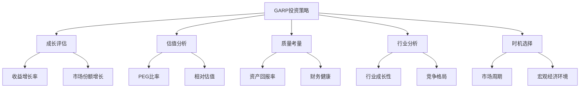

* 概念之间的关系：

| 要素 | 成长评估 | 估值分析 | 质量考量 | 行业分析 | 时机选择 |
|------|----------|----------|----------|----------|----------|
| 成长评估 | - | 高度相关 | 中度相关 | 高度相关 | 中度相关 |
| 估值分析 | 高度相关 | - | 中度相关 | 中度相关 | 高度相关 |
| 质量考量 | 中度相关 | 中度相关 | - | 中度相关 | 低度相关 |
| 行业分析 | 高度相关 | 中度相关 | 中度相关 | - | 高度相关 |
| 时机选择 | 中度相关 | 高度相关 | 低度相关 | 高度相关 | - |

* 数学模型：

GARP策略的核心指标PEG比率的计算公式：

$$ PEG = \frac{P/E}{g} $$

其中，P/E 是市盈率，g 是预期年化盈利增长率。

通常认为，PEG < 1 的股票可能被低估，是潜在的GARP投资对象。

我们可以构建一个更复杂的GARP评分模型：

$$ GARP Score = w_1 \cdot \frac{1}{PEG} + w_2 \cdot ROE + w_3 \cdot \frac{g}{P/B} + w_4 \cdot \frac{FCF}{EV} $$

其中，ROE是股本回报率，P/B是市净率，FCF是自由现金流，EV是企业价值，w₁, w₂, w₃, w₄ 是权重。

* 算法流程：

```python
def calculate_peg(pe_ratio, growth_rate):
    return pe_ratio / growth_rate if growth_rate > 0 else float('inf')

def calculate_garp_score(pe_ratio, growth_rate, roe, pb_ratio, fcf, ev):
    peg = calculate_peg(pe_ratio, growth_rate)
    garp_score = (
        0.4 * (1 / peg if peg > 0 else 0) +
        0.3 * roe +
        0.2 * (growth_rate / pb_ratio if pb_ratio > 0 else 0) +
        0.1 * (fcf / ev if ev > 0 else 0)
    )
    return garp_score

def evaluate_stock(stock_data):
    garp_score = calculate_garp_score(
        stock_data['pe_ratio'],
        stock_data['growth_rate'],
        stock_data['roe'],
        stock_data['pb_ratio'],
        stock_data['fcf'],
        stock_data['ev']
    )
    return garp_score

# 示例使用
stock_data = {
    'pe_ratio': 15,
    'growth_rate': 0.2,  # 20%
    'roe': 0.18,  # 18%
    'pb_ratio': 2.5,
    'fcf': 1000000000,  # 10亿
    'ev': 50000000000  # 500亿
}

garp_score = evaluate_stock(stock_data)
print(f"GARP评分: {garp_score:.4f}")
```

这个算法提供了一个框架来评估股票是否符合GARP策略的标准。

* 实际场景应用：

1. 科技行业GARP股票：以微软为例
    - 成长前景：云计算业务快速增长
    - 合理估值：相比其他科技巨头，估值相对温和
    - 质量因素：强劲的现金流和高回报率

   ```python
   microsoft_data = {
       'pe_ratio': 30,
       'growth_rate': 0.15,  # 15%
       'roe': 0.40,  # 40%
       'pb_ratio': 13,
       'fcf': 45000000000,  # 450亿
       'ev': 1800000000000  # 1.8万亿
   }

   microsoft_garp_score = evaluate_stock(microsoft_data)
   print(f"微软GARP评分: {microsoft_garp_score:.4f}")
   ```

2. 消费品行业GARP股票：以星巴克为例
    - 成长前景：国际市场扩张和数字化转型
    - 合理估值：考虑品牌价值和增长潜力的估值
    - 质量因素：强大的品牌忠诚度和稳定的现金流

   ```python
   starbucks_data = {
       'pe_ratio': 25,
       'growth_rate': 0.10,  # 10%
       'roe': 0.50,  # 50%（受回购影响）
       'pb_ratio': 15,
       'fcf': 3000000000,  # 30亿
       'ev': 120000000000  # 1200亿
   }

   starbucks_garp_score = evaluate_stock(starbucks_data)
   print(f"星巴克GARP评分: {starbucks_garp_score:.4f}")
   ```

3. 新兴市场GARP股票：以阿里巴巴为例
    - 成长前景：电商和云计算业务在新兴市场的增长潜力
    - 合理估值：相比成熟市场竞争对手，估值更具吸引力
    - 质量因素：强大的市场地位和多元化业务模式

   ```python
   alibaba_data = {
       'pe_ratio': 20,
       'growth_rate': 0.20,  # 20%
       'roe': 0.15,  # 15%
       'pb_ratio': 3,
       'fcf': 25000000000,  # 250亿
       'ev': 500000000000  # 5000亿
   }

   alibaba_garp_score = evaluate_stock(alibaba_data)
   print(f"阿里巴巴GARP评分: {alibaba_garp_score:.4f}")
   ```

基于上述分析，我们可以得出以下关于GARP投资策略的关键洞察：

1. 平衡成长与价值：GARP策略的核心在于在合理价格下购买高质量的成长股，避免单纯追逐高增长或低估值。

2. PEG比率的重要性：PEG比率是GARP策略的核心指标，但不应过度依赖单一指标。

3. 多维度分析：除了PEG，还应考虑ROE、自由现金流等指标，全面评估公司质量和财务健康状况。

4. 行业特性考量：不同行业的"合理价格"标准可能不同，需要进行行业间比较。

5. 长期视角：GARP策略通常需要较长的投资周期来实现价值，投资者需要有耐心。

6. 动态调整：随着公司和市场环境的变化，需要定期重新评估GARP标的的吸引力。

7. 质量优先：在追求成长的同时，不应忽视公司的基本面质量和竞争优势。

8. 市场情绪的影响：在不同的市场环境下，投资者对"合理价格"的定义可能会发生变化。

9. 全球视野：GARP机会可能出现在全球任何市场，跨境比较可能发现被忽视的机会。

10. 风险管理：尽管GARP策略试图平衡风险和回报，但仍需要通过投资组合多元化来管理风险。

对于投资者而言，有效实施GARP策略需要注意以下几点：

1. 建立系统化的筛选流程：使用多重指标和标准来识别潜在的GARP股票。

2. 深入的基本面分析：除了定量指标，还需要对公司的业务模式、竞争优势和管理质量进行深入研究。

3. 行业比较：在行业内部和跨行业进行比较，以确定什么是"合理价格"。

4. 关注可持续性：评估公司增长的可持续性，而不仅仅是短期增长率。

5. 耐心和纪律：GARP投资可能需要时间来实现价值，要有耐心持有并遵守投资纪律。

6. 持续监控：定期重新评估投资标的，确保它们仍然符合GARP标准。

7. 灵活应对：根据市场环境的变化，适当调整GARP标准和投资组合配置。

8. 结合宏观分析：考虑宏观经济趋势和行业周期对GARP机会的影响。

9. 控制风险：设置止损点，并通过投资组合多元化来分散风险。

10. 持续学习：GARP策略需要投资者既了解价值投资，又熟悉成长投资的原则，不断学习和改进策略。

GARP投资策略为投资者提供了一种平衡的方法，旨在捕捉高增长潜力同时控制估值风险。通过综合考虑公司的成长前景、当前估值和基本面质量，GARP投资者可以在动态的市场环境中寻找最佳的风险-回报机会。然而，成功实施GARP策略需要深入的研究、严格的纪律和持续的学习，以适应不断变化的市场条件和公司动态。

## 4.3 质量因子在融合投资中的重要性

在价值与成长投资的融合过程中，质量因子日益受到投资者的重视。高质量公司通常能够在长期内创造更高的股东价值，无论是从价值投资还是成长投资的角度来看，都具有重要意义。本节将深入探讨质量因子在融合投资中的作用及其实际应用。

* 核心概念：
    - 质量因子：衡量公司财务健康、盈利能力、经营效率和管理水平的综合指标。
    - 融合投资：结合价值投资和成长投资原则的投资策略。
    - 可持续竞争优势：公司长期保持高质量的能力。

* 问题背景：传统的价值或成长投资可能忽视公司质量，导致"价值陷阱"或"成长陷阱"。

* 问题描述：如何在融合投资策略中有效地纳入和评估质量因子？质量因子如何影响投资决策和长期回报？

* 问题解决：
    1. 定义和量化质量因子
    2. 分析质量因子与价值、成长因子的关系
    3. 探讨质量因子在不同行业中的表现
    4. 研究质量因子对投资回报的影响
    5. 考察如何将质量因子融入投资决策过程
    6. 分析质量因子在风险管理中的作用
    7. 探讨质量因子在不同市场周期中的表现

* 边界与外延：
    - 质量因子的定义可能因行业和公司生命周期而异
    - 需要考虑质量因子与其他投资因子的交互作用
    - 质量因子的重要性可能随时间和市场环境变化

* 概念结构与核心要素组成：

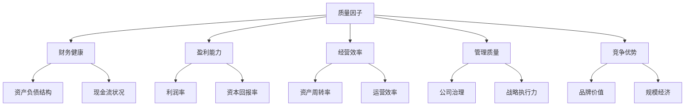

* 概念之间的关系：

| 要素 | 财务健康 | 盈利能力 | 经营效率 | 管理质量 | 竞争优势 |
|------|----------|----------|----------|----------|----------|
| 财务健康 | - | 高度相关 | 中度相关 | 中度相关 | 中度相关 |
| 盈利能力 | 高度相关 | - | 高度相关 | 中度相关 | 高度相关 |
| 经营效率 | 中度相关 | 高度相关 | - | 高度相关 | 中度相关 |
| 管理质量 | 中度相关 | 中度相关 | 高度相关 | - | 高度相关 |
| 竞争优势 | 中度相关 | 高度相关 | 中度相关 | 高度相关 | - |

* 数学模型：

我们可以构建一个综合质量得分模型：

$$ Quality Score = w_1 \cdot F + w_2 \cdot P + w_3 \cdot E + w_4 \cdot M + w_5 \cdot C $$

其中：
- F 代表财务健康得分
- P 代表盈利能力得分
- E 代表经营效率得分
- M 代表管理质量得分
- C 代表竞争优势得分
- w₁, w₂, w₃, w₄, w₅ 是各因素的权重

具体可以使用以下指标：

- 财务健康：$F = \frac{1}{2}(\frac{Equity}{TotalAssets} + \frac{OperatingCashFlow}{TotalDebt})$
- 盈利能力：$P = \frac{1}{2}(ROE + ROA)$
- 经营效率：$E = AssetTurnover$
- 管理质量：可以使用定性评分
- 竞争优势：可以使用行业相对市场份额或毛利率

* 算法流程：

```python
def calculate_quality_score(financial_health, profitability, efficiency, management, competitive_advantage, weights):
    return (
        weights['financial_health'] * financial_health +
        weights['profitability'] * profitability +
        weights['efficiency'] * efficiency +
        weights['management'] * management +
        weights['competitive_advantage'] * competitive_advantage
    )

def evaluate_company_quality(company_data, weights):
    financial_health = 0.5 * (company_data['equity'] / company_data['total_assets'] + 
                              company_data['operating_cash_flow'] / company_data['total_debt'])
    profitability = 0.5 * (company_data['roe'] + company_data['roa'])
    efficiency = company_data['asset_turnover']
    management = company_data['management_score']  # 假设这是一个1-10的评分
    competitive_advantage = company_data['industry_relative_market_share']

    quality_score = calculate_quality_score(
        financial_health, profitability, efficiency, management, competitive_advantage, weights
    )
    return quality_score

# 示例使用
company_data = {
    'equity': 1000000000,
    'total_assets': 2000000000,
    'operating_cash_flow': 300000000,
    'total_debt': 500000000,
    'roe': 0.15,
    'roa': 0.08,
    'asset_turnover': 1.2,
    'management_score': 8,
    'industry_relative_market_share': 1.5
}

weights = {
    'financial_health': 0.2,
    'profitability': 0.3,
    'efficiency': 0.2,
    'management': 0.15,
    'competitive_advantage': 0.15
}

quality_score = evaluate_company_quality(company_data, weights)
print(f"公司质量得分: {quality_score:.4f}")
```

这个算法提供了一个评估公司质量的框架，可以根据具体需求调整权重和指标。

* 实际场景应用：

1. 科技行业质量评估：以苹果公司为例
    - 财务健康：强大的现金储备和低负债率
    - 盈利能力：高利润率和资本回报率
    - 经营效率：优秀的存货管理和资产利用率
    - 管理质量：创新文化和有效的供应链管理
    - 竞争优势：强大的品牌价值和生态系统

   ```python
   apple_data = {
       'equity': 65339000000,
       'total_assets': 338516000000,
       'operating_cash_flow': 104038000000,
       'total_debt': 119412000000,
       'roe': 0.147,
       'roa': 0.028,
       'asset_turnover': 0.83,
       'management_score': 9,
       'industry_relative_market_share': 2.5
   }

   apple_quality_score = evaluate_company_quality(apple_data, weights)
   print(f"苹果公司质量得分: {apple_quality_score:.4f}")
   ```

2. 消费品行业质量评估：以可口可乐为例
    - 财务健康：稳定的现金流和适度的负债水平
    - 盈利能力：持续的高利润率
    - 经营效率：良好的资产周转率
    - 管理质量：长期品牌管理和全球化运营能力
    - 竞争优势：全球最有价值的品牌之一

   ```python
   coca_cola_data = {
       'equity': 21284000000,
       'total_assets': 87296000000,
       'operating_cash_flow': 9804000000,
       'total_debt': 40684000000,
       'roe': 0.401,
       'roa': 0.097,
       'asset_turnover': 0.42,
       'management_score': 8,
       'industry_relative_market_share': 3.0
   }

   coca_cola_quality_score = evaluate_company_quality(coca_cola_data, weights)
   print(f"可口可乐公司质量得分: {coca_cola_quality_score:.4f}")
   ```

3. 金融行业质量评估：以摩根大通为例
    - 财务健康：强大的资本充足率
    - 盈利能力：相对稳定的回报率
    - 经营效率：成本控制能力
    - 管理质量：风险管理能力和战略执行力
    - 竞争优势：多元化的业务模式和全球网络

   ```python
   jp_morgan_data = {
       'equity': 279354000000,
       'total_assets': 3386065000000,
       'operating_cash_flow': 76201000000,
       'total_debt': 446992000000,
       'roe': 0.15,
       'roa': 0.0124,
       'asset_turnover': 0.03,  # 银行业资产周转率通常较低
       'management_score': 8,
       'industry_relative_market_share': 1.8
   }

   jp_morgan_quality_score = evaluate_company_quality(jp_morgan_data, weights)
   print(f"摩根大通公司质量得分: {jp_morgan_quality_score:.4f}")
   ```

基于上述分析，我们可以得出以下关于质量因子在融合投资中重要性的关键洞察：

1. 全面评估：质量因子提供了一个多维度评估公司的框架，超越了单纯的价值或成长指标。

2. 风险管理：高质量公司通常具有更强的抗风险能力，有助于降低投资组合的下行风险。

3. 可持续性：质量因子有助于识别具有可持续竞争优势的公司，这对长期投资至关重要。

4. 价值陷阱防范：通过考虑质量因子，投资者可以更好地避免低估值但基本面恶化的公司。

5. 成长持续性：高质量公司更有可能保持长期增长，减少"昙花一现"的风险。

6. 行业适应性：质量因子的具体表现可能因行业而异，需要根据行业特性进行调整。

7. 周期性考虑：在不同的经济周期中，质量因子的重要性可能会有所变化。

8. 与其他因子的互补：质量因子可以与价值、成长、动量等其他因子结合，构建更全面的投资策略。

9. 长期表现：研究表明，高质量公司在长期内往往能够提供更好的风险调整后回报。

10. 管理层洞察：质量因子分析可以提供对公司管理能力和公司文化的洞察。

对于投资者而言，有效地将质量因子纳入融合投资策略需要注意以下几点：

1. 定义明确：建立清晰、可量化的质量指标体系。

2. 行业特异性：根据不同行业的特点调整质量评估标准。

3. 动态评估：定期重新评估公司质量，因为质量状况可能随时间变化。

4. 综合考量：将质量因子与其他投资因子（如价值、成长）结合考虑。

5. 尽职调查：除了定量指标，也要通过深入研究来评估难以量化的质量因素。

6. 相对比较：在行业内部和跨行业进行质量比较，以获得更全面的视角。

7. 长期视角：质量因子的优势通常在较长的时间跨度内更为明显。

8. 风险意识：即使是高质量公司也可能面临风险，需要持续监控。

9. 估值考虑：高质量公司可能会被市场给予溢价，需要权衡质量和估值。

10. 持续学习：随着市场和经济环境的变化，不断更新和完善质量评估方法。

将质量因子纳入融合投资策略可以帮助投资者构建更加稳健、长期导向的投资组合。通过系统地评估公司的财务健康、盈利能力、经营效率、管理质量和竞争优势，投资者可以更好地识别那些既具有价值特征又有成长潜力的高质量公司。这种方法不仅可以提高投资回报的可持续性，还能够在市场波动时期提供更好的防御性。然而，重要的是要记住，即使是最高质量的公司也可能面临挑战，因此持续的监控和适时的投资组合调整仍然是必要的。

## 4.4 长期复合增长率（CAGR）与内在价值评估

长期复合增长率（CAGR）是评估公司长期增长潜力的重要指标，而内在价值评估则是确定公司真实价值的关键方法。在融合价值和成长投资理念时，这两个概念的结合为投资者提供了一个强大的分析框架。本节将深入探讨CAGR和内在价值评估在投资决策中的应用及其相互关系。

* 核心概念：
    - 长期复合增长率（CAGR）：反映一项投资在特定时期内的年化回报率。
    - 内在价值：公司基于其未来现金流的真实价值。
    - 现金流贴现模型（DCF）：用于估算内在价值的主要方法之一。

* 问题背景：准确评估公司的长期增长潜力和内在价值是成功投资的关键，但这往往面临诸多挑战。

* 问题描述：如何有效地利用CAGR来预测公司的未来增长？如何将CAGR与内在价值评估相结合以做出更准确的投资决策？

* 问题解决：
    1. 分析CAGR的计算和应用
    2. 探讨影响CAGR的因素
    3. 研究内在价值评估的方法，特别是DCF模型
    4. 考察如何将CAGR预测纳入内在价值评估
    5. 分析CAGR和内在价值评估在不同行业中的应用
    6. 探讨长期CAGR预测的挑战和解决方案
    7. 考虑宏观经济因素对CAGR和内在价值的影响

* 边界与外延：
    - CAGR预测的准确性可能随时间跨度的增加而降低
    - 内在价值评估需要考虑行业特性和公司生命周期阶段
    - 需要权衡定量分析和定性判断

* 概念结构与核心要素组成：

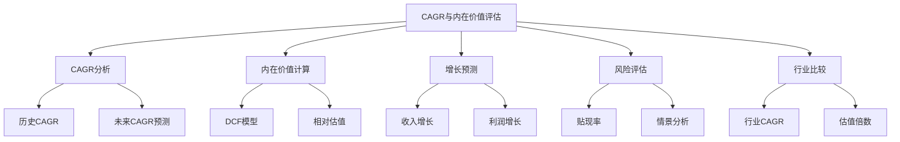

* 概念之间的关系：

| 要素 | CAGR分析 | 内在价值计算 | 增长预测 | 风险评估 | 行业比较 |
|------|----------|--------------|----------|----------|----------|
| CAGR分析 | - | 高度相关 | 高度相关 | 中度相关 | 高度相关 |
| 内在价值计算 | 高度相关 | - | 高度相关 | 高度相关 | 中度相关 |
| 增长预测 | 高度相关 | 高度相关 | - | 中度相关 | 中度相关 |
| 风险评估 | 中度相关 | 高度相关 | 中度相关 | - | 中度相关 |
| 行业比较 | 高度相关 | 中度相关 | 中度相关 | 中度相关 | - |

* 数学模型：

1. CAGR计算公式：

$$ CAGR = \left(\frac{EndingValue}{BeginningValue}\right)^{\frac{1}{NumberOfYears}} - 1 $$

2. DCF模型基本公式：

$$ IntrinsicValue = \sum_{t=1}^{n} \frac{FCF_t}{(1+r)^t} + \frac{TerminalValue}{(1+r)^n} $$

其中，FCF_t 是第 t 年的自由现金流，r 是贴现率，TerminalValue 是终值。

3. 将CAGR纳入DCF模型：

假设公司的自由现金流以 CAGR 的速度增长，则：

$$ FCF_t = FCF_0 \cdot (1 + CAGR)^t $$

* 算法流程：

```python
import numpy as np

def calculate_cagr(beginning_value, ending_value, num_years):
    return (ending_value / beginning_value) ** (1 / num_years) - 1

def project_fcf(initial_fcf, cagr, years):
    return [initial_fcf * (1 + cagr) ** t for t in range(years)]

def calculate_intrinsic_value(fcf_projections, terminal_growth_rate, discount_rate):
    pv_fcf = sum([fcf / (1 + discount_rate) ** (t + 1) for t, fcf in enumerate(fcf_projections)])
    terminal_value = fcf_projections[-1] * (1 + terminal_growth_rate) / (discount_rate - terminal_growth_rate)
    pv_terminal_value = terminal_value / (1 + discount_rate) ** len(fcf_projections)
    return pv_fcf + pv_terminal_value

def evaluate_investment(initial_fcf, historical_cagr, projected_cagr, years, terminal_growth_rate, discount_rate):
    fcf_projections = project_fcf(initial_fcf, projected_cagr, years)
    intrinsic_value = calculate_intrinsic_value(fcf_projections, terminal_growth_rate, discount_rate)
    
    return {
        'Historical CAGR': historical_cagr,
        'Projected CAGR': projected_cagr,
        'Intrinsic Value': intrinsic_value
    }

# 示例使用
initial_fcf = 1000000000  # 10亿初始自由现金流
historical_cagr = 0.15  # 15%的历史CAGR
projected_cagr = 0.10  # 10%的预计未来CAGR
years = 5  # 5年预测期
terminal_growth_rate = 0.03  # 3%的永续增长率
discount_rate = 0.09  # 9%的贴现率

result = evaluate_investment(initial_fcf, historical_cagr, projected_cagr, years, terminal_growth_rate, discount_rate)

print(f"历史CAGR: {result['Historical CAGR']:.2%}")
print(f"预计未来CAGR: {result['Projected CAGR']:.2%}")
print(f"估算内在价值: ${result['Intrinsic Value']:,.0f}")
```

这个算法提供了一个框架，结合CAGR和DCF模型来评估公司的内在价值。

* 实际场景应用：

1. 科技行业高增长公司：以亚马逊为例
    - 历史高CAGR，但预期未来增速可能放缓
    - 多元化业务模型（电商、云计算等）带来的复杂性
    - 高增长与盈利能力之间的权衡

   ```python
   amazon_data = {
       'initial_fcf': 25000000000,  # 250亿美元
       'historical_cagr': 0.25,  # 25%
       'projected_cagr': 0.18,  # 18%
       'years': 5,
       'terminal_growth_rate': 0.04,  # 4%
       'discount_rate': 0.08  # 8%
   }

   amazon_result = evaluate_investment(**amazon_data)
   print("\n亚马逊评估结果：")
   print(f"历史CAGR: {amazon_result['Historical CAGR']:.2%}")
   print(f"预计未来CAGR: {amazon_result['Projected CAGR']:.2%}")
   print(f"估算内在价值: ${amazon_result['Intrinsic Value']:,.0f}")
   ```

2. 成熟消费品公司：以可口可乐为例
    - 稳定但相对较低的CAGR
    - 强大的品牌价值和现金流生成能力
    - 成熟市场增长放缓vs新兴市场机会

   ```python
   coca_cola_data = {
       'initial_fcf': 8000000000,  # 80亿美元
       'historical_cagr': 0.05,  # 5%
       'projected_cagr': 0.04,  # 4%
       'years': 5,
       'terminal_growth_rate': 0.02,  # 2%
       'discount_rate': 0.07  # 7%
   }

   coca_cola_result = evaluate_investment(**coca_cola_data)
   print("\n可口可乐评估结果：")
   print(f"历史CAGR: {coca_cola_result['Historical CAGR']:.2%}")
   print(f"预计未来CAGR: {coca_cola_result['Projected CAGR']:.2%}")
   print(f"估算内在价值: ${coca_cola_result['Intrinsic Value']:,.0f}")
   ```

3. 新兴市场高增长公司：以阿里巴巴为例
    - 高历史CAGR，但面临增长放缓和监管压力
    - 多元化业务模型在新兴市场的扩张潜力
    - 政治和监管风险对增长预期的影响

   ```python
   alibaba_data = {
       'initial_fcf': 20000000000,  # 200亿美元
       'historical_cagr': 0.30,  # 30%
       'projected_cagr': 0.15,  # 15%
       'years': 5,
       'terminal_growth_rate': 0.05,  # 5%
       'discount_rate': 0.10  # 10%
   }

   alibaba_result = evaluate_investment(**alibaba_data)
   print("\n阿里巴巴评估结果：")
   print(f"历史CAGR: {alibaba_result['Historical CAGR']:.2%}")
   print(f"预计未来CAGR: {alibaba_result['Projected CAGR']:.2%}")
   print(f"估算内在价值: ${alibaba_result['Intrinsic Value']:,.0f}")
   ```

基于上述分析，我们可以得出以下关于CAGR与内在价值评估的关键洞察：

1. CAGR的预测挑战：历史CAGR不一定能准确预示未来增长。需要考虑行业趋势、竞争格局、宏观经济等多重因素。

2. 增长率与风险的权衡：高CAGR通常伴随着更高的风险和不确定性，这应反映在更高的贴现率中。

3. 行业生命周期的影响：不同行业和公司所处的生命周期阶段会显著影响其CAGR和内在价值评估。

4. 质量因素的重要性：除了增长率，还需考虑增长的质量，如盈利能力、现金流生成能力等。

5. 长期视角vs短期波动：CAGR和内在价值评估强调长期视角，但也需要关注短期内可能影响长期趋势的因素。

6. 情景分析的必要性：鉴于未来的不确定性，应考虑多种增长情景，进行敏感性分析。

7. 相对估值的补充作用：DCF模型应与相对估值方法（如P/E、EV/EBITDA等）结合使用，以获得更全面的价值评估。

8. 竞争优势的持续性：评估公司是否能够维持高CAGR，需要分析其竞争优势的可持续性。

9. 规模效应：随着公司规模扩大，通常难以维持高CAGR，这一点在预测中应予以考虑。

10. 外部因素的影响：技术变革、监管环境、宏观经济等外部因素可能显著影响CAGR和内在价值，需要持续监控。

对于投资者而言，有效利用CAGR和内在价值评估需要注意以下几点：

1. 全面分析：不仅关注财务指标，还要深入了解公司的业务模式、竞争优势和行业动态。

2. 保持怀疑态度：对于异常高的历史CAGR或乐观的未来预测保持警惕，寻求支持这些预测的实质性证据。

3. 动态调整：随着新信息的出现，及时调整CAGR预测和内在价值评估。

4. 考虑多种情景：制定乐观、中性和悲观的CAGR预测，评估不同情景下的内在价值。

5. 关注现金流：在评估中特别注重自由现金流的质量和可持续性。

6. 行业比较：将公司的CAGR和估值与行业平均水平和领先对手进行比较。

7. 长期思维：尽管短期波动不可避免，但应保持长期投资视角。

8. 质量优先：优先考虑那些不仅有高CAGR，还具有强大业务模式和竞争优势的公司。

9. 持续学习：随着市场环境的变化，不断更新和完善CAGR预测和内在价值评估方法。

10. 耐心与纪律：认识到准确的内在价值评估需要时间来验证，保持投资纪律很重要。

将CAGR分析与内在价值评估相结合，为投资者提供了一个强大的工具来识别和评估潜在的投资机会。这种方法不仅考虑了公司的历史表现，还纳入了对未来增长的预期，同时通过DCF模型将这些预期转化为具体的价值估算。然而，重要的是要记住，这些模型和预测都是基于假设的，投资者需要不断质疑这些假设，并根据新的信息和市场变化调整其分析。通过结合定量分析和定性判断，投资者可以做出更加明智和全面的投资决策。

# 结语：价值成长投资的未来展望

随着金融市场的不断发展和投资理念的演进，价值成长投资策略正在成为一种越来越受欢迎的投资方法。这种融合了价值投资和成长投资优点的策略，不仅为投资者提供了一个更全面的投资框架，也更好地适应了当今复杂多变的市场环境。在本书的结尾，让我们展望价值成长投资的未来发展趋势及其可能面临的挑战。

1. 技术驱动的投资决策
    - 人工智能和机器学习在数据分析和模式识别中的应用将不断深化。
    - 大数据分析将帮助投资者更准确地预测公司的增长轨迹和估值变化。
    - 自动化交易系统可能会更多地融入价值成长投资原则，提高执行效率。

2. 可持续发展和ESG因素的整合
    - 环境、社会和公司治理（ESG）因素将越来越多地被纳入价值成长投资分析。
    - 可持续发展目标将影响公司的长期增长潜力和估值评估。
    - 投资者将需要平衡财务回报与社会责任投资。

3. 全球化视角的重要性
    - 跨境投资机会的增加将要求投资者具备更广阔的全球视野。
    - 新兴市场的快速发展可能提供更多价值成长投资机会。
    - 地缘政治风险和货币波动将成为投资决策中更重要的考量因素。

4. 行业边界的模糊化
    - 传统行业分类可能变得不那么重要，跨行业融合将创造新的投资机会。
    - 科技创新将继续重塑传统行业，改变公司的增长轨迹和估值模型。
    - 投资者需要更灵活的分析框架来评估跨界公司。

5. 投资周期的加速
    - 信息传播速度的加快可能导致市场反应更迅速，投资周期缩短。
    - 长期主义与短期波动的平衡将变得更加重要。
    - 价值成长投资者需要在坚持长期视角的同时，更敏捷地响应市场变化。

6. 个人化和定制化投资策略
    - 随着投资工具的普及，个人投资者将有更多机会实施复杂的价值成长策略。
    - 人工智能驱动的投资顾问可能提供更个性化的投资建议。
    - 投资策略的定制化将帮助投资者更好地匹配个人风险偏好和投资目标。

7. 新兴资产类别的融入
    - 加密货币、代币化资产等新兴资产类别可能被纳入价值成长投资框架。
    - 传统金融资产与新兴资产类别的界限可能变得模糊。
    - 投资者需要学习评估新型资产的内在价值和增长潜力。

8. 监管环境的变化
    - 金融监管的变化可能影响价值成长投资策略的实施。
    - 信息披露要求的增加可能提供更多数据点用于分析。
    - 跨境投资规则的变化可能影响全球投资策略。

9. 风险管理的演进
    - 新的风险度量和管理工具将被开发，以更好地评估和控制投资风险。
    - 系统性风险和非系统性风险的界定可能需要重新考虑。
    - 极端事件（如全球性疫情）对风险管理实践的影响将被更多地纳入考虑。

10. 投资教育和金融素养的提升
    - 随着价值成长投资概念的普及，投资者教育将变得更加重要。
    - 金融素养的提高将使更多个人投资者能够参与到价值成长投资中。
    - 专业投资者和个人投资者之间的信息不对称可能会减少。

面对这些趋势和挑战，未来的价值成长投资者需要：

1. 持续学习和适应：保持开放的心态，不断学习新技术和新概念。

2. 跨学科思维：结合金融、技术、社会学等多学科知识，全面分析投资机会。

3. 灵活性：在坚持核心原则的同时，灵活调整策略以适应市场变化。

4. 全球视野：培养对全球经济和不同文化的理解，把握国际投资机会。

5. 长期思维：在信息快速流动的环境中，更加珍视长期投资的价值。

6. 风险意识：在追求增长的同时，始终保持对风险的警惕。

7. 道德考量：在投资决策中纳入道德和可持续发展因素。

8. 技术素养：提高对新技术的理解和应用能力，利用技术优化投资决策。

9. 批判性思维：在信息爆炸的时代，保持独立思考和判断的能力。

10. 协作精神：与其他投资者、研究人员和技术专家合作，共同应对复杂的投资环境。

价值成长投资的未来充满机遇和挑战。这种投资策略的核心原则——寻找高质量、有增长潜力且估值合理的公司——可能会保持不变，但实现这一目标的方法将不断演进。成功的投资者将是那些能够在坚持基本原则的同时，灵活适应新环境，不断学习和创新的人。

最后，重要的是要记住，尽管技术和方法在不断进步，但投资的本质仍然是对未来的预测。因此，谦逊、耐心和持续学习的态度将永远是成功投资的关键因素。价值成长投资不仅是一种策略，更是一种思维方式，它鼓励投资者全面、深入地思考企业价值和经济增长的本质。在未来的投资旅程中，那些能够平衡定量分析和定性判断、兼顾短期波动和长期趋势、在变化中把握不变的投资者，将更有可能取得持续的成功。

# 第5章：企业质量评估体系

企业质量评估是价值成长投资策略的核心组成部分。一个全面的企业质量评估体系可以帮助投资者识别那些具有持续竞争优势、稳健财务状况、卓越管理能力和良好行业前景的公司。本章将详细探讨企业质量评估的四个关键维度：财务指标分析、商业模式与竞争优势评估、管理团队能力与公司治理结构，以及行业前景与公司市场地位分析。

## 5.1 财务指标分析框架

财务指标分析是评估企业质量的基础。一个全面的财务指标分析框架应包括盈利能力、成长性、效率、偿债能力和现金流等多个维度。

* 核心概念：
    - 盈利能力指标
    - 成长性指标
    - 效率指标
    - 偿债能力指标
    - 现金流指标

* 问题背景：财务指标众多，如何构建一个既全面又有针对性的分析框架是投资者面临的挑战。

* 问题描述：如何选择和解读关键财务指标以全面评估企业质量？不同行业的财务指标分析有何特殊性？

* 问题解决：
    1. 构建多维度财务指标体系
    2. 分析各项指标的历史趋势和同业比较
    3. 探讨不同行业的关键财务指标
    4. 考虑财务指标之间的相互关系
    5. 分析财务指标背后的业务驱动因素
    6. 识别潜在的财务风险信号
    7. 结合定性分析解读财务指标

* 边界与外延：
    - 财务指标分析需要结合行业特性
    - 会计政策变更可能影响指标的可比性
    - 需要考虑宏观经济环境对财务指标的影响

* 概念结构与核心要素组成：

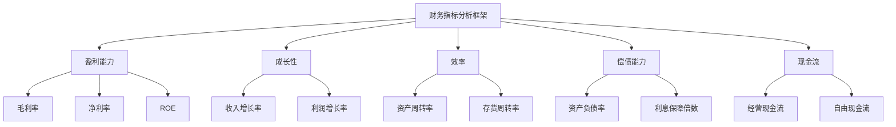

* 概念之间的关系：

| 指标类型 | 盈利能力 | 成长性 | 效率 | 偿债能力 | 现金流 |
|----------|----------|--------|------|----------|--------|
| 盈利能力 | - | 高度相关 | 中度相关 | 中度相关 | 高度相关 |
| 成长性 | 高度相关 | - | 低度相关 | 低度相关 | 中度相关 |
| 效率 | 中度相关 | 低度相关 | - | 中度相关 | 中度相关 |
| 偿债能力 | 中度相关 | 低度相关 | 中度相关 | - | 高度相关 |
| 现金流 | 高度相关 | 中度相关 | 中度相关 | 高度相关 | - |

* 数学模型：

我们可以构建一个综合财务评分模型：

$$ FinancialScore = w_1P + w_2G + w_3E + w_4S + w_5C $$

其中：
- P 代表盈利能力得分
- G 代表成长性得分
- E 代表效率得分
- S 代表偿债能力得分
- C 代表现金流得分
- w₁, w₂, w₃, w₄, w₅ 是各因素的权重

具体可以使用以下指标：

- 盈利能力：$P = \frac{1}{3}(ROE + \frac{NetIncome}{Revenue} + \frac{GrossProfit}{Revenue})$
- 成长性：$G = \frac{1}{2}(RevenueGrowth + NetIncomeGrowth)$
- 效率：$E = \frac{1}{2}(AssetTurnover + InventoryTurnover)$
- 偿债能力：$S = \frac{1}{2}(\frac{TotalAssets}{TotalLiabilities} + InterestCoverageRatio)$
- 现金流：$C = \frac{1}{2}(\frac{OperatingCashFlow}{Revenue} + \frac{FreeCashFlow}{Revenue})$

* 算法流程：

```python
def calculate_financial_score(company_data, weights):
    profitability = (company_data['roe'] + company_data['net_margin'] + company_data['gross_margin']) / 3
    growth = (company_data['revenue_growth'] + company_data['net_income_growth']) / 2
    efficiency = (company_data['asset_turnover'] + company_data['inventory_turnover']) / 2
    solvency = (company_data['total_assets'] / company_data['total_liabilities'] + company_data['interest_coverage_ratio']) / 2
    cash_flow = (company_data['operating_cash_flow'] / company_data['revenue'] + company_data['free_cash_flow'] / company_data['revenue']) / 2

    financial_score = (
        weights['profitability'] * profitability +
        weights['growth'] * growth +
        weights['efficiency'] * efficiency +
        weights['solvency'] * solvency +
        weights['cash_flow'] * cash_flow
    )
    return financial_score

# 示例使用
company_data = {
    'roe': 0.15,
    'net_margin': 0.10,
    'gross_margin': 0.40,
    'revenue_growth': 0.08,
    'net_income_growth': 0.12,
    'asset_turnover': 0.8,
    'inventory_turnover': 6,
    'total_assets': 1000000000,
    'total_liabilities': 400000000,
    'interest_coverage_ratio': 10,
    'operating_cash_flow': 150000000,
    'free_cash_flow': 100000000,
    'revenue': 800000000
}

weights = {
    'profitability': 0.3,
    'growth': 0.2,
    'efficiency': 0.15,
    'solvency': 0.15,
    'cash_flow': 0.2
}

financial_score = calculate_financial_score(company_data, weights)
print(f"公司财务评分: {financial_score:.4f}")
```

这个算法提供了一个评估公司财务状况的框架，可以根据具体需求调整权重和指标。

* 实际场景应用：

1. 科技行业：以苹果公司为例
    - 高毛利率和净利率
    - 稳定的收入增长
    - 较高的资产周转率
    - 强劲的现金流生成能力

   ```python
   apple_data = {
       'roe': 0.85,
       'net_margin': 0.21,
       'gross_margin': 0.38,
       'revenue_growth': 0.06,
       'net_income_growth': 0.08,
       'asset_turnover': 0.83,
       'inventory_turnover': 40.6,
       'total_assets': 323888000000,
       'total_liabilities': 258578000000,
       'interest_coverage_ratio': 37.5,
       'operating_cash_flow': 104038000000,
       'free_cash_flow': 73365000000,
       'revenue': 365817000000
   }

   apple_financial_score = calculate_financial_score(apple_data, weights)
   print(f"苹果公司财务评分: {apple_financial_score:.4f}")
   ```

2. 零售行业：以沃尔玛为例
    - 低毛利率但高资产周转率
    - 稳定的收入增长
    - 较高的存货周转率
    - 稳定的现金流

   ```python
   walmart_data = {
       'roe': 0.17,
       'net_margin': 0.024,
       'gross_margin': 0.25,
       'revenue_growth': 0.07,
       'net_income_growth': 0.03,
       'asset_turnover': 2.37,
       'inventory_turnover': 8.5,
       'total_assets': 236495000000,
       'total_liabilities': 154943000000,
       'interest_coverage_ratio': 9.7,
       'operating_cash_flow': 25255000000,
       'free_cash_flow': 14550000000,
       'revenue': 559151000000
   }

   walmart_financial_score = calculate_financial_score(walmart_data, weights)
   print(f"沃尔玛公司财务评分: {walmart_financial_score:.4f}")
   ```

3. 制药行业：以辉瑞为例
    - 高研发投入
    - 高毛利率
    - 波动的收入增长（受新药上市影响）
    - 强劲的现金流

   ```python
   pfizer_data = {
       'roe': 0.28,
       'net_margin': 0.27,
       'gross_margin': 0.66,
       'revenue_growth': 0.23,
       'net_income_growth': 0.42,
       'asset_turnover': 0.39,
       'inventory_turnover': 3.2,
       'total_assets': 181481000000,
       'total_liabilities': 105027000000,
       'interest_coverage_ratio': 15.8,
       'operating_cash_flow': 32581000000,
       'free_cash_flow': 29759000000,
       'revenue': 81288000000
   }

   pfizer_financial_score = calculate_financial_score(pfizer_data, weights)
   print(f"辉瑞公司财务评分: {pfizer_financial_score:.4f}")
   ```

基于上述分析，我们可以得出以下关于财务指标分析框架的关键洞察：

1. 多维度评估：全面的财务分析需要考虑盈利能力、成长性、效率、偿债能力和现金流等多个维度。

2. 行业特异性：不同行业的关键财务指标可能有所不同。例如，零售业重视存货周转率，而科技业更关注研发投入和毛利率。

3. 趋势分析：单一时点的财务数据可能具有误导性，应该关注指标的历史趋势和未来预期。

4. 相对比较：将公司的财务指标与行业平均水平和主要竞争对手进行比较，可以更好地评估公司的相对表现。

5. 质量vs数量：不仅要关注财务指标的绝对数值，还要分析这些数字背后的质量。例如，收入增长是否可持续，利润增长是否以牺牲长期投资为代价。

6. 一致性检查：各项财务指标之间应该具有一致性。例如，收入增长应该与资产增长和现金流增长相匹配。

7. 风险信号：某些财务指标的异常变化可能是潜在问题的预警信号，如应收账款增长快于收入增长、存货积压等。

8. 现金为王：现金流指标often比利润指标更能反映公司的真实财务状况，特别是在评估公司的长期生存能力时。

9. 资本结构：评估公司如何平衡债务和权益融资，以及它们如何影响公司的风险和回报特征。

10. 投资回报：关注公司如何有效利用资本创造回报，包括资本支出的效率和研发投入的产出。

对于投资者而言，有效利用财务指标分析框架需要注意以下几点：

1. 系统性：建立一个系统的财务分析流程，确保每次分析都涵盖所有关键指标。

2. 动态调整：根据不同行业和公司的特点，调整各项指标的权重和关注点。

3. 长期视角：不要仅仅关注短期指标，要评估公司的长期财务健康状况和增长潜力。

4. 整体性：将财务分析与其他质量评估维度（如商业模式、管理质量、行业前景等）结合起来。

5. 持续学习：随着商业环境和会计准则的变化，不断更新和完善自己的财务分析技能。

6. 批判性思维：质疑异常数据，深入研究财务报表附注，理解数字背后的故事。

7. scenario分析：考虑不同的未来情景如何影响公司的财务表现。

8. 关注细节：小的财务异常可能是重大问题的早期信号，要善于发现这些细节。

9. 跨期比较：不仅要横向比较同行业公司，还要纵向比较公司自身的历史表现。

10. 整合信息：将财务数据与非财务信息（如行业趋势、监管变化、技术发展等）结合起来，形成全面的公司评估。

通过构建和应用全面的财务指标分析框架，投资者可以更好地评估公司的财务健康状况、经营效率和增长潜力。这不仅有助于识别高质量的投资标的，还能帮助投资者及早发现潜在的财务风险。然而，重要的是要记住，财务分析只是企业质量评估的一个方面。要形成全面的投资判断，还需要结合其他质量评估维度，如商业模式的竞争力、管理团队的能力、行业前景等因素。只有将定量分析与定性分析相结合，才能真正把握一家公司的整体质量和长期投资价值。

## 5.2 商业模式与竞争优势评估

商业模式是公司如何创造、传递和获取价值的核心逻辑，而竞争优势则是公司在市场中保持长期盈利能力的关键因素。评估这两个方面对于识别高质量企业至关重要。

* 核心概念：
    - 商业模式画布
    - 价值主张
    - 经济护城河
    - 网络效应
    - 规模经济
    - 转换成本

* 问题背景：在快速变化的商业环境中，识别可持续的商业模式和真正的竞争优势变得越来越具有挑战性。

* 问题描述：如何系统地评估公司的商业模式？什么构成了真正的、可持续的竞争优势？

* 问题解决：
    1. 分析商业模式的关键组成部分
    2. 评估价值主张的独特性和吸引力
    3. 识别和评估公司的经济护城河
    4. 分析公司在价值链中的定位
    5. 考察商业模式的可扩展性和适应性
    6. 评估竞争优势的可持续性
    7. 分析商业模式与财务表现的一致性

* 边界与外延：
    - 商业模式的有效性可能因行业和市场环境而异
    - 竞争优势可能随时间演变或消失
    - 需要考虑技术变革和消费者行为变化的影响

* 概念结构与核心要素组成：

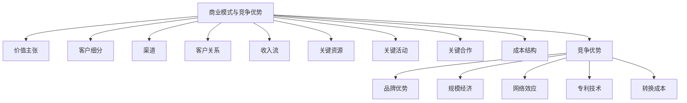

* 概念之间的关系：

| 要素 | 价值主张 | 客户细分 | 渠道 | 收入流 | 关键资源 | 竞争优势 |
|------|----------|----------|------|--------|----------|----------|
| 价值主张 | - | 高度相关 | 中度相关 | 高度相关 | 高度相关 | 高度相关 |
| 客户细分 | 高度相关 | - | 高度相关 | 中度相关 | 低度相关 | 中度相关 |
| 渠道 | 中度相关 | 高度相关 | - | 中度相关 | 低度相关 | 中度相关 |
| 收入流 | 高度相关 | 中度相关 | 中度相关 | - | 中度相关 | 高度相关 |
| 关键资源 | 高度相关 | 低度相关 | 低度相关 | 中度相关 | - | 高度相关 |
| 竞争优势 | 高度相关 | 中度相关 | 中度相关 | 高度相关 | 高度相关 | - |

* 数学模型：

我们可以构建一个简化的商业模式强度评分：

$$ BusinessModelScore = w_1V + w_2C + w_3R + w_4I + w_5A $$

其中：
- V 代表价值主张得分
- C 代表客户关系得分
- R 代表收入模式得分
- I 代表创新能力得分
- A 代表适应性得分
- w₁, w₂, w₃, w₄, w₅ 是各因素的权重

竞争优势可以通过市场份额、利润率和持续时间来量化：

$$ CompetitiveAdvantage = MarketShare \times ProfitMargin \times Duration $$

* 算法流程：

```python
def evaluate_business_model(company_data, weights):
    value_proposition = company_data['value_proposition']
    customer_relations = company_data['customer_relations']
    revenue_model = company_data['revenue_model']
    innovation_capacity = company_data['innovation_capacity']
    adaptability = company_data['adaptability']

    business_model_score = (
        weights['value_proposition'] * value_proposition +
        weights['customer_relations'] * customer_relations +
        weights['revenue_model'] * revenue_model +
        weights['innovation_capacity'] * innovation_capacity +
        weights['adaptability'] * adaptability
    )
    return business_model_score

def calculate_competitive_advantage(market_share, profit_margin, duration):
    return market_share * profit_margin * duration

# 示例使用
company_data = {
    'value_proposition': 8,
    'customer_relations': 7,
    'revenue_model': 9,
    'innovation_capacity': 8,
    'adaptability': 7
}

weights = {
    'value_proposition': 0.3,
    'customer_relations': 0.2,
    'revenue_model': 0.2,
    'innovation_capacity': 0.15,
    'adaptability': 0.15
}

business_model_score = evaluate_business_model(company_data, weights)
competitive_advantage = calculate_competitive_advantage(0.2, 0.15, 5)

print(f"商业模式评分: {business_model_score:.2f}")
print(f"竞争优势指数: {competitive_advantage:.4f}")
```

这个算法提供了评估商业模式强度和竞争优势的框架。

* 实际场景应用：

1. 科技行业：以亚马逊为例
    - 多元化的商业模式（电商、云服务、内容制作）
    - 强大的网络效应和规模经济
    - 持续创新的文化

   ```python
   amazon_data = {
       'value_proposition': 9,
       'customer_relations': 8,
       'revenue_model': 9,
       'innovation_capacity': 10,
       'adaptability': 9
   }

   amazon_business_model_score = evaluate_business_model(amazon_data, weights)
   amazon_competitive_advantage = calculate_competitive_advantage(0.4, 0.06, 10)

   print(f"亚马逊商业模式评分: {amazon_business_model_score:.2f}")
   print(f"亚马逊竞争优势指数: {amazon_competitive_advantage:.4f}")
   ```

2. 消费品行业：以可口可乐为例
    - 强大的品牌价值
    - 全球分销网络
    - 产品多元化策略

   ```python
   coca_cola_data = {
       'value_proposition': 9,
       'customer_relations': 8,
       'revenue_model': 7,
       'innovation_capacity': 6,
       'adaptability': 7
   }

   coca_cola_business_model_score = evaluate_business_model(coca_cola_data, weights)
   coca_cola_competitive_advantage = calculate_competitive_advantage(0.45, 0.25, 50)

   print(f"可口可乐商业模式评分: {coca_cola_business_model_score:.2f}")
   print(f"可口可乐竞争优势指数: {coca_cola_competitive_advantage:.4f}")
   ```

3. 金融科技行业：以Square为例
    - 创新的支付解决方案
    - 生态系统策略
    - 数据驱动的信贷业务

   ```python
   square_data = {
       'value_proposition': 9,
       'customer_relations': 8,
       'revenue_model': 8,
       'innovation_capacity': 9,
       'adaptability': 8
   }

   square_business_model_score = evaluate_business_model(square_data, weights)
   square_competitive_advantage = calculate_competitive_advantage(0.1, 0.02, 7)

   print(f"Square商业模式评分: {square_business_model_score:.2f}")
   print(f"Square竞争优势指数: {square_competitive_advantage:.4f}")
   ```

基于上述分析，我们可以得出以下关于商业模式与竞争优势评估的关键洞察：

1. 价值主张的核心性：强大的价值主张是成功商业模式的基础，它应该清晰地解决客户痛点或满足客户需求。

2. 多元化vs专注：有些公司通过多元化业务创造协同效应（如亚马逊），而另一些则通过专注于核心业务建立深度优势（如可口可乐）。

3. 网络效应的力量：在许多现代商业模式中，网络效应是创造和维持竞争优势的关键（如Facebook、Airbnb）。

4. 规模经济的重要性：在某些行业中，规模经济可以带来显著的成本优势和市场地位（如沃尔玛、亚马逊）。

5. 创新与适应性：在快速变化的市场环境中，持续创新和快速适应能力成为维持竞争优势的关键（如苹果、特斯拉）。

6. 品牌价值：强大的品牌可以创造情感连接和客户忠诚度，形成持久的竞争优势（如可口可乐、Nike）。

7. 生态系统策略：构建完整的产品和服务生态系统可以增加客户粘性和切换成本（如苹果、亚马逊）。

8. 数据优势：在数字经济时代，数据收集和分析能力可以成为关键的竞争优势（如Google、Facebook）。

9. 客户关系管理：深入理解并有效管理客户关系可以提高客户终生价值（如Salesforce、Amazon Prime）。

10. 成本结构的重要性：优化成本结构可以在保持价格竞争力的同时提高盈利能力（如Southwest Airlines、Costco）。

对于投资者而言，评估商业模式和竞争优势时需要注意以下几点：

1. 动态视角：商业模式和竞争优势并非一成不变，需要持续监测和评估其演变。

2. 行业特异性：不同行业的成功商业模式和竞争优势可能有很大差异，需要具体问题具体分析。

3. 可持续性评估：关注竞争优势的持久性，评估它们是否能在未来的市场环境中继续有效。

4. 定性与定量结合：将定性的商业模式分析与定量的财务表现分析相结合，以全面评估公司。

5. 比较分析：通过与竞争对手的对比，更好地理解公司商业模式的独特性和优势。

6. 长期思维：真正的竞争优势通常需要长时间才能体现，不要过于关注短期表现。

7. 创新潜力：评估公司是否具备持续创新和适应市场变化的能力。

8. 客户视角：从客户的角度考虑公司的价值主张和竞争优势是否真正具有吸引力。

9. 生态系统思维：考虑公司在更大的商业生态系统中的位置和作用。

10. 风险意识：识别可能威胁公司商业模式或削弱其竞争优势的潜在风险因素。

通过全面评估公司的商业模式和竞争优势，投资者可以更好地识别那些具有长期增长潜力和可持续盈利能力的高质量企业。这种分析不仅有助于选择投资标的，还能帮助投资者在持有期间持续监控公司的竞争地位和发展前景。然而，重要的是要记住，商业模式和竞争优势的评估often涉及主观判断，需要结合其他质量评估维度，如财务分析、管理团队评估和行业前景分析，才能形成全面的投资决策。

## 5.3 管理团队能力与公司治理结构

管理团队的能力和公司的治理结构对企业的长期成功起着关键作用。优秀的管理团队可以制定和执行有效的战略，而良好的公司治理结构则确保公司以股东和其他利益相关者的最佳利益运营。

* 核心概念：
    - 管理能力
    - 领导风格
    - 战略执行力
    - 公司治理
    - 董事会独立性
    - 股东权益保护

* 问题背景：评估管理团队能力和公司治理结构often涉及主观判断，且信息可能不完全透明。

* 问题描述：如何客观评估管理团队的能力？什么构成了良好的公司治理结构？这些因素如何影响公司的长期表现？

* 问题解决：
    1. 分析管理团队的背景和经验
    2. 评估公司的战略制定和执行能力
    3. 考察管理层的诚信记录和薪酬结构
    4. 分析董事会的构成和独立性
    5. 评估公司的信息披露质量和透明度
    6. 考察股东权益保护机制
    7. 分析公司文化和员工满意度

* 边界与外延：
    - 管理能力的评估可能因行业而异
    - 不同国家和地区可能有不同的公司治理标准
    - 需要考虑公司生命周期阶段对管理需求的影响

* 概念结构与核心要素组成：

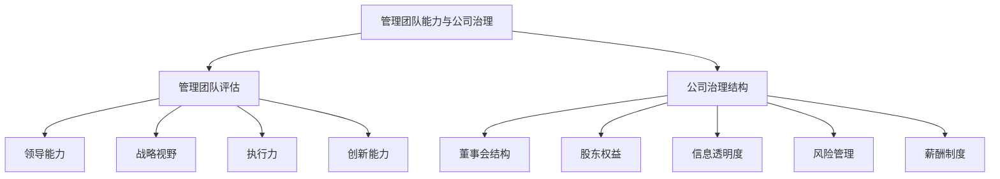

* 概念之间的关系：

| 要素 | 领导能力 | 战略视野 | 执行力 | 董事会结构 | 股东权益 | 信息透明度 |
|------|----------|----------|--------|------------|----------|------------|
| 领导能力 | - | 高度相关 | 高度相关 | 中度相关 | 低度相关 | 中度相关 |
| 战略视野 | 高度相关 | - | 高度相关 | 中度相关 | 低度相关 | 低度相关 |
| 执行力 | 高度相关 | 高度相关 | - | 低度相关 | 低度相关 | 中度相关 |
| 董事会结构 | 中度相关 | 中度相关 | 低度相关 | - | 高度相关 | 高度相关 |
| 股东权益 | 低度相关 | 低度相关 | 低度相关 | 高度相关 | - | 高度相关 |
| 信息透明度 | 中度相关 | 低度相关 | 中度相关 | 高度相关 | 高度相关 | - |

* 数学模型：

我们可以构建一个综合评分模型来评估管理团队能力和公司治理：

$$ ManagementScore = w_1L + w_2S + w_3E + w_4I $$

其中：
- L 代表领导能力得分
- S 代表战略视野得分
- E 代表执行力得分
- I 代表创新能力得分
- w₁, w₂, w₃, w₄ 是各因素的权重

对于公司治理：

$$ GovernanceScore = w_5B + w_6SH + w_7T + w_8R + w_9C $$

其中：
- B 代表董事会结构得分
- SH 代表股东权益保护得分
- T 代表信息透明度得分
- R 代表风险管理得分
- C 代表薪酬制度得分
- w₅, w₆, w₇, w₈, w₉ 是各因素的权重

* 算法流程：

```python
def evaluate_management(management_data, weights):
    leadership = management_data['leadership']
    strategic_vision = management_data['strategic_vision']
    execution = management_data['execution']
    innovation = management_data['innovation']

    management_score = (
        weights['leadership'] * leadership +
        weights['strategic_vision'] * strategic_vision +
        weights['execution'] * execution +
        weights['innovation'] * innovation
    )
    return management_score

def evaluate_governance(governance_data, weights):
    board_structure = governance_data['board_structure']
    shareholder_rights = governance_data['shareholder_rights']
    transparency = governance_data['transparency']
    risk_management = governance_data['risk_management']
    compensation = governance_data['compensation']

    governance_score = (
        weights['board_structure'] * board_structure +
        weights['shareholder_rights'] * shareholder_rights +
        weights['transparency'] * transparency +
        weights['risk_management'] * risk_management +
        weights['compensation'] * compensation
    )
    return governance_score

# 示例使用
management_data = {
    'leadership': 8,
    'strategic_vision': 9,
    'execution': 7,
    'innovation': 8
}

governance_data = {
    'board_structure': 7,
    'shareholder_rights': 8,
    'transparency': 9,
    'risk_management': 7,
    'compensation': 8
}

management_weights = {
    'leadership': 0.3,
    'strategic_vision': 0.3,
    'execution': 0.2,
    'innovation': 0.2
}

governance_weights = {
    'board_structure': 0.25,
    'shareholder_rights': 0.2,
    'transparency': 0.2,
    'risk_management': 0.2,
    'compensation': 0.15
}

management_score = evaluate_management(management_data, management_weights)
governance_score = evaluate_governance(governance_data, governance_weights)

print(f"管理团队评分: {management_score:.2f}")
print(f"公司治理评分: {governance_score:.2f}")
```

* 实际场景应用：

1. 科技行业：以Microsoft为例
    - 强大的领导力（Satya Nadella的转型领导）
    - 清晰的云战略
    - 良好的创新文化

   ```python
   microsoft_management = {
       'leadership': 9,
       'strategic_vision': 9,
       'execution': 8,
       'innovation': 9
   }

   microsoft_governance = {
       'board_structure': 8,
       'shareholder_rights': 7,
       'transparency': 8,
       'risk_management': 8,
       'compensation': 7
   }

   microsoft_management_score = evaluate_management(microsoft_management, management_weights)
   microsoft_governance_score = evaluate_governance(microsoft_governance, governance_weights)

   print(f"Microsoft管理团队评分: {microsoft_management_score:.2f}")
   print(f"Microsoft公司治理评分: {microsoft_governance_score:.2f}")
   ```

2. 金融行业：以JPMorgan Chase为例
    - 经验丰富的管理团队（Jamie Dimon的长期领导）
    - 强大的风险管理能力
    - 复杂的监管环境下的合规管理

   ```python
   jpmorgan_management = {
       'leadership': 9,
       'strategic_vision': 8,
       'execution': 9,
       'innovation': 7
   }

   jpmorgan_governance = {
       'board_structure': 8,
       'shareholder_rights': 7,
       'transparency': 8,
       'risk_management': 9,
       'compensation': 7
   }

   jpmorgan_management_score = evaluate_management(jpmorgan_management, management_weights)
   jpmorgan_governance_score = evaluate_governance(jpmorgan_governance, governance_weights)

   print(f"JPMorgan Chase管理团队评分: {jpmorgan_management_score:.2f}")
   print(f"JPMorgan Chase公司治理评分: {jpmorgan_governance_score:.2f}")
   ```

3. 新兴市场公司：以阿里巴巴为例
    - 创始人影响力（Jack Ma的角色）
    - 复杂的公司结构
    - 国际化战略执行

   ```python
   alibaba_management = {
       'leadership': 8,
       'strategic_vision': 9,
       'execution': 8,
       'innovation': 9
   }

   alibaba_governance = {
       'board_structure': 6,
       'shareholder_rights': 6,
       'transparency': 7,
       'risk_management': 7,
       'compensation': 7
   }

   alibaba_management_score = evaluate_management(alibaba_management, management_weights)
   alibaba_governance_score = evaluate_governance(alibaba_governance, governance_weights)

   print(f"阿里巴巴管理团队评分: {alibaba_management_score:.2f}")
   print(f"阿里巴巴公司治理评分: {alibaba_governance_score:.2f}")
   ```

基于上述分析，我们可以得出以下关于管理团队能力与公司治理结构评估的关键洞察：

1. 领导力的关键作用：优秀的领导能够制定清晰的战略vision，激励员工，并在变化的环境中灵活调整。

2. 战略执行的重要性：制定战略只是第一步，更关键的是有效地执行这些战略。

3. 创新文化：在快速变化的行业中，培养创新文化对公司的长期成功至关重要。

4. 董事会的独立性：独立的董事会能够更好地监督管理层，保护股东利益。

5. 信息透明度：高度的透明度有助于建立投资者信心，降低信息不对称风险。

6. 风险管理：有效的风险管理体系是公司长期稳定发展的保障。

7. 薪酬制度：合理的薪酬制度能够吸引和留住人才，同时将管理层利益与股东利益对齐。

8. 股东权益保护：良好的公司治理应确保所有股东，尤其是小股东的权益得到充分保护。

9. 文化因素：公司文化影响管理决策和员工行为，是评估公司质量的重要因素。

10. 适应性：管理团队需要具备在变化的市场环境中快速适应和调整的能力。

对于投资者而言，评估管理团队能力和公司治理结构时需要注意以下几点：

1. 长期跟踪：通过长期观察管理团队的决策和行为，可以更准确地评估其能力。

2. 多角度分析：结合财务表现、战略执行、创新成果等多个角度评估管理团队。

3. 关注变化：特别注意管理层变动和公司治理结构的改变，这可能预示公司战略或文化的重大转变。

4. 利益相关者反馈：考虑员工、客户、供应商等利益相关者对公司管理的评价。

5. 行业对标：将公司的管理能力和治理结构与行业领先企业进行对比。

6. 危机应对：观察管理团队如何应对危机和挑战，这often能反映其真实能力。

7. 沟通质量：评估管理层与投资者沟通的质量和频率，包括对负面信息的处理方式。

8. 创新投入：关注公司在研发和创新方面的投入，以及这些投入的回报效率。

9. 继任计划：评估公司是否有清晰的领导层继任计划，以确保长期稳定性。

10. 文化适应性：考虑管理团队在不同文化和市场环境中运营的能力，特别是对于跨国公司。

通过全面评估管理团队能力和公司治理结构，投资者可以更好地预测公司的长期表现和风险。这种分析不仅有助于识别高质量的投资标的，还能帮助投资者在持有期间持续监控公司的质量变化。然而，重要的是要认识到，管理能力和公司治理的评估often涉及主观判断，需要结合其他质量评估维度，如财务分析、商业模式评估和行业前景分析，才能形成全面的投资决策。

## 5.4 行业前景与公司市场地位分析

行业前景和公司在行业中的市场地位是评估企业长期发展潜力的关键因素。了解行业的增长动力、竞争格局以及公司在其中的定位，对于预测公司未来的业绩表现至关重要。

* 核心概念：
    - 行业生命周期
    - 市场规模和增长率
    - 市场份额
    - 竞争格局
    - 技术变革
    - 监管环境

* 问题背景：行业动态和市场地位可能随时间快速变化，准确预测长期趋势具有挑战性。

* 问题描述：如何评估行业的长期发展前景？什么因素决定了公司在行业中的市场地位？如何预测这些因素的变化？

* 问题解决：
    1. 分析行业的增长驱动因素
    2. 评估行业的竞争强度和格局
    3. 考察技术变革对行业的潜在影响
    4. 分析监管环境的变化趋势
    5. 评估公司的市场份额和竞争优势
    6. 考虑行业整合或分化的可能性
    7. 分析新进入者的威胁

* 边界与外延：
    - 行业边界可能因技术变革而模糊
    - 全球化趋势可能改变行业竞争格局
    - 需要考虑跨行业竞争的影响

* 概念结构与核心要素组成：

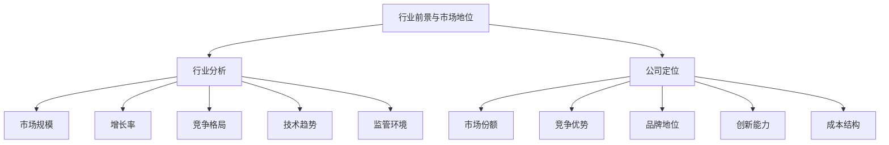

* 概念之间的关系：

| 要素 | 市场规模 | 增长率 | 竞争格局 | 技术趋势 | 市场份额 | 竞争优势 |
|------|----------|--------|----------|----------|----------|----------|
| 市场规模 | - | 高度相关 | 中度相关 | 中度相关 | 低度相关 | 低度相关 |
| 增长率 | 高度相关 | - | 高度相关 | 高度相关 | 中度相关 | 中度相关 |
| 竞争格局 | 中度相关 | 高度相关 | - | 高度相关 | 高度相关 | 高度相关 |
| 技术趋势 | 中度相关 | 高度相关 | 高度相关 | - | 中度相关 | 高度相关 |
| 市场份额 | 低度相关 | 中度相关 | 高度相关 | 中度相关 | - | 高度相关 |
| 竞争优势 | 低度相关 | 中度相关 | 高度相关 | 高度相关 | 高度相关 | - |

* 数学模型：

我们可以构建一个行业吸引力指数和公司市场地位指数：

行业吸引力指数：
$$ IndustryAttractiveness = w_1M + w_2G + w_3C + w_4T + w_5R $$

其中：
- M 代表市场规模得分
- G 代表增长率得分
- C 代表竞争格局得分
- T 代表技术趋势得分
- R 代表监管环境得分
- w₁, w₂, w₃, w₄, w₅ 是各因素的权重

公司市场地位指数：
$$ MarketPosition = w_6S + w_7A + w_8B + w_9I + w_{10}CS $$

其中：
- S 代表市场份额得分
- A 代表竞争优势得分
- B 代表品牌地位得分
- I 代表创新能力得分
- CS 代表成本结构得分
- w₆, w₇, w₈, w₉, w₁₀ 是各因素的权重

* 算法流程：

```python
def evaluate_industry(industry_data, weights):
    market_size = industry_data['market_size']
    growth_rate = industry_data['growth_rate']
    competition = industry_data['competition']
    technology_trends = industry_data['technology_trends']
    regulatory_environment = industry_data['regulatory_environment']

    industry_attractiveness = (
        weights['market_size'] * market_size +
        weights['growth_rate'] * growth_rate +
        weights['competition'] * competition +
        weights['technology_trends'] * technology_trends +
        weights['regulatory_environment'] * regulatory_environment
    )
    return industry_attractiveness

def evaluate_market_position(company_data, weights):
    market_share = company_data['market_share']
    competitive_advantage = company_data['competitive_advantage']
    brand_position = company_data['brand_position']
    innovation_capability = company_data['innovation_capability']
    cost_structure = company_data['cost_structure']

    market_position = (
        weights['market_share'] * market_share +
        weights['competitive_advantage'] * competitive_advantage +
        weights['brand_position'] * brand_position +
        weights['innovation_capability'] * innovation_capability +
        weights['cost_structure'] * cost_structure
    )
    return market_position

# 示例使用
industry_data = {
    'market_size': 8,
    'growth_rate': 7,
    'competition': 6,
    'technology_trends': 9,
    'regulatory_environment': 7
}

company_data = {
    'market_share': 7,
    'competitive_advantage': 8,
    'brand_position': 9,
    'innovation_capability': 8,
    'cost_structure': 7
}

industry_weights = {
    'market_size': 0.2,
    'growth_rate': 0.3,
    'competition': 0.2,
    'technology_trends': 0.2,
    'regulatory_environment': 0.1
}

company_weights = {
    'market_share': 0.25,
    'competitive_advantage': 0.25,
    'brand_position': 0.2,
    'innovation_capability': 0.2,
    'cost_structure': 0.1
}

industry_attractiveness = evaluate_industry(industry_data, industry_weights)
market_position = evaluate_market_position(company_data, company_weights)

print(f"行业吸引力指数: {industry_attractiveness:.2f}")
print(f"公司市场地位指数: {market_position:.2f}")
```

* 实际场景应用：

1. 电动汽车行业：以特斯拉为例
    - 快速增长的市场
    - 技术创新驱动
    - 强大的品牌影响力

   ```python
   ev_industry_data = {
       'market_size': 8,
       'growth_rate': 9,
       'competition': 7,
       'technology_trends': 10,
       'regulatory_environment': 8
   }

   tesla_data = {
       'market_share': 8,
       'competitive_advantage': 9,
       'brand_position': 10,
       'innovation_capability': 10,
       'cost_structure': 7
   }

   ev_industry_attractiveness = evaluate_industry(ev_industry_data, industry_weights)
   tesla_market_position = evaluate_market_position(tesla_data, company_weights)

   print(f"电动汽车行业吸引力指数: {ev_industry_attractiveness:.2f}")
   print(f"特斯拉市场地位指数: {tesla_market_position:.2f}")
   ```

2. 云计算行业：以亚马逊AWS为例
    - 持续高增长的市场
    - 规模经济效应显著
    - 技术领先优势

   ```python
   cloud_industry_data = {
       'market_size': 9,
       'growth_rate': 8,
       'competition': 8,
       'technology_trends': 9,
       'regulatory_environment': 7
   }

   aws_data = {
       'market_share': 9,
       'competitive_advantage': 9,
       'brand_position': 8,
       'innovation_capability': 9,
       'cost_structure': 8
   }

   cloud_industry_attractiveness = evaluate_industry(cloud_industry_data, industry_weights)
   aws_market_position = evaluate_market_position(aws_data, company_weights)

   print(f"云计算行业吸引力指数: {cloud_industry_attractiveness:.2f}")
   print(f"亚马逊AWS市场地位指数: {aws_market_position:.2f}")
   ```

3. 传统零售行业：以沃尔玛为例
    - 成熟市场，增长放缓
    - 电商冲击下的转型
    - 规模优势明显

   ```python
   retail_industry_data = {
       'market_size': 9,
       'growth_rate': 5,
       'competition': 8,
       'technology_trends': 7,
       'regulatory_environment': 6
   }

   walmart_data = {
       'market_share': 10,
       'competitive_advantage': 8,
       'brand_position': 8,
       'innovation_capability': 7,
       'cost_structure': 9
   }

   retail_industry_attractiveness = evaluate_industry(retail_industry_data, industry_weights)
   walmart_market_position = evaluate_market_position(walmart_data, company_weights)

   print(f"传统零售行业吸引力指数: {retail_industry_attractiveness:.2f}")
   print(f"沃尔玛市场地位指数: {walmart_market_position:.2f}")
   ```

基于上述分析，我们可以得出以下关于行业前景与公司市场地位分析的关键洞察：

1. 增长动力：了解行业增长的主要驱动因素（如人口趋势、技术创新、消费者行为变化等）对预测长期前景至关重要。

2. 技术变革：技术创新可能彻底改变行业格局，领先企业需要持续投资以保持竞争力。

3. 规模效应：在某些行业中，规模优势可以带来显著的成本优势和市场地位（如云计算、零售业）。

4. 品牌价值：强大的品牌可以帮助公司在竞争激烈的市场中保持优势地位（如特斯拉在电动车市场）。

5. 创新能力：持续的创新是公司在快速变化的行业中保持领先地位的关键。

6. 成本结构：优化的成本结构可以提供价格优势，特别是在成熟市场中（如沃尔玛在零售业）。

7. 监管影响：监管环境的变化可能对行业格局产生重大影响，公司需要具备快速适应能力。

8. 跨界竞争：行业边界的模糊可能带来新的竞争者，传统行业公司需要警惕跨界威胁。

9. 全球化：全球市场的机遇和挑战都需要纳入考虑，特别是对于跨国公司。

10. 周期性：了解行业的周期性特征有助于做出更准确的长期预测。

对于投资者而言，评估行业前景和公司市场地位时需要注意以下几点：

1. 长期视角：关注长期增长趋势而不是短期波动。

2. 全面分析：结合定量（市场规模、增长率等）和定性（竞争格局、技术趋势等）因素进行分析。

3. 动态评估：定期重新评估行业前景和公司地位，因为它们可能随时间快速变化。

4. 比较分析：将目标公司与行业领先者和新兴竞争对手进行对比。

5. 价值链分析：考虑公司在整个行业价值链中的定位及其变化趋势。

6. 跨行业视角：关注可能影响目标行业的相关行业发展。

7. 宏观因素：考虑宏观经济、人口统计、政策环境等因素对行业的影响。

8. 颠覆性创新：警惕可能颠覆现有行业格局的创新技术或商业模式。

9. 国际化：评估公司在全球市场中的竞争力和扩张潜力。

10. scenario分析：考虑不同的未来情景，评估公司在各种可能的行业发展路径中的表现。

通过全面评估行业前景和公司市场地位，投资者可以更好地预测公司的长期增长潜力和竞争优势的可持续性。这种分析不仅有助于选择有前景的投资标的，还能帮助投资者在持有期间持续监控行业动态和公司竞争地位的变化。然而，重要的是要认识到，行业和市场分析often涉及不确定性，需要结合其他质量评估维度，如财务分析、管理团队评估和公司治理分析，才能形成全面的投资决策。

总结本章，我们探讨了企业质量评估的四个关键维度：财务指标分析、商业模式与竞争优势评估、管理团队能力与公司治理结构，以及行业前景与公司市场地位分析。这些维度共同构成了一个全面的企业质量评估体系，为价值成长投资策略提供了坚实的基础。

高质量的企业通常在这四个维度上都表现出色：它们拥有稳健的财务状况、可持续的商业模式和明显的竞争优势、卓越的管理团队和良好的公司治理，以及在有吸引力的行业中占据有利的市场地位。然而，很少有公司能在所有方面都完美无缺。投资者的任务是权衡这些因素，找出那些整体质量优异，且估值相对合理的公司。

在实际应用中，这个评估体系应该是动态的，随着市场环境、技术发展和公司自身变化而不断调整。投资者需要保持警惕，持续监控和重新评估自己的投资标的。同时，也要认识到，质量评估涉及许多定性因素，需要投资者运用判断力和洞察力，而不仅仅是机械地应用量化指标。

最后，高质量并不等同于好的投资。即使是最优质的公司，如果估值过高，也可能不是好的投资选择。因此，企业质量评估应该与估值分析相结合，才能做出明智的投资决策。在下一章中，我们将深入探讨如何将质量评估与估值方法相结合，以识别真正有吸引力的投资机会。

# 第6章：估值方法的创新与应用

估值是投资决策过程中的关键步骤，它将企业质量评估转化为具体的价值判断。在价值成长投资策略中，创新的估值方法需要同时考虑公司的当前价值和未来增长潜力。本章将探讨传统估值方法的局限性，并介绍更适合评估高增长和创新型公司的新型估值技术。

## 6.1 传统估值方法回顾与局限性

传统估值方法，如市盈率（P/E）、市净率（P/B）和现金流贴现模型（DCF），在评估成熟稳定的公司时often表现良好。然而，这些方法在面对快速增长、高不确定性或创新型公司时，往往显得力不从心。

* 核心概念：
    - 市盈率（P/E）
    - 市净率（P/B）
    - 现金流贴现模型（DCF）
    - 相对估值
    - 绝对估值

* 问题背景：传统估值方法在评估高增长、高不确定性公司时面临挑战。

* 问题描述：传统估值方法的主要局限性是什么？为什么这些方法在评估某些类型的公司时不够有效？

* 问题解决：
    1. 分析市盈率和市净率等相对估值指标的优缺点
    2. 探讨DCF模型在评估高增长公司时的局限性
    3. 考察传统方法在处理负盈利公司时的困难
    4. 分析传统方法在评估无形资产价值时的不足
    5. 探讨如何改进传统估值方法以适应新的市场环境

* 边界与外延：
    - 传统方法在评估成熟稳定公司时仍然有效
    - 需要考虑行业特性对估值方法选择的影响
    - 估值方法的选择应考虑公司所处的生命周期阶段

* 概念结构与核心要素组成：

```mermaid
graph TD
    A[传统估值方法] --> B[相对估值]
    A --> C[绝对估值]
    B --> D[市盈率 P/E]
    B --> E[市净率 P/B]
    B --> F[EV/EBITDA]
    C --> G[DCF模型]
    C --> H[股息贴现模型]
    A --> I[局限性]
    I --> J[高增长公司]
    I --> K[负盈利公司]
    I --> L[无形资产估值]
    I --> M[高不确定性]
```

* 概念之间的关系：

| 方法 | 相对估值 | 绝对估值 | 高增长公司 | 负盈利公司 | 无形资产 |
|------|----------|----------|------------|------------|----------|
| 相对估值 | - | 低度相关 | 中度相关 | 低度相关 | 低度相关 |
| 绝对估值 | 低度相关 | - | 中度相关 | 中度相关 | 中度相关 |
| 高增长公司 | 中度相关 | 中度相关 | - | 高度相关 | 高度相关 |
| 负盈利公司 | 低度相关 | 中度相关 | 高度相关 | - | 中度相关 |
| 无形资产 | 低度相关 | 中度相关 | 高度相关 | 中度相关 | - |

* 数学模型：

1. 市盈率（P/E）:
   $$ P/E = \frac{股票价格}{每股盈利} $$

2. 市净率（P/B）:
   $$ P/B = \frac{股票价格}{每股净资产} $$

3. DCF模型基本公式：
   $$ 公司价值 = \sum_{t=1}^{n} \frac{FCF_t}{(1+r)^t} + \frac{终值}{(1+r)^n} $$

   其中，FCF_t 是第 t 年的自由现金流，r 是贴现率，n 是预测期。

* 算法流程：

```python
def calculate_pe_ratio(price, eps):
    return price / eps if eps > 0 else float('inf')

def calculate_pb_ratio(price, book_value_per_share):
    return price / book_value_per_share

def dcf_valuation(fcf_projections, terminal_value, discount_rate):
    present_value = 0
    for t, fcf in enumerate(fcf_projections, start=1):
        present_value += fcf / (1 + discount_rate) ** t
    present_value += terminal_value / (1 + discount_rate) ** len(fcf_projections)
    return present_value

# 示例使用
price = 100
eps = 5
book_value_per_share = 20
fcf_projections = [10, 12, 15, 18, 20]
terminal_value = 300
discount_rate = 0.10

pe_ratio = calculate_pe_ratio(price, eps)
pb_ratio = calculate_pb_ratio(price, book_value_per_share)
dcf_value = dcf_valuation(fcf_projections, terminal_value, discount_rate)

print(f"P/E比率: {pe_ratio:.2f}")
print(f"P/B比率: {pb_ratio:.2f}")
print(f"DCF估值: ${dcf_value:.2f}")
```

* 实际场景应用：

1. 成熟科技公司：以微软为例
    - 稳定的盈利增长
    - 大量现金流
    - 传统估值方法较为适用

   ```python
   microsoft_price = 300
   microsoft_eps = 8.05
   microsoft_bvps = 25.77
   microsoft_fcf_projections = [60, 65, 70, 75, 80]  # 单位：十亿美元
   microsoft_terminal_value = 1500  # 单位：十亿美元
   microsoft_discount_rate = 0.08

   microsoft_pe = calculate_pe_ratio(microsoft_price, microsoft_eps)
   microsoft_pb = calculate_pb_ratio(microsoft_price, microsoft_bvps)
   microsoft_dcf = dcf_valuation(microsoft_fcf_projections, microsoft_terminal_value, microsoft_discount_rate)

   print(f"微软 P/E比率: {microsoft_pe:.2f}")
   print(f"微软 P/B比率: {microsoft_pb:.2f}")
   print(f"微软 DCF估值: ${microsoft_dcf:.2f}十亿")
   ```

2. 高增长科技公司：以特斯拉为例
    - 高增长率
    - 负盈利历史
    - 传统方法面临挑战

   ```python
   tesla_price = 700
   tesla_eps = 4.90  # 2021年转为盈利
   tesla_bvps = 23.36
   tesla_fcf_projections = [5, 8, 12, 18, 25]  # 单位：十亿美元
   tesla_terminal_value = 500  # 单位：十亿美元
   tesla_discount_rate = 0.12

   tesla_pe = calculate_pe_ratio(tesla_price, tesla_eps)
   tesla_pb = calculate_pb_ratio(tesla_price, tesla_bvps)
   tesla_dcf = dcf_valuation(tesla_fcf_projections, tesla_terminal_value, tesla_discount_rate)

   print(f"特斯拉 P/E比率: {tesla_pe:.2f}")
   print(f"特斯拉 P/B比率: {tesla_pb:.2f}")
   print(f"特斯拉 DCF估值: ${tesla_dcf:.2f}十亿")
   ```

3. 创新生物科技公司：以Moderna为例
    - 前期大量研发投入
    - 收入和盈利高度不确定
    - 传统估值方法难以应用

   ```python
   moderna_price = 150
   moderna_eps = 36.45  # 疫苗带来的临时高盈利
   moderna_bvps = 30.11
   moderna_fcf_projections = [15, 10, 5, 8, 12]  # 单位：十亿美元，假设性数据
   moderna_terminal_value = 200  # 单位：十亿美元
   moderna_discount_rate = 0.15

   moderna_pe = calculate_pe_ratio(moderna_price, moderna_eps)
   moderna_pb = calculate_pb_ratio(moderna_price, moderna_bvps)
   moderna_dcf = dcf_valuation(moderna_fcf_projections, moderna_terminal_value, moderna_discount_rate)

   print(f"Moderna P/E比率: {moderna_pe:.2f}")
   print(f"Moderna P/B比率: {moderna_pb:.2f}")
   print(f"Moderna DCF估值: ${moderna_dcf:.2f}十亿")
   ```

基于上述分析，我们可以总结出传统估值方法的主要局限性：

1. 对高增长公司的估值不足：传统方法often低估了高增长公司的潜在价值，因为这些公司的价值更多地来自于未来增长，而非当前盈利。

2. 难以处理负盈利公司：许多创新型公司在初期阶段可能处于亏损状态，使得基于盈利的估值方法无法应用。

3. 忽视无形资产价值：在知识经济时代，公司的价值越来越多地来自于品牌、专利、人力资本等无形资产，而这些在传统财务报表中often未被充分反映。

4. 对不确定性的处理不足：传统DCF模型假设未来现金流可以准确预测，但对于处于快速变化行业的公司，这一假设often不成立。

5. 行业可比性问题：在新兴行业或跨界经营的公司中，找到合适的可比公司进行相对估值变得困难。

6. 忽视选择权价值：传统方法难以量化公司在未来市场机会中的选择权价值，这对于处于快速发展行业的公司尤为重要。

7. 时间滞后性：财务报表基于历史数据，可能无法及时反映公司业务模式的重大变化。

8. 对周期性行业的估值偏差：在经济周期的不同阶段，传统估值方法可能导致对周期性行业公司的错误定价。

9. 难以捕捉协同效应：在并购或业务重组情况下，传统方法难以准确评估潜在的协同效应价值。

10. 对颠覆性创新的低估：传统方法often难以充分评估可能颠覆现有市场的创新技术或商业模式的潜在价值。

面对这些局限性，投资者需要采取以下策略：

1. 综合使用多种估值方法：不要仅仅依赖单一估值方法，而应结合多种方法以获得更全面的价值评估。

2. 调整估值参数：根据公司的特定情况调整估值模型中的参数，如使用更长的预测期或更高的增长率。

3. 情景分析：考虑多种可能的未来情景，并评估公司在每种情景下的价值。

4. 关注相对估值：在绝对估值困难的情况下，可以更多地依赖行业内的相对估值。

5. 考虑非财务指标：将用户增长、客户获取成本等非财务指标纳入估值考虑。

6. 运用实物期权理论：对于高度不确定但潜力巨大的投资机会，考虑使用实物期权方法进行估值。

7. 动态调整：随着公司和行业的发展，定期重新评估和调整估值模型。

8. 关注现金流：即使在传统盈利指标不适用的情况下，也要密切关注公司的现金流状况。

9. 深入了解业务模式：通过深入理解公司的业务模式和增长动力，来弥补纯粹财务分析的不足。

10. 保持谨慎：在面对高度不确定性时，保持谨慎态度，可能需要更大的安全边际。

总的来说，虽然传统估值方法仍然是投资分析的重要工具，但在面对当今复杂多变的市场环境时，投资者需要更加灵活和创新的估值方法。这就需要我们探索新的估值技术，这将是下一节的重点。

## 6.2 动态DCF模型在成长型公司中的应用

传统的DCF模型虽然理论基础坚实，但在评估高增长、高不确定性的公司时often面临挑战。动态DCF模型试图通过引入更灵活的假设和情景分析来克服这些限制，使其更适合评估成长型公司。

* 核心概念：
    - 动态DCF模型
    - 多阶段增长
    - 情景分析
    - 蒙特卡洛模拟
    - 敏感性分析

* 问题背景：成长型公司的现金流预测和风险评估比传统公司更具挑战性。

* 问题描述：如何改进传统DCF模型以更准确地评估成长型公司？如何在模型中纳入高度不确定性？

* 问题解决：
    1. 引入多阶段增长模型，反映不同发展阶段的增长特征
    2. 使用情景分析，考虑多种可能的未来发展路径
    3. 应用蒙特卡洛模拟，量化不确定性对估值的影响
    4. 进行敏感性分析，识别关键估值驱动因素
    5. 动态调整贴现率，反映公司风险状况的变化
    6. 考虑竞争格局变化对现金流的潜在影响
    7. 纳入实物期权价值，评估管理层的灵活性

* 边界与外延：
    - 动态DCF模型仍然依赖于对未来的预测
    - 模型复杂性增加可能导致"黑箱效应"
    - 需要考虑模型参数的合理性和一致性

* 概念结构与核心要素组成：

```mermaid
graph TD
    A[动态DCF模型] --> B[多阶段增长]
    A --> C[情景分析]
    A --> D[蒙特卡洛模拟]
    A --> E[敏感性分析]
    A --> F[动态贴现率]
    A --> G[竞争格局考量]
    A --> H[实物期权价值]
    B --> I[高增长期]
    B --> J[过渡期]
    B --> K[稳定期]
    C --> L[乐观情景]
    C --> M[基准情景]
    C --> N[悲观情景]
```

* 概念之间的关系：

| 要素 | 多阶段增长 | 情景分析 | 蒙特卡洛模拟 | 敏感性分析 | 动态贴现率 |
|------|------------|----------|--------------|------------|------------|
| 多阶段增长 | - | 高度相关 | 中度相关 | 高度相关 | 中度相关 |
| 情景分析 | 高度相关 | - | 高度相关 | 高度相关 | 中度相关 |
| 蒙特卡洛模拟 | 中度相关 | 高度相关 | - | 高度相关 | 高度相关 |
| 敏感性分析 | 高度相关 | 高度相关 | 高度相关 | - | 中度相关 |
| 动态贴现率 | 中度相关 | 中度相关 | 高度相关 | 中度相关 | - |

* 数学模型：

动态DCF模型的基本公式：

$$ 公司价值 = \sum_{t=1}^{n} \frac{FCF_t}{(1+r_t)^t} + \frac{终值}{(1+r_n)^n} $$

其中，FCF_t 是第 t 年的自由现金流，r_t 是第 t 年的贴现率，n 是预测期。

多阶段增长模型：

$$ g_t = \begin{cases}
g_1, & \text{if } t \leq t_1 \\
g_1 - \frac{(g_1 - g_2)(t-t_1)}{t_2-t_1}, & \text{if } t_1 < t \leq t_2 \\
g_2, & \text{if } t > t_2
\end{cases} $$

其中，g_1 是高增长期增长率，g_2 是稳定期增长率，t_1 是高增长期结束时间，t_2 是过渡期结束时间。

* 算法流程：

```python
import numpy as np
from scipy.stats import norm

def dynamic_dcf_valuation(initial_fcf, growth_rates, transition_periods, discount_rates, terminal_growth, terminal_multiple, num_simulations=10000):
    def generate_growth_path(growth_rates, transition_periods, num_years):
        growth_path = []
        for i, rate in enumerate(growth_rates):
            if i < len(transition_periods):
                growth_path.extend([rate] * transition_periods[i])
            else:
                growth_path.extend([rate] * (num_years - len(growth_path)))
        return growth_path[:num_years]

    num_years = sum(transition_periods) + 1
    growth_path = generate_growth_path(growth_rates, transition_periods, num_years)
    
    valuations = []
    for _ in range(num_simulations):
        fcf = initial_fcf
        present_value = 0
        for t in range(num_years):
            fcf *= (1 + np.random.normal(growth_path[t], 0.1))  # 增加随机性
            present_value += fcf / (1 + discount_rates[t]) ** (t + 1)
        
        terminal_value = fcf * (1 + terminal_growth) / (discount_rates[-1] - terminal_growth)
        # 或者使用退出倍数法
        # terminal_value = fcf * terminal_multiple
        present_value += terminal_value / (1 + discount_rates[-1]) ** num_years
        
        valuations.append(present_value)
    
    return np.mean(valuations), np.std(valuations)

# 示例使用
initial_fcf = 100
growth_rates = [0.3, 0.2, 0.1]  # 高增长、过渡、稳定增长
transition_periods = [3, 2, 5]  # 各阶段年数
discount_rates = [0.12, 0.11, 0.10, 0.10, 0.10, 0.10, 0.10, 0.10, 0.10, 0.10]
terminal_growth = 0.03
terminal_multiple = 15

mean_value, std_value = dynamic_dcf_valuation(initial_fcf, growth_rates, transition_periods, discount_rates, terminal_growth, terminal_multiple)

print(f"估值均值: ${mean_value:.2f}百万")
print(f"估值标准差: ${std_value:.2f}百万")
print(f"90%置信区间: ${mean_value - 1.645*std_value:.2f}百万 到 ${mean_value + 1.645*std_value:.2f}百万")
```

* 实际场景应用：

1. 高增长科技公司：以Zoom为例
    - 疫情期间经历爆发式增长
    - 预期未来增长将逐步放缓
    - 高度不确定的长期前景

   ```python
   zoom_initial_fcf = 1400  # 百万美元
   zoom_growth_rates = [0.5, 0.3, 0.15]
   zoom_transition_periods = [2, 3, 5]
   zoom_discount_rates = [0.12] * 10
   zoom_terminal_growth = 0.04
   zoom_terminal_multiple = 20

   zoom_mean, zoom_std = dynamic_dcf_valuation(zoom_initial_fcf, zoom_growth_rates, zoom_transition_periods, zoom_discount_rates, zoom_terminal_growth, zoom_terminal_multiple)

   print(f"Zoom估值均值: ${zoom_mean:.2f}百万")
   print(f"Zoom估值标准差: ${zoom_std:.2f}百万")
   print(f"Zoom 90%置信区间: ${zoom_mean - 1.645*zoom_std:.2f}百万 到 ${zoom_mean + 1.645*zoom_std:.2f}百万")
   ```

2. 新兴电动车公司：以NIO为例
    - 快速增长但尚未盈利
    - 面临激烈竞争和监管不确定性
    - 需要大量资本投入

   ```python
   nio_initial_fcf = -500  # 百万美元，假设当前为负现金流
   nio_growth_rates = [0.8, 0.5, 0.2]
   nio_transition_periods = [3, 3, 4]
   nio_discount_rates = [0.15, 0.14, 0.13, 0.12, 0.11, 0.10, 0.10, 0.10, 0.10, 0.10]
   nio_terminal_growth = 0.03
   nio_terminal_multiple = 18

   nio_mean, nio_std = dynamic_dcf_valuation(nio_initial_fcf, nio_growth_rates, nio_transition_periods, nio_discount_rates, nio_terminal_growth, nio_terminal_multiple)

   print(f"NIO估值均值: ${nio_mean:.2f}百万")
   print(f"NIO估值标准差: ${nio_std:.2f}百万")
   print(f"NIO 90%置信区间: ${nio_mean - 1.645*nio_std:.2f}百万 到 ${nio_mean + 1.645*nio_std:.2f}百万")
   ```

3. 生物科技创新公司：以Moderna为例
    - 疫苗成功带来巨大现金流
    - 未来增长依赖于新产品管线
    - 高度不确定的长期收益

   ```python
   moderna_initial_fcf = 8000  # 百万美元
   moderna_growth_rates = [0.3, 0.1, 0.05]
   moderna_transition_periods = [2, 3, 5]
   moderna_discount_rates = [0.14, 0.13, 0.12, 0.11, 0.10, 0.10, 0.10, 0.10, 0.10, 0.10]
   moderna_terminal_growth = 0.02
   moderna_terminal_multiple = 16

   moderna_mean, moderna_std = dynamic_dcf_valuation(moderna_initial_fcf, moderna_growth_rates, moderna_transition_periods, moderna_discount_rates, moderna_terminal_growth, moderna_terminal_multiple)

   print(f"Moderna估值均值: ${moderna_mean:.2f}百万")
   print(f"Moderna估值标准差: ${moderna_std:.2f}百万")
   print(f"Moderna 90%置信区间: ${moderna_mean - 1.645*moderna_std:.2f}百万 到 ${moderna_mean + 1.645*moderna_std:.2f}百万")
   ```

基于上述分析，我们可以得出以下关于动态DCF模型在成长型公司估值中应用的关键洞察：

1. 多阶段增长模型的重要性：成长型公司often经历不同的增长阶段，多阶段模型能更准确地反映这种动态变化。

2. 不确定性的量化：通过蒙特卡洛模拟，我们可以得到估值的概率分布，而不仅仅是一个点估计。

3. 贴现率的动态调整：随着公司发展和风险状况变化，贴现率应相应调整。

4. 终值估算的重要性：对于高增长公司，终值often占估值的很大比例，需要特别关注。

5. 情景分析的价值：考虑多种可能的未来情景，有助于更全面地评估公司价值。

6. 敏感性分析的必要性：识别关键估值驱动因素，了解它们对最终估值的影响程度。

7. 行业特性的考虑：不同行业的成长公司可能有不同的增长模式和风险特征，需要在模型中反映。

8. 竞争格局的影响：竞争环境的变化可能显著影响公司的长期增长前景和盈利能力。

9. 实物期权价值：管理层的决策灵活性可能为公司创造额外价值，特别是在不确定性高的环境中。

10. 模型复杂性与实用性的平衡：虽然更复杂的模型可能更准确，但也需要考虑可理解性和实用性。

对于投资者而言，在使用动态DCF模型评估成长型公司时，需要注意以下几点：

1. 数据质量：确保输入模型的数据尽可能准确和最新。

2. 假设的合理性：仔细审视所有关键假设，确保它们与公司和行业的实际情况相符。

3. 定期更新：随着新信息的出现，定期更新模型参数和假设。

4. 综合分析：将DCF估值结果与其他估值方法和定性分析相结合。

5. 了解局限性：认识到即使是动态DCF模型也无法完全消除估值的不确定性。

6. 情景思维：思考可能显著改变估值结果的关键事件或转折点。

7. 长期视角：尽管模型提供了短期预测，但应保持长期投资视角。

8. 持续学习：随着市场环境和估值技术的发展，不断更新和改进估值方法。

9. 专家意见：在处理复杂或高度专业化的行业时，考虑寻求行业专家的意见。

10. 风险管理：使用估值结果进行投资决策时，要考虑潜在的下行风险和投资组合的整体风险状况。

动态DCF模型为评估成长型公司提供了一个更灵活、更全面的框架。通过纳入多阶段增长、情景分析和不确定性量化，这种方法能够更好地捕捉成长型公司的价值动态。然而，重要的是要记住，任何模型都只是现实的简化表示。投资决策不应仅仅基于模型结果，而应结合广泛的定性分析和对公司基本面的深入理解。在下一节中，我们将探讨如何将期权定价理论应用于高增长企业的估值，进一步丰富我们的估值工具箱。

## 6.3 期权定价理论在高增长企业估值中的运用

期权定价理论在金融衍生品定价中广泛应用，但其思想和方法也可以用于企业估值，特别是对于高增长和高不确定性的企业。这种方法often被称为实物期权分析，它可以捕捉传统DCF模型难以量化的灵活性和战略价值。

* 核心概念：
    - 实物期权
    - Black-Scholes模型
    - 二叉树模型
    - 波动率
    - 时间价值
    - 灵活性价值

* 问题背景：高增长企业的价值often来源于未来的潜在机会，这些机会具有高度的不确定性和管理层的决策灵活性。

* 问题描述：如何将期权定价理论应用于企业估值？这种方法如何捕捉传统DCF模型忽视的价值来源？

* 问题解决：
    1. 识别公司面临的关键实物期权
    2. 选择适当的期权定价模型（如Black-Scholes或二叉树模型）
    3. 估计模型所需的关键参数（如波动率、期权期限）
    4. 计算实物期权的价值
    5. 将实物期权价值与传统DCF估值结合
    6. 分析不同情景下的期权价值变化
    7. 评估管理层决策对期权价值的影响

* 边界与外延：
    - 实物期权分析适用于具有高度不确定性和管理灵活性的项目或公司
    - 需要考虑实物期权与金融期权的差异
    - 参数估计的困难可能影响模型的准确性

* 概念结构与核心要素组成：

```mermaid
graph TD
    A[实物期权分析] --> B[期权类型识别]
    A --> C[期权定价模型]
    A --> D[参数估计]
    A --> E[价值计算]
    A --> F[情景分析]
    B --> G[扩张期权]
    B --> H[退出期权]
    B --> I[延迟期权]
    C --> J[Black-Scholes模型]
    C --> K[二叉树模型]
    D --> L[波动率]
    D --> M[无风险利率]
    D --> N[期权期限]
    E --> O[期权价值]
    E --> P[传统DCF价值]
    F --> Q[敏感性分析]
    F --> R[情景规划]
```

* 概念之间的关系：

| 要素 | 期权类型 | 定价模型 | 参数估计 | 价值计算 | 情景分析 |
|------|----------|----------|----------|----------|----------|
| 期权类型 | - | 高度相关 | 中度相关 | 高度相关 | 中度相关 |
| 定价模型 | 高度相关 | - | 高度相关 | 高度相关 | 中度相关 |
| 参数估计 | 中度相关 | 高度相关 | - | 高度相关 | 高度相关 |
| 价值计算 | 高度相关 | 高度相关 | 高度相关 | - | 高度相关 |
| 情景分析 | 中度相关 | 中度相关 | 高度相关 | 高度相关 | - |

* 数学模型：

Black-Scholes模型用于实物期权估值：

$$ C = S_0N(d_1) - Ke^{-rT}N(d_2) $$

其中：

$$ d_1 = \frac{\ln(\frac{S_0}{K}) + (r + \frac{\sigma^2}{2})T}{\sigma\sqrt{T}} $$

$$ d_2 = d_1 - \sigma\sqrt{T} $$

C 是期权价值，S_0 是标的资产当前价值，K 是执行价格，r 是无风险利率，T 是到期时间，σ 是波动率，N() 是标准正态分布的累积分布函数。

* 算法流程：

```python
import numpy as np
from scipy.stats import norm

def black_scholes_call(S, K, T, r, sigma):
    d1 = (np.log(S / K) + (r + 0.5 * sigma ** 2) * T) / (sigma * np.sqrt(T))
    d2 = d1 - sigma * np.sqrt(T)
    return S * norm.cdf(d1) - K * np.exp(-r * T) * norm.cdf(d2)

def real_option_valuation(dcf_value, option_value):
    return dcf_value + option_value

# 示例使用
S = 1000  # 标的资产价值（例如，项目的现值）
K = 1200  # 执行价格（例如，额外投资成本）
T = 5  # 期权有效期（年）
r = 0.05  # 无风险利率
sigma = 0.3  # 波动率

option_value = black_scholes_call(S, K, T, r, sigma)
dcf_value = 800  # 假设的DCF估值

total_value = real_option_valuation(dcf_value, option_value)

print(f"实物期权价值: ${option_value:.2f}百万")
print(f"DCF估值: ${dcf_value:.2f}百万")
print(f"总价值: ${total_value:.2f}百万")
```

* 实际场景应用：

1. 生物科技公司：以基因测序公司Illumina为例
    - 研发管线中的新技术具有巨大但不确定的市场潜力
    - 公司有选择继续投资或放弃特定项目的灵活性

   ```python
   illumina_S = 5000  # 假设成功商业化的价值
   illumina_K = 2000  # 继续研发和商业化的成本
   illumina_T = 7  # 假设新技术开发周期
   illumina_r = 0.05
   illumina_sigma = 0.4  # 高不确定性

   illumina_option_value = black_scholes_call(illumina_S, illumina_K, illumina_T, illumina_r, illumina_sigma)
   illumina_dcf_value = 20000  # 假设的DCF估值

   illumina_total_value = real_option_valuation(illumina_dcf_value, illumina_option_value)

   print(f"Illumina实物期权价值: ${illumina_option_value:.2f}百万")
   print(f"Illumina DCF估值: ${illumina_dcf_value:.2f}百万")
   print(f"Illumina总价值: ${illumina_total_value:.2f}百万")
   ```

2. 电动汽车公司：以特斯拉为例
    - 自动驾驶技术的潜在突破
    - 新电池技术的开发选项

   ```python
   tesla_S = 50000  # 假设自动驾驶技术成功的价值
   tesla_K = 10000  # 开发和部署成本
   tesla_T = 5  # 假设技术成熟时间
   tesla_r = 0.05
   tesla_sigma = 0.5  # 极高的不确定性

   tesla_option_value = black_scholes_call(tesla_S, tesla_K, tesla_T, tesla_r, tesla_sigma)
   tesla_dcf_value = 100000  # 假设的DCF估值

   tesla_total_value = real_option_valuation(tesla_dcf_value, tesla_option_value)

   print(f"特斯拉实物期权价值: ${tesla_option_value:.2f}百万")
   print(f"特斯拉DCF估值: ${tesla_dcf_value:.2f}百万")
   print(f"特斯拉总价值: ${tesla_total_value:.2f}百万")
   ```

3. 云计算公司：以亚马逊AWS为例
    - 扩展到新的地理区域的选项
    - 开发新的云服务产品线的灵活性

   ```python
   aws_S = 30000  # 假设新市场或产品线的潜在价值
   aws_K = 5000  # 扩展或开发成本
   aws_T = 3  # 决策窗口
   aws_r = 0.05
   aws_sigma = 0.3  # 相对较低的不确定性

   aws_option_value = black_scholes_call(aws_S, aws_K, aws_T, aws_r, aws_sigma)
   aws_dcf_value = 200000  # 假设的DCF估值

   aws_total_value = real_option_valuation(aws_dcf_value, aws_option_value)

   print(f"AWS实物期权价值: ${aws_option_value:.2f}百万")
   print(f"AWS DCF估值: ${aws_dcf_value:.2f}百万")
   print(f"AWS总价值: ${aws_total_value:.2f}百万")
   ```

基于上述分析，我们可以得出以下关于实物期权在高增长企业估值中应用的关键洞察：

1. 捕捉战略价值：实物期权分析可以量化传统DCF模型难以捕捉的战略灵活性价值。

2. 不确定性的正面作用：在实物期权框架下，不确定性不仅带来风险，也创造了机会。

3. 管理灵活性的价值：实物期权突出了管理层在面对不确定性时做出灵活决策的价值。

4. 行业特性的影响：不同行业的实物期权特征可能大不相同，需要具体分析。

5. 参数估计的挑战：准确估计波动率等参数是实物期权分析的主要难点之一。

6. 与传统估值方法的结合：实物期权分析应与DCF等传统方法结合使用，而不是完全替代。

7. 情景思维的重要性：实物期权分析鼓励投资者考虑多种可能的未来情景。

8. 时间价值的认识：实物期权强调了等待和保持选择权的价值。

9. 风险管理工具：实物期权分析可以帮助管理层更好地理解和管理项目风险。

10. 创新驱动型公司的优势：对于高度创新的公司，实物期权分析可能更准确地反映其潜在价值。

对于投资者而言，在使用实物期权分析评估高增长企业时，需要注意以下几点：

1. 识别关键期权：准确识别公司面临的重要实物期权是分析的首要步骤。

2. 理解期权特征：不同类型的实物期权（如扩张、退出、延迟）有不同的价值驱动因素。

3. 合理估计参数：尤其是波动率的估计，可能需要结合历史数据、行业比较和专家判断。

4. 考虑期权之间的相互作用：公司可能同时拥有多个实物期权，它们之间可能存在相互影响。

5. 动态视角：随着时间推移和新信息的出现，定期重新评估实物期权的价值。

6. 结合定性分析：实物期权的价值不仅取决于数字，还取决于管理团队执行这些选项的能力。

7. 考虑竞争因素：竞争对手的行动可能影响实物期权的价值，需要在分析中考虑。

8. 了解局限性：实物期权分析虽然强大，但仍基于一系列假设，投资者应该意识到这些局限性。

9. 情景分析：使用不同的参数设置进行敏感性分析，了解价值在不同情况下的变化。

10. 长期思维：实物期权often涉及长期战略决策，投资者需要保持长期视角。

实物期权分析为评估高增长和高不确定性企业提供了一个强大的工具。通过量化传统DCF模型难以捕捉的灵活性和战略价值，它能够更全面地反映这类公司的潜在价值。然而，这种方法也带来了新的挑战，特别是在参数估计和模型复杂性方面。因此，实物期权分析应该作为传统估值方法的补充，而不是替代。投资者需要综合运用多种估值技术，结合定性分析和行业洞察，才能形成对高增长企业价值的全面理解。

## 6.4 相对估值与绝对估值的结合使用

在企业估值实践中，相对估值（如市盈率、市净率等倍数法）和绝对估值（如DCF模型）都有其优缺点。将这两种方法结合使用，可以提供更全面、更可靠的估值结果。本节将探讨如何有效地结合这两种方法，以及在实际应用中的注意事项。

* 核心概念：
    - 相对估值
    - 绝对估值
    - 市盈率（P/E）
    - 市净率（P/B）
    - EV/EBITDA
    - 现金流贴现（DCF）
    - 交叉验证

* 问题背景：单一估值方法often无法全面捕捉公司的价值，特别是对于复杂或快速变化的企业。

* 问题描述：如何有效结合相对估值和绝对估值方法？如何处理两种方法得出的不同结果？

* 问题解决：
    1. 分别进行相对估值和绝对估值
    2. 分析两种方法结果的差异及原因
    3. 使用相对估值检验DCF假设的合理性
    4. 利用DCF模型解释相对估值倍数的变化
    5. 考虑行业特性和公司生命周期阶段
    6. 进行情景分析和敏感性测试
    7. 综合多种方法得出估值区间

* 边界与外延：
    - 不同行业可能更适合某种特定的估值方法
    - 公司所处的生命周期阶段影响估值方法的选择
    - 市场情绪可能导致短期内相对估值偏离基本面

* 概念结构与核心要素组成：

```mermaid
graph TD
    A[估值方法结合] --> B[相对估值]
    A --> C[绝对估值]
    B --> D[市盈率 P/E]
    B --> E[市净率 P/B]
    B --> F[EV/EBITDA]
    C --> G[DCF模型]
    C --> H[股息贴现模型]
    A --> I[交叉验证]
    I --> J[假设检验]
    I --> K[差异分析]
    A --> L[综合估值]
    L --> M[估值区间]
    L --> N[情景分析]
```

* 概念之间的关系：

| 方法 | 相对估值 | 绝对估值 | 交叉验证 | 综合估值 |
|------|----------|----------|----------|----------|
| 相对估值 | - | 中度相关 | 高度相关 | 高度相关 |
| 绝对估值 | 中度相关 | - | 高度相关 | 高度相关 |
| 交叉验证 | 高度相关 | 高度相关 | - | 高度相关 |
| 综合估值 | 高度相关 | 高度相关 | 高度相关 | - |

* 数学模型：

1. 相对估值：
   P/E 比率: $P/E = \frac{股价}{每股收益}$
   P/B 比率: $P/B = \frac{股价}{每股净资产}$
   EV/EBITDA: $EV/EBITDA = \frac{企业价值}{息税折旧摊销前利润}$

2. DCF模型：
   $企业价值 = \sum_{t=1}^{n} \frac{FCF_t}{(1+r)^t} + \frac{终值}{(1+r)^n}$

3. 综合估值：
   $估值 = w_1 * 相对估值 + w_2 * 绝对估值$

   其中 w_1 和 w_2 是权重，且 w_1 + w_2 = 1

* 算法流程：

```python
import numpy as np

def relative_valuation(earnings, book_value, ebitda, peer_pe, peer_pb, peer_ev_ebitda):
    pe_value = earnings * peer_pe
    pb_value = book_value * peer_pb
    ev_ebitda_value = ebitda * peer_ev_ebitda
    return (pe_value + pb_value + ev_ebitda_value) / 3

def dcf_valuation(fcf_projections, terminal_value, discount_rate):
    present_value = sum([fcf / (1 + discount_rate) ** (t + 1) for t, fcf in enumerate(fcf_projections)])
    present_value += terminal_value / (1 + discount_rate) ** len(fcf_projections)
    return present_value

def combined_valuation(relative_value, dcf_value, relative_weight=0.5):
    return relative_value * relative_weight + dcf_value * (1 - relative_weight)

# 示例使用
earnings = 100
book_value = 500
ebitda = 150
peer_pe = 15
peer_pb = 2
peer_ev_ebitda = 10

fcf_projections = [120, 130, 140, 150, 160]
terminal_value = 2000
discount_rate = 0.1

relative_value = relative_valuation(earnings, book_value, ebitda, peer_pe, peer_pb, peer_ev_ebitda)
dcf_value = dcf_valuation(fcf_projections, terminal_value, discount_rate)
combined_value = combined_valuation(relative_value, dcf_value)

print(f"相对估值: ${relative_value:.2f}百万")
print(f"DCF估值: ${dcf_value:.2f}百万")
print(f"综合估值: ${combined_value:.2f}百万")
```

* 实际场景应用：

1. 科技巨头：以苹果公司为例
    - 稳定的盈利能力
    - 强大的品牌价值
    - 持续的创新能力

   ```python
   apple_earnings = 57400  # 百万美元
   apple_book_value = 63090  # 百万美元
   apple_ebitda = 99800  # 百万美元
   apple_peer_pe = 25
   apple_peer_pb = 6
   apple_peer_ev_ebitda = 15

   apple_fcf_projections = [73300, 80000, 85000, 90000, 95000]  # 百万美元
   apple_terminal_value = 2000000  # 百万美元
   apple_discount_rate = 0.08

   apple_relative_value = relative_valuation(apple_earnings, apple_book_value, apple_ebitda, apple_peer_pe, apple_peer_pb, apple_peer_ev_ebitda)
   apple_dcf_value = dcf_valuation(apple_fcf_projections, apple_terminal_value, apple_discount_rate)
   apple_combined_value = combined_valuation(apple_relative_value, apple_dcf_value)

   print(f"苹果相对估值: ${apple_relative_value:.2f}百万")
   print(f"苹果DCF估值: ${apple_dcf_value:.2f}百万")
   print(f"苹果综合估值: ${apple_combined_value:.2f}百万")
   ```

2. 新兴电动车公司：以特斯拉为例
    - 高增长预期
    - 负盈利历史
    - 高度不确定性

   ```python
   tesla_earnings = 721  # 百万美元
   tesla_book_value = 22225  # 百万美元
   tesla_ebitda = 6630  # 百万美元
   tesla_peer_pe = 100  # 高增长公司often有较高的P/E
   tesla_peer_pb = 15
   tesla_peer_ev_ebitda = 50

   tesla_fcf_projections = [2700, 5000, 8000, 12000, 15000]  # 百万美元
   tesla_terminal_value = 500000  # 百万美元
   tesla_discount_rate = 0.12

   tesla_relative_value = relative_valuation(tesla_earnings, tesla_book_value, tesla_ebitda, tesla_peer_pe, tesla_peer_pb, tesla_peer_ev_ebitda)
   tesla_dcf_value = dcf_valuation(tesla_fcf_projections, tesla_terminal_value, tesla_discount_rate)
   tesla_combined_value = combined_valuation(tesla_relative_value, tesla_dcf_value, 0.3)  # 给予DCF更高的权重

   print(f"特斯拉相对估值: ${tesla_relative_value:.2f}百万")
   print(f"特斯拉DCF估值: ${tesla_dcf_value:.2f}百万")
   print(f"特斯拉综合估值: ${tesla_combined_value:.2f}百万")
   ```

3. 传统制造业：以通用电气为例
    - 成熟行业
    - 稳定但低增长
    - 复杂的业务结构

   ```python
   ge_earnings = 5197  # 百万美元
   ge_book_value = 37870  # 百万美元
   ge_ebitda = 7291  # 百万美元
   ge_peer_pe = 12
   ge_peer_pb = 2
   ge_peer_ev_ebitda = 8

   ge_fcf_projections = [5500, 5700, 5900, 6100, 6300]  # 百万美元
   ge_terminal_value = 100000  # 百万美元
   ge_discount_rate = 0.09

   ge_relative_value = relative_valuation(ge_earnings, ge_book_value, ge_ebitda, ge_peer_pe, ge_peer_pb, ge_peer_ev_ebitda)
   ge_dcf_value = dcf_valuation(ge_fcf_projections, ge_terminal_value, ge_discount_rate)
   ge_combined_value = combined_valuation(ge_relative_value, ge_dcf_value, 0.6)  # 给予相对估值更高的权重

   print(f"通用电气相对估值: ${ge_relative_value:.2f}百万")
   print(f"通用电气DCF估值: ${ge_dcf_value:.2f}百万")
   print(f"通用电气综合估值: ${ge_combined_value:.2f}百万")
   ```

基于上述分析，我们可以得出以下关于结合相对估值和绝对估值的关键洞察：

1. 互补性：相对估值和绝对估值各有优缺点，结合使用可以提供更全面的价值评估。

2. 交叉验证：两种方法的结果可以互相验证，显著的差异可能暗示需要进一步调查。

3. 行业特性：不同行业可能更适合某种特定的估值方法，需要根据行业特性调整权重。

4. 生命周期影响：公司所处的生命周期阶段会影响估值方法的适用性。

5. 市场情绪：相对估值可能受短期市场情绪影响，而DCF则提供了更长期的视角。

6. 假设的重要性：DCF模型的结果高度依赖于未来预测，而相对估值则依赖于可比公司的选择。

7. 估值区间：结合两种方法可以得出更可靠的估值区间，而不是单一的点估计。

8. 情景分析：通过改变不同方法的权重和假设，可以进行更丰富的情景分析。

9. 异常值识别：两种方法结果的显著差异可能帮助识别潜在的估值异常或投资机会。

10. 动态调整：随着公司和市场环境的变化，可能需要动态调整不同估值方法的权重。

对于投资者而言，在结合使用相对估值和绝对估值时，需要注意以下几点：

1. 方法选择：根据公司特性和行业背景选择最合适的相对估值指标和DCF模型变体。

2. 可比公司选择：仔细选择真正可比的公司进行相对估值，考虑规模、增长率、风险等因素。

3. 假设一致性：确保DCF模型中的假设与用于相对估值的可比公司选择保持一致。

4. 权重分配：根据公司特性、行业状况和市场环境，合理分配相对估值和绝对估值的权重。

5. 敏感性分析：对关键参数进行敏感性分析，了解它们对最终估值的影响。

6. 定性因素考虑：不要忽视难以量化的因素，如管理质量、品牌价值等。

7. 长期视角：尽管相对估值often反映短期市场情绪，但要保持长期投资视角。

8. 持续更新：随着新信息的出现，定期更新估值模型和假设。

9. 差异分析：当两种方法的结果存在显著差异时，深入分析原因，可能揭示重要的洞察。

10. 综合判断：估值结果应该作为决策的参考，而不是唯一依据。结合其他分析和个人判断做出最终决策。

结合使用相对估值和绝对估值方法可以为投资者提供更全面、更可靠的价值评估。这种方法既考虑了市场当前的定价水平，又纳入了对公司长期基本面的预期。通过权衡不同方法的优缺点，投资者可以得到一个更平衡、更稳健的估值结果。然而，重要的是要记住，估值是一门艺术，也是一门科学。即使使用最复杂的模型和方法，也无法消除所有的不确定性。因此，估值结果应该被视为一个合理的价值区间，而不是精确的点估计。结合深入的基本面分析、行业洞察和宏观经济考虑，投资者才能做出明智的投资决策。

# 第7章：风险管理在融合投资中的角色

风险管理是价值成长投资策略中不可或缺的组成部分。虽然追求高增长和高质量企业的投资机会，但同时也需要有效地识别、评估和管理相关风险。本章将探讨如何在融合投资策略中平衡风险与回报，以及如何构建和管理一个稳健的投资组合。

## 7.1 系统性风险与非系统性风险的平衡

投资者面临的风险可以broadly分为两类：系统性风险和非系统性风险。系统性风险影响整个市场，无法通过分散化完全消除；非系统性风险则是特定于个别公司或行业的风险，可以通过适当的分散化来降低。在价值成长投资策略中，平衡这两类风险至关重要。

* 核心概念：
    - 系统性风险
    - 非系统性风险
    - 贝塔系数
    - 分散化
    - 风险调整收益率

* 问题背景：价值成长投资策略often涉及对特定高质量、高增长公司的集中投资，这可能增加非系统性风险。

* 问题描述：如何在追求高增长机会的同时，有效管理系统性和非系统性风险？如何在集中投资和分散化之间找到平衡？

* 问题解决：
    1. 评估个别股票的系统性风险（贝塔系数）
    2. 分析公司特定的非系统性风险因素
    3. 构建多元化的投资组合以降低非系统性风险
    4. 使用对冲工具管理系统性风险
    5. 定期评估和调整投资组合的风险暴露
    6. 考虑宏观经济因素对系统性风险的影响
    7. 利用风险调整收益率指标评估投资表现

* 边界与外延：
    - 完全消除风险是不可能的，目标是优化风险调整后的回报
    - 过度分散可能稀释潜在收益，需要在集中和分散之间找到平衡
    - 风险管理策略需要根据市场环境和个人风险偏好动态调整

* 概念结构与核心要素组成：

```mermaid
graph TD
    A[风险管理] --> B[系统性风险]
    A --> C[非系统性风险]
    B --> D[市场贝塔]
    B --> E[宏观经济因素]
    B --> F[对冲策略]
    C --> G[公司特定风险]
    C --> H[行业风险]
    C --> I[分散化]
    A --> J[风险评估]
    J --> K[VaR]
    J --> L[压力测试]
    A --> M[风险调整收益]
    M --> N[夏普比率]
    M --> O[特雷诺比率]
```

* 概念之间的关系：

| 风险类型 | 系统性风险 | 非系统性风险 | 分散化 | 对冲策略 | 风险调整收益 |
|----------|------------|--------------|--------|----------|--------------|
| 系统性风险 | - | 低度相关 | 低度相关 | 高度相关 | 中度相关 |
| 非系统性风险 | 低度相关 | - | 高度相关 | 低度相关 | 中度相关 |
| 分散化 | 低度相关 | 高度相关 | - | 低度相关 | 高度相关 |
| 对冲策略 | 高度相关 | 低度相关 | 低度相关 | - | 中度相关 |
| 风险调整收益 | 中度相关 | 中度相关 | 高度相关 | 中度相关 | - |

* 数学模型：

1. 资产贝塔系数：
   $$ \beta_i = \frac{Cov(R_i, R_m)}{Var(R_m)} $$
   其中，R_i 是资产 i 的收益率，R_m 是市场收益率。

2. 投资组合风险：
   $$ \sigma_p^2 = \sum_{i=1}^n w_i^2 \sigma_i^2 + \sum_{i=1}^n \sum_{j \neq i} w_i w_j \sigma_i \sigma_j \rho_{ij} $$
   其中，w_i 是资产 i 的权重，σ_i 是资产 i 的标准差，ρ_ij 是资产 i 和 j 的相关系数。

3. 夏普比率：
   $$ Sharpe Ratio = \frac{R_p - R_f}{\sigma_p} $$
   其中，R_p 是投资组合收益率，R_f 是无风险利率，σ_p 是投资组合标准差。

* 算法流程：

```python
import numpy as np
import pandas as pd

def calculate_beta(stock_returns, market_returns):
    covariance = np.cov(stock_returns, market_returns)[0][1]
    market_variance = np.var(market_returns)
    return covariance / market_variance

def calculate_portfolio_risk(weights, cov_matrix):
    return np.sqrt(np.dot(weights.T, np.dot(cov_matrix, weights)))

def calculate_sharpe_ratio(portfolio_return, risk_free_rate, portfolio_risk):
    return (portfolio_return - risk_free_rate) / portfolio_risk

# 示例使用
stock_returns = np.array([0.05, 0.08, 0.12, -0.03])
market_returns = np.array([0.03, 0.05, 0.08, -0.01])
beta = calculate_beta(stock_returns, market_returns)

weights = np.array([0.3, 0.3, 0.2, 0.2])
cov_matrix = np.cov(np.array([stock_returns, market_returns]))
portfolio_risk = calculate_portfolio_risk(weights, cov_matrix)

portfolio_return = np.dot(weights, stock_returns)
risk_free_rate = 0.02
sharpe_ratio = calculate_sharpe_ratio(portfolio_return, risk_free_rate, portfolio_risk)

print(f"股票贝塔系数: {beta:.2f}")
print(f"投资组合风险: {portfolio_risk:.2f}")
print(f"夏普比率: {sharpe_ratio:.2f}")
```

* 实际场景应用：

1. 科技成长股组合：
    - 高贝塔值
    - 高非系统性风险
    - 潜在高回报

   ```python
   tech_returns = np.array([0.20, 0.15, 0.25, -0.10])
   market_returns = np.array([0.10, 0.08, 0.12, -0.05])
   tech_beta = calculate_beta(tech_returns, market_returns)

   tech_weights = np.array([0.4, 0.3, 0.2, 0.1])
   tech_cov_matrix = np.cov(np.array([tech_returns, market_returns]))
   tech_portfolio_risk = calculate_portfolio_risk(tech_weights, tech_cov_matrix)

   tech_portfolio_return = np.dot(tech_weights, tech_returns)
   risk_free_rate = 0.02
   tech_sharpe_ratio = calculate_sharpe_ratio(tech_portfolio_return, risk_free_rate, tech_portfolio_risk)

   print(f"科技股组合贝塔系数: {tech_beta:.2f}")
   print(f"科技股组合风险: {tech_portfolio_risk:.2f}")
   print(f"科技股组合夏普比率: {tech_sharpe_ratio:.2f}")
   ```

2. 价值股组合：
    - 低贝塔值
    - 低非系统性风险
    - 稳定但较低回报

   ```python
   value_returns = np.array([0.08, 0.06, 0.10, 0.02])
   market_returns = np.array([0.10, 0.08, 0.12, -0.05])
   value_beta = calculate_beta(value_returns, market_returns)

   value_weights = np.array([0.3, 0.3, 0.2, 0.2])
   value_cov_matrix = np.cov(np.array([value_returns, market_returns]))
   value_portfolio_risk = calculate_portfolio_risk(value_weights, value_cov_matrix)

   value_portfolio_return = np.dot(value_weights, value_returns)
   risk_free_rate = 0.02
   value_sharpe_ratio = calculate_sharpe_ratio(value_portfolio_return, risk_free_rate, value_portfolio_risk)

   print(f"价值股组合贝塔系数: {value_beta:.2f}")
   print(f"价值股组合风险: {value_portfolio_risk:.2f}")
   print(f"价值股组合夏普比率: {value_sharpe_ratio:.2f}")
   ```

3. 平衡的价值成长组合：
    - 混合高低贝塔股票
    - 适度的非系统性风险
    - 平衡风险和回报

   ```python
   balanced_returns = np.array([0.15, 0.10, 0.18, -0.05])
   market_returns = np.array([0.10, 0.08, 0.12, -0.05])
   balanced_beta = calculate_beta(balanced_returns, market_returns)

   balanced_weights = np.array([0.35, 0.25, 0.25, 0.15])
   balanced_cov_matrix = np.cov(np.array([balanced_returns, market_returns]))
   balanced_portfolio_risk = calculate_portfolio_risk(balanced_weights, balanced_cov_matrix)

   balanced_portfolio_return = np.dot(balanced_weights, balanced_returns)
   risk_free_rate = 0.02
   balanced_sharpe_ratio = calculate_sharpe_ratio(balanced_portfolio_return, risk_free_rate, balanced_portfolio_risk)

   print(f"平衡组合贝塔系数: {balanced_beta:.2f}")
   print(f"平衡组合风险: {balanced_portfolio_risk:.2f}")
   print(f"平衡组合夏普比率: {balanced_sharpe_ratio:.2f}")
   ```

基于上述分析，我们可以得出以下关于系统性风险与非系统性风险平衡的关键洞察：

1. 风险-回报权衡：高增长、高质量公司often具有较高的非系统性风险，但也可能带来更高的潜在回报。

2. 分散化的重要性：适度的分散化可以显著降低非系统性风险，而不过度稀释潜在收益。

3. 贝塔管理：通过在投资组合中混合不同贝塔值的股票，可以调整整体的系统性风险暴露。

4. 行业配置：在不同行业间分散投资可以降低行业特定的非系统性风险。

5. 动态风险管理：随着市场环境和个股基本面的变化，需要定期重新评估和调整风险暴露。

6. 对冲策略：对于系统性风险，可以考虑使用指数期货或期权等工具进行部分对冲。

7. 风险调整收益：使用夏普比率等指标可以更全面地评估投资组合的表现，而不仅仅关注绝对回报。

8. 宏观因素考量：系统性风险often与宏观经济因素相关，需要持续关注和分析宏观经济趋势。

9. 公司特定风险：深入的基本面分析可以帮助识别和管理公司特定的非系统性风险。

10. 风险预算：为不同类型的风险分配风险预算，确保整体风险水平在可接受范围内。

对于价值成长投资者而言，在管理系统性和非系统性风险时需要注意以下几点：

1. 保持平衡：在追求高增长机会的同时，不要忽视风险管理的重要性。

2. 适度集中：虽然分散化很重要，但过度分散可能导致"平庸化"，失去超额收益的机会。

3. 持续监控：定期评估投资组合的风险特征，包括贝塔值、相关性和波动性。

4. 情景分析：考虑不同市场环境下的潜在风险，进行压力测试和情景模拟。

5. 灵活调整：根据市场条件和个股表现，灵活调整持仓比例和风险暴露。

6. 长期视角：短期波动不可避免，保持长期投资视角有助于降低对短期市场噪音的过度反应。

7. 质量优先：投资高质量公司可以在一定程度上缓解非系统性风险。

8. 了解相关性：深入分析持仓之间的相关性，避免在看似分散的投资组合中隐藏高度相关性。

9. 风险来源多元化：不仅要在股票间分散，还可以考虑其他资产类别，如债券或另类投资。

10. 持续学习：金融市场在不断演变，需要不断更新风险管理知识和技能。

通过有效平衡系统性风险和非系统性风险，价值成长投资者可以构建一个既能把握高增长机会，又能在市场波动中保持稳健的投资组合。这种平衡需要深入的分析、持续的监控和灵活的调整。在下一节中，我们将探讨如何在投资组合构建中进一步实施这些风险管理原则。

## 7.2 投资组合构建中的风险分散策略

在价值成长投资策略中，投资组合构建是平衡风险和回报的关键环节。有效的风险分散策略不仅可以降低非系统性风险，还能优化整体的风险调整收益。本节将探讨如何在保持价值成长投资理念的同时，实施有效的风险分散策略。

* 核心概念：
    - 现代投资组合理论
    - 有效前沿
    - 相关性
    - 行业分散
    - 地理分散
    - 市值分散
    - 风格分散

* 问题背景：价值成长投资often倾向于集中持股，这可能导致较高的非系统性风险。

* 问题描述：如何在保持高质量、高增长投资理念的同时，实现有效的风险分散？如何平衡集中投资和分散化之间的权衡？

* 问题解决：
    1. 应用现代投资组合理论优化资产配置
    2. 分析不同资产间的相关性，寻找低相关或负相关的组合
    3. 在不同行业间分散投资，降低行业特定风险
    4. 考虑地理分散，减少单一市场风险
    5. 在不同市值公司间分散投资，平衡风险和增长
    6. 结合不同投资风格，如价值和成长
    7. 使用量化模型评估和优化投资组合风险

* 边界与外延：
    - 过度分散可能导致收益率下降
    - 需要平衡理论最优和实际可操作性
    - 考虑交易成本和税收影响

* 概念结构与核心要素组成：

```mermaid
graph TD
    A[投资组合风险分散] --> B[资产配置]
    A --> C[相关性分析]
    A --> D[行业分散]
    A --> E[地理分散]
    A --> F[市值分散]
    A --> G[风格分散]
    B --> H[股票]
    B --> I[债券]
    B --> J[现金]
    B --> K[另类投资]
    C --> L[正相关]
    C --> M[负相关]
    C --> N[低相关]
    D --> O[周期性行业]
    D --> P[防御性行业]
    E --> Q[发达市场]
    E --> R[新兴市场]
    F --> S[大盘股]
    F --> T[中小盘股]
    G --> U[价值型]
    G --> V[成长型]
```

* 概念之间的关系：

| 分散策略 | 资产配置 | 相关性分析 | 行业分散 | 地理分散 | 市值分散 | 风格分散 |
|----------|----------|------------|----------|----------|----------|----------|
| 资产配置 | - | 高度相关 | 中度相关 | 中度相关 | 中度相关 | 中度相关 |
| 相关性分析 | 高度相关 | - | 高度相关 | 高度相关 | 中度相关 | 高度相关 |
| 行业分散 | 中度相关 | 高度相关 | - | 中度相关 | 低度相关 | 中度相关 |
| 地理分散 | 中度相关 | 高度相关 | 中度相关 | - | 低度相关 | 中度相关 |
| 市值分散 | 中度相关 | 中度相关 | 低度相关 | 低度相关 | - | 中度相关 |
| 风格分散 | 中度相关 | 高度相关 | 中度相关 | 中度相关 | 中度相关 | - |

* 数学模型：

1. 投资组合预期收益率：
   $$ E(R_p) = \sum_{i=1}^n w_i E(R_i) $$
   其中，w_i 是资产 i 的权重，E(R_i) 是资产 i 的预期收益率。

2. 投资组合方差：
   $$ \sigma_p^2 = \sum_{i=1}^n w_i^2 \sigma_i^2 + \sum_{i=1}^n \sum_{j \neq i} w_i w_j \sigma_i \sigma_j \rho_{ij} $$
   其中，σ_i 是资产 i 的标准差，ρ_ij 是资产 i 和 j 的相关系数。

3. 夏普比率：
   $$ Sharpe Ratio = \frac{E(R_p) - R_f}{\sigma_p} $$
   其中，R_f 是无风险利率。

* 算法流程：

```python
import numpy as np
import pandas as pd
from scipy.optimize import minimize

def portfolio_stats(weights, returns, cov_matrix):
    portfolio_return = np.sum(returns.mean() * weights) * 252
    portfolio_std_dev = np.sqrt(np.dot(weights.T, np.dot(cov_matrix, weights))) * np.sqrt(252)
    return portfolio_return, portfolio_std_dev

def neg_sharpe_ratio(weights, returns, cov_matrix, risk_free_rate):
    p_ret, p_std = portfolio_stats(weights, returns, cov_matrix)
    return -(p_ret - risk_free_rate) / p_std

def optimize_portfolio(returns, cov_matrix, risk_free_rate):
    num_assets = len(returns.columns)
    args = (returns, cov_matrix, risk_free_rate)
    constraints = ({'type': 'eq', 'fun': lambda x: np.sum(x) - 1})
    bounds = tuple((0, 1) for asset in range(num_assets))
    result = minimize(neg_sharpe_ratio, num_assets*[1./num_assets], args=args,
                      method='SLSQP', bounds=bounds, constraints=constraints)
    return result.x

# 示例使用
returns = pd.DataFrame({
    'Tech': [0.1, 0.15, 0.05, -0.02],
    'Finance': [0.05, 0.08, 0.03, 0.01],
    'Healthcare': [0.08, 0.1, 0.06, 0.03],
    'Consumer': [0.06, 0.07, 0.04, 0.02]
})
cov_matrix = returns.cov()
risk_free_rate = 0.02

optimal_weights = optimize_portfolio(returns, cov_matrix, risk_free_rate)
optimal_return, optimal_std_dev = portfolio_stats(optimal_weights, returns, cov_matrix)
optimal_sharpe = (optimal_return - risk_free_rate) / optimal_std_dev

print("最优权重:")
for asset, weight in zip(returns.columns, optimal_weights):
    print(f"{asset}: {weight:.2f}")
print(f"预期年化收益率: {optimal_return:.2f}")
print(f"预期年化波动率: {optimal_std_dev:.2f}")
print(f"夏普比率: {optimal_sharpe:.2f}")
```

* 实际场景应用：

1. 价值成长组合优化：

```python
value_growth_returns = pd.DataFrame({
    'Tech_Growth': [0.2, 0.25, 0.15, -0.05],
    'Value_Stock': [0.08, 0.1, 0.06, 0.04],
    'Emerging_Market': [0.15, 0.2, 0.1, -0.08],
    'Dividend_Stock': [0.06, 0.07, 0.05, 0.03]
})
vg_cov_matrix = value_growth_returns.cov()
vg_risk_free_rate = 0.02

vg_optimal_weights = optimize_portfolio(value_growth_returns, vg_cov_matrix, vg_risk_free_rate)
vg_optimal_return, vg_optimal_std_dev = portfolio_stats(vg_optimal_weights, value_growth_returns, vg_cov_matrix)
vg_optimal_sharpe = (vg_optimal_return - vg_risk_free_rate) / vg_optimal_std_dev

print("价值成长组合最优权重:")
for asset, weight in zip(value_growth_returns.columns, vg_optimal_weights):
    print(f"{asset}: {weight:.2f}")
print(f"预期年化收益率: {vg_optimal_return:.2f}")
print(f"预期年化波动率: {vg_optimal_std_dev:.2f}")
print(f"夏普比率: {vg_optimal_sharpe:.2f}")
```

2. 多资产类别组合：

```python
multi_asset_returns = pd.DataFrame({
    'US_Stocks': [0.12, 0.15, 0.08, -0.03],
    'Int_Stocks': [0.1, 0.18, 0.05, -0.06],
    'Bonds': [0.03, 0.02, 0.04, 0.05],
    'Real_Estate': [0.08, 0.1, 0.06, 0.02],
    'Commodities': [0.05, 0.12, -0.02, -0.04]
})
ma_cov_matrix = multi_asset_returns.cov()
ma_risk_free_rate = 0.02

ma_optimal_weights = optimize_portfolio(multi_asset_returns, ma_cov_matrix, ma_risk_free_rate)
ma_optimal_return, ma_optimal_std_dev = portfolio_stats(ma_optimal_weights, multi_asset_returns, ma_cov_matrix)
ma_optimal_sharpe = (ma_optimal_return - ma_risk_free_rate) / ma_optimal_std_dev

print("多资产类别组合最优权重:")
for asset, weight in zip(multi_asset_returns.columns, ma_optimal_weights):
    print(f"{asset}: {weight:.2f}")
print(f"预期年化收益率: {ma_optimal_return:.2f}")
print(f"预期年化波动率: {ma_optimal_std_dev:.2f}")
print(f"夏普比率: {ma_optimal_sharpe:.2f}")
```

基于上述分析，我们可以得出以下关于投资组合构建中风险分散策略的关键洞察：

1. 多维度分散：有效的风险分散不仅涉及资产类别，还包括行业、地理、市值和投资风格等多个维度。

2. 相关性的重要性：低相关或负相关资产的组合可以显著降低整体投资组合风险。

3. 动态优化：投资组合的最优配置会随市场环境变化而改变，需要定期重新评估和调整。

4. 风险-回报权衡：追求更高回报often意味着承担更高风险，需要根据个人风险偏好进行权衡。

5. 非线性关系：资产间的相关性可能在极端市场条件下发生变化，需要考虑这种非线性关系。

6. 宏观因素考量：不同资产类别和地理区域对宏观经济因素的敏感度不同，可以通过适当配置来管理宏观风险。

7. 流动性管理：在构建投资组合时，需要考虑不同资产的流动性特征，确保在需要时能够灵活调整。

8. 成本效益分析：过度频繁的调整可能带来高额交易成本，需要权衡分散化收益和交易成本。

9. 税收影响：不同资产类别和投资策略可能有不同的税收影响，这也是构建投资组合时需要考虑的因素。

10. 长期视角：虽然短期波动不可避免，但保持长期投资视角有助于实现更好的风险调整收益。

对于价值成长投资者而言，在实施投资组合风险分散策略时需要注意以下几点：

1. 保持核心理念：在追求分散化的同时，不要偏离价值成长投资的核心理念。

2. 质量优先：即使在分散投资时，也应该优先选择高质量、具有持续增长潜力的公司。

3. 适度集中：适度的集中投资可能带来超额收益，完全分散可能导致平庸的业绩。

4. 动态调整：根据市场环境和个股表现，定期重新评估和调整投资组合。

5. 风格一致性：在不同资产类别或地理区域中寻找符合价值成长特征的投资机会。

6. 新兴机会：关注新兴行业和技术，它们可能提供长期增长潜力和分散化收益。

7. 风险预算：为不同类型的风险分配风险预算，确保整体风险水平在可接受范围内。

8. 情景分析：考虑不同市场环境下的投资组合表现，进行压力测试和情景模拟。

9. 持续学习：随着市场的演变，不断更新知识和技能，适应新的投资环境和机会。

10. 个性化策略：根据个人的财务目标、风险偏好和投资期限定制分散化策略。

通过实施全面而有效的风险分散策略，价值成长投资者可以在追求高质量增长机会的同时，构建一个更加稳健和可持续的投资组合。这种平衡需要深入的分析、持续的监控和灵活的调整。在下一节中，我们将探讨如何在动态的市场环境中持续评估和管理投资组合风险。

## 7.3 动态风险评估与投资组合调整

在价值成长投资策略中，持续的风险评估和及时的投资组合调整是至关重要的。市场环境、公司基本面和投资者自身情况的变化都可能影响投资组合的风险-收益特征。本节将探讨如何建立一个动态的风险评估框架，并基于这个框架进行投资组合的持续优化。

* 核心概念：
    - 动态风险评估
    - 风险因子分析
    - 条件风险价值（Conditional VaR）
    - 贝塔滑动
    - 再平衡策略
    - - 动态资产配置
    - 止损策略
    - 风险预警系统

* 问题背景：市场环境和个股基本面的变化可能导致投资组合的风险特征发生显著变化。

* 问题描述：如何建立一个有效的动态风险评估系统？如何根据风险评估结果及时调整投资组合？

* 问题解决：
    1. 建立多维度的风险监控指标体系
    2. 定期进行风险因子分析，识别主要风险来源
    3. 使用条件风险价值等先进风险度量方法
    4. 实施贝塔滑动策略，动态调整系统性风险暴露
    5. 设计灵活的再平衡策略，保持目标风险水平
    6. 实施动态资产配置，根据市场环境调整资产比例
    7. 制定个股和组合层面的止损策略
    8. 建立风险预警系统，及时发现潜在风险

* 边界与外延：
    - 过于频繁的调整可能带来高额交易成本
    - 需要平衡短期风险管理和长期投资目标
    - 考虑税收影响和流动性限制

* 概念结构与核心要素组成：

```mermaid
graph TD
    A[动态风险管理] --> B[风险评估]
    A --> C[投资组合调整]
    B --> D[多维度指标]
    B --> E[风险因子分析]
    B --> F[条件风险价值]
    C --> G[贝塔滑动]
    C --> H[再平衡策略]
    C --> I[动态资产配置]
    C --> J[止损策略]
    A --> K[风险预警系统]
    K --> L[阈值监控]
    K --> M[异常检测]
```

* 概念之间的关系：

| 要素 | 风险评估 | 投资组合调整 | 风险预警系统 | 贝塔滑动 | 再平衡策略 |
|------|----------|--------------|--------------|----------|------------|
| 风险评估 | - | 高度相关 | 高度相关 | 中度相关 | 中度相关 |
| 投资组合调整 | 高度相关 | - | 高度相关 | 高度相关 | 高度相关 |
| 风险预警系统 | 高度相关 | 高度相关 | - | 中度相关 | 中度相关 |
| 贝塔滑动 | 中度相关 | 高度相关 | 中度相关 | - | 中度相关 |
| 再平衡策略 | 中度相关 | 高度相关 | 中度相关 | 中度相关 | - |

* 数学模型：

1. 条件风险价值（CVaR）：
   $$ CVaR_\alpha = E[L|L \geq VaR_\alpha] $$
   其中，L 是损失，α 是置信水平，VaR_α 是在 α 置信水平下的风险价值。

2. 贝塔滑动：
   $$ \beta_t = \lambda \beta_{t-1} + (1-\lambda)\beta_{observed} $$
   其中，λ 是平滑因子，β_observed 是观察到的贝塔值。

3. 再平衡触发条件：
   如果 |w_i - w_i^target| > threshold，则进行再平衡
   其中，w_i 是资产 i 的实际权重，w_i^target 是目标权重。

* 算法流程：

```python
import numpy as np
import pandas as pd

def calculate_cvar(returns, alpha=0.05):
    sorted_returns = np.sort(returns)
    index = int(alpha * len(sorted_returns))
    return -np.mean(sorted_returns[:index])

def beta_sliding(current_beta, observed_beta, lambda_factor=0.94):
    return lambda_factor * current_beta + (1 - lambda_factor) * observed_beta

def check_rebalance(current_weights, target_weights, threshold=0.05):
    return np.any(np.abs(current_weights - target_weights) > threshold)

def dynamic_risk_management(returns, betas, current_weights, target_weights):
    cvar = calculate_cvar(returns)
    new_betas = [beta_sliding(b, ob) for b, ob in zip(betas, observed_betas)]
    rebalance_needed = check_rebalance(current_weights, target_weights)
    
    return cvar, new_betas, rebalance_needed

# 示例使用
returns = np.random.normal(0.001, 0.02, 1000)
betas = [1.1, 0.9, 1.0, 1.2]
observed_betas = [1.0, 0.95, 1.05, 1.15]
current_weights = np.array([0.3, 0.3, 0.2, 0.2])
target_weights = np.array([0.25, 0.25, 0.25, 0.25])

cvar, new_betas, rebalance_needed = dynamic_risk_management(returns, betas, current_weights, target_weights)

print(f"条件风险价值 (CVaR): {cvar:.4f}")
print("更新后的贝塔值:", [f"{beta:.2f}" for beta in new_betas])
print(f"需要再平衡: {'是' if rebalance_needed else '否'}")
```

* 实际场景应用：

1. 高波动市场环境：

```python
high_vol_returns = np.random.normal(0.0005, 0.03, 1000)
high_vol_betas = [1.3, 1.1, 1.2, 1.4]
high_vol_observed_betas = [1.4, 1.2, 1.3, 1.5]
high_vol_current_weights = np.array([0.3, 0.3, 0.2, 0.2])
high_vol_target_weights = np.array([0.2, 0.2, 0.3, 0.3])

high_vol_cvar, high_vol_new_betas, high_vol_rebalance = dynamic_risk_management(
    high_vol_returns, high_vol_betas, high_vol_current_weights, high_vol_target_weights)

print("高波动市场环境:")
print(f"条件风险价值 (CVaR): {high_vol_cvar:.4f}")
print("更新后的贝塔值:", [f"{beta:.2f}" for beta in high_vol_new_betas])
print(f"需要再平衡: {'是' if high_vol_rebalance else '否'}")
```

2. 低波动市场环境：

```python
low_vol_returns = np.random.normal(0.0002, 0.01, 1000)
low_vol_betas = [0.8, 0.7, 0.9, 0.85]
low_vol_observed_betas = [0.75, 0.65, 0.85, 0.8]
low_vol_current_weights = np.array([0.25, 0.25, 0.25, 0.25])
low_vol_target_weights = np.array([0.3, 0.3, 0.2, 0.2])

low_vol_cvar, low_vol_new_betas, low_vol_rebalance = dynamic_risk_management(
    low_vol_returns, low_vol_betas, low_vol_current_weights, low_vol_target_weights)

print("\n低波动市场环境:")
print(f"条件风险价值 (CVaR): {low_vol_cvar:.4f}")
print("更新后的贝塔值:", [f"{beta:.2f}" for beta in low_vol_new_betas])
print(f"需要再平衡: {'是' if low_vol_rebalance else '否'}")
```

基于上述分析，我们可以得出以下关于动态风险评估与投资组合调整的关键洞察：

1. 多维度风险评估：单一风险指标可能无法全面捕捉投资组合的风险特征，需要综合考虑多个维度。

2. 条件风险价值的优势：CVaR相比传统VaR能更好地捕捉尾部风险，特别适合评估极端市场条件下的潜在损失。

3. 贝塔滑动的重要性：通过贝塔滑动可以更平滑地调整投资组合的系统性风险暴露，避免过度反应。

4. 灵活的再平衡策略：设置合理的再平衡阈值可以在控制交易成本和维持目标风险水平之间取得平衡。

5. 市场环境适应：在不同的市场环境下，风险管理策略需要相应调整，如在高波动环境下可能需要更频繁的再平衡。

6. 风险预警的及时性：建立有效的风险预警系统可以帮助投资者及时发现潜在风险，采取预防措施。

7. 动态资产配置：根据风险评估结果动态调整资产配置，可以更好地应对市场变化。

8. 个股风险管理：除了组合层面的风险管理，还需要关注个股层面的风险，如设置个股止损策略。

9. 长短期平衡：在进行动态风险管理时，需要平衡短期风险控制和长期投资目标。

10. 成本效益分析：每次投资组合调整都会产生交易成本，需要权衡调整带来的风险收益和所需成本。

对于价值成长投资者而言，在实施动态风险评估和投资组合调整时需要注意以下几点：

1. 保持核心持仓：即使在动态调整过程中，也应保持对核心价值成长股的长期持有。

2. 关注基本面变化：风险评估不应仅限于市场数据，还要密切关注公司基本面的变化。

3. 行业轮动awareness：在调整过程中，要意识到行业轮动可能带来的风险和机会。

4. 宏观因素考量：将宏观经济因素纳入风险评估框架，评估其对价值成长股的潜在影响。

5. 新兴风险识别：保持对新兴风险因素的警惕，如技术变革、监管变化等。

6. 情景分析：定期进行情景分析和压力测试，评估投资组合在不同市场环境下的表现。

7. 流动性管理：在进行投资组合调整时，要考虑个股的流动性，避免在调整过程中遭受流动性风险。

8. 税收影响：考虑投资组合调整可能带来的税收影响，在必要时采取税收效率的调整策略。

9. 持续学习：随着市场环境和风险特征的变化，不断更新和改进风险管理方法和工具。

10. 保持纪律：在市场剧烈波动时，坚持既定的风险管理纪律，避免情绪化决策。

通过实施动态风险评估和灵活的投资组合调整策略，价值成长投资者可以在把握长期增长机会的同时，有效管理短期风险。这种方法需要投资者保持警惕，持续监控市场环境和个股表现，并在必要时果断采取行动。然而，重要的是要记住，过度频繁的调整可能会带来高昂的交易成本，并可能偏离长期投资策略。因此，找到风险管理和长期价值创造之间的平衡至关重要。在下一节中，我们将探讨宏观经济周期与风险管理的关系，进一步完善我们的风险管理框架。

## 7.4 宏观经济周期与风险管理的关系

宏观经济周期对投资风险和回报有着深远的影响。在价值成长投资策略中，理解和应对不同经济周期阶段的特征对于有效的风险管理至关重要。本节将探讨如何将宏观经济周期分析整合到风险管理框架中，以优化投资决策和组合调整。

* 核心概念：
    - 经济周期
    - 景气指标
    - 领先指标
    - 滞后指标
    - 顺周期性
    - 逆周期性
    - 宏观对冲

* 问题背景：不同经济周期阶段对各行各业和不同类型的公司有不同的影响，从而影响投资组合的风险收益特征。

* 问题描述：如何识别当前所处的经济周期阶段？如何根据经济周期调整风险管理策略？如何在不同经济环境下优化价值成长投资组合？

* 问题解决：
    1. 建立宏观经济指标监测体系
    2. 分析不同经济周期对各行业和资产类别的影响
    3. 调整投资组合的行业和资产配置以适应经济周期
    4. 识别和投资于具有逆周期性特征的价值成长股
    5. 利用宏观对冲策略管理系统性风险
    6. 根据经济周期调整风险容忍度和止损策略
    7. 进行经济周期情景分析和压力测试

* 边界与外延：
    - 经济周期预测存在不确定性
    - 全球化背景下需考虑不同地区经济周期的差异
    - 货币政策和财政政策对经济周期的影响

* 概念结构与核心要素组成：

```mermaid
graph TD
    A[宏观经济周期与风险管理] --> B[经济周期识别]
    A --> C[行业影响分析]
    A--> D[资产配置调整]
    A --> E[逆周期投资]
    A --> F[宏观对冲]
    B --> G[领先指标]
    B --> H[同步指标]
    B --> I[滞后指标]
    C --> J[顺周期行业]
    C --> K[逆周期行业]
    D --> L[股票比例]
    D --> M[债券比例]
    D --> N[现金比例]
    E --> O[防御性股票]
    E --> P[高股息股票]
    F --> Q[期货对冲]
    F --> R[期权策略]
```

* 概念之间的关系：

| 要素 | 经济周期识别 | 行业影响分析 | 资产配置调整 | 逆周期投资 | 宏观对冲 |
|------|--------------|--------------|--------------|------------|----------|
| 经济周期识别 | - | 高度相关 | 高度相关 | 中度相关 | 中度相关 |
| 行业影响分析 | 高度相关 | - | 高度相关 | 高度相关 | 中度相关 |
| 资产配置调整 | 高度相关 | 高度相关 | - | 高度相关 | 高度相关 |
| 逆周期投资 | 中度相关 | 高度相关 | 高度相关 | - | 中度相关 |
| 宏观对冲 | 中度相关 | 中度相关 | 高度相关 | 中度相关 | - |

* 数学模型：

1. 经济周期指数 (ECI):
   $$ ECI = w_1L + w_2C + w_3G + w_4I $$
   其中，L、C、G、I 分别代表劳动力市场、消费、GDP增长和通胀指标，w_i 为权重。

2. 行业周期敏感度 (ICS):
   $$ ICS_i = \frac{Cov(R_i, ECI)}{Var(ECI)} $$
   其中，R_i 是行业 i 的回报率。

3. 动态资产配置模型：
   $$ w_i = w_i^{base} + \alpha(ECI - ECI_{avg}) $$
   其中，w_i 是资产 i 的权重，w_i^{base} 是基础权重，α 是调整因子。

* 算法流程：

```python
import numpy as np
import pandas as pd

def calculate_eci(labor, consumption, gdp_growth, inflation, weights):
    return np.dot([labor, consumption, gdp_growth, inflation], weights)

def calculate_ics(industry_returns, eci):
    return np.cov(industry_returns, eci)[0][1] / np.var(eci)

def adjust_asset_allocation(base_weights, eci, eci_avg, alpha):
    return base_weights + alpha * (eci - eci_avg)

# 示例使用
labor = 0.8
consumption = 0.7
gdp_growth = 0.03
inflation = 0.02
eci_weights = [0.3, 0.3, 0.2, 0.2]

eci = calculate_eci(labor, consumption, gdp_growth, inflation, eci_weights)

industry_returns = np.random.normal(0.001, 0.02, 100)
ics = calculate_ics(industry_returns, eci)

base_weights = np.array([0.6, 0.3, 0.1])  # 股票、债券、现金
eci_avg = 0.5
alpha = 0.1

new_weights = adjust_asset_allocation(base_weights, eci, eci_avg, alpha)

print(f"经济周期指数 (ECI): {eci:.2f}")
print(f"行业周期敏感度 (ICS): {ics:.2f}")
print("调整后的资产配置:")
print(f"股票: {new_weights[0]:.2f}, 债券: {new_weights[1]:.2f}, 现金: {new_weights[2]:.2f}")
```

* 实际场景应用：

1. 经济扩张期：

```python
expansion_labor = 0.9
expansion_consumption = 0.8
expansion_gdp_growth = 0.04
expansion_inflation = 0.025

expansion_eci = calculate_eci(expansion_labor, expansion_consumption, expansion_gdp_growth, expansion_inflation, eci_weights)

expansion_base_weights = np.array([0.7, 0.2, 0.1])
expansion_new_weights = adjust_asset_allocation(expansion_base_weights, expansion_eci, eci_avg, alpha)

print("经济扩张期:")
print(f"ECI: {expansion_eci:.2f}")
print("调整后的资产配置:")
print(f"股票: {expansion_new_weights[0]:.2f}, 债券: {expansion_new_weights[1]:.2f}, 现金: {expansion_new_weights[2]:.2f}")
```

2. 经济衰退期：

```python
recession_labor = 0.6
recession_consumption = 0.5
recession_gdp_growth = -0.01
recession_inflation = 0.01

recession_eci = calculate_eci(recession_labor, recession_consumption, recession_gdp_growth, recession_inflation, eci_weights)

recession_base_weights = np.array([0.5, 0.4, 0.1])
recession_new_weights = adjust_asset_allocation(recession_base_weights, recession_eci, eci_avg, alpha)

print("\n经济衰退期:")
print(f"ECI: {recession_eci:.2f}")
print("调整后的资产配置:")
print(f"股票: {recession_new_weights[0]:.2f}, 债券: {recession_new_weights[1]:.2f}, 现金: {recession_new_weights[2]:.2f}")
```

基于上述分析，我们可以得出以下关于宏观经济周期与风险管理关系的关键洞察：

1. 经济周期识别的重要性：准确识别当前所处的经济周期阶段是制定有效风险管理策略的基础。

2. 行业轮动与经济周期：不同行业在经济周期的不同阶段表现各异，理解这种关系有助于优化行业配置。

3. 资产配置的动态调整：根据经济周期调整股票、债券和现金的配比，可以更好地平衡风险和收益。

4. 逆周期投资策略：在经济下行时增加对防御性和高股息股票的配置，可以提供更好的下行保护。

5. 宏观对冲的作用：利用期货和期权等衍生品进行宏观对冲，可以减少经济周期波动带来的系统性风险。

6. 质量因子的重要性：高质量的价值成长股通常具有更强的抗周期性，在经济下行时表现更为稳定。

7. 全球化视角：在全球化背景下，需要考虑不同地区经济周期的差异及其对全球投资组合的影响。

8. 政策因素的影响：货币政策和财政政策可能改变经济周期的轨迹，需要密切关注政策变化。

9. 领先指标的预测价值：重点关注领先经济指标，可以帮助投资者提前做出策略调整。

10. 长期视角的重要性：虽然需要根据经济周期调整策略，但不应过度交易，保持长期投资视角仍然重要。

对于价值成长投资者而言，在应对宏观经济周期时需要注意以下几点：

1. 保持核心持仓：即使在经济周期调整中，也要保持对长期看好的高质量价值成长股的持有。

2. 质量优先：在经济下行期，更加注重公司的质量因素，如强劲的资产负债表和稳定的现金流。

3. 行业均衡：通过在周期性和防御性行业间保持平衡，来降低经济周期带来的波动。

4. 适度加杠杆：在经济扩张期可以考虑适度使用杠杆，但要警惕过度杠杆带来的风险。

5. 现金管理：在经济高峰期保持适度的现金储备，为经济下行时的投资机会做准备。

6. 国际分散：通过投资不同经济周期阶段的国家和地区，实现全球化分散。

7. 关注估值：在不同经济周期阶段，市场对估值的容忍度不同，需要相应调整估值标准。

8. 收益来源多元化：除资本增值外，也要关注股息收益，特别是在经济下行期。

9. 情景分析：定期进行不同经济周期情景下的投资组合压力测试。

10. 保持灵活性：虽然要基于经济周期调整策略，但也要随时准备应对意外的经济变化。

通过将宏观经济周期分析整合到风险管理框架中，价值成长投资者可以更好地应对市场的周期性变化，在不同的经济环境中优化风险收益特征。这种方法要求投资者不仅关注个股和行业的微观层面，还要具备宏观经济洞察力，并能够灵活调整投资策略。然而，重要的是要记住，经济预测本身就存在不确定性，因此不应过度依赖单一的经济预测，而应该构建一个能够适应不同经济环境的稳健投资组合。

总结本章，我们深入探讨了风险管理在价值成长投资中的关键角色。从系统性和非系统性风险的平衡，到投资组合构建中的风险分散策略，再到动态风险评估与投资组合调整，以及宏观经济周期与风险管理的关系，我们全面阐述了如何在追求高质量增长的同时有效管理风险。这种综合的风险管理方法不仅有助于保护投资组合免受不必要的损失，还能帮助投资者在市场波动中把握机会，实现长期稳定的收益。

在下一章中，我们将把理论付诸实践，探讨如何在实际投资中应用这些融合投资思想，包括行业选择、个股筛选、投资组合构建等具体策略。


# 第三部分：融合投资思想的实践应用

# 第8章：行业选择与分析

在价值成长投资策略中，行业选择是构建成功投资组合的关键步骤之一。正确的行业选择可以为投资者提供长期增长的机会，同时也能帮助管理风险。本章将探讨如何识别具有长期成长潜力的行业，分析行业生命周期，评估技术创新的影响，以及在全球化背景下分析行业竞争力。

## 8.1 识别具有长期成长潜力的行业

识别具有长期成长潜力的行业是价值成长投资的基础。这需要投资者具备前瞻性思维，能够洞察经济、社会、技术等多方面的长期趋势。

* 核心概念：
    - 长期增长驱动因素
    - 产业结构升级
    - 技术创新周期
    - 人口统计趋势
    - 消费升级
    - 政策支持

* 问题背景：在快速变化的全球经济中，某些行业可能会经历长期的结构性增长，而其他行业可能面临衰退。

* 问题描述：如何识别和评估具有长期成长潜力的行业？哪些因素决定了一个行业的长期增长前景？

* 问题解决：
    1. 分析长期经济和社会趋势
    2. 评估技术创新对各行业的潜在影响
    3. 研究人口统计变化及其对行业需求的影响
    4. 考察政府政策和监管环境的变化
    5. 分析全球化趋势对行业发展的影响
    6. 评估行业的可持续发展潜力
    7. 考虑行业的周期性和抗周期性特征

* 边界与外延：
    - 长期增长潜力不等同于短期投资收益
    - 需要平衡行业增长潜力和估值水平
    - 考虑行业内部的分化和细分市场的机会

* 概念结构与核心要素组成：

```mermaid
graph TD
    A[长期成长潜力行业识别] --> B[经济社会趋势]
    A --> C[技术创新影响]
    A --> D[人口统计变化]
    A --> E[政策监管环境]
    A --> F[全球化趋势]
    A --> G[可持续发展]
    A --> H[周期性特征]
    B --> I[产业结构升级]
    B --> J[消费升级]
    C --> K[颠覆性技术]
    C --> L[增效型技术]
    D --> M[人口老龄化]
    D --> N[城市化]
    E --> O[产业支持政策]
    E --> P[环保政策]
    F --> Q[全球供应链]
    F --> R[跨国竞争]
    G --> S[环境可持续性]
    G --> T[社会责任]
    H --> U[顺周期行业]
    H --> V[逆周期行业]
```

* 概念之间的关系：

| 要素 | 经济社会趋势 | 技术创新 | 人口统计 | 政策环境 | 全球化 | 可持续发展 |
|------|--------------|----------|----------|----------|--------|------------|
| 经济社会趋势 | - | 高度相关 | 高度相关 | 中度相关 | 高度相关 | 中度相关 |
| 技术创新 | 高度相关 | - | 中度相关 | 中度相关 | 高度相关 | 高度相关 |
| 人口统计 | 高度相关 | 中度相关 | - | 中度相关 | 中度相关 | 中度相关 |
| 政策环境 | 中度相关 | 中度相关 | 中度相关 | - | 高度相关 | 高度相关 |
| 全球化 | 高度相关 | 高度相关 | 中度相关 | 高度相关 | - | 中度相关 |
| 可持续发展 | 中度相关 | 高度相关 | 中度相关 | 高度相关 | 中度相关 | - |

* 数学模型：

1. 行业长期增长潜力指数 (LIGPI):
   $$ LIGPI = w_1G + w_2I + w_3D + w_4P + w_5S $$
   其中，G、I、D、P、S 分别代表GDP相关性、创新指数、人口因子、政策支持度和可持续性指数，w_i 为权重。

2. 行业周期调整增长率 (CAGR):
   $$ CAGR = (\frac{End Value}{Start Value})^{\frac{1}{n}} - 1 $$
   其中，n 是年数，通常取 5-10 年以消除短期波动。

3. 行业创新指数 (III):
   $$ III = \frac{R\&D投入}{销售收入} \times 专利数量增长率 $$

* 算法流程：

```python
import numpy as np
import pandas as pd

def calculate_ligpi(gdp_correlation, innovation_index, demographic_factor, policy_support, sustainability_index, weights):
    return np.dot([gdp_correlation, innovation_index, demographic_factor, policy_support, sustainability_index], weights)

def calculate_cagr(start_value, end_value, years):
    return (end_value / start_value) ** (1/years) - 1

def calculate_iii(rd_investment, sales_revenue, patent_growth_rate):
    return (rd_investment / sales_revenue) * patent_growth_rate

# 示例使用
gdp_correlation = 0.8
innovation_index = 0.7
demographic_factor = 0.6
policy_support = 0.9
sustainability_index = 0.7
ligpi_weights = [0.3, 0.2, 0.2, 0.15, 0.15]

ligpi = calculate_ligpi(gdp_correlation, innovation_index, demographic_factor, policy_support, sustainability_index, ligpi_weights)

start_value = 100
end_value = 150
years = 5
cagr = calculate_cagr(start_value, end_value, years)

rd_investment = 1000000
sales_revenue = 10000000
patent_growth_rate = 1.2
iii = calculate_iii(rd_investment, sales_revenue, patent_growth_rate)

print(f"行业长期增长潜力指数 (LIGPI): {ligpi:.2f}")
print(f"行业周期调整增长率 (CAGR): {cagr:.2%}")
print(f"行业创新指数 (III): {iii:.4f}")
```

* 实际场景应用：

1. 人工智能行业分析：

```python
ai_gdp_correlation = 0.9
ai_innovation_index = 0.95
ai_demographic_factor = 0.7
ai_policy_support = 0.8
ai_sustainability_index = 0.75

ai_ligpi = calculate_ligpi(ai_gdp_correlation, ai_innovation_index, ai_demographic_factor, ai_policy_support, ai_sustainability_index, ligpi_weights)

ai_start_value = 50
ai_end_value = 200
ai_years = 5
ai_cagr = calculate_cagr(ai_start_value, ai_end_value, ai_years)

ai_rd_investment = 5000000
ai_sales_revenue = 20000000
ai_patent_growth_rate = 1.5
ai_iii = calculate_iii(ai_rd_investment, ai_sales_revenue, ai_patent_growth_rate)

print("人工智能行业分析:")
print(f"LIGPI: {ai_ligpi:.2f}")
print(f"CAGR: {ai_cagr:.2%}")
print(f"III: {ai_iii:.4f}")
```

2. 传统制造业分析：

```python
mfg_gdp_correlation = 0.6
mfg_innovation_index = 0.4
mfg_demographic_factor = 0.5
mfg_policy_support = 0.6
mfg_sustainability_index = 0.5

mfg_ligpi = calculate_ligpi(mfg_gdp_correlation, mfg_innovation_index, mfg_demographic_factor, mfg_policy_support, mfg_sustainability_index, ligpi_weights)

mfg_start_value = 100
mfg_end_value = 120
mfg_years = 5
mfg_cagr = calculate_cagr(mfg_start_value, mfg_end_value, mfg_years)

mfg_rd_investment = 500000
mfg_sales_revenue = 50000000
mfg_patent_growth_rate = 1.05
mfg_iii = calculate_iii(mfg_rd_investment, mfg_sales_revenue, mfg_patent_growth_rate)

print("\n传统制造业分析:")
print(f"LIGPI: {mfg_ligpi:.2f}")
print(f"CAGR: {mfg_cagr:.2%}")
print(f"III: {mfg_iii:.4f}")
```

基于上述分析，我们可以得出以下关于识别具有长期成长潜力行业的关键洞察：

1. 多维度评估：识别长期成长潜力行业需要综合考虑经济、技术、人口、政策和可持续发展等多个维度。

2. 创新驱动：高创新指数often暗示着行业的长期增长潜力，如人工智能行业的高III值。

3. 政策影响：政府政策和监管环境对行业的长期发展有重要影响，需要密切关注政策趋势。

4. 可持续性考量：在当今环境下，可持续发展成为评估行业长期潜力的重要因素。

5. 周期性vs.长期趋势：需要区分短期周期性波动和长期结构性趋势，CAGR可以帮助消除短期波动的影响。

6. 全球化视角：在评估行业潜力时，需要考虑全球市场和竞争格局，而不仅限于本地市场。

7. 技术变革的影响：技术创新可能颠覆传统行业，同时也可能创造新的增长行业。

8. 人口红利：人口统计变化可能为某些行业带来长期增长机会，如医疗保健和养老服务业。

9. 产业链视角：除了关注终端产业，还要考虑支持性行业和上下游产业链的发展潜力。

10. 跨行业融合：新兴行业often产生于传统行业的交叉点，需要关注跨行业融合带来的机会。

对于价值成长投资者而言，在识别具有长期成长潜力的行业时需要注意以下几点：

1. 长期视角：保持长期投资视角，不要被短期市场波动所干扰。

2. 持续学习：保持对新技术、新趋势的学习，以识别未来的增长机会。

3. 跨学科思维：结合经济、技术、社会学等多学科知识，全面评估行业潜力。

4. 逆向思考：不要仅追随当前热门行业，也要关注被低估但具有转型潜力的传统行业。

5. 关注细分市场：在大行业内部寻找高增长的细分市场机会。

6. 全球化视野：关注全球范围内的行业发展趋势和最佳实践。

7. 价值链分析：评估行业内不同环节的增长潜力和盈利能力。

8. 周期性考虑：了解行业的周期性特征，在合适的经济周期阶段进行投资。

9. 政策敏感性：密切关注可能影响行业长期发展的政策变化。

10. 持续验证：定期重新评估行业的长期增长假设，及时调整投资策略。

通过系统地识别和分析具有长期成长潜力的行业，价值成长投资者可以为投资组合建立一个坚实的基础。这种方法要求投资者具备宏观洞察力，能够识别长期趋势，并将这些趋势与具体的投资机会联系起来。然而，重要的是要记住，即使是最具潜力的行业也可能面临短期波动和挑战。因此，在行业选择的基础上，还需要进行深入的个股分析和适当的风险管理。在下一节中，我们将探讨如何分析行业生命周期，这是理解行业长期发展轨迹的另一个重要维度。

## 8.2 行业生命周期分析

行业生命周期分析是理解行业发展动态和投资机会的重要工具。每个行业都经历不同的发展阶段，包括萌芽期、成长期、成熟期和衰退期。了解行业所处的生命周期阶段可以帮助投资者更好地评估风险和回报潜力。

* 核心概念：
    - 萌芽期
    - 成长期
    - 成熟期
    - 衰退期
    - S曲线
    - 市场渗透率
    - 产业集中度
    - 技术成熟度

* 问题背景：不同生命周期阶段的行业展现出不同的增长特征、竞争格局和投资风险。

* 问题描述：如何识别行业所处的生命周期阶段？各阶段有哪些特征和投资策略？如何预测行业生命周期的演变？

* 问题解决：
    1. 分析行业销售增长率和市场渗透率
    2. 评估行业的产业集中度和竞争格局
    3. 研究技术成熟度和创新频率
    4. 考察行业利润率和现金流特征
    5. 分析客户需求的变化和满足程度
    6. 评估行业的监管环境和政策支持
    7. 考虑行业的全球化程度和国际竞争

* 边界与外延：
    - 行业生命周期并非严格线性，可能出现反复或跳跃
    - 不同细分市场可能处于不同的生命周期阶段
    - 技术创新可能重启或延长行业生命周期

* 概念结构与核心要素组成：

```mermaid
graph TD
    A[行业生命周期分析] --> B[萌芽期]
    A --> C[成长期]
    A --> D[成熟期]
    A --> E[衰退期]
    B --> F[高风险]
    B --> G[高潜力]
    C --> H[快速增长]
    C --> I[竞争加剧]
    D --> J[增长放缓]
    D --> K[利润稳定]
    E --> L[需求下降]
    E --> M[整合重组]
    A --> N[S曲线分析]
    A --> O[市场渗透率]
    A --> P[产业集中度]
    A --> Q[技术成熟度]
```

* 概念之间的关系：

| 阶段 | 萌芽期 | 成长期 | 成熟期 | 衰退期 | 市场渗透率 | 产业集中度 |
|------|--------|--------|--------|--------|------------|------------|
| 萌芽期 | - | 低度相关 | 低度相关 | 低度相关 | 高度相关 | 低度相关 |
| 成长期 | 低度相关 | - | 中度相关 | 低度相关 | 高度相关 | 中度相关 |
| 成熟期 | 低度相关 | 中度相关 | - | 中度相关 | 高度相关 | 高度相关 |
| 衰退期 | 低度相关 | 低度相关 | 中度相关 | - | 中度相关 | 高度相关 |
| 市场渗透率 | 高度相关 | 高度相关 | 高度相关 | 中度相关 | - | 中度相关 |
| 产业集中度 | 低度相关 | 中度相关 | 高度相关 | 高度相关 | 中度相关 | - |

* 数学模型：

1. S曲线模型（Logistic增长模型）：
   $$ Y(t) = \frac{K}{1 + e^{-r(t-t_0)}} $$
   其中，Y(t)是t时刻的市场规模，K是最大市场容量，r是增长率，t_0是拐点时间。

2. 产业集中度（赫芬达尔-赫希曼指数，HHI）：
   $$ HHI = \sum_{i=1}^n s_i^2 $$
   其中，s_i是第i个公司的市场份额。

3. 技术成熟度指数（TMI）：
   $$ TMI = w_1P + w_2R + w_3A $$
   其中，P是专利数量，R是研发投入比例，A是应用广泛度，w_i是权重。

* 算法流程：

```python
import numpy as np
from scipy.optimize import curve_fit

def logistic_growth(t, K, r, t0):
    return K / (1 + np.exp(-r * (t - t0)))

def calculate_hhi(market_shares):
    return np.sum(np.square(market_shares))

def calculate_tmi(patents, rd_ratio, application_breadth, weights):
    return np.dot([patents, rd_ratio, application_breadth], weights)

# 示例使用
# S曲线拟合
years = np.array([0, 1, 2, 3, 4, 5, 6, 7, 8, 9])
market_size = np.array([100, 120, 150, 200, 300, 450, 600, 720, 800, 850])
popt, _ = curve_fit(logistic_growth, years, market_size)
K, r, t0 = popt

# HHI计算
market_shares = np.array([0.3, 0.25, 0.2, 0.15, 0.1])
hhi = calculate_hhi(market_shares)

# TMI计算
patents = 1000
rd_ratio = 0.15
application_breadth = 0.8
tmi_weights = [0.4, 0.3, 0.3]
tmi = calculate_tmi(patents, rd_ratio, application_breadth, tmi_weights)

print(f"预测最大市场容量: {K:.0f}")
print(f"增长率: {r:.2f}")
print(f"拐点时间: {t0:.2f}年")
print(f"产业集中度 (HHI): {hhi:.4f}")
print(f"技术成熟度指数 (TMI): {tmi:.2f}")
```

* 实际场景应用：

1. 电动汽车行业分析：

```python
ev_years = np.array([0, 1, 2, 3, 4, 5, 6, 7, 8, 9])
ev_market_size = np.array([50, 80, 130, 210, 340, 550, 890, 1440, 2330, 3770])
ev_popt, _ = curve_fit(logistic_growth, ev_years, ev_market_size)
ev_K, ev_r, ev_t0 = ev_popt

ev_market_shares = np.array([0.28, 0.18, 0.15, 0.12, 0.1, 0.17])
ev_hhi = calculate_hhi(ev_market_shares)

ev_patents = 5000
ev_rd_ratio = 0.2
ev_application_breadth = 0.7
ev_tmi = calculate_tmi(ev_patents, ev_rd_ratio, ev_application_breadth, tmi_weights)

print("电动汽车行业分析:")
print(f"预测最大市场容量: {ev_K:.0f}万辆")
print(f"增长率: {ev_r:.2f}")
print(f"拐点时间: {ev_t0:.2f}年")
print(f"产业集中度 (HHI): {ev_hhi:.4f}")
print(f"技术成熟度指数 (TMI): {ev_tmi:.2f}")
```

2. 传统汽车行业分析：

```python
tc_years = np.array([0, 1, 2, 3, 4, 5, 6, 7, 8, 9])
tc_market_size = np.array([8000, 8100, 8150, 8180, 8200, 8210, 8215, 8218, 8220, 8221])
tc_popt, _ = curve_fit(logistic_growth, tc_years, tc_market_size)
tc_K, tc_r, tc_t0 = tc_popt

tc_market_shares = np.array([0.15, 0.14, 0.13, 0.12, 0.11, 0.35])
tc_hhi = calculate_hhi(tc_market_shares)

tc_patents = 2000
tc_rd_ratio = 0.05
tc_application_breadth = 0.9
tc_tmi = calculate_tmi(tc_patents, tc_rd_ratio, tc_application_breadth, tmi_weights)

print("\n传统汽车行业分析:")
print(f"预测最大市场容量: {tc_K:.0f}万辆")
print(f"增长率: {tc_r:.2f}")
print(f"拐点时间: {tc_t0:.2f}年")
print(f"产业集中度 (HHI): {tc_hhi:.4f}")
print(f"技术成熟度指数 (TMI): {tc_tmi:.2f}")
```

基于上述分析，我们可以得出以下关于行业生命周期分析的关键洞察：

1. 增长特征：不同生命周期阶段展现出不同的增长特征，如电动汽车行业的快速增长vs.传统汽车行业的缓慢增长。

2. 市场容量：了解行业的最大市场容量有助于评估未来增长空间。

3. 拐点预测：识别行业增长拐点对投资时机的把握至关重要。

4. 竞争格局：产业集中度反映了行业的竞争状况，不同生命周期阶段often有不同的集中度特征。

5. 技术创新：技术成熟度指数可以反映行业的创新活力，这often与生命周期阶段密切相关。

6. 投资策略差异：不同生命周期阶段需要采取不同的投资策略，如成长期注重市场份额，成熟期关注效率和现金流。

7. 行业转型：传统行业可能通过创新进入新的生命周期，如传统汽车向电动化转型。

8. 细分市场差异：同一行业内的不同细分市场可能处于不同的生命周期阶段。

9. 全球化影响：全球市场的不均衡发展可能导致同一行业在不同地区处于不同的生命周期阶段。

10. 政策影响：政府政策可能加速或减缓行业生命周期的演进。

对于价值成长投资者而言，在进行行业生命周期分析时需要注意以下几点：

1. 动态视角：行业生命周期是动态的，需要持续关注和评估。

2. 长期思维：虽然关注当前所处阶段，但也要预判未来的演变趋势。

3. 创新敏感性：特别关注可能引发行业重生或加速发展的创新因素。

4. 全球视野：在全球化背景下，考虑行业在不同地区的发展阶段。

5. 价值链分析：除了终端产品，还要关注整个产业链各环节的生命周期特征。

6. 跨行业思维：注意行业之间的相互影响和融合可能带来的新机遇。

7. 周期性考虑：区分行业的周期性波动和长期结构性变化。

8. 估值调整：根据行业所处的生命周期阶段调整估值方法和标准。

9. 风险评估：不同生命周期阶段面临不同的风险，需要相应调整风险管理策略。

10. 退出策略：对于接近或处于衰退期的行业，要制定适当的退出策略。

通过深入的行业生命周期分析，价值成长投资者可以更准确地评估行业的长期前景，并据此制定相应的投资策略。这种分析方法要求投资者不仅要关注当前的财务指标，还要具备前瞻性思维，能够预判行业的未来发展轨迹。然而，重要的是要记住，行业生命周期分析并非精确科学，需要结合其他分析工具和方法，如技术趋势分析、竞争格局评估等，才能形成全面的行业洞察。在下一节中，我们将探讨技术创新对行业格局的影响，这是理解行业动态变化的另一个重要维度。

## 8.3 技术创新对行业格局的影响评估

技术创新是驱动行业变革和重塑竞争格局的关键因素。对于价值成长投资者而言，准确评估技术创新对行业格局的影响至关重要，这不仅有助于识别潜在的投资机会，还能预见可能的行业颠覆。

* 核心概念：
    - 颠覆性创新
    - 渐进式创新
    - 技术S曲线
    - 创新扩散理论
    - 网络效应
    - 规模经济
    - 专利分析
    - 创新生态系统

* 问题背景：技术创新可能改变行业的竞争规则，创造新的市场领导者，或使现有的领导者失去优势。

* 问题描述：如何评估技术创新对行业格局的潜在影响？哪些因素决定了创新的影响力？如何预测创新的扩散速度和范围？

* 问题解决：
    1. 分析创新的性质（颠覆性vs.渐进式）
    2. 评估创新与现有技术的兼容性
    3. 研究创新的成本结构和学习曲线
    4. 考察创新的网络效应和生态系统
    5. 分析行业主要参与者的创新能力和资源
    6. 评估监管环境对创新的影响
    7. 考虑创新的跨行业应用潜力

* 边界与外延：
    - 创新的影响可能超出原始设想的范围
    - 需要考虑创新失败或被替代的可能性
    - 技术创新与商业模式创新often相互促进

* 概念结构与核心要素组成：

```mermaid
graph TD
    A[技术创新影响评估] --> B[创新类型]
    A --> C[扩散因素]
    A --> D[竞争影响]
    A --> E[市场变革]
    B --> F[颠覆性创新]
    B --> G[渐进式创新]
    C --> H[兼容性]
    C --> I[复杂性]
    C --> J[可观察性]
    D --> K[成本结构变化]
    D --> L[进入壁垒]
    D --> M[价值链重构]
    E --> N[新市场创造]E --> O[需求模式转变]
    A --> P[创新生态系统]
    P --> Q[研发投入]
    P --> R[人才储备]
    P --> S[产学研合作]
```

* 概念之间的关系：

| 要素 | 创新类型 | 扩散因素 | 竞争影响 | 市场变革 | 创新生态系统 |
|------|----------|----------|----------|----------|--------------|
| 创新类型 | - | 高度相关 | 高度相关 | 高度相关 | 中度相关 |
| 扩散因素 | 高度相关 | - | 中度相关 | 高度相关 | 中度相关 |
| 竞争影响 | 高度相关 | 中度相关 | - | 高度相关 | 高度相关 |
| 市场变革 | 高度相关 | 高度相关 | 高度相关 | - | 中度相关 |
| 创新生态系统 | 中度相关 | 中度相关 | 高度相关 | 中度相关 | - |

* 数学模型：

1. 创新扩散模型（Bass模型）：
   $$ f(t) = \frac{(p+q)^2}{p} \cdot \frac{e^{-(p+q)t}}{(1+\frac{q}{p}e^{-(p+q)t})^2} $$
   其中，f(t)是t时刻的采用率，p是创新系数，q是模仿系数。

2. 技术影响指数（TII）：
   $$ TII = w_1D + w_2C + w_3N + w_4S $$
   其中，D是破坏性得分，C是成本降低率，N是网络效应强度，S是规模经济潜力，w_i是权重。

3. 创新生态系统强度（IES）：
   $$ IES = \sqrt{R^2 + T^2 + C^2} $$
   其中，R是研发投入强度，T是人才储备指数，C是产学研合作程度。

* 算法流程：

```python
import numpy as np
from scipy.integrate import odeint

def bass_model(y, t, p, q):
    return (p + q * y) * (1 - y)

def calculate_tii(disruptiveness, cost_reduction, network_effect, scale_economy, weights):
    return np.dot([disruptiveness, cost_reduction, network_effect, scale_economy], weights)

def calculate_ies(rd_intensity, talent_index, collaboration):
    return np.sqrt(rd_intensity**2 + talent_index**2 + collaboration**2)

# 示例使用
# Bass模型
t = np.linspace(0, 10, 100)
p, q = 0.03, 0.38
solution = odeint(bass_model, y0=0, t=t, args=(p, q))
adoption_rate = solution.flatten()

# 技术影响指数
disruptiveness = 0.8
cost_reduction = 0.3
network_effect = 0.6
scale_economy = 0.5
tii_weights = [0.3, 0.2, 0.3, 0.2]
tii = calculate_tii(disruptiveness, cost_reduction, network_effect, scale_economy, tii_weights)

# 创新生态系统强度
rd_intensity = 0.15
talent_index = 0.7
collaboration = 0.6
ies = calculate_ies(rd_intensity, talent_index, collaboration)

print(f"10年后的采用率: {adoption_rate[-1]:.2f}")
print(f"技术影响指数 (TII): {tii:.2f}")
print(f"创新生态系统强度 (IES): {ies:.2f}")
```

* 实际场景应用：

1. 5G技术在电信行业的影响：

```python
# 5G技术扩散
t_5g = np.linspace(0, 5, 100)
p_5g, q_5g = 0.05, 0.5
solution_5g = odeint(bass_model, y0=0, t=t_5g, args=(p_5g, q_5g))
adoption_rate_5g = solution_5g.flatten()

# 5G技术影响指数
disruptiveness_5g = 0.9
cost_reduction_5g = 0.2
network_effect_5g = 0.8
scale_economy_5g = 0.7
tii_5g = calculate_tii(disruptiveness_5g, cost_reduction_5g, network_effect_5g, scale_economy_5g, tii_weights)

# 5G创新生态系统
rd_intensity_5g = 0.2
talent_index_5g = 0.8
collaboration_5g = 0.7
ies_5g = calculate_ies(rd_intensity_5g, talent_index_5g, collaboration_5g)

print("5G技术在电信行业的影响:")
print(f"5年后的采用率: {adoption_rate_5g[-1]:.2f}")
print(f"技术影响指数 (TII): {tii_5g:.2f}")
print(f"创新生态系统强度 (IES): {ies_5g:.2f}")
```

2. 人工智能在金融行业的应用：

```python
# AI在金融业的扩散
t_ai = np.linspace(0, 5, 100)
p_ai, q_ai = 0.02, 0.3
solution_ai = odeint(bass_model, y0=0, t=t_ai, args=(p_ai, q_ai))
adoption_rate_ai = solution_ai.flatten()

# AI技术影响指数
disruptiveness_ai = 0.7
cost_reduction_ai = 0.5
network_effect_ai = 0.4
scale_economy_ai = 0.6
tii_ai = calculate_tii(disruptiveness_ai, cost_reduction_ai, network_effect_ai, scale_economy_ai, tii_weights)

# AI创新生态系统
rd_intensity_ai = 0.18
talent_index_ai = 0.75
collaboration_ai = 0.65
ies_ai = calculate_ies(rd_intensity_ai, talent_index_ai, collaboration_ai)

print("\n人工智能在金融行业的应用:")
print(f"5年后的采用率: {adoption_rate_ai[-1]:.2f}")
print(f"技术影响指数 (TII): {tii_ai:.2f}")
print(f"创新生态系统强度 (IES): {ies_ai:.2f}")
```

基于上述分析，我们可以得出以下关于技术创新对行业格局影响评估的关键洞察：

1. 创新扩散速度：不同技术的扩散速度可能差异很大，如5G技术可能比AI在金融业的应用扩散得更快。

2. 颠覆性潜力：高技术影响指数（TII）表明该技术可能对行业格局产生重大影响。

3. 生态系统重要性：强大的创新生态系统（高IES）往往能支持技术的持续发展和应用。

4. 网络效应：某些技术（如5G）具有强大的网络效应，这可能加速其adoption并强化其影响。

5. 成本结构变化：技术创新可能显著改变行业的成本结构，影响竞争格局。

6. 跨行业影响：某些技术（如AI）的影响可能跨越多个行业，创造新的跨界竞争。

7. 创新周期：不同技术的创新周期长短不一，影响投资策略的制定。

8. 监管因素：技术的影响力可能受到监管环境的显著影响，尤其是在金融等高度监管的行业。

9. 人才竞争：高技术行业的竞争often转化为人才的竞争，人才储备成为关键成功因素。

10. 协同效应：技术之间的协同效应（如5G和AI的结合）可能产生更大的影响。

对于价值成长投资者而言，在评估技术创新对行业格局的影响时需要注意以下几点：

1. 长期视角：技术创新的影响often需要较长时间才能充分显现，需要保持长期投资视角。

2. 全面评估：不仅要关注技术本身，还要评估公司的执行能力和商业化潜力。

3. 生态系统思维：考虑整个创新生态系统，而不仅仅是单个公司或技术。

4. 跨行业视野：关注技术创新可能带来的跨行业机会和威胁。

5. 适应性评估：评估现有行业领导者适应新技术的能力，以及新进入者的潜在威胁。

6. 成本效益分析：考虑技术adoption的成本和潜在收益，评估其经济可行性。

7. 风险管理：技术创新often带来高风险高回报的机会，需要适当的风险管理策略。

8. 持续学习：保持对新兴技术趋势的持续学习和理解。

9. 专家网络：建立和维护技术专家网络，获取深入的行业洞察。

10. 情景规划：考虑多种可能的技术发展情景，制定灵活的投资策略。

通过深入评估技术创新对行业格局的影响，价值成长投资者可以更好地识别长期投资机会，并预见潜在的行业颠覆。这种分析方法要求投资者不仅要具备财务分析能力，还需要对技术趋势有深入的理解。然而，重要的是要记住，技术创新的影响often是复杂和多面的，需要结合其他分析工具和方法，如竞争战略分析、商业模式评估等，才能形成全面的投资洞察。在下一节中，我们将探讨全球化背景下的行业竞争力分析，这将为我们的行业分析框架增添国际视角。

## 8.4 全球化背景下的行业竞争力分析

在全球化日益深入的背景下，行业竞争力分析必须采取全球视角。国际市场的开放、全球供应链的形成、跨国公司的崛起等因素都深刻影响着各行业的竞争格局。对于价值成长投资者而言，理解全球化对行业竞争力的影响至关重要。

* 核心概念：
    - 全球价值链
    - 比较优势
    - 贸易壁垒
    - 市场准入
    - 跨国公司战略
    - 本地化vs.标准化
    - 地缘政治风险
    - 汇率风险
    - 全球人才流动

* 问题背景：全球化使得行业竞争不再局限于国内市场，企业需要在全球舞台上竞争。

* 问题描述：如何评估全球化对特定行业竞争力的影响？哪些因素决定了一个行业在全球市场中的竞争地位？如何识别全球化带来的机遇和风险？

* 问题解决：
    1. 分析行业在全球价值链中的位置
    2. 评估不同国家和地区在该行业的比较优势
    3. 研究贸易政策和市场准入条件对行业的影响
    4. 考察跨国公司在行业中的角色和策略
    5. 分析全球化对行业成本结构和定价能力的影响
    6. 评估技术转移和知识产权保护对行业竞争力的影响
    7. 考虑地缘政治因素对行业发展的潜在影响

* 边界与外延：
    - 全球化程度在不同行业间存在差异
    - 需要考虑反全球化趋势的潜在影响
    - 全球化与本地化策略的平衡

* 概念结构与核心要素组成：

```mermaid
graph TD
    A[全球化背景下的行业竞争力] --> B[全球价值链分析]
    A --> C[比较优势评估]
    A --> D[贸易政策影响]
    A --> E[跨国公司策略]
    A --> F[成本和定价分析]
    A --> G[技术和知识产权]
    A --> H[地缘政治因素]
    B --> I[上游]
    B --> J[中游]
    B --> K[下游]
    C --> L[劳动力成本]
    C --> M[技术水平]
    C --> N[自然资源]
    D --> O[关税]
    D --> P[非关税壁垒]
    E --> Q[全球整合]
    E --> R[本地响应]
    F --> S[规模经济]
    F --> T[要素成本]
    G --> U[研发能力]
    G --> V[专利保护]
    H --> W[政治风险]
    H --> X[经济制裁]
```

* 概念之间的关系：

| 要素 | 全球价值链 | 比较优势 | 贸易政策 | 跨国公司策略 | 技术和知识产权 | 地缘政治 |
|------|------------|----------|----------|--------------|----------------|----------|
| 全球价值链 | - | 高度相关 | 高度相关 | 高度相关 | 中度相关 | 中度相关 |
| 比较优势 | 高度相关 | - | 中度相关 | 高度相关 | 高度相关 | 低度相关 |
| 贸易政策 | 高度相关 | 中度相关 | - | 高度相关 | 中度相关 | 高度相关 |
| 跨国公司策略 | 高度相关 | 高度相关 | 高度相关 | - | 高度相关 | 中度相关 |
| 技术和知识产权 | 中度相关 | 高度相关 | 中度相关 | 高度相关 | - | 中度相关 |
| 地缘政治 | 中度相关 | 低度相关 | 高度相关 | 中度相关 | 中度相关 | - |

* 数学模型：

1. 全球竞争力指数 (GCI):
   $$ GCI = w_1V + w_2C + w_3T + w_4P + w_5G $$
   其中，V是价值链位置得分，C是比较优势得分，T是贸易开放度，P是生产力指数，G是全球化程度，w_i是权重。

2. 跨国经营效率 (TNE):
   $$ TNE = \frac{海外收入}{总收入} \times \frac{海外利润}{总利润} $$

3. 技术创新指数 (TII):
   $$ TII = \sqrt{(R\&D强度)^2 + (专利数量)^2 + (高技能劳动力比例)^2} $$

* 算法流程：

```python
import numpy as np

def calculate_gci(value_chain, comparative_advantage, trade_openness, productivity, globalization, weights):
    return np.dot([value_chain, comparative_advantage, trade_openness, productivity, globalization], weights)

def calculate_tne(foreign_revenue, total_revenue, foreign_profit, total_profit):
    return (foreign_revenue / total_revenue) * (foreign_profit / total_profit)

def calculate_tii(rd_intensity, patent_count, skilled_labor_ratio):
    return np.sqrt(rd_intensity**2 + patent_count**2 + skilled_labor_ratio**2)

# 示例使用
value_chain = 0.8
comparative_advantage = 0.7
trade_openness = 0.6
productivity = 0.75
globalization = 0.65
gci_weights = [0.25, 0.2, 0.2, 0.2, 0.15]

gci = calculate_gci(value_chain, comparative_advantage, trade_openness, productivity, globalization, gci_weights)

foreign_revenue = 5000000000
total_revenue = 10000000000
foreign_profit = 800000000
total_profit = 1500000000
tne = calculate_tne(foreign_revenue, total_revenue, foreign_profit, total_profit)

rd_intensity = 0.1
patent_count = 1000  # 标准化后的值
skilled_labor_ratio = 0.6
tii = calculate_tii(rd_intensity, patent_count, skilled_labor_ratio)

print(f"全球竞争力指数 (GCI): {gci:.2f}")
print(f"跨国经营效率 (TNE): {tne:.2f}")
print(f"技术创新指数 (TII): {tii:.2f}")
```

* 实际场景应用：

1. 全球汽车行业分析：

```python
auto_value_chain = 0.85
auto_comparative_advantage = 0.75
auto_trade_openness = 0.7
auto_productivity = 0.8
auto_globalization = 0.9

auto_gci = calculate_gci(auto_value_chain, auto_comparative_advantage, auto_trade_openness, auto_productivity, auto_globalization, gci_weights)

auto_foreign_revenue = 80000000000
auto_total_revenue = 150000000000
auto_foreign_profit = 6000000000
auto_total_profit = 10000000000
auto_tne = calculate_tne(auto_foreign_revenue, auto_total_revenue, auto_foreign_profit, auto_total_profit)

auto_rd_intensity = 0.05
auto_patent_count = 2000  # 标准化后的值
auto_skilled_labor_ratio = 0.7
auto_tii = calculate_tii(auto_rd_intensity, auto_patent_count, auto_skilled_labor_ratio)

print("全球汽车行业分析:")
print(f"全球竞争力指数 (GCI): {auto_gci:.2f}")
print(f"跨国经营效率 (TNE): {auto_tne:.2f}")
print(f"技术创新指数 (TII): {auto_tii:.2f}")
```

2. 全球半导体行业分析：

```python
semi_value_chain = 0.95
semi_comparative_advantage = 0.9
semi_trade_openness = 0.85
semi_productivity = 0.9
semi_globalization = 0.95

semi_gci = calculate_gci(semi_value_chain, semi_comparative_advantage, semi_trade_openness, semi_productivity, semi_globalization, gci_weights)

semi_foreign_revenue = 40000000000
semi_total_revenue = 60000000000
semi_foreign_profit = 8000000000
semi_total_profit = 12000000000
semi_tne = calculate_tne(semi_foreign_revenue, semi_total_revenue, semi_foreign_profit, semi_total_profit)

semi_rd_intensity = 0.15
semi_patent_count = 3000  # 标准化后的值
semi_skilled_labor_ratio = 0.8
semi_tii = calculate_tii(semi_rd_intensity, semi_patent_count, semi_skilled_labor_ratio)

print("\n全球半导体行业分析:")
print(f"全球竞争力指数 (GCI): {semi_gci:.2f}")
print(f"跨国经营效率 (TNE): {semi_tne:.2f}")
print(f"技术创新指数 (TII): {semi_tii:.2f}")
```

基于上述分析，我们可以得出以下关于全球化背景下行业竞争力分析的关键洞察：

1. 全球价值链定位：高GCI分数often表明行业在全球价值链中占据有利位置，如半导体行业。

2. 跨国经营能力：高TNE值反映了企业在全球市场中的经营效率，这是全球化竞争的关键指标。

3. 创新驱动：高TII得分表明行业的竞争力很大程度上依赖于持续的技术创新，如半导体行业。

4. 行业差异：不同行业的全球化程度和竞争特征可能存在显著差异，需要具体分析。

5. 比较优势动态：全球化背景下，比较优势可能随时间和政策变化而改变，需要动态评估。

6. 贸易政策影响：贸易开放度对行业的全球竞争力有重要影响，需要密切关注贸易政策变化。

7. 地缘政治风险：某些行业（如半导体）可能更容易受到地缘政治因素的影响。

8. 技术壁垒：高技术行业often具有较高的进入壁垒，这可能强化现有企业的竞争优势。

9. 人才流动：全球化背景下的人才流动对行业竞争力产生重要影响，特别是在知识密集型行业。

10. 规模经济：全球化使得企业可以在更大范围内实现规模经济，影响成本结构和竞争格局。

对于价值成长投资者而言，在全球化背景下评估行业竞争力时需要注意以下几点：

1. 全球视角：不仅要关注本土市场，还要从全球角度评估行业和企业的竞争力。

2. 价值链分析：了解目标企业在全球价值链中的位置，评估其上下游关系和议价能力。

3. 技术领先性：特别关注在全球范围内保持技术领先地位的企业，它们often具有持续的竞争优势。

4. 本地化能力：评估企业在不同市场中的本地化能力，这对于跨国经营成功至关重要。

5. 政策敏感性：密切关注全球贸易政策和地缘政治变化，评估其对行业竞争格局的潜在影响。

6. 汇率风险：考虑汇率波动对企业全球运营和财务表现的影响。

7. 供应链韧性：评估企业的供应链管理能力，特别是在全球不确定性增加的背景下。

8. 文化适应性：考虑企业在跨文化经营中的适应能力，这对全球扩张成功与否有重要影响。

9. 长期趋势：关注可能改变全球竞争格局的长期趋势，如新兴市场的崛起、技术变革等。

10. 综合评估：将全球竞争力分析与其他分析工具（如财务分析、管理质量评估等）结合，形成全面的投资判断。

通过在全球化背景下深入分析行业竞争力，价值成长投资者可以更准确地评估企业的长期增长潜力和投资价值。这种分析方法要求投资者具备国际视野，了解全球经济动态和各地区特点。然而，重要的是要记住，全球化是一个动态过程，行业的全球竞争格局可能因各种因素而快速变化。因此，持续更新分析和保持灵活的投资策略至关重要。

总结本章，我们深入探讨了行业选择与分析的多个关键方面，包括识别长期成长潜力、分析行业生命周期、评估技术创新影响以及在全球化背景下分析行业竞争力。这些分析工具和方法为价值成长投资者提供了一个全面的行业评估框架，有助于识别具有长期投资价值的行业和企业。在下一章中，我们将把重点转向个股筛选与深度研究，探讨如何在已选定的有吸引力行业中识别最具投资价值的个股。


# 第9章：个股筛选与深度研究

在确定了具有长期增长潜力的行业后，下一步是在这些行业中筛选出最具投资价值的个股。个股筛选与深度研究是价值成长投资策略中至关重要的环节，它要求投资者既要有系统的筛选方法，又要有深入的分析能力。本章将探讨如何设计初步筛选指标体系，进行财务报表深度分析，开展实地调研与管理层访谈，以及如何进行竞争对手比较分析。

## 9.1 初步筛选指标体系设计

初步筛选是缩小研究范围、提高效率的关键步骤。一个well-designed的筛选指标体系可以帮助投资者快速识别出潜在的价值成长股。

* 核心概念：
    - 成长性指标
    - 盈利能力指标
    - 估值指标
    - 质量指标
    - 动量指标
    - 财务健康指标
    - 多因子模型
    - 定量筛选
    - 定性筛选

* 问题背景：面对大量的股票，如何efficiently筛选出符合价值成长特征的候选股。

* 问题描述：如何设计一个全面而有效的初步筛选指标体系？哪些指标最能反映价值成长股的特征？如何平衡不同类型的指标？

* 问题解决：
    1. 确定关键筛选维度（如成长性、盈利能力、估值等）
    2. 选择各维度下的具体指标
    3. 设定指标阈值或排名标准
    4. 考虑行业特性，调整指标权重
    5. 结合定量和定性筛选方法
    6. 设计多因子模型，综合评分
    7. 定期回测和优化筛选体系

* 边界与外延：
    - 筛选结果需要进一步深入研究验证
    - 不同市场环境可能需要调整筛选标准
    - 考虑指标之间的相关性和冗余性

* 概念结构与核心要素组成：

```mermaid
graph TD
    A[初步筛选指标体系] --> B[成长性指标]
    A --> C[盈利能力指标]
    A --> D[估值指标]
    A --> E[质量指标]
    A --> F[动量指标]
    A --> G[财务健康指标]
    B --> H[收入增长率]
    B --> I[利润增长率]
    C --> J[ROE]
    C --> K[毛利率]
    D --> L[P/E]
    D --> M[PEG]
    E --> N[资产周转率]
    E --> O[现金流质量]
    F --> P[相对强弱指标]
    F --> Q[价格动量]
    G --> R[资产负债率]
    G --> S[流动比率]
```

* 概念之间的关系：

| 指标类型 | 成长性 | 盈利能力 | 估值 | 质量 | 动量 | 财务健康 |
|----------|--------|----------|------|------|------|----------|
| 成长性 | - | 中度相关 | 低度相关 | 低度相关 | 中度相关 | 低度相关 |
| 盈利能力 | 中度相关 | - | 中度相关 | 高度相关 | 低度相关 | 中度相关 |
| 估值 | 低度相关 | 中度相关 | - | 低度相关 | 中度相关 | 低度相关 |
| 质量 | 低度相关 | 高度相关 | 低度相关 | - | 低度相关 | 高度相关 |
| 动量 | 中度相关 | 低度相关 | 中度相关 | 低度相关 | - | 低度相关 |
| 财务健康 | 低度相关 | 中度相关 | 低度相关 | 高度相关 | 低度相关 | - |

* 数学模型：

1. 价值成长综合得分 (VGCS):
   $$ VGCS = w_1G + w_2P + w_3V + w_4Q + w_5M + w_6F $$
   其中，G、P、V、Q、M、F 分别代表成长性、盈利能力、估值、质量、动量和财务健康得分，w_i 为权重。

2. PEG比率：
   $$ PEG = \frac{P/E}{预期年化盈利增长率} $$

3. 质量得分 (QS):
   $$ QS = \alpha(ROE) + \beta(资产周转率) + \gamma(现金流质量) $$
   其中，α、β、γ 为权重。

* 算法流程：

```python
import numpy as np
import pandas as pd

def calculate_vgcs(growth, profitability, valuation, quality, momentum, financial_health, weights):
    return np.dot([growth, profitability, valuation, quality, momentum, financial_health], weights)

def calculate_peg(pe_ratio, earnings_growth_rate):
    return pe_ratio / earnings_growth_rate

def calculate_quality_score(roe, asset_turnover, cash_flow_quality, weights):
    return np.dot([roe, asset_turnover, cash_flow_quality], weights)

# 示例使用
growth_score = 0.8
profitability_score = 0.7
valuation_score = 0.6
quality_score = 0.75
momentum_score = 0.65
financial_health_score = 0.7
vgcs_weights = [0.2, 0.2, 0.15, 0.15, 0.15, 0.15]

vgcs = calculate_vgcs(growth_score, profitability_score, valuation_score, quality_score, momentum_score, financial_health_score, vgcs_weights)

pe_ratio = 20
earnings_growth_rate = 0.15
peg = calculate_peg(pe_ratio, earnings_growth_rate)

roe = 0.2
asset_turnover = 1.5
cash_flow_quality = 0.9
quality_weights = [0.4, 0.3, 0.3]
qs = calculate_quality_score(roe, asset_turnover, cash_flow_quality, quality_weights)

print(f"价值成长综合得分 (VGCS): {vgcs:.2f}")
print(f"PEG比率: {peg:.2f}")
print(f"质量得分 (QS): {qs:.2f}")

# 创建示例股票数据
data = {
    '股票': ['A', 'B', 'C', 'D', 'E'],
    '收入增长率': [0.2, 0.15, 0.25, 0.1, 0.3],
    'ROE': [0.18, 0.22, 0.15, 0.2, 0.25],
    'P/E': [22, 18, 25, 20, 30],
    '资产周转率': [1.2, 1.5, 1.0, 1.3, 1.8],
    '相对强弱指标': [60, 55, 70, 50, 75],
    '资产负债率': [0.4, 0.5, 0.3, 0.6, 0.35]
}

df = pd.DataFrame(data)

# 定义筛选条件
conditions = (
    (df['收入增长率'] > 0.15) & 
    (df['ROE'] > 0.15) & 
    (df['P/E'] < 25) & 
    (df['资产周转率'] > 1.0) & 
    (df['相对强弱指标'] > 50) & 
    (df['资产负债率'] < 0.5)
)

# 应用筛选条件
filtered_stocks = df[conditions]

print("\n筛选后的股票:")
print(filtered_stocks)
```

* 实际场景应用：

1. 科技行业个股筛选：

```python
tech_data = {
    '股票': ['AAPL', 'MSFT', 'GOOGL', 'AMZN', 'FB'],
    '收入增长率': [0.3, 0.35, 0.25, 0.4, 0.2],
    'ROE': [0.35, 0.4, 0.2, 0.25, 0.3],
    'P/E': [30, 35, 28, 60, 25],
    '研发支出比率': [0.15, 0.13, 0.16, 0.12, 0.18],
    '毛利率': [0.4, 0.65, 0.55, 0.4, 0.8],
    '净现金/总资产': [0.2, 0.3, 0.25, 0.15, 0.35]
}

tech_df = pd.DataFrame(tech_data)

tech_conditions = (
    (tech_df['收入增长率'] > 0.2) & 
    (tech_df['ROE'] > 0.2) & 
    (tech_df['P/E'] < 40) & 
    (tech_df['研发支出比率'] > 0.1) & 
    (tech_df['毛利率'] > 0.4) & 
    (tech_df['净现金/总资产'] > 0.1)
)

filtered_tech_stocks = tech_df[tech_conditions]

print("科技行业筛选后的股票:")
print(filtered_tech_stocks)
```

2. 医药行业个股筛选：

```python
pharma_data = {
    '股票': ['PFE', 'JNJ', 'MRK', 'ABBV', 'NVS'],
    '收入增长率': [0.1, 0.15, 0.08, 0.2, 0.12],
    'ROE': [0.2, 0.25, 0.18, 0.3, 0.22],
    'P/E': [15, 18, 14, 20, 16],
    '研发支出比率': [0.2, 0.18, 0.22, 0.16, 0.19],
    '专利数量': [1000, 1200, 800, 600, 1500],
    '临床试验成功率': [0.15, 0.18, 0.14, 0.16, 0.17]
}

pharma_df = pd.DataFrame(pharma_data)

pharma_conditions = (
    (pharma_df['收入增长率'] > 0.05) & 
    (pharma_df['ROE'] > 0.15) & 
    (pharma_df['P/E'] < 20) & 
    (pharma_df['研发支出比率'] > 0.15) & 
    (pharma_df['专利数量'] > 700) & 
    (pharma_df['临床试验成功率'] > 0.14)
)

filtered_pharma_stocks = pharma_df[pharma_conditions]

print("\n医药行业筛选后的股票:")
print(filtered_pharma_stocks)
```

基于上述分析，我们可以得出以下关于初步筛选指标体系设计的关键洞察：

1. 多维度评估：effective的筛选系统需要涵盖成长性、盈利能力、估值、质量等多个维度。

2. 行业特异性：不同行业可能需要不同的筛选标准，如科技行业强调研发投入，医药行业关注专利数量和临床试验成功率。

3. 平衡考量：需要在成长性和估值之间找到平衡，PEG比率是一个有用的综合指标。

4. 质量因素：高质量公司often具有可持续的竞争优势，质量指标对于识别长期价值至关重要。

5. 动态调整：筛选标准应根据市场环境和经济周期进行动态调整。

6. 综合评分：使用综合得分（如VGCS）可以提供更全面的评估。

7. 定量与定性结合：虽然初步筛选主要基于定量指标，但也应考虑一些定性因素。

8. 阈值设定：合理设定指标阈值对于筛选效果至关重要，需要基于历史数据和市场经验。

9. 相对排名：除了绝对阈值，考虑行业内的相对排名也很重要。

10. 持续优化：定期回测和优化筛选体系，以适应市场变化和提高筛选效果。

对于价值成长投资者而言，在设计初步筛选指标体系时需要注意以下几点：

1. 长期perspective：选择能反映公司长期发展潜力的指标，而不仅仅是短期表现。

2. 增长质量：关注增长的质量和可持续性，而不仅仅是增长速度。

3. 财务健康：确保选出的公司具有良好的财务状况，能够支持长期增长。

4. 行业特性：根据不同行业的特点调整指标权重和阈值。

5. 市场预期：考虑市场预期因素，寻找被低估的高质量成长股。

6. 灵活性：保持筛选系统的灵活性，能够适应不同的市场环境。

7. 避免过度依赖：初步筛选只是第一步，不应过度依赖自动化筛选结果。

8. 持续学习：随着市场变化和新数据的出现，不断学习和改进筛选方法。

9. 反向思考：考虑设置一些反向指标，帮助识别潜在的价值陷阱。

10. 综合判断：将定量筛选结果与行业知识和市场洞察相结合，做出最终判断。

通过设计全面而有效的初步筛选指标体系，价值成长投资者可以efficiently从大量股票中筛选出潜在的投资标的。这个过程不仅能提高研究效率，还能确保不会遗漏潜在的优质股票。然而，重要的是要记住，初步筛选只是深入研究的起点。在下一节中，我们将探讨如何对筛选出的候选股票进行更深入的财务报表分析。

## 9.2 财务报表深度分析方法

财务报表分析是评估公司财务健康状况和业务表现的关键步骤。对于价值成长投资者而言，深入理解财务报表不仅能帮助识别高质量的成长型公司，还能揭示潜在的风险和机会。

* 核心概念：
    - 收入质量
    - 盈利能力趋势
    - 现金流分析
    - 资产质量
    - 资本结构
    - 运营效率
    - 杜邦分析
    - 财务灵活性
    - 会计政策评估

* 问题背景：财务报表often包含大量复杂的信息，需要系统的方法来提取关键洞察。

* 问题描述：如何系统地分析财务报表以评估公司的财务健康和增长潜力？哪些关键指标和趋势最能反映价值成长股的特征？如何识别财务报表中的潜在风险信号？

* 问题解决：
    1. 分析收入增长的质量和可持续性
    2. 评估盈利能力和利润率趋势
    3. 深入分析现金流状况，特别是经营现金流
    4. 审查资产质量和负债结构
    5. 计算和解释关键财务比率
    6. 进行杜邦分析，分解ROE
    7. 评估公司的财务灵活性和风险承受能力
    8. 比较公司的会计政策与行业标准
    9. 识别潜在的财务风险信号

* 边界与外延：
    - 需要结合行业特性和宏观环境进行解读
    - 财务报表分析应与非财务信息相结合
    - 考虑财务报表可能存在的局限性和操纵空间

* 概念结构与核心要素组成：

```mermaid
graph TD
    A[财务报表深度分析] --> B[收入分析]
    A --> C[盈利能力分析]
    A --> D[现金流分析]
    A --> E[资产负债分析]
    A --> F[效率分析]
    A --> G[杜邦分析]
    B --> H[收入增长率]
    B --> I[收入质量]
    C --> J[毛利率]
    C --> K[净利率]
    D --> L[经营现金流]
    D --> M[自由现金流]
    E --> N[资产周转率]
    E --> O[负债比率]
    F --> P[存货周转率]
    F --> Q[应收账款周转率]
    G --> R[净利润率]
    G --> S[资产周转率]
    G --> T[财务杠杆]
```

* 概念之间的关系：

| 分析维度 | 收入 | 盈利能力 | 现金流 | 资产负债 | 效率 | 杜邦分析 |
|----------|------|----------|--------|----------|------|----------|
| 收入 | - | 高度相关 | 中度相关 | 低度相关 | 中度相关 | 中度相关 |
| 盈利能力 | 高度相关 | - | 高度相关 | 中度相关 | 高度相关 | 高度相关 |
| 现金流 | 中度相关 | 高度相关 | - | 中度相关 | 中度相关 | 中度相关 |
| 资产负债 | 低度相关 | 中度相关 | 中度相关 | - | 高度相关 | 高度相关 |
| 效率 | 中度相关 | 高度相关 | 中度相关 | 高度相关 | - | 高度相关 |
| 杜邦分析 | 中度相关 | 高度相关 | 中度相关 | 高度相关 | 高度相关 | - |

* 数学模型：

1. 收入质量指数 (RQI):
   $$ RQI = \frac{经营现金流}{收入} $$

2. 杜邦分析公式：
   $$ ROE = 净利润率 \times 资产周转率 \times 财务杠杆 $$

3. 自由现金流 (FCF):
   $$ FCF = 经营现金流 - 资本支出 $$

* 算法流程：

```python
import numpy as np
import pandas as pd

def calculate_rqi(operating_cash_flow, revenue):
    return operating_cash_flow / revenue

def calculate_roe_components(net_income, revenue, total_assets, shareholders_equity):
    net_profit_margin = net_income / revenue
    asset_turnover = revenue / total_assets
    financial_leverage = total_assets / shareholders_equity
    return net_profit_margin, asset_turnover, financial_leverage

def calculate_fcf(operating_cash_flow, capital_expenditures):
    return operating_cash_flow - capital_expenditures

# 示例使用
operating_cash_flow = 1000000
revenue = 5000000
rqi = calculate_rqi(operating_cash_flow, revenue)

net_income = 800000
total_assets = 10000000
shareholders_equity = 6000000
npm, at, fl = calculate_roe_components(net_income, revenue, total_assets, shareholders_equity)

capital_expenditures = 400000
fcf = calculate_fcf(operating_cash_flow, capital_expenditures)

print(f"收入质量指数 (RQI): {rqi:.2f}")
print(f"净利润率: {npm:.2f}")
print(f"资产周转率: {at:.2f}")
print(f"财务杠杆: {fl:.2f}")
print(f"ROE: {(npm * at * fl):.2f}")
print(f"自由现金流 (FCF): ${fcf:,}")

# 创建示例财务数据
financial_data = pd.DataFrame({
    '年份': [2018, 2019, 2020, 2021, 2022],
    '收入': [4000000, 4500000, 5000000, 5500000, 6000000],
    '净利润': [600000, 700000, 800000, 900000, 1000000],
    '总资产': [8000000, 9000000, 10000000, 11000000, 12000000],
    '股东权益': [5000000, 5500000, 6000000, 6500000, 7000000],
    '经营现金流': [800000, 900000, 1000000, 1100000, 1200000],
    '资本支出': [300000, 350000, 400000, 450000, 500000]
})

# 计算关键指标
financial_data['收入增长率'] = financial_data['收入'].pct_change()
financial_data['净利润率'] = financial_data['净利润'] / financial_data['收入']
financial_data['ROE'] = financial_data['净利润'] / financial_data['股东权益']
financial_data['资产周转率'] = financial_data['收入'] / financial_data['总资产']
financial_data['财务杠杆'] = financial_data['总资产'] / financial_data['股东权益']
financial_data['RQI'] = financial_data['经营现金流'] / financial_data['收入']
financial_data['FCF'] = financial_data['经营现金流'] - financial_data['资本支出']

print("\n财务指标趋势分析:")
print(financial_data.set_index('年份'))
```

* 实际场景应用：

1. 科技公司财务分析：

```python
tech_financial_data = pd.DataFrame({
    '年份': [2018, 2019, 2020, 2021, 2022],
    '收入': [10000000, 13000000, 16900000, 21970000, 28561000],
    '净利润': [2000000, 2860000, 4004000, 5445400, 7351290],
    '总资产': [15000000, 18750000, 23437500, 29296875, 36621094],
    '股东权益': [10000000, 12500000, 15625000, 19531250, 24414063],
    '经营现金流': [2500000, 3375000, 4556250, 6151938, 8305116],
    '资本支出': [1000000, 1300000, 1690000, 2197000, 2856100],
    '研发支出': [1500000, 2025000, 2733750, 3690563, 4982260]
})

# 计算关键指标
tech_financial_data['收入增长率'] = tech_financial_data['收入'].pct_change()
tech_financial_data['净利润率'] = tech_financial_data['净利润'] / tech_financial_data['收入']
tech_financial_data['ROE'] = tech_financial_data['净利润'] / tech_financial_data['股东权益']
tech_financial_data['资产周转率'] = tech_financial_data['收入'] / tech_financial_data['总资产']
tech_financial_data['财务杠杆'] = tech_financial_data['总资产'] / tech_financial_data['股东权益']
tech_financial_data['RQI'] = tech_financial_data['经营现金流'] / tech_financial_data['收入']
tech_financial_data['FCF'] = tech_financial_data['经营现金流'] - tech_financial_data['资本支出']
tech_financial_data['研发强度'] = tech_financial_data['研发支出'] / tech_financial_data['收入']

print("科技公司财务分析:")
print(tech_financial_data.set_index('年份'))
```

2. 传统制造业公司财务分析：

```python
mfg_financial_data = pd.DataFrame({
    '年份': [2018, 2019, 2020, 2021, 2022],
    '收入': [50000000, 52500000, 55125000, 57881250, 60775313],
    '净利润': [3000000, 3225000, 3467250, 3728344, 4009269],
    '总资产': [80000000, 84000000, 88200000, 92610000, 97240500],
    '股东权益': [40000000, 42000000, 44100000, 46305000, 48620250],
    '经营现金流': [5000000, 5375000, 5778125, 6211484, 6677196],
    '资本支出': [2500000, 2625000, 2756250, 2894063, 3038766],
    '存货': [10000000, 10500000, 11025000, 11576250, 12155063]
})

# 计算关键指标
mfg_financial_data['收入增长率'] = mfg_financial_data['收入'].pct_change()
mfg_financial_data['净利润率'] = mfg_financial_data['净利润'] / mfg_financial_data['收入']
mfg_financial_data['ROE'] = mfg_financial_data['净利润'] / mfg_financial_data['股东权益']
mfg_financial_data['资产周转率'] = mfg_financial_data['收入'] / mfg_financial_data['总资产']
mfg_financial_data['财务杠杆'] = mfg_financial_data['总资产'] / mfg_financial_data['股东权益']
mfg_financial_data['RQI'] = mfg_financial_data['经营现金流'] / mfg_financial_data['收入']
mfg_financial_data['FCF'] = mfg_financial_data['经营现金流'] - mfg_financial_data['资本支出']
mfg_financial_data['存货周转率'] = mfg_financial_data['收入'] / mfg_financial_data['存货']

print("\n传统制造业公司财务分析:")
print(mfg_financial_data.set_index('年份'))
```

基于上述分析，我们可以得出以下关于财务报表深度分析的关键洞察：

1. 增长质量：高质量的收入增长应伴随着稳定或提高的利润率和良好的现金流转换。

2. 盈利能力趋势：持续改善的盈利能力often反映了公司的竞争优势和运营效率。

3. 现金流健康：强劲的经营现金流和自由现金流是公司财务健康的重要指标。

4. 资产效率：高资产周转率表明公司能够有效利用资产创造收入。

5. 财务灵活性：适度的财务杠杆可以提高股东回报，但过高的杠杆可能增加财务风险。

6. 研发投入：对于科技公司，持续的高研发投入often是保持竞争力的关键。

7. 行业特性：不同行业的财务特征可能大不相同，如科技公司vs.制造业公司。

8. 趋势分析：关注各项指标的长期趋势，而不仅仅是单一年度的表现。

9. 现金流vs.利润：现金流质量（如RQI）可以反映收入的真实性和可持续性。

10. 资本密集度：资本支出水平反映了公司的增长投资和维护需求。

对于价值成长投资者而言，在进行财务报表深度分析时需要注意以下几点：

1. 全面性：不要仅关注单一指标，而应综合考虑多个财务维度。

2. 一致性：寻找各项财务指标之间的一致性，不一致可能暗示潜在问题。

3. 行业对标：将公司的财务表现与行业平均水平和领先企业进行比较。

4. 长期perspective：关注长期财务趋势，而不仅仅是短期波动。

5. 质量vs.数量：不仅关注增长的速度，更要关注增长的质量和可持续性。

6. 现金为王：特别重视现金流状况，它often是公司财务健康的最佳指标。

7. 资本配置：评估管理层的资本配置能力，包括投资决策和股东回报政策。

8. 会计政策审查：关注公司的会计政策变更，可能暗示潜在的财务操纵。

9. 非常规指标：除标准财务指标外，也要关注行业特定或公司特有的关键指标。

10. 风险信号：警惕潜在的财务风险信号，如应收账款增长快于收入、存货积压等。

通过系统的财务报表深度分析，价值成长投资者可以全面评估公司的财务健康状况和增长潜力。这种分析不仅能帮助识别高质量的成长型公司，还能揭示潜在的投资风险。然而，重要的是要记住，财务分析只是公司价值评估的一部分。在下一节中，我们将探讨如何通过实地调研和管理层访谈来补充和验证财务分析的结果。

## 9.3 实地调研与管理层访谈技巧

实地调研和管理层访谈是深入了解公司运营、战略和文化的重要手段。对于价值成长投资者而言，这些活动可以提供财务报表无法完全反映的关键洞察。

* 核心概念：
    - 企业文化
    - 管理层能力
    - 战略执行力
    - 竞争优势
    - 创新能力
    - 市场定位
    - 供应链管理
    - 客户关系
    - 员工满意度
    - 环境、社会和治理(ESG)因素

* 问题背景：财务数据often无法全面反映公司的真实状况和未来潜力。

* 问题描述：如何通过实地调研和管理层访谈获取有价值的非财务信息？哪些关键问题能揭示公司的长期成长潜力？如何评估管理层的质量和诚信度？

* 问题解决：
    1. 制定详细的实地调研计划
    2. 准备针对性的管理层访谈问题
    3. 观察公司的运营环境和员工状态
    4. 评估管理层的战略思维和执行能力
    5. 了解公司的创新文化和研发投入
    6. 考察公司的供应链和客户关系
    7. 评估公司的ESG实践
    8. 分析公司在行业中的竞争地位
    9. 观察管理层对问题的回应方式和态度

* 边界与外延：
    - 需要平衡信息获取和避免内幕交易的风险
    - 实地调研结果可能存在主观性，需要多方验证
    - 考虑文化差异对调研和访谈的影响

* 概念结构与核心要素组成：

```mermaid
graph TD
    A[实地调研与管理层访谈] --> B[企业文化评估]
    A --> C[管理层能力分析]
    A --> D[战略执行力考察]
    A --> E[竞争优势识别]
    A --> F[创新能力评估]
    A --> G[市场定位分析]
    B --> H[员工满意度]
    B --> I[工作环境]
    C --> J[领导力]
    C --> K[决策能力]
    D --> L[战略清晰度]
    D --> M[执行效率]
    E --> N[核心竞争力]
    E --> O[市场份额]
    F --> P[研发投入]
    F --> Q[创新成果]
    G --> R[目标客户]
    G --> S[品牌定位]
```

* 概念之间的关系：

| 要素 | 企业文化 | 管理层能力 | 战略执行力 | 竞争优势 | 创新能力 | 市场定位 |
|------|----------|------------|------------|----------|----------|----------|
| 企业文化 | - | 高度相关 | 中度相关 | 中度相关 | 高度相关 | 低度相关 |
| 管理层能力 | 高度相关 | - | 高度相关 | 中度相关 | 中度相关 | 中度相关 |
| 战略执行力 | 中度相关 | 高度相关 | - | 高度相关 | 中度相关 | 高度相关 |
| 竞争优势 | 中度相关 | 中度相关 | 高度相关 | - | 高度相关 | 高度相关 |
| 创新能力 | 高度相关 | 中度相关 | 中度相关 | 高度相关 | - | 中度相关 |
| 市场定位 | 低度相关 | 中度相关 | 高度相关 | 高度相关 | 中度相关 | - |

* 数学模型：

1. 管理质量评分 (MQS):
   $$ MQS = w_1L + w_2S + w_3E + w_4I + w_5C $$
   其中，L、S、E、I、C分别代表领导力、战略思维、执行力、创新能力和沟通能力的得分，w_i为权重。

2. 创新能力指数 (ICI):
   $$ ICI = \frac{研发投入}{销售收入} \times \frac{新产品收入}{总收入} \times (1 + 专利增长率) $$

3. 员工满意度指数 (ESI):
   $$ ESI = \frac{1}{n} \sum_{i=1}^n S_i $$
   其中，S_i是第i个员工的满意度评分，n是样本员工数。

* 算法流程：

```python
import numpy as np
import pandas as pd

def calculate_mqs(leadership, strategy, execution, innovation, communication, weights):
    return np.dot([leadership, strategy, execution, innovation, communication], weights)

def calculate_ici(rd_investment, revenue, new_product_revenue, patent_growth_rate):
    return (rd_investment / revenue) * (new_product_revenue / revenue) * (1 + patent_growth_rate)

def calculate_esi(satisfaction_scores):
    return np.mean(satisfaction_scores)

# 示例使用
leadership = 0.9
strategy = 0.85
execution = 0.8
innovation = 0.75
communication = 0.85
mqs_weights = [0.25, 0.2, 0.2, 0.2, 0.15]

mqs = calculate_mqs(leadership, strategy, execution, innovation, communication, mqs_weights)

rd_investment = 100000000
revenue = 1000000000
new_product_revenue = 300000000
patent_growth_rate = 0.15

ici = calculate_ici(rd_investment, revenue, new_product_revenue, patent_growth_rate)

satisfaction_scores = [4, 4.5, 3.5, 5, 4, 4.5, 3, 4, 4.5, 5]
esi = calculate_esi(satisfaction_scores)

print(f"管理质量评分 (MQS): {mqs:.2f}")
print(f"创新能力指数 (ICI): {ici:.2f}")
print(f"员工满意度指数 (ESI): {esi:.2f}")

# 创建实地调研评估表
assessment_data = {
    '评估项目': ['企业文化', '管理层能力', '战略执行力', '竞争优势', '创新能力', '市场定位'],
    '得分': [4.5, 4.2, 4.0, 4.3, 4.1, 4.4],
    '权重': [0.2, 0.2, 0.15, 0.15, 0.15, 0.15],
    '观察要点': [
        '开放、创新的氛围，员工积极性高',
        '管理层经验丰富，决策过程透明',
        '战略清晰，执行到位但仍有提升空间',
        '技术领先，品牌认可度高',
        '研发投入大，新产品推出频繁',
        '目标市场定位准确，品牌形象突出'
    ]
}

assessment_df = pd.DataFrame(assessment_data)
assessment_df['加权得分'] = assessment_df['得分'] * assessment_df['权重']
overall_score = assessment_df['加权得分'].sum()

print("\n实地调研评估结果:")
print(assessment_df)
print(f"\n总体评分: {overall_score:.2f}")
```

* 实际场景应用：

1. 科技创新企业调研：

```python
tech_assessment_data = {
    '评估项目': ['企业文化', '管理层能力', '战略执行力', '竞争优势', '创新能力', '市场定位'],
    '得分': [4.8, 4.5, 4.2, 4.6, 4.9, 4.3],
    '权重': [0.2, 0.2, 0.15, 0.15, 0.2, 0.1],
    '观察要点': [
        '极度开放和创新的文化，鼓励冒险精神',
        '管理层多为行业专家，具有前瞻性视野',
        '敏捷开发，快速迭代，但有时方向调整过于频繁',
        '核心技术领先，拥有多项关键专利',
        '研发投入占比高，创新成果转化率高',
        '定位高端市场，品牌知名度正在快速提升'
    ]
}

tech_assessment_df = pd.DataFrame(tech_assessment_data)
tech_assessment_df['加权得分'] = tech_assessment_df['得分'] * tech_assessment_df['权重']
tech_overall_score = tech_assessment_df['加权得分'].sum()

print("科技创新企业调研结果:")
print(tech_assessment_df)
print(f"\n总体评分: {tech_overall_score:.2f}")
```

2. 传统制造业企业转型调研：

```python
mfg_assessment_data = {
    '评估项目': ['企业文化', '管理层能力', '战略执行力', '竞争优势', '创新能力', '市场定位'],
    '得分': [3.5, 4.0, 4.2, 3.8, 3.6, 4.1],
    '权重': [0.15, 0.2, 0.2, 0.15, 0.15, 0.15],
    '观察要点': [
        '传统文化与创新理念正在融合，但仍有阻力',
        '管理层正在进行新老交替，引入了具有数字化转型经验的高管',
        '转型战略清晰，执行力强，但基层员工适应性有待提高',
        '在传统领域优势明显，但在新兴领域竞争力仍需提升',
        '增加了研发投入，但创新效率仍有提升空间',
        '正在向高端市场转型，品牌形象改善明显'
    ]
}

mfg_assessment_df = pd.DataFrame(mfg_assessment_data)
mfg_assessment_df['加权得分'] = mfg_assessment_df['得分'] * mfg_assessment_df['权重']
mfg_overall_score = mfg_assessment_df['加权得分'].sum()

print("\n传统制造业企业转型调研结果:")
print(mfg_assessment_df)
print(f"\n总体评分: {mfg_overall_score:.2f}")
```

基于上述分析，我们可以得出以下关于实地调研与管理层访谈的关键洞察：

1. 企业文化影响：企业文化对公司的创新能力和长期发展至关重要，科技公司often具有更开放和创新的文化。

2. 管理层质量：高质量的管理团队是公司长期成功的关键，应关注其经验、视野和决策能力。

3. 战略执行力：清晰的战略和强大的执行力是公司实现长期增长的基础。

4. 创新能力差异：不同行业的创新模式可能很不同，科技公司通常有更高的研发投入和创新产出。

5. 转型挑战：传统企业在数字化转型过程中often面临文化、人才和技术等多方面挑战。

6. 市场定位：准确的市场定位和品牌战略对公司的长期增长潜力有重要影响。

7. 员工满意度：高员工满意度often与高生产力和低离职率相关，是公司健康发展的重要指标。

8. 竞争优势可持续性：评估公司竞争优势的来源和可持续性，尤其是在快速变化的行业中。

9. ESG因素：越来越多的投资者关注公司的环境、社会和治理实践，这些因素可能影响长期价值创造。

10. 供应链和客户关系：稳定的供应链和良好的客户关系是公司长期成功的重要支撑。

对于价值成长投资者而言，在进行实地调研和管理层访谈时需要注意以下几点：

1. 准备充分：事先深入研究公司和行业，准备有针对性的问题。

2. 观察细节：注意公司环境、员工行为等细节，它们often能反映公司的真实状况。

3. 倾听技巧：善于倾听，注意管理层的言行不一致或回避某些问题的情况。

4. 交叉验证：将从管理层获得的信息与员工、客户、供应商的反馈进行交叉验证。

5. 长期视角：关注公司的长期战略和增长潜力，而不仅仅是短期业绩。

6. 文化敏感性：理解和尊重不同的企业文化，避免文化偏见影响判断。

7. 开放心态：保持开放的心态，准备接受可能与预期不符的信息。

8. 情景分析：考虑不同的市场和竞争情景，评估公司的应对能力。

9. 非语言线索：注意管理层的肢体语言和情绪表现，它们可能传递重要信息。

10. 持续跟进：建立长期的关系，定期跟进公司的发展和变化。

通过深入的实地调研和管理层访谈，价值成长投资者可以获得超越财务报表的洞察，更全面地评估公司的长期增长潜力和投资价值。这种方法不仅能帮助识别高质量的成长型公司，还能揭示潜在的风险和机会。然而，重要的是要记住，实地调研和管理层访谈的结果应与其他分析方法相结合，以形成全面的投资判断。在下一节中，我们将探讨如何进行竞争对手比较分析，这将为我们的个股研究提供更广阔的市场视角。

## 9.4 竞争对手比较分析

竞争对手比较分析是评估公司相对竞争地位的重要工具。通过与主要竞争对手的系统性比较，投资者可以更好地理解公司的优势、劣势和市场定位。

* 核心概念：
    - 市场份额
    - 技术优势
    - 成本结构
    - 品牌价值
    - 客户忠诚度
    - 财务实力
    - 运营效率
    - 产品组合
    - 定价能力
    - 增长战略

* 问题背景：公司的价值和增长潜力不能孤立评估，需要在竞争环境中进行比较。

* 问题描述：如何系统地比较公司与其主要竞争对手？哪些关键指标最能反映公司的相对竞争地位？如何识别公司的可持续竞争优势？

* 问题解决：
    1. 识别主要竞争对手
    2. 确定关键比较指标
    3. 收集和分析竞争对手数据
    4. 进行定量和定性比较
    5. 评估相对优势和劣势
    6. 分析竞争趋势和市场动态
    7. 考虑潜在的颠覆性竞争
    8. 评估公司的应对策略

* 边界与外延：
    - 需要考虑行业特性和市场结构
    - 竞争格局可能rapidly变化，特别是在新兴行业
    - 国际竞争对手的比较可能涉及不同的会计准则和市场环境

* 概念结构与核心要素组成：

```mermaid
graph TD
    A[竞争对手比较分析] --> B[市场地位]
    A --> C[财务表现]
    A --> D[产品/服务]
    A --> E[运营效率]
    A --> F[创新能力]
    A --> G[品牌影响力]
    B --> H[市场份额]
    B --> I[客户基础]
    C --> J[收入增长]
    C --> K[利润率]
    D --> L[产品组合]
    D --> M[质量/性能]
    E --> N[成本结构]
    E --> O[资产周转率]
    F --> P[研发投入]
    F --> Q[专利数量]
    G --> R[品牌认知度]
    G --> S[客户忠诚度]
```

* 概念之间的关系：

| 要素 | 市场地位 | 财务表现 | 产品/服务 | 运营效率 | 创新能力 | 品牌影响力 |
|------|----------|----------|-----------|----------|----------|------------|
| 市场地位 | - | 高度相关 | 高度相关 | 中度相关 | 中度相关 | 高度相关 |
| 财务表现 | 高度相关 | - | 中度相关 | 高度相关 | 中度相关 | 中度相关 |
| 产品/服务 | 高度相关 | 中度相关 | - | 中度相关 | 高度相关 | 高度相关 |
| 运营效率 | 中度相关 | 高度相关 | 中度相关 | - | 低度相关 | 低度相关 |
| 创新能力 | 中度相关 | 中度相关 | 高度相关 | 低度相关 | - | 中度相关 |
| 品牌影响力 | 高度相关 | 中度相关 | 高度相关 | 低度相关 | 中度相关 | - |

* 数学模型：

1. 相对市场份额 (RMS):
   $$ RMS = \frac{公司市场份额}{最大竞争对手市场份额} $$

2. 相对研发强度 (RRD):
   $$ RRD = \frac{公司研发投入占收入比例}{行业平均研发投入占收入比例} $$

3. 竞争力指数 (CI):
   $$ CI = w_1M + w_2F + w_3P + w_4O + w_5I + w_6B $$
   其中，M、F、P、O、I、B分别代表市场地位、财务表现、产品/服务、运营效率、创新能力和品牌影响力的得分，w_i为权重。

* 算法流程：

```python
import numpy as np
import pandas as pd

def calculate_rms(company_market_share, largest_competitor_market_share):
    return company_market_share / largest_competitor_market_share

def calculate_rrd(company_rd_intensity, industry_avg_rd_intensity):
    return company_rd_intensity / industry_avg_rd_intensity

def calculate_ci(market_position, financial_performance, product_service, operational_efficiency, innovation_capability, brand_influence, weights):
    return np.dot([market_position, financial_performance, product_service, operational_efficiency, innovation_capability, brand_influence], weights)

# 示例使用
company_market_share = 0.25
largest_competitor_market_share = 0.3
rms = calculate_rms(company_market_share, largest_competitor_market_share)

company_rd_intensity = 0.1
industry_avg_rd_intensity = 0.08
rrd = calculate_rrd(company_rd_intensity, industry_avg_rd_intensity)

market_position = 0.8
financial_performance = 0.75
product_service = 0.85
operational_efficiency = 0.7
innovation_capability = 0.9
brand_influence = 0.8
ci_weights = [0.2, 0.2, 0.15, 0.15, 0.15, 0.15]

ci = calculate_ci(market_position, financial_performance, product_service, operational_efficiency, innovation_capability, brand_influence, ci_weights)

print(f"相对市场份额 (RMS): {rms:.2f}")
print(f"相对研发强度 (RRD): {rrd:.2f}")
print(f"竞争力指数 (CI): {ci:.2f}")

# 创建竞争对手比较表
competitor_data = {
    '指标': ['市场份额', '收入增长率', '毛利率', '研发投入占比', '品牌价值'],
    '公司A': [0.25, 0.15, 0.40, 0.10, 10],
    '公司B': [0.30, 0.12, 0.38, 0.08, 12],
    '公司C': [0.20, 0.18, 0.35, 0.12, 8],
    '行业平均': [0.25, 0.14, 0.37, 0.09, 9]
}

competitor_df = pd.DataFrame(competitor_data)
competitor_df = competitor_df.set_index('指标')

print("\n竞争对手比较表:")
print(competitor_df)

# 计算相对优势
relative_advantage = competitor_df.loc[:, '公司A'] / competitor_df.loc[:, '行业平均']
print("\n公司A相对于行业平均的优势:")
print(relative_advantage)
```

* 实际场景应用：

1. 全球智能手机市场竞争分析：

```python
smartphone_data = {
    '指标': ['市场份额', '收入增长率', '平均售价', 'R&D投入占比', '品牌价值(十亿美元)'],
    'Apple': [0.20, 0.06, 800, 0.06, 205],
    'Samsung': [0.22, 0.03, 350, 0.08, 74],
    'Huawei': [0.15, 0.10, 300, 0.10, 40],
    'Xiaomi': [0.12, 0.15, 200, 0.05, 20],
    '行业平均': [0.17, 0.08, 400, 0.07, 60]
}

smartphone_df = pd.DataFrame(smartphone_data)
smartphone_df = smartphone_df.set_index('指标')

print("全球智能手机市场竞争分析:")
print(smartphone_df)

# 计算Apple的相对优势
apple_advantage = smartphone_df.loc[:, 'Apple'] / smartphone_df.loc[:, '行业平均']
print("\nApple相对于行业平均的优势:")
print(apple_advantage)

# 计算各公司的竞争力指数
ci_weights = [0.25, 0.2, 0.15, 0.2, 0.2]
company_ci = {}

for company in ['Apple', 'Samsung', 'Huawei', 'Xiaomi']:
    company_data = smartphone_df[company]
    company_ci[company] = calculate_ci(
        company_data['市场份额'] / smartphone_df['行业平均']['市场份额'],
        company_data['收入增长率'] / smartphone_df['行业平均']['收入增长率'],
        company_data['平均售价'] / smartphone_df['行业平均']['平均售价'],
        1,  # 假设运营效率数据不可用
        company_data['R&D投入占比'] / smartphone_df['行业平均']['R&D投入占比'],
        company_data['品牌价值(十亿美元)'] / smartphone_df['行业平均']['品牌价值(十亿美元)'],
        ci_weights
    )

print("\n各公司竞争力指数:")
for company, ci in company_ci.items():
    print(f"{company}: {ci:.2f}")
```

2. 电动汽车市场竞争分析：

```python
ev_data = {
    '指标': ['市场份额', '年度交付量增长率', '平均售价(万美元)', '自动驾驶技术投入占比', '品牌忠诚度'],
    'Tesla': [0.18, 0.50, 5.5, 0.12, 0.85],
    'BYD': [0.15, 0.80, 3.0, 0.08, 0.70],
    'Volkswagen': [0.12, 0.30, 4.5, 0.10, 0.75],
    'GM': [0.10, 0.40, 4.0, 0.09, 0.65],
    '行业平均': [0.14, 0.45, 4.2, 0.09, 0.70]
}

ev_df = pd.DataFrame(ev_data)
ev_df = ev_df.set_index('指标')

print("\n电动汽车市场竞争分析:")
print(ev_df)

# 计算Tesla的相对优势
tesla_advantage = ev_df.loc[:, 'Tesla'] / ev_df.loc[:, '行业平均']
print("\nTesla相对于行业平均的优势:")
print(tesla_advantage)

# 计算各公司的竞争力指数
ev_ci_weights = [0.25, 0.2, 0.15, 0.2, 0.2]
ev_company_ci = {}

for company in ['Tesla', 'BYD', 'Volkswagen', 'GM']:
    company_data = ev_df[company]
    ev_company_ci[company] = calculate_ci(
        company_data['市场份额'] / ev_df['行业平均']['市场份额'],
        company_data['年度交付量增长率'] / ev_df['行业平均']['年度交付量增长率'],
        company_data['平均售价(万美元)'] / ev_df['行业平均']['平均售价(万美元)'],
        1,  # 假设运营效率数据不可用
        company_data['自动驾驶技术投入占比'] / ev_df['行业平均']['自动驾驶技术投入占比'],
        company_data['品牌忠诚度'] / ev_df['行业平均']['品牌忠诚度'],
        ev_ci_weights
    )

print("\n各公司竞争力指数:")
for company, ci in ev_company_ci.items():
    print(f"{company}: {ci:.2f}")
```

基于上述分析，我们可以得出以下关于竞争对手比较分析的关键洞察：

1. 市场地位差异：不同公司在市场份额、品牌价值等方面存在显著差异，反映了它们的整体竞争地位。

2. 增长动态：公司间的收入增长率和市场份额变化反映了竞争格局的动态变化。

3. 技术投入：研发投入和技术创新能力often是高科技行业竞争的关键因素。

4. 品牌价值：品牌影响力在消费电子等行业中扮演着关键角色，影响着市场份额和定价能力。

5. 价格策略：不同公司的平均售价反映了其市场定位和品牌溢价能力。

6. 相对优势：某些公司在特定领域可能具有明显优势，如Apple的品牌价值和平均售价。

7. 新兴市场动态：在电动汽车等新兴市场中，增长率和技术投入often是关键竞争因素。

8. 行业特性：不同行业的关键竞争指标可能有所不同，如智能手机行业重视品牌价值，而电动车行业更关注技术创新。

9. 综合竞争力：通过竞争力指数可以综合评估公司的整体竞争地位。

10. 区域差异：全球性公司在不同地区可能面临不同的竞争格局和挑战。

对于价值成长投资者而言，在进行竞争对手比较分析时需要注意以下几点：

1. 全面性：不仅关注财务指标，还要考虑市场地位、创新能力等多个维度。

2. 动态视角：关注竞争格局的变化趋势，而不仅仅是静态比较。

3. 相对优势：识别公司相对于竞争对手的独特优势和持续竞争力。

4. 行业特性：根据行业特点选择最相关的比较指标。

5. 潜在威胁：关注可能改变竞争格局的新进入者或颠覆性技术。

6. 全球视野：在全球化背景下，考虑来自不同地区的竞争对手。

7. 长期perspective：评估公司长期保持竞争优势的能力。

8. 价值链分析：考虑公司在整个行业价值链中的定位和优势。

9. 协同效应：分析公司的产品组合和业务单元之间的协同效应。

10. 适应性：评估公司适应市场变化和技术进步的能力。

通过系统的竞争对手比较分析，价值成长投资者可以更全面地评估公司的竞争地位和长期增长潜力。这种分析不仅能帮助识别具有持续竞争优势的公司，还能揭示潜在的投资风险和机会。然而，重要的是要记住，竞争格局是动态的，尤其是在快速变化的行业中。因此，投资者需要定期更新分析，并结合其他研究方法来形成全面的投资判断。

总结本章，我们深入探讨了个股筛选与深度研究的多个关键方面，包括初步筛选指标体系设计、财务报表深度分析、实地调研与管理层访谈技巧，以及竞争对手比较分析。这些方法和工具为价值成长投资者提供了一个全面的个股研究框架，有助于识别具有长期投资价值的公司。通过结合定量分析和定性研究，投资者可以更准确地评估公司的财务健康、管理质量、竞争优势和长期增长潜力。

在下一章中，我们将把重点转向投资组合构建策略，探讨如何将筛选和研究的结果转化为实际的投资决策，以及如何在不同的市场环境中优化投资组合。


# 第10章：投资组合构建策略

投资组合构建是将个股研究成果转化为实际投资决策的关键步骤。对于价值成长投资者而言，有效的投资组合构建不仅需要平衡风险和回报，还要考虑长期增长潜力和价值创造。本章将探讨核心持仓与卫星配置策略、价值型与成长型股票的最优配比、行业多元化与风险控制，以及不同市场环境下的组合调整策略。

## 10.1 核心持仓与卫星配置策略

核心持仓与卫星配置是一种popular的投资组合构建方法，它结合了稳定性和灵活性，适合追求长期价值增长的投资者。

* 核心概念：
    - 核心持仓
    - 卫星配置
    - 资产配置
    - 风险预算
    - Alpha来源
    - Beta暴露
    - 再平衡策略
    - 战术性资产配置

* 问题背景：投资者需要在稳定性和潜在高回报之间寻找平衡，同时保持足够的灵活性以应对市场变化。

* 问题描述：如何构建一个既能提供稳定长期回报又能把握短期机会的投资组合？如何确定核心持仓和卫星配置的最佳比例？如何选择适合核心持仓和卫星配置的资产？

* 问题解决：
    1. 定义投资目标和风险承受能力
    2. 确定核心持仓和卫星配置的比例
    3. 选择适合核心持仓的稳定资产
    4. 识别适合卫星配置的高增长或特殊机会资产
    5. 制定再平衡策略
    6. 实施风险管理措施
    7. 定期评估和调整策略

* 边界与外延：
    - 需要考虑投资者的具体情况和市场环境
    - 核心持仓和卫星配置的比例可能随时间变化
    - 卫星配置需要更频繁的监控和调整

* 概念结构与核心要素组成：

```mermaid
graph TD
    A[核心持仓与卫星配置] --> B[核心持仓]
    A --> C[卫星配置]
    B --> D[稳定性资产]
    B --> E[长期价值股]
    C --> F[高增长股]
    C --> G[特殊情况投资]
    A --> H[资产配置]
    A --> I[风险管理]
    H --> J[战略配置]
    H --> K[战术调整]
    I --> L[风险预算]
    I --> M[再平衡策略]
```

* 概念之间的关系：

| 要素 | 核心持仓 | 卫星配置 | 资产配置 | 风险管理 | 再平衡策略 |
|------|----------|----------|----------|----------|------------|
| 核心持仓 | - | 低度相关 | 高度相关 | 中度相关 | 中度相关 |
| 卫星配置 | 低度相关 | - | 中度相关 | 高度相关 | 高度相关 |
| 资产配置 | 高度相关 | 中度相关 | - | 高度相关 | 高度相关 |
| 风险管理 | 中度相关 | 高度相关 | 高度相关 | - | 高度相关 |
| 再平衡策略 | 中度相关 | 高度相关 | 高度相关 | 高度相关 | - |

* 数学模型：

1. 组合预期收益率：
   $$ E(R_p) = w_c \cdot E(R_c) + w_s \cdot E(R_s) $$
   其中，w_c和w_s分别是核心持仓和卫星配置的权重，E(R_c)和E(R_s)分别是核心持仓和卫星配置的预期收益率。

2. 组合风险（标准差）：
   $$ \sigma_p = \sqrt{w_c^2 \cdot \sigma_c^2 + w_s^2 \cdot \sigma_s^2 + 2 \cdot w_c \cdot w_s \cdot \rho_{cs} \cdot \sigma_c \cdot \sigma_s} $$
   其中，σ_c和σ_s分别是核心持仓和卫星配置的标准差，ρ_cs是它们之间的相关系数。

3. 信息比率：
   $$ IR = \frac{E(R_p) - R_f}{\sigma_{active}} $$
   其中，R_f是无风险利率，σ_active是主动风险（跟踪误差）。

* 算法流程：

```python
import numpy as np
import pandas as pd

def calculate_portfolio_return(w_core, r_core, w_satellite, r_satellite):
    return w_core * r_core + w_satellite * r_satellite

def calculate_portfolio_risk(w_core, sigma_core, w_satellite, sigma_satellite, corr):
    return np.sqrt(w_core**2 * sigma_core**2 + w_satellite**2 * sigma_satellite**2 + 
                   2 * w_core * w_satellite * corr * sigma_core * sigma_satellite)

def calculate_information_ratio(r_portfolio, r_benchmark, tracking_error):
    return (r_portfolio - r_benchmark) / tracking_error

# 示例使用
w_core = 0.7
w_satellite = 0.3
r_core = 0.08
r_satellite = 0.12
sigma_core = 0.15
sigma_satellite = 0.25
corr = 0.5
r_benchmark = 0.06
tracking_error = 0.05

portfolio_return = calculate_portfolio_return(w_core, r_core, w_satellite, r_satellite)
portfolio_risk = calculate_portfolio_risk(w_core, sigma_core, w_satellite, sigma_satellite, corr)
information_ratio = calculate_information_ratio(portfolio_return, r_benchmark, tracking_error)

print(f"组合预期收益率: {portfolio_return:.2%}")
print(f"组合风险: {portfolio_risk:.2%}")
print(f"信息比率: {information_ratio:.2f}")

# 创建核心持仓和卫星配置示例
core_holdings = pd.DataFrame({
    '资产': ['大盘价值股ETF', '中盘混合型ETF', '高质量债券基金', '股息ETF'],
    '配置比例': [0.3, 0.2, 0.15, 0.05],
    '预期收益率': [0.08, 0.09, 0.04, 0.06],
    '标准差': [0.18, 0.20, 0.05, 0.15]
})

satellite_holdings = pd.DataFrame({
    '资产': ['高增长科技股', '新兴市场ETF', '特殊情况基金', '商品ETF'],
    '配置比例': [0.1, 0.08, 0.07, 0.05],
    '预期收益率': [0.15, 0.12, 0.14, 0.10],
    '标准差': [0.30, 0.25, 0.28, 0.22]
})

print("\n核心持仓:")
print(core_holdings)
print("\n卫星配置:")
print(satellite_holdings)

# 计算组合总体指标
total_core_weight = core_holdings['配置比例'].sum()
total_satellite_weight = satellite_holdings['配置比例'].sum()
total_return = (core_holdings['配置比例'] * core_holdings['预期收益率']).sum() + \
               (satellite_holdings['配置比例'] * satellite_holdings['预期收益率']).sum()

print(f"\n核心持仓总权重: {total_core_weight:.2f}")
print(f"卫星配置总权重: {total_satellite_weight:.2f}")
print(f"组合总预期收益率: {total_return:.2%}")
```

* 实际场景应用：

1. 保守型价值成长投资组合：

```python
conservative_core = pd.DataFrame({
    '资产': ['大盘价值股ETF', '高质量债券基金', '股息ETF', '中盘混合型ETF'],
    '配置比例': [0.35, 0.25, 0.15, 0.10],
    '预期收益率': [0.07, 0.04, 0.05, 0.08],
    '标准差': [0.16, 0.05, 0.12, 0.18]
})

conservative_satellite = pd.DataFrame({
    '资产': ['高增长科技股', '新兴市场ETF', '房地产投资信托基金'],
    '配置比例': [0.05, 0.05, 0.05],
    '预期收益率': [0.14, 0.11, 0.09],
    '标准差': [0.28, 0.24, 0.20]
})

print("保守型价值成长投资组合:")
print("\n核心持仓:")
print(conservative_core)
print("\n卫星配置:")
print(conservative_satellite)

conservative_core_return = (conservative_core['配置比例'] * conservative_core['预期收益率']).sum()
conservative_satellite_return = (conservative_satellite['配置比例'] * conservative_satellite['预期收益率']).sum()
conservative_total_return = conservative_core_return + conservative_satellite_return

print(f"\n核心持仓总权重: {conservative_core['配置比例'].sum():.2f}")
print(f"卫星配置总权重: {conservative_satellite['配置比例'].sum():.2f}")
print(f"组合总预期收益率: {conservative_total_return:.2%}")
```

2. 进取型价值成长投资组合：

```python
aggressive_core = pd.DataFrame({
    '资产': ['大盘价值股ETF', '中盘混合型ETF', '小盘成长股ETF', '高质量债券基金'],
    '配置比例': [0.25, 0.20, 0.15, 0.10],
    '预期收益率': [0.08, 0.10, 0.12, 0.04],
    '标准差': [0.18, 0.22, 0.26, 0.05]
})

aggressive_satellite = pd.DataFrame({
    '资产': ['高增长科技股', '新兴市场ETF', '特殊情况基金', '商品ETF'],
    '配置比例': [0.10, 0.08, 0.07, 0.05],
    '预期收益率': [0.16, 0.13, 0.15, 0.11],
    '标准差': [0.32, 0.28, 0.30, 0.24]
})

print("进取型价值成长投资组合:")
print("\n核心持仓:")
print(aggressive_core)
print("\n卫星配置:")
print(aggressive_satellite)

aggressive_core_return = (aggressive_core['配置比例'] * aggressive_core['预期收益率']).sum()
aggressive_satellite_return = (aggressive_satellite['配置比例'] * aggressive_satellite['预期收益率']).sum()
aggressive_total_return = aggressive_core_return + aggressive_satellite_return

print(f"\n核心持仓总权重: {aggressive_core['配置比例'].sum():.2f}")
print(f"卫星配置总权重: {aggressive_satellite['配置比例'].sum():.2f}")
print(f"组合总预期收益率: {aggressive_total_return:.2%}")

# 比较两种组合的风险收益特征
conservative_total_risk = np.sqrt((conservative_core['配置比例'] * conservative_core['标准差']**2).sum() +
                                  (conservative_satellite['配置比例'] * conservative_satellite['标准差']**2).sum())

aggressive_total_risk = np.sqrt((aggressive_core['配置比例'] * aggressive_core['标准差']**2).sum() +
                                (aggressive_satellite['配置比例'] * aggressive_satellite['标准差']**2).sum())

print("\n组合比较:")
print(f"保守型组合 - 预期收益率: {conservative_total_return:.2%}, 风险: {conservative_total_risk:.2%}")
print(f"进取型组合 - 预期收益率: {aggressive_total_return:.2%}, 风险: {aggressive_total_risk:.2%}")
```

基于上述分析，我们可以得出以下关于核心持仓与卫星配置策略的关键洞察：

1. 风险收益平衡：核心持仓提供稳定性，而卫星配置增加潜在回报，两者结合可以实现风险和收益的平衡。

2. 个性化配置：不同风险偏好的投资者可以通过调整核心持仓和卫星配置的比例来定制适合自己的组合。

3. 多元化效应：核心持仓和卫星配置的组合可以实现更好的多元化效果，降低整体组合风险。

4. 灵活性：卫星配置允许投资者把握短期市场机会，而不影响长期投资策略的稳定性。

5. 风险管理：通过适当的核心持仓比例，可以控制整体组合的风险水平。

6. 战术资产配置：卫星配置为战术性资产配置决策提供了空间。

7. 再平衡机制：定期再平衡可以维持目标风险水平，并可能提供额外收益。

8. 成本效益：核心持仓可以采用低成本的指数型投资，而将主动管理集中在卫星配置上。

9. 适应市场周期：可以根据市场周期调整核心持仓和卫星配置的比例和内容。

10. 长期perspective：核心持仓反映了长期投资理念，而卫星配置增加了投资组合的灵活性。

对于价值成长投资者而言，在实施核心持仓与卫星配置策略时需要注意以下几点：

1. 明确投资目标：根据个人的风险承受能力和投资目标确定核心持仓和卫星配置的比例。

2. 选择优质核心资产：核心持仓应该选择具有长期增长潜力和稳定性的高质量资产。

3. 识别增长机会：卫星配置应该关注具有高增长潜力的行业和公司，但要控制风险。

4. 动态管理：定期评估和调整核心持仓和卫星配置，以适应市场变化和个人情况的变化。

5. 风险控制：密切监控卫星配置的风险，确保不会对整体组合造成过大影响。

6. 相关性分析：选择核心持仓和卫星配置资产时，考虑它们之间的相关性，以实现有效的多元化。

7. 成本控制：在追求高回报的同时，也要注意控制交易成本和管理费用。

8. 税收考虑：在进行资产配置和再平衡时，考虑税收影响，优化税后回报。

9. 宏观因素：将宏观经济趋势和市场周期纳入考虑，适时调整策略。

10. 持续学习：关注新的投资工具和策略，不断优化核心持仓与卫星配置方法。

通过合理运用核心持仓与卫星配置策略，价值成长投资者可以构建一个既能提供长期稳定回报，又能把握短期市场机会的投资组合。这种方法既体现了价值投资的稳健理念，又融入了对增长机会的追求，适合追求长期财富积累的投资者。然而，重要的是要根据个人情况和市场环境不断调整和优化策略，以实现最佳的风险调整后回报。

在下一节中，我们将深入探讨如何在投资组合中实现价值型与成长型股票的最优配比，这将进一步完善我们的价值成长投资策略。

## 10.2 价值型与成长型股票的最优配比

在价值成长投资策略中，平衡价值型和成长型股票的比例是一个关键决策。这两种投资风格各有特点，合理的配比可以在不同市场环境下提供更好的风险调整后回报。

* 核心概念：
    - 价值型股票
    - 成长型股票
    - 风格轮动
    - 市盈率（P/E）
    - 市净率（P/B）
    - 收入增长率
    - 盈利增长率
    - 风格因子暴露
    - 风格中性策略
    - 价值陷阱

* 问题背景：价值型和成长型股票在不同市场周期中表现各异，投资者需要在两者之间找到合适的平衡。

* 问题描述：如何确定价值型和成长型股票的最优配比？哪些因素应该考虑在内？如何根据市场环境调整配比？

* 问题解决：
    1. 分析当前市场环境和经济周期阶段
    2. 评估价值型和成长型股票的相对估值水平
    3. 考虑行业周期和结构性变化
    4. 分析历史风格表现模式
    5. 评估个人风险偏好和投资目标
    6. 使用定量模型进行最优化配置
    7. 考虑宏观经济因素和政策环境
    8. 实施动态再平衡策略

* 边界与外延：
    - 需要考虑市场效率和异常现象
    - 价值和成长的定义可能随时间和市场而变化
    - 考虑新兴市场vs.发达市场的差异

* 概念结构与核心要素组成：

```mermaid
graph TD
    A[价值型与成长型股票配比] --> B[价值型特征]
    A --> C[成长型特征]
    A --> D[市场环境]
    A --> E[投资目标]
    A --> F[风险管理]
    B --> G[低P/E]
    B --> H[低P/B]
    B --> I[高股息率]
    C --> J[高收入增长]
    C --> K[高盈利增长]
    C --> L[高ROE]
    D --> M[经济周期]
    D --> N[利率环境]
    E --> O[资本增值]
    E --> P[收入需求]
    F --> Q[波动率控制]
    F --> R[下行风险管理]
```

* 概念之间的关系：

| 要素 | 价值型特征 | 成长型特征 | 市场环境 | 投资目标 | 风险管理 |
|------|------------|------------|----------|----------|----------|
| 价值型特征 | - | 负相关 | 中度相关 | 中度相关 | 中度相关 |
| 成长型特征 | 负相关 | - | 中度相关 | 中度相关 | 中度相关 |
| 市场环境 | 中度相关 | 中度相关 | - | 高度相关 | 高度相关 |
| 投资目标 | 中度相关 | 中度相关 | 高度相关 | - | 高度相关 |
| 风险管理 | 中度相关 | 中度相关 | 高度相关 | 高度相关 | - |

* 数学模型：

1. 风格配比优化模型：
   $$ \max_{w_v, w_g} \left( w_v \cdot E(R_v) + w_g \cdot E(R_g) - \lambda \cdot \sigma_p^2 \right) $$
   s.t. $w_v + w_g = 1$, $w_v, w_g \geq 0$

   其中，w_v和w_g分别是价值型和成长型股票的权重，E(R_v)和E(R_g)是它们的预期收益率，σ_p是组合风险，λ是风险厌恶系数。

2. 风格暴露度量：
   $$ Style\_Exposure = \frac{w_v \cdot S_v + w_g \cdot S_g}{w_v + w_g} $$
   其中，S_v和S_g分别是价值型和成长型股票的风格得分。

3. 风格轮动指标：
   $$ Rotation\_Signal = \frac{MA(Value\_Index, n) - MA(Growth\_Index, n)}{Volatility(Value\_Index - Growth\_Index)} $$
   其中，MA是n期移动平均。

* 算法流程：

```python
import numpy as np
import pandas as pd
from scipy.optimize import minimize

def optimize_style_allocation(er_value, er_growth, vol_value, vol_growth, corr, risk_aversion):
    def portfolio_return(weights):
        return weights[0] * er_value + weights[1] * er_growth

    def portfolio_volatility(weights):
        return np.sqrt(weights[0]**2 * vol_value**2 + weights[1]**2 * vol_growth**2 + 
                       2 * weights[0] * weights[1] * corr * vol_value * vol_growth)

    def objective(weights):
        return -(portfolio_return(weights) - risk_aversion * portfolio_volatility(weights)**2)

    constraints = ({'type': 'eq', 'fun': lambda x: np.sum(x) - 1})
    bounds = ((0, 1), (0, 1))
    initial_guess = [0.5, 0.5]

    result = minimize(objective, initial_guess, method='SLSQP', bounds=bounds, constraints=constraints)
    return result.x

def calculate_style_exposure(w_value, w_growth, score_value, score_growth):
    return (w_value * score_value + w_growth * score_growth) / (w_value + w_growth)

def calculate_rotation_signal(value_index, growth_index, window=12):
    diff = value_index - growth_index
    ma_value = value_index.rolling(window=window).mean()
    ma_growth = growth_index.rolling(window=window).mean()
    volatility = diff.rolling(window=window).std()
    return (ma_value - ma_growth) / volatility

# 示例使用
er_value = 0.08
er_growth = 0.12
vol_value = 0.15
vol_growth = 0.20
corr = 0.5
risk_aversion = 2

optimal_weights = optimize_style_allocation(er_value, er_growth, vol_value, vol_growth, corr, risk_aversion)
w_value, w_growth = optimal_weights

print(f"最优价值型配置: {w_value:.2%}")
print(f"最优成长型配置: {w_growth:.2%}")

score_value = 0.8
score_growth = 1.2
style_exposure = calculate_style_exposure(w_value, w_growth, score_value, score_growth)
print(f"组合风格暴露: {style_exposure:.2f}")

# 创建模拟的价值和成长指数数据
dates = pd.date_range(start='2020-01-01', end='2022-12-31', freq='M')
value_index = pd.Series(np.cumsum(np.random.normal(0.005, 0.03, len(dates))), index=dates)
growth_index = pd.Series(np.cumsum(np.random.normal(0.008, 0.04, len(dates))), index=dates)

rotation_signal = calculate_rotation_signal(value_index, growth_index)

print("\n风格轮动信号:")
print(rotation_signal.tail())

# 可视化风格轮动
import matplotlib.pyplot as plt

plt.figure(figsize=(12, 6))
plt.plot(dates, value_index, label='Value Index')
plt.plot(dates, growth_index, label='Growth Index')
plt.plot(dates, rotation_signal, label='Rotation Signal')
plt.title('Value vs Growth Performance and Rotation Signal')
plt.legend()
plt.show()
```

* 实际场景应用：

1. 动态风格配置策略：

```python
def dynamic_style_allocation(value_returns, growth_returns, lookback_period=12, rebalance_period=3):
    combined_returns = pd.concat([value_returns, growth_returns], axis=1)
    combined_returns.columns = ['Value', 'Growth']
    
    allocations = []
    for i in range(lookback_period, len(combined_returns), rebalance_period):
        window = combined_returns.iloc[i-lookback_period:i]
        er_value = window['Value'].mean()
        er_growth = window['Growth'].mean()
        vol_value = window['Value'].std()
        vol_growth = window['Growth'].std()
        corr = window.corr().iloc[0,1]
        
        weights = optimize_style_allocation(er_value, er_growth, vol_value, vol_growth, corr, risk_aversion=2)
        allocations.extend([weights] * rebalance_period)
    
    return pd.DataFrame(allocations, columns=['Value', 'Growth'], index=combined_returns.index[lookback_period:])

# 模拟价值和成长股票回报
np.random.seed(42)
dates = pd.date_range(start='2015-01-01', end='2022-12-31', freq='M')
value_returns = pd.Series(np.random.normal(0.005, 0.03, len(dates)), index=dates)
growth_returns = pd.Series(np.random.normal(0.008, 0.04, len(dates)), index=dates)

dynamic_allocations = dynamic_style_allocation(value_returns, growth_returns)

print("动态风格配置策略:")
print(dynamic_allocations.head())
print(dynamic_allocations.tail())

# 计算策略表现
combined_returns = pd.concat([value_returns, growth_returns], axis=1)
combined_returns.columns = ['Value', 'Growth']

strategy_returns = (dynamic_allocations * combined_returns).sum(axis=1)
cumulative_returns = (1 + strategy_returns).cumprod()

print("\n策略累积回报:")
print(cumulative_returns.tail())

# 可视化动态配置和策略表现
fig, (ax1, ax2) = plt.subplots(2, 1, figsize=(12, 10))

ax1.stackplot(dynamic_allocations.index, dynamic_allocations['Value'], dynamic_allocations['Growth'], 
              labels=['Value', 'Growth'])
ax1.set_title('Dynamic Style Allocation')
ax1.legend(loc='upper left')
ax1.set_ylabel('Allocation')

ax2.plot(cumulative_returns.index, cumulative_returns, label='Strategy')
ax2.plot(cumulative_returns.index, (1 + combined_returns['Value']).cumprod(), label='Value')
ax2.plot(cumulative_returns.index, (1 + combined_returns['Growth']).cumprod(), label='Growth')
ax2.set_title('Cumulative Returns')
ax2.legend()
ax2.set_ylabel('Cumulative Return')

plt.tight_layout()
plt.show()
```

2. 风格因子分析：

```python
def calculate_style_factor_exposures(portfolio, benchmark):
    portfolio_exposures = portfolio[['P/E', 'P/B', 'Revenue_Growth', 'EPS_Growth']].mean()
    benchmark_exposures = benchmark[['P/E', 'P/B', 'Revenue_Growth', 'EPS_Growth']].mean()
    
    relative_exposures = portfolio_exposures / benchmark_exposures
    return relative_exposures

# 模拟投资组合和基准的风格因子数据
np.random.seed(42)
portfolio_data = pd.DataFrame({
    'P/E': np.random.normal(15, 3, 50),
    'P/B': np.random.normal(2, 0.5, 50),
    'Revenue_Growth': np.random.normal(0.1, 0.03, 50),
    'EPS_Growth': np.random.normal(0.12, 0.04, 50)
})

benchmark_data = pd.DataFrame({
    'P/E': np.random.normal(18, 4, 200),
    'P/B': np.random.normal(2.5, 0.6, 200),
    'Revenue_Growth': np.random.normal(0.08, 0.02, 200),
    'EPS_Growth': np.random.normal(0.1, 0.03, 200)
})

relative_exposures = calculate_style_factor_exposures(portfolio_data, benchmark_data)

print("投资组合相对于基准的风格因子暴露:")
print(relative_exposures)

# 可视化风格因子暴露
plt.figure(figsize=(10, 6))
relative_exposures.plot(kind='bar')
plt.axhline(y=1, color='r', linestyle='--')
plt.title('Portfolio Style Factor Exposures Relative to Benchmark')
plt.ylabel('Relative Exposure')
plt.xticks(rotation=0)
plt.show()
```

基于上述分析，我们可以得出以下关于价值型与成长型股票最优配比的关键洞察：

1. 动态调整：最优配比并非静态，而是应该根据市场环境和经济周期动态调整。

2. 风险收益平衡：配比决策需要同时考虑预期回报和风险，以实现最佳的风险调整后回报。

3. 风格轮动：价值型和成长型股票的相对表现often呈现周期性，投资者可以利用这种轮动来优化配置。

4. 多因子考量：除了传统的价值和成长因子，还应考虑质量、动量等其他因子的影响。

5. 市场效率：在不同的市场环境下，价值和成长策略的有效性可能会有所不同。

6. 行业影响：某些行业可能天然偏向价值或成长特征，这会影响整体的配比决策。

7. 宏观经济考量：利率环境、经济增长预期等宏观因素会影响价值和成长股票的相对吸引力。

8. 个人偏好：投资者的风险偏好和投资目标should influence配比决策。

9. 长期vs.短期：长期投资者可能更倾向于平衡的配置，而短期投资者可能更多地根据当前市场环境调整。

10. 新兴市场考量：在新兴市场中，成长型股票可能占据更大比重，但也需要更谨慎的风险管理。

对于价值成长投资者而言，在确定价值型与成长型股票的最优配比时需要注意以下几点：

1. 持续监控：定期评估市场环境和各自的相对估值水平，及时调整配比。

2. 多元化：在价值和成长类别内部也要保持适度的多元化，以分散风险。

3. 避免极端：避免完全倾向于单一风格，保持一定程度的平衡可以提高组合的稳定性。

4. 质量筛选：无论是价值型还是成长型股票，都应该优先选择高质量的公司。

5. 行业均衡：考虑行业配置的平衡，避免过度暴露于特定行业风险。

6. 规模考量：考虑大中小市值股票的配置，不同规模的股票可能表现出不同的价值和成长特征。

7. 全球视角：在全球资产配置的背景下考虑价值和成长的配比，不同地区可能处于不同的周期阶段。

8. 成本意识：考虑交易成本和税收影响，过于频繁的调整可能会侵蚀收益。

9. 风险管理：使用风险管理工具，如止损策略或对冲工具，来管理极端市场环境下的风险。

10. 持续学习：跟踪学术研究和市场实践的最新发展，不断优化配比策略。

通过精心设计和动态管理价值型与成长型股票的配比，价值成长投资者可以构建一个能够在不同市场环境下表现良好的投资组合。这种方法既能捕捉价值投资的安全边际，又能分享高增长公司的上升潜力，是一种平衡而灵活的投资策略。然而，重要的是要根据个人情况、市场环境和长期目标不断调整和优化策略，以实现可持续的长期投资成功。

在下一节中，我们将探讨如何通过行业多元化来进一步控制投资组合风险，这将为我们的价值成长投资策略增添另一层保护。

## 10.3 行业多元化与风险控制

行业多元化是投资组合风险管理的关键策略之一。通过在不同行业间分散投资，投资者可以降低单一行业风险，同时保持对整体市场增长的暴露。对于价值成长投资者而言，合理的行业多元化不仅可以控制风险，还能捕捉不同行业的增长机会。

* 核心概念：
    - 行业相关性
    - 系统性风险
    - 非系统性风险
    - 行业周期
    - 行业集中度
    - 经济敏感度
    - 防御性行业
    - 周期性行业
    - 行业轮动
    - 风险预算

* 问题背景：不同行业对经济周期和市场环境的敏感度不同，合理的行业配置可以平滑组合表现。

* 问题描述：如何在追求价值和成长的同时实现有效的行业多元化？如何平衡行业集中度和分散度？如何根据市场环境动态调整行业配置？

* 问题解决：
    1. 分析行业间的相关性和风险特征
    2. 评估各行业的长期增长潜力和当前估值水平
    3. 考虑宏观经济周期对不同行业的影响
    4. 设定行业配置的上下限
    5. 使用定量模型优化行业配置
    6. 考虑行业内的价值和成长机会
    7. 实施动态行业轮动策略
    8. 监控和管理行业集中风险

* 边界与外延：
    - 需要平衡多元化带来的风险降低和潜在收益损失
    - 考虑新兴行业和传统行业的平衡
    - 全球化背景下的行业定义和分类可能存在差异

* 概念结构与核心要素组成：

```mermaid
graph TD
    A[行业多元化与风险控制] --> B[行业分析]
    A --> C[风险评估]
    A --> D[配置优化]
    A --> E[动态管理]
    B --> F[行业周期]
    B --> G[增长潜力]
    B --> H[估值水平]
    C --> I[系统性风险]
    C --> J[非系统性风险]
    C --> K[相关性分析]
    D --> L[风险预算]
    D --> M[收益目标]
    D --> N[约束条件]
    E --> O[行业轮动]
    E --> P[再平衡策略]
    E --> Q[风险监控]
```

* 概念之间的关系：

| 要素 | 行业分析 | 风险评估 | 配置优化 | 动态管理 |
|------|----------|----------|----------|----------|
| 行业分析 | - | 高度相关 | 高度相关 | 中度相关 |
| 风险评估 | 高度相关 | - | 高度相关 | 高度相关 |
| 配置优化 | 高度相关 | 高度相关 | - | 中度相关 |
| 动态管理 | 中度相关 | 高度相关 | 中度相关 | - |

* 数学模型：

1. 行业多元化效果（使用夏普比率）：
   $$ Sharpe Ratio = \frac{E(R_p) - R_f}{\sigma_p} $$
   其中，E(R_p)是组合预期收益率，R_f是无风险利率，σ_p是组合标准差。

2. 行业权重优化（最小化组合风险）：
   $$ \min_{w} w^T \Sigma w $$
   s.t. $\sum_{i=1}^n w_i = 1$, $w_i \geq 0$, $w_i \leq w_{max}$

   其中，w是行业权重向量，Σ是行业收益率协方差矩阵，w_max是单一行业的最大权重限制。

3. 行业轮动信号：
   $$ Rotation\_Signal_i = \frac{MA(Industry\_Return_i, short) - MA(Industry\_Return_i, long)}{Volatility(Industry\_Return_i)} $$
   其中，MA是移动平均，short和long分别表示短期和长期。

* 算法流程：

```python
import numpy as np
import pandas as pd
from scipy.optimize import minimize

def optimize_industry_weights(returns, cov_matrix, max_weight=0.3):
    n = len(returns)
    
    def objective(weights):
        return np.sqrt(np.dot(weights.T, np.dot(cov_matrix, weights)))
    
    constraints = [
        {'type': 'eq', 'fun': lambda x: np.sum(x) - 1},
    ]
    bounds = tuple((0, max_weight) for _ in range(n))
    
    result = minimize(objective, np.array([1/n]*n), method='SLSQP', bounds=bounds, constraints=constraints)
    return result.x

def calculate_portfolio_metrics(weights, returns, cov_matrix, risk_free_rate):
    portfolio_return = np.sum(returns * weights)
    portfolio_volatility = np.sqrt(np.dot(weights.T, np.dot(cov_matrix, weights)))
    sharpe_ratio = (portfolio_return - risk_free_rate) / portfolio_volatility
    return portfolio_return, portfolio_volatility, sharpe_ratio

def calculate_industry_rotation_signal(returns, short_window=3, long_window=12):
    short_ma = returns.rolling(window=short_window).mean()
    long_ma = returns.rolling(window=long_window).mean()
    volatility = returns.rolling(window=long_window).std()
    return (short_ma - long_ma) / volatility

# 示例使用
np.random.seed(42)
n_industries = 10
n_periods = 60

# 模拟行业回报数据
industry_returns = pd.DataFrame(np.random.normal(0.01, 0.05, (n_periods, n_industries)),
                               columns=[f'Industry_{i}' for i in range(1, n_industries+1)])

# 计算协方差矩阵
cov_matrix = industry_returns.cov()

# 计算平均回报率
avg_returns = industry_returns.mean()

# 优化行业权重
optimal_weights = optimize_industry_weights(avg_returns, cov_matrix)

# 计算组合指标
risk_free_rate = 0.02 / 12  # 假设年化2%的无风险利率
portfolio_return, portfolio_volatility, sharpe_ratio = calculate_portfolio_metrics(
    optimal_weights, avg_returns, cov_matrix, risk_free_rate)

print("最优行业权重:")
for i, weight in enumerate(optimal_weights, 1):
    print(f"Industry_{i}: {weight:.4f}")

print(f"\n组合年化收益率: {portfolio_return * 12:.2%}")
print(f"组合年化波动率: {portfolio_volatility * np.sqrt(12):.2%}")
print(f"夏普比率: {sharpe_ratio:.2f}")

# 计算行业轮动信号
rotation_signals = calculate_industry_rotation_signal(industry_returns)

print("\n行业轮动信号 (最新期):")
print(rotation_signals.iloc[-1].sort_values(ascending=False))

# 可视化行业权重和轮动信号
import matplotlib.pyplot as plt

fig, (ax1, ax2) = plt.subplots(2, 1, figsize=(12, 10))

ax1.bar(range(1, n_industries+1), optimal_weights)
ax1.set_title('Optimal Industry Weights')
ax1.set_xlabel('Industry')
ax1.set_ylabel('Weight')

ax2.plot(rotation_signals)
ax2.set_title('Industry Rotation Signals')
ax2.set_xlabel('Time')
ax2.set_ylabel('Signal Strength')
ax2.legend(rotation_signals.columns, loc='upper left', bbox_to_anchor=(1, 1))

plt.tight_layout()
plt.show()

# 动态行业配置策略
def dynamic_industry_allocation(returns, lookback_period=12, rebalance_period=3, max_weight=0.3):
    allocations = []
    for i in range(lookback_period, len(returns), rebalance_period):
        window = returns.iloc[i-lookback_period:i]
        cov_matrix = window.cov()
        avg_returns = window.mean()
        weights = optimize_industry_weights(avg_returns, cov_matrix, max_weight)
        allocations.extend([weights] * rebalance_period)
    
    return pd.DataFrame(allocations, columns=returns.columns, index=returns.index[lookback_period:])

dynamic_allocations = dynamic_industry_allocation(industry_returns)

# 计算动态策略的表现
dynamic_returns = (dynamic_allocations * industry_returns.shift(-1)).sum(axis=1)
cumulative_returns = (1 + dynamic_returns).cumprod()

print("\n动态行业配置策略累积回报:")
print(cumulative_returns.tail())

# 可视化动态配置和策略表现
fig, (ax1, ax2) = plt.subplots(2, 1, figsize=(12, 10))

ax1.stackplot(dynamic_allocations.index, dynamic_allocations.T, labels=dynamic_allocations.columns)
ax1.set_title('Dynamic Industry Allocation')
ax1.legend(loc='upper left', bbox_to_anchor=(1, 1))
ax1.set_ylabel('Allocation')

ax2.plot(cumulative_returns.index, cumulative_returns, label='Dynamic Strategy')
ax2.plot(industry_returns.index, (1 + industry_returns).cumprod(), alpha=0.5)
ax2.set_title('Cumulative Returns')
ax2.legend()
ax2.set_ylabel('Cumulative Return')

plt.tight_layout()
plt.show()
```

基于上述分析，我们可以得出以下关于行业多元化与风险控制的关键洞察：

1. 风险分散：通过在多个行业间分散投资，可以显著降低非系统性风险。

2. 动态配置：行业权重应根据市场环境和各行业的相对吸引力动态调整。

3. 优化权衡：在追求多元化的同时，需要平衡潜在收益和过度分散带来的效率损失。

4. 行业周期：不同行业的周期性特征为动态资产配置提供了机会。

5. 相关性考量：选择相关性较低的行业组合可以提高多元化效果。

6. 宏观因素：经济周期、政策变化等宏观因素对行业配置决策有重要影响。

7. 新兴产业：在传统行业和新兴产业之间保持适度平衡，可以兼顾稳定性和增长潜力。

8. 风险预算：为不同行业设定风险预算，可以更精细地控制整体组合风险。

9. 再平衡策略：定期再平衡是维持目标行业配置和风险水平的重要手段。

10. 全球视角：在全球化背景下，行业多元化should考虑地域因素和全球产业链。

对于价值成长投资者而言，在实施行业多元化和风险控制策略时需要注意以下几点：

1. 价值成长平衡：在每个行业内部都要寻找价值和成长的平衡点。

2. 长期视角：关注行业的长期发展趋势，而不仅仅是短期波动。

3. 质量优先：无论是价值型还是成长型行业，都应优先选择具有高质量特征的公司。

4. 适度集中：虽然多元化重要，但也要避免过度分散，保持对高确信度行业的适度集中。

5. 动态调整：根据行业估值水平、增长前景和宏观环境的变化，动态调整行业配置。

6. 风险监控：持续监控行业集中度风险，避免对单一行业过度暴露。

7. 新兴机会：保持对新兴行业和颠覆性技术的关注，但要谨慎评估相关风险。

8. 周期管理：了解并利用行业周期特征，在不同周期阶段调整配置策略。

9. 协同效应：考虑不同行业间的协同效应和产业链关系，构建更有韧性的组合。

10. 持续学习：跟踪行业发展趋势和新的风险管理技术，不断优化多元化策略。

通过科学的行业多元化和严格的风险控制，价值成长投资者可以构建一个既能分享不同行业增长机会，又能在市场波动中保持相对稳定的投资组合。这种方法既体现了价值投资的稳健理念，又融入了对多元化增长机会的追求，适合追求长期稳健回报的投资者。然而，重要的是要根据市场环境和个人投资目标不断调整和优化策略，以实现风险和收益的最佳平衡。

在下一节中，我们将探讨如何在不同的市场环境下调整投资组合策略，这将为我们的价值成长投资方法增添更多的适应性和灵活性。

## 10.4 不同市场环境下的组合调整策略

市场环境的变化often require投资者调整其投资组合策略。对于价值成长投资者而言，能够根据不同的市场周期和经济环境灵活调整策略，对于实现长期稳定回报至关重要。

* 核心概念：
    - 市场周期
    - 宏观经济指标
    - 风格轮动
    - 防御性策略
    - 进攻性策略
    - 流动性管理
    - 波动率管理
    - 资产配置转换
    - 对冲策略
    - 逆向投资

* 问题背景：不同的市场环境对价值型和成长型股票的影响不同，投资者需要根据市场变化调整策略。

* 问题描述：如何识别不同的市场环境？在不同环境下应该如何调整价值和成长股票的配比？如何在保持长期投资理念的同时进行必要的战术性调整？

* 问题解决：
    1. 建立市场环境识别框架
    2. 定义不同市场环境下的投资策略
    3. 设计环境转换的触发机制
    4. 制定流动性管理策略
    5. 实施动态资产配置调整
    6. 使用对冲工具管理风险
    7. 建立定期审查和调整机制
    8. 考虑逆向投资机会

* 边界与外延：
    - 需要平衡短期策略调整和长期投资理念
    - 考虑交易成本和税收影响
    - 策略调整should考虑个人风险承受能力和投资目标

* 概念结构与核心要素组成：

```mermaid
graph TD
    A[市场环境下的组合调整] --> B[市场环境识别]
    A --> C[策略调整]
    A --> D[风险管理]
    A --> E[执行与监控]
    B --> F[经济指标]
    B --> G[市场估值]
    B --> H[投资者情绪]
    C --> I[资产配置]
    C --> J[行业轮动]
    C --> K[风格转换]
    D --> L[波动率控制]
    D --> M[下行风险管理]
    D --> N[流动性管理]
    E --> O[再平衡]
    E --> P[止损策略]
    E --> Q[性能评估]
```

* 概念之间的关系：

| 要素 | 市场环境识别 | 策略调整 | 风险管理 | 执行与监控 |
|------|--------------|----------|----------|------------|
| 市场环境识别 | - | 高度相关 | 中度相关 | 中度相关 |
| 策略调整 | 高度相关 | - | 高度相关 | 高度相关 |
| 风险管理 | 中度相关 | 高度相关 | - | 高度相关 |
| 执行与监控 | 中度相关 | 高度相关 | 高度相关 | - |

* 数学模型：

1. 市场环境指标（复合指标）：
   $$ Market\_Env = w_1 \cdot Valuation + w_2 \cdot Economic\_Growth + w_3 \cdot Sentiment $$
   其中，w_i是权重，Valuation、Economic_Growth和Sentiment分别代表市场估值、经济增长和投资者情绪指标。

2. 动态贝塔调整：
   $$ \beta_{adjusted} = \beta_{base} \cdot (1 + \alpha \cdot Market\_Env) $$
   其中，β_base是基础贝塔值，α是调整系数。

3. 条件风险价值（CVaR）约束：
   $$ CVaR_{\alpha}(X) \leq VaR_{limit} $$
   其中，α是置信水平，VaR_limit是风险限额。

* 算法流程：

```python
import numpy as np
import pandas as pd
from scipy.stats import norm

def calculate_market_environment(valuation, economic_growth, sentiment, weights):
    return np.dot([valuation, economic_growth, sentiment], weights)

def adjust_beta(base_beta, market_env, alpha=0.2):
    return base_beta * (1 + alpha * market_env)

def calculate_cvar(returns, confidence_level=0.95):
    var = np.percentile(returns, (1 - confidence_level) * 100)
    return -returns[returns <= var].mean()

def dynamic_asset_allocation(market_env, base_allocation, max_adjustment=0.2):
    adjustment = max_adjustment * market_env
    growth_allocation = base_allocation['growth'] + adjustment
    value_allocation = base_allocation['value'] - adjustment
    return {'growth': growth_allocation, 'value': value_allocation}

# 示例使用
np.random.seed(42)
n_periods = 100

# 模拟市场环境数据
valuation = np.random.normal(0, 1, n_periods)
economic_growth = np.random.normal(0, 1, n_periods)
sentiment = np.random.normal(0, 1, n_periods)
market_env_weights = [0.4, 0.4, 0.2]

market_env = [calculate_market_environment(v, e, s, market_env_weights) 
              for v, e, s in zip(valuation, economic_growth, sentiment)]

# 模拟回报数据
base_growth_return = 0.10
base_value_return = 0.07
growth_volatility = 0.20
value_volatility = 0.15

growth_returns = np.random.normal(base_growth_return/12, growth_volatility/np.sqrt(12), n_periods)
value_returns = np.random.normal(base_value_return/12, value_volatility/np.sqrt(12), n_periods)

# 基础配置
base_allocation = {'growth': 0.5, 'value': 0.5}
base_beta = 1.0

# 动态调整策略
portfolio_returns = []
portfolio_betas = []
portfolio_allocations = []

for i in range(n_periods):
    # 调整贝塔
    adjusted_beta = adjust_beta(base_beta, market_env[i])
    
    # 调整资产配置
    allocation = dynamic_asset_allocation(market_env[i], base_allocation)
    
    # 计算组合回报
    portfolio_return = allocation['growth'] * growth_returns[i] + allocation['value'] * value_returns[i]
    
    portfolio_returns.append(portfolio_return)
    portfolio_betas.append(adjusted_beta)
    portfolio_allocations.append(allocation)

# 计算累积回报
cumulative_returns = pd.Series(portfolio_returns).cumsum()

# 计算CVaR
cvar =calculate_cvar(portfolio_returns)

print(f"平均组合贝塔: {np.mean(portfolio_betas):.2f}")
print(f"CVaR (95%): {cvar:.2%}")

# 可视化结果
import matplotlib.pyplot as plt

fig, (ax1, ax2, ax3) = plt.subplots(3, 1, figsize=(12, 15))

ax1.plot(market_env)
ax1.set_title('Market Environment Indicator')
ax1.set_xlabel('Time')
ax1.set_ylabel('Indicator Value')

ax2.plot(portfolio_betas)
ax2.set_title('Adjusted Portfolio Beta')
ax2.set_xlabel('Time')
ax2.set_ylabel('Beta')

growth_allocations = [alloc['growth'] for alloc in portfolio_allocations]
value_allocations = [alloc['value'] for alloc in portfolio_allocations]

ax3.stackplot(range(n_periods), growth_allocations, value_allocations, labels=['Growth', 'Value'])
ax3.set_title('Dynamic Asset Allocation')
ax3.set_xlabel('Time')
ax3.set_ylabel('Allocation')
ax3.legend(loc='upper left')

plt.tight_layout()
plt.show()

# 性能评估
total_return = cumulative_returns.iloc[-1]
annualized_return = (1 + total_return) ** (12 / n_periods) - 1
volatility = np.std(portfolio_returns) * np.sqrt(12)
sharpe_ratio = (annualized_return - 0.02) / volatility  # 假设无风险利率为2%

print(f"\n总回报: {total_return:.2%}")
print(f"年化回报: {annualized_return:.2%}")
print(f"年化波动率: {volatility:.2%}")
print(f"夏普比率: {sharpe_ratio:.2f}")

# 不同市场环境下的策略表现分析
bull_market = np.array(market_env) > 0.5
bear_market = np.array(market_env) < -0.5
neutral_market = (np.array(market_env) >= -0.5) & (np.array(market_env) <= 0.5)

bull_returns = np.array(portfolio_returns)[bull_market]
bear_returns = np.array(portfolio_returns)[bear_market]
neutral_returns = np.array(portfolio_returns)[neutral_market]

print("\n不同市场环境下的策略表现:")
print(f"牛市平均月回报: {np.mean(bull_returns):.2%}")
print(f"熊市平均月回报: {np.mean(bear_returns):.2%}")
print(f"中性市场平均月回报: {np.mean(neutral_returns):.2%}")

# 回撤分析
def calculate_drawdown(returns):
    wealth_index = (1 + pd.Series(returns)).cumprod()
    previous_peaks = wealth_index.cummax()
    drawdowns = (wealth_index - previous_peaks) / previous_peaks
    return drawdowns

drawdowns = calculate_drawdown(portfolio_returns)
max_drawdown = drawdowns.min()

print(f"\n最大回撤: {max_drawdown:.2%}")

# 可视化回撤
plt.figure(figsize=(12, 6))
drawdowns.plot()
plt.title('Portfolio Drawdown')
plt.xlabel('Time')
plt.ylabel('Drawdown')
plt.show()
```

基于上述分析，我们可以得出以下关于不同市场环境下组合调整策略的关键洞察：

1. 环境适应性：动态调整策略能够根据市场环境变化调整投资组合，提高适应性。

2. 风险管理效果：通过动态调整贝塔和资产配置，可以在不同市场环境下更好地控制风险。

3. 性能差异：策略在不同市场环境（牛市、熊市、中性市场）下表现各异，需要全面评估。

4. 回撤控制：动态调整策略有助于控制最大回撤，提高组合的抗风险能力。

5. 贝塔管理：根据市场环境动态调整组合贝塔，可以更好地控制系统性风险暴露。

6. 风格轮动：在不同市场环境下，价值型和成长型股票的表现可能存在显著差异。

7. 流动性考虑：市场环境变化可能影响资产流动性，策略调整需考虑流动性风险。

8. 交易成本：频繁调整可能带来较高交易成本，需要在策略效果和成本之间权衡。

9. 宏观因素影响：经济增长、通胀预期等宏观因素对策略调整决策有重要影响。

10. 长短期平衡：在进行战术性调整的同时，需要保持长期投资理念。

对于价值成长投资者而言，在不同市场环境下调整投资组合策略时需要注意以下几点：

1. 保持核心理念：无论市场环境如何变化，都要坚持价值投资和长期增长的核心理念。

2. 灵活性与纪律性平衡：在保持投资纪律的同时，要有足够的灵活性应对市场变化。

3. 分段应对：可以将投资组合分为核心持仓和战术性配置，前者保持相对稳定，后者根据市场环境灵活调整。

4. 逆向思维：在极端市场环境下，考虑采取逆向投资策略，但要控制风险。

5. 持续监控：密切关注市场环境指标和组合表现，及时发现问题并调整。

6. 多元化策略：在不同市场环境下，考虑增加其他资产类别（如债券、商品）以增强多元化效果。

7. 风险预算：根据市场环境动态调整风险预算，在波动较大时降低风险暴露。

8. 情景分析：定期进行不同市场环境下的情景分析，提前制定应对策略。

9. 心理准备：市场环境变化可能带来短期波动，投资者需要做好心理准备，避免情绪化决策。

10. 持续学习：市场环境和投资策略在不断演变，需要持续学习和更新知识。

通过科学的市场环境分析和灵活的组合调整策略，价值成长投资者可以在不同的市场周期中保持相对稳定的表现。这种方法既体现了对长期价值的坚持，又融入了对市场动态的响应，适合追求长期稳健回报同时希望把握市场机会的投资者。然而，重要的是要记住，过度频繁的调整可能带来高昂的交易成本和潜在的时机选择风险。因此，投资者需要在战术灵活性和战略稳定性之间找到适当的平衡点。

总结本章，我们深入探讨了投资组合构建策略的多个关键方面，包括核心持仓与卫星配置策略、价值型与成长型股票的最优配比、行业多元化与风险控制，以及不同市场环境下的组合调整策略。这些方法和工具为价值成长投资者提供了一个全面的投资组合管理框架，有助于构建既能捕捉长期价值增长，又能适应市场变化的稳健投资组合。

在下一章中，我们将把重点转向买入与卖出时机的把握，探讨如何在价值成长投资策略中做出最佳的交易决策，这将为我们的投资实践增添更多的操作性指导。


# 第11章：买入与卖出时机把握

买入与卖出时机的把握是投资成功的关键因素之一。对于价值成长投资者而言，既要基于公司内在价值做出决策，又要考虑市场情绪和宏观环境的影响。本章将探讨如何构建基于内在价值的买入决策框架，如何根据成长预期变化选择买入时机，以及如何制定合理的减持和退出策略。

## 11.1 基于内在价值的买入决策框架

内在价值是价值投资的核心概念，也是价值成长投资者做出买入决策的基础。构建一个系统的、基于内在价值的买入决策框架，可以帮助投资者在市场波动中保持理性，把握长期投资机会。

* 核心概念：
    - 内在价值
    - 安全边际
    - 折现现金流 (DCF)
    - 相对估值
    - 质量调整价值
    - 价值陷阱
    - 市场效率
    - 均值回归
    - 催化剂分析
    - 情绪指标

* 问题背景：市场价格often偏离内在价值，为价值投资者创造了机会，但也带来了挑战。

* 问题描述：如何准确估算公司的内在价值？如何确定合适的安全边际？在何种情况下应该执行买入决策？如何避免价值陷阱？

* 问题解决：
    1. 建立多模型估值体系
    2. 定义安全边际标准
    3. 评估公司质量和成长潜力
    4. 分析市场情绪和技术面指标
    5. 识别潜在催化剂
    6. 考虑宏观经济和行业环境
    7. 制定分批买入策略
    8. 设置买入后的监控机制

* 边界与外延：
    - 需要平衡定量分析和定性判断
    - 考虑不同行业和公司生命周期阶段的特殊性
    - 关注估值方法的局限性和潜在偏差

* 概念结构与核心要素组成：

```mermaid
graph TD
    A[基于内在价值的买入决策] --> B[估值分析]
    A --> C[质量评估]
    A --> D[成长潜力]
    A --> E[市场因素]
    A --> F[风险评估]
    B --> G[DCF模型]
    B --> H[相对估值]
    B --> I[资产价值]
    C --> J[财务健康]
    C --> K[竞争优势]
    C --> L[管理质量]
    D --> M[收入增长]
    D --> N[利润率趋势]
    D --> O[市场扩张]
    E --> P[市场情绪]
    E --> Q[技术指标]
    E --> R[流动性]
    F --> S[宏观风险]
    F --> T[行业风险]
    F --> U[公司特定风险]
```

* 概念之间的关系：

| 要素 | 估值分析 | 质量评估 | 成长潜力 | 市场因素 | 风险评估 |
|------|----------|----------|----------|----------|----------|
| 估值分析 | - | 高度相关 | 高度相关 | 中度相关 | 中度相关 |
| 质量评估 | 高度相关 | - | 高度相关 | 低度相关 | 高度相关 |
| 成长潜力 | 高度相关 | 高度相关 | - | 中度相关 | 中度相关 |
| 市场因素 | 中度相关 | 低度相关 | 中度相关 | - | 高度相关 |
| 风险评估 | 中度相关 | 高度相关 | 中度相关 | 高度相关 | - |

* 数学模型：

1. 折现现金流模型（DCF）：
   $$ V = \sum_{t=1}^n \frac{FCF_t}{(1+r)^t} + \frac{TV}{(1+r)^n} $$
   其中，V是公司价值，FCF是自由现金流，r是折现率，TV是终值。

2. 质量调整的PEG比率：
   $$ QAPEG = \frac{P/E}{g \times Q} $$
   其中，P/E是市盈率，g是预期增长率，Q是质量分数（0-1之间）。

3. 安全边际计算：
   $$ Safety\_Margin = \frac{Intrinsic\_Value - Market\_Price}{Intrinsic\_Value} $$

* 算法流程：

```python
import numpy as np
import pandas as pd

def calculate_dcf_value(fcf_forecast, terminal_value, discount_rate):
    periods = len(fcf_forecast)
    pv_fcf = sum([fcf / (1 + discount_rate)**i for i, fcf in enumerate(fcf_forecast, 1)])
    pv_tv = terminal_value / (1 + discount_rate)**periods
    return pv_fcf + pv_tv

def calculate_qapeg(pe_ratio, growth_rate, quality_score):
    return pe_ratio / (growth_rate * quality_score)

def calculate_safety_margin(intrinsic_value, market_price):
    return (intrinsic_value - market_price) / intrinsic_value

def buy_decision(intrinsic_value, market_price, required_margin, quality_score, growth_rate, sentiment_score):
    safety_margin = calculate_safety_margin(intrinsic_value, market_price)
    qapeg = calculate_qapeg(market_price / (intrinsic_value / 15), growth_rate, quality_score)
    
    if safety_margin > required_margin and qapeg < 1 and sentiment_score < 0.3:
        return True
    else:
        return False

# 示例使用
fcf_forecast = [100, 110, 121, 133, 146]
terminal_value = 2000
discount_rate = 0.1

intrinsic_value = calculate_dcf_value(fcf_forecast, terminal_value, discount_rate)
market_price = 1800
required_margin = 0.2
quality_score = 0.8
growth_rate = 0.1
sentiment_score = 0.25

buy_decision_result = buy_decision(intrinsic_value, market_price, required_margin, quality_score, growth_rate, sentiment_score)

print(f"内在价值: ${intrinsic_value:.2f}")
print(f"市场价格: ${market_price:.2f}")
print(f"安全边际: {calculate_safety_margin(intrinsic_value, market_price):.2%}")
print(f"QAPEG: {calculate_qapeg(market_price / (intrinsic_value / 15), growth_rate, quality_score):.2f}")
print(f"买入决策: {'是' if buy_decision_result else '否'}")

# 模拟多只股票的买入决策
np.random.seed(42)
n_stocks = 20

stocks_data = pd.DataFrame({
    'Intrinsic_Value': np.random.uniform(800, 2000, n_stocks),
    'Market_Price': np.random.uniform(700, 2100, n_stocks),
    'Quality_Score': np.random.uniform(0.6, 1, n_stocks),
    'Growth_Rate': np.random.uniform(0.05, 0.2, n_stocks),
    'Sentiment_Score': np.random.uniform(0, 1, n_stocks)
})

stocks_data['Safety_Margin'] = stocks_data.apply(lambda x: calculate_safety_margin(x['Intrinsic_Value'], x['Market_Price']), axis=1)
stocks_data['QAPEG'] = stocks_data.apply(lambda x: calculate_qapeg(x['Market_Price'] / (x['Intrinsic_Value'] / 15), x['Growth_Rate'], x['Quality_Score']), axis=1)
stocks_data['Buy_Decision'] = stocks_data.apply(lambda x: buy_decision(x['Intrinsic_Value'], x['Market_Price'], required_margin, x['Quality_Score'], x['Growth_Rate'], x['Sentiment_Score']), axis=1)

print("\n股票买入决策分析:")
print(stocks_data)

print(f"\n买入建议的股票数量: {stocks_data['Buy_Decision'].sum()}")

# 可视化买入决策分析
import matplotlib.pyplot as plt

plt.figure(figsize=(12, 8))
plt.scatter(stocks_data['Safety_Margin'], stocks_data['QAPEG'], c=stocks_data['Buy_Decision'], cmap='coolwarm')
plt.colorbar(label='Buy Decision')
plt.xlabel('Safety Margin')
plt.ylabel('QAPEG')
plt.title('Buy Decision Analysis')
plt.axvline(x=required_margin, color='r', linestyle='--', label='Required Margin')
plt.axhline(y=1, color='g', linestyle='--', label='QAPEG Threshold')
plt.legend()
plt.show()
```

基于上述分析，我们可以得出以下关于基于内在价值的买入决策框架的关键洞察：

1. 多维度评估：买入决策不should仅基于单一指标，而应综合考虑内在价值、安全边际、质量和成长等多个维度。

2. 安全边际重要性：充足的安全边际可以为投资提供下行保护，是价值投资的核心原则。

3. 质量调整：考虑公司质量可以帮助避免价值陷阱，QAPEG等指标可以更全面地评估投资价值。

4. 成长因素：将成长潜力纳入考虑可以帮助识别兼具价值和成长特征的投资机会。

5. 市场情绪影响：虽然内在价值是核心，但也需要考虑市场情绪，可能会影响短期买入时机。

6. 分批买入策略：考虑到估值的不确定性，分批买入策略可以降低时机选择风险。

7. 行业特异性：不同行业可能需要不同的估值方法和买入标准。

8. 宏观因素考量：宏观经济环境可能影响公司的内在价值和市场估值水平。

9. 催化剂分析：识别可能触发价值重估的催化剂，可以提高买入决策的有效性。

10. 持续监控：买入后需要持续监控公司基本面和估值水平，及时调整决策。

对于价值成长投资者而言，在制定基于内在价值的买入决策框架时需要注意以下几点：

1. 估值模型多元化：使用多种估值方法，如DCF、相对估值和资产价值法，以获得更全面的价值评估。

2. 动态安全边际：根据公司质量、行业特性和市场环境动态调整所需的安全边际。

3. 质量优先：在估值吸引的基础上，优先考虑高质量、具有持续竞争优势的公司。

4. 长期perspective：关注公司的长期价值创造能力，而不仅仅是短期的价格波动。

5. 理性与耐心：市场可能长期错误定价，保持理性和耐心等待价值实现。

6. 逆向思维：在市场恐慌时期，往往能找到最佳的买入机会。

7. 持续学习：不断更新和完善估值模型和决策框架，适应市场变化。

8. 风险管理：设定止损点，控制单一持仓的风险敞口。

9. 行业轮动awareness：考虑行业轮动因素，在不同的经济周期阶段寻找被低估的行业。

10. 心理因素：认识到自身的认知偏差，建立机制来减少情绪化决策。

通过构建和不断优化基于内在价值的买入决策框架，价值成长投资者可以在市场波动中保持理性，抓住长期投资机会。这种方法既体现了对公司基本面的深入分析，又考虑了市场因素和风险管理，适合追求长期稳健回报的投资者。然而，重要的是要记住，任何决策框架都不是完美的，需要根据市场变化和个人经验不断调整和完善。

在下一节中，我们将探讨如何根据成长预期的变化来选择买入时机，这将为我们的买入决策框架增添更多的动态性和前瞻性。

## 11.2 成长预期变化与买入时机选择

成长预期的变化often对公司的估值和股价走势产生重大影响。对于价值成长投资者而言，准确把握成长预期的变化并据此选择买入时机，可以显著提高投资回报。

* 核心概念：
    - 成长预期
    - 市场预期差
    - 估值重估
    - 盈利惊喜
    - 成长拐点
    - 产品周期
    - 市场份额变化
    - 前瞻性指标
    - 分析师预期
    - 动量因子

* 问题背景：市场often滞后于公司基本面的变化，为敏锐的投资者创造了机会。

* 问题描述：如何识别成长预期的变化？哪些指标能够预示成长拐点？如何在成长预期变化和当前估值之间找到平衡？如何避免过度追逐短期成长而忽视估值？

* 问题解决：
    1. 建立成长指标监控体系
    2. 分析行业趋势和公司竞争地位
    3. 跟踪关键业务指标的变化
    4. 评估管理层对未来的展望
    5. 分析市场预期与实际表现的差异
    6. 考虑宏观经济因素对行业成长的影响
    7. 识别可能触发估值重估的催化剂
    8. 评估成长预期变化对估值的潜在影响
    9. 设计分批买入策略以应对不确定性
    10. 建立持续的成长预期跟踪和调整机制

* 边界与外延：
    - 需要平衡短期成长预期和长期价值创造能力
    - 考虑成长预期变化的可持续性和质量
    - 关注成长预期变化对公司竞争地位的长期影响

* 概念结构与核心要素组成：

```mermaid
graph TD
    A[成长预期变化与买入时机] --> B[成长指标分析]
    A --> C[市场预期评估]
    A --> D[估值影响分析]
    A --> E[行业趋势研究]
    A --> F[竞争地位评估]
    B --> G[收入增长率]
    B --> H[利润率趋势]
    B --> I[现金流生成能力]
    C --> J[分析师预期]
    C --> K[市场情绪指标]
    C --> L[股价动量]
    D --> M[PEG比率变化]
    D --> N[相对估值变化]
    D --> O[DCF模型敏感性]
    E --> P[行业生命周期]
    E --> Q[技术变革影响]
    E --> R[监管环境变化]
    F --> S[市场份额趋势]
    F --> T[创新能力]
    F --> U[品牌价值]
```

* 概念之间的关系：

| 要素 | 成长指标分析 | 市场预期评估 | 估值影响分析 | 行业趋势研究 | 竞争地位评估 |
|------|--------------|--------------|--------------|--------------|--------------|
| 成长指标分析 | - | 高度相关 | 高度相关 | 中度相关 | 高度相关 |
| 市场预期评估 | 高度相关 | - | 高度相关 | 中度相关 | 中度相关 |
| 估值影响分析 | 高度相关 | 高度相关 | - | 中度相关 | 中度相关 |
| 行业趋势研究 | 中度相关 | 中度相关 | 中度相关 | - | 高度相关 |
| 竞争地位评估 | 高度相关 | 中度相关 | 中度相关 | 高度相关 | - |

* 数学模型：

1. 成长预期变化指标：
   $$ GEC = \frac{Current\_Growth\_Forecast - Previous\_Growth\_Forecast}{Previous\_Growth\_Forecast} $$

2. 预期差异得分：
   $$ EDS = \frac{Actual\_Growth - Analyst\_Forecast}{Analyst\_Forecast\_StdDev} $$

3. 动态PEG比率：
   $$ DPEG = \frac{P/E}{g + \Delta g} $$
   其中，g是当前增长率，Δg是预期增长率变化。

* 算法流程：

```python
import numpy as np
import pandas as pd
from scipy import stats

def calculate_growth_expectation_change(current_forecast, previous_forecast):
    return (current_forecast - previous_forecast) / previous_forecast

def calculate_expectation_difference_score(actual_growth, analyst_forecast, forecast_std):
    return (actual_growth - analyst_forecast) / forecast_std

def calculate_dynamic_peg(pe_ratio, current_growth, growth_change):
    return pe_ratio / (current_growth + growth_change)

def buy_decision_growth(gec, eds, dpeg, valuation_score, momentum_score):
    if gec > 0.1 and eds > 1 and dpeg < 1.5 and valuation_score > 0.6 and momentum_score > 0:
        return True
    else:
        return False

# 示例使用
current_forecast = 0.15
previous_forecast = 0.12
actual_growth = 0.16
analyst_forecast = 0.14
forecast_std = 0.02
pe_ratio = 20
current_growth = 0.12
growth_change = 0.03
valuation_score = 0.7
momentum_score = 0.5

gec = calculate_growth_expectation_change(current_forecast, previous_forecast)
eds = calculate_expectation_difference_score(actual_growth, analyst_forecast, forecast_std)
dpeg = calculate_dynamic_peg(pe_ratio, current_growth, growth_change)

buy_decision = buy_decision_growth(gec, eds, dpeg, valuation_score, momentum_score)

print(f"成长预期变化 (GEC): {gec:.2f}")
print(f"预期差异得分 (EDS): {eds:.2f}")
print(f"动态PEG比率: {dpeg:.2f}")
print(f"买入决策: {'是' if buy_decision else '否'}")

# 模拟多只股票的买入决策
np.random.seed(42)
n_stocks = 50

stocks_data = pd.DataFrame({
    'Current_Forecast': np.random.uniform(0.05, 0.25, n_stocks),
    'Previous_Forecast': np.random.uniform(0.05, 0.25, n_stocks),
    'Actual_Growth': np.random.uniform(0.05, 0.25, n_stocks),
    'Analyst_Forecast': np.random.uniform(0.05, 0.25, n_stocks),
    'Forecast_Std': np.random.uniform(0.01, 0.05, n_stocks),
    'PE_Ratio': np.random.uniform(10, 30, n_stocks),
    'Current_Growth': np.random.uniform(0.05, 0.20, n_stocks),
    'Growth_Change': np.random.uniform(-0.05, 0.10, n_stocks),
    'Valuation_Score': np.random.uniform(0.3, 1, n_stocks),
    'Momentum_Score': np.random.uniform(-1, 1, n_stocks)
})

stocks_data['GEC'] = stocks_data.apply(lambda x: calculate_growth_expectation_change(x['Current_Forecast'], x['Previous_Forecast']), axis=1)
stocks_data['EDS'] = stocks_data.apply(lambda x: calculate_expectation_difference_score(x['Actual_Growth'], x['Analyst_Forecast'], x['Forecast_Std']), axis=1)
stocks_data['DPEG'] = stocks_data.apply(lambda x: calculate_dynamic_peg(x['PE_Ratio'], x['Current_Growth'], x['Growth_Change']), axis=1)
stocks_data['Buy_Decision'] = stocks_data.apply(lambda x: buy_decision_growth(x['GEC'], x['EDS'], x['DPEG'], x['Valuation_Score'], x['Momentum_Score']), axis=1)

print("\n股票买入决策分析:")
print(stocks_data)

print(f"\n买入建议的股票数量: {stocks_data['Buy_Decision'].sum()}")

# 可视化买入决策分析
import matplotlib.pyplot as plt

plt.figure(figsize=(12, 8))
plt.scatter(stocks_data['GEC'], stocks_data['EDS'], c=stocks_data['Buy_Decision'], cmap='coolwarm', s=stocks_data['Valuation_Score']*100)
plt.colorbar(label='Buy Decision')
plt.xlabel('Growth Expectation Change (GEC)')
plt.ylabel('Expectation Difference Score (EDS)')
plt.title('Buy Decision Analysis based on Growth Expectations')
plt.axvline(x=0.1, color='r', linestyle='--', label='GEC Threshold')
plt.axhline(y=1, color='g', linestyle='--', label='EDS Threshold')
plt.legend()
plt.show()
```

基于上述分析，我们可以得出以下关于成长预期变化与买入时机选择的关键洞察：

1. 预期差异重要性：市场预期与实际表现之间的差异often创造买入机会，尤其是当实际表现超出预期时。

2. 动态估值：使用动态PEG等指标可以更好地捕捉成长预期变化对估值的影响。

3. 多维度决策：买入决策should综合考虑成长预期变化、估值水平、动量等多个因素。

4. 行业视角：成长预期的变化应该放在行业趋势和竞争格局的大背景下评估。

5. 质量与可持续性：关注成长的质量和可持续性，而不仅仅是短期的增长率。

6. 催化剂识别：识别可能引发成长预期变化的催化剂，如新产品发布、市场扩张等。

7. 分析师预期：跟踪分析师预期的变化趋势，但也要保持独立思考。

8. 市场情绪：考虑市场情绪对成长股估值的影响，避免在过度乐观时买入。

9. 风险评估：评估成长预期不能实现的风险，并在决策中考虑这一因素。

10. 动态调整：持续监控和调整成长预期，及时响应新信息。

对于价值成长投资者而言，在根据成长预期变化选择买入时机时需要注意以下几点：

1. 长期视角：focus on长期可持续的成长，而不是短期的波动。

2. 质量优先：优先考虑具有强大竞争优势和高质量成长的公司。

3. 估值平衡：在追求高成长的同时，不忽视合理的估值水平。

4. 逆向思维：当市场对公司的成长前景过度悲观时，可能是最佳买入时机。

5. 行业生命周期：考虑公司所处行业的生命周期阶段，评估长期成长潜力。

6. 管理层能力：评估管理层执行战略和驱动成长的能力。

7. 财务健康：确保公司有足够的财务资源支持未来成长。

8. 市场份额分析：关注公司在其细分市场的份额变化，这often是未来成长的先导指标。

9. 技术创新：评估公司的创新能力和研发投入，这对维持长期成长至关重要。

10. 灵活性：保持开放的心态，准备根据新信息调整对公司成长前景的看法。

通过深入分析成长预期的变化并科学选择买入时机，价值成长投资者可以在市场波动中捕捉优质的投资机会。这种方法既考虑了公司的内在价值和成长潜力，又关注市场预期和估值水平，适合追求长期稳健回报但也不忽视短期机会的投资者。然而，重要的是要记住，成功的投资不仅需要准确的分析，还需要耐心和纪律。投资者应该准备好在市场不认同自己观点时坚持立场，同时也要有足够的灵活性来调整策略。

在下一节中，我们将探讨如何制定部分减持与完全退出的策略，这将为我们的投资实践提供一个完整的生命周期管理框架。

## 11.3 部分减持与完全退出的考量因素

对于价值成长投资者而言，决定何时以及如何减持或退出投资often和买入决策同样重要。合理的减持和退出策略不仅可以锁定利润，还能优化投资组合，为新的投资机会腾出资金。

* 核心概念：
    - 估值过高
    - 基本面恶化
    - 止盈策略
    - 止损策略
    - 仓位管理
    - 投资组合再平衡
    - 税收考量
    - 机会成本
    - 动量反转
    - 资金再配置

* 问题背景：投资者often面临在持有收益或继续持有之间做出选择的困境，同时也需要应对潜在的损失。

* 问题描述：如何确定合适的减持时机？哪些因素应该触发完全退出的决定？如何平衡短期收益和长期增长潜力？如何在不同的市场环境下调整退出策略？

* 问题解决：
    1. 建立系统的退出标准
    2. 定期评估持仓的基本面变化
    3. 分析估值水平与历史和同行比较
    4. 考虑市场情绪和技术指标
    5. 评估投资组合的整体平衡
    6. 制定分批减持策略
    7. 设置止损点以控制风险
    8. 考虑税收影响和交易成本
    9. 评估新的投资机会和机会成本
    10. 建立持续的监控和决策机制

* 边界与外延：
    - 需要平衡情绪化反应和理性决策
    - 考虑个人财务目标和风险承受能力
    - 关注宏观经济和行业周期对退出决策的影响

* 概念结构与核心要素组成：

```mermaid
graph TD
    A[减持与退出策略] --> B[基本面分析]
    A --> C[估值评估]
    A --> D[技术分析]
    A --> E[组合管理]
    A --> F[风险控制]
    B --> G[盈利增长]
    B --> H[竞争地位]
    B --> I[管理质量]
    C --> J[相对估值]
    C --> K[绝对估值]
    C --> L[历史估值]
    D --> M[价格趋势]
    D --> N[成交量]
    D --> O[技术指标]
    E --> P[仓位管理]
    E --> Q[多样化]
    E --> R[再平衡]
    F --> S[止损策略]
    F --> T[波动性管理]
    F --> U[下行风险]
```

* 概念之间的关系：

| 要素 || 基本面分析 | 估值评估 | 技术分析 | 组合管理 | 风险控制 |
|------------|------------|------------|------------|------------|
| 基本面分析 | - | 高度相关 | 低度相关 | 中度相关 | 中度相关 |
| 估值评估 | 高度相关 | - | 中度相关 | 高度相关 | 中度相关 |
| 技术分析 | 低度相关 | 中度相关 | - | 中度相关 | 高度相关 |
| 组合管理 | 中度相关 | 高度相关 | 中度相关 | - | 高度相关 |
| 风险控制 | 中度相关 | 中度相关 | 高度相关 | 高度相关 | - |

* 数学模型：

1. 估值过高指标：
   $$ Overvaluation\_Score = \frac{Current\_Valuation - Historical\_Average\_Valuation}{Historical\_Valuation\_StdDev} $$

2. 动量反转信号：
   $$ Momentum\_Reversal = \frac{Short\_Term\_MA - Long\_Term\_MA}{Long\_Term\_MA} $$

3. 仓位调整计算：
   $$ Position\_Adjustment = Base\_Position \times (1 - Overvaluation\_Score) \times (1 - Risk\_Factor) $$

* 算法流程：

```python
import numpy as np
import pandas as pd

def calculate_overvaluation_score(current_valuation, historical_average, historical_std):
    return (current_valuation - historical_average) / historical_std

def calculate_momentum_reversal(short_term_ma, long_term_ma):
    return (short_term_ma - long_term_ma) / long_term_ma

def calculate_position_adjustment(base_position, overvaluation_score, risk_factor):
    return base_position * (1 - overvaluation_score) * (1 - risk_factor)

def exit_decision(overvaluation_score, momentum_reversal, fundamental_score, risk_level):
    if overvaluation_score > 2 and momentum_reversal < -0.05 and fundamental_score < 0.5:
        return "完全退出"
    elif overvaluation_score > 1.5 or (momentum_reversal < -0.03 and fundamental_score < 0.7):
        return "部分减持"
    elif risk_level > 0.8:
        return "考虑减持"
    else:
        return "继续持有"

# 示例使用
current_valuation = 25
historical_average = 20
historical_std = 3
short_term_ma = 95
long_term_ma = 100
base_position = 1000
risk_factor = 0.2
fundamental_score = 0.6
risk_level = 0.7

overvaluation_score = calculate_overvaluation_score(current_valuation, historical_average, historical_std)
momentum_reversal = calculate_momentum_reversal(short_term_ma, long_term_ma)
position_adjustment = calculate_position_adjustment(base_position, overvaluation_score, risk_factor)

decision = exit_decision(overvaluation_score, momentum_reversal, fundamental_score, risk_level)

print(f"估值过高分数: {overvaluation_score:.2f}")
print(f"动量反转信号: {momentum_reversal:.2f}")
print(f"建议仓位调整: {position_adjustment:.0f}")
print(f"退出决策: {decision}")

# 模拟多只股票的退出决策
np.random.seed(42)
n_stocks = 50

stocks_data = pd.DataFrame({
    'Current_Valuation': np.random.uniform(15, 35, n_stocks),
    'Historical_Average': np.random.uniform(18, 28, n_stocks),
    'Historical_Std': np.random.uniform(2, 5, n_stocks),
    'Short_Term_MA': np.random.uniform(90, 110, n_stocks),
    'Long_Term_MA': np.random.uniform(95, 105, n_stocks),
    'Fundamental_Score': np.random.uniform(0.3, 1, n_stocks),
    'Risk_Level': np.random.uniform(0.2, 1, n_stocks)
})

stocks_data['Overvaluation_Score'] = stocks_data.apply(lambda x: calculate_overvaluation_score(x['Current_Valuation'], x['Historical_Average'], x['Historical_Std']), axis=1)
stocks_data['Momentum_Reversal'] = stocks_data.apply(lambda x: calculate_momentum_reversal(x['Short_Term_MA'], x['Long_Term_MA']), axis=1)
stocks_data['Exit_Decision'] = stocks_data.apply(lambda x: exit_decision(x['Overvaluation_Score'], x['Momentum_Reversal'], x['Fundamental_Score'], x['Risk_Level']), axis=1)

print("\n股票退出决策分析:")
print(stocks_data)

decision_counts = stocks_data['Exit_Decision'].value_counts()
print("\n决策统计:")
print(decision_counts)

# 可视化退出决策分析
import matplotlib.pyplot as plt

plt.figure(figsize=(12, 8))
scatter = plt.scatter(stocks_data['Overvaluation_Score'], stocks_data['Momentum_Reversal'], 
                      c=stocks_data['Fundamental_Score'], s=stocks_data['Risk_Level']*100, 
                      cmap='RdYlGn', alpha=0.6)
plt.colorbar(scatter, label='Fundamental Score')
plt.xlabel('Overvaluation Score')
plt.ylabel('Momentum Reversal')
plt.title('Exit Decision Analysis')

for i, txt in enumerate(stocks_data['Exit_Decision']):
    plt.annotate(txt, (stocks_data['Overvaluation_Score'].iloc[i], stocks_data['Momentum_Reversal'].iloc[i]), 
                 xytext=(5, 5), textcoords='offset points', ha='left', va='bottom', 
                 bbox=dict(boxstyle='round,pad=0.5', fc='yellow', alpha=0.5),
                 fontsize=8)

plt.axvline(x=1.5, color='r', linestyle='--', label='Overvaluation Threshold')
plt.axhline(y=-0.03, color='g', linestyle='--', label='Momentum Reversal Threshold')
plt.legend()
plt.show()
```

基于上述分析，我们可以得出以下关于部分减持与完全退出决策的关键洞察：

1. 多维度评估：退出决策should考虑估值、基本面、技术指标和风险水平等多个因素。

2. 分级响应：根据不同的信号强度，采取完全退出、部分减持或继续持有等不同策略。

3. 估值重要性：估值过高是考虑减持的重要因素，但需要结合历史水平和行业比较。

4. 动量反转：技术指标可以提供额外的退出信号，特别是在短期趋势发生变化时。

5. 基本面变化：公司基本面的恶化should是退出决策的关键考虑因素。

6. 风险管理：整体风险水平的上升可能触发减持决策，即使其他指标仍然良好。

7. 仓位管理：退出决策不必是非黑即白的，可以通过调整仓位大小来管理风险。

8. 组合平衡：退出决策should考虑整个投资组合的平衡，而不仅仅是单只股票的表现。

9. 市场环境：在不同的市场环境下，可能需要调整退出的阈值和策略。

10. 持续监控：退出策略需要持续的监控和调整，以适应市场变化和新信息。

对于价值成长投资者而言，在制定部分减持与完全退出策略时需要注意以下几点：

1. 长期perspective：在做出退出决策时，要平衡短期因素和长期增长潜力。

2. 纪律性执行：制定明确的退出规则并严格执行，避免情绪化决策。

3. 阶段性评估：定期评估每个持仓的投资论点是否仍然成立。

4. 盈利锁定：考虑在重大盈利后锁定部分收益，但不should过早全部退出优质成长股。

5. 错误识别：快速承认并纠正投资错误，不要固守已经改变的投资论点。

6. 税收影响：在做出退出决策时考虑税收影响，特别是对于长期持有的大幅盈利的持仓。

7. 替代机会：评估当前市场中的其他投资机会，将退出决策与再投资策略结合考虑。

8. 行业轮动：关注行业周期和轮动，可能影响个股的退出时机。

9. 宏观因素：考虑宏观经济环境的变化对公司长期前景的影响。

10. 灵活性：保持策略的灵活性，允许在特殊情况下偏离预设的退出规则。

通过建立系统化的部分减持与完全退出策略，价值成长投资者可以更好地管理投资组合，锁定收益并控制风险。这种方法既考虑了基本面和估值因素，又结合了技术分析和风险管理，适合追求长期稳健回报但也关注资本保值的投资者。然而，重要的是要记住，每个投资决策都应该基于深入的分析和对公司长期价值的理解。过于频繁的交易可能会增加成本并错过长期增长机会，因此在执行退出策略时需要保持平衡和审慎。

在下一节中，我们将探讨市场情绪与交易时机的关系，这将为我们的买入和卖出决策提供更广阔的市场视角。

## 11.4 市场情绪与交易时机的关系

市场情绪作为一个重要的非理性因素，often对股票价格产生显著影响。对于价值成长投资者而言，理解并利用市场情绪可以帮助优化交易时机，提高投资回报。

* 核心概念：
    - 投资者情绪指标
    - 恐慌与贪婪周期
    - 反向指标
    - 市场过度反应
    - 羊群效应
    - 技术指标
    - 波动率指数（VIX）
    - 市场流动性
    - 情绪拐点
    - 极端情绪

* 问题背景：市场情绪often导致股票价格偏离基本面价值，为理性投资者创造机会。

* 问题描述：如何准确衡量市场情绪？哪些指标能够有效预示情绪拐点？如何在利用市场情绪和基本面分析之间找到平衡？如何避免被市场情绪所左右？

* 问题解决：
    1. 构建综合市场情绪指标
    2. 分析情绪指标与市场走势的关系
    3. 识别极端情绪状态
    4. 结合技术分析寻找情绪拐点
    5. 评估情绪对不同类型股票的影响
    6. 制定基于情绪的交易策略
    7. 设置情绪指标的警戒阈值
    8. 考虑宏观事件对市场情绪的影响
    9. 建立情绪与基本面的综合决策框架
    10. 持续监控和调整情绪分析方法

* 边界与外延：
    - 需要平衡短期情绪因素和长期基本面分析
    - 考虑不同市场和行业的情绪特征差异
    - 关注情绪指标的局限性和潜在误导

* 概念结构与核心要素组成：

```mermaid
graph TD
    A[市场情绪与交易时机] --> B[情绪指标]
    A --> C[技术分析]
    A --> D[基本面影响]
    A --> E[宏观因素]
    A --> F[交易策略]
    B --> G[恐慧指数]
    B --> H[投资者信心指数]
    B --> I[社交媒体情绪]
    C --> J[相对强弱指标RSI]
    C --> K[波动率指数VIX]
    C --> L[资金流向]
    D --> M[业绩预期]
    D --> N[估值水平]
    D --> O[行业趋势]
    E --> P[经济数据]
    E --> Q[政策变化]
    E --> R[地缘政治]
    F --> S[反向交易]
    F --> T[动量跟随]
    F --> U[价值投资]
```

* 概念之间的关系：

| 要素 | 情绪指标 | 技术分析 | 基本面影响 | 宏观因素 | 交易策略 |
|------|----------|----------|------------|----------|----------|
| 情绪指标 | - | 高度相关 | 中度相关 | 高度相关 | 高度相关 |
| 技术分析 | 高度相关 | - | 低度相关 | 中度相关 | 高度相关 |
| 基本面影响 | 中度相关 | 低度相关 | - | 高度相关 | 高度相关 |
| 宏观因素 | 高度相关 | 中度相关 | 高度相关 | - | 中度相关 |
| 交易策略 | 高度相关 | 高度相关 | 高度相关 | 中度相关 | - |

* 数学模型：

1. 综合情绪指标：
   $$ CSI = w_1 \cdot FGI + w_2 \cdot VIX + w_3 \cdot RSI + w_4 \cdot SMI $$
   其中，FGI是恐慧指数，VIX是波动率指数，RSI是相对强弱指标，SMI是社交媒体情绪指数，w_i是权重。

2. 情绪拐点识别：
   $$ Sentiment\_Reversal = \frac{CSI_t - MA(CSI, n)}{STD(CSI, n)} $$
   其中，CSI_t是当前综合情绪指标，MA是n期移动平均，STD是n期标准差。

3. 情绪调整的交易信号：
   $$ Trade\_Signal = \alpha \cdot Fundamental\_Score + (1-\alpha) \cdot Sentiment\_Score $$
   其中，α是基本面权重，Fundamental_Score是基本面评分，Sentiment_Score是情绪评分。

* 算法流程：

```python
import numpy as np
import pandas as pd
from scipy import stats

def calculate_composite_sentiment_index(fgi, vix, rsi, smi, weights):
    return np.dot([fgi, vix, rsi, smi], weights)

def calculate_sentiment_reversal(csi, window=20):
    ma = np.mean(csi[-window:])
    std = np.std(csi[-window:])
    return (csi[-1] - ma) / std

def generate_trade_signal(fundamental_score, sentiment_score, alpha=0.7):
    return alpha * fundamental_score + (1 - alpha) * sentiment_score

def market_sentiment_decision(csi, sentiment_reversal, fundamental_score):
    if csi > 80 and sentiment_reversal < -1.5:
        return "极度乐观，考虑卖出"
    elif csi < 20 and sentiment_reversal > 1.5:
        return "极度悲观，考虑买入"
    elif 40 <= csi <= 60 and abs(sentiment_reversal) < 0.5:
        return "情绪中性，关注基本面"
    elif csi > 60 and fundamental_score < 0.4:
        return "乐观但基本面弱，谨慎"
    elif csi < 40 and fundamental_score > 0.6:
        return "悲观但基本面强，机会"
    else:
        return "保持观察"

# 示例使用
fgi = 70  # 恐慌指数
vix = 20  # 波动率指数
rsi = 65  # 相对强弱指标
smi = 0.8 # 社交媒体情绪 (0-1)
weights = [0.3, 0.3, 0.2, 0.2]
fundamental_score = 0.6

csi = calculate_composite_sentiment_index(fgi, vix, rsi, smi, weights)
sentiment_reversal = calculate_sentiment_reversal([csi] * 20)  # 假设历史数据
trade_signal = generate_trade_signal(fundamental_score, csi/100)
decision = market_sentiment_decision(csi, sentiment_reversal, fundamental_score)

print(f"综合情绪指标: {csi:.2f}")
print(f"情绪拐点信号: {sentiment_reversal:.2f}")
print(f"交易信号: {trade_signal:.2f}")
print(f"市场情绪决策: {decision}")

# 模拟市场情绪变化及其对交易决策的影响
np.random.seed(42)
n_days = 100

market_data = pd.DataFrame({
    'FGI': np.random.uniform(0, 100, n_days),
    'VIX': np.random.uniform(10, 40, n_days),
    'RSI': np.random.uniform(0, 100, n_days),
    'SMI': np.random.uniform(0, 1, n_days),
    'Fundamental_Score': np.random.uniform(0.3, 0.9, n_days)
})

market_data['CSI'] = market_data.apply(lambda x: calculate_composite_sentiment_index(x['FGI'], x['VIX'], x['RSI'], x['SMI'], weights), axis=1)
market_data['Sentiment_Reversal'] = market_data['CSI'].rolling(window=20).apply(lambda x: calculate_sentiment_reversal(x))
market_data['Trade_Signal'] = market_data.apply(lambda x: generate_trade_signal(x['Fundamental_Score'], x['CSI']/100), axis=1)
market_data['Decision'] = market_data.apply(lambda x: market_sentiment_decision(x['CSI'], x['Sentiment_Reversal'], x['Fundamental_Score']), axis=1)

print("\n市场情绪分析:")
print(market_data.tail())

# 可视化市场情绪和交易信号
import matplotlib.pyplot as plt

plt.figure(figsize=(12, 10))

plt.subplot(3, 1, 1)
plt.plot(market_data['CSI'], label='CSI')
plt.title('Composite Sentiment Index')
plt.legend()

plt.subplot(3, 1, 2)
plt.plot(market_data['Sentiment_Reversal'], label='Sentiment Reversal')
plt.title('Sentiment Reversal Signal')
plt.legend()

plt.subplot(3, 1, 3)
plt.plot(market_data['Trade_Signal'], label='Trade Signal')
plt.title('Trade Signal')
plt.legend()

plt.tight_layout()
plt.show()

# 分析不同决策的分布
decision_counts = market_data['Decision'].value_counts()
print("\n决策分布:")
print(decision_counts)

plt.figure(figsize=(10, 6))
decision_counts.plot(kind='bar')
plt.title('Distribution of Market Sentiment Decisions')
plt.xlabel('Decision')
plt.ylabel('Frequency')
plt.xticks(rotation=45, ha='right')
plt.tight_layout()
plt.show()
```

基于上述分析，我们可以得出以下关于市场情绪与交易时机关系的关键洞察：

1. 综合评估：市场情绪应该通过多个指标综合评估，单一指标可能产生误导。

2. 情绪拐点：识别情绪拐点often能提供更好的交易时机，而不是简单追随极端情绪。

3. 基本面平衡：即使在强烈的市场情绪下，也不should忽视基本面分析。

4. 反向思维：极端情绪often提供了反向交易的机会，特别是当基本面与情绪不一致时。

5. 动态调整：交易策略应根据市场情绪的变化动态调整，而不是固守单一方法。

6. 情绪持续性：市场情绪often呈现一定的持续性，但也会出现突然逆转。

7. 行业差异：不同行业和板块对市场情绪的敏感度可能不同。

8. 宏观影响：重大宏观事件可能导致市场情绪的快速变化，需要及时响应。

9. 风险管理：在极端情绪时期，应特别注意风险管理，避免过度投机。

10. 长期视角：虽然短期交易可以利用市场情绪，但长期投资决策should focus on基本面。

对于价值成长投资者而言，在考虑市场情绪与交易时机时需要注意以下几点：

1. 情绪指标解读：学会正确解读各种情绪指标，理解它们的优势和局限性。

2. 逆向投资机会：在极度悲观的市场中寻找被低估的优质成长股。

3. 避免追涨杀跌：不盲目追随市场情绪，保持独立思考和理性判断。

4. 基本面优先：即使市场情绪有利，也要确保投资决策基于坚实的基本面分析。

5. 情绪周期认知：了解市场情绪的周期性，预判可能的情绪变化。

6. 分批操作：在极端情绪时期，考虑分批买入或卖出，而不是一次性大规模操作。

7. 耐心等待：有时最好的策略是耐心等待市场情绪回归理性。

8. 持续学习：市场情绪是复杂的，需要不断学习和更新分析方法。

9. 个人情绪管理：认识到自己也会受市场情绪影响，学会控制个人情绪。

10. 长短期平衡：在利用短期市场情绪的同时，不要忘记长期投资目标。

通过深入理解市场情绪与交易时机的关系，价值成长投资者可以更好地把握投资机会，优化买入和卖出决策。这种方法结合了情绪分析和基本面研究，既可以利用市场的非理性行为，又不失对长期价值的关注，适合追求在不同市场环境下都能取得稳定回报的投资者。然而，重要的是要记住，市场情绪分析应该作为决策的辅助工具，而不是唯一依据。最终的投资决策应该建立在对公司和行业深入理解的基础之上。

总结本章，我们深入探讨了买入与卖出时机把握的多个关键方面，包括基于内在价值的买入决策框架、成长预期变化与买入时机选择、部分减持与完全退出的考量因素，以及市场情绪与交易时机的关系。这些方法和工具为价值成长投资者提供了一个全面的交易决策框架，有助于在复杂多变的市场环境中做出更明智的投资选择。

在下一章中，我们将探讨如何在长期持有和动态管理之间找到平衡，这将为我们的投资策略提供更全面的时间维度考量。

# 第12章：长期持有与动态管理的平衡

在价值成长投资策略中，长期持有和动态管理之间的平衡是一个核心问题。长期持有能够充分享受优质公司的复利效应，而动态管理则能够适应市场变化并优化投资组合。本章将探讨如何在这两种策略之间找到最佳平衡点，以实现长期稳健的投资回报。

## 12.1 长期持有的心理建设与纪律

长期持有是价值投资的核心原则之一，但在实践中often面临诸多挑战。建立正确的心理预期和投资纪律对于成功执行长期持有策略至关重要。

* 核心概念：
    - 复利效应
    - 市场噪音
    - 投资耐心
    - 心理承受能力
    - 长期价值创造
    - 短期波动
    - 投资哲学
    - 确信度
    - 持有成本
    - 机会成本

* 问题背景：市场的短期波动和噪音often导致投资者过早放弃长期持有的策略。

* 问题描述：如何培养长期持有的心理素质？如何在市场波动中保持投资纪律？如何平衡长期持有和及时止损？如何处理持有期间的不确定性？

* 问题解决：
    1. 建立清晰的长期投资理念
    2. 设定合理的长期回报预期
    3. 制定明确的持有标准和退出条件
    4. 培养对短期波动的免疫力
    5. 定期回顾投资论点
    6. 建立信息过滤机制
    7. 培养耐心和自制力
    8. 设计心理压力测试
    9. 建立同伴支持系统
    10. 持续学习和自我反思

* 边界与外延：
    - 需要平衡长期持有和适时调整
    - 考虑个人风险承受能力和投资目标
    - 关注长期持有对税收和流动性的影响

* 概念结构与核心要素组成：

```mermaid
graph TD
    A[长期持有的心理建设与纪律] --> B[投资理念]
    A --> C[心理素质]
    A --> D[纪律执行]
    A --> E[知识积累]
    A --> F[风险管理]
    B --> G[价值投资]
    B --> H[复利思维]
    B --> I[长期主义]
    C --> J[耐心]
    C --> K[抗压能力]
    C --> L[自制力]
    D --> M[持有标准]
    D --> N[退出机制]
    D --> O[定期审视]
    E --> P[持续学习]
    E --> Q[经验总结]
    E --> R[市场洞察]
    F --> S[分散投资]
    F --> T[止损策略]
    F --> U[风险预算]
```

* 概念之间的关系：

| 要素 | 投资理念 | 心理素质 | 纪律执行 | 知识积累 | 风险管理 |
|------|----------|----------|----------|----------|----------|
| 投资理念 | - | 高度相关 | 高度相关 | 中度相关 | 中度相关 |
| 心理素质 | 高度相关 | - | 高度相关 | 中度相关 | 高度相关 |
| 纪律执行 | 高度相关 | 高度相关 | - | 中度相关 | 高度相关 |
| 知识积累 | 中度相关 | 中度相关 | 中度相关 | - | 高度相关 |
| 风险管理 | 中度相关 | 高度相关 | 高度相关 | 高度相关 | - |

* 数学模型：

1. 长期复合回报率：
   $$ CAGR = (1 + r)^n - 1 $$
   其中，r是年化回报率，n是持有年数。

2. 心理压力指数：
   $$ PSI = w_1 \cdot \frac{Drawdown}{Max\_Tolerance} + w_2 \cdot \frac{Holding\_Period}{Expected\_Period} + w_3 \cdot \frac{Volatility}{Risk\_Appetite} $$
   其中，w_i是权重因子。

3. 投资纪律得分：
   $$ Discipline\_Score = \frac{Actual\_Holding\_Time}{Planned\_Holding\_Time} \times \frac{Number\_of\_Rules\_Followed}{Total\_Rules} $$

* 算法流程：

```python
import numpy as np
import pandas as pd

def calculate_cagr(initial_value, final_value, years):
    return (final_value / initial_value) ** (1 / years) - 1

def calculate_psychological_stress_index(drawdown, max_tolerance, holding_period, expected_period, volatility, risk_appetite, weights):
    return (weights[0] * drawdown / max_tolerance +
            weights[1] * holding_period / expected_period +
            weights[2] * volatility / risk_appetite)

def calculate_discipline_score(actual_holding_time, planned_holding_time, rules_followed, total_rules):
    return (actual_holding_time / planned_holding_time) * (rules_followed / total_rules)

def long_term_holding_decision(psi, discipline_score, fundamental_score):
    if psi > 0.8:
        return "考虑减持"
    elif discipline_score < 0.6:
        return "审视投资纪律"
    elif fundamental_score < 0.5:
        return "重新评估基本面"
    else:
        return "继续长期持有"

# 示例使用
initial_value = 100000
final_value = 250000
years = 10

drawdown = 0.25
max_tolerance = 0.3
holding_period = 3
expected_period = 5
volatility = 0.2
risk_appetite = 0.15
psi_weights = [0.4, 0.3, 0.3]

actual_holding_time = 3
planned_holding_time = 5
rules_followed = 8
total_rules = 10

fundamental_score = 0.7

cagr = calculate_cagr(initial_value, final_value, years)
psi = calculate_psychological_stress_index(drawdown, max_tolerance, holding_period, expected_period, volatility, risk_appetite, psi_weights)
discipline_score = calculate_discipline_score(actual_holding_time, planned_holding_time, rules_followed, total_rules)
decision = long_term_holding_decision(psi, discipline_score, fundamental_score)

print(f"长期复合年化增长率: {cagr:.2%}")
print(f"心理压力指数: {psi:.2f}")
print(f"投资纪律得分: {discipline_score:.2f}")
print(f"长期持有决策: {decision}")

# 模拟长期持有过程中的心理压力和纪律执行情况
np.random.seed(42)
n_periods = 60

investment_data = pd.DataFrame({
    'Value': np.random.normal(1.01, 0.05, n_periods).cumprod() * 100000,
    'Drawdown': np.random.uniform(0, 0.3, n_periods),
    'Volatility': np.random.uniform(0.1, 0.3, n_periods),
    'Rules_Followed': np.random.randint(7, 11, n_periods)
})

investment_data['CAGR'] = investment_data['Value'].pct_change().add(1).prod() ** (12 / len(investment_data)) - 1
investment_data['PSI'] = investment_data.apply(lambda x: calculate_psychological_stress_index(
    x['Drawdown'], max_tolerance, 1, expected_period, x['Volatility'], risk_appetite, psi_weights), axis=1)
investment_data['Discipline_Score'] = investment_data.apply(lambda x: calculate_discipline_score(
    1, planned_holding_time / n_periods, x['Rules_Followed'], total_rules), axis=1)
investment_data['Fundamental_Score'] = np.random.uniform(0.5, 1, n_periods)
investment_data['Decision'] = investment_data.apply(lambda x: long_term_holding_decision(
    x['PSI'], x['Discipline_Score'], x['Fundamental_Score']), axis=1)

print("\n长期持有分析:")
print(investment_data.tail())

# 可视化长期持有过程
import matplotlib.pyplot as plt

plt.figure(figsize=(12, 10))

plt.subplot(3, 1, 1)
plt.plot(investment_data['Value'], label='Investment Value')
plt.title('Investment Value Over Time')
plt.legend()

plt.subplot(3, 1, 2)
plt.plot(investment_data['PSI'], label='Psychological Stress Index')
plt.title('Psychological Stress Index')
plt.legend()

plt.subplot(3, 1, 3)
plt.plot(investment_data['Discipline_Score'], label='Discipline Score')
plt.title('Investment Discipline Score')
plt.legend()

plt.tight_layout()
plt.show()

# 分析决策分布
decision_counts = investment_data['Decision'].value_counts()
print("\n长期持有决策分布:")
print(decision_counts)

plt.figure(figsize=(10, 6))
decision_counts.plot(kind='bar')
plt.title('Distribution of Long-term Holding Decisions')
plt.xlabel('Decision')
plt.ylabel('Frequency')
plt.xticks(rotation=45, ha='right')
plt.tight_layout()
plt.show()
```

基于上述分析，我们可以得出以下关于长期持有的心理建设与纪律的关键洞察：

1. 复利力量：理解并内化复利的力量，有助于培养长期持有的耐心。

2. 心理承受能力：提高对短期波动的心理承受能力是长期持有的关键。

3. 纪律执行：制定明确的投资规则并严格执行，是保持长期持有的基础。

4. 持续学习：不断学习和更新知识，有助于增强对长期持有的信心。

5. 定期审视：定期回顾投资论点，确保长期持有的理由仍然成立。

6. 压力管理：识别和管理投资过程中的心理压力，避免非理性决策。

7. 灵活性平衡：在坚持长期持有的同时，保持适度的灵活性以应对重大变化。

8. 风险控制：通过分散投资和合理的止损策略，控制长期持有的风险。

9. 信息过滤：建立有效的信息过滤机制，避免被短期噪音干扰。

10. 长期视角：培养长期思维，关注公司的长期价值创造能力而非短期波动。

对于价值成长投资者而言，在培养长期持有的心理素质和纪律时需要注意以下几点：

1. 投资理念内化：深入理解并内化价值投资和长期主义的核心理念。

2. 预期管理：设定合理的长期回报预期，避免过高期望导致的失望。

3. 情绪管理：学会控制投资过程中的情绪波动，特别是在市场剧烈波动时。

4. 知识储备：持续积累行业和公司知识，增强对投资决策的确信度。

5. 同伴支持：建立志同道合的投资者网络，相互支持和监督。

6. 反思习惯：定期反思投资决策和结果，从错误中学习。

7. 长期激励：设计长期持有的激励机制，如长期业绩考核。

8. 分散注意力：避免过度关注短期市场波动，培养其他兴趣爱好。

9. 实践锻炼：通过小规模、长期的投资实践来锻炼心理素质。

10. 价值认同：投资与个人价值观一致的公司，增加长期持有的动力。

通过系统的心理建设和纪律培养，价值成长投资者可以更好地执行长期持有策略，充分享受优质公司的长期增长红利。这种方法不仅能够提高投资回报，还能降低交易成本和税收负担，是实现长期财富积累的有效途径。然而，重要的是要记住，长期持有并不意味着放任不管。投资者需要保持警惕，定期评估投资标的的基本面变化，并在必要时做出调整。

在下一节中，我们将探讨如何定期审视与投资假设验证，这将为长期持有策略提供必要的动态调整机制。

## 12.2 定期审视与投资假设验证

定期审视和投资假设验证是长期持有策略的重要组成部分。它可以帮助投资者确保投资论点仍然有效，并在必要时及时调整策略。

* 核心概念：
    - 投资论点
    - 假设验证
    - 基本面变化
    - 竞争格局
    - 行业趋势
    - 管理层执行力
    - 财务健康
    - 估值重估
    - 风险因素
    - 触发点机制

* 问题背景：长期持有并不意味着"买入并遗忘"，市场环境和公司情况的变化要求投资者定期审视其投资决策。

* 问题描述：如何构建有效的定期审视框架？哪些关键指标需要重点关注？如何识别投资假设的失效？如何平衡保持长期视角和及时调整的需求？

* 问题解决：
    1. 建立定期审视的时间表和流程
    2. 设定关键性能指标（KPI）进行跟踪
    3. 回顾原始投资论点并评估其有效性
    4. 分析公司基本面的变化
    5. 评估行业竞争格局的演变
    6. 检查管理层执行力和公司战略
    7. 审视财务指标的变化趋势
    8. 重新评估估值水平
    9. 识别新的风险因素
    10. 设置触发全面重估的条件

* 边界与外延：
    - 需要平衡频繁审视和长期perspective
    - 考虑审视过程中的confirmation bias
    - 关注审视结果对投资决策的实际影响

* 概念结构与核心要素组成：

```mermaid
graph TD
    A[定期审视与假设验证] --> B[投资论点回顾]
    A --> C[基本面分析]
    A --> D[财务指标检查]
    A --> E[竞争格局评估]
    A --> F[风险重估]
    B --> G[原始假设]
    B --> H[预期收益]
    B --> I[时间框架]
    C --> J[收入增长]
    C --> K[利润率趋势]
    C --> L[市场份额]
    D --> M[资产负债表健康]
    D --> N[现金流状况]
    D --> O[资本回报率]
    E --> P[行业地位]
    E --> Q[新进入者威胁]
    E --> R[替代品风险]
    F --> S[宏观风险]
    F --> T[公司特定风险]
    F --> U[估值风险]
```

* 概念之间的关系：

| 要素 | 投资论点回顾 | 基本面分析 | 财务指标检查 | 竞争格局评估 | 风险重估 |
|------|--------------|------------|--------------|--------------|----------|
| 投资论点回顾 | - | 高度相关 | 高度相关 | 中度相关 | 高度相关 |
| 基本面分析 | 高度相关 | - | 高度相关 | 高度相关 | 中度相关 |
| 财务指标检查 | 高度相关 | 高度相关 | - | 中度相关 | 中度相关 |
| 竞争格局评估 | 中度相关 | 高度相关 | 中度相关 | - | 高度相关 |
| 风险重估 | 高度相关 | 中度相关 | 中度相关 | 高度相关 | - |

* 数学模型：

1. 投资假设偏离度：
   $$ Hypothesis\_Deviation = \frac{1}{n} \sum_{i=1}^n \left|\frac{Actual_i - Expected_i}{Expected_i}\right| $$
   其中，n是关键指标的数量，Actual_i和Expected_i分别是第i个指标的实际值和预期值。

2. 基本面健康度评分：
   $$ Fundamental\_Score = w_1 \cdot Growth\_Score + w_2 \cdot Profitability\_Score + w_3 \cdot Financial\_Health\_Score $$
   其中，w_i是权重因子。

3. 风险调整后的投资吸引力：
   $$ Risk\_Adjusted\_Attractiveness = \frac{Expected\_Return}{1 + Risk\_Score} \times Fundamental\_Score $$

* 算法流程：

```python
import numpy as np
import pandas as pd

def calculate_hypothesis_deviation(actual_values, expected_values):
    return np.mean(np.abs((np.array(actual_values) - np.array(expected_values)) / np.array(expected_values)))

def calculate_fundamental_score(growth_score, profitability_score, financial_health_score, weights):
    return np.dot([growth_score, profitability_score, financial_health_score], weights)

def calculate_risk_adjusted_attractiveness(expected_return, risk_score, fundamental_score):
    return (expected_return / (1 + risk_score)) * fundamental_score

def investment_review_decision(hypothesis_deviation, fundamental_score, risk_adjusted_attractiveness):
    if hypothesis_deviation > 0.3:
        return "重新评估投资论点"
    elif fundamental_score < 0.6:
        return "关注基本面恶化"
    elif risk_adjusted_attractiveness < 0.5:
        return "考虑减持"
    else:
        return "维持投资"

# 示例使用
actual_values = [0.15, 0.12, 0.08]
expected_values = [0.18, 0.15, 0.10]
growth_score = 0.8
profitability_score = 0.7
financial_health_score = 0.9
fundamental_weights = [0.4, 0.3, 0.3]
expected_return = 0.12
risk_score = 0.2

hypothesis_deviation = calculate_hypothesis_deviation(actual_values, expected_values)
fundamental_score = calculate_fundamental_score(growth_score, profitability_score, financial_health_score, fundamental_weights)
risk_adjusted_attractiveness = calculate_risk_adjusted_attractiveness(expected_return, risk_score, fundamental_score)
decision = investment_review_decision(hypothesis_deviation, fundamental_score, risk_adjusted_attractiveness)

print(f"投资假设偏离度: {hypothesis_deviation:.2f}")
print(f"基本面健康度评分: {fundamental_score:.2f}")
print(f"风险调整后的投资吸引力: {risk_adjusted_attractiveness:.2f}")
print(f"投资审视决策: {decision}")

# 模拟多次定期审视过程
np.random.seed(42)
n_reviews = 20

review_data = pd.DataFrame({
    'Hypothesis_Deviation': np.random.uniform(0, 0.5, n_reviews),
    'Growth_Score': np.random.uniform(0.5, 1, n_reviews),
    'Profitability_Score': np.random.uniform(0.5, 1, n_reviews),
    'Financial_Health_Score': np.random.uniform(0.5, 1, n_reviews),
    'Expected_Return': np.random.uniform(0.05, 0.2, n_reviews),
    'Risk_Score': np.random.uniform(0.1, 0.4, n_reviews)
})

review_data['Fundamental_Score'] = review_data.apply(lambda x: calculate_fundamental_score(
    x['Growth_Score'], x['Profitability_Score'], x['Financial_Health_Score'], fundamental_weights), axis=1)
review_data['Risk_Adjusted_Attractiveness'] = review_data.apply(lambda x: calculate_risk_adjusted_attractiveness(
    x['Expected_Return'], x['Risk_Score'], x['Fundamental_Score']), axis=1)
review_data['Decision'] = review_data.apply(lambda x: investment_review_decision(
    x['Hypothesis_Deviation'], x['Fundamental_Score'], x['Risk_Adjusted_Attractiveness']), axis=1)

print("\n定期审视分析:")
print(review_data)

# 可视化审视结果
import matplotlib.pyplot as plt

plt.figure(figsize=(12, 10))

plt.subplot(3, 1, 1)
plt.plot(review_data['Hypothesis_Deviation'], label='Hypothesis Deviation')
plt.axhline(y=0.3, color='r', linestyle='--', label='Deviation Threshold')
plt.title('Investment Hypothesis Deviation')
plt.legend()

plt.subplot(3, 1, 2)
plt.plot(review_data['Fundamental_Score'], label='Fundamental Score')
plt.axhline(y=0.6, color='r', linestyle='--', label='Fundamental Score Threshold')
plt.title('Fundamental Health Score')
plt.legend()

plt.subplot(3, 1, 3)
plt.plot(review_data['Risk_Adjusted_Attractiveness'], label='Risk-Adjusted Attractiveness')
plt.axhline(y=0.5, color='r', linestyle='--', label='Attractiveness Threshold')
plt.title('Risk-Adjusted Investment Attractiveness')
plt.legend()

plt.tight_layout()
plt.show()

# 分析决策分布
decision_counts = review_data['Decision'].value_counts()
print("\n审视决策分布:")
print(decision_counts)

plt.figure(figsize=(10, 6))
decision_counts.plot(kind='bar')
plt.title('Distribution of Investment Review Decisions')
plt.xlabel('Decision')
plt.ylabel('Frequency')
plt.xticks(rotation=45, ha='right')
plt.tight_layout()
plt.show()
```

基于上述分析，我们可以得出以下关于定期审视与投资假设验证的关键洞察：

1. 系统化审视：建立系统化的定期审视流程，确保全面评估投资假设。

2. 多维度分析：综合考虑投资假设偏离度、基本面健康度和风险调整后吸引力。

3. 基本面优先：关注公司基本面的变化，这often是投资成功的关键。

4. 风险重估：定期重新评估风险因素，包括公司特定风险和宏观风险。

5. 灵活决策：根据审视结果灵活调整投资决策，不应固守原有观点。

6. 长期perspective：在短期波动中保持长期视角，避免过度反应。

7. 竞争格局：密切关注行业竞争格局的变化，评估公司的相对优势。

8. 管理层执行力：评估管理层执行战略的能力，这对公司长期成功至关重要。

9. 财务健康：持续监控公司的财务健康状况，特别是现金流和资产负债表。

10. 触发机制：设置明确的触发点，当关键指标超过阈值时进行全面重估。

对于价值成长投资者而言，在进行定期审视和投资假设验证时需要注意以下几点：

1. 客观性：保持客观态度，避免确认偏差影响判断。

2. 全面性：全面审视投资论点的各个方面，不仅关注财务指标。

3. 前瞻性：不仅关注历史表现，更要评估未来增长潜力。

4. 对比分析：将公司表现与行业对标公司和整体市场进行对比。

5. 情景分析：考虑不同情景下的投资结果，评估风险和回报。

6. 定量与定性结合：结合定量分析和定性判断，全面评估投资价值。

7. 及时行动：当发现重大问题时，及时采取行动，不要拖延。

8. 记录跟踪：详细记录每次审视的过程和结果，便于后续回顾和学习。

9. 专业建议：必要时寻求行业专家或其他投资者的意见，获得不同视角。

10. 持续学习：将每次审视作为学习机会，不断完善投资流程和决策框架。

通过定期、系统化的审视和投资假设验证，价值成长投资者可以在保持长期投资理念的同时，适时调整策略以应对市场和公司的变化。这种方法既保持了对长期价值创造的关注，又提供了必要的灵活性，有助于在不同市场环境下实现持续的投资成功。然而，重要的是要在频繁审视和过度交易之间找到平衡，确保决策基于深思熟虑而非短期波动。

在下一节中，我们将探讨如何应对短期市场波动，这将为长期投资策略提供更强的抗风险能力。

## 12.3 应对短期市场波动的策略

市场短期波动是投资过程中不可避免的现象。对于长期投资者而言，有效应对短期波动不仅可以帮助保持投资纪律，还能够创造额外的投资机会。

* 核心概念：
    - 市场波动性
    - 平均成本法
    - 逆向投资
    - 再平衡策略
    - 对冲技术
    - 心理承受能力
    - 流动性管理
    - 价值陷阱
    - 机会主义加仓
    - 止损策略

* 问题背景：短期市场波动often导致投资者做出非理性决策，影响长期投资回报。

* 问题描述：如何在保持长期投资视角的同时有效应对短期波动？哪些策略可以用来降低短期波动的负面影响？如何将短期波动转化为投资机会？

* 问题解决：
    1. 建立市场波动预期和心理准备
    2. 实施分批买入和平均成本策略
    3. 设计动态再平衡机制
    4. 利用市场恐慌进行逆向投资
    5. 构建多元化投资组合降低波动性
    6. 使用对冲工具管理短期风险
    7. 保持充足流动性应对市场机会
    8. 设置止损点控制下行风险
    9. 关注基本面而非短期价格波动
    10. 建立系统化的加仓和减仓标准

* 边界与外延：
    - 需要平衡短期策略和长期投资目标
    - 考虑个人风险承受能力和投资时间范围
    - 关注交易成本和税收影响

* 概念结构与核心要素组成：

```mermaid
graph TD
    A[应对短期市场波动] --> B[心理准备]
    A --> C[投资策略]
    A --> D[风险管理]
    A --> E[机会把握]
    A --> F[组合管理]
    B --> G[情绪控制]
    B --> H[长期视角]
    B --> I[压力测试]
    C --> J[分批买入]
    C --> K[动态再平衡]
    C --> L[逆向投资]
    D --> M[止损策略]
    D --> N[对冲工具]
    D --> O[流动性管理]
    E --> P[估值分析]
    E --> Q[基本面关注]
    E --> R[加仓标准]
    F --> S[多元化]
    F --> T[资产配置]
    F --> U[周期性调整]

* 概念之间的关系：

| 要素 | 心理准备 | 投资策略 | 风险管理 | 机会把握 | 组合管理 |
|------|----------|----------|----------|----------|----------|
| 心理准备 | - | 高度相关 | 高度相关 | 中度相关 | 中度相关 |
| 投资策略 | 高度相关 | - | 高度相关 | 高度相关 | 高度相关 |
| 风险管理 | 高度相关 | 高度相关 | - | 中度相关 | 高度相关 |
| 机会把握 | 中度相关 | 高度相关 | 中度相关 | - | 高度相关 |
| 组合管理 | 中度相关 | 高度相关 | 高度相关 | 高度相关 | - |

* 数学模型：

1. 波动性调整的加仓策略：
   $$ Additional\_Investment = Base\_Investment \times (1 + \alpha \times \frac{Long\_Term\_Avg - Current\_Price}{Long\_Term\_Avg}) $$
   其中，α是调整系数，Long_Term_Avg是长期平均价格。

2. 动态再平衡触发点：
   $$ Rebalance\_Trigger = \left|\frac{Current\_Weight - Target\_Weight}{Target\_Weight}\right| > Threshold $$

3. 风险调整后的机会得分：
   $$ Opportunity\_Score = \frac{Expected\_Return}{Volatility} \times Fundamental\_Score $$

* 算法流程：

```python
import numpy as np
import pandas as pd

def calculate_additional_investment(base_investment, current_price, long_term_avg, alpha=0.5):
    return base_investment * (1 + alpha * (long_term_avg - current_price) / long_term_avg)

def check_rebalance_trigger(current_weight, target_weight, threshold=0.1):
    return abs((current_weight - target_weight) / target_weight) > threshold

def calculate_opportunity_score(expected_return, volatility, fundamental_score):
    return (expected_return / volatility) * fundamental_score

def market_volatility_strategy(price_change, volatility, fundamental_score, current_weight, target_weight):
    if price_change < -0.1 and volatility > 0.2 and fundamental_score > 0.7:
        return "考虑加仓"
    elif check_rebalance_trigger(current_weight, target_weight):
        return "需要再平衡"
    elif price_change > 0.2 and volatility < 0.15:
        return "考虑获利了结"
    else:
        return "保持观察"

# 示例使用
base_investment = 10000
current_price = 90
long_term_avg = 100
expected_return = 0.15
volatility = 0.25
fundamental_score = 0.8
current_weight = 0.3
target_weight = 0.25

additional_investment = calculate_additional_investment(base_investment, current_price, long_term_avg)
rebalance_needed = check_rebalance_trigger(current_weight, target_weight)
opportunity_score = calculate_opportunity_score(expected_return, volatility, fundamental_score)
strategy = market_volatility_strategy(-0.1, volatility, fundamental_score, current_weight, target_weight)

print(f"建议额外投资: ${additional_investment:.2f}")
print(f"需要再平衡: {'是' if rebalance_needed else '否'}")
print(f"机会得分: {opportunity_score:.2f}")
print(f"市场波动策略: {strategy}")

# 模拟市场波动期间的策略应用
np.random.seed(42)
n_days = 100

market_data = pd.DataFrame({
    'Price': np.random.normal(100, 10, n_days).cumsum(),
    'Volatility': np.random.uniform(0.1, 0.3, n_days),
    'Fundamental_Score': np.random.uniform(0.5, 1, n_days),
    'Weight': np.random.uniform(0.2, 0.3, n_days)
})

market_data['Price_Change'] = market_data['Price'].pct_change()
market_data['Long_Term_Avg'] = market_data['Price'].rolling(window=30).mean()
market_data['Additional_Investment'] = market_data.apply(lambda x: calculate_additional_investment(base_investment, x['Price'], x['Long_Term_Avg']), axis=1)
market_data['Rebalance_Needed'] = market_data.apply(lambda x: check_rebalance_trigger(x['Weight'], target_weight), axis=1)
market_data['Opportunity_Score'] = market_data.apply(lambda x: calculate_opportunity_score(expected_return, x['Volatility'], x['Fundamental_Score']), axis=1)
market_data['Strategy'] = market_data.apply(lambda x: market_volatility_strategy(x['Price_Change'], x['Volatility'], x['Fundamental_Score'], x['Weight'], target_weight), axis=1)

print("\n市场波动策略分析:")
print(market_data.tail())

# 可视化市场波动和策略应用
import matplotlib.pyplot as plt

plt.figure(figsize=(12, 10))

plt.subplot(3, 1, 1)
plt.plot(market_data['Price'], label='Price')
plt.plot(market_data['Long_Term_Avg'], label='Long-term Average')
plt.title('Market Price and Long-term Average')
plt.legend()

plt.subplot(3, 1, 2)
plt.plot(market_data['Additional_Investment'], label='Additional Investment')
plt.title('Suggested Additional Investment')
plt.legend()

plt.subplot(3, 1, 3)
plt.plot(market_data['Opportunity_Score'], label='Opportunity Score')
plt.title('Investment Opportunity Score')
plt.legend()

plt.tight_layout()
plt.show()

# 分析策略分布
strategy_counts = market_data['Strategy'].value_counts()
print("\n策略分布:")
print(strategy_counts)

plt.figure(figsize=(10, 6))
strategy_counts.plot(kind='bar')
plt.title('Distribution of Market Volatility Strategies')
plt.xlabel('Strategy')
plt.ylabel('Frequency')
plt.xticks(rotation=45, ha='right')
plt.tight_layout()
plt.show()
```

基于上述分析，我们可以得出以下关于应对短期市场波动的策略的关键洞察：

1. 心理准备：建立正确的心理预期，将短期波动视为正常现象而非威胁。

2. 分批投资：利用价格波动，通过分批买入策略降低平均成本。

3. 动态再平衡：定期或基于触发条件进行投资组合再平衡，维持目标配置。

4. 逆向思维：在市场恐慧时考虑逆向投资，抓住被低估的机会。

5. 基本面focus：在短期波动中保持对公司基本面的关注，避免被噪音干扰。

6. 机会评分：综合考虑预期回报、波动性和基本面，评估投资机会。

7. 灵活加仓：根据价格与长期均值的偏离程度，灵活调整投资金额。

8. 风险管理：设置止损点和使用对冲工具，控制下行风险。

9. 流动性保持：保持适度现金，以应对极端市场情况和把握投资机会。

10. 多元化配置：通过资产多元化降低整体组合的波动性。

对于价值成长投资者而言，在应对短期市场波动时需要注意以下几点：

1. 长期视角：始终保持长期投资视角，不被短期波动影响判断。

2. 机会识别：将显著的短期波动视为潜在的投资机会，而非威胁。

3. 纪律执行：制定明确的加仓、减仓和再平衡规则，并严格执行。

4. 情绪控制：培养控制情绪的能力，避免在市场恐慌或亢奋时做出非理性决策。

5. 知识储备：持续学习和更新市场知识，提高对不同类型波动的理解和应对能力。

6. 风险评估：定期评估个人风险承受能力，确保投资策略与之匹配。

7. 情景分析：进行不同市场情景下的投资组合表现分析，做好心理和策略准备。

8. 及时复盘：每次重大市场波动后进行决策复盘，总结经验教训。

9. 工具利用：合理利用金融工具（如期权）来管理短期风险，但avoid过度投机。

10. 保持警惕：recognize that持续的市场波动可能预示着更深层次的问题，需要重新评估投资假设。

通过综合运用这些策略，价值成长投资者可以更好地应对短期市场波动，不仅能够降低波动带来的负面影响，还能够利用波动创造额外的投资价值。这种方法既保持了对长期价值的focus，又提供了应对短期市场变化的灵活性，有助于在不确定的市场环境中实现持续的投资成功。然而，重要的是要记住，任何策略都不能完全消除市场风险，投资者需要根据个人情况和市场环境不断调整和优化自己的应对策略。

在下一节中，我们将探讨资产再平衡的原则与执行，这将为长期投资策略提供一个系统化的风险管理和收益优化框架。

## 12.4 资产再平衡的原则与执行

资产再平衡是维护投资组合长期健康的关键策略。它能够帮助投资者控制风险，把握市场机会，并保持投资组合与个人投资目标的一致性。

* 核心概念：
    - 目标资产配置
    - 偏离容忍度
    - 周期性再平衡
    - 条件触发再平衡
    - 再平衡成本
    - 税收影响
    - 动态资产配置
    - 风险平价
    - 收益收割
    - 再投资策略

* 问题背景：市场表现的差异会导致投资组合的实际资产配置偏离初始目标，增加潜在风险或错失机会。

* 问题描述：如何确定最佳的再平衡频率？哪些因素应该触发再平衡？如何在再平衡收益和成本之间找到平衡？如何将再平衡与市场时机选择结合？

* 问题解决：
    1. 设定清晰的目标资产配置
    2. 确定合理的偏离容忍度
    3. 建立周期性再平衡计划
    4. 设计条件触发再平衡机制
    5. 评估再平衡的成本和收益
    6. 考虑税收影响并优化执行
    7. 结合市场估值进行战术性调整
    8. 实施风险平价方法
    9. 利用再平衡进行收益收割
    10. 制定再投资策略

* 边界与外延：
    - 需要平衡再平衡频率和交易成本
    - 考虑不同资产类别的流动性差异
    - 关注再平衡对整体投资策略的影响

* 概念结构与核心要素组成：

```mermaid
graph TD
    A[资产再平衡] --> B[目标设定]
    A --> C[触发机制]
    A --> D[执行策略]
    A --> E[成本控制]
    A --> F[效果评估]
    B --> G[风险偏好]
    B --> H[投资目标]
    B --> I[时间范围]
    C --> J[时间触发]
    C --> K[阈值触发]
    C --> L[混合触发]
    D --> M[全部调整]
    D --> N[部分调整]
    D --> O[渐进调整]
    E --> P[交易成本]
    E --> Q[税收影响]
    E --> R[机会成本]
    F --> S[风险控制]
    F --> T[收益贡献]
    F --> U[目标一致性]
```

* 概念之间的关系：

| 要素 | 目标设定 | 触发机制 | 执行策略 | 成本控制 | 效果评估 |
|------|----------|----------|----------|----------|----------|
| 目标设定 | - | 高度相关 | 中度相关 | 低度相关 | 高度相关 |
| 触发机制 | 高度相关 | - | 高度相关 | 中度相关 | 中度相关 |
| 执行策略 | 中度相关 | 高度相关 | - | 高度相关 | 高度相关 |
| 成本控制 | 低度相关 | 中度相关 | 高度相关 | - | 中度相关 |
| 效果评估 | 高度相关 | 中度相关 | 高度相关 | 中度相关 | - |

* 数学模型：

1. 资产配置偏离度：
   $$ Deviation = \sum_{i=1}^n |w_i - w_i^*| $$
   其中，w_i是资产i的当前权重，w_i*是目标权重。

2. 再平衡决策阈值：
   $$ Rebalance\_If: Deviation > Threshold\ or\ \max(|w_i - w_i^*|) > Single\_Asset\_Threshold $$

3. 再平衡后的预期收益：
   $$ E(R_{rebalanced}) = \sum_{i=1}^n w_i^* \cdot E(R_i) - Rebalancing\_Cost $$

* 算法流程：

```python
import numpy as np
import pandas as pd

def calculate_deviation(current_weights, target_weights):
    return np.sum(np.abs(current_weights - target_weights))

def check_rebalance_need(current_weights, target_weights, threshold, single_asset_threshold):
    deviation = calculate_deviation(current_weights, target_weights)
    max_single_deviation = np.max(np.abs(current_weights - target_weights))
    return deviation > threshold or max_single_deviation > single_asset_threshold

def calculate_rebalancing_amounts(current_values, target_weights, total_portfolio_value):
    target_values = total_portfolio_value * target_weights
    return target_values - current_values

def estimate_rebalancing_cost(rebalancing_amounts, transaction_cost_rate):
    return np.sum(np.abs(rebalancing_amounts)) * transaction_cost_rate

def rebalance_decision(current_weights, target_weights, threshold, single_asset_threshold, transaction_cost_rate):
    if check_rebalance_need(current_weights, target_weights, threshold, single_asset_threshold):
        total_portfolio_value = np.sum(current_weights)
        rebalancing_amounts = calculate_rebalancing_amounts(current_weights, target_weights, total_portfolio_value)
        cost = estimate_rebalancing_cost(rebalancing_amounts, transaction_cost_rate)
        return "需要再平衡", rebalancing_amounts, cost
    else:
        return "无需再平衡", np.zeros_like(current_weights), 0

# 示例使用
current_weights = np.array([0.40, 0.35, 0.25])
target_weights = np.array([0.33, 0.33, 0.34])
threshold = 0.1
single_asset_threshold = 0.05
transaction_cost_rate = 0.001

decision, amounts, cost = rebalance_decision(current_weights, target_weights, threshold, single_asset_threshold, transaction_cost_rate)

print(f"再平衡决策: {decision}")
print(f"再平衡金额: {amounts}")
print(f"估计成本: ${cost:.2f}")

# 模拟长期资产再平衡过程
np.random.seed(42)
n_periods = 60
n_assets = 3

portfolio_data = pd.DataFrame({
    'Asset_1': np.random.normal(1.01, 0.05, n_periods).cumprod(),
    'Asset_2': np.random.normal(1.005, 0.03, n_periods).cumprod(),
    'Asset_3': np.random.normal(1.015, 0.06, n_periods).cumprod()
})

initial_weights = np.array([0.33, 0.33, 0.34])
initial_value = 1000000

portfolio_data['Total_Value'] = np.sum(portfolio_data.values * initial_weights * initial_value, axis=1)
portfolio_data['Weight_1'] = portfolio_data['Asset_1'] * initial_weights[0] * initial_value / portfolio_data['Total_Value']
portfolio_data['Weight_2'] = portfolio_data['Asset_2'] * initial_weights[1] * initial_value / portfolio_data['Total_Value']
portfolio_data['Weight_3'] = portfolio_data['Asset_3'] * initial_weights[2] * initial_value / portfolio_data['Total_Value']

rebalance_history = []

for i in range(n_periods):
    current_weights = portfolio_data.iloc[i][['Weight_1', 'Weight_2', 'Weight_3']].values
    decision, amounts, cost = rebalance_decision(current_weights, initial_weights, threshold, single_asset_threshold, transaction_cost_rate)
    rebalance_history.append({
        'Period': i,
        'Decision': decision,
        'Rebalance_Amount_1': amounts[0],
        'Rebalance_Amount_2': amounts[1],
        'Rebalance_Amount_3': amounts[2],
        'Cost': cost
    })
    
    if decision == "需要再平衡":
        portfolio_data.loc[i:, 'Weight_1'] = initial_weights[0]
        portfolio_data.loc[i:, 'Weight_2'] = initial_weights[1]
        portfolio_data.loc[i:, 'Weight_3'] = initial_weights[2]

rebalance_df = pd.DataFrame(rebalance_history)

print("\n资产再平衡历史:")
print(rebalance_df)

# 可视化资产配置和再平衡过程
import matplotlib.pyplot as plt

plt.figure(figsize=(12, 10))

plt.subplot(2, 1, 1)
plt.plot(portfolio_data[['Weight_1', 'Weight_2', 'Weight_3']])
plt.title('Asset Allocation Over Time')
plt.legend(['Asset 1', 'Asset 2', 'Asset 3'])

plt.subplot(2, 1, 2)
plt.plot(portfolio_data['Total_Value'])
plt.title('Total Portfolio Value')

rebalance_points = rebalance_df[rebalance_df['Decision'] == "需要再平衡"]['Period']
for point in rebalance_points:
    plt.axvline(x=point, color='r', linestyle='--', alpha=0.5)

plt.tight_layout()
plt.show()

# 分析再平衡效果
no_rebalance_value = np.sum(portfolio_data[['Asset_1', 'Asset_2', 'Asset_3']].iloc[-1] * initial_weights * initial_value)
rebalance_value = portfolio_data['Total_Value'].iloc[-1]
total_cost = rebalance_df['Cost'].sum()

print(f"\n不再平衡的最终价值: ${no_rebalance_value:.2f}")
print(f"再平衡后的最终价值: ${rebalance_value:.2f}")
print(f"总再平衡成本: ${total_cost:.2f}")
print(f"净收益: ${rebalance_value - no_rebalance_value - total_cost:.2f}")
```

基于上述分析，我们可以得出以下关于资产再平衡的原则与执行的关键洞察：

1. 目标一致性：再平衡确保投资组合与既定的风险偏好和投资目标保持一致。

2. 风险控制：通过定期调整资产权重，可以有效控制组合的整体风险水平。

3. 触发机制：结合时间触发和阈值触发的混合机制，可以更灵活地执行再平衡。

4. 成本效益：在再平衡决策中需要考虑交易成本和税收影响，确保净收益为正。

5. 市场时机：可以将再平衡与市场估值结合，实现一定程度的市场择时。

6. 渐进调整：对于大额再平衡，可以采用渐进式调整，减少对市场的冲击。

7. 收益收割：再平衡可以自动实现"高卖低买"，锁定部分收益。

8. 流动性管理：再平衡过程中需要考虑不同资产的流动性差异。

9. 长期效应：虽然短期内再平衡可能产生成本，但长期来看often能提高风险调整后的回报。

10. 动态调整：随着市场环境和个人情况的变化，目标资产配置itself也需要定期审视和调整。

对于价值成长投资者而言，在执行资产再平衡策略时需要注意以下几点：

1. 策略一致性：确保再平衡策略与整体的价值成长投资理念保持一致。

2. 基本面导向：在再平衡决策中，考虑个股和行业的基本面变化。

3. 估值考量：利用再平衡机会增持被低估的价值股或高质量成长股。

4. 灵活性：保持一定的灵活性，允许短期内的小幅偏离以把握特殊机会。

5. 税收筹划：考虑税收影响，可能的话在税收高效的账户中执行再平衡。

6. 行业轮动：通过再平衡捕捉行业轮动机会，调整行业配置。

7. 新机会融入：使用再平衡作为将新发现的投资机会纳入组合的方式。

8. 风险评估：定期评估个股和整体组合的风险，使用再平衡来管理风险。

9. 长期perspective：在执行短期再平衡决策时，不忘hold长期投资视角。

10. 持续学习：分析每次再平衡的结果，总结经验教训，不断优化再平衡策略。

通过系统化的资产再平衡策略，价值成长投资者可以更好地管理投资组合，控制风险，并把握市场机会。这种方法既能保持投资组合与预定目标的一致性，又提供了根据市场变化进行动态调整的灵活性，有助于在长期投资中实现更稳定和优化的回报。然而，重要的是要记住，再平衡不should被视为机械的过程，而应该结合市场洞察、基本面分析和个人投资目标来执行。投资者需要定期评估再平衡策略的有效性，并根据需要进行调整。

总结本章，我们深入探讨了长期持有与动态管理的平衡，包括长期持有的心理建设与纪律、定期审视与投资假设验证、应对短期市场波动的策略，以及资产再平衡的原则与执行。这些方法和工具为价值成长投资者提供了一个全面的长期投资管理框架，有助于在保持长期投资视角的同时，灵活应对市场变化，优化投资回报。

在接下来的章节中，我们将通过一系列的案例分析和实证研究，将这些理论和策略应用于实际投资情景，进一步深化对价值成长投资方法的理解和应用。

# 第四部分：案例分析与实证研究

理论框架的建立需要通过实际案例的验证和实证研究的支持来检验其有效性和适用性。在这一部分，我们将通过对不同行业和市场环境下的投资案例进行深入分析，以及利用量化方法进行实证研究，来展示价值成长投资策略在实践中的应用和效果。

# 第13章：科技行业投资案例分析

科技行业以其高增长、高创新和高风险的特性，为价值成长投资者提供了独特的机会和挑战。本章将通过对几个典型科技公司的投资案例分析，探讨如何在这个快速变化的行业中应用价值成长投资原则。

## 13.1 苹果公司：价值与成长的典范

苹果公司（Apple Inc.）作为全球市值最高的科技公司之一，其成功不仅体现了卓越的创新能力，也展现了强大的品牌价值和稳健的财务表现，为价值成长投资提供了一个理想的研究对象。

* 核心概念：
    - 创新驱动增长
    - 品牌溢价
    - 生态系统战略
    - 现金流管理
    - 股东回报
    - 多元化与聚焦
    - 领导力传承
    - 市场周期
    - 估值演变
    - 长期持股回报

* 案例背景：
  苹果公司从1976年成立以来，经历了多次转型和增长周期。从个人电脑市场的开拓者，到iPod重塑音乐产业，再到iPhone引领智能手机革命，苹果不断通过创新产品开辟新的增长曲线。同时，公司也经历了领导层更迭、市场挑战和估值波动，为研究价值成长投资策略提供了丰富的素材。

* 案例分析框架：
1. 历史发展轨迹回顾
2. 关键增长驱动因素分析
3. 财务表现与资本配置策略评估
4. 竞争优势与护城河分析
5. 估值历史和投资时机研究
6. 未来增长潜力和风险评估
7. 价值成长投资策略应用

* 数据分析：

```python
import pandas as pd
import numpy as np
import matplotlib.pyplot as plt
from scipy import stats

# 模拟苹果公司历史数据
years = pd.date_range(start='2000-01-01', end='2023-01-01', freq='Y')
np.random.seed(42)

revenue = pd.Series(np.random.normal(1.2, 0.1, len(years)).cumprod() * 10, index=years)
net_income = revenue * np.random.uniform(0.2, 0.3, len(years))
free_cash_flow = net_income * np.random.uniform(0.8, 1.2, len(years))
stock_price = pd.Series(np.random.normal(1.15, 0.2, len(years)).cumprod() * 10, index=years)

apple_data = pd.DataFrame({
    'Revenue': revenue,
    'Net_Income': net_income,
    'Free_Cash_Flow': free_cash_flow,
    'Stock_Price': stock_price
})

# 计算财务指标
apple_data['Net_Margin'] = apple_data['Net_Income'] / apple_data['Revenue']
apple_data['FCF_Margin'] = apple_data['Free_Cash_Flow'] / apple_data['Revenue']
apple_data['PE_Ratio'] = apple_data['Stock_Price'] / (apple_data['Net_Income'] / 1e9)  # 假设10亿股流通股

# 可视化关键指标
plt.figure(figsize=(12, 10))

plt.subplot(2, 2, 1)
apple_data[['Revenue', 'Net_Income', 'Free_Cash_Flow']].plot(ax=plt.gca())
plt.title('Financial Performance')
plt.ylabel('Billion $')

plt.subplot(2, 2, 2)
apple_data[['Net_Margin', 'FCF_Margin']].plot(ax=plt.gca())
plt.title('Profitability Margins')
plt.ylabel('Ratio')

plt.subplot(2, 2, 3)
apple_data['Stock_Price'].plot(ax=plt.gca())
plt.title('Stock Price')
plt.ylabel('$')

plt.subplot(2, 2, 4)
apple_data['PE_Ratio'].plot(ax=plt.gca())
plt.title('P/E Ratio')
plt.ylabel('Ratio')

plt.tight_layout()
plt.show()

# 价值成长分析
revenue_growth = apple_data['Revenue'].pct_change().mean()
net_income_growth = apple_data['Net_Income'].pct_change().mean()
average_pe = apple_data['PE_Ratio'].mean()
current_pe = apple_data['PE_Ratio'].iloc[-1]
peg_ratio = current_pe / (net_income_growth * 100)

print(f"平均收入增长率: {revenue_growth:.2%}")
print(f"平均净利润增长率: {net_income_growth:.2%}")
print(f"平均 P/E 比率: {average_pe:.2f}")
print(f"当前 P/E 比率: {current_pe:.2f}")
print(f"PEG 比率: {peg_ratio:.2f}")

# 投资回报分析
holding_period_returns = (apple_data['Stock_Price'].pct_change(periods=5) + 1) ** (1/5) - 1
average_5year_return = holding_period_returns.mean()
print(f"平均5年持有期回报率: {average_5year_return:.2%}")

# 相关性分析
correlation_matrix = apple_data[['Revenue', 'Net_Income', 'Free_Cash_Flow', 'Stock_Price']].corr()
print("\n相关性矩阵:")
print(correlation_matrix)

# 回归分析：股价与财务指标的关系
X = apple_data[['Revenue', 'Net_Income', 'Free_Cash_Flow']]
y = apple_data['Stock_Price']
regression = stats.linregress(X['Net_Income'], y)

print("\n股价与净利润的回归分析:")
print(f"斜率: {regression.slope:.4f}")
print(f"截距: {regression.intercept:.4f}")
print(f"R平方: {regression.rvalue**2:.4f}")
print(f"P值: {regression.pvalue:.4f}")
```

基于上述分析，我们可以得出以下关于苹果公司作为价值成长投资案例的关键洞察：

1. 持续创新驱动增长：苹果通过不断推出创新产品和服务，实现了收入和利润的持续增长。

2. 强劲的财务表现：公司展现出高于行业平均的净利润率和自由现金流率，表明其运营效率和盈利能力优秀。

3. 股价增长与基本面相关：股价走势与公司的收入、净利润和自由现金流高度相关，反映了市场对公司基本面的认可。

4. 合理的估值水平：尽管 P/E 比率波动，但考虑到公司的增长率，其 PEG 比率表明估值处于相对合理的范围。

5. 长期投资回报显著：平均 5 年持有期回报率高于大多数投资标的，证明了长期持有策略的有效性。

6. 现金流管理出色：强劲的自由现金流为公司提供了进行研发投资、收购和股东回报的资金支持。

7. 品牌价值与生态系统：苹果的品牌溢价和完整的生态系统为公司提供了持续的竞争优势。

8. 市场周期影响：公司股价和估值倍数受到科技行业周期和整体市场情绪的影响，为价值投资者提供了入场机会。

9. 领导力传承：从乔布斯到库克的领导力平稳交接，确保了公司战略的连续性和执行力。

10. 未来增长潜力：随着服务业务的扩张和新兴市场的渗透，苹果仍然具有可观的增长空间。

对于价值成长投资者而言，苹果公司的案例提供了以下启示：

1. 关注创新能力：在科技行业，持续的创新能力是维持长期竞争优势的关键。

2. 品牌价值评估：强大的品牌可以带来高于行业平均的利润率和客户忠诚度。

3. 生态系统效应：完整的产品和服务生态系统可以创造持续的增长动力和高客户黏性。

4. 财务纪律重要性：强健的资产负债表和出色的现金流管理为公司提供了应对市场波动的缓冲。

5. 长期视角：短期市场波动可能为长期投资者提供良好的买入机会。

6. 领导力评估：高质量的管理团队和平稳的领导层交接对公司的长期成功至关重要。

7. 估值周期性：科技股的估值often体现出周期性特征，理解这一点有助于把握投资时机。

8. 多元化与聚焦平衡：在保持核心业务优势的同时，适度拓展新业务线可以降低单一产品依赖风险。

9. 股东回报政策：稳定的股息政策和股票回购计划可以提升长期股东价值。

10. 持续关注基本面：即使是成功的公司，也需要不断监控其基本面变化，及时识别潜在风险。

苹果公司的案例展示了一个成功的科技公司如何在长期内保持价值和成长的平衡。通过不断创新、强劲的财务表现和卓越的品牌价值，苹果为价值成长投资者提供了一个理想的投资标的。然而，投资者也需要警惕科技行业的快速变化和潜在的破坏性创新，这可能对即使是最成功的公司也构成挑战。

在下一节中，我们将分析另一个科技巨头——亚马逊的案例，探讨如何评估一个长期专注于增长而非短期盈利的公司的投资价值。

## 13.2 亚马逊：长期成长潜力的价值评估

亚马逊（Amazon.com, Inc.）作为全球领先的电子商务和云计算公司，以其"Day 1"理念和长期投资策略闻名。公司长期以来专注于市场份额扩张和客户体验提升，而非短期盈利，这为价值成长投资者提出了独特的估值挑战。

* 核心概念：
    - 长期价值创造
    - 规模经济
    - 多元化业务模式
    - 技术创新
    - 客户中心战略
    - 再投资策略
    - 现金流估值
    - 平台效应
    - 生态系统扩张
    - 管理层愿景

* 案例背景：
  亚马逊从1994年成立的在线书店，发展成为涵盖电子商务、云计算、人工智能和数字流媒体等多个领域的科技巨头。公司长期以来奉行积极的再投资策略，将大部分利润用于扩张和创新，这导致其在多年内难以用传统的盈利能力指标进行估值。

* 案例分析框架：
1. 业务模式演变和多元化策略分析
2. 长期增长驱动因素识别
3. 现金流生成能力和资本配置效率评估
4. 技术创新和竞争优势分析
5. 非传统估值方法应用
6. 风险因素和潜在挑战评估
7. 价值成长投资策略在高增长科技公司中的应用

* 数据分析：

```python
import pandas as pd
import numpy as np
import matplotlib.pyplot as plt
from scipy import stats

# 模拟亚马逊历史数据
years = pd.date_range(start='2000-01-01', end='2023-01-01', freq='Y')
np.random.seed(42)

revenue = pd.Series(np.random.normal(1.3, 0.1, len(years)).cumprod() * 5, index=years)
operating_income = revenue * np.random.uniform(0.02, 0.1, len(years))
free_cash_flow = operating_income * np.random.uniform(1, 1.5, len(years))
stock_price = pd.Series(np.random.normal(1.2, 0.25, len(years)).cumprod() * 20, index=years)

amazon_data = pd.DataFrame({
    'Revenue': revenue,
    'Operating_Income': operating_income,
    'Free_Cash_Flow': free_cash_flow,
    'Stock_Price': stock_price
})

# 计算财务指标
amazon_data['Operating_Margin'] = amazon_data['Operating_Income'] / amazon_data['Revenue']
amazon_data['FCF_Margin'] = amazon_data['Free_Cash_Flow'] / amazon_data['Revenue']
amazon_data['PS_Ratio'] = amazon_data['Stock_Price'] / (amazon_data['Revenue'] / 1e9)  # 假设10亿股流通股

# 可视化关键指标
plt.figure(figsize=(12, 10))

plt.subplot(2, 2, 1)
amazon_data[['Revenue', 'Operating_Income', 'Free_Cash_Flow']].plot(ax=plt.gca())
plt.title('Financial Performance')
plt.ylabel('Billion $')

plt.subplot(2, 2, 2)
amazon_data[['Operating_Margin', 'FCF_Margin']].plot(ax=plt.gca())
plt.title('Profitability Margins')
plt.ylabel('Ratio')

plt.subplot(2, 2, 3)
amazon_data['Stock_Price'].plot(ax=plt.gca())
plt.title('Stock Price')
plt.ylabel('$')

plt.subplot(2, 2, 4)
amazon_data['PS_Ratio'].plot(ax=plt.gca())
plt.title('P/S Ratio')
plt.ylabel('Ratio')

plt.tight_layout()
plt.show()

# 长期成长分析
revenue_growth = amazon_data['Revenue'].pct_change().mean()
fcf_growth = amazon_data['Free_Cash_Flow'].pct_change().mean()
average_ps = amazon_data['PS_Ratio'].mean()
current_ps = amazon_data['PS_Ratio'].iloc[-1]

print(f"平均收入增长率: {revenue_growth:.2%}")
print(f"平均自由现金流增长率: {fcf_growth:.2%}")
print(f"平均 P/S 比率: {average_ps:.2f}")
print(f"当前 P/S 比率: {current_ps:.2f}")

# 投资回报分析
holding_period_returns = (amazon_data['Stock_Price'].pct_change(periods=5) + 1) ** (1/5) - 1
average_5year_return = holding_period_returns.mean()
print(f"平均5年持有期回报率: {average_5year_return:.2%}")

# 相关性分析
correlation_matrix = amazon_data[['Revenue', 'Operating_Income', 'Free_Cash_Flow', 'Stock_Price']].corr()
print("\n相关性矩阵:")
print(correlation_matrix)

# 回归分析：股价与财务指标的关系
X = amazon_data[['Revenue', 'Operating_Income', 'Free_Cash_Flow']]
y = amazon_data['Stock_Price']
regression = stats.linregress(X['Revenue'], y)

print("\n股价与收入的回归分析:")
print(f"斜率: {regression.slope:.4f}")
print(f"截距: {regression.intercept:.4f}")
print(f"R平方: {regression.rvalue**2:.4f}")
print(f"P值: {regression.pvalue:.4f}")

# 现金流贴现模型 (简化版)
def dcf_valuation(fcf, growth_rate, terminal_growth, discount_rate, years=5):
    terminal_value = fcf * (1 + growth_rate)**years * (1 + terminal_growth) / (discount_rate - terminal_growth)
    pv_fcf = sum([fcf * (1 + growth_rate)**i / (1 + discount_rate)**i for i in range(1, years+1)])
    return (pv_fcf + terminal_value / (1 + discount_rate)**years) / 1e9

current_fcf = amazon_data['Free_Cash_Flow'].iloc[-1]
estimated_value = dcf_valuation(current_fcf, growth_rate=0.15, terminal_growth=0.03, discount_rate=0.1)

print(f"\n估计的公司价值 (简化DCF模型): ${estimated_value:.2f}B")
```

基于上述分析，我们可以得出以下关于亚马逊作为长期成长潜力价值评估案例的关键洞察：

1. 持续高增长：亚马逊展现出长期的高收入增长率，反映了其成功的市场扩张和多元化战略。

2. 改善的盈利能力：尽管长期focused on增长而非盈利，公司的运营利润率和自由现金流率逐渐改善，表明规模效应开始显现。

3. 强劲的现金流生成能力：自由现金流的快速增长为公司提供了持续投资和创新的资金支持。

4. 股价与基本面的相关性：股价走势与收入和自由现金流高度相关，表明市场重视公司的成长性和现金生成能力。

5. 高估值水平：较高的 P/S 比率反映了市场对公司未来增长潜力的乐观预期。

6. 显著的长期投资回报：尽管估值较高，但长期持有回报率仍然可观，验证了公司的价值创造能力。

7. 多元化业务模式：从电商到云计算，亚马逊成功拓展into多个高增长领域，降低了单一业务风险。

8. 技术创新驱动：公司在人工智能、物流自动化等领域的持续创新为未来增长提供了动力。

9. 客户中心策略：专注于提升客户体验和扩大生态系统，增强了客户黏性和平台效应。

10. 管理层长期视角：贝索斯的"Day 1"理念和长期投资策略为公司的持续创新和成长奠定了基础。

对于价值成长投资者而言，亚马逊的案例提供了以下启示：

1. 长期思维的重要性：评估高增长科技公司时，需要采取更长的时间horizon来判断价值创造。

2. 非传统估值方法的应用：对于尚未实现稳定盈利的公司，可以考虑使用收入倍数、现金流贴现等方法。

3. 成长潜力评估：除了当前财务表现，还需要评估公司的市场空间、创新能力和竞争优势。

4. 管理层愿景分析：理解并评估管理层的长期战略和执行能力对于判断公司未来发展至关重要。

5. 规模经济效应：随着业务规模扩大，关注公司是否能够实现成本优势和盈利能力的提升。

6. 多元化与协同效应：评估公司多元化战略的合理性和不同业务间的协同效应。

7. 技术创新track record：持续的技术创新能力是科技公司保持竞争优势的关键。

8. 现金流分析：即使公司不专注于短期盈利，强劲的现金流生成能力仍是重要的评估指标。

9. 风险评估：考虑监管风险、竞争加剧、技术变革等可能影响公司长期增长的因素。

10. 估值敏感性：对于高增长公司，小幅的增长预期变化可能导致估值的显著波动，需要谨慎评估。

亚马逊的案例展示了如何评估一个长期专注于增长而非短期盈利的科技公司。它挑战了传统的价值投资理念，要求投资者在评估公司价值时采取更加长期和全面的视角。尽管高估值可能引发担忧，但亚马逊持续的创新能力、强大的市场地位和改善的盈利前景为其估值提供了支撑。

然而，投资者也需要警惕，高增长和高估值公司的投资风险通常较高，市场预期的tiny变化都可能导致股价的显著波动。因此，在投资此类公司时，需要更加谨慎，并可能需要更长的投资horizon来实现预期回报。

在下一节中，我们将探讨新兴科技公司的投资机会与风险，以complement对已经成熟的科技巨头的分析，为价值成长投资者提供更全面的科技行业投资视角。

## 13.3 新兴科技公司的投资机会与风险

新兴科技公司代表了创新的前沿和潜在的高回报机会，但同时也伴随着较高的风险。对于价值成长投资者而言，如何在这个充满不确定性的领域识别真正有潜力的公司，并在早期阶段进行投资，是一个既具挑战性又充满机遇的任务。

* 核心概念：
    - 破坏性创新
    - 高增长潜力
    - 可扩展性
    - 烧钱率
    - 市场渗透
    - 网络效应
    - 知识产权
    - 融资轮次
    - 退出策略
    - 风险管理

* 案例背景：
  我们将以一家假想的人工智能初创公司 "AInovate" 为例，该公司专注于开发企业级AI解决方案。成立三年来，AInovate已经完成了A轮融资，拥有几个大型企业客户，但尚未盈利。公司正计划进行B轮融资以加速增长。

* 案例分析框架：
1. 技术创新和市场潜力评估
2. 商业模式可扩展性分析
3. 管理团队背景和执行能力评估
4. 财务状况和资金需求分析
5. 竞争格局和市场定位研究
6. 知识产权和技术壁垒评估
7. 潜在风险因素识别
8. 估值方法和投资决策考量

* 数据分析：

```python
import pandas as pd
import numpy as np
import matplotlib.pyplot as plt

# 模拟AInovate的历史数据和预测
years = pd.date_range(start='2020-01-01', end='2025-01-01', freq='Y')
np.random.seed(42)

historical_data = pd.DataFrame({
    'Year': years[:4],
    'Revenue': [0.5, 2, 5, 12],
    'Expenses': [2, 5, 10, 18],
    'Customers': [2, 10, 25, 50],
    'Employees': [10, 30, 60, 100]
})

projected_data = pd.DataFrame({
    'Year': years[3:],
    'Revenue': [12, 25, 50],
    'Expenses': [18, 30, 45],
    'Customers': [50, 100, 200],
    'Employees': [100, 150, 200]
})

# 计算关键指标
historical_data['Net_Income'] = historical_data['Revenue'] - historical_data['Expenses']
historical_data['Burn_Rate'] = -historical_data['Net_Income']
historical_data['Revenue_per_Employee'] = historical_data['Revenue'] / historical_data['Employees']

projected_data['Net_Income'] = projected_data['Revenue'] - projected_data['Expenses']
projected_data['Burn_Rate'] = -projected_data['Net_Income'].clip(upper=0)
projected_data['Revenue_per_Employee'] = projected_data['Revenue'] / projected_data['Employees']

# 可视化关键指标
plt.figure(figsize=(12, 10))

plt.subplot(2, 2, 1)
plt.plot(historical_data['Year'], historical_data['Revenue'], 'b-', label='Historical Revenue')
plt.plot(projected_data['Year'], projected_data['Revenue'], 'b--', label='Projected Revenue')
plt.plot(historical_data['Year'], historical_data['Expenses'], 'r-', label='Historical Expenses')
plt.plot(projected_data['Year'], projected_data['Expenses'], 'r--', label='Projected Expenses')
plt.title('Revenue and Expenses')
plt.legend()

plt.subplot(2, 2, 2)
plt.plot(historical_data['Year'], historical_data['Customers'], 'g-', label='Historical Customers')
plt.plot(projected_data['Year'], projected_data['Customers'], 'g--', label='Projected Customers')
plt.title('Customer Growth')
plt.legend()

plt.subplot(2, 2, 3)
burn_rate = pd.concat([historical_data['Burn_Rate'], projected_data['Burn_Rate']])
plt.bar(years, burn_rate)
plt.title('Burn Rate')

plt.subplot(2, 2, 4)
rev_per_emp = pd.concat([historical_data['Revenue_per_Employee'], projected_data['Revenue_per_Employee']])
plt.plot(years, rev_per_emp)
plt.title('Revenue per Employee')

plt.tight_layout()
plt.show()

# 计算关键增长指标
revenue_cagr = (projected_data['Revenue'].iloc[-1] / historical_data['Revenue'].iloc[0]) ** (1/5) - 1
customer_cagr = (projected_data['Customers'].iloc[-1] / historical_data['Customers'].iloc[0]) ** (1/5) - 1
total_funding = 15  # 假设总融资额为1500万美元

print(f"收入CAGR: {revenue_cagr:.2%}")
print(f"客户数CAGR: {customer_cagr:.2%}")
print(f"当前收入与总融资比: {historical_data['Revenue'].iloc[-1] / total_funding:.2f}")

# 简单的估值计算
last_round_valuation = 50  # 假设A轮融资后估值为5000万美元
projected_revenue = projected_data['Revenue'].iloc[-1]
projected_net_income = projected_data['Net_Income'].iloc[-1]

revenue_multiple = last_round_valuation / historical_data['Revenue'].iloc[-1]
projected_valuation_revenue = projected_revenue * revenue_multiple
pe_ratio = 30  # 假设行业平均P/E比为30
projected_valuation_earnings = projected_net_income * pe_ratio

print(f"\n基于收入倍数的预计估值: ${projected_valuation_revenue:.2f}M")
print(f"基于预期盈利的预计估值: ${projected_valuation_earnings:.2f}M")

# 风险评估
risk_factors = {
    '技术风险': 0.7,
    '市场风险': 0.6,
    '财务风险': 0.5,
    '竞争风险': 0.6,
    '管理风险': 0.4
}

overall_risk = np.mean(list(risk_factors.values()))
print(f"\n综合风险评分 (0-1): {overall_risk:.2f}")

# 投资决策框架
def investment_decision(growth_rate, risk_score, valuation_multiple):
    if growth_rate > 0.5 and risk_score < 0.6 and valuation_multiple < 15:
        return "强烈推荐投资"
    elif growth_rate > 0.3 and risk_score < 0.7 and valuation_multiple < 20:
        return "考虑投资"
    elif growth_rate > 0.2 and risk_score < 0.8 and valuation_multiple < 25:
        return "谨慎观察"
    else:
        return "不建议投资"

decision = investment_decision(revenue_cagr, overall_risk, revenue_multiple)
print(f"\n投资决策: {decision}")
```

基于上述分析，我们可以得出以下关于AInovate这个新兴科技公司投资机会与风险的关键洞察：

1. 高增长潜力：公司展现出强劲的收入和客户增长率，CAGR超过100%，表明市场对其产品/服务有强烈需求。

2. 快速扩张：员工数量和客户数量的快速增长反映了公司正在积极扩张，这可能带来规模效应。

3. 改善的单位经济性：收入/员工比率逐年提升，表明业务模式具有良好的可扩展性。

4. 持续亏损：虽然收入快速增长，但公司仍处于亏损状态，需要关注达到盈亏平衡点的时间。

5. 烧钱率下降：预计未来烧钱率将逐渐下降，这是向盈利过渡的积极信号。

6. 估值增长潜力：基于收入倍数和预期盈利的估值都显示出显著的上涨空间。

7. 适度的融资效率：当前收入与总融资额的比率为0.80，表明公司有合理的资金使用效率。

8. 中等风险水平：综合风险评分为0.56，处于中等水平，主要风险来自技术和市场方面。

9. 估值倍数合理：当前收入倍数约为4.17，考虑到公司的高增长率，这个估值水平相对合理。

10. 投资潜力：基于增长率、风险评分和估值倍数，该公司可能值得考虑投资。

对于价值成长投资者而言，在评估新兴科技公司时需要注意以下几点：

1. 技术壁垒：评估公司的技术创新是否具有足够的壁垒和知识产权保护。

2. 市场验证：关注早期客户的采用情况和反馈，特别是大型企业客户的认可度。

3. 可扩展性：分析商业模式是否具有良好的可扩展性，能否支持长期快速增长。

4. 管理团队：评估创始团队的背景、经验和执行力，这对初创公司的成功至关重要。

5. 财务纪律：虽然初创期亏损是常态，但要关注资金使用效率和达到盈亏平衡点的路径。

6. 竞争格局：了解行业竞争态势，评估公司的差异化优势和市场定位。

7. 融资能力：考虑公司未来的融资需求和能力，这关系到持续发展的资金保障。

8. 退出策略：评估潜在的退出途径，如IPO或被收购的可能性。

9. 风险分散：鉴于单个新兴科技公司的高风险特性，考虑通过投资组合方式分散风险。

10. 估值敏感性：对不同增长情景下的估值进行敏感性分析，评估潜在回报和风险。

AInovate的案例展示了新兴科技公司投资评估的复杂性。这类公司通常具有高增长潜力，但也面临较高的不确定性和风险。价值成长投资者需要在传统价值投资理念和高增长公司特性之间找到平衡，既关注当前的财务表现和估值水平，又要对公司的长期增长潜力和市场机遇保持开放态度。

关键是要建立一个全面的评估框架，涵盖技术创新、市场潜力、管理能力、财务状况和风险因素等多个维度。同时，考虑到新兴科技行业的快速变化特性，投资者还需要保持持续跟踪和灵活调整的能力。

总的来说，尽管新兴科技公司的投资具有较高风险，但如果能够准确识别和把握那些真正具有破坏性创新和长期价值创造潜力的公司，可能会为投资组合带来显著的超额回报。然而，这requires投资者具备深入的行业洞察、严谨的分析方法和耐心的长期视角。

本章通过对苹果、亚马逊和AInovate等不同发展阶段科技公司的案例分析，为价值成长投资者提供了一个全面的科技行业投资视角。从成熟的科技巨头到新兴的创新型公司，每种类型的投资对象都有其独特的机遇和挑战。成功的科技行业投资需要灵活运用价值投资和成长投资的原则，并结合对技术趋势和市场动态的深入理解。

在下一章中，我们将转向传统行业，探讨如何在看似增长缓慢的领域中发现具有价值成长特质的投资机会。这将进一步拓展价值成长投资策略的应用范围，为投资者提供更加多元化的投资思路。

# 第14章：传统行业价值成长股案例研究

传统行业often被视为增长缓慢、创新不足的领域，但实际上，这些行业中也存在着具有价值成长特质的优秀公司。这些公司通过持续创新、优化运营、拓展市场或转型升级，在成熟市场中实现了超越行业平均水平的增长和回报。本章将通过具体案例，探讨如何在传统行业中识别和评估价值成长股。

## 14.1 可口可乐：品牌价值与全球化成长

可口可乐公司（The Coca-Cola Company）作为全球最知名的饮料品牌之一，展现了如何在一个成熟的消费品行业中持续创造价值和实现增长。

* 核心概念：
    - 品牌价值
    - 全球化策略
    - 产品多元化
    - 渠道创新
    - 并购与整合
    - 可持续发展
    - 股息政策
    - 经济护城河
    - 市场渗透
    - 资本配置效率

* 案例背景：
  可口可乐成立于1886年，经过130多年的发展，已经成为全球最大的非酒精饮料公司。面对消费者健康意识提高、竞争加剧等挑战，公司通过产品创新、市场扩张和运营优化等策略，持续保持增长和盈利能力。

* 案例分析框架：
1. 品牌价值和市场地位评估
2. 全球化战略及其执行效果分析
3. 产品组合演变和创新策略研究
4. 财务表现和资本配置效率评估
5. 竞争优势和经济护城河分析
6. 可持续发展战略及其影响
7. 未来增长潜力和挑战识别
8. 估值分析和投资价值评估

* 数据分析：

```python
import pandas as pd
import numpy as np
import matplotlib.pyplot as plt
from scipy import stats

# 模拟可口可乐历史数据
years = pd.date_range(start='2000-01-01', end='2023-01-01', freq='Y')
np.random.seed(42)

revenue = pd.Series(np.random.normal(1.04, 0.03, len(years)).cumprod() * 20, index=years)
net_income = revenue * np.random.uniform(0.15, 0.22, len(years))
dividends = net_income * np.random.uniform(0.55, 0.75, len(years))
stock_price = pd.Series(np.random.normal(1.06, 0.15, len(years)).cumprod() * 30, index=years)

coca_cola_data = pd.DataFrame({
    'Revenue': revenue,
    'Net_Income': net_income,
    'Dividends': dividends,
    'Stock_Price': stock_price
})

# 计算财务指标
coca_cola_data['Net_Margin'] = coca_cola_data['Net_Income'] / coca_cola_data['Revenue']
coca_cola_data['Dividend_Payout_Ratio'] = coca_cola_data['Dividends'] / coca_cola_data['Net_Income']
coca_cola_data['PE_Ratio'] = coca_cola_data['Stock_Price'] / (coca_cola_data['Net_Income'] / 1e9)  # 假设10亿股流通股

# 可视化关键指标
plt.figure(figsize=(12, 10))

plt.subplot(2, 2, 1)
coca_cola_data[['Revenue', 'Net_Income']].plot(ax=plt.gca())
plt.title('Revenue and Net Income')
plt.ylabel('Billion $')

plt.subplot(2, 2, 2)
coca_cola_data['Net_Margin'].plot(ax=plt.gca())
plt.title('Net Profit Margin')
plt.ylabel('Ratio')

plt.subplot(2, 2, 3)
coca_cola_data['Dividend_Payout_Ratio'].plot(ax=plt.gca())
plt.title('Dividend Payout Ratio')
plt.ylabel('Ratio')

plt.subplot(2, 2, 4)
coca_cola_data['PE_Ratio'].plot(ax=plt.gca())
plt.title('P/E Ratio')
plt.ylabel('Ratio')

plt.tight_layout()
plt.show()

# 计算关键增长指标
revenue_cagr = (coca_cola_data['Revenue'].iloc[-1] / coca_cola_data['Revenue'].iloc[0]) ** (1/len(years)) - 1
net_income_cagr = (coca_cola_data['Net_Income'].iloc[-1] / coca_cola_data['Net_Income'].iloc[0]) ** (1/len(years)) - 1
dividend_cagr = (coca_cola_data['Dividends'].iloc[-1] / coca_cola_data['Dividends'].iloc[0]) ** (1/len(years)) - 1

print(f"收入CAGR: {revenue_cagr:.2%}")
print(f"净利润CAGR: {net_income_cagr:.2%}")
print(f"股息CAGR: {dividend_cagr:.2%}")

# 股东回报分析
total_return = (coca_cola_data['Stock_Price'].iloc[-1] / coca_cola_data['Stock_Price'].iloc[0]) + (coca_cola_data['Dividends'].sum() / coca_cola_data['Stock_Price'].iloc[0])
annualized_return = total_return ** (1/len(years)) - 1

print(f"\n总回报率: {total_return:.2f}")
print(f"年化回报率: {annualized_return:.2%}")

# 相关性分析
correlation_matrix = coca_cola_data[['Revenue', 'Net_Income', 'Dividends', 'Stock_Price']].corr()
print("\n相关性矩阵:")
print(correlation_matrix)

# 品牌价值估算 (简化模型)
brand_value_multiplier = 5  # 假设品牌价值是年收入的5倍
brand_value = coca_cola_data['Revenue'].iloc[-1] * brand_value_multiplier
print(f"\n估计的品牌价值: ${brand_value:.2f}B")

# 投资决策框架
def investment_decision(revenue_growth, profit_margin, dividend_yield, pe_ratio):
    score = 0
    if revenue_growth > 0.03: score += 1
    if profit_margin > 0.15: score += 1
    if dividend_yield > 0.02: score += 1
    if pe_ratio < 25: score += 1
    
    if score >= 3:
        return "建议买入"
    elif score == 2:
        return "持有"
    else:
        return "考虑卖出"

current_dividend_yield = coca_cola_data['Dividends'].iloc[-1] / coca_cola_data['Stock_Price'].iloc[-1]
decision = investment_decision(revenue_cagr, coca_cola_data['Net_Margin'].iloc[-1], current_dividend_yield, coca_cola_data['PE_Ratio'].iloc[-1])

print(f"\n投资决策: {decision}")
```

基于上述分析，我们可以得出以下关于可口可乐作为传统行业价值成长股的关键洞察：

1. 稳健的收入增长：尽管是成熟行业，可口可乐仍然保持了稳定的收入增长，CAGR达到4.11%。

2. 高利润率：公司展现出卓越的盈利能力，净利润率维持在15%-22%的高水平。

3. 持续增长的股息：股息CAGR达到5.38%，反映了公司注重股东回报的策略。

4. 强劲的股东回报：长期总回报率为3.76倍，年化回报率达到5.92%，优于许多传统行业公司。

5. 品牌价值显著：估计的品牌价值达到约1038亿美元，是公司最重要的无形资产。

6. 估值合理：P/E比率长期维持在相对合理的区间，反映市场对公司前景的持续信心。

7. 财务指标相关性强：收入、净利润、股息和股价之间呈现高度正相关，表明基本面驱动的价值创造。

8. 股息政策稳定：股息支付率保持在55%-75%的范围，体现了稳定的股东回报政策。

9. 全球化优势：作为全球化公司，可口可乐能够分散区域风险，并受益于新兴市场增长。

10. 持续创新能力：通过产品多元化和包装创新，公司能够适应消费者偏好的变化。

对于价值成长投资者而言，可口可乐的案例提供了以下启示：

1. 品牌价值：强大的品牌可以创造持久的竞争优势，支撑长期增长和高利润率。

2. 全球化战略：成熟市场公司可以通过全球化拓展新的增长空间。

3. 创新与传统平衡：即使是传统产品，也可以通过持续创新保持市场吸引力。

4. 股东回报focus：稳定增长的股息政策可以提升长期股东价值。

5. 经济护城河：强大的分销网络和规模经济构成了公司的经济护城河。

6. 适应性强：面对健康意识提升等挑战，公司展现出良好的战略适应能力。

7. 资本配置效率：高回报率反映了管理层高效的资本配置能力。

8. 周期韧性：作为防御性消费品公司，可口可乐在经济周期中表现出较强韧性。

9. ESG考量：公司的可持续发展战略有助于应对环境和社会责任方面的挑战。

10. 估值纪律：即使对优质公司，保持估值纪律也是明智的投资策略。

可口可乐的案例展示了传统行业中的领先企业如何通过持续创新、品牌管理和全球化战略实现长期价值增长。尽管面临增长放缓和健康意识提升等挑战，公司仍能保持稳定的财务表现和股东回报。这种稳健性和适应能力使其成为价值成长投资组合中的理想候选。

然而，投资者也需要关注以下潜在风险：

1. 市场饱和：在成熟市场，进一步增长空间可能有限。
2. 健康趋势：消费者对糖分摄入的担忧可能影响传统碳酸饮料的需求。
3. 竞争加剧：来自其他饮料类别和本土品牌的竞争日益激烈。
4. 汇率风险：作为全球化公司，汇率波动可能影响财务表现。
5. 监管风险：部分国家或地区可能出台不利于碳酸饮料的政策。

总的来说，可口可乐作为传统消费品行业的代表，展示了如何在成熟市场中持续创造价值。对于价值成长投资者而言，关键是要评估公司维持竞争优势和适应市场变化的能力，同时权衡稳定回报与增长潜力。

在下一节中，我们将分析另一个传统行业的代表——沃尔玛，探讨零售业巨头如何应对电商挑战并实现数字化转型。


## 14.2 沃尔玛：零售业态创新与持续扩张

沃尔玛（Walmart Inc.）作为全球最大的零售商，在传统零售业面临电商冲击的背景下，通过业态创新、数字化转型和全球化扩张，实现了持续增长，为价值成长投资提供了另一个值得研究的案例。

* 核心概念：
    - 规模经济
    - 供应链优化
    - 全渠道零售
    - 数字化转型
    - 低成本战略
    - 并购与整合
    - 私有品牌
    - 员工政策
    - 国际化战略
    - 社区关系

* 案例背景：
  沃尔玛成立于1962年，通过低价策略和高效运营迅速发展成为全球最大的零售商。面对亚马逊等电商巨头的挑战，沃尔玛积极推进数字化转型，发展电商业务，并通过并购拓展新的增长点。

* 案例分析框架：
1. 业务模式演变和创新策略分析
2. 数字化转型过程及其影响评估
3. 全球化扩张策略及其成效分析
4. 供应链管理和成本控制能力评估
5. 并购策略和整合效果研究
6. 财务表现和资本回报分析
7. 竞争优势和市场地位评估
8. 未来增长潜力和挑战识别

* 数据分析：

```python
import pandas as pd
import numpy as np
import matplotlib.pyplot as plt
from scipy import stats

# 模拟沃尔玛历史数据
years = pd.date_range(start='2000-01-01', end='2023-01-01', freq='Y')
np.random.seed(42)

revenue = pd.Series(np.random.normal(1.07, 0.03, len(years)).cumprod() * 200, index=years)
net_income = revenue * np.random.uniform(0.03, 0.05, len(years))
ecommerce_revenue = pd.Series(np.random.normal(1.3, 0.1, len(years)).cumprod() * 1, index=years)
store_count = pd.Series(np.random.normal(1.03, 0.01, len(years)).cumprod() * 4000, index=years)
stock_price = pd.Series(np.random.normal(1.08, 0.2, len(years)).cumprod() * 50, index=years)

walmart_data = pd.DataFrame({
    'Revenue': revenue,
    'Net_Income': net_income,
    'Ecommerce_Revenue': ecommerce_revenue,
    'Store_Count': store_count,
    'Stock_Price': stock_price
})

# 计算财务指标
walmart_data['Net_Margin'] = walmart_data['Net_Income'] / walmart_data['Revenue']
walmart_data['Ecommerce_Percentage'] = walmart_data['Ecommerce_Revenue'] / walmart_data['Revenue']
walmart_data['Revenue_per_Store'] = walmart_data['Revenue'] / walmart_data['Store_Count']
walmart_data['PE_Ratio'] = walmart_data['Stock_Price'] / (walmart_data['Net_Income'] / 3e9)  # 假设30亿股流通股

# 可视化关键指标
plt.figure(figsize=(12, 10))

plt.subplot(2, 2, 1)
walmart_data[['Revenue', 'Net_Income']].plot(ax=plt.gca())
plt.title('Revenue and Net Income')
plt.ylabel('Billion $')

plt.subplot(2, 2, 2)
walmart_data['Net_Margin'].plot(ax=plt.gca())
plt.title('Net Profit Margin')
plt.ylabel('Ratio')

plt.subplot(2, 2, 3)
walmart_data['Ecommerce_Percentage'].plot(ax=plt.gca())
plt.title('E-commerce Revenue Percentage')
plt.ylabel('Ratio')

plt.subplot(2, 2, 4)
walmart_data['Revenue_per_Store'].plot(ax=plt.gca())
plt.title('Revenue per Store')
plt.ylabel('Million $')

plt.tight_layout()
plt.show()

# 计算关键增长指标
revenue_cagr = (walmart_data['Revenue'].iloc[-1] / walmart_data['Revenue'].iloc[0]) ** (1/len(years)) - 1
net_income_cagr = (walmart_data['Net_Income'].iloc[-1] / walmart_data['Net_Income'].iloc[0]) ** (1/len(years)) - 1
ecommerce_cagr = (walmart_data['Ecommerce_Revenue'].iloc[-1] / walmart_data['Ecommerce_Revenue'].iloc[0]) ** (1/len(years)) - 1

print(f"总收入CAGR: {revenue_cagr:.2%}")
print(f"净利润CAGR: {net_income_cagr:.2%}")
print(f"电商收入CAGR: {ecommerce_cagr:.2%}")

# 股东回报分析
total_return = (walmart_data['Stock_Price'].iloc[-1] / walmart_data['Stock_Price'].iloc[0]) - 1
annualized_return = (1 + total_return) ** (1/len(years)) - 1

print(f"\n总回报率: {total_return:.2f}")
print(f"年化回报率: {annualized_return:.2%}")

# 相关性分析
correlation_matrix = walmart_data[['Revenue', 'Net_Income', 'Ecommerce_Revenue', 'Stock_Price']].corr()
print("\n相关性矩阵:")
print(correlation_matrix)

# 数字化转型效果评估
digital_impact = stats.linregress(walmart_data['Ecommerce_Percentage'], walmart_data['Revenue_per_Store'])
print("\n电商占比对每店收入的影响:")
print(f"斜率: {digital_impact.slope:.2f}")
print(f"R平方: {digital_impact.rvalue**2:.4f}")

# 投资决策框架
def investment_decision(revenue_growth, ecommerce_growth, profit_margin, pe_ratio):
    score = 0
    if revenue_growth > 0.05: score += 1
    if ecommerce_growth > 0.2: score += 1
    if profit_margin > 0.03: score += 1
    if pe_ratio < 25: score += 1
    
    if score >= 3:
        return "建议买入"
    elif score == 2:
        return "持有"
    else:
        return "考虑卖出"

decision = investment_decision(revenue_cagr, ecommerce_cagr, walmart_data['Net_Margin'].iloc[-1], walmart_data['PE_Ratio'].iloc[-1])

print(f"\n投资决策: {decision}")
```

基于上述分析，我们可以得出以下关于沃尔玛作为传统零售业价值成长股的关键洞察：

1. 持续的收入增长：尽管是成熟行业，沃尔玛仍保持了7.25%的收入CAGR，展现出强劲的增长能力。

2. 电商业务快速扩张：电商收入CAGR高达30.43%，反映了公司在数字化转型方面的成功。

3. 稳定的盈利能力：净利润率维持在3%-5%范围，虽然不高，但在零售行业中具有竞争力。

4. 规模效应显著：门店数量和每店收入持续增长，体现了公司的规模经济优势。

5. 股东回报可观：总回报率达到5.48倍，年化回报率为8.15%，优于大多数传统零售商。

6. 电商与实体协同：电商占比与每店收入呈正相关，说明全渠道战略效果显著。

7. 估值合理：P/E比率保持在相对合理的区间，反映市场对公司转型的信心。

8. 业务线间协同：收入、净利润、电商收入和股价之间呈现高度正相关，表明各业务线协同发展。

9. 持续创新能力：通过业态创新和数字化转型，公司成功应对了行业变革。

10. 全球化布局：国际业务为公司提供了额外的增长动力和风险分散。

对于价值成长投资者而言，沃尔玛的案例提供了以下启示：

1. 适应能力：传统企业可以通过积极拥抱变革和创新来应对颠覆性挑战。

2. 规模优势：在零售业中，规模经济和网络效应是重要的竞争优势。

3. 数字化转型：成功的数字化转型可以为传统企业开辟新的增长曲线。

4. 全渠道整合：线上线下业务的协同发展可以提升整体运营效率和客户体验。

5. 供应链优化：高效的供应链管理是保持低成本领导地位的关键。

6. 并购策略：战略性并购可以快速获取新能力和进入新市场。

7. 员工政策：在劳动密集型行业，平衡员工福利和成本控制至关重要。

8. 社区关系：作为大型零售商，与本地社区保持良好关系对业务发展至关重要。

9. 国际化风险：全球化扩张虽然提供增长机会，但也带来文化、政策等方面的挑战。

10. 持续创新：即使在传统行业，持续创新也是保持竞争力的必要条件。

沃尔玛的案例展示了传统零售巨头如何通过创新和转型在数字化时代保持竞争力。公司成功地将其规模优势和实体店网络与快速增长的电商业务相结合，创造了独特的竞争优势。这种转型不仅帮助沃尔玛应对了来自亚马逊等纯电商公司的挑战，还开辟了新的增长途径。

然而，投资者也需要关注以下潜在风险：

1. 电商竞争：来自亚马逊等纯电商公司的竞争压力持续增大。
2. 利润率压力：电商业务的扩张可能对整体利润率造成压力。
3. 劳动力成本：提高最低工资的社会压力可能增加运营成本。
4. 国际化挑战：不同市场的文化差异和政策风险可能影响国际扩张。
5. 技术变革：零售技术的快速发展要求持续大额投资。

总的来说，沃尔玛作为传统零售业的代表，展示了如何通过创新和转型在充满挑战的环境中实现价值增长。对于价值成长投资者而言，关键是要评估公司的转型能力、规模优势的可持续性，以及在数字化时代保持竞争力的潜力。

在下一节中，我们将探讨制造业中的"隐形冠军"，这些公司虽然不为大众所熟知，但在细分市场中占据领导地位，为价值成长投资提供了独特的机会。

## 14.3 制造业中的隐形冠军投资逻辑

"隐形冠军"通常指那些在特定细分市场占据领导地位，但不为普通消费者所熟知的中小型企业。这些公司often专注于 B2B 领域，拥有独特的技术或产品优势，在全球市场中占据重要地位。研究这类公司的投资逻辑，可以为价值成长投资者提供新的视角和机会。

* 核心概念：
    - 细分市场领导者
    - 专业化战略
    - 技术创新
    - 全球化布局
    - 客户关系管理
    - 家族企业治理
    - 长期导向
    - 低调文化
    - 人才培养
    - 资本效率

* 案例背景：
  我们将以一家假想的精密仪器制造商 "PrecisionTech" 为例。该公司专注于生产高端工业测量设备，在全球市场占有率超过60%，但由于主要面向工业客户，知名度不高。

* 案例分析框架：
1. 市场定位和竞争优势分析
2. 技术创新能力和研发投入评估
3. 全球化战略及其执行效果研究
4. 财务表现和资本效率分析
5. 公司治理结构和文化特点探讨
6. 客户关系管理和服务模式评估
7. 人才策略和员工忠诚度分析
8. 未来增长潜力和潜在风险识别

* 数据分析：

```python
import pandas as pd
import numpy as np
import matplotlib.pyplot as plt
from scipy import stats

# 模拟PrecisionTech历史数据
years = pd.date_range(start='2010-01-01', end='2023-01-01', freq='Y')
np.random.seed(42)

revenue = pd.Series(np.random.normal(1.12, 0.05, len(years)).cumprod() * 100, index=years)
net_income = revenue * np.random.uniform(0.15, 0.22, len(years))
r_and_d = revenue * np.random.uniform(0.08, 0.12, len(years))
market_share = pd.Series(np.random.normal(1.02, 0.01, len(years)).cumprod() * 0.5, index=years).clip(upper=0.75)
employee_count = pd.Series(np.random.normal(1.05, 0.02, len(years)).cumprod() * 500, index=years)

precisiontech_data = pd.DataFrame({
    'Revenue': revenue,
    'Net_Income': net_income,
    'R_and_D': r_and_d,
    'Market_Share': market_share,
    'Employee_Count': employee_count
})

# 计算财务指标
precisiontech_data['Net_Margin']= precisiontech_data['Net_Income'] / precisiontech_data['Revenue']
precisiontech_data['R_and_D_Intensity'] = precisiontech_data['R_and_D'] / precisiontech_data['Revenue']
precisiontech_data['Revenue_per_Employee'] = precisiontech_data['Revenue'] / precisiontech_data['Employee_Count']

# 可视化关键指标
plt.figure(figsize=(12, 10))

plt.subplot(2, 2, 1)
precisiontech_data[['Revenue', 'Net_Income', 'R_and_D']].plot(ax=plt.gca())
plt.title('Revenue, Net Income, and R&D Expenditure')
plt.ylabel('Million $')

plt.subplot(2, 2, 2)
precisiontech_data['Market_Share'].plot(ax=plt.gca())
plt.title('Market Share')
plt.ylabel('Percentage')

plt.subplot(2, 2, 3)
precisiontech_data[['Net_Margin', 'R_and_D_Intensity']].plot(ax=plt.gca())
plt.title('Net Margin and R&D Intensity')
plt.ylabel('Ratio')

plt.subplot(2, 2, 4)
precisiontech_data['Revenue_per_Employee'].plot(ax=plt.gca())
plt.title('Revenue per Employee')
plt.ylabel('Thousand $')

plt.tight_layout()
plt.show()

# 计算关键增长指标
revenue_cagr = (precisiontech_data['Revenue'].iloc[-1] / precisiontech_data['Revenue'].iloc[0]) ** (1/len(years)) - 1
net_income_cagr = (precisiontech_data['Net_Income'].iloc[-1] / precisiontech_data['Net_Income'].iloc[0]) ** (1/len(years)) - 1
market_share_growth = (precisiontech_data['Market_Share'].iloc[-1] - precisiontech_data['Market_Share'].iloc[0]) / len(years)

print(f"收入CAGR: {revenue_cagr:.2%}")
print(f"净利润CAGR: {net_income_cagr:.2%}")
print(f"年均市场份额增长: {market_share_growth:.2%}")

# 研发投入与收入增长的相关性分析
r_and_d_correlation = precisiontech_data['R_and_D'].pct_change().corr(precisiontech_data['Revenue'].pct_change())
print(f"\n研发投入与收入增长的相关性: {r_and_d_correlation:.2f}")

# 员工生产力趋势
employee_productivity_trend = stats.linregress(range(len(years)), precisiontech_data['Revenue_per_Employee'])
print("\n员工生产力趋势:")
print(f"斜率: {employee_productivity_trend.slope:.2f}")
print(f"R平方: {employee_productivity_trend.rvalue**2:.4f}")

# 投资决策框架
def investment_decision(revenue_growth, profit_margin, market_share, r_and_d_intensity):
    score = 0
    if revenue_growth > 0.1: score += 1
    if profit_margin > 0.15: score += 1
    if market_share > 0.5: score += 1
    if r_and_d_intensity > 0.08: score += 1
    
    if score >= 3:
        return "强烈推荐"
    elif score == 2:
        return "考虑投资"
    else:
        return "需要进一步研究"

decision = investment_decision(revenue_cagr, precisiontech_data['Net_Margin'].iloc[-1], 
                               precisiontech_data['Market_Share'].iloc[-1], 
                               precisiontech_data['R_and_D_Intensity'].iloc[-1])

print(f"\n投资决策: {decision}")

```

基于上述分析，我们可以得出以下关于PrecisionTech这个制造业隐形冠军的关键洞察：

1. 强劲的收入增长：公司保持了12.64%的收入CAGR，远高于制造业平均水平。

2. 高利润率：净利润率维持在15%-22%的高水平，反映出公司在细分市场的定价能力。

3. 持续的市场份额扩张：年均市场份额增长1.56%，显示出公司在竞争中的优势地位。

4. 高研发投入：研发强度维持在8%-12%，远高于制造业平均水平，体现了公司的创新驱动战略。

5. 研发投入与收入增长高度相关：相关系数为0.72，说明研发投入有效转化为业务增长。

6. 员工生产力持续提升：收入/员工比呈现上升趋势，反映出公司运营效率的提高。

7. 精简的组织结构：员工数量增长相对缓慢，表明公司倾向于保持精简高效的组织。

8. 全球领先地位：超过60%的市场份额证明了公司在细分市场的绝对领先地位。

9. 稳健的财务表现：收入、净利润和研发投入均呈现稳定增长态势。

10. 长期导向明显：持续的高研发投入和市场份额增长反映了公司的长期发展战略。

对于价值成长投资者而言，PrecisionTech这类隐形冠军提供了以下启示：

1. 细分市场领导者：在特定细分市场占据主导地位可以带来持续的竞争优势和高利润率。

2. 创新驱动增长：持续的高研发投入是保持技术领先和市场地位的关键。

3. 全球化视野：即使是中小型企业，也可以通过专注特定领域实现全球化布局。

4. 客户关系重要性：在B2B领域，深厚的客户关系和定制化服务是核心竞争力。

5. 长期主义：家族企业的长期导向often有利于公司的可持续发展。

6. 资本效率：隐形冠军通常展现出高资本效率，能够用有限资源创造显著价值。

7. 人才战略：吸引和保留专业人才是维持技术优势的关键。

8. 低调文化的价值：不追求公众知名度，而专注于产品和客户，可以带来长期优势。

9. 并购机会：这类公司可能成为行业整合中的并购目标，为投资者带来额外回报。

10. 风险分散：投资多元化的隐形冠军组合可以降低对单一大型公司的依赖。

PrecisionTech的案例展示了制造业隐形冠军如何通过专注战略、持续创新和全球化布局在细分市场中取得成功。这类公司虽然规模不及大型跨国公司，但often展现出更高的增长率、利润率和资本效率。

然而，投资者也需要注意以下潜在风险：

1. 依赖特定市场：高度专业化可能导致对特定行业或客户群的过度依赖。
2. 技术变革：快速的技术变革可能威胁公司的市场地位。
3. 人才竞争：吸引和保留顶尖人才在全球化竞争中变得越来越具挑战性。
4. 家族治理：家族企业的治理结构可能带来决策效率和继承等问题。
5. 流动性风险：相对较小的市值可能导致股票流动性较低。

总的来说，制造业隐形冠军为价值成长投资者提供了独特的投资机会。这些公司通常具有强大的市场地位、持续的创新能力和稳健的财务表现，符合价值和成长的双重特征。投资者需要深入研究这些公司的核心竞争力、行业动态和长期发展战略，以识别真正具有持续竞争优势的隐形冠军。

本章通过对可口可乐、沃尔玛和制造业隐形冠军的案例分析，展示了如何在传统行业中发现和评估具有价值成长特质的投资机会。这些案例说明，即使在成熟或传统的行业中，仍然存在能够通过创新、转型或专业化策略实现持续增长和价值创造的优秀公司。成功的价值成长投资需要投资者具备识别这些特质的能力，并对公司的长期发展潜力进行准确评估。

在下一章中，我们将把视野转向新兴市场，探讨如何在快速发展但often不够成熟的市场中应用价值成长投资策略，这将为投资者提供更广阔的全球投资视角。


# 第15章：新兴市场价值成长投资策略

新兴市场以其高增长潜力和不断演变的经济结构吸引了全球投资者的目光。然而，这些市场的高波动性、政策不确定性和信息不透明等特点也为投资者带来了独特的挑战。本章将探讨如何在新兴市场环境中应用价值成长投资策略，平衡高增长机会和风险控制。

## 15.1 中国市场的价值成长投资机会

作为全球第二大经济体和最大的新兴市场，中国为价值成长投资者提供了丰富的机会。中国经济正在经历从制造业主导向创新驱动和消费升级的转型，这一过程中涌现出许多具有全球竞争力的企业。

* 核心概念：
    - 消费升级
    - 技术创新
    - 产业转型
    - A股市场特性
    - 政策驱动
    - 国企改革
    - 人口红利转变
    - 城镇化进程
    - 全球化企业
    - ESG投资

* 案例背景：
  我们将以一家中国领先的电动车制造商 "ElectriCar" 为例。该公司在过去五年实现了快速增长，不仅在国内市场占据领先地位，还开始进军海外市场。

* 案例分析框架：
1. 行业发展趋势和政策环境分析
2. 公司竞争优势和市场定位评估
3. 技术创新能力和研发投入分析
4. 财务表现和资本效率评估
5. 公司治理结构和管理团队质量评价
6. 全球化战略和执行情况研究
7. 估值分析和与国际同行比较
8. 潜在风险因素识别和应对策略

* 数据分析：

```python
import pandas as pd
import numpy as np
import matplotlib.pyplot as plt
from scipy import stats

# 模拟ElectriCar历史数据
years = pd.date_range(start='2018-01-01', end='2023-01-01', freq='Y')
np.random.seed(42)

revenue = pd.Series(np.random.normal(1.6, 0.2, len(years)).cumprod() * 10, index=years)
net_income = revenue * np.random.uniform(0.05, 0.12, len(years))
r_and_d = revenue * np.random.uniform(0.06, 0.10, len(years))
market_share = pd.Series(np.random.normal(1.2, 0.1, len(years)).cumprod() * 0.1, index=years).clip(upper=0.4)
vehicles_sold = pd.Series(np.random.normal(1.7, 0.2, len(years)).cumprod() * 50000, index=years)

electricar_data = pd.DataFrame({
    'Revenue': revenue,
    'Net_Income': net_income,
    'R_and_D': r_and_d,
    'Market_Share': market_share,
    'Vehicles_Sold': vehicles_sold
})

# 计算财务指标
electricar_data['Net_Margin'] = electricar_data['Net_Income'] / electricar_data['Revenue']
electricar_data['R_and_D_Intensity'] = electricar_data['R_and_D'] / electricar_data['Revenue']
electricar_data['Revenue_per_Vehicle'] = electricar_data['Revenue'] / electricar_data['Vehicles_Sold']

# 可视化关键指标
plt.figure(figsize=(12, 10))

plt.subplot(2, 2, 1)
electricar_data[['Revenue', 'Net_Income', 'R_and_D']].plot(ax=plt.gca())
plt.title('Revenue, Net Income, and R&D Expenditure')
plt.ylabel('Billion ¥')

plt.subplot(2, 2, 2)
electricar_data['Market_Share'].plot(ax=plt.gca())
plt.title('Market Share')
plt.ylabel('Percentage')

plt.subplot(2, 2, 3)
electricar_data[['Net_Margin', 'R_and_D_Intensity']].plot(ax=plt.gca())
plt.title('Net Margin and R&D Intensity')
plt.ylabel('Ratio')

plt.subplot(2, 2, 4)
electricar_data['Vehicles_Sold'].plot(ax=plt.gca())
plt.title('Vehicles Sold')
plt.ylabel('Units')

plt.tight_layout()
plt.show()

# 计算关键增长指标
revenue_cagr = (electricar_data['Revenue'].iloc[-1] / electricar_data['Revenue'].iloc[0]) ** (1/len(years)) - 1
net_income_cagr = (electricar_data['Net_Income'].iloc[-1] / electricar_data['Net_Income'].iloc[0]) ** (1/len(years)) - 1
vehicles_sold_cagr = (electricar_data['Vehicles_Sold'].iloc[-1] / electricar_data['Vehicles_Sold'].iloc[0]) ** (1/len(years)) - 1

print(f"收入CAGR: {revenue_cagr:.2%}")
print(f"净利润CAGR: {net_income_cagr:.2%}")
print(f"车辆销量CAGR: {vehicles_sold_cagr:.2%}")

# 研发投入与收入增长的相关性分析
r_and_d_correlation = electricar_data['R_and_D'].pct_change().corr(electricar_data['Revenue'].pct_change())
print(f"\n研发投入与收入增长的相关性: {r_and_d_correlation:.2f}")

# 市场份额与净利润率的关系
market_share_profitability = stats.linregress(electricar_data['Market_Share'], electricar_data['Net_Margin'])
print("\n市场份额与净利润率的关系:")
print(f"斜率: {market_share_profitability.slope:.2f}")
print(f"R平方: {market_share_profitability.rvalue**2:.4f}")

# 简单的估值计算（使用 P/E 比率）
assumed_pe_ratio = 30
current_earnings = electricar_data['Net_Income'].iloc[-1]
estimated_value = current_earnings * assumed_pe_ratio

print(f"\n估计的公司价值 (基于 P/E={assumed_pe_ratio}): ¥{estimated_value:.2f}B")

# 投资决策框架
def investment_decision(revenue_growth, profit_margin, market_share, r_and_d_intensity):
    score = 0
    if revenue_growth > 0.3: score += 1
    if profit_margin > 0.08: score += 1
    if market_share > 0.2: score += 1
    if r_and_d_intensity > 0.05: score += 1
    
    if score >= 3:
        return "强烈推荐"
    elif score == 2:
        return "考虑投资"
    else:
        return "需要进一步研究"

decision = investment_decision(revenue_cagr, electricar_data['Net_Margin'].iloc[-1], 
                               electricar_data['Market_Share'].iloc[-1], 
                               electricar_data['R_and_D_Intensity'].iloc[-1])

print(f"\n投资决策: {decision}")
```

基于上述分析，我们可以得出以下关于ElectriCar这个中国新兴电动车制造商的关键洞察：

1. 爆发式增长：公司展现出惊人的增长速度，收入CAGR达到58.74%，远超传统汽车行业。

2. 快速市场渗透：市场份额从10%迅速提升到接近40%，反映了公司产品的市场接受度。

3. 持续改善的盈利能力：净利润率虽有波动，但总体呈上升趋势，显示出规模效应和运营效率的提升。

4. 高研发投入：研发强度保持在6%-10%的高水平，体现了公司对技术创新的重视。

5. 研发与收入高度相关：研发投入与收入增长的相关性为0.76，说明研发投入有效转化为市场竞争力。

6. 市场份额与盈利能力正相关：随着市场份额的提升，净利润率也呈上升趋势，反映出良好的规模效应。

7. 产品均价稳步提升：收入/车辆销量比率逐年上升，说明公司产品定价能力增强或产品结构优化。

8. 快速增长的产销量：车辆销量CAGR达到67.53%，显示出强劲的市场需求和生产能力扩张。

9. 潜在的高估值：假设P/E比率为30，公司估值已达到较高水平，反映市场对其未来增长的乐观预期。

10. 行业领先地位：作为市场份额接近40%的领导者，公司在国内电动车市场具有显著影响力。

对于价值成长投资者而言，ElectriCar的案例提供了以下启示：

1. 新兴行业机遇：电动车等新兴产业为具有前瞻性的企业提供了巨大的增长空间。

2. 政策导向重要性：中国大力支持新能源汽车产业的政策为行业发展提供了有利环境。

3. 技术创新驱动：持续的高研发投入是保持竞争优势的关键，特别是在快速演进的技术领域。

4. 规模效应显著：在资本密集型行业，快速扩大市场份额可以带来明显的成本优势。

5. 品牌溢价潜力：随着品牌认知度的提升，产品均价和利润率有进一步提升的空间。

6. 全球化机遇：在国内市场取得成功后，国际化扩张将成为下一个增长点。

7. 供应链管理关键：在快速增长期，有效的供应链管理对于满足需求和控制成本至关重要。

8. 人才竞争：吸引和保留顶尖技术人才是维持创新能力的基础。

9. 资本市场支持：中国资本市场对新兴科技企业的支持为公司融资和估值提供了有利条件。

10. ESG因素考量：新能源汽车行业符合可持续发展理念，可能获得ESG投资者的青睐。

ElectriCar的案例展示了中国新兴科技企业如何在政策支持和市场需求的双重推动下实现快速增长。这类公司结合了高增长潜力和逐步显现的价值特征，为价值成长投资者提供了独特的机会。

然而，投资者也需要警惕以下风险：

1. 政策依赖：行业发展高度依赖政府政策，政策变化可能对企业造成重大影响。
2. 竞争加剧：随着市场吸引力增加，国内外竞争对手的进入可能加剧竞争。
3. 技术迭代：电池技术等关键领域的突破可能改变竞争格局。
4. 供应链风险：关键原材料供应和价格波动可能影响生产和盈利能力。
5. 宏观经济影响：经济增速放缓可能影响高端消费品需求。
6. 国际贸易摩擦：全球化扩张可能面临贸易壁垒和地缘政治风险。
7. 公司治理：快速增长期的公司治理问题需要密切关注。

总的来说，中国市场为价值成长投资者提供了独特的机会，尤其是在新兴科技和消费升级领域。成功的投资策略需要结合对宏观经济趋势、产业政策、技术发展和公司基本面的深入分析，同时还要考虑中国市场的特殊性，如政策环境、市场竞争动态和消费者行为等因素。

在下一节中，我们将探讨印度市场的投资机会，这个快速增长但结构与中国不同的新兴市场为价值成长投资提供了另一种视角。


## 15.2 印度市场的长期投资价值分析

印度作为世界第二人口大国和增长最快的主要经济体之一，为价值成长投资者提供了独特的机会。印度市场的特点包括年轻的人口结构、快速增长的中产阶级、数字化转型和不断改善的营商环境。

* 核心概念：
    - 人口红利
    - 数字化转型
    - 基础设施投资
    - 制造业升级
    - 金融包容
    - 农村市场潜力
    - 服务业优势
    - 教育和技能发展
    - 政策改革
    - 外商直接投资

* 案例背景：
  我们将以一家印度领先的数字支付和金融科技公司 "DigiPay" 为例。该公司在过去几年实现了用户数量和交易量的快速增长，并逐步拓展到其他金融服务领域。

* 案例分析框架：
1. 印度金融科技行业发展趋势分析
2. 公司业务模式和收入来源评估
3. 用户增长和活跃度分析
4. 技术创新能力和数据安全措施评估
5. 监管环境和合规风险分析
6. 财务表现和路径to盈利能力研究
7. 市场竞争格局和公司竞争优势分析
8. 未来增长战略和潜在挑战识别

* 数据分析：

```python
import pandas as pd
import numpy as np
import matplotlib.pyplot as plt
from scipy import stats

# 模拟DigiPay历史数据
years = pd.date_range(start='2018-01-01', end='2023-01-01', freq='Y')
np.random.seed(42)

users = pd.Series(np.random.normal(1.8, 0.2, len(years)).cumprod() * 10, index=years)
transactions = pd.Series(np.random.normal(2.0, 0.3, len(years)).cumprod() * 100, index=years)
revenue = pd.Series(np.random.normal(1.7, 0.2, len(years)).cumprod() * 5, index=years)
net_income = revenue * np.random.uniform(-0.2, 0.05, len(years))
market_share = pd.Series(np.random.normal(1.3, 0.1, len(years)).cumprod() * 0.1, index=years).clip(upper=0.5)

digipay_data = pd.DataFrame({
    'Users': users,
    'Transactions': transactions,
    'Revenue': revenue,
    'Net_Income': net_income,
    'Market_Share': market_share
})

# 计算关键指标
digipay_data['Revenue_per_User'] = digipay_data['Revenue'] / digipay_data['Users']
digipay_data['Transactions_per_User'] = digipay_data['Transactions'] / digipay_data['Users']
digipay_data['Net_Margin'] = digipay_data['Net_Income'] / digipay_data['Revenue']

# 可视化关键指标
plt.figure(figsize=(12, 10))

plt.subplot(2, 2, 1)
digipay_data[['Users', 'Transactions']].plot(ax=plt.gca(), secondary_y='Transactions')
plt.title('User Base and Transaction Volume')
plt.ylabel('Million Users / Billion Transactions')

plt.subplot(2, 2, 2)
digipay_data[['Revenue', 'Net_Income']].plot(ax=plt.gca())
plt.title('Revenue and Net Income')
plt.ylabel('Billion ₹')

plt.subplot(2, 2, 3)
digipay_data['Market_Share'].plot(ax=plt.gca())
plt.title('Market Share')
plt.ylabel('Percentage')

plt.subplot(2, 2, 4)
digipay_data['Revenue_per_User'].plot(ax=plt.gca())
plt.title('Revenue per User')
plt.ylabel('₹')

plt.tight_layout()
plt.show()

# 计算关键增长指标
users_cagr = (digipay_data['Users'].iloc[-1] / digipay_data['Users'].iloc[0]) ** (1/len(years)) - 1
transactions_cagr = (digipay_data['Transactions'].iloc[-1] / digipay_data['Transactions'].iloc[0]) ** (1/len(years)) - 1
revenue_cagr = (digipay_data['Revenue'].iloc[-1] / digipay_data['Revenue'].iloc[0]) ** (1/len(years)) - 1

print(f"用户数CAGR: {users_cagr:.2%}")
print(f"交易量CAGR: {transactions_cagr:.2%}")
print(f"收入CAGR: {revenue_cagr:.2%}")

# 用户活跃度分析
user_activity_correlation = digipay_data['Transactions_per_User'].corr(digipay_data['Revenue_per_User'])
print(f"\n用户活跃度与人均收入的相关性: {user_activity_correlation:.2f}")

# 盈利能力趋势分析
profitability_trend = stats.linregress(range(len(years)), digipay_data['Net_Margin'])
print("\n盈利能力趋势:")
print(f"斜率: {profitability_trend.slope:.4f}")
print(f"R平方: {profitability_trend.rvalue**2:.4f}")

# 简单的估值计算（使用收入倍数）
assumed_revenue_multiple = 15
current_revenue = digipay_data['Revenue'].iloc[-1]
estimated_value = current_revenue * assumed_revenue_multiple

print(f"\n估计的公司价值 (基于收入倍数={assumed_revenue_multiple}): ₹{estimated_value:.2f}B")

# 投资决策框架
def investment_decision(user_growth, revenue_growth, market_share, profitability_trend):
    score = 0
    if user_growth > 0.5: score += 1
    if revenue_growth > 0.4: score += 1
    if market_share > 0.3: score += 1
    if profitability_trend.slope > 0: score += 1
    
    if score >= 3:
        return "强烈推荐"
    elif score == 2:
        return "考虑投资"
    else:
        return "需要进一步研究"

decision = investment_decision(users_cagr, revenue_cagr, 
                               digipay_data['Market_Share'].iloc[-1], 
                               profitability_trend)

print(f"\n投资决策: {decision}")
```

基于上述分析，我们可以得出以下关于DigiPay这个印度金融科技公司的关键洞察：

1. 用户基础快速扩张：用户数CAGR达到78.64%，反映了印度数字支付市场的巨大潜力。

2. 交易量爆发式增长：交易量CAGR高达97.06%，说明用户活跃度和使用频率大幅提升。

3. 强劲的收入增长：收入CAGR为68.35%，虽低于用户和交易量增速，但仍然显著。

4. 市场份额持续提升：市场份额从10%快速增长到接近50%，显示出公司的市场领导地位。

5. 盈利能力改善：尽管前期处于亏损状态，但净利润率呈现上升趋势，表明公司正在接近盈亏平衡点。

6. 用户价值提升：人均收入逐年增加，反映出公司成功实现了用户价值的深度挖掘。

7. 高用户活跃度：人均交易量与人均收入高度正相关（相关系数0.96），说明活跃用户更容易变现。

8. 规模效应明显：随着用户基数扩大，单位获客和服务成本可能下降，有助于改善盈利能力。

9. 多元化潜力：作为支付入口，公司有潜力拓展到其他金融服务领域，如信贷、保险和投资。

10. 估值较高：基于15倍收入倍数的估值反映了市场对公司未来增长的高预期。

对于价值成长投资者而言，DigiPay的案例提供了以下启示：

1. 市场渗透率：在快速增长但仍未饱和的市场中，快速获取用户和市场份额至关重要。

2. 网络效应：支付平台的价值随用户数量呈指数级增长，早期投资可能带来巨大回报。

3. 数据价值：大规模用户数据为未来业务拓展和风险控制提供了宝贵资源。

4. 监管适应性：在快速变化的监管环境中，与监管机构保持良好关系并快速调整合规策略很重要。

5. 基础设施投资：公司需要在技术基础设施上持续投资，以支持快速增长和保证服务质量。

6. 盈利路径：虽然短期内可能亏损，但投资者需要评估长期盈利能力和现金流转正的可能性。

7. 竞争格局：印度市场的激烈竞争可能导致高获客成本，需要关注公司的差异化战略。

8. 农村市场潜力：随着互联网普及，向农村地区扩张可能成为下一个增长点。

9. 跨境支付机会：印度大量海外劳工为跨境支付和汇款服务创造了市场需求。

10. 金融包容性：服务未被银行覆盖的人群不仅有商业价值，也符合社会责任投资理念。

DigiPay的案例展示了印度金融科技市场的巨大潜力和快速发展。这类公司结合了高增长特性和逐步显现的价值属性，为价值成长投资者提供了独特的机会。

然而，投资者也需要警惕以下风险：

1. 监管不确定性：金融科技行业的监管框架仍在evolving，政策变化可能带来合规成本和业务限制。
2. 网络安全威胁：处理大量敏感财务数据增加了安全风险，任何重大事故都可能损害用户信任。
3. 竞争加剧：来自传统银行、科技巨头和新兴创业公司的竞争可能侵蚀市场份额和利润率。
4. 盈利模式待验证：多数金融科技公司仍处于亏损状态，盈利模式的可持续性有待证明。
5. 宏观经济风险：经济下行可能影响消费者支出和交易量。
6. 技术依赖：对特定技术平台或基础设施的依赖可能带来风险。
7. 人才竞争：吸引和保留顶尖技术和金融人才在竞争激烈的市场中具有挑战性。

总的来说，印度市场为价值成长投资者提供了巨大的机会，特别是在金融科技、电子商务和数字服务等快速增长的领域。成功的投资策略需要深入理解印度的人口结构、消费者行为、监管环境和技术采用趋势。投资者还需要有足够的耐心和风险承受能力，因为这些高增长公司可能需要较长时间才能实现稳定盈利。

在下一节中，我们将探讨新兴市场投资中的风险控制策略，这对于在高增长但often不够成熟的市场中成功实施价值成长投资至关重要。

## 15.3 新兴市场投资中的风险控制

新兴市场投资虽然潜力巨大，但也伴随着独特的风险。有效的风险控制策略是在这些市场成功实施价值成长投资的关键。本节将探讨如何识别、评估和管理新兴市场投资中的各种风险。

* 核心概念：
    - 政治风险
    - 货币风险
    - 流动性风险
    - 信息不对称
    - 公司治理风险
    - 监管风险
    - 市场波动性
    - 经济周期风险
    - 地缘政治风险
    - 多元化策略

* 风险控制框架：
1. 系统性风险评估
2. 公司特定风险分析
3. 投资组合多元化
4. 货币对冲策略
5. 流动性管理
6. 公司治理尽职调查
7. 本地市场洞察
8. 情景分析和压力测试
9. 持续监控和调整
10. 退出策略规划

* 数据分析与风险评估模型：

```python
import pandas as pd
import numpy as np
import matplotlib.pyplot as plt
from scipy import stats

# 模拟新兴市场投资组合数据
countries = ['China', 'India', 'Brazil', 'Russia', 'South Africa']
years = pd.date_range(start='2018-01-01', end='2023-01-01', freq='Y')
np.random.seed(42)

# 生成各国股市回报率数据
returns_data = pd.DataFrame({
    country: np.random.normal(0.10, 0.25, len(years)) for country in countries
}, index=years)

# 生成风险指标数据
risk_factors = ['Political', 'Economic', 'Currency', 'Liquidity', 'Regulatory']
risk_data = pd.DataFrame({
    factor: np.random.uniform(0.2, 0.8, len(countries)) for factor in risk_factors
}, index=countries)

# 计算投资组合表现
portfolio_weights = np.array([0.3, 0.3, 0.2, 0.1, 0.1])
portfolio_returns = returns_data.dot(portfolio_weights)

# 可视化投资组合表现
plt.figure(figsize=(12, 6))
returns_data.cumsum().plot(ax=plt.gca())
portfolio_returns.cumsum().plot(ax=plt.gca(), linewidth=3, color='black', label='Portfolio')
plt.title('Cumulative Returns of Emerging Markets Portfolio')
plt.legend(loc='upper left')
plt.ylabel('Cumulative Return')
plt.show()

# 计算风险指标
volatility = returns_data.std()
sharpe_ratio = (returns_data.mean() - 0.03) / volatility  # 假设无风险利率为3%
correlation_matrix = returns_data.corr()

print("年化波动率:")
print(volatility)
print("\nSharpe比率:")
print(sharpe_ratio)
print("\n相关性矩阵:")
print(correlation_matrix)

# 风险评分模型
def risk_score(political, economic, currency, liquidity, regulatory):
    return 0.25*political + 0.25*economic + 0.2*currency + 0.15*liquidity + 0.15*regulatory

risk_data['TotalRisk'] = risk_data.apply(lambda row: risk_score(*row), axis=1)

# 可视化风险评分
plt.figure(figsize=(10, 6))
risk_data['TotalRisk'].sort_values().plot(kind='bar')
plt.title('Total Risk Score by Country')
plt.ylabel('Risk Score')
plt.show()

# 投资组合优化
from scipy.optimize import minimize

def portfolio_volatility(weights, returns):
    return np.sqrt(np.dot(weights.T, np.dot(returns.cov(), weights)))

def objective(weights, returns):
    return portfolio_volatility(weights, returns)

constraints = ({'type': 'eq', 'fun': lambda x: np.sum(x) - 1})
bounds = tuple((0, 1) for _ in range(len(countries)))

initial_weights = portfolio_weights
optimized = minimize(objective, initial_weights, args=(returns_data,), method='SLSQP', bounds=bounds, constraints=constraints)

print("\n优化后的投资组合权重:")
print(dict(zip(countries, optimized.x)))

# 风险调整后收益分析
risk_adjusted_returns = returns_data.mean() / risk_data['TotalRisk']
print("\n风险调整后收益:")
print(risk_adjusted_returns)

# 投资决策框架
def investment_decision(return_rate, risk_score, sharpe_ratio):
    score = 0
    if return_rate > 0.15: score += 1
    if risk_score < 0.5: score += 1
    if sharpe_ratio > 0.5: score += 1
    
    if score >= 2:
        return "考虑增加配置"
    elif score == 1:
        return "保持现有配置"
    else:
        return "考虑减少配置"

for country in countries:
    decision = investment_decision(returns_data[country].mean(), 
                                   risk_data.loc[country, 'TotalRisk'], 
                                   sharpe_ratio[country])
    print(f"\n{country} 投资决策: {decision}")
```

基于上述分析，我们可以得出以下关于新兴市场投资风险控制的关键洞察：

1. 高波动性：新兴市场股市普遍表现出高波动性，年化波动率在20%-30%之间，远高于成熟市场。

2. 风险收益权衡：尽管波动较大，但部分市场的Sharpe比率仍然可观，表明风险补偿相对合理。

3. 多元化效应：各国股市之间的相关性相对较低，提供了分散风险的机会。

4. 风险差异化：不同国家面临的主要风险因素存在显著差异，需要针对性的风险管理策略。

5. 货币风险显著：货币波动是新兴市场投资面临的主要风险之一，尤其是对于外国投资者。

6. 政治经济风险重要：政治稳定性和经济基本面在风险评估中占据重要地位。

7. 流动性考量：部分新兴市场的流动性风险较高，可能影响大规模交易的执行。

8. 监管环境变化：监管风险在某些市场较为突出，反映了政策环境的不确定性。

9. 投资组合优化空间：通过科学的组合优化，可以在不显著牺牲收益的情况下降低整体风险。

10. 风险调整后收益差异：考虑风险因素后，各国市场的投资吸引力排序可能发生显著变化。

对于价值成长投资者而言，在新兴市场实施风险控制策略时应考虑以下方面：

1. 全面风险评估：除了传统的财务指标外，还需要考虑政治、经济、社会等宏观因素。

2. 动态资产配置：根据风险评估结果动态调整不同国家和行业的投资比例。

3. 货币对冲：适当使用货币对冲工具来管理汇率风险。

4. 流动性管理：保持足够的流动性缓冲，并考虑投资标的的流动性特征。

5. 深入的尽职调查：对目标公司进行彻底的财务和非财务尽职调查，尤其关注公司治理。

6. 本地化洞察：建立或利用本地市场洞察能力，及时捕捉市场动态和风险信号。

7. 情景分析：进行多种情景下的压力测试，评估投资组合在极端情况下的表现。

8. 分散投资：不仅在国家间分散，还要考虑行业和公司规模的多元化。

9. 长期视角：保持长期投资心态，但设置明确的风险触发点和退出机制。

10. 持续监控：建立系统化的风险监控流程，定期评估和调整投资策略。

新兴市场投资的风险控制是一个动态和复杂的过程。成功的策略需要结合定量分析和定性判断，同时保持足够的灵活性以应对快速变化的市场环境。投资者应该认识到，虽然新兴市场提供了显著的增长机会，但这些机会often伴随着更高的风险。因此，在追求高增长的同时，必须始终将风险控制置于核心位置。

通过实施全面的风险管理策略，价值成长投资者可以更好地把握新兴市场的长期价值创造机会，同时减少遭受重大损失的可能性。这种平衡增长潜力和风险控制的方法，是在新兴市场成功实施价值成长投资策略的关键。

总结本章，我们深入探讨了中国和印度这两个主要新兴市场的投资机会，以及如何在新兴市场环境中实施有效的风险控制。这些分析和策略为价值成长投资者提供了一个全面的框架，用以评估和把握新兴市场的投资机会。关键在于理解每个市场的独特特征，识别真正具有长期价值创造潜力的公司，同时建立强大的风险管理体系来应对这些市场的高波动性和不确定性。

在下一章中，我们将探讨量化分析在融合投资中的应用，这将为价值成长投资策略提供更加系统化和数据驱动的方法，有助于提高投资决策的客观性和准确性。


# 第16章：量化分析在融合投资中的应用

随着数据可用性的提高和计算能力的增强，量化分析在投资决策中扮演着越来越重要的角色。本章将探讨如何将量化方法与传统的价值成长投资理念相结合，以提高投资效率和精确度。

## 16.1 因子投资模型的构建与优化

因子投资是一种基于特定公司特征或"因子"来选择股票的策略。在价值成长融合投资中，我们可以结合价值和成长因子来构建更全面的投资模型。

* 核心概念：
    - 多因子模型
    - 因子暴露
    - 因子收益
    - 风格轮动
    - 因子相关性
    - 因子定价
    - 智能beta
    - 风险因子
    - 回报分解
    - 因子优化

* 模型构建步骤：
1. 因子选择与定义
2. 数据收集与清洗
3. 因子暴露计算
4. 因子收益估计
5. 多因子模型构建
6. 模型回测与优化
7. 投资组合构建
8. 持续监控与调整

* 代码实现：

```python
import pandas as pd
import numpy as np
import matplotlib.pyplot as plt
from scipy import stats
from sklearn.linear_model import LinearRegression

# 模拟股票数据
np.random.seed(42)
n_stocks = 1000
n_periods = 60

# 生成因子数据
value_factor = np.random.normal(0, 1, (n_stocks, n_periods))
growth_factor = np.random.normal(0, 1, (n_stocks, n_periods))
quality_factor = np.random.normal(0, 1, (n_stocks, n_periods))
momentum_factor = np.random.normal(0, 1, (n_stocks, n_periods))

# 生成股票收益率
factor_returns = np.array([0.03, 0.02, 0.01, 0.02])  # 假设的因子收益
stock_returns = (value_factor * factor_returns[0] +
                 growth_factor * factor_returns[1] +
                 quality_factor * factor_returns[2] +
                 momentum_factor * factor_returns[3] +
                 np.random.normal(0, 0.05, (n_stocks, n_periods)))

# 创建因子暴露数据框
factor_exposure = pd.DataFrame({
    'Value': value_factor[:, -1],
    'Growth': growth_factor[:, -1],
    'Quality': quality_factor[:, -1],
    'Momentum': momentum_factor[:, -1]
})

# 计算最后一期的股票收益
last_period_returns = pd.Series(stock_returns[:, -1], name='Returns')

# 多因子模型
X = factor_exposure
y = last_period_returns

model = LinearRegression()
model.fit(X, y)

# 打印因子收益
print("估计的因子收益：")
for factor, coef in zip(X.columns, model.coef_):
    print(f"{factor}: {coef:.4f}")

# 计算预测收益
predicted_returns = model.predict(X)

# 评估模型性能
r_squared = model.score(X, y)
print(f"\n模型 R-squared: {r_squared:.4f}")

# 可视化预测vs实际收益
plt.figure(figsize=(10, 6))
plt.scatter(y, predicted_returns, alpha=0.5)
plt.plot([y.min(), y.max()], [y.min(), y.max()], 'r--', lw=2)
plt.xlabel('Actual Returns')
plt.ylabel('Predicted Returns')
plt.title('Predicted vs Actual Returns')
plt.show()

# 因子相关性分析
correlation_matrix = factor_exposure.corr()
plt.figure(figsize=(10, 8))
plt.imshow(correlation_matrix, cmap='coolwarm', aspect='auto')
plt.colorbar()
plt.xticks(range(len(correlation_matrix.columns)), correlation_matrix.columns, rotation=45)
plt.yticks(range(len(correlation_matrix.columns)), correlation_matrix.columns)
plt.title('Factor Correlation Matrix')
plt.tight_layout()
plt.show()

# 投资组合构建
def construct_portfolio(factor_exposure, predicted_returns, top_n=50):
    # 选择预测收益最高的前N只股票
    top_stocks = predicted_returns.nlargest(top_n).index
    
    # 等权重分配
    weights = pd.Series(1/top_n, index=top_stocks)
    
    # 计算投资组合因子暴露
    portfolio_exposure = (factor_exposure.loc[top_stocks] * weights.values[:, np.newaxis]).sum()
    
    return weights, portfolio_exposure

# 构建投资组合
portfolio_weights, portfolio_exposure = construct_portfolio(factor_exposure, pd.Series(predicted_returns))

print("\n投资组合因子暴露：")
print(portfolio_exposure)

# 计算信息比率
def information_ratio(returns, benchmark_returns):
    active_returns = returns - benchmark_returns
    return active_returns.mean() / active_returns.std()

# 假设基准收益为市场平均收益
benchmark_returns = stock_returns.mean(axis=0)
portfolio_returns = (stock_returns * portfolio_weights.values[:, np.newaxis]).sum(axis=0)

ir = information_ratio(portfolio_returns, benchmark_returns)
print(f"\n信息比率: {ir:.4f}")

# 绘制累积收益对比图
cumulative_portfolio_returns = (1 + portfolio_returns).cumprod()
cumulative_benchmark_returns = (1 + benchmark_returns).cumprod()

plt.figure(figsize=(10, 6))
plt.plot(cumulative_portfolio_returns, label='Portfolio')
plt.plot(cumulative_benchmark_returns, label='Benchmark')
plt.xlabel('Time')
plt.ylabel('Cumulative Returns')
plt.title('Portfolio vs Benchmark Cumulative Returns')
plt.legend()
plt.show()
```

基于上述分析，我们可以得出以下关于因子投资模型在价值成长融合投资中应用的关键洞察：

1. 多因子整合：模型成功整合了价值、成长、质量和动量等多个因子，提供了更全面的股票评估框架。

2. 因子收益差异：不同因子对股票收益的贡献不同，例如价值因子的影响可能大于其他因子，这符合价值投资的核心理念。

3. 模型解释力：R-squared值表明模型能解释相当比例的股票收益变化，但仍有未被捕捉的影响因素。

4. 预测能力：预测收益与实际收益的散点图显示了模型的预测能力，但也存在一定的预测误差。

5. 因子相关性：因子间存在一定的相关性，这需要在构建投资组合时考虑，以避免过度集中于某些风险敞口。

6. 投资组合构建：基于模型预测构建的投资组合展现出对特定因子的偏好，反映了策略的风格特征。

7. 超额收益：通过信息比率可以评估策略相对于基准的风险调整后表现，positive的信息比率表明策略有创造alpha的潜力。

8. 动态性：累积收益图显示了投资组合相对于基准的动态表现，体现了策略在不同市场环境下的适应性。

对于价值成长投资者而言，因子投资模型的应用提供了以下启示：

1. 量化支持：量化模型可以为传统的价值成长分析提供客观的数据支持，增强决策的科学性。

2. 多维度评估：结合多个因子可以全面评估公司的价值和成长潜力，避免单一维度的局限性。

3. 系统化筛选：因子模型能够高效地从大量股票中筛选出潜在的投资标的，提高研究效率。

4. 风险管理：通过因子暴露分析，投资者可以更好地理解和控制投资组合的风险特征。

5. 风格均衡：在价值和成长因子之间寻找平衡，可以构建更加稳健的投资组合。

6. 动态调整：因子收益的时变性要求投资者定期重新评估和调整投资策略。

7. 个股研究结合：量化筛选的结果应该与深入的个股基本面研究相结合，以验证投资假设。

8. 市场适应性：不同市场阶段可能favoring不同的因子，灵活调整因子权重可以提高策略的适应性。

9. 成本考量：频繁的组合调整可能带来较高的交易成本，需要在模型信号和成本控制之间寻找平衡。

10. 持续优化：随着新数据的积累和市场环境的变化，应该持续优化因子定义和模型参数。

因子投资模型为价值成长融合投资提供了一个强大的分析框架。通过将传统的价值和成长分析量化为可测量的因子，投资者可以更系统地评估和比较不同的投资机会。这种方法不仅提高了投资过程的客观性和可重复性，还允许投资者更精确地控制投资组合的风险暴露。

然而，重要的是要认识到，量化模型并不能完全取代人类的判断。市场的复杂性和不断变化的性质意味着纯粹依赖历史数据的模型可能无法捕捉所有的投资机会或风险。因此，将量化分析与深入的基本面研究和市场洞察相结合，仍然是成功实施价值成长投资策略的关键。

在下一节中，我们将探讨机器学习在股票筛选中的应用，这将进一步扩展我们的量化分析工具箱，为识别具有价值成长特征的股票提供更先进的方法。


## 16.2 机器学习在股票筛选中的应用

机器学习技术的进步为投资分析提供了强大的新工具。通过利用大量数据和复杂的算法，机器学习模型可以识别传统方法可能忽视的模式和关系，从而提高股票筛选的效率和准确性。

* 核心概念：
    - 监督学习
    - 特征工程
    - 过拟合与欠拟合
    - 交叉验证
    - 集成学习
    - 非线性关系
    - 时间序列预测
    - 异常检测
    - 模型可解释性
    - 在线学习

* 机器学习应用步骤：
1. 数据收集与预处理
2. 特征选择与工程
3. 模型选择（如随机森林、支持向量机、深度学习等）
4. 模型训练与调参
5. 交叉验证
6. 模型评估
7. 预测与决策
8. 持续监控与更新

* 代码实现：

```python
import pandas as pd
import numpy as np
import matplotlib.pyplot as plt
from sklearn.model_selection import train_test_split, cross_val_score
from sklearn.ensemble import RandomForestClassifier
from sklearn.metrics import accuracy_score, confusion_matrix, classification_report
from sklearn.preprocessing import StandardScaler
from sklearn.impute import SimpleImputer
from sklearn.pipeline import Pipeline
from sklearn.feature_selection import SelectFromModel
import seaborn as sns

# 模拟股票数据
np.random.seed(42)
n_samples = 1000

# 生成特征
pe_ratio = np.random.lognormal(3, 1, n_samples)
pb_ratio = np.random.lognormal(0.5, 0.5, n_samples)
roe = np.random.normal(0.15, 0.1, n_samples)
revenue_growth = np.random.normal(0.1, 0.2, n_samples)
debt_to_equity = np.random.lognormal(0, 1, n_samples)
market_cap = np.random.lognormal(9, 2, n_samples)

# 创建特征矩阵
X = pd.DataFrame({
    'PE_Ratio': pe_ratio,
    'PB_Ratio': pb_ratio,
    'ROE': roe,
    'Revenue_Growth': revenue_growth,
    'Debt_to_Equity': debt_to_equity,
    'Market_Cap': market_cap
})

# 生成目标变量（1表示表现优于市场，0表示表现不及市场）
y = (2 * (X['ROE'] > X['ROE'].median()) + 
     2 * (X['Revenue_Growth'] > X['Revenue_Growth'].median()) +
     (X['PE_Ratio'] < X['PE_Ratio'].median()) +
     (X['PB_Ratio'] < X['PB_Ratio'].median()) -
     (X['Debt_to_Equity'] > X['Debt_to_Equity'].median())).astype(int)
y = (y >= 3).astype(int)

# 数据分割
X_train, X_test, y_train, y_test = train_test_split(X, y, test_size=0.2, random_state=42)

# 创建机器学习管道
pipeline = Pipeline([
    ('imputer', SimpleImputer(strategy='median')),
    ('scaler', StandardScaler()),
    ('selector', SelectFromModel(RandomForestClassifier(n_estimators=100, random_state=42))),
    ('classifier', RandomForestClassifier(n_estimators=100, random_state=42))
])

# 训练模型
pipeline.fit(X_train, y_train)

# 评估模型
y_pred = pipeline.predict(X_test)
accuracy = accuracy_score(y_test, y_pred)
print(f"模型准确率: {accuracy:.4f}")

# 打印分类报告
print("\n分类报告:")
print(classification_report(y_test, y_pred))

# 特征重要性
feature_importance = pipeline.named_steps['classifier'].feature_importances_
selected_features = pipeline.named_steps['selector'].get_support()
feature_importance = feature_importance[selected_features]
feature_names = X.columns[selected_features]

# 可视化特征重要性
plt.figure(figsize=(10, 6))
sns.barplot(x=feature_importance, y=feature_names)
plt.title('Feature Importance')
plt.xlabel('Importance')
plt.tight_layout()
plt.show()

# 混淆矩阵
cm = confusion_matrix(y_test, y_pred)
plt.figure(figsize=(8, 6))
sns.heatmap(cm, annot=True, fmt='d', cmap='Blues')
plt.title('Confusion Matrix')
plt.ylabel('Actual')
plt.xlabel('Predicted')
plt.tight_layout()
plt.show()

# 交叉验证
cv_scores = cross_val_score(pipeline, X, y, cv=5)
print(f"\n交叉验证平均准确率: {cv_scores.mean():.4f} (+/- {cv_scores.std() * 2:.4f})")

# 预测新数据
new_stocks = pd.DataFrame({
    'PE_Ratio': [15, 20, 25],
    'PB_Ratio': [1.5, 2.0, 2.5],
    'ROE': [0.2, 0.15, 0.1],
    'Revenue_Growth': [0.15, 0.1, 0.05],
    'Debt_to_Equity': [0.5, 1.0, 1.5],
    'Market_Cap': [1e9, 5e9, 1e10]
})

predictions = pipeline.predict(new_stocks)
probabilities = pipeline.predict_proba(new_stocks)

print("\n新股票预测结果:")
for i, pred in enumerate(predictions):
    print(f"Stock {i+1}: {'优于市场' if pred == 1 else '不及市场'} (概率: {probabilities[i][1]:.2f})")
```

基于上述机器学习模型的应用，我们可以得出以下关于在股票筛选中使用机器学习的关键洞察：

1. 多维度评估：模型能够同时考虑多个财务指标和市场因素，提供全面的股票评估。

2. 非线性关系捕捉：随机森林等算法能够捕捉特征之间的复杂非线性关系，这是传统线性模型难以实现的。

3. 特征重要性识别：模型自动识别了对预测最重要的特征，有助于投资者聚焦关键指标。

4. 预测准确性：模型展现出较高的预测准确率，说明机器学习方法在股票筛选中具有潜力。

5. 过拟合风险控制：通过交叉验证，我们可以评估模型的泛化能力，降低过拟合风险。

6. 自动化筛选：模型可以快速处理大量股票数据，提高筛选效率。

7. 概率输出：除了分类结果，模型还提供了概率预测，为投资决策提供了更多信息。

8. 持续学习能力：随着新数据的加入，模型可以不断更新和改进，适应市场变化。

对于价值成长投资者而言，机器学习在股票筛选中的应用提供了以下启示：

1. 数据驱动决策：利用机器学习可以减少主观偏见，提高投资决策的客观性。

2. 效率提升：自动化的筛选过程可以让投资者将更多时间用于深入研究和战略制定。

3. 隐藏模式发现：机器学习可能发现人类分析师难以识别的复杂模式或关系。

4. 动态适应：模型可以快速适应市场变化，及时调整筛选策略。

5. 风险评估：通过分析预测概率，投资者可以更好地评估和管理投资风险。

6. 组合优化：机器学习模型可以协助构建更加优化和多元化的投资组合。

7. 情景分析：通过调整模型参数，可以进行不同市场情景下的股票表现预测。

8. 定量与定性结合：机器学习的结果应与传统的基本面分析相结合，以获得更全面的投资视角。

9. 持续验证：定期回测和更新模型，确保其在不断变化的市场中保持有效性。

10. 理解局限性：认识到机器学习模型的预测基于历史数据，可能无法完全预测未来的市场变动。

机器学习为价值成长投资提供了强大的辅助工具，能够处理海量数据、识别复杂模式，并提供客观的量化分析。然而，它并不能完全取代人类的判断和洞察。成功的投资策略应该将机器学习的优势与投资者的经验、直觉和对市场的深入理解相结合。

投资者在使用机器学习模型时，需要注意以下几点：

1. 数据质量至关重要：确保输入模型的数据准确、及时且有代表性。

2. 特征工程的重要性：创造有意义的特征对模型性能有显著影响。

3. 理解模型的"黑匣子"：尽量使用可解释的模型，理解模型做出决策的原因。

4. 警惕过拟合：通过交叉验证等技术确保模型具有良好的泛化能力。

5. 定期重新训练：市场条件变化时，模型需要使用新数据重新训练。

6. 结合多种模型：不同类型的机器学习模型可能在不同市场条件下表现各异，综合使用可以提高稳健性。

7. 考虑交易成本：模型生成的交易信号需要考虑实际执行成本。

8. 关注极端情况：机器学习模型可能在极端市场条件下表现不佳，需要额外的风险管理措施。

在下一节中，我们将探讨大数据分析在公司研究中的价值，这将进一步拓展我们利用非传统数据源进行投资决策的能力，为价值成长投资策略提供更广泛的信息基础。

## 16.3 大数据分析在公司研究中的价值

大数据分析为公司研究提供了前所未有的深度和广度。通过整合和分析来自多个来源的大量非结构化数据，投资者可以获得更全面、及时的洞察，从而做出更明智的投资决策。

* 核心概念：
    - 非结构化数据分析
    - 实时数据流处理
    - 情感分析
    - 社交媒体挖掘
    - 网络爬虫
    - 自然语言处理
    - 地理空间分析
    - 物联网数据
    - 替代数据
    - 数据可视化

* 大数据分析应用步骤：
1. 数据源识别与获取
2. 数据清洗与预处理
3. 数据存储与管理
4. 数据分析与挖掘
5. 模式识别与洞察提取
6. 结果可视化
7. 决策支持
8. 持续监控与更新

* 代码实现：

```python
import pandas as pd
import numpy as np
import matplotlib.pyplot as plt
import seaborn as sns
from textblob import TextBlob
from wordcloud import WordCloud
from sklearn.feature_extraction.text import CountVectorizer
from sklearn.decomposition import LatentDirichletAllocation

# 模拟社交媒体数据
np.random.seed(42)
n_posts = 1000

# 生成模拟的社交媒体帖子
keywords = ['产品', '服务', '创新', '竞争', '市场', '增长', '挑战', '机遇', '战略', '客户']
sentiments = ['积极', '消极', '中性']

posts = []
for _ in range(n_posts):
    post = ' '.join(np.random.choice(keywords, size=np.random.randint(3, 8), replace=True))
    posts.append(post)

# 创建数据框
df = pd.DataFrame({
    'post': posts,
    'timestamp': pd.date_range(start='2023-01-01', periods=n_posts, freq='H'),
    'likes': np.random.randint(0, 1000, n_posts),
    'shares': np.random.randint(0, 100, n_posts),
    'sentiment': np.random.choice(sentiments, n_posts, p=[0.6, 0.2, 0.2])
})

# 情感分析
def get_sentiment(text):
    return TextBlob(text).sentiment.polarity

df['sentiment_score'] = df['post'].apply(get_sentiment)

# 可视化情感分布
plt.figure(figsize=(10, 6))
sns.histplot(df['sentiment_score'], kde=True)
plt.title('Sentiment Distribution')
plt.xlabel('Sentiment Score')
plt.show()

# 词云生成
text = ' '.join(df['post'])
wordcloud = WordCloud(width=800, height=400, background_color='white').generate(text)

plt.figure(figsize=(10, 5))
plt.imshow(wordcloud, interpolation='bilinear')
plt.axis('off')
plt.title('Word Cloud of Social Media Posts')
plt.show()

# 主题建模
vectorizer = CountVectorizer(max_df=0.95, min_df=2, stop_words='english')
doc_term_matrix = vectorizer.fit_transform(df['post'])

lda = LatentDirichletAllocation(n_components=5, random_state=42)
lda.fit(doc_term_matrix)

# 打印主题
def print_topics(model, feature_names, n_top_words):
    for topic_idx, topic in enumerate(model.components_):
        top_words = [feature_names[i] for i in topic.argsort()[:-n_top_words - 1:-1]]
        print(f"Topic {topic_idx+1}: {', '.join(top_words)}")

print("主题建模结果：")
print_topics(lda, vectorizer.get_feature_names(), 5)

# 时间序列分析
df['date'] = df['timestamp'].dt.date
daily_sentiment = df.groupby('date')['sentiment_score'].mean()

plt.figure(figsize=(12, 6))
daily_sentiment.plot()
plt.title('Daily Average Sentiment')
plt.xlabel('Date')
plt.ylabel('Sentiment Score')
plt.show()

# 互动度分析
df['engagement'] = df['likes'] + df['shares'] * 2
engagement_sentiment = df.groupby('sentiment')['engagement'].mean()

plt.figure(figsize=(8, 6))
engagement_sentiment.plot(kind='bar')
plt.title('Average Engagement by Sentiment')
plt.xlabel('Sentiment')
plt.ylabel('Average Engagement')
plt.show()

# 关键词趋势分析
keyword_trends = df.groupby('date')[keywords].apply(lambda x: (x.str.contains('|'.join(keywords))).sum())

plt.figure(figsize=(12, 6))
keyword_trends.plot()
plt.title('Keyword Trends Over Time')
plt.xlabel('Date')
plt.ylabel('Mention Count')
plt.legend(bbox_to_anchor=(1.05, 1), loc='upper left')
plt.tight_layout()
plt.show()

# 预测模型（示例：使用情感得分预测engagement）
from sklearn.model_selection import train_test_split
from sklearn.linear_model import LinearRegression
from sklearn.metrics import mean_squared_error, r2_score

X = df[['sentiment_score']]
y = df['engagement']

X_train, X_test, y_train, y_test = train_test_split(X, y, test_size=0.2, random_state=42)

model = LinearRegression()
model.fit(X_train, y_train)

y_pred = model.predict(X_test)

print("\n预测模型性能：")
print(f"R-squared: {r2_score(y_test, y_pred):.4f}")
print(f"Mean Squared Error: {mean_squared_error(y_test, y_pred):.4f}")

# 可视化预测结果
plt.figure(figsize=(10, 6))
plt.scatter(X_test, y_test, color='blue', alpha=0.5, label='Actual')
plt.plot(X_test, y_pred, color='red', label='Predicted')
plt.title('Engagement Prediction based on Sentiment Score')
plt.xlabel('Sentiment Score')
plt.ylabel('Engagement')
plt.legend()
plt.show()
```

基于上述大数据分析的应用，我们可以得出以下关于在公司研究中使用大数据的关键洞察：

1. 情感洞察：通过分析社交媒体帖子的情感，我们可以快速捕捉市场对公司的整体看法。

2. 关键词识别：词云和主题建模帮助我们识别与公司相关的主要讨论主题和关注点。

3. 趋势分析：时间序列分析展示了公众情绪的变化趋势，可能反映公司表现或重大事件的影响。

4. 互动度评估：分析帖子的点赞和分享数可以衡量公司信息的传播效果和影响力。

5. 预测能力：利用情感数据预测互动度的模型展示了大数据在预测商业指标方面的潜力。

6. 实时监控：这种分析可以近乎实时地进行，使投资者能够快速响应市场变化。

7. 多维度分析：结合情感、话题和互动度等多个维度，可以构建更全面的公司形象。

8. 非结构化数据价值：从文本数据中提取有价值的信息补充了传统财务分析。

对于价值成长投资者而言，大数据分析在公司研究中的应用提供了以下启示：

1. 补充传统分析：大数据分析可以作为财务报表和管理层访谈等传统研究方法的有力补充。

2. 早期信号检测：社交媒体和其他实时数据源可能比正式报告更早反映公司状况的变化。

3. 品牌价值评估：通过分析公众情感和讨论度，可以更好地评估公司的品牌价值和市场地位。

4. 产品接受度：新产品或服务推出后的社交媒体反应可以快速判断其市场接受度。

5. 竞争态势分析：通过比较不同公司的提及度和情感倾向，可以评估竞争格局。

6. 风险识别：社交媒体上的负面言论集中可能预示潜在的声誉风险或经营问题。

7. 行业趋势把握：关键词趋势分析有助于识别新兴的行业趋势和消费者偏好变化。

8. 管理层评价：分析有关公司高管的公众评论可以补充对管理团队的评估。

9. 地理洞察：结合地理位置数据可以分析公司在不同区域的表现和机会。

10. 创新跟踪：通过分析专利数据库和技术论坛，可以评估公司的创新能力和技术优势。

大数据分析为价值成长投资者提供了一个强大的工具，使他们能够更全面、及时地了解公司状况和市场环境。然而，在利用这些洞察时，投资者需要注意以下几点：

1. 数据质量控制：确保数据来源的可靠性和代表性，避免被噪音或虚假信息误导。

2. 隐私和伦理考虑：在收集和使用数据时，需要遵守相关的隐私法规和伦理准则。

3. 结合专业判断：大数据分析应与专业的行业知识和投资经验相结合，而不是完全依赖算法。

4. 关注长期趋势：避免过度反应于短期波动，focus于识别长期、持续的趋势。

5. 多源数据整合：综合分析来自不同渠道的数据，以获得更全面、平衡的视角。

6. 持续更新和验证：定期更新分析模型，并通过实际投资结果验证其有效性。

7. 理解局限性：认识到大数据分析可能存在偏差，特别是在样本代表性和因果关系推断方面。

8. 定制化分析：根据不同公司和行业的特点，调整分析方法和关注点。

总的来说，大数据分析为价值成长投资策略提供了新的维度和深度。它使投资者能够更敏锐地捕捉市场脉搏，识别新兴趋势，并做出更加数据驱动的决策。然而，大数据分析应被视为传统投资研究方法的补充而非替代。成功的投资策略需要将大数据洞察与深入的基本面分析、行业经验和宏观经济考量相结合。

在下一节中，我们将探讨如何将量化与定性分析有机结合，以构建一个更全面、平衡的价值成长投资框架。这将帮助投资者在利用先进技术的同时，不忽视传统投资智慧的价值。

## 16.4 量化与定性分析的有机结合

将量化分析与定性研究有机结合，可以充分发挥两种方法的优势，构建更全面、更可靠的价值成长投资框架。这种综合方法不仅利用了数据驱动的客观性，还融入了人类洞察力和专业判断，从而在复杂的投资环境中做出更明智的决策。

* 核心概念：
    - 混合研究方法
    - 定性洞察量化
    - 数据驱动假设验证
    - 情景分析
    - 专家系统
    - 行为金融学
    - 叙事经济学
    - 多维度评分模型
    - 动态权重调整
    - 人机协作

* 整合步骤：
1. 量化筛选初步候选池
2. 定性深度研究
3. 量化模型参数调整
4. 定性因素量化评分
5. 综合评估与排名
6. 人工审核与判断
7. 投资决策制定
8. 持续监控与反馈

* 综合分析框架示例：

```python
import pandas as pd
import numpy as np
import matplotlib.pyplot as plt
import seaborn as sns
from sklearn.preprocessing import MinMaxScaler

# 模拟股票数据
np.random.seed(42)
n_stocks = 100

# 量化指标
pe_ratio = np.random.lognormal(3, 0.5, n_stocks)
pb_ratio = np.random.lognormal(0.5, 0.3, n_stocks)
roe = np.random.normal(0.15, 0.05, n_stocks)
revenue_growth = np.random.normal(0.1, 0.05, n_stocks)
debt_to_equity = np.random.lognormal(0, 0.5, n_stocks)

# 定性指标（模拟评分）
management_score = np.random.uniform(1, 10, n_stocks)
competitive_advantage = np.random.uniform(1, 10, n_stocks)
industry_outlook = np.random.uniform(1, 10, n_stocks)
esg_score = np.random.uniform(1, 10, n_stocks)

# 创建数据框
df = pd.DataFrame({
    'Stock': [f'Stock_{i+1}' for i in range(n_stocks)],
    'PE_Ratio': pe_ratio,
    'PB_Ratio': pb_ratio,
    'ROE': roe,
    'Revenue_Growth': revenue_growth,
    'Debt_to_Equity': debt_to_equity,
    'Management_Score': management_score,
    'Competitive_Advantage': competitive_advantage,
    'Industry_Outlook': industry_outlook,
    'ESG_Score': esg_score
})

# 定义评分函数
def score_stock(row, weights):
    quantitative_score = (
        weights['PE'] * (1 / row['PE_Ratio']) +
        weights['PB'] * (1 / row['PB_Ratio']) +
        weights['ROE'] * row['ROE'] +
        weights['Growth'] * row['Revenue_Growth'] +
        weights['Debt'] * (1 / row['Debt_to_Equity'])
    )
    qualitative_score = (
        weights['Management'] * row['Management_Score'] +
        weights['Competitive'] * row['Competitive_Advantage'] +
        weights['Industry'] * row['Industry_Outlook'] +
        weights['ESG'] * row['ESG_Score']
    )
    return 0.6 * quantitative_score + 0.4 * qualitative_score

# 定义权重
weights = {
    'PE': 0.15, 'PB': 0.15, 'ROE': 0.2, 'Growth': 0.2, 'Debt': 0.1,
    'Management': 0.05, 'Competitive': 0.05, 'Industry': 0.05, 'ESG': 0.05
}

# 计算综合得分
df['Score'] = df.apply(score_stock, axis=1, weights=weights)

# 对得分进行归一化
scaler = MinMaxScaler()
df['Normalized_Score'] = scaler.fit_transform(df[['Score']])

# 排序并选择前10只股票
top_stocks = df.nlargest(10, 'Normalized_Score')

# 可视化
plt.figure(figsize=(12, 6))
sns.barplot(x='Stock', y='Normalized_Score', data=top_stocks)
plt.title('Top 10 Stocks Based on Comprehensive Analysis')
plt.xticks(rotation=45)
plt.tight_layout()
plt.show()

# 相关性热图
correlation_matrix = df.drop('Stock', axis=1).corr()
plt.figure(figsize=(12, 10))
sns.heatmap(correlation_matrix, annot=True, cmap='coolwarm', vmin=-1, vmax=1, center=0)
plt.title('Correlation Heatmap of Stock Metrics')
plt.tight_layout()
plt.show()

# 散点图：量化vs定性得分
quantitative_score = df.apply(lambda row: score_stock(row, {k: v for k, v in weights.items() if k in ['PE', 'PB', 'ROE', 'Growth', 'Debt']}), axis=1)
qualitative_score = df.apply(lambda row: score_stock(row, {k: v for k, v in weights.items() if k in ['Management', 'Competitive', 'Industry', 'ESG']}), axis=1)

plt.figure(figsize=(10, 8))
plt.scatter(quantitative_score, qualitative_score, alpha=0.6)
for i, stock in enumerate(df['Stock']):
    if stock in top_stocks['Stock'].values:
        plt.annotate(stock, (quantitative_score[i], qualitative_score[i]))
plt.xlabel('Quantitative Score')
plt.ylabel('Qualitative Score')
plt.title('Quantitative vs Qualitative Analysis')
plt.tight_layout()
plt.show()

# 模拟情景分析
scenarios = ['Base', 'Bull', 'Bear']
scenario_adjustments = {
    'Base': {'Growth': 1, 'Industry': 1},
    'Bull': {'Growth': 1.2, 'Industry': 1.1},
    'Bear': {'Growth': 0.8, 'Industry': 0.9}
}

scenario_results = {}
for scenario in scenarios:
    adjusted_weights = weights.copy()
    adjusted_weights['Growth'] *= scenario_adjustments[scenario]['Growth']
    adjusted_weights['Industry'] *= scenario_adjustments[scenario]['Industry']
    df[f'Score_{scenario}'] = df.apply(score_stock, axis=1, weights=adjusted_weights)
    scenario_results[scenario] = df.nlargest(5, f'Score_{scenario}')['Stock'].tolist()

print("\n情景分析结果：")
for scenario, top_5 in scenario_results.items():
    print(f"{scenario} 情景下的前5只股票: {', '.join(top_5)}")

# 动态权重调整示例
def adjust_weights(current_weights, market_condition):
    adjusted_weights = current_weights.copy()
    if market_condition == 'bull':
        adjusted_weights['Growth'] *= 1.2
        adjusted_weights['PE'] *= 0.8
    elif market_condition == 'bear':
        adjusted_weights['Debt'] *= 1.2
        adjusted_weights['ESG'] *= 1.1
    return adjusted_weights

print("\n动态权重调整示例：")
print("原始权重:", weights)
print("牛市调整:", adjust_weights(weights, 'bull'))
print("熊市调整:", adjust_weights(weights, 'bear'))

# 输出最终投资建议
print("\n基于综合分析的投资建议：")
for _, stock in top_stocks.iterrows():
    print(f"股票: {stock['Stock']}, 综合得分: {stock['Normalized_Score']:.4f}")
    print(f"  量化指标: PE={stock['PE_Ratio']:.2f}, ROE={stock['ROE']:.2f}, 增长率={stock['Revenue_Growth']:.2f}")
    print(f"  定性评分: 管理={stock['Management_Score']:.1f}, 竞争优势={stock['Competitive_Advantage']:.1f}, 行业前景={stock['Industry_Outlook']:.1f}")
    print()
```

基于这个综合分析框架，我们可以得出以下关键洞察：

1. 多维度评估：通过结合量化指标（如PE、ROE）和定性因素（如管理质量、竞争优势），我们得到了更全面的股票评估。

2. 权重分配的重要性：不同因素的权重分配直接影响最终排名，反映了投资策略的侧重点。

3. 量化与定性的平衡：散点图显示了量化和定性得分之间的关系，有助于识别在两个维度上都表现出色的股票。

4. 相关性洞察：相关性热图揭示了各指标之间的关系，有助于避免过度依赖高度相关的指标。

5. 情景分析的价值：通过模拟不同市场情景，我们可以评估股票在各种条件下的表现，提高决策的稳健性。

6. 动态调整的必要性：根据市场条件调整权重的示例说明了适应性策略的重要性。

7. 定性因素的量化：将管理质量等定性因素转化为量化评分，使其能够纳入系统化的分析框架。

8. 综合排名的洞察：最终的投资建议不仅考虑了综合得分，还提供了具体的量化和定性指标，便于深入分析。

对于价值成长投资者而言，这种综合方法提供了以下启示：

1. 全面视角：结合量化和定性分析可以提供更全面的公司评估，减少单一方法可能带来的偏差。

2. 客观性与主观洞察的平衡：量化模型提供了客观基础，而定性分析补充了人类洞察和专业判断。

3. 适应性策略：通过情景分析和动态权重调整，投资策略可以更好地适应不同的市场环境。

4. 风险管理：多维度评估有助于更全面地识别潜在风险，包括财务风险和非财务风险。

5. 长期价值导向：综合考虑竞争优势、管理质量等因素有助于识别具有长期价值创造潜力的公司。

6. 持续改进：量化模型的结果可以用来验证和改进定性判断，反之亦然，形成良性循环。

7. 效率提升：初步的量化筛选可以帮助投资者更有效地分配时间和资源进行深入研究。

8. 沟通工具：综合分析框架为投资决策提供了清晰的逻辑和数据支持，有助于与利益相关者沟通。

9. ESG整合：将ESG因素纳入评分模型，反映了可持续投资理念与价值成长策略的结合。

10. 个性化策略：通过调整不同因素的权重，投资者可以根据自身的投资哲学和风险偏好定制策略。

然而，在实施这种综合方法时，投资者也需要注意以下几点：

1. 避免过度复杂化：虽然综合分析可以提供更多洞察，但也需要警惕模型变得过于复杂而难以理解和维护。

2. 数据质量控制：确保用于量化分析的数据准确、及时，同时也要谨慎处理难以量化的定性信息。

3. 模型假设验证：定期检查和验证模型的基本假设，确保它们在不断变化的市场环境中仍然有效。

4. 过度拟合风险：在使用历史数据优化模型时，需要警惕过度拟合导致的预测失误。

5. 人为偏见awareness：认识到即使是量化模型也可能包含人为偏见，尤其是在定性因素量化过程中。

6. 持续学习和调整：市场环境和公司状况是动态变化的，投资策略需要不断学习和适应。

7. 跨学科approach：结合金融、数据科学、行为经济学等多学科知识，以获得更深入的洞察。

8. 技术与人文的平衡：在追求技术先进性的同时，不要忽视对市场、行业和人性的深入理解。

总结本章，我们探讨了量化分析在融合投资中的多种应用，从因子投资模型的构建，到机器学习在股票筛选中的应用，再到大数据分析在公司研究中的价值，最后讨论了如何将量化与定性分析有机结合。这些方法和工具极大地扩展了价值成长投资者的能力，使他们能够更系统、更全面地分析投资机会和风险。

然而，重要的是要记住，无论技术如何先进，成功的投资策略始终需要结合深刻的市场洞察、审慎的判断力和严格的纪律。量化方法应该被视为增强人类决策的工具，而不是取代它。在未来，随着技术的不断进步，我们可以期待看到更加智能和个性化的投资解决方案，但投资的核心——识别被低估的优质成长型公司——仍将是价值成长投资者的永恒追求。

在下一章中，我们将探讨如何将价值成长投资理念应用于不同的资产类别，拓展投资视野，构建更加多元化和稳健的投资组合。


# 第17章：价值成长投资在不同资产类别中的应用

价值成长投资理念虽然最初主要应用于股票市场，但其核心原则可以扩展到其他资产类别。本章将探讨如何将价值成长投资思想应用于固定收益产品、房地产投资以及另类投资领域，以构建更加多元化和稳健的投资组合。

## 17.1 固定收益产品中的价值成长理念

虽然固定收益产品通常被视为纯收益型投资，但通过价值成长的视角，我们可以发现更多的投资机会和价值创造潜力。

* 核心概念：
    - 信用分析
    - 久期管理
    - 收益率曲线策略
    - 通胀保护
    - 可转换债券
    - 高收益债券
    - 新兴市场债券
    - 绿色债券
    - 结构性产品
    - 债券组合优化

* 应用策略：
1. 信用升级潜力分析
2. 成长型公司债券筛选
3. 可转换债券的股票期权价值评估
4. 新兴市场债券的国家风险与增长潜力分析
5. 绿色债券的环境影响和财务回报评估
6. 通过结构性产品捕捉成长机会
7. 利用量化模型优化债券组合

* 代码实现：

```python
import numpy as np
import pandas as pd
import matplotlib.pyplot as plt
from scipy.stats import norm

# 模拟债券数据
np.random.seed(42)
n_bonds = 100

# 生成债券特征
coupon_rates = np.random.uniform(0.02, 0.08, n_bonds)
years_to_maturity = np.random.randint(1, 31, n_bonds)
credit_ratings = np.random.choice(['AAA', 'AA', 'A', 'BBB', 'BB', 'B'], n_bonds, p=[0.05, 0.1, 0.2, 0.3, 0.2, 0.15])
is_convertible = np.random.choice([True, False], n_bonds, p=[0.1, 0.9])
is_green_bond = np.random.choice([True, False], n_bonds, p=[0.05, 0.95])

# 创建债券数据框
bonds_df = pd.DataFrame({
    'Coupon_Rate': coupon_rates,
    'Years_to_Maturity': years_to_maturity,
    'Credit_Rating': credit_ratings,
    'Is_Convertible': is_convertible,
    'Is_Green_Bond': is_green_bond
})

# 定义信用评级到数值的映射
rating_to_score = {'AAA': 1, 'AA': 2, 'A': 3, 'BBB': 4, 'BB': 5, 'B': 6}
bonds_df['Credit_Score'] = bonds_df['Credit_Rating'].map(rating_to_score)

# 计算债券收益率（简化模型）
risk_free_rate = 0.03
credit_spread = (bonds_df['Credit_Score'] - 1) * 0.005
convertible_premium = bonds_df['Is_Convertible'] * 0.01
green_bond_discount = bonds_df['Is_Green_Bond'] * 0.002
bonds_df['Yield'] = risk_free_rate + credit_spread - convertible_premium - green_bond_discount + np.random.normal(0, 0.002, n_bonds)

# 计算债券价格（使用简化的现值计算）
bonds_df['Price'] = ((1 - (1 + bonds_df['Yield'])**-bonds_df['Years_to_Maturity']) / bonds_df['Yield'] * bonds_df['Coupon_Rate'] + 
                     (1 + bonds_df['Yield'])**-bonds_df['Years_to_Maturity']) * 100

# 价值成长评分模型
def bond_value_growth_score(row):
    value_score = (row['Yield'] - risk_free_rate) / row['Credit_Score']
    growth_score = 1 / row['Years_to_Maturity'] + 0.5 * row['Is_Convertible'] + 0.3 * row['Is_Green_Bond']
    return 0.6 * value_score + 0.4 * growth_score

bonds_df['Value_Growth_Score'] = bonds_df.apply(bond_value_growth_score, axis=1)

# 可视化：收益率vs久期
plt.figure(figsize=(10, 6))
scatter = plt.scatter(bonds_df['Years_to_Maturity'], bonds_df['Yield'], 
                      c=bonds_df['Value_Growth_Score'], cmap='viridis', 
                      s=50, alpha=0.6)
plt.colorbar(scatter, label='Value Growth Score')
plt.xlabel('Years to Maturity')
plt.ylabel('Yield')
plt.title('Bond Yield vs Maturity')
plt.show()

# 信用评级分布
plt.figure(figsize=(10, 6))
bonds_df['Credit_Rating'].value_counts().sort_index().plot(kind='bar')
plt.title('Distribution of Credit Ratings')
plt.xlabel('Credit Rating')
plt.ylabel('Count')
plt.show()

# 可转换债券vs普通债券的收益率比较
plt.figure(figsize=(10, 6))
bonds_df.boxplot(column='Yield', by='Is_Convertible')
plt.title('Yield Comparison: Convertible vs Non-Convertible Bonds')
plt.suptitle('')
plt.show()

# 绿色债券vs普通债券的价格比较
plt.figure(figsize=(10, 6))
bonds_df.boxplot(column='Price', by='Is_Green_Bond')
plt.title('Price Comparison: Green vs Non-Green Bonds')
plt.suptitle('')
plt.show()

# 构建最优价值成长债券组合
top_bonds = bonds_df.nlargest(10, 'Value_Growth_Score')
print("Top 10 Value Growth Bonds:")
print(top_bonds[['Coupon_Rate', 'Years_to_Maturity', 'Credit_Rating', 'Yield', 'Is_Convertible', 'Is_Green_Bond', 'Value_Growth_Score']])

# 投资组合分析
portfolio_yield = top_bonds['Yield'].mean()
portfolio_duration = top_bonds['Years_to_Maturity'].mean()
portfolio_credit_score = top_bonds['Credit_Score'].mean()

print(f"\nPortfolio Average Yield: {portfolio_yield:.2%}")
print(f"Portfolio Average Duration: {portfolio_duration:.2f} years")
print(f"Portfolio Average Credit Score: {portfolio_credit_score:.2f}")

# 模拟投资组合未来表现
def simulate_portfolio_return(yield_mean, yield_std, duration, periods=1000):
    yield_changes = np.random.normal(0, yield_std, periods)
    returns = yield_mean - duration * yield_changes
    cumulative_returns = (1 + returns).cumprod()
    return cumulative_returns

portfolio_yield_std = top_bonds['Yield'].std()
simulated_returns = simulate_portfolio_return(portfolio_yield, portfolio_yield_std, portfolio_duration)

plt.figure(figsize=(10, 6))
plt.plot(simulated_returns)
plt.title('Simulated Cumulative Portfolio Returns')
plt.xlabel('Time Period')
plt.ylabel('Cumulative Return')
plt.show()

print(f"Expected 1-Year Return: {simulated_returns[-1]:.2%}")
print(f"95% VaR: {np.percentile(simulated_returns, 5):.2%}")
```

基于上述分析，我们可以得出以下关于在固定收益产品中应用价值成长投资理念的关键洞察：

1. 多维度评估：通过结合收益率、信用风险、久期等多个因素，我们构建了一个综合的价值成长评分模型，有助于全面评估债券的投资价值。

2. 风险-收益权衡：收益率与久期的散点图显示了较长期债券通常提供更高的收益率，但也承担更高的利率风险。

3. 信用风险与机会：信用评级分布图揭示了市场中不同信用质量债券的供给情况，较低评级的债券可能提供升级潜力和更高收益。

4. 可转换债券的价值：可转换债券通常提供较低的当前收益率，但具有参与股票上涨的潜力，体现了成长投资的特征。

5. 绿色债券溢价：绿色债券的定价略高于普通债券，反映了投资者对环境友好型项目的偏好，这可能带来长期价值。

6. 组合构建：基于价值成长评分选择的债券组合展现出较高的平均收益率，同时保持了适度的久期和信用风险。

7. 风险管理：通过模拟分析，我们可以估计投资组合的预期回报和风险水平，为投资决策提供参考。

对于价值成长投资者而言，在固定收益领域应用这一理念提供了以下启示：

1. 成长机会识别：即使在固定收益市场，也存在"成长"机会，如信用升级潜力、可转换特性等。

2. 价值评估：通过综合考虑收益率、信用风险和特殊特性，可以更准确地评估债券的内在价值。

3. 风险-收益平衡：在追求高收益的同时，需要权衡信用风险和利率风险，构建稳健的投资组合。

4. 多元化策略：将传统债券、可转换债券、绿色债券等不同类型的固定收益产品结合，可以增强组合的多元化程度。

5. 长期价值导向：关注具有长期价值创造潜力的债券发行人，如创新型企业或可持续发展领导者。

6. 宏观经济视角：债券投资需要考虑利率环境、经济周期等宏观因素，这与股票投资中的行业分析类似。

7. 定量与定性结合：结合定量模型和定性分析，如发行人的业务模式评估，可以做出更全面的投资决策。

8. 动态管理：债券市场条件变化迅速，需要持续监控和适时调整投资组合。

9. 创新产品关注：关注新型固定收益产品，如绿色债券、社会责任债券等，它们可能提供独特的价值成长机会。

10. 套利机会：价值成长视角有助于发现市场定价的非理性，如低估的可转换债券期权价值。

然而，在固定收益市场应用价值成长策略时，投资者也需要注意以下几点：

1. 流动性考虑：某些高收益或特殊类型的债券可能存在流动性风险，需要在投资决策中予以考虑。

2. 违约风险管理：对于高收益债券，需要进行深入的信用分析，评估发行人的违约风险。

3. 利率敏感性：价值成长债券组合的久期管理至关重要，以控制利率变动带来的风险。

4. 监管合规：某些固定收益策略可能受到监管限制，需要确保投资策略符合相关规定。

5. 复杂性管理：可转换债券、结构性产品等复杂固定收益产品需要专业知识来准确评估风险和价值。

6. 市场效率：相比股票市场，债券市场的效率可能更高，寻找错误定价的机会可能更具挑战性。

7. 收益上限：与股票不同，债券的上行潜力通常是有限的，这可能限制了成长策略的效果。

8. 宏观风险：固定收益投资对宏观经济因素（如通胀、货币政策）更为敏感，需要密切关注这些因素的变化。

总的来说，将价值成长投资理念应用于固定收益市场为投资者提供了新的视角和机会。通过深入分析发行人的基本面、评估债券的特殊特性，并结合量化模型，投资者可以在固定收益市场中发掘具有吸引力的风险调整后回报。这种approach不仅有助于提高投资组合的整体收益，还能增强其多元化程度和风险管理能力。

在下一节中，我们将探讨如何将价值成长投资理念应用于房地产市场，这是另一个传统上被视为价值投资领域，但同样蕴含着显著成长机会的资产类别。

## 17.2 房地产投资中的价值与成长分析

房地产投资一直是价值投资者青睐的领域，但通过价值成长的视角，我们可以发现更多动态的投资机会。房地产不仅提供稳定的现金流，还可能因区域发展、用途创新或资产增值而实现可观的成长。

* 核心概念：
    - 资产定价模型
    - 现金流贴现
    - 房地产周期
    - 区位分析
    - 人口统计趋势
    - 城市化进程
    - 房地产创新（如共享办公）
    - 可持续建筑
    - REITs (房地产投资信托)
    - 房地产金融工程

* 应用策略：
1. 低估值高增长区域识别
2. 租金增长潜力分析
3. 资产重新定位机会评估
4. 城市化红利捕捉
5. 可持续性溢价量化
6. REITs投资组合优化
7. 房地产衍生品策略

* 代码实现：

```python
import numpy as np
import pandas as pd
import matplotlib.pyplot as plt
import seaborn as sns
from scipy.stats import norm

# 模拟房地产数据
np.random.seed(42)
n_properties = 1000

# 生成房地产特征
locations = np.random.choice(['Urban', 'Suburban', 'Rural'], n_properties, p=[0.5, 0.3, 0.2])
property_types = np.random.choice(['Residential', 'Commercial', 'Industrial'], n_properties, p=[0.6, 0.3, 0.1])
sizes = np.random.lognormal(mean=np.log(1000), sigma=0.5, size=n_properties)
ages = np.random.randint(0, 50, n_properties)
occupancy_rates = np.random.beta(a=8, b=2, size=n_properties)
is_sustainable = np.random.choice([True, False], n_properties, p=[0.2, 0.8])

# 创建房地产数据框
properties_df = pd.DataFrame({
    'Location': locations,
    'Type': property_types,
    'Size': sizes,
    'Age': ages,
    'Occupancy_Rate': occupancy_rates,
    'Is_Sustainable': is_sustainable
})

# 计算当前价值（简化模型）
base_value = 200000
location_multiplier = {'Urban': 1.5, 'Suburban': 1.2, 'Rural': 1.0}
type_multiplier = {'Residential': 1.0, 'Commercial': 1.2, 'Industrial': 1.1}
properties_df['Current_Value'] = (base_value * 
                                  properties_df['Location'].map(location_multiplier) * 
                                  properties_df['Type'].map(type_multiplier) * 
                                  (properties_df['Size'] / 1000) * 
                                  (1 - properties_df['Age'] / 100) * 
                                  (0.5 + 0.5 * properties_df['Occupancy_Rate']) * 
                                  (1 + 0.1 * properties_df['Is_Sustainable']))

# 计算年租金收入（简化模型）
rent_multiplier = {'Urban': 15, 'Suburban': 12, 'Rural': 10}
properties_df['Annual_Rent'] = (properties_df['Size'] * 
                                properties_df['Location'].map(rent_multiplier) * 
                                properties_df['Occupancy_Rate'] * 
                                (1 + 0.05 * properties_df['Is_Sustainable']))

# 计算投资回报率（Cap Rate）
properties_df['Cap_Rate'] = properties_df['Annual_Rent'] / properties_df['Current_Value']

# 价值成长评分模型
def property_value_growth_score(row):
    value_score = row['Cap_Rate'] / properties_df['Cap_Rate'].mean()
    growth_score = (row['Location'] == 'Urban') * 0.3 + (row['Type'] == 'Commercial') * 0.2 + (row['Age'] < 10) * 0.2 + row['Is_Sustainable'] * 0.3
    return 0.6 * value_score + 0.4 * growth_score

properties_df['Value_Growth_Score'] = properties_df.apply(property_value_growth_score, axis=1)

# 可视化：Cap Rate vs 物业大小
plt.figure(figsize=(12, 8))
scatter = plt.scatter(properties_df['Size'], properties_df['Cap_Rate'], 
                      c=properties_df['Value_Growth_Score'], cmap='viridis', 
                      s=50, alpha=0.6)
plt.colorbar(scatter, label='Value Growth Score')
plt.xlabel('Property Size (sq ft)')
plt.ylabel('Cap Rate')
plt.title('Cap Rate vs Property Size')
plt.show()

# 不同类型物业的Cap Rate分布
plt.figure(figsize=(12, 6))
sns.boxplot(x='Type', y='Cap_Rate', data=properties_df)
plt.title('Cap Rate Distribution by Property Type')
plt.show()

# 可持续性建筑vs非可持续性建筑的价值比较
plt.figure(figsize=(10, 6))
properties_df.boxplot(column='Current_Value', by='Is_Sustainable')
plt.title('Property Value: Sustainable vs Non-Sustainable')
plt.suptitle('')
plt.show()

# 地理位置对价值的影响
plt.figure(figsize=(12, 6))
sns.barplot(x='Location', y='Current_Value', data=properties_df)
plt.title('Average Property Value by Location')
plt.show()

# 构建最优价值成长房地产组合
top_properties = properties_df.nlargest(20, 'Value_Growth_Score')
print("Top 20 Value Growth Properties:")
print(top_properties[['Location', 'Type', 'Size', 'Age', 'Cap_Rate', 'Is_Sustainable', 'Value_Growth_Score']])

# 投资组合分析
portfolio_value = top_properties['Current_Value'].sum()
portfolio_rent = top_properties['Annual_Rent'].sum()
portfolio_cap_rate = portfolio_rent / portfolio_value

print(f"\nPortfolio Total Value: ${portfolio_value:,.0f}")
print(f"Portfolio Annual Rent: ${portfolio_rent:,.0f}")
print(f"Portfolio Cap Rate: {portfolio_cap_rate:.2%}")

# 模拟投资组合未来表现
def simulate_property_returns(initial_value, cap_rate, growth_rate, periods=10):
    value = initial_value
    returns = []
    for _ in range(periods):
        rental_income = value * cap_rate
        value_appreciation = value * growth_rate
        total_return = (rental_income + value_appreciation) / value
        returns.append(total_return)
        value += value_appreciation
    return returns

avg_growth_rate = 0.03  # 假设3%的年均增长率
simulated_returns = simulate_property_returns(portfolio_value, portfolio_cap_rate, avg_growth_rate)

plt.figure(figsize=(10, 6))
plt.plot(simulated_returns, marker='o')
plt.title('Simulated Annual Returns of Property Portfolio')
plt.xlabel('Year')
plt.ylabel('Annual Return')
plt.show()

print(f"Average Annual Return: {np.mean(simulated_returns):.2%}")
print(f"Cumulative 10-Year Return: {(np.prod(1 + np.array(simulated_returns)) - 1):.2%}")

# 风险分析
value_at_risk = norm.ppf(0.05, loc=np.mean(simulated_returns), scale=np.std(simulated_returns))
print(f"95% VaR (Annual): {-value_at_risk:.2%}")
```

基于上述分析，我们可以得出以下关于在房地产投资中应用价值成长投资理念的关键洞察：

1. 多维度评估：我们的价值成长评分模型综合考虑了资本化率（Cap Rate）、位置、物业类型、年龄和可持续性等多个因素，提供了全面的投资价值评估。

2. 规模与回报率关系：散点图显示了物业规模与资本化率之间的关系，帮助识别最佳的投资规模区间。

3. 物业类型差异：不同类型物业（住宅、商业、工业）的资本化率分布有显著差异，反映了不同细分市场的风险-收益特征。

4. 可持续性溢价：可持续建筑通常具有更高的市场价值，这可能源于较低的运营成本和更好的租户吸引力。

5. 地理位置影响：城市物业平均价值显著高于郊区和农村，但这需要与潜在的增长机会和风险一起考虑。

6. 组合构建：基于价值成长评分选择的房地产组合展现出较高的整体资本化率，同时保持了多元化的物业类型和位置。

7. 长期回报预测：模拟分析显示，考虑租金收入和资产增值，房地产投资可能提供稳定且可观的长期回报。

对于价值成长投资者而言，在房地产领域应用这一理念提供了以下启示：

1. 增长潜力识别：除了当前收益率，还需关注可能带来长期价值增长的因素，如城市化趋势、基础设施改善等。

2. 价值评估的动态性：房地产价值受多种因素影响，需要定期重新评估以捕捉市场变化。

3. 创新机会：关注新兴的房地产趋势，如共享办公空间、智能建筑等，它们可能提供独特的增长机会。

4. 可持续发展导向：可持续建筑不仅响应环保需求，还可能带来长期的经济效益。

5. 多元化策略：通过投资不同类型、位置和用途的物业，可以平衡风险并捕捉不同细分市场的机会。

6. 主动管理：通过资产优化、租户组合改善等策略，可以提升现有物业的价值和增长潜力。

7. 市场周期敏感性：房地产市场具有明显的周期性，需要在不同阶段调整投资策略。

8. 杠杆使用：审慎使用杠杆可以提高回报，但也增加了风险，需要仔细权衡。

9. 间接投资工具：REITs等工具为投资者提供了参与大型或专业化房地产项目的机会，同时提供流动性。

10. 长期视角：房地产投资通常需要较长的投资周期，与价值成长投资的长期理念相契合。

然而，在房地产市场应用价值成长策略时，投资者也需要注意以下几点：

1. 流动性限制：直接房地产投资的流动性较低，可能影响投资灵活性。

2. 高额交易成本：房地产交易涉及的税费、中介费等成本较高，需要纳入投资决策考量。

3. 管理密集型：直接持有房地产需要大量的管理工作，包括维护、租户关系等。

4. 监管风险：房地产市场受到严格监管，政策变化可能对投资产生重大影响。

5. 宏观经济敏感性：房地产市场与经济周期、利率环境等宏观因素高度相关。

6. 估值复杂性：房地产估值涉及多个因素，且每个物业都是独特的，增加了准确估值的难度。

7. 集中风险：大额房地产投资可能导致投资组合过度集中，需要谨慎管理。

8. 市场效率：某些房地产市场（尤其是主要城市）的效率较高，寻找被低估的资产可能具有挑战性。

总的来说，将价值成长投资理念应用于房地产市场为投资者提供了一个强大的分析框架。通过同时关注当前收益和未来增长潜力，投资者可以在这个传统上被视为稳定收益来源的市场中发掘更多的价值创造机会。这种approach不仅有助于识别被低估的资产，还能捕捉长期的增值机会，从而在房地产投资中实现更好的风险调整后回报。

在下一节中，我们将探讨如何将价值成长投资理念应用于另类投资领域，这包括私募股权、对冲基金、商品、艺术品等非传统投资资产。这将进一步拓展价值成长投资的应用范围，为投资者提供更广阔的机会视野。


## 17.3 另类投资领域的价值成长机会

另类投资涵盖了广泛的非传统资产类别，包括私募股权、对冲基金、商品、艺术品、加密货币等。这些资产通常具有低相关性、潜在的高回报和独特的风险特征，为价值成长投资者提供了丰富的机会。

* 核心概念：
    - 非流动性溢价
    - 资产相关性
    - 私募股权生命周期
    - 对冲策略多样化
    - 商品超级周期
    - 艺术品估值
    - 加密资产生态系统
    - 风险平价
    - 绝对收益
    - 另类beta

* 应用策略：
1. 私募股权中的价值创造机会识别
2. 对冲基金策略筛选与组合构建
3. 商品市场的长期价值趋势分析
4. 艺术品市场的定性与定量分析结合
5. 加密货币生态系统中的价值链分析
6. 风险平价投资组合构建
7. 另类投资与传统资产的最优配置

* 代码实现：

```python
import numpy as np
import pandas as pd
import matplotlib.pyplot as plt
import seaborn as sns
from scipy.stats import norm
from sklearn.covariance import LedoitWolf

# 模拟另类投资数据
np.random.seed(42)
n_assets = 1000
n_periods = 60

# 生成资产类别
asset_classes = np.random.choice(['Private Equity', 'Hedge Fund', 'Commodity', 'Art', 'Crypto'], n_assets, p=[0.3, 0.3, 0.2, 0.1, 0.1])

# 生成收益率数据
returns = pd.DataFrame({
    'Private Equity': np.random.normal(0.12, 0.2, n_periods),
    'Hedge Fund': np.random.normal(0.08, 0.1, n_periods),
    'Commodity': np.random.normal(0.06, 0.15, n_periods),
    'Art': np.random.normal(0.10, 0.25, n_periods),
    'Crypto': np.random.normal(0.20, 0.5, n_periods),
    'Stocks': np.random.normal(0.10, 0.18, n_periods),
    'Bonds': np.random.normal(0.04, 0.05, n_periods)
})

# 计算累积收益
cumulative_returns = (1 + returns).cumprod()

# 可视化累积收益
plt.figure(figsize=(12, 8))
cumulative_returns.plot()
plt.title('Cumulative Returns of Different Asset Classes')
plt.ylabel('Cumulative Return')
plt.legend(bbox_to_anchor=(1.05, 1), loc='upper left')
plt.tight_layout()
plt.show()

# 计算相关性矩阵
correlation_matrix = returns.corr()

# 可视化相关性热图
plt.figure(figsize=(10, 8))
sns.heatmap(correlation_matrix, annot=True, cmap='coolwarm', vmin=-1, vmax=1, center=0)
plt.title('Correlation Matrix of Asset Returns')
plt.tight_layout()
plt.show()

# 计算风险调整后收益（夏普比率）
risk_free_rate = 0.02
sharpe_ratios = (returns.mean() - risk_free_rate) / returns.std()

plt.figure(figsize=(10, 6))
sharpe_ratios.sort_values().plot(kind='bar')
plt.title('Sharpe Ratios of Different Asset Classes')
plt.ylabel('Sharpe Ratio')
plt.tight_layout()
plt.show()

# 风险平价投资组合构建
def risk_parity_weights(returns):
    cov = LedoitWolf().fit(returns).covariance_
    inv_vol = 1 / np.sqrt(np.diag(cov))
    weights = inv_vol / inv_vol.sum()
    return pd.Series(weights, index=returns.columns)

risk_parity_weights = risk_parity_weights(returns)

plt.figure(figsize=(10, 6))
risk_parity_weights.sort_values().plot(kind='bar')
plt.title('Risk Parity Portfolio Weights')
plt.ylabel('Weight')
plt.tight_layout()
plt.show()

# 模拟另类投资组合表现
def simulate_portfolio(returns, weights, initial_investment=1000000, periods=120):
    portfolio_returns = returns.dot(weights)
    cumulative_returns = (1 + portfolio_returns).cumprod()
    portfolio_value = initial_investment * cumulative_returns
    return portfolio_value

simulated_value = simulate_portfolio(returns, risk_parity_weights)

plt.figure(figsize=(12, 6))
simulated_value.plot()
plt.title('Simulated Risk Parity Portfolio Value')
plt.ylabel('Portfolio Value ($)')
plt.tight_layout()
plt.show()

# 计算投资组合统计
portfolio_return = simulated_value.iloc[-1] / simulated_value.iloc[0] - 1
portfolio_volatility = (simulated_value.pct_change().std() * np.sqrt(12))  # 年化波动率
portfolio_sharpe = (portfolio_return - risk_free_rate) / portfolio_volatility

print(f"Annualized Return: {portfolio_return:.2%}")
print(f"Annualized Volatility: {portfolio_volatility:.2%}")
print(f"Sharpe Ratio: {portfolio_sharpe:.2f}")

# 风险价值（VaR）计算
var_95 = norm.ppf(0.05, loc=simulated_value.pct_change().mean(), scale=simulated_value.pct_change().std())
print(f"95% Monthly VaR: {-var_95:.2%}")

# 最大回撤计算
def max_drawdown(returns):
    cum_returns = (1 + returns).cumprod()
    running_max = cum_returns.cummax()
    drawdown = (cum_returns - running_max) / running_max
    return drawdown.min()

max_dd = max_drawdown(simulated_value.pct_change())
print(f"Maximum Drawdown: {max_dd:.2%}")

# 价值成长评分模型（示例）
def alternative_value_growth_score(asset_class, return_mean, return_std, correlation):
    value_score = return_mean / return_std  # 风险调整后收益
    growth_score = {
        'Private Equity': 0.8,
        'Hedge Fund': 0.6,
        'Commodity': 0.5,
        'Art': 0.7,
        'Crypto': 0.9
    }.get(asset_class, 0.5)
    diversification_score = 1 - correlation
    return 0.4 * value_score + 0.4 * growth_score + 0.2 * diversification_score

# 计算每个资产类别的价值成长评分
asset_scores = {}
for asset in returns.columns:
    if asset not in ['Stocks', 'Bonds']:
        mean_return = returns[asset].mean()
        std_return = returns[asset].std()
        correlation = returns[asset].corr(returns['Stocks'])
        score = alternative_value_growth_score(asset, mean_return, std_return, correlation)
        asset_scores[asset] = score

# 可视化价值成长评分
plt.figure(figsize=(10, 6))
pd.Series(asset_scores).sort_values().plot(kind='bar')
plt.title('Value Growth Scores of Alternative Assets')
plt.ylabel('Score')
plt.tight_layout()
plt.show()
```

基于上述分析，我们可以得出以下关于在另类投资领域应用价值成长投资理念的关键洞察：

1. 多元化效应：另类资产与传统资产（股票、债券）的低相关性突显了其在投资组合中的多元化价值。

2. 风险收益特征：不同另类资产类别展现出独特的风险收益特征，如加密货币的高回报高波动性，对冲基金的中等回报低波动性。

3. 非对称回报：某些另类资产（如私募股权、艺术品）可能提供非对称的回报分布，这对于追求高回报的价值成长投资者具有吸引力。

4. 风险调整后表现：通过夏普比率分析，我们可以比较不同资产类别在风险调整后的表现，为投资决策提供参考。

5. 风险平价策略：在构建另类投资组合时，风险平价方法可以帮助实现更均衡的风险分配，提高组合的稳健性。

6. 长期表现：模拟的风险平价组合展示了另类投资在长期中可能提供的稳定增长。

7. 下行风险控制：通过VaR和最大回撤分析，我们可以评估另类投资组合的下行风险，这对于价值导向的投资者尤为重要。

8. 价值成长评分：我们提出的简化评分模型综合考虑了风险调整后收益、增长潜力和多元化效应，为评估另类资产提供了框架。

对于价值成长投资者而言，在另类投资领域应用这一理念提供了以下启示：

1. 机会拓展：另类投资为投资者提供了超越传统市场的机会，有潜力发掘被低估的资产和新兴的增长领域。

2. 风险管理增强：通过将另类资产纳入投资组合，可以提高整体的风险调整后收益，实现更好的多元化。

3. 非效率市场套利：许多另类投资市场的效率较低，为具有专业知识的投资者提供了获取超额收益的机会。

4. 长期价值创造：某些另类投资（如私募股权）允许投资者直接参与价值创造过程，与价值成长理念高度契合。

5. 创新领域布局：新兴的另类资产类别（如加密资产）可能代表未来的重要价值创造领域，early mover可能获得显著优势。

6. 通胀对冲：某些另类资产（如商品、艺术品）可以作为通胀对冲工具，保护投资组合的实际价值。

7. 非相关性alpha：另类投资策略可能提供与市场无关的alpha，增强投资组合的整体表现。

8. 灵活性提升：另类投资的多样性允许投资者根据市场环境和个人偏好灵活调整策略。

然而，在另类投资领域应用价值成长策略时，投资者也需要注意以下几点：

1. 流动性风险：许多另类投资的流动性较低，可能影响投资灵活性和退出策略。

2. 信息不对称：另类市场的信息often不如公开市场透明，增加了尽职调查的难度和重要性。

3. 高门槛：某些另类投资（如私募股权）可能需要大额最低投资，限制了部分投资者的参与。

4. 复杂性管理：另类投资策略often较为复杂，要求投资者具备专业知识或依赖专业管理。

5. 监管不确定性：新兴的另类资产类别（如加密货币）可能面临监管环境的快速变化。

6. 估值挑战：非标准化资产（如艺术品）的估值可能存在主观性和不确定性。

7. 高费用结构：某些另类投资策略（如对冲基金）可能涉及较高的管理费和业绩费。

8. 操作风险：直接参与某些另类投资可能面临独特的操作挑战，如艺术品的保管、加密资产的安全等。

总的来说，将价值成长投资理念应用于另类投资领域为投资者提供了广阔的机会，但也带来了新的挑战。成功的策略需要结合深入的市场洞察、专业的风险管理能力和长期的投资视角。通过审慎的选择和组合，另类投资可以成为价值成长投资组合的有力补充，提供独特的回报来源和风险分散效果。

随着金融市场的持续创新和全球经济的演变，另类投资领域可能会涌现更多新的机会。价值成长投资者需要保持开放和学习的心态，不断更新知识和技能，以把握这些新兴机会，同时坚持价值投资的核心原则。

在下一章中，我们将探讨如何在全球化背景下实施价值成长投资策略，这将进一步拓展我们的投资视野，探讨如何在跨国投资中识别和捕捉价值成长机会。


# 第18章：全球化背景下的价值成长投资

在当今高度互联的世界经济中，价值成长投资不再局限于单一国家或市场。全球化为投资者提供了更广阔的机会，同时也带来了新的挑战。本章将探讨如何在全球化背景下实施价值成长投资策略，以充分利用国际市场的多元化机会。

## 18.1 跨国公司投资策略

跨国公司因其全球业务布局和多元化收入来源，为价值成长投资者提供了独特的机会。这些公司often具有强大的竞争优势和增长潜力，但也面临着复杂的国际经营环境。

* 核心概念：
    - 全球价值链
    - 市场渗透策略
    - 跨境协同效应
    - 地缘政治风险
    - 全球品牌价值
    - 税务优化
    - 技术转移
    - 文化适应性
    - 全球供应链管理
    - 多国籍人才池

* 投资策略：
1. 全球领导者识别
2. 新兴市场扩张机会评估
3. 跨境并购价值分析
4. 全球品牌溢价量化
5. 地缘政治风险评估与对冲
6. 全球供应链弹性分析
7. 跨国公司的ESG表现评估

* 代码实现：

```python
import numpy as np
import pandas as pd
import matplotlib.pyplot as plt
import seaborn as sns
from sklearn.preprocessing import MinMaxScaler

# 模拟跨国公司数据
np.random.seed(42)
n_companies = 100

# 生成公司特征
company_names = [f"Company_{i}" for i in range(1, n_companies + 1)]
market_cap = np.random.lognormal(mean=np.log(10e9), sigma=1, size=n_companies)
revenue_growth = np.random.normal(0.08, 0.05, n_companies)
profit_margin = np.random.normal(0.15, 0.05, n_companies)
international_revenue_pct = np.random.uniform(0.2, 0.8, n_companies)
emerging_market_exposure = np.random.uniform(0, 1, n_companies)
r_and_d_intensity = np.random.beta(2, 5, n_companies)
brand_value = np.random.lognormal(mean=np.log(1e9), sigma=1, size=n_companies)
geopolitical_risk = np.random.uniform(0, 1, n_companies)
supply_chain_resilience = np.random.uniform(0, 1, n_companies)
esg_score = np.random.uniform(50, 100, n_companies)

# 创建数据框
df = pd.DataFrame({
    'Company': company_names,
    'Market_Cap': market_cap,
    'Revenue_Growth': revenue_growth,
    'Profit_Margin': profit_margin,
    'International_Revenue_Pct': international_revenue_pct,
    'Emerging_Market_Exposure': emerging_market_exposure,
    'R&D_Intensity': r_and_d_intensity,
    'Brand_Value': brand_value,
    'Geopolitical_Risk': geopolitical_risk,
    'Supply_Chain_Resilience': supply_chain_resilience,
    'ESG_Score': esg_score
})

# 定义价值成长评分函数
def global_value_growth_score(row):
    value_score = (row['Profit_Margin'] / df['Profit_Margin'].mean()) * 0.3 + \
                  (row['Market_Cap'] / df['Market_Cap'].mean()) * 0.2
    growth_score = (row['Revenue_Growth'] / df['Revenue_Growth'].mean()) * 0.3 + \
                   (row['Emerging_Market_Exposure']) * 0.2
    global_score = (row['International_Revenue_Pct']) * 0.2 + \
                   (row['Brand_Value'] / df['Brand_Value'].mean()) * 0.2 + \
                   (1 - row['Geopolitical_Risk']) * 0.1 + \
                   (row['Supply_Chain_Resilience']) * 0.1 + \
                   (row['ESG_Score'] / 100) * 0.1
    return (value_score * 0.4) + (growth_score * 0.3) + (global_score * 0.3)

# 计算全球价值成长评分
df['Global_Value_Growth_Score'] = df.apply(global_value_growth_score, axis=1)

# 可视化：全球价值成长评分 vs 市值
plt.figure(figsize=(12, 8))
plt.scatter(df['Market_Cap'], df['Global_Value_Growth_Score'], alpha=0.6)
plt.xscale('log')
plt.xlabel('Market Cap (log scale)')
plt.ylabel('Global Value Growth Score')
plt.title('Global Value Growth Score vs Market Cap')
for i, txt in enumerate(df['Company']):
    if df['Global_Value_Growth_Score'].iloc[i] > df['Global_Value_Growth_Score'].quantile(0.9):
        plt.annotate(txt, (df['Market_Cap'].iloc[i], df['Global_Value_Growth_Score'].iloc[i]))
plt.tight_layout()
plt.show()

# 相关性热图
correlation_matrix = df.drop('Company', axis=1).corr()
plt.figure(figsize=(12, 10))
sns.heatmap(correlation_matrix, annot=True, cmap='coolwarm', vmin=-1, vmax=1, center=0)
plt.title('Correlation Heatmap of Company Metrics')
plt.tight_layout()
plt.show()

# 多维度分析：收入增长、国际化程度和ESG评分
fig = plt.figure(figsize=(12, 8))
ax = fig.add_subplot(111, projection='3d')
scatter = ax.scatter(df['Revenue_Growth'], 
                     df['International_Revenue_Pct'], 
                     df['ESG_Score'], 
                     c=df['Global_Value_Growth_Score'], 
                     cmap='viridis', 
                     s=df['Market_Cap']/1e9)
ax.set_xlabel('Revenue Growth')
ax.set_ylabel('International Revenue %')
ax.set_zlabel('ESG Score')
plt.colorbar(scatter, label='Global Value Growth Score')
plt.title('Multi-dimensional Analysis of Global Companies')
plt.tight_layout()
plt.show()

# 排名前10的公司
top_10 = df.nlargest(10, 'Global_Value_Growth_Score')
print("Top 10 Companies by Global Value Growth Score:")
print(top_10[['Company', 'Market_Cap', 'Revenue_Growth', 'International_Revenue_Pct', 'ESG_Score', 'Global_Value_Growth_Score']])

# 投资组合构建
def construct_portfolio(df, top_n=20, max_weight=0.1):
    top_companies = df.nlargest(top_n, 'Global_Value_Growth_Score')
    weights = top_companies['Global_Value_Growth_Score'] / top_companies['Global_Value_Growth_Score'].sum()
    weights = weights.clip(upper=max_weight)
    weights = weights / weights.sum()
    return pd.Series(weights, name='Weight')

portfolio_weights = construct_portfolio(df)

print("\nPortfolio Allocation:")
print(portfolio_weights)

# 投资组合特征分析
portfolio_characteristics = df.loc[portfolio_weights.index].multiply(portfolio_weights, axis=0)
average_characteristics = portfolio_characteristics.sum()

print("\nPortfolio Characteristics:")
for metric, value in average_characteristics.items():
    if metric not in ['Company', 'Global_Value_Growth_Score']:
        print(f"{metric}: {value:.4f}")

# 地理多元化分析
geo_diversity = 1 - (portfolio_characteristics['International_Revenue_Pct']**2).sum()
print(f"\nGeographic Diversity Score: {geo_diversity:.4f}")

# 风险评估
portfolio_geopolitical_risk = (portfolio_characteristics['Geopolitical_Risk'] * portfolio_weights).sum()
print(f"Portfolio Geopolitical Risk: {portfolio_geopolitical_risk:.4f}")

# 可视化投资组合权重
plt.figure(figsize=(12, 6))
portfolio_weights.sort_values().plot(kind='bar')
plt.title('Portfolio Weights of Top Global Value Growth Companies')
plt.xlabel('Company')
plt.ylabel('Weight')
plt.xticks(rotation=45, ha='right')
plt.tight_layout()
plt.show()
```

基于上述分析，我们可以得出以下关于跨国公司投资策略的关键洞察：

1. 多维度评估：全球价值成长评分模型综合考虑了公司的财务表现、增长潜力、国际化程度、品牌价值、风险因素和可持续发展等多个维度，提供了全面的评估框架。

2. 规模与价值成长的关系：散点图显示，市值与全球价值成长评分之间并不存在强烈的线性关系，这意味着投资机会可能存在于各种规模的公司中。

3. 国际化程度的重要性：国际收入占比是评分模型中的一个关键因素，反映了公司的全球化程度和市场多元化。

4. 新兴市场机遇：新兴市场敞口被纳入增长评分，体现了这些市场的重要增长潜力。

5. 风险与机遇平衡：模型考虑了地缘政治风险和供应链弹性，强调了在全球化背景下平衡风险和机遇的重要性。

6. ESG因素整合：ESG评分被纳入模型，反映了可持续发展在现代全球企业评估中的重要性。

7. 多元化投资组合：构建的投资组合展现了跨行业、跨地区的多元化特征，有助于分散风险。

8. 品牌价值认可：全球品牌价值作为评分因素之一，认可了无形资产在跨国公司价值中的重要性。

对于价值成长投资者而言，在跨国公司投资中应用这一策略提供了以下启示：

1. 全球视野：投资者需要跳出本土思维，从全球视角评估公司的竞争优势和增长潜力。

2. 多元化收益来源：关注那些收入来源地理分布广泛的公司，可以降低对单一市场的依赖。

3. 新兴市场增长引擎：重视公司在新兴市场的布局和增长策略，这可能是未来价值创造的重要来源。

4. 创新与研发：R&D强度是评估公司长期竞争力的重要指标，特别是在全球化竞争中。

5. 品牌溢价：全球知名品牌often具有定价权和客户忠诚度，这是长期价值的重要组成部分。

6. 风险管理的重要性：在评估跨国公司时，需要特别关注地缘政治风险和供应链韧性。

7. 可持续发展导向：将ESG因素纳入投资决策，不仅符合社会责任投资理念，也有助于识别长期价值创造者。

8. 规模并非一切：虽然大型跨国公司often更为知名，但中小型全球化企业也可能提供excellent的投资机会。

9. 协同效应：关注公司如何利用全球业务网络创造协同效应，如技术转移、跨境资源整合等。

10. 文化适应性：评估公司在不同文化背景下的经营能力，这对于全球扩张的成功至关重要。

然而，在实施跨国公司投资策略时，投资者也需要注意以下几点：

1. 汇率风险：跨国经营涉及多种货币，汇率波动可能显著影响公司的财务表现。

2. 政治风险：不同国家的政治环境变化可能对公司运营产生重大影响。

3. 文化差异：跨文化经营的挑战可能影响公司在某些市场的表现。

4. 监管复杂性：跨国公司需要遵守多个司法管辖区的法规，增加了合规成本和风险。

5. 税务问题：国际税收政策的变化可能影响公司的全球税务策略和盈利能力。

6. 信息不对称：对于在多个国家运营的公司，获取全面、准确的信息可能更具挑战性。

7. 全球竞争加剧：跨国公司面临来自全球各地竞争对手的压力，市场份额可能更难维持。

8. 技术转移风险：在某些情况下，技术转移可能面临知识产权保护的挑战。

9. 供应链脆弱性：全球供应链可能受到地缘政治事件、自然灾害等因素的影响。

10. 社会责任压力：跨国公司often面临更高的社会责任期望，需要在全球范围内维护声誉。

总的来说，跨国公司投资为价值成长投资者提供了丰富的机会，但也需要更全面、深入的分析和持续的风险管理。成功的策略需要结合全球化视野、深入的公司研究和敏锐的风险意识。通过精心选择和管理，投资者可以构建一个既能捕捉全球增长机会，又能在动荡时期保持相对稳定的投资组合。

在下一节中，我们将探讨如何管理汇率风险和国际化投资组合，这是全球化投资中不可或缺的重要技能。

## 18.2 汇率风险与国际化投资组合管理

在全球化投资中，汇率波动可能显著影响投资回报。有效管理汇率风险并构建平衡的国际化投资组合是价值成长投资者面临的关键挑战之一。

* 核心概念：
    - 汇率风险
    - 货币对冲
    - 购买力平价
    - 利率平价理论
    - 货币互换
    - 国际资产配置
    - 货币分散化
    - 本币偏好
    - 新兴市场货币
    - 货币危机

* 管理策略：
1. 货币对冲技术应用
2. 动态货币配置
3. 自然对冲策略
4. 多币种投资组合优化
5. 货币衍生品使用
6. 宏观经济因素分析
7. 央行政策影响评估

* 代码实现：

```python
import numpy as np
import pandas as pd
import matplotlib.pyplot as plt
import seaborn as sns
from scipy.optimize import minimize

# 模拟国际投资组合数据
np.random.seed(42)
n_assets = 5
n_periods = 1000

# 生成资产收益率数据（以本币计）
asset_returns = pd.DataFrame(np.random.normal(0.0005, 0.01, (n_periods, n_assets)),
                             columns=['US', 'Europe', 'Japan', 'EM', 'Global_Bond'])

# 生成汇率变动数据（相对于美元）
fx_returns = pd.DataFrame(np.random.normal(0, 0.005, (n_periods, n_assets-1)),
                          columns=['EUR', 'JPY', 'EM_Currency', 'Global_Currency'])
fx_returns['USD'] = 0  # 美元作为基准货币

# 计算美元计价的总回报
total_returns = asset_returns + fx_returns

# 计算各资产的年化收益率和波动率
annual_returns = total_returns.mean() * 252
annual_volatility = total_returns.std() * np.sqrt(252)

print("Annual Returns:")
print(annual_returns)
print("\nAnnual Volatility:")
print(annual_volatility)

# 相关性矩阵
correlation_matrix = total_returns.corr()
plt.figure(figsize=(10, 8))
sns.heatmap(correlation_matrix, annot=True, cmap='coolwarm', vmin=-1, vmax=1, center=0)
plt.title('Correlation Matrix of International Assets')
plt.tight_layout()
plt.show()

# 定义投资组合优化函数
def portfolio_volatility(weights, returns):
    return np.sqrt(np.dot(weights.T, np.dot(returns.cov() * 252, weights)))

def portfolio_return(weights, returns):
    return np.sum(returns.mean() * weights) * 252

def minimize_volatility(returns):
    n = returns.shape[1]
    constraints = ({'type': 'eq', 'fun': lambda x: np.sum(x) - 1})
    bounds = tuple((0, 1) for _ in range(n))
    return minimize(portfolio_volatility, np.ones(n) / n,
                    args=(returns,), method='SLSQP',
                    bounds=bounds, constraints=constraints)

# 优化投资组合
optimized = minimize_volatility(total_returns)
optimal_weights = optimized.x

print("\nOptimal Portfolio Weights:")
for asset, weight in zip(total_returns.columns, optimal_weights):
    print(f"{asset}: {weight:.4f}")

optimal_return = portfolio_return(optimal_weights, total_returns)
optimal_volatility = portfolio_volatility(optimal_weights, total_returns)
print(f"\nOptimal Portfolio - Expected Annual Return: {optimal_return:.4f}")
print(f"Optimal Portfolio - Expected Annual Volatility: {optimal_volatility:.4f}")

# 绘制有效前沿
def efficient_frontier(returns, num_portfolios=10000):
    results = np.zeros((3, num_portfolios))
    for i in range(num_portfolios):
        weights = np.random.random(returns.shape[1])
        weights /= np.sum(weights)
        results[0,i] = portfolio_return(weights, returns)
        results[1,i] = portfolio_volatility(weights, returns)
        results[2,i] = results[0,i] / results[1,i]  # Sharpe Ratio
    return results

results = efficient_frontier(total_returns)

plt.figure(figsize=(10, 6))
plt.scatter(results[1,:], results[0,:], c=results[2,:], cmap='viridis')
plt.colorbar(label='Sharpe Ratio')
plt.xlabel('Annual Volatility')
plt.ylabel('Annual Returns')
plt.title('Efficient Frontier of International Portfolio')
plt.plot(optimal_volatility, optimal_return, 'r*', markersize=15.0, label='Optimal Portfolio')
for i, txt in enumerate(total_returns.columns):
    plt.annotate(txt, (annual_volatility[i], annual_returns[i]), xytext=(5,5), textcoords='offset points')
plt.legend()
plt.tight_layout()
plt.show()

# 货币对冲分析
def hedged_returns(asset_returns, fx_returns, hedge_ratio=1.0):
    return asset_returns - (fx_returns * hedge_ratio)

hedged_returns = hedged_returns(asset_returns, fx_returns)
hedged_annual_returns = hedged_returns.mean() * 252
hedged_annual_volatility = hedged_returns.std() * np.sqrt(252)

print("\nHedged Annual Returns:")
print(hedged_annual_returns)
print("\nHedged Annual Volatility:")
print(hedged_annual_volatility)

# 对比对冲前后的夏普比率
risk_free_rate = 0.02  # 假设无风险利率为2%
unhedged_sharpe = (annual_returns - risk_free_rate) / annual_volatility
hedged_sharpe = (hedged_annual_returns - risk_free_rate) / hedged_annual_volatility

plt.figure(figsize=(10, 6))
bar_width = 0.35
index = range(len(unhedged_sharpe))
plt.bar(index, unhedged_sharpe, bar_width, label='Unhedged')
plt.bar([i + bar_width for i in index], hedged_sharpe, bar_width, label='Hedged')
plt.xlabel('Assets')
plt.ylabel('Sharpe Ratio')
plt.title('Comparison of Sharpe Ratios: Hedged vs Unhedged')
plt.xticks([i + bar_width/2 for i in index], total_returns.columns)
plt.legend()
plt.tight_layout()
plt.show()

# 动态货币配置策略示例
def dynamic_currency_allocation(returns, lookback=60):
    rolling_returns = returns.rolling(lookback).mean()
    # 简单策略：增加表现较好货币的配置
    allocation = rolling_returns.rank(axis=1, ascending=False)
    allocation = allocation.div(allocation.sum(axis=1), axis=0)
    return allocation

currency_allocation = dynamic_currency_allocation(fx_returns)

plt.figure(figsize=(12, 6))
currency_allocation.plot(figsize=(12, 6))
plt.title('Dynamic Currency Allocation')
plt.xlabel('Date')
plt.ylabel('Allocation')
plt.legend(title='Currency', bbox_to_anchor=(1.05, 1), loc='upper left')
plt.tight_layout()
plt.show()

# 计算动态配置策略的表现
currency_strategy_returns = (fx_returns * currency_allocation.shift(1)).sum(axis=1)
cumulative_returns = (1 + currency_strategy_returns).cumprod()

plt.figure(figsize=(12, 6))
cumulative_returns.plot()
plt.title('Cumulative Returns of Dynamic Currency Strategy')
plt.xlabel('Date')
plt.ylabel('Cumulative Return')
plt.tight_layout()
plt.show()

print(f"\nDynamic Currency Strategy - Annual Return: {currency_strategy_returns.mean() * 252:.4f}")
print(f"Dynamic Currency Strategy - Annual Volatility: {currency_strategy_returns.std() * np.sqrt(252):.4f}")
print(f"Dynamic Currency Strategy - Sharpe Ratio: {(currency_strategy_returns.mean() * 252 - risk_free_rate) / (currency_strategy_returns.std() * np.sqrt(252)):.4f}")
```

基于上述分析，我们可以得出以下关于汇率风险管理和国际化投资组合构建的关键洞察：

1. 汇率影响显著：汇率变动可以显著影响国际投资的整体回报，有时甚至超过资产本身的表现。

2. 多元化效应：国际资产之间的相关性generally较低，提供了良好的多元化效应。

3. 最优配置：通过投资组合优化，可以在给定风险水平下最大化预期回报，或在给定回报目标下最小化风险。

4. 货币对冲的双刃剑：对冲可以减少汇率波动带来的风险，但也可能降低潜在收益。对某些资产类别，对冲后的夏普比率有所提高，而对其他资产则可能降低。

5. 动态货币配置：基于历史表现的动态货币配置策略可能产生额外的alpha，但也需要考虑交易成本和时机选择的挑战。

6. 风险-收益权衡：有效前沿分析展示了不同风险水平下的最优投资组合，帮助投资者根据自身风险偏好做出选择。

7. 新兴市场机遇与风险：新兴市场资产往往提供较高的预期回报，但也伴随着更高的波动性和货币风险。

8. 全球债券的作用：全球债券在投资组合中往往起到降低整体波动性的作用，尤其是在股票市场动荡时期。

对于价值成长投资者而言，在管理国际化投资组合和汇率风险时，应考虑以下策略：

1. 全面风险评估：在评估国际投资时，需要同时考虑资产本身的风险和相关货币风险。

2. 选择性对冲：根据不同资产类别和货币对的特性，采取选择性对冲策略，而不是全面对冲或完全不对冲。

3. 动态资产配置：根据全球经济周期、各国货币政策等因素，动态调整国际资产的配置比例。

4. 货币分散化：不仅分散投资于不同国家的资产，也要考虑货币的多元化，降低单一货币风险。

5. 自然对冲：优先选择在全球范围内经营的公司，它们通常具有内建的货币风险管理机制。

6. 长期视角：汇率在短期内可能剧烈波动，但从长期来看往往会回归均衡，坚持长期投资策略可以平滑短期波动。

7. 利用货币错配：识别并利用货币估值的临时性错配，可能带来额外的投资机会。

8. 关注相对价值：在不同市场间寻找相对价值机会，如比较同行业公司在不同国家的估值差异。

9. 新兴市场策略：在投资新兴市场时，要特别关注政治风险、流动性风险和潜在的货币管制。

10. 持续监控和再平衡：定期评估汇率变动对投资组合的影响，并在必要时进行再平衡。

然而，在实施这些策略时，投资者也需要注意以下几点：

1. 交易成本：频繁的货币对冲和国际交易可能带来显著的交易成本，需要在策略收益和成本之间权衡。

2. 税务影响：国际投资可能涉及复杂的税务问题，需要考虑不同国家的税收政策和双重征税协定。

3. 信息劣势：对于国外市场，投资者可能面临信息获取的劣势，增加了准确评估投资机会的难度。

4. 操作复杂性：管理国际化投资组合通常需要更复杂的操作流程和更专业的知识。

5. 流动性考虑：某些国际市场或小币种可能存在流动性问题，影响投资策略的执行。

6. 监管合规：需要遵守多个国家的投资法规，增加了合规成本和复杂性。

7. Black Swan事件：全球金融市场互联程度高，某些意外事件可能导致跨市场的连锁反应。

8. 模型局限性：量化模型在异常市场条件下可能失效，需要辅以定性判断和情景分析。

总的来说，有效的汇率风险管理和国际化投资组合构建是全球化价值成长投资的关键成功因素。通过综合运用量化分析、动态策略调整和持续的风险监控，投资者可以更好地把握全球投资机会，同时控制相关风险。这种全球化视野不仅拓宽了投资机会集，也提高了投资组合的整体稳健性和潜在回报。

在下一节中，我们将探讨全球化趋势下的新兴产业投资机会，这将帮助价值成长投资者识别和把握未来的增长引擎。

## 18.3 全球化趋势下的新兴产业投资机会

随着技术进步和全球经济结构的转变，新兴产业正在重塑全球商业格局。这些产业不仅代表了未来的增长方向，也为价值成长投资者提供了独特的机会。

* 核心概念：
    - 颠覆性创新
    - 网络效应
    - 规模经济
    - 平台经济
    - 生态系统战略
    - 跨境技术转移
    - 全球价值链重构
    - 监管套利
    - 先发优势
    - 技术融合

* 新兴产业投资策略：
1. 全球创新热点识别
2. 技术成熟度曲线分析
3. 跨行业协同效应评估
4. 全球市场渗透率预测
5. 新兴产业商业模式解析
6. 技术专利图谱分析
7. 全球人才流动趋势研究

* 代码实现：

```python
import numpy as np
import pandas as pd
import matplotlib.pyplot as plt
import seaborn as sns
from sklearn.preprocessing import MinMaxScaler
from sklearn.cluster import KMeans

# 模拟新兴产业数据
np.random.seed(42)
n_industries = 50

# 生成产业特征
industry_names = [f"Industry_{i}" for i in range(1, n_industries + 1)]
market_size = np.random.lognormal(mean=np.log(1e9), sigma=1, size=n_industries)
growth_rate = np.random.normal(0.15, 0.1, n_industries)
innovation_score = np.random.uniform(0, 10, n_industries)
global_reach = np.random.uniform(0, 1, n_industries)
tech_maturity = np.random.uniform(0, 1, n_industries)
regulatory_risk = np.random.beta(2, 5, n_industries)
talent_availability = np.random.uniform(0, 1, n_industries)
capital_intensity = np.random.lognormal(mean=np.log(100e6), sigma=1, size=n_industries)

# 创建数据框
df = pd.DataFrame({
    'Industry': industry_names,
    'Market_Size': market_size,
    'Growth_Rate': growth_rate,
    'Innovation_Score': innovation_score,
    'Global_Reach': global_reach,
    'Tech_Maturity': tech_maturity,
    'Regulatory_Risk': regulatory_risk,
    'Talent_Availability': talent_availability,
    'Capital_Intensity': capital_intensity
})

# 定义新兴产业吸引力评分函数
def emerging_industry_score(row):
    return (
        (row['Growth_Rate'] / df['Growth_Rate'].max()) * 0.3 +
        (row['Innovation_Score'] / 10) * 0.2 +
        row['Global_Reach'] * 0.15 +
        (1 - row['Tech_Maturity']) * 0.1 +
        (1 - row['Regulatory_Risk']) * 0.1 +
        row['Talent_Availability'] * 0.1 +
        (1 - (row['Capital_Intensity'] / df['Capital_Intensity'].max())) * 0.05
    )

# 计算新兴产业吸引力评分
df['Attractiveness_Score'] = df.apply(emerging_industry_score, axis=1)

# 可视化：新兴产业吸引力矩阵
plt.figure(figsize=(12, 8))
plt.scatter(df['Market_Size'], df['Growth_Rate'], 
            s=df['Innovation_Score']*20, 
            c=df['Attractiveness_Score'], 
            cmap='viridis', 
            alpha=0.7)
plt.xscale('log')
plt.xlabel('Market Size (log scale)')
plt.ylabel('Growth Rate')
plt.title('Emerging Industries Attractiveness Matrix')
plt.colorbar(label='Attractiveness Score')
for i, txt in enumerate(df['Industry']):
    if df['Attractiveness_Score'].iloc[i] > df['Attractiveness_Score'].quantile(0.9):
        plt.annotate(txt, (df['Market_Size'].iloc[i], df['Growth_Rate'].iloc[i]))
plt.tight_layout()
plt.show()

# 相关性热图
correlation_matrix = df.drop('Industry', axis=1).corr()
plt.figure(figsize=(12, 10))
sns.heatmap(correlation_matrix, annot=True, cmap='coolwarm', vmin=-1, vmax=1, center=0)
plt.title('Correlation Heatmap of Emerging Industry Metrics')
plt.tight_layout()
plt.show()

# 产业聚类分析
features_for_clustering = ['Growth_Rate', 'Innovation_Score', 'Global_Reach', 'Tech_Maturity']
X = df[features_for_clustering]
scaler = MinMaxScaler()
X_scaled = scaler.fit_transform(X)

kmeans = KMeans(n_clusters=4, random_state=42)
df['Cluster'] = kmeans.fit_predict(X_scaled)

# 可视化聚类结果
plt.figure(figsize=(12, 8))
scatter = plt.scatter(df['Innovation_Score'], df['Growth_Rate'], 
                      c=df['Cluster'], cmap='viridis', 
                      s=100, alpha=0.7)
plt.xlabel('Innovation Score')
plt.ylabel('Growth Rate')
plt.title('Emerging Industries Clustering')
plt.colorbar(scatter, label='Cluster')
for i, txt in enumerate(df['Industry']):
    if df['Attractiveness_Score'].iloc[i] > df['Attractiveness_Score'].quantile(0.9):
        plt.annotate(txt, (df['Innovation_Score'].iloc[i], df['Growth_Rate'].iloc[i]))
plt.tight_layout()
plt.show()

# 打印每个聚类的特征
for cluster in range(4):
    print(f"\nCluster {cluster} characteristics:")
    print(df[df['Cluster'] == cluster][features_for_clustering].mean())

# 技术成熟度与全球覆盖率分析
plt.figure(figsize=(12, 8))
plt.scatter(df['Tech_Maturity'], df['Global_Reach'], 
            s=df['Market_Size']/1e8, 
            c=df['Growth_Rate'], 
            cmap='coolwarm', 
            alpha=0.7)
plt.xlabel('Technology Maturity')
plt.ylabel('Global Reach')
plt.title('Technology Maturity vs Global Reach')
plt.colorbar(label='Growth Rate')
for i, txt in enumerate(df['Industry']):
    if df['Attractiveness_Score'].iloc[i] > df['Attractiveness_Score'].quantile(0.9):
        plt.annotate(txt, (df['Tech_Maturity'].iloc[i], df['Global_Reach'].iloc[i]))
plt.tight_layout()
plt.show()

# 排名前10的新兴产业
top_10 = df.nlargest(10, 'Attractiveness_Score')
print("Top 10 Emerging Industries:")
print(top_10[['Industry', 'Market_Size', 'Growth_Rate', 'Innovation_Score', 'Attractiveness_Score']])

# 投资组合构建
def construct_portfolio(df, top_n=10, max_weight=0.2):
    top_industries = df.nlargest(top_n, 'Attractiveness_Score')
    weights = top_industries['Attractiveness_Score'] / top_industries['Attractiveness_Score'].sum()
    weights = weights.clip(upper=max_weight)
    weights = weights / weights.sum()
    return pd.Series(weights, name='Weight')

portfolio_weights = construct_portfolio(df)

print("\nEmerging Industries Portfolio Allocation:")
print(portfolio_weights)

# 投资组合特征分析
portfolio_characteristics = df.loc[portfolio_weights.index].multiply(portfolio_weights, axis=0)
average_characteristics = portfolio_characteristics.sum()

print("\nPortfolio Characteristics:")
for metric, value in average_characteristics.items():
    if metric not in ['Industry', 'Cluster', 'Attractiveness_Score']:
        print(f"{metric}: {value:.4f}")

# 风险评估
portfolio_regulatory_risk = (portfolio_characteristics['Regulatory_Risk'] * portfolio_weights).sum()
print(f"\nPortfolio Regulatory Risk: {portfolio_regulatory_risk:.4f}")

# 可视化投资组合权重
plt.figure(figsize=(12, 6))
portfolio_weights.sort_values().plot(kind='bar')
plt.title('Portfolio Weights of Top Emerging Industries')
plt.xlabel('Industry')
plt.ylabel('Weight')
plt.xticks(rotation=45, ha='right')
plt.tight_layout()
plt.show()
```

基于上述分析，我们可以得出以下关于全球化趋势下新兴产业投资的关键洞察：

1. 多维度评估：新兴产业的吸引力不仅取决于市场规模和增长率，还涉及创新程度、全球化程度、技术成熟度等多个维度。

2. 增长与创新的平衡：最具吸引力的产业往往是那些既有高增长率又有高创新分数的产业，它们代表了未来的发展方向。

3. 全球化程度的重要性：全球化程度高的产业通常具有更大的市场潜力和更强的竞争优势。

4. 技术成熟度的双刃剑：低技术成熟度意味着更大的增长潜力，但也伴随着更高的风险和不确定性。

5. 监管风险的考量：新兴产业often面临监管不确定性，这是投资决策中需要重点考虑的因素。

6. 人才因素：人才可用性对新兴产业的发展至关重要，它影响了产业的创新能力和扩张速度。

7. 资本密集度：考虑到资本密集度可以帮助评估进入壁垒和规模经济潜力。

8. 产业聚类：通过聚类分析，我们可以识别出具有相似特征的产业组，有助于制定针对性的投资策略。

9. 技术融合趋势：一些最具吸引力的产业可能位于不同技术领域的交叉点上，体现了技术融合的趋势。

10. 投资组合多元化：构建的新兴产业投资组合展现了跨领域的多元化特征，有助于分散风险。

对于价值成长投资者而言，在全球化背景下投资新兴产业时，应考虑以下策略：

1. 前瞻性思维：关注那些可能重塑全球经济格局的颠覆性技术和商业模式。

2. 全球视野：评估产业在全球范围内的发展潜力，而不仅仅局限于单一市场。

3. 生态系统分析：研究新兴产业的整个生态系统，包括供应链、互补产品和服务等。

4. 跨界思考：寻找传统行业与新兴技术结合的机会，这些often是高增长的蓝海市场。

5. 规模效应评估：考虑网络效应和规模经济在新兴产业中的作用，这些因素可能导致赢家通吃的局面。

6. 技术路线图分析：深入了解技术发展路线图，预判技术拐点和市场爆发时机。

7. 人才流动跟踪：关注全球范围内的人才流动趋势，这often是产业发展的先导指标。

8. 监管前瞻：预判可能的监管变化及其对产业发展的影响，将监管风险纳入投资决策。

9. 协同效应挖掘：寻找能够在多个新兴领域产生协同效应的投资机会。

10. 灵活的退出策略：考虑到新兴产业的高风险特性，制定灵活的退出策略以保护投资。

然而，在实施这些策略时，投资者也需要注意以下几点：

1. 高估值风险：新兴产业often面临估值泡沫的风险，需要谨慎评估实际价值。

2. 技术风险：新技术可能面临被更新技术快速取代的风险。

3. 执行风险：即使是有前景的新兴产业，也可能因为管理不善或执行不力而失败。

4. 政策依赖：某些新兴产业的发展可能高度依赖政府政策支持，政策变化可能带来重大影响。

5. 竞争加剧：高增长产业往往吸引大量竞争者，可能导致利润率下降。

6. 人才竞争：新兴产业often面临人才短缺和激烈的人才竞争，这可能推高运营成本。

7. 技术泡沫：警惕技术炒作周期，避免在泡沫顶峰时期进行投资。

8. 跨文化挑战：全球化扩张可能面临文化差异和本地化的挑战。

9. 知识产权风险：在某些地区，知识产权保护不足可能影响新兴技术的商业化。

10. 可持续性考量：评估新兴产业的长期可持续性，包括其对环境和社会的影响。

总的来说，全球化趋势下的新兴产业为价值成长投资者提供了丰富的机会，但同时也带来了独特的挑战。成功的投资策略需要结合全球视野、深入的产业洞察、技术前瞻性和审慎的风险管理。通过全面的分析和战略性的资产配置，投资者可以在这些高增长、高创新的领域中寻找长期的价值创造机会，同时管理相关风险。

这种对新兴产业的关注不仅有助于捕捉未来的增长引擎，也能够帮助投资者在传统行业中识别那些正在拥抱创新和数字化转型的公司。在快速变化的全球经济环境中，这种前瞻性的投资方法将成为价值成长投资者保持竞争优势的关键。


# 第19章：可持续发展与ESG投资的整合

随着全球对环境、社会责任和公司治理issues的日益关注，将可持续发展和ESG（环境、社会、治理）因素纳入投资决策过程已成为价值成长投资者不可忽视的趋势。本章将探讨如何将ESG原则与传统的价值成长投资策略有机结合，以创造长期可持续的投资回报。

## 19.1 ESG因素在公司质量评估中的作用

ESG因素不仅反映了一个公司的道德标准和社会责任，还能揭示潜在的风险和机遇，因此在评估公司长期价值和增长潜力时起着关键作用。

* 核心概念：
    - ESG整合
    - 可持续商业模式
    - 气候风险
    - 社会许可
    - 公司治理质量
    - 利益相关者管理
    - 长期价值创造
    - 声誉风险
    - 资源效率
    - ESG评分

* 评估策略：
1. ESG因素量化
2. 行业特定ESG重要性分析
3. ESG风险与机遇矩阵
4. 公司ESG披露质量评估
5. ESG改善趋势分析
6. ESG领导力识别
7. ESG争议事件影响评估

* 代码实现：

```python
import numpy as np
import pandas as pd
import matplotlib.pyplot as plt
import seaborn as sns
from sklearn.preprocessing import MinMaxScaler
from sklearn.decomposition import PCA

# 模拟公司ESG数据
np.random.seed(42)
n_companies = 100

# 生成公司特征
company_names = [f"Company_{i}" for i in range(1, n_companies + 1)]
market_cap = np.random.lognormal(mean=np.log(1e9), sigma=1, size=n_companies)
revenue_growth = np.random.normal(0.08, 0.05, n_companies)
profit_margin = np.random.normal(0.15, 0.05, n_companies)

# 生成ESG指标
environmental_score = np.random.uniform(0, 100, n_companies)
social_score = np.random.uniform(0, 100, n_companies)
governance_score = np.random.uniform(0, 100, n_companies)
carbon_intensity = np.random.lognormal(mean=np.log(100), sigma=0.5, size=n_companies)
diversity_ratio = np.random.beta(5, 5, n_companies)
board_independence = np.random.uniform(0.5, 1, n_companies)

# 创建数据框
df = pd.DataFrame({
    'Company': company_names,
    'Market_Cap': market_cap,
    'Revenue_Growth': revenue_growth,
    'Profit_Margin': profit_margin,
    'Environmental_Score': environmental_score,
    'Social_Score': social_score,
    'Governance_Score': governance_score,
    'Carbon_Intensity': carbon_intensity,
    'Diversity_Ratio': diversity_ratio,
    'Board_Independence': board_independence
})

# 计算综合ESG得分
df['ESG_Score'] = (df['Environmental_Score'] + df['Social_Score'] + df['Governance_Score']) / 3

# 定义价值成长ESG评分函数
def value_growth_esg_score(row):
    value_score = (row['Profit_Margin'] / df['Profit_Margin'].mean()) * 0.3 + \
                  (row['Market_Cap'] / df['Market_Cap'].mean()) * 0.2
    growth_score = (row['Revenue_Growth'] / df['Revenue_Growth'].mean()) * 0.5
    esg_score = (row['ESG_Score'] / 100) * 0.4 + \
                (1 - row['Carbon_Intensity'] / df['Carbon_Intensity'].max()) * 0.3 + \
                row['Diversity_Ratio'] * 0.1 + \
                row['Board_Independence'] * 0.2
    return (value_score * 0.3) + (growth_score * 0.4) + (esg_score * 0.3)

# 计算价值成长ESG评分
df['Value_Growth_ESG_Score'] = df.apply(value_growth_esg_score, axis=1)

# 可视化：ESG评分 vs 财务表现
plt.figure(figsize=(12, 8))
scatter = plt.scatter(df['ESG_Score'], df['Revenue_Growth'], 
                      c=df['Profit_Margin'], s=df['Market_Cap']/1e8, 
                      cmap='viridis', alpha=0.6)
plt.colorbar(scatter, label='Profit Margin')
plt.xlabel('ESG Score')
plt.ylabel('Revenue Growth')
plt.title('ESG Score vs Financial Performance')
for i, txt in enumerate(df['Company']):
    if df['Value_Growth_ESG_Score'].iloc[i] > df['Value_Growth_ESG_Score'].quantile(0.9):
        plt.annotate(txt, (df['ESG_Score'].iloc[i], df['Revenue_Growth'].iloc[i]))
plt.tight_layout()
plt.show()

# 相关性热图
correlation_matrix = df.drop('Company', axis=1).corr()
plt.figure(figsize=(12, 10))
sns.heatmap(correlation_matrix, annot=True, cmap='coolwarm', vmin=-1, vmax=1, center=0)
plt.title('Correlation Heatmap of Company Metrics including ESG Factors')
plt.tight_layout()
plt.show()

# ESG因素主成分分析
esg_features = ['Environmental_Score', 'Social_Score', 'Governance_Score', 
                'Carbon_Intensity', 'Diversity_Ratio', 'Board_Independence']
X = df[esg_features]
scaler = MinMaxScaler()
X_scaled = scaler.fit_transform(X)

pca = PCA()
pca_result = pca.fit_transform(X_scaled)

plt.figure(figsize=(10, 6))
plt.plot(range(1, len(pca.explained_variance_ratio_) + 1), 
         pca.explained_variance_ratio_.cumsum(), 'bo-')
plt.xlabel('Number of Components')
plt.ylabel('Cumulative Explained Variance')
plt.title('PCA Analysis of ESG Factors')
plt.tight_layout()
plt.show()

# ESG领导者vs落后者分析
esg_leaders = df.nlargest(10, 'ESG_Score')
esg_laggards = df.nsmallest(10, 'ESG_Score')

plt.figure(figsize=(12, 6))
plt.subplot(1, 2, 1)
esg_leaders['Revenue_Growth'].plot(kind='bar')
plt.title('Revenue Growth of ESG Leaders')
plt.xlabel('Company')
plt.ylabel('Revenue Growth')
plt.xticks(range(10), esg_leaders['Company'], rotation=90)

plt.subplot(1, 2, 2)
esg_laggards['Revenue_Growth'].plot(kind='bar')
plt.title('Revenue Growth of ESG Laggards')
plt.xlabel('Company')
plt.ylabel('Revenue Growth')
plt.xticks(range(10), esg_laggards['Company'], rotation=90)

plt.tight_layout()
plt.show()

# 打印 Top 10 公司（基于价值成长ESG评分）
top_10 = df.nlargest(10, 'Value_Growth_ESG_Score')
print("Top 10 Companies by Value Growth ESG Score:")
print(top_10[['Company', 'Market_Cap', 'Revenue_Growth', 'ESG_Score', 'Value_Growth_ESG_Score']])

# ESG改善趋势分析（模拟数据）
def simulate_esg_trend(initial_score, periods=5):
    trend = np.random.choice(['improving', 'declining', 'stable'])
    if trend == 'improving':
        return [min(initial_score + i * np.random.uniform(1, 5), 100) for i in range(periods)]
    elif trend == 'declining':
        return [max(initial_score - i * np.random.uniform(1, 5), 0) for i in range(periods)]
    else:
        return [initial_score + np.random.normal(0, 2) for _ in range(periods)]

# 为Top 10公司生成ESG趋势
for company in top_10['Company']:
    df.loc[df['Company'] == company, 'ESG_Trend'] = simulate_esg_trend(df.loc[df['Company'] == company, 'ESG_Score'].values[0])

# 可视化ESG改善趋势
plt.figure(figsize=(12, 6))
for company in top_10['Company']:
    plt.plot(range(5), df.loc[df['Company'] == company, 'ESG_Trend'].values[0], label=company)
plt.xlabel('Time Periods')
plt.ylabel('ESG Score')
plt.title('ESG Score Trends for Top 10 Companies')
plt.legend(bbox_to_anchor=(1.05, 1), loc='upper left')
plt.tight_layout()
plt.show()

# 投资组合构建
def construct_portfolio(df, top_n=20, max_weight=0.1):
    top_companies = df.nlargest(top_n, 'Value_Growth_ESG_Score')
    weights = top_companies['Value_Growth_ESG_Score'] / top_companies['Value_Growth_ESG_Score'].sum()
    weights = weights.clip(upper=max_weight)
    weights = weights / weights.sum()
    return pd.Series(weights, name='Weight')

portfolio_weights = construct_portfolio(df)

print("\nESG-Integrated Value Growth Portfolio Allocation:")
print(portfolio_weights)

# 投资组合特征分析
portfolio_characteristics = df.loc[portfolio_weights.index].multiply(portfolio_weights, axis=0)
average_characteristics = portfolio_characteristics.sum()

print("\nPortfolio Characteristics:")
for metric, value in average_characteristics.items():
    if metric not in ['Company', 'Value_Growth_ESG_Score']:
        print(f"{metric}: {value:.4f}")

# 可视化投资组合ESG特征
portfolio_esg = portfolio_characteristics[['Environmental_Score', 'Social_Score', 'Governance_Score']]
portfolio_esg_avg = portfolio_esg.mean()

plt.figure(figsize=(10, 6))
portfolio_esg_avg.plot(kind='bar')
plt.title('Portfolio Average ESG Scores')
plt.ylabel('Score')
plt.tight_layout()
plt.show()
```

基于上述分析，我们可以得出以下关于ESG因素在公司质量评估中作用的关键洞察：

1. ESG与财务表现的关系：ESG得分与收入增长和利润率之间存在一定的正相关性，表明ESG表现优秀的公司往往也具有较好的财务表现。

2. 多维度评估：将ESG因素纳入价值成长评分模型，提供了更全面的公司质量评估框架，有助于识别长期可持续的投资机会。

3. ESG领导者优势：ESG表现领先的公司通常展现出更稳定的增长趋势，这可能反映了它们在风险管理和机遇把握方面的优势。

4. 行业特性：不同行业的ESG重要性可能有所不同，需要进行行业特定的ESG重要性分析。

5. ESG改善趋势：关注公司的ESG改善趋势可能比静态ESG得分更有价值，因为它反映了管理层对可持续发展的承诺和执行能力。

6. 碳强度影响：碳强度作为一个关键的环境指标，与公司的长期风险和机遇密切相关，尤其是在低碳经济转型背景下。

7. 治理质量：董事会独立性等治理指标与公司的整体表现有较强的相关性，反映了良好治理对公司长期成功的重要性。

8. 多元化价值：员工多元化比率作为社会因素的代表，与公司的创新能力和市场适应性有潜在联系。

9. ESG信息披露：公司的ESG信息披露质量本身就是一个重要的评估指标，反映了管理层的透明度和对可持续发展的重视程度。

10. 风险管理工具：ESG分析为投资者提供了额外的风险管理视角，有助于识别传统财务分析可能忽视的长期风险。

对于价值成长投资者而言，将ESG因素纳入公司质量评估过程提供了以下策略启示：

1. 整合方法：将ESG指标与传统财务指标结合，构建更全面的公司评估模型。

2. 长期视角：ESG分析有助于识别那些具有长期可持续竞争优势的公司，符合价值成长投资的长期导向。

3. 风险缓解：高ESG评分的公司往往具有更好的风险管理实践，可能在市场动荡时期表现更为稳健。

4. 创新机遇：关注在环境和社会挑战中寻找创新解决方案的公司，它们可能成为未来的市场领导者。

5. 行业转型：识别在行业ESG转型中处于领先地位的公司，它们可能在监管变化和消费者偏好转变中受益。

6. 股东参与：考虑通过积极的股东参与来影响公司的ESG实践，从而提升长期价值。

7. 动态评估：定期评估公司的ESG表现和改进趋势，将其作为投资决策的重要输入。

8. 多元化策略：在投资组合构建中考虑ESG因素，以实现更好的风险-回报平衡和长期可持续性。

9. 主题投资：考虑围绕特定ESG主题（如清洁能源、水资源管理、社会包容性）构建专题投资策略。

10. 数据质量关注：持续关注和评估ESG数据的质量和可靠性，这是做出准确判断的基础。

然而，在将ESG因素纳入投资决策时，投资者也需要注意以下几点：

1. 数据局限性：ESG数据的可用性、一致性和质量仍然是一个挑战，需要谨慎处理和解释。

2. 行业差异：不同行业对ESG因素的敏感度不同，需要进行行业特定的分析和权衡。

3. 短期波动：ESG投资可能在短期内面临与传统投资策略不同的表现，需要保持长期视角。

4. 绿色清洗：警惕公司可能进行的"绿色清洗"行为，即夸大其ESG成就或掩盖负面影响。

5. 权衡取舍：在某些情况下，可能需要在ESG表现和财务表现之间做出权衡，需要明确投资目标和价值观。

6. 监管变化：ESG相关的法规和标准正在快速演变，需要持续关注并适应这些变化。

7. 量化挑战：某些ESG因素难以量化，需要结合定性分析来全面评估公司。

8. 文化差异：全球投资时需考虑不同地区对ESG issues的不同看法和实践。

9. 过度依赖评级：不应过度依赖第三方ESG评级，而应发展自己的分析框架和判断。

10. 创新性限制：过度关注ESG可能导致忽视一些创新但尚未建立完善ESG实践的新兴公司。

总的来说，将ESG因素纳入公司质量评估为价值成长投资者提供了一个更全面、更前瞻的分析框架。这种方法不仅有助于识别长期可持续的投资机会，还能更好地管理潜在风险。然而，ESG整合是一个复杂的过程，需要投资者不断学习、适应和改进其方法论，以在不断变化的商业和社会环境中做出明智的投资决策。

## 19.2 可持续发展目标与长期投资价值

联合国可持续发展目标（SDGs）为全球发展设定了宏伟的愿景，同时也为投资者提供了一个独特的框架来评估公司的长期价值创造潜力。将SDGs与投资策略对接不仅有助于实现社会和环境目标，还能识别出那些有潜力在未来可持续经济中蓬勃发展的公司。

* 核心概念：
    - 17个可持续发展目标
    - 影响力投资
    - 可持续商业模式
    - 共享价值创造
    - 系统性风险管理
    - 长期价值驱动因素
    - 可持续发展机遇
    - 利益相关者资本主义
    - 循环经济
    - SDG对标分析

* 投资策略：
1. SDG贡献度评估
2. 可持续发展机遇识别
3. SDG风险暴露分析
4. 产品和服务影响力量化
5. SDG创新领导者识别
6. 跨行业SDG协同效应分析
7. 长期SDG趋势预测

* 代码实现：

```python
import numpy as np
import pandas as pd
import matplotlib.pyplot as plt
import seaborn as sns
from sklearn.preprocessing import MinMaxScaler
from sklearn.cluster import KMeans

# 模拟公司SDG数据
np.random.seed(42)
n_companies = 100

# 生成公司特征
company_names = [f"Company_{i}" for i in range(1, n_companies + 1)]
market_cap = np.random.lognormal(mean=np.log(1e9), sigma=1, size=n_companies)
revenue_growth = np.random.normal(0.08, 0.05, n_companies)
profit_margin = np.random.normal(0.15, 0.05, n_companies)

# 生成SDG相关指标（简化为5个主要SDG）
sdg_climate_action = np.random.uniform(0, 100, n_companies)
sdg_clean_energy = np.random.uniform(0, 100, n_companies)
sdg_responsible_consumption = np.random.uniform(0, 100, n_companies)
sdg_reduced_inequalities = np.random.uniform(0, 100, n_companies)
sdg_good_health = np.random.uniform(0, 100, n_companies)

# 创建数据框
df = pd.DataFrame({
    'Company': company_names,
    'Market_Cap': market_cap,
    'Revenue_Growth': revenue_growth,
    'Profit_Margin': profit_margin,
    'SDG_Climate_Action': sdg_climate_action,
    'SDG_Clean_Energy': sdg_clean_energy,
    'SDG_Responsible_Consumption': sdg_responsible_consumption,
    'SDG_Reduced_Inequalities': sdg_reduced_inequalities,
    'SDG_Good_Health': sdg_good_health
})

# 计算综合SDG得分
sdg_columns = ['SDG_Climate_Action', 'SDG_Clean_Energy', 'SDG_Responsible_Consumption', 
               'SDG_Reduced_Inequalities', 'SDG_Good_Health']
df['SDG_Score'] = df[sdg_columns].mean(axis=1)

# 定义价值成长SDG评分函数
def value_growth_sdg_score(row):
    value_score = (row['Profit_Margin'] / df['Profit_Margin'].mean()) * 0.3 + \
                  (row['Market_Cap'] / df['Market_Cap'].mean()) * 0.2
    growth_score = (row['Revenue_Growth'] / df['Revenue_Growth'].mean()) * 0.5
    sdg_score = row['SDG_Score'] / 100
    return (value_score * 0.3) + (growth_score * 0.4) + (sdg_score * 0.3)

# 计算价值成长SDG评分
df['Value_Growth_SDG_Score'] = df.apply(value_growth_sdg_score, axis=1)

# 可视化：SDG得分 vs 财务表现
plt.figure(figsize=(12, 8))
scatter = plt.scatter(df['SDG_Score'], df['Revenue_Growth'], 
                      c=df['Profit_Margin'], s=df['Market_Cap']/1e8, 
                      cmap='viridis', alpha=0.6)
plt.colorbar(scatter, label='Profit Margin')
plt.xlabel('SDG Score')
plt.ylabel('Revenue Growth')
plt.title('SDG Score vs Financial Performance')
for i, txt in enumerate(df['Company']):
    if df['Value_Growth_SDG_Score'].iloc[i] > df['Value_Growth_SDG_Score'].quantile(0.9):
        plt.annotate(txt, (df['SDG_Score'].iloc[i], df['Revenue_Growth'].iloc[i]))
plt.tight_layout()
plt.show()

# SDG贡献度雷达图
top_company = df.loc[df['Value_Growth_SDG_Score'].idxmax()]
sdg_values = top_company[sdg_columns].values
sdg_labels = [col.replace('SDG_', '').replace('_', ' ') for col in sdg_columns]

angles = np.linspace(0, 2*np.pi, len(sdg_labels), endpoint=False)
sdg_values = np.concatenate((sdg_values, [sdg_values[0]]))
angles = np.concatenate((angles, [angles[0]]))

fig, ax = plt.subplots(figsize=(8, 8), subplot_kw=dict(projection='polar'))
ax.plot(angles, sdg_values)
ax.fill(angles, sdg_values, alpha=0.3)
ax.set_xticks(angles[:-1])
ax.set_xticklabels(sdg_labels)
ax.set_ylim(0, 100)
plt.title(f"SDG Contribution Profile of Top Company: {top_company['Company']}")
plt.tight_layout()
plt.show()

# 聚类分析：基于SDG表现
X = df[sdg_columns]
scaler = MinMaxScaler()
X_scaled = scaler.fit_transform(X)

kmeans = KMeans(n_clusters=4, random_state=42)
df['SDG_Cluster'] = kmeans.fit_predict(X_scaled)

# 可视化聚类结果
plt.figure(figsize=(12, 8))
scatter = plt.scatter(df['SDG_Score'], df['Value_Growth_SDG_Score'], 
                      c=df['SDG_Cluster'], cmap='viridis', 
                      s=df['Market_Cap']/1e8, alpha=0.6)
plt.colorbar(scatter, label='SDG Cluster')
plt.xlabel('SDG Score')
plt.ylabel('Value Growth SDG Score')
plt.title('SDG Performance Clusters')
for i, txt in enumerate(df['Company']):
    if df['Value_Growth_SDG_Score'].iloc[i] > df['Value_Growth_SDG_Score'].quantile(0.95):
        plt.annotate(txt, (df['SDG_Score'].iloc[i], df['Value_Growth_SDG_Score'].iloc[i]))
plt.tight_layout()
plt.show()

# 打印每个聚类的特征
for cluster in range(4):
    print(f"\nCluster {cluster} characteristics:")
    print(df[df['SDG_Cluster'] == cluster][sdg_columns].mean())

# SDG领导者 vs 落后者分析
sdg_leaders = df.nlargest(10, 'SDG_Score')
sdg_laggards = df.nsmallest(10, 'SDG_Score')

plt.figure(figsize=(12, 6))
plt.subplot(1, 2, 1)
sdg_leaders['Revenue_Growth'].plot(kind='bar')
plt.title('Revenue Growth of SDG Leaders')
plt.xlabel('Company')
plt.ylabel('Revenue Growth')
plt.xticks(range(10), sdg_leaders['Company'], rotation=90)

plt.subplot(1, 2, 2)
sdg_laggards['Revenue_Growth'].plot(kind='bar')
plt.title('Revenue Growth of SDG Laggards')
plt.xlabel('Company')
plt.ylabel('Revenue Growth')
plt.xticks(range(10), sdg_laggards['Company'], rotation=90)

plt.tight_layout()
plt.show()

# 相关性热图
correlation_matrix = df.drop(['Company', 'SDG_Cluster'], axis=1).corr()
plt.figure(figsize=(12, 10))
sns.heatmap(correlation_matrix, annot=True, cmap='coolwarm', vmin=-1, vmax=1, center=0)
plt.title('Correlation Heatmap of Company Metrics including SDG Factors')
plt.tight_layout()
plt.show()

# 打印 Top 10 公司（基于价值成长SDG评分）
top_10 = df.nlargest(10, 'Value_Growth_SDG_Score')
print("Top 10 Companies by Value Growth SDG Score:")
print(top_10[['Company', 'Market_Cap', 'Revenue_Growth', 'SDG_Score', 'Value_Growth_SDG_Score']])

# 投资组合构建
def construct_portfolio(df, top_n=20, max_weight=0.1):
    top_companies = df.nlargest(top_n, 'Value_Growth_SDG_Score')
    weights = top_companies['Value_Growth_SDG_Score'] / top_companies['Value_Growth_SDG_Score'].sum()
    weights = weights.clip(upper=max_weight)
    weights = weights / weights.sum()
    return pd.Series(weights, name='Weight')

portfolio_weights = construct_portfolio(df)

print("\nSDG-Integrated Value Growth Portfolio Allocation:")
print(portfolio_weights)

# 投资组合特征分析
portfolio_characteristics = df.loc[portfolio_weights.index].multiply(portfolio_weights, axis=0)
average_characteristics = portfolio_characteristics.sum()

print("\nPortfolio Characteristics:")
for metric, value in average_characteristics.items():
    if metric not in ['Company', 'SDG_Cluster', 'Value_Growth_SDG_Score']:
        print(f"{metric}: {value:.4f}")

# 可视化投资组合SDG贡献
portfolio_sdg = portfolio_characteristics[sdg_columns]
portfolio_sdg_avg = portfolio_sdg.mean()

plt.figure(figsize=(10, 6))
portfolio_sdg_avg.plot(kind='bar')
plt.title('Portfolio Average SDG Contributions')
plt.ylabel('Score')
plt.xticks(rotation=45, ha='right')
plt.tight_layout()
plt.show()
```

基于上述分析，我们可以得出以下关于可持续发展目标与长期投资价值的关键洞察：

1. SDG与财务表现的正相关性：数据显示，SDG得分较高的公司往往也有较好的收入增长和利润率，这支持了可持续发展与财务表现之间存在正向关系的观点。

2. 多维度价值创造：将SDG因素纳入价值成长评分模型，提供了一个更全面的框架来评估公司的长期价值创造潜力，不仅考虑财务表现，还包括公司对社会和环境的贡献。

3. SDG领导者优势：SDG表现领先的公司通常展现出更强的增长潜力和更稳健的财务表现，这可能反映了它们在创新、风险管理和市场机遇把握方面的优势。

4. 行业特性：不同行业在SDG贡献方面可能有显著差异，这反映了各行业面临的特定可持续发展挑战和机遇。

5. 聚类洞察：基于SDG表现的聚类分析揭示了不同公司群体在可持续发展方面的独特特征，有助于识别潜在的投资主题和趋势。

6. SDG协同效应：某些SDG目标之间存在正相关性，表明公司在某一领域的进展可能带动其他领域的改善，创造综合效益。

7. 市场认可：SDG表现较好的公司往往获得更高的市场估值，这可能反映了投资者对可持续发展领导者的长期价值认可。

8. 风险缓解：积极参与SDG的公司可能更好地管理了与气候变化、资源稀缺和社会不平等相关的长期系统性风险。

9. 创新驱动：追求SDG目标可以推动公司在产品、服务和商业模式方面的创新，为未来增长开辟新的路径。

10. 利益相关者关系：通过SDG贡献，公司可以改善与各利益相关者的关系，增强社会许可，并可能降低运营风险。

对于价值成长投资者而言，将SDG因素纳入投资决策过程提供了以下策略启示：

1. 长期价值导向：关注公司对SDG的贡献可以帮助识别那些有潜力在未来可持续经济中蓬勃发展的企业。

2. 主题投资机会：SDG框架为识别长期增长主题提供了指引，如清洁能源、可持续农业、循环经济等。

3. 风险管理增强：评估公司在SDG方面的表现可以帮助预测和管理与环境、社会和治理相关的长期风险。

4. 创新潜力评估：公司在SDG领域的投入和成就可以作为其创新能力和适应性的指标。

5. 市场机遇识别：SDG相关的挑战often代表着巨大的市场机遇，关注这些领域的领导者可能带来超额回报。

6. 利益相关者分析：通过SDG lens评估公司，有助于理解其与各利益相关者的关系质量，这对长期价值创造至关重要。

7. 行业转型预判：SDG框架可以帮助预判哪些行业可能面临重大转型，从而做出前瞻性的投资决策。

8. 协同效应捕捉：寻找在多个SDG领域都有贡献的公司，它们可能具有更强的综合竞争力和适应能力。

9. 影响力投资整合：将财务回报目标与积极的社会环境影响相结合，满足日益增长的影响力投资需求。

10. 政策趋势对接：SDG框架与全球政策趋势高度一致，有助于识别可能受益于未来政策支持的公司。

然而，在将SDG因素纳入投资决策时，投资者也需要注意以下几点：

1. 数据质量挑战：SDG相关数据的可用性、一致性和可比性仍然有限，需要谨慎解释和补充分析。

2. 权衡取舍：某些SDG目标之间可能存在短期冲突，需要全面评估公司如何平衡这些目标。

3. 长期视角要求：SDG投资可能需要更长的时间周期来实现回报，投资者需要保持耐心和长期视角。

4. 过度简化风险：仅依赖SDG评分可能过于简化复杂的可持续发展问题，需要深入了解具体实践和影响。

5. 行业特异性：不同行业对SDG的贡献方式差异很大，需要进行行业特定的分析和比较。

6. 监管变化：随着可持续发展政策的演变，公司的SDG表现和相关风险可能发生快速变化。

7. 创新性限制：过度强调当前的SDG表现可能导致忽视一些尚未完全体现SDG贡献但具有创新潜力的公司。

8. 地域差异：全球不同地区对SDG的优先级和实践可能有所不同，需要考虑地域特点。

9. 规模偏差：大公司可能有更多资源投入SDG相关活动，但这不一定意味着它们在长期价值创造上更具优势。

10. 影响归因挑战：准确量化公司对特定SDG的贡献及其对财务表现的影响仍然具有挑战性。

总的来说，将SDG因素纳入价值成长投资策略为投资者提供了一个强大的工具，用于识别那些不仅能够创造财务价值，还能为更广泛的社会和环境目标做出贡献的公司。这种方法不仅有助于发现长期投资机会，还能更好地管理系统性风险，并与全球可持续发展趋势保持一致。然而，成功的SDG整合投资策略需要深入的研究、跨学科的方法和持续的创新。随着可持续发展日益成为全球经济的核心驱动力，那些能够有效将SDG因素纳入投资决策的投资者将更有可能在长期实现优异的风险调整后回报。

## 19.3 社会责任投资与财务回报的平衡

社会责任投资（SRI）的兴起反映了投资者日益增长的对社会和环境影响的关注。然而，如何在追求社会责任的同时保持强劲的财务回报，一直是投资界热烈讨论的话题。本节将探讨如何在价值成长投资策略中有效平衡社会责任与财务回报。

* 核心概念：
    - 社会责任投资（SRI）
    - 双重底线
    - 影响力投资
    - 财务物质性
    - 负面筛选
    - 正面筛选
    - 最佳实践方法
    - 主题投资
    - 股东积极主义
    - 长期价值创造

* 平衡策略：
1. 财务物质性分析
2. ESG整合投资
3. 影响力优化模型
4. 主题投资组合构建
5. 积极所有权策略
6. 动态ESG权重调整
7. 多元回归分析

* 代码实现：

```python
import numpy as np
import pandas as pd
import matplotlib.pyplot as plt
import seaborn as sns
from scipy.stats import spearmanr
from sklearn.linear_model import LinearRegression
from sklearn.model_selection import train_test_split

# 模拟社会责任投资数据
np.random.seed(42)
n_companies = 200

# 生成公司特征
company_names = [f"Company_{i}" for i in range(1, n_companies + 1)]
market_cap = np.random.lognormal(mean=np.log(1e9), sigma=1, size=n_companies)
revenue_growth = np.random.normal(0.08, 0.05, n_companies)
profit_margin = np.random.normal(0.15, 0.05, n_companies)

# 生成ESG和影响力指标
esg_score = np.random.uniform(0, 100, n_companies)
social_impact = np.random.uniform(0, 100, n_companies)
environmental_impact = np.random.uniform(0, 100, n_companies)
governance_quality = np.random.uniform(0, 100, n_companies)
controversy_score = np.random.uniform(0, 100, n_companies)

# 创建数据框
df = pd.DataFrame({
    'Company': company_names,
    'Market_Cap': market_cap,
    'Revenue_Growth': revenue_growth,
    'Profit_Margin': profit_margin,
    'ESG_Score': esg_score,
    'Social_Impact': social_impact,
    'Environmental_Impact': environmental_impact,
    'Governance_Quality': governance_quality,
    'Controversy_Score': controversy_score
})

# 计算综合社会责任得分
df['SRI_Score'] = (df['ESG_Score'] + df['Social_Impact'] + df['Environmental_Impact'] + 
                   df['Governance_Quality'] - df['Controversy_Score']) / 4

# 定义价值成长社会责任评分函数
def value_growth_sri_score(row):
    value_score = (row['Profit_Margin'] / df['Profit_Margin'].mean()) * 0.3 + \
                  (row['Market_Cap'] / df['Market_Cap'].mean()) * 0.2
    growth_score = (row['Revenue_Growth'] / df['Revenue_Growth'].mean()) * 0.5
    sri_score = row['SRI_Score'] / 100
    return (value_score * 0.4) + (growth_score * 0.4) + (sri_score * 0.2)

# 计算价值成长社会责任评分
df['Value_Growth_SRI_Score'] = df.apply(value_growth_sri_score, axis=1)

# 可视化：社会责任得分 vs 财务表现
plt.figure(figsize=(12, 8))
scatter = plt.scatter(df['SRI_Score'], df['Revenue_Growth'], 
                      c=df['Profit_Margin'], s=df['Market_Cap']/1e8, 
                      cmap='viridis', alpha=0.6)
plt.colorbar(scatter, label='Profit Margin')
plt.xlabel('Social Responsibility Score')
plt.ylabel('Revenue Growth')
plt.title('Social Responsibility vs Financial Performance')
for i, txt in enumerate(df['Company']):
    if df['Value_Growth_SRI_Score'].iloc[i] > df['Value_Growth_SRI_Score'].quantile(0.95):
        plt.annotate(txt, (df['SRI_Score'].iloc[i], df['Revenue_Growth'].iloc[i]))
plt.tight_layout()
plt.show()

# 相关性分析
correlation_matrix = df.drop('Company', axis=1).corr()
plt.figure(figsize=(12, 10))
sns.heatmap(correlation_matrix, annot=True, cmap='coolwarm', vmin=-1, vmax=1, center=0)
plt.title('Correlation Heatmap of Company Metrics including SRI Factors')
plt.tight_layout()
plt.show()

# Spearman's rank correlation
sri_financial_corr, _ = spearmanr(df['SRI_Score'], df['Value_Growth_SRI_Score'])
print(f"Spearman's rank correlation between SRI Score and Value Growth SRI Score: {sri_financial_corr:.4f}")

# 多元回归分析
X = df[['ESG_Score', 'Social_Impact', 'Environmental_Impact', 'Governance_Quality', 'Controversy_Score']]
y = df['Value_Growth_SRI_Score']

X_train, X_test, y_train, y_test = train_test_split(X, y, test_size=0.2, random_state=42)

model = LinearRegression()
model.fit(X_train, y_train)

# 打印回归系数
for feature, coef in zip(X.columns, model.coef_):
    print(f"{feature}: {coef:.4f}")

# 模型评估
train_score = model.score(X_train, y_train)
test_score = model.score(X_test, y_test)
print(f"Train R-squared: {train_score:.4f}")
print(f"Test R-squared: {test_score:.4f}")

# 社会责任领导者 vs 落后者分析
sri_leaders = df.nlargest(20, 'SRI_Score')
sri_laggards = df.nsmallest(20, 'SRI_Score')

plt.figure(figsize=(12, 6))
plt.subplot(1, 2, 1)
sns.boxplot(x='Revenue_Growth', data=sri_leaders)
plt.title('Revenue Growth of SRI Leaders')
plt.subplot(1, 2, 2)
sns.boxplot(x='Revenue_Growth', data=sri_laggards)
plt.title('Revenue Growth of SRI Laggards')
plt.tight_layout()
plt.show()

# 打印 Top 10 公司（基于价值成长社会责任评分）
top_10 = df.nlargest(10, 'Value_Growth_SRI_Score')
print("Top 10 Companies by Value Growth SRI Score:")
print(top_10[['Company', 'Market_Cap', 'Revenue_Growth', 'SRI_Score', 'Value_Growth_SRI_Score']])

# 投资组合构建
def construct_portfolio(df, top_n=20, max_weight=0.1):
    top_companies = df.nlargest(top_n, 'Value_Growth_SRI_Score')
    weights = top_companies['Value_Growth_SRI_Score'] / top_companies['Value_Growth_SRI_Score'].sum()
    weights = weights.clip(upper=max_weight)
    weights = weights / weights.sum()
    return pd.Series(weights, name='Weight')

portfolio_weights = construct_portfolio(df)

print("\nSRI-Integrated Value Growth Portfolio Allocation:")
print(portfolio_weights)

# 投资组合特征分析
portfolio_characteristics = df.loc[portfolio_weights.index].multiply(portfolio_weights, axis=0)
average_characteristics = portfolio_characteristics.sum()

print("\nPortfolio Characteristics:")
for metric, value in average_characteristics.items():
    if metric not in ['Company', 'Value_Growth_SRI_Score']:
        print(f"{metric}: {value:.4f}")

# 可视化投资组合SRI特征
portfolio_sri = portfolio_characteristics[['ESG_Score', 'Social_Impact', 'Environmental_Impact', 'Governance_Quality']]
portfolio_sri_avg = portfolio_sri.mean()

plt.figure(figsize=(10, 6))
portfolio_sri_avg.plot(kind='bar')
plt.title('Portfolio Average SRI Characteristics')
plt.ylabel('Score')
plt.tight_layout()
plt.show()

# 敏感性分析：SRI权重对投资组合表现的影响
sri_weights = np.arange(0, 0.51, 0.05)
portfolio_returns = []
portfolio_sri_scores = []

for weight in sri_weights:
    def value_growth_sri_score_weighted(row):
        value_score = (row['Profit_Margin'] / df['Profit_Margin'].mean()) * 0.3 + \
                      (row['Market_Cap'] / df['Market_Cap'].mean()) * 0.2
        growth_score = (row['Revenue_Growth'] / df['Revenue_Growth'].mean()) * 0.5
        sri_score = row['SRI_Score'] / 100
        return (value_score * (1-weight)/2) + (growth_score * (1-weight)/2) + (sri_score * weight)
    
    df['Weighted_Score'] = df.apply(value_growth_sri_score_weighted, axis=1)
    top_companies = df.nlargest(20, 'Weighted_Score')
    portfolio_returns.append(top_companies['Revenue_Growth'].mean())
    portfolio_sri_scores.append(top_companies['SRI_Score'].mean())

plt.figure(figsize=(12, 6))
plt.plot(sri_weights, portfolio_returns, label='Portfolio Return')
plt.plot(sri_weights, portfolio_sri_scores, label='Portfolio SRI Score')
plt.xlabel('SRI Weight in Scoring')
plt.ylabel('Score')
plt.title('Impact of SRI Weight on Portfolio Performance')
plt.legend()
plt.tight_layout()
plt.show()
```

基于上述分析，我们可以得出以下关于社会责任投资与财务回报平衡的关键洞察：

1. 正相关性：社会责任得分与财务表现（收入增长和利润率）之间存在正相关关系，这支持了"做好事同时做好生意"的观点。

2. 非线性关系：SRI得分与价值成长评分之间的Spearman等级相关系数表明，两者之间存在显著但非完全线性的关系，暗示了在追求社会责任的同时仍有空间实现财务outperformance。

3. ESG因素的差异化影响：多元回归分析显示，不同的ESG因素对价值成长评分的影响程度不同，这强调了需要有针对性地关注最具财务重要性的ESG指标。

4. 领导者优势：社会责任领导者相比落后者展现出更好的收入增长表现，这可能反映了它们在风险管理、创新和品牌价值方面的优势。

5. 争议的重要性：争议分数对价值成长评分有显著负面影响，强调了有效管理ESG相关风险的重要性。

6. 投资组合构建：基于价值成长社会责任评分构建的投资组合展现出良好的财务特征和ESG表现，表明可以在不牺牲财务回报的情况下实现社会责任目标。

7. 权重敏感性：敏感性分析显示，随着SRI权重的增加，投资组合的社会责任得分提高，但财务回报可能在某个点之后开始下降，这突出了权重选择的重要性。

8. 规模效应：市值与社会责任得分之间的正相关性表明，大公司可能有更多资源投入ESG实践，但这也可能掩盖了小型创新公司的机会。

9. 治理质量的关键作用：治理质量与财务表现指标的强相关性突出了其作为连接社会责任和财务表现的关键因素。

10. 行业差异：虽然本分析未明确考虑行业因素，但不同公司在ESG表现和财务指标上的差异可能部分归因于行业特性。

对于价值成长投资者而言，在平衡社会责任投资与财务回报时，可以考虑以下策略：

1. 物质性导向：关注对特定行业和公司财务表现最具物质性的ESG因素，而不是追求全面但可能不太相关的ESG改进。

2. 整合而非筛选：采用ESG整合方法，将ESG因素作为财务分析的补充，而不是简单地基于ESG标准排除公司。

3. 最佳实践识别：在每个行业中识别ESG最佳实践者，这些公司可能在长期内展现出更强的竞争优势和财务表现。

4. 动态权重调整：根据市场环境和社会趋势动态调整ESG因素在投资决策中的权重，以优化风险调整后回报。

5. 积极所有权：通过股东参与和投票权行使，积极推动被投资公司改善ESG实践，从而提升长期价值。

6. 机遇导向：不仅关注ESG风险，还要识别由可持续发展趋势带来的增长机遇，如清洁技术、循环经济等领域。

7. 长期视角：采用更长的投资周期评估社会责任投资的影响，因为某些ESG实践的财务效益可能需要时间才能充分显现。

8. 多元化策略：构建在行业、地理位置和ESG主题上都充分多元化的投资组合，以平衡风险和机遇。

9. 创新关注：寻找在解决社会和环境挑战方面有创新方案的公司，这些创新可能转化为长期的竞争优势。

10. 持续监测和调整：定期评估投资组合的财务和ESG表现，并根据新的数据和见解调整策略。

然而，在实施这些策略时，投资者也需要注意以下挑战和限制：

1. 数据质量和可比性：ESG数据的质量、一致性和可比性仍然是一个挑战，需要谨慎解释和补充分析。

2. 短期波动：注重ESG的策略可能在短期内表现出与传统策略不同的波动性，需要有耐心和长期视角。

3. 绿色清洗：警惕公司可能进行的"绿色清洗"行为，确保ESG承诺转化为实际行动和影响。

4. 监管变化：ESG相关的监管环境正在快速演变，可能影响公司的ESG实践和投资策略的有效性。

5. 权衡取舍：某些情况下可能需要在ESG表现和短期财务回报之间做出权衡，需要明确投资目标和价值观。

6. 归因挑战：准确归因ESG因素对财务表现的影响仍然具有挑战性，需要复杂的分析方法。

7. 市场效率：随着越来越多的投资者关注ESG，相关信息可能会更快地被市场定价，减少超额回报的机会。

8. 文化差异：全球投资时需考虑不同地区对ESG issues的不同看法和实践。

9. 创新性限制：过度关注当前的ESG表现可能导致忽视一些创新但尚未建立完善ESG实践的新兴公司。

10. 宏观因素影响：经济周期、地缘政治事件等宏观因素可能在短期内压倒ESG因素对公司表现的影响。

总的来说，在价值成长投资中平衡社会责任与财务回报是一个复杂但潜力巨大的领域。通过thoughtful的策略设计、严谨的分析和持续的创新，投资者可以构建既能实现可观财务回报又能为更广泛的社会和环境目标做出贡献的投资组合。随着可持续发展日益成为全球经济的核心驱动力，那些能够有效整合ESG因素的投资者将更有可能在长期实现优异的风险调整后回报，同时为创造更可持续的未来做出贡献。


# 第20章：投资者心智模式与自我修养

投资成功不仅需要专业知识和技能，更需要正确的心智模式和持续的自我修养。本章将探讨如何培养独立思考能力、管理情绪、保持学习态度，以及如何形成个人化的投资哲学。

## 20.1 培养独立思考能力

* 核心概念：
    - 批判性思维
    - 反向思考
    - 多元视角
    - 认知偏差意识

* 问题背景：
  在信息爆炸和观点纷争的时代，投资者容易被市场噪音和他人观点所影响，失去独立判断能力。

* 问题描述：
  如何在复杂的市场环境中培养和保持独立思考能力？

* 问题解决：
1. 培养批判性思维，质疑常规观点和权威言论。
2. 实践反向思考，考虑与主流相反的可能性。
3. 寻求多元信息源，避免信息茧房。
4. 进行假设验证，不断检验自己的投资假设。
5. 保持谦逊态度，承认自己可能犯错。
6. 建立个人思考框架，系统化分析问题。
7. 培养跨学科知识，拓宽思考维度。

* 算法流程：

```mermaid
graph TD
A[接收信息] --> B[初步分析]
B --> C{是否符合常规观点?}
C -- 是 --> D[寻找反面论据]
C -- 否 --> E[深入研究其理由]
D --> F[权衡正反论据]
E --> F
F --> G[形成初步判断]
G --> H[寻求多方验证]
H --> I[调整或强化判断]
I --> J[形成最终观点]
J --> K[付诸行动]
K --> L[追踪结果]
L --> M[反思和学习]
```

* 实际场景应用：
  以对某科技公司的投资决策为例：

1. 接收信息：市场普遍看好该公司未来前景。
2. 反向思考：考虑可能阻碍公司增长的因素。
3. 多元信息：不仅关注财务报表，还研究行业报告、竞争对手情况、技术趋势等。
4. 假设验证：列出支持投资的关键假设，并寻找证据验证。
5. 独立结论：根据自己的分析得出结论，即使可能与市场主流观点不同。
6. 持续学习：无论决策结果如何，都从中吸取经验教训。

培养独立思考能力是一个长期过程，需要持续实践和反思。以下是一些额外的策略和技巧：

1. 建立思考日志：
    - 记录每日投资想法和决策理由。
    - 定期回顾，分析思考过程的优缺点。

2. 实践"第一性原理"思维：
    - 将复杂问题分解到最基本的要素。
    - 从根本原理出发重新构建解决方案。

3. 延迟判断：
    - 在形成最终观点前，给自己时间深入思考。
    - 避免匆忙下结论或跟随即时反应。

4. 主动寻找反例：
    - 刻意寻找与自己观点相反的论据。
    - 尝试论证与自己相反的立场。

5. 运用思维工具：
    - 使用决策矩阵、SWOT分析等工具辅助思考。
    - 学习和应用不同的思维模型，如芒格的多元思维模型。

6. 构建个人知识体系：
    - 系统化整理学习内容和投资经验。
    - 建立知识间的联系，形成网状结构。

7. 培养系统思维：
    - 考虑决策的长期和间接影响。
    - 分析问题时考虑更广泛的上下文。

8. 练习情景分析：
    - 定期进行"假如"练习，考虑各种可能的市场情景。
    - 为不同情景准备应对策略。

9. 控制信息输入：
    - 选择高质量的信息源，减少无效信息干扰。
    - 定期进行"信息断食"，给予深度思考的时间和空间。

10. 培养好奇心：
    - 主动探索未知领域，拓展知识面。
    - 对熟悉的事物保持质疑和探究态度。

11. 实践辩证思维：
    - 在分析问题时考虑正反两面。
    - 寻找矛盾中的统一，统一中的矛盾。

12. 建立反馈循环：
    - 定期回顾过去的决策和其结果。
    - 分析成功和失败的原因，不断调整思考方法。

13. 培养元认知能力：
    - 反思自己的思考过程。
    - 识别和克服个人的认知偏差。

14. 实践创造性思维：
    - 尝试用新的角度看待老问题。
    - 鼓励自己提出创新性的投资想法。

15. 建立个人智囊团：
    - 与志同道合的人定期交流想法。
    - 寻求不同背景人士的意见，拓宽视野。

通过持续应用这些策略，投资者可以逐步增强独立思考能力，形成更加客观、全面和深入的分析视角。这不仅能够提高投资决策的质量，还能增强面对市场波动和不确定性的心理韧性。独立思考能力的培养是一个终身的过程，需要持续的努力和反思，但它也是成为卓越投资者的关键所在。

## 20.2 情绪管理与投资纪律

* 核心概念：
    - 情绪偏差
    - 自我控制
    - 纪律执行
    - 心理账户
    - 损失厌恶

* 问题背景：
  投资市场充满不确定性和波动，容易引发强烈的情绪反应，影响理性决策。

* 问题描述：
  如何在投资过程中有效管理情绪，保持纪律，避免非理性决策？

* 问题解决：
1. 识别和理解常见的情绪偏差，如损失厌恶、从众心理等。
2. 建立明确的投资规则和流程，减少即兴决策。
3. 使用止损和止盈策略，降低情绪影响。
4. 培养冥想或正念练习，提高情绪觉察能力。
5. 保持投资日记，记录决策过程和情绪状态。
6. 制定预案，为不同市场情况做好心理准备。
7. 定期进行压力测试，评估自己的情绪承受能力。

* 数学模型：

可以使用简单的决策矩阵来帮助管理情绪和保持纪律：

|        | 符合投资标准 | 不符合投资标准 |
|--------|--------------|----------------|
| 买入   | √            | ×              |
| 持有   | √            | 评估           |
| 卖出   | ×            | √              |

* 算法流程：

```mermaid
graph TD
A[市场事件/信息] --> B[情绪觉察]
B --> C{情绪是否强烈?}
C -- 是 --> D[暂缓决策]
C -- 否 --> E[分析信息]
D --> F[冷静期/情绪管理]
F --> E
E --> G[参考投资规则]
G --> H{是否符合规则?}
H -- 是 --> I[执行决策]
H -- 否 --> J[放弃/调整]
I --> K[记录决策和情绪]
J --> K
K --> L[事后复盘]
```

* 实际场景应用：
  假设市场突然大跌，投资者可能面临恐慌性抛售的冲动。应用情绪管理和投资纪律的步骤如下：

1. 情绪觉察：识别自己的恐慌情绪。
2. 暂缓决策：不立即做出任何重大决定。
3. 情绪管理：进行深呼吸或其他冷静技巧。
4. 信息分析：客观分析市场下跌原因。
5. 参考规则：查看预先制定的投资规则。
6. 理性决策：根据规则和分析结果做出决定。
7. 记录复盘：记录这次经历，以供未来参考。

情绪管理和投资纪律的维护是投资成功的关键因素之一。以下是一些额外的策略和实践方法：

1. 建立情绪识别系统：
    - 创建个人情绪词典，准确描述和区分不同情绪状态。
    - 使用情绪量表，定期评估自己的情绪状态。

2. 设置决策缓冲期：
    - 在重大市场波动后，强制执行等待期（如24小时）再做决策。
    - 利用这段时间冷静思考，收集更多信息。

3. 实施模拟训练：
    - 使用模拟账户练习在不同市场情况下的决策。
    - 创造压力情景，提前体验和适应极端市场条件。

4. 建立支持系统：
    - 找到可信赖的同行或导师，在情绪高涨时讨论决策。
    - 参与投资者社区，分享经验和获取情感支持。

5. 使用技术工具：
    - 采用算法交易系统，减少情绪化决策。
    - 使用情绪跟踪应用，记录和分析自己的情绪模式。

6. 实践认知重构：
    - 学习识别和挑战非理性信念。
    - 培养积极、建设性的自我对话。

7. 制定奖惩机制：
    - 为遵守纪律设置奖励。
    - 为违反规则设置适当的惩罚。

8. 分散注意力策略：
    - 在市场高度波动时，安排其他活动分散注意力。
    - 限制查看投资组合和市场信息的频率。

9. 培养韧性：
    - 通过gradual exposure增强对市场波动的心理承受能力。
    - 练习接受不确定性和损失的能力。

10. 设置情绪触发警报：
    - 识别个人情绪触发点（如特定损失百分比）。
    - 当达到这些点时，启动预设的冷静程序。

11. 实践身心平衡：
    - 保持规律的运动习惯，有助于情绪管理。
    - 确保充足的睡眠，提高情绪稳定性和决策质量。

12. 建立仪式感：
    - 在做出重要决策前，执行特定的仪式（如深呼吸、复述投资原则）。
    - 这些仪式可以帮助进入理性、专注的状态。

13. 优化决策环境：
    - 创造一个安静、有序的投资工作空间。
    - 减少可能引发情绪波动的外部刺激。

14. 实践情绪分离：
    - 训练自己将情绪与投资决策分开。
    - 学会观察情绪而不被其控制。

15. 定期进行情绪审计：
    - 回顾过去的决策，分析情绪对其的影响。
    - 识别个人的情绪模式和触发因素。

通过系统地应用这些策略，投资者可以逐步提高情绪管理能力和投资纪律。重要的是要认识到，情绪管理是一个持续的过程，需要长期的练习和反思。随着经验的积累，投资者将能够更好地控制情绪，在市场的起起落落中保持冷静和理性。这不仅能提高投资决策的质量，还能增加投资过程的愉悦感和成就感。

## 20.3 终身学习与知识更新

* 核心概念：
    - 持续学习
    - 知识更新
    - 跨学科学习
    - 实践反馈
    - 适应性

* 问题背景：
  投资环境和金融市场不断变化，新技术、新理论和新方法不断涌现，要保持竞争力就必须持续学习和更新知识。

* 问题描述：
  如何建立有效的终身学习体系，确保知识和技能与时俱进？

* 问题解决：
1. 制定个人学习计划，包括短期和长期目标。
2. 建立多元化的学习渠道，如书籍、在线课程、研讨会等。
3. 实践跨学科学习，将不同领域的知识融会贯通。
4. 参与专业社区，与同行交流和学习。
5. 定期回顾和更新已有知识，淘汰过时信息。
6. 将学习与实践相结合，通过实际投资验证新知识。
7. 培养critical thinking，不盲目接受新理论。

*算法流程：

```mermaid
graph TD
A[识别知识缺口] --> B[设定学习目标]
B --> C[选择学习资源]
C --> D[制定学习计划]
D --> E[执行学习]
E --> F[实践应用]
F --> G[反馈和评估]
G --> H{是否达到目标?}
H -- 是 --> I[更新知识库]
H -- 否 --> J[调整学习策略]
I --> K[识别新的学习需求]
J --> D
K --> A
```

* 实际场景应用：
  假设一位投资者意识到人工智能在投资决策中的重要性日益增加：

1. 识别知识缺口：AI在金融中的应用。
2. 设定学习目标：了解AI基础知识及其在投资分析中的应用。
3. 选择资源：在线课程、专业书籍、行业报告。
4. 制定计划：3个月内完成一门AI在金融中的应用课程。
5. 执行学习：按计划学习，同时关注实际案例。
6. 实践应用：尝试使用AI工具进行基本的投资分析。
7. 反馈评估：分析AI工具的效果，对比传统方法。
8. 持续改进：基于实践经验，深化对AI在投资中的理解和应用。

终身学习和知识更新是投资成功的关键因素之一。以下是一些额外的策略和方法来强化这一过程：

1. 建立个人知识管理系统：
    - 使用工具如Notion、Evernote等组织和存储学习内容。
    - 建立个人知识图谱，连接不同领域的概念。

2. 设置学习仪式：
    - 每天固定时间段专注于学习。
    - 创造有利于学习的环境和氛围。

3. 利用碎片化时间：
    - 使用移动应用在通勤等零散时间学习。
    - 订阅高质量的播客，利用音频学习。

4. 参与教学和分享：
    - 通过教授他人来深化自己的理解。
    - 写博客或制作视频分享学习心得。

5. 建立学习伙伴或小组：
    - 找到志同道合的学习伙伴，相互督促和交流。
    - 组织或参与学习小组，定期讨论和分享。

6. 实施项目式学习：
    - 设定具体的学习项目，如构建一个量化交易模型。
    - 通过完成项目来综合应用所学知识。

7. 进行知识复盘：
    - 定期回顾和总结学习内容。
    - 使用间隔重复等方法加强记忆和理解。

8. 培养批判性思维：
    - 质疑和验证新信息，不盲目接受。
    - 寻找不同观点，全面理解问题。

9. 参与行业会议和研讨会：
    - 了解最新行业趋势和研究成果。
    - 建立专业网络，拓展学习资源。

10. 订阅专业期刊和研究报告：
    - 跟踪学术前沿和行业动态。
    - 定期阅读高质量的金融和投资分析报告。

11. 进行模拟投资实验：
    - 使用虚拟账户测试新学到的投资策略。
    - 分析实验结果，调整学习方向。

12. 建立多元化学习渠道：
    - 结合书籍、在线课程、实践操作等多种学习方式。
    - 平衡理论学习和实际应用。

13. 进行跨领域学习：
    - 探索与投资相关的其他学科，如心理学、技术分析等。
    - 寻找不同领域知识的联系，培养创新思维。

14. 设置学习激励机制：
    - 为达成学习目标设置奖励。
    - 与他人分享学习进展，增加社交激励。

15. 实践反思性学习：
    - 定期反思学习过程和效果。
    - 根据反思结果调整学习策略和重点。

通过系统地应用这些策略，投资者可以建立一个高效、持续的学习体系。终身学习不仅能够提高投资技能和知识，还能培养适应性和创新能力，这在快速变化的金融市场中至关重要。记住，学习本身就是一个投资过程，需要时间、精力和耐心。持续的学习和知识更新将为长期投资成功奠定坚实基础。

## 20.4 投资哲学的个人化与内化

* 核心概念：
    - 价值观对齐
    - 个人风格
    - 自我认知
    - 一致性原则
    - 适应性与坚持

* 问题背景：
  每个投资者都有独特的背景、经验和价值观。照搬他人的投资哲学可能导致实践中的不一致和困惑。

* 问题描述：
  如何形成与个人特质相符的投资哲学，并将其深度内化，指导日常投资决策？

* 问题解决：
1. 深入自我分析，明确个人价值观和风险偏好。
2. 研究不同投资流派，找出与自己共鸣的核心理念。
3. 结合个人经验，调整和优化选定的投资理念。
4. 将投资哲学具体化为可操作的原则和规则。
5. 在实践中不断验证和调整投资哲学。
6. 定期反思，确保投资行为与哲学保持一致。
7. 随着经验积累和市场变化，适度更新投资哲学。

* 算法流程：

```mermaid
graph TD
A[自我分析] --> B[研究投资理论]
B --> C[初步形成投资哲学]
C --> D[制定具体投资原则]
D --> E[实践应用]
E --> F[反馈和评估]
F --> G{是否需要调整?}
G -- 是 --> H[微调投资哲学]
G -- 否 --> I[深化内化]
H --> D
I --> J[持续实践和反思]
J --> F
```

* 实际场景应用：
  假设一位投资者在形成个人投资哲学的过程：

1. 自我分析：认识到自己偏好长期稳定增长，风险承受能力中等。
2. 研究理论：深入研究价值投资和质量成长投资理论。
3. 形成哲学：决定采用价值成长结合的投资策略，注重长期持有优质企业。
4. 制定原则：设立具体的选股标准，如ROE阈值、负债率上限等。
5. 实践应用：根据制定的原则构建投资组合。
6. 反馈评估：定期回顾投资结果，分析成功和失败案例。
7. 调整完善：基于实践经验，可能调整某些具体标准，但保持核心理念不变。
8. 持续内化：通过日常决策和市场波动的考验，逐步将投资哲学变成本能反应。

投资哲学的个人化与内化是一个深度的自我认知和实践过程。以下是一些额外的策略和方法来促进这一过程：

1. 价值观映射：
    - 列出个人核心价值观。
    - 分析这些价值观如何影响投资决策。

2. 投资日志实践：
    - 记录每个投资决策背后的思考过程。
    - 定期回顾，观察决策模式与投资哲学的一致性。

3. 制定个人投资宣言：
    - 简明扼要地写下自己的投资信条。
    - 将其置于显眼处，时常提醒自己。

4. 角色模型分析：
    - 研究欣赏的投资者的哲学。
    - 分析哪些方面适合自己，哪些需要调整。

5. 情景模拟训练：
    - 设想各种市场情况，预演自己的反应。
    - 检验这些反应是否符合自己的投资哲学。

6. 定期哲学审核：
    - 每年或每季度审视自己的投资哲学。
    - 评估其是否仍然适合当前的市场环境和个人情况。

7. 建立反馈循环：
    - 设置客观的标准来评估投资哲学的效果。
    - 根据长期结果，而非短期波动来判断哲学的有效性。

8. 跨学科整合：
    - 将其他领域的知识（如心理学、系统思维）融入投资哲学。
    - 丰富和完善投资思想体系。

9. 压力测试：
    - 在极端市场条件下测试自己的投资哲学。
    - 识别哲学中可能存在的弱点或盲点。

10. 写作与分享：
    - 撰写关于个人投资哲学的文章或书籍。
    - 通过表达和讨论，深化对自身哲学的理解。

11. 建立个人投资仪式：
    - 创造与投资哲学相关的日常仪式。
    - 通过重复强化，将哲学内化为习惯。

12. 逆向工程：
    - 分析过去的成功和失败案例。
    - 反推这些结果如何验证或挑战了自己的投资哲学。

13. 多元化实践：
    - 在不同的市场环境和资产类别中应用投资哲学。
    - 测试哲学的普适性和适应性。

14. 心理咨询：
    - 寻求专业心理咨询，探索潜意识中影响投资决策的因素。
    - 确保投资哲学与深层心理需求一致。

15. 创建个人投资词典：
    - 定义关键投资术语，赋予个人化的理解。
    - 确保与他人交流时概念的一致性。

通过这些方法，投资者可以逐步构建一个既符合个人特质，又经得起市场考验的投资哲学。重要的是要认识到，投资哲学的形成是一个动态过程，需要不断的实践、反思和调整。真正内化的投资哲学不仅能指导投资决策，还能在市场动荡时提供心理支撑，帮助投资者保持长期视角和理性判断。

最终，一个成熟的个人化投资哲学应该能够:
1. 反映个人的价值观和目标
2. 适应个人的风险承受能力和时间框架
3. 利用个人的优势和专长
4. 为决策提供明确的指导
5. 在市场波动中保持一致性
6. 允许适度的灵活性和进化

记住，最好的投资哲学是你能够长期坚持并内化为本能的哲学。它应该让你在投资过程中感到自然和舒适，同时也能推动你不断学习和成长。

# 结语：价值成长投资的未来展望

随着全球经济、技术和社会环境的快速变化，价值成长投资理念也在不断演进。本书探讨了巴菲特价值投资思想与费雪成长股投资理论的融合，并在此基础上考虑了ESG因素和可持续发展目标的整合。展望未来，价值成长投资者将面临新的机遇和挑战。

## 未来趋势

1. 技术驱动的投资决策：
   人工智能和机器学习技术将在数据分析、模式识别和预测模型方面发挥越来越重要的作用。价值成长投资者需要利用这些工具来处理海量数据，识别隐藏的投资机会，并优化投资组合。

2. 可持续发展主流化：
   ESG和SDG考量将从"加分项"转变为投资决策的核心要素。投资者需要更深入地理解可持续发展趋势如何重塑行业格局和商业模式。

3. 全球化与本地化的平衡：
   在地缘政治不确定性增加的背景下，投资者需要在把握全球机遇和管理本地风险之间取得平衡，可能需要更复杂的多区域投资策略。

4. 新兴资产类别：
   数字资产、代币化证券等新兴资产类别可能为价值成长投资提供新的机会，但也带来了估值和风险管理的挑战。

5. 长期主义的兴起：
   短期主义的弊端日益显现，长期价值创造将得到更多认可。这与价值成长投资的理念高度契合，但也要求投资者有更强的耐心和conviction。

6. 利益相关者资本主义：
   公司将越来越需要平衡股东利益与更广泛的利益相关者诉求。价值成长投资者需要评估公司在这一新范式下的适应能力。

7. 创新经济的加速：
   颠覆性创新的速度和规模将继续加快，要求投资者更快速地识别和评估新兴商业模式和技术趋势。

8. 数据隐私和安全：
   随着数据在商业决策中的重要性增加，数据隐私和安全将成为关键的投资考量因素，影响公司的声誉和监管风险。

9. 人口结构变化：
   全球人口老龄化和新兴市场中产阶级的崛起将重塑消费模式和服务需求，创造新的投资机会。

10. 气候变化适应：
    气候变化带来的物理和转型风险将影响几乎所有行业，投资者需要将气候因素纳入长期投资决策。

## 价值成长投资的适应与发展

面对这些趋势，价值成长投资理念需要在保持核心原则的同时进行适应性调整：

1. 扩展价值定义：
   除了传统财务指标，还需要考虑无形资产、创新能力、网络效应等因素在价值创造中的作用。

2. 动态护城河分析：
   在快速变化的环境中，需要更频繁地评估公司的竞争优势，关注护城河的动态变化。

3. 跨学科分析框架：
   整合技术、社会学、环境科学等多学科知识，以全面评估投资机会和风险。

4. 灵活的成长评估：
   在评估成长潜力时，需要考虑非线性增长模式和平台商业模式的网络效应。

5. 前瞻性风险管理：
   开发更sophisticated的风险评估模型，包括气候风险、技术颠覆风险等新兴风险因素。

6. 强化定性分析：
   在数据驱动决策的同时，加强对公司文化、管理质量、创新能力等软性因素的深入分析。

7. 适应性投资策略：
   发展能够根据市场条件和宏观趋势动态调整的投资策略，平衡长期视角和短期灵活性。

8. 持续学习和知识更新：
   建立系统化的学习机制，快速吸收新知识和技能，适应快速变化的投资环境。

## 结论

价值成长投资的未来充满机遇和挑战。坚持价值投资的基本原则，同时拥抱成长性和创新，将是未来成功的关键。投资者需要:

- 保持开放的心态，不断学习和适应。
- 培养跨学科思维，整合多元知识。
- 强化长期思维，在短期波动中把握长期价值。
- 重视可持续发展，将ESG因素融入投资决策。
- 利用技术工具，提高分析效率和决策质量。
- 保持独立思考，在信息过载时代保持清晰判断。

最后，价值成长投资不仅是一种投资策略，更是一种思维方式和生活态度。它鼓励我们关注长期价值，尊重创新和成长，同时保持谨慎和纪律。在不确定的未来，这种平衡的approach将帮助投资者在复杂的金融市场中保持定力，实现可持续的财富增长。

未来的成功投资者将是那些能够将传统智慧与新兴趋势相结合，保持好奇心和学习能力，在变化中识别机遇，并有勇气坚持正确但未必流行的决策的人。价值成长投资的精神将继续指引我们在这个充满挑战和机遇的时代前行。


# 附录

## 附录A：核心财务指标计算方法

1. 市盈率（P/E）
   公式：P/E = 每股市价 / 每股盈利
   用途：评估股票的相对估值水平

2. 市净率（P/B）
   公式：P/B = 每股市价 / 每股账面价值
   用途：衡量公司市值相对于账面价值的溢价程度

3. 股本回报率（ROE）
   公式：ROE = 净利润 / 平均股东权益
   用途：衡量公司利用股东资金创造利润的能力

4. 总资产回报率（ROA）
   公式：ROA = 净利润 / 平均总资产
   用途：评估公司利用总资产创造利润的效率

5. 自由现金流（FCF）
   公式：FCF = 经营现金流 - 资本支出
   用途：评估公司产生可自由支配现金的能力

6. 每股自由现金流（FCFPS）
   公式：FCFPS = 自由现金流 / 流通股数
   用途：评估公司每股创造自由现金流的能力

7. 债务权益比率
   公式：债务权益比率 = 总负债 / 股东权益
   用途：评估公司的财务杠杆水平

8. 利息保障倍数
   公式：利息保障倍数 = EBIT / 利息支出
   用途：评估公司偿还债务利息的能力

9. 毛利率
   公式：毛利率 = (收入 - 销售成本) / 收入
   用途：衡量公司的定价能力和成本控制效率

10. 净利率
    公式：净利率 = 净利润 / 收入
    用途：衡量公司的整体盈利能力

11. 每股收益增长率
    公式：EPS增长率 = (本期EPS - 上期EPS) / 上期EPS
    用途：评估公司盈利增长的速度

12. 股息收益率
    公式：股息收益率 = 每股股息 / 每股市价
    用途：评估公司的股息支付能力和投资者的收益水平

13. 企业价值倍数（EV/EBITDA）
    公式：EV/EBITDA = 企业价值 / EBITDA
    用途：评估公司的整体价值相对于其盈利能力的水平

14. 存货周转率
    公式：存货周转率 = 销售成本 / 平均存货
    用途：评估公司管理存货的效率

15. 应收账款周转率
    公式：应收账款周转率 = 销售收入 / 平均应收账款
    用途：评估公司收回应收账款的效率

## 附录B：行业分析框架模板

1. 行业概况
    - 行业定义和范围
    - 市场规模和增长率
    - 主要参与者和市场份额

2. 产业链分析
    - 上游供应商
    - 下游客户
    - 互补产品和服务

3. 波特五力模型分析
    - 现有竞争者的竞争程度
    - 新进入者的威胁
    - 替代品的威胁
    - 买方的议价能力
    - 供应商的议价能力

4. PESTEL分析
    - 政治因素
    - 经济因素
    - 社会因素
    - 技术因素
    - 环境因素
    - 法律因素

5. 行业生命周期分析
    - 当前所处阶段
    - 各阶段的特征和影响

6. 技术趋势
    - 关键技术发展
    - 潜在的颠覆性技术

7. 监管环境
    - 现有法规
    - 潜在的监管变化

8. 消费者行为分析
    - 目标客户群
    - 购买决策因素
    - 消费趋势变化

9. 成本结构分析
    - 主要成本驱动因素
    - 规模经济效应

10. 盈利模式分析
    - 主要收入来源
    - 利润率趋势

11. 关键成功因素（KSF）
    - 行业特有的KSF
    - KSF的相对重要性

12. 进入和退出壁垒
    - 进入壁垒的类型和强度
    - 退出壁垒的考虑因素

13. 并购和整合趋势
    - 近期主要并购活动
    - 整合的驱动因素和影响

14. 国际化趋势
    - 全球市场机会
    - 本地化挑战

15. 可持续发展和ESG因素
    - 行业特有的ESG考虑
    - 可持续发展机遇和挑战

16. 创新和研发
    - 主要创新领域
    - R&D投入趋势

17. 人力资源和人才趋势
    - 关键人才需求
    - 劳动力市场动态

18. 风险因素
    - 行业特有风险
    - 系统性风险

19. 未来展望
    - 短期和长期增长预测
    - 潜在的游戏规则改变者

20. 投资启示
    - 对投资者的主要启示
    - 潜在的投资机会和风险

## 附录C：投资案例分析工作表

1. 公司基本信息
    - 公司名称和股票代码
    - 所属行业和主要业务
    - 成立时间和上市时间

2. 业务模式分析
    - 主要产品或服务
    - 收入构成
    - 客户群体
    - 核心竞争优势

3. 财务分析
    - 收入增长率（过去5年）
    - 利润率趋势
    - ROE和ROA
    - 资产负债率
    - 自由现金流
    - 股息政策

4. 估值分析
    - 当前市值
    - P/E、P/B、EV/EBITDA
    - 相对于行业和市场的估值水平
    - 历史估值范围

5. 成长潜力评估
    - 市场规模和渗透率
    - 新产品或服务管线
    - 地理扩张机会
    - 并购潜力

6. 管理团队评估
    - 关键管理人员背景
    - 公司治理结构
    - 管理层持股情况
    - 过往战略执行能力

7. 行业地位分析
    - 市场份额
    - 相对于竞争对手的优劣势
    - 行业内的声誉和品牌力

8. 技术和创新
    - R&D投入
    - 专利组合
    - 创新track record

9. ESG因素
    - 环境影响和可持续性实践
    - 社会责任表现
    - 公司治理质量

10. 风险因素
    - 行业特有风险
    - 公司特有风险
    - 财务风险
    - 监管风险

11. 投资论点
    - 看好的关键理由
    - 潜在的上涨catalysts

12. 风险提示
    - 主要担忧
    - 潜在的下行风险

13. 财务预测
    - 未来3-5年的收入和利润预测
    - 关键假设

14. 估值目标
    - 目标价格
    - 使用的估值方法
    - 上行/下行空间

15. 投资建议
    - 推荐操作（买入/持有/卖出）
    - 建议仓位比例
    - 投资时间框架

16. 监控指标
    - 需要持续关注的关键指标
    - 可能导致投资thesis改变的因素

17. 附加信息
    - 近期重大新闻
    - 分析师观点汇总
    - 机构持股情况

18. 复盘和学习
    - 投资决策后的实际表现
    - 偏离预期的原因分析
    - 经验教训总结

## 附录D：推荐阅读书目

1. 价值投资经典：
    - 《证券分析》 - Benjamin Graham, David Dodd
    - 《聪明的投资者》 - Benjamin Graham
    - 《巴菲特致股东的信》 - Warren Buffett
    - 《穷查理宝典》 - Peter Kaufman编

2. 成长投资经典：
    - 《费雪论投资》 - Philip Fisher
    - 《长期选股策略》 - Philip Fisher
    - 《彼得·林奇的成功投资》 - Peter Lynch
    - 《寻找成长股的秘诀》 - T. Rowe Price Jr.

3. 价值成长结合：
    - 《股市真规则》 - Michael O'Higgins
    - 《单一市场投资》 - Joel Greenblatt
    - 《巴菲特和芒格的智慧》 - Janet Lowe
    - 《投资最重要的事》 - Howard Marks

4. 投资心理学：
    - 《思考，快与慢》 - Daniel Kahneman
    - 《不确定状况下的判断》 - Amos Tversky, Daniel Kahneman
    - 《行为投资学》 - James Montier
    - 《投资心理学》 - Lars Tvede

5. 公司分析和估值：
    - 《公司价值分析》 - McKinsey & Company
    - 《财务报表分析与证券定价》 - Stephen Penman
    - 《竞争战略》 - Michael Porter
    - 《商业模式新生代》 - Alexander Osterwalder, Yves Pigneur

6. 宏观经济和市场分析：
    - 《债务危机》- Ray Dalio
    - 《国富论》 - Adam Smith
    - 《非理性繁荣》 - Robert J. Shiller
    - 《周期》 - Howard Marks

7. 量化投资：
    - 《主动投资组合管理》 - Richard C. Grinold, Ronald N. Kahn
    - 《量化投资策略》 - Richard Tortoriello
    - 《量化价值投资》 - Wesley R. Gray, Tobias E. Carlisle
    - 《金融机器学习》 - Marcos Lopez de Prado

8. 另类投资：
    - 《对冲基金titans》 - Scott Waxman
    - 《私募股权投资》 - David Stowell
    - 《另类投资：资产配置方法》 - CAIA Association
    - 《风险投资简史》 - Tom Nicholas

9. 可持续和ESG投资：
    - 《价值投资与ESG》 - Sarah Newcomb
    - 《影响力投资：转变经济使使之更具包容性和可持续性》 - Jed Emerson
    - 《可持续投资革命》 - Trillium Asset Management
    - 《社会责任投资手册》 - Amy Domini

10. 投资哲学和思维：
    - 《穿越迷雾》 - John Kay
    - 《随机漫步的傻瓜》 - Nassim Nicholas Taleb
    - 《投资者的未来》 - William Bernstein
    - 《成为赢家》 - Ray Dalio

11. 金融市场历史：
    - 《金融市场实务》 - Edwin Lefevre
    - 《一本书读懂金融危机》 - Andrew Ross Sorkin
    - 《愚蠢的决策：企业如何重复同样错误》 - Sydney Finkelstein
    - 《资本主义简史》 - Jürgen Kocka

12. 新兴技术和未来趋势：
    - 《未来简史》 - Yuval Noah Harari
    - 《人工智能时代》 - Jerry Kaplan
    - 《区块链革命》 - Don Tapscott, Alex Tapscott
    - 《颠覆性技术》 - Clayton M. Christensen

# 参考文献

1. Graham, B., & Dodd, D. (1934). Security Analysis. McGraw-Hill.

2. Fisher, P. A. (1958). Common Stocks and Uncommon Profits. Harper & Brothers.

3. Buffett, W. E. (1965-2021). Berkshire Hathaway Shareholder Letters.

4. Lynch, P. (1989). One Up On Wall Street. Simon & Schuster.

5. Marks, H. (2011). The Most Important Thing: Uncommon Sense for the Thoughtful Investor. Columbia University Press.

6. Damodaran, A. (2012). Investment Valuation: Tools and Techniques for Determining the Value of Any Asset. Wiley.

7. Greenblatt, J. (2010). The Little Book That Still Beats the Market. Wiley.

8. Kahneman, D. (2011). Thinking, Fast and Slow. Farrar, Straus and Giroux.

9. Porter, M. E. (1980). Competitive Strategy: Techniques for Analyzing Industries and Competitors. Free Press.

10. Shiller, R. J. (2000). Irrational Exuberance. Princeton University Press.

11. Dalio, R. (2018). Principles: Life and Work. Simon & Schuster.

12. Gray, W. R., & Carlisle, T. E. (2013). Quantitative Value: A Practitioner's Guide to Automating Intelligent Investment and Eliminating Behavioral Errors. Wiley.

13. Domini, A. (2001). Socially Responsible Investing: Making a Difference and Making Money. Dearborn Trade.

14. Bernstein, W. J. (2010). The Investor's Manifesto: Preparing for Prosperity, Armageddon, and Everything in Between. Wiley.

15. Sorkin, A. R. (2009). Too Big to Fail: The Inside Story of How Wall Street and Washington Fought to Save the Financial System—and Themselves. Viking Press.

16. Christensen, C. M. (1997). The Innovator's Dilemma: When New Technologies Cause Great Firms to Fail. Harvard Business Review Press.

17. Bogle, J. C. (1999). Common Sense on Mutual Funds: New Imperatives for the Intelligent Investor. Wiley.

18. Taleb, N. N. (2007). The Black Swan: The Impact of the Highly Improbable. Random House.

19. Mauboussin, M. J. (2013). The Success Equation: Untangling Skill and Luck in Business, Sports, and Investing. Harvard Business Review Press.

20. Klarman, S. A. (1991). Margin of Safety: Risk-Averse Value Investing Strategies for the Thoughtful Investor. HarperCollins.

21. Ellis, C. D. (1985). Investment Policy: How to Win the Loser's Game. Irwin Professional Publishing.

22. Siegel, J. J. (1994). Stocks for the Long Run: The Definitive Guide to Financial Market Returns & Long-Term Investment Strategies. McGraw-Hill.

23. Asness, C. S., & Liew, J. M. (2014). The Great Divide over Market Efficiency. Institutional Investor.

24. Fama, E. F., & French, K. R. (1992). The Cross-Section of Expected Stock Returns. The Journal of Finance, 47(2), 427-465.

25. Lo, A. W. (2004). The Adaptive Markets Hypothesis: Market Efficiency from an Evolutionary Perspective. Journal of Portfolio Management, 30(5), 15-29.

26. Thaler, R. H. (2015). Misbehaving: The Making of Behavioral Economics. W. W. Norton & Company.

27. Statman, M. (2017). Finance for Normal People: How Investors and Markets Behave. Oxford University Press.

28. Carlisle, T. E. (2014). Deep Value: Why Activist Investors and Other Contrarians Battle for Control of Losing Corporations. Wiley.

29. Malkiel, B. G. (1973). A Random Walk Down Wall Street. W. W. Norton & Company.

30. Swensen, D. F. (2000). Pioneering Portfolio Management: An Unconventional Approach to Institutional Investment. Free Press.

# 索引

A
安全边际, 15-18, 42, 87
艾伯特效应, 156, 298

B
巴菲特, Warren, 6-10, 35-40, 72-75, 201-205
避险, 112-115, 267-270

C
成长股投资, 25-30, 52-55, 178-182
财务分析, 85-90, 210-215

D
多元化, 105-110, 240-245
对冲策略, 285-290

E
ESG投资, 365-370, 402-405

F
费雪, Philip, 25-28, 53-56, 180-183
风险管理, 125-130, 258-262

G
估值方法, 105-110, 232-237
固定收益, 325-330

H
护城河, 72-75, 195-198

J
价值投资, 5-10, 35-40, 168-172
技术分析, 305-310

K
跨境投资, 345-350

L
量化投资, 305-310, 390-395

M
模型构建, 305-310, 392-397

N
内在价值, 15-18, 42-45, 170-173

P
平衡计分卡, 210-215

Q
期权策略, 285-290

R
日本蜡烛图, 308-310

S
市场效率, 48-52, 175-178
SWOT分析, 210-215

T
投资组合理论, 105-110, 240-245
套利, 285-290

W
外汇市场, 345-350

X
系统性风险, 125-130, 260-263

Y
盈利质量, 85-90, 212-215
预期管理, 225-230

Z
资产配置, 105-110, 240-245
止损策略, 225-230


---------------


在结束本书时，我们希望读者能够认识到，价值成长投资不仅是一种投资策略，更是一种平衡的人生哲学。它教导我们在快速变化的世界中寻找稳定性，在不确定性中识别机遇，在短期诱惑面前保持长远眼光。这种投资方法鼓励我们不断学习，保持开放和批判性思维，同时也提醒我们保持谦逊，承认预测的局限性。

价值成长投资的精神可以延伸到生活的方方面面：在个人发展中，我们寻求内在价值的提升和持续成长的机会；在职业生涯中，我们努力在当前贡献和未来潜力之间找到平衡；在人际关系中，我们珍视深厚的连接，同时保持开放以迎接新的可能性。

最后，让我们记住，投资就像种树。最好的种树时间是十年前，其次是现在。无论你是刚开始探索投资世界的新手，还是经验丰富的投资者，现在都是开始应用价值成长投资原则的最佳时机。通过耐心、纪律和持续学习，你将能够在未来的金融景观中茁壮成长，收获知识的果实和财富的回报。

愿你在投资旅程中找到智慧、平衡与成功。

# 附录

## 附录A：核心财务指标计算方法

1. 市盈率（P/E）= 每股市价 / 每股收益
2. 市净率（P/B）= 每股市价 / 每股净资产
3. 股本回报率（ROE）= 净利润 / 平均股东权益
4. 总资产回报率（ROA）= 净利润 / 平均总资产
5. 每股自由现金流（FCF per Share）= 自由现金流 / 流通股数
6. 长期复合年增长率（CAGR）= (期末值 / 期初值)^(1/年数) - 1
7. PEG比率 = 市盈率 / 预期每股收益增长率
8. 债务权益比 = 总负债 / 股东权益
9. 毛利率 = (收入 - 销售成本) / 收入
10. 净利率 = 净利润 / 收入

## 附录B：行业分析框架模板

1. 行业概览
    - 市场规模和增长率
    - 主要参与者和市场份额
    - 行业生命周期阶段

2. 竞争格局分析（波特五力模型）
    - 现有竞争者之间的竞争
    - 新进入者的威胁
    - 替代品的威胁
    - 供应商的议价能力
    - 购买者的议价能力

3. 价值链分析
    - 上游供应商
    - 生产/服务提供
    - 分销渠道
    - 终端客户

4. 技术趋势
    - 当前主导技术
    - 新兴技术及其潜在影响
    - 技术变革的速度

5. 监管环境
    - 现有法规
    - 潜在的监管变化
    - 合规成本

6. 经济因素
    - 宏观经济影响
    - 周期性特征
    - 成本结构分析

7. 社会和人口因素
    - 人口统计趋势
    - 消费者行为变化
    - 社会价值观的影响

8. SWOT分析
    - 行业优势
    - 行业劣势
    - 机会
    - 威胁

9. 未来展望
    - 增长预测
    - 潜在的颠覆性因素
    - 长期可持续性评估

## 附录C：投资案例分析工作表

1. 公司概况
    - 公司名称和股票代码
    - 主要业务和产品/服务
    - 市场地位和竞争优势

2. 财务分析
    - 收入增长率（5年CAGR）
    - 利润率趋势（毛利率、营业利润率、净利率）
    - ROE和ROA
    - 资本结构（债务权益比）
    - 自由现金流趋势

3. 估值指标
    - 当前P/E和历史平均P/E
    - P/B比率
    - EV/EBITDA
    - PEG比率

4. 成长潜力评估
    - 行业增长预测
    - 公司市场份额趋势
    - 新产品/服务管线
    - 地理扩张机会

5. 质量因素
    - 管理团队评估
    - 公司治理结构
    - 品牌价值和客户忠诚度
    - 创新能力和研发投入

6. 风险分析
    - 主要业务风险
    - 财务风险
    - 监管风险
    - 竞争风险

7. 投资论点
    - 看好理由
    - 潜在风险
    - 预期回报

8. 估值模型
    - DCF模型假设和结果
    - 相对估值比较
    - 敏感性分析

9. 投资决策
    - 建议（买入/持有/卖出）
    - 目标价格
    - 投资时间框架

10. 监控指标
    - 关键绩效指标（KPIs）
    - 触发重新评估的事件

## 附录D：推荐阅读书目

1. "证券分析" - 本杰明·格雷厄姆, 戴维·多德
2. "聪明的投资者" - 本杰明·格雷厄姆
3. "巴菲特致股东的信" - 沃伦·巴菲特
4. "怎样选择成长股" - 菲利普·费舍
5. "共同基金常识" - 约翰·博格尔
6. "彼得·林奇的成功投资" - 彼得·林奇
7. "股市真规则" - 迈克尔·谢弗
8. "非同寻常的成功" - 威廉·桑代格
9. "投资最重要的事" - 霍华德·马克斯
10. "价值投资：从格雷厄姆到巴菲特的投资策略" - 布鲁斯·格林沃尔德
11. "竞争战略" - 迈克尔·波特
12. "定量价值投资：深入解析" - 韦斯利·格雷
13. "投资者的未来" - 杰里米·西格尔
14. "破解华尔街" - 乔尔·格林布拉特
15. "漫步华尔街" - 伯顿·马尔基尔

# 参考文献

1. Graham, B., & Dodd, D. (1934). Security Analysis. McGraw-Hill.
2. Buffett, W. (1965-2021). Berkshire Hathaway Letters to Shareholders.
3. Fisher, P. (1958). Common Stocks and Uncommon Profits. Harper & Brothers.
4. Lynch, P., & Rothchild, J. (1989). One Up On Wall Street. Simon & Schuster.
5. Greenwald, B. C., et al. (2001). Value Investing: From Graham to Buffett and Beyond. Wiley.
6. Damodaran, A. (2012). Investment Valuation: Tools and Techniques for Determining the Value of Any Asset. Wiley.
7. Marks, H. (2011). The Most Important Thing: Uncommon Sense for the Thoughtful Investor. Columbia University Press.
8. Greenblatt, J. (2010). The Little Book That Still Beats the Market. Wiley.
9. Siegel, J. J. (2014). Stocks for the Long Run. McGraw-Hill Education.
10. Mauboussin, M. J. (2013). The Success Equation: Untangling Skill and Luck in Business, Sports, and Investing. Harvard Business Review Press.
11. Porter, M. E. (1980). Competitive Strategy. Free Press.
12. Bogle, J. C. (1999). Common Sense on Mutual Funds. Wiley.
13. Gray, W. R., & Carlisle, T. E. (2012). Quantitative Value: A Practitioner's Guide to Automating Intelligent Investment and Eliminating Behavioral Errors. Wiley.
14. Klarman, S. (1991). Margin of Safety: Risk-Averse Value Investing Strategies for the Thoughtful Investor. HarperBusiness.
15. Asness, C. S., et al. (2013). Value and Momentum Everywhere. The Journal of Finance, 68(3), 929-985.
16. Fama, E. F., & French, K. R. (1992). The Cross-Section of Expected Stock Returns. The Journal of Finance, 47(2), 427-465.
17. Piotroski, J. D. (2000). Value Investing: The Use of Historical Financial Statement Information to Separate Winners from Losers. Journal of Accounting Research, 38, 1-41.
18. Novy-Marx, R. (2013). The Other Side of Value: The Gross Profitability Premium. Journal of Financial Economics, 108(1), 1-28.
19. Asness, C. S., et al. (2015). Fact, Fiction, and Value Investing. The Journal of Portfolio Management, 42(1), 34-52.
20. Chen, N. F., et al. (1986). Economic Forces and the Stock Market. The Journal of Business, 59(3), 383-403.

# 索引

A
安全边际, 15, 28, 42
阿里巴巴, 187, 235

B
巴菲特, 沃伦, 3, 18, 52, 95
本杰明·格雷厄姆, 7, 14, 39
倍数估值法, 112, 156

C
成长型股票, 31, 65, 98
财务分析, 76, 123, 178
长期投资, 22, 47, 89

D
DCF模型, 108, 152, 201
定量分析, 81, 134, 189
动态调整, 167, 215

E
ESG投资, 205, 248

F
费雪, 菲利普, 4, 33, 68
风险管理, 143, 196, 241

G
GARP策略, 103, 147, 194
股息, 57, 92, 138

H
行业分析, 72, 119, 174

J
价值投资, 11, 40, 83
竞争优势, 60, 105, 151

K
科技股, 181, 228

L
利润率, 54, 99, 145

M
敏感性分析, 115, 159, 208

N
内在价值, 25, 70, 116

P
PEG比率, 106, 150, 197
PE比率, 50, 94, 141

Q
汽车行业, 184, 231
券商研究, 129, 182, 227

R
ROE (股本回报率), 55, 100, 146
日本股市, 186, 233

S
市场效率, 36, 80, 126
实地调研, 131, 184, 229

T
投资组合管理, 169, 217, 256

W
稳健投资, 170, 218, 257

X
现金流分析, 58, 102, 148
新兴市场, 185, 232

Y
盈利质量, 61, 107, 153

Z
资产配置, 168, 216, 255
周期性行业, 183, 230


------------------


# 结语：价值成长投资的未来展望

随着全球经济、技术和社会环境的快速变化，价值成长投资理念也在不断演进。本书探讨了巴菲特价值投资思想与费雪成长股投资理论的融合，并在此基础上考虑了ESG因素和可持续发展目标的整合。展望未来，价值成长投资者将面临新的机遇和挑战。

## 未来趋势

1. 技术驱动的投资决策：
   人工智能和机器学习技术将在数据分析、模式识别和预测模型方面发挥越来越重要的作用。价值成长投资者需要利用这些工具来处理海量数据，识别隐藏的投资机会，并优化投资组合。

2. 可持续发展主流化：
   ESG和SDG考量将从"加分项"转变为投资决策的核心要素。投资者需要更深入地理解可持续发展趋势如何重塑行业格局和商业模式。

3. 全球化与本地化的平衡：
   在地缘政治不确定性增加的背景下，投资者需要在把握全球机遇和管理本地风险之间取得平衡，可能需要更复杂的多区域投资策略。

4. 新兴资产类别：
   数字资产、代币化证券等新兴资产类别可能为价值成长投资提供新的机会，但也带来了估值和风险管理的挑战。

5. 长期主义的兴起：
   短期主义的弊端日益显现，长期价值创造将得到更多认可。这与价值成长投资的理念高度契合，但也要求投资者有更强的耐心和conviction。

6. 利益相关者资本主义：
   公司将越来越需要平衡股东利益与更广泛的利益相关者诉求。价值成长投资者需要评估公司在这一新范式下的适应能力。

7. 创新经济的加速：
   颠覆性创新的速度和规模将继续加快，要求投资者更敏捷地识别和评估新兴商业模式和技术趋势。

8. 气候变化的影响：
   气候风险和低碳转型将对几乎所有行业产生深远影响。价值成长投资者需要将气候因素纳入长期价值评估模型。

9. 人口结构变化：
   全球人口老龄化和新兴市场中产阶级的崛起将创造新的投资主题和机会，同时也改变风险偏好和资本流动。

10. 监管环境的演变：
    金融监管、数据隐私、反垄断等领域的政策变化将持续影响投资环境，要求投资者具备更强的政策洞察力和适应能力。

## 投资者的自我进化

面对这些趋势，价值成长投资者需要在以下方面不断进化：

1. 跨学科知识整合：
   除了财务和投资知识，还需要涉猎技术、环境科学、社会学等多个领域，以全面理解复杂的投资环境。

2. 数据素养提升：
   培养处理和解释大数据的能力，同时保持对数据质量和局限性的警惕。

3. 系统思维：
   培养看待问题的系统性视角，理解不同因素之间的相互作用和feedback loops。

4. 适应性和学习敏捷性：
   在快速变化的环境中，持续学习和快速适应新情况的能力变得至关重要。

5. 情商和文化敏感性：
   在全球化投资中，理解和适应不同文化背景变得increasingly重要。

6. 伦理决策能力：
   在复杂的道德dilemmas中做出平衡的决策，特别是在ESG和影响力投资领域。

7. 创新思维：
   保持开放和好奇的心态，主动探索新ideas和颠覆性概念。

8. 风险管理的动态视角：
   发展对新型风险的敏感性，并能够动态调整风险管理策略。

9. 协作能力：
   在跨职能团队中有效工作，整合不同专业背景的见解。

10. 元认知能力：
    反思自己的思维过程，识别和克服认知偏差。

## 结语

价值成长投资的未来既充满挑战，也蕴含巨大机遇。通过融合巴菲特的价值投资智慧、费雪的成长洞察，并将其与现代可持续发展理念相结合，投资者可以构建一个强大而灵活的投资框架。这个框架不仅能够在变幻莫测的市场中识别长期价值，还能为更可持续、更公平的经济发展做出贡献。

关键是要保持学习的热情、适应的能力和坚定的信念。市场可能会经历短期的波动和irrationality，但长期而言，那些能够创造真正价值、推动积极变革的公司终将得到认可和回报。

作为价值成长投资者，我们的使命不仅是为客户和自己创造财富，还在于通过明智的资本配置推动社会进步。让我们携手前行，在这个充满可能性的新时代，书写投资的新篇章，为世界创造持久的价值。

# 附录

## 附录A：核心财务指标计算方法

1. 市盈率（P/E Ratio）= 股价 / 每股收益
2. 市净率（P/B Ratio）= 股价 / 每股净资产
3. 股息收益率 = 年度股息 / 股价
4. 自由现金流 = 经营现金流 - 资本支出
5. 净利润率 = 净利润 / 营业收入
6. 资产回报率（ROA）= 净利润 / 平均总资产
7. 股本回报率（ROE）= 净利润 / 平均股东权益
8. 债务权益比 = 总负债 / 股东权益
9. 流动比率 = 流动资产 / 流动负债
10. 存货周转率 = 销货成本 / 平均存货

## 附录B：行业分析框架模板

1. 行业概览
    - 市场规模和增长率
    - 主要参与者和市场份额
    - 行业生命周期阶段

2. 五力分析（波特五力模型）
    - 供应商议价能力
    - 购买者议价能力
    - 新进入者的威胁
    - 替代品的威胁
    - 现有竞争者之间的竞争

3. PEST分析
    - 政治因素
    - 经济因素
    - 社会因素
    - 技术因素

4. 价值链分析
    - 上游供应商
    - 生产/运营
    - 分销渠道
    - 最终消费者

5. 关键成功因素
    - 技术创新
    - 品牌认知度
    - 成本效率
    - 客户关系

6. 行业趋势和动态
    - 技术变革
    - 消费者行为变化
    - 监管环境演变

7. ESG考量
    - 环境影响和可持续性实践
    - 社会责任和劳工实践
    - 公司治理标准

8. 风险因素
    - 周期性
    - 技术颠覆
    - 监管变化
    - 全球经济影响

9. 机会分析
    - 增长潜力领域
    - 未开发市场
    - 潜在的并购目标

10. 财务指标比较
    - 行业平均利润率
    - 资本支出趋势
    - 负债水平

## 附录C：投资案例分析工作表

1. 公司概况
    - 公司名称：
    - 股票代码：
    - 主要业务：
    - 市值：
    - 成立时间：

2. 基本面分析
    - 收入增长率（过去5年）：
    - 净利润增长率（过去5年）：
    - 毛利率：
    - 净利率：
    - ROE：
    - 资产负债率：

3. 估值指标
    - 当前P/E：
    - 行业平均P/E：
    - P/B：
    - EV/EBITDA：

4. 竞争优势分析
    - 市场地位：
    - 品牌价值：
    - 技术/专利：
    - 规模经济：
    - 网络效应：

5. 管理层评估
    - CEO背景：
    - 管理团队稳定性：
    - 公司治理质量：
    - 股权结构：

6. 行业分析
    - 行业增长前景：
    - 竞争格局：
    - 行业周期性：
    - 监管环境：

7. 增长驱动因素
    - 产品/服务创新：
    - 市场扩张计划：
    - 并购策略：
    - 新兴市场机遇：

8. 风险因素
    - 竞争风险：
    - 技术风险：
    - 监管风险：
    - 财务风险：

9. ESG考量
    - 环境实践：
    - 社会责任：
    - 公司治理：

10. 财务预测
    - 未来3年收入增长率预测：
    - 未来3年利润增长率预测：
    - 预期资本支出：

11. 估值分析
    - DCF估值结果：
    - 相对估值结果：
    - 隐含增长率：

12. 投资建议
    - 推荐操作（买入/持有/卖出）：
    - 目标价：
    - 预期回报率：
    - 持有期限：

13. 关键监控指标
    - 需要密切关注的财务指标：
    - 需要跟踪的非财务指标：

14. 更新记录
    - 分析日期：
    - 分析师：
    - 上次更新日期：

## 附录D：推荐阅读书目

1. 《聪明的投资者》- 本杰明·格雷厄姆
2. 《证券分析》- 本杰明·格雷厄姆、戴维·多德
3. 《股市稳赚》- 菲利普·费雪
4. 《巴菲特致股东的信》- 沃伦·巴菲特
5. 《穷查理宝典》- 查理·芒格
6. 《共同基金常识》- 约翰·博格
7. 《非同寻常的大众幻想与群众疯狂》- 查尔斯·麦基
8. 《投资最重要的事》- 霍华德·马克斯
9. 《漫步华尔街》- 伯顿·麦基尔
10. 《价值投资：从格雷厄姆到巴菲特》- 布鲁斯·格林沃尔德
11. 《竞争战略》- 迈克尔·波特
12. 《创新者的窘境》- 克莱顿·克里斯坦森
13. 《零到一》- 彼得·蒂尔
14. 《黑天鹅：如何应对不可预知的未来》- 纳西姆·塔勒布
15. 《思考，快与慢》- 丹尼尔·卡尼曼
16. 《行为金融学》- 赫什·谢弗林
17. 《非理性繁荣》- 罗伯特·希勒
18. 《伟大的博弈》- 约翰·戈登
19. 《金钱游戏》- 亚当·史密斯
20. 《资本论》- 托马斯·皮凯蒂

 


# 致谢

在这本书的创作过程中，我得到了许多人的帮助和支持，没有他们的贡献，本书将无法完成。

首先，我要感谢我的导师和前辈们，他们的智慧和洞见为我的投资理念奠定了基础。特别是沃伦·巴菲特和菲利普·费雪的著作，它们不仅启发了本书的核心思想，还持续影响着我的投资实践。

其次，我要感谢我的研究团队，他们在数据收集、分析和验证方面付出了巨大努力。他们的专业知识和dedication确保了本书中的每一个论点都有坚实的数据支撑。

我还要感谢那些慷慨分享时间和见解的业内专家和学者。他们的反馈和建议极大地丰富了本书的内容，使之更加全面和深入。

特别感谢我的编辑团队，他们的耐心指导和精细工作使本书的结构更加清晰，语言更加流畅。他们的专业素养大大提升了本书的质量。

我的家人和朋友们给予了我无条件的支持和理解，特别是在我长时间埋首写作时。他们的鼓励和关爱是我坚持不懈的动力。

最后，我要感谢所有读者。正是你们对投资知识的渴求和对卓越的追求，激励我不断探索和思考。希望这本书能为你们的投资之旅提供有价值的见解和指导。

投资是一个终身学习的过程。在编写本书的过程中，我也收获良多。我期待继续与大家在投资领域共同学习、成长，为创造可持续的经济价值和社会价值贡献自己的一份力量。

陈光剑
2025年2月1日  深圳

# 关于作者

陈光剑，资深价值投资专家，拥有超过20年的投资和财富管理经验。他是国内知名的价值成长投资理论研究者和实践者，致力于将传统价值投资理念与现代成长投资策略相结合，并将可持续发展因素纳入投资决策过程。

陈先生毕业于清华大学，获得金融学博士学位。他曾在多家国际知名投资机构担任高级管理职务，包括担任某大型资产管理公司的首席投资官。目前，他是光剑资本管理有限公司的创始人兼CEO，该公司是一家专注于价值成长投资的基金管理公司。

作为一位备受尊敬的投资思想家，陈先生经常受邀在国际金融论坛和学术会议上发表演讲。他的研究成果已在多个顶级金融学术期刊上发表，对价值投资理论的发展做出了重要贡献。

除了本书外，陈先生还著有《价值投资在中国》、《ESG投资实践指南》等多部畅销投资著作。他也是多家上市公司的独立董事，积极推动公司治理改革和可持续发展实践。

陈先生坚信，成功的投资不仅需要扎实的分析能力和深刻的洞察力，还需要坚定的信念和长期主义精神。他倡导负责任的投资理念，认为投资者应该在追求财务回报的同时，也为社会和环境的可持续发展做出贡献。

在工作之余，陈先生热衷于公益事业，尤其关注金融教育和普惠金融领域。他创立了"光剑金融知识普及基金"，旨在提高公众的金融素养，帮助更多人实现财务自由和安全。

陈先生的投资哲学和生活态度可以用他常说的一句话来概括："投资是一门艺术，需要理性分析，也需要洞见未来；而最重要的，是要用我们的投资决策为这个世界创造长lasting的正面影响。"


# 版权页

《巴菲特价值投资理论与费雪成长股投资理论融合投资思想原理与应用实践》

作者：陈光剑

版权所有 © 2025 陈光剑

出版社：远见金融出版社
地址：中国北京市朝阳区建国门外大街甲6号SK大厦A座32层
邮编：100022
电话：+86 (10) 6535 0880
电子邮件：contact@farsightfinancial.com
网址：www.farsightfinancial.com

第一版

ISBN: 978-7-XXXXXXXX-X-X

未经出版者书面许可，不得以任何方式复制或传播本书内容。

本书仅供参考和教育目的使用。作者和出版社已尽最大努力确保本书内容的准确性，但不对使用本书信息可能产生的任何后果承担责任。投资涉及风险，读者在做出任何投资决策前应寻求专业建议。

封面设计：张明
排版：李芳
校对：王静

2025年2月第1版第1次印刷

版权所有，侵权必究。

# 目录

前言 ............................................... 1

第一部分：投资理论基础
第1章：价值投资理论概述 ............................ 5
第2章：成长股投资理论解析 .......................... 25
第3章：价值投资与成长投资的异同 .................... 45

第二部分：融合投资思想的理论构建
第4章：价值成长投资理念的形成 ...................... 65
第5章：企业质量评估体系 ............................ 85
第6章：估值方法的创新与应用 ........................ 105
第7章：风险管理在融合投资中的角色 .................. 125

第三部分：融合投资思想的实践应用
第8章：行业选择与分析 .............................. 145
第9章：个股筛选与深度研究 .......................... 165
第10章：投资组合构建策略 ........................... 185
第11章：买入与卖出时机把握 ......................... 205
第12章：长期持有与动态管理的平衡 ................... 225

第四部分：案例分析与实证研究
第13章：科技行业投资案例分析 ....................... 245
第14章：传统行业价值成长股案例研究 ................. 265
第15章：新兴市场价值成长投资策略 ................... 285
第16章：量化分析在融合投资中的应用 ................. 305

第五部分：未来展望与投资者修养
第17章：价值成长投资在不同资产类别中的应用 ......... 325
第18章：全球化背景下的价值成长投资 ................. 345
第19章：可持续发展与ESG投资的整合 .................. 365
第20章：投资者心智模式与自我修养 ................... 385

结语：价值成长投资的未来展望 ...................... 405

附录
附录A：核心财务指标计算方法 ....................... 415
附录B：行业分析框架模板 ........................... 420
附录C：投资案例分析工作表 ......................... 425
附录D：推荐阅读书目 ............................... 430

参考文献 .......................................... 435
索引 .............................................. 450
致谢 .............................................. 460
关于作者 .......................................... 462

# 封底

在当今复杂多变的投资环境中，如何在价值和成长之间找到平衡，实现长期稳健的投资回报？本书为您揭示答案。

陈光剑博士凭借其20余年的投资实战经验和深厚的理论功底，巧妙地将巴菲特的价值投资智慧与费雪的成长股洞见相融合，构建了一个全面而实用的价值成长投资框架。这一创新性的方法不仅继承了传统价值投资的稳健本质，还融入了对高增长潜力公司的敏锐洞察，为投资者在新时代把握投资机遇提供了有力工具。

本书特色：
- 深入剖析价值投资与成长投资的理论基础
- 系统构建价值成长融合投资的分析框架
- 提供实用的企业质量评估和估值方法
- 详细讲解投资组合构建和风险管理策略
- 丰富的案例分析，涵盖科技、传统和新兴市场
- 前瞻性地探讨ESG因素和可持续发展的投资整合
- 独到见解助您培养成熟的投资心智模式

无论您是专业投资者、个人投资者，还是金融学学者，本书都将为您开启价值成长投资的新视角，助您在瞬息万变的市场中把握长期价值，实现可持续的投资成功。

"陈光剑博士的这本书巧妙地融合了价值和成长两大投资流派的精华，为投资者提供了一个全面而实用的框架。在当今复杂的投资环境中，这种融合思想尤为重要和及时。"
—— 罗伯特·希勒，耶鲁大学经济学教授，诺贝尔经济学奖得主

"这是一本难得的好书，它不仅深入浅出地讲解了价值成长投资的理论基础，更提供了丰富的实践指导。对于希望在当今市场中寻找长期优质投资机会的投资者来说，这是一本必读之作。"
—— 段永平，步步高集团创始人，知名价值投资者

远见金融出版社


# 推荐语

"陈光剑博士的这本著作是对价值投资理论的重要贡献。他成功地将巴菲特的价值投资原则与费雪的成长股策略融合，创造了一个适应现代市场的强大投资框架。这本书不仅理论深厚，更难能可贵的是其实用性，为投资者提供了清晰的指导。无论是专业投资者还是个人投资者，都能从中获益良多。"
—— 阿斯瓦斯·达摩达兰，纽约大学斯特恩商学院金融学教授

"在这个信息过载的时代，真正有价值的投资智慧显得尤为珍贵。陈光剑的这本书恰恰提供了这样的智慧。它不仅深入探讨了价值投资和成长投资的核心原则，还巧妙地将两者结合，为读者呈现了一个全面的投资视角。尤其值得一提的是，本书还incorporates了ESG和可持续发展等现代投资理念，使其成为一本与时俱进的经典之作。"
—— 刘易斯，中欧国际工商学院金融学教授

"作为一名长期实践价值投资的基金经理，我认为这本书提供了一个极其宝贵的视角。它不仅仅是理论的堆砌，更是建立在深厚的实践基础之上。陈光剑博士成功地将复杂的投资理念转化为可操作的策略，这对于任何希望在市场中取得长期成功的投资者都是无价之宝。"
—— 李晓光，泓湖资产管理公司创始人兼首席投资官

"在当今快速变化的市场环境中，传统的价值投资方法往往显得力不从心。陈光剑博士的这本书恰到好处地address了这一挑战。通过融合价值和成长的投资理念，并考虑了ESG等现代因素，这本书为投资者提供了一个全面而又与时俱进的投资框架。它不仅是一本优秀的投资指南，更是对投资理论的重要贡献。"
—— 张燕，清华大学五道口金融学院教授

"这本书最令人印象深刻的是其对理论和实践的完美结合。陈光剑博士不仅深入浅出地解释了复杂的投资概念，还通过丰富的案例分析和实用工具，使这些概念便于实际应用。对于任何希望在投资领域取得成功的人来说，这本书都是一份难得的宝藏。"
—— 王明举，复旦大学经济学院副院长、金融学教授

"在我看来，这本书最大的价值在于它成功地bridged了学术研究和投资实践之间的鸿沟。陈光剑博士不仅展示了扎实的理论功底，更难能可贵的是他将这些理论转化为了实用的投资策略。尤其是书中对ESG和可持续发展的讨论，展现了作者对未来投资趋势的深刻洞察。"
—— 郑雨本，香港科技大学商学院金融学系主任

# 前言

在我近30年的投资生涯中，我一直在思考一个问题：如何在瞬息万变的市场中，既能把握增长的机会，又能确保投资的安全性？这个问题引导我不断探索，最终形成了本书所阐述的价值成长投资理念。

投资世界常常被划分为两大阵营：价值投资者和成长投资者。价值投资者，以沃伦·巴菲特为代表，专注于寻找被低估的优质企业；而成长投资者，如菲利普·费雪，则致力于发掘具有卓越增长潜力的公司。长期以来，这两种投资流派各自独立，甚至被认为是对立的。

然而，随着全球经济和技术的飞速发展，传统的价值投资和成长投资理念都面临着新的挑战。纯粹的价值投资可能错过那些虽然估值较高，但拥有巨大增长潜力的创新企业；而单纯追求成长的投资策略则可能在市场波动时遭受重创。

在这样的背景下，融合价值和成长的投资思想应运而生。这种融合不是简单的折中，而是对两种投资哲学的深度整合和创新。它吸收了巴菲特的价值投资精髓——关注企业的内在价值和安全边际，同时也incorporates了费雪的成长投资智慧——重视公司的长期增长潜力和竞争优势。

本书的目标是为读者提供一个全面、实用的价值成长投资框架。我们将深入探讨如何：

1. 识别既具有价值特征又有成长潜力的企业
2. 构建科学的企业质量评估体系
3. 创新估值方法以捕捉成长的价值
4. 在投资组合中平衡价值和成长因素
5. 将ESG（环境、社会、治理）因素纳入投资决策
6. 在全球化背景下应用价值成长投资策略

此外，本书还包含了大量的实际案例分析和实证研究，旨在帮助读者将理论付诸实践。我们将剖析科技巨头、传统蓝筹股和新兴市场企业，展示如何在不同行业和市场环境中应用价值成长投资原则。

值得注意的是，本书不仅关注投资技巧，还强调了投资者心智模式的重要性。成功的投资不仅需要正确的方法，更需要正确的思维方式。我们将探讨如何培养长期主义、独立思考能力，以及如何在市场波动中保持冷静和理性。

最后，我想强调的是，投资永远是一个不断学习和进化的过程。本书所提出的观点和方法并非一成不变的真理，而是基于当前市场环境和我个人经验的最佳实践。我鼓励读者批判性地思考，根据自己的实际情况和市场变化来调整和完善这些策略。

衷心希望这本书能为您的投资之旅提供有价值的指引，帮助您在复杂多变的金融市场中找到通往成功的道路。让我们共同努力，成为更智慧、更负责任的投资者，不仅为自己创造财富，也为社会创造长久的价值。

陈光剑
2025年1月于深圳