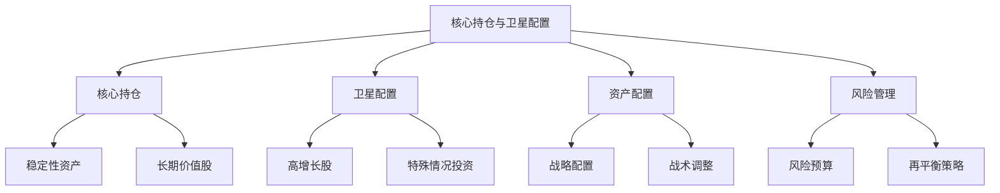
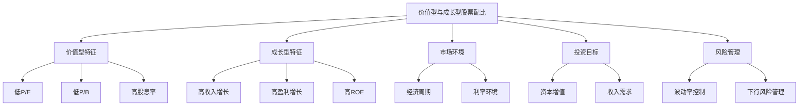
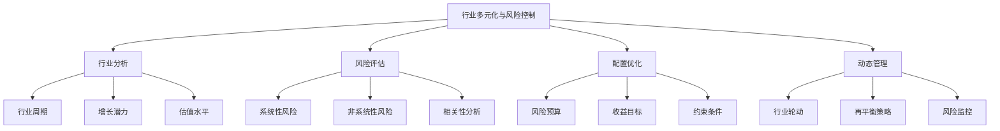
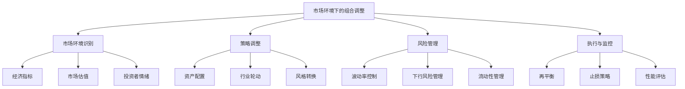

# 第10章：投资组合构建策略

投资组合构建是将个股研究成果转化为实际投资决策的关键步骤。对于价值成长投资者而言，有效的投资组合构建不仅需要平衡风险和回报，还要考虑长期增长潜力和价值创造。本章将探讨核心持仓与卫星配置策略、价值型与成长型股票的最优配比、行业多元化与风险控制，以及不同市场环境下的组合调整策略。

## 10.1 核心持仓与卫星配置策略

核心持仓与卫星配置是一种popular的投资组合构建方法，它结合了稳定性和灵活性，适合追求长期价值增长的投资者。

* 核心概念：
    - 核心持仓
    - 卫星配置
    - 资产配置
    - 风险预算
    - Alpha来源
    - Beta暴露
    - 再平衡策略
    - 战术性资产配置

* 问题背景：投资者需要在稳定性和潜在高回报之间寻找平衡，同时保持足够的灵活性以应对市场变化。

* 问题描述：如何构建一个既能提供稳定长期回报又能把握短期机会的投资组合？如何确定核心持仓和卫星配置的最佳比例？如何选择适合核心持仓和卫星配置的资产？

* 问题解决：
    1. 定义投资目标和风险承受能力
    2. 确定核心持仓和卫星配置的比例
    3. 选择适合核心持仓的稳定资产
    4. 识别适合卫星配置的高增长或特殊机会资产
    5. 制定再平衡策略
    6. 实施风险管理措施
    7. 定期评估和调整策略

* 边界与外延：
    - 需要考虑投资者的具体情况和市场环境
    - 核心持仓和卫星配置的比例可能随时间变化
    - 卫星配置需要更频繁的监控和调整

* 概念结构与核心要素组成：



* 概念之间的关系：

| 要素 | 核心持仓 | 卫星配置 | 资产配置 | 风险管理 | 再平衡策略 |
|------|----------|----------|----------|----------|------------|
| 核心持仓 | - | 低度相关 | 高度相关 | 中度相关 | 中度相关 |
| 卫星配置 | 低度相关 | - | 中度相关 | 高度相关 | 高度相关 |
| 资产配置 | 高度相关 | 中度相关 | - | 高度相关 | 高度相关 |
| 风险管理 | 中度相关 | 高度相关 | 高度相关 | - | 高度相关 |
| 再平衡策略 | 中度相关 | 高度相关 | 高度相关 | 高度相关 | - |

* 数学模型：

1. 组合预期收益率：
   $$ E(R_p) = w_c \cdot E(R_c) + w_s \cdot E(R_s) $$
   其中，w_c和w_s分别是核心持仓和卫星配置的权重，E(R_c)和E(R_s)分别是核心持仓和卫星配置的预期收益率。

2. 组合风险（标准差）：
   $$ \sigma_p = \sqrt{w_c^2 \cdot \sigma_c^2 + w_s^2 \cdot \sigma_s^2 + 2 \cdot w_c \cdot w_s \cdot \rho_{cs} \cdot \sigma_c \cdot \sigma_s} $$
   其中，σ_c和σ_s分别是核心持仓和卫星配置的标准差，ρ_cs是它们之间的相关系数。

3. 信息比率：
   $$ IR = \frac{E(R_p) - R_f}{\sigma_{active}} $$
   其中，R_f是无风险利率，σ_active是主动风险（跟踪误差）。

* 算法流程：

```python
import numpy as np
import pandas as pd

def calculate_portfolio_return(w_core, r_core, w_satellite, r_satellite):
    return w_core * r_core + w_satellite * r_satellite

def calculate_portfolio_risk(w_core, sigma_core, w_satellite, sigma_satellite, corr):
    return np.sqrt(w_core**2 * sigma_core**2 + w_satellite**2 * sigma_satellite**2 + 
                   2 * w_core * w_satellite * corr * sigma_core * sigma_satellite)

def calculate_information_ratio(r_portfolio, r_benchmark, tracking_error):
    return (r_portfolio - r_benchmark) / tracking_error

# 示例使用
w_core = 0.7
w_satellite = 0.3
r_core = 0.08
r_satellite = 0.12
sigma_core = 0.15
sigma_satellite = 0.25
corr = 0.5
r_benchmark = 0.06
tracking_error = 0.05

portfolio_return = calculate_portfolio_return(w_core, r_core, w_satellite, r_satellite)
portfolio_risk = calculate_portfolio_risk(w_core, sigma_core, w_satellite, sigma_satellite, corr)
information_ratio = calculate_information_ratio(portfolio_return, r_benchmark, tracking_error)

print(f"组合预期收益率: {portfolio_return:.2%}")
print(f"组合风险: {portfolio_risk:.2%}")
print(f"信息比率: {information_ratio:.2f}")

# 创建核心持仓和卫星配置示例
core_holdings = pd.DataFrame({
    '资产': ['大盘价值股ETF', '中盘混合型ETF', '高质量债券基金', '股息ETF'],
    '配置比例': [0.3, 0.2, 0.15, 0.05],
    '预期收益率': [0.08, 0.09, 0.04, 0.06],
    '标准差': [0.18, 0.20, 0.05, 0.15]
})

satellite_holdings = pd.DataFrame({
    '资产': ['高增长科技股', '新兴市场ETF', '特殊情况基金', '商品ETF'],
    '配置比例': [0.1, 0.08, 0.07, 0.05],
    '预期收益率': [0.15, 0.12, 0.14, 0.10],
    '标准差': [0.30, 0.25, 0.28, 0.22]
})

print("\n核心持仓:")
print(core_holdings)
print("\n卫星配置:")
print(satellite_holdings)

# 计算组合总体指标
total_core_weight = core_holdings['配置比例'].sum()
total_satellite_weight = satellite_holdings['配置比例'].sum()
total_return = (core_holdings['配置比例'] * core_holdings['预期收益率']).sum() + \
               (satellite_holdings['配置比例'] * satellite_holdings['预期收益率']).sum()

print(f"\n核心持仓总权重: {total_core_weight:.2f}")
print(f"卫星配置总权重: {total_satellite_weight:.2f}")
print(f"组合总预期收益率: {total_return:.2%}")
```

* 实际场景应用：

1. 保守型价值成长投资组合：

```python
conservative_core = pd.DataFrame({
    '资产': ['大盘价值股ETF', '高质量债券基金', '股息ETF', '中盘混合型ETF'],
    '配置比例': [0.35, 0.25, 0.15, 0.10],
    '预期收益率': [0.07, 0.04, 0.05, 0.08],
    '标准差': [0.16, 0.05, 0.12, 0.18]
})

conservative_satellite = pd.DataFrame({
    '资产': ['高增长科技股', '新兴市场ETF', '房地产投资信托基金'],
    '配置比例': [0.05, 0.05, 0.05],
    '预期收益率': [0.14, 0.11, 0.09],
    '标准差': [0.28, 0.24, 0.20]
})

print("保守型价值成长投资组合:")
print("\n核心持仓:")
print(conservative_core)
print("\n卫星配置:")
print(conservative_satellite)

conservative_core_return = (conservative_core['配置比例'] * conservative_core['预期收益率']).sum()
conservative_satellite_return = (conservative_satellite['配置比例'] * conservative_satellite['预期收益率']).sum()
conservative_total_return = conservative_core_return + conservative_satellite_return

print(f"\n核心持仓总权重: {conservative_core['配置比例'].sum():.2f}")
print(f"卫星配置总权重: {conservative_satellite['配置比例'].sum():.2f}")
print(f"组合总预期收益率: {conservative_total_return:.2%}")
```

2. 进取型价值成长投资组合：

```python
aggressive_core = pd.DataFrame({
    '资产': ['大盘价值股ETF', '中盘混合型ETF', '小盘成长股ETF', '高质量债券基金'],
    '配置比例': [0.25, 0.20, 0.15, 0.10],
    '预期收益率': [0.08, 0.10, 0.12, 0.04],
    '标准差': [0.18, 0.22, 0.26, 0.05]
})

aggressive_satellite = pd.DataFrame({
    '资产': ['高增长科技股', '新兴市场ETF', '特殊情况基金', '商品ETF'],
    '配置比例': [0.10, 0.08, 0.07, 0.05],
    '预期收益率': [0.16, 0.13, 0.15, 0.11],
    '标准差': [0.32, 0.28, 0.30, 0.24]
})

print("进取型价值成长投资组合:")
print("\n核心持仓:")
print(aggressive_core)
print("\n卫星配置:")
print(aggressive_satellite)

aggressive_core_return = (aggressive_core['配置比例'] * aggressive_core['预期收益率']).sum()
aggressive_satellite_return = (aggressive_satellite['配置比例'] * aggressive_satellite['预期收益率']).sum()
aggressive_total_return = aggressive_core_return + aggressive_satellite_return

print(f"\n核心持仓总权重: {aggressive_core['配置比例'].sum():.2f}")
print(f"卫星配置总权重: {aggressive_satellite['配置比例'].sum():.2f}")
print(f"组合总预期收益率: {aggressive_total_return:.2%}")

# 比较两种组合的风险收益特征
conservative_total_risk = np.sqrt((conservative_core['配置比例'] * conservative_core['标准差']**2).sum() +
                                  (conservative_satellite['配置比例'] * conservative_satellite['标准差']**2).sum())

aggressive_total_risk = np.sqrt((aggressive_core['配置比例'] * aggressive_core['标准差']**2).sum() +
                                (aggressive_satellite['配置比例'] * aggressive_satellite['标准差']**2).sum())

print("\n组合比较:")
print(f"保守型组合 - 预期收益率: {conservative_total_return:.2%}, 风险: {conservative_total_risk:.2%}")
print(f"进取型组合 - 预期收益率: {aggressive_total_return:.2%}, 风险: {aggressive_total_risk:.2%}")
```

基于上述分析，我们可以得出以下关于核心持仓与卫星配置策略的关键洞察：

1. 风险收益平衡：核心持仓提供稳定性，而卫星配置增加潜在回报，两者结合可以实现风险和收益的平衡。

2. 个性化配置：不同风险偏好的投资者可以通过调整核心持仓和卫星配置的比例来定制适合自己的组合。

3. 多元化效应：核心持仓和卫星配置的组合可以实现更好的多元化效果，降低整体组合风险。

4. 灵活性：卫星配置允许投资者把握短期市场机会，而不影响长期投资策略的稳定性。

5. 风险管理：通过适当的核心持仓比例，可以控制整体组合的风险水平。

6. 战术资产配置：卫星配置为战术性资产配置决策提供了空间。

7. 再平衡机制：定期再平衡可以维持目标风险水平，并可能提供额外收益。

8. 成本效益：核心持仓可以采用低成本的指数型投资，而将主动管理集中在卫星配置上。

9. 适应市场周期：可以根据市场周期调整核心持仓和卫星配置的比例和内容。

10. 长期perspective：核心持仓反映了长期投资理念，而卫星配置增加了投资组合的灵活性。

对于价值成长投资者而言，在实施核心持仓与卫星配置策略时需要注意以下几点：

1. 明确投资目标：根据个人的风险承受能力和投资目标确定核心持仓和卫星配置的比例。

2. 选择优质核心资产：核心持仓应该选择具有长期增长潜力和稳定性的高质量资产。

3. 识别增长机会：卫星配置应该关注具有高增长潜力的行业和公司，但要控制风险。

4. 动态管理：定期评估和调整核心持仓和卫星配置，以适应市场变化和个人情况的变化。

5. 风险控制：密切监控卫星配置的风险，确保不会对整体组合造成过大影响。

6. 相关性分析：选择核心持仓和卫星配置资产时，考虑它们之间的相关性，以实现有效的多元化。

7. 成本控制：在追求高回报的同时，也要注意控制交易成本和管理费用。

8. 税收考虑：在进行资产配置和再平衡时，考虑税收影响，优化税后回报。

9. 宏观因素：将宏观经济趋势和市场周期纳入考虑，适时调整策略。

10. 持续学习：关注新的投资工具和策略，不断优化核心持仓与卫星配置方法。

通过合理运用核心持仓与卫星配置策略，价值成长投资者可以构建一个既能提供长期稳定回报，又能把握短期市场机会的投资组合。这种方法既体现了价值投资的稳健理念，又融入了对增长机会的追求，适合追求长期财富积累的投资者。然而，重要的是要根据个人情况和市场环境不断调整和优化策略，以实现最佳的风险调整后回报。

在下一节中，我们将深入探讨如何在投资组合中实现价值型与成长型股票的最优配比，这将进一步完善我们的价值成长投资策略。

## 10.2 价值型与成长型股票的最优配比

在价值成长投资策略中，平衡价值型和成长型股票的比例是一个关键决策。这两种投资风格各有特点，合理的配比可以在不同市场环境下提供更好的风险调整后回报。

* 核心概念：
    - 价值型股票
    - 成长型股票
    - 风格轮动
    - 市盈率（P/E）
    - 市净率（P/B）
    - 收入增长率
    - 盈利增长率
    - 风格因子暴露
    - 风格中性策略
    - 价值陷阱

* 问题背景：价值型和成长型股票在不同市场周期中表现各异，投资者需要在两者之间找到合适的平衡。

* 问题描述：如何确定价值型和成长型股票的最优配比？哪些因素应该考虑在内？如何根据市场环境调整配比？

* 问题解决：
    1. 分析当前市场环境和经济周期阶段
    2. 评估价值型和成长型股票的相对估值水平
    3. 考虑行业周期和结构性变化
    4. 分析历史风格表现模式
    5. 评估个人风险偏好和投资目标
    6. 使用定量模型进行最优化配置
    7. 考虑宏观经济因素和政策环境
    8. 实施动态再平衡策略

* 边界与外延：
    - 需要考虑市场效率和异常现象
    - 价值和成长的定义可能随时间和市场而变化
    - 考虑新兴市场vs.发达市场的差异

* 概念结构与核心要素组成：



* 概念之间的关系：

| 要素 | 价值型特征 | 成长型特征 | 市场环境 | 投资目标 | 风险管理 |
|------|------------|------------|----------|----------|----------|
| 价值型特征 | - | 负相关 | 中度相关 | 中度相关 | 中度相关 |
| 成长型特征 | 负相关 | - | 中度相关 | 中度相关 | 中度相关 |
| 市场环境 | 中度相关 | 中度相关 | - | 高度相关 | 高度相关 |
| 投资目标 | 中度相关 | 中度相关 | 高度相关 | - | 高度相关 |
| 风险管理 | 中度相关 | 中度相关 | 高度相关 | 高度相关 | - |

* 数学模型：

1. 风格配比优化模型：
   $$ \max_{w_v, w_g} \left( w_v \cdot E(R_v) + w_g \cdot E(R_g) - \lambda \cdot \sigma_p^2 \right) $$
   s.t. $w_v + w_g = 1$, $w_v, w_g \geq 0$

   其中，w_v和w_g分别是价值型和成长型股票的权重，E(R_v)和E(R_g)是它们的预期收益率，σ_p是组合风险，λ是风险厌恶系数。

2. 风格暴露度量：
   $$ Style\_Exposure = \frac{w_v \cdot S_v + w_g \cdot S_g}{w_v + w_g} $$
   其中，S_v和S_g分别是价值型和成长型股票的风格得分。

3. 风格轮动指标：
   $$ Rotation\_Signal = \frac{MA(Value\_Index, n) - MA(Growth\_Index, n)}{Volatility(Value\_Index - Growth\_Index)} $$
   其中，MA是n期移动平均。

* 算法流程：

```python
import numpy as np
import pandas as pd
from scipy.optimize import minimize

def optimize_style_allocation(er_value, er_growth, vol_value, vol_growth, corr, risk_aversion):
    def portfolio_return(weights):
        return weights[0] * er_value + weights[1] * er_growth

    def portfolio_volatility(weights):
        return np.sqrt(weights[0]**2 * vol_value**2 + weights[1]**2 * vol_growth**2 + 
                       2 * weights[0] * weights[1] * corr * vol_value * vol_growth)

    def objective(weights):
        return -(portfolio_return(weights) - risk_aversion * portfolio_volatility(weights)**2)

    constraints = ({'type': 'eq', 'fun': lambda x: np.sum(x) - 1})
    bounds = ((0, 1), (0, 1))
    initial_guess = [0.5, 0.5]

    result = minimize(objective, initial_guess, method='SLSQP', bounds=bounds, constraints=constraints)
    return result.x

def calculate_style_exposure(w_value, w_growth, score_value, score_growth):
    return (w_value * score_value + w_growth * score_growth) / (w_value + w_growth)

def calculate_rotation_signal(value_index, growth_index, window=12):
    diff = value_index - growth_index
    ma_value = value_index.rolling(window=window).mean()
    ma_growth = growth_index.rolling(window=window).mean()
    volatility = diff.rolling(window=window).std()
    return (ma_value - ma_growth) / volatility

# 示例使用
er_value = 0.08
er_growth = 0.12
vol_value = 0.15
vol_growth = 0.20
corr = 0.5
risk_aversion = 2

optimal_weights = optimize_style_allocation(er_value, er_growth, vol_value, vol_growth, corr, risk_aversion)
w_value, w_growth = optimal_weights

print(f"最优价值型配置: {w_value:.2%}")
print(f"最优成长型配置: {w_growth:.2%}")

score_value = 0.8
score_growth = 1.2
style_exposure = calculate_style_exposure(w_value, w_growth, score_value, score_growth)
print(f"组合风格暴露: {style_exposure:.2f}")

# 创建模拟的价值和成长指数数据
dates = pd.date_range(start='2020-01-01', end='2022-12-31', freq='M')
value_index = pd.Series(np.cumsum(np.random.normal(0.005, 0.03, len(dates))), index=dates)
growth_index = pd.Series(np.cumsum(np.random.normal(0.008, 0.04, len(dates))), index=dates)

rotation_signal = calculate_rotation_signal(value_index, growth_index)

print("\n风格轮动信号:")
print(rotation_signal.tail())

# 可视化风格轮动
import matplotlib.pyplot as plt

plt.figure(figsize=(12, 6))
plt.plot(dates, value_index, label='Value Index')
plt.plot(dates, growth_index, label='Growth Index')
plt.plot(dates, rotation_signal, label='Rotation Signal')
plt.title('Value vs Growth Performance and Rotation Signal')
plt.legend()
plt.show()
```

* 实际场景应用：

1. 动态风格配置策略：

```python
def dynamic_style_allocation(value_returns, growth_returns, lookback_period=12, rebalance_period=3):
    combined_returns = pd.concat([value_returns, growth_returns], axis=1)
    combined_returns.columns = ['Value', 'Growth']
    
    allocations = []
    for i in range(lookback_period, len(combined_returns), rebalance_period):
        window = combined_returns.iloc[i-lookback_period:i]
        er_value = window['Value'].mean()
        er_growth = window['Growth'].mean()
        vol_value = window['Value'].std()
        vol_growth = window['Growth'].std()
        corr = window.corr().iloc[0,1]
        
        weights = optimize_style_allocation(er_value, er_growth, vol_value, vol_growth, corr, risk_aversion=2)
        allocations.extend([weights] * rebalance_period)
    
    return pd.DataFrame(allocations, columns=['Value', 'Growth'], index=combined_returns.index[lookback_period:])

# 模拟价值和成长股票回报
np.random.seed(42)
dates = pd.date_range(start='2015-01-01', end='2022-12-31', freq='M')
value_returns = pd.Series(np.random.normal(0.005, 0.03, len(dates)), index=dates)
growth_returns = pd.Series(np.random.normal(0.008, 0.04, len(dates)), index=dates)

dynamic_allocations = dynamic_style_allocation(value_returns, growth_returns)

print("动态风格配置策略:")
print(dynamic_allocations.head())
print(dynamic_allocations.tail())

# 计算策略表现
combined_returns = pd.concat([value_returns, growth_returns], axis=1)
combined_returns.columns = ['Value', 'Growth']

strategy_returns = (dynamic_allocations * combined_returns).sum(axis=1)
cumulative_returns = (1 + strategy_returns).cumprod()

print("\n策略累积回报:")
print(cumulative_returns.tail())

# 可视化动态配置和策略表现
fig, (ax1, ax2) = plt.subplots(2, 1, figsize=(12, 10))

ax1.stackplot(dynamic_allocations.index, dynamic_allocations['Value'], dynamic_allocations['Growth'], 
              labels=['Value', 'Growth'])
ax1.set_title('Dynamic Style Allocation')
ax1.legend(loc='upper left')
ax1.set_ylabel('Allocation')

ax2.plot(cumulative_returns.index, cumulative_returns, label='Strategy')
ax2.plot(cumulative_returns.index, (1 + combined_returns['Value']).cumprod(), label='Value')
ax2.plot(cumulative_returns.index, (1 + combined_returns['Growth']).cumprod(), label='Growth')
ax2.set_title('Cumulative Returns')
ax2.legend()
ax2.set_ylabel('Cumulative Return')

plt.tight_layout()
plt.show()
```

2. 风格因子分析：

```python
def calculate_style_factor_exposures(portfolio, benchmark):
    portfolio_exposures = portfolio[['P/E', 'P/B', 'Revenue_Growth', 'EPS_Growth']].mean()
    benchmark_exposures = benchmark[['P/E', 'P/B', 'Revenue_Growth', 'EPS_Growth']].mean()
    
    relative_exposures = portfolio_exposures / benchmark_exposures
    return relative_exposures

# 模拟投资组合和基准的风格因子数据
np.random.seed(42)
portfolio_data = pd.DataFrame({
    'P/E': np.random.normal(15, 3, 50),
    'P/B': np.random.normal(2, 0.5, 50),
    'Revenue_Growth': np.random.normal(0.1, 0.03, 50),
    'EPS_Growth': np.random.normal(0.12, 0.04, 50)
})

benchmark_data = pd.DataFrame({
    'P/E': np.random.normal(18, 4, 200),
    'P/B': np.random.normal(2.5, 0.6, 200),
    'Revenue_Growth': np.random.normal(0.08, 0.02, 200),
    'EPS_Growth': np.random.normal(0.1, 0.03, 200)
})

relative_exposures = calculate_style_factor_exposures(portfolio_data, benchmark_data)

print("投资组合相对于基准的风格因子暴露:")
print(relative_exposures)

# 可视化风格因子暴露
plt.figure(figsize=(10, 6))
relative_exposures.plot(kind='bar')
plt.axhline(y=1, color='r', linestyle='--')
plt.title('Portfolio Style Factor Exposures Relative to Benchmark')
plt.ylabel('Relative Exposure')
plt.xticks(rotation=0)
plt.show()
```

基于上述分析，我们可以得出以下关于价值型与成长型股票最优配比的关键洞察：

1. 动态调整：最优配比并非静态，而是应该根据市场环境和经济周期动态调整。

2. 风险收益平衡：配比决策需要同时考虑预期回报和风险，以实现最佳的风险调整后回报。

3. 风格轮动：价值型和成长型股票的相对表现often呈现周期性，投资者可以利用这种轮动来优化配置。

4. 多因子考量：除了传统的价值和成长因子，还应考虑质量、动量等其他因子的影响。

5. 市场效率：在不同的市场环境下，价值和成长策略的有效性可能会有所不同。

6. 行业影响：某些行业可能天然偏向价值或成长特征，这会影响整体的配比决策。

7. 宏观经济考量：利率环境、经济增长预期等宏观因素会影响价值和成长股票的相对吸引力。

8. 个人偏好：投资者的风险偏好和投资目标should influence配比决策。

9. 长期vs.短期：长期投资者可能更倾向于平衡的配置，而短期投资者可能更多地根据当前市场环境调整。

10. 新兴市场考量：在新兴市场中，成长型股票可能占据更大比重，但也需要更谨慎的风险管理。

对于价值成长投资者而言，在确定价值型与成长型股票的最优配比时需要注意以下几点：

1. 持续监控：定期评估市场环境和各自的相对估值水平，及时调整配比。

2. 多元化：在价值和成长类别内部也要保持适度的多元化，以分散风险。

3. 避免极端：避免完全倾向于单一风格，保持一定程度的平衡可以提高组合的稳定性。

4. 质量筛选：无论是价值型还是成长型股票，都应该优先选择高质量的公司。

5. 行业均衡：考虑行业配置的平衡，避免过度暴露于特定行业风险。

6. 规模考量：考虑大中小市值股票的配置，不同规模的股票可能表现出不同的价值和成长特征。

7. 全球视角：在全球资产配置的背景下考虑价值和成长的配比，不同地区可能处于不同的周期阶段。

8. 成本意识：考虑交易成本和税收影响，过于频繁的调整可能会侵蚀收益。

9. 风险管理：使用风险管理工具，如止损策略或对冲工具，来管理极端市场环境下的风险。

10. 持续学习：跟踪学术研究和市场实践的最新发展，不断优化配比策略。

通过精心设计和动态管理价值型与成长型股票的配比，价值成长投资者可以构建一个能够在不同市场环境下表现良好的投资组合。这种方法既能捕捉价值投资的安全边际，又能分享高增长公司的上升潜力，是一种平衡而灵活的投资策略。然而，重要的是要根据个人情况、市场环境和长期目标不断调整和优化策略，以实现可持续的长期投资成功。

在下一节中，我们将探讨如何通过行业多元化来进一步控制投资组合风险，这将为我们的价值成长投资策略增添另一层保护。

## 10.3 行业多元化与风险控制

行业多元化是投资组合风险管理的关键策略之一。通过在不同行业间分散投资，投资者可以降低单一行业风险，同时保持对整体市场增长的暴露。对于价值成长投资者而言，合理的行业多元化不仅可以控制风险，还能捕捉不同行业的增长机会。

* 核心概念：
    - 行业相关性
    - 系统性风险
    - 非系统性风险
    - 行业周期
    - 行业集中度
    - 经济敏感度
    - 防御性行业
    - 周期性行业
    - 行业轮动
    - 风险预算

* 问题背景：不同行业对经济周期和市场环境的敏感度不同，合理的行业配置可以平滑组合表现。

* 问题描述：如何在追求价值和成长的同时实现有效的行业多元化？如何平衡行业集中度和分散度？如何根据市场环境动态调整行业配置？

* 问题解决：
    1. 分析行业间的相关性和风险特征
    2. 评估各行业的长期增长潜力和当前估值水平
    3. 考虑宏观经济周期对不同行业的影响
    4. 设定行业配置的上下限
    5. 使用定量模型优化行业配置
    6. 考虑行业内的价值和成长机会
    7. 实施动态行业轮动策略
    8. 监控和管理行业集中风险

* 边界与外延：
    - 需要平衡多元化带来的风险降低和潜在收益损失
    - 考虑新兴行业和传统行业的平衡
    - 全球化背景下的行业定义和分类可能存在差异

* 概念结构与核心要素组成：



* 概念之间的关系：

| 要素 | 行业分析 | 风险评估 | 配置优化 | 动态管理 |
|------|----------|----------|----------|----------|
| 行业分析 | - | 高度相关 | 高度相关 | 中度相关 |
| 风险评估 | 高度相关 | - | 高度相关 | 高度相关 |
| 配置优化 | 高度相关 | 高度相关 | - | 中度相关 |
| 动态管理 | 中度相关 | 高度相关 | 中度相关 | - |

* 数学模型：

1. 行业多元化效果（使用夏普比率）：
   $$ Sharpe Ratio = \frac{E(R_p) - R_f}{\sigma_p} $$
   其中，E(R_p)是组合预期收益率，R_f是无风险利率，σ_p是组合标准差。

2. 行业权重优化（最小化组合风险）：
   $$ \min_{w} w^T \Sigma w $$
   s.t. $\sum_{i=1}^n w_i = 1$, $w_i \geq 0$, $w_i \leq w_{max}$

   其中，w是行业权重向量，Σ是行业收益率协方差矩阵，w_max是单一行业的最大权重限制。

3. 行业轮动信号：
   $$ Rotation\_Signal_i = \frac{MA(Industry\_Return_i, short) - MA(Industry\_Return_i, long)}{Volatility(Industry\_Return_i)} $$
   其中，MA是移动平均，short和long分别表示短期和长期。

* 算法流程：

```python
import numpy as np
import pandas as pd
from scipy.optimize import minimize

def optimize_industry_weights(returns, cov_matrix, max_weight=0.3):
    n = len(returns)
    
    def objective(weights):
        return np.sqrt(np.dot(weights.T, np.dot(cov_matrix, weights)))
    
    constraints = [
        {'type': 'eq', 'fun': lambda x: np.sum(x) - 1},
    ]
    bounds = tuple((0, max_weight) for _ in range(n))
    
    result = minimize(objective, np.array([1/n]*n), method='SLSQP', bounds=bounds, constraints=constraints)
    return result.x

def calculate_portfolio_metrics(weights, returns, cov_matrix, risk_free_rate):
    portfolio_return = np.sum(returns * weights)
    portfolio_volatility = np.sqrt(np.dot(weights.T, np.dot(cov_matrix, weights)))
    sharpe_ratio = (portfolio_return - risk_free_rate) / portfolio_volatility
    return portfolio_return, portfolio_volatility, sharpe_ratio

def calculate_industry_rotation_signal(returns, short_window=3, long_window=12):
    short_ma = returns.rolling(window=short_window).mean()
    long_ma = returns.rolling(window=long_window).mean()
    volatility = returns.rolling(window=long_window).std()
    return (short_ma - long_ma) / volatility

# 示例使用
np.random.seed(42)
n_industries = 10
n_periods = 60

# 模拟行业回报数据
industry_returns = pd.DataFrame(np.random.normal(0.01, 0.05, (n_periods, n_industries)),
                               columns=[f'Industry_{i}' for i in range(1, n_industries+1)])

# 计算协方差矩阵
cov_matrix = industry_returns.cov()

# 计算平均回报率
avg_returns = industry_returns.mean()

# 优化行业权重
optimal_weights = optimize_industry_weights(avg_returns, cov_matrix)

# 计算组合指标
risk_free_rate = 0.02 / 12  # 假设年化2%的无风险利率
portfolio_return, portfolio_volatility, sharpe_ratio = calculate_portfolio_metrics(
    optimal_weights, avg_returns, cov_matrix, risk_free_rate)

print("最优行业权重:")
for i, weight in enumerate(optimal_weights, 1):
    print(f"Industry_{i}: {weight:.4f}")

print(f"\n组合年化收益率: {portfolio_return * 12:.2%}")
print(f"组合年化波动率: {portfolio_volatility * np.sqrt(12):.2%}")
print(f"夏普比率: {sharpe_ratio:.2f}")

# 计算行业轮动信号
rotation_signals = calculate_industry_rotation_signal(industry_returns)

print("\n行业轮动信号 (最新期):")
print(rotation_signals.iloc[-1].sort_values(ascending=False))

# 可视化行业权重和轮动信号
import matplotlib.pyplot as plt

fig, (ax1, ax2) = plt.subplots(2, 1, figsize=(12, 10))

ax1.bar(range(1, n_industries+1), optimal_weights)
ax1.set_title('Optimal Industry Weights')
ax1.set_xlabel('Industry')
ax1.set_ylabel('Weight')

ax2.plot(rotation_signals)
ax2.set_title('Industry Rotation Signals')
ax2.set_xlabel('Time')
ax2.set_ylabel('Signal Strength')
ax2.legend(rotation_signals.columns, loc='upper left', bbox_to_anchor=(1, 1))

plt.tight_layout()
plt.show()

# 动态行业配置策略
def dynamic_industry_allocation(returns, lookback_period=12, rebalance_period=3, max_weight=0.3):
    allocations = []
    for i in range(lookback_period, len(returns), rebalance_period):
        window = returns.iloc[i-lookback_period:i]
        cov_matrix = window.cov()
        avg_returns = window.mean()
        weights = optimize_industry_weights(avg_returns, cov_matrix, max_weight)
        allocations.extend([weights] * rebalance_period)
    
    return pd.DataFrame(allocations, columns=returns.columns, index=returns.index[lookback_period:])

dynamic_allocations = dynamic_industry_allocation(industry_returns)

# 计算动态策略的表现
dynamic_returns = (dynamic_allocations * industry_returns.shift(-1)).sum(axis=1)
cumulative_returns = (1 + dynamic_returns).cumprod()

print("\n动态行业配置策略累积回报:")
print(cumulative_returns.tail())

# 可视化动态配置和策略表现
fig, (ax1, ax2) = plt.subplots(2, 1, figsize=(12, 10))

ax1.stackplot(dynamic_allocations.index, dynamic_allocations.T, labels=dynamic_allocations.columns)
ax1.set_title('Dynamic Industry Allocation')
ax1.legend(loc='upper left', bbox_to_anchor=(1, 1))
ax1.set_ylabel('Allocation')

ax2.plot(cumulative_returns.index, cumulative_returns, label='Dynamic Strategy')
ax2.plot(industry_returns.index, (1 + industry_returns).cumprod(), alpha=0.5)
ax2.set_title('Cumulative Returns')
ax2.legend()
ax2.set_ylabel('Cumulative Return')

plt.tight_layout()
plt.show()
```

基于上述分析，我们可以得出以下关于行业多元化与风险控制的关键洞察：

1. 风险分散：通过在多个行业间分散投资，可以显著降低非系统性风险。

2. 动态配置：行业权重应根据市场环境和各行业的相对吸引力动态调整。

3. 优化权衡：在追求多元化的同时，需要平衡潜在收益和过度分散带来的效率损失。

4. 行业周期：不同行业的周期性特征为动态资产配置提供了机会。

5. 相关性考量：选择相关性较低的行业组合可以提高多元化效果。

6. 宏观因素：经济周期、政策变化等宏观因素对行业配置决策有重要影响。

7. 新兴产业：在传统行业和新兴产业之间保持适度平衡，可以兼顾稳定性和增长潜力。

8. 风险预算：为不同行业设定风险预算，可以更精细地控制整体组合风险。

9. 再平衡策略：定期再平衡是维持目标行业配置和风险水平的重要手段。

10. 全球视角：在全球化背景下，行业多元化should考虑地域因素和全球产业链。

对于价值成长投资者而言，在实施行业多元化和风险控制策略时需要注意以下几点：

1. 价值成长平衡：在每个行业内部都要寻找价值和成长的平衡点。

2. 长期视角：关注行业的长期发展趋势，而不仅仅是短期波动。

3. 质量优先：无论是价值型还是成长型行业，都应优先选择具有高质量特征的公司。

4. 适度集中：虽然多元化重要，但也要避免过度分散，保持对高确信度行业的适度集中。

5. 动态调整：根据行业估值水平、增长前景和宏观环境的变化，动态调整行业配置。

6. 风险监控：持续监控行业集中度风险，避免对单一行业过度暴露。

7. 新兴机会：保持对新兴行业和颠覆性技术的关注，但要谨慎评估相关风险。

8. 周期管理：了解并利用行业周期特征，在不同周期阶段调整配置策略。

9. 协同效应：考虑不同行业间的协同效应和产业链关系，构建更有韧性的组合。

10. 持续学习：跟踪行业发展趋势和新的风险管理技术，不断优化多元化策略。

通过科学的行业多元化和严格的风险控制，价值成长投资者可以构建一个既能分享不同行业增长机会，又能在市场波动中保持相对稳定的投资组合。这种方法既体现了价值投资的稳健理念，又融入了对多元化增长机会的追求，适合追求长期稳健回报的投资者。然而，重要的是要根据市场环境和个人投资目标不断调整和优化策略，以实现风险和收益的最佳平衡。

在下一节中，我们将探讨如何在不同的市场环境下调整投资组合策略，这将为我们的价值成长投资方法增添更多的适应性和灵活性。

## 10.4 不同市场环境下的组合调整策略

市场环境的变化often require投资者调整其投资组合策略。对于价值成长投资者而言，能够根据不同的市场周期和经济环境灵活调整策略，对于实现长期稳定回报至关重要。

* 核心概念：
    - 市场周期
    - 宏观经济指标
    - 风格轮动
    - 防御性策略
    - 进攻性策略
    - 流动性管理
    - 波动率管理
    - 资产配置转换
    - 对冲策略
    - 逆向投资

* 问题背景：不同的市场环境对价值型和成长型股票的影响不同，投资者需要根据市场变化调整策略。

* 问题描述：如何识别不同的市场环境？在不同环境下应该如何调整价值和成长股票的配比？如何在保持长期投资理念的同时进行必要的战术性调整？

* 问题解决：
    1. 建立市场环境识别框架
    2. 定义不同市场环境下的投资策略
    3. 设计环境转换的触发机制
    4. 制定流动性管理策略
    5. 实施动态资产配置调整
    6. 使用对冲工具管理风险
    7. 建立定期审查和调整机制
    8. 考虑逆向投资机会

* 边界与外延：
    - 需要平衡短期策略调整和长期投资理念
    - 考虑交易成本和税收影响
    - 策略调整should考虑个人风险承受能力和投资目标

* 概念结构与核心要素组成：



* 概念之间的关系：

| 要素 | 市场环境识别 | 策略调整 | 风险管理 | 执行与监控 |
|------|--------------|----------|----------|------------|
| 市场环境识别 | - | 高度相关 | 中度相关 | 中度相关 |
| 策略调整 | 高度相关 | - | 高度相关 | 高度相关 |
| 风险管理 | 中度相关 | 高度相关 | - | 高度相关 |
| 执行与监控 | 中度相关 | 高度相关 | 高度相关 | - |

* 数学模型：

1. 市场环境指标（复合指标）：
   $$ Market\_Env = w_1 \cdot Valuation + w_2 \cdot Economic\_Growth + w_3 \cdot Sentiment $$
   其中，w_i是权重，Valuation、Economic_Growth和Sentiment分别代表市场估值、经济增长和投资者情绪指标。

2. 动态贝塔调整：
   $$ \beta_{adjusted} = \beta_{base} \cdot (1 + \alpha \cdot Market\_Env) $$
   其中，β_base是基础贝塔值，α是调整系数。

3. 条件风险价值（CVaR）约束：
   $$ CVaR_{\alpha}(X) \leq VaR_{limit} $$
   其中，α是置信水平，VaR_limit是风险限额。

* 算法流程：

```python
import numpy as np
import pandas as pd
from scipy.stats import norm

def calculate_market_environment(valuation, economic_growth, sentiment, weights):
    return np.dot([valuation, economic_growth, sentiment], weights)

def adjust_beta(base_beta, market_env, alpha=0.2):
    return base_beta * (1 + alpha * market_env)

def calculate_cvar(returns, confidence_level=0.95):
    var = np.percentile(returns, (1 - confidence_level) * 100)
    return -returns[returns <= var].mean()

def dynamic_asset_allocation(market_env, base_allocation, max_adjustment=0.2):
    adjustment = max_adjustment * market_env
    growth_allocation = base_allocation['growth'] + adjustment
    value_allocation = base_allocation['value'] - adjustment
    return {'growth': growth_allocation, 'value': value_allocation}

# 示例使用
np.random.seed(42)
n_periods = 100

# 模拟市场环境数据
valuation = np.random.normal(0, 1, n_periods)
economic_growth = np.random.normal(0, 1, n_periods)
sentiment = np.random.normal(0, 1, n_periods)
market_env_weights = [0.4, 0.4, 0.2]

market_env = [calculate_market_environment(v, e, s, market_env_weights) 
              for v, e, s in zip(valuation, economic_growth, sentiment)]

# 模拟回报数据
base_growth_return = 0.10
base_value_return = 0.07
growth_volatility = 0.20
value_volatility = 0.15

growth_returns = np.random.normal(base_growth_return/12, growth_volatility/np.sqrt(12), n_periods)
value_returns = np.random.normal(base_value_return/12, value_volatility/np.sqrt(12), n_periods)

# 基础配置
base_allocation = {'growth': 0.5, 'value': 0.5}
base_beta = 1.0

# 动态调整策略
portfolio_returns = []
portfolio_betas = []
portfolio_allocations = []

for i in range(n_periods):
    # 调整贝塔
    adjusted_beta = adjust_beta(base_beta, market_env[i])
    
    # 调整资产配置
    allocation = dynamic_asset_allocation(market_env[i], base_allocation)
    
    # 计算组合回报
    portfolio_return = allocation['growth'] * growth_returns[i] + allocation['value'] * value_returns[i]
    
    portfolio_returns.append(portfolio_return)
    portfolio_betas.append(adjusted_beta)
    portfolio_allocations.append(allocation)

# 计算累积回报
cumulative_returns = pd.Series(portfolio_returns).cumsum()

# 计算CVaR
cvar =calculate_cvar(portfolio_returns)

print(f"平均组合贝塔: {np.mean(portfolio_betas):.2f}")
print(f"CVaR (95%): {cvar:.2%}")

# 可视化结果
import matplotlib.pyplot as plt

fig, (ax1, ax2, ax3) = plt.subplots(3, 1, figsize=(12, 15))

ax1.plot(market_env)
ax1.set_title('Market Environment Indicator')
ax1.set_xlabel('Time')
ax1.set_ylabel('Indicator Value')

ax2.plot(portfolio_betas)
ax2.set_title('Adjusted Portfolio Beta')
ax2.set_xlabel('Time')
ax2.set_ylabel('Beta')

growth_allocations = [alloc['growth'] for alloc in portfolio_allocations]
value_allocations = [alloc['value'] for alloc in portfolio_allocations]

ax3.stackplot(range(n_periods), growth_allocations, value_allocations, labels=['Growth', 'Value'])
ax3.set_title('Dynamic Asset Allocation')
ax3.set_xlabel('Time')
ax3.set_ylabel('Allocation')
ax3.legend(loc='upper left')

plt.tight_layout()
plt.show()

# 性能评估
total_return = cumulative_returns.iloc[-1]
annualized_return = (1 + total_return) ** (12 / n_periods) - 1
volatility = np.std(portfolio_returns) * np.sqrt(12)
sharpe_ratio = (annualized_return - 0.02) / volatility  # 假设无风险利率为2%

print(f"\n总回报: {total_return:.2%}")
print(f"年化回报: {annualized_return:.2%}")
print(f"年化波动率: {volatility:.2%}")
print(f"夏普比率: {sharpe_ratio:.2f}")

# 不同市场环境下的策略表现分析
bull_market = np.array(market_env) > 0.5
bear_market = np.array(market_env) < -0.5
neutral_market = (np.array(market_env) >= -0.5) & (np.array(market_env) <= 0.5)

bull_returns = np.array(portfolio_returns)[bull_market]
bear_returns = np.array(portfolio_returns)[bear_market]
neutral_returns = np.array(portfolio_returns)[neutral_market]

print("\n不同市场环境下的策略表现:")
print(f"牛市平均月回报: {np.mean(bull_returns):.2%}")
print(f"熊市平均月回报: {np.mean(bear_returns):.2%}")
print(f"中性市场平均月回报: {np.mean(neutral_returns):.2%}")

# 回撤分析
def calculate_drawdown(returns):
    wealth_index = (1 + pd.Series(returns)).cumprod()
    previous_peaks = wealth_index.cummax()
    drawdowns = (wealth_index - previous_peaks) / previous_peaks
    return drawdowns

drawdowns = calculate_drawdown(portfolio_returns)
max_drawdown = drawdowns.min()

print(f"\n最大回撤: {max_drawdown:.2%}")

# 可视化回撤
plt.figure(figsize=(12, 6))
drawdowns.plot()
plt.title('Portfolio Drawdown')
plt.xlabel('Time')
plt.ylabel('Drawdown')
plt.show()
```

基于上述分析，我们可以得出以下关于不同市场环境下组合调整策略的关键洞察：

1. 环境适应性：动态调整策略能够根据市场环境变化调整投资组合，提高适应性。

2. 风险管理效果：通过动态调整贝塔和资产配置，可以在不同市场环境下更好地控制风险。

3. 性能差异：策略在不同市场环境（牛市、熊市、中性市场）下表现各异，需要全面评估。

4. 回撤控制：动态调整策略有助于控制最大回撤，提高组合的抗风险能力。

5. 贝塔管理：根据市场环境动态调整组合贝塔，可以更好地控制系统性风险暴露。

6. 风格轮动：在不同市场环境下，价值型和成长型股票的表现可能存在显著差异。

7. 流动性考虑：市场环境变化可能影响资产流动性，策略调整需考虑流动性风险。

8. 交易成本：频繁调整可能带来较高交易成本，需要在策略效果和成本之间权衡。

9. 宏观因素影响：经济增长、通胀预期等宏观因素对策略调整决策有重要影响。

10. 长短期平衡：在进行战术性调整的同时，需要保持长期投资理念。

对于价值成长投资者而言，在不同市场环境下调整投资组合策略时需要注意以下几点：

1. 保持核心理念：无论市场环境如何变化，都要坚持价值投资和长期增长的核心理念。

2. 灵活性与纪律性平衡：在保持投资纪律的同时，要有足够的灵活性应对市场变化。

3. 分段应对：可以将投资组合分为核心持仓和战术性配置，前者保持相对稳定，后者根据市场环境灵活调整。

4. 逆向思维：在极端市场环境下，考虑采取逆向投资策略，但要控制风险。

5. 持续监控：密切关注市场环境指标和组合表现，及时发现问题并调整。

6. 多元化策略：在不同市场环境下，考虑增加其他资产类别（如债券、商品）以增强多元化效果。

7. 风险预算：根据市场环境动态调整风险预算，在波动较大时降低风险暴露。

8. 情景分析：定期进行不同市场环境下的情景分析，提前制定应对策略。

9. 心理准备：市场环境变化可能带来短期波动，投资者需要做好心理准备，避免情绪化决策。

10. 持续学习：市场环境和投资策略在不断演变，需要持续学习和更新知识。

通过科学的市场环境分析和灵活的组合调整策略，价值成长投资者可以在不同的市场周期中保持相对稳定的表现。这种方法既体现了对长期价值的坚持，又融入了对市场动态的响应，适合追求长期稳健回报同时希望把握市场机会的投资者。然而，重要的是要记住，过度频繁的调整可能带来高昂的交易成本和潜在的时机选择风险。因此，投资者需要在战术灵活性和战略稳定性之间找到适当的平衡点。

总结本章，我们深入探讨了投资组合构建策略的多个关键方面，包括核心持仓与卫星配置策略、价值型与成长型股票的最优配比、行业多元化与风险控制，以及不同市场环境下的组合调整策略。这些方法和工具为价值成长投资者提供了一个全面的投资组合管理框架，有助于构建既能捕捉长期价值增长，又能适应市场变化的稳健投资组合。

在下一章中，我们将把重点转向买入与卖出时机的把握，探讨如何在价值成长投资策略中做出最佳的交易决策，这将为我们的投资实践增添更多的操作性指导。