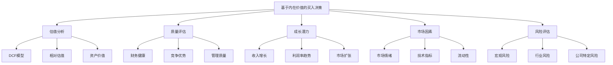
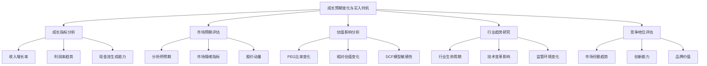
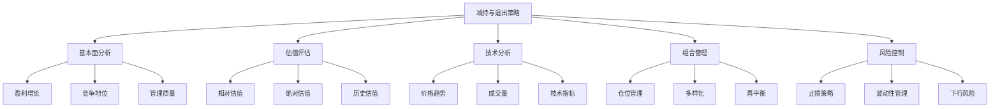
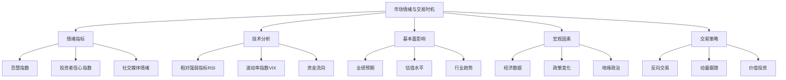

# 第11章：买入与卖出时机把握

买入与卖出时机的把握是投资成功的关键因素之一。对于价值成长投资者而言，既要基于公司内在价值做出决策，又要考虑市场情绪和宏观环境的影响。本章将探讨如何构建基于内在价值的买入决策框架，如何根据成长预期变化选择买入时机，以及如何制定合理的减持和退出策略。

## 11.1 基于内在价值的买入决策框架

内在价值是价值投资的核心概念，也是价值成长投资者做出买入决策的基础。构建一个系统的、基于内在价值的买入决策框架，可以帮助投资者在市场波动中保持理性，把握长期投资机会。

* 核心概念：
    - 内在价值
    - 安全边际
    - 折现现金流 (DCF)
    - 相对估值
    - 质量调整价值
    - 价值陷阱
    - 市场效率
    - 均值回归
    - 催化剂分析
    - 情绪指标

* 问题背景：市场价格often偏离内在价值，为价值投资者创造了机会，但也带来了挑战。

* 问题描述：如何准确估算公司的内在价值？如何确定合适的安全边际？在何种情况下应该执行买入决策？如何避免价值陷阱？

* 问题解决：
    1. 建立多模型估值体系
    2. 定义安全边际标准
    3. 评估公司质量和成长潜力
    4. 分析市场情绪和技术面指标
    5. 识别潜在催化剂
    6. 考虑宏观经济和行业环境
    7. 制定分批买入策略
    8. 设置买入后的监控机制

* 边界与外延：
    - 需要平衡定量分析和定性判断
    - 考虑不同行业和公司生命周期阶段的特殊性
    - 关注估值方法的局限性和潜在偏差

* 概念结构与核心要素组成：



* 概念之间的关系：

| 要素 | 估值分析 | 质量评估 | 成长潜力 | 市场因素 | 风险评估 |
|------|----------|----------|----------|----------|----------|
| 估值分析 | - | 高度相关 | 高度相关 | 中度相关 | 中度相关 |
| 质量评估 | 高度相关 | - | 高度相关 | 低度相关 | 高度相关 |
| 成长潜力 | 高度相关 | 高度相关 | - | 中度相关 | 中度相关 |
| 市场因素 | 中度相关 | 低度相关 | 中度相关 | - | 高度相关 |
| 风险评估 | 中度相关 | 高度相关 | 中度相关 | 高度相关 | - |

* 数学模型：

1. 折现现金流模型（DCF）：
   $$ V = \sum_{t=1}^n \frac{FCF_t}{(1+r)^t} + \frac{TV}{(1+r)^n} $$
   其中，V是公司价值，FCF是自由现金流，r是折现率，TV是终值。

2. 质量调整的PEG比率：
   $$ QAPEG = \frac{P/E}{g \times Q} $$
   其中，P/E是市盈率，g是预期增长率，Q是质量分数（0-1之间）。

3. 安全边际计算：
   $$ Safety\_Margin = \frac{Intrinsic\_Value - Market\_Price}{Intrinsic\_Value} $$

* 算法流程：

```python
import numpy as np
import pandas as pd

def calculate_dcf_value(fcf_forecast, terminal_value, discount_rate):
    periods = len(fcf_forecast)
    pv_fcf = sum([fcf / (1 + discount_rate)**i for i, fcf in enumerate(fcf_forecast, 1)])
    pv_tv = terminal_value / (1 + discount_rate)**periods
    return pv_fcf + pv_tv

def calculate_qapeg(pe_ratio, growth_rate, quality_score):
    return pe_ratio / (growth_rate * quality_score)

def calculate_safety_margin(intrinsic_value, market_price):
    return (intrinsic_value - market_price) / intrinsic_value

def buy_decision(intrinsic_value, market_price, required_margin, quality_score, growth_rate, sentiment_score):
    safety_margin = calculate_safety_margin(intrinsic_value, market_price)
    qapeg = calculate_qapeg(market_price / (intrinsic_value / 15), growth_rate, quality_score)
    
    if safety_margin > required_margin and qapeg < 1 and sentiment_score < 0.3:
        return True
    else:
        return False

# 示例使用
fcf_forecast = [100, 110, 121, 133, 146]
terminal_value = 2000
discount_rate = 0.1

intrinsic_value = calculate_dcf_value(fcf_forecast, terminal_value, discount_rate)
market_price = 1800
required_margin = 0.2
quality_score = 0.8
growth_rate = 0.1
sentiment_score = 0.25

buy_decision_result = buy_decision(intrinsic_value, market_price, required_margin, quality_score, growth_rate, sentiment_score)

print(f"内在价值: ${intrinsic_value:.2f}")
print(f"市场价格: ${market_price:.2f}")
print(f"安全边际: {calculate_safety_margin(intrinsic_value, market_price):.2%}")
print(f"QAPEG: {calculate_qapeg(market_price / (intrinsic_value / 15), growth_rate, quality_score):.2f}")
print(f"买入决策: {'是' if buy_decision_result else '否'}")

# 模拟多只股票的买入决策
np.random.seed(42)
n_stocks = 20

stocks_data = pd.DataFrame({
    'Intrinsic_Value': np.random.uniform(800, 2000, n_stocks),
    'Market_Price': np.random.uniform(700, 2100, n_stocks),
    'Quality_Score': np.random.uniform(0.6, 1, n_stocks),
    'Growth_Rate': np.random.uniform(0.05, 0.2, n_stocks),
    'Sentiment_Score': np.random.uniform(0, 1, n_stocks)
})

stocks_data['Safety_Margin'] = stocks_data.apply(lambda x: calculate_safety_margin(x['Intrinsic_Value'], x['Market_Price']), axis=1)
stocks_data['QAPEG'] = stocks_data.apply(lambda x: calculate_qapeg(x['Market_Price'] / (x['Intrinsic_Value'] / 15), x['Growth_Rate'], x['Quality_Score']), axis=1)
stocks_data['Buy_Decision'] = stocks_data.apply(lambda x: buy_decision(x['Intrinsic_Value'], x['Market_Price'], required_margin, x['Quality_Score'], x['Growth_Rate'], x['Sentiment_Score']), axis=1)

print("\n股票买入决策分析:")
print(stocks_data)

print(f"\n买入建议的股票数量: {stocks_data['Buy_Decision'].sum()}")

# 可视化买入决策分析
import matplotlib.pyplot as plt

plt.figure(figsize=(12, 8))
plt.scatter(stocks_data['Safety_Margin'], stocks_data['QAPEG'], c=stocks_data['Buy_Decision'], cmap='coolwarm')
plt.colorbar(label='Buy Decision')
plt.xlabel('Safety Margin')
plt.ylabel('QAPEG')
plt.title('Buy Decision Analysis')
plt.axvline(x=required_margin, color='r', linestyle='--', label='Required Margin')
plt.axhline(y=1, color='g', linestyle='--', label='QAPEG Threshold')
plt.legend()
plt.show()
```

基于上述分析，我们可以得出以下关于基于内在价值的买入决策框架的关键洞察：

1. 多维度评估：买入决策不should仅基于单一指标，而应综合考虑内在价值、安全边际、质量和成长等多个维度。

2. 安全边际重要性：充足的安全边际可以为投资提供下行保护，是价值投资的核心原则。

3. 质量调整：考虑公司质量可以帮助避免价值陷阱，QAPEG等指标可以更全面地评估投资价值。

4. 成长因素：将成长潜力纳入考虑可以帮助识别兼具价值和成长特征的投资机会。

5. 市场情绪影响：虽然内在价值是核心，但也需要考虑市场情绪，可能会影响短期买入时机。

6. 分批买入策略：考虑到估值的不确定性，分批买入策略可以降低时机选择风险。

7. 行业特异性：不同行业可能需要不同的估值方法和买入标准。

8. 宏观因素考量：宏观经济环境可能影响公司的内在价值和市场估值水平。

9. 催化剂分析：识别可能触发价值重估的催化剂，可以提高买入决策的有效性。

10. 持续监控：买入后需要持续监控公司基本面和估值水平，及时调整决策。

对于价值成长投资者而言，在制定基于内在价值的买入决策框架时需要注意以下几点：

1. 估值模型多元化：使用多种估值方法，如DCF、相对估值和资产价值法，以获得更全面的价值评估。

2. 动态安全边际：根据公司质量、行业特性和市场环境动态调整所需的安全边际。

3. 质量优先：在估值吸引的基础上，优先考虑高质量、具有持续竞争优势的公司。

4. 长期perspective：关注公司的长期价值创造能力，而不仅仅是短期的价格波动。

5. 理性与耐心：市场可能长期错误定价，保持理性和耐心等待价值实现。

6. 逆向思维：在市场恐慌时期，往往能找到最佳的买入机会。

7. 持续学习：不断更新和完善估值模型和决策框架，适应市场变化。

8. 风险管理：设定止损点，控制单一持仓的风险敞口。

9. 行业轮动awareness：考虑行业轮动因素，在不同的经济周期阶段寻找被低估的行业。

10. 心理因素：认识到自身的认知偏差，建立机制来减少情绪化决策。

通过构建和不断优化基于内在价值的买入决策框架，价值成长投资者可以在市场波动中保持理性，抓住长期投资机会。这种方法既体现了对公司基本面的深入分析，又考虑了市场因素和风险管理，适合追求长期稳健回报的投资者。然而，重要的是要记住，任何决策框架都不是完美的，需要根据市场变化和个人经验不断调整和完善。

在下一节中，我们将探讨如何根据成长预期的变化来选择买入时机，这将为我们的买入决策框架增添更多的动态性和前瞻性。

## 11.2 成长预期变化与买入时机选择

成长预期的变化often对公司的估值和股价走势产生重大影响。对于价值成长投资者而言，准确把握成长预期的变化并据此选择买入时机，可以显著提高投资回报。

* 核心概念：
    - 成长预期
    - 市场预期差
    - 估值重估
    - 盈利惊喜
    - 成长拐点
    - 产品周期
    - 市场份额变化
    - 前瞻性指标
    - 分析师预期
    - 动量因子

* 问题背景：市场often滞后于公司基本面的变化，为敏锐的投资者创造了机会。

* 问题描述：如何识别成长预期的变化？哪些指标能够预示成长拐点？如何在成长预期变化和当前估值之间找到平衡？如何避免过度追逐短期成长而忽视估值？

* 问题解决：
    1. 建立成长指标监控体系
    2. 分析行业趋势和公司竞争地位
    3. 跟踪关键业务指标的变化
    4. 评估管理层对未来的展望
    5. 分析市场预期与实际表现的差异
    6. 考虑宏观经济因素对行业成长的影响
  7. 识别可能触发估值重估的催化剂
  8. 评估成长预期变化对估值的潜在影响
  9. 设计分批买入策略以应对不确定性
  10. 建立持续的成长预期跟踪和调整机制

* 边界与外延：
    - 需要平衡短期成长预期和长期价值创造能力
    - 考虑成长预期变化的可持续性和质量
    - 关注成长预期变化对公司竞争地位的长期影响

* 概念结构与核心要素组成：



* 概念之间的关系：

| 要素 | 成长指标分析 | 市场预期评估 | 估值影响分析 | 行业趋势研究 | 竞争地位评估 |
|------|--------------|--------------|--------------|--------------|--------------|
| 成长指标分析 | - | 高度相关 | 高度相关 | 中度相关 | 高度相关 |
| 市场预期评估 | 高度相关 | - | 高度相关 | 中度相关 | 中度相关 |
| 估值影响分析 | 高度相关 | 高度相关 | - | 中度相关 | 中度相关 |
| 行业趋势研究 | 中度相关 | 中度相关 | 中度相关 | - | 高度相关 |
| 竞争地位评估 | 高度相关 | 中度相关 | 中度相关 | 高度相关 | - |

* 数学模型：

1. 成长预期变化指标：
   $$ GEC = \frac{Current\_Growth\_Forecast - Previous\_Growth\_Forecast}{Previous\_Growth\_Forecast} $$

2. 预期差异得分：
   $$ EDS = \frac{Actual\_Growth - Analyst\_Forecast}{Analyst\_Forecast\_StdDev} $$

3. 动态PEG比率：
   $$ DPEG = \frac{P/E}{g + \Delta g} $$
   其中，g是当前增长率，Δg是预期增长率变化。

* 算法流程：

```python
import numpy as np
import pandas as pd
from scipy import stats

def calculate_growth_expectation_change(current_forecast, previous_forecast):
    return (current_forecast - previous_forecast) / previous_forecast

def calculate_expectation_difference_score(actual_growth, analyst_forecast, forecast_std):
    return (actual_growth - analyst_forecast) / forecast_std

def calculate_dynamic_peg(pe_ratio, current_growth, growth_change):
    return pe_ratio / (current_growth + growth_change)

def buy_decision_growth(gec, eds, dpeg, valuation_score, momentum_score):
    if gec > 0.1 and eds > 1 and dpeg < 1.5 and valuation_score > 0.6 and momentum_score > 0:
        return True
    else:
        return False

# 示例使用
current_forecast = 0.15
previous_forecast = 0.12
actual_growth = 0.16
analyst_forecast = 0.14
forecast_std = 0.02
pe_ratio = 20
current_growth = 0.12
growth_change = 0.03
valuation_score = 0.7
momentum_score = 0.5

gec = calculate_growth_expectation_change(current_forecast, previous_forecast)
eds = calculate_expectation_difference_score(actual_growth, analyst_forecast, forecast_std)
dpeg = calculate_dynamic_peg(pe_ratio, current_growth, growth_change)

buy_decision = buy_decision_growth(gec, eds, dpeg, valuation_score, momentum_score)

print(f"成长预期变化 (GEC): {gec:.2f}")
print(f"预期差异得分 (EDS): {eds:.2f}")
print(f"动态PEG比率: {dpeg:.2f}")
print(f"买入决策: {'是' if buy_decision else '否'}")

# 模拟多只股票的买入决策
np.random.seed(42)
n_stocks = 50

stocks_data = pd.DataFrame({
    'Current_Forecast': np.random.uniform(0.05, 0.25, n_stocks),
    'Previous_Forecast': np.random.uniform(0.05, 0.25, n_stocks),
    'Actual_Growth': np.random.uniform(0.05, 0.25, n_stocks),
    'Analyst_Forecast': np.random.uniform(0.05, 0.25, n_stocks),
    'Forecast_Std': np.random.uniform(0.01, 0.05, n_stocks),
    'PE_Ratio': np.random.uniform(10, 30, n_stocks),
    'Current_Growth': np.random.uniform(0.05, 0.20, n_stocks),
    'Growth_Change': np.random.uniform(-0.05, 0.10, n_stocks),
    'Valuation_Score': np.random.uniform(0.3, 1, n_stocks),
    'Momentum_Score': np.random.uniform(-1, 1, n_stocks)
})

stocks_data['GEC'] = stocks_data.apply(lambda x: calculate_growth_expectation_change(x['Current_Forecast'], x['Previous_Forecast']), axis=1)
stocks_data['EDS'] = stocks_data.apply(lambda x: calculate_expectation_difference_score(x['Actual_Growth'], x['Analyst_Forecast'], x['Forecast_Std']), axis=1)
stocks_data['DPEG'] = stocks_data.apply(lambda x: calculate_dynamic_peg(x['PE_Ratio'], x['Current_Growth'], x['Growth_Change']), axis=1)
stocks_data['Buy_Decision'] = stocks_data.apply(lambda x: buy_decision_growth(x['GEC'], x['EDS'], x['DPEG'], x['Valuation_Score'], x['Momentum_Score']), axis=1)

print("\n股票买入决策分析:")
print(stocks_data)

print(f"\n买入建议的股票数量: {stocks_data['Buy_Decision'].sum()}")

# 可视化买入决策分析
import matplotlib.pyplot as plt

plt.figure(figsize=(12, 8))
plt.scatter(stocks_data['GEC'], stocks_data['EDS'], c=stocks_data['Buy_Decision'], cmap='coolwarm', s=stocks_data['Valuation_Score']*100)
plt.colorbar(label='Buy Decision')
plt.xlabel('Growth Expectation Change (GEC)')
plt.ylabel('Expectation Difference Score (EDS)')
plt.title('Buy Decision Analysis based on Growth Expectations')
plt.axvline(x=0.1, color='r', linestyle='--', label='GEC Threshold')
plt.axhline(y=1, color='g', linestyle='--', label='EDS Threshold')
plt.legend()
plt.show()
```

基于上述分析，我们可以得出以下关于成长预期变化与买入时机选择的关键洞察：

1. 预期差异重要性：市场预期与实际表现之间的差异often创造买入机会，尤其是当实际表现超出预期时。

2. 动态估值：使用动态PEG等指标可以更好地捕捉成长预期变化对估值的影响。

3. 多维度决策：买入决策should综合考虑成长预期变化、估值水平、动量等多个因素。

4. 行业视角：成长预期的变化应该放在行业趋势和竞争格局的大背景下评估。

5. 质量与可持续性：关注成长的质量和可持续性，而不仅仅是短期的增长率。

6. 催化剂识别：识别可能引发成长预期变化的催化剂，如新产品发布、市场扩张等。

7. 分析师预期：跟踪分析师预期的变化趋势，但也要保持独立思考。

8. 市场情绪：考虑市场情绪对成长股估值的影响，避免在过度乐观时买入。

9. 风险评估：评估成长预期不能实现的风险，并在决策中考虑这一因素。

10. 动态调整：持续监控和调整成长预期，及时响应新信息。

对于价值成长投资者而言，在根据成长预期变化选择买入时机时需要注意以下几点：

1. 长期视角：focus on长期可持续的成长，而不是短期的波动。

2. 质量优先：优先考虑具有强大竞争优势和高质量成长的公司。

3. 估值平衡：在追求高成长的同时，不忽视合理的估值水平。

4. 逆向思维：当市场对公司的成长前景过度悲观时，可能是最佳买入时机。

5. 行业生命周期：考虑公司所处行业的生命周期阶段，评估长期成长潜力。

6. 管理层能力：评估管理层执行战略和驱动成长的能力。

7. 财务健康：确保公司有足够的财务资源支持未来成长。

8. 市场份额分析：关注公司在其细分市场的份额变化，这often是未来成长的先导指标。

9. 技术创新：评估公司的创新能力和研发投入，这对维持长期成长至关重要。

10. 灵活性：保持开放的心态，准备根据新信息调整对公司成长前景的看法。

通过深入分析成长预期的变化并科学选择买入时机，价值成长投资者可以在市场波动中捕捉优质的投资机会。这种方法既考虑了公司的内在价值和成长潜力，又关注市场预期和估值水平，适合追求长期稳健回报但也不忽视短期机会的投资者。然而，重要的是要记住，成功的投资不仅需要准确的分析，还需要耐心和纪律。投资者应该准备好在市场不认同自己观点时坚持立场，同时也要有足够的灵活性来调整策略。

在下一节中，我们将探讨如何制定部分减持与完全退出的策略，这将为我们的投资实践提供一个完整的生命周期管理框架。

## 11.3 部分减持与完全退出的考量因素

对于价值成长投资者而言，决定何时以及如何减持或退出投资often和买入决策同样重要。合理的减持和退出策略不仅可以锁定利润，还能优化投资组合，为新的投资机会腾出资金。

* 核心概念：
    - 估值过高
    - 基本面恶化
    - 止盈策略
    - 止损策略
    - 仓位管理
    - 投资组合再平衡
    - 税收考量
    - 机会成本
    - 动量反转
    - 资金再配置

* 问题背景：投资者often面临在持有收益或继续持有之间做出选择的困境，同时也需要应对潜在的损失。

* 问题描述：如何确定合适的减持时机？哪些因素应该触发完全退出的决定？如何平衡短期收益和长期增长潜力？如何在不同的市场环境下调整退出策略？

* 问题解决：
    1. 建立系统的退出标准
    2. 定期评估持仓的基本面变化
    3. 分析估值水平与历史和同行比较
    4. 考虑市场情绪和技术指标
    5. 评估投资组合的整体平衡
    6. 制定分批减持策略
    7. 设置止损点以控制风险
    8. 考虑税收影响和交易成本
    9. 评估新的投资机会和机会成本
    10. 建立持续的监控和决策机制

* 边界与外延：
    - 需要平衡情绪化反应和理性决策
    - 考虑个人财务目标和风险承受能力
    - 关注宏观经济和行业周期对退出决策的影响

* 概念结构与核心要素组成：



* 概念之间的关系：

| 要素 || 基本面分析 | 估值评估 | 技术分析 | 组合管理 | 风险控制 |
|------------|------------|------------|------------|------------|
| 基本面分析 | - | 高度相关 | 低度相关 | 中度相关 | 中度相关 |
| 估值评估 | 高度相关 | - | 中度相关 | 高度相关 | 中度相关 |
| 技术分析 | 低度相关 | 中度相关 | - | 中度相关 | 高度相关 |
| 组合管理 | 中度相关 | 高度相关 | 中度相关 | - | 高度相关 |
| 风险控制 | 中度相关 | 中度相关 | 高度相关 | 高度相关 | - |

* 数学模型：

1. 估值过高指标：
   $$ Overvaluation\_Score = \frac{Current\_Valuation - Historical\_Average\_Valuation}{Historical\_Valuation\_StdDev} $$

2. 动量反转信号：
   $$ Momentum\_Reversal = \frac{Short\_Term\_MA - Long\_Term\_MA}{Long\_Term\_MA} $$

3. 仓位调整计算：
   $$ Position\_Adjustment = Base\_Position \times (1 - Overvaluation\_Score) \times (1 - Risk\_Factor) $$

* 算法流程：

```python
import numpy as np
import pandas as pd

def calculate_overvaluation_score(current_valuation, historical_average, historical_std):
    return (current_valuation - historical_average) / historical_std

def calculate_momentum_reversal(short_term_ma, long_term_ma):
    return (short_term_ma - long_term_ma) / long_term_ma

def calculate_position_adjustment(base_position, overvaluation_score, risk_factor):
    return base_position * (1 - overvaluation_score) * (1 - risk_factor)

def exit_decision(overvaluation_score, momentum_reversal, fundamental_score, risk_level):
    if overvaluation_score > 2 and momentum_reversal < -0.05 and fundamental_score < 0.5:
        return "完全退出"
    elif overvaluation_score > 1.5 or (momentum_reversal < -0.03 and fundamental_score < 0.7):
        return "部分减持"
    elif risk_level > 0.8:
        return "考虑减持"
    else:
        return "继续持有"

# 示例使用
current_valuation = 25
historical_average = 20
historical_std = 3
short_term_ma = 95
long_term_ma = 100
base_position = 1000
risk_factor = 0.2
fundamental_score = 0.6
risk_level = 0.7

overvaluation_score = calculate_overvaluation_score(current_valuation, historical_average, historical_std)
momentum_reversal = calculate_momentum_reversal(short_term_ma, long_term_ma)
position_adjustment = calculate_position_adjustment(base_position, overvaluation_score, risk_factor)

decision = exit_decision(overvaluation_score, momentum_reversal, fundamental_score, risk_level)

print(f"估值过高分数: {overvaluation_score:.2f}")
print(f"动量反转信号: {momentum_reversal:.2f}")
print(f"建议仓位调整: {position_adjustment:.0f}")
print(f"退出决策: {decision}")

# 模拟多只股票的退出决策
np.random.seed(42)
n_stocks = 50

stocks_data = pd.DataFrame({
    'Current_Valuation': np.random.uniform(15, 35, n_stocks),
    'Historical_Average': np.random.uniform(18, 28, n_stocks),
    'Historical_Std': np.random.uniform(2, 5, n_stocks),
    'Short_Term_MA': np.random.uniform(90, 110, n_stocks),
    'Long_Term_MA': np.random.uniform(95, 105, n_stocks),
    'Fundamental_Score': np.random.uniform(0.3, 1, n_stocks),
    'Risk_Level': np.random.uniform(0.2, 1, n_stocks)
})

stocks_data['Overvaluation_Score'] = stocks_data.apply(lambda x: calculate_overvaluation_score(x['Current_Valuation'], x['Historical_Average'], x['Historical_Std']), axis=1)
stocks_data['Momentum_Reversal'] = stocks_data.apply(lambda x: calculate_momentum_reversal(x['Short_Term_MA'], x['Long_Term_MA']), axis=1)
stocks_data['Exit_Decision'] = stocks_data.apply(lambda x: exit_decision(x['Overvaluation_Score'], x['Momentum_Reversal'], x['Fundamental_Score'], x['Risk_Level']), axis=1)

print("\n股票退出决策分析:")
print(stocks_data)

decision_counts = stocks_data['Exit_Decision'].value_counts()
print("\n决策统计:")
print(decision_counts)

# 可视化退出决策分析
import matplotlib.pyplot as plt

plt.figure(figsize=(12, 8))
scatter = plt.scatter(stocks_data['Overvaluation_Score'], stocks_data['Momentum_Reversal'], 
                      c=stocks_data['Fundamental_Score'], s=stocks_data['Risk_Level']*100, 
                      cmap='RdYlGn', alpha=0.6)
plt.colorbar(scatter, label='Fundamental Score')
plt.xlabel('Overvaluation Score')
plt.ylabel('Momentum Reversal')
plt.title('Exit Decision Analysis')

for i, txt in enumerate(stocks_data['Exit_Decision']):
    plt.annotate(txt, (stocks_data['Overvaluation_Score'].iloc[i], stocks_data['Momentum_Reversal'].iloc[i]), 
                 xytext=(5, 5), textcoords='offset points', ha='left', va='bottom', 
                 bbox=dict(boxstyle='round,pad=0.5', fc='yellow', alpha=0.5),
                 fontsize=8)

plt.axvline(x=1.5, color='r', linestyle='--', label='Overvaluation Threshold')
plt.axhline(y=-0.03, color='g', linestyle='--', label='Momentum Reversal Threshold')
plt.legend()
plt.show()
```

基于上述分析，我们可以得出以下关于部分减持与完全退出决策的关键洞察：

1. 多维度评估：退出决策should考虑估值、基本面、技术指标和风险水平等多个因素。

2. 分级响应：根据不同的信号强度，采取完全退出、部分减持或继续持有等不同策略。

3. 估值重要性：估值过高是考虑减持的重要因素，但需要结合历史水平和行业比较。

4. 动量反转：技术指标可以提供额外的退出信号，特别是在短期趋势发生变化时。

5. 基本面变化：公司基本面的恶化should是退出决策的关键考虑因素。

6. 风险管理：整体风险水平的上升可能触发减持决策，即使其他指标仍然良好。

7. 仓位管理：退出决策不必是非黑即白的，可以通过调整仓位大小来管理风险。

8. 组合平衡：退出决策should考虑整个投资组合的平衡，而不仅仅是单只股票的表现。

9. 市场环境：在不同的市场环境下，可能需要调整退出的阈值和策略。

10. 持续监控：退出策略需要持续的监控和调整，以适应市场变化和新信息。

对于价值成长投资者而言，在制定部分减持与完全退出策略时需要注意以下几点：

1. 长期perspective：在做出退出决策时，要平衡短期因素和长期增长潜力。

2. 纪律性执行：制定明确的退出规则并严格执行，避免情绪化决策。

3. 阶段性评估：定期评估每个持仓的投资论点是否仍然成立。

4. 盈利锁定：考虑在重大盈利后锁定部分收益，但不should过早全部退出优质成长股。

5. 错误识别：快速承认并纠正投资错误，不要固守已经改变的投资论点。

6. 税收影响：在做出退出决策时考虑税收影响，特别是对于长期持有的大幅盈利的持仓。

7. 替代机会：评估当前市场中的其他投资机会，将退出决策与再投资策略结合考虑。

8. 行业轮动：关注行业周期和轮动，可能影响个股的退出时机。

9. 宏观因素：考虑宏观经济环境的变化对公司长期前景的影响。

10. 灵活性：保持策略的灵活性，允许在特殊情况下偏离预设的退出规则。

通过建立系统化的部分减持与完全退出策略，价值成长投资者可以更好地管理投资组合，锁定收益并控制风险。这种方法既考虑了基本面和估值因素，又结合了技术分析和风险管理，适合追求长期稳健回报但也关注资本保值的投资者。然而，重要的是要记住，每个投资决策都应该基于深入的分析和对公司长期价值的理解。过于频繁的交易可能会增加成本并错过长期增长机会，因此在执行退出策略时需要保持平衡和审慎。

在下一节中，我们将探讨市场情绪与交易时机的关系，这将为我们的买入和卖出决策提供更广阔的市场视角。

## 11.4 市场情绪与交易时机的关系

市场情绪作为一个重要的非理性因素，often对股票价格产生显著影响。对于价值成长投资者而言，理解并利用市场情绪可以帮助优化交易时机，提高投资回报。

* 核心概念：
    - 投资者情绪指标
    - 恐慌与贪婪周期
    - 反向指标
    - 市场过度反应
    - 羊群效应
    - 技术指标
    - 波动率指数（VIX）
    - 市场流动性
    - 情绪拐点
    - 极端情绪

* 问题背景：市场情绪often导致股票价格偏离基本面价值，为理性投资者创造机会。

* 问题描述：如何准确衡量市场情绪？哪些指标能够有效预示情绪拐点？如何在利用市场情绪和基本面分析之间找到平衡？如何避免被市场情绪所左右？

* 问题解决：
    1. 构建综合市场情绪指标
    2. 分析情绪指标与市场走势的关系
    3. 识别极端情绪状态
    4. 结合技术分析寻找情绪拐点
    5. 评估情绪对不同类型股票的影响
    6. 制定基于情绪的交易策略
    7. 设置情绪指标的警戒阈值
    8. 考虑宏观事件对市场情绪的影响
    9. 建立情绪与基本面的综合决策框架
    10. 持续监控和调整情绪分析方法

* 边界与外延：
    - 需要平衡短期情绪因素和长期基本面分析
    - 考虑不同市场和行业的情绪特征差异
    - 关注情绪指标的局限性和潜在误导

* 概念结构与核心要素组成：



* 概念之间的关系：

| 要素 | 情绪指标 | 技术分析 | 基本面影响 | 宏观因素 | 交易策略 |
|------|----------|----------|------------|----------|----------|
| 情绪指标 | - | 高度相关 | 中度相关 | 高度相关 | 高度相关 |
| 技术分析 | 高度相关 | - | 低度相关 | 中度相关 | 高度相关 |
| 基本面影响 | 中度相关 | 低度相关 | - | 高度相关 | 高度相关 |
| 宏观因素 | 高度相关 | 中度相关 | 高度相关 | - | 中度相关 |
| 交易策略 | 高度相关 | 高度相关 | 高度相关 | 中度相关 | - |

* 数学模型：

1. 综合情绪指标：
   $$ CSI = w_1 \cdot FGI + w_2 \cdot VIX + w_3 \cdot RSI + w_4 \cdot SMI $$
   其中，FGI是恐慧指数，VIX是波动率指数，RSI是相对强弱指标，SMI是社交媒体情绪指数，w_i是权重。

2. 情绪拐点识别：
   $$ Sentiment\_Reversal = \frac{CSI_t - MA(CSI, n)}{STD(CSI, n)} $$
   其中，CSI_t是当前综合情绪指标，MA是n期移动平均，STD是n期标准差。

3. 情绪调整的交易信号：
   $$ Trade\_Signal = \alpha \cdot Fundamental\_Score + (1-\alpha) \cdot Sentiment\_Score $$
   其中，α是基本面权重，Fundamental_Score是基本面评分，Sentiment_Score是情绪评分。

* 算法流程：

```python
import numpy as np
import pandas as pd
from scipy import stats

def calculate_composite_sentiment_index(fgi, vix, rsi, smi, weights):
    return np.dot([fgi, vix, rsi, smi], weights)

def calculate_sentiment_reversal(csi, window=20):
    ma = np.mean(csi[-window:])
    std = np.std(csi[-window:])
    return (csi[-1] - ma) / std

def generate_trade_signal(fundamental_score, sentiment_score, alpha=0.7):
    return alpha * fundamental_score + (1 - alpha) * sentiment_score

def market_sentiment_decision(csi, sentiment_reversal, fundamental_score):
    if csi > 80 and sentiment_reversal < -1.5:
        return "极度乐观，考虑卖出"
    elif csi < 20 and sentiment_reversal > 1.5:
        return "极度悲观，考虑买入"
    elif 40 <= csi <= 60 and abs(sentiment_reversal) < 0.5:
        return "情绪中性，关注基本面"
    elif csi > 60 and fundamental_score < 0.4:
        return "乐观但基本面弱，谨慎"
    elif csi < 40 and fundamental_score > 0.6:
        return "悲观但基本面强，机会"
    else:
        return "保持观察"

# 示例使用
fgi = 70  # 恐慌指数
vix = 20  # 波动率指数
rsi = 65  # 相对强弱指标
smi = 0.8 # 社交媒体情绪 (0-1)
weights = [0.3, 0.3, 0.2, 0.2]
fundamental_score = 0.6

csi = calculate_composite_sentiment_index(fgi, vix, rsi, smi, weights)
sentiment_reversal = calculate_sentiment_reversal([csi] * 20)  # 假设历史数据
trade_signal = generate_trade_signal(fundamental_score, csi/100)
decision = market_sentiment_decision(csi, sentiment_reversal, fundamental_score)

print(f"综合情绪指标: {csi:.2f}")
print(f"情绪拐点信号: {sentiment_reversal:.2f}")
print(f"交易信号: {trade_signal:.2f}")
print(f"市场情绪决策: {decision}")

# 模拟市场情绪变化及其对交易决策的影响
np.random.seed(42)
n_days = 100

market_data = pd.DataFrame({
    'FGI': np.random.uniform(0, 100, n_days),
    'VIX': np.random.uniform(10, 40, n_days),
    'RSI': np.random.uniform(0, 100, n_days),
    'SMI': np.random.uniform(0, 1, n_days),
    'Fundamental_Score': np.random.uniform(0.3, 0.9, n_days)
})

market_data['CSI'] = market_data.apply(lambda x: calculate_composite_sentiment_index(x['FGI'], x['VIX'], x['RSI'], x['SMI'], weights), axis=1)
market_data['Sentiment_Reversal'] = market_data['CSI'].rolling(window=20).apply(lambda x: calculate_sentiment_reversal(x))
market_data['Trade_Signal'] = market_data.apply(lambda x: generate_trade_signal(x['Fundamental_Score'], x['CSI']/100), axis=1)
market_data['Decision'] = market_data.apply(lambda x: market_sentiment_decision(x['CSI'], x['Sentiment_Reversal'], x['Fundamental_Score']), axis=1)

print("\n市场情绪分析:")
print(market_data.tail())

# 可视化市场情绪和交易信号
import matplotlib.pyplot as plt

plt.figure(figsize=(12, 10))

plt.subplot(3, 1, 1)
plt.plot(market_data['CSI'], label='CSI')
plt.title('Composite Sentiment Index')
plt.legend()

plt.subplot(3, 1, 2)
plt.plot(market_data['Sentiment_Reversal'], label='Sentiment Reversal')
plt.title('Sentiment Reversal Signal')
plt.legend()

plt.subplot(3, 1, 3)
plt.plot(market_data['Trade_Signal'], label='Trade Signal')
plt.title('Trade Signal')
plt.legend()

plt.tight_layout()
plt.show()

# 分析不同决策的分布
decision_counts = market_data['Decision'].value_counts()
print("\n决策分布:")
print(decision_counts)

plt.figure(figsize=(10, 6))
decision_counts.plot(kind='bar')
plt.title('Distribution of Market Sentiment Decisions')
plt.xlabel('Decision')
plt.ylabel('Frequency')
plt.xticks(rotation=45, ha='right')
plt.tight_layout()
plt.show()
```

基于上述分析，我们可以得出以下关于市场情绪与交易时机关系的关键洞察：

1. 综合评估：市场情绪应该通过多个指标综合评估，单一指标可能产生误导。

2. 情绪拐点：识别情绪拐点often能提供更好的交易时机，而不是简单追随极端情绪。

3. 基本面平衡：即使在强烈的市场情绪下，也不should忽视基本面分析。

4. 反向思维：极端情绪often提供了反向交易的机会，特别是当基本面与情绪不一致时。

5. 动态调整：交易策略应根据市场情绪的变化动态调整，而不是固守单一方法。

6. 情绪持续性：市场情绪often呈现一定的持续性，但也会出现突然逆转。

7. 行业差异：不同行业和板块对市场情绪的敏感度可能不同。

8. 宏观影响：重大宏观事件可能导致市场情绪的快速变化，需要及时响应。

9. 风险管理：在极端情绪时期，应特别注意风险管理，避免过度投机。

10. 长期视角：虽然短期交易可以利用市场情绪，但长期投资决策should focus on基本面。

对于价值成长投资者而言，在考虑市场情绪与交易时机时需要注意以下几点：

1. 情绪指标解读：学会正确解读各种情绪指标，理解它们的优势和局限性。

2. 逆向投资机会：在极度悲观的市场中寻找被低估的优质成长股。

3. 避免追涨杀跌：不盲目追随市场情绪，保持独立思考和理性判断。

4. 基本面优先：即使市场情绪有利，也要确保投资决策基于坚实的基本面分析。

5. 情绪周期认知：了解市场情绪的周期性，预判可能的情绪变化。

6. 分批操作：在极端情绪时期，考虑分批买入或卖出，而不是一次性大规模操作。

7. 耐心等待：有时最好的策略是耐心等待市场情绪回归理性。

8. 持续学习：市场情绪是复杂的，需要不断学习和更新分析方法。

9. 个人情绪管理：认识到自己也会受市场情绪影响，学会控制个人情绪。

10. 长短期平衡：在利用短期市场情绪的同时，不要忘记长期投资目标。

通过深入理解市场情绪与交易时机的关系，价值成长投资者可以更好地把握投资机会，优化买入和卖出决策。这种方法结合了情绪分析和基本面研究，既可以利用市场的非理性行为，又不失对长期价值的关注，适合追求在不同市场环境下都能取得稳定回报的投资者。然而，重要的是要记住，市场情绪分析应该作为决策的辅助工具，而不是唯一依据。最终的投资决策应该建立在对公司和行业深入理解的基础之上。

总结本章，我们深入探讨了买入与卖出时机把握的多个关键方面，包括基于内在价值的买入决策框架、成长预期变化与买入时机选择、部分减持与完全退出的考量因素，以及市场情绪与交易时机的关系。这些方法和工具为价值成长投资者提供了一个全面的交易决策框架，有助于在复杂多变的市场环境中做出更明智的投资选择。

在下一章中，我们将探讨如何在长期持有和动态管理之间找到平衡，这将为我们的投资策略提供更全面的时间维度考量。