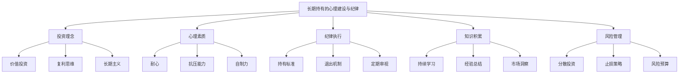
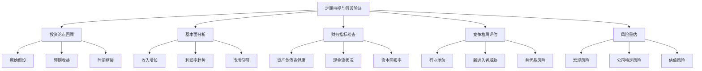
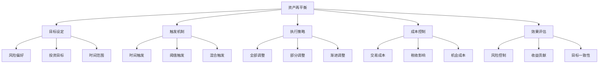

# 第12章：长期持有与动态管理的平衡

在价值成长投资策略中，长期持有和动态管理之间的平衡是一个核心问题。长期持有能够充分享受优质公司的复利效应，而动态管理则能够适应市场变化并优化投资组合。本章将探讨如何在这两种策略之间找到最佳平衡点，以实现长期稳健的投资回报。

## 12.1 长期持有的心理建设与纪律

长期持有是价值投资的核心原则之一，但在实践中often面临诸多挑战。建立正确的心理预期和投资纪律对于成功执行长期持有策略至关重要。

* 核心概念：
    - 复利效应
    - 市场噪音
    - 投资耐心
    - 心理承受能力
    - 长期价值创造
    - 短期波动
    - 投资哲学
    - 确信度
    - 持有成本
    - 机会成本

* 问题背景：市场的短期波动和噪音often导致投资者过早放弃长期持有的策略。

* 问题描述：如何培养长期持有的心理素质？如何在市场波动中保持投资纪律？如何平衡长期持有和及时止损？如何处理持有期间的不确定性？

* 问题解决：
    1. 建立清晰的长期投资理念
    2. 设定合理的长期回报预期
    3. 制定明确的持有标准和退出条件
    4. 培养对短期波动的免疫力
    5. 定期回顾投资论点
    6. 建立信息过滤机制
    7. 培养耐心和自制力
    8. 设计心理压力测试
    9. 建立同伴支持系统
    10. 持续学习和自我反思

* 边界与外延：
    - 需要平衡长期持有和适时调整
    - 考虑个人风险承受能力和投资目标
    - 关注长期持有对税收和流动性的影响

* 概念结构与核心要素组成：



* 概念之间的关系：

| 要素 | 投资理念 | 心理素质 | 纪律执行 | 知识积累 | 风险管理 |
|------|----------|----------|----------|----------|----------|
| 投资理念 | - | 高度相关 | 高度相关 | 中度相关 | 中度相关 |
| 心理素质 | 高度相关 | - | 高度相关 | 中度相关 | 高度相关 |
| 纪律执行 | 高度相关 | 高度相关 | - | 中度相关 | 高度相关 |
| 知识积累 | 中度相关 | 中度相关 | 中度相关 | - | 高度相关 |
| 风险管理 | 中度相关 | 高度相关 | 高度相关 | 高度相关 | - |

* 数学模型：

1. 长期复合回报率：
   $$ CAGR = (1 + r)^n - 1 $$
   其中，r是年化回报率，n是持有年数。

2. 心理压力指数：
   $$ PSI = w_1 \cdot \frac{Drawdown}{Max\_Tolerance} + w_2 \cdot \frac{Holding\_Period}{Expected\_Period} + w_3 \cdot \frac{Volatility}{Risk\_Appetite} $$
   其中，w_i是权重因子。

3. 投资纪律得分：
   $$ Discipline\_Score = \frac{Actual\_Holding\_Time}{Planned\_Holding\_Time} \times \frac{Number\_of\_Rules\_Followed}{Total\_Rules} $$

* 算法流程：

```python
import numpy as np
import pandas as pd

def calculate_cagr(initial_value, final_value, years):
    return (final_value / initial_value) ** (1 / years) - 1

def calculate_psychological_stress_index(drawdown, max_tolerance, holding_period, expected_period, volatility, risk_appetite, weights):
    return (weights[0] * drawdown / max_tolerance +
            weights[1] * holding_period / expected_period +
            weights[2] * volatility / risk_appetite)

def calculate_discipline_score(actual_holding_time, planned_holding_time, rules_followed, total_rules):
    return (actual_holding_time / planned_holding_time) * (rules_followed / total_rules)

def long_term_holding_decision(psi, discipline_score, fundamental_score):
    if psi > 0.8:
        return "考虑减持"
    elif discipline_score < 0.6:
        return "审视投资纪律"
    elif fundamental_score < 0.5:
        return "重新评估基本面"
    else:
        return "继续长期持有"

# 示例使用
initial_value = 100000
final_value = 250000
years = 10

drawdown = 0.25
max_tolerance = 0.3
holding_period = 3
expected_period = 5
volatility = 0.2
risk_appetite = 0.15
psi_weights = [0.4, 0.3, 0.3]

actual_holding_time = 3
planned_holding_time = 5
rules_followed = 8
total_rules = 10

fundamental_score = 0.7

cagr = calculate_cagr(initial_value, final_value, years)
psi = calculate_psychological_stress_index(drawdown, max_tolerance, holding_period, expected_period, volatility, risk_appetite, psi_weights)
discipline_score = calculate_discipline_score(actual_holding_time, planned_holding_time, rules_followed, total_rules)
decision = long_term_holding_decision(psi, discipline_score, fundamental_score)

print(f"长期复合年化增长率: {cagr:.2%}")
print(f"心理压力指数: {psi:.2f}")
print(f"投资纪律得分: {discipline_score:.2f}")
print(f"长期持有决策: {decision}")

# 模拟长期持有过程中的心理压力和纪律执行情况
np.random.seed(42)
n_periods = 60

investment_data = pd.DataFrame({
    'Value': np.random.normal(1.01, 0.05, n_periods).cumprod() * 100000,
    'Drawdown': np.random.uniform(0, 0.3, n_periods),
    'Volatility': np.random.uniform(0.1, 0.3, n_periods),
    'Rules_Followed': np.random.randint(7, 11, n_periods)
})

investment_data['CAGR'] = investment_data['Value'].pct_change().add(1).prod() ** (12 / len(investment_data)) - 1
investment_data['PSI'] = investment_data.apply(lambda x: calculate_psychological_stress_index(
    x['Drawdown'], max_tolerance, 1, expected_period, x['Volatility'], risk_appetite, psi_weights), axis=1)
investment_data['Discipline_Score'] = investment_data.apply(lambda x: calculate_discipline_score(
    1, planned_holding_time / n_periods, x['Rules_Followed'], total_rules), axis=1)
investment_data['Fundamental_Score'] = np.random.uniform(0.5, 1, n_periods)
investment_data['Decision'] = investment_data.apply(lambda x: long_term_holding_decision(
    x['PSI'], x['Discipline_Score'], x['Fundamental_Score']), axis=1)

print("\n长期持有分析:")
print(investment_data.tail())

# 可视化长期持有过程
import matplotlib.pyplot as plt

plt.figure(figsize=(12, 10))

plt.subplot(3, 1, 1)
plt.plot(investment_data['Value'], label='Investment Value')
plt.title('Investment Value Over Time')
plt.legend()

plt.subplot(3, 1, 2)
plt.plot(investment_data['PSI'], label='Psychological Stress Index')
plt.title('Psychological Stress Index')
plt.legend()

plt.subplot(3, 1, 3)
plt.plot(investment_data['Discipline_Score'], label='Discipline Score')
plt.title('Investment Discipline Score')
plt.legend()

plt.tight_layout()
plt.show()

# 分析决策分布
decision_counts = investment_data['Decision'].value_counts()
print("\n长期持有决策分布:")
print(decision_counts)

plt.figure(figsize=(10, 6))
decision_counts.plot(kind='bar')
plt.title('Distribution of Long-term Holding Decisions')
plt.xlabel('Decision')
plt.ylabel('Frequency')
plt.xticks(rotation=45, ha='right')
plt.tight_layout()
plt.show()
```

基于上述分析，我们可以得出以下关于长期持有的心理建设与纪律的关键洞察：

1. 复利力量：理解并内化复利的力量，有助于培养长期持有的耐心。

2. 心理承受能力：提高对短期波动的心理承受能力是长期持有的关键。

3. 纪律执行：制定明确的投资规则并严格执行，是保持长期持有的基础。

4. 持续学习：不断学习和更新知识，有助于增强对长期持有的信心。

5. 定期审视：定期回顾投资论点，确保长期持有的理由仍然成立。

6. 压力管理：识别和管理投资过程中的心理压力，避免非理性决策。

7. 灵活性平衡：在坚持长期持有的同时，保持适度的灵活性以应对重大变化。

8. 风险控制：通过分散投资和合理的止损策略，控制长期持有的风险。

9. 信息过滤：建立有效的信息过滤机制，避免被短期噪音干扰。

10. 长期视角：培养长期思维，关注公司的长期价值创造能力而非短期波动。

对于价值成长投资者而言，在培养长期持有的心理素质和纪律时需要注意以下几点：

1. 投资理念内化：深入理解并内化价值投资和长期主义的核心理念。

2. 预期管理：设定合理的长期回报预期，避免过高期望导致的失望。

3. 情绪管理：学会控制投资过程中的情绪波动，特别是在市场剧烈波动时。

4. 知识储备：持续积累行业和公司知识，增强对投资决策的确信度。

5. 同伴支持：建立志同道合的投资者网络，相互支持和监督。

6. 反思习惯：定期反思投资决策和结果，从错误中学习。

7. 长期激励：设计长期持有的激励机制，如长期业绩考核。

8. 分散注意力：避免过度关注短期市场波动，培养其他兴趣爱好。

9. 实践锻炼：通过小规模、长期的投资实践来锻炼心理素质。

10. 价值认同：投资与个人价值观一致的公司，增加长期持有的动力。

通过系统的心理建设和纪律培养，价值成长投资者可以更好地执行长期持有策略，充分享受优质公司的长期增长红利。这种方法不仅能够提高投资回报，还能降低交易成本和税收负担，是实现长期财富积累的有效途径。然而，重要的是要记住，长期持有并不意味着放任不管。投资者需要保持警惕，定期评估投资标的的基本面变化，并在必要时做出调整。

在下一节中，我们将探讨如何定期审视与投资假设验证，这将为长期持有策略提供必要的动态调整机制。

## 12.2 定期审视与投资假设验证

定期审视和投资假设验证是长期持有策略的重要组成部分。它可以帮助投资者确保投资论点仍然有效，并在必要时及时调整策略。

* 核心概念：
    - 投资论点
    - 假设验证
    - 基本面变化
    - 竞争格局
    - 行业趋势
    - 管理层执行力
    - 财务健康
    - 估值重估
    - 风险因素
    - 触发点机制

* 问题背景：长期持有并不意味着"买入并遗忘"，市场环境和公司情况的变化要求投资者定期审视其投资决策。

* 问题描述：如何构建有效的定期审视框架？哪些关键指标需要重点关注？如何识别投资假设的失效？如何平衡保持长期视角和及时调整的需求？

* 问题解决：
    1. 建立定期审视的时间表和流程
    2. 设定关键性能指标（KPI）进行跟踪
    3. 回顾原始投资论点并评估其有效性
    4. 分析公司基本面的变化
  5. 评估行业竞争格局的演变
  6. 检查管理层执行力和公司战略
  7. 审视财务指标的变化趋势
  8. 重新评估估值水平
  9. 识别新的风险因素
  10. 设置触发全面重估的条件

* 边界与外延：
    - 需要平衡频繁审视和长期perspective
    - 考虑审视过程中的confirmation bias
    - 关注审视结果对投资决策的实际影响

* 概念结构与核心要素组成：



* 概念之间的关系：

| 要素 | 投资论点回顾 | 基本面分析 | 财务指标检查 | 竞争格局评估 | 风险重估 |
|------|--------------|------------|--------------|--------------|----------|
| 投资论点回顾 | - | 高度相关 | 高度相关 | 中度相关 | 高度相关 |
| 基本面分析 | 高度相关 | - | 高度相关 | 高度相关 | 中度相关 |
| 财务指标检查 | 高度相关 | 高度相关 | - | 中度相关 | 中度相关 |
| 竞争格局评估 | 中度相关 | 高度相关 | 中度相关 | - | 高度相关 |
| 风险重估 | 高度相关 | 中度相关 | 中度相关 | 高度相关 | - |

* 数学模型：

1. 投资假设偏离度：
   $$ Hypothesis\_Deviation = \frac{1}{n} \sum_{i=1}^n \left|\frac{Actual_i - Expected_i}{Expected_i}\right| $$
   其中，n是关键指标的数量，Actual_i和Expected_i分别是第i个指标的实际值和预期值。

2. 基本面健康度评分：
   $$ Fundamental\_Score = w_1 \cdot Growth\_Score + w_2 \cdot Profitability\_Score + w_3 \cdot Financial\_Health\_Score $$
   其中，w_i是权重因子。

3. 风险调整后的投资吸引力：
   $$ Risk\_Adjusted\_Attractiveness = \frac{Expected\_Return}{1 + Risk\_Score} \times Fundamental\_Score $$

* 算法流程：

```python
import numpy as np
import pandas as pd

def calculate_hypothesis_deviation(actual_values, expected_values):
    return np.mean(np.abs((np.array(actual_values) - np.array(expected_values)) / np.array(expected_values)))

def calculate_fundamental_score(growth_score, profitability_score, financial_health_score, weights):
    return np.dot([growth_score, profitability_score, financial_health_score], weights)

def calculate_risk_adjusted_attractiveness(expected_return, risk_score, fundamental_score):
    return (expected_return / (1 + risk_score)) * fundamental_score

def investment_review_decision(hypothesis_deviation, fundamental_score, risk_adjusted_attractiveness):
    if hypothesis_deviation > 0.3:
        return "重新评估投资论点"
    elif fundamental_score < 0.6:
        return "关注基本面恶化"
    elif risk_adjusted_attractiveness < 0.5:
        return "考虑减持"
    else:
        return "维持投资"

# 示例使用
actual_values = [0.15, 0.12, 0.08]
expected_values = [0.18, 0.15, 0.10]
growth_score = 0.8
profitability_score = 0.7
financial_health_score = 0.9
fundamental_weights = [0.4, 0.3, 0.3]
expected_return = 0.12
risk_score = 0.2

hypothesis_deviation = calculate_hypothesis_deviation(actual_values, expected_values)
fundamental_score = calculate_fundamental_score(growth_score, profitability_score, financial_health_score, fundamental_weights)
risk_adjusted_attractiveness = calculate_risk_adjusted_attractiveness(expected_return, risk_score, fundamental_score)
decision = investment_review_decision(hypothesis_deviation, fundamental_score, risk_adjusted_attractiveness)

print(f"投资假设偏离度: {hypothesis_deviation:.2f}")
print(f"基本面健康度评分: {fundamental_score:.2f}")
print(f"风险调整后的投资吸引力: {risk_adjusted_attractiveness:.2f}")
print(f"投资审视决策: {decision}")

# 模拟多次定期审视过程
np.random.seed(42)
n_reviews = 20

review_data = pd.DataFrame({
    'Hypothesis_Deviation': np.random.uniform(0, 0.5, n_reviews),
    'Growth_Score': np.random.uniform(0.5, 1, n_reviews),
    'Profitability_Score': np.random.uniform(0.5, 1, n_reviews),
    'Financial_Health_Score': np.random.uniform(0.5, 1, n_reviews),
    'Expected_Return': np.random.uniform(0.05, 0.2, n_reviews),
    'Risk_Score': np.random.uniform(0.1, 0.4, n_reviews)
})

review_data['Fundamental_Score'] = review_data.apply(lambda x: calculate_fundamental_score(
    x['Growth_Score'], x['Profitability_Score'], x['Financial_Health_Score'], fundamental_weights), axis=1)
review_data['Risk_Adjusted_Attractiveness'] = review_data.apply(lambda x: calculate_risk_adjusted_attractiveness(
    x['Expected_Return'], x['Risk_Score'], x['Fundamental_Score']), axis=1)
review_data['Decision'] = review_data.apply(lambda x: investment_review_decision(
    x['Hypothesis_Deviation'], x['Fundamental_Score'], x['Risk_Adjusted_Attractiveness']), axis=1)

print("\n定期审视分析:")
print(review_data)

# 可视化审视结果
import matplotlib.pyplot as plt

plt.figure(figsize=(12, 10))

plt.subplot(3, 1, 1)
plt.plot(review_data['Hypothesis_Deviation'], label='Hypothesis Deviation')
plt.axhline(y=0.3, color='r', linestyle='--', label='Deviation Threshold')
plt.title('Investment Hypothesis Deviation')
plt.legend()

plt.subplot(3, 1, 2)
plt.plot(review_data['Fundamental_Score'], label='Fundamental Score')
plt.axhline(y=0.6, color='r', linestyle='--', label='Fundamental Score Threshold')
plt.title('Fundamental Health Score')
plt.legend()

plt.subplot(3, 1, 3)
plt.plot(review_data['Risk_Adjusted_Attractiveness'], label='Risk-Adjusted Attractiveness')
plt.axhline(y=0.5, color='r', linestyle='--', label='Attractiveness Threshold')
plt.title('Risk-Adjusted Investment Attractiveness')
plt.legend()

plt.tight_layout()
plt.show()

# 分析决策分布
decision_counts = review_data['Decision'].value_counts()
print("\n审视决策分布:")
print(decision_counts)

plt.figure(figsize=(10, 6))
decision_counts.plot(kind='bar')
plt.title('Distribution of Investment Review Decisions')
plt.xlabel('Decision')
plt.ylabel('Frequency')
plt.xticks(rotation=45, ha='right')
plt.tight_layout()
plt.show()
```

基于上述分析，我们可以得出以下关于定期审视与投资假设验证的关键洞察：

1. 系统化审视：建立系统化的定期审视流程，确保全面评估投资假设。

2. 多维度分析：综合考虑投资假设偏离度、基本面健康度和风险调整后吸引力。

3. 基本面优先：关注公司基本面的变化，这often是投资成功的关键。

4. 风险重估：定期重新评估风险因素，包括公司特定风险和宏观风险。

5. 灵活决策：根据审视结果灵活调整投资决策，不应固守原有观点。

6. 长期perspective：在短期波动中保持长期视角，避免过度反应。

7. 竞争格局：密切关注行业竞争格局的变化，评估公司的相对优势。

8. 管理层执行力：评估管理层执行战略的能力，这对公司长期成功至关重要。

9. 财务健康：持续监控公司的财务健康状况，特别是现金流和资产负债表。

10. 触发机制：设置明确的触发点，当关键指标超过阈值时进行全面重估。

对于价值成长投资者而言，在进行定期审视和投资假设验证时需要注意以下几点：

1. 客观性：保持客观态度，避免确认偏差影响判断。

2. 全面性：全面审视投资论点的各个方面，不仅关注财务指标。

3. 前瞻性：不仅关注历史表现，更要评估未来增长潜力。

4. 对比分析：将公司表现与行业对标公司和整体市场进行对比。

5. 情景分析：考虑不同情景下的投资结果，评估风险和回报。

6. 定量与定性结合：结合定量分析和定性判断，全面评估投资价值。

7. 及时行动：当发现重大问题时，及时采取行动，不要拖延。

8. 记录跟踪：详细记录每次审视的过程和结果，便于后续回顾和学习。

9. 专业建议：必要时寻求行业专家或其他投资者的意见，获得不同视角。

10. 持续学习：将每次审视作为学习机会，不断完善投资流程和决策框架。

通过定期、系统化的审视和投资假设验证，价值成长投资者可以在保持长期投资理念的同时，适时调整策略以应对市场和公司的变化。这种方法既保持了对长期价值创造的关注，又提供了必要的灵活性，有助于在不同市场环境下实现持续的投资成功。然而，重要的是要在频繁审视和过度交易之间找到平衡，确保决策基于深思熟虑而非短期波动。

在下一节中，我们将探讨如何应对短期市场波动，这将为长期投资策略提供更强的抗风险能力。

## 12.3 应对短期市场波动的策略

市场短期波动是投资过程中不可避免的现象。对于长期投资者而言，有效应对短期波动不仅可以帮助保持投资纪律，还能够创造额外的投资机会。

* 核心概念：
    - 市场波动性
    - 平均成本法
    - 逆向投资
    - 再平衡策略
    - 对冲技术
    - 心理承受能力
    - 流动性管理
    - 价值陷阱
    - 机会主义加仓
    - 止损策略

* 问题背景：短期市场波动often导致投资者做出非理性决策，影响长期投资回报。

* 问题描述：如何在保持长期投资视角的同时有效应对短期波动？哪些策略可以用来降低短期波动的负面影响？如何将短期波动转化为投资机会？

* 问题解决：
    1. 建立市场波动预期和心理准备
    2. 实施分批买入和平均成本策略
    3. 设计动态再平衡机制
    4. 利用市场恐慌进行逆向投资
    5. 构建多元化投资组合降低波动性
    6. 使用对冲工具管理短期风险
    7. 保持充足流动性应对市场机会
    8. 设置止损点控制下行风险
    9. 关注基本面而非短期价格波动
    10. 建立系统化的加仓和减仓标准

* 边界与外延：
    - 需要平衡短期策略和长期投资目标
    - 考虑个人风险承受能力和投资时间范围
    - 关注交易成本和税收影响

* 概念结构与核心要素组成：

```mermaid
graph TD
    A[应对短期市场波动] --> B[心理准备]
    A --> C[投资策略]
    A --> D[风险管理]
    A --> E[机会把握]
    A --> F[组合管理]
    B --> G[情绪控制]
    B --> H[长期视角]
    B --> I[压力测试]
    C --> J[分批买入]
    C --> K[动态再平衡]
    C --> L[逆向投资]
    D --> M[止损策略]
    D --> N[对冲工具]
    D --> O[流动性管理]
    E --> P[估值分析]
    E --> Q[基本面关注]
    E --> R[加仓标准]
    F --> S[多元化]
    F --> T[资产配置]
    F --> U[周期性调整]

* 概念之间的关系：

| 要素 | 心理准备 | 投资策略 | 风险管理 | 机会把握 | 组合管理 |
|------|----------|----------|----------|----------|----------|
| 心理准备 | - | 高度相关 | 高度相关 | 中度相关 | 中度相关 |
| 投资策略 | 高度相关 | - | 高度相关 | 高度相关 | 高度相关 |
| 风险管理 | 高度相关 | 高度相关 | - | 中度相关 | 高度相关 |
| 机会把握 | 中度相关 | 高度相关 | 中度相关 | - | 高度相关 |
| 组合管理 | 中度相关 | 高度相关 | 高度相关 | 高度相关 | - |

* 数学模型：

1. 波动性调整的加仓策略：
   $$ Additional\_Investment = Base\_Investment \times (1 + \alpha \times \frac{Long\_Term\_Avg - Current\_Price}{Long\_Term\_Avg}) $$
   其中，α是调整系数，Long_Term_Avg是长期平均价格。

2. 动态再平衡触发点：
   $$ Rebalance\_Trigger = \left|\frac{Current\_Weight - Target\_Weight}{Target\_Weight}\right| > Threshold $$

3. 风险调整后的机会得分：
   $$ Opportunity\_Score = \frac{Expected\_Return}{Volatility} \times Fundamental\_Score $$

* 算法流程：

```python
import numpy as np
import pandas as pd

def calculate_additional_investment(base_investment, current_price, long_term_avg, alpha=0.5):
    return base_investment * (1 + alpha * (long_term_avg - current_price) / long_term_avg)

def check_rebalance_trigger(current_weight, target_weight, threshold=0.1):
    return abs((current_weight - target_weight) / target_weight) > threshold

def calculate_opportunity_score(expected_return, volatility, fundamental_score):
    return (expected_return / volatility) * fundamental_score

def market_volatility_strategy(price_change, volatility, fundamental_score, current_weight, target_weight):
    if price_change < -0.1 and volatility > 0.2 and fundamental_score > 0.7:
        return "考虑加仓"
    elif check_rebalance_trigger(current_weight, target_weight):
        return "需要再平衡"
    elif price_change > 0.2 and volatility < 0.15:
        return "考虑获利了结"
    else:
        return "保持观察"

# 示例使用
base_investment = 10000
current_price = 90
long_term_avg = 100
expected_return = 0.15
volatility = 0.25
fundamental_score = 0.8
current_weight = 0.3
target_weight = 0.25

additional_investment = calculate_additional_investment(base_investment, current_price, long_term_avg)
rebalance_needed = check_rebalance_trigger(current_weight, target_weight)
opportunity_score = calculate_opportunity_score(expected_return, volatility, fundamental_score)
strategy = market_volatility_strategy(-0.1, volatility, fundamental_score, current_weight, target_weight)

print(f"建议额外投资: ${additional_investment:.2f}")
print(f"需要再平衡: {'是' if rebalance_needed else '否'}")
print(f"机会得分: {opportunity_score:.2f}")
print(f"市场波动策略: {strategy}")

# 模拟市场波动期间的策略应用
np.random.seed(42)
n_days = 100

market_data = pd.DataFrame({
    'Price': np.random.normal(100, 10, n_days).cumsum(),
    'Volatility': np.random.uniform(0.1, 0.3, n_days),
    'Fundamental_Score': np.random.uniform(0.5, 1, n_days),
    'Weight': np.random.uniform(0.2, 0.3, n_days)
})

market_data['Price_Change'] = market_data['Price'].pct_change()
market_data['Long_Term_Avg'] = market_data['Price'].rolling(window=30).mean()
market_data['Additional_Investment'] = market_data.apply(lambda x: calculate_additional_investment(base_investment, x['Price'], x['Long_Term_Avg']), axis=1)
market_data['Rebalance_Needed'] = market_data.apply(lambda x: check_rebalance_trigger(x['Weight'], target_weight), axis=1)
market_data['Opportunity_Score'] = market_data.apply(lambda x: calculate_opportunity_score(expected_return, x['Volatility'], x['Fundamental_Score']), axis=1)
market_data['Strategy'] = market_data.apply(lambda x: market_volatility_strategy(x['Price_Change'], x['Volatility'], x['Fundamental_Score'], x['Weight'], target_weight), axis=1)

print("\n市场波动策略分析:")
print(market_data.tail())

# 可视化市场波动和策略应用
import matplotlib.pyplot as plt

plt.figure(figsize=(12, 10))

plt.subplot(3, 1, 1)
plt.plot(market_data['Price'], label='Price')
plt.plot(market_data['Long_Term_Avg'], label='Long-term Average')
plt.title('Market Price and Long-term Average')
plt.legend()

plt.subplot(3, 1, 2)
plt.plot(market_data['Additional_Investment'], label='Additional Investment')
plt.title('Suggested Additional Investment')
plt.legend()

plt.subplot(3, 1, 3)
plt.plot(market_data['Opportunity_Score'], label='Opportunity Score')
plt.title('Investment Opportunity Score')
plt.legend()

plt.tight_layout()
plt.show()

# 分析策略分布
strategy_counts = market_data['Strategy'].value_counts()
print("\n策略分布:")
print(strategy_counts)

plt.figure(figsize=(10, 6))
strategy_counts.plot(kind='bar')
plt.title('Distribution of Market Volatility Strategies')
plt.xlabel('Strategy')
plt.ylabel('Frequency')
plt.xticks(rotation=45, ha='right')
plt.tight_layout()
plt.show()
```

基于上述分析，我们可以得出以下关于应对短期市场波动的策略的关键洞察：

1. 心理准备：建立正确的心理预期，将短期波动视为正常现象而非威胁。

2. 分批投资：利用价格波动，通过分批买入策略降低平均成本。

3. 动态再平衡：定期或基于触发条件进行投资组合再平衡，维持目标配置。

4. 逆向思维：在市场恐慧时考虑逆向投资，抓住被低估的机会。

5. 基本面focus：在短期波动中保持对公司基本面的关注，避免被噪音干扰。

6. 机会评分：综合考虑预期回报、波动性和基本面，评估投资机会。

7. 灵活加仓：根据价格与长期均值的偏离程度，灵活调整投资金额。

8. 风险管理：设置止损点和使用对冲工具，控制下行风险。

9. 流动性保持：保持适度现金，以应对极端市场情况和把握投资机会。

10. 多元化配置：通过资产多元化降低整体组合的波动性。

对于价值成长投资者而言，在应对短期市场波动时需要注意以下几点：

1. 长期视角：始终保持长期投资视角，不被短期波动影响判断。

2. 机会识别：将显著的短期波动视为潜在的投资机会，而非威胁。

3. 纪律执行：制定明确的加仓、减仓和再平衡规则，并严格执行。

4. 情绪控制：培养控制情绪的能力，避免在市场恐慌或亢奋时做出非理性决策。

5. 知识储备：持续学习和更新市场知识，提高对不同类型波动的理解和应对能力。

6. 风险评估：定期评估个人风险承受能力，确保投资策略与之匹配。

7. 情景分析：进行不同市场情景下的投资组合表现分析，做好心理和策略准备。

8. 及时复盘：每次重大市场波动后进行决策复盘，总结经验教训。

9. 工具利用：合理利用金融工具（如期权）来管理短期风险，但avoid过度投机。

10. 保持警惕：recognize that持续的市场波动可能预示着更深层次的问题，需要重新评估投资假设。

通过综合运用这些策略，价值成长投资者可以更好地应对短期市场波动，不仅能够降低波动带来的负面影响，还能够利用波动创造额外的投资价值。这种方法既保持了对长期价值的focus，又提供了应对短期市场变化的灵活性，有助于在不确定的市场环境中实现持续的投资成功。然而，重要的是要记住，任何策略都不能完全消除市场风险，投资者需要根据个人情况和市场环境不断调整和优化自己的应对策略。

在下一节中，我们将探讨资产再平衡的原则与执行，这将为长期投资策略提供一个系统化的风险管理和收益优化框架。

## 12.4 资产再平衡的原则与执行

资产再平衡是维护投资组合长期健康的关键策略。它能够帮助投资者控制风险，把握市场机会，并保持投资组合与个人投资目标的一致性。

* 核心概念：
    - 目标资产配置
    - 偏离容忍度
    - 周期性再平衡
    - 条件触发再平衡
    - 再平衡成本
    - 税收影响
    - 动态资产配置
    - 风险平价
    - 收益收割
    - 再投资策略

* 问题背景：市场表现的差异会导致投资组合的实际资产配置偏离初始目标，增加潜在风险或错失机会。

* 问题描述：如何确定最佳的再平衡频率？哪些因素应该触发再平衡？如何在再平衡收益和成本之间找到平衡？如何将再平衡与市场时机选择结合？

* 问题解决：
    1. 设定清晰的目标资产配置
    2. 确定合理的偏离容忍度
    3. 建立周期性再平衡计划
    4. 设计条件触发再平衡机制
    5. 评估再平衡的成本和收益
    6. 考虑税收影响并优化执行
    7. 结合市场估值进行战术性调整
    8. 实施风险平价方法
    9. 利用再平衡进行收益收割
    10. 制定再投资策略

* 边界与外延：
    - 需要平衡再平衡频率和交易成本
    - 考虑不同资产类别的流动性差异
    - 关注再平衡对整体投资策略的影响

* 概念结构与核心要素组成：



* 概念之间的关系：

| 要素 | 目标设定 | 触发机制 | 执行策略 | 成本控制 | 效果评估 |
|------|----------|----------|----------|----------|----------|
| 目标设定 | - | 高度相关 | 中度相关 | 低度相关 | 高度相关 |
| 触发机制 | 高度相关 | - | 高度相关 | 中度相关 | 中度相关 |
| 执行策略 | 中度相关 | 高度相关 | - | 高度相关 | 高度相关 |
| 成本控制 | 低度相关 | 中度相关 | 高度相关 | - | 中度相关 |
| 效果评估 | 高度相关 | 中度相关 | 高度相关 | 中度相关 | - |

* 数学模型：

1. 资产配置偏离度：
   $$ Deviation = \sum_{i=1}^n |w_i - w_i^*| $$
   其中，w_i是资产i的当前权重，w_i*是目标权重。

2. 再平衡决策阈值：
   $$ Rebalance\_If: Deviation > Threshold\ or\ \max(|w_i - w_i^*|) > Single\_Asset\_Threshold $$

3. 再平衡后的预期收益：
   $$ E(R_{rebalanced}) = \sum_{i=1}^n w_i^* \cdot E(R_i) - Rebalancing\_Cost $$

* 算法流程：

```python
import numpy as np
import pandas as pd

def calculate_deviation(current_weights, target_weights):
    return np.sum(np.abs(current_weights - target_weights))

def check_rebalance_need(current_weights, target_weights, threshold, single_asset_threshold):
    deviation = calculate_deviation(current_weights, target_weights)
    max_single_deviation = np.max(np.abs(current_weights - target_weights))
    return deviation > threshold or max_single_deviation > single_asset_threshold

def calculate_rebalancing_amounts(current_values, target_weights, total_portfolio_value):
    target_values = total_portfolio_value * target_weights
    return target_values - current_values

def estimate_rebalancing_cost(rebalancing_amounts, transaction_cost_rate):
    return np.sum(np.abs(rebalancing_amounts)) * transaction_cost_rate

def rebalance_decision(current_weights, target_weights, threshold, single_asset_threshold, transaction_cost_rate):
    if check_rebalance_need(current_weights, target_weights, threshold, single_asset_threshold):
        total_portfolio_value = np.sum(current_weights)
        rebalancing_amounts = calculate_rebalancing_amounts(current_weights, target_weights, total_portfolio_value)
        cost = estimate_rebalancing_cost(rebalancing_amounts, transaction_cost_rate)
        return "需要再平衡", rebalancing_amounts, cost
    else:
        return "无需再平衡", np.zeros_like(current_weights), 0

# 示例使用
current_weights = np.array([0.40, 0.35, 0.25])
target_weights = np.array([0.33, 0.33, 0.34])
threshold = 0.1
single_asset_threshold = 0.05
transaction_cost_rate = 0.001

decision, amounts, cost = rebalance_decision(current_weights, target_weights, threshold, single_asset_threshold, transaction_cost_rate)

print(f"再平衡决策: {decision}")
print(f"再平衡金额: {amounts}")
print(f"估计成本: ${cost:.2f}")

# 模拟长期资产再平衡过程
np.random.seed(42)
n_periods = 60
n_assets = 3

portfolio_data = pd.DataFrame({
    'Asset_1': np.random.normal(1.01, 0.05, n_periods).cumprod(),
    'Asset_2': np.random.normal(1.005, 0.03, n_periods).cumprod(),
    'Asset_3': np.random.normal(1.015, 0.06, n_periods).cumprod()
})

initial_weights = np.array([0.33, 0.33, 0.34])
initial_value = 1000000

portfolio_data['Total_Value'] = np.sum(portfolio_data.values * initial_weights * initial_value, axis=1)
portfolio_data['Weight_1'] = portfolio_data['Asset_1'] * initial_weights[0] * initial_value / portfolio_data['Total_Value']
portfolio_data['Weight_2'] = portfolio_data['Asset_2'] * initial_weights[1] * initial_value / portfolio_data['Total_Value']
portfolio_data['Weight_3'] = portfolio_data['Asset_3'] * initial_weights[2] * initial_value / portfolio_data['Total_Value']

rebalance_history = []

for i in range(n_periods):
    current_weights = portfolio_data.iloc[i][['Weight_1', 'Weight_2', 'Weight_3']].values
    decision, amounts, cost = rebalance_decision(current_weights, initial_weights, threshold, single_asset_threshold, transaction_cost_rate)
    rebalance_history.append({
        'Period': i,
        'Decision': decision,
        'Rebalance_Amount_1': amounts[0],
        'Rebalance_Amount_2': amounts[1],
        'Rebalance_Amount_3': amounts[2],
        'Cost': cost
    })
    
    if decision == "需要再平衡":
        portfolio_data.loc[i:, 'Weight_1'] = initial_weights[0]
        portfolio_data.loc[i:, 'Weight_2'] = initial_weights[1]
        portfolio_data.loc[i:, 'Weight_3'] = initial_weights[2]

rebalance_df = pd.DataFrame(rebalance_history)

print("\n资产再平衡历史:")
print(rebalance_df)

# 可视化资产配置和再平衡过程
import matplotlib.pyplot as plt

plt.figure(figsize=(12, 10))

plt.subplot(2, 1, 1)
plt.plot(portfolio_data[['Weight_1', 'Weight_2', 'Weight_3']])
plt.title('Asset Allocation Over Time')
plt.legend(['Asset 1', 'Asset 2', 'Asset 3'])

plt.subplot(2, 1, 2)
plt.plot(portfolio_data['Total_Value'])
plt.title('Total Portfolio Value')

rebalance_points = rebalance_df[rebalance_df['Decision'] == "需要再平衡"]['Period']
for point in rebalance_points:
    plt.axvline(x=point, color='r', linestyle='--', alpha=0.5)

plt.tight_layout()
plt.show()

# 分析再平衡效果
no_rebalance_value = np.sum(portfolio_data[['Asset_1', 'Asset_2', 'Asset_3']].iloc[-1] * initial_weights * initial_value)
rebalance_value = portfolio_data['Total_Value'].iloc[-1]
total_cost = rebalance_df['Cost'].sum()

print(f"\n不再平衡的最终价值: ${no_rebalance_value:.2f}")
print(f"再平衡后的最终价值: ${rebalance_value:.2f}")
print(f"总再平衡成本: ${total_cost:.2f}")
print(f"净收益: ${rebalance_value - no_rebalance_value - total_cost:.2f}")
```

基于上述分析，我们可以得出以下关于资产再平衡的原则与执行的关键洞察：

1. 目标一致性：再平衡确保投资组合与既定的风险偏好和投资目标保持一致。

2. 风险控制：通过定期调整资产权重，可以有效控制组合的整体风险水平。

3. 触发机制：结合时间触发和阈值触发的混合机制，可以更灵活地执行再平衡。

4. 成本效益：在再平衡决策中需要考虑交易成本和税收影响，确保净收益为正。

5. 市场时机：可以将再平衡与市场估值结合，实现一定程度的市场择时。

6. 渐进调整：对于大额再平衡，可以采用渐进式调整，减少对市场的冲击。

7. 收益收割：再平衡可以自动实现"高卖低买"，锁定部分收益。

8. 流动性管理：再平衡过程中需要考虑不同资产的流动性差异。

9. 长期效应：虽然短期内再平衡可能产生成本，但长期来看often能提高风险调整后的回报。

10. 动态调整：随着市场环境和个人情况的变化，目标资产配置itself也需要定期审视和调整。

对于价值成长投资者而言，在执行资产再平衡策略时需要注意以下几点：

1. 策略一致性：确保再平衡策略与整体的价值成长投资理念保持一致。

2. 基本面导向：在再平衡决策中，考虑个股和行业的基本面变化。

3. 估值考量：利用再平衡机会增持被低估的价值股或高质量成长股。

4. 灵活性：保持一定的灵活性，允许短期内的小幅偏离以把握特殊机会。

5. 税收筹划：考虑税收影响，可能的话在税收高效的账户中执行再平衡。

6. 行业轮动：通过再平衡捕捉行业轮动机会，调整行业配置。

7. 新机会融入：使用再平衡作为将新发现的投资机会纳入组合的方式。

8. 风险评估：定期评估个股和整体组合的风险，使用再平衡来管理风险。

9. 长期perspective：在执行短期再平衡决策时，不忘hold长期投资视角。

10. 持续学习：分析每次再平衡的结果，总结经验教训，不断优化再平衡策略。

通过系统化的资产再平衡策略，价值成长投资者可以更好地管理投资组合，控制风险，并把握市场机会。这种方法既能保持投资组合与预定目标的一致性，又提供了根据市场变化进行动态调整的灵活性，有助于在长期投资中实现更稳定和优化的回报。然而，重要的是要记住，再平衡不should被视为机械的过程，而应该结合市场洞察、基本面分析和个人投资目标来执行。投资者需要定期评估再平衡策略的有效性，并根据需要进行调整。

总结本章，我们深入探讨了长期持有与动态管理的平衡，包括长期持有的心理建设与纪律、定期审视与投资假设验证、应对短期市场波动的策略，以及资产再平衡的原则与执行。这些方法和工具为价值成长投资者提供了一个全面的长期投资管理框架，有助于在保持长期投资视角的同时，灵活应对市场变化，优化投资回报。

在接下来的章节中，我们将通过一系列的案例分析和实证研究，将这些理论和策略应用于实际投资情景，进一步深化对价值成长投资方法的理解和应用。