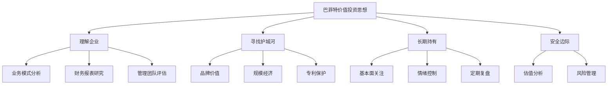
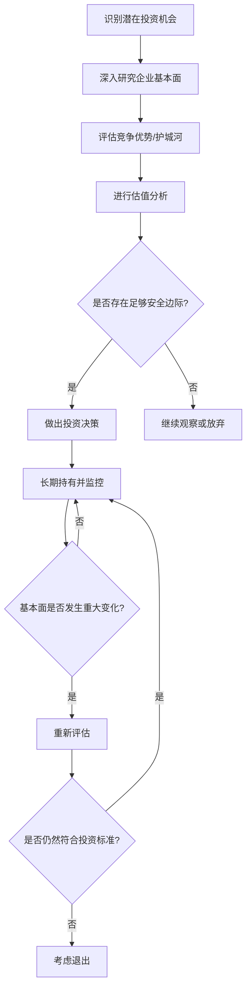
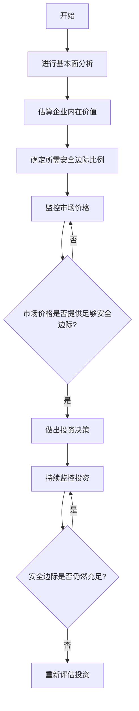
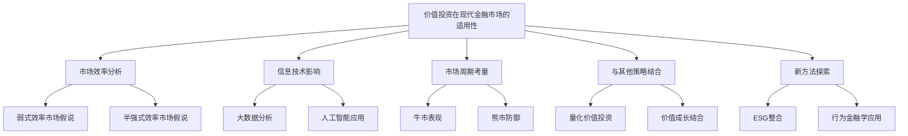

# 第一部分：投资理论基础

# 第1章：价值投资理论概述

价值投资是一种基于深入分析和理性决策的投资方法，其核心思想是以低于其内在价值的价格购买优质资产。这种投资理念最早由本杰明·格雷厄姆提出，后来由沃伦·巴菲特进一步发展和完善，成为现代投资学中最具影响力的理论之一。

## 1.1 巴菲特价值投资思想的核心原则

巴菲特的价值投资思想建立在几个关键原则之上，这些原则不仅指导着他的投资决策，也为全球countless投资者提供了宝贵的指导。

### 1.1.1 理解企业

* 核心概念：深入了解企业的业务模式、竞争优势和长期发展前景。

* 问题背景：在复杂多变的市场环境中，许多投资者倾向于追逐短期市场趋势或依赖表面财务指标，而忽视了对企业本质的理解。

* 问题描述：如何在信息爆炸的时代，有效地分析和理解一家企业的真实情况？

* 问题解决：
    1. 全面研究企业的产品和服务
    2. 分析企业在行业中的竞争地位
    3. 评估管理团队的能力和诚信
    4. 研究企业的财务报表和现金流情况
    5. 考察企业的长期增长潜力和可持续性

* 边界与外延：理解企业不仅限于财务分析，还包括对行业动态、技术趋势、监管环境等宏观因素的把握。

### 1.1.2 寻找护城河

* 核心概念：识别并投资于具有持久竞争优势（即"护城河"）的企业。

* 问题背景：在激烈的市场竞争中，企业的竞争优势往往是短暂的。持久的竞争优势能够帮助企业在长期内保持盈利能力。

* 问题描述：如何识别和评估企业的护城河？

* 问题解决：
    1. 分析品牌价值和客户忠诚度
    2. 评估规模经济和网络效应
    3. 考察专利和知识产权保护
    4. 研究转换成本和锁定效应
    5. 分析独特的企业文化和管理体系

* 边界与外延：护城河的概念可以扩展到新兴行业和技术型企业，但需要考虑行业特性和技术变革的影响。

### 1.1.3 长期持有

* 核心概念：对优质企业进行长期投资，而非频繁交易。

* 问题背景：市场短期波动和噪音often导致投资者过度交易，增加成本并降低回报。

* 问题描述：如何在市场波动中保持长期投资的纪律？

* 问题解决：
    1. 建立坚实的投资理念和方法论
    2. 关注企业的基本面而非短期市场波动
    3. 定期复盘投资决策，验证投资假设
    4. 控制情绪，避免受市场情绪影响
    5. 培养耐心，给予优质企业足够的时间成长

* 边界与外延：长期持有并不意味着永不调整，需要根据基本面变化适时调整投资组合。

### 1.1.4 概念结构与核心要素组成



### 1.1.5 概念之间的关系

| 概念 | 理解企业 | 寻找护城河 | 长期持有 | 安全边际 |
|------|----------|------------|----------|----------|
| 理解企业 | - | 高度相关 | 直接支持 | 基础要素 |
| 寻找护城河 | 高度相关 | - | 强化理由 | 增强保障 |
| 长期持有 | 直接支持 | 强化理由 | - | 降低风险 |
| 安全边际 | 基础要素 | 增强保障 | 降低风险 | - |

### 1.1.6 投资决策流程



## 1.2 安全边际概念及其重要性

安全边际是价值投资理论中最为核心的概念之一，它为投资决策提供了一个重要的保护机制，有助于降低投资风险并提高长期回报。

* 核心概念：安全边际是指一项投资的市场价格与其估计内在价值之间的差距。

* 问题背景：金融市场的不确定性和投资者的有限理性often导致资产定价偏离其真实价值，为具有耐心和洞察力的投资者创造了机会。

* 问题描述：如何确定合适的安全边际，并在实际投资中应用这一概念？

* 问题解决：
    1. 进行深入的基本面分析，估算企业的内在价值
    2. 考虑行业特性和企业风险，确定所需的安全边际比例
    3. 耐心等待市场提供足够的安全边际
    4. 在安全边际充足时果断行动
    5. 持续监控投资，确保安全边际的持续性

* 数学模型：

假设一家企业的估计内在价值为V，当前市场价格为P，则安全边际（SM）可表示为：

$$ SM = \frac{V - P}{P} \times 100\% $$

例如，如果一家企业的估计内在价值为100元，而当前市场价格为80元，则安全边际为：

$$ SM = \frac{100 - 80}{80} \times 100\% = 25\% $$

这意味着投资者有25%的安全边际来抵御潜在的估值错误或不利的市场变动。

* 算法流程：



* 实际场景应用：

考虑一家科技公司，通过深入分析其财务报表、增长前景和竞争地位，估算其内在价值为每股100元。考虑到行业的快速变化和潜在风险，投资者决定要求30%的安全边际。因此，只有当股价跌至70元或以下时，投资者才会考虑购买。

这种方法不仅提供了对潜在损失的缓冲，还增加了获得超额回报的可能性。如果市场最终认可了公司的真实价值，投资者可能会获得显著的资本增值。

## 1.3 长期投资与复利效应

长期投资是巴菲特价值投资理论的另一个核心支柱，它与复利效应紧密相连，共同构成了创造巨大财富的关键机制。

* 核心概念：长期投资指持有优质资产多年甚至几十年，让时间和复利效应充分发挥作用。

* 问题背景：在短期主义盛行的金融市场中，许多投资者过于关注短期波动和即时收益，忽视了长期复合增长的强大力量。

* 问题描述：如何在实际投资中践行长期投资理念，并充分利用复利效应？

* 问题解决：
    1. 选择具有持续竞争优势和增长潜力的企业
    2. 制定明确的长期投资计划和目标
    3. 培养耐心和纪律，抵制频繁交易的冲动
    4. 理解并利用复利效应，让收益在时间中倍增
    5. 定期复盘但避免过度干预，给予投资时间成长

* 数学模型：

复利增长可以用以下公式表示：

$$ FV = PV \times (1 + r)^n $$

其中：
- FV 是未来价值
- PV 是现值
- r 是年复合增长率
- n 是年数

例如，假设初始投资10,000元，年复合增长率为15%，20年后的价值将是：

$$ FV = 10,000 \times (1 + 0.15)^{20} = 163,665.37 $$

这展示了复利效应的强大力量，初始投资在20年内增长了16倍多。

* 算法流程：

```python
def compound_growth(initial_investment, annual_rate, years):
    return initial_investment * (1 + annual_rate) ** years

def main():
    initial_investment = 10000
    annual_rate = 0.15
    years = 20
    
    final_value = compound_growth(initial_investment, annual_rate, years)
    
    print(f"Initial investment: ${initial_investment}")
    print(f"Annual growth rate: {annual_rate*100}%")
    print(f"Investment period: {years} years")
    print(f"Final value: ${final_value:.2f}")
    print(f"Total growth: {(final_value/initial_investment - 1)*100:.2f}%")

if __name__ == "__main__":
    main()
```

这段代码计算了长期投资的复利效应，展示了初始投资如何随时间增长。

* 实际场景应用：

考虑投资者在1980年投资1万美元购买伯克希尔·哈撒韦公司的股票。截至2021年，这笔投资已经增长到约4,000万美元，年复合增长率约为20%。这个例子生动地展示了长期投资结合优质资产的威力。

然而，重要的是要认识到，并非所有长期投资都能获得如此惊人的回报。关键在于选择具有持久竞争优势的企业，并在合理的估值水平进行投资。

## 1.4 价值投资在现代金融市场的适用性

随着金融市场的不断发展和变革，价值投资理论的适用性一直是学术界和投资界热议的话题。在高频交易、量化投资盛行的今天，传统的价值投资方法是否仍然有效？让我们深入探讨这个问题。

* 核心概念：价值投资在现代金融市场中的适用性指的是这种投资方法在当前市场环境下的有效性和实用性。

* 问题背景：技术进步、市场结构变化、信息传播速度加快等因素似乎对传统的价值投资方法构成了挑战。

* 问题描述：在高度效率的现代金融市场中，价值投资还能够产生超额回报吗？如何调整和优化价值投资策略以适应新的市场环境？

* 问题解决：
    1. 深入分析市场效率与价值投资的关系
    2. 探讨信息技术对价值投资的影响
    3. 研究价值投资在不同市场周期中的表现
    4. 考察价值投资与其他投资策略的结合
    5. 提出适应现代金融市场的价值投资新方法

* 边界与外延：
    - 价值投资的适用性可能因资产类别、市场状况和投资者能力而异
    - 需要考虑新兴市场、另类资产等领域的价值投资机会
    - 探讨ESG因素、人工智能等新趋势对价值投资的影响

* 概念结构与核心要素组成：



* 概念之间的关系：

| 概念 | 市场效率 | 信息技术 | 市场周期 | 策略结合 | 新方法探索 |
|------|----------|----------|----------|----------|------------|
| 市场效率 | - | 高度相关 | 中度相关 | 低度相关 | 中度相关 |
| 信息技术 | 高度相关 | - | 低度相关 | 高度相关 | 高度相关 |
| 市场周期 | 中度相关 | 低度相关 | - | 中度相关 | 中度相关 |
| 策略结合 | 低度相关 | 高度相关 | 中度相关 | - | 高度相关 |
| 新方法探索 | 中度相关 | 高度相关 | 中度相关 | 高度相关 | - |

* 数学模型：

考虑一个简化的模型来评估价值投资在不同市场效率下的表现：

假设 $R_v$ 为价值投资策略的回报率，$E$ 为市场效率指数（0 ≤ E ≤ 1，1表示完全有效市场），$α$ 为价值投资产生的超额回报，$R_m$ 为市场平均回报率。则可以表示为：

$$ R_v = R_m + α(1-E) $$

这个模型表明，随着市场效率的提高（E接近1），价值投资产生超额回报的能力会降低。

* 算法流程：

```python
def value_investing_performance(market_efficiency, alpha, market_return):
    return market_return + alpha * (1 - market_efficiency)

def simulate_market_conditions(num_simulations):
    results = []
    for _ in range(num_simulations):
        market_efficiency = random.uniform(0, 1)
        alpha = random.uniform(0, 0.1)  # 假设最大超额回报为10%
        market_return = random.uniform(-0.2, 0.2)  # 假设市场回报在-20%到20%之间
        
        value_return = value_investing_performance(market_efficiency, alpha, market_return)
        results.append((market_efficiency, value_return - market_return))
    
    return results

def analyze_results(results):
    efficiencies, outperformance = zip(*results)
    plt.scatter(efficiencies, outperformance)
    plt.xlabel('市场效率')
    plt.ylabel('价值投资超额回报')
    plt.title('价值投资表现vs市场效率')
    plt.show()

results = simulate_market_conditions(1000)
analyze_results(results)
```

这段代码模拟了不同市场效率下价值投资的表现，并通过图表展示了结果。

* 实际场景应用：

1. 高频交易环境：
   在高频交易占主导的市场中，价值投资者可能需要更长的时间周期来实现其投资理念。然而，高频交易也可能造成短期的市场错误定价，为价值投资者创造机会。

2. 新兴市场：
   在信息不够透明、分析师覆盖不足的新兴市场中，深入的基本面分析可能会发现被低估的优质公司，价值投资仍有较大的适用空间。

3. 科技行业：
   传统的价值投资可能难以准确评估快速成长的科技公司。然而，通过结合成长因素和调整估值方法，价值投资理念仍可应用于选择具有强大竞争优势和合理估值的科技公司。

4. ESG投资：
   将环境、社会和治理因素纳入价值投资框架，可以帮助投资者识别长期可持续发展的公司，这是价值投资在现代金融市场中的一个重要发展方向。

5. 被动投资兴起：
   尽管指数基金和ETF的普及对主动管理构成了挑战，但这也可能导致某些股票被错误定价，为价值投资者创造机会。

总结来看，尽管现代金融市场发生了巨大变化，价值投资的核心理念——以合理价格购买优质资产——仍然适用。然而，价值投资者需要与时俱进，利用新技术、新方法来增强分析能力，同时保持耐心和纪律，以在长期中实现优异的投资回报。
