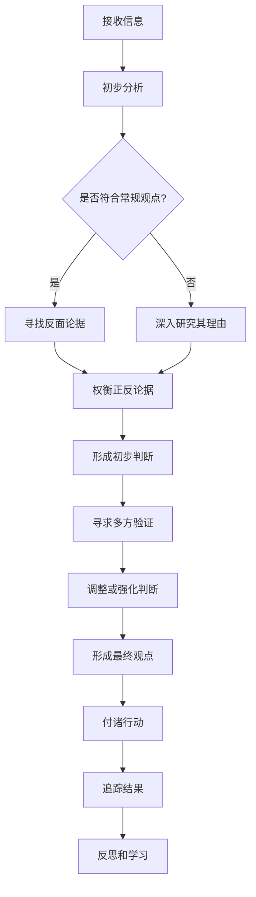
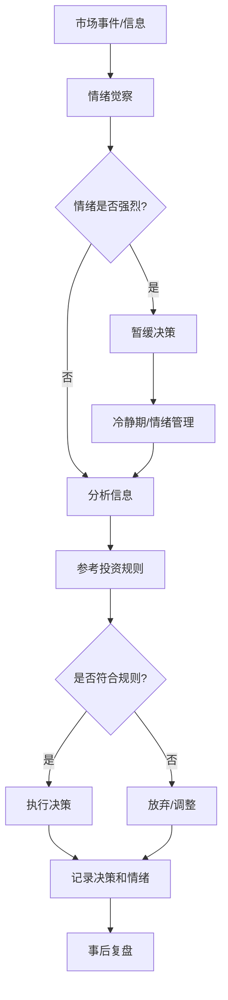
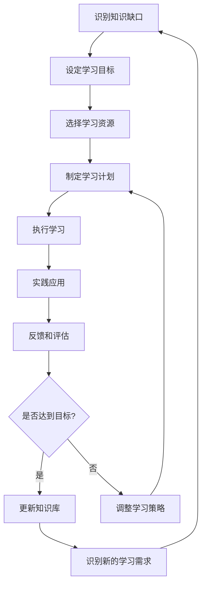
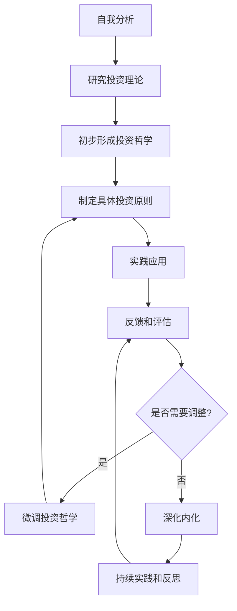

# 第20章：投资者心智模式与自我修养

投资成功不仅需要专业知识和技能，更需要正确的心智模式和持续的自我修养。本章将探讨如何培养独立思考能力、管理情绪、保持学习态度，以及如何形成个人化的投资哲学。

## 20.1 培养独立思考能力

* 核心概念：
    - 批判性思维
    - 反向思考
    - 多元视角
    - 认知偏差意识

* 问题背景：
  在信息爆炸和观点纷争的时代，投资者容易被市场噪音和他人观点所影响，失去独立判断能力。

* 问题描述：
  如何在复杂的市场环境中培养和保持独立思考能力？

* 问题解决：
1. 培养批判性思维，质疑常规观点和权威言论。
2. 实践反向思考，考虑与主流相反的可能性。
3. 寻求多元信息源，避免信息茧房。
4. 进行假设验证，不断检验自己的投资假设。
5. 保持谦逊态度，承认自己可能犯错。
6. 建立个人思考框架，系统化分析问题。
7. 培养跨学科知识，拓宽思考维度。

* 算法流程：

* 实际场景应用：
  以对某科技公司的投资决策为例：

1. 接收信息：市场普遍看好该公司未来前景。
2. 反向思考：考虑可能阻碍公司增长的因素。
3. 多元信息：不仅关注财务报表，还研究行业报告、竞争对手情况、技术趋势等。
4. 假设验证：列出支持投资的关键假设，并寻找证据验证。
5. 独立结论：根据自己的分析得出结论，即使可能与市场主流观点不同。
6. 持续学习：无论决策结果如何，都从中吸取经验教训。

培养独立思考能力是一个长期过程，需要持续实践和反思。以下是一些额外的策略和技巧：

1. 建立思考日志：
    - 记录每日投资想法和决策理由。
    - 定期回顾，分析思考过程的优缺点。

2. 实践"第一性原理"思维：
    - 将复杂问题分解到最基本的要素。
    - 从根本原理出发重新构建解决方案。

3. 延迟判断：
    - 在形成最终观点前，给自己时间深入思考。
    - 避免匆忙下结论或跟随即时反应。

4. 主动寻找反例：
    - 刻意寻找与自己观点相反的论据。
    - 尝试论证与自己相反的立场。

5. 运用思维工具：
    - 使用决策矩阵、SWOT分析等工具辅助思考。
    - 学习和应用不同的思维模型，如芒格的多元思维模型。

6. 构建个人知识体系：
    - 系统化整理学习内容和投资经验。
    - 建立知识间的联系，形成网状结构。

7. 培养系统思维：
    - 考虑决策的长期和间接影响。
    - 分析问题时考虑更广泛的上下文。

8. 练习情景分析：
    - 定期进行"假如"练习，考虑各种可能的市场情景。
    - 为不同情景准备应对策略。

9. 控制信息输入：
    - 选择高质量的信息源，减少无效信息干扰。
    - 定期进行"信息断食"，给予深度思考的时间和空间。

10. 培养好奇心：
    - 主动探索未知领域，拓展知识面。
    - 对熟悉的事物保持质疑和探究态度。

11. 实践辩证思维：
    - 在分析问题时考虑正反两面。
    - 寻找矛盾中的统一，统一中的矛盾。

12. 建立反馈循环：
    - 定期回顾过去的决策和其结果。
    - 分析成功和失败的原因，不断调整思考方法。

13. 培养元认知能力：
    - 反思自己的思考过程。
    - 识别和克服个人的认知偏差。

14. 实践创造性思维：
    - 尝试用新的角度看待老问题。
    - 鼓励自己提出创新性的投资想法。

15. 建立个人智囊团：
    - 与志同道合的人定期交流想法。
    - 寻求不同背景人士的意见，拓宽视野。

通过持续应用这些策略，投资者可以逐步增强独立思考能力，形成更加客观、全面和深入的分析视角。这不仅能够提高投资决策的质量，还能增强面对市场波动和不确定性的心理韧性。独立思考能力的培养是一个终身的过程，需要持续的努力和反思，但它也是成为卓越投资者的关键所在。

## 20.2 情绪管理与投资纪律

* 核心概念：
    - 情绪偏差
    - 自我控制
    - 纪律执行
    - 心理账户
    - 损失厌恶

* 问题背景：
  投资市场充满不确定性和波动，容易引发强烈的情绪反应，影响理性决策。

* 问题描述：
  如何在投资过程中有效管理情绪，保持纪律，避免非理性决策？

* 问题解决：
1. 识别和理解常见的情绪偏差，如损失厌恶、从众心理等。
2. 建立明确的投资规则和流程，减少即兴决策。
3. 使用止损和止盈策略，降低情绪影响。
4. 培养冥想或正念练习，提高情绪觉察能力。
5. 保持投资日记，记录决策过程和情绪状态。
6. 制定预案，为不同市场情况做好心理准备。
7. 定期进行压力测试，评估自己的情绪承受能力。

* 数学模型：

可以使用简单的决策矩阵来帮助管理情绪和保持纪律：

|        | 符合投资标准 | 不符合投资标准 |
|--------|--------------|----------------|
| 买入   | √            | ×              |
| 持有   | √            | 评估           |
| 卖出   | ×            | √              |

* 算法流程：

* 实际场景应用：
  假设市场突然大跌，投资者可能面临恐慌性抛售的冲动。应用情绪管理和投资纪律的步骤如下：

1. 情绪觉察：识别自己的恐慌情绪。
2. 暂缓决策：不立即做出任何重大决定。
3. 情绪管理：进行深呼吸或其他冷静技巧。
4. 信息分析：客观分析市场下跌原因。
5. 参考规则：查看预先制定的投资规则。
6. 理性决策：根据规则和分析结果做出决定。
7. 记录复盘：记录这次经历，以供未来参考。

情绪管理和投资纪律的维护是投资成功的关键因素之一。以下是一些额外的策略和实践方法：

1. 建立情绪识别系统：
    - 创建个人情绪词典，准确描述和区分不同情绪状态。
    - 使用情绪量表，定期评估自己的情绪状态。

2. 设置决策缓冲期：
    - 在重大市场波动后，强制执行等待期（如24小时）再做决策。
    - 利用这段时间冷静思考，收集更多信息。

3. 实施模拟训练：
    - 使用模拟账户练习在不同市场情况下的决策。
    - 创造压力情景，提前体验和适应极端市场条件。

4. 建立支持系统：
    - 找到可信赖的同行或导师，在情绪高涨时讨论决策。
    - 参与投资者社区，分享经验和获取情感支持。

5. 使用技术工具：
    - 采用算法交易系统，减少情绪化决策。
    - 使用情绪跟踪应用，记录和分析自己的情绪模式。

6. 实践认知重构：
    - 学习识别和挑战非理性信念。
    - 培养积极、建设性的自我对话。

7. 制定奖惩机制：
    - 为遵守纪律设置奖励。
    - 为违反规则设置适当的惩罚。

8. 分散注意力策略：
    - 在市场高度波动时，安排其他活动分散注意力。
    - 限制查看投资组合和市场信息的频率。

9. 培养韧性：
    - 通过gradual exposure增强对市场波动的心理承受能力。
    - 练习接受不确定性和损失的能力。

10. 设置情绪触发警报：
    - 识别个人情绪触发点（如特定损失百分比）。
    - 当达到这些点时，启动预设的冷静程序。

11. 实践身心平衡：
    - 保持规律的运动习惯，有助于情绪管理。
    - 确保充足的睡眠，提高情绪稳定性和决策质量。

12. 建立仪式感：
    - 在做出重要决策前，执行特定的仪式（如深呼吸、复述投资原则）。
    - 这些仪式可以帮助进入理性、专注的状态。

13. 优化决策环境：
    - 创造一个安静、有序的投资工作空间。
    - 减少可能引发情绪波动的外部刺激。

14. 实践情绪分离：
    - 训练自己将情绪与投资决策分开。
    - 学会观察情绪而不被其控制。

15. 定期进行情绪审计：
    - 回顾过去的决策，分析情绪对其的影响。
    - 识别个人的情绪模式和触发因素。

通过系统地应用这些策略，投资者可以逐步提高情绪管理能力和投资纪律。重要的是要认识到，情绪管理是一个持续的过程，需要长期的练习和反思。随着经验的积累，投资者将能够更好地控制情绪，在市场的起起落落中保持冷静和理性。这不仅能提高投资决策的质量，还能增加投资过程的愉悦感和成就感。

## 20.3 终身学习与知识更新

* 核心概念：
    - 持续学习
    - 知识更新
    - 跨学科学习
    - 实践反馈
    - 适应性

* 问题背景：
  投资环境和金融市场不断变化，新技术、新理论和新方法不断涌现，要保持竞争力就必须持续学习和更新知识。

* 问题描述：
  如何建立有效的终身学习体系，确保知识和技能与时俱进？

* 问题解决：
1. 制定个人学习计划，包括短期和长期目标。
2. 建立多元化的学习渠道，如书籍、在线课程、研讨会等。
3. 实践跨学科学习，将不同领域的知识融会贯通。
4. 参与专业社区，与同行交流和学习。
5. 定期回顾和更新已有知识，淘汰过时信息。
6. 将学习与实践相结合，通过实际投资验证新知识。
7. 培养critical thinking，不盲目接受新理论。

*算法流程：

* 实际场景应用：
  假设一位投资者意识到人工智能在投资决策中的重要性日益增加：

1. 识别知识缺口：AI在金融中的应用。
2. 设定学习目标：了解AI基础知识及其在投资分析中的应用。
3. 选择资源：在线课程、专业书籍、行业报告。
4. 制定计划：3个月内完成一门AI在金融中的应用课程。
5. 执行学习：按计划学习，同时关注实际案例。
6. 实践应用：尝试使用AI工具进行基本的投资分析。
7. 反馈评估：分析AI工具的效果，对比传统方法。
8. 持续改进：基于实践经验，深化对AI在投资中的理解和应用。

终身学习和知识更新是投资成功的关键因素之一。以下是一些额外的策略和方法来强化这一过程：

1. 建立个人知识管理系统：
    - 使用工具如Notion、Evernote等组织和存储学习内容。
    - 建立个人知识图谱，连接不同领域的概念。

2. 设置学习仪式：
    - 每天固定时间段专注于学习。
    - 创造有利于学习的环境和氛围。

3. 利用碎片化时间：
    - 使用移动应用在通勤等零散时间学习。
    - 订阅高质量的播客，利用音频学习。

4. 参与教学和分享：
    - 通过教授他人来深化自己的理解。
    - 写博客或制作视频分享学习心得。

5. 建立学习伙伴或小组：
    - 找到志同道合的学习伙伴，相互督促和交流。
    - 组织或参与学习小组，定期讨论和分享。

6. 实施项目式学习：
    - 设定具体的学习项目，如构建一个量化交易模型。
    - 通过完成项目来综合应用所学知识。

7. 进行知识复盘：
    - 定期回顾和总结学习内容。
    - 使用间隔重复等方法加强记忆和理解。

8. 培养批判性思维：
    - 质疑和验证新信息，不盲目接受。
    - 寻找不同观点，全面理解问题。

9. 参与行业会议和研讨会：
    - 了解最新行业趋势和研究成果。
    - 建立专业网络，拓展学习资源。

10. 订阅专业期刊和研究报告：
    - 跟踪学术前沿和行业动态。
    - 定期阅读高质量的金融和投资分析报告。

11. 进行模拟投资实验：
    - 使用虚拟账户测试新学到的投资策略。
    - 分析实验结果，调整学习方向。

12. 建立多元化学习渠道：
    - 结合书籍、在线课程、实践操作等多种学习方式。
    - 平衡理论学习和实际应用。

13. 进行跨领域学习：
    - 探索与投资相关的其他学科，如心理学、技术分析等。
    - 寻找不同领域知识的联系，培养创新思维。

14. 设置学习激励机制：
    - 为达成学习目标设置奖励。
    - 与他人分享学习进展，增加社交激励。

15. 实践反思性学习：
    - 定期反思学习过程和效果。
    - 根据反思结果调整学习策略和重点。

通过系统地应用这些策略，投资者可以建立一个高效、持续的学习体系。终身学习不仅能够提高投资技能和知识，还能培养适应性和创新能力，这在快速变化的金融市场中至关重要。记住，学习本身就是一个投资过程，需要时间、精力和耐心。持续的学习和知识更新将为长期投资成功奠定坚实基础。

## 20.4 投资哲学的个人化与内化

* 核心概念：
    - 价值观对齐
    - 个人风格
    - 自我认知
    - 一致性原则
    - 适应性与坚持

* 问题背景：
  每个投资者都有独特的背景、经验和价值观。照搬他人的投资哲学可能导致实践中的不一致和困惑。

* 问题描述：
  如何形成与个人特质相符的投资哲学，并将其深度内化，指导日常投资决策？

* 问题解决：
1. 深入自我分析，明确个人价值观和风险偏好。
2. 研究不同投资流派，找出与自己共鸣的核心理念。
3. 结合个人经验，调整和优化选定的投资理念。
4. 将投资哲学具体化为可操作的原则和规则。
5. 在实践中不断验证和调整投资哲学。
6. 定期反思，确保投资行为与哲学保持一致。
7. 随着经验积累和市场变化，适度更新投资哲学。

* 算法流程：

* 实际场景应用：
  假设一位投资者在形成个人投资哲学的过程：

1. 自我分析：认识到自己偏好长期稳定增长，风险承受能力中等。
2. 研究理论：深入研究价值投资和质量成长投资理论。
3. 形成哲学：决定采用价值成长结合的投资策略，注重长期持有优质企业。
4. 制定原则：设立具体的选股标准，如ROE阈值、负债率上限等。
5. 实践应用：根据制定的原则构建投资组合。
6. 反馈评估：定期回顾投资结果，分析成功和失败案例。
7. 调整完善：基于实践经验，可能调整某些具体标准，但保持核心理念不变。
8. 持续内化：通过日常决策和市场波动的考验，逐步将投资哲学变成本能反应。

投资哲学的个人化与内化是一个深度的自我认知和实践过程。以下是一些额外的策略和方法来促进这一过程：

1. 价值观映射：
    - 列出个人核心价值观。
    - 分析这些价值观如何影响投资决策。

2. 投资日志实践：
    - 记录每个投资决策背后的思考过程。
    - 定期回顾，观察决策模式与投资哲学的一致性。

3. 制定个人投资宣言：
    - 简明扼要地写下自己的投资信条。
    - 将其置于显眼处，时常提醒自己。

4. 角色模型分析：
    - 研究欣赏的投资者的哲学。
    - 分析哪些方面适合自己，哪些需要调整。

5. 情景模拟训练：
    - 设想各种市场情况，预演自己的反应。
    - 检验这些反应是否符合自己的投资哲学。

6. 定期哲学审核：
    - 每年或每季度审视自己的投资哲学。
    - 评估其是否仍然适合当前的市场环境和个人情况。

7. 建立反馈循环：
    - 设置客观的标准来评估投资哲学的效果。
    - 根据长期结果，而非短期波动来判断哲学的有效性。

8. 跨学科整合：
    - 将其他领域的知识（如心理学、系统思维）融入投资哲学。
    - 丰富和完善投资思想体系。

9. 压力测试：
    - 在极端市场条件下测试自己的投资哲学。
    - 识别哲学中可能存在的弱点或盲点。

10. 写作与分享：
    - 撰写关于个人投资哲学的文章或书籍。
    - 通过表达和讨论，深化对自身哲学的理解。

11. 建立个人投资仪式：
    - 创造与投资哲学相关的日常仪式。
    - 通过重复强化，将哲学内化为习惯。

12. 逆向工程：
    - 分析过去的成功和失败案例。
    - 反推这些结果如何验证或挑战了自己的投资哲学。

13. 多元化实践：
    - 在不同的市场环境和资产类别中应用投资哲学。
    - 测试哲学的普适性和适应性。

14. 心理咨询：
    - 寻求专业心理咨询，探索潜意识中影响投资决策的因素。
    - 确保投资哲学与深层心理需求一致。

15. 创建个人投资词典：
    - 定义关键投资术语，赋予个人化的理解。
    - 确保与他人交流时概念的一致性。

通过这些方法，投资者可以逐步构建一个既符合个人特质，又经得起市场考验的投资哲学。重要的是要认识到，投资哲学的形成是一个动态过程，需要不断的实践、反思和调整。真正内化的投资哲学不仅能指导投资决策，还能在市场动荡时提供心理支撑，帮助投资者保持长期视角和理性判断。

最终，一个成熟的个人化投资哲学应该能够:
1. 反映个人的价值观和目标
2. 适应个人的风险承受能力和时间框架
3. 利用个人的优势和专长
4. 为决策提供明确的指导
5. 在市场波动中保持一致性
6. 允许适度的灵活性和进化

记住，最好的投资哲学是你能够长期坚持并内化为本能的哲学。它应该让你在投资过程中感到自然和舒适，同时也能推动你不断学习和成长。

# 结语：价值成长投资的未来展望

随着全球经济、技术和社会环境的快速变化，价值成长投资理念也在不断演进。本书探讨了巴菲特价值投资思想与费雪成长股投资理论的融合，并在此基础上考虑了ESG因素和可持续发展目标的整合。展望未来，价值成长投资者将面临新的机遇和挑战。

## 未来趋势

1. 技术驱动的投资决策：
   人工智能和机器学习技术将在数据分析、模式识别和预测模型方面发挥越来越重要的作用。价值成长投资者需要利用这些工具来处理海量数据，识别隐藏的投资机会，并优化投资组合。

2. 可持续发展主流化：
   ESG和SDG考量将从"加分项"转变为投资决策的核心要素。投资者需要更深入地理解可持续发展趋势如何重塑行业格局和商业模式。

3. 全球化与本地化的平衡：
   在地缘政治不确定性增加的背景下，投资者需要在把握全球机遇和管理本地风险之间取得平衡，可能需要更复杂的多区域投资策略。

4. 新兴资产类别：
   数字资产、代币化证券等新兴资产类别可能为价值成长投资提供新的机会，但也带来了估值和风险管理的挑战。

5. 长期主义的兴起：
   短期主义的弊端日益显现，长期价值创造将得到更多认可。这与价值成长投资的理念高度契合，但也要求投资者有更强的耐心和conviction。

6. 利益相关者资本主义：
   公司将越来越需要平衡股东利益与更广泛的利益相关者诉求。价值成长投资者需要评估公司在这一新范式下的适应能力。

7. 创新经济的加速：
   颠覆性创新的速度和规模将继续加快，要求投资者更快速地识别和评估新兴商业模式和技术趋势。

8. 数据隐私和安全：
   随着数据在商业决策中的重要性增加，数据隐私和安全将成为关键的投资考量因素，影响公司的声誉和监管风险。

9. 人口结构变化：
   全球人口老龄化和新兴市场中产阶级的崛起将重塑消费模式和服务需求，创造新的投资机会。

10. 气候变化适应：
    气候变化带来的物理和转型风险将影响几乎所有行业，投资者需要将气候因素纳入长期投资决策。

## 价值成长投资的适应与发展

面对这些趋势，价值成长投资理念需要在保持核心原则的同时进行适应性调整：

1. 扩展价值定义：
   除了传统财务指标，还需要考虑无形资产、创新能力、网络效应等因素在价值创造中的作用。

2. 动态护城河分析：
   在快速变化的环境中，需要更频繁地评估公司的竞争优势，关注护城河的动态变化。

3. 跨学科分析框架：
   整合技术、社会学、环境科学等多学科知识，以全面评估投资机会和风险。

4. 灵活的成长评估：
   在评估成长潜力时，需要考虑非线性增长模式和平台商业模式的网络效应。

5. 前瞻性风险管理：
   开发更sophisticated的风险评估模型，包括气候风险、技术颠覆风险等新兴风险因素。

6. 强化定性分析：
   在数据驱动决策的同时，加强对公司文化、管理质量、创新能力等软性因素的深入分析。

7. 适应性投资策略：
   发展能够根据市场条件和宏观趋势动态调整的投资策略，平衡长期视角和短期灵活性。

8. 持续学习和知识更新：
   建立系统化的学习机制，快速吸收新知识和技能，适应快速变化的投资环境。

## 结论

价值成长投资的未来充满机遇和挑战。坚持价值投资的基本原则，同时拥抱成长性和创新，将是未来成功的关键。投资者需要:

- 保持开放的心态，不断学习和适应。
- 培养跨学科思维，整合多元知识。
- 强化长期思维，在短期波动中把握长期价值。
- 重视可持续发展，将ESG因素融入投资决策。
- 利用技术工具，提高分析效率和决策质量。
- 保持独立思考，在信息过载时代保持清晰判断。

最后，价值成长投资不仅是一种投资策略，更是一种思维方式和生活态度。它鼓励我们关注长期价值，尊重创新和成长，同时保持谨慎和纪律。在不确定的未来，这种平衡的approach将帮助投资者在复杂的金融市场中保持定力，实现可持续的财富增长。

未来的成功投资者将是那些能够将传统智慧与新兴趋势相结合，保持好奇心和学习能力，在变化中识别机遇，并有勇气坚持正确但未必流行的决策的人。价值成长投资的精神将继续指引我们在这个充满挑战和机遇的时代前行。
