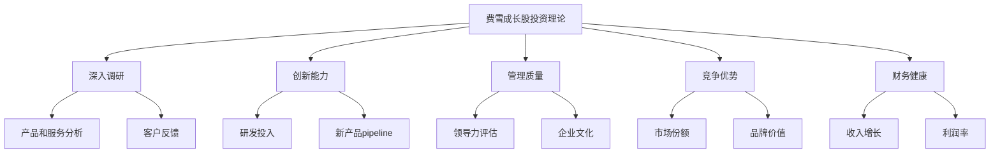
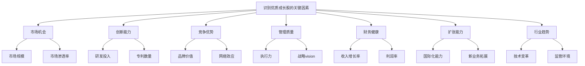
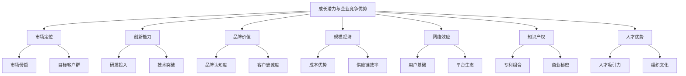
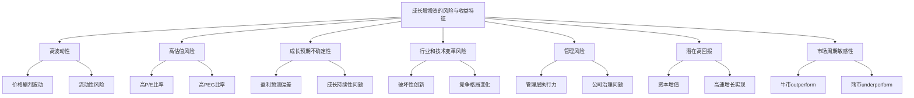

# 第2章：成长股投资理论解析

成长股投资是另一种广受欢迎的投资策略，其核心是寻找和投资那些具有高于平均水平增长潜力的公司。这种投资方法最早由菲利普·费雪（Philip Fisher）系统化，并在20世纪后半叶得到广泛应用和发展。本章将深入探讨成长股投资理论的基本框架、关键因素以及在现代金融市场中的应用。

## 2.1 费雪成长股投资理论的基本框架

费雪的成长股投资理论为投资者提供了一个系统的方法来识别和评估具有卓越增长潜力的公司。这个框架不仅影响了众多投资者，也为现代投资理论的发展做出了重要贡献。

* 核心概念：费雪理论强调通过深入研究和分析来识别具有持续高增长潜力的公司，并长期持有这些公司的股票。

* 问题背景：在20世纪中期，随着科技和创新驱动的经济快速发展，传统的价值投资方法难以准确评估那些高增长但当前盈利较低的公司。

* 问题描述：如何系统地识别和评估具有长期增长潜力的公司？如何在高估值风险和高增长潜力之间找到平衡？

* 问题解决：
    1. 建立全面的公司调研方法
    2. 关注公司的创新能力和市场拓展潜力
    3. 评估管理团队的质量和公司文化
    4. 分析公司的竞争优势和行业地位
    5. 考察公司的财务健康状况和盈利能力

* 边界与外延：
    - 费雪理论主要适用于成长型公司，可能不适合所有行业和公司类型
    - 需要考虑宏观经济环境和行业周期对公司增长的影响
    - 理论的应用需要投资者具备深入的行业知识和分析能力

* 概念结构与核心要素组成：



* 概念之间的关系：

| 概念 | 深入调研 | 创新能力 | 管理质量 | 竞争优势 | 财务健康 |
|------|----------|----------|----------|----------|----------|
| 深入调研 | - | 高度相关 | 中度相关 | 高度相关 | 中度相关 |
| 创新能力 | 高度相关 | - | 中度相关 | 高度相关 | 低度相关 |
| 管理质量 | 中度相关 | 中度相关 | - | 高度相关 | 中度相关 |
| 竞争优势 | 高度相关 | 高度相关 | 高度相关 | - | 中度相关 |
| 财务健康 | 中度相关 | 低度相关 | 中度相关 | 中度相关 | - |

* 数学模型：

费雪没有提出具体的数学模型，但我们可以构建一个简化的模型来评估公司的成长潜力：

假设 G 为公司的综合成长潜力指数，R 为收入增长率，I 为创新指数（0-1），M 为管理质量指数（0-1），C 为竞争优势指数（0-1），F 为财务健康指数（0-1）。则：

$$ G = w_1R + w_2I + w_3M + w_4C + w_5F $$

其中 $w_1, w_2, w_3, w_4, w_5$ 为各因素的权重，且 $\sum_{i=1}^5 w_i = 1$

* 算法流程：

```python
def calculate_growth_potential(revenue_growth, innovation, management, competitive_advantage, financial_health, weights):
    return (
        weights[0] * revenue_growth +
        weights[1] * innovation +
        weights[2] * management +
        weights[3] * competitive_advantage +
        weights[4] * financial_health
    )

def evaluate_company(company_data, weights):
    growth_potential = calculate_growth_potential(
        company_data['revenue_growth'],
        company_data['innovation'],
        company_data['management'],
        company_data['competitive_advantage'],
        company_data['financial_health'],
        weights
    )
    return growth_potential

# 示例使用
company_data = {
    'revenue_growth': 0.25,
    'innovation': 0.8,
    'management': 0.9,
    'competitive_advantage': 0.7,
    'financial_health': 0.85
}

weights = [0.3, 0.2, 0.2, 0.15, 0.15]

growth_potential = evaluate_company(company_data, weights)
print(f"公司成长潜力指数：{growth_potential:.2f}")
```

这个算法展示了如何根据费雪理论的核心要素评估公司的成长潜力。

* 实际场景应用：

1. 科技创新公司：
   对于像特斯拉这样的公司，费雪理论可以帮助投资者评估其创新能力（如电池技术、自动驾驶）、管理团队的远见（如马斯克的领导力）、竞争优势（品牌价值、技术领先）等因素，即使在公司尚未盈利的阶段也能识别其长期增长潜力。

2. 生物科技公司：
   在评估生物科技公司时，费雪理论强调研究其药物研发管线、临床试验进展、管理团队的专业背景等，这些因素对公司的长期成功至关重要。

3. 软件即服务（SaaS）公司：
   对于快速增长的SaaS公司，费雪理论会关注其客户获取成本、续约率、产品创新速度等指标，这些都是预测未来增长的关键因素。

4. 新兴市场公司：
   在评估新兴市场的成长型公司时，费雪理论特别强调深入的实地调研和对当地市场动态的理解，这可能比单纯依赖财务报表更能发现潜在的投资机会。

5. 消费品牌公司：
   对于像星巴克这样的公司，费雪理论会关注其品牌价值、国际扩张策略、产品创新能力等，这些因素支撑了公司的长期增长。

费雪的成长股投资理论为投资者提供了一个全面的框架来评估公司的长期增长潜力。通过深入研究公司的各个方面，投资者可以识别那些真正具有持续竞争优势和增长潜力的公司。然而，这种方法也需要投资者具备深厚的行业知识和分析能力，同时要有耐心等待投资理念的实现。在现代金融市场中，费雪理论仍然是许多成功投资者的重要指导原则。

## 2.2 识别优质成长股的关键因素

在成长股投资中，准确识别具有持续高增长潜力的公司是成功的关键。本节将深入探讨识别优质成长股的关键因素，这些因素不仅包括财务指标，还涵盖了质性分析的多个方面。

* 核心概念：优质成长股是指那些不仅当前增长速度快，而且能够在较长时期内保持高于行业平均水平增长的公司股票。

* 问题背景：在市场中，许多公司可能呈现出短期的高增长，但能够持续保持高增长的公司却相对稀少。投资者面临的挑战是如何从众多看似有潜力的公司中筛选出真正的长期赢家。

* 问题描述：哪些因素能够有效预示一家公司的长期增长潜力？如何系统地评估和比较不同公司的成长前景？* 问题解决：
    1. 分析公司的市场机会和总可寻址市场（TAM）
    2. 评估公司的创新能力和研发投入
    3. 考察公司的竞争优势和护城河
    4. 分析管理团队的质量和执行力
    5. 研究公司的财务健康状况和盈利能力
    6. 评估公司的扩张能力和规模化潜力
    7. 考虑行业趋势和宏观经济环境

* 边界与外延：
    - 不同行业和发展阶段的公司可能需要关注不同的关键因素
    - 需要考虑定性因素和定量因素的平衡
    - 关键因素可能随时间和市场环境变化而调整

* 概念结构与核心要素组成：



* 概念之间的关系：

| 因素 | 市场机会 | 创新能力 | 竞争优势 | 管理质量 | 财务健康 | 扩张能力 | 行业趋势 |
|------|----------|----------|----------|----------|----------|----------|----------|
| 市场机会 | - | 中度相关 | 高度相关 | 低度相关 | 中度相关 | 高度相关 | 高度相关 |
| 创新能力 | 中度相关 | - | 高度相关 | 中度相关 | 低度相关 | 中度相关 | 高度相关 |
| 竞争优势 | 高度相关 | 高度相关 | - | 中度相关 | 高度相关 | 高度相关 | 中度相关 |
| 管理质量 | 低度相关 | 中度相关 | 中度相关 | - | 中度相关 | 高度相关 | 低度相关 |
| 财务健康 | 中度相关 | 低度相关 | 高度相关 | 中度相关 | - | 中度相关 | 低度相关 |
| 扩张能力 | 高度相关 | 中度相关 | 高度相关 | 高度相关 | 中度相关 | - | 中度相关 |
| 行业趋势 | 高度相关 | 高度相关 | 中度相关 | 低度相关 | 低度相关 | 中度相关 | - |

* 数学模型：

我们可以构建一个综合评分模型来量化优质成长股的潜力：

设 S 为公司的综合成长潜力得分，各因素的得分为 f₁, f₂, ..., f₇（对应上述7个关键因素），权重为 w₁, w₂, ..., w₇。则：

$$ S = \sum_{i=1}^7 w_i \cdot f_i $$

其中， $\sum_{i=1}^7 w_i = 1$ 且 $0 \leq f_i \leq 10$

* 算法流程：

```python
def calculate_growth_score(factors, weights):
    if len(factors) != len(weights):
        raise ValueError("因素和权重数量必须相同")
    
    if abs(sum(weights) - 1) > 1e-6:
        raise ValueError("权重之和必须为1")
    
    return sum(f * w for f, w in zip(factors, weights))

def evaluate_company(company_data):
    factors = [
        company_data['market_opportunity'],
        company_data['innovation'],
        company_data['competitive_advantage'],
        company_data['management_quality'],
        company_data['financial_health'],
        company_data['expansion_capability'],
        company_data['industry_trends']
    ]
    
    weights = [0.2, 0.15, 0.15, 0.15, 0.1, 0.15, 0.1]
    
    score = calculate_growth_score(factors, weights)
    return score

# 示例使用
company_data = {
    'market_opportunity': 9,
    'innovation': 8,
    'competitive_advantage': 7,
    'management_quality': 8,
    'financial_health': 6,
    'expansion_capability': 7,
    'industry_trends': 9
}

growth_score = evaluate_company(company_data)
print(f"公司成长潜力得分：{growth_score:.2f}")
```

这个算法提供了一个框架来综合评估公司的成长潜力，可以根据具体情况调整权重和评分标准。

* 实际场景应用：

1. 科技巨头评估：
   以亚马逊为例，我们可以这样评估其关键因素：
    - 市场机会：电子商务、云计算、人工智能等多个巨大市场 (9/10)
    - 创新能力：持续的技术创新，如AWS、Alexa等 (9/10)
    - 竞争优势：规模经济、网络效应、品牌认知度 (9/10)
    - 管理质量：杰夫·贝索斯的远见和执行力 (9/10)
    - 财务健康：强劲的收入增长和现金流 (8/10)
    - 扩张能力：成功进入多个新领域 (9/10)
    - 行业趋势：数字化转型的全球趋势 (9/10)

2. 新兴生物科技公司：
   对于一家专注于基因治疗的初创公司：
    - 市场机会：潜在的巨大市场，但风险也高 (8/10)
    - 创新能力：前沿的研究成果和专利 (9/10)
    - 竞争优势：独特的技术平台，但尚未完全验证 (7/10)
    - 管理质量：经验丰富的科学家和管理团队 (8/10)
    - 财务健康：烧钱阶段，需要持续融资 (5/10)
    - 扩张能力：技术具有广泛应用潜力 (7/10)
    - 行业趋势：个性化医疗的大趋势 (9/10)

3. 传统行业的转型企业：
   考虑一家正在数字化转型的零售企业：
    - 市场机会：线上线下融合的新零售市场 (7/10)
    - 创新能力：数字化创新，但不是核心优势 (6/10)
    - 竞争优势：强大的品牌和客户基础 (8/10)
    - 管理质量：新老管理层的融合 (7/10)
    - 财务健康：稳定的现金流，但增长放缓 (7/10)
    - 扩张能力：通过数字化开拓新市场 (7/10)
    - 行业趋势：零售业态的持续演变 (8/10)

在实际应用中，投资者需要根据公司所处的行业、发展阶段和具体情况来调整各因素的权重和评分标准。同时，这种评估应该是动态的，需要随着公司和市场的变化而不断更新。

识别优质成长股是一个复杂的过程，需要综合考虑多个因素，并将定量分析与定性判断相结合。通过系统化的评估框架，投资者可以更客观地比较不同公司的成长潜力，从而做出更明智的投资决策。然而，我们也要认识到，即使是最全面的分析也无法完全预测未来，因此在投资决策中保持适度的谦逊和持续学习的态度同样重要。

## 2.3 成长潜力与企业竞争优势分析

在成长股投资中，准确评估公司的成长潜力和竞争优势是至关重要的。这两个因素不仅决定了公司能否实现持续高速增长，还影响着公司在竞争激烈的市场中的长期生存和发展能力。

* 核心概念：
    - 成长潜力：指公司在未来一定时期内保持高于行业平均水平增长的能力。
    - 企业竞争优势：指公司相对于竞争对手所具有的独特优势，使其能够在市场中获得持续的成功。

* 问题背景：在快速变化的商业环境中，许多公司可能在短期内展现出快速增长，但只有那些具有持续竞争优势的公司才能在长期保持高增长。

* 问题描述：如何有效地评估公司的长期成长潜力？哪些因素构成了企业的核心竞争优势？这些因素如何影响公司的长期成长能力？

* 问题解决：
    1. 分析公司的市场定位和增长战略
    2. 评估公司的创新能力和技术优势
    3. 考察公司的品牌价值和客户粘性
    4. 分析公司的规模经济和成本优势
    5. 评估公司的网络效应和生态系统
    6. 考虑公司的知识产权和专利保护
    7. 分析公司的人才优势和组织文化

* 边界与外延：
    - 成长潜力和竞争优势的评估需要考虑行业特性和宏观环境
    - 需要平衡短期增长和长期可持续性
    - 竞争优势可能随时间和技术变革而改变

* 概念结构与核心要素组成：



* 概念之间的关系：

| 因素 | 市场定位 | 创新能力 | 品牌价值 | 规模经济 | 网络效应 | 知识产权 | 人才优势 |
|------|----------|----------|----------|----------|----------|----------|----------|
| 市场定位 | - | 中度相关 | 高度相关 | 中度相关 | 中度相关 | 低度相关 | 低度相关 |
| 创新能力 | 中度相关 | - | 中度相关 | 低度相关 | 中度相关 | 高度相关 | 高度相关 |
| 品牌价值 | 高度相关 | 中度相关 | - | 中度相关 | 高度相关 | 低度相关 | 中度相关 |
| 规模经济 | 中度相关 | 低度相关 | 中度相关 | - | 高度相关 | 低度相关 | 低度相关 |
| 网络效应 | 中度相关 | 中度相关 | 高度相关 | 高度相关 | - | 低度相关 | 中度相关 |
| 知识产权 | 低度相关 | 高度相关 | 低度相关 | 低度相关 | 低度相关 | - | 中度相关 |
| 人才优势 | 低度相关 | 高度相关 | 中度相关 | 低度相关 | 中度相关 | 中度相关 | - |

* 数学模型：

我们可以构建一个综合评分模型来量化公司的成长潜力和竞争优势：

设 C 为公司的综合竞争力得分，各因素的得分为 f₁, f₂, ..., f₇（对应上述7个关键因素），权重为 w₁, w₂, ..., w₇。同时，考虑到行业增长率 G 和公司相对行业的增长溢价 P。则：

$$ C = (\sum_{i=1}^7 w_i \cdot f_i) \cdot (1 + G + P) $$

其中， $\sum_{i=1}^7 w_i = 1$，$0 \leq f_i \leq 10$，G 为行业年增长率，P 为公司相对行业的年增长溢价。

* 算法流程：

```python
def calculate_competitiveness_score(factors, weights, industry_growth, growth_premium):
    if len(factors) != len(weights):
        raise ValueError("因素和权重数量必须相同")
    
    if abs(sum(weights) - 1) > 1e-6:
        raise ValueError("权重之和必须为1")
    
    base_score = sum(f * w for f, w in zip(factors, weights))
    return base_score * (1 + industry_growth + growth_premium)

def evaluate_company_competitiveness(company_data, industry_growth):
    factors = [
        company_data['market_positioning'],
        company_data['innovation_capability'],
        company_data['brand_value'],
        company_data['economies_of_scale'],
        company_data['network_effects'],
        company_data['intellectual_property'],
        company_data['talent_advantage']
    ]
    
    weights = [0.15, 0.20, 0.15, 0.10, 0.15, 0.10, 0.15]
    
    growth_premium = company_data['growth_rate'] - industry_growth
    
    score = calculate_competitiveness_score(factors, weights, industry_growth, growth_premium)
    return score

# 示例使用
company_data = {
    'market_positioning': 8,
    'innovation_capability': 9,
    'brand_value': 7,
    'economies_of_scale': 6,
    'network_effects': 8,
    'intellectual_property': 7,
    'talent_advantage': 8,
    'growth_rate': 0.25  # 25% 年增长率
}

industry_growth = 0.10  # 10% 行业年增长率

competitiveness_score = evaluate_company_competitiveness(company_data, industry_growth)
print(f"公司竞争力得分：{competitiveness_score:.2f}")
```

这个算法提供了一个框架来综合评估公司的竞争优势和成长潜力，可以根据具体情况调整权重和评分标准。

* 实际场景应用：

1. 科技行业巨头：以苹果公司为例
    - 市场定位：高端消费电子和服务生态系统 (9/10)
    - 创新能力：持续的产品创新和技术突破 (9/10)
    - 品牌价值：全球最有价值品牌之一 (10/10)
    - 规模经济：强大的供应链管理和成本控制 (9/10)
    - 网络效应：iOS生态系统和服务平台 (9/10)
    - 知识产权：大量专利和独特设计 (9/10)
    - 人才优势：吸引和保留顶尖人才的能力 (9/10)

   假设行业增长率为8%，苹果的增长率为15%：
   ```python
   apple_data = {
       'market_positioning': 9,
       'innovation_capability': 9,
       'brand_value': 10,
       'economies_of_scale': 9,
       'network_effects': 9,
       'intellectual_property': 9,
       'talent_advantage': 9,
       'growth_rate': 0.15
   }
   industry_growth = 0.08
   apple_score = evaluate_company_competitiveness(apple_data, industry_growth)
   print(f"苹果公司竞争力得分：{apple_score:.2f}")
   ```

2. 新兴电动车公司：以特斯拉为例
    - 市场定位：高端电动车和可持续能源解决方案 (9/10)
    - 创新能力：电池技术和自动驾驶领域的领先者 (10/10)
    - 品牌价值：强大的品牌认知度和粉丝基础 (9/10)
    - 规模经济：正在快速扩大生产规模 (7/10)
    - 网络效应：充电网络和数据收集优势 (8/10)
    - 知识产权：大量电动车和电池相关专利 (9/10)
    - 人才优势：吸引顶尖工程师和创新人才 (9/10)

   假设行业增长率为20%，特斯拉的增长率为50%：
   ```python
   tesla_data = {
       'market_positioning': 9,
       'innovation_capability': 10,
       'brand_value': 9,
       'economies_of_scale': 7,
       'network_effects': 8,
       'intellectual_property': 9,
       'talent_advantage': 9,
       'growth_rate': 0.50
   }
   industry_growth = 0.20
   tesla_score = evaluate_company_competitiveness(tesla_data, industry_growth)
   print(f"特斯拉公司竞争力得分：{tesla_score:.2f}")
   ```

3. 传统零售转型：以沃尔玛为例
    - 市场定位：全球最大的零售商，正在向电商转型 (8/10)
    - 创新能力：在数字化转型和物流创新方面投入大 (7/10)
    - 品牌价值：强大的品牌认知度和信任度 (9/10)
    - 规模经济：巨大的采购和分销网络优势 (10/10)
    - 网络效应：正在构建线上线下融合的生态系统 (7/10)
    - 知识产权：在零售技术和流程方面有多项专利 (7/10)
    - 人才优势：正在加强技术人才的引进 (7/10)

   假设行业增长率为3%，沃尔玛的增长率为5%：
   ```python
   walmart_data = {
       'market_positioning': 8,
       'innovation_capability': 7,
       'brand_value': 9,
       'economies_of_scale': 10,
       'network_effects': 7,
       'intellectual_property': 7,
       'talent_advantage': 7,
       'growth_rate': 0.05
   }
   industry_growth = 0.03
   walmart_score = evaluate_company_competitiveness(walmart_data, industry_growth)
   print(f"沃尔玛公司竞争力得分：{walmart_score:.2f}")
   ```

这些示例展示了如何在不同行业和发展阶段的公司中应用成长潜力和竞争优势分析。值得注意的是，这种分析应该是动态的，需要定期更新以反映公司和市场的变化。

在实际投资决策中，投资者不仅需要关注公司当前的竞争优势，还要预测这些优势在未来是否可以持续。例如，技术变革可能迅速改变行业格局，使得原有的竞争优势变得不再重要。因此，对公司管理层的远见和适应能力的评估也是至关重要的。

此外，成长潜力和竞争优势的分析应该与估值考量相结合。一家具有强大竞争优势和高成长潜力的公司可能已经被市场高度认可，股价可能已经反映了这些正面因素。因此，投资者需要权衡公司的质量、成长潜力与当前估值水平，以做出明智的投资决策。

最后，It's crucial to注意到，没有任何分析方法可以完全消除投资风险。即使是最具竞争优势的公司也可能面临不可预见的挑战。因此，投资组合的多元化和持续的风险管理仍然是成长股投资策略中不可或缺的部分。

## 2.4 成长股投资的风险与收益特征

成长股投资虽然有潜力带来高回报，但同时也伴随着较高的风险。了解成长股投资的风险与收益特征对于投资者制定合适的投资策略和管理预期至关重要。

* 核心概念：
    - 成长股：预期未来盈利和收入增长率高于市场平均水平的公司股票。
    - 风险：投资可能出现亏损的概率和程度。
    - 收益：投资产生的财务回报。

* 问题背景：成长股往往表现出高波动性和高估值特征，这使得它们在不同市场环境下的表现差异很大。

* 问题描述：成长股投资具有哪些特有的风险和收益特征？如何权衡成长股投资的风险和潜在回报？

* 问题解决：
    1. 分析成长股的高波动性特征
    2. 评估高估值风险
    3. 考察成长预期不确定性
    4. 分析行业和技术变革风险
    5. 评估管理风险和公司治理问题
    6. 考虑成长股的潜在高回报
    7. 分析成长股在不同市场周期中的表现

* 边界与外延：
    - 成长股的风险和收益特征可能因行业、公司规模和发展阶段而异
    - 需要考虑宏观经济环境和市场情绪对成长股表现的影响
    - 风险和收益的评估应该是动态的，需要随时间调整

* 概念结构与核心要素组成：



* 概念之间的关系：

| 特征 | 高波动性 | 高估值风险 | 成长预期不确定性 | 行业和技术变革风险 | 管理风险 | 潜在高回报 | 市场周期敏感性 |
|------|----------|------------|-------------------|----------------------|----------|------------|------------------|
| 高波动性 | - | 高度相关 | 高度相关 | 中度相关 | 中度相关 | 高度相关 | 高度相关 |
| 高估值风险 | 高度相关 | - | 高度相关 | 中度相关 | 低度相关 | 高度相关 | 高度相关 |
| 成长预期不确定性 | 高度相关 | 高度相关 | - | 高度相关 | 中度相关 | 高度相关 | 中度相关 |
| 行业和技术变革风险 | 中度相关 | 中度相关 | 高度相关 | - | 中度相关 | 中度相关 | 中度相关 |
| 管理风险 | 中度相关 | 低度相关 | 中度相关 | 中度相关 | - | 中度相关 | 低度相关 |
| 潜在高回报 | 高度相关 | 高度相关 | 高度相关 | 中度相关 | 中度相关 | - | 高度相关 |
| 市场周期敏感性 | 高度相关 | 高度相关 | 中度相关 | 中度相关 | 低度相关 | 高度相关 | - |

* 数学模型：

我们可以构建一个简化模型来描述成长股的风险-收益特征：

假设 R 为预期收益率，Rf 为无风险利率，β 为股票的贝塔系数（衡量系统性风险），g 为预期增长率，ε 为公司特定风险溢价。则：

$$ R = R_f + \beta(R_m - R_f) + g + \varepsilon $$

其中，(Rm - Rf) 为市场风险溢价。

同时，我们可以用夏普比率来衡量风险调整后的收益：

$$ Sharpe Ratio = \frac{R - R_f}{\sigma} $$

其中，σ 为收益率的标准差，衡量总风险。

* 算法流程：

```python
import numpy as np

def calculate_growth_stock_metrics(risk_free_rate, market_return, beta, expected_growth_rate, company_specific_risk, volatility):
    # 计算预期收益率
    expected_return = risk_free_rate + beta * (market_return - risk_free_rate) + expected_growth_rate + company_specific_risk
    
    # 计算夏普比率
    sharpe_ratio = (expected_return - risk_free_rate) / volatility
    
    return expected_return, sharpe_ratio

def simulate_growth_stock_performance(num_simulations, **params):
    returns = []
    sharpe_ratios = []
    
    for _ in range(num_simulations):
        # 模拟增长率的不确定性
        growth_rate = np.random.normal(params['expected_growth_rate'], params['growth_volatility'])
        
        # 模拟公司特定风险
        specific_risk = np.random.normal(0, params['specific_risk_volatility'])
        
        return_, sharpe = calculate_growth_stock_metrics(
            params['risk_free_rate'],
            params['market_return'],
            params['beta'],
            growth_rate,
            specific_risk,
            params['volatility']
        )
        
        returns.append(return_)
        sharpe_ratios.append(sharpe)
    
    return returns, sharpe_ratios

# 示例使用
params = {
    'risk_free_rate': 0.02,
    'market_return': 0.08,
    'beta': 1.5,
    'expected_growth_rate': 0.15,
    'growth_volatility': 0.05,
    'specific_risk_volatility': 0.03,
    'volatility': 0.25
}

num_simulations = 10000
returns, sharpe_ratios = simulate_growth_stock_performance(num_simulations, **params)

print(f"平均预期收益率: {np.mean(returns):.2%}")
print(f"收益率标准差: {np.std(returns):.2%}")
print(f"平均夏普比率: {np.mean(sharpe_ratios):.2f}")
print(f"夏普比率标准差: {np.std(sharpe_ratios):.2f}")
```

这个算法模拟了成长股的风险和收益特征，考虑了成长预期的不确定性和公司特定风险。

* 实际场景应用：

1. 高科技成长股：以云计算公司为例
    - 高波动性：股价可能在短期内大幅波动，反映市场对公司前景的迅速变化的看法。
    - 高估值风险：P/E 比率可能达到 100 或更高，反映市场对未来增长的高预期。
    - 成长预期不确定性：收入可能以 40%+ 的年率增长，但持续性存疑。
    - 行业和技术变革风险：面临来自大型科技公司和新兴创新者的激烈竞争。
    - 管理风险：依赖关键技术人才和管理团队的战略执行力。
    - 潜在高回报：成功案例可能在几年内实现股价数倍增长。
    - 市场周期敏感性：在牛市中可能大幅跑赢大盘，但在熊市中可能遭遇严重抛售。

   ```python
   tech_growth_params = {
       'risk_free_rate': 0.02,
       'market_return': 0.08,
       'beta': 2.0,
       'expected_growth_rate': 0.40,
       'growth_volatility': 0.15,
       'specific_risk_volatility': 0.10,
       'volatility': 0.50
   }
   
   tech_returns, tech_sharpe_ratios = simulate_growth_stock_performance(10000, **tech_growth_params)
   print("高科技成长股:")
   print(f"平均预期收益率: {np.mean(tech_returns):.2%}")
   print(f"收益率标准差: {np.std(tech_returns):.2%}")
   print(f"平均夏普比率: {np.mean(tech_sharpe_ratios):.2f}")
   ```

2. 生物科技成长股：以早期生物制药公司为例
    - 高波动性：临床试验结果或监管决定可能导致股价剧烈波动。
    - 高估值风险：由于尚未盈利，传统估值指标可能不适用。
    - 成长预期不确定性：产品开发成功与否存在高度不确定性。
    - 行业和技术变革风险：新治疗方法可能使现有研究方向过时。
    - 管理风险：依赖核心科学家和管理团队的专业知识。
    - 潜在高回报：成功开发新药可能带来巨大回报。
    - 市场周期敏感性：可能不太受整体市场周期影响，但对行业特定事件高度敏感。

   ```python
   biotech_growth_params = {
       'risk_free_rate': 0.02,
       'market_return': 0.08,
       'beta': 1.8,
       'expected_growth_rate': 0.50,
       'growth_volatility': 0.30,
       'specific_risk_volatility': 0.20,
       'volatility': 0.70
   }
   
   biotech_returns, biotech_sharpe_ratios = simulate_growth_stock_performance(10000, **biotech_growth_params)
   print("\n生物科技成长股:")
   print(f"平均预期收益率: {np.mean(biotech_returns):.2%}")
   print(f"收益率标准差: {np.std(biotech_returns):.2%}")
   print(f"平均夏普比率: {np.mean(biotech_sharpe_ratios):.2f}")
   ```

3. 新兴市场成长股：以电子商务公司为例
    - 高波动性：受本地经济条件和货币波动的双重影响。
    - 高估值风险：市场可能对新兴市场的增长潜力过度乐观。
    - 成长预期不确定性：增长速度快但可持续性存疑。
    - 行业和技术变革风险：面临来自全球科技巨头的竞争。
    - 管理风险：公司治理标准可能不如成熟市场完善。
    - 潜在高回报：有潜力成为区域或全球领导者。
    - 市场周期敏感性：对全球经济周期和资金流动高度敏感。

   ```python
   emerging_market_params = {
       'risk_free_rate': 0.04,
       'market_return': 0.10,
       'beta': 1.6,
       'expected_growth_rate': 0.30,
       'growth_volatility': 0.10,
       'specific_risk_volatility': 0.15,
       'volatility': 0.45
   }
   
   em_returns, em_sharpe_ratios = simulate_growth_stock_performance(10000, **emerging_market_params)
   print("\n新兴市场成长股:")
   print(f"平均预期收益率: {np.mean(em_returns):.2%}")
   print(f"收益率标准差: {np.std(em_returns):.2%}")
   print(f"平均夏普比率: {np.mean(em_sharpe_ratios):.2f}")
   ```

这些示例突出了不同类型成长股的风险和收益特征。投资者在考虑成长股投资时，需要权衡以下几点：

1. 风险承受能力：成长股的高波动性要求投资者具有较高的风险承受能力和长期投资视角。

2. 分散投资：鉴于单个成长股的高风险，适当分散投资组合至关重要。

3. 持续监控：成长股的基本面可能迅速变化，需要投资者持续关注公司发展和行业动态。

4. 估值纪律：尽管高增长可以支撑较高估值，但投资者仍需警惕过度乐观定价带来的风险。

5. 长期视角：成功的成长股投资往往需要较长的时间才能实现价值，投资者需要有耐心。

6. 适应市场周期：了解成长股在不同市场环境下的表现特征，适时调整投资策略。

7. 质量优先：关注那些具有强大竞争优势和可持续商业模式的高质量成长公司。

成长股投资可以为投资组合带来显著的超额收益，但也伴随着较高的风险。成功的成长股投资者需要深入的研究能力、严格的投资纪律和对市场周期的敏锐洞察。通过平衡风险和潜在回报，投资者可以构建一个既能把握高增长机会，又能在市场动荡时期提供一定保护的投资组合。
