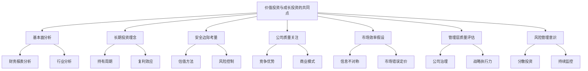
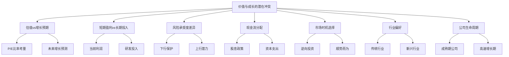
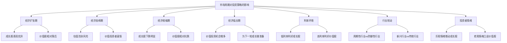
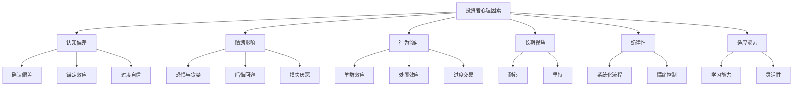

# 第3章：价值投资与成长投资的异同

价值投资和成长投资是两种截然不同但又相互补充的投资策略。理解这两种方法的异同对于构建全面的投资策略至关重要。本章将深入探讨这两种投资理念的共同点和差异，以及它们在不同市场环境下的表现。

## 3.1 两种投资理论的共同点

尽管价值投资和成长投资在方法和关注点上存在明显差异，但它们也有一些重要的共同点。理解这些共同点有助于我们更好地把握投资的本质。

* 核心概念：
    - 价值投资：寻找市场价格低于内在价值的股票。
    - 成长投资：寻找具有高于平均水平增长潜力的公司。

* 问题背景：这两种投资策略常被视为对立的，但实际上它们有着共同的基础和目标。

* 问题描述：价值投资和成长投资有哪些本质上的共同点？这些共同点如何影响投资决策？

* 问题解决：
    1. 分析两种策略对公司基本面的重视
    2. 比较长期投资理念在两种策略中的作用
    3. 探讨安全边际概念在两种策略中的应用
    4. 分析两种策略对公司质量的关注
    5. 比较两种策略在市场效率方面的假设
    6. 探讨两种策略对管理层质量的重视
    7. 分析两种策略在风险管理方面的共同点

* 边界与外延：
    - 共同点的理解有助于构建更全面的投资策略
    - 需要考虑这些共同点在不同市场环境下的适用性
    - 共同点的存在并不意味着两种策略在所有方面都可以融合

* 概念结构与核心要素组成：



* 概念之间的关系：

| 共同点 | 基本面分析 | 长期投资 | 安全边际 | 公司质量 | 市场效率 | 管理层质量 | 风险管理 |
|--------|------------|----------|----------|----------|----------|------------|----------|
| 基本面分析 | - | 高度相关 | 高度相关 | 高度相关 | 中度相关 | 高度相关 | 中度相关 |
| 长期投资 | 高度相关 | - | 高度相关 | 高度相关 | 低度相关 | 中度相关 | 中度相关 |
| 安全边际 | 高度相关 | 高度相关 | - | 中度相关 | 中度相关 | 低度相关 | 高度相关 |
| 公司质量 | 高度相关 | 高度相关 | 中度相关 | - | 低度相关 | 高度相关 | 中度相关 |
| 市场效率 | 中度相关 | 低度相关 | 中度相关 | 低度相关 | - | 低度相关 | 中度相关 |
| 管理层质量 | 高度相关 | 中度相关 | 低度相关 | 高度相关 | 低度相关 | - | 中度相关 |
| 风险管理 | 中度相关 | 中度相关 | 高度相关 | 中度相关 | 中度相关 | 中度相关 | - |

* 数学模型：

虽然价值投资和成长投资的具体方法不同，但我们可以构建一个通用的投资决策模型来反映它们的共同点：

设 I 为投资决策指数，Q 为公司质量得分，V 为估值吸引力得分，G 为增长潜力得分，M 为管理层质量得分，R 为风险评分。则：

$$ I = w_1Q + w_2V + w_3G + w_4M - w_5R $$

其中，w₁, w₂, w₃, w₄, w₅ 为各因素的权重，且 $\sum_{i=1}^5 w_i = 1$

价值投资者可能会给予 V 更高的权重，而成长投资者可能会更重视 G，但两者都会考虑所有这些因素。

* 算法流程：

```python
def calculate_investment_score(quality, valuation, growth, management, risk, weights):
    return (
        weights['quality'] * quality +
        weights['valuation'] * valuation +
        weights['growth'] * growth +
        weights['management'] * management -
        weights['risk'] * risk
    )

def evaluate_investment(company_data, strategy):
    if strategy == 'value':
        weights = {'quality': 0.25, 'valuation': 0.35, 'growth': 0.10, 'management': 0.20, 'risk': 0.10}
    elif strategy == 'growth':
        weights = {'quality': 0.20, 'valuation': 0.10, 'growth': 0.35, 'management': 0.25, 'risk': 0.10}
    else:
        raise ValueError("Invalid strategy. Choose 'value' or 'growth'.")
    
    score = calculate_investment_score(
        company_data['quality'],
        company_data['valuation'],
        company_data['growth'],
        company_data['management'],
        company_data['risk'],
        weights)
    return score

# 示例使用
company_data = {
    'quality': 8,
    'valuation': 7,
    'growth': 9,
    'management': 8,
    'risk': 6
}

value_score = evaluate_investment(company_data, 'value')
growth_score = evaluate_investment(company_data, 'growth')

print(f"价值投资评分：{value_score:.2f}")
print(f"成长投资评分：{growth_score:.2f}")
```

这个算法展示了价值投资和成长投资如何用不同的权重评估相同的公司特征。

* 实际场景应用：

1. 科技巨头分析：以亚马逊为例
    - 基本面分析：两种策略都会深入研究亚马逊的财务状况、市场地位和竞争优势。
    - 长期投资理念：价值投资者和成长投资者都可能长期持有亚马逊，看好其长期发展前景。
    - 安全边际考量：价值投资者可能关注亚马逊的现金流和资产价值，而成长投资者则可能关注其市场份额和增长潜力作为安全边际。
    - 公司质量关注：两种策略都会高度重视亚马逊的品牌价值、网络效应和规模经济。
    - 管理层质量评估：杰夫·贝索斯的领导力和战略眼光受到两类投资者的认可。

   ```python
   amazon_data = {
       'quality': 9,
       'valuation': 6,
       'growth': 9,
       'management': 9,
       'risk': 5
   }

   amazon_value_score = evaluate_investment(amazon_data, 'value')
   amazon_growth_score = evaluate_investment(amazon_data, 'growth')

   print("亚马逊分析：")
   print(f"价值投资评分：{amazon_value_score:.2f}")
   print(f"成长投资评分：{amazon_growth_score:.2f}")
   ```

2. 传统蓝筹股：以可口可乐为例
    - 基本面分析：两种策略都会分析可口可乐的品牌价值、全球市场份额和现金流状况。
    - 长期投资理念：价值投资者和成长投资者都可能欣赏可口可乐的长期稳定性。
    - 安全边际考量：价值投资者可能更看重其稳定的股息和现金流，而成长投资者可能关注其在新兴市场的增长潜力。
    - 公司质量关注：两种策略都会重视可口可乐强大的品牌护城河和全球分销网络。
    - 风险管理意识：两类投资者都会考虑健康意识提高对碳酸饮料需求的潜在影响。

   ```python
   coca_cola_data = {
       'quality': 9,
       'valuation': 7,
       'growth': 6,
       'management': 8,
       'risk': 4
   }

   coca_cola_value_score = evaluate_investment(coca_cola_data, 'value')
   coca_cola_growth_score = evaluate_investment(coca_cola_data, 'growth')

   print("\n可口可乐分析：")
   print(f"价值投资评分：{coca_cola_value_score:.2f}")
   print(f"成长投资评分：{coca_cola_growth_score:.2f}")
   ```

3. 新兴生物科技公司：以Moderna为例
    - 基本面分析：两种策略都会研究Moderna的技术平台、产品管线和市场潜力。
    - 长期投资理念：价值投资者和成长投资者都需要有耐心等待生物科技投资的回报。
    - 安全边际考量：价值投资者可能更关注其现金储备和知识产权价值，而成长投资者可能更看重其技术平台的广泛应用潜力。
    - 公司质量关注：两种策略都会评估Moderna的创新能力和研发效率。
    - 市场效率假设：两类投资者都可能认为市场对生物科技公司的定价不够有效，存在投资机会。

   ```python
   moderna_data = {
       'quality': 7,
       'valuation': 5,
       'growth': 9,
       'management': 8,
       'risk': 8
   }

   moderna_value_score = evaluate_investment(moderna_data, 'value')
   moderna_growth_score = evaluate_investment(moderna_data, 'growth')

   print("\nModerna分析：")
   print(f"价值投资评分：{moderna_value_score:.2f}")
   print(f"成长投资评分：{moderna_growth_score:.2f}")
   ```

这些例子说明，尽管价值投资和成长投资在具体方法上有所不同，但它们在评估公司时考虑的核心因素是相似的。两种策略都强调：

1. 深入的基本面研究：无论是价值投资还是成长投资，都需要对公司的财务状况、商业模式、竞争优势进行全面分析。

2. 长期投资视角：两种策略都倾向于长期持有，相信时间是优质公司的朋友。

3. 质量优先：两种策略都强调投资高质量的公司，只是对"质量"的定义可能有所不同。

4. 安全边际意识：虽然表现形式不同，但两种策略都试图通过某种形式的安全边际来控制风险。

5. 管理层重要性：两种策略都重视公司管理层的能力和诚信。

6. 市场inefficiency的利用：两种策略都基于市场可能会错误定价的假设。

7. 持续学习和适应：成功的价值投资者和成长投资者都需要不断学习和调整策略以适应变化的市场环境。

理解这些共同点有助于投资者构建更全面、更灵活的投资策略。实际上，许多成功的投资者并不严格区分价值投资和成长投资，而是根据具体情况采用最适合的方法。在当今快速变化的市场环境中，能够融合两种策略的优点，并根据不同的投资机会灵活运用，可能是更有效的投资方法。

## 3.2 价值与成长的潜在冲突

尽管价值投资和成长投资有许多共同点，但这两种策略在某些方面也存在潜在的冲突。理解这些冲突有助于投资者更好地权衡不同的投资机会，并在实际操作中做出更明智的决策。

* 核心概念：
    - 价值投资：注重当前的估值水平和安全边际。
    - 成长投资：关注未来的增长潜力和市场机会。

* 问题背景：在实际投资中，价值和成长的考量有时会相互矛盾，投资者需要在两者之间做出权衡。

* 问题描述：价值投资和成长投资在哪些方面存在潜在冲突？这些冲突如何影响投资决策？

* 问题解决：
    1. 分析估值与增长预期之间的矛盾
    2. 比较短期盈利与长期增长投入的权衡
    3. 探讨风险承受度的差异
    4. 分析现金流分配（股息vs再投资）的冲突
    5. 比较市场时机选择的不同方法
    6. 探讨行业选择的偏好差异
    7. 分析公司生命周期阶段的影响

* 边界与外延：
    - 冲突的程度可能因具体公司和市场环境而异
    - 需要考虑投资者个人风险偏好和投资目标
    - 某些情况下，价值和成长的特征可能在同一公司中共存

* 概念结构与核心要素组成：



* 概念之间的关系：

| 冲突点 | 估值vs增长 | 短期vs长期 | 风险承受度 | 现金流分配 | 市场时机 | 行业偏好 | 生命周期 |
|--------|------------|------------|------------|------------|----------|----------|----------|
| 估值vs增长 | - | 高度相关 | 中度相关 | 高度相关 | 中度相关 | 高度相关 | 高度相关 |
| 短期vs长期 | 高度相关 | - | 中度相关 | 高度相关 | 低度相关 | 中度相关 | 高度相关 |
| 风险承受度 | 中度相关 | 中度相关 | - | 中度相关 | 高度相关 | 高度相关 | 中度相关 |
| 现金流分配 | 高度相关 | 高度相关 | 中度相关 | - | 低度相关 | 中度相关 | 高度相关 |
| 市场时机 | 中度相关 | 低度相关 | 高度相关 | 低度相关 | - | 中度相关 | 低度相关 |
| 行业偏好 | 高度相关 | 中度相关 | 高度相关 | 中度相关 | 中度相关 | - | 高度相关 |
| 生命周期 | 高度相关 | 高度相关 | 中度相关 | 高度相关 | 低度相关 | 高度相关 | - |

* 数学模型：

我们可以构建一个简化模型来说明价值与成长的权衡：

假设 V 为公司的价值得分，G 为公司的成长得分，P 为当前股价，E 为每股收益，g 为预期增长率，r 为要求回报率。则：

价值投资者可能关注的指标：
$$ V = \frac{E}{P} $$

成长投资者可能关注的指标：
$$ G = \frac{g}{r} $$

综合评分可表示为：
$$ S = w_v \cdot V + w_g \cdot G $$

其中，w_v 和 w_g 分别为价值和成长因素的权重，且 w_v + w_g = 1

* 算法流程：

```python
def calculate_value_score(earnings, price):
    return earnings / price if price != 0 else 0

def calculate_growth_score(growth_rate, required_return):
    return growth_rate / required_return if required_return != 0 else 0

def evaluate_stock(earnings, price, growth_rate, required_return, value_weight):
    value_score = calculate_value_score(earnings, price)
    growth_score = calculate_growth_score(growth_rate, required_return)
    
    growth_weight = 1 - value_weight
    composite_score = value_weight * value_score + growth_weight * growth_score
    
    return value_score, growth_score, composite_score

# 示例使用
earnings = 5
price = 100
growth_rate = 0.15
required_return = 0.10
value_weight = 0.6

value_score, growth_score, composite_score = evaluate_stock(earnings, price, growth_rate, required_return, value_weight)

print(f"价值得分: {value_score:.2f}")
print(f"成长得分: {growth_score:.2f}")
print(f"综合得分: {composite_score:.2f}")
```

这个算法展示了如何在价值和成长因素之间进行权衡。

* 实际场景应用：

1. 科技成长股：以特斯拉为例
    - 估值vs增长预期：特斯拉的P/E比率极高，但增长预期也非常强劲。
    - 短期盈利vs长期投入：公司大量投资于研发和产能扩张，影响短期盈利能力。
    - 风险承受度：高风险高回报的典型代表。
    - 现金流分配：所有现金流用于再投资，不派发股息。
    - 行业偏好：新兴电动车行业，传统价值投资者可能会回避。

   ```python
   tesla_data = {
       'earnings': 1,
       'price': 700,
       'growth_rate': 0.50,
       'required_return': 0.15
   }

   tesla_value_score, tesla_growth_score, tesla_composite_score = evaluate_stock(
       tesla_data['earnings'], 
       tesla_data['price'], 
       tesla_data['growth_rate'], 
       tesla_data['required_return'], 
       0.4  # 假设我们更看重成长因素
   )

   print("特斯拉分析：")
   print(f"价值得分: {tesla_value_score:.4f}")
   print(f"成长得分: {tesla_growth_score:.2f}")
   print(f"综合得分: {tesla_composite_score:.2f}")
   ```

2. 传统价值股：以AT&T为例
    - 估值vs增长预期：较低的P/E比率，但增长预期也较低。
    - 短期盈利vs长期投入：注重当前的盈利能力和现金流。
    - 风险承受度：相对较低的风险和波动性。
    - 现金流分配：高股息支付率。
    - 行业偏好：成熟的电信行业，典型的价值投资标的。

   ```python
   att_data = {
       'earnings': 3,
       'price': 30,
       'growth_rate': 0.02,
       'required_return': 0.08
   }

   att_value_score, att_growth_score, att_composite_score = evaluate_stock(
       att_data['earnings'], 
       att_data['price'], 
       att_data['growth_rate'], 
       att_data['required_return'], 
       0.8  # 假设我们更看重价值因素
   )

   print("\nAT&T分析：")
   print(f"价值得分: {att_value_score:.4f}")
   print(f"成长得分: {att_growth_score:.2f}")
   print(f"综合得分: {att_composite_score:.2f}")
   ```

3. 价值与成长兼具：以苹果为例
    - 估值vs增长预期：相对合理的P/E比率，同时保持不错的增长预期。
    - 短期盈利vs长期投入：强劲的当前盈利能力，同时持续投资未来增长。
    - 风险承受度：中等风险水平。
    - 现金流分配：平衡股息支付和股票回购与再投资。
    - 行业偏好：科技行业，但已经成为一个成熟的大型公司。

   ```python
   apple_data = {
       'earnings': 5,
       'price': 150,
       'growth_rate': 0.15,
       'required_return': 0.10
   }

   apple_value_score, apple_growth_score, apple_composite_score = evaluate_stock(
       apple_data['earnings'], 
       apple_data['price'], 
       apple_data['growth_rate'], 
       apple_data['required_return'], 
       0.5  # 假设我们平衡看待价值和成长因素
   )

   print("\n苹果公司分析：")
   print(f"价值得分: {apple_value_score:.4f}")
   print(f"成长得分: {apple_growth_score:.2f}")
   print(f"综合得分: {apple_composite_score:.2f}")
   ```

这些例子清楚地展示了价值与成长之间的潜在冲突：

1. 估值与增长预期的权衡：高增长公司通常具有较高的估值倍数，这可能使价值投资者望而却步。相反，估值较低的公司可能缺乏足够的增长动力，无法吸引成长投资者。

2. 短期盈利与长期投资的平衡：成长型公司往往将大部分资源投入到扩张和研发中，可能牺牲短期盈利。价值投资者更看重当前的盈利能力和现金流。

3. 风险承受度的差异：成长股通常波动性更大，需要更高的风险承受能力。价值投资者则倾向于寻求更稳定、低风险的投资机会。

4. 现金流分配策略：价值投资者通常青睐高股息公司，而成长投资者更愿意看到公司将利润再投资于业务扩张。

5. 市场时机选择：价值投资者倾向于逆势而为，在市场低迷时买入；成长投资者则可能更多地追随市场趋势。

6. 行业偏好：成长投资者可能更关注新兴行业和创新型公司，而价值投资者往往在成熟行业中寻找被低估的公司。

7. 公司生命周期阶段：成长投资者偏好处于快速扩张期的公司，价值投资者则可能更看重成熟期的稳定公司。

面对这些潜在冲突，投资者需要：

1. 明确个人投资目标和风险偏好，在价值和成长之间找到适合自己的平衡点。

2. 认识到纯粹的价值或纯粹的成长策略可能都存在局限性，考虑采用更灵活的方法。

3. 深入分析每个投资机会，不要仅仅因为一个公司不符合典型的价值或成长特征就忽视它。

4. 在投资组合层面平衡价值和成长因素，可以同时持有不同类型的股票以分散风险。

5. 随着市场环境和个股情况的变化，定期重新评估投资策略和持仓。

6. 培养跨领域思考的能力，学会从多个角度评估投资机会。

7. 保持开放和学习的心态，因为成功的投资往往需要整合不同投资理念的优点。

理解价值与成长的潜在冲突，有助于投资者更全面地看待投资机会，做出更明智的决策。在实际操作中，许多成功的投资者并不严格将自己局限于单一的投资风格，而是根据具体情况灵活运用不同的策略。关键是要深入理解每种方法的优缺点，并在具体实践中不断调整和优化自己的投资策略。

## 3.3 市场周期对两种投资策略的影响

市场周期对价值投资和成长投资策略的有效性有着重要影响。不同的经济环境和市场情绪可能导致这两种策略在特定时期表现出较大差异。理解这些影响对于投资者在不同市场阶段做出正确的投资决策至关重要。

* 核心概念：
    - 市场周期：经济和股票市场的周期性波动，通常包括扩张、高峰、收缩和谷底阶段。
    - 策略轮动：根据市场周期的不同阶段调整投资策略的做法。

* 问题背景：价值投资和成长投资在不同的市场周期中可能表现出不同的优势和劣势。

* 问题描述：市场周期如何影响价值投资和成长投资的表现？投资者应如何根据市场周期调整其投资策略？

* 问题解决：
    1. 分析不同市场周期阶段的特征
    2. 评估价值投资在各个周期阶段的表现
    3. 考察成长投资在不同市场环境下的效果
    4. 探讨利率变化对两种策略的影响
    5. 分析行业轮动与投资策略的关系
    6. 考虑投资者情绪对策略有效性的影响
    7. 提出根据市场周期调整投资组合的方法

* 边界与外延：
    - 市场周期的影响可能因不同地区和行业而异
    - 需要考虑宏观经济政策对市场周期的干预作用
    - 技术创新和结构性变化可能改变传统的周期模式

* 概念结构与核心要素组成：



* 概念之间的关系：

| 市场阶段 | 经济扩张期 | 经济高峰期 | 经济收缩期 | 经济低谷期 | 利率环境 | 行业轮动 | 投资者情绪 |
|----------|------------|------------|------------|------------|----------|----------|------------|
| 经济扩张期 | - | 高度相关 | 负相关 | 负相关 | 中度相关 | 高度相关 | 高度相关 |
| 经济高峰期 | 高度相关 | - | 中度相关 | 负相关 | 高度相关 | 中度相关 | 高度相关 |
| 经济收缩期 | 负相关 | 中度相关 | - | 高度相关 | 中度相关 | 高度相关 | 高度相关 |
| 经济低谷期 | 负相关 | 负相关 | 高度相关 | - | 中度相关 | 中度相关 | 高度相关 |
| 利率环境 | 中度相关 | 高度相关 | 中度相关 | 中度相关 | - | 中度相关 | 中度相关 |
| 行业轮动 | 高度相关 | 中度相关 | 高度相关 | 中度相关 | 中度相关 | - | 高度相关 |
| 投资者情绪 | 高度相关 | 高度相关 | 高度相关 | 高度相关 | 中度相关 | 高度相关 | - |

* 数学模型：

我们可以构建一个简化模型来说明市场周期对投资策略的影响：

假设 R_v 为价值投资回报率，R_g 为成长投资回报率，C 为市场周期指标（0到1之间，0表示低谷，1表示高峰），i 为利率水平，S 为投资者情绪指标（-1到1之间，-1表示极度悲观，1表示极度乐观）。则：

$$ R_v = \alpha_v + \beta_v \cdot (1-C) - \gamma_v \cdot i + \delta_v \cdot (1-S) $$
$$ R_g = \alpha_g + \beta_g \cdot C - \gamma_g \cdot i + \delta_g \cdot S $$

其中，α, β, γ, δ 为各因素的权重系数。

* 算法流程：

```python
import numpy as np

def calculate_returns(cycle, interest_rate, sentiment, strategy='value'):
    if strategy == 'value':
        alpha, beta, gamma, delta = 0.05, 0.10, 0.05, 0.05
        return alpha + beta * (1 - cycle) - gamma * interest_rate + delta * (1 - sentiment)
    elif strategy == 'growth':
        alpha, beta, gamma, delta = 0.08, 0.15, 0.03, 0.10
        return alpha + beta * cycle - gamma * interest_rate + delta * sentiment
    else:
        raise ValueError("Invalid strategy. Choose 'value' or 'growth'.")

def simulate_market_cycle(num_periods=100):
    cycle = np.sin(np.linspace(0, 4*np.pi, num_periods)) * 0.5 + 0.5
    interest_rate = np.random.uniform(0.01, 0.05, num_periods)
    sentiment = np.random.uniform(-1, 1, num_periods)
    
    value_returns = [calculate_returns(c, i, s, 'value') for c, i, s in zip(cycle, interest_rate, sentiment)]
    growth_returns = [calculate_returns(c, i, s, 'growth') for c, i, s in zip(cycle, interest_rate, sentiment)]
    
    return cycle, interest_rate, sentiment, value_returns, growth_returns

# 运行模拟
cycle, interest_rate, sentiment, value_returns, growth_returns = simulate_market_cycle()

# 输出结果
print(f"价值投资平均回报率: {np.mean(value_returns):.2%}")
print(f"成长投资平均回报率: {np.mean(growth_returns):.2%}")
print(f"价值投资回报率标准差: {np.std(value_returns):.2%}")
print(f"成长投资回报率标准差: {np.std(growth_returns):.2%}")
```

这个算法模拟了一个完整的市场周期，展示了价值投资和成长投资在不同阶段的表现差异。

* 实际场景应用：

1. 经济扩张期（2009-2020年牛市）：
    - 特征：低利率环境，经济增长强劲，投资者情绪乐观。
    - 成长股表现：科技巨头如亚马逊、Facebook等表现优异。
    - 价值股表现：传统行业股票如银行、能源公司相对落后。
    - 策略调整：增加成长股配置，特别是在创新领域。

   ```python
   expansion_cycle = 0.8
   expansion_interest_rate = 0.02
   expansion_sentiment = 0.7

   value_return = calculate_returns(expansion_cycle, expansion_interest_rate, expansion_sentiment, 'value')
   growth_return = calculate_returns(expansion_cycle, expansion_interest_rate, expansion_sentiment, 'growth')

   print("\n经济扩张期:")
   print(f"价值投资预期回报: {value_return:.2%}")
   print(f"成长投资预期回报: {growth_return:.2%}")
   ```

2. 经济高峰期（2021年市场高点）：
    - 特征：估值处于历史高位，通胀压力显现，加息预期升温。
    - 成长股表现：部分高估值成长股开始回调。
    - 价值股表现：周期性行业股票表现改善。
    - 策略调整：增加价值股和防御性资产的配置，减少高估值成长股敞口。

   ```python
   peak_cycle = 1.0
   peak_interest_rate = 0.03
   peak_sentiment = 0.9

   value_return = calculate_returns(peak_cycle, peak_interest_rate, peak_sentiment, 'value')
   growth_return = calculate_returns(peak_cycle, peak_interest_rate, peak_sentiment, 'growth')

   print("\n经济高峰期:")
   print(f"价值投资预期回报: {value_return:.2%}")
   print(f"成长投资预期回报: {growth_return:.2%}")
   ```

3. 经济收缩期（2022年市场调整）：
    - 特征：通胀高企，央行加速加息，经济增长放缓。
    - 成长股表现：高估值科技股大幅回调。
    - 价值股表现：防御性行业如公用事业、医疗保健相对抗跌。
    - 策略调整：增加价值股和高质量股票的配置，关注现金流和股息。

   ```python
   contraction_cycle = 0.3
   contraction_interest_rate = 0.05
   contraction_sentiment = -0.5

   value_return = calculate_returns(contraction_cycle, contraction_interest_rate, contraction_sentiment, 'value')
   growth_return = calculate_returns(contraction_cycle, contraction_interest_rate, contraction_sentiment, 'growth')

   print("\n经济收缩期:")
   print(f"价值投资预期回报: {value_return:.2%}")
   print(f"成长投资预期回报: {growth_return:.2%}")
   ```

4. 经济低谷期（假设未来的衰退）：
    - 特征：经济活动低迷，失业率上升，央行可能开始降息。
    - 成长股表现：优质成长股可能开始企稳，为未来复苏做准备。
    - 价值股表现：深度价值股可能出现，但需警惕价值陷阱。
    - 策略调整：寻找被过度悲观看待的优质公司，为下一轮复苏布局。

   ```python
   trough_cycle = 0.0
   trough_interest_rate = 0.01
   trough_sentiment = -0.8

   value_return = calculate_returns(trough_cycle, trough_interest_rate, trough_sentiment, 'value')
   growth_return = calculate_returns(trough_cycle, trough_interest_rate, trough_sentiment, 'growth')

   print("\n经济低谷期:")
   print(f"价值投资预期回报: {value_return:.2%}")
   print(f"成长投资预期回报: {growth_return:.2%}")
   ```

基于上述分析，我们可以得出以下关于市场周期对价值投资和成长投资策略影响的关键洞察：

1. 策略表现的周期性：价值投资和成长投资在不同的市场周期阶段表现各异。成长投资通常在经济扩张期表现较好，而价值投资在经济收缩期和低谷期可能表现更佳。

2. 利率环境的影响：低利率环境通常有利于成长股，因为它降低了未来现金流的贴现率。相反，高利率环境可能更有利于价值股，特别是那些当前现金流充沛的公司。

3. 投资者情绪的作用：乐观情绪往往推动成长股表现，而在悲观情绪占主导时，价值股的防御特性可能更受青睐。

4. 行业轮动：不同的市场周期往往伴随着行业轮动。例如，经济扩张初期可能有利于周期性行业，而经济高峰期可能更有利于防御性行业。

5. 风险特征的变化：成长股在牛市中可能表现出色，但在熊市中可能面临更大的下行风险。价值股通常波动性较小，但可能错过强劲的上涨行情。

6. 估值重要性：在经济高峰期，警惕成长股可能出现的估值泡沫。在经济低谷期，价值投资者可能发现更多被低估的机会。

7. 策略调整的必要性：成功的投资者需要根据市场周期的变化适时调整策略，而不是死守单一方法。

基于这些洞察，投资者可以采取以下策略：

1. 动态资产配置：根据经济周期的不同阶段，调整价值股和成长股的配置比例。

2. 行业轮动策略：关注受益于当前经济环境的行业，适时进行行业配置的调整。

3. 质量优先：无论是价值投资还是成长投资，始终关注公司的基本面质量。

4. 长期视角：尽管短期内策略表现可能有所不同，但保持长期投资视角，避免过度交易。

5. 逆向思考：在市场极度乐观时保持谨慎，在市场极度悲观时寻找机会。

6. 多元化：通过在不同风格、行业和地区之间分散投资，降低单一策略的风险。

7. 持续学习和适应：市场环境在不断变化，投资者需要不断学习和调整自己的策略。

理解市场周期对投资策略的影响，有助于投资者在不同的经济环境中做出更明智的决策。然而，也要注意到，预测市场周期转折点是极其困难的。因此，构建一个能够在不同市场环境中都能表现良好的多元化投资组合，可能比试图精确把握市场时机更为重要。同时，保持灵活性和开放心态，根据市场变化适时调整策略，是应对复杂多变市场环境的关键。

## 3.4 投资者心理因素在两种策略中的作用

投资者的心理因素在价值投资和成长投资策略的执行过程中扮演着关键角色。理解和管理这些心理因素不仅能够帮助投资者更好地坚持自己的投资策略，还能够在市场的极端情况下做出更理性的决策。

* 核心概念：
    - 行为金融学：研究投资者心理如何影响金融决策和市场行为的学科。
    - 认知偏差：影响判断和决策的系统性思维错误。
    - 情绪控制：管理投资过程中产生的各种情绪的能力。

* 问题背景：投资者的心理状态可能导致非理性决策，影响投资策略的有效执行。

* 问题描述：投资者的心理因素如何影响价值投资和成长投资策略的执行？如何管理这些心理因素以提高投资效果？

* 问题解决：
    1. 分析常见的投资者心理偏差
    2. 评估这些偏差对价值投资的影响
    3. 考察心理因素在成长投资中的作用
    4. 探讨如何克服这些心理障碍
    5. 分析情绪管理在不同市场环境下的重要性
    6. 考虑长期投资视角的培养方法
    7. 提出建立系统化投资流程的策略

* 边界与外延：
    - 心理因素的影响可能因个人经验和性格特征而异
    - 需要考虑文化背景和教育水平对投资心理的影响
    - 市场环境的变化可能加剧或缓解某些心理偏差

* 概念结构与核心要素组成：



* 概念之间的关系：

| 心理因素 | 认知偏差 | 情绪影响 | 行为倾向 | 长期视角 | 纪律性 | 适应能力 |
|----------|----------|----------|----------|----------|--------|----------|
| 认知偏差 | - | 高度相关 | 高度相关 | 中度相关 | 中度相关 | 低度相关 |
| 情绪影响 | 高度相关 | - | 高度相关 | 高度相关 | 高度相关 | 中度相关 |
| 行为倾向 | 高度相关 | 高度相关 | - | 中度相关 | 高度相关 | 中度相关 |
| 长期视角 | 中度相关 | 高度相关 | 中度相关 | - | 高度相关 | 中度相关 |
| 纪律性 | 中度相关 | 高度相关 | 高度相关 | 高度相关 | - | 高度相关 |
| 适应能力 | 低度相关 | 中度相关 | 中度相关 | 中度相关 | 高度相关 | - |

* 数学模型：

我们可以构建一个简化模型来量化心理因素对投资决策的影响：

假设 D 为投资决策的偏离度（0表示完全理性，1表示完全非理性），C 为认知偏差指数，E 为情绪影响指数，B 为行为倾向指数，L 为长期视角指数，S 为纪律性指数，A 为适应能力指数。则：

$$ D = w_1C + w_2E + w_3B - w_4L - w_5S - w_6A $$

其中，w₁, w₂, ..., w₆ 为各因素的权重，且 $\sum_{i=1}^6 w_i = 1$

* 算法流程：

```python
import random

def generate_psychological_factors():
    return {
        'cognitive_bias': random.uniform(0, 1),
        'emotional_impact': random.uniform(0, 1),
        'behavioral_tendency': random.uniform(0, 1),
        'long_term_perspective': random.uniform(0, 1),
        'discipline': random.uniform(0, 1),
        'adaptability': random.uniform(0, 1)
    }

def calculate_decision_deviation(factors, weights):
    return (
        weights['cognitive_bias'] * factors['cognitive_bias'] +
        weights['emotional_impact'] * factors['emotional_impact'] +
        weights['behavioral_tendency'] * factors['behavioral_tendency'] -
        weights['long_term_perspective'] * factors['long_term_perspective'] -
        weights['discipline'] * factors['discipline'] -
        weights['adaptability'] * factors['adaptability']
    )

def simulate_investment_decision(strategy):
    factors = generate_psychological_factors()
    
    if strategy == 'value':
        weights = {
            'cognitive_bias': 0.15,
            'emotional_impact': 0.20,
            'behavioral_tendency': 0.15,
            'long_term_perspective': 0.20,
            'discipline': 0.20,
            'adaptability': 0.10
        }
    elif strategy == 'growth':
        weights = {
            'cognitive_bias': 0.20,
            'emotional_impact': 0.25,
            'behavioral_tendency': 0.20,
            'long_term_perspective': 0.15,
            'discipline': 0.10,
            'adaptability': 0.10
        }
    else:
        raise ValueError("Invalid strategy. Choose 'value' or 'growth'.")
    
    deviation = calculate_decision_deviation(factors, weights)
    return deviation

# 模拟多次投资决策
num_simulations = 1000
value_deviations = [simulate_investment_decision('value') for _ in range(num_simulations)]
growth_deviations = [simulate_investment_decision('growth') for _ in range(num_simulations)]

print(f"价值投资平均决策偏离度: {sum(value_deviations) / len(value_deviations):.4f}")
print(f"成长投资平均决策偏离度: {sum(growth_deviations) / len(growth_deviations):.4f}")
```

这个算法模拟了价值投资和成长投资策略中心理因素对决策的影响。

* 实际场景应用：

1. 价值投资者面对长期underperform的情况：
    - 心理挑战：怀疑自己的投资理念，面临peer pressure。
    - 潜在偏差：确认偏差（只关注支持自己观点的信息）。
    - 应对策略：回顾历史数据，重新验证投资理念，保持长期视角。

   ```python
   value_investor_scenario = {
       'cognitive_bias': 0.7,  # 高确认偏差
       'emotional_impact': 0.8,  # 高情绪影响
       'behavioral_tendency': 0.6,
       'long_term_perspective': 0.9,  # 仍保持较高的长期视角
       'discipline': 0.7,
       'adaptability': 0.5
   }

   value_weights = {
       'cognitive_bias': 0.15,
       'emotional_impact': 0.20,
       'behavioral_tendency': 0.15,
       'long_term_perspective': 0.20,
       'discipline': 0.20,
       'adaptability': 0.10
   }

   value_deviation = calculate_decision_deviation(value_investor_scenario, value_weights)
   print(f"\n价值投资者在面对长期underperform时的决策偏离度: {value_deviation:.4f}")
   ```

2. 成长投资者在市场高涨时：
    - 心理挑战：过度自信，忽视风险。
    - 潜在偏差：代表性偏差（认为近期趋势会持续）。
    - 应对策略：重新评估估值，考虑部分获利了结。

   ```python
   growth_investor_scenario = {
       'cognitive_bias': 0.8,  # 高认知偏差
       'emotional_impact': 0.9,  # 高情绪影响（过度乐观）
       'behavioral_tendency': 0.8,  # 可能过度交易
       'long_term_perspective': 0.6,
       'discipline': 0.5,
       'adaptability': 0.7
   }

   growth_weights = {
       'cognitive_bias': 0.20,
       'emotional_impact': 0.25,
       'behavioral_tendency': 0.20,
       'long_term_perspective': 0.15,
       'discipline': 0.10,
       'adaptability': 0.10
   }

   growth_deviation = calculate_decision_deviation(growth_investor_scenario, growth_weights)
   print(f"成长投资者在市场高涨时的决策偏离度: {growth_deviation:.4f}")
   ```

3. 价值投资者在发现潜在价值陷阱时：
    - 心理挑战：纠结于沉没成本，难以承认错误。
    - 潜在偏差：锚定效应（对初始购买价格的执着）。
    - 应对策略：客观重新评估，设置止损点。

   ```python
   value_trap_scenario = {
       'cognitive_bias': 0.8,  # 高认知偏差（锚定效应）
       'emotional_impact': 0.7,  # 情绪影响（不愿承认错误）
       'behavioral_tendency': 0.6,
       'long_term_perspective': 0.7,
       'discipline': 0.6,
       'adaptability': 0.4  # 低适应性（难以改变观点）
   }

   value_trap_deviation = calculate_decision_deviation(value_trap_scenario, value_weights)
   print(f"价值投资者面对潜在价值陷阱时的决策偏离度: {value_trap_deviation:.4f}")
   ```

4. 成长投资者在市场突然下跌时：
    - 心理挑战：恐慌情绪，倾向于急于出售。
    - 潜在偏差：损失厌恶（过度关注短期亏损）。
    - 应对策略：回顾长期增长逻辑，控制情绪影响。

   ```python
   market_crash_scenario = {
       'cognitive_bias': 0.7,
       'emotional_impact': 0.9,  # 高情绪影响（恐慌）
       'behavioral_tendency': 0.8,  # 可能急于卖出
       'long_term_perspective': 0.5,  # 短期视角占优
       'discipline': 0.4,  # 低纪律性
       'adaptability': 0.6
   }

   market_crash_deviation = calculate_decision_deviation(market_crash_scenario, growth_weights)
   print(f"成长投资者在市场突然下跌时的决策偏离度: {market_crash_deviation:.4f}")
   ```

基于上述分析，我们可以得出以下关于投资者心理因素在价值投资和成长投资策略中作用的关键洞察：

1. 认知偏差的普遍性：无论是价值投资者还是成长投资者，都容易受到各种认知偏差的影响。关键是要意识到这些偏差的存在，并采取措施减少其影响。

2. 情绪管理的重要性：情绪因素在投资决策中扮演着重要角色。成功的投资者需要学会控制自己的情绪，特别是在市场极端情况下。

3. 长期视角vs短期压力：保持长期投资视角对两种策略都很重要，但在面对短期市场波动时，投资者常常会感受到放弃长期视角的压力。

4. 纪律性的作用：严格执行预设的投资策略和规则可以帮助投资者避免受到短期市场噪音的影响。

5. 适应性的需求：市场环境在不断变化，投资者需要保持一定的灵活性，适时调整策略，但同时又不能过度反应。

6. 确认偏差的危险：无论是价值投资者还是成长投资者，都容易陷入只寻找支持自己观点的信息的陷阱。

7. 过度自信的风险：特别是在市场上涨时期，投资者容易高估自己的能力，低估风险。

为了更好地管理这些心理因素，投资者可以采取以下策略：

1. 自我认知：定期进行自我反思，识别自己容易受到哪些心理偏差的影响。

2. 建立系统：制定明确的投资规则和流程，减少情绪化决策的空间。

3. 分散投资：通过投资组合多元化来分散风险，减少单一投资失败带来的心理压力。

4. 持续学习：学习心理学和行为金融学知识，提高对自身行为的认识。

5. 保持记录：详细记录每次投资决策的理由和结果，以便日后复盘和学习。

6. 寻求反馈：与其他投资者交流，听取不同意见，避免陷入思维定式。

7. 设置检查点：定期评估投资策略的有效性，而不是盲目坚持或轻易放弃。

8. 情绪缓冲：在做出重大投资决策前，给自己一定的冷静期。

9. 理性分析工具：使用定量分析工具来辅助决策，减少主观判断的影响。

10. 模拟练习：通过模拟交易来练习控制情绪和执行策略的能力。

理解并管理这些心理因素，对于成功执行价值投资或成长投资策略至关重要。投资者需要不断提高自我认知，培养理性思考的能力，在坚持长期投资理念的同时，也要保持必要的灵活性。通过持续的学习和实践，投资者可以逐步提高自己的心理韧性，在复杂多变的市场环境中做出更加明智的投资决策。
