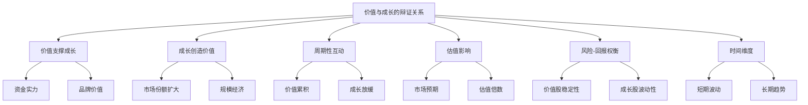
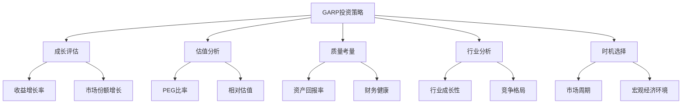
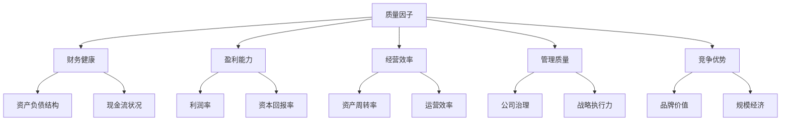
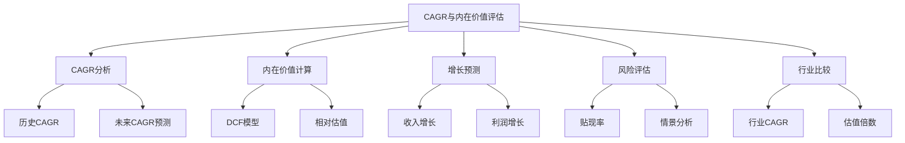

# 第二部分：融合投资思想的理论构建

# 第4章：价值成长投资理念的形成

价值成长投资理念是一种融合了价值投资和成长投资优点的投资策略。这种理念试图在保持价值投资的稳健性的同时，捕捉高增长公司带来的潜在高回报。本章将深入探讨价值成长投资理念的形成过程、核心原则以及在现代投资环境中的应用。

## 4.1 价值与成长的辩证关系

价值和成长这两个概念在投资领域常被视为对立的，但实际上它们之间存在着密切的辩证关系。理解这种关系对于形成全面的投资视角至关重要。

* 核心概念：
    - 价值：公司的内在价值，通常通过财务指标和资产评估来衡量。
    - 成长：公司收入、利润或市场份额的增长潜力。
    - 辩证关系：两个看似对立的概念之间相互依存、相互影响的关系。

* 问题背景：传统投资理论often将价值和成长视为互斥的投资风格，但现实市场中，这两个因素常常是相互交织的。

* 问题描述：如何理解价值与成长之间的辩证关系？这种关系如何影响投资决策和公司估值？

* 问题解决：
    1. 分析价值如何影响成长
    2. 探讨成长对价值的贡献
    3. 考察价值与成长在不同行业和公司生命周期中的表现
    4. 研究市场如何定价价值和成长因素
    5. 分析价值陷阱和成长陷阱的形成原因
    6. 探讨如何在投资决策中平衡价值和成长考量
    7. 考虑技术创新和商业模式变革对价值-成长关系的影响

* 边界与外延：
    - 价值与成长的关系可能因行业特性而异
    - 需要考虑宏观经济环境对价值-成长动态的影响
    - 投资者的时间跨度会影响对价值和成长的权衡

* 概念结构与核心要素组成：



* 概念之间的关系：

| 关系 | 价值支撑成长 | 成长创造价值 | 周期性互动 | 估值影响 | 风险-回报权衡 | 时间维度 |
|------|--------------|--------------|------------|----------|----------------|----------|
| 价值支撑成长 | - | 高度相关 | 中度相关 | 高度相关 | 中度相关 | 高度相关 |
| 成长创造价值 | 高度相关 | - | 高度相关 | 高度相关 | 高度相关 | 高度相关 |
| 周期性互动 | 中度相关 | 高度相关 | - | 高度相关 | 中度相关 | 高度相关 |
| 估值影响 | 高度相关 | 高度相关 | 高度相关 | - | 高度相关 | 中度相关 |
| 风险-回报权衡 | 中度相关 | 高度相关 | 中度相关 | 高度相关 | - | 高度相关 |
| 时间维度 | 高度相关 | 高度相关 | 高度相关 | 中度相关 | 高度相关 | - |

* 数学模型：

我们可以构建一个简化模型来描述价值与成长的关系：

假设 V 为公司的价值，G 为公司的成长率，E 为当前收益，r 为贴现率，t 为时间。则：

$$ V = \sum_{t=1}^{\infty} \frac{E(1+G)^t}{(1+r)^t} $$

这个模型显示，公司的价值是其未来现金流的现值，而未来现金流又受到成长率的影响。

同时，我们可以考虑成长如何影响价值：

$$ \frac{dV}{dG} = \sum_{t=1}^{\infty} \frac{tE(1+G)^{t-1}}{(1+r)^t} > 0 $$

这表明成长率的提高会增加公司的价值。

* 算法流程：

```python
import numpy as np

def calculate_value(earnings, growth_rate, discount_rate, years):
    value = 0
    for t in range(1, years + 1):
        value += (earnings * (1 + growth_rate)**t) / (1 + discount_rate)**t
    return value

def analyze_value_growth_relationship(initial_earnings, growth_rates, discount_rate, years):
    values = []
    for growth_rate in growth_rates:
        value = calculate_value(initial_earnings, growth_rate, discount_rate, years)
        values.append(value)
    return values

# 参数设置
initial_earnings = 100
growth_rates = np.arange(0, 0.21, 0.01)  # 0% to 20% growth rates
discount_rate = 0.10
years = 10

# 分析价值与成长的关系
values = analyze_value_growth_relationship(initial_earnings, growth_rates, discount_rate, years)

# 输出结果
for growth_rate, value in zip(growth_rates, values):
    print(f"Growth Rate: {growth_rate:.2%}, Value: {value:.2f}")

# 可视化
import matplotlib.pyplot as plt

plt.figure(figsize=(10, 6))
plt.plot(growth_rates, values)
plt.title('Value vs Growth Rate')
plt.xlabel('Growth Rate')
plt.ylabel('Company Value')
plt.grid(True)
plt.show()
```

这个算法展示了成长率如何影响公司价值，并通过图表直观地呈现这种关系。

* 实际场景应用：

1. 成熟价值股转型：以IBM为例
    - 价值支撑成长：利用强大的现金流和品牌优势进入云计算和人工智能领域。
    - 成长创造新价值：新业务增长改变了市场对IBM的看法，可能带来估值提升。
    - 挑战：在保持传统业务稳定的同时实现新领域的快速增长。

   ```python
   ibm_earnings = 1000  # 百万美元
   ibm_traditional_growth = 0.01  # 1% 传统业务增长
   ibm_new_business_growth = 0.15  # 15% 新业务增长
   ibm_discount_rate = 0.08
   ibm_years = 10

   traditional_value = calculate_value(ibm_earnings * 0.8, ibm_traditional_growth, ibm_discount_rate, ibm_years)
   new_business_value = calculate_value(ibm_earnings * 0.2, ibm_new_business_growth, ibm_discount_rate, ibm_years)
   total_value = traditional_value + new_business_value

   print(f"IBM估计价值: ${total_value:.2f} 百万")
   ```

2. 高增长科技股：以亚马逊为例
    - 成长创造显著价值：持续的高增长使亚马逊成为市值最高的公司之一。
    - 价值支撑未来成长：强大的现金流允许持续大规模投资新业务。
    - 挑战：保持高增长率，同时提高盈利能力以支持高估值。

   ```python
   amazon_earnings = 20000  # 百万美元
   amazon_growth_rates = [0.30, 0.25, 0.20, 0.15, 0.10]  # 假设未来5年增长率逐年下降
   amazon_discount_rate = 0.10
   amazon_years = 5

   amazon_value = 0
   current_earnings = amazon_earnings
   for year, growth_rate in enumerate(amazon_growth_rates, start=1):
       amazon_value += current_earnings * (1 + growth_rate) / (1 + amazon_discount_rate)**year
       current_earnings *= (1 + growth_rate)

   print(f"亚马逊估计价值: ${amazon_value:.2f} 百万")
   ```

3. 价值与成长的平衡：以苹果公司为例
    - 价值特征：强大的品牌、稳定的现金流、高利润率。
    - 成长特征：持续创新、服务业务快速增长。
    - 平衡策略：利用稳定的硬件业务现金流投资于高增长的服务业务。

   ```python
   apple_hardware_earnings = 200000  # 百万美元
   apple_services_earnings = 50000  # 百万美元
   apple_hardware_growth = 0.05  # 5% 硬件业务增长
   apple_services_growth = 0.20  # 20% 服务业务增长
   apple_discount_rate = 0.09
   apple_years = 10

   hardware_value = calculate_value(apple_hardware_earnings, apple_hardware_growth, apple_discount_rate, apple_years)
   services_value = calculate_value(apple_services_earnings, apple_services_growth, apple_discount_rate, apple_years)
   total_value = hardware_value + services_value

   print(f"苹果公司估计价值: ${total_value:.2f} 百万")
   ```

基于上述分析，我们可以得出以下关于价值与成长辩证关系的关键洞察：

1. 互补性：价值和成长并非相互排斥，而是相互补充的概念。强大的价值基础可以支持持续成长，而高增长又能创造新的价值。

2. 动态平衡：公司在不同发展阶段可能呈现出不同的价值-成长特征。成功的公司often能够在这两者之间保持动态平衡。

3. 长期视角的重要性：从短期来看，价值和成长可能表现出一定的矛盾，但从长期来看，它们往往是统一的。

4. 行业特性的影响：不同行业的价值-成长动态可能有很大差异。例如，科技行业可能更强调成长，而公用事业行业可能更看重稳定的价值。

5. 市场预期的作用：市场对公司未来成长的预期会直接影响其当前估值，从而影响其价值特征。

6. 风险与回报的权衡：纯粹的价值投资可能牺牲部分成长机会，而过度关注成长可能忽视估值风险。平衡两者可以优化风险-回报特征。

7. 创新的双刃剑效应：技术创新可以为成熟公司带来新的成长机会，但也可能破坏现有的价值基础。

8. 资本配置的重要性：公司如何在维护现有业务价值和投资未来成长之间分配资源，对其长期成功至关重要。

9. 周期性考量：经济周期的不同阶段可能交替凸显价值和成长的重要性。

10. 估值方法的综合运用：准确评估一家公司需要同时考虑其价值基础和成长潜力，可能需要结合多种估值方法。

对于投资者而言，理解价值与成长的辩证关系意味着：

1. 避免教条主义：不应将自己严格限定为"价值投资者"或"成长投资者"，而应灵活运用两种思维。

2. 全面分析：在评估投资机会时，既要考虑公司当前的价值基础，也要评估其未来的成长潜力。

3. 动态调整：随着公司和市场环境的变化，及时调整对价值和成长因素的权重。

4. 长期思维：培养长期投资视角，允许价值和成长因素在更长的时间跨度内相互作用。

5. 风险管理：通过在投资组合中平衡价值型和成长型公司来分散风险。

6. 持续学习：密切关注可能改变价值-成长动态的技术创新和商业模式变革。

7. 耐心与纪律：认识到价值实现和成长显现可能需要时间，保持耐心和投资纪律。

理解并运用价值与成长的辩证关系，可以帮助投资者构建更加全面和灵活的投资策略，在不同的市场环境中把握投资机会，实现长期稳定的投资回报。

## 4.2 GARP（合理价格下的成长）投资策略

GARP（Growth At a Reasonable Price，合理价格下的成长）投资策略是一种试图结合价值投资和成长投资优点的方法。这种策略旨在寻找那些具有良好成长前景，同时估值又相对合理的公司。GARP策略在现代投资实践中越来越受到重视，因为它提供了一种平衡的方法来捕捉成长机会，同时控制估值风险。

* 核心概念：
    - GARP：在合理价格下购买具有良好成长潜力的股票。
    - PEG比率：市盈率（P/E）除以预期每股收益增长率，用于评估股票的成长性价比。
    - 合理价格：相对于公司的成长前景而言不过高的价格。

* 问题背景：纯粹的价值投资可能错过高增长机会，而纯粹的成长投资可能忽视估值风险。GARP策略试图在两者之间找到平衡点。

* 问题描述：如何有效地实施GARP策略？哪些指标和方法可以用来识别GARP股票？

* 问题解决：
    1. 分析PEG比率的计算和应用
    2. 探讨其他用于GARP策略的财务指标
    3. 考察行业特性对GARP策略的影响
    4. 研究如何评估公司的可持续成长性
    5. 分析估值方法在GARP策略中的应用
    6. 探讨GARP策略在不同市场周期中的表现
    7. 考虑如何将定性分析融入GARP策略

* 边界与外延：
    - GARP策略的有效性可能因市场环境而异
    - 需要考虑公司规模、行业特性对GARP应用的影响
    - GARP策略可能需要根据不同地区市场的特点进行调整

* 概念结构与核心要素组成：



* 概念之间的关系：

| 要素 | 成长评估 | 估值分析 | 质量考量 | 行业分析 | 时机选择 |
|------|----------|----------|----------|----------|----------|
| 成长评估 | - | 高度相关 | 中度相关 | 高度相关 | 中度相关 |
| 估值分析 | 高度相关 | - | 中度相关 | 中度相关 | 高度相关 |
| 质量考量 | 中度相关 | 中度相关 | - | 中度相关 | 低度相关 |
| 行业分析 | 高度相关 | 中度相关 | 中度相关 | - | 高度相关 |
| 时机选择 | 中度相关 | 高度相关 | 低度相关 | 高度相关 | - |

* 数学模型：

GARP策略的核心指标PEG比率的计算公式：

$$ PEG = \frac{P/E}{g} $$

其中，P/E 是市盈率，g 是预期年化盈利增长率。

通常认为，PEG < 1 的股票可能被低估，是潜在的GARP投资对象。

我们可以构建一个更复杂的GARP评分模型：

$$ GARP Score = w_1 \cdot \frac{1}{PEG} + w_2 \cdot ROE + w_3 \cdot \frac{g}{P/B} + w_4 \cdot \frac{FCF}{EV} $$

其中，ROE是股本回报率，P/B是市净率，FCF是自由现金流，EV是企业价值，w₁, w₂, w₃, w₄ 是权重。

* 算法流程：

```python
def calculate_peg(pe_ratio, growth_rate):
    return pe_ratio / growth_rate if growth_rate > 0 else float('inf')

def calculate_garp_score(pe_ratio, growth_rate, roe, pb_ratio, fcf, ev):
    peg = calculate_peg(pe_ratio, growth_rate)
    garp_score = (
        0.4 * (1 / peg if peg > 0 else 0) +
        0.3 * roe +
        0.2 * (growth_rate / pb_ratio if pb_ratio > 0 else 0) +
        0.1 * (fcf / ev if ev > 0 else 0)
    )
    return garp_score

def evaluate_stock(stock_data):
    garp_score = calculate_garp_score(
        stock_data['pe_ratio'],
        stock_data['growth_rate'],
        stock_data['roe'],
        stock_data['pb_ratio'],
        stock_data['fcf'],
        stock_data['ev']
    )
    return garp_score

# 示例使用
stock_data = {
    'pe_ratio': 15,
    'growth_rate': 0.2,  # 20%
    'roe': 0.18,  # 18%
    'pb_ratio': 2.5,
    'fcf': 1000000000,  # 10亿
    'ev': 50000000000  # 500亿
}

garp_score = evaluate_stock(stock_data)
print(f"GARP评分: {garp_score:.4f}")
```

这个算法提供了一个框架来评估股票是否符合GARP策略的标准。

* 实际场景应用：

1. 科技行业GARP股票：以微软为例
    - 成长前景：云计算业务快速增长
    - 合理估值：相比其他科技巨头，估值相对温和
    - 质量因素：强劲的现金流和高回报率

   ```python
   microsoft_data = {
       'pe_ratio': 30,
       'growth_rate': 0.15,  # 15%
       'roe': 0.40,  # 40%
       'pb_ratio': 13,
       'fcf': 45000000000,  # 450亿
       'ev': 1800000000000  # 1.8万亿
   }

   microsoft_garp_score = evaluate_stock(microsoft_data)
   print(f"微软GARP评分: {microsoft_garp_score:.4f}")
   ```

2. 消费品行业GARP股票：以星巴克为例
    - 成长前景：国际市场扩张和数字化转型
    - 合理估值：考虑品牌价值和增长潜力的估值
    - 质量因素：强大的品牌忠诚度和稳定的现金流

   ```python
   starbucks_data = {
       'pe_ratio': 25,
       'growth_rate': 0.10,  # 10%
       'roe': 0.50,  # 50%（受回购影响）
       'pb_ratio': 15,
       'fcf': 3000000000,  # 30亿
       'ev': 120000000000  # 1200亿
   }

   starbucks_garp_score = evaluate_stock(starbucks_data)
   print(f"星巴克GARP评分: {starbucks_garp_score:.4f}")
   ```

3. 新兴市场GARP股票：以阿里巴巴为例
    - 成长前景：电商和云计算业务在新兴市场的增长潜力
    - 合理估值：相比成熟市场竞争对手，估值更具吸引力
    - 质量因素：强大的市场地位和多元化业务模式

   ```python
   alibaba_data = {
       'pe_ratio': 20,
       'growth_rate': 0.20,  # 20%
       'roe': 0.15,  # 15%
       'pb_ratio': 3,
       'fcf': 25000000000,  # 250亿
       'ev': 500000000000  # 5000亿
   }

   alibaba_garp_score = evaluate_stock(alibaba_data)
   print(f"阿里巴巴GARP评分: {alibaba_garp_score:.4f}")
   ```

基于上述分析，我们可以得出以下关于GARP投资策略的关键洞察：

1. 平衡成长与价值：GARP策略的核心在于在合理价格下购买高质量的成长股，避免单纯追逐高增长或低估值。

2. PEG比率的重要性：PEG比率是GARP策略的核心指标，但不应过度依赖单一指标。

3. 多维度分析：除了PEG，还应考虑ROE、自由现金流等指标，全面评估公司质量和财务健康状况。

4. 行业特性考量：不同行业的"合理价格"标准可能不同，需要进行行业间比较。

5. 长期视角：GARP策略通常需要较长的投资周期来实现价值，投资者需要有耐心。

6. 动态调整：随着公司和市场环境的变化，需要定期重新评估GARP标的的吸引力。

7. 质量优先：在追求成长的同时，不应忽视公司的基本面质量和竞争优势。

8. 市场情绪的影响：在不同的市场环境下，投资者对"合理价格"的定义可能会发生变化。

9. 全球视野：GARP机会可能出现在全球任何市场，跨境比较可能发现被忽视的机会。

10. 风险管理：尽管GARP策略试图平衡风险和回报，但仍需要通过投资组合多元化来管理风险。

对于投资者而言，有效实施GARP策略需要注意以下几点：

1. 建立系统化的筛选流程：使用多重指标和标准来识别潜在的GARP股票。

2. 深入的基本面分析：除了定量指标，还需要对公司的业务模式、竞争优势和管理质量进行深入研究。

3. 行业比较：在行业内部和跨行业进行比较，以确定什么是"合理价格"。

4. 关注可持续性：评估公司增长的可持续性，而不仅仅是短期增长率。

5. 耐心和纪律：GARP投资可能需要时间来实现价值，要有耐心持有并遵守投资纪律。

6. 持续监控：定期重新评估投资标的，确保它们仍然符合GARP标准。

7. 灵活应对：根据市场环境的变化，适当调整GARP标准和投资组合配置。

8. 结合宏观分析：考虑宏观经济趋势和行业周期对GARP机会的影响。

9. 控制风险：设置止损点，并通过投资组合多元化来分散风险。

10. 持续学习：GARP策略需要投资者既了解价值投资，又熟悉成长投资的原则，不断学习和改进策略。

GARP投资策略为投资者提供了一种平衡的方法，旨在捕捉高增长潜力同时控制估值风险。通过综合考虑公司的成长前景、当前估值和基本面质量，GARP投资者可以在动态的市场环境中寻找最佳的风险-回报机会。然而，成功实施GARP策略需要深入的研究、严格的纪律和持续的学习，以适应不断变化的市场条件和公司动态。

## 4.3 质量因子在融合投资中的重要性

在价值与成长投资的融合过程中，质量因子日益受到投资者的重视。高质量公司通常能够在长期内创造更高的股东价值，无论是从价值投资还是成长投资的角度来看，都具有重要意义。本节将深入探讨质量因子在融合投资中的作用及其实际应用。

* 核心概念：
    - 质量因子：衡量公司财务健康、盈利能力、经营效率和管理水平的综合指标。
    - 融合投资：结合价值投资和成长投资原则的投资策略。
    - 可持续竞争优势：公司长期保持高质量的能力。

* 问题背景：传统的价值或成长投资可能忽视公司质量，导致"价值陷阱"或"成长陷阱"。

* 问题描述：如何在融合投资策略中有效地纳入和评估质量因子？质量因子如何影响投资决策和长期回报？

* 问题解决：
    1. 定义和量化质量因子
    2. 分析质量因子与价值、成长因子的关系
    3. 探讨质量因子在不同行业中的表现
    4. 研究质量因子对投资回报的影响
    5. 考察如何将质量因子融入投资决策过程
    6. 分析质量因子在风险管理中的作用
    7. 探讨质量因子在不同市场周期中的表现

* 边界与外延：
    - 质量因子的定义可能因行业和公司生命周期而异
    - 需要考虑质量因子与其他投资因子的交互作用
    - 质量因子的重要性可能随时间和市场环境变化

* 概念结构与核心要素组成：



* 概念之间的关系：

| 要素 | 财务健康 | 盈利能力 | 经营效率 | 管理质量 | 竞争优势 |
|------|----------|----------|----------|----------|----------|
| 财务健康 | - | 高度相关 | 中度相关 | 中度相关 | 中度相关 |
| 盈利能力 | 高度相关 | - | 高度相关 | 中度相关 | 高度相关 |
| 经营效率 | 中度相关 | 高度相关 | - | 高度相关 | 中度相关 |
| 管理质量 | 中度相关 | 中度相关 | 高度相关 | - | 高度相关 |
| 竞争优势 | 中度相关 | 高度相关 | 中度相关 | 高度相关 | - |

* 数学模型：

我们可以构建一个综合质量得分模型：

$$ Quality Score = w_1 \cdot F + w_2 \cdot P + w_3 \cdot E + w_4 \cdot M + w_5 \cdot C $$

其中：
- F 代表财务健康得分
- P 代表盈利能力得分
- E 代表经营效率得分
- M 代表管理质量得分
- C 代表竞争优势得分
- w₁, w₂, w₃, w₄, w₅ 是各因素的权重

具体可以使用以下指标：

- 财务健康：$F = \frac{1}{2}(\frac{Equity}{TotalAssets} + \frac{OperatingCashFlow}{TotalDebt})$
- 盈利能力：$P = \frac{1}{2}(ROE + ROA)$
- 经营效率：$E = AssetTurnover$
- 管理质量：可以使用定性评分
- 竞争优势：可以使用行业相对市场份额或毛利率

* 算法流程：

```python
def calculate_quality_score(financial_health, profitability, efficiency, management, competitive_advantage, weights):
    return (
        weights['financial_health'] * financial_health +
        weights['profitability'] * profitability +
        weights['efficiency'] * efficiency +
        weights['management'] * management +
        weights['competitive_advantage'] * competitive_advantage
    )

def evaluate_company_quality(company_data, weights):
    financial_health = 0.5 * (company_data['equity'] / company_data['total_assets'] + 
                              company_data['operating_cash_flow'] / company_data['total_debt'])
    profitability = 0.5 * (company_data['roe'] + company_data['roa'])
    efficiency = company_data['asset_turnover']
    management = company_data['management_score']  # 假设这是一个1-10的评分
    competitive_advantage = company_data['industry_relative_market_share']

    quality_score = calculate_quality_score(
        financial_health, profitability, efficiency, management, competitive_advantage, weights
    )
    return quality_score

# 示例使用
company_data = {
    'equity': 1000000000,
    'total_assets': 2000000000,
    'operating_cash_flow': 300000000,
    'total_debt': 500000000,
    'roe': 0.15,
    'roa': 0.08,
    'asset_turnover': 1.2,
    'management_score': 8,
    'industry_relative_market_share': 1.5
}

weights = {
    'financial_health': 0.2,
    'profitability': 0.3,
    'efficiency': 0.2,
    'management': 0.15,
    'competitive_advantage': 0.15
}

quality_score = evaluate_company_quality(company_data, weights)
print(f"公司质量得分: {quality_score:.4f}")
```

这个算法提供了一个评估公司质量的框架，可以根据具体需求调整权重和指标。

* 实际场景应用：

1. 科技行业质量评估：以苹果公司为例
    - 财务健康：强大的现金储备和低负债率
    - 盈利能力：高利润率和资本回报率
    - 经营效率：优秀的存货管理和资产利用率
    - 管理质量：创新文化和有效的供应链管理
    - 竞争优势：强大的品牌价值和生态系统

   ```python
   apple_data = {
       'equity': 65339000000,
       'total_assets': 338516000000,
       'operating_cash_flow': 104038000000,
       'total_debt': 119412000000,
       'roe': 0.147,
       'roa': 0.028,
       'asset_turnover': 0.83,
       'management_score': 9,
       'industry_relative_market_share': 2.5
   }

   apple_quality_score = evaluate_company_quality(apple_data, weights)
   print(f"苹果公司质量得分: {apple_quality_score:.4f}")
   ```

2. 消费品行业质量评估：以可口可乐为例
    - 财务健康：稳定的现金流和适度的负债水平
    - 盈利能力：持续的高利润率
    - 经营效率：良好的资产周转率
    - 管理质量：长期品牌管理和全球化运营能力
    - 竞争优势：全球最有价值的品牌之一

   ```python
   coca_cola_data = {
       'equity': 21284000000,
       'total_assets': 87296000000,
       'operating_cash_flow': 9804000000,
       'total_debt': 40684000000,
       'roe': 0.401,
       'roa': 0.097,
       'asset_turnover': 0.42,
       'management_score': 8,
       'industry_relative_market_share': 3.0
   }

   coca_cola_quality_score = evaluate_company_quality(coca_cola_data, weights)
   print(f"可口可乐公司质量得分: {coca_cola_quality_score:.4f}")
   ```

3. 金融行业质量评估：以摩根大通为例
    - 财务健康：强大的资本充足率
    - 盈利能力：相对稳定的回报率
    - 经营效率：成本控制能力
    - 管理质量：风险管理能力和战略执行力
    - 竞争优势：多元化的业务模式和全球网络

   ```python
   jp_morgan_data = {
       'equity': 279354000000,
       'total_assets': 3386065000000,
       'operating_cash_flow': 76201000000,
       'total_debt': 446992000000,
       'roe': 0.15,
       'roa': 0.0124,
       'asset_turnover': 0.03,  # 银行业资产周转率通常较低
       'management_score': 8,
       'industry_relative_market_share': 1.8
   }

   jp_morgan_quality_score = evaluate_company_quality(jp_morgan_data, weights)
   print(f"摩根大通公司质量得分: {jp_morgan_quality_score:.4f}")
   ```

基于上述分析，我们可以得出以下关于质量因子在融合投资中重要性的关键洞察：

1. 全面评估：质量因子提供了一个多维度评估公司的框架，超越了单纯的价值或成长指标。

2. 风险管理：高质量公司通常具有更强的抗风险能力，有助于降低投资组合的下行风险。

3. 可持续性：质量因子有助于识别具有可持续竞争优势的公司，这对长期投资至关重要。

4. 价值陷阱防范：通过考虑质量因子，投资者可以更好地避免低估值但基本面恶化的公司。

5. 成长持续性：高质量公司更有可能保持长期增长，减少"昙花一现"的风险。

6. 行业适应性：质量因子的具体表现可能因行业而异，需要根据行业特性进行调整。

7. 周期性考虑：在不同的经济周期中，质量因子的重要性可能会有所变化。

8. 与其他因子的互补：质量因子可以与价值、成长、动量等其他因子结合，构建更全面的投资策略。

9. 长期表现：研究表明，高质量公司在长期内往往能够提供更好的风险调整后回报。

10. 管理层洞察：质量因子分析可以提供对公司管理能力和公司文化的洞察。

对于投资者而言，有效地将质量因子纳入融合投资策略需要注意以下几点：

1. 定义明确：建立清晰、可量化的质量指标体系。

2. 行业特异性：根据不同行业的特点调整质量评估标准。

3. 动态评估：定期重新评估公司质量，因为质量状况可能随时间变化。

4. 综合考量：将质量因子与其他投资因子（如价值、成长）结合考虑。

5. 尽职调查：除了定量指标，也要通过深入研究来评估难以量化的质量因素。

6. 相对比较：在行业内部和跨行业进行质量比较，以获得更全面的视角。

7. 长期视角：质量因子的优势通常在较长的时间跨度内更为明显。

8. 风险意识：即使是高质量公司也可能面临风险，需要持续监控。

9. 估值考虑：高质量公司可能会被市场给予溢价，需要权衡质量和估值。

10. 持续学习：随着市场和经济环境的变化，不断更新和完善质量评估方法。

将质量因子纳入融合投资策略可以帮助投资者构建更加稳健、长期导向的投资组合。通过系统地评估公司的财务健康、盈利能力、经营效率、管理质量和竞争优势，投资者可以更好地识别那些既具有价值特征又有成长潜力的高质量公司。这种方法不仅可以提高投资回报的可持续性，还能够在市场波动时期提供更好的防御性。然而，重要的是要记住，即使是最高质量的公司也可能面临挑战，因此持续的监控和适时的投资组合调整仍然是必要的。

## 4.4 长期复合增长率（CAGR）与内在价值评估

长期复合增长率（CAGR）是评估公司长期增长潜力的重要指标，而内在价值评估则是确定公司真实价值的关键方法。在融合价值和成长投资理念时，这两个概念的结合为投资者提供了一个强大的分析框架。本节将深入探讨CAGR和内在价值评估在投资决策中的应用及其相互关系。

* 核心概念：
    - 长期复合增长率（CAGR）：反映一项投资在特定时期内的年化回报率。
    - 内在价值：公司基于其未来现金流的真实价值。
    - 现金流贴现模型（DCF）：用于估算内在价值的主要方法之一。

* 问题背景：准确评估公司的长期增长潜力和内在价值是成功投资的关键，但这往往面临诸多挑战。

* 问题描述：如何有效地利用CAGR来预测公司的未来增长？如何将CAGR与内在价值评估相结合以做出更准确的投资决策？

* 问题解决：
    1. 分析CAGR的计算和应用
    2. 探讨影响CAGR的因素
    3. 研究内在价值评估的方法，特别是DCF模型
    4. 考察如何将CAGR预测纳入内在价值评估
    5. 分析CAGR和内在价值评估在不同行业中的应用
    6. 探讨长期CAGR预测的挑战和解决方案
    7. 考虑宏观经济因素对CAGR和内在价值的影响

* 边界与外延：
    - CAGR预测的准确性可能随时间跨度的增加而降低
    - 内在价值评估需要考虑行业特性和公司生命周期阶段
    - 需要权衡定量分析和定性判断

* 概念结构与核心要素组成：



* 概念之间的关系：

| 要素 | CAGR分析 | 内在价值计算 | 增长预测 | 风险评估 | 行业比较 |
|------|----------|--------------|----------|----------|----------|
| CAGR分析 | - | 高度相关 | 高度相关 | 中度相关 | 高度相关 |
| 内在价值计算 | 高度相关 | - | 高度相关 | 高度相关 | 中度相关 |
| 增长预测 | 高度相关 | 高度相关 | - | 中度相关 | 中度相关 |
| 风险评估 | 中度相关 | 高度相关 | 中度相关 | - | 中度相关 |
| 行业比较 | 高度相关 | 中度相关 | 中度相关 | 中度相关 | - |

* 数学模型：

1. CAGR计算公式：

$$ CAGR = \left(\frac{EndingValue}{BeginningValue}\right)^{\frac{1}{NumberOfYears}} - 1 $$

2. DCF模型基本公式：

$$ IntrinsicValue = \sum_{t=1}^{n} \frac{FCF_t}{(1+r)^t} + \frac{TerminalValue}{(1+r)^n} $$

其中，FCF_t 是第 t 年的自由现金流，r 是贴现率，TerminalValue 是终值。

3. 将CAGR纳入DCF模型：

假设公司的自由现金流以 CAGR 的速度增长，则：

$$ FCF_t = FCF_0 \cdot (1 + CAGR)^t $$

* 算法流程：

```python
import numpy as np

def calculate_cagr(beginning_value, ending_value, num_years):
    return (ending_value / beginning_value) ** (1 / num_years) - 1

def project_fcf(initial_fcf, cagr, years):
    return [initial_fcf * (1 + cagr) ** t for t in range(years)]

def calculate_intrinsic_value(fcf_projections, terminal_growth_rate, discount_rate):
    pv_fcf = sum([fcf / (1 + discount_rate) ** (t + 1) for t, fcf in enumerate(fcf_projections)])
    terminal_value = fcf_projections[-1] * (1 + terminal_growth_rate) / (discount_rate - terminal_growth_rate)
    pv_terminal_value = terminal_value / (1 + discount_rate) ** len(fcf_projections)
    return pv_fcf + pv_terminal_value

def evaluate_investment(initial_fcf, historical_cagr, projected_cagr, years, terminal_growth_rate, discount_rate):
    fcf_projections = project_fcf(initial_fcf, projected_cagr, years)
    intrinsic_value = calculate_intrinsic_value(fcf_projections, terminal_growth_rate, discount_rate)
    
    return {
        'Historical CAGR': historical_cagr,
        'Projected CAGR': projected_cagr,
        'Intrinsic Value': intrinsic_value
    }

# 示例使用
initial_fcf = 1000000000  # 10亿初始自由现金流
historical_cagr = 0.15  # 15%的历史CAGR
projected_cagr = 0.10  # 10%的预计未来CAGR
years = 5  # 5年预测期
terminal_growth_rate = 0.03  # 3%的永续增长率
discount_rate = 0.09  # 9%的贴现率

result = evaluate_investment(initial_fcf, historical_cagr, projected_cagr, years, terminal_growth_rate, discount_rate)

print(f"历史CAGR: {result['Historical CAGR']:.2%}")
print(f"预计未来CAGR: {result['Projected CAGR']:.2%}")
print(f"估算内在价值: ${result['Intrinsic Value']:,.0f}")
```

这个算法提供了一个框架，结合CAGR和DCF模型来评估公司的内在价值。

* 实际场景应用：

1. 科技行业高增长公司：以亚马逊为例
    - 历史高CAGR，但预期未来增速可能放缓
    - 多元化业务模型（电商、云计算等）带来的复杂性
    - 高增长与盈利能力之间的权衡

   ```python
   amazon_data = {
       'initial_fcf': 25000000000,  # 250亿美元
       'historical_cagr': 0.25,  # 25%
       'projected_cagr': 0.18,  # 18%
       'years': 5,
       'terminal_growth_rate': 0.04,  # 4%
       'discount_rate': 0.08  # 8%
   }

   amazon_result = evaluate_investment(**amazon_data)
   print("\n亚马逊评估结果：")
   print(f"历史CAGR: {amazon_result['Historical CAGR']:.2%}")
   print(f"预计未来CAGR: {amazon_result['Projected CAGR']:.2%}")
   print(f"估算内在价值: ${amazon_result['Intrinsic Value']:,.0f}")
   ```

2. 成熟消费品公司：以可口可乐为例
    - 稳定但相对较低的CAGR
    - 强大的品牌价值和现金流生成能力
    - 成熟市场增长放缓vs新兴市场机会

   ```python
   coca_cola_data = {
       'initial_fcf': 8000000000,  # 80亿美元
       'historical_cagr': 0.05,  # 5%
       'projected_cagr': 0.04,  # 4%
       'years': 5,
       'terminal_growth_rate': 0.02,  # 2%
       'discount_rate': 0.07  # 7%
   }

   coca_cola_result = evaluate_investment(**coca_cola_data)
   print("\n可口可乐评估结果：")
   print(f"历史CAGR: {coca_cola_result['Historical CAGR']:.2%}")
   print(f"预计未来CAGR: {coca_cola_result['Projected CAGR']:.2%}")
   print(f"估算内在价值: ${coca_cola_result['Intrinsic Value']:,.0f}")
   ```

3. 新兴市场高增长公司：以阿里巴巴为例
    - 高历史CAGR，但面临增长放缓和监管压力
    - 多元化业务模型在新兴市场的扩张潜力
    - 政治和监管风险对增长预期的影响

   ```python
   alibaba_data = {
       'initial_fcf': 20000000000,  # 200亿美元
       'historical_cagr': 0.30,  # 30%
       'projected_cagr': 0.15,  # 15%
       'years': 5,
       'terminal_growth_rate': 0.05,  # 5%
       'discount_rate': 0.10  # 10%
   }

   alibaba_result = evaluate_investment(**alibaba_data)
   print("\n阿里巴巴评估结果：")
   print(f"历史CAGR: {alibaba_result['Historical CAGR']:.2%}")
   print(f"预计未来CAGR: {alibaba_result['Projected CAGR']:.2%}")
   print(f"估算内在价值: ${alibaba_result['Intrinsic Value']:,.0f}")
   ```

基于上述分析，我们可以得出以下关于CAGR与内在价值评估的关键洞察：

1. CAGR的预测挑战：历史CAGR不一定能准确预示未来增长。需要考虑行业趋势、竞争格局、宏观经济等多重因素。

2. 增长率与风险的权衡：高CAGR通常伴随着更高的风险和不确定性，这应反映在更高的贴现率中。

3. 行业生命周期的影响：不同行业和公司所处的生命周期阶段会显著影响其CAGR和内在价值评估。

4. 质量因素的重要性：除了增长率，还需考虑增长的质量，如盈利能力、现金流生成能力等。

5. 长期视角vs短期波动：CAGR和内在价值评估强调长期视角，但也需要关注短期内可能影响长期趋势的因素。

6. 情景分析的必要性：鉴于未来的不确定性，应考虑多种增长情景，进行敏感性分析。

7. 相对估值的补充作用：DCF模型应与相对估值方法（如P/E、EV/EBITDA等）结合使用，以获得更全面的价值评估。

8. 竞争优势的持续性：评估公司是否能够维持高CAGR，需要分析其竞争优势的可持续性。

9. 规模效应：随着公司规模扩大，通常难以维持高CAGR，这一点在预测中应予以考虑。

10. 外部因素的影响：技术变革、监管环境、宏观经济等外部因素可能显著影响CAGR和内在价值，需要持续监控。

对于投资者而言，有效利用CAGR和内在价值评估需要注意以下几点：

1. 全面分析：不仅关注财务指标，还要深入了解公司的业务模式、竞争优势和行业动态。

2. 保持怀疑态度：对于异常高的历史CAGR或乐观的未来预测保持警惕，寻求支持这些预测的实质性证据。

3. 动态调整：随着新信息的出现，及时调整CAGR预测和内在价值评估。

4. 考虑多种情景：制定乐观、中性和悲观的CAGR预测，评估不同情景下的内在价值。

5. 关注现金流：在评估中特别注重自由现金流的质量和可持续性。

6. 行业比较：将公司的CAGR和估值与行业平均水平和领先对手进行比较。

7. 长期思维：尽管短期波动不可避免，但应保持长期投资视角。

8. 质量优先：优先考虑那些不仅有高CAGR，还具有强大业务模式和竞争优势的公司。

9. 持续学习：随着市场环境的变化，不断更新和完善CAGR预测和内在价值评估方法。

10. 耐心与纪律：认识到准确的内在价值评估需要时间来验证，保持投资纪律很重要。

将CAGR分析与内在价值评估相结合，为投资者提供了一个强大的工具来识别和评估潜在的投资机会。这种方法不仅考虑了公司的历史表现，还纳入了对未来增长的预期，同时通过DCF模型将这些预期转化为具体的价值估算。然而，重要的是要记住，这些模型和预测都是基于假设的，投资者需要不断质疑这些假设，并根据新的信息和市场变化调整其分析。通过结合定量分析和定性判断，投资者可以做出更加明智和全面的投资决策。

# 结语：价值成长投资的未来展望

随着金融市场的不断发展和投资理念的演进，价值成长投资策略正在成为一种越来越受欢迎的投资方法。这种融合了价值投资和成长投资优点的策略，不仅为投资者提供了一个更全面的投资框架，也更好地适应了当今复杂多变的市场环境。在本书的结尾，让我们展望价值成长投资的未来发展趋势及其可能面临的挑战。

1. 技术驱动的投资决策
    - 人工智能和机器学习在数据分析和模式识别中的应用将不断深化。
    - 大数据分析将帮助投资者更准确地预测公司的增长轨迹和估值变化。
    - 自动化交易系统可能会更多地融入价值成长投资原则，提高执行效率。

2. 可持续发展和ESG因素的整合
    - 环境、社会和公司治理（ESG）因素将越来越多地被纳入价值成长投资分析。
    - 可持续发展目标将影响公司的长期增长潜力和估值评估。
    - 投资者将需要平衡财务回报与社会责任投资。

3. 全球化视角的重要性
    - 跨境投资机会的增加将要求投资者具备更广阔的全球视野。
    - 新兴市场的快速发展可能提供更多价值成长投资机会。
    - 地缘政治风险和货币波动将成为投资决策中更重要的考量因素。

4. 行业边界的模糊化
    - 传统行业分类可能变得不那么重要，跨行业融合将创造新的投资机会。
    - 科技创新将继续重塑传统行业，改变公司的增长轨迹和估值模型。
    - 投资者需要更灵活的分析框架来评估跨界公司。

5. 投资周期的加速
    - 信息传播速度的加快可能导致市场反应更迅速，投资周期缩短。
    - 长期主义与短期波动的平衡将变得更加重要。
    - 价值成长投资者需要在坚持长期视角的同时，更敏捷地响应市场变化。

6. 个人化和定制化投资策略
    - 随着投资工具的普及，个人投资者将有更多机会实施复杂的价值成长策略。
    - 人工智能驱动的投资顾问可能提供更个性化的投资建议。
    - 投资策略的定制化将帮助投资者更好地匹配个人风险偏好和投资目标。

7. 新兴资产类别的融入
    - 加密货币、代币化资产等新兴资产类别可能被纳入价值成长投资框架。
    - 传统金融资产与新兴资产类别的界限可能变得模糊。
    - 投资者需要学习评估新型资产的内在价值和增长潜力。

8. 监管环境的变化
    - 金融监管的变化可能影响价值成长投资策略的实施。
    - 信息披露要求的增加可能提供更多数据点用于分析。
    - 跨境投资规则的变化可能影响全球投资策略。

9. 风险管理的演进
    - 新的风险度量和管理工具将被开发，以更好地评估和控制投资风险。
    - 系统性风险和非系统性风险的界定可能需要重新考虑。
    - 极端事件（如全球性疫情）对风险管理实践的影响将被更多地纳入考虑。

10. 投资教育和金融素养的提升
    - 随着价值成长投资概念的普及，投资者教育将变得更加重要。
    - 金融素养的提高将使更多个人投资者能够参与到价值成长投资中。
    - 专业投资者和个人投资者之间的信息不对称可能会减少。

面对这些趋势和挑战，未来的价值成长投资者需要：

1. 持续学习和适应：保持开放的心态，不断学习新技术和新概念。

2. 跨学科思维：结合金融、技术、社会学等多学科知识，全面分析投资机会。

3. 灵活性：在坚持核心原则的同时，灵活调整策略以适应市场变化。

4. 全球视野：培养对全球经济和不同文化的理解，把握国际投资机会。

5. 长期思维：在信息快速流动的环境中，更加珍视长期投资的价值。

6. 风险意识：在追求增长的同时，始终保持对风险的警惕。

7. 道德考量：在投资决策中纳入道德和可持续发展因素。

8. 技术素养：提高对新技术的理解和应用能力，利用技术优化投资决策。

9. 批判性思维：在信息爆炸的时代，保持独立思考和判断的能力。

10. 协作精神：与其他投资者、研究人员和技术专家合作，共同应对复杂的投资环境。

价值成长投资的未来充满机遇和挑战。这种投资策略的核心原则——寻找高质量、有增长潜力且估值合理的公司——可能会保持不变，但实现这一目标的方法将不断演进。成功的投资者将是那些能够在坚持基本原则的同时，灵活适应新环境，不断学习和创新的人。

最后，重要的是要记住，尽管技术和方法在不断进步，但投资的本质仍然是对未来的预测。因此，谦逊、耐心和持续学习的态度将永远是成功投资的关键因素。价值成长投资不仅是一种策略，更是一种思维方式，它鼓励投资者全面、深入地思考企业价值和经济增长的本质。在未来的投资旅程中，那些能够平衡定量分析和定性判断、兼顾短期波动和长期趋势、在变化中把握不变的投资者，将更有可能取得持续的成功。
