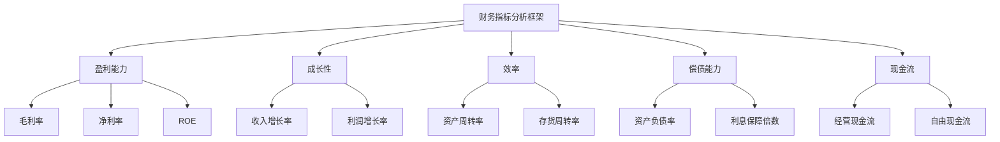
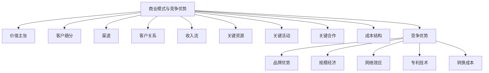
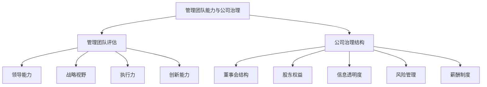
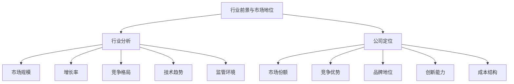

# 第5章：企业质量评估体系

企业质量评估是价值成长投资策略的核心组成部分。一个全面的企业质量评估体系可以帮助投资者识别那些具有持续竞争优势、稳健财务状况、卓越管理能力和良好行业前景的公司。本章将详细探讨企业质量评估的四个关键维度：财务指标分析、商业模式与竞争优势评估、管理团队能力与公司治理结构，以及行业前景与公司市场地位分析。

## 5.1 财务指标分析框架

财务指标分析是评估企业质量的基础。一个全面的财务指标分析框架应包括盈利能力、成长性、效率、偿债能力和现金流等多个维度。

* 核心概念：
    - 盈利能力指标
    - 成长性指标
    - 效率指标
    - 偿债能力指标
    - 现金流指标

* 问题背景：财务指标众多，如何构建一个既全面又有针对性的分析框架是投资者面临的挑战。

* 问题描述：如何选择和解读关键财务指标以全面评估企业质量？不同行业的财务指标分析有何特殊性？

* 问题解决：
    1. 构建多维度财务指标体系
    2. 分析各项指标的历史趋势和同业比较
    3. 探讨不同行业的关键财务指标
    4. 考虑财务指标之间的相互关系
    5. 分析财务指标背后的业务驱动因素
    6. 识别潜在的财务风险信号
    7. 结合定性分析解读财务指标

* 边界与外延：
    - 财务指标分析需要结合行业特性
    - 会计政策变更可能影响指标的可比性
    - 需要考虑宏观经济环境对财务指标的影响

* 概念结构与核心要素组成：



* 概念之间的关系：

| 指标类型 | 盈利能力 | 成长性 | 效率 | 偿债能力 | 现金流 |
|----------|----------|--------|------|----------|--------|
| 盈利能力 | - | 高度相关 | 中度相关 | 中度相关 | 高度相关 |
| 成长性 | 高度相关 | - | 低度相关 | 低度相关 | 中度相关 |
| 效率 | 中度相关 | 低度相关 | - | 中度相关 | 中度相关 |
| 偿债能力 | 中度相关 | 低度相关 | 中度相关 | - | 高度相关 |
| 现金流 | 高度相关 | 中度相关 | 中度相关 | 高度相关 | - |

* 数学模型：

我们可以构建一个综合财务评分模型：

$$ FinancialScore = w_1P + w_2G + w_3E + w_4S + w_5C $$

其中：
- P 代表盈利能力得分
- G 代表成长性得分
- E 代表效率得分
- S 代表偿债能力得分
- C 代表现金流得分
- w₁, w₂, w₃, w₄, w₅ 是各因素的权重

具体可以使用以下指标：

- 盈利能力：$P = \frac{1}{3}(ROE + \frac{NetIncome}{Revenue} + \frac{GrossProfit}{Revenue})$
- 成长性：$G = \frac{1}{2}(RevenueGrowth + NetIncomeGrowth)$
- 效率：$E = \frac{1}{2}(AssetTurnover + InventoryTurnover)$
- 偿债能力：$S = \frac{1}{2}(\frac{TotalAssets}{TotalLiabilities} + InterestCoverageRatio)$
- 现金流：$C = \frac{1}{2}(\frac{OperatingCashFlow}{Revenue} + \frac{FreeCashFlow}{Revenue})$

* 算法流程：

```python
def calculate_financial_score(company_data, weights):
    profitability = (company_data['roe'] + company_data['net_margin'] + company_data['gross_margin']) / 3
    growth = (company_data['revenue_growth'] + company_data['net_income_growth']) / 2
    efficiency = (company_data['asset_turnover'] + company_data['inventory_turnover']) / 2
    solvency = (company_data['total_assets'] / company_data['total_liabilities'] + company_data['interest_coverage_ratio']) / 2
    cash_flow = (company_data['operating_cash_flow'] / company_data['revenue'] + company_data['free_cash_flow'] / company_data['revenue']) / 2

    financial_score = (
        weights['profitability'] * profitability +
        weights['growth'] * growth +
        weights['efficiency'] * efficiency +
        weights['solvency'] * solvency +
        weights['cash_flow'] * cash_flow
    )
    return financial_score

# 示例使用
company_data = {
    'roe': 0.15,
    'net_margin': 0.10,
    'gross_margin': 0.40,
    'revenue_growth': 0.08,
    'net_income_growth': 0.12,
    'asset_turnover': 0.8,
    'inventory_turnover': 6,
    'total_assets': 1000000000,
    'total_liabilities': 400000000,
    'interest_coverage_ratio': 10,
    'operating_cash_flow': 150000000,
    'free_cash_flow': 100000000,
    'revenue': 800000000
}

weights = {
    'profitability': 0.3,
    'growth': 0.2,
    'efficiency': 0.15,
    'solvency': 0.15,
    'cash_flow': 0.2
}

financial_score = calculate_financial_score(company_data, weights)
print(f"公司财务评分: {financial_score:.4f}")
```

这个算法提供了一个评估公司财务状况的框架，可以根据具体需求调整权重和指标。

* 实际场景应用：

1. 科技行业：以苹果公司为例
    - 高毛利率和净利率
    - 稳定的收入增长
    - 较高的资产周转率
    - 强劲的现金流生成能力

   ```python
   apple_data = {
       'roe': 0.85,
       'net_margin': 0.21,
       'gross_margin': 0.38,
       'revenue_growth': 0.06,
       'net_income_growth': 0.08,
       'asset_turnover': 0.83,
       'inventory_turnover': 40.6,
       'total_assets': 323888000000,
       'total_liabilities': 258578000000,
       'interest_coverage_ratio': 37.5,
       'operating_cash_flow': 104038000000,
       'free_cash_flow': 73365000000,
       'revenue': 365817000000
   }

   apple_financial_score = calculate_financial_score(apple_data, weights)
   print(f"苹果公司财务评分: {apple_financial_score:.4f}")
   ```

2. 零售行业：以沃尔玛为例
    - 低毛利率但高资产周转率
    - 稳定的收入增长
    - 较高的存货周转率
    - 稳定的现金流

   ```python
   walmart_data = {
       'roe': 0.17,
       'net_margin': 0.024,
       'gross_margin': 0.25,
       'revenue_growth': 0.07,
       'net_income_growth': 0.03,
       'asset_turnover': 2.37,
       'inventory_turnover': 8.5,
       'total_assets': 236495000000,
       'total_liabilities': 154943000000,
       'interest_coverage_ratio': 9.7,
       'operating_cash_flow': 25255000000,
       'free_cash_flow': 14550000000,
       'revenue': 559151000000
   }

   walmart_financial_score = calculate_financial_score(walmart_data, weights)
   print(f"沃尔玛公司财务评分: {walmart_financial_score:.4f}")
   ```

3. 制药行业：以辉瑞为例
    - 高研发投入
    - 高毛利率
    - 波动的收入增长（受新药上市影响）
    - 强劲的现金流

   ```python
   pfizer_data = {
       'roe': 0.28,
       'net_margin': 0.27,
       'gross_margin': 0.66,
       'revenue_growth': 0.23,
       'net_income_growth': 0.42,
       'asset_turnover': 0.39,
       'inventory_turnover': 3.2,
       'total_assets': 181481000000,
       'total_liabilities': 105027000000,
       'interest_coverage_ratio': 15.8,
       'operating_cash_flow': 32581000000,
       'free_cash_flow': 29759000000,
       'revenue': 81288000000
   }

   pfizer_financial_score = calculate_financial_score(pfizer_data, weights)
   print(f"辉瑞公司财务评分: {pfizer_financial_score:.4f}")
   ```

基于上述分析，我们可以得出以下关于财务指标分析框架的关键洞察：

1. 多维度评估：全面的财务分析需要考虑盈利能力、成长性、效率、偿债能力和现金流等多个维度。

2. 行业特异性：不同行业的关键财务指标可能有所不同。例如，零售业重视存货周转率，而科技业更关注研发投入和毛利率。

3. 趋势分析：单一时点的财务数据可能具有误导性，应该关注指标的历史趋势和未来预期。

4. 相对比较：将公司的财务指标与行业平均水平和主要竞争对手进行比较，可以更好地评估公司的相对表现。

5. 质量vs数量：不仅要关注财务指标的绝对数值，还要分析这些数字背后的质量。例如，收入增长是否可持续，利润增长是否以牺牲长期投资为代价。

6. 一致性检查：各项财务指标之间应该具有一致性。例如，收入增长应该与资产增长和现金流增长相匹配。

7. 风险信号：某些财务指标的异常变化可能是潜在问题的预警信号，如应收账款增长快于收入增长、存货积压等。

8. 现金为王：现金流指标often比利润指标更能反映公司的真实财务状况，特别是在评估公司的长期生存能力时。

9. 资本结构：评估公司如何平衡债务和权益融资，以及它们如何影响公司的风险和回报特征。

10. 投资回报：关注公司如何有效利用资本创造回报，包括资本支出的效率和研发投入的产出。

对于投资者而言，有效利用财务指标分析框架需要注意以下几点：

1. 系统性：建立一个系统的财务分析流程，确保每次分析都涵盖所有关键指标。

2. 动态调整：根据不同行业和公司的特点，调整各项指标的权重和关注点。

3. 长期视角：不要仅仅关注短期指标，要评估公司的长期财务健康状况和增长潜力。

4. 整体性：将财务分析与其他质量评估维度（如商业模式、管理质量、行业前景等）结合起来。

5. 持续学习：随着商业环境和会计准则的变化，不断更新和完善自己的财务分析技能。

6. 批判性思维：质疑异常数据，深入研究财务报表附注，理解数字背后的故事。

7. scenario分析：考虑不同的未来情景如何影响公司的财务表现。

8. 关注细节：小的财务异常可能是重大问题的早期信号，要善于发现这些细节。

9. 跨期比较：不仅要横向比较同行业公司，还要纵向比较公司自身的历史表现。

10. 整合信息：将财务数据与非财务信息（如行业趋势、监管变化、技术发展等）结合起来，形成全面的公司评估。

通过构建和应用全面的财务指标分析框架，投资者可以更好地评估公司的财务健康状况、经营效率和增长潜力。这不仅有助于识别高质量的投资标的，还能帮助投资者及早发现潜在的财务风险。然而，重要的是要记住，财务分析只是企业质量评估的一个方面。要形成全面的投资判断，还需要结合其他质量评估维度，如商业模式的竞争力、管理团队的能力、行业前景等因素。只有将定量分析与定性分析相结合，才能真正把握一家公司的整体质量和长期投资价值。

## 5.2 商业模式与竞争优势评估

商业模式是公司如何创造、传递和获取价值的核心逻辑，而竞争优势则是公司在市场中保持长期盈利能力的关键因素。评估这两个方面对于识别高质量企业至关重要。

* 核心概念：
    - 商业模式画布
    - 价值主张
    - 经济护城河
    - 网络效应
    - 规模经济
    - 转换成本

* 问题背景：在快速变化的商业环境中，识别可持续的商业模式和真正的竞争优势变得越来越具有挑战性。

* 问题描述：如何系统地评估公司的商业模式？什么构成了真正的、可持续的竞争优势？

* 问题解决：
    1. 分析商业模式的关键组成部分
    2. 评估价值主张的独特性和吸引力
    3. 识别和评估公司的经济护城河
    4. 分析公司在价值链中的定位
    5. 考察商业模式的可扩展性和适应性
    6. 评估竞争优势的可持续性
    7. 分析商业模式与财务表现的一致性

* 边界与外延：
    - 商业模式的有效性可能因行业和市场环境而异
    - 竞争优势可能随时间演变或消失
    - 需要考虑技术变革和消费者行为变化的影响

* 概念结构与核心要素组成：



* 概念之间的关系：

| 要素 | 价值主张 | 客户细分 | 渠道 | 收入流 | 关键资源 | 竞争优势 |
|------|----------|----------|------|--------|----------|----------|
| 价值主张 | - | 高度相关 | 中度相关 | 高度相关 | 高度相关 | 高度相关 |
| 客户细分 | 高度相关 | - | 高度相关 | 中度相关 | 低度相关 | 中度相关 |
| 渠道 | 中度相关 | 高度相关 | - | 中度相关 | 低度相关 | 中度相关 |
| 收入流 | 高度相关 | 中度相关 | 中度相关 | - | 中度相关 | 高度相关 |
| 关键资源 | 高度相关 | 低度相关 | 低度相关 | 中度相关 | - | 高度相关 |
| 竞争优势 | 高度相关 | 中度相关 | 中度相关 | 高度相关 | 高度相关 | - |

* 数学模型：

我们可以构建一个简化的商业模式强度评分：

$$ BusinessModelScore = w_1V + w_2C + w_3R + w_4I + w_5A $$

其中：
- V 代表价值主张得分
- C 代表客户关系得分
- R 代表收入模式得分
- I 代表创新能力得分
- A 代表适应性得分
- w₁, w₂, w₃, w₄, w₅ 是各因素的权重

竞争优势可以通过市场份额、利润率和持续时间来量化：

$$ CompetitiveAdvantage = MarketShare \times ProfitMargin \times Duration $$

* 算法流程：

```python
def evaluate_business_model(company_data, weights):
    value_proposition = company_data['value_proposition']
    customer_relations = company_data['customer_relations']
    revenue_model = company_data['revenue_model']
    innovation_capacity = company_data['innovation_capacity']
    adaptability = company_data['adaptability']

    business_model_score = (
        weights['value_proposition'] * value_proposition +
        weights['customer_relations'] * customer_relations +
        weights['revenue_model'] * revenue_model +
        weights['innovation_capacity'] * innovation_capacity +
        weights['adaptability'] * adaptability
    )
    return business_model_score

def calculate_competitive_advantage(market_share, profit_margin, duration):
    return market_share * profit_margin * duration

# 示例使用
company_data = {
    'value_proposition': 8,
    'customer_relations': 7,
    'revenue_model': 9,
    'innovation_capacity': 8,
    'adaptability': 7
}

weights = {
    'value_proposition': 0.3,
    'customer_relations': 0.2,
    'revenue_model': 0.2,
    'innovation_capacity': 0.15,
    'adaptability': 0.15
}

business_model_score = evaluate_business_model(company_data, weights)
competitive_advantage = calculate_competitive_advantage(0.2, 0.15, 5)

print(f"商业模式评分: {business_model_score:.2f}")
print(f"竞争优势指数: {competitive_advantage:.4f}")
```

这个算法提供了评估商业模式强度和竞争优势的框架。

* 实际场景应用：

1. 科技行业：以亚马逊为例
    - 多元化的商业模式（电商、云服务、内容制作）
    - 强大的网络效应和规模经济
    - 持续创新的文化

   ```python
   amazon_data = {
       'value_proposition': 9,
       'customer_relations': 8,
       'revenue_model': 9,
       'innovation_capacity': 10,
       'adaptability': 9
   }

   amazon_business_model_score = evaluate_business_model(amazon_data, weights)
   amazon_competitive_advantage = calculate_competitive_advantage(0.4, 0.06, 10)

   print(f"亚马逊商业模式评分: {amazon_business_model_score:.2f}")
   print(f"亚马逊竞争优势指数: {amazon_competitive_advantage:.4f}")
   ```

2. 消费品行业：以可口可乐为例
    - 强大的品牌价值
    - 全球分销网络
    - 产品多元化策略

   ```python
   coca_cola_data = {
       'value_proposition': 9,
       'customer_relations': 8,
       'revenue_model': 7,
       'innovation_capacity': 6,
       'adaptability': 7
   }

   coca_cola_business_model_score = evaluate_business_model(coca_cola_data, weights)
   coca_cola_competitive_advantage = calculate_competitive_advantage(0.45, 0.25, 50)

   print(f"可口可乐商业模式评分: {coca_cola_business_model_score:.2f}")
   print(f"可口可乐竞争优势指数: {coca_cola_competitive_advantage:.4f}")
   ```

3. 金融科技行业：以Square为例
    - 创新的支付解决方案
    - 生态系统策略
    - 数据驱动的信贷业务

   ```python
   square_data = {
       'value_proposition': 9,
       'customer_relations': 8,
       'revenue_model': 8,
       'innovation_capacity': 9,
       'adaptability': 8
   }

   square_business_model_score = evaluate_business_model(square_data, weights)
   square_competitive_advantage = calculate_competitive_advantage(0.1, 0.02, 7)

   print(f"Square商业模式评分: {square_business_model_score:.2f}")
   print(f"Square竞争优势指数: {square_competitive_advantage:.4f}")
   ```

基于上述分析，我们可以得出以下关于商业模式与竞争优势评估的关键洞察：

1. 价值主张的核心性：强大的价值主张是成功商业模式的基础，它应该清晰地解决客户痛点或满足客户需求。

2. 多元化vs专注：有些公司通过多元化业务创造协同效应（如亚马逊），而另一些则通过专注于核心业务建立深度优势（如可口可乐）。

3. 网络效应的力量：在许多现代商业模式中，网络效应是创造和维持竞争优势的关键（如Facebook、Airbnb）。

4. 规模经济的重要性：在某些行业中，规模经济可以带来显著的成本优势和市场地位（如沃尔玛、亚马逊）。

5. 创新与适应性：在快速变化的市场环境中，持续创新和快速适应能力成为维持竞争优势的关键（如苹果、特斯拉）。

6. 品牌价值：强大的品牌可以创造情感连接和客户忠诚度，形成持久的竞争优势（如可口可乐、Nike）。

7. 生态系统策略：构建完整的产品和服务生态系统可以增加客户粘性和切换成本（如苹果、亚马逊）。

8. 数据优势：在数字经济时代，数据收集和分析能力可以成为关键的竞争优势（如Google、Facebook）。

9. 客户关系管理：深入理解并有效管理客户关系可以提高客户终生价值（如Salesforce、Amazon Prime）。

10. 成本结构的重要性：优化成本结构可以在保持价格竞争力的同时提高盈利能力（如Southwest Airlines、Costco）。

对于投资者而言，评估商业模式和竞争优势时需要注意以下几点：

1. 动态视角：商业模式和竞争优势并非一成不变，需要持续监测和评估其演变。

2. 行业特异性：不同行业的成功商业模式和竞争优势可能有很大差异，需要具体问题具体分析。

3. 可持续性评估：关注竞争优势的持久性，评估它们是否能在未来的市场环境中继续有效。

4. 定性与定量结合：将定性的商业模式分析与定量的财务表现分析相结合，以全面评估公司。

5. 比较分析：通过与竞争对手的对比，更好地理解公司商业模式的独特性和优势。

6. 长期思维：真正的竞争优势通常需要长时间才能体现，不要过于关注短期表现。

7. 创新潜力：评估公司是否具备持续创新和适应市场变化的能力。

8. 客户视角：从客户的角度考虑公司的价值主张和竞争优势是否真正具有吸引力。

9. 生态系统思维：考虑公司在更大的商业生态系统中的位置和作用。

10. 风险意识：识别可能威胁公司商业模式或削弱其竞争优势的潜在风险因素。

通过全面评估公司的商业模式和竞争优势，投资者可以更好地识别那些具有长期增长潜力和可持续盈利能力的高质量企业。这种分析不仅有助于选择投资标的，还能帮助投资者在持有期间持续监控公司的竞争地位和发展前景。然而，重要的是要记住，商业模式和竞争优势的评估often涉及主观判断，需要结合其他质量评估维度，如财务分析、管理团队评估和行业前景分析，才能形成全面的投资决策。

## 5.3 管理团队能力与公司治理结构

管理团队的能力和公司的治理结构对企业的长期成功起着关键作用。优秀的管理团队可以制定和执行有效的战略，而良好的公司治理结构则确保公司以股东和其他利益相关者的最佳利益运营。

* 核心概念：
    - 管理能力
    - 领导风格
    - 战略执行力
    - 公司治理
    - 董事会独立性
    - 股东权益保护

* 问题背景：评估管理团队能力和公司治理结构often涉及主观判断，且信息可能不完全透明。

* 问题描述：如何客观评估管理团队的能力？什么构成了良好的公司治理结构？这些因素如何影响公司的长期表现？

* 问题解决：
    1. 分析管理团队的背景和经验
    2. 评估公司的战略制定和执行能力
    3. 考察管理层的诚信记录和薪酬结构
    4. 分析董事会的构成和独立性
    5. 评估公司的信息披露质量和透明度
    6. 考察股东权益保护机制
    7. 分析公司文化和员工满意度

* 边界与外延：
    - 管理能力的评估可能因行业而异
    - 不同国家和地区可能有不同的公司治理标准
    - 需要考虑公司生命周期阶段对管理需求的影响

* 概念结构与核心要素组成：



* 概念之间的关系：

| 要素 | 领导能力 | 战略视野 | 执行力 | 董事会结构 | 股东权益 | 信息透明度 |
|------|----------|----------|--------|------------|----------|------------|
| 领导能力 | - | 高度相关 | 高度相关 | 中度相关 | 低度相关 | 中度相关 |
| 战略视野 | 高度相关 | - | 高度相关 | 中度相关 | 低度相关 | 低度相关 |
| 执行力 | 高度相关 | 高度相关 | - | 低度相关 | 低度相关 | 中度相关 |
| 董事会结构 | 中度相关 | 中度相关 | 低度相关 | - | 高度相关 | 高度相关 |
| 股东权益 | 低度相关 | 低度相关 | 低度相关 | 高度相关 | - | 高度相关 |
| 信息透明度 | 中度相关 | 低度相关 | 中度相关 | 高度相关 | 高度相关 | - |

* 数学模型：

我们可以构建一个综合评分模型来评估管理团队能力和公司治理：

$$ ManagementScore = w_1L + w_2S + w_3E + w_4I $$

其中：
- L 代表领导能力得分
- S 代表战略视野得分
- E 代表执行力得分
- I 代表创新能力得分
- w₁, w₂, w₃, w₄ 是各因素的权重

对于公司治理：

$$ GovernanceScore = w_5B + w_6SH + w_7T + w_8R + w_9C $$

其中：
- B 代表董事会结构得分
- SH 代表股东权益保护得分
- T 代表信息透明度得分
- R 代表风险管理得分
- C 代表薪酬制度得分
- w₅, w₆, w₇, w₈, w₉ 是各因素的权重

* 算法流程：

```python
def evaluate_management(management_data, weights):
    leadership = management_data['leadership']
    strategic_vision = management_data['strategic_vision']
    execution = management_data['execution']
    innovation = management_data['innovation']

    management_score = (
        weights['leadership'] * leadership +
        weights['strategic_vision'] * strategic_vision +
        weights['execution'] * execution +
        weights['innovation'] * innovation
    )
    return management_score

def evaluate_governance(governance_data, weights):
    board_structure = governance_data['board_structure']
    shareholder_rights = governance_data['shareholder_rights']
    transparency = governance_data['transparency']
    risk_management = governance_data['risk_management']
    compensation = governance_data['compensation']

    governance_score = (
        weights['board_structure'] * board_structure +
        weights['shareholder_rights'] * shareholder_rights +
        weights['transparency'] * transparency +
        weights['risk_management'] * risk_management +
        weights['compensation'] * compensation
    )
    return governance_score

# 示例使用
management_data = {
    'leadership': 8,
    'strategic_vision': 9,
    'execution': 7,
    'innovation': 8
}

governance_data = {
    'board_structure': 7,
    'shareholder_rights': 8,
    'transparency': 9,
    'risk_management': 7,
    'compensation': 8
}

management_weights = {
    'leadership': 0.3,
    'strategic_vision': 0.3,
    'execution': 0.2,
    'innovation': 0.2
}

governance_weights = {
    'board_structure': 0.25,
    'shareholder_rights': 0.2,
    'transparency': 0.2,
    'risk_management': 0.2,
    'compensation': 0.15
}

management_score = evaluate_management(management_data, management_weights)
governance_score = evaluate_governance(governance_data, governance_weights)

print(f"管理团队评分: {management_score:.2f}")
print(f"公司治理评分: {governance_score:.2f}")
```

* 实际场景应用：

1. 科技行业：以Microsoft为例
    - 强大的领导力（Satya Nadella的转型领导）
    - 清晰的云战略
    - 良好的创新文化

   ```python
   microsoft_management = {
       'leadership': 9,
       'strategic_vision': 9,
       'execution': 8,
       'innovation': 9
   }

   microsoft_governance = {
       'board_structure': 8,
       'shareholder_rights': 7,
       'transparency': 8,
       'risk_management': 8,
       'compensation': 7
   }

   microsoft_management_score = evaluate_management(microsoft_management, management_weights)
   microsoft_governance_score = evaluate_governance(microsoft_governance, governance_weights)

   print(f"Microsoft管理团队评分: {microsoft_management_score:.2f}")
   print(f"Microsoft公司治理评分: {microsoft_governance_score:.2f}")
   ```

2. 金融行业：以JPMorgan Chase为例
    - 经验丰富的管理团队（Jamie Dimon的长期领导）
    - 强大的风险管理能力
    - 复杂的监管环境下的合规管理

   ```python
   jpmorgan_management = {
       'leadership': 9,
       'strategic_vision': 8,
       'execution': 9,
       'innovation': 7
   }

   jpmorgan_governance = {
       'board_structure': 8,
       'shareholder_rights': 7,
       'transparency': 8,
       'risk_management': 9,
       'compensation': 7
   }

   jpmorgan_management_score = evaluate_management(jpmorgan_management, management_weights)
   jpmorgan_governance_score = evaluate_governance(jpmorgan_governance, governance_weights)

   print(f"JPMorgan Chase管理团队评分: {jpmorgan_management_score:.2f}")
   print(f"JPMorgan Chase公司治理评分: {jpmorgan_governance_score:.2f}")
   ```

3. 新兴市场公司：以阿里巴巴为例
    - 创始人影响力（Jack Ma的角色）
    - 复杂的公司结构
    - 国际化战略执行

   ```python
   alibaba_management = {
       'leadership': 8,
       'strategic_vision': 9,
       'execution': 8,
       'innovation': 9
   }

   alibaba_governance = {
       'board_structure': 6,
       'shareholder_rights': 6,
       'transparency': 7,
       'risk_management': 7,
       'compensation': 7
   }

   alibaba_management_score = evaluate_management(alibaba_management, management_weights)
   alibaba_governance_score = evaluate_governance(alibaba_governance, governance_weights)

   print(f"阿里巴巴管理团队评分: {alibaba_management_score:.2f}")
   print(f"阿里巴巴公司治理评分: {alibaba_governance_score:.2f}")
   ```

基于上述分析，我们可以得出以下关于管理团队能力与公司治理结构评估的关键洞察：

1. 领导力的关键作用：优秀的领导能够制定清晰的战略vision，激励员工，并在变化的环境中灵活调整。

2. 战略执行的重要性：制定战略只是第一步，更关键的是有效地执行这些战略。

3. 创新文化：在快速变化的行业中，培养创新文化对公司的长期成功至关重要。

4. 董事会的独立性：独立的董事会能够更好地监督管理层，保护股东利益。

5. 信息透明度：高度的透明度有助于建立投资者信心，降低信息不对称风险。

6. 风险管理：有效的风险管理体系是公司长期稳定发展的保障。

7. 薪酬制度：合理的薪酬制度能够吸引和留住人才，同时将管理层利益与股东利益对齐。

8. 股东权益保护：良好的公司治理应确保所有股东，尤其是小股东的权益得到充分保护。

9. 文化因素：公司文化影响管理决策和员工行为，是评估公司质量的重要因素。

10. 适应性：管理团队需要具备在变化的市场环境中快速适应和调整的能力。

对于投资者而言，评估管理团队能力和公司治理结构时需要注意以下几点：

1. 长期跟踪：通过长期观察管理团队的决策和行为，可以更准确地评估其能力。

2. 多角度分析：结合财务表现、战略执行、创新成果等多个角度评估管理团队。

3. 关注变化：特别注意管理层变动和公司治理结构的改变，这可能预示公司战略或文化的重大转变。

4. 利益相关者反馈：考虑员工、客户、供应商等利益相关者对公司管理的评价。

5. 行业对标：将公司的管理能力和治理结构与行业领先企业进行对比。

6. 危机应对：观察管理团队如何应对危机和挑战，这often能反映其真实能力。

7. 沟通质量：评估管理层与投资者沟通的质量和频率，包括对负面信息的处理方式。

8. 创新投入：关注公司在研发和创新方面的投入，以及这些投入的回报效率。

9. 继任计划：评估公司是否有清晰的领导层继任计划，以确保长期稳定性。

10. 文化适应性：考虑管理团队在不同文化和市场环境中运营的能力，特别是对于跨国公司。

通过全面评估管理团队能力和公司治理结构，投资者可以更好地预测公司的长期表现和风险。这种分析不仅有助于识别高质量的投资标的，还能帮助投资者在持有期间持续监控公司的质量变化。然而，重要的是要认识到，管理能力和公司治理的评估often涉及主观判断，需要结合其他质量评估维度，如财务分析、商业模式评估和行业前景分析，才能形成全面的投资决策。

## 5.4 行业前景与公司市场地位分析

行业前景和公司在行业中的市场地位是评估企业长期发展潜力的关键因素。了解行业的增长动力、竞争格局以及公司在其中的定位，对于预测公司未来的业绩表现至关重要。

* 核心概念：
    - 行业生命周期
    - 市场规模和增长率
    - 市场份额
    - 竞争格局
    - 技术变革
    - 监管环境

* 问题背景：行业动态和市场地位可能随时间快速变化，准确预测长期趋势具有挑战性。

* 问题描述：如何评估行业的长期发展前景？什么因素决定了公司在行业中的市场地位？如何预测这些因素的变化？

* 问题解决：
    1. 分析行业的增长驱动因素
    2. 评估行业的竞争强度和格局
    3. 考察技术变革对行业的潜在影响
    4. 分析监管环境的变化趋势
    5. 评估公司的市场份额和竞争优势
    6. 考虑行业整合或分化的可能性
    7. 分析新进入者的威胁

* 边界与外延：
    - 行业边界可能因技术变革而模糊
    - 全球化趋势可能改变行业竞争格局
    - 需要考虑跨行业竞争的影响

* 概念结构与核心要素组成：



* 概念之间的关系：

| 要素 | 市场规模 | 增长率 | 竞争格局 | 技术趋势 | 市场份额 | 竞争优势 |
|------|----------|--------|----------|----------|----------|----------|
| 市场规模 | - | 高度相关 | 中度相关 | 中度相关 | 低度相关 | 低度相关 |
| 增长率 | 高度相关 | - | 高度相关 | 高度相关 | 中度相关 | 中度相关 |
| 竞争格局 | 中度相关 | 高度相关 | - | 高度相关 | 高度相关 | 高度相关 |
| 技术趋势 | 中度相关 | 高度相关 | 高度相关 | - | 中度相关 | 高度相关 |
| 市场份额 | 低度相关 | 中度相关 | 高度相关 | 中度相关 | - | 高度相关 |
| 竞争优势 | 低度相关 | 中度相关 | 高度相关 | 高度相关 | 高度相关 | - |

* 数学模型：

我们可以构建一个行业吸引力指数和公司市场地位指数：

行业吸引力指数：
$$ IndustryAttractiveness = w_1M + w_2G + w_3C + w_4T + w_5R $$

其中：
- M 代表市场规模得分
- G 代表增长率得分
- C 代表竞争格局得分
- T 代表技术趋势得分
- R 代表监管环境得分
- w₁, w₂, w₃, w₄, w₅ 是各因素的权重

公司市场地位指数：
$$ MarketPosition = w_6S + w_7A + w_8B + w_9I + w_{10}CS $$

其中：
- S 代表市场份额得分
- A 代表竞争优势得分
- B 代表品牌地位得分
- I 代表创新能力得分
- CS 代表成本结构得分
- w₆, w₇, w₈, w₉, w₁₀ 是各因素的权重

* 算法流程：

```python
def evaluate_industry(industry_data, weights):
    market_size = industry_data['market_size']
    growth_rate = industry_data['growth_rate']
    competition = industry_data['competition']
    technology_trends = industry_data['technology_trends']
    regulatory_environment = industry_data['regulatory_environment']

    industry_attractiveness = (
        weights['market_size'] * market_size +
        weights['growth_rate'] * growth_rate +
        weights['competition'] * competition +
        weights['technology_trends'] * technology_trends +
        weights['regulatory_environment'] * regulatory_environment
    )
    return industry_attractiveness

def evaluate_market_position(company_data, weights):
    market_share = company_data['market_share']
    competitive_advantage = company_data['competitive_advantage']
    brand_position = company_data['brand_position']
    innovation_capability = company_data['innovation_capability']
    cost_structure = company_data['cost_structure']

    market_position = (
        weights['market_share'] * market_share +
        weights['competitive_advantage'] * competitive_advantage +
        weights['brand_position'] * brand_position +
        weights['innovation_capability'] * innovation_capability +
        weights['cost_structure'] * cost_structure
    )
    return market_position

# 示例使用
industry_data = {
    'market_size': 8,
    'growth_rate': 7,
    'competition': 6,
    'technology_trends': 9,
    'regulatory_environment': 7
}

company_data = {
    'market_share': 7,
    'competitive_advantage': 8,
    'brand_position': 9,
    'innovation_capability': 8,
    'cost_structure': 7
}

industry_weights = {
    'market_size': 0.2,
    'growth_rate': 0.3,
    'competition': 0.2,
    'technology_trends': 0.2,
    'regulatory_environment': 0.1
}

company_weights = {
    'market_share': 0.25,
    'competitive_advantage': 0.25,
    'brand_position': 0.2,
    'innovation_capability': 0.2,
    'cost_structure': 0.1
}

industry_attractiveness = evaluate_industry(industry_data, industry_weights)
market_position = evaluate_market_position(company_data, company_weights)

print(f"行业吸引力指数: {industry_attractiveness:.2f}")
print(f"公司市场地位指数: {market_position:.2f}")
```

* 实际场景应用：

1. 电动汽车行业：以特斯拉为例
    - 快速增长的市场
    - 技术创新驱动
    - 强大的品牌影响力

   ```python
   ev_industry_data = {
       'market_size': 8,
       'growth_rate': 9,
       'competition': 7,
       'technology_trends': 10,
       'regulatory_environment': 8
   }

   tesla_data = {
       'market_share': 8,
       'competitive_advantage': 9,
       'brand_position': 10,
       'innovation_capability': 10,
       'cost_structure': 7
   }

   ev_industry_attractiveness = evaluate_industry(ev_industry_data, industry_weights)
   tesla_market_position = evaluate_market_position(tesla_data, company_weights)

   print(f"电动汽车行业吸引力指数: {ev_industry_attractiveness:.2f}")
   print(f"特斯拉市场地位指数: {tesla_market_position:.2f}")
   ```

2. 云计算行业：以亚马逊AWS为例
    - 持续高增长的市场
    - 规模经济效应显著
    - 技术领先优势

   ```python
   cloud_industry_data = {
       'market_size': 9,
       'growth_rate': 8,
       'competition': 8,
       'technology_trends': 9,
       'regulatory_environment': 7
   }

   aws_data = {
       'market_share': 9,
       'competitive_advantage': 9,
       'brand_position': 8,
       'innovation_capability': 9,
       'cost_structure': 8
   }

   cloud_industry_attractiveness = evaluate_industry(cloud_industry_data, industry_weights)
   aws_market_position = evaluate_market_position(aws_data, company_weights)

   print(f"云计算行业吸引力指数: {cloud_industry_attractiveness:.2f}")
   print(f"亚马逊AWS市场地位指数: {aws_market_position:.2f}")
   ```

3. 传统零售行业：以沃尔玛为例
    - 成熟市场，增长放缓
    - 电商冲击下的转型
    - 规模优势明显

   ```python
   retail_industry_data = {
       'market_size': 9,
       'growth_rate': 5,
       'competition': 8,
       'technology_trends': 7,
       'regulatory_environment': 6
   }

   walmart_data = {
       'market_share': 10,
       'competitive_advantage': 8,
       'brand_position': 8,
       'innovation_capability': 7,
       'cost_structure': 9
   }

   retail_industry_attractiveness = evaluate_industry(retail_industry_data, industry_weights)
   walmart_market_position = evaluate_market_position(walmart_data, company_weights)

   print(f"传统零售行业吸引力指数: {retail_industry_attractiveness:.2f}")
   print(f"沃尔玛市场地位指数: {walmart_market_position:.2f}")
   ```

基于上述分析，我们可以得出以下关于行业前景与公司市场地位分析的关键洞察：

1. 增长动力：了解行业增长的主要驱动因素（如人口趋势、技术创新、消费者行为变化等）对预测长期前景至关重要。

2. 技术变革：技术创新可能彻底改变行业格局，领先企业需要持续投资以保持竞争力。

3. 规模效应：在某些行业中，规模优势可以带来显著的成本优势和市场地位（如云计算、零售业）。

4. 品牌价值：强大的品牌可以帮助公司在竞争激烈的市场中保持优势地位（如特斯拉在电动车市场）。

5. 创新能力：持续的创新是公司在快速变化的行业中保持领先地位的关键。

6. 成本结构：优化的成本结构可以提供价格优势，特别是在成熟市场中（如沃尔玛在零售业）。

7. 监管影响：监管环境的变化可能对行业格局产生重大影响，公司需要具备快速适应能力。

8. 跨界竞争：行业边界的模糊可能带来新的竞争者，传统行业公司需要警惕跨界威胁。

9. 全球化：全球市场的机遇和挑战都需要纳入考虑，特别是对于跨国公司。

10. 周期性：了解行业的周期性特征有助于做出更准确的长期预测。

对于投资者而言，评估行业前景和公司市场地位时需要注意以下几点：

1. 长期视角：关注长期增长趋势而不是短期波动。

2. 全面分析：结合定量（市场规模、增长率等）和定性（竞争格局、技术趋势等）因素进行分析。

3. 动态评估：定期重新评估行业前景和公司地位，因为它们可能随时间快速变化。

4. 比较分析：将目标公司与行业领先者和新兴竞争对手进行对比。

5. 价值链分析：考虑公司在整个行业价值链中的定位及其变化趋势。

6. 跨行业视角：关注可能影响目标行业的相关行业发展。

7. 宏观因素：考虑宏观经济、人口统计、政策环境等因素对行业的影响。

8. 颠覆性创新：警惕可能颠覆现有行业格局的创新技术或商业模式。

9. 国际化：评估公司在全球市场中的竞争力和扩张潜力。

10. scenario分析：考虑不同的未来情景，评估公司在各种可能的行业发展路径中的表现。

通过全面评估行业前景和公司市场地位，投资者可以更好地预测公司的长期增长潜力和竞争优势的可持续性。这种分析不仅有助于选择有前景的投资标的，还能帮助投资者在持有期间持续监控行业动态和公司竞争地位的变化。然而，重要的是要认识到，行业和市场分析often涉及不确定性，需要结合其他质量评估维度，如财务分析、管理团队评估和公司治理分析，才能形成全面的投资决策。

总结本章，我们探讨了企业质量评估的四个关键维度：财务指标分析、商业模式与竞争优势评估、管理团队能力与公司治理结构，以及行业前景与公司市场地位分析。这些维度共同构成了一个全面的企业质量评估体系，为价值成长投资策略提供了坚实的基础。

高质量的企业通常在这四个维度上都表现出色：它们拥有稳健的财务状况、可持续的商业模式和明显的竞争优势、卓越的管理团队和良好的公司治理，以及在有吸引力的行业中占据有利的市场地位。然而，很少有公司能在所有方面都完美无缺。投资者的任务是权衡这些因素，找出那些整体质量优异，且估值相对合理的公司。

在实际应用中，这个评估体系应该是动态的，随着市场环境、技术发展和公司自身变化而不断调整。投资者需要保持警惕，持续监控和重新评估自己的投资标的。同时，也要认识到，质量评估涉及许多定性因素，需要投资者运用判断力和洞察力，而不仅仅是机械地应用量化指标。

最后，高质量并不等同于好的投资。即使是最优质的公司，如果估值过高，也可能不是好的投资选择。因此，企业质量评估应该与估值分析相结合，才能做出明智的投资决策。在下一章中，我们将深入探讨如何将质量评估与估值方法相结合，以识别真正有吸引力的投资机会。