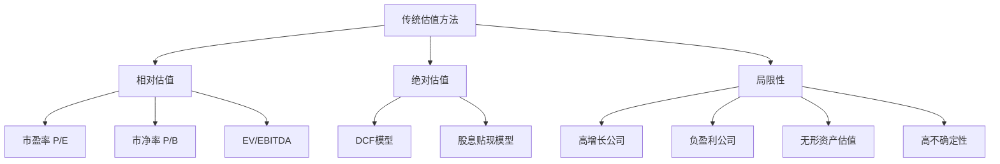
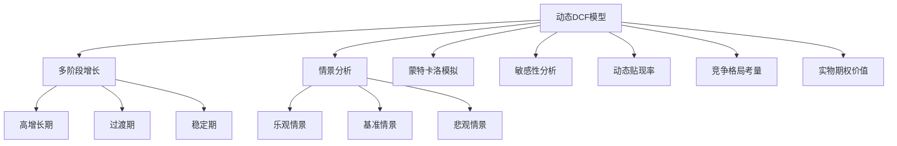
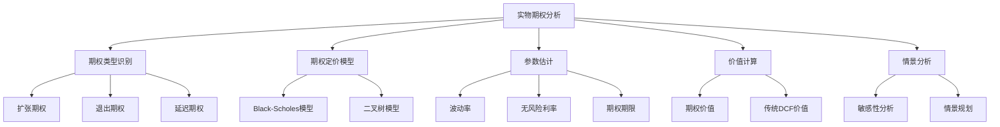
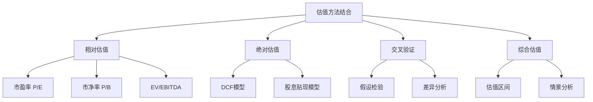

# 第6章：估值方法的创新与应用

估值是投资决策过程中的关键步骤，它将企业质量评估转化为具体的价值判断。在价值成长投资策略中，创新的估值方法需要同时考虑公司的当前价值和未来增长潜力。本章将探讨传统估值方法的局限性，并介绍更适合评估高增长和创新型公司的新型估值技术。

## 6.1 传统估值方法回顾与局限性

传统估值方法，如市盈率（P/E）、市净率（P/B）和现金流贴现模型（DCF），在评估成熟稳定的公司时often表现良好。然而，这些方法在面对快速增长、高不确定性或创新型公司时，往往显得力不从心。

* 核心概念：
    - 市盈率（P/E）
    - 市净率（P/B）
    - 现金流贴现模型（DCF）
    - 相对估值
    - 绝对估值

* 问题背景：传统估值方法在评估高增长、高不确定性公司时面临挑战。

* 问题描述：传统估值方法的主要局限性是什么？为什么这些方法在评估某些类型的公司时不够有效？

* 问题解决：
    1. 分析市盈率和市净率等相对估值指标的优缺点
    2. 探讨DCF模型在评估高增长公司时的局限性
    3. 考察传统方法在处理负盈利公司时的困难
    4. 分析传统方法在评估无形资产价值时的不足
    5. 探讨如何改进传统估值方法以适应新的市场环境

* 边界与外延：
    - 传统方法在评估成熟稳定公司时仍然有效
    - 需要考虑行业特性对估值方法选择的影响
    - 估值方法的选择应考虑公司所处的生命周期阶段

* 概念结构与核心要素组成：



* 概念之间的关系：

| 方法 | 相对估值 | 绝对估值 | 高增长公司 | 负盈利公司 | 无形资产 |
|------|----------|----------|------------|------------|----------|
| 相对估值 | - | 低度相关 | 中度相关 | 低度相关 | 低度相关 |
| 绝对估值 | 低度相关 | - | 中度相关 | 中度相关 | 中度相关 |
| 高增长公司 | 中度相关 | 中度相关 | - | 高度相关 | 高度相关 |
| 负盈利公司 | 低度相关 | 中度相关 | 高度相关 | - | 中度相关 |
| 无形资产 | 低度相关 | 中度相关 | 高度相关 | 中度相关 | - |

* 数学模型：

1. 市盈率（P/E）:
   $$ P/E = \frac{股票价格}{每股盈利} $$

2. 市净率（P/B）:
   $$ P/B = \frac{股票价格}{每股净资产} $$

3. DCF模型基本公式：
   $$ 公司价值 = \sum_{t=1}^{n} \frac{FCF_t}{(1+r)^t} + \frac{终值}{(1+r)^n} $$

   其中，FCF_t 是第 t 年的自由现金流，r 是贴现率，n 是预测期。

* 算法流程：

```python
def calculate_pe_ratio(price, eps):
    return price / eps if eps > 0 else float('inf')

def calculate_pb_ratio(price, book_value_per_share):
    return price / book_value_per_share

def dcf_valuation(fcf_projections, terminal_value, discount_rate):
    present_value = 0
    for t, fcf in enumerate(fcf_projections, start=1):
        present_value += fcf / (1 + discount_rate) ** t
    present_value += terminal_value / (1 + discount_rate) ** len(fcf_projections)
    return present_value

# 示例使用
price = 100
eps = 5
book_value_per_share = 20
fcf_projections = [10, 12, 15, 18, 20]
terminal_value = 300
discount_rate = 0.10

pe_ratio = calculate_pe_ratio(price, eps)
pb_ratio = calculate_pb_ratio(price, book_value_per_share)
dcf_value = dcf_valuation(fcf_projections, terminal_value, discount_rate)

print(f"P/E比率: {pe_ratio:.2f}")
print(f"P/B比率: {pb_ratio:.2f}")
print(f"DCF估值: ${dcf_value:.2f}")
```

* 实际场景应用：

1. 成熟科技公司：以微软为例
    - 稳定的盈利增长
    - 大量现金流
    - 传统估值方法较为适用

   ```python
   microsoft_price = 300
   microsoft_eps = 8.05
   microsoft_bvps = 25.77
   microsoft_fcf_projections = [60, 65, 70, 75, 80]  # 单位：十亿美元
   microsoft_terminal_value = 1500  # 单位：十亿美元
   microsoft_discount_rate = 0.08

   microsoft_pe = calculate_pe_ratio(microsoft_price, microsoft_eps)
   microsoft_pb = calculate_pb_ratio(microsoft_price, microsoft_bvps)
   microsoft_dcf = dcf_valuation(microsoft_fcf_projections, microsoft_terminal_value, microsoft_discount_rate)

   print(f"微软 P/E比率: {microsoft_pe:.2f}")
   print(f"微软 P/B比率: {microsoft_pb:.2f}")
   print(f"微软 DCF估值: ${microsoft_dcf:.2f}十亿")
   ```

2. 高增长科技公司：以特斯拉为例
    - 高增长率
    - 负盈利历史
    - 传统方法面临挑战

   ```python
   tesla_price = 700
   tesla_eps = 4.90  # 2021年转为盈利
   tesla_bvps = 23.36
   tesla_fcf_projections = [5, 8, 12, 18, 25]  # 单位：十亿美元
   tesla_terminal_value = 500  # 单位：十亿美元
   tesla_discount_rate = 0.12

   tesla_pe = calculate_pe_ratio(tesla_price, tesla_eps)
   tesla_pb = calculate_pb_ratio(tesla_price, tesla_bvps)
   tesla_dcf = dcf_valuation(tesla_fcf_projections, tesla_terminal_value, tesla_discount_rate)

   print(f"特斯拉 P/E比率: {tesla_pe:.2f}")
   print(f"特斯拉 P/B比率: {tesla_pb:.2f}")
   print(f"特斯拉 DCF估值: ${tesla_dcf:.2f}十亿")
   ```

3. 创新生物科技公司：以Moderna为例
    - 前期大量研发投入
    - 收入和盈利高度不确定
    - 传统估值方法难以应用

   ```python
   moderna_price = 150
   moderna_eps = 36.45  # 疫苗带来的临时高盈利
   moderna_bvps = 30.11
   moderna_fcf_projections = [15, 10, 5, 8, 12]  # 单位：十亿美元，假设性数据
   moderna_terminal_value = 200  # 单位：十亿美元
   moderna_discount_rate = 0.15

   moderna_pe = calculate_pe_ratio(moderna_price, moderna_eps)
   moderna_pb = calculate_pb_ratio(moderna_price, moderna_bvps)
   moderna_dcf = dcf_valuation(moderna_fcf_projections, moderna_terminal_value, moderna_discount_rate)

   print(f"Moderna P/E比率: {moderna_pe:.2f}")
   print(f"Moderna P/B比率: {moderna_pb:.2f}")
   print(f"Moderna DCF估值: ${moderna_dcf:.2f}十亿")
   ```

基于上述分析，我们可以总结出传统估值方法的主要局限性：

1. 对高增长公司的估值不足：传统方法often低估了高增长公司的潜在价值，因为这些公司的价值更多地来自于未来增长，而非当前盈利。

2. 难以处理负盈利公司：许多创新型公司在初期阶段可能处于亏损状态，使得基于盈利的估值方法无法应用。

3. 忽视无形资产价值：在知识经济时代，公司的价值越来越多地来自于品牌、专利、人力资本等无形资产，而这些在传统财务报表中often未被充分反映。

4. 对不确定性的处理不足：传统DCF模型假设未来现金流可以准确预测，但对于处于快速变化行业的公司，这一假设often不成立。

5. 行业可比性问题：在新兴行业或跨界经营的公司中，找到合适的可比公司进行相对估值变得困难。

6. 忽视选择权价值：传统方法难以量化公司在未来市场机会中的选择权价值，这对于处于快速发展行业的公司尤为重要。

7. 时间滞后性：财务报表基于历史数据，可能无法及时反映公司业务模式的重大变化。

8. 对周期性行业的估值偏差：在经济周期的不同阶段，传统估值方法可能导致对周期性行业公司的错误定价。

9. 难以捕捉协同效应：在并购或业务重组情况下，传统方法难以准确评估潜在的协同效应价值。

10. 对颠覆性创新的低估：传统方法often难以充分评估可能颠覆现有市场的创新技术或商业模式的潜在价值。

面对这些局限性，投资者需要采取以下策略：

1. 综合使用多种估值方法：不要仅仅依赖单一估值方法，而应结合多种方法以获得更全面的价值评估。

2. 调整估值参数：根据公司的特定情况调整估值模型中的参数，如使用更长的预测期或更高的增长率。

3. 情景分析：考虑多种可能的未来情景，并评估公司在每种情景下的价值。

4. 关注相对估值：在绝对估值困难的情况下，可以更多地依赖行业内的相对估值。

5. 考虑非财务指标：将用户增长、客户获取成本等非财务指标纳入估值考虑。

6. 运用实物期权理论：对于高度不确定但潜力巨大的投资机会，考虑使用实物期权方法进行估值。

7. 动态调整：随着公司和行业的发展，定期重新评估和调整估值模型。

8. 关注现金流：即使在传统盈利指标不适用的情况下，也要密切关注公司的现金流状况。

9. 深入了解业务模式：通过深入理解公司的业务模式和增长动力，来弥补纯粹财务分析的不足。

10. 保持谨慎：在面对高度不确定性时，保持谨慎态度，可能需要更大的安全边际。

总的来说，虽然传统估值方法仍然是投资分析的重要工具，但在面对当今复杂多变的市场环境时，投资者需要更加灵活和创新的估值方法。这就需要我们探索新的估值技术，这将是下一节的重点。

## 6.2 动态DCF模型在成长型公司中的应用

传统的DCF模型虽然理论基础坚实，但在评估高增长、高不确定性的公司时often面临挑战。动态DCF模型试图通过引入更灵活的假设和情景分析来克服这些限制，使其更适合评估成长型公司。

* 核心概念：
    - 动态DCF模型
    - 多阶段增长
    - 情景分析
    - 蒙特卡洛模拟
    - 敏感性分析

* 问题背景：成长型公司的现金流预测和风险评估比传统公司更具挑战性。

* 问题描述：如何改进传统DCF模型以更准确地评估成长型公司？如何在模型中纳入高度不确定性？

* 问题解决：
    1. 引入多阶段增长模型，反映不同发展阶段的增长特征
    2. 使用情景分析，考虑多种可能的未来发展路径
    3. 应用蒙特卡洛模拟，量化不确定性对估值的影响
    4. 进行敏感性分析，识别关键估值驱动因素
  5. 动态调整贴现率，反映公司风险状况的变化
  6. 考虑竞争格局变化对现金流的潜在影响
  7. 纳入实物期权价值，评估管理层的灵活性

* 边界与外延：
    - 动态DCF模型仍然依赖于对未来的预测
    - 模型复杂性增加可能导致"黑箱效应"
    - 需要考虑模型参数的合理性和一致性

* 概念结构与核心要素组成：



* 概念之间的关系：

| 要素 | 多阶段增长 | 情景分析 | 蒙特卡洛模拟 | 敏感性分析 | 动态贴现率 |
|------|------------|----------|--------------|------------|------------|
| 多阶段增长 | - | 高度相关 | 中度相关 | 高度相关 | 中度相关 |
| 情景分析 | 高度相关 | - | 高度相关 | 高度相关 | 中度相关 |
| 蒙特卡洛模拟 | 中度相关 | 高度相关 | - | 高度相关 | 高度相关 |
| 敏感性分析 | 高度相关 | 高度相关 | 高度相关 | - | 中度相关 |
| 动态贴现率 | 中度相关 | 中度相关 | 高度相关 | 中度相关 | - |

* 数学模型：

动态DCF模型的基本公式：

$$ 公司价值 = \sum_{t=1}^{n} \frac{FCF_t}{(1+r_t)^t} + \frac{终值}{(1+r_n)^n} $$

其中，FCF_t 是第 t 年的自由现金流，r_t 是第 t 年的贴现率，n 是预测期。

多阶段增长模型：

$$ g_t = \begin{cases}
g_1, & \text{if } t \leq t_1 \\
g_1 - \frac{(g_1 - g_2)(t-t_1)}{t_2-t_1}, & \text{if } t_1 < t \leq t_2 \\
g_2, & \text{if } t > t_2
\end{cases} $$

其中，g_1 是高增长期增长率，g_2 是稳定期增长率，t_1 是高增长期结束时间，t_2 是过渡期结束时间。

* 算法流程：

```python
import numpy as np
from scipy.stats import norm

def dynamic_dcf_valuation(initial_fcf, growth_rates, transition_periods, discount_rates, terminal_growth, terminal_multiple, num_simulations=10000):
    def generate_growth_path(growth_rates, transition_periods, num_years):
        growth_path = []
        for i, rate in enumerate(growth_rates):
            if i < len(transition_periods):
                growth_path.extend([rate] * transition_periods[i])
            else:
                growth_path.extend([rate] * (num_years - len(growth_path)))
        return growth_path[:num_years]

    num_years = sum(transition_periods) + 1
    growth_path = generate_growth_path(growth_rates, transition_periods, num_years)
    
    valuations = []
    for _ in range(num_simulations):
        fcf = initial_fcf
        present_value = 0
        for t in range(num_years):
            fcf *= (1 + np.random.normal(growth_path[t], 0.1))  # 增加随机性
            present_value += fcf / (1 + discount_rates[t]) ** (t + 1)
        
        terminal_value = fcf * (1 + terminal_growth) / (discount_rates[-1] - terminal_growth)
        # 或者使用退出倍数法
        # terminal_value = fcf * terminal_multiple
        present_value += terminal_value / (1 + discount_rates[-1]) ** num_years
        
        valuations.append(present_value)
    
    return np.mean(valuations), np.std(valuations)

# 示例使用
initial_fcf = 100
growth_rates = [0.3, 0.2, 0.1]  # 高增长、过渡、稳定增长
transition_periods = [3, 2, 5]  # 各阶段年数
discount_rates = [0.12, 0.11, 0.10, 0.10, 0.10, 0.10, 0.10, 0.10, 0.10, 0.10]
terminal_growth = 0.03
terminal_multiple = 15

mean_value, std_value = dynamic_dcf_valuation(initial_fcf, growth_rates, transition_periods, discount_rates, terminal_growth, terminal_multiple)

print(f"估值均值: ${mean_value:.2f}百万")
print(f"估值标准差: ${std_value:.2f}百万")
print(f"90%置信区间: ${mean_value - 1.645*std_value:.2f}百万 到 ${mean_value + 1.645*std_value:.2f}百万")
```

* 实际场景应用：

1. 高增长科技公司：以Zoom为例
    - 疫情期间经历爆发式增长
    - 预期未来增长将逐步放缓
    - 高度不确定的长期前景

   ```python
   zoom_initial_fcf = 1400  # 百万美元
   zoom_growth_rates = [0.5, 0.3, 0.15]
   zoom_transition_periods = [2, 3, 5]
   zoom_discount_rates = [0.12] * 10
   zoom_terminal_growth = 0.04
   zoom_terminal_multiple = 20

   zoom_mean, zoom_std = dynamic_dcf_valuation(zoom_initial_fcf, zoom_growth_rates, zoom_transition_periods, zoom_discount_rates, zoom_terminal_growth, zoom_terminal_multiple)

   print(f"Zoom估值均值: ${zoom_mean:.2f}百万")
   print(f"Zoom估值标准差: ${zoom_std:.2f}百万")
   print(f"Zoom 90%置信区间: ${zoom_mean - 1.645*zoom_std:.2f}百万 到 ${zoom_mean + 1.645*zoom_std:.2f}百万")
   ```

2. 新兴电动车公司：以NIO为例
    - 快速增长但尚未盈利
    - 面临激烈竞争和监管不确定性
    - 需要大量资本投入

   ```python
   nio_initial_fcf = -500  # 百万美元，假设当前为负现金流
   nio_growth_rates = [0.8, 0.5, 0.2]
   nio_transition_periods = [3, 3, 4]
   nio_discount_rates = [0.15, 0.14, 0.13, 0.12, 0.11, 0.10, 0.10, 0.10, 0.10, 0.10]
   nio_terminal_growth = 0.03
   nio_terminal_multiple = 18

   nio_mean, nio_std = dynamic_dcf_valuation(nio_initial_fcf, nio_growth_rates, nio_transition_periods, nio_discount_rates, nio_terminal_growth, nio_terminal_multiple)

   print(f"NIO估值均值: ${nio_mean:.2f}百万")
   print(f"NIO估值标准差: ${nio_std:.2f}百万")
   print(f"NIO 90%置信区间: ${nio_mean - 1.645*nio_std:.2f}百万 到 ${nio_mean + 1.645*nio_std:.2f}百万")
   ```

3. 生物科技创新公司：以Moderna为例
    - 疫苗成功带来巨大现金流
    - 未来增长依赖于新产品管线
    - 高度不确定的长期收益

   ```python
   moderna_initial_fcf = 8000  # 百万美元
   moderna_growth_rates = [0.3, 0.1, 0.05]
   moderna_transition_periods = [2, 3, 5]
   moderna_discount_rates = [0.14, 0.13, 0.12, 0.11, 0.10, 0.10, 0.10, 0.10, 0.10, 0.10]
   moderna_terminal_growth = 0.02
   moderna_terminal_multiple = 16

   moderna_mean, moderna_std = dynamic_dcf_valuation(moderna_initial_fcf, moderna_growth_rates, moderna_transition_periods, moderna_discount_rates, moderna_terminal_growth, moderna_terminal_multiple)

   print(f"Moderna估值均值: ${moderna_mean:.2f}百万")
   print(f"Moderna估值标准差: ${moderna_std:.2f}百万")
   print(f"Moderna 90%置信区间: ${moderna_mean - 1.645*moderna_std:.2f}百万 到 ${moderna_mean + 1.645*moderna_std:.2f}百万")
   ```

基于上述分析，我们可以得出以下关于动态DCF模型在成长型公司估值中应用的关键洞察：

1. 多阶段增长模型的重要性：成长型公司often经历不同的增长阶段，多阶段模型能更准确地反映这种动态变化。

2. 不确定性的量化：通过蒙特卡洛模拟，我们可以得到估值的概率分布，而不仅仅是一个点估计。

3. 贴现率的动态调整：随着公司发展和风险状况变化，贴现率应相应调整。

4. 终值估算的重要性：对于高增长公司，终值often占估值的很大比例，需要特别关注。

5. 情景分析的价值：考虑多种可能的未来情景，有助于更全面地评估公司价值。

6. 敏感性分析的必要性：识别关键估值驱动因素，了解它们对最终估值的影响程度。

7. 行业特性的考虑：不同行业的成长公司可能有不同的增长模式和风险特征，需要在模型中反映。

8. 竞争格局的影响：竞争环境的变化可能显著影响公司的长期增长前景和盈利能力。

9. 实物期权价值：管理层的决策灵活性可能为公司创造额外价值，特别是在不确定性高的环境中。

10. 模型复杂性与实用性的平衡：虽然更复杂的模型可能更准确，但也需要考虑可理解性和实用性。

对于投资者而言，在使用动态DCF模型评估成长型公司时，需要注意以下几点：

1. 数据质量：确保输入模型的数据尽可能准确和最新。

2. 假设的合理性：仔细审视所有关键假设，确保它们与公司和行业的实际情况相符。

3. 定期更新：随着新信息的出现，定期更新模型参数和假设。

4. 综合分析：将DCF估值结果与其他估值方法和定性分析相结合。

5. 了解局限性：认识到即使是动态DCF模型也无法完全消除估值的不确定性。

6. 情景思维：思考可能显著改变估值结果的关键事件或转折点。

7. 长期视角：尽管模型提供了短期预测，但应保持长期投资视角。

8. 持续学习：随着市场环境和估值技术的发展，不断更新和改进估值方法。

9. 专家意见：在处理复杂或高度专业化的行业时，考虑寻求行业专家的意见。

10. 风险管理：使用估值结果进行投资决策时，要考虑潜在的下行风险和投资组合的整体风险状况。

动态DCF模型为评估成长型公司提供了一个更灵活、更全面的框架。通过纳入多阶段增长、情景分析和不确定性量化，这种方法能够更好地捕捉成长型公司的价值动态。然而，重要的是要记住，任何模型都只是现实的简化表示。投资决策不应仅仅基于模型结果，而应结合广泛的定性分析和对公司基本面的深入理解。在下一节中，我们将探讨如何将期权定价理论应用于高增长企业的估值，进一步丰富我们的估值工具箱。

## 6.3 期权定价理论在高增长企业估值中的运用

期权定价理论在金融衍生品定价中广泛应用，但其思想和方法也可以用于企业估值，特别是对于高增长和高不确定性的企业。这种方法often被称为实物期权分析，它可以捕捉传统DCF模型难以量化的灵活性和战略价值。

* 核心概念：
    - 实物期权
    - Black-Scholes模型
    - 二叉树模型
    - 波动率
    - 时间价值
    - 灵活性价值

* 问题背景：高增长企业的价值often来源于未来的潜在机会，这些机会具有高度的不确定性和管理层的决策灵活性。

* 问题描述：如何将期权定价理论应用于企业估值？这种方法如何捕捉传统DCF模型忽视的价值来源？

* 问题解决：
    1. 识别公司面临的关键实物期权
    2. 选择适当的期权定价模型（如Black-Scholes或二叉树模型）
    3. 估计模型所需的关键参数（如波动率、期权期限）
    4. 计算实物期权的价值
    5. 将实物期权价值与传统DCF估值结合
    6. 分析不同情景下的期权价值变化
    7. 评估管理层决策对期权价值的影响

* 边界与外延：
    - 实物期权分析适用于具有高度不确定性和管理灵活性的项目或公司
    - 需要考虑实物期权与金融期权的差异
    - 参数估计的困难可能影响模型的准确性

* 概念结构与核心要素组成：



* 概念之间的关系：

| 要素 | 期权类型 | 定价模型 | 参数估计 | 价值计算 | 情景分析 |
|------|----------|----------|----------|----------|----------|
| 期权类型 | - | 高度相关 | 中度相关 | 高度相关 | 中度相关 |
| 定价模型 | 高度相关 | - | 高度相关 | 高度相关 | 中度相关 |
| 参数估计 | 中度相关 | 高度相关 | - | 高度相关 | 高度相关 |
| 价值计算 | 高度相关 | 高度相关 | 高度相关 | - | 高度相关 |
| 情景分析 | 中度相关 | 中度相关 | 高度相关 | 高度相关 | - |

* 数学模型：

Black-Scholes模型用于实物期权估值：

$$ C = S_0N(d_1) - Ke^{-rT}N(d_2) $$

其中：

$$ d_1 = \frac{\ln(\frac{S_0}{K}) + (r + \frac{\sigma^2}{2})T}{\sigma\sqrt{T}} $$

$$ d_2 = d_1 - \sigma\sqrt{T} $$

C 是期权价值，S_0 是标的资产当前价值，K 是执行价格，r 是无风险利率，T 是到期时间，σ 是波动率，N() 是标准正态分布的累积分布函数。

* 算法流程：

```python
import numpy as np
from scipy.stats import norm

def black_scholes_call(S, K, T, r, sigma):
    d1 = (np.log(S / K) + (r + 0.5 * sigma ** 2) * T) / (sigma * np.sqrt(T))
    d2 = d1 - sigma * np.sqrt(T)
    return S * norm.cdf(d1) - K * np.exp(-r * T) * norm.cdf(d2)

def real_option_valuation(dcf_value, option_value):
    return dcf_value + option_value

# 示例使用
S = 1000  # 标的资产价值（例如，项目的现值）
K = 1200  # 执行价格（例如，额外投资成本）
T = 5  # 期权有效期（年）
r = 0.05  # 无风险利率
sigma = 0.3  # 波动率

option_value = black_scholes_call(S, K, T, r, sigma)
dcf_value = 800  # 假设的DCF估值

total_value = real_option_valuation(dcf_value, option_value)

print(f"实物期权价值: ${option_value:.2f}百万")
print(f"DCF估值: ${dcf_value:.2f}百万")
print(f"总价值: ${total_value:.2f}百万")
```

* 实际场景应用：

1. 生物科技公司：以基因测序公司Illumina为例
    - 研发管线中的新技术具有巨大但不确定的市场潜力
    - 公司有选择继续投资或放弃特定项目的灵活性

   ```python
   illumina_S = 5000  # 假设成功商业化的价值
   illumina_K = 2000  # 继续研发和商业化的成本
   illumina_T = 7  # 假设新技术开发周期
   illumina_r = 0.05
   illumina_sigma = 0.4  # 高不确定性

   illumina_option_value = black_scholes_call(illumina_S, illumina_K, illumina_T, illumina_r, illumina_sigma)
   illumina_dcf_value = 20000  # 假设的DCF估值

   illumina_total_value = real_option_valuation(illumina_dcf_value, illumina_option_value)

   print(f"Illumina实物期权价值: ${illumina_option_value:.2f}百万")
   print(f"Illumina DCF估值: ${illumina_dcf_value:.2f}百万")
   print(f"Illumina总价值: ${illumina_total_value:.2f}百万")
   ```

2. 电动汽车公司：以特斯拉为例
    - 自动驾驶技术的潜在突破
    - 新电池技术的开发选项

   ```python
   tesla_S = 50000  # 假设自动驾驶技术成功的价值
   tesla_K = 10000  # 开发和部署成本
   tesla_T = 5  # 假设技术成熟时间
   tesla_r = 0.05
   tesla_sigma = 0.5  # 极高的不确定性

   tesla_option_value = black_scholes_call(tesla_S, tesla_K, tesla_T, tesla_r, tesla_sigma)
   tesla_dcf_value = 100000  # 假设的DCF估值

   tesla_total_value = real_option_valuation(tesla_dcf_value, tesla_option_value)

   print(f"特斯拉实物期权价值: ${tesla_option_value:.2f}百万")
   print(f"特斯拉DCF估值: ${tesla_dcf_value:.2f}百万")
   print(f"特斯拉总价值: ${tesla_total_value:.2f}百万")
   ```

3. 云计算公司：以亚马逊AWS为例
    - 扩展到新的地理区域的选项
    - 开发新的云服务产品线的灵活性

   ```python
   aws_S = 30000  # 假设新市场或产品线的潜在价值
   aws_K = 5000  # 扩展或开发成本
   aws_T = 3  # 决策窗口
   aws_r = 0.05
   aws_sigma = 0.3  # 相对较低的不确定性

   aws_option_value = black_scholes_call(aws_S, aws_K, aws_T, aws_r, aws_sigma)
   aws_dcf_value = 200000  # 假设的DCF估值

   aws_total_value = real_option_valuation(aws_dcf_value, aws_option_value)

   print(f"AWS实物期权价值: ${aws_option_value:.2f}百万")
   print(f"AWS DCF估值: ${aws_dcf_value:.2f}百万")
   print(f"AWS总价值: ${aws_total_value:.2f}百万")
   ```

基于上述分析，我们可以得出以下关于实物期权在高增长企业估值中应用的关键洞察：

1. 捕捉战略价值：实物期权分析可以量化传统DCF模型难以捕捉的战略灵活性价值。

2. 不确定性的正面作用：在实物期权框架下，不确定性不仅带来风险，也创造了机会。

3. 管理灵活性的价值：实物期权突出了管理层在面对不确定性时做出灵活决策的价值。

4. 行业特性的影响：不同行业的实物期权特征可能大不相同，需要具体分析。

5. 参数估计的挑战：准确估计波动率等参数是实物期权分析的主要难点之一。

6. 与传统估值方法的结合：实物期权分析应与DCF等传统方法结合使用，而不是完全替代。

7. 情景思维的重要性：实物期权分析鼓励投资者考虑多种可能的未来情景。

8. 时间价值的认识：实物期权强调了等待和保持选择权的价值。

9. 风险管理工具：实物期权分析可以帮助管理层更好地理解和管理项目风险。

10. 创新驱动型公司的优势：对于高度创新的公司，实物期权分析可能更准确地反映其潜在价值。

对于投资者而言，在使用实物期权分析评估高增长企业时，需要注意以下几点：

1. 识别关键期权：准确识别公司面临的重要实物期权是分析的首要步骤。

2. 理解期权特征：不同类型的实物期权（如扩张、退出、延迟）有不同的价值驱动因素。

3. 合理估计参数：尤其是波动率的估计，可能需要结合历史数据、行业比较和专家判断。

4. 考虑期权之间的相互作用：公司可能同时拥有多个实物期权，它们之间可能存在相互影响。

5. 动态视角：随着时间推移和新信息的出现，定期重新评估实物期权的价值。

6. 结合定性分析：实物期权的价值不仅取决于数字，还取决于管理团队执行这些选项的能力。

7. 考虑竞争因素：竞争对手的行动可能影响实物期权的价值，需要在分析中考虑。

8. 了解局限性：实物期权分析虽然强大，但仍基于一系列假设，投资者应该意识到这些局限性。

9. 情景分析：使用不同的参数设置进行敏感性分析，了解价值在不同情况下的变化。

10. 长期思维：实物期权often涉及长期战略决策，投资者需要保持长期视角。

实物期权分析为评估高增长和高不确定性企业提供了一个强大的工具。通过量化传统DCF模型难以捕捉的灵活性和战略价值，它能够更全面地反映这类公司的潜在价值。然而，这种方法也带来了新的挑战，特别是在参数估计和模型复杂性方面。因此，实物期权分析应该作为传统估值方法的补充，而不是替代。投资者需要综合运用多种估值技术，结合定性分析和行业洞察，才能形成对高增长企业价值的全面理解。

## 6.4 相对估值与绝对估值的结合使用

在企业估值实践中，相对估值（如市盈率、市净率等倍数法）和绝对估值（如DCF模型）都有其优缺点。将这两种方法结合使用，可以提供更全面、更可靠的估值结果。本节将探讨如何有效地结合这两种方法，以及在实际应用中的注意事项。

* 核心概念：
    - 相对估值
    - 绝对估值
    - 市盈率（P/E）
    - 市净率（P/B）
    - EV/EBITDA
    - 现金流贴现（DCF）
    - 交叉验证

* 问题背景：单一估值方法often无法全面捕捉公司的价值，特别是对于复杂或快速变化的企业。

* 问题描述：如何有效结合相对估值和绝对估值方法？如何处理两种方法得出的不同结果？

* 问题解决：
    1. 分别进行相对估值和绝对估值
    2. 分析两种方法结果的差异及原因
    3. 使用相对估值检验DCF假设的合理性
    4. 利用DCF模型解释相对估值倍数的变化
    5. 考虑行业特性和公司生命周期阶段
    6. 进行情景分析和敏感性测试
    7. 综合多种方法得出估值区间

* 边界与外延：
    - 不同行业可能更适合某种特定的估值方法
    - 公司所处的生命周期阶段影响估值方法的选择
    - 市场情绪可能导致短期内相对估值偏离基本面

* 概念结构与核心要素组成：



* 概念之间的关系：

| 方法 | 相对估值 | 绝对估值 | 交叉验证 | 综合估值 |
|------|----------|----------|----------|----------|
| 相对估值 | - | 中度相关 | 高度相关 | 高度相关 |
| 绝对估值 | 中度相关 | - | 高度相关 | 高度相关 |
| 交叉验证 | 高度相关 | 高度相关 | - | 高度相关 |
| 综合估值 | 高度相关 | 高度相关 | 高度相关 | - |

* 数学模型：

1. 相对估值：
   P/E 比率: $P/E = \frac{股价}{每股收益}$
   P/B 比率: $P/B = \frac{股价}{每股净资产}$
   EV/EBITDA: $EV/EBITDA = \frac{企业价值}{息税折旧摊销前利润}$

2. DCF模型：
   $企业价值 = \sum_{t=1}^{n} \frac{FCF_t}{(1+r)^t} + \frac{终值}{(1+r)^n}$

3. 综合估值：
   $估值 = w_1 * 相对估值 + w_2 * 绝对估值$

   其中 w_1 和 w_2 是权重，且 w_1 + w_2 = 1

* 算法流程：

```python
import numpy as np

def relative_valuation(earnings, book_value, ebitda, peer_pe, peer_pb, peer_ev_ebitda):
    pe_value = earnings * peer_pe
    pb_value = book_value * peer_pb
    ev_ebitda_value = ebitda * peer_ev_ebitda
    return (pe_value + pb_value + ev_ebitda_value) / 3

def dcf_valuation(fcf_projections, terminal_value, discount_rate):
    present_value = sum([fcf / (1 + discount_rate) ** (t + 1) for t, fcf in enumerate(fcf_projections)])
    present_value += terminal_value / (1 + discount_rate) ** len(fcf_projections)
    return present_value

def combined_valuation(relative_value, dcf_value, relative_weight=0.5):
    return relative_value * relative_weight + dcf_value * (1 - relative_weight)

# 示例使用
earnings = 100
book_value = 500
ebitda = 150
peer_pe = 15
peer_pb = 2
peer_ev_ebitda = 10

fcf_projections = [120, 130, 140, 150, 160]
terminal_value = 2000
discount_rate = 0.1

relative_value = relative_valuation(earnings, book_value, ebitda, peer_pe, peer_pb, peer_ev_ebitda)
dcf_value = dcf_valuation(fcf_projections, terminal_value, discount_rate)
combined_value = combined_valuation(relative_value, dcf_value)

print(f"相对估值: ${relative_value:.2f}百万")
print(f"DCF估值: ${dcf_value:.2f}百万")
print(f"综合估值: ${combined_value:.2f}百万")
```

* 实际场景应用：

1. 科技巨头：以苹果公司为例
    - 稳定的盈利能力
    - 强大的品牌价值
    - 持续的创新能力

   ```python
   apple_earnings = 57400  # 百万美元
   apple_book_value = 63090  # 百万美元
   apple_ebitda = 99800  # 百万美元
   apple_peer_pe = 25
   apple_peer_pb = 6
   apple_peer_ev_ebitda = 15

   apple_fcf_projections = [73300, 80000, 85000, 90000, 95000]  # 百万美元
   apple_terminal_value = 2000000  # 百万美元
   apple_discount_rate = 0.08

   apple_relative_value = relative_valuation(apple_earnings, apple_book_value, apple_ebitda, apple_peer_pe, apple_peer_pb, apple_peer_ev_ebitda)
   apple_dcf_value = dcf_valuation(apple_fcf_projections, apple_terminal_value, apple_discount_rate)
   apple_combined_value = combined_valuation(apple_relative_value, apple_dcf_value)

   print(f"苹果相对估值: ${apple_relative_value:.2f}百万")
   print(f"苹果DCF估值: ${apple_dcf_value:.2f}百万")
   print(f"苹果综合估值: ${apple_combined_value:.2f}百万")
   ```

2. 新兴电动车公司：以特斯拉为例
    - 高增长预期
    - 负盈利历史
    - 高度不确定性

   ```python
   tesla_earnings = 721  # 百万美元
   tesla_book_value = 22225  # 百万美元
   tesla_ebitda = 6630  # 百万美元
   tesla_peer_pe = 100  # 高增长公司often有较高的P/E
   tesla_peer_pb = 15
   tesla_peer_ev_ebitda = 50

   tesla_fcf_projections = [2700, 5000, 8000, 12000, 15000]  # 百万美元
   tesla_terminal_value = 500000  # 百万美元
   tesla_discount_rate = 0.12

   tesla_relative_value = relative_valuation(tesla_earnings, tesla_book_value, tesla_ebitda, tesla_peer_pe, tesla_peer_pb, tesla_peer_ev_ebitda)
   tesla_dcf_value = dcf_valuation(tesla_fcf_projections, tesla_terminal_value, tesla_discount_rate)
   tesla_combined_value = combined_valuation(tesla_relative_value, tesla_dcf_value, 0.3)  # 给予DCF更高的权重

   print(f"特斯拉相对估值: ${tesla_relative_value:.2f}百万")
   print(f"特斯拉DCF估值: ${tesla_dcf_value:.2f}百万")
   print(f"特斯拉综合估值: ${tesla_combined_value:.2f}百万")
   ```

3. 传统制造业：以通用电气为例
    - 成熟行业
    - 稳定但低增长
    - 复杂的业务结构

   ```python
   ge_earnings = 5197  # 百万美元
   ge_book_value = 37870  # 百万美元
   ge_ebitda = 7291  # 百万美元
   ge_peer_pe = 12
   ge_peer_pb = 2
   ge_peer_ev_ebitda = 8

   ge_fcf_projections = [5500, 5700, 5900, 6100, 6300]  # 百万美元
   ge_terminal_value = 100000  # 百万美元
   ge_discount_rate = 0.09

   ge_relative_value = relative_valuation(ge_earnings, ge_book_value, ge_ebitda, ge_peer_pe, ge_peer_pb, ge_peer_ev_ebitda)
   ge_dcf_value = dcf_valuation(ge_fcf_projections, ge_terminal_value, ge_discount_rate)
   ge_combined_value = combined_valuation(ge_relative_value, ge_dcf_value, 0.6)  # 给予相对估值更高的权重

   print(f"通用电气相对估值: ${ge_relative_value:.2f}百万")
   print(f"通用电气DCF估值: ${ge_dcf_value:.2f}百万")
   print(f"通用电气综合估值: ${ge_combined_value:.2f}百万")
   ```

基于上述分析，我们可以得出以下关于结合相对估值和绝对估值的关键洞察：

1. 互补性：相对估值和绝对估值各有优缺点，结合使用可以提供更全面的价值评估。

2. 交叉验证：两种方法的结果可以互相验证，显著的差异可能暗示需要进一步调查。

3. 行业特性：不同行业可能更适合某种特定的估值方法，需要根据行业特性调整权重。

4. 生命周期影响：公司所处的生命周期阶段会影响估值方法的适用性。

5. 市场情绪：相对估值可能受短期市场情绪影响，而DCF则提供了更长期的视角。

6. 假设的重要性：DCF模型的结果高度依赖于未来预测，而相对估值则依赖于可比公司的选择。

7. 估值区间：结合两种方法可以得出更可靠的估值区间，而不是单一的点估计。

8. 情景分析：通过改变不同方法的权重和假设，可以进行更丰富的情景分析。

9. 异常值识别：两种方法结果的显著差异可能帮助识别潜在的估值异常或投资机会。

10. 动态调整：随着公司和市场环境的变化，可能需要动态调整不同估值方法的权重。

对于投资者而言，在结合使用相对估值和绝对估值时，需要注意以下几点：

1. 方法选择：根据公司特性和行业背景选择最合适的相对估值指标和DCF模型变体。

2. 可比公司选择：仔细选择真正可比的公司进行相对估值，考虑规模、增长率、风险等因素。

3. 假设一致性：确保DCF模型中的假设与用于相对估值的可比公司选择保持一致。

4. 权重分配：根据公司特性、行业状况和市场环境，合理分配相对估值和绝对估值的权重。

5. 敏感性分析：对关键参数进行敏感性分析，了解它们对最终估值的影响。

6. 定性因素考虑：不要忽视难以量化的因素，如管理质量、品牌价值等。

7. 长期视角：尽管相对估值often反映短期市场情绪，但要保持长期投资视角。

8. 持续更新：随着新信息的出现，定期更新估值模型和假设。

9. 差异分析：当两种方法的结果存在显著差异时，深入分析原因，可能揭示重要的洞察。

10. 综合判断：估值结果应该作为决策的参考，而不是唯一依据。结合其他分析和个人判断做出最终决策。

结合使用相对估值和绝对估值方法可以为投资者提供更全面、更可靠的价值评估。这种方法既考虑了市场当前的定价水平，又纳入了对公司长期基本面的预期。通过权衡不同方法的优缺点，投资者可以得到一个更平衡、更稳健的估值结果。然而，重要的是要记住，估值是一门艺术，也是一门科学。即使使用最复杂的模型和方法，也无法消除所有的不确定性。因此，估值结果应该被视为一个合理的价值区间，而不是精确的点估计。结合深入的基本面分析、行业洞察和宏观经济考虑，投资者才能做出明智的投资决策。

