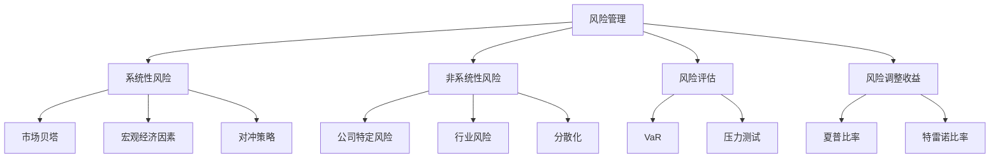
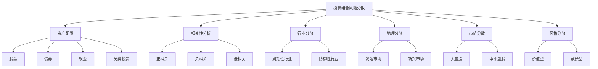
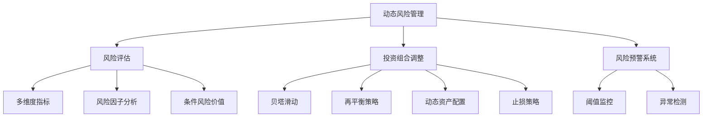
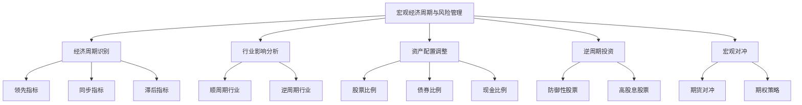

# 第7章：风险管理在融合投资中的角色

风险管理是价值成长投资策略中不可或缺的组成部分。虽然追求高增长和高质量企业的投资机会，但同时也需要有效地识别、评估和管理相关风险。本章将探讨如何在融合投资策略中平衡风险与回报，以及如何构建和管理一个稳健的投资组合。

## 7.1 系统性风险与非系统性风险的平衡

投资者面临的风险可以broadly分为两类：系统性风险和非系统性风险。系统性风险影响整个市场，无法通过分散化完全消除；非系统性风险则是特定于个别公司或行业的风险，可以通过适当的分散化来降低。在价值成长投资策略中，平衡这两类风险至关重要。

* 核心概念：
    - 系统性风险
    - 非系统性风险
    - 贝塔系数
    - 分散化
    - 风险调整收益率

* 问题背景：价值成长投资策略often涉及对特定高质量、高增长公司的集中投资，这可能增加非系统性风险。

* 问题描述：如何在追求高增长机会的同时，有效管理系统性和非系统性风险？如何在集中投资和分散化之间找到平衡？

* 问题解决：
    1. 评估个别股票的系统性风险（贝塔系数）
    2. 分析公司特定的非系统性风险因素
    3. 构建多元化的投资组合以降低非系统性风险
    4. 使用对冲工具管理系统性风险
    5. 定期评估和调整投资组合的风险暴露
    6. 考虑宏观经济因素对系统性风险的影响
    7. 利用风险调整收益率指标评估投资表现

* 边界与外延：
    - 完全消除风险是不可能的，目标是优化风险调整后的回报
    - 过度分散可能稀释潜在收益，需要在集中和分散之间找到平衡
    - 风险管理策略需要根据市场环境和个人风险偏好动态调整

* 概念结构与核心要素组成：



* 概念之间的关系：

| 风险类型 | 系统性风险 | 非系统性风险 | 分散化 | 对冲策略 | 风险调整收益 |
|----------|------------|--------------|--------|----------|--------------|
| 系统性风险 | - | 低度相关 | 低度相关 | 高度相关 | 中度相关 |
| 非系统性风险 | 低度相关 | - | 高度相关 | 低度相关 | 中度相关 |
| 分散化 | 低度相关 | 高度相关 | - | 低度相关 | 高度相关 |
| 对冲策略 | 高度相关 | 低度相关 | 低度相关 | - | 中度相关 |
| 风险调整收益 | 中度相关 | 中度相关 | 高度相关 | 中度相关 | - |

* 数学模型：

1. 资产贝塔系数：
   $$ \beta_i = \frac{Cov(R_i, R_m)}{Var(R_m)} $$
   其中，R_i 是资产 i 的收益率，R_m 是市场收益率。

2. 投资组合风险：
   $$ \sigma_p^2 = \sum_{i=1}^n w_i^2 \sigma_i^2 + \sum_{i=1}^n \sum_{j \neq i} w_i w_j \sigma_i \sigma_j \rho_{ij} $$
   其中，w_i 是资产 i 的权重，σ_i 是资产 i 的标准差，ρ_ij 是资产 i 和 j 的相关系数。

3. 夏普比率：
   $$ Sharpe Ratio = \frac{R_p - R_f}{\sigma_p} $$
   其中，R_p 是投资组合收益率，R_f 是无风险利率，σ_p 是投资组合标准差。

* 算法流程：

```python
import numpy as np
import pandas as pd

def calculate_beta(stock_returns, market_returns):
    covariance = np.cov(stock_returns, market_returns)[0][1]
    market_variance = np.var(market_returns)
    return covariance / market_variance

def calculate_portfolio_risk(weights, cov_matrix):
    return np.sqrt(np.dot(weights.T, np.dot(cov_matrix, weights)))

def calculate_sharpe_ratio(portfolio_return, risk_free_rate, portfolio_risk):
    return (portfolio_return - risk_free_rate) / portfolio_risk

# 示例使用
stock_returns = np.array([0.05, 0.08, 0.12, -0.03])
market_returns = np.array([0.03, 0.05, 0.08, -0.01])
beta = calculate_beta(stock_returns, market_returns)

weights = np.array([0.3, 0.3, 0.2, 0.2])
cov_matrix = np.cov(np.array([stock_returns, market_returns]))
portfolio_risk = calculate_portfolio_risk(weights, cov_matrix)

portfolio_return = np.dot(weights, stock_returns)
risk_free_rate = 0.02
sharpe_ratio = calculate_sharpe_ratio(portfolio_return, risk_free_rate, portfolio_risk)

print(f"股票贝塔系数: {beta:.2f}")
print(f"投资组合风险: {portfolio_risk:.2f}")
print(f"夏普比率: {sharpe_ratio:.2f}")
```

* 实际场景应用：

1. 科技成长股组合：
    - 高贝塔值
    - 高非系统性风险
    - 潜在高回报

   ```python
   tech_returns = np.array([0.20, 0.15, 0.25, -0.10])
   market_returns = np.array([0.10, 0.08, 0.12, -0.05])
   tech_beta = calculate_beta(tech_returns, market_returns)

   tech_weights = np.array([0.4, 0.3, 0.2, 0.1])
   tech_cov_matrix = np.cov(np.array([tech_returns, market_returns]))
   tech_portfolio_risk = calculate_portfolio_risk(tech_weights, tech_cov_matrix)

   tech_portfolio_return = np.dot(tech_weights, tech_returns)
   risk_free_rate = 0.02
   tech_sharpe_ratio = calculate_sharpe_ratio(tech_portfolio_return, risk_free_rate, tech_portfolio_risk)

   print(f"科技股组合贝塔系数: {tech_beta:.2f}")
   print(f"科技股组合风险: {tech_portfolio_risk:.2f}")
   print(f"科技股组合夏普比率: {tech_sharpe_ratio:.2f}")
   ```

2. 价值股组合：
    - 低贝塔值
    - 低非系统性风险
    - 稳定但较低回报

   ```python
   value_returns = np.array([0.08, 0.06, 0.10, 0.02])
   market_returns = np.array([0.10, 0.08, 0.12, -0.05])
   value_beta = calculate_beta(value_returns, market_returns)

   value_weights = np.array([0.3, 0.3, 0.2, 0.2])
   value_cov_matrix = np.cov(np.array([value_returns, market_returns]))
   value_portfolio_risk = calculate_portfolio_risk(value_weights, value_cov_matrix)

   value_portfolio_return = np.dot(value_weights, value_returns)
   risk_free_rate = 0.02
   value_sharpe_ratio = calculate_sharpe_ratio(value_portfolio_return, risk_free_rate, value_portfolio_risk)

   print(f"价值股组合贝塔系数: {value_beta:.2f}")
   print(f"价值股组合风险: {value_portfolio_risk:.2f}")
   print(f"价值股组合夏普比率: {value_sharpe_ratio:.2f}")
   ```

3. 平衡的价值成长组合：
    - 混合高低贝塔股票
    - 适度的非系统性风险
    - 平衡风险和回报

   ```python
   balanced_returns = np.array([0.15, 0.10, 0.18, -0.05])
   market_returns = np.array([0.10, 0.08, 0.12, -0.05])
   balanced_beta = calculate_beta(balanced_returns, market_returns)

   balanced_weights = np.array([0.35, 0.25, 0.25, 0.15])
   balanced_cov_matrix = np.cov(np.array([balanced_returns, market_returns]))
   balanced_portfolio_risk = calculate_portfolio_risk(balanced_weights, balanced_cov_matrix)

   balanced_portfolio_return = np.dot(balanced_weights, balanced_returns)
   risk_free_rate = 0.02
   balanced_sharpe_ratio = calculate_sharpe_ratio(balanced_portfolio_return, risk_free_rate, balanced_portfolio_risk)

   print(f"平衡组合贝塔系数: {balanced_beta:.2f}")
   print(f"平衡组合风险: {balanced_portfolio_risk:.2f}")
   print(f"平衡组合夏普比率: {balanced_sharpe_ratio:.2f}")
   ```

基于上述分析，我们可以得出以下关于系统性风险与非系统性风险平衡的关键洞察：

1. 风险-回报权衡：高增长、高质量公司often具有较高的非系统性风险，但也可能带来更高的潜在回报。

2. 分散化的重要性：适度的分散化可以显著降低非系统性风险，而不过度稀释潜在收益。

3. 贝塔管理：通过在投资组合中混合不同贝塔值的股票，可以调整整体的系统性风险暴露。

4. 行业配置：在不同行业间分散投资可以降低行业特定的非系统性风险。

5. 动态风险管理：随着市场环境和个股基本面的变化，需要定期重新评估和调整风险暴露。

6. 对冲策略：对于系统性风险，可以考虑使用指数期货或期权等工具进行部分对冲。

7. 风险调整收益：使用夏普比率等指标可以更全面地评估投资组合的表现，而不仅仅关注绝对回报。

8. 宏观因素考量：系统性风险often与宏观经济因素相关，需要持续关注和分析宏观经济趋势。

9. 公司特定风险：深入的基本面分析可以帮助识别和管理公司特定的非系统性风险。

10. 风险预算：为不同类型的风险分配风险预算，确保整体风险水平在可接受范围内。

对于价值成长投资者而言，在管理系统性和非系统性风险时需要注意以下几点：

1. 保持平衡：在追求高增长机会的同时，不要忽视风险管理的重要性。

2. 适度集中：虽然分散化很重要，但过度分散可能导致"平庸化"，失去超额收益的机会。

3. 持续监控：定期评估投资组合的风险特征，包括贝塔值、相关性和波动性。

4. 情景分析：考虑不同市场环境下的潜在风险，进行压力测试和情景模拟。

5. 灵活调整：根据市场条件和个股表现，灵活调整持仓比例和风险暴露。

6. 长期视角：短期波动不可避免，保持长期投资视角有助于降低对短期市场噪音的过度反应。

7. 质量优先：投资高质量公司可以在一定程度上缓解非系统性风险。

8. 了解相关性：深入分析持仓之间的相关性，避免在看似分散的投资组合中隐藏高度相关性。

9. 风险来源多元化：不仅要在股票间分散，还可以考虑其他资产类别，如债券或另类投资。

10. 持续学习：金融市场在不断演变，需要不断更新风险管理知识和技能。

通过有效平衡系统性风险和非系统性风险，价值成长投资者可以构建一个既能把握高增长机会，又能在市场波动中保持稳健的投资组合。这种平衡需要深入的分析、持续的监控和灵活的调整。在下一节中，我们将探讨如何在投资组合构建中进一步实施这些风险管理原则。

## 7.2 投资组合构建中的风险分散策略

在价值成长投资策略中，投资组合构建是平衡风险和回报的关键环节。有效的风险分散策略不仅可以降低非系统性风险，还能优化整体的风险调整收益。本节将探讨如何在保持价值成长投资理念的同时，实施有效的风险分散策略。

* 核心概念：
    - 现代投资组合理论
    - 有效前沿
    - 相关性
    - 行业分散
    - 地理分散
    - 市值分散
    - 风格分散

* 问题背景：价值成长投资often倾向于集中持股，这可能导致较高的非系统性风险。

* 问题描述：如何在保持高质量、高增长投资理念的同时，实现有效的风险分散？如何平衡集中投资和分散化之间的权衡？

* 问题解决：
    1. 应用现代投资组合理论优化资产配置
    2. 分析不同资产间的相关性，寻找低相关或负相关的组合
    3. 在不同行业间分散投资，降低行业特定风险
    4. 考虑地理分散，减少单一市场风险
    5. 在不同市值公司间分散投资，平衡风险和增长
    6. 结合不同投资风格，如价值和成长
    7. 使用量化模型评估和优化投资组合风险

* 边界与外延：
    - 过度分散可能导致收益率下降
    - 需要平衡理论最优和实际可操作性
    - 考虑交易成本和税收影响

* 概念结构与核心要素组成：



* 概念之间的关系：

| 分散策略 | 资产配置 | 相关性分析 | 行业分散 | 地理分散 | 市值分散 | 风格分散 |
|----------|----------|------------|----------|----------|----------|----------|
| 资产配置 | - | 高度相关 | 中度相关 | 中度相关 | 中度相关 | 中度相关 |
| 相关性分析 | 高度相关 | - | 高度相关 | 高度相关 | 中度相关 | 高度相关 |
| 行业分散 | 中度相关 | 高度相关 | - | 中度相关 | 低度相关 | 中度相关 |
| 地理分散 | 中度相关 | 高度相关 | 中度相关 | - | 低度相关 | 中度相关 |
| 市值分散 | 中度相关 | 中度相关 | 低度相关 | 低度相关 | - | 中度相关 |
| 风格分散 | 中度相关 | 高度相关 | 中度相关 | 中度相关 | 中度相关 | - |

* 数学模型：

1. 投资组合预期收益率：
   $$ E(R_p) = \sum_{i=1}^n w_i E(R_i) $$
   其中，w_i 是资产 i 的权重，E(R_i) 是资产 i 的预期收益率。

2. 投资组合方差：
   $$ \sigma_p^2 = \sum_{i=1}^n w_i^2 \sigma_i^2 + \sum_{i=1}^n \sum_{j \neq i} w_i w_j \sigma_i \sigma_j \rho_{ij} $$
   其中，σ_i 是资产 i 的标准差，ρ_ij 是资产 i 和 j 的相关系数。

3. 夏普比率：
   $$ Sharpe Ratio = \frac{E(R_p) - R_f}{\sigma_p} $$
   其中，R_f 是无风险利率。

* 算法流程：

```python
import numpy as np
import pandas as pd
from scipy.optimize import minimize

def portfolio_stats(weights, returns, cov_matrix):
    portfolio_return = np.sum(returns.mean() * weights) * 252
    portfolio_std_dev = np.sqrt(np.dot(weights.T, np.dot(cov_matrix, weights))) * np.sqrt(252)
    return portfolio_return, portfolio_std_dev

def neg_sharpe_ratio(weights, returns, cov_matrix, risk_free_rate):
    p_ret, p_std = portfolio_stats(weights, returns, cov_matrix)
    return -(p_ret - risk_free_rate) / p_std

def optimize_portfolio(returns, cov_matrix, risk_free_rate):
    num_assets = len(returns.columns)
    args = (returns, cov_matrix, risk_free_rate)
    constraints = ({'type': 'eq', 'fun': lambda x: np.sum(x) - 1})
    bounds = tuple((0, 1) for asset in range(num_assets))
    result = minimize(neg_sharpe_ratio, num_assets*[1./num_assets], args=args,
                      method='SLSQP', bounds=bounds, constraints=constraints)
    return result.x

# 示例使用
returns = pd.DataFrame({
    'Tech': [0.1, 0.15, 0.05, -0.02],
    'Finance': [0.05, 0.08, 0.03, 0.01],
    'Healthcare': [0.08, 0.1, 0.06, 0.03],
    'Consumer': [0.06, 0.07, 0.04, 0.02]
})
cov_matrix = returns.cov()
risk_free_rate = 0.02

optimal_weights = optimize_portfolio(returns, cov_matrix, risk_free_rate)
optimal_return, optimal_std_dev = portfolio_stats(optimal_weights, returns, cov_matrix)
optimal_sharpe = (optimal_return - risk_free_rate) / optimal_std_dev

print("最优权重:")
for asset, weight in zip(returns.columns, optimal_weights):
    print(f"{asset}: {weight:.2f}")
print(f"预期年化收益率: {optimal_return:.2f}")
print(f"预期年化波动率: {optimal_std_dev:.2f}")
print(f"夏普比率: {optimal_sharpe:.2f}")
```

* 实际场景应用：

1. 价值成长组合优化：

```python
value_growth_returns = pd.DataFrame({
    'Tech_Growth': [0.2, 0.25, 0.15, -0.05],
    'Value_Stock': [0.08, 0.1, 0.06, 0.04],
    'Emerging_Market': [0.15, 0.2, 0.1, -0.08],
    'Dividend_Stock': [0.06, 0.07, 0.05, 0.03]
})
vg_cov_matrix = value_growth_returns.cov()
vg_risk_free_rate = 0.02

vg_optimal_weights = optimize_portfolio(value_growth_returns, vg_cov_matrix, vg_risk_free_rate)
vg_optimal_return, vg_optimal_std_dev = portfolio_stats(vg_optimal_weights, value_growth_returns, vg_cov_matrix)
vg_optimal_sharpe = (vg_optimal_return - vg_risk_free_rate) / vg_optimal_std_dev

print("价值成长组合最优权重:")
for asset, weight in zip(value_growth_returns.columns, vg_optimal_weights):
    print(f"{asset}: {weight:.2f}")
print(f"预期年化收益率: {vg_optimal_return:.2f}")
print(f"预期年化波动率: {vg_optimal_std_dev:.2f}")
print(f"夏普比率: {vg_optimal_sharpe:.2f}")
```

2. 多资产类别组合：

```python
multi_asset_returns = pd.DataFrame({
    'US_Stocks': [0.12, 0.15, 0.08, -0.03],
    'Int_Stocks': [0.1, 0.18, 0.05, -0.06],
    'Bonds': [0.03, 0.02, 0.04, 0.05],
    'Real_Estate': [0.08, 0.1, 0.06, 0.02],
    'Commodities': [0.05, 0.12, -0.02, -0.04]
})
ma_cov_matrix = multi_asset_returns.cov()
ma_risk_free_rate = 0.02

ma_optimal_weights = optimize_portfolio(multi_asset_returns, ma_cov_matrix, ma_risk_free_rate)
ma_optimal_return, ma_optimal_std_dev = portfolio_stats(ma_optimal_weights, multi_asset_returns, ma_cov_matrix)
ma_optimal_sharpe = (ma_optimal_return - ma_risk_free_rate) / ma_optimal_std_dev

print("多资产类别组合最优权重:")
for asset, weight in zip(multi_asset_returns.columns, ma_optimal_weights):
    print(f"{asset}: {weight:.2f}")
print(f"预期年化收益率: {ma_optimal_return:.2f}")
print(f"预期年化波动率: {ma_optimal_std_dev:.2f}")
print(f"夏普比率: {ma_optimal_sharpe:.2f}")
```

基于上述分析，我们可以得出以下关于投资组合构建中风险分散策略的关键洞察：

1. 多维度分散：有效的风险分散不仅涉及资产类别，还包括行业、地理、市值和投资风格等多个维度。

2. 相关性的重要性：低相关或负相关资产的组合可以显著降低整体投资组合风险。

3. 动态优化：投资组合的最优配置会随市场环境变化而改变，需要定期重新评估和调整。

4. 风险-回报权衡：追求更高回报often意味着承担更高风险，需要根据个人风险偏好进行权衡。

5. 非线性关系：资产间的相关性可能在极端市场条件下发生变化，需要考虑这种非线性关系。

6. 宏观因素考量：不同资产类别和地理区域对宏观经济因素的敏感度不同，可以通过适当配置来管理宏观风险。

7. 流动性管理：在构建投资组合时，需要考虑不同资产的流动性特征，确保在需要时能够灵活调整。

8. 成本效益分析：过度频繁的调整可能带来高额交易成本，需要权衡分散化收益和交易成本。

9. 税收影响：不同资产类别和投资策略可能有不同的税收影响，这也是构建投资组合时需要考虑的因素。

10. 长期视角：虽然短期波动不可避免，但保持长期投资视角有助于实现更好的风险调整收益。

对于价值成长投资者而言，在实施投资组合风险分散策略时需要注意以下几点：

1. 保持核心理念：在追求分散化的同时，不要偏离价值成长投资的核心理念。

2. 质量优先：即使在分散投资时，也应该优先选择高质量、具有持续增长潜力的公司。

3. 适度集中：适度的集中投资可能带来超额收益，完全分散可能导致平庸的业绩。

4. 动态调整：根据市场环境和个股表现，定期重新评估和调整投资组合。

5. 风格一致性：在不同资产类别或地理区域中寻找符合价值成长特征的投资机会。

6. 新兴机会：关注新兴行业和技术，它们可能提供长期增长潜力和分散化收益。

7. 风险预算：为不同类型的风险分配风险预算，确保整体风险水平在可接受范围内。

8. 情景分析：考虑不同市场环境下的投资组合表现，进行压力测试和情景模拟。

9. 持续学习：随着市场的演变，不断更新知识和技能，适应新的投资环境和机会。

10. 个性化策略：根据个人的财务目标、风险偏好和投资期限定制分散化策略。

通过实施全面而有效的风险分散策略，价值成长投资者可以在追求高质量增长机会的同时，构建一个更加稳健和可持续的投资组合。这种平衡需要深入的分析、持续的监控和灵活的调整。在下一节中，我们将探讨如何在动态的市场环境中持续评估和管理投资组合风险。

## 7.3 动态风险评估与投资组合调整

在价值成长投资策略中，持续的风险评估和及时的投资组合调整是至关重要的。市场环境、公司基本面和投资者自身情况的变化都可能影响投资组合的风险-收益特征。本节将探讨如何建立一个动态的风险评估框架，并基于这个框架进行投资组合的持续优化。

* 核心概念：
    - 动态风险评估
    - 风险因子分析
    - 条件风险价值（Conditional VaR）
    - 贝塔滑动
    - 再平衡策略
    - - 动态资产配置
  - 止损策略
  - 风险预警系统

* 问题背景：市场环境和个股基本面的变化可能导致投资组合的风险特征发生显著变化。

* 问题描述：如何建立一个有效的动态风险评估系统？如何根据风险评估结果及时调整投资组合？

* 问题解决：
    1. 建立多维度的风险监控指标体系
    2. 定期进行风险因子分析，识别主要风险来源
    3. 使用条件风险价值等先进风险度量方法
    4. 实施贝塔滑动策略，动态调整系统性风险暴露
    5. 设计灵活的再平衡策略，保持目标风险水平
    6. 实施动态资产配置，根据市场环境调整资产比例
    7. 制定个股和组合层面的止损策略
    8. 建立风险预警系统，及时发现潜在风险

* 边界与外延：
    - 过于频繁的调整可能带来高额交易成本
    - 需要平衡短期风险管理和长期投资目标
    - 考虑税收影响和流动性限制

* 概念结构与核心要素组成：



* 概念之间的关系：

| 要素 | 风险评估 | 投资组合调整 | 风险预警系统 | 贝塔滑动 | 再平衡策略 |
|------|----------|--------------|--------------|----------|------------|
| 风险评估 | - | 高度相关 | 高度相关 | 中度相关 | 中度相关 |
| 投资组合调整 | 高度相关 | - | 高度相关 | 高度相关 | 高度相关 |
| 风险预警系统 | 高度相关 | 高度相关 | - | 中度相关 | 中度相关 |
| 贝塔滑动 | 中度相关 | 高度相关 | 中度相关 | - | 中度相关 |
| 再平衡策略 | 中度相关 | 高度相关 | 中度相关 | 中度相关 | - |

* 数学模型：

1. 条件风险价值（CVaR）：
   $$ CVaR_\alpha = E[L|L \geq VaR_\alpha] $$
   其中，L 是损失，α 是置信水平，VaR_α 是在 α 置信水平下的风险价值。

2. 贝塔滑动：
   $$ \beta_t = \lambda \beta_{t-1} + (1-\lambda)\beta_{observed} $$
   其中，λ 是平滑因子，β_observed 是观察到的贝塔值。

3. 再平衡触发条件：
   如果 |w_i - w_i^target| > threshold，则进行再平衡
   其中，w_i 是资产 i 的实际权重，w_i^target 是目标权重。

* 算法流程：

```python
import numpy as np
import pandas as pd

def calculate_cvar(returns, alpha=0.05):
    sorted_returns = np.sort(returns)
    index = int(alpha * len(sorted_returns))
    return -np.mean(sorted_returns[:index])

def beta_sliding(current_beta, observed_beta, lambda_factor=0.94):
    return lambda_factor * current_beta + (1 - lambda_factor) * observed_beta

def check_rebalance(current_weights, target_weights, threshold=0.05):
    return np.any(np.abs(current_weights - target_weights) > threshold)

def dynamic_risk_management(returns, betas, current_weights, target_weights):
    cvar = calculate_cvar(returns)
    new_betas = [beta_sliding(b, ob) for b, ob in zip(betas, observed_betas)]
    rebalance_needed = check_rebalance(current_weights, target_weights)
    
    return cvar, new_betas, rebalance_needed

# 示例使用
returns = np.random.normal(0.001, 0.02, 1000)
betas = [1.1, 0.9, 1.0, 1.2]
observed_betas = [1.0, 0.95, 1.05, 1.15]
current_weights = np.array([0.3, 0.3, 0.2, 0.2])
target_weights = np.array([0.25, 0.25, 0.25, 0.25])

cvar, new_betas, rebalance_needed = dynamic_risk_management(returns, betas, current_weights, target_weights)

print(f"条件风险价值 (CVaR): {cvar:.4f}")
print("更新后的贝塔值:", [f"{beta:.2f}" for beta in new_betas])
print(f"需要再平衡: {'是' if rebalance_needed else '否'}")
```

* 实际场景应用：

1. 高波动市场环境：

```python
high_vol_returns = np.random.normal(0.0005, 0.03, 1000)
high_vol_betas = [1.3, 1.1, 1.2, 1.4]
high_vol_observed_betas = [1.4, 1.2, 1.3, 1.5]
high_vol_current_weights = np.array([0.3, 0.3, 0.2, 0.2])
high_vol_target_weights = np.array([0.2, 0.2, 0.3, 0.3])

high_vol_cvar, high_vol_new_betas, high_vol_rebalance = dynamic_risk_management(
    high_vol_returns, high_vol_betas, high_vol_current_weights, high_vol_target_weights)

print("高波动市场环境:")
print(f"条件风险价值 (CVaR): {high_vol_cvar:.4f}")
print("更新后的贝塔值:", [f"{beta:.2f}" for beta in high_vol_new_betas])
print(f"需要再平衡: {'是' if high_vol_rebalance else '否'}")
```

2. 低波动市场环境：

```python
low_vol_returns = np.random.normal(0.0002, 0.01, 1000)
low_vol_betas = [0.8, 0.7, 0.9, 0.85]
low_vol_observed_betas = [0.75, 0.65, 0.85, 0.8]
low_vol_current_weights = np.array([0.25, 0.25, 0.25, 0.25])
low_vol_target_weights = np.array([0.3, 0.3, 0.2, 0.2])

low_vol_cvar, low_vol_new_betas, low_vol_rebalance = dynamic_risk_management(
    low_vol_returns, low_vol_betas, low_vol_current_weights, low_vol_target_weights)

print("\n低波动市场环境:")
print(f"条件风险价值 (CVaR): {low_vol_cvar:.4f}")
print("更新后的贝塔值:", [f"{beta:.2f}" for beta in low_vol_new_betas])
print(f"需要再平衡: {'是' if low_vol_rebalance else '否'}")
```

基于上述分析，我们可以得出以下关于动态风险评估与投资组合调整的关键洞察：

1. 多维度风险评估：单一风险指标可能无法全面捕捉投资组合的风险特征，需要综合考虑多个维度。

2. 条件风险价值的优势：CVaR相比传统VaR能更好地捕捉尾部风险，特别适合评估极端市场条件下的潜在损失。

3. 贝塔滑动的重要性：通过贝塔滑动可以更平滑地调整投资组合的系统性风险暴露，避免过度反应。

4. 灵活的再平衡策略：设置合理的再平衡阈值可以在控制交易成本和维持目标风险水平之间取得平衡。

5. 市场环境适应：在不同的市场环境下，风险管理策略需要相应调整，如在高波动环境下可能需要更频繁的再平衡。

6. 风险预警的及时性：建立有效的风险预警系统可以帮助投资者及时发现潜在风险，采取预防措施。

7. 动态资产配置：根据风险评估结果动态调整资产配置，可以更好地应对市场变化。

8. 个股风险管理：除了组合层面的风险管理，还需要关注个股层面的风险，如设置个股止损策略。

9. 长短期平衡：在进行动态风险管理时，需要平衡短期风险控制和长期投资目标。

10. 成本效益分析：每次投资组合调整都会产生交易成本，需要权衡调整带来的风险收益和所需成本。

对于价值成长投资者而言，在实施动态风险评估和投资组合调整时需要注意以下几点：

1. 保持核心持仓：即使在动态调整过程中，也应保持对核心价值成长股的长期持有。

2. 关注基本面变化：风险评估不应仅限于市场数据，还要密切关注公司基本面的变化。

3. 行业轮动awareness：在调整过程中，要意识到行业轮动可能带来的风险和机会。

4. 宏观因素考量：将宏观经济因素纳入风险评估框架，评估其对价值成长股的潜在影响。

5. 新兴风险识别：保持对新兴风险因素的警惕，如技术变革、监管变化等。

6. 情景分析：定期进行情景分析和压力测试，评估投资组合在不同市场环境下的表现。

7. 流动性管理：在进行投资组合调整时，要考虑个股的流动性，避免在调整过程中遭受流动性风险。

8. 税收影响：考虑投资组合调整可能带来的税收影响，在必要时采取税收效率的调整策略。

9. 持续学习：随着市场环境和风险特征的变化，不断更新和改进风险管理方法和工具。

10. 保持纪律：在市场剧烈波动时，坚持既定的风险管理纪律，避免情绪化决策。

通过实施动态风险评估和灵活的投资组合调整策略，价值成长投资者可以在把握长期增长机会的同时，有效管理短期风险。这种方法需要投资者保持警惕，持续监控市场环境和个股表现，并在必要时果断采取行动。然而，重要的是要记住，过度频繁的调整可能会带来高昂的交易成本，并可能偏离长期投资策略。因此，找到风险管理和长期价值创造之间的平衡至关重要。在下一节中，我们将探讨宏观经济周期与风险管理的关系，进一步完善我们的风险管理框架。

## 7.4 宏观经济周期与风险管理的关系

宏观经济周期对投资风险和回报有着深远的影响。在价值成长投资策略中，理解和应对不同经济周期阶段的特征对于有效的风险管理至关重要。本节将探讨如何将宏观经济周期分析整合到风险管理框架中，以优化投资决策和组合调整。

* 核心概念：
    - 经济周期
    - 景气指标
    - 领先指标
    - 滞后指标
    - 顺周期性
    - 逆周期性
    - 宏观对冲

* 问题背景：不同经济周期阶段对各行各业和不同类型的公司有不同的影响，从而影响投资组合的风险收益特征。

* 问题描述：如何识别当前所处的经济周期阶段？如何根据经济周期调整风险管理策略？如何在不同经济环境下优化价值成长投资组合？

* 问题解决：
    1. 建立宏观经济指标监测体系
    2. 分析不同经济周期对各行业和资产类别的影响
    3. 调整投资组合的行业和资产配置以适应经济周期
    4. 识别和投资于具有逆周期性特征的价值成长股
    5. 利用宏观对冲策略管理系统性风险
    6. 根据经济周期调整风险容忍度和止损策略
    7. 进行经济周期情景分析和压力测试

* 边界与外延：
    - 经济周期预测存在不确定性
    - 全球化背景下需考虑不同地区经济周期的差异
    - 货币政策和财政政策对经济周期的影响

* 概念结构与核心要素组成：



* 概念之间的关系：

| 要素 | 经济周期识别 | 行业影响分析 | 资产配置调整 | 逆周期投资 | 宏观对冲 |
|------|--------------|--------------|--------------|------------|----------|
| 经济周期识别 | - | 高度相关 | 高度相关 | 中度相关 | 中度相关 |
| 行业影响分析 | 高度相关 | - | 高度相关 | 高度相关 | 中度相关 |
| 资产配置调整 | 高度相关 | 高度相关 | - | 高度相关 | 高度相关 |
| 逆周期投资 | 中度相关 | 高度相关 | 高度相关 | - | 中度相关 |
| 宏观对冲 | 中度相关 | 中度相关 | 高度相关 | 中度相关 | - |

* 数学模型：

1. 经济周期指数 (ECI):
   $$ ECI = w_1L + w_2C + w_3G + w_4I $$
   其中，L、C、G、I 分别代表劳动力市场、消费、GDP增长和通胀指标，w_i 为权重。

2. 行业周期敏感度 (ICS):
   $$ ICS_i = \frac{Cov(R_i, ECI)}{Var(ECI)} $$
   其中，R_i 是行业 i 的回报率。

3. 动态资产配置模型：
   $$ w_i = w_i^{base} + \alpha(ECI - ECI_{avg}) $$
   其中，w_i 是资产 i 的权重，w_i^{base} 是基础权重，α 是调整因子。

* 算法流程：

```python
import numpy as np
import pandas as pd

def calculate_eci(labor, consumption, gdp_growth, inflation, weights):
    return np.dot([labor, consumption, gdp_growth, inflation], weights)

def calculate_ics(industry_returns, eci):
    return np.cov(industry_returns, eci)[0][1] / np.var(eci)

def adjust_asset_allocation(base_weights, eci, eci_avg, alpha):
    return base_weights + alpha * (eci - eci_avg)

# 示例使用
labor = 0.8
consumption = 0.7
gdp_growth = 0.03
inflation = 0.02
eci_weights = [0.3, 0.3, 0.2, 0.2]

eci = calculate_eci(labor, consumption, gdp_growth, inflation, eci_weights)

industry_returns = np.random.normal(0.001, 0.02, 100)
ics = calculate_ics(industry_returns, eci)

base_weights = np.array([0.6, 0.3, 0.1])  # 股票、债券、现金
eci_avg = 0.5
alpha = 0.1

new_weights = adjust_asset_allocation(base_weights, eci, eci_avg, alpha)

print(f"经济周期指数 (ECI): {eci:.2f}")
print(f"行业周期敏感度 (ICS): {ics:.2f}")
print("调整后的资产配置:")
print(f"股票: {new_weights[0]:.2f}, 债券: {new_weights[1]:.2f}, 现金: {new_weights[2]:.2f}")
```

* 实际场景应用：

1. 经济扩张期：

```python
expansion_labor = 0.9
expansion_consumption = 0.8
expansion_gdp_growth = 0.04
expansion_inflation = 0.025

expansion_eci = calculate_eci(expansion_labor, expansion_consumption, expansion_gdp_growth, expansion_inflation, eci_weights)

expansion_base_weights = np.array([0.7, 0.2, 0.1])
expansion_new_weights = adjust_asset_allocation(expansion_base_weights, expansion_eci, eci_avg, alpha)

print("经济扩张期:")
print(f"ECI: {expansion_eci:.2f}")
print("调整后的资产配置:")
print(f"股票: {expansion_new_weights[0]:.2f}, 债券: {expansion_new_weights[1]:.2f}, 现金: {expansion_new_weights[2]:.2f}")
```

2. 经济衰退期：

```python
recession_labor = 0.6
recession_consumption = 0.5
recession_gdp_growth = -0.01
recession_inflation = 0.01

recession_eci = calculate_eci(recession_labor, recession_consumption, recession_gdp_growth, recession_inflation, eci_weights)

recession_base_weights = np.array([0.5, 0.4, 0.1])
recession_new_weights = adjust_asset_allocation(recession_base_weights, recession_eci, eci_avg, alpha)

print("\n经济衰退期:")
print(f"ECI: {recession_eci:.2f}")
print("调整后的资产配置:")
print(f"股票: {recession_new_weights[0]:.2f}, 债券: {recession_new_weights[1]:.2f}, 现金: {recession_new_weights[2]:.2f}")
```

基于上述分析，我们可以得出以下关于宏观经济周期与风险管理关系的关键洞察：

1. 经济周期识别的重要性：准确识别当前所处的经济周期阶段是制定有效风险管理策略的基础。

2. 行业轮动与经济周期：不同行业在经济周期的不同阶段表现各异，理解这种关系有助于优化行业配置。

3. 资产配置的动态调整：根据经济周期调整股票、债券和现金的配比，可以更好地平衡风险和收益。

4. 逆周期投资策略：在经济下行时增加对防御性和高股息股票的配置，可以提供更好的下行保护。

5. 宏观对冲的作用：利用期货和期权等衍生品进行宏观对冲，可以减少经济周期波动带来的系统性风险。

6. 质量因子的重要性：高质量的价值成长股通常具有更强的抗周期性，在经济下行时表现更为稳定。

7. 全球化视角：在全球化背景下，需要考虑不同地区经济周期的差异及其对全球投资组合的影响。

8. 政策因素的影响：货币政策和财政政策可能改变经济周期的轨迹，需要密切关注政策变化。

9. 领先指标的预测价值：重点关注领先经济指标，可以帮助投资者提前做出策略调整。

10. 长期视角的重要性：虽然需要根据经济周期调整策略，但不应过度交易，保持长期投资视角仍然重要。

对于价值成长投资者而言，在应对宏观经济周期时需要注意以下几点：

1. 保持核心持仓：即使在经济周期调整中，也要保持对长期看好的高质量价值成长股的持有。

2. 质量优先：在经济下行期，更加注重公司的质量因素，如强劲的资产负债表和稳定的现金流。

3. 行业均衡：通过在周期性和防御性行业间保持平衡，来降低经济周期带来的波动。

4. 适度加杠杆：在经济扩张期可以考虑适度使用杠杆，但要警惕过度杠杆带来的风险。

5. 现金管理：在经济高峰期保持适度的现金储备，为经济下行时的投资机会做准备。

6. 国际分散：通过投资不同经济周期阶段的国家和地区，实现全球化分散。

7. 关注估值：在不同经济周期阶段，市场对估值的容忍度不同，需要相应调整估值标准。

8. 收益来源多元化：除资本增值外，也要关注股息收益，特别是在经济下行期。

9. 情景分析：定期进行不同经济周期情景下的投资组合压力测试。

10. 保持灵活性：虽然要基于经济周期调整策略，但也要随时准备应对意外的经济变化。

通过将宏观经济周期分析整合到风险管理框架中，价值成长投资者可以更好地应对市场的周期性变化，在不同的经济环境中优化风险收益特征。这种方法要求投资者不仅关注个股和行业的微观层面，还要具备宏观经济洞察力，并能够灵活调整投资策略。然而，重要的是要记住，经济预测本身就存在不确定性，因此不应过度依赖单一的经济预测，而应该构建一个能够适应不同经济环境的稳健投资组合。

总结本章，我们深入探讨了风险管理在价值成长投资中的关键角色。从系统性和非系统性风险的平衡，到投资组合构建中的风险分散策略，再到动态风险评估与投资组合调整，以及宏观经济周期与风险管理的关系，我们全面阐述了如何在追求高质量增长的同时有效管理风险。这种综合的风险管理方法不仅有助于保护投资组合免受不必要的损失，还能帮助投资者在市场波动中把握机会，实现长期稳定的收益。

在下一章中，我们将把理论付诸实践，探讨如何在实际投资中应用这些融合投资思想，包括行业选择、个股筛选、投资组合构建等具体策略。