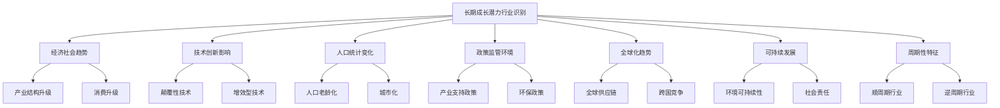
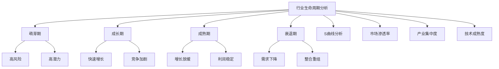
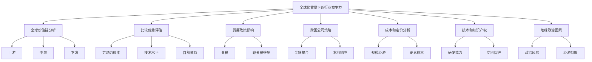

# 第三部分：融合投资思想的实践应用

# 第8章：行业选择与分析

在价值成长投资策略中，行业选择是构建成功投资组合的关键步骤之一。正确的行业选择可以为投资者提供长期增长的机会，同时也能帮助管理风险。本章将探讨如何识别具有长期成长潜力的行业，分析行业生命周期，评估技术创新的影响，以及在全球化背景下分析行业竞争力。

## 8.1 识别具有长期成长潜力的行业

识别具有长期成长潜力的行业是价值成长投资的基础。这需要投资者具备前瞻性思维，能够洞察经济、社会、技术等多方面的长期趋势。

* 核心概念：
    - 长期增长驱动因素
    - 产业结构升级
    - 技术创新周期
    - 人口统计趋势
    - 消费升级
    - 政策支持

* 问题背景：在快速变化的全球经济中，某些行业可能会经历长期的结构性增长，而其他行业可能面临衰退。

* 问题描述：如何识别和评估具有长期成长潜力的行业？哪些因素决定了一个行业的长期增长前景？

* 问题解决：
    1. 分析长期经济和社会趋势
    2. 评估技术创新对各行业的潜在影响
    3. 研究人口统计变化及其对行业需求的影响
    4. 考察政府政策和监管环境的变化
    5. 分析全球化趋势对行业发展的影响
    6. 评估行业的可持续发展潜力
    7. 考虑行业的周期性和抗周期性特征

* 边界与外延：
    - 长期增长潜力不等同于短期投资收益
    - 需要平衡行业增长潜力和估值水平
    - 考虑行业内部的分化和细分市场的机会

* 概念结构与核心要素组成：



* 概念之间的关系：

| 要素 | 经济社会趋势 | 技术创新 | 人口统计 | 政策环境 | 全球化 | 可持续发展 |
|------|--------------|----------|----------|----------|--------|------------|
| 经济社会趋势 | - | 高度相关 | 高度相关 | 中度相关 | 高度相关 | 中度相关 |
| 技术创新 | 高度相关 | - | 中度相关 | 中度相关 | 高度相关 | 高度相关 |
| 人口统计 | 高度相关 | 中度相关 | - | 中度相关 | 中度相关 | 中度相关 |
| 政策环境 | 中度相关 | 中度相关 | 中度相关 | - | 高度相关 | 高度相关 |
| 全球化 | 高度相关 | 高度相关 | 中度相关 | 高度相关 | - | 中度相关 |
| 可持续发展 | 中度相关 | 高度相关 | 中度相关 | 高度相关 | 中度相关 | - |

* 数学模型：

1. 行业长期增长潜力指数 (LIGPI):
   $$ LIGPI = w_1G + w_2I + w_3D + w_4P + w_5S $$
   其中，G、I、D、P、S 分别代表GDP相关性、创新指数、人口因子、政策支持度和可持续性指数，w_i 为权重。

2. 行业周期调整增长率 (CAGR):
   $$ CAGR = (\frac{End Value}{Start Value})^{\frac{1}{n}} - 1 $$
   其中，n 是年数，通常取 5-10 年以消除短期波动。

3. 行业创新指数 (III):
   $$ III = \frac{R\&D投入}{销售收入} \times 专利数量增长率 $$

* 算法流程：

```python
import numpy as np
import pandas as pd

def calculate_ligpi(gdp_correlation, innovation_index, demographic_factor, policy_support, sustainability_index, weights):
    return np.dot([gdp_correlation, innovation_index, demographic_factor, policy_support, sustainability_index], weights)

def calculate_cagr(start_value, end_value, years):
    return (end_value / start_value) ** (1/years) - 1

def calculate_iii(rd_investment, sales_revenue, patent_growth_rate):
    return (rd_investment / sales_revenue) * patent_growth_rate

# 示例使用
gdp_correlation = 0.8
innovation_index = 0.7
demographic_factor = 0.6
policy_support = 0.9
sustainability_index = 0.7
ligpi_weights = [0.3, 0.2, 0.2, 0.15, 0.15]

ligpi = calculate_ligpi(gdp_correlation, innovation_index, demographic_factor, policy_support, sustainability_index, ligpi_weights)

start_value = 100
end_value = 150
years = 5
cagr = calculate_cagr(start_value, end_value, years)

rd_investment = 1000000
sales_revenue = 10000000
patent_growth_rate = 1.2
iii = calculate_iii(rd_investment, sales_revenue, patent_growth_rate)

print(f"行业长期增长潜力指数 (LIGPI): {ligpi:.2f}")
print(f"行业周期调整增长率 (CAGR): {cagr:.2%}")
print(f"行业创新指数 (III): {iii:.4f}")
```

* 实际场景应用：

1. 人工智能行业分析：

```python
ai_gdp_correlation = 0.9
ai_innovation_index = 0.95
ai_demographic_factor = 0.7
ai_policy_support = 0.8
ai_sustainability_index = 0.75

ai_ligpi = calculate_ligpi(ai_gdp_correlation, ai_innovation_index, ai_demographic_factor, ai_policy_support, ai_sustainability_index, ligpi_weights)

ai_start_value = 50
ai_end_value = 200
ai_years = 5
ai_cagr = calculate_cagr(ai_start_value, ai_end_value, ai_years)

ai_rd_investment = 5000000
ai_sales_revenue = 20000000
ai_patent_growth_rate = 1.5
ai_iii = calculate_iii(ai_rd_investment, ai_sales_revenue, ai_patent_growth_rate)

print("人工智能行业分析:")
print(f"LIGPI: {ai_ligpi:.2f}")
print(f"CAGR: {ai_cagr:.2%}")
print(f"III: {ai_iii:.4f}")
```

2. 传统制造业分析：

```python
mfg_gdp_correlation = 0.6
mfg_innovation_index = 0.4
mfg_demographic_factor = 0.5
mfg_policy_support = 0.6
mfg_sustainability_index = 0.5

mfg_ligpi = calculate_ligpi(mfg_gdp_correlation, mfg_innovation_index, mfg_demographic_factor, mfg_policy_support, mfg_sustainability_index, ligpi_weights)

mfg_start_value = 100
mfg_end_value = 120
mfg_years = 5
mfg_cagr = calculate_cagr(mfg_start_value, mfg_end_value, mfg_years)

mfg_rd_investment = 500000
mfg_sales_revenue = 50000000
mfg_patent_growth_rate = 1.05
mfg_iii = calculate_iii(mfg_rd_investment, mfg_sales_revenue, mfg_patent_growth_rate)

print("\n传统制造业分析:")
print(f"LIGPI: {mfg_ligpi:.2f}")
print(f"CAGR: {mfg_cagr:.2%}")
print(f"III: {mfg_iii:.4f}")
```

基于上述分析，我们可以得出以下关于识别具有长期成长潜力行业的关键洞察：

1. 多维度评估：识别长期成长潜力行业需要综合考虑经济、技术、人口、政策和可持续发展等多个维度。

2. 创新驱动：高创新指数often暗示着行业的长期增长潜力，如人工智能行业的高III值。

3. 政策影响：政府政策和监管环境对行业的长期发展有重要影响，需要密切关注政策趋势。

4. 可持续性考量：在当今环境下，可持续发展成为评估行业长期潜力的重要因素。

5. 周期性vs.长期趋势：需要区分短期周期性波动和长期结构性趋势，CAGR可以帮助消除短期波动的影响。

6. 全球化视角：在评估行业潜力时，需要考虑全球市场和竞争格局，而不仅限于本地市场。

7. 技术变革的影响：技术创新可能颠覆传统行业，同时也可能创造新的增长行业。

8. 人口红利：人口统计变化可能为某些行业带来长期增长机会，如医疗保健和养老服务业。

9. 产业链视角：除了关注终端产业，还要考虑支持性行业和上下游产业链的发展潜力。

10. 跨行业融合：新兴行业often产生于传统行业的交叉点，需要关注跨行业融合带来的机会。

对于价值成长投资者而言，在识别具有长期成长潜力的行业时需要注意以下几点：

1. 长期视角：保持长期投资视角，不要被短期市场波动所干扰。

2. 持续学习：保持对新技术、新趋势的学习，以识别未来的增长机会。

3. 跨学科思维：结合经济、技术、社会学等多学科知识，全面评估行业潜力。

4. 逆向思考：不要仅追随当前热门行业，也要关注被低估但具有转型潜力的传统行业。

5. 关注细分市场：在大行业内部寻找高增长的细分市场机会。

6. 全球化视野：关注全球范围内的行业发展趋势和最佳实践。

7. 价值链分析：评估行业内不同环节的增长潜力和盈利能力。

8. 周期性考虑：了解行业的周期性特征，在合适的经济周期阶段进行投资。

9. 政策敏感性：密切关注可能影响行业长期发展的政策变化。

10. 持续验证：定期重新评估行业的长期增长假设，及时调整投资策略。

通过系统地识别和分析具有长期成长潜力的行业，价值成长投资者可以为投资组合建立一个坚实的基础。这种方法要求投资者具备宏观洞察力，能够识别长期趋势，并将这些趋势与具体的投资机会联系起来。然而，重要的是要记住，即使是最具潜力的行业也可能面临短期波动和挑战。因此，在行业选择的基础上，还需要进行深入的个股分析和适当的风险管理。在下一节中，我们将探讨如何分析行业生命周期，这是理解行业长期发展轨迹的另一个重要维度。

## 8.2 行业生命周期分析

行业生命周期分析是理解行业发展动态和投资机会的重要工具。每个行业都经历不同的发展阶段，包括萌芽期、成长期、成熟期和衰退期。了解行业所处的生命周期阶段可以帮助投资者更好地评估风险和回报潜力。

* 核心概念：
    - 萌芽期
    - 成长期
    - 成熟期
    - 衰退期
    - S曲线
    - 市场渗透率
    - 产业集中度
    - 技术成熟度

* 问题背景：不同生命周期阶段的行业展现出不同的增长特征、竞争格局和投资风险。

* 问题描述：如何识别行业所处的生命周期阶段？各阶段有哪些特征和投资策略？如何预测行业生命周期的演变？

* 问题解决：
    1. 分析行业销售增长率和市场渗透率
    2. 评估行业的产业集中度和竞争格局
  3. 研究技术成熟度和创新频率
  4. 考察行业利润率和现金流特征
  5. 分析客户需求的变化和满足程度
  6. 评估行业的监管环境和政策支持
  7. 考虑行业的全球化程度和国际竞争

* 边界与外延：
    - 行业生命周期并非严格线性，可能出现反复或跳跃
    - 不同细分市场可能处于不同的生命周期阶段
    - 技术创新可能重启或延长行业生命周期

* 概念结构与核心要素组成：



* 概念之间的关系：

| 阶段 | 萌芽期 | 成长期 | 成熟期 | 衰退期 | 市场渗透率 | 产业集中度 |
|------|--------|--------|--------|--------|------------|------------|
| 萌芽期 | - | 低度相关 | 低度相关 | 低度相关 | 高度相关 | 低度相关 |
| 成长期 | 低度相关 | - | 中度相关 | 低度相关 | 高度相关 | 中度相关 |
| 成熟期 | 低度相关 | 中度相关 | - | 中度相关 | 高度相关 | 高度相关 |
| 衰退期 | 低度相关 | 低度相关 | 中度相关 | - | 中度相关 | 高度相关 |
| 市场渗透率 | 高度相关 | 高度相关 | 高度相关 | 中度相关 | - | 中度相关 |
| 产业集中度 | 低度相关 | 中度相关 | 高度相关 | 高度相关 | 中度相关 | - |

* 数学模型：

1. S曲线模型（Logistic增长模型）：
   $$ Y(t) = \frac{K}{1 + e^{-r(t-t_0)}} $$
   其中，Y(t)是t时刻的市场规模，K是最大市场容量，r是增长率，t_0是拐点时间。

2. 产业集中度（赫芬达尔-赫希曼指数，HHI）：
   $$ HHI = \sum_{i=1}^n s_i^2 $$
   其中，s_i是第i个公司的市场份额。

3. 技术成熟度指数（TMI）：
   $$ TMI = w_1P + w_2R + w_3A $$
   其中，P是专利数量，R是研发投入比例，A是应用广泛度，w_i是权重。

* 算法流程：

```python
import numpy as np
from scipy.optimize import curve_fit

def logistic_growth(t, K, r, t0):
    return K / (1 + np.exp(-r * (t - t0)))

def calculate_hhi(market_shares):
    return np.sum(np.square(market_shares))

def calculate_tmi(patents, rd_ratio, application_breadth, weights):
    return np.dot([patents, rd_ratio, application_breadth], weights)

# 示例使用
# S曲线拟合
years = np.array([0, 1, 2, 3, 4, 5, 6, 7, 8, 9])
market_size = np.array([100, 120, 150, 200, 300, 450, 600, 720, 800, 850])
popt, _ = curve_fit(logistic_growth, years, market_size)
K, r, t0 = popt

# HHI计算
market_shares = np.array([0.3, 0.25, 0.2, 0.15, 0.1])
hhi = calculate_hhi(market_shares)

# TMI计算
patents = 1000
rd_ratio = 0.15
application_breadth = 0.8
tmi_weights = [0.4, 0.3, 0.3]
tmi = calculate_tmi(patents, rd_ratio, application_breadth, tmi_weights)

print(f"预测最大市场容量: {K:.0f}")
print(f"增长率: {r:.2f}")
print(f"拐点时间: {t0:.2f}年")
print(f"产业集中度 (HHI): {hhi:.4f}")
print(f"技术成熟度指数 (TMI): {tmi:.2f}")
```

* 实际场景应用：

1. 电动汽车行业分析：

```python
ev_years = np.array([0, 1, 2, 3, 4, 5, 6, 7, 8, 9])
ev_market_size = np.array([50, 80, 130, 210, 340, 550, 890, 1440, 2330, 3770])
ev_popt, _ = curve_fit(logistic_growth, ev_years, ev_market_size)
ev_K, ev_r, ev_t0 = ev_popt

ev_market_shares = np.array([0.28, 0.18, 0.15, 0.12, 0.1, 0.17])
ev_hhi = calculate_hhi(ev_market_shares)

ev_patents = 5000
ev_rd_ratio = 0.2
ev_application_breadth = 0.7
ev_tmi = calculate_tmi(ev_patents, ev_rd_ratio, ev_application_breadth, tmi_weights)

print("电动汽车行业分析:")
print(f"预测最大市场容量: {ev_K:.0f}万辆")
print(f"增长率: {ev_r:.2f}")
print(f"拐点时间: {ev_t0:.2f}年")
print(f"产业集中度 (HHI): {ev_hhi:.4f}")
print(f"技术成熟度指数 (TMI): {ev_tmi:.2f}")
```

2. 传统汽车行业分析：

```python
tc_years = np.array([0, 1, 2, 3, 4, 5, 6, 7, 8, 9])
tc_market_size = np.array([8000, 8100, 8150, 8180, 8200, 8210, 8215, 8218, 8220, 8221])
tc_popt, _ = curve_fit(logistic_growth, tc_years, tc_market_size)
tc_K, tc_r, tc_t0 = tc_popt

tc_market_shares = np.array([0.15, 0.14, 0.13, 0.12, 0.11, 0.35])
tc_hhi = calculate_hhi(tc_market_shares)

tc_patents = 2000
tc_rd_ratio = 0.05
tc_application_breadth = 0.9
tc_tmi = calculate_tmi(tc_patents, tc_rd_ratio, tc_application_breadth, tmi_weights)

print("\n传统汽车行业分析:")
print(f"预测最大市场容量: {tc_K:.0f}万辆")
print(f"增长率: {tc_r:.2f}")
print(f"拐点时间: {tc_t0:.2f}年")
print(f"产业集中度 (HHI): {tc_hhi:.4f}")
print(f"技术成熟度指数 (TMI): {tc_tmi:.2f}")
```

基于上述分析，我们可以得出以下关于行业生命周期分析的关键洞察：

1. 增长特征：不同生命周期阶段展现出不同的增长特征，如电动汽车行业的快速增长vs.传统汽车行业的缓慢增长。

2. 市场容量：了解行业的最大市场容量有助于评估未来增长空间。

3. 拐点预测：识别行业增长拐点对投资时机的把握至关重要。

4. 竞争格局：产业集中度反映了行业的竞争状况，不同生命周期阶段often有不同的集中度特征。

5. 技术创新：技术成熟度指数可以反映行业的创新活力，这often与生命周期阶段密切相关。

6. 投资策略差异：不同生命周期阶段需要采取不同的投资策略，如成长期注重市场份额，成熟期关注效率和现金流。

7. 行业转型：传统行业可能通过创新进入新的生命周期，如传统汽车向电动化转型。

8. 细分市场差异：同一行业内的不同细分市场可能处于不同的生命周期阶段。

9. 全球化影响：全球市场的不均衡发展可能导致同一行业在不同地区处于不同的生命周期阶段。

10. 政策影响：政府政策可能加速或减缓行业生命周期的演进。

对于价值成长投资者而言，在进行行业生命周期分析时需要注意以下几点：

1. 动态视角：行业生命周期是动态的，需要持续关注和评估。

2. 长期思维：虽然关注当前所处阶段，但也要预判未来的演变趋势。

3. 创新敏感性：特别关注可能引发行业重生或加速发展的创新因素。

4. 全球视野：在全球化背景下，考虑行业在不同地区的发展阶段。

5. 价值链分析：除了终端产品，还要关注整个产业链各环节的生命周期特征。

6. 跨行业思维：注意行业之间的相互影响和融合可能带来的新机遇。

7. 周期性考虑：区分行业的周期性波动和长期结构性变化。

8. 估值调整：根据行业所处的生命周期阶段调整估值方法和标准。

9. 风险评估：不同生命周期阶段面临不同的风险，需要相应调整风险管理策略。

10. 退出策略：对于接近或处于衰退期的行业，要制定适当的退出策略。

通过深入的行业生命周期分析，价值成长投资者可以更准确地评估行业的长期前景，并据此制定相应的投资策略。这种分析方法要求投资者不仅要关注当前的财务指标，还要具备前瞻性思维，能够预判行业的未来发展轨迹。然而，重要的是要记住，行业生命周期分析并非精确科学，需要结合其他分析工具和方法，如技术趋势分析、竞争格局评估等，才能形成全面的行业洞察。在下一节中，我们将探讨技术创新对行业格局的影响，这是理解行业动态变化的另一个重要维度。

## 8.3 技术创新对行业格局的影响评估

技术创新是驱动行业变革和重塑竞争格局的关键因素。对于价值成长投资者而言，准确评估技术创新对行业格局的影响至关重要，这不仅有助于识别潜在的投资机会，还能预见可能的行业颠覆。

* 核心概念：
    - 颠覆性创新
    - 渐进式创新
    - 技术S曲线
    - 创新扩散理论
    - 网络效应
    - 规模经济
    - 专利分析
    - 创新生态系统

* 问题背景：技术创新可能改变行业的竞争规则，创造新的市场领导者，或使现有的领导者失去优势。

* 问题描述：如何评估技术创新对行业格局的潜在影响？哪些因素决定了创新的影响力？如何预测创新的扩散速度和范围？

* 问题解决：
    1. 分析创新的性质（颠覆性vs.渐进式）
    2. 评估创新与现有技术的兼容性
    3. 研究创新的成本结构和学习曲线
    4. 考察创新的网络效应和生态系统
    5. 分析行业主要参与者的创新能力和资源
    6. 评估监管环境对创新的影响
    7. 考虑创新的跨行业应用潜力

* 边界与外延：
    - 创新的影响可能超出原始设想的范围
    - 需要考虑创新失败或被替代的可能性
    - 技术创新与商业模式创新often相互促进

* 概念结构与核心要素组成：

```mermaid
graph TD
    A[技术创新影响评估] --> B[创新类型]
    A --> C[扩散因素]
    A --> D[竞争影响]
    A --> E[市场变革]
    B --> F[颠覆性创新]
    B --> G[渐进式创新]
    C --> H[兼容性]
    C --> I[复杂性]
    C --> J[可观察性]
    D --> K[成本结构变化]
    D --> L[进入壁垒]
    D --> M[价值链重构]
    E --> N[新市场创造]E --> O[需求模式转变]
    A --> P[创新生态系统]
    P --> Q[研发投入]
    P --> R[人才储备]
    P --> S[产学研合作]
```

* 概念之间的关系：

| 要素 | 创新类型 | 扩散因素 | 竞争影响 | 市场变革 | 创新生态系统 |
|------|----------|----------|----------|----------|--------------|
| 创新类型 | - | 高度相关 | 高度相关 | 高度相关 | 中度相关 |
| 扩散因素 | 高度相关 | - | 中度相关 | 高度相关 | 中度相关 |
| 竞争影响 | 高度相关 | 中度相关 | - | 高度相关 | 高度相关 |
| 市场变革 | 高度相关 | 高度相关 | 高度相关 | - | 中度相关 |
| 创新生态系统 | 中度相关 | 中度相关 | 高度相关 | 中度相关 | - |

* 数学模型：

1. 创新扩散模型（Bass模型）：
   $$ f(t) = \frac{(p+q)^2}{p} \cdot \frac{e^{-(p+q)t}}{(1+\frac{q}{p}e^{-(p+q)t})^2} $$
   其中，f(t)是t时刻的采用率，p是创新系数，q是模仿系数。

2. 技术影响指数（TII）：
   $$ TII = w_1D + w_2C + w_3N + w_4S $$
   其中，D是破坏性得分，C是成本降低率，N是网络效应强度，S是规模经济潜力，w_i是权重。

3. 创新生态系统强度（IES）：
   $$ IES = \sqrt{R^2 + T^2 + C^2} $$
   其中，R是研发投入强度，T是人才储备指数，C是产学研合作程度。

* 算法流程：

```python
import numpy as np
from scipy.integrate import odeint

def bass_model(y, t, p, q):
    return (p + q * y) * (1 - y)

def calculate_tii(disruptiveness, cost_reduction, network_effect, scale_economy, weights):
    return np.dot([disruptiveness, cost_reduction, network_effect, scale_economy], weights)

def calculate_ies(rd_intensity, talent_index, collaboration):
    return np.sqrt(rd_intensity**2 + talent_index**2 + collaboration**2)

# 示例使用
# Bass模型
t = np.linspace(0, 10, 100)
p, q = 0.03, 0.38
solution = odeint(bass_model, y0=0, t=t, args=(p, q))
adoption_rate = solution.flatten()

# 技术影响指数
disruptiveness = 0.8
cost_reduction = 0.3
network_effect = 0.6
scale_economy = 0.5
tii_weights = [0.3, 0.2, 0.3, 0.2]
tii = calculate_tii(disruptiveness, cost_reduction, network_effect, scale_economy, tii_weights)

# 创新生态系统强度
rd_intensity = 0.15
talent_index = 0.7
collaboration = 0.6
ies = calculate_ies(rd_intensity, talent_index, collaboration)

print(f"10年后的采用率: {adoption_rate[-1]:.2f}")
print(f"技术影响指数 (TII): {tii:.2f}")
print(f"创新生态系统强度 (IES): {ies:.2f}")
```

* 实际场景应用：

1. 5G技术在电信行业的影响：

```python
# 5G技术扩散
t_5g = np.linspace(0, 5, 100)
p_5g, q_5g = 0.05, 0.5
solution_5g = odeint(bass_model, y0=0, t=t_5g, args=(p_5g, q_5g))
adoption_rate_5g = solution_5g.flatten()

# 5G技术影响指数
disruptiveness_5g = 0.9
cost_reduction_5g = 0.2
network_effect_5g = 0.8
scale_economy_5g = 0.7
tii_5g = calculate_tii(disruptiveness_5g, cost_reduction_5g, network_effect_5g, scale_economy_5g, tii_weights)

# 5G创新生态系统
rd_intensity_5g = 0.2
talent_index_5g = 0.8
collaboration_5g = 0.7
ies_5g = calculate_ies(rd_intensity_5g, talent_index_5g, collaboration_5g)

print("5G技术在电信行业的影响:")
print(f"5年后的采用率: {adoption_rate_5g[-1]:.2f}")
print(f"技术影响指数 (TII): {tii_5g:.2f}")
print(f"创新生态系统强度 (IES): {ies_5g:.2f}")
```

2. 人工智能在金融行业的应用：

```python
# AI在金融业的扩散
t_ai = np.linspace(0, 5, 100)
p_ai, q_ai = 0.02, 0.3
solution_ai = odeint(bass_model, y0=0, t=t_ai, args=(p_ai, q_ai))
adoption_rate_ai = solution_ai.flatten()

# AI技术影响指数
disruptiveness_ai = 0.7
cost_reduction_ai = 0.5
network_effect_ai = 0.4
scale_economy_ai = 0.6
tii_ai = calculate_tii(disruptiveness_ai, cost_reduction_ai, network_effect_ai, scale_economy_ai, tii_weights)

# AI创新生态系统
rd_intensity_ai = 0.18
talent_index_ai = 0.75
collaboration_ai = 0.65
ies_ai = calculate_ies(rd_intensity_ai, talent_index_ai, collaboration_ai)

print("\n人工智能在金融行业的应用:")
print(f"5年后的采用率: {adoption_rate_ai[-1]:.2f}")
print(f"技术影响指数 (TII): {tii_ai:.2f}")
print(f"创新生态系统强度 (IES): {ies_ai:.2f}")
```

基于上述分析，我们可以得出以下关于技术创新对行业格局影响评估的关键洞察：

1. 创新扩散速度：不同技术的扩散速度可能差异很大，如5G技术可能比AI在金融业的应用扩散得更快。

2. 颠覆性潜力：高技术影响指数（TII）表明该技术可能对行业格局产生重大影响。

3. 生态系统重要性：强大的创新生态系统（高IES）往往能支持技术的持续发展和应用。

4. 网络效应：某些技术（如5G）具有强大的网络效应，这可能加速其adoption并强化其影响。

5. 成本结构变化：技术创新可能显著改变行业的成本结构，影响竞争格局。

6. 跨行业影响：某些技术（如AI）的影响可能跨越多个行业，创造新的跨界竞争。

7. 创新周期：不同技术的创新周期长短不一，影响投资策略的制定。

8. 监管因素：技术的影响力可能受到监管环境的显著影响，尤其是在金融等高度监管的行业。

9. 人才竞争：高技术行业的竞争often转化为人才的竞争，人才储备成为关键成功因素。

10. 协同效应：技术之间的协同效应（如5G和AI的结合）可能产生更大的影响。

对于价值成长投资者而言，在评估技术创新对行业格局的影响时需要注意以下几点：

1. 长期视角：技术创新的影响often需要较长时间才能充分显现，需要保持长期投资视角。

2. 全面评估：不仅要关注技术本身，还要评估公司的执行能力和商业化潜力。

3. 生态系统思维：考虑整个创新生态系统，而不仅仅是单个公司或技术。

4. 跨行业视野：关注技术创新可能带来的跨行业机会和威胁。

5. 适应性评估：评估现有行业领导者适应新技术的能力，以及新进入者的潜在威胁。

6. 成本效益分析：考虑技术adoption的成本和潜在收益，评估其经济可行性。

7. 风险管理：技术创新often带来高风险高回报的机会，需要适当的风险管理策略。

8. 持续学习：保持对新兴技术趋势的持续学习和理解。

9. 专家网络：建立和维护技术专家网络，获取深入的行业洞察。

10. 情景规划：考虑多种可能的技术发展情景，制定灵活的投资策略。

通过深入评估技术创新对行业格局的影响，价值成长投资者可以更好地识别长期投资机会，并预见潜在的行业颠覆。这种分析方法要求投资者不仅要具备财务分析能力，还需要对技术趋势有深入的理解。然而，重要的是要记住，技术创新的影响often是复杂和多面的，需要结合其他分析工具和方法，如竞争战略分析、商业模式评估等，才能形成全面的投资洞察。在下一节中，我们将探讨全球化背景下的行业竞争力分析，这将为我们的行业分析框架增添国际视角。

## 8.4 全球化背景下的行业竞争力分析

在全球化日益深入的背景下，行业竞争力分析必须采取全球视角。国际市场的开放、全球供应链的形成、跨国公司的崛起等因素都深刻影响着各行业的竞争格局。对于价值成长投资者而言，理解全球化对行业竞争力的影响至关重要。

* 核心概念：
    - 全球价值链
    - 比较优势
    - 贸易壁垒
    - 市场准入
    - 跨国公司战略
    - 本地化vs.标准化
    - 地缘政治风险
    - 汇率风险
    - 全球人才流动

* 问题背景：全球化使得行业竞争不再局限于国内市场，企业需要在全球舞台上竞争。

* 问题描述：如何评估全球化对特定行业竞争力的影响？哪些因素决定了一个行业在全球市场中的竞争地位？如何识别全球化带来的机遇和风险？

* 问题解决：
    1. 分析行业在全球价值链中的位置
    2. 评估不同国家和地区在该行业的比较优势
    3. 研究贸易政策和市场准入条件对行业的影响
    4. 考察跨国公司在行业中的角色和策略
    5. 分析全球化对行业成本结构和定价能力的影响
    6. 评估技术转移和知识产权保护对行业竞争力的影响
    7. 考虑地缘政治因素对行业发展的潜在影响

* 边界与外延：
    - 全球化程度在不同行业间存在差异
    - 需要考虑反全球化趋势的潜在影响
    - 全球化与本地化策略的平衡

* 概念结构与核心要素组成：



* 概念之间的关系：

| 要素 | 全球价值链 | 比较优势 | 贸易政策 | 跨国公司策略 | 技术和知识产权 | 地缘政治 |
|------|------------|----------|----------|--------------|----------------|----------|
| 全球价值链 | - | 高度相关 | 高度相关 | 高度相关 | 中度相关 | 中度相关 |
| 比较优势 | 高度相关 | - | 中度相关 | 高度相关 | 高度相关 | 低度相关 |
| 贸易政策 | 高度相关 | 中度相关 | - | 高度相关 | 中度相关 | 高度相关 |
| 跨国公司策略 | 高度相关 | 高度相关 | 高度相关 | - | 高度相关 | 中度相关 |
| 技术和知识产权 | 中度相关 | 高度相关 | 中度相关 | 高度相关 | - | 中度相关 |
| 地缘政治 | 中度相关 | 低度相关 | 高度相关 | 中度相关 | 中度相关 | - |

* 数学模型：

1. 全球竞争力指数 (GCI):
   $$ GCI = w_1V + w_2C + w_3T + w_4P + w_5G $$
   其中，V是价值链位置得分，C是比较优势得分，T是贸易开放度，P是生产力指数，G是全球化程度，w_i是权重。

2. 跨国经营效率 (TNE):
   $$ TNE = \frac{海外收入}{总收入} \times \frac{海外利润}{总利润} $$

3. 技术创新指数 (TII):
   $$ TII = \sqrt{(R\&D强度)^2 + (专利数量)^2 + (高技能劳动力比例)^2} $$

* 算法流程：

```python
import numpy as np

def calculate_gci(value_chain, comparative_advantage, trade_openness, productivity, globalization, weights):
    return np.dot([value_chain, comparative_advantage, trade_openness, productivity, globalization], weights)

def calculate_tne(foreign_revenue, total_revenue, foreign_profit, total_profit):
    return (foreign_revenue / total_revenue) * (foreign_profit / total_profit)

def calculate_tii(rd_intensity, patent_count, skilled_labor_ratio):
    return np.sqrt(rd_intensity**2 + patent_count**2 + skilled_labor_ratio**2)

# 示例使用
value_chain = 0.8
comparative_advantage = 0.7
trade_openness = 0.6
productivity = 0.75
globalization = 0.65
gci_weights = [0.25, 0.2, 0.2, 0.2, 0.15]

gci = calculate_gci(value_chain, comparative_advantage, trade_openness, productivity, globalization, gci_weights)

foreign_revenue = 5000000000
total_revenue = 10000000000
foreign_profit = 800000000
total_profit = 1500000000
tne = calculate_tne(foreign_revenue, total_revenue, foreign_profit, total_profit)

rd_intensity = 0.1
patent_count = 1000  # 标准化后的值
skilled_labor_ratio = 0.6
tii = calculate_tii(rd_intensity, patent_count, skilled_labor_ratio)

print(f"全球竞争力指数 (GCI): {gci:.2f}")
print(f"跨国经营效率 (TNE): {tne:.2f}")
print(f"技术创新指数 (TII): {tii:.2f}")
```

* 实际场景应用：

1. 全球汽车行业分析：

```python
auto_value_chain = 0.85
auto_comparative_advantage = 0.75
auto_trade_openness = 0.7
auto_productivity = 0.8
auto_globalization = 0.9

auto_gci = calculate_gci(auto_value_chain, auto_comparative_advantage, auto_trade_openness, auto_productivity, auto_globalization, gci_weights)

auto_foreign_revenue = 80000000000
auto_total_revenue = 150000000000
auto_foreign_profit = 6000000000
auto_total_profit = 10000000000
auto_tne = calculate_tne(auto_foreign_revenue, auto_total_revenue, auto_foreign_profit, auto_total_profit)

auto_rd_intensity = 0.05
auto_patent_count = 2000  # 标准化后的值
auto_skilled_labor_ratio = 0.7
auto_tii = calculate_tii(auto_rd_intensity, auto_patent_count, auto_skilled_labor_ratio)

print("全球汽车行业分析:")
print(f"全球竞争力指数 (GCI): {auto_gci:.2f}")
print(f"跨国经营效率 (TNE): {auto_tne:.2f}")
print(f"技术创新指数 (TII): {auto_tii:.2f}")
```

2. 全球半导体行业分析：

```python
semi_value_chain = 0.95
semi_comparative_advantage = 0.9
semi_trade_openness = 0.85
semi_productivity = 0.9
semi_globalization = 0.95

semi_gci = calculate_gci(semi_value_chain, semi_comparative_advantage, semi_trade_openness, semi_productivity, semi_globalization, gci_weights)

semi_foreign_revenue = 40000000000
semi_total_revenue = 60000000000
semi_foreign_profit = 8000000000
semi_total_profit = 12000000000
semi_tne = calculate_tne(semi_foreign_revenue, semi_total_revenue, semi_foreign_profit, semi_total_profit)

semi_rd_intensity = 0.15
semi_patent_count = 3000  # 标准化后的值
semi_skilled_labor_ratio = 0.8
semi_tii = calculate_tii(semi_rd_intensity, semi_patent_count, semi_skilled_labor_ratio)

print("\n全球半导体行业分析:")
print(f"全球竞争力指数 (GCI): {semi_gci:.2f}")
print(f"跨国经营效率 (TNE): {semi_tne:.2f}")
print(f"技术创新指数 (TII): {semi_tii:.2f}")
```

基于上述分析，我们可以得出以下关于全球化背景下行业竞争力分析的关键洞察：

1. 全球价值链定位：高GCI分数often表明行业在全球价值链中占据有利位置，如半导体行业。

2. 跨国经营能力：高TNE值反映了企业在全球市场中的经营效率，这是全球化竞争的关键指标。

3. 创新驱动：高TII得分表明行业的竞争力很大程度上依赖于持续的技术创新，如半导体行业。

4. 行业差异：不同行业的全球化程度和竞争特征可能存在显著差异，需要具体分析。

5. 比较优势动态：全球化背景下，比较优势可能随时间和政策变化而改变，需要动态评估。

6. 贸易政策影响：贸易开放度对行业的全球竞争力有重要影响，需要密切关注贸易政策变化。

7. 地缘政治风险：某些行业（如半导体）可能更容易受到地缘政治因素的影响。

8. 技术壁垒：高技术行业often具有较高的进入壁垒，这可能强化现有企业的竞争优势。

9. 人才流动：全球化背景下的人才流动对行业竞争力产生重要影响，特别是在知识密集型行业。

10. 规模经济：全球化使得企业可以在更大范围内实现规模经济，影响成本结构和竞争格局。

对于价值成长投资者而言，在全球化背景下评估行业竞争力时需要注意以下几点：

1. 全球视角：不仅要关注本土市场，还要从全球角度评估行业和企业的竞争力。

2. 价值链分析：了解目标企业在全球价值链中的位置，评估其上下游关系和议价能力。

3. 技术领先性：特别关注在全球范围内保持技术领先地位的企业，它们often具有持续的竞争优势。

4. 本地化能力：评估企业在不同市场中的本地化能力，这对于跨国经营成功至关重要。

5. 政策敏感性：密切关注全球贸易政策和地缘政治变化，评估其对行业竞争格局的潜在影响。

6. 汇率风险：考虑汇率波动对企业全球运营和财务表现的影响。

7. 供应链韧性：评估企业的供应链管理能力，特别是在全球不确定性增加的背景下。

8. 文化适应性：考虑企业在跨文化经营中的适应能力，这对全球扩张成功与否有重要影响。

9. 长期趋势：关注可能改变全球竞争格局的长期趋势，如新兴市场的崛起、技术变革等。

10. 综合评估：将全球竞争力分析与其他分析工具（如财务分析、管理质量评估等）结合，形成全面的投资判断。

通过在全球化背景下深入分析行业竞争力，价值成长投资者可以更准确地评估企业的长期增长潜力和投资价值。这种分析方法要求投资者具备国际视野，了解全球经济动态和各地区特点。然而，重要的是要记住，全球化是一个动态过程，行业的全球竞争格局可能因各种因素而快速变化。因此，持续更新分析和保持灵活的投资策略至关重要。

总结本章，我们深入探讨了行业选择与分析的多个关键方面，包括识别长期成长潜力、分析行业生命周期、评估技术创新影响以及在全球化背景下分析行业竞争力。这些分析工具和方法为价值成长投资者提供了一个全面的行业评估框架，有助于识别具有长期投资价值的行业和企业。在下一章中，我们将把重点转向个股筛选与深度研究，探讨如何在已选定的有吸引力行业中识别最具投资价值的个股。