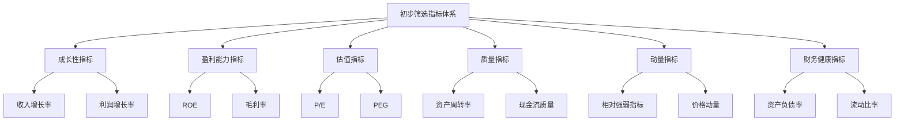
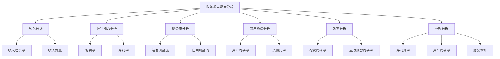
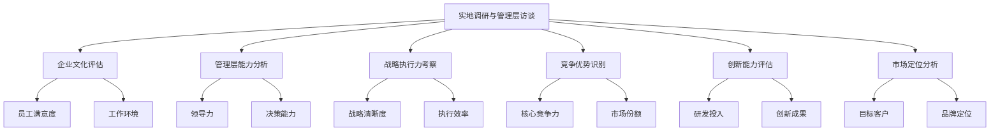
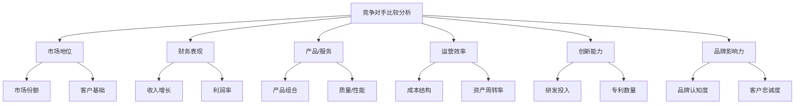

# 第9章：个股筛选与深度研究

在确定了具有长期增长潜力的行业后，下一步是在这些行业中筛选出最具投资价值的个股。个股筛选与深度研究是价值成长投资策略中至关重要的环节，它要求投资者既要有系统的筛选方法，又要有深入的分析能力。本章将探讨如何设计初步筛选指标体系，进行财务报表深度分析，开展实地调研与管理层访谈，以及如何进行竞争对手比较分析。

## 9.1 初步筛选指标体系设计

初步筛选是缩小研究范围、提高效率的关键步骤。一个well-designed的筛选指标体系可以帮助投资者快速识别出潜在的价值成长股。

* 核心概念：
    - 成长性指标
    - 盈利能力指标
    - 估值指标
    - 质量指标
    - 动量指标
    - 财务健康指标
    - 多因子模型
    - 定量筛选
    - 定性筛选

* 问题背景：面对大量的股票，如何efficiently筛选出符合价值成长特征的候选股。

* 问题描述：如何设计一个全面而有效的初步筛选指标体系？哪些指标最能反映价值成长股的特征？如何平衡不同类型的指标？

* 问题解决：
    1. 确定关键筛选维度（如成长性、盈利能力、估值等）
    2. 选择各维度下的具体指标
    3. 设定指标阈值或排名标准
    4. 考虑行业特性，调整指标权重
    5. 结合定量和定性筛选方法
    6. 设计多因子模型，综合评分
    7. 定期回测和优化筛选体系

* 边界与外延：
    - 筛选结果需要进一步深入研究验证
    - 不同市场环境可能需要调整筛选标准
    - 考虑指标之间的相关性和冗余性

* 概念结构与核心要素组成：



* 概念之间的关系：

| 指标类型 | 成长性 | 盈利能力 | 估值 | 质量 | 动量 | 财务健康 |
|----------|--------|----------|------|------|------|----------|
| 成长性 | - | 中度相关 | 低度相关 | 低度相关 | 中度相关 | 低度相关 |
| 盈利能力 | 中度相关 | - | 中度相关 | 高度相关 | 低度相关 | 中度相关 |
| 估值 | 低度相关 | 中度相关 | - | 低度相关 | 中度相关 | 低度相关 |
| 质量 | 低度相关 | 高度相关 | 低度相关 | - | 低度相关 | 高度相关 |
| 动量 | 中度相关 | 低度相关 | 中度相关 | 低度相关 | - | 低度相关 |
| 财务健康 | 低度相关 | 中度相关 | 低度相关 | 高度相关 | 低度相关 | - |

* 数学模型：

1. 价值成长综合得分 (VGCS):
   $$ VGCS = w_1G + w_2P + w_3V + w_4Q + w_5M + w_6F $$
   其中，G、P、V、Q、M、F 分别代表成长性、盈利能力、估值、质量、动量和财务健康得分，w_i 为权重。

2. PEG比率：
   $$ PEG = \frac{P/E}{预期年化盈利增长率} $$

3. 质量得分 (QS):
   $$ QS = \alpha(ROE) + \beta(资产周转率) + \gamma(现金流质量) $$
   其中，α、β、γ 为权重。

* 算法流程：

```python
import numpy as np
import pandas as pd

def calculate_vgcs(growth, profitability, valuation, quality, momentum, financial_health, weights):
    return np.dot([growth, profitability, valuation, quality, momentum, financial_health], weights)

def calculate_peg(pe_ratio, earnings_growth_rate):
    return pe_ratio / earnings_growth_rate

def calculate_quality_score(roe, asset_turnover, cash_flow_quality, weights):
    return np.dot([roe, asset_turnover, cash_flow_quality], weights)

# 示例使用
growth_score = 0.8
profitability_score = 0.7
valuation_score = 0.6
quality_score = 0.75
momentum_score = 0.65
financial_health_score = 0.7
vgcs_weights = [0.2, 0.2, 0.15, 0.15, 0.15, 0.15]

vgcs = calculate_vgcs(growth_score, profitability_score, valuation_score, quality_score, momentum_score, financial_health_score, vgcs_weights)

pe_ratio = 20
earnings_growth_rate = 0.15
peg = calculate_peg(pe_ratio, earnings_growth_rate)

roe = 0.2
asset_turnover = 1.5
cash_flow_quality = 0.9
quality_weights = [0.4, 0.3, 0.3]
qs = calculate_quality_score(roe, asset_turnover, cash_flow_quality, quality_weights)

print(f"价值成长综合得分 (VGCS): {vgcs:.2f}")
print(f"PEG比率: {peg:.2f}")
print(f"质量得分 (QS): {qs:.2f}")

# 创建示例股票数据
data = {
    '股票': ['A', 'B', 'C', 'D', 'E'],
    '收入增长率': [0.2, 0.15, 0.25, 0.1, 0.3],
    'ROE': [0.18, 0.22, 0.15, 0.2, 0.25],
    'P/E': [22, 18, 25, 20, 30],
    '资产周转率': [1.2, 1.5, 1.0, 1.3, 1.8],
    '相对强弱指标': [60, 55, 70, 50, 75],
    '资产负债率': [0.4, 0.5, 0.3, 0.6, 0.35]
}

df = pd.DataFrame(data)

# 定义筛选条件
conditions = (
    (df['收入增长率'] > 0.15) & 
    (df['ROE'] > 0.15) & 
    (df['P/E'] < 25) & 
    (df['资产周转率'] > 1.0) & 
    (df['相对强弱指标'] > 50) & 
    (df['资产负债率'] < 0.5)
)

# 应用筛选条件
filtered_stocks = df[conditions]

print("\n筛选后的股票:")
print(filtered_stocks)
```

* 实际场景应用：

1. 科技行业个股筛选：

```python
tech_data = {
    '股票': ['AAPL', 'MSFT', 'GOOGL', 'AMZN', 'FB'],
    '收入增长率': [0.3, 0.35, 0.25, 0.4, 0.2],
    'ROE': [0.35, 0.4, 0.2, 0.25, 0.3],
    'P/E': [30, 35, 28, 60, 25],
    '研发支出比率': [0.15, 0.13, 0.16, 0.12, 0.18],
    '毛利率': [0.4, 0.65, 0.55, 0.4, 0.8],
    '净现金/总资产': [0.2, 0.3, 0.25, 0.15, 0.35]
}

tech_df = pd.DataFrame(tech_data)

tech_conditions = (
    (tech_df['收入增长率'] > 0.2) & 
    (tech_df['ROE'] > 0.2) & 
    (tech_df['P/E'] < 40) & 
    (tech_df['研发支出比率'] > 0.1) & 
    (tech_df['毛利率'] > 0.4) & 
    (tech_df['净现金/总资产'] > 0.1)
)

filtered_tech_stocks = tech_df[tech_conditions]

print("科技行业筛选后的股票:")
print(filtered_tech_stocks)
```

2. 医药行业个股筛选：

```python
pharma_data = {
    '股票': ['PFE', 'JNJ', 'MRK', 'ABBV', 'NVS'],
    '收入增长率': [0.1, 0.15, 0.08, 0.2, 0.12],
    'ROE': [0.2, 0.25, 0.18, 0.3, 0.22],
    'P/E': [15, 18, 14, 20, 16],
    '研发支出比率': [0.2, 0.18, 0.22, 0.16, 0.19],
    '专利数量': [1000, 1200, 800, 600, 1500],
    '临床试验成功率': [0.15, 0.18, 0.14, 0.16, 0.17]
}

pharma_df = pd.DataFrame(pharma_data)

pharma_conditions = (
    (pharma_df['收入增长率'] > 0.05) & 
    (pharma_df['ROE'] > 0.15) & 
    (pharma_df['P/E'] < 20) & 
    (pharma_df['研发支出比率'] > 0.15) & 
    (pharma_df['专利数量'] > 700) & 
    (pharma_df['临床试验成功率'] > 0.14)
)

filtered_pharma_stocks = pharma_df[pharma_conditions]

print("\n医药行业筛选后的股票:")
print(filtered_pharma_stocks)
```

基于上述分析，我们可以得出以下关于初步筛选指标体系设计的关键洞察：

1. 多维度评估：effective的筛选系统需要涵盖成长性、盈利能力、估值、质量等多个维度。

2. 行业特异性：不同行业可能需要不同的筛选标准，如科技行业强调研发投入，医药行业关注专利数量和临床试验成功率。

3. 平衡考量：需要在成长性和估值之间找到平衡，PEG比率是一个有用的综合指标。

4. 质量因素：高质量公司often具有可持续的竞争优势，质量指标对于识别长期价值至关重要。

5. 动态调整：筛选标准应根据市场环境和经济周期进行动态调整。

6. 综合评分：使用综合得分（如VGCS）可以提供更全面的评估。

7. 定量与定性结合：虽然初步筛选主要基于定量指标，但也应考虑一些定性因素。

8. 阈值设定：合理设定指标阈值对于筛选效果至关重要，需要基于历史数据和市场经验。

9. 相对排名：除了绝对阈值，考虑行业内的相对排名也很重要。

10. 持续优化：定期回测和优化筛选体系，以适应市场变化和提高筛选效果。

对于价值成长投资者而言，在设计初步筛选指标体系时需要注意以下几点：

1. 长期perspective：选择能反映公司长期发展潜力的指标，而不仅仅是短期表现。

2. 增长质量：关注增长的质量和可持续性，而不仅仅是增长速度。

3. 财务健康：确保选出的公司具有良好的财务状况，能够支持长期增长。

4. 行业特性：根据不同行业的特点调整指标权重和阈值。

5. 市场预期：考虑市场预期因素，寻找被低估的高质量成长股。

6. 灵活性：保持筛选系统的灵活性，能够适应不同的市场环境。

7. 避免过度依赖：初步筛选只是第一步，不应过度依赖自动化筛选结果。

8. 持续学习：随着市场变化和新数据的出现，不断学习和改进筛选方法。

9. 反向思考：考虑设置一些反向指标，帮助识别潜在的价值陷阱。

10. 综合判断：将定量筛选结果与行业知识和市场洞察相结合，做出最终判断。

通过设计全面而有效的初步筛选指标体系，价值成长投资者可以efficiently从大量股票中筛选出潜在的投资标的。这个过程不仅能提高研究效率，还能确保不会遗漏潜在的优质股票。然而，重要的是要记住，初步筛选只是深入研究的起点。在下一节中，我们将探讨如何对筛选出的候选股票进行更深入的财务报表分析。

## 9.2 财务报表深度分析方法

财务报表分析是评估公司财务健康状况和业务表现的关键步骤。对于价值成长投资者而言，深入理解财务报表不仅能帮助识别高质量的成长型公司，还能揭示潜在的风险和机会。

* 核心概念：
    - 收入质量
    - 盈利能力趋势
    - 现金流分析
    - 资产质量
    - 资本结构
    - 运营效率
    - 杜邦分析
    - 财务灵活性
    - 会计政策评估

* 问题背景：财务报表often包含大量复杂的信息，需要系统的方法来提取关键洞察。

* 问题描述：如何系统地分析财务报表以评估公司的财务健康和增长潜力？哪些关键指标和趋势最能反映价值成长股的特征？如何识别财务报表中的潜在风险信号？

* 问题解决：
    1. 分析收入增长的质量和可持续性
    2. 评估盈利能力和利润率趋势
    3. 深入分析现金流状况，特别是经营现金流
    4. 审查资产质量和负债结构
    5. 计算和解释关键财务比率
    6. 进行杜邦分析，分解ROE
    7. 评估公司的财务灵活性和风险承受能力
    8. 比较公司的会计政策与行业标准
    9. 识别潜在的财务风险信号

* 边界与外延：
    - 需要结合行业特性和宏观环境进行解读
    - 财务报表分析应与非财务信息相结合
    - 考虑财务报表可能存在的局限性和操纵空间

* 概念结构与核心要素组成：



* 概念之间的关系：

| 分析维度 | 收入 | 盈利能力 | 现金流 | 资产负债 | 效率 | 杜邦分析 |
|----------|------|----------|--------|----------|------|----------|
| 收入 | - | 高度相关 | 中度相关 | 低度相关 | 中度相关 | 中度相关 |
| 盈利能力 | 高度相关 | - | 高度相关 | 中度相关 | 高度相关 | 高度相关 |
| 现金流 | 中度相关 | 高度相关 | - | 中度相关 | 中度相关 | 中度相关 |
| 资产负债 | 低度相关 | 中度相关 | 中度相关 | - | 高度相关 | 高度相关 |
| 效率 | 中度相关 | 高度相关 | 中度相关 | 高度相关 | - | 高度相关 |
| 杜邦分析 | 中度相关 | 高度相关 | 中度相关 | 高度相关 | 高度相关 | - |

* 数学模型：

1. 收入质量指数 (RQI):
   $$ RQI = \frac{经营现金流}{收入} $$

2. 杜邦分析公式：
   $$ ROE = 净利润率 \times 资产周转率 \times 财务杠杆 $$

3. 自由现金流 (FCF):
   $$ FCF = 经营现金流 - 资本支出 $$

* 算法流程：

```python
import numpy as np
import pandas as pd

def calculate_rqi(operating_cash_flow, revenue):
    return operating_cash_flow / revenue

def calculate_roe_components(net_income, revenue, total_assets, shareholders_equity):
    net_profit_margin = net_income / revenue
    asset_turnover = revenue / total_assets
    financial_leverage = total_assets / shareholders_equity
    return net_profit_margin, asset_turnover, financial_leverage

def calculate_fcf(operating_cash_flow, capital_expenditures):
    return operating_cash_flow - capital_expenditures

# 示例使用
operating_cash_flow = 1000000
revenue = 5000000
rqi = calculate_rqi(operating_cash_flow, revenue)

net_income = 800000
total_assets = 10000000
shareholders_equity = 6000000
npm, at, fl = calculate_roe_components(net_income, revenue, total_assets, shareholders_equity)

capital_expenditures = 400000
fcf = calculate_fcf(operating_cash_flow, capital_expenditures)

print(f"收入质量指数 (RQI): {rqi:.2f}")
print(f"净利润率: {npm:.2f}")
print(f"资产周转率: {at:.2f}")
print(f"财务杠杆: {fl:.2f}")
print(f"ROE: {(npm * at * fl):.2f}")
print(f"自由现金流 (FCF): ${fcf:,}")

# 创建示例财务数据
financial_data = pd.DataFrame({
    '年份': [2018, 2019, 2020, 2021, 2022],
    '收入': [4000000, 4500000, 5000000, 5500000, 6000000],
    '净利润': [600000, 700000, 800000, 900000, 1000000],
    '总资产': [8000000, 9000000, 10000000, 11000000, 12000000],
    '股东权益': [5000000, 5500000, 6000000, 6500000, 7000000],
    '经营现金流': [800000, 900000, 1000000, 1100000, 1200000],
    '资本支出': [300000, 350000, 400000, 450000, 500000]
})

# 计算关键指标
financial_data['收入增长率'] = financial_data['收入'].pct_change()
financial_data['净利润率'] = financial_data['净利润'] / financial_data['收入']
financial_data['ROE'] = financial_data['净利润'] / financial_data['股东权益']
financial_data['资产周转率'] = financial_data['收入'] / financial_data['总资产']
financial_data['财务杠杆'] = financial_data['总资产'] / financial_data['股东权益']
financial_data['RQI'] = financial_data['经营现金流'] / financial_data['收入']
financial_data['FCF'] = financial_data['经营现金流'] - financial_data['资本支出']

print("\n财务指标趋势分析:")
print(financial_data.set_index('年份'))
```

* 实际场景应用：

1. 科技公司财务分析：

```python
tech_financial_data = pd.DataFrame({
    '年份': [2018, 2019, 2020, 2021, 2022],
    '收入': [10000000, 13000000, 16900000, 21970000, 28561000],
    '净利润': [2000000, 2860000, 4004000, 5445400, 7351290],
    '总资产': [15000000, 18750000, 23437500, 29296875, 36621094],
    '股东权益': [10000000, 12500000, 15625000, 19531250, 24414063],
    '经营现金流': [2500000, 3375000, 4556250, 6151938, 8305116],
    '资本支出': [1000000, 1300000, 1690000, 2197000, 2856100],
    '研发支出': [1500000, 2025000, 2733750, 3690563, 4982260]
})

# 计算关键指标
tech_financial_data['收入增长率'] = tech_financial_data['收入'].pct_change()
tech_financial_data['净利润率'] = tech_financial_data['净利润'] / tech_financial_data['收入']
tech_financial_data['ROE'] = tech_financial_data['净利润'] / tech_financial_data['股东权益']
tech_financial_data['资产周转率'] = tech_financial_data['收入'] / tech_financial_data['总资产']
tech_financial_data['财务杠杆'] = tech_financial_data['总资产'] / tech_financial_data['股东权益']
tech_financial_data['RQI'] = tech_financial_data['经营现金流'] / tech_financial_data['收入']
tech_financial_data['FCF'] = tech_financial_data['经营现金流'] - tech_financial_data['资本支出']
tech_financial_data['研发强度'] = tech_financial_data['研发支出'] / tech_financial_data['收入']

print("科技公司财务分析:")
print(tech_financial_data.set_index('年份'))
```

2. 传统制造业公司财务分析：

```python
mfg_financial_data = pd.DataFrame({
    '年份': [2018, 2019, 2020, 2021, 2022],
    '收入': [50000000, 52500000, 55125000, 57881250, 60775313],
    '净利润': [3000000, 3225000, 3467250, 3728344, 4009269],
    '总资产': [80000000, 84000000, 88200000, 92610000, 97240500],
    '股东权益': [40000000, 42000000, 44100000, 46305000, 48620250],
    '经营现金流': [5000000, 5375000, 5778125, 6211484, 6677196],
    '资本支出': [2500000, 2625000, 2756250, 2894063, 3038766],
    '存货': [10000000, 10500000, 11025000, 11576250, 12155063]
})

# 计算关键指标
mfg_financial_data['收入增长率'] = mfg_financial_data['收入'].pct_change()
mfg_financial_data['净利润率'] = mfg_financial_data['净利润'] / mfg_financial_data['收入']
mfg_financial_data['ROE'] = mfg_financial_data['净利润'] / mfg_financial_data['股东权益']
mfg_financial_data['资产周转率'] = mfg_financial_data['收入'] / mfg_financial_data['总资产']
mfg_financial_data['财务杠杆'] = mfg_financial_data['总资产'] / mfg_financial_data['股东权益']
mfg_financial_data['RQI'] = mfg_financial_data['经营现金流'] / mfg_financial_data['收入']
mfg_financial_data['FCF'] = mfg_financial_data['经营现金流'] - mfg_financial_data['资本支出']
mfg_financial_data['存货周转率'] = mfg_financial_data['收入'] / mfg_financial_data['存货']

print("\n传统制造业公司财务分析:")
print(mfg_financial_data.set_index('年份'))
```

基于上述分析，我们可以得出以下关于财务报表深度分析的关键洞察：

1. 增长质量：高质量的收入增长应伴随着稳定或提高的利润率和良好的现金流转换。

2. 盈利能力趋势：持续改善的盈利能力often反映了公司的竞争优势和运营效率。

3. 现金流健康：强劲的经营现金流和自由现金流是公司财务健康的重要指标。

4. 资产效率：高资产周转率表明公司能够有效利用资产创造收入。

5. 财务灵活性：适度的财务杠杆可以提高股东回报，但过高的杠杆可能增加财务风险。

6. 研发投入：对于科技公司，持续的高研发投入often是保持竞争力的关键。

7. 行业特性：不同行业的财务特征可能大不相同，如科技公司vs.制造业公司。

8. 趋势分析：关注各项指标的长期趋势，而不仅仅是单一年度的表现。

9. 现金流vs.利润：现金流质量（如RQI）可以反映收入的真实性和可持续性。

10. 资本密集度：资本支出水平反映了公司的增长投资和维护需求。

对于价值成长投资者而言，在进行财务报表深度分析时需要注意以下几点：

1. 全面性：不要仅关注单一指标，而应综合考虑多个财务维度。

2. 一致性：寻找各项财务指标之间的一致性，不一致可能暗示潜在问题。

3. 行业对标：将公司的财务表现与行业平均水平和领先企业进行比较。

4. 长期perspective：关注长期财务趋势，而不仅仅是短期波动。

5. 质量vs.数量：不仅关注增长的速度，更要关注增长的质量和可持续性。

6. 现金为王：特别重视现金流状况，它often是公司财务健康的最佳指标。

7. 资本配置：评估管理层的资本配置能力，包括投资决策和股东回报政策。

8. 会计政策审查：关注公司的会计政策变更，可能暗示潜在的财务操纵。

9. 非常规指标：除标准财务指标外，也要关注行业特定或公司特有的关键指标。

10. 风险信号：警惕潜在的财务风险信号，如应收账款增长快于收入、存货积压等。

通过系统的财务报表深度分析，价值成长投资者可以全面评估公司的财务健康状况和增长潜力。这种分析不仅能帮助识别高质量的成长型公司，还能揭示潜在的投资风险。然而，重要的是要记住，财务分析只是公司价值评估的一部分。在下一节中，我们将探讨如何通过实地调研和管理层访谈来补充和验证财务分析的结果。

## 9.3 实地调研与管理层访谈技巧

实地调研和管理层访谈是深入了解公司运营、战略和文化的重要手段。对于价值成长投资者而言，这些活动可以提供财务报表无法完全反映的关键洞察。

* 核心概念：
    - 企业文化
    - 管理层能力
    - 战略执行力
    - 竞争优势
    - 创新能力
    - 市场定位
    - 供应链管理
    - 客户关系
    - 员工满意度
    - 环境、社会和治理(ESG)因素

* 问题背景：财务数据often无法全面反映公司的真实状况和未来潜力。

* 问题描述：如何通过实地调研和管理层访谈获取有价值的非财务信息？哪些关键问题能揭示公司的长期成长潜力？如何评估管理层的质量和诚信度？

* 问题解决：
    1. 制定详细的实地调研计划
    2. 准备针对性的管理层访谈问题
    3. 观察公司的运营环境和员工状态
    4. 评估管理层的战略思维和执行能力
    5. 了解公司的创新文化和研发投入
    6. 考察公司的供应链和客户关系
    7. 评估公司的ESG实践
    8. 分析公司在行业中的竞争地位
    9. 观察管理层对问题的回应方式和态度

* 边界与外延：
    - 需要平衡信息获取和避免内幕交易的风险
    - 实地调研结果可能存在主观性，需要多方验证
    - 考虑文化差异对调研和访谈的影响

* 概念结构与核心要素组成：



* 概念之间的关系：

| 要素 | 企业文化 | 管理层能力 | 战略执行力 | 竞争优势 | 创新能力 | 市场定位 |
|------|----------|------------|------------|----------|----------|----------|
| 企业文化 | - | 高度相关 | 中度相关 | 中度相关 | 高度相关 | 低度相关 |
| 管理层能力 | 高度相关 | - | 高度相关 | 中度相关 | 中度相关 | 中度相关 |
| 战略执行力 | 中度相关 | 高度相关 | - | 高度相关 | 中度相关 | 高度相关 |
| 竞争优势 | 中度相关 | 中度相关 | 高度相关 | - | 高度相关 | 高度相关 |
| 创新能力 | 高度相关 | 中度相关 | 中度相关 | 高度相关 | - | 中度相关 |
| 市场定位 | 低度相关 | 中度相关 | 高度相关 | 高度相关 | 中度相关 | - |

* 数学模型：

1. 管理质量评分 (MQS):
   $$ MQS = w_1L + w_2S + w_3E + w_4I + w_5C $$
   其中，L、S、E、I、C分别代表领导力、战略思维、执行力、创新能力和沟通能力的得分，w_i为权重。

2. 创新能力指数 (ICI):
   $$ ICI = \frac{研发投入}{销售收入} \times \frac{新产品收入}{总收入} \times (1 + 专利增长率) $$

3. 员工满意度指数 (ESI):
   $$ ESI = \frac{1}{n} \sum_{i=1}^n S_i $$
   其中，S_i是第i个员工的满意度评分，n是样本员工数。

* 算法流程：

```python
import numpy as np
import pandas as pd

def calculate_mqs(leadership, strategy, execution, innovation, communication, weights):
    return np.dot([leadership, strategy, execution, innovation, communication], weights)

def calculate_ici(rd_investment, revenue, new_product_revenue, patent_growth_rate):
    return (rd_investment / revenue) * (new_product_revenue / revenue) * (1 + patent_growth_rate)

def calculate_esi(satisfaction_scores):
    return np.mean(satisfaction_scores)

# 示例使用
leadership = 0.9
strategy = 0.85
execution = 0.8
innovation = 0.75
communication = 0.85
mqs_weights = [0.25, 0.2, 0.2, 0.2, 0.15]

mqs = calculate_mqs(leadership, strategy, execution, innovation, communication, mqs_weights)

rd_investment = 100000000
revenue = 1000000000
new_product_revenue = 300000000
patent_growth_rate = 0.15

ici = calculate_ici(rd_investment, revenue, new_product_revenue, patent_growth_rate)

satisfaction_scores = [4, 4.5, 3.5, 5, 4, 4.5, 3, 4, 4.5, 5]
esi = calculate_esi(satisfaction_scores)

print(f"管理质量评分 (MQS): {mqs:.2f}")
print(f"创新能力指数 (ICI): {ici:.2f}")
print(f"员工满意度指数 (ESI): {esi:.2f}")

# 创建实地调研评估表
assessment_data = {
    '评估项目': ['企业文化', '管理层能力', '战略执行力', '竞争优势', '创新能力', '市场定位'],
    '得分': [4.5, 4.2, 4.0, 4.3, 4.1, 4.4],
    '权重': [0.2, 0.2, 0.15, 0.15, 0.15, 0.15],
    '观察要点': [
        '开放、创新的氛围，员工积极性高',
        '管理层经验丰富，决策过程透明',
        '战略清晰，执行到位但仍有提升空间',
        '技术领先，品牌认可度高',
        '研发投入大，新产品推出频繁',
        '目标市场定位准确，品牌形象突出'
    ]
}

assessment_df = pd.DataFrame(assessment_data)
assessment_df['加权得分'] = assessment_df['得分'] * assessment_df['权重']
overall_score = assessment_df['加权得分'].sum()

print("\n实地调研评估结果:")
print(assessment_df)
print(f"\n总体评分: {overall_score:.2f}")
```

* 实际场景应用：

1. 科技创新企业调研：

```python
tech_assessment_data = {
    '评估项目': ['企业文化', '管理层能力', '战略执行力', '竞争优势', '创新能力', '市场定位'],
    '得分': [4.8, 4.5, 4.2, 4.6, 4.9, 4.3],
    '权重': [0.2, 0.2, 0.15, 0.15, 0.2, 0.1],
    '观察要点': [
        '极度开放和创新的文化，鼓励冒险精神',
        '管理层多为行业专家，具有前瞻性视野',
        '敏捷开发，快速迭代，但有时方向调整过于频繁',
        '核心技术领先，拥有多项关键专利',
        '研发投入占比高，创新成果转化率高',
        '定位高端市场，品牌知名度正在快速提升'
    ]
}

tech_assessment_df = pd.DataFrame(tech_assessment_data)
tech_assessment_df['加权得分'] = tech_assessment_df['得分'] * tech_assessment_df['权重']
tech_overall_score = tech_assessment_df['加权得分'].sum()

print("科技创新企业调研结果:")
print(tech_assessment_df)
print(f"\n总体评分: {tech_overall_score:.2f}")
```

2. 传统制造业企业转型调研：

```python
mfg_assessment_data = {
    '评估项目': ['企业文化', '管理层能力', '战略执行力', '竞争优势', '创新能力', '市场定位'],
    '得分': [3.5, 4.0, 4.2, 3.8, 3.6, 4.1],
    '权重': [0.15, 0.2, 0.2, 0.15, 0.15, 0.15],
    '观察要点': [
        '传统文化与创新理念正在融合，但仍有阻力',
        '管理层正在进行新老交替，引入了具有数字化转型经验的高管',
        '转型战略清晰，执行力强，但基层员工适应性有待提高',
        '在传统领域优势明显，但在新兴领域竞争力仍需提升',
        '增加了研发投入，但创新效率仍有提升空间',
        '正在向高端市场转型，品牌形象改善明显'
    ]
}

mfg_assessment_df = pd.DataFrame(mfg_assessment_data)
mfg_assessment_df['加权得分'] = mfg_assessment_df['得分'] * mfg_assessment_df['权重']
mfg_overall_score = mfg_assessment_df['加权得分'].sum()

print("\n传统制造业企业转型调研结果:")
print(mfg_assessment_df)
print(f"\n总体评分: {mfg_overall_score:.2f}")
```

基于上述分析，我们可以得出以下关于实地调研与管理层访谈的关键洞察：

1. 企业文化影响：企业文化对公司的创新能力和长期发展至关重要，科技公司often具有更开放和创新的文化。

2. 管理层质量：高质量的管理团队是公司长期成功的关键，应关注其经验、视野和决策能力。

3. 战略执行力：清晰的战略和强大的执行力是公司实现长期增长的基础。

4. 创新能力差异：不同行业的创新模式可能很不同，科技公司通常有更高的研发投入和创新产出。

5. 转型挑战：传统企业在数字化转型过程中often面临文化、人才和技术等多方面挑战。

6. 市场定位：准确的市场定位和品牌战略对公司的长期增长潜力有重要影响。

7. 员工满意度：高员工满意度often与高生产力和低离职率相关，是公司健康发展的重要指标。

8. 竞争优势可持续性：评估公司竞争优势的来源和可持续性，尤其是在快速变化的行业中。

9. ESG因素：越来越多的投资者关注公司的环境、社会和治理实践，这些因素可能影响长期价值创造。

10. 供应链和客户关系：稳定的供应链和良好的客户关系是公司长期成功的重要支撑。

对于价值成长投资者而言，在进行实地调研和管理层访谈时需要注意以下几点：

1. 准备充分：事先深入研究公司和行业，准备有针对性的问题。

2. 观察细节：注意公司环境、员工行为等细节，它们often能反映公司的真实状况。

3. 倾听技巧：善于倾听，注意管理层的言行不一致或回避某些问题的情况。

4. 交叉验证：将从管理层获得的信息与员工、客户、供应商的反馈进行交叉验证。

5. 长期视角：关注公司的长期战略和增长潜力，而不仅仅是短期业绩。

6. 文化敏感性：理解和尊重不同的企业文化，避免文化偏见影响判断。

7. 开放心态：保持开放的心态，准备接受可能与预期不符的信息。

8. 情景分析：考虑不同的市场和竞争情景，评估公司的应对能力。

9. 非语言线索：注意管理层的肢体语言和情绪表现，它们可能传递重要信息。

10. 持续跟进：建立长期的关系，定期跟进公司的发展和变化。

通过深入的实地调研和管理层访谈，价值成长投资者可以获得超越财务报表的洞察，更全面地评估公司的长期增长潜力和投资价值。这种方法不仅能帮助识别高质量的成长型公司，还能揭示潜在的风险和机会。然而，重要的是要记住，实地调研和管理层访谈的结果应与其他分析方法相结合，以形成全面的投资判断。在下一节中，我们将探讨如何进行竞争对手比较分析，这将为我们的个股研究提供更广阔的市场视角。

## 9.4 竞争对手比较分析

竞争对手比较分析是评估公司相对竞争地位的重要工具。通过与主要竞争对手的系统性比较，投资者可以更好地理解公司的优势、劣势和市场定位。

* 核心概念：
    - 市场份额
    - 技术优势
    - 成本结构
    - 品牌价值
    - 客户忠诚度
    - 财务实力
    - 运营效率
    - 产品组合
    - 定价能力
    - 增长战略

* 问题背景：公司的价值和增长潜力不能孤立评估，需要在竞争环境中进行比较。

* 问题描述：如何系统地比较公司与其主要竞争对手？哪些关键指标最能反映公司的相对竞争地位？如何识别公司的可持续竞争优势？

* 问题解决：
    1. 识别主要竞争对手
    2. 确定关键比较指标
    3. 收集和分析竞争对手数据
    4. 进行定量和定性比较
    5. 评估相对优势和劣势
    6. 分析竞争趋势和市场动态
    7. 考虑潜在的颠覆性竞争
    8. 评估公司的应对策略

* 边界与外延：
    - 需要考虑行业特性和市场结构
    - 竞争格局可能rapidly变化，特别是在新兴行业
    - 国际竞争对手的比较可能涉及不同的会计准则和市场环境

* 概念结构与核心要素组成：



* 概念之间的关系：

| 要素 | 市场地位 | 财务表现 | 产品/服务 | 运营效率 | 创新能力 | 品牌影响力 |
|------|----------|----------|-----------|----------|----------|------------|
| 市场地位 | - | 高度相关 | 高度相关 | 中度相关 | 中度相关 | 高度相关 |
| 财务表现 | 高度相关 | - | 中度相关 | 高度相关 | 中度相关 | 中度相关 |
| 产品/服务 | 高度相关 | 中度相关 | - | 中度相关 | 高度相关 | 高度相关 |
| 运营效率 | 中度相关 | 高度相关 | 中度相关 | - | 低度相关 | 低度相关 |
| 创新能力 | 中度相关 | 中度相关 | 高度相关 | 低度相关 | - | 中度相关 |
| 品牌影响力 | 高度相关 | 中度相关 | 高度相关 | 低度相关 | 中度相关 | - |

* 数学模型：

1. 相对市场份额 (RMS):
   $$ RMS = \frac{公司市场份额}{最大竞争对手市场份额} $$

2. 相对研发强度 (RRD):
   $$ RRD = \frac{公司研发投入占收入比例}{行业平均研发投入占收入比例} $$

3. 竞争力指数 (CI):
   $$ CI = w_1M + w_2F + w_3P + w_4O + w_5I + w_6B $$
   其中，M、F、P、O、I、B分别代表市场地位、财务表现、产品/服务、运营效率、创新能力和品牌影响力的得分，w_i为权重。

* 算法流程：

```python
import numpy as np
import pandas as pd

def calculate_rms(company_market_share, largest_competitor_market_share):
    return company_market_share / largest_competitor_market_share

def calculate_rrd(company_rd_intensity, industry_avg_rd_intensity):
    return company_rd_intensity / industry_avg_rd_intensity

def calculate_ci(market_position, financial_performance, product_service, operational_efficiency, innovation_capability, brand_influence, weights):
    return np.dot([market_position, financial_performance, product_service, operational_efficiency, innovation_capability, brand_influence], weights)

# 示例使用
company_market_share = 0.25
largest_competitor_market_share = 0.3
rms = calculate_rms(company_market_share, largest_competitor_market_share)

company_rd_intensity = 0.1
industry_avg_rd_intensity = 0.08
rrd = calculate_rrd(company_rd_intensity, industry_avg_rd_intensity)

market_position = 0.8
financial_performance = 0.75
product_service = 0.85
operational_efficiency = 0.7
innovation_capability = 0.9
brand_influence = 0.8
ci_weights = [0.2, 0.2, 0.15, 0.15, 0.15, 0.15]

ci = calculate_ci(market_position, financial_performance, product_service, operational_efficiency, innovation_capability, brand_influence, ci_weights)

print(f"相对市场份额 (RMS): {rms:.2f}")
print(f"相对研发强度 (RRD): {rrd:.2f}")
print(f"竞争力指数 (CI): {ci:.2f}")

# 创建竞争对手比较表
competitor_data = {
    '指标': ['市场份额', '收入增长率', '毛利率', '研发投入占比', '品牌价值'],
    '公司A': [0.25, 0.15, 0.40, 0.10, 10],
    '公司B': [0.30, 0.12, 0.38, 0.08, 12],
    '公司C': [0.20, 0.18, 0.35, 0.12, 8],
    '行业平均': [0.25, 0.14, 0.37, 0.09, 9]
}

competitor_df = pd.DataFrame(competitor_data)
competitor_df = competitor_df.set_index('指标')

print("\n竞争对手比较表:")
print(competitor_df)

# 计算相对优势
relative_advantage = competitor_df.loc[:, '公司A'] / competitor_df.loc[:, '行业平均']
print("\n公司A相对于行业平均的优势:")
print(relative_advantage)
```

* 实际场景应用：

1. 全球智能手机市场竞争分析：

```python
smartphone_data = {
    '指标': ['市场份额', '收入增长率', '平均售价', 'R&D投入占比', '品牌价值(十亿美元)'],
    'Apple': [0.20, 0.06, 800, 0.06, 205],
    'Samsung': [0.22, 0.03, 350, 0.08, 74],
    'Huawei': [0.15, 0.10, 300, 0.10, 40],
    'Xiaomi': [0.12, 0.15, 200, 0.05, 20],
    '行业平均': [0.17, 0.08, 400, 0.07, 60]
}

smartphone_df = pd.DataFrame(smartphone_data)
smartphone_df = smartphone_df.set_index('指标')

print("全球智能手机市场竞争分析:")
print(smartphone_df)

# 计算Apple的相对优势
apple_advantage = smartphone_df.loc[:, 'Apple'] / smartphone_df.loc[:, '行业平均']
print("\nApple相对于行业平均的优势:")
print(apple_advantage)

# 计算各公司的竞争力指数
ci_weights = [0.25, 0.2, 0.15, 0.2, 0.2]
company_ci = {}

for company in ['Apple', 'Samsung', 'Huawei', 'Xiaomi']:
    company_data = smartphone_df[company]
    company_ci[company] = calculate_ci(
        company_data['市场份额'] / smartphone_df['行业平均']['市场份额'],
        company_data['收入增长率'] / smartphone_df['行业平均']['收入增长率'],
        company_data['平均售价'] / smartphone_df['行业平均']['平均售价'],
        1,  # 假设运营效率数据不可用
        company_data['R&D投入占比'] / smartphone_df['行业平均']['R&D投入占比'],
        company_data['品牌价值(十亿美元)'] / smartphone_df['行业平均']['品牌价值(十亿美元)'],
        ci_weights
    )

print("\n各公司竞争力指数:")
for company, ci in company_ci.items():
    print(f"{company}: {ci:.2f}")
```

2. 电动汽车市场竞争分析：

```python
ev_data = {
    '指标': ['市场份额', '年度交付量增长率', '平均售价(万美元)', '自动驾驶技术投入占比', '品牌忠诚度'],
    'Tesla': [0.18, 0.50, 5.5, 0.12, 0.85],
    'BYD': [0.15, 0.80, 3.0, 0.08, 0.70],
    'Volkswagen': [0.12, 0.30, 4.5, 0.10, 0.75],
    'GM': [0.10, 0.40, 4.0, 0.09, 0.65],
    '行业平均': [0.14, 0.45, 4.2, 0.09, 0.70]
}

ev_df = pd.DataFrame(ev_data)
ev_df = ev_df.set_index('指标')

print("\n电动汽车市场竞争分析:")
print(ev_df)

# 计算Tesla的相对优势
tesla_advantage = ev_df.loc[:, 'Tesla'] / ev_df.loc[:, '行业平均']
print("\nTesla相对于行业平均的优势:")
print(tesla_advantage)

# 计算各公司的竞争力指数
ev_ci_weights = [0.25, 0.2, 0.15, 0.2, 0.2]
ev_company_ci = {}

for company in ['Tesla', 'BYD', 'Volkswagen', 'GM']:
    company_data = ev_df[company]
    ev_company_ci[company] = calculate_ci(
        company_data['市场份额'] / ev_df['行业平均']['市场份额'],
        company_data['年度交付量增长率'] / ev_df['行业平均']['年度交付量增长率'],
        company_data['平均售价(万美元)'] / ev_df['行业平均']['平均售价(万美元)'],
        1,  # 假设运营效率数据不可用
        company_data['自动驾驶技术投入占比'] / ev_df['行业平均']['自动驾驶技术投入占比'],
        company_data['品牌忠诚度'] / ev_df['行业平均']['品牌忠诚度'],
        ev_ci_weights
    )

print("\n各公司竞争力指数:")
for company, ci in ev_company_ci.items():
    print(f"{company}: {ci:.2f}")
```

基于上述分析，我们可以得出以下关于竞争对手比较分析的关键洞察：

1. 市场地位差异：不同公司在市场份额、品牌价值等方面存在显著差异，反映了它们的整体竞争地位。

2. 增长动态：公司间的收入增长率和市场份额变化反映了竞争格局的动态变化。

3. 技术投入：研发投入和技术创新能力often是高科技行业竞争的关键因素。

4. 品牌价值：品牌影响力在消费电子等行业中扮演着关键角色，影响着市场份额和定价能力。

5. 价格策略：不同公司的平均售价反映了其市场定位和品牌溢价能力。

6. 相对优势：某些公司在特定领域可能具有明显优势，如Apple的品牌价值和平均售价。

7. 新兴市场动态：在电动汽车等新兴市场中，增长率和技术投入often是关键竞争因素。

8. 行业特性：不同行业的关键竞争指标可能有所不同，如智能手机行业重视品牌价值，而电动车行业更关注技术创新。

9. 综合竞争力：通过竞争力指数可以综合评估公司的整体竞争地位。

10. 区域差异：全球性公司在不同地区可能面临不同的竞争格局和挑战。

对于价值成长投资者而言，在进行竞争对手比较分析时需要注意以下几点：

1. 全面性：不仅关注财务指标，还要考虑市场地位、创新能力等多个维度。

2. 动态视角：关注竞争格局的变化趋势，而不仅仅是静态比较。

3. 相对优势：识别公司相对于竞争对手的独特优势和持续竞争力。

4. 行业特性：根据行业特点选择最相关的比较指标。

5. 潜在威胁：关注可能改变竞争格局的新进入者或颠覆性技术。

6. 全球视野：在全球化背景下，考虑来自不同地区的竞争对手。

7. 长期perspective：评估公司长期保持竞争优势的能力。

8. 价值链分析：考虑公司在整个行业价值链中的定位和优势。

9. 协同效应：分析公司的产品组合和业务单元之间的协同效应。

10. 适应性：评估公司适应市场变化和技术进步的能力。

通过系统的竞争对手比较分析，价值成长投资者可以更全面地评估公司的竞争地位和长期增长潜力。这种分析不仅能帮助识别具有持续竞争优势的公司，还能揭示潜在的投资风险和机会。然而，重要的是要记住，竞争格局是动态的，尤其是在快速变化的行业中。因此，投资者需要定期更新分析，并结合其他研究方法来形成全面的投资判断。

总结本章，我们深入探讨了个股筛选与深度研究的多个关键方面，包括初步筛选指标体系设计、财务报表深度分析、实地调研与管理层访谈技巧，以及竞争对手比较分析。这些方法和工具为价值成长投资者提供了一个全面的个股研究框架，有助于识别具有长期投资价值的公司。通过结合定量分析和定性研究，投资者可以更准确地评估公司的财务健康、管理质量、竞争优势和长期增长潜力。

在下一章中，我们将把重点转向投资组合构建策略，探讨如何将筛选和研究的结果转化为实际的投资决策，以及如何在不同的市场环境中优化投资组合。
