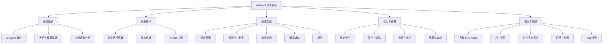
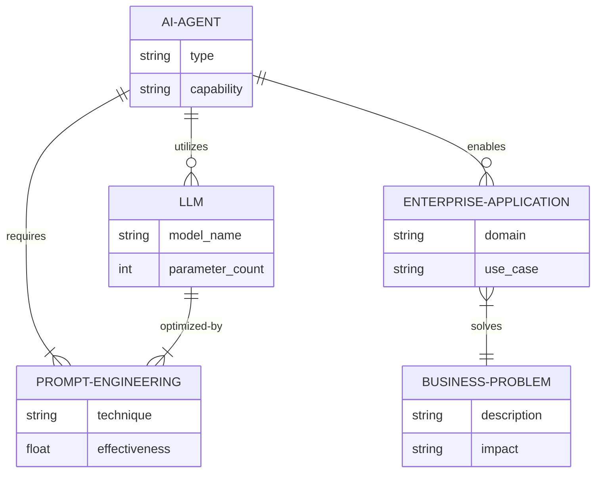
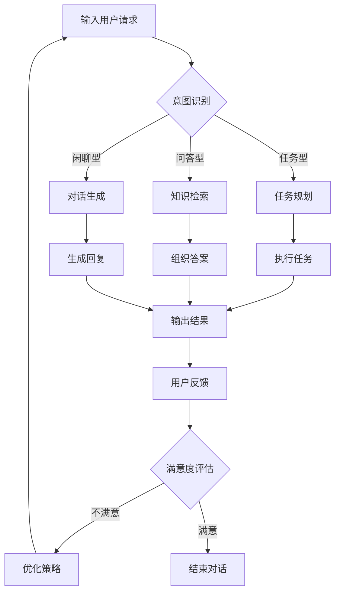
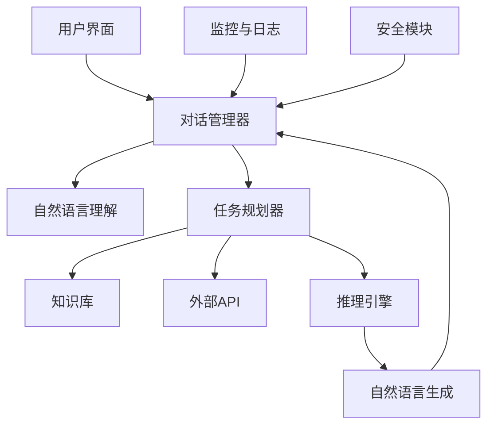

# 前言

在人工智能快速发展的今天，AI Agent 作为一种新兴的智能应用形式，正在revolutionize各个行业的运营方式和效率。本书《AI Agent 开发实战：基于 LLM 的企业级大模型应用指南》旨在为读者提供一个全面、深入且实用的指南，帮助企业和开发者充分利用大语言模型（LLM）的强大能力，构建高效、智能的 AI Agent 系统。

人工智能正在以前所未有的速度改变着我们的世界。在这场技术革命中，AI Agent作为一种新兴的智能系统，正逐渐成为连接人类与AI的重要桥梁。它们不仅能够理解和执行复杂的指令，还能够自主学习、推理决策，甚至与人类进行自然的交互。随着大语言模型（LLM）技术的飞速发展，AI Agent的能力得到了质的飞跃，为企业带来了前所未有的机遇和挑战。

本书旨在为读者提供一个全面、系统、实用的AI Agent开发指南。无论你是经验丰富的AI工程师，还是刚刚踏入这个领域的新手，本书都能为你提供宝贵的洞见和实践经验。

全书共分为五个部分：

第一部分介绍了AI Agent和大语言模型的基础知识，帮助读者建立对这一领域的整体认知。

第二部分深入探讨了AI Agent的开发基础，包括环境搭建、架构设计和Prompt工程等关键技术。

第三部分通过多个实际案例，详细讲解了企业级AI Agent的开发流程和技巧，涵盖了智能客服、办公助手、数据分析、研发辅助和风控等多个应用场景。

第四部分聚焦于AI Agent的优化与部署，包括性能调优、安全防护、监控维护和系统集成等重要主题。

第五部分则展望了AI Agent的未来发展趋势，探讨了多模态、自主学习、协作生态等前沿话题，以及AI伦理与监管等社会议题。

在编写本书时，我始终秉持"理论结合实践"的原则。每个概念都配有详细的代码示例和实际应用案例，帮助读者快速将知识转化为实际技能。同时，我也注重将最新的研究成果和行业动态融入书中，确保内容的前沿性和实用性。

人工智能的发展日新月异，本书中的某些技术可能会随时间推移而更新。我鼓励读者保持持续学习的态度，关注行业动态，并将书中的知识灵活运用到实际工作中。

最后，希望这本书能够成为你在AI Agent开发之路上的得力助手，激发你的创新思维，帮助你在这个充满机遇的领域中取得成功。让我们一起拥抱AI的未来，创造更多改变世界的可能性。

陈光剑
2024年12月于硅谷

## 核心概念：

AI Agent 是一种基于人工智能技术，能够感知环境、做出决策并采取行动以实现特定目标的智能系统。在本书中，我们特别关注基于大语言模型的 AI Agent，这种 Agent 能够理解和生成自然语言，执行复杂的认知任务，并在各种企业应用场景中发挥重要作用。

## 问题背景

随着 GPT、BERT 等大语言模型的出现和快速发展，AI 技术在自然语言处理、知识理解和生成等方面取得了突破性进展。然而，如何将这些先进的 AI 能力有效地应用到实际的企业环境中，构建可靠、高效的 AI Agent 系统，仍然是许多企业和开发者面临的巨大挑战。

## 问题描述

1. 技术门槛高：大语言模型的应用需要深厚的 AI 和编程知识背景。
2. 实施复杂：从概念到落地，涉及架构设计、开发、优化等多个环节。
3. 场景多样：不同的企业应用场景对 AI Agent 有不同的需求和挑战。
4. 持续演进：AI 技术快速发展，需要不断更新知识和技能。
5. 伦理和安全：AI Agent 的应用涉及数据隐私、安全性等敏感问题。

## 问题解决

本书通过系统化的内容结构和实战导向的方法，为读者提供了一套完整的解决方案：

1. 全面介绍 AI Agent 和大语言模型的基础知识。
2. 详细讲解 AI Agent 的开发环境搭建、架构设计和核心技术。
3. 提供多个企业级 AI Agent 开发的实战案例。
4. 深入探讨 AI Agent 的优化、部署、安全和维护策略。
5. 展望 AI Agent 的未来发展趋势和应用前景。

## 边界与外延

本书主要聚焦于基于大语言模型的 AI Agent 开发，涵盖了从基础理论到实际应用的全过程。虽然书中也涉及了其他 AI 技术，如计算机视觉、语音识别等，但主要是作为补充和扩展。读者可以通过本书掌握 AI Agent 开发的核心知识和技能，并将其应用到各种企业级场景中。

## 概念结构与核心要素组成



## 概念之间的关系：

### 概念核心属性维度对比

| 概念 | 主要功能 | 技术基础 | 应用领域 | 挑战 |
|------|---------|----------|----------|------|
| AI Agent | 感知、决策、行动 | 机器学习、NLP | 广泛 | 复杂性、可靠性 |
| 大语言模型 | 文本理解与生成 | 深度学习、Transformer | NLP 相关任务 | 计算资源、偏见 |
| Prompt 工程 | 优化模型输入输出 | NLP、模式识别 | AI 应用开发 | 设计技巧、一致性 |
| 企业级应用 | 解决特定业务问题 | 领域知识、系统集成 | 特定行业或场景 | 定制化、ROI |

### 概念联系的 ER 实体关系



## 数学模型：

AI Agent 的决策过程可以用马尔可夫决策过程（MDP）来描述：

$$
\pi^*(s) = \arg\max_a \sum_{s'} P(s'|s,a)[R(s,a,s') + \gamma V^*(s')]
$$

其中：
- $\pi^*(s)$ 是最优策略
- $s$ 是当前状态
- $a$ 是可能的动作
- $P(s'|s,a)$ 是状态转移概率
- $R(s,a,s')$ 是即时奖励
- $\gamma$ 是折扣因子
- $V^*(s')$ 是下一状态的最优值函数

## 算法流程图：



## 算法源代码：

```python
import openai

class AIAgent:
    def __init__(self, model="gpt-3.5-turbo"):
        self.model = model
        self.conversation_history = []

    def process_input(self, user_input):
        self.conversation_history.append({"role": "user", "content": user_input})
        
        response = openai.ChatCompletion.create(
            model=self.model,
            messages=self.conversation_history
        )
        
        ai_response = response.choices[0].message['content']
        self.conversation_history.append({"role": "assistant", "content": ai_response})
        
        return ai_response

    def reset_conversation(self):
        self.conversation_history = []

# 使用示例
agent = AIAgent()
while True:
    user_input = input("You: ")
    if user_input.lower() == 'exit':
        break
    response = agent.process_input(user_input)
    print("AI:", response)
```

## 实际场景应用

AI Agent 在企业中有广泛的应用，例如：

1. 客户服务：24/7 在线客服，处理咨询、投诉和售后。
2. 智能办公：邮件分类、日程管理、会议纪要生成。
3. 数据分析：自然语言查询数据库，生成报表和洞察。
4. 研发辅助：代码生成、bug 诊断、API 文档自动化。
5. 风险控制：异常交易检测、欺诈识别、合规性检查。

## 项目介绍

本书将通过多个实战项目，展示如何开发这些应用场景下的 AI Agent。每个项目都将包括需求分析、系统设计、核心功能实现、测试和部署等完整流程。

## 环境安装

为了开发 AI Agent，需要搭建以下环境：

1. Python 3.7+
2. 深度学习框架（如 PyTorch 或 TensorFlow）
3. NLP 库（如 Hugging Face Transformers）
4. AI 开发框架（如 Langchain）
5. 版本控制工具（如 Git）
6. 云平台账号（如 AWS 或 Azure）用于部署

详细的安装步骤和配置指南将在相关章节中提供。

## 系统功能设计

一个典型的 AI Agent 系统应包含以下核心功能模块：

1. 输入处理：自然语言理解、意图识别
2. 对话管理：上下文跟踪、多轮对话处理
3. 知识库：信息存储、检索和更新
4. 任务执行：API 调用、数据处理、结果生成
5. 输出生成：自然语言生成、回复优化
6. 学习与适应：用户反馈处理、模型微调

## 系统架构设计



## 系统接口设计

1. 用户接口：RESTful API 或 WebSocket
2. 外部服务集成：标准化 API 封装
3. 数据库接口：ORM 或原生 SQL
4. 模型服务：gRPC 或 RESTful API

## 系统核心实现源代码

```python
from fastapi import FastAPI
from pydantic import BaseModel
from typing import List
import uvicorn

app = FastAPI()

class Message(BaseModel):
    role: str
    content: str

class Conversation(BaseModel):
    messages: List[Message]

@app.post("/chat")
async def chat(conversation: Conversation):
    # 处理对话逻辑
    response = process_conversation(conversation.messages)
    return {"response": response}

def process_conversation(messages):
    # 实现对话处理逻辑
    # 这里应该包括NLU、任务规划、知识检索、NLG等步骤
    return "This is a placeholder response."

if __name__ == "__main__":
    uvicorn.run(app, host="0.0.0.0", port=8000)
```

## 最佳实践tips

1. 始终关注用户体验，确保 AI Agent 的响应准确、相关且有帮助。
2. 实现强大的错误处理和回退机制，以应对意外情况。
3. 持续监控和分析 AI Agent 的性能，收集用户反馈以不断改进。
4. 注重 AI 伦理和数据隐私，确保合规性和用户信任。
5. 采用模块化设计，便于系统的扩展和维护。
6. 建立完善的测试流程，包括单元测试、集成测试和端到端测试。
7. 利用容器化技术实现一致的开发和部署环境。

## 行业发展与未来趋势：

| 时期 | 主要特征 | 技术突破 | 应用领域 |
|------|---------|----------|----------|
| 2010-2015 | 规则基础的对话系统 | 模式匹配、决策树 | 简单客服、FAQ |
| 2015-2020 | 机器学习驱动的智能助手 | 深度学习、注意力机制 | 个人助理、智能家居 |
| 2020-2025 | 大语言模型赋能的 AI Agent | GPT、BERT、Transformer | 企业智能化、创意写作 |
| 2025-2030 (预测) | 多模态、自主学习的 AI Agent | 跨模态学习、元学习 | 全面的智能决策、人机协作 |
| 2030+ (展望) | 通用人工智能 Agent | AGI、类人认知架构 | 复杂问题解决、科学发现 |

## 本章小结

本前言概述了 AI Agent 开发的重要性、面临的挑战以及本书的主要内容和结构。我们介绍了 AI Agent 的核心概念、技术基础和应用场景，并提供了系统设计、开发和部署的基本框架。通过本书，读者将能够掌握基于大语言模型的 AI Agent 开发技能，并将其应用于解决实际的企业级问题。

随着 AI 技术的不断进步，AI Agent 将在未来扮演越来越重要的角色，推动企业数字化转型
