# 第10章：研发辅助 Agent 开发

## 10.1 代码生成与补全

### 核心概念：

代码生成与补全是研发辅助 Agent 的核心功能，旨在通过自动化生成代码片段和智能补全来提高开发者的编程效率。这个功能利用机器学习和自然语言处理技术，基于上下文理解和编程模式分析，为开发者提供实时的代码建议和自动完成。

### 问题背景：

随着软件开发复杂性的增加和开发周期的缩短，开发者需要更高效的工具来加速编码过程。传统的IDE自动完成功能往往局限于简单的语法补全，无法理解更广泛的上下文或提供复杂的代码结构建议。高级的代码生成与补全系统可以显著减少重复性工作，降低错误率，并帮助开发者更快地实现复杂功能。

### 问题描述：

在实现代码生成与补全功能时，开发者面临以下挑战：

1. 如何准确理解开发者的意图和当前编码上下文
2. 如何生成语法正确、风格一致的代码
3. 如何处理多种编程语言和框架
4. 如何平衡建议的相关性和多样性
5. 如何确保生成的代码的安全性和性能

### 问题解决：

通过以下步骤可以实现有效的代码生成与补全功能：

1. 上下文理解：
   - 实现抽象语法树（AST）分析
   - 使用深度学习模型理解代码语义

2. 代码模式学习：
   - 训练大规模代码语料库的语言模型
   - 实现代码克隆检测技术

3. 智能补全生成：
   - 开发基于Transformer的代码生成模型
   - 实现多步预测和beam search优化

4. 个性化适应：
   - 学习用户编码风格和偏好
   - 实现增量学习，持续优化补全建议

5. 多语言支持：
   - 开发语言无关的代码表示
   - 实现跨语言迁移学习

6. 安全性和性能检查：
   - 集成静态代码分析工具
   - 实现运行时性能预估

### 边界与外延：

代码生成与补全功能的应用范围包括：
- IDE和代码编辑器集成
- 自动化测试生成
- API使用示例生成
- 代码重构辅助
- 编程教育工具

### 概念结构与核心要素组成：

代码生成与补全系统的核心组件：
1. 上下文分析器
2. 代码语言模型
3. 补全生成器
4. 个性化引擎
5. 多语言处理器
6. 代码质量检查器

### 概念之间的关系：

#### 概念核心属性维度对比

| 属性 | 传统自动完成 | 基于规则的生成 | AI驱动的代码生成 |
|------|--------------|----------------|-------------------|
| 上下文理解 | 低 | 中 | 高 |
| 生成复杂度 | 低 | 中 | 高 |
| 适应性 | 低 | 中 | 高 |
| 多语言支持 | 中 | 中 | 高 |
| 个性化程度 | 低 | 低 | 高 |
| 学习能力 | 无 | 有限 | 持续学习 |

#### 概念联系的ER 实体关系

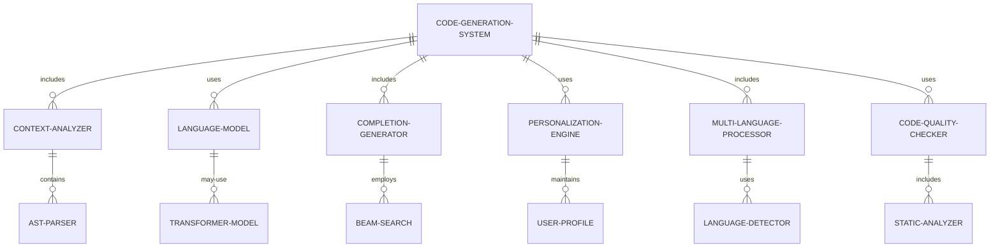

#### 交互关系图

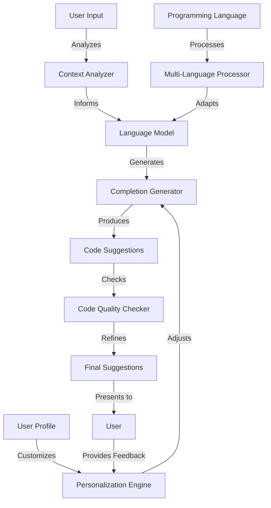

### 数学模型：

使用Transformer模型进行代码生成：

给定输入序列 $X = (x_1, ..., x_n)$，模型生成输出序列 $Y = (y_1, ..., y_m)$。对于每个位置 $i$，模型计算注意力权重：

$$\text{Attention}(Q, K, V) = \text{softmax}(\frac{QK^T}{\sqrt{d_k}})V$$

其中 $Q$, $K$, $V$ 分别是查询、键和值矩阵，$d_k$ 是键的维度。

最终的输出概率分布：

$$P(y_i | y_{<i}, X) = \text{softmax}(W_o \text{LayerNorm}(\text{FFN}(\text{MultiHead}(h_{i-1}))))$$

其中 $h_{i-1}$ 是前一个时间步的隐藏状态，FFN 是前馈神经网络。

### 算法流程图：

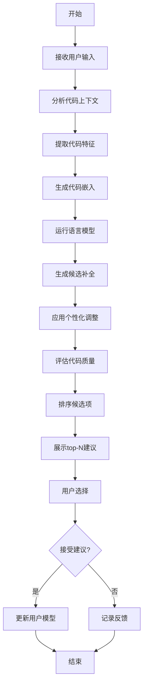

### 算法源代码：

以下是一个简化的代码生成与补全系统的 Python 实现示例：

```python
import re
from typing import List, Dict
from transformers import GPT2LMHeadModel, GPT2Tokenizer

class CodeCompletionSystem:
    def __init__(self, model_name: str = "gpt2"):
        self.tokenizer = GPT2Tokenizer.from_pretrained(model_name)
        self.model = GPT2LMHeadModel.from_pretrained(model_name)
        self.user_preferences = {}

    def analyze_context(self, code: str) -> Dict[str, any]:
        # 简化的上下文分析
        context = {
            "language": self.detect_language(code),
            "imports": self.extract_imports(code),
            "functions": self.extract_functions(code),
            "variables": self.extract_variables(code)
        }
        return context

    def detect_language(self, code: str) -> str:
        # 简单的语言检测逻辑
        if "def " in code or "import " in code:
            return "python"
        elif "function " in code or "var " in code:
            return "javascript"
        else:
            return "unknown"

    def extract_imports(self, code: str) -> List[str]:
        return re.findall(r'import (\w+)', code)

    def extract_functions(self, code: str) -> List[str]:
        return re.findall(r'def (\w+)', code)

    def extract_variables(self, code: str) -> List[str]:
        return re.findall(r'(\w+)\s*=', code)

    def generate_completion(self, code: str, max_length: int = 50) -> str:
        context = self.analyze_context(code)
        input_ids = self.tokenizer.encode(code, return_tensors="pt")
        
        # 生成补全
        output = self.model.generate(
            input_ids, 
            max_length=input_ids.shape[1] + max_length,
            num_return_sequences=1,
            no_repeat_ngram_size=2,
            do_sample=True,
            top_k=50,
            top_p=0.95,
            temperature=0.7
        )
        
        completed_text = self.tokenizer.decode(output[0], skip_special_tokens=True)
        new_code = completed_text[len(code):]
        
        return self.post_process(new_code, context)

    def post_process(self, code: str, context: Dict[str, any]) -> str:
        # 简单的后处理逻辑
        if context["language"] == "python":
            code = self.adjust_indentation(code)
        return code

    def adjust_indentation(self, code: str) -> str:
        lines = code.split("\n")
        adjusted_lines = []
        indent_level = 0
        for line in lines:
            if line.strip().startswith("def ") or line.strip().startswith("class "):
                adjusted_lines.append("    " * indent_level + line.strip())
                indent_level += 1
            elif line.strip().startswith("return "):
                indent_level = max(0, indent_level - 1)
                adjusted_lines.append("    " * indent_level + line.strip())
            else:
                adjusted_lines.append("    " * indent_level + line.strip())
        return "\n".join(adjusted_lines)

    def update_user_preferences(self, user_id: str, accepted_completion: str):
        if user_id not in self.user_preferences:
            self.user_preferences[user_id] = {"style": {}, "frequent_patterns": {}}
        
        # 更新用户偏好的编码风格
        style = self.user_preferences[user_id]["style"]
        style["indentation"] = self.detect_indentation(accepted_completion)
        
        # 更新频繁使用的模式
        patterns = self.user_preferences[user_id]["frequent_patterns"]
        for pattern in self.extract_patterns(accepted_completion):
            patterns[pattern] = patterns.get(pattern, 0) + 1

    def detect_indentation(self, code: str) -> str:
        if code.startswith("    "):
            return "spaces"
        elif code.startswith("\t"):
            return "tabs"
        else:
            return "unknown"

    def extract_patterns(self, code: str) -> List[str]:
        # 简化的模式提取
        return re.findall(r'\b(\w+\s+\w+\s+\w+)\b', code)

# 使用示例
completion_system = CodeCompletionSystem()

code_snippet = """
def calculate_average(numbers):
    total = sum(numbers)
    count = len(numbers)
    average = 
"""

completion = completion_system.generate_completion(code_snippet)
print(f"Generated completion:\n{completion}")

# 模拟用户接受补全
user_id = "user123"
completion_system.update_user_preferences(user_id, completion)

print(f"Updated user preferences: {completion_system.user_preferences[user_id]}")
```

### 实际场景应用：

1. IDE集成：
   - 实时代码补全和建议
   - 智能代码重构建议

2. API文档生成：
   - 自动生成API使用示例
   - 根据注释生成文档字符串

3. 单元测试生成：
   - 基于函数签名自动生成测试用例
   - 生成边界条件和异常测试

4. 代码迁移辅助：
   - 辅助将代码从一种语言转换到另一种语言
   - 提供框架迁移建议

5. 编程教育：
   - 为学生提供个性化的编码建议
   - 生成练习题和解决方案

### 行业发展与未来趋势：

| 时期 | 主要特征 | 代表性技术/方法 |
|------|----------|-----------------|
| 2015-2017 | 基于规则的补全 | 语法分析、模式匹配 |
| 2018-2020 | 统计学习方法 | N-gram模型、LSTM |
| 2021-2023 | 深度学习突破 | Transformer、GPT for代码 |
| 2024及以后 | 上下文感知和多模态 | 跨模态理解、神经符号结合 |

### 本章小结：

代码生成与补全是研发辅助 Agent 的核心功能，它通过智能化的代码建议和自动完成显著提高了开发效率。本章讨论了实现这一功能的主要挑战、解决方案和技术实现。主要要点包括：

1. 深度上下文理解对于生成高质量、相关的代码建议至关重要。
2. 大规模预训练语言模型在代码生成任务中表现出色。
3. 个性化适应能够显著提高代码建议的相关性和接受度。
4. 多语言支持和跨语言学习是提高系统通用性的关键。
5. 代码质量和安全性检查是确保生成代码可靠性的必要步骤。

未来的代码生成与补全系统发展趋势可能包括：
1. 更强大的语义理解能力，能够理解代码的意图和业务逻辑
2. 跨文件和项目级别的上下文理解，提供更全面的代码建议
3. 集成形式化方法，生成经过验证的正确代码
4. 自适应学习系统，能够从全球开发者社区持续学习最佳实践
5. 多模态输入支持，如自然语言、图表到代码的转换

在实现代码生成与补全功能时，开发者应当注意：
1. 平衡建议的准确性和多样性，避免限制开发者的创造性
2. 确保系统的可解释性，帮助开发者理解生成代码的原理
3. 重视隐私和知识产权问题，特别是在处理专有代码时
4. 设计直观的用户界面，使开发者能够轻松接受、修改或拒绝建议
5. 实现高效的性能优化，确保代码补全不会影响编辑器的响应速度

通过不断改进的代码生成与补全技术，研发辅助 Agent 将能够更有效地支持软件开发过程，不仅提高编码效率，还能帮助开发者学习新技术、改进代码质量。这不仅能加速软件开发周期，还能提高代码的一致性和可维护性。随着技术的进步，我们可以期待看到更智能、更精准的代码辅助工具，最终实现真正的"AI配对程序员"，为软件开发行业带来革命性的变革。

## 10.2 代码审查与优化建议

### 核心概念：

代码审查与优化建议是研发辅助 Agent 的重要功能，旨在自动化识别代码中的潜在问题、性能瓶颈，并提供改进建议。这个功能结合了静态代码分析、动态性能分析和机器学习技术，帮助开发者提高代码质量、可维护性和执行效率。

### 问题背景：

随着软件系统的复杂性不断增加，手动代码审查变得越来越耗时且容易出错。同时，性能优化需要深入的专业知识和经验。自动化的代码审查和优化建议系统可以帮助开发团队更快地识别问题，保持代码质量，并持续改进系统性能。

### 问题描述：

在实现代码审查与优化建议功能时，开发者面临以下挑战：

1. 如何准确识别各种编程语言中的代码问题和反模式
2. 如何评估代码的性能和资源使用情况
3. 如何生成具体、可操作的优化建议
4. 如何处理不同编程范式和架构风格
5. 如何平衡改进建议的普适性和特定项目的需求

### 问题解决：

通过以下步骤可以实现有效的代码审查与优化建议功能：

1. 静态代码分析：
   - 实现抽象语法树（AST）分析
   - 使用规则引擎检测常见代码问题

2. 动态性能分析：
   - 集成性能profiling工具
   - 实现内存使用和CPU时间分析

3. 机器学习模型：
   - 训练模型识别复杂的代码模式
   - 实现基于历史数据的性能预测

4. 最佳实践数据库：
   - 构建语言特定的最佳实践库
   - 实现设计模式识别和建议

5. 上下文感知分析：
   - 考虑项目特定的配置和依赖
   - 分析代码变更的影响范围

6. 优化建议生成：
   - 开发自然语言生成模型，提供清晰的建议
   - 实现建议优先级排序机制

### 边界与外延：

代码审查与优化建议功能的应用范围包括：
- 持续集成/持续部署（CI/CD）流程
- IDE插件
- 代码质量管理平台
- 性能调优工具
- 技术债务管理

### 概念结构与核心要素组成：

代码审查与优化建议系统的核心组件：
1. 静态分析器
2. 动态性能分析器
3. 机器学习模型
4. 最佳实践引擎
5. 上下文分析器
6. 建议生成器

### 概念之间的关系：

#### 概念核心属性维度对比

| 属性 | 手动代码审查 | 自动化静态分析 | AI驱动的审查与优化 |
|------|--------------|----------------|---------------------|
| 覆盖范围 | 有限 | 广泛 | 全面 |
| 一致性 | 低 | 高 | 高 |
| 深度 | 高 | 中 | 高 |
| 效率 | 低 | 高 | 非常高 |
| 上下文理解 | 高 | 低 | 中-高 |
| 学习能力 | 有限 | 无 | 持续学习 |

#### 概念联系的ER 实体关系

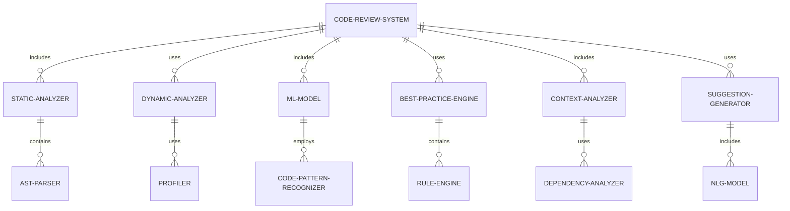

#### 交互关系图

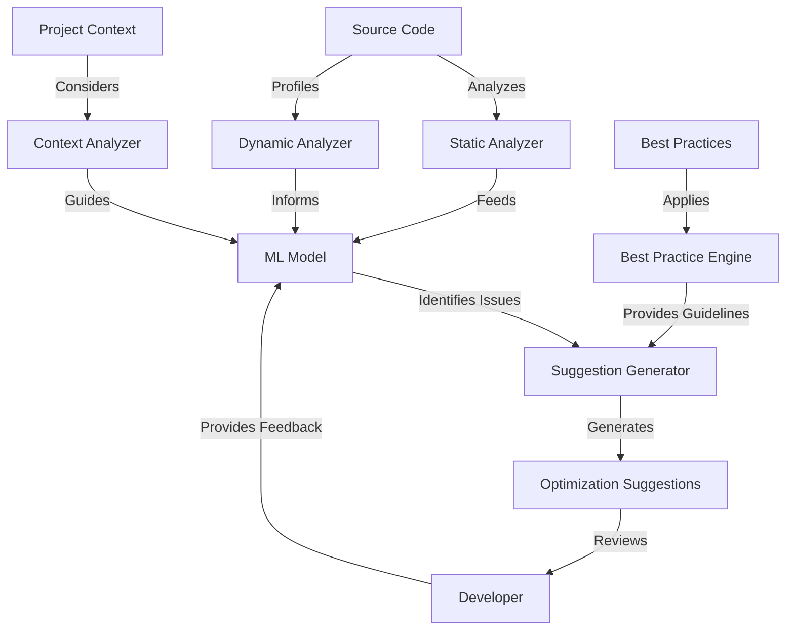

### 数学模型：

使用决策树集成方法（如随机森林）进行代码问题分类：

给定特征向量 $X = (x_1, ..., x_n)$，决策树 $h_i(X)$ 的集成预测为：

$$H(X) = \text{mode}\{h_1(X), h_2(X), ..., h_m(X)\}$$

其中 $m$ 是决策树的数量，mode 表示众数。

每个决策树通过最小化基尼不纯度来选择最佳分割：

$$G = \sum_{i=1}^k p_i(1-p_i)$$

其中 $k$ 是类别数，$p_i$ 是第 $i$ 类的比例。

### 算法流程图：

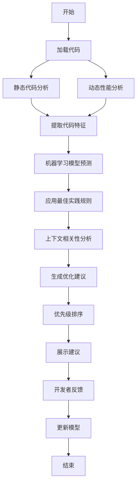

### 算法源代码：

以下是一个简化的代码审查与优化建议系统的 Python 实现示例：

```python
import ast
import re
from typing import List, Dict

class CodeReviewSystem:
    def __init__(self):
        self.static_issues = []
        self.performance_issues = []
        self.best_practices = {
            "python": [
                ("使用列表推导式", r"for\s+\w+\s+in\s+\w+:\s*\w+\.append"),
                ("避免全局变量", r"global\s+\w+"),
                ("使用f-string", r"'%s'\s*%\s*\w+"),
            ]
        }

    def analyze_code(self, code: str, language: str) -> List[Dict]:
        self.static_analysis(code, language)
        self.performance_analysis(code)
        return self.generate_suggestions()

    def static_analysis(self, code: str, language: str):
        # 简化的静态分析
        tree = ast.parse(code)
        for node in ast.walk(tree):
            if isinstance(node, ast.FunctionDef) and len(node.body) > 20:
                self.static_issues.append({
                    "type": "复杂度",
                    "message": f"函数 '{node.name}' 可能过于复杂，考虑拆分。"
                })
        
        # 检查最佳实践
        for name, pattern in self.best_practices.get(language, []):
            if re.search(pattern, code):
                self.static_issues.append({
                    "type": "最佳实践",
                    "message": f"考虑 {name}。"
                })

    def performance_analysis(self, code: str):
        # 简化的性能分析
        if "+=" in code and any(container in code for container in ["list", "dict", "set"]):
            self.performance_issues.append({
                "type": "性能",
                "message": "使用 '+=' 连接大型容器可能影响性能，考虑使用更高效的方法。"
            })

    def generate_suggestions(self) -> List[Dict]:
        suggestions = []
        for issue in self.static_issues + self.performance_issues:
            suggestion = {
                "category": issue["type"],
                "description": issue["message"],
                "priority": self.calculate_priority(issue)
            }
            suggestions.append(suggestion)
        return sorted(suggestions, key=lambda x: x["priority"], reverse=True)

    def calculate_priority(self, issue: Dict) -> int:
        # 简化的优先级计算
        if issue["type"] == "性能":
            return 3
        elif issue["type"] == "复杂度":
            return 2
        else:
            return 1

# 使用示例
review_system = CodeReviewSystem()

code_snippet = """
def process_data(data):
    global result
    result = []
    for item in data:
        result.append(item * 2)
    return '%s' % str(result)
"""

suggestions = review_system.analyze_code(code_snippet, "python")

print("Code Review Suggestions:")
for suggestion in suggestions:
    print(f"[{suggestion['category']} - Priority: {suggestion['priority']}] {suggestion['description']}")
```

### 实际场景应用：

1. CI/CD流程集成：
   - 在代码提交时自动运行审查
   - 阻止不符合质量标准的代码合并

2. IDE实时反馈：
   - 在开发者编码时提供即时建议
   - 集成重构工具，一键应用优化

3. 技术债务管理：
   - 识别和量化代码库中的技术债务
   - 生成改进计划和优先级列表

4. 性能调优：
   - 识别应用程序的性能瓶颈
   - 提供具体的优化建议和预期收益

5. 安全漏洞检测：
   - 识别潜在的安全风险
   - 提供符合安全最佳实践的改进建议

### 行业发展与未来趋势：

| 时期 | 主要特征 | 代表性技术/方法 |
|------|----------|-----------------|
| 2015-2017 | 基础静态分析 | Lint工具、正则表达式匹配 |
| 2018-2020 | 集成动态分析 | AST分析、性能profiling |
| 2021-2023 | AI辅助代码审查 | 机器学习模型、自然语言处理 |
| 2024及以后 | 智能化协同优化 | 强化学习、自适应系统 |

### 本章小结：

代码审查与优化建议是研发辅助 Agent 的关键功能，它通过自动化分析提高代码质量和性能。本章讨论了实现这一功能的主要挑战、解决方案和技术实现。主要要点包括：

1. 结合静态和动态分析可以全面评估代码质量和性能。
2. 机器学习模型能够识别复杂的代码模式和潜在问题。
3. 上下文感知分析对于提供相关且有价值的建议至关重要。
4. 最佳实践数据库和持续学习机制可以不断改进建议质量。
5. 清晰、可操作的建议展示对于提高开发者接受度和实施率至关重要。

未来的代码审查与优化建议系统发展趋势可能包括：
1. 更深入的语义理解，能够分析代码的意图和业务逻辑
2. 跨项目学习，从大规模开源代码库中提取最佳实践
3. 实时协作审查，支持多人同时进行代码审查和讨论
4. 预测性分析，预测代码变更可能导致的长期影响
5. 自适应优化策略，根据项目特性和团队风格调整建议

在实现代码审查与优化建议功能时，开发者应当注意：
1. 平衡自动化与人工审查，保留人类专家的判断和创造力
2. 确保建议的可解释性，帮助开发者理解问题的根源
3. 考虑不同编程范式和架构风格，避免过于教条化的建议
4. 实现增量分析，以支持大型代码库的快速审查
5. 注重隐私和知识产权保护，特别是在处理专有代码时

通过不断改进的代码审查与优化建议技术，研发辅助 Agent 将能够更有效地支持软件质量保证和性能优化过程。这不仅能提高代码质量和系统性能，还能促进开发团队的学习和最佳实践的传播。随着技术的进步，我们可以期待看到更智能、更全面的代码审查系统，最终实现"虚拟质量保证专家"的角色，为软件开发过程带来革命性的改进。

## 10.3 API 文档生成

### 核心概念：

API 文档生成是研发辅助 Agent 的重要功能，旨在自动化创建准确、全面且易于理解的 API 文档。这个功能利用代码分析、自然语言处理和文档模板技术，从源代码、注释和其他元数据中提取信息，生成结构化的 API 文档。

### 问题背景：

高质量的 API 文档对于软件开发至关重要，它能够促进代码的可维护性、可重用性，并降低集成成本。然而，手动编写和维护 API 文档往往耗时且容易出错，特别是在快速迭代的开发环境中。自动化的 API 文档生成可以确保文档与代码保持同步，提高文档的准确性和完整性。

### 问题描述：

在实现 API 文档生成功能时，开发者面临以下挑战：

1. 如何准确提取 API 的结构、参数和返回值信息
2. 如何处理不同编程语言和框架的特性
3. 如何生成清晰、一致的文档描述
4. 如何处理代码注释中的自然语言描述
5. 如何保持生成的文档与代码变更的同步

### 问题解决：

通过以下步骤可以实现有效的 API 文档生成功能：

1. 代码解析：
   - 实现抽象语法树（AST）分析
   - 提取函数签名、类定义和模块结构

2. 注释分析：
   - 解析文档字符串和行内注释
   - 使用自然语言处理技术理解注释内容

3. 类型推断：
   - 分析代码以推断参数和返回值类型
   - 处理动态类型语言的类型注解

4. 模板系统：
   - 设计灵活的文档模板
   - 支持自定义输出格式（如 Markdown、HTML）

5. 示例代码生成：
   - 提取或生成 API 使用示例
   - 确保示例代码的正确性和可运行性

6. 版本控制集成：
   - 实现与版本控制系统的集成
   - 跟踪 API 变更并更新文档

### 边界与外延：

API 文档生成功能的应用范围包括：
- 库和框架文档
- RESTful API 文档
- SDK 使用指南
- 微服务接口规范
- 内部系统 API 文档

### 概念结构与核心要素组成：

API 文档生成系统的核心组件：
1. 代码解析器
2. 注释分析器
3. 类型推断引擎
4. 模板渲染器
5. 示例代码生成器
6. 版本控制集成器

### 概念之间的关系：

#### 概念核心属性维度对比

| 属性 | 手动文档编写 | 基础自动生成 | AI 增强的文档生成 |
|------|--------------|--------------|-------------------|
| 准确性 | 中-低 | 高 | 非常高 |
| 一致性 | 低 | 高 | 高 |
| 完整性 | 中 | 高 | 非常高 |
| 可读性 | 高 | 中 | 高 |
| 维护成本 | 高 | 低 | 非常低 |
| 上下文理解 | 高 | 低 | 中-高 |

#### 概念联系的ER 实体关系

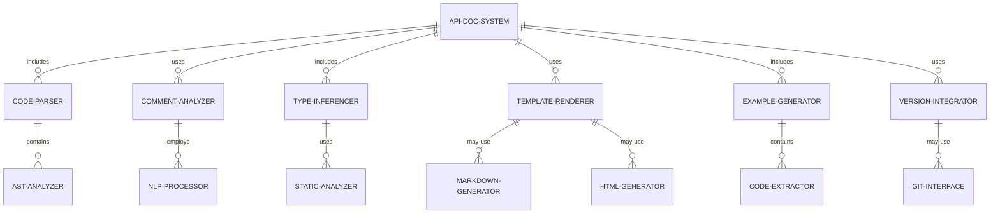

#### 交互关系图

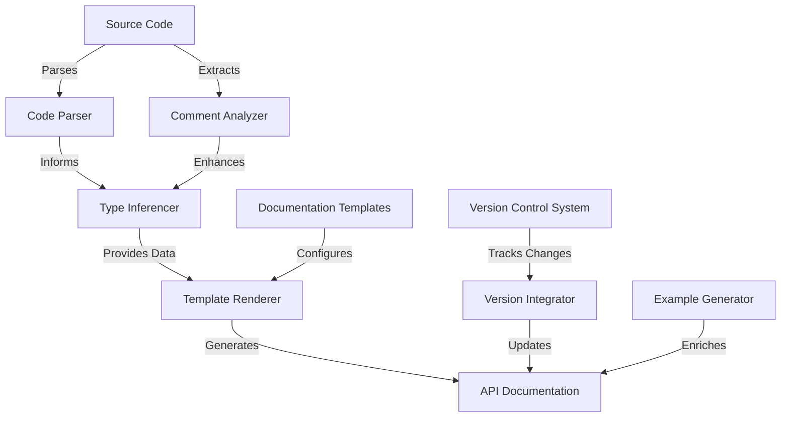

### 数学模型：

使用 TF-IDF（词频-逆文档频率）来提取注释中的关键词：

$$\text{TF-IDF}(t,d,D) = \text{TF}(t,d) \cdot \text{IDF}(t,D)$$

其中：
- $\text{TF}(t,d)$ 是词 $t$ 在文档 $d$ 中的频率
- $\text{IDF}(t,D) = \log\frac{N}{|\{d \in D: t \in d\}|}$，$N$ 是总文档数

### 算法流程图：

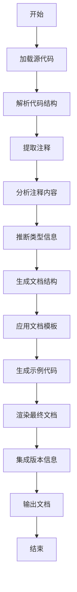

### 算法源代码：

以下是一个简化的 API 文档生成系统的 Python 实现示例：

```python
import ast
import re
from typing import Dict, List

class APIDocGenerator:
    def __init__(self):
        self.api_docs = {}

    def parse_code(self, code: str):
        tree = ast.parse(code)
        for node in ast.walk(tree):
            if isinstance(node, ast.FunctionDef):
                self.process_function(node)

    def process_function(self, node: ast.FunctionDef):
        doc_string = ast.get_docstring(node) or ""
        params = [arg.arg for arg in node.args.args]
        returns = self.infer_return_type(node)
        
        self.api_docs[node.name] = {
            "description": self.extract_description(doc_string),
            "parameters": self.extract_params(doc_string, params),
            "returns": self.extract_returns(doc_string, returns),
            "example": self.generate_example(node)
        }

    def extract_description(self, doc_string: str) -> str:
        lines = doc_string.split("\n")
        description = []
        for line in lines:
            if line.strip().startswith(":param") or line.strip().startswith(":return"):
                break
            description.append(line.strip())
        return " ".join(description).strip()

    def extract_params(self, doc_string: str, params: List[str]) -> Dict[str, str]:
        param_docs = {}
        for param in params:
            match = re.search(f":param {param}:(.*?)(?:$|\n)", doc_string, re.DOTALL)
            param_docs[param] = match.group(1).strip() if match else "No description provided."
        return param_docs

    def extract_returns(self, doc_string: str, inferred_type: str) -> str:
        match = re.search(r":return:(.*?)(?:$|\n)", doc_string, re.DOTALL)
        return_doc = match.group(1).strip() if match else "No description provided."
        return f"{return_doc} (Inferred type: {inferred_type})"

    def infer_return_type(self, node: ast.FunctionDef) -> str:
        return_nodes = [n for n in ast.walk(node) if isinstance(n, ast.Return)]
        if return_nodes:
            return_node = return_nodes[0]
            if isinstance(return_node.value, ast.Name):
                return return_node.value.id
            elif isinstance(return_node.value, ast.Num):
                return type(return_node.value.n).__name__
            elif isinstance(return_node.value, ast.Str):
                return "str"
        return "Unknown"

    def generate_example(self, node: ast.FunctionDef) -> str:
        params = ", ".join(arg.arg for arg in node.args.args)
        return f"{node.name}({params})"

    def generate_markdown(self) -> str:
        markdown = "# API Documentation\n\n"
        for func_name, func_info in self.api_docs.items():
            markdown += f"## `{func_name}`\n\n"
            markdown += f"{func_info['description']}\n\n"
            
            markdown += "### Parameters\n\n"
            for param, desc in func_info['parameters'].items():
                markdown += f"- `{param}`: {desc}\n"
            markdown += "\n"
            
            markdown += f"### Returns\n\n{func_info['returns']}\n\n"
            
            markdown += f"### Example\n\n```python\n{func_info['example']}\n```\n\n"
        
        return markdown

# 使用示例
doc_generator = APIDocGenerator()

sample_code = """
def calculate_average(numbers: list) -> float:
    \"\"\"
    Calculate the average of a list of numbers.
    
    :param numbers: A list of numbers
    :return: The average of the numbers
    \"\"\"
    total = sum(numbers)
    count = len(numbers)
    return total / count if count > 0 else 0
"""

doc_generator.parse_code(sample_code)
markdown_doc = doc_generator.generate_markdown()
print(markdown_doc)
```

### 实际场景应用：

1. 开源库文档：
   - 自动生成 README 和详细 API 参考
   - 集成到持续集成流程，确保文档及时更新

2. RESTful API 文档：
   - 从代码注释生成 Swagger/OpenAPI 规范
   - 提供交互式 API 探索界面

3. 内部系统文档：
   - 生成内部微服务接口文档
   - 支持团队协作和知识共享

4. SDK 文档：
   - 生成多语言 SDK 的使用指南
   - 包含代码示例和最佳实践

5. 代码变更文档：
   - 自动生成版本间的 API 变更日志
   - 标注废弃的 API 和新增功能

### 行业发展与未来趋势：

| 时期 | 主要特征 | 代表性技术/方法 |
|------|----------|-----------------|
| 2015-2017 | 基础注释解析 | Javadoc, Sphinx |
| 2018-2020 | 智能文档生成 | NLP 增强、自动示例生成 |
| 2021-2023 | 交互式文档 | 实时代码执行、API 沙箱 |
| 2024及以后 | AI 驱动的文档助手 | 上下文感知、自然语言查询 |

### 本章小结：

API 文档生成是研发辅助 Agent 的关键功能，它通过自动化流程提高文档的质量和一致性。本章讨论了实现这一功能的主要挑战、解决方案和技术实现。主要要点包括：

1. 结合代码解析和注释分析可以生成全面、准确的 API 文档。
2. 类型推断和示例代码生成增强了文档的实用性。
3. 灵活的模板系统支持多种输出格式，满足不同需求。
4. 版本控制集成确保文档与代码保持同步。
5. 自然语言处理技术提高了文档描述的质量和可读性。

未来的 API 文档生成系统发展趋势可能包括：
1. 更智能的上下文理解，能够生成更贴合业务逻辑的文档描述
2. 跨语言文档生成，支持多语言项目的统一文档管理
3. 实时协作编辑，允许开发者在生成的文档基础上进行实时修改和讨论
4. 集成 API 测试和性能指标，提供更全面的 API 使用指导
5. 自适应学习系统，根据用户反馈不断优化文档质量和结构

在实现 API 文档生成功能时，开发者应当注意：
1. 保持文档的简洁性和可读性，避免过度生成冗长的描述
2. 提供灵活的配置选项，允许用户自定义文档的结构和内容
3. 确保生成的文档符合行业标准和最佳实践
4. 实现增量更新机制，以支持大型项目的快速文档更新
5. 注重文档的可访问性和搜索功能，方便用户快速找到所需信息

通过不断改进的 API 文档生成技术，研发辅助 Agent 将能够更有效地支持软件开发和维护过程。这不仅能提高文档的质量和一致性，还能显著减少开发者在文档编写上的时间投入。随着技术的进步，我们可以期待看到更智能、更全面的文档生成系统，最终实现"智能技术文档助手"的角色，为软件开发生命周期中的文档管理带来革命性的改进。

## 10.4 测试用例生成

### 核心概念：

测试用例生成是研发辅助 Agent 的重要功能，旨在自动化创建全面、有效的软件测试用例。这个功能结合了代码分析、符号执行、模糊测试和机器学习技术，以生成能够充分覆盖代码路径、边界条件和异常情况的测试用例。

### 问题背景：

高质量的测试用例对于确保软件质量和可靠性至关重要。然而，手动编写全面的测试用例不仅耗时，而且容易遗漏关键场景。自动化测试用例生成可以提高测试覆盖率，发现潜在的 bug，并显著减少测试人员的工作负担。

### 问题描述：

在实现测试用例生成功能时，开发者面临以下挑战：

1. 如何生成能够充分覆盖代码路径的测试用例
2. 如何识别和测试边界条件和异常情况
3. 如何生成有意义且可维护的测试数据
4. 如何处理复杂的依赖关系和环境设置
5. 如何平衡测试覆盖率和执行效率

### 问题解决：

通过以下步骤可以实现有效的测试用例生成功能：

1. 代码分析：
   - 实现静态代码分析以识别关键路径
   - 使用符号执行技术探索可能的执行路径

2. 测试策略生成：
   - 应用不同的测试策略（如等价类划分、边界值分析）
   - 使用遗传算法优化测试用例集

3. 数据生成：
   - 实现智能数据生成器，创建有效的测试输入
   - 使用模糊测试技术生成边缘情况输入

4. 依赖管理：
   - 分析和模拟复杂的依赖关系
   - 自动生成测试桩（Stub）和模拟对象（Mock）

5. 测试用例优化：
   - 实现测试用例去重和简化算法
   - 使用机器学习模型预测测试用例的有效性

6. 测试脚本生成：
   - 生成可执行的测试脚本
   - 支持多种测试框架和语言

### 边界与外延：

测试用例生成功能的应用范围包括：
- 单元测试
- 集成测试
- 功能测试
- 性能测试
- 安全测试

### 概念结构与核心要素组成：

测试用例生成系统的核心组件：
1. 代码分析器
2. 路径探索引擎
3. 测试策略生成器
4. 数据生成器
5. 依赖管理器
6. 测试优化器
7. 脚本生成器

### 概念之间的关系：

#### 概念核心属性维度对比

| 属性 | 手动测试设计 | 基于规则的生成 | AI驱动的测试生成 |
|------|--------------|----------------|-------------------|
| 覆盖率 | 中 | 高 | 非常高 |
| 效率 | 低 | 中 | 高 |
| 创新性 | 高 | 低 | 中-高 |
| 可维护性 | 中 | 中-高 | 高 |
| 适应性 | 中 | 低 | 高 |
| 边缘情况识别 | 中-高 | 中 | 高 |

#### 概念联系的ER 实体关系

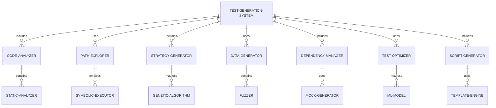

#### 交互关系图

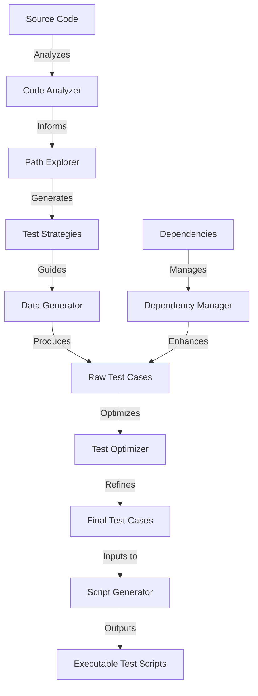

### 数学模型：

使用遗传算法优化测试用例集：

定义适应度函数 $f(x)$，其中 $x$ 是测试用例集：

$$f(x) = w_1 \cdot \text{coverage}(x) + w_2 \cdot \frac{1}{\text{executionTime}(x)} - w_3 \cdot \text{complexity}(x)$$

其中 $w_1$, $w_2$, $w_3$ 是权重系数，coverage 是代码覆盖率，executionTime 是执行时间，complexity 是测试用例的复杂度。

### 算法流程图：

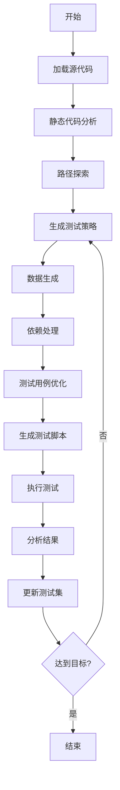

### 算法源代码：

以下是一个简化的测试用例生成系统的 Python 实现示例：

```python
import ast
import random
from typing import List, Dict

class TestCaseGenerator:
    def __init__(self):
        self.test_cases = []
        self.coverage = set()

    def analyze_code(self, code: str):
        tree = ast.parse(code)
        for node in ast.walk(tree):
            if isinstance(node, ast.FunctionDef):
                self.generate_test_cases(node)

    def generate_test_cases(self, func_node: ast.FunctionDef):
        func_name = func_node.name
        args = [arg.arg for arg in func_node.args.args]
        
        # 生成基本测试用例
        self.test_cases.append(self.generate_basic_test(func_name, args))
        
        # 生成边界测试用例
        self.test_cases.extend(self.generate_boundary_tests(func_name, args))
        
        # 生成异常测试用例
        self.test_cases.append(self.generate_exception_test(func_name, args))

    def generate_basic_test(self, func_name: str, args: List[str]) -> Dict:
        return {
            "name": f"test_{func_name}_basic",
            "function": func_name,
            "inputs": {arg: self.generate_random_value() for arg in args},
            "expected": "RUNTIME_RESULT"  # 占位符，实际运行时替换
        }

    def generate_boundary_tests(self, func_name: str, args: List[str]) -> List[Dict]:
        boundary_tests = []
        for arg in args:
            boundary_tests.append({
                "name": f"test_{func_name}_{arg}_min",
                "function": func_name,
                "inputs": {a: self.generate_min_value() if a == arg else self.generate_random_value() for a in args},
                "expected": "RUNTIME_RESULT"
            })
            boundary_tests.append({
                "name": f"test_{func_name}_{arg}_max",
                "function": func_name,
                "inputs": {a: self.generate_max_value() if a == arg else self.generate_random_value() for a in args},
                "expected": "RUNTIME_RESULT"
            })
        return boundary_tests

    def generate_exception_test(self, func_name: str, args: List[str]) -> Dict:
        return {
            "name": f"test_{func_name}_exception",
            "function": func_name,
            "inputs": {arg: None for arg in args},
            "expected": Exception
        }

    def generate_random_value(self):
        return random.choice([0, 1, -1, 100, -100, "test", True, False, None])

    def generate_min_value(self):
        return random.choice([float('-inf'), -sys.maxsize, 0, False, ""])

    def generate_max_value(self):
        return random.choice([float('inf'), sys.maxsize, 10**6, True, "x" * 1000])

    def generate_test_script(self) -> str:
        script = "import unittest\n\n"
        script += "class GeneratedTests(unittest.TestCase):\n"
        
        for test_case in self.test_cases:
            script += f"    def {test_case['name']}(self):\n"
            inputs_str = ", ".join([f"{k}={repr(v)}" for k, v in test_case['inputs'].items()])
            script += f"        result = {test_case['function']}({inputs_str})\n"
            if test_case['expected'] == Exception:
                script += f"        self.assertRaises(Exception, {test_case['function']}, {inputs_str})\n"
            else:
                script += f"        self.assertEqual(result, {test_case['expected']})\n"
            script += "\n"
        
        script += "if __name__ == '__main__':\n"
        script += "    unittest.main()\n"
        
        return script

# 使用示例
generator = TestCaseGenerator()

sample_code = """
def calculate_discount(price: float, discount_percentage: float) -> float:
    if discount_percentage < 0 or discount_percentage > 100:
        raise ValueError("Discount percentage must be between 0 and 100")
    discount = price * (discount_percentage / 100)
    return price - discount
"""

generator.analyze_code(sample_code)
test_script = generator.generate_test_script()
print(test_script)
```

### 实际场景应用：

1. 持续集成/持续部署（CI/CD）：
   - 自动生成单元测试和集成测试
   - 在代码变更时自动更新和执行测试用例

2. 安全测试：
   - 生成模糊测试用例以发现潜在的安全漏洞
   - 自动化渗透测试场景生成

3. 性能测试：
   - 生成不同负载条件下的测试场景
   - 自动识别性能瓶颈和优化机会

4. API 测试：
   - 基于 API 规范自动生成测试用例
   - 覆盖各种请求参数组合和边界条件

5. 回归测试：
   - 自动生成和维护回归测试套件
   - 智能选择最有可能发现问题的测试用例

### 行业发展与未来趋势：

| 时期 | 主要特征 | 代表性技术/方法 |
|------|----------|-----------------|
| 2015-2017 | 基于规则的生成 | 等价类划分、边界值分析 |
| 2018-2020 | 智能化测试生成 | 符号执行、遗传算法 |
| 2021-2023 | AI驱动的测试优化 | 机器学习、深度强化学习 |
| 2024及以后 | 自适应测试生态系统 | 持续学习、上下文感知测试 |

### 本章小结：

测试用例生成是研发辅助 Agent 的关键功能，它通过自动化创建全面、有效的测试用例来提高软件质量和可靠性。本章讨论了实现这一功能的主要挑战、解决方案和技术实现。主要要点包括：

1. 结合静态分析和动态探索可以生成高覆盖率的测试用例。
2. 智能数据生成和模糊测试技术有助于发现边缘情况和潜在漏洞。
3. 依赖管理和模拟对象生成是处理复杂系统测试的关键。
4. 测试用例优化和机器学习可以提高测试效率和有效性。
5. 可执行测试脚本的自动生成大大减少了测试人员的工作量。

未来的测试用例生成系统发展趋势可能包括：
1. 更深入的代码理解能力，生成更贴合业务逻辑的测试用例
2. 自适应学习系统，根据历史测试结果和代码变更不断优化测试策略
3. 跨平台和跨语言的测试生成，支持复杂的异构系统测试
4. 集成形式化方法，生成经过数学验证的测试用例
5. 智能测试报告生成，提供更深入的问题分析和修复建议

在实现测试用例生成功能时，开发者应当注意：
1. 平衡测试覆盖率和执行效率，避免生成过多冗余测试
2. 确保生成的测试用例可读性和可维护性，便于人工审查和修改
3. 考虑测试数据的隐私和安全问题，特别是在处理敏感信息时
4. 设计灵活的配置选项，允许用户自定义测试策略和优先级
5. 实现与现有测试框架和CI/CD流程的无缝集成

通过不断改进的测试用例生成技术，研发辅助 Agent 将能够更有效地支持软件质量保证过程。这不仅能提高测试覆盖率和效率，还能帮助开发团队更早地发现和修复潜在问题。随着技术的进步，我们可以期待看到更智能、更全面的测试生成系统，最终实现"虚拟测试专家"的角色，为软件开发生命周期中的质量保证带来革命性的改进。

## 10.5 技术问答与错误诊断

### 核心概念：

技术问答与错误诊断是研发辅助 Agent 的高级功能，旨在为开发者提供实时的技术支持和问题解决方案。这个功能结合了自然语言处理、知识图谱、机器学习和专家系统技术，以理解开发者的问题，诊断错误原因，并提供准确、相关的解答和修复建议。

### 问题背景：

在软件开发过程中，开发者经常遇到技术难题和错误，这些问题可能会显著延迟项目进度。传统的问题解决方法，如查阅文档或在线论坛，往往耗时且效率不高。智能化的技术问答和错误诊断系统可以快速准确地回答问题，提供个性化的解决方案，从而大大提高开发效率。

### 问题描述：

在实现技术问答与错误诊断功能时，开发者面临以下挑战：

1. 如何准确理解开发者的问题，包括上下文和意图
2. 如何有效组织和检索大量的技术知识
3. 如何诊断复杂的错误情况，特别是涉及多个组件的问题
4. 如何生成清晰、可操作的解决方案
5. 如何持续学习和更新知识库，以跟上技术发展

### 问题解决：

通过以下步骤可以实现有效的技术问答与错误诊断功能：

1. 自然语言理解：
   - 实现意图识别和实体提取
   - 使用上下文理解模型捕捉问题的完整语境

2. 知识库构建：
   - 建立结构化的技术知识图谱
   - 实现高效的知识检索和推理机制

3. 错误模式识别：
   - 开发错误模式匹配算法
   - 使用机器学习模型分类常见错误类型

4. 解决方案生成：
   - 实现基于规则的专家系统
   - 使用生成式AI模型创建个性化解答

5. 持续学习：
   - 实现用户反馈收集和分析机制
   - 开发知识自动更新和验证系统

6. 交互式诊断：
   - 设计多轮对话系统，引导用户提供更多信息
   - 实现可视化诊断工具，展示问题的根本原因

### 边界与外延：

技术问答与错误诊断功能的应用范围包括：
- IDE集成的实时编程助手
- 开发团队的知识管理系统
- 技术支持和客户服务平台
- 自动化故障排除系统
- 开发者培训和学习工具

### 概念结构与核心要素组成：

技术问答与错误诊断系统的核心组件：
1. 自然语言处理器
2. 知识图谱
3. 错误诊断引擎
4. 解决方案生成器
5. 学习与更新模块
6. 交互式界面

### 概念之间的关系：

#### 概念核心属性维度对比

| 属性 | 传统文档查询 | 基于规则的诊断 | AI驱动的问答诊断 |
|------|--------------|----------------|-------------------|
| 理解能力 | 低 | 中 | 高 |
| 解答准确性 | 中 | 中-高 | 高 |
| 个性化程度 | 低 | 中 | 高 |
| 学习能力 | 无 | 有限 | 持续学习 |
| 上下文感知 | 无 | 有限 | 强 |
| 复杂问题处理 | 弱 | 中 | 强 |

#### 概念联系的ER 实体关系

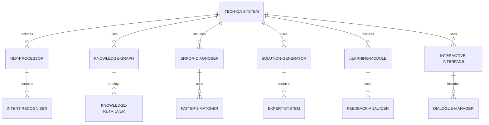

#### 交互关系图

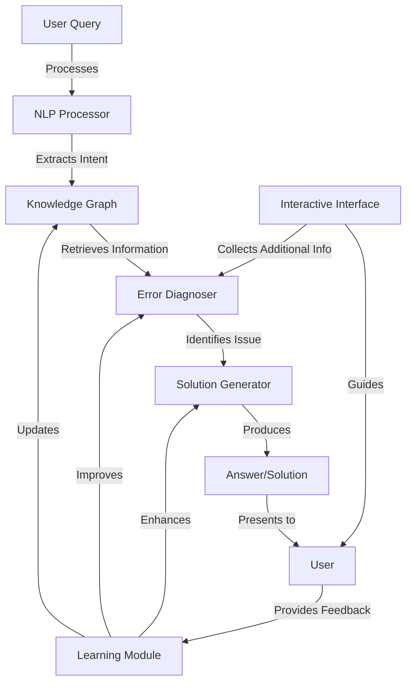

### 数学模型：

使用向量空间模型进行相似问题检索：

给定查询 $q$ 和文档 $d$，计算余弦相似度：

$$\text{similarity}(q,d) = \frac{q \cdot d}{||q|| \cdot ||d||}$$

其中 $q$ 和 $d$ 是使用 TF-IDF 加权的词向量。

### 算法流程图：

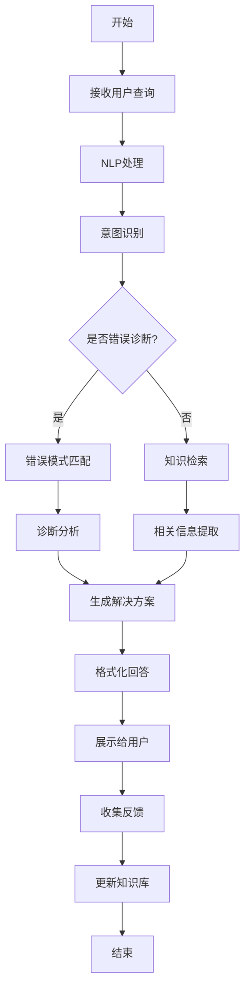

### 算法源代码：

以下是一个简化的技术问答与错误诊断系统的 Python 实现示例：

```python
import re
from typing import Dict, List, Tuple

class TechQASystem:
    def __init__(self):
        self.knowledge_base = {
            "python": {
                "syntax_error": "检查代码语法，确保括号、缩进等正确。",
                "import_error": "确保已安装所需的库，并检查拼写是否正确。",
                "type_error": "检查变量类型，可能需要进行类型转换。",
            },
            "javascript": {
                "reference_error": "确保变量已被声明和初始化。",
                "type_error": "检查变量类型，JavaScript中的类型可能会自动转换。",
                "syntax_error": "检查代码语法，特别注意括号和分号。",
            }
        }
        self.error_patterns = {
            "syntax_error": r"SyntaxError",
            "import_error": r"ImportError",
            "type_error": r"TypeError",
            "reference_error": r"ReferenceError",
        }

    def process_query(self, query: str) -> str:
        intent, entities = self.extract_intent_and_entities(query)
        if intent == "error_diagnosis":
            return self.diagnose_error(entities)
        elif intent == "general_question":
            return self.answer_question(entities)
        else:
            return "抱歉，我无法理解您的问题。请尝试重新表述。"

    def extract_intent_and_entities(self, query: str) -> Tuple[str, Dict[str, str]]:
        entities = {}
        if "错误" in query or "报错" in query:
            intent = "error_diagnosis"
            for error_type, pattern in self.error_patterns.items():
                if re.search(pattern, query, re.IGNORECASE):
                    entities["error_type"] = error_type
                    break
        else:
            intent = "general_question"
        
        for lang in self.knowledge_base.keys():
            if lang in query.lower():
                entities["language"] = lang
                break
        
        return intent, entities

    def diagnose_error(self, entities: Dict[str, str]) -> str:
        language = entities.get("language", "general")
        error_type = entities.get("error_type")
        
        if language in self.knowledge_base and error_type in self.knowledge_base[language]:
            return f"诊断结果：{self.knowledge_base[language][error_type]}"
        elif error_type in self.knowledge_base.get("python", {}):  # 默认使用Python的解答
            return f"诊断结果：{self.knowledge_base['python'][error_type]}"
        else:
            return "抱歉，我无法诊断这个具体的错误。请提供更多信息或错误消息。"

    def answer_question(self, entities: Dict[str, str]) -> str:
        language = entities.get("language", "general")
        if language in self.knowledge_base:
            return f"关于{language}的一般建议：请查阅官方文档或提供更具体的问题。"
        else:
            return "请提供更多关于您问题的上下文，例如编程语言或具体的技术领域。"

    def update_knowledge_base(self, feedback: Dict[str, str]):
        # 简化的知识库更新逻辑
        language = feedback.get("language")
        error_type = feedback.get("error_type")
        solution = feedback.get("solution")
        if language and error_type and solution:
            if language not in self.knowledge_base:
                self.knowledge_base[language] = {}
            self.knowledge_base[language][error_type] = solution
            print(f"知识库已更新：{language} - {error_type}")

# 使用示例
qa_system = TechQASystem()

# 错误诊断示例
error_query = "我的Python代码遇到了SyntaxError，怎么解决？"
print(qa_system.process_query(error_query))

# 一般问题示例
general_query = "有什么JavaScript的学习建议吗？"
print(qa_system.process_query(general_query))

# 知识库更新示例
new_knowledge = {
    "language": "python",
    "error_type": "zero_division_error",
    "solution": "检查除法操作中的除数是否为零。考虑添加条件检查或使用try-except块。"
}
qa_system.update_knowledge_base(new_knowledge)

# 测试更新后的知识
updated_query = "Python中的ZeroDivisionError如何处理？"
print(qa_system.process_query(updated_query))
```

### 实际场景应用：

1. IDE集成智能助手：
   - 提供实时编码建议和错误修复
   - 解答API使用和最佳实践相关问题

2. 开发团队知识管理：
   - 构建团队专属的技术知识库
   - 快速分享和检索项目相关的技术解决方案3. 技术支持平台：
   - 自动回答常见技术问题
   - 引导用户进行初步的错误诊断

4. 自动化故障排除：
   - 分析系统日志和错误报告
   - 提供多步骤的故障排除指南

5. 开发者培训：
   - 创建个性化的学习路径
   - 提供交互式的编程练习和即时反馈

### 行业发展与未来趋势：

| 时期 | 主要特征 | 代表性技术/方法 |
|------|----------|-----------------|
| 2015-2017 | 基于关键词的问答 | 模式匹配、决策树 |
| 2018-2020 | 智能化问答系统 | 机器学习、知识图谱 |
| 2021-2023 | AI驱动的诊断助手 | 深度学习、自然语言处理 |
| 2024及以后 | 认知计算诊断系统 | 强化学习、因果推理 |

### 本章小结：

技术问答与错误诊断是研发辅助 Agent 的高级功能，它通过智能化的方式为开发者提供及时、准确的技术支持。本章讨论了实现这一功能的主要挑战、解决方案和技术实现。主要要点包括：

1. 自然语言处理技术对于准确理解用户查询至关重要。
2. 结构化的知识图谱能够有效组织和检索技术信息。
3. 错误模式识别和机器学习可以提高诊断的准确性。
4. 个性化的解决方案生成需要考虑用户背景和问题上下文。
5. 持续学习和知识更新机制是保持系统有效性的关键。

未来的技术问答与错误诊断系统发展趋势可能包括：
1. 更强大的上下文理解能力，能够处理复杂的多步骤问题
2. 跨语言和跨领域的知识迁移，提供更全面的技术支持
3. 集成代码分析和运行时诊断，提供更精确的错误定位
4. 预测性错误预防，基于历史数据预测可能出现的问题
5. 协作式问题解决，结合人工专家和AI系统的优势

在实现技术问答与错误诊断功能时，开发者应当注意：
1. 确保系统的可解释性，帮助用户理解诊断和建议的原理
2. 重视隐私和安全问题，特别是在处理敏感的代码和错误信息时
3. 设计直观的用户界面，使开发者能够轻松提供必要的上下文信息
4. 实现有效的知识验证机制，确保更新的信息准确可靠
5. 考虑与其他开发工具和平台的集成，提供无缝的用户体验

通过不断改进的技术问答与错误诊断技术，研发辅助 Agent 将能够更有效地支持开发者解决技术难题，加速问题诊断和修复过程。这不仅能提高开发效率，还能促进知识共享和技术创新。随着技术的进步，我们可以期待看到更智能、更全面的技术支持系统，最终实现"虚拟技术顾问"的角色，为软件开发生命周期中的问题解决带来革命性的改进。
