# 第11章：风控 Agent 开发

## 11.1 风险评估模型集成

### 核心概念：

风险评估模型集成是风控 Agent 的核心功能，旨在整合多种风险评估模型，以全面、准确地评估和预测潜在风险。这个功能涉及数据整合、模型选择、参数调优、结果融合等多个方面，目的是为决策者提供更可靠、更全面的风险洞察。

### 问题背景：

在金融、保险、信贷等领域，准确的风险评估对于业务的可持续发展至关重要。然而，单一的风险模型往往难以捕捉复杂的风险因素和它们之间的相互作用。通过集成多个专门的风险评估模型，可以从不同角度分析风险，提高评估的准确性和鲁棒性。

### 问题描述：

在实现风险评估模型集成功能时，开发者面临以下挑战：

1. 如何选择和整合适当的风险评估模型
2. 如何处理来自不同来源、格式的数据
3. 如何平衡不同模型的权重和重要性
4. 如何处理模型之间可能存在的冲突结果
5. 如何确保集成系统的实时性能和可扩展性

### 问题解决：

通过以下步骤可以实现有效的风险评估模型集成：

1. 模型选择与评估：
   - 分析各种风险评估模型的优缺点
   - 使用交叉验证等技术评估模型性能

2. 数据预处理与整合：
   - 实现数据清洗和标准化流程
   - 开发数据整合管道，处理多源数据

3. 模型集成架构设计：
   - 实现模型并行处理框架
   - 设计模型结果融合算法（如加权平均、投票机制）

4. 参数优化：
   - 使用网格搜索或贝叶斯优化调整模型参数
   - 实现自适应权重调整机制

5. 结果解释与可视化：
   - 开发模型解释工具，提供风险因素贡献度分析
   - 实现直观的风险评估仪表板

6. 实时监控与更新：
   - 设计模型性能监控系统
   - 实现模型的在线学习和更新机制

### 边界与外延：

风险评估模型集成的应用范围包括：
- 信用风险评估
- 市场风险分析
- 操作风险管理
- 保险承保决策
- 反欺诈系统

### 概念结构与核心要素组成：

风险评估模型集成系统的核心组件：
1. 数据预处理器
2. 模型选择器
3. 并行计算引擎
4. 结果融合器
5. 参数优化器
6. 解释引擎
7. 监控与更新模块

### 概念之间的关系：

#### 概念核心属性维度对比

| 属性 | 单一模型 | 简单集成 | AI驱动的动态集成 |
|------|----------|----------|-------------------|
| 风险覆盖面 | 窄 | 中 | 广 |
| 准确性 | 中 | 高 | 非常高 |
| 适应性 | 低 | 中 | 高 |
| 计算复杂度 | 低 | 中 | 高 |
| 可解释性 | 高 | 中 | 中-高 |
| 实时性能 | 高 | 中 | 中-高 |

#### 概念联系的ER 实体关系

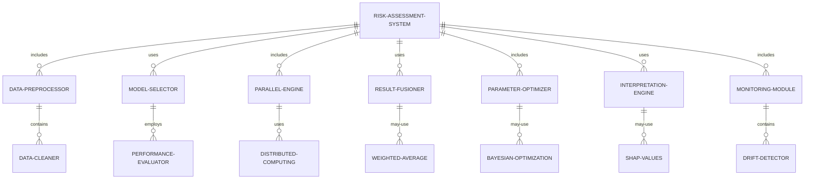

#### 交互关系图

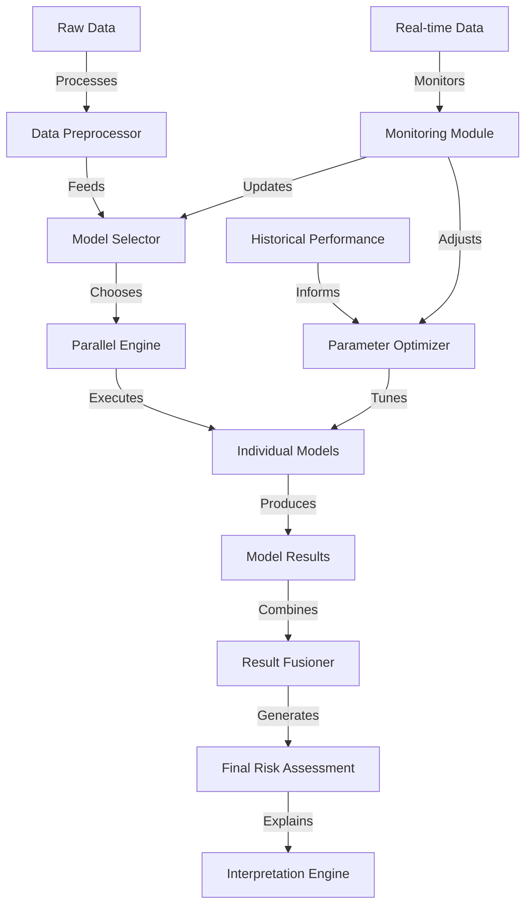

### 数学模型：

使用加权平均法进行模型结果融合：

给定 $n$ 个模型的风险评分 $R_1, R_2, ..., R_n$ 和对应的权重 $w_1, w_2, ..., w_n$，最终的风险评分 $R$ 计算如下：

$$R = \frac{\sum_{i=1}^n w_i R_i}{\sum_{i=1}^n w_i}$$

其中，权重 $w_i$ 可以通过模型性能指标（如AUC）动态调整：

$$w_i = \frac{\text{AUC}_i}{\sum_{j=1}^n \text{AUC}_j}$$

### 算法流程图：

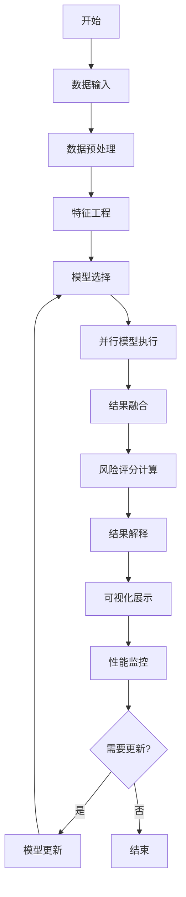

### 算法源代码：

以下是一个简化的风险评估模型集成系统的 Python 实现示例：

```python
import numpy as np
from sklearn.preprocessing import StandardScaler
from sklearn.model_selection import train_test_split
from sklearn.linear_model import LogisticRegression
from sklearn.ensemble import RandomForestClassifier
from sklearn.metrics import roc_auc_score
from typing import List, Dict

class RiskAssessmentSystem:
    def __init__(self):
        self.models = {
            'logistic': LogisticRegression(),
            'random_forest': RandomForestClassifier()
        }
        self.weights = {model: 1.0 for model in self.models}
        self.scaler = StandardScaler()

    def preprocess_data(self, X: np.ndarray) -> np.ndarray:
        return self.scaler.fit_transform(X)

    def train_models(self, X: np.ndarray, y: np.ndarray):
        X_processed = self.preprocess_data(X)
        X_train, X_test, y_train, y_test = train_test_split(X_processed, y, test_size=0.2, random_state=42)
        
        for name, model in self.models.items():
            model.fit(X_train, y_train)
            y_pred = model.predict_proba(X_test)[:, 1]
            auc = roc_auc_score(y_test, y_pred)
            self.weights[name] = auc
        
        # Normalize weights
        total_weight = sum(self.weights.values())
        for name in self.weights:
            self.weights[name] /= total_weight

    def predict_risk(self, X: np.ndarray) -> np.ndarray:
        X_processed = self.preprocess_data(X)
        predictions = []
        for name, model in self.models.items():
            pred = model.predict_proba(X_processed)[:, 1]
            predictions.append(pred * self.weights[name])
        return np.sum(predictions, axis=0)

    def interpret_results(self, X: np.ndarray, risk_scores: np.ndarray) -> List[Dict]:
        feature_importance = {}
        for name, model in self.models.items():
            if hasattr(model, 'feature_importances_'):
                importance = model.feature_importances_
            elif hasattr(model, 'coef_'):
                importance = np.abs(model.coef_[0])
            else:
                continue
            for i, imp in enumerate(importance):
                if i not in feature_importance:
                    feature_importance[i] = 0
                feature_importance[i] += imp * self.weights[name]

        interpretations = []
        for i, score in enumerate(risk_scores):
            top_features = sorted(feature_importance.items(), key=lambda x: x[1], reverse=True)[:3]
            interpretations.append({
                'risk_score': score,
                'top_factors': [f"Feature {idx}: {imp:.4f}" for idx, imp in top_features]
            })
        return interpretations

    def update_models(self, X: np.ndarray, y: np.ndarray):
        # Simplified update: retrain on new data
        self.train_models(X, y)

# 使用示例
import pandas as pd

# 假设我们有一个包含风险相关特征的数据集
data = pd.read_csv('risk_data.csv')
X = data.drop('is_risky', axis=1).values
y = data['is_risky'].values

risk_system = RiskAssessmentSystem()
risk_system.train_models(X, y)

# 评估新数据的风险
new_data = X[:5]  # 使用前5条数据作为新数据示例
risk_scores = risk_system.predict_risk(new_data)
interpretations = risk_system.interpret_results(new_data, risk_scores)

print("Risk Scores:", risk_scores)
print("\nInterpretations:")
for interp in interpretations:
    print(f"Risk Score: {interp['risk_score']:.4f}")
    print("Top Contributing Factors:")
    for factor in interp['top_factors']:
        print(f"  - {factor}")
    print()

# 模拟模型更新
new_X = X[100:200]  # 使用新的数据子集
new_y = y[100:200]
risk_system.update_models(new_X, new_y)

print("Models updated with new data.")
```

### 实际场景应用：

1. 信用评分系统：
   - 整合信用历史、收入、就业等多维度数据
   - 生成综合信用评分，用于贷款审批决策

2. 金融市场风险分析：
   - 结合宏观经济指标、市场波动性、公司财务数据
   - 评估投资组合风险，优化资产配置

3. 保险承保决策：
   - 融合健康状况、生活方式、职业风险等因素
   - 确定保险费率和承保条件

4. 供应链风险管理：
   - 分析供应商财务状况、地缘政治风险、自然灾害概率
   - 识别潜在的供应链中断风险

5. 网络安全风险评估：
   - 整合网络流量分析、漏洞扫描、威胁情报
   - 预测潜在的安全威胁和攻击风险

### 行业发展与未来趋势：

| 时期 | 主要特征 | 代表性技术/方法 |
|------|----------|-----------------|
| 2015-2017 | 单一模型为主 | 逻辑回归、决策树 |
| 2018-2020 | 模型集成兴起 | 随机森林、梯度提升 |
| 2021-2023 | AI驱动的动态集成 | 深度学习、联邦学习 |
| 2024及以后 | 认知智能风险评估 | 图神经网络、因果推理 |

### 本章小结：

风险评估模型集成是风控 Agent 的核心功能，它通过整合多个专业模型提供全面、准确的风险评估。本章讨论了实现这一功能的主要挑战、解决方案和技术实现。主要要点包括：

1. 多模型集成可以从不同角度分析风险，提高评估的准确性和鲁棒性。
2. 数据预处理和特征工程对于模型性能至关重要。
3. 并行计算和结果融合技术可以提高系统的效率和可扩展性。
4. 动态权重调整和在线学习机制可以使系统适应不断变化的风险环境。
5. 结果解释和可视化对于风险决策的透明度和可信度非常重要。

未来的风险评估模型集成系统发展趋势可能包括：
1. 更深入的因果关系分析，提供更可靠的风险预测
2. 跨领域知识图谱的应用，捕捉复杂的风险关联
3. 联邦学习技术的广泛应用，在保护数据隐私的同时实现模型协作
4. 实时、大规模的风险评估能力，适应快速变化的市场环境
5. 与区块链等技术的结合，提高风险评估的透明度和不可篡改性

在实现风险评估模型集成功能时，开发者应当注意：
1. 平衡模型复杂度和实时性能，确保系统能够快速响应
2. 重视数据质量和多样性，确保模型训练的有效性
3. 实现严格的模型验证和监控机制，及时发现和纠正模型偏差
4. 考虑法规合规性，特别是在处理敏感个人信息时
5. 设计用户友好的界面，使非技术背景的决策者也能理解风险评估结果

通过不断改进的风险评估模型集成技术，风控 Agent 将能够更有效地支持组织的风险管理决策。这不仅能提高风险评估的准确性和全面性，还能帮助组织更好地应对复杂多变的风险环境。随着技术的进步，我们可以期待看到更智能、更精准的风险评估系统，最终实现"智能风险顾问"的角色，为组织的可持续发展和竞争优势提供强有力的支撑。

## 11.2 异常交易检测

### 核心概念：

异常交易检测是风控 Agent 的关键功能，旨在实时识别和标记可能存在风险或违规的金融交易。这个功能结合了机器学习、统计分析和规则引擎技术，以捕捉复杂的异常模式，防范欺诈、洗钱等非法活动，同时最小化对正常业务的干扰。

### 问题背景：

在金融服务领域，异常交易可能意味着欺诈、内幕交易、市场操纵或其他非法活动。传统的基于规则的方法往往难以应对不断演变的欺诈手段和复杂的交易模式。高效、准确的异常交易检测系统对于维护金融系统的完整性和保护客户利益至关重要。

### 问题描述：

在实现异常交易检测功能时，开发者面临以下挑战：

1. 如何处理高维度、高速度的实时交易数据
2. 如何平衡检测的敏感性和误报率
3. 如何应对不断演变的欺诈模式
4. 如何处理类别不平衡问题（正常交易远多于异常交易）
5. 如何解释和验证检测结果

### 问题解决：

通过以下步骤可以实现有效的异常交易检测功能：

1. 数据预处理与特征工程：
   - 实现实时数据清洗和标准化
   - 设计有效的特征提取方法，如时间序列特征、网络特征等

2. 多模型集成检测：
   - 结合无监督（如隔离森林）和有监督（如XGBoost）方法
   - 实现基于规则的检测引擎，处理已知的欺诈模式

3. 实时评分系统：
   - 开发高性能的实时评分引擎
   - 实现动态阈值调整机制

4. 异常解释与可视化：
   - 使用SHAP值等技术解释异常原因
   - 开发交互式异常交易可视化界面

5. 持续学习与模型更新：
   - 实现在线学习算法，适应新的交易模式
   - 设计模型性能监控和自动更新机制

6. 警报管理与调查支持：
   - 开发智能警报聚合和优先级排序系统
   - 提供调查工具包，支持深入分析

### 边界与外延：

异常交易检测的应用范围包括：
- 信用卡欺诈检测
- 反洗钱（AML）监控
- 股票市场异常交易识别
- 保险理赔欺诈检测
- 电子商务平台交易监控

### 概念结构与核心要素组成：

异常交易检测系统的核心组件：
1. 数据接入层
2. 特征处理引擎
3. 多模型检测器
4. 实时评分引擎
5. 异常解释器
6. 警报管理系统
7. 模型更新模块

### 概念之间的关系：

#### 概念核心属性维度对比

| 属性 | 规则based方法 | 机器学习方法 | AI驱动的动态检测 |
|------|---------------|--------------|-------------------|
| 适应性 | 低 | 中 | 高 |
| 检测复杂度 | 低 | 高 | 非常高 |
| 实时性能 | 高 | 中 | 中-高 |
| 可解释性 | 高 | 中 | 中-高 |
| 误报率 | 高 | 中 | 低 |
| 漏报率 | 高 | 中 | 低 |

#### 概念联系的ER 实体关系

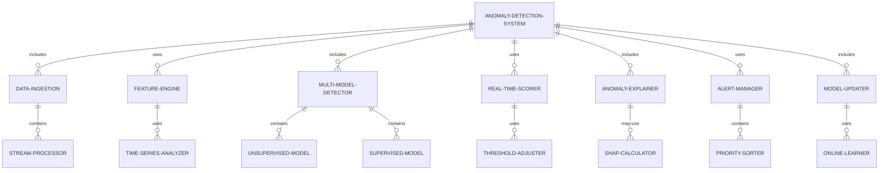

#### 交互关系图

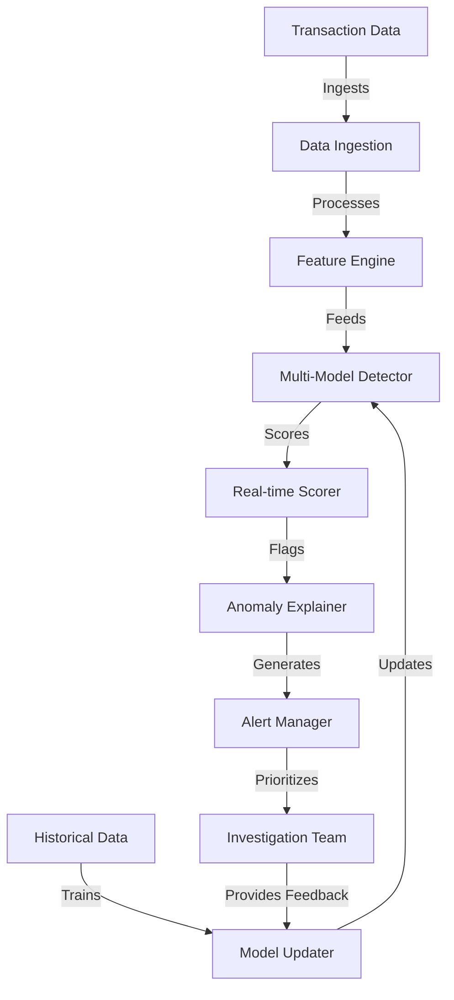

### 数学模型：

使用隔离森林（Isolation Forest）进行异常检测：

给定数据点 $x$，其异常分数定义为：

$$s(x, n) = 2^{-\frac{E(h(x))}{c(n)}}$$

其中：
- $h(x)$ 是数据点 $x$ 的平均路径长度
- $E(h(x))$ 是 $h(x)$ 的期望值
- $c(n)$ 是样本大小为 $n$ 的二叉搜索树的平均路径长度

$c(n)$ 可以通过以下公式近似：

$$c(n) = 2H(n-1) - (2(n-1)/n)$$

其中 $H(i)$ 是第 $i$ 个调和数。

### 算法流程图：

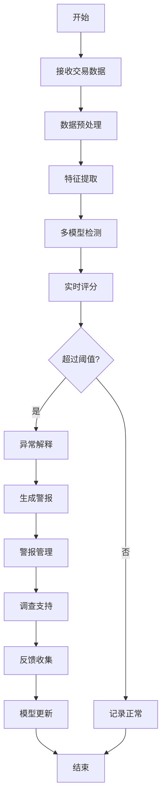

### 算法源代码：

以下是一个简化的异常交易检测系统的 Python 实现示例：

```python
import numpy as np
from sklearn.ensemble import IsolationForest
from sklearn.preprocessing import StandardScaler
from typing import Dict, List

class AnomalyDetectionSystem:
    def __init__(self):
        self.scaler = StandardScaler()
        self.isolation_forest = IsolationForest(contamination=0.01, random_state=42)
        self.feature_names = ['amount', 'time_since_last_transaction', 'distance_from_home']

    def preprocess_data(self, transactions: List[Dict]) -> np.ndarray:
        features = np.array([[t['amount'], t['time_since_last'], t['distance']] for t in transactions])
        return self.scaler.fit_transform(features)

    def train_model(self, historical_data: List[Dict]):
        processed_data = self.preprocess_data(historical_data)
        self.isolation_forest.fit(processed_data)

    def detect_anomalies(self, transactions: List[Dict]) -> List[Dict]:
        processed_data = self.preprocess_data(transactions)
        anomaly_scores = self.isolation_forest.decision_function(processed_data)
        threshold = -0.5  # 可调整的阈值

        results = []
        for i, transaction in enumerate(transactions):
            is_anomaly = anomaly_scores[i] < threshold
            results.append({
                'transaction_id': transaction.get('id', f'T{i}'),
                'is_anomaly': is_anomaly,
                'anomaly_score': anomaly_scores[i],
                'explanation': self.explain_anomaly(processed_data[i], anomaly_scores[i]) if is_anomaly else None
            })
        return results

    def explain_anomaly(self, features: np.ndarray, score: float) -> str:
        feature_contributions = features * self.isolation_forest.feature_importances_
        top_feature_idx = np.argmax(np.abs(feature_contributions))
        return f"Anomaly mainly due to {self.feature_names[top_feature_idx]} with score {score:.2f}"

    def update_model(self, new_data: List[Dict]):
        # 简化的更新逻辑，实际应用中可能需要更复杂的增量学习
        self.train_model(new_data)

# 使用示例
detector = AnomalyDetectionSystem()

# 模拟历史数据
historical_transactions = [
    {'amount': 100, 'time_since_last': 24, 'distance': 5},
    {'amount': 50, 'time_since_last': 2, 'distance': 1},
    # ... 更多历史交易数据
]
detector.train_model(historical_transactions)

# 模拟新的交易数据
new_transactions = [
    {'id': 'T1', 'amount': 1000, 'time_since_last': 1, 'distance': 100},
    {'id': 'T2', 'amount': 75, 'time_since_last': 12, 'distance': 3},
    {'id': 'T3', 'amount': 5000, 'time_since_last': 0.5, 'distance': 500},
]

results = detector.detect_anomalies(new_transactions)

for result in results:
    print(f"Transaction {result['transaction_id']}:")
    print(f"  Is Anomaly: {result['is_anomaly']}")
    print(f"  Anomaly Score: {result['anomaly_score']:.2f}")
    if result['explanation']:
        print(f"  Explanation: {result['explanation']}")
    print()

# 模拟模型更新
new_data_for_update = [
    {'amount': 200, 'time_since_last': 36, 'distance': 10},
    {'amount': 80, 'time_since_last': 4, 'distance': 2},
    # ... 更多新数据
]
detector.update_model(new_data_for_update)
print("Model updated with new data.")
```

### 实际场景应用：

1. 银行交易监控：
   - 实时监控信用卡和借记卡交易
   - 识别可疑的跨境交易和大额转账

2. 股票市场监管：
   - 检测内幕交易和市场操纵行为
   - 识别高频交易中的异常模式

3. 保险理赔审核：
   - 自动标记可疑的保险理赔申请
   - 识别潜在的保险欺诈模式

4. 电子商务平台：
   - 监控用户账户活动，识别账户劫持
   - 检测虚假交易和刷单行为

5. 支付服务提供商：
   - 实时检测支付欺诈
   - 识别洗钱和恐怖融资活动

### 行业发展与未来趋势：

| 时期 | 主要特征 | 代表性技术/方法 |
|------|----------|-----------------|
| 2015-2017 | 规则based系统为主 | 专家系统、决策树 |
| 2018-2020 | 机器学习方法兴起 | 随机森林、支持向量机 |
| 2021-2023 | 深度学习和实时分析 | LSTM、图神经网络 |
| 2024及以后 | 智能化协同检测 | 联邦学习、强化学习 |

### 本章小结：

异常交易检测是风控 Agent 的关键功能，它通过先进的数据分析和机器学习技术实时识别可疑交易。本章讨论了实现这一功能的主要挑战、解决方案和技术实现。主要要点包括：

1. 多模型集成和实时评分是提高检测准确性和效率的关键。
2. 特征工程和数据预处理对于捕捉复杂的异常模式至关重要。
3. 动态阈值调整和持续学习机制可以适应不断变化的欺诈模式。
4. 异常解释和可视化对于减少误报和支持调查非常重要。
5. 警报管理和优先级排序可以提高异常处理的效率。

未来的异常交易检测系统发展趋势可能包括：
1. 更深入的行为分析，结合用户画像和交易上下文
2. 跨机构数据共享和协作检测，在保护隐私的前提下提高检测能力
3. 实时、大规模的图分析，识别复杂的欺诈网络
4. 自适应学习系统，能够快速应对新型欺诈手法
5. 与区块链技术的结合，提高交易的透明度和可追溯性

在实现异常交易检测功能时，开发者应当注意：
1. 平衡检测的敏感性和误报率，避免对正常业务造成过多干扰
2. 确保系统的可扩展性，以处理不断增长的交易量和复杂性
3. 重视数据隐私和安全，遵守相关法规如GDPR
4. 设计用户友好的界面，便于分析师快速理解和处理警报
5. 实现严格的访问控制和审计机制，防止内部滥用

通过不断改进的异常交易检测技术，风控 Agent 将能够更有效地保护金融系统的安全和完整性。这不仅能减少欺诈造成的经济损失，还能提高客户信任度和满意度。随着技术的进步，我们可以期待看到更智能、更精准的异常检测系统，最终实现"智能风控专家"的角色，为金融机构和监管机构提供强有力的支持。

## 11.3 欺诈识别与预警

### 核心概念：

欺诈识别与预警是风控 Agent 的关键功能，旨在主动识别和预防各种形式的欺诈行为。这个功能结合了高级数据分析、机器学习、行为模式识别和实时监控技术，以检测和预警潜在的欺诈活动，同时最小化对合法用户和交易的影响。

### 问题背景：

随着数字化转型的加速，欺诈手段变得越来越复杂和多样化。传统的欺诈检测方法往往反应滞后，难以应对快速演变的欺诈技术。有效的欺诈识别与预警系统不仅能够减少经济损失，还能保护品牌声誉，维护客户信任。

### 问题描述：

在实现欺诈识别与预警功能时，开发者面临以下挑战：

1. 如何处理大规模、高维度的数据以实时识别欺诈
2. 如何应对不断演变的欺诈手法和新型欺诈模式
3. 如何平衡欺诈检测的准确性和用户体验
4. 如何处理欺诈数据的严重不平衡问题
5. 如何解释和验证欺诈识别结果，以支持后续调查

### 问题解决：

通过以下步骤可以实现有效的欺诈识别与预警功能：

1. 多维数据整合：
   - 实现实时数据收集和清洗管道
   - 整合交易数据、用户行为数据、设备信息等多源数据

2. 高级特征工程：
   - 设计时序特征、网络特征和行为特征
   - 使用自动特征生成技术，如自编码器

3. 多模型集成检测：
   - 结合规则引擎、机器学习和深度学习模型
   - 实现模型投票或堆叠集成机制

4. 实时评分和预警：
   - 开发高性能的实时评分引擎
   - 实现多级预警机制和动态阈值调整

5. 行为模式分析：
   - 构建用户画像和行为基线
   - 实现异常行为序列检测

6. 网络分析：
   - 构建交易网络和关系图
   - 使用图算法检测欺诈团伙和复杂欺诈模式

7. 持续学习与适应：
   - 实现在线学习算法，快速适应新的欺诈模式
   - 设计主动学习机制，优化模型更新策略

### 边界与外延：

欺诈识别与预警的应用范围包括：
- 金融服务欺诈检测
- 电子商务平台反欺诈
- 保险理赔欺诈识别
- 身份盗用和账户接管检测
- 广告点击欺诈预防

### 概念结构与核心要素组成：

欺诈识别与预警系统的核心组件：
1. 数据集成层
2. 特征处理引擎
3. 多模型检测器
4. 实时评分引擎
5. 行为分析模块
6. 网络分析引擎
7. 预警管理系统
8. 模型更新模块

### 概念之间的关系：

#### 概念核心属性维度对比

| 属性 | 规则based方法 | 机器学习方法 | AI驱动的动态检测 |
|------|---------------|--------------|-------------------|
| 适应性 | 低 | 中 | 高 |
| 检测复杂度 | 低 | 高 | 非常高 |
| 实时性能 | 高 | 中 | 中-高 |
| 可解释性 | 高 | 中 | 中-高 |
| 误报率 | 高 | 中 | 低 |
| 漏报率 | 高 | 中 | 低 |

#### 概念联系的ER 实体关系

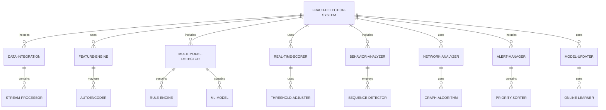

#### 交互关系图

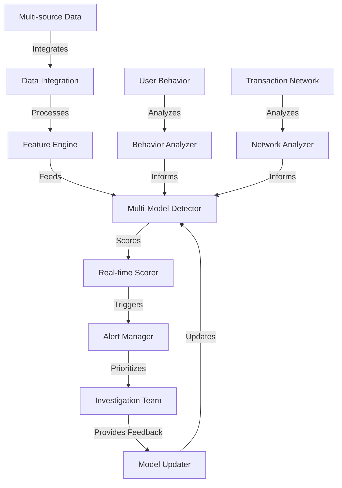

### 数学模型：

使用XGBoost进行欺诈检测，目标是最小化以下损失函数：

$$L = \sum_{i=1}^n l(y_i, \hat{y}_i) + \sum_{k=1}^K \Omega(f_k)$$

其中：
- $l$ 是损失函数（如对数损失）
- $\Omega(f) = \gamma T + \frac{1}{2}\lambda ||w||^2$ 是正则化项
- $T$ 是树的叶子节点数，$w$ 是叶子权重

### 算法流程图：

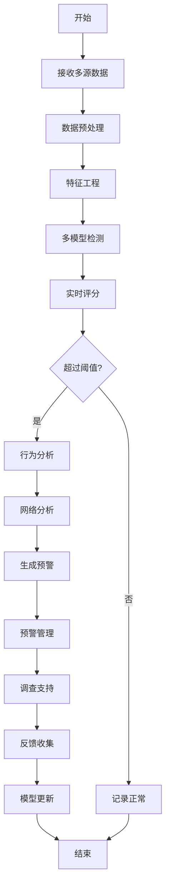

### 算法源代码：

以下是一个简化的欺诈识别与预警系统的 Python 实现示例：

```python
import numpy as np
import pandas as pd
from sklearn.preprocessing import StandardScaler
from sklearn.model_selection import train_test_split
from xgboost import XGBClassifier
from sklearn.metrics import classification_report
from typing import Dict, List

class FraudDetectionSystem:
    def __init__(self):
        self.scaler = StandardScaler()
        self.model = XGBClassifier(use_label_encoder=False, eval_metric='logloss')
        self.feature_names = ['amount', 'time_since_last_transaction', 'distance_from_home', 'device_risk_score']

    def preprocess_data(self, transactions: List[Dict]) -> np.ndarray:
        df = pd.DataFrame(transactions)
        features = df[self.feature_names].values
        return self.scaler.fit_transform(features)

    def train_model(self, historical_data: List[Dict], labels: List[int]):
        X = self.preprocess_data(historical_data)
        X_train, X_test, y_train, y_test = train_test_split(X, labels, test_size=0.2, random_state=42)
        self.model.fit(X_train, y_train)
        y_pred = self.model.predict(X_test)
        print(classification_report(y_test, y_pred))

    def detect_fraud(self, transactions: List[Dict]) -> List[Dict]:
        X = self.preprocess_data(transactions)
        fraud_probs = self.model.predict_proba(X)[:, 1]
        threshold = 0.7  # 可调整的阈值

        results = []
        for i, transaction in enumerate(transactions):
            is_fraud = fraud_probs[i] > threshold
            results.append({
                'transaction_id': transaction.get('id', f'T{i}'),
                'is_fraud': is_fraud,
                'fraud_probability': fraud_probs[i],
                'explanation': self.explain_fraud(X[i], fraud_probs[i]) if is_fraud else None
            })
        return results

    def explain_fraud(self, features: np.ndarray, probability: float) -> str:
        feature_importance = self.model.feature_importances_
        sorted_idx = np.argsort(feature_importance)
        top_feature = self.feature_names[sorted_idx[-1]]
        return f"Potential fraud detected (probability: {probability:.2f}) mainly due to {top_feature}"

    def update_model(self, new_data: List[Dict], new_labels: List[int]):
        X_new = self.preprocess_data(new_data)
        self.model.fit(X_new, new_labels, xgb_model=self.model)

# 使用示例
detector = FraudDetectionSystem()

# 模拟历史数据
historical_transactions = [
    {'amount': 100, 'time_since_last_transaction': 24, 'distance_from_home': 5, 'device_risk_score': 0.1},
    {'amount': 500, 'time_since_last_transaction': 2, 'distance_from_home': 100, 'device_risk_score': 0.8},
    # ... 更多历史交易数据
]
historical_labels = [0, 1]  # 0: 正常, 1: 欺诈
detector.train_model(historical_transactions, historical_labels)

# 模拟新的交易数据
new_transactions = [
    {'id': 'T1', 'amount': 1000, 'time_since_last_transaction': 1, 'distance_from_home': 200, 'device_risk_score': 0.9},
    {'id': 'T2', 'amount': 75, 'time_since_last_transaction': 12, 'distance_from_home': 3, 'device_risk_score': 0.2},
    {'id': 'T3', 'amount': 5000, 'time_since_last_transaction': 0.5, 'distance_from_home': 500, 'device_risk_score': 0.95},
]

results = detector.detect_fraud(new_transactions)

for result in results:
    print(f"Transaction {result['transaction_id']}:")
    print(f"  Is Fraud: {result['is_fraud']}")
    print(f"  Fraud Probability: {result['fraud_probability']:.2f}")
    if result['explanation']:
        print(f"  Explanation: {result['explanation']}")
    print()

# 模拟模型更新
new_data_for_update = [
    {'amount': 200, 'time_since_last_transaction': 36, 'distance_from_home': 10, 'device_risk_score': 0.3},
    {'amount': 3000, 'time_since_last_transaction': 1, 'distance_from_home': 300, 'device_risk_score': 0.7},
]
new_labels_for_update = [0, 1]
detector.update_model(new_data_for_update, new_labels_for_update)
print("Model updated with new data.")
```

### 实际场景应用：

1. 信用卡交易欺诈检测：
   - 实时监控信用卡交易
   - 识别异常消费模式和可疑地理位置

2. 在线银行欺诈预防：
   - 分析登录行为和账户活动
   - 检测可疑的资金转移和账户更改

3. 保险理赔欺诈识别：
   - 分析理赔历史和模式
   - 识别虚假或夸大的理赔申请

4. 电子商务平台反欺诈：
   - 监控用户注册和登录行为
   - 识别虚假订单和刷单行为

5. 电信欺诈检测：
   - 分析通话模式和数据使用
   - 识别 SIM 卡欺诈和服务滥用

### 行业发展与未来趋势：

| 时期 | 主要特征 | 代表性技术/方法 |
|------|----------|-----------------|
| 2015-2017 | 规则based系统为主 | 专家系统、决策树 |
| 2018-2020 | 机器学习方法普及 | 随机森林、梯度提升 |
| 2021-2023 | 深度学习和图分析 | LSTM、图神经网络 |
| 2024及以后 | 智能化协同防御 | 联邦学习、强化学习 |

### 本章小结：

欺诈识别与预警是风控 Agent 的核心功能，它通过先进的数据分析和机器学习技术主动识别和预防欺诈行为。本章讨论了实现这一功能的主要挑战、解决方案和技术实现。主要要点包括：

1. 多维数据整合和高级特征工程是捕捉复杂欺诈模式的基础。
2. 多模型集成和实时评分能够提高欺诈检测的准确性和效率。
3. 行为模式分析和网络分析可以识别更复杂的欺诈策略。
4. 持续学习和适应机制对于应对不断演变的欺诈手法至关重要。
5. 预警管理和调查支持功能可以提高欺诈处理的效率。

未来的欺诈识别与预警系统发展趋势可能包括：
1. 更深入的跨渠道和跨平台数据整合，全面把握用户行为
2. 利用联邦学习等技术实现跨机构协作，同时保护数据隐私
3. 引入因果推理技术，提高欺诈检测的可解释性
4. 开发自适应的防御策略，动态调整欺诈检测阈值和规则
5. 集成生物识别和行为生物识别技术，增强身份验证

在实现欺诈识别与预警功能时，开发者应当注意：
1. 平衡欺诈检测的准确性和用户体验，避免过度干扰正常交易
2. 确保系统的可扩展性和实时性能，以应对大规模交易数据
3. 重视数据安全和隐私保护，遵守相关法规如GDPR和CCPA
4. 设计直观的可视化界面，便于分析师快速理解和处理预警
5. 建立完善的模型监控和更新机制，确保系统持续有效

通过不断改进的欺诈识别与预警技术，风控 Agent 将能够更有效地保护组织和客户免受欺诈威胁。这不仅能减少经济损失，还能提升客户信任度和品牌声誉。随着技术的进步，我们可以期待看到更智能、更精准的欺诈防御系统，最终实现"智能欺诈预防专家"的角色，为各行各业提供全面的风险管理解决方案。

## 11.4 合规性检查

### 核心概念：

合规性检查是风控 Agent 的关键功能，旨在确保组织的运营、流程和交易符合相关法律、法规和行业标准。这个功能结合了规则引擎、自然语言处理、机器学习和知识图谱技术，以自动化和智能化的方式进行合规性评估、监控和报告。

### 问题背景：

随着全球监管环境的日益复杂和严格，组织面临着巨大的合规压力。手动合规检查不仅耗时耗力，还容易出错和遗漏。自动化的合规性检查系统可以帮助组织更有效地管理合规风险，减少违规行为，并适应不断变化的监管要求。

### 问题描述：

在实现合规性检查功能时，开发者面临以下挑战：

1. 如何处理和解释复杂的法规和政策文本
2. 如何将抽象的法规要求转化为可执行的检查规则
3. 如何处理多jurisdiction和多语言的合规要求
4. 如何保持系统与最新法规变化的同步
5. 如何处理合规检查结果的不确定性和模糊性

### 问题解决：

通过以下步骤可以实现有效的合规性检查功能：

1. 法规文本分析：
   - 使用NLP技术解析和理解法规文本
   - 构建法规知识图谱，捕捉法规之间的关系

2. 规则引擎开发：
   - 设计灵活的规则表示语言
   - 实现高效的规则执行引擎

3. 数据映射和转换：
   - 开发数据适配器，将业务数据映射到规则所需格式
   - 实现数据质量检查和异常处理

4. 机器学习增强：
   - 训练模型识别潜在的合规风险模式
   - 实现异常检测算法，发现隐藏的违规行为

5. 实时监控和报告：
   - 设计实时合规性仪表板
   - 实现自动化的合规报告生成系统

6. 持续学习和更新：
   - 开发法规变更跟踪系统
   - 实现规则自动更新和验证机制

### 边界与外延：

合规性检查的应用范围包括：
- 金融服务合规（如反洗钱、KYC）
- 数据隐私合规（如GDPR、CCPA）
- 行业特定合规（如医疗HIPAA、制药GMP）
- 环境合规
- 劳工法规遵从

### 概念结构与核心要素组成：

合规性检查系统的核心组件：
1. 法规解析器
2. 知识图谱构建器
3. 规则引擎
4. 数据适配器
5. 机器学习模型
6. 实时监控器
7. 报告生成器
8. 更新管理器

### 概念之间的关系：

#### 概念核心属性维度对比

| 属性 | 手动合规检查 | 基于规则的自动化 | AI驱动的智能合规 |
|------|--------------|------------------|-------------------|
| 准确性 | 中 | 高 | 非常高 |
| 效率 | 低 | 高 | 非常高 |
| 覆盖范围 | 有限 | 广 | 全面 |
| 适应性 | 低 | 中 | 高 |
| 成本 | 高 | 中 | 低（长期） |
| 可解释性 | 高 | 高 | 中-高 |

#### 概念联系的ER 实体关系

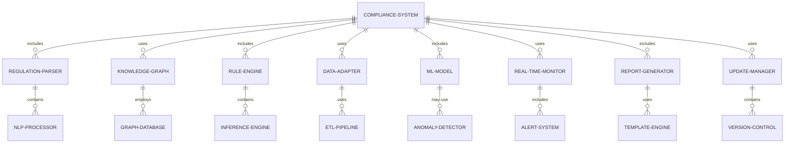

#### 交互关系图

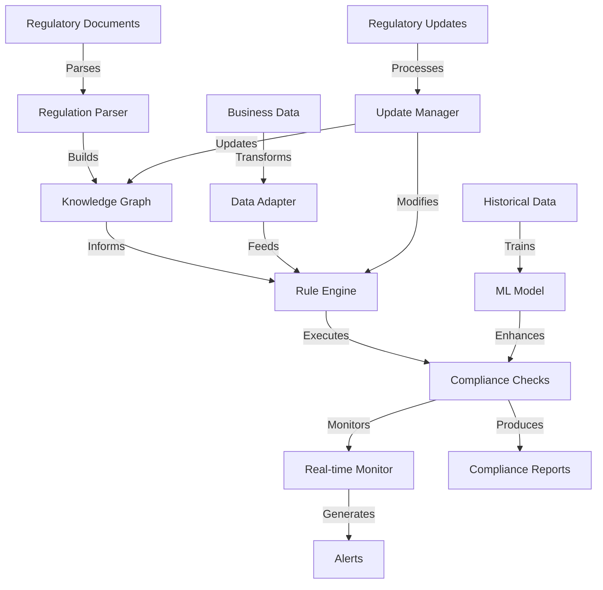

### 数学模型：

使用文本相似度计算来匹配业务活动与相关法规：

给定业务活动描述 $d$ 和法规条款 $r$，计算它们的余弦相似度：

$$\text{similarity}(d,r) = \frac{d \cdot r}{||d|| \cdot ||r||}$$

其中 $d$ 和 $r$ 是使用 TF-IDF 加权的词向量。

### 算法流程图：

```mermaid
graph TD
    A[开始] --> B[加载法规文本]
    B --> C[解析法规]
    C --> D[构建知识图谱]
    D --> E[生成检查规则]
    E --> F[加载业务数据]
    F -->G[数据预处理]
    G --> H[执行合规检查]
    H --> I[机器学习增强]
    I --> J[生成合规报告]
    J --> K[实时监控]
    K --> L{发现违规?}
    L -->|是| M[触发警报]
    L -->|否| N[继续监控]
    M --> O[调查和处理]
    O --> P[更新规则和模型]
    P --> Q[结束]
    N --> Q

### 算法源代码：

以下是一个简化的合规性检查系统的 Python 实现示例：

```python
import re
from typing import Dict, List
from sklearn.feature_extraction.text import TfidfVectorizer
from sklearn.metrics.pairwise import cosine_similarity

class ComplianceSystem:
    def __init__(self):
        self.regulations = {}
        self.rules = {}
        self.vectorizer = TfidfVectorizer()

    def load_regulations(self, regulations: Dict[str, str]):
        self.regulations = regulations
        self.vectorizer.fit(list(regulations.values()))
        self.generate_rules()

    def generate_rules(self):
        for reg_id, reg_text in self.regulations.items():
            # 简化的规则生成逻辑
            keywords = re.findall(r'\b(?:must|should|shall|required)\b', reg_text.lower())
            if keywords:
                self.rules[reg_id] = f"Check if the activity complies with: {reg_text}"

    def check_compliance(self, activity: Dict[str, str]) -> List[Dict[str, str]]:
        activity_vector = self.vectorizer.transform([activity['description']])
        reg_vectors = self.vectorizer.transform(list(self.regulations.values()))
        similarities = cosine_similarity(activity_vector, reg_vectors)[0]

        results = []
        for i, (reg_id, similarity) in enumerate(zip(self.regulations.keys(), similarities)):
            if similarity > 0.3:  # 阈值可调
                result = {
                    'regulation_id': reg_id,
                    'similarity': similarity,
                    'compliant': self.check_rule(reg_id, activity),
                    'details': self.rules.get(reg_id, "No specific rule.")
                }
                results.append(result)

        return results

    def check_rule(self, reg_id: str, activity: Dict[str, str]) -> bool:
        # 简化的规则检查逻辑
        rule = self.rules.get(reg_id, "")
        required_keywords = re.findall(r'(?<=: ).*', rule)
        if required_keywords:
            return all(keyword.lower() in activity['description'].lower() for keyword in required_keywords[0].split())
        return True

    def generate_report(self, results: List[Dict[str, str]]) -> str:
        report = "Compliance Check Report\n"
        report += "========================\n\n"
        for result in results:
            report += f"Regulation: {result['regulation_id']}\n"
            report += f"Similarity: {result['similarity']:.2f}\n"
            report += f"Compliant: {result['compliant']}\n"
            report += f"Details: {result['details']}\n\n"
        return report

# 使用示例
compliance_system = ComplianceSystem()

# 加载示例法规
regulations = {
    "REG001": "All financial transactions must be recorded and reported.",
    "REG002": "Customer data should be protected and encrypted.",
    "REG003": "Employees are required to complete annual compliance training."
}
compliance_system.load_regulations(regulations)

# 检查活动合规性
activity = {
    "id": "ACT001",
    "description": "Conducted financial transaction and updated the record."
}

results = compliance_system.check_compliance(activity)
report = compliance_system.generate_report(results)
print(report)
```

### 实际场景应用：

1. 金融服务合规：
   - 反洗钱（AML）和了解你的客户（KYC）检查
   - 金融交易报告和监控

2. 数据隐私合规：
   - GDPR和CCPA合规性评估
   - 数据处理和存储审计

3. 医疗健康合规：
   - HIPAA合规性检查
   - 临床试验规程遵从性监控

4. 环境合规：
   - 排放监控和报告
   - 环境影响评估合规性检查

5. 人力资源合规：
   - 劳动法规遵从性检查
   - 员工培训和认证跟踪

### 行业发展与未来趋势：

| 时期 | 主要特征 | 代表性技术/方法 |
|------|----------|-----------------|
| 2015-2017 | 基于规则的检查 | 专家系统、决策树 |
| 2018-2020 | 智能化合规分析 | NLP、机器学习 |
| 2021-2023 | 预测性合规 | 深度学习、知识图谱 |
| 2024及以后 | 自适应合规系统 | 强化学习、因果推理 |

### 本章小结：

合规性检查是风控 Agent 的关键功能，它通过自动化和智能化的方式确保组织运营符合相关法规要求。本章讨论了实现这一功能的主要挑战、解决方案和技术实现。主要要点包括：

1. 法规文本分析和知识图谱构建是实现智能合规检查的基础。
2. 灵活的规则引擎和数据适配机制可以处理复杂的合规要求。
3. 机器学习技术可以增强合规检查的准确性和预测能力。
4. 实时监控和报告生成对于及时发现和处理合规问题至关重要。
5. 持续学习和更新机制可以确保系统与最新法规保持同步。

未来的合规性检查系统发展趋势可能包括：
1. 更深入的语义理解，能够处理复杂和模糊的法规语言
2. 跨语言和跨jurisdiction的合规分析能力
3. 预测性合规，主动识别潜在的合规风险
4. 自适应学习系统，能够从历史合规案例中学习
5. 与区块链技术的结合，提高合规记录的不可篡改性和可追溯性

在实现合规性检查功能时，开发者应当注意：
1. 确保系统的可解释性，使合规决策过程透明化
2. 重视数据隐私和安全，特别是在处理敏感的合规信息时
3. 设计灵活的架构，以适应不同行业和地区的合规要求
4. 实现有效的版本控制和审计跟踪机制
5. 考虑与其他企业系统（如ERP、CRM）的集成，实现全面的合规管理

通过不断改进的合规性检查技术，风控 Agent 将能够更有效地帮助组织管理合规风险，减少违规行为，并适应不断变化的监管环境。这不仅能降低合规成本和法律风险，还能提升组织的声誉和竞争力。随着技术的进步，我们可以期待看到更智能、更全面的合规管理系统，最终实现"智能合规顾问"的角色，为组织的可持续发展提供强有力的支持。

## 11.5 风险报告生成

### 核心概念：

风险报告生成是风控 Agent 的重要功能，旨在自动化创建全面、准确和易于理解的风险评估报告。这个功能结合了数据分析、自然语言生成（NLG）、可视化技术和机器学习，以提供深入的风险洞察，支持决策制定和风险管理策略的制定。

### 问题背景：

在复杂的业务环境中，及时、准确的风险报告对于组织的风险管理至关重要。传统的手动报告生成过程往往耗时、容易出错，且难以及时反映动态变化的风险状况。自动化的风险报告生成系统可以提高报告的质量、一致性和及时性，同时释放风险分析师的时间，使他们能够专注于更高价值的分析工作。

### 问题描述：

在实现风险报告生成功能时，开发者面临以下挑战：

1. 如何整合和分析来自多个来源的风险数据
2. 如何生成清晰、简洁且信息丰富的报告文本
3. 如何创建有效的数据可视化，以直观地展示风险状况
4. 如何确保报告的一致性和可定制性
5. 如何处理不同受众（如高管、监管机构、操作团队）的需求

### 问题解决：

通过以下步骤可以实现有效的风险报告生成功能：

1. 数据集成与预处理：
   - 实现数据接口，整合多源风险数据
   - 开发数据清洗和标准化流程

2. 风险分析引擎：
   - 实现统计分析和机器学习模型
   - 开发趋势分析和预测算法

3. 自然语言生成：
   - 设计报告模板和语言生成规则
   - 实现上下文感知的文本生成

4. 数据可视化：
   - 开发交互式图表和仪表板
   - 实现自适应的可视化布局

5. 报告定制化：
   - 设计用户配置界面
   - 实现动态报告结构生成

6. 多格式输出：
   - 支持多种输出格式（如PDF、HTML、PowerPoint）
   - 实现响应式设计，适应不同设备

7. 质量控制：
   - 实现自动化的报告审核机制
   - 开发一致性和准确性检查算法

### 边界与外延：

风险报告生成的应用范围包括：
- 企业风险管理（ERM）报告
- 金融风险报告（市场、信用、流动性风险）
- 运营风险报告
- 合规风险报告
- 项目风险报告

### 概念结构与核心要素组成：

风险报告生成系统的核心组件：
1. 数据集成器
2. 分析引擎
3. NLG处理器
4. 可视化生成器
5. 报告模板引擎
6. 输出格式转换器
7. 质量控制器

### 概念之间的关系：

#### 概念核心属性维度对比

| 属性 | 手动报告生成 | 模板based自动化 | AI驱动的智能报告 |
|------|--------------|-----------------|-------------------|
| 效率 | 低 | 中 | 高 |
| 一致性 | 低 | 高 | 高 |
| 定制化程度 | 高 | 中 | 高 |
| 洞察深度 | 中-高 | 中 | 高 |
| 实时性 | 低 | 中 | 高 |
| 可扩展性 | 低 | 中 | 高 |

#### 概念联系的ER 实体关系

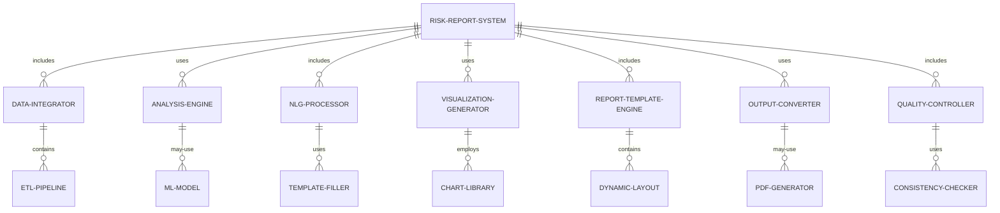

#### 交互关系图

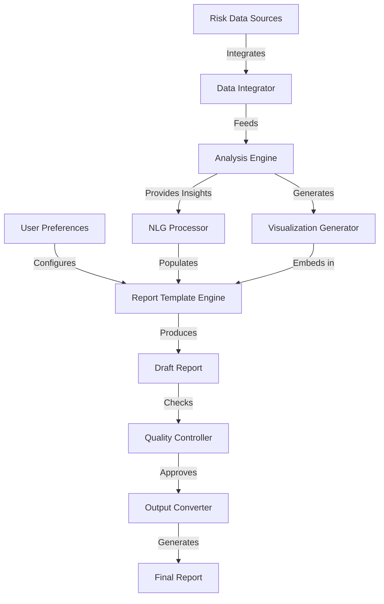

### 数学模型：

使用主题模型（如LDA）来自动识别报告中的关键风险主题：

给定文档-词矩阵 $X$，LDA 模型假设每个文档 $d$ 是主题的混合，每个主题 $k$ 是词的混合：

$$p(w|d) = \sum_{k=1}^K p(w|k)p(k|d)$$

其中 $w$ 是词，$K$ 是主题数。

### 算法流程图：

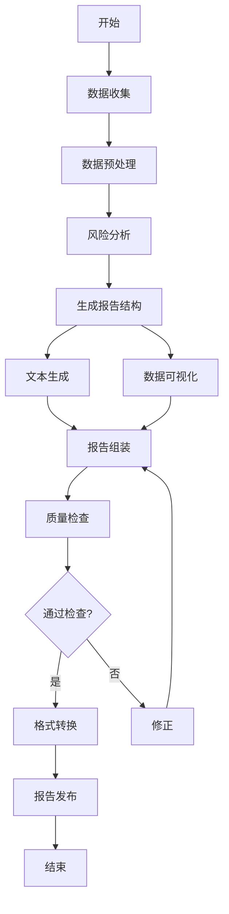

### 算法源代码：

以下是一个简化的风险报告生成系统的 Python 实现示例：

```python
import pandas as pd
import matplotlib.pyplot as plt
from typing import Dict, List
from sklearn.decomposition import LatentDirichletAllocation
from sklearn.feature_extraction.text import CountVectorizer

class RiskReportGenerator:
    def __init__(self):
        self.data = None
        self.risk_scores = {}
        self.lda_model = None
        self.vectorizer = CountVectorizer(max_df=0.95, min_df=2, stop_words='english')

    def load_data(self, data: pd.DataFrame):
        self.data = data
        self.preprocess_data()

    def preprocess_data(self):
        # 简化的数据预处理
        self.data['date'] = pd.to_datetime(self.data['date'])
        self.data.sort_values('date', inplace=True)

    def analyze_risks(self):
        # 简化的风险分析
        for risk_type in ['market', 'credit', 'operational']:
            self.risk_scores[risk_type] = self.data[risk_type].mean()

    def generate_text(self) -> str:
        report = "Risk Assessment Report\n"
        report += "======================\n\n"
        
        for risk_type, score in self.risk_scores.items():
            report += f"{risk_type.capitalize()} Risk: {score:.2f}\n"
            if score > 0.7:
                report += f"High {risk_type} risk detected. Immediate action required.\n"
            elif score > 0.4:
                report += f"Moderate {risk_type} risk. Monitor closely.\n"
            else:
                report += f"Low {risk_type} risk. Continue standard procedures.\n"
            report += "\n"

        return report

    def generate_visualizations(self):
        # 生成风险趋势图
        plt.figure(figsize=(10, 6))
        for risk_type in ['market', 'credit', 'operational']:
            plt.plot(self.data['date'], self.data[risk_type], label=risk_type)
        plt.title("Risk Trends")
        plt.xlabel("Date")
        plt.ylabel("Risk Score")
        plt.legend()
        plt.savefig("risk_trends.png")
        plt.close()

    def identify_key_topics(self, n_topics=3):
        text_data = self.data['risk_description'].fillna('')
        dtm = self.vectorizer.fit_transform(text_data)
        self.lda_model = LatentDirichletAllocation(n_components=n_topics, random_state=42)
        self.lda_model.fit(dtm)

        topics = []
        feature_names = self.vectorizer.get_feature_names()
        for topic_idx, topic in enumerate(self.lda_model.components_):
            top_words = [feature_names[i] for i in topic.argsort()[:-10 - 1:-1]]
            topics.append(f"Topic {topic_idx + 1}: " + ", ".join(top_words))

        return topics

    def generate_report(self) -> Dict:
        self.analyze_risks()
        text_content = self.generate_text()
        self.generate_visualizations()
        key_topics = self.identify_key_topics()

        report = {
            "text_content": text_content,
            "visualizations": ["risk_trends.png"],
            "key_topics": key_topics
        }

        return report

    def quality_check(self, report: Dict) -> bool:
        # 简化的质量检查
        if len(report['text_content']) < 100:
            return False
        if not report['visualizations']:
            return False
        if not report['key_topics']:
            return False
        return True

# 使用示例
import numpy as np

# 生成模拟数据
dates = pd.date_range(start='1/1/2023', end='12/31/2023', freq='D')
np.random.seed(42)
data = pd.DataFrame({
    'date': dates,
    'market': np.random.rand(len(dates)),
    'credit': np.random.rand(len(dates)),
    'operational': np.random.rand(len(dates)),
    'risk_description': [f"Risk event {i}" for i in range(len(dates))]
})

report_generator = RiskReportGenerator()
report_generator.load_data(data)
report = report_generator.generate_report()

if report_generator.quality_check(report):
    print("Report generated successfully.")
    print("\nReport Content:")
    print(report['text_content'])
    print("\nVisualizations:", report['visualizations'])
    print("\nKey Topics:")
    for topic in report['key_topics']:
        print(topic)
else:
    print("Report failed quality check. Please review and regenerate.")
```

### 实际场景应用：

1. 金融机构风险报告：
   - 生成巴塞尔协议要求的风险报告
   - 创建投资组合风险分析报告

2. 企业风险管理报告：
   - 生成季度或年度企业风险评估报告
   - 创建特定项目或业务线的风险报告

3. 合规风险报告：
   - 生成监管合规状况报告
   - 创建内部审计风险报告

4. 网络安全风险报告：
   - 生成定期网络安全态势报告
   - 创建安全事件分析和响应报告

5. 供应链风险报告：
   - 生成供应商风险评估报告
   - 创建供应链中断风险分析报告

### 行业发展与未来趋势：

| 时期 | 主要特征 | 代表性技术/方法 |
|------|----------|-----------------|
| 2015-2017 | 静态模板报告 | 预定义模板、基本数据可视化 |
| 2018-2020 | 动态报告生成 | 自然语言生成、交互式可视化 |
| 2021-2023 | 智能化风险分析 | 机器学习、预测分析 |
| 2024及以后 | 自适应风险报告 | 强化学习、因果推理、AR/VR展示 |

### 本章小结：

风险报告生成是风控 Agent 的重要功能，它通过自动化和智能化的方式创建全面、准确的风险评估报告。本章讨论了实现这一功能的主要挑战、解决方案和技术实现。主要要点包括：

1. 数据集成和预处理是生成高质量报告的基础。
2. 自然语言生成技术可以创建清晰、简洁的报告文本。
3. 高级数据可视化能够直观地展示复杂的风险状况。
4. 报告定制化和多格式输出可以满足不同受众的需求。
5. 质量控制机制确保报告的准确性和一致性。

未来的风险报告生成系统发展趋势可能包括：
1. 更深入的风险洞察，结合因果推理和情景分析
2. 实时、动态的报告更新，反映最新的风险状况
3. 增强现实（AR）和虚拟现实（VR）技术在风险可视化中的应用
4. 自然语言查询接口，允许用户与报告进行交互
5. 跨组织的风险信息共享和协作报告生成

在实现风险报告生成功能时，开发者应当注意：
1. 确保数据的准确性和及时性，这是生成可靠报告的基础
2. 设计灵活的报告结构，以适应不同类型的风险和报告需求
3. 重视报告的可解释性，使非技术背景的读者也能理解
4. 实现严格的数据安全和隐私保护措施，特别是处理敏感风险信息时
5. 考虑与其他企业系统（如GRC平台、BI工具）的集成

通过不断改进的风险报告生成技术，风控 Agent 将能够更有效地支持组织的风险管理决策。这不仅能提高风险报告的质量和效率，还能让风险管理团队将更多精力投入到战略性风险分析和管理中。随着技术的进步，我们可以期待看到更智能、更全面的风险报告系统，最终实现"智能风险沟通助手"的角色，为组织的风险管理实践带来革命性的改进。
