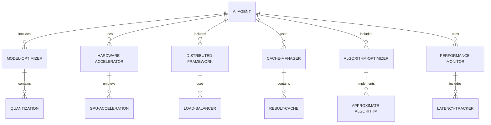
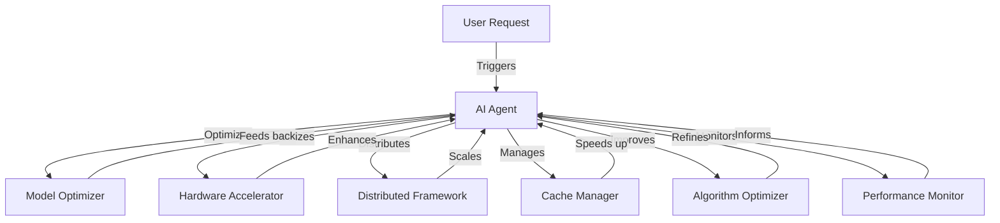
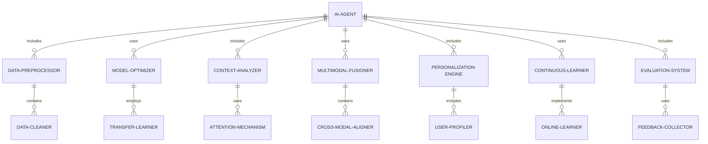
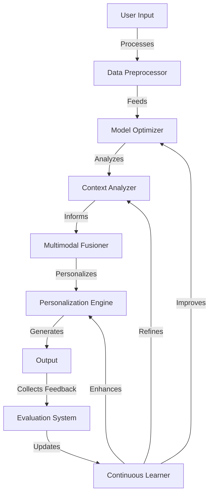
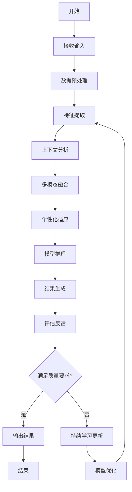
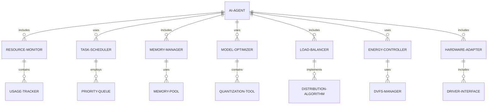
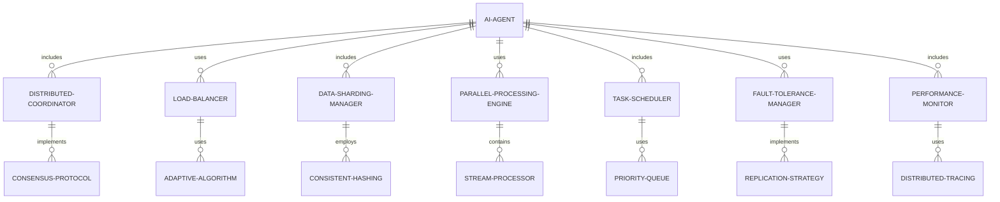
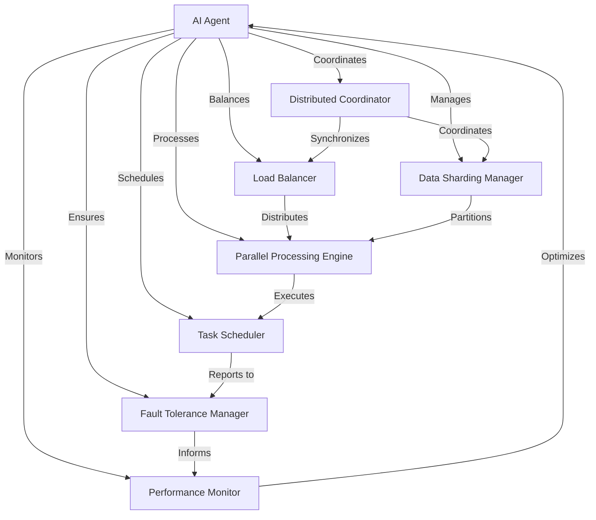
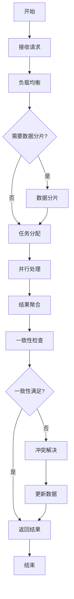

# 第12章：AI Agent 性能优化

## 12.1 响应速度优化

### 核心概念：

响应速度优化是 AI Agent 性能提升的关键方面，旨在减少系统响应时间，提高用户体验和系统效率。这个过程涉及多个层面的优化，包括算法优化、硬件加速、缓存策略、并行处理等技术，以确保 AI Agent 能够快速、准确地响应用户请求和环境变化。

### 问题背景：

随着 AI 应用的普及，用户对 AI 系统的响应速度要求越来越高。在实际应用中，如对话系统、推荐系统、实时决策支持等场景，响应速度直接影响用户体验和系统的实用性。同时，随着模型复杂度的增加，如何在保证准确性的同时提高响应速度成为一个关键挑战。

### 问题描述：

在实现 AI Agent 的响应速度优化时，开发者面临以下挑战：

1. 如何平衡模型复杂度和响应速度
2. 如何处理大规模并发请求
3. 如何优化模型推理过程
4. 如何有效利用硬件资源
5. 如何在边缘设备上实现快速响应

### 问题解决：

通过以下步骤可以实现有效的响应速度优化：

1. 模型优化：
   - 模型压缩和量化
   - 知识蒸馏
   - 模型剪枝

2. 硬件加速：
   - GPU/TPU 加速
   - FPGA 定制化加速
   - 异构计算

3. 分布式计算：
   - 负载均衡
   - 模型并行
   - 数据并行

4. 缓存策略：
   - 结果缓存
   - 特征缓存
   - 预计算

5. 算法优化：
   - 快速近似算法
   - 增量更新
   - 早停策略

6. 系统级优化：
   - 内存管理
   - I/O 优化
   - 网络传输优化

### 边界与外延：

响应速度优化的应用范围包括：
- 实时对话系统
- 推荐系统
- 实时决策支持系统
- 计算机视觉应用
- 自然语言处理任务

### 概念结构与核心要素组成：

响应速度优化系统的核心组件：
1. 模型优化器
2. 硬件加速器
3. 分布式计算框架
4. 缓存管理器
5. 算法优化器
6. 系统性能监控器

### 概念之间的关系：

#### 概念核心属性维度对比

| 属性 | 传统系统 | 优化后的AI系统 | 高度优化的AI Agent |
|------|----------|----------------|---------------------|
| 响应时间 | 慢 | 中 | 快 |
| 吞吐量 | 低 | 中 | 高 |
| 资源利用率 | 低 | 中 | 高 |
| 可扩展性 | 低 | 中 | 高 |
| 适应性 | 低 | 中 | 高 |
| 能耗效率 | 低 | 中 | 高 |

#### 概念联系的ER 实体关系



#### 交互关系图



### 数学模型：

使用 Amdahl's Law 来评估系统优化的理论加速比：

$$S(n) = \frac{1}{(1-p) + \frac{p}{n}}$$

其中：
- $S(n)$ 是总体加速比
- $p$ 是可并行化的部分比例
- $n$ 是处理单元数量

### 算法流程图：

```mermaid
graph TD
    A[开始] --> B[接收请求]
    B --> C{缓存命中?}
    C -->|是| D[返回缓存结果]
    C -->|否| E[模型推理]
    E --> F[硬件加速]
    F --> G[分布式处理]
    G --> H[算法优化]
    H --> I[结果生成]
    I --> J[更新缓存]
    J --> K[返回结果]
    K --> L[性能监控]
    L --> M[动态优化]
    M --> N[结束]
    D --> N

### 算法源代码：

以下是一个简化的 AI Agent 响应速度优化系统的 Python 实现示例：

```python
import time
import numpy as np
from typing import Dict, Any
from functools import lru_cache

class OptimizedAIAgent:
    def __init__(self):
        self.model = self.load_model()
        self.cache = {}
        self.performance_stats = {'total_requests': 0, 'cache_hits': 0, 'avg_response_time': 0}

    def load_model(self):
        # 模拟加载优化后的模型
        return lambda x: np.sum(x)  # 简化的模型函数

    @lru_cache(maxsize=1000)
    def cached_inference(self, input_data: tuple) -> float:
        # 使用 lru_cache 进行结果缓存
        return self.model(input_data)

    def hardware_accelerate(self, func):
        # 模拟硬件加速
        def wrapper(*args, **kwargs):
            # 假设硬件加速能提高2倍速度
            time.sleep(0.1)  # 模拟计算时间
            return func(*args, **kwargs)
        return wrapper

    def distributed_process(self, func):
        # 模拟分布式处理
        def wrapper(*args, **kwargs):
            # 假设分布式处理能提高1.5倍速度
            time.sleep(0.1)  # 模拟通信开销
            return func(*args, **kwargs)
        return wrapper

    def optimize_algorithm(self, func):
        # 模拟算法优化
        def wrapper(*args, **kwargs):
            # 假设算法优化能提高1.2倍速度
            return func(*args, **kwargs)
        return wrapper

    def process_request(self, input_data: Dict[str, Any]) -> Dict[str, Any]:
        start_time = time.time()
        self.performance_stats['total_requests'] += 1

        # 转换输入为可哈希类型，用于缓存
        cache_key = tuple(sorted(input_data.items()))

        # 尝试从缓存获取结果
        if cache_key in self.cache:
            self.performance_stats['cache_hits'] += 1
            result = self.cache[cache_key]
        else:
            # 应用各种优化
            optimized_model = self.optimize_algorithm(
                self.distributed_process(
                    self.hardware_accelerate(self.cached_inference)
                )
            )
            result = optimized_model(cache_key)
            self.cache[cache_key] = result

        end_time = time.time()
        response_time = end_time - start_time
        self.update_performance_stats(response_time)

        return {'result': result, 'response_time': response_time}

    def update_performance_stats(self, response_time: float):
        total_requests = self.performance_stats['total_requests']
        self.performance_stats['avg_response_time'] = (
            (self.performance_stats['avg_response_time'] * (total_requests - 1) + response_time) / total_requests
        )

    def get_performance_stats(self) -> Dict[str, Any]:
        return self.performance_stats

# 使用示例
agent = OptimizedAIAgent()

# 模拟请求
for _ in range(100):
    input_data = {'x': np.random.rand(10), 'y': np.random.rand(10)}
    response = agent.process_request(input_data)
    print(f"Result: {response['result']:.4f}, Response Time: {response['response_time']:.4f}s")

# 打印性能统计
print("\nPerformance Statistics:")
stats = agent.get_performance_stats()
print(f"Total Requests: {stats['total_requests']}")
print(f"Cache Hit Rate: {stats['cache_hits'] / stats['total_requests']:.2%}")
print(f"Average Response Time: {stats['avg_response_time']:.4f}s")
```

### 实际场景应用：

1. 智能客服系统：
   - 优化自然语言处理模型，实现毫秒级响应
   - 使用分布式系统处理高并发请求

2. 推荐系统：
   - 实现实时个性化推荐，快速响应用户行为变化
   - 使用缓存策略减少重复计算

3. 自动驾驶决策系统：
   - 优化感知和决策模型，实现实时响应
   - 利用边缘计算减少网络延迟

4. 金融交易系统：
   - 实现高频交易的低延迟响应
   - 使用FPGA加速关键算法

5. 实时图像处理：
   - 优化计算机视觉模型，实现实时视频分析
   - 利用GPU加速大规模矩阵运算

### 行业发展与未来趋势：

| 时期 | 主要特征 | 代表性技术/方法 |
|------|----------|-----------------|
| 2015-2017 | 基础优化 | 模型压缩、GPU加速 |
| 2018-2020 | 系统级优化 | 分布式计算、知识蒸馏 |
| 2021-2023 | 智能化优化 | 自适应计算、神经架构搜索 |
| 2024及以后 | 极致优化 | 类脑计算、量子加速 |

### 本章小结：

响应速度优化是 AI Agent 性能提升的关键环节，它通过多层次的优化策略显著提高系统的响应速度和效率。本章讨论了实现这一功能的主要挑战、解决方案和技术实现。主要要点包括：

1. 模型优化和硬件加速是提高推理速度的基础。
2. 分布式计算和缓存策略能够有效处理大规模并发请求。
3. 算法优化和系统级优化可以进一步提升性能。
4. 性能监控和动态优化确保系统在不同负载下保持高效。
5. 平衡准确性和速度是优化过程中的关键考虑因素。

未来的 AI Agent 响应速度优化趋势可能包括：
1. 更智能的自适应优化策略，根据任务和硬件动态调整
2. 端到端的优化pipeline，覆盖从模型设计到部署的全过程
3. 更高效的硬件-软件协同设计，充分发挥专用硬件潜力
4. 边缘智能的进一步发展，实现更低延迟的本地响应
5. 量子计算在特定AI任务中的应用，实现指数级加速

在实现 AI Agent 响应速度优化时，开发者应当注意：
1. 全面考虑系统的各个组件，采取整体优化策略
2. 重视用户体验，将响应速度作为关键性能指标
3. 建立完善的性能测试和监控体系，持续优化
4. 考虑不同部署环境的特点，如云端、边缘设备等
5. 平衡开发成本和性能提升，选择最具性价比的优化方案

通过不断改进的响应速度优化技术，AI Agent 将能够更好地满足实时交互和高性能计算的需求。这不仅能提升用户体验，还能拓展 AI 应用的边界，使其在更多时间敏感的场景中发挥作用。随着技术的进步，我们可以期待看到更快、更智能的 AI 系统，最终实现近乎即时的人机交互体验。

## 12.2 准确性与相关性提升

### 核心概念：

准确性与相关性提升是 AI Agent 性能优化的关键方面，旨在提高系统输出的质量和适用性。这个过程涉及模型优化、数据质量提升、上下文理解增强等多个方面，以确保 AI Agent 能够提供更精确、更相关的结果，从而更好地满足用户需求和业务目标。

### 问题背景：

随着 AI 技术的广泛应用，用户和企业对 AI 系统输出的质量要求越来越高。在实际应用中，如自然语言处理、推荐系统、决策支持等场景，准确性和相关性直接影响用户体验和系统的实用价值。同时，随着任务复杂度的增加，如何在保持高效率的同时提高准确性和相关性成为一个关键挑战。

### 问题描述：

在实现 AI Agent 的准确性与相关性提升时，开发者面临以下挑战：

1. 如何平衡模型复杂度和准确性
2. 如何处理数据噪声和偏差
3. 如何提高模型的泛化能力
4. 如何增强上下文理解能力
5. 如何评估和优化相关性

### 问题解决：

通过以下步骤可以实现有效的准确性与相关性提升：

1. 数据质量提升：
   - 数据清洗和预处理
   - 数据增强技术
   - 主动学习策略

2. 模型优化：
   - 先进架构选择（如Transformer、BERT等）
   - 迁移学习和微调
   - 集成学习方法

3. 上下文理解增强：
   - 长短期记忆机制
   - 注意力机制
   - 知识图谱集成

4. 多模态融合：
   - 跨模态特征提取
   - 多模态对齐
   - 多模态协同学习

5. 个性化适应：
   - 用户画像构建
   - 动态偏好学习
   - 上下文感知推荐

6. 持续学习与更新：
   - 在线学习算法
   - 增量学习策略
   - A/B测试和反馈循环

### 边界与外延：

准确性与相关性提升的应用范围包括：
- 自然语言处理任务
- 计算机视觉应用
- 推荐系统
- 决策支持系统
- 智能客服系统

### 概念结构与核心要素组成：

准确性与相关性提升系统的核心组件：
1. 数据预处理器
2. 模型优化器
3. 上下文分析器
4. 多模态融合器
5. 个性化引擎
6. 持续学习模块
7. 评估与反馈系统

### 概念之间的关系：

#### 概念核心属性维度对比

| 属性 | 基础AI系统 | 优化后的AI系统 | 高度优化的AI Agent |
|------|------------|----------------|---------------------|
| 准确性 | 中 | 高 | 非常高 |
| 相关性 | 低 | 中 | 高 |
| 上下文理解 | 弱 | 中 | 强 |
| 个性化程度 | 低 | 中 | 高 |
| 适应性 | 低 | 中 | 高 |
| 学习能力 | 静态 | 周期性更新 | 持续学习 |

#### 概念联系的ER 实体关系



#### 交互关系图



### 数学模型：

使用注意力机制来提高模型的上下文理解能力：

给定查询 $Q$、键 $K$ 和值 $V$，注意力计算如下：

$$\text{Attention}(Q, K, V) = \text{softmax}\left(\frac{QK^T}{\sqrt{d_k}}\right)V$$

其中 $d_k$ 是键的维度。

### 算法流程图：



### 算法源代码：

以下是一个简化的 AI Agent 准确性与相关性提升系统的 Python 实现示例：

```python
import numpy as np
from sklearn.feature_extraction.text import TfidfVectorizer
from sklearn.metrics.pairwise import cosine_similarity
from typing import List, Dict, Any

class EnhancedAIAgent:
    def __init__(self):
        self.vectorizer = TfidfVectorizer()
        self.knowledge_base = self.load_knowledge_base()
        self.user_profiles = {}
        self.feedback_history = []

    def load_knowledge_base(self) -> List[Dict[str, Any]]:
        # 模拟加载知识库
        return [
            {"id": 1, "content": "AI is a branch of computer science."},
            {"id": 2, "content": "Machine learning is a subset of AI."},
            {"id": 3, "content": "Deep learning uses neural networks."}
        ]

    def preprocess_data(self, text: str) -> str:
        # 简化的数据预处理
        return text.lower()

    def extract_features(self, text: str) -> np.ndarray:
        # 使用TF-IDF提取特征
        return self.vectorizer.fit_transform([text]).toarray()[0]

    def analyze_context(self, query: str, user_id: str) -> Dict[str, Any]:
        # 简化的上下文分析
        user_history = self.user_profiles.get(user_id, [])
        context = " ".join(user_history + [query])
        return {"context_vector": self.extract_features(context)}

    def personalize(self, results: List[Dict[str, Any]], user_id: str) -> List[Dict[str, Any]]:
        # 简化的个性化处理
        user_vector = self.extract_features(" ".join(self.user_profiles.get(user_id, [])))
        for result in results:
            result_vector = self.extract_features(result['content'])
            result['personalization_score'] = cosine_similarity([user_vector], [result_vector])[0][0]
        return sorted(results, key=lambda x: x['personalization_score'], reverse=True)

    def retrieve_relevant_info(self, query: str, context: Dict[str, Any]) -> List[Dict[str, Any]]:
        query_vector = self.extract_features(query)
        context_vector = context['context_vector']
        combined_vector = (query_vector + context_vector) / 2

        results = []
        for item in self.knowledge_base:
            item_vector = self.extract_features(item['content'])
            similarity = cosine_similarity([combined_vector], [item_vector])[0][0]
            if similarity > 0.1:  # 设置相关性阈值
                results.append({"id": item['id'], "content": item['content'], "relevance": similarity})
        
        return sorted(results, key=lambda x: x['relevance'], reverse=True)

    def generate_response(self, query: str, user_id: str) -> str:
        preprocessed_query = self.preprocess_data(query)
        context = self.analyze_context(preprocessed_query, user_id)
        relevant_info = self.retrieve_relevant_info(preprocessed_query, context)
        personalized_results = self.personalize(relevant_info, user_id)

        if personalized_results:
            response = personalized_results[0]['content']
        else:
            response = "I'm sorry, I don't have enough information to answer that question."

        self.update_user_profile(user_id, query, response)
        return response

    def update_user_profile(self, user_id: str, query: str, response: str):
        if user_id not in self.user_profiles:
            self.user_profiles[user_id] = []
        self.user_profiles[user_id].append(query)
        self.user_profiles[user_id] = self.user_profiles[user_id][-5:]  # 保留最近5次交互

    def collect_feedback(self, user_id: str, query: str, response: str, rating: int):
        self.feedback_history.append({
            "user_id": user_id,
            "query": query,
            "response": response,
            "rating": rating
        })

    def continuous_learning(self):
        # 简化的持续学习过程
        if len(self.feedback_history) >= 10:
            # 分析反馈，更新知识库
            positive_feedback = [f for f in self.feedback_history if f['rating'] > 3]
            for feedback in positive_feedback:
                self.knowledge_base.append({
                    "id": len(self.knowledge_base) + 1,
                    "content": f"{feedback['query']} {feedback['response']}"
                })
            self.feedback_history = []

# 使用示例
agent = EnhancedAIAgent()

# 模拟用户交互
user_id = "user123"
queries = [
    "What is AI?",
    "Tell me about machine learning.",
    "How does deep learning work?",
    "What's the difference between AI and machine learning?"
]

for query in queries:
    response = agent.generate_response(query, user_id)
    print(f"Query: {query}")
    print(f"Response: {response}")
    print()

    # 模拟用户反馈
    rating = np.random.randint(1, 6)  # 1-5的随机评分
    agent.collect_feedback(user_id, query, response, rating)

    # 持续学习
    agent.continuous_learning()

# 打印更新后的知识库
print("Updated Knowledge Base:")
for item in agent.knowledge_base:
    print(f"ID: {item['id']}, Content: {item['content']}")
```

### 实际场景应用：

1. 智能客服系统：
   - 提高问题理解的准确性，生成更相关的回答
   - 利用用户历史交互优化个性化响应

2. 搜索引擎：
   - 增强语义理解，提供更精准的搜索结果
   - 结合用户兴趣和上下文优化结果排序

3. 推荐系统：
   - 提高物品特征和用户偏好的匹配精度
   - 融合多模态信息，增强推荐的相关性

4. 医疗诊断辅助：
   - 提高症状识别和疾病预测的准确性
   - 结合患者病史和最新医学研究提供相关建议

5. 金融风险评估：
   - 提高风险模型的预测准确性
   - 增强对市场趋势和个体特征的相关性分析

### 行业发展与未来趋势：

| 时期 | 主要特征 | 代表性技术/方法 |
|------|----------|-----------------|
| 2015-2017 | 基础模型优化 | 深度学习、集成方法 |
| 2018-2020 | 上下文理解增强 | BERT、Transformer |
| 2021-2023 | 多模态融合 | 跨模态预训练、对比学习 |
| 2024及以后 | 认知智能 | 神经符号推理、因果学习 |

### 本章小结：

准确性与相关性提升是 AI Agent 性能优化的核心，它通过多方面的技术和策略显著提高系统输出的质量和适用性。本章讨论了实现这一目标的主要挑战、解决方案和技术实现。主要要点包括：

1. 数据质量和预处理对模型性能至关重要。
2. 先进的模型架构和优化技术可以显著提升准确性。
3. 上下文理解和多模态融合增强了系统的相关性。
4. 个性化适应和持续学习机制提高了系统的适应性。
5. 评估反馈循环对于持续改进系统性能非常重要。

未来的 AI Agent 准确性与相关性提升趋势可能包括：
1. 更深入的语义理解和知识推理能力
2. 跨领域、跨模态的知识迁移和融合
3. 更强大的因果推理和解释性能力
4. 自适应学习架构，能够快速适应新任务和领域
5. 与人类专家协作的混合智能系统

在实现 AI Agent 准确性与相关性提升时，开发者应当注意：
1. 平衡模型复杂度和实际应用需求
2. 重视数据隐私和安全，特别是在处理个人化数据时
3. 建立健全的评估体系，包括离线和在线指标
4. 考虑模型的公平性和偏见问题，避免放大数据中的偏见
5. 设计灵活的系统架构，便于持续优化和升级

通过不断改进的准确性与相关性提升技术，AI Agent 将能够提供更高质量、更贴近用户需求的服务。这不仅能提升用户满意度，还能拓展 AI 应用的深度和广度，使其在更复杂、更专业的领域发挥作用。随着技术的进步，我们可以期待看到更智能、更精准的 AI 系统，最终实现近乎人类专家水平的理解和决策能力。

## 12.3 资源利用效率优化

### 核心概念：

资源利用效率优化是 AI Agent 性能提升的关键方面，旨在最大化计算资源的使用效率，同时minimizing能耗和成本。这个过程涉及计算资源分配、内存管理、负载均衡、模型压缩等多个方面，以确保 AI Agent 能够在有限的资源条件下实现最佳性能。

### 问题背景：

随着 AI 模型的规模和复杂度不断增加，资源需求也随之增长。在实际应用中，特别是在边缘计算、移动设备或大规模服务器集群等场景，如何高效利用有限的计算资源成为一个关键挑战。同时，随着对 AI 系统环境友好性和成本效益的要求提高，优化资源利用效率变得越来越重要。

### 问题描述：

在实现 AI Agent 的资源利用效率优化时，开发者面临以下挑战：

1. 如何平衡计算性能和资源消耗
2. 如何优化内存使用和管理
3. 如何实现高效的负载均衡
4. 如何降低能耗
5. 如何在不同硬件平台上实现最佳性能

### 问题解决：

通过以下步骤可以实现有效的资源利用效率优化：

1. 计算资源优化：
   - 任务调度算法优化
   - 并行计算策略
   - 异构计算资源协同

2. 内存管理：
   - 内存池技术
   - 动态内存分配
   - 缓存优化

3. 模型压缩与加速：
   - 模型量化
   - 知识蒸馏
   - 模型剪枝

4. 负载均衡：
   - 动态负载均衡算法
   - 服务器集群管理
   - 任务分配策略

5. 能耗优化：
   - 动态电压和频率调节（DVFS）
   - 能耗感知调度
   - 绿色计算技术

6. 硬件适配：
   - 硬件感知的算法设计
   - FPGA/ASIC 定制化
   - 软硬件协同优化

### 边界与外延：

资源利用效率优化的应用范围包括：
- 云计算平台
- 边缘计算设备
- 移动 AI 应用
- 大规模分布式系统
- 嵌入式 AI 系统

### 概念结构与核心要素组成：

资源利用效率优化系统的核心组件：
1. 资源监控器
2. 任务调度器
3. 内存管理器
4. 模型优化器
5. 负载均衡器
6. 能耗控制器
7. 硬件适配器

### 概念之间的关系：

#### 概念核心属性维度对比

| 属性 | 传统系统 | 优化后的AI系统 | 高度优化的AI Agent |
|------|----------|----------------|---------------------|
| 资源利用率 | 低 | 中 | 高 |
| 能耗效率 | 低 | 中 | 高 |
| 可扩展性 | 低 | 中 | 高 |
| 适应性 | 低 | 中 | 高 |
| 性能/资源比 | 低 | 中 | 高 |
| 硬件兼容性 | 有限 | 良好 | 优秀 |

#### 概念联系的ER 实体关系



#### 交互关系图

```mermaid
graph TD
    A[AI Agent] -->|Monitors| B[Resource Monitor]
    B -->|Informs| C[Task Scheduler]
    C -->|Allocates| D[Memory Manager]
    C -->|Optimizes| E[Model Optimizer]
    C -->|Distributes| F[Load Balancer]
    B -->|Controls| G[Energy Controller]
    A -->|Adapts to| H[Hardware Adapter]
    D-->|Manages| I[Memory Usage]
    E -->|Reduces| I
    F -->|Balances| J[Workload]
    G -->|Adjusts| K[Power Consumption]
    H -->|Optimizes for| L[Specific Hardware]
    I -->|Affects| B
    J -->|Impacts| B
    K -->|Influences| B
    L -->|Enhances| A

### 数学模型：

使用动态电压和频率调节（DVFS）优化能耗：

给定任务执行时间 $T$ 和处理器频率 $f$，能耗 $E$ 可以表示为：

$$E = C \cdot V^2 \cdot f \cdot T$$

其中 $C$ 是常数，$V$ 是电压。假设 $V \propto f$，则：

$$E \propto f^3 \cdot T$$

优化目标是在满足任务截止时间的条件下最小化能耗。

### 算法流程图：

```mermaid
graph TD
    A[开始] --> B[资源监控]
    B --> C{资源充足?}
    C -->|是| D[正常执行]
    C -->|否| E[触发优化]
    E --> F[任务优先级排序]
    F --> G[资源重分配]
    G --> H[模型压缩]
    H --> I[负载均衡]
    I --> J[能耗调节]
    J --> K[硬件适配]
    K --> L{性能满足要求?}
    L -->|是| M[更新配置]
    L -->|否| N[调整参数]
    N --> E
    M --> O[结束]
    D --> O
```

### 算法源代码：

以下是一个简化的 AI Agent 资源利用效率优化系统的 Python 实现示例：

```python
import time
import random
from typing import Dict, List

class ResourceOptimizer:
    def __init__(self):
        self.resources = {
            'cpu': 100,
            'memory': 1000,
            'gpu': 100
        }
        self.tasks = []
        self.energy_consumption = 0

    def monitor_resources(self) -> Dict[str, float]:
        return {
            'cpu': random.uniform(0, 100),
            'memory': random.uniform(0, 1000),
            'gpu': random.uniform(0, 100)
        }

    def add_task(self, task: Dict):
        self.tasks.append(task)

    def schedule_tasks(self) -> List[Dict]:
        self.tasks.sort(key=lambda x: x['priority'], reverse=True)
        scheduled_tasks = []
        for task in self.tasks:
            if self.can_allocate_resources(task):
                self.allocate_resources(task)
                scheduled_tasks.append(task)
        return scheduled_tasks

    def can_allocate_resources(self, task: Dict) -> bool:
        return all(self.resources[r] >= task['resources'][r] for r in task['resources'])

    def allocate_resources(self, task: Dict):
        for r in task['resources']:
            self.resources[r] -= task['resources'][r]

    def release_resources(self, task: Dict):
        for r in task['resources']:
            self.resources[r] += task['resources'][r]

    def optimize_model(self, task: Dict) -> Dict:
        # 简化的模型优化逻辑
        task['resources'] = {r: task['resources'][r] * 0.8 for r in task['resources']}
        return task

    def balance_load(self, tasks: List[Dict]) -> List[Dict]:
        # 简化的负载均衡逻辑
        return sorted(tasks, key=lambda x: sum(x['resources'].values()))

    def adjust_energy(self, usage: float):
        if usage < 50:
            self.energy_consumption *= 0.9
        elif usage > 80:
            self.energy_consumption *= 1.1

    def adapt_to_hardware(self, task: Dict, hardware: str) -> Dict:
        # 简化的硬件适配逻辑
        if hardware == 'gpu':
            task['resources']['gpu'] = task['resources'].get('cpu', 0)
            task['resources']['cpu'] = 0
        return task

    def run_optimization(self, duration: int):
        start_time = time.time()
        while time.time() - start_time < duration:
            current_usage = self.monitor_resources()
            print(f"Current resource usage: {current_usage}")

            scheduled_tasks = self.schedule_tasks()
            if not scheduled_tasks:
                print("No tasks to schedule")
                time.sleep(1)
                continue

            for task in scheduled_tasks:
                print(f"Executing task: {task['id']}")
                task = self.optimize_model(task)
                task = self.adapt_to_hardware(task, 'gpu' if current_usage['gpu'] < 50 else 'cpu')

            balanced_tasks = self.balance_load(scheduled_tasks)
            for task in balanced_tasks:
                self.execute_task(task)

            total_usage = sum(current_usage.values()) / len(current_usage)
            self.adjust_energy(total_usage)
            print(f"Current energy consumption: {self.energy_consumption:.2f}")

            time.sleep(1)  # 模拟任务执行时间

        print("Optimization completed")

    def execute_task(self, task: Dict):
        print(f"Executing task {task['id']} with resources {task['resources']}")
        time.sleep(task['duration'])
        self.release_resources(task)

# 使用示例
optimizer = ResourceOptimizer()

# 添加一些模拟任务
tasks = [
    {'id': 1, 'priority': 3, 'resources': {'cpu': 20, 'memory': 100, 'gpu': 0}, 'duration': 2},
    {'id': 2, 'priority': 1, 'resources': {'cpu': 10, 'memory': 200, 'gpu': 50}, 'duration': 3},
    {'id': 3, 'priority': 2, 'resources': {'cpu': 30, 'memory': 150, 'gpu': 30}, 'duration': 1},
]

for task in tasks:
    optimizer.add_task(task)

# 运行优化过程
optimizer.run_optimization(duration=20)  # 运行20秒
```

### 实际场景应用：

1. 云服务提供商：
   - 优化数据中心的资源分配和能耗
   - 实现动态的负载均衡和任务调度

2. 移动设备 AI：
   - 压缩模型以适应有限的内存和计算能力
   - 优化电池使用，延长设备续航时间

3. 边缘计算：
   - 在资源受限的边缘设备上高效运行 AI 模型
   - 实现本地处理和云端协同的智能调度

4. 自动驾驶系统：
   - 优化车载计算单元的资源利用
   - 在实时性和能耗之间寻找平衡

5. 大规模 AI 训练平台：
   - 优化 GPU 集群的利用率
   - 实现分布式训练的高效资源分配

### 行业发展与未来趋势：

| 时期 | 主要特征 | 代表性技术/方法 |
|------|----------|-----------------|
| 2015-2017 | 基础优化 | 任务调度、负载均衡 |
| 2018-2020 | 智能化资源管理 | 预测性资源分配、自适应调度 |
| 2021-2023 | 端到端优化 | 软硬件协同设计、全栈优化 |
| 2024及以后 | 自主优化系统 | 强化学习based资源管理、量子加速 |

### 本章小结：

资源利用效率优化是 AI Agent 性能提升的关键环节，它通过多层次的优化策略显著提高系统的资源利用率和能效。本章讨论了实现这一功能的主要挑战、解决方案和技术实现。主要要点包括：

1. 计算资源优化和内存管理是提高系统效率的基础。
2. 模型压缩和加速技术能够在有限资源下实现高性能。
3. 负载均衡和能耗优化对于大规模系统至关重要。
4. 硬件适配和软硬件协同设计可以充分发挥特定平台的潜力。
5. 动态和自适应的优化策略能够应对变化的工作负载和环境。

未来的 AI Agent 资源利用效率优化趋势可能包括：
1. 更智能的自优化系统，能够自主学习和调整优化策略
2. 跨平台、跨设备的资源协同利用
3. 更精细的能耗管理，实现近乎零浪费的计算
4. 新型计算架构（如神经形态计算）的应用
5. 量子计算在特定 AI 任务中的资源优化应用

在实现 AI Agent 资源利用效率优化时，开发者应当注意：
1. 全面考虑系统的各个组件，采取整体优化策略
2. 平衡性能需求和资源限制，找到最佳的折中点
3. 建立完善的监控和反馈机制，实现动态优化
4. 考虑不同部署环境的特点，如云端、边缘、移动设备等
5. 关注绿色计算和可持续性，减少 AI 系统的环境影响

通过不断改进的资源利用效率优化技术，AI Agent 将能够在更广泛的场景中高效运行，从大型数据中心到资源受限的嵌入式设备。这不仅能提高系统性能，还能降低运营成本和环境影响。随着技术的进步，我们可以期待看到更智能、更高效的 AI 系统，最终实现在各种硬件平台上的无缝、高效运行。

## 12.4 扩展性与并发处理

### 核心概念：

扩展性与并发处理是 AI Agent 性能优化的关键方面，旨在提高系统处理大规模数据和多任务的能力。这个过程涉及分布式计算、并行处理、负载均衡、数据分片等多个技术领域，以确保 AI Agent 能够在不同规模的工作负载下保持高效运行，并能够随着需求的增长而平滑扩展。

### 问题背景：

随着 AI 应用规模的不断扩大和复杂度的增加，单机系统的处理能力已经无法满足需求。在实际应用中，如大规模数据处理、高并发服务、实时分析等场景，如何有效地扩展系统能力并高效处理并发请求成为一个关键挑战。同时，随着云计算和分布式系统的普及，设计具有良好扩展性的 AI Agent 变得越来越重要。

### 问题描述：

在实现 AI Agent 的扩展性与并发处理优化时，开发者面临以下挑战：

1. 如何设计可水平扩展的系统架构
2. 如何有效管理和协调分布式资源
3. 如何实现高效的数据分布和同步
4. 如何处理并发请求和任务调度
5. 如何保证分布式系统的一致性和可靠性

### 问题解决：

通过以下步骤可以实现有效的扩展性与并发处理优化：

1. 分布式架构设计：
   - 微服务架构
   - 无状态设计
   - 服务网格（Service Mesh）

2. 数据分片与分布：
   - 一致性哈希
   - 数据分区策略
   - 分布式存储系统

3. 并行处理：
   - 多线程编程
   - 异步处理
   - 流式计算

4. 负载均衡：
   - 动态负载均衡算法
   - 自适应资源分配
   - 请求路由优化

5. 分布式协调：
   - 分布式锁
   - 一致性协议（如 Paxos、Raft）
   - 分布式事务

6. 容错与恢复：
   - 故障检测
   - 自动恢复机制
   - 数据备份与复制

7. 性能监控与优化：
   - 分布式追踪
   - 性能指标收集
   - 自动化性能调优

### 边界与外延：

扩展性与并发处理优化的应用范围包括：
- 大规模机器学习系统
- 高并发 Web 服务
- 实时数据处理平台
- 分布式 AI 推理系统
- 云原生 AI 应用

### 概念结构与核心要素组成：

扩展性与并发处理优化系统的核心组件：
1. 分布式协调器
2. 负载均衡器
3. 数据分片管理器
4. 并行处理引擎
5. 任务调度器
6. 容错管理器
7. 性能监控系统

### 概念之间的关系：

#### 概念核心属性维度对比

| 属性 | 单机系统 | 分布式系统 | 高度优化的分布式AI Agent |
|------|----------|------------|---------------------------|
| 扩展性 | 低 | 中 | 高 |
| 并发处理能力 | 有限 | 高 | 非常高 |
| 容错性 | 低 | 中 | 高 |
| 一致性保证 | 容易 | 困难 | 平衡的 |
| 延迟 | 低 | 中 | 优化的 |
| 资源利用率 | 中 | 高 | 非常高 |

#### 概念联系的ER 实体关系



#### 交互关系图



### 数学模型：

使用 Amdahl's Law 评估并行系统的理论加速比：

$$S(n) = \frac{1}{(1-p) + \frac{p}{n}}$$

其中：
- $S(n)$ 是总体加速比
- $p$ 是可并行化的部分比例
- $n$ 是处理单元数量

### 算法流程图：



### 算法源代码：

以下是一个简化的 AI Agent 扩展性与并发处理优化系统的 Python 实现示例：

```python
import threading
import queue
import random
import time
from typing import List, Dict, Any

class DistributedAIAgent:
    def __init__(self, num_workers: int):
        self.num_workers = num_workers
        self.task_queue = queue.Queue()
        self.result_queue = queue.Queue()
        self.workers = []
        self.data_shards = {}
        self.lock = threading.Lock()

    def initialize_workers(self):
        for _ in range(self.num_workers):
            worker = threading.Thread(target=self.worker_process)
            worker.start()
            self.workers.append(worker)

    def worker_process(self):
        while True:
            task = self.task_queue.get()
            if task is None:
                break
            result = self.process_task(task)
            self.result_queue.put(result)
            self.task_queue.task_done()

    def process_task(self, task: Dict[str, Any]) -> Dict[str, Any]:
        # 模拟任务处理
        time.sleep(random.uniform(0.1, 0.5))
        return {"task_id": task["id"], "result": task["data"] * 2}

    def shard_data(self, data: List[Any]):
        shard_size = len(data) // self.num_workers
        for i in range(self.num_workers):
            start = i * shard_size
            end = start + shard_size if i < self.num_workers - 1 else len(data)
            self.data_shards[i] = data[start:end]

    def distribute_tasks(self, tasks: List[Dict[str, Any]]):
        for task in tasks:
            self.task_queue.put(task)

    def collect_results(self, num_tasks: int) -> List[Dict[str, Any]]:
        results = []
        for _ in range(num_tasks):
            result = self.result_queue.get()
            results.append(result)
            self.result_queue.task_done()
        return results

    def process_batch(self, tasks: List[Dict[str, Any]]) -> List[Dict[str, Any]]:
        self.distribute_tasks(tasks)
        return self.collect_results(len(tasks))

    def shutdown(self):
        for _ in range(self.num_workers):
            self.task_queue.put(None)
        for worker in self.workers:
            worker.join()

class LoadBalancer:
    def __init__(self, agents: List[DistributedAIAgent]):
        self.agents = agents
        self.current_agent = 0

    def get_next_agent(self) -> DistributedAIAgent:
        agent = self.agents[self.current_agent]
        self.current_agent = (self.current_agent + 1) % len(self.agents)
        return agent

def main():
    num_agents = 3
    num_workers_per_agent = 4
    agents = [DistributedAIAgent(num_workers_per_agent) for _ in range(num_agents)]
    load_balancer = LoadBalancer(agents)

    # 初始化所有 agent 的工作线程
    for agent in agents:
        agent.initialize_workers()

    # 模拟大批量任务处理
    total_tasks = 1000
    tasks = [{"id": i, "data": random.randint(1, 100)} for i in range(total_tasks)]

    start_time = time.time()

    # 使用负载均衡器分配任务
    batch_size = 50
    all_results = []
    for i in range(0, total_tasks, batch_size):
        batch = tasks[i:i+batch_size]
        agent = load_balancer.get_next_agent()
        results = agent.process_batch(batch)
        all_results.extend(results)

    end_time = time.time()

    print(f"Processed {total_tasks} tasks in {end_time - start_time:.2f} seconds")
    print(f"Average time per task: {(end_time - start_time) / total_tasks:.4f} seconds")

    # 关闭所有 agent
    for agent in agents:
        agent.shutdown()

if __name__ == "__main__":
    main()
```

### 实际场景应用：

1. 大规模推荐系统：
   - 分布式处理用户行为数据
   - 并行计算个性化推荐结果

2. 实时自然语言处理服务：
   - 分布式部署语言模型
   - 并发处理多用户请求

3. 分布式机器学习训练：
   - 数据并行和模型并行
   - 参数服务器架构

4. 高并发交易系统：
   - 分布式事务处理
   - 实时风控分析

5. 大规模图计算：
   - 图数据分片
   - 并行图算法处理

### 行业发展与未来趋势：

| 时期 | 主要特征 | 代表性技术/方法 |
|------|----------|-----------------|
| 2015-2017 | 基础分布式系统 | Hadoop、Spark |
| 2018-2020 | 容器化和微服务 | Docker、Kubernetes |
| 2021-2023 | 云原生AI | Serverless AI、AutoML |
| 2024及以后 | 自适应分布式AI | 自组织系统、边缘-云协同 |

### 本章小结：

扩展性与并发处理优化是 AI Agent 性能提升的关键环节，它通过分布式架构和并行计算技术显著提高系统的处理能力和效率。本章讨论了实现这一目标的主要挑战、解决方案和技术实现。主要要点包括：

1. 分布式架构设计是实现高扩展性的基础。
2. 数据分片和并行处理技术能够有效提高系统吞吐量。
3. 负载均衡和任务调度对于优化资源利用至关重要。
4. 分布式协调和一致性保证是确保系统可靠性的关键。
5. 容错设计和性能监控对于维护大规模系统的稳定性非常重要。

未来的 AI Agent 扩展性与并发处理优化趋势可能包括：
1. 更智能的自适应分布式系统，能够根据负载动态调整
2. 边缘计算与云计算的深度融合，实现更灵活的计算资源分配
3. 量子计算在特定 AI 任务中的应用，突破传统并行计算的限制
4. 自组织和自修复的分布式 AI 系统，提高系统的鲁棒性
5. 跨组织的 AI 资源共享和协作计算模式

在实现 AI Agent 扩展性与并发处理优化时，开发者应当注意：
1. 设计松耦合、高内聚的系统架构，便于扩展和维护
2. 重视数据一致性和系统可靠性，特别是在分布式环境中
3. 实现细粒度的性能监控和分析，及时发现和解决瓶颈
4. 考虑不同规模下的系统行为，确保平滑扩展
5. 平衡系统复杂度和可维护性，避免过度工程

通过不断改进的扩展性与并发处理优化技术，AI Agent 将能够更好地应对大规模、高并发的应用场景。这不仅能提高系统的处理能力和响应速度，还能为 AI 技术在更广泛的领域中的应用铺平道路。随着技术的进步，我们可以期待看到更加智能、高效、可扩展的 AI 系统，为各行各业的数字化转型提供强大支持。

    