# 第13章：AI Agent 安全与隐私保护

## 13.1 数据加密与访问控制

### 核心概念：

数据加密与访问控制是 AI Agent 安全与隐私保护的基础，旨在保护敏感数据的机密性和完整性，同时确保只有授权用户和进程能够访问特定的数据和资源。这个过程涉及加密算法、密钥管理、身份认证、授权机制等多个技术领域，以确保 AI Agent 在处理和存储数据时能够维护高度的安全性和隐私保护。

### 问题背景：

随着 AI 技术的广泛应用和数据驱动决策的普及，AI 系统处理的数据量和敏感度都在不断增加。在实际应用中，如医疗诊断、金融分析、个人助理等场景，如何保护用户隐私和敏感信息成为一个关键挑战。同时，随着数据泄露事件的频发和隐私法规的加强（如 GDPR、CCPA），实施强有力的数据保护措施变得越来越重要。

### 问题描述：

在实现 AI Agent 的数据加密与访问控制时，开发者面临以下挑战：

1. 如何在保护数据的同时不影响 AI 模型的性能
2. 如何管理大规模分布式系统中的加密密钥
3. 如何实现细粒度的访问控制策略
4. 如何处理动态变化的用户权限和数据访问需求
5. 如何在保护隐私的同时保证数据的可用性和共享性

### 问题解决：

通过以下步骤可以实现有效的数据加密与访问控制：

1. 数据加密：
   - 使用强加密算法（如 AES、RSA）
   - 实施端到端加密
   - 采用同态加密技术进行隐私保护计算

2. 密钥管理：
   - 使用硬件安全模块（HSM）存储密钥
   - 实施密钥轮换机制
   - 采用分布式密钥管理系统

3. 身份认证：
   - 多因素认证（MFA）
   - 生物识别技术
   - 基于令牌的认证（如 JWT）

4. 访问控制：
   - 基于角色的访问控制（RBAC）
   - 属性基于访问控制（ABAC）
   - 零信任安全模型

5. 数据隔离：
   - 使用虚拟化技术隔离数据
   - 实施数据分类和标记
   - 采用数据脱敏技术

6. 审计与监控：
   - 实时日志分析
   - 异常访问检测
   - 定期安全审计

7. 合规性保证：
   - 实施数据保护影响评估（DPIA）
   - 遵循隐私设计原则
   - 定期进行合规性检查

### 边界与外延：

数据加密与访问控制的应用范围包括：
- 云端 AI 服务
- 边缘计算设备
- 医疗健康 AI 系统
- 金融科技应用
- 智能家居和物联网设备

### 概念结构与核心要素组成：

数据加密与访问控制系统的核心组件：
1. 加密引擎
2. 密钥管理系统
3. 身份认证服务
4. 访问控制管理器
5. 数据分类器
6. 审计日志系统
7. 合规性检查器

### 概念之间的关系：

#### 概念核心属性维度对比

| 属性 | 传统系统 | 基础AI系统 | 高度安全的AI Agent |
|------|----------|------------|---------------------|
| 数据保护级别 | 低 | 中 | 高 |
| 访问控制粒度 | 粗粒度 | 中等 | 细粒度 |
| 加密复杂度 | 简单 | 中等 | 高级 |
| 身份认证强度 | 单因素 | 双因素 | 多因素 |
| 审计能力 | 有限 | 基本 | 全面 |
| 合规性 | 部分 | 大部分 | 完全 |

#### 概念联系的ER 实体关系

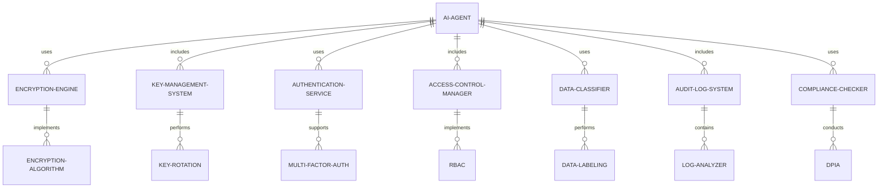

#### 交互关系图

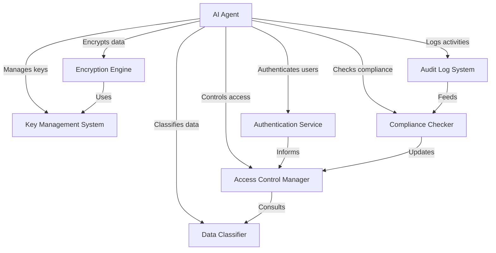

### 数学模型：

使用同态加密进行隐私保护计算：

给定明文 $m$ 和公钥 $pk$，加密函数 $E$ 和解密函数 $D$，同态加密满足：

$$D(E(m_1, pk) \cdot E(m_2, pk)) = m_1 + m_2$$

这允许在加密域中进行计算，而不需要解密数据。

### 算法流程图：

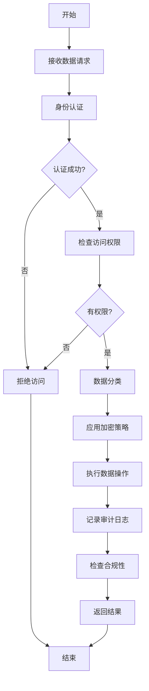

### 算法源代码：

以下是一个简化的 AI Agent 数据加密与访问控制系统的 Python 实现示例：

```python
import hashlib
import os
from cryptography.fernet import Fernet
from typing import Dict, List

class SecureAIAgent:
    def __init__(self):
        self.users = {}
        self.roles = {}
        self.data = {}
        self.encryption_key = Fernet.generate_key()
        self.fernet = Fernet(self.encryption_key)
        self.audit_log = []

    def add_user(self, username: str, password: str, role: str):
        salt = os.urandom(32)
        key = hashlib.pbkdf2_hmac('sha256', password.encode('utf-8'), salt, 100000)
        self.users[username] = {'key': key, 'salt': salt, 'role': role}

    def authenticate(self, username: str, password: str) -> bool:
        if username not in self.users:
            return False
        user = self.users[username]
        key = hashlib.pbkdf2_hmac('sha256', password.encode('utf-8'), user['salt'], 100000)
        return key == user['key']

    def add_role(self, role: str, permissions: List[str]):
        self.roles[role] = permissions

    def check_permission(self, username: str, permission: str) -> bool:
        if username not in self.users:
            return False
        role = self.users[username]['role']
        return permission in self.roles.get(role, [])

    def encrypt_data(self, data: str) -> bytes:
        return self.fernet.encrypt(data.encode())

    def decrypt_data(self, encrypted_data: bytes) -> str:
        return self.fernet.decrypt(encrypted_data).decode()

    def store_data(self, username: str, data_id: str, data: str):
        if not self.check_permission(username, 'write'):
            raise PermissionError("User does not have write permission")
        encrypted_data = self.encrypt_data(data)
        self.data[data_id] = encrypted_data
        self.log_action(username, f"Stored data {data_id}")

    def retrieve_data(self, username: str, data_id: str) -> str:
        if not self.check_permission(username, 'read'):
            raise PermissionError("User does not have read permission")
        if data_id not in self.data:
            raise KeyError("Data not found")
        encrypted_data = self.data[data_id]
        decrypted_data = self.decrypt_data(encrypted_data)
        self.log_action(username, f"Retrieved data {data_id}")
        return decrypted_data

    def log_action(self, username: str, action: str):
        self.audit_log.append(f"User {username}: {action}")

    def get_audit_log(self) -> List[str]:
        return self.audit_log

# 使用示例
agent = SecureAIAgent()

# 添加用户和角色
agent.add_role('admin', ['read', 'write'])
agent.add_role('user', ['read'])
agent.add_user('alice', 'password123', 'admin')
agent.add_user('bob', 'password456', 'user')

# 存储和检索数据
try:
    agent.authenticate('alice', 'password123')
    agent.store_data('alice', 'sensitive_data', 'This is confidential information')
    print(agent.retrieve_data('alice', 'sensitive_data'))

    agent.authenticate('bob', 'password456')
    print(agent.retrieve_data('bob', 'sensitive_data'))

    # 这将引发权限错误
    agent.store_data('bob', 'new_data', 'This should not be allowed')
except Exception as e:
    print(f"Error: {e}")

# 打印审计日志
print("\nAudit Log:")
for log_entry in agent.get_audit_log():
    print(log_entry)
```

### 实际场景应用：

1. 医疗AI系统：
   - 加密患者健康记录
   - 实施基于角色的访问控制，限制医生和研究人员的数据访问

2. 金融科技应用：
   - 加密交易数据和个人财务信息
   - 实施多因素认证和细粒度的访问控制

3. 智能家居系统：
   - 加密用户行为数据和设备状态信息
   - 实施设备级别的访问控制和认证

4. 企业AI助手：
   - 加密敏感的业务数据和通信内容
   - 实施基于部门和职级的访问控制策略

5. 自动驾驶系统：
   - 加密车辆位置和用户行程数据
   - 实施多层次的访问控制，区分车主、服务人员和紧急服务

### 行业发展与未来趋势：

| 时期 | 主要特征 | 代表性技术/方法 |
|------|----------|-----------------|
| 2015-2017 | 基础加密和访问控制 | SSL/TLS、基本RBAC |
| 2018-2020 | 高级加密和动态访问控制 | 同态加密、ABAC |
| 2021-2023 | AI驱动的安全和隐私保护 | 联邦学习、差分隐私 |
| 2024及以后 | 量子安全和自适应保护 | 后量子密码、AI安全自优化 |

### 本章小结：

数据加密与访问控制是 AI Agent 安全与隐私保护的基石，它通过多层次的安全机制保护敏感数据和资源。本章讨论了实现这一目标的主要挑战、解决方案和技术实现。主要要点包括：

1. 强加密算法和密钥管理是保护数据机密性的基础。
2. 多因素认证和细粒度访问控制增强了系统的安全性。
3. 数据分类和隔离有助于实施差异化的保护策略。
4. 审计日志和异常检测对于维护系统安全至关重要。
5. 合规性检查确保系统符合相关的隐私法规和标准。

未来的 AI Agent 数据加密与访问控制趋势可能包括：
1. 更高效的隐私保护计算技术，如全同态加密的实用化
2. 基于AI的自适应访问控制，能够根据上下文动态调整权限
3. 量子安全加密算法的广泛应用，应对量子计算的威胁
4. 去中心化的身份认证和访问控制系统，提高安全性和可用性
5. 更深入的隐私计算技术，如安全多方计算在AI中的应用

在实现 AI Agent 数据加密与访问控制时，开发者应当注意：
1. 采用"隐私设计"原则，将隐私保护融入系统设计的每个阶段
2. 平衡安全性和可用性，避免过度的安全措施影响用户体验
3. 持续更新安全策略，应对不断演变的威胁和攻击手段
4. 提供透明的数据使用和保护政策，增强用户信任
5. 考虑跨境数据传输的合规性问题，特别是在全球化AI服务中

通过不断改进的数据加密与访问控制技术，AI Agent 将能够更好地保护用户隐私和敏感信息。这不仅能提高系统的安全性和可信度，还能为 AI 技术在敏感领域的应用铺平道路。随着技术的进步，我们可以期待看到更加安全、透明和负责任的 AI 系统，为数字时代的隐私保护提供有力支撑。

## 13.2 敏感信息识别与脱敏

### 核心概念：

敏感信息识别与脱敏是 AI Agent 安全与隐私保护中的关键环节，旨在自动识别和处理数据中的敏感信息，以降低数据泄露的风险和影响。这个过程涉及机器学习、自然语言处理、模式识别等技术，以及各种脱敏策略，确保在保护隐私的同时尽可能保留数据的可用性和价值。

### 问题背景：

随着数据驱动决策的普及和隐私法规的加强（如 GDPR、CCPA），组织在处理和分析数据时面临着巨大的隐私保护压力。在实际应用中，如客户服务、医疗记录、金融交易等场景，数据中常常包含大量敏感信息。如何有效识别这些信息并进行适当的脱敏处理，成为 AI 系统设计和运营中的一个关键挑战。

### 问题描述：

在实现 AI Agent 的敏感信息识别与脱敏功能时，开发者面临以下挑战：

1. 如何准确识别各种类型的敏感信息
2. 如何在保护隐私和保留数据价值之间取得平衡
3. 如何处理非结构化数据中的敏感信息
4. 如何应对新出现的敏感信息类型
5. 如何确保脱敏过程的可逆性（在必要时）

### 问题解决：

通过以下步骤可以实现有效的敏感信息识别与脱敏：

1. 敏感信息识别：
   - 使用正则表达式匹配已知模式
   - 应用机器学习模型识别复杂模式
   - 利用自然语言处理技术理解上下文

2. 脱敏策略选择：
   - 数据屏蔽（如替换为 ****）
   - 数据替换（如使用假名）
   - 数据泛化（如将精确年龄替换为年龄段）
   - 数据加密（可逆脱敏）

3. 上下文感知脱敏：
   - 考虑数据项之间的关系
   - 根据使用场景调整脱敏级别

4. 动态脱敏：
   - 根据用户权限动态调整脱敏级别
   - 实时脱敏处理

5. 脱敏质量评估：
   - 评估信息损失
   - 检查脱敏后的数据可用性
   - 验证隐私保护效果

6. 脱敏日志和审计：
   - 记录脱敏操作
   - 定期审查脱敏策略的有效性

7. 持续学习和更新：
   - 收集反馈以改进识别准确性
   - 更新敏感信息类型库

### 边界与外延：

敏感信息识别与脱敏的应用范围包括：
- 医疗健康记录处理
- 金融交易数据分析
- 客户关系管理系统
- 人力资源管理
- 社交媒体内容审核

### 概念结构与核心要素组成：

敏感信息识别与脱敏系统的核心组件：
1. 敏感信息识别器
2. 脱敏策略选择器
3. 上下文分析器
4. 动态脱敏处理器
5. 质量评估模块
6. 审计日志系统
7. 持续学习更新器

### 概念之间的关系：

#### 概念核心属性维度对比

| 属性 | 手动处理 | 规则based系统 | AI驱动的智能脱敏 |
|------|----------|---------------|-------------------|
| 识别准确性 | 低 | 中 | 高 |
| 处理速度 | 慢 | 快 | 非常快 |
| 上下文理解 | 高 | 低 | 中-高 |
| 适应性 | 低 | 中 | 高 |
| 可扩展性 | 低 | 中 | 高 |
| 维护成本 | 高 | 中 | 低 |

#### 概念联系的ER 实体关系

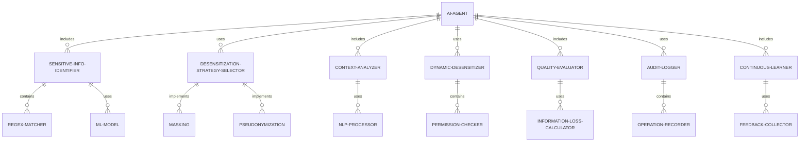

#### 交互关系图

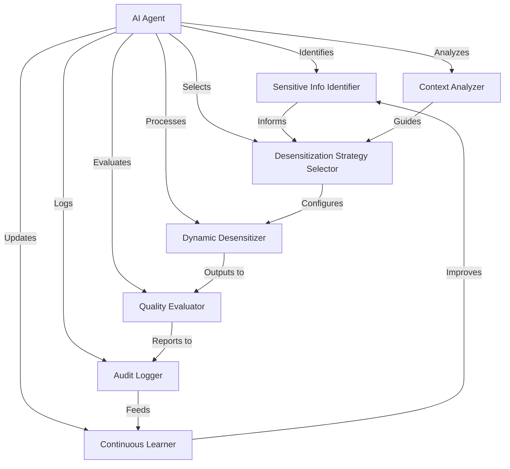

### 数学模型：

使用TF-IDF（词频-逆文档频率）来识别潜在的敏感词：

对于词 $t$ 在文档 $d$ 中的 TF-IDF 值计算如下：

$$\text{TF-IDF}(t,d,D) = \text{TF}(t,d) \cdot \text{IDF}(t,D)$$

其中：
- $\text{TF}(t,d)$ 是词 $t$ 在文档 $d$ 中的频率
- $\text{IDF}(t,D) = \log\frac{N}{|\{d \in D: t \in d\}|}$，$N$ 是总文档数

高 TF-IDF 值的词可能是特定文档的特征词，可能包含敏感信息。

### 算法流程图：

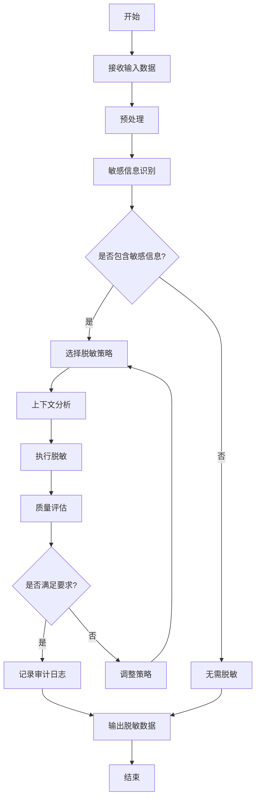

### 算法源代码：

以下是一个简化的 AI Agent 敏感信息识别与脱敏系统的 Python 实现示例：

```python
import re
import hashlib
from typing import Dict, List, Tuple

class SensitiveInfoProcessor:
    def __init__(self):
        self.sensitive_patterns = {
            'email': r'\b[A-Za-z0-9._%+-]+@[A-Za-z0-9.-]+\.[A-Z|a-z]{2,}\b',
            'phone': r'\b\d{3}[-.]?\d{3}[-.]?\d{4}\b',
            'ssn': r'\b\d{3}-\d{2}-\d{4}\b',
            'credit_card': r'\b(?:\d{4}[-\s]?){3}\d{4}\b'
        }
        self.desensitization_strategies = {
            'mask': lambda x: re.sub(r'\S', '*', x),
            'hash': lambda x: hashlib.sha256(x.encode()).hexdigest()[:10],
            'truncate': lambda x: x[:3] + '...' + x[-3:] if len(x) > 6 else x
        }

    def identify_sensitive_info(self, text: str) -> List[Tuple[str, str, int, int]]:
        sensitive_info = []
        for info_type, pattern in self.sensitive_patterns.items():
            for match in re.finditer(pattern, text):
                sensitive_info.append((info_type, match.group(), match.start(), match.end()))
        return sensitive_info

    def desensitize(self, text: str, strategy: str = 'mask') -> str:
        sensitive_info = self.identify_sensitive_info(text)
        desensitized_text = text
        offset = 0
        for info_type, value, start, end in sorted(sensitive_info, key=lambda x: x[2], reverse=True):
            desensitized_value = self.desensitization_strategies[strategy](value)
            desensitized_text = desensitized_text[:start+offset] + desensitized_value + desensitized_text[end+offset:]
            offset += len(desensitized_value) - (end - start)
        return desensitized_text

    def process_document(self, document: Dict[str, str]) -> Dict[str, str]:
        processed_document = {}
        for field, value in document.items():
            processed_document[field] = self.desensitize(value)
        return processed_document

    def evaluate_quality(self, original: str, desensitized: str) -> float:
        # 简单的质量评估：计算原始文本和脱敏文本的长度比
        return len(desensitized) / len(original)

# 使用示例
processor = SensitiveInfoProcessor()

sample_document = {
    "name": "John Doe",
    "email": "john.doe@example.com",
    "phone": "123-456-7890",
    "ssn": "123-45-6789",
    "credit_card": "1234-5678-9012-3456",
    "address": "123 Main St, Anytown, USA"
}

processed_document = processor.process_document(sample_document)

print("Original Document:")
print(sample_document)
print("\nProcessed Document:")
print(processed_document)

# 评估脱敏质量
for field in sample_document:
    quality = processor.evaluate_quality(sample_document[field], processed_document[field])
    print(f"\nQuality for {field}: {quality:.2f}")
```

### 实际场景应用：

1. 医疗记录管理：
   - 识别并脱敏患者个人信息和敏感医疗数据
   - 在保护隐私的同时保留数据的研究价值

2. 金融交易分析：
   - 脱敏信用卡号码和银行账户信息
   - 保留交易模式分析所需的关键特征

3. 客户服务系统：
   - 实时识别并脱敏客户对话中的敏感信息
   - 根据客服人员的权限级别动态调整脱敏程度

4. 人力资源管理：
   - 处理员工个人信息，如社会安全号码和薪资数据
   - 在内部报告中使用脱敏数据

5. 社交媒体内容审核：
   - 自动识别并屏蔽用户发布的敏感个人信息
   - 处理潜在的隐私泄露风险

### 行业发展与未来趋势：

| 时期 | 主要特征 | 代表性技术/方法 |
|------|----------|-----------------|
| 2015-2017 | 基于规则的识别 | 正则表达式、字典匹配 |
| 2018-2020 | 机器学习增强 | 命名实体识别、文本分类 |
| 2021-2023 | 上下文感知脱敏 | BERT、GPT for context understanding |
| 2024及以后 | 智能化和自适应 | 联邦学习、持续学习的隐私保护模型 |

### 本章小结：

敏感信息识别与脱敏是 AI Agent 安全与隐私保护的重要组成部分，它通过智能化的方法识别和处理数据中的敏感信息，在保护隐私的同时保留数据的可用性。本章讨论了实现这一目标的主要挑战、解决方案和技术实现。主要要点包括：

1. 结合规则based方法和机器学习技术可以提高敏感信息识别的准确性。
2. 多样化的脱敏策略能够适应不同类型的敏感信息和使用场景。
3. 上下文感知的脱敏处理有助于平衡隐私保护和数据价值。
4. 动态脱敏和质量评估确保了脱敏过程的灵活性和有效性。
5. 持续学习和更新机制对于应对新出现的敏感信息类型至关重要。

未来的 AI Agent 敏感信息识别与脱敏趋势可能包括：
1. 更深入的语义理解，能够识别复杂和隐含的敏感信息
2. 自适应的脱敏策略，根据数据使用目的和风险级别动态调整
3. 隐私保护机器学习技术的广泛应用，如联邦学习和差分隐私
4. 跨语言和跨文化的敏感信息识别能力
5. 与区块链等技术结合，提供可审计和不可篡改的脱敏记录

在实现 AI Agent 敏感信息识别与脱敏功能时，开发者应当注意：
1. 平衡隐私保护和数据效用，避免过度脱敏导致数据失去价值
2. 考虑法律和合规要求，确保脱敏过程符合相关隐私法规
3. 设计灵活的架构，以适应不断变化的隐私保护需求
4. 重视用户体验，在必要时提供透明的脱敏过程说明
5. 建立完善的安全措施，防止脱敏系统本身成为攻击目标

通过不断改进的敏感信息识别与脱敏技术，AI Agent 将能够更好地保护用户隐私，同时为数据分析和决策提供有价值的信息。这不仅能提高系统的合规性和可信度，还能为 AI 技术在敏感领域的应用创造更多可能。随着技术的进步，我们可以期待看到更加智能、精确和可靠的隐私保护解决方案，为数据驱动的创新提供坚实的基础。

## 13.3 对抗攻击防御

### 核心概念：

对抗攻击防御是 AI Agent 安全与隐私保护中的关键环节，旨在识别、预防和缓解针对 AI 模型的恶意攻击。这些攻击通常试图通过精心设计的输入来欺骗或误导 AI 系统，导致错误的输出或决策。对抗攻击防御涉及机器学习、安全工程、鲁棒性优化等多个技术领域，以确保 AI 系统在面对恶意干扰时仍能保持稳定和可靠的性能。

### 问题背景：

随着 AI 技术在关键领域的广泛应用，如自动驾驶、医疗诊断、金融风控等，AI 系统的安全性和可靠性变得至关重要。对抗攻击可能导致严重的后果，如误诊、金融损失或安全事故。同时，随着攻击者技术的不断进步，对抗攻击变得越来越复杂和难以检测。因此，开发有效的对抗攻击防御策略成为 AI 系统设计和部署中的一个关键挑战。

### 问题描述：

在实现 AI Agent 的对抗攻击防御功能时，开发者面临以下挑战：

1. 如何识别和检测各种类型的对抗攻击
2. 如何在保持模型性能的同时提高其鲁棒性
3. 如何处理未知或新型的对抗攻击
4. 如何平衡防御强度和模型效率
5. 如何在实时系统中实施有效的防御措施

### 问题解决：

通过以下步骤可以实现有效的对抗攻击防御：

1. 攻击检测：
   - 使用统计方法检测异常输入
   - 应用深度学习模型识别对抗样本
   - 实施多模型集成检测

2. 模型鲁棒性增强：
   - 对抗训练
   - 梯度正则化
   - 随机化技术（如随机裁剪、添加噪声）

3. 输入预处理：
   - 图像重建
   - 特征压缩
   - 输入变换（如旋转、缩放）

4. 防御架构设计：
   - 多层防御策略
   - 动态模型选择
   - 安全沙箱环境

5. 持续监控与更新：
   - 实时性能监控
   - 定期安全评估
   - 自适应防御策略更新

6. 隐私保护技术集成：
   - 差分隐私
   - 联邦学习
   - 安全多方计算

7. 可解释性增强：
   - 模型解释技术
   - 决策过程可视化
   - 异常检测结果说明

### 边界与外延：

对抗攻击防御的应用范围包括：
- 计算机视觉系统
- 自然语言处理应用
- 推荐系统
- 自动驾驶技术
- 生物特征识别系统

### 概念结构与核心要素组成：

对抗攻击防御系统的核心组件：
1. 攻击检测器
2. 鲁棒性增强模块
3. 输入预处理器
4. 防御策略选择器
5. 性能监控器
6. 模型更新管理器
7. 可解释性引擎

### 概念之间的关系：

#### 概念核心属性维度对比

| 属性 | 传统AI系统 | 基础防御AI系统 | 高度安全的AI Agent |
|------|------------|----------------|---------------------|
| 攻击检测能力 | 低 | 中 | 高 |
| 模型鲁棒性 | 低 | 中 | 高 |
| 防御策略多样性 | 单一 | 有限 | 丰富 |
| 自适应能力 | 无 | 有限 | 强 |
| 性能影响 | - | 中等 | 低 |
| 可解释性 | 低 | 中 | 高 |

#### 概念联系的ER 实体关系

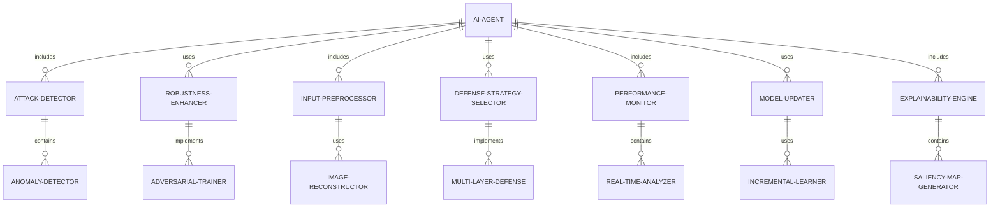

#### 交互关系图

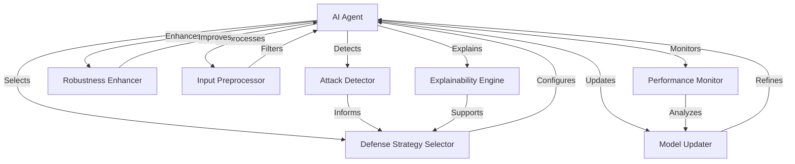

### 数学模型：

使用对抗训练来增强模型鲁棒性：

给定模型 $f_\theta$，损失函数 $L$，输入 $x$ 和标签 $y$，对抗训练的目标是：

$$\min_\theta \mathbb{E}_{(x,y)\sim D} [\max_{\delta \in S} L(f_\theta(x+\delta), y)]$$

其中 $S$ 是允许的扰动集合，通常定义为 $\ell_p$ 范数球。

### 算法流程图：

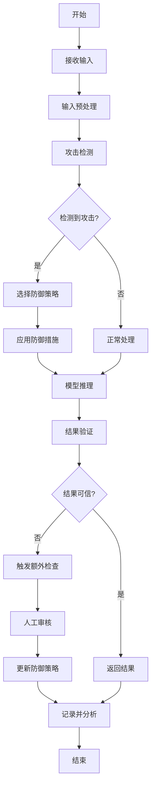

### 算法源代码：

以下是一个简化的 AI Agent 对抗攻击防御系统的 Python 实现示例：

```python
import numpy as np
from typing import Dict, Any
from sklearn.ensemble import IsolationForest

class AdversarialDefenseAgent:
    def __init__(self, model, input_shape):
        self.model = model
        self.input_shape = input_shape
        self.detector = IsolationForest(contamination=0.1)
        self.defense_strategies = {
            'noise': self.add_noise,
            'transform': self.transform_input,
            'ensemble': self.ensemble_prediction
        }

    def preprocess_input(self, input_data: np.ndarray) -> np.ndarray:
        # 简单的预处理：标准化
        return (input_data - np.mean(input_data)) / np.std(input_data)

    def detect_attack(self, input_data: np.ndarray) -> bool:
        # 使用Isolation Forest检测异常
        return self.detector.predict(input_data.reshape(1, -1))[0] == -1

    def add_noise(self, input_data: np.ndarray, noise_level: float = 0.1) -> np.ndarray:
        noise = np.random.normal(0, noise_level, self.input_shape)
        return np.clip(input_data + noise, 0, 1)

    def transform_input(self, input_data: np.ndarray) -> np.ndarray:
        # 简单的变换：水平翻转
        return np.fliplr(input_data)

    def ensemble_prediction(self, input_data: np.ndarray) -> np.ndarray:
        predictions = []
        for _ in range(3):  # 使用3个稍微不同的输入
            noisy_input = self.add_noise(input_data, noise_level=0.05)
            predictions.append(self.model.predict(noisy_input))
        return np.mean(predictions, axis=0)

    def select_defense_strategy(self, input_data: np.ndarray) -> str:
        # 简单的策略选择：基于输入的方差
        if np.var(input_data) > 0.1:
            return 'noise'
        elif np.mean(input_data) > 0.5:
            return 'transform'
        else:
            return 'ensemble'

    def defend(self, input_data: np.ndarray) -> Dict[str, Any]:
        preprocessed_input = self.preprocess_input(input_data)
        is_attack = self.detect_attack(preprocessed_input)
        
        if is_attack:
            strategy = self.select_defense_strategy(preprocessed_input)
            defended_input = self.defense_strategies[strategy](preprocessed_input)
            prediction = self.model.predict(defended_input)
            return {
                'prediction': prediction,
                'is_attack': True,
                'defense_strategy': strategy
            }
        else:
            prediction = self.model.predict(preprocessed_input)
            return {
                'prediction': prediction,
                'is_attack': False,
                'defense_strategy': None
            }

    def update_detector(self, new_data: np.ndarray):
        self.detector.fit(new_data)

# 使用示例
class DummyModel:
    def predict(self, input_data):
        # 模拟模型预测
        return np.mean(input_data, axis=(1, 2))

# 初始化防御agent
model = DummyModel()
input_shape = (28, 28)  # 假设输入是28x28的图像
agent = AdversarialDefenseAgent(model, input_shape)

# 模拟正常输入
normal_input = np.random.rand(*input_shape)
result = agent.defend(normal_input)
print("Normal input result:", result)

# 模拟对抗攻击输入
adversarial_input = np.ones(input_shape)  # 极端例子
result = agent.defend(adversarial_input)
print("Adversarial input result:", result)

# 更新检测器
agent.update_detector(np.random.rand(100, 28*28))  # 使用新数据更新检测器
```

### 实际场景应用：

1. 自动驾驶系统：
   - 防御针对交通标志识别的对抗攻击
   - 增强对环境感知的鲁棒性

2. 医疗图像诊断：
   - 防御可能导致误诊的对抗样本
   - 提高诊断系统的可靠性和安全性

3. 金融欺诈检测：
   - 防御针对异常交易检测系统的攻击
   - 增强模型对新型欺诈模式的适应能力

4. 人脸识别系统：
   - 防御针对身份验证的对抗攻击
   - 提高系统在各种光照和角度下的鲁棒性

5. 内容审核系统：
   - 防御针对有害内容检测的规避技术
   - 增强模型对隐蔽违规内容的识别能力

### 行业发展与未来趋势：

| 时期 | 主要特征 | 代表性技术/方法 |
|------|----------|-----------------|
| 2015-2017 | 基础防御 | 对抗训练、输入变换 |
| 2018-2020 | 高级防御策略 | 集成方法、梯度屏蔽 |
| 2021-2023 | 自适应防御 | 动态防御、元学习 |
| 2024及以后 | 智能化防御生态 | AI驱动的安全架构、自修复系统 |

### 本章小结：

对抗攻击防御是 AI Agent 安全与隐私保护的重要组成部分，它通过多层次的防御策略来增强 AI 系统的鲁棒性和可靠性。本章讨论了实现这一目标的主要挑战、解决方案和技术实现。主要要点包括：

1. 攻击检测和输入预处理是防御的第一道防线。
2. 模型鲁棒性增强技术，如对抗训练，可以显著提高系统的抵抗能力。
3. 多样化的防御策略和动态选择机制有助于应对不同类型的攻击。
4. 持续监控和更新是维护长期安全性的关键。
5. 可解释性技术有助于理解攻击和防御机制，提高系统的可信度。

未来的 AI Agent 对抗攻击防御趋势可能包括：
1. 更智能的自适应防御系统，能够实时调整策略应对新型攻击
2. 基于联邦学习的分布式防御框架，提高整体安全性
3. 将量子计算应用于加密和安全通信，增强防御能力
4. 人工智能与传统安全技术的深度融合，构建全方位防御体系
5. 注重隐私保护的防御技术，如差分隐私在对抗防御中的应用

在实现 AI Agent 对抗攻击防御功能时，开发者应当注意：
1. 平衡防御强度和模型性能，避免过度防御影响正常功能
2. 考虑防御措施的计算开销，特别是在实时系统中
3. 设计灵活的防御架构，以适应不断演变的攻击技术
4. 重视防御系统本身的安全性，防止成为新的攻击目标
5. 建立完善的测试和评估机制，定期验证防御效果

通过不断改进的对抗攻击防御技术，AI Agent 将能够在面对恶意干扰时保持稳定和可靠的性能。这不仅能提高 AI 系统的安全性和可信度，还能为 AI 技术在关键领域的应用提供必要的保障。随着技术的进步，我们可以期待看到更加智能、高效和安全的 AI 系统，为各行各业的创新和发展提供坚实的技术支撑。

## 13.4 隐私计算技术应用

### 核心概念：

隐私计算技术是 AI Agent 安全与隐私保护中的前沿领域，旨在实现数据使用和隐私保护的平衡。这些技术允许在保护数据隐私的同时进行计算和分析，使得多方能够在不泄露原始数据的情况下共同分析数据。隐私计算涉及多个技术领域，包括密码学、分布式系统、机器学习等，以确保 AI Agent 能够在保护隐私的前提下充分利用数据价值。

### 问题背景：

随着数据驱动决策的普及和隐私法规的加强（如 GDPR、CCPA），组织在利用数据进行 AI 训练和分析时面临着巨大的隐私保护压力。在实际应用中，如医疗研究、金融风控、跨组织协作等场景，如何在不泄露敏感信息的情况下进行有效的数据分析和模型训练，成为 AI 系统设计和应用中的一个关键挑战。

### 问题描述：

在实现 AI Agent 的隐私计算技术应用时，开发者面临以下挑战：

1. 如何在保护数据隐私的同时保持计算效率
2. 如何处理大规模和高维度数据的隐私计算
3. 如何在多方参与的情况下保证计算结果的准确性
4. 如何平衡隐私保护强度和模型性能
5. 如何确保隐私计算过程的安全性和可审计性

### 问题解决：

通过以下步骤可以实现有效的隐私计算技术应用：

1. 联邦学习：
   - 分布式模型训练
   - 安全聚合算法
   - 差分隐私集成

2. 安全多方计算（MPC）：
   - 秘密共享
   - 混淆电路
   - 同态加密

3. 差分隐私：
   - 噪声添加机制
   - 隐私预算管理
   - 自适应差分隐私

4. 同态加密：
   - 部分同态加密
   - 全同态加密
   - 近似同态加密

5. 零知识证明：
   - 非交互式零知识证明
   - 简洁非交互式知识论证（SNARK）
   - 可验证计算

6. 隐私保护数据发布：
   - K-匿名化
   - L-多样性
   - T-接近度

7. 安全硬件辅助计算：
   - 可信执行环境（TEE）
   - 安全飞地（Intel SGX）
   - 硬件安全模块（HSM）

### 边界与外延：

隐私计算技术的应用范围包括：
- 医疗数据分析
- 金融风险评估
- 跨组织数据协作
- 个性化推荐系统
- 隐私保护的机器学习模型训练

### 概念结构与核心要素组成：

隐私计算技术应用系统的核心组件：
1. 联邦学习协调器
2. 安全多方计算引擎
3. 差分隐私添加器
4. 同态加密处理器
5. 零知识证明生成器
6. 数据匿名化模块
7. 安全硬件接口

### 概念之间的关系：

#### 概念核心属性维度对比

| 属性 | 传统数据分析 | 基础隐私保护 | 高级隐私计算 |
|------|--------------|--------------|--------------|
| 数据可用性 | 高 | 低 | 中-高 |
| 隐私保护程度 | 低 | 高 | 高 |
| 计算复杂度 | 低 | 中 | 高 |
| 多方协作能力 | 有限 | 中 | 强 |
| 结果准确性 | 高 | 中 | 中-高 |
| 可扩展性 | 高 | 中 | 中-高 |

#### 概念联系的ER 实体关系

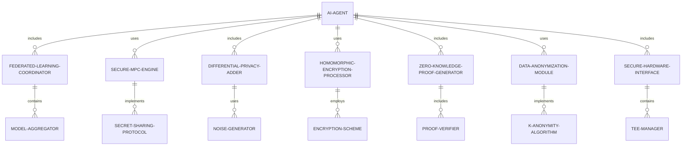

#### 交互关系图

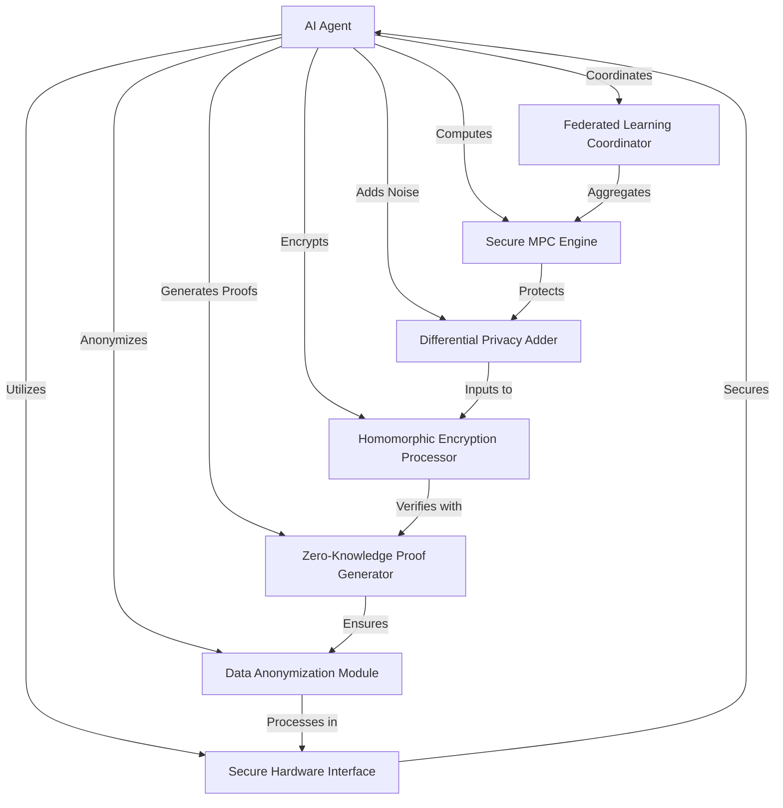

### 数学模型：

使用差分隐私来保护数据隐私：

给定一个数据集 $D$ 和一个查询函数 $f$，差分隐私机制 $M$ 满足：

$$P[M(D) \in S] \leq e^\epsilon \cdot P[M(D') \in S]$$

其中 $D$ 和 $D'$ 是任意两个相差一个元素的数据集，$\epsilon$ 是隐私预算，$S$ 是输出空间的任意子集。

### 算法流程图：

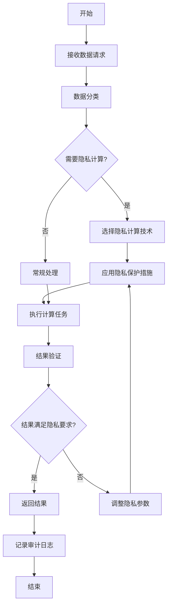

### 算法源代码：

以下是一个简化的 AI Agent 隐私计算技术应用的 Python 实现示例，主要展示联邦学习和差分隐私的基本概念：

```python
import numpy as np
from typing import List, Dict
from sklearn.linear_model import SGDClassifier

class PrivacyPreservingAIAgent:
    def __init__(self):
        self.global_model = SGDClassifier()
        self.epsilon = 0.1  # 差分隐私参数

    def federated_learning(self, local_models: List[SGDClassifier]) -> SGDClassifier:
        # 简化的联邦学习：平均模型参数
        global_params = np.mean([model.coef_ for model in local_models], axis=0)
        self.global_model.coef_ = global_params
        return self.global_model

    def add_noise(self, data: np.ndarray) -> np.ndarray:
        # 拉普拉斯机制添加噪声
        sensitivity = 1.0  # 假设敏感度为1
        noise = np.random.laplace(0, sensitivity / self.epsilon, data.shape)
        return data + noise

    def train_local_model(self, data: np.ndarray, labels: np.ndarray) -> SGDClassifier:
        # 使用差分隐私训练本地模型
        private_data = self.add_noise(data)
        local_model = SGDClassifier(max_iter=100, tol=1e-3)
        local_model.fit(private_data, labels)
        return local_model

    def secure_aggregation(self, local_updates: List[np.ndarray]) -> np.ndarray:
        # 简化的安全聚合：直接求和（实际应用中应使用更安全的协议）
        return np.sum(local_updates, axis=0)

    def evaluate_model(self, test_data: np.ndarray, test_labels: np.ndarray) -> float:
        return self.global_model.score(test_data, test_labels)

# 使用示例
agent = PrivacyPreservingAIAgent()

# 模拟多个本地数据集
num_clients = 3
local_datasets = [
    (np.random.rand(100, 10), np.random.randint(2, size=100))
    for _ in range(num_clients)
]

# 联邦学习过程
for round in range(5):  # 5轮联邦学习
    local_models = []
    for data, labels in local_datasets:
        local_model = agent.train_local_model(data, labels)
        local_models.append(local_model)
    
    global_model = agent.federated_learning(local_models)
    
    # 评估全局模型（使用第一个客户端的数据作为测试集）
    test_data, test_labels = local_datasets[0]
    accuracy = agent.evaluate_model(test_data, test_labels)
    print(f"Round {round + 1}, Global Model Accuracy: {accuracy:.4f}")

# 模拟安全聚合
local_updates = [np.random.rand(10) for _ in range(num_clients)]  # 假设每个客户端有10个更新
aggregated_update = agent.secure_aggregation(local_updates)
print("Aggregated Update:", aggregated_update)
```

### 实际场景应用：

1. 医疗研究合作：
   - 多家医院联合训练疾病预测模型，不共享原始患者数据
   - 使用同态加密进行隐私保护的基因数据分析

2. 金融风控：
   - 银行间共享欺诈检测模型，不泄露客户信息
   - 使用安全多方计算进行跨机构的信用评分

3. 智能广告：
   - 广告平台和广告主协作，在保护用户隐私的同时优化广告投放
   - 应用差分隐私技术保护用户行为数据

4. 供应链优化：
   - 多个企业共同分析供应链数据，不泄露各自的商业机密
   - 使用联邦学习构建需求预测模型

5. 智慧城市：
   - 分析市民行为数据以优化城市规划，同时保护个人隐私
   - 应用零知识证明技术进行匿名化的交通流量分析

### 行业发展与未来趋势：

| 时期 | 主要特征 | 代表性技术/方法 |
|------|----------|-----------------|
| 2015-2017 | 基础隐私保护 | 数据匿名化、访问控制 |
| 2018-2020 | 高级加密技术 | 同态加密、安全多方计算 |
| 2021-2023 | 分布式隐私计算 | 联邦学习、差分隐私 |
| 2024及以后 | 量子安全与AI驱动 | 后量子密码、AI辅助隐私计算 |

### 本章小结：

隐私计算技术的应用是 AI Agent 安全与隐私保护的前沿领域，它通过先进的密码学和分布式计算技术，实现了数据价值利用和隐私保护的平衡。本章讨论了实现这一目标的主要挑战、解决方案和技术实现。主要要点包括：

1. 联邦学习和安全多方计算为多方数据协作提供了新的范式。
2. 差分隐私和同态加密技术为数据分析提供了强有力的隐私保护。
3. 零知识证明为数据验证和身份认证提供了隐私保护解决方案。
4. 隐私保护数据发布技术帮助组织安全地共享数据。
5. 安全硬件为隐私计算提供了额外的保护层。

未来的 AI Agent 隐私计算技术应用趋势可能包括：
1. 更高效的全同态加密算法，使复杂的隐私保护计算变得实用
2. 联邦学习与其他隐私计算技术的深度融合，提供更全面的解决方案
3. 量子安全的隐私计算技术，应对量子计算带来的安全挑战
4. AI 驱动的自适应隐私保护机制，能够根据场景动态调整保护强度
5. 跨链隐私计算技术，实现更广泛的跨组织和跨领域数据协作

在实现 AI Agent 隐私计算技术应用时，开发者应当注意：
1. 平衡隐私保护强度和计算效率，选择适合特定场景的技术
2. 考虑不同隐私计算技术的组合使用，以应对复杂的隐私保护需求
3. 重视隐私计算过程的可审计性和透明度，增强用户信任
4. 关注隐私计算技术的标准化和互操作性，促进技术的广泛应用
5. 持续关注法律法规的发展，确保隐私计算实践符合最新的合规要求

通过不断改进的隐私计算技术，AI Agent 将能够在保护数据隐私的同时充分挖掘数据价值。这不仅能提高 AI 系统在敏感领域的应用可能性，还能为数据驱动的创新提供坚实的基础。随着技术的进步，我们可以期待看到更加安全、高效和普及的隐私计算解决方案，推动 AI 技术在更广泛的领域中负责任地应用，最终实现数据价值和个人隐私的双赢。
