# 第14章：AI Agent 监控与维护

## 14.1 性能指标设计与监控

### 核心概念：

性能指标设计与监控是 AI Agent 运维管理的关键环节，旨在通过定义、收集和分析关键性能指标（KPIs），持续评估和优化 AI 系统的运行状态。这个过程涉及指标体系设计、数据采集、实时监控、异常检测等多个技术领域，以确保 AI Agent 能够稳定、高效地运行，并及时发现和解决潜在问题。

### 问题背景：

随着 AI 技术在各行各业的广泛应用，AI 系统的复杂度和规模不断增加。在实际运营中，如何有效监控 AI Agent 的性能，及时发现并解决问题，成为确保 AI 系统可靠性和效率的关键挑战。同时，由于 AI 模型的特殊性（如黑盒特性、非确定性等），传统的 IT 系统监控方法可能不足以全面评估 AI Agent 的性能状况。

### 问题描述：

在实现 AI Agent 的性能指标设计与监控时，开发者面临以下挑战：

1. 如何设计全面而有针对性的性能指标体系
2. 如何高效收集和处理大量实时性能数据
3. 如何识别和处理 AI 模型特有的性能问题
4. 如何在保证监控全面性的同时避免过度监控
5. 如何将性能监控与 AI 系统的持续优化相结合

### 问题解决：

通过以下步骤可以实现有效的性能指标设计与监控：

1. 指标体系设计：
   - 定义核心业务指标（如准确率、响应时间）
   - 设计系统健康指标（如资源利用率、错误率）
   - 制定 AI 模型特定指标（如模型漂移、特征重要性）

2. 数据采集与处理：
   - 实现分布式日志收集
   - 设计高效的指标计算管道
   - 应用数据压缩和采样技术

3. 实时监控与可视化：
   - 构建实时监控仪表板
   - 实现多维度数据展示
   - 设置可配置的告警阈值

4. 异常检测与诊断：
   - 应用统计方法识别异常
   - 实现 AI 驱动的异常检测
   - 构建根因分析系统

5. 性能预测与优化：
   - 实现性能趋势分析
   - 应用机器学习预测未来性能
   - 自动生成优化建议

6. 监控系统的可扩展性：
   - 设计分布式监控架构
   - 实现动态指标管理
   - 优化存储和查询效率

7. 安全与合规：
   - 实施监控数据加密
   - 确保监控过程符合隐私法规
   - 实现细粒度的访问控制

### 边界与外延：

性能指标设计与监控的应用范围包括：
- 大规模机器学习系统
- 实时推荐引擎
- 自然语言处理服务
- 计算机视觉应用
- 自动化决策系统

### 概念结构与核心要素组成：

性能指标设计与监控系统的核心组件：
1. 指标定义器
2. 数据采集器
3. 指标计算引擎
4. 实时监控面板
5. 异常检测器
6. 性能预测模块
7. 告警管理器

### 概念之间的关系：

#### 概念核心属性维度对比

| 属性 | 传统IT监控 | 基础AI监控 | 高级AI Agent监控 |
|------|------------|------------|-------------------|
| 指标全面性 | 中 | 中-高 | 高 |
| 实时性 | 中 | 高 | 非常高 |
| AI特性覆盖 | 低 | 中 | 高 |
| 预测能力 | 低 | 中 | 高 |
| 可解释性 | 高 | 中 | 中-高 |
| 自适应能力 | 低 | 中 | 高 |

#### 概念联系的ER 实体关系

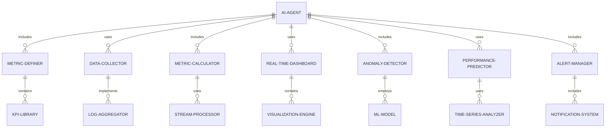

#### 交互关系图

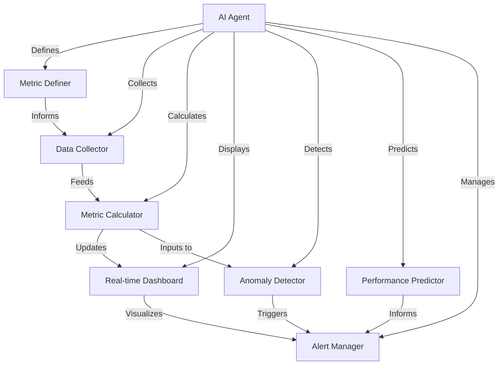

### 数学模型：

使用指数加权移动平均（EWMA）来平滑性能指标并检测异常：

给定时间序列 $\{x_t\}$，EWMA 计算如下：

$$S_t = \alpha x_t + (1-\alpha)S_{t-1}$$

其中 $\alpha$ 是平滑因子，$0 < \alpha \leq 1$。

异常检测可以基于 EWMA 的置信区间：

$$[S_t - L\sigma_t, S_t + L\sigma_t]$$

其中 $L$ 是控制限，$\sigma_t$ 是 EWMA 的标准差估计。

### 算法流程图：

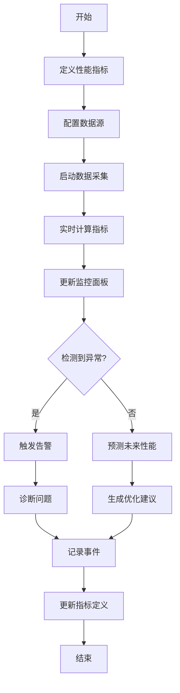

### 算法源代码：

以下是一个简化的 AI Agent 性能指标设计与监控系统的 Python 实现示例：

```python
import time
import random
import numpy as np
from typing import Dict, List
from collections import deque

class PerformanceMonitor:
    def __init__(self, metrics: List[str], window_size: int = 100):
        self.metrics = {metric: deque(maxlen=window_size) for metric in metrics}
        self.thresholds = {metric: (0, 100) for metric in metrics}  # (min, max)
        self.alpha = 0.1  # EWMA smoothing factor

    def collect_data(self, data: Dict[str, float]):
        for metric, value in data.items():
            if metric in self.metrics:
                self.metrics[metric].append(value)

    def calculate_ewma(self, metric: str) -> float:
        values = list(self.metrics[metric])
        if not values:
            return 0
        ewma = values[0]
        for value in values[1:]:
            ewma = self.alpha * value + (1 - self.alpha) * ewma
        return ewma

    def detect_anomaly(self, metric: str, value: float) -> bool:
        ewma = self.calculate_ewma(metric)
        std = np.std(list(self.metrics[metric]))
        lower, upper = self.thresholds[metric]
        return value < max(lower, ewma - 3*std) or value > min(upper, ewma + 3*std)

    def update_threshold(self, metric: str, min_val: float, max_val: float):
        self.thresholds[metric] = (min_val, max_val)

    def generate_alert(self, metric: str, value: float):
        print(f"ALERT: Anomaly detected for {metric}. Current value: {value}")

    def predict_performance(self, metric: str, horizon: int = 10) -> List[float]:
        values = list(self.metrics[metric])
        if len(values) < 2:
            return [values[-1]] * horizon
        slope = (values[-1] - values[-2])
        return [max(0, values[-1] + i * slope) for i in range(1, horizon + 1)]

    def monitor(self, duration: int = 60):
        start_time = time.time()
        while time.time() - start_time < duration:
            # Simulate data collection
            data = {
                "response_time": random.uniform(0.1, 2.0),
                "accuracy": random.uniform(0.8, 1.0),
                "cpu_usage": random.uniform(10, 90)
            }
            self.collect_data(data)

            for metric, value in data.items():
                if self.detect_anomaly(metric, value):
                    self.generate_alert(metric, value)

                prediction = self.predict_performance(metric)
                print(f"{metric} prediction for next 10 points: {prediction}")

            time.sleep(1)  # Wait for 1 second before next collection

# Usage example
monitor = PerformanceMonitor(["response_time", "accuracy", "cpu_usage"])
monitor.update_threshold("response_time", 0.1, 1.5)
monitor.update_threshold("accuracy", 0.9, 1.0)
monitor.update_threshold("cpu_usage", 0, 80)

monitor.monitor(duration=30)  # Monitor for 30 seconds
```

### 实际场景应用：

1. 大规模推荐系统：
   - 监控推荐准确率、点击率、用户满意度等业务指标
   - 跟踪模型更新频率、特征重要性变化等 AI 特定指标

2. 自然语言处理服务：
   - 监控语义理解准确度、响应时间、并发处理能力
   - 跟踪词向量漂移、未知词处理率等模型健康指标

3. 计算机视觉应用：
   - 监控图像识别准确率、处理速度、资源利用率
   - 跟踪模型置信度分布、类别平衡性等质量指标

4. 自动化交易系统：
   - 监控交易决策准确率、延迟、风险暴露等关键指标
   - 跟踪市场模式漂移、异常交易检测率等系统健康指标

5. 智能客服系统：
   - 监控问题解决率、用户满意度、会话持续时间
   - 跟踪意图识别准确率、情感分析偏差等 AI 性能指标

### 行业发展与未来趋势：

| 时期 | 主要特征 | 代表性技术/方法 |
|------|----------|-----------------|
| 2015-2017 | 基础监控 | 日志分析、简单阈值告警 |
| 2018-2020 | AI感知监控 | 模型性能跟踪、异常检测 |
| 2021-2023 | 智能化监控 | AI驱动的根因分析、预测性维护 |
| 2024及以后 | 自适应监控生态 | 自优化指标系统、跨系统协同监控 |

### 本章小结：

性能指标设计与监控是 AI Agent 运维管理的基础，它通过全面的指标体系和先进的监控技术，确保 AI 系统的稳定性、效率和可靠性。本章讨论了实现这一目标的主要挑战、解决方案和技术实现。主要要点包括：

1. 全面的指标体系设计是有效监控的基础，需要覆盖业务、系统和 AI 模型特定指标。
2. 高效的数据采集和处理机制对于实时监控大规模 AI 系统至关重要。
3. 实时可视化和智能告警系统有助于快速识别和响应问题。
4. AI 驱动的异常检测和预测分析能够提前AI Agent 运维和优化的基础，它通过系统化的日志处理和智能分析技术，为 AI 系统的稳定运行、性能优化和问题诊断提供了强大支持。本章讨论了实现这一目标的主要挑战、解决方案和技术实现。主要要点包括：

1. 高效的日志收集和存储机制是处理大规模 AI 系统日志的基础。
2. 日志标准化和智能解析技术有助于提取有价值的信息。
3. 机器学习和自然语言处理技术在日志分析中发挥着越来越重要的作用。
4. 实时日志处理和可视化对于及时发现和响应问题至关重要。
5. 日志安全和合规性是日志管理系统设计中不可忽视的方面。

未来的 AI Agent 日志管理与分析趋势可能包括：
1. 更智能的自适应日志生成机制，能够根据系统状态动态调整日志详细程度
2. 基于深度学习的复杂模式识别，提高异常检测和根因分析的准确性
3. 跨系统、跨组织的日志协同分析，实现更全面的问题诊断和优化
4. 隐私保护的分布式日志分析技术，在保护敏感信息的同时实现深入分析
5. 量子计算在大规模日志数据处理和模式识别中的应用

在实现 AI Agent 日志管理与分析时，开发者应当注意：
1. 平衡日志的详细程度和系统性能，避免日志记录本身成为性能瓶颈
2. 设计灵活可扩展的日志架构，以适应 AI 系统的快速迭代和变化
3. 重视日志数据的安全性和隐私保护，特别是在处理敏感业务数据时
4. 将日志分析与 AI 模型监控和业务指标紧密结合，提供全面的系统洞察
5. 培养跨学科团队，结合 AI 专业知识、大数据分析和传统 IT 运维经验

通过不断改进的日志管理与分析技术，AI Agent 将能够更好地理解和优化其内部运作，提高系统的可靠性、性能和安全性。这不仅能为 AI 系统的持续改进提供数据支持，还能为 AI 技术在更广泛、更复杂的场景中的应用铺平道路。随着技术的进步，我们可以期待看到更智能、更高效的日志分析系统，为 AI 技术的深入发展和创新应用提供坚实的基础支持。

## 14.3 错误处理与恢复机制

### 核心概念：

错误处理与恢复机制是 AI Agent 运维管理中的关键环节，旨在识别、管理和解决系统运行过程中出现的各种错误和异常情况，并在出现故障时快速恢复系统功能。这个过程涉及异常检测、故障隔离、自动恢复、容错设计等多个技术领域，以确保 AI Agent 能够在面对各种不可预见的情况时保持稳定运行和高可用性。

### 问题背景：

随着 AI 系统在关键业务领域的广泛应用，系统的可靠性和恢复能力变得越来越重要。在实际运营中，AI Agent 可能面临各种错误和异常情况，如硬件故障、网络中断、数据异常、模型失效等。如何有效地处理这些错误，并在最短时间内恢复正常运行，成为确保 AI 系统可靠性和用户信任的关键挑战。

### 问题描述：

在实现 AI Agent 的错误处理与恢复机制时，开发者面临以下挑战：

1. 如何全面识别和分类可能出现的错误类型
2. 如何在不影响整体系统性能的情况下实现实时错误检测
3. 如何设计有效的故障隔离策略，防止错误扩散
4. 如何实现快速、准确的自动恢复机制
5. 如何平衡系统的容错能力和复杂度

### 问题解决：

通过以下步骤可以实现有效的错误处理与恢复机制：

1. 错误分类与预防：
   - 建立全面的错误分类体系
   - 实施预防性措施（如输入验证、资源限制）
   - 设计健壮的错误处理流程

2. 实时错误检测：
   - 实现多层次的监控系统
   - 应用机器学习based异常检测
   - 设置动态阈值和告警机制

3. 故障隔离：
   - 实现微服务架构和容器化部署
   - 设计熔断器模式
   - 实施资源隔离和限流策略

4. 自动恢复机制：
   - 实现自动重试和退避策略
   - 设计状态恢复和数据一致性机制
   - 实施自动扩缩容和负载均衡

5. 容错设计：
   - 实现冗余和备份策略
   - 设计降级服务机制
   - 实施多版本部署和灰度发布

6. 错误日志和分析：
   - 实现详细的错误日志记录
   - 设计错误追踪和根因分析系统
   - 实施持续改进机制

7. 人工干预和管理：
   - 设计清晰的错误报告和通知系统
   - 制定详细的人工干预流程
   - 实施定期的错误处理演练

### 边界与外延：

错误处理与恢复机制的应用范围包括：
- 大规模分布式 AI 系统
- 实时机器学习服务
- 关键业务 AI 应用
- 边缘计算 AI 设备
- 自动驾驶系统

### 概念结构与核心要素组成：

错误处理与恢复机制系统的核心组件：
1. 错误检测器
2. 故障隔离器
3. 自动恢复管理器
4. 容错控制器
5. 日志分析器
6. 报警通知系统
7. 人工干预接口

### 概念之间的关系：

#### 概念核心属性维度对比

| 属性 | 传统IT系统 | 基础AI系统 | 高级AI Agent |
|------|------------|------------|---------------|
| 错误检测能力 | 中 | 高 | 非常高 |
| 自动恢复速度 | 慢 | 中 | 快 |
| 容错能力 | 中 | 高 | 非常高 |
| 系统复杂度 | 低 | 中 | 高 |
| 可扩展性 | 中 | 高 | 非常高 |
| 人工干预需求 | 高 | 中 | 低 |

#### 概念联系的ER 实体关系

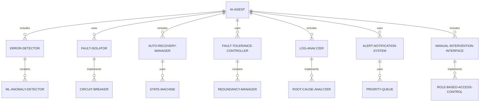

#### 交互关系图

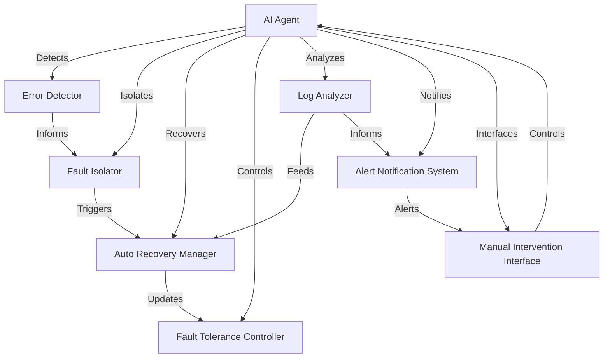

### 数学模型：

使用马尔可夫决策过程（MDP）来模型化自动恢复策略：

给定状态空间 $S$，动作空间 $A$，转移概率 $P$，奖励函数 $R$，折扣因子 $\gamma$，最优策略 $\pi^*$ 满足：

$$V^*(s) = \max_a \left(R(s,a) + \gamma \sum_{s'} P(s'|s,a)V^*(s')\right)$$

其中 $V^*(s)$ 是状态 $s$ 的最优值函数。

### 算法流程图：

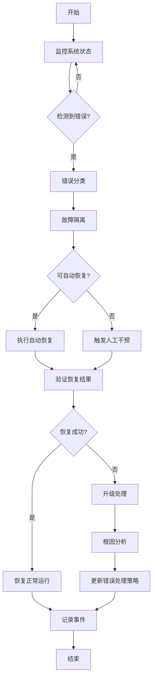

### 算法源代码：

以下是一个简化的 AI Agent 错误处理与恢复机制的 Python 实现示例：

```python
import random
import time
from enum import Enum
from typing import Dict, List, Tuple

class ErrorType(Enum):
    HARDWARE = 1
    SOFTWARE = 2
    NETWORK = 3
    DATA = 4
    MODEL = 5

class ErrorSeverity(Enum):
    LOW = 1
    MEDIUM = 2
    HIGH = 3
    CRITICAL = 4

class AIAgent:
    def __init__(self):
        self.error_handlers = {
            ErrorType.HARDWARE: self.handle_hardware_error,
            ErrorType.SOFTWARE: self.handle_software_error,
            ErrorType.NETWORK: self.handle_network_error,
            ErrorType.DATA: self.handle_data_error,
            ErrorType.MODEL: self.handle_model_error
        }
        self.error_count = {error_type: 0 for error_type in ErrorType}
        self.is_running = True

    def detect_error(self) -> Tuple[ErrorType, ErrorSeverity]:
        # Simulate error detection
        if random.random() < 0.1:  # 10% chance of error
            error_type = random.choice(list(ErrorType))
            severity = random.choice(list(ErrorSeverity))
            return error_type, severity
        return None, None

    def handle_error(self, error_type: ErrorType, severity: ErrorSeverity):
        print(f"Handling {severity.name} {error_type.name} error")
        self.error_count[error_type] += 1
        handler = self.error_handlers.get(error_type, self.handle_unknown_error)
        return handler(severity)

    def handle_hardware_error(self, severity: ErrorSeverity) -> bool:
        if severity == ErrorSeverity.CRITICAL:
            print("Critical hardware error. Shutting down...")
            self.is_running = False
            return False
        print("Attempting hardware reset...")
        time.sleep(2)  # Simulate reset time
        return random.random() < 0.8  # 80% success rate

    def handle_software_error(self, severity: ErrorSeverity) -> bool:
        print("Attempting software restart...")
        time.sleep(1)  # Simulate restart time
        return random.random() < 0.9  # 90% success rate

    def handle_network_error(self, severity: ErrorSeverity) -> bool:
        print("Attempting network reconnection...")
        time.sleep(1.5)  # Simulate reconnection time
        return random.random() < 0.7  # 70% success rate

    def handle_data_error(self, severity: ErrorSeverity) -> bool:
        print("Attempting data validation and cleanup...")
        time.sleep(1)  # Simulate data processing time
        return random.random() < 0.85  # 85% success rate

    def handle_model_error(self, severity: ErrorSeverity) -> bool:
        print("Attempting model reload or fallback...")
        time.sleep(2)  # Simulate model reload time
        return random.random() < 0.75  # 75% success rate

    def handle_unknown_error(self, severity: ErrorSeverity) -> bool:
        print("Unknown error. Attempting general system restart...")
        time.sleep(3)  # Simulate general restart time
        return random.random() < 0.5  # 50% success rate

    def log_error(self, error_type: ErrorType, severity: ErrorSeverity, success: bool):
        print(f"Log: {error_type.name} error of {severity.name} severity. Recovery {'successful' if success else 'failed'}.")

    def run(self, iterations: int):
        for i in range(iterations):
            if not self.is_running:
                print("System is shut down. Ending simulation.")
                break
            print(f"\nIteration {i+1}")
            error_type, severity = self.detect_error()

            if error_type:
                success = self.handle_error(error_type, severity)
                self.log_error(error_type, severity, success)
                if not success and severity in [ErrorSeverity.HIGH, ErrorSeverity.CRITICAL]:
                    print("Error recovery failed. Initiating human intervention.")
                    # Here we would typically trigger a real alert or notification
            else:
                print("System running normally.")
            time.sleep(0.5)  # Simulate system operation time

        print("\nSimulation complete. Error summary:")
        for error_type, count in self.error_count.items():
            print(f"{error_type.name}: {count}")

# Usage example
agent = AIAgent()
agent.run(100)  # Run for 100 iterations
```

### 实际场景应用：

1. 自动驾驶系统：
   - 处理传感器故障、网络中断等硬件错误
   - 实现紧急情况下的安全降级和人工接管机制

2. 金融交易AI：
   - 处理市场数据异常、模型预测偏差等错误
   - 实现快速回滚和交易限制机制

3. 医疗诊断AI：
   - 处理图像质量不佳、患者数据缺失等问题
   - 实现多模型验证和人工复核机制

4. 智能客服系统：
   - 处理语音识别错误、意图理解偏差等问题
   - 实现平滑的人工坐席切换机制

5. 工业控制AI：
   - 处理设备故障、环境异常等情况
   - 实现多重备份和安全停机机制

### 行业发展与未来趋势：

| 时期 | 主要特征 | 代表性技术/方法 |
|------|----------|-----------------|
| 2015-2017 | 基础错误处理 | 异常捕获、日志记录 |
| 2018-2020 | 智能错误检测 | 机器学习异常检测、自动重试 |
| 2021-2023 | 自适应恢复机制 | 强化学习based策略、自愈系统 |
| 2024及以后 | 认知错误处理 | 因果推理、自演化错误处理策略 |

### 本章小结：

错误处理与恢复机制是 AI Agent 运维管理的核心组成部分，它通过系统化的错误检测、隔离和恢复策略，确保 AI 系统的稳定性和可靠性。本章讨论了实现这一目标的主要挑战、解决方案和技术实现。主要要点包括：

1. 全面的错误分类和预防措施是有效错误处理的基础。
2. 实时错误检测和快速响应机制对于最小化错误影响至关重要。
3. 故障隔离和容错设计能够有效防止错误扩散和系统崩溃。
4. 自动恢复机制大大提高了系统的自愈能力和可用性。
5. 持续的错误分析和策略优化是提高系统长期可靠性的关键。

未来的 AI Agent 错误处理与恢复机制趋势可能包括：
1. 更智能的自适应错误处理策略，能够根据历史数据和当前上下文动态调整
2. 基于因果推理的错误诊断，提高根因分析的准确性和效率
3. 跨系统协同的错误处理机制，实现更全面的故障检测和恢复
4. 融合人工智能和专家系统的混合错误处理方法，结合数据驱动和领域知识
5. 量子计算在复杂系统错误模拟和预测中的应用

在实现 AI Agent 错误处理与恢复机制时，开发者应当注意：
1. 平衡自动化程度和人工干预，确保关键决策的可控性
2. 设计灵活可扩展的错误处理架构，以适应 AI 系统的快速迭代和变化
3. 重视错误处理过程的透明度和可解释性，增强用户和监管者的信任
4. 将错误处理与系统整体性能优化相结合，避免过度保守影响正常功能
5. 持续进行错误模拟和恢复演练，提高团队和系统应对真实故障的能力

通过不断改进的错误处理与恢复机制，AI Agent 将能够更好地应对各种不可预见的情况，提高系统的鲁棒性和可靠性。这不仅能增强用户对 AI 系统的信心，还能为 AI 技术在更多关键领域的应用铺平道路。随着技术的进步，我们可以期待看到更智能、更可靠的 AI 系统，为各行各业的创新和发展提供坚实的技术支撑。

## 14.4 版本更新与迭代策略

### 核心概念：

版本更新与迭代策略是 AI Agent 生命周期管理的关键环节，旨在通过系统化的方法持续改进和优化 AI 系统的功能、性能和可靠性。这个过程涉及需求管理、开发流程、测试验证、部署策略等多个技术领域，以确保 AI Agent 能够适应不断变化的需求和环境，同时保持系统的稳定性和一致性。

### 问题背景：

随着 AI 技术的快速发展和应用场景的不断扩展，AI Agent 面临着持续优化和功能扩展的需求。在实际运营中，如何有效管理版本更新，平衡创新与稳定性，以及如何在不影响现有用户的情况下推出新功能，成为 AI 系统长期成功的关键挑战。同时，AI 模型的特殊性（如数据依赖、非确定性等）也为版本管理带来了新的难题。

### 问题描述：

在实现 AI Agent 的版本更新与迭代策略时，开发者面临以下挑战：

1. 如何有效管理和优先处理来自不同渠道的更新需求
2. 如何在保证系统稳定性的同时快速迭代和创新
3. 如何管理 AI 模型的版本，特别是在持续学习场景下
4. 如何设计和实施无缝的更新部署策略
5. 如何评估每次更新的影响并快速响应潜在问题

### 问题解决：

通过以下步骤可以实现有效的版本更新与迭代策略：

1. 需求管理与规划：
   - 建立需求收集和评估机制
   - 实施优先级排序和路线图规划
   - 设计敏捷开发流程

2. 版本控制与管理：
   - 使用Git等版本控制系统
   - 实施语义化版本号策略
   - 管理依赖和兼容性

3. AI模型版本管理：
   - 实现模型版本控制系统
   - 管理模型训练数据和参数
   - 实施模型性能跟踪和回滚机制

4. 测试与质量保证：
   - 实施自动化测试框架
   - 进行A/B测试和金丝雀测试
   - 实施持续集成和持续部署（CI/CD）

5. 部署策略：
   - 实现蓝绿部署或滚动更新
   - 设计灰度发布机制
   - 实施快速回滚策略

6. 监控与反馈：
   - 实时监控系统性能和用户反馈
   - 实施问题快速响应机制
   - 建立用户反馈收集渠道

7. 文档和沟通：
   - 维护详细的更新日志
   - 制定清晰的API版本策略
   - 实施有效的内外部沟通机制

### 边界与外延：

版本更新与迭代策略的应用范围包括：
- 大规模机器学习系统
- 智能推荐引擎
- 自然语言处理服务
- 计算机视觉应用
- AI驱动的业务系统

### 概念结构与核心要素组成：

版本更新与迭代策略系统的核心组件：
1. 需求管理器
2. 版本控制系统
3. 模型版本管理器
4. 测试自动化框架
5. 部署管理器
6. 性能监控系统
7. 反馈收集器

### 概念之间的关系：

#### 概念核心属性维度对比

| 属性 | 传统软件开发 | 基础AI系统 | 高级AI Agent |
|------|--------------|------------|---------------|
| 更新频率 | 低 | 中 | 高 |
| 版本管理复杂度 | 中 | 高 | 非常高 |
| 自动化程度 | 中 | 高 | 非常高 |
| 灵活性 | 低 | 中 | 高 |
| 回滚能力 | 中 | 高 | 非常高 |
| 用户影响评估 | 简单 | 复杂 | 非常复杂 |

#### 概念联系的ER 实体关系

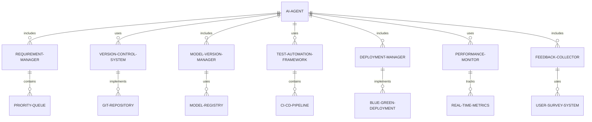

#### 交互关系图

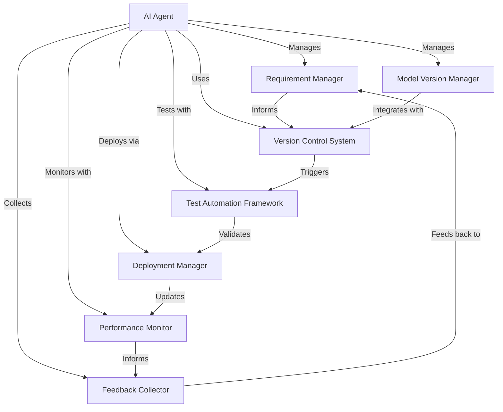

### 数学模型：

使用马尔可夫决策过程（MDP）来模型化版本更新决策：

给定状态空间 $S$（当前系统状态），动作空间 $A$（可能的更新操作），转移概率 $P$，奖励函数 $R$（考虑性能提升和风险），折扣因子 $\gamma$，最优更新策略 $\pi^*$ 满足：

$$V^*(s) = \max_a \left(R(s,a) + \gamma \sum_{s'} P(s'|s,a)V^*(s')\right)$$

其中 $V^*(s)$ 是状态 $s$ 的最优值函数。

### 算法流程图：

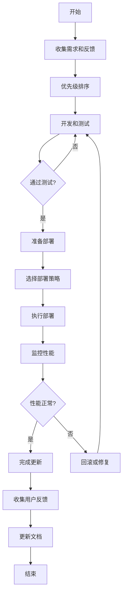

### 算法源代码：

以下是一个简化的 AI Agent 版本更新与迭代策略的 Python 实现示例：

```python
import random
from enum import Enum
from typing import List, Dict

class UpdateType(Enum):
    MINOR = 1
    MAJOR = 2
    HOTFIX = 3

class UpdateStatus(Enum):
    PLANNED = 1
    IN_PROGRESS = 2
    TESTING = 3
    DEPLOYING = 4
    COMPLETED = 5
    FAILED = 6

class Update:
    def __init__(self, id: int, type: UpdateType, description: str):
        self.id = id
        self.type = type
        self.description = description
        self.status = UpdateStatus.PLANNED

class AIAgentVersionManager:
    def __init__(self):
        self.current_version = "1.0.0"
        self.updates = []
        self.deployed_updates = []

    def add_update(self, update: Update):
        self.updates.append(update)

    def prioritize_updates(self):
        # Simple prioritization based on update type
        self.updates.sort(key=lambda x: x.type.value)

    def develop_and_test(self, update: Update) -> bool:
        print(f"Developing and testing update {update.id}: {update.description}")
        update.status = UpdateStatus.IN_PROGRESS
        # Simulate development and testing process
        success = random.random() < 0.8  # 80% success rate
        update.status = UpdateStatus.TESTING if success else UpdateStatus.FAILED
        return success

    def deploy_update(self, update: Update) -> bool:
        print(f"Deploying update {update.id}: {update.description}")
        update.status = UpdateStatus.DEPLOYING
        # Simulate deployment process
        success = random.random() < 0.9  # 90% success rate
        if success:
            self.deployed_updates.append(update)
            self.update_version(update.type)
            update.status = UpdateStatus.COMPLETED
        else:
            update.status = UpdateStatus.FAILED
        return success

    def update_version(self, update_type: UpdateType):
        major, minor, patch = map(int, self.current_version.split('.'))
        if update_type == UpdateType.MAJOR:
            major += 1
            minor = 0
            patch = 0
        elif update_type == UpdateType.MINOR:
            minor += 1
            patch = 0
        else:  # HOTFIX
            patch += 1
        self.current_version = f"{major}.{minor}.{patch}"

    def rollback(self, update: Update):
        print(f"Rolling back update {update.id}")
        if update in self.deployed_updates:
            self.deployed_updates.remove(update)
            # Revert to previous version
            major, minor, patch = map(int, self.current_version.split('.'))
            if update.type == UpdateType.MAJOR:
                major -= 1
            elif update.type == UpdateType.MINOR:
                minor -= 1
            else:  # HOTFIX
                patch -= 1
            self.current_version = f"{major}.{minor}.{patch}"

    def monitor_performance(self, update: Update) -> bool:
        print(f"Monitoring performance after update {update.id}")
        # Simulate performance monitoring
        return random.random() < 0.95  # 95% chance of good performance

    def collect_feedback(self, update: Update) -> Dict[str, int]:
        print(f"Collecting feedback for update {update.id}")
        # Simulate feedback collection
        return {
            "positive": random.randint(70, 100),
            "neutral": random.randint(0, 20),
            "negative": random.randint(0, 10)
        }

    def run_update_cycle(self):
        self.prioritize_updates()
        for update in self.updates:
            if self.develop_and_test(update):
                if self.deploy_update(update):
                    if self.monitor_performance(update):
                        feedback = self.collect_feedback(update)
                        print(f"Update {update.id} completed successfully. Feedback: {feedback}")
                    else:
                        print(f"Performance issues detected. Rolling back update {update.id}")
                        self.rollback(update)
                else:
                    print(f"Deployment failed for update {update.id}")
            else:
                print(f"Development or testing failed for update {update.id}")

        self.updates = [u for u in self.updates if u.status != UpdateStatus.COMPLETED]
        print(f"Current version: {self.current_version}")
        print(f"Pending updates: {len(self.updates)}")
        print(f"Completed updates: {len(self.deployed_updates)}")

# Usage example
version_manager = AIAgentVersionManager()

# Add some sample updates
version_manager.add_update(Update(1, UpdateType.MINOR, "Improve recommendation algorithm"))
version_manager.add_update(Update(2, UpdateType.HOTFIX, "Fix critical security vulnerability"))
version_manager.add_update(Update(3, UpdateType.MAJOR, "Add new natural language understanding module"))

# Run the update cycle
version_manager.run_update_cycle()
```

### 实际场景应用：

1. 智能推荐系统：
   - 定期更新推荐算法，提高准确性和多样性
   - 实施 A/B 测试以评估新算法的效果

2. 自然语言处理服务：
   - 更新语言模型以支持新的语言或领域
   - 通过持续学习改进语义理解能力

3. 计算机视觉应用：
   - 更新物体识别模型以支持新的类别
   - 优化图像处理管道以提高处理速度

4. 智能客服系统：
   - 更新对话管理策略以提高用户满意度
   - 集成新的知识库和意图识别能力

5. 自动驾驶系统：
   - 更新感知和决策模型以应对新的交通场景
   - 实施严格的安全测试和渐进式部署策略

### 行业发展与未来趋势：

| 时期 | 主要特征 | 代表性技术/方法 |
|------|----------|-----------------|
| 2015-2017 | 基础版本控制 | Git、语义化版本 |
| 2018-2020 | 自动化部署 | CI/CD、容器化 |
| 2021-2023 | 智能化更新策略 | A/B测试、自动化回滚 |
| 2024及以后 | 自适应版本管理 | 联邦学习、动态模型更新 |

### 本章小结：

版本更新与迭代策略是 AI Agent 生命周期管理的核心组成部分，它通过系统化的方法确保 AI 系统能够持续优化并适应不断变化的需求。本章讨论了实现这一目标的主要挑战、解决方案和技术实现。主要要点包括：

1. 有效的需求管理和优先级排序是成功迭代的基础。
2. AI 模型的特殊性要求更复杂的版本控制和管理策略。
3. 自动化测试和部署流程对于快速、可靠的更新至关重要。
4. 灵活的部署策略（如蓝绿部署、灰度发布）能够最小化更新风险。
5. 持续的性能监控和用户反馈收集是指导未来迭代的关键。

未来的 AI Agent 版本更新与迭代策略趋势可能包括：
1. 更智能的自适应更新机制，能够根据系统状态和用户行为动态调整更新策略
2. 基于联邦学习的分布式模型更新，实现在保护隐私的同时持续优化模型
3. 自动化的 A/B 测试和多臂老虎机算法，优化特性发布和用户体验
4. 更深入的因果推理能力，提高更新影响评估的准确性
5. 量子计算在大规模系统更新模拟和优化中的应用

在实现 AI Agent 版本更新与迭代策略时，开发者应当注意：
1. 平衡创新速度和系统稳定性，避免过于激进的更新影响用户体验
2. 设计灵活的架构，支持模块化更新和快速回滚
3. 重视版本兼容性，特别是在 API 和数据格式方面
4. 建立完善的监控和反馈机制，快速识别和响应更新带来的问题
5. 加强内部沟通和知识管理，确保团队对系统变更有清晰的理解

通过不断改进的版本更新与迭代策略，AI Agent 将能够更好地适应快速变化的技术环境和用户需求，保持竞争力和创新性。这不仅能提高系统的性能和可靠性，还能为用户提供持续改进的体验。随着技术的进步，我们可以期待看到更智能、更高效的 AI 系统更新机制，为 AI 技术的长期发展和广泛应用奠定坚实的基础。

# 第15章：AI Agent 部署与集成

## 15.1 容器化部署

### 核心概念：

容器化部署是 AI Agent 部署与集成的关键策略，旨在通过将 AI 系统及其依赖项打包到标准化的软件单元（即容器）中，实现一致、可靠、高效的部署和运行。这种方法利用容器技术（如 Docker）提供的隔离性和可移植性，大大简化了 AI 系统的部署、扩展和管理过程。容器化部署涉及容器技术、微服务架构、DevOps 实践等多个技术领域，以确保 AI Agent 能够在各种环境中稳定、高效地运行。

### 问题背景：

随着 AI 系统的复杂度不断增加，传统的部署方法面临着依赖管理困难、环境一致性问题、资源利用效率低下等挑战。在实际应用中，AI Agent 通常需要在不同的环境（开发、测试、生产）之间迁移，并且可能需要快速扩展以应对负载变化。容器化技术为解决这些问题提供了强大的工具，但如何有效地将 AI 系统容器化，并充分利用容器化的优势，成为 AI 系统部署的关键挑战。

### 问题描述：

在实现 AI Agent 的容器化部署时，开发者面临以下挑战：

1. 如何设计适合容器化的 AI 系统架构
2. 如何有效管理 AI 模型和数据在容器环境中的存储和访问
3. 如何优化容器镜像大小，同时确保所有必要组件的包含
4. 如何处理 AI 系统特有的资源需求（如 GPU 访问）
5. 如何实现容器化环境中的 AI 系统监控和日志管理

### 问题解决：

通过以下步骤可以实现有效的 AI Agent 容器化部署：

1. 系统架构设计：
   - 采用微服务架构，将 AI 系统拆分为独立的服务
   - 设计无状态服务，便于水平扩展
   - 实现服务间的松耦合通信

2. 容器镜像构建：
   - 使用多阶段构建优化镜像大小
   - 选择适合 AI 工作负载的基础镜像
   - 管理依赖项和版本控制

3. 数据和模型管理：
   - 使用卷挂载管理大型数据集和模型文件
   - 实现模型版本控制和动态加载机制
   - 设计数据预处理和缓存策略

4. 资源管理与优化：
   - 配置容器资源限制（CPU、内存、GPU）
   - 实现动态资源分配策略
   - 优化容器间的通信和数据传输

5. 编排与扩展：
   - 使用 Kubernetes 等容器编排平台
   - 实现自动扩缩容机制
   - 设计负载均衡策略

6. 监控与日志：
   - 集成容器级别的监控工具
   - 实现分布式日志收集和分析
   - 设计 AI 特定的健康检查机制

7. 安全性：
   - 实施容器镜像扫描和漏洞检测
   - 配置网络隔离和访问控制
   - 管理敏感数据和密钥

### 边界与外延：

容器化部署的应用范围包括：
- 大规模机器学习系统
- 实时推理服务
- 分布式 AI 训练平台
- 边缘计算 AI 应用
- DevOps 和 MLOps 实践

### 概念结构与核心要素组成：

AI Agent 容器化部署系统的核心组件：
1. 容器运行时（如 Docker）
2. 容器编排平台（如 Kubernetes）
3. 镜像仓库
4. 服务发现机制
5. 负载均衡器
6. 监控和日志系统
7. CI/CD 管道

### 概念之间的关系：

#### 概念核心属性维度对比

| 属性 | 传统部署 | 基础容器化 | 高级AI Agent容器化 |
|------|----------|------------|---------------------|
| 部署一致性 | 低 | 高 | 非常高 |
| 资源利用效率 | 低 | 中 | 高 |
| 扩展性 | 低 | 高 | 非常高 |
| 隔离性 | 低 | 高 | 非常高 |
| 维护复杂度 | 高 | 中 | 低 |
| AI特性支持 | 有限 | 基本 | 全面 |

#### 概念联系的ER 实体关系

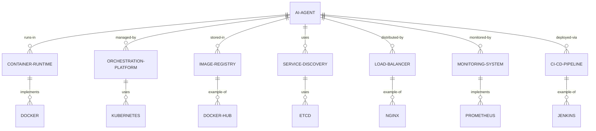

#### 交互关系图

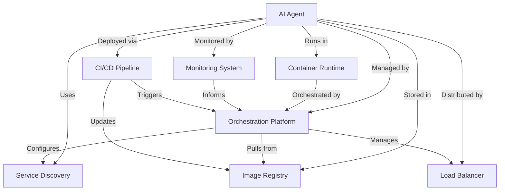

### 数学模型：

使用排队论模型来优化容器化 AI Agent 的资源分配：

假设有 $n$ 个容器化 AI Agent 实例，到达率为 $\lambda$，服务率为 $\mu$。使用 M/M/n 队列模型，系统的平均等待时间 $W_q$ 可以表示为：

$$W_q = \frac{P_q}{\lambda(1-\rho)}$$

其中，$P_q$ 是队列不为空的概率，$\rho = \lambda/(n\mu)$ 是系统利用率。

通过调整实例数 $n$，可以优化系统性能和资源利用率。

### 算法流程图：

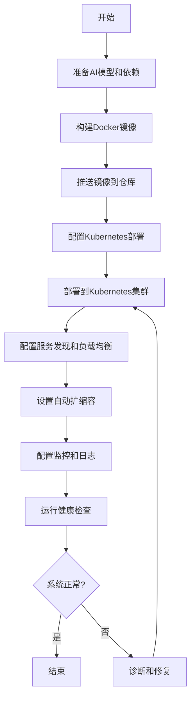

### 算法源代码：

以下是一个简化的 AI Agent 容器化部署的 Python 实现示例，使用 Docker SDK 和 Kubernetes Python Client：

```python
import docker
from kubernetes import client, config
from kubernetes.client.rest import ApiException
import time

class AIAgentContainerDeployer:
    def __init__(self, image_name, container_name, k8s_deployment_name, k8s_namespace):
        self.image_name = image_name
        self.container_name = container_name
        self.k8s_deployment_name = k8s_deployment_name
        self.k8s_namespace = k8s_namespace
        self.docker_client = docker.from_env()
        config.load_kube_config()
        self.k8s_apps_v1 = client.AppsV1Api()

    def build_and_push_image(self):
        print(f"Building image: {self.image_name}")
        self.docker_client.images.build(path=".", tag=self.image_name)
        print(f"Pushing image: {self.image_name}")
        self.docker_client.images.push(self.image_name)

    def create_k8s_deployment(self):
        container = client.V1Container(
            name=self.container_name,
            image=self.image_name,
            ports=[client.V1ContainerPort(container_port=80)]
        )
        template = client.V1PodTemplateSpec(
            metadata=client.V1ObjectMeta(labels={"app": self.container_name}),
            spec=client.V1PodSpec(containers=[container])
        )
        spec = client.V1DeploymentSpec(
            replicas=3,
            selector=client.V1LabelSelector(
                match_labels={"app": self.container_name}
            ),
            template=template
        )
        deployment = client.V1Deployment(
            api_version="apps/v1",
            kind="Deployment",
            metadata=client.V1ObjectMeta(name=self.k8s_deployment_name),
            spec=spec
        )

        try:
            self.k8s_apps_v1.create_namespaced_deployment(
                body=deployment,
                namespace=self.k8s_namespace
            )
            print(f"Deployment {self.k8s_deployment_name} created.")
        except ApiException as e:
            print(f"Exception when creating deployment: {e}")

    def wait_for_deployment(self, timeout=300):
        start = time.time()
        while time.time() - start < timeout:
            try:
                deployment = self.k8s_apps_v1.read_namespaced_deployment(
                    name=self.k8s_deployment_name,
                    namespace=self.k8s_namespace
                )
                if deployment.status.ready_replicas == deployment.spec.replicas:
                    print(f"Deployment {self.k8s_deployment_name} is ready.")
                    return True
            except ApiException as e:
                print(f"Exception when reading deployment: {e}")
            time.sleep(5)
        print(f"Timeout waiting for deployment {self.k8s_deployment_name}")
        return False

    def deploy(self):
        self.build_and_push_image()
        self.create_k8s_deployment()
        return self.wait_for_deployment()

# Usage example
deployer = AIAgentContainerDeployer(
    image_name="my-ai-agent:latest",
    container_name="ai-agent",
    k8s_deployment_name="ai-agent-deployment",
    k8s_namespace="default"
)

if deployer.deploy():
    print("AI Agent successfully deployed to Kubernetes.")
else:
    print("Failed to deploy AI Agent.")
```

### 实际场景应用：

1. 大规模机器学习模型服务：
   - 容器化部署多个模型版本，实现蓝绿部署和 A/B 测试
   - 使用 GPU 支持的容器优化推理性能

2. 实时推荐系统：
   - 容器化部署推荐引擎和特征工程管道
   - 利用容器编排实现动态扩缩容，应对流量波动

3. 分布式 AI 训练平台：
   - 容器化部署训练作业调度器和工作节点
   - 使用持久卷管理大规模训练数据集

4. 边缘计算 AI 应用：
   - 容器化 AI 模型以便于在边缘设备上部署和更新
   - 实现边缘-云协同的容器化架构

5. AI 驱动的微服务系统：
   - 将 AI 功能作为独立的微服务容器化部署
   - 使用服务网格管理微服务间的通信和安全

### 行业发展与未来趋势：

| 时期 | 主要特征 | 代表性技术/方法 |
|------|----------|-----------------|
| 2015-2017 | 基础容器化 | Docker、单机容器管理 |
| 2018-2020 | 容器编排成熟 | Kubernetes、微服务架构 |
| 2021-2023 | AI特化容器化 | GPU支持、分布式AI训练 |
| 2024及以后 | 智能化容器生态 | 自适应容器编排、联邦学习支持 |

### 本章小结：

容器化部署为 AI Agent 提供了一种强大、灵活且高效的部署方式。通过将 AI 系统封装在标准化的容器中，我们可以大大简化部署过程，提高系统的可移植性和可扩展性。本章讨论了实现 AI Agent 容器化部署的主要挑战、解决方案和技术实现。主要要点包括：

1. 容器化技术为 AI 系统提供了一致的运行环境，解决了依赖管理和环境一致性问题。
2. 微服务架构和容器编排技术（如 Kubernetes）使得 AI 系统更易于扩展和管理。
3. 容器化部署需要特别考虑 AI 系统的特殊需求，如 GPU 访问和大规模数据管理。
4. 自动化的 CI/CD 流程对于容器化 AI 系统的持续部署和更新至关重要。
5. 容器化环境中的监控和日志管理需要特别设计，以适应分布式 AI 系统的需求。

未来的 AI Agent 容器化部署趋势可能包括：
1. 更智能的自适应容器编排系统，能够根据 AI 工作负载特性动态调整资源分配
2. 针对 AI 特定场景优化的轻量级容器运行时，提供更高的性能和更低的开销
3. 支持联邦学习和隐私计算的专用容器化解决方案
4. 边缘-云协同的智能容器部署策略，优化 AI 模型在不同计算环境中的分发和执行
5. 量子计算友好的容器化技术，为未来的量子 AI 应用铺平道路

在实现 AI Agent 容器化部署时，开发者应当注意：
1. 设计适合容器化的 AI 系统架构，考虑服务的无状态性和可扩展性
2. 优化容器镜像大小和构建过程，提高部署效率
3. 合理规划资源需求，特别是 GPU 等专用硬件的使用
4. 实施严格的安全措施，保护容器化 AI 系统免受潜在威胁
5. 建立完善的监控和日志系统，确保能够及时发现和解决问题

通过不断改进的容器化部署技术，AI Agent 将能够更加灵活、高效地部署和运行，为各种规模和复杂度的 AI 应用提供强大的支持。这不仅能提高 AI 系统的可靠性和可维护性，还能为 AI 技术的快速迭代和创新提供坚实的基础设施支持。随着技术的进步，我们可以期待看到更加智能、高效的容器化 AI 系统，推动 AI 技术在更广泛的领域中的应用和发展。

## 15.2 云平台部署方案

### 核心概念：

云平台部署方案是 AI Agent 部署与集成的重要策略，旨在利用云计算的弹性、可扩展性和丰富的服务生态系统，实现 AI 系统的高效部署、管理和运维。这种方法涉及云原生技术、服务器less计算、分布式系统等多个技术领域，以确保 AI Agent 能够充分利用云平台的优势，实现高可用性、高性能和成本效益的平衡。

### 问题背景：

随着 AI 技术的快速发展和应用场景的多样化，传统的本地部署方式面临着资源限制、扩展性差、维护成本高等挑战。云平台为 AI 系统提供了强大的计算资源和丰富的服务，但如何有效地设计和实施云部署方案，以充分发挥云平台的优势，同时应对云环境特有的挑战（如数据安全、网络延迟等），成为 AI 系统部署的关键问题。

### 问题描述：

在实现 AI Agent 的云平台部署方案时，开发者面临以下挑战：

1. 如何选择适合 AI 工作负载的云服务和部署模型
2. 如何设计可扩展的云架构以应对 AI 系统的动态需求
3. 如何优化云资源使用，平衡性能和成本
4. 如何确保云环境中 AI 系统的数据安全和隐私保护
5. 如何管理和监控分布在云端的 AI 服务

### 问题解决：

通过以下步骤可以实现有效的 AI Agent 云平台部署方案：

1. 云服务选择与架构设计：
   - 评估 IaaS、PaaS 和 SaaS 选项
   - 设计混合云或多云策略
   - 利用云原生服务（如 Kubernetes、服务器less）

2. 计算资源优化：
   - 使用自动扩缩容机制
   - 利用 GPU 加速实例
   - 实施预留实例和竞价实例策略

3. 数据管理与存储：
   - 设计分布式存储方案
   - 实施数据分层和生命周期管理
   - 利用云数据库和数据仓库服务

4. 网络优化：
   - 使用内容分发网络（CDN）
   - 实施全球负载均衡
   - 优化跨区域数据传输

5. 安全与合规：
   - 实施身份和访问管理（IAM）
   - 使用加密和密钥管理服务
   - 确保符合数据保护法规（如 GDPR）

6. 监控与运维：
   - 利用云平台的监控和日志服务
   - 实施自动化运维（AIOps）
   - 设计灾难恢复和业务连续性方案

7. 成本管理：
   - 实施资源标签和成本分配
   - 使用云成本优化工具
   - 定期审查和优化资源使用

### 边界与外延：

云平台部署方案的应用范围包括：
- 大规模机器学习训练平台
- 实时 AI 推理服务
- 数据分析和商业智能系统
- IoT 和边缘 AI 应用
- AI 驱动的 SaaS 产品

### 概念结构与核心要素组成：

AI Agent 云平台部署方案的核心组件：
1. 云服务提供商（如 AWS、Azure、GCP）
2. 容器编排平台（如 Kubernetes）
3. 服务器less计算平台
4. 分布式存储系统
5. 云数据库服务
6. 身份和访问管理系统
7. 监控和日志分析服务

### 概念之间的关系：

#### 概念核心属性维度对比

| 属性 | 本地部署 | 基础云部署 | 高级AI Agent云部署 |
|------|----------|------------|---------------------|
| 可扩展性 | 低 | 高 | 非常高 |
| 成本效益 | 低 | 中 | 高 |
| 管理复杂度 | 高 | 中 | 低 |
| 性能优化 | 有限 | 中 | 高 |
| 安全性 | 中 | 高 | 非常高 |
| AI特性支持 | 有限 | 中 | 全面 |

#### 概念联系的ER 实体关系

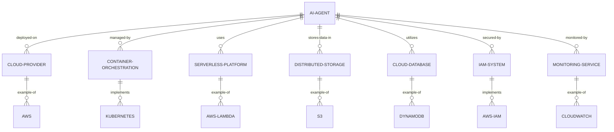

#### 交互关系图

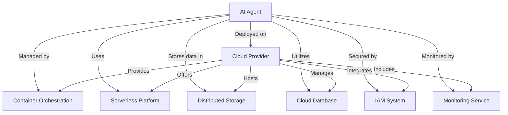

### 数学模型：

使用排队论模型来优化云资源分配：

假设 AI Agent 服务的请求到达率为 $\lambda$，服务率为 $\mu$，使用 M/M/c 队列模型（c 为服务器数量）。系统的平均响应时间 $W$ 可以表示为：

$$W = \frac{1}{\mu} + \frac{C(c,\rho)}{c\mu(1-\rho)}$$

其中，$\rho = \lambda/(c\mu)$ 是系统利用率，$C(c,\rho)$ 是 Erlang C 公式。

通过调整服务器数量 $c$，可以优化系统性能和资源利用率。

### 算法流程图：

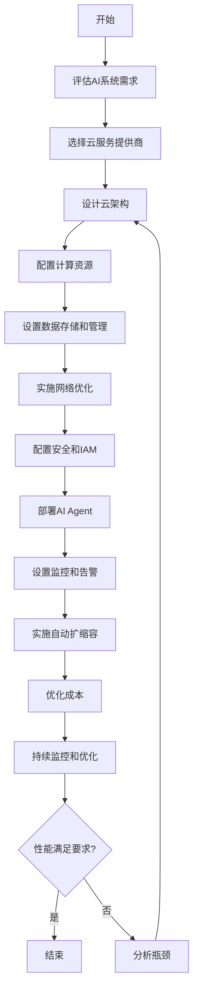

### 算法源代码：

以下是一个简化的 AI Agent 云平台部署方案的 Python 实现示例，使用 AWS SDK（boto3）：

```python
import boto3
import time

class AIAgentCloudDeployer:
    def __init__(self, region_name):
        self.ec2 = boto3.client('ec2', region_name=region_name)
        self.elbv2 = boto3.client('elbv2', region_name=region_name)
        self.autoscaling = boto3.client('autoscaling', region_name=region_name)

    def create_launch_template(self, template_name, image_id, instance_type, key_name, security_group_ids):
        response = self.ec2.create_launch_template(
            LaunchTemplateName=template_name,
            VersionDescription='Initial version',
            LaunchTemplateData={
                'ImageId': image_id,
                'InstanceType': instance_type,
                'KeyName': key_name,
                'SecurityGroupIds': security_group_ids,
                'UserData': self.get_user_data()
            }
        )
        return response['LaunchTemplate']['LaunchTemplateId']

    def get_user_data(self):
        # This would be a base64 encoded script to setup the AI Agent
        return 'IyEvYmluL2Jhc2gKZWNobyAiU3RhcnRpbmcgQUkgQWdlbnQiCiMgQWRkIHlvdXIgQUkgQWdlbnQgc3RhcnR1cCBzY3JpcHQgaGVyZQ=='

    def create_target_group(self, vpc_id, name, port):
        response = self.elbv2.create_target_group(
            Name=name,
            Protocol='HTTP',
            Port=port,
            VpcId=vpc_id,
            HealthCheckPath='/health',
            TargetType='instance'
        )
        return response['TargetGroups'][0]['TargetGroupArn']

    def create_load_balancer(self, name, subnets, security_groups):
        response = self.elbv2.create_load_balancer(
            Name=name,
            Subnets=subnets,
            SecurityGroups=security_groups,
            Scheme='internet-facing',
            Type='application'
        )
        return response['LoadBalancers'][0]['LoadBalancerArn']

    def create_auto_scaling_group(self, name, launch_template_id, target_group_arn, subnets, min_size, max_size, desired_capacity):
        self.autoscaling.create_auto_scaling_group(
            AutoScalingGroupName=name,
            LaunchTemplate={
                'LaunchTemplateId': launch_template_id,
                'Version': '$Latest'
            },
            MinSize=min_size,
            MaxSize=max_size,
            DesiredCapacity=desired_capacity,
            TargetGroupARNs=[target_group_arn],
            VPCZoneIdentifier=','.join(subnets),
            HealthCheckType='ELB',
            HealthCheckGracePeriod=300
        )

    def deploy(self, vpc_id, subnets, security_groups, image_id, instance_type, key_name):
        # Create launch template
        launch_template_id = self.create_launch_template('AIAgentLaunchTemplate', image_id, instance_type, key_name, security_groups)

        # Create target group
        target_group_arn = self.create_target_group(vpc_id, 'AIAgentTargetGroup', 80)

        # Create load balancer
        load_balancer_arn = self.create_load_balancer('AIAgentLoadBalancer', subnets, security_groups)

        # Wait for load balancer to be active
        waiter = self.elbv2.get_waiter('load_balancer_available')
        waiter.wait(LoadBalancerArns=[load_balancer_arn])

        # Create auto scaling group
        self.create_auto_scaling_group('AIAgentAutoScalingGroup', launch_template_id, target_group_arn, subnets, 2, 10, 2)

        print("AI Agent deployment completed.")

# Usage example
deployer = AIAgentCloudDeployer('us-west-2')
deployer.deploy(
    vpc_id='vpc-12345678',
    subnets=['subnet-12345678', 'subnet-87654321'],
    security_groups=['sg-12345678'],
    image_id='ami-12345678',
    instance_type='t3.medium',
    key_name='my-key-pair'
)
```

### 实际场景应用：

1. 大规模机器学习训练平台：
   - 利用云平台的 GPU 集群进行分布式训练
   - 使用对象存储服务管理大规模训练数据集

2. 实时 AI 推理服务：
   - 部署在全球分布的边缘位置，利用 CDN 降低延迟
   - 使用自动扩缩容应对流量波动

3. AI 驱动的数据分析平台：
   - 利用云数据仓库服务处理海量数据
   - 使用服务器less函数实现按需分析

4. 智能物联网（IoT）系统：
   - 利用云 IoT 服务管理设备连接和数据收集
   - 在云端部署 AI 模型进行数据分析和预测

5. AI 辅助的客户服务平台：
   - 利用云自然语言处理服务构建智能对话系统
   - 使用云存储和数据库服务管理客户数据和交互历史

### 行业发展与未来趋势：

| 时期 | 主要特征 | 代表性技术/方法 |
|------|----------|-----------------|
| 2015-2017 | 基础云迁移 | IaaS、虚拟机部署 |
| 2018-2020 | 云原生应用 | 容器化、Kubernetes |
| 2021-2023 | AI特化云服务 | 托管 ML 平台、AutoML |
| 2024及以后 | 智能化云生态 | 边缘-云协同、量子云计算 |

### 本章小结：

云平台部署方案为 AI Agent 提供了强大、灵活且高度可扩展的运行环境。通过利用云服务的优势，我们可以大大简化 AI 系统的部署和管理过程，提高系统的可用性和性能，同时优化成本。本章讨论了实现 AI Agent 云平台部署的主要挑战、解决方案和技术实现。主要要点包括：

1. 云平台为 AI 系统提供了丰富的计算资源和服务，使得复杂的 AI 应用变得更加可行。
2. 合理的云架构设计和服务选择对于 AI 系统的性能和成本至关重要。
3. 自动扩缩容和资源优化是云部署 AI 系统的关键优势。
4. 云环境下的数据安全和隐私保护需要特别关注。
5. 有效的监控和运维策略对于确保云端 AI 系统的稳定运行至关重要。

未来的 AI Agent 云平台部署趋势可能包括：
1. 更智能的云资源调度系统，能够根据 AI 工作负载特性自动优化资源分配
2. 边缘计算与云计算的深度融合，实现 AI 任务的动态分配和协同处理
3. 针对 AI 工作负载优化的专用云硬件和服务
4. 更强大的云端 AutoML 和 MLOps 工具，简化 AI 模型的开发和部署流程
5. 量子计算云服务的应用，为特定 AI 问题提供突破性的性能提升

在实现 AI Agent 云平台部署时，开发者应当注意：
1. 仔细评估不同云服务提供商的优势，选择最适合 AI 工作负载的平台
2. 设计灵活的多云或混合云策略，避免过度依赖单一云服务提供商
3. 重视数据安全和隐私保护，确保符合相关法规要求
4. 实施有效的成本管理策略，平衡性能需求和预算限制
5. 持续监控和优化云资源使用，确保 AI 系统的高效运行

通过不断改进的云平台部署技术，AI Agent 将能够更加灵活、高效地运行和扩展，为各种规模和复杂度的 AI 应用提供强大的基础设施支持。这不仅能提高 AI 系统的可靠性和可访问性，还能为 AI 技术的快速迭代和创新提供理想的环境。随着技术的进步，我们可以期待看到更加智能、高效的云端 AI 系统，推动 AI 技术在更广泛的领域中的应用和发展。

## 15.3 与现有系统集成

### 核心概念：

与现有系统集成是 AI Agent 部署与应用的关键环节，旨在将 AI 能力无缝融入组织的现有 IT 生态系统中。这个过程涉及系统架构、数据集成、API 设计、业务流程重组等多个技术和业务领域，以确保 AI Agent 能够有效地增强和优化现有系统的功能，而不是孤立运行或造成干扰。

### 问题背景：

随着 AI 技术的成熟，越来越多的组织希望在其现有系统中引入 AI 能力。然而，现有系统通常具有复杂的架构、遗留技术栈和established业务流程。如何在不破坏现有系统稳定性的前提下，有效地集成 AI Agent，并最大化其价值，成为一个关键挑战。同时，数据兼容性、性能影响、用户接受度等问题也需要careful考虑。

### 问题描述：

在实现 AI Agent 与现有系统的集成时，开发者面临以下挑战：

1. 如何设计适合现有系统架构的集成方案
2. 如何处理数据格式不一致和数据质量问题
3. 如何minimizing对现有系统性能和稳定性的影响
4. 如何确保 AI Agent 与现有安全机制和合规要求的兼容
5. 如何管理和协调 AI 决策与人工决策的交互

### 问题解决：

通过以下步骤可以实现有效的 AI Agent 与现有系统集成：

1. 系统分析与集成策略：
   - 全面评估现有系统架构和技术栈
   - 制定适合的集成模式（如 API 集成、微服务、事件驱动等）
   - 设计渐进式集成路线图

2. 数据集成与预处理：
   - 实施数据清洗和标准化流程
   - 设计数据转换和映射机制
   - 实现实时数据同步或批量数据处理

3. API 设计与实现：
   - 设计 RESTful 或 GraphQL API
   - 实施 API 版本控制和向后兼容性
   - 实现 API 安全机制（如认证、授权、加密）

4. 性能优化：
   - 实施缓存策略
   - 优化查询和数据处理效率
   - 实现异步处理和消息队列

5. 用户界面集成：
   - 设计一致的用户体验
   - 实现渐进式功能展示
   - 提供 AI 辅助决策的可视化界面

6. 安全与合规：
   - 确保数据传输和存储的加密
   - 实施访问控制和审计日志
   - 确保符合行业特定的合规要求（如 GDPR、HIPAA）

7. 监控与反馈：
   - 实施端到端监控
   - 设计 AI 决策的可解释性机制
   - 建立用户反馈收集和分析系统

8. 培训与变更管理：
   - 制定用户培训计划
   - 实施渐进式功能发布策略
   - 建立持续改进机制

### 边界与外延：

AI Agent 与现有系统集成的应用范围包括：
- 企业资源规划（ERP）系统
- 客户关系管理（CRM）系统
- 供应链管理系统
- 金融交易系统
- 医疗信息系统

### 概念结构与核心要素组成：

AI Agent 与现有系统集成的核心组件：
1. 集成中间件
2. 数据转换引擎
3. API 网关
4. 消息队列系统
5. 缓存层
6. 安全认证模块
7. 监控和日志系统

### 概念之间的关系：

#### 概念核心属性维度对比

| 属性 | 传统系统集成 | 基础AI集成 | 高级AI Agent集成 |
|------|--------------|------------|-------------------|
| 集成复杂度 | 中 | 高 | 非常高 |
| 数据处理能力 | 有限 | 强 | 非常强 |
| 实时性 | 低 | 中 | 高 |
| 可扩展性 | 低 | 中 | 高 |
| 智能决策能力 | 无 | 有限 | 强 |
| 用户体验提升 | 有限 | 明显 | 显著 |

#### 概念联系的ER 实体关系

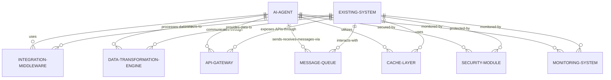

#### 交互关系图

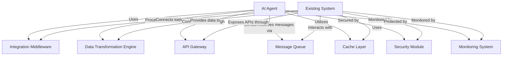

### 数学模型：

使用贝叶斯网络模型来优化 AI Agent 与现有系统的决策集成：

给定观察到的数据 D，AI Agent 的决策 A，和现有系统的决策 S，我们可以计算最优决策 O：

$$P(O|D) = \sum_A \sum_S P(O|A,S,D) P(A|D) P(S|D)$$

其中，$P(A|D)$ 是 AI Agent 基于数据做出决策的概率，$P(S|D)$ 是现有系统基于数据做出决策的概率，$P(O|A,S,D)$ 是给定 AI 和现有系统决策后的最优决策概率。

### 算法流程图：

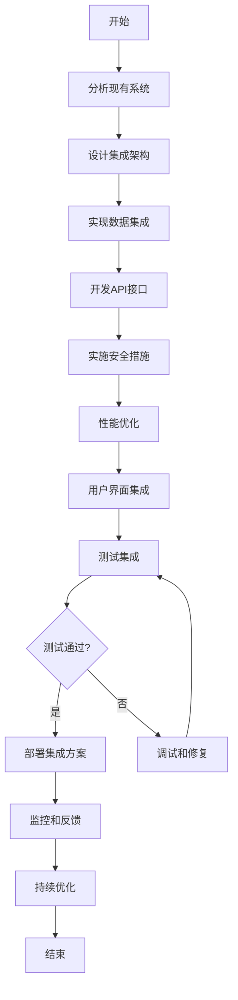

### 算法源代码：

以下是一个简化的 AI Agent 与现有系统集成的 Python 实现示例，使用 Flask 框架创建 API 接口：

```python
from flask import Flask, request, jsonify
import requests
from cachetools import TTLCache
from queue import Queue
import threading
import time

app = Flask(__name__)
cache = TTLCache(maxsize=100, ttl=300)  # Cache with 5 minutes TTL
message_queue = Queue()

# Simulated existing system API
EXISTING_SYSTEM_API = "http://existing-system-api.com"

def process_message_queue():
    while True:
        if not message_queue.empty():
            message = message_queue.get()
            # Process message (e.g., send to existing system)
            requests.post(f"{EXISTING_SYSTEM_API}/process", json=message)
        time.sleep(1)

# Start message queue processing in a separate thread
threading.Thread(target=process_message_queue, daemon=True).start()

@app.route('/api/predict', methods=['POST'])
def predict():
    data = request.json
    
    # Check cache
    cache_key = str(data)
    if cache_key in cache:
        return jsonify({"result": cache[cache_key], "source": "cache"})
    
    # AI prediction logic here
    # This is a placeholder for actual AI prediction
    ai_prediction = {"prediction": "AI result"}
    
    # Get existing system's prediction
    existing_system_response = requests.post(f"{EXISTING_SYSTEM_API}/predict", json=data)
    existing_system_prediction = existing_system_response.json()
    
    # Combine predictions (simplified)
    combined_result = {
        "ai_prediction": ai_prediction["prediction"],
        "existing_system_prediction": existing_system_prediction["prediction"],
        "final_decision": ai_prediction["prediction"]  # In this example, we prioritize AI prediction
    }
    
    # Cache the result
    cache[cache_key] = combined_result
    
    # Asynchronously send data to message queue for further processing
    message_queue.put(data)
    
    return jsonify(combined_result)

@app.route('/api/feedback', methods=['POST'])
def feedback():
    feedback_data = request.json
    # Process feedback (e.g., store in database, use for model retraining)
    # This is a placeholder for actual feedback processing
    print(f"Received feedback: {feedback_data}")
    return jsonify({"status": "Feedback received"})

if __name__ == '__main__':
    app.run(debug=True)
```

### 实际场景应用：

1. 智能客户服务系统：
   - 将 AI 聊天机器人集成到现有的 CRM 系统
   - 实现智能路由和人工坐席协作

2. 预测性维护系统：
   - 将 AI 预测模型集成到工业控制系统
   - 实现设备故障预警和维护调度优化

3. 智能供应链管理：
   - 将 AI 需求预测模型集成到 ERP 系统
   - 优化库存管理和采购决策

4. 智能风控系统：
   - 将 AI 风险评估模型集成到金融交易系统
   - 实现实时交易监控和欺诈检测

5. 智能医疗诊断辅助：
   - 将 AI 图像识别模型集成到医院信息系统
   - 辅助医生进行疾病诊断和治疗方案制定

### 行业发展与未来趋势：

| 时期 | 主要特征 | 代表性技术/方法 |
|------|----------|-----------------|
| 2015-2017 | 基础AI集成 | API集成、批处理 |
| 2018-2020 | 智能化集成 | 微服务、实时处理 |
| 2021-2023 | 深度集成 | 联邦学习、边缘计算 |
| 2024及以后 | 自适应集成 | 自主AI系统、认知计算 |

### 本章小结：

AI Agent 与现有系统的集成是实现 AI 技术价值的关键步骤，它要求我们在技术和业务层面都进行深思熟虑的设计和实施。本章讨论了实现这一目标的主要挑战、解决方案和技术实现。主要要点包括：

1. 成功的集成需要深入理解现有系统架构和业务流程，并制定适当的集成策略。
2. 数据集成和预处理是 AI Agent 发挥作用的基础，需要特别关注数据质量和一致性。
3. API 设计和实现是连接 AI Agent 和现有系统的关键桥梁，需要考虑性能、安全和可扩展性。
4. 性能优化和用户体验设计对于确保集成后系统的可用性和接受度至关重要。
5. 安全、合规和监控机制需要贯穿整个集成过程，确保系统的可靠性和可信度。

未来的 AI Agent 与现有系统集成趋势可能包括：
1. 更智能的自适应集成方法，能够根据系统状态和业务需求动态调整集成策略
2. 基于联邦学习的分布式 AI 集成，实现在保护数据隐私的同时进行协作学习
3. 认知计算技术的应用，使 AI Agent 能够更好地理解和适应复杂的业务环境
4. 边缘计算与云计算的协同，优化 AI 处理的分布式架构
5. 自主 AI 系统的出现，能够自主管理集成过程和优化决策

在实现 AI Agent 与现有系统集成时，开发者应当注意：
1. 采用渐进式集成策略，逐步引入 AI 能力，minimizing对现有系统的干扰
2. 重视数据治理和质量管理，确保 AI Agent 能够获得高质量的输入数据
3. 设计灵活的集成架构，以适应未来的技术变革和业务需求变化
4. 加强跨团队协作，确保 IT、业务和 AI 专家的紧密配合
5. 持续收集用户反馈并进行系统优化，提高 AI Agent 的实用性和可接受度

通过不断改进的集成技术和方法，AI Agent 将能够更加无缝地融入现有的业务生态系统，为组织带来显著的价值提升。这不仅能提高现有系统的智能化水平，还能为业务创新和流程优化提供新的可能性。随着技术的进步，我们可以期待看到更加智能、高效的集成解决方案，推动 AI 技术在各行各业中的深入应用和创新发展。

## 15.4 负载均衡与高可用性

### 核心概念：

负载均衡与高可用性是 AI Agent 部署与集成中的关键策略，旨在通过合理分配计算资源和构建冗余机制，确保 AI 系统能够稳定、高效地处理大量并发请求，并在面对故障时保持服务的连续性。这个过程涉及分布式系统设计、故障检测与恢复、资源调度等多个技术领域，以实现 AI Agent 的可靠性、性能和可扩展性的最优平衡。

### 问题背景：

随着 AI 技术在各行业的广泛应用，AI Agent 系统面临着日益增长的访问压力和高可用性需求。在实际运营中，如何有效地分散负载、快速响应用户请求，同时确保系统在面对各种潜在故障时仍能持续提供服务，成为 AI 系统部署的关键挑战。此外，AI 工作负载的特殊性（如计算密集型任务、大规模数据处理等）也为负载均衡和高可用性设计带来了新的考验。

### 问题描述：

在实现 AI Agent 的负载均衡与高可用性时，开发者面临以下挑战：

1. 如何设计适合 AI工作负载特性的负载均衡策略
2. 如何在保证性能的同时实现系统的水平扩展
3. 如何处理 AI 模型和数据的一致性问题
4. 如何设计快速故障检测和自动恢复机制
5. 如何优化资源利用，平衡成本和性能

### 问题解决：

通过以下步骤可以实现有效的 AI Agent 负载均衡与高可用性：

1. 负载均衡策略设计：
   - 实现应用层负载均衡（如 Round Robin、Least Connections）
   - 考虑 AI 特定的负载均衡（如 GPU 利用率、模型复杂度）
   - 实施动态负载均衡算法

2. 水平扩展架构：
   - 设计无状态服务
   - 实现自动扩缩容机制
   - 使用容器编排平台（如 Kubernetes）

3. 数据一致性管理：
   - 实施分布式缓存（如 Redis）
   - 使用一致性哈希进行数据分片
   - 实现模型版本控制和同步机制

4. 故障检测与恢复：
   - 实施健康检查和心跳机制
   - 设计故障转移策略
   - 实现自动重启和服务恢复

5. 资源优化：
   - 实施资源池化和动态分配
   - 使用预测性扩缩容
   - 优化 AI 模型以减少资源消耗

6. 监控与告警：
   - 实施全面的系统监控
   - 设置智能告警阈值
   - 实现自动化运维（AIOps）

7. 数据备份与恢复：
   - 实施定期数据备份
   - 设计快速数据恢复机制
   - 实现多区域数据复制

### 边界与外延：

负载均衡与高可用性策略的应用范围包括：
- 大规模 AI 推理服务
- 分布式机器学习训练平台
- 实时 AI 决策系统
- 高并发 AI 应用服务
- 关键业务 AI 系统

### 概念结构与核心要素组成：

AI Agent 负载均衡与高可用性系统的核心组件：
1. 负载均衡器
2. 服务发现机制
3. 自动扩缩容控制器
4. 分布式缓存系统
5. 故障检测器
6. 资源调度器
7. 监控和告警系统

### 概念之间的关系：

#### 概念核心属性维度对比

| 属性 | 传统系统 | 基础AI系统 | 高级AI Agent系统 |
|------|----------|------------|-------------------|
| 负载均衡精度 | 低 | 中 | 高 |
| 扩展性 | 有限 | 良好 | 极佳 |
| 故障恢复速度 | 慢 | 中 | 快 |
| 资源利用效率 | 低 | 中 | 高 |
| AI特性适配 | 无 | 部分 | 全面 |
| 系统复杂度 | 低 | 中 | 高 |

#### 概念联系的ER 实体关系

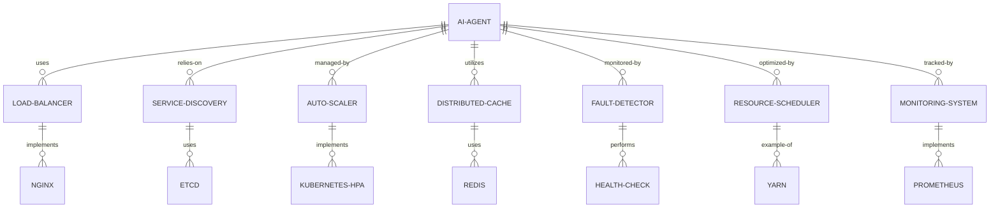

#### 交互关系图

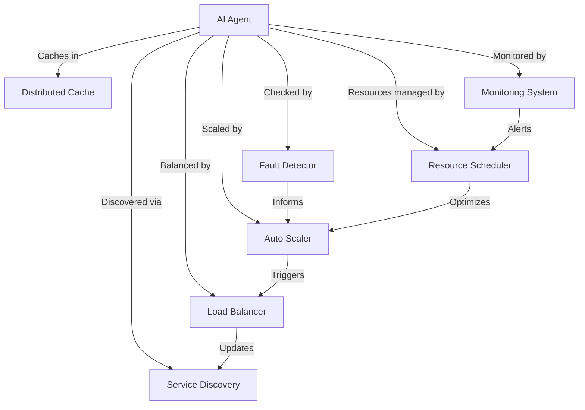

### 数学模型：

使用排队论模型优化负载均衡：

假设有 N 个 AI Agent 实例，每个实例的服务率为 μ，总体到达率为 λ。使用 M/M/N 队列模型，系统的平均响应时间 W 可以表示为：

$$W = \frac{1}{\mu} + \frac{C(N,\rho)}{N\mu(1-\rho)}$$

其中，$\rho = \lambda/(N\mu)$ 是系统利用率，$C(N,\rho)$ 是 Erlang C 公式。

通过调整实例数 N，可以优化系统性能和资源利用率。

### 算法流程图：

```mermaid
graph TD
    A[开始] --> B[监控系统负载]
    B --> C{负载超过阈值?}
    C -->|是| D[触发自动扩容]
    C -->|否| E{负载低于阈值?}
    E -->|是| F[触发自动缩容]
    E -->|否| B
    D --> G[更新负载均衡器配置]
    F --> G
    G --> H[执行健康检查]
    H --> I{检测到故障?}
    I -->|是| J[隔离故障实例]
    I -->|否| K[更新服务注册]
    J --> L[启动新实例]
    L --> K
    K --> M[优化资源分配]
    M --> B
```

### 算法源代码：

以下是一个简化的 AI Agent 负载均衡与高可用性系统的 Python 实现示例，使用 Flask 和 Redis：

```python
from flask import Flask, request, jsonify
import redis
import random
import time
import threading

app = Flask(__name__)
redis_client = redis.Redis(host='localhost', port=6379, db=0)

# Simulated AI Agent instances
AI_AGENTS = ['agent1', 'agent2', 'agent3']

def health_check():
    while True:
        for agent in AI_AGENTS:
            health = random.choice([True, True, True, False])  # 75% chance of being healthy
            redis_client.set(f"health:{agent}", str(health))
        time.sleep(5)  # Check every 5 seconds

# Start health check in a separate thread
threading.Thread(target=health_check, daemon=True).start()

@app.route('/api/predict', methods=['POST'])
def predict():
    data = request.json
    
    # Simple load balancing: choose a random healthy agent
    healthy_agents = [agent for agent in AI_AGENTS if redis_client.get(f"health:{agent}") == b'True']
    
    if not healthy_agents:
        return jsonify({"error": "No healthy AI agents available"}), 503
    
    chosen_agent = random.choice(healthy_agents)
    
    # Simulate AI prediction (in a real scenario, this would call the actual AI agent)
    prediction = f"Prediction from {chosen_agent}: {random.random()}"
    
    # Cache the result
    cache_key = str(data)
    redis_client.setex(cache_key, 300, prediction)  # Cache for 5 minutes
    
    return jsonify({"result": prediction, "agent": chosen_agent})

@app.route('/api/cache', methods=['GET'])
def get_cache():
    key = request.args.get('key')
    if not key:
        return jsonify({"error": "No key provided"}), 400
    
    cached_result = redis_client.get(key)
    if cached_result:
        return jsonify({"result": cached_result.decode(), "source": "cache"})
    else:
        return jsonify({"error": "No cached result found"}), 404

@app.route('/api/health', methods=['GET'])
def health():
    agent_health = {agent: redis_client.get(f"health:{agent}").decode() for agent in AI_AGENTS}
    return jsonify(agent_health)

if __name__ == '__main__':
    app.run(debug=True)
```

### 实际场景应用：

1. 大规模图像识别服务：
   - 使用 GPU 感知的负载均衡策略
   - 实现模型的动态加载和卸载

2. 实时推荐系统：
   - 实施预测性自动扩缩容
   - 使用分布式缓存优化热门推荐项

3. 自然语言处理API：
   - 实现多区域部署和全球负载均衡
   - 使用服务网格管理微服务通信

4. 金融风控系统：
   - 实施多级故障转移机制
   - 使用一致性哈希进行交易数据分片

5. 工业物联网AI平台：
   - 实现边缘-云协同的负载均衡
   - 使用时序数据库优化传感器数据处理

### 行业发展与未来趋势：

| 时期 | 主要特征 | 代表性技术/方法 |
|------|----------|-----------------|
| 2015-2017 | 基础负载均衡 | 硬件负载均衡器、简单轮询 |
| 2018-2020 | 智能负载均衡 | 软件定义网络、动态权重 |
| 2021-2023 | AI驱动的负载均衡 | 机器学习预测、自适应算法 |
| 2024及以后 | 自主优化系统 | 认知计算、量子负载均衡 |

### 本章小结：

负载均衡与高可用性是确保 AI Agent 系统稳定、高效运行的关键策略。通过合理的设计和实施，我们可以显著提高系统的性能、可靠性和可扩展性。本章讨论了实现这一目标的主要挑战、解决方案和技术实现。主要要点包括：

1. AI 工作负载的特殊性要求我们设计更智能、更灵活的负载均衡策略。
2. 水平扩展架构和自动扩缩容机制是应对高并发和突发流量的关键。
3. 分布式缓存和数据一致性管理对于提高系统性能和可靠性至关重要。
4. 快速故障检测和自动恢复机制是保证高可用性的基础。
5. 资源优化和智能调度可以显著提高系统的成本效益。

未来的 AI Agent 负载均衡与高可用性趋势可能包括：
1. 更智能的、AI 驱动的负载均衡算法，能够预测流量模式并提前调整资源分配
2. 边缘计算与云计算的深度融合，实现更灵活的负载分配和故障恢复
3. 自适应的、自优化的系统架构，能够根据实时性能指标自动调整配置
4. 量子计算在复杂负载均衡问题中的应用，提供突破性的性能提升
5. 更强大的隐私保护机制，在保证负载均衡和高可用性的同时确保数据安全

在实现 AI Agent 负载均衡与高可用性时，开发者应当注意：
1. 深入理解 AI 工作负载的特性，设计针对性的负载均衡策略
2. 采用云原生技术和最佳实践，提高系统的可扩展性和弹性
3. 重视数据一致性和状态管理，特别是在分布式环境中
4. 实施全面的监控和告警机制，确保能够及时发现和响应问题
5. 持续优化和演进系统架构，适应不断变化的需求和技术环境

通过不断改进的负载均衡和高可用性技术，AI Agent 系统将能够更好地应对大规模、高并发的应用场景，为用户提供稳定、高效的服务。这不仅能提高 AI 技术的实用性和可靠性，还能为 AI 在更多关键领域的应用铺平道路。随着技术的进步，我们可以期待看到更加智能、高效、可靠的 AI 系统，推动 AI 技术在各行各业中的深入应用和创新发展。