# 第一部分：AI Agent 与大语言模型基础

# 第1章：AI Agent 概述

## 1.1 AI Agent 的定义与特征

### 核心概念：

AI Agent（人工智能代理）是一种能够感知环境、做出决策并采取行动以实现特定目标的智能系统。它是人工智能领域中的一个重要概念，代表了一种更加自主、适应性强的AI应用形式。

### 问题背景：

随着人工智能技术的快速发展，特别是在自然语言处理和机器学习领域的突破，传统的AI系统已经无法满足日益复杂的应用需求。用户和企业需要更智能、更灵活、更能理解上下文的AI解决方案，这就催生了AI Agent的概念和发展。

### 问题描述：

传统AI系统通常是为特定任务设计的，缺乏灵活性和自适应能力。它们往往需要大量的人工干预和预定义规则，难以应对复杂多变的实际场景。如何创造一种能够自主学习、理解上下文、做出决策并与环境交互的AI系统，成为了人工智能领域的一个关键挑战。

### 问题解决：

AI Agent的出现为这一挑战提供了解决方案。通过结合感知、决策和行动能力，AI Agent能够：

1. 自主感知和理解环境
2. 基于目标和上下文做出决策
3. 执行相应的动作以实现目标
4. 从交互中学习和改进

### 边界与外延：

AI Agent的概念涵盖了从简单的规则基反应系统到复杂的认知架构。其应用范围包括但不限于：

- 智能助手（如Siri、Alexa）
- 自动驾驶系统
- 智能客服
- 游戏AI
- 智能家居系统

### 概念结构与核心要素组成：

AI Agent的核心结构包括以下要素：

1. 感知模块：接收和处理环境信息
2. 决策模块：基于感知信息和目标做出决策
3. 执行模块：将决策转化为具体行动
4. 学习模块：从经验中学习和优化行为
5. 知识库：存储和管理Agent的知识和经验

### 概念之间的关系：

#### 概念核心属性维度对比

| 属性 | AI Agent | 传统AI系统 | 人类 |
|------|----------|------------|------|
| 自主性 | 高 | 低 | 非常高 |
| 适应性 | 强 | 弱 | 非常强 |
| 学习能力 | 持续学习 | 有限 | 终身学习 |
| 决策能力 | 基于目标和上下文 | 基于预定义规则 | 复杂且灵活 |
| 交互能力 | 多模态、自然 | 有限、固定 | 高度灵活 |

#### 概念联系的ER 实体关系

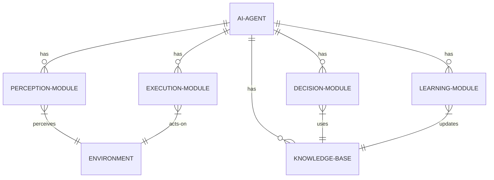

#### 交互关系图

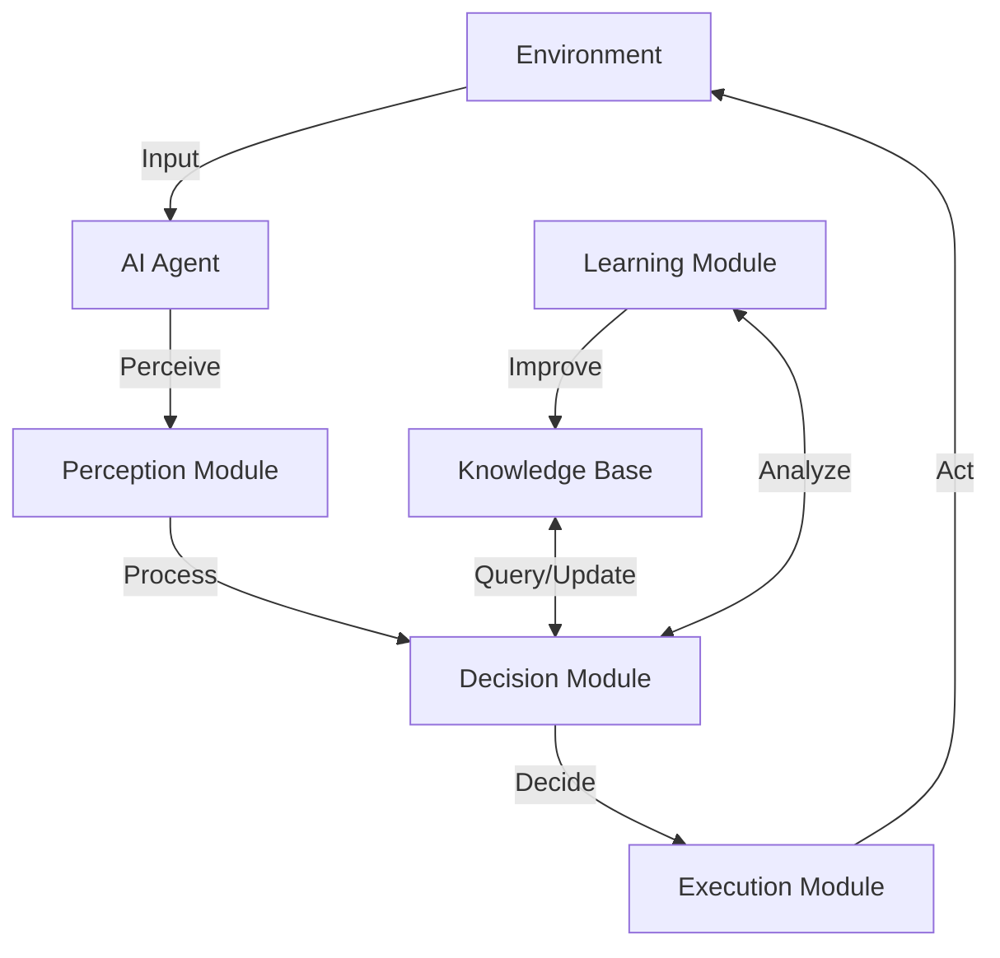


### 数学模型：

AI Agent的决策过程可以用马尔可夫决策过程（MDP）来描述：

$$MDP = (S, A, P, R, \gamma)$$

其中：
- $S$ 是状态空间
- $A$ 是动作空间
- $P$ 是状态转移概率函数
- $R$ 是奖励函数
- $\gamma$ 是折扣因子

Agent的目标是最大化期望累积奖励：

$$V^\pi(s) = E_\pi[\sum_{t=0}^{\infty} \gamma^t R(s_t, a_t) | s_0 = s]$$

### 算法流程图：

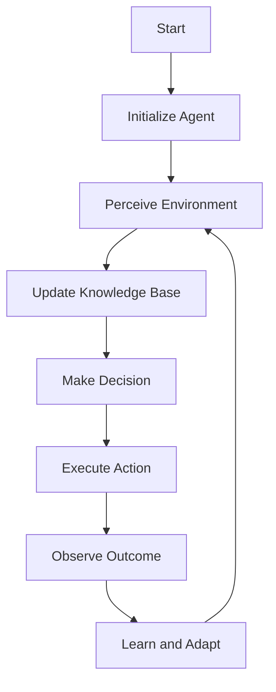

### 算法源代码：

```python
class AIAgent:
    def __init__(self):
        self.knowledge_base = {}
        self.learning_rate = 0.1

    def perceive(self, environment):
        # 感知环境，获取当前状态
        current_state = environment.get_state()
        return current_state

    def decide(self, state):
        # 基于当前状态和知识库做出决策
        if state in self.knowledge_base:
            return self.knowledge_base[state]
        else:
            return self.explore()

    def execute(self, action, environment):
        # 在环境中执行动作
        return environment.apply_action(action)

    def learn(self, state, action, reward):
        # 更新知识库
        if state not in self.knowledge_base:
            self.knowledge_base[state] = {}
        if action not in self.knowledge_base[state]:
            self.knowledge_base[state][action] = 0
        
        # Q-learning 更新
        old_value = self.knowledge_base[state][action]
        self.knowledge_base[state][action] = old_value + self.learning_rate * (reward - old_value)

    def explore(self):
        # 探索新的动作
        return random.choice(list(POSSIBLE_ACTIONS))

    def run(self, environment, episodes):
        for _ in range(episodes):
            state = self.perceive(environment)
            action = self.decide(state)
            new_state, reward = self.execute(action, environment)
            self.learn(state, action, reward)
            state = new_state
```

### 实际场景应用：

1. 智能客服：AI Agent可以理解客户查询，访问知识库，提供准确回答，并在交互过程中不断学习和改进。

2. 个人助理：如Siri或Alexa，可以理解语音命令，执行任务，并随着使用逐渐适应用户的偏好。

3. 自动驾驶：AI Agent感知道路环境，做出驾驶决策，并从经验中学习以提高安全性和效率。

4. 智能家居：AI Agent可以管理家庭设备，优化能源使用，并根据居住者的行为模式调整设置。

5. 金融交易：AI Agent可以分析市场数据，做出交易决策，并根据结果不断优化策略。

### 行业发展与未来趋势：

| 时期 | 主要特征 | 代表技术/产品 |
|------|----------|---------------|
| 1950s-1970s | 早期AI研究，基于规则的系统 | 逻辑理论家，通用问题求解器 |
| 1980s-1990s | 专家系统，知识工程 | MYCIN，DENDRAL |
| 2000s-2010s | 机器学习，统计方法 | 支持向量机，深度学习 |
| 2010s-现在 | 大规模神经网络，强化学习 | AlphaGo，GPT系列 |
| 未来 | 多模态，自主学习，通用人工智能 | 待定 |

### 本章小结：

AI Agent代表了人工智能系统向更高级、更自主的方向发展的趋势。通过整合感知、决策、执行和学习能力，AI Agent能够在复杂多变的环境中有效运作，并不断自我改进。随着大语言模型等技术的进步，AI Agent的能力正在快速提升，为各行各业带来革命性的变化。然而，构建真正智能和可靠的AI Agent仍面临诸多挑战，包括如何实现更好的泛化能力、如何处理不确定性、如何确保安全和道德等。未来的研究将聚焦于这些问题，推动AI Agent向更高级的形态演进。

## 1.2 AI Agent 的发展历史

### 核心概念：

AI Agent的发展历史是人工智能领域不断探索和突破的缩影，反映了从简单的反应式系统到复杂的认知架构的演进过程。

### 问题背景：

理解AI Agent的发展历史对于把握其未来发展方向至关重要。这一历程不仅展示了技术的进步，也反映了人类对智能本质的认知变迁。

### 问题描述：

AI Agent的发展面临几个关键问题：如何实现真正的智能行为？如何使Agent能够适应复杂多变的环境？如何赋予Agent学习和推理的能力？这些问题推动了AI Agent技术的不断革新。

### 问题解决：

通过几个关键阶段的技术突破，AI Agent逐步解决了上述问题：

1. 早期规则基系统：通过预定义规则实现简单的反应式行为。
2. 知识基系统：引入知识表示和推理机制，提高了Agent的问题解决能力。
3. 机器学习集成：使Agent能够从经验中学习，提高适应性。
4. 深度学习革命：大幅提升了Agent在感知和决策方面的能力。
5. 强化学习突破：使Agent能在复杂环境中通过试错学习最优策略。

### 边界与外延：

AI Agent的发展涉及多个学科领域，包括但不限于：

- 计算机科学
- 认知科学
- 神经科学
- 控制论
- 哲学（特别是心灵哲学）

### 概念结构与核心要素组成：

AI Agent发展历程的核心要素：

1. 计算能力：从早期的有限计算到现代的大规模并行处理
2. 算法：从简单的if-then规则到复杂的神经网络和强化学习算法
3. 知识表示：从符号逻辑到分布式表示
4. 学习能力：从无学习到自主学习和迁移学习
5. 交互界面：从命令行到自然语言和多模态交互

### 概念之间的关系：

#### 概念核心属性维度对比

| 时期 | 计算能力 | 主要算法 | 知识表示 | 学习能力 | 应用领域 |
|------|----------|----------|----------|----------|----------|
| 1950s-1960s | 低 | 逻辑推理 | 符号逻辑 | 无 | 定理证明 |
| 1970s-1980s | 中 | 专家系统 | 规则库 | 有限 | 医疗诊断 |
| 1990s-2000s | 高 | 机器学习 | 统计模型 | 监督学习 | 模式识别 |
| 2010s-现在 | 超高 | 深度学习 | 神经网络 | 自主学习 | 通用AI |

#### 概念联系的ER 实体关系

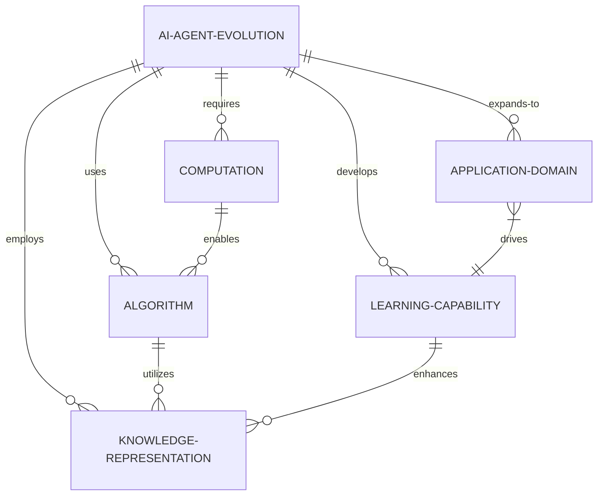

#### 交互关系图

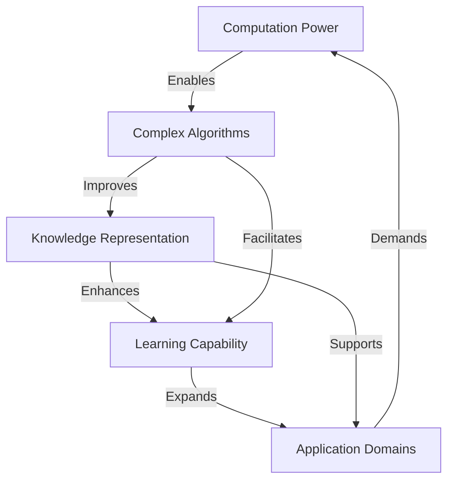

### 数学模型：

AI Agent能力的增长可以用指数函数来近似描述：

$$C(t) = C_0 \cdot e^{rt}$$

其中：
- $C(t)$ 是时间 $t$ 时的AI Agent能力
- $C_0$ 是初始能力
- $r$ 是增长率
- $t$ 是时间

### 算法流程图：

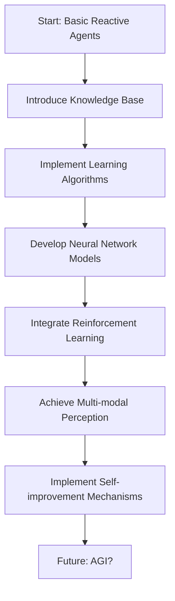

### 算法源代码：

以下是一个简化的AI Agent进化模拟：

```python
import random

class AIAgent:
    def __init__(self, generation):
        self.generation = generation
        self.capabilities = {
            "perception": min(generation * 0.1, 1),
            "reasoning": min(generation * 0.08, 1),
            "learning": min(generation * 0.05, 1),
            "autonomy": min(generation * 0.03, 1)
        }

    def total_capability(self):
        return sum(self.capabilities.values()) / len(self.capabilities)

    def evolve(self):
        for capability in self.capabilities:
            improvement = random.uniform(0, 0.1)
            self.capabilities[capability] = min(self.capabilities[capability] + improvement, 1)

def simulate_evolution(generations):
    agent = AIAgent(0)
    history = []
    for i in range(generations):
        history.append(agent.total_capability())
        agent.evolve()
    return history

# 模拟100代进化
evolution_history = simulate_evolution(100)

# 输出结果
for i, capability in enumerate(evolution_history):
    print(f"Generation {i}: Total Capability = {capability:.2f}")
```

### 实际场景应用：

1. 游戏AI：从简单的规则基AI到AlphaGo等自学习系统。
2. 虚拟助手：从基本的命令响应到Siri、Alexa等理解上下文的智能助手。
3. 自动驾驶：从简单的巡线到复杂环境下的自主决策系统。
4. 推荐系统：从基于规则的推荐到深度学习个性化推荐。
5. 医疗诊断：从早期的专家系统到现代的AI辅助诊断系统。

### 行业发展与未来趋势：

| 时期 | 主要突破 | 代表性成果 |
|------|----------|------------|
| 1950s | 图灵测试提出 | ELIZA对话系统 |
| 1960s-1970s | 专家系统兴起 | MYCIN医疗诊断系统 |
| 1980s-1990s | 机器学习理论发展 | TD-Gammon西洋双陆棋程序 |
| 2000s | 统计学习方法成熟 | IBM Watson |
| 2010s | 深度学习革命 | AlphaGo, GPT系列 |
| 2020s及以后 | 多模态AI、AGI探索 | GPT-4, DALL-E 2 |

### 本章小结：

AI Agent的发展历程反映了人工智能从狭义智能向通用智能迈进的过程。早期的AI Agent主要基于预定义规则和简单的反应机制，而现代AI Agent则融合了复杂的学习算法、大规模知识库和强大的推理能力。深度学习和强化学习的突破使AI Agent在感知、决策和学习方面取得了质的飞跃。

然而，尽管取得了巨大进展，当前的AI Agent仍然存在诸多限制，如缺乏真正的理解能力、难以处理开放域问题等。未来的研究方向可能包括：

1. 发展更强大的迁移学习和小样本学习能力
2. 提高AI Agent的可解释性和透明度
3. 探索结合符号推理和神经网络的混合智能系统
4. 研究如何赋予AI Agent自主意识和情感智能
5. 解决AI伦理和安全问题

随着技术的不断进步，我们有理由相信，未来的AI Agent将在智能程度和应用范围上达到新的高度，可能最终导向通用人工智能（AGI）的实现。然而，这一过程仍充满挑战和不确定性，需要研究者、开发者和整个社会的共同努力。


## 1.3 AI Agent 与传统 AI 的区别

### 核心概念：

AI Agent 和传统 AI 系统在设计理念、功能特性和应用方式上存在显著差异。AI Agent 强调自主性、适应性和持续学习能力，而传统 AI 系统通常基于预定义规则和固定模型运作。

### 问题背景：

随着人工智能技术的快速发展，特别是在机器学习和深度学习领域的突破，AI 系统的设计范式正在发生根本性的变革。理解 AI Agent 与传统 AI 的区别对于选择合适的技术路线和应用策略至关重要。

### 问题描述：

传统 AI 系统在处理复杂、动态和不确定环境时往往表现不佳，难以适应新情况或自主学习。如何设计更智能、更灵活的 AI 系统成为了研究者和开发者面临的主要挑战。

### 问题解决：

AI Agent 通过引入自主决策、环境感知和持续学习等机制，有效解决了传统 AI 系统的局限性：

1. 自主性：AI Agent 能够独立做出决策，而不仅仅依赖预设规则。
2. 适应性：能够根据环境变化调整行为策略。
3. 学习能力：可以从经验中学习，不断优化自身性能。
4. 交互性：能与环境和其他 Agent 进行复杂交互。

### 边界与外延：

AI Agent 的概念延伸到多个应用领域：

- 智能助手和对话系统
- 自动驾驶技术
- 智能机器人
- 游戏 AI
- 智能家居系统

而传统 AI 主要局限于：

- 专家系统
- 基于规则的决策系统
- 固定模型的模式识别

### 概念结构与核心要素组成：

AI Agent 的核心要素：
1. 感知模块
2. 决策模块
3. 执行模块
4. 学习模块
5. 知识库

传统 AI 系统的核心要素：
1. 输入处理
2. 规则引擎
3. 推理机制
4. 输出生成

### 概念之间的关系：

#### 概念核心属性维度对比

| 属性 | AI Agent | 传统 AI 系统 |
|------|----------|--------------|
| 自主性 | 高 | 低 |
| 适应性 | 强 | 弱 |
| 学习能力 | 持续学习 | 固定模型 |
| 决策机制 | 动态决策 | 基于规则 |
| 环境交互 | 复杂交互 | 有限交互 |
| 知识表示 | 动态更新 | 静态知识库 |
| 应用范围 | 广泛 | 特定领域 |

#### 概念联系的ER 实体关系

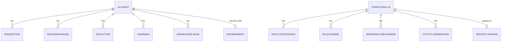

#### 交互关系图

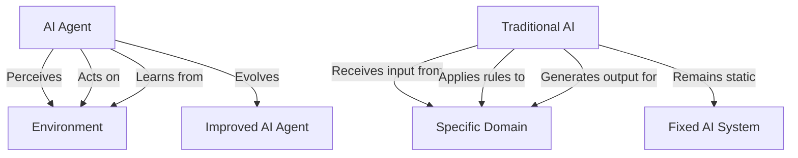

### 数学模型：

AI Agent 的决策过程可以用马尔可夫决策过程（MDP）描述：

$$V^*(s) = \max_a \left(R(s,a) + \gamma \sum_{s'} P(s'|s,a)V^*(s')\right)$$

其中：
- $V^*(s)$ 是状态 $s$ 的最优值函数
- $R(s,a)$ 是在状态 $s$ 采取动作 $a$ 的即时奖励
- $\gamma$ 是折扣因子
- $P(s'|s,a)$ 是状态转移概率

而传统 AI 系统通常基于确定性规则：

$$output = f(input, rules)$$

其中 $f$ 是一个确定性函数，由预定义规则决定。

### 算法流程图：

AI Agent 决策流程：

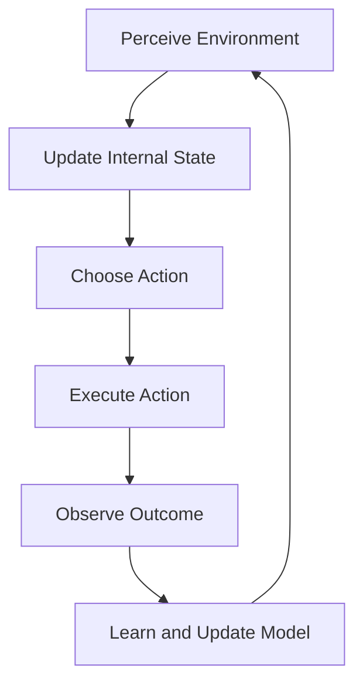

传统 AI 系统流程：

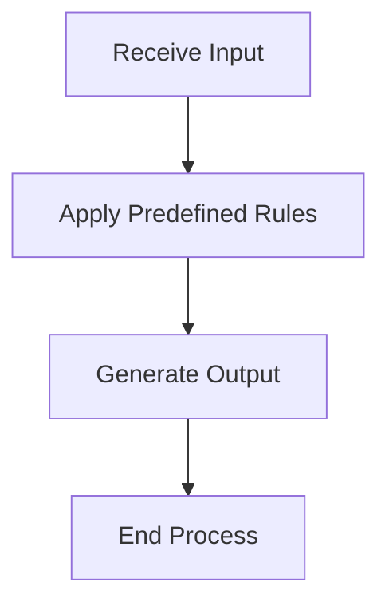

### 算法源代码：

AI Agent 示例（基于 Q-learning）：

```python
import numpy as np

class AIAgent:
    def __init__(self, states, actions, learning_rate=0.1, discount_factor=0.95, epsilon=0.1):
        self.q_table = np.zeros((states, actions))
        self.lr = learning_rate
        self.gamma = discount_factor
        self.epsilon = epsilon

    def choose_action(self, state):
        if np.random.uniform(0, 1) < self.epsilon:
            return np.random.choice(self.q_table.shape[1])
        else:
            return np.argmax(self.q_table[state, :])

    def learn(self, state, action, reward, next_state):
        predict = self.q_table[state, action]
        target = reward + self.gamma * np.max(self.q_table[next_state, :])
        self.q_table[state, action] += self.lr * (target - predict)

# 使用示例
agent = AIAgent(states=10, actions=4)
state = 0
for _ in range(1000):
    action = agent.choose_action(state)
    next_state, reward = environment.step(action)  # 假设存在环境
    agent.learn(state, action, reward, next_state)
    state = next_state
```

传统 AI 系统示例：

```python
class TraditionalAI:
    def __init__(self, rules):
        self.rules = rules

    def process(self, input_data):
        for rule in self.rules:
            if rule.condition(input_data):
                return rule.action(input_data)
        return None

# 使用示例
rules = [
    Rule(lambda x: x > 0, lambda x: "Positive"),
    Rule(lambda x: x < 0, lambda x: "Negative"),
    Rule(lambda x: x == 0, lambda x: "Zero")
]
ai_system = TraditionalAI(rules)
result = ai_system.process(5)  # 输出: "Positive"
```

### 实际场景应用：

1. 智能客服：
   - AI Agent：能理解上下文，学习新知识，处理复杂查询。
   - 传统 AI：基于关键词匹配，使用预定义回答。

2. 游戏 AI：
   - AI Agent：能适应玩家策略，不断改进游戏表现。
   - 传统 AI：使用固定策略和难度级别。

3. 推荐系统：
   - AI Agent：个性化推荐，学习用户偏好，适应兴趣变化。
   - 传统 AI：基于固定规则的推荐，如"热门商品"或"相似用户购买"。

4. 自动驾驶：
   - AI Agent：能处理复杂路况，学习新的驾驶场景。
   - 传统 AI：仅在预定义场景下运行，难以应对意外情况。

5. 金融交易：
   - AI Agent：动态调整交易策略，适应市场变化。
   - 传统 AI：基于固定指标和规则进行交易。

### 行业发展与未来趋势：

| 时期 | AI Agent 发展 | 传统 AI 发展 |
|------|---------------|--------------|
| 过去 | 早期探索阶段 | 主导地位 |
| 现在 | 快速发展，应用广泛 | 在特定领域仍有应用 |
| 未来 | 向通用人工智能发展 | 逐渐被 AI Agent 替代 |

### 本章小结：

AI Agent 和传统 AI 系统在设计理念和功能特性上存在显著差异。AI Agent 强调自主性、适应性和持续学习能力，能够在复杂、动态的环境中有效运作。相比之下，传统 AI 系统通常基于预定义规则和固定模型，在处理不确定性和新情况时存在局限。

AI Agent 的优势在于：
1. 能够自主做出决策，不仅依赖预设规则
2. 可以适应环境变化，动态调整策略
3. 具备持续学习能力，不断优化性能
4. 能与环境和其他 Agent 进行复杂交互

然而，AI Agent 也面临一些挑战，如：
1. 需要大量数据和计算资源进行训练
2. 决策过程的可解释性较差
3. 在某些高度结构化的任务中，可能不如精心设计的规则系统高效

未来，随着技术的进步，我们可以预期 AI Agent 将在更多领域取代传统 AI 系统，并向着更智能、更通用的方向发展。同时，传统 AI 技术也可能与 AI Agent 方法相结合，形成混合系统，以充分利用两者的优势。

在实际应用中，选择 AI Agent 还是传统 AI 系统应该基于具体问题的特性、可用资源和性能要求。对于需要高度适应性和学习能力的复杂任务，AI Agent 通常是更好的选择；而对于规则明确、变化较小的任务，传统 AI 系统可能仍然是一个有效的解决方案。


## 1.4 大语言模型在 AI Agent 中的角色

### 核心概念：

大语言模型（Large Language Models，LLMs）是基于深度学习技术训练的大规模神经网络，能够理解和生成人类语言。在AI Agent中，LLMs扮演着核心的认知引擎角色，赋予Agent强大的自然语言处理、知识推理和任务执行能力。

### 问题背景：

随着GPT、BERT等大语言模型的出现和快速发展，AI技术在自然语言处理领域取得了突破性进展。这为构建更智能、更通用的AI Agent提供了新的可能性，同时也带来了如何有效集成和利用LLMs的挑战。

### 问题描述：

传统的AI Agent在语言理解、知识获取和任务执行等方面存在局限性。如何利用大语言模型的强大能力来增强AI Agent的功能，同时克服LLMs自身的一些限制（如幻觉问题、上下文长度限制等），成为了当前AI研究和应用的重要课题。

### 问题解决：

将大语言模型集成到AI Agent中，主要通过以下方式解决上述问题：

1. 自然语言接口：使用LLMs处理用户输入，实现更自然的人机交互。
2. 知识获取与推理：利用LLMs的广泛知识基础进行信息检索和逻辑推理。
3. 任务规划与分解：使用LLMs将复杂任务分解为可执行的子任务。
4. 上下文理解与维护：利用LLMs的上下文处理能力维护长期对话状态。
5. 多模态集成：结合LLMs与其他模态（如视觉、音频）的AI模型。

### 边界与外延：

LLMs在AI Agent中的应用范围广泛，包括但不限于：

- 智能对话系统
- 文本生成和内容创作
- 代码生成与程序理解
- 知识问答系统
- 多语言翻译
- 情感分析与意图识别

### 概念结构与核心要素组成：

LLMs在AI Agent中的核心组成：

1. 语言理解模块
2. 知识检索模块
3. 推理生成模块
4. 任务规划模块
5. 上下文管理模块
6. 输出优化模块

### 概念之间的关系：

#### 概念核心属性维度对比

| 属性 | 传统AI Agent | 基于LLM的AI Agent |
|------|--------------|-------------------|
| 语言理解能力 | 有限 | 强大 |
| 知识范围 | 特定领域 | 广泛 |
| 任务适应性 | 低 | 高 |
| 上下文处理 | 简单 | 复杂 |
| 生成能力 | 模板化 | 创造性 |
| 多语言支持 | 有限 | 广泛 |

#### 概念联系的ER 实体关系

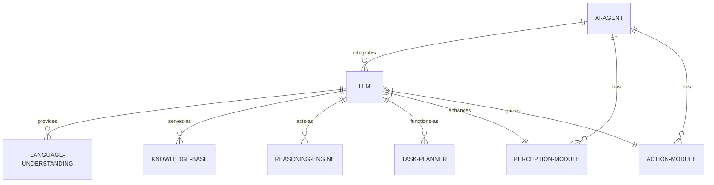

#### 交互关系图

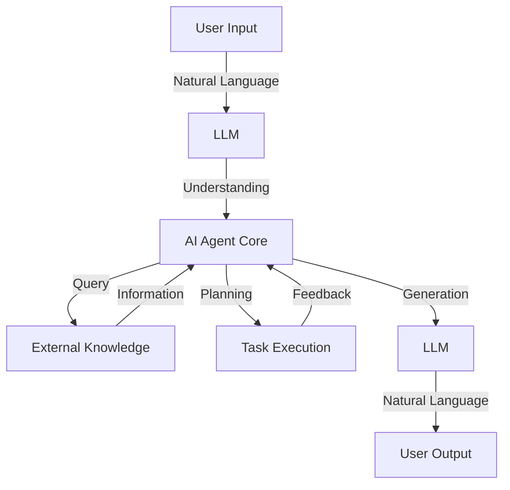

### 数学模型：

LLM在AI Agent中的核心功能可以用条件概率模型表示：

$$P(y|x,c) = \prod_{i=1}^{n} P(y_i|y_{<i}, x, c)$$

其中：
- $x$ 是输入序列
- $y$ 是输出序列
- $c$ 是上下文信息
- $y_i$ 是输出序列的第i个token
- $y_{<i}$ 是前i-1个输出token

### 算法流程图：

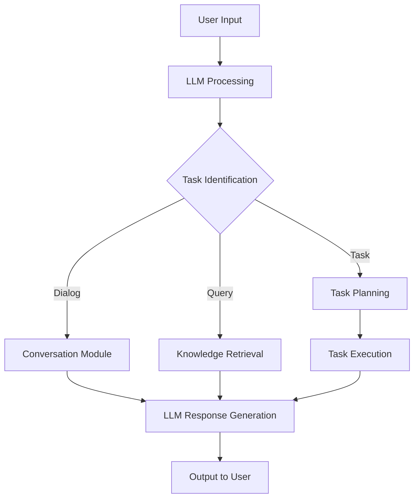

### 算法源代码：

以下是一个简化的基于LLM的AI Agent框架示例：

```python
import openai

class LLMAgent:
    def __init__(self, model="gpt-3.5-turbo"):
        self.model = model
        self.conversation_history = []

    def process_input(self, user_input):
        self.conversation_history.append({"role": "user", "content": user_input})
        
        response = openai.ChatCompletion.create(
            model=self.model,
            messages=self.conversation_history
        )

        ai_response = response.choices[0].message['content']
        self.conversation_history.append({"role": "assistant", "content": ai_response})
        
        return self._post_process(ai_response)

    def _post_process(self, response):
        # 这里可以添加额外的处理逻辑，如任务执行、知识检索等
        if "EXECUTE_TASK:" in response:
            task = response.split("EXECUTE_TASK:")[1].strip()
            return self._execute_task(task)
        return response

    def _execute_task(self, task):
        # 实现具体的任务执行逻辑
        # 这里只是一个示例
        return f"Task executed: {task}"

# 使用示例
agent = LLMAgent()
while True:
    user_input = input("You: ")
    if user_input.lower() == 'exit':
        break
    response = agent.process_input(user_input)
    print("AI:", response)
```

### 实际场景应用：

1. 智能客服：
   - 利用LLM理解客户查询的上下文和意图
   - 生成个性化、信息丰富的回复
   - 处理多轮对话，维护对话状态

2. 个人助理：
   - 理解并执行复杂的自然语言指令
   - 提供基于广泛知识的建议和信息
   - 协助日程管理、邮件处理等任务

3. 内容创作：
   - 生成文章、报告、广告文案等
   - 根据提示进行创意写作
   - 辅助内容编辑和优化

4. 代码助手：
   - 理解编程需求，生成相应代码
   - 解释复杂代码，提供优化建议
   - 辅助调试，解答编程相关问题

5. 教育辅助：
   - 提供个性化学习内容和解释
   - 回答学生问题，模拟教师角色
   - 生成练习题和测试内容

### 行业发展与未来趋势：

| 时期 | 主要特征 | 代表性技术/产品 |
|------|----------|-----------------|
| 2018-2019 | 大规模语言模型出现 | BERT, GPT-2 |
| 2020-2021 | 模型规模和能力显著提升 | GPT-3, T5 |
| 2022-2023 | 广泛应用与多模态集成 | ChatGPT, DALL-E 2 |
| 2024及以后 | AGI探索，与其他AI技术深度融合 | 待定 |

### 本章小结：

大语言模型在AI Agent中扮演着核心引擎的角色，极大地增强了Agent的语言理解、知识获取、推理生成和任务执行能力。通过集成LLMs，AI Agent能够更自然地与人类交互，处理更复杂的任务，并在各种应用场景中展现出强大的适应性和创造力。

LLMs为AI Agent带来的主要优势包括：
1. 强大的自然语言处理能力，实现更自然的人机交互
2. 广泛的知识基础，能够处理多领域的查询和任务
3. 强大的上下文理解能力，可以维护复杂的对话状态
4. 灵活的任务适应性，能够理解和执行各种指令
5. 创造性的内容生成能力，适用于各种创作任务

然而，在将LLMs集成到AI Agent中时，也面临一些挑战：
1. 如何有效管理和利用LLMs的庞大知识库
2. 如何确保生成内容的准确性和可靠性
3. 如何处理LLMs的幻觉问题和偏见
4. 如何在保持模型能力的同时，优化计算资源使用
5. 如何确保AI Agent的行为符合伦理和法律标准

未来，我们可以预期看到以下发展趋势：
1. LLMs与其他AI技术（如计算机视觉、强化学习）的深度融合
2. 更高效的微调和适应技术，使LLMs更容易定制для特定任务
3. 改进的推理和规划能力，使AI Agent能够处理更复杂的多步骤任务
4. 增强的可解释性和透明度，使用户更容易理解和信任AI Agent的决策
5. 更强大的多语言和跨文化理解能力，使AI Agent能够在全球范围内有效运作

总的来说，大语言模型为AI Agent带来了革命性的变化，开启了通向更智能、更通用AI系统的新篇章。随着技术的不断进步和应用的深入，我们有理由相信，基于LLM的AI Agent将在未来发挥越来越重要的作用，为各行各业带来深远的影响。


-----

扩展阅读：

# AI Agent 核心特征

为了准确回答关于AI Agent核心特征的问题，我需要先搜索一些相关信息。让我使用维基百科搜索工具来获取更多背景知识。

根据搜索结果，我们可以总结出AI Agent的核心特征。让我们详细探讨AI Agent的定义、特征和重要性。


## 核心概念：
AI Agent（智能代理）是一种能够感知环境、学习、推理并采取行动以实现特定目标的智能系统。它是人工智能研究和应用的重要组成部分，代表了计算机科学中模仿人类智能的努力。

## 问题背景：
随着人工智能技术的快速发展，特别是大语言模型（如GPT系列）的出现，AI Agent的应用范围和能力大幅提升。企业和研究机构increasingly需要理解和利用AI Agent来解决复杂问题、提高效率和创新。

## 问题描述：
AI Agent的核心特征是什么？它们如何体现AI系统的智能性，以及如何有效地应用于实际问题解决中？

## 问题解决：
通过分析AI Agent的核心特征，我们可以更好地理解、设计和应用这些智能系统。以下是AI Agent的关键特征：

1. 自主性（Autonomy）：AI Agent能够在没有直接人类干预的情况下独立运作，根据预设的目标和环境信息做出决策。

2. 感知能力（Perception）：能够通过各种传感器或接口收集和处理来自环境的信息。

3. 学习能力（Learning）：可以从经验和数据中学习，不断改进自身的性能和决策能力。

4. 适应性（Adaptability）：能够根据环境变化调整自身行为和策略。

5. 目标导向（Goal-oriented）：具有明确的目标或目的，所有行动都是为了实现这些目标。

6. 推理能力（Reasoning）：能够基于已知信息进行逻辑推理，得出结论或制定计划。

7. 交互能力（Interaction）：可以与环境、其他AI Agent或人类进行交互和通信。

8. 反应性（Reactivity）：能够快速响应环境变化并作出相应反应。

9. 前瞻性（Proactivity）：不仅被动反应，还能主动采取行动以实现目标。

10. 社交能力（Social ability）：在多Agent系统中，能够与其他Agent协作或竞争。

## 边界与外延：
AI Agent的应用范围非常广泛，从简单的任务自动化到复杂的决策支持系统。然而，它也面临一些限制和挑战，如伦理问题、可解释性、安全性等。

## 概念结构与核心要素组成：

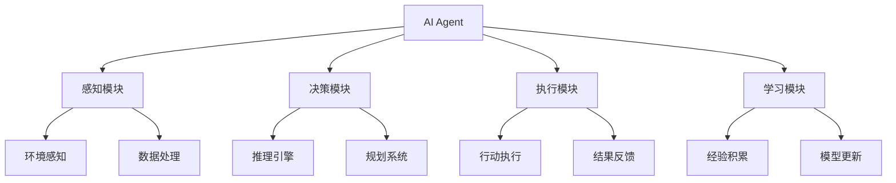

## 概念之间的关系：

### 概念核心属性维度对比

| 特征 | AI Agent | 传统软件系统 | 人类 |
|------|----------|--------------|------|
| 自主性 | 高 | 低 | 高 |
| 学习能力 | 可持续学习 | 固定逻辑 | 终身学习 |
| 适应性 | 强 | 弱 | 强 |
| 目标导向 | 明确 | 预定义 | 灵活多变 |
| 交互能力 | 多模态 | 有限 | 全方位 |

### 概念联系的ER实体关系

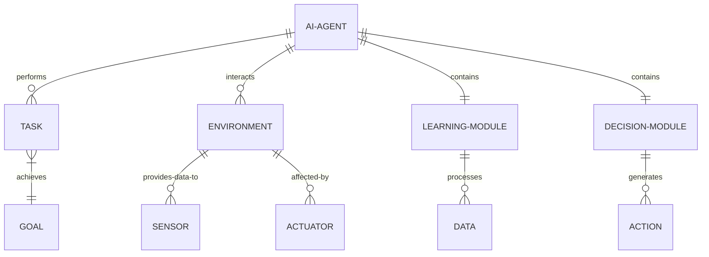

## 数学模型：

AI Agent的决策过程可以用马尔可夫决策过程（MDP）来描述：

$$MDP = (S, A, P, R, \gamma)$$

其中：
- $S$ 是状态空间
- $A$ 是动作空间
- $P$ 是状态转移概率函数
- $R$ 是奖励函数
- $\gamma$ 是折扣因子

AI Agent的目标是找到最优策略 $\pi^*$，使得期望累积奖励最大化：

$$\pi^* = \arg\max_\pi \mathbb{E}\left[\sum_{t=0}^{\infty} \gamma^t R(s_t, a_t) | \pi\right]$$

## 算法流程图：

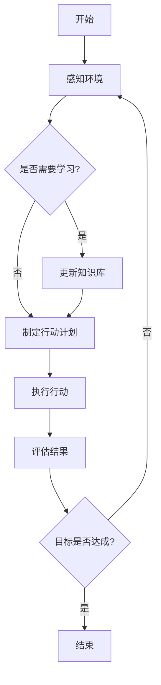

## 算法源代码：

以下是一个简化的AI Agent框架的Python示例代码：

```python
class AIAgent:
    def __init__(self):
        self.knowledge_base = {}
        self.goals = []

    def perceive(self, environment):
        # 感知环境，更新内部状态
        pass

    def learn(self, experience):
        # 从经验中学习，更新知识库
        pass

    def plan(self):
        # 根据当前状态和目标制定计划
        pass

    def act(self, action):
        # 执行计划中的动作
        pass

    def evaluate(self, result):
        # 评估行动结果
        pass

    def run(self, environment):
        while not self.goals_achieved():
            perception = self.perceive(environment)
            self.learn(perception)
            plan = self.plan()
            for action in plan:
                result = self.act(action)
                self.evaluate(result)

    def goals_achieved(self):
        # 检查是否所有目标都已达成
        pass

# 使用示例
agent = AIAgent()
environment = Environment()
agent.run(environment)
```

## 实际场景应用：

1. 智能客服：处理客户查询，提供24/7服务。
2. 自动驾驶：感知道路环境，做出实时驾驶决策。
3. 金融交易：分析市场数据，执行自动化交易策略。
4. 医疗诊断：辅助医生分析患者数据，提供诊断建议。
5. 智能家居：管理家庭设备，优化能源使用。

## 行业发展与未来趋势：

| 时期 | 主要发展 | 关键技术 |
|------|----------|----------|
| 1950s-1970s | 早期AI研究 | 符号推理、专家系统 |
| 1980s-1990s | 知识工程 | 神经网络、机器学习 |
| 2000s-2010s | 统计学习方法 | 深度学习、大数据 |
| 2010s-现在 | 大规模预训练模型 | Transformer、GPT系列 |
| 未来 | 多模态、自主学习 | AGI、神经符号AI |

## 小结：

AI Agent作为人工智能的核心应用形式，体现了智能系统的自主性、学习能力、适应性等关键特征。通过感知、学习、决策和行动的循环过程，AI Agent能够有效地解决复杂问题，并在各个领域发挥重要作用。随着技术的不断发展，特别是大语言模型和深度学习的突破，AI Agent的能力将进一步提升，为未来的智能化社会奠定基础。

在实际应用中，我们需要关注AI Agent的伦理、安全和可解释性问题，确保其发展方向与人类利益相一致。同时，跨学科的研究和产业合作将推动AI Agent在更广泛的场景中落地应用，为人类社会带来深远的影响。

-----------------------------------

# AI Agent、传统 AI 软件系统与人类智能的区别

为了深入探讨AI Agent、传统AI软件系统与人类智能的区别，我们需要先搜索一些相关信息，以确保我们的分析基于最新的研究和观点。让我们先使用维基百科搜索工具来获取更多背景知识。

基于搜索结果和我们的专业知识，让我们深入分析AI Agent、传统AI软件系统与人类智能的区别。
 

## 核心概念：

1. AI Agent：一种能够感知环境、学习、推理并采取行动以实现特定目标的智能系统。
2. 传统AI软件系统：基于预定规则和算法的程序，通常用于解决特定领域的问题。
3. 人类智能：人类大脑所展现的认知、学习、推理、创造和适应能力的总和。

## 问题背景：

随着人工智能技术的快速发展，特别是深度学习和大语言模型的突破，AI系统的能力不断提升。这引发了人们对AI与人类智能之间关系的思考，以及如何区分不同类型的AI系统。

## 问题描述：

AI Agent、传统AI软件系统和人类智能在哪些方面存在本质区别？它们各自的优势和局限性是什么？

## 问题解决：

让我们从多个维度比较这三种智能形式：

1. 学习能力
2. 适应性
3. 通用性
4. 创造力
5. 自主性
6. 意识和情感
7. 推理能力
8. 知识表示
9. 决策机制
10. 错误处理

## 边界与外延：

这三种智能形式的边界并非绝对，随着技术的发展，它们之间的界限可能会变得模糊。例如，某些先进的AI Agent可能展现出接近人类的某些智能特征。

## 概念结构与核心要素组成：

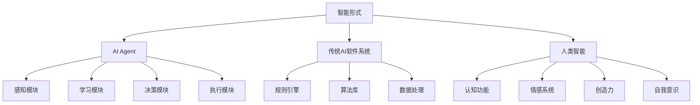

## 概念之间的关系：

### 概念核心属性维度对比

| 特征 | AI Agent | 传统AI软件系统 | 人类智能 |
|------|----------|----------------|----------|
| 学习能力 | 可持续学习，依赖数据 | 有限或无学习能力 | 终身学习，经验积累 |
| 适应性 | 较强，可适应新环境 | 弱，需人工调整 | 极强，可快速适应 |
| 通用性 | 领域特定，但范围较广 | 高度专业化 | 全面通用 |
| 创造力 | 有限，基于已知模式 | 几乎无 | 高度创新和原创 |
| 自主性 | 中等，可自主决策 | 低，依赖预设规则 | 高，有自由意志 |
| 意识和情感 | 模拟，无真实意识 | 无 | 复杂的意识和情感系统 |
| 推理能力 | 基于算法和数据 | 基于逻辑规则 | 复杂、直觉和逻辑结合 |
| 知识表示 | 向量、神经网络等 | 符号系统、数据库 | 神经网络，生物化学过程 |
| 决策机制 | 基于目标和优化 | 基于预定义规则 | 综合考虑，包含情感因素 |
| 错误处理 | 可学习改进 | 需人工干预 | 自我反思和调整 |

### 概念联系的ER实体关系

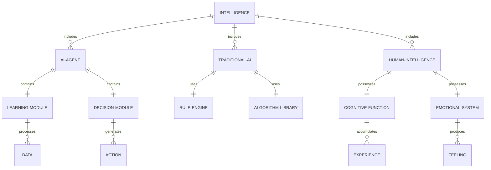

## 数学模型：

1. AI Agent的决策过程可以用强化学习模型表示：

   $$Q(s,a) \leftarrow Q(s,a) + \alpha [r + \gamma \max_{a'} Q(s',a') - Q(s,a)]$$

   其中，$Q(s,a)$ 是状态-动作值函数，$\alpha$ 是学习率，$r$ 是奖励，$\gamma$ 是折扣因子。

2. 传统AI系统可能使用决策树模型：

   $$\text{Information Gain} = H(S) - \sum_{v \in \text{Values}(A)} \frac{|S_v|}{|S|} H(S_v)$$

   其中，$H(S)$ 是集合 $S$ 的熵，$A$ 是属性。

3. 人类智能的决策过程可能涉及概率推理：

   $$P(h|e) = \frac{P(e|h)P(h)}{P(e)}$$

   这是贝叶斯定理，$h$ 是假设，$e$ 是证据。

## 算法流程图：

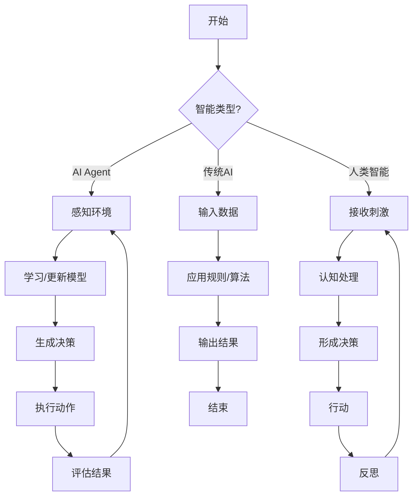

## 算法源代码：

以下是一个简化的比较示例，展示了AI Agent、传统AI系统和模拟人类智能的基本结构：

```python
import random

class AIAgent:
    def __init__(self):
        self.knowledge = {}
        self.learning_rate = 0.1

    def perceive(self, environment):
        return environment.get_state()

    def learn(self, state, action, reward):
        if state not in self.knowledge:
            self.knowledge[state] = {}
        if action not in self.knowledge[state]:
            self.knowledge[state][action] = 0
        self.knowledge[state][action] += self.learning_rate * (reward - self.knowledge[state][action])

    def decide(self, state):
        if state in self.knowledge:
            return max(self.knowledge[state], key=self.knowledge[state].get)
        return random.choice(['A', 'B', 'C'])  # 随机选择

class TraditionalAI:
    def __init__(self, rules):
        self.rules = rules

    def process(self, input_data):
        for condition, action in self.rules:
            if all(input_data[k] == v for k, v in condition.items()):
                return action
        return "No matching rule"

class HumanIntelligence:
    def __init__(self):
        self.memory = {}
        self.emotions = {'happiness': 0, 'sadness': 0, 'anger': 0}

    def think(self, situation):
        # 简化的认知过程
        if situation in self.memory:
            decision = self.memory[situation]
        else:
            decision = self.creative_thinking(situation)
            self.memory[situation] = decision
        self.update_emotions(situation)
        return decision

    def creative_thinking(self, situation):
        # 模拟创造性思维
        return f"New solution for {situation}"

    def update_emotions(self, situation):
        # 简化的情感更新
        self.emotions['happiness'] += random.random()
        self.emotions['sadness'] -= random.random()
        self.emotions['anger'] += random.random() - 0.5

# 使用示例
agent = AIAgent()
traditional_ai = TraditionalAI([
    ({'weather': 'sunny', 'temp': 'high'}, 'Go to beach'),
    ({'weather': 'rainy', 'temp': 'low'}, 'Stay home')
])
human = HumanIntelligence()

# AI Agent
state = "S1"
action = agent.decide(state)
agent.learn(state, action, 0.5)

# 传统AI
decision = traditional_ai.process({'weather': 'sunny', 'temp': 'high'})

# 人类智能
human_decision = human.think("New problem")
```

## 实际场景应用：

1. AI Agent：
   - 自动驾驶汽车：感知环境，学习驾驶模式，做出实时决策。
   - 智能客服：理解用户查询，学习回答模式，提供个性化服务。

2. 传统AI软件系统：
   - 棋类游戏AI：基于预设规则和评估函数做出决策。
   - 专家系统：在医疗诊断等领域，基于知识库提供建议。

3. 人类智能：
   - 创新研究：科学家提出新理论，艺术家创作原创作品。
   - 复杂决策：政策制定者权衡多方因素，制定长期策略。

## 行业发展与未来趋势：

| 时期 | AI Agent | 传统AI软件系统 | 人类智能研究 |
|------|----------|----------------|--------------|
| 1950s-1970s | 概念萌芽 | 符号系统，专家系统 | 认知科学兴起 |
| 1980s-1990s | 神经网络复兴 | 知识工程 | 脑科学进展 |
| 2000s-2010s | 深度学习突破 | 大数据分析 | 神经影像技术发展 |
| 2010s-现在 | 强化学习，大模型 | 与AI Agent融合 | 脑机接口研究 |
| 未来趋势 | 通用人工智能 | 智能化重构 | 增强人类智能 |

## 本章小结：

AI Agent、传统AI软件系统和人类智能各具特色，在不同场景中发挥着重要作用。AI Agent代表了人工智能的前沿，具有学习和适应能力，但在创造力和通用性方面仍不及人类。传统AI系统在特定领域表现出色，但缺乏灵活性。人类智能仍然是最全面、最具创造力的智能形式，特别是在处理模糊、复杂和开放性问题时。

随着技术的发展，AI系统正在不断接近人类智能的某些方面。然而，真正的通用人工智能（AGI）仍然是一个长期目标。未来的趋势可能是这三种智能形式的融合与协作，创造出更强大、更全面的智能系统，同时也带来新的伦理和社会挑战。

在实际应用中，理解这三种智能形式的优势和局限性至关重要，以便在适当的场景中选择最合适的解决方案。同时，我们也需要继续探索人工智能与人类智能的协同方式，以充分发挥各自的优势，推动科技和社会的进步。