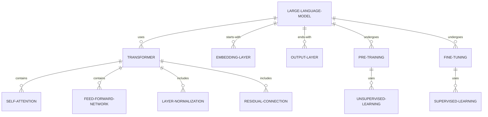
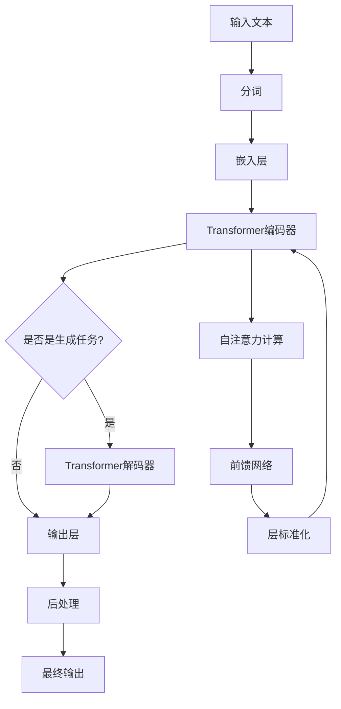
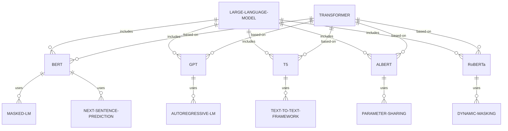
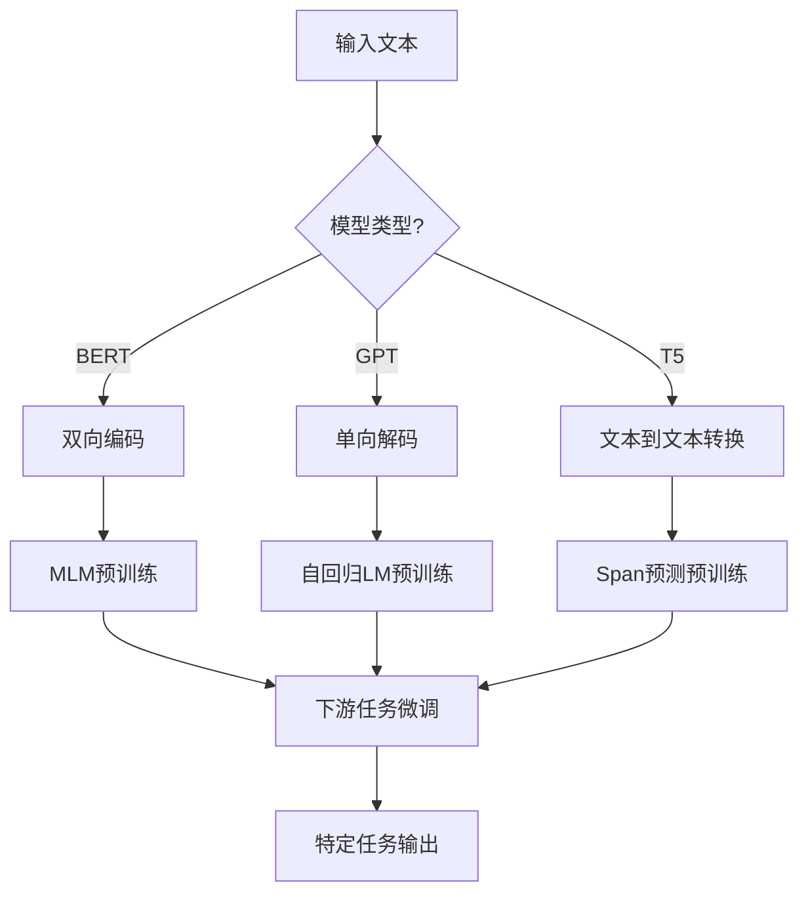
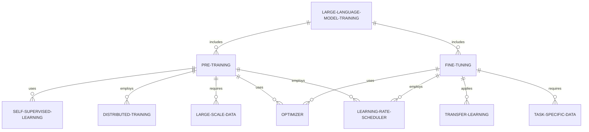
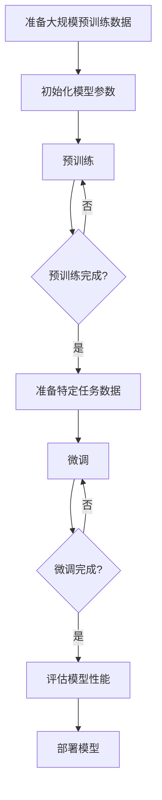
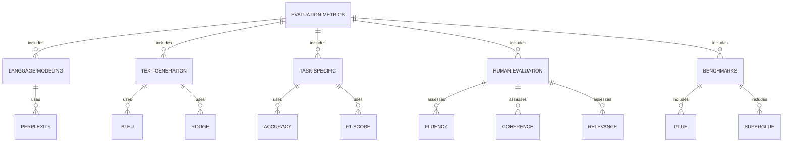
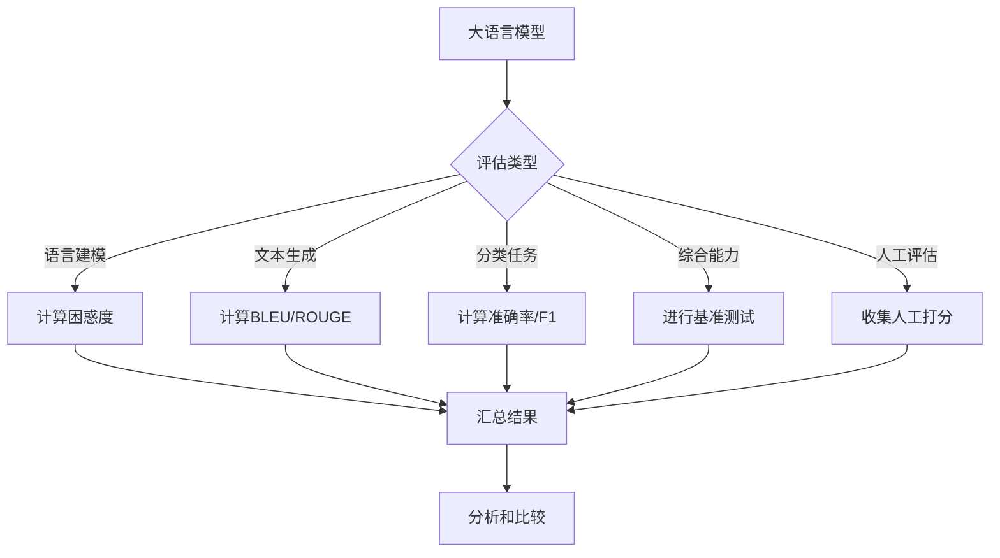

# 第2章：大语言模型（LLM）技术基础

## 2.1 大语言模型的原理与架构

### 核心概念：

大语言模型（Large Language Models, LLMs）是基于深度学习技术，通过大规模文本数据训练而成的自然语言处理模型。这些模型能够理解、生成和操作人类语言，展现出惊人的语言能力和知识储备。

### 问题背景

随着深度学习技术的发展和计算能力的提升，大语言模型在近年来取得了突破性进展。从 2018 年 BERT 的出现到 GPT 系列的持续演进，大语言模型不断刷新自然语言处理任务的性能纪录，并在各种应用中展现出强大的潜力。

### 问题描述

大语言模型的核心挑战包括：

1. 如何有效处理和学习海量文本数据？
2. 如何捕捉语言的长程依赖关系？
3. 如何设计能够适应各种语言任务的通用架构？
4. 如何平衡模型规模、计算效率和性能之间的关系？
5. 如何解决模型训练过程中的技术难题，如梯度消失/爆炸问题？

### 问题解决

大语言模型通过以下关键技术解决上述挑战：

1. Transformer 架构：采用自注意力机制，有效捕捉序列中的长程依赖关系。
2. 预训练-微调范式：通过大规模无监督预训练和特定任务微调，实现通用语言理解能力。
3. 并行计算技术：利用分布式训练和模型并行化技术，实现大规模模型训练。
4. 优化算法：如 Adam 优化器、学习率调度等，提高训练效率和模型性能。
5. 词嵌入和位置编码：有效表示词语语义和序列位置信息。

### 边界与外延

大语言模型的应用范围广泛，但也存在一些限制：

- 应用领域：自然语言处理、对话系统、内容生成、信息检索等。
- 局限性：计算资源需求高、可能产生偏见或不当内容、难以确保输出的真实性和一致性。

### 概念结构与核心要素组成

大语言模型的核心组件包括：

1. 输入层：处理文本输入，包括分词和嵌入。
2. 编码器层：使用自注意力机制和前馈神经网络处理输入。
3. 解码器层（生成式模型）：生成输出文本。
4. 注意力机制：计算不同位置之间的关联性。
5. 层级标准化和残差连接：稳定训练过程，缓解梯度问题。
6. 输出层：生成最终的词语概率分布。

### 概念之间的关系

#### 概念核心属性维度对比

| 属性维度 | 传统语言模型 | 大语言模型 |
|----------|--------------|------------|
| 模型规模 | 小（百万级参数） | 大（十亿到万亿级参数） |
| 训练数据 | 特定领域数据 | 海量通用文本数据 |
| 适应性   | 针对特定任务 | 通用性强，可适应多种任务 |
| 上下文理解 | 有限 | 强大 |
| 生成能力 | 基本 | 高度灵活和创造性 |
| 计算需求 | 较低 | 极高 |

#### 概念联系的 ER 实体关系图



### 数学模型

1. 自注意力机制的核心计算：

   $$\text{Attention}(Q, K, V) = \text{softmax}\left(\frac{QK^T}{\sqrt{d_k}}\right)V$$

   其中，$Q$、$K$、$V$ 分别是查询、键和值矩阵，$d_k$ 是键的维度。

2. 前馈神经网络：

   $$\text{FFN}(x) = \max(0, xW_1 + b_1)W_2 + b_2$$

3. Transformer 层的整体计算：

   $$\begin{aligned}
   h_1 &= \text{LayerNorm}(x + \text{MultiHead}(x)) \\
   h_2 &= \text{LayerNorm}(h_1 + \text{FFN}(h_1))
   \end{aligned}$$

### 算法流程图



### 算法源代码

以下是一个简化的 Transformer 编码器层的 PyTorch 实现：

```python
import torch
import torch.nn as nn

class TransformerEncoderLayer(nn.Module):
    def __init__(self, d_model, nhead, dim_feedforward=2048, dropout=0.1):
        super().__init__()
        self.self_attn = nn.MultiheadAttention(d_model, nhead, dropout=dropout)
        self.feed_forward = nn.Sequential(
            nn.Linear(d_model, dim_feedforward),
            nn.ReLU(),
            nn.Dropout(dropout),
            nn.Linear(dim_feedforward, d_model)
        )
        self.norm1 = nn.LayerNorm(d_model)
        self.norm2 = nn.LayerNorm(d_model)
        self.dropout = nn.Dropout(dropout)

    def forward(self, src):
        src2 = self.self_attn(src, src, src)[0]
        src = src + self.dropout(src2)
        src = self.norm1(src)
        src2 = self.feed_forward(src)
        src = src + self.dropout(src2)
        src = self.norm2(src)
        return src

# 使用示例
encoder_layer = TransformerEncoderLayer(d_model=512, nhead=8)
src = torch.rand(10, 32, 512)  # (seq_len, batch_size, d_model)
output = encoder_layer(src)
print(output.shape)  # 应该与输入形状相同
```

### 实际场景应用

1. 机器翻译：如 Google Translate，利用大语言模型提高翻译质量。
2. 智能对话系统：如 ChatGPT，能够进行自然、连贯的多轮对话。
3. 文本摘要：自动生成长文档的摘要，提高信息处理效率。
4. 代码生成：如 GitHub Copilot，辅助程序员编写代码。
5. 内容创作：协助写作文章、故事、广告文案等。

### 行业发展与未来趋势

| 时期 | 主要发展 | 代表模型 | 关键特点 |
|------|----------|----------|----------|
| 2018-2019 | 预训练模型兴起 | BERT, GPT-2 | 双向编码、大规模语言模型 |
| 2020-2021 | 模型规模激增 | GPT-3, T5 | 少样本学习、多任务能力 |
| 2022-2023 | 指令微调、对话能力 | ChatGPT, GPT-4 | 强大的对话和任务执行能力 |
| 未来趋势 | 多模态、可解释性 | - | 融合视觉、语音等模态，提高可解释性和可控性 |

### 本章小结

大语言模型（LLMs）代表了自然语言处理领域的重大突破，其核心原理和架构主要基于 Transformer 模型和自注意力机制。这些模型通过预训练-微调范式，在海量文本数据上学习语言的通用表示，然后针对特定任务进行微调，展现出惊人的语言理解和生成能力。

主要技术特点包括：

1. Transformer 架构：使用自注意力机制捕捉长程依赖关系，是大语言模型的核心。
2. 大规模预训练：通过无监督学习，在海量文本上预训练，获得通用语言理解能力。
3. 微调和迁移学习：预训练模型可以通过少量标注数据微调，快速适应特定任务。
4. 并行计算：利用分布式训练和模型并行化技术，实现大规模模型训练。
5. 上下文学习：能够理解和利用长文本上下文，生成连贯、相关的内容。

大语言模型的应用范围极其广泛，从机器翻译、对话系统到内容生成、代码编写辅助等，几乎涵盖了所有与语言相关的任务。然而，这些模型也面临着一些挑战：

1. 计算资源需求：训练和运行大语言模型需要大量的计算资源。
2. 偏见和伦理问题：模型可能继承训练数据中的偏见，产生不当或有害内容。
3. 可解释性：模型的决策过程往往难以解释，影响了其在某些领域的应用。
4. 知识更新：模型的知识来自训练数据，难以实时更新。

未来的发展趋势可能包括：

1. 多模态集成：将语言模型与视觉、听觉等其他模态结合，创造更全面的 AI 系统。
2. 可控性提升：开发更精确的控制机制，使模型输出更加可靠和符合预期。
3. 效率优化：研究如何在保持性能的同时减小模型规模，降低计算成本。
4. 持续学习：探索让模型能够不断学习新知识，保持知识的时效性。
5. 领域特化：针对特定领域开发专门的语言模型，提高特定任务的性能。

总的来说，大语言模型的出现极大地推动了自然语言处理技术的发展，为创建更智能、更自然的人机交互系统开辟了新的可能性。随着技术的不断进步，我们可以期待看到大语言模型在更多领域发挥重要作用，同时也需要密切关注其带来的社会和伦理影响，确保这一强大技术的发展方向符合人类利益。

## 2.2 主流大语言模型介绍（GPT、BERT 等）

### 核心概念：

主流大语言模型是指在自然语言处理领域产生重大影响的代表性模型，如 GPT（Generative Pre-trained Transformer）系列、BERT（Bidirectional Encoder Representations from Transformers）等。这些模型在各种语言任务中展现出卓越性能，推动了整个 NLP 领域的发展。

### 问题背景

随着深度学习技术的进步和计算能力的提升，大语言模型在近年来取得了突破性进展。从 2018 年 BERT 的出现到 GPT 系列的持续演进，这些模型不断刷新各种 NLP 任务的性能纪录，并在实际应用中展现出巨大潜力。

### 问题描述

主流大语言模型的发展主要围绕以下几个关键问题：

1. 如何设计更有效的预训练任务和目标？
2. 如何平衡模型规模、计算效率和性能？
3. 如何提高模型的泛化能力和迁移学习能力？
4. 如何处理长文本和跨文档的语义理解？
5. 如何改进模型的推理能力和常识推理？

### 问题解决

不同的主流大语言模型采用了不同的策略来解决这些问题：

1. BERT：使用掩码语言模型（MLM）和下一句预测（NSP）作为预训练任务，实现双向语言理解。
2. GPT 系列：采用自回归语言模型，通过大规模数据和模型扩展提高性能。
3. T5：将所有 NLP 任务统一为文本到文本的格式，提高模型的通用性。
4. ALBERT：通过参数共享和因式分解嵌入来减小模型规模，提高效率。
5. RoBERTa：优化 BERT 的训练过程，去除 NSP 任务，使用更大的批量和更多数据。

### 边界与外延

主流大语言模型的应用范围广泛，但也存在一些局限性：

- 应用领域：文本分类、命名实体识别、问答系统、机器翻译、文本生成等。
- 局限性：计算资源需求高、可能产生偏见、难以处理专业领域知识、推理能力有限。

### 概念结构与核心要素组成

主流大语言模型的核心组件通常包括：

1. 词嵌入层：将输入文本转换为稠密向量表示。
2. Transformer 层：包含自注意力机制和前馈神经网络。
3. 位置编码：提供序列位置信息。
4. 输出层：根据任务需求生成最终输出（如分类、生成等）。
5. 预训练目标：如语言模型、掩码预测等。
6. 微调策略：针对下游任务的适应方法。

### 概念之间的关系

#### 概念核心属性维度对比

| 属性维度 | BERT | GPT | T5 | ALBERT | RoBERTa |
|----------|------|-----|----|----|--------|
| 架构类型 | 编码器 | 解码器 | 编码器-解码器 | 编码器 | 编码器 |
| 预训练任务 | MLM, NSP | 自回归LM | Span预测 | MLM | MLM |
| 双向性 | 是 | 否 | 是 | 是 | 是 |
| 模型规模 | 中等 | 大 | 大 | 小 | 中等 |
| 主要优势 | 双向上下文 | 强大生成能力 | 统一框架 | 参数效率 | 鲁棒性 |

#### 概念联系的 ER 实体关系图



### 数学模型

以 BERT 的掩码语言模型（MLM）为例：

$$L_{MLM} = -\sum_{i\in M} \log P(x_i|x_{\setminus M})$$

其中，$M$ 是被掩码的词的集合，$x_{\setminus M}$ 表示除被掩码词外的所有词。

GPT 的语言模型目标：

$$L_{LM} = -\sum_{i} \log P(x_i|x_{<i})$$

其中，$x_i$ 是序列中的第 $i$ 个词，$x_{<i}$ 表示前 $i-1$ 个词。

### 算法流程图



### 算法源代码

以下是一个简化的 BERT 模型实现示例（使用 PyTorch）：

```python
import torch
import torch.nn as nn

class BERT(nn.Module):
    def __init__(self, vocab_size, hidden_size, num_layers, num_heads, max_seq_length):
        super().__init__()
        self.embedding = nn.Embedding(vocab_size, hidden_size)
        self.position_embedding = nn.Embedding(max_seq_length, hidden_size)
        self.layers = nn.ModuleList([
            nn.TransformerEncoderLayer(d_model=hidden_size, nhead=num_heads)
            for _ in range(num_layers)
        ])
        self.mlm_head = nn.Linear(hidden_size, vocab_size)
        
    def forward(self, input_ids, attention_mask=None):
        seq_length = input_ids.size(1)
        position_ids = torch.arange(seq_length, device=input_ids.device).unsqueeze(0)
        
        embeddings = self.embedding(input_ids) + self.position_embedding(position_ids)
        
        for layer in self.layers:
            embeddings = layer(embeddings, src_key_padding_mask=~attention_mask)
        
        mlm_output = self.mlm_head(embeddings)
        return mlm_output

# 使用示例
model = BERT(vocab_size=30000, hidden_size=768, num_layers=12, num_heads=12, max_seq_length=512)
input_ids = torch.randint(0, 30000, (1, 128))
attention_mask = torch.ones_like(input_ids)
output = model(input_ids, attention_mask)
print(output.shape)  # 应该是 [1, 128, 30000]
```

### 实际场景应用

1. 问答系统：使用 BERT 提高问题理解和答案抽取的准确性。
2. 情感分析：利用 RoBERTa 进行更精确的文本情感分类。
3. 机器翻译：T5 可用于多语言翻译任务。
4. 文本生成：GPT 系列用于创意写作、对话生成等任务。
5. 命名实体识别：ALBERT 可高效处理长文本中的实体识别。

### 行业发展与未来趋势

| 时期 | 主要发展 | 代表模型 | 关键特点 |
|------|----------|----------|----------|
| 2018 | 预训练模型兴起 | BERT | 双向语言理解 |
| 2019 | 模型优化和扩展 | RoBERTa, ALBERT | 训练优化、参数效率 |
| 2020 | 大规模语言模型 | GPT-3, T5 | 少样本学习、任务通用性 |
| 2021-2022 | 指令微调、对话能力 | InstructGPT, ChatGPT | 对齐人类意图、强大对话能力 |
| 未来趋势 | 多模态、知识融合 | - | 跨模态理解、知识增强 |

### 本章小结

主流大语言模型如 BERT、GPT、T5 等代表了自然语言处理领域的最新进展。这些模型通过创新的架构设计、预训练方法和优化策略，在各种 NLP 任务中展现出卓越性能。

主要特点和贡献：

1. BERT：引入了双向语言理解，通过掩码语言模型预训练，显著提升了多项 NLP 任务的性能。
2. GPT 系列：采用自回归语言模型，通过大规模模型和数据，展现出强大的文本生成能力和少样本学习能力。
3. T5：提出了"文本到文本"的统一框架，将所有 NLP 任务视为文本生成问题，提高了模型的通用性。
4. ALBERT：通过参数共享和嵌入因式分解，大幅减小了模型规模，提高了训练和推理效率。
5. RoBERTa：优化了 BERT 的训练过程，去除了下一句预测任务，使用更大的批量和更多数据，提高了模型性能。

这些模型的发展趋势包括：

1. 规模扩大：通过增加模型参数和训练数据，不断提升性能。
2. 效率优化：研究如何在保持性能的同时减小模型规模，降低计算成本。
3. 多任务学习：设计能够同时处理多种 NLP 任务的统一模型。
4. 跨语言和跨模态：扩展模型能力，处理多语言和多模态（如文本、图像、语音）输入。
5. 知识融合：将结构化知识整合到预训练过程中，提高模型的推理能力。
6. 可解释性：提高模型决策的透明度，使其更易于理解和调试。
7. 伦理和偏见：关注模型输出的公平性和无偏见性，减少社会偏见的传播。

尽管这些模型取得了巨大成功，但仍面临一些挑战：

1. 计算资源需求：训练和部署大型模型需要大量计算资源。
2. 领域适应：如何快速将通用模型适应到特定领域仍是一个挑战。
3. 长文本处理：有效处理超长文本输入仍然是一个待解决的问题。
4. 常识推理：提高模型的常识推理能力，使其更接近人类的思维方式。
5. 持续学习：开发能够不断学习和更新知识的模型架构。

总的来说，主流大语言模型的发展极大地推动了 NLP 技术的进步，为创建更智能、更自然的语言处理系统开辟了新的可能性。随着研究的深入，我们可以期待看到这些模型在更多领域发挥重要作用，同时也需要关注其带来的社会和伦理影响，确保技术发展方向符合人类利益。

## 2.3 大语言模型的训练与微调

### 核心概念：

大语言模型的训练与微调是指通过大规模数据预训练和特定任务适应来构建和优化语言模型的过程。这个过程包括初始的预训练阶段和针对特定任务的微调阶段。

### 问题背景

随着深度学习技术的发展，大语言模型在自然语言处理领域取得了突破性进展。然而，训练这些模型需要海量的数据和计算资源，而且如何有效地将这些通用模型应用于特定任务也是一个挑战。

### 问题描述

大语言模型的训练与微调主要涉及以下问题：

1. 如何有效地处理和学习大规模文本数据？
2. 如何设计合适的预训练任务和目标？
3. 如何优化训练过程，提高效率和性能？
4. 如何通过微调使通用模型适应特定任务？
5. 如何在有限资源下进行有效的模型训练和微调？

### 问题解决

大语言模型的训练与微调通过以下策略解决上述问题：

1. 预训练-微调范式：先在大规模无标注数据上进行预训练，再在特定任务上微调。
2. 自监督学习：设计如掩码语言模型、下一句预测等自监督任务。
3. 分布式训练：利用多 GPU 或多机器并行训练，提高效率。
4. 梯度累积和混合精度训练：优化内存使用和计算效率。
5. 迁移学习技术：如特征提取、微调、适应层等。

### 边界与外延

大语言模型的训练与微调涉及多个相关领域：

- 机器学习优化理论
- 分布式计算
- 自然语言处理
- 迁移学习
- 高性能计算

### 概念结构与核心要素组成

大语言模型训练与微调的核心要素包括：

1. 数据准备：收集、清洗和预处理大规模文本数据
2. 预训练任务设计：如掩码语言模型、自回归语言模型等
3. 模型架构：通常基于 Transformer 的编码器或解码器
4. 优化器：如 Adam、AdamW 等
5. 学习率调度：如线性衰减、余弦衰减等
6. 正则化技术：如权重衰减、dropout 等
7. 微调策略：全参数微调、适应层等
8. 评估指标：困惑度、准确率、F1 分数等

### 概念之间的关系

#### 概念核心属性维度对比

| 属性维度 | 预训练 | 微调 |
|----------|--------|------|
| 数据规模 | 大 | 小 |
| 任务类型 | 通用 | 特定 |
| 计算资源需求 | 高 | 相对较低 |
| 训练时间 | 长 | 短 |
| 学习率 | 较大 | 较小 |
| 参数更新范围 | 全部参数 | 部分或全部参数 |

#### 概念联系的 ER 实体关系图



### 数学模型

1. 预训练损失函数（以掩码语言模型为例）：

   $$L_{MLM} = -\mathbb{E}_{x\sim D}\sum_{i\in M} \log P(x_i|x_{\setminus M}; \theta)$$

   其中，$D$ 是训练数据集，$M$ 是被掩码的词的集合，$\theta$ 是模型参数。

2. 微调损失函数（以分类任务为例）：

   $$L_{finetune} = -\sum_{(x,y)\in D_{task}} \log P(y|x; \theta)$$

   其中，$D_{task}$ 是特定任务的数据集，$y$ 是标签。

3. 优化目标：

   $$\theta^* = \arg\min_{\theta} (L_{pretrain} + \lambda L_{finetune})$$

   其中，$\lambda$ 是平衡预训练和微调目标的超参数。

### 算法流程图



### 算法源代码

以下是一个简化的预训练和微调过程示例（使用 PyTorch）：

```python
import torch
import torch.nn as nn
from torch.utils.data import DataLoader
from transformers import BertForMaskedLM, BertForSequenceClassification, AdamW

# 预训练
def pretrain(model, dataloader, num_epochs):
    optimizer = AdamW(model.parameters(), lr=1e-4)
    model.train()
    for epoch in range(num_epochs):
        for batch in dataloader:
            optimizer.zero_grad()
            outputs = model(**batch)
            loss = outputs.loss
            loss.backward()
            optimizer.step()
    return model

# 微调
def finetune(model, dataloader, num_epochs):
    optimizer = AdamW(model.parameters(), lr=2e-5)
    model.train()
    for epoch in range(num_epochs):
        for batch in dataloader:
            optimizer.zero_grad()
            outputs = model(**batch)
            loss = outputs.loss
            loss.backward()
            optimizer.step()
    return model

# 使用示例
pretrain_data = DataLoader(...)  # 预训练数据
finetune_data = DataLoader(...)  # 微调数据

# 预训练
pretrain_model = BertForMaskedLM.from_pretrained('bert-base-uncased')
pretrained_model = pretrain(pretrain_model, pretrain_data, num_epochs=3)

# 微调
finetune_model = BertForSequenceClassification.from_pretrained('bert-base-uncased')
finetune_model.bert = pretrained_model.bert  # 使用预训练的权重
finetuned_model = finetune(finetune_model, finetune_data, num_epochs=3)
```

### 实际场景应用

1. 情感分析：预训练模型在大规模文本上学习，然后在情感标注数据上微调。
2. 命名实体识别：通过微调预训练模型来识别特定领域的实体。
3. 机器翻译：在多语言语料上预训练，再在平行语料上微调。
4. 问答系统：预训练模型在问答数据集上微调，提高回答准确性。
5. 文本摘要：利用预训练模型的语言理解能力，微调实现自动摘要。

### 行业发展与未来趋势

| 时期 | 主要发展 | 关键技术 | 影响 |
|------|----------|----------|------|
| 2018-2019 | 预训练模型兴起 | BERT, GPT | 大幅提升各种NLP任务性能 |
| 2020-2021 | 大规模模型训练 | GPT-3, T5 | 少样本学习能力显著提高 |
| 2022-2023 | 指令微调、对话能力 | InstructGPT, ChatGPT | 更好的任务适应性和交互能力 |
| 未来趋势 | 高效微调、多模态预训练 | - | 降低资源需求，扩展应用范围 |

### 本章小结

大语言模型的训练与微调是自然语言处理领域的核心技术，它通过在大规模数据上进行预训练，然后在特定任务上微调的方式，实现了模型的通用性和特定任务的高性能。

主要特点和贡献：

1. 预训练-微调范式：有效利用大规模无标注数据，同时保持对特定任务的适应性。
2. 自监督学习：通过巧妙设计的预训练任务，使模型能够学习丰富的语言表示。
3. 迁移学习：将预训练模型的知识迁移到各种下游任务，大幅提高性能和效率。
4. 分布式训练：通过并行计算技术，实现大规模模型的高效训练。
5. 优化技术：如梯度累积、混合精度训练等，提高训练效率和模型性能。

然而，大语言模型的训练与微调也面临一些挑战：

1. 计算资源需求：预训练大型模型需要大量的计算资源，限制了研究和应用。
2. 数据质量和多样性：需要高质量、多样化的数据来训练通用且强大的模型。
3. 过拟合风险：在微调阶段，如何避免模型过度适应小规模任务数据。
4. 灾难性遗忘：如何在微调过程中保持预训练获得的通用知识。
5. 模型压缩：如何在保持性能的同时减小模型大小，适应资源受限的场景。

未来的发展趋势可能包括：

1. 更高效的预训练方法：减少所需的数据量和计算资源。
2. 改进的微调技术：如 Prompt Tuning、Adapter 等，实现更灵活、高效的任务适应。
3. 持续学习：开发能够不断学习和更新知识的模型架构。
4. 多模态预训练：整合文本、图像、语音等多种模态的信息。
5. 小型化和压缩：研究如何在保持性能的同时显著减小模型规模。
6. 可解释性：提高模型决策的透明度，使其更易于理解和调试。
7. 伦理和偏见处理：在训练过程中考虑公平性和减少偏见。

总的来说，大语言模型的训练与微调技术极大地推动了自然语言处理的发展，为创建更智能、更通用的语言处理系统开辟了新的可能性。随着研究的深入和技术的进步，我们可以期待看到这些模型在更多领域发挥重要作用，同时也需要关注其带来的计算资源、环境影响和伦理问题，确保技术发展的可持续性和社会责任。

## 2.4 大语言模型的评估指标

### 核心概念：

大语言模型的评估指标是一系列用于衡量模型性能、能力和质量的量化标准。这些指标帮助研究者和开发者比较不同模型的优劣，指导模型的改进和选择。

### 问题背景

随着大语言模型的快速发展和广泛应用，如何准确、全面地评估这些模型的性能变得越来越重要。传统的评估方法可能无法充分捕捉大语言模型的多方面能力，因此需要开发新的、更加综合的评估体系。

### 问题描述

大语言模型的评估主要涉及以下几个方面的问题：

1. 如何评估模型的语言理解能力？
2. 如何衡量模型的生成文本质量？
3. 如何测试模型在各种 NLP 任务上的表现？
4. 如何评估模型的知识范围和准确性？
5. 如何衡量模型的推理能力和创造性？
6. 如何评估模型的偏见和公平性？

### 问题解决

为了全面评估大语言模型，我们采用多种评估指标和方法：

1. 困惑度（Perplexity）：评估语言模型的预测能力。
2. BLEU、ROUGE 等：评估生成文本的质量。
3. 准确率、F1 分数等：评估在分类、问答等任务上的表现。
4. 人类评估：对模型输出进行主观评分。
5. 多任务基准测试：如 GLUE、SuperGLUE 等。
6. 知识探测：测试模型的事实知识。
7. 推理能力测试：评估模型的逻辑推理能力。
8. 偏见检测：分析模型输出中的社会偏见。

### 边界与外延

大语言模型的评估涉及多个相关领域：

- 自然语言处理
- 机器学习评估理论
- 心理语言学
- 认知科学
- 伦理学和公平性研究

### 概念结构与核心要素组成

大语言模型评估的核心要素包括：

1. 语言建模指标：如困惑度
2. 生成质量指标：如 BLEU、ROUGE
3. 任务特定指标：如准确率、F1 分数
4. 人类评估指标：如流畅度、相关性、一致性
5. 综合基准测试：如 GLUE、SuperGLUE
6. 知识和推理能力指标
7. 鲁棒性和泛化性指标
8. 伦理和偏见相关指标

### 概念之间的关系

#### 概念核心属性维度对比

| 评估维度 | 自动评估 | 人工评估 |
|----------|----------|----------|
| 客观性   | 高       | 相对主观 |
| 全面性   | 有限     | 全面     |
| 效率     | 高       | 低       |
| 成本     | 低       | 高       |
| 适用范围 | 特定任务 | 广泛     |
| 灵活性   | 低       | 高       |

#### 概念联系的 ER 实体关系图



### 数学模型

1. 困惑度（Perplexity）：

   $$PPL = \exp(-\frac{1}{N}\sum_{i=1}^N \log P(w_i|w_1, ..., w_{i-1}))$$

   其中，$N$ 是词的总数，$P(w_i|w_1, ..., w_{i-1})$ 是模型给出的第 $i$ 个词的条件概率。

2. BLEU 分数：

   $$BLEU = BP \cdot \exp(\sum_{n=1}^N w_n \log p_n)$$

   其中，$BP$ 是简短惩罚因子，$w_n$ 是 n-gram 权重，$p_n$ 是 n-gram 精确度。

3. F1 分数：

   $$F1 = 2 \cdot \frac{precision \cdot recall}{precision + recall}$$

### 算法流程图



### 算法源代码

以下是一个简化的评估脚本示例，包括困惑度、BLEU 和准确率的计算：

```python
import torch
from torch.nn import CrossEntropyLoss
from nltk.translate.bleu_score import corpus_bleu
from sklearn.metrics import accuracy_score

def calculate_perplexity(model, data_loader, device):
    model.eval()
    total_loss = 0
    total_words = 0
    criterion = CrossEntropyLoss(reduction='sum')
    with torch.no_grad():
        for batch in data_loader:
            input_ids = batch['input_ids'].to(device)
            labels = batch['labels'].to(device)
            outputs = model(input_ids, labels=labels)
            loss = criterion(outputs.logits.view(-1, outputs.logits.size(-1)), labels.view(-1))
            total_loss += loss.item()
            total_words += labels.ne(model.config.pad_token_id).sum().item()
    return torch.exp(total_loss / total_words)

def calculate_bleu(model, data_loader, tokenizer):
    model.eval()
    references = []
    hypotheses = []
    with torch.no_grad():
        for batch in data_loader:
            input_ids = batch['input_ids']
            labels = batch['labels']
            outputs = model.generate(input_ids)
            references.extend([[tokenizer.decode(label, skip_special_tokens=True)] for label in labels])
            hypotheses.extend([tokenizer.decode(output, skip_special_tokens=True) for output in outputs])
    return corpus_bleu(references, hypotheses)

def calculate_accuracy(model, data_loader, device):
    model.eval()
    all_preds = []
    all_labels = []
    with torch.no_grad():
        for batch in data_loader:
            input_ids = batch['input_ids'].to(device)
            labels = batch['labels'].to(device)
            outputs = model(input_ids)
            preds = outputs.logits.argmax(dim=-1)
            all_preds.extend(preds.cpu().numpy())
            all_labels.extend(labels.cpu().numpy())
    return accuracy_score(all_labels, all_preds)

# 使用示例
model = ...  # 加载你的模型
data_loader = ...  # 准备数据加载器
device = torch.device('cuda' if torch.cuda.is_available() else 'cpu')
tokenizer = ...  # 加载对应的分词器

perplexity = calculate_perplexity(model, data_loader, device)
bleu = calculate_bleu(model, data_loader, tokenizer)
accuracy = calculate_accuracy(model, data_loader, device)

print(f"Perplexity: {perplexity}")
print(f"BLEU: {bleu}")
print(f"Accuracy: {accuracy}")
```

### 实际场景应用

1. 模型比较：使用标准化指标比较不同大语言模型的性能。
2. 模型选择：根据特定任务的评估结果选择最适合的模型。
3. 模型改进：通过评估结果识别模型的优势和不足，指导进一步优化。
4. 质量控制：在模型部署前进行全面评估，确保满足质量标准。
5. 研究方向指引：评估结果可以揭示当前技术的局限性，指导未来研究方向。

### 行业发展与未来趋势

| 时期 | 主要发展 | 关键指标/方法 | 影响 |
|------|----------|---------------|------|
| 早期 | 单一指标评估 | 困惑度、BLEU | 局限于特定任务 |
| 2018-2020 | 多任务评估 | GLUE、SuperGLUE | 全面评估模型能力 |
| 2021-2023 | 人类对齐评估 | InstructGPT评估、ChatGPT评估 | 关注模型与人类意图的一致性 |
| 未来趋势 | 多维度综合评估 | 结合自动化指标和人工评估 | 更全面、更接近实际应用的评估体系 |

### 本章小结

大语言模型的评估指标是衡量和比较模型性能的关键工具。随着大语言模型的快速发展，评估方法也在不断演进，以更全面、更准确地反映模型的各方面能力。

主要评估维度和指标包括：

1. 语言建模能力：使用困惑度（Perplexity）衡量模型预测下一个词的能力。
2. 生成质量：采用 BLEU、ROUGE 等指标评估生成文本的质量。
3. 任务特定性能：使用准确率、F1 分数等指标评估在分类、问答等具体任务上的表现。
4. 综合能力：通过 GLUE、SuperGLUE 等基准测试全面评估模型在多个 NLP 任务上的表现。
5. 人工评估：收集人类对模型输出的流畅度、相关性、一致性等方面的评分。
6. 知识和推理能力：设计特定测试来评估模型的知识范围和逻辑推理能力。
7. 鲁棒性和泛化性：测试模型在不同领域和新场景下的表现。
8. 伦理和偏见：分析模型输出中可能存在的社会偏见和不当内容。

然而，大语言模型的评估仍然面临一些挑战：

1. 评估的全面性：单一指标难以全面反映模型的整体能力。
2. 人类水平的界定：在某些任务上，定义"人类水平"性能变得越来越困难。
3. 创造力和新颖性的评估：传统指标可能无法有效衡量模型的创造性输出。
4. 长文本和复杂任务的评估：现有方法在处理长文本和多步骤任务时可能不够有效。
5. 快速变化的技术：评估方法需要不断更新以跟上模型能力的快速提升。

未来的发展趋势可能包括：

1. 多维度综合评估：结合自动化指标和人工评估，提供更全面的性能图景。
2. 任务无关的评估：开发能够评估模型通用能力的方法，而不仅限于特定任务。
3. 交互式评估：设计能够测试模型在多轮交互中表现的评估方法。
4. 伦理和安全性评估：更加关注模型输出的社会影响和潜在风险。
5. 可解释性评估：开发能够评估模型决策过程透明度的方法。
6. 效率评估：在评估模型性能的同时，也考虑计算效率和资源消耗。

总的来说，大语言模型的评估是一个复杂而动态的领域，需要研究者和开发者不断创新和改进评估方法。一个全面、公平、有效的评估体系对于推动大语言模型技术的健康发展至关重要。它不仅能帮助我们更好地理解和比较不同模型的性能，还能指导未来的研究方向，确保这些强大的 AI 工具能够更好地服务于人类需求，同时最小化潜在的负面影响。

## 本章小结

本章深入探讨了大语言模型（LLM）的技术基础，涵盖了模型的原理与架构、主流模型介绍、训练与微调技术，以及评估指标。通过这些内容，我们全面了解了大语言模型的核心技术和发展现状。

### 主要内容回顾

1. 大语言模型的原理与架构
    - 基于 Transformer 的自注意力机制
    - 预训练-微调范式
    - 大规模并行训练技术

2. 主流大语言模型介绍
    - BERT、GPT 系列、T5 等代表性模型
    - 各模型的特点、优势和应用场景

3. 大语言模型的训练与微调
    - 预训练技术：掩码语言模型、自回归语言模型等
    - 微调策略：全参数微调、适应层等
    - 优化技术：梯度累积、混合精度训练等

4. 大语言模型的评估指标
    - 语言建模指标：困惑度
    - 生成质量指标：BLEU、ROUGE 等
    - 任务特定指标：准确率、F1 分数等
    - 综合评估基准：GLUE、SuperGLUE 等

### 关键见解

1. 大语言模型通过自注意力机制和大规模预训练，实现了强大的语言理解和生成能力。
2. 预训练-微调范式使得模型可以快速适应各种下游任务，大幅提高了 NLP 技术的通用性。
3. 模型规模和训练数据量的增加显著提升了性能，但也带来了计算资源和环境影响的挑战。
4. 评估大语言模型需要多维度、综合性的指标，单一指标难以全面反映模型能力。

### 未来展望

1. 模型效率优化：研究如何在保持性能的同时减小模型规模，降低计算成本。
2. 多模态集成：将语言模型与视觉、听觉等其他模态结合，创造更全面的 AI 系统。
3. 持续学习能力：开发能够不断更新知识的模型架构。
4. 可解释性增强：提高模型决策过程的透明度，便于理解和调试。
5. 伦理和偏见处理：在模型设计和训练中更多考虑公平性和减少偏见。
6. 领域特化：针对特定领域开发专门的语言模型，提高特定任务的性能。
7. 新型评估方法：开发更全面、更接近实际应用的评估体系。

### 实践建议

1. 深入学习 Transformer 架构和自注意力机制，这是理解大语言模型的基础。
2. 实践预训练和微调过程，了解不同策略对模型性能的影响。
3. 关注最新的模型评估方法和基准测试，全面了解模型的优势和局限性。
4. 探索大语言模型在各行业的应用案例，了解其实际效果和潜在问题。
5. 参与开源项目，积累实际开发和优化大语言模型的经验。

### 思考问题

1. 大语言模型的规模不断增大，这种趋势是否可持续？有哪些潜在的问题和解决方案？

2. 如何平衡大语言模型的通用性和特定领域的性能需求？是否每个应用场景都需要超大规模模型？

3. 在评估大语言模型时，如何更好地结合自动化指标和人工评估，以获得更全面、更可靠的评估结果？

通过本章的学习，读者应该对大语言模型的技术基础有了全面的认识，了解了其核心原理、主流模型、训练技术以及评估方法。这些知识为后续深入探讨 AI Agent 的开发和应用奠定了坚实的基础。在接下来的章节中，我们将进一步探讨如何利用这些强大的语言模型来构建智能、高效的 AI Agent 系统，以及在企业级应用中的具体实践。
