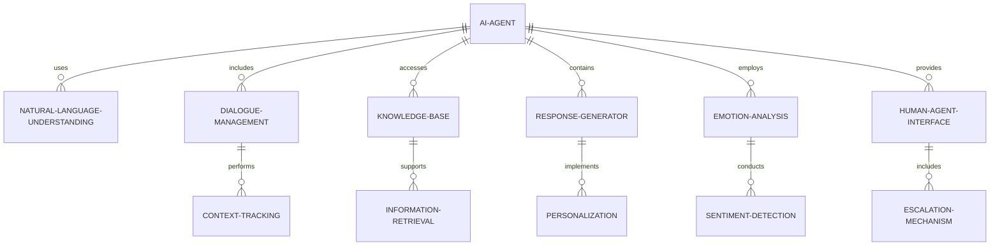
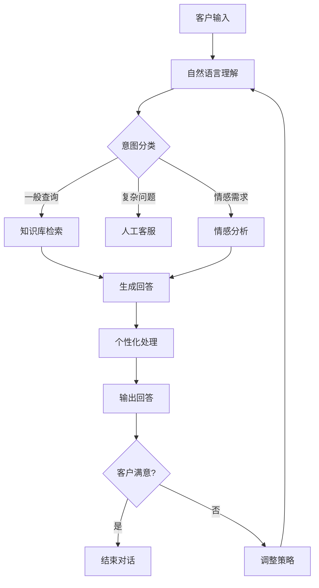
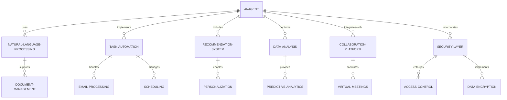
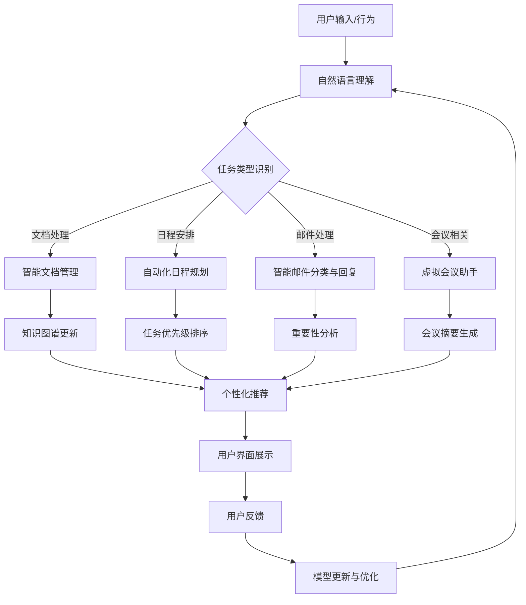
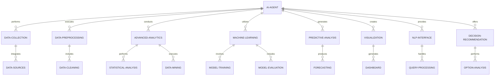
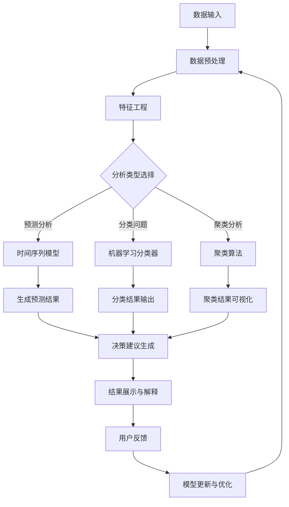
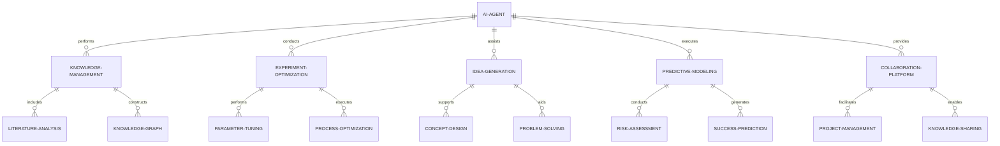
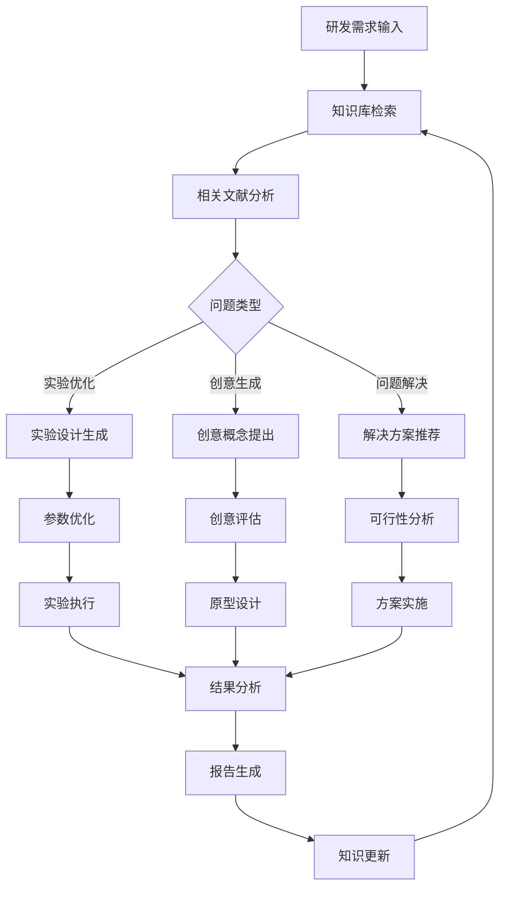
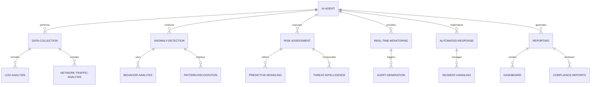
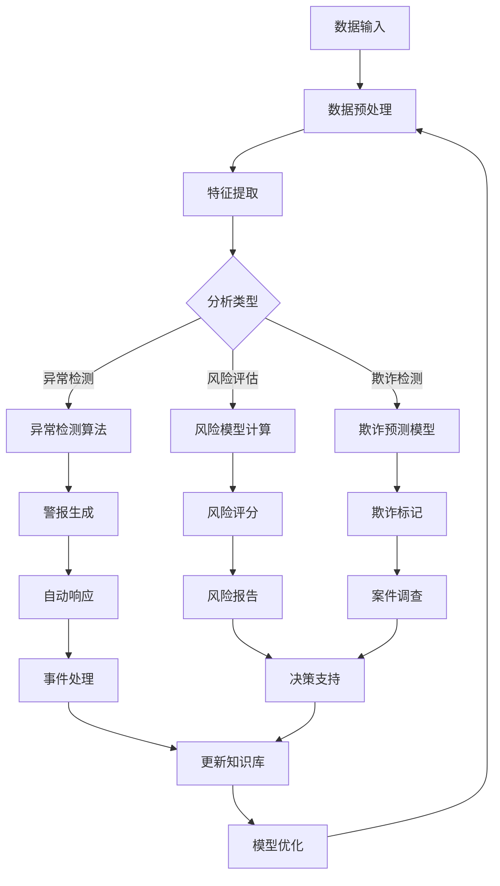

# 第3章：企业级 AI Agent 应用场景分析

## 3.1 客户服务与支持

### 核心概念：

企业级 AI Agent 在客户服务与支持领域的应用是指利用人工智能技术，特别是大语言模型，来提供自动化、个性化和高效的客户服务解决方案。这种应用旨在提高客户满意度、降低运营成本，并提供全天候的服务支持。

### 问题背景

随着企业规模的扩大和客户需求的多样化，传统的人工客户服务面临着巨大的压力。高昂的人力成本、服务质量不一致、响应时间长等问题严重影响了客户体验和企业效率。AI Agent 的引入为解决这些问题提供了新的可能性。

### 问题描述

在客户服务与支持领域，AI Agent 主要面临以下挑战：

1. 如何准确理解客户的多样化需求和复杂查询？
2. 如何提供个性化和上下文相关的回答？
3. 如何处理多轮对话，保持对话的连贯性和上下文理解？
4. 如何在自动化服务和人工服务之间实现无缝切换？
5. 如何确保 AI Agent 的回答准确、恰当且符合企业政策？
6. 如何处理情感因素，提供富有同理心的客户体验？

### 问题解决

AI Agent 通过以下方式解决上述问题：

1. 自然语言处理：利用大语言模型准确理解客户意图和查询内容。
2. 知识图谱集成：构建企业专有知识库，提供准确、专业的回答。
3. 上下文管理：跟踪对话历史，保持对话的连贯性。
4. 情感分析：识别客户情绪，调整回应的语气和内容。
5. 人机协作：设置明确的升级机制，在必要时将对话转交给人工客服。
6. 个性化推荐：基于客户历史和偏好提供定制化服务。

### 边界与外延

AI Agent 在客户服务中的应用范围广泛，包括但不限于：

- 智能客服聊天机器人
- 自动化邮件回复系统
- 语音客服系统
- 社交媒体客户互动
- 产品推荐和个性化营销

然而，AI Agent 也有其局限性，如处理高度复杂或情感敏感的问题时可能不如人工客服。

### 概念结构与核心要素组成

AI Agent 客户服务系统的核心组件包括：

1. 自然语言理解模块
2. 对话管理系统
3. 知识库和检索系统
4. 回答生成器
5. 情感分析引擎
6. 人机交互接口
7. 学习和优化模块

### 概念之间的关系

#### 概念核心属性维度对比

| 属性维度 | 传统客服系统 | AI Agent 客服系统 |
|----------|--------------|-------------------|
| 可用性   | 受限于工作时间 | 24/7 全天候服务 |
| 一致性   | 人为因素影响大 | 高度一致 |
| 处理能力 | 受限于人力 | 可同时处理大量请求 |
| 个性化   | 基于人工判断 | 基于数据分析的精准个性化 |
| 学习能力 | 需要培训 | 持续自我学习和优化 |
| 成本     | 高（人力成本） | 初期投入大，长期成本低 |

#### 概念联系的 ER 实体关系图



### 数学模型

1. 意图分类：使用多类分类模型

   $$P(y|x) = \text{softmax}(Wx + b)$$

   其中，$x$ 是输入文本的向量表示，$y$ 是意图类别。

2. 情感分析：使用回归模型

   $$sentiment = \sigma(w^T x + b)$$

   其中，$\sigma$ 是 sigmoid 函数，输出范围 [0, 1] 表示情感极性。

3. 回答相关性评分：

   $$relevance\_score = \cos(q, a)$$

   其中，$q$ 是查询向量，$a$ 是答案向量，使用余弦相似度计算相关性。

### 算法流程图



### 算法源代码

以下是一个简化的 AI 客服 Agent 实现示例：

```python
import random
from sklearn.feature_extraction.text import TfidfVectorizer
from sklearn.metrics.pairwise import cosine_similarity

class CustomerServiceAgent:
    def __init__(self):
        self.knowledge_base = {
            "退款政策": "我们的退款政策是购买后30天内可全额退款。",
            "送货时间": "正常情况下，订单会在3-5个工作日内送达。",
            "产品质保": "我们的产品享有1年的质保期。"
        }
        self.vectorizer = TfidfVectorizer()
        self.vectorizer.fit(list(self.knowledge_base.keys()) + list(self.knowledge_base.values()))

    def get_intent(self, query):
        # 简化的意图分类
        if "退款" in query or "退货" in query:
            return "退款政策"
        elif "送货" in query or "到达" in query:
            return "送货时间"
        elif "保修" in query or "质保" in query:
            return "产品质保"
        else:
            return "未知"

    def get_response(self, query):
        intent = self.get_intent(query)
        if intent in self.knowledge_base:
            return self.knowledge_base[intent]
        else:
            # 使用相似度查找最相关的回答
            query_vec = self.vectorizer.transform([query])
            knowledge_vecs = self.vectorizer.transform(list(self.knowledge_base.values()))
            similarities = cosine_similarity(query_vec, knowledge_vecs)[0]
            best_match = list(self.knowledge_base.values())[similarities.argmax()]
            return best_match

    def chat(self):
        print("AI: 您好！我是AI客服助手，有什么可以帮您的吗？")
        while True:
            user_input = input("You: ")
            if user_input.lower() == 'quit':
                print("AI: 感谢您的咨询，再见！")
                break
            response = self.get_response(user_input)
            print(f"AI: {response}")
            # 简单的情感处理
            if "不满意" in user_input or "失望" in user_input:
                print("AI: 非常抱歉给您带来不便。请问还有什么我可以帮助您的吗？")

# 使用示例
agent = CustomerServiceAgent()
agent.chat()
```

### 实际场景应用

1. 电子商务客服：处理订单查询、退换货请求、产品咨询等。
2. 银行业务支持：回答账户查询、贷款咨询、信用卡服务等问题。
3. 技术支持：提供软件使用指导、故障排查等服务。
4. 旅游行业：处理预订查询、行程安排、旅游信息咨询等。
5. 医疗健康咨询：提供初步症状评估、医疗建议和预约服务。

### 行业发展与未来趋势

| 时期 | 主要发展 | 技术特点 | 影响 |
|------|----------|----------|------|
| 早期 | 基于规则的聊天机器人 | 预设问答对 | 有限的自动化 |
| 2010年代中期 | 机器学习驱动的客服系统 | 自然语言处理、意图识别 | 提高了理解能力和灵活性 |
| 2020年代初 | 大语言模型支持的AI客服 | 上下文理解、生成式回答 | 显著提升了对话质量和范围 |
| 未来趋势 | 多模态、情感智能AI客服 | 语音识别、情感计算、个性化 | 全方位提升客户体验 |

### 本章小结

AI Agent 在客户服务与支持领域的应用代表了企业服务模式的重大革新。通过结合大语言模型、自然语言处理、知识图谱等技术，AI Agent 能够提供全天候、高效、个性化的客户服务。

主要优势和特点包括：

1. 24/7 全天候服务：不受时间和地域限制，随时为客户提供支持。
2. 高效处理能力：同时处理大量客户请求，显著减少等待时间。
3. 一致性和准确性：基于预设知识库和算法，提供标准化、准确的回答。
4. 个性化服务：根据客户历史和偏好，提供定制化的解决方案。
5. 持续学习和优化：通过分析客户交互数据，不断改进服务质量。
6. 成本效益：长期来看，可以显著降低客户服务的运营成本。

然而，AI Agent 在客户服务中的应用也面临一些挑战：

1. 复杂查询处理：对于高度复杂或非标准的问题，AI 可能难以准确理解和回答。
2. 情感处理：在处理需要高度情感智能的情况时，AI 可能显得不够人性化。
3. 安全和隐私：需要确保客户数据的安全性和隐私保护。
4. 技术局限性：当前的 AI 技术仍有其局限性，某些情况下仍需人工干预。
5. 用户接受度：部分客户可能更倾向于与人类客服交互。

未来的发展趋势可能包括：

1. 更强大的自然语言理解：提高对复杂、模糊表达的理解能力。
2. 增强的情感智能：更好地识别和回应客户的情感需求。
3. 多模态交互：整合文本、语音、视觉等多种交互方式。
4. 深度个性化：基于更全面的客户画像提供高度个性化的服务。
5. 预测性客户服务：主动预测并解决潜在问题，而不仅仅是被动响应。
6. 无缝人机协作：在 AI 和人工客服之间实现更流畅的切换和协作。
7. 跨平台集成：在各种通信渠道（如社交媒体、即时通讯、电话）上提供一致的服务体验。

总的来说，AI Agent 在客户服务领域的应用正在重塑企业与客户的交互方式。随着技术的不断进步，我们可以期待看到更智能、更人性化的 AI 客服系统，进一步提升客户满意度和企业运营效率。然而，在推动这一技术发展的同时，企业也需要注意平衡自动化与人性化服务，确保 AI 的应用能够真正增强而不是取代人类客服的价值，从而为客户提供最佳的服务体验。

## 3.2 智能办公与协作

### 核心概念：

智能办公与协作是指利用 AI Agent 技术来优化和自动化办公流程、提高团队协作效率，以及增强决策支持能力的应用。这种应用旨在减少重复性工作、提高生产力，并促进更有效的信息共享和知识管理。

### 问题背景

现代企业面临着信息过载、工作流程复杂、跨部门协作困难等挑战。传统的办公方式往往效率低下，无法充分利用数字化时代的优势。AI Agent 的引入为解决这些问题提供了新的可能性。

### 问题描述

在智能办公与协作领域，AI Agent 主要面临以下挑战：

1. 如何有效管理和处理大量的非结构化数据（如邮件、文档、会议记录）？
2. 如何自动化日常的重复性任务，如日程安排、会议总结等？
3. 如何促进跨部门、跨地域的团队协作？
4. 如何提供智能的决策支持，帮助员工做出更好的决策？
5. 如何确保在提高效率的同时保护数据隐私和安全？
6. 如何实现个性化的工作助手，适应不同员工的工作习惯和需求？

### 问题解决

AI Agent 通过以下方式解决上述问题：

1. 智能文档管理：使用自然语言处理技术自动分类、标记和检索文档。
2. 自动化任务处理：利用机器学习算法自动处理重复性任务，如邮件分类、日程安排等。
3. 协作平台集成：将 AI 功能集成到现有的协作工具中，提供智能建议和自动化工作流。
4. 智能会议助手：自动记录会议内容、生成摘要、分配任务。
5. 预测性分析：基于历史数据和模式，提供决策支持和预测洞察。
6. 个性化工作流：根据个人工作习惯和偏好，定制化工作环境和任务推荐。
7. 安全与隐私保护：实施严格的数据访问控制和加密机制。

### 边界与外延

AI Agent 在智能办公与协作中的应用范围包括但不限于：

- 智能邮件管理系统
- 自动化日程规划工具
- 智能文档生成和管理
- 虚拟会议助手
- 项目管理和任务跟踪
- 知识图谱构建和知识管理

然而，AI Agent 也有其局限性，如在处理高度创意性工作或需要复杂人际交往的任务时可能无法完全替代人类。

### 概念结构与核心要素组成

智能办公与协作 AI Agent 系统的核心组件包括：

1. 自然语言处理引擎
2. 任务自动化模块
3. 智能推荐系统
4. 数据分析和可视化工具
5. 协作平台集成接口
6. 安全和隐私保护层
7. 个性化学习模块

### 概念之间的关系

#### 概念核心属性维度对比

| 属性维度 | 传统办公系统 | AI Agent 智能办公系统 |
|----------|--------------|------------------------|
| 自动化程度 | 低 | 高 |
| 个性化 | 有限 | 高度定制 |
| 预测能力 | 几乎没有 | 强大的预测分析 |
| 协作效率 | 受限于人工协调 | 智能化协调和推荐 |
| 知识管理 | 静态、分散 | 动态、集中、智能检索 |
| 决策支持 | 基于历史报告 | 实时数据分析和预测 |

#### 概念联系的 ER 实体关系图



### 数学模型

1. 文档相似度计算（用于智能文档管理）：

   $$similarity(d_1, d_2) = \cos(TF-IDF(d_1), TF-IDF(d_2))$$

   其中，$d_1$ 和 $d_2$ 是两个文档，TF-IDF 是词频-逆文档频率向量。

2. 任务优先级预测：

   $$priority = \sigma(w^T x + b)$$

   其中，$x$ 是任务特征向量，$\sigma$ 是 sigmoid 函数，输出范围 [0, 1] 表示优先级。

3. 协作推荐（基于协同过滤）：

   $$\hat{r}_{ui} = \frac{\sum_{j \in N_i(u)} sim(i, j) \cdot r_{uj}}{\sum_{j \in N_i(u)} |sim(i, j)|}$$

   其中，$\hat{r}_{ui}$ 是预测的用户 $u$ 对项目 $i$ 的评分，$N_i(u)$ 是与 $i$ 相似的项目集。

### 算法流程图



### 算法源代码

以下是一个简化的智能办公助手 AI Agent 实现示例：

```python
import random
from datetime import datetime, timedelta

class SmartOfficeAgent:
    def __init__(self):
        self.tasks = []
        self.meetings = []
        self.emails = []

    def add_task(self, description, deadline):
        self.tasks.append({"description": description, "deadline": deadline, "priority": random.random()})
        self.tasks.sort(key=lambda x: (x["deadline"], x["priority"]), reverse=True)

    def schedule_meeting(self, title, date, duration):
        self.meetings.append({"title": title, "date": date, "duration": duration})
        self.meetings.sort(key=lambda x: x["date"])

    def process_email(self, subject, content):
        importance = random.random()
        self.emails.append({"subject": subject, "content": content, "importance": importance})
        if importance > 0.8:
            print(f"高重要性邮件: {subject}")

    def get_daily_schedule(self):
        today = datetime.now().date()
        schedule = []
        for meeting in self.meetings:
            if meeting["date"].date() == today:
                schedule.append(f"会议: {meeting['title']} 时间: {meeting['date'].strftime('%H:%M')}")
        for task in self.tasks[:3]:  # 只显示最高优先级的3个任务
            schedule.append(f"任务: {task['description']} 截止: {task['deadline'].strftime('%Y-%m-%d')}")
        return schedule

    def generate_meeting_summary(self, meeting_notes):
        # 这里应该使用更复杂的NLP模型来生成摘要，这里用简化版本代替
        words = meeting_notes.split()
        summary = " ".join(random.sample(words, min(20, len(words))))
        return f"会议摘要: {summary}"

    def get_work_insights(self):
        total_tasks = len(self.tasks)
        completed_tasks = sum(1 for task in self.tasks if task["deadline"] < datetime.now())
        productivity = completed_tasks / total_tasks if total_tasks > 0 else 0
        return f"工作洞察: 任务完成率 {productivity:.2%}, 待处理邮件 {len(self.emails)}, 本周会议 {len(self.meetings)}"

# 使用示例
agent = SmartOfficeAgent()

# 添加任务
agent.add_task("完成项目报告", datetime.now() + timedelta(days=3))
agent.add_task("客户会议准备", datetime.now() + timedelta(days=1))

# 安排会议
agent.schedule_meeting("团队周会", datetime.now() + timedelta(hours=2), 60)

# 处理邮件
agent.process_email("紧急: 客户反馈", "我们需要尽快解决客户反馈的问题...")

# 获取每日安排
print("今日安排:")
for item in agent.get_daily_schedule():
    print(item)

# 生成会议摘要
print(agent.generate_meeting_summary("讨论了项目进度，分配了新的任务，设定了下周目标。"))

# 获取工作洞察
print(agent.get_work_insights())
```

### 实际场景应用

1. 智能邮件管理：自动分类、优先级排序、生成回复建议。
2. 智能日程规划：根据任务优先级和个人偏好自动安排日程。
3. 会议效率提升：自动记录会议内容、生成摘要、分配和跟踪行动项。
4. 文档智能处理：自动分类、标记、检索和生成文档。
5. 项目管理优化：智能任务分配、进度跟踪、风险预警。
6. 知识管理：构建企业知识图谱，实现智能知识检索和推荐。

### 行业发展与未来趋势

| 时期 | 主要发展 | 技术特点 | 影响 |
|------|----------|----------|------|
| 早期 | 基础办公自动化 | 简单的文档处理和日程管理 | 提高了基本办公效率 |
| 2010年代 | 协作平台兴起 | 云端协作、实时通讯 | 促进了远程协作 |
| 2020年代初 | AI驱动的智能办公 | NLP、机器学习、预测分析 | 大幅提升工作效率和决策质量 |
| 未来趋势 | 全方位智能化办公生态 | 深度学习、知识图谱、多模态交互 | 重塑工作方式和组织结构 |

### 本章小结

AI Agent 在智能办公与协作领域的应用正在深刻改变现代企业的工作方式。通过结合自然语言处理、机器学习、数据分析等技术，AI Agent 能够提供高度自动化、个性化和智能化的办公支持。

主要优势和特点包括：

1. 自动化重复任务：大幅减少日常事务性工作，让员工专注于更有价值的工作。
2. 智能信息管理：高效处理和组织大量非结构化数据，提高信息检索和利用效率。
3. 个性化工作流：根据个人习惯和偏好定制工作环境，提高工作舒适度和效率。
4. 预测性分析：提供数据驱动的决策支持，帮助做出更明智的业务决策。
5. 协作效率提升：促进团队成员之间的无缝协作，特别是在远程工作环境中。
6. 知识管理优化：构建动态更新的知识库，促进组织学习和知识共享。

然而，智能办公与协作 AI Agent 的应用也面临一些挑战：

1. 数据安全与隐私：需要在提高效率和保护敏感信息之间取得平衡。
2. 技术适应性：员工可能需要时间来适应新的智能办公系统。
3. 过度依赖风险：可能导致员工在 AI 系统不可用时无法有效工作。
4. 人机协作界限：需要明确 AI 可以承担的任务范围，避免不适当的依赖。
5. 个性化与标准化的平衡：在提供个性化服务的同时，确保组织流程的一致性。

未来的发展趋势可能包括：

1. 更强大的自然语言理解：能够处理更复杂的指令和上下文。
2. 多模态交互：整合语音、视觉、手势等多种交互方式，提供更自然的用户体验。
3. 情境感知：基于位置、时间、活动等上下文信息提供更智能的服务。
4. 深度个性化：利用深度学习技术，更精准地预测和满足个人需求。
5. 增强现实(AR)集成：将 AI 助手与 AR 技术结合，提供沉浸式的协作体验。
6. 情感智能：理解和响应用户的情绪状态，提供更人性化的支持。
7. 跨平台无缝集成：在不同设备和平台之间提供一致的智能办公体验。

总的来说，AI Agent 在智能办公与协作领域的应用正在重塑现代工作场所。它不仅提高了工作效率，还为创新和创造力释放了更多空间。随着技术的不断进步，我们可以期待看到更智能、更直观的办公系统，进一步提升个人和团队的生产力。然而，在推动这一技术发展的同时，企业需要注意平衡效率提升与员工福祉，确保技术的应用能够真正增强而不是压制人的价值，从而创造一个更高效、更人性化的工作环境。

## 3.3 数据分析与决策支持

### 核心概念：

数据分析与决策支持是指利用 AI Agent 技术来处理和分析大量复杂数据，提取有价值的洞察，并为企业决策提供智能支持的应用。这种应用旨在提高决策的准确性、速度和可靠性，帮助企业在竞争激烈的市场中保持优势。

### 问题背景

在信息爆炸的时代，企业面临着海量数据的挑战。传统的数据分析方法往往耗时长、效率低，难以及时为决策提供有效支持。同时，复杂的市场环境和快速变化的客户需求要求企业能够快速做出准确的决策。AI Agent 的引入为解决这些问题提供了新的可能性。

### 问题描述

在数据分析与决策支持领域，AI Agent 主要面临以下挑战：

1. 如何有效处理和整合来自不同源的异构数据？
2. 如何从海量数据中快速提取有价值的信息和洞察？
3. 如何处理数据中的噪声、缺失值和异常值？
4. 如何构建准确的预测模型，并保证其在实际环境中的可靠性？
5. 如何将复杂的分析结果以直观、易懂的方式呈现给决策者？
6. 如何在保护数据隐私和安全的同时，最大化数据的价值？
7. 如何确保 AI 辅助决策的透明度和可解释性？

### 问题解决

AI Agent 通过以下方式解决上述问题：

1. 数据集成与清洗：使用高级 ETL（提取、转换、加载）技术和机器学习算法自动处理数据。
2. 高级分析技术：运用深度学习、自然语言处理等技术进行复杂数据分析。
3. 预测性分析：利用机器学习模型进行趋势预测和风险评估。
4. 智能可视化：自动生成直观的数据可视化和交互式仪表板。
5. 实时分析：通过流处理技术实现实时数据分析和决策支持。
6. 多维度分析：结合多源数据进行全方位的业务分析。
7. 自然语言交互：通过自然语言查询接口简化数据访问和分析过程。

### 边界与外延

AI Agent 在数据分析与决策支持中的应用范围广泛，包括但不限于：

- 市场趋势分析和预测
- 客户行为分析和个性化推荐
- 风险评估和管理
- 供应链优化
- 财务预测和预算规划
- 运营效率分析
- 产品开发决策支持

然而，AI Agent 也有其局限性，如在处理高度不确定或缺乏历史数据的新领域时可能效果有限。

### 概念结构与核心要素组成

数据分析与决策支持 AI Agent 系统的核心组件包括：

1. 数据采集和预处理模块
2. 高级分析引擎
3. 机器学习模型库
4. 预测分析模块
5. 可视化引擎
6. 自然语言处理接口
7. 决策推荐系统
8. 安全和隐私保护层

### 概念之间的关系

#### 概念核心属性维度对比

| 属性维度 | 传统数据分析 | AI Agent 数据分析 |
|----------|--------------|---------------------|
| 数据处理能力 | 有限 | 强大 |
| 分析速度 | 慢 | 快 |
| 预测准确性 | 中等 | 高 |
| 处理复杂性 | 低 | 高 |
| 可扩展性 | 有限 | 强 |
| 自动化程度 | 低 | 高 |
| 实时性 | 弱 | 强 |

#### 概念联系的 ER 实体关系图



### 数学模型

1. 时间序列预测（如销售预测）：

   $$\hat{y}_{t+1} = f(y_t, y_{t-1}, ..., y_{t-p}, x_t, x_{t-1}, ..., x_{t-q})$$

   其中，$\hat{y}_{t+1}$ 是下一时间点的预测值，$f$ 是预测函数（如 ARIMA 或 LSTM 模型）。

2. 客户流失预测（二元分类问题）：

   $$P(churn|x) = \frac{1}{1 + e^{-(\beta_0 + \beta_1x_1 + ... + \beta_nx_n)}}$$

   其中，$x$ 是客户特征向量，$\beta$ 是模型参数。

3. 多维度数据聚类（如客户分群）：

   $$J = \sum_{i=1}^k \sum_{x \in C_i} ||x - \mu_i||^2$$

   其中，$J$ 是 K-means 算法的目标函数，$C_i$ 是第 $i$ 个聚类，$\mu_i$ 是聚类中心。

### 算法流程图



### 算法源代码

以下是一个简化的数据分析与决策支持 AI Agent 实现示例：

```python
import pandas as pd
import numpy as np
from sklearn.model_selection import train_test_split
from sklearn.preprocessing import StandardScaler
from sklearn.ensemble import RandomForestClassifier
from sklearn.metrics import accuracy_score, classification_report
import matplotlib.pyplot as plt

class DataAnalysisAgent:
    def __init__(self):
        self.data = None
        self.model = None
        self.scaler = StandardScaler()

    def load_data(self, file_path):
        self.data = pd.read_csv(file_path)
        print("数据已加载，形状:", self.data.shape)

    def preprocess_data(self):
        # 假设我们要预测最后一列，其他列都是特征
        X = self.data.iloc[:, :-1]
        y = self.data.iloc[:, -1]
        
        # 数据标准化
        X_scaled = self.scaler.fit_transform(X)
        
        # 分割训练集和测试集
        self.X_train, self.X_test, self.y_train, self.y_test = train_test_split(X_scaled, y, test_size=0.2, random_state=42)
        print("数据预处理完成")

    def train_model(self):
        self.model = RandomForestClassifier(n_estimators=100, random_state=42)
        self.model.fit(self.X_train, self.y_train)
        print("模型训练完成")

    def evaluate_model(self):
        y_pred = self.model.predict(self.X_test)
        accuracy = accuracy_score(self.y_test, y_pred)
        print(f"模型准确率: {accuracy:.2f}")
        print("\n分类报告:")
        print(classification_report(self.y_test, y_pred))

    def feature_importance(self):
        importances = self.model.feature_importances_
        feature_names = self.data.columns[:-1]
        feature_importance = pd.Series(importances, index=feature_names).sort_values(ascending=False)
        
        plt.figure(figsize=(10, 6))
        feature_importance.plot(kind='bar')
        plt.title("特征重要性")
        plt.xlabel("特征")
        plt.ylabel("重要性得分")
        plt.tight_layout()
        plt.show()

    def make_prediction(self, new_data):
        new_data_scaled = self.scaler.transform(new_data)
        prediction = self.model.predict(new_data_scaled)
        probabilities = self.model.predict_proba(new_data_scaled)
        return prediction, probabilities

    def generate_decision_support(self, prediction, probabilities):
        decision = "接受" if prediction[0] == 1 else "拒绝"
        confidence = probabilities[0][1] if prediction[0] == 1 else probabilities[0][0]
        return f"建议决策: {decision}, 置信度: {confidence:.2f}"

# 使用示例
agent = DataAnalysisAgent()
agent.load_data("customer_data.csv")  # 假设有这样的数据文件
agent.preprocess_data()
agent.train_model()
agent.evaluate_model()
agent.feature_importance()

# 假设我们有新的客户数据需要预测
new_customer = [[35, 60000, 3, 2]]  # 年龄, 收入, 消费频率, 客户满意度
prediction, probabilities = agent.make_prediction(new_customer)
decision_support = agent.generate_decision_support(prediction, probabilities)
print(decision_support)
```

### 实际场景应用

1. 金融风险评估：分析客户信用数据，预测贷款违约风险。
2. 零售需求预测：基于历史销售数据和外部因素预测产品需求。
3. 医疗诊断支持：分析患者数据和医学文献，辅助医生做出诊断决策。
4. 市场细分：利用客户数据进行精细化市场细分，支持定向营销策略。
5. 供应链优化：预测供需变化，优化库存和物流管理。
6. 欺诈检测：在金融交易中实时识别可疑活动。
7. 产品推荐：基于用户行为和偏好数据，提供个性化产品推荐。

### 行业发展与未来趋势

| 时期 | 主要发展 | 技术特点 | 影响 |
|------|----------|----------|------|
| 早期 | 描述性分析 | 基础统计和报表 | 提供历史数据洞察 |
| 2000年代 | 预测性分析 | 数据挖掘、机器学习 | 能够进行未来预测 |
| 2010年代 | 大数据分析 | 分布式计算、实时处理 | 处理海量数据能力提升 |
| 2020年代 | AI驱动的智能分析 | 深度学习、NLP、自动化ML | 复杂决策支持、自动化分析 |
| 未来趋势 | 认知分析 | 知识图谱、因果推理、自主学习 | 模拟人类思维过程的决策支持 |

### 本章小结

AI Agent 在数据分析与决策支持领域的应用正在彻底改变企业的决策方式。通过结合机器学习、深度学习、自然语言处理等先进技术，AI Agent 能够从海量数据中提取有价值的洞察，提供准确、及时的决策支持。

主要优势和特点包括：

1. 高效数据处理：能够快速处理和整合大量复杂的数据。
2. 高级分析能力：运用先进的机器学习算法进行深度分析和预测。
3. 实时洞察：通过流处理技术实现实时数据分析和决策支持。
4. 自动化分析：减少人工干预，提高分析效率和一致性。
5. 多维度分析：整合多源数据，提供全面的业务洞察。
6. 个性化决策支持：根据具体情况提供定制化的决策建议。
7. 可视化呈现：通过直观的可视化方式展示复杂的分析结果。

然而，AI Agent 在数据分析与决策支持中的应用也面临一些挑战：

1. 数据质量和可靠性：需要确保输入数据的准确性和完整性。
2. 模型解释性：复杂的机器学习模型可能难以解释，影响决策者的信任。
3. 伦理和隐私问题：在利用数据的同时需要保护个人和企业隐私。
4. 技术适应性：决策者可能需要时间来适应和信任AI辅助决策。
5. 过度依赖风险：可能导致忽视人类直觉和经验在决策中的价值。

未来的发展趋势可能包括：

1. 增强因果推理能力：不仅识别相关性，还能推断因果关系。
2. 集成领域知识：将专家知识融入AI模型，提高决策的可靠性。
3. 自适应学习系统：能够从新数据和反馈中持续学习和改进。
4. 多模态数据分析：整合文本、图像、语音等多种类型的数据。
5. 协作式决策支持：AI与人类决策者之间更紧密的交互和协作。
6. 认知计算：模拟人类思维过程，提供更智能、更具洞察力的决策支持。
7. 边缘分析：在数据源头进行实时分析，减少数据传输和处理延迟。

总的来说，AI Agent 在数据分析与决策支持领域的应用正在重塑企业的决策流程和战略规划方式。它不仅提高了决策的速度和准确性，还为企业提供了前所未有的洞察力，使其能够在复杂多变的市场环境中保持竞争优势。随着技术的不断进步，我们可以期待看到更智能、更直观的决策支持系统，进一步增强人类决策者的能力。

然而，在推动这一技术发展的同时，企业需要注意以下几点：

1. 平衡自动化与人为判断：虽然AI可以提供有价值的洞察，但人类的经验和直觉仍然是不可或缺的。企业应该将AI视为增强而非替代人类决策能力的工具。

2. 重视数据治理：随着数据分析的深入，数据质量、安全性和合规性变得越来越重要。企业需要建立健全的数据治理框架。

3. 培养数据文化：鼓励员工提高数据素养，培养基于数据的决策习惯。

4. 持续学习和适应：AI技术发展迅速，企业需要保持对新技术的学习和适应能力。

5. 关注伦理和透明度：在使用AI进行决策时，要确保过程的透明度和公平性，避免潜在的偏见和歧视。

6. 跨部门协作：数据分析与决策支持不应局限于特定部门，而应该成为整个组织的核心能力。

7. 投资长期规划：虽然AI可以提供实时洞察，但企业仍需要制定长期战略，平衡短期收益和长期发展。

通过合理应用AI Agent进行数据分析与决策支持，企业可以实现数据驱动的精细化管理，提高运营效率，增强市场竞争力。然而，最终的成功将取决于企业如何将AI技术与人类智慧、行业经验和企业文化有机结合，创造真正的价值。随着技术的不断演进和应用的深入，数据分析与决策支持领域的AI Agent将继续发挥越来越重要的作用，成为企业数字化转型和智能化升级的关键推动力。

## 3.4 研发与创新辅助

### 核心概念：

研发与创新辅助是指利用 AI Agent 技术来支持和加速企业的研发过程、促进创新活动的应用。这种应用旨在提高研发效率、激发创新思维、优化资源分配，并帮助企业在快速变化的市场中保持技术领先优势。

### 问题背景

在当今竞争激烈的全球市场中，持续的研发和创新对企业的长期成功至关重要。然而，传统的研发流程往往耗时长、成本高，且存在较高的失败风险。同时，创新过程中的信息过载、知识管理困难等问题也制约了企业的创新能力。AI Agent 的引入为解决这些问题提供了新的可能性。

### 问题描述

在研发与创新辅助领域，AI Agent 主要面临以下挑战：

1. 如何有效整合和利用海量的科技文献和专利信息？
2. 如何加速实验设计和优化过程？
3. 如何辅助研发人员进行创意生成和问题解决？
4. 如何优化研发资源分配和项目管理？
5. 如何促进跨学科、跨领域的知识融合和创新？
6. 如何提高研发过程的可重复性和可靠性？
7. 如何保护知识产权并确保研发过程的安全性？

### 问题解决

AI Agent 通过以下方式解决上述问题：

1. 智能文献分析：利用自然语言处理技术自动分析和总结科技文献。
2. 实验设计优化：使用机器学习算法优化实验参数和流程。
3. 创意生成：利用生成式 AI 模型辅助创意发想和概念设计。
4. 知识图谱构建：整合多源知识，构建领域知识图谱。
5. 预测性建模：预测研发项目的成功概率和潜在风险。
6. 协作平台：提供智能化的研发协作和知识共享平台。
7. 自动化测试：开发自动化测试系统，提高研发效率和质量。

### 边界与外延

AI Agent 在研发与创新辅助中的应用范围广泛，包括但不限于：

- 药物发现与开发
- 材料科学研究
- 产品设计与优化
- 软件开发与测试
- 工程问题解决
- 专利分析与技术预测
- 创新管理与决策支持

然而，AI Agent 也有其局限性，如在高度创造性或需要直觉判断的任务中可能无法完全替代人类专家。

### 概念结构与核心要素组成

研发与创新辅助 AI Agent 系统的核心组件包括：

1. 知识库和数据管理系统
2. 自然语言处理引擎
3. 机器学习模型库
4. 实验设计优化模块
5. 创意生成引擎
6. 协作和项目管理平台
7. 预测分析模块
8. 可视化和报告生成工具

### 概念之间的关系

#### 概念核心属性维度对比

| 属性维度 | 传统研发方法 | AI Agent 辅助研发 |
|----------|--------------|---------------------|
| 信息处理能力 | 有限 | 强大 |
| 创意生成速度 | 慢 | 快 |
| 实验优化效率 | 低 | 高 |
| 跨领域融合 | 困难 | 容易 |
| 资源利用率 | 中等 | 高 |
| 预测准确性 | 低 | 高 |
| 协作效率 | 中等 | 高 |

#### 概念联系的 ER 实体关系图



### 数学模型

1. 文献相关性评分：

   $$relevance\_score = \cos(d, q) = \frac{d \cdot q}{||d|| \cdot ||q||}$$

   其中，$d$ 是文档向量，$q$ 是查询向量。

2. 实验参数优化（贝叶斯优化）：

   $$x_{next} = \arg\max_x \alpha(x; \{x_i, y_i\})$$

   其中，$\alpha$ 是采集函数，$\{x_i, y_i\}$ 是已观察到的数据点。

3. 创意新颖性评分：

   $$novelty\_score = 1 - \max_{i \in D} similarity(idea, idea_i)$$

   其中，$D$ 是已有创意的集合，$similarity$ 是相似度函数。

### 算法流程图



### 算法源代码

以下是一个简化的研发与创新辅助 AI Agent 实现示例：

```python
import numpy as np
from sklearn.feature_extraction.text import TfidfVectorizer
from sklearn.metrics.pairwise import cosine_similarity

class RDInnovationAgent:
    def __init__(self):
        self.knowledge_base = {
            "材料科学": "新型材料的开发涉及纳米技术和量子力学...",
            "人工智能": "深度学习和强化学习是当前AI研究的热点...",
            "生物技术": "CRISPR基因编辑技术正在革新医学和农业领域..."
        }
        self.vectorizer = TfidfVectorizer()
        self.vectorizer.fit(list(self.knowledge_base.values()))

    def search_knowledge(self, query):
        query_vec = self.vectorizer.transform([query])
        knowledge_vecs = self.vectorizer.transform(list(self.knowledge_base.values()))
        similarities = cosine_similarity(query_vec, knowledge_vecs)[0]
        most_relevant = list(self.knowledge_base.keys())[np.argmax(similarities)]
        return most_relevant, self.knowledge_base[most_relevant]

    def generate_idea(self, field1, field2):
        # 简单的创意生成示例：组合两个领域的关键词
        keywords1 = self.knowledge_base[field1].split()[:3]
        keywords2 = self.knowledge_base[field2].split()[:3]
        idea = f"结合{field1}的{', '.join(keywords1)}和{field2}的{', '.join(keywords2)}，探索新的研究方向。"
        return idea

    def optimize_experiment(self, parameters, objective_function, n_iterations=10):
        # 简化的贝叶斯优化示例
        best_params = None
        best_score = float('-inf')
        for _ in range(n_iterations):
            params = {k: np.random.uniform(v[0], v[1]) for k, v in parameters.items()}
            score = objective_function(params)
            if score > best_score:
                best_score = score
                best_params = params
        return best_params, best_score

    def generate_report(self, research_topic, findings):
        report = f"研究报告\n主题：{research_topic}\n\n主要发现：\n"
        for key, value in findings.items():
            report += f"- {key}: {value}\n"
        return report

# 使用示例
agent = RDInnovationAgent()

# 知识检索
query = "如何将AI应用于材料科学研究"
relevant_field, knowledge = agent.search_knowledge(query)
print(f"相关领域: {relevant_field}")
print(f"知识概要: {knowledge[:100]}...")

# 创意生成
idea = agent.generate_idea("人工智能", "生物技术")
print(f"创新idea: {idea}")

# 实验优化
def dummy_objective(params):
    return -(params['x'] - 3)**2 - (params['y'] - 2)**2

parameters = {'x': (-5, 5), 'y': (-5, 5)}
best_params, best_score = agent.optimize_experiment(parameters, dummy_objective)
print(f"最优参数: {best_params}, 最优得分: {best_score}")

# 报告生成
findings = {
    "新材料发现": "使用AI预测了一种新型高温超导材料",
    "工艺优化": "通过机器学习优化了生产流程，提高了20%的效率",
    "专利分析": "识别了3个潜在的技术突破点"
}
report = agent.generate_report("AI辅助材料科学研究", findings)
print(report)
```

### 实际场景应用

1. 药物发现：利用AI预测药物分子的性质和活性，加速新药研发过程。
2. 新材料设计：通过机器学习模型预测材料性能，辅助开发新型功能材料。
3. 产品创新：利用生成式AI辅助产品概念设计和外观优化。
4. 专利分析：自动分析大量专利文献，识别技术趋势和创新机会。
5. 软件开发：AI辅助代码生成、bug预测和自动化测试。
6. 工程问题诊断：构建知识图谱辅助复杂工程问题的诊断和解决。
7. 跨学科研究：利用知识图谱发现不同学科之间的潜在联系，促进跨领域创新。

### 行业发展与未来趋势

| 时期 | 主要发展 | 技术特点 | 影响 |
|------|----------|----------|------|
| 早期 | 计算机辅助设计 | CAD软件 | 提高设计效率 |
| 2000年代 | 仿真与建模 | 有限元分析、计算流体力学 | 减少物理原型需求 |
| 2010年代 | 数据驱动研发 | 大数据分析、机器学习 | 加速实验优化 |
| 2020年代 | AI赋能创新 | 深度学习、自然语言处理、知识图谱 | 革新研发流程，促进跨领域创新 |
| 未来趋势 | 自主研发系统 | 强化学习、因果推理、自动机器学习 | 实现部分研发任务的自主化 |

### 本章小结

AI Agent 在研发与创新辅助领域的应用正在深刻改变企业的研发流程和创新方式。通过结合机器学习、自然语言处理、知识图谱等先进技术，AI Agent 能够显著提高研发效率、激发创新思维，并优化资源分配。

主要优势和特点包括：

1. 加速信息处理：快速分析海量科技文献和专利信息。
2. 优化实验设计：通过机器学习算法优化实验参数和流程。
3. 辅助创意生成：利用生成式AI模型激发新的创意和解决方案。
4. 跨领域知识融合：构建知识图谱，促进跨学科创新。
5. 预测性分析：评估研发项目的潜在风险和成功概率。
6. 自动化测试：提高研发过程的可重复性和可靠性。
7. 协作增强：提供智能化的研发协作平台，促进知识共享。

然而，AI Agent 在研发与创新辅助中的应用也面临一些挑战：

1. 创造力的界限：AI在高度创造性任务中的表现仍有局限。
2. 数据质量和偏见：训练数据的质量和潜在偏见可能影响AI的输出。
3. 人机协作模式：需要探索最佳的人机协作方式，平衡AI辅助和人类创造力。
4. 伦理和知识产权问题：AI生成的创意和解决方案可能带来知识产权纠纷。
5. 技术整合：将AI技术与现有研发流程和工具无缝集成。

未来的发展趋势可能包括：

1. 自主研发系统：能够自主设计和执行实验的AI系统。
2. 多模态创新：整合文本、图像、声音等多种模态的创新生成。
3. 情境感知创新：基于特定情境和约束条件的智能创新推荐。
4. 人机共创：开发更高效的人机协作模式，结合人类直觉和AI的计算能力。
5. 可解释性创新：提供更透明、可解释的创新过程和决策支持。
6. 持续学习系统：能够从研发过程中不断学习和优化的AI系统。
7. 跨组织协作：促进跨企业、跨机构的安全知识共享和协作创新。

总的来说，AI Agent 在研发与创新辅助领域的应用正在重塑企业的创新能力和竞争优势。它不仅加速了研发过程，还为创新带来了新的视角和方法。随着技术的不断进步，我们可以期待看到更智能、更集成的研发辅助系统，进一步释放人类的创造力潜能。

然而，在推动这一技术发展的同时，企业需要注意以下几点：

1. 平衡AI辅助和人类创造力：AI应被视为增强而非替代人类创造力的工具。
2. 培养跨学科能力：鼓励研发人员掌握AI技能，同时保持专业领域的深度。
3. 建立伦理框架：制定明确的AI应用伦理准则，特别是在知识产权方面。
4. 持续投资和更新：保持对最新AI技术的跟进和系统更新。
5. 促进开放创新：利用AI推动跨组织、跨行业的开放式创新。

通过合理应用AI Agent进行研发与创新辅助，企业可以显著提升其创新能力和市场竞争力。然而，最终的成功将取决于企业如何将AI技术与人类专业知识、创造力和直觉有机结合，创造真正的突破性创新。随着技术的不断演进和应用的深化，研发与创新辅助领域的AI Agent将继续发挥越来越重要的作用，成为推动科技进步和产业变革的关键力量。

## 3.5 安全与风控

### 核心概念：

安全与风控是指利用 AI Agent 技术来识别、评估、预防和管理企业面临的各种安全威胁和风险的应用。这种应用旨在提高企业的风险管理能力，保护企业资产，确保业务的连续性和合规性。

### 问题背景

在当今复杂多变的商业环境中，企业面临着日益增加的安全威胁和风险挑战，包括网络攻击、金融欺诈、合规风险等。传统的安全和风控方法往往反应滞后，难以应对快速演变的威胁。AI Agent 的引入为解决这些问题提供了新的可能性。

### 问题描述

在安全与风控领域，AI Agent 主要面临以下挑战：

1. 如何实时检测和响应安全威胁？
2. 如何准确识别复杂的欺诈模式？
3. 如何预测和防范潜在的风险？
4. 如何确保AI系统本身的安全性和可靠性？
5. 如何在隐私保护和数据利用之间取得平衡？
6. 如何适应不断变化的监管环境？
7. 如何处理大量的安全日志和事件数据？

### 问题解决

AI Agent 通过以下方式解决上述问题：

1. 异常检测：使用机器学习算法识别异常行为和模式。
2. 预测性分析：预测潜在风险和安全威胁。
3. 自动化响应：实现安全事件的自动化处理和响应。
4. 智能认证：利用生物特征识别和行为分析进行身份验证。
5. 风险评分：动态计算和更新风险评分。
6. 合规监控：自动化合规检查和报告生成。
7. 大数据分析：处理和分析海量安全日志和事件数据。

### 边界与外延

AI Agent 在安全与风控中的应用范围广泛，包括但不限于：

- 网络安全
- 金融欺诈检测
- 信用风险评估
- 合规管理
- 供应链风险管理
- 物理安全监控
- 数据隐私保护

然而，AI Agent 也有其局限性，如在处理全新的、未见过的威胁类型时可能效果有限。

### 概念结构与核心要素组成

安全与风控 AI Agent 系统的核心组件包括：

1. 数据收集和预处理模块
2. 异常检测引擎
3. 风险评估模型
4. 实时监控系统
5. 自动化响应机制
6. 报告和可视化工具
7. 知识库和更新机制
8. 安全策略管理器

### 概念之间的关系

#### 概念核心属性维度对比

| 属性维度 | 传统安全与风控 | AI Agent 安全与风控 |
|----------|----------------|----------------------|
| 检测速度 | 慢 | 快 |
| 准确性   | 中等 | 高 |
| 适应性   | 低 | 高 |
| 处理能力 | 有限 | 大规模 |
| 自动化程度 | 低 | 高 |
| 预测能力 | 弱 | 强 |
| 成本效益 | 高 | 长期较低 |

#### 概念联系的 ER 实体关系图



### 数学模型

1. 异常检测（使用隔离森林算法）：

   $$s(x, n) = 2^{-\frac{E(h(x))}{c(n)}}$$

   其中，$h(x)$ 是样本 $x$ 的平均路径长度，$c(n)$ 是数据集大小为 $n$ 时的归一化常数。

2. 风险评分：

   $$Risk\_Score = \sum_{i=1}^n w_i \cdot f_i(x)$$

   其中，$w_i$ 是风险因子的权重，$f_i(x)$ 是每个风险因子的评分函数。

3. 欺诈概率预测（逻辑回归）：

   $$P(fraud|x) = \frac{1}{1 + e^{-(\beta_0 + \beta_1x_1 + ... + \beta_nx_n)}}$$

   其中，$x$ 是特征向量，$\beta$ 是模型参数。

### 算法流程图



### 算法源代码

以下是一个简化的安全与风控 AI Agent 实现示例：

```python
import numpy as np
from sklearn.ensemble import IsolationForest
from sklearn.preprocessing import StandardScaler

class SecurityRiskAgent:
    def __init__(self):
        self.anomaly_detector = IsolationForest(contamination=0.1, random_state=42)
        self.scaler = StandardScaler()
        self.risk_weights = {'feature1': 0.3, 'feature2': 0.5, 'feature3': 0.2}

    def train_anomaly_detector(self, data):
        scaled_data = self.scaler.fit_transform(data)
        self.anomaly_detector.fit(scaled_data)
        print("异常检测器训练完成")

    def detect_anomalies(self, data):
        scaled_data = self.scaler.transform(data)
        predictions = self.anomaly_detector.predict(scaled_data)
        return predictions

    def calculate_risk_score(self, features):
        risk_score = sum(self.risk_weights[f] * v for f, v in features.items())
        return risk_score

    def fraud_probability(self, features):
        # 简化的欺诈概率计算，实际应用中应使用训练好的模型
        return 1 / (1 + np.exp(-sum(features.values())))

    def generate_alert(self, event, risk_score, is_anomaly):
        if is_anomaly or risk_score > 0.7:
            return f"高风险警报：事件 {event}, 风险评分 {risk_score:.2f}"
        elif risk_score > 0.4:
            return f"中风险警报：事件 {event}, 风险评分 {risk_score:.2f}"
        return None

    def automated_response(self, alert):
        if "高风险" in alert:
            return "启动紧急响应程序，阻止可疑活动"
        elif "中风险" in alert:
            return "增加监控力度，准备人工审查"
        return "继续常规监控"

# 使用示例
agent = SecurityRiskAgent()

# 训练异常检测器
training_data = np.random.rand(1000, 3)  # 示例训练数据
agent.train_anomaly_detector(training_data)

# 模拟实时数据流
for _ in range(10):
    event_data = np.random.rand(1, 3)
    features = {'feature1': event_data[0, 0], 'feature2': event_data[0, 1], 'feature3': event_data[0, 2]}
    
    # 异常检测
    is_anomaly = agent.detect_anomalies(event_data)[0] == -1

    # 风险评分
    risk_score = agent.calculate_risk_score(features)

    # 欺诈概率
    fraud_prob = agent.fraud_probability(features)

    # 生成警报
    alert = agent.generate_alert(f"Event_{_}", risk_score, is_anomaly)

    if alert:
        print(alert)
        response = agent.automated_response(alert)
        print(f"自动响应: {response}")
    
    print(f"欺诈概率: {fraud_prob:.2f}")
    print("---")

```

### 实际场景应用

1. 网络安全：实时监控网络流量，检测和响应潜在的网络攻击。
2. 金融欺诈检测：分析交易数据，识别可疑的欺诈行为。
3. 信用风险评估：评估贷款申请人的信用风险，辅助信贷决策。
4. 合规监控：自动检查业务操作是否符合监管要求。
5. 供应链风险管理：评估和监控供应链中的潜在风险。
6. 身份验证：使用生物特征和行为分析进行多因素身份认证。
7. 内部威胁检测：监控员工行为，识别潜在的内部安全威胁。

### 行业发展与未来趋势

| 时期 | 主要发展 | 技术特点 | 影响 |
|------|----------|----------|------|
| 早期 | 基于规则的系统 | 预定义规则集 | 有限的检测能力 |
| 2000年代 | 统计分析方法 | 异常检测算法 | 提高了检测准确性 |
| 2010年代 | 机器学习应用 | 监督和非监督学习 | 增强了适应性和预测能力 |
| 2020年代 | AI驱动的智能安全 | 深度学习、强化学习 | 实现主动防御和自动化响应 |
| 未来趋势 | 自主安全系统 | 联邦学习、零信任架构 | 分布式智能防御，无缝安全 |

### 本章小结

AI Agent 在安全与风控领域的应用正在深刻改变企业的风险管理方式。通过结合机器学习、深度学习、大数据分析等先进技术，AI Agent 能够提供更快速、更准确、更主动的安全防护和风险管理。

主要优势和特点包括：

1. 实时监控和响应：能够24/7不间断监控，快速检测和响应潜在威胁。
2. 高级威胁检测：利用机器学习算法识别复杂和新兴的威胁模式。
3. 预测性风险管理：预测潜在风险，实现主动防御。
4. 自动化处理：减少人工干预，提高响应速度和一致性。
5. 大规模数据处理：能够处理和分析海量安全日志和事件数据。
6. 适应性强：能够快速适应新的威胁类型和攻击手段。
7. 全面风险评估：整合多维度数据，提供更全面的风险评估。

然而，AI Agent 在安全与风控中的应用也面临一些挑战：

1. 数据隐私问题：需要在数据利用和隐私保护之间取得平衡。
2. 伪阳性问题：过于敏感的系统可能产生大量误报。
3. AI系统自身的安全性：AI系统本身可能成为攻击目标。
4. 解释性问题：部分AI模型的决策过程难以解释，影响可审计性。
5. 快速进化的威胁：需要不断更新模型以应对新型威胁。

未来的发展趋势可能包括：

1. 自主安全系统：能够自主学习、决策和执行安全策略的AI系统。
2. 联邦学习应用：在保护数据隐私的同时实现跨组织的安全协作。
3. 情境感知安全：基于更广泛的上下文信息做出安全决策。
4. 人机协作增强：优化人机协作模式，结合AI的效率和人类的洞察力。
5. 量子安全：应用量子计算技术增强加密和安全能力。
6. 情感和行为分析：深入分析人类行为模式，提高内部威胁检测能力。
7. 智能欺骗技术：开发更高级的诱饵系统，主动诱导和研究攻击行为。

总的来说，AI Agent 在安全与风控领域的应用正在重塑企业的风险管理能力和安全态势。它不仅提高了检测和响应的效率，还为企业提供了更全面、更前瞻的风险洞察。随着技术的不断进步，我们可以期待看到更智能、更集成的安全与风控系统，进一步增强企业的风险抵御能力。

然而，在推动这一技术发展的同时，企业需要注意以下几点：

1. 平衡安全与隐私：在提高安全性的同时，确保对用户隐私的保护。
2. 持续学习和更新：保持对最新威胁和攻击手段的跟踪，不断更新AI模型。
3. 综合防御策略：将AI作为整体安全策略的一部分，而非唯一依赖。
4. 培养跨学科人才：培养既懂安全又懂AI的复合型人才。
5. 关注伦理和合规：确保AI的应用符合法律法规和道德标准。

通过合理应用AI Agent进行安全与风控，企业可以显著提升其风险管理能力和安全防护水平。然而，最终的成功将取决于企业如何将AI技术与传统安全实践、人类专业知识和组织文化有机结合，构建一个全面、动态和智能的安全生态系统。随着技术的不断演进和应用的深化，安全与风控领域的AI Agent将继续发挥越来越重要的作用，成为保障企业数字化转型和可持续发展的关键支柱。

## 本章小结

本章深入探讨了企业级 AI Agent 在五个关键应用场景中的角色和影响：客户服务与支持、智能办公与协作、数据分析与决策支持、研发与创新辅助，以及安全与风控。通过这些内容，我们全面了解了 AI Agent 如何在现代企业中发挥变革性作用。

### 主要内容回顾

1. 客户服务与支持
    - AI Agent 提供 24/7 全天候服务，提高响应速度和一致性
    - 个性化服务和情感分析能力显著提升客户体验
    - 挑战包括处理复杂查询和保持人性化服务

2. 智能办公与协作
    - 自动化日常任务，优化工作流程，提高生产力
    - 智能文档管理和知识共享促进团队协作
    - 需要平衡自动化与人为判断，培养数据驱动的工作文化

3. 数据分析与决策支持
    - 高级分析技术提供深入洞察和预测性分析
    - 实时数据处理和可视化支持快速决策
    - 强调数据质量和模型解释性的重要性

4. 研发与创新辅助
    - 加速实验设计和优化过程
    - 跨学科知识融合促进创新
    - 平衡 AI 辅助和人类创造力至关重要

5. 安全与风控
    - 实时威胁检测和自动化响应提高安全性
    - 预测性风险管理和全面风险评估
    - 需要持续更新以应对evolving的安全威胁

### 关键见解

1. AI Agent 正在重塑企业的运营模式，从客户交互到内部流程都得到优化。
2. 跨功能集成是 AI Agent 应用的一个重要趋势，不同领域的 AI 能力相互补充。
3. 人机协作模式的重要性日益凸显，AI 应被视为增强而非替代人类能力的工具。
4. 数据质量、隐私保护和伦理考虑是 AI Agent 应用中的共同挑战。
5. AI Agent 的应用正在推动企业向更加智能、敏捷和创新的方向发展。

### 未来展望

1. 多模态 AI：整合文本、语音、视觉等多种输入，提供更全面的智能服务。
2. 自主学习系统：能够从经验中持续学习和优化的 AI Agent。
3. 情境感知 AI：基于更广泛的上下文信息做出智能决策。
4. 分布式 AI：利用边缘计算和联邦学习，实现更安全、高效的 AI 应用。
5. 认知计算：模拟人类认知过程，提供更高级的推理和问题解决能力。

### 实践建议

1. 制定全面的 AI 战略：将 AI Agent 应用纳入企业整体数字化转型战略。
2. 培养跨学科人才：鼓励员工掌握 AI 技能，同时保持专业领域的深度。
3. 建立数据治理框架：确保数据质量、安全性和合规性。
4. 实施渐进式部署：从小规模试点开始，逐步扩大 AI Agent 的应用范围。
5. 持续评估和优化：定期评估 AI Agent 的性能和影响，不断优化和调整。

### 思考问题

1. 在您的企业中，哪些领域最有可能从 AI Agent 的应用中受益？实施过程中可能面临哪些具体挑战？

2. 考虑到 AI 技术的快速发展，企业如何平衡短期收益和长期投资，以确保在 AI 应用方面保持竞争优势？

3. 随着 AI Agent 在企业中的广泛应用，如何重新定义人类员工的角色和价值？企业需要培养哪些新的技能和能力？

通过本章的学习，读者应该对企业级 AI Agent 的多样化应用场景有了全面的认识，了解了其潜力和挑战。这为后续深入探讨 AI Agent 的具体实现和部署策略奠定了基础。在接下来的章节中，我们将进一步深入技术细节，探讨如何设计、开发和优化这些 AI Agent 系统，以充分发挥其在企业中的价值。