# 第二部分：AI Agent 开发基础

# 第4章：AI Agent 开发环境搭建

## 4.1 硬件与软件需求

### 核心概念：

AI Agent 开发环境的搭建涉及硬件和软件两个方面，需要根据项目规模、复杂度和性能要求进行合理配置。合适的开发环境不仅能提高开发效率，还能确保 AI Agent 的稳定运行和良好性能。

### 问题背景：

随着 AI 技术的快速发展，特别是大语言模型的广泛应用，AI Agent 的开发对计算资源的需求日益增长。同时，多样化的开发框架和工具也为开发者提供了更多选择，但也增加了环境配置的复杂性。

### 问题描述：

开发者在搭建 AI Agent 开发环境时面临以下挑战：
1. 如何选择适合的硬件配置以满足计算需求
2. 如何选择和配置合适的软件工具和框架
3. 如何平衡性能需求和成本控制
4. 如何确保环境的可扩展性和兼容性

### 问题解决：

通过以下步骤可以有效解决 AI Agent 开发环境搭建的问题：

1. 硬件选择：
   - CPU：多核处理器，如 Intel Core i7/i9 或 AMD Ryzen 7/9
   - GPU：NVIDIA RTX 系列（如 RTX 3080, RTX 4090）或 Tesla 系列
   - RAM：至少 32GB，推荐 64GB 或更高
   - 存储：大容量 SSD（至少 1TB），用于快速数据读写

2. 软件配置：
   - 操作系统：Ubuntu 20.04 LTS 或 Windows 10/11 with WSL2
   - Python 环境：Anaconda 或 Miniconda
   - 深度学习框架：PyTorch 或 TensorFlow
   - 开发工具：VSCode 或 PyCharm
   - 版本控制：Git

3. 云平台选项：
   - 对于需要大规模计算资源的项目，考虑使用云服务如 AWS, Google Cloud, 或 Azure

### 边界与外延：

开发环境的选择需要考虑以下因素：
- 项目规模和复杂度
- 团队规模和协作需求
- 预算限制
- 未来扩展性需求
- 特定 AI 框架的兼容性要求

### 概念结构与核心要素组成：

AI Agent 开发环境的核心要素：
1. 计算硬件
2. 操作系统
3. 编程语言环境
4. AI 框架和库
5. 开发工具
6. 版本控制系统
7. 数据存储和管理系统

### 概念之间的关系：

#### 概念核心属性维度对比

| 属性 | 本地开发环境 | 云开发环境 |
|------|--------------|------------|
| 初始成本 | 高 | 低 |
| 可扩展性 | 有限 | 高 |
| 维护难度 | 中等 | 低 |
| 数据安全性 | 高 | 需额外措施 |
| 访问便利性 | 受限于物理位置 | 随时随地 |
| 性能稳定性 | 稳定 | 可能受网络影响 |

#### 概念联系的ER 实体关系

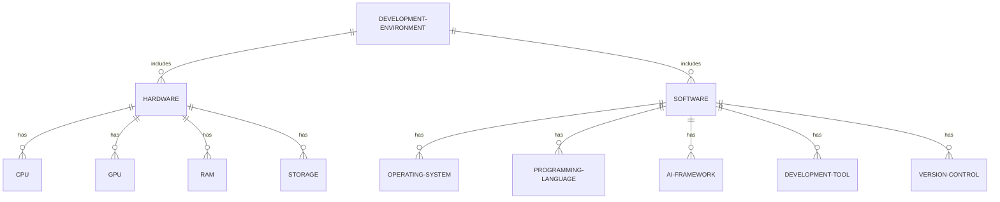

#### 交互关系图

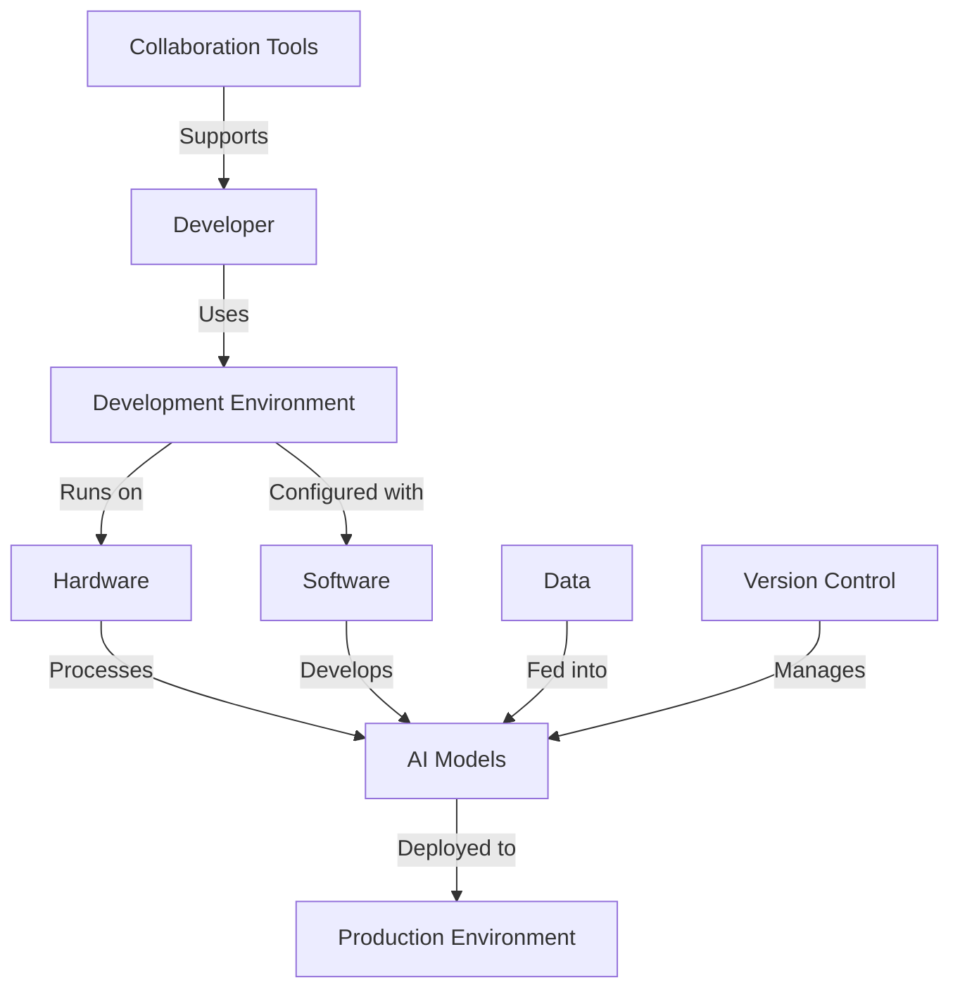

### 数学模型：

开发环境性能评估可以使用以下简化模型：

$$P = \alpha C + \beta G + \gamma R + \delta S - \epsilon T$$

其中：
- $P$ 是总体性能得分
- $C$ 是 CPU 性能
- $G$ 是 GPU 性能
- $R$ 是 RAM 容量
- $S$ 是存储速度
- $T$ 是环境配置时间
- $\alpha, \beta, \gamma, \delta, \epsilon$ 是权重系数

### 算法流程图：

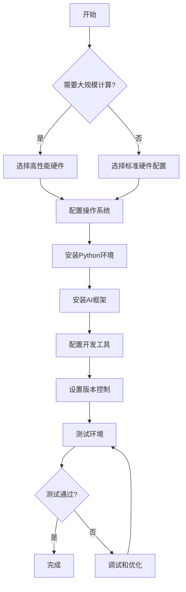

### 算法源代码：

以下是一个用于检查和配置 Python AI 开发环境的脚本示例：

```python
import subprocess
import sys

def check_python_version():
    if sys.version_info < (3, 7):
        print("Python 版本过低，请升级到 3.7 或更高版本")
        return False
    return True

def install_package(package):
    subprocess.check_call([sys.executable, "-m", "pip", "install", package])

def setup_environment():
    required_packages = ['numpy', 'pandas', 'torch', 'transformers', 'scikit-learn']
    
    if not check_python_version():
        return

    print("正在设置 AI 开发环境...")
    
    for package in required_packages:
        try:
            __import__(package)
        except ImportError:
            print(f"正在安装 {package}...")
            install_package(package)
    
    print("环境设置完成！")

    # 验证安装
    import torch
    print(f"PyTorch 版本: {torch.__version__}")
    print(f"CUDA 是否可用: {torch.cuda.is_available()}")

if __name__ == "__main__":
    setup_environment()
```

### 实际场景应用：

1. 个人开发者：
   - 配置：高性能笔记本或台式机，如 Dell XPS 或自建 PC
   - 软件：Windows + WSL2，VSCode，Anaconda，PyTorch
   - 用途：小to中型 AI Agent 项目开发和测试

2. 小型创业公司：
   - 配置：工作站级别的台式机，如 Dell Precision 或 HP Z 系列
   - 软件：Ubuntu，PyCharm Professional，Docker，GitLab
   - 用途：团队协作开发中型 AI Agent 项目

3. 大型科技公司：
   - 配置：自建数据中心或云服务（如 AWS EC2 P3 实例）
   - 软件：Linux 集群，Kubernetes，自研 AI 框架
   - 用途：大规模 AI Agent 训练和部署

4. 研究机构：
   - 配置：高性能计算集群（HPC）
   - 软件：Linux，Slurm，TensorFlow，Jupyter
   - 用途：AI Agent 算法研究和大规模实验

5. 云开发环境：
   - 配置：Google Colab Pro 或 Paperspace Gradient
   - 软件：Jupyter Notebook，预装 AI 库
   - 用途：快速原型开发和小规模实验

### 行业发展与未来趋势：

| 时期 | 主要特征 | 代表性技术/产品 |
|------|----------|-----------------|
| 2015-2017 | GPU 计算兴起 | NVIDIA Tesla K80, TensorFlow |
| 2018-2020 | 云 AI 平台普及 | Google Colab, AWS SageMaker |
| 2021-2023 | 大模型时代 | A100 GPU, TPU v4, PyTorch |
| 2024及以后 | 量子计算、边缘 AI | 量子模拟器、边缘设备专用芯片 |

### 本章小结：

搭建适合的 AI Agent 开发环境是项目成功的关键基础。本章讨论了硬件和软件需求的选择原则，以及如何根据不同规模和类型的项目配置开发环境。主要要点包括：

1. 硬件选择应考虑计算能力、内存容量和存储速度，根据项目需求和预算进行平衡。
2. 软件配置应包括稳定的操作系统、最新的 AI 框架、高效的开发工具和可靠的版本控制系统。
3. 云计算平台为需要大规模计算资源的项目提供了灵活和可扩展的选择。
4. 开发环境的选择应考虑项目规模、团队协作需求和未来扩展性。
5. 自动化脚本可以简化环境配置过程，提高开发效率。

未来的 AI Agent 开发环境趋势可能包括：
1. 更强大和专业化的 AI 硬件加速器
2. 更智能的自动化环境配置和管理工具
3. 混合云和边缘计算解决方案的普及
4. 针对大规模 AI 模型的分布式训练和推理优化
5. 更注重能源效率和可持续性的绿色 AI 计算方案

在选择和配置 AI Agent 开发环境时，开发者应当权衡性能需求、成本控制和未来扩展性，选择最适合自己项目需求的解决方案。同时，持续关注技术发展趋势，及时更新和优化开发环境，以保持竞争力和创新能力。

## 4.2 开发框架选择（如 Langchain、Hugging Face）

### 核心概念：

开发框架是 AI Agent 开发过程中的关键组件，它提供了一套工具、库和最佳实践，能够显著提高开发效率和代码质量。选择合适的框架对于项目的成功至关重要。

### 问题背景：

随着 AI 技术的快速发展，特别是在大语言模型和 AI Agent 领域，各种专门的开发框架应运而生。这些框架旨在简化开发流程，提供高级抽象，并解决常见的 AI 开发挑战。然而，框架的多样性也给开发者带来了选择的困难。

### 问题描述：

开发者在选择 AI Agent 开发框架时面临以下挑战：
1. 如何评估不同框架的优缺点
2. 如何选择最适合项目需求的框架
3. 如何平衡学习曲线和开发效率
4. 如何确保框架的长期维护和社区支持

### 问题解决：

通过以下步骤可以有效选择合适的 AI Agent 开发框架：

1. 需求分析：明确项目的具体需求，包括功能要求、性能目标和扩展性需求。

2. 框架对比：
   - Langchain：专注于构建基于大语言模型的应用，提供了丰富的工具和组件。
   - Hugging Face Transformers：提供了广泛的预训练模型和工具，适合各种 NLP 任务。
   - Rasa：专门用于构建对话式 AI 和聊天机器人。
   - OpenAI Gym：适合强化学习和 AI Agent 训练。

3. 评估标准：
   - 功能完整性：框架是否提供所需的所有核心功能
   - 性能：框架的运行效率和资源消耗
   - 易用性：学习曲线和文档质量
   - 社区活跃度：更新频率、问题解答速度、第三方插件数量
   - 可扩展性：自定义和集成其他工具的难易程度
   - 企业支持：商业支持和许可证类型

4. 实际测试：在小型原型项目中尝试使用不同的框架，评估实际使用体验。

### 边界与外延：

框架选择需要考虑以下因素：
- 项目类型（如对话系统、推荐系统、自动化代理等）
- 团队的技术栈和学习能力
- 项目的长期维护需求
- 与现有系统的集成需求
- 预算限制（一些框架可能需要商业许可）

### 概念结构与核心要素组成：

AI Agent 开发框架的核心要素：
1. 模型集成接口
2. 数据处理工具
3. 训练和微调模块
4. 推理引擎
5. 评估和监控工具
6. 部署和服务化组件
7. 插件和扩展系统

### 概念之间的关系：

#### 概念核心属性维度对比

| 属性 | Langchain | Hugging Face | Rasa | OpenAI Gym |
|------|-----------|--------------|------|------------|
| 主要用途 | LLM 应用开发 | 通用 NLP 任务 | 对话系统 | 强化学习 |
| 易用性 | 高 | 中 | 中 | 中 |
| 灵活性 | 高 | 高 | 中 | 高 |
| 社区活跃度 | 高 | 非常高 | 高 | 高 |
| 预训练模型 | 集成多种 | 丰富 | 有限 | 不适用 |
| 企业支持 | 有 | 有 | 有 | 有限 |

#### 概念联系的ER 实体关系

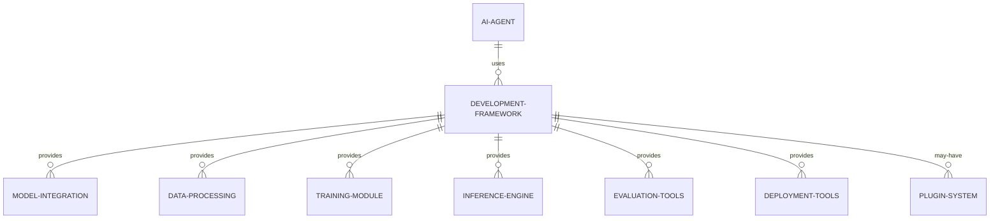

#### 交互关系图

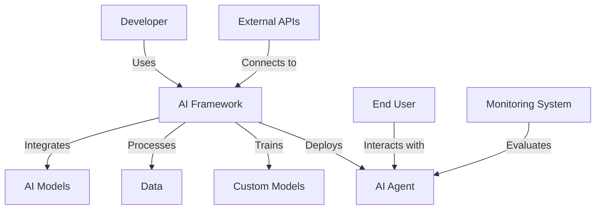

### 数学模型：

框架选择决策可以使用加权评分模型：

$$S = \sum_{i=1}^{n} w_i \cdot s_i$$

其中：
- $S$ 是总评分
- $w_i$ 是第 i 个标准的权重
- $s_i$ 是第 i 个标准的得分
- $n$ 是评估标准的数量

### 算法流程图：

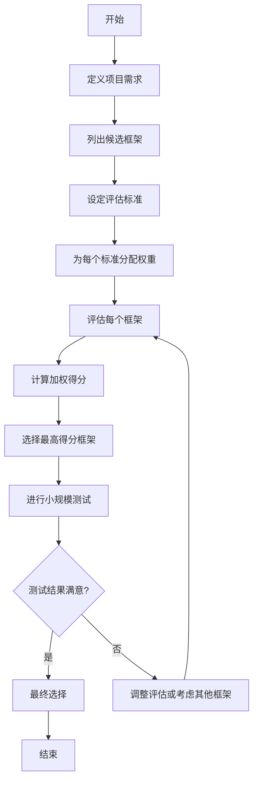

### 算法源代码：

以下是一个简单的框架评估和选择工具的 Python 实现：

```python
class FrameworkEvaluator:
    def __init__(self):
        self.frameworks = {}
        self.criteria = {}

    def add_framework(self, name):
        self.frameworks[name] = {}

    def add_criterion(self, name, weight):
        self.criteria[name] = weight

    def rate_framework(self, framework, criterion, score):
        if framework not in self.frameworks or criterion not in self.criteria:
            raise ValueError("Invalid framework or criterion")
        self.frameworks[framework][criterion] = score

    def evaluate(self):
        results = {}
        for framework in self.frameworks:
            score = sum(self.frameworks[framework].get(c, 0) * w 
                        for c, w in self.criteria.items())
            results[framework] = score
        return sorted(results.items(), key=lambda x: x[1], reverse=True)

# 使用示例
evaluator = FrameworkEvaluator()

# 添加框架
evaluator.add_framework("Langchain")
evaluator.add_framework("Hugging Face")
evaluator.add_framework("Rasa")

# 添加评估标准
evaluator.add_criterion("Ease of Use", 0.3)
evaluator.add_criterion("Performance", 0.25)
evaluator.add_criterion("Community Support", 0.2)
evaluator.add_criterion("Documentation", 0.15)
evaluator.add_criterion("Integration Capabilities", 0.1)

# 评分（示例分数）
evaluator.rate_framework("Langchain", "Ease of Use", 9)
evaluator.rate_framework("Langchain", "Performance", 8)
evaluator.rate_framework("Langchain", "Community Support", 8)
evaluator.rate_framework("Langchain", "Documentation", 7)
evaluator.rate_framework("Langchain", "Integration Capabilities", 9)

# ... 为其他框架添加评分 ...

# 评估结果
results = evaluator.evaluate()
for framework, score in results:
    print(f"{framework}: {score:.2f}")
```

### 实际场景应用：

1. 对话式 AI 助手开发：
   - 推荐框架：Langchain 或 Rasa
   - 原因：提供了丰富的对话管理和 NLU 工具

2. 通用 NLP 任务（如文本分类、命名实体识别）：
   - 推荐框架：Hugging Face Transformers
   - 原因：提供了大量预训练模型和简单的微调接口

3. 强化学习型 AI Agent：
   - 推荐框架：OpenAI Gym 配合 PyTorch 或 TensorFlow
   - 原因：提供了标准化的环境接口和丰富的强化学习算法实现

4. 企业级 AI 解决方案：
   - 推荐框架：Langchain 配合企业特定工具
   - 原因：提供了灵活的集成能力和企业级功能

5. 研究导向的 NLP 项目：
   - 推荐框架：Hugging Face Transformers 或 AllenNLP
   - 原因：提供了最新的模型架构和实验工具

### 行业发展与未来趋势：

| 时期 | 主要特征 | 代表性框架/技术 |
|------|----------|-----------------|
| 2015-2017 | 基础 NLP 工具 | NLTK, SpaCy |
| 2018-2020 | 预训练模型兴起 | Hugging Face Transformers, BERT |
| 2021-2023 | LLM 应用框架 | Langchain, OpenAI API |
| 2024及以后 | 多模态、AGI 导向框架 | 待定 |

### 本章小结：

选择合适的 AI Agent 开发框架是项目成功的关键因素之一。本章讨论了框架选择的原则、主要考虑因素以及几个流行框架的比较。主要要点包括：

1. 框架选择应基于项目需求、团队能力和长期维护考虑。
2. 主流框架如 Langchain、Hugging Face Transformers 各有特点，适用于不同类型的 AI Agent 开发。
3. 评估框架时应考虑功能完整性、性能、易用性、社区支持等多个维度。
4. 实际测试和原型开发对于最终选择至关重要。
5. 框架的生态系统和扩展性对于长期项目尤为重要。

未来的 AI Agent 开发框架趋势可能包括：
1. 更强大的多模态处理能力，集成视觉、语音等多种输入
2. 更智能的自动化工具，如自动模型选择和超参数优化
3. 更好的可解释性和透明度工具，以应对 AI 伦理和监管要求
4. 更深入的 AGI（通用人工智能）导向功能，如元学习和迁移学习
5. 更强的跨平台和边缘计算支持，以适应多样化的部署环境

在选择开发框架时，开发者应当权衡当前需求和未来发展，选择既能满足immediate项目目标，又具有长期发展潜力的框架。同时，保持对新兴框架和技术的关注，适时引入新工具以保持竞争优势。最后，框架只是工具，真正的价值在于开发者如何创造性地使用这些工具来构建创新的 AI Agent 解决方案。

## 4.3 API 与 SDK 配置

### 核心概念：

API（应用程序接口）和 SDK（软件开发工具包）是 AI Agent 开发中不可或缺的组成部分。它们提供了访问各种 AI 服务、模型和功能的标准化方法，使开发者能够快速集成先进的 AI 能力到自己的应用中。

### 问题背景：

随着云计算和 AI 即服务（AIaaS）的兴起，越来越多的企业和开发者选择通过 API 和 SDK 来访问高级 AI 功能，而不是从头开始构建。这种方式可以显著减少开发时间和成本，但也带来了如何选择、配置和管理这些接口的挑战。

### 问题描述：

在 AI Agent 开发过程中，开发者面临以下与 API 和 SDK 相关的问题：

1. 如何选择适合项目需求的 API 和 SDK
2. 如何正确配置和认证这些服务
3. 如何管理 API 调用限制和成本
4. 如何确保数据安全和隐私
5. 如何处理 API 版本更新和兼容性问题

### 问题解决：

通过以下步骤可以有效解决 API 和 SDK 配置的问题：

1. 需求分析：
   - 确定项目所需的 AI 功能（如自然语言处理、计算机视觉、语音识别等）
   - 评估预期的使用量和性能需求

2. 服务选择：
   - 比较不同提供商的服务（如 OpenAI、Google Cloud AI、Azure Cognitive Services）
   - 考虑因素包括功能覆盖、定价、服务水平协议（SLA）、地理可用性等

3. 注册和认证：
   - 创建服务账户
   - 获取 API 密钥或其他认证凭证
   - 配置安全存储机制以保护凭证

4. SDK 安装和配置：
   - 选择适合项目编程语言的 SDK
   - 使用包管理器安装 SDK（如 pip、npm）
   - 配置 SDK 环境变量或配置文件

5. 测试和集成：
   - 编写测试脚本验证 API 连接和基本功能
   - 逐步集成到 AI Agent 的核心逻辑中

6. 监控和优化：
   - 实施 API 调用监控和日志记录
   - 优化调用频率和数据传输以控制成本
   - 实现错误处理和重试机制

### 边界与外延：

API 和 SDK 配置涉及多个方面：
- 安全性：数据加密、认证机制、访问控制
- 性能优化：缓存策略、批量处理、异步调用
- 成本管理：使用量跟踪、预算警报、自动扩缩容
- 合规性：数据本地化、隐私保护、审计日志

### 概念结构与核心要素组成：

API 和 SDK 配置的核心要素：
1. 认证机制（API 密钥、OAuth 等）
2. 端点 URL
3. 请求/响应格式（JSON、Protobuf 等）
4. 错误处理和重试逻辑
5. 速率限制和配额管理
6. 版本控制
7. 日志和监控

### 概念之间的关系：

#### 概念核心属性维度对比

| 属性 | API | SDK |
|------|-----|-----|
| 集成难度 | 中等 | 低 |
| 灵活性 | 高 | 中 |
| 抽象级别 | 低 | 高 |
| 语言依赖性 | 无 | 有 |
| 更新频率 | 低 | 中 |
| 文档完整性 | 中等 | 高 |

#### 概念联系的ER 实体关系

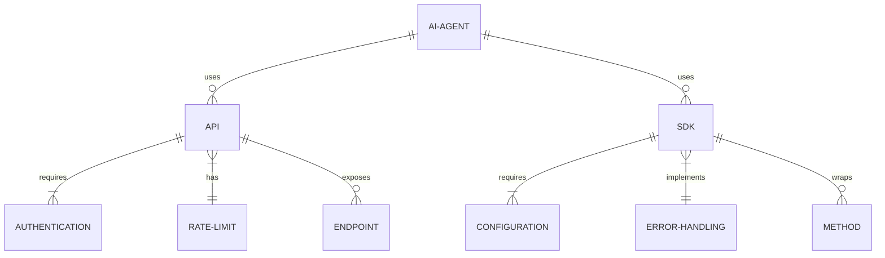

#### 交互关系图

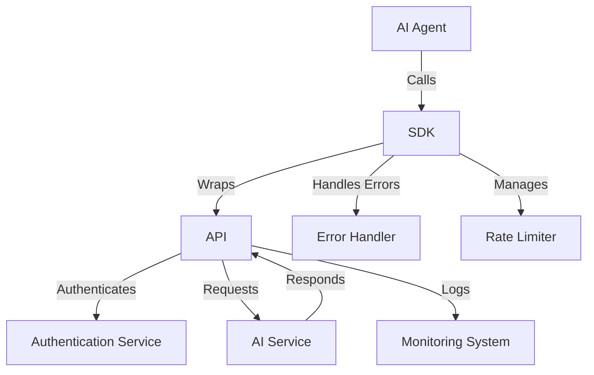

### 数学模型：

API 调用成本优化可以建模为线性规划问题：

最小化：
$$C = \sum_{i=1}^{n} c_i x_i$$

约束条件：
$$\sum_{i=1}^{n} x_i = T$$
$$0 \leq x_i \leq L_i, \forall i$$

其中：
- $C$ 是总成本
- $c_i$ 是第 i 种 API 调用的单位成本
- $x_i$ 是第 i 种 API 调用的次数
- $T$ 是总调用次数需求
- $L_i$ 是第 i 种 API 调用的限制

### 算法流程图：

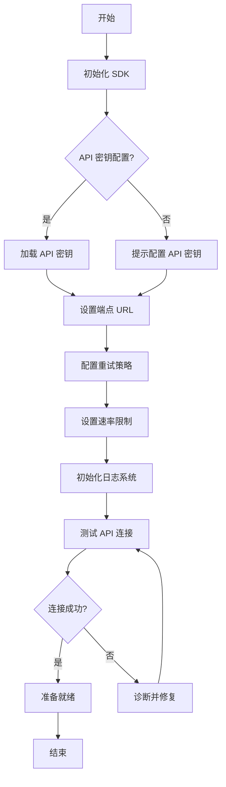

### 算法源代码：

以下是一个使用 OpenAI API 的 Python 配置和使用示例：

```python
import os
import openai
from dotenv import load_dotenv
import backoff
import logging

# 配置日志
logging.basicConfig(level=logging.INFO)
logger = logging.getLogger(__name__)

# 加载环境变量
load_dotenv()

# 配置 OpenAI API
openai.api_key = os.getenv("OPENAI_API_KEY")

# 重试装饰器
@backoff.on_exception(backoff.expo, openai.error.RateLimitError, max_tries=8)
def completions_with_backoff(**kwargs):
    return openai.Completion.create(**kwargs)

def initialize_api():
    try:
        # 测试 API 连接
        response = completions_with_backoff(engine="davinci", prompt="Hello, World!", max_tokens=5)
        logger.info("API 连接成功")
        return True
    except Exception as e:
        logger.error(f"API 连接失败: {str(e)}")
        return False

def main():
    if initialize_api():
        try:
            # 使用 API
            response = completions_with_backoff(
                engine="davinci",
                prompt="Translate the following English text to French: 'Hello, how are you?'",
                max_tokens=60
            )
            print(response.choices[0].text.strip())
        except Exception as e:
            logger.error(f"API 调用错误: {str(e)}")
    else:
        logger.error("API 初始化失败，请检查配置")

if __name__ == "__main__":
    main()
```

### 实际场景应用：

1. 多语言翻译服务：
   - API：Google Cloud Translation API
   - 配置重点：批量翻译、缓存常用翻译

2. 智能客服聊天机器人：
   - API：OpenAI GPT-3 API
   - 配置重点：对话上下文管理、敏感信息过滤

3. 图像识别应用：
   - SDK：TensorFlow Lite
   - 配置重点：模型量化、边缘设备部署

4. 语音转文字服务：
   - API：Amazon Transcribe
   - 配置重点：实时流处理、自定义词汇

5. 情感分析系统：
   - API：IBM Watson Natural Language Understanding
   - 配置重点：多语言支持、自定义分类模型

### 行业发展与未来趋势：

| 时期 | 主要特征 | 代表性 API/SDK |
|------|----------|----------------|
| 2015-2017 | 基础 AI 服务 | Google Cloud Vision API, Amazon Rekognition |
| 2018-2020 | 预训练模型 API | BERT as a Service, OpenAI GPT-2 |
| 2021-2023 | 大规模语言模型 API | OpenAI GPT-3, Google PaLM API |
| 2024及以后 | 多模态 AI、个性化 AI 服务 | 待定 |

### 本章小结：

API 和 SDK 的正确配置和使用是构建高效 AI Agent 的关键。本章讨论了 API 和 SDK 配置的主要考虑因素、最佳实践以及常见挑战。主要要点包括：

1. 选择合适的 API 和 SDK 应基于项目需求、性能要求和预算考虑。
2. 安全性和认证是 API 配置的首要考虑因素，包括安全存储 API 密钥和实施适当的访问控制。
3. 有效的错误处理、重试机制和速率限制管理对于构建稳健的 AI Agent 至关重要。
4. 监控和日志记录对于优化 API 使用、控制成本和排查问题非常重要。
5. 版本控制和兼容性管理需要持续关注，以确保 AI Agent 的长期可维护性。

未来的 API 和 SDK 发展趋势可能包括：
1. 更智能的自动扩缩容和成本优化功能
2. 增强的隐私保护和数据本地化选项
3. 更细粒度的 AI 模型定制和微调能力
4. 跨平台和多设备支持的改进
5. 更深入的 AI 可解释性和公平性工具集成

在配置和使用 API 与 SDK 时，开发者应当注重以下几点：
1. 始终遵循最小权限原则，只请求必要的访问权限
2. 实施robust的错误处理和日志记录机制
3. 定期审查和更新 API 使用策略，以适应变化的需求和新功能
4. 考虑实施API网关或代理服务，以增强安全性和简化管理
5. 保持对新API和SDK版本的关注，及时评估和采用有益的新特性

通过精心配置和管理 API 与 SDK，开发者可以充分利用先进的 AI 能力，同时确保 AI Agent 的安全性、可靠性和成本效益。这不仅能够加速开发过程，还能够使 AI Agent 具备持续进化和改进的能力，从而在竞争激烈的 AI 领域中保持领先地位。

## 4.4 版本控制与协作工具

### 核心概念：

版本控制和协作工具是 AI Agent 开发过程中确保代码质量、团队协作和项目可维护性的关键要素。它们提供了追踪代码变更、管理不同版本、协调团队工作和自动化开发流程的能力。

### 问题背景：

AI Agent 开发通常涉及复杂的代码库、大量数据和模型，以及多人协作。随着项目规模的增长和团队成员的增加，如何有效管理代码版本、协调开发工作、保证代码质量成为了重要挑战。

### 问题描述：

在 AI Agent 开发中，开发者面临以下与版本控制和协作相关的问题：

1. 如何有效管理代码、数据和模型的版本
2. 如何协调多人同时开发的工作流程
3. 如何确保代码质量和一致性
4. 如何管理不同环境（开发、测试、生产）的部署
5. 如何追踪和解决 bugs 和 issues

### 问题解决：

通过以下步骤可以有效解决版本控制和协作的问题：

1. 选择合适的版本控制系统：
   - Git 是目前最流行的选择，适用于大多数 AI 项目

2. 建立分支策略：
   - 使用 Git Flow 或 GitHub Flow 等工作流程
   - 为特性开发、bug 修复和实验创建单独的分支

3. 实施代码审查流程：
   - 使用 Pull Requests 进行代码审查
   - 设置自动化检查（如 linting, 单元测试）

4. 使用项目管理工具：
   - 如 JIRA, Trello 或 GitHub Projects
   - 跟踪任务、bugs 和项目进度

5. 集成持续集成/持续部署（CI/CD）工具：
   - 如 Jenkins, GitLab CI, GitHub Actions
   - 自动化测试、构建和部署过程

6. 采用协作开发环境：
   - 使用 Jupyter Notebooks 与 Git 集成
   - 考虑使用 Google Colab 或 Azure Notebooks 等云端协作工具

### 边界与外延：

版本控制和协作工具的应用范围包括：
- 代码管理：源代码、配置文件、文档
- 数据版本控制：训练数据集、测试数据集
- 模型版本控制：不同版本的 AI 模型
- 环境管理：开发、测试、生产环境的配置
- 文档协作：技术文档、API 文档、用户手册

### 概念结构与核心要素组成：

版本控制和协作系统的核心要素：
1. 代码仓库
2. 分支管理
3. 合并请求（Pull Requests）
4. 问题追踪（Issue Tracking）
5. 代码审查工具
6. CI/CD 管道
7. 文档系统
8. 权限管理

### 概念之间的关系：

#### 概念核心属性维度对比

| 属性 | Git | SVN | Mercurial |
|------|-----|-----|-----------|
| 分布式 | 是 | 否 | 是 |
| 分支管理 | 强大 | 基本 | 强大 |
| 学习曲线 | 中等 | 低 | 中等 |
| 大文件处理 | 需插件 | 原生支持 | 需插件 |
| 社区支持 | 非常活跃 | 活跃 | 活跃 |
| 集成工具生态 | 丰富 | 有限 | 中等 |

#### 概念联系的ER 实体关系

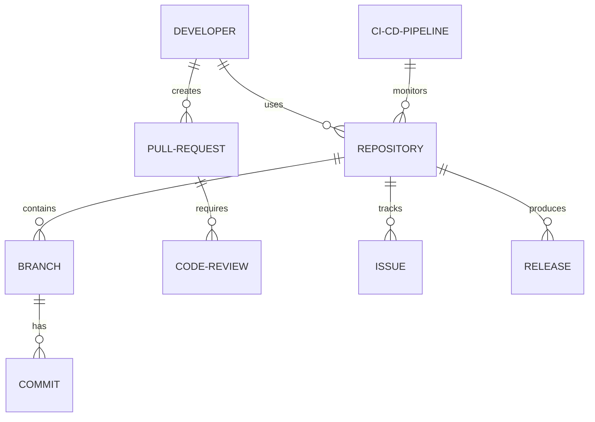

#### 交互关系图

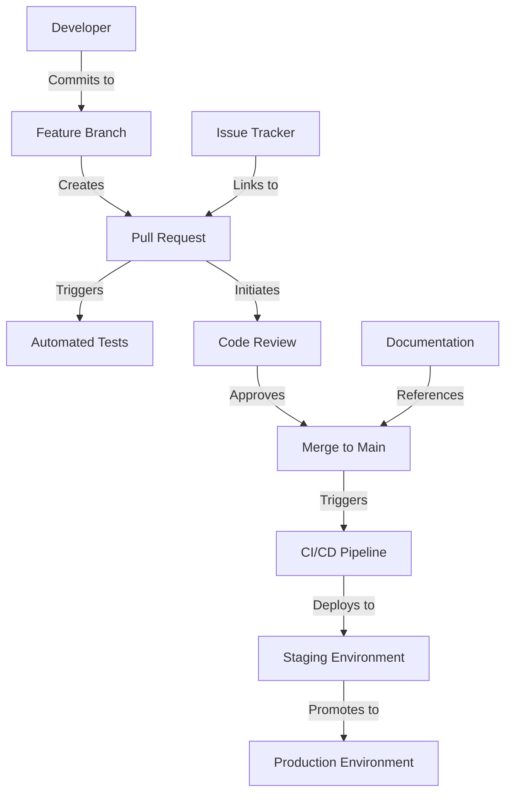

### 数学模型：

代码复杂度可以用圈复杂度（Cyclomatic Complexity）来衡量：

$$V(G) = E - N + 2P$$

其中：
- $V(G)$ 是圈复杂度
- $E$ 是控制流图中边的数量
- $N$ 是控制流图中节点的数量
- $P$ 是连通分量的数量

### 算法流程图：

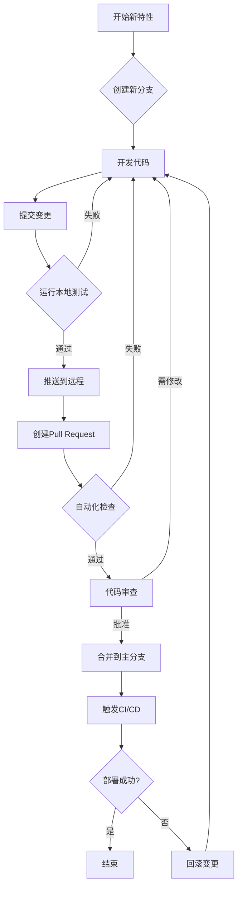

### 算法源代码：

以下是一个使用 Python 和 GitPython 库的简单版本控制脚本示例：

```python
from git import Repo
import os

class GitManager:
    def __init__(self, repo_path):
        self.repo = Repo(repo_path)
        self.git = self.repo.git

    def create_branch(self, branch_name):
        self.git.checkout('HEAD', b=branch_name)
        print(f"Created and switched to new branch: {branch_name}")

    def commit_changes(self, commit_message):
        self.repo.git.add(A=True)
        self.repo.index.commit(commit_message)
        print(f"Committed changes with message: {commit_message}")

    def push_changes(self, branch_name):
        origin = self.repo.remote(name='origin')
        origin.push(branch_name)
        print(f"Pushed changes to remote branch: {branch_name}")

    def create_pull_request(self, title, body, base='main'):
        # 这里需要使用 GitHub API 或类似服务的 API
        # 为简化示例，这里只打印信息
        print(f"Creating pull request: {title}")
        print(f"Body: {body}")
        print(f"From branch {self.repo.active_branch.name} to {base}")

# 使用示例
if __name__ == "__main__":
    repo_path = "/path/to/your/repo"
    manager = GitManager(repo_path)

    feature_branch = "feature-x"
    manager.create_branch(feature_branch)

    # 假设我们在这里进行了一些代码修改
    with open(os.path.join(repo_path, "example.txt"), "w") as f:
        f.write("New feature implementation")

    manager.commit_changes("Implement feature X")
    manager.push_changes(feature_branch)

    manager.create_pull_request(
        title="Implement Feature X",
        body="This pull request implements feature X, which adds...",
        base="main"
    )
```

### 实际场景应用：

1. 模型版本控制：
   - 工具：DVC (Data Version Control)
   - 用途：跟踪 AI 模型和大型数据集的变更

2. 协作开发环境：
   - 工具：JupyterLab + nbdime
   - 用途：版本控制 Jupyter notebooks，进行差异比较

3. 代码审查：
   - 工具：Gerrit 或 GitHub Pull Requests
   - 用途：进行严格的代码审查，确保代码质量

4. 持续集成：
   - 工具：Jenkins 或 GitLab CI
   - 用途：自动运行测试，构建和部署 AI 模型

5. 项目管理：
   - 工具：JIRA 与 Bitbucket 集成
   - 用途：将代码变更与任务和 issues 关联

### 行业发展与未来趋势：

| 时期 | 主要特征 | 代表性工具/实践 |
|------|----------|-----------------|
| 2015-2017 | 基础版本控制 | Git, GitHub |
| 2018-2020 | DevOps 集成 | GitLab, Jenkins |
| 2021-2023 | AI 特定工具 | DVC, MLflow |
| 2024及以后 | 智能协作辅助 | AI 辅助代码审查, 自动化文档生成 |

### 本章小结：

版本控制和协作工具是 AI Agent 开发过程中不可或缺的组成部分。它们不仅确保了代码的可追踪性和可维护性，还大大提高了团队协作的效率。本章讨论了版本控制系统的选择、分支策略的制定、代码审查流程的实施以及持续集成/持续部署的重要性。主要要点包括：

1. Git 作为主流版本控制系统，为 AI 项目提供了强大的分支管理和协作功能。
2. 合理的分支策略（如 Git Flow）有助于管理复杂的开发流程和发布周期。
3. 代码审查和自动化测试是确保代码质量的关键实践。
4. 持续集成/持续部署（CI/CD）工具可以自动化测试、构建和部署过程，提高开发效率。
5. 项目管理工具与版本控制系统的集成可以提供更全面的项目视图和进度跟踪。

未来的版本控制和协作工具发展趋势可能包括：
1. 更智能的冲突解决和合并建议系统
2. 集成 AI 辅助的代码审查和优化建议
3. 更强大的大文件和大数据集版本控制能力
4. 增强的安全性和合规性检查功能
5. 更深入的 AI 模型版本控制和实验跟踪能力

在实施版本控制和协作策略时，开发者应当注意：
1. 制定清晰的分支管理和合并策略，并确保团队成员理解和遵循
2. 自动化尽可能多的流程，包括代码质量检查、测试和部署
3. 重视文档和注释，使用工具自动生成和维护文档
4. 定期审查和优化工作流程，适应团队和项目的变化
5. 培训团队成员熟练使用版本控制和协作工具，提高整体效率

通过有效利用版本控制和协作工具，AI Agent 开发团队可以更好地管理复杂的开发过程，提高代码质量，加速开发周期，并为项目的长期维护和演进奠定坚实基础。这不仅有助于当前项目的成功，还能为团队积累宝贵的最佳实践经验，为未来的 AI 项目开发做好准备。


