# 第5章：AI Agent 架构设计

## 5.1 AI Agent 的核心组件

### 核心概念：

AI Agent 的架构设计是构建智能系统的基础，它定义了 Agent 的结构、功能模块及其相互关系。一个完善的 AI Agent 架构通常包含感知、决策、执行、学习和知识管理等核心组件，这些组件协同工作，使 Agent 能够感知环境、做出决策并采取行动。

### 问题背景：

随着 AI 技术的快速发展和应用场景的多样化，设计一个灵活、可扩展且高效的 AI Agent 架构变得越来越重要。不同的应用领域（如自然语言处理、计算机视觉、机器人控制等）对 AI Agent 的要求各不相同，这就需要一个能够适应不同需求的通用架构设计。

### 问题描述：

在设计 AI Agent 架构时，开发者面临以下挑战：

1. 如何设计一个既通用又能针对特定任务优化的架构
2. 如何确保各个组件之间的高效协作和信息流通
3. 如何平衡实时响应能力和复杂推理能力
4. 如何设计可扩展的架构以适应未来的功能增强
5. 如何整合学习能力，使 Agent 能够不断改进其性能

### 问题解决：

通过以下步骤可以设计一个有效的 AI Agent 架构：

1. 定义核心组件：
   - 感知模块：负责接收和处理来自环境的输入
   - 决策模块：基于当前状态和目标做出决策
   - 执行模块：将决策转化为具体行动
   - 学习模块：从经验中学习，优化未来行为
   - 知识库：存储和管理 Agent 的知识和经验

2. 设计组件间的交互：
   - 定义清晰的接口和数据流
   - 实现模块化设计，允许独立开发和测试

3. 集成推理引擎：
   - 选择适合任务的推理方法（如规则基、概率推理、神经网络等）
   - 设计推理过程的并行化和优化策略

4. 实现学习机制：
   - 集成在线学习算法，使 Agent 能够从交互中学习
   - 设计经验回放机制，提高学习效率

5. 构建知识管理系统：
   - 实现高效的知识存储和检索机制
   - 设计知识更新和一致性维护策略

### 边界与外延：

AI Agent 架构设计需要考虑以下因素：
- 任务特性（如实时性要求、复杂度）
- 环境特征（如确定性、部分可观察性）
- 硬件限制（如计算能力、内存容量）
- 可扩展性需求
- 与其他系统的集成需求

### 概念结构与核心要素组成：

AI Agent 的核心组件：
1. 感知模块
2. 决策模块
3. 执行模块
4. 学习模块
5. 知识库
6. 推理引擎
7. 通信接口
8. 目标管理器

### 概念之间的关系：

#### 概念核心属性维度对比

| 属性 | 感知模块 | 决策模块 | 执行模块 | 学习模块 | 知识库 |
|------|----------|----------|----------|----------|--------|
| 主要功能 | 信息获取 | 策略生成 | 动作执行 | 性能优化 | 信息存储 |
| 输入类型 | 原始数据 | 状态信息 | 决策结果 | 交互经验 | 结构化知识 |
| 输出类型 | 结构化数据 | 行动计划 | 物理/虚拟动作 | 模型更新 | 查询结果 |
| 处理速度要求 | 高 | 中-高 | 高 | 低-中 | 中-高 |
| 更新频率 | 连续 | 高 | 高 | 周期性 | 低-中 |

#### 概念联系的ER 实体关系

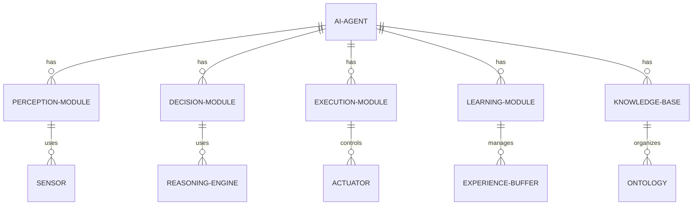

#### 交互关系图

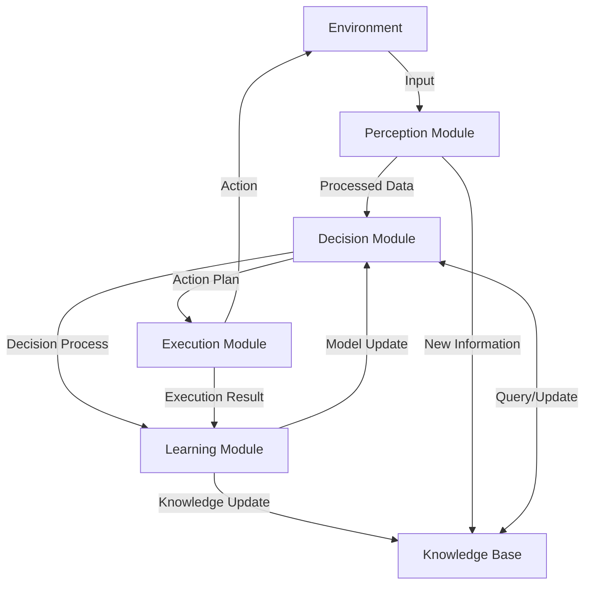

### 数学模型：

AI Agent 的决策过程可以用马尔可夫决策过程（MDP）建模：

$$\pi^*(s) = \arg\max_a \left(R(s,a) + \gamma \sum_{s'} P(s'|s,a)V^*(s')\right)$$

其中：
- $\pi^*(s)$ 是最优策略
- $R(s,a)$ 是在状态 $s$ 采取动作 $a$ 的即时奖励
- $\gamma$ 是折扣因子
- $P(s'|s,a)$ 是状态转移概率
- $V^*(s')$ 是下一状态的最优值函数

### 算法流程图：

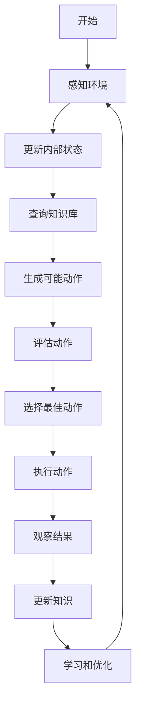

### 算法源代码：

以下是一个简化的 AI Agent 架构实现示例：

```python
import random

class AIAgent:
    def __init__(self):
        self.state = None
        self.knowledge_base = {}
        self.learning_rate = 0.1

    def perceive(self, environment):
        self.state = environment.get_state()
        return self.state

    def decide(self, state):
        if state in self.knowledge_base:
            if random.random() < 0.1:  # Exploration
                return random.choice(list(self.knowledge_base[state].keys()))
            else:  # Exploitation
                return max(self.knowledge_base[state], key=self.knowledge_base[state].get)
        else:
            return random.choice(['action1', 'action2', 'action3'])

    def execute(self, action, environment):
        return environment.apply_action(action)

    def learn(self, state, action, reward, new_state):
        if state not in self.knowledge_base:
            self.knowledge_base[state] = {}
        if action not in self.knowledge_base[state]:
            self.knowledge_base[state][action] = 0

        old_value = self.knowledge_base[state][action]
        if new_state in self.knowledge_base:
            max_future_value = max(self.knowledge_base[new_state].values())
        else:
            max_future_value = 0

        new_value = (1 - self.learning_rate) * old_value + self.learning_rate * (reward + 0.9 * max_future_value)
        self.knowledge_base[state][action] = new_value

    def run(self, environment, episodes):
        for _ in range(episodes):
            state = self.perceive(environment)
            action = self.decide(state)
            new_state, reward = self.execute(action, environment)
            self.learn(state, action, reward, new_state)

# 使用示例
class Environment:
    def get_state(self):
        return random.choice(['state1', 'state2', 'state3'])

    def apply_action(self, action):
        new_state = random.choice(['state1', 'state2', 'state3'])
        reward = random.randint(-1, 1)
        return new_state, reward

agent = AIAgent()
env = Environment()
agent.run(env, 1000)
print(agent.knowledge_base)
```

### 实际场景应用：

1. 智能客服系统：
   - 感知模块：自然语言处理
   - 决策模块：基于知识图谱的推理
   - 执行模块：回答生成
   - 学习模块：用户反馈学习

2. 自动驾驶车辆：
   - 感知模块：计算机视觉、雷达数据处理
   - 决策模块：路径规划、障碍物避免
   - 执行模块：控制系统接口
   - 学习模块：驾驶行为优化

3. 智能家居系统：
   - 感知模块：各种传感器数据收集
   - 决策模块：用户行为预测、能源优化
   - 执行模块：设备控制接口
   - 学习模块：习惯学习、场景优化

4. 金融交易 AI：
   - 感知模块：市场数据实时处理
   - 决策模块：交易策略生成
   - 执行模块：交易执行接口
   - 学习模块：策略优化、风险管理

5. 游戏 AI：
   - 感知模块：游戏状态解析
   - 决策模块：策略规划
   - 执行模块：游戏操作接口
   - 学习模块：对抗性学习、策略适应

### 行业发展与未来趋势：

| 时期 | 主要特征 | 代表性架构/技术 |
|------|----------|-----------------|
| 2015-2017 | 单一功能 AI | 深度学习模型 |
| 2018-2020 | 多模块集成 | 端到端学习系统 |
| 2021-2023 | 自适应架构 | 元学习、终身学习 |
| 2024及以后 | 通用智能架构 | AGI 框架、认知架构 |

### 本章小结：

AI Agent 的架构设计是构建智能系统的核心，它决定了 Agent 的能力边界和性能特征。本章讨论了 AI Agent 的核心组件、它们之间的关系以及如何设计一个有效的 Agent 架构。主要要点包括：

1. AI Agent 的核心组件包括感知、决策、执行、学习模块和知识库，这些组件共同工作以实现智能行为。
2. 架构设计需要考虑模块化、可扩展性和效率，以适应不同的应用场景和未来的技术发展。
3. 决策过程可以用马尔可夫决策过程等数学模型来描述，这为 Agent 的行为优化提供了理论基础。
4. 学习能力是现代 AI Agent 的关键特征，它使 Agent 能够从经验中不断改进其性能。
5. 知识表示和管理对于 Agent 的推理和决策能力至关重要，需要设计高效的存储和检索机制。

未来的 AI Agent 架构发展趋势可能包括：
1. 更强大的多模态感知和集成能力
2. 更灵活的元学习和迁移学习机制
3. 更高效的分布式和并行处理架构
4. 更强的可解释性和透明度
5. 向通用人工智能（AGI）架构的演进

在设计 AI Agent 架构时，开发者应当注意：
1. 根据具体应用场景和需求选择合适的架构模式
2. 保持架构的灵活性和可扩展性，以适应未来的需求变化
3. 重视模块间的接口设计，确保高效的信息流通
4. 集成强大的学习机制，使 Agent 能够持续改进
5. 考虑安全性和道德因素，设计负责任的 AI 系统

通过精心设计的架构，AI Agent 可以更好地应对复杂的实际问题，展现出强大的适应性和智能行为。随着技术的不断进步，我们有理由期待未来的 AI Agent 将具备更接近人类的认知能力，为各行各业带来革命性的变革。


## 5.2 输入处理与自然语言理解

### 核心概念：

输入处理和自然语言理解（NLU）是 AI Agent 与外部世界交互的关键接口。这个模块负责接收、解析和理解来自用户或环境的输入，将原始数据转化为 Agent 可以处理的结构化信息。在许多应用场景中，特别是对话系统和文本分析任务，NLU 扮演着至关重要的角色。

### 问题背景：

随着人机交互方式的日益自然化，用户期望能够以自然语言与 AI 系统进行交流。这就要求 AI Agent 具备强大的语言理解能力，能够准确捕捉用户意图、提取关键信息，并在复杂的语境中理解隐含的含义。

### 问题描述：

在实现输入处理和自然语言理解时，开发者面临以下挑战：

1. 如何处理自然语言的歧义性和多样性
2. 如何准确识别用户意图和提取关键实体信息
3. 如何理解上下文和处理多轮对话
4. 如何处理多语言和方言的输入
5. 如何在实时性和准确性之间取得平衡

### 问题解决：

通过以下步骤可以构建有效的输入处理和 NLU 系统：

1. 预处理：
   - 文本规范化（如大小写统一、去除特殊字符）
   - 分词和词性标注
   - 命名实体识别（NER）

2. 意图识别：
   - 使用分类算法（如 SVM、BERT）识别用户意图
   - 实现多标签分类以处理复杂意图

3. 槽位填充：
   - 提取关键信息并填充到预定义的槽位中
   - 使用序列标注模型（如 CRF、BiLSTM-CRF）

4. 语义解析：
   - 构建语义框架或使用依存句法分析
   - 将自然语言转换为结构化的语义表示

5. 上下文管理：
   - 实现对话状态跟踪
   - 使用注意力机制或记忆网络维护长期上下文

6. 集成大语言模型：
   - 利用预训练模型（如 GPT、BERT）进行零样本或少样本学习
   - 实现微调策略以适应特定领域

### 边界与外延：

NLU 系统的应用范围广泛，包括但不限于：
- 对话系统和聊天机器人
- 智能搜索和问答系统
- 情感分析和舆情监测
- 文本分类和内容推荐
- 机器翻译的语义理解部分

### 概念结构与核心要素组成：

NLU 系统的核心组件：
1. 词法分析器
2. 句法分析器
3. 语义分析器
4. 意图识别器
5. 实体提取器
6. 上下文管理器
7. 对话管理器

### 概念之间的关系：

#### 概念核心属性维度对比

| 属性 | 规则基方法 | 统计学习方法 | 深度学习方法 |
|------|------------|--------------|--------------|
| 可解释性 | 高 | 中 | 低 |
| 扩展性 | 低 | 中 | 高 |
| 数据依赖 | 低 | 中 | 高 |
| 处理复杂度 | 低 | 中 | 高 |
| 准确性 | 低-中 | 中-高 | 高 |
| 领域适应性 | 低 | 中 | 高 |

#### 概念联系的ER 实体关系

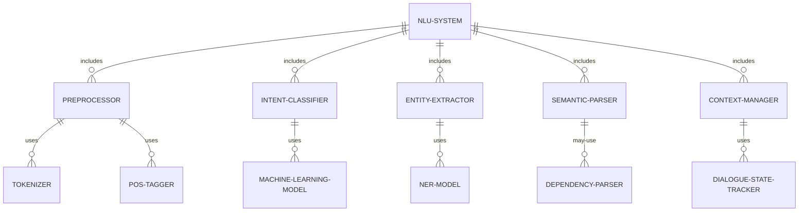

#### 交互关系图

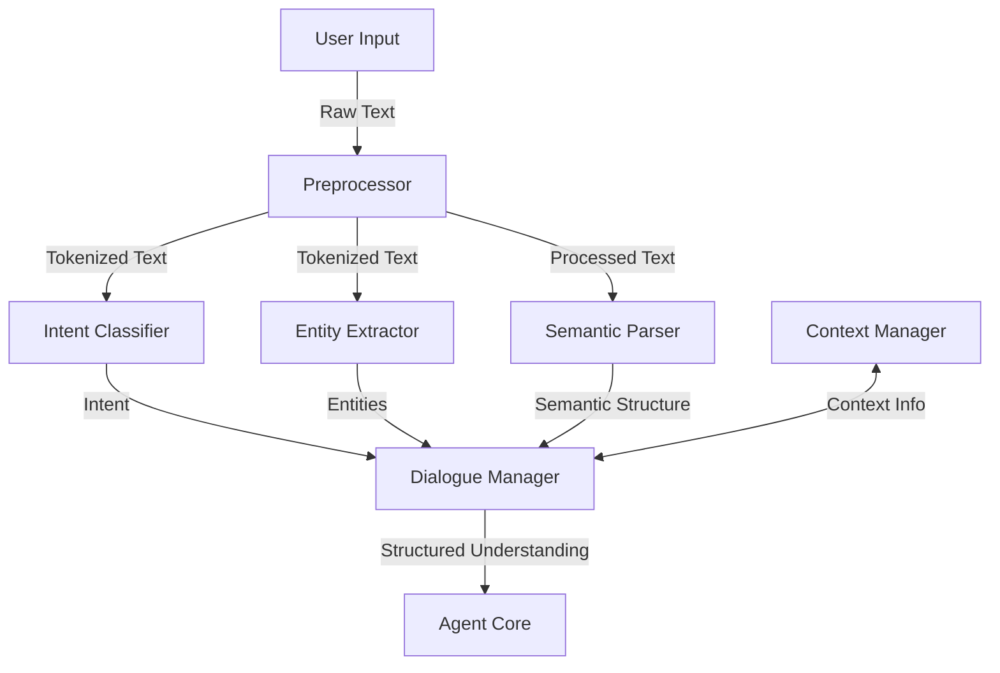

### 数学模型：

意图分类可以使用多类逻辑回归模型：

$$P(y=k|x) = \frac{e^{\beta_k^T x}}{\sum_{j=1}^K e^{\beta_j^T x}}$$

其中：
- $x$ 是输入特征向量
- $y$ 是意图类别
- $\beta_k$ 是第 k 个类别的参数向量
- $K$ 是总类别数

### 算法流程图：

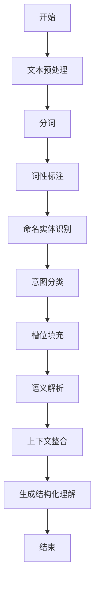

### 算法源代码：

以下是一个使用 spaCy 和 scikit-learn 实现的简单 NLU 系统示例：

```python
import spacy
from sklearn.feature_extraction.text import CountVectorizer
from sklearn.naive_bayes import MultinomialNB
from sklearn.pipeline import Pipeline

class SimpleNLU:
    def __init__(self):
        self.nlp = spacy.load("en_core_web_sm")
        self.intent_classifier = Pipeline([
            ('vectorizer', CountVectorizer()),
            ('classifier', MultinomialNB())
        ])
        self.intents = []

    def train_intent_classifier(self, training_data):
        X = [text for text, _ in training_data]
        y = [intent for _, intent in training_data]
        self.intents = list(set(y))
        self.intent_classifier.fit(X, y)

    def preprocess(self, text):
        doc = self.nlp(text)
        return [token.lemma_.lower() for token in doc if not token.is_stop and not token.is_punct]

    def extract_entities(self, text):
        doc = self.nlp(text)
        return [(ent.text, ent.label_) for ent in doc.ents]

    def classify_intent(self, text):
        preprocessed = ' '.join(self.preprocess(text))
        return self.intent_classifier.predict([preprocessed])[0]

    def understand(self, text):
        intent = self.classify_intent(text)
        entities = self.extract_entities(text)
        return {
            'intent': intent,
            'entities': entities,
            'text': text
        }

# 使用示例
nlu = SimpleNLU()

# 训练意图分类器
training_data = [
    ("What's the weather like today?", "weather_query"),
    ("Set an alarm for 7 AM", "set_alarm"),
    ("Tell me a joke", "request_joke"),
    # 添加更多训练数据...
]
nlu.train_intent_classifier(training_data)

# 测试
test_text = "What's the temperature in New York today?"
result = nlu.understand(test_text)
print(result)
```

### 实际场景应用：

1. 智能客服：
   - 意图识别：区分查询、投诉、咨询等
   - 实体提取：识别产品名称、订单号等关键信息

2. 智能家居控制：
   - 命令解析：理解"打开客厅的灯"中的动作和目标
   - 上下文理解：处理多轮对话中的指代消解

3. 旅行助手：
   - 槽位填充：从"我想订一张明天去北京的机票"中提取日期和目的地
   - 多意图识别：同时处理订票和查询天气的复合请求

4. 情感分析：
   - 细粒度分类：区分积极、消极、中性等多种情感
   - 方面级分析：识别评论中针对不同产品特性的情感

5. 多语言客户支持：
   - 语言检测：自动识别用户使用的语言
   - 跨语言理解：在多语言环境中保持一致的理解能力

### 行业发展与未来趋势：

| 时期 | 主要特征 | 代表性技术/模型 |
|------|----------|-----------------|
| 2015-2017 | 统计方法为主 | CRF, SVM, Word2Vec |
| 2018-2020 | 深度学习兴起 | LSTM, BERT, ELMo |
| 2021-2023 | 大规模预训练模型 | GPT-3, T5, ALBERT |
| 2024及以后 | 多模态理解、少样本学习 | 跨模态Transformer, Meta-learning NLU |

### 本章小结：

输入处理与自然语言理解是 AI Agent 与用户进行有效交互的基础。本章讨论了 NLU 系统的核心组件、主要挑战以及解决方案。主要要点包括：

1. NLU 系统需要处理语言的歧义性和复杂性，准确识别用户意图和提取关键信息。
2. 预处理、意图分类、实体提取和语义解析是 NLU 流程的关键步骤。
3. 上下文管理对于实现连贯的多轮对话至关重要。
4. 深度学习方法，特别是预训练语言模型，极大提升了 NLU 系统的性能。
5. 实际应用中需要平衡准确性、实时性和计算资源消耗。

未来的 NLU 发展趋势可能包括：
1. 更强大的跨语言和跨领域迁移学习能力
2. 结合常识推理的深度语义理解
3. 多模态输入的融合理解（如结合语音、图像的 NLU）
4. 更高效的少样本和零样本学习技术
5. 增强的隐私保护和个性化 NLU 模型

在实现 NLU 系统时，开发者应当注意：
1. 根据具体应用场景选择合适的模型和技术
2. 重视数据质量和标注的一致性
3. 实现健壮的错误处理和回退策略
4. 持续监控和更新模型以适应语言使用的变化
5. 考虑伦理因素，如公平性和包容性

通过不断改进的 NLU 技术，AI Agent 将能够更自然、更准确地理解用户意图，提供更智能、更个性化的服务。这不仅提高了用户体验，也为 AI 在各行各业的广泛应用奠定了基础。随着技术的进步，我们可以期待 AI Agent 在语言理解方面逐步接近甚至超越人类水平，开启人机交互的新纪元。


## 5.3 任务规划与决策模块

### 核心概念：

任务规划与决策模块是 AI Agent 的核心大脑，负责根据输入和当前状态制定行动计划。这个模块将自然语言理解的结果转化为具体的任务序列，并在执行过程中做出实时决策。有效的任务规划和决策能力使 AI Agent 能够处理复杂的多步骤任务，并在动态环境中灵活应对变化。

### 问题背景：

随着 AI 应用场景的复杂化，简单的刺激-反应模式已经无法满足需求。用户期望 AI Agent 能够理解长期目标，分解复杂任务，并在执行过程中根据情况调整策略。这就要求 AI 系统具备强大的规划和决策能力。

### 问题描述：

在实现任务规划与决策模块时，开发者面临以下挑战：

1. 如何将高级目标分解为可执行的子任务序列
2. 如何在不确定性和不完全信息的环境中做出决策
3. 如何平衡短期收益和长期目标
4. 如何处理多目标优化问题
5. 如何确保决策的一致性和可解释性

### 问题解决：

通过以下步骤可以构建有效的任务规划与决策模块：

1. 目标分解：
   - 使用层次任务网络（HTN）将高级目标分解为子任务
   - 实现动态任务分解，以适应变化的环境

2. 状态表示：
   - 设计全面而紧凑的状态表示方法
   - 使用特征提取技术降低状态空间维度

3. 决策算法选择：
   - 对于确定性环境，使用 A* 或动态规划
   - 对于随机环境，使用蒙特卡洛树搜索（MCTS）或强化学习

4. 策略学习：
   - 实现在线学习算法，如 Q-learning 或策略梯度方法
   - 使用经验回放提高学习效率

5. 多目标优化：
   - 实现帕累托优化或加权和方法
   - 使用多准则决策分析（MCDA）技术

6. 不确定性处理：
   - 集成贝叶斯推理以处理不确定性
   - 实现鲁棒性决策方法，如最小最大遗憾

### 边界与外延：

任务规划与决策模块的应用范围包括：
- 智能助手的任务执行
- 自动驾驶车辆的路径规划
- 机器人的动作序列生成
- 游戏 AI 的策略制定
- 智能制造中的生产调度

### 概念结构与核心要素组成：

任务规划与决策模块的核心组件：
1. 目标管理器
2. 任务分解器
3. 状态估计器
4. 策略生成器
5. 行动选择器
6. 结果评估器
7. 学习优化器

### 概念之间的关系：

#### 概念核心属性维度对比

| 属性 | 规则基方法 | 搜索基方法 | 学习基方法 |
|------|------------|------------|------------|
| 可解释性 | 高 | 中 | 低 |
| 适应性 | 低 | 中 | 高 |
| 计算复杂度 | 低 | 高 | 中 |
| 先验知识需求 | 高 | 中 | 低 |
| 处理不确定性能力 | 低 | 中 | 高 |
| 扩展性 | 低 | 中 | 高 |

#### 概念联系的ER 实体关系

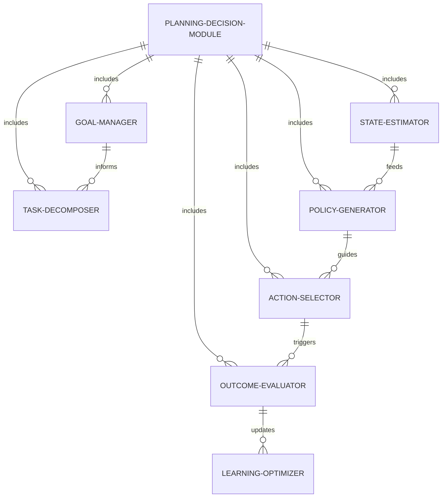

#### 交互关系图

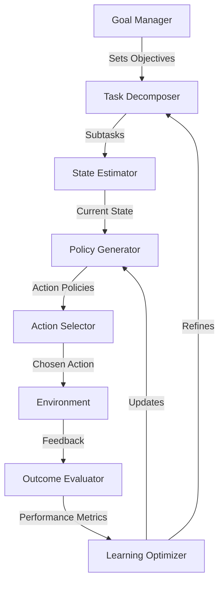

### 数学模型：

强化学习中的 Q-learning 算法可以用以下公式表示：

$$Q(s_t, a_t) \leftarrow Q(s_t, a_t) + \alpha [r_{t+1} + \gamma \max_a Q(s_{t+1}, a) - Q(s_t, a_t)]$$

其中：
- $Q(s_t, a_t)$ 是状态 $s_t$ 下采取动作 $a_t$ 的价值
- $\alpha$ 是学习率
- $r_{t+1}$ 是即时奖励
- $\gamma$ 是折扣因子
- $\max_a Q(s_{t+1}, a)$ 是下一状态的最大预期价值

### 算法流程图：

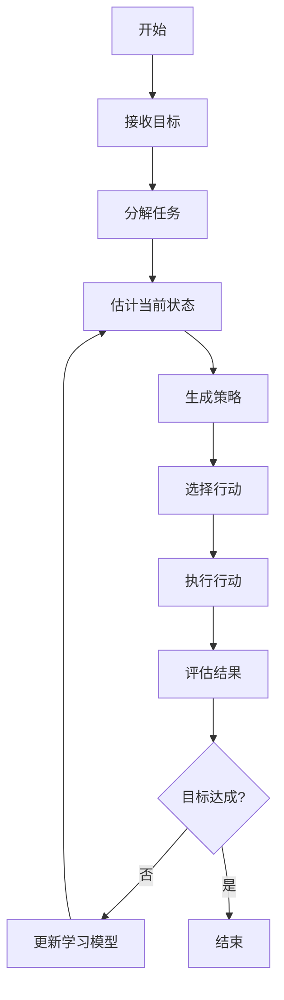

### 算法源代码：

以下是一个简单的 Q-learning 实现示例：

```python
import numpy as np

class QLearningAgent:
    def __init__(self, state_size, action_size, learning_rate=0.1, discount_factor=0.95, epsilon=0.1):
        self.state_size = state_size
        self.action_size = action_size
        self.learning_rate = learning_rate
        self.discount_factor = discount_factor
        self.epsilon = epsilon
        self.q_table = np.zeros((state_size, action_size))

    def get_action(self, state):
        if np.random.rand() < self.epsilon:
            return np.random.randint(self.action_size)
        return np.argmax(self.q_table[state, :])

    def learn(self, state, action, reward, next_state):
        current_q = self.q_table[state, action]
        max_next_q = np.max(self.q_table[next_state, :])
        new_q = current_q + self.learning_rate * (reward + self.discount_factor * max_next_q - current_q)
        self.q_table[state, action] = new_q

    def plan_and_decide(self, initial_state, goal_state, max_steps=1000):
        state = initial_state
        for _ in range(max_steps):
            action = self.get_action(state)
            next_state, reward, done = self.environment_step(state, action)  # 假设这个函数已定义
            self.learn(state, action, reward, next_state)
            state = next_state
            if state == goal_state:
                return True
        return False

# 使用示例
state_size, action_size = 10, 4
agent = QLearningAgent(state_size, action_size)

# 训练
for episode in range(1000):
    initial_state = np.random.randint(state_size)
    goal_state = np.random.randint(state_size)
    success = agent.plan_and_decide(initial_state, goal_state)
    if success:
        print(f"Episode {episode}: Successfully reached the goal!")

# 测试
test_state = 0
test_goal = 9
path = agent.plan_and_decide(test_state, test_goal)
print(f"Test result: {'Success' if path else 'Failure'}")
```

### 实际场景应用：

1. 智能助手任务规划：
   - 将"准备周末旅行"分解为预订交通、安排住宿、制定行程等子任务
   - 根据用户偏好和实时信息调整计划

2. 自动驾驶决策系统：
   - 根据目的地规划最优路径
   - 实时决策避让障碍物、变道、停车等行为

3. 工业机器人控制：
   - 规划复杂装配任务的步骤序列
   - 根据工件位置和类型动态调整操作策略

4. 游戏 AI：
   - 在策略游戏中制定长期战略和短期战术
   - 根据对手行为实时调整策略

5. 智能电网管理：
   - 优化能源分配和负载平衡
   - 预测和应对潜在的供需波动

### 行业发展与未来趋势：

| 时期 | 主要特征 | 代表性技术/算法 |
|------|----------|-----------------|
| 2015-2017 | 基于规则和搜索 | A*, 动态规划 |
| 2018-2020 | 深度强化学习兴起 | DQN, PPO, AlphaGo |
| 2021-2023 | 大规模模型和迁移学习 | GPT-3 for planning, Meta-RL |
| 2024及以后 | 多智能体协作、可解释AI | 分布式 MARL, 神经符号系统 |

### 本章小结：

任务规划与决策模块是 AI Agent 智能行为的核心，它使 Agent 能够理解复杂目标，制定行动计划，并在执行过程中做出明智决策。本章讨论了规划与决策系统的核心组件、主要挑战以及解决方案。主要要点包括：

1. 有效的任务规划需要将高级目标分解为可执行的子任务序列。
2. 决策算法的选择取决于环境的特性，如确定性、随机性等。
3. 强化学习为处理复杂、动态环境提供了强大的框架。
4. 多目标优化和不确定性处理是现实应用中的关键挑战。
5. 平衡短期收益和长期目标对于实现最优性能至关重要。

未来的规划与决策系统发展趋势可能包括：
1. 更强大的迁移学习能力，使 AI 能够快速适应新任务
2. 多智能体协作规划，以解决更复杂的系统级问题
3. 结合符号推理和神经网络的混合系统，提高可解释性
4. 元学习技术，使 AI 能够学习如何更好地学习和规划
5. 整合因果推理，提高决策的鲁棒性和泛化能力

在实现任务规划与决策模块时，开发者应当注意：
1. 设计灵活的状态表示，以适应不同的任务和环境
2. 实现有效的探索-利用平衡策略，以提高学习效率
3. 考虑计算资源限制，优化算法的实时性能
4. 集成领域知识，加速学习过程并提高决策质量
5. 设计可解释的决策机制，增强用户信任和系统透明度

通过不断改进的规划和决策技术，AI Agent 将能够处理越来越复杂的任务，在更广泛的领域中展现智能行为。这不仅提高了 AI 系统的实用性和效率，也为实现更高级别的人工智能铺平了道路。随着技术的进步，我们可以期待 AI Agent 在战略思维和复杂问题解决方面逐步接近甚至超越人类水平，为各行各业带来革命性的变革。

## 5.4 知识库与记忆管理

### 核心概念：

知识库与记忆管理是 AI Agent 智能行为的基础，它为 Agent 提供了理解世界、存储经验和做出明智决策所需的信息基础。一个高效的知识库和记忆管理系统能够使 AI Agent 快速检索相关信息、学习新知识、并在长期交互中保持连贯性。

### 问题背景：

随着 AI 应用的复杂化，单纯依靠即时输入和固定规则已无法满足高级智能行为的需求。AI Agent 需要能够累积知识、利用过去的经验，并在不同任务间迁移学习。这就要求一个强大而灵活的知识表示和管理系统。

### 问题描述：

在实现知识库与记忆管理时，开发者面临以下挑战：

1. 如何设计能够表示多样化知识的结构
2. 如何高效地存储和检索大量信息
3. 如何处理不确定和矛盾的信息
4. 如何实现短期记忆和长期记忆的整合
5. 如何在保持核心知识稳定的同时允许动态更新

### 问题解决：

通过以下步骤可以构建有效的知识库与记忆管理系统：

1. 知识表示：
   - 使用语义网络或本体模型表示概念间关系
   - 实现向量嵌入以捕捉语义相似性

2. 存储结构：
   - 使用图数据库存储结构化知识
   - 实现分布式存储以处理大规模数据

3. 检索机制：
   - 实现基于相关性的快速检索算法
   - 使用注意力机制优化信息获取

4. 记忆类型：
   - 设计工作记忆用于短期信息保持
   - 实现情节记忆存储具体经验
   - 构建语义记忆存储一般性知识

5. 知识整合：
   - 使用知识蒸馏技术合并多源信息
   - 实现增量学习以动态更新知识库

6. 不确定性处理：
   - 使用概率图模型表示不确定知识
   - 实现贝叶斯更新以整合新证据

### 边界与外延：

知识库与记忆管理系统的应用范围包括：
- 问答系统的知识支持
- 对话系统的上下文维护
- 推荐系统的用户偏好建模
- 专家系统的领域知识表示
- 智能教育系统的学习者模型

### 概念结构与核心要素组成：

知识库与记忆管理系统的核心组件：
1. 知识表示模型
2. 存储引擎
3. 检索引擎
4. 推理机制
5. 更新管理器
6. 记忆控制器
7. 冲突解决器

### 概念之间的关系：

#### 概念核心属性维度对比

| 属性 | 关系型数据库 | 图数据库 | 向量数据库 |
|------|--------------|----------|------------|
| 查询效率 | 高（索引优化） | 高（关系遍历） | 高（相似度搜索） |
| 灵活性 | 低 | 高 | 中 |
| 扩展性 | 中 | 高 | 高 |
| 复杂关系表示 | 困难 | 容易 | 中等 |
| 大规模数据处理 | 中等 | 好 | 非常好 |
| 语义表示能力 | 低 | 中 | 高 |

#### 概念联系的ER 实体关系

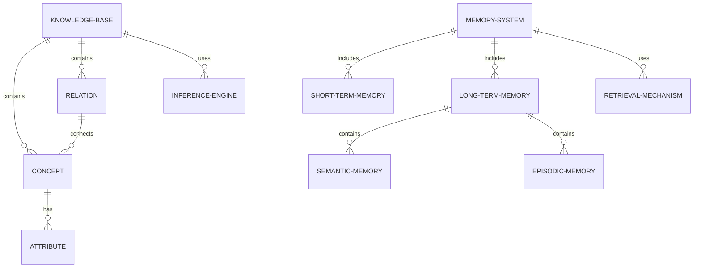

#### 交互关系图

```mermaid
graph TD
    A[Input] -->|Processes| B[Working Memory]
    B <-->|Interacts| C[Long-Term Memory]
    C -->|Retrieves| D[Knowledge Base]
    D -->|Informs| E[Reasoning Module]
    E -->|Updates| C
    E -->|Queries| D
    F[Learning Module] -->|Updates| D
    F -->|Modifies| C
    G[Attention Mechanism] -->|Focuses| B
    G -->|Selects| C
    H[Output] <-- E
```

### 数学模型：

知识图谱中的知识表示可以用三元组模型表示：

$$(h, r, t)$$

其中：
- $h$ 是头实体
- $r$ 是关系
- $t$ 是尾实体

向量化后可以用 TransE 模型表示：

$$\mathbf{h} + \mathbf{r} \approx \mathbf{t}$$

### 算法流程图：

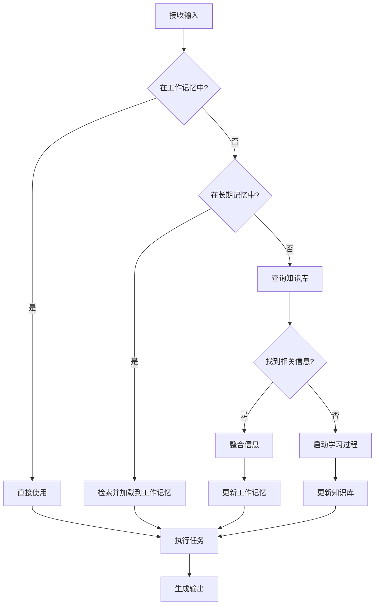

### 算法源代码：

以下是一个简化的知识库和记忆管理系统的 Python 实现示例：

```python
import networkx as nx
from collections import deque

class KnowledgeBase:
    def __init__(self):
        self.graph = nx.Graph()

    def add_fact(self, subject, predicate, object):
        self.graph.add_edge(subject, object, relation=predicate)

    def query(self, subject, predicate=None):
        if predicate:
            return [edge[1] for edge in self.graph.edges(subject, data=True) 
                    if edge[2]['relation'] == predicate]
        return list(self.graph.neighbors(subject))

class MemorySystem:
    def __init__(self, capacity=5):
        self.working_memory = deque(maxlen=capacity)
        self.long_term_memory = {}

    def add_to_working_memory(self, item):
        self.working_memory.append(item)

    def add_to_long_term_memory(self, key, value):
        self.long_term_memory[key] = value

    def retrieve_from_working_memory(self):
        return list(self.working_memory)

    def retrieve_from_long_term_memory(self, key):
        return self.long_term_memory.get(key)

class AIAgent:
    def __init__(self):
        self.knowledge_base = KnowledgeBase()
        self.memory = MemorySystem()

    def process_input(self, input_data):
        # 检查工作记忆
        if input_data in self.memory.retrieve_from_working_memory():
            return f"从工作记忆中检索到: {input_data}"

        # 检查长期记忆
        long_term_result = self.memory.retrieve_from_long_term_memory(input_data)
        if long_term_result:
            self.memory.add_to_working_memory(input_data)
            return f"从长期记忆中检索到: {long_term_result}"

        # 查询知识库
        kb_result = self.knowledge_base.query(input_data)
        if kb_result:
            self.memory.add_to_long_term_memory(input_data, kb_result)
            self.memory.add_to_working_memory(input_data)
            return f"从知识库中检索到: {kb_result}"

        # 学习新知识
        new_fact = f"关于{input_data}的新信息"
        self.knowledge_base.add_fact(input_data, "is_a", new_fact)
        self.memory.add_to_long_term_memory(input_data, new_fact)
        self.memory.add_to_working_memory(input_data)
        return f"学习到新知识: {new_fact}"

# 使用示例
agent = AIAgent()

# 添加一些初始知识
agent.knowledge_base.add_fact("狗", "is_a", "动物")
agent.knowledge_base.add_fact("猫", "is_a", "动物")

# 测试
print(agent.process_input("狗"))  # 从知识库检索
print(agent.process_input("狗"))  # 从工作记忆检索
print(agent.process_input("猫"))  # 从知识库检索
print(agent.process_input("鱼"))  # 学习新知识
print(agent.process_input("鱼"))  # 从长期记忆检索
```

### 实际场景应用：

1. 智能客服系统：
   - 存储产品信息和常见问题解答
   - 记录用户查询历史，提供个性化响应

2. 医疗诊断助手：
   - 维护大规模医学知识库
   - 存储患者病历和治疗记录

3. 教育辅助系统：
   - 构建学科知识图谱
   - 跟踪学生学习进度和知识掌握情况

4. 金融分析工具：
   - 存储市场数据和经济指标
   - 记录历史交易模式和决策结果

5. 智能家居控制：
   - 维护设备操作知识和用户偏好
   - 记录日常活动模式，实现智能预测

### 行业发展与未来趋势：

| 时期 | 主要特征 | 代表性技术/方法 |
|------|----------|-----------------|
| 2015-2017 | 结构化知识库 | 关系数据库、本体模型 |
| 2018-2020 | 知识图谱兴起 | Neo4j、知识嵌入 |
| 2021-2023 | 神经符号融合 | 神经逻辑推理、图神经网络 |
| 2024及以后 | 动态知识管理 | 持续学习、知识蒸馏 |

### 本章小结：

知识库与记忆管理是 AI Agent 智能行为的基石，它为 Agent 提供了理解、学习和决策的信息基础。本章讨论了知识表示、存储结构、检索机制等核心概念，以及实现有效知识管理系统的方法。主要要点包括：

1. 知识表示需要平衡表达能力、计算效率和可扩展性。
2. 有效的存储和检索机制对于处理大规模知识至关重要。
3. 集成短期和长期记忆可以提高 AI Agent 的认知能力和任务表现。
4. 处理不确定性和矛盾信息是知识管理系统面临的重要挑战。
5. 动态知识更新和学习能力是保持 AI Agent 长期有效性的关键。

未来的知识库与记忆管理系统发展趋势可能包括：
1. 更强大的跨模态知识表示和整合能力
2. 自动化知识获取和验证机制
3. 更高效的大规模知识推理技术
4. 个性化和上下文感知的知识应用
5. 与神经网络深度集成的符号-子符号混合系统

在实现知识库与记忆管理系统时，开发者应当注意：
1. 设计灵活的知识模型，以适应不同领域和任务需求
2. 实现高效的索引和缓存机制，优化检索性能
3. 考虑知识的时效性，实现自动更新和淘汰机制
4. 集成多源知识，并处理可能的冲突和不一致
5. 确保知识的可解释性和可追溯性，支持决策透明度

通过不断改进的知识库和记忆管理技术，AI Agent 将能够更好地理解复杂环境、学习新知识、并做出明智决策。这不仅提高了 AI 系统的智能水平和适应能力，也为实现更接近人类认知的人工智能奠定了基础。随着技术的进步，我们可以期待 AI Agent 在知识获取、推理和应用方面展现出越来越强大的能力，为各行各业带来深远的影响。


## 5.5 输出生成与自然语言生成

### 核心概念：

输出生成与自然语言生成（NLG）是 AI Agent 与外部世界交互的关键接口。这个模块负责将 Agent 的内部状态、决策结果和知识转化为人类可理解的形式，通常是自然语言文本。高质量的输出生成能力使 AI Agent 能够清晰、准确、自然地表达信息，极大地提升用户体验和系统的实用性。

### 问题背景：

随着 AI 技术的进步，用户对 AI 系统的输出质量要求越来越高。不再满足于简单的模板填充或固定回复，而是期望 AI 能够生成流畅、连贯、符合上下文的自然语言输出。这就要求 NLG 系统具备深度的语言理解和生成能力，能够适应不同的场景和用户需求。

### 问题描述：

在实现输出生成与自然语言生成时，开发者面临以下挑战：

1. 如何确保生成内容的准确性和相关性
2. 如何生成流畅、自然的语言表达
3. 如何适应不同的语言风格和语境
4. 如何处理长文本生成的连贯性问题
5. 如何在保持创造性的同时避免生成不适当或错误的内容

### 问题解决：

通过以下步骤可以构建有效的输出生成与 NLG 系统：

1. 内容规划：
   - 使用基于规则或学习的方法确定要表达的关键信息
   - 实现文档结构规划，确保输出的逻辑性

2. 句子规划：
   - 设计句子聚合策略，将相关信息组合成连贯的句子
   - 实现指代表达生成，提高文本的自然度

3. 语言实现：
   - 使用深度学习模型（如 Transformer）生成流畅的文本
   - 实现模板和神经生成的混合系统，平衡控制和灵活性

4. 上下文管理：
   - 维护对话历史，确保回复的连贯性
   - 实现长文本生成的主题一致性控制

5. 风格适配：
   - 使用风格迁移技术调整输出的语言风格
   - 实现个性化生成，适应不同用户偏好

6. 质量控制：
   - 集成事实检查机制，确保输出的准确性
   - 实现内容过滤，避免不适当或有害的输出

### 边界与外延：

输出生成与 NLG 系统的应用范围包括：
- 对话系统的回复生成
- 自动摘要和报告生成
- 数据到文本的转换（如自动新闻写作）
- 多语言内容生成
- 创意写作辅助

### 概念结构与核心要素组成：

输出生成与 NLG 系统的核心组件：
1. 内容选择器
2. 文档规划器
3. 句子聚合器
4. 指代生成器
5. 语言模型
6. 风格调整器
7. 质量检查器

### 概念之间的关系：

#### 概念核心属性维度对比

| 属性 | 基于规则的方法 | 统计方法 | 神经网络方法 |
|------|----------------|----------|--------------|
| 可控性 | 高 | 中 | 低 |
| 灵活性 | 低 | 中 | 高 |
| 生成质量 | 中 | 中-高 | 高 |
| 训练数据需求 | 低 | 中 | 高 |
| 计算复杂度 | 低 | 中 | 高 |
| 创造性 | 低 | 中 | 高 |

#### 概念联系的ER 实体关系

```mermaid
erDiagram
    NLG-SYSTEM ||--o{ CONTENT-PLANNER : includes
    NLG-SYSTEM ||--o{ SENTENCE-PLANNER : includes
    NLG-SYSTEM ||--o{ LINGUISTIC-REALIZER : includes
    CONTENT-PLANNER ||--o{ DOCUMENT-STRUCTURER : uses
    SENTENCE-PLANNER ||--o{ AGGREGATION-MODULE : uses
    SENTENCE-PLANNER ||--o{ REFERRING-EXPRESSION-GENERATOR : uses
    LINGUISTIC-REALIZER ||--o{ LANGUAGE-MODEL : uses
    LINGUISTIC-REALIZER ||--o{ MORPHOLOGY-HANDLER : uses
    NLG-SYSTEM ||--o{ STYLE-ADAPTER : includes
    NLG-SYSTEM ||--o{ QUALITY-CONTROLLER : includes
```

#### 交互关系图

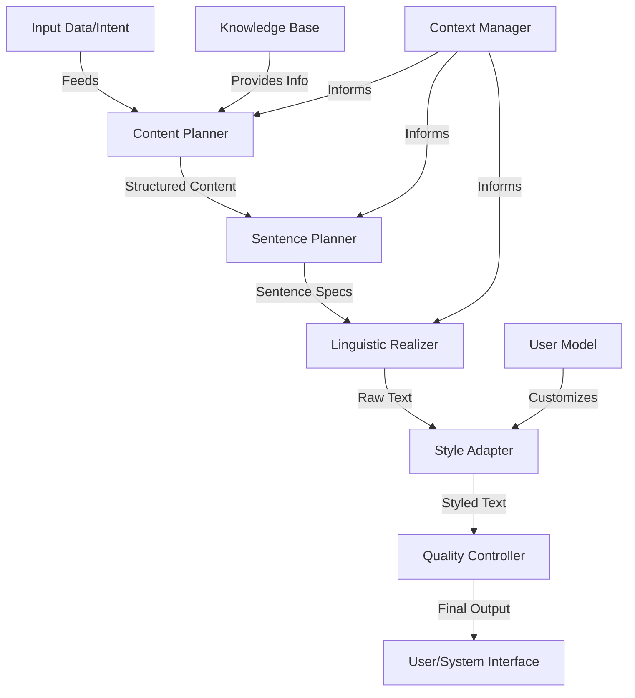

### 数学模型：

语言模型的核心是计算序列概率，可以用条件概率表示：

$$P(w_1, ..., w_n) = \prod_{i=1}^n P(w_i | w_1, ..., w_{i-1})$$

在 Transformer 模型中，自注意力机制可以表示为：

$$\text{Attention}(Q, K, V) = \text{softmax}\left(\frac{QK^T}{\sqrt{d_k}}\right)V$$

其中 Q, K, V 分别是查询、键和值矩阵。

### 算法流程图：

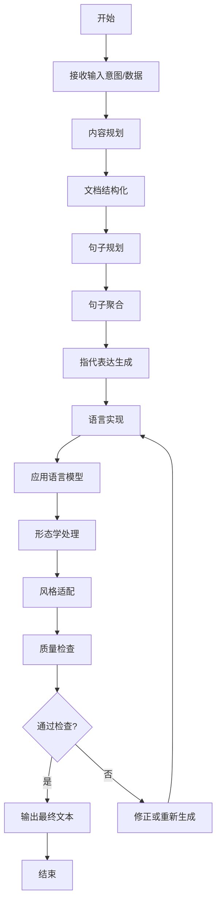

### 算法源代码：

以下是一个简化的 NLG 系统实现示例，使用模板和语言模型相结合的方法：

```python
import random
from transformers import GPT2LMHeadModel, GPT2Tokenizer

class NLGSystem:
    def __init__(self):
        self.templates = {
            "greeting": ["Hello!", "Hi there!", "Greetings!"],
            "weather_info": ["The weather is {weather} today.", "Today's forecast: {weather}."],
            "farewell": ["Goodbye!", "See you later!", "Have a great day!"]
        }
        self.model = GPT2LMHeadModel.from_pretrained("gpt2")
        self.tokenizer = GPT2Tokenizer.from_pretrained("gpt2")

    def plan_content(self, intent, data):
        content = []
        if intent == "weather_report":
            content = ["greeting", "weather_info", "farewell"]
        # Add more intents and content plans as needed
        return content

    def generate_sentence(self, content_type, data):
        if content_type in self.templates:
            template = random.choice(self.templates[content_type])
            return template.format(**data)
        else:
            # Use GPT-2 for more flexible generation
            prompt = f"Generate a {content_type}: "
            input_ids = self.tokenizer.encode(prompt, return_tensors="pt")
            output = self.model.generate(input_ids, max_length=50, num_return_sequences=1)
            return self.tokenizer.decode(output[0], skip_special_tokens=True)

    def apply_style(self, text, style):
        # Simplified style application
        if style == "formal":
            return text.replace("Hi there!", "Good day,").replace("Goodbye!", "Farewell.")
        return text

    def quality_check(self, text):
        # Simplified quality check
        inappropriate_words = ["bad", "terrible", "awful"]
        return not any(word in text.lower() for word in inappropriate_words)

    def generate_output(self, intent, data, style="casual"):
        content_plan = self.plan_content(intent, data)
        output = []
        for content_type in content_plan:
            sentence = self.generate_sentence(content_type, data)
            styled_sentence = self.apply_style(sentence, style)
            if self.quality_check(styled_sentence):
                output.append(styled_sentence)
            else:
                output.append(self.generate_sentence(content_type, data))  # Retry
        return " ".join(output)

# 使用示例
nlg = NLGSystem()
output = nlg.generate_output("weather_report", {"weather": "sunny"}, style="formal")
print(output)
```

### 实际场景应用：

1. 智能客服对话系统：
   - 生成个性化、上下文相关的回复
   - 适应不同客户的语言风格和复杂度

2. 自动新闻生成：
   - 将结构化数据转换为新闻报道
   - 生成不同风格和长度的文章版本

3. 医疗报告生成：
   - 将医疗检查结果转化为易懂的报告
   - 生成针对医生和患者的不同版本

4. 多语言内容本地化：
   - 自动翻译并适应不同文化背景的内容
   - 保持原文的意图和风格

5. 教育系统的反馈生成：
   - 根据学生表现生成个性化的评语
   - 提供鼓励性和建设性的反馈

### 行业发展与未来趋势：

| 时期 | 主要特征 | 代表性技术/方法 |
|------|----------|-----------------|
| 2015-2017 | 基于规则和模板 | 预定义模板、CFG |
| 2018-2020 | 统计方法与神经网络结合 | Seq2Seq、Attention 机制 |
| 2021-2023 | 大规模预训练语言模型 | GPT-3、T5、BART |
| 2024及以后 | 多模态和交互式 NLG | 跨模态生成、实时适应性 NLG |

### 本章小结：

输出生成与自然语言生成是 AI Agent 与用户进行有效沟通的关键能力。本章讨论了 NLG 系统的核心组件、主要挑战以及解决方案。主要要点包括：

1. NLG 系统需要平衡内容的准确性、语言的流畅性和风格的适应性。
2. 内容规划、句子规划和语言实现是 NLG 过程的三个主要阶段。
3. 结合规则基础方法和深度学习技术可以实现更灵活、高质量的文本生成。
4. 上下文管理和个性化适应对于生成连贯、相关的输出至关重要。
5. 质量控制机制是确保生成内容安全性和适当性的必要环节。

未来的 NLG 系统发展趋势可能包括：
1. 更强大的上下文理解和长文本生成能力
2. 多模态输入的整合，如结合图像、音频的文本生成
3. 更精细的风格控制和情感表达能力
4. 实时交互式生成，能够根据用户反馈即时调整
5. 增强的创造性写作能力，如生成故事、诗歌等

在实现 NLG 系统时，开发者应当注意：
1. 设计灵活的内容规划策略，以适应不同的输出需求
2. 实现强大的上下文管理机制，确保长对话的连贯性
3. 注重输出的多样性，避免重复和单调的表达
4. 集成有效的事实检查和内容过滤机制
5. 考虑道德和偏见问题，确保生成内容的公平性和中立性

通过不断改进的 NLG 技术，AI Agent 将能够更自然、更有效地与用户交流，提供更丰富、更个性化的交互体验。这不仅提高了 AI 系统的可用性和接受度，也为实现更高级的人机交互奠定了基础。随着技术的进步，我们可以期待 AI Agent 在语言表达方面展现出越来越接近人类水平的能力，为各种应用场景带来革命性的变革。


