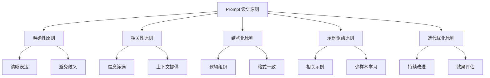
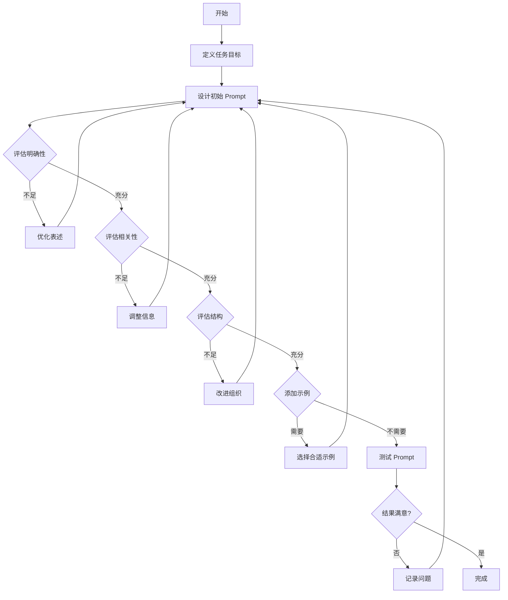
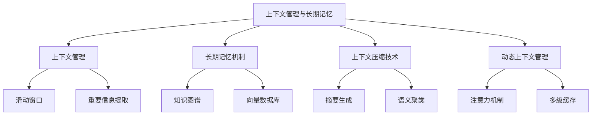
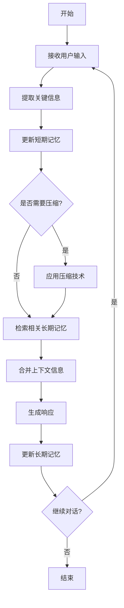
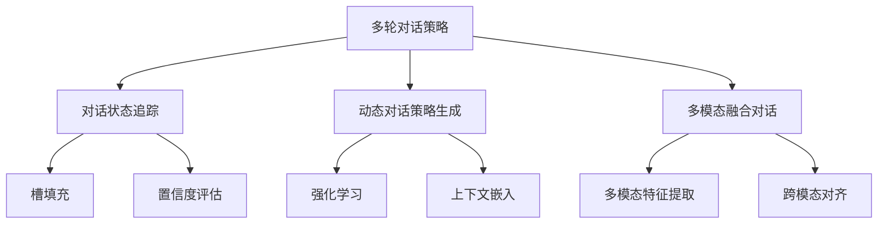
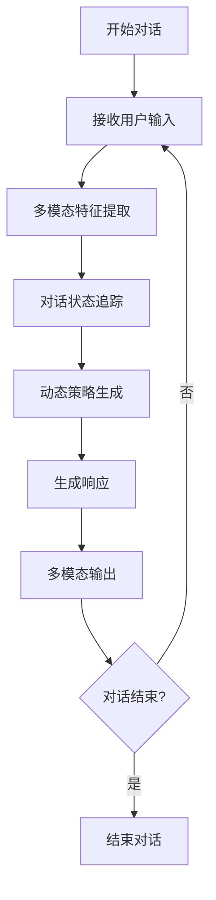
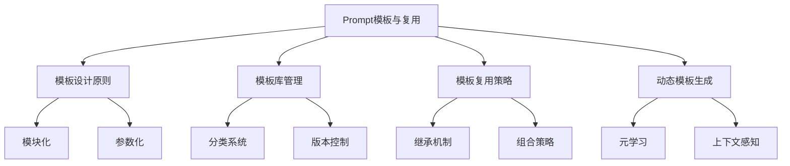
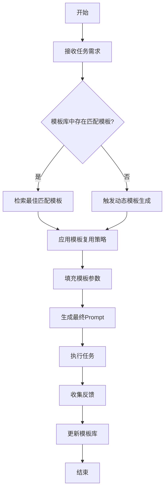
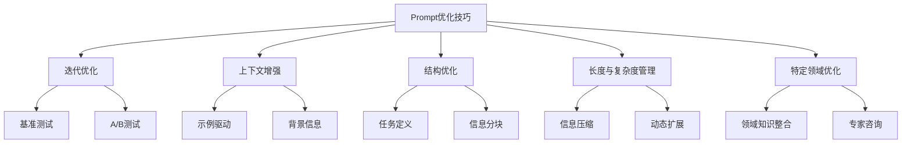
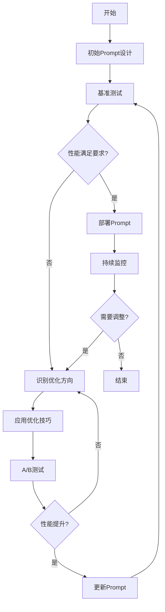

# 第6章：Prompt 工程与优化

在人工智能和自然语言处理领域，Prompt 工程已经成为一个至关重要的研究方向。随着大语言模型（LLM）的快速发展，如何有效地设计和优化 Prompt 以获得最佳的模型输出成为了 AI Agent 开发中的核心挑战之一。本章将深入探讨 Prompt 工程的各个方面，包括设计原则、上下文管理、多轮对话策略、模板复用以及优化技巧，为读者提供全面的 Prompt 工程知识和实践指导。

## 6.1 Prompt 设计原则

Prompt 设计是 AI Agent 开发中的关键环节，直接影响着模型的输出质量和任务完成效果。本节将详细介绍 Prompt 设计的核心原则，帮助开发者创建更加有效和精确的 Prompt。

### 6.1.1 明确性原则

* 核心概念：
  明确性原则是指在设计 Prompt 时，应该清晰、准确地表达任务需求和期望输出，避免模糊不清或歧义的表述。

* 问题背景：
  大语言模型虽然具有强大的自然语言理解能力，但它们并不能真正"理解"人类的意图。模糊或不明确的 Prompt 可能导致模型产生不相关或错误的输出。

* 问题描述：
  如何设计明确的 Prompt 以确保模型能够准确理解任务需求并生成符合预期的输出？

* 问题解决：
1. 使用清晰、简洁的语言描述任务。
2. 明确指定输出的格式和结构。
3. 提供具体的示例或模板。
4. 避免使用模糊或多义的词语。
5. 使用命令式语句直接指示模型应该执行的操作。

* 边界与外延：
  明确性原则适用于各种类型的 Prompt，包括但不限于问答、文本生成、摘要和分类任务。然而，在某些创意任务中，适度的模糊性可能会激发模型的创造力。

### 6.1.2 相关性原则

* 核心概念：
  相关性原则强调 Prompt 中包含的信息应与任务目标直接相关，避免引入无关或干扰性的内容。

* 问题背景：
  大语言模型倾向于利用 Prompt 中提供的所有信息。包含过多无关信息可能会导致模型偏离任务目标或产生不必要的输出。

* 问题描述：
  如何确保 Prompt 中的信息与任务目标高度相关，同时提供足够的上下文信息？

* 问题解决：
1. 仔细筛选和组织 Prompt 中的信息，确保每个元素都服务于任务目标。
2. 删除可能分散模型注意力的无关细节。
3. 使用任务相关的专业术语和概念。
4. 提供必要的背景信息，但避免过度详细。
5. 定期审查和更新 Prompt，确保其持续相关性。

* 边界与外延：
  相关性原则在信息检索、问答系统和决策支持等应用中尤为重要。然而，在某些创意任务或开放式对话中，适当引入看似无关的信息有时可能会激发意想不到的创意或见解。

### 6.1.3 结构化原则

* 核心概念：
  结构化原则强调 Prompt 应具有清晰的结构和组织，以便模型更容易理解和处理信息。

* 问题背景：
  大语言模型在处理结构良好的输入时表现更佳。无序或混乱的 Prompt 可能导致模型输出质量下降或产生不一致的结果。

* 问题描述：
  如何设计结构化的 Prompt 以提高模型的理解和处理效率？

* 问题解决：
1. 使用标题、小标题和段落来组织信息。
2. 采用列表或表格形式呈现多个项目或数据。
3. 使用一致的格式和风格。
4. 按照逻辑顺序排列信息，如时间顺序或重要性顺序。
5. 使用分隔符或特殊标记来区分 Prompt 的不同部分。

* 边界与外延：
  结构化原则适用于大多数 Prompt 设计场景，尤其是在处理复杂任务或大量信息时。然而，在某些自然对话或创意写作任务中，过度结构化可能会限制模型的灵活性。

### 6.1.4 示例驱动原则

* 核心概念：
  示例驱动原则强调通过提供具体示例来指导模型生成期望的输出格式和内容。

* 问题背景：
  大语言模型具有强大的模式识别和模仿能力。通过提供高质量的示例，可以显著提高模型输出的质量和一致性。

* 问题描述：
  如何有效地使用示例来引导模型生成符合预期的输出？

* 问题解决：
1. 提供与任务目标高度相关的示例。
2. 使用多个不同的示例来覆盖各种可能的情况。
3. 确保示例的质量和准确性。
4. 在示例中突出关键特征或格式要求。
5. 考虑使用"少样本学习"（few-shot learning）技术，提供多个示例并要求模型遵循相同的模式。

* 边界与外延：
  示例驱动原则在各种任务中都非常有效，特别是在处理结构化输出、特定格式的文本生成或复杂的推理任务时。然而，过度依赖示例可能会限制模型的创造性或导致过度拟合特定模式。

### 6.1.5 迭代优化原则

* 核心概念：
  迭代优化原则强调 Prompt 设计是一个持续改进的过程，需要通过多次尝试和调整来达到最佳效果。

* 问题背景：
  完美的 Prompt 很少能在第一次尝试时就产生。模型的输出可能因细微的措辞变化而显著不同，因此需要不断调整和优化。

* 问题描述：
  如何通过迭代过程有效地优化 Prompt 设计？

* 问题解决：
1. 从基础 Prompt 开始，逐步添加或修改元素。
2. 记录每次迭代的变化和相应的输出结果。
3. 使用 A/B 测试比较不同版本的 Prompt 效果。
4. 收集用户反馈并根据实际应用场景调整 Prompt。
5. 定期审查和更新 Prompt，以适应新的需求或模型更新。

* 边界与外延：
  迭代优化原则适用于所有类型的 Prompt 设计，但在处理复杂任务或需要高精度输出的场景中尤为重要。然而，过度优化可能导致 Prompt 变得过于特定化，失去通用性。

### 概念结构与核心要素组成



### 概念之间的关系

| 原则 | 核心目标 | 主要技术 | 适用场景 | 潜在挑战 |
|------|----------|----------|----------|----------|
| 明确性原则 | 准确传达任务需求 | 清晰表述、具体指令 | 所有任务类型 | 可能限制创造性 |
| 相关性原则 | 聚焦任务目标 | 信息筛选、上下文管理 | 信息检索、问答系统 | 可能忽略有价值的边缘信息 |
| 结构化原则 | 提高信息处理效率 | 逻辑组织、格式统一 | 复杂任务、大量信息处理 | 可能降低自然度 |
| 示例驱动原则 | 引导期望输出 | 提供示例、模式识别 | 特定格式输出、复杂推理 | 可能导致过度拟合 |
| 迭代优化原则 | 持续改进 Prompt 质量 | A/B 测试、用户反馈 | 所有需要高精度的场景 | 耗时、可能过度优化 |

### 数学模型

Prompt 质量评估模型：

$$Q = \alpha C + \beta R + \gamma S + \delta E + \epsilon I$$

其中：
- $Q$ 表示 Prompt 的总体质量
- $C$ 表示明确性得分
- $R$ 表示相关性得分
- $S$ 表示结构化得分
- $E$ 表示示例效果得分
- $I$ 表示迭代优化程度
- $\alpha, \beta, \gamma, \delta, \epsilon$ 为权重系数，且 $\alpha + \beta + \gamma + \delta + \epsilon = 1$

### 算法流程图



### 算法源代码

```python
class PromptDesigner:
    def __init__(self):
        self.prompt = ""
        self.task_goal = ""
        self.examples = []
        
    def set_task_goal(self, goal):
        self.task_goal = goal
        
    def design_initial_prompt(self):
        # 实现初始 Prompt 设计逻辑
        pass
    
    def evaluate_clarity(self):
        # 实现明确性评估逻辑
        pass
    
    def evaluate_relevance(self):
        # 实现相关性评估逻辑
        pass
    
    def evaluate_structure(self):
        # 实现结构评估逻辑
        pass
    
    def add_examples(self, examples):
        self.examples.extend(examples)
        
    def optimize_prompt(self):
        while True:
            self.design_initial_prompt()
            if self.evaluate_clarity() and self.evaluate_relevance() and self.evaluate_structure():
                break
            # 实现优化逻辑
        
    def test_prompt(self):
        # 实现 Prompt 测试逻辑
        pass
    
    def iterate_and_improve(self):
        while not self.test_prompt():
            self.optimize_prompt()
        
    def get_final_prompt(self):
        return self.prompt

# 使用示例
designer = PromptDesigner()
designer.set_task_goal("生成一篇关于人工智能的科普文章")
designer.add_examples(["示例1", "示例2"])
designer.iterate_and_improve()
final_prompt = designer.get_final_prompt()
print(final_prompt)
```

### 实际场景应用

1. 智能客服系统：使用明确性原则和结构化原则设计 Prompt，以准确理解用户查询并提供结构化的回答。

2. 内容生成平台：应用示例驱动原则和迭代优化原则，不断改进 Prompt 以生成高质量、多样化的内容。

3. 数据分析助手：利用相关性原则和结构化原则，确保 Prompt 包含必要的数据上下文和分析要求。

4. 代码生成工具：结合明确性原则和示例驱动原则，设计能够准确描述编程需求并提供代码示例的 Prompt。

5. 教育辅助系统：运用所有设计原则，创建能够适应不同学习者需求的个性化教学 Prompt。

### 最佳实践 tips

1. 始终从用户需求出发，确保 Prompt 设计与实际应用场景紧密结合。

2. 建立 Prompt 库，收集和分类有效的 Prompt，便于复用和优化。

3. 定期进行 A/B 测试，比较不同 Prompt 设计的效果。

4. 收集并分析用户反馈，持续优化 Prompt 设计。

5. 保持 Prompt 的简洁性，避免不必要的复杂度。

6. 考虑模型的特性和限制，调整 Prompt 以最大化模型的性能。

7. 使用版本控制系统管理 Prompt，便于追踪变更和回滚。

8. 在团队中建立 Prompt 设计的最佳实践和评审机制。

9. 定期更新 Prompt 以适应模型的更新和新的应用需求。

10. 在 Prompt 中包含错误处理和异常情况的指导。

### 行业发展与未来趋势

| 时期 | 主要特征 | 关键技术 | 挑战 |
|------|----------|----------|------|
| 早期（2020年前） | 简单的问答和指令 | 规则基础的模板 | 灵活性低，适用范围窄 |
| 当前（2020-2023） | 上下文感知，多轮对话 | Few-shot learning, Chain-of-thought | 提示注入，一致性维护 |
| 近期未来（2024-2026） | 动态适应，个性化 | 元学习，持续学习 | 隐私保护，计算效率 |
| 长期展望（2026+） | 自主优化，跨模态 | 神经符号学习，多模态融合 | 伦理问题，可解释性 |

## 6.2 上下文管理与长期记忆

上下文管理和长期记忆是 AI Agent 实现持续、连贯对话的关键技术。本节将深入探讨如何有效管理对话上下文并实现长期记忆机制，以提升 AI Agent 的交互体验和任务处理能力。

### 6.2.1 上下文管理的重要性

* 核心概念：
  上下文管理是指在对话过程中保持和更新相关信息，以确保 AI Agent 能够理解和响应用户的连续输入。

* 问题背景：
  大语言模型通常只能处理有限长度的输入，而真实对话往往跨越多个交互回合，需要维护连贯的上下文。

* 问题描述：
  如何在有限的输入长度限制下，有效管理和利用对话上下文信息？

* 问题解决：
1. 滑动窗口技术：保留最近 N 轮对话作为上下文。
2. 重要信息提取：从历史对话中提取关键信息，压缩上下文。
3. 动态权重分配：根据相关性对不同时间点的上下文信息赋予不同权重。
4. 分层上下文管理：将上下文分为短期、中期和长期记忆，采用不同的更新策略。
5. 上下文压缩：使用摘要技术压缩长对话历史。

* 边界与外延：
  上下文管理不仅适用于文本对话，也可扩展到多模态交互，如语音对话或视觉辅助的交互系统。

### 6.2.2 长期记忆机制

* 核心概念：
  长期记忆机制允许 AI Agent 存储和检索跨越多个会话的信息，实现持续学习和个性化交互。

* 问题背景：
  传统的对话系统通常只能维护单次会话的上下文，无法利用历史交互中积累的知识。

* 问题描述：
  如何设计和实现有效的长期记忆机制，使 AI Agent 能够利用历史交互信息改善用户体验？

* 问题解决：
1. 知识图谱：构建和更新用户特定的知识图谱，存储长期信息。
2. 向量数据库：使用嵌入技术将历史信息转换为向量，支持高效检索。
3. 记忆检索增强：在生成响应时，动态检索相关的长期记忆。
4. 记忆合并策略：设计算法将新信息与现有长期记忆整合。
5. 遗忘机制：实现基于时间和相关性的自动遗忘机制，维护记忆的时效性。

* 边界与外延：
  长期记忆机制可以应用于个性化推荐、教育辅助、健康管理等多个领域，提供连续性的智能服务。

### 6.2.3 上下文压缩技术

* 核心概念：
  上下文压缩技术旨在减少对话历史的存储空间，同时保留关键信息，以适应模型的输入长度限制。

* 问题背景：
  随着对话进行，累积的上下文信息可能超过模型的最大输入长度，需要有效的压缩策略。

* 问题描述：
  如何在保留关键信息的同时，有效压缩对话历史？

* 问题解决：
1. 摘要生成：使用抽取式或生成式摘要技术压缩对话历史。
2. 关键信息提取：识别和保留对话中的关键实体、事件和意图。
3. 语义聚类：将相似的对话片段聚类，用代表性语句替代。
4. 时间衰减：根据时间顺序对历史信息进行加权，较旧的信息获得较低的权重。
5. 任务相关性过滤：根据当前任务目标过滤不相关的历史信息。

* 边界与外延：
  上下文压缩技术不仅适用于文本对话，也可以扩展到其他形式的序列数据处理，如时间序列分析或日志压缩。

### 6.2.4 动态上下文管理

* 核心概念：
  动态上下文管理是指根据对话进展和任务需求，实时调整上下文内容和管理策略。

* 问题背景：
  静态的上下文管理策略可能无法适应复杂多变的对话场景，需要更灵活的方法。

* 问题描述：
  如何实现自适应的上下文管理，以适应不同的对话阶段和任务需求？

* 问题解决：
1. 注意力机制：使用注意力模型动态关注相关的上下文信息。
2. 多级缓存：设计短期、中期和长期记忆缓存，动态调整信息流动。
3. 上下文重要性评估：实时评估每条信息的重要性，动态调整保留策略。
4. 任务感知型上下文选择：根据当前任务自动选择相关的上下文信息。
5. 用户反馈整合：根据用户的反馈调整上下文管理策略。

* 边界与外延：
  动态上下文管理可以应用于复杂的多轮对话系统、个性化推荐引擎，以及需要长期交互的AI助手。

### 概念结构与核心要素组成



### 数学模型

上下文相关性评分模型：

$$R(c_i) = \alpha T(c_i) + \beta S(c_i, q) + \gamma F(c_i)$$

其中：
- $R(c_i)$ 是上下文片段 $c_i$ 的相关性得分
- $T(c_i)$ 是时间衰减函数
- $S(c_i, q)$ 是与当前查询 $q$ 的语义相似度
- $F(c_i)$ 是片段的频率权重
- $\alpha, \beta, \gamma$ 是权重系数，且 $\alpha + \beta + \gamma = 1$

### 算法流程图



### 算法源代码

```python
import numpy as np
from sklearn.feature_extraction.text import TfidfVectorizer
from sklearn.metrics.pairwise import cosine_similarity

class ContextManager:
    def __init__(self, max_context_length=1000):
        self.short_term_memory = []
        self.long_term_memory = {}
        self.max_context_length = max_context_length
        self.vectorizer = TfidfVectorizer()
        
    def add_to_short_term_memory(self, utterance):
        self.short_term_memory.append(utterance)
        if len(' '.join(self.short_term_memory)) > self.max_context_length:
            self.compress_context()
    
    def compress_context(self):
        # 使用TF-IDF和余弦相似度选择最重要的句子
        tfidf_matrix = self.vectorizer.fit_transform(self.short_term_memory)
        similarities = cosine_similarity(tfidf_matrix[-1], tfidf_matrix[:-1])[0]
        top_indices = similarities.argsort()[-5:]  # 保留最相关的5个句子
        self.short_term_memory = [self.short_term_memory[i] for i in sorted(top_indices)] + [self.short_term_memory[-1]]
    
    def update_long_term_memory(self, key, value):
        self.long_term_memory[key] = value
    
    def retrieve_from_long_term_memory(self, query):
        # 简单的基于关键词的检索
        return [value for key, value in self.long_term_memory.items() if query in key]
    
    def get_context(self, query):
        relevant_long_term = self.retrieve_from_long_term_memory(query)
        return ' '.join(self.short_term_memory + relevant_long_term)

# 使用示例
context_manager = ContextManager()
context_manager.add_to_short_term_memory("用户询问天气")
context_manager.add_to_short_term_memory("AI回答今天晴天")
context_manager.update_long_term_memory("用户喜好", "用户喜欢晴天")
context = context_manager.get_context("天气")
print(context)
```

### 实际场景应用

1. 智能客服系统：利用长期记忆存储用户的历史查询和偏好，提供个性化服务。

2. 教育辅助平台：记录学生的学习进度和难点，动态调整教学内容和难度。

3. 健康管理助手：维护用户的健康档案，提供连续性的健康建议和监测。

4. 智能家居系统：学习和适应用户的生活习惯，自动调整家居环境。

5. 个人助理应用：跨会话记忆用户的任务和偏好，提供持续的任务管理和建议。

### 最佳实践 tips

1. 定期评估和清理长期记忆，删除过时或不再相关的信息。

2. 实现分级存储策略，频繁使用的信息存储在快速访问的存储中。

3. 使用模糊匹配技术提高长期记忆检索的灵活性。

4. 在隐私敏感的应用中，实现用户可控的记忆管理机制。

5. 结合用户反馈持续优化上下文管理策略。

6. 定期进行A/B测试，评估不同上下文管理策略的效果。

7. 实现上下文可视化工具，帮助开发者理解和调试上下文管理过程。

8. 考虑多模态信息的整合，如文本、图像和语音等。

9. 设计容错机制，处理上下文信息不完整或矛盾的情况。

10. 优化上下文压缩和检索算法，以适应大规模应用场景。

## 6.3 多轮对话策略

多轮对话是 AI Agent 与用户进行深入、持续交互的关键能力。本节将探讨如何设计和实现有效的多轮对话策略，以提升对话的连贯性、信息获取的效率以及用户体验。

### 6.3.1 多轮对话的特点与挑战

* 核心概念：
  多轮对话是指 AI Agent 与用户进行的连续交互过程，涉及多个问答或指令-响应对。

* 问题背景：
  与单轮对话相比，多轮对话需要维护上下文连贯性，理解隐含信息，并处理话题转换。

* 问题描述：
  如何设计 AI Agent 以有效管理多轮对话的复杂性，同时保持对话的自然性和目标导向性？

* 问题解决：
1. 上下文追踪：实现动态上下文管理机制。
2. 意图识别：准确识别用户在每轮对话中的意图。
3. 状态管理：维护对话状态，跟踪对话进展
4. 话题管理：处理话题转换和多话题并行。
5. 澄清和确认策略：在信息不明确时主动寻求澄清。
6. 长期目标跟踪：在多轮对话中保持对整体目标的关注。

* 边界与外延：
  多轮对话策略不仅适用于文本聊天，还可扩展到语音交互、多模态对话系统等场景。

### 6.3.2 对话状态追踪（DST）

* 核心概念：
  对话状态追踪是指在多轮对话过程中，实时更新和维护对话的当前状态，包括用户目标、已获取的信息和待解决的问题。

* 问题背景：
  在复杂的多轮对话中，准确追踪对话状态对于提供连贯和相关的响应至关重要。

* 问题描述：
  如何设计一个有效的对话状态追踪系统，能够准确捕捉和更新对话的动态变化？

* 问题解决：
1. 槽填充（Slot Filling）：识别和填充对话中的关键信息槽。
2. 置信度评估：对每个槽位的信息进行置信度评估。
3. 状态更新策略：设计规则或使用机器学习模型来更新对话状态。
4. 历史信息整合：将新信息与历史状态进行整合。
5. 多假设追踪：维护多个可能的对话状态假设。

* 边界与外延：
  DST 技术可应用于任务导向型对话系统、个人助理、客户服务等多个领域。

### 6.3.3 动态对话策略生成

* 核心概念：
  动态对话策略生成是指 AI Agent 根据当前对话状态和上下文，实时生成最适合的对话策略。

* 问题背景：
  预定义的静态对话策略往往难以应对复杂多变的对话场景，需要更灵活的动态策略。

* 问题描述：
  如何设计一个能够动态生成对话策略的系统，以适应不同的对话情况和用户需求？

* 问题解决：
1. 强化学习：使用强化学习算法学习最优对话策略。
2. 上下文嵌入：利用深度学习模型捕捉复杂的上下文信息。
3. 多目标优化：平衡信息获取、用户满意度等多个目标。
4. 个性化适应：根据用户特征和历史交互调整策略。
5. 实时策略调整：基于用户反馈和对话进展动态调整策略。

* 边界与外延：
  动态对话策略生成可以应用于智能客服、教育辅助系统、游戏 NPC 等多个领域。

### 6.3.4 多模态融合对话

* 核心概念：
  多模态融合对话是指在对话过程中整合文本、语音、图像等多种模态的信息。

* 问题背景：
  现实世界的人机交互往往涉及多种感知模态，单一模态的对话系统难以满足复杂场景的需求。

* 问题描述：
  如何有效地融合和利用多模态信息，以增强对话系统的理解能力和表达能力？

* 问题解决：
1. 多模态特征提取：使用专门的模型处理不同模态的输入。
2. 跨模态对齐：建立不同模态信息之间的对应关系。
3. 多模态融合策略：设计有效的方法整合不同模态的信息。
4. 注意力机制：在融合过程中关注最相关的模态信息。
5. 多模态生成：能够生成多模态的输出响应。

* 边界与外延：
  多模态融合对话技术可应用于虚拟助手、智能家居、增强现实交互等领域。

### 概念结构与核心要素组成



### 数学模型

动态对话策略选择模型：

$$\pi^*(s) = \arg\max_a Q^*(s, a)$$

$$Q^*(s, a) = R(s, a) + \gamma \sum_{s'} P(s'|s, a) \max_{a'} Q^*(s', a')$$

其中：
- $\pi^*(s)$ 是最优策略
- $Q^*(s, a)$ 是状态-动作值函数
- $R(s, a)$ 是即时奖励函数
- $\gamma$ 是折扣因子
- $P(s'|s, a)$ 是状态转移概率

### 算法流程图



### 算法源代码

```python
import numpy as np
from sklearn.feature_extraction.text import CountVectorizer
from sklearn.naive_bayes import MultinomialNB

class MultiTurnDialogueSystem:
    def __init__(self):
        self.state = {}
        self.vectorizer = CountVectorizer()
        self.intent_classifier = MultinomialNB()
        self.intents = ['greeting', 'query', 'farewell']
        
    def extract_features(self, utterance):
        return self.vectorizer.transform([utterance])
    
    def train_intent_classifier(self, X, y):
        X_vec = self.vectorizer.fit_transform(X)
        self.intent_classifier.fit(X_vec, y)
    
    def predict_intent(self, utterance):
        features = self.extract_features(utterance)
        return self.intent_classifier.predict(features)[0]
    
    def update_state(self, utterance, intent):
        # 简单的状态更新逻辑
        self.state['last_utterance'] = utterance
        self.state['current_intent'] = intent
    
    def generate_response(self, intent):
        # 简单的响应生成逻辑
        if intent == 'greeting':
            return "你好！有什么我可以帮助你的吗？"
        elif intent == 'query':
            return "我理解你的问题，让我为你查找相关信息。"
        elif intent == 'farewell':
            return "再见！如果还有问题随时问我。"
        else:
            return "抱歉，我没有理解你的意思。能请你重新表述一下吗？"
    
    def dialogue_turn(self, user_input):
        intent = self.predict_intent(user_input)
        self.update_state(user_input, intent)
        response = self.generate_response(intent)
        return response

# 使用示例
system = MultiTurnDialogueSystem()

# 训练意图分类器（实际应用中需要更多的训练数据）
X = ["你好", "天气怎么样", "再见"]
y = ["greeting", "query", "farewell"]
system.train_intent_classifier(X, y)

# 模拟对话
print(system.dialogue_turn("你好"))
print(system.dialogue_turn("今天天气如何？"))
print(system.dialogue_turn("谢谢，再见"))
```

### 实际场景应用

1. 智能客服系统：处理复杂的多轮查询，解决用户问题。

2. 虚拟助手：管理日程、回答问题、执行任务等持续性交互。

3. 教育对话系统：进行个性化辅导，根据学生反应调整教学策略。

4. 医疗咨询机器人：通过多轮对话收集症状信息，提供初步诊断建议。

5. 旅游规划助手：协助用户规划行程，处理复杂的多步骤决策过程。

### 最佳实践 tips

1. 设计清晰的对话流程，包括开场、信息收集、问题解决和结束阶段。

2. 实现健壮的错误处理机制，优雅地处理理解错误和系统故障。

3. 使用混合策略，结合规则基础和机器学习方法。

4. 定期分析对话日志，识别常见的失败模式和改进机会。

5. 实现上下文相关的帮助功能，在用户困惑时主动提供指导。

6. 设计自然的话题转换机制，避免生硬的对话跳转。

7. 使用情感分析技术，根据用户情绪调整对话策略。

8. 实现多轮澄清机制，在信息不足时主动寻求额外信息。

9. 设计灵活的回退策略，在对话陷入困境时优雅地转换话题或寻求人工协助。

10. 持续收集用户反馈，迭代优化对话策略和响应质量。

## 6.4 Prompt 模板与复用

Prompt 模板和复用机制是提高 AI Agent 开发效率和一致性的关键策略。本节将探讨如何设计、管理和有效利用 Prompt 模板，以及如何在不同场景中复用和适配这些模板。

### 6.4.1 Prompt 模板设计原则

* 核心概念：
  Prompt 模板是预定义的、可参数化的 Prompt 结构，用于生成特定类型的任务或查询的 Prompt。

* 问题背景：
  在大规模 AI 应用开发中，为每个任务手动编写 Prompt 既耗时又容易出错，需要一种标准化和可复用的方法。

* 问题描述：
  如何设计高质量、灵活且可复用的 Prompt 模板？

* 问题解决：
1. 模块化设计：将 Prompt 分解为可独立配置的组件。
2. 参数化：使用占位符允许动态插入特定信息。
3. 版本控制：实现模板的版本管理，便于追踪变更和回滚。
4. 文档化：为每个模板提供清晰的使用说明和示例。
5. 可扩展性：设计允许自定义扩展的模板结构。

* 边界与外延：
  Prompt 模板可应用于各种 NLP 任务，如文本生成、问答系统、情感分析等。

### 6.4.2 模板库管理

* 核心概念：
  模板库管理是指系统化地组织、存储和维护 Prompt 模板的过程。

* 问题背景：
  随着 AI 应用的扩展，模板数量急剧增加，需要有效的管理策略来确保可访问性和一致性。

* 问题描述：
  如何构建和管理一个高效、可扩展的 Prompt 模板库？

* 问题解决：
1. 分类系统：建立基于任务类型、领域等的模板分类体系。
2. 元数据标注：为每个模板添加描述性元数据，便于搜索和筛选。
3. 访问控制：实现基于角色的访问控制，管理模板的使用权限。
4. 版本控制：使用版本控制系统管理模板的演变。
5. 协作工具：提供团队协作编辑和审核模板的工具。

* 边界与外延：
  模板库管理的原则可以扩展到其他类型的可复用资源，如代码片段、配置文件等。

### 6.4.3 模板复用策略

* 核心概念：
  模板复用策略是指在不同场景和应用中有效利用现有 Prompt 模板的方法和技巧。

* 问题背景：
  直接复用模板可能导致不适合特定场景的问题，需要灵活的适配和定制机制。

* 问题描述：
  如何在保持模板一致性的同时，实现灵活的复用和定制？

* 问题解决：
1. 继承机制：允许新模板继承和扩展现有模板。
2. 组合策略：通过组合多个基础模板创建复杂模板。
3. 上下文适配：根据使用上下文动态调整模板参数。
4. A/B 测试：对不同版本的模板进行性能比较。
5. 反馈循环：收集模板使用效果的反馈，持续优化。

* 边界与外延：
  模板复用策略可以应用于跨领域、跨语言的 AI 应用开发，提高开发效率和模型性能。

### 6.4.4 动态模板生成

* 核心概念：
  动态模板生成是指根据实时需求和上下文自动创建或调整 Prompt 模板的技术。

* 问题背景：
  预定义的静态模板可能无法满足所有场景需求，特别是在处理新颖或复杂任务时。

* 问题描述：
  如何实现能够根据任务需求和上下文动态生成适应性 Prompt 模板的系统？* 问题解决：
1. 元学习：训练模型学习生成适合特定任务的模板。
2. 上下文感知：根据当前对话或任务上下文动态调整模板结构。
3. 模块化组装：基于任务需求自动组装预定义的模板组件。
4. 强化学习：通过任务完成效果不断优化模板生成策略。
5. 自然语言生成：使用NLG技术动态生成任务描述部分。

* 边界与外延：
  动态模板生成技术可应用于自适应学习系统、个性化内容生成等领域。

### 概念结构与核心要素组成



### 数学模型

模板相似度评估模型：

$$S(T_1, T_2) = \alpha \cdot \text{cos}(v_{T_1}, v_{T_2}) + \beta \cdot J(P_{T_1}, P_{T_2}) + \gamma \cdot O(T_1, T_2)$$

其中：
- $S(T_1, T_2)$ 是模板 $T_1$ 和 $T_2$ 的相似度
- $\text{cos}(v_{T_1}, v_{T_2})$ 是模板向量表示的余弦相似度
- $J(P_{T_1}, P_{T_2})$ 是模板参数集的Jaccard相似度
- $O(T_1, T_2)$ 是模板输出结构的重叠度
- $\alpha, \beta, \gamma$ 是权重系数，且 $\alpha + \beta + \gamma = 1$

### 算法流程图



### 算法源代码

```python
import numpy as np
from sklearn.feature_extraction.text import TfidfVectorizer
from sklearn.metrics.pairwise import cosine_similarity

class PromptTemplateManager:
    def __init__(self):
        self.templates = {}
        self.vectorizer = TfidfVectorizer()
        
    def add_template(self, name, template, metadata=None):
        self.templates[name] = {
            'content': template,
            'metadata': metadata or {},
            'vector': None
        }
        self._update_vector(name)
        
    def _update_vector(self, name):
        all_templates = [t['content'] for t in self.templates.values()]
        vectors = self.vectorizer.fit_transform(all_templates)
        self.templates[name]['vector'] = vectors[list(self.templates.keys()).index(name)]
        
    def find_similar_template(self, query, threshold=0.5):
        query_vector = self.vectorizer.transform([query])
        similarities = cosine_similarity(query_vector, [t['vector'] for t in self.templates.values()])[0]
        best_match = np.argmax(similarities)
        if similarities[best_match] >= threshold:
            return list(self.templates.keys())[best_match]
        return None
    
    def apply_template(self, name, **kwargs):
        template = self.templates[name]['content']
        return template.format(**kwargs)
    
    def generate_dynamic_template(self, task_description):
        # 简化的动态模板生成逻辑
        base_template = "执行以下任务：{task}\n\n请提供详细的步骤和解释。"
        return base_template.format(task=task_description)

# 使用示例
manager = PromptTemplateManager()

# 添加模板
manager.add_template("文本分类", "对以下文本进行分类：{text}\n可能的类别有：{categories}")
manager.add_template("情感分析", "分析以下文本的情感倾向：{text}\n请给出积极、消极或中性的评价。")

# 查找并应用模板
task = "分析这段话的感情色彩：'今天是个好日子'"
similar_template = manager.find_similar_template(task)
if similar_template:
    prompt = manager.apply_template(similar_template, text="今天是个好日子")
else:
    prompt = manager.generate_dynamic_template(task)

print(prompt)
```

### 实际场景应用

1. 内容生成系统：使用模板生成新闻报道、产品描述等。

2. 客户服务聊天机器人：根据不同查询类型选择合适的响应模板。

3. 代码生成工具：使用模板生成常见的代码结构和模式。

4. 教育系统：根据学生水平和学习目标动态生成练习题目。

5. 个性化营销：基于用户画像选择和调整营销信息模板。

### 最佳实践 tips

1. 建立模板设计指南，确保团队遵循一致的设计原则。

2. 实现模板性能监控系统，跟踪每个模板的使用频率和效果。

3. 定期进行模板审核，删除过时或低效的模板。

4. 建立模板共享机制，鼓励团队成员贡献和改进模板。

5. 实现模板自动测试系统，确保模板在各种情况下都能正常工作。

6. 使用参数化配置管理模板变体，便于快速调整和实验。

7. 建立模板使用的最佳实践文档，包括常见问题和解决方案。

8. 实现模板版本回滚机制，以应对意外的性能下降。

9. 使用A/B测试持续优化高频使用的模板。

10. 建立模板与业务指标的关联分析，量化模板对业务的影响。

## 6.5 Prompt 优化技巧

Prompt 优化是提升 AI Agent 性能的关键环节。本节将深入探讨各种 Prompt 优化技巧，帮助开发者创建更有效、更精确的 Prompt，从而获得更好的模型输出。

### 6.5.1 Prompt 工程的迭代优化

* 核心概念：
  Prompt 工程的迭代优化是指通过持续的测试、分析和调整来逐步改进 Prompt 的过程。

* 问题背景：
  初始设计的 Prompt 往往无法达到最佳效果，需要通过系统化的优化过程来提升性能。

* 问题描述：
  如何建立一个有效的 Prompt 迭代优化流程，以持续提升 Prompt 的质量和效果？

* 问题解决：
1. 基准测试：建立清晰的性能指标和测试数据集。
2. A/B 测试：比较不同版本 Prompt 的性能。
3. 错误分析：深入分析失败案例，识别 Prompt 的弱点。
4. 增量修改：每次只改变一个变量，以准确评估影响。
5. 用户反馈整合：收集并分析真实用户的使用反馈。

* 边界与外延：
  迭代优化方法可以应用于各种 AI 系统的开发，不仅限于 Prompt 工程。

### 6.5.2 上下文增强技术

* 核心概念：
  上下文增强技术是指通过添加相关背景信息或示例来提高 Prompt 的效果。

* 问题背景：
  大语言模型对上下文信息高度敏感，适当的上下文可以显著提升输出质量。

* 问题描述：
  如何有效地在 Prompt 中融入上下文信息，以增强模型的理解和生成能力？

* 问题解决：
1. 示例驱动：在 Prompt 中包含相关的示例。
2. 背景信息提供：添加任务相关的背景知识。
3. 角色定义：为 AI 赋予特定的角色或身份。
4. 多步骤分解：将复杂任务分解为多个步骤，逐步引导。
5. 相关性过滤：仅包含与当前任务高度相关的上下文信息。

* 边界与外延：
  上下文增强技术可以应用于各种 NLP 任务，如文本生成、问答系统、情感分析等。

### 6.5.3 Prompt 结构优化

* 核心概念：
  Prompt 结构优化是指通过调整 Prompt 的组织和格式来提高其效果。

* 问题背景：
  Prompt 的结构直接影响模型的理解和输出质量，良好的结构可以引导模型产生更准确的响应。

* 问题描述：
  如何设计和优化 Prompt 的结构，以最大化模型的理解和生成能力？

* 问题解决：
1. 清晰的任务定义：在 Prompt 开始明确说明任务目标。
2. 信息分块：将复杂的 Prompt 分成易于处理的小块。
3. 逻辑流程：按照合理的逻辑顺序组织信息。
4. 视觉分隔：使用分隔符或格式化来增强可读性。
5. 关键信息强调：使用特殊标记或格式突出重要信息。

* 边界与外延：
  Prompt 结构优化的原则可以扩展到其他形式的人机交互设计中。

### 6.5.4 Prompt 长度与复杂度管理

* 核心概念：
  Prompt 长度与复杂度管理是指在保持必要信息的同时，控制 Prompt 的长度和复杂性。

* 问题背景：
  过长或过于复杂的 Prompt 可能导致模型混淆或性能下降，而过于简单的 Prompt 可能信息不足。

* 问题描述：
  如何在 Prompt 的信息量和简洁性之间找到最佳平衡点？

* 问题解决：
1. 信息压缩：使用简洁而精确的语言表达。
2. 分层结构：将复杂 Prompt 分为主要内容和补充信息。
3. 动态扩展：根据需要逐步增加 Prompt 的复杂度。
4. 关键词提取：识别并保留最关键的信息。
5. 复杂度评估：建立 Prompt 复杂度的量化指标。

* 边界与外延：
  长度与复杂度管理的原则可以应用于各种形式的信息设计和交互系统。

### 6.5.5 特定领域 Prompt 优化

* 核心概念：
  特定领域 Prompt 优化是指针对特定行业或应用场景定制和优化 Prompt。

* 问题背景：
  通用 Prompt 可能无法满足特定领域的专业需求，需要根据领域特性进行定制。

* 问题描述：
  如何为特定领域设计和优化 Prompt，以提高模型在该领域的表现？

* 问题解决：
1. 领域知识整合：在 Prompt 中融入领域特定的术语和概念。
2. 专家咨询：与领域专家合作设计和验证 Prompt。
3. 领域数据微调：使用领域特定数据集微调模型。
4. 任务分解：将复杂的领域任务分解为更小的子任务。
5. 领域特定评估：建立针对特定领域的性能评估标准。

* 边界与外延：
  特定领域优化技术可以应用于各种垂直行业，如医疗、法律、金融等。

### 概念结构与核心要素组成



### 数学模型

Prompt 优化评分模型：

$$S = w_1 \cdot A + w_2 \cdot C + w_3 \cdot R + w_4 \cdot E + w_5 \cdot D$$

其中：
- $S$ 是 Prompt 的总体得分
- $A$ 是准确性得分
- $C$ 是清晰度得分
- $R$ 是相关性得分
- $E$ 是效率得分
- $D$ 是领域适应性得分
- $w_1, w_2, w_3, w_4, w_5$ 是权重系数，且 $\sum_{i=1}^5 w_i = 1$

### 算法流程图



### 算法源代码

```python
import numpy as np
from sklearn.metrics import accuracy_score, precision_score, recall_score, f1_score

class PromptOptimizer:
    def __init__(self, model, evaluation_data):
        self.model = model
        self.evaluation_data = evaluation_data
        self.best_prompt = None
        self.best_score = 0
        
    def evaluate_prompt(self, prompt):
        results = []
        for data in self.evaluation_data:
            output = self.model.generate(prompt.format(**data['input']))
            results.append(self.evaluate_output(output, data['expected']))
        return np.mean(results)
    
    def evaluate_output(self, output, expected):
        # 简化的评估逻辑，实际应用中可能需要更复杂的评估
        return accuracy_score([expected], [output])
    
    def optimize_prompt(self, initial_prompt, iterations=10):
        current_prompt = initial_prompt
        for _ in range(iterations):
            variants = self.generate_prompt_variants(current_prompt)
            scores = [self.evaluate_prompt(variant) for variant in variants]
            best_variant = variants[np.argmax(scores)]
            if max(scores) > self.best_score:
                self.best_prompt = best_variant
                self.best_score = max(scores)
                current_prompt = best_variant
            else:
                break  # 如果没有改进，则停止迭代
        return self.best_prompt, self.best_score
    
    def generate_prompt_variants(self, prompt):
        # 生成prompt变体的逻辑，这里是一个简化示例
        variants = [
            prompt + " Please provide a detailed explanation.",
            "Given the context: " + prompt,
            prompt.replace("Analyze", "Thoroughly analyze"),
            "Step by step, " + prompt.lower()
        ]
        return variants

# 使用示例
class DummyModel:
    def generate(self, prompt):
        # 模拟模型生成输出
        return "This is a dummy output based on: " + prompt

evaluation_data = [
    {"input": {"text": "Sample text"}, "expected": "Positive"},
    {"input": {"text": "Another sample"}, "expected": "Negative"}
]

model = DummyModel()
optimizer = PromptOptimizer(model, evaluation_data)

initial_prompt = "Analyze the sentiment of the following text: {text}"
best_prompt, best_score = optimizer.optimize_prompt(initial_prompt)

print(f"Best Prompt: {best_prompt}")
print(f"Best Score: {best_score}")
```

### 实际场景应用

1. 智能客服系统：优化问题理解和回答生成的Prompt，提高响应准确性。

2. 内容生成平台：为不同类型的内容（如文章、广告文案）定制优化Prompt。

3. 代码辅助工具：优化代码生成和解释的Prompt，提高代码质量和可读性。

4. 教育辅导系统：为不同学科和难度级别定制Prompt，提供个性化学习体验。

5. 医疗诊断辅助：优化症状描述和诊断建议的Prompt，提高初步诊断的准确性。

### 最佳实践 tips

1. 建立Prompt性能指标体系，包括准确性、相关性、一致性等多个维度。

2. 使用版本控制系统管理Prompt的不同版本，便于比较和回滚。

3. 建立Prompt优化的知识库，记录成功和失败的优化经验。

4. 定期进行大规模A/B测试，评估Prompt在不同场景下的表现。

5. 结合用户反馈和使用数据，持续优化高频使用的Prompt。

6. 建立Prompt审核机制，确保优化后的Prompt符合伦理和安全标准。

7. 使用自动化工具辅助Prompt优化，如自动生成变体和评估性能。

8. 考虑Prompt的本地化和国际化需求，针对不同语言和文化进行优化。

9. 建立Prompt优化的最佳实践指南，培训团队成员掌握优化技巧。

10. 定期进行Prompt优化工作坊，鼓励团队成员分享创新的优化方法。

## 本章小结

本章深入探讨了Prompt工程与优化的各个方面，为AI Agent开发者提供了全面的指导。我们从Prompt设计原则出发，详细讨论了上下文管理、多轮对话策略、Prompt模板与复用，以及Prompt优化技巧。

关键要点总结：

1. Prompt设计原则：强调了明确性、相关性、结构化、示例驱动和迭代优化的重要性。这些原则为创建高质量Prompt奠定了基础。

2. 上下文管理与长期记忆：介绍了动态上下文管理、长期记忆机制和上下文压缩技术，这些技术对于实现连贯和个性化的对话至关重要。

3. 多轮对话策略：探讨了对话状态追踪、动态策略生成和多模态融合对话等技术，为开发复杂的交互式AI Agent提供了方法论指导。

4. Prompt模板与复用：讨论了模板设计、管理和复用策略，以及动态模板生成技术，这些方法可以显著提高开发效率和一致性。

5. Prompt优化技巧：详细介绍了迭代优化、上下文增强、结构优化、长度与复杂度管理，以及特定领域优化等技巧，为提升Prompt质量提供了实用工具。

通过本章的学习，读者应该能够：
- 理解Prompt工程的核心原则和最佳实践
- 掌握上下文管理和多轮对话的关键技术
- 学会设计和管理可复用的Prompt模板
- 运用各种优化技巧来提升Prompt的效果

在实际应用中，Prompt工程是一个需要持续优化和调整的过程。开发者应该结合具体应用场景，灵活运用本章介绍的方法和技巧，不断实验和迭代，以达到最佳效果。

展望未来，随着大语言模型技术的不断进步，我们可以预见Prompt工程将朝着更智能、更自动化的方向发展。自适应Prompt生成、跨模态Prompt优化、以及结合强化学习的动态Prompt调整等技术可能成为未来的研究热点。

最后，值得强调的是，尽管本章提供了丰富的技术和方法，但成功的Prompt工程还需要开发者具备创造力、同理心和持续学习的精神。只有将技术与人文洞察相结合，才能创造出真正卓越的AI交互体验。