# 第三部分：企业级 AI Agent 开发实战

# 第7章：智能客服 Agent 开发

## 7.1 需求分析与系统设计

### 核心概念：

智能客服 Agent 是一种专门设计用于处理客户查询、解决问题和提供支持的 AI 系统。它结合了自然语言处理、知识管理和决策制定等技术，旨在提供高效、准确和个性化的客户服务体验。需求分析和系统设计是开发过程中的关键初始阶段，决定了整个系统的功能范围、性能目标和架构框架。

### 问题背景：

随着电子商务和在线服务的快速发展，企业面临着日益增长的客户服务需求。传统的人工客服模式在处理大量重复查询时效率低下，且难以提供 24/7 的服务。智能客服 Agent 的引入旨在解决这些问题，同时提升客户满意度和降低运营成本。

### 问题描述：

在进行智能客服 Agent 的需求分析和系统设计时，开发者面临以下挑战：

1. 如何准确定义系统的功能范围和性能指标
2. 如何设计能够处理多样化客户查询的系统架构
3. 如何确保系统的可扩展性和可维护性
4. 如何平衡自动化处理和人工干预
5. 如何设计用户友好且高效的交互界面

### 问题解决：

通过以下步骤可以有效进行需求分析和系统设计：

1. 需求收集：
   - 与客户服务团队进行深入访谈
   - 分析历史客服记录和常见问题
   - 调研竞争对手的客服解决方案

2. 功能定义：
   - 确定核心功能模块（如查询处理、问题解决、信息检索）
   - 定义辅助功能（如情感分析、客户满意度评估）
   - 规划未来可能的扩展功能

3. 性能指标设定：
   - 确定响应时间目标
   - 设定准确率和解决率指标
   - 定义并发处理能力要求

4. 架构设计：
   - 选择适当的 AI 框架和技术栈
   - 设计模块化和可扩展的系统结构
   - 规划数据流和处理流程

5. 交互设计：
   - 设计直观的用户界面
   - 规划多渠道接入（如网页、移动应用、社交媒体）
   - 设计人机协作机制

6. 安全与隐私考虑：
   - 制定数据加密和访问控制策略
   - 设计隐私保护机制
   - 规划合规性措施（如 GDPR）

### 边界与外延：

智能客服 Agent 的应用范围包括但不限于：
- 电子商务客户支持
- 技术产品故障排查
- 金融服务咨询
- 旅行预订和管理
- 医疗健康咨询

### 概念结构与核心要素组成：

智能客服 Agent 系统的核心组件：
1. 自然语言理解模块
2. 对话管理系统
3. 知识库
4. 问题解决引擎
5. 情感分析模块
6. 用户界面
7. 后台管理系统

### 概念之间的关系：

#### 概念核心属性维度对比

| 属性 | 规则基系统 | 机器学习系统 | 混合系统 |
|------|------------|--------------|----------|
| 准确性 | 中 | 高 | 高 |
| 可解释性 | 高 | 低 | 中 |
| 适应性 | 低 | 高 | 高 |
| 开发复杂度 | 低 | 高 | 中 |
| 维护成本 | 高 | 中 | 中 |
| 处理复杂查询能力 | 低 | 高 | 高 |

#### 概念联系的ER 实体关系

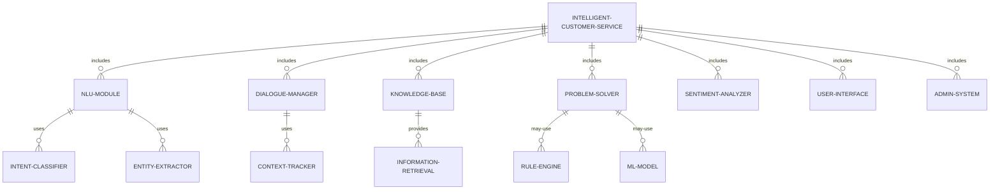

#### 交互关系图

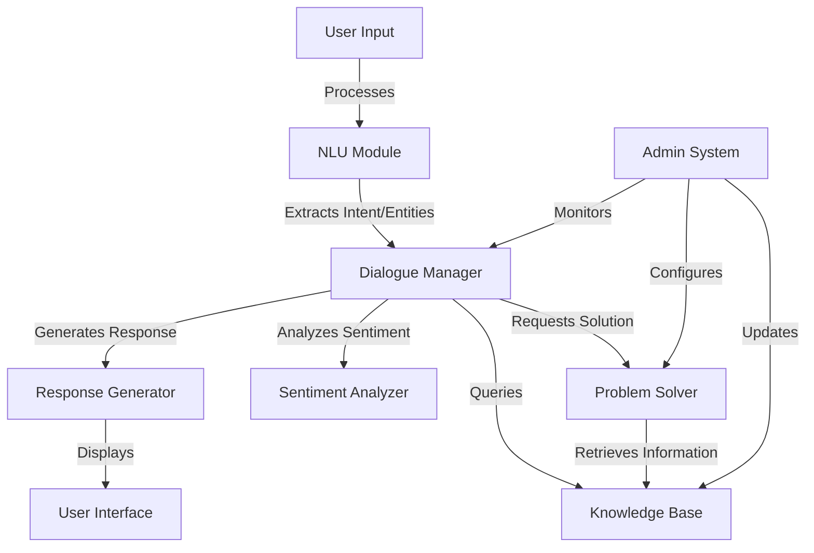

### 数学模型：

客户满意度可以用以下模型表示：

$$S = w_1A + w_2T + w_3R + w_4E$$

其中：
- $S$ 是总体满意度得分
- $A$ 是准确性得分
- $T$ 是响应时间得分
- $R$ 是相关性得分
- $E$ 是情感体验得分
- $w_1, w_2, w_3, w_4$ 是各因素的权重

### 算法流程图：

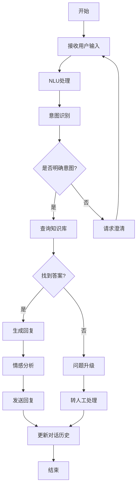

### 算法源代码：

以下是一个简化的智能客服 Agent 系统设计的伪代码：

```python
class IntelligentCustomerService:
    def __init__(self):
        self.nlu_module = NLUModule()
        self.dialogue_manager = DialogueManager()
        self.knowledge_base = KnowledgeBase()
        self.problem_solver = ProblemSolver()
        self.sentiment_analyzer = SentimentAnalyzer()
        self.response_generator = ResponseGenerator()

    def process_user_input(self, user_input):
        intent, entities = self.nlu_module.process(user_input)
        context = self.dialogue_manager.get_context()
        
        if not intent:
            return self.request_clarification()
        
        knowledge = self.knowledge_base.query(intent, entities)
        solution = self.problem_solver.solve(intent, entities, knowledge)
        
        if not solution:
            return self.escalate_to_human()
        
        sentiment = self.sentiment_analyzer.analyze(user_input)
        response = self.response_generator.generate(solution, sentiment)
        
        self.dialogue_manager.update_context(intent, entities, response)
        return response

    def request_clarification(self):
        return "I'm sorry, could you please provide more information?"

    def escalate_to_human(self):
        return "I'm transferring you to a human agent for further assistance."

# 使用示例
customer_service = IntelligentCustomerService()
user_query = "I can't log into my account"
response = customer_service.process_user_input(user_query)
print(response)
```

### 实际场景应用：

1. 电子商务平台：
   - 处理订单查询、退换货请求
   - 提供产品推荐和比较

2. 银行客户服务：
   - 处理账户查询、交易问题
   - 提供金融产品信息

3. 技术支持中心：
   - 解答软件使用问题
   - 指导故障排除步骤

4. 旅游服务：
   - 处理预订查询和修改
   - 提供旅行建议和信息

5. 医疗咨询：
   - 回答一般健康问题
   - 预约安排和就医指导

### 行业发展与未来趋势：

| 时期 | 主要特征 | 代表性技术/方法 |
|------|----------|-----------------|
| 2015-2017 | 基于规则的系统 | 决策树、模式匹配 |
| 2018-2020 | 机器学习集成 | LSTM、BERT 用于NLU |
| 2021-2023 | 大规模语言模型应用 | GPT-3、对话式AI |
| 2024及以后 | 多模态交互、情感智能 | 视觉-语言模型、情感计算 |

### 本章小结：

智能客服 Agent 的需求分析和系统设计是构建高效客户服务解决方案的关键步骤。本章讨论了系统的核心组件、主要挑战以及设计方法。主要要点包括：

1. 全面的需求分析是设计成功系统的基础，需要考虑各方面的需求和限制。
2. 系统架构应当模块化和可扩展，以适应未来的功能扩展和技术更新。
3. 性能指标的设定需要平衡用户体验、技术可行性和成本效益。
4. 人机协作机制的设计对于处理复杂查询和提供高质量服务至关重要。
5. 安全性和隐私保护是系统设计中不可忽视的关键因素。

未来的智能客服 Agent 发展趋势可能包括：
1. 更深度的个性化服务，基于用户历史和偏好
2. 多模态交互能力，如语音和视觉输入的整合
3. 更强的情感智能，能够理解和回应用户的情绪状态
4. 主动式服务，预测并提前解决潜在问题
5. 跨语言和跨文化的服务能力提升

在设计智能客服 Agent 时，开发者应当注意：
1. 以用户为中心，确保系统易用性和有效性
2. 保持系统的可解释性，便于问题诊断和持续改进
3. 设计灵活的知识更新机制，确保信息的及时性和准确性
4. 考虑系统的可扩展性，以应对业务增长和新需求
5. 重视道德和法律合规性，特别是在处理敏感信息时

通过精心设计和持续优化的智能客服 Agent，企业可以显著提升客户服务质量，同时降低运营成本。这不仅能提高客户满意度和忠诚度，还能为企业提供宝贵的客户洞察，推动业务创新和增长。随着技术的不断进步，我们可以期待智能客服 Agent 在理解能力、问题解决效率和个性化服务方面不断突破，成为企业客户服务战略中不可或缺的核心组成部分。

## 7.2 意图识别与实体提取

### 核心概念：

意图识别和实体提取是自然语言理解（NLU）的核心任务，对于智能客服 Agent 的有效运作至关重要。意图识别旨在确定用户输入的目的或意图，而实体提取则是从用户输入中识别和提取关键信息。这两个过程共同为 Agent 提供了理解和响应用户查询所需的基础信息。

### 问题背景：

用户在与客服 Agent 交互时，通常会使用自然语言表达他们的需求或问题。这些表达可能是含糊不清、多义或非结构化的。准确理解用户意图并提取相关实体信息，是 Agent 能够提供准确和相关响应的关键。

### 问题描述：

在实现意图识别和实体提取时，开发者面临以下挑战：

1. 如何处理语言的多样性和歧义性
2. 如何识别复杂或多重意图
3. 如何处理领域特定的术语和表达
4. 如何提高模型的泛化能力，适应新的表达方式
5. 如何在准确性和计算效率之间取得平衡

### 问题解决：

通过以下步骤可以有效实现意图识别和实体提取：

1. 数据收集和预处理：
   - 收集大量真实客户查询数据
   - 对数据进行清洗、标注和分类

2. 特征工程：
   - 使用词袋模型、TF-IDF 等方法提取文本特征
   - 应用词嵌入技术（如 Word2Vec, GloVe）捕捉语义信息

3. 模型选择与训练：
   - 对于意图识别，使用分类算法（如 SVM, Random Forest）或深度学习模型（如 LSTM, BERT）
   - 对于实体提取，使用序列标注模型（如 CRF, BiLSTM-CRF）

4. 集成规则和机器学习：
   - 结合基于规则的方法处理特定模式
   - 使用机器学习模型处理复杂和新颖的表达

5. 上下文理解：
   - 实现对话状态跟踪，考虑历史交互
   - 使用注意力机制捕捉上下文相关性

6. 模型评估与优化：
   - 使用准确率、召回率、F1 分数等指标评估模型性能
   - 应用交叉验证和超参数调优提高模型性能

### 边界与外延：

意图识别和实体提取的应用范围包括：
- 智能客服系统
- 语音助手
- 搜索引擎查询理解
- 情感分析
- 文本分类和信息提取

### 概念结构与核心要素组成：

意图识别和实体提取系统的核心组件：
1. 文本预处理器
2. 特征提取器
3. 意图分类器
4. 实体识别器
5. 上下文管理器
6. 后处理器

### 概念之间的关系：

#### 概念核心属性维度对比

| 属性 | 基于规则方法 | 传统机器学习 | 深度学习方法 |
|------|--------------|--------------|--------------|
| 准确性 | 中 | 高 | 非常高 |
| 可解释性 | 高 | 中 | 低 |
| 数据需求 | 低 | 中 | 高 |
| 计算复杂度 | 低 | 中 | 高 |
| 适应新领域能力 | 低 | 中 | 高 |
| 处理复杂语言能力 | 低 | 中 | 高 |

#### 概念联系的ER 实体关系

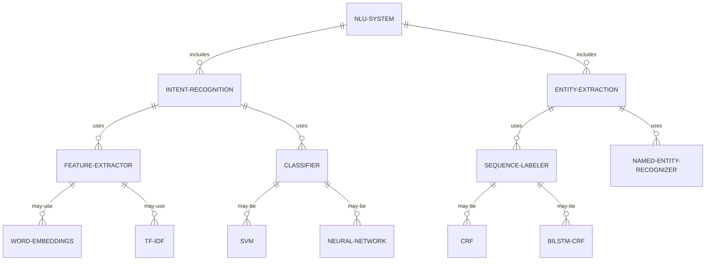

#### 交互关系图

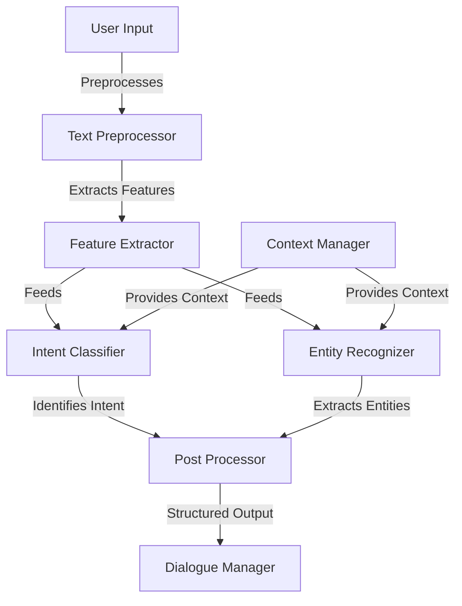

### 数学模型：

对于意图分类，可以使用softmax函数计算各个意图的概率：

$$P(y_i|x) = \frac{e^{z_i}}{\sum_{j=1}^K e^{z_j}}$$

其中，$z_i$ 是第 i 个意图的原始得分，K 是总意图数。

对于实体提取，可以使用条件随机场（CRF）模型，其中标签序列的条件概率为：

$$P(y|x) = \frac{1}{Z(x)} \exp\left(\sum_{t=1}^T \sum_{k=1}^K \lambda_k f_k(y_t, y_{t-1}, x_t)\right)$$

其中，$Z(x)$ 是归一化因子，$f_k$ 是特征函数，$\lambda_k$ 是权重。

### 算法流程图：

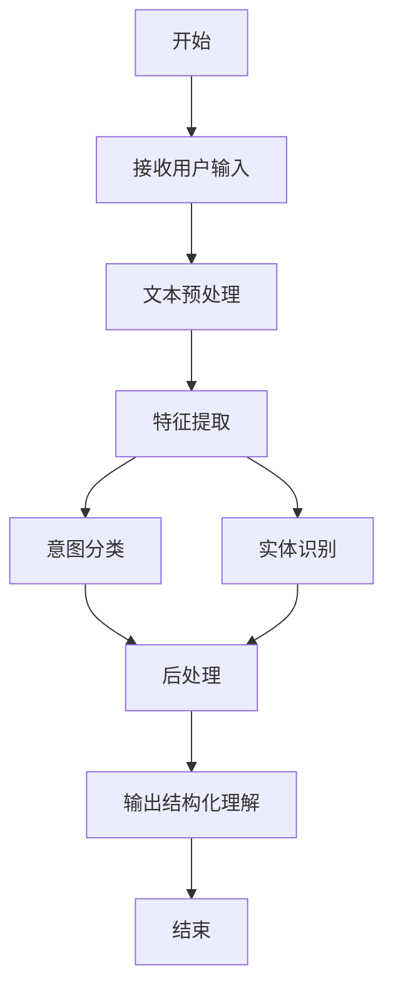

### 算法源代码：

以下是一个使用 spaCy 和 scikit-learn 实现简单意图识别和实体提取的 Python 示例：

```python
import spacy
from sklearn.feature_extraction.text import TfidfVectorizer
from sklearn.svm import SVC
from sklearn.pipeline import Pipeline

class IntentEntityExtractor:
    def __init__(self):
        self.nlp = spacy.load("en_core_web_sm")
        self.intent_classifier = Pipeline([
            ('tfidf', TfidfVectorizer()),
            ('clf', SVC(kernel='linear'))
        ])

    def train_intent_classifier(self, texts, labels):
        self.intent_classifier.fit(texts, labels)

    def extract_entities(self, text):
        doc = self.nlp(text)
        return [(ent.text, ent.label_) for ent in doc.ents]

    def predict_intent(self, text):
        return self.intent_classifier.predict([text])[0]

    def process(self, text):
        intent = self.predict_intent(text)
        entities = self.extract_entities(text)
        return {"intent": intent, "entities": entities}

# 使用示例
extractor = IntentEntityExtractor()

# 训练意图分类器
train_texts = ["I want to book a flight", "What's the weather like?", "How do I reset my password?"]
train_labels = ["booking", "weather", "tech_support"]
extractor.train_intent_classifier(train_texts, train_labels)

# 测试
test_text = "I need to book a flight to New York next Friday"
result = extractor.process(test_text)
print(f"Intent: {result['intent']}")
print(f"Entities: {result['entities']}")
```

### 实际场景应用：

1. 客户查询分类：
   - 识别查询类型（如账单查询、技术支持、投诉）
   - 提取关键信息（如账号、产品名称、日期）

2. 订票系统：
   - 识别订票意图（如预订、取消、修改）
   - 提取旅行详情（如目的地、日期、乘客数量）

3. 技术支持：
   - 识别问题类型（如软件错误、硬件故障、使用指导）
   - 提取产品信息和错误描述

4. 金融服务：
   - 识别服务需求（如转账、贷款咨询、投资建议）
   - 提取金额、账户信息等实体

5. 餐厅预订：
   - 识别预订意图（如新预订、修改、取消）
   - 提取日期、时间、人数等信息

### 行业发展与未来趋势：

| 时期 | 主要特征 | 代表性技术/方法 |
|------|----------|-----------------|
| 2015-2017 | 规则基础+机器学习 | SVM, CRF |
| 2018-2020 | 深度学习兴起 | LSTM, CNN for NLP |
| 2021-2023 | 预训练模型主导 | BERT, GPT, XLNet |
| 2024及以后 | 少样本学习、多模态理解 | Meta-learning, 跨模态Transformer |

### 本章小结：

意图识别和实体提取是智能客服 Agent 的核心功能，直接影响系统的理解能力和响应质量。本章讨论了这两个任务的主要挑战、解决方案和实现技术。主要要点包括：

1. 有效的意图识别和实体提取需要结合领域知识和先进的机器学习技术。
2. 数据质量和特征工程对模型性能至关重要。
3. 深度学习方法，特别是预训练模型，在处理复杂语言理解任务时表现出色。
4. 上下文理解对于提高识别和提取的准确性非常重要。
5. 模型的持续评估和优化是保持系统性能的关键。

未来的发展趋势可能包括：
1. 更强大的迁移学习能力，减少对大量标注数据的依赖
2. 多语言和多方言支持的增强
3. 实时学习和适应能力的提升
4. 与知识图谱的深度集成，提高理解的深度和广度
5. 多模态输入的处理能力，如结合文本、语音和图像的理解

在实现意图识别和实体提取时，开发者应当注意：
1. carefully设计意图和实体类别，确保覆盖面广且互斥
2. 收集高质量、多样化的训练数据
3. 定期更新模型以适应新的表达方式和领域变化
4. 实现有效的错误处理和回退策略
5. 考虑隐私和安全问题，特别是在处理敏感信息时

通过不断改进的意图识别和实体提取技术，智能客服 Agent 将能够更准确地理解用户需求，提供更精准、个性化的服务。这不仅能提高用户满意度，还能帮助企业更好地理解客户需求，优化服务流程，最终提升整体的客户服务质量和效率。


## 7.3 知识库集成与查询

### 核心概念：

知识库是智能客服 Agent 的核心组成部分，它存储和组织了回答用户查询所需的所有信息。知识库集成与查询涉及将结构化和非结构化数据有效地整合到系统中，并开发高效的检索机制，以快速准确地找到相关信息。

### 问题背景：

随着企业信息的不断积累和客户需求的日益复杂，传统的静态FAQ已无法满足智能客服的需求。现代知识库需要能够处理大量、多样化的信息，并支持实时更新和智能检索。

### 问题描述：

在实现知识库集成与查询时，开发者面临以下挑战：

1. 如何有效组织和存储大量异构数据
2. 如何实现快速、准确的信息检索
3. 如何处理自然语言查询和语义匹配
4. 如何保持知识的一致性和时效性
5. 如何处理不完整或模糊的查询

### 问题解决：

通过以下步骤可以有效实现知识库集成与查询：

1. 知识表示：
   - 使用知识图谱表示复杂的关系型信息
   - 采用向量化方法表示文本内容

2. 数据集成：
   - 开发ETL流程，整合多源数据
   - 实现数据清洗和标准化流程

3. 索引构建：
   - 使用倒排索引加速全文搜索
   - 实现向量索引（如FAISS）支持语义搜索

4. 查询处理：
   - 实现查询理解和重写模块
   - 开发基于排名的多阶段检索系统

5. 语义匹配：
   - 使用词嵌入和语言模型计算语义相似度
   - 实现注意力机制捕捉查询-文档关系

6. 知识更新：
   - 开发增量更新机制
   - 实现版本控制和回滚功能

### 边界与外延：

知识库集成与查询的应用范围包括：
- 客户支持系统
- 企业内部知识管理
- 智能搜索引擎
- 专家系统
- 教育和培训平台

### 概念结构与核心要素组成：

知识库系统的核心组件：
1. 数据采集器
2. 知识表示模型
3. 索引引擎
4. 查询处理器
5. 检索引擎
6. 排序模块
7. 更新管理器

### 概念之间的关系：

#### 概念核心属性维度对比

| 属性 | 关系型数据库 | 文档型数据库 | 图数据库 | 向量数据库 |
|------|--------------|--------------|----------|------------|
| 数据结构 | 表格 | 文档 | 图 | 向量 |
| 查询语言 | SQL | NoSQL | 图查询语言 | 相似度搜索 |
| 扩展性 | 中 | 高 | 高 | 非常高 |
| 关系处理 | 好 | 一般 | 非常好 | 一般 |
| 全文搜索 | 需插件 | 原生支持 | 需插件 | 支持语义搜索 |
| 适用场景 | 结构化数据 | 半结构化数据 | 复杂关系 | 语义相似度 |

#### 概念联系的ER 实体关系

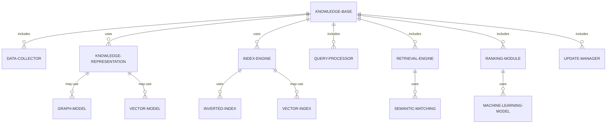

#### 交互关系图

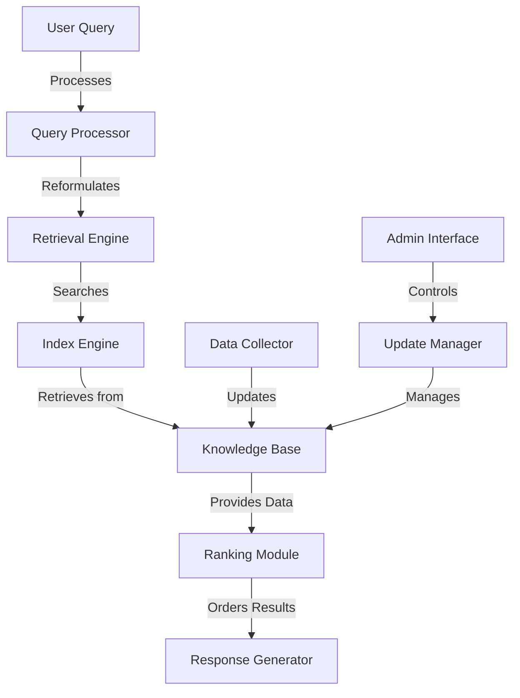

### 数学模型：

TF-IDF（词频-逆文档频率）是常用的文本相关性计算方法：

$$\text{TF-IDF}(t,d,D) = \text{TF}(t,d) \cdot \text{IDF}(t,D)$$

其中：
- $\text{TF}(t,d)$ 是词 $t$ 在文档 $d$ 中的频率
- $\text{IDF}(t,D) = \log\frac{N}{|\{d \in D: t \in d\}|}$，$N$ 是总文档数

### 算法流程图：

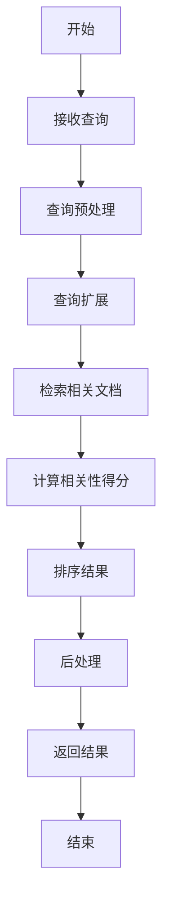

### 算法源代码：

以下是一个使用 Elasticsearch 实现简单知识库查询的 Python 示例：

```python
from elasticsearch import Elasticsearch
from elasticsearch.helpers import bulk

class KnowledgeBase:
    def __init__(self, index_name='knowledge_base'):
        self.es = Elasticsearch()
        self.index_name = index_name

    def create_index(self):
        if not self.es.indices.exists(index=self.index_name):
            self.es.indices.create(index=self.index_name, body={
                'mappings': {
                    'properties': {
                        'title': {'type': 'text'},
                        'content': {'type': 'text'},
                        'category': {'type': 'keyword'}
                    }
                }
            })

    def add_document(self, doc):
        self.es.index(index=self.index_name, body=doc)

    def bulk_add_documents(self, docs):
        actions = [
            {
                '_index': self.index_name,
                '_source': doc
            }
            for doc in docs
        ]
        bulk(self.es, actions)

    def search(self, query, category=None):
        body = {
            'query': {
                'bool': {
                    'must': [{'match': {'content': query}}],
                    'filter': [{'term': {'category': category}}] if category else []
                }
            }
        }
        results = self.es.search(index=self.index_name, body=body)
        return [hit['_source'] for hit in results['hits']['hits']]

# 使用示例
kb = KnowledgeBase()
kb.create_index()

# 添加文档
docs = [
    {'title': 'Password Reset', 'content': 'To reset your password, go to the login page and click "Forgot Password"', 'category': 'account'},
    {'title': 'Return Policy', 'content': 'You can return items within 30 days of purchase for a full refund', 'category': 'policy'},
    # 添加更多文档...
]
kb.bulk_add_documents(docs)

# 搜索
results = kb.search("reset password", category="account")
for result in results:
    print(f"Title: {result['title']}")
    print(f"Content: {result['content']}")
    print("---")
```

### 实际场景应用：

1. 产品支持：
   - 存储产品手册、常见问题解答
   - 快速检索故障排除步骤

2. 政策查询：
   - 整合公司政策、法规信息
   - 提供准确的政策解释和应用指导

3. 医疗咨询：
   - 存储疾病信息、治疗方案
   - 支持症状based查询和诊断建议

4. 法律援助：
   - 整合法律条文、案例分析
   - 提供初步的法律建议和参考

5. 教育资源：
   - 组织课程材料、学习资源
   - 支持个性化学习路径推荐

### 行业发展与未来趋势：

| 时期 | 主要特征 | 代表性技术/方法 |
|------|----------|-----------------|
| 2015-2017 | 结构化知识库 | 关系数据库、全文索引 |
| 2018-2020 | 知识图谱兴起 | 图数据库、实体链接 |
| 2021-2023 | 深度语义理解 | BERT、向量检索 |
| 2024及以后 | 多模态知识融合 | 跨模态检索、神经符号推理 |

### 本章小结：

知识库集成与查询是智能客服 Agent 提供准确、相关信息的关键。本章讨论了知识库系统的核心组件、主要挑战以及实现方法。主要要点包括：

1. 有效的知识表示和组织是构建高性能知识库的基础。
2. 先进的索引和检索技术对于实现快速、准确的信息获取至关重要。
3. 语义匹配和排序算法在提高查询相关性方面发挥着关键作用。
4. 知识更新和版本控制机制对于维护知识库的时效性和一致性非常重要。
5. 结合多种数据模型和检索方法可以更好地满足不同类型的查询需求。

未来的知识库系统发展趋势可能包括：
1. 更深度的知识推理能力，支持复杂问题的解答
2. 多源、异构数据的无缝集成和统一检索
3. 实时学习和知识更新，适应快速变化的信息环境
4. 个性化和上下文感知的知识推荐
5. 与大规模语言模型的深度集成，增强自然语言理解和生成能力

在实现知识库集成与查询时，开发者应当注意：
1. 设计灵活、可扩展的知识模型，以适应未来的需求变化
2. 实现强大的数据质量控制和验证机制
3. 优化索引和缓存策略，以提高查询性能
4. 开发用户友好的知识管理界面，便于内容更新和维护
5. 考虑隐私和安全问题，特别是在处理敏感信息时

通过不断改进的知识库技术，智能客服 Agent 将能够更准确、更全面地回答用户查询，提供个性化的信息服务。这不仅能提高客户满意度，还能减轻人工客服的工作负担，提高整体服务效率。随着技术的进步，我们可以期待知识库系统在信息组织、检索和应用方面不断突破，为企业知识管理和客户服务带来革命性的变革。


## 7.4 多轮对话管理

### 核心概念：

多轮对话管理是智能客服 Agent 实现自然、连贯交互的关键能力。它涉及跟踪对话状态、理解上下文、维护对话历史，以及根据当前情境做出适当响应。有效的多轮对话管理使 Agent 能够处理复杂查询、澄清模糊信息，并提供连贯一致的用户体验。

### 问题背景：

用户与客服 Agent 的交互通常不限于单次问答，而是涉及多个来回的对话。这种情况下，Agent 需要理解并记住之前的交互内容，正确解读当前输入的上下文，并做出恰当的回应。

### 问题描述：

在实现多轮对话管理时，开发者面临以下挑战：

1. 如何有效跟踪和更新对话状态
2. 如何处理上下文依赖的查询和指代消解
3. 如何管理长期和短期记忆
4. 如何处理话题转换和多主题对话
5. 如何在保持对话连贯性的同时允许灵活性

### 问题解决：

通过以下步骤可以实现有效的多轮对话管理：

1. 对话状态跟踪：
   - 使用状态机或框架based方法跟踪对话进展
   - 实现槽位填充机制记录关键信息

2. 上下文理解：
   - 使用注意力机制关注相关历史信息
   - 实现指代消解算法处理代词和省略

3. 记忆管理：
   - 设计短期记忆存储最近交互
   - 实现长期记忆存储用户偏好和关键信息

4. 话题管理：
   - 实现话题检测和跟踪算法
   - 开发平滑话题转换的策略

5. 对话策略：
   - 使用强化学习优化长期对话策略
   - 实现混合策略结合规则和学习方法

### 边界与外延：

多轮对话管理的应用范围包括：
- 客户服务聊天机器人
- 虚拟助手
- 教育对话系统
- 医疗咨询系统
- 智能家居控制接口

### 概念结构与核心要素组成：

多轮对话管理系统的核心组件：
1. 对话状态跟踪器
2. 上下文理解模块
3. 记忆管理器
4. 话题管理器
5. 对话策略生成器
6. 响应选择器

### 概念之间的关系：

#### 概念核心属性维度对比

| 属性 | 有限状态机 | 框架based方法 | 端到端神经网络 |
|------|------------|----------------|----------------|
| 可控性 | 高 | 中 | 低 |
| 灵活性 | 低 | 中 | 高 |
| 扩展性 | 低 | 中 | 高 |
| 开发复杂度 | 低 | 中 | 高 |
| 数据需求 | 低 | 中 | 高 |
| 处理复杂对话能力 | 低 | 中 | 高 |

#### 概念联系的ER 实体关系

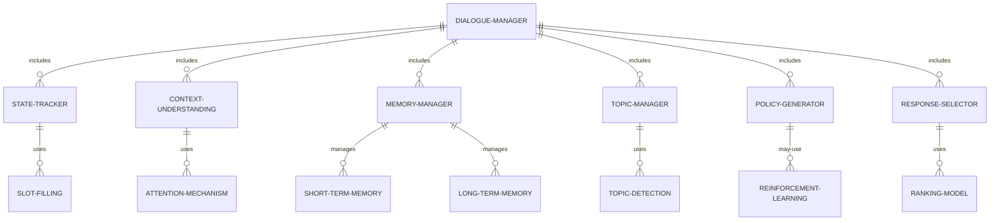

#### 交互关系图

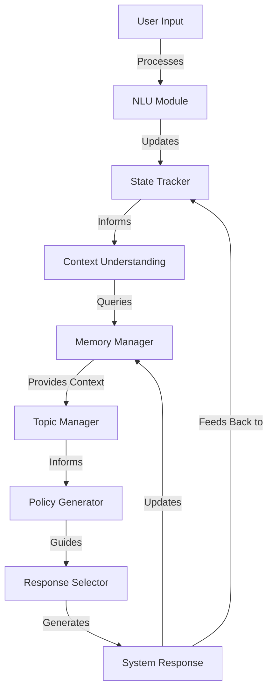

### 数学模型：

对话状态可以用贝叶斯网络建模：

$$P(S_t|O_t,S_{t-1}) = \frac{P(O_t|S_t)P(S_t|S_{t-1})}{\sum_{S_t} P(O_t|S_t)P(S_t|S_{t-1})}$$

其中：
- $S_t$ 是 t 时刻的对话状态
- $O_t$ 是 t 时刻的观察（用户输入）
- $P(O_t|S_t)$ 是观察似然
- $P(S_t|S_{t-1})$ 是状态转移概率

### 算法流程图：

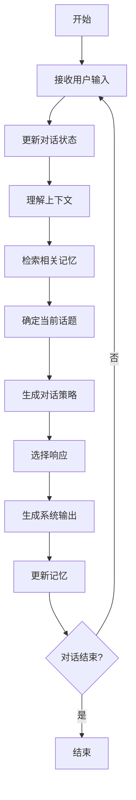

### 算法源代码：

以下是一个简化的多轮对话管理系统的 Python 实现示例：

```python
from typing import Dict, List

class DialogueManager:
    def __init__(self):
        self.state = {}
        self.history = []
        self.memory = {}
        self.current_topic = None

    def update_state(self, user_input: str, nlu_result: Dict):
        self.state.update(nlu_result)
        self.history.append(("user", user_input))

    def understand_context(self) -> Dict:
        # 简化的上下文理解
        return {
            "last_topic": self.current_topic,
            "unfilled_slots": [slot for slot, value in self.state.items() if value is None]
        }

    def manage_memory(self):
        # 简化的记忆管理
        if len(self.history) > 5:
            self.memory["long_term"] = self.history[:-5]
            self.history = self.history[-5:]

    def detect_topic(self, nlu_result: Dict) -> str:
        # 简化的话题检测
        if "topic" in nlu_result:
            self.current_topic = nlu_result["topic"]
        return self.current_topic

    def generate_policy(self, context: Dict) -> str:
        # 简化的策略生成
        if context["unfilled_slots"]:
            return "ask_slot"
        elif self.current_topic == "greeting":
            return "greet"
        else:
            return "provide_info"

    def select_response(self, policy: str) -> str:
        # 简化的响应选择
        if policy == "ask_slot":
            slot = self.state["unfilled_slots"][0]
            return f"Can you please provide the {slot}?"
        elif policy == "greet":
            return "Hello! How can I assist you today?"
        else:
            return f"Here's the information about {self.current_topic}..."

    def process_turn(self, user_input: str, nlu_result: Dict) -> str:
        self.update_state(user_input, nlu_result)
        context = self.understand_context()
        self.manage_memory()
        self.detect_topic(nlu_result)
        policy = self.generate_policy(context)
        response = self.select_response(policy)
        self.history.append(("system", response))
        return response

# 使用示例
dm = DialogueManager()

# 模拟对话
nlu_result1 = {"intent": "greeting", "topic": "greeting"}
response1 = dm.process_turn("Hi there!", nlu_result1)
print("System:", response1)

nlu_result2 = {"intent": "inquiry", "topic": "product", "product": None}
response2 = dm.process_turn("I want to know about your new product", nlu_result2)
print("System:", response2)

nlu_result3 = {"intent": "provide_info", "topic": "product", "product": "smartphone"}
response3 = dm.process_turn("I'm interested in the new smartphone", nlu_result3)
print("System:", response3)
```

### 实际场景应用：

1. 客户支持对话：
   - 跟踪问题解决进度
   - 在多个相关问题间平滑过渡

2. 预订系统：
   - 收集预订所需的所有信息
   - 处理修改和取消请求

3. 健康咨询：
   - 跟踪症状描述
   - 引导用户完成初步诊断流程

4. 教育辅导：
   - 跟踪学习进度
   - 根据学生反应调整教学策略

5. 销售助手：
   - 了解客户需求和偏好
   - 提供个性化产品推荐

### 行业发展与未来趋势：

| 时期 | 主要特征 | 代表性技术/方法 |
|------|----------|-----------------|
| 2015-2017 | 规则based系统 | 有限状态机、对话树 |
| 2018-2020 | 数据驱动方法 | 端到端神经网络、注意力机制 |
| 2021-2023 | 上下文感知系统 | Transformer、预训练语言模型 |
| 2024及以后 | 认知对话系统 | 元学习、多模态交互、情感智能 |

### 本章小结：

多轮对话管理是智能客服 Agent 实现自然、连贯交互的核心能力。本章讨论了多轮对话管理的主要挑战、解决方案和实现技术。主要要点包括：

1. 有效的对话状态跟踪是管理多轮对话的基础。
2. 上下文理解和记忆管理对于维持对话连贯性至关重要。
3. 话题管理能力使 Agent 能够处理复杂的多主题对话。
4. 灵活的对话策略生成有助于适应不同的对话情境。
5. 结合规则based方法和机器学习技术可以实现更智能的对话管理。

未来的多轮对话管理系统发展趋势可能包括：
1. 更强大的长期记忆和知识整合能力
2. 情感和个性化因素的深度融入
3. 多模态信息（如语音、图像）的无缝整合
4. 主动学习和自适应能力的增强
5. 更自然的对话流程和话题转换

在实现多轮对话管理时，开发者应当注意：
1. 设计灵活的对话状态表示，以适应复杂的对话场景
2. 实现健壮的错误恢复机制，处理意外的用户输入
3. 注重用户体验，确保对话流程自然流畅
4. 考虑隐私和安全问题，特别是在处理敏感信息时
5. 持续优化和更新对话策略，以适应用户需求的变化

通过不断改进的多轮对话管理技术，智能客服 Agent 将能够提供更自然、更个性化的交互体验。这不仅能提高用户满意度，还能增强 Agent 处理复杂查询的能力，最终实现更智能、更高效的客户服务。随着技术的进步，我们可以期待多轮对话系统在理解能力、交互自然度和问题解决效率方面不断突破，为各行各业的客户服务带来革命性的变革。


## 7.5 情感分析与个性化回复

### 核心概念：

情感分析与个性化回复是智能客服 Agent 提供高质量用户体验的关键能力。情感分析涉及识别和理解用户输入中的情感状态，而个性化回复则是根据用户的情感、偏好和历史交互生成tailored的响应。这两个方面的结合使 Agent 能够更贴近人类客服，提供富有同理心和个性化的服务。

### 问题背景：

传统的客服系统往往忽视了用户的情感需求，提供标准化、缺乏个性的回复。然而，用户满意度和忠诚度很大程度上取决于他们感受到的服务质量和个性化程度。因此，现代智能客服 Agent 需要能够准确捕捉用户情感，并提供适当的、个性化的回应。

### 问题描述：

在实现情感分析与个性化回复时，开发者面临以下挑战：

1. 如何准确识别文本中的情感和语气
2. 如何处理复杂或混合的情感表达
3. 如何根据用户情感调整回复策略
4. 如何生成自然、富有同理心的回复
5. 如何平衡个性化和一致性

### 问题解决：

通过以下步骤可以实现有效的情感分析与个性化回复：

1. 情感识别：
   - 使用深度学习模型（如 BERT）进行文本情感分类
   - 实现细粒度情感分析，识别具体情感类别

2. 上下文情感理解：
   - 考虑对话历史和上下文信息
   - 实现情感趋势分析，跟踪情感变化

3. 个性化用户模型：
   - 构建用户画像，包括偏好、历史交互等
   - 使用协同过滤或深度学习方法进行个性化建模

4. 回复策略调整：
   - 根据识别的情感状态选择适当的回复策略
   - 实现情感导向的对话管理

5. 个性化回复生成：
   - 使用条件生成模型，考虑用户特征和情感状态
   - 实现风格转换，调整语气和措辞

### 边界与外延：

情感分析与个性化回复的应用范围包括：
- 客户服务和支持
- 心理健康咨询
- 个性化推荐系统
- 社交媒体互动
- 教育辅导系统

### 概念结构与核心要素组成：

情感分析与个性化回复系统的核心组件：
1. 情感识别模块
2. 上下文理解器
3. 用户建模器
4. 回复策略选择器
5. 个性化生成器
6. 情感调节器

### 概念之间的关系：

#### 概念核心属性维度对比

| 属性 | 词典based方法 | 机器学习方法 | 深度学习方法 |
|------|---------------|--------------|--------------|
| 准确性 | 中 | 高 | 非常高 |
| 上下文理解 | 低 | 中 | 高 |
| 细粒度分析 | 中 | 高 | 非常高 |
| 适应性 | 低 | 中 | 高 |
| 计算复杂度 | 低 | 中 | 高 |
| 数据需求 | 低 | 高 | 非常高 |

#### 概念联系的ER 实体关系

```mermaid
erDiagram
    EMOTION-PERSONALIZATION-SYSTEM ||--o{ EMOTION-RECOGNIZER : includes
    EMOTION-PERSONALIZATION-SYSTEM ||--o{ CONTEXT-ANALYZER : includes
    EMOTION-PERSONALIZATION-SYSTEM ||--o{ USER-MODELER : includes
    EMOTION-PERSONALIZATION-SYSTEM ||--o{ RESPONSE-STRATEGIST : includes
    EMOTION-PERSONALIZATION-SYSTEM ||--o{ PERSONALIZED-GENERATOR : includes
    EMOTION-RECOGNIZER ||--o{ SENTIMENT-CLASSIFIER : uses
    CONTEXT-ANALYZER ||--o{ DIALOGUE-HISTORY : analyzes
    USER-MODELER ||--o{ PREFERENCE-LEARNER : uses
    RESPONSE-STRATEGIST ||--o{ EMOTION-RULES : applies
    PERSONALIZED-GENERATOR ||--o{ STYLE-TRANSFER : may-use
```

#### 交互关系图

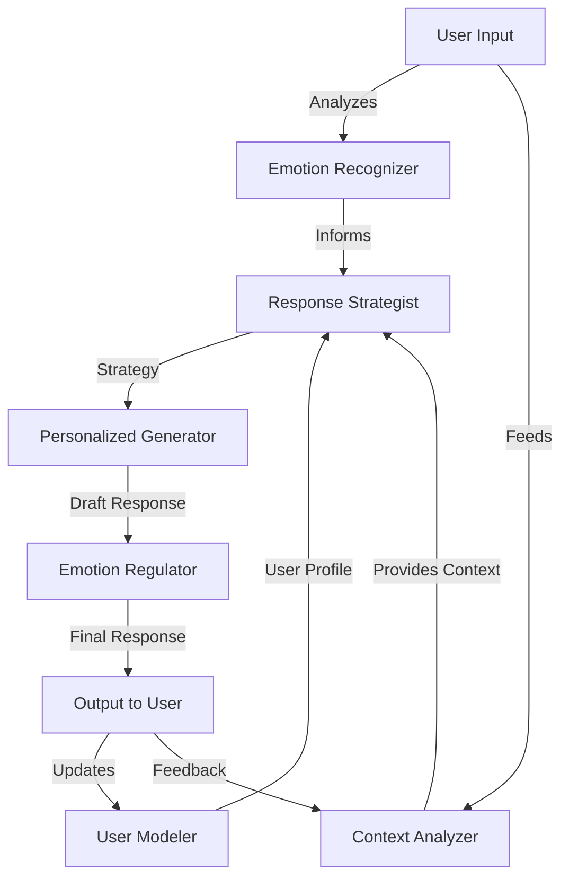

### 数学模型：

情感分类可以使用softmax函数：

$$P(y_i|x) = \frac{e^{z_i}}{\sum_{j=1}^K e^{z_j}}$$

其中，$z_i$ 是第 i 个情感类别的原始得分，K 是总情感类别数。

### 算法流程图：

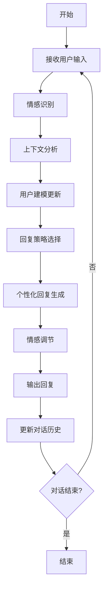

### 算法源代码：

以下是一个简化的情感分析与个性化回复系统的 Python 实现示例：

```python
import random
from transformers import pipeline

class EmotionPersonalizationSystem:
    def __init__(self):
        self.emotion_classifier = pipeline("sentiment-analysis")
        self.user_profiles = {}
        self.dialogue_history = []

    def recognize_emotion(self, text):
        result = self.emotion_classifier(text)[0]
        return result['label'], result['score']

    def analyze_context(self, user_id):
        # 简化的上下文分析
        if self.dialogue_history:
            return self.dialogue_history[-1]['emotion']
        return 'neutral'

    def update_user_model(self, user_id, emotion):
        if user_id not in self.user_profiles:
            self.user_profiles[user_id] = {'emotion_history': []}
        self.user_profiles[user_id]['emotion_history'].append(emotion)

    def select_response_strategy(self, emotion, context):
        if emotion == 'POSITIVE':
            return 'enthusiastic'
        elif emotion == 'NEGATIVE':
            return 'empathetic'
        else:
            return 'neutral'

    def generate_personalized_response(self, strategy, user_id):
        responses = {
            'enthusiastic': [
                "That's fantastic! I'm so glad to hear that.",
                "Wonderful news! How can I make your day even better?",
            ],
            'empathetic': [
                "I understand this might be frustrating. Let's work through this together.",
                "I'm sorry to hear that. How can I help improve the situation?",
            ],
            'neutral': [
                "I see. How can I assist you further?",
                "Understood. What would you like to do next?",
            ]
        }
        return random.choice(responses[strategy])

    def process_input(self, user_id, text):
        emotion, confidence = self.recognize_emotion(text)
        context = self.analyze_context(user_id)
        self.update_user_model(user_id, emotion)
        strategy = self.select_response_strategy(emotion, context)
        response = self.generate_personalized_response(strategy, user_id)
        self.dialogue_history.append({'user_id': user_id, 'text': text, 'emotion': emotion})
        return response

# 使用示例
system = EmotionPersonalizationSystem()

# 模拟对话
user_id = "user123"
responses = [
    system.process_input(user_id, "I'm really excited about your new product!"),
    system.process_input(user_id, "This is so frustrating, I can't get it to work."),
    system.process_input(user_id, "Can you tell me more about the features?")
]

for i, response in enumerate(responses, 1):
    print(f"Turn {i} - System: {response}")
```

### 实际场景应用：

1. 客户投诉处理：
   - 识别客户的不满情绪
   - 提供富有同理心的回应和解决方案

2. 产品推荐：
   - 分析用户对产品的情感反应
   - 根据用户情绪和偏好调整推荐策略

3. 心理健康支持：
   - 识别用户的情绪状态
   - 提供适当的支持和资源推荐

4. 社交媒体互动：
   - 分析用户评论的情感倾向
   - 生成个性化、情感适当的回复

5. 教育辅导：
   - 识别学生的挫折或兴奋情绪
   - 调整教学策略和鼓励方式

### 行业发展与未来趋势：

| 时期 | 主要特征 | 代表性技术/方法 |
|------|----------|-----------------|
| 2015-2017 | 基础情感分类 | 词典方法、SVM |
| 2018-2020 | 深度学习应用 | CNN, LSTM for sentiment |
| 2021-2023 | 上下文感知情感分析 | BERT, Transformer-based models |
| 2024及以后 | 多模态情感理解 | 跨模态情感分析、情感计算 |

### 本章小结：

情感分析与个性化回复是提升智能客服 Agent 用户体验的关键技术。本章讨论了情感分析和个性化回复的主要挑战、解决方案和实现技术。主要要点包括：

1. 准确的情感识别是个性化回复的基础。
2. 上下文理解对于正确解读用户情感至关重要。
3. 用户建模有助于提供持续、一致的个性化体验。
4. 回复策略需要根据识别的情感和上下文灵活调整。
5. 个性化回复生成应平衡情感适当性和内容相关性。

未来的情感分析与个性化回复系统发展趋势可能包括：
1. 更精细的情感状态识别，包括复杂和混合情感
2. 多模态情感分析，结合文本、语音和视觉信息
3. 动态情感调节，实时调整对话策略
4. 深度个性化，考虑用户长期偏好和情感模式
5. 情感智能增强，提供更自然、更有同理心的交互

在实现情感分析与个性化回复时，开发者应当注意：
1. 确保情感分析模型的准确性和鲁棒性
2. 设计适当的情感响应策略，避免过度反应
3. 平衡个性化和一致性，维护品牌形象
4. 考虑隐私和道德问题，特别是在处理敏感情感数据时
5. 持续监控和优化系统性能，适应不断变化的用户需求

通过整合先进的情感分析和个性化技术，智能客服 Agent 将能够提供更人性化、更有同理心的服务体验。这不仅能显著提升用户满意度和忠诚度，还能为企业提供宝贵的情感智能洞察，推动服务创新和业务增长。随着技术的不断进步，我们可以期待情感智能在人机交互中扮演越来越重要的角色，最终实现真正以用户为中心的智能客服体验。


## 7.6 与人工坐席协作机制

### 核心概念：

与人工坐席协作机制是智能客服 Agent 系统中的关键组成部分，它实现了 AI 与人类客服之间的无缝衔接。这种机制允许 AI Agent 在处理复杂问题或需要人为判断的情况时，将对话平滑地转交给人工坐席，同时为人工坐席提供上下文信息和决策支持。

### 问题背景：

尽管 AI 技术不断进步，但仍存在一些复杂、模糊或高度敏感的情况需要人类的判断和处理。有效的人机协作可以结合 AI 的效率和人类的灵活性，提供最佳的客户服务体验。

### 问题描述：

在实现与人工坐席协作机制时，开发者面临以下挑战：

1. 如何准确判断需要人工干预的时机
2. 如何平滑地进行 AI 到人工的转接
3. 如何有效传递对话上下文和客户信息
4. 如何在人工处理后实现无缝回到 AI 处理
5. 如何优化 AI 和人工之间的工作分配

### 问题解决：

通过以下步骤可以实现有效的人机协作机制：

1. 转接触发机制：
   - 设置明确的转接规则（如复杂度阈值、关键词触发）
   - 实现基于机器学习的动态判断模型

2. 平滑转接流程：
   - 设计自然的转接话术
   - 实现队列管理和等待时间预估

3. 上下文传递：
   - 生成简洁的对话摘要
   - 设计直观的人工坐席界面，展示关键信息

4. AI 辅助功能：
   - 为人工坐席提供实时建议和信息查询
   - 实现半自动回复功能，提高人工效率

5. 动态学习与优化：
   - 记录人工处理的案例，用于 AI 模型更新
   - 实现性能分析，持续优化转接策略

### 边界与外延：

人机协作机制的应用范围包括：
- 客户服务中心
- 技术支持部门
- 销售和咨询服务
- 医疗健康咨询
- 金融服务支持

### 概念结构与核心要素组成：

人机协作系统的核心组件：
1. 转接决策引擎
2. 对话管理器
3. 上下文传递模块
4. 人工坐席接口
5. AI 辅助工具
6. 性能分析与优化模块

### 概念之间的关系：

#### 概念核心属性维度对比

| 属性 | 纯 AI 模式 | 纯人工模式 | 人机协作模式 |
|------|------------|------------|--------------|
| 处理速度 | 快 | 慢 | 中-快 |
| 处理复杂度 | 低-中 | 高 | 高 |
| 个性化程度 | 中 | 高 | 高 |
| 一致性 | 高 | 中 | 中-高 |
| 成本 | 低 | 高 | 中 |
| 可扩展性 | 高 | 低 | 中-高 |

#### 概念联系的ER 实体关系

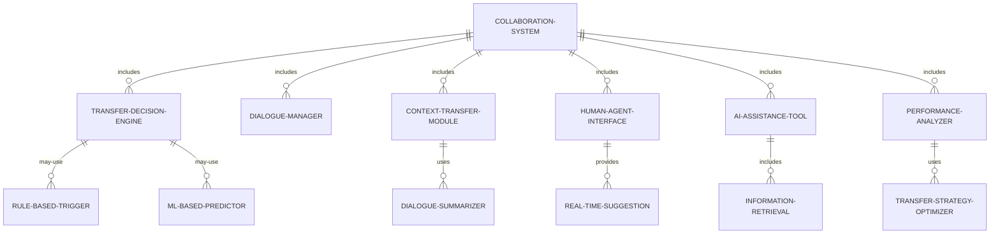

#### 交互关系图

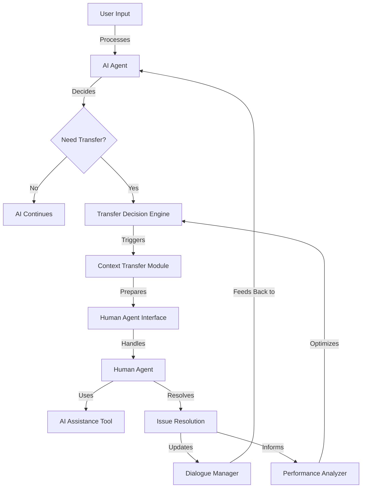

### 数学模型：

转接决策可以使用逻辑回归模型：

$$P(transfer|x) = \frac{1}{1 + e^{-(\beta_0 + \beta_1x_1 + ... + \beta_nx_n)}}$$

其中，$x_i$ 是特征（如对话复杂度、用户情绪等），$\beta_i$ 是对应的权重。

### 算法流程图：

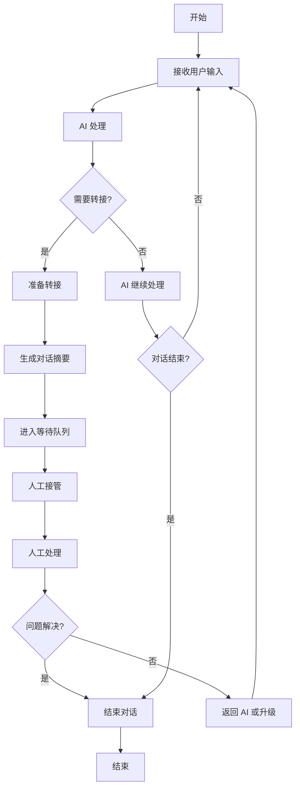

### 算法源代码：

以下是一个简化的人机协作系统的 Python 实现示例：

```python
import random
from enum import Enum

class AgentType(Enum):
    AI = 1
    HUMAN = 2

class CollaborationSystem:
    def __init__(self):
        self.dialogue_history = []
        self.current_agent = AgentType.AI
        self.transfer_threshold = 0.7

    def ai_process(self, user_input):
        # 简化的 AI 处理逻辑
        response = f"AI response to: {user_input}"
        confidence = random.random()
        return response, confidence

    def need_transfer(self, confidence):
        return confidence < self.transfer_threshold

    def prepare_transfer(self):
        summary = "\n".join(self.dialogue_history[-3:])
        return f"Conversation summary:\n{summary}"

    def human_process(self, user_input, context):
        # 模拟人工处理
        print(f"Human agent received context: {context}")
        return input("Human agent response: ")

    def handle_conversation(self, user_input):
        if self.current_agent == AgentType.AI:
            response, confidence = self.ai_process(user_input)
            if self.need_transfer(confidence):
                self.current_agent = AgentType.HUMAN
                context = self.prepare_transfer()
                response = f"Transferring to a human agent. {response}"
                human_response = self.human_process(user_input, context)
                response += f"\nHuman agent: {human_response}"
        else:
            response = self.human_process(user_input, "")
        
        self.dialogue_history.append(f"User: {user_input}")
        self.dialogue_history.append(f"Agent: {response}")
        return response

# 使用示例
system = CollaborationSystem()

# 模拟对话
conversations = [
    "Hi, I have a question about my account",
    "I can't seem to log in",
    "I've tried resetting my password but it's not working",
    "Can you check if my account is locked?",
    "Thank you for your help"
]

for user_input in conversations:
    response = system.handle_conversation(user_input)
    print(f"User: {user_input}")
    print(f"System: {response}")
    print("---")
```

### 实际场景应用：

1. 复杂客户投诉处理：
   - AI 处理初步信息收集
   - 转接人工进行深入问题解决和安抚

2. 高价值销售咨询：
   - AI 处理基础产品信息查询
   - 人工接手进行个性化方案制定和谈判

3. 技术支持升级：
   - AI 处理常见问题和故障排查
   - 复杂技术问题转交专业技术人员

4. 医疗咨询分诊：
   - AI 进行初步症状评估和信息收集
   - 需要专业判断时转接医生

5. 金融服务支持：
   - AI 处理账户查询和基本交易
   - 复杂金融产品咨询或异常交易转人工处理

### 行业发展与未来趋势：

| 时期 | 主要特征 | 代表性技术/方法 |
|------|----------|-----------------|
| 2015-2017 | 基础规则转接 | 关键词触发、简单阈值 |
| 2018-2020 | 智能转接决策 | 机器学习分类、情感分析 |
| 2021-2023 | 上下文感知协作 | 深度学习、对话理解 |
| 2024及以后 | 无缝人机融合 | 强化学习、自适应系统 |

### 本章小结：

与人工坐席协作机制是智能客服 Agent 系统实现全面、高质量服务的关键。本章讨论了人机协作的主要挑战、解决方案和实现技术。主要要点包括：

1. 准确的转接决策是实现有效人机协作的基础。
2. 平滑的转接体验对于维持良好的客户服务质量至关重要。
3. 有效的上下文传递能够显著提高人工坐席的处理效率。
4. AI 辅助工具可以增强人工坐席的能力，提供更好的服务。
5. 持续的性能分析和优化是提升整体服务质量的关键。

未来的人机协作系统发展趋势可能包括：
1. 更智能的转接决策，考虑多维度因素
2. 实时协作模式，AI 和人工同时参与问题解决
3. 深度学习from人工处理案例，不断提升 AI 能力
4. 个性化的人机协作策略，适应不同客户和场景
5. 增强现实（AR）辅助工具，提供更直观的信息展示

在实现人机协作机制时，开发者应当注意：
1. 设计直观、易用的人工坐席界面
2. 确保 AI 到人工的转接过程对客户透明且友好
3. 建立有效的知识共享机制，促进 AI 和人工的互学互助
4. 考虑隐私和安全问题，特别是在传递敏感信息时
5. 持续收集反馈并优化协作流程，提高整体服务效率

通过精心设计和持续优化的人机协作机制，智能客服系统可以充分发挥 AI 的效率和人类的灵活性，提供卓越的客户服务体验。这种协作不仅能够处理更广范围的客户问题，还能在复杂情况下提供更有同理心和个性化的解决方案。随着技术的不断进步，我们可以期待看到 AI 和人类客服之间更加无缝和智能的协作，最终实现真正以客户为中心的全方位服务体验。


