# 第8章：智能办公助手 Agent 开发

## 8.1 日程管理与提醒

### 核心概念：

日程管理与提醒是智能办公助手 Agent 的核心功能之一，旨在帮助用户有效地规划时间、安排活动并及时获得重要事项的提醒。这个功能涉及日程的创建、修改、删除，以及基于时间、地点和优先级的智能提醒机制。

### 问题背景：

在当今快节奏的工作环境中，有效的时间管理变得越来越重要。传统的日历应用往往缺乏智能化和个性化功能，无法充分适应用户的工作习惯和需求变化。智能办公助手需要能够理解用户的日程模式，主动提供建议，并灵活地处理日程冲突。

### 问题描述：

在实现日程管理与提醒功能时，开发者面临以下挑战：

1. 如何准确理解用户的自然语言输入并转化为结构化的日程数据
2. 如何处理复杂的重复日程和例外情况
3. 如何智能地解决日程冲突和重叠
4. 如何根据用户的行为模式和偏好提供个性化的提醒
5. 如何与其他系统（如邮件、协作工具）集成，实现全面的日程管理

### 问题解决：

通过以下步骤可以实现有效的日程管理与提醒功能：

1. 自然语言处理：
   - 使用 NLP 技术解析用户输入，提取日期、时间、地点等关键信息
   - 实现上下文理解，处理模糊或不完整的时间表达

2. 日程数据模型：
   - 设计灵活的数据结构，支持各种类型的日程（单次、重复、全天等）
   - 实现版本控制机制，跟踪日程的修改历史

3. 冲突检测与解决：
   - 开发高效的算法检测日程重叠
   - 实现智能建议系统，提供冲突解决方案

4. 智能提醒系统：
   - 基于机器学习算法分析用户行为，优化提醒时间
   - 实现多渠道提醒（如推送通知、邮件、短信）

5. 集成与同步：
   - 开发 API 接口，实现与其他日历系统的双向同步
   - 集成邮件系统，自动提取邮件中的日程信息

### 边界与外延：

日程管理与提醒功能的应用范围包括：
- 个人时间管理
- 团队协作与会议安排
- 项目进度跟踪
- 旅行计划管理
- 学习和培训计划安排

### 概念结构与核心要素组成：

日程管理与提醒系统的核心组件：
1. 自然语言理解模块
2. 日程数据库
3. 冲突检测引擎
4. 提醒生成器
5. 同步管理器
6. 用户偏好学习模块

### 概念之间的关系：

#### 概念核心属性维度对比

| 属性 | 传统日历应用 | 基础智能日程 | 高级AI助手 |
|------|--------------|--------------|------------|
| 输入方式 | 手动输入 | 部分语音/文本 | 全自然语言 |
| 冲突处理 | 被动提示 | 主动检测 | 智能解决 |
| 提醒定制 | 固定选项 | 有限定制 | 高度个性化 |
| 学习能力 | 无 | 有限 | 持续学习 |
| 系统集成 | 有限 | 部分集成 | 全面集成 |
| 上下文理解 | 无 | 有限 | 深度理解 |

#### 概念联系的ER 实体关系

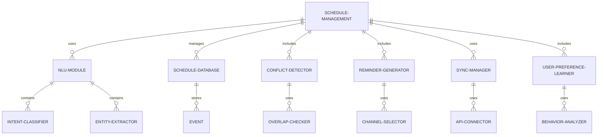

#### 交互关系图

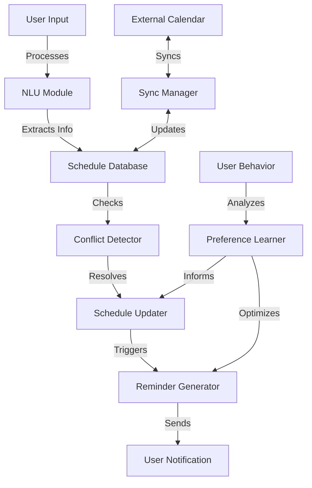

### 数学模型：

优化提醒时间可以使用强化学习模型，如Q-learning：

$$Q(s,a) \leftarrow Q(s,a) + \alpha [r + \gamma \max_{a'} Q(s',a') - Q(s,a)]$$

其中：
- $s$ 是当前状态（如日程类型、用户位置）
- $a$ 是动作（提醒时间）
- $r$ 是奖励（用户反馈）
- $\alpha$ 是学习率
- $\gamma$ 是折扣因子

### 算法流程图：

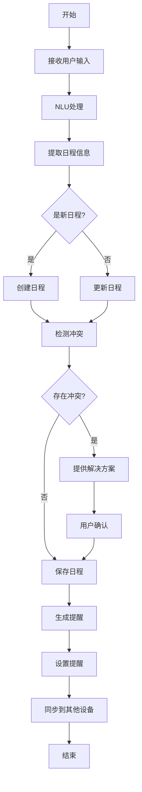

### 算法源代码：

以下是一个简化的日程管理与提醒系统的 Python 实现示例：

```python
import datetime
from dateutil.parser import parse
import nltk
from nltk.tokenize import word_tokenize

class ScheduleManager:
    def __init__(self):
        self.schedules = []
        nltk.download('punkt')

    def parse_input(self, user_input):
        tokens = word_tokenize(user_input.lower())
        date = None
        time = None
        description = []

        for token in tokens:
            if token in ['today', 'tomorrow', 'yesterday']:
                date = self.parse_relative_date(token)
            elif ':' in token:
                time = parse(token).time()
            else:
                description.append(token)

        return date, time, ' '.join(description)

    def parse_relative_date(self, token):
        today = datetime.date.today()
        if token == 'today':
            return today
        elif token == 'tomorrow':
            return today + datetime.timedelta(days=1)
        elif token == 'yesterday':
            return today - datetime.timedelta(days=1)

    def add_schedule(self, user_input):
        date, time, description = self.parse_input(user_input)
        if not date:
            date = datetime.date.today()
        if not time:
            time = datetime.time(9, 0)  # Default to 9:00 AM
        
        new_schedule = {
            'date': date,
            'time': time,
            'description': description
        }
        
        if self.check_conflict(new_schedule):
            print("Warning: This schedule conflicts with an existing one.")
        
        self.schedules.append(new_schedule)
        print(f"Added: {description} on {date} at {time}")

    def check_conflict(self, new_schedule):
        for schedule in self.schedules:
            if (schedule['date'] == new_schedule['date'] and
                schedule['time'] == new_schedule['time']):
                return True
        return False

    def get_reminders(self, current_time):
        reminders = []
        for schedule in self.schedules:
            schedule_time = datetime.datetime.combine(schedule['date'], schedule['time'])
            if schedule_time > current_time and (schedule_time - current_time).total_seconds() <= 3600:  # 1 hour before
                reminders.append(schedule)
        return reminders

# 使用示例
manager = ScheduleManager()

# 添加日程
manager.add_schedule("Meeting with team tomorrow at 10:00")
manager.add_schedule("Lunch with client on Friday at 12:30")

# 检查提醒
current_time = datetime.datetime.now()
reminders = manager.get_reminders(current_time)
for reminder in reminders:
    print(f"Reminder: {reminder['description']} at {reminder['time']} on {reminder['date']}")
```

### 实际场景应用：

1. 个人助理：
   - 管理日常工作和个人约会
   - 智能调整提醒时间based on交通状况

2. 团队协作：
   - 自动安排团队会议，考虑所有成员的可用时间
   - 同步项目里程碑和截止日期

3. 旅行规划：
   - 整合航班、酒店和活动安排
   - 根据时区变化自动调整提醒

4. 学习计划：
   - 安排课程和学习时间
   - 根据学习进度调整复习提醒

5. 健康管理：
   - 安排定期体检和医疗预约
   - 提醒服药和健康活动

### 行业发展与未来趋势：

| 时期 | 主要特征 | 代表性技术/方法 |
|------|----------|-----------------|
| 2015-2017 | 基础智能化 | 简单NLP、规则based提醒 |
| 2018-2020 | 个性化增强 | 机器学习、用户行为分析 |
| 2021-2023 | 上下文感知 | 深度学习、多模态融合 |
| 2024及以后 | 预测性规划 | 强化学习、大规模预训练模型 |

### 本章小结：

日程管理与提醒功能是智能办公助手 Agent 的核心组成部分，直接影响用户的工作效率和体验。本章讨论了实现这一功能的主要挑战、解决方案和技术实现。主要要点包括：

1. 自然语言理解对于准确解析用户输入至关重要。
2. 灵活的数据模型和高效的冲突检测算法是处理复杂日程的基础。
3. 个性化的提醒机制可以显著提升用户体验。
4. 与其他系统的集成和同步能力对于全面的时间管理非常重要。
5. 持续学习和优化是提高系统智能性的关键。

未来的日程管理与提醒系统发展趋势可能包括：
1. 更强大的自然语言理解能力，支持复杂和模糊的时间表达
2. 基于上下文的智能建议，如根据会议内容自动推荐后续任务
3. 跨设备和跨平台的无缝同步和协作
4. 整合外部数据源（如天气、交通）进行预测性规划
5. 增强现实（AR）技术在日程可视化和提醒中的应用

在实现日程管理与提醒功能时，开发者应当注意：
1. 注重用户隐私保护，特别是在处理敏感日程信息时
2. 设计直观的用户界面，使复杂的日程操作变得简单
3. 提供灵活的自定义选项，满足不同用户的需求
4. 确保系统的可靠性和稳定性，尤其是在提醒功能方面
5. 持续收集用户反馈，不断优化算法和功能

通过不断改进的日程管理与提醒技术，智能办公助手 Agent 将能够更好地帮助用户管理时间、提高工作效率，并减少因遗忘或冲突造成的问题。这不仅能提升个人工作质量，还能促进团队协作和组织效率的整体提升。随着技术的进步，我们可以期待看到更智能、更个性化、更具预测性的日程管理解决方案，最终实现真正的智能化时间管理助手。


## 8.2 邮件处理与自动回复

### 核心概念：

邮件处理与自动回复是智能办公助手 Agent 的关键功能，旨在帮助用户高效管理电子邮件，包括邮件分类、优先级排序、内容摘要、自动回复等。这个功能利用自然语言处理和机器学习技术，实现邮件的智能化处理，减轻用户的邮件管理负担。

### 问题背景：

在当今信息爆炸的时代，处理大量电子邮件已成为许多职场人士的日常挑战。传统的邮件客户端缺乏智能化功能，无法有效地过滤垃圾邮件、识别重要信息，或自动处理常见查询。智能办公助手需要能够理解邮件内容，判断其重要性，并在适当情况下自动生成回复。

### 问题描述：

在实现邮件处理与自动回复功能时，开发者面临以下挑战：

1. 如何准确分类和优先排序大量incoming邮件
2. 如何有效提取邮件的关键信息和意图
3. 如何生成恰当、个性化的自动回复
4. 如何处理复杂的邮件线程和上下文
5. 如何确保自动回复的安全性和适当性

### 问题解决：

通过以下步骤可以实现有效的邮件处理与自动回复功能：

1. 邮件分类与优先级排序：
   - 使用机器学习算法（如朴素贝叶斯、SVM）进行邮件分类
   - 实现基于规则和学习的优先级评分系统

2. 内容理解与信息提取：
   - 应用NLP技术提取邮件主题、关键词和实体
   - 使用深度学习模型（如BERT）理解邮件语义

3. 自动回复生成：
   - 开发基于模板和深度学习的混合回复生成系统
   - 实现上下文感知的回复，考虑邮件历史

4. 线程管理：
   - 设计算法识别和组织复杂的邮件线程
   - 实现跨邮件的上下文理解

5. 安全与适当性检查：
   - 集成敏感信息检测机制
   - 实现多级审核流程，确保自动回复的准确性和适当性

### 边界与外延：

邮件处理与自动回复功能的应用范围包括：
- 个人邮箱管理
- 企业客户服务邮件处理
- 销售线索管理
- 内部沟通效率提升
- 邮件归档和知识管理

### 概念结构与核心要素组成：

邮件处理与自动回复系统的核心组件：
1. 邮件分类器
2. 优先级评估器
3. 内容分析器
4. 自动回复生成器
5. 线程管理器
6. 安全检查模块

### 概念之间的关系：

#### 概念核心属性维度对比

| 属性 | 传统邮件客户端 | 基础智能邮件系统 | 高级AI邮件助手 |
|------|----------------|-------------------|----------------|
| 分类能力 | 基于规则 | 机器学习支持 | 深度语义理解 |
| 优先级排序 | 手动标记 | 基础算法 | 上下文感知排序 |
| 自动回复 | 模板based | 简单定制化 | 智能生成 |
| 内容理解 | 关键词匹配 | 浅层语义分析 | 深度语义理解 |
| 线程管理 | 基础聚合 | 智能聚合 | 语义based聚合 |
| 学习能力 | 无 | 有限 | 持续学习 |

#### 概念联系的ER 实体关系

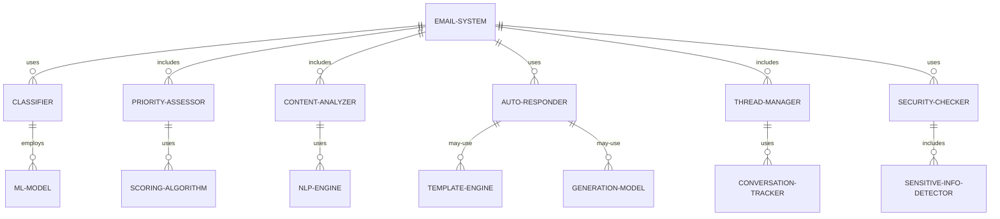

#### 交互关系图

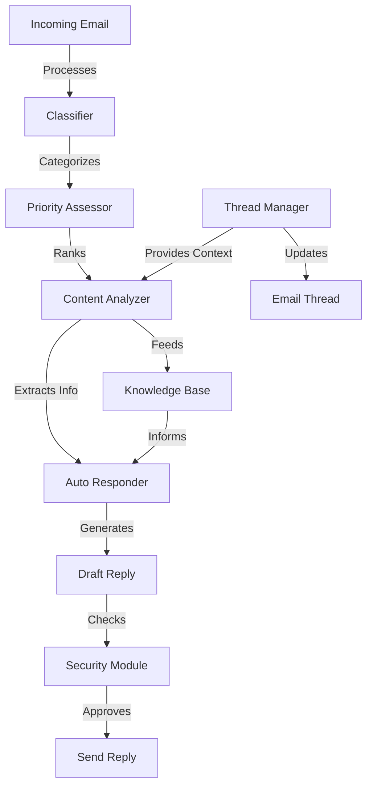

### 数学模型：

邮件优先级评分可以使用加权求和模型：

$$Score = \sum_{i=1}^n w_i \cdot f_i$$

其中：
- $w_i$ 是第 i 个特征的权重
- $f_i$ 是第 i 个特征的值（如发件人重要性、内容紧急度等）

### 算法流程图：

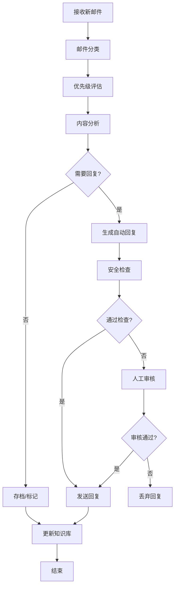

### 算法源代码：

以下是一个简化的邮件处理与自动回复系统的 Python 实现示例：

```python
import re
from sklearn.feature_extraction.text import TfidfVectorizer
from sklearn.naive_bayes import MultinomialNB
from sklearn.pipeline import Pipeline

class EmailProcessor:
    def __init__(self):
        self.classifier = Pipeline([
            ('tfidf', TfidfVectorizer()),
            ('clf', MultinomialNB())
        ])
        self.trained = False

    def train_classifier(self, emails, labels):
        self.classifier.fit(emails, labels)
        self.trained = True

    def classify_email(self, email):
        if not self.trained:
            raise Exception("Classifier not trained yet")
        return self.classifier.predict([email])[0]

    def extract_info(self, email):
        # 简单的信息提取示例
        subject = re.search(r'Subject: (.*)', email).group(1)
        body = re.search(r'\n\n(.*)', email, re.DOTALL).group(1)
        return {"subject": subject, "body": body}

    def generate_reply(self, email_info, email_type):
        # 简单的回复生成示例
        templates = {
            "inquiry": "Thank you for your inquiry about {subject}. We will get back to you shortly.",
            "complaint": "We apologize for any inconvenience regarding {subject}. Our team is looking into this matter.",
            "feedback": "Thank you for your feedback about {subject}. We appreciate your input.",
        }
        return templates.get(email_type, "Thank you for your email.").format(**email_info)

    def process_email(self, email):
        email_type = self.classify_email(email)
        email_info = self.extract_info(email)
        reply = self.generate_reply(email_info, email_type)
        return email_type, reply

# 使用示例
processor = EmailProcessor()

# 训练分类器
training_emails = [
    "Subject: Product Inquiry\n\nI'm interested in your new product. Can you provide more information?",
    "Subject: Complaint\n\nI'm having issues with my recent order. The product is defective.",
    "Subject: Feedback\n\nI love your service! Keep up the good work."
]
labels = ["inquiry", "complaint", "feedback"]
processor.train_classifier(training_emails, labels)

# 处理新邮件
new_email = "Subject: Question about delivery\n\nWhen will my order be delivered?"
email_type, auto_reply = processor.process_email(new_email)

print(f"Email Type: {email_type}")
print(f"Auto Reply: {auto_reply}")
```

### 实际场景应用：

1. 客户服务邮箱：
   - 自动分类客户查询、投诉和反馈
   - 生成初步回复，加快响应速度

2. 销售线索管理：
   - 识别和优先处理潜在客户邮件
   - 自动发送个性化跟进邮件

3. 内部沟通：
   - 智能分类和优先级排序公司内部邮件
   - 自动回复常见问题，如IT支持请求

4. 招聘流程：
   - 分类和筛选求职者邮件
   - 自动发送面试邀请或礼貌拒绝

5. 新闻媒体：
   - 分类和优先处理新闻线索
   - 自动回复提交的新闻稿

### 行业发展与未来趋势：

| 时期 | 主要特征 | 代表性技术/方法 |
|------|----------|-----------------|
| 2015-2017 | 基础自动化 | 规则based分类、模板回复 |
| 2018-2020 | 机器学习应用 | 监督学习分类、序列到序列模型 |
| 2021-2023 | 深度语义理解 | BERT、GPT for邮件处理 |
| 2024及以后 | 智能协作助手 | 多模态AI、个性化知识图谱 |

### 本章小结：

邮件处理与自动回复功能是智能办公助手 Agent 的重要组成部分，直接影响用户的工作效率和沟通质量。本章讨论了实现这一功能的主要挑战、解决方案和技术实现。主要要点包括：

1. 有效的邮件分类和优先级排序是高效邮件管理的基础。
2. 深度内容理解对于准确提取信息和生成恰当回复至关重要。
3. 自动回复生成需要平衡标准化和个性化。
4. 线程管理和上下文理解对于处理复杂邮件交互非常重要。
5. 安全检查和适当性审核是确保自动回复质量的关键步骤。

未来的邮件处理与自动回复系统发展趋势可能包括：
1. 更精准的意图识别，能够理解复杂和隐含的邮件目的
2. 基于深度学习的个性化回复生成，考虑用户风格和偏好
3. 跨语言邮件处理和翻译集成
4. 与其他办公工具的深度集成，如日程安排、任务管理
5. 情感智能增强，能够理解和适当回应邮件中的情感因素

在实现邮件处理与自动回复功能时，开发者应当注意：
1. 确保用户隐私和数据安全，特别是在处理敏感邮件时
2. 提供透明的AI辅助机制，让用户了解并控制自动化程度
3. 设计直观的界面，允许用户轻松审核和修改自动生成的回复
4. 实现持续学习机制，从用户反馈中不断改进系统性能
5. 考虑法律和道德因素，确保自动回复符合相关规定和最佳实践

通过不断改进的邮件处理与自动回复技术，智能办公助手 Agent 将能够显著提高用户的邮件管理效率，减少重复性工作，并提升整体沟通质量。这不仅能节省时间，还能帮助用户更好地关注重要任务和关键信息。随着技术的进步，我们可以期待看到更智能、更个性化、更具洞察力的邮件管理解决方案，最终实现真正的智能化办公助手。


## 8.3 文档摘要与信息提取

### 核心概念：

文档摘要与信息提取是智能办公助手 Agent 的重要功能，旨在从大量文本数据中快速提取关键信息，生成简洁而全面的摘要。这项功能利用自然语言处理和机器学习技术，帮助用户快速理解文档内容，提高信息处理效率。

### 问题背景：

在信息爆炸的时代，专业人士经常需要处理大量的报告、文章和文档。传统的人工阅读和总结方法耗时耗力，难以应对日益增长的信息量。智能办公助手需要能够自动化这一过程，提供准确、相关的摘要和关键信息。

### 问题描述：

在实现文档摘要与信息提取功能时，开发者面临以下挑战：

1. 如何准确识别文档中的关键信息和主要观点
2. 如何生成简洁yet全面的摘要
3. 如何处理不同类型和格式的文档
4. 如何提取特定领域的专业信息
5. 如何保持摘要的连贯性和可读性

### 问题解决：

通过以下步骤可以实现有效的文档摘要与信息提取功能：

1. 文本预处理：
   - 实现文档格式转换，支持多种文件类型
   - 应用文本清洗和标准化技术

2. 关键信息识别：
   - 使用TF-IDF等算法识别重要词汇和短语
   - 应用命名实体识别（NER）提取关键实体

3. 摘要生成：
   - 实现抽取式摘要方法，选择最重要的句子
   - 开发生成式摘要模型，如基于Transformer的模型

4. 信息结构化：
   - 设计领域特定的信息提取模板
   - 使用关系抽取技术识别实体间关系

5. 摘要优化：
   - 实现摘要压缩算法，删除冗余信息
   - 应用自然语言生成技术改善摘要流畅性

### 边界与外延：

文档摘要与信息提取功能的应用范围包括：
- 商业报告分析
- 学术文献综述
- 新闻文章摘要
- 法律文件解析
- 技术文档简化

### 概念结构与核心要素组成：

文档摘要与信息提取系统的核心组件：
1. 文档解析器
2. 关键词提取器
3. 实体识别器
4. 摘要生成器
5. 信息结构化模块
6. 摘要优化器

### 概念之间的关系：

#### 概念核心属性维度对比

| 属性 | 传统手动方法 | 基础自动化工具 | 高级AI摘要系统 |
|------|--------------|----------------|----------------|
| 处理速度 | 慢 | 快 | 非常快 |
| 一致性 | 低 | 中 | 高 |
| 定制化程度 | 高 | 低 | 中-高 |
| 理解深度 | 高 | 低 | 中-高 |
| 多文档处理 | 困难 | 可能 | 容易 |
| 更新能力 | 慢 | 快 | 实时 |

#### 概念联系的ER 实体关系

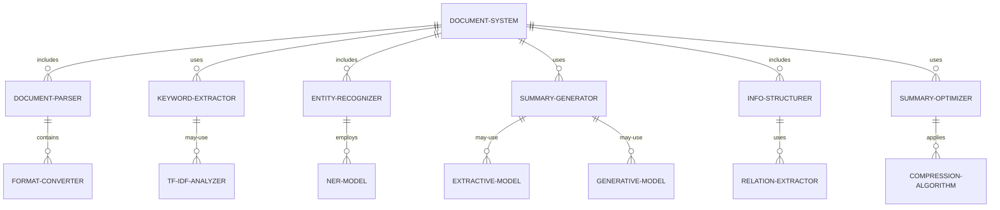

#### 交互关系图

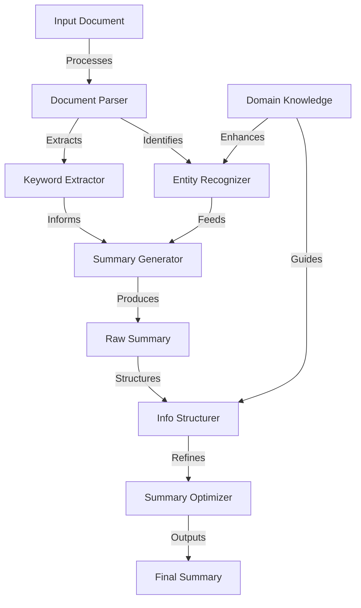

### 数学模型：

TF-IDF（词频-逆文档频率）用于关键词提取：

$$\text{TF-IDF}(t,d,D) = \text{TF}(t,d) \cdot \text{IDF}(t,D)$$

其中：
- $\text{TF}(t,d)$ 是词 $t$ 在文档 $d$ 中的频率
- $\text{IDF}(t,D) = \log\frac{N}{|\{d \in D: t \in d\}|}$，$N$ 是总文档数

### 算法流程图：

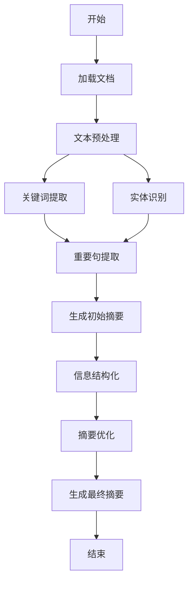

### 算法源代码：

以下是一个简化的文档摘要与信息提取系统的 Python 实现示例：

```python
import nltk
from nltk.corpus import stopwords
from nltk.tokenize import sent_tokenize, word_tokenize
from nltk.probability import FreqDist
from heapq import nlargest

class DocumentSummarizer:
    def __init__(self):
        nltk.download('punkt')
        nltk.download('stopwords')
        self.stop_words = set(stopwords.words('english'))

    def preprocess(self, text):
        sentences = sent_tokenize(text)
        words = word_tokenize(text.lower())
        return sentences, [word for word in words if word not in self.stop_words]

    def get_top_words(self, words, top_n=5):
        word_freq = FreqDist(words)
        return word_freq.most_common(top_n)

    def score_sentences(self, sentences, top_words):
        sentence_scores = {}
        for sentence in sentences:
            for word in word_tokenize(sentence.lower()):
                if word in dict(top_words):
                    if sentence not in sentence_scores:
                        sentence_scores[sentence] = 1
                    else:
                        sentence_scores[sentence] += 1
        return sentence_scores

    def generate_summary(self, text, num_sentences=3):
        sentences, words = self.preprocess(text)
        top_words = self.get_top_words(words)
        sentence_scores = self.score_sentences(sentences, top_words)
        summary_sentences = nlargest(num_sentences, sentence_scores, key=sentence_scores.get)
        return ' '.join(summary_sentences)

    def extract_entities(self, text):
        # 简化的实体提取，实际应用中可使用更复杂的NER模型
        entities = []
        for sentence in sent_tokenize(text):
            words = word_tokenize(sentence)
            for word in words:
                if word[0].isupper():
                    entities.append(word)
        return list(set(entities))

    def process_document(self, text):
        summary = self.generate_summary(text)
        entities = self.extract_entities(text)
        top_words = self.get_top_words(word_tokenize(text.lower()))
        return {
            "summary": summary,
            "key_entities": entities,
            "top_words": dict(top_words)
        }

# 使用示例
summarizer = DocumentSummarizer()

document = """
Natural language processing (NLP) is a subfield of linguistics, computer science, and artificial intelligence concerned with the interactions between computers and human language, in particular how to program computers to process and analyze large amounts of natural language data. The goal is a computer capable of understanding the contents of documents, including the contextual nuances of the language within them. The technology can then accurately extract information and insights contained in the documents as well as categorize and organize the documents themselves.
"""

result = summarizer.process_document(document)

print("Summary:")
print(result["summary"])
print("\nKey Entities:")
print(", ".join(result["key_entities"]))
print("\nTop Words:")
for word, count in result["top_words"].items():
    print(f"{word}: {count}")
```

### 实际场景应用：

1. 商业智能：
   - 自动总结财务报告和市场分析
   - 提取竞争对手报告中的关键信息

2. 学术研究：
   - 生成文献综述摘要
   - 提取研究论文中的方法和结果

3. 新闻聚合：
   - 生成多篇新闻文章的综合摘要
   - 提取热点事件的关键信息

4. 法律文件分析：
   - 总结合同要点
   - 提取判决书中的关键论点和结论

5. 技术文档管理：
   - 生成产品说明书摘要
   - 提取软件文档中的API信息

### 行业发展与未来趋势：

| 时期 | 主要特征 | 代表性技术/方法 |
|------|----------|-----------------|
| 2015-2017 | 基础抽取式摘要 | TF-IDF、TextRank |
| 2018-2020 | 深度学习应用 | Seq2Seq、Attention机制 |
| 2021-2023 | 预训练模型应用 | BERT、GPT for摘要 |
| 2024及以后 | 多模态理解与生成 | 跨模态摘要、知识增强摘要 |

### 本章小结：

文档摘要与信息提取是智能办公助手 Agent 的核心功能之一，能显著提高信息处理效率。本章讨论了实现这一功能的主要挑战、解决方案和技术实现。主要要点包括：

1. 有效的文本预处理和关键信息识别是生成高质量摘要的基础。
2. 结合抽取式和生成式方法可以产生更全面、连贯的摘要。
3. 领域特定的信息提取对于满足专业需求至关重要。
4. 摘要优化和结构化呈现能显著提升摘要的可用性。
5. 多文档摘要和信息融合是处理大量相关文档的关键技术。

未来的文档摘要与信息提取系统发展趋势可能包括：
1. 更深入的语义理解，能够捕捉隐含信息和上下文
2. 多语言和跨语言摘要能力的增强
3. 与知识图谱的深度集成，提供更丰富的背景信息
4. 可解释性摘要，提供关键信息的来源和推理过程
5. 个性化摘要生成，根据用户兴趣和背景定制内容

在实现文档摘要与信息提取功能时，开发者应当注意：
1. 保持摘要的客观性和准确性，避免引入偏见
2. 设计灵活的接口，允许用户调整摘要长度和重点
3. 实现有效的错误处理机制，应对各种文档格式和内容
4. 考虑版权和隐私问题，特别是在处理敏感文档时
5. 持续评估和优化系统性能，适应不同领域和文档类型

通过不断改进的文档摘要与信息提取技术，智能办公助手 Agent 将能够帮助用户更快速、更全面地把握大量文档的核心内容，提高决策效率和工作质量。这不仅能节省时间，还能帮助用户发现可能被忽视的重要信息和洞察。随着技术的进步，我们可以期待看到更智能、更精准、更具洞察力的文档处理解决方案，最终实现真正的智能化信息助手。


## 8.4 会议记录与行动项跟踪

### 核心概念：

会议记录与行动项跟踪是智能办公助手 Agent 的关键功能，旨在自动化记录会议内容、提取关键决策和行动项，并跟踪这些项目的执行进度。这一功能结合了语音识别、自然语言处理和任务管理技术，提高会议效率和后续执行的有效性。

### 问题背景：

传统的会议记录方法往往耗时且不完整，而行动项的跟踪常常因缺乏系统性而失效。在远程和混合工作模式日益普及的背景下，高效的会议记录和行动项管理变得更加重要。智能办公助手需要能够准确捕捉会议内容，识别关键决策和任务，并提供持续的跟进支持。

### 问题描述：

在实现会议记录与行动项跟踪功能时，开发者面临以下挑战：

1. 如何准确转录多人参与的会议对话
2. 如何从会议内容中提取关键信息和决策
3. 如何识别和结构化行动项
4. 如何有效地分配和跟踪行动项
5. 如何与现有的项目管理和协作工具集成

### 问题解决：

通过以下步骤可以实现有效的会议记录与行动项跟踪功能：

1. 语音识别与转录：
   - 使用高级语音识别API（如Google Speech-to-Text）实现实时转录
   - 实现说话人分离技术，区分不同参与者的发言

2. 关键信息提取：
   - 应用NLP技术识别重要主题和讨论点
   - 使用命名实体识别（NER）提取关键人名、日期等信息

3. 行动项识别：
   - 开发基于规则和机器学习的混合模型识别行动项
   - 实现意图识别，区分决策、任务分配和一般讨论

4. 结构化记录生成：
   - 设计模板化的会议记录格式
   - 使用自然语言生成（NLG）技术生成简洁的会议摘要

5. 行动项管理：
   - 开发任务管理系统，支持分配、截止日期设置和进度跟踪
   - 实现自动提醒和报告生成功能

6. 系统集成：
   - 开发API接口，与常用项目管理工具（如Jira、Trello）集成
   - 实现日历同步，自动添加后续会议和截止日期

### 边界与外延：

会议记录与行动项跟踪功能的应用范围包括：
- 企业管理会议
- 项目进度评审
- 客户会议跟进
- 学术研讨会记录
- 远程团队协作

### 概念结构与核心要素组成：

会议记录与行动项跟踪系统的核心组件：
1. 语音识别模块
2. 文本分析器
3. 行动项提取器
4. 记录生成器
5. 任务管理系统
6. 集成接口

### 概念之间的关系：

#### 概念核心属性维度对比

| 属性 | 传统人工方法 | 基础自动化工具 | 高级AI助手 |
|------|--------------|----------------|------------|
| 记录准确性 | 中-高 | 中 | 高 |
| 信息提取能力 | 低-中 | 中 | 高 |
| 实时性 | 低 | 高 | 高 |
| 行动项跟踪效率 | 低 | 中 | 高 |
| 可扩展性 | 低 | 中 | 高 |
| 集成能力 | 低 | 中 | 高 |

#### 概念联系的ER 实体关系

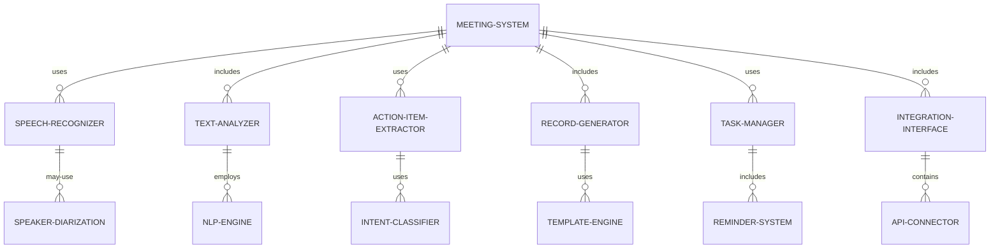

#### 交互关系图

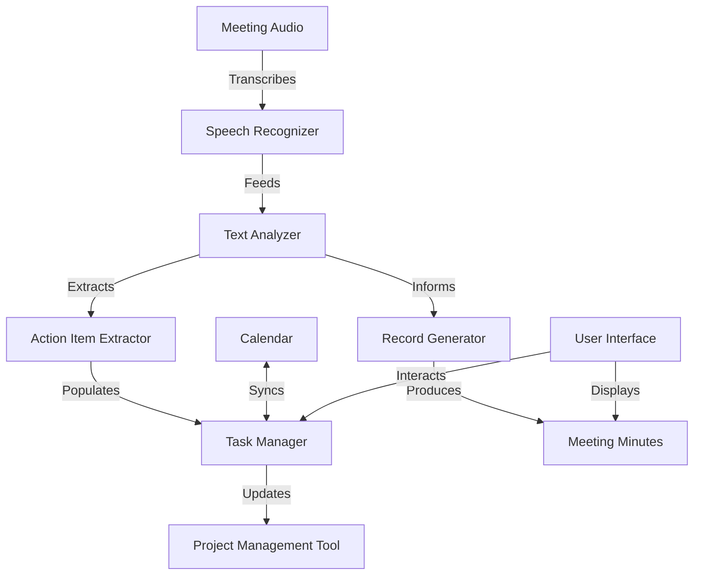

### 数学模型：

使用TF-IDF（词频-逆文档频率）来识别会议中的重要词汇：

$$\text{TF-IDF}(t,d,D) = \text{TF}(t,d) \cdot \log\frac{N}{|\{d \in D: t \in d\}|}$$

其中：
- $\text{TF}(t,d)$ 是词 $t$ 在文档 $d$ 中的频率
- $N$ 是总文档数
- $|\{d \in D: t \in d\}|$ 是包含词 $t$ 的文档数

### 算法流程图：

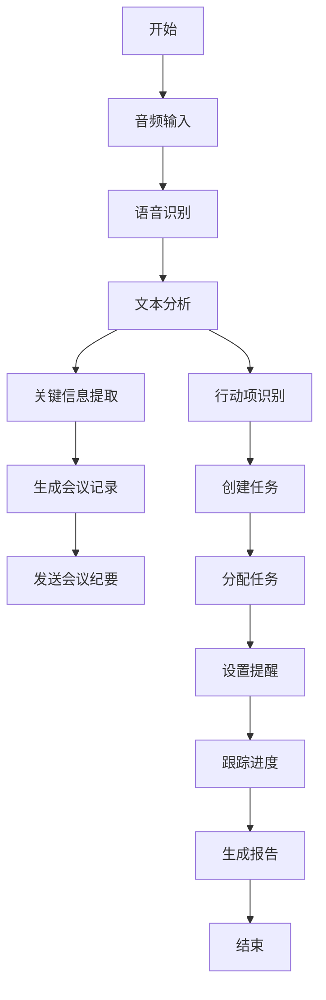

### 算法源代码：

以下是一个简化的会议记录与行动项跟踪系统的 Python 实现示例：

```python
import re
from datetime import datetime, timedelta

class MeetingAssistant:
    def __init__(self):
        self.transcript = ""
        self.action_items = []

    def transcribe_audio(self, audio_file):
        # 简化示例，实际应使用语音识别API
        self.transcript = "This is a simulated transcript of the meeting. We need to complete the project by next Friday. John will prepare the report, and Sarah will review it."

    def extract_action_items(self):
        # 简单的基于规则的行动项提取
        sentences = self.transcript.split('.')
        for sentence in sentences:
            if 'will' in sentence.lower():
                self.action_items.append(sentence.strip())

    def generate_minutes(self):
        return f"Meeting Minutes:\n\nTranscript:\n{self.transcript}\n\nAction Items:\n" + "\n".join(self.action_items)

    def create_tasks(self):
        tasks = []
        for item in self.action_items:
            match = re.search(r'(\w+) will (.*)', item)
            if match:
                assignee, task = match.groups()
                due_date = datetime.now() + timedelta(days=7)  # 默认一周后截止
                tasks.append({
                    'assignee': assignee,
                    'description': task,
                    'due_date': due_date.strftime('%Y-%m-%d'),
                    'status': 'Not Started'
                })
        return tasks

    def process_meeting(self, audio_file):
        self.transcribe_audio(audio_file)
        self.extract_action_items()
        minutes = self.generate_minutes()
        tasks = self.create_tasks()
        return minutes, tasks

# 使用示例
assistant = MeetingAssistant()
minutes, tasks = assistant.process_meeting("meeting_audio.wav")

print(minutes)
print("\nTasks:")
for task in tasks:
    print(f"Assignee: {task['assignee']}")
    print(f"Task: {task['description']}")
    print(f"Due Date: {task['due_date']}")
    print(f"Status: {task['status']}")
    print()
```

### 实际场景应用：

1. 项目管理会议：
   - 记录项目进度讨论
   - 提取并分配新的任务和里程碑

2. 战略规划会议：
   - 捕捉关键决策和长期目标
   - 创建战略实施的行动计划

3. 客户会议：
   - 记录客户需求和反馈
   - 生成后续跟进任务清单

4. 团队协作会议：
   - 记录头脑风暴的创意
   - 分配和跟踪团队成员的任务

5. 董事会会议：
   - 生成正式的会议纪要
   - 跟踪重要决议的执行情况

### 行业发展与未来趋势：

| 时期 | 主要特征 | 代表性技术/方法 |
|------|----------|-----------------|
| 2015-2017 | 基础语音转文字 | 简单ASR、关键词提取 |
| 2018-2020 | 智能会议助手 | 高级NLP、基础意图识别 |
| 2021-2023 | AI驱动的会议分析 | 深度学习、上下文理解 |
| 2024及以后 | 全方位智能协作 | 多模态分析、预测性任务管理 |

### 本章小结：

会议记录与行动项跟踪是智能办公助手 Agent 的重要功能，能显著提高会议效率和后续执行力。本章讨论了实现这一功能的主要挑战、解决方案和技术实现。主要要点包括：

1. 高质量的语音识别和转录是准确会议记录的基础。
2. 有效的文本分析和信息提取技术对于识别关键讨论点和决策至关重要。
3. 智能行动项识别和管理可以大大提高会议后续的执行效率。
4. 自动化的会议记录生成和分发可以节省大量时间和精力。
5. 与现有工作流程和工具的无缝集成是提高采用率的关键。

未来的会议记录与行动项跟踪系统发展趋势可能包括：
1. 更精准的多语言和方言支持，适应全球化团队
2. 情感分析集成，捕捉会议参与者的情绪和态度
3. 预测性分析，基于历史数据预测任务完成难度和所需资源
4. 增强现实（AR）集成，提供更丰富的可视化会议记录
5. 自动化会议效果评估和改进建议

在实现会议记录与行动项跟踪功能时，开发者应当注意：
1. 确保数据隐私和安全，特别是在处理敏感会议内容时
2. 提供灵活的自定义选项，适应不同类型会议的需求
3. 设计直观的用户界面，便于快速审阅和编辑自动生成的内容
4. 实现强大的错误处理机制，应对各种会议场景和音频质量
5. 持续收集用户反馈，不断优化系统的准确性和实用性

通过不断改进的会议记录与行动项跟踪技术，智能办公助手 Agent 将能够显著提升会议的价值和效果。这不仅能节省时间和资源，还能促进更好的决策制定和执行跟踪。随着技术的进步，我们可以期待看到更智能、更全面的会议辅助解决方案，最终实现真正的智能化会议管理，推动组织效率和协作质量的全面提升。


## 8.5 任务分配与进度监控

### 核心概念：

任务分配与进度监控是智能办公助手 Agent 的核心功能之一，旨在自动化和优化工作流程管理。这一功能涉及智能任务分配、进度跟踪、资源管理和性能分析，通过AI技术提高团队协作效率和项目管理的有效性。

### 问题背景：

在复杂的项目环境中，有效的任务分配和进度监控往往是项目成功的关键。传统方法依赖于人工判断和手动更新，容易出现资源分配不当、进度滞后未及时发现等问题。智能办公助手需要能够考虑多种因素，实现智能化的任务分配和实时的进度监控。

### 问题描述：

在实现任务分配与进度监控功能时，开发者面临以下挑战：

1. 如何根据团队成员的技能、工作负载和项目需求进行最优任务分配
2. 如何准确估计任务完成时间并识别潜在的延迟风险
3. 如何有效收集和分析任务进度数据
4. 如何自动化生成进度报告并提供有意义的洞察
5. 如何处理任务依赖关系和资源冲突

### 问题解决：

通过以下步骤可以实现有效的任务分配与进度监控功能：

1. 智能任务分配：
   - 开发基于机器学习的任务-人员匹配算法
   - 实现工作负载平衡和优先级管理

2. 任务时间估算：
   - 使用历史数据和机器学习模型预测任务完成时间
   - 实现风险评估，识别可能的延迟因素

3. 进度数据收集：
   - 开发自动化数据收集接口，与常用工具集成
   - 实现实时进度更新机制

4. 进度分析与报告：
   - 使用数据可视化技术创建直观的进度仪表板
   - 实现自动化报告生成，包括关键性能指标（KPI）分析

5. 依赖管理：
   - 开发任务依赖图分析算法
   - 实现资源冲突检测和解决建议

### 边界与外延：

任务分配与进度监控功能的应用范围包括：
- 软件开发项目管理
- 营销活动执行跟踪
- 产品研发流程管理
- 跨部门协作项目
- 客户服务任务分配

### 概念结构与核心要素组成：

任务分配与进度监控系统的核心组件：
1. 任务分配引擎
2. 时间估算模块
3. 数据收集接口
4. 进度分析器
5. 报告生成器
6. 依赖管理器

### 概念之间的关系：

#### 概念核心属性维度对比

| 属性 | 传统项目管理 | 基础自动化工具 | AI驱动的智能系统 |
|------|--------------|----------------|-------------------|
| 任务分配效率 | 低 | 中 | 高 |
| 时间估算准确性 | 低-中 | 中 | 高 |
| 进度跟踪实时性 | 低 | 中-高 | 高 |
| 资源优化能力 | 低 | 中 | 高 |
| 预测分析能力 | 低 | 低-中 | 高 |
| 适应性 | 低 | 中 | 高 |

#### 概念联系的ER 实体关系

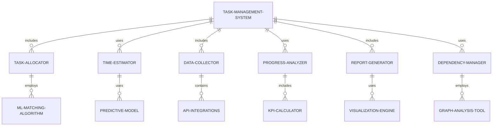

#### 交互关系图

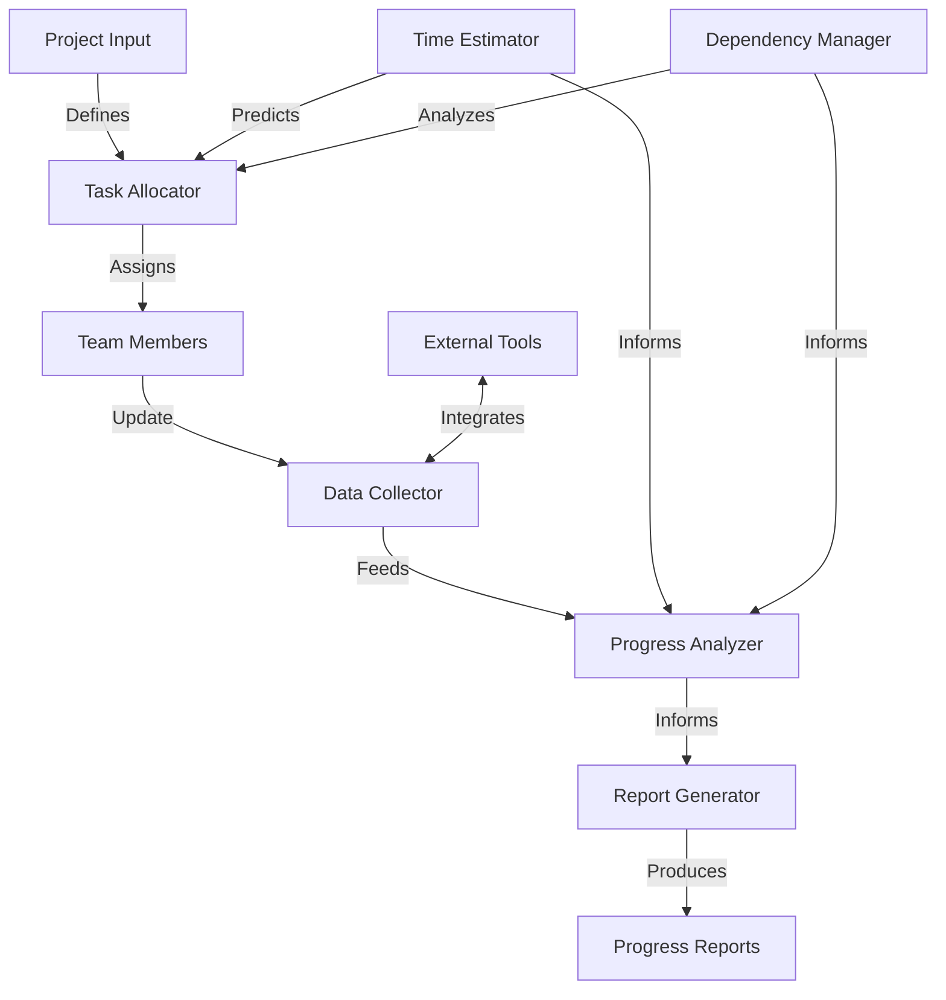

### 数学模型：

任务分配可以使用匈牙利算法（Hungarian Algorithm）来优化：

给定一个 n × n 的成本矩阵，其中 $c_{ij}$ 表示将任务 i 分配给人员 j 的成本，目标是找到一个分配方案，使总成本最小化：

$$\min \sum_{i=1}^n \sum_{j=1}^n c_{ij} x_{ij}$$

其中 $x_{ij}$ 是一个二元变量，当任务 i 分配给人员 j 时为 1，否则为 0。

### 算法流程图：

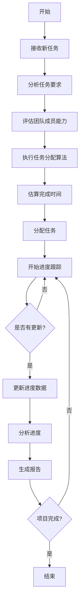

### 算法源代码：

以下是一个简化的任务分配与进度监控系统的 Python 实现示例：

```python
import random
from datetime import datetime, timedelta

class Task:
    def __init__(self, name, estimated_hours, required_skill):
        self.name = name
        self.estimated_hours = estimated_hours
        self.required_skill = required_skill
        self.assigned_to = None
        self.progress = 0
        self.start_date = None
        self.end_date = None

class Employee:
    def __init__(self, name, skills, capacity):
        self.name = name
        self.skills = skills
        self.capacity = capacity
        self.assigned_tasks = []

class ProjectManager:
    def __init__(self):
        self.tasks = []
        self.employees = []

    def add_task(self, task):
        self.tasks.append(task)

    def add_employee(self, employee):
        self.employees.append(employee)

    def assign_tasks(self):
        for task in self.tasks:
            suitable_employees = [e for e in self.employees if task.required_skill in e.skills and len(e.assigned_tasks) < e.capacity]
            if suitable_employees:
                assigned_employee = min(suitable_employees, key=lambda e: len(e.assigned_tasks))
                task.assigned_to = assigned_employee
                assigned_employee.assigned_tasks.append(task)
                task.start_date = datetime.now()
                task.end_date = task.start_date + timedelta(hours=task.estimated_hours)

    def update_progress(self):
        for employee in self.employees:
            for task in employee.assigned_tasks:
                if task.progress < 100:
                    task.progress += random.randint(10, 30)
                    if task.progress > 100:
                        task.progress = 100

    def generate_report(self):
        report = "Project Progress Report\n"
        report += "========================\n"
        for task in self.tasks:
            report += f"Task: {task.name}\n"
            report += f"Assigned to: {task.assigned_to.name if task.assigned_to else 'Unassigned'}\n"
            report += f"Progress: {task.progress}%\n"
            report += f"Estimated completion: {task.end_date}\n"
            report += "------------------------\n"
        return report

# 使用示例
pm = ProjectManager()

# 添加员工
pm.add_employee(Employee("Alice", ["Python", "Data Analysis"], 3))
pm.add_employee(Employee("Bob", ["Java", "DevOps"], 2))
pm.add_employee(Employee("Charlie", ["Python", "Machine Learning"], 2))

# 添加任务
pm.add_task(Task("Develop API", 20, "Python"))
pm.add_task(Task("Set up CI/CD", 15, "DevOps"))
pm.add_task(Task("Data preprocessing", 10, "Data Analysis"))
pm.add_task(Task("Model training", 30, "Machine Learning"))

# 分配任务
pm.assign_tasks()

# 模拟项目进行
for day in range(5):
    pm.update_progress()
    print(f"Day {day + 1} Report:")
    print(pm.generate_report())
    print("\n")
```

### 实际场景应用：

1. 软件开发项目：
   - 根据开发者技能分配编码任务
   - 跟踪各个功能模块的开发进度

2. 营销活动执行：
   - 分配不同营销渠道的任务
   - 监控各项营销活动的效果和进度

3. 产品研发：
   - 根据专业领域分配研发任务
   - 跟踪产品开发各阶段的完成情况

4. 客户服务：
   - 根据客服代表的专长分配客户查询
   - 监控查询解决率和客户满意度

5. 跨部门项目：
   - 协调不同部门的任务分配
   - 整体把控项目进度，识别瓶颈

### 行业发展与未来趋势：

| 时期 | 主要特征 | 代表性技术/方法 |
|------|----------|-----------------|
| 2015-2017 | 基础自动化 | 简单规则based分配、甘特图 |
| 2018-2020 | 数据驱动决策 | 预测分析、资源平衡算法 |
| 2021-2023 | AI辅助管理 | 机器学习优化、自然语言处理 |
| 2024及以后 | 自适应智能系统 | 强化学习、数字孪生 |

### 本章小结：

任务分配与进度监控是智能办公助手 Agent 的核心功能，对提高项目管理效率和团队协作至关重要。本章讨论了实现这一功能的主要挑战、解决方案和技术实现。主要要点包括：

1. 智能任务分配算法可以显著提高资源利用效率和团队生产力。
2. 准确的时间估算和风险预测对于项目规划和控制至关重要。
3. 实时数据收集和分析能力是有效进度监控的基础。
4. 自动化报告生成和可视化工具可以提供清晰的项目洞察。
5. 依赖关系管理和资源冲突解决是复杂项目管理的关键。

未来的任务分配与进度监控系统发展趋势可能包括：
1. 更精细的个人能力模型，考虑学习曲线和技能发展
2. 基于历史数据的自适应时间估算，持续优化预测准确性
3. 集成情感分析，考虑团队动态和个人状态
4. 使用强化学习优化长期资源分配策略
5. 增强现实（AR）和虚拟现实（VR）在项目可视化中的应用

在实现任务分配与进度监控功能时，开发者应当注意：
1. 保持系统的灵活性，允许人为干预和调整
2. 确保数据隐私和安全，特别是在处理敏感的个人绩效数据时
3. 设计直观的用户界面，便于项目经理和团队成员快速理解和操作
4. 实现强大的集成能力，与现有项目管理工具和企业系统无缝对接
5. 持续收集用户反馈，不断优化算法和功能以适应实际需求

通过不断改进的任务分配与进度监控技术，智能办公助手 Agent 将能够显著提升项目管理的效率和效果。这不仅能帮助团队更好地利用资源，还能提供及时、准确的项目洞察，支持更明智的决策制定。随着技术的进步，我们可以期待看到更智能、更全面的项目管理解决方案，最终实现真正的智能化项目管理，推动组织效率和项目成功率的全面提升。


