# 第9章：数据分析 Agent 开发

## 9.1 数据源接入与预处理

### 核心概念：

数据源接入与预处理是数据分析 Agent 的基础功能，涉及从各种来源获取数据、清洗数据、转换格式以及进行初步的数据整理。这个过程确保了后续分析的数据质量和一致性，是进行有效数据分析的关键前提。

### 问题背景：

在大数据时代，企业面临着来自多个渠道、格式各异的海量数据。这些数据可能存在缺失值、异常值、不一致性等问题。有效地接入和预处理这些数据是数据分析的首要挑战。数据分析 Agent 需要能够灵活地连接各种数据源，并自动化地进行数据清洗和转换。

### 问题描述：

在实现数据源接入与预处理功能时，开发者面临以下挑战：

1. 如何处理多样化的数据源和格式（如关系型数据库、NoSQL、API、文件系统等）
2. 如何高效地处理大规模数据
3. 如何识别和处理数据质量问题（如缺失值、异常值、重复数据等）
4. 如何自动化数据转换和标准化过程
5. 如何确保数据隐私和安全

### 问题解决：

通过以下步骤可以实现有效的数据源接入与预处理：

1. 数据源连接：
   - 开发通用数据接口，支持多种数据源类型
   - 实现数据源元数据管理，自动识别数据结构

2. 数据提取和加载：
   - 使用并行处理技术提高大规模数据处理效率
   - 实现增量数据加载机制，减少重复处理

3. 数据质量评估：
   - 开发自动化数据profiling工具，识别数据特征和问题
   - 实现数据质量评分系统，量化数据质量

4. 数据清洗和转换：
   - 使用机器学习算法进行异常检测和处理
   - 开发可配置的数据转换规则引擎

5. 数据标准化和集成：
   - 实现数据模型映射，统一不同来源的数据格式
   - 开发主数据管理（MDM）功能，确保数据一致性

### 边界与外延：

数据源接入与预处理功能的应用范围包括：
- 企业数据仓库建设
- 实时数据分析系统
- 机器学习模型训练数据准备
- 数据湖构建
- 监管报告生成

### 概念结构与核心要素组成：

数据源接入与预处理系统的核心组件：
1. 数据源连接器
2. ETL（提取、转换、加载）引擎
3. 数据质量评估模块
4. 数据清洗器
5. 数据转换引擎
6. 数据集成器

### 概念之间的关系：

#### 概念核心属性维度对比

| 属性 | 传统ETL工具 | 现代数据集成平台 | AI驱动的数据处理系统 |
|------|-------------|-------------------|----------------------|
| 数据源支持 | 有限 | 广泛 | 全面 |
| 处理速度 | 慢 | 快 | 非常快 |
| 可扩展性 | 低 | 中-高 | 高 |
| 自动化程度 | 低 | 中 | 高 |
| 智能化程度 | 低 | 中 | 高 |
| 实时处理能力 | 弱 | 中 | 强 |

#### 概念联系的ER 实体关系

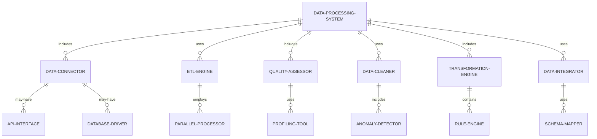

#### 交互关系图

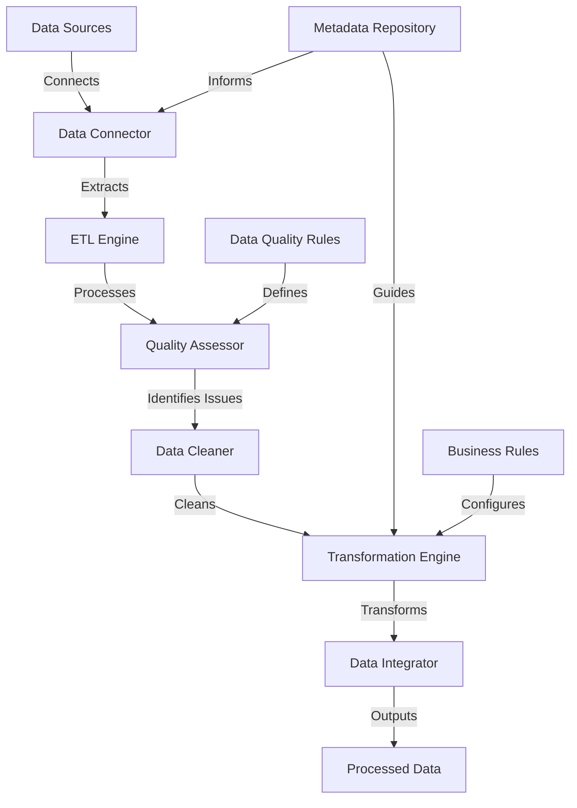

### 数学模型：

使用 Isolation Forest 算法检测异常值：

给定数据点 $x$，其异常分数定义为：

$$s(x, n) = 2^{-\frac{E(h(x))}{c(n)}}$$

其中：
- $h(x)$ 是数据点 $x$ 的路径长度
- $E(h(x))$ 是 $h(x)$ 的平均值
- $c(n)$ 是 $n$ 个点的平均路径长度

### 算法流程图：

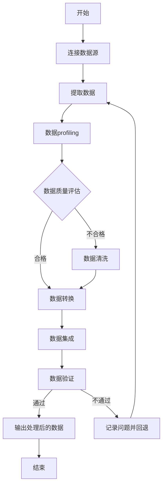

### 算法源代码：

以下是一个简化的数据源接入与预处理系统的 Python 实现示例：

```python
import pandas as pd
import numpy as np
from sklearn.impute import SimpleImputer
from sklearn.preprocessing import StandardScaler

class DataProcessor:
    def __init__(self):
        self.data = None
        self.metadata = {}

    def connect_source(self, source_type, connection_params):
        # 简化示例，实际中需要支持多种数据源类型
        if source_type == 'csv':
            self.data = pd.read_csv(connection_params['file_path'])
        elif source_type == 'database':
            # 使用 SQLAlchemy 等工具连接数据库
            pass
        self.metadata['source_type'] = source_type
        self.metadata['columns'] = list(self.data.columns)

    def profile_data(self):
        # 简单的数据profiling
        self.metadata['row_count'] = len(self.data)
        self.metadata['column_types'] = self.data.dtypes.to_dict()
        self.metadata['missing_values'] = self.data.isnull().sum().to_dict()

    def assess_quality(self):
        # 简单的质量评估
        quality_score = 1 - (sum(self.metadata['missing_values'].values()) / (self.metadata['row_count'] * len(self.metadata['columns'])))
        return quality_score

    def clean_data(self):
        # 处理缺失值
        imputer = SimpleImputer(strategy='mean')
        self.data = pd.DataFrame(imputer.fit_transform(self.data), columns=self.data.columns)

        # 处理异常值（示例：移除超过3个标准差的值）
        for column in self.data.select_dtypes(include=[np.number]).columns:
            mean = self.data[column].mean()
            std = self.data[column].std()
            self.data = self.data[(self.data[column] <= mean + 3*std) & (self.data[column] >= mean - 3*std)]

    def transform_data(self):
        # 标准化数值列
        scaler = StandardScaler()
        numeric_columns = self.data.select_dtypes(include=[np.number]).columns
        self.data[numeric_columns] = scaler.fit_transform(self.data[numeric_columns])

    def integrate_data(self):
        # 在实际应用中，这里可能涉及合并多个数据源、处理重复数据等
        pass

    def process_data(self, source_type, connection_params):
        self.connect_source(source_type, connection_params)
        self.profile_data()
        quality_score = self.assess_quality()
        
        if quality_score < 0.9:  # 假设质量阈值为0.9
            self.clean_data()
        
        self.transform_data()
        self.integrate_data()
        
        return self.data, self.metadata

# 使用示例
processor = DataProcessor()
processed_data, metadata = processor.process_data('csv', {'file_path': 'example_data.csv'})

print("Processed Data Shape:", processed_data.shape)
print("Metadata:", metadata)
```

### 实际场景应用：

1. 金融数据分析：
   - 整合多个交易系统的数据
   - 清洗和标准化金融时间序列数据

2. 客户数据整合：
   - 合并CRM、交易和社交媒体数据
   - 去重和标准化客户信息

3. IoT数据处理：
   - 接入多个传感器数据流
   - 清洗和聚合实时设备数据

4. 医疗数据管理：
   - 整合电子健康记录和实验室数据
   - 标准化和匿名化患者数据

5. 供应链数据分析：
   - 集成供应商、库存和物流数据
   - 清洗和转换多源供应链数据

### 行业发展与未来趋势：

| 时期 | 主要特征 | 代表性技术/方法 |
|------|----------|-----------------|
| 2015-2017 | 批处理ETL | Hadoop, Spark |
| 2018-2020 | 实时数据集成 | Kafka, Flink |
| 2021-2023 | 智能数据准备 | AutoML for data prep, DataOps |
| 2024及以后 | 自适应数据处理 | AI-driven data engineering, Quantum computing for data processing |

### 本章小结：

数据源接入与预处理是数据分析 Agent 的基础功能，对后续分析的质量和效率至关重要。本章讨论了实现这一功能的主要挑战、解决方案和技术实现。主要要点包括：

1. 灵活的数据源连接能力是处理多样化数据的基础。
2. 自动化的数据质量评估和清洗流程可以显著提高数据准备效率。
3. 智能化的数据转换和标准化技术能够处理复杂的数据结构。
4. 高效的数据集成方法对于创建统一的分析视图至关重要。
5. 数据隐私和安全考虑必须贯穿整个数据处理过程。

未来的数据源接入与预处理系统发展趋势可能包括：
1. 更智能的自动化数据发现和分类技术
2. 基于机器学习的高级异常检测和数据修复
3. 实时数据质量监控和自动调整
4. 跨源数据关联和语义理解能力的增强
5. 隐私保护数据处理技术的广泛应用

在实现数据源接入与预处理功能时，开发者应当注意：
1. 设计可扩展的架构，以适应不断增加的数据源和数据量
2. 实现强大的错误处理和日志机制，确保数据处理的可追溯性
3. 提供灵活的配置选项，允许用户自定义数据处理规则
4. 注重性能优化，特别是在处理大规模数据时
5. 遵守数据治理最佳实践，确保合规性和数据质量

通过不断改进的数据源接入与预处理技术，数据分析 Agent 将能够更高效、更准确地处理各种复杂的数据场景。这不仅能提高数据分析的质量和效率，还能为企业提供更可靠、更有价值的数据洞察。随着技术的进步，我们可以期待看到更智能、更自动化的数据准备解决方案，最终实现真正的智能化数据管理，为数据驱动的决策提供坚实的基础。


## 9.2 自然语言查询转 SQL

### 核心概念：

自然语言查询转 SQL 是数据分析 Agent 的一项关键功能，它允许用户使用日常语言来查询数据库，而无需了解 SQL 语法。这个功能通过自然语言处理（NLP）和机器学习技术，将用户的自然语言输入转换为结构化的 SQL 查询，从而使非技术用户也能轻松进行复杂的数据分析。

### 问题背景：

传统的数据查询方法要求用户具备 SQL 编程技能，这限制了许多业务用户直接访问和分析数据的能力。随着数据驱动决策的普及，需要一种更直观、更易用的方式来让各级用户都能进行数据查询。自然语言查询接口正是为解决这一问题而生。

### 问题描述：

在实现自然语言查询转 SQL 功能时，开发者面临以下挑战：

1. 如何准确理解用户的自然语言意图
2. 如何处理语言的歧义性和复杂性
3. 如何将自然语言映射到数据库schema和SQL语法
4. 如何处理复杂的查询逻辑（如嵌套查询、聚合函数等）
5. 如何确保生成的SQL查询的正确性和效率

### 问题解决：

通过以下步骤可以实现有效的自然语言查询转 SQL 功能：

1. 自然语言理解：
   - 使用NLP技术进行语义分析和意图识别
   - 实现命名实体识别，识别查询中的表名、列名等

2. 查询意图映射：
   - 开发意图到SQL模板的映射规则
   - 使用机器学习模型学习复杂的查询模式

3. SQL生成：
   - 实现基于模板的SQL生成器
   - 使用深度学习模型（如Seq2Seq）直接生成SQL

4. 数据库schema匹配：
   - 开发模糊匹配算法，将自然语言术语映射到数据库对象
   - 实现schema缓存和更新机制

5. 查询优化和验证：
   - 使用查询计划分析工具优化生成的SQL
   - 实现安全检查，防止恶意查询

### 边界与外延：

自然语言查询转 SQL 功能的应用范围包括：
- 商业智能工具
- 数据可视化平台
- 客户自助分析系统
- 数据科学探索工具
- 企业报告生成系统

### 概念结构与核心要素组成：

自然语言查询转 SQL 系统的核心组件：
1. 自然语言处理器
2. 意图分类器
3. 实体识别器
4. SQL生成器
5. Schema匹配器
6. 查询优化器

### 概念之间的关系：

#### 概念核心属性维度对比

| 属性 | 规则based方法 | 机器学习方法 | 深度学习方法 |
|------|---------------|--------------|--------------|
| 灵活性 | 低 | 中 | 高 |
| 准确性 | 中 | 高 | 非常高 |
| 可解释性 | 高 | 中 | 低 |
| 处理复杂查询能力 | 低 | 中 | 高 |
| 训练数据需求 | 低 | 高 | 非常高 |
| 适应新领域能力 | 低 | 中 | 高 |

#### 概念联系的ER 实体关系

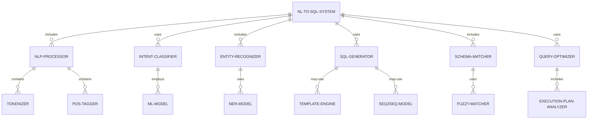

#### 交互关系图

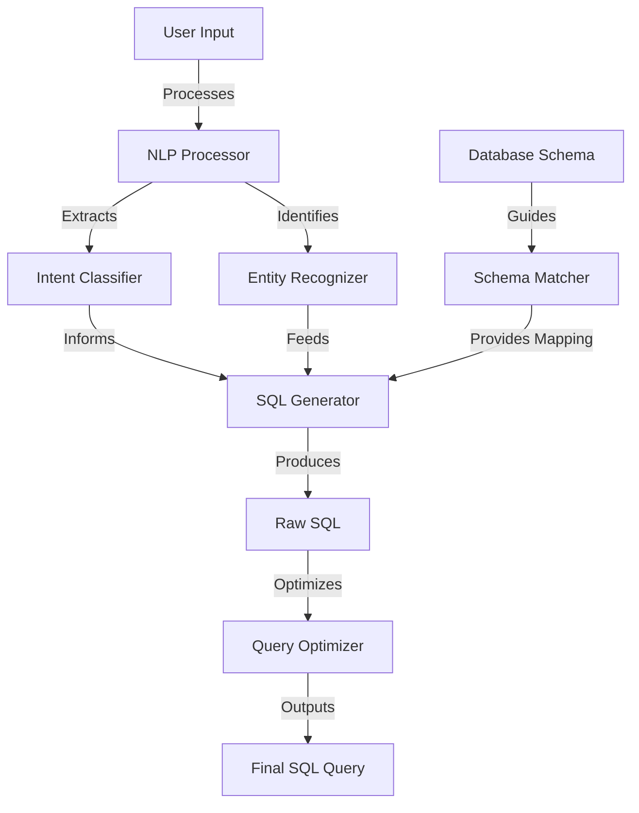

### 数学模型：

使用序列到序列（Seq2Seq）模型进行自然语言到SQL的转换：

给定输入序列 $X = (x_1, ..., x_n)$ 和目标序列 $Y = (y_1, ..., y_m)$，模型的目标是最大化条件概率：

$$P(Y|X) = \prod_{t=1}^m P(y_t|y_1, ..., y_{t-1}, X)$$

其中，每个条件概率通过注意力机制计算：

$$P(y_t|y_1, ..., y_{t-1}, X) = \text{softmax}(W_s \cdot h_t + b_s)$$

$h_t$ 是解码器在时间步 $t$ 的隐藏状态，通过注意力机制计算得到。

### 算法流程图：

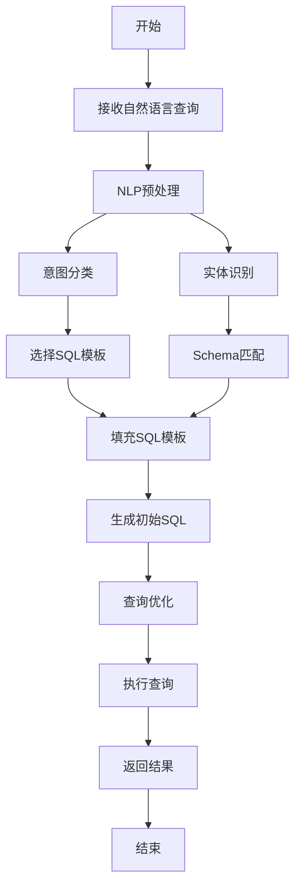

### 算法源代码：

以下是一个简化的自然语言查询转 SQL 系统的 Python 实现示例：

```python
import re
from typing import Dict, List

class NLToSQLConverter:
    def __init__(self, schema: Dict[str, List[str]]):
        self.schema = schema
        self.intent_patterns = {
            'select': r'show|display|get|find',
            'filter': r'where|with|has',
            'sort': r'order by|sort by',
            'limit': r'limit|top|first'
        }

    def parse_query(self, nl_query: str) -> Dict:
        query_parts = {
            'select': [],
            'from': '',
            'where': [],
            'order_by': [],
            'limit': None
        }

        # 识别意图和实体
        for intent, pattern in self.intent_patterns.items():
            if re.search(pattern, nl_query, re.IGNORECASE):
                if intent == 'select':
                    query_parts['select'] = self.extract_columns(nl_query)
                elif intent == 'filter':
                    query_parts['where'] = self.extract_conditions(nl_query)
                elif intent == 'sort':
                    query_parts['order_by'] = self.extract_sort(nl_query)
                elif intent == 'limit':
                    query_parts['limit'] = self.extract_limit(nl_query)

        # 识别表名
        query_parts['from'] = self.extract_table(nl_query)

        return query_parts

    def extract_columns(self, query: str) -> List[str]:
        # 简化实现，实际应使用更复杂的NLP技术
        columns = []
        for table, fields in self.schema.items():
            columns.extend([col for col in fields if col.lower() in query.lower()])
        return columns if columns else ['*']

    def extract_table(self, query: str) -> str:
        for table in self.schema.keys():
            if table.lower() in query.lower():
                return table
        return ''

    def extract_conditions(self, query: str) -> List[str]:
        # 简化实现，实际应使用更复杂的条件提取逻辑
        conditions = []
        for table, fields in self.schema.items():
            for field in fields:
                match = re.search(f"{field}\s*(=|>|<|>=|<=)\s*(\w+)", query, re.IGNORECASE)
                if match:
                    conditions.append(f"{match.group(0)}")
        return conditions

    def extract_sort(self, query: str) -> List[str]:
        sort_columns = []
        for table, fields in self.schema.items():
            for field in fields:
                if f"sort by {field}" in query.lower():
                    sort_columns.append(field)
        return sort_columns

    def extract_limit(self, query: str) -> int:
        match = re.search(r'limit|top|first\s+(\d+)', query, re.IGNORECASE)
        return int(match.group(1)) if match else None

    def generate_sql(self, query_parts: Dict) -> str:
        sql = f"SELECT {', '.join(query_parts['select'])} FROM {query_parts['from']}"
        
        if query_parts['where']:
            sql += f" WHERE {' AND '.join(query_parts['where'])}"
        
        if query_parts['order_by']:
            sql += f" ORDER BY {', '.join(query_parts['order_by'])}"
        
        if query_parts['limit']:
            sql += f" LIMIT {query_parts['limit']}"
        
        return sql

    def convert(self, nl_query: str) -> str:
        query_parts = self.parse_query(nl_query)
        return self.generate_sql(query_parts)

# 使用示例
schema = {
    'employees': ['id', 'name', 'department', 'salary'],
    'departments': ['id', 'name', 'budget']
}

converter = NLToSQLConverter(schema)

nl_query = "Show me the names and salaries of employees in the IT department where salary is greater than 50000, sorted by salary"
sql_query = converter.convert(nl_query)

print(f"Natural Language Query: {nl_query}")
print(f"Generated SQL: {sql_query}")
```

### 实际场景应用：

1. 商业智能仪表板：
   - 允许业务用户通过自然语言创建自定义报告
   - 实时转换查询以更新可视化图表

2. 客户服务聊天机器人：
   - 理解客户查询并从数据库中检索相关信息
   - 生成人性化的回复，包含查询结果

3. 数据科学探索工具：
   - 支持数据科学家快速探索大型数据集
   - 自动生成复杂的分析查询

4. 企业搜索引擎：
   - 将员工的自然语言查询转换为跨多个数据源的搜索
   - 提供结构化和非结构化数据的统一访问

5. 监管报告生成：
   - 允许合规官员使用自然语言生成复杂的监管报告
   - 自动转换查询以确保数据准确性和一致性

### 行业发展与未来趋势：

| 时期 | 主要特征 | 代表性技术/方法 |
|------|----------|-----------------|
| 2015-2017 | 基础规则匹配 | 模板based、关键词提取 |
| 2018-2020 | 机器学习应用 | 序列标注、分类模型 |
| 2021-2023 | 深度学习突破 | Transformer、BERT for NL2SQL |
| 2024及以后 | 上下文感知和多模态 | 跨模态理解、持续学习模型 |

### 本章小结：

自然语言查询转 SQL 是数据分析 Agent 的一项革命性功能，它大大降低了数据访问的门槛，使得非技术用户也能进行复杂的数据分析。本章讨论了实现这一功能的主要挑战、解决方案和技术实现。主要要点包括：

1. 准确的自然语言理解和意图识别是成功转换的基础。
2. 结合规则based方法和机器学习技术可以提高转换的准确性和灵活性。
3. 深度学习模型，特别是基于Transformer的架构，在处理复杂查询方面表现出色。
4. 有效的schema匹配和查询优化对于生成高效、准确的SQL查询至关重要。
5. 持续学习和适应新领域的能力是系统长期有效性的关键。

未来的自然语言查询转 SQL 系统发展趋势可能包括：
1. 更强大的上下文理解能力，支持多轮对话式查询
2. 跨数据源和跨语言的查询能力
3. 集成知识图谱，提供更智能的查询建议和解释
4. 自动学习和适应新的数据schema和业务术语
5. 增强的可解释性，帮助用户理解查询转换过程

在实现自然语言查询转 SQL 功能时，开发者应当注意：
1. 重视数据安全和访问控制，确保生成的查询不会泄露敏感信息
2. 提供查询结果的可视化和解释功能，增强用户体验
3. 实现查询历史和学习机制，不断改善系统性能
4. 设计友好的错误处理和反馈机制，帮助用户理解和修正查询
5. 考虑多语言支持，以适应全球化的业务需求

通过不断改进的自然语言查询转 SQL 技术，数据分析 Agent 将能够为更广泛的用户群体提供强大的数据分析能力。这不仅能提高组织的数据利用效率，还能促进数据驱动的决策文化。随着技术的进步，我们可以期待看到更智能、更直观的数据交互方式，最终实现真正的"对话式数据分析"，使每个人都能成为数据分析师。

## 9.3 数据可视化与报表生成

### 核心概念：

数据可视化与报表生成是数据分析 Agent 的关键功能，旨在将复杂的数据转化为直观、易懂的视觉表现形式，并生成结构化的报告。这个过程涉及选择适当的可视化类型、设计交互式图表，以及自动化报表生成，以便用户能够快速理解数据洞察并做出决策。

### 问题背景：

在数据驱动的决策环境中，有效地传达数据分析结果变得越来越重要。然而，面对海量和复杂的数据，传统的静态报表往往难以满足需求。用户需要更加动态、交互式的可视化工具，以及能够自动生成洞察报告的智能系统。

### 问题描述：

在实现数据可视化与报表生成功能时，开发者面临以下挑战：

1. 如何为不同类型的数据选择最合适的可视化方式
2. 如何设计既美观又信息丰富的交互式图表
3. 如何处理大规模数据的实时可视化
4. 如何自动生成有意义的数据洞察和解释
5. 如何确保可视化和报表的一致性和可定制性

### 问题解决：

通过以下步骤可以实现有效的数据可视化与报表生成：

1. 智能图表推荐：
   - 开发基于机器学习的图表类型推荐系统
   - 实现自动化的数据特征分析和可视化匹配

2. 交互式可视化设计：
   - 使用现代前端框架（如D3.js, Plotly）创建动态图表
   - 实现多维数据探索和钻取功能

3. 大规模数据可视化：
   - 采用数据采样和聚合技术
   - 实现渐进式渲染和懒加载策略

4. 自动洞察生成：
   - 使用统计分析和机器学习识别数据模式和异常
   - 开发自然语言生成（NLG）模型，生成数据解释

5. 报表模板与定制：
   - 设计灵活的报表模板系统
   - 实现用户友好的报表定制界面

### 边界与外延：

数据可视化与报表生成功能的应用范围包括：
- 商业智能仪表板
- 金融分析报告
- 科学研究数据展示
- 运营监控系统
- 市场趋势分析

### 概念结构与核心要素组成：

数据可视化与报表生成系统的核心组件：
1. 数据预处理器
2. 可视化推荐引擎
3. 图表渲染器
4. 交互控制器
5. 洞察生成器
6. 报表编排器

### 概念之间的关系：

#### 概念核心属性维度对比

| 属性 | 传统静态报表 | 交互式仪表板 | AI驱动的智能可视化 |
|------|--------------|--------------|---------------------|
| 数据更新频率 | 低 | 中-高 | 实时 |
| 交互性 | 无 | 中 | 高 |
| 个性化程度 | 低 | 中 | 高 |
| 洞察生成能力 | 无 | 有限 | 强 |
| 可扩展性 | 低 | 中 | 高 |
| 学习能力 | 无 | 有限 | 持续学习 |

#### 概念联系的ER 实体关系

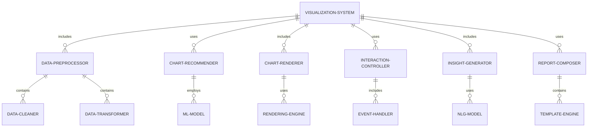

#### 交互关系图

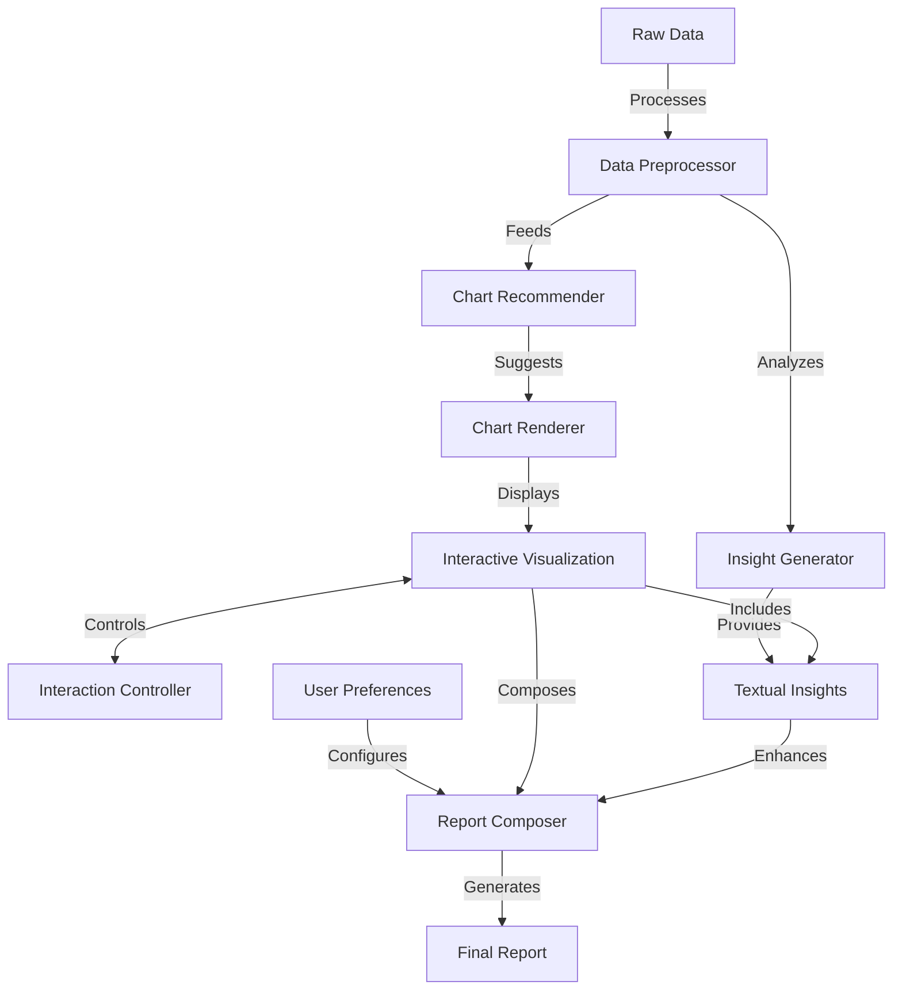

### 数学模型：

使用主成分分析（PCA）进行高维数据可视化：

给定数据矩阵 $X$，计算协方差矩阵：

$$C = \frac{1}{n-1}(X - \bar{X})^T(X - \bar{X})$$

求解特征值方程：

$$C v = \lambda v$$

选择最大的k个特征值对应的特征向量作为主成分，投影数据：

$$Y = X W$$

其中 $W$ 是由k个主成分组成的矩阵。

### 算法流程图：

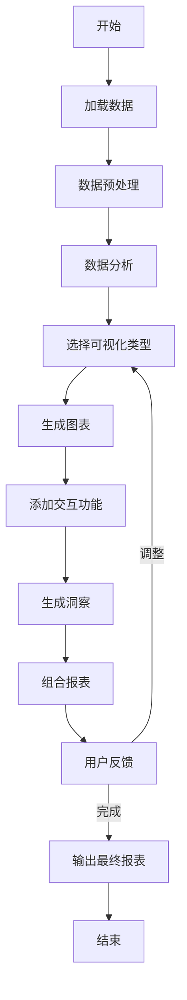

### 算法源代码：

以下是一个简化的数据可视化与报表生成系统的 Python 实现示例：

```python
import pandas as pd
import matplotlib.pyplot as plt
import seaborn as sns
from sklearn.decomposition import PCA

class DataVisualizer:
    def __init__(self):
        self.data = None
        self.insights = []

    def load_data(self, file_path):
        self.data = pd.read_csv(file_path)

    def preprocess_data(self):
        # 简单的预处理：删除缺失值和标准化数值列
        self.data = self.data.dropna()
        numeric_columns = self.data.select_dtypes(include=['float64', 'int64']).columns
        self.data[numeric_columns] = (self.data[numeric_columns] - self.data[numeric_columns].mean()) / self.data[numeric_columns].std()

    def analyze_data(self):
        # 简单的数据分析：计算相关性和基本统计
        correlation = self.data.corr()
        self.insights.append(f"Strongest correlation: {correlation.unstack().sort_values(ascending=False)[1]}")
        
        for column in self.data.columns:
            if self.data[column].dtype in ['float64', 'int64']:
                mean = self.data[column].mean()
                std = self.data[column].std()
                self.insights.append(f"{column}: Mean = {mean:.2f}, Std = {std:.2f}")

    def visualize_data(self):
        # 创建几种基本的可视化
        fig, axes = plt.subplots(2, 2, figsize=(15, 15))

        # 散点图
        sns.scatterplot(data=self.data, x=self.data.columns[0], y=self.data.columns[1], ax=axes[0, 0])
        axes[0, 0].set_title("Scatter Plot")

        # 直方图
        self.data[self.data.columns[0]].hist(ax=axes[0, 1])
        axes[0, 1].set_title("Histogram")

        # 箱线图
        sns.boxplot(data=self.data, ax=axes[1, 0])
        axes[1, 0].set_title("Box Plot")

        # 热力图
        sns.heatmap(self.data.corr(), ax=axes[1, 1])
        axes[1, 1].set_title("Correlation Heatmap")

        plt.tight_layout()
        plt.savefig("data_visualization.png")

    def generate_pca_plot(self):
        # 使用PCA进行降维可视化
        numeric_data = self.data.select_dtypes(include=['float64', 'int64'])
        pca = PCA(n_components=2)
        pca_result = pca.fit_transform(numeric_data)

        plt.figure(figsize=(10, 8))
        plt.scatter(pca_result[:, 0], pca_result[:, 1])
        plt.title("PCA Visualization")
        plt.xlabel("First Principal Component")
        plt.ylabel("Second Principal Component")
        plt.savefig("pca_visualization.png")

    def generate_report(self):
        report = "Data Analysis Report\n"
        report += "=====================\n\n"
        report += "Insights:\n"
        for insight in self.insights:
            report += f"- {insight}\n"
        report += "\nVisualizations have been saved as separate image files."
        
        with open("data_report.txt", "w") as f:
            f.write(report)

    def run_analysis(self, file_path):
        self.load_data(file_path)
        self.preprocess_data()
        self.analyze_data()
        self.visualize_data()
        self.generate_pca_plot()
        self.generate_report()

# 使用示例
visualizer = DataVisualizer()
visualizer.run_analysis("example_data.csv")
print("Analysis complete. Check the generated report and visualization files.")
```

### 实际场景应用：

1. 金融分析仪表板：
   - 实时显示市场趋势和投资组合表现
   - 生成自动化的风险评估报告

2. 销售性能追踪：
   - 可视化销售漏斗和转化率
   - 自动识别表现最佳和需要改进的领域

3. 医疗数据分析：
   - 可视化患者数据和治疗效果
   - 生成个性化的健康报告和建议

4. 社交媒体分析：
   - 展示用户参与度和内容表现
   - 自动生成内容策略建议

5. 供应链优化：
   - 可视化库存水平和物流效率
   - 生成预测性的需求和供应报告

### 行业发展与未来趋势：

| 时期 | 主要特征 | 代表性技术/方法 |
|------|----------|-----------------|
| 2015-2017 | 基础交互式可视化 | D3.js, Tableau |
| 2018-2020 | 智能推荐和自动化 | 机器学习based图表推荐 |
| 2021-2023 | AI驱动的洞察生成 | NLG, 自动化数据故事 |
| 2024及以后 | 沉浸式和预测性可视化 | AR/VR, 预测分析集成 |

### 本章小结：

数据可视化与报表生成是数据分析 Agent 的核心功能，它将复杂的数据转化为直观、易懂的视觉表现形式，并生成有洞察力的报告。本章讨论了实现这一功能的主要挑战、解决方案和技术实现。主要要点包括：

1. 智能图表推荐能显著提高可视化的效率和质量。
2. 交互式设计对于深入探索数据和发现洞察至关重要。
3. 大规模数据可视化需要特殊的技术来确保性能和用户体验。
4. 自动化洞察生成可以帮助用户快速理解数据的关键点。
5. 灵活的报表定制能力对于满足不同用户需求非常重要。

未来的数据可视化与报表生成系统发展趋势可能包括：
1. 更智能的上下文感知可视化，自动适应用户的分析目标
2. 增强现实（AR）和虚拟现实（VR）技术在数据可视化中的应用
3. 自然语言交互界面，允许用户通过对话来创建和修改可视化
4. 更强大的预测性分析集成，提供前瞻性的数据洞察
5. 协作式可视化平台，支持团队共同分析和讨论数据

在实现数据可视化与报表生成功能时，开发者应当注意：
1. 注重可视化的准确性和可解释性，避免误导性的表达
2. 设计直观且易于使用的用户界面，降低学习曲线
3. 考虑不同设备和屏幕尺寸的适配性，确保良好的移动体验
4. 实现强大的性能优化，特别是在处理大规模数据集时
5. 遵守数据隐私和安全规定，特别是在处理敏感信息时

通过不断改进的数据可视化与报表生成技术，数据分析 Agent 将能够更有效地传达复杂的数据洞察，使各级用户都能快速理解和行动。这不仅能提高决策的质量和速度，还能促进整个组织的数据文化。随着技术的进步，我们可以期待看到更智能、更直观、更个性化的数据可视化解决方案，最终实现数据的民主化，让每个人都能轻松地从数据中获取价值。

## 9.4 异常检测与预警

### 核心概念：

异常检测与预警是数据分析 Agent 的关键功能，旨在自动识别数据中的异常模式或行为，并及时发出警报。这个功能涉及使用统计方法、机器学习算法和深度学习技术来检测偏离正常范围的数据点或趋势，从而帮助组织预防潜在问题、识别机会或应对紧急情况。

### 问题背景：

在复杂的业务环境中，及时发现异常情况对于维护系统稳定、防范风险和把握机会至关重要。然而，面对海量的实时数据流，人工监控变得几乎不可能。因此，需要一个智能系统来自动化异常检测过程，并提供及时、准确的预警。

### 问题描述：

在实现异常检测与预警功能时，开发者面临以下挑战：

1. 如何定义和识别不同类型的异常（点异常、上下文异常、集合异常）
2. 如何处理高维数据和复杂的时间序列
3. 如何平衡检测的敏感性和误报率
4. 如何处理数据的季节性和趋势性变化
5. 如何实现实时检测和快速响应

### 问题解决：

通过以下步骤可以实现有效的异常检测与预警功能：

1. 数据预处理：
   - 实现数据清洗和标准化
   - 处理缺失值和异常值

2. 特征工程：
   - 提取时间序列特征（如滚动统计量）
   - 降维技术处理高维数据

3. 模型选择与训练：
   - 使用统计方法（如Z-score, IQR）进行基础检测
   - 实现机器学习模型（如Isolation Forest, One-Class SVM）
   - 应用深度学习方法（如自编码器）处理复杂模式

4. 阈值设定：
   - 实现动态阈值调整机制
   - 使用ROC曲线优化检测性能

5. 实时监控系统：
   - 开发流处理架构（如Apache Kafka, Flink）
   - 实现高效的数据流异常检测算法

6. 预警机制：
   - 设计多级预警系统
   - 实现智能报警聚合和抑制

### 边界与外延：

异常检测与预警功能的应用范围包括：
- 网络安全监控
- 金融欺诈检测
- 工业设备故障预测
- 医疗健康监测
- 商业运营异常识别

### 概念结构与核心要素组成：

异常检测与预警系统的核心组件：
1. 数据收集器
2. 预处理模块
3. 特征提取器
4. 异常检测引擎
5. 阈值管理器
6. 预警生成器

### 概念之间的关系：

#### 概念核心属性维度对比

| 属性 | 统计方法 | 机器学习方法 | 深度学习方法 |
|------|----------|--------------|--------------|
| 处理复杂性 | 低 | 中 | 高 |
| 可解释性 | 高 | 中 | 低 |
| 适应性 | 低 | 中 | 高 |
| 计算资源需求 | 低 | 中 | 高 |
| 处理高维数据能力 | 低 | 中 | 高 |
| 实时性能 | 高 | 中 | 低-中 |

#### 概念联系的ER 实体关系

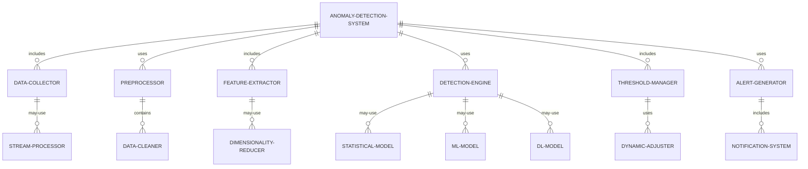

#### 交互关系图

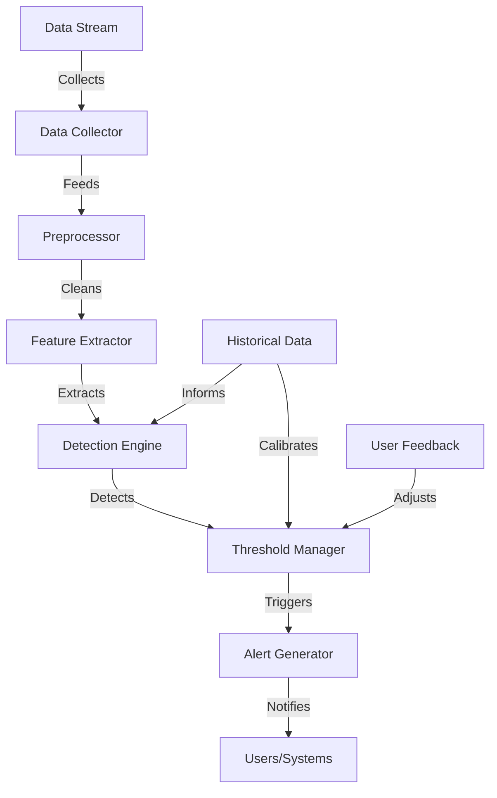

### 数学模型：

使用隔离森林（Isolation Forest）进行异常检测：

给定数据点 $x$，其异常分数定义为：

$$s(x, n) = 2^{-\frac{E(h(x))}{c(n)}}$$

其中：
- $h(x)$ 是数据点 $x$ 的平均路径长度
- $E(h(x))$ 是 $h(x)$ 的期望值
- $c(n)$ 是样本大小为 $n$ 的二叉搜索树的平均路径长度

$c(n)$ 可以通过以下公式近似：

$$c(n) = 2H(n-1) - (2(n-1)/n)$$

其中 $H(i)$ 是第 $i$ 个调和数。

### 算法流程图：

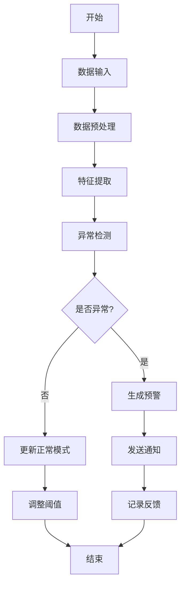

### 算法源代码：

以下是一个简化的异常检测与预警系统的 Python 实现示例：

```python
import numpy as np
from sklearn.ensemble import IsolationForest
from sklearn.preprocessing import StandardScaler

class AnomalyDetector:
    def __init__(self, contamination=0.1):
        self.scaler = StandardScaler()
        self.model = IsolationForest(contamination=contamination, random_state=42)
        self.is_fitted = False

    def preprocess(self, data):
        return self.scaler.fit_transform(data)

    def fit(self, data):
        preprocessed_data = self.preprocess(data)
        self.model.fit(preprocessed_data)
        self.is_fitted = True

    def predict(self, data):
        if not self.is_fitted:
            raise Exception("Model is not fitted yet. Call fit() first.")
        preprocessed_data = self.scaler.transform(data)
        return self.model.predict(preprocessed_data)

    def detect_anomalies(self, data, threshold=-0.5):
        predictions = self.predict(data)
        anomaly_scores = self.model.score_samples(self.scaler.transform(data))
        anomalies = predictions == -1
        severe_anomalies = anomaly_scores < threshold
        return anomalies, severe_anomalies, anomaly_scores

class AlertSystem:
    def __init__(self):
        self.alerts = []

    def generate_alert(self, timestamp, anomaly_score, data_point):
        alert = f"ALERT: Anomaly detected at {timestamp}. Score: {anomaly_score:.2f}. Data: {data_point}"
        self.alerts.append(alert)
        print(alert)

    def get_recent_alerts(self, n=5):
        return self.alerts[-n:]

def simulate_data_stream(n_samples=1000, n_features=5):
    normal_data = np.random.randn(n_samples, n_features)
    anomalies = np.random.uniform(low=-4, high=4, size=(n_samples // 20, n_features))
    data = np.vstack((normal_data, anomalies))
    np.random.shuffle(data)
    return data

# 使用示例
detector = AnomalyDetector(contamination=0.05)
alert_system = AlertSystem()

# 模拟数据流
data_stream = simulate_data_stream()

# 使用前500个样本训练模型
detector.fit(data_stream[:500])

# 对剩余数据进行异常检测
for i, data_point in enumerate(data_stream[500:], start=500):
    anomalies, severe_anomalies, scores = detector.detect_anomalies(data_point.reshape(1, -1))
    if severe_anomalies[0]:
        alert_system.generate_alert(i, scores[0], data_point)

print("\nRecent Alerts:")
for alert in alert_system.get_recent_alerts():
    print(alert)
```

### 实际场景应用：

1. 金融欺诈检测：
   - 实时监控交易数据，识别可疑模式
   - 生成多级别警报，支持快速响应

2. 工业设备监控：
   - 分析传感器数据，预测潜在故障
   - 发送预防性维护警报，减少停机时间

3. 网络安全：
   - 检测异常网络流量和访问模式
   - 触发自动防御机制，阻止潜在攻击

4. 医疗健康监测：
   - 分析患者生命体征数据，识别健康风险
   - 向医疗团队发送及时警报，支持早期干预

5. 供应链管理：
   - 监控库存水平和物流数据，识别异常波动
   - 预警潜在的供应中断或需求激增

### 行业发展与未来趋势：

| 时期 | 主要特征 | 代表性技术/方法 |
|------|----------|-----------------|
| 2015-2017 | 基于规则的检测 | 统计方法、阈值based警报 |
| 2018-2020 | 机器学习应用 | 无监督学习、集成方法 |
| 2021-2023 | 深度学习和实时处理 | LSTM、GAN for异常检测 |
| 2024及以后 | 自适应和预测性检测 | 强化学习、因果推理 |

### 本章小结：

异常检测与预警是数据分析 Agent 的重要功能，它能够自动识别数据中的异常模式并及时发出警报。本章讨论了实现这一功能的主要挑战、解决方案和技术实现。主要要点包括：

1. 有效的异常检测需要结合统计方法、机器学习和深度学习技术。
2. 特征工程和数据预处理对于提高检测准确性至关重要。
3. 平衡检测敏感性和误报率是系统设计的关键挑战。
4. 实时处理和快速响应能力对于实际应用至关重要。
5. 动态阈值调整和智能报警机制可以提高系统的适应性和可用性。

未来的异常检测与预警系统发展趋势可能包括：
1. 更强大的上下文感知能力，考虑多源数据和外部因素
2. 自适应学习算法，能够持续从新数据和反馈中学习
3. 因果推理技术的应用，提供更深入的异常解释
4. 集成预测性分析，不仅检测当前异常，还预测未来可能的异常
5. 增强的可解释性，帮助用户理解异常的原因和影响

在实现异常检测与预警功能时，开发者应当注意：
1. 设计灵活的架构，以适应不同领域和数据类型的需求
2. 重视系统的可扩展性，以处理不断增长的数据量和复杂性
3. 实现有效的报警管理机制，避免报警疲劳
4. 考虑隐私和安全问题，特别是在处理敏感数据时
5. 提供用户友好的界面，便于配置、监控和分析异常

通过不断改进的异常检测与预警技术，数据分析 Agent 将能够更有效地帮助组织识别风险、把握机会并做出及时响应。这不仅能提高运营效率和安全性，还能为决策者提供宝贵的洞察。随着技术的进步，我们可以期待看到更智能、更精准、更具预见性的异常检测系统，最终实现全面的风险管理和机会识别，为组织的可持续发展提供强有力的支持。

## 9.5 数据洞察与决策建议

### 核心概念：

数据洞察与决策建议是数据分析 Agent 的高级功能，旨在从复杂的数据分析结果中提炼出有价值的见解，并提供actionable的决策建议。这个功能结合了数据挖掘、机器学习、自然语言生成（NLG）和决策理论，将原始数据转化为可理解、可执行的战略指导。

### 问题背景：

在数据驱动的决策环境中，决策者常常面临信息过载的问题。虽然有大量的数据和分析结果可用，但从中提取关键洞察并转化为具体行动计划仍然是一个挑战。数据分析 Agent 需要能够自动化这个过程，提供清晰、相关且具有战略意义的洞察和建议。

### 问题描述：

在实现数据洞察与决策建议功能时，开发者面临以下挑战：

1. 如何从海量数据中识别真正有价值的洞察
2. 如何将复杂的分析结果转化为易于理解的叙述
3. 如何生成符合特定业务背景的决策建议
4. 如何平衡短期和长期目标在决策建议中的权重
5. 如何确保洞察和建议的可解释性和可信度

### 问题解决：

通过以下步骤可以实现有效的数据洞察与决策建议功能：

1. 数据综合分析：
   - 实现多维度数据关联分析
   - 使用高级统计方法识别显著模式和趋势

2. 洞察提取：
   - 应用机器学习算法发现隐藏的关系和异常
   - 实现因果推理技术，理解数据背后的原因

3. 上下文理解：
   - 整合领域知识库，提供行业特定的解释
   - 实现时间序列分析，理解历史趋势和季节性

4. 决策模型构建：
   - 开发多目标优化模型，平衡不同决策因素
   - 实现情景分析和模拟，评估不同决策的潜在结果

5. 自然语言生成：
   - 使用NLG技术生成人性化的洞察描述
   - 实现多层次的报告生成，满足不同受众需求

6. 建议个性化：
   - 开发用户画像系统，tailored决策建议
   - 实现交互式建议调整机制，允许用户反馈

### 边界与外延：

数据洞察与决策建议功能的应用范围包括：
- 企业战略规划
- 市场营销策略制定
- 金融投资决策
- 产品开发方向选择
- 运营效率优化

### 概念结构与核心要素组成：

数据洞察与决策建议系统的核心组件：
1. 数据分析引擎
2. 洞察提取器
3. 上下文理解模块
4. 决策模型生成器
5. 自然语言生成器
6. 建议个性化引擎

### 概念之间的关系：

#### 概念核心属性维度对比

| 属性 | 传统报告 | 自动化洞察 | AI驱动决策建议 |
|------|----------|------------|-----------------|
| 深度 | 中 | 高 | 非常高 |
| 个性化程度 | 低 | 中 | 高 |
| 实时性 | 低 | 中-高 | 高 |
| 可执行性 | 中 | 中-高 | 高 |
| 适应性 | 低 | 中 | 高 |
| 创新性 | 低 | 中 | 高 |

#### 概念联系的ER 实体关系

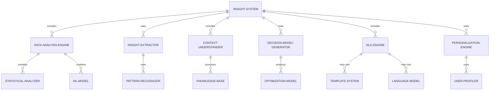

#### 交互关系图

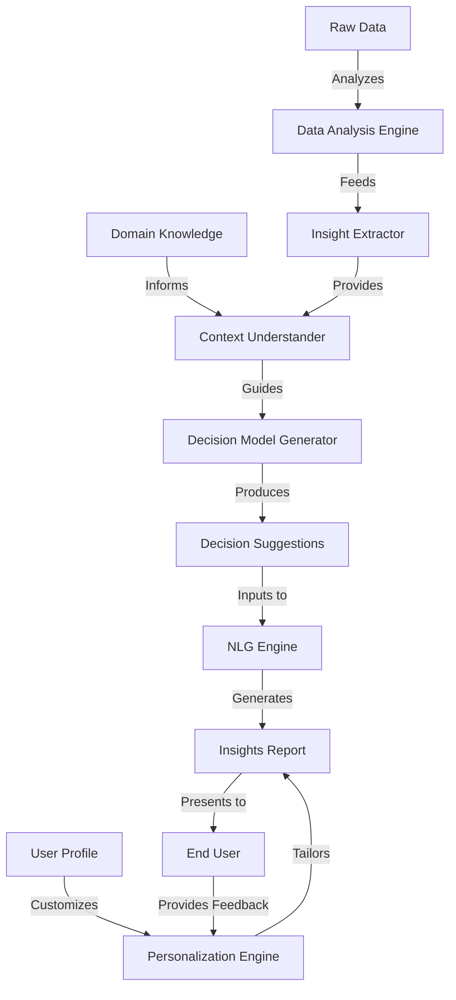

### 数学模型：

使用多目标优化模型进行决策建议生成：

$$\text{Maximize } F(x) = (f_1(x), f_2(x), ..., f_k(x))$$
$$\text{subject to } g_i(x) \leq 0, i = 1, ..., m$$
$$h_j(x) = 0, j = 1, ..., n$$

其中：
- $F(x)$ 是目标函数向量
- $f_i(x)$ 是单个目标函数
- $g_i(x)$ 和 $h_j(x)$ 是约束条件

使用帕累托最优解集来平衡多个目标。

### 算法流程图：

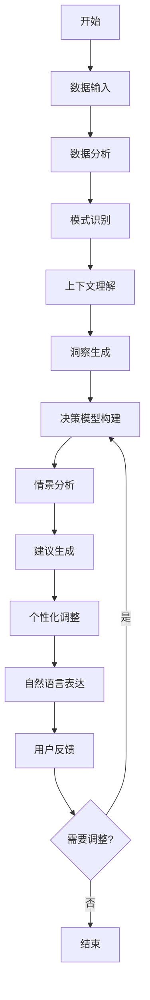

### 算法源代码：

以下是一个简化的数据洞察与决策建议系统的 Python 实现示例：

```python
import numpy as np
import pandas as pd
from sklearn.cluster import KMeans
from sklearn.preprocessing import StandardScaler

class InsightGenerator:
    def __init__(self):
        self.data = None
        self.insights = []
        self.recommendations = []

    def load_data(self, file_path):
        self.data = pd.read_csv(file_path)

    def analyze_data(self):
        # 简单的数据分析示例
        numeric_columns = self.data.select_dtypes(include=[np.number]).columns
        correlations = self.data[numeric_columns].corr()
        high_correlations = correlations[abs(correlations) > 0.7]
        
        for col1, corr_series in high_correlations.items():
            for col2, corr_value in corr_series.items():
                if col1 != col2:
                    self.insights.append(f"Strong correlation ({corr_value:.2f}) found between {col1} and {col2}")

    def cluster_analysis(self):
        # 简单的聚类分析示例
        numeric_data = self.data.select_dtypes(include=[np.number])
        scaler = StandardScaler()
        scaled_data = scaler.fit_transform(numeric_data)
        
        kmeans = KMeans(n_clusters=3, random_state=42)
        clusters = kmeans.fit_predict(scaled_data)
        
        self.data['Cluster'] = clusters
        cluster_means = self.data.groupby('Cluster').mean()
        
        for cluster, means in cluster_means.iterrows():
            significant_features = means[abs(means) > means.mean() + means.std()].index
            self.insights.append(f"Cluster {cluster} is characterized by high values in: {', '.join(significant_features)}")

    def generate_recommendations(self):
        # 简单的建议生成示例
        if 'Sales' in self.data.columns and 'Marketing_Spend' in self.data.columns:
            correlation = self.data['Sales'].corr(self.data['Marketing_Spend'])
            if correlation > 0.5:
                self.recommendations.append("Consider increasing marketing spend to potentially boost sales.")
            elif correlation < -0.5:
                self.recommendations.append("Review marketing strategies as current spend might not be effective.")

        if 'Customer_Satisfaction' in self.data.columns:
            low_satisfaction = self.data['Customer_Satisfaction'].quantile(0.25)
            if (self.data['Customer_Satisfaction'] < low_satisfaction).any():
                self.recommendations.append("Focus on improving customer satisfaction for the bottom 25% of customers.")

    def generate_report(self):
        report = "Data Insights and Recommendations Report\n"
        report += "========================================\n\n"
        
        report += "Key Insights:\n"
        for i, insight in enumerate(self.insights, 1):
            report += f"{i}. {insight}\n"
        
        report += "\nRecommendations:\n"
        for i, recommendation in enumerate(self.recommendations, 1):
            report += f"{i}. {recommendation}\n"
        
        return report

    def run_analysis(self, file_path):
        self.load_data(file_path)
        self.analyze_data()
        self.cluster_analysis()
        self.generate_recommendations()
        return self.generate_report()

# 使用示例
insight_generator = InsightGenerator()
report = insight_generator.run_analysis("example_business_data.csv")
print(report)
```

### 实际场景应用：

1. 零售业库存管理：
   - 分析销售趋势、季节性和库存周转率
   - 提供optimized库存水平和补货策略建议

2. 金融投资组合优化：
   - 评估不同资产类别的风险和回报
   - 生成个性化的投资组合调整建议

3. 医疗资源分配：
   - 分析患者流量、疾病模式和资源利用率
   - 提供医疗资源优化分配和staffing建议

4. 营销活动优化：
   - 评估不同营销渠道的效果和ROI
   - 生成针对性的营销预算分配和策略调整建议

5. 产品开发方向：
   - 分析市场趋势、客户反馈和竞争对手动态
   - 提供新产品特性优先级和开发路线图建议

### 行业发展与未来趋势：

| 时期 | 主要特征 | 代表性技术/方法 |
|------|----------|-----------------|
| 2015-2017 | 基础数据可视化和报告 | 描述性统计、简单预测模型 |
| 2018-2020 | 自动化洞察生成 | 机器学习、自然语言生成 |
| 2021-2023 | AI驱动的决策支持 | 深度学习、强化学习 |
| 2024及以后 | 认知智能决策系统 | 因果推理、集成人机智能 |

### 本章小结：

数据洞察与决策建议是数据分析 Agent 的高级功能，它将复杂的数据分析结果转化为可操作的战略指导。本章讨论了实现这一功能的主要挑战、解决方案和技术实现。主要要点包括：

1. 有效的数据洞察需要综合运用统计分析、机器学习和领域知识。
2. 决策建议生成需要考虑多个目标和约束，平衡短期和长期利益。
3. 上下文理解和个性化对于提供相关且有价值的洞察至关重要。
4. 自然语言生成技术能够大大提高洞察的可理解性和可用性。
5. 持续的用户反馈和系统学习对于提高建议质量非常重要。

未来的数据洞察与决策建议系统发展趋势可能包括：
1. 更强大的因果推理能力，提供更深入的洞察和预测
2. 集成人机智能，结合AI的分析能力和人类的直觉判断
3. 实时、动态的决策支持，适应快速变化的业务环境
4. 跨领域知识整合，提供更全面的洞察和建议
5. 增强的可解释性AI，使决策过程更透明、可信

在实现数据洞察与决策建议功能时，开发者应当注意：
1. 确保数据质量和分析方法的可靠性，这是生成有价值洞察的基础
2. 设计灵活的架构，以适应不同行业和业务场景的需求
3. 重视隐私和道德考虑，特别是在处理敏感数据和生成影响重大的建议时
4. 提供直观的用户界面，允许决策者探索和交互with洞察和建议
5. 实现持续学习和改进机制，根据用户反馈和实际决策结果不断优化系统

通过不断改进的数据洞察与决策建议技术，数据分析 Agent 将能够更有效地支持组织的战略决策过程。这不仅能提高决策的质量和速度，还能帮助组织发现新的机会和应对潜在风险。随着技术的进步，我们可以期待看到更智能、更全面、更具前瞻性的决策支持系统，最终实现真正的智能化决策，为组织的可持续发展和竞争优势提供强有力的支撑。

